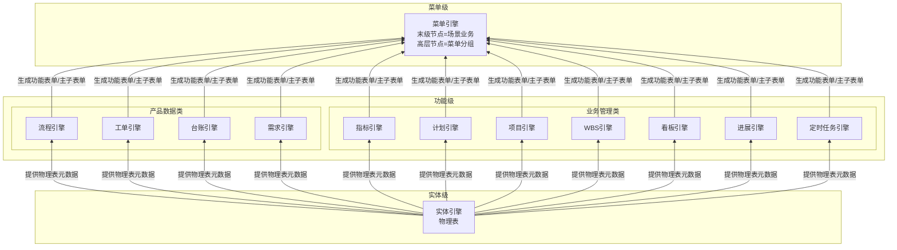

# eos平台总览及业务实现思路

**来源文档**：EOS 引擎资产 v1.23
**修订日期**：2026-07-03
**状态**：主子表单引擎→功能引擎合并——三层装配链

> **文档定位**：EOS 平台引擎资产的第1章（平台架构总览），描述四视角层级体系、三层引擎装配链、引擎职责与横切规则、场景业务及输出文档、用户界面交互模型、业务生成与引擎推导。引擎详细定义见 `25-eos-engine-models.md` §2。

---

## 业务视角层级体系

EOS 平台使用四套视角层级描述业务在不同维度上的组织结构：

| 视角 | 编号 | 自上而下 |
|------|------|---------|
| **ML**（菜单视角） | M0→M4 | 平台 → 一级菜单 → 二级菜单 → 三级菜单 → 末级菜单（→SL5） |
| **SL**（角色场景视角） | SL0→SL6 | 平台 → 业务域 → 产品类型 → 角色 → 角色职责 → 场景业务 → 场景部件/主子表单 |
| **PL**（输出产品视角） | PL0→PL5 | 平台 → 业务域 → 产品类型 → 构件 → WBS → 输出文档（→SL6） |
| **EL**（引擎视角） | EL1→EL3 | 菜单引擎 → 功能引擎 → 实体引擎 |

> 本文档聚焦 **EL**（引擎视角）和 **SL5**（场景业务）层级。其余视角层级的完整定义见 `23-eos-output-architecture.md` 和 `24-eos-business-assets.md`。

### 1.1 引擎全景

| 序号 | 引擎ID | 名称 | 层级 | 一句话定义 | 配置单元数 | 状态 |
|------|--------|------|------|-----------|-----------|------|
| 1 | @engine-entity | 实体引擎 | 实体级 | 基于数据库生成物理表，并为该物理表配置访问权限 | 9 | 待确认 |
| 2 | @engine-ledger | 台账引擎 | 功能级（产品数据类） | 基于物理表配置台账视图、查询条件、列表列和汇总规则，为物理表生成台账型功能表单 | 待填充 | 待确认 |
| 3 | @engine-requirement | 需求引擎 | 功能级（产品数据类） | 待填充 | 待填充 | 待确认 |
| 4 | @engine-flow | 流程引擎 | 功能级（产品数据类） | 配置流程节点、流转规则、审批行为和状态迁移，为物理表生成流程型功能表单 | 3 | 待确认 |
| 5 | @engine-workorder | 工单引擎 | 功能级（产品数据类） | 配置工单类型、派发规则、处理流程、验收标准和归档策略，为物理表生成工单型功能表单 | 待填充 | 待确认 |
| 6 | @engine-project | 项目引擎 | 功能级（业务管理类） | 基于物理表配置项目对象、阶段、里程碑、成员和项目状态，为物理表生成项目型功能表单 | 待填充 | 待确认 |
| 7 | @engine-wbs | WBS 引擎 | 功能级（业务管理类） | 基于物理表配置 WBS 层级、分解规则、节点属性和进度汇总方式，为物理表生成 WBS 型功能表单 | 待填充 | 待确认 |
| 8 | @engine-task | 计划引擎 | 功能级（业务管理类） | 基于物理表配置计划任务、时间约束、依赖关系和执行状态，为物理表生成计划型功能表单 | 待填充 | 待确认 |
| 9 | @engine-kanban | 看板引擎 | 功能级（业务管理类） | 基于物理表配置看板视图、卡片布局、状态泳道和筛选规则，为物理表生成看板型功能表单 | 待填充 | 待确认 |
| 10 | @engine-indicator | 指标引擎 | 功能级（业务管理类） | 配置指标维度、度量口径、聚合规则和展示方式，为物理表生成指标型功能表单 | 3 | 待确认 |
| 11 | @engine-progress | 进展引擎 | 功能级（业务管理类） | 基于物理表配置进展填报、进度口径、状态更新和进展记录，为物理表生成进展型功能表单 | 待填充 | 待确认 |
| 12 | @engine-scheduler | 定时任务引擎 | 功能级（业务管理类） | 基于物理表配置定时触发规则、任务事件和执行策略，为物理表生成定时任务型功能表单 | 待填充 | 待确认 |
| 13 | @engine-menu | 菜单引擎 | 菜单级 | 配置菜单树节点：非末级节点定义所属节点、显示顺序、可见性和可达性权限；末级节点定义所包含的主子表单部件、显示顺序和依赖关系（即场景业务），以及节点可见性和可达性权限 | 1 | 待确认 |

| 统计 | 引擎资产项 13 | 配置单元类型数 22 | 自研 13 | 外购 0 | 自研+外购 0 | 待确认 13 | 已确认 0 | 废弃 0 |
|------|---------|------------------|--------|--------|-------------|----------|----------|--------|

> **EL 层级说明**：EL 三层中，「功能引擎」是层级（EL2）而非独立引擎资产。§1.1 表中 11 个具体功能引擎（台账/需求/流程/工单/项目/WBS/计划/看板/指标/进展/定时任务）均归属功能级，共享功能引擎层级的表单能力与组装能力。菜单引擎（EL1）和实体引擎（EL3）同时是层级名称和该层级唯一的引擎资产。

### 1.2 引擎层次关系

**图1：引擎装配层次**



**图2：三层装配链文本图**

```text
实体引擎 ──→ 物理表
  │
  └── 功能引擎 ──→ 功能表单 / 主子表单
        │
        └── 菜单引擎 ──→ 菜单树高层节点 + 末级菜单（场景业务）
```

三层引擎自底向上逐级装配：实体引擎产出物理表，功能引擎将其转换为功能表单并按主子关系组装为主子表单，菜单引擎编排场景业务并生成菜单树。上层消费下层产物，逐级递进。

---

### 1.3 引擎职责与横切规则

**实体引擎**：

- 基于数据库生成物理表，并为物理表配置行/列级数据访问权限。
- 物理表是功能引擎和菜单引擎的元数据基础。

**功能引擎**：

- 将物理表转换为功能表单——功能表单以一定样式展现，并使得物理表中的数据具有运算、流转和被操作的能力。
- 承载三方面能力：① 表单能力——表单结构/字段/布局/校验/行为/发布，是各具体功能引擎的共享展现基础设施；② 功能能力——各具体功能引擎为功能表单增加的功能；③ 组装能力——将一组（1+N 个，N≥0）功能表单按主子业务关系组装为主子表单，基于主表单行数据内容匹配子表单显示规则，动态确定展示子表单集合，支持双击下钻和持续下钻。
- 功能引擎分为两个子类（仅为分类口径，非独立引擎资产）：
  - **产品数据类**：台账引擎、需求引擎、流程引擎、工单引擎。支撑各类产品数据的开发与管理；同一功能引擎所支撑的不同类型产品数据，一般对应不同实体。
  - **业务管理类**：项目引擎、WBS 引擎、计划引擎、看板引擎、指标引擎、进展引擎、定时任务引擎。支撑过程管理数据的生成与管理；同一功能引擎支撑的管理数据，一般对应同一实体。

**菜单引擎**（含场景编排）：

- **非末级节点**：定义所属父节点、显示顺序、可见性和可达性权限。
- **末级节点**：定义所包含的主子表单部件、显示顺序和依赖关系——此主子表单序列称为**场景业务**（SL5）；同时定义该末级节点的可见性和可达性权限。
- 场景业务定义后，菜单引擎生成并维护多级菜单树，控制角色/人员的导航可达性。

**权限归属**：

- 菜单节点对角色/人员的可见或不可见规则，由菜单引擎承载。
- 物理表数据行或列对角色/人员的权限，由实体引擎承载。

**配置单元选配模型**：每个引擎包含若干配置单元（可独立选配的 IPO），部分配置单元即可让业务运行——引擎提供能力池，配置人员按业务需要从中挑选组合，非全量必配。

---

### 1.4 场景业务及输出文档

STR-F（相关方功能需求架构末级节点）以场景业务为组织单元。每个 STR-F 对应一条场景业务，内部为一组有先后流转依赖的**输出文档序列**。

场景业务由菜单引擎的末级节点编排支撑——末级节点定义所包含的主子表单部件、显示顺序和依赖关系，此主子表单序列即场景业务（SL5）。菜单引擎对每条场景业务无条件支撑，无需判定。

```
场景业务
  │
  ├── 输出文档1
  ├── 输出文档2
  ├── 输出文档3
  ├── ...
  └── 输出文档N
```

**输出文档**是 STR-F 的组成单元。输出文档按业务输出物形态判定文档类型、开发方式和候选引擎支撑链，一个文档只对应一种文档类型。文档之间有先后依赖和流转关系。

输出文档按生成方式分为两类：

**内置 CAX**（平台内引擎生成）：输出文档的内容由 EOS 功能引擎直接生成，用户在平台上操作引擎界面完成。其条目化内容沿三层装配链逐级生成——对应一个物理表（实体引擎），物理表转换为功能表单并由功能引擎按主子关系组装为主子表单。例如：流程引擎生成审批记录、台账引擎生成台账数据、指标引擎生成指标值。

**外置 CAX**（平台外工具生成）：输出文档由平台外部 CAX 工具生成，用户在 CAX 工具中完成实质转换。文档以文件名及附件形式回传至 EOS 平台，平台负责管理其任务、状态、责任人、版本、附件、评审和归档。

两种方式对应不同的引擎支撑链和配置单元选配剖面，不需要新引擎类型。

**STR-F 的两种类型**（由 AI 根据 OR 语义判定，同一角色可同时有两种类型）：

| 类型 | 识别词 |
|------|--------|
| **执行类（D）** | OR 描述执行活动——创建/提交/审批/交付/验收等动作词 |
| **管理类（PCA）** | OR 描述管理活动——计划/监控/分析/纠正/识别等动作词 |

**执行类（D）场景业务**：覆盖从需求提出到需求满足的完整链路，文档之间有明确的输入-输出传递关系，串行推进。端到端闭环标准为 **D 闭合**——从需求提出到需求被满足，无缺失环节。输出文档由产品数据类功能引擎（台账/需求/流程/工单）为主支撑。例如：

- 系统设计：原始需求→相关方需求→业务架构→产品架构
- 构件开发：构件方案→构件代码/图纸/工艺→测试方案/工艺→测试报告
- 物料采购：物料需求计划→采购订单→采购合同→物料接收记录→物料检验记录→物料入库记录

**管理类（PCA）场景业务**：覆盖策划→监控→改进的管理闭环，文档序列以管理对象为锚点，监控文档指回策划文档，改进文档源自监控发现。端到端闭环标准为 **PCA 闭合**——从目标提出到目标被实现，无缺失环节。输出文档由业务管理类功能引擎（项目/WBS/计划/看板/指标/进展/定时任务）为主支撑。例如：

- 策划：计划清单、指标清单
- 监控：计划进展、指标值、问题清单、风险清单
- 改进：行动项（计划）清单、个人和组织绩效评价

两类场景业务的输出文档在功能引擎组装时，其功能表单可互为子表单。例如：WBS（管理类）的子业务可以是产品数据文档（执行类），零部件清单（执行类）也可下挂检验计划（管理类）作为子表单。通过主子表单的交叉嵌套，执行类与管理类不是两条平行线，而是管理驱动业务、业务承载管理的融合闭环。

---

### 1.5 用户界面

用户单击菜单引擎发布的末级菜单进入场景业务，运行时 UI 遵循以下交互模型：

**初始态**：浏览器窗口为**单窗全宽**，顶部多 TAB 对应场景业务下的多个主子表单；选中一行数据双击可下钻。

```
┌─────────────────────────────────────────────────────────┐
│ [TAB: 主子表单A] [TAB: 主子表单B] [TAB: 主子表单C]      │
│                                                         │
│  ┌───────────────────────────────────────────────┐      │
│  │ 主表单（列表/树表）                              │      │
│  │ ┌────┬────┬────┬────┐                         │      │
│  │ │行1 │    │    │    │                         │      │
│  │ │行2*│ ← 双击选中行                              │      │
│  │ │行3 │    │    │    │                         │      │
│  │ └────┴────┴────┴────┘                         │      │
│  └───────────────────────────────────────────────┘      │
│                                                         │
│  底部导航面包屑：场景业务 > 主子表单A                     │
└─────────────────────────────────────────────────────────┘
```

**分屏态**（下钻触发）：双击主表单行数据 → 窗口分裂为左右双窗。左窗为原主子表单（变窄），右窗显示选中行数据的子表单；右窗 TAB 对应子业务，每个关联实体占一个 TAB。

```
┌───────────────────────┬─────────────────────────────────┐
│ 左窗（原窗变窄）        │ 右窗（新开）                     │
│                       │                                 │
│ [TAB: 主子表单A]      │ [TAB: 子业务X] [TAB: 子业务Y]    │
│ ┌──────────────┐      │ ┌─────────────────────────┐     │
│ │行1           │      │ │ 选中行的子业务数据         │     │
│ │行2*          │      │ │ ┌────┬────┬────┬────┐   │     │
│ │行3           │      │ │ │行a │    │    │    │   │     │
│ └──────────────┘      │ │ │行b*│ ← 可继续双击下钻     │     │
│                       │ │ └────┴────┴────┴────┘   │     │
│                       │ └─────────────────────────┘     │
│                       │                                 │
│ 导航：场景业务 > 主子表单A│ 导航：场景业务 > 主子表单A      │
│                       │       > 子业务X                 │
└───────────────────────┴─────────────────────────────────┘
```

**持续下钻**：在右窗双击行 → 右窗移至左窗，新子业务 TAB 出现在右窗位置。可一直下钻直至系统下钻层级数限制。

```
┌───────────────────────┬─────────────────────────────────┐
│ 左窗：子业务X          │ 右窗：子子业务Z                   │
│ ...                   │ ...                             │
└───────────────────────┴─────────────────────────────────┘
```

**面包屑导航**：页面底部常驻导航条，显示当前层级路径，支持双击任意节点跳转至该层级。

```
场景业务 > 主子表单A > 子业务X > 子子业务Z
```

**交互规则**：

| 规则 | 说明 |
|------|------|
| 初始单窗 | 进入场景业务时为单窗全宽，不下钻不分屏 |
| 主子表单 TAB | 顶部 TAB 对应该场景业务下的多个主子表单 |
| 首次下钻 | 在主表单双击某一行数据触发分屏，右窗显示子表单数据 |
| 递归下钻 | 右窗→左窗，新右窗出现，直到系统层级数限制 |
| 面包屑导航 | 底部常驻，显示当前层级路径；双击任意节点跳转至该层级 |
| 子表单显示规则 | 功能引擎基于主表单行数据内容匹配规则，动态确定展示子表单集合 |

---

### 1.6 业务生成与引擎推导

**三层装配链**（自底向上）：

- **物理表**（实体引擎）→ **功能表单 / 主子表单**（功能引擎）→ **场景业务 + 菜单树**（菜单引擎）
- 每一层引擎消费上一层的产物，生成下一层的输入，逐级装配直至平台可发布的末级菜单。

**输出文档推导**（自顶向下）：

STR-F 架构末级节点是场景业务，场景业务由输出文档序列细化定义——每个输出文档描述一件业务输出物的内容、流转关系和功能需求。输出文档按是否条目化且在 EOS 平台上运行管理，分两条路径推导其支撑引擎链：

**内置 CAX**（输出文档条目化且在 EOS 平台运行管理）——沿三层装配链逐级推导：

- **文档内容 → 实体引擎**：输出文档的条目化内容对应一个物理表，由实体引擎生成并配置访问权限。
- **物理表 → 功能引擎**：物理表由功能引擎转换为功能表单，按文档内容需求确定支撑其功能集的具体功能引擎；若该输出文档与其他文档存在主子业务关系，由功能引擎将对应的功能表单按1+N组装为主子表单。

**外置 CAX**（输出文档非条目化或不在 EOS 平台管理）——文档以文件名及附件形式存在于 EOS 平台，简化装配链：

- **承载表单 → 计划引擎**：输出文档挂接到计划功能表单，由计划引擎作为承载型主表单，管理其任务、状态、责任人、版本、附件、评审和归档。
- **附件能力 → 实体引擎**：附件能力由实体引擎的内置子业务配置单元（`@entity-cu-builtin-subbiz`）提供。
- **组装 → 功能引擎**：计划功能表单作为主表单，N=0（无额外功能表单作为子表单），由功能引擎按1+N组装为主子表单。

**汇聚**：无论内置或外置 CAX，全部主子表单序列由菜单引擎末级节点编排，并生成平台菜单入口。
