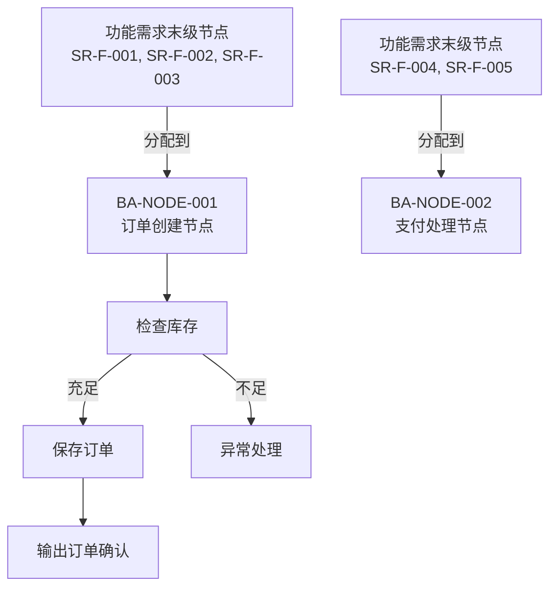
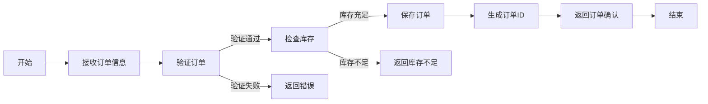

# 准则 2：功能需求→业务架构分配准则

**目的**：将规范化和分解后的功能需求末级节点分配到业务架构承接层的节点，确保每条功能需求有唯一的业务承接点，业务架构完全承接功能需求

**适用场景**：新增功能需求的业务架构设计

**重要说明**：本准则仅处理功能需求的分配。非功能需求不经过业务架构，直接在系统需求层面标记为系统约束（详见准则 1 第 4 节）

---

## 一、核心概念

### 1.1 分配 vs 映射

**分配**（推荐）：
- 主动设计BA承接层节点
- 然后将SR末级节点分配给它
- 体现了"配置优于开发"的原则
- 确保BA的设计与业务需求相匹配

**映射**（被动）：
- 被动地将SR末级节点映射到现有BA节点
- 可能导致BA设计与业务需求不匹配

### 1.2 BA承接层的定义

**BA承接层**：
- 直接承接功能需求末级节点的BA节点层级
- 由业务组件和引擎组件组成
- 业务组件：由引擎组件以UI配置方式生成
- 引擎组件：业务平台提供的基础引擎

**关键特征**：
- ✅ 与功能需求末级节点有N:1多对一映射关系
- ✅ 每条功能需求末级节点只能分配给一个BA承接层节点（1:1约束）
- ✅ 有明确的输入（功能需求末级节点）和输出（业务能力）
- ✅ 可以被追踪和管理
- ✅ 代表用户视角下的业务流程和业务规则

### 1.3 多对一映射的优势

```
多对一映射的好处：简化变更影响分析

❌ 多对多（复杂）：
   SR-001 ──┐
   SR-002 ──┼─→ BA-001
   SR-003 ──┤
            └─→ BA-002
   
   问题：SR-001 变更 → 影响 BA-001 和 BA-002
        → 需要分析多个下游节点
        → 变更影响域不清晰

✅ 多对一（简洁）：
   SR-001 ──┐
   SR-002 ──┼─→ BA-001
   SR-003 ──┘
   
   优点：SR-001 变更 → 只影响 BA-001
        → 变更影响域清晰
        → 便于分析和管理
```

---

## 二、BA承接层节点的设计要求

### 2.1 节点属性

每个BA承接层节点必须包含以下属性：

| 属性 | 要求 | 示例 |
|------|------|------|
| **节点 ID** | 唯一标识符 | BA-NODE-001 |
| **节点名称** | 业务组件或引擎组件名称 | 订单创建流程 |
| **节点类型** | 业务组件或引擎组件 | 业务组件（流程引擎配置） |
| **节点描述** | 节点的业务功能和职责 | 负责用户订单的创建、验证和保存 |
| **承接的功能需求末级节点** | 分配到此节点的功能需求 | SR-F-001, SR-F-002, SR-F-003 |
| **参与角色** | 涉及的业务角色 | 销售、客户、库存管理员 |
| **业务流程** | 详细的流程描述或流程图 | Mermaid 流程图 |
| **输入** | 节点的输入内容 | 订单信息（客户、产品、数量等） |
| **输出** | 节点的输出内容 | 订单 ID、订单状态、确认信息 |
| **关键决策点** | 流程中的重要决策 | 库存充足判断、价格审批等 |
| **异常处理** | 异常情况和处理方式 | 库存不足、客户信息不完整等 |

### 2.2 节点设计检查清单

- [ ] 节点是否代表一个完整的业务能力或业务流程？
- [ ] 节点的边界是否清晰？
- [ ] 节点是否能够承接所有分配到它的功能需求末级节点？
- [ ] 节点的输入和输出是否明确？
- [ ] 节点是否包含所有必要的决策点和异常处理？
- [ ] 节点是否有完整的上级节点链，直到BA的根节点？

---

## 三、分配规则与验证

### 3.1 分配的优先级

当新增SR末级节点时，按以下优先级进行分配：

#### 【第一优先级】分配给现有BA承接层节点

**方式**：在现有BA承接层中查找能够承接该功能需求末级节点的节点

**条件**：
- 现有节点的业务功能完全覆盖功能需求末级节点的需求
- 现有节点的输出能够满足功能需求末级节点的要求

**示例**：
```
SR-F-001: 订单创建流程
→ 查找现有BA承接层节点
→ 找到 BA-NODE-001（订单创建流程）
→ 决策：可以分配 ✅
→ 处理方式：将 SR-F-001 分配给 BA-NODE-001
```

#### 【第二优先级】新增BA承接层节点

**方式**：如果现有BA承接层节点无法承接，则新增BA承接层节点

**要求**：
- 新增节点必须位于BA承接层级
- 新增节点必须有完整的上级节点链，直到BA的根节点
- 新增节点的业务功能完全覆盖功能需求末级节点的需求

**示例**：
```
SR-F-002: 订单审批流程（新的业务需求）
→ 查找现有BA承接层节点
→ 没有找到合适的节点
→ 决策：新增BA承接层节点 ✅
→ 处理方式：
   1. 新增 BA-NODE-002（订单审批流程）
   2. 确保 BA-NODE-002 有完整的上级节点链
   3. 将 SR-F-002 分配给 BA-NODE-002
```

### 3.2 分配检查清单

- [ ] 每条功能需求末级节点是否都分配到了一个BA承接层节点？
- [ ] 是否存在功能需求末级节点未被分配的情况？
- [ ] 是否存在功能需求末级节点分配到多个BA承接层节点的情况？
- [ ] 每个BA承接层节点是否都有对应的功能需求末级节点？
- [ ] BA承接层节点的语义是否完全覆盖了所有分配到它的功能需求末级节点？

### 3.3 语义覆盖验证

**验证内容**：

| 验证点 | 检查内容 | 标准 |
|--------|--------|------|
| **功能覆盖** | BA承接层节点是否包含功能需求末级节点的所有功能 | BA的功能应 ≥ SR-F的功能 |
| **输出满足** | BA承接层节点的输出是否满足功能需求末级节点的要求 | BA的输出应满足SR-F的所有要求 |
| **流程完整** | BA承接层节点的流程是否完整 | BA应包含SR-F所需的所有步骤 |
| **角色覆盖** | BA承接层节点是否包含功能需求末级节点涉及的所有角色 | BA应包含SR-F涉及的所有角色 |
| **决策点覆盖** | BA承接层节点是否包含功能需求末级节点的所有决策点 | BA应包含SR-F的所有决策 |

### 3.4 完整的上级节点链要求

**定义**：新增BA承接层节点必须有完整的上级节点链，直到BA的根节点

**示例**：
```
BA 树形结构：

BA-ROOT（根节点）
   ├── BA-BUSINESS-PROCESS（业务流程层）
   │   ├── BA-ORDER-MANAGEMENT（订单管理）
   │   │   ├── BA-NODE-001（订单创建）← 承接层
   │   │   ├── BA-NODE-002（订单审批）← 承接层
   │   │   └── BA-NODE-003（订单履行）← 承接层
   │   └── BA-PAYMENT-MANAGEMENT（支付管理）
   │       └── BA-NODE-004（支付处理）← 承接层
   └── BA-PLATFORM-CAPABILITY（平台能力层）
       ├── BA-ENGINE-001（流程引擎）
       ├── BA-ENGINE-002（计划引擎）
       └── BA-ENGINE-003（工单引擎）

新增 BA-NODE-005（订单查询）时：
✅ 正确：BA-ROOT → BA-BUSINESS-PROCESS → BA-ORDER-MANAGEMENT → BA-NODE-005
❌ 错误：直接添加 BA-NODE-005，没有上级节点链
```

### 3.5 分配记录格式

```markdown
### 相关方需求→业务架构分配

| SR ID | SR末级节点 | 承接BA节点 | BA节点名称 | 分配方式 | 备注 |
|-------|-----------|-----------|----------|--------|------|
| SR-F-001 | 订单创建流程 | BA-NODE-001 | 订单创建 | 分配给现有节点 | - |
| SR-F-002 | 订单审批流程 | BA-NODE-002 | 订单审批 | 新增BA承接层节点 | 新增节点，有完整上级链 |
| SR-F-003 | 订单权限控制 | BA-ENGINE-001 | 权限引擎 | 分配给引擎组件 | 平台功能相关 |
```

---

## 四、业务组件与引擎组件的分配

### 4.1 业务相关SR末级节点的分配

**分配对象**：业务组件（由引擎组件配置生成）

**分配流程**：
```
业务相关的功能需求末级节点
   ↓
查找现有业务组件
   ├─ 找到 → 分配给现有业务组件
   │
   └─ 没找到
      ↓
      根据初步设计的处理方式：
      ├─ 配置改进 → 通过UI配置改进现有业务组件或生成新业务组件
      ├─ 引擎改进 → 对引擎组件进行代码开发/补充/改进
      │           → 然后通过UI配置生成新业务组件
      └─ 引擎开发 → 开发新的引擎组件
                  → 然后通过UI配置生成新业务组件
```

### 4.2 平台功能相关功能需求末级节点的分配

**分配对象**：引擎组件

**分配流程**：
```
平台功能相关的功能需求末级节点
   ↓
分配给引擎组件
   ├─ 现有引擎组件可以满足 → 标记为"引擎改进"
   └─ 需要新引擎组件 → 标记为"引擎开发"
```

---

## 五、业务架构的Mermaid表示

### 5.1 分配关系图



### 5.2 业务流程图



---

## 六、同步设计与迭代

### 6.1 触发条件

- 新增/改进相关方需求
- 发现SR末级节点与BA承接层节点之间的分配问题
- 业务架构需要调整

### 6.2 同步设计步骤

1. **分析功能需求末级节点**：理解其业务特征和需求
2. **评估分配**：是否能分配到现有BA承接层节点？
3. **如果可以**：将功能需求末级节点分配给现有BA承接层节点
4. **如果不能**：新增BA承接层节点，确保有完整的上级节点链
5. **验证一致性**：确保所有功能需求末级节点都有唯一的BA承接层节点
6. **记录变更**：在 `mappings.md` 和 `changelog.md` 中记录分配关系

### 6.3 迭代检查清单

- [ ] 所有功能需求末级节点都有唯一的BA承接层节点
- [ ] BA承接层节点的语义是否完全覆盖所有分配到它的功能需求末级节点
- [ ] 是否存在遗漏或超出范围的需求
- [ ] 新增BA承接层节点是否有完整的上级节点链
- [ ] 是否需要调整BA承接层节点的边界或定义

---

## 七、与其他准则的关系

- **准则 1**：本准则的输入是准则 1 的输出（规范化、分解、确认的功能需求）
- **准则 3**：本准则的输出（业务架构承接层节点）是准则 3 的输入

---

## 八、常见问题

### Q1：如何判断BA承接层节点是否合理？

**A**：BA承接层节点合理的标准是：
1. 节点代表一个完整的业务能力或流程
2. 节点能够承接所有分配到它的功能需求末级节点
3. 节点的输出能够满足所有功能需求末级节点的要求
4. 节点的边界清晰，不与其他节点重叠
5. 节点有完整的上级节点链，直到BA的根节点

### Q2：如果一条功能需求末级节点涉及多个BA承接层节点怎么办？

**A**：这说明功能需求末级节点需要进行再分解。将功能需求末级节点进一步分解为更小的原子需求，每个分解后的需求分别分配到不同的BA承接层节点。

### Q3：如何处理BA承接层节点与功能需求末级节点之间的冲突？

**A**：
1. 首先检查功能需求末级节点是否需要再分解
2. 如果功能需求末级节点已经是原子需求，则需要调整BA承接层节点的定义
3. 如果都无法调整，则需要与相关方讨论和协商

### Q4：新增BA承接层节点时，如何确保有完整的上级节点链？

**A**：
1. 分析新增节点在BA树形结构中的位置
2. 确保从BA根节点到新增节点的路径上所有上级节点都存在
3. 如果上级节点不存在，则需要先创建上级节点
4. 记录完整的节点层级关系

### Q5：业务组件和引擎组件如何分配？

**A**：
- **业务相关的功能需求末级节点** → 分配给业务组件（由引擎组件配置生成）
- **平台功能相关的功能需求末级节点** → 分配给引擎组件（需要代码开发/改进）

---

**最后更新**：2026-05-12  
**版本**：v2.1
