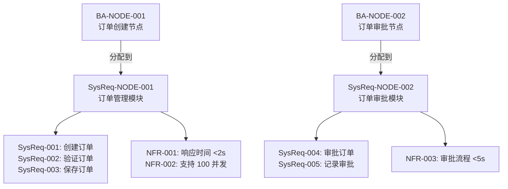
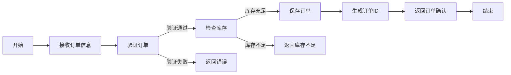

# 准则 3：业务架构→系统需求分配准则

**目的**：将业务架构承接层节点分配到系统需求承接层的功能需求节点，确保每个业务架构节点有唯一的系统需求承接点，系统需求完全实现业务架构的功能

**适用场景**：业务架构节点新增或修改时的系统需求设计

**重要说明**：本准则处理功能需求的分配。非功能需求在系统需求层面标记为系统约束，不经过业务架构分配（详见准则 1 第 4 节）

---

## 一、核心概念

### 1.1 分配 vs 映射

**分配**（推荐）：
- 主动设计SysReq承接层节点
- 然后将BA承接层节点分配给它
- 体现了"配置优于开发"的原则
- 确保SysReq的设计与业务架构相匹配

**映射**（被动）：
- 被动地将BA承接层节点映射到现有SysReq节点
- 可能导致SysReq设计与业务架构不匹配

### 1.2 SysReq承接层的定义

**SysReq承接层**：
- 直接承接BA承接层节点的SysReq节点层级
- 由功能需求节点组成（非功能需求不在此层级分配，而是作为系统约束）
- 功能需求：系统应该执行的具体操作和流程

**关键特征**：
- ✅ 与BA承接层节点有N:1多对一映射关系
- ✅ 每个BA承接层节点只能分配给一个SysReq承接层节点（1:1约束）
- ✅ 有明确的输入（BA承接层节点的业务功能）和输出（系统能力）
- ✅ 可以被追踪和管理
- ✅ 代表系统应该实现的功能需求

### 1.3 多对一映射的优势

```
多对一映射的好处：简化需求变更影响分析

❌ 多对多（复杂）：
   BA-001 ──┐
   BA-002 ──┼─→ SysReq-001
   BA-003 ──┤
            └─→ SysReq-002
   
   问题：BA-001 变更 → 影响 SysReq-001 和 SysReq-002
        → 需要分析多个下游节点
        → 变更影响域不清晰

✅ 多对一（简洁）：
   BA-001 ──┐
   BA-002 ──┼─→ SysReq-001
   BA-003 ──┘
   
   优点：BA-001 变更 → 只影响 SysReq-001
        → 变更影响域清晰
        → 便于分析和管理
```

---

## 二、SysReq承接层节点的设计要求

### 2.1 节点属性

每个SysReq承接层节点必须包含以下属性：

| 属性 | 要求 | 示例 |
|------|------|------|
| **节点 ID** | 唯一标识符 | SysReq-NODE-001 |
| **节点名称** | 系统功能或模块名称 | 订单管理模块 |
| **承接的BA节点** | 分配到此节点的 BA 节点 | BA-NODE-001 |
| **功能需求** | 该节点的所有功能需求 | SysReq-F-001, SysReq-F-002, SysReq-F-003 |
| **约束条件** | 技术或业务约束 | 仅支持 Web 端、需要与 XXX 系统集成 |
| **输入** | 系统需求的输入内容 | 订单信息、用户信息 |
| **输出** | 系统需求的输出内容 | 订单 ID、订单确认信息 |
| **关键决策点** | 流程中的重要决策 | 库存充足判断、价格审批等 |
| **异常处理** | 异常情况和处理方式 | 库存不足、客户信息不完整等 |

### 2.2 节点设计检查清单

- [ ] SysReq承接层节点是否代表一个完整的系统能力？
- [ ] 节点的边界是否清晰？
- [ ] 节点是否能够完全实现所有分配到它的BA承接层节点的功能？
- [ ] 节点的输入和输出是否明确？
- [ ] 节点是否包含所有必要的决策点和异常处理？
- [ ] 节点是否有完整的上级节点链，直到SysReq的根节点？

---

## 三、分配规则与验证

### 3.1 分配的优先级

当新增BA承接层节点时，按以下优先级进行分配：

#### 【第一优先级】分配给现有SysReq承接层节点

**方式**：在现有SysReq承接层中查找能够承接该BA承接层节点的节点

**条件**：
- 现有节点的系统功能完全覆盖BA承接层节点的业务功能
- 现有节点的输出能够满足BA承接层节点的要求

**示例**：
```
BA-NODE-001: 订单创建流程
→ 查找现有SysReq承接层节点
→ 找到 SysReq-NODE-001（订单管理模块）
→ 决策：可以分配 ✅
→ 处理方式：将 BA-NODE-001 分配给 SysReq-NODE-001
```

#### 【第二优先级】新增SysReq承接层节点

**方式**：如果现有SysReq承接层节点无法承接，则新增SysReq承接层节点

**要求**：
- 新增节点必须位于SysReq承接层级
- 新增节点必须有完整的上级节点链，直到SysReq的根节点
- 新增节点的系统功能完全覆盖BA承接层节点的业务功能

**示例**：
```
BA-NODE-002: 订单审批流程（新的业务需求）
→ 查找现有SysReq承接层节点
→ 没有找到合适的节点
→ 决策：新增SysReq承接层节点 ✅
→ 处理方式：
   1. 新增 SysReq-NODE-002（订单审批模块）
   2. 确保 SysReq-NODE-002 有完整的上级节点链
   3. 将 BA-NODE-002 分配给 SysReq-NODE-002
```

### 3.2 分配检查清单

- [ ] 每个BA承接层节点是否都分配到了一个SysReq承接层节点？
- [ ] 是否存在BA承接层节点未被分配的情况？
- [ ] 是否存在BA承接层节点分配到多个SysReq承接层节点的情况？
- [ ] 每个SysReq承接层节点是否都有对应的BA承接层节点？
- [ ] SysReq承接层节点的语义是否完全覆盖了所有分配到它的BA承接层节点？

### 3.3 语义覆盖验证

**验证内容**：

| 验证点 | 检查内容 | 标准 |
|--------|--------|------|
| **功能覆盖** | SysReq承接层节点是否包含BA承接层节点的所有功能 | SysReq的功能应 ≥ BA的功能 |
| **流程完整** | SysReq承接层节点的流程是否完整 | SysReq应包含BA所需的所有步骤 |
| **角色覆盖** | SysReq承接层节点是否包含BA承接层节点涉及的所有角色 | SysReq应包含BA涉及的所有角色 |
| **决策点覆盖** | SysReq承接层节点是否包含BA承接层节点的所有决策点 | SysReq应包含BA的所有决策 |
| **异常处理覆盖** | SysReq承接层节点是否包含BA承接层节点的所有异常处理 | SysReq应包含BA的所有异常 |

### 3.4 完整的上级节点链要求

**定义**：新增SysReq承接层节点必须有完整的上级节点链，直到SysReq的根节点

**示例**：
```
SysReq 树形结构：

SysReq-ROOT（根节点）
   ├── SysReq-BUSINESS-LAYER（业务层）
   │   ├── SysReq-ORDER-MANAGEMENT（订单管理）
   │   │   ├── SysReq-NODE-001（订单创建）← 承接层
   │   │   ├── SysReq-NODE-002（订单审批）← 承接层
   │   │   └── SysReq-NODE-003（订单履行）← 承接层
   │   └── SysReq-PAYMENT-MANAGEMENT（支付管理）
   │       └── SysReq-NODE-004（支付处理）← 承接层
   └── SysReq-PLATFORM-LAYER（平台层）
       ├── SysReq-SECURITY（安全）
       ├── SysReq-PERFORMANCE（性能）
       └── SysReq-INTEGRATION（集成）

新增 SysReq-NODE-005（订单查询）时：
✅ 正确：SysReq-ROOT → SysReq-BUSINESS-LAYER → SysReq-ORDER-MANAGEMENT → SysReq-NODE-005
❌ 错误：直接添加 SysReq-NODE-005，没有上级节点链
```

### 3.5 分配记录格式

```markdown
### 业务架构→系统需求分配

| BA 节点 | BA 节点名称 | 承接SysReq节点 | SysReq节点名称 | 分配方式 | 备注 |
|--------|-----------|-----------|----------|--------|------|
| BA-NODE-001 | 订单创建流程 | SysReq-NODE-001 | 订单管理模块 | 分配给现有节点 | - |
| BA-NODE-002 | 订单审批流程 | SysReq-NODE-002 | 订单审批模块 | 新增SysReq承接层节点 | 新增节点，有完整上级链 |
| BA-NODE-003 | 权限控制 | SysReq-NODE-003 | 权限管理模块 | 分配给现有节点 | - |
```

---

## 四、系统需求的设计要求

### 4.1 功能需求设计

**功能需求应包含**：
- 清晰的操作描述（"系统应该..."）
- 涉及的角色或用户
- 输入数据和输出结果
- 业务规则和约束
- 异常情况处理

**示例**：
```
SysReq-001: 创建订单
- 描述：系统应支持用户创建新订单
- 角色：客户、销售
- 输入：订单信息（客户、产品、数量等）
- 输出：订单 ID、订单状态、确认信息
- 业务规则：库存充足时才能创建；价格需要审批
- 异常处理：库存不足时返回错误；客户信息不完整时提示
```

### 4.2 非功能需求设计

**非功能需求应包含具体的量化指标**：

| 类型 | 指标 | 示例 |
|------|------|------|
| **性能** | 响应时间、吞吐量、并发数 | 响应时间 <2s；支持 100 并发用户 |
| **可用性** | 系统可用性、故障恢复时间 | 可用性 99.9%；故障恢复时间 <5 分钟 |
| **安全性** | 认证、授权、加密 | 支持 OAuth 2.0；数据加密传输 |
| **可扩展性** | 支持的数据量、用户数 | 支持 1000 万订单；支持 100 万并发用户 |
| **可维护性** | 代码质量、文档完整性 | 代码覆盖率 >80%；API 文档完整 |

### 4.3 系统需求分解标准

**以下情况应进行分解**：

| 情况 | 示例 | 分解方式 |
|------|------|--------|
| **多个功能操作** | "系统应支持订单的创建、修改、删除" | 分解为 3 个独立功能需求 |
| **多个用户角色** | "销售和财务都需要查看订单信息" | 分解为 2 个独立功能需求 |
| **多个业务流程** | "系统应支持订单的完整生命周期" | 分解为多个流程需求 |
| **多个查询条件** | "系统应支持按订单号、客户名、日期查询" | 分解为多个查询需求 |

### 4.4 系统需求分解记录格式

```markdown
### 系统需求分解

承接 BA 节点：BA-NODE-001（订单创建节点）

功能需求：
1. SysReq-F-001: 创建订单
2. SysReq-F-002: 验证订单
3. SysReq-F-003: 保存订单

约束条件：
- 仅支持 Web 端
- 需要与库存系统集成
- 需要与支付系统集成
```

---

## 五、非功能需求标记为系统约束

### 5.1 非功能需求的处理方式

**重要说明**：非功能需求不经过业务架构分配，而是在系统需求层面标记为系统约束。

**处理流程**：
```
非功能需求（来自准则 1）
   ↓
在系统需求层面标记为系统约束
   ├─ 约束类型：性能、安全、可用性、可扩展性等
   ├─ 约束范围：系统级、模块级、组件级
   ├─ 量化指标：具体的可测量指标
   └─ 验证方法：如何验证该约束
   ↓
产品架构需要满足这些约束
   ↓
如果产品架构无法满足，则需要调整产品架构
   ↓
产品架构调整需要同步迭代上游（SysReq、BA、SR）
```

### 5.2 非功能需求约束标记

每条非功能需求应标记以下信息：

| 标记项 | 说明 | 示例 |
|--------|------|------|
| **需求ID** | 非功能需求的唯一标识 | SR-NF-001 |
| **约束类型** | 性能/安全/可用性/可扩展性/其他 | 性能约束 |
| **约束范围** | 系统级/模块级/组件级 | 系统级 |
| **量化指标** | 具体的可测量指标 | 响应时间<2s |
| **验证方法** | 如何验证该约束 | 性能测试 |
| **优先级** | P0/P1/P2/P3 | P0 |

### 5.3 非功能需求约束记录格式

```markdown
### 非功能需求约束标记

| 需求ID | 约束类型 | 约束范围 | 量化指标 | 验证方法 | 优先级 |
|--------|---------|---------|---------|---------|--------|
| SR-NF-001 | 性能 | 系统级 | 响应时间<2s | 性能测试 | P0 |
| SR-NF-002 | 安全 | 系统级 | 数据加密传输 | 安全审计 | P0 |
| SR-NF-003 | 可用性 | 系统级 | 可用性99.9% | 可用性测试 | P1 |
| SR-NF-004 | 可扩展性 | 模块级 | 支持100并发 | 压力测试 | P1 |
```

---

## 六、引擎组件改进与系统需求的关系

### 6.1 引擎组件改进的反映

当BA承接层节点的处理方式涉及"引擎改进"或"引擎开发"时，这些改进应该在系统需求层面反映为：

**引擎改进 → 系统需求**：
- 对现有引擎的功能增强需求
- 对现有引擎的性能优化需求
- 对现有引擎的兼容性扩展需求

**示例**：
```
BA-NODE-002: 订单审批流程（处理方式：引擎改进）
→ 需要改进流程引擎以支持复杂条件分支
→ 系统需求反映为：
   SysReq-NODE-002: 流程引擎增强模块
   - SysReq-F-001: 流程引擎应支持复杂条件分支
   - SysReq-F-002: 流程引擎应支持动态路由
   - 约束：流程执行性能 <100ms
```

### 6.2 引擎开发 → 系统需求

当需要开发新的引擎组件时，系统需求应该包含：

**新引擎的功能需求**：
- 引擎的核心功能
- 引擎的配置能力
- 引擎的扩展机制

**新引擎的非功能约束**：
- 性能指标
- 可靠性指标
- 可扩展性指标

**示例**：
```
BA-NODE-003: 订单决策流程（处理方式：引擎开发）
→ 需要开发新的决策引擎
→ 系统需求反映为：
   SysReq-NODE-003: 决策引擎模块
   - SysReq-F-001: 决策引擎应支持规则配置
   - SysReq-F-002: 决策引擎应支持AI模型集成
   - SysReq-F-003: 决策引擎应支持决策链路追踪
   - 约束：决策执行时间 <500ms
   - 约束：决策准确率 >95%
```

---

## 七、系统需求的 Mermaid 表示

### 7.1 分配关系图



### 7.2 系统需求流程图



---

## 八、同步设计与迭代

### 8.1 触发条件

- BA承接层节点新增或修改
- 系统需求需要新增或调整
- 发现BA与系统需求之间的不一致

### 8.2 同步设计步骤

1. **分析BA承接层节点**：理解其业务功能、流程、角色、决策点、异常处理
2. **评估分配**：是否能分配到现有SysReq承接层节点？
3. **如果可以**：将BA承接层节点分配给现有SysReq承接层节点
4. **如果不能**：新增SysReq承接层节点，确保有完整的上级节点链
5. **设计功能需求**：列出所有必要的功能需求（操作、流程、规则）
6. **标记非功能约束**：确定性能、安全、可用性等约束指标
7. **验证一致性**：确保系统需求完全覆盖BA承接层节点功能
8. **记录变更**：在 `mappings.md` 和 `changelog.md` 中记录分配关系

### 8.3 迭代检查清单

- [ ] 所有BA承接层节点都有唯一的SysReq承接层节点
- [ ] SysReq承接层节点的语义是否完全覆盖所有分配到它的BA承接层节点
- [ ] 是否存在遗漏或超出范围的需求
- [ ] 新增SysReq承接层节点是否有完整的上级节点链
- [ ] 非功能约束是否包含具体的量化指标
- [ ] 是否需要调整SysReq承接层节点的边界或定义

---

## 九、与其他准则的关系

- **准则 2**：本准则的输入是准则 2 的输出（业务架构承接层节点）
- **准则 4**：本准则的输出（系统需求承接层节点）是准则 4 的输入
- **准则 1**：本准则需要参考准则 1 中的初步设计信息（引擎改进/开发标记）

---

## 九、与其他准则的关系

- **准则 2**：本准则的输入是准则 2 的输出（业务架构承接层节点）
- **准则 1**：本准则需要参考准则 1 中的初步设计信息（引擎改进/开发标记）和非功能需求约束标记
- **准则 4**：本准则的输出（系统需求承接层节点）是准则 4 的输入

---

## 十、常见问题

### Q1：如何判断系统需求是否完全覆盖BA承接层节点？

**A**：系统需求完全覆盖BA承接层节点的标准是：
1. 系统需求包含BA承接层节点的所有业务功能
2. 系统需求覆盖BA承接层节点的完整流程（从输入到输出）
3. 系统需求包含BA承接层节点涉及的所有角色
4. 系统需求包含BA承接层节点的所有决策点和异常处理
5. 非功能约束包含具体的量化指标

### Q2：如果一个BA承接层节点涉及多个系统怎么办？

**A**：这说明BA承接层节点需要进行再分解。将BA承接层节点分解为多个更小的业务能力，每个分解后的BA承接层节点分别映射到不同的SysReq承接层节点。

### Q3：非功能约束应该如何量化？

**A**：非功能约束应该包含具体的、可测量的指标，例如：
- 性能：响应时间 <2s、吞吐量 >1000 req/s
- 可用性：系统可用性 99.9%、故障恢复时间 <5 分钟
- 安全性：支持 OAuth 2.0、数据加密传输
- 可扩展性：支持 1000 万数据、100 万并发用户

### Q4：如何处理BA承接层节点与系统需求之间的冲突？

**A**：
1. 首先检查BA承接层节点是否需要再分解
2. 如果BA承接层节点已经是原子能力，则需要调整系统需求的定义
3. 如果都无法调整，则需要与相关方讨论和协商

### Q5：引擎改进和引擎开发如何在系统需求中体现？

**A**：
- **引擎改进**：在系统需求中体现为对现有引擎的功能增强、性能优化或兼容性扩展需求
- **引擎开发**：在系统需求中体现为新引擎的功能需求、非功能约束和扩展机制需求
- 这些需求应该清晰地标记其来源（来自哪个BA承接层节点的引擎改进/开发标记）

### Q6：非功能需求为什么不经过业务架构？

**A**：因为业务架构代表用户视角下的业务流程和业务规则。非功能需求（如性能、安全等）是系统的质量属性，不是业务流程的一部分，因此不需要在业务架构中体现，而是直接在系统需求层面标记为系统约束。

---

**最后更新**：2026-05-12  
**版本**：v2.1

**最后更新**：2026-05-11  
**版本**：v2.0
