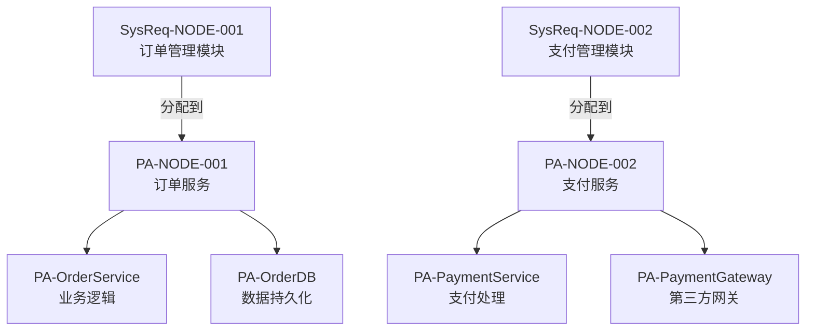
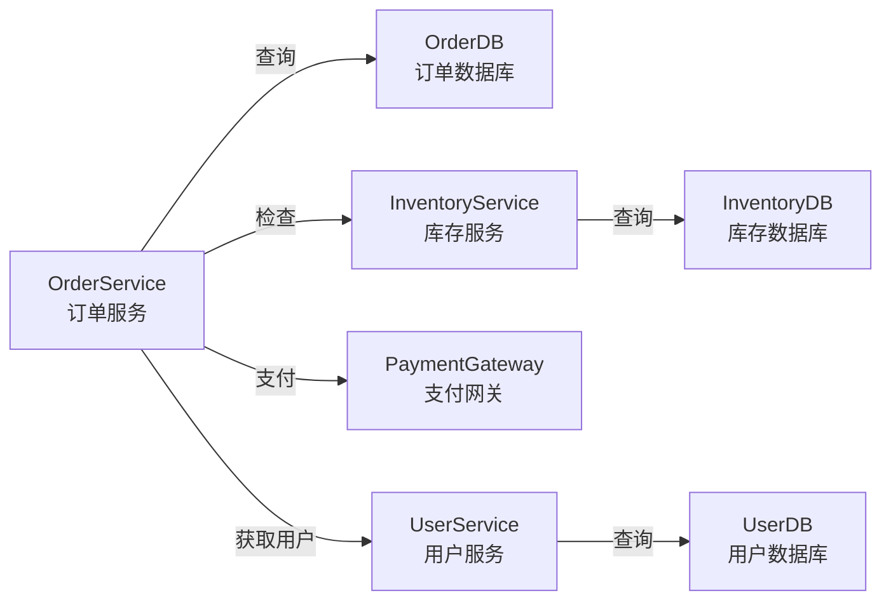
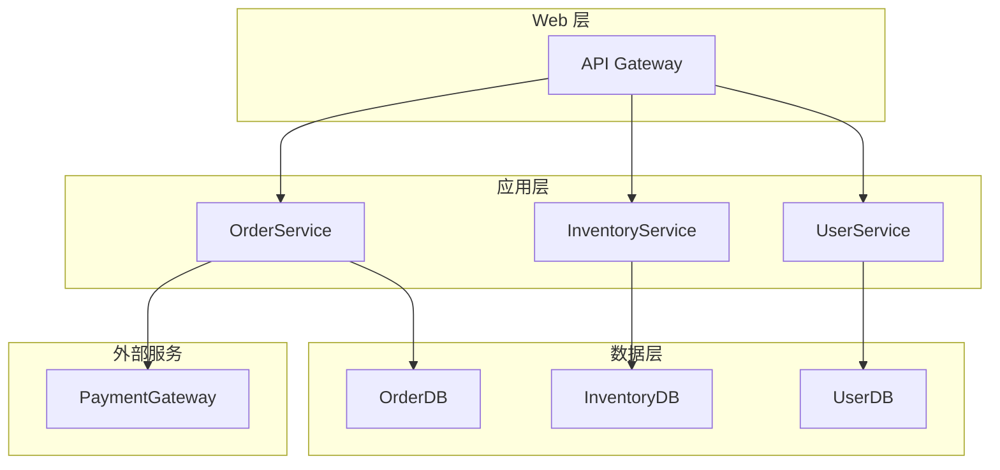

# 准则 4：系统需求→产品架构分配准则

**目的**：将系统需求承接层节点分配到产品架构承接层节点，确保每条系统需求有唯一的产品架构实现点，产品架构完全实现系统需求

**适用场景**：系统需求新增或修改时的产品架构设计

---

## 一、核心概念

### 1.1 分配 vs 映射

**分配**（推荐）：
- 主动设计PA承接层节点
- 然后将SysReq承接层节点分配给它
- 体现了"配置优于开发"的原则
- 确保PA的设计与系统需求相匹配

**映射**（被动）：
- 被动地将SysReq承接层节点映射到现有PA节点
- 可能导致PA设计与系统需求不匹配

### 1.2 PA承接层的定义

**PA承接层**：
- 直接承接SysReq承接层节点的PA节点层级
- 由业务服务组件和技术基础组件组成
- 业务服务组件：实现具体业务功能的服务
- 技术基础组件：提供技术能力的基础设施（数据库、缓存、消息队列等）

**关键特征**：
- ✅ 与SysReq承接层节点有N:1多对一映射关系
- ✅ 每条SysReq承接层节点只能分配给一个PA承接层节点（1:1约束）
- ✅ 有明确的输入（SysReq承接层节点的系统功能）和输出（产品能力）
- ✅ 可以被追踪和管理

### 1.3 多对一映射的优势

```
多对一映射的好处：简化系统需求变更影响分析

❌ 多对多（复杂）：
   SysReq-001 ──┐
   SysReq-002 ──┼─→ PA-COMP-001
   SysReq-003 ──┤
               └─→ PA-COMP-002
   
   问题：SysReq-001 变更 → 影响 PA-COMP-001 和 PA-COMP-002
        → 需要分析多个下游组件
        → 变更影响域不清晰

✅ 多对一（简洁）：
   SysReq-001 ──┐
   SysReq-002 ──┼─→ PA-COMP-001
   SysReq-003 ──┘
   
   优点：SysReq-001 变更 → 只影响 PA-COMP-001
        → 变更影响域清晰
        → 便于分析和管理
```

---

## 二、PA承接层节点的设计要求

### 2.1 节点属性

每个PA承接层节点必须包含以下属性：

| 属性 | 要求 | 示例 |
|------|------|------|
| **节点 ID** | 唯一标识符 | PA-NODE-001 |
| **节点名称** | 组件或服务名称 | 订单服务 |
| **承接的SysReq节点** | 分配到此节点的 SysReq 节点 | SysReq-NODE-001 |
| **组件职责** | 清晰的职责描述 | 负责订单的创建、验证、保存等操作 |
| **技术实现** | 技术栈、框架等 | Java + Spring Boot + MySQL |
| **输入接口** | 接收的输入 | 订单对象、用户信息 |
| **输出接口** | 提供的输出 | 订单 ID、订单确认信息 |
| **依赖组件** | 依赖的其他组件 | PA-UserService, PA-InventoryService |
| **错误处理** | 异常情况处理 | 订单验证失败、数据库错误等 |
| **性能指标** | 性能相关指标 | 响应时间 <2s、支持 100 并发 |

### 2.2 节点设计检查清单

- [ ] PA承接层节点是否代表一个完整的产品能力？
- [ ] 节点的职责是否明确且单一？
- [ ] 节点是否能独立测试和部署？
- [ ] 节点是否能够完全实现所有分配到它的SysReq承接层节点的功能？
- [ ] 节点的输入和输出接口是否明确？
- [ ] 节点是否有完整的上级节点链，直到PA的根节点？

---

## 三、分配规则与验证

### 3.1 分配的优先级

当新增SysReq承接层节点时，按以下优先级进行分配：

#### 【第一优先级】分配给现有PA承接层节点

**方式**：在现有PA承接层中查找能够承接该SysReq承接层节点的节点

**条件**：
- 现有节点的产品功能完全覆盖SysReq承接层节点的系统功能
- 现有节点的输出能够满足SysReq承接层节点的要求
- 现有节点的性能指标满足SysReq承接层节点的非功能需求

**示例**：
```
SysReq-NODE-001: 订单管理模块
→ 查找现有PA承接层节点
→ 找到 PA-NODE-001（订单服务）
→ 决策：可以分配 ✅
→ 处理方式：将 SysReq-NODE-001 分配给 PA-NODE-001
```

#### 【第二优先级】新增PA承接层节点

**方式**：如果现有PA承接层节点无法承接，则新增PA承接层节点

**要求**：
- 新增节点必须位于PA承接层级
- 新增节点必须有完整的上级节点链，直到PA的根节点
- 新增节点的产品功能完全覆盖SysReq承接层节点的系统功能

**示例**：
```
SysReq-NODE-002: 订单审批模块（新的系统需求）
→ 查找现有PA承接层节点
→ 没有找到合适的节点
→ 决策：新增PA承接层节点 ✅
→ 处理方式：
   1. 新增 PA-NODE-002（订单审批服务）
   2. 确保 PA-NODE-002 有完整的上级节点链
   3. 将 SysReq-NODE-002 分配给 PA-NODE-002
```

### 3.2 分配检查清单

- [ ] 每条SysReq承接层节点是否都分配到了一个PA承接层节点？
- [ ] 是否存在SysReq承接层节点未被分配的情况？
- [ ] 是否存在SysReq承接层节点分配到多个PA承接层节点的情况？
- [ ] 每个PA承接层节点是否都有对应的SysReq承接层节点？
- [ ] PA承接层节点的语义是否完全覆盖了所有分配到它的SysReq承接层节点？

### 3.3 语义覆盖验证

**验证内容**：

| 验证点 | 检查内容 | 标准 |
|--------|--------|------|
| **功能覆盖** | PA承接层节点是否包含SysReq承接层节点的所有功能 | PA的功能应 ≥ SysReq的功能 |
| **性能覆盖** | PA承接层节点是否满足SysReq承接层节点的性能指标 | PA的性能应 ≥ SysReq的指标 |
| **安全覆盖** | PA承接层节点是否满足SysReq承接层节点的安全要求 | PA应实现SysReq的所有安全措施 |
| **可用性覆盖** | PA承接层节点是否满足SysReq承接层节点的可用性要求 | PA的可用性应 ≥ SysReq的指标 |
| **异常处理覆盖** | PA承接层节点是否处理SysReq承接层节点的所有异常 | PA应处理SysReq的所有异常情况 |

### 3.4 完整的上级节点链要求

**定义**：新增PA承接层节点必须有完整的上级节点链，直到PA的根节点

**示例**：
```
PA 树形结构：

PA-ROOT（根节点）
   ├── PA-BUSINESS-LAYER（业务层）
   │   ├── PA-ORDER-MANAGEMENT（订单管理）
   │   │   ├── PA-NODE-001（订单服务）← 承接层
   │   │   ├── PA-NODE-002（订单审批服务）← 承接层
   │   │   └── PA-NODE-003（订单履行服务）← 承接层
   │   └── PA-PAYMENT-MANAGEMENT（支付管理）
   │       └── PA-NODE-004（支付服务）← 承接层
   └── PA-INFRASTRUCTURE-LAYER（基础设施层）
       ├── PA-DATABASE（数据库）
       ├── PA-CACHE（缓存）
       └── PA-MESSAGE-QUEUE（消息队列）

新增 PA-NODE-005（订单查询服务）时：
✅ 正确：PA-ROOT → PA-BUSINESS-LAYER → PA-ORDER-MANAGEMENT → PA-NODE-005
❌ 错误：直接添加 PA-NODE-005，没有上级节点链
```

### 3.5 分配记录格式

```markdown
### 系统需求→产品架构分配

| SysReq 节点 | SysReq 节点名称 | 承接PA节点 | PA节点名称 | 分配方式 | 备注 |
|-----------|-----------|----------|----------|--------|------|
| SysReq-NODE-001 | 订单管理模块 | PA-NODE-001 | 订单服务 | 分配给现有节点 | - |
| SysReq-NODE-002 | 订单审批模块 | PA-NODE-002 | 订单审批服务 | 新增PA承接层节点 | 新增节点，有完整上级链 |
| SysReq-NODE-003 | 权限管理模块 | PA-NODE-003 | 权限服务 | 分配给现有节点 | - |
```

---

## 四、产品架构组件的设计要求

### 4.1 组件职责设计

**组件职责应遵循单一职责原则**：
- 每个组件只负责一个业务功能或技术功能
- 组件的职责应清晰、明确、不重叠
- 组件应能独立理解和维护

**示例**：
```
PA-OrderService（订单服务）
- 职责：处理订单的创建、验证、保存等业务逻辑
- 输入：订单信息、用户信息
- 输出：订单 ID、订单状态
- 依赖：PA-InventoryService（库存服务）、PA-OrderDB（订单数据库）

PA-OrderDB（订单数据库）
- 职责：订单数据的持久化和查询
- 输入：订单对象、查询条件
- 输出：订单数据、查询结果
- 依赖：无
```

### 4.2 组件间通信设计

**组件间通信应明确定义**：

| 通信方式 | 适用场景 | 示例 |
|---------|--------|------|
| **同步调用** | 需要立即获得结果 | OrderService 调用 InventoryService 检查库存 |
| **异步消息** | 可以延迟处理 | OrderService 发送订单创建事件到消息队列 |
| **数据库共享** | 数据量大、频繁访问 | 多个服务共享同一个数据库表 |
| **缓存** | 数据不经常变化 | 缓存用户信息、产品信息 |

### 4.3 产品架构组件分解标准

**以下情况应进行分解**：

| 情况 | 示例 | 分解方式 |
|------|------|--------|
| **多个职责** | 一个组件既处理业务逻辑又处理数据持久化 | 分解为业务逻辑组件和数据访问组件 |
| **多个技术栈** | 一个组件同时使用 Java 和 Python | 分解为不同技术栈的组件 |
| **多个部署单元** | 一个组件需要在不同的服务器上部署 | 分解为可独立部署的组件 |
| **多个扩展维度** | 一个组件需要水平扩展和垂直扩展 | 分解为可独立扩展的组件 |

### 4.4 产品架构组件分解记录格式

```markdown
### 产品架构组件分解

承接系统需求：SysReq-NODE-001（订单管理模块）

组件列表：
1. PA-OrderService（订单服务）- 业务逻辑
2. PA-OrderDB（订单数据库）- 数据持久化
3. PA-InventoryService（库存服务）- 库存检查
4. PA-PaymentGateway（支付网关）- 支付处理

组件间依赖：
- PA-OrderService → PA-OrderDB（数据访问）
- PA-OrderService → PA-InventoryService（库存检查）
- PA-OrderService → PA-PaymentGateway（支付处理）
```

---

## 五、产品架构的 Mermaid 表示

### 5.1 分配关系图



### 5.2 组件间通信图



### 5.3 组件部署架构图



---

## 六、同步设计与迭代

### 6.1 触发条件

- SysReq承接层节点新增或修改
- 产品架构需要新增或调整组件
- 发现SysReq与产品架构之间的不一致

### 6.2 同步设计步骤

1. **分析SysReq承接层节点**：理解其功能、性能、安全等要求
2. **评估分配**：是否能分配到现有PA承接层节点？
3. **如果可以**：将SysReq承接层节点分配给现有PA承接层节点
4. **如果不能**：新增PA承接层节点，确保有完整的上级节点链
5. **设计组件职责**：明确每个组件的职责和接口
6. **设计组件间通信**：定义组件间的交互方式
7. **技术选型**：选择合适的技术栈和框架
8. **验证一致性**：确保所有SysReq承接层节点都被产品架构实现
9. **记录变更**：在 `mappings.md` 和 `changelog.md` 中记录分配关系

### 6.3 迭代检查清单

- [ ] 所有SysReq承接层节点都有唯一的PA承接层节点
- [ ] PA承接层节点的语义是否完全覆盖所有分配到它的SysReq承接层节点
- [ ] 是否存在遗漏或超出范围的功能
- [ ] 组件职责是否明确且单一
- [ ] 是否存在组件间循环依赖
- [ ] 新增PA承接层节点是否有完整的上级节点链
- [ ] 是否需要调整PA承接层节点的边界或定义

---

## 七、与其他准则的关系

- **准则 3**：本准则的输入是准则 3 的输出（系统需求承接层节点）
- **准则 1、2**：本准则需要参考准则 1 和 2 中的信息，确保完整的追溯链

---

## 八、常见问题

### Q1：如何判断产品架构组件是否完全实现系统需求？

**A**：产品架构组件完全实现系统需求的标准是：
1. 组件实现了系统需求的所有功能
2. 组件的性能指标满足系统需求的非功能要求
3. 组件的安全措施满足系统需求的安全要求
4. 组件的可用性满足系统需求的可用性要求
5. 组件处理了系统需求的所有异常情况

### Q2：如何处理一个系统需求需要多个组件实现的情况？

**A**：这是正常的多对一映射关系。多个组件可以协作实现一个系统需求，但需要：
1. 明确定义每个组件的职责
2. 清晰定义组件间的通信方式
3. 确保组件间没有循环依赖
4. 记录完整的组件依赖关系

### Q3：如何选择合适的技术栈？

**A**：技术栈的选择应考虑：
1. 系统需求的功能特性（是否需要实时性、高并发等）
2. 非功能需求的指标（性能、安全、可用性等）
3. 团队的技术能力和经验
4. 现有系统的技术栈（保持一致性）
5. 技术的成熟度和社区支持

### Q4：如何处理组件间的循环依赖？

**A**：
1. 首先识别循环依赖的组件
2. 分析循环依赖的原因
3. 重新设计组件的职责，打破循环依赖
4. 可以考虑引入中间层或事件驱动架构
5. 如果无法避免，使用依赖注入或其他设计模式来管理

### Q5：如何确保PA承接层节点有完整的上级节点链？

**A**：
1. 分析新增节点在PA树形结构中的位置
2. 确保从PA根节点到新增节点的路径上所有上级节点都存在
3. 如果上级节点不存在，则需要先创建上级节点
4. 记录完整的节点层级关系
5. 验证新增节点与其他节点的关系是否合理

---

**最后更新**：2026-05-11  
**版本**：v2.0
