# 概念学习方法论：从压缩学习到知识掌握

> 一份以"枢纽—骨架"视角整合压缩学习研究与学习方法的研习笔记 —— 为什么研究核心概念、它有什么科学证据、如何用它掌握一个专业领域
>
> 2026-08-22 · 整理自概念研习对话（含北大"压缩学习"论文分析与多轮方法论讨论）
>
> **2026-09-24 第十四轮·依 90-治理登记 02 号台账结清条款号**：v3.10 → **v3.11**——依《标准条款号核对表》（02 号，v1.2）§五 G-27／G-37 与 §三之二.4，按**库内 15288:2023 正本**施工：① **§4.7 根概念表「系统 system」行 ＋ §4.7「母体—展开」第 1 条**：原「由相互作用元素组成的整体，具涌现属性」属 **2015 版语域**，按正本 **§3.46** 逐字改为「若干部分或元素的排列，其整体表现出各构成部分单独不具备的既定行为或意义」（*arrangement of parts or elements that together exhibit a stated behaviour or meaning that the individual constituents do not*）——正本全文检索 `organized to achieve` **零命中**；同处在出处位补条款号 **§3.46**。② **15288 条款号核对状态刷新**（五份标准正本在库）：**§3.5／§3.6／§3.13／§3.46／§3.47／§6.4.1–§6.4.14 全部已核（一手）**——**`system element` 的号是 §3.47**（§3.46 是 `system`），v3.6 条所称「仍未核的是 2015 版术语号的 2023 对应号」**于此结清**（号与逐字均回正本，SEH 5.0 中文版退为旁证）。③ 附录概念档案「基本原理·② 背景」格补条款号（ISO 9000:2026 **§3.11.12**／ISO/IEC/IEEE 15288:2023 **§3.46**）。**未改**：§1～§3、§4.0～§4.6、§4.7 其余各行与两条基本原理表、§5～§6、六个概念档案的其余格、全部 mermaid 图；节号、表格行数、判据条数、图结构一处未动；上列两处之外逐字引文一字未改。
> **2026-09-21 第十三轮·依 31 号研究报告补机制层与判据分级**：v3.9 → **v3.10**——以 `31-现代思维工具100讲研究报告-从表征到解释框架的内在地图.md`（v1.0；原料为《现代思维工具100讲》「教育与学习」十讲原文，见 31 号记录）为准，补本报告**认知表征侧与训练条件侧**的空白（本报告原有证据全在**知识本体侧**）。**五处落地，不动任何既有结论**：① **§2 末尾新增 §2.7「图式与工作记忆：压缩为什么有效」**——补机制层（工作记忆 4–7 元素的窄门／图式即压缩包／现行二分类口径／先验知识调节／边界声明），与 §2.1～§2.6 的网络结构证据形成"群体层 ＋ 个体层"两级；② **§3 环1 依据列换引**——"认知负荷最低"这句**原无出处**的断言改引 §2.7；③ **§3 开篇补 ICAP 课堂观察数据**——"大多数人的学习停在知道/理解层"这句**原无引用**的现状判断，补 31 号所载中小学课堂与德国高校课的观察数据；④ **§1.2 可检验判据分级**——原"转述测试 ＋ 辨伪测试"并列，实为**不同级**（转述＝C 级建构；辨伪须 I 级互动才成立），补三级判据；⑤ **§4.7 立限定 C（显式化的天花板）**——显式化**必要而非充分**（Polanyi：默会知识是显性知识的地基），与同节第 4 点"显式化之必要"并列不冲突。另：附录参考资料新增**认知科学一手文献**条目（自 31 号十讲注释 114 条中选，按"讲次 ＋ 注释号"可回溯）。**未改**：§1.1／§1.3～§1.4／§2.1～§2.6／§3 五环表与全部 mermaid 图／§4.0～§4.6／§5／§6 的行文与结论、六个概念档案、逐字引文——一字未改。
> **2026-09-21 第十一轮·依 22 号对齐**：v3.8 → **v3.9**——以 **22 号《架构、概念、属性研究报告——术语权威定义与对照分析》**（v1.7）为准核本报告。本报告是 22 号 §10 明写的模板主家（"可纳入《00-概念学习方法论》的通用辨析模板"），故本轮以**补入**为主：① **§6.4 新增「术语锁定三问与九类陷阱」**（22 号 §10.2 三问基础版 ＋ §10.3 陷阱谱；并补明与 §6.2 四问法**不同轴**——四问管理解深度、三问管术语出处与语境）；② **§1.2 概念条补两个构造件**（property §3.1.3／characteristic §3.2.1）与**三层抽象链**，并带出 characteristic（ISO 9000:2026 §3.10.1）与 attribute（ISO/IEC 2382-17:1999 §17.02.12）两处同名异义；③ **§4.0 补上游一步指针**（第 0 步本体论一问之前先锁术语身份）；④ **§4.7 图注补两处〔按〕**——42010 §3 未定义 concept／property（按普遍接受含义用）＋ "concepts or properties" 的 Conception／Perception 两哲学兼容（*without prejudice*）＋ 不得以 ISO 9000 的 inherent 限定回读；同处「质量」补版本与条款号（ISO 9000:2026 §3.5.2／§3.10.1）；⑤ **概念档案**：⑦辨析补 definition §3.3.1（划界义）与属性／特性／概念三层链，③演化的历史补条款号迁移（1087-1:2000 §3.2.1 → 2019 §3.2.7，**定义文本一字未改**）；⑥ 附录参考资料补 ISO 1087:2019 与 22 号两条。**未改**：§1.1、§1.3～§1.4、§2～§3、§4.1～§4.6、§5、§6.1～§6.3 的行文与结论、全部节号与表格行数、mermaid 图结构；逐字引文一字未改。
> v3.7（2026-09-21 第九轮·15288:2023 过程号结清）：本报告无 15288 过程号引用（正文两处 15288 引用为定义与规格义，见 v3.2／v3.6 条），**正文零改动**；本轮为全目录过程号结清的登记位（据 INCOSE SEH 5.0 中文版 2023-07 所印 15288:2023 条款号，技术过程全段 §6.4.1–§6.4.14 已核）。
> **2026-09-21 第十轮·依 23 号对齐**（用户令「以 23 号研究报告，对齐其前的文档」）：v3.7 → **v3.8**——以 **23 号《判据体系研究报告——从验证确认到治理的判据阶梯》**（v1.9）为准核本报告涉判据侧的断言，**零冲突、两处缺位＋一处用词避撞**：① **§4.7 三条基本原理表后补〔按〕**（缺位）——原表 P1 只有"验证以规定需求为参照"一条，读者易读成"需求侧只有验证一条判据线"；按 23 号 §5.1／§10.2 补明需求根分出的**三把尺**（验证对规定需求 §3.11.12／确认对为特定预期用途或应用的需求 §3.11.14，判据主体是隐含需求、参照在派生链外／评审对为客体确立的目标 §3.11.2），三者并列不可互替；并注明"验证以规定需求为参照"在本文**出现两级**（§4.1 作核心原理例、本表作基本原理 P1），两级是同一命题在两个层级上的登记、非互斥分类（§4.1 末已声明原理自身分两级）；② **§2.6 表头「验证方式」改「证据来源」并加夹注**（用词避撞）——该处"验证"是日常义（用什么证据支撑），**不是** ISO 9000:2026 §3.11.12 的 verification，避免与 23 号判据阶梯的术语位相撞（23 号 §10.2）。**依据**：23 号 §5.1、§9.1、§10.2、§3.11.12／§3.11.14／§3.11.2 定义。**未改**：§1～§3、§4.0～§4.6、§5～§6 的行文与结论、概念档案与附录；节号、表格行数、mermaid 图结构与判据条数一律未动。
>
> **2026-09-21 第六轮·依 24 号对齐**：v3.5（依 24 号《架构与设计边界研究报告》）——① §4.7 图注（架构定义句所在处）补〔按〕，钉住架构—设计边界：**种类（kind）之别而非粒度之别**、架构是**抽象物不是交付物**、两过程**不是先后阶段**、架构**支配**方案（24 号 §1.4-1／§2.3／§8.1 关系 6／§8.2／§14.3）；② §4.0「质量与架构为派生」补指针；③ §4.7 根概念表「设计 design」行补〔按〕，点明合规的对象是**架构**、承担者是**实现**（24 号 §4.1／§10.7）；④ §6.3 baseline 四问中基线管的那件事由「治理」改「**受控**」并补 24 号 §2.3 互参——配置与基线属**管理侧**，不在**架构治理**的对象之列；⑤ §4.2「名称与判据的错位」注补〔按〕——词频／被引用度／前置数是**代理判据**，与 24 号「代理 ≠ 判据（真判据＝目的必要性）」同形（24 号 §6.1／§6.3／§14.1(5)／附录 C 教训 3）。（版本 v3.4 → v3.5）
> **2026-09-21 第七轮·15288 版本锚定（用户裁定第 4 条）**：v3.6——§4.7 根概念表「系统 system」行出处由 `ISO/IEC/IEEE 15288` 补写为 `ISO/IEC/IEEE **15288:2023**（现行版；2015 为前版）`。条款号核对状态（全目录口径）：已核 §3.5／§3.6／§3.13／§3.46／§5／§6.4.1／§6.4.4／§6.4.5／§6.4.6（24 号实测 2023 版）；**§6.4.7–§6.4.14 段各过程号已核**（据 INCOSE SEH 5.0 中文版 2023-07 所印 15288:2023 条款号，p132–p186）；**仍未核**的是 2015 版术语号的 2023 对应号。**其余未动**。（版本 v3.5 → v3.6 → **v3.7（2026-09-21 第九轮·15288:2023 过程号结清）**）
> v3.4：第四轮（依 27 号《ISO 9000:2026 相对 2015 版差异研究报告》对齐）——ISO 9000 引用升格现行版 ISO 9000:2026（第 5 版，2026-05-27 发布）：§4.7 正文与 P1 表内 verification 由 §3.8.12 改 **§3.11.12**；§4.7 根概念表 requirement 由 §3.6.4 改 **§3.5.1**。两处定义句两版逐字未变，仅条款号迁移。（版本 v3.3 → v3.4）
> v3.3：第二轮收口（用户 2026-09-21 裁定「fundamental 用『基本』，其余术语按 GB/T 45630-2025」）——① §4.6 正文「产品生命周期」改「产品**生存周期**」；② §4.7 图注架构定义句的 governing principles 由「治理原则」改「**管控原则**」并补括注英文，落 canonical；③ §5.1 标题「概念的生命周期」属比喻义，保留。
> v3.2：与 30 号对齐——① §4.7 根概念表「设计 design」出处更正：原引 ISO/IEC/IEEE 42010，但 42010 只定义架构与架构描述、不定义 design，改引 ISO/IEC/IEEE 24765（design 双义）＋15288:2023 §3.13（规格义）；② §4.7 图注架构定义补全为 2022 现行全句（原仅截取 X 块「实体的基本概念或属性」）；③ 附录参考资料补 GB/T 45630-2025 条目。
> v3.1：收束 22 号权威对照——§1.3 一句话总结「一般概念是人思考的最小单元」→「一般概念是知识单元」（旧口径残留，与 ISO 1087:2019 §3.2.7 主译线闭环）；§4.7 图注架构引文去 1471:2000 措辞「系统的基本组织」→ 现行 42010:2022「实体的基本概念或属性」（标准版本原则）；概念档案⑦辨析「思想单元」→「知识单元」
> v3.0：概念定义对齐 ISO 1087:2019——术语定义链「概念」条（§1.2）、三层体系表「一般概念」行（§1.3）、概念档案「概念·①定义」（附录）三处定义句统一升格现行版 ISO 1087:2019 §3.2.7，并显式区分 ISO 义（知识单元）与本方法论叠加义（网络节点/枢纽）；补英文 verbatim；中文主译线统一"由特性的独特组合而形成的知识单元"（国标 GB/T 15237.1-2000"特征"译线仅作版本谱系对照）；正文 §1.3 mermaid 三层图标签随同对齐
> v2.9：示意图组定稿——**移除三领域共性对照图**（§4.0，抽象共性图非所需）；**三张领域根概念生成树恢复为 Mermaid 内联版**（§4.0 高速信号 / §4.6 企业运行体系 / §4.7 产品开发，配色对齐原图：蓝=根 / 灰=投影 / 绿=综合表现层，VSCode 预览直接渲染）；assets 四 SVG 保留作高清导出源
> v2.8：§4.0 / §4.6 / §4.7 四处示意图回退——弃 Mermaid 抽象版（v2.7），改回**原图卡片风格 SVG 引用**（assets/00-三领域根概念对照示意图.svg + 三张根概念生成树.svg，VSCode 预览可直接显示；assets 四文件自 v2.4–v2.6 起持续保留）
> v2.7：§4.0 / §4.6 / §4.7 四张示意图由外部 SVG 引用改为 **Mermaid 内联代码块**（三领域对照 + 三张生成树，配色对齐原图：蓝=根 / 灰=投影 / 绿=综合表现层）——文档自包含，VSCode 预览（装 Markdown Preview Mermaid Support 插件）直接渲染，不再依赖 assets 外部文件
> v2.6：§4.0 补「高速信号传输领域根概念生成树」（assets/00-高速信号传输领域根概念生成树.svg，阻抗→特性阻抗/反射/串扰/损耗/时序→信号完整性）；§4.7 补「产品开发领域根概念生成树」（assets/00-产品开发领域根概念生成树.svg，需求/系统/设计→质量/功能/接口/组件/架构→产品）——三领域各配一张同风格生成树图（企业运行体系见 §4.6 / v2.5）
> v2.5：§4.6 补「根概念生成树」原图（assets/00-企业运行体系根概念生成树.svg）——产品数据（根）→ 流程/组织/绩效/配置管理/IT系统（投影与衍生）→ 企业运行体系（综合表现层），承接"本体 vs 投影"表格
>
> v2.4：§4.0 三领域实证对照图改版——弃抽象 Mermaid 流程，改回对话原图风格的三列卡片式示意图（assets/00-三领域根概念对照示意图.svg，VSCode 预览可直接显示）
>
> v2.3：§4.0 补「三个领域的实证对照」——高速信号传输（本体一维 → 阻抗）/ 产品开发（本体三维 → 需求·系统·设计）/ 企业运行体系开发与运行（本体对象 → 产品数据），把"本体复杂度决定根概念数量"落成图（配规律注记，判定过程分别见 §4.6 / §4.7）
>
> v2.2：§4.7 关系升级——「三条咬合命题」扩展为「母体—展开」四层关系（本体基础 / 语义内蕴+两限定 / 判据同构 / 显式化之必要），领域基底表述由"成对识别"改为"母体→展开"；补演绎链定位（演绎链=根概念的展开运算）与种子类比；§1.2 术语链补「基本原理」条目（六个条目）并挂指引；附录概念档案五卡→六卡（新增「基本原理」卡）
>
> v2.1：补"原理也有根"——新增 §4.7「根概念 × 基本原理」（2×2 层级矩阵：节点/边 × 核心/根；三条咬合命题：依赖序/意义互补/判据同构；三个"序"的错位；欧氏几何类比；产品研发领域示范：需求/系统/设计三根 + 验证以规定需求为参照/需求驱动设计/系统整体涌现三原理 + 心电监测仪贯穿实例），§1.3 与 §4.1 挂衔接引导
>
> v2.0：新增 §1.3「概念体系总览：三个层级，层层包含」——把 §1.2 五连定义收拢为"一般概念 ⊃ 核心概念 ⊃ 根概念"三层体系（判据逐层收严表 + 包含关系图 + hub/root 视角维度表 + 企业运行体系实例对照），原 §1.3 顺延为 §1.4；补两则一致性注记（§2.6"枢纽=根概念"与 §1.3"hub≠root"的分层解释；层级判定绑定领域边界）
>
> v1.9：根概念深化——§1.2 术语链补"根概念"（四标准）并定名"概念体系能力/根概念能力"、§1.3 方向补三层、§2.6 补"枢纽=根概念"同构、§3 第4环补结构惯性、§4 补"本体论第0步"与判据升级（判定矩阵+演绎链）、新增 §4.6 企业运行体系根概念示范（产品数据）、§5.5 点破"找根=做本体论"、概念档案升级为五卡
>
> v1.8：通读一致性修正——更新 §1.2 档案引用名、头部讨论轮次描述、§4.1 挂定义链引用
>
> v1.7：文末档案区升级为「概念档案（术语族）」——补"概念""核心概念""核心概念能力"三张九格卡（共四张）
>
> v1.6：§1.2 定义块升级为术语定义链——在"概念"基础上补"核心概念""核心概念能力"定义（四概念串链）
>
> v1.5：§1.3 补"杠杆第一性是方向"论——核心概念能力（枢纽识别）管方向；术语三角关系落位
>
> v1.4：吸收《聪明的对手》融合讨论——新增 §1.3 杠杆模型、§4.4 商业域枢纽识别示范、§1 补"AI 时代稀缺性"论证
>
> v1.3：补入"概念能力"术语工作定义（§1.2）+ 文末九格概念档案卡
>
> v1.2：补入"概念能力的定位：枢纽，不是全集"（§1.2，防"概念决定论"误读）
>
> v1.1：补入"有框架 vs 无框架"路径对比、布鲁姆阶梯图、配置管理枢纽概念骨架图

---

## 目录

1. [为什么研究核心概念](#1-为什么研究核心概念)
2. [压缩学习：人脑偏好的学习结构（科学证据）](#2-压缩学习人脑偏好的学习结构科学证据)
3. [掌握专业知识的五环模型](#3-掌握专业知识的五环模型)
4. [如何识别核心概念与核心原理（枢纽）](#4-如何识别核心概念与核心原理枢纽)
5. [核心概念的来源与本质](#5-核心概念的来源与本质)
6. [如何真正理解核心概念（四问法与术语锁定三问）](#6-如何真正理解核心概念四问法与术语锁定三问)
7. [附录：参考资料](#附录参考资料)
8. [附录：概念档案（术语族）](#附录概念档案术语族)

---

## 1. 为什么研究核心概念

**一句话结论：基本概念是专业领域的"操作系统"——它们决定了领域内所有讨论的语言、边界和推理逻辑。不研究它们，学到的只是碎片化的"招式"；研究透它们，才能拥有可迁移的"体系"。**

**为什么在 AI 时代尤其重要**：记忆与信息处理已外包给机器，人剩下的稀缺能力正是概念性的——压缩、组织、迁移、辨伪。商业世界的《聪明的对手》（朱峰、曹沂宁）讲的是同一逻辑：传统企业不学巨头（均匀化必败），而是守住自己的异质优势（暗知识、信任、非标）并用数字技术放大。**异质结构原理在认知层与商业层同时成立——概念能力就是个人版的"底牌放大器"。**（商业域示范见 §4.4）

核心概念在专业学习中至少承担六种功能：

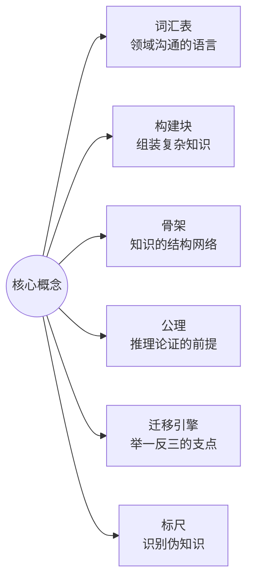

| 功能 | 含义 | 类比 |
|------|------|------|
| 词汇表 | 概念是领域内"说话的方式"，没有共同词汇就无法精确沟通 | 学外语先学字母与语法 |
| 构建块 | 人的知识以概念网络存储，新知识必须挂载到已有概念上才有意义（图式理论/有意义学习） | 乐高基础件 |
| 骨架 | 学科是有层级、有关系的体系，概念决定知识如何组织 | 地图的经纬度与主地标 |
| 公理 | 领域内论证从概念定义出发，定义含糊则推导皆飘 | 数学公理、游戏规则 |
| 迁移引擎 | 概念知识属深层结构，可跨场景迁移；事实知识绑定场景 | "输入—处理—输出"看遍所有系统 |
| 标尺 | 概念精确才能识别概念偷换与术语忽悠 | 分得清"需求"与"期望" |

> 研究基本概念 = 给大脑装操作系统，之后学的所有细节都是"应用"。核心概念变动的速度远慢于外围知识（范式是最稳定的内核），地基打得越早，复利越大。

### 1.1 有框架 vs 无框架：两条学习路径

"先立概念"与"只背结论"的差别，是理解整套方法论的关键对照：

| 先学核心概念（先立骨架） | 只背结论和招式（无框架） |
|---|---|
| 知识有挂载点——新概念迅速入网 | 碎片化记忆——学完就忘 |
| 举一反三——跨场景自由迁移 | 绑定具体场景——换个题就失灵 |
| 能辨伪——识别概念偷换 | 易被带偏——分不清概念边界 |

> 先立骨架再填血肉，会越学越轻松；先切入细节，会越学越累——这正是第 2 节压缩学习实验的结论。

### 1.2 概念能力的定位：枢纽，不是全集

**术语定义链（从基础到派生，六个条目：五个概念 + 一条原理侧对应）**：

- **概念（concept）**：**ISO 1087:2019 §3.2.7 权威定义**——*unit of knowledge created by a unique combination of characteristics*（由特性的独特组合而形成的知识单元），即"对一类对象共同特征的抽象概括"。判据：可指称（一个词/短语）+ 可界定（内涵与外延）。**定义里嵌着两个构造件**（出处同在 ISO 1087:2019，合为**自下而上的三层抽象链**）：**属性 property**（§3.1.3，*feature of an object*，对象的特征——**无"固有"类限定**，固有与赋值皆在内）→ **特性 characteristic**（§3.2.1，*abstraction of a property*，属性的抽象）→ 独特组合 → **概念**（22 号 §4.5）。两个易混邻词：**characteristic 在质量管理语境**（ISO 9000:2026 §3.10.1）作"**区别性特征**"并带 inherent／assigned 限定，是上述抽象层的**特殊化**；**attribute**（ISO/IEC 2382-17:1999 §17.02.12，*A named property of an entity*，实体的命名属性）是 property 的**命名化侧支**。四处语境**逐一定位、不混用**——锁定方法与陷阱清单见 §6.4，完整对照见 22 号 §4。**本方法论叠加义**：在 ISO 义之上，把概念作为知识网络中的节点操作（按网络地位分一般/核心/根概念，见下两目与 §1.3）——ISO 的知识单元义是地基，网络节点用法是本方法论在其上的扩展，两者不互相定义。
- **核心概念（core concept / hub）**：概念网络中处于枢纽地位的概念——解释领域内其他概念都要用到它，而理解它自己只需要很少前置知识。判据：反事实检验（去掉它领域还成立吗？）+ 被引用度（其他概念定义引用它最多）+ 前置数（理解它所需前置概念最少）；筛选方法详见 §4.2。**它是"骨架"：以无向图枢纽（hub，连接多）视角看领域，通常 3~5 个。**
- **根概念（root concept）**：概念网络的"承重柱"——领域中不可再向下归约的源头概念，其余概念（含核心概念）都由它导出。**四条判据：① 原子性（不可由域内其他概念定义）；② 生成性（其他概念从它派生）；③ 不可替代性（去掉它领域崩塌）；④ 递归性（在领域多个抽象层级反复生效）。** 根概念 ⊂ 核心概念（承重柱 ⊂ 骨架），可唯一（1~3 个）。判定方法：四标准判定矩阵 + 演绎链（§4.5）。原理侧的源头对应**基本原理**（root principle，法则的公理层），见 §4.7。
- **基本原理（root principle / axiom，法则的公理层）**：原理侧的"源头"——领域中不可再被推导的法则（命题），是根概念（母体）的语义内蕴被展开成的显式命题。判据：不被推导 + 生成规则 + 去之崩塌 + 多层生效。基本原理 ⊂ 核心原理，与根概念同处源头层。**注意：它不是"概念"（节点）而是"命题"（边）**——术语族里唯一一张边侧卡，与「根概念」卡成对（2×2 层级矩阵与"母体—展开"关系见 §4.7）。
- **概念体系能力（conceptual ability，简称"概念能力"）**：以概念为单位的压缩与组织能力——识别枢纽（抓出决定其余部分的核心概念）× 织关系（把概念连成有结构的网络）× 迁移（把网络搬到新场景）× 辨边界（用反例划清适用与失效范围）。**可检验判据（三级，v3.10 依 31 号分级）**：**转述测试**（陌生领域三五句话讲清）＝ **C 级（建构）**——须生成材料里原本没有的新信息；**辨伪测试**（能举反例划边界）＝ 须有对手挑战才到 **I 级（互动）**——**"讲给外行"只到 C 级**，因为外行提不出有效质疑、I 级不成立；**迁移测试**（换一个情境，你还认得出那个结构吗）＝ **最高档**（与 §3 第 5 环、§2.7 并见）。〔按：此处"级"分的是**认知参与与迁移的深度**，与 §2.6"两层同构"所分的**知识在网络中的位置**不同轴，两者不可互推。〕 注：本定义为工作定义，非标准术语；"概念体系"强调能力对象是一整张概念网络而非单个概念；锚点与完整九格档案见文末「概念档案（术语族）」。
- **根概念能力（root-concept ability）**：识别、验证并运用根概念的能力——概念体系能力的子能力（方向盘：先定本体论立场，再抓承重柱）。判据：20 分钟对一个陌生领域给出"根概念 + 核心概念清单及其关系"，并能用判定矩阵与演绎链为每个候选辩护。

**一句话结论：概念能力是个人能力系统的枢纽（母能力）——它决定学习的起点速度、理解的深度、表达的清晰度和跨领域迁移的半径，并放大执行、信任等其他一切能力；但它不是能力的全部——核心竞争力是「概念能力 × 执行 × 信任 × 情境经验」的组合结构，概念能力决定上限，挂载能力决定下限。**

概念能力强的人容易把"想清楚了"当成"做成了"，这是枢纽思维的误用。精确的定位分两层看：

- **对内（学习能力）**：概念能力是学习引擎的"第一缸"——入口与放大器。它主导五环模型的第 1 环（立枢纽）与第 2 环（织关系）；输出检索（第 3 环）、元认知校准（第 4 环）、动机坚持是其余气缸。概念能力决定学得多快、看得多深；后三者决定学不学得动、学不学得远。测试效应（输出）、概念转变（校准）、动机缺一不可。
- **对外（竞争力）**：核心竞争力从来是组合结构，不是单点能力。概念能力是枢纽节点，执行落地、人际信任、情境经验、专业技能挂载其上——相乘关系，任一归零，整体归零。枢纽决定系统的上限，挂载决定系统的下限。

> 学习上：概念能力 = 入口与杠杆，不是全部引擎。
> 竞争上：核心竞争力 = 概念能力（枢纽）× 挂载（执行 · 信任 · 情境经验）。
> 类比：概念能力是能力系统的操作系统——应用跑在它上面，价值却在应用。

### 1.3 概念体系总览：三个层级，层层包含

**一句话结论：概念是一个三层包含体系——一般概念（concept，全集，管"可界定"）⊃ 核心概念（core concept / hub，骨架，管"连接多"）⊃ 根概念（root concept，承重柱，管"是源头"）；层级越深、判据越严、数量越少。学习先抓根，再展骨架，后填一般概念。**

§1.2 给出了五个概念的独立定义（另有一条原理侧对应「基本原理」，见 §4.7）；本节把它们收拢成一张完整的三层体系图，并回答三个问题：三者的判据如何逐层收严？视角为何不同而不冲突？落到实例上怎么分？

**三个定义（判据逐层收严）**：

| 层级 | 名称 | 定义 | 判据 | 视角 |
|---|---|---|---|---|
| 全集 | **一般概念（concept）** | 对一类对象共同特征的抽象概括（知识单元，ISO 1087:2019 §3.2.7） | 可指称 + 可界定 | 所有概念 |
| 中集 | **核心概念（core concept / hub）** | 概念网络中处于枢纽地位的概念——解释其他概念都要用到它，理解它自己只需很少前置知识；领域的"骨架" | 反事实检验 + 被引用度 + 前置数 | 无向图枢纽：**连接多** |
| 内集 | **根概念（root concept）** | 领域中不可再向下归约的源头概念，其余概念（含核心概念）都从它导出；领域的"承重柱" | 原子性 + 生成性 + 不可替代性 + 递归性 | 有向图源头：**被依赖** |

**严格的包含关系，由外到内一层套一层**：

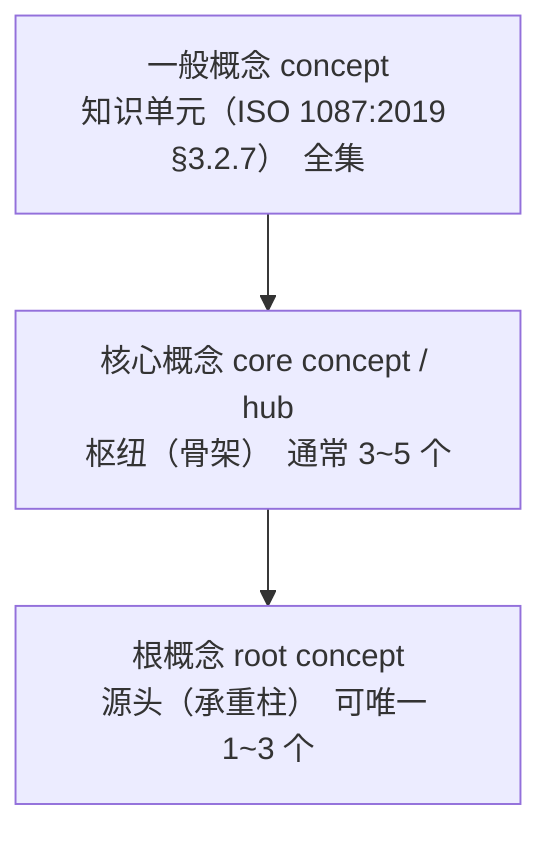

**三个关键性质**：

1. **递进包含**：根概念 ⊂ 核心概念 ⊂ 一般概念。每个根概念必然是核心概念（因为被全域依赖），每个核心概念必然是一般概念（因为它可指称、可界定）；反向不成立——大多数概念、甚至大多数核心概念都不是根。

2. **判据逐层收严**：
   - 一般概念只要求"能指称、能界定"——领域里绝大多数词都满足；
   - 核心概念加收"枢纽性"——反事实检验（去掉它领域不成立）+ 被引用最多 + 前置最少；
   - 根概念再加收"源头性"——**不可再向下归约**（原子性）、**其余由它导出**（生成性）、**领域因它成立**（不可替代性）、**多层反复生效**（递归性）。
   - 一句话：**能界定 → 是概念；被依赖多 → 是核心概念；依赖它的一切且它不依赖域内任何概念 → 是根概念。**

3. **视角不同而不冲突**：三者不是"重要性"的等级，而是"网络地位"的刻画——hub（核心概念）管"连接多不多"（辐条都连到轮毂），root（根概念）管"是不是源头"（营养从根流向枝叶）。

| 维度 | 核心概念（hub） | 根概念（root） |
|------|----------------|----------------|
| 图论属性 | 无向图枢纽：连接最多 | 有向图源：无入边、被全部依赖 |
| 词源 | hub = 轮毂，辐条都连到它 | root = 植物的根，营养从根流向枝叶 |
| 数量 | 通常 3~5 个（骨架） | 可唯一 1~3 个（承重柱） |
| 反问 | 它解释的别人多吗？ | 它被谁定义？域内无人定义它？ |

一个概念可以连得多又是源头（如产品数据：全依赖它、它不依赖别的），也可以连得多但非源头（如"治理"很重要、被反复引用，但它本身由"对什么治理"定义——是派生的）。**质量**是好例子：它在产品开发里被到处引用（核心概念），但它是需求/系统的派生（不是根概念，见附录「根概念」卡⑧）——**"重要"和"源头"是两个维度。**

> **与 §2.6 的关系（防撞车注记）**：§2.6 说"枢纽 = 根概念"，本节说"核心概念（hub）≠ 根概念（root）"，两句话不冲突——§2.6 谈的是**认知学习层**的 hub 与**知识本体层**的 root 的**同构**（"从枢纽开始学"与"先立承重柱"是同一策略在两层各自的名称）；本节谈的是**图论内**两个网络属性（连接多 vs 是源头）。跨层谈同构，层内谈维度——各说各话，各归其位。

**实例对照（企业运行体系，与 §4.6 同一领域边界）**：

| 概念 | 层级 | 理由 |
|---|---|---|
| 流程 | 核心概念 | 被到处引用，是骨架；但由"数据的流转次序"定义 → 派生，非根 |
| 需求 | 核心概念 | 枢纽；但本身是产品数据的一种形态 → 子类，非根 |
| 产品数据 | **根概念** | 原子（自身即事实）、生成（一切由它派生）、不可替代（去掉即空壳）、递归（概念级/流程级/实例级都生效） |

> **领域边界注记**：层级判定绑定领域边界——同在"产品开发"领域（本体 = 价值×对象×行为，§4.0），根概念是需求/系统/设计；本表站在"企业运行体系"领域（本体 = 对象，§4.6），需求便降为产品数据的子类。**同一概念在不同领域边界下层级可变——先定领域，再定层级。**

**一句话总结**：

> **一般概念是知识单元（全集）；核心概念是领域骨架的枢纽（子集，管"连接多"）；根概念是领域不可再归约的承重柱（子子集，管"是源头"）。三者层层包含——根概念必然同时是核心概念和一般概念，反之不然。学习先抓根，再展骨架，后填一般概念。**

> 本节讲的是概念（节点）侧的层级；原理（边）侧同样分"核心/根"两级——见 §4.7。

### 1.4 概念体系能力的作用方式：学习能力的杠杆

**一句话结论：概念能力是学习能力的杠杆——以小的投入撬动大的学习产出；但杠杆是双向的、需要支点、自己不发力，所以它决定的是效率，不是产出本身。**

为什么说"杠杆"而非"核心"：核心描述位置（易被误读为"全部"），杠杆描述作用方式（乘数效应）。概念能力确实以小搏大：压缩学习实验中先花 20 分钟立枢纽，换来整个学习网络数百轮的优势扩散，投入产出比极高。

三个限定（物理对应 + 方法论对应）：

| 限定 | 物理对应 | 方法论对应 | 含义 |
|------|---------|-----------|------|
| 杠杆是双向的 | 放大的是力，不分方向 | 勤校准（第 4 环） | 枢纽选错则放大错误——学得越快，偏得越远 |
| 需要支点 | 无支点只是根棍子 | 落实践（第 5 环） | 概念不落真实任务，力臂悬空撬不动任何东西 |
| 自己不发力 | 杠杆只放大施力，不产生力 | 动机 | 没有投入，力臂无穷长也是零产出 |

**杠杆的第一性是方向**：四个部件里最根本的不是力臂，是方向——方向由枢纽识别决定，即"根概念能力"。其余子能力（关系组织、迁移、辨边界）决定力臂质量与用力技巧，但方向错了，力臂越长、撬得越欢，错得越远。压缩学习实验的 HubToLeaf 优势正来自"先识别枢纽"这一下，其后 800 轮都是它的展开。

**方向分三层**（由深到浅，先定本体、再抓承重柱、后展骨架）：

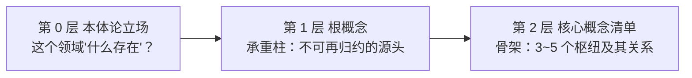

方向不是一次选定的，而是三层递进：先问本体论问题（领域的存在物是什么），再抓根概念（承重柱），最后展开为核心概念清单（骨架）。根概念能力 = 方向盘 = 把三层都定准的那一下。第 0 层若答错，第 1、2 层再漂亮也是空中楼阁——§4.6 产品数据示范即典型案例：本体论立场从"机制"换成"对象"，根概念就从"流程"换成"产品数据"。

**术语三角**：核心概念（对象，骨架）⊃ 根概念（对象，承重柱）→ 被「根概念能力」（子能力，方向盘）把握 → 隶属「概念体系能力」（全集，另含关系组织/迁移/辨边界）。正式术语保持"概念体系能力"（简称"概念能力"）；"根概念能力"仅作强调表述，特指杠杆的方向盘——注意方向盘管的是"根"（源头），不是整副骨架。

**完整公式：学习产出 = 根概念能力（方向）× 概念体系能力（力臂）× 学习投入（施力）× 实践场景（支点）。** 与 §1.2 核心竞争力公式同构：概念能力永远是乘数，不是被乘数；是放大器，不是本体。

---

## 2. 压缩学习：人脑偏好的学习结构（科学证据）

### 2.1 论文信息（已核实）

- **标题**：Compressive learning scaffolds higher-order network structure to enhance human knowledge acquisition（《压缩学习支撑高阶网络结构以增强人类知识获取》）
- **期刊**：《自然·通讯》(Nature Communications)，2026-07-17，DOI: 10.1038/s41467-026-75843-7
- **团队**：北京大学心理与认知科学学院 + IDG-麦戈文脑科学研究所（罗欢、方方）× 先进制造与机器人学院（李阿明）
- **共同一作**：任祥娟、王牧之、秦婷婷；共同通讯：罗欢、方方、李阿明
- **方法**：认知心理学、脑磁图（MEG）、图论、计算建模四学科交叉

### 2.2 资料核心内容（用户提供资料要点）

> 原文资料为科普转述（播客/自媒体风格），以下要点与其原始出处一并整理。

- **问题**：为什么有的人学东西又快又深？传统解释（记忆力、天赋、一万小时定律）都不完整。北大团队给出的答案：**高手和普通人的差距不在于记性好，而在于擅长"压缩"——把全量信息转化成关键信号。**
- **例证**：经验医生把成千上万疾病知识压缩成几个关键信号；资深调查记者只关注文件中的"异常"部分——他们都在做"压缩学习"。
- **学界背景**：认知心理学早有"组块化"（chunking）概念；北大团队的突破在于**首次用脑磁图直接观察到大脑压缩信息的过程**，并量化出"什么样的信息结构最容易被压缩"。
- **时代意义**：记忆力层面人类无法与 AI 竞争，人的优势从来不是死记硬背，而是压缩学习。
- **方法论三步**：
  1. **找到枢纽**：学任何新东西前先花 20 分钟找枢纽节点（解释别的概念要用到它、解释它自己却不需要太多前置知识的核心概念）。来源：书目录、百科开头、问 AI。例：《思考，快与慢》的枢纽 = 系统一、系统二、偏见。
  2. **建立联系，填充细节**：先弄清枢纽之间的关系，再学细节（如"系统一是快速自动的直觉思维……人类大多数偏见来自系统一在不该出手时出手"）。
  3. **转述**：把学的东西讲给完全外行的人听，三五句话讲清楚即压缩成功。转述是"压缩测试"，强迫大脑把散落信息重新组织成有骨架的结构（费曼技巧的机制正是压缩学习）。
- **收束论调**：学习不是做加法（获取更多信息），也不是做减法（减去不重要部分），而是**做除法/编码**——先搭四梁八柱，之后输入再多信息，只需看一眼就知道该存放在哪里，结构只会更坚固，不会变乱。

### 2.3 实验设计与结果（与原文核对）

1. **网络结构实验**：设计 4 类 16 节点人工知识网络（晶格/网格网、随机网、小世界网、无标度网），节点数连边数完全相同，仅节点度分布不同；用奇异值分解（SVD）量化压缩性，**无标度网（少数枢纽占据大量连接）压缩性最优**；160 名被试通过图片序列预测学习网络结构，无标度网组成绩显著最高。
2. **预学习路径实验**：238 名被试分三组——HubToLeaf（枢纽优先）、LeafToHub（边缘优先）、RandomWalk（随机游走）；200 轮预学习后进入完全相同的 800 轮正式学习，**HubToLeaf 组优势随时间扩大，且优势扩散到整个网络（包括纯叶子节点的连边）**。
3. **脑磁图实验**：40 名被试，表征相似性分析（RSA）显示 HubToLeaf 组在**背侧前扣带回（dACC）**维持更稳定持续的网络结构表征；LeafToHub 组早期有表征但迅速衰减。
4. **计算建模**：两阶段模型（先基于高阶结构建骨架、再整合新输入）能更好拟合人类学习行为。

**核心机制链：**

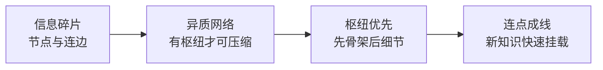

**关键结论**：
- 人脑不是存储器，而是**压缩机器**：异质性越强的信息结构（有主有次、有轻有重）越容易掌握；均匀对称的结构反而不易学。
- 先搭建框架会越学越轻松（新信息只需判断"挂在框架的哪个位置"）；先切入细节会越学越累（后期积压太多零散节点，整合不动）。
- 每个人最初接触的信息不同 → 初始框架不同；框架一旦形成，后续信息大概率**强化而非改变**它（此点需谨慎对待，见 2.5 批判）。

### 2.4 转述质量对照（资料 vs 原文）

| 资料的说法 | 原文核对 | 判定 |
|---|---|---|
| "设计了均匀/随机/无标度三种网络" | 实际是四种：晶格网、随机网、小世界网、无标度网 | ⚠️ 漏了一种 |
| "三种路径接触的信息完全一样，唯一不同是顺序" | 预学习 200 轮序列不同；正式学习 800 轮完全相同且只比较第二阶段 | ✅ 方向对，细节简化 |
| "第一次用脑磁图直接观察到压缩过程" | MEG 观察到的是稳定持续的网络结构表征（RSA 间接推断），非字面"压缩过程" | ⚠️ 措辞略拔高 |
| "框架一旦形成，只强化不改变" | 原文未如此表述；两阶段模型有路径依赖含义，但"只强化不改变"过于绝对 | ⚠️ 过度引申 |
| 医生/记者例子、三步法、转述=压缩测试 | 科普作者的方法论延伸，非论文内容，但方向与原文一致 | ✅ 合理桥接 |

### 2.5 批判性评估（三个问号）

1. **生态效度**：实验用 16 节点抽象网络，真实知识（教科书、标准）结构复杂得多；"如何识别真实领域的枢纽"仍是手艺活，论文未解决。
2. **测的是预测而非应用**：范式测的是预测下一张图片（隐含结构学习），未直接测应用与迁移（做对一道新题、写好一份文档）；"转述"作为验证手段是科普补充，非论文结论。
3. **先有鸡还是先有蛋**：枢纽优先的前提是知道枢纽在哪；完全陌生的领域只能靠二手信号（目录、百科、专家、AI）先取"候选枢纽"，边学边修正。

### 2.6 枢纽 = 根概念：同一结构原理的两层表现

压缩学习实验里的"枢纽"（hub）与本方法论深化后的"根概念"（root concept）不是两个东西——是同一个结构原理在两层各自的名称：

| 层 | 名称 | 证据来源〔按：此处"验证"是日常义（用什么证据支撑），**不是** ISO 9000:2026 §3.11.12 的 verification——见 23 号 §10.2〕 | 回答的问题 |
|----|------|---------|-----------|
| 认知学习层 | 枢纽（hub） | 北大 MEG 实验：HubToLeaf 学习路径优势扩散全网络 | 人脑从哪个概念开始学最优？ |
| 知识本体层 | 根概念（root concept） | 本体论分析 + ISO 标准族核验：去掉它领域崩塌 | 这个领域的承重柱是什么？ |

**同构关系**：无标度网络"少数枢纽占据大量连接、最可压缩"（§2.3 实验 1）⇔ 本体论"少数根概念生成整张概念网络、最可理解"。压缩学习给"先学枢纽"提供了行为证据，根概念分析给"枢纽到底是什么"提供了本体论答案——两者互相补完：前者说"要从枢纽开始学"，后者说"枢纽的深层形态是根，且根可唯一"。

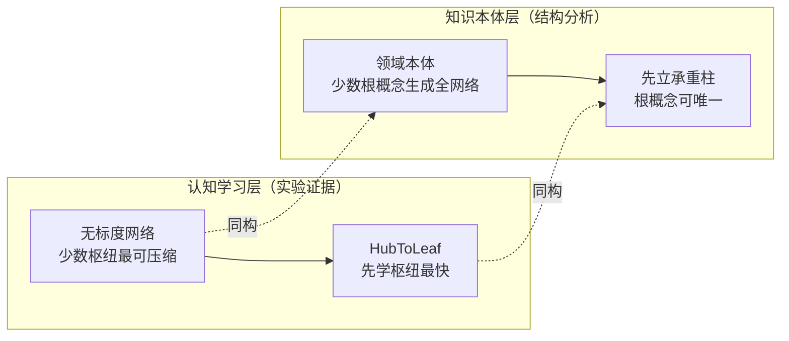

> 这正好回应 §2.5 批判 1 的出路：真实领域"如何识别枢纽"不是纯手艺活——本体论四标准（§1.2 定义、§4.5 判定矩阵）就是它的显式算法。

---

### 2.7 图式与工作记忆：压缩为什么有效（v3.10 新增）

**一句话结论：§2.1～§2.6 给的是"结构侧"证据（有枢纽的网络最可压缩、先学枢纽最快）；本节补"机制侧"证据——压缩为什么有效：因为人脑的瓶颈是工作记忆的带宽，而图式正是压缩包。两节合起来，"结构先于信息"才算既有实验支持、又有机制解释。**

- **瓶颈在内存，不在硬盘**：人脑长期记忆的容量近乎无限；工作记忆的带宽极其有限——一般认为普通人最多同时处理 **4 到 7 个信息元素**。学习的本质是把外部零散信息在狭窄的工作记忆里加工、打包存入长期记忆；**学习失败常常不是"存不下"，而是新信息过这道窄门时堵车**。（依据：Sweller 1988；见附录参考资料 15）
- **压缩的单位是「图式（schema）」**：长期记忆里存的不是信息碎片，而是图式——**把多个相关元素打包成一个整体的认知结构**，可理解为"知识组块"或"压缩包"。例：初学认字的孩子眼中，"中／华／人／民／共／和／国"是 7 个独立元素，瞬间占满工作记忆带宽；对识字者，它早已被打包成一个叫"中华人民共和国"的单一图式，**只占 1 个内存槽位**。
- **由此解释本报告的核心主张**：**一份材料有多难，不取决于它客观上有多少信息，而取决于它在你脑子里算多少信息**——有相关图式则信息量少，图式不够则认知过载。（这与 §2.3"人脑不是存储器而是压缩机器"是同一命题的个体层表述。）
- **对 §3 与 §4.7 的三处直接支撑**：① 给 §3 第 1 环"立枢纽"补机制——枢纽优先之所以快，是因为它先给出一批可复用的图式，**把带宽让给真正的加工**；② 给 §1.2"概念能力"补定位——概念工作产出的是可复用的图式，这正是它成为杠杆的原因；③ 给 §4.7 **限定 A（体系非清单）**补经验支撑——**背下枢纽清单而不形成图式，工作记忆照旧过载**，该学不动还是学不动。
- **三种负荷与现行口径（引时防过时）**：内在负荷（材料自带的复杂度）／外在负荷（与当前任务无关的信息抢戏）／增益负荷（把知识转化为长期记忆的有效努力）。**口径已更新**：Sweller 2023 认为增益负荷不必单列，实操上就是"**尽可能减少外在负荷，把带宽留给内在负荷**"——**本报告不采用"三种负荷"的旧分类**。
- **先验知识调节（一条可操作的强度规则）**：2025 年一篇专论**专长逆转效应（expertise reversal effect）**的荟萃分析结论明确——**低先验知识学习者更受益于高支持教学，高先验知识学习者更受益于低支持教学**。对本报告的直接含义：§4.2"20 分钟立枢纽"不是一刀切，**同一套方法用在陌生领域与用在已有图式的领域，强度应当不同**。（依据：Tetzlaff et al. 2025）
- **边界声明（三条）**：
  1. **作用域**——认知负荷理论的经验证据集中在**有明确结构的学校知识**（数学、科学一类），对"该学什么还不知道"的探究型领域并不适用；课程中"这是教师和家长需要了解的唯一最重要的理论"属课程式措辞，**本报告不采其绝对化表述**。
  2. **层级**——本节讲**个体认知机制**，§2.1～§2.6 讲**群体网络结构**，两级证据**不可互相替代**；引用时应成对出现。
  3. **来源等级**——课程为**转述源**，本节论断以注释所载一手文献为准（见附录参考资料 15）；课程作者的自创提炼不得当文献结论引用。

---

## 3. 掌握专业知识的五环模型

**核心论点：学习专业知识的关键不是"输入信息"，而是"建构结构"。掌握 ≠ 记住，掌握 = 大脑里长出一个能用、能迁移、能修正的知识结构。**

先用布鲁姆认知目标分类学（Bloom's taxonomy，Anderson & Krathwohl 2001 修订版）定义"掌握"：六级阶梯——知道 → 理解 → 应用 → 分析 → 评价 → 创造。**掌握线位于"应用"之上：会用才算掌握。** 大多数人的学习停在"知道/理解"层，能复述、能听懂，但换场景就用不出来。〔v3.10 补证：这个现状判断现有观察数据支持——中小学课堂约 **2/3 到 3/4** 的教学活动落在 ICAP 的 P（被动）与 A（主动）两级，进入 C（建构）与 I（互动）的只有 1/4 到 1/3；一项针对 170 节德国高校课的研究显示，一节课平均 80 分钟里 P 占 41.5 分钟、A 占 12.5 分钟、**C 只有 3.3 分钟、I 只有 4.5 分钟**（31 号 §四.2；注释 [6][7][8]：Vosniadou et al. 2023／2024、Wekerle et al. 2024）。〕

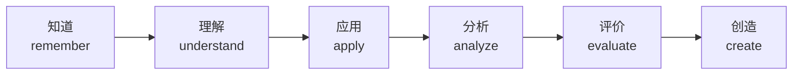

> 掌握线：**会用才算掌握**。五环模型就是一条把知识从阶梯底部推到顶部的生产线。

五环模型（循环迭代，每转一圈骨架更准、网络更密、输出更顺）：

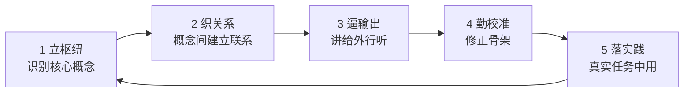

| 环节 | 做什么 | 为什么（依据） |
|------|--------|----------------|
| 1 立枢纽 | 学新领域前先花 20 分钟识别枢纽概念（目录/百科/AI/专家） | 压缩学习实验：HubToLeaf 预学习优势扩散全网络（§2.3）；**机制见 §2.7**——枢纽优先先给出一批可复用的图式（压缩包），把工作记忆的带宽让给真正的加工（v3.10 换引；原"认知负荷最低"一句系**无出处断言**） |
| 2 织关系 | 弄清枢纽间关系（包含/依赖/对立）再填细节 | 知识是网络不是列表；记忆靠连接检索；图式理论——细节挂在关系上才有意义 |
| 3 逼输出 | 三五句话讲给外行、写成文档、做题、教别人 | 测试效应（Roediger & Karpicke 2006）：检索比重读记忆更强；输出暴露认知缺口 |
| 4 勤校准 | 随时准备推翻自己：枢纽选错、关系画反就改 | 概念转变理论（Posner et al. 1982）：错误概念须被更准确解释主动替换；专家与新手差距在骨架准确性。**校准越晚代价越大（结构惯性）：骨架一旦定型，后续新信息大概率强化而非改变它（§2.3 关键结论）——枢纽选错后学得越快、偏得越远（§1.4 杠杆双向性）** |
| 5 落实践 | 在真实任务中用：做项目、审文档、解真问题 | 惰性知识（Whitehead）：不拿来解决问题的知识是死的；情境学习（Lave & Wenger）：技能 = 概念结构 × 情境经验 |

> 掌握 = 用结构消化信息，用输出验证结构，用实践淬炼结构。学习不是把知识装进脑子，而是让脑子长出一棵能结知识的树。

---

## 4. 如何识别核心概念与核心原理（枢纽）

**一句话结论：找核心概念有三层工具——第 0 步先问本体论（这个领域"什么存在"），再用现成标尺收集候选（目录/术语表/专家/AI）、用硬判据筛选（词频/被引用度/反事实检验，进阶用四标准判定矩阵 + 演绎链），最后边学边校准。**

### 4.0 第 0 步：本体论一问（"这个领域，什么存在？"）

**一句话结论：识别核心概念之前先问本体论问题——这个领域里"什么存在"？本体论立场决定根概念，根概念决定核心概念清单。第 0 步答错了，后面全白做。**

- **本体论（ontology）是什么**：问"什么存在"的学问。两个层次：
  - **哲学层**：研究现实世界的基本范畴（亚里士多德以来）——"存在是什么？世界由什么构成？"；
  - **知识工程层**（Tom Gruber 1993）：**"形式化的概念化规范"（formal specification of a conceptualization）**——对一个领域给出对象、关系、约束的抽象视图。知识工程层才是本方法论的直接依据：**对一个专业领域找根概念，就是在对它做本体论。**
- **本体复杂度决定根概念数量**：本体有几维，根概念就有几个——高速信号传输（本体 = 电磁波行为，一维）→ 1 个根（阻抗）；产品开发（本体 = 价值 × 对象 × 行为，三维）→ 3 个根（需求 / 系统 / 设计，质量与架构为派生；此处「派生」是概念网络里的生成关系，架构—设计的边界见 §4.7 图注〔按〕）；企业运行体系（本体 = 对象，见 §4.6）→ 1 个根（产品数据）。

> 规律：**本体有几维，根概念就有几个**——维度拆得越细、承重柱越多（§4.5 判定矩阵 + 演绎链为通用判定法）。产品开发与企业运行体系的完整判定过程分别见 §4.7 与 §4.6；高速信号传输为单领域展开示例（本体一维 → 单根，下图）。

**高速信号传输领域展开（本体一维 → 单根 → 多投影）**：

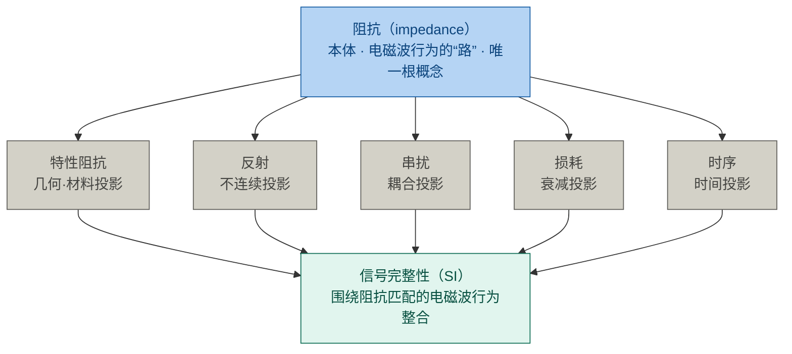

> 图注：特性阻抗是阻抗的几何·材料投影，反射/串扰/损耗/时序是阻抗行为在失配、耦合、衰减、时间维度上的展开——同一规律（§4.6）：投影可改、本体不变，全链路性能是各投影的综合表现。

- **本体 vs 投影（区分根与派生的关键操作）**：不变的对象是本体，可变的结构是投影。流程 = 产品数据在时间上的投影；组织 = 空间投影；绩效 = 价值投影。投影可以改、可以有多种，本体不变——因此"流程再造""组织变革"改的是投影，动不了本体；这也解释了为什么"流程"不是企业运行体系的根（它只是产品数据的投影，见 §4.6 判定矩阵）。

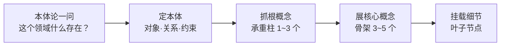

> 原三步识别法（§4.2）是"先有候选再筛"，第 0 步把方法论从"筛枢纽"升级为"定本体"——候选不是凭感觉收集的，而是由本体论立场导出的。
>
> 〔**上游还有一步**：第 0 步问"这个领域什么存在"，前提是**术语身份已经锁定**——那个词是哪部标准哪个条款、该标准的 §3 里有没有定义它、没定义是否按通用语意使用。锁定方法见 **§6.4 术语锁定三问**。**前端论词不清，后端本体必歪**：把 42010 按通用语意用的 concept 当成 ISO 1087 §3.2.7 的"知识单元"，就是在错的地基上问"什么存在"。〕

### 4.1 先区分两个层级

- **核心概念 = 节点（名词）**：领域的"词汇"，如 configuration、configuration item、baseline、version（定义见 §1.2 术语定义链）。
- **核心原理 = 边/规则（命题）**：概念之间反复出现的规律，通常用"当……必须……""……取决于……"表达，如"基线一经批准，变更须走受控流程"、"验证以规定需求为参照"。**原理是更高级的枢纽：掌握原理，概念自动串联。** 原理同样有层级——枢纽级的**核心原理**之上还有源头级的**基本原理**（root principle），2×2 层级矩阵与"母体—展开"关系见 §4.7。

### 4.2 三步识别法

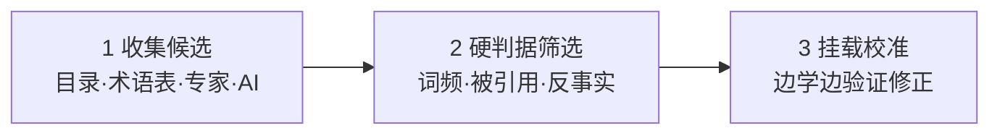

**第一步：收集候选（借现成的标尺，20 分钟）**——领域共同体已帮你压缩过，直接"抄"：

| 来源 | 为什么有效 |
|------|-----------|
| 教材目录/章节标题 | 好教材的顺序本身是枢纽优先的（先基础后应用） |
| 专业术语表 Glossary | 共同词汇的浓缩，出现即被共同体认可 |
| 课程大纲/综述论文 | 专家设计并经多年检验；综述是高手压缩成的"地图" |
| 问 AI/问专家 | 直接要"10 个核心概念及其关系"，再交叉验证 |

**第二步：硬判据筛选（用枢纽的数学定义验证）**：
- **词频**：领域文本高频名词是候选（枢纽被反复调用）；
- **被引用度**：统计概念定义中被引用的其他概念，被引用最多者最基础（如 `requirement` 的定义被整个质量体系引用）；
- **反事实检验**：问"如果这个概念/原理不存在，这个领域还成立吗？"不成立者才是枢纽（如经济学少了"供需"整个框架就塌了）。

> **名称与判据的错位（图论视角）**：文档早期的"被引用度 = 出度、前置数 = 入度"实际测的是**根（root，有向源）**的属性，不是 **hub（无向中心）**的属性——hub 测的是"连接最多"，root 测的是"被全部依赖"。早期称"核心概念"却用了"根"的判据，正是后来区分"核心概念（骨架，hub 视角）"与"根概念（承重柱，root 视角）"的伏笔：**核心概念管"连接多不多"，根概念管"是不是源头"。** 进阶判定方法见 §4.5（四标准判定矩阵 + 演绎链）。〔按：本步的**词频／被引用度／前置数**是**代理判据**，真判据是**反事实检验／不可替代性**（承重测试）——这与 24 号在架构侧的更正**同形**：「可引用性／可判定性／变更影响半径／高层级」都是代理，「够不够格进入这一层」由**目的必要性**判（24 号 §6.1、§6.3、§6.6、§14.1(5)、附录 C 教训 3）。〕

**第三步：挂载校准（让骨架自己浮出来）**：
- **挂载测试**：每学一个新概念问"它挂在哪个枢纽下？"挂不上去说明枢纽清单有漏洞；
- **概念依赖图**：边学边画"概念 → 依赖 → 被依赖"有向图，连线最多的就是枢纽；
- **清单是活的**：随理解加深增删；专家与新手的区别不是清单长度，而是清单准不准。

### 4.3 实战示范：配置管理的枢纽概念骨架

把三步法应用到 AOS 配置管理领域，得到的骨架示意（枢纽定义以标准为准，可调整）：

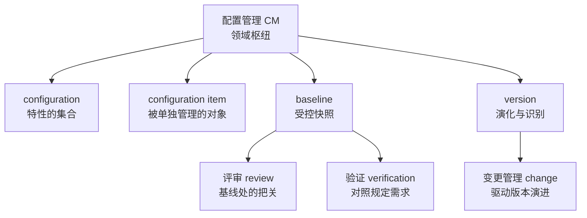

> 用法：之后读 ISO 10007、IPD 配置管理章节时，每个条文先问一句"它挂在哪根柱子上"——这就是"连点成线"的实战操作。

### 4.4 跨域示范：商业战略的枢纽识别（《聪明的对手》）

异质结构原理不只适用认知层——商业层同样成立：企业找"底牌"就是找枢纽，巨头复制不了的正是异质优势（暗知识、信任、非标）；均匀化（照抄巨头）必败，守住枢纽再用技术放大必胜。用反事实检验验证（去掉它，企业还成立吗？）：

| 企业 | 枢纽（底牌） | 反事实检验 | 放大器 |
|------|------------|-----------|--------|
| 达美乐 | 配送网络效率（出餐与配送衔接的暗知识） | 没有配送优势，它只是普通披萨店 | 数字订餐系统、订单预测 AI |
| 胖东来 | 信任（面对面互动积累） | 没有信任，它就是普通超市 | 无 APP，把人性化服务做到极致 |
| 诺基亚 | 通信基础设施能力 | 没有通信技术，转型无路可走 | 聚焦诺基亚网络 |
| 新东方 | 名师表达力（把复杂知识讲得引人入胜） | 没有表达力，直播带货无门 | 东方甄选直播间 |

> 枢纽识别三步法可跨域复用：候选（行业里"最笨、最重、最不怕算法"的东西）→ 硬判据（反事实检验：去掉它企业是否还成立）→ 挂载校准（验证放大器是否真的放大了它，不行就换）。

### 4.5 进阶：根概念的判定矩阵与演绎链

识别根概念不能靠感觉，要用可审计的两件工具：**判定矩阵**（横向打分）与**演绎链**（纵向论证）。

**判定矩阵**：四标准（原子性 / 生成性 / 不可替代性 / 递归性）× 候选概念，逐格打分并附证据：

| 候选 | 原子性（不可由域内概念定义） | 生成性（其余概念由它派生） | 不可替代性（去掉即崩塌） | 递归性（多层级反复生效） | 判定 |
|------|--------------------------|--------------------------|------------------------|------------------------|------|
| 候选 A | ✅ / ⚠️ / ❌ + 一句证据 | …… | …… | …… | 根 / 派生 / 子类 |

**演绎链**：把结论写成可审计的论证链——每个前提（P）附出处，结论（C）由前提逐条推出：

```
P1: 本体论立场 = 该领域的"存在物"（§4.0）
P2: 根概念 = 不可再归约的存在物，四标准判定（§1.2）
P3: 存在物的判定证据 = 标准族 / 治理 / 工程现实（可核验）
P4: 候选 X 通过四标准判定矩阵（§4.5 矩阵）
——→ C: X 是该领域的根概念
```

> 演绎链的意义：把"我觉得是"变成"因为 P1、P2、P3、P4，所以是"——每一环都可以被反驳、被替换，结论因此可辩护。这正是"把结论做踏实"的完整操作：**定义钉死 + 演绎链 + 判定矩阵 + 反驳处理 + 边界声明**。

### 4.6 实战示范：企业运行体系的根概念（产品数据）

把 4.0~4.5 整套方法应用到"企业运行体系建设和运行"领域：

**第 0 步，本体论一问**：企业运行层面，什么存在？——**在产品生存周期里流转的，是产品的数据形态（需求数据、设计数据、制造数据、运维数据、变更记录……）；实物只在物理边界出现，跨部门、跨阶段流动的永远是数据。** 因此本体论立场选"对象本体"：存在物 = 产品数据（广义）。

**判定矩阵**（五候选 × 四标准）：

| 候选 | 原子性 | 生成性 | 不可替代性 | 递归性 | 判定 |
|------|--------|--------|-----------|--------|------|
| 产品数据 | ✅ 自身即事实，不依赖域内概念定义 | ✅ 流程/组织/绩效/质量全部由它派生 | ✅ 去掉它，企业只剩空壳制度 | ✅ 概念级/流程级/实例级都生效 | **根** |
| 流程 | ❌ 由"数据的流转次序"定义 | ⚠️ 生成组织/绩效，但生不成数据 | ❌ 去掉流程，数据仍在（只是无序） | ✅ 各级都有流程 | 派生（产品数据的时间投影） |
| 组织 | ❌ 由分工定义 | ❌ 生不成数据与流程 | ❌ 去掉组织，产品数据仍跨部门流转 | ⚠️ 层级性 | 派生（空间投影） |
| 需求 | ❌ 本身是产品数据的一种 | ⚠️ 派生设计/验证等数据 | ❌ 去掉需求，其他产品数据仍在 | ✅ 需求层级化 | 子类（产品数据的子集） |
| 治理 | ❌ 由"对什么治理"定义 | ❌ 生不成数据 | ❌ 去掉治理，数据仍在（只是乱） | ⚠️ | 派生（作用于数据的规则层） |

**演绎链**：

```
P1: 企业运行的本体论立场 = 对象本体：流转的是产品数据（§4.6 第 0 步）
P2: 根概念 = 不可再归约的存在物，四标准判定（§1.2）
P3: 产品数据通过判定矩阵：原子 / 生成 / 不可替代 / 递归（§4.6 矩阵）
P4: 流程 / 组织 / 绩效 / 治理均可用"产品数据的投影"解释（§4.0 本体 vs 投影）
——→ C: 产品数据（广义）是企业运行体系的根概念
```

**三个硬论证**（不依赖"目的因"，独立成立）：

1. **标准族背书**：ISO 10303（STEP，产品数据表达与交换标准）、ISO 10007（配置管理——管理的正是产品数据的受控状态）、数字主线 / 数字孪生（以产品数据为主线的架构）、PLM / ERP（以产品数据为中心的应用体系）——整个现代制造业的标准与应用栈都建立在"产品数据"这个存在物之上；
2. **可治理性**：治理必须建立在事实层上——管流程要先有流程数据，管质量要先有质量数据；产品数据是治理的对象与依据，治理是作用在其上的规则；
3. **工程现实**：流程实例与数据对象绑定——"流程是骨架，数据是血肉"；一次评审（review）关的是数据对象的受控状态，变更（change）动的是数据对象本身。工程上离开数据，流程无法实例化。

**关键澄清：为什么是"产品数据"而不是"产品"**——在企业运行层面，产品以数据形态存在：设计与制造之间传递的不是实物而是模型与图纸，质量与合规证明的是数据记录，产品的"身份"就是它的数据档案。所以根概念落在"产品数据"（广义），而不是物理的"产品"。

**本体 vs 投影（为什么流程不是根）**：

| 投影 | 定义 | 可变革性 |
|------|------|---------|
| 流程 | 产品数据在时间上的投影（谁先谁后、谁输入谁输出） | 可再造（BPR） |
| 组织 | 产品数据在空间上的投影（哪个岗位承接哪段数据） | 可重组 |
| 绩效 | 产品数据在价值上的投影（效率/质量/成本指标） | 可重设 |
| 产品数据本体 | 不变的存在物 | 不可"再造"，只能累积与治理 |

**一张图看全（根概念生成树）**——产品数据是根（不变量），投影/衍生可重组，全部汇聚为企业运行体系：

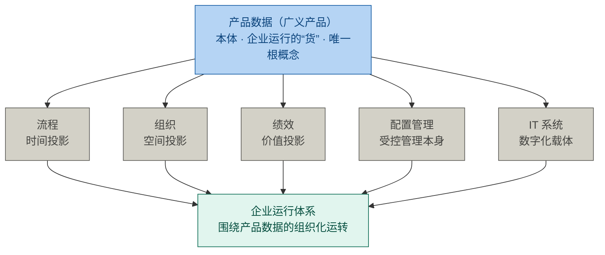

> 图注：投影（流程/组织/绩效）之外，配置管理 = 对产品数据的受控管理本身，IT 系统 = 产品数据的数字化载体——两者同样是"可重组"的衍生层，不是根。

**边界声明**（结论的适用边界，防止越界误用）：

- **学科立场边界**：本结论站在"企业运行体系建设和运行"视角（建设与运行的内容层面）；若只问"运行机制"（不含建设与内容），本体论立场偏"机制本体"，根概念会偏向"流程"；
- **物理层边界**：实物生产（物理制造、物流搬运）不在本结论范围内——根概念分析的是"运行体系"这一信息域；
- **结论强度**：产品数据是**该领域目前站得住**的根概念（基于现有标准与实践），不是绝对真理——按 §5.4，它同样是可被挑战的共识。

> **方法论附注（修正的教训）**：本示范的结论曾经历一次快速翻转——第一轮判断为"流程"，用户提出"产品数据"后立即改口；但第一次翻转只是立场切换，第二次分析（判定矩阵 + 三个硬论证）才让结论站得住。教训：**"改口快"不等于"改得对"，结论的可靠性来自论证链，不来自立场切换的速度。** 面对反驳，先问"它的本体论立场是什么"，再决定是否修正——这本身就是第 0 步的运用。

---

### 4.7 原理也有根：根概念 × 基本原理

**一句话结论：概念（节点）有层级，原理（边）同样有层级——核心原理是枢纽命题（骨架规则），基本原理是法则的源头（公理）；根概念是母体（种子），基本原理是母体定义的语义内蕴被展开成的显式命题——二者不是并列的"领域基底"，而是单向生成：根概念（母体）→ 基本原理（展开）。本体上根概念是基础，但"内蕴"不等于"显式"，展开是有价值的一步。**

§4.1 区分了核心概念（节点）与核心原理（边）；§1.3 把概念侧细分为一般/核心/根三层。本节把同一把刀切向原理侧，得到完整的 2×2 层级矩阵，并给出根概念 × 基本原理的"母体—展开"关系、三个"序"的错位与产品研发领域示范。初版曾把二者表述为"并列的领域基底、须成对识别"，经追问修正：**根概念是母体，基本原理是母体的展开，关系是单向生成而非并列互补**（"改口快不等于改得对"的教训见 §4.6 方法论附注）。

**2×2 层级矩阵（两类元素 × 两个层级）**：

| | 节点 · 概念（noun） | 边 · 原理（proposition） |
|---|---|---|
| **根层（源头）** | **根概念** root concept · 存在物的源头 · 承重柱；判据：原子 / 生成 / 不可替代 / 递归 | **基本原理** root principle · 法则的源头 · 公理；判据：不被推导 / 生成规则 / 去之崩塌 / 多层生效 |
| **核心层（枢纽）** | **核心概念** core concept · 枢纽节点 · 骨架（3~5）；判据：反事实 / 被引用 / 前置少 | **核心原理** core principle · 枢纽命题 · 骨架规则；判据：反复规律 · 概念自动串联 |

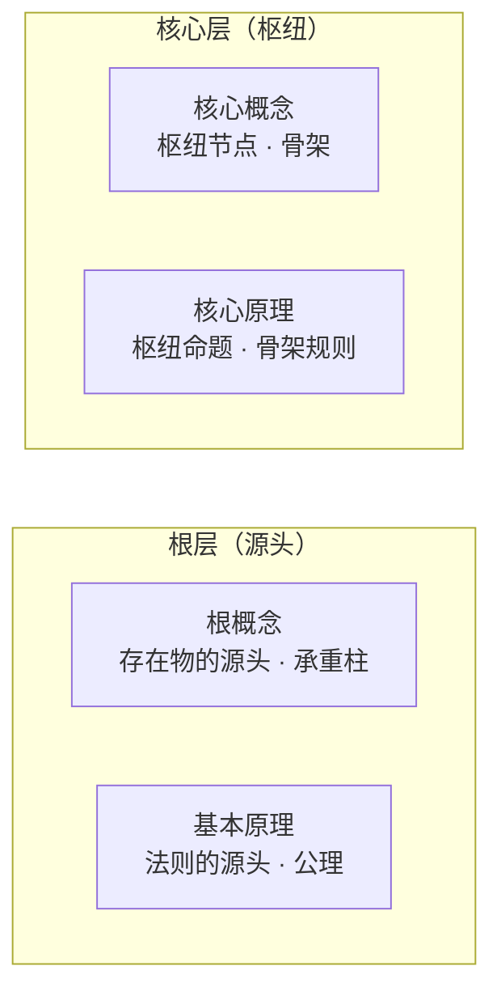

命名对称：hub 级 = 核心概念 / 核心原理；root 级 = 根概念 / 基本原理。**矩阵的对角（根概念 × 基本原理）即"领域基底"，但二者不是并列的两块——根概念是母体（种子），基本原理是母体展开出的显式命题：母体 → 展开，单向生成。**

**根概念 × 基本原理：母体—展开四层关系**：

1. **本体基础（根概念是母体，基本原理是展开物）**：基本原理是根概念定义的语义内蕴——根概念是种子，基本原理是种子内蕴的"生命程序"展开成的显式命题。例：ISO 9000:2026 §3.11.12 定义"验证"时内嵌了 P1（验证以规定需求为参照）；ISO/IEC/IEEE 15288:2023 §3.46 定义"系统"时内嵌了 P3（若干部分或元素的排列，其整体表现出各构成部分单独不具备的既定行为或意义）。先有"需求"这个存在物，才谈得上"验证以规定需求为参照"——存在物是母体，规律是母体展开出的运作方式。
2. **语义内蕴 + 三限定（本体基础成立，但须防三种误读）**：
   - **限定 A（体系非清单）**：搞懂根概念 = 搞懂**体系**（根概念之间的接缝与原理网络），不是知道**清单**（背出几个词）。须走五环第 1、2 环（立枢纽 + 织关系），清单只是入口，背下来不等于掌握。
   - **限定 B（局部 vs 跨概念）**：单根概念只内蕴"局部原理"（落在它自己定义里的规律）；跨概念原理（如 P1、P2 横跨需求 × 设计）住在"接缝"——即节点之间的边（§4.1）上，须织出关系才浮现，单看一个节点看不到。
   - **限定 C（显式化的天花板，v3.10 补）**：显式化是**必要的、但不是充分的**。波兰尼：**任何显性规则的应用，都建立在更深一层无法言说的默会整合之上**——"一种完全显性的知识是不可思议的"；默会知识不是显性知识的残余，而是它的**地基**。三条原因：① **情境依赖**——命题的正确应用有分寸感（"新手医生看的是指南，高手医生看的却是这个病人现在适不适合按指南办"）；② **集体性**——一部分知识长在人与人之间，个人的显式化拿不走；③ **具身性**——火候、手感、节奏是毫秒级整合，超出自然语言的线性带宽。**后果**：命题可检验、可反驳、可落地为工程规则，但**命题的落地仍须内居（indwelling）**——这正是 §3 第 5 环"落实践"不可替代的认知依据。**依据**：Polanyi 1958、Ryle 1946、Collins 2010（见附录参考资料 15）。〔按：本条**不削弱**同节第 4 点"显式化之必要"——两者是"必要"与"充分"的关系、不是对立；轮扁"书是古人的糟粕"否定的是"显式化即充分"，不是显式化本身。〕
3. **判据同构（结构上，同一结构原理的两类表现）**：根概念四标准（原子/生成/不可替代/递归）可原样搬到基本原理——"边的根"与"节点的根"同构（呼应 §2.6 同构思路，但这是层内跨元素）。区别只在承载：概念承载"存在"，原理承载"规律"。
4. **显式化之必要（内蕴 ≠ 显式，展开是有价值的一步）**：弗雷格——概念无真假，命题才有真假。内蕴在定义里的规律若不展开成命题，就无从检验、无从反驳、无从落地；只有展开成基本原理，才能成为工程规则（评审准则、测试用例、追溯矩阵）。认识上，基本原理还反向作"探针"——用原理检验是否真的搞懂了根概念。**演绎链（§4.5）正是根概念的展开运算：把母体内蕴的规律逐条显式化为命题。**〔v3.10 补：展开是**必要**的一步，但**不充分**——命题的落地仍须内居，见限定 C。〕

**三个"序"的错位**（概念辨析易踩坑处）：

| 序 | 谁在先 | 为什么 |
|---|---|---|
| **本体序** | 根概念在先 | 命题由概念组成，原理在本体上后于概念 |
| **认识序** | 常是原理先被感知 | 人先撞见"现象背后的规律"，再追问规律作用在什么存在物上（牛顿先有运动定律的意识，再定义质量、力） |
| **学习序** | 先抓母体（根概念），再沿演绎链展开基本原理 | §4.0 流程：第 0 步本体论一问 → 根概念 → 演绎链展开（展开即显式化原理）；展开结果须回到母体检校 |

**类比：欧氏几何是整道题的镜子**——未定义项（点·线·面）= 根概念（母体）；公设（axioms）= 基本原理（展开）。公设并非与未定义项并列的另一类东西，而是未定义项的语义内蕴被展开成的显式命题——"两点确定一条直线"就是把"点、线"的存在方式说破。一切定理（派生原理）与定义对象（派生概念）都从这两样推出。希尔伯特："点、线、面可换成桌子、椅子、啤酒杯而定理仍成立"——换掉的是根概念的名字，不变的是基本原理的结构：**根概念提供语义载体，基本原理提供结构骨架。**

**示范：产品研发领域（本体 = 价值 × 对象 × 行为，§4.0）**

三个根概念：

| 根概念 | 维度 | 回答 | 标准出处 |
|---|---|---|---|
| 需求 requirement | 价值维 | 该做什么 | ISO 9000:2026 §3.5.1：明示的、通常隐含的或必须履行的需要或期望 |
| 系统 system | 对象维 | 做成什么 | ISO/IEC/IEEE **15288:2023** §3.46（现行版；2015 为前版）：若干部分或元素的排列，其整体表现出各构成部分单独不具备的既定行为或意义（*arrangement of parts or elements that together exhibit a stated behaviour or meaning that the individual constituents do not*） |
| 设计 design | 行为维 | 怎么做 | ISO/IEC/IEEE 24765：design 双义（过程与结果）；规格义见 ISO/IEC/IEEE 15288:2023 §3.13（系统元素及其关系的规格，完整到足以支撑对架构的一次合规实现；〔按：此处的合规对象是**架构**、承担者是**实现**——设计描述只出具「条件性合规」，见 24 号 §4.1／§10.7〕） |

**产品开发领域的根概念生成树（三根 → 投影 → 综合表现层）**：

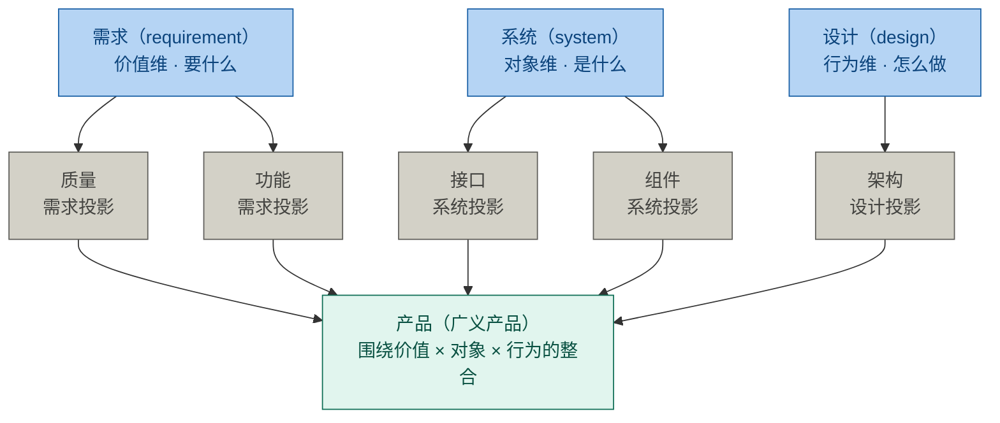

> 图注：质量（ISO 9000:2026 §3.5.2：固有特性满足需求的程度；其中"固有特性"＝§3.10.1 characteristic，**质量管理语境**义）与架构（按 ISO/IEC/IEEE 42010:2022：实体在其环境中的基本概念或属性，以及该实体及其相关生存周期过程的实现和演化的管控原则（governing principles））为派生，接口与组件是系统的边界与部分——呼应 §4.0"质量与架构为派生"；派生层可重组，三根本体不变。〔按：此处的「派生」记的是**概念网络里的生成关系**（这些概念从三根导出），不可读作「架构是设计的一档粗细」——架构与设计的差别是**种类（kind），不是粒度（granularity）**；架构是**抽象物、不是交付物**（可交付物是架构描述 AD）；架构定义与设计定义是并发的两类工作、**不是先后阶段**；架构**支配**方案、方案**实现**架构。「派生层可重组」亦不含架构可随手改动之义——改架构的独占权在架构定义侧（24 号 §8.1 关系 6）。见 24 号 §1.4-1、§2.3、§8.2、§14.3。〕〔按：架构定义句里的 "concepts or properties" **不是 ISO 1087 严谨义**——42010 §3 Terms and definitions 里**既没有 concept 也没有 property** 两条，是按"普遍接受的含义"使用（ISO/IEC Directives Part 2 规则）；这一**析取式**是为**不带偏见地兼容两种哲学**而选：**Conception 派**（架构是脑中的系统概念）与 **Perception 派**（架构是对系统属性的感知），工作组表态 *without prejudice*，且**两派之下架构都是抽象的、不是人工制品**（22 号 §3.6、§5.4.1）。故**不得以 ISO 9000 的 inherent／assigned 限定回读 42010 的 properties**——2022 定义未用该限定（22 号 §4.6、§4.4；§9.6 第 4 条的「场合错配」是同型陷阱）。〕

三条基本原理（每条同时过四标准与名词归约双检）：

| 原理 | 原子性 | 生成性 | 不可替代性 | 递归性 | 预设根 |
|---|---|---|---|---|---|
| P1 验证以规定需求为参照（ISO 9000:2026 §3.11.12） | verification 的定义性命题 | 验证计划 / 评审准则 / 测试用例设计 | 去掉则验证失去参照，评审走过场 | 需求级 / 设计级 / 系统级层层生效 | 需求 · 设计 |
| P2 需求驱动设计，设计实现需求（正向链） | 正向设计的基本因果 | 设计评审 / 影响分析 / 追溯矩阵 | 去掉则设计与需求脱钩 | 系统→子系统→模块层层成立 | 需求 · 设计 |
| P3 系统整体涌现，不可归结为部分之和 | 系统性的定义性命题 | 集成测试 / 系统验证 / 架构设计原则 | 去掉则只剩部件思维，涌现缺陷漏网 | 每层都有"局部对、整体错"的可能 | 系统 |

> 注意：P1、P2 横跨两个根，P3 落在单根上——原理作为"边"，本就把概念连起来；预设的根越多，牵动面越大。这也印证限定 B：跨概念原理住在"接缝"（节点之间的边）上，织出关系才浮现。
>
> 〔按（依 23 号 §5.1／§10.2 补）：上表 P1 只是**需求根**发出的三条判据线之一，勿读作"需求侧只有验证一条尺子"。需求根在地面上分出三把尺——**验证**对**规定需求**（ISO 9000:2026 §3.11.12）／**确认**对**为特定预期用途或应用的需求**（§3.11.14，**判据主体是未显性化的隐含需求**，其参照在派生链之外）／**评审**对**为客体确立的目标**（§3.11.2）。三者是并列的级，不可互相替代；且"验证以规定需求为参照"这条命题在本文出现两级：§4.1 作**核心原理**的例、本表作**基本原理** P1——**两级不是互斥分类，而是同一条命题在两个层级上的登记**（§4.1 末已声明原理自身分两级）。见 23 号 §5.1、§9.1、§10.2。〕

**贯穿实例：便携式心电监测仪**——需求：报警准确率 ≥ 99%、续航 ≥ 48 小时、符合 IEC 60601；系统：传感器模组 + 信号处理算法 + 存储 + 通信 + 电源 + 外壳，交互后涌现"报警"整体行为；设计：信号链架构、低功耗电路设计、算法设计。

| 研发场景 | 原理在起作用 | 若原理缺失 |
|---|---|---|
| 测试组设计报警准确率试验（统计假阳/假阴），每份用例追溯到"准确率 ≥ 99%" | P1 | 测试凭感觉做，达标与否没有依据 |
| 需求方把续航 48h 改为 72h → 影响分析 → 电源选型与功耗架构变更 → 追溯矩阵更新 | P2 | 需求改了设计没跟，电池装不下 |
| 模块单测全绿、整机联动时报警延迟超标——交互缺陷部件测试测不出 → 系统级集成验证 | P3 | 涌现缺陷直到客户现场才爆发 |

**边界声明**：

- **领域边界**：基本原理与根概念一样绑定领域边界（§1.3 注记适用）——同一命题在不同领域可能降级为派生规则（如"需求驱动设计"在纯制造领域不成立）；
- **术语地位**："基本原理"为本方法论命名（对应 root principle / axiom），与"根概念"同理，非标准术语；
- **结论强度**：P1/P2/P3 是产品研发领域目前站得住的基本原理（基于 ISO 9000 / 15288 / 42010），不是绝对真理——同样可被挑战（§5.4）。

**一句话总结**：

> **根概念定"什么存在"，基本原理定"存在物如何运作"；根概念是母体（种子），基本原理是母体展开出的显式命题。本体上，搞懂根概念就内蕴了基本原理——但那是"体系"不是"清单"（限定 A），且跨概念原理住在接缝里（限定 B）；认识上，原理还要反向作探针，检验母体是否真的被搞懂。下手顺序：先抓根概念（母体），再沿演绎链展开原理，展开结果回到母体检校。**

---

## 5. 核心概念的来源与本质

**一句话结论：核心概念和原理是领域共同体（以顶尖高手为主要贡献者）长期实践的智慧结晶——一部分是创造，一部分是发现，大部分是凝结；它们是当前共识，不是终极真理。**

### 5.1 概念的生命周期

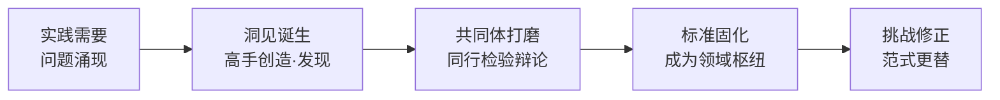

### 5.2 三种出生方式

| 方式 | 含义 | 例子 | 归因 |
|------|------|------|------|
| 创造（invented） | 人造的工具，无自然界对应物 | 变量（笛卡尔/韦达）、图灵机（图灵）、`requirement` 术语体系（ISO 委员会） | 可归功于个人或机构 |
| 发现（discovered） | 规律本来就在，被揭开 | 万有引力、能量守恒 | 归功于揭示者 |
| 凝结（distilled） | 共同体长期实践经验的结晶被固化 | baseline（源自美国国防部军品工程实践，后由 ISO 10007 固化） | 无单一发明者 |

> 例：**baseline 不是哪位科学家发明的**。它来自军品工程"版本失控、改坏了找不回来"的惨痛教训，工程共同体逐步摸索出"受控快照"的做法，最后才被标准组织写成条文——无数无名工程师用教训"酿"出来的。

### 5.3 贡献者不只是"个人天才"

| 角色 | 例子 |
|------|------|
| 个人高手 | 牛顿、图灵、爱因斯坦 |
| 权威机构/委员会 | ISO、IEEE、CMMI（`requirement`、`baseline` 的定义是委员会博弈的产物） |
| 实践共同体 | 国防工程、医疗、法律传统（概念先在实践长出来，再被理论化） |

### 5.4 共识 ≠ 真理

- 化学的"燃素"、物理的"以太"都曾是核心概念，后被推翻；
- 库恩"范式转换"：每个时代的枢纽清单是那个时代认知的天花板，不是终点；
- 呼应五环模型第 4 环：连领域公认的枢纽都可以怀疑、修正。

> 学核心概念 = 以最小成本继承共同体几百年的最大公约数智慧；但它是共识不是真理——**枢纽是起点，不是天花板**。

### 5.5 找根 = 对一个领域做本体论

**一句话结论：识别根概念不是"挑重点"，而是在对一个领域做本体论（ontology）——回答"这个领域里什么存在、它们如何组织"。**

- **本体论 = 问"什么存在"的学问**：哲学层追问现实的基本范畴；知识工程层（Gruber 1993）把本体论定义为"形式化的概念化规范"——对一个领域给出对象、关系、约束的抽象视图（§4.0）；
- **根概念 = 领域本体的承重结构**：本体论回答"存在什么"，根概念回答"哪个存在物是不可再归约的源头"——两者是同一件事的两个问法；
- **所以**：给一个领域找根概念，就是在做它的本体论；而一个领域最深刻的概念工作，就是把它的本体论讲清楚（§4.5 演绎链的 P1 就是本体论立场）。

> 这正是"概念能力"的终极形态：不只是识别枢纽（hub，连接多），而是识别根（root，源头）——枢纽让学习更快，根让领域可理解、可治理、可变革（§4.6）。

---

## 6. 如何真正理解核心概念（四问法与术语锁定三问）

**一句话结论：真正理解一个概念，要先锁定它的术语身份（三问），再回答它的四问——它是什么、它不是什么、它从哪来、它往哪去。三问管"这个词在这份文本里是什么意思"，四问管"这个概念在我脑子里立住了没有"。能答全四问才算拥有它；只能答第一问，只是见过它。**

### 6.1 假懂 vs 真懂

| | 假懂（记忆层） | 真懂（理解层） |
|---|---|---|
| 定义 | 能背诵原文 | 能用自己的话重述 |
| 例子 | 举不出或照抄 | 能举正例，更能举反例 |
| 边界 | 不知道何时失效 | 知道它不是什么、何时不成立 |
| 关系 | 孤立记住 | 知道挂在哪个枢纽下、与谁冲突 |
| 来源 | 不关心 | 知道解决什么问题、为何被发明 |
| 检验 | 考试能答 | 讲给外行能懂、新情境能用 |

> 理论依据：维特根斯坦"意义即用法"（meaning is use）——概念的意义不在字典里，在它的用法里；理解概念 = 会用它，而不是会背它。

### 6.2 四问法

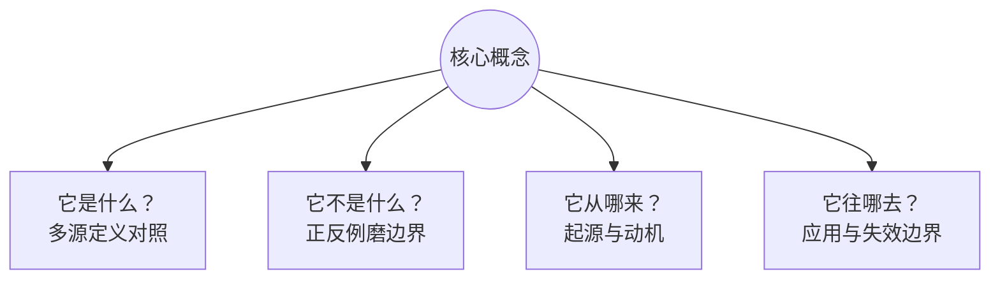

| 问 | 操作 | 理由 |
|----|------|------|
| 它是什么？ | 找三四个来源（标准、教材、百科、高手著作）对照定义，差异处即本质处 | 定义的差异暴露概念本质（如 `requirement` 在 ISO 9000 与 IEEE 表述不同） |
| 它不是什么？ | 找正例和反例，用反例磨边界 | 边界靠反例定型；原型与样例理论（Rosch）：概念靠典型例子活，靠反例定型 |
| 它从哪来？ | 回到概念被创造时的问题现场：解决什么问题？没有它之前人们怎么受苦 | 动机是记忆钩子；词源（如 baseline = 测量学"基准线"）让概念"活" |
| 它往哪去？ | 挂在什么流程、被谁使用、何时失效 | 用得越熟越知道适用条件；掌握失效边界 = 深度理解 |

### 6.3 实战示范：baseline 四问

- **是什么**：configuration item 在特定时点被正式批准的受控状态集合，作为后续开发与变更的参照基准；
- **不是什么**：不是备份，不是普通版本快照——备份只管恢复，基线管"受控"（谁批准、谁可改、改完怎么评估）〔按：配置与基线属**管理侧**，不在**架构治理**的对象之列——24 号 §2.3 互参、29 号 §2.2「对象」判据〕；
- **从哪来**：军品工程"改坏了找不回来"的教训；词源来自测量学"基准线"（以它为基准，一切变更可测量、可追溯）；
- **往哪去**：变更控制（CCB 评估）、验证参照、配置审计依据；失效边界——变更不受控时它只是废纸。

> 理解不是记住定义，而是重建概念诞生的现场、画出它的边界、看清它的去处。四问答全，概念才从书里搬进脑子里。

### 6.4 术语锁定三问与九类陷阱

**一句话结论：讨论一个概念之前，先锁定它的术语身份——问三件事：哪部标准的哪个条款？该标准的 §3 里有没有定义这个词？没定义的话，是按"通用语意"用吗？三问不落，同名异义就会伪装成共识。**

四问法（§6.2）管"理解一个概念有多深"，本节三问管"锁定一个术语的出处与语境"——**两把工具不同轴**：四问的入口是"它是什么"（多源定义对照），三问的入口是"这个定义出自哪一条"（标准与条款）。三问在前，四问在后——**定义都没锚住，对照出来的差异只是噪声**。

**为什么先问出处**：同形异义（homonym）是概念工作里最贵的错误——同一个词形在两个语境里指向两个概念，讨论双方各自以为懂了，实际各说各话。本方法论赖以立论的"概念"一案即标本：`concept` 在 **ISO 1087:2019 §3.2.7** 是"由特性的独特组合而形成的知识单元"（知识层），而在 **ISO/IEC/IEEE 42010:2022 §3.2** 是**按通用语意**使用的 idea／notion——**42010 的 §3 Terms and definitions 里根本没有 concept 这一条，也没有 property 这一条**（按 ISO/IEC Directives Part 2，标准中未定义的术语按"普遍接受的含义"使用）。ISO 1087 自己也在 §3.2.7 注 2 立了自警：这是术语学语境的 concept，**与工业自动化、营销等领域的同名概念完全不同**（22 号 §3.1、§3.6）。

| 问 | 操作 | 不答的后果 |
|---|---|---|
| ① **哪部标准的哪个条款？** | 给出标准号 ＋ 版本 ＋ 条款号 | 论据漂移成"普遍说法"，无处可核 |
| ② **该标准的 §3 里有没有定义这个词？** | 翻该标准的 Terms and definitions | 把"通用语意"当成"标准定义"用 |
| ③ **没定义的话，是按"通用语意"用吗？** | 是则标"通用语意"，否则找出隐含的领域定义 | 同名异义伪装成共识 |

**判定原则**：一个术语在多部标准都出现时，**先确认每部标准是否在 §3 定义**；**只在一处定义时用该标准为锚**；**多处定义时逐一定位、不混用**。

九类陷阱是三问的反面清单——每一次漏问，都会掉进其中一类（22 号 §10.3）：

| # | 陷阱 | 实例 |
|---|---|---|
| ① | **同形异义（homonym）** | concept／property 在 ISO 1087、ISO 9000、ISO/IEC 2382、42010 四处的所指各不相同 |
| ② | **抽象 vs 具象** | 把"性质"（concepts／properties）读成"构件"（elements／relationships）〔此处「性质」是日常义；两词的规范译名是「**概念**」与「**属性**」——见 §1.2〕 |
| ③ | **动名词混用** | defining（动）vs definition（名）——"对架构的定义"一句两义 |
| ④ | **限定词错位** | "**系统的**基本概念"被读成"**架构的**基本概念" |
| ⑤ | **包含 vs 等同** | 把 AD 与 definition 当等同（AD ⊇ definition，AD ≠ definition） |
| ⑥ | **概念 vs 动作** | 把"被感知"（perceive）压成"被描述"（describe） |
| ⑦ | **时代化版本漂移** | 只看现行版不看前版——"concepts or properties" 兼容两种哲学（Conception／Perception）的用意随之消失 |
| ⑧ | **翻译精度陷阱** | governing 译成"指导"——失去规约力（governing ≠ guiding） |
| ⑨ | **主语代换不察觉** | system → entity（42010:2011 → 2022 的主体扩域）——还在用"系统架构"措辞，数据／业务架构找不到锚 |

**两处与本文其余部分接得上**：陷阱 ④⑨ 是同一件事的两端——**限定词与主语的错位**，与 §4.0"第 0 步本体论一问"同源（主体没定，本体必歪）；陷阱 ⑦ 与 §6.2 四问之"它从哪来"同工（不问版本，就看不出措辞背后的取舍）。

> **互参**：本节的锁定方法与陷阱谱为**可移植件**，全部十四条对照（含 `property` 的四语境、`characteristic` 的两语境、`attribute` 的命名层）见 **22 号《架构、概念、属性研究报告——术语权威定义与对照分析》** §4、§9～§10；该报告 §10.1 另给完整的七步精度辨析流程（verbatim 引证 → 上下文切片 → 跨标准锚定 → 语境对照 → 精度分层 → 翻译精度 → 可移植结论），本文只收其中可纳入学习方法论的两件——**三问与陷阱谱**。

---

## 附录：概念档案（术语族）

> 九格尺子格式见《00-全书框架.md》第四节；六张卡组成术语族，供《架构师》附录 B 档案集收录。术语定义与判据见 §1.2 术语定义链。

### 概念档案 · 概念

| 格 | 内容 |
|---|---|
| ① 定义 | 对一类对象共同特征的抽象概括（知识单元，ISO 1087:2019 §3.2.7——unit of knowledge created by a unique combination of characteristics）。判据：可指称（一个词/短语）+ 可界定（内涵与外延）。本方法论叠加义（网络节点/枢纽）见 §1.2 术语定义链。 |
| ⑥ 对立面 | 站在"个别"的对立面：感知（percept，个别具体印象）与实例（individual）。概念是"一般"，把无限具体压缩成可沟通的有限单元。 |
| ⑦ 辨析 | 术语 term（指称概念的语言符号）vs 概念（被指称的知识单元）；定义 definition（对概念的描述，ISO 1087:2019 §3.3.1＝*由描述性短语表征一个概念、用以把它与相关概念区分开来*，即**上位概念 ＋ 区分性特性**——核心义是"划界"）vs 概念本身；范畴 category（分类学上位）vs 概念；**属性 property（§3.1.3，对象层）vs 特性 characteristic（§3.2.1，抽象层）vs 概念（§3.2.7，知识层）**——三者是自下而上的抽象链；attribute（ISO/IEC 2382-17:1999 §17.02.12）是 property 的命名化侧支，ISO 9000:2026 §3.10.1 的 characteristic（区别性特征，带 inherent／assigned 限定）是质量管理语境的特殊化——四处语境的锁定见 §6.4。 |
| ⑨ 术语英文来源 | 概念 ↔ concept。拉丁语 conceptus（concipere：con-"一起" + capere"抓取"），本义"被把握住的东西"。 |
| ② 背景 | 人需要把无限具体经验压缩成可沟通的有限符号单元——概念是压缩的产物；术语学（terminology）由此成为学科。 |
| ③ 演化的历史 | 亚里士多德范畴论 → 逻辑学/认识论 → 术语学标准（ISO 1087、GB/T 15237）→ 认知科学（原型理论 Rosch）→ 本方法论（概念 = 网络节点）。**条款号迁移**：concept 的定义文本在 ISO 1087-1:2000 §3.2.1 与 ISO 1087:2019 §3.2.7 **一字未改**，2019 版只是换了条款号——故老文献引旧号**仍然有效**，只需换号（22 号 §3.4）。 |
| ④ 问题 | 没有概念之前，人只能用具体事例交流（"那个红的圆的"），无法抽象沟通。它回答："如何用最少符号承载最多经验？" |
| ⑤ 场景 | 一切思维与沟通的前提；何时不用——需精确指称个体时改用专名（专有名词）。 |
| ⑧ 误区 | "概念 = 词语" → 词语是符号，概念是意义；"概念 = 事物" → 概念是对事物的抽象，不是事物本身；"概念有绝对正误" → 概念只有共识强弱（燃素曾是共识）。 |

### 概念档案 · 核心概念

| 格 | 内容 |
|---|---|
| ① 定义 | 概念网络中处于枢纽地位的概念：解释领域内其他概念都要用到它，理解它自己只需很少前置知识。判据：反事实检验 + 被引用度 + 前置数（筛选详见 §4.2）。 |
| ⑥ 对立面 | 站在"边缘概念（叶子 leaf）"的对立面：叶子处于网络末端、被枢纽解释、不解释别的东西。维度：网络地位。 |
| ⑦ 辨析 | 基本概念 basal concept（入门次序，偏教学先后）vs 核心概念（结构地位，偏被依赖程度）；关键概念 key concept（重要但未必枢纽）vs 核心概念（强调"被依赖"）。 |
| ⑨ 术语英文来源 | 核心概念 ↔ core concept / hub concept。hub 原义"轮毂"——辐条都连到它；图论无标度网络的枢纽节点。 |
| ② 背景 | 压缩学习实验发现无标度网（少数枢纽占据大量连接）最易学——识别枢纽成为学习的第一步；图论"枢纽"概念进入认知科学。 |
| ③ 演化的历史 | 图论 hub（无标度网络，Barabási）→ 认知科学压缩学习（北大 2026）→ 学习方法论"先立枢纽" → 本方法论（枢纽 = 核心概念）。 |
| ④ 问题 | 没有核心概念识别之前，学习不知道从哪下手（信息过载、细节淹没）。它回答："领域知识的四梁八柱是什么？" |
| ⑤ 场景 | 学习新领域的第一步（20 分钟立枢纽）、课程设计、教材编写（先枢纽后细节）；何时不用——领域已有共识框架时直接采用。 |
| ⑧ 误区 | "核心概念 = 看起来最重要的概念" → 是"被依赖最多"，不是"看起来重要"；"一个领域只有一个核心概念" → 这是把"根概念"的结论错安在"核心概念"上——核心概念是骨架（通常 3~5 个），根概念才是承重柱（可唯一 1~3 个），根概念 ⊂ 核心概念，两者分层不冲突（§1.2）；"核心概念固定不变" → 随范式更替。 |

### 概念档案 · 根概念

| 格 | 内容 |
|---|---|
| ① 定义 | 概念网络的"承重柱"——领域中不可再向下归约的源头概念，其余概念（含核心概念）都由它导出。四条判据：原子性（不可由域内其他概念定义）/ 生成性（其余概念从它派生）/ 不可替代性（去掉它领域崩塌）/ 递归性（多个抽象层级反复生效）。根概念 ⊂ 核心概念（承重柱 ⊂ 骨架），可唯一（1~3 个）。 |
| ⑥ 对立面 | 站在"派生概念"的对立面：派生概念可由根概念导出（如流程 = 产品数据的时间投影）；根概念不可由任何域内概念导出。维度：归约方向。 |
| ⑦ 辨析 | 核心概念（骨架，hub 无向度视角，3~5 个）vs 根概念（承重柱，root 有向源视角，1~3 个）；枢纽 hub（压缩学习术语，认知层）vs 根概念（本体论术语，知识层）——同一结构原理的两层表现（§2.6）。 |
| ⑨ 术语英文来源 | 根概念 ↔ root concept。root 本义"植物的根"——营养从根流向枝叶；图论有向图"根"（root）= 无入边的源节点，恰对应"被全部依赖、不依赖别人"。 |
| ② 背景 | 文档早期用"被引用度 = 出度、前置数 = 入度"测核心概念，实际测的是 root（有向源）属性而非 hub（无向中心）属性——名称与判据错位，逼出"根概念"这一层（§4.2）。 |
| ③ 演化的历史 | 图论 root（有向源）→ 本体论（存在物的不可归约者）→ 本方法论四标准（原子/生成/不可替代/递归）→ 判定矩阵 + 演绎链（§4.5）。 |
| ④ 问题 | 没有根概念之前，"核心概念清单"只是凭感觉的枢纽列表，不知道哪根柱子最承重。它回答："这个领域，什么存在物是不可再归约的源头？" |
| ⑤ 场景 | 建立领域本体、确定学习与治理的第一对象、解释"为什么是这个概念"；何时不用——只需要"学得快"时用 hub（核心概念）就够，不必每次都挖到根。 |
| ⑧ 误区 | "根概念 = 最重要的概念" → 是最"源头"的，未必最"重要"（质量很重要，但它是需求/系统的派生）；"根概念与核心概念矛盾" → 分层不冲突（承重柱 ⊂ 骨架）；"根概念凭直觉找" → 必须过判定矩阵 + 演绎链（§4.5）；"根概念永恒" → 随范式更替（§5.4）。 |

### 概念档案 · 基本原理

| 格 | 内容 |
|---|---|
| ① 定义 | 原理侧的"源头"——领域中不可再被推导的法则（命题），是根概念（母体）的语义内蕴被展开成的显式命题。四条判据：不被推导（域内无更基本命题推它）/ 生成规则（派生命题与工程规则从它导出）/ 去之崩塌（去掉它领域推理失去依据）/ 多层生效（多个抽象层级反复适用）。基本原理 ⊂ 核心原理（公理 ⊂ 骨架规则），与根概念同处源头层（§4.7 2×2 矩阵）。 |
| ⑥ 对立面 | 站在"派生命题"的对立面：派生命题可由基本原理推导（如测试用例设计规则由 P1 推出）；基本原理不可由域内任何命题推导。维度：推导方向。 |
| ⑦ 辨析 | 核心原理（枢纽命题，骨架规则）vs 基本原理（源头命题，公理）——与核心概念/根概念同构分层（§4.7）；原理 principle（一般规律）vs 命题 proposition（可判真假的陈述，弗雷格）；"原理"在日常还常指"原则/准则"（如设计原则），本方法论取"源头法则"义（§4.7 边界声明：术语地位为本方法论命名）。 |
| ⑨ 术语英文来源 | 基本原理 ↔ root principle / axiom。root 与根概念同源（图论有向源：无入边）；axiom 希腊语 axiōma"被认为值得的东西"——自明、无需证明的起点。 |
| ② 背景 | 诞生于"原理也有根"的追问：概念侧分出根层后，原理侧是否同样有源头？2×2 层级矩阵（节点/边 × 核心/根）落位后，进一步发现原理侧的源头恰是根概念定义的语义内蕴——ISO 9000:2026 §3.11.12 定义"验证"内嵌 P1，ISO/IEC/IEEE 15288:2023 §3.46 定义"系统"内嵌 P3（§4.7 母体—展开关系）。 |
| ③ 演化的历史 | 欧氏几何公设法（axiomatic method）→ 弗雷格"概念无真假、命题才有真假" → §4.7 v2.1 的 2×2 层级矩阵 → v2.2 母体—展开修正（基本原理 = 根概念的展开运算，演绎链即展开器）。 |
| ④ 问题 | 没有基本原理之前，领域推理没有公理层——规则从哪来、凭什么站得住，全凭经验与权威。它回答："这个领域，什么法则是不容再推导的源头？" |
| ⑤ 场景 | 建立领域公理层、把概念内蕴显式化为工程规则（评审准则/测试用例/追溯矩阵）、用原理作探针检验对根概念的理解；何时不用——只需"学得快"时用核心原理即可，不必每次都挖到基本层。 |
| ⑧ 误区 | "基本原理 = 最重要的原理" → 是最"源头"的，未必最"重要"（某条局部规则可能在实践中天天用）；"搞懂根概念就自动搞懂基本原理" → 只对"体系内蕴"成立：跨概念原理在接缝里（限定 B），且内蕴 ≠ 显式、须展开成命题才可检验落地（限定 A）；"基本原理凭直觉找" → 与根概念一样须过四判据；"基本原理永恒" → 随范式更替（§5.4）。 |

### 概念档案 · 概念体系能力

| 格 | 内容 |
|---|---|
| ① 定义 | 以概念为单位的压缩与组织能力（正式全称"概念体系能力"，简称"概念能力"）：识别枢纽（抓出决定其余部分的核心概念）→ 织关系（连成有结构的网络）→ 迁移（搬到新场景）→ 辨边界（用反例划清适用与失效范围）。**判据：转述测试（陌生领域三五句话讲清）+ 辨伪测试（能举反例划边界）。** |
| ⑥ 对立面 | 站在"机械执行"与"信息搬运"的对立面：对立面是程序性熟练（不动脑的重复）与碎片化记忆（无结构的信息堆积）。维度：组织信息 vs 存储信息。 |
| ⑦ 辨析 | 概念技能 conceptual skill（Katz，管理视角，偏"看全局"）；抽象思维（更宽，含演绎推理）；理解力（偏接收端，概念能力还含输出端：迁移与辨伪）；口才（表达只是验证手段，不是本体）。 |
| ⑨ 术语英文来源 | 概念能力 ↔ conceptual ability。concept ← 拉丁语 conceptus（concipere：con-"一起" + capere"抓取"），本义"被把握住的东西"——概念能力字面即"抓取的能力"。 |
| ② 背景 | 诞生于"AI 时代人还剩什么"的处境：记忆与信息处理外包给机器，人剩下的稀缺能力是压缩与组织。科学支撑：北大压缩学习实验（2026，Nature Communications）；管理传统：Katz 1955 概念技能。 |
| ③ 演化的历史 | conceptual skill（Katz 1955，管理）→ conceptual knowledge（布鲁姆修订版 2001，教育）→ concept learning（认知科学）→ 本方法论整合为"概念能力"并给出可训练路径（五环模型第 1、2 环）。 |
| ④ 问题 | 没有它之前：学习是碎片堆砌（越学越累）、表达是复读（讲不清）、跨领域是重来（换赛道归零）。它回答："如何把混沌信息变成可用结构？" |
| ⑤ 场景 | 用：学习新领域（立枢纽）、诊断概念误解（辨边界）、写作与教学（讲给外行听）、跨域转型（迁移）。不用：纯程序性操作为主的场景（如流水线操作培训），概念先行边际收益低。 |
| ⑧ 误区 | "概念能力强 = 懂得多" → 组织得好才关键；"概念能力强 = 口才好" → 转述是测试，结构是本体；"概念能力 = 核心竞争力" → 是枢纽不是全集（§1.2）；"概念能力是天生的" → 五环模型就是训练流水线；"概念体系能力 = 根概念能力" → 根概念能力只是方向盘（识别承重柱），概念体系能力还含织关系/迁移/辨边界（§1.2）。 |

### 概念档案 · 根概念能力

| 格 | 内容 |
|---|---|
| ① 定义 | 识别、验证并运用根概念的能力——概念体系能力的子能力（方向盘：先定本体论立场，再抓承重柱）。判据：20 分钟对陌生领域给出"根概念 + 核心概念清单及其关系"，并能用判定矩阵与演绎链为每个候选辩护。 |
| ⑥ 对立面 | 站在"细节优先的学习习惯"（LeafToHub）的对立面——从边缘概念入手、不看骨架、更不辨承重柱，被细节淹没。 |
| ⑦ 辨析 | 概念体系能力（全集：识别/组织/迁移/辨边界）vs 根概念能力（子集：本体论立场 + 承重柱识别）；判断力/洞察力（更宽，含价值判断）vs 根概念能力（特指结构性判断）。 |
| ⑨ 术语英文来源 | 根概念能力 ↔ root-concept ability。root（根）——植物的根、图论有向源的"根"；能力对象从"hub（枢纽，连接多）"收窄为"root（源头，被依赖）"。 |
| ② 背景 | 压缩学习实验 HubToLeaf 组优势（预学习 200 轮，优势扩散至 800 轮）——"先识别枢纽"可训练且回报极高；进一步追问"枢纽的深层形态"，落到本体论根概念（§2.6）。 |
| ③ 演化的历史 | 专家直觉（老手知道什么重要）→ 压缩学习实验证实其可训练 → 三步识别法（收集候选/硬判据/挂载校准）→ 本体论第 0 步 + 四标准判定矩阵 + 演绎链（§4.0/§4.5）→ 本方法论第 1 环（立枢纽）。 |
| ④ 问题 | 没有它之前，新手被细节淹没、学得慢而累，且分不清"重要"与"源头"。它回答："面对陌生领域，20 分钟内找到那根承重柱与整副骨架。" |
| ⑤ 场景 | 学新领域、做课程大纲、审一份陌生标准、跨界转型、建立领域本体；何时不用——已有权威框架时直接采用，不必每次重找。 |
| ⑧ 误区 | "根概念能力 = 知识渊博" → 知识多不等于会抓根；"是天赋" → 判定矩阵 + 演绎链可训练；"一次定终身" → 骨架必须勤校准（五环第 4 环）；"管住根就管住一切" → 根概念能力只是方向盘，织关系/迁移/辨边界还要靠全集。 |

---

## 附录：参考资料

1. Xiangjuan Ren, Muzhi Wang, Tingting Qin, et al. *Compressive learning scaffolds higher-order network structure to enhance human knowledge acquisition*. Nature Communications, 2026-07-17. DOI: 10.1038/s41467-026-75843-7. （北京大学新闻网转载说明：罗欢、方方、李阿明团队）
2. Bloom's taxonomy（Anderson & Krathwohl 修订版, 2001）：认知目标六级分类。
3. Roediger, H. L., & Karpicke, J. D. (2006). *The power of testing memory*. Perspectives on Psychological Science. —— 测试效应。
4. Posner, G. J., et al. (1982). *Accommodation of a scientific conception*. Science Education. —— 概念转变。
5. Whitehead, A. N. (1929). *The Aims of Education*. —— 惰性知识。
6. Lave, J., & Wenger, E. (1991). *Situated Learning*. —— 情境学习。
7. 费曼技巧：Feynman, R. P. —— "讲给六岁小孩听"。
8. 用户提供科普资料：《关于学习的新研究：压缩学习》转述文本（播客/自媒体风格，2026-07 前后）。
9. 朱峰、曹沂宁《聪明的对手》——商业层"异质结构原理"的案例源（守住防线/合纵连横/废墟重生），§1 与 §4.4 案例出处。
10. Tom Gruber (1993). *A Translation Approach to Portable Ontology Specifications*. Knowledge Acquisition, 5(2): 199-220. —— 本体论知识工程层定义："formal specification of a conceptualization"（§4.0、§5.5）。
11. ISO 10303（STEP，产品数据表达与交换标准）、ISO 10007（配置管理指南）——"产品数据为根"的标准族背书论据（§4.6）。
12. ISO/IEC/IEEE 42010:2022 与其中文等同采标本 **GB/T 45630-2025《系统与软件工程 架构描述》**（2025-11-01 实施）——架构定义的现行口径与中文术语定名依据（§4.7 图注）。
13. **ISO 1087:2019《术语工作与术语科学——词汇》**（取代 ISO 1087-1:2000）——concept（§3.2.7）、property（§3.1.3）、characteristic（§3.2.1）、definition（§3.3.1）的权威锚；ISO/IEC 2382-17:1999 §17.02.12（attribute）与 ISO 9000:2026 §3.10.1（characteristic，质量管理语境）为同名异义的两处对照（§1.2、§6.4）。
14. **22 号《架构、概念、属性研究报告——术语权威定义与对照分析》**——本方法论所收「术语锁定三问」与「九类陷阱谱」的出处（§6.4）；`concept`／`property` 的跨标准四语境对照与 `architecture`／`architecture description` 的逐条款 verbatim 考证见该报告 §3～§6、§9～§12。
15. **《现代思维工具100讲》「教育与学习」板块（第 38—47 讲）及其注释所载一手文献**——本报告 v3.10 所补**机制层（§2.7）**、**判据分级（§1.2）**、**ICAP 观察数据（§3 开篇）**与**限定 C（§4.7）**的出处。**原文照录**见 `31-现代思维工具100讲记录-教育与学习板块.md`（v1.3，十讲齐，注释 114 条）；**提炼与写书接驳**见 `31-现代思维工具100讲研究报告-从表征到解释框架的内在地图.md`（v1.0）。**直接支撑本报告的一手文献**：Sweller 1988／1994／2023／2024、Kirschner-Sweller-Clark 2006、Chi 2009、Chi & Wylie 2014、Craik & Lockhart 1972、Menekse et al. 2013、Wekerle et al. 2024、Polanyi 1958、Ryle 1946、Collins 2010。**引用体例**：课程为**转述源**，证据以注释所载一手文献为准；课程作者的提炼（如"三道锁"）与估算（如阶段功能配比）**不得当文献结论引用**。

---

*本文档由概念研习对话整理，供 AOS 项目研究使用。*
