# 评审概念体系精讲：从 Review 定义到需求管理

> 基于 ISO 9000:2026、ISO 9001:2015、ISO/IEC/IEEE 12207:2017、IEEE 1028-2008 的系统性梳理
> 整理日期：2026-08-18 ｜ 完整版（含全部讨论图示）
> 适用场景：需求评审、设计评审、代码评审、测试评审、发布评审、质量审核、术语辨析
> **修订记录**：2026-08-27 增补——§3 标准依据补 ISO/IEC/IEEE 42030:2019（架构评估最权威出处）；§8 补「目标究竟是评审还是确认的依据」字面裁决（含 MOE 显性子集纠正：MOE 全绿≠确认通过）；§9 补「方向把关的两道闸」（评审=早拦/确认=终审）；§13 补「需求的三上游与转化≠分解」（目的→目标→需求链条语义）。**2026-09-04 修订**——确认（validation）的对照短语按本文「requirement→需求」口径统一为"预期用途或应用需求"：§7 定义表确认格、§8 节题与正文与两图共 6 处（§19 顶部官方中文速查为 GB 引录、保留国标"要求"原文不动）。**2026-09-21 第二轮收口**（用户裁定「fundamental 用『基本』，其余术语按 GB/T 45630-2025」）——「干系人」3 处改「**利益相关方**」（§13 通道③正文与两图）；正文与 GB/T 19000-2016 引录中的「相关方」按 ISO 9000 interested party 保留，已在 §1 加夹注。**2026-09-21 第四轮**（依 27 号《ISO 9000:2026 相对 2015 版差异研究报告》对齐）——ISO 9000 引用由 2015 版全量升格现行版 **ISO 9000:2026**（第 5 版，2026-05-27 发布）：requirement §3.6.4→**§3.5.1**、objective §3.7.1→**§3.7.11**、effectiveness §3.7.11→**§3.7.17**、object §3.6.1→**§3.5.3**、verification §3.8.12→**§3.11.12**、validation §3.8.13→**§3.11.14**、traceability §3.6.13→**§3.5.11**、design and development §3.4.8→**§3.3.11**；review §3.11.2 与 determination §3.11.1 两版同号不变。§12 原文块升格 2026 §3.5.1（注 2 措辞改 "e.g. in"、注 3 补 service、注 6 已删）；国标 GB/T 19000—2016 引录保留并明标其为 2015 版等同采用；§9「标准体系（3.11 vs 3.8）」的**分组论据已失效**（2026 三词同归 §3.11 确定组），改按定义动作词立论，结论不变。**2026-09-21 第五轮：术语纠错**——「interested party 与 stakeholder 不是同一个英文词」的断言失实（stakeholder 是 ISO 9000 中 interested party 的许用术语，2015 §3.2.3／2026 §3.1.4 两版皆然），按仓库《ISO 9000:2026 中英文对照版·译注 1》口径统一改写；命名政策不变。§1 夹注随改。
> **2026-09-21 第六轮·依 24 号对齐**（用户令「以 24 号《架构与设计边界研究报告》为依据，把 24 号之前的报告与之对齐」）：补 24 号互参两处，不改结论、不动节号与表格结构——① §7「逐词辨析」补第 5 条：本节「合规」落验证列无误，但只对应**设计侧/纸面侧**的一步——合规的对象是**架构**而非文档（24 号 §4.1、§11.5），其承担者是**实现**而非设计描述，本章这一列只出"条件性合规"（24 号 §10.7），实际合规由验证阶段凭证据逐级上溯（24 号 §10.1）；② §20.1 表后夹注补凭据链三段（DD 承诺 → AD 可采条目 → 架构），断任一段"合规"即退化为印象（24 号 §9.1、§11.3）；分工侧与 24 号 §4.5 推论 3（合规属 verification 侧、参照规定需求；满足需要/期望属 validation 侧）同指，§7 表与 §20.1 三要素无需改。
> **2026-09-21 第七轮·用户裁定第 6 条（「规定 ⊂ 明示」与 24 号「specified ≡ stated」宽窄不一 —— 给方案）**：方案＝**把两层拆开，实务结论保留、理由改换**。① **资格层（等号）**：specified ≡ stated，注 2 的 *e.g. in documented information* 是**举例**不是构成条件（2015 版作 *for example*，语气相同）——故"规定需求"与"明示需求"是**同一个集合**，原节题「"规定" ⊂ "明示"：等级差异」不成立，改为「**一个等号 ＋ 一道可采门槛**」；② **可采层（门槛）**：口头明示**是**规定需求，但**不可采**（无判定方法、不可复现、无版本）——当验证／合规参照须过可判定四件套（24 号 §7.6）与可采性四条件（24 号 §11.4）；③ 因此**实务判据一字未改**（口头明示不能当验证依据），只是理由由"不是规定需求"换成"**不可采**"；④ §14 目录锚点、§15 枢纽图与 §16 对照表、§3 术语表行随改（"被明示的、成文的需求"→"**被明示的需求**（成文属可采条件）"）。**依据**：ISO 9000:2026 §3.5.1 注 2；24 号 §7.3、§7.6、§10.2、§11.4。**未改**：§14 的两层结论与工程纪律、§16 的三形态判定、节号与其余表格行数。
> **2026-09-21 第十轮·依 23 号对齐**（用户令「以 23 号研究报告，对齐其前的文档」）：以 **23 号《判据体系研究报告——从验证确认到治理的判据阶梯》**（v1.9）为准核本报告的判据三角与术语口径，得三处冲突三处缺位——① **§13 表与图的口径改正**（**冲突，且与本文自身矛盾**）：原表「明示的 stated ｜只有成文的才算」、原图"是需求 ✓ 且**已记录** ✓"，与本文 §14「口头明示也叫规定需求」及 §16 表「明示即规定」直接相左——按 §3.5.1 注 2（`specified ≡ stated`）改为「**✓ 是**——明示即规定；**成文属可采条件**」，图内三支判定语一并改正，并补口径依据段（23 号 §3.2、§8.2）；② **§7 逐词辨析第 2 条与 §19 术语表改正**（**冲突**）：原把"适用性证明"派给确认、把"预期用途"当确认的尺子——按 23 号 §5.1／§10.2 改为确认的尺子是「**为特定预期用途或应用的需求**」、判的性质是「**符合性**」（"适宜性"是评审一侧的 suitability，两边不可互换）；③ **§3 标准层级句拆解**（**冲突**）：IEEE 1028 的五类不都执行 §3.11.2 的动作——按 23 号 §10.5 改「管理评审／技术评审／审查／走查四类在执行；**audit 另属 §3.12.1**，对象是组织/体系、判据是审核准则 §3.12.14」；④ **§4 末新增两张界分表**（缺位）：`review` 在 IEEE 1028 是**属概念（含 audit）**、在 ISO 9000 §3.11.2 是**单活动（不含）**（23 号 §10.5）；`inspection` 在 ISO 9000 §3.11.11 是**对规定需求的符合性确定**、在 IEEE 1028 是**软件工作产品的可视化检查**——**同名异义**，并按 23 号附录 A 把 IEEE 1028 侧的 inspection 定译作「**审查**」、「检查」让给 ISO 9000（23 号 §10.6）；⑤ **§5 补 `established ≠ specified` 夹注**（缺位）：国标把两者都译"规定"（**规定目标**／**规定需求**），英文不是一个词——正文统一作「**为客体确立的目标**」（8 处随改，§5 官方中文引文保留国标原样并加括注）。**依据**：23 号 §3.2、§5.1、§5.4、§7.2、§10.2、§10.3、§10.5、§10.6、附录 A。**未改**：§14 的两层分法与工程纪律、§8 的目标／判据字面裁决、§9 的两道闸、§15～§16 的三形态判定与枢纽图、§20 的答案合集；节号、判据条数、mermaid 图结构未动（§4 与 §5 各新增说明块，未增删表格行）。
> **2026-09-21 第十一轮·依 22 号对齐**（用户令「以 22 号《架构、概念、属性研究报告——术语权威定义与对照分析》为准，把 00～21 号与之对齐」）：以 22 号 **D7／D9／D24／D28** 与 §4.2、§8.2 为准核本报告，得**三处冲突 ＋ 一处引证不实**——① **§13 第 1 条「标准用词习惯」的证据订正**（引证不实·D7／D24）：原记「§3.3.11：将需求**转化**为详细**特性**」，与 ISO 9000:2026 §3.3.11 正文不符——定义句通篇是**要求→更详细的要求**（*transform **requirements** for an object into **more detailed requirements** for that object*；中译「将某一客体的**要求**转换为该客体**更详细要求**的一组过程」），`characteristic` 另在 **§3.10.1**，「特性」只出现在 §3.3.11 **注 1**。引文改正为「将某一客体的要求转换为对该客体更详细的要求的一组过程」；若须以特性说事，按 **§3.3.11 注 1 ＋ §3.10.1** 两个条款号并引。**并就地加〔按〕重审其论断**：§3.3.11 是**同一类别内的细化**（refinement），既不承诺"整体 = 部分之和"、也不是"跨类转化"，故原句「标准用词习惯也是同类说分解、跨类说转化」的**这条证据不成立**、须改读为"设计开发是把要求细化的一组过程"；**本节结论保留不改**——目标（要实现的结果）→ 需求（要满足的条件）仍是**跨类导出**、「需求是对目标的分解」仍属措辞不准，其理由是**语义不守恒与一对多需判断**（不依赖 §3.3.11 用词）。② **§14 末句「需求质量属性」**（冲突·D24／D7）：改「需求质量**特性**」，并补 **ISO/IEC/IEEE 29148:2018** 的层级拆分——**单条需求特性 11 项**（含 **可验证**）／**需求集特性 5 项**（两层分列见 19 号 §6.2、20 号 §6 关系表），并补〔按〕点明此处是 quality characteristics（ISO 9000 §3.10.1 语境）、与 `attribute`（ISO/IEC 2382-17:1999 §17.02.12，实体的命名属性）不同物（22 号 §4.2、§4.3）；**条款号如实标「待核」**——仓库未见 29148:2018 正式文本，只锚标准与版本，**不臆造号**。③ **§8 两表「对象」列**（冲突·D9／D28）：`| 对象 | 纸面制品（目标、需求、架构、方案） | 系统本身 |` 改「纸面**工作产品**（目标、需求、**架构描述**、方案）」——architecture 本身是**抽象物、不是人工制品**，能摆上评审桌的只能是表达它的 AD，且「架构」改「**架构描述**」；表下补〔按〕引 22 号 D9／D28（`artefact`＝人工制品 与 `work product`＝工作产品是两个词、不可互译）。④ **§8 真分界句**（冲突·D28）：同段「对任何**制品**，纸面即可」改「对任何**工作产品**，纸面即可」，与上条同口径。**未改**：§1～§7、§9～§13、§15～§20 的行文与结论、全部表格行数（仅 §8 两表的两个单元格文字）、节号、mermaid 图结构、判据条数、逐字标准引文与前几轮修订记录。
>
> **文档版本**：v1.6（v1.0 = 2026-08-18 初稿；v1.1 = 2026-09-21 第四轮·依 27 号对齐 ISO 9000:2026 版本迁移；v1.2 = 2026-09-21 第五轮·术语纠错；v1.3 = 2026-09-21 第六轮·依 24 号对齐补互参；v1.4 = 2026-09-21 第七轮·「规定 vs 明示」两层拆分；v1.5 = 2026-09-21 第十轮·依 23 号对齐判据三角与 review／inspection 外延） → **v1.7（2026-09-21 第十一轮·依 22 号对齐）**

---

## 目录

1. [Review 是什么](#1-review-是什么)
2. [Review 的五大目的](#2-review-的五大目的)
3. [国际标准依据](#3-国际标准依据)
4. [IEEE 1028 的五种评审类型](#4-ieee-1028-的五种评审类型)
5. [评审的权威定义（ISO 9000:2026 §3.11.2）](#5-评审的权威定义iso-90002026-3112)
6. [评审三问：适宜性、充分性、有效性](#6-评审三问适宜性充分性有效性)
7. [评审 vs 验证 vs 确认](#7-评审-vs-验证-vs-确认)
8. [三个参照对象：目标 / 规定需求 / 预期用途](#8-三个参照对象目标--规定需求--预期用途)
9. [为什么评审以"目标"而非"需求"为参照](#9-为什么评审以目标而非需求为参照)
10. [产品开发全流程的六类评审](#10-产品开发全流程的六类评审)
11. [六类评审的目标实例与通过标准](#11-六类评审的目标实例与通过标准)
12. [需求（requirement）的本质](#12-需求requirement的本质)
13. [需求的三形态：明示 / 隐含 / 强制](#13-需求的三形态明示--隐含--强制)
14. [规定需求与明示需求：一个等号 ＋ 一道可采门槛](#14-规定需求与明示需求一个等号--一道可采门槛)
15. [规定需求的作用（质量体系枢纽）](#15-规定需求的作用质量体系枢纽)
16. [没有明示的需求，是需求吗](#16-没有明示的需求是需求吗)
17. [隐含需求怎么被确认](#17-隐含需求怎么被确认)
18. [隐含需求怎么传递给下游](#18-隐含需求怎么传递给下游)
19. [术语对照表与口径约定](#19-术语对照表与口径约定)

---

## 1. Review 是什么

**Review（评审）**：在开发流程的关键节点，把阶段性产出物（需求文档、设计方案、代码、测试结果）摆出来，由相关方进行系统性检查并给出明确结论的活动。

> 〔按：ISO 9000 的优先术语是 interested party，stakeholder 是其**许用术语**（2015 §3.2.3 索引标 admitted term；2026 §3.1.4 两词平列同行），GB/T 19000 译「相关方」；ISO/IEC/IEEE 15288（GB/T 22032）与 42010（GB/T 45630）的优先术语是 stakeholder，译「利益相关方」。**英文同词、中文分译两名**——实据在两处定义不同（9000 取「能影响／受影响／自认受影响」，15288 取「拥有权利、份额、主张或利益」），**理由在定义上，不在英文词上**。本文条款号按 ISO 9000:2026（第 5 版），所引国标注文出自 GB/T 19000—2016——该标准等同采用 ISO 9000:2015；正文与所引国标注文中的「相关方」一律读作 interested party，故不改为「利益相关方」。〕

三个本质特征：

1. **Review 是"把关"，不是"汇报"**：汇报展示成果，评审的职责是主动暴露问题——评审是"专门用来挑毛病"的环节
2. **Review 是"再看一遍"**：词源 re-（再）+ view（看），第一遍是"做"，第二遍是"看"——评审人应独立于被评方
3. **Review 是"系统性"活动**：IEEE 1028 要求"系统性评审"必须满足三个属性：**团队参与、评审结果文档化、评审过程文档化**。**没记录的评审不算评审，最多算聊天**

同族词速记：

| 词 | 词根 | 含义 |
|----|------|------|
| review | re-（再）+ view（看） | 再看一遍 → 评审、评论、复习 |
| preview | pre-（先）+ view | 预先看 → 预览 |
| interview | inter-（互相）+ view | 互相看 → 面试 |
| overview | over-（从上）+ view | 总览 |

---

## 2. Review 的五大目的

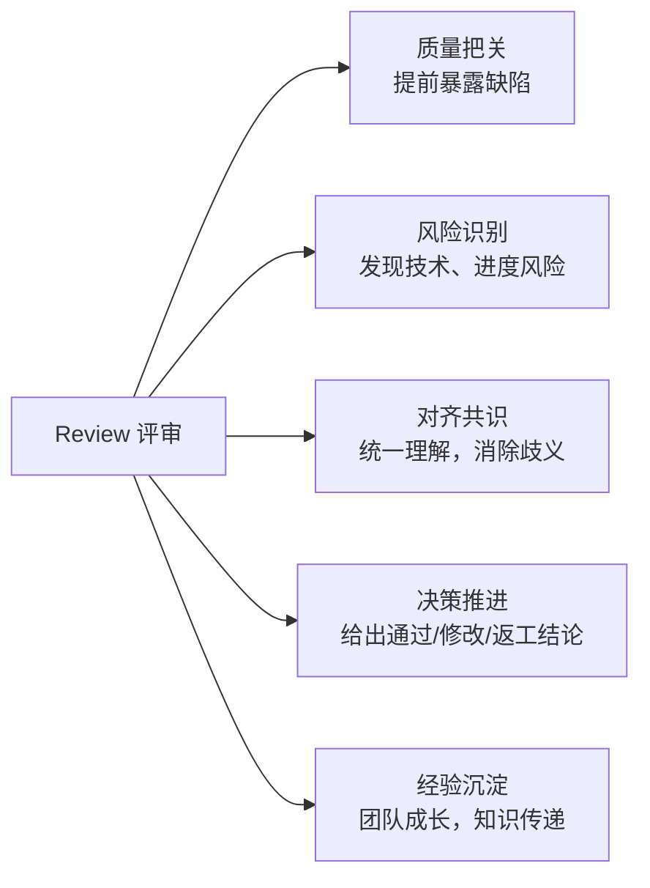

| 目的 | 说明 |
|------|------|
| **质量把关** | 多双眼睛盯同一份产出，把缺陷拦在"上线之前"而不是"出事之后" |
| **风险识别** | 评审不仅是看"对不对"，更是看"会不会出事"——相当于给项目做体检 |
| **对齐共识** | 把"每个按钮放哪里"的想象差异摆上桌面当场敲定，避免各干各的拼不起来 |
| **决策推进** | 给出明确结论：通过 / 有条件通过 / 不通过，不是开完会没下文 |
| **经验沉淀** | 新人学习团队标准和坑，老手梳理思路，比文档更高效的知识传递 |

---

## 3. 国际标准依据

| 标准 | 角色 | 一句话贡献 |
|------|------|-----------|
| **ISO 9000:2026**（第 5 版，2026-05-27 发布） | 定义 | §3.11.2 评审的权威定义；§3.5.1 需求定义 |
| **ISO 9001:2015**（GB/T 19001-2016） | 要求 | §8.3.4 评审/验证/确认三分 + 问题闭环 + 保留成文信息 |
| **ISO/IEC/IEEE 12207:2017** | 过程 | 联合评审是支持过程，评审方/被评方角色分离 |
| **IEEE 1028-2008** | 方法 | 五种评审类型（管理/技术/检查/走查/审计）+ 系统性三属性 |
| **ISO/IEC/IEEE 42030:2019**（2026-08-27 补） | 评估 | **评审对象是"架构"时的最权威出处**——评估目的含 *assess the quality of architectures with respect to their intended purpose*；42010 家族分工：42010 管描述、42020 管过程、42030 管评估（2019 首版、2025 复审确认现行） |

标准层级关系：**定义（ISO 9000）在最顶层，要求（ISO 9001）和方法（IEEE 1028）在下面各管一段**——IEEE 1028 的**管理评审、技术评审、审查、走查四类**与 ISO 9001 的闭环要求，本质都是在执行 §3.11.2 里"确定适宜性、充分性、有效性"这个动作；**其中的 audit（审核）不在内**——ISO 9000 把审核立为独立词条 **§3.12.1**，其对象是**组织/体系**、判据是**审核准则**（§3.12.14，需求全集），不是"为客体确立的目标"（23 号 §5.1、§5.4）。

> 国标对应：现行 GB/T 19000—2016 等同采用 ISO 9000:2015，其修订版（计划号 20264414-T-469）等同采用 ISO 9000:2026、尚在起草；故本文 ISO 9000 条款号一律按 2026 版，所引国标中文为 2016 版译文（对应 2015 版条款号）。

---

## 4. IEEE 1028 的五种评审类型

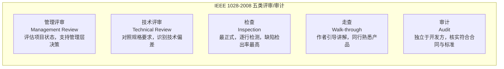

IEEE 1028 强调"系统性评审"（systematic review）三个必备属性：**团队参与、评审结果文档化、评审过程文档化**。不符合这三条的，按标准的话说就是"非系统性评审"。

### ⚠️ 说「评审」前先问是哪本标准的评审

上表五类取 **IEEE 1028** 的 `review`；而本文 §5 起的权威定义取 **ISO 9000:2026 §3.11.2**。两本标准里同一个 `review` 的**外延不一样**（23 号 §10.5「术语陷阱的第四处」）：

| 标准 | review 的外延 | 含 audit 吗 |
|---|---|---|
| **IEEE 1028-2008** | **属概念（umbrella）**——上表五类都在其下 | **含**（audit 是其中一型） |
| **ISO 9000:2026 §3.11.2** | **单个活动** | **不含**（audit 是独立词条 §3.12.1） |

> **混用的后果**：把 IEEE 1028 的"属概念"口径套到 ISO 9000 上，就会把"审核"读成"一种评审"，进而把体系的跨级准则集（§3.12.14：需求全集）误当成客体的目标判据（§3.11.2）。两者的**判据对象不同**——评审判**客体**（为客体确立的目标），审核判**体系**（跨级准则集）（23 号 §5.4）。

### ⚠️ `inspection` 同名异义（第三处陷阱的邻项）

| 标准 | inspection 指什么 | 参照 / 对象 |
|---|---|---|
| **ISO 9000:2026 §3.11.11** | *determination of conformity to **specified requirements***——检验，其合格结果**可作 verification 的客观证据** | 看**规定需求**（实物侧） |
| **IEEE 1028-2008** | *a **visual examination** of a software **product** to detect and identify software anomalies…* | 看**工作产品**（文档侧） |

> 中文都译"检查 / 审查"，读起来毫无差别。本文按 23 号附录 A 的定译分派：**IEEE 1028 侧作「审查」**（上表第五行以下四类的对应译名同理），**「检查」让给 ISO 9000 §3.11.11 的检验**（23 号 §10.6）。

---

## 5. 评审的权威定义（ISO 9000:2026 §3.11.2）

> **版本说明**：review 的条款号**两版相同**（2015 §3.11.2 ＝ 2026 §3.11.2），且 2026 侧定义句、示例与注 1 措辞均未变（仅句内交叉引用号更新）——故本节章题只换版本标注，结论与引文不动。

### 官方定义

> **评审 review**：对客体（3.5.3）实现所规定目标〔=`established objectives`，正文统作「**为客体确立的目标**」〕（3.7.11）的适宜性、充分性或有效性（3.7.17）的确定（3.11.1）
>
> 示例：管理评审、设计和开发评审、顾客要求评审、纠正措施评审和同行评审。
>
> 注：评审也可包括确定效率。

英文原文：*determination of the suitability, adequacy or effectiveness of an object to achieve **established** objectives.*

> 中文按国标 GB/T 19000—2016 译文（对应 2015 版），括号内条款号按 ISO 9000:2026；本条定义句两版逐字未变。
>
> ⚠️ **`established` ≠ `specified`——中文都译"规定"，英文不是一个词**：评审判据的限定语是 **`established` objectives**，指"**为客体确立的目标**"（**已设定**，重点在"定下来了"）；验证／确认判据的限定语是 **`specified` requirement**，指"**被明示的需求**"（重点在"说出来了"）。国标把两者都译"规定"（**规定目标**／**规定需求**），掩盖了这一差别——本文正文统一作「**为客体确立的目标**」，勿与「规定需求」当同源限定语读（23 号 §7.2 第一处翻译陷阱）。

### 定义拆解

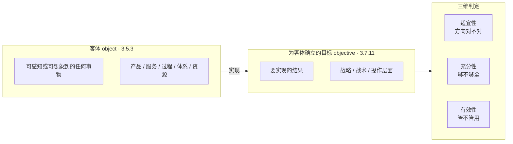

### 关键词解读

- **"确定"（determination）**：3.11.1 定义为"查明一个或多个特性及特性值的活动"——评审是一项**查明事实**的活动，要得出结论，不是开个会随便聊聊
- **参照是"目标"，不是"要求"**：评审的尺子是目标（方向），验证的尺子才是要求（规格）——这也是两者分野的根本原因：评审用"确定"（determination，§3.11.1）定义，验证/确认用"认定"（confirmation）配客观证据
- **目标分层次**：战略、战术、操作——同一客体挂不同目标，结论可能完全不同
- **评审不要求客观证据，验证/确认必须**：这是"判断"与"证明"的本质差别

---

## 6. 评审三问：适宜性、充分性、有效性

| 维度 | 英文 | 问什么 | 通俗解释 | 举例（点餐 App，目标：上线 3 个月日活 1 万） |
|------|------|--------|---------|---------------------------------------------|
| 适宜性 | Suitability | 对症吗？ | 方案与目标是否相称、方向对不对 | 想快速验证市场却选重型原生开发 → 不适宜 |
| 充分性 | Adequacy | 够全吗？ | 范围与深度是否足够、有无遗漏 | 只测核心路径，边界情况全没测 → 不充分 |
| 有效性 | Effectiveness | 管用吗？ | 实际结果是否达成目标 | 功能全上线，日活却只有 200 → 无效 |

三者**层层递进**：


> 完整评审 = 三问都过：方向不对，做得再全也是白费；覆盖不全，方向对了也会翻车；前两个都过，还要看结果说话。
>
> ISO 9000 注：评审还可包括确定"效率"（efficiency）——不只是管不管用，还要看投入产出比值不值。ISO 9001:2015 §9.3 管理评审也要求评价质量管理体系"持续的适宜性、充分性和有效性"，同一套三件套。

---

## 7. 评审 vs 验证 vs 确认

### 官方定义对照（ISO 9000:2026）

| | 评审 Review 3.11.2 | 验证 Verification 3.11.12 | 确认 Validation 3.11.14 |
|---|---|---|---|
| 定义 | 对客体实现**为客体确立的目标**的适宜性、充分性或有效性的确定 | 通过提供**客观证据**，对**规定需求**已得到满足的认定 | 通过提供**客观证据**，对**特定的预期用途或应用需求**已得到满足的认定 |
| 参照 | 目标 | 规定需求 | 预期用途 / 应用 |
| 动作 | 确定（判断） | 认定（证明） | 认定（证明） |
| 证据 | 不要求客观证据 | 必须有客观证据 | 必须有客观证据 |
| 问什么 | 方向对不对？ | 做对了吗？（built it right） | 做对的东西了吗？（built the right thing） |
| 时机 | 事前/事中做判断 | 对结果做证实 | 在真实/模拟场景中做证实 |
| 软件落点 | 需求评审、设计评审 | 单元/集成/系统测试、压测、合规 | UAT、Beta、灰度、试运行 |

### 三列对比图

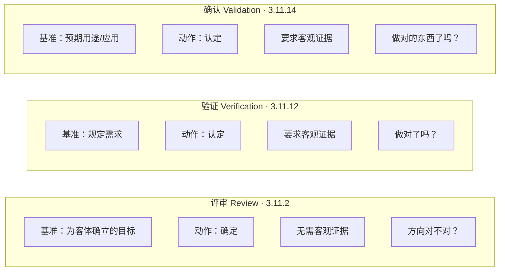

### 逐词辨析

1. **动作不同：确定 vs 认定**——评审是主动调查（从无结论到有结论），验证/确认是证实状态（结果已有了，去证实它）
2. **基准不同**——评审对准"**为客体确立的目标**"（能力评估），验证对准"**规定需求**"（符合性检查），确认对准"**为特定预期用途或应用的需求**"（**符合性**证明）
3. **证据不同**——验证/确认定义里都带着"通过提供客观证据"，评审没有；"测试通过了"是验证的证据，不是评审本身
4. **动作词不同**——ISO 9000:2026 中三词同属 §3.11"有关确定的术语"组，分野在动作词：评审建立在"确定"（determination，§3.11.1）之上，验证/确认用"认定"（confirmation）配客观证据。**它们不是同一类动作，只是中文翻译凑巧都带"评/验/认"**
5. **"合规"在验证列里只是其中一步**（2026-09-21 依 24 号补）——把合规落进验证列（对照规定需求）方向无误，与 24 号 §4.5 推论 3 同指（**合规属 verification 侧；满足需要 / 期望属 validation 侧**）。但须补两步限定：① **合规的对象是架构，不是架构描述**——*compliant implementation **of the architecture***；若把"规"当成文件，合规就退化为文档符合性检查（条目齐不齐、模板填没填），那是 42010 §4 Conformance 管的另一件事，两者必须分开（24 号 §4.1、§11.5）；② **合规的承担者是实现，不是设计描述**——设计只承"足以支撑"（sufficient to enable），故本表的验证列在设计侧只能出具**条件性合规**，实际合规要由实现举证，在验证阶段凭证据逐级上溯（24 号 §10.7、§10.1）。

---

## 8. 三个参照对象：目标 / 规定需求 / 预期用途

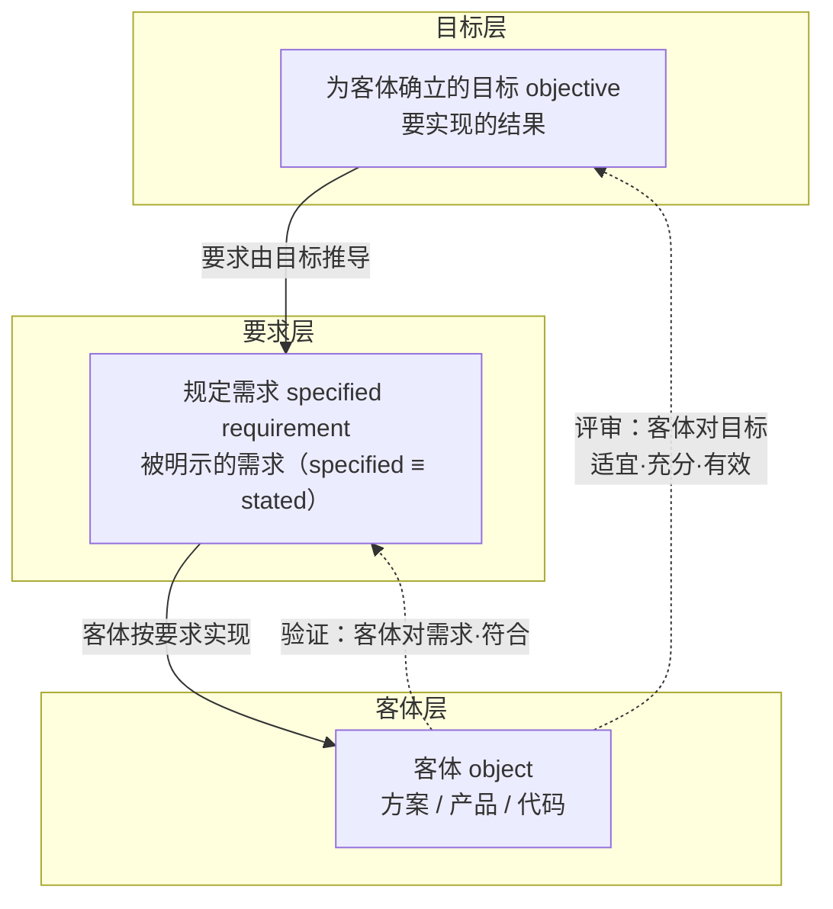

### 评审的参照 = 为客体确立的目标（三个维度共享同一把尺子）

- **适宜性**：客体对**目标**是否相称 → 参照：目标
- **充分性**：客体对**目标**是否足够 → 参照：目标
- **有效性**：客体对**目标**是否达成 → 参照：目标

**目标（3.7.11）= 要实现的结果**。可以是战略的、战术的或操作层面的。同一个客体挂不同层级的目标，结论可能完全不同——评审结论是相对于目标而言的，不是绝对的好坏。

### 验证的参照 = 规定需求（specified requirement）

- 需求（PRD / 用户故事）：最常见的一类
- 技术规格（接口协议 / 性能指标）
- 标准与法规（等保 / GDPR）
- 合同 / 承诺

关键：**"规定"（specified）＝"被明示"（stated）**——*specified ≡ stated*（§3.5.1 注 2）。口头说的"大概要快一点"**是**明示的、**是**规定需求，但它**不可采**：没有判定方法、不可复现，所以当不了验证参照（§14 的两层分法；24 号 §7.6、§11.4）。

### 确认的参照 = 特定的预期用途或应用需求

| 构成 | 问什么 | 举例（点餐 App） |
|------|--------|------------------|
| 目标用户 | 给谁用？ | 餐厅老板、店员、外卖用户 |
| 使用场景 / 任务 | 用来干什么？ | 高峰期快速下单、扫码核销、看报表 |
| 环境与条件 | 什么情况下用？ | 门店弱网、午高峰并发、小屏触控 |

确认的证据（3.11.14 注 1）：试验结果，或变换方法计算、文档评审；注 3：使用条件可以是真实的或模拟的——这给了灰度、仿真测试的合法性。

### 字面裁决：目标究竟是评审的依据还是确认的依据？（2026-08-27 补）

**按定义原文：目标是评审的依据；确认的依据是"预期用途需求"，字面上不拿"目标"。** 两个参照词不同是标准刻意的分工，但两者同源：

```
目的 → 所确立目标 → 预期用途需求 → 规定需求
         ↑              ↑              ↑
       评审参照       确认参照       验证参照
```

**关键纠正（经 Mickey 指出）**：§3.11.14 用的是 requirement——按 §3.5.1，requirement 三形态并列，**隐含形态天然在内**；而操作目标（MOE：目的在运行环境中的可度量投影，INCOSE MOE/MOP/TPM 体系）必须明示、有阈值、可度量。因此：

```
预期用途需求（确认的参照）
  ├─ 明示部分：操作目标（MOE）——运行层确认的显性判分线
  └─ 隐含部分：未明示的使用需要与期望——靠场景确认兜住（§17 路径 B）
```

**MOE 全绿 ≠ 确认通过**——MOE 达标只是确认的**必要条件而非充分条件**；指标全绿但隐含使用需要未满足（用户用起来不顺手），确认照样失败。确认的独特价值恰恰在于兜住操作目标**没有覆盖**的隐含要求。

**真分界不在参照词，在检验方式**：评审 = 判断/论证（对任何**工作产品**，纸面即可，系统未建成也能做）；确认 = 使用（对产品/系统本身，真实或仿真运行，客观证据）。**递归提醒**：参照系是递归的——目标既能当参照（拿它评审方案），也能当客体（拿上层目的评审下层目标的适宜性）。

---

## 9. 为什么评审以"目标"而非"需求"为参照

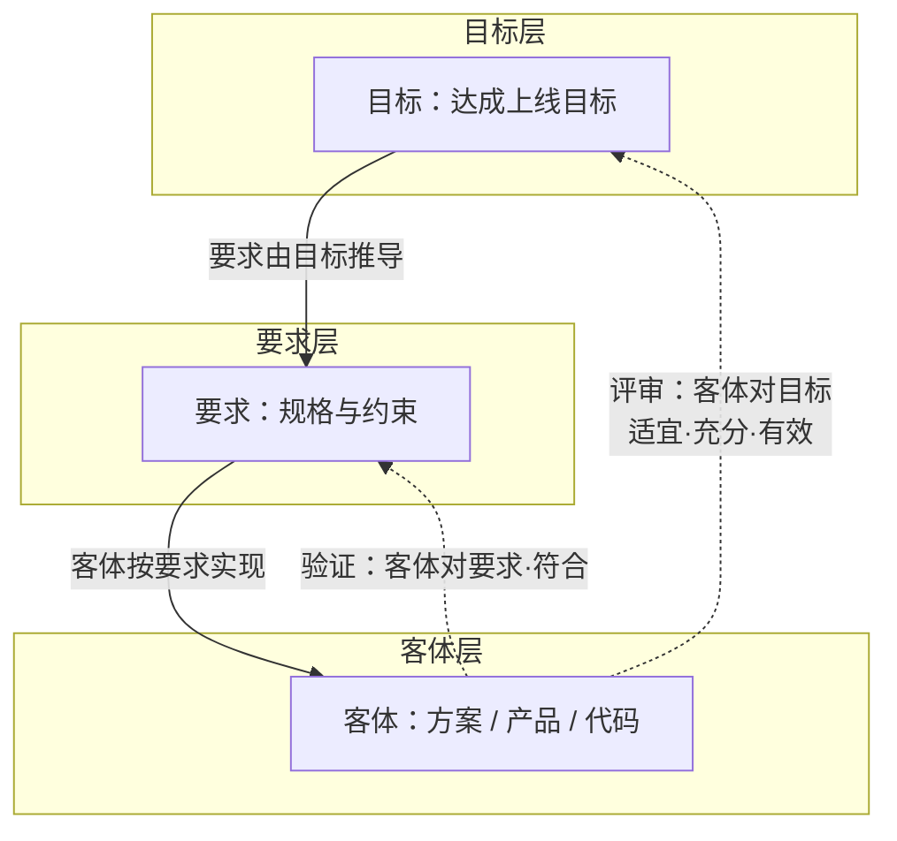

三个核心原因：

| 原因 | 说明 |
|------|------|
| **① 要求可能本身就是错的** | 需求是人写的，可能理解错、互相矛盾、不完整。如果评审拿"要求"当尺子，就默认"要求一定对"——那谁来审需求本身？**需求评审的本质就是审"需求"对"业务目标"是否适宜/充分/有效** |
| **② 否则评审和验证就重复了** | 验证已经是"以要求为参照、确认符合性"。评审若也以要求为参照，两个术语就变成同一件事，标准对二者的动作词分工（评审＝确定，验证＝认定）就塌了 |
| **③ 满足所有要求 ≠ 达成目标** | 需求全做完，但做出来的是没人要的东西——目标错了，需求再对也是白做。评审是唯一"抬头看目标"的环节 |

> **要求是"路"，目标是"目的地"。评审的价值就在于低头检查路况之外，还要抬头看看目的地对不对。** 最失败的评审不是没查出问题，而是把评审做成了验证：只核对"满足需求没有"，却从不问"这需求本身对吗"。

### 方向把关的两道闸（2026-08-27 补）

评审"管方向"的定位不变，但方向把关不是一道闸，是两道——

| | 评审（第一道·早拦） | 确认（第二道·终审） |
|---|---|---|
| 时机 | 事前/事中，系统未建成 | 事后，系统投入使用 |
| 方式 | **预测性把关**：判断与论证推演"方向应该对" | **实证性把关**：真实/仿真使用证实"方向确实对" |
| 对象 | 纸面**工作产品**（目标、需求、**架构描述**、方案） | 系统本身 |
| 覆盖 | 显性部分（写在目标里、可逐条论证的） | 连**隐含部分**一起兜（真实使用暴露一切） |

> 〔按（第十一轮·依 22 号）：本表「对象」列用「**工作产品**」而非"制品"——**架构本身是抽象物、不是人工制品**，评审能摆到桌面上的只能是表达它的**架构描述**（AD）这类**工作产品**；`artefact`＝**人工制品**与 `work product`＝**工作产品**是两个词、**不可互译**（22 号 D9／D28、§8.2）。〕

评审通过只代表"基于当时信息的最佳判断"，其判断可以被确认推翻——确认是方向问题的终审判决。两道缺一不可：只靠评审，隐含需要无法被论证覆盖（评审对隐性盲区无能为力）；只靠确认，方向把关全推到建成之后，纠偏成本爆炸。**分工的根据正在于：评审参照只有明示目标，确认参照含隐含形态（§3.5.1）——评审管方向的显性部分，确认管方向的终审与隐含部分。** 验证在这条线上完全不沾方向（需求本身错了它照样放行），"抬头看方向"的只有评审和确认两双眼睛。

---

## 10. 产品开发全流程的六类评审

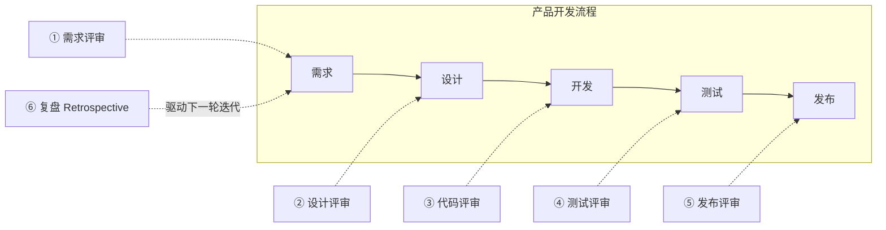

六个评审节点：五个在流程链条上把关（问题越早发现，修复成本越低），复盘绕回起点驱动改进。

### IEEE 1028 五类在流程中的落点

| IEEE 1028 分类 | 流程落点 |
|----------------|---------|
| 技术评审（Technical Review） | 需求评审、设计评审、发布评审 |
| 检查（Inspection） | 代码评审（最正式时） |
| 走查（Walk-through） | 代码评审（非正式时） |
| 管理评审（Management Review） | 项目级定期评审（进度/风险/资源） |
| 审计（Audit） | 阶段性独立核查（上线前安全审计） |

---

## 11. 六类评审的目标实例与通过标准

### 每类评审的目标陈述（具体化）

| 评审 | 目标陈述 | 判定内容（查什么） | 结论 |
|------|---------|-------------------|------|
| ① 需求评审 | 需求达到"可开发"状态 | 符合业务目标（适宜）／无遗漏（充分）／可落地（有效） | 通过 / 有条件 / 打回 |
| ② 设计评审 | 方案可行且满足全部需求 | 对症（适宜）／周全（充分）／能落地（有效） | 通过 / 有条件 / 打回 |
| ③ 代码评审 | 代码正确、可维护、无缺陷 | 正确性 / 可维护性 / 规范性 | approve / changes |
| ④ 测试评审 | 质量达到准出（release-ready） | 覆盖充分 / 缺陷收敛 / 结果可信 | 准出 / 条件准出 / 不准出 |
| ⑤ 发布评审 | 可安全上线、风险可控 | 就绪度 / 风险 / 兜底 | 放行 / 条件放行 / 暂缓 |
| ⑥ 复盘 | 经验沉淀 + 流程改进 | 归因准确 / 行动闭环 / 记录归档 | 改进项进入下一轮 |

### 每类评审的可勾选通过标准

| 评审 | 通过标准（逐条打勾） |
|------|---------------------|
| ① 需求评审 | □ 每条需求有唯一 ID + 验收标准（可测）□ 业务场景覆盖 100% □ 无未决 TBD 项、无需求冲突 □ 每条需求可测 □ 资源/排期认可 |
| ② 设计评审 | □ 需求→设计追踪矩阵覆盖 100% □ 性能/安全/扩展性逐项有方案 □ P0/P1 风险已识别 + 缓解措施 □ 工作量估算偏差 ≤ 20% □ 关键决策已记录 |
| ③ 代码评审 | □ CI 全绿（lint/构建/测试通过）□ 至少 1 位 reviewer approve □ P0/P1 问题数 = 0 □ 全部评论已解决或已答复 □ 变更范围与 PR 描述一致 |
| ④ 测试评审 | □ 需求→用例覆盖率 100% □ P0/P1 缺陷清零 □ P2/P3 缺陷已知且有评估 □ 用例通过率 ≥ 95% □ 测试报告归档留痕 |
| ⑤ 发布评审 | □ 发布 checklist 100% 通过 □ 回滚预案就绪（已演练）□ 无未决 P0/P1 缺陷 □ 已知缺陷有缓解方案 □ 运营/合规/安全准备到位 |
| ⑥ 复盘 | □ 每个行动项有负责人 + 截止日期 □ 上轮行动项关闭率 ≥ 80% □ 问题按根因归类（非甩锅）□ 复盘记录归档、可追溯 □ 改进项进入下一轮计划 |

### 可落地目标的核心方法

> **可落地的评审目标 = 评审通过标准 = 一组可勾选的硬条件（会前定好，会后逐条打勾）**

三个操作要点：

1. **通过标准要在会前定**：随评审邀请一起发出（"本评审通过标准：…，全部打勾 = 通过；任一不满足 = 打回修改"），不是开会时现想
2. **用"数字 + 动作"替代形容词**："需求要清晰"→"每条需求有唯一 ID + 验收标准"；"代码质量要好"→"P0/P1 = 0，CI 全绿"
3. **结论 + 记录 + 跟进**：有条件通过必须写明条件 + 复核人 + 期限（对应 ISO 9001 8.3.4 e/f 款：问题必须采取必要措施 + 保留成文信息）

---

## 12. 需求（requirement）的本质

### ISO 9000:2026 术语 3.5.1 原文

> **3.5.1 requirement**
> need or expectation that is stated, generally implied or obligatory
>
> Note 1 to entry: "Generally implied" means that it is custom or common practice for the organization (3.1.1) and interested parties (3.1.4) that the need or expectation under consideration is implied.
>
> Note 2 to entry: A specified requirement is one that is stated, e.g. in documented information (3.8.14).
>
> Note 3 to entry: A qualifier can be used to denote a specific type of requirement, e.g. product (3.7.9) requirement, service (3.7.10) requirement, quality management (3.2.2) requirement, customer (3.9.1) requirement, quality requirement (3.5.6).
>
> Note 4 to entry: Requirements can be generated by different interested parties or by the organization itself.
>
> Note 5 to entry: It can be necessary for achieving high customer satisfaction (3.9.13) to fulfil an expectation of a customer even if it is neither stated nor generally implied or obligatory.

> 与 2015 版（§3.6.4）比：定义句逐字未变；注 2 的 "for example in" 改 "e.g. in"，注 3 增列 service requirement，注 6（Annex SL 声明）已删。

**官方中文（GB/T 19000—2016 §3.6.4——该标准等同采用 ISO 9000:2015，2026 版对应 §3.5.1）**：

> 3.6.4 要求 requirement：明示的、通常隐含的或必须履行的需求或期望
>
> 注 1："通常隐含"是指组织和相关方的惯例或一般做法，所考虑的需求或期望是不言而喻的。
>
> 注 2：规定要求是经明示的要求，如：在成文信息中阐明。
>
> 注 3：特定要求可使用限定词表示，如：产品要求、质量管理要求、顾客要求、质量要求。
>
> 注 4：要求可由不同的相关方或组织自己提出。
>
> 注 5：为实现较高的顾客满意，可能有必要满足那些顾客既没有明示、也不是通常隐含或必须履行的期望。

### 需求 = 需要或期望 × 呈现方式（二维交叉）

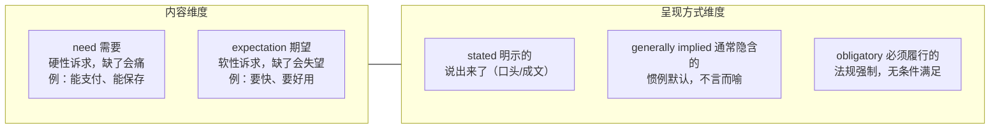

**术语关系**：requirement（需求）是顶层概念，need（需要）和 expectation（期望）是它的两种内容构成；stated / implied / obligatory 是它的三种呈现方式。**两个维度交叉，才是需求的完整图景**——一个 need 可以是明示的也可以是隐含的；一个 expectation 可以是隐含的也可以是明示的。

### 三个容易踩的点

1. **"隐含要求"必须被显性化，才能被验证**——需求评审的一大任务就是把"隐含的"挖出来写进文档、变成"规定的"
2. **注 5 是高级玩法**：为达成高顾客满意，可能要满足顾客"既没明示、也不隐含、也不强制"的期望（惊喜体验）——这是要求之外的东西，是加分项，不是评审的通过标准
3. **需求 ≠ 目标**：目标是"要实现的结果"（为什么做），要求是"必须满足的需求或期望"（做成什么样）

---

## 13. 需求的三形态：明示 / 隐含 / 强制

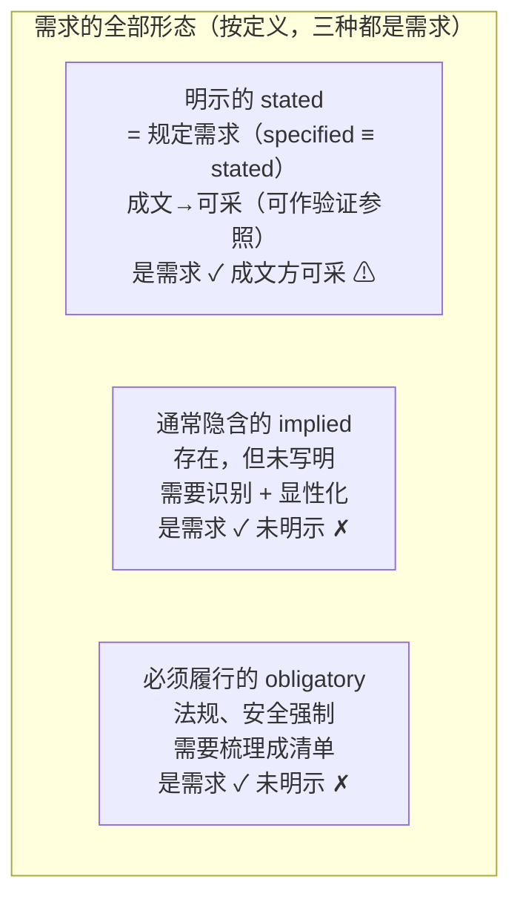

| 形态 | 是什么 | 是规定需求吗 | 能直接开发吗 |
|------|--------|------------|-------------|
| 明示的 stated | 说出来的（**含口头**） | **✓ 是**——明示即规定（specified ≡ stated；**成文属可采条件**） | 是；但作**验证参照**须先成文（不可采者不能当判据） |
| 通常隐含的 implied | 惯例、默认，不言而喻 | 否（先显性化） | 否（先显性化） |
| 必须履行的 obligatory | 法规、安全，强制 | 否（先列清单） | 否（先成清单） |

> **口径依据**：ISO 9000:2026 §3.5.1 注 2——*A specified requirement is one that is **stated***，故 `specified ≡ stated`，**注中的"例如在成文信息中阐明"是举例、不是定义条件**；"成文"是**可采**条件（能否拿来当验证／合规的参照），不是"是不是规定需求"的条件（§14 的两层分法；23 号 §3.2、§8.2）。

### 三形态的上游：需求从哪来 + "需求是目标的分解"对吗（2026-08-27 补）

三形态恰好对应需求的**三个上游通道**——目标只是其一：

```
目的（why）──具体化──→ 目标 ──转化──→ 需求 ── 通道①：目标转化（主流，明示）
环境/法规 ────────────────────→ 需求 ── 通道②：必须履行的（obligatory，不经组织目标）
利益相关方隐含需要 ──────────────→ 需求 ── 通道③：通常隐含的（implied，未必被目标覆盖）
```

**"需求是对目标的分解"——方向对、措辞不准、覆盖不全**（依据 ISO 9000:2026 §3.7.11 目标／§3.5.1 要求；下引中文为国标 GB/T 19000—2016 译文——该标准等同采用 ISO 9000:2015，旧号 §3.7.1／§3.6.4）：

1. **措辞：目标→需求是"转化"不是"分解"。** 分解 = 同类拆分、语义守恒（整体 = 部分之和）——目标→子目标、需求→子需求（分解与分配）才是分解；目标（"要实现的结果"）→ 需求（"要满足的条件"）是**跨类导出**：一对多且需判断（阈值是权衡出来的，不是分出来的）、语义不守恒（需求集合是目标的"判据覆盖"不是"部分之和"）。标准用词习惯也是同类说分解、跨类说转化（§3.3.11：将某一客体的**要求**转换为该客体**更详细的要求**）。目的→目标同理，是**具体化/展开**。

   > 〔按（第十一轮·依 22 号）：本处引文原记作「将需求**转化**为详细**特性**」，与 §3.3.11 正文不符——2026 版 §3.3.11 定义句为 *set of processes that transform **requirements** for an object into **more detailed requirements** for that object*，中译「将某一客体 (3.5.3) 的**要求** (3.5.1) 转换为该客体**更详细要求**的一组过程」，通篇是**要求**而非**特性**；`characteristic` 的条款号是 **§3.10.1**，「特性」一词只出现在 §3.3.11 **注 1**（「这些要求通常按**特性** (3.10.1) 来定义」）。故此处的证据本身恰恰是"**要求→更详细的要求**"，即**同类细化**（refinement），与上一句「标准用词习惯也是同类说分解、跨类说转化」构成张力：§3.3.11 是**同一类别内的细化**，既非严格意义的"分解"（不承诺整体 = 部分之和），也非"跨类转化"——故该句作为"跨类说转化"的标准用词证据**不成立**，应改读为"**设计开发是把要求细化的一组过程**"。**结论不变**：目标（要实现的结果）→ 需求（要满足的条件）是**跨类导出**，「需求是对目标的分解」措辞不准——其理由是**语义不守恒与一对多需判断**（见本条前半），不依赖 §3.3.11 的用词。若需以特性说事，须引 **§3.3.11 注 1 ＋ §3.10.1** 两个条款号（D7／D24；22 号 §4.2）。〕
2. **覆盖：需求 ⊋ 目标转化的结果。** 通道②从环境/法规来（你没有"合规目标"也得合规），通道③从利益相关方隐含处来（目标没写，需求照样成立）。目标的完备性靠评审的**充分性**把关（目标有没有被需求覆盖全），两个旁路通道靠需求工程兜底（利益相关方需要收集）。

与三检验的接缝（闭环）：

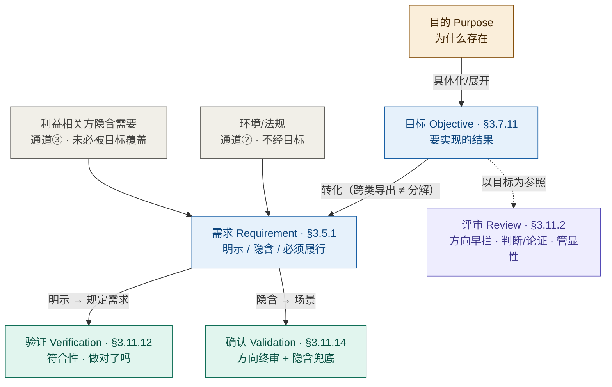

*图 CL-01｜六概念闭环：目的-目标-需求 × 评审/验证/确认——评审守目标段（方向早拦）、验证守规定需求段（符合性）、确认守用途段（方向终审+隐含兜底），三段的接缝恰好是需求三形态的分叉口：明示形态有文档可验，隐含形态只能靠场景兜。*

---

## 14. 规定需求与明示需求：一个等号 ＋ 一道可采门槛

### 规定需求（specified requirement）的定义

> **规定需求 = 被明示的需求**（**specified ≡ stated**）
> （ISO 9000:2026 §3.5.1 注 2：*A specified requirement is one that is stated, e.g. in documented information*）

〔注（2026-09-21 依 24 号 §7.3 收口）：句中的 **e.g.** 是**举例**——"写在成文信息里"是最常见的一种明示方式，**不是"规定"的构成条件**（2026 版作 *e.g.*、2015 版作 *for example*，两版都是举例语气）。故"规定需求"与"明示需求"是**同一个集合**，不是大小两个圈；把成文当构成条件，是把**可采条件**误读成了**定义条件**——本节的实务结论不变，理由改按下面两层说。〕

### 第一层：一个等号——资格层（"是不是"）

**凡被说出来的（明示的）就是规定需求**，口头明示也算——它已经进入"可被引用、可被验证"的资格集合。

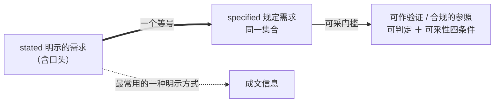

### 第二层：一道门槛——可采层（"能不能当依据"）

能当**验证／合规的参照**，还要过一道**可采门槛**：条目须**可判定**（有 ID、有对象／适用范围、有断言、有判定方法——24 号 §7.6「可判定四件套」），并满足**可采性四条件**（相关性／可检验性／时效性／同一性——24 号 §11.4）。

| | 口头明示 | 成文规定 |
|---|---|---|
| 是规定需求吗 | ✅ 是（明示即规定） | ✅ 是 |
| 能当验证参照吗 | ❌ **不可采**：无判定方法、不可复现、无版本 | ✅ 可采（可判定 ＋ 已冻结基线） |
| 能传递吗 | ⚠️ 转述容易走样 | ✅ 白纸黑字不漂移 |
| 能追溯吗 | ❌ 无版本 | ✅ 有版本可查 |

**故实务结论不变（只是理由换了）**：口头明示**不能当验证依据**——不是因为它"不是规定需求"，而是因为它**不可采**（缺判定方法、不可复现、无基线版本）。这也直接解释两条工程纪律：需求评审要把口头内容**写成条目**（明示化），配置管理要把它**冻进基线**（基线化）——成文与基线不是"升格为规定"的仪式，而是**取得可采性**的两步（24 号 §7.3 的双闸门：筛选 → 明示 → 追溯 → 冻结）。

### 一处澄清：可验证性从哪来

**"规定需求可验证"不是 §3.5.1 注 2 的原话**——注 2 只说"明示"。"可验证"是从**验证定义**（§3.11.12：验证＝通过客观证据对规定需求已满足的认定）与**可采性要求**（24 号 §11.4 可检验性）推出来的逻辑：作为验证参照的规定需求，必须能提供客观证据。**可验证是推论，不是原文。**

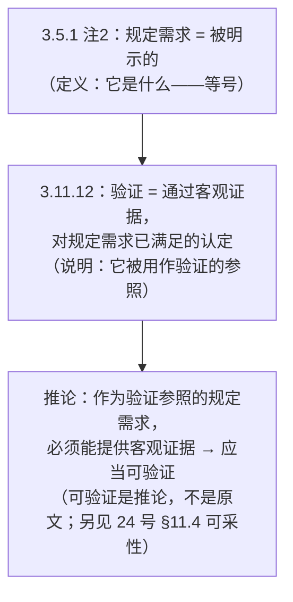

需求"可验证"特性在 **ISO/IEC/IEEE 29148:2018（需求工程）** 中是明确要求的需求质量**特性**，分两层列：**单条需求特性 11 项**（必要 · 恰当 · 无歧义 · 完整 · 单一 · 可实现 · **可验证** · 正确 · 符合 · 一致 · 可追溯）与**需求集特性 5 项**（完整 · 一致 · 可实现 · 可理解 · 可追溯）——"可验证"属**单条需求**那一层，其判据是"存在有限且经济可行的过程证明其被满足"（两层分列见 19 号 §6.2、20 号 §6 关系表「好需求特性」行；**表号条款号待核**——仓库未见 29148:2018 正式文本，此处只锚标准与版本，不臆造号）。ISO 9001:2015 §8.3.3 也要求设计开发输入"完整、清楚，且不能自相矛盾"。

> 〔按（第十一轮·依 22 号）：原文作"需求质量**属性**"，按 D24 改正——`properties` 译「属性」、`characteristic` 才译「特性」，二者不可互换；29148 此处所列为需求的**质量特性**（quality characteristics，ISO 9000:2026 §3.10.1 语境），不是 IT／数据库语境那个 `attribute`（ISO/IEC 2382-17:1999 §17.02.12）——后者是**实体的命名属性**，与需求质量判据不同物（22 号 §4.2、§4.3、§9.5）。〕

---

## 15. 规定需求的作用（质量体系枢纽）

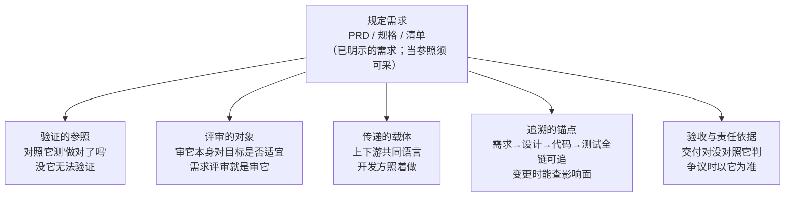

| 作用 | 说明 |
|------|------|
| **验证的参照** | 测试"做对了吗"的对照物，没有它无法验证——需求文档化是 ISO 9001 硬性要求 |
| **评审的对象** | 需求评审审的就是规定需求本身——隐含需求在显性化之前连"被审"的资格都没有 |
| **传递的载体** | 上下游（产品、设计、开发、测试）唯一共同语言——口头说十遍不如写下来一份 |
| **追溯的锚点** | 需求变更时立刻查出影响哪些设计、代码、测试（ISO 9000:2026 §3.5.11 可追溯性） |
| **验收与责任依据** | 交付对没对以它为准，争议时拿它说话——把"我觉得"变成"文档写的" |

> **规定需求的目的是——把需求从"大家脑子里的想法"固化成"白纸黑字的约定"，让验证有参照、评审有对象、传递有载体、变更可追溯、交付有依据。** 规定需求，就是需求"成年"的标志。

---

## 16. 没有明示的需求，是需求吗

**是需求，但不是规定需求。** 这两个回答不矛盾，它们回答的是不同的问题：

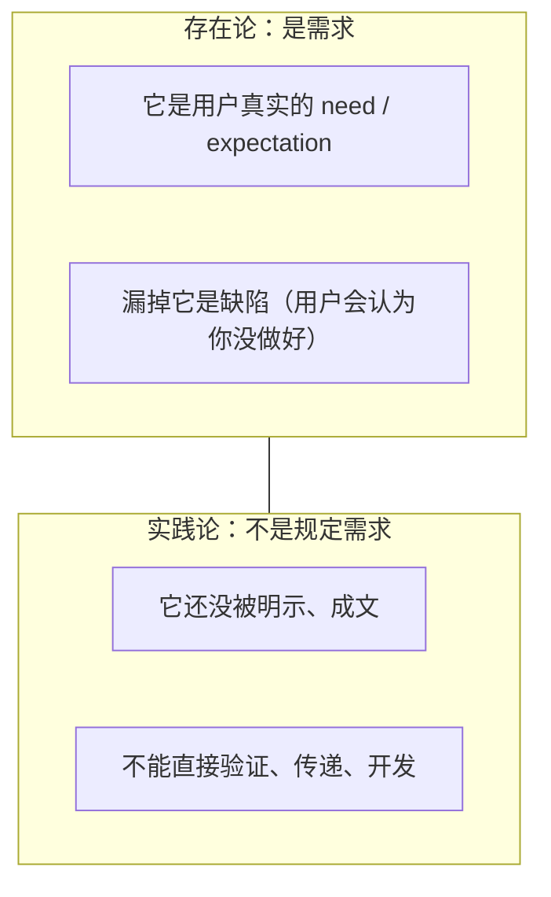

| | 是需求？ | 是规定需求？ | 能直接开发？ |
|---|---|---|---|
| 明示的 | ✓ | ✓（明示即规定） | ✓（成文的可采） |
| **隐含的** | **✓** | **✗** | **✗（先显性化）** |
| 强制的 | ✓ | ✗ | ✗（先列清单） |

**"隐含"概念的价值在识别端，不在传递端**：


> 如果没有"隐含"这个概念，需求工作 = 只接收明示的，评审退化成"读文档"，隐含需求永远漏掉——因为没有人会去找不存在概念的东西。**"隐含"是需求的初始形态，"明示"是需求的传递形态。隐含必须被识别、然后显性化，才能传递。**

---

## 17. 隐含需求怎么被确认

**答案：验证靠文档，确认靠场景。** 没有被明示的需求，恰恰是"确认"（validation）的主场：

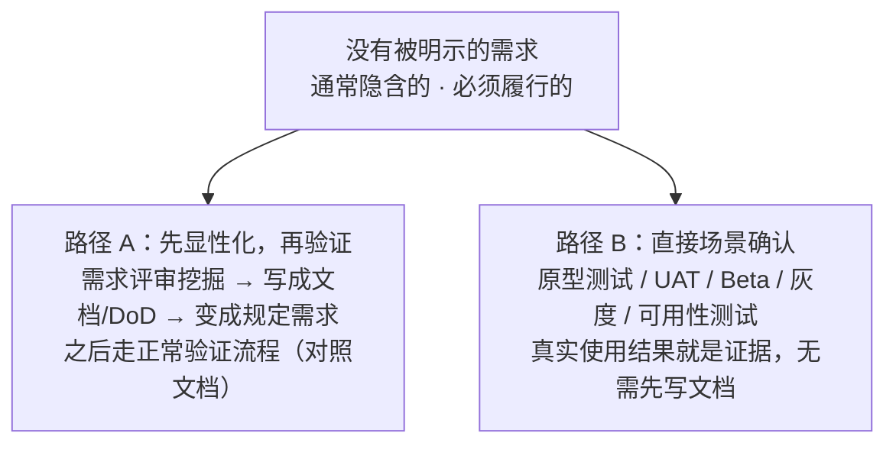

**为什么确认能兜住隐含需求，而验证不能**——答案藏在 ISO 9000 的措辞里：

- **验证**（3.11.12）：对照**规定需求**——"规定"要求它必须是明示的。没文档 = 没参照 = 无法验证
- **确认**（3.11.14）：对照**特定的预期用途或应用需求**——"预期用途"不是一份文档，而是一种**真实使用情境**。把产品放进情境里，好用不好用是自然显现的事实

> **验证的参照在文档里，确认的参照在场景里。** 隐含需求没进文档，验证够不着它——但场景兜得住，确认就是它的归宿。如果所有需求都能写下来被验证，确认这个活动就不需要存在了。

### 确认对非明示需求的意义（核心洞察）

**射程差异**——这是确认对非明示需求独特价值的根源：

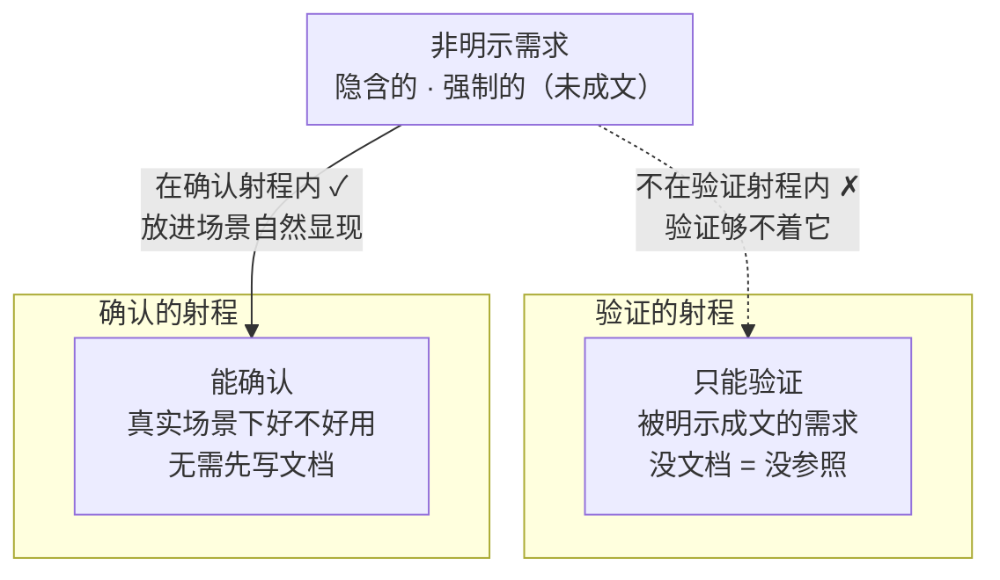

| | 验证（Verification） | 确认（Validation） |
|---|---|---|
| 参照 | 规定需求（**文档**） | 预期用途（**场景**） |
| 对非明示需求 | ✗ **射程之外**——没进文档，没参照可对照 | ✓ **射程之内**——放进真实场景，好用与否自然显现 |
| 前提 | 必须先显性化 | 无需先写文档 |

**三层意义**：

1. **兜底机制**：确认是非明示需求的最后防线——UAT、Beta、灰度，是它们**唯一被检验的机会**。不做确认，隐含需求就永远漏在体系外
2. **体验类隐含需求的唯一裁判**：有些需求文字说不清（顺手、直觉、动效、节奏）——显性化写不出来，只有真实使用能裁决。这是确认不可替代的价值
3. **把"漏掉的隐含需求"变成"可发现的缺陷"**：确认把隐性缺失显性化——用户用不出来、卡住、放弃、抱怨，就是缺陷证据

**因果链（全篇最硬核的推论）**：

> **只做验证不做确认 → 隐含需求系统性漏失 → 这就是"测试全过、上线没人用"的根源。**
>
> 反过来：**确认的存在价值恰恰建立在非明示需求上——如果所有需求都能写下来被验证，确认这个活动就不需要存在了。**

---

## 18. 隐含需求怎么传递给下游

> **你没法传递一个你没写下来的东西。** 隐含需求必须：先识别 → 再显性化 → 然后传递。传递的本质就是"翻译"——把没说出来的翻成写下来的。

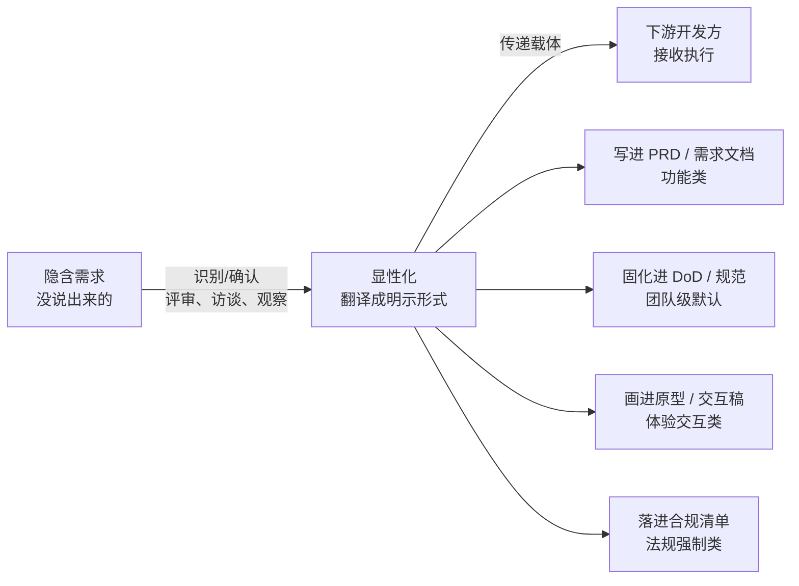

| 需求类型 | 传递方式 | 载体 |
|---------|---------|------|
| 隐含（惯例） | 评审时挖出来 → 写进文档/DoD | PRD、DoD |
| 隐含（体验） | 原型演示，画出来 | 原型、交互稿 |
| 强制（法规） | 梳理成清单，逐条对照 | 合规清单 |

四种载体选哪种，取决于需求的性质：

| 载体 | 适用 | 例子 |
|------|------|------|
| ① PRD / 需求文档 | 功能类隐含需求 | "删除操作需二次确认" |
| ② DoD / 团队规范 | 团队级默认要求（一次固化，处处生效） | "完成 = 代码合入 + 测试通过 + 文档更新" |
| ③ 原型 / 交互稿 | 体验、直觉、交互类（文字说不清的画出来） | 手势、动效、状态变化 |
| ④ 合规清单 | 法规强制类（逐条对照无遗漏） | 等保、GDPR 条目 |

---

## 19. 术语对照表与口径约定

### ISO 9000:2026 术语速查

| 术语 | 编号 | 定义（国标中文） |
|------|------|-----------------|
| 客体 object | 3.5.3 | 可感知或可想象到的任何事物 |
| 要求 requirement | 3.5.1 | 明示的、通常隐含的或必须履行的需求或期望 |
| 目标 objective | 3.7.11 | 要实现的结果 |
| 验证 verification | 3.11.12 | 通过提供客观证据，对规定要求已得到满足的认定 |
| 确认 validation | 3.11.14 | 通过提供客观证据，对特定的预期用途或应用要求已得到满足的认定 |
| 评审 review | 3.11.2 | 对客体实现为客体确立的目标的适宜性、充分性或有效性的确定 |

> 编号按 ISO 9000:2026（第 5 版，2026-05-27 发布）；中文译文出自国标 GB/T 19000—2016——该标准等同采用 ISO 9000:2015，其修订版计划号 20264414-T-469、尚在起草。以上六条定义句两版逐字未变，仅条款号迁移。

### 英文→中文口径约定（Mickey 指定，必须遵守）

| 英文 | 中文 | 备注 |
|------|------|------|
| requirement | **需求** | 不译"要求"（国标译"要求"，按约定统一用"需求"） |
| need | **需要** | 硬性诉求 |
| expectation | **期望** | 软性诉求 |
| specified requirement | **规定需求** | 非"规定要求"；**被明示的需求**（specified ≡ stated）——成文是**可采**条件、不是定义条件（§14） |
| stated | 明示的 | 需求的呈现方式之一 |
| generally implied | 通常隐含的 | 需求的呈现方式之一 |
| obligatory | 必须履行的 | 需求的呈现方式之一 |
| review | 评审 | 对**为客体确立的目标**的适宜性/充分性/有效性 |
| verification | 验证 | 对规定需求的**符合性** |
| validation | 确认 | 对**为特定预期用途或应用的需求**的**符合性** |

### 一句话记忆

> **评审对目标，验证对需求，确认对用途**——方向对不对、做对了吗、真实场景好用吗。隐含需求必须识别、显性化、才能传递；规定需求是质量体系的枢纽，让验证有参照、评审有对象、传递有载体、变更可追溯、交付有依据。

### 引用标准原文链接（来源）

- ISO 9000:2026（第 5 版）官方术语查询：https://www.iso.org/obp/ui/
- ISO 9000:2015（ed-4，旧版）官方术语查询：https://www.iso.org/obp/ui/#iso:std:iso:9000:ed-4:v1:en
- GB/T 19000—2016（等同采用 ISO 9000:2015）全文：https://www.gdhzkj.cn/Donald/16.pdf
- IEEE 1028-2008：https://standards.ieee.org/ieee/1028/4402/
- ISO/IEC/IEEE 12207:2017：https://quality.arc42.org/standards/iso12207

---

## 20. 附录：关键辨析补遗

### 20.1 验证的完整三要素（判断"这是不是验证"）

ISO 9000:2026 §3.11.12 的定义可以拆成三个必须同时满足的要素——缺一个都不算验证：

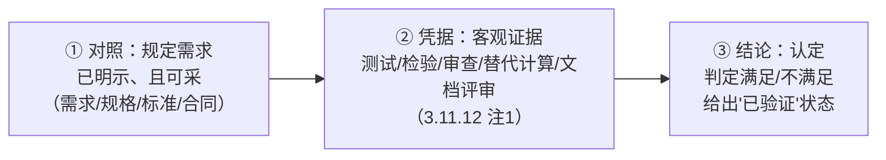

| 要素 | 问什么 | 反例 |
|------|--------|------|
| ① 对照规定需求 | 有白纸黑字的尺子吗？ | 口头"大概要快一点" → 无法验证 |
| ② 提供客观证据 | 有可复核的证据吗？ | "我认为满足" → 不算验证 |
| ③ 做出认定 | 有明确结论吗？ | "差不多吧" → 不是验证 |

> **"测试"只是验证的手段之一**（提供客观证据），不是验证本身。验证还包括审查、替代计算、文档评审。把"测试过了"等同于"验证过了"，是把手段当成了目的。

> 〔按：三要素是 ISO 9000:2026 §3.11.12 的**通用**拆法；三要素全备之后，还差**可采性**——这条在架构侧被 24 号补成一段凭据链：DD 的每条承诺 → 上溯到 AD 中的可采条目（ID / 对象 / 断言 / 判定方法，且属已冻结基线）→ 该条目再**回溯到架构**（合法性由目的必要性授予）。**断任一段，"合规"即退化为印象**；条目若无可采性（无根、未明示、未冻结、无唯一标识），"文件里写了"也不等于"可作凭据"（24 号 §9.1、§11.3、§11.4、§10.2）。〕

### 20.2 目标具体化配方与检验三问

**配方：目标 = 对象（谁/什么）＋ 时限（何时）＋ 可衡量结果（多少）**

| 抽象（评审不了） | 具体（可评审） |
|---|---|
| "做出高质量的产品" | "Q4 月活用户达 100 万" |
| "提升用户体验" | "Q4 首页加载时间降到 2 秒以内" |
| "做好支付" | "本冲刺完成支付闭环，用户可完成首次下单" |

**检验三问**（评审会开场前自测，任何一个答不上来就是目标没定好）：

1. 评审结束后，**通过的标准**是什么？（怎么算达标）
2. 这个"达标"有没有**可观察/可测量的判定**？（数字、行为、状态）
3. 如果两个人理解不一致，**看什么能裁决**？

三个都答得上 = 目标是"为客体确立的目标"；答不上来 = 先把目标改具体再开会。

### 20.3 翻译辨析：为什么"被明示的…往往是隐含的或强制的"不对

原句（直译）：**需求 = 被明示的、通常隐含的或必须履行的需要或期望**

错误译法："被明示的需要或期望，**往往是**隐含的或强制的"——错在两个地方：

1. **把并列译成了主次**：原文 stated / implied / obligatory 三者用 or 并列、地位平等；错误译法把"明示的"当主要定语、把"隐含/强制"降级成"往往"的补充
2. **"往往"是原文没有的词**：原文没有任何频率含义，加"往往"等于自己塞进了原文没有的意思

```mermaid
flowchart TB
    subgraph 原文["原文结构：并列（or 连接，地位平等）"]
        direction LR
        A1["stated 明示的"] --- A2["generally implied 通常隐含的"] --- A3["obligatory 必须履行的"]
    end
    subgraph 误译["错误译法结构：主次（'往往'是原文没有的词）"]
        direction LR
        B1["被明示的（主要）"] --> B2["往往是隐含的或强制的（补充）"]
    end
```

> 区分两类判断：**作为定义翻译**（必须忠实原文并列结构）vs **作为实践观察**（现实中隐含/强制需求占比高是对的）——别把实践观察塞进定义翻译里。

### 20.4 "隐含需求"冰山比喻

> **"隐含需求"就像冰山在水下的部分。** 传递到下游的只能是浮出水面的部分（明示），但如果没有"水下还有冰山"这个认知，船就直接撞上去了。概念存在的意义，是提醒你**必须去挖掘水下部分**——而不是说水下部分能直接运到岸上。

两个推论：

- 漏掉隐含需求 = 缺陷（不是"没写文档所以不算"）
- 隐含需求要"被识别 → 显性化 → 传递"，三步缺一不可

### 20.5 评审 vs 复盘（易混概念辨析）

| | 评审（Review） | 复盘（Retrospective） |
|---|---|---|
| 时机 | 过程关卡，干活之前/之中把关 | 事后回顾，干完了总结 |
| 归属 | IEEE 1028 五类 / ISO 9000 术语 | 敏捷实践（Scrum Guide） / CMMI 组织过程改进 |
| 标准术语 | review | Post-Project Review / Lessons Learned（经验教训） |
| 目的 | 把关：判断适宜/充分/有效 | 改进：沉淀经验、驱动下一轮 |
| 位置 | 在流程链条上 | 绕回起点（文档 §10 图中的虚线） |

> 一个管"把关"，一个管"改进"，不冲突，但别混为一谈——**复盘不在 IEEE 1028 的五类评审里**。

---

*文档完。整理自 2026-08-18 概念讨论（完整版，含全部图示与补遗）。术语口径遵循项目约定（requirement→需求，need→需要，expectation→期望）。*
