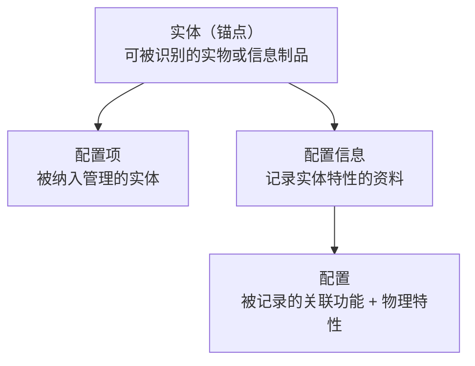
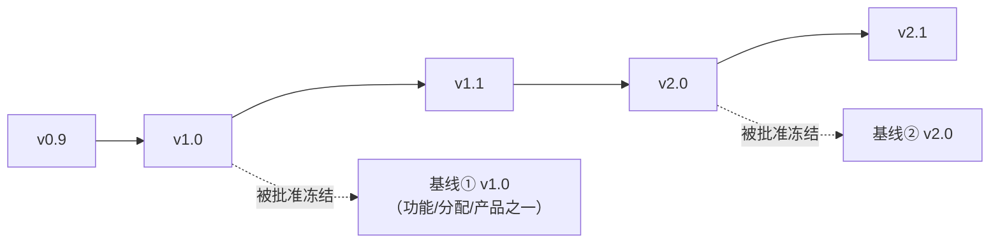
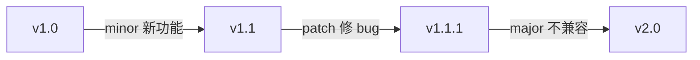
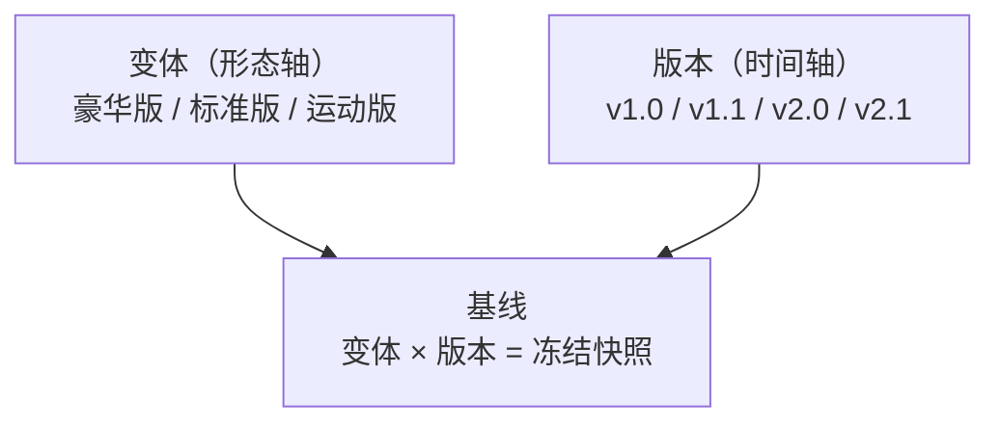
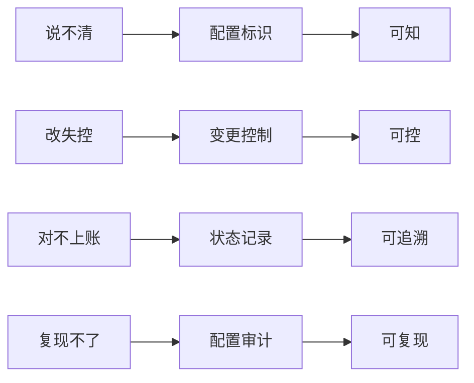
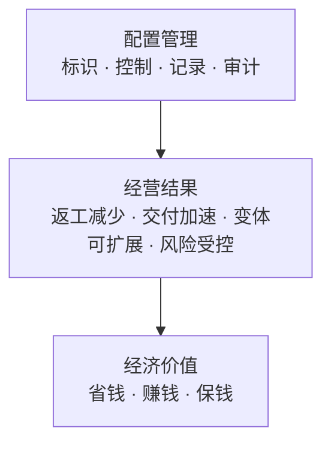

# 配置管理核心概念精讲

> 从配置定义到商业价值 —— 一份以"解耦"视角重讲 ISO 10007 概念体系的学习笔记
>
> 2026-08-18 · 整理自概念研习对话（v2：新增基线、版本专章与"配置 × 版本 × 基线"总章）

---

## 目录

1. [什么是配置：变与不变的分离](#1-什么是配置变与不变的分离)
2. [解耦重定义：配置信息、配置、配置项](#2-解耦重定义配置信息配置配置项)
3. [配置的本质：配 + 置](#3-配置的本质配--置)
4. [配置的边界：不是所有特性都是配置](#4-配置的边界不是所有特性都是配置)
5. [配置的对象与结果](#5-配置的对象与结果)
6. [为什么选择：配置的经济逻辑](#6-为什么选择配置的经济逻辑)
7. [配置家族：生命周期全览](#7-配置家族生命周期全览)
8. [基线：时间轴上被盖章冻结的快照](#8-基线时间轴上被盖章冻结的快照)
9. [版本：时间轴上的演进刻度](#9-版本时间轴上的演进刻度)
10. [配置 × 版本 × 基线：三者关系与两个视角](#10-配置--版本--基线三者关系与两个视角)
11. [两个易混场景辨析](#11-两个易混场景辨析)
12. [配置管理：四大活动](#12-配置管理四大活动)
13. [配置管理解决什么问题：核心目的](#13-配置管理解决什么问题核心目的)
14. [配置管理的价值](#14-配置管理的价值)
15. [附录：标准与术语速查](#附录标准与术语速查)

---

## 1. 什么是配置：变与不变的分离

配置（configuration）在产品开发中，是把"一套产品核心资产"和"怎么用、在哪儿用、给谁用"这些可变信息分离开来的一套机制。**核心思想：变的东西不写死在不变的东西里。**

- **产品核心（不变）**：代码、逻辑、功能资产 —— 只写一遍；
- **配置（可变）**：参数、开关、选项、环境 —— 变化的部分外置。

同一核心 × 不同配置 = 多形态交付（开发版、测试版、生产版、客户定制变体）。

**配置（这个概念）的目的**，归结为五条：

1. **分离变与不变** —— 核心资产只写一遍，变化的部分外置，避免"改一个参数就要改代码、重编译、重发布"；
2. **一套产品，多形态交付** —— 同一核心跑出多环境、多客户、多变体（功能开关、选配表皆属此列）；
3. **降低变更成本与风险** —— 环境切换、灰度、回滚，改配置即可，不动核心；
4. **可复现、可审计** —— "哪个版本 + 哪套配置 = 哪个产物"永远说得清；
5. **支撑规模化协作** —— 版本基线（baseline）让多人、多团队有共同参照物。

> 一句话：**配置是"被记录的样子"，配置管理是"让这个记录永远可信、永远不被改乱"的那套机制——一个管"是什么"，一个管"永远说得清是什么"。**

## 2. 解耦重定义：配置信息、配置、配置项

> **先说痛点**：ISO 10007 的原文是循环定义的——"配置"用"配置信息"定义（3.1），"配置项"用"配置"定义（3.3），"配置信息"又指"描述配置项所需的资料"。三个术语互相引用，形成闭环。

**解耦方法**：引入一个不依赖任何配置术语的天然锚点——**"实体"（entity）**，让三个术语全部锚定在它上面，彼此不再互引。

> 图中箭头表示"定义建立在……之上"：配置项、配置信息都锚定在实体上；配置单向依赖配置信息（被记录其中），而配置信息独立成立、不反向引用配置——整张图**有向无环**。

**锚点 · 实体（entity）**
> 任何可被识别和区分的一个具体存在：实物（设备、板卡、部件）或信息制品（文档、代码、模型）。

**① 配置项（Configuration Item）—— 回答"管哪些"**
> 被组织**选定、纳入配置管理范围**的那个实体。
- 判定标准：它值得被单独标识、单独管版本、单独管变更；粒度由组织自行决定。
- 依赖：实体。不引用"配置"、不引用"配置信息"。

**② 配置（Configuration）—— 回答"它是什么样"**
> 实体的特性中，**已被记录在配置信息里、且相互关联**的功能特性和物理特性。
- 依赖：实体、特性、配置信息（**单向**）。不引用"配置项"。

**③ 配置信息（Configuration Information）—— 回答"拿什么核对"**
> 用于**记录实体的功能与物理特性**的资料：规格书、图纸、代码、数据库条目、变更记录。
- 依赖：实体、特性、记录。**独立成立**，不引用"配置"、不引用"配置项"。

> **记忆钩子**：配置项是"人"，配置是"这个人的身高体重"，配置信息是"他的体检档案"。三者围绕同一个产品，但一个是对象、一个是属性、一个是记录——**不是同一层的东西，谈不上真循环**。

**最大的坑**：文档既是"配置信息"（描述产品），又可以是"配置项"（自身被管理、管版本）——两个层面，不冲突。

## 3. 配置的本质：配 + 置

拆字与词源高度一致：

| 语言 | 词根 | 含义 | 合义 |
|------|------|------|------|
| 中文 | 配 + 置 | 配合/匹配 + 放置/安设 | 搭配并安置成形 |
| 英文 | con- + figurare | 共同/一起 + 塑造/成形 | 共同塑成的形态 |

**本质 = 组合成形**：若干部分（组件、特性）经"配"（配合、匹配）与"置"（安置、定位），共同塑成的**整体形态**。

| 词源 | 对应概念 | 对应标准文本 |
|------|---------|--------------|
| 配（配合） | 特性之间相互关联、协同 | ISO 10007 的 **interrelated** |
| 置（安置） | 特性被放置、记录进整体 | **defined in configuration information** |
| 成形（塑成的形态） | 组合后的整体样子 | as-designed / as-built 所描述的"形" |

> **常见误解**：configuration 的本质不是"参数文件"（那是配置信息），而是"这堆参数组合在一起所塑成的那个样子"。配置文件只是记录"形"的图纸，形本身才是配置。

## 4. 配置的边界：不是所有特性都是配置

标准定义里有三个"隐形过滤器"，把"实体的全部特性"和"配置"区分开：

1. **类别边界**：只认**功能特性 + 物理特性**。成本、责任人、生产批次、库存状态等管理属性不属于配置（这类属性由"配置状态记录"活动管理，即第 12 节的"状态记录"）。
2. **记录边界**：只有**被配置信息规定/记录下来的**特性才算配置（"defined in configuration information"）。未文档化的客观属性（如某个无人记录的导热系数）不构成配置。
3. **关联边界**：是**相互关联**的特性整体（interrelated），不是零散清单。

> **一句话**：特性客观存在，配置是"被管理起来的那部分特性"。
> **补充**：设计规定的（as-designed）和实际实现的（as-built）都算配置，前提是都被认定并记录下来。

## 5. 配置的对象与结果

- **配置的对象（配什么、置什么）**：
  - 直接对象：实体的**组成部分**（组件、部件、模块）与**特性**（功能 + 物理）；
  - 管理对象：**配置项**（被选定纳入管理的实体）；
  - 配置天然是"多体"概念——con-（共同）、"配"（配合）都暗示必须有多个参与者，单个孤立的东西没有配置可言。
- **配置后成了什么**：
  1. **即时结果**：一个"形"——as-designed（应该长这样）与 as-built（真长成这样）；
  2. **正式结果**：**基线（baseline）**——被正式批准、冻结的配置快照；
  3. **交付结果**：一个具体可运行、可交付、可复现的**产品实例 / 版本**。

> 从"多"到"一"，就是 configuration 的全部旅程。

## 6. 为什么选择：配置的经济逻辑

配置包含"从一堆东西里选一个子集"——但它是**满足约束的有效子集**，不是任意子集：

- **requires（必配）**：选 V6 发动机 → 必须配自动变速箱；
- **excludes（互斥）**：选经济版内饰 → 不能选豪华版座椅；
- **mandatory / alternative（必选 / 多选一）**。

选择的四个驱动力：

| 驱动力 | 说明 |
|--------|------|
| 需求多样 | 每个人要的形态不同，选择让"各取所需"成立 |
| 成本预算 | 全选 = 成本爆炸，选择让"按需付费"成立 |
| 技术约束 | 互斥与兼容不可兼得，选择是"在可行域内找解" |
| 商业差异 | 同一平台长出多 SKU，差异化竞争 |

> 隐藏的第五个力：**质量与可维护**。特性越多，测试组合指数爆炸、缺陷面越大。选择本身就是复杂度治理。

**总结**：选择 = 需求的表达（想要什么）+ 约束的妥协（能给什么）+ 价值的取舍（值得给什么）。

## 7. 配置家族：生命周期全览

配置不是单一概念，是"家族相似"概念——同一副内核（全集 → 约束 → 子集成形）在多个层面反复出现：

**配置管理的三种正式基线（ISO / 军工标准）**：

| 基线 | 对应环节 | 内容 |
|------|---------|------|
| **功能基线**（Functional Baseline） | 需求配置 | 批准的功能需求，"要做什么" |
| **分配基线**（Allocated Baseline） | 设计配置 | 功能分配到硬件/软件/人，"由谁实现" |
| **产品基线**（Product Baseline） | 实物配置 | 最终产品完整定义与实物记录，"实际是什么" |

**对象域视角（横着切）**：硬件配置 · 软件配置 · 数据配置 · 环境配置 · 接口配置 —— 同一内核，不同对象。

## 8. 基线：时间轴上被盖章冻结的快照

> ISO 10007:2017 定义：基线——**经批准、确立了产品在某一时点的特性、并作为全生命周期各项活动参照的配置信息**。

**一句话**：基线是"时间轴上被正式批准、冻结的配置快照"。它是配置 × 版本 的交叉点被"盖章"的结果。

### 8.1 三个特征

1. **被批准（approved）**：不是自动生成，是组织正式批准、盖章确认——从"流动状态"升级为"受控状态"；
2. **被冻结（frozen）**：基线一旦建立，任何人都不能随意改——配置管理里少数"神圣不可侵犯"的东西；
3. **作参照（reference）**：它是全生命周期活动的基准——后续的变更评估、验证、验收、审计，全部拿它对照。

### 8.2 为什么需要基线

没有基线，**变化就没有参照系**：

> **从基线出发，一切变更都可描述**（从基线 A 变到基线 B）；**离开基线，一切变化都不可言说**。

基线给了变化一个"出发的原点"，把"哪个形态、哪个版本"钉死在某一个时间点，这个点从此成为全项目的共同记忆。

### 8.3 基线的三种类型

按产品诞生顺序逐级建立（呼应第 7 章的配置家族）：

| 基线 | 对应配置 | 什么时候建立 |
|------|---------|------------|
| **功能基线** | 需求配置 | 需求被批准时——"要做什么"定了 |
| **分配基线** | 设计配置 | 功能分配到软硬件时——"由谁实现"定了 |
| **产品基线** | 实物配置 | 产品定型/交付时——"实际是什么"定了 |

### 8.4 基线与变更控制的关系

- 基线建立**之前**：开发流，自由演进；
- 基线建立**之后**：任何变化都是"对基线的偏离"——必须走变更控制：**申请 → 影响评估 → CCB 批准 → 实施 → 建立新基线**。

配置管理就是"**冻结 → 变更 → 再冻结**"的循环，基线是每次循环的支点。**基线是变更控制的前提，变更控制是基线的守护者。**

## 9. 版本：时间轴上的演进刻度

> ISO/IEC/IEEE 24765 定义：版本——配置项的**初始发布或其后基于完整构建的重新发布**。

**一句话**：版本是"同一个实体在时间轴上的演进刻度"——把"连续的时间"切成"可指认的格子"，回答"走到第几步了"。

### 9.1 版本号规则（SemVer：主.次.修订）

| 版本段 | 名称 | 何时升级 |
|--------|------|---------|
| 主版本 | **major** | 不兼容的变更（v1 → v2 可能破坏现有使用） |
| 次版本 | **minor** | 向后兼容的新功能（老用户无痛升级） |
| 修订 | **patch** | bug 修复 |

工程图纸的 "Rev A / Rev B / Rev C"（**修订**）是同一思想的另一种叫法：修订偏"改了几次"（内部变更记录），版本偏"发布到第几代"（对外整体编号）。

### 9.2 为什么需要版本

1. **追踪演进**：知道"走到哪一步"，每一步改了什么有据可查；
2. **回溯**：出问题能回到旧版本（回滚、复现客户环境）；
3. **并行**：v1 还在服役、v2 已开发——多代共存需要不同名字区分；
4. **复现**：报障时"你跑的是 v2.1"——版本号是沟通的最小公约数。

### 9.3 与相关概念的分界线

| 概念 | 回答的问题 | 维度 |
|------|-----------|------|
| **变体（variant）** | 有几种形态？ | 空间（并存差异） |
| **版本（version）** | 走到哪一步？ | 时间（先后因果） |
| **修订（revision）** | 内部改了几次？ | 时间（更细粒度） |
| **基线（baseline）** | 哪一个被盖章冻结？ | 被批准的版本 |
| **发布（release）** | 哪一代交付给用户？ | 交付动作 |

## 10. 配置 × 版本 × 基线：三者关系与两个视角

### 10.1 三者关系：内容 × 刻度 × 资格

**变体轴（形态）与版本轴（时间）正交，但"配置/设计配置"不在任何一根轴上——它在交点上**：

- **变体**：回答"有几种形态"（空间维度，并存差异）；
- **版本**：回答"演进到哪一步"（时间维度，先后因果）；
- **设计配置** = 变体 × 版本 的**组合快照**，**天生含版本维度**（配置标识 = 变体标识 + 版本号，如"豪华版设计 v2.1"、图纸 Rev C）；
- **基线** = 配置 × 版本的交叉点冻结 —— "就是这个，谁也别动"；
- **小版本设计** = 设计配置在版本轴上小步演进后的状态 —— 设计配置可以是小版本设计（快照与状态的关系，不是正交关系）。

两两关系：
- **配置 × 版本**：正交。一个配置可以有很多版本（豪华版 v1.0、v2.1）；一个版本下可以有多个配置（v2.1 的豪华版/标准版/运动版）；
- **配置 × 基线**：基线的"内容"是配置——未经批准的配置只是候选，被批准冻结才升级为基线；
- **版本 × 基线**：基线的"刻度"是版本——未经批准的一版只是演进状态。

> 判断口诀：问"有几种形态"→ 变体；问"改到第几版"→ 版本；问"这个版本的这个形态"→ 基线。
> **配置提供"内容"，版本提供"位置"，批准提供"资格"——三者齐备，才成一个基线。**

动态视角：**配置变了 → 版本升了 → 批准冻结 → 新基线形成**，旧基线退役。配置管理的主循环就是"配置（内容）× 版本（刻度）→ 批准（盖章）= 基线 → 变更 → 再来一次"。

### 10.2 横与竖的分工：版本顺着时间流，基线垂直切断时间

"横"与"竖"不是上下方向，而是**与时间轴的关系**：

- **横 = 与时间同向（版本）**：版本像**尺子上的刻度**，沿着时间轴排列（v0.9 在左、v2.2 在右），告诉你"走到哪一步"。刻度是尺子的一部分，跟着尺子走——只描述**位置**，不改变时间轴的性质（刻度左边右边一样自由）；
- **竖 = 与时间垂直（基线）**：基线像**横在路中间的闸门**，垂直插入时间轴，把时间**切断**：闸门左边是"自由区"（版本随便流动），右边是"受控区"（任何变化必须停下来接受 CCB 批准）。闸门不是尺子的一部分，是**从外面插进来的障碍**——制造"分界"，改变时间轴的性质（无约束 → 有约束，质变）。

> 生活类比：**版本是高速公路上的里程桩（沿路排开，告诉你走了多远）；基线是收费站（横在路中间，把路截断，过站要检查）**。一个顺着路，一个挡住路——横管流动，竖管冻结。

### 10.3 两个视角：开发链视角与甲方-乙方视角

"基线对谁、版本对谁"，取决于"上下游"怎么定义——存在两个视角，结论相反但本质相同：

| | 产品开发链视角 | 甲方-乙方视角 |
|---|---|---|
| 上游 | 需求阶段（链头） | 甲方 / 需求方 |
| 下游 | 交付/使用（链尾） | 乙方 / 实现方 |
| 交付物流向 | 流向下游（使用者） | 回流上游（需求方） |
| 基线角色 | 链头就有（功能基线） | 甲方批准 → 乙方参照 |
| 版本角色 | 链尾也在用（报障） | 乙方产出 → 甲方验收 |

- **开发链视角**：交付物流向链尾使用者，基线从链头（需求）就开始建立——所以"基线不是对下游、版本不是归上游"；
- **甲方-乙方视角**（日常实践说法）：**"按基线开发，提交版本"**——基线是甲方批准、流向乙方（实现方）的**参照**；版本是乙方产出、回流甲方（需求方）**验收的交付物**。这个说法完全成立。

> 无论哪个视角，内核不变：**基线 = 冻结的参照（批准后不许动，谁干活都得拿它对照）；版本 = 流动的交付（谁产出、交付给谁验收，它是传递物）。**

### 10.4 契约链：每一对相邻环节都是局部甲乙方

**需求对方案、技术方案对实现方案……开发链上每一对相邻环节，都是一组局部的"甲方-乙方"（要求-兑现）关系**——这就是系统工程里的"契约链（chain of contracts）"：

**每一环的机制完全相同**：甲方冻结"基线"（要求）→ 乙方按基线开发 → 产出的"版本"交付给甲方验收。**每一环的乙方，就是下一环的甲方**——需求方对方案方是甲方、对客户是乙方；要求逐级冻结为基线，兑现逐级交付为版本。

工程印证：ISO/IEC/IEEE 15288 把每一级接口定义为"**需方-供方协议**（acquirer-supplier agreement）"；V 模型每一层的验证本质就是"乙方对照甲方的要求验收"；**分配基线**的深层含义就在这——功能基线（需求）→ 分配给子系统 → 每个子系统拿到自己的"小需求"（它是乙方），实现再交付回来（它是甲方）。

> **边界**：开发链内部的"甲乙方"是**技术契约**（要求-兑现，管"对不对得上"）；完整的外部甲乙方还多一层**商务契约**（法律合同、付款、责任，管"赔不赔得起"）。机制同构，勿混为一谈。

**整条开发链 = 契约传递链**：要求逐级冻结为基线，兑现逐级交付为版本——**基线是每一级契约的"冻结端"，版本是每一级契约的"交付端"，二者都不是某一级专属，而是每一级都重复出现的通用机制。**

## 11. 两个易混场景辨析

### 11.1 从需求集合中选子集作为开发输入 —— 是配置吗？

**是。** 这是"需求配置"——配置家族的第一环（意图层），对应**功能基线**。

- 需求选择 = 需求配置：为某个版本/客户选一组需求，就是配置一个"需求变体"；
- 它和"产品配置"的区别只是**对象（意图 vs 形态）和阶段（开发前 vs 开发中/后）**，内核相同；
- 需求选择结果一旦冻结，就是**需求基线**，正式进入配置管理领地（后续变更走配置管理的变更控制）。

### 11.2 同设计 PMN 号的多个实体，选一个作为产品部件 —— 是配置吗？

**取决于配置管理粒度**（第一直觉"选谁不重要"和第二直觉"选谁就是配置"都不完整，务必记住以下判定）：

| 粒度 | 性质 | 说明 |
|------|------|------|
| **类型级**（PMN 粒度） | **不是配置** | 选谁，配置都不变 → 分配 + 序列号追溯 |
| **实例级**（序列号粒度） | **是配置** | 选谁决定这台产品的 as-built 配置 → 序列化配置（serialized configuration） |

- 配置是**类型级**概念（特性记录相同）；实体是**实例级**概念（个体拷贝）；
- 安全关键行业（航空、军工、医疗）按单件管理：**"P-03 位号装序列号 S-02"是这台产品 as-built 配置的正式条目**；
- 实例级选择**不是自由的**：受互换性等级、批次、兼容性约束 → **有约束的选择 = 配置**；
- 判定标准：**选 A 还是选 B，产品的特性/形态变了吗？** 变了 → 它们本就属于不同配置，标识系统必须升级（PMN + 变体号 + 序列号）。

## 12. 配置管理：四大活动

配置管理（Configuration Management, CM）是一套系统化的工程实践。ISO 10007:2017 归纳为**五大活动**（配置管理规划、配置标识、变更控制、状态记录、配置审计），其中"规划"属于组织级策划（明确职责、流程、工具、剪裁规则），此处按实践通用口径列**四大执行性活动**，持续循环：

| 活动 | 解决的问题 | 典型产出 |
|------|-----------|---------|
| 配置标识 | 说不清"产品是什么" | 配置项清单、基线定义 |
| 配置控制 | 变更失控、改了没人知道 | 变更请求记录、受控版本演进 |
| 状态记录 | 设计与实物对不上账 | 状态报告、版本台账 |
| 配置审计 | 复现不了、责任推诿 | 审计报告、一致性确认 |

## 13. 配置管理解决什么问题：核心目的

**核心目的（一句话）**：

> 在产品持续变化的过程中，始终保证它的配置是**已知的、受控的、与需求一致的、可追溯的**。

随时能回答三个问题：
1. **它应该是什么？**（as-designed → 需求/设计配置、基线）
2. **它实际是什么？**（as-built → 实物配置、状态记录）
3. **它是怎么变成这样的？**（变更历史 → 变更控制、审计）

## 14. 配置管理的价值

### 14.1 为什么必须有这个目的：三条铁律

1. **产品开发是协作** —— 协作需要共同事实：多团队各说各话 = 灾难；
2. **产品开发是长周期** —— 长周期需要组织记忆：知识不随人员流动而消失；
3. **产品要担责** —— 责任需要可答的账：安全、合规、合同是必答题。

### 14.2 带来什么好处：四个维度

| 维度 | 内容 |
|------|------|
| **质量** | 做对（实物=设计=需求）· 测准（有明确测试对象）· 修快（快速定位缺陷来源） |
| **效率** | 少返工 · 少扯皮 · 快交付（多版本并行不打架） |
| **合规** | 可追溯 · 可追责 · 过审计（ISO 9001 / 航空 / 军工 / 医疗硬性要求） |
| **信任** | 客户可复现 · 可修复 · 敢用 |

### 14.3 经济价值：不只是"便于管理"

> "便于管理"是手段，不是价值；**价值 = 消除的浪费 + 解锁的机会**。

- **省钱（消除浪费）**：
  - 返工费：缺陷发现越晚修复越贵（约 1 : 10 : 100 : 1000），配置管理把缺陷憋在早期暴露；
  - 报废费：状态记录避免"造了没人要的、造了重复的"；
  - 召回费：可追溯 = **精确召回**（只召回受影响批次），vs 全量召回差一个数量级。
- **赚钱（解锁机会）**：
  - 多变体 = 多收入（配置管理是产品线增长的安全带）；
  - 资质 = 订单（航空/军工等行业的市场准入门票，没它递不进标书）；
  - 交付速度 = 赢单（不违约、不丢单）。
- **保钱（兜住风险）**：
  - 事故责任清晰（哪次变更、谁批的、影响哪些产品）；
  - 知识资产不流失（配置信息是组织唯一带不走的资产）。

---

## 15. 附录：标准与术语速查

### 相关标准

| 标准 | 名称 | 作用 |
|------|------|------|
| **ISO 10007:2017** | 质量管理 — 配置管理指南 | 主标准，定义配置及 CM 全套概念（对应国标 GB/T 19017） |
| ISO 9001:2015 | 质量管理体系 — 要求 | 提出"产品标识与可追溯性"要求，ISO 10007 是其配套指南 |
| ISO/IEC/IEEE 24765 | 系统与软件工程 — 词汇 | 术语权威出处 |
| ISO/IEC/IEEE 15288 | 系统生命周期过程 | 配置管理列为技术管理过程之一（6.3.5.1） |
| ISO/IEC/IEEE 12207 | 软件生命周期过程 | 软件视角的配置管理过程 |
| IEEE 828 | 系统和软件工程配置管理 | 工程实施标准，与 ISO 10007 有映射 |

### 关键术语（ISO 10007:2017 定义 + 解耦版）

| 术语 | ISO 原文要点 | 解耦版 |
|------|-------------|--------|
| 配置 | 在配置信息中规定的、相互关联的功能与物理特性 | 实体被记录的关联功能 + 物理特性 |
| 配置项 | 配置中满足最终使用功能的实体 | 被纳入管理的实体 |
| 配置信息 | 描述和记载配置项所需的资料 | 记录实体特性的资料 |
| 基线 | 经批准、作为全生命周期参照的配置信息 | 变体 × 版本的冻结快照（被盖章的版本） |
| 版本 | 配置项的初始发布或其后基于完整构建的重新发布（ISO/IEC/IEEE 24765） | 时间轴上的演进刻度 |
| 变体 | 同一产品族中并存的形态（variant） | 空间维度的形态差异 |
| 修订 | 图纸/文档的逐次内部变更记录（Rev A/B/C） | 时间维度上更细的粒度 |
| 配置状态记录 | 对配置信息与变更状态的正式记录与报告 | 任何时刻可查"现在是什么" |

### 一句话记忆

> **配置项是"被管的那个东西"，配置是"它被记录下来的该有的样子"，配置信息是"记录它的那些资料"——三者都长在"实体"这一根上；而配置管理，就是让"一个一直在变的产品"在任何时刻都能被准确说出来。**
