# 从概念到架构：ISO/IEC/IEEE 42010 架构定义深度解析

> **文档版本**：v1.8（v1.0 = 2026-08-17 整理初版；v1.1 = 2026-09-04 定义升格 2022、与 06 号 v4.7 同步；v1.2 = 2026-09-21 与 30 号对齐；v1.3 = 2026-09-21 第二轮收口·其余术语按 GB/T 45630-2025 统一；v1.4 = 2026-09-21 依 29 号对齐架构治理口径；v1.5 = 2026-09-21 治理侧术语按 28 号统一·定义句三职能作「担责」；v1.6 = 2026-09-21 依 24 号对齐架构与设计边界口径（过程≠阶段、种类≠粒度、元素三层、判据精确化）；v1.7 = 2026-09-21 第七轮·15288 版本锚定与「架构粒度」措辞收口；v1.8 = 2026-09-21 第十轮·依 23 号对齐；v1.9 = 2026-09-21 第十一轮·依 22 号对齐（术语权威层 · 两哲学 · X／Z 块 · 清单化定位 · 译名统一））
> **整理日期**：2026-08-17
> **修订日期**：2026-09-21
> **概念依据**：架构、关注点、架构视角、架构视图四概念的定义、关系、界分与译名，一律以 30 号《架构描述核心概念研究报告》为准（依 GB/T 45630-2025／ISO/IEC/IEEE 42010:2022）。
> **概念依据（术语权威）**：涉 **concept／property／characteristic／attribute** 四术语的跨标准定位（ISO 1087:2019／ISO 9000:2026／ISO/IEC 2382／ISO/IEC/IEEE 42010）与条款号，一律以 **22 号《架构、概念、属性研究报告——术语权威定义与对照分析》**为准（22 号 §11.2(1)、§12 表下注）。本报告的落地处：§6 的「条款级语境谱」与「术语学层」两块、§7.1.1 的两哲学段。
> **概念依据（架构治理）**：架构治理（architecture governance）的定义、目的、对象、输入与输出、责任主体与机制，一律以 29 号《架构治理研究报告——从标准依据到责任主体》为准（领域定义取 TOGAF，治理语义取 ISO/IEC 38500）。本报告仅在**架构定义**处与之相邻：定义句末的 governing principles 是**定语**（国标定名「管控原则」），概念模型里连接架构视角与架构视图的 governs 是**动词**（关系名译「治理」）——两者与架构治理**不是同一用法**（分野见 30 号 §3.7）。
> **主题**：概念 · 符号学 · IPD · 架构定义 · 架构描述
> **说明**：本文档由一次连续的概念对话整理而成，所有图表均以 Mermaid 实现，支持 Typora / Obsidian / GitHub / VS Code 等渲染器直接显示。
>
> **2026-09-21 第十一轮·依 22 号对齐**（修订记录 · **v1.8 → v1.9**）：用户令「以 22 号研究报告为准，把 22 号之前的报告与之对齐」。依 **22 号《架构、概念、属性研究报告——术语权威定义与对照分析》**（v1.7）的 D1～D31 与 §3.5／§3.6／§3.9／§4／§5.2～§5.4／§5.6／§6.2／§6.4／§7.2／§7.3／§8.1／§8.2／§9.4／§9.5／§11.2(2) 核本报告，按发现清单就地修 13 处——① **§6 补条款级语境谱（D8）**：原「三种语境」实为一根**词义宽窄谱**（哲学→架构设计→产品开发），本轮**章题与目录锚点改名「两张语境谱」**（与 06 号 §1.1.4 同款命名），点明其轴，并**另加第二张表**「条款级语境谱」——术语学 ISO 1087:2019 §3.2.7（严格定义）／架构 ISO/IEC/IEEE 42010:2022 §3.2（**§3 里没有 concept 这一条**，按 ISO/IEC Directives Part 2 以"普遍接受的含义"使用 ≈ idea／notion）／IT-AI ISO/IEC 2382-31:2001 §31.01.05（严格定义）；并补三条硬事实（42010 §3 **既没有 concept 也没有 property**、ISO 1087 §3.2.7 注 2 自警同名异义、多处定义时**逐一定位、不混用**）与「两谱不同轴、不可合并」；② **§6 补术语学层（D1～D7）**：property **§3.1.3**（feature of an object，**无限定**）／characteristic **§3.2.1**（abstraction of a property）／三层抽象链 property→characteristic→concept／definition **§3.3.1**／attribute **ISO/IEC 2382-17:1999 §17.02.12**（A named property of an entity，命名层侧支）＋ ISO 9000:2026 §3.10.1 的 characteristic 是**质量管理语境的特殊化**，并钉住**42010 的 properties 不得以 ISO 9000 的 inherent 限定回读**；③ **§7.1.1 新增「定义背后的两种哲学」（D9，高价值）**：Conception 派／Perception 派英文 verbatim ＋ 中译、工作组表态 **without prejudice**、*Under either philosophy, an architecture is abstract — not an artifact*、2022 同源落点为 **stakeholder perspective §3.18**（同源而不同物、未条款化），并补 22 号 §8.1 的 2×2 矩阵与**三个动词**（conceive／perceive／describe）；④ **§7.4 修订表补一行**（`concepts or properties` 为哲学兼容设计：2011 引入、2022 保留 X 块）；⑤ **§7.3 点出两派名（D9）**：原文「概念角度或属性角度」改标 **Conception／Perception** 并互参 §7.1.1；⑥ **§7.2 补 X 块／Z 块标注（D11）**（节点标签 ＋ 图下〔按〕，图结构未动）；⑦ **§7.5 新增「清单化定义的合法位置」（D15／D16／D18）**：architecting（42010:2022 §3.1）七步动作集中 **`defining`** 一环、aspect §3.9（按 aspect 分块＝2022 官方标准化的清单化结构、aspect 与 concern **多对多**）、L1～L5 五层（清单住 **L3**，"abstract" 不能读成 "list"）；⑧ **§7.4 要素行改正（D17）**：「2022 新增的 AD 元素」改「2022 新增**要素**」，写明方面体／利益相关方角度／对应关系与对应方法属 §3.4 Note 1 的 **11 类 AD 元素**，而**架构决策与理据不在其中**（§5.2.12／§6.10 列为强制记录内容）；⑨ **§8.3 补 embodied-in 的去向（D14）**：删去处一律与 **42020:2019 §3.3 Note 1**（搬家 ＋ 降调）并读；⑩ **§8.3 时间线补齐（D12）**：加【历史对照】标记并补 **1996 Hilliard**（*the highest level conception*）一站，四版时间线完整；⑪ **§7.1 译名注改正（D19／D20）**：「当 governing 作**动词**」改「当 **`governs`** 作**关系名**」，三槽分工＝定语 `governing`／名词 `governance`／关系 `governs`；⑫ **§10 译名统一（D25）**：章题与全章「设计原则／演进原则」改「**设计准则／演进准则**」（对齐 10 号 §11.2 的定形），并补口径〔按〕——标准只有**一个**术语表述 `governing principles for the realization and evolution`，该二分是按**工作内容**作的读法，2011→2022 是**覆盖面扩张**不是同物异写；凡指 `evolution` 处「演进」统一作「**演化**」；目录条目与锚点同步；⑬ **头部补「概念依据（术语权威）」行（D31）**。**未改**：§1～§5、§7.4 表体其余行、§8.1～§8.2、§8.4～§8.7、§9、§11～§13、§14.1～§14.3 的行文与结论（§14.4 仅改历史括注一处用字）；逐字标准引文与【历史对照】块的英文原文、既有节号（新增 §7.1.1 与 §7.5 两节、§6 内补两块，均未重编号）、mermaid 图结构（仅 §7.2 三处节点标签加字）一律未动。
>
> **修订记录**：2026-09-04 架构定义升格 ISO/IEC/IEEE 42010:2022（依 22 号报告「最新现行为主、旧版仅对照」原则，与 06 号 v4.7 同步）——§7.1 主定义改 2022、2011 降【历史对照】；§7.2 逐词拆解、§8.3 语法精读按 2022 句法（2011 的 embodied-in 剥离作历史脉络）；§7.4 改题「2022 相对 2011 的关键修订（历史对照回顾）」；§8.5/§10 原则引文、§14.4 判据链末句、文末参考标准顺序随迁。2026-09-04 概念定义对齐 ISO 1087:2019——§1「概念（捕捉事物本质的命名抽象）」与 §2「概念=所指/涵义」两处定义句补"架构语境"限定 + 语境说明，区分符号学解读（详 §3）与 ISO 1087:2019 §3.2.7 术语学权威定义（知识单元），多语境指向 §6；与 00 号 v3.0 概念对齐同步。2026-08-26 补充——§7.4 新增「ISO/IEC/IEEE 42010:2022 的变化」（EoI、ADF、视图组件、多候选架构）；§8 扩展 8.3~8.7（「基本」的语法精读 / 判据锚点 IEV Note 2 / 不变量判据与同一性目的论 / 与粒度正交 / 去除测试修正）；§14.4 新增第三段认知链路（目的→同一性→不变量→fundamental→架构）。
>
> **修订记录（2026-09-21 · v1.1→v1.2）**：对齐 30 号《架构描述核心概念研究报告》——§7.1 定义块补来源标注 42020:2019, 3.3 与 GB/T 45630-2025, 3.2；文末参考标准行 42010:2022 英文标题由 *Systems and software engineering* 改正为 *Software, systems and enterprise*（依 30 号 §1.1）；§7.4 补「新增概念」行、末段 embodied-in 表述改「删去」并标「未逐字确认」、框架术语行措辞校正；§11 链图四个动词按 30 号 §3.1 各归其位（has／frames／governs／addresses，补回丢失的 governs）、§12 相机比喻图 produces 改 governs；§11/§12/§13 共 8 处「视点」改「架构视角」，章题与目录同步；「利益相关者」改「利益相关方」；「架构框架」改「架构描述框架（ADF）」；§12.1 补架构视角／架构视图属概念与重数；§8.2 的 Sufficient（不可替代）改 Irreplaceable 并另立充分性＝闭包判据；「生命周期」术语位改「生存周期」（IPD 阶段名保留并加注）；§9.1／§14.1 架构＝不可还原涵义补本体层层次限定。
>
> **修订记录（2026-09-21 · v1.2→v1.3｜第二轮收口）**：按用户裁定（fundamental 保留「基本」，其余术语按 GB/T 45630-2025 修订）——governing principles 撤销上一轮的分流政策，§7.1 中文翻译、§7.2 逐词拆解图、§8.5 判据链图、§10、§14.4 共 5 处「治理原则」改「**管控原则**」，§7.1 译名注重写为统一管控口径并保留「governing ≠ architecture governance」的风险提示（「治理」仅保留给概念模型的 governs 关系名）；§7.1【历史对照】收束句的「（治理）」改「（管控）」；「规约力」改「约束力」；life cycle 全篇已为「生存周期」（IPD 阶段专名「生命周期管理」「生命周期决策评审点」与修订记录元描述保留）。
>
> **补充记录（2026-09-21 依 29 号对齐）**：用户令「以 29 号研究报告为依据，将之前有关的研究报告与之对齐」。本报告以架构定义为主体，全篇无独立治理章节，故按 29 号《架构治理研究报告》只补接驳与分野，不动定义与判据——①头部补「概念依据（架构治理）」行：架构治理的定义、目的、对象、输入输出、责任主体与机制一律以 29 号为准，并写明本报告与之相邻的两处（定语位「管控原则」、动词位 governs）**均不等于**架构治理（29 号 §1.1，分野见 30 号 §3.7）；②§8.5 判据链段补一句接驳——目的变更是架构重审的强制触发器，而**目的定义权归治理机构、不在架构师**，这正是架构治理存在的理由（29 号 §3.1 前提一与前提二、§4.1 架构决策层）；③§10 定义块下补一句——管控原则的**设定权与解释权**属治理侧（29 号 §7「架构原则与标准」机制、§6.2 决策权配置），设计/演进原则的区分是 2011 句法的历史整理，与治理机制的归属无关；④§12.2 相机比喻图下补注：此处的「治理」是 governs 关系名、**无裁量者**（违反即视图不成立），与组织治理职能 architecture governance（有裁量者、违反走例外／豁免）只共用「治理」二字（30 号 §3.7、29 号 §1.1）；⑤§14.4 判据链末句补落脚——该链条的方向（目的→架构）仍不可逆，但「目的」这一端由治理机构持有并裁决，架构师只承接（29 号 §3.1、§4.1）。**未改**：§1～§7.4、§8.1～§8.4、§8.6～§9、§11、§13 及全部图表结构、节号与表格行数，一处未动。
>
> **补充（2026-09-21 第五轮·术语与判据措辞）**：① 治理侧术语按 28 号统一——本报告 §14.4 等处引用的治理三职能句，第三成分作「**担责**」（28 号 §2.3.3：担责＝术语位与职能位、问责＝动词位）；② 与 29 号 §2.2 新增的**判据族分工块**对齐——三条分界判据判「算不算治理」，跨出单管理层权限判「该不该上治理」，两条不可互换。 **术语（第五轮）**：治理三职能第三成分作「**担责**」、organizational purpose 作「**宗旨**」（按 28 号 §2.3.3／§2.8 统一；本报告原用「运营目的」「问责」处已就地换）。
>
> **2026-09-21 第六轮·依 24 号对齐**：用户令「以 24 号研究报告为依据，把 24 号之前的报告与之对齐」。依 24 号《架构与设计边界研究报告》（v1.5）核本报告涉架构与设计边界处，就地修 6 处，其余不动——①§5.3 补夹注：IPD 的「总图／施工详图」是**阶段深度**（呈现粒度）分档，不是架构与设计的界分；架构定义与设计定义是两个**过程**不是两个阶段，架构与设计的差别是**种类**不是粒度（24 号 §8.2、§14.1、§14.3）；②§5.4 补夹注：表内「接口定义」列在实现级，而架构侧的**接口约定**属架构约束条目、须在架构描述中明示到可判定，同一条信息两侧是不同断言层（24 号 §3.5、§5.2、§7.2）；③§7.4 补〔按〕：2011 版 embodied-in 三块的去向是「搬家 + 降调」——迁入 42020:2019 §3.3 Note 1，注释级、无术语地位（24 号 §13.2）；④§8.3 收口句改断言：「元素与关系」属**架构层**（架构构成物）、由**视图组件**表达，与描述层的 AD element 不是一回事（24 号 §12.1、§15.11）；⑤§8.4 补夹注：*necessary and sufficient* 非数学意义的充要条件，充分性仅指目的所要求的结构条件已被完整表达（24 号 §6.3、§6.5）；⑥§12.1 补夹注：架构视角只规定到「种类」、链条为架构视角→模型种类→视图组件，其规格须写明五项且完整／精确／可验证（24 号 §15.10、§16.2、§15.9A、§16.6）。**未改**：§1～§5.2、§6、§9～§11、§13～§14，及全部节号、表格行数、图表结构与判据条数，一处未动。
>
> **2026-09-21 第七轮·用户裁定第 5 条（「架构粒度」措辞收口）**：用户就上轮存疑裁「那个架构粒度应该只是参考，你给出方案」。方案与落地：§8.7 三重过滤第三关的「在当前所关注实体（EoI）的**架构粒度**上进行」改「在**本所关注实体的架构层**上进行」，并就地补〔按〕说明——该关的「层级」是**判定域**（以哪个 EoI 为判定单位），**不是粒度轴**："基本"由**目的必要性**裁、与粒度正交（§8.6），粒度只活在**呈现**一侧（说得多细）；「架构层」与「本所关注实体的判定单位」同义（依 24 号 §14.1～§14.3）。**未改**：§8.7 的三关结构与反例、§8.6 的四象限表、节号与表格行数一律未动。版本 v1.6 → v1.7。**同轮附带（用户裁定第 4 条·15288 版本锚定）**：§8.5 的「15288 界定系统是 man-made」补现行版标注「**15288:2023**」。
>
> **2026-09-21 第十轮·依 23 号对齐**（修订记录 · v1.8）：用户令「以 23 号研究报告为依据，把 23 号之前的报告与之对齐」。依《23-判据体系研究报告——从验证确认到治理的判据阶梯》（v1.9）核本报告，就地修 3 处——①**§5.5 确认的尺子**：Validation 现文「产品是否满足用户需求？」把确认读成"对明示需求再判一遍"，违反 23 号 D1／D3——确认的尺子是**利益相关方的需要与期望（含未明示部分）**，主体是未被显性化的隐含需求（23 号 §1.2、§3.3），故图 10 节点与正文两处同改，并补「须在**预期使用情境**下判定」（ISO 9000:2026 §3.11.14 注3：使用条件可真实可模拟）；②**§4.3 补〔按〕**：四步过程末步的「验证」是**概念设计步骤名**，判的对象是**工作产品**（概念模型，还不能被"使用"），按 ISO 9000:2026 口径归**评审**（§3.11.2）、**不归验证**（§3.11.12）——review 是唯一能对"还不能用的东西"下判定的活动（23 号 §10.3）；③**版本行理顺**：版本行原写 v1.6 而修订记录已记 v1.6 → v1.7，现按既有体例把版本行记到 v1.7 并升本轮为 v1.8，使现版本与修订记录一致。**未改**：§1～§4.2、§4.3 表体、§5.1～§5.4、§5.6～§14、全部节号、表格行数与判据条数一律未动（§5.5 与图 10 仅改断言文字，未动图结构）。

## 目录

1. [概念：是什么、为什么、解决什么](#1-概念是什么为什么解决什么)
2. [术语 vs 概念](#2-术语-vs-概念)
3. [符号学视角：概念的位置](#3-符号学视角概念的位置)
4. [概念设计](#4-概念设计)
5. [IPD 六个阶段](#5-ipd-六个阶段)
6. ["概念"一词的两张语境谱](#6-概念一词的两张语境谱)
7. [架构的定义](#7-架构的定义)
8. [Fundamental 的深层含义](#8-fundamental-的深层含义)
9. [架构是什么](#9-架构是什么)
10. [设计准则与演进准则](#10-设计准则与演进准则)
11. [架构描述：Stakeholders & Concerns](#11-架构描述stakeholders--concerns)
12. [架构视角与架构视图](#12-架构视角与架构视图)
13. [Architecture Frameworks](#13-architecture-frameworks)
14. [完整链路总结](#14-完整链路总结)

---

## 1. 概念：是什么、为什么、解决什么

### 1.1 什么是概念

**概念（Concept）** 是捕捉事物本质的命名抽象。它剥离实现细节，回答"是什么"而非"怎么做"。

> **语境说明**：本文档在**架构语境**下使用"概念"（用于解读 42010 架构定义的 "fundamental concepts"）；其符号学解读见 §3，术语学权威定义见 ISO 1087:2019 §3.2.7（由特性的独特组合而形成的知识单元），"概念"一词多语境详见 §6。

概念的核心特征：
- **命名**：给一类事物一个可引用的名字
- **抽象**：从无限细节中提取可操作的本质
- **剥离**：忽略非本质的实现方式

### 1.2 为什么用"概念"这个术语

在架构定义和概念设计中，使用"概念"而非"术语"或"定义"，是因为**概念强调的是事物的本质**，而非标签本身。术语只是一个名字（能指），概念是这个名字指向的本质（所指/涵义）。

### 1.3 概念解决什么问题

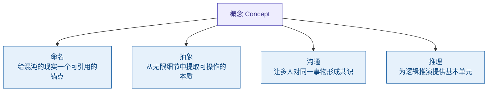

*图 1｜概念解决的四个核心问题*

---

## 2. 术语 vs 概念

### 2.1 本质区别

**术语（Term）** 是能指——一个标签、一个名字。
**概念（Concept）** 是所指/涵义——事物不可还原的本质。（符号学视角，详 §3；术语学权威定义 ISO 1087:2019 §3.2.7，见 §1 语境说明）

同一个术语可以指向不同的概念（不同领域对"架构"有不同理解），同一个概念也可以有不同的术语（"微服务"和"微服务架构"指同一概念）。

### 2.2 名牌比喻

把术语想象成名牌，把概念想象成名牌背后的人。名牌可以换（同一个概念可以用不同术语表达），但人没变。反过来，同名名牌可以挂在不同人身上（同一个术语在不同领域指向不同概念）。

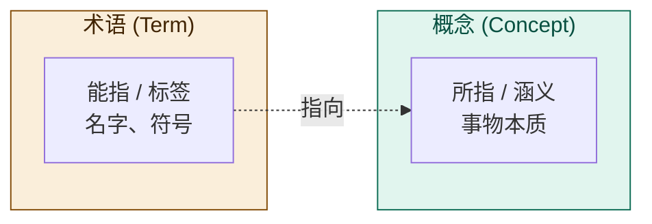

*图 2｜术语是能指（标签），概念是所指/涵义（本质）*

---

## 3. 符号学视角：概念的位置

### 3.1 Saussure 二元模型

瑞士语言学家 Ferdinand de Saussure 提出符号的二元结构：

> **符号（Sign）= 能指（Signifier）+ 所指（Signified）**

- **能指**：符号的形式——声音形象、文字标记
- **所指**：符号的内容——概念、心理印象

在 Saussure 的模型中，**概念 = 所指**。

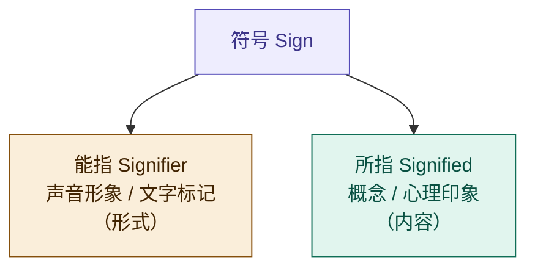

*图 3｜Saussure 二元模型：符号 = 能指 + 所指*

### 3.2 Frege 三元模型

德国哲学家 Gottlob Frege 提出了一个更精细的三元结构，区分了"涵义"和"指称"：

> **符号（Zeichen）→ 涵义（Sinn）→ 指称（Bedeutung）**

- **符号**：标记本身（如"晨星"这个词）
- **涵义（Sinn）**：符号呈现对象的方式——概念、意义
- **指称（Bedeutung）**：符号指向的实际对象（金星这颗行星）

Frege 的经典例子："晨星"和"暮星"是不同符号、不同涵义（呈现方式不同），但指称相同（都是金星）。

在 Frege 的模型中，**概念 = 涵义（Sinn）**，不是指称。


*图 4｜Frege 三元模型：符号 → 涵义 → 指称*

### 3.3 两个模型的关键差异

| | Saussure | Frege |
|---|---|---|
| 结构 | 二元 | 三元 |
| 概念的位置 | 所指 (Signified) | 涵义 (Sinn) |
| 是否区分涵义与指称 | 否 | **是** |
| 核心贡献 | 符号 = 形式 + 内容 | 涵义 ≠ 指称 |

Frege 模型的关键洞察：**涵义不等于指称**。同一个对象（指称）可以有多种呈现方式（涵义）。这对后续理解"系统 ≠ 架构 ≠ 架构描述"至关重要。

---

## 4. 概念设计

### 4.1 什么是概念设计

**概念设计（Conceptual Design）** 是从混乱的问题域中提取结构化概念模型的活动。它不是画 UI、不是写代码，而是在"怎么做"之前先搞清楚"是什么"。

### 4.2 概念设计的四步过程

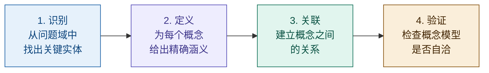

*图 5｜概念设计的四步过程*

### 4.3 每步的产出

概念设计不是空转，每一步都有明确的交付物：

| 步骤 | 产出 | 说明 |
|------|------|------|
| 识别 | **概念清单** | 一份尚未定义的原始实体列表 |
| 定义 | **概念词典** | 每个概念的精确涵义，消除歧义 |
| 关联 | **概念模型图** | 概念之间的关系拓扑（类图、ER 图等） |
| 验证 | **自洽性检查** | 模型是否内部一致、是否有遗漏或矛盾 |

> 〔按（2026-09-21 依 23 号对齐）：本步的「验证」是**概念设计步骤名**，判的对象是**工作产品**（概念模型）——模型还不能被"使用"，故所判的"内部一致／有无遗漏或矛盾"属**评审**的**适宜性·充分性**（ISO 9000:2026 §3.11.2），**不归验证**（§3.11.12）；review 是唯一能对"还不能用的东西"下判定的活动（23 号 §10.3）。〕

概念设计遵循 **"What before How"** 原则——先定义"是什么"，再讨论"怎么做"。这与 IPD 概念阶段的精神一脉相承。

---

## 5. IPD 六个阶段

IPD（Integrated Product Development，集成产品开发）将产品开发分为六个阶段，每个阶段有明确的目标和决策评审点。

### 5.1 总览

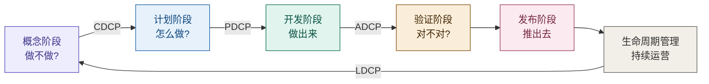

*图 6｜IPD 六个阶段及决策评审点（CDCP → PDCP → ADCP → LDCP）*

### 5.2 概念阶段（Concept）

**核心问题：做不做？**

回答的是市场机会和产品构想是否值得投入。不关注技术细节，关注的是：
- 市场有没有需求？
- 我们能不能做？
- 做出来能不能赚钱？

概念阶段在四个维度上并行展开：

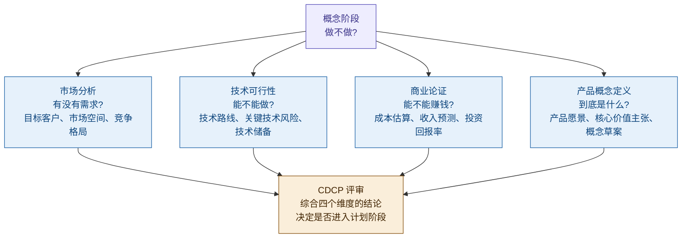

*图 7｜概念阶段的四个维度*

**决策评审点 CDCP（Concept Decision Checkpoint）**：综合四个维度的结论，决定是否进入计划阶段。

### 5.3 计划阶段（Plan）

**核心问题：怎么做？**

概念阶段确定了"做什么"，计划阶段要给出完整的施工方案。计划阶段在六个模块上展开：

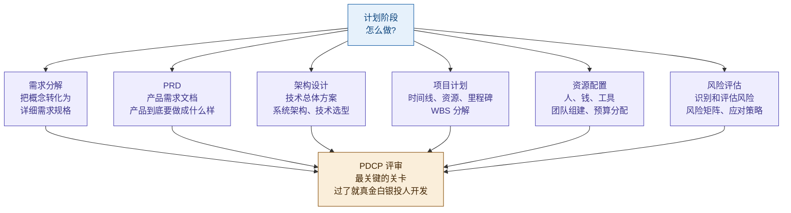

*图 8｜计划阶段的六个模块*

**决策评审点 PDCP（Plan Decision Checkpoint）**：决定是否进入开发阶段。这是最关键的关卡——过了就要真金白银地投人开发了。

计划阶段产出的是"总图"——框架级的设计。开发阶段拿着总图画"施工详图"——实现级的设计。

> 〔按：IPD 的「总图／施工详图」是**阶段深度**（呈现粒度）上的分档，不是架构与设计的界分——架构定义与设计定义是两个**过程**，不是两个阶段（15288:2023 §5 允许迭代与并发），真实形态是同一时刻在相邻两个种类层上的两类工作；**架构与设计的差别是种类（kind），不是粒度（granularity）**（24 号 §8.2、§14.1、§14.3）。〕

### 5.4 开发阶段（Develop）

**核心问题：做出来。**

开发团队拿着计划阶段的总图，画出施工详图，然后照着详图把东西造出来。不是边想边干——What 和 How 都已经在计划阶段定了，执行的是已经验证过的方案。

开发阶段在六个模块上展开，同时由偏差管理贯穿全程：

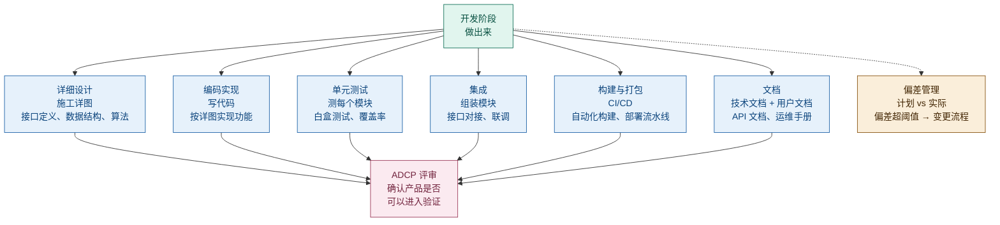

*图 9｜开发阶段的六个模块 + 偏差管理*

**偏差管理**是开发阶段的关键：实际进度与计划偏差超过阈值时，需要走变更流程，不能默默偏下去。

**决策评审点 ADCP（Availability Decision Checkpoint）**：确认产品是否可以进入验证。

#### 关于"图纸"的澄清

> **讨论背景**：最初文档中将开发阶段描述为"开发团队照着图纸干活"，引发了"图纸到底指什么"的讨论。

这里的"图纸"是**比喻**，不是硬件或结构设计图纸。在软件产品开发语境下：

| 层级 | 产出物 | 产生阶段 | 作用 |
|------|--------|----------|------|
| **总图**（框架级） | PRD、架构方案、项目计划 | 计划阶段 | 定义"做什么"和"怎么做"的框架 |
| **施工详图**（实现级） | 接口定义、数据结构、算法设计 | 开发阶段 | 将框架细化为可编码的实现规格 |

开发团队拿着计划阶段的**总图**，画出**施工详图**，然后照着详图把东西造出来。总图在开发阶段之前就有了（计划阶段产出），施工详图是开发阶段自己产出的。

> 〔按：上表「接口定义」列在实现级，而架构侧的**接口约定**属架构约束条目（对象约束层），须在架构描述中**明示到可判定**才当得了凭据；同一条接口信息在架构描述与设计描述中是**不同断言层**——架构侧是架构性约定，设计侧是实现级数据／协议／时序／容差，不可读成「架构写名字、设计写细节」（24 号 §3.5、§5.2、§7.2）。〕

### 5.5 验证阶段（Verify）

**核心问题：对不对？**

验证阶段做两件事——Verification（验证）和 Validation（确认），两者缺一不可：

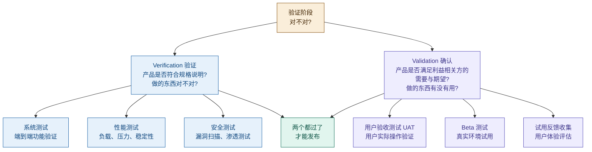

*图 10｜验证阶段：Verification + Validation*

- **Verification（验证）**：产品是否符合规格说明？——做的东西对不对？
- **Validation（确认）**：产品是否满足**利益相关方的需要与期望**（含未明示部分）？——做的东西有没有用？须在**预期使用情境**下判定（ISO 9000:2026 §3.11.14 注3：使用条件可真实可模拟）。

一个是"对不对"，一个是"有没有用"。两个都过了才能发布。

### 5.6 发布阶段（Release）

**核心问题：推出去。**

发布不是"把代码部署到服务器"那么简单。五条线并行推进，任何一条线没准备好都会导致发布失败：

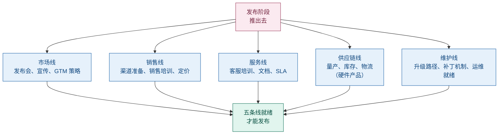

*图 11｜发布阶段的五条线并行*

| 线 | 内容 |
|---|---|
| 市场 | 发布会、宣传、GTM 策略 |
| 销售 | 渠道准备、销售培训、定价 |
| 服务 | 客服培训、文档、SLA |
| 供应链 | 量产、库存、物流（硬件产品） |
| 维护 | 升级路径、补丁机制、运维就绪 |

### 5.7 生命周期管理（Lifecycle）

> **术语注**：本节的「生命周期管理」是 IPD 六阶段的阶段名，不是 life cycle 的规范中译——本报告在 42010 语境下统一用「生存周期」（见 §7.1）。

**核心问题：持续运营 + 反馈。**

产品发布后进入持续运营阶段。关键不是"维护"这么简单，而是形成**反馈环路**：

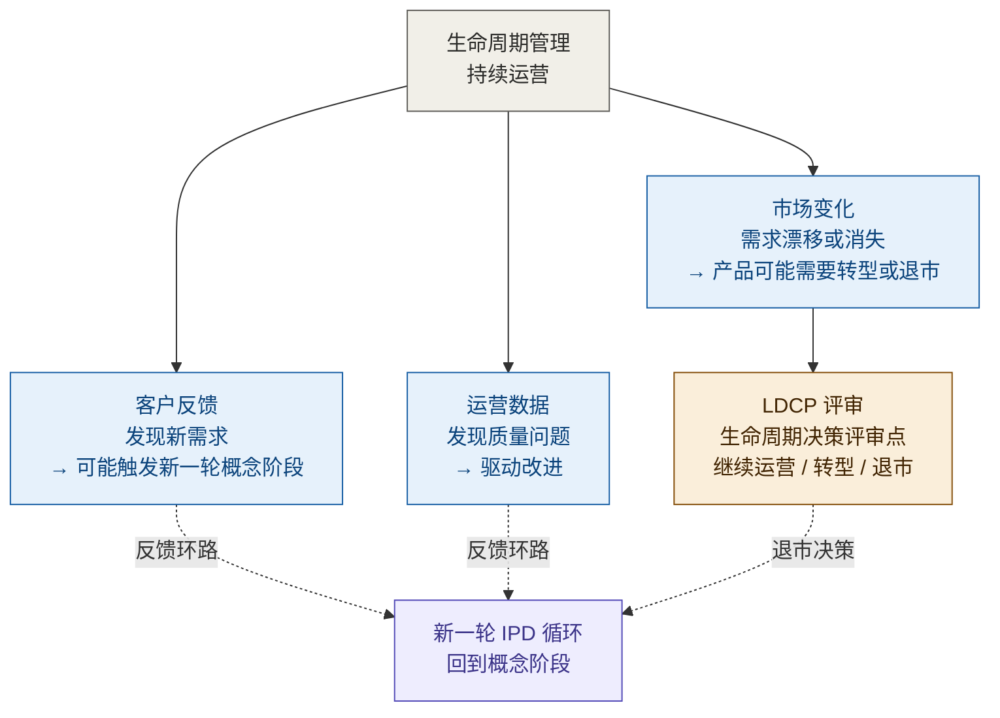

*图 12｜生命周期管理：反馈环路 + LDCP*

- 客户反馈 → 发现新需求 → 可能触发新一轮概念阶段
- 运营数据 → 发现质量问题 → 驱动改进
- 市场变化 → 产品可能需要转型或退市

**决策评审点 LDCP（Lifecycle Decision Checkpoint）**：生命周期决策评审点，决定产品是继续运营、转型还是退市。

生命周期管理的终点不是"下线"，而是"反馈到下一轮 IPD 循环"。

---

## 6. "概念"一词的两张语境谱

同一个"概念"能指，在不同语境下指向不同涵义。这里有两根**不同的轴**，须分开看，不可合并。

**谱一：词义宽窄谱**（按**涵义的宽窄**排——哲学最窄、产品开发最宽）：

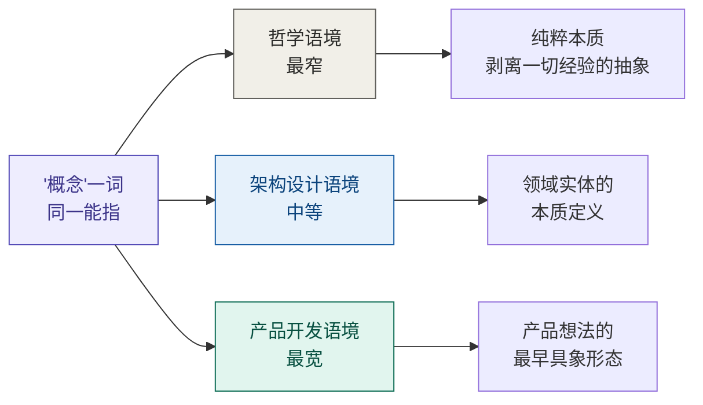

*图 13｜词义宽窄谱："概念"一词在三种语境下的不同涵义*

- **哲学**：概念是最纯粹的抽象——"椅子"的概念剥离了所有具体的椅子，只留下"可供坐的、有靠背的家具"这个本质。
- **架构设计**：概念是领域实体的本质定义——"订单"的概念不是某张数据库表，而是"一次交易意图的记录"这个涵义。
- **产品开发（IPD 概念阶段）**：概念是产品想法的最早具象形态——"我们要做一个能帮人管理日程的 AI 助手"，这是产品从无到有的第一步。

IPD 概念阶段的"概念"用的是最宽的含义。它不是哲学意义上的纯粹抽象，而是"这个产品到底是个什么东西"的最早回答。

**谱二：条款级语境谱**（按**该标准有没有给出条款级定义**排）：

| 语境 | 标准与条款 | 定义状态 | 该语境下"概念"的涵义 |
|---|---|---|---|
| **术语学** | ISO 1087:2019 §3.2.7 | ✅ **严格定义** | *unit of knowledge created by a unique combination of characteristics*——由**特性的独特组合**而形成的**知识单元**（知识层） |
| **架构** | ISO/IEC/IEEE 42010:2022 §3.2 | ❌ **未定义** | §3 Terms and definitions 里**没有 `concept` 这一条**——按 ISO/IEC Directives Part 2 的规则以"**普遍接受的含义**"使用（**通用语意**）≈ *idea／notion*（理念、概念） |
| **IT／AI** | ISO/IEC 2382-31:2001 §31.01.05 | ✅ **严格定义** | *abstract entity for determining category membership*——用于确定**类别成员资格**的抽象实体（分类层） |

> **条款级的三条硬事实（依 22 号 §3.5、§3.6、§3.9）**：
> ① **42010 §3 里既没有 `concept`，也没有 `property`**（2011 与 2022 两版 §3 皆然）。故 42010:2022 §3.2 定义句中的 `concepts` **不可回读**为 ISO 1087 严谨意义上的"知识单元"，`properties` 亦不可回读为 ISO 1087 §3.1.3 的 property——它们按 **ISO/IEC Directives Part 2** 的规则以"普遍接受的含义"使用。
> ② **ISO 1087:2019 §3.2.7 注 2 自警**：该定义说的是**术语学语境**的 concept，与工业自动化、营销等其他领域的同名概念**完全不同**——同名异义是常态，不是例外。
> ③ **判定原则**：同一术语在多部标准出现时，**逐一定位、不混用**——先确认每部标准是否在 §3 定义，只在一处定义时用该标准为锚，多处定义时逐条标明标准与条款号。
>
> **两谱不同轴，不可合并**：谱一按**涵义的宽窄**排（同一文化语境内的语义漂移：哲学最窄 → 产品开发最宽）；谱二按**定义的有无与严格度**排（术语学与 IT-AI 有严格定义，架构未定义、按通用语意用）。同一条目在两谱上的位置不必一致——"架构设计"在谱一居中等，在谱二却属**未定义**者。凡涉 concept 处，两谱都看一遍再落笔。

**术语学层：四处逐一定位（依 22 号 §4）**

- **`property` = ISO 1087:2019 §3.1.3**：*feature of an object*（**对象的特征**）——此处**没有 "inherent" 类限定**，对象的一切特征（固有的与赋值的）都在内。
- **`characteristic` = ISO 1087:2019 §3.2.1**：*abstraction of a property*（**属性的抽象**）。
- **`concept` = ISO 1087:2019 §3.2.7**：由特性的独特组合而形成的知识单元（见上表）。
- **三层抽象链**：**property（对象层 §3.1.3）→ 抽象 → characteristic（抽象层 §3.2.1）→ 独特组合 → concept（知识层 §3.2.7）**。**`attribute` 是从 property 分出的"命名层"侧支**——**ISO/IEC 2382-17:1999 §17.02.12**：*A named property of an entity*（**实体的命名属性**）；每个 attribute 配一个 attribute value（"color"／"blue"）。
- **`definition` = ISO 1087:2019 §3.3.1**：*representation of a concept by a descriptive phrase*（用描述性短语把一个概念与相关概念区分开来）＝**上位概念 ＋ 区分性特性**。
- **质量管理语境的特殊化**：`characteristic` 在 **ISO 9000:2026 §3.10.1** 作 *distinguishing feature*（**区别性特征**），带 **inherent／assigned**、qualitative／quantitative 限定——这是同一名词在质量管理语境的特殊化，与 §3.2.1 那个"属性的抽象"**不是同一个术语位**。
- **译名分置**：`properties` 一律译「**属性**」，`characteristic` 才译「**特性**」，二者不可互换（22 号 §9.5）。

> 〔按：以上四处（property／characteristic／attribute／concept）**逐一定位、不混用**，凡涉其一须标明标准与条款号（22 号 §4、§11.2(1)）。另须注意：**42010 的 `properties` 不得以 ISO 9000 的 `inherent` 限定回读**——2022 定义句未用该限定；它与 ISO 1087 §3.1.3 的 property 在内涵上重合（同为实体的客观特征），但没有进一步抽象成 characteristic（22 号 §4.6、§4.4；§9.6 第 4 条"场合错配"是同型陷阱）。〕

---

## 7. 架构的定义

### 7.1 ISO/IEC/IEEE 42010:2022（现行）原文

> **"Architecture: Fundamental concepts or properties of an entity in its environment and governing principles for the realization and evolution of this entity and its related life cycle processes."**（ISO/IEC/IEEE 42010:2022, 3.2；定义来源标注 ISO/IEC/IEEE 42020:2019, 3.3；中文规范文本见 GB/T 45630-2025, 3.2）

中文翻译：架构 = 一个实体在其环境中的基本概念或属性，以及该实体及其相关生存周期过程的实现和演化的管控原则（governing principles）。

> **译名注**：governing 在此作**定语**修饰 principles，定名「**管控原则**」——指具有约束力、可据以判定违规；它与 architecture governance（架构治理）**不是同一用法**（后者是组织治理职能，见 30 号 §3.7）。三槽分工为**定语 `governing`／名词 `governance`／关系 `governs`**，不可串用：连接架构视角与架构视图的是**关系名 `governs`**（`a viewpoint governs a view`），另译「**治理／管辖**」（概念模型见 §12；30 号 §3.1／§7.3、22 号 §9.4 打磨③结论 2、§9.5）。

> **【历史对照】** 2011 版（42010:2011, 3.2）："Architecture: Fundamental concepts or properties of a system in its environment embodied in its elements, relationships, and in the principles of its design and evolution."——即"架构是系统在其环境中的基本概念或属性，体现在其元素、关系以及设计和演化的原则中"。两版关键差异见 §7.4；核心：2011 的 embodied-in 三块（elements/relationships/principles）在 2022 已剥离（elements/relationships 从定义句**删去**、改作 AD 的内容对象），principles 升格为 **governing**（管控）。

#### 7.1.1 定义背后的两种哲学：Conception 派与 Perception 派

"concepts **or** properties" 这个析取式不是修辞，而是**哲学兼容设计**。42010:2011 的配套发布页（iso-architecture.org／"Defining architecture"，2022 仍为有效解释）原文：

> The disjunction, **concepts or properties**, was chosen to support **two different philosophies without prejudice**. These philosophies are:
>
> - **Architecture as Conception**: an architecture is a concept of a system in one's mind;
> - **Architecture as Perception**: an architecture is a perception of the properties of a system.
>
> Under either philosophy, an architecture is **abstract — not an artifact**.
>
> The Standard uses another term, **architecture description**, to refer to artifacts used to express and document architectures.

中文：

> 选用 "concepts or properties" 这一**析取式**短语，是为了**不带偏见地兼容两种不同的哲学**：
>
> - **架构作为构思（Conception）**：架构是某个**存在于人脑中**的系统概念（**架构师中心**）；
> - **架构作为感知（Perception）**：架构是**观察者**对系统**属性**（properties）的感知（**观察者中心**）。
>
> 无论哪一种哲学，**架构都是抽象的——不是人工制品**；本标准使用另一术语——**架构描述（architecture description）**——来指代用于表达和记录架构的**工作产品**。

两派的分工，可排成一张 2×2 矩阵（依 22 号 §8.1）：

| | **Concept 侧**（Conception 派） | **Property 侧**（Perception 派） |
|---|---|---|
| **架构（abstract，抽象物）** | 架构师脑中的 concepts：理念、思路、意图 | 观察者感知到的 properties：系统的客观特征 |
| **AD（work product，工作产品）** | 描述／记录出来的 concepts：术语表、定义文档、原则说明 | 描述／记录出来的 properties：视图、模型、规格表、数据字典 |
| **进入架构的动作** | **构思（conceive）** | **感知（perceive）** |
| **形成 AD 的动作** | 描述／记录（describe） | 描述／记录（describe） |

三个动词不可混：**构思（conceive）→ concepts**／**感知（perceive）→ properties**／**描述（describe）→ AD**——前两个动词进入的是架构（抽象物），第三个进入的是架构描述（工作产品）。

> **三点边界（依 22 号 §5.4、§5.6、§8.1）**：① 工作组表态是 **without prejudice**（不带偏见、不站队）——用 "concepts or properties" 让两种立场都能找到对应的"证据"；② **2022 没有把两哲学条款化**——两哲学在 2022 的**同源落点**是 **stakeholder perspective（§3.18，利益相关方角度）**，它是"**关注点的一个来源**"，与两哲学**同源而不同物**（见 §7.4、§12.1）；③ 两派争的是"架构住在哪里"（脑中／观察中），**不改变"架构是抽象的"这一共同结论**，也不改变"表达与记录架构的是 AD"——这是 §9.1「架构 = 不可还原涵义」与 §9.2「系统 ≠ 架构 ≠ 架构描述」的哲学底。

### 7.2 逐词拆解

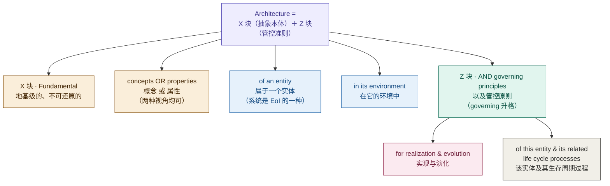

*图 14｜架构定义逐词拆解*

> **两块标注（依 22 号 §5.3）**：图中 **B～E 属 X 块（抽象本体）**＝ *fundamental concepts or properties of an entity in its environment*——架构**是什么**；**F～H 属 Z 块（管控准则）**＝ *governing principles for the realization and evolution of this entity and its related life cycle processes*——架构**如何被管控**（2022 由并列项升格而来）。两块是同一句话的两个并列成分，不是"定义 + 补充"。

### 7.3 "or" vs "and" 的区别

英文原文用 **"or"**（concepts **or** properties），中文常见翻译用"和"（概念**和**属性）。这不仅仅是语法差异，而是理解方式的不同：

- **"or"（原文）**：你可以用**概念角度**或**属性角度**来描述架构——两种视角都是有效的，任选其一即可。这两个角度各有其名：**概念角度＝Conception 派**（架构是**人脑中**的系统概念，架构师中心），**属性角度＝Perception 派**（架构是**观察者**对系统属性的感知，观察者中心）——两派的分野、*without prejudice* 表态与哲学底，见 §7.1.1；并读 22 号 §5.6／§8.1。
- **"and"（翻译）**：概念和属性共同构成架构——暗示两者缺一不可。

英文 "or" 的语义更宽松：你可以从"这个系统的核心概念是什么"切入，也可以从"这个系统的核心属性是什么"切入，两条路都能走到架构。

### 7.4 42010:2022 相对 2011 的关键修订（历史对照回顾）

§7.1 已给出 2022 现行主定义。本节回顾 2022（2022-11 发布）相对 2011 版对定义框架的六处关键修订（末行为 2011→2022 的沿革对照）：

| 变化 | 2011 版 | 2022 版 | 影响 |
|---|---|---|---|
| 架构主体（所关注实体） | system of interest | **entity of interest**（EoI，所关注实体） | 所关注实体不再限于「系统」——enterprise、organization、solution、system、subsystem、**process**、business、data、application、product、service、product line 等都可以拥有自己的架构 |
| 框架术语 | architecture framework | **architecture description framework**（ADF） | 与架构评估框架（42030）等其他框架区分开 |
| 视图构成 | architecture model | **architecture view component**（视图组件） | 容纳非模型化的视图组成部分 |
| 架构数量 | 概念模型隐含一个系统一个架构 | 明确用不定冠词 "an architecture of an entity"，承认**多个候选架构**并存（各由 AD 表达，供权衡分析） | 「一个实体一个架构」精确化为：采纳决策时收敛到一个，多架构只并存于分析与决策阶段 |
| 新增要素 | — | **方面体**（aspect）、**利益相关方角度**（stakeholder perspective）、**对应关系／对应方法**（correspondence／correspondence method）、**架构决策与理据** | 2022 新增的**要素**——覆盖关注点的系统化切面与决策留痕。其中**方面体／利益相关方角度／对应关系与对应方法**属 42010:2022 §3.4 Note 1 的 **11 类 AD 元素**；**架构决策与理据不属这 11 类**——它以架构决策的形式出现在 AD 中（42010:2022 §5.2.12／§6.10 列为**强制记录内容**），**不是**一个 AD element 类别（22 号 §6.2、§7.2） |
| `concepts or properties` 的哲学兼容设计 | **引入**「concepts **or** properties」析取式，以兼容 **Conception 派**与 **Perception 派**（工作组表态 *without prejudice*） | **保留在 X 块**——一字未改 | 该析取式是**哲学兼容设计**，不是随手并列；两哲学本身在 2022**未被条款化**，其**同源落点**是 stakeholder perspective §3.18（关注点的一个来源），**同源而不同物**（见 §7.1.1、22 号 §5.4／§5.6） |

另外，定义正文的 "embodied in" 在 2022 版**已删去**——2022 不再以元素与关系界定架构；相关要件另在架构描述的内容要求中展开（条款 5.2.2，**未逐字确认**）：constituent elements；元素间的交互/关系；与环境（含其他实体）的交互；behaviour and structure；principles governing its design, use, operation and evolution。〔此处与下条〔按〕是**两件不同的事**：本条给的是 **AD 的内容要求**（42010:2022 条款 5.2.2，**未逐字确认**）；下条给的是该层**术语含义的新出处**（42020:2019 §3.3 Note 1）。二者不是同一个去向，不可并读。〕

> 〔按：2011 版 embodied-in 三块的去向，24 号 §13.2 更正为「**搬家 + 降调**」——迁入 42020:2019 §3.3 的一条 **Note 1**，措辞由 elements/relationships 改为 components／组件间关系／与环境的关系，强度由「是」降为「通常意指」；该处**注释级、无术语地位**，且所在层是**架构层**（由架构描述表达），不是描述层的零件（24 号 §12.1）。〕

**对本文档的影响**：§8 的 fundamental 判读、§9 的「系统 ≠ 架构 ≠ 架构描述」三元结构在 2022 版下依然成立，只需把「系统」读作「所关注实体（EoI）」——流程、数据、产品同样适用。

### 7.5 清单化定义的合法位置

"用**基本概念 ＋ 属性清单**定义架构"是不是 42010 的反命题？不是。它有标准内的三个合法落点（依 22 号 §6.4、§7.3、§8.2、§11.2(2)）。

**(a) 它住在 architecting 的 `defining` 一环**

**architecting（42010:2022 §3.1）** 是七步动作集：*conceiving, **defining**, expressing, documenting, communicating, certifying proper implementation of, maintaining and improving*——**构思／定义／表达／记录／沟通／认证实现／维护改进**。清单化的定义住在其中的 **`defining`** 一环，是这一步的产物；它不是"绕过标准"的做法。须注意两点：标准用 architecting 这个词但**没有给它立词条定义**；`defining`（动词）产出的是一批 definition（名词），二者不是一回事（见 §7.1 的 definition 定位）。

**(b) 2022 用 aspect §3.9 把"按块列清单"官方标准化了**

**aspect（§3.9）** ＝ *part of an entity's **character or nature***（实体**性格／性质**的一部分），标准示例：functional／structural／informational。把 architecture 的 concepts／properties **按 aspect 分块**呈现（functional 清单 ＋ structural 清单 ＋ informational 清单 ＋ behavioral 清单），是 2022 **官方承认并标准化**的清单化定义结构；aspect 与 concern 是**多对多**关系（§3.9 注 2），aspect 的用处是让架构师 *analyse, **address** and structure concerns*。译名上，aspect 定义里的 `character or nature` 作「**性格／性质**」，**不取「特性」**（"特性"留给 characteristic——见 §6 术语学层）。

**(c) 清单住在 L1～L5 的第三层**

| 层 | 内容 | 能否清单化 |
|---|---|---|
| **L1 抽象本体** | architecture 是什么（一句话） | ❌ **不可**——是 nature，不是 list |
| **L2 definition 集** | 概念词条 ＋ 区分性特性（上位概念 ＋ delimiting characteristic） | ⚠️ **半可**——每个概念独立成条 |
| **L3 概念＋属性清单** | 用清单定义一个架构 | ✅ **可**——且须**按 aspect 分块** |
| **L4 关系与原则** | correspondences（对应关系）／governing principles（管控原则） | ✅ 可 |
| **L5 AD** | 11 类 AD 元素的集合（42010:2022 §3.4 Note 1） | ✅ 可 |

> **一句话**：**"abstract" 不能读成 "list"**——架构本体（L1）是抽象的、列不成清单；能列清单的是 **L3**（以及 L4／L5）。把 L1 读成 L3，就是把"抽象"偷换成"清单"。

---

## 8. Fundamental 的深层含义

### 8.1 词源

**Fundamental** 来自拉丁语 **fundamentum**，意为"地基、基础"。词根 fundus = "底部"。

地基的隐喻：
- 地基在建筑的最底层，承托一切
- 地基一旦改动，整栋建筑都要动
- 地基决定了建筑能盖多高、多稳

### 8.2 三个判定标准

一个概念或属性是否"fundamental"，可以用四个标准检验（前三为单项检验，第四为闭包判据，见 30 号 §5.2）：

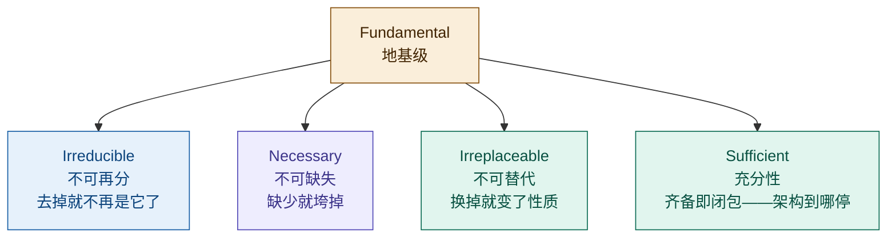

*图 15｜Fundamental 的四个判定标准：不可再分／不可缺失／不可替代（必要性）＋ 充分性（闭包）*

> **双判据注**：不可再分／不可缺失／不可替代回答「什么必须进」（**必要性**）；**充分性**回答「架构到哪停」（**闭包**）。二者构成 30 号 §5.2 的必要性／充分性双判据，不可混同为一个并列清单。

以微服务架构为例：
- **不可再分**："服务独立部署"是基本概念，不能再拆成更小的概念
- **不可缺失**：没有"服务独立部署"，微服务就不是微服务了
- **不可替代**：用"单体部署"替代"服务独立部署"，架构性质就变了

### 8.3 语法精读：「基本」修饰什么

逐字读现行（2022）定义原文："fundamental concepts or properties of an entity in its environment and governing principles for the realization and evolution ..."——「基本」管辖 concepts or properties；元素/关系/原则**不是**定义句法成员（2011 版曾在 "embodied in its elements, relationships, and in the principles ..." 里并列它们，2022 已**删去**、改作 AD 的内容对象）。

> **「基本」管辖 concepts or properties；元素/关系/原则不是定义句法成员——概念/属性是架构本体；元素与关系属架构层（架构构成物），在架构描述中由视图组件表达——描述层的零件是 AD element，与架构构成物之间隔着 represent 关系，不是同一张清单上的两栏。**〔按：AD element（描述层）／架构构成物（架构层，42020:2019 §3.3 Note 1，注释级无术语地位）／system element（实现层）的三层分界，见 24 号 §12.1、§15.11〕

佐证是标准自身的演进（**四版时间线**；凡引 **1996／1471:2000／2011** 一律为**【历史对照】**，分析锚点仍是 2022）：**1996 Hilliard** 作 *the highest level **conception** of a system in its environment*（偏主观的"构想"——这正是 §7.1.1 中 **Conception 派**一名的来源）；**IEEE 1471:2000** 改作 "fundamental **organization**"（根本的组织结构，把主观构思压成客观结构）；**42010:2011** 换成 "fundamental **concepts or properties**"（架构从具体结构上提到概念层，重新打开两哲学兼容）；**42010:2022** 进一步剥离 embodied-in 三块、principles 升格 governing、主体扩域为实体——"架构是概念层本体"的定位在 2022 反而更纯粹（时间线逐版 verbatim 见 22 号 §5.2）。两个推论：

- **同一架构可以换实现**：换一种语言重写系统，架构不变；
- **同一堆元素可以属于不同架构**：换一种概念组织，就是另一个架构。

> 〔按：本节两处「删去」均须与**去向**并读——2011 版 embodied-in 三块是**搬家 ＋ 降调**，迁入 **ISO/IEC/IEEE 42020:2019 §3.3 Note 1**：措辞由 elements／relationships 改为 **components／组件间关系／实体与环境的关系**，强度由定义正文的「**是**」降为注释的「**通常意指**」（*usually intended to be embodied in*）；该处**注释级、无术语地位**。故"2022 删去了该块"只就**定义句的句法构成**而言，不表示这层含义在标准体系中已无着落（见 §7.4、24 号 §13.2、22 号 §5.2.2）。〕

### 8.4 判据锚点：对目的而言必要且充分

IEV 831-01-01（源自 42010:2011 §3.2，2022 的 EoI 语境下语义不变）的 Note 2 把判据钉死：

> "the set of fundamental concepts or properties of a system provides **necessary and sufficient** information targeted to the **purposes** of the system."

> 〔按：此处的 *necessary and sufficient* **不是数学意义的充要条件**——架构不构成目的达成的充分条件（达成还需实现／验证／运行）；充分性仅指「**目的所要求的结构条件已被完整表达**」，必要性管入会（membership）、充分性管闭包（closure），参照系是**目的**（24 号 §6.3、§6.5）。〕

因此 fundamental 是**关系性谓词**，不是绝对谓词——永远要补全「对**这个**系统、在**它的**环境中、针对**它的**目的而言根本」。同一段定时算法，在心脏起搏器里是 fundamental（错了会死人），在计算器 App 里只是实现细节。定义里 "in its environment" 不是修辞，是判定条件的组成部分。

### 8.5 不变量判据与同一性的目的论

把「概念层本体」（§8.3）与现行（2022）定义末尾的 "governing principles for the realization and **evolution** of this entity" 接起来：演进准则规定的就是「怎么变都还是这个系统」的边界——

> **fundamental = 在演化、重实现、实例替换中必须守住不变、否则系统就沦为另一个系统的那些概念与属性。**

判别问句只有一句：「这个东西变了，系统还能不能达成它的目的——它还是不是为那个目的的这个系统？」

注意这个问句的后半必须挂到目的上：**人造系统的同一性是目的论的，不是实体论的**（15288:2023 界定系统是 man-made）。忒修斯之船是最好的思想实验——木板一块块全换掉，它还是那条船（目的延续）；一块木板不换、拖进博物馆当展品，它反而不再是原来那条船（目的改变）。同一性跟着目的走，不跟着物质走。推论：**目的漂移是架构失效的第一病因**；目的变更 = 架构重审的强制触发器。〔治理侧接驳：此问句的判据端是**目的**，而目的的定义权在治理机构、不在架构师，架构与目的的一致也不会自己保持——这正是架构治理存在的理由（29 号 §3.1 前提一／前提二）；治理对象四层中与本节最贴的一层是「架构决策」（29 号 §4.1）。〕

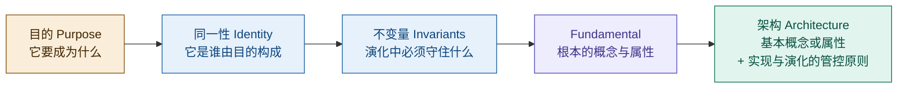

*图 15a｜从目的到架构的判据链*

### 8.6 「基本」与「粗细」正交

fundamental 不是 high-level 的同义词。两个维度展开成四象限：

| | **基本（fundamental）** | **非基本** |
|---|---|---|
| **粗粒度** | 典型架构决策：分层划分、技术选型、能力地图 | 看似架构实则不是：随手画的模块框图、仅反映组织惯例的划分 |
| **细粒度** | 关键细节仍是架构：起搏器定时算法、数据主键策略、接口协议 | 实现细节：变量命名、控件布局、可自由替换的局部方案 |

架构分布在上面一行，与粗细无关；下面一行画得再高层级也不是架构。顺带排除一个误读：**基本 ≠ 简单**（basic/elementary）——共识算法很复杂但可以 fundamental，变量命名很简单但不是。

### 8.7 去除测试的修正

§8.2 的「不可缺失」如果被读成朴素的去除测试（「去掉它系统就变了，所以它是基本的」），会产生归谬：照此所有流程细节都被判进架构，判据失去区分度。修正为**三重过滤**，三关都过才算 fundamental：

| 过滤关 | 精确表述 | 排除的反例 |
|--------|---------|-----------|
| 目的层面 | 去掉该**角色**，系统目的是否失败？（而非系统描述是否变化） | 去掉审批流一个抄送节点，目的不失败 → 非基本 |
| 角色层面 | 该元素是否其角色的难替代载体？（角色必要 ≠ 实例必要） | 节点可轻易改道/重实现 → 非基本 |
| 层级层面 | 判定在**当前所关注实体（EoI）的架构层**上进行，元素内部细节不参与本级判定 | 细节节点属于流程内部，不属于系统架构层 |

> 〔按（依 24 号 §14.1～§14.3 的措辞收口）：第三关的「层级」是**判定域**（以哪个 EoI 为单位），**不是粒度轴**——原写「架构粒度」易被读成"画得多粗"，而架构与设计的差别是**种类（kind）不是粒度（granularity）**："基本"由**目的必要性**裁，与粒度正交（§8.6）；粒度只活在**呈现**一侧（说得多细）。故此处一律作「**架构层**」，与「本所关注实体的判定单位」同义。〕

第三关的依据是 42010:2022 的分形承认（见 §7.4）：process 被明确列为可作 EoI 的实体——流程不仅可以是架构视图的**内容**，流程本身还可以是**所关注实体**、拥有自己的架构。一个细节节点只在「流程」这个 EoI 下参与 fundamental 判定，在「系统」这个 EoI 下它从一开始就不在判定视野里。

---

## 9. 架构是什么

### 9.1 架构 = 系统的不可还原涵义

把前面所有概念串起来：

- **概念** = 一个事物的不可还原涵义
- **架构** = 一个系统的不可还原涵义（fundamental concepts or properties）

就像概念是一个事物的本质，架构是一个系统的本质。它是系统的"地基级涵义"——去掉任何一个就不再是这个系统了。

> **层次限定**：此处「不可还原涵义」是**含义层**（内容层）的指称；架构在**本体层**是抽象对象——无时空位置、无因果力，必须被体现（30 号 §6.1／§6.2）。三层含义（含义层／本体层／粒度层）不可混用。

### 9.2 系统 ≠ 架构 ≠ 架构描述

对应 Frege 三元模型：

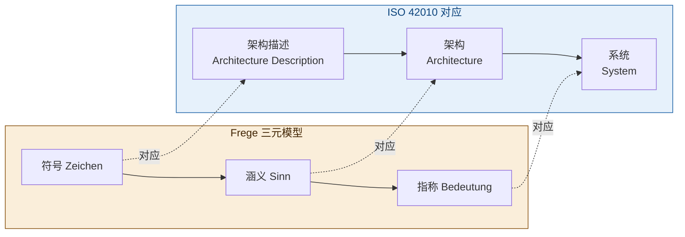

*图 16｜系统 ≠ 架构 ≠ 架构描述，对应 Frege 的指称 ≠ 涵义 ≠ 符号*

- **系统**（指称）：实际存在的那个东西——运行中的代码、服务器、网络
- **架构**（涵义）：系统的不可还原本质——去掉就不再是这个系统的那些概念和属性
- **架构描述**（对涵义的表达）：把架构写下来给人看的文档、图、模型

三者不等同：同一架构可以有多种描述（不同框架、不同视图），同一系统可以有多种架构视角（不同利益相关方看到不同方面）。

---

## 10. 设计准则与演进准则

架构定义的第二块：现行（2022）版为 "governing principles for the realization and evolution of this entity and its related life cycle processes"——该实体及其相关生存周期过程的实现与演化的管控原则（governing principles；2011 版写作 "in the principles of its design and evolution"，即下文"设计准则／演进准则"这一二分读法的来历）。

> 〔口径（2026-09-21 第十一轮·依 22 号）：下面这一「设计／演进」二分是**本报告按工作内容**作的读法——**标准只有一个术语表述**：`governing principles for the realization and evolution`（2011 作 `principles of its design and evolution`）。**两版不是同物异写，是覆盖面扩张**——由「设计」扩为**实现与演化**、并及于该实体与其相关生存周期过程，且升为 governing（24 号 §5.2 注；10 号 §11.2；22 号 §7.2）。用词上本报告与 10 号对齐作「**准则**」而非「原则」，以免与标准唯一的术语位「**管控原则**」撞名；2011 版 `principles of evolution` 里的「演进」是旧版英文的直译习惯，本报告在**术语位**（`evolution`）一律作「**演化**」（22 号 §9.5）。〕

> **治理侧接驳**：下面设计准则／演进准则的二分是 2011 句法的历史整理；**管控原则的设定权与解释权属治理侧**——它是治理的六件机制之首「架构原则与标准」，其变更只能由治理裁决，落地形态是符合性评审与例外／豁免（29 号 §7、§2.2 判据三、§6.2 决策权配置）。

### 10.1 两种准则的分工

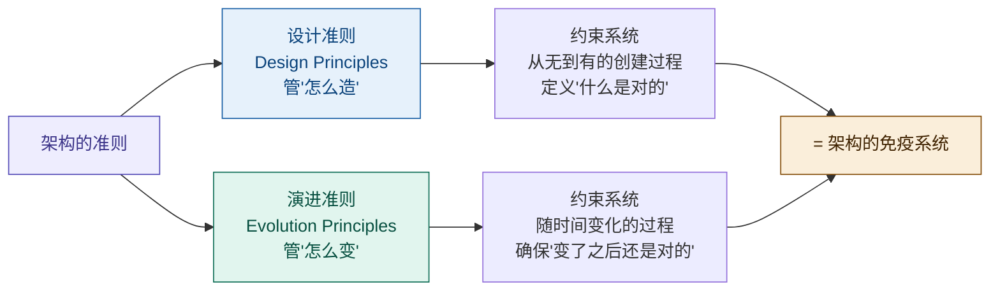

*图 17｜设计准则 + 演进准则 = 架构的免疫系统*

> **注**：图内英文括注（Design Principles／Evolution Principles）是**本报告按工作内容二分时用的读法名**，不是标准术语——标准只有一个表述 `governing principles for the realization and evolution`（见本节章首〔口径〕）。

### 10.2 设计准则（Design Principles）

管"怎么造"——约束系统从无到有的创建过程。

以微服务架构为例：
- 每个服务独立部署
- 服务间通过 API 通信，不共享数据库
- 服务按业务能力划分，不按技术层划分

设计准则定义了"什么是对的"——遵循这些准则，系统就是微服务架构；违背了，就不是。

### 10.3 演进准则（Evolution Principles）

管"怎么变"——约束系统随时间变化的过程。

以微服务架构为例：
- 新增服务不能直接耦合已有服务的内部实现
- 服务拆分必须保持向后兼容
- 技术栈升级逐个服务进行，不能全局停机

演进准则确保"变了之后还是对的"——没有演进准则，微服务会退化为"分布式的单体"（Distributed Monolith）：服务越来越多，但耦合越来越紧，最终变成了分布在不同进程里的单体应用。

### 10.4 为什么两者缺一不可

- 只有设计准则，没有演进准则：系统建出来是对的，但一改就坏
- 只有演进准则，没有设计准则：系统知道怎么变，但建出来就不对
- 两者合一：架构的免疫系统——既定义正确，又维护正确

---

## 11. 架构描述：Stakeholders & Concerns

### 11.1 为什么需要架构描述

架构是系统的涵义（Sinn），但涵义锁在脑子里没用，必须**传达给人**。问题是：不同的人关心不同的东西。

ISO 42010 用三层概念解决"一个涵义，多种表达"的问题：

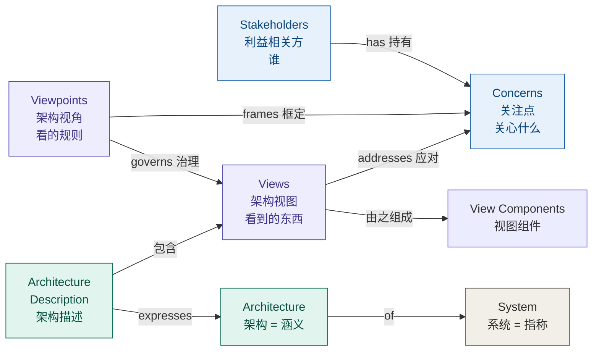

*图 18｜ISO 42010 架构描述的三层结构：问题层 → 机制层 → 结果层*

### 11.2 Stakeholders（利益相关方）

ISO 42010 定义：对**所关注实体**有利益的任何个体、团队或组织。不只是"用户"——开发者、运维、安全团队、业务方、甚至未来的维护者、合规审计员，都是利益相关方（stakeholder）。

### 11.3 Concerns（关注点）

与一个或多个利益相关方相关的、就该所关注实体而言的重要事项（利害）——功能性的（能不能做？）、非功能性的（快不快？安不安全？）、约束性的（合规吗？预算够吗？）。

### 11.4 核心问题：关注点天然冲突

ISO 42010 原文：

> *"The concerns of stakeholders are frequently broad, varied, and conflicting."*

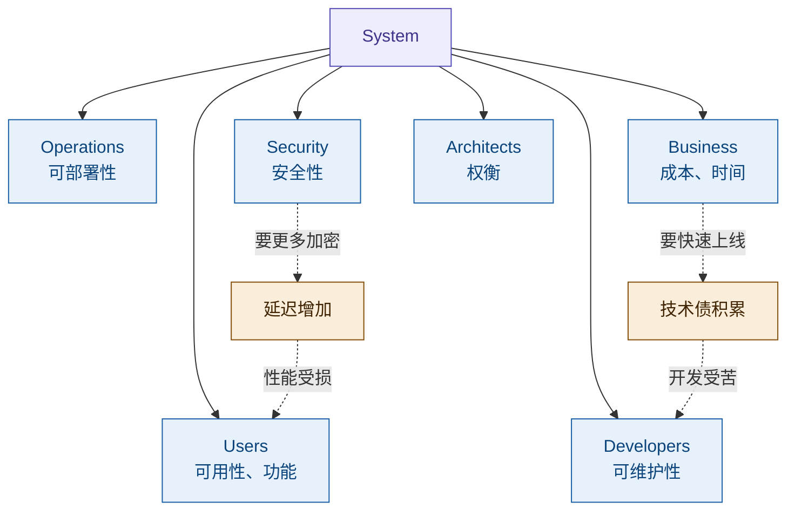

*图 19｜不同利益相关方的关注点天然冲突*

关注点冲突**不可消除**，只能**权衡**。权衡的前提是：你得能**看到**每个方面。一张图不可能同时满足所有人的关注点——这就引出了 Viewpoints & Views。

---

## 12. 架构视角与架构视图

### 12.1 定义

**架构视角（Architecture Viewpoint）** 是**一种工作产品**（work product）——它规定架构视图的构建、解读和使用所应遵循的约定，用来框定特定的关注点。它规定了：
- 框定哪些关注点（concerns）
- 服务于哪些利益相关方（stakeholders）及其角度（stakeholder perspective）
- 用什么模型种类与记号（UML 类图？部署图？数据流图？）
- 必须画什么，可以忽略什么

> 〔按：架构视角规定的是**种类**，不是具体元素——链条为「架构视角 →（规定用哪些）**模型种类** →（governs）视图组件」，架构视角只能规定到「种类」这一级，因为架构视角必须可复用（24 号 §15.10、§16.2）。其约定记录在架构视角的**规格**（specification）中，须完整、精确、可验证；规格应写明五项：名称·出处·版本／框定关注点与典型利益相关方及角度／模型种类与记号／对应方法／视图方法三类（24 号 §15.9A、§16.6）。〕

**架构视图（Architecture View）** 是**组成架构描述的一部分的信息部件**（information item）——按某个架构视角的约定实际产出的架构表示：一张类图、一份部署拓扑、一个用例模型。

> **重数（2022 口径，依 OMG UAF14-37 第 6 条）**：一个架构视角可治理多张架构视图（1:N）；每个架构视图恰有一个治理它的架构视角（1:1）。

### 12.2 相机比喻

| | 相机 | 架构 |
|---|------|------|
| 规则/设置 | 角度、镜头、滤镜 | **Viewpoint**（架构视角） |
| 产物 | 照片 | **View**（视图） |
| 被拍的对象 | 风景/人物 | **System**（系统） |

同一个建筑，正面拍和俯拍是不同照片（View），用什么镜头、什么角度是拍摄规则（Viewpoint）。照片服从于规则，一个规则可以拍很多照片。

```mermaid
flowchart LR
    S["System<br/>被拍的对象"] -->|"viewed through"| VP["Viewpoint<br/>镜头设置（规则）"]
    VP -->|"governs 治理"| V["View<br/>照片（产物）"]
    style S fill:#EEEDFE,stroke:#534AB7,color:#3C3489
    style VP fill:#E6F1FB,stroke:#185FA5,color:#0C447C
    style V fill:#E1F5EE,stroke:#0F6E56,color:#085041
```

*图 20｜Viewpoint governs View：规则治理产物*

> **注**：此处的「治理」是概念模型的关系名 governs（视角—视图），**无裁量者**——不满足即「不符合、视图不成立」；它与组织治理职能 architecture governance（有裁量者，违反走例外／豁免）只共用「治理」二字，两者不可互推。分野见 30 号 §3.7，组织侧展开一律以 29 号为准。

### 12.3 每个视图都是刻意的"不完整"

Logical View 不展示部署，Physical View 不展示类关系——这不是缺陷，是设计目的。每个视图都是一个**概念**：剥离掉你不关心的部分，只保留本质。

### 12.4 经典实例：Kruchten 4+1 View Model

Philippe Kruchten 于 1995 年提出的 4+1 视图模型是最经典的架构视角集合：

| View | For Whom | Concerns | Notation |
|------|----------|----------|----------|
| Logical | 设计师 / 用户 | 类、对象、关系 | UML 类图 |
| Process | 集成者 | 进程、线程、并发 | 活动图 |
| Development | 程序员 | 模块、层次、包 | 组件图 |
| Physical | 系统工程师 | 节点、网络、部署 | 部署图 |
| **Scenarios (+1)** | **所有人** | **用例、场景（验证其余 4 个视图）** | **用例图** |

**+1 Scenarios** 不是"第五个视图"，而是**胶水**：用真实场景穿过去验证另外四个视图是否一致。"用户下单"这个场景，能从 Logical（哪些类参与）→ Process（哪些线程跑）→ Development（哪些模块实现）→ Physical（哪些节点部署）一路走通吗？走不通，说明四个视图之间有矛盾。

```mermaid
flowchart TD
    S["Scenarios +1<br/>用例 / 场景"]
    S -->|"验证一致性"| L["Logical View<br/>类、对象"]
    S -->|"验证一致性"| P["Process View<br/>进程、线程"]
    S -->|"验证一致性"| D["Development View<br/>模块、包"]
    S -->|"验证一致性"| PH["Physical View<br/>节点、部署"]
    style S fill:#FAEEDA,stroke:#854F0B,color:#412402
    style L fill:#E6F1FB,stroke:#185FA5,color:#0C447C
    style P fill:#E6F1FB,stroke:#185FA5,color:#0C447C
    style D fill:#E6F1FB,stroke:#185FA5,color:#0C447C
    style PH fill:#E6F1FB,stroke:#185FA5,color:#0C447C
```

*图 21｜4+1 View Model：Scenarios 作为验证其余四个视图一致性的胶水*

---

## 13. Architecture Frameworks

### 13.1 什么是架构描述框架（ADF）

**架构描述框架（ADF，Architecture Description Framework；2022 前作 architecture framework）** = 预定义的架构视角集合 + 使用规则 + 方法论。

为什么要标准化？如果每个项目都自己发明架构视角，A 项目的架构描述 B 项目看不懂，没法积累、比较、复用。框架解决的是"大家用同一套语言"的问题。

```mermaid
flowchart LR
    F["ADF 架构描述框架<br/>预定义架构视角 + 规则 + 方法"] -->|"约束"| AD["Architecture Description<br/>一组标准化的架构视图"]
    style F fill:#FAEEDA,stroke:#854F0B,color:#412402
    style AD fill:#E1F5EE,stroke:#0F6E56,color:#085041
```

*图 22｜架构描述框架（ADF）约束标准化的架构描述*

### 13.2 主要框架对比

| Framework | 领域 / 来源 | 核心架构视角 | 特点 |
|-----------|-----------|----------------|------|
| 4+1 View Model | 软件 / Kruchten 1995 | Logical, Process, Development, Physical, Scenarios | 最早最经典 |
| TOGAF | 企业 / The Open Group | Business, Data, Application, Technology | 企业级 + ADM 方法论 |
| DoDAF | 国防 / US DoD | CV, OV, SV, TV, PV 等 8 个 | 军事系统标准 |
| C4 Model | 软件 / Simon Brown | Context, Container, Component, Code | 简洁实用，4 层缩放 |
| Zachman | 企业 / John Zachman | 6 行 × 6 列 矩阵 | 分类法，非流程 |

### 13.3 如何选择

框架不是"对错"的选择，是"适配"的选择——匹配你的领域、团队和问题：
- **软件架构**：常用 4+1 或 C4
- **企业架构**：常用 TOGAF 或 Zachman
- **军事/政府**：用 DoDAF

---

## 14. 完整链路总结

### 14.1 从"概念"到"架构描述"的认知链路

```mermaid
flowchart TB
    C["概念 = 事物的不可还原涵义<br/>Frege: Sinn"]
    C --> A["架构 = 系统的不可还原涵义<br/>fundamental concepts or properties"]
    A --> AD["架构描述 = 对涵义的表达<br/>Architecture Description"]
    AD --> V["Views = 涵义的不同切面<br/>每个视图是一种刻意的不完整"]
    V --> VP["Viewpoints = 切面的规则<br/>怎么切"]
    VP --> CO["Concerns = 切面的动机<br/>为什么切"]
    CO --> ST["Stakeholders = 驱动切面的人<br/>谁要切"]
    ST --> F["Frameworks = 标准化的切面集合<br/>大家约定好怎么切"]
    style C fill:#EEEDFE,stroke:#534AB7,color:#3C3489
    style A fill:#FAEEDA,stroke:#854F0B,color:#412402
    style AD fill:#E1F5EE,stroke:#0F6E56,color:#085041
    style V fill:#E6F1FB,stroke:#185FA5,color:#0C447C
    style VP fill:#E6F1FB,stroke:#185FA5,color:#0C447C
    style CO fill:#E6F1FB,stroke:#185FA5,color:#0C447C
    style ST fill:#E6F1FB,stroke:#185FA5,color:#0C447C
    style F fill:#F1EFE8,stroke:#5F5E5A,color:#2C2C2A
```

*图 23｜从"概念"到"架构描述"的完整认知链路*

> **注**：图中「不可还原涵义」是含义层指称；架构在本体层是抽象对象（30 号 §6.1／§6.2）。

### 14.2 符号学对应关系

| 符号学 (Frege) | ISO 42010 | 说什么 |
|---|---|---|
| 指称 (Bedeutung) | **System** | 实际存在的那个东西 |
| 涵义 (Sinn) | **Architecture** | 不可还原的本质 |
| 对涵义的表达 | **Architecture Description** | 把本质写出来给人看 |
| — | **Views** | 涵义的不同切面 |
| — | **Viewpoints** | 切面的规则（怎么切） |
| — | **Concerns** | 切面的动机（为什么切） |
| — | **Stakeholders** | 驱动切面的人（谁要切） |
| — | **Frameworks** | 标准化的切面集合（大家约定好） |

### 14.3 两段认知链路

**第一段：什么是架构（回答涵义是什么）**

> 概念 = 事物的不可还原涵义
> → 架构 = 系统的不可还原涵义（fundamental concepts or properties；含义层指称，本体层为抽象对象）
> → 对应符号学：系统 = 指称，架构 = 涵义

**第二段：怎么表达架构（回答涵义怎么传达）**

> 架构是涵义，但涵义要传达给人
> → 不同的人（Stakeholders）关心不同的事（Concerns）
> → 一个视图满足不了所有人，需要多个视图
> → 视图由规则框定（Viewpoints → Views）
> → 所有视图组合 = Architecture Description（对涵义的表达）
> → 把架构视角标准化打包 = 架构描述框架（ADF）

**一句话总结：架构是系统的涵义，架构描述是把这个涵义从不同角度切给不同的人看，框架是让切法标准化。**

### 14.4 第三段：架构的判据从哪来（2026-08-26 增补）

前两段回答「架构是什么」「怎么表达架构」，第三段回答更上游的问题——**凭什么判定什么是 fundamental**：

> 目的（Purpose）= 系统要成为什么
> → 同一性（Identity）= 系统「是谁」由目的构成（目的论，非实体论）
> → 不变量（Invariants）= 演化与重实现中必须守住的东西
> → fundamental = 对目的必要且充分的概念与属性（IEV 831-01-01 Note 2）
> → 架构 = 这些基本概念或属性 + 实现与演化的管控原则（2011 曾写作"体现于元素、关系与设计/演化原则"，2022 已剥离）

**一句话总结：架构的判据链最终锚在目的上——定义系统架构之前必须先定义系统目的（连同其环境），判据方向从目的指向架构，不可逆。**

〔落点：该链条的「目的」端**不在架构师手里**——目的定义与架构合格判据归治理机构，架构师只有质询权与守护责，架构与目的的一致也不会自己保持；架构治理正是对这条链条持续行使指导、监督、担责的组织职能，其四层治理对象（架构决策、决策遵从、架构演化、架构资产）由此推出（29 号 §3.1、§4.1）。〕

---

> **参考标准**：**GB/T 45630-2025《系统与软件工程 架构描述》**（等同采用 ISO/IEC/IEEE 42010:2022，2025-11-01 实施）——中文术语定名依据；ISO/IEC/IEEE 42010:2022（现行，第 2 版，*Software, systems and enterprise — Architecture description*，见 §7.1）；ISO/IEC/IEEE 42010:2011（历史对照，见 §7.1/§7.4）；IEV 831-01-01（architecture，源自 42010:2011 §3.2）
>
> **参考模型**：Saussure, F. de. *Course in General Linguistics* · Frege, G. "On Sense and Reference" (1892) · Kruchten, P. "The 4+1 View Model of Architecture" (IEEE Software, 1995)
