# 14-产品数据精讲：从产品定义到企业数字资产

> 编号：14- | 日期：2026-08-23 | 状态：v1.7（v1.1 由一轮逐层追问的概念链整理而成，已补全技能清单、输入输出、履职准则、落地步骤、标准出处索引与类比库；2026-09-04 修订——产品数据定义升格 ISO 10303-1:2021 现行句〔形式化 + 人机处理〕、1994 降历史注；design and development 条款号 §3.4.4→§3.4.8〔ISO 9000:2015〕；附录 B 产品数据/架构描述两行随迁；2026-09-21 与 30 号对齐——附录 B 补 GB/T 45630-2025 行、架构描述一行升 2022 现行口径并补术语切换注；2026-09-21 第二轮收口〔用户裁定「fundamental 用『基本』，其余术语按 GB/T 45630-2025」〕——主线与 §7／§8／§10 共 10 处「相关方」改「利益相关方」、§2 表「产品生命周期」改「产品生存周期」；IPD 阶段专名「生命周期管理／生命周期」与 ISO 10303-1:1994【历史对照】引文保留；2026-09-21 第四轮：依 27 号《ISO 9000:2026 相对 2015 版差异研究报告》对齐——全文 ISO 9000 引用迁 2026 版条款号〔product §3.7.6→§3.7.9、service §3.7.7→§3.7.10、design and development §3.4.8→§3.3.11、quality §3.6.2→§3.5.2、customer §3.2.4→§3.9.1、object §3.6.1→§3.5.3、data §3.8.1 原号、information §3.8.2→§3.8.4〕；§2.1 design and development 引文由 2005 版旧句改 2026 版原文并补注 3「限定词可指明设计开发对象的性质（产品／服务／过程设计和开发）」（注 3 两版均有，2026 措辞微调）；§1.3 边界对比「成果 outcome」改「result 结果」（2026 把 outcome 与 result 统一到新增 §3.7.1 result））→ **v1.8（2026-09-21 第九轮·15288:2023 过程号结清）** → **v1.9（2026-09-21 第十轮·依 23 号对齐判据口径）** → **v1.10（2026-09-21 第十一轮·依 22 号对齐）**
> **2026-09-21 第十一轮·依 22 号对齐**（用户令「以 22 号研究报告，对齐其前的文档」；本版 **v1.9 → v1.10**）：以 **22 号《架构、概念、属性研究报告——术语权威定义与对照分析》**（v1.7）为准，补本报告**术语学权威层**的缺位与译名（基线核对面 L 点名本报告）——① **§3.1 底层拆解补命名层**（**缺位**）：原 ISO 9000:2026 术语链只有 data／information／object 三条，`attribute` 与 ISO 1087／ISO/IEC 2382 全篇**零命中**；补 **ISO/IEC 2382-17:1999 §17.02.12 `attribute`**（*A named property of an entity*，实体的**命名**属性，配 attribute value，如 color＝blue）一条，并补一句**三层抽象链**——object（§3.5.3）→ **property（ISO 1087:2019 §3.1.3，对象的特征）** → **characteristic（§3.2.1，属性的抽象）** → **concept（§3.2.7）**，而 `attribute` 是 property 的**命名化侧支**；点明它与 ISO 9000:2026 §3.10.1 的 characteristic（区别性特征，质量管理语境）**不同语境、不可互推**（22 号 §4.3～§4.5）；② **§3.3 构成表下补同源锚点**（**缺位**）：数据项／字段的术语学落地形态即 `attribute`；③ **§3.4「产品数据 ≠ 架构本身」条改译名**（**用词**，D28）：「平级的 artefact」改「平级的两件**人工制品**（artefact，**15288:2023 §3.6**）」，并补「**AD 在 42010 侧的属概念是工作产品（work product）——两词不可互译**」（22 号 §8.2 术语提示、§12 第 34 行）；④ **§1.1「工件」补首次出现注**（**用词**）：本文「工件」为**比喻义**，标准译名为**人工制品**——凡指 AD 等属概念一律写**工作产品**。**依据**：22 号 §4.3～§4.5、§8.2、§12 第 7／34 行；基线 **D5、D6、D28**。**未改**：§1～§2、§3.1／§3.2／§3.3／§3.5、§4～§13 的行文与结论、附录 A／B；节号、表格行数（§3.1 底层拆解系清单、增一条；§3.3 六类表未增删行）、mermaid 图结构一律未动。
> **2026-09-21 第十轮·依 23 号对齐**（用户令「以 23 号研究报告，对齐其前的文档」；本版 **v1.8 → v1.9**）：以 **23 号《判据体系研究报告——从验证确认到治理的判据阶梯》**（v1.9）为准核本报告涉判据侧的断言，**零冲突、两处缺位**——① **§14.3 欠项结清**（**缺位**）：原记「review vs verification vs validation 对照……**尚未成文**」，按事实改为**已结清**并给互参（**23 号第 10 章**＋13 号 §11），补记三处硬差别（`determination` vs `confirmation`；不要客观证据 vs **必须**客观证据；判适宜性·充分性·有效性 vs 判符合性）；② **§7.2 闭环补两条边界**（**缺位**）：原表把 needs→需求数据写成**无损通路**、把 validation 写成"校正需求数据"的回环，未标 23 号 §9.1 的**两条链外之物**（**确认的判据**＋**方针**——方针在全文原本无位）与 §5.6 修正 1 注 5 的**转译损耗**（**期望集合严格大于需求集合**）；补法＝在表下增一段边界注（需求数据链按**派生关系**生成、**只承载 stated**；确认的判据与方针**不在链上**，须另设与派生链**异构**的参照层；转译有损耗），表内两处加指向该注的括注（"校正需求数据"改"回灌确认结论（校正需求数据）"、行名"验收"改"确认"以与 validation 对应），并在 **§3.3 构成表**下补同源短注（"利益相关方需要"一栏只承接 stated 部分）。**依据**：23 号 §3.2、§5.6、§9.1、§9.2、§10.1、§10.2。**未改**：§1～§6、§8～§13 与附录 A／B 的行文、§7.1／§7.3～§7.5 的结论；节号、表格行数、mermaid 图结构与清单条数一律未动（§14.3 欠项第 2 条、产品经理对照一条未动）。
> 主线：**产品（名词）→ 产品开发（动词）→ 产品数据（信息产物）→ 两域三态（存在方式）→ 质量（判据）→ 流水线（流动工件）→ 利益相关方（协作中枢）→ 价值沉淀池（汇聚点）→ 精益（判据）→ 职责（锚定）→ 三角色（落地）→ 企业资产（归属）→ 数字化转型（方向）**
> **2026-09-21 第六轮·依 24 号对齐**：用户令「以 24 号研究报告为依据，把 24 号之前的报告与之对齐」。本报告的架构／设计表述按 24 号《架构与设计边界研究报告》校正六处——① §2.5 技能清单第 2 项由「ISO/IEC/IEEE 42010 视角的架构描述、设计定义」改按 15288 的**两个过程**表述（架构定义 §6.4.4／设计定义 §6.4.5；架构描述按 42010 表达），依据 24 号 §1.3、§3.3；② §2.5 与 §6 同形的链条下各补**接驳注**：链条自"需求定义"直入"设计定义"、省略了中间的**架构定义**过程，而**架构定义的输出即设计定义的输入、其身份由"成果"转为"规定需求"**（24 号 §8.1 第 4 条，明示化见 §7.3），并补边界同源（第 3 条）、交替递归（第 1 条）、两过程不是两个阶段（§8.2）；③ §3.3 构成表「设计数据」一栏把**架构描述 AD 与设计描述 DD 并列为平级的两件 artefact**，依据 24 号 §3.1、§3.2；④ §3.4 边界辨析补第 4 条「**产品数据 ≠ 架构本身**」——架构是抽象物、不是交付物，能进清单并冻结基线的是架构描述 AD，依据 24 号 §1.4-1；⑤ §8.2 价值三层模型「物化层」由「需求、架构、实现工件」改为「需求、**架构描述 AD**、实现工件」，依据 24 号 §1.4-1；⑥ 附录 B「architecture description 架构描述」一行补注「架构是抽象物、可交付与可冻结基线的是 AD；AD 与 DD 平级」，依据 24 号 §1.4-1、§3.1、§3.2。**未改**：§1 产品与服务定义、§2 其余各项（ISO 9000／IPD 口径）、§4 两域三态、§5 质量、§7 利益相关方、§9 精益、§10～§13 职责与资产、附录 A 类比库，以及全部节号、表格行数与 mermaid 图结构，一处未动。
> **2026-09-21 第七轮·15288 版本锚定**（修订记录 · v1.7）：用户裁定——本报告对 ISO/IEC/IEEE 15288 的引用一律锚定**现行版 2023**（2023-05 发布，替代 2015 版），并**如实标注条款号的核对状态**，号序未核对者不冒充现行号。本版改动三处：①§2.1 技术流程组一句由 **15288:2015** 改 **15288:2023**（按过程名列举，不列条款号）；②§7.0 stakeholder 一条改为现行版口径——该条在 2015 版为 §3.1，**2023 版号未随版核对**（定义引文逐字未动）；③附录 B「system 系统」「stakeholder 利益相关方」两行的版本由 2015 改 **2023**。**条款号核对状态**（据 24 号 §1.2／§1.3／§12.4／附录 B 实测）：15288 现行版为 **2023**；**已核号** §3.5 architecture、§3.6 artefact、§3.13 design、§3.46 system element、§5、§6.4.1、§6.4.4／§6.4.4.1、§6.4.5／§6.4.5.1、§6.4.6；**已核** §6.4.7–§6.4.14 段各过程号（据 INCOSE SEH 5.0 中文版 2023-07 所印 15288:2023 条款号，p132–p186）；**仍未核**的是 2015 版术语条款号（§3.1 等）在 2023 版的对应号，引用前以现行版原文复核。**未改**：§1、§2 其余各项、§3～§6、§8～§13、附录 A，以及全部节号、表格行数与 mermaid 图结构。

---

## 0. 总览：一条完整的概念链

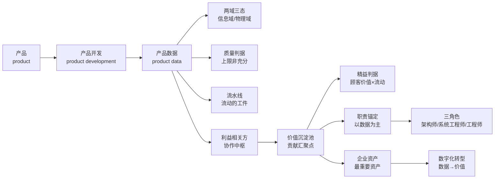

**一句话主线**：产品是价值的载体，产品开发是价值诞生的过程，产品数据是价值沉淀的唯一形态；因此产品数据既是协作的中枢、评价的锚点，也是研发企业最重要的资产与数字化转型的主战场。

---

## 1. 产品（Product）

### 1.1 标准定义（出处）

**ISO 9000:2026 §3.7.9**：

> **product（产品）**：output of an organization that can be produced without any transaction taking place between the organization and the customer
> —— 组织的一种输出，这种输出可在组织与顾客之间**不发生交易**的情况下产生。

对照 **§3.7.10 service（服务）**：至少有一项活动**必须**在组织与顾客之间进行的输出。

**两个易错点**：
- ISO 9000 中 product 是四分法大类（hardware / software / service / processed material），**"服务"是"产品"的类别**；管理口语的"产品 vs 服务"是并列用法；
- 判定关键字是 **transaction（交易）**——产出过程中是否必须与顾客发生交互，是产品与服务最硬的分界线。

系统工程视角（ISO/IEC/IEEE 15288）：核心词是 **system**——"为达成一个或多个既定目的而组织的相互作用元素组合"；技术流程产出的可交付物即 product / service。补充 ISO/IEC/IEEE 24765：product = *an artifact produced by a process*（由过程产出的工件）。〔按：「工件」在本文为**比喻义**（如"流动工件""输出工件"）；其**标准译名为「人工制品」**（artefact，**15288:2023 §3.6**）——**凡指 AD、架构视角等属概念，一律写「工作产品」（work product），不写 artifact／制品**（22 号 §8.2 术语提示、§12 第 34 行；**D28**）。〕

### 1.2 本质：三个视角一句话

> **产品 = 需求的物化 + 价值的载体 + 过程的输出**

| 视角 | 产品是什么 | 对应关系 |
|---|---|---|
| 对需求 | 规定需求（specified requirement）的实现物 | 需求是"应然"，产品是"实然" |
| 对顾客 | 价值交换的介质 | 产品是价值从组织流向顾客的载体 |
| 对过程 | 开发（development）的输出工件（artifact） | 产品是过程的结果物，不是过程本身 |

### 1.3 边界对比

| 概念 | 判据要点（出处） | 与产品的关系 |
|---|---|---|
| 产品 | 组织的输出，无需交易即可生产（ISO 9000:2026 §3.7.9） | 被定义者 |
| 服务 | 至少一项活动必须发生在组织与顾客之间（§3.7.10） | 产品的类别之一 |
| 系统 | 按"目的 + 元素相互作用"定义（15288） | 产品通常是系统，但系统不必然可交付 |
| 项目 | 创造独特产品/服务/成果的临时性工作（PMBOK） | 创造产品的过程载体 |
| result 结果 | 使用产品后产生的可观察影响 | 产品的"目的端" |

### 1.4 IPD 语境：产品包（offering）

ISO 9000 是**质量/技术视角**；在 IPD（集成产品开发）里，"产品"通常指**产品包（offering）**——硬件 + 软件 + 服务 + 解决方案的组合交付，多了一个**商业维度**（市场定位、定价、生命周期管理、上市节奏）。两个视角不冲突：技术视角回答"产品是什么物"，经营视角回答"顾客愿意为什么付钱"。

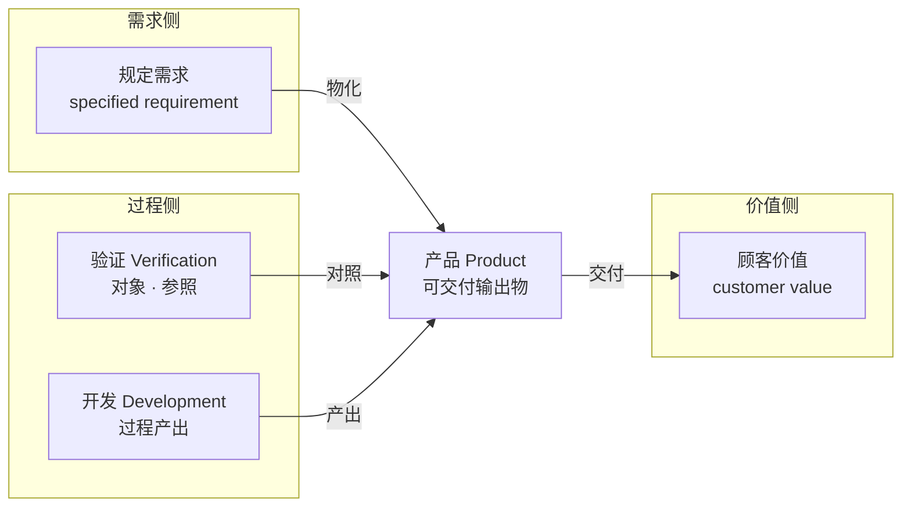

---

## 2. 产品开发（Product Development）

### 2.1 标准定义（出处）

**ISO 9000:2026 §3.3.11**（design and development）：

> set of processes that **transform requirements for an object into more detailed requirements for that object**
> —— 将对象的需求转换为对该对象**更详细的需求**的一组过程。

**三个细节**：
- 标准里是 **"design and development" 连用**，设计是开发的子活动，不是并列的另一件事；
- 定义的落点是"**更详细的需求**"：产品开发的直接产物是产品的"定义/基线"，生产环节才把它复制成实物；
- **注 3（两版均有，2026 措辞微调）**：限定词可指明被设计开发对象的性质（如产品／服务／**过程**设计和开发）——"过程设计和开发"由此有明文出处。

**ISO/IEC/IEEE 15288:2023**：技术流程组（需求定义 → 架构定义 → 设计定义 → 实现 → 集成 → 验证 → 移交）构成产品开发的连续活动串。

**IPD 视角**：产品开发是企业的**投资行为**，按"概念 → 计划 → 开发 → 验证 → 发布 → 生命周期"分阶段推进，**每个阶段出口设评审门（gate）**。

### 2.2 本质：三个特征

> **产品开发 = 把"应然（规定需求）"变成"实然（产品）"的系统化过程**

| 特征 | 含义 |
|---|---|
| 一次性定义，多次复制 | 开发定义基线，生产复制基线；开发高风险高成本低重复 |
| 跨职能协同 | 市场、研发、制造、采购、财务同时参与（IPD 的 PDT） |
| 以评审为门 | 阶段出口用评审把关，防止错误向后传递放大 |

### 2.3 边界对比

| 概念 | 与产品开发的关系 |
|---|---|
| 产品 | 产品的**诞生过程**——名词 vs 动词 |
| 项目 | 产品开发是流程/活动，项目是组织载体（一个产品可跨多个项目） |
| 产品生存周期 | 生存周期 ⊃ 产品开发（开发是其中的概念+开发阶段） |
| 产品设计 | 设计 ⊂ 产品开发（设计是开发的子活动） |
| 生产制造 | 开发**定义基线**，制造**复制基线** |

### 2.4 输入 / 输出

| | 内容 |
|---|---|
| **输入** | 市场需求 / 利益相关方需要 → 规定需求（specified requirements）→ 设计约束、资源、已有基线 |
| **输出** | 产品工件 + **产品规范/基线（baseline）** + 验证证据 + 移交/生产信息 |

（接配置管理主线：**基线是产品开发的产物，也是变更控制的对象**——产品开发本质上是在"不断逼近并冻结一组基线"。）

### 2.5 需要的技能清单（required skills）

产品开发要求六项核心能力：

1. **需求工程**：elicitation（获取）、analysis（分析）、specification（规定化）
2. **架构与设计**：架构定义与设计定义两个过程（ISO/IEC/IEEE 15288 §6.4.4／§6.4.5）；架构描述按 ISO/IEC/IEEE 42010 表达（24 号 §1.3、§3.3）
3. **项目管理**：范围、进度、成本、风险（对应 15288 的 project management process）
4. **评审与验证**：IEEE 1028 的评审类型、verification / validation 对照
5. **配置管理**：基线管理、变更控制
6. **跨职能协同与市场洞察**：IPD 语境下的投资决策与 PDT 运作

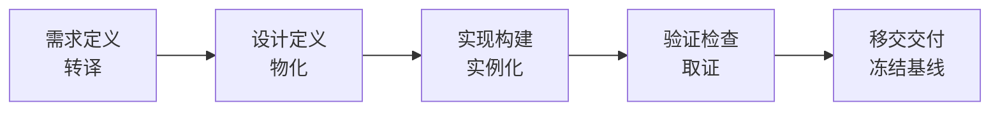

> **接驳（依 24 号 §8.1、§7.3）**：本条与 §6 同形的链条是**产品数据工件链**；其中"设计定义"一步的输入不是"需求定义"的成果，而是**架构定义**的输出——其身份由"成果"转为**规定需求**（24 号 §8.1 第 4 条；架构约束须以规定需求的形式下达给设计，24 号 §7.3），两过程**边界同源**（第 3 条），且**不是先后两个阶段**（24 号 §8.2）。详见 §6 接驳注。

---

## 3. 产品数据（Product Data）

### 3.1 标准定义（出处）

**ISO 10303-1:2021（STEP，产品数据表达与交换标准；现行）**：

> **product data** — representation of information about a product or a family of products in a formal manner suitable for communication, interpretation, or processing by human beings or by computers
> —— 关于产品或产品族的信息的、以适合由人或计算机进行通信、解释或处理的形式化方式进行的表示（20 号报告 §1.1 同口径对齐）。

> **【历史对照】** ISO 10303-1:1994 曾写作 "a representation of information about a product or family of products that is relevant to the product throughout its life cycle"（与产品全生命周期相关的信息的表示）——"与全生命周期相关"之义仍成立，但现行定义以"形式化 + 人机处理"为方法地基（机械判据与可执行性的来源）。

底层拆解（ISO 9000:2026 术语链）：
- §3.8.1 **data（数据）** = facts about an **object**（关于对象的事实；条款号与 2015 同号）
- §3.8.4 **information（信息）** = meaningful data（有意义的数据）
- §3.5.3 **object（对象）** = anything perceivable or conceivable
- **ISO/IEC 2382-17:1999 §17.02.12 `attribute`（属性）** = *A named property of an entity*（实体的**命名**属性），每个 attribute 配一个 attribute value（如 color＝blue）

**三层抽象链（依 22 号 §4.5）**：object（§3.5.3）→ **property（ISO 1087:2019 §3.1.3，对象的特征）** → **characteristic（ISO 1087:2019 §3.2.1，属性的抽象）** → **concept（ISO 1087:2019 §3.2.7，由特性的独特组合而形成的知识单元）**；`attribute` 是从 property 分出的**命名化侧支**（命名层），不在链上而在链侧。四处语境**逐一定位、不混用**——ISO 1087 §3.1.3 的 property（**任何**特征，无"固有"类限定）／ISO 9000:2026 §3.10.1 的 characteristic（**区别性**特征，带 inherent／assigned 限定，**质量管理语境**）／ISO/IEC 2382-17 的 attribute（**命名**属性）／42010 §3.2 的 properties（**未定义**，按通用语意）。故本节 ISO 9000 术语链的 object 与 §3.10.1 的 characteristic **不同语境、不可互推**（22 号 §4.3～§4.6）。

**配置管理衔接**（ISO 10007:2017）：标准对应概念是 **configuration information（配置信息）**——配置管理识别、控制、记实、审计的正是产品数据。**产品数据 = 配置管理的操作对象。**

### 3.2 本质

> **产品数据 = 产品的信息形态 = 数字孪生的前身**

一个产品有两个存在：物理存在（实物）+ 信息存在（产品数据）。开发过程的**每一条输出都是产品数据**；产品基线 = 一组受控的产品数据。

### 3.3 构成（六类）

| 类别 | 典型内容 |
|---|---|
| 需求数据 | 需求规格、利益相关方需要、验收准则 |
| 设计数据 | CAD 模型、图纸、架构描述 AD（42010）、设计描述 DD、设计规范 |
| 制造数据 | 工艺文件、BOM、NC 程序 |
| 质量数据 | 测试报告、验证证据、缺陷记录 |
| 服务数据 | 维护手册、备件清单、故障数据 |
| 管理数据 | 变更记录、评审记录、基线标识 |

> **六类之外还有两件东西不在产品数据链上（依 23 号 §9.1、§9.2）**：**确认的判据**（预期用途／使用情境，主体是未显性化的隐含需求——故"利益相关方需要"一栏只承接其 **stated** 部分）与**方针**（与派生关系异构：承诺 + 框架，不是 derivation）。需求数据按**派生关系**生成、**只承载 stated**，链自洽只保证验证侧；二者须挂在**与派生链异构的参照层**，不能只作为某一类数据的子项（23 号 §9.1；§7.2 注）。

> **〔术语锚点 · 依 22 号 §4.3～§4.5〕** 表中各类数据的"数据项／字段"，其术语学落地形态即 **`attribute`（属性，ISO/IEC 2382-17:1999 §17.02.12）**——*A named property of an entity*（实体的**命名**属性），每个 attribute 配一个 attribute value；它是 **property（ISO 1087:2019 §3.1.3，对象的特征）** 的**命名化侧支**，与 characteristic（ISO 1087:2019 §3.2.1 抽象层；ISO 9000:2026 §3.10.1 质量管理语境）**不同语境、不可互推**（三层抽象链见 §3.1；**D5、D6**）。

### 3.4 边界辨析

- **产品数据 ≠ 文档**：数据是内容，文档是容器（同一数据可有多种载体）；
- **产品数据 ≠ 配置项**：配置项是"受控的"产品数据（被基线化的才是，草稿不是）；
- **产品数据 ≠ 产品**：描述与被描述者；但验证要求两者一致（配置审计）；
- **产品数据 ≠ 架构本身**：架构是**抽象物**、不是交付物，也不进产品数据项清单——能进清单、能冻结基线的是**架构描述 AD**；AD 与**设计描述 DD** 是**平级的两件人工制品**（artefact，**15288:2023 §3.6**），不是同一描述的粗细两版（24 号 §1.4-1、§3.1、§3.2）。**AD 在 42010 侧的属概念是工作产品（work product）——两词不可互译**（22 号 §8.2 术语提示、§12 第 34 行；**D28**）。

### 3.5 需要的技能清单（required skills）

1. **产品数据建模与标准化**：ISO 10303/STEP 思维（中性格式、共享语义、可交换）
2. **PDM/PLM 工具能力**：数据组织、版本、发布、权限（Product Data Management 就是管这个的）
3. **配置管理**：基线、变更控制、状态记实、配置审计（ISO 10007）
4. **文档控制与数据治理**：追溯、保留、权限边界
5. **数据质量**：完整性、一致性、可追溯性

---

## 4. 两域与三态：开发产品 = 开发产品数据？

### 4.1 产品的双重存在

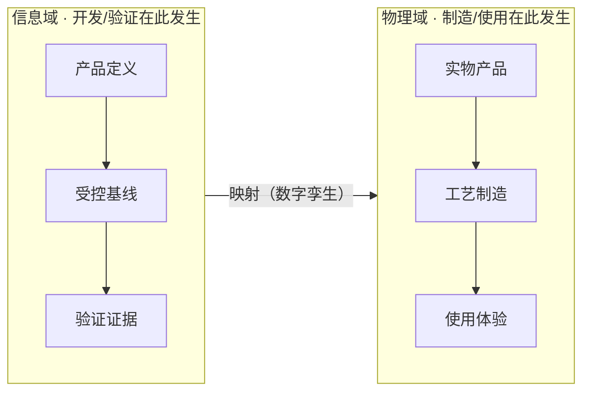

### 4.2 三视角成立性

| 视角 | 断言 | 成立性 |
|---|---|---|
| 信息本质视角 | 产品数据 = 产品的信息本质 | ✅ 成立 |
| 定义生成视角 | 开发直接产物 = 产品规范/定义（ISO 9000:2026 §3.3.11 落点是 output requirement） | ✅ 成立 |
| 物理存在视角 | 产品 ≠ 数据（还有实物、体验、价值实现） | ❌ 不等同 |

**一句话**：开发产品开发的是产品的"**定义**"，制造产品制造的是产品的"**实物**"——"开发产品 = 开发产品数据"等于说"开发 = 定义生成"。

### 4.3 产品三态（PLM 视角）

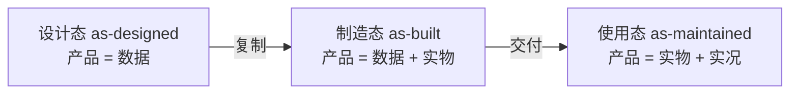

**设计态的特殊性**：设计态 = 产品尚未有物理实体的状态，它的全部存在就是一组受控的产品定义数据——**在设计态，开发产品 ≡ 开发产品数据，无歧义**。两个微妙点：
- 原型/样机是验证载体，不是设计态产品的交付形态；
- 数据完备到"可制造、可验证"，开发才算完成——这就是评审门存在的理由。

**三态的数据内容（as-designed / as-built / as-maintained）**：

| 态 | 数据内容 | 产品 = |
|---|---|---|
| 设计态 | 需求、模型、规范、**EBOM**（工程 BOM） | 数据（无实物） |
| 制造态 | **MBOM**（制造 BOM）、序列号、批次、制造记录 | 数据 + 实物 |
| 使用态 | 维护记录、配置实况、现场变更 | 实物 + 实况 |

**收口的类比（菜谱与菜）**：开发是写菜谱，制造是照菜谱做菜。对"菜谱型产品"（软件）而言，**菜谱就是菜**——写菜谱 = 做菜；对实物产品而言，菜谱只是菜的一半。

---

## 5. 数据质量与产品质量

### 5.1 命题判定：半对半错

> 在产品开发阶段，产品数据质量决定产品质量——**在"开发阶段的可评价质量 = 定义质量"层面成立；在"数据质量决定最终产品质量"层面不充分**。

| 子命题 | 判断 | 理由 |
|---|---|---|
| 开发阶段可评价质量 = 数据质量 | ✅ | 设计态同一性 |
| 数据质量决定最终产品质量 | ⚠️ | 必要条件成立，充分条件不成立 |

### 5.2 为什么"不充分"

**质量定义**（ISO 9000:2026 §3.5.2）：degree to which a set of **inherent characteristics** of an object **fulfils requirements**（满足需求的程度）。两个漏洞：
1. **需求本身可能错**：数据完美实现错误需求——verification 全绿、validation 全红；
2. **实物环节不在数据里**：制造偏差、材料、工艺、体验。

### 5.3 多环相乘模型

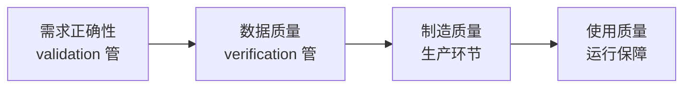

> **最终质量 = 需求正确性 × 数据质量 × 制造质量 × 使用质量**（乘法 = 短板效应，任何一环为零全盘皆输）
> 数据质量决定产品质量的**上限**，需求正确性决定**方向**，制造质量决定**达成**。

### 5.4 数据质量的评价特性（ISO/IEC 25012）

| 特性 | 含义 | 用户/客户的贡献 |
|---|---|---|
| accuracy 准确性 | 数据反映真实对象 | 验收用真实场景校正 |
| completeness 完整性 | 数据覆盖无遗漏 | 需要补全需求覆盖范围 |
| consistency 一致性 | 数据内部不矛盾 | — |
| timeliness 时效性 | 数据跟上现实 | 反馈让数据跟上变化 |
| credibility 可信度 | 数据经得起验证 | 真实用户验证，非纸面正确 |

**缺陷传播链**：需求错 → 设计错 → 制造错 → 使用错，越往下游修复成本越高（工业界公认的数量级放大）——这也是"质量是设计出来的，不是检验出来的"的含义，以及"数据质量是产品质量必要条件"的机理。

---

## 6. 流水线视角：流动的是产品数据

将产品开发视为流水线：

| 流水线要素 | 产品开发中的对应 |
|---|---|
| 工件（被加工的物） | 产品数据（开发工件 WIP artifact） |
| 工位（加工动作） | 需求定义（转译）、设计（物化）、实现（实例化）、验证（取证）、移交（冻结） |
| 增值（加工效果） | 每个工位往工件上添加价值——**也可能添加缺陷** |

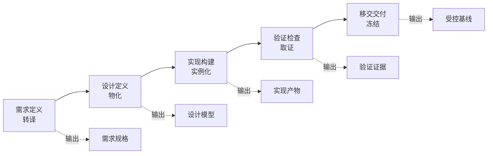

> **接驳（依 24 号 §8.1）**：本条链条自"需求定义"直入"设计定义"，中间省略了 15288 的**架构定义**过程（§6.4.4；完整过程串见 §2.1）——**架构定义的输出即设计定义的输入，其身份由"成果"转为"规定需求"**（24 号 §8.1 第 4 条；架构约束须以规定需求的形式下达给设计，24 号 §7.3），两过程**边界同源**（架构定义的停止线＝设计定义的起点，第 3 条）、**交替递归**（上一层设计定义的输出＝下一层架构定义的输入对象，第 1 条），且**不是先后两个阶段**（24 号 §8.2）。落到产品数据上，此段多出一件工件：**架构描述 AD**——它与**设计描述 DD** 平级（24 号 §3.1），可冻结基线的是 AD，不是架构本身（24 号 §1.4-1）。

**与制造流水线的三个本质差异**：① 工件性质：信息（原创）vs 实物（复制）；② 加工方式：创造性转换 vs 确定性复制；③ 缺陷行为：**缺陷沿流动传播并放大**（需求缺陷流到设计、实现、验证，修复成本逐级上升）。

**配置管理在流水线上的角色**：标识（工件身份）+ 基线（冻结节点）+ 记实（流动轨迹）。

---

## 7. 利益相关方视角：围绕产品数据协作

### 7.0 stakeholder 的标准定义（出处）

**ISO/IEC/IEEE 15288（现行版 2023；stakeholder 一条在 2015 版为 §3.1，2023 版号未核）（stakeholder，利益相关方）**：

> individual or organization having a **right, share, claim or interest** in a system or in its possession of characteristics that meet their **needs and expectations**
> —— 对系统拥有权利、份额、主张或利益，或其特性需满足其需要与期望的个人或组织。

用户和客户都符合——他们正是 needs and expectations 的**所有者**。注意术语约定：need → 需要、expectation → 期望、requirement → 需求（三者不混用）。

### 7.1 内外分层

- **内部利益相关方**（市场、研发、制造、质量、采购、项目）：围绕产品数据**读写协作**（中枢）；
- **外部利益相关方**（用户、客户）：是产品数据的**源与宿**——不直接读写，但通过代理转译（needs → 需求数据）与验收判定（validation）与数据交互。

**用户 vs 客户**：用户 = **使用**产品（使用价值、验收裁判）；客户 = **接收/购买**产品（交易价值、需求源头，ISO 9000:2026 §3.9.1）。典型：买奶粉的是客户，喝奶粉的是用户。

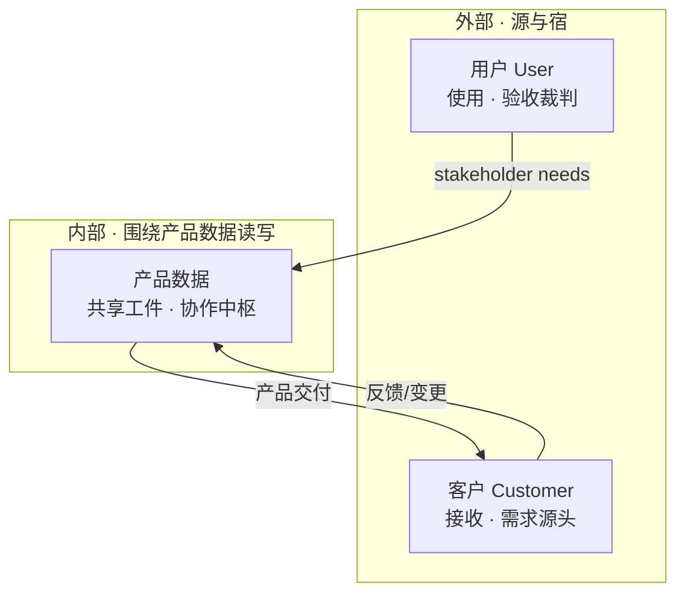

### 7.2 产品数据闭环

用户/客户通过四条路径**贡献并提升产品数据**：

| 路径 | 机制 | 产物 |
|---|---|---|
| 需要（源头贡献） | 痛点/期望经市场代理转译（**转译有损耗**——期望集合严格大于需求集合，见下注） | 需求数据（规定需求） |
| 使用（新数据贡献） | 遥测、日志、行为数据 | 使用数据（as-maintained 一部分） |
| 反馈（修正贡献） | 缺陷报告、改进建议、变更请求 | 变更/缺陷数据 → 修正既有数据 |
| 确认（把关贡献） | validation 判定"是否满足需要"（**判据不在链上**，见下注） | 回灌确认结论（校正需求数据） |

> **闭环的两条边界（依 23 号 §9.1、§9.2、§5.6；本节同 §3.3 注）**：
> ① **需求数据链只承载 stated**——它按**派生关系**生成（改上游则下游按规则变），故"链路自洽"只保证**验证**侧与（链上产物的）评审侧。**确认的判据**（预期用途／使用情境，其主体是未被显性化的隐含需求）与**方针**是**链外之物**：前者因判据不上链而无法上链，后者因与派生关系**异构**（**承诺 + 框架**，非 derivation——改一句方针，链上没有任何一条需求会因规则而自动变）而无法上链。故**需求基线之上必须另设一个与派生链异构的参照层**（23 号 §9.1、§9.2）。**本节的 validation 一栏因此不是"数据流"而是"回灌"**——判定本身在链外做，结论才回到链上（use specification / ConOps / 使用情境 / 用例是其载体，不是逐条需求）。
> ② **转译有损耗**——"期望集合**严格大于**需求集合"：§3.5.1 注 5 承认存在顾客**既没有明示、也不是通常隐含或必须履行**的期望（"三不沾"期望），它**不构成 requirement**，故上不了链，却仍然影响确认结论（23 号 §3.2、§5.6 修正 1）。"痛点/期望经市场代理转译"这句话里，损耗正是发生在这里。

精确表述：**用户/客户是产品数据的内容之根，内部利益相关方是形式之笔**——除了"使用数据"是用户直接产生的新数据，其余三条都是间接但根本的贡献。

> **用户/客户是产品数据闭环的启动者与验收者：需要从这里进入，价值在这里兑现，反馈从这里回来。** 他们不写答卷，但**出题和判卷都是他们**。

**收口的类比（乐队总谱）**：指挥、各乐手、舞台监督不围绕"目标"工作，也不围绕"排练计划"工作，他们围绕**总谱（共享工件）**工作；各自还有分谱（专业视角），但合奏对齐的是总谱。产品数据就是开发协奏的**总谱**，评审是**指挥**，配置管理是**谱务**——确保所有人看的都是同一版谱子。

---

## 8. 价值沉淀池：价值贡献都是产品数据？

### 8.1 命题与修正

> 利益相关方对产品开发贡献价值的沉淀物都是产品数据——**基本成立，但要区分"物化贡献"与"过程贡献"**。

| 贡献类型 | 是什么 | 沉淀形式 |
|---|---|---|
| 物化贡献 | 工件（规格、模型、代码、证据、BOM） | 直接就是产品数据 |
| 过程贡献 | 决策、评审、把关、协调 | 结果记入产品数据（评审/变更/批准记录） |

### 8.2 价值三层模型（重要修正）

深入思考后的修正：**产品数据是价值的"投影与锚"，不是价值本体**。

| 层 | 内容 | 是否在产品数据中 | 如何评价 |
|---|---|---|---|
| 物化层 | 需求、架构描述 AD、实现工件 | ✅ 完全在 | 可证伪、可度量 |
| 决策层 | 取舍、转译、选型判断 | ⚠️ 部分沉淀（ADR） | 评审（事中）+ 结果回溯（事后） |
| 过程层 | 沟通、反馈、评审、影响力 | ⚠️ 结果记入 | 下游指标 + 复盘 |

三个关键洞察：
1. **工件是判断的"投影"**：完美工件可能是错误决策的产物（verification 全绿、validation 全红）；
2. **隐性知识写不进数据**（Polanyi："我们知道的多于我们能说出的"）；
3. **乘数效应**：架构师的好决策让下游少走弯路——价值体现在**别人的工件质量**里。

---

## 9. 精益判据：活动是否贡献产品数据价值

### 9.1 判据的层级

- **一级判据（精益原点）**：价值由**顾客**定义（Womack & Jones 五原则）；浪费 = 不创造顾客价值的活动（TPS 七大浪费）；
- **二级判据（研发操作化）**：活动是否让产品数据增值——**成立，但需三个限定**。

### 9.2 三个限定

1. **贡献内容必须"顾客需要"**：过度加工（over-processing）= 贡献了数据但顾客不要（额外特性）；
2. **不贡献 ≠ 浪费**：必要非增值（审批、合规、使能）要压缩保留；
3. **判据要双维**：工件增量（静态）+ 流动效率（动态）——等待是精益打击核心，但它不贡献数据。

### 9.3 研发语境下的七大浪费

精益研发（Lean Product Development）把 TPS 七大浪费转译到知识工作语境：

| 浪费 | 研发语境含义 |
|---|---|
| 部分完成的工作 | 半成品工件堆积（没冻结的需求、写了一半的设计） |
| 额外特性 | 过度加工——贡献了数据但顾客不要 |
| 重新学习 | 同样的知识重复获取（没有沉淀为产品数据） |
| 交接 | 信息在角色间传递的损耗 |
| 任务切换 | 上下文切换的成本 |
| 等待 | 信息阻塞（等评审、等决策、等数据） |
| 缺陷 | 错误数据流入下游并放大 |

注意："额外特性"和"重新学习"正好印证第 8 章的价值三层模型——**贡献了产品数据 ≠ 有价值，还得顾客需要（validation）**。

### 9.4 判定树

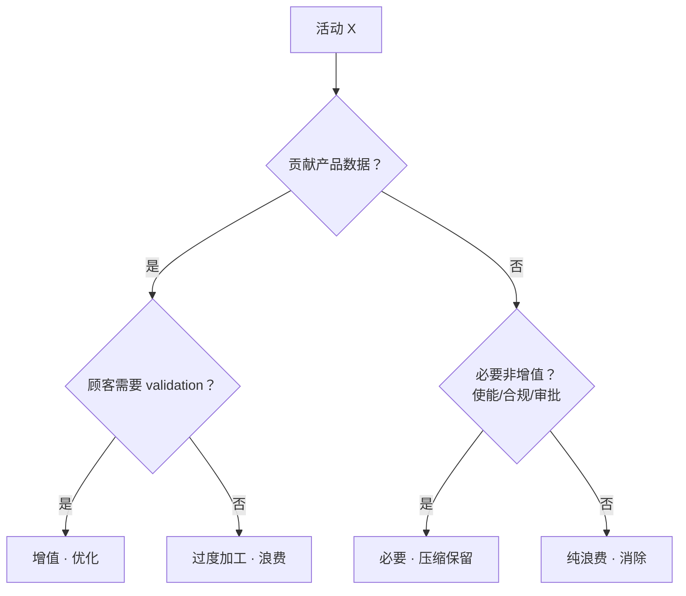

> **精益判据 = 顾客价值 × 流动效率；产品数据贡献是最可操作的检视点，但不是终点。**

---

## 10. 职责锚定：以产品数据为主

### 10.1 流程 vs 产品数据

流程是"**动词**"（活动/阶段），产品数据是"**名词**"（工件/配置项）。职责完整定义 = 角色 ×（活动 × 工件）。

**作为职责锚点，产品数据更准确、更可落地**：

| 判据 | 本质 | 产品数据锚 | 流程锚 |
|---|---|---|---|
| 准确 | 职责可**证伪** | 工件可对照规定需求检查 | 活动无法证实也无法证伪 |
| 落地 | 职责可**映射** | 权限/签字/审批链/指标（四个硬机制） | 无硬机制 |
| 评价 | 职责可**度量** | 缺陷率、覆盖率、追溯完整率 | 只能评执行率（形式化） |

反证：**缺了流程，数据职责还在（降级可运行）；缺了数据，流程职责空转（数据无人负责）**。工程佐证：GitHub CODEOWNERS、ISO 10007 配置项 owner。

### 10.2 三类职责模型

| 职责类型 | 依据 | RACI 对应 |
|---|---|---|
| 所有权职责（主） | 产品数据 / 配置项 | A（Accountable） |
| 执行职责（辅） | 流程 / 活动 | R（Responsible） |
| 决策职责（辅） | 评审门 / 基线 | Approve |

### 10.3 "主"与"本"的区分（重要边界）

> **以产品数据为主（操作）——它是唯一可问责、可考核、可改进的通道；以判断与协作为本（价值）——那是价值真正的来源。主是管道，本是源头。**

### 10.4 落地三步法（把话变成操作）

| 步骤 | 动作 | 产出 |
|---|---|---|
| **1. 识别工件** | 列出配置项清单：需求规格、架构描述（42010）、设计模型、验证证据、基线 | 工件地图 |
| **2. 指定 owner** | 每个配置项唯一 owner（一件只一人，一人可多件） | 所有权矩阵 |
| **3. 挂机制** | 工具权限 + 评审签字 + 变更审批链 + 考核指标，全部挂到 owner 上 | 可运行的职责体系 |

AOS 语境示例：**"系统需求规格"的 owner 是系统工程师，"架构描述"的 owner 是架构师，"验证证据"的 owner 是质量工程师**——出了偏差，不用翻任何流程文档，直接找 owner，工具里一查权限就知道是谁。

---

## 11. 三角色职责与价值

### 11.1 职责分层（工件所有权为锚）

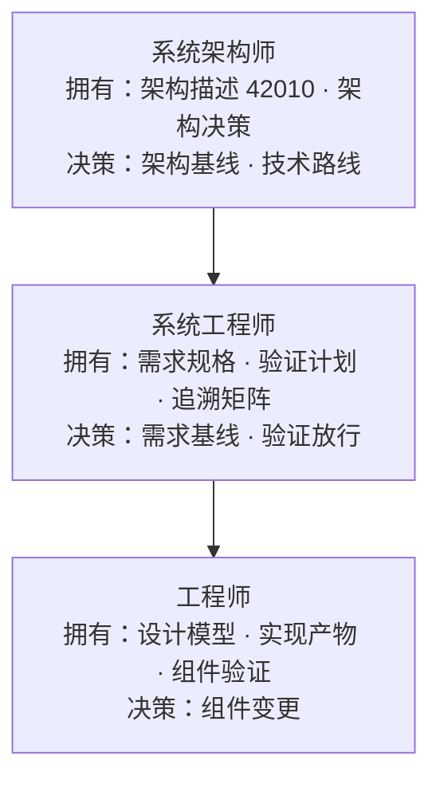

- **约束向下**：架构师定义"形状"，系统工程师定义"语义"；
- **反馈向上**：工程师发现偏差 → 反馈系统工程师 → 反馈架构师；
- **追溯贯穿**：追溯矩阵是三方共同维护的唯一工件。

### 11.2 价值三层与三维评价

> **角色价值 = 工件质量（直接，可度量）× 判断质量（评审 + 结果回溯）× 下游影响（乘数指标）**

| 角色 | 工件质量（直接） | 判断质量 | 下游影响（乘数） |
|---|---|---|---|
| 架构师 | 架构评审缺陷率 | 评审质疑解决率、路线复盘 | 下游架构偏差率 |
| 系统工程师 | 需求缺陷密度、追溯完整率 | 转译正确性复盘 | 下游返工率 |
| 工程师 | 实现缺陷率、单元验证通过率 | 设计评审复盘 | 集成缺陷率 |

**划责规则**：一个缺陷只定位一个责任工件——需求缺陷找系统工程师，结构/接口缺陷找架构师，实现缺陷找工程师。

### 11.3 如何正确履职（行为准则）

| 角色 | 正确履职 = 守住这几条 |
|---|---|
| **系统架构师** | ① 定义边界与接口，不陷入实现细节（但要懂）；② 用 ADR 记录决策理由（决策可追溯）；③ 跨域权衡以需求为准绳；④ 架构评审要"过"，不要"走过场" |
| **系统工程师** | ① 转译不丢原意（needs → requirements 可追溯）；② 维护追溯矩阵——**这是他的核心工件**；③ 需求可测试才放行；④ 组织系统级验证，不让缺陷逃逸到用户 |
| **工程师** | ① 遵循架构约束（不私自改边界）；② 实现与设计一致（偏差必须上报，走变更通道）；③ 单元/组件验证自证；④ 反馈要快、要准（反馈链是三角色协作的血液） |

**一句话**：架构师管"长得对"（形状），系统工程师管"要得对"（语义），工程师管"做得对"（细节）。

---

## 12. 企业最重要的资产：产品数据

### 12.1 资产四特性检验

| 候选资产 | 可积累 | 可复用 | 可转移 | 可评价 |
|---|---|---|---|---|
| **产品数据** | ✓ | ✓ | ✓ | ✓ |
| 人才（判断·协作） | ✗ | ✗ | ✗ | △ |
| 客户关系 | △ | △ | ✗ | △ |
| 流程文档 | △ | ✓ | ✓ | △ |

> **产品数据是唯一四性兼备的价值载体。人才是价值的源泉，但不是资产的形态——人是本，数据是产；资产形态只能是数据。**

### 12.2 护城河的构成（四类数据资产）

1. **需求资产**：需求库、用户洞察——知道"该做什么"；
2. **设计/架构资产**：架构描述、设计模式——知道"怎么做得好"；
3. **验证资产**：验证计划、测试基线、缺陷库——知道"怎么证明对"；
4. **管理资产**：基线、变更记录、决策记录（ADR）——知道"为什么这么做"。

**补充论点：产品会死，数据体系活着。** 单个产品会过时、会退市——它不是资产，是资产的**输出**；真正的资产是能**跨产品、跨代际复用**的产品数据体系（需求知识、架构模式、验证基线、配置基线）。这四类数据资产是竞争对手**抄不走**的（几十年积累的追溯链与决策史无法一夜复制）——这才是研发企业真正的壁垒，也是配置管理、PLM 存在的终极理由。

---

## 13. 数字化转型：重点是产品数据的数字化转型

### 13.1 五维度（重点 ≠ 全部）

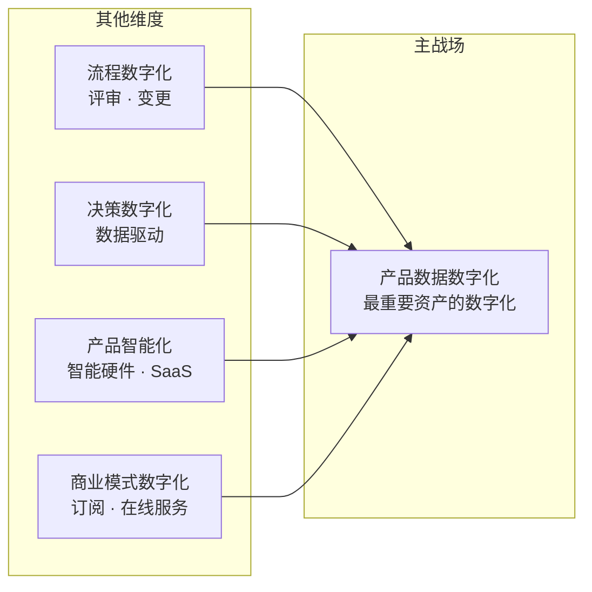

### 13.2 数字化 vs 转型（词义精炼）

| | 数字化 digitization | 数字化转型 transformation |
|---|---|---|
| 动作 | 纸 → 电（模拟 → 数字） | 数据 → 价值（流动 → 驱动） |
| 结果 | **档案化**（被存起来） | **变革**（被用起来，改变工作方式） |

> **数字化是给资产上户口（存起来），转型是让资产生利息（用起来）。** 企业数字化转型的重点不是"把产品数据数字化"（那只是第一步），而是"产品数据的数字化转型"——让产品数据从"被管理的档案"变成"流动、共享、分析、驱动决策的引擎"。

---

## 14. 结论与欠项

### 14.1 主线收口

> **产品是价值的载体，产品开发是价值诞生的过程，产品数据是价值沉淀的唯一形态。**
> 产品数据是协作的中枢（利益相关方读写）、评价的锚点（可证伪可度量）、问责的落点（工件所有权）、精益的检视点（活动增值）、企业的资产（四性兼备）、转型的主战场（数据→价值）。

### 14.2 边界修正记录（关键结论的限定）

| 结论 | 成立范围 | 边界/限定 |
|---|---|---|
| 开发产品 = 开发产品数据 | 设计态、纯信息产品 | 物理域不成立；严格说是"开发 = 定义生成" |
| 数据质量决定产品质量 | 决定**上限**（必要条件） | 不决定达成值；质量 = 需求×数据×制造×使用 |
| 利益相关方价值贡献都是产品数据 | 沉淀物层面 | 价值本体是判断与协作（决策层/过程层） |
| 以产品数据为主 | 操作/评价层面 | 为主 ≠ 唯一（三维评价）；为主 ≠ 本体（判断是本） |
| 产品数据是最重要资产 | 资产形态层面 | 人是源泉（本），数据是资产（产） |
| 数字化转型重点是产品数据数字化 | 研发企业主战场 | 重点 ≠ 全部（五维度）；"数字化"≠"数字化转型" |

### 14.3 欠项

- **review vs verification vs validation 对照**（用户既定欠项）：**已结清**——本链条中多次被引用为判据工具（数据质量 vs 需求正确性、贡献正确性判定、validation 裁判），三词对照已成文，见 **23 号《判据体系研究报告》第 10 章**（三条定义并排、三处硬差别、V 模型位置与三句话记法）与 **13 号 §11**。三处硬差别：动词 `determination`（评审）vs `confirmation`（验证／确认）；客观证据**不要**（评审，定义中不出现 objective evidence）vs **必须** *through the provision of objective evidence*（验证／确认）；判的性质**适宜性·充分性·有效性**（评审）vs **符合性**（验证／确认）（23 号 §10.1、§10.2；本条引用三词处一律照此读）。
- 产品经理 vs 系统工程师 vs 项目经理的职责对照（可用第 10、11 章模型展开）。

---

## 附录 A：对话中的类比与口诀（辅助记忆）

| 类比 | 含义 | 出处章节 |
|---|---|---|
| **乐队总谱** | 产品数据 = 总谱，评审 = 指挥，配置管理 = 谱务 | §7 |
| **菜谱与菜** | 开发 = 写菜谱，制造 = 做菜；软件 = 菜谱即菜 | §4 |
| **流水线胚胎** | 流动的是产品数据的胚胎，工位让它长大，制造"接生"为实物 | §6 |
| **出题人与判卷人** | 用户/客户不写答卷，但出题（needs）和判卷（validation）都是他们 | §7 |
| **池子与注水** | 人往池里注判断，池里的水就是资产；没人注水池子会干 | §12 |
| **户口本与利息** | 数字化 = 上户口（存起来），转型 = 让资产生利息（用起来） | §13 |
| **主是管道，本是源头** | 以产品数据为主（操作），以判断与协作为本（价值） | §10 |
| **工位与工件** | 角色站在工位上（流程），手里拿的是工件（数据）；工位会换，工件是锚 | §10 |
| **出问题找工件** | 问责落到工件 owner，不落人缘；一个缺陷一个责任工件 | §11 |
| **需求之物化、验证之对象、价值之载体** | 产品的三视角口诀 | §1 |

## 附录 B：标准出处索引

| 概念 | 标准/出处 | 条目 |
|---|---|---|
| object 对象 | ISO 9000:2026 | §3.5.3（2015 §3.6.1） |
| quality 质量 | ISO 9000:2026 | §3.5.2（2015 §3.6.2） |
| requirement 需求 | ISO 9000:2026 | §3.5.1（2015 §3.6.4） |
| product 产品 | ISO 9000:2026 | §3.7.9（2015 §3.7.6） |
| service 服务 | ISO 9000:2026 | §3.7.10（2015 §3.7.7） |
| customer 顾客 | ISO 9000:2026 | §3.9.1（2015 §3.2.4） |
| design and development | ISO 9000:2026 | §3.3.11（2015 §3.4.8） |
| data / information | ISO 9000:2026 | §3.8.1 / §3.8.4（data 与 2015 同号；information 2015 §3.8.2） |
| system 系统 | ISO/IEC/IEEE 15288:2023 | 术语表 |
| stakeholder 利益相关方 | ISO/IEC/IEEE 15288:2023 | 术语表 |
| product 产品（artifact） | ISO/IEC/IEEE 24765 | 术语表 |
| product data 产品数据 | ISO 10303-1:2021（STEP，现行；1994 历史对照） | 术语表 |
| configuration information / CI | ISO 10007:2017 | 术语表 |
| architecture description 架构描述 | ISO/IEC/IEEE 42010:2022（2011 历史对照） | 术语表；架构是**抽象物**、可交付与可冻结基线的是 AD（24 号 §1.4-1）；AD 与 DD 平级（24 号 §3.1、§3.2） |
| —— 中文术语定名依据 | GB/T 45630-2025《系统与软件工程 架构描述》（等同采用 ISO/IEC/IEEE 42010:2022，2025-11-01 实施） | 30 号 §1.1｜术语切换：所关注实体、架构视角、架构视图、视图组件、架构描述框架（ADF）、方面体、利益相关方（30 号 §8.2） |
| data quality 数据质量特性 | ISO/IEC 25012 | 数据质量模型 |
| project 项目 | PMBOK® Guide | 术语表 |
| 精益五原则 | Womack & Jones《精益思想》 | — |

---

*本文档由一轮逐层追问（20 轮）整理而成，保留了每轮结论及其边界修正，供后续并入《00-概念学习方法论》或作为独立概念节点使用。*
