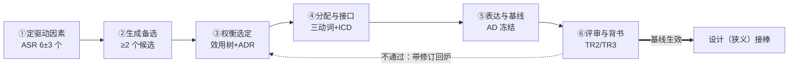

# 16-构思定义设计关系及架构活动精讲

> **文档编号**：16-构思定义设计关系及架构活动精讲
> **日期**：2026-08-25（v1.2）｜修订 2026-09-04（v1.3→v1.4）｜修订 2026-09-21（v1.4→v1.5）｜修订 2026-09-21（v1.5→v1.6 第二轮收口）｜修订 2026-09-21（v1.6→v1.7 依 29 号对齐架构治理口径）｜修订 2026-09-21（v1.7→v1.8 第四轮·依 27 号对齐 ISO 9000:2026）｜修订 2026-09-21（v1.8→v1.9 第六轮·依 24 号对齐架构与设计边界）｜修订 2026-09-21（v1.9→v2.0 第七轮·15288 版本锚定现行版 2023）｜修订 2026-09-21（v2.0→v2.1 第九轮·15288:2023 过程号结清）｜修订 2026-09-21（v2.1→v2.2 第十轮·依 23 号对齐判据口径）｜修订 2026-09-21（v2.2→v2.3 第十一轮·依 22 号对齐术语学权威层）｜修订 2026-09-24（v2.3→v2.4 第十三轮·依五份标准正本结清条款号）
> **2026-09-21 第十一轮·依 22 号对齐**（用户令「以 22 号研究报告，对齐其前的文档」；本版 **v2.2 → v2.3**）：以 **22 号《架构、概念、属性研究报告——术语权威定义与对照分析》**（v1.7）为准核本报告的术语权威层与清单化口径，得**一处内部自相矛盾、四处缺位**——① **"定义"的身份数统一为「三重身份」**（**冲突**，D17）：§11 术语表「定义」行原作「双重身份：动作义／流程义」，与 §3.3 标题「三重身份（必须随身携带）」及行内"三重身份共存是这个词最大的口径事故源"**自相矛盾**，且同一行仍以 ISO 1087:2019 §3.3.1 为锚——改回**三重身份**（动作义 defining／流程义 15288 §6.4.4／概念框架义 名词 definition，ISO 1087:2019 §3.3.1），并同步 §7 事故一的「一词两义」措辞（改"三重身份被压成一义"）；② **§3.3 补动／名产物关系与 AD ⊋ definition**（**缺位**）：`defining`（动）≠ `definition`（名）——后者是前者的**产物之一**（`definition ⊆ description`）；概念框架义那份表述文本与 **AD** 的关系是**包含**——**AD ⊋ definition**，AD 是 42010:2022 §3.4 Note 1 的 **11 类 AD elements** 的集合，**`definition` 不在其中**，只作为利益相关方／关注点／方面体内部的**文本片段**出现（22 号 §6.2、§6.3、§8.4）；③ **§1.3／§8.2 补 embodied-in 句的"去向"**（**缺位**，D14）：原两处只写「2022 定义句已删去 embodied in its elements, relationships」，未给出该层含义的着落——补明其**搬家 ＋ 降调**至 **42020:2019 §3.3 Note 1**（措辞改 components／组件间关系／实体与环境的关系，强度由「是」降为注释的「通常意指」，**注释级、无术语地位**），并**改正「（AD 元素）」这一误读**：2011 定义句的 elements／relationships ＝ **架构构成物**（架构层），**不是** AD element（描述层）——「要素与关系是架构构成物，不要叫它们 AD 元素」（22 号 §5.2.2、§6.2A、§8.2；24 号 §12.1、§13.2）；④ **§2.1／§2.4 补构思的哲学根据**（**缺位**，D9）：构思即 **Conception 派**（架构作为构思）的动作，与之并列的是**感知（perceive）→ properties**（Perception 派）与**描述（describe）→ AD**（第三层，独立于前两派）；"concepts **or** properties" 是为**不带偏见地兼容两种哲学**（*without prejudice*）而选的析取式，**两派之下架构都是抽象的——不是人工制品**（22 号 §5.4.1、§8.2）；⑤ **§2.4 补 42010 §3 未定义 concept／property 的夹注**（**缺位**，D8）＋ **§11「方面体」行释义改正**（**冲突**，D16／D24）：原「实体**特性**的客观切面（结构、行为、**实现**等）」改为 **aspect §3.9** *part of an entity's **character or nature***（实体**性格／性质**的一部分），标准 EXAMPLE 为 **functional／structural／informational**，并补 aspect 与 concern **多对多**；⑥ **§3.4 末补清单化的合法位置**（**缺位**，D15／D18）：「用基本概念＋属性清单定义架构」的合法位置是 **architecting（42010:2022 §3.1）七步动作集中 `defining` 一环**的产物，按 **aspect §3.9** 分块、住 **L3**——**"abstract" 不能读成 "list"**。**依据**：22 号 §3.6、§5.2.2、§5.4.1、§6.2、§6.3、§6.4、§7.3、§8.2、§8.4；基线 **D8、D9、D14、D15～D18、D24**。**未改**：§0～§2.3、§3.1～§3.2、§4～§6、§8.1／§8.3、§9～§10、§12～§13 的行文与结论；节号、表格行数、mermaid 图结构与清单条数一律未动（**本报告无 §7.4，本轮不新增节**；§1.3、§8.2 两处均为原地改写夹注）。
> **2026-09-24 第十三轮·依五份标准正本结清条款号（本版 v2.3 → v2.4）**：用户令依库内 ISO/IEC/IEEE 42010:2022／42020:2019／15288:2023 正本核本报告的条款号与逐字引文，得**六项改正**——① §1.1 排除项「架构设计（architectural design）」原挂 15288 §6.4.4 不成立：正本 §6.4.4 的规范过程名是 **System architecture definition process**，**全文无 `architectural design`**（该词见 42010:2022 附录 E），改按正本过程名并标该词出处（**G-39**）；② §1.2 关键性质原标「42010 **2011** §4.3；2022 已重编号，待核」→ **撤「待核」**：正本 42010:2022 **第 4 章只有 Conformance**，该内容在 **§3.1 architecting 与附录 E.2**（**G-17**）；③ §3.3 过程归位原称「与**管理、治理并列**」与正本分组矛盾：42020:2019 §5 的分组是**三分**——**§5.3 架构治理**与**管理**过程（治理与管理**同组**）／**§5.4 架构概念化、评估与细化**过程（**三个核心过程**）／**§5.5 架构使能**过程；改正为「属**核心过程组**（§5.4），**与「治理＋管理」组（§5.3）、「使能」过程（§5.5）并列**」，并**写全六过程**（§6 治理／§7 管理／§8 概念化／§9 评估／§10 细化／**§11 使能**），同步头部 v1.7 记录该句（**G-19／G-26**）；④ §1.3、§8.2 两处 embodied-in「搬家 ＋ 降调」补**时序按语**：**42020 在前、42010 在后**——42010:2022 §3.2 的 SOURCE 行写明其采用 **42020:2019 §3.3（modified）**，该层含义**由 42020 承接**，不是 42010 先有而后被搬走（**G-39** 后半）；⑤ **「Conception 派／Perception 派」加二手限定**（§2.1、§2.4、§11 术语表共三处，含 §2.1 释语一处）：正本 42010:2022 **附录 A.2** 逐字作 **"Architecture as concept"／"Architecture as property"**，全文检索 `Perception` **零命中**，故一律标注「二手转述派名」并附正本派名（**G-36**）；⑥ **`sufficient to enable` 换正本逐字**（**G-41**，G-6 的扩散面）：该串在 **15288:2023 全文零命中**，正本 §3.13 逐字为 *specification of system elements and their relationships, that is **sufficiently complete to support** a compliant implementation of the architecture*——§4.1 设计定义段、§4.3 标准腿表、§11 术语表「设计」行三处英文串改 *sufficiently complete to support*、中文定名作「**足够完整到足以支撑**」；同处「完整到足以支撑对架构的一次合规实现」的中译**是对的，保留不动**。**依据**：库内正本 42010:2022 §3.1／§3.2 SOURCE 行／附录 A.2、42020:2019 §5.3–§5.5／§6–§11、15288:2023 §3.13／§6.4.4／第 4 章；台账 02 号 §五 G-17／G-19／G-26／G-36／G-39／G-41。**未改**：节号、表格行数、mermaid 图结构与清单条数，一律未动。
> **v1.3 修订**：ISO 1087 引用全链升格现行版 ISO 1087:2019（definition 条款 §3.3.1，取代旧版 ISO 1087-1:2000；L169/177/184/514/515/521/531/562 及待办同步）；修正 L562"ISO 1087-1:2019"版本笔误；concept 权威定义标注 ISO 1087:2019 §3.2.7
> **v1.4 修订（2026-09-04）**：ISO/IEC/IEEE 42010 引用升格现行版——architecting（§3.1）/ architecture（§3.2）定义改 2022（entity、governing principles；2011 历史对照）；"三分法（elements/relationships/principles）"改述为内容对象注（2022 已剥离于定义句）；§0/§1.1/§1.3/§4.4/§8.3/§10/§11 术语表/§12.1 随迁。
> **v1.5 修订（2026-09-21）**：依 30 号对齐四概念——§11 术语表「架构」「关切」「视点」「视图」「架构描述」五行重写（补属概念与 GB/T 45630-2025 出处），新增 2022 新增概念六行；§6.2⑤ 概念链按 30 号 §2.6 改为 has／frames／governs／addresses 四关系；§1.3「落在 elements、relationships 上」改除 2011 语义（2022 已删去该分句）；§1.2/§1.3 译文 被架实体→所关注实体；术语位 视点→架构视角、生命周期→生存周期；§12.1 补 GB/T 45630-2025 行并改述 42010 概念链条目。
> **v1.6 修订（2026-09-21 第二轮收口）**：用户新裁定——fundamental 用「基本」，其余术语一律按 GB/T 45630-2025；上一轮「治理原则分流」作废。本版：① governing principles 一律作「管控原则」（§1.3 分界线、§11 术语表「架构」行，并新增「管控原则」术语行）；② life cycle 正文一律作「生存周期」（§0 图标签、§1.2 图与关键性质句；【历史对照】段按原文保留）；③ 定义句更新为 canonical 版；④「规格」口径（不用「规约」）。
> **v1.7 修订（2026-09-21 依 29 号对齐）**：用户令「以 29 号研究报告为依据，将之前有关的研究报告与之对齐」。本报告以架构活动（architecting）动词链为主体，与治理的接驳点集中在四处，按 29 号《架构治理研究报告》就地增补——①头部补「概念依据（架构治理）」行：架构治理的定义、目的、对象、输入输出、责任主体与机制一律以 29 号为准；并写明本报告用到的 governs 是概念模型的关系名，与架构治理不是同一用法（30 号 §3.7）；②§3.3 补架构定义流程在 42020 过程模型中的归位——属**核心过程组**（42020 §5.4 概念化／评估／细化），**与「治理＋管理」组（§5.3）、「使能」过程（§5.5）并列**（六过程：§6 治理｜§7 管理｜§8 概念化｜§9 评估｜§10 细化｜§11 使能），不是治理的下属步骤（29 号 §1.4）；③§3.4 补目的定义权的归属——「定义」动作在架构侧收敛方案，但**目的的定义权归治理机构**，架构师只有质询权与守护责（29 号 §3.1 前提一）；④§11 术语表「管控原则」行补治理侧接驳（该原则是 29 号 §7 六机制之首「架构原则与标准」，其变更只能由治理裁决，见 29 号 §2.2 判据三）。**未改**：§1～§2、§4～§10、§12、§13 的行文与全部图表结构、节号、表格行数，一处未动。〔2026-09-24 按：本行②所记旧表述「与治理过程并列（42020 §6 治理｜§7 管理）」与正本三组分组不合，已由第十三轮改为「属核心过程组（§5.4），与『治理＋管理』组（§5.3）、『使能』过程（§5.5）并列」；**本行其余文字为历史记录，不改写**（见 **G-19／G-26**）。〕
> **v1.8 修订（2026-09-21 第四轮·依 27 号对齐）**：用户令「以 27 号研究报告为依据，将之前有关的研究报告与之对齐」。本报告涉及 ISO 9000 的引用点共八处，按 27 号《ISO 9000:2026 相对 2015 版差异研究报告》全量迁移——①头部「术语约定」行的「条款号待核对」结清：requirement 2015 §3.6.4→**2026 §3.5.1**，specified requirement 在 **§3.5.1 注 2**；②§4.3、§5.2 四条标准腿与分形递归的 design and development 条款号 2015 §3.4.8→**2026 §3.3.11**（定义句逐字未变），并补注 3（限定词可指明设计开发对象的性质，如产品／服务／过程设计和开发；注 3 两版均有，2026 措辞微调）；③§10 核对声明、§11 术语表「设计」行、§12.1 出处清单、§13 待核清单第 1 项同步。**未改**：§1～§3、§4.1～§4.2、§4.4、§5～§9、§12.2～§12.3 的行文与全部图表结构、节号、表格行数。
> **2026-09-21 第六轮·依 24 号对齐**：用户令「以 24 号研究报告为依据，把 24 号之前的报告与之对齐」（本版 v1.8→v1.9）。本报告涉「架构与设计边界」的点按 24 号《架构与设计边界研究报告——从定义辨析到架构视角与架构视图》就地补正——①§4.1 狭义「设计」补 24 号 §1.2 的 design 定义（15288:2023 §3.13：系统元素及其关系的规格，**完整到足以支撑对架构的一次合规实现**）与「足以支撑／**合规的承担者是实现**」（24 号 §1.4、§10.7），§4.3 标准腿表、§11 术语表「设计」行、§12.1 出处清单同步；②§5.3 补夹注——「接力／下一棒／在门外」是**同一轮内的逻辑顺序**，**不是 15288 架构定义（§6.4.4）与设计定义（§6.4.5）两过程成阶段**（24 号 §8.2：两过程不是阶段，§5 允许迭代与并发，真实形态是同一时刻在相邻两个种类层上的两类工作；§8.1 关系 1、2 交替递归与同构），§7 事故二同此；③§8.2 三词分工表「架构」行改除 2011 语义（24 号 §1.2、§12.1：2022 定义句已删去 embodied in its elements, relationships，元素与关系改作架构描述的内容对象）；④§1.3／§6.2④／§11 术语表「接口控制文档」行「接口契约 = 工程师下半棵的 1:1 搬入点」补按——架构侧条目与实现层 system element 是**多对多映射**，不是 1:1（24 号 §12.3）。**未改**：§0～§3、§4.2、§4.4、§5.1～§5.2、§6.1、§6.2①～③、§6.3～§6.4、§7 的分段与结论、§8.1、§8.3、§9～§10、§12.2～§12.3、§13 的行文与全部图表结构、节号、表格行数。
> **2026-09-21 第七轮·15288 版本锚定**（本版 v1.9→v2.0）：15288 版本口径随第七轮统一锚定**现行版 2023**（2023-05 发布，替代 2015 版），号序未核对者不冒充现行号——§12.1 出处表 15288 行改以现行版为主的写法「ISO/IEC/IEEE 15288（**现行版 2023**；2015 为前版）」。**条款号核对状态**：**已核** 15288:2023 的 §3.13 design、§5、§6.4.1、§6.4.4／§6.4.4.1、§6.4.5／§6.4.5.1、§6.4.6（据 24 号 §1.2／§1.3／§12.4／附录 B）；**§6.4.7–§6.4.14 段各过程号已核**（据 INCOSE SEH 5.0 中文版 2023-07 所印 15288:2023 条款号，p132–p186）；**仍未核**的是 2015 版术语条款号在 2023 版的对应号，引用前以现行版原文复核。**未改**：§0～§11、§13 的行文与全部图表结构、节号、表格行数。
> **2026-09-21 第十轮·依 23 号对齐**（用户令「以 23 号研究报告，对齐其前的文档」；本版 **v2.1 → v2.2**）：以 **23 号《判据体系研究报告——从验证确认到治理的判据阶梯》**（v1.9）为准核本报告涉判据侧的断言，得一处冲突一处缺位——① **"评审＝架构的验证方式／验证关口"四处改正**（**冲突**）：§1.3 五维度表「**验证方式**｜测试｜评审」、§6.2⑥「架构的**验证关口**（架构靠评审验证，不靠测试）」、§6.3 表「认证（**验证关**）」、§1.2 七项动词表 certifying proper implementation「**验证**实现与架构一致｜评审异常清单」——按 23 号 §10.2 三处硬差别（review 用 `determination`、定义中**不出现 objective evidence**、判适宜性·充分性·有效性；verification／validation 用 `confirmation`、**必须** *through the provision of objective evidence*、判符合性）与 §10.3、§10.6 冲突 1：维度名改「**判定／把关方式**」，⑥ 处改"工作产品层的**替代判定**（technical review），结论为**条件性合规**"，"验证实现与架构一致"改「**架构符合性检查**（实现符合架构的举证）」；② **补一句总口径**（**缺位**）：§1.3 原文只说"合规的承担者是实现"、§6.2⑥ 又把评审当"验证关口"，各说一半——在 §1.3 表后补总口径「**工作产品侧只能评审、结论为条件性合规；真正的验证／确认在实现侧**」，§6.2⑥ 补互参。**依据**：23 号 §10.1、§10.2、§10.3、§10.6、§10.7；24 号 §4.3、§10.7。**未改**：§0、§1.1、§2～§5、§6.1、§6.2①～⑤、§6.4、§7～§13 的行文与结论；节号、表格行数、mermaid 图结构与清单条数一律未动（§1.3 表仍为五维度、§6.3 表仍为六行）。
> **概念依据**：架构、关注点、架构视角、架构视图四概念的定义、关系、界分与译名，一律以 30 号《架构描述核心概念研究报告》为准（依 GB/T 45630-2025／ISO/IEC/IEEE 42010:2022）。
> **概念依据（架构治理）**：架构治理（architecture governance）的定义、目的、对象、输入与输出、责任主体与机制，一律以 29 号《架构治理研究报告——从标准依据到责任主体》为准。本报告出现的「治理」有两处来源：定语位的 governing principles 取国标定名「管控原则」（**不是**治理职能），动词位的 governs（架构视角—架构视图的关系名）虽译「治理」但**无裁量者**——二者与架构治理只共用「治理」二字（30 号 §3.7）。
> **用语约定（2026-09-21 第二轮收口）**：术语一律按 GB/T 45630-2025 定名——viewpoint/view 作「架构视角／架构视图」，stakeholder 作「利益相关方」，concern 作「关注点」（行文中的「关切」为其同义语），life cycle 作「生存周期」（正文一律），governing principles 作「管控原则」（此处 governing 是**定语**，指具有约束力、可据以判定违规，与 architecture governance（架构治理）不是同一用法），specification 作「规格」；**唯一例外**：fundamental 自译作「基本」，逐字引国标时照抄「基础」。本文档的「系统」在架构描述语境下均读作所关注实体（entity of interest）。
> **来源**：AOS 概念框架建设讨论（2026-08-25，十二轮压问式精炼整理）
> **适用范围**：产品开发 / 系统工程 / 配置管理 / 架构方法论 / 创新管理
> **配套文档**：00-概念学习方法论、05-工程概念精讲、06/07-架构概念精讲、10-架构设计方法论全景、11/12/13-工程师能力与角色谱系精讲
> **术语约定**：requirement→需求；need→需要；expectation→期望；specified requirement→规定需求（参照 **ISO 9000:2026 §3.5.1**「requirement」术语定义，条款号已核对；specified requirement 见该条**注 2**："A specified requirement is one that is **stated**, e.g. in documented information"。ISO 9000:2015 同位术语为 §3.6.4）

---

## 0. 文档导读

**一句话总纲**：构思打开可能性，定义终结漂浮，设计转换到底——三者构成"接力 + 容器 + 迭代回环 + 分形递归"的关系网；顺序是逻辑蕴含，日历只是投影；这条动词链工程化为"生成六步"，而创新不在链上，它坐在链尾的评分席。

**阅读地图**：

| 章节 | 内容 | 对应问题 |
|---|---|---|
| §1 | 架构活动：母词与动词链 | 架构师比工程师多的东西，母词是什么？ |
| §2 | 构思（conceiving） | 什么是构思？ |
| §3 | 定义（defining） | 什么是定义？ |
| §4 | 设计（design） | 什么是设计？ |
| §5 | 三者关系（定型版） | 构思、定义、设计是什么关系？顺序如何？ |
| §6 | 系统架构生成六步 | 这条链怎么工程化？ |
| §7 | 架构生成的替换辨误 | 能说"架构构思+架构定义+架构设计"吗？ |
| §8 | 构架 vs 架构 vs 框架 | 口语"把 XX 构架出来"是什么意思？ |
| §9 | 创新与构思·定义·设计 | 创新和这条链是什么关系？创新可工程化吗？ |
| §10 | 权威来源四层证据 | 本文每个论断的证据强度分几层？ |
| §11 | 术语表 | 术语怎么对齐？ |
| §12 | 标准与文献出处清单 | 依据在哪里？ |
| §13 | 待办 / 欠项 | 还有什么没做完？ |

**总览 Mermaid**：

```mermaid
flowchart TB
    subgraph ACT["架构活动 architecting（ISO/IEC/IEEE 42010:2022 §3.1，贯穿生存周期）"]
        direction LR
        C1["构思 conceiving<br/>打开可能性"] --> C2["定义 defining<br/>终结漂浮"]
        C2 --> C3["表达 expressing"]
        C3 --> C4["记录 documenting"]
        C4 --> C5["沟通 communicating"]
        C5 --> C6["认证 certifying<br/>proper implementation"]
        C6 --> C7["维护与改进 maintaining<br/>and improving"]
        C7 -.生存周期内反复发生.-> C1
    end

    subgraph SIX["系统架构生成六步（动词链的工程化）"]
        direction LR
        S1["①定驱动因素<br/>ASR"] --> S2["②生成备选<br/>≥2 个候选"]
        S2 --> S3["③权衡选定<br/>效用树+ADR"]
        S3 --> S4["④分配与接口<br/>partition/align/allocate"]
        S4 --> S5["⑤表达与基线<br/>AD 冻结"]
        S5 --> S6["⑥评审与背书<br/>TR2/TR3"]
    end

    ACT ---|"工程化为"| SIX

    S6 -->|"基线生效<br/>设计接棒"| DES["设计 design（狭义）<br/>ISO/IEC/IEEE 15288 §6.4.5<br/>转换到底"]
    DES -.|"迭代回环：发现缺陷<br/>打回定义（或更上游）"| C2
    DES -.|"分形递归：子系统/模块层<br/>重复同一轮"| C1

    DES -->|"价值兑现"| INN["创新 innovation<br/>（链尾评分席：够新 × 成了）<br/>ISO 56000"]
```

---

## 1. 架构活动：母词与动词链

### 1.1 六块增量的母词

架构师相对工程师的六块能力增量——**架构决策、关注点管理、质量权衡、抽象建模、技术领导、演化对齐**——其母词是 **architecting（架构活动）**。

> **ISO/IEC/IEEE 42010:2022 §3.1**（现行；2011 为历史对照）：
> *architecting — the process of **conceiving, defining, expressing, documenting, communicating, certifying proper implementation of, maintaining and improving** an architecture throughout the life cycle of an entity of interest.*
>
> 译：在所关注实体的整个生存周期内，构思、定义、表达、记录、沟通、认证恰当实现、维护与改进架构的过程。
>
> 【历史对照】2011 版尾句为 *an architecture throughout a system's life cycle*（"系统生命周期"）；主体由 system 扩为 entity of interest（所关注实体可为企业/产品/流程/数据等）。

映射关系（动词 → 能力增量）：

| 42010 动词 | 对应能力增量 |
|---|---|
| conceiving（构思） | 关注点管理（从关注点中挑出值得架构的问题并生成候选） |
| defining + 选择（定义） | 架构决策 + 质量权衡 |
| expressing + documenting（表达 + 记录） | 抽象建模 |
| communicating + certifying（沟通 + 认证） | 技术领导 |
| maintaining and improving（维护与改进） | 演化对齐 |

**排除项**：
- **架构设计（architectural design）**——15288 §6.4.4 的规范过程名是 **System architecture definition process**（系统架构定义过程），**该标准全文无 `architectural design`**（该词见 42010:2022 附录 E 对 12207／15288 用词更窄的讨论），覆盖面不足；
- **架构师（architect）**——42010 未给此词立词条，标准只认活动不认头衔。

**中译**：采用"架构活动"（13-§9 术语表既定译法），拒绝"架构设计"。

### 1.2 七项动词一览

| 动词 | 中文名 | 一句话 | 主要产品数据 |
|---|---|---|---|
| conceiving | 构思 | 从关注点出发生成候选架构概念 | 候选概念清单 |
| defining | 定义 | 画边界、做选择，收敛为确定方案 | 选定架构 + ADR |
| expressing | 表达 | 把架构翻译为一组各有其主的视图 | 架构视图 |
| documenting | 记录 | 把视图与决策固化为 AD（架构描述） | AD 文档 |
| communicating | 沟通 | 让各利益相关方理解并达成共识 | 评审陈述、培训 |
| certifying proper implementation | 认证恰当实现 | 架构**符合性检查**（实现符合架构的举证） | 评审异常清单 + 行动项 |
| maintaining and improving | 维护与改进 | 对抗架构腐化（drift / erosion） | 基线变更、ADR 更新 |

关键性质（42010 **2022 版已重编号至 §3.1 architecting 与附录 E.2；已核**；原引 2011 §4.3 系 2011 版条序）：七项动词**贯穿生存周期反复发生**，不是串行阶段。

### 1.3 架构师 vs 工程师：五维度能力差异（12-§3 详版）

| 维度 | 工程师 | 架构师 | 锚点 |
|---|---|---|---|
| **决策域** | 局部、可逆 | 全局、**难逆** | SWEBOK |
| **认知对象** | 规定需求（specified requirement） | **关注点（concern）** | 42010 |
| **判定／把关方式** | 测试（对规定需求，属**验证**） | **评审**——工作产品层的判定，不要求客观证据 | IEEE 1028 |
| **时间尺度** | 当下（本版本交付） | 跨版本**演化** | 42010 evolution |
| **能力灵魂** | 契约与证据 | **决策与理由（rationale）** | 12-§3.5 |

其中"认知对象"与"判定／把关方式"是五维度中最锋利的两个——它们是六块增量的锋利投影：requirement→concern 对应关注点管理与抽象建模；测试→评审对应架构决策与演化对齐的证据形态。

> **总口径：工作产品侧只能评审、结论为条件性合规；真正的验证／确认在实现侧（依 23 号 §10.1～§10.3、§10.6；24 号 §4.3、§10.7）**——分三层读：① **两把尺子判的不是一回事**——评审（ISO 9000:2026 §3.11.2）用 `determination`、判**适宜性·充分性·有效性**（对为客体确立的目标），**定义中不出现客观证据**；验证（§3.11.12）／确认（§3.11.14）用 `confirmation`、**必须** *through the provision of objective evidence*、判**符合性**（分别对规定需求／对为预期用途或应用的需求）。故"评审"不是"验证"，是判据阶梯上并列的另一级（23 号 §5.1、§10.2）。② **架构侧只能出替代判定**——架构描述（AD）是**工作产品**、**不能被"使用"**，对它做不了验证、更做不了确认；标准给的替代是**工作产品层的替代判定**（IEEE 1028 technical review），它只是"实现之前的**可判定代理**"，**合规的承担者是 implementation**，故结论只能是**条件性合规**（若实现如承诺则合规）（23 号 §10.3、§10.6 冲突 1）。③ **合规举证在实现侧**——本表的"测试"属验证（对实现出的客体提供客观证据）；架构侧产出的是**符合性检查的依据**，不是"验证证据"（24 号 §4.1、§4.3）。

**分界线**：architecture 定义的构成——**基本概念或属性（fundamental concepts or properties）**，以及该实体及其相关生存周期过程的实现和演化的**管控原则**（governing principles；此处 governing 是定语，指具有约束力、可据以判定违规）（GB/T 45630-2025, 3.2／42010:2022 §3.2）。**2022 定义句已删去 embodied in its elements, relationships，不再以元素与关系界定架构**；该层含义**并非消失，而是搬家 ＋ 降调**——迁入 **ISO/IEC/IEEE 42020:2019 §3.3 Note 1**：措辞由 elements／relationships 改为 **components／组件间关系／实体与环境的关系**，强度由定义正文的「**是**」降为注释的「**通常意指**」（*usually intended to be embodied in*），**注释级、无术语地位**（22 号 §5.2.2、§7.2；24 号 §13.2）。〔按：**时序不可倒置**——42010:2022 §3.2 的 SOURCE 行写明其采用 **42020:2019 §3.3（modified）**，即 **42020 在前、42010 在后**；该层含义是**由 42020 承接**（在该册 §3.3 Note 1 给出），不是 42010 先有而后被搬走。〕2011 定义句的 elements／relationships 是**架构构成物**（**架构层**），**不是** **AD element**（**描述层**，42010:2022 §3.4 的 11 类）——**要素与关系是架构构成物，不要叫它们 AD 元素**（22 号 §6.2A、§8.2〔三层区分〕；24 号 §12.1）。（【历史对照】2011 曾把 elements / relationships / principles of design and evolution 并列于定义句。）工程师的棋盘是元素，架构师的棋盘是元素+关系+演化。

**核心结论**：**工具不变，棋盘变大**——判断、权衡、沟通、担责这些工具，工程师和架构师用的是同一套；变的是决策对象的范围。产品数据上对应"上半棵/下半棵"：架构师做枝干+枝梢（接口契约 = 工程师下半棵叶子的 1:1 搬入点），工程师做叶子（12-§3.6、13-§7）。〔按：架构侧的接口约定与实现层的系统元素（system element）之间是**多对多映射**，不是 1:1——一个架构槽位可落到多个系统元素，一个系统元素也可承载多条架构约束（24 号 §12.3）；此处"搬入点"指承接关系的**位置**，不是数量对应。〕

---

## 2. 构思（conceiving）

### 2.1 定义（定型版）

> **构思**：从利益相关方关注点出发，生成多个候选架构概念的**发散性概念活动**——产物是"可能是什么"，不是"决定是什么"。

〔哲学定位：在 42010 配套页的两哲学里，构思即 **Conception 派**（**架构作为构思**——架构是存在于人脑中的系统概念）的动作；与之并列的是**感知（perceive）→ properties**（**Perception 派**——二手转述派名；42010:2022 附录 A.2 的正本派名作 **"Architecture as property"**，与 **"Architecture as concept"** 并列，全文无 `Perception` 一词——架构是观察者对系统属性的感知）与**描述（describe）→ AD**（**第三层，独立于前两派**）。"concepts **or** properties" 这一析取式正是为**不带偏见地兼容两种哲学**（*without prejudice*）而选；**无论哪一派，架构都是抽象的——不是人工制品**，表达与记录架构的是 AD（22 号 §5.4.1、§8.2 三个动词表；详见 §2.4 B 层）。〕

### 2.2 词源

拉丁 **concipere** = con（收进来）+ capere（拿、握取）——"怀在脑中"，如同受孕。它的基因是**孕育可能性**，不是做决定。

### 2.3 三特征

| 特征 | 含义 | 反面（不是构思） |
|---|---|---|
| **发散** | 不止一个候选 | 直接给唯一解 |
| **概念** | 停在骨架层，不下沉到实现细节 | 写伪代码 |
| **有方法** | 模式库、参考架构、第一性原理 | 等灵感 |

第三特征"有方法"是创新可工程化的核心证据（见 §9.3）。

### 2.4 权威来源（诚实标注）

- **A 层（标准原文，可直接引用）**：42010 architecting 动词链**第一词**。⚠️ 关键诚实点：标准**用了**这个词，但**没有给它立词条定义**。
- **B 层（标准间交叉印证）**：
  - 15288 §6.4.4 架构定义流程任务清单里有"生成可行候选架构（candidate architectures）"——标准层面对构思最接近的操作化；
  - 42010 的 architecture 定义首词是 **fundamental concepts**——构思的产物类型被架构定义预设（**42010 §3 Terms and definitions 未定义 `concept`／`property`**——2011 §3.1～§3.10 与 2022 §3 均无此两条，二者按 ISO/IEC Directives Part 2 以**普遍接受的含义**使用，此处 `concepts` ≈ **idea／notion**，勿读作 ISO 1087:2019 §3.2.7 严谨义的"知识单元"；22 号 §3.6、D8）；
  - 42010 配套页（iso-architecture.org"Defining architecture"）的两哲学定位——**构思即 Conception 派**（架构作为构思：架构是人脑中的系统概念）的动作；与之**并列**的是**感知（perceive）→ properties**（**Perception 派**：二手转述派名，正本作 **"Architecture as property"**；架构是观察者对系统属性的感知）与**描述（describe）→ AD**（**第三层，独立于前两派**）。"concepts **or** properties" 这一析取式是为**不带偏见地兼容两种哲学**（*without prejudice*）而选；**无论哪一派，架构都是抽象的——不是人工制品**（*Under either philosophy, an architecture is abstract — not an artifact*），表达与记录架构的是 AD（22 号 §5.4.1、§8.2 三个动词表、§5.6；D9）。
- **C 层（词源与学术传统）**：con + capere。
- **D 层（本文综合）**：三特征（发散 / 概念 / 有方法）。

---

## 3. 定义（defining）

### 3.1 定义（定型版）

> **定义**：在候选之间**画边界**，使选定方案从"多义"变为"单义"、从"漂浮"变为"确定"的活动——把可能性收敛为一个被承诺的架构。

### 3.2 词源

拉丁 **definire** = de（往下、直到）+ finis（边界、终点）——"划到边界为止"。同根词：finish、final。定义的本质动作是**终结漂浮**。

跨域印证（B 层）：ISO 1087:2019（术语工作国际标准，§3.3.1）对 definition 的定义是"**用以把一个概念与相关概念区分开来**的表述"——区分即画边界。注意：这是术语学定义，非工程学定义，本文用作跨域印证。

### 3.3 三重身份（必须随身携带）

| 身份 | 词性 | 出处 | 含义 | 覆盖范围 |
|---|---|---|---|---|
| **动作义** | 动词（defining） | 42010 动词链 | 画边界、做选择 | 狭——收敛这一个动作 |
| **流程义** | 流程名（architecture definition process） | 15288 §6.4.4 架构定义流程 | 完整技术流程 | 广——**内部第一件事就是构思，还包含表达与文档化** |
| **概念框架义** | 名词（definition） | ISO 1087:2019 §3.3.1（术语工作标准） | 界定一个概念的表述文本本身（如术语表里的词条） | 中——产出物，不是过程 |

**悖论揭示**：架构定义流程的第一件事是构思——流程义的"定义"包住了动作义的"定义"的上游。三重身份共存是这个词最大的口径事故源：同一句"架构定义"，可以指动作（画边界）、流程（15288 技术流程）、或产出（界定表述）——进文档前必须先声明取哪一义（§7 详述）。

**动／名之辨与 AD 的关系（依 22 号 §6.3、§8.4；D17）**：`defining`（**动**）≠ `definition`（**名**）——后者是前者**产物之一**（`definition ⊆ description`，**AD ⊇ definition**）。概念框架义的那份"表述文本"与 **AD（架构描述，42010:2022 §3.3 *work product used to express an architecture*）** 的关系是**包含**：**AD ⊋ definition**——AD 是 42010:2022 §3.4 Note 1 的 **11 类 AD elements** 的集合（利益相关方／关注点／利益相关方角度／方面体／ADL／ADF／对应关系／架构视图／视图组件／架构视角／模型种类），**`definition` 根本不在其中**，只作为利益相关方／关注点／方面体内部的**文本片段**出现（22 号 §6.2、§6.3、§8.4）。故"AD 是一份对架构的 definition"与"AD = definition"都是精度事故——**包含，不是等同**。

〔过程模型中的归位：架构定义流程在 42020:2019 §5 的**三组**分类里**属核心过程组**——**§5.4 架构概念化、评估与细化**过程（**三个核心过程**），**与「治理＋管理」组（§5.3）、「使能」过程（§5.5）并列**，不是治理的下属步骤——治理在管理层之上定方向与框架，架构定义流程则在框架内产出架构（15288:2023 §6.4.4.3 Note 1 所称 *three core processes* 即此三个；六过程写全为 **§6 治理／§7 管理／§8 概念化／§9 评估／§10 细化／§11 使能**；29 号 §1.4、§2.2）。〕

### 3.4 权威来源

- **A 层**：42010 动词链（动作义）；15288 §6.4.4 / §6.4.5（流程名义）。
- **B 层**：ISO 1087:2019 §3.3.1"区分概念"（跨域印证"画边界"）。
- **C 层**：de + finis。
- **D 层**："终结漂浮"的三字概括。

〔归属限定（治理侧）：动作义"定义"收敛的是**方案**，不是**目的**——目的的定义权归治理机构，架构师只有质询权与守护责，"定义"到架构为止，止于治理给定的目的与框架之内（29 号 §3.1 前提一、§2.2 判据三）。〕

〔清单化的合法位置（依 22 号 §6.4、§7.3、§8.2；D15～D18）：「用**基本概念＋属性清单**定义架构」不是 42010 的反命题，而是 **architecting（42010:2022 §3.1）七步动作集中 `defining` 一环**的产物；该清单按 **aspect（§3.9）**分块呈现（functional／structural／informational 等），住 **L3（概念＋属性清单）**——L1 抽象本体**不可**清单化、L2 definition 集**半可**、L4 关系与原则、L5 AD。**"abstract" 不能读成 "list"**：抽象的是 L1 的本体，可列的是 L3 的清单。〕

---

## 4. 设计（design）

### 4.1 定义（定型版，一词两义必须分开说）

> **广义**：为满足利益相关方需要（desired needs）而对系统、部件或流程进行**迭代决策与创造的容器过程**（ABET）——构思与定义都是它的子活动。
>
> **狭义**：以**生效的架构基线**为输入，产出**系统元素及其关系的规格**、**完整到足以支撑对架构的一次合规实现**的过程（design，15288:2023 §3.13；过程名见 §6.4.5 设计定义）。其职责止于"**足够完整到足以支撑**"（*sufficiently complete to support*，15288:2023 §3.13）——**合规的承担者是实现（implementation），不是设计描述**（24 号 §1.2、§1.4、§10.7）。

### 4.2 词源

拉丁 **designare** = de（出来）+ signare（做记号）——"做记号标出来"。设计基因里的动作是**把意图标记成可传递的形式**。

### 4.3 四条标准腿

| 来源 | 定义要点 | 贡献 |
|---|---|---|
| **ABET**（工程教育认证） | engineering design = devising a system/component/process to meet desired needs，**iterative decision-making** 过程，creative、open-ended | "容器"说法来源 |
| **ISO 9000:2026 §3.3.11** | 设计和开发 = 把对象的需求**转换为该对象更详细的需求**的过程集 | 需求→更详细需求，可逐层套用（递归性显式锚点在 15288：流程按系统层级递归应用）；注 3（两版均有，2026 措辞微调）：限定词可指明设计开发对象的性质（如产品／服务／**过程**设计和开发） |
| **ISO/IEC/IEEE 24765**（SEVOCAB） | design 双义：既是过程，也是该过程的结果 | 过程与结果双义 |
| **ISO/IEC/IEEE 15288 §6.4.5／§3.13** | 设计定义流程；design ＝系统元素及其关系的**规格**，完整到足以支撑对架构的一次**合规实现** | 狭义"下游细化"来源；职责止于 *sufficiently complete to support*（**足够完整到足以支撑**，15288:2023 §3.13；原记 `sufficient to enable` 系库外措辞、正本零命中）（24 号 §1.2、§10.7） |

### 4.4 权威来源

- **A 层**：上表四条腿。
- **B 层**：42010 现行架构定义里嵌着 governing principles for the realization and **evolution**（2011 写作 principles of its design and evolution）——"实现/演化（design/evolution）"嵌于 architecture 定义内部。
- **C 层**：de + signare。
- **D 层**："转换到底"的三字概括。

---

## 5. 三者关系（定型版）

### 5.1 一句话

> **构思打开可能性，定义终结漂浮，设计转换到底。**

### 5.2 四条关系

| # | 关系 | 内容 | 一句话 |
|---|---|---|---|
| ① | **接力** | 构思 → 定义 → 表达 →（基线生效）→ 设计（狭义） | 可能性先于选择，选择先于展开 |
| ② | **容器** | 广义设计 ⊃ 构思 + 定义（+ 表达） | 三者并列时，"设计"必须降为狭义下游义 |
| ③ | **迭代回环** | 设计发现架构缺陷 → 打回定义、甚至打回构思 | 不是瀑布，是回环 |
| ④ | **分形递归** | 系统 → 子系统 → 模块，每个层级重复同一轮"构思-定义-设计" | 15288：流程按系统层级递归应用；ISO 9000:2026 §3.3.11「需求→更详细需求」可逐层套用 |

**容器关系的细化**（构思与设计的关系，第 6 轮定型）：构思是广义设计的 **creative 半场**——ABET 的 engineering design 定义明写 iterative、creative、open-ended，构思正是其中"打开可能性"的发散部分，设计（过程整体）负责把它收敛、转换到底。所以"构思 vs 设计"不是两个流程的对比，而是**同一个容器内发散段与全段的对比**。

```mermaid
flowchart TB
    subgraph CONTAINER["广义设计（ABET 容器）：iterative · creative · decision-making"]
        direction LR
        C["构思<br/>打开可能性<br/>con+capere 怀在脑中"] -->|"画边界<br/>de+finis"| D["定义<br/>终结漂浮"]
        D -->|"翻译为视图"| E["表达"]
        E --> F["记录"]
    end

    F -->|"AD 评审通过<br/>基线生效"| G["设计（狭义）<br/>15288 §6.4.5<br/>转换到底<br/>de+signare 做记号"]
    G -.|"③迭代回环<br/>发现缺陷打回"| D
    G -.|"③打回更上游"| C

    subgraph RECUR["④分形递归（每个层级重复）"]
        direction LR
        R1["系统层"] --> R2["子系统层"] --> R3["模块层"]
    end

    G ~~~ RECUR
```

### 5.3 顺序声明（最终版）

> **同一层级、同一轮循环内，顺序唯一且不可倒置**（构思→定义→表达/记录→细化）；但这个顺序是**逻辑蕴含**（生成→选择→展开），**日历只是投影**——宏观上三者交错反复，是因为你在看多个层级的循环叠在一起。

三尺度对照：

| 尺度 | 形态 | 说明 |
|---|---|---|
| 微观（单次决策） | **直线** | 生成→选择→展开，一次走完 |
| 中观（单层级项目） | **回环** | 设计打回定义、评审回炉，反复迭代 |
| 宏观（跨层级、跨版本） | **层级交错** | 系统层、子系统层、模块层的循环并行重叠 |

**设计（狭义）是下一棒**：在门外等着，基线一生效就接手。

〔按：以上"接力／下一棒／在门外"是**同一层级、同一轮循环内**的逻辑顺序（§5.3 首段：顺序是逻辑蕴含，日历只是投影），**不可读成 15288 架构定义（§6.4.4）与设计定义（§6.4.5）两个过程成阶段**——两过程**不是阶段**：15288 §5 允许迭代与并发，"先架构定义后设计定义"是瀑布式误读；真实形态是**同一时刻在相邻两个种类层上的两类工作**（24 号 §8.2）。两者且**交替递归**（上一层设计定义的输出 = 下一层架构定义的输入对象）与**同构**（同一套活动族，同一种工作做两遍）（24 号 §8.1 关系 1、2）。本文各图（§0 总览、§5.2、§6.1）中"基线生效 → 设计接棒"的画法同受此限。〕

---

## 6. 系统架构生成六步

### 6.1 六步总览



> ⚠️ **术语诚实声明**：15288 §6.4.4 里 generate 严格说只是第②步的任务动词（生成**候选架构**）；把六步全过程叫"架构生成"是本文的 D 层借代用法（§7、§10）。

### 6.2 逐步详解

#### ① 定架构驱动因素（ASR）

- **目的**：从关注点中挑出值得架构的问题——架构驱动因素（Architecturally Significant Requirements）。
- **筛选三标准**：影响面广、难逆转、约束硬。
- **纪律**：6±3 个——太多等于没有优先级，太少说明没筛。
- **锚点**：SEI ATAM（架构权衡分析法）。

#### ② 生成备选

- **目的**：打开可能性——呼应构思的"发散"特征。
- **纪律**：**≥2 个候选**，否则没有权衡可言（唯一解 = 未审视的解）。
- **三来源**：模式映射（architecture pattern × 战术）、参考架构、第一性原理。
- **陷阱**：稻草人备选——造一个注定输的陪跑方案，让预定方案"胜出"。

#### ③ 权衡选定

- **目的**：终结漂浮——定义动作义的核心。
- **怎么做**：效用树（utility tree，ATAM 方法：质量属性→场景，按重要性×难度 H/M/L 打分）→ 场景走查 → 敏感性分析 → 落 ADR（架构决策记录，含**复审条件**）。
- **拍板权**：SE 主持拍板（L4 拍板权/理由权，13-§5），架构师提供决策与理由。

#### ④ 分配与接口

- **目的**：把选定的架构概念落到元素与契约上——定义动作义的深水区。
- **SEBoK 三动词**：
  - **partition**（分割）：按"会一起变的"分组——Parnas 信息隐藏原则；
  - **align**（对齐）：每条驱动因素有承接者；
  - **allocate**（分配）：功能/质量/资源定量到元素。
- **产出**：ICD（接口控制文档）= 模块间宪法；**派生需求回流**（架构决策派生出对下游的新需求，必须回流需求基线）。
- **这是架构师真正"做产品数据"的地方**（上半棵产品数据：枝干+枝梢；接口契约 = 工程师下半棵的搬入点——**映射为多对多，不是 1:1**，见 §1.3 按语；24 号 §12.3）。

#### ⑤ 表达与基线

- **目的**：把选定架构翻译成一组一致视图并冻结为受变更控制的基线——expressing + documenting 的落地。
- **42010 概念链**：利益相关方 —**has**→ **关注点 concern**；**架构视角 architecture viewpoint** —**frames**→ 关注点、—**governs**→ **架构视图 architecture view**（由**视图组件**组成，组件可为受**模型种类**约束的模型，或表格／清单／决策记录等非模型片段）；架构视图 —**addresses**→ 关注点；**架构描述 AD（属概念：工作产品）** 包含架构视图 → 纳入基线。**四动词不可互换（30 号 §3.1）；governs 是概念模型中的元素关系，与架构治理不是同一用法（30 号 §3.7）。**
- **现成架构视角集**：4+1（逻辑/过程/开发/物理+场景）、C4（上下文/容器/组件/代码）。
- **"刚好够"纪律**：视图数量刚好覆盖本视角框定的关注点；**视图与关注点并非一一对应**（30 号 §4.2），一个架构视图只受一个架构视角治理，需同时交代两类关注点时**拆视图或拆视角**（30 号 §3.4）。多一张是浪费，少一张是失职。地铁图原则：删掉一切不服务于本视图关注点的东西。
- **冻结**：AD + ADR 一起纳入配置管理（ISO 10007），评审通过后定格，改动走基线变更流程。
- **陷阱**：上帝视图（一张图回答所有关注点）；为画图而画图（说不出"这张图回应谁的什么关注点"）；模型腐化（代码改图不改：drift 漂移累积成 erosion 架构腐蚀——对应动词链最后两项的失守）。

#### ⑥ 评审与背书

- **目的**：架构的**把关关口**——**工作产品层的替代判定**（technical review：架构靠评审把关，不靠测试；**结论为条件性合规**，真正的验证／确认在实现侧，见 §1.3 总口径；23 号 §10.3、§10.6，24 号 §10.7）+ 组织合法化——**没有背书的架构，只是架构师的个人意见**。
- **怎么做**：
  - 架构师主笔评审包（AD 视图 + ADR + 权衡记录）并当陈述方——理由只活在架构师脑子里和 ADR 里，这步不能外包；
  - SE 主持，评审员**有资质且覆盖关注点面**（性能关注点没有性能专家在场，那张视图等于没审）；
  - **对质三问**：回应了谁的关注点？决策的理由是什么（ADR）？被否掉的备选死因是什么？
  - **评审四看**（检验架构评审材料是否齐全的口诀）：**①概念陈述**（架构概念说清了吗）**②选定+ADR**（为什么是它、备选死在哪）**③视图/基线**（AD 冻结受控了吗）**④回炉痕迹**（上一轮异常闭环了吗）——四看缺一，材料就是半成品；
  - 产出落档：异常清单 + 行动项逐条闭环（IEEE 1028 的评审产出就这两样）；
  - TR2/TR3（IPD 技术评审点）通过 → 基线正式生效 → 放行进入下游。
- **陷阱**：评审变汇报（只有陈述没有对质）；评审员无资质（背书变背锅）；只看图不看理由；异常不闭环。

### 6.3 六步与动词链、构思/定义/表达/认证的对接

| 六步 | 对应 42010 动词链 | 对应构思/定义/表达/认证 |
|---|---|---|
| ① 定驱动因素 | conceiving（从关注点里挑出值得架构的问题） | 构思的瞄准 |
| ② 生成备选 | conceiving（打开可能性） | 构思的主体 |
| ③ 权衡选定 | defining（画边界、终结漂浮） | 定义的核心动作 |
| ④ 分配与接口 | defining（边界落到元素与契约上） | 定义的深水区 |
| ⑤ 表达与基线 | expressing + documenting | 表达 |
| ⑥ 评审与背书 | certifying proper implementation | 认证（把关关口，非验证关口） |

### 6.4 三纪律与口诀

**三条纪律（生成 ≠ 画图）**：
1. **驱动因素先于图**——没有 ASR 就开始画图的架构活动是装饰；
2. **决策先于图**——视图只是 ADR 的投影；
3. **基线先于图**——不受变更控制的 AD 不是架构，是草图堆。

**口诀**：**驱动选准、备选成对、权衡留证、接口立宪、视图刚好、评审对质。**

六步里最容易被跳过的是②③（直接从需求跳到"唯一解"画图——Cowboy Coding 在架构层的翻版）；工作量最容易被低估的是④（partition/align/allocate 加 ICD，才是架构师真正"做产品数据"的地方）。

---

## 7. 架构生成的替换辨误

**命题**：架构生成，可以替换成"架构构思 + 架构定义 + 架构设计"吗？

**裁决**：**不能。** 三个事故：

### 事故一：定义口径漂移

三词并列要求"定义"取动作义（画边界 = ③④）。但"架构定义"作为标准术语是 15288 §6.4.4 的**流程名**——流程义的定义本身包含候选生成、评估选定、视图表达、文档化。并列使用等于强迫读者把"定义"读窄——**三重身份（§3.3）被压成一义**，口径当场漂移。

### 事故二：设计位置错位

设计定义（15288 §6.4.5）的输入是**已生效的架构基线**——在六步里，设计接棒的位置在⑥背书生效**之后**。把设计画进生成过程，等于把回环的出口画进了入口。而若取 ABET 容器广义，"构思"和"定义"本来就在设计容器**里面**——三者是**包含关系，不是并列关系**。两头都堵死。

〔按："接棒位置在⑥之后"仍是**同一轮内的逻辑位置**，不是把 §6.4.4 与 §6.4.5 读成先后阶段——**两过程不是阶段**（24 号 §8.2）。设计定义对架构定义的关系，按 24 号 §8.1 为：**产物约束**（§3.13 合规实现，关系 5）＋ **权威不对等**（改架构的独占权在架构定义侧，设计定义只能发起 ACR 或要求重做权衡，关系 6）。〕

### 事故三：表达缺位

生成过程的直接产出是 AD（架构描述）——第⑤步表达与基线。三个候选词里没有"表达"，架构就永远停在脑子里，产品数据上什么都没落。这恰恰是动词链 expressing + documenting 的位置，是"上半棵产品数据"真正的落笔处。

### 正确替换

| 想说的事 | 正确说法 |
|---|---|
| 生成过程的分段 | 构思（①②）→ 定义·动作义（③④）→ 表达（⑤） |
| 生成的完整闭环 | 构思 + 定义 + 表达 + **认证**（⑥评审背书） |
| 设计是什么 | 生成的**下一棒**：基线生效后 §6.4.5 才接手 |

**口诀**：生成三段——构思、定义、表达；认证补上才是完整闭环；设计在门外，等基线生效再进。

**口语公道话**：日常说"架构构思、架构定义、架构设计"无伤大雅；但进文档、进评审、进产品数据，必须按上述口径切干净——"架构定义"锁定动作义（或锁定流程义并说明它覆盖全程），"架构设计"永远排在基线生效之后。

---

## 8. 构架 vs 架构 vs 框架

### 8.1 "把 XX 构架出来"里的构架

**一行结论**：构架是**名词的动词化**——本义"搭建承重骨架"，指把事物的主干结构从无到有立起来；口语里它干的事，恰好是六步①～⑤的工程动作（构思→定义→表达），是"架构生成"的民间说法。

**拆字**：
- **构（構）**：《说文》"盖也，从木"——用木料架屋，基因就是"搭建"这个动作（结构、构造、构思都是它的后代）；
- **架**：支撑东西的骨架、格架；
- **构架**合成后本义是**建筑物的承重骨架**（木构架、钢构架，建筑领域今天还在这么用）。

语素结构是**"动+名"（构·架）**，类比"砌墙""搭桥"——这种词天然容易被整体当动词用，所以"把 XX 构架出来"语法上毫不别扭。而"架构"是定型名词，硬当动词用会硌牙——英语同理：architecture 当动词被批，才专门造出 **architecting**；中文口语干脆把动词的活儿甩给了"构架"。

### 8.2 三词分工

| | 构架 | 架构 | 框架 |
|---|---|---|---|
| 英文对译 | skeleton / 骨架（历史上也曾译 architecture） | **architecture**（主流定型，国标术语） | framework（现主流） |
| 本义 | 承重骨架（木构架） | 间架结构（古汉语指房屋构造） | 框子、约束边界 |
| 现代分工 | 偏**物理骨架**、结构意象 | 抽象物 + **实现与演化的管控原则**（2022 定义句＝**基本**概念或属性 ＋ 管控原则；2011 定义句的 elements/relationships 已删出，其含义**搬家 ＋ 降调**至 **42020:2019 §3.3 Note 1**——措辞改 **components／组件间关系／实体与环境的关系**，强度降为注释的「**通常意指**」，**注释级、无术语地位**；它们是**架构构成物**（架构层），**不是** AD element（描述层）——22 号 §5.2.2、§6.2A；24 号 §1.2、§12.1、§13.2。〔按：**时序不可倒置**——该层含义**由 42020:2019 §3.3 Note 1 承接**，**42020 在前、42010 在后**（42010:2022 §3.2 的 SOURCE 行写明采用 42020:2019 §3.3，modified），不是 42010 先有而后被搬走。〕 | 可复用半成品（软件框架，如 Spring） |
| 动词化 | 自由："构架出来" | 生硬——所以才需要 architecting | 少见 |

**历史注**：构架曾是 architecture 的竞争译名——RUP 时代中文材料大量用"软件构架"，后来"架构"胜出定为主流（国标与业界通用），构架退回"骨架"本义阵地。（C 层记忆，凭当年材料印象，待核对。）

### 8.3 锋利的那一刀

"构架出来"自带一个陷阱：它的默认验收标准是**骨架可见**——图上有了框、有了线，就算"构架出来了"。但 architecture 定型的灵魂是**决策与演化原则**（42010：基本概念或属性；2022 的 governing principles for realization & evolution，2011 写作 elements、relationships、**principles** of design and evolution）。

用"构架思维"做架构，最容易产出那种——图很漂亮、框很齐，但问"为什么这么分、被否掉的备选死在哪"没人答得上的东西。**骨架立起来了，理由还悬在空中**——这正是"画图匠"和"架构师"的分界线，在口语里的投影。

口语"构架出来"≈ 六步①～⑤的工程动作投影，**默认不含⑥评审背书与 ADR 沉淀**。

**收束**：构架立骨架、架构定决策、框架给半成品。

---

## 9. 创新与构思·定义·设计

### 9.1 命题裁决："创新的主要动作是构思而非设计"——只对四分之一

**三家标准口径一致：创新 = 新 × 成。**

- **ISO 56000:2020**（创新管理体系·词汇）：创新 = 创造或重新分配价值的**新对象或变更对象**——落点在"价值被创造出来"，不在"想法很新"；
- **奥斯陆手册**（OECD）：创新必须"已被提供给潜在用户或投入使用"——没落地的改进不叫创新；
- **熊彼特**（1912《经济发展理论》）：创新 = **执行**生产要素的新组合——发明是新想法的诞生，创新是新组合的**兑现**。

构思只供给"新"这个因子；"成"的因子，大头在定义（收敛、选择）和设计（转换到底、兑现价值）。创业圈那句糙话是这个原理的口语版：**idea 一文不值，execution 才是一切**。

### 9.2 四类创新，四张主战场（Henderson & Clark 1990 四分型）

| 创新类型 | 换什么 | 主导动作 | 例子 |
|---|---|---|---|
| **突破式**（radical） | 概念与连接全换 | **构思 + 定义 + 设计**（全链） | 从功能机到 iPhone |
| **架构式**（architectural） | 元件不动、**连接重排** | **定义**（重新画边界、重新 partition） | 电动车滑板底盘：电池电机都成熟，重新分块 |
| **模块式**（modular） | 元件换新、连接不动 | 构思（元件概念）+ 设计 | 换个新传感器，接口不变 |
| **渐进式**（incremental） | 元件微调、连接不动 | **设计**（下半棵叶子的活） | 工艺改良、Kaizen |

第二行是"创新主要靠构思"最锋利的反例：**架构式创新的主导动作恰恰是"定义"**——一个概念都不用新造，只要把边界重新画、元素重新分组，就能颠覆一个行业。

另：对立本身不成立——ABET 的设计定义明写 creative、open-ended；TRIZ（创造性问题解决理论）就长在设计过程内部。把设计矮化成执行，解释不了为什么绝大多数工程创新诞生在设计阶段。

**定型**：**构思管"有没有"，定义管"活不活"，设计管"成不成"——主导动作随创新类型在三者间滑动；只有突破式创新才是构思主导。**

### 9.3 创新可以被工程化吗？——可以，但精确到对象

**一行结论**：创新的**流程、方法、组织、组合**可以被工程化（ISO 56001 就是可认证的证据）；**不可工程化的是单点结果的确定性**。工程化管漏斗的形状和流量，不管哪一滴水通过。

| 对象 | 手段 | 锚点 | 能承诺什么 |
|---|---|---|---|
| 流程 | Stage-Gate 门径、出口条件 | Cooper；ISO 56002 | 每步有判定、有证据 |
| 方法 | TRIZ、设计思维、模式库 | Altshuller | 构思不靠等灵感 |
| 组织 | 创新管理体系 | **ISO 56001:2024（可认证，与 9001 同构）** | 资源、角色、度量制度化 |
| 组合 | 漏斗、portfolio 下注 | ISO 56005/56007 | 吞吐量与期望值可控 |
| **单点结果** | —— | 青霉素、便利贴 | **无——命中不可承诺** |

- ISO 56000 家族：56000（词汇）、56001（要求）、56002（指南）、56003（创新伙伴关系）、56005（知识产权管理）、56006（战略情报）、56007（创意管理）。
- 它承诺的是 **repeatable**（创新持续、制度性地发生），不是某一次创新成功。
- 偶然性真实存在（青霉素=弗莱明的度假失误、便利贴=失败的胶水）。巴斯德"机会偏爱有准备的头脑"的工程化解读：**准备可以被工程化，机会本身不能**。
- 六步生成本身就是"架构创新工程化"的模板：ASR 管瞄准、模式库管发散、效用树+ADR 管选择、接口基线背书管兑现。
- 工程化不消灭创造力，是给创造力修跑道：灵感出现时（1）不被流程闷死，（2）有足够多的入场券，（3）死也死得有证据（ADR）。

**口诀**：体系管重复，方法管发散，组合管概率；**单点交给运气，漏斗交给工程**。

### 9.4 四者关系（定型版）

**一行结论**：构思、定义、设计是动词，创新是名词（结果属性）——**创新不在这条动词链上，它坐在链尾的评分席**。

**先纠一个范畴错误**："我们去创新吧"——和"我们去成功吧"是同一类语病。你能**做**的是构思、定义、设计、开发；**创新**是对动作结果的**追认**。ISO 56000:2020 里 innovation 定义为"创造或重新分配价值的**新对象或变更对象**"——名词，是 object（对象），不是 activity（活动）。

**口径说明**：熊彼特（1912）的"创新=执行新组合"取**活动义**——那一步的"做"；ISO 56000:2020 取**结果义**——被创造出来的新实体。本文统一取结果义："创新"是对动作结果的追认；熊彼特的活动义对应的是链上的构思/定义/设计动作本身。两家不冲突，冲突的是把"创新"一词混用。

| # | 关系 | 内容 |
|---|---|---|
| ① | **判定关系** | 创新评判链的产出：够新吗（新颖性）×成了吗（价值兑现）。缺一归零：只有新没成 = 点子/发明；只有成没有新 = 优化/复现 |
| ② | **入口关系** | 新颖性从链上哪一段进入，取决于创新类型：突破式从**构思**进，架构式从**定义**进，渐进式从**设计**进 |
| ③ | **兑现关系** | 创新的成立条件钉在链尾：价值必须经设计、实现、上市才兑现——设计不是创新的配角，而是创新的**收银台** |

| 维度 | 创新 | 构思 / 定义 / 设计 |
|---|---|---|
| 范畴 | 结果属性、价值判定 | 过程动作、工序 |
| 学科出身 | 经济学/管理学（熊彼特、ISO 56000） | 工程/系统科学（42010、15288） |
| 时态 | 事后追认（价值兑现后才能盖印） | 事中执行（动词链上反复发生） |
| 工程化对象 | 组合期望（漏斗、portfolio） | 流程与方法（Stage-Gate、TRIZ） |

**口诀**：**链上的活干完了，够新又成了，才被追认为创新。**

---

## 10. 权威来源四层证据

本文所有论断的证据强度分四层，引用时可按层标注：

| 层级 | 性质 | 强度 | 本文涉及内容 |
|---|---|---|---|
| **A 标准原文** | 可直接引用 | 硬 | 42010 architecting 动词链（用了 conceiving/defining 但未单独立词条定义）、15288 §6.4.4 候选生成任务、15288 §6.4.5 设计定义、ISO 9000:2026 §3.3.11、ISO/IEC/IEEE 24765 design 双义、ABET engineering design、ISO 56000:2020 innovation、ISO 56001:2024、ISO 1087:2019 §3.3.1 definition=区分概念的表述 |
| **B 标准间交叉印证** | 需拼接 | 较硬 | conceiving↔fundamental concepts（42010 架构定义首词）、design/evolution 嵌于 architecture 定义（2022：governing principles for realization & evolution；2011：principles of its design and evolution）、ISO 1087:2019 §3.3.1"区分概念"→"画边界" |
| **C 词源与学术传统** | 解释力强，非标准 | 中 | con+capere / de+finis / de+signare；构架/架构译名竞争史；奥斯陆手册、熊彼特、Henderson-Clark 四分型（学术经典层） |
| **D 本文综合** | 可挑战、可推翻 | 待验证 | 三特征、三字概括（打开可能性/终结漂浮/转换到底）、四关系、顺序=逻辑蕴含日历只是投影、六步工程化、两个口诀、创新滑动定理 |

**D 层声明**：四关系（接力/容器/回环/分形）、"顺序是逻辑蕴含、日历只是投影"、六步工程化、口诀——**没有任何单一标准原文这么写**。它们是 A 层多家标准交叉推理出来的结构，检验方式是拿标准原文对质。

**核对声明**：本文条款号（如 42010 的 architecting 词条位置、ISO 1087:2019 §3.3.1 的 definition 条款）已按 ISO 1087:2019 现行版核对（概念定义见 §3.2.7，definition 见 §3.3.1，取代旧版 ISO 1087-1:2000）；ISO 9000 的 requirement 与 design and development 两条已按 **ISO 9000:2026** 核对（分别为 §3.5.1、§3.3.11；2015 同位为 §3.6.4、§3.4.8）。引用时建议区分"A 层（已核对原文）/ A 层（凭记忆，待核对）"。

---

## 11. 术语表

| 术语 | 英文 | 本文定型说法 | 锚点 |
|---|---|---|---|
| 架构活动 | architecting | 在所关注实体的整个生存周期内构思、定义、表达、记录、沟通、认证恰当实现、维护与改进架构的过程；六块能力增量的母词 | ISO/IEC/IEEE 42010:2022 §3.1（2011 历史对照） |
| 构思 | conceiving | 从利益相关方关注点出发，生成多个候选架构概念的发散性概念活动；产物是"可能是什么"。两哲学中的 **Conception 派**（架构作为构思＝人脑中的系统概念），与**感知（perceive）→ properties**（Perception 派；二手转述派名，正本作 **"Architecture as property"**）、**描述（describe）→ AD**（第三层）并列；"concepts **or** properties" 即两哲学兼容的析取式 | 42010 动词链第一词（未单独定义）+ 15288 §6.4.4 交叉印证 + 42010 配套页两哲学（22 号 §5.4.1、§8.2；D9） |
| 定义 | defining | 在候选之间画边界，使方案从多义变单义、从漂浮变确定；**三重身份**（§3.3）：动作义（画边界，defining）／流程义（15288 §6.4.4，内部第一件事是构思）／概念框架义（名词 definition——界定一个概念的表述文本本身，如术语表里的词条；`defining` 的**产物之一**，与 AD 的关系是**包含**：AD ⊋ definition） | 42010 + 15288 + ISO 1087:2019 §3.3.1（22 号 §6.3、§8.4；D17） |
| 设计 | design | 一词两义：广义 = ABET 容器（迭代决策与创造的容器过程）；狭义 = 产出**系统元素及其关系的规格**、完整到足以支撑对架构的一次合规实现的过程（职责止于**足够完整到足以支撑** *sufficiently complete to support*，15288:2023 §3.13；**合规承担者是实现**） | ABET + ISO 9000:2026 §3.3.11 + 24765 + 15288:2023 §3.13／§6.4.5（24 号 §1.2、§10.7） |
| 架构 | architecture | 实体在其环境中的**基本**概念或属性，以及该实体及其相关生存周期过程的实现和演化的**管控原则**（governing principles；此处 governing 是**定语**，指具有约束力、可据以判定违规，与 architecture governance（架构治理）不是同一用法）；系统只是所关注实体的一例；2011 曾作"系统的基本概念与属性，体现为元素、关系及设计与演化原则"【历史对照】 | fundamental 自译作"基本"；逐字引 GB/T 45630-2025, 3.2 照抄"基础概念或属性……管控原则……生存周期过程"；ISO/IEC/IEEE 42010:2022, 3.2（源自 42020:2019, 3.3） |
| 管控原则 | governing principles | 42010:2022 的定义用语（2011 曾写作 principles of design / of evolution）；此处 governing 是**定语**，指具有约束力、可据以判定违规，与 architecture governance（架构治理）不是同一用法。治理侧接驳：它即治理六机制之首「架构原则与标准」，**变更只能由治理裁决**（29 号 §7、§2.2 判据三） | ISO/IEC/IEEE 42010:2022, 3.2；29 号《架构治理研究报告》§7 |
| 构架 | （skeleton） | 名词动用，本义"搭建承重骨架"；口语"把 XX 构架出来"≈ 六步①～⑤的投影 | 《说文》构="盖也"；C 层 |
| 框架 | framework | 可复用半成品（软件框架）；三词分工：构架立骨架、架构定决策、框架给半成品 | 业界通用 |
| 架构生成 | （本文 D 层借代） | 构思（①②）→ 定义·动作义（③④）→ 表达（⑤），补认证（⑥）成完整闭环；15288 里 generate 严格说只是②的任务动词 | 本文综合 |
| 架构驱动因素 | ASR (Architecturally Significant Requirements) | 从关注点中筛出的值得架构的问题；筛选三标准：影响面广、难逆转、约束硬；6±3 个 | SEI ATAM |
| 效用树 | utility tree | 质量属性→场景，按重要性×难度（H/M/L）打分的权衡工具 | SEI ATAM |
| 架构决策记录 | ADR (Architecture Decision Record) | 记录决策+理由+被否备选死因+复审条件的档案；架构文档的灵魂 | 业界实践（L. Bass 等） |
| 接口控制文档 | ICD (Interface Control Document) | 模块间宪法；接口契约 = 工程师下半棵产品数据的搬入点（映射为**多对多**，不是 1:1——24 号 §12.3） | 15288 / ISO 10007 |
| 架构描述 | AD (Architecture Description) | 用于表达架构的**工作产品**（属概念：工作产品），提供给利益相关方的信息的有形表示；内容以架构视图（含视图组件）为主，可含对应关系与架构决策及理据 | GB/T 45630-2025, 3.3／ISO/IEC/IEEE 42010:2022（30 号 §2.5） |
| 关注点 | concern | 与一个或多个利益相关方相关的、就该实体而言的重要事项（GB/T 45630-2025 定名）；由架构视角框定（frames），不是"视角的驱动源"；2011 逐字 interest in a system…见 30 号 §2.2【历史对照】 | GB/T 45630-2025／ISO/IEC/IEEE 42010:2022 |
| 架构视角 | architecture viewpoint | 规定架构视图如何构建、解读和使用的一套约定，用来框定特定的关注点（属概念：**工作产品**） | **42010:2022 §3.8**／GB/T 45630-2025 3.8——逐字**待正式文本核对**（状态见 `90-治理登记/02-标准条款号核对表.md`） |
| 架构视图 | architecture view | 组成架构描述的一部分的**信息部件**（属概念：信息部件），由视图组件组成（组件可为受模型种类约束的模型，或表格／清单／决策记录等非模型片段）；2011 曾作 work product expressing…【历史对照】 | GB/T 45630-2025, 3.7／ISO/IEC/IEEE 42010:2022 |
| 视图组件 | view component | 视图的可分离构成部分；可为模型，或由图例治理的非模型片段 | ISO/IEC/IEEE 42010:2022 |
| 模型种类 | model kind | 模型的类别，由其基本特征、条件与建模约定界定 | ISO/IEC/IEEE 42010:2022 |
| 方面体 | aspect | **实体性格／性质（character or nature）的一部分**——*part of an entity's character or nature*；标准 EXAMPLE 为 **functional／structural／informational**；用于 analyse, address and structure concerns，与关注点（concern）是**多对多**关系（§3.9 注 2） | ISO/IEC/IEEE 42010:2022 **§3.9**（2022 新增；22 号 §7.3、§12 第 13 行；D16／D24——`character` 译「性格／性质」，**不取「特性」**，特性留给 `characteristic`） |
| 利益相关方角度 | stakeholder perspective | 依角色、经验、信念形成的思虑方式，是关注点的一个来源 | ISO/IEC/IEEE 42010:2022（2022 新增） |
| 对应关系 / 对应方法 | correspondence / correspondence method | AD 元素之间的关系，以及为满足这些关系所规定的规则与手段 | ISO/IEC/IEEE 42010:2022（2022 新增） |
| 架构决策与理据 | architecture decision and rationale | 架构决策及其理由；2022 新增概念，ADR 是其记录形态 | ISO/IEC/IEEE 42010:2022（2022 新增） |
| 所关注实体 | entity of interest (EoI) | 架构描述的主题（企业/组织/系统/过程/数据等皆可） | ISO/IEC/IEEE 42010:2022 |
| 利益相关方 | stakeholder | 对所关注实体有兴趣的个人、团队、组织或其类别 | GB/T 45630-2025 定名 |
| 生存周期 | life cycle | 规范译名（GB/T 45630-2025／22032／8566 体系）；正文一律用「生存周期」（【历史对照】段与逐字引文按原文保留） | — |
| 创新 | innovation | 创造或重新分配价值的新对象或变更对象；新×成，缺一归零；链尾的追认，不在动词链上 | ISO 56000:2020 |
| 架构式创新 | architectural innovation | 元件不动、连接重排；主导动作是"定义"（重新画边界）——创新主靠构思的最锋利反例 | Henderson & Clark 1990 |
| 架构腐蚀 | erosion / drift | 代码改图不改：drift 漂移累积成 erosion 腐蚀；动词链最后两项（维护与改进）失守的结果 | Perry & Wolf / 学术传统 |
| 信息隐藏 | information hiding | partition 按"会一起变的"分组 | Parnas 1972 |

---

## 12. 标准与文献出处清单

### 12.1 国际标准（A 层）

| 编号 | 名称 | 本文引用点 |
|---|---|---|
| GB/T 45630-2025 | 系统与软件工程——架构描述（等同采用 ISO/IEC/IEEE 42010:2022，2025-11-01 实施） | 中文术语定名的依据；架构（3.2）、架构视图（3.7）等中文规范文本 |
| ISO/IEC/IEEE 42010:2022（2011 历史对照） | 系统与软件工程——架构描述 | §3.1 architecting 动词链（conceiving/defining/expressing/documenting/communicating/certifying/maintaining）；architecture 定义（fundamental concepts or properties + governing principles for realization & evolution；2011 曾作 fundamental concepts / elements / relationships / principles of design and evolution）；贯穿生存周期反复发生；概念链四关系 has／frames／governs／addresses（30 号 §2.6），视图由视图组件组成、组件受模型种类约束 |
| ISO/IEC/IEEE 15288（**现行版 2023**；2015 为前版） | 系统与软件工程——系统生存周期流程 | §6.4.4 架构定义流程（含"生成候选架构"任务——构思的操作化；流程义"定义"）；§6.4.5 设计定义流程（狭义"设计"）；现行版 design 定义句见 **§3.13**（24 号 §1.2） |
| ISO 9000:2026 | 质量管理体系——基础和术语（GB/T 19000—2016 为 ISO 9000:2015 的等同采用；新国标修订版等同采用 2026 版，尚在起草、未发布） | §3.3.11 设计和开发（需求→更详细需求，可逐层套用；递归性显式锚点在 15288；注 3 限定词指明设计开发对象性质）；§3.5.1 requirement（specified requirement 见注 2；2015 同位分别为 §3.4.8、§3.6.4） |
| ISO/IEC/IEEE 24765:2017 | 系统和软件工程——词汇（SEVOCAB） | design 双义（过程与结果）；systems engineering 定义 |
| ISO 1087:2019 | 术语工作与术语科学——词汇（取代旧版 ISO 1087-1:2000） | definition = 用以把一个概念与相关概念区分开来的表述（§3.3.1；"画边界"的跨域印证）。注：concept 权威定义亦在此标准，见 §3.2.7 |
| ISO 10007:2017 | 质量管理——技术状态（配置）管理指南 | 基线与变更控制（⑤ AD 冻结） |
| ISO 56000:2020 | 创新管理——基础和术语 | innovation = 创造或重新分配价值的新对象或变更对象 |
| ISO 56001:2024 | 创新管理体系——要求 | 可认证的创新管理体系（与 9001 同构） |
| ISO 56002 / 56003 / 56005 / 56006 / 56007 | 创新管理家族 | 56002 指南、56003 伙伴关系、56005 知识产权、56006 战略情报、56007 创意管理 |

### 12.2 机构定义与文献（A/C 层）

| 来源 | 本文引用点 |
|---|---|
| ABET（工程与技术认证委员会） | engineering 定义（profession/judgment/economically）；engineering design 定义（iterative decision-making、creative、open-ended——"容器"来源） |
| IEEE 1028 | 评审类型与产出（异常清单+行动项） |
| INCOSE | 系统工程定义（跨学科/超学科） |
| SWEBOK（软件工程知识体系，IEEE Computer Society） | 工程师/架构师决策域对比（局部可逆 vs 全局难逆）的锚点 |
| SEI（卡内基梅隆软件工程研究所） | ATAM 架构权衡分析法（ASR、效用树）；Bass 等架构文档实践 |
| SEBoK（系统工程知识体系） | 架构定义活动；partition/align/allocate 三动词 |
| Parnas (1972) | 信息隐藏原则（partition 按"会一起变的"分组） |
| Henderson & Clark (1990) | 创新四分型（突破式/架构式/模块式/渐进式）——《架构创新》，Administrative Science Quarterly（行政科学季刊）35(1) |
| 熊彼特（1912） | 《经济发展理论》：创新=执行新组合；发明≠创新 |
| 奥斯陆手册（OECD） | 创新须"已被提供给潜在用户或投入使用" |
| Perry & Wolf | 架构腐蚀（erosion/drift）学术传统 |
| Cooper | Stage-Gate 门径管理 |
| Altshuller | TRIZ（矛盾矩阵、40 条发明原理、ARIZ） |
| 《说文解字》 | 构（構）："盖也，从木" |
| IPD（集成产品开发） | TR2/TR3 技术评审点 |

### 12.3 本文 D 层综合（无单一标准原文支撑，可挑战）

- 构思三特征（发散/概念/有方法）；三字概括（打开可能性/终结漂浮/转换到底）；
- 四关系（接力/容器/迭代回环/分形递归）；
- "顺序是逻辑蕴含、日历只是投影"三尺度（微观直线/中观回环/宏观交错）；
- 六步工程化（定驱动→生成备选→权衡选定→分配与接口→表达与基线→评审与背书）及三纪律、口诀族（六步口诀、评审四看、对质三问、创新工程化口诀）；
- "架构生成"作为全过程之名的借代用法声明；
- 创新滑动定理（主导动作随创新类型在构思/定义/设计间滑动）与"链尾评分席"结构。

---

## 13. 待办 / 欠项

| # | 事项 | 状态 |
|---|---|---|
| 1 | 条款号逐条核对原文（42010 architecting 词条位置、42010 concern→viewpoint→view→model 概念链条款号、15288 §6.4.4 任务清单措辞）——注：ISO 1087:2019 的 concept（§3.2.7）/ definition（§3.3.1）条款已按现行版核对；**ISO 9000 的 requirement（2026 §3.5.1，specified requirement 见注 2）与 design and development（2026 §3.3.11）已按 27 号结清** | ⏳ 部分核对（ISO 1087、ISO 9000 已核；42010／15288 余凭记忆待核） |
| 2 | "构架曾是 architecture 竞争译名"（RUP 时代"软件构架"）的译名史证据 | ⏳ 待核对（C 层记忆） |
| 3 | Henderson-Clark 四分型（§9.2）各类型「主导动作」的映射属本文综合（四分型本身为 H&C 原文，C 层），可再学术对质 | ⏳ 可深化 |
| 4 | 与 06/07/10 号架构笔记的交叉引用对齐（架构描述概念链已在 06 详述，本文 §6.2⑤ 为精讲版） | ⏳ 待对齐 |

---

*本文是"构思→定义→设计"概念链十二轮压问式精炼的定型沉淀。上游：12/13 号笔记（能力与角色）；下游：待续的架构活动方法论展开。*
