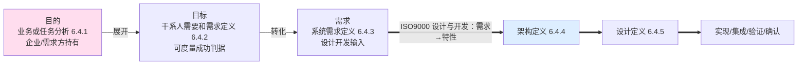
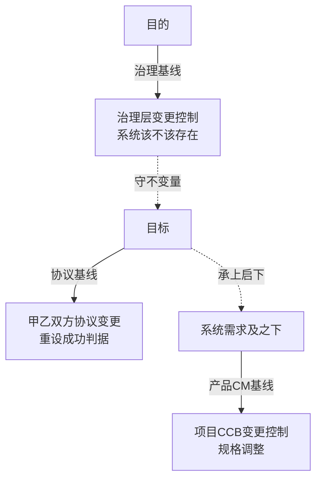

# 17 - 设计与开发边界及三层基线治理 对照卡

> 本卡整理自一轮对话线（起点："理解设计与开发的定义，目的→目标的定义过程是否属于设计与开发范围"），顺次覆盖：
> 设计与开发定义 → 目的/目标/需求 是否属设计与开发 → 需求定义责任方 → 目的/目标是否纳入配置管理 → 治理基线/协议基线定义 → 两概念的权威出处说明。
> 独立新卡，**未改动任何现有研究报告**（06/07/08/10/12）。与 `04-配置管理概念研究报告-从配置定义到商业价值.md` 互补——04 聚焦基线本身（功能/分配/产品基线），本卡覆盖从"设计开发边界"到"基线治理"的完整链路。

---

## 〇、标准锚点（全程引用）

| 概念 | 标准出处 | 关键原文/位置 |
|---|---|---|
| 设计与开发 | ISO 9000:2015 §3.4.8 | 将对客体的**要求**转换为对其**更详细的要求**的一组过程（输入=要求，输出=更详细特性/规格） |
| 系统生命周期技术流程 | ISO/IEC/IEEE 15288 | 6.4.1 业务或任务分析 → 6.4.2 干系人需要和需求定义 → 6.4.3 系统需求定义 → 6.4.4 架构定义 → 6.4.5 设计定义 → 6.4.7 实现 |
| 目的 | 42010:2022 / 15288 6.4.1 | 系统为什么被研制的理由（价值侧，可虚） |
| 目标 | ISO 9000 §3.7.1 + §3.11.2 | objective = 要实现的结果（result to be achieved）；评审参照 = established objectives（规定的目标） |
| 需求 | ISO 9000 §3.6.4 | requirement = 需要或期望（明示/隐含/必须履行三形态） |
| 基线 | ISO 10007:2017 §3.2 | 产品/服务在某时点正式评审并约定的一组特性，作为全生命周期活动与变更控制的参照 |
| 协议 | 15288 §3.4 | agreement = 工作关系的相互确认（如合同/谅解备忘录）；用于获取方与供应方之间 |
| 配置管理 | ISO 10007:2017 | 标识、变更控制、状态记录、审核 |

---

## 一、设计与开发的准确定义

**ISO 9000:2015 §3.4.8（设计与开发）**：
> 将对客体的**要求**转换为对其**更详细的要求**的一组过程。
> （注 1：构成设计和开发**输入的要求**通常是研究的结果；这些要求通常从**特性**方面来规定。）

**刀锋所在**：设计与开发的**起点是"要求（需求）"**，它把需求转成更详细的特性/规格。故**"需求"是设计与开发的输入，不是设计与开发本身**。

---

## 二、目的 → 目标 → 需求 是否属于设计与开发

**结论**：目的→目标→需求 的定义过程，**不属于（供方视角的）设计与开发**，它是设计与开发的**输入端与触发前提**（问题空间/需要定义），而非解空间/方案设计。

### 标准落点表（15288 技术流程）

| 概念 | 15288 落点 | 属于"设计与开发"吗 |
|---|---|---|
| **目的**（为什么被研制） | 业务或任务分析 **6.4.1**（问题空间，企业/需求方持有） | ❌ 上游、输入端 |
| **目标**（预期达成的可度量结果） | 干系人需要和需求定义 **6.4.2**（可度量成功判据） | ❌ 需要/需求定义阶段，仍在上游 |
| **需求**（自身可验证规格） | 系统需求定义 **6.4.3**（设计开发输入） | ❌ 输入，尚未进入 |
| 架构 / 详细设计 | 架构定义 **6.4.4** / 设计定义 **6.4.5** | ✅ 设计与开发核心 |

### 三层结论
1. **严格（ISO 9000 §3.4.8）**：设计与开发 = 需求→更详细特性。目的→目标→需求 是"**产生这些需求**"的上游过程，在设计与开发**之外（上游）**。与"定义架构前必先定义目的"完全自洽。
2. **广义（15288 全生命周期）**：目的→目标 属"开发"生命周期最前端的**需要/需求定义技术流程**（6.4.1–6.4.2），但须与"架构定义(6.4.4)/详细设计(6.4.5)"分开——前者是**问题空间/需要定义**，后者是**解空间/方案设计**。
3. **责任归属（呼应"架构师不拥有目的"）**：目的由企业/需求方（治理、战略）持有；目标是供需双方就"成功判据"达成的协议（6.4.2 产出书面协议）；供方设计与开发从（系统）需求起算。架构师对目的的职责是"理解/确认/使架构承接"，**不是定义目的**。

### 收束图

（粉=问题空间/需要定义，上游、非设计与开发；蓝=解空间/设计与开发核心）

---

## 三、需求定义由谁负责

**责任分两端——需方持有"需要侧"，供方负责"技术侧"：**

| 概念 | 定义责任方 | 标准落点 | 角色 |
|---|---|---|---|
| **目的** | 企业 / 治理层（需方） | 6.4.1 业务或任务分析 | 持有、战略侧；架构师只**确认/承接**，不定义 |
| **目标** | 需方主导 + 供方协议 | 6.4.2 干系人需要和需求定义（书面协议） | 成功判据，双方共识 |
| **干系人需求** | 需方 | 6.4.2 | 需要侧 |
| **系统需求** | 供方（系统工程师 / 架构师桥梁） | 6.4.3 系统需求定义 | 设计开发输入，技术侧 |

一句话：**目的企业持有，目标供需共签，系统需求供方落地**。架构师是桥梁——把目的/目标**转化承接**为系统需求，对可落地下技术责任，但不拥有目的。

---

## 四、目标、目的要不要纳入配置管理

**结论**：都要"受控"，但**机制分级**——目的走治理级变更控制，目标走协议/需求基线受控，需求走经典产品 CM。**三者不是都作为"产品配置项"同等管理。**

**理由**：
- 42030:2019 以 intended purpose 为架构评价依据 → 目的/目标一变，架构有效性随之动摇 → **必须受控变更**。
- CM 本质（ISO 10007）：对"变更会影响产品符合性的对象"做标识+变更控制。凡变了动摇架构的，就该受控。
- 但**目的不是产品本身**，是产品须 conform to 的上位 invariant → 故目的作为**治理基线**受控，而非作为产品配置项受 CM 日常管控（与需求的本质差别）。

### 分级受控表

| 概念 | 是否纳入 CM | 受控机制 | 变更触发 |
|---|---|---|---|
| **目的** | 治理基线受控（非产品 CI 日常管控） | 治理级变更控制（企业） | 目的漂移 = 系统该不该存在的危机（判例 AG-01） |
| **目标** | 协议 / 需求基线受控 | 变更控制（供需协议） | 评审/确认参照变化，重设成功判据 |
| **需求** | 经典 CM | 配置标识 + 基线 + 变更控制 | 规格调整 |

**落点（呼应"产品数据"）**：《系统目的或任务理解确认清单》（目的）+《系统基本概念和基本属性清单》+ 需求基线，作为核心产品数据统一受控。三层基线——目的在治理基线、目标在协议基线、需求在产品 CM 基线——**分级管控，但都受控可追**。

---

## 五、治理基线 / 协议基线 定义

### 基线（baseline）是标准术语
ISO 10007:2017 §3.2：基线 = 产品在某时点**正式评审并约定**的一组特性，此后作为后续工作与**变更控制**的参照。需求基线、设计基线皆此意。

### 治理基线（本框架复合词）
"治理基线" = 基线的一个切片——把"变了就是系统该不该存在/什么绝不能动"的项目单独拎出，交给**治理层（企业/战略）**而非项目管理来管。
- **装什么（被守护的 invariant）**：① 系统目的（即《系统目的或任务理解确认清单》）② 架构原则 / 关注点基线 ③ 治理红线（合规/法规/安全等 obligatory 硬杠）
- **谁能动**：只有治理层。项目管理层（管理）无权改——对应"治理在管理层之上定组织方向与框架（指导、监督、问责）、管理在框架内执行"（ISO/IEC 38500:2024 口径）。
- **存在理由**：目的归治理机构、不在执行者手里，委托后目的可能**无声漂移**（AG-01 即目的漂移处置链，见 08 号）；治理机构须对组织持续行使指导、监督、问责，把架构保持在目的上。故须把"目的+原则+红线"**正式冻结成治理基线**——既是架构评价参照（42030 以 intended purpose 为依据），又是评估漂移的基准。

### 协议基线（本框架复合词）
"协议基线" = 由**需方与供方正式约定**后冻结的那组"成功判据"，主要是**目标（objectives）**及双方确认的干系人需求。绑定来源不是治理权威，而是**甲乙双方协议**。
- **装什么**：① 目标 / 成功判据（operational objectives，MOE 源头）② 双方约定的干系人需求
- **谁能动**：需方 + 供方共同——走**获取协议（acquisition agreement）变更流程**，非项目管理单边改、非治理层独断。
- **存在理由**：评审参照 = 所规定目标（§3.11.2）；确认最显性的用途即目标。若目标不冻成协议基线，供方可随意拉低"成功"，需方失抓手。故目标须**双方约定冻结**。
- **注意**：从此向下转化的**系统需求**不在此层，进**产品 CM 基线**（供方技术侧）。协议基线管"甲乙双方约定层"，产品 CM 基线管"供方实现层"。

---

## 六、三层基线对照（含与目的→目标→需求 映射）

| 基线 | 装什么 | 变更权威 | 变更意味 | 标准落点 |
|---|---|---|---|---|
| **治理基线** | 目的 + 原则 + 红线 | 治理层（企业/战略） | 系统该不该存在的危机（判例 AG-01） | 42030 intended purpose 为评价依据 |
| **协议基线** | 目标 + 约定的干系人需求 | 需方 + 供方协议 | 重设成功判据 / 重谈承诺 | 15288 6.4.2 agreement |
| **产品 CM 基线** | 系统需求 + 设计 + 实现 | 项目 CM 变更控制（CCB） | 规格调整，正常工程动作 | ISO 10007 baseline |

---

## 七、⚠️ 权威性声明（务必区分"真标准"与"本框架复合词"）

**「治理基线」「协议基线」不是 ISO 里的现成固定术语**（ISO 10007 / 15288 / 42010 主线上查不到这两个词组）。它们是把"基线"按**变更权威 + 内容**切出的**本框架复合词**。组成它们的每个零件都有真出处：

| 词 | 是否标准术语 | 出处 |
|---|---|---|
| **基线**（configuration baseline） | ✅ 真标准 | ISO 10007:2017 §3.2；15288 §4.7 |
| **协议**（agreement） | ✅ 真标准 | 15288 §3.4（合同/谅解备忘录等） |
| **治理**（governance） | ✅ 概念有出处 | ISO/IEC 38500:2024（§3.3 定义三职能、§4 目的、§6 执行四活动）；"治理基线"按"治理在管理层之上定组织方向与框架"的本框架提炼（08 号） |
| **治理基线** | ❌ 本框架复合词 | = 基线 + 治理层变更权威（无 ISO 原词） |
| **协议基线** | ❌ 本框架复合词 | = 基线 + 获取方/供应方协议变更权威（无 ISO 原词） |

**⚠️ 别把本卡"治理/协议/产品 CM 基线"与标准的"功能/分配/产品基线"混淆**——那是按**定义成熟度/生命周期阶段**切的，不是按变更权威切的：
- **功能基线 functional baseline** = 系统性能/功能/接口特征 + 验证要求
- **分配基线 allocated baseline** = 分配到产品/子系统/组件的要求
- **产品基线 product baseline** = 特定时点详细设计（生产/部署/运维）
（出处：15288 / 24748-7 / EIA-649 / MIL-STD-973）
本卡三切片是**变更权威轴**，与 functional/allocated/product 的**成熟度轴**正交，非一回事。

**引用建议**：
- 可放心写：**"基线（ISO 10007:2017）""协议（agreement, 15288）""目的/目标/需求（42010/ISO 9000）"**。
- 勿写：**"治理基线（ISO 10007）"**——应标注"治理基线（本框架复合词：基线 + 治理层变更权威）"。

---

## 八、收束（一句话总收）

**设计与开发 = 需求→更详细特性（ISO 9000 §3.4.8）；目的→目标→需求 是产生需求的上游/输入端，不属设计与开发本身。** 三者责任分端（目的企业持、目标供需签、系统需求供方落），且**都要受控**——按"谁有权改、改了意味什么"切为三层基线：**目的落治理基线（治理层决）、目标落协议基线（甲乙双方协定）、系统需求及之下落产品 CM 基线（项目 CCB）**。"治理基线/协议基线"为本框架复合词（基线+变更权威），非 ISO 术语，引用时须标注。

---

*卡片创建：2026-08-27（独立新文件，未修改 06/07/08/10/12 研究报告的既有内容）。*
