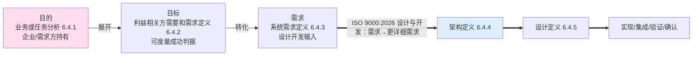
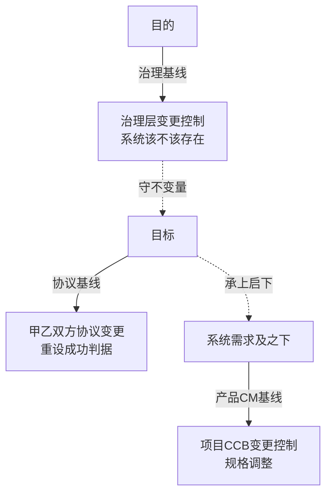

# 17 - 设计与开发边界及三层基线治理 对照卡

> 本卡整理自一轮对话线（起点："理解设计与开发的定义，目的→目标的定义过程是否属于设计与开发范围"），顺次覆盖：
> 设计与开发定义 → 目的/目标/需求 是否属设计与开发 → 需求定义责任方 → 目的/目标是否纳入配置管理 → 治理基线/协议基线定义 → 两概念的权威出处说明。
> 独立新卡，**未改动任何现有研究报告**（06/07/08/10/12）。与 `04-配置管理概念研究报告-从配置定义到商业价值.md` 互补——04 聚焦基线本身（功能/分配/产品基线），本卡覆盖从"设计开发边界"到"基线治理"的完整链路。
> **文档版本**：v1.5（v1.0 = 2026-08-31 整理；v1.1 = 2026-09-21 依 30 号对齐术语；v1.2 = 2026-09-21 第二轮收口·按 GB/T 45630-2025 统一定名；v1.3 = 2026-09-21 依 29 号对齐架构治理口径；v1.4 = 2026-09-21 治理侧术语按 28 号统一；v1.5 = 2026-09-21 第四轮·依 27 号对齐 ISO 9000:2026）；**v1.6 = 2026-09-21 第六轮·依 24 号对齐架构与设计边界** → **v1.7 = 2026-09-21 第七轮·15288 版本锚定（现行版 2023）＋ 一处号错纠正** → **v1.8 = 2026-09-21 第九轮·15288:2023 过程号结清** → **v1.9 = 2026-09-21 第十轮·依 23 号对齐（评审判据改正 ＋ 两条轴互参 ＋ 链外两物落位）** → **v1.10 = 2026-09-21 第十一轮·依 22 号对齐（架构行拆分 ＋ 清单定名 ＋ 目的指针改正）**
> **2026-09-21 第十一轮·依 22 号对齐**（用户令「以 22 号研究报告，对齐其前的文档」；本版 **v1.9 → v1.10**）：以 **22 号《架构、概念、属性研究报告——术语权威定义与对照分析》**（v1.7）为准核本报告涉架构术语侧的接口，得**两处标签／指针不符、一处缺位、一处译名场合**——① **§四 落点清单改定名**（**缺位**，D18／§8.3）：原《**系统**基本概念和**基本**属性清单》按 22 号 §8.3 V2 与 §9.4 打磨①改《**实体在其环境中的基本概念或属性清单**》——`fundamental` 在原文**只出现一次**、修饰 "concepts **or** properties" 整个短语（故「和基本属性」改「**或属性**」），主体是**所关注实体（EoI）**不是 system（故「系统的」改「实体在其环境中的」）；并加〔按〕点明该清单住 **L3**、按 **aspect（42010:2022 §3.9）**分块，「系统的基本概念和基本属性清单」是 22 号 §8.3 判为 ⚠ 的 **V0 措辞**（2011 口径的 system 主体）——严格成立的是 **V2**；② **§〇 标准锚点表「架构描述」行拆分**（**标签与内容不符**，D31／D8）：原行名「架构描述」，行内出处却是 GB/T 45630-2025 的**定名依据**、内容却是「架构＝…（**3.2**）」——3.2 是 **architecture**、3.3 才是 **architecture description**；故**其一**行名改「**架构**」并标 **3.2**，**其二**新增「**架构描述**」行标 **3.3**（用于表达架构的**工作产品**；其集合是 42010:2022 §3.4 Note 1 的 **11 类 AD elements**，`definition` 不在其中），**其三**表下补 **D31 分工指针**（架构四概念以 30 号为准、架构与设计边界与元素三层以 24 号为准、concept／property／architecture／AD 四术语以 22 号为准）与 **D8**（42010 §3 未定义 `concept`／`property`，按普遍接受含义使用）；③ **§〇「架构」行标译名场合**（**译名场合**，D21）：该行「基本概念或属性」系**自译**，GB/T 45630-2025 3.2 国标字面作「**基础**概念或属性」——自译自用取「基本」、逐字引国标照抄「基础」，混用即 22 号 §9.6 陷阱第 4 条；④ **§〇「目的」行与 §七 引用建议改正指针**（**指针待正**，D29／D31）：原「目的 ｜ **42010:2022** / 15288 6.4.1」，而 **42010:2011 §3.1～§3.10 与 2022 §3 均无 `purpose` 条**——改按本报告 §四／§五 已在用的 **ISO/IEC/IEEE 42030:2019 `intended purpose`**，15288 **6.4.1** 半句照旧。**依据**：22 号 §3.6、§5.2.2、§6.1～§6.3、§7.3、§8.2、§8.3、§9.4 打磨①、§9.6 陷阱第 4 条、§12 第 13／22／23／34 行；基线 **D8、D18、D21、D29、D31**。**未改**：本卡三切片划分与三层基线逻辑、§一～§三、§四 除落点清单名与新增〔按〕外的行文、§五～§六 的结论与 mermaid 图结构、§七 权威性声明表、§八 收束句；节号未动（§〇 表按 22 号 §12 第 22／23 行**增一行**，即 findings 允许的一处）。
> **2026-09-21 第七轮·15288 版本锚定（用户裁定第 4 条）**：① §〇 标准锚点表「系统生存周期技术流程」行的 `ISO/IEC/IEEE 15288` 补注「**现行版 2023**；本行过程号未随版逐条核对」（该行 6.4.1／6.4.2／6.4.3／6.4.4／6.4.5／6.4.7 号序系 2015 版序，其中 6.4.4／6.4.5 已经 24 号实测 2023 同号，**其余各号已于第九轮核实同号**——证据＝INCOSE SEH 5.0 中文版 2023-07 所印 15288:2023 条款号 p132–p162）；② **一处号错纠正**——§六 对照表「协议基线」行标准落点原记「15288 **6.4.2** agreement」，6.4.2 是「利益相关方需要和需求定义」过程，agreement 的**术语条**为本报告 §〇 表自记的 **§3.4**，故改「15288 §3.4 agreement」并注明原号错。**未改**：本卡三切片划分、§一～§八 的行文与全部表格行数、图表结构、节号，一处未动。
> **2026-09-21 与 30 号对齐**：① §〇 标准锚点表「系统生命周期技术流程」改「系统生存周期技术流程」（life cycle processes 规范译名，30 号 §7.4），并补 GB/T 45630-2025 标准行；② §五 治理基线「关注点基线」改「关注点清单」（关注点是利害、不是基线物）；③ 表下补 stakeholder 译名夹注。
> **2026-09-21 第二轮收口**（用户裁定「fundamental 用『基本』，其余术语按 GB/T 45630-2025」）：① 15288 过程名 6.4.2 依 GB/T 22032 改「**利益相关方需要和需求定义**」（8 处，含 §〇 表行、§二 落点表、§二 图、§五 协议基线正文与图、§六 对照表）；② §〇 架构描述行 governing 由「治理原则」改「**管控原则（governing principles）**」，落 canonical；③ §二「15288 全生命周期」「"开发"生命周期」、§七「生命周期阶段」改「**生存周期**」；④ §〇 基线行所引 ISO 10007:2017 §3.2 定义文字属**引文**，「全生命周期」保留。
>
> **2026-09-21 依 29 号对齐**（用户令「以 29 号研究报告为依据，将之前有关的研究报告与之对齐」）：本卡的"治理"是**基线这一机制的治理侧**，故按 29 号《架构治理研究报告》补接驳——① §〇 标准锚点表补「治理／架构治理」行，声明架构治理的定义、目的、对象、输入输出、责任主体与机制以 29 号为准；② §五 治理基线补「**在治理结构中的位置**」一条：治理基线＝29 号 §7 六机制中「基线与变更控制」的具体化、§5.1 七类输入中「基线类」的来源，并与 §4.1 第三层治理对象「架构演化」（不变量是否守住）及 §6.4「例外权上收」同源；③ §七 权威性声明表的「治理」行补 29 号指针。**未改**：本卡三切片（治理／协议／产品 CM 基线）的划分、§一 设计与开发定义、§二 目的→目标→需求归属、§六 对照表结构，一律不动——29 号不涉及基线分层，本条只补接驳。
>
> **2026-09-21 第四轮·依 27 号对齐（ISO 9000 版本迁移）**：用户令「以 27 号研究报告为依据，将之前有关的研究报告与之对齐」。本卡涉及 ISO 9000 的引用点共八处，按 27 号《ISO 9000:2026 相对 2015 版差异研究报告》全量迁移——① §〇 标准锚点表「设计与开发」行、§一 定义行、§二 三层结论第 1 条、§八 收束句的 design and development 条款号 2015 §3.4.8→**2026 §3.3.11**（定义句逐字未变），并补注 3（限定词可指明设计开发对象的性质，如产品／服务／过程设计和开发；注 3 两版均有，2026 措辞微调）；② §〇 表「目标」行、§五 协议基线「存在理由」的 review 条款号写全为 **§3.11.2**（2026 与 2015 同号）；③ §〇 表「需求」行 requirement 2015 §3.6.4→**2026 §3.5.1**；④ §二 收束图连标签与 §七 引用建议同步。**未改**：本卡三切片（治理／协议／产品 CM 基线）的划分、§二 归属结论、§四 分级受控表、§六 对照表结构。
>
> **2026-09-21 第五轮·术语与判据（用户指令第 1、2 条）**：①治理三职能句与 §五「谁能动」所引口径统一作「指导、监督、**担责**」（28 号 §2.3.3：担责＝术语位与职能位、问责＝动词位）；②§五「谁能动」补一句判据归属——治理基线属**判据本身**（规则、基线、例外范围），其变更只能由治理裁决（29 号 §2.2 判据三「不可自裁」），这正是「只有治理层能动」的理由；**判「该事项是否属治理」仍用三条判据，「跨出单管理层权限」是介入门槛、不是分类判据**。 **术语（第五轮）**：治理三职能第三成分作「**担责**」、organizational purpose 作「**宗旨**」（按 28 号 §2.3.3／§2.8 统一；本报告原用「运营目的」「问责」处已就地换）。
>
> **2026-09-21 第六轮·依 24 号对齐**：用户令「以 24 号研究报告为依据，把 24 号之前的报告与之对齐」（本版 v1.5→v1.6）。本卡涉「架构定义与设计定义」关系的一处按 24 号《架构与设计边界研究报告——从定义辨析到架构视角与架构视图》就地补口径——**§二 收束图下补夹注**：图中 **A（架构定义 6.4.4）==> D（设计定义 6.4.5）** 段表达的是**规定需求逐级下达**的逻辑顺序（24 号 §8.3），**不是两个先后阶段**；**架构定义与设计定义是两个过程，不是两个阶段**——15288 §5 允许迭代与并发，"先架构定义后设计定义"是瀑布式误读，真实形态是**同一时刻在相邻两个种类层上的两类工作**（24 号 §8.2）。同一口径适用于 §〇 标准锚点表内 6.4.4 → 6.4.5 的流程清单排列。**图结构未动**（依用户指令：图不重画，只加注）。**未改**：§〇 标准锚点表、§一 设计与开发定义、§二 归属结论与落点表、§三～§八 的行文、全部表格行数与判据条数、节号。

> **2026-09-21 第九轮·15288:2023 过程号结清**（v1.7 → v1.8）：ISO/IEC/IEEE 15288:2023 的**技术过程号已核实**——证据＝INCOSE SEH 5.0 中文版（2023-07，其 p18 明写本手册与 ISO/IEC/IEEE 15288（2023）一致，各过程 purpose 逐条冠以该标准条款号）：技术过程 §6.4.1 业务或任务分析（p132）／§6.4.2 利益相关方需要与需求定义（p136）／§6.4.3 系统需求定义（p141）／§6.4.4 系统架构定义（p148）／§6.4.5 设计定义（p155）／§6.4.6 系统分析（p159）／§6.4.7 实施（p162）／§6.4.8 集成（p165）／§6.4.9 验证（p168）／§6.4.10 转移（p173）／§6.4.11 确认（p176）／§6.4.12 运行（p182）／§6.4.13 维护（p184）／§6.4.14 处置（p186）。据此后：①§〇 表「系统生存周期技术流程」行由「本行过程号未随版逐条核对」改记**已核**（6.4.1–6.4.5／6.4.7 均与 2015 同号）；②第七轮记录中对应的「其余未核」改记已核。**未改**：本卡三切片划分、§一～§八 的行文与全部表格行数、图表结构、节号。**仍未核**：2015 版术语条款号（§3.4 agreement 等）在 2023 版的对应号——本地无 2023 版原文。

> **2026-09-21 第十轮·依 23 号对齐**（用户令「以 23 号研究报告，对齐其前的文档」）：以 **23 号《判据体系研究报告——从验证确认到治理的判据阶梯》**（v1.9）为准核本报告涉判据侧的接口，得**一冲突两缺位**——① **§五 协议基线「存在理由」的确认判据改正**（**冲突**）：原文「评审参照 = 所规定目标；**确认最显性的用途即目标**」把确认的尺子记成了目标——按 23 号 §5.1 五级表，评审的尺子是「**为客体确立的目标**」（目标族，§3.11.2）、确认的尺子是「**为预期用途或应用的需求**」（**需求族**，§3.11.14）；且 23 号 §4.3 把 use 的明示面定作 **specified use**，**不是 objective**（D13／D15）——改为「评审参照 = 为客体确立的目标（`established objectives`，§3.11.2）；确认参照 = 为预期用途或应用的需求（§3.11.14）」，"最显性"之意保留为「目标是最显性的一类成功判据，但**不是确认的尺子**」，并补 23 号 §5.1／§4.3 互参；**§〇 标准锚点表「目标」行同步**（原括注「规定的目标」改「为客体确立的目标」，并按 23 号 §7.2 陷阱①点明 `established` 与 `specified` 都被译"规定"）；② **§六 表下补三切片与五级阶梯的互参**（缺位）：本卡按**变更权威**切、23 号五级按**判定活动各自对着什么尺子**切，是两条不同轴，接口在「目的—目标—需求」三族的归属，并注明 §五 两处判据在五级表中的归级（评审＝第 3 级、确认＝第 2 级）；③ **§五 治理基线补方针落位**（缺位）：原文三项「装什么」未给**方针**留位置——按 23 号 §5.5／§9.1 补一句「**方针不在派生链上**（承诺 ＋ 框架，非派生），判据＝宗旨＋环境（§5.2.1 a），复评走 §9.3 管理评审」，并同句点明**链外两物**中的另一物（确认的判据＝预期用途／使用情境）亦不在本卡三层之列。**依据**：23 号 §3.11.2／§3.11.14 条款号、§4.3、§5.1、§5.3、§5.5、§7.2、§9.1、§9.2。**未改**：本卡三切片划分、§一～§四 行文、§六 对照表行数与 mermaid 图结构、§七 权威性声明、§八 收束句；节号一律未动（新增均为夹注与要点句，未增删表格行）。

---

## 〇、标准锚点（全程引用）

| 概念 | 标准出处 | 关键原文/位置 |
|---|---|---|
| 设计与开发 | ISO 9000:2026 §3.3.11 | 将对客体的**要求**转换为对其**更详细的要求**的一组过程（输入=要求，输出=更详细特性/规格）；注 3：限定词可指明设计开发对象的性质（产品／服务／过程设计和开发） |
| 系统生存周期技术流程 | ISO/IEC/IEEE 15288（现行版 2023；本行过程号**已核**——6.4.1–6.4.5／6.4.7 均与 2015 同号，证据＝SEH 5.0 中文版 p132–p162） | 6.4.1 业务或任务分析 → 6.4.2 利益相关方需要和需求定义 → 6.4.3 系统需求定义 → 6.4.4 架构定义 → 6.4.5 设计定义 → 6.4.7 实现 |
| 架构 | GB/T 45630-2025, **3.2**《系统与软件工程 架构描述》（等同采用 ISO/IEC/IEEE 42010:2022，2025-11-01 实施）——中文术语定名的依据 | **架构**＝实体在其环境中的**基本**概念或属性，以及该实体及其相关生存周期过程的实现和演化的**管控原则**（governing principles）（3.2；「基本」系**自译**——国标字面作「**基础**」，场合分流见下〔按〕） |
| 架构描述 | GB/T 45630-2025, **3.3**／ISO/IEC/IEEE 42010:2022 §3.3 | **用于表达架构的工作产品**（AD）——「架构描述」是**描述层**零件，其集合为 42010:2022 §3.4 Note 1 的 **11 类 AD elements**（利益相关方／关注点／利益相关方角度／方面体／ADL／ADF／对应关系／架构视图／视图组件／架构视角／模型种类），**`definition` 不在其中**（22 号 §6.1～§6.3） |
| 目的 | **ISO/IEC/IEEE 42030:2019 `intended purpose`** / 15288 6.4.1 | 系统为什么被研制的理由（价值侧，可虚）——⚠ **42010:2011 §3.1～§3.10 与 2022 §3 均无 `purpose` 条**，勿挂 42010（22 号 §3.6、§6.2） |
| 目标 | ISO 9000:2026 §3.7.11 + §3.11.2 | objective = 要实现的结果（result to be achieved）；评审参照 = established objectives（**为客体确立的目标**——`established` 与 `specified` 在中文里都被译"规定"，英文不是一个词，23 号 §7.2 陷阱①） |
| 需求 | ISO 9000:2026 §3.5.1 | requirement = 需要或期望（明示/隐含/必须履行三形态） |
| 基线 | ISO 10007:2017 §3.2 | 产品/服务在某时点正式评审并约定的一组特性，作为全生命周期活动与变更控制的参照 |
| 治理／架构治理 | ISO/IEC 38500:2024（治理语义）；TOGAF（架构治理领域定义） | 架构治理的定义、目的、对象、输入与输出、责任主体与机制一律以 **29 号《架构治理研究报告》**为准——「基线与变更控制」是其 §7 六机制之一，「基线类」是其 §5.1 七类输入之一；本卡「治理基线」是该机制在本框架中的落名 |
| 协议 | 15288 §3.4 | agreement = 工作关系的相互确认（如合同/谅解备忘录）；用于获取方与供应方之间 |
| 配置管理 | ISO 10007:2017 | 标识、变更控制、状态记录、审核 |

> 〔按：stakeholder 国标定名「利益相关方」（30 号 §8.2）；15288 过程名 6.4.2 依国标 GB/T 22032 作「**利益相关方需要和需求定义**」，本卡已随之改（2026-09-21 第二轮收口）。〕

> 〔按：**分工指针（依 22 号 D31）**——**架构四概念**（架构／关注点／架构视角／架构视图）以 **30 号**为准；**架构与设计边界、元素三层**（AD element／架构构成物／system element）以 **24 号**为准；**concept／property／architecture／AD** 四术语的逐条款考证与译名分工以 **22 号**为准。另：**42010 §3 Terms and definitions 里既没有 `concept` 也没有 `property`**（2011 §3.1～§3.10 与 2022 §3 均无此两条）——二者按 ISO/IEC Directives Part 2 以**普遍接受的含义**使用（`concepts` ≈ idea／notion），**不是** ISO 1087:2019 §3.2.7 严谨义的「知识单元／对象的特征」（22 号 §3.6；D8）。〕

> 〔按：**译名场合（依 22 号 §9.5／§9.6 陷阱第 4 条；D21）**——本表「架构」行的「**基本**概念或属性」是**自译**；**逐字引 GB/T 45630-2025 时必须照抄国标字面「基础概念或属性」**。两者**不是错译，是分流**：自译自用取「基本」，引国标照抄「基础」，场合错配即陷阱第 4 条（本报告他处引国标文字处一律照抄国标字面）。〕

---

## 一、设计与开发的准确定义

**ISO 9000:2026 §3.3.11（设计与开发）**：
> 将对客体的**要求**转换为对其**更详细的要求**的一组过程。
> （注 1：构成设计和开发**输入的要求**通常是研究的结果；这些要求通常从**特性**方面来规定。）
> （**注 3（两版均有，2026 措辞微调）**：限定词可用以指明被设计开发对象的性质，如产品／服务／**过程**设计和开发。）

**刀锋所在**：设计与开发的**起点是"要求（需求）"**，它把需求转成更详细的特性/规格。故**"需求"是设计与开发的输入，不是设计与开发本身**。

---

## 二、目的 → 目标 → 需求 是否属于设计与开发

**结论**：目的→目标→需求 的定义过程，**不属于（供方视角的）设计与开发**，它是设计与开发的**输入端与触发前提**（问题空间/需要定义），而非解空间/方案设计。

### 标准落点表（15288 技术流程）

| 概念 | 15288 落点 | 属于"设计与开发"吗 |
|---|---|---|
| **目的**（为什么被研制） | 业务或任务分析 **6.4.1**（问题空间，企业/需求方持有） | ❌ 上游、输入端 |
| **目标**（预期达成的可度量结果） | 利益相关方需要和需求定义 **6.4.2**（可度量成功判据） | ❌ 需要/需求定义阶段，仍在上游 |
| **需求**（自身可验证规格） | 系统需求定义 **6.4.3**（设计开发输入） | ❌ 输入，尚未进入 |
| 架构 / 详细设计 | 架构定义 **6.4.4** / 设计定义 **6.4.5** | ✅ 设计与开发核心 |

### 三层结论
1. **严格（ISO 9000:2026 §3.3.11）**：设计与开发 = 需求→更详细特性。目的→目标→需求 是"**产生这些需求**"的上游过程，在设计与开发**之外（上游）**。与"定义架构前必先定义目的"完全自洽。
2. **广义（15288 全生存周期）**：目的→目标 属"开发"生存周期最前端的**需要/需求定义技术流程**（6.4.1–6.4.2），但须与"架构定义(6.4.4)/详细设计(6.4.5)"分开——前者是**问题空间/需要定义**，后者是**解空间/方案设计**。
3. **责任归属（呼应"架构师不拥有目的"）**：目的由企业/需求方（治理、战略）持有；目标是供需双方就"成功判据"达成的协议（6.4.2 产出书面协议）；供方设计与开发从（系统）需求起算。架构师对目的的职责是"理解/确认/使架构承接"，**不是定义目的**。

### 收束图

（粉=问题空间/需要定义，上游、非设计与开发；蓝=解空间/设计与开发核心）

> 〔按：图中 **A ==> D** 段表达的是**规定需求逐级下达**——"每个过程的输出，对下游过程而言都是规定需求"（24 号《架构与设计边界研究报告》§8.3），**不是两个先后阶段**。**架构定义（6.4.4）与设计定义（6.4.5）是两个过程，不是两个阶段**：15288 §5 允许**迭代与并发**，"先架构定义后设计定义"是瀑布式误读；真实形态是**同一时刻在相邻两个种类层上的两类工作**（24 号 §8.2）。二者另有两条关系可并读：**交替递归**（上一层设计定义的输出 = 下一层架构定义的输入对象）与**同构**（同一套活动族，同一种工作做两遍）（24 号 §8.1 关系 1、2）。同一口径亦适用于 §〇 标准锚点表内 6.4.4 → 6.4.5 的流程清单排列——那是标准的流程清单与条款号顺序，不是日历上的先后。〕

---

## 三、需求定义由谁负责

**责任分两端——需方持有"需要侧"，供方负责"技术侧"：**

| 概念 | 定义责任方 | 标准落点 | 角色 |
|---|---|---|---|
| **目的** | 企业 / 治理层（需方） | 6.4.1 业务或任务分析 | 持有、战略侧；架构师只**确认/承接**，不定义 |
| **目标** | 需方主导 + 供方协议 | 6.4.2 利益相关方需要和需求定义（书面协议） | 成功判据，双方共识 |
| **利益相关方需求** | 需方 | 6.4.2 | 需要侧 |
| **系统需求** | 供方（系统工程师 / 架构师桥梁） | 6.4.3 系统需求定义 | 设计开发输入，技术侧 |

一句话：**目的企业持有，目标供需共签，系统需求供方落地**。架构师是桥梁——把目的/目标**转化承接**为系统需求，对可落地下技术责任，但不拥有目的。

---

## 四、目标、目的要不要纳入配置管理

**结论**：都要"受控"，但**机制分级**——目的走治理级变更控制，目标走协议/需求基线受控，需求走经典产品 CM。**三者不是都作为"产品配置项"同等管理。**

**理由**：
- 42030:2019 以 intended purpose 为架构评价依据 → 目的/目标一变，架构有效性随之动摇 → **必须受控变更**。
- CM 本质（ISO 10007）：对"变更会影响产品符合性的对象"做标识+变更控制。凡变了动摇架构的，就该受控。
- 但**目的不是产品本身**，是产品须 conform to 的上位 invariant → 故目的作为**治理基线**受控，而非作为产品配置项受 CM 日常管控（与需求的本质差别）。

### 分级受控表

| 概念 | 是否纳入 CM | 受控机制 | 变更触发 |
|---|---|---|---|
| **目的** | 治理基线受控（非产品 CI 日常管控） | 治理级变更控制（企业） | 目的漂移 = 系统该不该存在的危机（判例 AG-01） |
| **目标** | 协议 / 需求基线受控 | 变更控制（供需协议） | 评审/确认参照变化，重设成功判据 |
| **需求** | 经典 CM | 配置标识 + 基线 + 变更控制 | 规格调整 |

**落点（呼应"产品数据"）**：《系统目的或任务理解确认清单》（目的）+《**实体在其环境中的基本概念或属性清单**》+ 需求基线，作为核心产品数据统一受控。三层基线——目的在治理基线、目标在协议基线、需求在产品 CM 基线——**分级管控，但都受控可追**。

> 〔按：该清单住 **L3（概念＋属性清单）**、按 **aspect（42010:2022 §3.9）**分块呈现（functional／structural／informational），**"abstract" 不能读成 "list"**（22 号 §8.2、§7.3；D18）。定名依 22 号 §8.3 V2 与 §9.4 打磨①——`fundamental` 在原文**只出现一次**、修饰 "concepts **or** properties" 整个短语，故不写「和基本属性」而写「**或属性**」；主体是**所关注实体（EoI）**不是 system，故「系统的」改「实体在其环境中的」。**「系统的基本概念和基本属性清单」是 22 号 §8.3 判为 ⚠ 的 V0 措辞**（**2011 口径的 system 主体**，且 fundamental 被读成两次修饰）；严格成立的是 **V2「实体-环境关系中的 fundamental concepts/properties 清单 ＋ governing principles 清单」**（L3＋L4 完整版）——本清单名取 V2 的主体与环境限定，只承载其 X 块（22 号 §8.3、§9.4 打磨①；D18）。〕

---

## 五、治理基线 / 协议基线 定义

### 基线（baseline）是标准术语
ISO 10007:2017 §3.2：基线 = 产品在某时点**正式评审并约定**的一组特性，此后作为后续工作与**变更控制**的参照。需求基线、设计基线皆此意。

### 治理基线（本框架复合词）
"治理基线" = 基线的一个切片——把"变了就是系统该不该存在/什么绝不能动"的项目单独拎出，交给**治理层（企业/战略）**而非项目管理来管。
- **装什么（被守护的 invariant）**：① 系统目的（即《系统目的或任务理解确认清单》）② 架构原则 / 关注点清单 ③ 治理红线（合规/法规/安全等 obligatory 硬杠）
- **不在本项下的一项**：**方针（policy）不在派生链上**——它与派生关系**异构**（是**承诺 ＋ 框架**关系，非 derivation），判据＝组织的目的与环境（ISO 9001 §5.2.1 a），定期复评走 **§9.3 管理评审**（23 号 §5.5、§9.1）。故方针不装在治理基线的三项里，另有所属；同理，**确认的判据（预期用途／使用情境）也不在本卡三层之列**——它与派生链异构，构成需求基线之上的参照层（23 号 §9.1、§9.2）。
- **谁能动**：只有治理层。项目管理层（管理）无权改——对应"治理在管理层之上定组织方向与框架（指导、监督、担责）、管理在框架内执行"（ISO/IEC 38500:2024 口径；第三成分 accountability 按 28 号 §2.3.3 作「担责」）。**理由在判据族里**：治理基线装的是**判据本身**（目的、原则、红线＝规则与基线），而「判据本身的变化只能由治理裁决」正是 29 号 §2.2 三条分界判据的**第三条（不可自裁）**——本条不是权限分布的习惯，是判据的推论。〔与另一条分开用：「跨出单管理层权限，就要治理介入」是**介入门槛**（判该不该上治理），不是分类判据；判「算不算治理」用三条判据（29 号 §2.2）。〕
- **存在理由**：目的归治理机构、不在执行者手里，委托后目的可能**无声漂移**（AG-01 即目的漂移处置链，见 08 号）；治理机构须对组织持续行使指导、监督、担责，把架构保持在目的上。故须把"目的+原则+红线"**正式冻结成治理基线**——既是架构评价参照（42030 以 intended purpose 为依据），又是评估漂移的基准。
- **在治理结构中的位置（依 29 号）**：治理基线＝29 号 §7 六机制中「**基线与变更控制**」机制的具体化（该机制的设计要点是：架构描述基线化、变更经审批、历史可回溯；架构的生命与架构描述的生命不同步时按 GB/T 45630-2025 附录 E 处置），同时也是 §5.1 七类输入中「**基线类**」的来源。此外两处与 29 号同向：①**治理对象四层**中第三层「架构演化」的判据是「变更是否受控、不变量是否守住、变体是否在允许范围内」，本卡的治理基线正是「不变量」的载体；②29 号 §6.4 的**例外权上收**与本卡「谁能动」同源——偏离治理基线只能由治理机构放行，且须登记、限期、到期复审。

### 协议基线（本框架复合词）
"协议基线" = 由**需方与供方正式约定**后冻结的那组"成功判据"，主要是**目标（objectives）**及双方确认的利益相关方需求。绑定来源不是治理权威，而是**甲乙双方协议**。
- **装什么**：① 目标 / 成功判据（operational objectives，MOE 源头）② 双方约定的利益相关方需求
- **谁能动**：需方 + 供方共同——走**获取协议（acquisition agreement）变更流程**，非项目管理单边改、非治理层独断。
- **存在理由**：评审参照 = **为客体确立的目标**（`established objectives`，ISO 9000:2026 §3.11.2）；确认参照 = **为预期用途或应用的需求**（§3.11.14）。**目标是最显性的一类成功判据，但不是确认的尺子**（详见 §六 表下〔按〕；23 号 §5.1 五级表、§4.3 与 specified use 的分野）。若目标不冻成协议基线，供方可随意拉低"成功"，需方失抓手。故目标须**双方约定冻结**。
- **注意**：从此向下转化的**系统需求**不在此层，进**产品 CM 基线**（供方技术侧）。协议基线管"甲乙双方约定层"，产品 CM 基线管"供方实现层"。

---

## 六、三层基线对照（含与目的→目标→需求 映射）

| 基线 | 装什么 | 变更权威 | 变更意味 | 标准落点 |
|---|---|---|---|---|
| **治理基线** | 目的 + 原则 + 红线 | 治理层（企业/战略） | 系统该不该存在的危机（判例 AG-01） | 42030 intended purpose 为评价依据 |
| **协议基线** | 目标 + 约定的利益相关方需求 | 需方 + 供方协议 | 重设成功判据 / 重谈承诺 | 15288 §3.4 agreement（术语条；原记 6.4.2 系号错——6.4.2 是"利益相关方需要和需求定义"过程） |
| **产品 CM 基线** | 系统需求 + 设计 + 实现 | 项目 CM 变更控制（CCB） | 规格调整，正常工程动作 | ISO 10007 baseline |

> 〔按：本卡三切片与 **23 号判据阶梯（五级）** 是两条**不同切法**——本卡按**变更权威**切（谁有权改，决定它落在哪条基线），五级阶梯按**判定活动各自对着什么尺子**切（23 号 §5.1）。二者接口在**目的—目标—需求**三族的归属：§五 的两处判据在五级表中的归级为——**评审＝第 3 级**（判据「为客体确立的目标」，出处 §3.11.2）、**确认＝第 2 级**（判据「为预期用途或应用的需求」，出处 §3.11.14）；本卡全文只在这两处用到阶梯的级，故特此点明两轴关系（23 号 §5.1／§5.3）。〕

---

## 七、⚠️ 权威性声明（务必区分"真标准"与"本框架复合词"）

**「治理基线」「协议基线」不是 ISO 里的现成固定术语**（ISO 10007 / 15288 / 42010 主线上查不到这两个词组）。它们是把"基线"按**变更权威 + 内容**切出的**本框架复合词**。组成它们的每个零件都有真出处：

| 词 | 是否标准术语 | 出处 |
|---|---|---|
| **基线**（configuration baseline） | ✅ 真标准 | ISO 10007:2017 §3.2；15288 §4.7 |
| **协议**（agreement） | ✅ 真标准 | 15288 §3.4（合同/谅解备忘录等） |
| **治理**（governance） | ✅ 概念有出处 | ISO/IEC 38500:2024（§3.3 定义三职能、§4 目的、§6 执行四活动）；"治理基线"按"治理在管理层之上定组织方向与框架"的本框架提炼（08 号）。**架构域的展开以 29 号《架构治理研究报告》为准** |
| **治理基线** | ❌ 本框架复合词 | = 基线 + 治理层变更权威（无 ISO 原词） |
| **协议基线** | ❌ 本框架复合词 | = 基线 + 获取方/供应方协议变更权威（无 ISO 原词） |

**⚠️ 别把本卡"治理/协议/产品 CM 基线"与标准的"功能/分配/产品基线"混淆**——那是按**定义成熟度/生存周期阶段**切的，不是按变更权威切的：
- **功能基线 functional baseline** = 系统性能/功能/接口特征 + 验证要求
- **分配基线 allocated baseline** = 分配到产品/子系统/组件的要求
- **产品基线 product baseline** = 特定时点详细设计（生产/部署/运维）
（出处：15288 / 24748-7 / EIA-649 / MIL-STD-973）
本卡三切片是**变更权威轴**，与 functional/allocated/product 的**成熟度轴**正交，非一回事。

**引用建议**：
- 可放心写：**"基线（ISO 10007:2017）""协议（agreement, 15288）""目的（ISO/IEC/IEEE 42030:2019 intended purpose——**42010 §3 无 `purpose` 条，勿挂 42010**）／目标、需求（ISO 9000:2026 §3.7.11／§3.5.1）"**。
- 勿写：**"治理基线（ISO 10007）"**——应标注"治理基线（本框架复合词：基线 + 治理层变更权威）"。

---

## 八、收束（一句话总收）

**设计与开发 = 需求→更详细需求（ISO 9000:2026 §3.3.11）；目的→目标→需求 是产生需求的上游/输入端，不属设计与开发本身。** 三者责任分端（目的企业持、目标供需签、系统需求供方落），且**都要受控**——按"谁有权改、改了意味什么"切为三层基线：**目的落治理基线（治理层决）、目标落协议基线（甲乙双方协定）、系统需求及之下落产品 CM 基线（项目 CCB）**。"治理基线/协议基线"为本框架复合词（基线+变更权威），非 ISO 术语，引用时须标注。

---

*卡片创建：2026-08-27（独立新文件，未修改 06/07/08/10/12 研究报告的既有内容）。*
