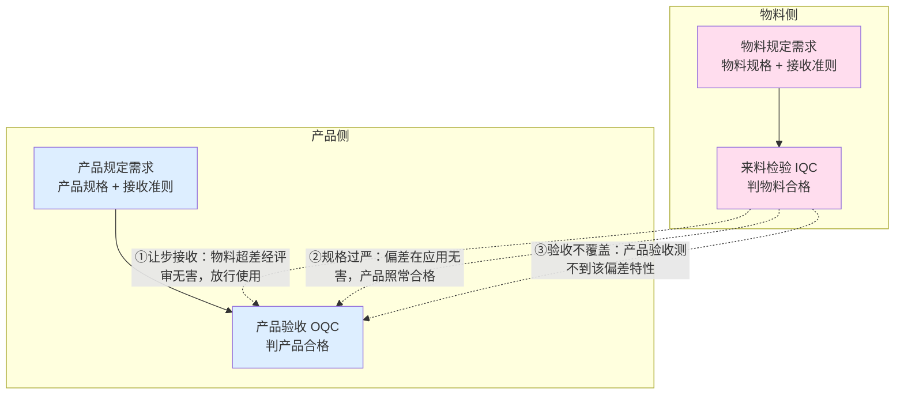
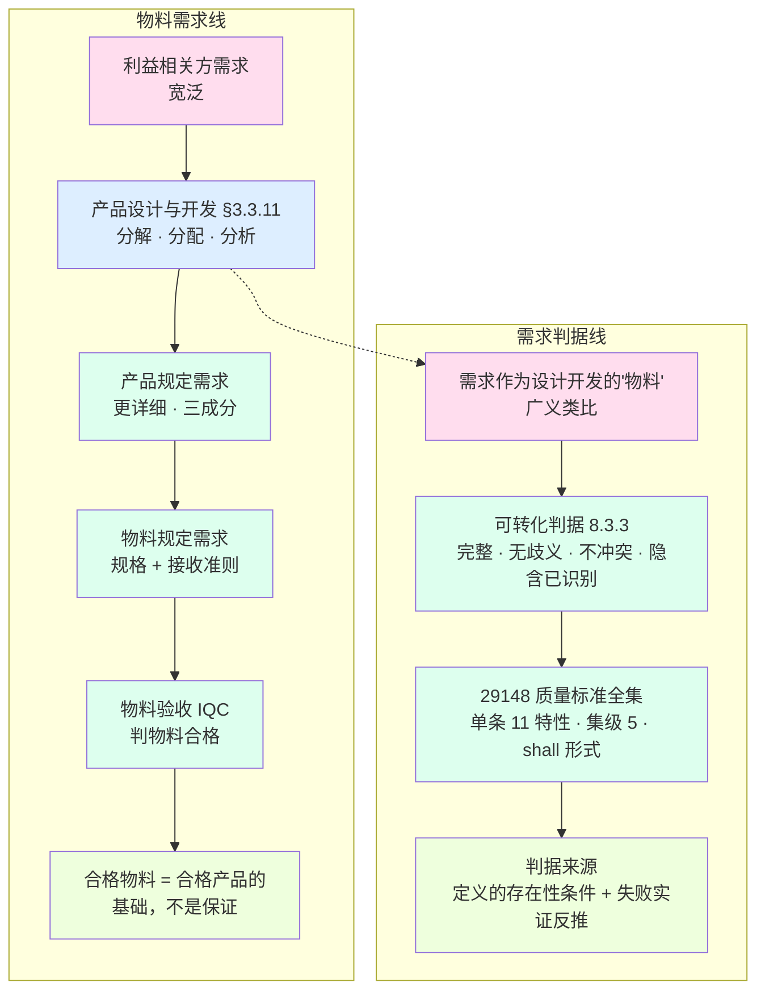

# 19 - 物料需求与需求判据精讲：从产品需求到需求的质量判据

> 本卡整理自一轮对话线（起点："产品研发和生产领域，产品的物料也有需求，这些需求是判断其是否合格的依据或标准。基于设计与开发的定义，物料的需求应该是对产品需求的设计与开发的结果。可以这样理解吗"），顺次覆盖：
> 物料需求 = 产品需求设计与开发的结果 → 合格物料与合格产品（必要条件辨析）→ 规定需求 = 设计开发的"物料"（广义类比）→ 需求的合格判据（可转化判据）→ 判据的来源（定义的存在性条件）→ 标准中的好需求判据（ISO/IEC/IEEE 29148）→ 判据如何得出（实证溯源）。
> 独立新卡，**未改动任何现有研究报告**。与 `01-设计开发概念研究报告-从需求到质量基座.md` 承接——01 聚焦设计与开发的定义/起点/终点/机制，本卡沿"物料"这个类比把"需求的质量判据"从教材延伸到国际标准。
> 本卡大量参考 **13-工程角色谱系精讲** 与 **14-产品数据精讲**：13 提供"角色 × 粒度 × 委托—协商—验收"的承接框架（谁在逐级做设计开发），14 提供"应然/实然 + 两域三态 + 流水线工件"的载体框架（需求与实物分属什么域、设计开发加工的对象是什么）。
> **2026-09-21 第二轮收口**（用户裁定「fundamental 用『基本』，其余术语按 GB/T 45630-2025」）：物料需求线图首节点「相关方需求」改「**利益相关方需求**」（stakeholder 国标定名，30 号 §8.2）。
> **文档版本**：v1.2（v1.0 = 2026-08-31 独立成卡；v1.1 = 2026-09-21 第四轮·依 27 号对齐 ISO 9000:2026——全文 ISO 9000 引用迁 2026 版条款号：设计与开发 §3.4.8→§3.3.11、质量 §3.6.2→§3.5.2、需求 §3.6.4→§3.5.1、验证 §3.8.12→§3.11.12、符合 §3.6.11→§3.5.9（**2026-09-24 更正：该条官方定名为「合格」，号不变**）；「更详细三成分」的依据由「注 1」正为「注 1 + 注 3」；v1.2 = 2026-09-21 第六轮·依 24 号对齐——§4.3 补判据的明示化接驳、§5.1 补必要性判据行、§6.4 补需求必要性与架构必要性两支界分）；**v1.3 = 2026-09-21 第十轮·依 23 号对齐（§四 首段补"判据"两义界分与 23／24 号互参）** → **v1.4 = 2026-09-21 第十一轮·依 22 号对齐（「特性」锚定 ISO 9000:2026 §3.10.1／§3.10.2 ＋ ISO 1087 跨标准界分 ＋ 29148 条款号标「待核」 ＋ 三处「实施无关」改「实现无关」）** → **v1.5 = 2026-09-24 第十二轮·依五份标准正本结清条款号（§3.5.9 定名「合格」 ＋ ISO 9001 标库外带版本）**
>
> **修订记录（2026-09-24 第十二轮·依五份标准正本结清条款号）**（v1.4 → v1.5）：依库内 ISO 9000:2026 正本核本报告涉 ISO 9000 的定名与条款号，得**两项改正**——① **§3.5.9 的定名由「符合」改「合格」**（**G-19 项下**）：ISO 9000:2026 官方定名为「**合格**（conformity）」——正本逐字 *fulfilment of a requirement*，注 1「*conformance* 为同义但已废弃之词」；改 §4.2 表「作为设计开发的输出」行（并补正本定义句与「合格」定名）、§4.2 表下正文「更详细且符合」→「更详细且对输入需求合格」、§4.3 递归闭环末句「符合性」→「对输入的**合格**（§3.5.9 conformity）」、§3.2 边界段「下一级符合性的参照」→「下一级**合格**判定的参照」，共四处；**头部既有记录行与文档版本行内的旧称「符合」属历史，不改写**；② **ISO 9001 一族统一标注口径**（**G-21**）：本报告所引 ISO 9001 号（§〇 表三行、§5.1 表、§6.1 表）**已带版本 `ISO 9001:2015`**，本轮补标「**库外来源·不可核**」并在 §〇 表下新增按③说明标注口径——库内无 ISO 9001 正本，取证路径见台账 02 号 §四。**未改**：§一～§九 的行文与结论、全部表格行数、mermaid 图结构、节号、判据条数（只在既有表行内补括注，并在 §〇 表下补一处〔按〕）。**依据**：库内正本 ISO 9000:2026 §3.5.9；台账 02 号 §三／§五 G-21。
> **修订记录（2026-09-21 第十一轮·依 22 号对齐）**：用户令「以 22 号《架构、概念、属性研究报告——术语权威定义与对照分析》为准，把 00～21 号与之对齐」。以 22 号（v1.7）核本报告，**一处缺位（本报告的核心词「特性」从未锚定）、一处缺号、一处内部不一致**——①**§〇 表下补「特性」标准锚按**（依 22 号 §4.2、§4.4、§4.5；**D4／D7／D24**）：`characteristic` ＝ **ISO 9000:2026 §3.10.1**（*distinguishing feature*／区别性特征；注 1 inherent or assigned＝固有的或赋予的）、`quality characteristic` ＝ **§3.10.2**（客体与要求有关的**固有特性**）——§3.5.2「质量」定义句里的 `inherent characteristics` 即链到 §3.10.1；并补**跨标准界分**：ISO 1087:2019 **§3.2.1** 的 characteristic（*abstraction of a property*）与 **§3.1.3** 的 property（*feature of an object*）是**术语学语境**的另一套所指，与 ISO 9000 §3.10.1 的「区别性特征」**同名不同物、不可互推**（译名分工：`properties`→属性、`characteristic`→特性，不可互换）；②**同处补 29148「特性」的同形异义界分**（依 22 号 §4.5；**D7／D30 陷阱①**）：29148 的「特性」是**需求条目**的质量特性，与 ISO 9000 §3.10.1／§3.10.2 已占定名的「（质量）特性」**同形异义（homonym）**；22 号 §4.5 的 property → characteristic → concept 抽象链只适用于**术语学语境**，不可搬用；③**29148 的条款号标「待核」**（§〇 表行 ＋ §9.2 欠项）：仓库未见 29148:2018 正式文本，只锚标准与版本，**不臆造号**（承第七轮裁定）；④**§2.3、§5.1 就地补锚**（`characteristic` §3.10.1／`quality characteristic` §3.10.2；§3.3.11 注 1 的 `characteristics` 本身链到 §3.10.1）；⑤**译名统一**（依 22 号 §9.5、§12 第 30 行；**D25**）：三处「**实施无关**」改「**实现无关**」，与同表「锁死**实现**方案」一致（`realization`→**实现**，不译"实施／落地"）。**未改**：§一～§九 的行文与结论、全部表格行数、mermaid 图结构、节号、判据条数（只在既有表行内补括注，并在 §〇 表下、§2.3、§5.1、§9.2 补指锚）。**依据**：22 号 §4.2、§4.4、§4.5、§9.5、§12 第 5、30 行；D4、D7、D24、D25、D30①。
> **修订记录（2026-09-21 第六轮·依 24 号对齐）**：用户令「以 24 号研究报告为依据，把 24 号之前的报告与之对齐」（基准清单见工作区 `.work-24align/00-对齐基线.md`）。本报告的需求质量判据与 24 号《架构与设计边界研究报告》三处接驳——①**§4.3 补一段**：判据自身作为「对需求的」规定需求，属 ISO 9000:2026 §3.5.1 的「**明示的**（specified ≡ stated）」一支，以「隐含／明示」两段落区分其成立状态（24 号 §7.3 明示化分水岭、§10.2 凭据层四条：条目集／追溯／判定方法／版本冻结）；②**§5.1 来源表补一行**「必要性（准入）判据」——判据的正当性终止于定义本身，而同为「必要」的架构准入判据参照系是**目的**，两者不同支（24 号 §6.3）；③**§6.4 补一支界分**——本条所含「必要性」是**单条需求的质量判据**（要不要它），架构准入必要性是**目的可达性的结构条件**（24 号 §6.1、§6.3），并点明其代理不得当判据（24 号 §6.6）。**「必要条件」全篇仍是过程性／管理命题的用法（§二定稿口径），与 24 号 §6.3「不是数学意义的充要条件」不冲突，未动。** 依据：24 号 §6.1、§6.3、§6.6、§7.3、§10.2；附 A `specified requirement` 行。**节号、图结构、判据条数一律未动；表格只 §5.1 末尾追加一行**（他域判据对照行，不属本卡判据族）。
>
> **修订记录（2026-09-21 第十轮·依 23 号对齐）**：用户令「以 23 号研究报告，对齐其前的文档」。以 **23 号《判据体系研究报告——从验证确认到治理的判据阶梯》**（v1.9）为准核本报告，**零冲突、一处缺位**——本卡的"判据"＝**单条需求的质量／合格判据**（要不要这条需求／写得好不好），23 号的"判据阶梯"＝**判定活动各自对着什么尺子**（五级），**同一份文件里已并存两义而全文无一句界分**（§〇 标准锚点表的**验证行**即阶梯义："以规定需求为参照"）——**§四 首段补一句界分 ＋ 互参**，写法同 23 号 §5.7 的三段分工：本卡判据管"要不要这条需求／写得好不好"；"判定活动各自对着什么尺子"属 **23 号判据阶梯（五级）**；"一条内容够不够格进架构层"属 **24 号判据栈**（24 号 §6）。**依据**：23 号 §5.1、§5.7。**未改**：§〇 表行数与各行内容、§一～§三、§4.1～§4.3、§五～§九 的行文；节号、表格行数、mermaid 图结构、判据条数一律未动（§四 只新增一处〔按〕夹注）。

---

## 〇、标准锚点（全程引用）

| 概念 | 标准出处 | 关键原文/位置 |
|---|---|---|
| 设计与开发 | ISO 9000:2026 §3.3.11 | 将客体的**需求**转换为对其**更详细的需求**的一组过程；注1：输入需求通常是研究的结果，通常从**特性**方面规定；一个项目可有多个设计开发阶段（递归）；注3（两版均有，2026 措辞微调）：限定词可指明设计开发对象的性质（产品／服务／**过程**设计和开发） |
| 质量 | ISO 9000:2026 §3.5.2 | 客体一组**固有特性满足需求**的程度 |
| 需求 | ISO 9000:2026 §3.5.1 | 需要或期望（明示/隐含/必须履行三形态） |
| 验证 | ISO 9000:2026 §3.11.12 | 以**规定需求**为参照，认定需求已得到满足 |
| 设计和开发输入 | ISO 9001:2015 §8.3.3 | 输入应满足"可转化"判据（完整、无歧义、不冲突、隐含需求已识别） |
| 外部提供 | ISO 9001:2015 §8.4 | 外部提供的要求（物料采购方案的条款落点） |
| 测试方案 | ISO 9001:2015 §8.3.5 c | 监视和测量要求 + **接收准则**（判据的载体） |
| 好需求特性 | ISO/IEC/IEEE 29148:2018（条款号**待核**——仓库未见正式文本，不臆造号，见 §9.2） | 单条需求 11 特性 + 需求集 5 特性 + shall 语句形式规则 |
| 好 SRS 特性 | IEEE 830-1998 | 前身经典（正确/无歧义/完整/一致/按重要度排序/可验证/可修改/可追溯） |

> 〔**按① · 「特性」的标准锚（依 22 号 §4.2、§4.4、§4.5；D4／D7／D24）**：本表「质量」行与全篇所用「**特性**」一词，锚点是 `characteristic` ＝ **ISO 9000:2026 §3.10.1**——*distinguishing feature*（区别性特征），注 1「可以是固有的，也可以是赋予的（inherent or assigned）」、注 2「可以是定性的，也可以是定量的」；`quality characteristic` ＝ **§3.10.2**——*inherent characteristic of an object related to a requirement*（客体的与要求有关的固有特性）。§3.5.2「质量」定义句里的 `inherent characteristics` 自身即链到 §3.10.1，§3.3.11 注 1「这些要求通常按**特性**来定义」的 `characteristics` 亦然。**跨标准界分（不可互推）**：ISO 1087:2019 **§3.2.1** 的 characteristic（*abstraction of a property*，属性的抽象）与 **§3.1.3** 的 property（*feature of an object*，对象的特征）是**术语学语境**的另一套所指——与 ISO 9000 §3.10.1 的「区别性特征」**同名不同物**；译名分工亦随之：`properties`→**属性**、`characteristic`→**特性**，二者不可互换。〕
>
> 〔**按② · 29148 的「特性」与 ISO 9000 的「特性」同形异义（依 22 号 §4.5；D7／D30 陷阱①）**：本表「好需求特性」行与 §6.2 所称 29148 的「特性」，是**需求条目**（及需求集）的**质量特性**，与 ISO 9000 §3.10.1 `characteristic`、§3.10.2 已占定名的「质量特性」**只是词形相同、所指不同**——同一个「特性」词形在**术语学／质量管理／需求工程**三个语境里指向三个概念，属**同形异义（homonym）**。22 号 §4.5 的 property → characteristic → concept 抽象链只适用于**术语学语境**，**不可搬到需求工程语境**；反向亦然，不得用 29148 的 11 项特性去读 ISO 9000 的 `characteristic`。29148 的条款号**待核**（仓库未见正式文本，不臆造号，见 §9.2）。〕
>
> 〔**按③ · ISO 9001 一族的标注口径（G-21）**：本表「设计和开发输入」「外部提供」「测试方案」三行所引 **ISO 9001:2015** 号一律**带版本**（不裸写），并一律属「**库外来源·不可核**」——库内无 ISO 9001 正本，取证路径见台账 02 号 §四。〕

---

## 一、物料的需求 = 产品需求设计与开发的结果

### 1.1 为什么成立：定义的直接推论

按 §3.3.11，设计与开发 = 将需求转换为更详细的需求，且该过程是**递归**的（注1：一个项目可有多个设计开发阶段，每一级都是完整的 §3.3.11）：

> 概念设计把客户需求变成系统需求，详细设计把系统需求变成部件规格，工艺设计把部件规格变成可生产、可检验的要求——每个阶段的输出需求，就是下一阶段的输入需求。

产品设计开发沿结构分解链走到"物料"这一层时，产出对物料的**更详细需求**（材质、尺寸、性能、允差、验收准则）。"怎么变详细"的内部机制，就是 [01 号文档 §3](01-设计开发概念研究报告-从需求到质量基座.md) 的**分解、分配、分析**。

### 1.2 两处精确化

1. **"结果"指规定的需求，不是物料实物。** 设计开发止于"可实现"（[01 §4.2](01-设计开发概念研究报告-从需求到质量基座.md)），对实物产品具体化为八方案齐备，其中**物料采购方案对应 8.4 外部提供的要求**。物料实物合不合格，是供应商"制造/实现"的事，属于终点之后的"事实可实现"层面。精确表述：**物料需求是设计开发的结果（规定的更详细需求）；物料实物是生产实现的结果（按这份需求被造出来并验证）。** 这正对应 [14 号文档 §1.2](14-产品数据研究报告-从产品定义到企业数字资产.md) 的**应然/实然**框架：需求是"应然"，产品是"实然"——物料规定需求是"应然"，物料实物是"实然"。结合 14 的**两域三态**（[14 §0](14-产品数据研究报告-从产品定义到企业数字资产.md)）：物料需求落在**信息域**（产品数据），物料实物落在**物理域**，来料检验（IQC）正是两域之间的**对照动作**——用信息域的规定需求，对照物理域的实物特性。

2. **物料需求不全是顶层产品需求"分解"下来的，还有设计开发过程中"纳入"的。** 按 §3.5.1，需求包括明示的、通常隐含的、必须履行的。物料需求里相当一部分来自法规、行业标准、安全环保、可采购性（对应 [09 号文档](09-产品需求完整性研究报告-从三类需求到验证载体.md) 可实现性需求的"物料可采购性"）——这些不是产品需求逐条分解出来的，而是设计开发过程中识别并入的（起点判据之一"隐含需求已识别"，8.3.3）。精确表述：**物料需求是产品设计开发的输出，既有对产品需求分解分配的继承，也有过程中识别纳入的补充，两者都由起点判据把关。**

### 1.3 递归补充：定制物料的双角色

- **标准件**：物料需求直接当采购和检验依据用；
- **定制件**：物料需求同时担任两个角色——对下游，它是产品设计开发的输出（采购/验证的输入）；对上游，它又是**物料设计开发的输入**，被物料供应商再转化一轮，输出更详细的物料规格和工艺。这个双角色正是 §3.3.11 递归性的体现。

这个递归与 [13 号文档 §6](13-工程角色谱系研究报告-从模块工程师到系统架构师.md) 的**分形**是同一个结构：模块工程师是"模块这个系统上的迷你系统工程师"——每一级元素的设计与开发，都是一个完整的 §3.3.11；物料供应商对物料需求做的，正是一轮"迷你设计开发"。承接关系也可以用 13 的**委托—协商—验收**闭环描述（[13 §1](13-工程角色谱系研究报告-从模块工程师到系统架构师.md)）：产品设计开发把需求"**委托**"给物料（分解分配），供应商对物料做"**协商**"（可谈判地开发/调整），IQC 按接收准则"**验收**"——物料需求经这个闭环变成合格物料，正是 §2 "必要性在受控层成立"的落点。

---

## 二、合格物料是生产合格产品的必要条件？（限定成立）

**结论**：这个说法"对"，但"必要条件"必须限定在正确层面——它是**管理命题，不是严格逻辑命题**。限定对了成立且必须坚持；当逻辑定律逐条套用，有反例。

### 2.1 为什么"对"：短板效应 / 乘法模型

[14 号文档 §5.3](14-产品数据研究报告-从产品定义到企业数字资产.md) 对"数据质量 → 产品质量"的定论是**"必要条件成立，充分条件不成立"**，机理是乘法模型：

> **最终质量 = 需求正确性 × 数据质量 × 制造质量 × 使用质量**（乘法 = 短板效应，任何一环为零全盘皆输）

物料就是这条乘法链里的一个乘数。把物料质量置零（没有可用的合格物料），产品根本生产不出来，"合格产品"无从谈起——**"缺了它不行"这一层，成立**。这也是 8.4 必须管物料的理由：物料合格性必须作为受控条件被管理，否则产品合格只能靠碰运气、靠事后检验兜底。而"质量是设计/控制出来的，不是检验出来的"（[14 §5.3](14-产品数据研究报告-从产品定义到企业数字资产.md) 缺陷传播链），正说明这个"必要"**落在过程保障上**。

### 2.2 为什么不能当严格逻辑定律用：两层反例

"合格"永远相对于一套规定需求。物料按**物料的**规格+接收准则验收，产品按**产品的**规格+接收准则验收——两套规定需求、两次独立验收（来料检验 vs 产品验收）。这个解耦是反例的根源：

1. **产品合格 不蕴含 每个物料合格**（让步接收、规格过严、验收不覆盖三个反例）；
2. **物料全合格 也不蕴含 产品合格**——装配错误、工艺参数、设备磨损、操作失误，任何一环出错，好料照样出不合格品。

严格逻辑上，"合格物料 → 合格产品"和"合格产品 → 合格物料"两条路都不成立：它既不是充分条件，也不是逐条必要条件。

### 2.3 "必要条件"的正解：落在"受控"上，不在"合格"上

> **物料的合格性被受控管理——按接收准则验收、不合格不放行、让步接收留痕——是稳定生产出合格产品的必要条件。**

必要的是"**对物料合格性的控制**"，不是"物料本身逐条合格"。这正是 8.4 的完整含义，也和 [01 §4.2](01-设计开发概念研究报告-从需求到质量基座.md) 把"可实现"称作"入场券（必要条件）"的用法一致：**教材里的"必要条件"一贯是"缺它不可"的过程性必要，不是"有它必成"的充分逻辑。**

结合 13/14 把这条再落实一步：质量定义（ISO 9000:2026 §3.5.2 = 固有特性满足需求的程度）下〔`characteristic` ＝ **ISO 9000:2026 §3.10.1**、`quality characteristic` ＝ **§3.10.2**；见 §〇 按①〕，**物料合格 = 物料固有特性满足物料规定需求**——判合格的尺子就是设计开发输出的接收准则（[14 §1.2](14-产品数据研究报告-从产品定义到企业数字资产.md) 应然/实然：需求是应然，合格判定是实然对应然的符合）。而"受控"这条必要条件的执行机制，正是 §1.3 的**委托—协商—验收**闭环（[13 §1](13-工程角色谱系研究报告-从模块工程师到系统架构师.md)）：委托方验收把关，就是"合格性被受控管理"的制度形态。

### 2.4 定稿口径（可入教材）

> 合格物料是合格产品的**基础，不是保证**：好料未必出好产品（不充分）；个别物料超差经让步接收，产品仍可能合格（非逐条必要）；但物料合格性不受控，合格产品就没有受控保障（必要在控制层成立）。

---

## 三、规定需求 = 设计开发的"物料"（广义类比）

**结论**：按广义"被加工的对象/输入"义，这个类比成立且有教材先例支撑；但"物料"须限定在"成形加工的输入工件"意义上，不能在"被消耗进成品的组成件"意义上用。

### 3.1 为什么合适（三层成立）

1. **结构同构**：设计与开发 = 将需求**转换**为更详细需求。"转换为"就是加工动作——需求是输入，被加工成特性化的规定需求输出，与"物料 → 生产 → 产品"完全同构，且输出与输入是不同的东西（§2.2 的"转换才是灵魂"）。
2. **教材先例**：[14 号文档 §6](14-产品数据研究报告-从产品定义到企业数字资产.md) 已建立流水线视角——**工件（被加工的物）= 产品数据，逐站增值或添加缺陷**；其中"工位（加工动作）= 需求定义（转译）、设计（物化）、实现（实例化）、验证（取证）、移交（冻结）"。规定需求是产品数据的一种，设计与开发就是其中"**设计（物化）**"这一站——**规定需求正是这一站加工的对象**，所以"规定需求是设计开发加工的对象"本来就是教材既有的框架。
3. **递归双角色对得最漂亮**：BOM 里一个组件既是上一级的零件、又是下一级的总成；§3.3.11 里一个规定需求既是上一级 D&D 的输出（成品），又是下一级 D&D 的输入（物料）。**每级输出 = 下级物料，逐级接力完全同构。**

### 3.2 两个必须留神的边界

1. **物料被消耗、并入成品；需求不被消耗、始终有效。** 生产里一颗螺钉进了产品就"消失"；设计开发里输入需求加工后不会消失——它始终是追溯的源头、下一级**合格**判定的参照。需求更像**图纸/工艺文件/标尺**（信息形态的指令，指导加工但不被消耗），不像实物原料。更贴的称呼是 14 号文档已用的"工件"。
2. **关系是"细化转化"，不是"组装"。** 物料 → 产品是 BOM 组成关系；需求 → 更详细需求是细化转化关系（输出需求不是由输入需求"组装"而成，而是输入需求被展开成的形态）。类比对象要选**锻造/轧制这类"成形加工"**（输入是物料、输出是更精细的形态），**不是"装配线组装"**。

### 3.3 定稿口径（可入教材）

> 广义地说，规定需求就是设计开发的"物料"——设计开发把它逐级加工成特性化的规定需求（制造标尺）。和实物物料唯一的区别：物料进了成品就被消耗，需求在链条里始终有效——它既是被加工的输入，又是逐级核对的标尺。

---

## 四、需求的合格判据

把物料类比闭环：**物料有没有合格判据？有（物料的规定需求）。需求作为设计开发的"物料"，也有自己的合格判据——就是"可转化"判据，即 8.3.3 设计和开发输入的四项检查。**

> 〔按：**"判据"一词在同一份文件里有两义，须界分**——① **本卡的判据**＝**单条需求的质量／合格判据**，管的是"**要不要这条需求／写得好不好**"（可转化四查、更详细三成分、形式判据等，§四～§六）；② **"判定活动各自对着什么尺子"**属 **23 号《判据体系研究报告》的判据阶梯**（五级：验证→确认→评审→审核→治理，23 号 §5.1 五级表）——§〇 标准锚点表的**验证行**（"以规定需求为参照"）用的正是**阶梯义**，非本卡义；③ **"一条内容够不够格进架构层"**属 **24 号《架构与设计边界研究报告》的判据栈**（24 号 §6）。三段分工见 23 号 §5.7。〕

### 4.1 可转化判据（8.3.3）——需求"进厂"的验收

[01 §5.2](01-设计开发概念研究报告-从需求到质量基座.md) 把设计开发的起点定义为"**一份满足'可转化'判据的需求规格被确立为设计输入的时刻**"：

| 判据 | 检查什么 |
|---|---|
| **完整** | 功能、性能、以及由产品/服务性质导致的潜在失效后果——一个不缺（指**类别覆盖**，不是指写得详细） |
| **无歧义** | 每条需求只能有一种理解，一人一读同义 |
| **不冲突** | 需求之间自洽（资源、法规、性能不打架） |
| **隐含需求已识别** | 最贵的一条：隐含需求（§3.5.1）不会自己开口，必须主动识别（8.2.2） |

**易踩的坑**："可转化"查的是"无歧义"，不是"详细"。输入需求本来就宽泛（"能低温运行"），这是正常的——设计开发的责任正是把它变详细。所以"完整"指没有缺口类别，不是每个数值都写定。

### 4.2 按位置分层：需求既是"物料"又是"成品"

| 需求所处位置 | 合格判据 | 类比 |
|---|---|---|
| **作为设计开发的输入**（物料进厂） | 可转化四查（8.3.3） | 来料检验 IQC |
| **作为设计开发的输出**（成品出厂） | 「更详细」三成分——更具体（以特性规定）、更可实现（够实现为止）、更可验证（落到可测特性+接收准则）；且**符合输入需求**（**合格**，ISO 9000:2026 §3.5.9 conformity＝*fulfilment of a requirement*） | 成品验收 OQC |
| **贯穿分解分配链**（每级加工质量） | 形式判据：原子性、语义四查、指标三场景、候选声明、1:1、全覆盖 | 过程检验 |

分层判据在 [13 号文档](13-工程角色谱系研究报告-从模块工程师到系统架构师.md) 的**粒度**视角下是自然成立的：粒度（系统/模块/物料）按"粒度 × 责任"划分（[13 §1](13-工程角色谱系研究报告-从模块工程师到系统架构师.md)），每一粒度都是完整的 §3.3.11——各自对输入做"可转化"验收、对输出做"更详细且对输入需求合格"（**合格**，§3.5.9 conformity）验收。**判据不挑粒度，每个结对共用同一套形式判据；变的只是切法（内容规则）**——这正是 [01 §3.1](01-设计开发概念研究报告-从需求到质量基座.md) "判据统一、切法业务化"的解耦设计。

### 4.3 递归闭环：判据本身也是"对需求的"规定需求

> 物料的合格判据 = 物料的需求（规定需求）；需求的合格判据 = 可转化四查 +（作为输出时）更详细三成分与对输入的**合格**（§3.5.9 conformity）——而这两套判据，本身也是被规定的需求。**判断者与判断标准，同属规定需求这一族。**

这两套判据本身落在需求的哪一支上，决定它们此刻能否当依据用：按 ISO 9000:2026 §3.5.1，需求有「必须履行的」（obligatory）、「通常隐含的」（generally implied）、「明示的」三支，**规定需求（specified requirement）＝明示陈述的那一支**（该条注 2：*a specified requirement is one that is **stated***）。判据有两段落——**隐含段落**：判据作为从业惯例与专业判断存在，人人照着做，但未曾逐条写下；**明示段落**：判据被转写为条目（有 ID、有对象／适用范围、有断言、有判定方法），可追溯、可冻结进基线。**从隐含段落到明示段落的那一步转换就是「明示化」**：停留在通常隐含的判据只是惯例，**不宜作判定违规的依据**；转写为条目之后，判据才成为可据以判定、可据以举证的规定需求。判据的每一次「写成条目」，都是一次明示化——这也是 §七 判据诞生史（失败模式反推 → 特性表 → 标准条款）在本层的重演。**依据**：24 号 §7.3、§10.2；ISO 9000:2026 §3.5.1 Note 2。

---

## 五、判据的来源：定义的存在性条件

### 5.1 两层来源

| 判据 | 条款出处 | 逻辑来源 |
|---|---|---|
| 可转化四查 | ISO 9001:2015 **8.3.3**〔**库外来源·不可核**——库内无 ISO 9001 正本，号已带版本〕 | 转化的前提条件（输入能被可靠转化） |
| 更详细三成分 | ISO 9000:2026 **§3.3.11 注1 + 注3**（特性链〔注 1 的 `characteristics` 自身链到 **§3.10.1**〕 + 限定词指明对象性质）+ 终点"可实现"推导 | 定义里唯一的输出标准"更详细"的内涵分析 |
| 形式判据 | 方法论沉淀（分解分配的形式要求） | 分解分配机制的质量保证（链条不断） |
| **必要性（准入）判据**（他域，非本卡判据） | ISO/IEC/IEEE 42010:2022 §3.2（`fundamental`＝**基本**） | 架构准入判据，参照系是**目的**（remove x ⇒ 目的所依赖的结构条件不成立）——与上表各条的来历不同支，见 24 号 §6.3；列此行只为标明「同样叫必要，参照系各异」 |

### 5.2 逻辑来源：判据是"定义的存在性条件"

**可转化判据不是外部强加的标准，而是"设计开发 = 需求转化"这一定义要想在现实中成立，所必须具备的前提**——逐条反推：

| 前提不满足 | 后果 | 转化发生不了的原因 |
|---|---|---|
| 需求有缺口 | 在残缺需求上做转化，输出必然残缺 | 转化不可靠 |
| 需求有歧义 | 同一输入有多种理解，输出不唯一 | 转化**没有确定结果** |
| 需求冲突 | 满足 A 就违反 B | 转化**无解** |
| 隐含需求未识别 | 方向错，verification 全绿、validation 全红 | 转化**白做** |

标准 8.3.3 做的事，只是把这四条前提**条款化**。三成分判据同理：定义说输出必须"更详细"，分析"详细"是什么 → 三成分。形式判据同理：分解分配是转化的内部机制，机制不守形式判据，链条就断（悬空/重复/遗漏）。

### 5.3 递归收口：为什么判据链不会无限后退

> **物料需求有上游来源（来自产品设计开发的分配），所以需求链条可以无限细分；但需求的可转化判据没有上游——它的来源就是定义本身，再往上没有更高的判据了，链条到这儿终止。**

两个不同性质的"来源"：
- 物料需求的正当性，靠"它来自产品需求的分配"担保——担保来自**链条上游**；
- 需求判据的正当性，靠"它是需求转化这个定义的前提"担保——担保来自**定义自身**。

---

## 六、标准中的好需求判据（ISO/IEC/IEEE 29148:2018）

### 6.1 权威标准有三层

| 标准 | 定位 | 与教材关系 |
|---|---|---|
| ISO 9001:2015 **8.3.3** | 设计和开发输入 | 教材「可转化判据」已用它 |
| ISO/IEC/IEEE **29148:2018** | 需求工程专项标准，**"好需求"判据的权威来源** | 本次核心 |
| IEEE **830-1998** | 需求规格说明书的经典前身 | 历史对照（8 条特性） |

### 6.2 29148 的两张表：单条需求 vs 需求集

**单条需求的质量特性（11 项）**：

| # | 特性 | 含义 |
|---|---|---|
| 1 | **Necessary 必要** | 是已声明需要/约束所要求的；删除它则系统缺一个能力或特性 |
| 2 | **Appropriate 恰当** | 处于正确抽象层级——说"要什么"不说"怎么做"（实现无关） |
| 3 | **Unambiguous 无歧义** | 恰好一种解释 |
| 4 | **Complete 完整** | 单条陈述自身完整表达需要，所有条件/边界在内 |
| 5 | **Singular 单一** | 一句只表达一个能力/特性/约束 |
| 6 | **Feasible 可实现** | 在成本、进度、技术约束下可被实现 |
| 7 | **Verifiable 可验证** | 存在有限且经济可行的过程证明其被满足 |
| 8 | **Correct 正确** | 正确反映真实需要，无事实/逻辑错误 |
| 9 | **Conforming 符合** | 遵循标准陈述形式（shall 句式、模板、语法） |
| 10 | **Consistent 一致** | 不与规格内任何其他需求矛盾 |
| 11 | **Traceable 可追溯** | 可溯到明确来源（上级需求）与去向（实现、验证） |

**需求集（规格整体）的特性**：**Complete 完整、Consistent 一致、Feasible 可实现、Comprehensible 可理解、Traceable 可追溯**（2018 版在集级还并入若干单条特性）。这层强调"局部全优、整体失明"——单条都好≠规格好，正是"盲人摸象"困境。

**另有"语句形式规则"**（对应 Conforming 的内容）：每条需求一句、用 **shall** 强制语态、句子骨架 = 主体 + shall + 动作 + 条件 + 对象、术语全文一致、避免"和/或"歧义表达。

### 6.3 与教材现有判据的映射：大部分已覆盖，五条是新增

| 教材现有判据 | 29148 对应 | 判断 |
|---|---|---|
| 无歧义 | Unambiguous | ✅ 直接对应 |
| 不冲突 | Consistent | ✅ 直接对应 |
| 完整（类别覆盖） | Complete（集级） | ✅ 对应 |
| 隐含需求已识别 | （8.3.3 特有，29148 并入完整/信息理解） | ✅ 教材更强调 |
| 更可实现 | Feasible | ✅ 对应 |
| 更可验证 | Verifiable | ✅ 对应 |
| 更具体（特性化） | Appropriate + Correct | ⚠️ 部分对应 |
| 原子性 | Singular | ✅ 直接对应 |
| 语义四查 | Unambiguous / Correct | ⚠️ 部分对应 |
| 1:1、全覆盖 | Traceable + Complete | ⚠️ 对应（教材有追溯矩阵但**未把可追溯列为需求自身的判据**） |
| — | **Necessary 必要** | 🆕 教材可转化判据**没有** |
| — | **Appropriate 恰当（实现无关）** | 🆕 教材**没有**明确列出 |
| — | **Correct 正确** | 🆕 教材隐含未列 |
| — | **Conforming 符合**（shall 句式） | 🆕 教材**没有** |

### 6.4 教材的吸收口径

> 需求的合格判据分两层：**入厂底线**（可转化四查：完整、无歧义、不冲突、隐含已识别，来自 8.3.3）和**质量标准全集**（ISO/IEC/IEEE 29148:2018 单条 11 特性 + 需求集 5 特性 + shall 语句形式）——前者是"能不能进厂加工"，后者是"是不是一条好需求"。

**一词两支（勿混）**：本节表内 29148 的 **Necessary 必要**与 24 号 §6.3 的架构准入必要性**同词不同支**——前者是**单条需求的质量判据**，判"要不要这条需求"；后者是**架构准入判据**，判"这一内容够不够格进架构"，由**必要性（membership，管入会）+ 充分性（closure，管闭包）双判据**组成，参照系是**目的**。两支不可互代：拿准入必要性去筛需求条目，会把"对目的不承重但确实被需要"的需求误删；拿需求必要性去定架构边界，则退化为清单核对。另须记住 24 号 §6.6 的判据栈——可引用性、可判定性、变更影响半径都是**代理**，可作机械检查用，**不得当判据**；这正与本卡 §7.1 的判据设计方法（判据＝失败模式的对偶，须锚定定义与目的）同调。**依据**：24 号 §6.1、§6.3、§6.6。

可转化判据的价值定位别动摇：**先保证需求能被可靠转化（底线）；29148 补上底线之外的 5 条新增：必要性、恰当抽象层级（要什么≠怎么做）、正确性、符合性（shall 句式）、可追溯性。**

---

## 七、判据是怎么得出的：实证溯源

### 7.1 判据设计的方法：五步

| 步骤 | 内容 | 证据 |
|---|---|---|
| 1 锚定定义 | 判据服务定义本质；对 §3.3.11，从"转化要成立的前提"推 | 可转化判据 |
| 2 枚举失败模式（主引擎） | **判据 = 失败模式的对偶**——"不许出现 X"的反面就是"必须满足 Y" | 见 7.2 表 |
| 3 消费者视角反推 | 每个下游消费者（细化/实现/验证/变更管理）最怕"问不出答案"的问题就是判据 | 实现者问"做不做/做到什么程度"→完整可验证 |
| 4 可操作化 | 判据必须可检查；每条配检查问题（"删除它系统缺能力吗？"→必要） | 29148 检查问题 |
| 5 分类分层 + 经验校准 | 内容 vs 形式；单条 vs 集；实践试用—暴露问题—修订 | 830→29148 修订史 |

**判据 = 失败模式对偶表**：

| 慢性失败 | 对偶出的判据 |
|---|---|
| 各人理解不一 → 做出来各不一样 | Unambiguous 无歧义 |
| 满足 A 就违反 B → 无解 | Consistent 一致 |
| 需求有缺口 → 下游爆雷 | Complete 完整 |
| 改一条不知道影响谁 → 变更失灵 | Traceable 可追溯 |
| 验收没对象 → 无法判定 | Verifiable 可验证 |
| 做不出来 → 承诺落空 | Feasible 可实现 |
| 废需求占资源 → 过度设计 | Necessary 必要 |
| 锁死实现方案 → 抑制创新 | Appropriate 恰当（实现无关） |
| 一条含多事 → 无法单独验收/追溯 | Singular 单一 |

### 7.2 实证链：判据对应的是有据可查的工程失败

判据存在的原始驱动力，是需求缺陷的经验数据——不是拍脑袋，是几十年项目统计：

- Boehm 的经典研究：**54% 的软件项目错误要到后期才被发现**，且**大多数错误发生在写代码之前**——需求阶段引入的错误，修复成本随阶段数量级放大；
- 需求工程研究把这些错误**归类成缺陷类型**：歧义、缺失、冲突、不可验证、不可追溯、不必要、锁死实现方案……；
- **每条判据 = 一类缺陷的正面对偶**。经验数据说"歧义是返工头号来源"→ 判据"无歧义"；说"需求缺失是最贵的事后修补"→ 判据"完整"；说"变更失控是项目失败主因"→ 判据"可追溯"。

**特性的内容不是被"想"出来的，是被"反推"出来的**——对着失败类型写它的反面。

### 7.3 程序链：从实践沉淀到标准条款

标准组织不"发明"判据，它们走标准制定的固定程序——**收集实践 → 提炼失败模式 → 写成正向条款 → 工作组投票 → 公开评审 → 修订迭代**：

| 环节 | 事实 |
|---|---|
| 早期指南 | **IEEE 830-1984**《软件需求规格说明书指南》——第一个把"好 SRS 特性"写成指南的标准 |
| 升级为标准 | **IEEE 830-1993 / 830-1998**《Recommended Practice for Software Requirements Specifications》——IEEE 软件工程标准委员会（SESC）的 P830 工作组制定，经公开投票通过；§4.3.1 定义 8 条特性 |
| 系统级并轨 | **IEEE 1233**（系统需求）、**IEEE 1362**（ConOps） |
| 合并统一 | **ISO/IEC/IEEE 29148:2011**——ISO/IEC JTC 1/SC 7 与 IEEE 联合，合并 830/1233/1362，特性扩展到单条 11 项 + 需求集，补 shall 语句形式规则 |
| 现行版本 | **29148:2018** 更新 |
| 平行对齐 | **INCOSE GTWR**（需求工作组指南）——与 29148 特性一致 |

### 7.4 诚实的边界

标准正文不会写"我们跑了某某分析，推出 Necessary 这条"——**标准不公布形式推导**。29148 呈现特性表时是规范口吻，其内容是**实证锚点（缺陷研究）+ 专家共识 + 评审迭代**共同校准出来的，不是形式演绎。

但"不是蹦出来的"是确定的，两个硬事实：
1. **每条特性都能对应到一类有据可查的工程失败**；
2. **同一批特性在不同标准/组织里高度重叠**（830 的 8 条 ⊆ 29148 的 11 条 ⊆ INCOSE）——如果是拍脑袋，不会收敛得这么一致；收敛本身就证明它们锚定的是同一批客观失败模式。

### 7.5 正当性 ≠ 起源（收口）

- **正当性**：判据之所以成立，因为它们对偶于失败模式、是定义成立的前提——追溯到此为止（§5.3）。
- **起源**：判据本身也是"设计与开发"的产物——把"我们要好的需求"这个宽泛需要，经失败模式分析转化为更详细的需求（判据表）。**判据的诞生，就是一次 §3.3.11。** 标准委员会扮演"需求分析者"，几十年工程事故是"隐含需求"，特性表是"规定的更详细需求"。

---

## 八、收口：全链总览

**一句话主线**：

> 物料的需求是产品需求经设计与开发（分解分配）转化到物料层的"规定需求"，天然就是物料合格判定的参照；合格物料是合格产品的**基础而非保证**（必要性在受控层成立）。把这条线应用到需求自身：需求作为设计开发的"物料"，也有自己的合格判据——**入厂底线是可转化四查（8.3.3），质量全集是 ISO/IEC/IEEE 29148 的 11 特性**；而判据既来自定义的存在性条件（正当性终止于定义本身），也来自对工程失败的实证反推（起源是一次 §3.3.11）。

---

## 九、结论与欠项

### 9.1 主线收口

1. **物料需求**：产品设计开发沿结构分解链把产品需求分解分配到物料层，产出物料的"规定需求"（规格 + 接收准则）——既是采购/验收的输入，也是（定制物料）物料自身设计开发的输入。
2. **合格物料**：合格产品的**基础，不是保证**——不充分（工艺/装配/检验同样关键）、非逐条必要（让步接收/裕度）、必要在受控层成立（8.4）。
3. **规定需求 = 设计开发的"物料"**：广义工件类比，成立；唯一边界是"需求不被消耗、始终有效"。
4. **需求合格判据**：可转化四查（8.3.3 底线）+ 更详细三成分（输出）+ 形式判据（过程）；完整全集见 29148。
5. **判据来源**：逻辑上终止于定义本身（存在性条件）；起源上是一次 §3.3.11（失败实证反推 + 标准协商收敛）。
6. **承接框架（13/14）**：需求逐级设计与开发的"谁在做"由 13 的角色 × 粒度承接（委托—协商—验收闭环、分形递归）；"做出来的形态"由 14 的产品数据承接（应然/实然、两域三态、流水线工件）。物料需求与需求判据两条线合起来，正是 14 主线"产品是价值的载体、产品数据是价值沉淀的形态"（[14 §0](14-产品数据研究报告-从产品定义到企业数字资产.md)）在物料层的具体例。

### 9.2 欠项

- 29148:2018 需求集特性的**完整清单**（含集级 Correct/Conforming/Understandable 的版本差异）未逐字核对原文——本次 WebFetch 受环境网络策略拦截，清单基于标准知识 + 多来源片段交叉验证，落教材前建议对原文复核。
- **ISO/IEC/IEEE 29148:2018 的条款号待核**——仓库未见该标准正式文本，本报告 §〇 表「好需求特性」行与 §6.2 只锚标准与版本，条款号标「**待核**」，**不臆造号**（第十一轮·依 22 号：D7 要求凡涉标准须标明标准与条款号，号未核者如实标注）。
- 判据的可操作化检查问题（29148 每条特性配的检查问句）未完整整理——可作为下一步细化。
- INCOSE GTWR 的特性清单与 29148 的逐条对齐未展开。
