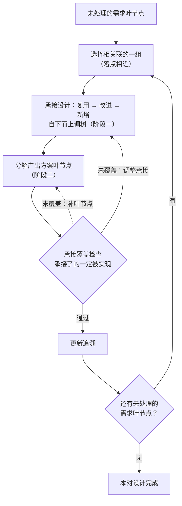
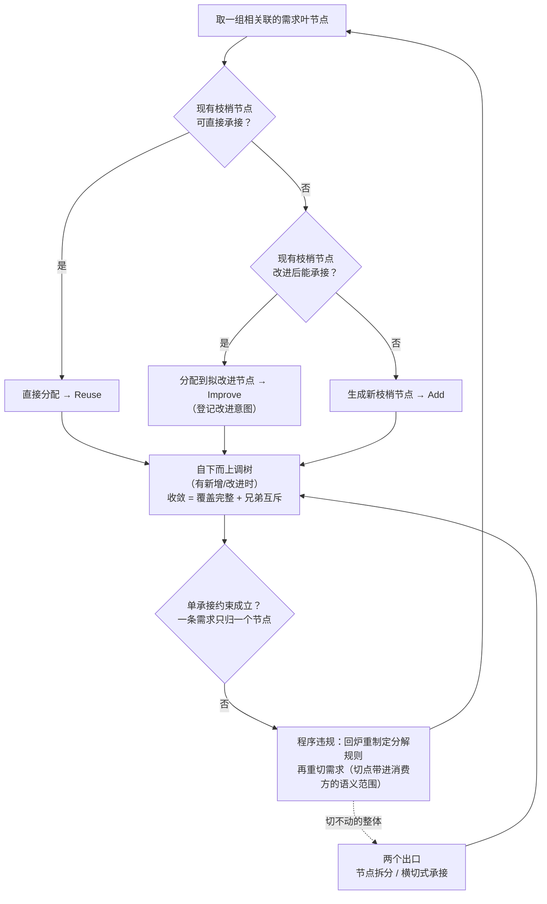
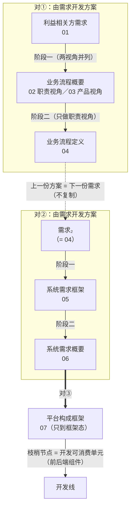

# 20 - 基于 Y=F(X) 函数法落地设计与开发：需求与方案结对开发

> **摘要**：把产品数据链切成相邻的"需求-方案结对"——正向由需求设计方案，反向由方案迭代需求，正反交替、逐对收敛——本方法记作 **Y=F(X) 函数法**：X 为需求，Y 为方案，F 为三部分规则：X 侧与 Y 侧的树形结构、各级枝干节点物理意义与分解/构建规则，以及 Y 的枝梢节点承接 X 叶节点的承接规则。X 与 Y 都是能条目化、能树形化的产品数据——条目可被独立判定"是否被满足"，成树须同时满足判据单维、条目单归属、分组完备互斥三条，两侧的对应是"上游叶 → 下游可负责实体"的 N:1 映射（可 N:1、不可 1:N），函数的单值性即单承接约束。每对走两段过程：预处理过程（定义规则、结构化存量材料、初步承接），正式设计过程（需求叶节点驱动的循环：承接设计走复用→改进→新增，分解产出方案叶节点）。承接覆盖检查保障"承接了的一定被实现"，追溯矩阵自然生成——由符合规则的 X，即可按照函数规则生成符合规则的 Y。链上上一份方案就是下一份的需求，逐对接力；链尾平台方案框架的枝梢节点直接对接开发线。设计与开发由此统一为：**由需求到方案的逐对生成**。本报告的方法落点为 EOS 链，该链的产品数据清单、各树形状与级语义以 [94-eos-sys-dev-dbs.md](../../../20-pl4eos/10-pl4eos-subpl-sysdev/10-wfsysdev-4-eos/94-eos-sys-dev-dbs.md) 为准。
> **文档版本**：**v2.0**（v1.0 = 独立成卡；v1.1 = 2026-09-21 第四轮·依 27 号对齐 ISO 9000:2026——全文 ISO 9000 引用迁 2026 版条款号：设计与开发 §3.4.8→**§3.3.11**、需求 §3.6.4→**§3.5.1**；v1.2 = 第六轮·依 24 号对齐——术语界分、承接落定的明示化口径（今 §3.5）；v1.3 = 第七轮·15288 版本锚定；v1.4 = 第十轮·依 23 号对齐——链外两物与链的覆盖边界；v1.5 = 第十一轮·依 22 号对齐——「好需求特性」行标条款号待核、15288:2023 §6.4.5 过程指针；**v2.0 = 第十二轮·依 94 号 §1.2／§1.3／§1.4 重构——把该三条理论依据立为方法骨架，产品数据形态由二分改三分，链上步型分三类，承接落点改以语义定级**）

---

## 〇、核心思路：由需求到方案的逐对生成

**设计与开发落地的本质，是逐对生成产品数据。** 本方法记作 **Y=F(X) 函数法**：对每一对产品数据，X 为需求，Y 为方案，F 为 Y 与 X 的函数关系，由三部分规则构成——设计并定义 X 的树形结构、各级枝干节点物理意义与各级枝干节点构建规则；设计并定义 Y 的树形结构、各级枝干节点物理意义与各级枝干节点构建规则；设计并定义 Y（枝梢节点）与 X（叶节点）的承接关系和规则——三部分即预处理第 1 步定义的三块规则（§4.1）。函数必须单值：多个 X 可以映射同一个 Y（承接可 N:1），一个 X 映射多个 Y 则 F 不成其为函数（不可 1:N）——单承接约束（§3.5）就是函数的单值性。按 Y=F(X) 的一整套规则和方法定义，由符合规则的 X，即可按照函数规则生成符合规则的 Y。

把产品数据链切成相邻的"需求-方案结对"——**结对就是由需求开发出方案、并由方案迭代需求**。生成是双向的：**正向**，由需求设计方案——按函数规则由 X 生成 Y；**反向**，由方案迭代需求——以方案枝梢节点为基准（§5.3），单承接违规时重切需求、覆盖不足时调整承接或补叶节点、方案结构演进时同步修订规则与既有承接（§5.3~§5.5）。正反交替，直至本对收敛——收敛时 X 是符合规则的 X，F(X) 是符合规则的 Y。

开发过程分两段：**预处理过程**先做准备——定义规则、把存量材料结构化成树、初步承接可分配的需求叶节点；**正式设计过程**以相关联的一组需求叶节点为单位循环推进——循环体内阶段一由需求开发方案框架，阶段二由方案框架开发方案。链上每一对都走同一过程，上一份方案就是下一份的需求；链尾对的阶段二移交开发线——设计线交付平台方案框架即止，开发线按其枝梢节点（EOS 链路上的可消费单元）分解出最后的方案叶节点。设计与开发由此统一为：**由需求到方案的逐对生成**。


### 〇.1 术语界分：本方法的"方案"与架构的关系

本方法的两个核心词是「需求」与「方案」，各有固定所指，"架构"一词在本方法内不承担任何节点角色。按 [24 号《架构与设计边界研究报告》 §2.2、§2.3](24-架构与设计边界研究报告-从定义辨析到架构视角与架构视图.md)：

| 本方法用词 | 框架内所指 | 出处 |
|---|---|---|
| **需求 / 方案** | **产品数据**的两类，两者是**相对角色**（§6.2）；本方法的"**方案**"＝**设计输出的产品数据**——**设计定义**（**ISO/IEC/IEEE 15288:2023 §6.4.5** 设计定义过程）的产出及链上其后的各份产品数据 | §1.1、§1.5、§6.2 |
| **「系统方案」** | 24 号 §2.1 已辨明："系统方案"在 15288（现行版 **2023**）／INCOSE 中**不是规范术语**（标准用 solution space／solution classes ＝解空间／解类）；本方法若把它按口语用，对应 24 号 §2.2 的**读法③「口语整体解」**——与 15288 的 solution classes **不是同一所指** | 24 号 §2.1、§2.2 |
| **架构** | 24 号 §2.3 的**统一关系式：架构 govern 方案；方案 realize 架构**。`realize`（实现）的判据词取自 15288:2023 §3.5 的 *realization* 与 §3.13 的 *compliant implementation*——即**架构是设计的支配层，方案是它被实现的产物** | 24 号 §2.3 |
| **枝梢节点** | 树级语义以 [94 号](94-eos-sys-dev-dbs.md) §1.3 为准：**枝梢＝框架的最深一级节点**。通用设计规范中与之同指的旧称是"架构末级节点"（91 规范 [§2.2.2](../../../00-generalspec/01-generalspec-sysdev.md)），两者同物异名——本报告一律用"枝梢节点" | 94 号 §1.3 |

由此得本框架的上位口径：

> **本方法所处理的全部产品数据，都落在「方案」这一侧（＝设计定义的产出侧）；但"方案侧"不等于"架构"**——架构是方案侧的**支配层**，且是其中一个**被选定并基线化了**的子集：只有这部分才以**规定需求**的形态对下游构成约束（24 号 §4.2、§2.3）。方案侧中未基线化的内容不构成约束，其变更不必回到架构侧。

**结论**：本方法的"方案"是**设计输出的产品数据**这一自建用词，**不是** 15288 的 solution classes（解类／备选方案），也**不承担** 24 号 §2.2 读法①（架构与设计过程中的备选中间物）与读法②（TOGAF System Solution）的所指。**方法名与全部用词照旧，不改名。**

**一处同向而不同层的厘清**：24 号 §14.2 否掉的是**用"框架设计"给"架构"定位**（把架构说成"粗粒度的设计"）；本方法的**"方案框架"**（§1.3：根 → 枝梢的树，叶只以展开项露名）是**同一份产品数据内部的形态**，与"架构"的定位无关，**同名不同事**。本方法链上的"平台方案框架"（§6.4）即 24 号 §14.2 所列「概要」三义中的**框架设计（preliminary design，同一层上先做骨架）**一义——它是平台构成这份产品数据的骨架形态，与"架构"无关。

---

## 一、基础概念

### 1.1 设计过程之产品数据

**产品数据**：关于产品的信息的形式化表示，适合由人或计算机进行通信、解释或处理（ISO 10303-1）。本方法中，产品数据就是设计过程中每个环节的产出物——EOS 链路上的产品数据清单：

```
1. 利益相关方需求（不分形态；原"规范化的相关方需求"）
2. 业务流程（概要态：职责视角 02／产品视角 03；定义态：职责视角 04）
3. 系统需求（框架态：系统需求框架 05；概要态：系统需求概要 06）
4. 平台构成（只到框架态：平台构成框架 07）
```

每一份产品数据都取**最深的形态**（§1.3）参与结对：链首的利益相关方需求不分形态、一产出即其最深形态；链尾的平台构成只有框架态落纸——其枝梢节点（前后端组件等）即开发线可消费的最小单元，枝梢节点的分解（阶段二）移交开发线执行（§6.4）。此处"产品"取泛指，即被设计的目标产品：需求、业务流程、系统需求、平台构成都是"关于产品的信息"，不限于实物。

> **名称与本报告的用词分工**：具体产品数据的名称、文档与形态以 [94 号](94-eos-sys-dev-dbs.md) §1.1 的清单为准，本报告只讲方法、不另立名称。本报告中"**平台构成**"（07 及其同名框架）即六号报告与教材书所称"产品架构／产品构成方案框架"在新口径下的定名，两者同指一份产品数据。

产品数据是设计开发加工的对象：设计与开发（ISO 9000:2026 §3.3.11）的输入和输出都是需求，落成文档即产品数据。每份产品数据同时是上一对的"方案"、又是下一对的"需求"——这是"需求-方案结对"能连续推进的前提。形式化与"由人或计算机处理"两项是本方法的地基：形式化表示才能被一致地解释，机械判据（§2.1、§3.3、§3.4）与两道关口（§5.3、§5.5）才有可执行的比对对象；"由人或计算机处理"直接支撑 §3.1 的人机分工——人类据表示制定规则，算法据规则执行。

### 1.2 产品数据之树形结构

每一份产品数据的内容都能组织成一棵树：

- 根节点为 **0 级**，一般是系统
- 逐级往下：1 级、2 级、……，直至末级——末级枝干节点称**枝梢节点**（§1.4），其下最后是**叶节点层级**
- 层级数量按产品数据实际情况确定，不预设固定深度
- 从 0 级到末级枝梢节点，各级非叶节点统称**各级枝干节点**：框架不含叶节点，框架所含全部节点即各级枝干节点（§1.3）
- 每一级枝干节点和叶节点都可以定义**物理意义**——即这一枝干节点/叶节点实际代表、实际负责的内容是什么；物理意义主要由人类负责研究和制定（AI 辅助），是承接、构建、分解、审查的共同依据

"能组树"不是自动的：同一层的分组必须同时满足**判据单维、条目单归属、分组完备互斥**三条，成树才算成立（三条的本体与判据见 §2.2）。这是本方法对"树"的最低要求，也是承接之所以能成为函数的先决条件。

### 1.3 产品数据之形态：框架、概要、定义

同一棵树按**定义到多深**分**框架、概要、定义**三个形态。级语义术语（全树通用，本体与判据见 [94 号](94-eos-sys-dev-dbs.md) §1.3）：

| 术语 | 含义 |
|------|------|
| 叶 / 叶节点 | 树的**末级节点** |
| 枝梢 / 枝梢节点 | **框架的最深一级**节点 |
| 干枝 / 干枝节点 | 树形结构上的**非叶节点**——叶以外的各级 |
| **框架**（xx框架） | **根 → 枝梢**——叶只以枝梢分解源判据的展开项露名字 |
| **概要**（xx概要） | **根 → 叶**，各级节点只到**说明** |
| **定义**（xx定义） | **概要 ＋ 各节点的详细定义** |

三形态由三级设计动作产出：**框架设计**出框架、**概要设计**出概要、**详细定义**出定义。相邻两级**可以合做**——一个设计动作一次交出两级（框架与概要合、概要与定义合），三级也可以一手做完；也可以**按需省略或裁剪**——某份产品数据不必每一级都停。两个推论：

- **叶节点的三种身份**：在框架里只是枝梢上的一条**展开项**（名称级，不是树节点）；到概要才成为树节点（说明级）；到定义才带详细定义。故"框架不含叶节点"与"框架要交代下一级有哪些叶"并不矛盾——下一级清单以展开项露名，不以树节点占位。
- **分解源判据附着于本次形态的最深一级**：框架停在哪一阶，判据就挂哪一级——停在文档级，判据挂文档级E2E任务、展开项列下一级名；停在任务节点级，判据挂任务节点、展开项列叶名。**到概要，叶已是树节点，判据的内容即叶本身，最深一级不再另设展开清单。**

**框架有阶**：枝梢取哪一级由该次框架设计定，取越浅的级框架阶越高。**"枝梢"始终指该次框架的最深一级**，不是某个固定的树位——同一份业务流程产品数据可由浅到深给出各阶框架：**构件级高阶框架**（枝梢＝产品构件）、**文档级高阶框架**（枝梢＝文档级E2E任务），每一阶都是一份合法的框架。因为枝梢是承接的落点（§2.3），**框架阶越高，本对承接时下游能提供的落点越浅**——"枝梢"指哪一级，随这次框架设计而定。

**叶的判据不只看深度**——叶必须切到**可被独立解释、独立验证、可被唯一交出去的粒度**。所以"某棵树到哪一级为止"是一个**判断**，不是一个位置约定；其条目侧的条件见 §2.1，判定标准（分解终止标准）引[通用规范 §2.2.2](../../../00-generalspec/01-generalspec-sysdev.md)，树侧的级语义引 [94 号](94-eos-sys-dev-dbs.md) §1.3。

> **框架／概要／定义三者都不是"需求-方案对"的一端**：一个需求-方案对的两端是**需求与方案两份产品数据、各取其最深的形态**；框架与概要都是方案侧的**中间形态**，不是对的端点（§1.5）。

### 1.4 枝梢节点：向上承接，向下分解

**枝梢节点**是框架中最深一层的节点（即各级枝干节点中的末级），是框架的"骨架终点"。它同时承担两个角色：

- **承接方**（向上）：接受需求的分配
- **分解源**（向下）：被分解为方案的叶节点

因此其物理意义必须**双向可用**——既写"可承接的需求类型"（承接判据），又写"分解产出的叶节点类型"（分解源判据）。两条规则共享这一依据，避免"承接说能来、分解实现不了"的结构性空洞。承接判据还进一步作为上一对分解规则的制定输入——本对承接的叶节点正是上一对切出的（见 §3.2）。**分解源判据就是"本次形态最深一级"的判据**（§1.3）：停在框架的枝梢写展开声明，交出概要的以叶的内容为判据。链尾对上，分解源判据随阶段二移交开发线——它就是开发线把枝梢节点分解为叶节点的规则接口（§6.4）。

### 1.5 需求-方案结对

取**一对相邻的产品数据**（各取其最深形态），上序 = **需求**，下序 = **方案**——结对就是**由需求开发出方案、并由方案迭代需求**——一次 Y=F(X) 的求值（§〇）：预处理过程做准备（§四），正式设计过程循环推进（§五），循环体内阶段一由需求开发方案框架、阶段二由方案框架开发方案。框架是方案侧的中间形态，不是对的端点。

整条链是最深形态的接力——上一份方案就是下一份的需求，逐对推进。EOS 链路实例化（产品数据名称与形态依 [94 号](94-eos-sys-dev-dbs.md) §1.1）：

```
01 利益相关方需求（不分形态、一产出即最深形态）──对①──> 业务流程（02 职责视角概要 ／ 03 产品视角概要 → 04 职责视角定义）
04 = 需求₂ ──对②──> 系统需求（05 系统需求框架 → 06 系统需求概要）
06 = 需求₃ ──对③──> 平台构成框架（07，只到框架态）──> 开发线（阶段二移交）
```

每对都是完整的设计与开发（ISO 9000:2026 §3.3.11）：方案侧的每一份产出，都是对需求侧某一组内容的设计与开发结果。

> **对①的方案侧是两个视角、两个形态**：把业务信息化这类产品，业务与产品同源，故业务流程可有两个视角树——**职责视角（R 树）**与**产品视角（P 树）**（[94 号](94-eos-sys-dev-dbs.md) §1.1、§2.2）。对①的阶段一同时落在两份概要上（02 职责视角、03 产品视角），两树的末三级同名同批——节点实体由 02 持有、03 带同名视图，两树经认亲互指；阶段二只做职责视角（04 定义），产品视角止于概要。理由见 [94 号](94-eos-sys-dev-dbs.md) §2.2：详细定义的落点是界面（菜单、窗口标签页、表单标签页、功能操作项四级都挂在 R 树上）。
>
> **对①的三步并非都是"承接"**：01 的叶（用例场景）进 02／03，叶由上游整段给出、两侧是同一批节点，不做映射；02／03 到 04 是**形态轴**上的深浅，也不是承接。链上真正的承接只有 04→05 与 06→07 两处，见 §2.4。

### 1.6 树形结构假设的边界：哪些内容树装不下

本方法有一个基础假设：**需求或方案类产品数据都可以被组织成树形结构**。该假设**成立——"组织成树"只要求每条内容有一个唯一的归属位置，不要求内容之间只有父子关系**。

需求/方案的语义本质是**图**，有四类内容纯树放不下：

| 内容类型 | 现象 | 树形处理 |
|---------|------|---------|
| **横切** | 一条约束影响多个分支（如"可用性 ≥ 99.9%""所有操作需审计留痕"） | 给它独立的树位置（如 NFR 分支），用**影响面标注**勾连被影响的节点 |
| **共享** | 一个定义被多处引用（如"客户"贯穿多个流程、接口契约被多个组件消费） | 归属到一处，其余**引用**（跨文档引用只记录引用、不复制正文） |
| **多维** | 同一批需求可按功能/场景/性能/利益相关方多个角度切分 | 选一个稳定的**主组织维度**（按哪个角度分类）作树的轴，其余角度的信息降为节点上的一条属性 |
| **循环/递归** | 业务流程自调用、嵌套，调用关系成环（A 调 B、B 又调 A） | 树按归属组织层级，谁调用谁记在节点内容里（递归：每一级元素的设计开发都是一个完整的 §3.3.11） |

由此得出本方法对"树"的读法：**树是存储骨架，引用/追溯是关系载体**。相应地，承接分两种形态并存：

- **归属式承接**（功能性分配）：受单承接约束（§3.5、§5.3）
- **横切式承接**（NFR、约束、安全策略等）：留在独立分支作叶节点，对多个方案节点的承接用**影响面标注**表达，不走归属分配

假设在两种情况下不成立：**①**要求树同时表达全部关系（把横切、共享也塞进分支结构）——方法已给出路：横切走独立分支 + 标注；**②**选不出稳定的主组织维度——树组织变成任意的，内容增长时会反复重构。情况②的解法是：每一对在预处理定义规则（§4.1，规则本身见第三章）前，先定死主组织维度（对应"用户角色架构锚定法 / 输出产品架构锚定法"的选择）。

**两条链外之物（本方法不覆盖）**：上面讨论的是"哪些内容树装不下"，另有一层边界是"**哪些东西根本上不了链**"——按 23 号《判据体系研究报告》§9.1，派生型文档链之外有两个东西：① **确认的判据**（预期用途／使用情境，主体是隐含需求）——因判据不上链而无法上链；② **方针（policy）**——因与派生关系**异构**（是**承诺 ＋ 框架**关系，非 derivation）而无法上链。故本链按**派生关系**生成、**只承载 stated（明示的）条目**——"链路自洽"只保证 **verification 侧**；**确认判据与方针不在链上**，**需求基线之上须另设一个与派生链异构的参照层**（23 号 §9.1、§9.2；"派生链能支撑 review 与 verification、支撑不了 validation"见 23 号 §10.7）。

> **同节的"安全策略"须按此读**：上列横切式承接例中的"**安全策略**"若指 ISO 意义的 **policy**（ISO 9000:2026 §3.4.5），则它**在链外**——判据＝组织的目的与环境（ISO 9001 §5.2.1 a），复评走 §9.3 管理评审（23 号 §5.5、§9.1）；**进链的只是它派生出的约束类需求**（那已是明示条目，可挂树、可承接）。作为**风险处置措施**的"安全策略"（如 ISO/IEC 27001 的信息安全策略）不在此限——那是方案侧内容，本就该进树。

> **94 号自身仍开着的分叉**：本方法所依赖的树形骨架里，有若干条尚未定案，落点在本链上是这几处——**06→07 的下游落点**（系统功能需求树的叶 IPO功能 接平台构成树的哪一级）、**平台构成树的模型层**（[94 号](94-eos-sys-dev-dbs.md) §2.4 的三级形状）、**配置方案与前后端组件方案**（[94 号](94-eos-sys-dev-dbs.md) §2.5、§2.6 尚为待定义）。这几处未定不影响本方法的成立：它们改的是某棵树的某一级，不改"上游叶 → 下游可负责实体"的映射形状（§2.3）。

---

## 二、产品数据为什么成立：三条理论依据

**本章是方法的理论基础。** 第一章的树、叶、枝梢、三形态之所以能承托一套可执行的生成方法，靠的是三条依据：产品数据**可以条目化**（§2.1）、**可以树形化**（§2.2）、**可以由需求设计方案按 N:1 分配**（§2.3）。三条都不是本报告自立的假设，而是有标准与既有学说支撑的结论（本体与判据见 [94 号](94-eos-sys-dev-dbs.md) §1.2）。§三、§四、§五的规则与过程，都是这三条依据的推演。

### 2.1 依据一 · 为什么产品数据可以条目化

每份产品数据都必须能拆到**条目**。理由：设计的每一步产物都要能被**独立判定"是否被满足"**，而通行的需求书写标准正是这样要求单条需求的——**单数、可验证、唯一解释**（ISO/IEC/IEEE 29148 的良构需求特性，其中 **Singular** 一名即"一条只讲一件事"）。条目的判定标准（分解终止标准）引[通用规范 §2.2.2](../../../00-generalspec/01-generalspec-sysdev.md)。

这条依据给方法三件事：

- **"叶"是判定单元**：承接覆盖检查（§5.5）之所以能逐条比对，是因为叶已被切到可独立判定的粒度——这是"承接了的一定被实现"可查的前提
- **条目的两重约束**：语义原子性（保有独立语义、可独立验证）与可单点分配（能唯一交出去）——前者防切得过碎，后者防切得过粗（§3.2）
- **叶是承接的定义域**：粗粒度节点内部含着多条性质不同的需求，交出去后无法判定谁负责哪一部分——故映射的定义域只取原子，即叶（§2.3）

### 2.2 依据二 · 为什么产品数据可以树形化

因为**分层是复杂系统的常态结构**（Simon 的层级与近可分解性），且工程上早有分解纪律（WBS 的 **100% 规则**，即 MECE）。但要注意：**"能组树"不是自动的**——同一层的分组必须同时满足三条，否则得到的不是树：

| # | 条件 | 不满足则 |
|---|------|---------|
| 一 | **判据单维**——同一层的分组只用一个判据（如"系统职责"），不得混用两个（如职责与业务域并用） | 同层内出现**交叉分类** → 得到的是**格**，不是树 |
| 二 | **条目单归属**——每条只归**一个**父节点（单继承） | 得到的是**有向无环图（DAG）**（多层级），不是树 |
| 三 | **分组完备互斥**——子层完整覆盖父层、且互不重叠 | 出现**缺口或重叠** → 不是合格的树 |

本方法的两处规则是这条依据在动作上的落点：**构建规则**（§3.4）的收敛判据"覆盖完整 + 兄弟互斥"正是第三条的机械形态；**主组织维度**（§1.6）的选择正是第一条的前置动作——维度定死之前，同层分组没有唯一判据。第二条（单归属）同时是承接可成函数的前提：归属不唯一，同一条需求就会散到多个落点，F 不再是函数。

### 2.3 依据三 · 为什么由需求设计方案可以 N:1 分配

因为设计被建模为**从需求域到方案域的映射**（公理化设计的 FR↔DP 映射）。这条映射的形状由两端与一条约束决定：

- **定义域取需求侧的原子（叶）**——粗粒度节点**不能被单点分配**，它内部含着多条性质不同的需求，交出去后无法判定谁负责哪一部分；
- **值域取方案侧当前可负责的实体（枝梢）**——这一刻**方案侧的叶尚未产出**（方案只到框架），方案侧能提供的最深实体就是枝梢节点；
- **映射必须是函数**——函数**允许多对一**（N:1：一个实体承担一族需求 ＝ 内聚），**不允许一对多**（1:N：一条需求散在多个实体 ＝ 变更传播与重复实现）。注意**两侧理由不同源**。

本链上真正用到这条分配的只有 `04 → 05` 与 `06 → 07`；`01 → 02` 与 `02 → 03` 两处，两侧的叶是同一批节点，不涉及映射，见 §2.4。

**落点由语义定级，不由位置约定**——"上游叶 → 下游枝梢"只是其中一例的显影：在"上游已到最深形态、下游只到框架"的步上，落点恰是枝梢、于是错开一级。这只是两侧"各自最深可用原子"对齐的一般结果在特定完成度差下的样子——**不推出**"上游第 N 级对应下游第 N−1 / N−2 级"这类数量关系，也不表示落点必在枝梢：下游若已交出概要，落点也可以落在干枝上。故本方法的承接规则写作"**上游叶 → 下游可负责实体**"，落点是**判断**，判据是语义（§3.5）。

### 2.4 链上三类步：靠这条依据分开

三条依据合起来，把"相邻产品数据之间的步"分成三类。**本方法只在第一类上做 Y=F(X) 的求值**，另两类不做映射——这条区分是本方法与"逐级分解"式说法最要紧的界线。

| 步型 | 判据 | 本链实例 | 做与不做 |
|------|------|---------|---------|
| **分配步** | 两侧的叶**不是同一批**节点，须按映射定落点 | `04 → 05`、`06 → 07` | **做承接**：Y=F(X) 在此求值；单承接约束（§3.5）与承接覆盖检查（§5.5）在此适用 |
| **整段搬入步** | 两侧的叶**就是同一批**节点，叶由上游直接给出 | `01 → 02`、`02 → 03` | **不做映射**：末三级整段搬入、无映射；这一步的活是**长干枝**（把上游节点的属性长成下游的各级枝干节点），并逐级判定其落位 |
| **形态轴步** | 同**一份**产品数据在两个形态之间 | `02／03 → 04`、`05 → 06` | **不是承接**：形态轴上的深浅，不换产品数据、不换叶 |

分配步的基数、定义域与值域见 §2.3。

> **「承接」一词在本链上有两义，勿混**：一是**承接规则**的承接——定义域只取上游叶、基数可 N:1 不可 1:N，照此 `01 → 02` 不是承接（叶由上游整段给出）；二是**承接记录**——"某张上游文档由哪张下游文档收下"的逐对对应记录，写在需求侧产品数据上，它是一份**备档**，不含映射语义，不受本规则约束。本报告除本注外，一律用第一义。

---

## 三、执行规则：怎么定，怎么用

三条依据（第二章）说的是"为什么能"，本章说的是"具体怎么定、怎么用"。对每一个需求-方案结对，先定义规则（预处理过程第 1 步，§4.1），再执行设计动作——预处理做准备，正式设计循环推进。执行规则共五条，分两层：前两条管**规则如何制定**——规则由谁制定（§3.1）、分解规则怎么制定（§3.2）；三套**执行规则**管设计动作怎么执行——分解规则（§3.3）、构建规则（§3.4）与承接规则（§3.5）。三套执行规则是方法级常设规则，对每一对通用；各对按它们制定的具体规定，才是"这一对的本钱"——没有它，预处理与正式设计都没有可执行的依据。

### 3.1 人类负责定义产品数据结构规则

结对开发所需的产品数据结构规则（Y=F(X) 中的 F，§〇），**主要由人类负责定义**（AI 辅助）——**定义**各级枝干节点的物理意义与父子节点关系，**选定**主组织维度，并**制定**本对的具体规则（即三套执行规则的本对实例化，含由子节点生成父节点的构建规则）。这些都是判断性工作，不存在机械算法：语义归纳、边界界定的制定权在人；AI 承担三类辅助——候选生成、一致性检查、反例检验——并按规则执行设计动作与机械验收。父节点的生成是最典型的一例：只有人类制定的语义与质量判据下的检查（§3.4 构建规则），没有机械的生成算法。

### 3.2 分解规则怎么定：四条考量

分解规则决定枝梢节点如何长出叶节点（§3.3）。叶节点长出来是给下游用的：**消费方**就是承接、使用这些叶节点的一方。定义这条规则时，主要考量有四：

- **消费方的语义范围**：把**消费方承接结构的枝梢节点物理意义及其特征**作为分解规则的制定输入——切点落在其语义范围的边界上，使叶节点**天然**可被消费方单点承接/消费，单承接由分解规则直接保证，而非迭代试错的目标（这条考量的来由见 §2.3：值域取"方案侧当前可负责的实体"，故切点必须从值域那一侧带进来）
- **语义原子性**：叶节点保有独立语义、可独立验证，防止为迁就消费方的切法把语义整体切碎（这条的来由见 §2.1）
- **切不动不硬切**：消费方语义范围切不动的语义整体（一致性约束、接口语义等关系性内容）走两个出口——节点拆分（§3.5）、横切式承接（§1.6）
- **随消费方结构演进**：阶段一中消费方的枝梢节点被新增或改进（§5.4）时，受影响的分解规则随影响面复查同步修订——"先制定规则"指对当前消费方结构的首次制定

这些考量只落在分解向：构建规则与承接规则的制定输入都在本侧，由 §3.1 的人类定义直接覆盖。

### 3.3 分解规则：枝梢节点 → 叶节点

适用于任何框架类产品数据。本对内它有两处现身：方案框架的叶节点由它在阶段二产出；需求侧的叶节点则是上一对应用同一规则的产出（首对由预处理过程产出，§4.2），本对只在违规路径上用它重切（§5.4）。无论哪次应用，叶节点都沿**消费方枝梢节点的语义范围边界**切分——需求的消费方是本对的方案框架，方案的消费方是下一对的承接结构（§6.2），末对的消费方是开发线：链尾对不再在本对内分解，枝梢节点由开发线按分解源判据（§1.4）分解为叶节点（§6.4）。定义这条规则的四条考量见 §3.2，此处只立它的两条机械判据：

- **单承接**：每个叶节点天然可分配/可消费于单个枝梢节点——粒度均匀、边界清晰
- **语义原子性**：叶节点保有独立语义，可独立验证/交付；切不动、再分即碎的语义整体不硬切（走两个出口：§3.5 节点拆分、§1.6 横切式承接）

叶节点切到哪一级为止，判定标准（分解终止标准）引[通用规范 §2.2.2](../../../00-generalspec/01-generalspec-sysdev.md)；[94 号](94-eos-sys-dev-dbs.md) §1.3 从树的形态侧给同一件事的说法——**叶必须切到可被独立解释、独立验证、可被唯一交出去的粒度**，故"某棵树到哪一级为止"是判断，不是位置约定。

### 3.4 构建规则：子节点 → 父节点

决定各级父节点的语义、层级划分、兄弟节点边界，是**阶段一"自下而上调树"的依据**。

父节点的生成按 §3.1 由人类制定（AI 辅助候选生成、一致性检查与反例检验）：在定死的主组织维度上归组子节点、归纳公共类、为父节点写物理意义、定父子边界。人类制定的父语义按三条质量判据自查，AI 据此辅助检查：**独立可定义**——父语义能独立于子节点清单表述，回答"这一组共同是什么"，不是清单的拼接；**非兜底**——"其他/杂项"式语义筐不合格，没有独立语义范围的父节点会在后续承接中变成语义黑洞；**最小覆盖**——选能覆盖子节点语义之并的最小类，父节点的语义范围贴近子节点语义之并，只留生长余量、不留模糊空间。

- **收敛判据**（两条机械可查，是 §2.2 成树三条件第三条的机械形态）：
  - **覆盖完整**：每个非叶节点语义 ⊇ 其子节点语义之并
  - **兄弟互斥**：同层兄弟节点语义两两不重叠
- 两者满足即收敛；新枝梢节点归不进任何现有父节点的语义范围时，才在更高层新增父节点

**需求树的来历**：需求树在本对没有独立的构建规则——本对的需求树就是上一对的方案树，其构建由上一对的构建规则管辖；首对的需求树（利益相关方需求）由预处理过程制定（§4.1）。

### 3.5 承接规则：需求 → 方案框架

决定需求如何分配到方案框架的枝梢节点（承接判据），是**阶段一的分配依据**。它由 §2.3 的映射形状直接推得：

- **定义域只取上游叶**：只有上一步的最深可用原子（即其叶）参与承接——枝梢本身不参与承接，它是落点而不是来源
- **落点以语义定级**：下游能负责这条语义的节点——**干枝或枝梢，由语义定**，不预设落点在枝梢（§2.3）
- **核心约束（单承接）**：一条需求只能被一个节点承接——可 N:1，不可 1:N（函数的单值性）
- **承载量约束**：一个枝梢节点承接的需求超限（粒度不匹配/数量过多）时，触发节点拆分（Split）

**配套两道关口**：阶段一的单承接检查（§5.3）与承接覆盖检查（§5.5）——后者在预处理承接（§4.3）与阶段二执行，是这条承接规则的执行面。

**承接落定的标志是一次明示化**：被承接的需求叶节点以**规定需求的形态**落到目标节点上（有 ID、有对象／适用范围、有断言、有判定方法，24 号 §7.6 的可判定四件套），而不是"大致知道归它管"。这与 24 号 §7.3 的口径一致——**规定需求（specified requirement）＝明示陈述的那一支**（ISO 9000:2026 §3.5.1 Note 2：*a specified requirement is one that is **stated***），停留在"通常隐含的"状态的内容不宜作判定依据；闸门顺序为**筛选 → 明示 → 追溯 → 冻结**（24 号 §7.3、§10.2）。本方法的两道关口恰好落在这条链上：承接过单承接检查＝**明示**，追溯矩阵自然生成＝**追溯**，方案基线化＝**冻结**。

---

## 四、预处理过程：正式设计前的准备

**过程定位**：正式设计前的准备——定义规则、把存量材料结构化、做初步承接。三步的执行条件不同：结构化与初步承接看入口材料——如果需要才做，入口已是最深形态、无存量可理则直通（对②③即此情形）；定义规则（§4.1）每对必做——需求侧规则除首对在本步制定外，其余各对沿用上一对（§3.4），方案侧规则与承接规则每对新立。

**本过程执行**：三套执行规则的制定（§4.1）与应用——分解规则与构建规则用于结构化产品数据（§4.2），承接规则用于处理可分配需求叶节点（§4.3）。

### 4.1 定义规则

对本对制定三套规则（第三章）——Y=F(X) 中的 F 在本对的具体化（§〇），按动作对象分三块：

- **定义需求之相关规则**：需求侧的分解规则（需求枝梢节点 → 需求叶节点）与构建规则（需求树归组）
- **定义方案之相关规则**：方案侧的构建规则（方案框架归组）与分解规则（枝梢节点 → 方案叶节点）
- **定义需求到方案规则**：承接规则（需求 → 方案枝梢节点）

规则由谁制定、分解规则怎么制定，见 §3.1、§3.2——人类主导定义（AI 辅助），分解规则以消费方的语义范围为制定输入。定义规则前先定死主组织维度（§1.6）。

### 4.2 结构化产品数据

- **结构化需求文档**：如果需要，将已有需求按需求相关规则整理或重构成树形结构，包括分解为需求叶节点——产出最深形态的需求
- **结构化方案文档**：如果需要，将已有方案按方案相关规则整理或重构成树形结构，包括分解为方案叶节点——产出最深形态的方案

两条路径殊途同归：存量整理与正式设计的新增路径里，**框架是共同的中间形态**（§1.3）。入口材料已是最深形态（如对②的 04）则本步直通。

### 4.3 处理可分配需求叶节点

- 如果需要，针对已有方案枝梢节点，查找**可以直接承接**的需求叶节点进行承接——预处理只做直接承接（Reuse），不动已有方案框架结构：需要改进或新增才能承接的叶节点，留给正式设计过程
- 预处理承接与循环共用第二道关口：承接落定后，对被承接的枝梢节点执行承接覆盖检查（§5.5）——这些节点的叶节点已在手（§4.2 的最深形态方案已含叶节点），按节点级口径核对；核对未通过的叶节点不算直接承接，退回未处理的需求叶节点
- 构建需求到方案的追溯关系——预处理落的承接边与循环里落的追溯边是同一类，追溯矩阵仍自然生成（§6.1）

处理完可直接承接的叶节点，其余全部作为**未处理的需求叶节点**进入正式设计过程。

---

## 五、正式设计过程：需求叶节点驱动的循环

**过程定位**：叶节点驱动的迭代循环，直到全部需求叶节点处理完。循环体内分两阶段——**阶段一**由需求开发方案框架，**阶段二**由方案框架开发方案。阶段二在本对循环内执行；链尾对移交开发线执行（§6.4）。

**本过程执行**：承接规则（分配）+ 构建规则（自下而上调树）+ 分解规则（产出方案叶节点、违规时重切需求）+ 承接覆盖检查（第二道关口，§5.5）。

### 5.1 正式设计循环



每轮循环五步：

1. **选择待设计的需求叶节点**：选择**相关联的一组**未处理的需求叶节点——预计由同一个（或同一小簇）方案枝梢节点承载的叶节点归为一组（判据方向是落点相近，可查信号：同一业务场景、同一功能主题、内容互相牵连——拆开设计会导致重复承接或互相等待；每对可在规则中细化归组判据）
2. **承接设计**（阶段一动作）：走 复用 → 改进 → 新增（§5.2）把这组叶节点落到方案侧的可负责节点，受单承接约束（§5.3），改进伴随影响面复查（§5.4）；有新增/改进则自下而上调树至收敛（覆盖完整 + 兄弟互斥）
3. **分解产出**（阶段二动作）：基于需求语义、枝梢节点与叶节点的物理意义，把本轮涉及的枝梢节点按分解规则分解，产出方案叶节点（§3.3）；上轮覆盖检查要求补叶节点的枝梢节点一并处理
4. **承接覆盖检查**（第二道关口）：对本轮涉及的枝梢节点执行 §5.5 的节点级检查——该节点承接的所有需求（含预处理与此前各轮落的承接）的语义 ⊆ 其叶节点语义之并；未覆盖回第 2 步调整承接，或回第 3 步补叶节点
5. **更新追溯**，进入下一轮；无未处理的需求叶节点时循环终止

### 5.2 承接设计：复用 → 改进 → 新增

承接设计对这组叶节点逐条走三个动作：



自下而上调树由人类主导、AI 辅助（§3.1）——归组子节点、归纳/修订各级父节点的物理意义，直至机械收敛（覆盖完整 + 兄弟互斥）。

| 阶段一动作 | 资产优先原则 | 说明 |
|-----------|-------------|------|
| **直接承接** | Reuse（复用） | 现有枝梢节点的语义范围直接覆盖需求 |
| **改进后承接** | Improve（Extend/Split/Merge） | 扩展/拆分/合并现有枝梢节点后承接 |
| **新增承接** | Add（新增） | 现有节点改进后也无法承接，才新增 |

优先级始终：**复用 → 改进 → 新增**。改进有代价（影响面复查，§5.5），所以能复用就不改进；但既有结构仍应先用尽——能改进就不新增，新增只留给改进也承接不了的叶节点。三动作与仓库既定的资产优先原则（Reuse > Improve > Add）一一对应。

### 5.3 单承接约束：一条需求只归一个节点

- **约束**：一条需求只能被一个下游节点承接（可 N:1，不可 1:N——F 的单值性，§〇）。单承接**由分解规则保证**——分解规则以消费方的语义范围定切点，叶节点天然可单点分配，迭代试错不是常态机制
- **违规处理**：仍出现 1:N 时先判类型——分解规则未按 §3.2 制定（切点未带进消费方的语义范围）属**程序违规**，回炉重制定后重切；**切不动的语义整体**走两个出口：承载量超限触发节点拆分（§3.5），约束/策略类内容走横切式承接（§1.6）
- **防止切得过碎**：叶节点保有独立语义、可独立验证（语义原子性判据，§2.1、§3.2），防止为迁就消费方的切法把语义整体切碎
- **修正方向是单向的**：枝梢节点是基准（§2.3：值域取方案侧当前可负责的实体），需求是适配方——基准不只被动接收分配，分解规则还**预先定好了需求侧怎么切**；违反时重切需求，而不是迁就需求改框架（与 §5.2 的分界：改进/新增属正向承接设计——框架为承接切好的叶节点而生长，不是修正；修正只在单承接违规时发生，方向只指向需求侧）
这与"需求分解分配分析"的单分配约束说的是同一条约束：需求侧负责把叶节点切到可单点分配，方案框架保持稳定，只在必要时（§5.5）调整。

### 5.4 改进枝梢节点：影响面复查

"改进后承接"不是局部操作。对枝梢节点的扩展（Extend）、拆分（Split）、合并（Merge）会影响**已承接**的其他需求：

- 拆分后，原已承接的需求要重分配到子节点
- 合并后，节点的语义范围变窄，某些既有需求可能失配

**任何改进操作后必须执行"影响面复查"**：重新核对既有承接，失配则批量重分配或回退改进。否则会在循环内留下隐性失配，到符合性审查才暴露。改进同时改变分解规则的制定输入（新增或改动的枝梢节点物理意义即时更新消费方的语义范围），受影响的分解规则须随影响面复查同步修订——制定随消费方结构演进。

### 5.5 承接覆盖检查：承接了的一定被实现

每个枝梢节点分解完成后，检查：

> **该枝梢节点承接的所有需求的语义 ⊆ 其叶节点语义之并**（满足度）

这是需求符合性审查第 3 层（满足度）的**设计期预演**。未覆盖 → 回第 2 步调整承接，或回第 3 步补叶节点。这防止"承接了但没实现"的空洞——这道关口预处理承接（§4.3）同样要过。

覆盖检查是两阶段之间的关口：阶段一决定"谁承接谁"，阶段二决定"承接的有没有被实现"，两者在本对会合。它可执行的前提是 §2.1：叶已切到可独立判定的粒度，比对才有对象。

---

## 六、从一对到整条链

### 6.1 设计过程的需求追溯矩阵自然生成

- 预处理过程的初步承接（§4.3）落"需求 → 方案框架"追溯边
- 循环内阶段一每次承接建立"需求 → 方案框架"追溯边
- 阶段二延伸为"需求 → 方案框架 → 方案"（链尾对停在"需求 → 方案框架 → 枝梢节点"，阶段二由开发线执行，§6.4）

**追溯矩阵是设计过程自然生成的**，不需要另起炉灶——每一对的预处理与循环跑完，追溯边就落一条完整的链。

### 6.2 需求是相对的，需求是方案的输入

"需求"与"方案"是相对角色：同一份产品数据，对上一对是方案，对下一对是需求——需求是方案的输入。

- 每一份产品数据的最深形态（其叶节点）直接作为下一份框架的承接输入
- 链条连续、不需要中间交接
- 例：业务流程定义（04）既是业务流程的职责视角最深形态，又是系统需求框架（05）的承接对象

这保证整条链不需要额外的"交接文档"或"中间状态"，上一份的叶节点就是下一份的需求——**但只对分配步成立**（§2.4）：整段搬入步与形态轴步上，两侧的叶是同一批节点或同一份产品数据，不发生"上一份的叶成为下一份的需求"。

### 6.3 产品数据设计逐对推进：EOS 链路实例化

在 EOS 当前链路上：



链上每对的入口都先走预处理过程（§四）：对①的需求侧（01）由预处理从存量需求材料结构化产出；对②③的入口材料（04、06）已是上一对产出的最深形态，结构化与初步承接直通，定义规则仍要做——需求侧规则沿用上一对，新立的只有方案侧规则与承接规则（§四）。

EOS 把各形态落为各自的文档（如 02／03、04，05、06）——逻辑上是一份产品数据的三个形态，物理上各自落纸；对的两端是最深形态，框架与概要文档是阶段一、阶段二的中间产物落纸。对①的方案侧是两个视角的并列概要（§1.5 的注），阶段二只深化职责视角。

末份产品数据平台构成只到框架态落纸（07）：对③只有阶段一，阶段二移交开发线执行（§6.4）——07 的枝梢节点（前后端组件等）即开发可消费的最小单元。每对都走同一过程（§四~§五），链尾对的阶段二由开发线接棒；框架自身不含叶节点（§1.3），落纸时仍可分两步推进：先立**树结构与枝梢节点清单**，再为枝梢节点定**内容**——其物理意义与承接/分解源判据（§1.4），为承接提供判断依据——骨架加内容深度，共同支撑阶段一的承接判断。**枝梢停在哪个阶在这一步定死**（§1.3 框架有阶）：阶定得越浅，本对承接时下游能提供的落点越粗。

### 6.4 设计终点对接开发线

最后一份产品数据是**平台构成框架（07）**，只到框架态落纸——其枝梢节点（前后端组件、配置单元、引擎模型等）就是开发线可消费的最小单元。

**链尾对的阶段二移交开发线**：对③的循环只走阶段一（选组、承接设计与调树、更新追溯）；枝梢节点的分解不在设计线执行——**分解源判据（§1.4）就是移交开发线的分解规则接口**，开发线按它把枝梢节点分解为组件规格，即本对的方案叶节点——其落纸在开发线的组件规格文档中，设计线的产品数据链止于框架（§1.1）。实现覆盖也在这一步核验：§5.5 检查的"承接了的一定被实现"，在链尾不再是设计期预演，而是组件规格评审中的正式审查。追溯链相应停在"需求 → 方案框架 → 枝梢节点"（§6.1）。

设计终点通过 07 直接对接开发输入，不需要再造一份"开发需求"——设计线交付的枝梢节点带着分解源判据，开发线接手的是带规则的消费单元。设计与开发统一为：**由需求到方案的逐对生成**——同一过程贯穿全链，链尾只是阶段二换了执行者。

> **〔链的覆盖边界〕**"同一过程贯穿全链"指**派生链内部**——本链按派生关系生成、**只承载 stated**，故"链路自洽"只保证 **verification 侧**；**确认（validation）不在本链的覆盖内**（其判据是"为预期用途或应用的需求"，主体是隐含需求），方针亦不在链上——两者须由需求基线之上那个与派生链**异构**的参照层承载（23 号 §9.1、§9.2、§10.7；另见 §1.6 末）。

---

## 七、与现有方法论的关系

Y=F(X) 函数法不是凭空新造，而是把仓库里已定案的方法论落实为可执行流程：

| 本方法概念 | 层级 | 现有方法论 | 对应关系 |
|-----------|------|-----------|---------|
| **三条理论依据**（§2.1~§2.3） | 理论依据 | [94 号](94-eos-sys-dev-dbs.md) §1.2 的三条依据：产品数据可以条目化／可以树形化／可以由需求设计方案按 N:1 分配 | 本报告 §二直接引 94 号为本体，§三~§五 的规则与过程都由此推得 |
| **成树三条件**（§2.2） | 理论依据 | [94 号](94-eos-sys-dev-dbs.md) §1.2 依据二：判据单维／条目单归属／分组完备互斥 | 构建规则的收敛判据（§3.4）是第三条的机械形态；主组织维度是第一条的前置动作 |
| **落点以语义定级**（§2.3、§3.5） | 承接规则 | [94 号](94-eos-sys-dev-dbs.md) §1.4：承接是"上游取最深可用原子（叶），下游落到干枝或枝梢，以语义定级" | 落点是判断而非位置约定；"上游叶→下游枝梢"只是特定完成度差下的显影 |
| **链上三类步**（§2.4） | 链 | [94 号](94-eos-sys-dev-dbs.md) §1.4 的"已定的承接对应"与"其余已定的树间对应"两张表 | 承接只发生在分配步；整段搬入步与形态轴步不做映射 |
| **树的三形态**（§1.3） | 树形结构 | [94 号](94-eos-sys-dev-dbs.md) §1.3：框架／概要／定义，框架有阶，叶有三种身份 | 框架与概要是方案侧的中间形态，都不是需求-方案对的一端；相邻两级可合做、可按需裁剪 |
| 规则制定主体（§3.1） | 规则如何制定 | 元流水线角色分工（人类主导设计、AI 执行自动化任务） | 判断性工作制定权在人，AI 辅助制定并执行算法与机械验收 |
| 承接锚定分解（§3.2） | 分解规则怎么制定 | 枝梢节点双向可用·承接判据（§1.4）+ 用户角色架构锚定法 / 输出产品架构锚定法 | 分解规则以消费方的语义范围为制定输入，单承接由分解规则保证 |
| 复用 → 改进 → 新增 | 阶段一动作 | 资产优先原则 Reuse > Improve > Add | 阶段一的分配策略 |
| 单承接约束 | 承接规则 | 需求分解分配分析的单分配约束 | 一条需求只归一个节点 |
| 阶段一 / 阶段二 | 循环内两阶段 | 通用规范的框架 → 方案两阶段工作法 | 先出骨架再填叶节点 |
| 承接覆盖检查 | 阶段二关口 | 需求符合性审查第 3 层（满足度） | 阶段二的检查关口 |
| 枝梢节点 | 树结构 | [94 号](94-eos-sys-dev-dbs.md) §1.3 的级语义（枝梢＝框架最深一级） | 框架骨架的终点；通用规范旧称"架构末级节点" |
| 自下而上调树收敛 | 构建规则验收 | 覆盖完整 + 兄弟互斥 | 树自洽的两条机械判据 |
| 追溯边贯穿 | 链 | 追溯矩阵 | 设计过程自然生成，不另起炉灶 |
| 预处理过程 | 过程 | 规范化需求预处理链 | 存量材料的立法、结构化与初步承接入口 |
| 正式设计循环 | 过程 | 系统设计任务链（瀑布式/敏捷式等） | 叶节点驱动的循环，逐对推进设计 |
| 方案（本方法用词） | 概念 | 24 号 §2.2 读法③（口语整体解／本框架用词）、§2.3 统一关系式 | 本方法的"方案"＝设计输出的产品数据，与 15288 的 solution classes（解空间／解类）不是同一所指；架构 govern 方案，方案 realize 架构（§〇.1） |
| 产品数据名称（§1.1） | 概念 | [94 号](94-eos-sys-dev-dbs.md) §1.1 的产品数据清单 | 具体产品数据的名称、文档与形态以 94 号为准；本报告只讲方法、不另立名称 |

> **术语注**：本表"现有方法论"栏中涉及"架构"的方法名，均按本报告口径书为更正后的名称——用户角色架构锚定法、输出产品架构锚定法、枝梢节点；通用设计规范中的相应正名同步进行中。

---

## 八、结论

由需求开发方案——**Y=F(X) 函数法**，落地为**需求-方案结对的逐对生成**，过程分两段：

1. **方法立在三依据之上**：产品数据可以条目化（§2.1）、可以树形化（§2.2）、可以由需求设计方案按 N:1 分配（§2.3）。三依据决定了方法的可执行边界——叶切到可独立判定的粒度，覆盖检查才有对象；同层判据单维、条目单归属、分组完备互斥，树才成立；映射只取上游叶、落点以语义定级、基数可 N:1 不可 1:N，承接才成函数
2. 每对先定义规则（预处理第 1 步）——**规则由谁制定**：各级枝干节点物理意义、父子关系规则与三套规则（分解规则、构建规则、承接规则）主要由人类负责研究和制定，AI 辅助；执行与机械验收交给算法。**分解规则怎么制定**：制定时把消费方枝梢节点的物理意义及其特征带进来，切点与粒度由消费方的语义范围确定
3. 预处理过程做准备：把存量材料结构化成树（含叶节点），直接承接可分配的需求叶节点——只做直接承接（Reuse），不动已有结构，改进与新增留给正式设计
4. 正式设计过程以相关联的一组需求叶节点为单位循环推进：阶段一以枝梢节点为基准，用"复用 → 改进 → 新增"把需求分配到位，自下而上调出方案框架的树形骨架（单承接由分解规则保证，违规仅剩程序违规与切不动的整体两种情形）；阶段二把方案框架分解为叶节点，以承接覆盖检查为关口，保障"承接了的一定被实现"——直到全部叶节点处理完
5. 追溯边从预处理初步承接落起，循环内持续追加；上一份的最深形态直接成为下一份的输入，链条连续无冗余——但只在**分配步**上（§2.4）：整段搬入步与形态轴步不做映射
6. 链尾的平台构成只有框架态落纸（07），对③只走阶段一——阶段二移交开发线，枝梢节点按分解源判据产出组件规格；**设计与开发由此统一为：由需求到方案的逐对生成**

---

## 九、参考文献

仅收录公开的标准、书籍与期刊论文。**研究报告不作为参考文献**——本系列各研究报告、教材书、仓库规范等项目内部文档均为内部引用，见文末"与其他报告的关系"段。

| 概念 | 标准出处 | 关键原文/位置 | 引用方式 |
|------|---------|--------------|---------|
| **设计与开发** | ISO 9000:2026 §3.3.11 | 将客体的**需求**转换为对其**更详细的需求**的一组过程；注1：输入需求通常是研究的结果，通常从**特性**方面规定；一个项目可有多个设计开发阶段（递归）；注3（两版均有，2026 措辞微调）：限定词可指明设计开发对象的性质（产品／服务／**过程**设计和开发） | 直接引用（§〇、§1.1、§1.6） |
| **需求** | ISO 9000:2026 §3.5.1 | 需要或期望（明示/隐含/必须履行三形态） | 概念支撑——横切/多维需求的需求来源（§1.6） |
| **产品数据** | ISO 10303-1:2021 §3.1.29 | data＝"representation of information in a formal manner suitable for communication, interpretation, or processing by human beings or computers"；product data＝关于产品的信息的此类形式化表示（§3 术语和定义） | 直接引用（§1.1） |
| **设计开发输入** | ISO 9001:2015 §8.3.3 | 输入应满足可转化判据（完整、无歧义、不冲突、隐含需求已识别） | 概念支撑——输入可转化底线（§3.3 语义原子性） |
| **好需求特性** | ISO/IEC/IEEE 29148:2018（条款号**待核**——仓库未见正式文本，不臆造号） | 单条需求 11 特性（含**单一**、**可验证**、**无歧义**）+ 需求集 5 特性 | 概念支撑——条目化的判据来源（§2.1、§3.2、§3.3） |
| **公理化设计 FR↔DP 映射** | N. P. Suh《Axiomatic Design: Advances and Applications》（2001） | 设计＝需求域（FR）到方案域（DP）的映射；映射不唯一时以独立性公理择优 | 概念支撑——承接即映射、映射须成函数（§2.3） |
| **层级与近可分解性** | H. A. Simon《The Sciences of the Artificial》（3rd ed., 1996）第 7 章 | 复杂系统以层级结构存在，层内耦合强、层间耦合弱（near decomposability） | 概念支撑——产品数据为什么可以树形化（§2.2） |

---

**与其他报告的关系**：本卡整理自一轮对话线（起点：设计与开发的落地方法——需求与方案之间的一系列产品数据，如何逐对开发），独立成卡，**未改动任何现有研究报告**。与 [01-设计开发概念研究报告](01-设计开发概念研究报告-从需求到质量基座.md) 分工承接——01 给出设计与开发的定义（ISO 9000:2026 §3.3.11：将需求转换为更详细需求）与内部机制（分解、分配、分析），本卡把"需求→更详细需求"落实为可执行的**逐对过程**：每一对相邻产品数据，如何由需求完整开发出方案。本报告的方法本体以 [94-eos-sys-dev-dbs.md](../../../20-pl4eos/10-pl4eos-subpl-sysdev/10-wfsysdev-4-eos/94-eos-sys-dev-dbs.md) §1.2~§1.4 为理论依据，产品数据的树形与级语义一律引 94 号；[93-eos-skill-guide-spec.md](../../../20-pl4eos/10-pl4eos-subpl-sysdev/10-wfsysdev-4-eos/93-eos-skill-guide-spec.md) 把本方法落为各任务的操作规程，任务侧的形态与移交口径以 93 号为准。其余设计与开发、产品数据、架构、需求完整性、工程角色等概念的专述，见系列各研究报告；教材形态见 [教材书第 6 章「设计开发落地：需求与方案结对」](../03-架构师是个怎样的物种/06-第6章-设计开发落地-需求与方案结对.md)，方法论来源见 [通用设计规范](../../../00-generalspec/01-generalspec-sysdev.md)。

**2026-09-21 第二轮收口**（用户裁定「fundamental 用『基本』，其余术语按 GB/T 45630-2025」）：全文「相关方需求」改「**利益相关方需求**」（6 处：产品数据链、框架态说明、链条图、分类表「多维」行、需求树来历、承接图），stakeholder 国标定名（30 号 §8.2）。**主项目数据文件名与路径未改**（如 `01-original-requirements.md`、`02-stakeholder-requirements-architecture.md`），只改正文的概念表述。

> **以下各轮记录的节号按当时版本**——v2.0 重排过全文（§一~§九），第十二轮之前的记录中出现的节号指重排前的旧编号，旧新对照见本节最末。

**2026-09-21 第六轮·依 24 号对齐**：用户令「以 24 号研究报告为依据，把 24 号之前的报告与之对齐」（基准清单见工作区 `.work-24align/00-对齐基线.md`）。本方法的"方案"是**设计输出的产品数据**、自建方法的核心词，24 号 §2.1 辨明「系统方案」不是 15288／INCOSE 的规范术语（标准用 solution space／solution classes）——故按 24 号 §2.2 读法③与 §2.3 统一关系式**补术语界分**，**方法名与全部用词不改名、方法不重写**：①**§〇 新增 §〇.1「术语界分：本方法的"方案"与架构的关系」**——用词对照表（需求／方案＝产品数据的两类、设计输出的产品数据；「系统方案」＝24 号 §2.2 读法③口语整体解，与 solution classes 不是同一所指；架构＝24 号 §2.3 的支配层，realize 一词取自 15288:2023 §3.5／§3.13）＋上位口径（**本方法所处理的全部产品数据都落在"方案"这一侧，但"方案侧"不等于"架构"**：架构是方案侧中被选定并基线化的支配子集，24 号 §4.2、§2.3）＋一处厘清（24 号 §14.2 否掉的是用"框架设计"给**架构**定位；本方法的"方案框架"是同一份产品数据的内部形态；"平台方案框架"即 24 号 §14.2「概要」三义中的框架设计一义）；②**§2.5 补承接落定的明示化口径**——承接落定＝需求叶节点以**规定需求**形态落到枝梢节点（可判定四件套，24 号 §7.6），与 24 号 §7.3 一致（**specified ≡ stated**，ISO 9000:2026 §3.5.1 Note 2），并点明本方法的单承接检查＝明示、追溯矩阵＝追溯、方案基线＝冻结；③**§6 关系表补一行**「方案（本方法用词）」，与 §〇.1 同一口径，供跨报告引用。依据：24 号 §2.1、§2.2、§2.3、§4.2、§7.3、§7.6、§10.2、§14.2、附 A `solution space / solution classes` 与 `specified requirement` 两行。**未改**：§一～§五 的方法本体（X／Y 侧树、三套执行规则、两段过程、两道关口）、§七 结论、§八 参考文献表，以及全部节号、图结构（§〇.1 为新增小节，原节号未动）；**表格只 §6 关系表末尾追加一行**（同一口径的术语锚，不属方法论条目）。

**2026-09-21 第十轮·依 23 号对齐**（用户令「以 23 号研究报告，对齐其前的文档」）：以 **23 号《判据体系研究报告——从验证确认到治理的判据阶梯》**（v1.9）为准核本方法链的覆盖范围，**零冲突、一处缺位（补两处）**——① **§1.6 末补"两条链外之物"**（缺位）：本方法只讲"哪些内容树装不下"，未讲"哪些东西根本上不了链"——按 23 号 §9.1 补两条（**确认的判据**：预期用途／使用情境，主体是隐含需求；**方针 policy**：承诺 ＋ 框架，非派生），并写明本链**按派生关系生成、只承载 stated**、"链路自洽"只保证 **verification 侧**、**需求基线之上须另设与派生链异构的参照层**（23 号 §9.1、§9.2、§10.7）；② **§1.6 横切例"安全策略"补夹注**：若指 ISO 意义的 **policy**（§3.4.5）则**在链外**（判据＝宗旨＋环境，ISO 9001 §5.2.1 a；复评走 §9.3 管理评审，23 号 §5.5、§9.1），**进链的只是它派生出的约束类需求**；作为风险处置措施的"安全策略"不在此限（那是方案侧内容）；③ **§5.4 末补〔链的覆盖边界〕夹注**：把"同一过程贯穿全链"限定为**派生链内部**，并点明 **validation 不在本链覆盖内**（23 号 §10.7 的修正结论：派生链能支撑 review 与 verification、支撑不了 validation）。**版本标签同步**：行首外标原记 `v1.2` 而版本链已到 v1.3（第七轮·15288 版本锚定），本版一并补正为 **v1.4**。**依据**：23 号 §5.5、§9.1、§9.2、§10.7。**未改**：§〇 与 §〇.1 的方法定位、§一～§五 的方法本体（X／Y 侧树、三套执行规则、两段过程、两道关口）、§六 关系表、§七 结论、§八 参考文献表；节号、表格行数、mermaid 图结构一律未动（§1.6 与 §5.4 各新增说明块，未增删表格行／判据条数）。

**2026-09-21 第十一轮·依 22 号对齐**（v1.4 → v1.5）：用户令「以 22 号《架构、概念、属性研究报告——术语权威定义与对照分析》为准，把 00～21 号与之对齐」。以 22 号（v1.7）核本方法的两处引用，**零冲突、一处缺号、一处术语指针缺位**——①**§八 参考文献表「好需求特性」行标条款号状态**（依 22 号 §3.9、§11.2(1)；**D7**）：该行原只写 ISO/IEC/IEEE 29148:2018 而无条款号（同表其余各行皆带条款号）——仓库未见 29148:2018 正式文本，**号未核者如实标注**，此行改标「条款号**待核**」，**不臆造号**（与 19 号 §9.2 欠项、03 号 §14 同一处理）；②**§〇.1 用词对照表「需求／方案」行补过程指针**（**15288:2023 §6.4.5** 设计定义过程；**D30 陷阱③·动名混用**）：本方法的「方案」＝**设计定义过程**（15288:2023 §6.4.5）的产出及链上其后的各份产品数据——与 18 号 §三、21 号 §6.1 的同一过程指针一致；**此处只补指针**：§〇.1 本就**没有** AD＝definition 之类的断言，故**无 D17 的实质违规**（AD ⊋ definition 的界分见 22 号 §6.3，本方法所处理的「方案」不涉）。**未改**：§〇 与 §〇.1 的方法定位、§一～§五 的方法本体（X／Y 侧树、三套执行规则、两段过程、两道关口）、§六 关系表、§七 结论、§八 参考文献表其余各行；节号、表格行数、mermaid 图结构一律未动。**依据**：22 号 §3.9、§6.3、§11.2(1)；D7、D17、D30③。

**2026-09-21 第十二轮·依 94 号 §1.2／§1.3／§1.4 重构（v1.5 → v2.0）**：用户令「以 94-eos-sys-dev-dbs.md 的 1.2、1.3 和 1.4 内容为理论依据，修订甚至重构 20-设计与开发落地方法研究报告」。本轮以 94 号（v1.39）该三节为**方法骨架**重排全文，共五大类落地。

**一、把三条理论依据立为骨架（新增 §二，原 §一.1.6 之后）**：新增「§二 产品数据为什么成立：三条理论依据」——§2.1 依据一·可以条目化（独立判定"是否被满足"；ISO/IEC/IEEE 29148 的**单数、可验证、唯一解释**；分解终止标准引通用规范 §2.2.2）、§2.2 依据二·可以树形化（Simon 层级与近可分解性 ＋ WBS 100% 规则；**成树三条件**：判据单维／条目单归属／分组完备互斥，及其不满足的后果：格／DAG／缺口重叠）、§2.3 依据三·可以 N:1 分配（定义域取上游叶／值域取方案侧当前可负责实体／映射必须是函数，**两侧理由不同源**；**落点以语义定级**，不推出"上游第 N 级对下游第 N−1 级"的数量关系）。**新增 §2.4「链上三类步」**——分配步（04→05、06→07）／整段搬入步（01→02、02→03）／形态轴步（02／03→04、05→06），本方法只在分配步上求值；并收入 94 号 §1.4 的**「承接」两义**注（承接规则 vs 承接记录）。三依据同时也是 §3.3、§3.4、§3.5 三套执行规则的论证来源——各规则就地回指其依据。

**二、形态由二分改三分（§1.3 重写）**：原「框架／完整态」二分改为 **框架／概要／定义**三分（94 号 §1.3），并补四条：**框架有阶**（枝梢取哪一级由该次框架设计定，取越浅阶越高）、**叶的三种身份**（框架里是展开项、概要里是树节点、定义里才带详细定义）、**分解源判据附着于本次形态的最深一级**（到概要，判据的内容即叶本身，不再另设展开清单）、**叶的判据不只看深度**（可被独立解释、独立验证、可被唯一交出去）。§1.5 末补「框架／概要／定义三者都不是需求-方案对的一端」。**「完整态」一词随之下线**，全文改以「最深形态」表述。

**三、承接规则两处实质修正**：①**落点由"枝梢"改为"以语义定级"**（§3.5）——承接的落点是**干枝或枝梢，由语义定**，"上游叶→下游枝梢"只是上游已到最深形态、下游只到框架这一特定完成度差下的显影（§2.3）；相应 §5.3 约束句改"一条需求只归一个**节点**"。②**定义域明写只取上游叶**（§3.5 首条）——枝梢是落点而不是来源。

**四、EOS 链路实例化对齐 94 号（§1.1、§1.5、§6.3、§6.4）**：产品数据名称改从 94 号 §1.1 清单——**02 职责视角业务流程概要／03 产品视角业务流程概要 并列**（原按序两行）、**04 职责视角业务流程定义**（原"业务流程概要"）、**05 系统需求框架／06 系统需求概要**、**07 平台构成框架**（原"平台方案框架"）；§1.5 补对①的双视角注（R／P 两树、末三级同名同批、认亲互指、定义只做职责视角）；§1.1 补"名称以 94 号为准、本报告只讲方法"的用词分工与"平台构成"定名说明。**新增 §1.6 末「94 号自身仍开着的分叉」**（06→07 落点、平台构成树的模型层、配置方案与前后端组件方案）并说明其不影响方法成立。

**五、其余联动**：§1.2 补"能组树不是自动的"三条前置；§2.2（今 §3.2）四条考量就地回指依据；§3.4 收敛判据点明是成树三条件第三条的机械形态；§5.5 补"覆盖检查可执行的前提是 §2.1"；§6.2 补"上一份的叶成为下一份的需求**只在分配步成立**"；§七 关系表**新增四行**（三条理论依据／成树三条件／落点以语义定级／链上三类步）并改两行（树的三形态、枝梢节点）；§九 参考文献表**新增两行**（公理化设计 FR↔DP 映射 Suh 2001／层级与近可分解性 Simon 1996），「好需求特性」行补"单一、可验证、无歧义"三项，其余各行不动。**依据**：94 号 §1.2、§1.3、§1.4、§1.1、§2.2、§2.4~§2.6。**未改**：§〇 与 §〇.1 的方法定位、Y=F(X) 命名、三套执行规则的条数与名称、两段过程与两道关口的机制、资产优先原则、追溯矩阵口径；方法名、H1 与文件名不动。

**旧新节号对照（读第十二轮之前的记录时用）**

| 旧编号 | 新编号 | 章节 |
|--------|--------|------|
| §〇 | §〇 | 核心思路：由需求到方案的逐对生成 |
| §〇.1 | §〇.1 | 术语界分：本方法的"方案"与架构的关系 |
| §1.1～§1.6 | §1.1～§1.6 | 基础概念（`§1.3` 由「框架与完整态」改题「形态：框架、概要、定义」） |
| §二 | §三 | 执行规则：怎么定，怎么用 |
| §2.1～§2.5 | §3.1～§3.5 | 五条规则（`§2.5` 承接规则 → `§3.5`） |
| §三 | §四 | 预处理过程 |
| §3.1～§3.3 | §4.1～§4.3 | 定义规则／结构化产品数据／处理可分配需求叶节点 |
| §四 | §五 | 正式设计过程 |
| §4.1～§4.5 | §5.1～§5.5 | 循环／承接设计／单承接约束／影响面复查／承接覆盖检查 |
| §五 | §六 | 从一对到整条链 |
| §5.1～§5.4 | §6.1～§6.4 | 追溯矩阵／相对角色／实例化／对接开发线 |
| §六 | §七 | 与现有方法论的关系 |
| §七 | §八 | 结论 |
| §八 | §九 | 参考文献 |
| — | §二 | **新增**：产品数据为什么成立（三条理论依据 ＋ 链上三类步） |

