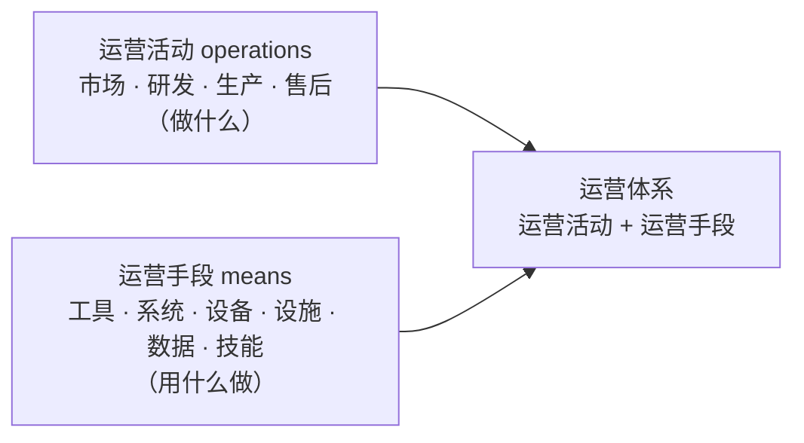
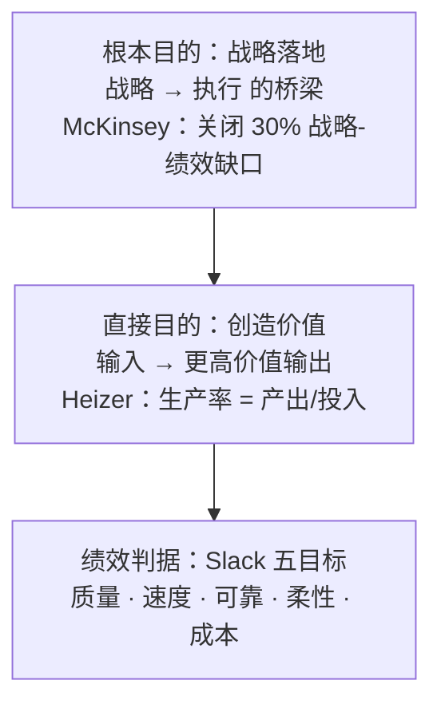
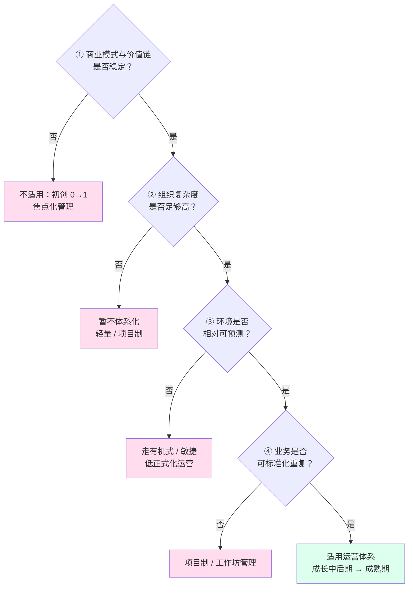
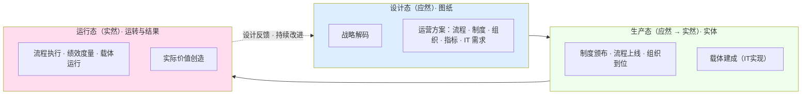
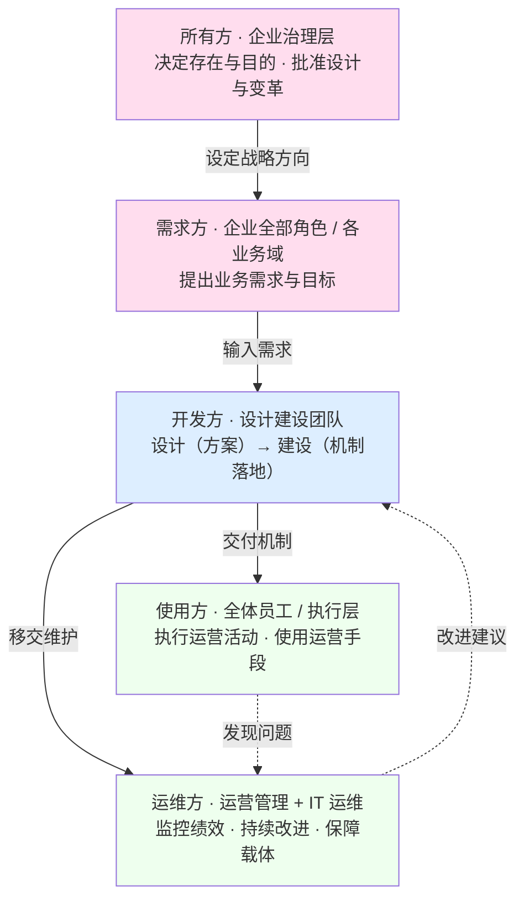

# 21 - 运营体系：从术语定义到产品化视角

> 本卡整理自一轮对话线（起点："什么是运营体系，查查标准或权威"），顺次覆盖：
> 运营体系的权威定义（四层来源）→ 拆解"运营"与"体系"各自的权威定义 → operations（英文）的权威定义 → 运营体系的构成（活动 + 手段）→ 运营体系的目的（两层）与绩效判据 → 适用与不适用的组织（四条判据 + 三个限定）→ 产品化视角（三态/五方）。
> 独立新卡，**未改动任何现有研究报告**。与 `17-设计与开发边界及三层基线治理对照卡`（目的→目标→需求 上游：战略目的企业持有，运营体系是承接执行的机制）、`05-工程概念精讲`（系统思维/系统工程）、`06-架构概念精讲`（体系与架构视角）、`14-产品数据精讲`（运营的产品数据载体）互参；教材侧见 [教材书第 14 章「治理」](../03-架构师是个怎样的物种/14-第14章-治理.md)（治理把组织保持在目的上、战略目的企业持有）。
> **治理口径**：本报告出现的「治理」是**组织层治理**（对象是整个组织，在管理层之上）。**架构治理**（architecture governance）的定义、目的、对象、输入与输出、责任主体与机制，一律以 **29 号《架构治理研究报告——从标准依据到责任主体》**为准（领域定义取 TOGAF，治理语义取 ISO/IEC 38500）——本报告与之的接驳点只有两处：§四 界定的**运营体系目的**是它的**裁量基准**（29 号 §3.1 前提一、§5.1 方向类输入），§六 五方的「治理层」是它的**授权来源**（29 号 §1.2 分层嵌套）。
> **文档版本**：v1.0（卡片创建 2026-08-30）→ v1.1（2026-08-30 归属判据改按产品化三态口径）→ v1.2（2026-09-21 第二轮收口：全生存周期／利益相关方定名）→ v1.3（2026-09-21 依 29 号对齐架构治理口径）→ v1.4（2026-09-21 术语按 28 号统一：宗旨／担责）→ v1.5（2026-09-21 第四轮·依 27 号对齐 ISO 9000:2026）→ **v1.6（2026-09-21 第六轮·依 24 号对齐）** → **v1.7（2026-09-21 第七轮·15288 版本锚定 ＋ 技术过程错号纠正）** → **v1.8（2026-09-21 第九轮·15288:2023 过程号结清：§6.1 恢复列号）**。
> **2026-09-21 第四轮·依 27 号对齐（ISO 9000 版本迁移）**：用户令「以 27 号研究报告为依据，将之前有关的研究报告与之对齐」。本报告涉 ISO 9000 的引用点共四处，按 27 号《ISO 9000:2026 相对 2015 版差异研究报告》迁移——① §2.3.1 system 条款号落定为 **ISO 9000:2026 §3.4.1**（2015 同位为 §3.5.1；定义句"相互关联或相互作用的一组要素"逐字未变，故此前标注的 ISO 9000:2000 只作该句源头，条款号一律以 2026 版为准）；② §2.3.1 **管理体系改按 2026 英文原文重述并换号**：management system 2015 §3.5.3→**2026 §3.4.2**，定义句由"…and processes to achieve those objectives"改为"**as well as** processes to achieve those objectives"，原 2015 注 2、注 3 被拆分改写为 2026 注 2（结构、角色和职责、策划和运行）与注 3（方针、惯例、规则和信念）；质量管理体系 2015 §3.5.4→**2026 §3.4.9**；③ §2.1.3 与 §七 引用表的国标对应关系写明：GB/T 19000—2016 是 **ISO 9000:2015 的等同采用**，其修订版（计划号 20264414-T-469，等同采用 2026 版）**尚在起草、未发布**，2026 版引文一律以英文原版为准。
> **2026-09-21 第六轮·依 24 号对齐**：用户令「以 24 号研究报告为依据，把 24 号之前的报告与之对齐」。本报告涉架构／设计处按 24 号《架构与设计边界研究报告》校正两处——① §6.1 三态表「设计态」一行，业务蓝图原注「业务整体怎么运转的**框架设计**」中的"框架设计"是**粒度／阶段词**（preliminary design，亦可名词化为文档名），按 24 号 §14.2、§14.3 撤下，改以总纲表述——架构与设计的差别是**种类**不是粒度；② §6.1 三态表下补**术语口径**注：该表右列所列皆**描述性信息产物**，设计态存续的是对运营体系的**描述**、不是运营体系本身（**架构是抽象物，可交付与可冻结基线的是架构描述 AD**），AD 与设计描述 DD 是**平级的 artefact**，依据 24 号 §1.4-1、§3.1、§3.2。**未改**：§一～§五 术语考证与判据、§六 三态与五方表其余各行、§七 参考文献，以及全部节号、表格行数与 mermaid 图结构，一处未动；§四 与 §6.2 的架构治理接驳仍以 29 号为准。
> **2026-09-21 第七轮·15288 版本锚定（含技术过程错号纠正）**（修订记录 · v1.7）：本轮起因两项——**错号纠正** ＋ **版本锚定**。①§6.1 三态循环句原列 15288 过程号**有明确错误**（把验证／确认记作 6.4.7~6.4.10、把运行／维护记作 6.4.11~6.4.12），按用户裁定**改按过程名列举、不列号**：设计态≈概念与开发（业务或任务分析 → 设计定义）、生产态≈实现、集成、验证、移交、确认、运行态≈运行、维护；②同处补**版本口径**注：15288 现行版为 **2023**（2023-05 发布，替代 2015 版），**技术过程号未随版核对，故此处不列号**（据 24 号 §1.2／§1.3／§12.4／附录 B，15288:2023 已核号仅 §3.5／§3.6／§3.13／§3.46／§5／§6.4.1／§6.4.4／§6.4.5／§6.4.6，**§6.4.7–§6.4.14 段各过程号彼时未核，第九轮已核**——SEH 5.0 中文版 p132–p184）。**未改**：§一～§五 术语考证与判据、§6.1 三态表与 §6.2～§6.3、§7 参考文献，以及全部节号、表格行数与 mermaid 图结构。
> **2026-09-21 第九轮·15288:2023 过程号结清**（v1.7 → v1.8）：ISO/IEC/IEEE 15288:2023 的**技术过程号已核实**——证据＝INCOSE SEH 5.0 中文版（2023-07，其 p18 明写本手册与 ISO/IEC/IEEE 15288（2023）一致，各过程 purpose 逐条冠以该标准条款号）：技术过程 §6.4.1 业务或任务分析（p132）／§6.4.2 利益相关方需要与需求定义（p136）／§6.4.3 系统需求定义（p141）／§6.4.4 系统架构定义（p148）／§6.4.5 设计定义（p155）／§6.4.6 系统分析（p159）／§6.4.7 实施（p162）／§6.4.8 集成（p165）／§6.4.9 验证（p168）／§6.4.10 转移（p173）／§6.4.11 确认（p176）／§6.4.12 运行（p182）／§6.4.13 维护（p184）／§6.4.14 处置（p186）。据此后：①§6.1 三态循环句**恢复列出已核号**（设计态 6.4.1 → 6.4.5；生产态 6.4.7／6.4.8／6.4.9／6.4.10／6.4.11；运行态 6.4.12／6.4.13），并把第七轮的「原记号有误」说明就地保留、记明**错号已纠正**；第七轮记录中「§6.4.7–§6.4.14 段各过程号未核」改记彼时未核、第九轮已核。**未改**：§一～§五 术语考证与判据、§6.1 三态表与 §6.2～§6.3、§7 参考文献，以及全部节号、表格行数与 mermaid 图结构。**仍未核**：2015 版术语条款号在 2023 版的对应号——本地无 2023 版原文。

---

## 〇、内核一句话

**运营体系 = 运营活动（把输入转化为产品与服务的价值创造活动：市场、研发、生产、售后）+ 支撑运营的手段（工具、信息系统、设备、设施、数据、技能），以战略落地为使命的整体。**

- 它的**目的**是把战略落地为日常运转并持续优化价值创造（以质量/速度/可靠/柔性/成本五维为判据）
- 它的**适用边界**：只适用于"商业模式已稳定、组织复杂度已够高、环境相对可预测、业务可标准化重复"的组织；对"初创探索、动荡环境、极小规模、项目型定制"的组织则不应体系化

---

## 一、核心结论先说

查证结论：**"运营体系"不是一个有统一国家标准的规范术语**——GB 没有给出统一定义；它是横跨企业管理、ISO 管理体系、系统工程、信息化平台四个语境的实践性概念，权威来源各有界定，但拼起来能得到严谨的合成定义：

| 术语 | 权威定义 | 出处 |
|------|---------|------|
| **运营**（operations） | 把输入转化为产品与服务、创造价值的活动与过程 | Heizer & Render / Stevenson / APICS |
| **运营管理**（operations management） | 对运营活动的计划、组织、实施、控制与改进 | APICS / Cambridge / 中文通用定义 |
| **体系**（system） | 一组相互关联或相互作用的要素 | ISO 9000:2026 §3.4.1（2015 §3.5.1；该句自 2000 版起未变） |
| **运营体系**（operations system） | 运营活动与支撑运营的手段相互关联、相互作用构成的整体 | 上述合成 |

> **工程侧的关键区分**：ISO/IEC/IEEE 24765 中 operation 是"在预期环境中运行系统以执行其预期功能"——那是"运行"，不是业务意义上的"运营"；两义不同，讨论时应避免混淆。

---

## 二、术语分解："运营"、"运营管理"、"体系"

### 2.1 "运营"（operations）的权威定义

#### 2.1.1 词源

《辞海》："运"本义为移动、运行、运转（强调"转动起来、在动"）；"营"本义为谋划、营谋、管理（强调"加以经营管理"）。合起来即：**让（企业/业务）转动起来，并加以谋划经营管理**。

《现代汉语词典》：本为运输部门用语（亦称"营运"），指运用运输工具从事运输生产经营活动；后受英文 operation 影响泛化，泛指各项业务活动的运作。

#### 2.1.2 业务侧权威定义（运营管理领域，三系一致）

> **运营 = 把输入转化为产品与服务、创造价值的活动与过程。**

| 出处 | 定义原文 |
|------|---------|
| Heizer & Render《Operations Management》 | "the set of activities that creates value in the form of goods and services by transforming inputs into outputs" |
| Stevenson《Operations Management》 | "the management of systems or processes that create goods and/or provide services" |
| APICS Online Dictionary | "the planning, scheduling, and control of the activities that transform inputs into finished goods and services" |

历史脉络：西方学者曾有形产品生产叫 production/manufacturing、服务活动叫 operations，现统称 operations——"运营"天然涵盖产品生产 + 服务创造两端，且强调过程管理。

#### 2.1.3 工程侧义项（与"运营"区分）

ISO/IEC/IEEE 24765:2010 §3.1977（系统与软件工程词汇）第 3 义项：

> **operation = 在预期环境中运行一个计算机系统以执行其预期功能的过程**（the process of running a computer system in its intended environment to perform its intended functions）。

这对应中文的"运行"，是 IT 视角；GB/T 19000（ISO 9000 的国标，现行 GB/T 19000—2016 为 **ISO 9000:2015 的等同采用**；其修订版计划号 20264414-T-469，等同采用 ISO 9000:2026，**尚在起草、未发布**——本节 ISO 9000 引文一律按英文原版给出）同样没有单列"运营"词条，而以"运行（operation）"一词承载（"运行过程""组织运行所必需的设施"）。

#### 2.1.4 小结

运营的语义内核 = **使业务运行起来，并对其过程进行计划、组织、实施、控制（管理）——对象是产品生产与服务创造**。

### 2.2 "运营管理"（operations management）的权威定义

> **运营管理 = 对运营（价值创造）活动的计划、组织、实施、控制与改进。**

- **Cambridge Business English Dictionary**：*"The control of the activities involved in producing goods and providing services, and the study of the best ways to do this."*（对生产产品与提供服务活动的控制，及对其最佳方式的研习）
- **APICS 双重定义**：① 作为活动 = 对把投入转化为成品与服务活动的计划、调度与控制；② 作为学科 = 研究制造或服务组织有效规划、调度、使用与控制的领域
- **中文通用定义**：对运营过程的计划、组织、实施和控制，与产品生产和服务创造密切相关的各项管理工作的总称

### 2.3 "体系"（system）的权威定义

#### 2.3.1 ISO 9000 术语定义（中文世界最权威）

> **system = set of interrelated or interacting elements**——一组相互关联或相互作用的要素。（**ISO 9000:2026 §3.4.1**；2015 同位为 §3.5.1，该句措辞两版逐字未变）

递进定义（均按 2026 版英文原文重述）：

- **管理体系 management system** = set of interrelated or interacting elements of an organization to establish policies and objectives, **as well as** processes to achieve those objectives——组织中相互关联或相互作用的一组要素，用以建立方针和目标，**以及**实现这些目标的过程（**ISO 9000:2026 §3.4.2**；2015 同位为 §3.5.3，该版定义句作 "…and processes to achieve those objectives"）
- **质量管理体系 quality management system** = 在质量方面指挥和控制组织的管理体系（**ISO 9000:2026 §3.4.9**；2015 同位为 §3.5.4）

要点：**"体系"与"系统"是英文 system 的两种译法**，"体系"是管理科学上的习惯译法，故"质量管理体系"即"质量管理系统"；2026 版把"以及实现这些目标的过程"（as well as processes）与体系要素并列写入定义句，并把要素清单拆入注 2（组织的结构、角色和职责、策划和运行）与注 3（方针、惯例、规则和信念），"体系包含人的因素"由此更直白。

#### 2.3.2 中国工程界的狭义用法：体系 = SoS

系统工程/体系工程视角下，"体系"不再等于 system，而专指 **SoS（System of Systems，系统的系统）**——若干可独立运行的系统为达成更高目标松耦合联结、涌现出单一系统没有的能力。与"系统"的关键区别：

> 〔按：ISO 9000:2026 §3.4.2 把管理体系要素明确列到**结构、角色和职责、策划和运行**（注 2）与**方针、惯例、规则和信念**（注 3），"体系本来就不排斥人的因素"有明文可依——本条界分因此只落在**耦合形态与边界**上（紧耦合有层级 vs 松耦合网状），不落在"有无人的因素"上。〕

| 维度 | 系统 | 体系（SoS） |
|------|------|------------|
| 核心要素 | 结构 | 能力 |
| 联系特征 | 组元紧密联系 | 要素松散耦合 |
| 结构形态 | 集中控制、有层级 | 网状、开放边界 |
| 分析起点 | 从功能 | 从目标 |

#### 2.3.3 小结

"体系"的语义内核 = 一组相互关联或相互作用要素构成的整体（**ISO 9000:2026 §3.4.1** system）；工程语境更窄，专指松耦合、面向目标能力涌现的"系统的系统"（SoS）。

---

## 三、运营体系的定义与构成

### 3.1 合成权威定义

> **运营体系 = 运营活动与支撑运营的手段相互关联、相互作用构成的整体。**

### 3.2 构成：运营活动 + 运营手段

> **运营体系 = 运营活动（做什么） + 支撑运营的手段（用什么做）。**

- **运营活动**（价值创造活动）：市场、研发、生产、售后、管理等——把输入转化为产品与服务
- **运营手段**（活动得以执行的前提）：工具（CAX、机床）、信息系统（ERP、OA、MES、PLM）、设备、设施、数据、技能

**归属判据（产品化三态口径，2026-08-30 统一）**：把运营体系看作产品，业务需求、合规要素、制度流程、IT系统及运行**都属于运营体系**——它们不是"属于/不属于"之别，而是运营体系作为产品在全生存周期三个状态（三态）的体现：

| 状态 | 属于 | 具体体现 |
|------|------|---------|
| **设计态**（应然·图纸） | 业务需求、合规要素、制度流程 | 需求定义要创造什么、合规划红线、制度流程以制度文本与流程文件存在 |
| **生产态**（应然→实然·实体） | IT 实现（系统建成） | 制度颁布、流程上线、组织到位、系统建成 |
| **运行态**（实然·运转） | IT 运行（日常运转） | 流程流动、制度执行、绩效度量、载体运行 |

**判定要点**：三态是完整链，缺一环都不算建成运营体系——单写制度或单建系统只到设计态/生产态，体系要在运行态真正转起来才算建成；同时运营体系还有"两种成分"视角：运营活动（做什么）+ 支撑运营的手段（用什么做），活动与手段是构成成分之分，不是属于/不属于之分；手段是活动存在的前提，没有 CAX、现代研发运营就不存在，手段不是活动附件。

**ERP 与 CAX 同属，角色不同**：

| | ERP | CAX |
|---|---|---|
| 支撑的运营域 | 采购 / 生产运营 | 研发运营 |
| 在运营中的角色 | 流程在其上运行的**载体** | 子活动（建模/仿真）的**作业工具** |
| 是否属于运营体系 | ✅ | ✅ |

差异在角色（载体 vs 工具）、在支撑的运营域，不在"属于/不属于"。（辨析过程：初稿曾用"CAX 不是活动"误推"CAX 不属于运营体系"——混淆了 operations（活动）与运营体系（活动 + 手段）两个概念，已修正。）

### 3.3 两种读法

"运营体系"可按两种读法理解，对应两种设计取向：

| 读法 | 视角 | 强调 | 适用设计取向 |
|------|------|------|-------------|
| **ISO 式（过程方法）** | 体系 = system | 运营活动与手段构成一条紧密关联的整体，强调"运营是一体的、可管理的" | 单一业务域内的精细化管理 |
| **SoS 式（体系工程）** | 体系 = SoS | 企业各业务域是可独立运行的活动与手段组合，松耦合联结、面向整体目标涌现能力，强调"跨域协同、开放演进" | 多业务域组合成整体运营能力 |

### 3.4 信息化形态

运营体系的运营手段在信息化语境下常表现为**数字化运营平台 / 运营管控平台**（ERP、OA、MES 等业务管理系统）：它们是承载运营流程的载体，属于运营手段。构建这些手段的活动（IT实现）即运营体系的生产态、保障其运行的活动（IT运行）即运行态，与设计态一起构成运营体系全生存周期（三态口径见 §3.2）。

---

## 四、运营体系的目的（两层）与绩效判据

### 4.1 直接目的：创造价值、提升生产率（运营管理学）

Heizer & Render：运营的职能就是把输入转化为更高价值输出，**通过转化创造价值**，以**生产率 = 产出/投入**为衡量——生产率提升是企业盈利与长期发展的唯一来源。

### 4.2 根本目的：战略落地的桥梁（operating model / McKinsey）

> **运营体系是战略与执行之间的桥梁（bridge）。** "没有运营体系的战略只是一张愿望清单——它描述了企业想达成什么，却没说清如何组织自己去达成。"战略执行在运营体系处"要么成功要么断裂"。

- **30% 绩效缺口**：表现优异的企业，战略潜能也有约 30% 未能兑现，症结大多在运营模式——运营模式是 CEO 可直接掌控、对绩效影响最深远的变量之一
- **四大成果**：清晰（资源权责对齐战略）、敏捷（决策与流程快）、人才（能力匹配未来）、协同（员工认同承诺）

中文管理文献同构表述："流程是价值创造的路径，运营是执行落地的保障"；运营体系承担"战略解码的桥梁"。

### 4.3 绩效判据：Slack 五目标

| 目标 | 定义 |
|------|------|
| 质量 Quality | 做对事（零差错、满足客户） |
| 速度 Speed | 做得快（需求提出到获得的时间最短） |
| 可靠 Dependability | 按时交付（兑现承诺） |
| 柔性 Flexibility | 能变（适应变化、个性化、推新品） |
| 成本 Cost | 做得省（低成本仍可盈利） |

五者构成沙锥模型（质量→可靠→速度→柔性→成本），企业按竞争策略取舍。

**口径限定**：五目标是衡量运营绩效（目的兑现与否）的尺子；评判者=客户与企业双方：质量/速度/可靠主要为客户感知，成本/柔性为企业自身口径，每维兼有内外两面。

### 4.4 目的层次图

一句话：**运营体系的目的 = 作为战略与执行之间的桥梁，把战略落地为日常运转，通过价值创造过程的持续优化（五目标为判据），系统性地兑现战略潜能。**

> **与架构治理的接驳（依 29 号）**：本节界定的**运营体系目的**，就是架构治理的**裁量基准**——「架构由**宗旨**评判，而目的定义权在治理机构，不在架构师，也不在开发团队」（29 号 §3.1 前提一；29 号 v1.3 起该前提的用词已按 28 号统一作「宗旨」）；它与企业战略、利益相关方需求与关注点同属治理的**方向类输入**（29 号 §5.1），也构成四层治理对象首层「**架构决策**」的合格判据——基本概念与属性的取舍是否仍与目的一致（29 号 §4.1）。架构治理本身不在本报告范围内，其定义与展开见 29 号。〔**术语换算**：本报告的「运营体系目的」＝ 28 号 §2.8 定译的 **organizational purpose（宗旨）**——本报告以运营体系为对象，「运营体系目的」是它在本文语境下的具名写法，指向同一物；29 号与其余报告已统一取「宗旨」（28 号 §2.8 四层边界：宗旨／目标／需求／特性各占一层）。〕

---

## 五、适用与不适用的组织（四条判据 + 三个限定）

### 5.1 核心判据（两条硬标准）

判断一个组织**是否需要**运营体系（最权威判据）：

1. **商业模式和价值链是否稳定**——根本前提；模式未跑通时建体系，只会拖死探索
2. **组织复杂度是否足够高**（职能细分度和层级数）——复杂度与协同成本，才让"体系"产生价值

两条同时满足，运营体系才是"需要"的；不满足，体系是负担。

### 5.2 适用的组织

| 维度 | 适用条件 |
|------|---------|
| 发展阶段 | 成长期中后期 → 成熟期（商业模式已验证、进入复制/精细化） |
| 规模与结构 | 组织复杂、多层级多职能、跨部门协作密集 |
| 环境 | 相对稳定可预测（Burns & Stalker：稳定环境适合高正式化的**机械式**组织） |
| 业务形态 | 高重复、可标准化、大流量（product-process 矩阵：批量/流水线/连续流程，高 volume 低 variety） |
| 竞争方式 | 靠效率、成本、可靠性与规模化交付 |

管理进阶路径：焦点化管理（初创）→ 职能化管理（成长）→ 体系化管理（成熟）→ 全流程梳理。

### 5.3 不适用的组织（或不该过早体系化）

1. **初创 0→1 期**：创新工作比重大，最有价值的是项目制和协同能力；"管理都是有成本的"，商业模式没跑通就建全组织会出问题。只需"焦点化管理"（管住钱、关键决策、重大任命）
2. **创新/探索型敏捷组织**：Burns & Stalker 明确指出动荡环境中高正式化会降低适应性、增加失败风险，应采**有机式**（低正式化）结构。重流程会把"注意力从结果转向合规、抑制实验探索、催生部门孤岛"
3. **快速扩张、需灵活应变的企业**：标准化流程带来僵化冗余，逆境中"化整为零"激活小团队灵活性更重要
4. **极小规模组织**：几个人不需要体系，体系本身成负担
5. **项目型/单件定制业务**：最低量最高品种、资源临时组织、流程不重复——运营管理理论明确此类走**项目制/工作坊管理**，而非重复性流程管理

### 5.4 三个关键限定

1. **所有组织都有"运营"，区别在于"是否值得体系化"**——任何组织都要把输入变输出，但小组织、探索组织用头脑和协调即可，成熟复杂组织才需要把运营"立成体系"。这是轻重问题，不是有无问题
2. **"不适用"精确说是"不适用僵化的、标准化的重型体系"**——运营体系本身可以设计成敏捷/柔性的，创新组织不是不要运营，而是不要重流程合规型运营
3. **判定随阶段迁移**——初创期不需要 → 成长期必须标准化沉淀可复制能力 → 成熟期体系化精细化；成熟期也须防"大企业病"对创新的抑制

### 5.5 适用边界判定图

---

## 六、产品化视角：三态与五方

把运营体系看作产品，它有自己的三态体现（设计/生产/运行）与五方（所有/需求/开发/使用/运维）。

### 6.1 三态体现

> **设计态 = 图纸（应然），生产态 = 实体（应然→实然），运行态 = 运转与结果（实然）。**

| 状态 | 本质 | 体现（以什么形态存在） |
|------|------|---------------------|
| **设计态** | 应然 | 运营方案文档：业务蓝图（业务整体怎么运转的总纲，其余各项由它展开）、流程文件、制度文本、组织设计、指标体系、IT 需求 |
| **生产态** | 应然→实然 | 落地实体：颁布的制度、上线的流程、到位的组织、建成的系统 |
| **运行态** | 实然 | 日常运转：流动的流程、执行的制度、度量的绩效、运行的载体 + 实际交付的产品/服务 |

三态是循环不是直线：运行态持续反馈设计态（PDCA 持续改进），运营体系的设计没有终稿。与 ISO/IEC/IEEE 15288 同构——设计态≈概念与开发（业务或任务分析 6.4.1 → 设计定义 6.4.5）、生产态≈实现 6.4.7、集成 6.4.8、验证 6.4.9、转移 6.4.10、确认 6.4.11、运行态≈运行 6.4.12、维护 6.4.13〔版本口径：15288 现行版为 **2023**（2023-05 发布，替代 2015 版）；**上列过程号已核**，证据＝INCOSE SEH 5.0 中文版 2023-07 所印 15288:2023 条款号，p132–p184。第七轮曾因旧稿把验证／确认记作 6.4.7~6.4.10、把运行／维护记作 6.4.11~6.4.12（**原记号有误**）而改按过程名列举、不列号；本轮据已核号**恢复列号**，错号已纠正。〕

> **术语口径（依 24 号）**：本表右列列的是**描述性信息产物**——设计态存续的是对运营体系的**描述**，不是运营体系本身（24 号 §1.4-1：架构是**抽象物**、不是交付物；可交付、可冻结基线的是**架构描述 AD**）。若把其中某项读作运营体系的"架构"，须按 24 号口径分开：AD 与**设计描述 DD** 是**平级的 artefact**，不是同一描述的粗细两版（24 号 §3.1、§3.2）；"**框架设计**"是**粒度／阶段词**（preliminary design，亦可名词化为文档名），不用来给架构定位——架构与设计的差别是**种类**（kind），不是粒度（granularity）（24 号 §14.2、§14.3）。

### 6.2 五方

运营体系作为产品，五方通常都在同一企业内部，按治理/经营/职能/执行/支持五个层级区分，而非按组织边界区分：

> **两层级的界分（依 29 号 §2.3）**：此处的五层排法属**组织层**——对象是整个组织，故治理在管理之上（董事会在 CEO 之上）。**领域层方向相反**：以某一专业域为对象时，该域的**管理是伞、治理是伞内的一个领域**（架构域即如此：企业架构是伞，架构治理是其一员）。两者不矛盾，判据是**治理对象是什么**——对象是「整个组织」时治理在上，对象是「某个专业域」时该域的管理伞包含该域的治理职能。这条区分防止一种典型混乱：把某域的治理说成「该域工作的最高层」，进而让它去指挥该域的具体设计（29 号 §2.3）；它同时是 29 号 §1.2「公司治理 ⊃ 技术治理 ⊃ IT 治理 ⊃ 架构治理」那层**授权**关系的下游——本表「所有方」所在的治理层即架构治理授权的来源。

| 角色 | 是谁 | 在运营体系中的体现 |
|------|------|-------------------|
| **所有方** | 企业治理层（董事会/最高决策层） | 拥有运营体系的存在权与目的，批准设计与变革，对结果负责（问责） |
| **需求方** | 企业全部角色（市场/研发/生产/售后/管理等各业务域） | 各自提出业务需求：运营体系要支撑各自业务、达成什么目标 |
| **开发方** | 设计建设团队，含制度、流程、IT 开发等利益相关方（可内可外） | 把需求转成方案并建成机制 |
| **使用方** | 全体员工/执行层 | 日常执行运营活动、使用运营手段 |
| **运维方** | 运营管理团队 + IT 运维 | 监控绩效、发现偏差、持续改进；保障载体持续运行 |

---

## 七、参考文献

仅收录公开的标准、书籍、期刊论文与权威网络来源。项目内部文档（研习卡、教材书、仓库规范）为内部引用，见开头"来源对话线"互参说明，不列为参考文献。

### 7.1 标准与书籍（主表）

| 概念 | 标准出处 | 关键原文/位置 | 引用方式 |
|------|---------|--------------|---------|
| **体系 / 管理体系 / 质量管理体系** | ISO 9000:2026 §3.4.1／§3.4.2／§3.4.9（2015 同位为 §3.5.1／§3.5.3／§3.5.4） | system = set of interrelated or interacting elements（一组相互关联或相互作用的要素，两版逐字未变）；management system = 组织中相互关联或相互作用的一组要素，用以建立方针和目标，**以及**实现这些目标的过程（2026 把 2015 的 "and processes" 改作 "as well as processes"，注 2、注 3 拆分改写）；质量管理体系 = 在质量方面指挥和控制组织的管理体系。注：GB/T 19000—2016 为 ISO 9000:2015 的等同采用，其修订版（计划号 20264414-T-469）尚在起草、未发布 | 直接引用（§2.3） |
| **运营管理（OM）** | Heizer & Render《Operations Management》 | "the set of activities that creates value in the form of goods and services by transforming inputs into outputs" | 直接引用（§2.1、§4.1） |
| **运营管理（OM）** | Stevenson《Operations Management》 | "the management of systems or processes that create goods and/or provide services" | 直接引用（§2.1） |
| **operation（工程侧）** | ISO/IEC/IEEE 24765:2010 §3.1977 | 在预期环境中运行系统以执行其预期功能 | 直接引用（§2.1.3） |
| **机械式 / 有机式组织** | Burns & Stalker《The Management of Innovation》（1961） | 稳定环境→机械式（高正式化）；动荡环境→有机式（低正式化） | 概念支撑（§5.2、§5.3） |
| **运营绩效五目标** | Slack, Chambers & Johnston《Operations Management》 | quality / speed / dependability / flexibility / cost | 概念支撑（§4.3） |
| **体系 vs 系统（SoS）** | 《工程实践中的体系与系统》（科技导报，2018） | 体系 = 系统的系统：松耦合、重能力、网状开放边界 | 概念支撑（§2.3.2） |
| **运营词源** | 《辞海》《现代汉语词典》 | 运 = 运行转动；营 = 谋划管理 | 概念支撑（§2.1.1） |
| **operating model** | MIT Sloan J. Ross（2006） | 为交付产品与服务所必需的业务流程集成与标准化程度 | 概念支撑（§4.2） |

### 7.2 权威网络来源

| 来源 | 内容 |
|------|------|
| [APICS Online Dictionary（operations management）](http://www.apics.org/docs/default-source/principles/operations-management-foundations.pdf) | 运营管理 = 计划/调度/控制转化活动（活动定义 + 学科定义） |
| [McKinsey《What is an operating model》](https://www.mckinsey.com.br/en/our-insights/what-is-an-operating-model) | operating model = 战略执行的桥梁；12 要素；四大成果 |
| [McKinsey 未来组织：12 要素运营法则（中文）](https://www.mckinsey.com.cn/%E6%9C%AA%E6%9D%A5%E7%BB%84%E7%BB%87%EF%BC%9A%E9%BA%A6%E8%82%AF%E9%94%A912%E8%A6%81%E7%B4%A0%E8%BF%90%E8%90%A5%E6%B3%95%E5%88%99/) | 运营模式驱动四大成果：权责清晰/决策敏捷/人才专业/协同高效 |
| [Cambridge Business English Dictionary](https://dictionary.cambridge.org/us/dictionary/english/operations) | 运营管理 = 对生产产品与提供服务活动的控制 |
| [中欧国际工商学院（为什么从头到尾都是总经理签字）](https://cn.ceibs.edu/emba/student-view/25750) | 是否需要体系的两条判据：商业模式稳定 + 组织复杂度；焦点化→职能化→体系化进阶 |
| [华中大 MBA 大讲堂（胡云峰）](http://mba.hust.edu.cn/info/1043/1857.htm) | 运营管理五大要素（战略/流程/组织/绩效/信息化），流程是核心 |
| [城市轨道交通运营指标体系 GB/T 38374-2019](https://wap.cnki.net/qikan-DZBH202103003.html) | GB 层面无统一"运营体系"定义，只有行业性标准 |
| [环境保护设施运营组织服务评价 GB/T 38221-2019](http://www.bozrz.com/upload/files/2025/09/18/11173152256.pdf) | 同上，行业性"运营"落地 |
| [百度百科·运营](https://baike.baidu.com/item/%E8%BF%90%E8%90%A5/5144034) | 运营 = 计划/组织/实施/控制，与产品生产和服务创造相关的管理工作总称 |
| [百度百科·运营管控平台](https://baike.baidu.com/item/%E8%BF%90%E8%90%A5%E7%AE%A1%E6%8E%A7%E5%B9%B3%E5%8F%B0/7682836) | 运营体系信息化形态：业务管理信息化的运营管控层 |
| [Product-process matrix / process types（ecampusontario）](https://ecampusontario.pressbooks.pub/opsmgmt/chapter/5-4-decisions-in-process-management-process-choice/) | volume-variety：项目→单件→批量→流水线→连续，标准化递增 |

---

*卡片创建：2026-08-30（独立新文件，未修改 00~20 号卡的既有内容）。*
*更新：2026-08-30 归属判据改按产品化三态口径——业务需求/合规要素/制度流程=设计态、IT实现=生产态、IT运行=运行态，都属于运营体系（对齐培训课件统一思路）；§6.2 开发方明确含制度/流程/IT 开发等利益相关方、需求方改为企业全部角色（各业务域）。*
*2026-09-21 第二轮收口（用户裁定「fundamental 用『基本』，其余术语按 GB/T 45630-2025」）：§3.2／§4 共 2 处「全生命周期」改「**全生存周期**」；§6.3 五方表「相关方」改「**利益相关方**」（stakeholder 国标定名，30 号 §8.2）。*
*2026-09-21 第四轮·依 27 号对齐（ISO 9000 版本迁移）：§2.1.3、§2.3.1、§2.3.2、§2.3.3、§一 定义来源总表与 §7.1 主表的 ISO 9000 引用全量迁 2026 版——system §3.4.1（2015 §3.5.1）、management system §3.4.2（2015 §3.5.3，定义句 "and processes"→"as well as processes"，注 2、注 3 拆分改写、并补注 4、注 5）、quality management system §3.4.9（2015 §3.5.4）；管理体系一句由中文旧口径改按 2026 英文原文重述；§2.3.2 补一条界分口径（2026 注 2／注 3 已把人的因素列入体系要素，"系统 vs 体系"的分界只落在耦合形态与边界上）；GB/T 19000—2016 的等同采用关系与 2026 版新国标（计划号 20264414-T-469）尚在起草未发布一事就地写明。依据：27 号《ISO 9000:2026 相对 2015 版差异研究报告》。*

> **补充记录（2026-09-21 依 29 号对齐）**：用户令「以 29 号研究报告为依据，将之前有关的研究报告与之对齐」。本报告以运营体系为主体，治理只在两处出现（§四 目的的归属、§六 五方的治理层），故按 29 号《架构治理研究报告——从标准依据到责任主体》只补接驳，不动本报告的考证与判据——①头部补「治理口径」行与**文档版本**行：本报告的「治理」是**组织层治理**，架构治理（architecture governance）的定义、目的、对象、输入输出、责任主体与机制一律以 **29 号**为准；②§4.4 补接驳段：本报告界定的**运营体系目的**即 29 号 §3.1 前提一所称由治理机构持有的**运营目的**，它是架构治理的**裁量基准**（29 号 §3.1、§5.1 方向类输入），并构成 29 号 §4.1 首层治理对象「架构决策」的判据；③§6.2 补**两层级方向相反**的界分（29 号 §2.3）与授权来源（29 号 §1.2）：组织层治理在管理之上，领域层管理是伞、治理是其一。**未改**：§一～§三 术语考证、§四 目的两层与 Slack 五判据、§五 四条判据与三个限定、§六 三态与五方表、§七 参考文献，以及全部节号、表格行数与图结构，一处未动。依据：29 号 §1.2、§2.1、§2.3、§3.1、§4.1、§5.1。 **术语（第五轮）**：治理三职能第三成分作「**担责**」、organizational purpose 作「**宗旨**」（按 28 号 §2.3.3／§2.8 统一；本报告原用「运营目的」「问责」处已就地换）。
