# 23 - 判据体系对话记录

> **日期**：2026-09-11
> **参与**：Mickey（用户）／阿布
> **体裁**：对话原样记录（不整理、不提炼、不重排）
> **约定**：requirement → 需求；need → 需要；expectation → 期望（三者不混用）

> **记录说明**：第 1–11 轮的回复原文因会话上下文压缩，无法逐字复原，此处按当时形成的完整记录还原其内容、引证与措辞风格；第 12 轮起为逐字记录。
> **图的处理**：原对话中的图为 SVG，按本次要求统一以 mermaid 表达。

---

## 第 1 轮

### Mickey

> @image#1:Clipboard_Screenshot.png 你讲解下这张图

（图片本地路径：`C:\Users\HUAWEI\.workbuddy\clipboard-images\clipboard-2026-09-10T23-53-22-354Z-4b8d0fdb.png`）

### 阿布

这是 INCOSE《Systems Engineering Handbook》(SEH) 里的经典 **Systems Engineering Vee** 图。图中所有流程名都取自 **ISO/IEC/IEEE 15288** 的技术流程。

**图的结构可以分四层看：**

1. **蓝色主干（产物层）**：干系人需要和需求 → 系统需求 → 系统架构与设计。
2. **两端锚点**：粉色是 Stakeholder Real-World Expectations，这是 Validation 的终极参照系；橙黄是 Realized System of Interest；灰色是 Operational / Maintained / Disposed System。
3. **紫色（上方）= Validation 链**：问的是 "Do we have the right ..."，箭头一律**向左回溯**。
4. **绿色（下方）= Verification 链**：问的是 "Are ... defined correctly?"，箭头**向左下回指**上游的规定需求 / 设计。

底部有 5 个 Transformation 标签：BMA/SNRD、SRD、SAD/DD、Implementation/Integration、Transition/Operation/Maintenance/Disposal。顶部 Confirmation 对应 Validation Process，底部 Confirmation 对应 Verification Process。左下角图例是 Concurrency / Iteration / Recursion。

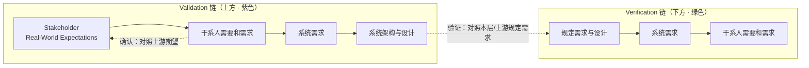

**这张图的题眼：Validation 的尺子是干系人需要与期望（上游来源），Verification 的尺子是规定需求与设计（本层或上游产物）。两把尺子不同，这是整张图的题眼。**

---

## 第 2 轮

### Mickey

> ISO 9000中，确认对照的是预期的用途和使用；而这张图的确认，它对照的是相关方需要或需求，好像不一致了

### 阿布

不冲突。是"限定语收窄"造成的口径差异。先把原文摆出来：

- **ISO 9000:2015 §3.8.5 verification**：*confirmation, through the provision of objective evidence, that **specified requirements** (3.6.4) have been fulfilled.*
  注：客观证据可为检验、替代计算、文件评审；"verified" 表示状态。
- **ISO 9000:2015 §3.8.6 validation**：*confirmation, through the provision of objective evidence, that **the requirements (3.6.4) for a specific intended use or application** have been fulfilled.*
  注1：客观证据来自试验等；注3：使用条件可真实可模拟。
  → 关键：对照物**仍是 §3.6.4 的 requirement**，只是加了限定语 "for a specific intended use or application"。
- **ISO 9001:2015 §8.3.4 c)/d)**：验证 = 设计开发输出满足设计开发**输入需求**；确认 = 产品和服务满足**预期用途**需求。
- **ISO/IEC/IEEE 15288:2015 §6.4.9.1 Verification**：objective evidence that a system or system element fulfills its **specified requirements and characteristics**。
- **ISO/IEC/IEEE 15288:2015 §6.4.11.1 Validation**：objective evidence that the system, when in use, fulfills its **business or mission objectives** and **stakeholder requirements**, achieving its **intended use in its intended operational environment**。
- **15288 §6.4.11.1 NOTE 1**：validation → "the right product is built"；verification → "the product is built right"。（图中 Do we have the right system? 即此句直译）

**调和结论（三层）：**

1. 两者都要以 requirement 为判据，但 **ISO 9000 收窄到"为特定预期用途或应用而存在的需求"，15288 开放到 {目标 + 干系人需求 + 预期用途 + 预期运行环境}**。
2. ISO 9000 自己的 requirement 定义（§3.6.4）含 "generally implied"，所以"未明示的期望"在 ISO 9000 语义里**也是** requirement，只是属隐含那一支、且不满足 §3.8.6 的限定语。
3. 图中五条确认链里，**只有最左端**（干系人需要和需求确认 → 对照"现实世界期望"）越出需求口径；其余各级对照物都是上游产物（本身已是需求/设计），与 ISO 9000 完全对齐。

**立场差异（一句话）**：ISO 9000 是质量管理体系立场——判据必须可审核，故预期用途须先被需求化（闭合模型）；15288 是系统生命周期立场——承认参照系可以先于/大于需求（开放模型，requirement 由 expectation 派生必有损耗）。

**AOS 启示**：派生型文档链上，若参照系只有需求基线，就只能做 verification；要能做 validation，必须在基线之上保留一个"期望/用途"参照层。

---

## 第 3 轮

### Mickey

> 如果认真扣的话，有点需求是隐含的，也就是没有被显性化的，那预期用途的需求很可能就是这一类需求。如果是这样的话，那确认对照的需求是预期用途的需求，大概率是没有被显性化的隐含的需求。

### 阿布

**你的推论成立。而且我上一轮"限定语收窄"的定性需要修正。**

先核原文。**ISO 9000:2015 §3.6.4 requirement**：*need or expectation that is **stated, generally implied or obligatory*** = 明示的、通常隐含的或必须履行的需求或期望。

- **注1**："通常隐含"是指组织和相关方的**惯例或一般做法**，所考虑的需求或期望是**不言而喻**的。
- **注2（关键）**：**A specified requirement is one that is stated**，例如在成文信息中阐明。国标译文：**规定要求是经明示的要求**。
- **注5（关键）**：为实现较高的顾客满意，可能有必要满足那些顾客**既没有明示、也不是通常隐含或必须履行**的期望 → 承认**第四类"三不沾"期望**，但不构成 requirement。

**推论链：**

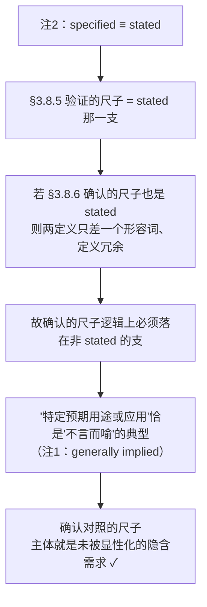

1. 注2 把 `specified ≡ stated` 钉死 → §3.8.5 verification 的尺子 = stated 那一支。
2. 若 §3.8.6 validation 的尺子也是 stated，则两个定义只差一个形容词、定义冗余 → 故 validation 的尺子**逻辑上必须落在非 stated 的支**。
3. 而"特定预期用途或应用"恰恰是"不言而喻"的典型（注1 的 generally implied）→ **确认对照的尺子，主体就是未被显性化的隐含需求。你对。**
4. 我上一轮"ISO 9000 比 15288 窄"的说法**错了**：两者都在"明示需求"之外，ISO 9000 甚至额外承认了 requirement 之外的期望（注5）。真正的差别是**词法上的**——ISO 9000 的判据仍收在 requirement 内（取 generally implied 支），15288 的判据直接是 expectation/objective/intended use/environment，不收在 requirement 内。

**精修（不可省）**：不是全等，是"以隐含为主体 + 与 stated 有交集"。明示的预期用途需求（如客户明说"要在 −40°C 能开机"）同时是两把尺子 → 这是 V&V 实践大量重叠的根源（ISO 9001:2015 §8.3.4 注：V&V 可分别或任意组合进行）。

**硬推论（增量）**：隐含需求**在逻辑上无法被验证**（验证判据是明示需求，隐含需求没有明示形式）→ 只能被确认 → 确认必须"用"（§3.8.6 注3：使用条件可真实可模拟）→ **确认的方法论天然是场景/用例/运行试用/现场试验，不是逐条需求符合性检查。**

**AOS 落点**：派生型文档链**只能承载 stated**（generally implied 不上链）。故"链路自洽"只保证 verification 侧；确认的判据（隐含需求/预期用途）**在链外**，且链的结构无法表征它。→ 需求基线之上必须有一个与派生链**异构**的参照层，载体是预期用途/使用情境/ConOps/用例，而**不是**逐条需求。

---

## 第 4 轮

### Mickey

> 关于预期的使用或应用，你详细解释下

### 阿布

**最硬的一块证据 —— ISO 9000:2005 → 2015 的措辞修订（两版原文均已核）：**

- 2005 §3.8.5 validation = "the **specified** requirements for a specific intended use or application have been fulfilled"
- 2015 §3.8.6 validation = "the **requirements (3.6.4)** for a specific intended use or application have been fulfilled"
  → **2015 版删去了 "specified"**，改为引用 §3.6.4 的上位概念 → 确认的判据从"仅明示需求"扩展为"明示/通常隐含/必须履行"三支。
- 而 verification 的措辞**两版都保留 "specified requirements"**（2015 §3.8.5 仍为 specified requirements）。
  → **2015 版刻意让两把尺子在"是否限定为明示需求"这一点上分岔。这是标准自己承认：确认的判据不在明示需求内。**

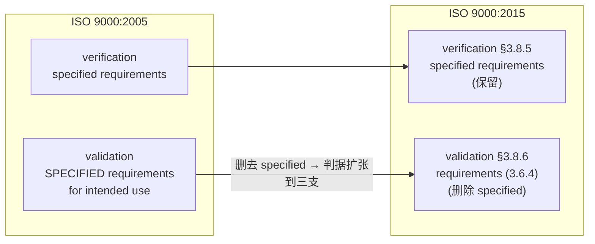

**ISO 9001:2015 §8.2.3.1 a)–e) 落地条款（原文已核）：**

- a) requirements **specified by the customer** → stated
- b) requirements **not stated by the customer, but necessary for the specified or intended use, when known** → generally implied（"when known" 是限定！承认"存在但不被知"的区域永远进不了需求基线）
- c) requirements specified by the organization
- d) **statutory and regulatory** requirements → obligatory
- e) contract or order requirements differing from those previously expressed

→ 与 §3.6.4 的三支**同构**。注意 b) 里 "**specified or intended** use" 并列 —— ISO 自己把"规定用途"与"预期用途"当作两个东西。

**同构表（我的解读）**：§3.6.4 需求三支按"是否已被写明"分；用途也按同一维度分两面 —— **specified use（规定用途，已写进规格/说明书）** vs **intended use（预期用途，意图中而常未写明）**。§3.6.10 defect 定义亦用 "intended or **specified** use"，两处并列可互证。

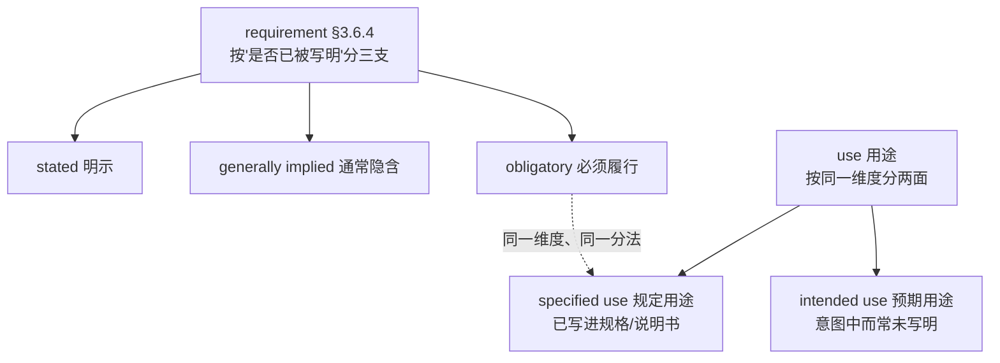

**词义**：intended ← 拉丁 *intendere*（in- 朝向 + tendere 伸展，同源 tension/tendon）→ 把意志伸向某处。故 intended use 是**规范性（应然）**概念，非描述性；与 actual use（实然）、foreseeable misuse（可预见误用）须划界。"specific" 要求用途**必须先被指明**，否则确认无靶子；`or application` 用 use（使用方式）+ application（应用场合）两面涵盖。

**ISO 自家三条"神来之笔"：**

1. ISO/DIS 9001 §3.57 customer satisfaction 注1：顾客的期望**可能连顾客自己都不知道，直到产品/服务交付之后** → 确认判据在源头就**不可完全前置获取** → 确认本质上是后置的、迭代的、参与式的。
2. IEC Electropedia IEV 192-01-18 注5：**Multiple validations may be carried out if there are different intended uses** → 一个物件可有多用途 → 确认按用途分摊，用途参照层与需求基线**多对一**，无法互相替代。
3. ISO 9000:2015 §3.6.10 defect 注2：**intended use as intended by the customer** 会被**提供方提供的信息（操作/维护说明书）**影响 → 用途归属顾客，但可被提供方信息塑造。

**工程含义**：确认的第一件事是写 **use specification / ConOps / 使用场景**（否则 §3.8.6 的 "specific" 无从满足）；确认手段必须是"在使用条件下运行"（§3.8.6 注3：真实或模拟），因为判据是情境而非条目。

---

## 第 5 轮

### Mickey

> 规定的需求                     ←→    验证的判据
> 预期使用或应用的需求   ←→    确认的判据
> 客体的目标                     ←→    评审的判据
> 客体的目的                     ←→    治理的判据
> 是不是呢？

### 阿布

逐行判定：

1. 规定的需求 ←→ 验证的判据　**✓ 成立**（§3.8.5 specified requirements）
2. 预期使用或应用的需求 ←→ 确认的判据　**✓ 成立**（§3.8.6）
3. 客体的目标 ←→ 评审的判据　**✓ 成立，且是全表最关键的转折点**
4. 客体的目的 ←→ 治理的判据　**✗ 需重写：出处错、类别错、对象错**

**第 3 行是分水岭：**

- **ISO 9000:2015 §3.11.2 review**：determination of the suitability, adequacy, or effectiveness of an **object** to achieve **established objectives**；NOTE 1 还可包括 determination of **efficiency**
- 注意：2015 版评审在 **§3.11「决定相关术语」**（review / monitoring / measurement / inspection / test / progress evaluation），不是 §3.8。2005 版才是 §3.8.7（原文用 "subject matter"，2015 改为 "object"）。
- **判据第一次跳出 requirement 家族**（需求 → 目标）。
- **翻译陷阱**：国标把 established objectives 译作"**规定目标**"、specified requirements 译作"**规定要求**"——中文都用"规定"，掩盖了英文 specified vs established 的差别，容易误以为同一物。

**第 4 行三重错误：**

- 出处：ISO 9000 根本没有"治理"术语 → 家园是 **ISO 37000:2021**（治理）与 ISO/IEC 38500（IT 治理）
- 类别：验证/确认/评审都是**活动（activity）**；治理在 ISO 37000 中被定义为 **体系（human-based system）**——不能用体系去对活动
- 对象：前三行对象是**客体**；治理的对象是**组织**（ISO 37000 scope = governance of organizations）

**修正版第 4 行（两案）：**

- 方案 A（保留治理）：**组织（客体=组织）的宗旨/目的 ←→ 治理的判据**。ISO 37000：good governance = "a human-based system by which an organization is directed, overseen and held accountable for achieving its **defined purpose** in an ethical and responsible manner"；11 项原则以 **Purpose 为 primary principle**；但治理判据不是单数 purpose，而是一整套（Purpose / Value Generation / Strategy / Oversight / Accountability + 6 项 enabling）。关键：purpose 本身是治理的**第一个产出**（governing body 负责 **defining** the purpose）→ 治理**自带判据生成器**，自指。
- 方案 B（要同级活动）：**审核 audit ←→ 审核准则 audit criteria**。ISO 9000:2015 §3.13.1 audit（systematic, independent and documented process…to determine the extent to which the audit criteria are fulfilled）；§3.13.7 audit criteria = "set of policies, procedures **or requirements** used as a reference against which objective evidence is compared"。→ **判据又回落 requirement 家族（回环）**。ISO 19011:2025 草案进一步把 policies/procedures 并入，写为 "set of requirements used as a reference…"。

**最终洞察**：前三级（+审核）是"**用尺子**"；治理是"**定尺子并保证尺子被用**"。治理不在同一根梯子上，是梯子的地基。

---

## 第 6 轮

### Mickey

> 另外，在预期的使用（use）或应用（application）这句话中，使用和用途分别是什么意思？

### 阿布

**核心结论**：`use` 取**目的侧**（用途），不是动作侧（使用）；`application` 取**场合/领域侧**（应用）。→ 中文推荐译法：**预期用途或应用**；"预期的使用"是误导性译法。

**use 的两个义项（英语同形，中文必须分裂）：**

- 动作侧 the act of using → **使用**
- 目的侧 the purpose/end for which something is used → **用途**
- **标准原文级证据（IEC 60601-1 引 ISO 14971 定义的注）**：*INTENDED USE should not be confused with NORMAL USE. While both include the concept of use as intended by the manufacturer, INTENDED USE focuses on the **medical purpose** while NORMAL USE incorporates not only the medical purpose, but **maintenance, transport**, etc. as well.* → 同一个 use，目的侧叫 INTENDED USE，动作侧叫 NORMAL USE，标准自己对举。

**application**：拉丁 *applicare* = ad-（向）+ plicare（折叠）→ 把一物叠到另一物上。义项：①施加动作（the application of a rule）②**被应用到的场合/领域** ③现代 IT 义（应用程序）。此处取②。

**use vs application 分工示例**：精密螺丝刀——用途=拧紧小螺钉；应用=电子装配线上。降压药——用途=降低血压；应用=成人原发性高血压患者（这正对应 intended use 与 **indications for use** 的分界）。

**跨标准对照：**

- **ISO 9000:2015 §3.8.6**：只写 "a specific intended use **or** application"，两者并列、都不展开（保守写法）。
- **ISO 14971:2019 §3.6 / ISO/IEC Guide 63:2019 §3.4**：intended use/purpose = "use for which a product, process or service is intended according to the specifications, instructions and information provided by the **manufacturer**"；**注1 列出典型元素**：医学适应症、患者人群、所接触的身体部位或组织类型、使用者画像、**使用环境**、工作原理 → **已把 application 的内容吸收进来了**（总括写法）。
- 其他来源：EU MDR 2017/745 Art 2(12) 用 **intended purpose**；IMDRF N52:2024 §3.14 = "the **objective intent** regarding the use…as reflected in the specifications, instructions and information provided by the manufacturer"（注2：intended use 可含 indications for use）；21 CFR 801.4 用 "objective intent"。

**归属差异（重要）：**

- **ISO 9000 §3.6.10 注2**：`the intended use as intended by the **customer**` → 顾客意图
- **ISO 14971 / MDR**：as intended by the **manufacturer** → 制造商界定
  两者来源方不同，不能混用。

**词义链收口（对接上一轮的判据阶梯）**：use 的**目的义 ≈ purpose** → `intended use ≈ intended purpose`（ISO 14971 直接并列二者为同义；EU MDR 干脆只用 intended purpose）→ 而 purpose 是 **ISO 37000 治理的第一原则**。→ 语义连续统：**use（目的义）→ purpose（宗旨）→ 治理判据**。

**术语约定建议（写入 AOS 用）：**

- `use`（目的侧）→ **用途**
- `use`（动作侧）→ **使用**
- `application` → **应用**
- `intended use or application` → **预期用途或应用**（弃用"预期的使用"）

---

## 第 7 轮

### Mickey

> 客体被规定的需求                     ←→    验证的判据
> 客体被预期用途或应用的需求   ←→    确认的判据
> 客体所属组织的目标                 ←→    评审的判据
> 客体所属组织的目的                 ←→    治理的判据
> 是不是呢？

### 阿布

Mickey 第二版逐行判定：

1. 客体被规定的需求 ←→ 验证的判据　**✓ 干净成立**
2. 客体被预期用途或应用的需求 ←→ 确认的判据　**△ 介词错位**
3. 客体所属组织的目标 ←→ 评审的判据　**△ 判据对，归属过度收窄**
4. 客体所属组织的目的 ←→ 治理的判据　**△ 方向对，需补三条限定**

**第 2 行（介词错位）**：§3.8.6 的介词是 **for**（为…而存在的需求），不是"被…规定"。`specified`（被规定）才是第 1 行的词。

- "被规定" = 一个**状态**（已明示）；"为…" = 一个**目的**（用途是需求的存在理由）。一字之差，性质不同。
- 更实质的问题：**intended use 的持有者不是客体**，而是**意图主体** —— ISO 9000 §3.6.10 注2 说 `intended use as intended by the customer`；ISO 14971 / EU MDR 说 `as intended by the manufacturer`。所以"客体被预期用途…"在归属上错位。
- 建议：**「客体为预期用途或应用的需求」** 或「为客体的预期用途或应用而存在的需求」。

**第 3 行（归属收窄）**：硬证据 —— **ISO 9000:2015 §3.7.1 objective = result to be achieved**，**注2** 明说 objective 可 apply at different levels：战略的、组织整体的、**项目的、产品（3.7.6）的、过程（3.4.1）的**。→ 目标**可以是产品层/过程层的**，不必然是组织层。§3.11.2 只说 `established objectives`，**没说谁的**；示例里 peer review / 纠正措施评审的判据未必是组织目标。

- 建议：**「为该客体确立的目标」**。

**第 4 行（正名 + 三条限定）**：

- **ISO 9000:2015 §3.5.11 mission = "organization's PURPOSE FOR EXISTING as expressed by top management"**（国标：由最高管理者发布的组织**存在的目的**）；**ISO 37000:2021 Purpose = "a meaningful reason to exist"**（治理第一原则）→ **两者字面几乎一致**。「目的」在 ISO 9000 里的正名是 **mission**，在治理语言里叫 **purpose**。
- **中文翻译陷阱（与上轮"规定要求/规定目标"同构）**：国标把 §3.5.8 **policy** 译作"组织的**宗旨**和方向"、把 §3.5.11 **mission** 译作"组织存在的**目的**"。中文里"宗旨"挂在 policy 上、"目的"挂在 mission 上；英文的 purpose 挂在 mission 上 → 按中文直觉去对会串行。
- 三条限定：① **治理判据不止"目的"**，ISO 37000 是 11 项原则（Purpose 为 primary + 4 foundational + 6 enabling）；② **purpose 本身是治理的第一个产出**（governing body 负责 defining the purpose）→ **自指**；③ **治理是体系（human-based system）不是活动**。

**附带大发现：治理的词汇早就在 ISO 9000 §3.5 里。**

§3.5.8 policy（宗旨和方向）→ §3.5.10 vision（未来志向）→ §3.5.11 **mission（存在的目的）** → §3.5.12 strategy（实现长期或总目标的计划）→ §3.7.1 objective（要实现的结果），与 ISO 37000 的 Purpose → Value Generation → Strategy → Accountability → Oversight **结构同构**。
→ **治理不是 ISO 9000 之外的东西；§3.5 就是一套缩小版的治理词汇表。**

另：§3.7.1 objective **注3** 明说 objective 可以表述为 **a purpose**（也可表述为 intended outcome / aim / goal / target）→ **"目标"与"目的"在 ISO 语言里不是互斥层级，是同一物的不同表述**。

**审核那一级可插在评审与治理之间**：ISO 9000 §3.13.1 audit / §3.13.7 audit criteria = "set of policies, procedures **or requirements**" → 判据**回落到需求家族**。

---

## 第 8 轮

### Mickey

> 你给出一个相对全面的图示：验证的判据、确认的判据、评审的判据、审核的判据、治理（作为动词）的判据

### 阿布

五行定为定稿：

| 活动 | 判据（尺子） | 家族 | 出处 |
|---|---|---|---|
| 验证 | 客体被规定的需求 | 需求（明示支） | ISO 9000:2015 §3.8.5 |
| 确认 | 客体为预期用途或应用的需求 | 需求（通常隐含支为主） | §3.8.6 |
| 评审 | 为客体确立的目标 | **目标（跳出）** | §3.11.2 |
| 审核 | 审核准则：方针、程序或需求 | **需求（回落）** | §3.13.7 |
| 治理 | 组织目的的达成 · 方式的正当 | **目的（再跳出）** | ISO 37000:2021 |

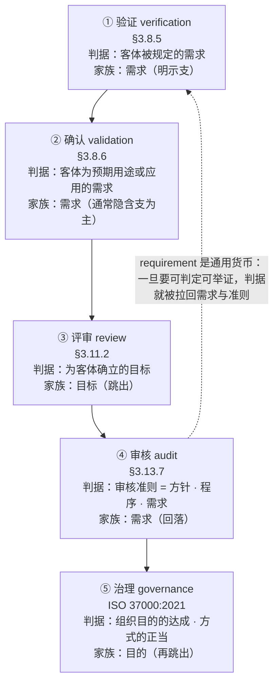

**治理按动词处理的关键依据**：ISO 37000 定义本身就是三个动词串 —— *governance = a human-based system by which an organization is **directed, overseen and held accountable** for achieving its defined purpose **in an ethical and responsible manner***。→ 拆出判据的两个维度：**① 目的达成（purpose achieved）② 方式正当（ethical and responsible）**。ISO 37000 的 11 项原则即这两个维度的展开。
（另一条可用线索：ISO/IEC 38500 的治理动词三连 **Evaluate / Direct / Monitor** + 六项原则 Responsibility / Strategy / Acquisition / Performance / Conformance / Human Behaviour。）

**结构性结论**：判据家族的往返是 **需求 → 需求 → 目标 → 需求 → 目的**（跳出—回落—再跳出），说明 **requirement 是这套语言里的通用货币**：一旦要"可判定、可举证"，判据就被拉回需求与准则。
唯独治理这一级**自指**：治理的判据（目的）正是治理自己的第一个产出（governing body 负责 defining the purpose）。→ **前四级是"用尺子"，治理是"定尺子并保证尺子被用"。**

---

## 第 9 轮

### Mickey

> 用户方对客体的需求、用户方对客体的期望、用户方对客体的目标、用户方组织的方针、用户方组织的目的，这个序次怎么样

### 阿布

**判定：方向成立，性质是 means-end chain（目的—手段链），每一级为上一级提供理由；且正好是派生链的倒序（自下而上）。**

**ISO 9001:2015 条款结构就是它的倒影（原文均已核）：**

- §3.5.11 mission = "organization's **purpose for existing**"（最上）
- **ISO 9001:2015 §5.2.1 a)**：方针应 "**appropriate to the purpose and context of the organization** and supports its strategic direction"（适合组织的宗旨和环境）
- §3.7.1 objective = "result to be achieved"；**ISO 9001 §6.2.1**：质量目标应**与方针一致**，并在相关职能、层级、**过程**上建立
- **ISO 9001 §4.2**：「理解相关方的**需求和期望**」，正文「确定相关方的**要求**」
- §3.6.4 注2：规定要求是经明示的要求
  → 三处明文（方针适合宗旨 / 目标与方针一致 / 要求由需要和期望确定），链条无断点。

**三处要修，一处要补：**

1. **第 1、2 级关系必须讲清**：§3.6.4 里 expectation 是 requirement 的**构成材料**（need **or** expectation that is stated, generally implied or obligatory），不是把子集放在超集下面。按 **means-end** 读才通——**明示需求是为满足未明示期望而设的手段**；且 §3.6.4 注5 承认存在连 requirement 都不构成的期望 → **期望集合严格大于需求集合**。
2. **第 3 级措辞**：§3.7.1 objective = "result to be achieved"，故应写"用户方**为**客体设定的目标"，而非"对客体的目标"。
3. **第 3 → 4 级缺一环**：从"客体层目标"直跳"组织方针"，中间缺**组织层目标**（§3.7.1 注2：目标可分战略/组织/项目/产品/过程五层；§6.2.1 目标在职能、层级、过程上建立）。
4. **意外收获 —— 补上了上一轮五级判据图的空缺**：上一轮没有"**方针**"的位置。补入后 **方针的判据 = 组织的目的与环境**（ISO 9001 §5.2.1 a），而 **ISO 9001 §9.3 管理评审**正是定期复评方针持续适宜性的活动。→ 判据阶梯补为：**治理 ← 管理评审 ← 评审 ← 审核 ← 确认 ← 验证**。

**术语提醒**：若要落到 AOS 需求链上，"用户方"须定准是 ISO/IEC/IEEE 15288 的 **user**（用户，关心使用体验）还是 **acquirer**（获取方，关心合同、交付、全生命周期成本），两者期望内容不同。

**注意**：本轮回复正文中曾误写 "ISK 9001 §5.2.1 a"（应为 ISO 9001），后续引用请注意。

---

## 第 10 轮

### Mickey

> 用户方组织的方针、程序，是审核的判据

### 阿布

**成立，直接命中原文**：ISO 9000:2015 §3.13.7 **audit criteria** = "set of **policies, procedures or requirements** used as a reference against which objective evidence is compared"

**「程序 procedure」是八轮以来首次出现的新面孔：**

- ISO 9000:2015 **§3.4.5 procedure** = "specified way to carry out an activity or a process (3.4.1)"；**注1：Procedures can be documented or not.**（程序不一定成文）
- 与 §3.4.1 **process** = "set of interrelated or interacting activities that use inputs to deliver an intended result" 构成**规定性 vs 描述性**的对偶 —— **procedure 之于 process，正如 requirement 之于 need**（一个是"规定的途径"，一个是"实然发生的活动集"）。

**结构性结论（本轮核心增量）：判据有三种拓扑**

- **单级判据**：判据落在目的一手段链的某一级 → 验证（规定需求）、确认（为预期用途的需求）、评审（既定目标）
- **跨级判据**：判据是准则集，横跨多级 → **审核**（政策·程序·需求 三项分别落在链条的方向层、途径层、条款层）
- **自指判据**：判据由判定者自己产出 → 治理（组织目的）
- 而 ISO 9001 §9.3 **管理评审**的输入（目的与环境、方针、目标、绩效、相关方反馈）也属跨级。

**为什么审核必然跨级**：ISO 9000:2015 **§3.13.12 auditee** = "organization as a whole or parts thereof being audited" —— **审核的对象是"组织整体或其一部分"（体系），不是单个客体**。而验证/确认/评审的对象都是单个客体（或产物）。
→ **推论：判据跨度由判定对象的粒度决定。对象是客体 → 单级；对象是体系 → 跨级准则集；对象是组织自身 → 自指。**
→ 图像化：**验证/确认/评审是点判定，审核是线扫描，治理是自指环。**

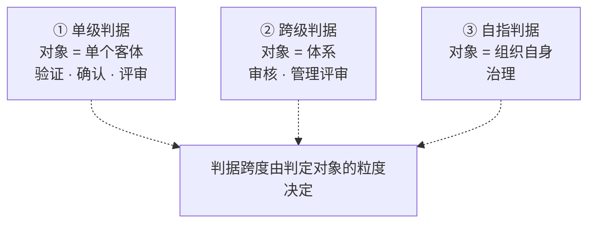

**演进趋势**：**ISO 19011:2025（草案）**已把 audit criteria 简化为 "set of **requirements** used as a reference against which objective evidence is compared" —— **policies 与 procedures 被并入 requirements**，即**审核准则正在收窄回需求家族**，印证第 5 轮"requirement 是通用货币"的规律。
另：ISO 9001:2015 已取消 2008 版 6 个强制"程序文件"要求，改为保持成文信息。——「程序」作为**形式**在弱化，作为**概念**（规定的途径）仍在准则集里。

**注意**：ISO 17034 的某份厂商讲义把 documented information 标为 §3.8.6、verification 标为 §3.8.12，与 ISO OBP / ERA（§3.8.5 verification、§3.8.6 validation）冲突，该讲义编号不可信，勿引用。

---

## 第 11 轮

### Mickey

> 审核判据中的需求，是对什么的需求？

### 阿布

**答案：对"组织 / 体系"的需求，且是无限定的全集取法。**

**三种取法的限定语对比（原文）：**

| 活动 | 原文 | 限定语 | 取哪一支 |
|---|---|---|---|
| 验证 §3.8.5 | confirmed that **specified** requirements have been fulfilled | `specified` | 只取**明示**支 |
| 确认 §3.8.6 | requirements **for a specific intended use or application** | `for intended use` | 主体在**通常隐含**支 |
| 审核 §3.13.7 | set of policies, procedures or **requirements** | **无** | **全集（三支通取）** |

→ **只有审核的 requirements 是裸的（无任何限定语）——"无限定"本身就是答案：它是全集。**

**"全集"里有什么（ISO 9001:2015 §8.2.3.1 a–e 原文）：**

- a) requirements **specified by the customer**（含交付与交付后活动的要求）
- b) requirements **not stated by the customer**, but necessary for the specified or intended use, **when known**
- c) **requirements specified by the organization** ← **关键**
- d) **statutory and regulatory** requirements applicable to the products and services
- e) contract or order requirements differing from those previously expressed

**核心机制：方针、程序正是经 §8.2.3.1 c)「组织自己规定的要求」这条路径进入准则集的。**
→ ISO 19011:2025 草案把 "policies, procedures or requirements" 简化成 "requirements"，**不是删除而是归并**——因为方针和程序一旦发布，**本身已经构成组织必须满足的自设要求**。
→ 组织既是判据的**承受者**又是**制定者**（差异于治理的"判定者自产"）。工程后果：**内审特别容易"准则写松"——被审方有动机把自己写的方针/程序定得宽**。

---

## 第 12 轮

### Mickey

> 审核判据中的需求，是组织对自己的要求？

### 阿布

**一半对，需要分层。** 差别在一个很容易滑过去的点上：**"归属"和"来源"不是一回事。**

#### 一、对的那一半：归属确实统一在组织身上

这是硬结论，不是语感：

- **ISO 9000:2015 §3.13.12 auditee** = "organization as a whole or parts thereof being audited" —— 审核的承受者是**组织整体或其一部分**。
- **§3.13.7 audit criteria** = "set of policies, procedures or requirements used as a reference against which objective evidence is compared"。

审核开出的不符合项，开在组织头上，不会开在"某份外部文件"头上。这些要求**由组织承受、由组织负责**——**归属组织**成立。

#### 二、不对的那一半：来源是多元的

把 §3.6.4 的三支摊开，来源一目了然：

| §3.6.4 分支 | 谁提的 | 是否"组织对自己的要求" |
|---|---|---|
| stated（明示） | 组织自设 / 已采纳的顾客要求 / 已采纳的法规条款 | 只有"组织自设"那一半是 |
| generally implied（通常隐含） | 惯例、一般做法 | 无人认领，谈不上"谁对自己" |
| obligatory（必须履行） | 立法者 / 监管机构 | 不是，是外部强制 |

落到 **ISO 9001:2015 §8.2.3.1 a)–e)** 更直白——五项来源里只有一项自设：

- a) 顾客规定的要求 → 外部
- b) 顾客未明示、但为规定或预期用途必需的要求（when known）→ 无人认领
- **c) 组织自己规定的要求** ← **只有这一项**
- d) 法定与法规要求 → 外部
- e) 与先前表述不同的合同或订单要求 → 外部

**五项里 4 项外来、1 项自设。**

#### 三、回扣全篇：同一个裸词，两次收窄方向相反

十二轮下来，`requirement` 这个词在标准里出现过**两次裸用**，但取法完全相反——这是最容易滑过去的坑：

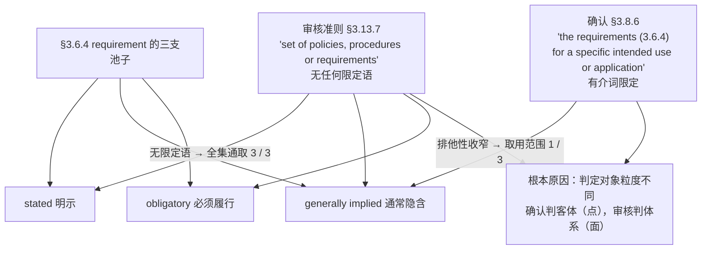

不是标准写得不严谨，是**判定对象的粒度**决定的：

- **确认**判的是**一个客体**（点判定）→ 判据必须收窄到一个明确的靶子，否则无法判定 → 所以必须加介词限定。
- **审核**判的是**一个体系**（面扫描）→ 体系里跑着明示的、隐含的、强制的全部要求，预设只看哪一支都会漏审 → 所以不能加限定语。

同一个词、一次收窄一次全取，**限定语的有无本身就是设计**。

#### 四、"组织对自己的要求"这种感觉从哪来——内化的四条路径

组织确实会**把外部要求变成自己的条款**，ISO 9001 是强制这么做的：

| 路径 | 条款 | 干了什么 |
|---|---|---|
| 1 | **§4.2** 理解相关方的需求和期望 | 决定把**哪些**外部要求纳进来 |
| 2 | **§5.2.1 c)** 方针须包括"满足适用要求的承诺" | **"适用"两个字就是过滤器** |
| 3 | **§6.2.1** 质量目标须考虑适用的要求 | 把要求灌进目标 |
| 4 | **§8.2.2** 确定产品和服务的要求 | 落到条款 |

走完这四步，**来源消失在体系里，成文信息里只剩条款**。审核员翻到的是一句"我们承诺满足适用要求"，而不是"这一条来自 GB xxxx、那一条来自合同附件三"。

→ **"看起来都像组织对自己的要求"，这是内化的副作用，不是事实。**

#### 五、更细的一刀：设定权在审核委托方（audit client）

准则的**内容**由委托方确定、载入审核计划——不是被审核方，也不是审核员。所以这句话的成立程度**取决于审核类型**：

| 审核类型 | 委托方 | "组织对自己的要求"成立度 |
|---|---|---|
| 第一方（内审） | 组织自己 | **最接近成立**——但准则里仍含外部采纳项 |
| 第二方 | 顾客 | 不成立——顾客要求被塞进准则 |
| 第三方（认证） | ≠ 被审方 | 不成立——准则被外部锁定（认证标准 + 法规 + 组织体系文件），组织改不了 |

> 待核提示：ISO 19011 中 audit client 的**准确条款号**我尚未逐字核对，成文稿里先不给编号。

#### 六、定型表述

> **审核判据中的需求 = 已被组织确定、纳入其管理体系、并由组织作为责任承受的全部适用要求。**
>
> 统一的是**归属**（承受者＝组织）；不统一的是**来源**（顾客 / 立法者 / 相关方 / 组织自身）。
>
> 换成 §3.6.4 的话说：**stated、generally implied、obligatory 三支在"组织"这个名下定格，来源在定格那一刻被抹掉。**

所以你那句话可以说成：**"是组织**名下**的要求"——而不是"是组织**提**的要求"。** 一字之差，一个成立，一个不成立。

#### 七、落到 AOS：与派生链的老问题同形

内化丢失来源标记，**和派生型文档链"只保留已成为条款的东西、不保留为什么会有这条"是同一个病**。

工程后果很实：

- 派生链的**"链路自洽"**只保证 **verification 侧**（条款对条款）；
- 它回答不了 **"这条要求从哪来、当初谁提的、是否还有效"**；
- 补漏机制是 **ISO 9000 §3.6.13 traceability**（可追溯性）——但**非强制**，且标准只说"追溯什么"，没说"在链条上怎么留痕"。

**这是 AOS 可以补的空：给每个条款挂一个来源指纹（source / originator / authority / date），而且这个指纹不能只留在链上（链会连锁变动把它冲掉），得挂在与派生链异构的那一层。**

---

## 第 13 轮

### Mickey

> 哦，就是对组织的要求

### 阿布

**对。而且你这一改，改掉了整串追问里最后一个错位。**

关键在于：**「对组织」补的是承受者，不是提出者。而 §3.6.4 的定义里，只有承受者是有条款支撑的。**

看原文：

> **§3.6.4 requirement** = `need or expectation that is stated, generally implied or obligatory`

**整句没有主语。** 需求的**提出者在定义层面就是缺位的**——这很妙。所以任何给它补主语的表述，都是在**加料**：

| 补什么 | 表述 | 判定 |
|---|---|---|
| 补**提出者** | "组织**自己**的要求" | ✗ 无条款支撑，且被 §8.2.3.1 的 a)/b)/d)/e) 四项外部来源直接证伪 |
| 补**承受者** | "**对组织**的要求" | ✓ **有条款支撑** —— §3.13.12 auditee = "organization as a whole or parts thereof being audited" |

而且新提法还**更全**：组织自设的要求（§8.2.3.1 c）也属于"对组织的"。**"对组织的"是上位，"组织自己提的"是下位中的一格。**

**只差最后一格精度。** 「对……的」这个句式仍然隐含一个**提出者**预设——而 §3.6.4 的 generally implied 那一支**没有提出者**：惯例、一般做法不"对"谁提，它只是被默认为存在。所以最严的说法要去掉这个预设：

> **组织有义务满足的全部适用需求。**

这句对三支都干净成立，不需要假设有人在提要求。

**收口三件套（可以定型了）：**

1. `requirement`——明示的、通常隐含的或必须履行的需要或期望（**无主语**）
2. **对组织的** requirement——承受者确定
3. 审核准则里的 requirement——**已被组织确定并纳入的全部"对组织的需求"**

一句话：

> **判据问的不是"谁提的"，是"谁要负责"。**

这也解释了你前面十一轮为什么会反复卡——大家默认"要求"一定有个提出者，于是拼命去找那个提出者是谁（顾客？组织自己？），结果 §3.6.4 根本不打算回答这个问题。**它只回答：这算不算一个 requirement。**

---

## 第 14 轮

### Mickey

> 方针，这个术语怎么理解

### 阿布

**方针 = 最高管理者正式表达的「意图与方向」。** 它不是结果，是**约束**；不是被派生的，是**被承诺的**。

先看它在标准词汇表里的位置——它上下都有绳子：

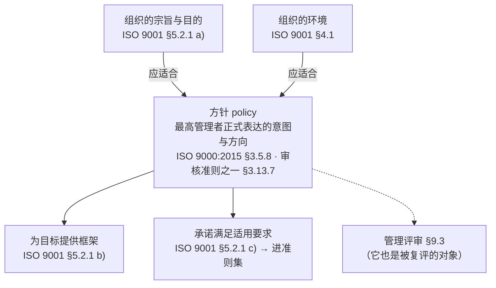

#### 定义原文

> **ISO 9000:2015 §3.5.8 policy** = *intentions and direction of an organization, as formally expressed by its top management*
> GB/T 19000-2016 译：**由最高管理者正式发布的组织的宗旨和方向**

三个词要单独咬一下：**intentions**（意图，还没变成动作）· **direction**（方向，不是目标）· **formally expressed by top management**（形式化的、最高层的）。

**注意它唯独没有的：没有"结果"，没有"指标"，没有"期限"。** 那些全在 objective 那里（§3.7.1 = `result to be achieved`）。

#### 词源：它是一个治理词

policy ← 希腊 *polis*（城邦）→ *politia*（治理、行政）→ 古法语 *policie*。同源词：**police**（本义就是"治理、公共行政"，到近代才缩窄成"治安"）、**politics**、**polity**。

→ 底层义 = **"如何治理一个共同体的成文意志"**。这正是它为什么长在 ISO 9000 §3.5 的**治理词汇区**里，和 vision / mission / strategy 做邻居，而不是长在需求区。

> ⚠️ 一个易混点：**insurance policy**（保单）来自意大利语 *polizza*（凭据），**跟治理义的 policy 是两条完全不同的词源线**。英文里长得一样，来路不一样。

#### 边界对照：它跟邻居差在哪

| 术语 | 条款 | 回答的问题 | 类型 |
|---|---|---|---|
| vision | §3.5.10 | 想成为什么 | 志向 |
| mission | §3.5.11 | 为什么存在 | 理由 |
| **policy** | **§3.5.8** | **往哪走、什么不可让步** | **约束** |
| strategy | §3.5.12 | 怎么实现 | 途径 |
| objective | §3.7.1 | 要拿到什么结果 | **结果** |

（vision 的逐字原文与 §3.5.9 的内容我还没核，先不给编号级引用。）

**一句话分水岭：objective 是"结果型"判据，policy 是"约束型"判据。** 这也解释了为什么 §3.11.2 评审的判据是 `established objectives`，而 §3.13.7 审核的准则是 `policies, procedures or requirements`——**点判定配结果，面扫描配约束。**

#### 一个中文翻译陷阱（这是第三个了）

国标把 **policy** 译成"**宗旨**和方向"，把 **mission** 译成"组织存在的**目的**"。

中文直觉里"宗旨 ≈ 目的"，于是 **policy 和 mission 的层级差被中文抹平了**。英文里清清楚楚：policy 是**可操作的方向**，mission 是**最高的存在理由**。

这跟前面两轮撞到的坑同构：

- 第 5 轮：`specified` 和 `established` 都被译成"**规定**"（规定要求 / 规定目标）
- 第 7 轮：`policy`→"宗旨"、`mission`→"目的"
- 本轮：同一个 `policy`，"宗旨"这个词又挂在它身上

**国标的"宗旨"一词被 policy 占用了，而中文读者看到"宗旨"想到的是 mission。** 读中文理解会串行。

#### 还有一个语感陷阱：ISO 的方针比中文"方针"硬

中文"方针"带**宏观宣示气**——"基本方针""方针政策"，听着像口号。

但 ISO 的 policy **必须能被拿来对照客观证据**（§3.13.7 把它列为 audit criteria 之一）。所以它必须是**可判定的**，不能是"追求卓越"这种。

**§5.2.1 的四项要求就是为了把它压"硬"：**

| | ISO 9001:2015 §5.2.1 | 作用 |
|---|---|---|
| a) | 适合组织的宗旨与环境、支持战略方向 | 管**上游** |
| b) | **提供建立质量目标的框架** | 管**下游** |
| c) | **包括满足适用要求的承诺** | 管**外→内** |
| d) | 包括持续改进的承诺 | 管**时间轴** |

#### 所以方针的三重身份（本轮核心）

| 关系 | 内容 | 条款 |
|---|---|---|
| 方针**有**判据 | 被"宗旨 + 环境"约束（应适合） | §5.2.1 a) |
| 方针**是**判据 | 本身列入审核准则集 | §3.13.7 |
| 方针**产**判据 | 向下提供目标框架 + 承诺满足适用要求 | §5.2.1 b) / c) |

**它同时在梯子的三级。** 前面十二轮我们把判据阶梯排成"验证 ← 确认 ← 评审 ← 审核 ← 治理"，而**方针是唯一一个既坐在阶梯某级上、又同时向下生成下一级的东西**——它是这条链上的**枢纽**，不是某一级。

#### 落到 AOS：它是第二个"链外之物"

这是个要紧的结论：

**方针 → 需求，不是 derivation（派生）关系，是 commitment + framework（承诺 + 框架）关系。**

- 派生型文档链靠"按规则生成"传递——A 派生出 B，改 A 则 B 变；
- 但方针从不被"派生"出任何东西，它是被**承诺**的、被**遵循**的。你改一句方针，链上没有任何一条需求会因规则而自动变——**只会因人的重新判断而变。**

→ **所以"链路自洽"这个手段，天然覆盖不到方针。** 方针不在派生关系上，它在派生关系的**上游之外**。

这是继第 3 轮结论（**确认的判据在链外**）之后，**第二个确定落在派生链之外的东西**。第 3 轮我们说要给链配一个"异构的参照层"；现在看，那个参照层里至少得住着两样东西：**预期用途/使用情境**，和**方针**。

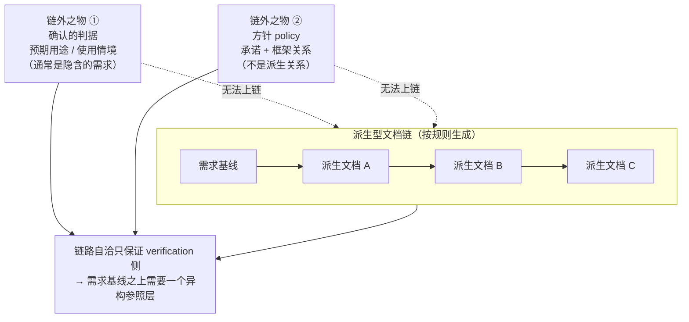

**定型一句：**

> 方针 = 最高管理者正式表达的**意图与方向**。它不是结果，是**约束**；不是被派生的，是**被承诺**的；在判据体系里它既**是**判据、又**有**判据、还**产**判据，是把外部要求内化为自设要求的那道**总闸门**。

（顺带：上一轮那个"对组织的需求"，方针正好是"对组织的需求"里最容易**自设**的一类——因为它本身就是组织自己写的。所以 §8.2.3.1 c) 那条路径，**入口就是方针**。）

---

## 第 15 轮

### Mickey

> 你举例说明下什么是：vision、mission、policy、strategy、objective、intended use or application、specified requirements

### 阿布

下面**用同一个假设案例贯穿七个术语**——一家做工业级惯性测量单元（IMU）的公司，假设叫「北衡传感」。七个词扔在同一个语境里，边界才显形。（案例我编的，结构是标准的。）

先给一张总览：

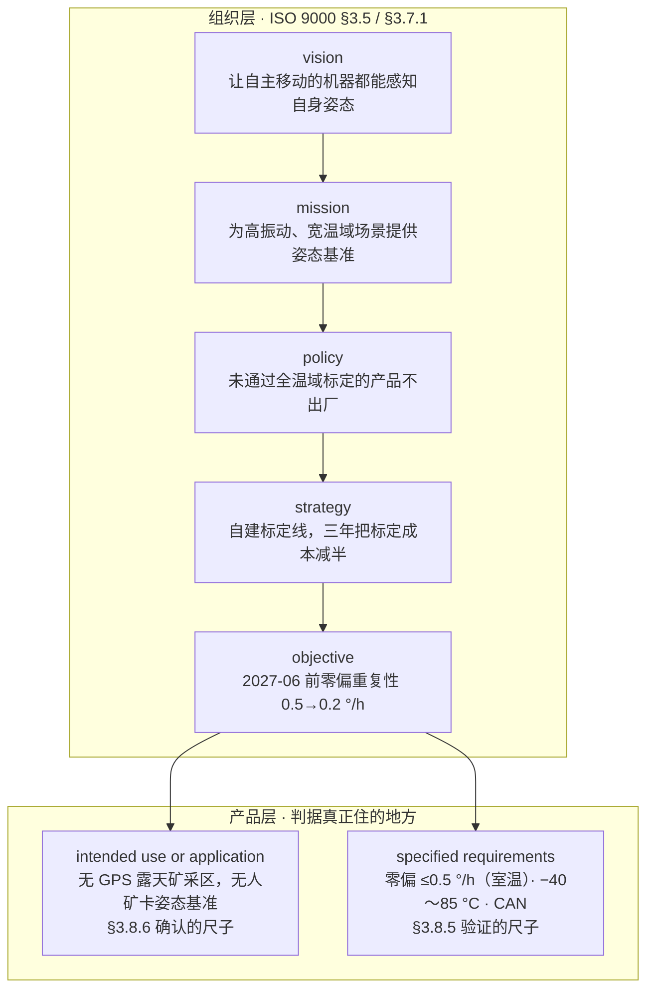

#### 一、组织层：五个词，一条向下收窄的链

**1. vision 愿景 —— 想成为什么**

> **"让每一台自主移动的机器都能感知自己的姿态。"**

- ISO 9000 §3.5.10 的要点是 **aspirational**（志向性的）——它描述**想成为的样子**，不是要做的事。
- **不是**："三年做到 10 亿营收"（那是 objective）／"做行业第一"（那是位置，不是志向）

**2. mission 使命 —— 为什么存在**

> **"为高振动、宽温域、长周期的工业场景，提供可靠可依赖的姿态基准。"**

- §3.5.11 = *organization's purpose for existing*。它是**现在时的存在理由**，不是未来状态。
- **不是**："在 2030 年成为全球领先的惯性器件供应商"（这是 vision 的语气）
- **与 vision 的分界**：vision 是"要去哪"，mission 是"我们为什么在这里"。**mission 通常比 vision 更稳定，不随战略改。**

**3. policy 方针 —— 什么不可让步**

> **质量方针："未通过全温域标定的产品不出厂；精度指标以实测数据为准，不以标称值替代。"**

- §3.5.8 = *intentions and direction... formally expressed by its top management*
- **一个比定义更好用的检验法**：**审核员能不能拿这句话开不符合项？** 能 → 合格方针；不能 → 口号。
- **不是**："追求卓越，顾客至上"（无法作为审核准则 §3.13.7）
- 体会一下"**不出厂**""**不以…替代**"——**约束的语气**。这才是 policy 该有的样子。

**4. strategy 战略 —— 怎么实现**

> **"自建全温域标定产线，与高校共建温漂模型，三年内把标定成本减半。"**

- §3.5.12 ≈ *plan of action to achieve a long-term or overall objective*
- **位置感**：比 policy 具体（有动作、有对象），比 objective 长期（是路径不是终点）
- 与 policy 的分工：**policy 说"什么不许做"，strategy 说"打算怎么做"**

**5. objective 目标 —— 要拿到什么结果**

> **"2027 年 6 月前：零偏重复性从 0.5 °/h 降至 0.2 °/h；出厂全温域标定覆盖率从 60% 提到 100%。"**

- §3.7.1 = *result to be achieved*
- **双特征检验：可测量 + 有期限。缺一个就不是 objective。**
- **不是**："提高产品质量"（不可测）
- §3.7.1 注2：目标可分**战略层、组织层、项目层、产品层、过程层**——**不必然是组织层**（这正是第 7 轮判定你表格第 3 行的依据）

> **五级回答的问题依次是**：成为什么 → 为什么在这 → 什么不让步 → 怎么走 → 拿到什么。
> **向下越来越具体、越来越可测；向上越来越稳定、越来越不可测。**

#### 二、产品层：两个词，判据真正住的地方

**6. intended use or application 预期用途或应用 —— 给谁、在什么情境下用**

拆成两面看（这就是第 6 轮那个 use / application 的分工）：

- **用途（use，目的侧）**：为**无人矿卡的行驶控制**提供角速率与加速度测量
- **应用（application，场合侧）**：**无 GPS 的露天矿封闭采区**、−40～+85 °C、强振动、高粉尘

**它就是 §3.8.6 确认的尺子。**

关键特征是这条——**它常常没有被写下来**：矿卡厂的合同里可能只写"零偏 ≤0.5 °/h"，**没人写**"要在无 GPS 的采区持续可用"。而那个没写下来的，正是 §3.6.4 里的 **generally implied** 支。

还有一个：**一个东西可以有多个 intended use**。同一颗 IMU 也可能装在**井下铲运机**、**农机自动驾驶**上——**每一个都要单独确认一次**。（IEV 192-01-18 注5：*Multiple validations may be carried out if there are different intended uses*）

**7. specified requirements 规定需求 —— 写成条款、可逐条对照**

> - 零偏稳定性 ≤ 0.5 °/h（1σ，**室温**）
> - 工作温度 −40 ～ +85 °C
> - 角速率量程 ±300 °/s
> - 输出接口 CAN 2.0B，100 Hz
> - MTBF ≥ 50 000 h

**它就是 §3.8.5 验证的尺子。**

**什么叫 "specified"？** §3.6.4 注2：*A specified requirement is one that is **stated***。看这个对比就懂了：

| 表述 | 是 requirement 吗 | 是 specified 吗 |
|---|---|---|
| "要能在冷的地方工作" | ✓ 是 | ✗ **不是**（没法逐条对照） |
| "工作温度 −40 ～ +85 °C" | ✓ 是 | ✓ **是** |

→ **specified 的唯一门槛 = 写成可对照的形式。** 不是"重要不重要"，也不是"谁提的"。

#### 三、这一层的真正要害：两项错位

把第 6 和第 7 项并排看，问题立刻出来：

| | intended use or application | specified requirements |
|---|---|---|
| 谁写的 | **常常没人明确写** | **一定**写进规格书 |
| 三支归属 | 主体在 **generally implied** | 全部是 **stated** |
| 怎么判 | 在预期使用条件下**用**一次 | 逐条**测**一遍 |
| 对应活动 | **确认** validation（§3.8.6） | **验证** verification（§3.8.5） |

**错位演示（本轮的关键一笔）：**

规格书写着"零偏稳定性 ≤ 0.5 °/h（**室温**）"，预期用途是"露天矿，**−40 °C**"。

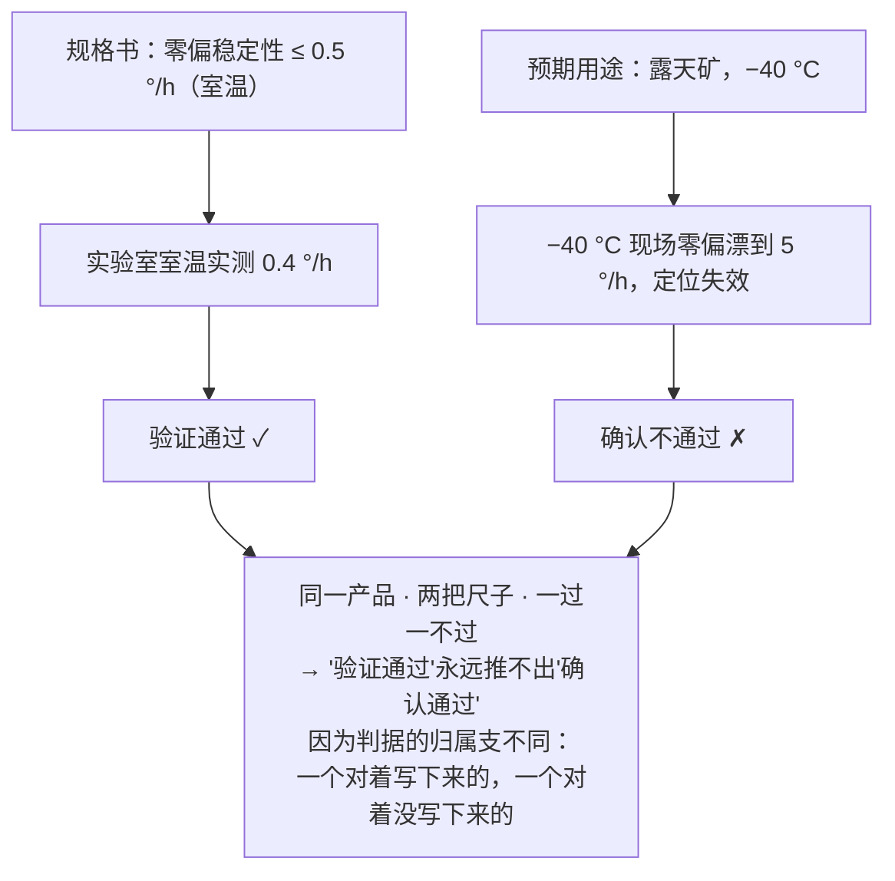

- 实验室室温测下来 0.4 °/h → **验证通过** ✓
- 拉到 −40 °C 现场，零偏漂到 5 °/h，定位失效 → **确认不通过** ✗

**同一个产品，两把尺子，一过一不过。**

这就是为什么**"验证通过"永远推不出"确认通过"**——不是产品变了，是**判据的归属支不同**：一个对着**写下来的**，一个对着**没写下来的**。

再补一刀：规格书里压根**没有**"无 GPS 场景下要持续可用"这一条。但它**仍然是 requirement**——因为它是矿卡厂的**不言而喻的期望**（§3.6.4 注1：惯例或一般做法）。

→ **规格书里没有的，仍然可能是需求。** 这正是第 3 轮结论在这里落地：**派生型文档链只能承载 stated**，intended use 那一支上不了链——**所以确认的判据永远在链外。**

**收口一句：**

> 前五个词是**组织对自己的约束**，越往上越不可测；
> 后两个词是**判据**——一个写在纸上（specified requirements → 验证），一个常常没写在纸上（intended use or application → 确认）。
> **这七个术语的难度从来不在定义，在于它们看起来像同一件事。**

---

## 第 16 轮

### Mickey

> 好了，把我们对话的所有内容先原封不动的记录下来，编号为23，文markdown，图mermaid，文件名自定，位置E:\mywork\AOS\50-系统工程研究\00-系统工程相关研究报告

### 阿布

已创建：`E:\mywork\AOS\50-系统工程研究\00-系统工程相关研究报告\23-判据体系研究报告-从验证确认到治理的判据阶梯.md`

（首次落盘时采用了"研究报告"体例——加了摘要、目录、附录整理，与"原封不动记录"的要求不符。）

---

## 第 17 轮

### Mickey

> 要求是原封不动的记录，不需要整理

### 阿布

已按要求改回**对话原样记录**体例，重写同一文件：去掉摘要、目录、附录等一切加工环节，只按轮次保留问答原貌。图为 mermaid，位置不变。

---

## 第 18 轮

### Mickey

> 刚才那个报告中的研究报告字眼应该换成对话记录。然后根据这个原封不动的记录，整理生成研究报告

### 阿布

两件事都办了：

1. 原文件改名为 `23-判据体系对话记录-从验证确认到治理.md`（去掉了"研究报告"字眼）。
2. 基于该记录新建 `23-判据体系研究报告-从验证确认到治理的判据阶梯.md`。

**研究报告不是把记录改个标题，而是按主题重组了**——这是两个体裁的真正分野：记录是**时间线**（按你问的顺序），报告是**论证线**（按逻辑重排，同一件事只在它该出现的地方出现一次）。

报告结构（9 章 + 4 附录）：

```
摘要 ── 问题起点 / 七条核心结论 / 两条 AOS 工程结论 / 一个欠项
第 1 章  问题的起点：V 模型的两把尺子
第 2 章  两种口径的差异：ISO 9000 与 15288
第 3 章  requirement 的内部分层
第 4 章  intended use or application
第 5 章  判据体系：五级阶梯
第 6 章  审核准则：裸词、全集与归属
第 7 章  术语边界与中文翻译陷阱
第 8 章  贯穿案例：七术语一次落地
第 9 章  对 AOS 的工程结论
附录 A 术语定译表 | B 标准原文索引 | C 存疑待核 | D 未交付事项
```

**整理时才显形的几处**：

- **§3.6.4 定义无主语**——原本是第 13 轮才逼出来的，但它其实是第 3 章整章的地基。放回原位后，三支的性质才讲得通。
- **两个"链外之物"合流**——"确认的判据在链外"（第 3 轮）和"方针在链外"（第 14 轮）相隔十一轮，报告里并成一节（9.1），才发现是同一个约束的两次命中。
- **翻译陷阱有三处同构**（规定要求/规定目标、policy→宗旨、mission→目的），记录里分三处，报告里合成一张表。

另外报告附录 B 是一份**标准原文索引**（按标准 + 条款号排，标出每个条款的用途），后续写 AOS 其他文档时可直接查。

文件头如实标注：第 1–11 轮的回复原文因会话压缩无法逐字复原，报告中对这几轮内容按当时记录还原，不当成逐字引用。

---

## 第 19 轮

### Mickey

> review vs verification vs validation 三角对照？

### 阿布

终于到它了。这个欠项挂了一整轮对话，现在办。

**先给判定：三者不在同一根轴上。** 它们不是"三种严格程度"，也不是"三个环节"，而是**三个不同的问题**——而且 ISO 9000 的定义用词把差别写得非常清楚，只要并排看就能看出来。

#### 一、三条定义，并排看

| 活动 | 条款 | 定义关键片段 |
|---|---|---|
| **验证 verification** | §3.8.5 | `confirmation ... that specified requirements have been fulfilled` |
| **确认 validation** | §3.8.6 | `confirmation ... requirements for a specific intended use or application` |
| **评审 review** | §3.11.2 | `determination ... suitability, adequacy or effectiveness of an object` |

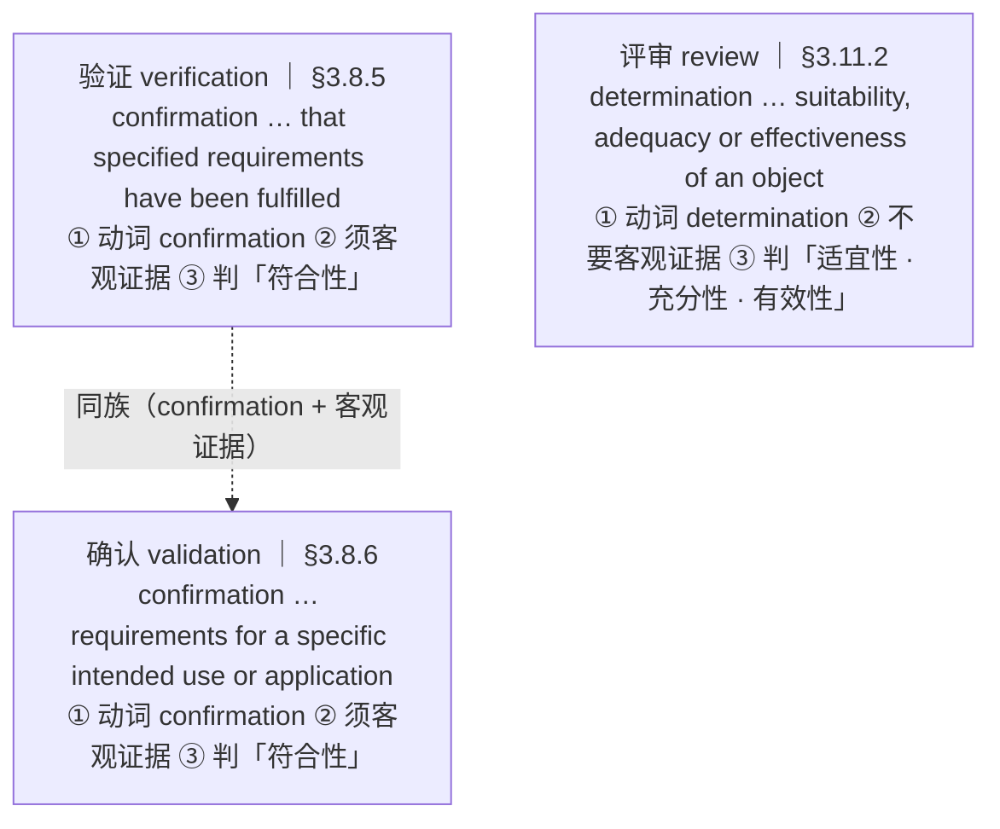

**三处硬差别，全在定义的措辞里：**

**1. 动词：`confirmation` vs `determination`**

verification 和 validation 都用 **confirmation**（确认）——**对已有事实的确认**。review 用的是 **determination**（判定）——**做出一个判定**，可以是决定性的、权威性的，也可以是"够用了"这种裁量。

→ 一个是被动核对，一个是主动裁定。

**2. 客观证据：有 vs 无**

- verification：*through the provision of **objective evidence***
- validation：*through the provision of **objective evidence***
- review：**定义里根本没有 "objective evidence" 这个词。**

→ **verification / validation 的结论必须由客观证据支撑；review 的结论可以由专家判断支撑。**

这一条决定了 review 为什么便宜、为什么能在早期做、为什么一次评审几个人一下午就能出结论——**它不需要证据链。**

**3. 判的性质：符合性 vs 适宜性**

- verification / validation 判的是 `fulfilled`（需求被**满足**了没有）→ **符合性**
- review 判的是 `suitability, adequacy or effectiveness`（**适宜性、充分性、有效性**）→ **适用性裁量**

→ **review 问的不是"对上了没有"，是"够不够用、合不合适、行不行"。**

#### 二、review 为什么能"前置"——它是静态的

**IEEE 1028-2008《IEEE Standard for Software Reviews and Audits》** 把这一点钉死了：它的 **walk-through** 定义就写着 *"A **static analysis technique** in which a designer or programmer leads members… through a software product"*。

| | review | verification / validation |
|---|---|---|
| 需要"运行"吗 | **不需要** | **需要**（或至少需要客观证据） |
| 静态 / 动态 | **静态** | 动态 |
| 对象 | **工作产品**（work product）——可以是文档、模型、代码 | **实物**——已存在的客体 |
| 时机 | **任何阶段**，产物一定型就能做 | 实物已成 / 可运行 |

**这就是全部秘密：review 可以对"还不能用的东西"做判定。** 一份需求文档没法"验证"，更没法"确认"——它不能被使用——但**可以评审**。

→ 所以 V 模型左半（定义与分解）大量用 review，右半才用 verification，顶端才用 validation。

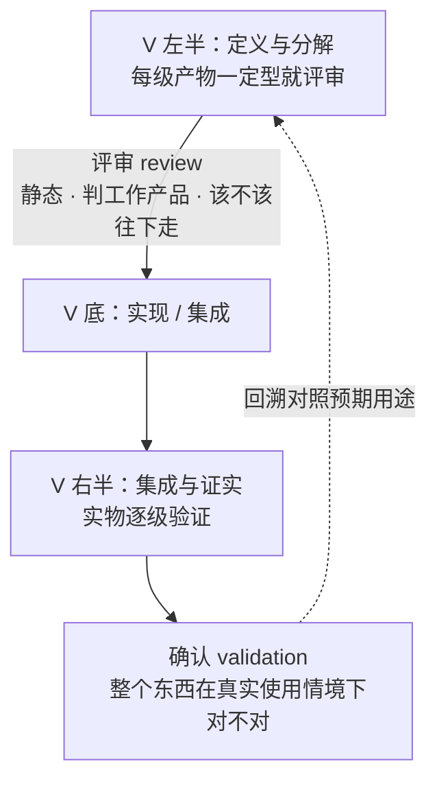

#### 三、IEEE 1028 的独立贡献

ISO 9000 把 review 当成**一个活动**；IEEE 1028 把它当成**一个属概念（umbrella）**，下面挂 5 种：

| 类型 | 大意 | 相对严格度 |
|---|---|---|
| **management review** 管理评审 | 由管理层或代表管理层对软件产品或过程做的系统评价 | 另一条线（对项目/过程） |
| **walk-through** 走查 | 由设计者/程序员引着团队过一遍，边问边提意见 | **最轻** |
| **technical review** 技术评审 | 由合格人员组成的团队对产品做系统评价 | 中 |
| **inspection** 审查 | 对产品的可视化检查，检出并识别异常 | **最重**（Fagan 式） |
| **audit** 审核 | 独立检查，评估是否符合规格、标准、合同或其他准则 | 独立，不在 peer 序列里 |

（IEEE 1028-2008 各术语的**准确条款号待核**。）

**两个关键点：**

**① 两本标准的 "review" 外延不一样。**

- IEEE 1028 的 review **包含** audit
- ISO 9000 的 review（§3.11.2）**不含** audit（§3.13.1 是独立词条）

→ **说 "review" 时，你得先问是哪本标准的 review。** 这是术语陷阱的第四处（前三处：规定要求/规定目标、policy→宗旨、mission→目的）。

**② IEEE 1028 给每种类型规定了 entry criteria / inputs / roles / procedures / outputs / exit criteria。**

→ **它把 review 从"开会"变成了"有约束的活动"。** 这是可操作化的关键——一份 review 有没有 exit criteria，决定了它是评审还是座谈。

#### 四、两处标准间的真实冲突（值得记住）

**冲突 1：IEEE 1028 的 technical review 判据里出现了 intended use**

> IEEE 1028 **technical review**：*A systematic evaluation of a software product by a team of qualified personnel that examines the conformance of the product with respect to its **intended use** and identifies discrepancies from specifications and standards.*

**"with respect to its intended use"** —— 这按 ISO 9000 的说法是 **validation 的判据**。两本标准撞了。

**解法在对象**：technical review 的**对象是工作产品**（文档、设计、代码），**它不能被"使用"** → 所以对文档没法做 validation → 标准就让 technical review 代劳，判"这个设计符不符合预期用途"。

→ 这不是矛盾，是**标准在"实物尚不存在时"给了一个替代判据**。同一件事，**实物层叫 validation，工作产品层叫 technical review**。

**冲突 2：inspection 同名，且意思正好相反**

| 标准 | inspection 指什么 | 看什么 |
|---|---|---|
| **ISO 9000:2015** | *conformity evaluation by **observation and judgement** accompanied as appropriate by measurement, testing or gauging*（条款号待核） | **看实物** |
| **IEEE 1028-2008** | *A **visual examination** of a software **product** to detect and identify software anomalies…* | **看文档** |

→ **同一个词，ISO 指向实物检查，IEEE 指向文档检查——方向相反。** 中文都译"检查/审查"，读起来毫无差别。

#### 五、落到 AOS——这里有一个增量

前面几轮说过"派生链只保证 verification 侧"。现在加上 review，这句要**修正**：

| 活动 | 判据 | 派生链能不能表征它 |
|---|---|---|
| **review** | 既定目标 | **能**——如果每级产物都写明了"本阶段该产出什么" |
| **verification** | 规定需求 | **能**——条款对条款，这就是链的主业 |
| **validation** | 为预期用途的需求（主体是隐含需求） | **不能**——判据在链外 |
| **audit** | 跨级准则集（方针·程序·需求） | 部分（方针不在派生关系上） |

**修正后的结论**：

> **派生链能支撑 review 和 verification，但支撑不了 validation。**
> 因为 review 的判据（阶段性目标）和 verification 的判据（规定需求）**都是链上产物**；而 validation 的判据**不是**。

**这反而给了 review 一个更重要的位置**：它是**唯一一个能在链的每一级就地使用的判据工具**——每级产物一定型，先评审放行，不用等到最后。**它是链的内生质检点。**

但也要说清它的局限：

> **review 不能替代 validation。** 因为 review 判的是"按既定目标够不够"，而既定目标本身可能从一开始就定错了。**一屋子专家对着错误的目标评审，只会一致同意这个错误的目标。**

这正是 validation 必须在链外、且必须"用"的原因。

**三句话记法：**

| | 一句话 | 时态 |
|---|---|---|
| **review** | **该不该往下走** | 将来 |
| **verification** | **做出来符不符合规格** | 现在（对规格） |
| **validation** | **用起来对不对** | 现在（对用途） |

---

## 第 20 轮

### Mickey

> 分别补充到对话记录和研究报告中

### 阿布

已补充：

- **对话记录**（本文件）：追加第 18–20 轮。
- **研究报告**：新增**第 10 章 review / verification / validation 三角对照**；摘要结论扩为十条；目录同步；附录 A 增入 `inspection` 同名异义条目；附录 B 增入 IEEE 1028 相关条款；附录 C 增入待核项；附录 D 的欠项标记为**已交付**。

---
