# 判据体系研究报告

## —— 从验证确认到治理的判据阶梯

> **编号**：23（研究报告稿）
> **配套文件**：`23-判据体系对话记录-从验证确认到治理.md`（对话原样记录，本文即由其整理而成）
> **日期**：2026-09-11
> **主题**：ISO 判据体系（验证 / 确认 / 评审 / 审核 / 治理）与 requirement、intended use、policy 的术语辨析
> **约定**：requirement → 需求；need → 需要；expectation → 期望（三者不混用）
> **图的处理**：全文图以 mermaid 表达

---

## 摘要

### 一、问题起点

一张 INCOSE《Systems Engineering Handbook》的 Systems Engineering Vee 图暴露出一个口径冲突：图中"确认"对照的是**相关方需要或需求**，而 ISO 9000 的"确认"对照的是**预期的用途或应用**。二者是否矛盾？

### 二、十条核心结论

| # | 结论 |
|---|---|
| 1 | **V 模型的题眼是两把尺子不同**：Validation 的尺子是干系人需要与期望；Verification 的尺子是规定需求与设计 |
| 2 | **ISO 9000 与 15288 不矛盾，是词法归属差异**。ISO 9000 把确认判据硬塞回 requirement 词内（靠 generally implied 支撑）；15288 直接写 expectation / objective / intended use，不收在 requirement 内 |
| 3 | **确认判据的主体是未显性化的隐含需求**。依据：§3.6.4 注2 把 `specified ≡ stated` 钉死，若确认判据也是 stated 则两定义冗余 |
| 4 | **2005→2015 的修订是标准自己的证词**：§3.8.6 validation 删去 "specified"，§3.8.5 verification 保留 "specified requirements" |
| 5 | **判据阶梯五级**：验证（规定需求）→ 确认（为预期用途的需求）→ 评审（既定目标）→ 审核（跨级准则集）→ 治理（自指的组织目的） |
| 6 | **`requirement` 在标准里出现两次裸用，收窄方向相反**：§3.8.6 排他性收窄，§3.13.7 全集通取 |
| 7 | **`requirement` 定义无主语**：提出者在定义层面缺位，能补的只有**承受者**——"对组织的需求" |
| 8 | **review / verification / validation 不是三种严格程度，是三个不同的问题**。定义措辞已给出全部差别：review 用 `determination` 且**不要求客观证据**，另两者用 `confirmation` 且**必须客观证据**；review 判「适宜性·充分性·有效性」，另两者判「符合性」 |
| 9 | **review 是静态的，verification / validation 是动态的**（IEEE 1028 把 walk-through 定义为 *static analysis technique*）→ **review 是唯一能对"还不能用的东西"下判定的活动**，因此占据 V 左半 |
| 10 | **派生链能支撑 review 与 verification，但支撑不了 validation**——因为前两者的判据（阶段性目标、规定需求）都是链上产物，后者的判据不是 |

### 三、对 AOS 的两条工程结论

| # | 结论 |
|---|---|
| A | **派生型文档链之外有两个东西**：① 确认的判据（预期用途 / 使用情境）；② 方针。前者因判据主体是隐含需求而无法上链，后者因与派生关系**异构**（承诺 + 框架，非 derivation）而无法上链 |
| B | **内化会丢失来源标记**。体系里分不清"这条是顾客提的"还是"我们自己加的"，与派生链"只保留已成为条款的东西、不保留为什么会有这条"同病 |

### 四、三角对照（第 10 章）的一句话版

> **review 判「该不该往下走」（将来时，对既定目标，不需证据，静态）；**
> **verification 判「做出来符不符合规格」（现在时，对规定需求，需客观证据，动态）；**
> **validation 判「用起来对不对」（现在时，对预期用途，需客观证据，动态）。**

三者的差别全部写进了各自的定义措辞里——动词（`confirmation` / `determination`）、证据要求（有 / 无 `objective evidence`）、判的性质（符合性 / 适宜性）三处同时分岔。详见第 10 章。

---

## 目录

- [第 1 章 问题的起点：V 模型的两把尺子](#第-1-章-问题的起点v-模型的两把尺子)
- [第 2 章 两种口径的差异：ISO 9000 与 15288](#第-2-章-两种口径的差异iso-9000-与-15288)
- [第 3 章 requirement 的内部分层](#第-3-章-requirement-的内部分层)
- [第 4 章 intended use or application](#第-4-章-intended-use-or-application)
- [第 5 章 判据体系：五级阶梯](#第-5-章-判据体系五级阶梯)
- [第 6 章 审核准则：裸词、全集与归属](#第-6-章-审核准则裸词全集与归属)
- [第 7 章 术语边界与中文翻译陷阱](#第-7-章-术语边界与中文翻译陷阱)
- [第 8 章 贯穿案例：七术语一次落地](#第-8-章-贯穿案例七术语一次落地)
- [第 9 章 对 AOS 的工程结论](#第-9-章-对-aos-的工程结论)
- [第 10 章 review / verification / validation 三角对照](#第-10-章-review--verification--validation-三角对照)
- [附录 A 术语定译表](#附录-a-术语定译表)
- [附录 B 标准原文索引](#附录-b-标准原文索引)
- [附录 C 存疑与待核清单](#附录-c-存疑与待核清单)
- [附录 D 未交付事项](#附录-d-未交付事项)

---

# 第 1 章 问题的起点：V 模型的两把尺子

## 1.1 图的结构

INCOSE《Systems Engineering Handbook》(SEH) 的 Systems Engineering Vee 图，骨架流程名全部取自 **ISO/IEC/IEEE 15288** 的技术流程。

| 层 | 内容 |
|---|---|
| 蓝色主干（产物层） | 干系人需要和需求 → 系统需求 → 系统架构与设计 |
| 左右锚点 | 粉色 Stakeholder Real-World Expectations（Validation 的终极参照系）；橙黄 Realized System of Interest；灰色 Operational / Maintained / Disposed System |
| 紫色（上方）= Validation 链 | 问 "Do we have the right ..."，箭头一律**向左回溯** |
| 绿色（下方）= Verification 链 | 问 "Are ... defined correctly?"，箭头**向左下回指**上游规定需求 / 设计 |
| 底部 5 个 Transformation | BMA/SNRD、SRD、SAD/DD、Implementation/Integration、Transition/Operation/Maintenance/Disposal |
| 顶部 / 底部 Confirmation | 分别对应 Validation Process / Verification Process |
| 左下角图例 | Concurrency / Iteration / Recursion |

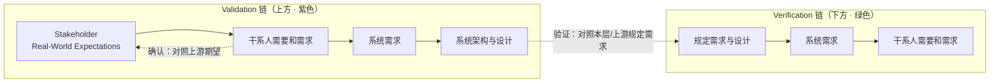

## 1.2 题眼

> **Validation 的尺子是干系人需要与期望（上游来源）；Verification 的尺子是规定需求与设计（本层或上游产物）。**
> **两把尺子不同——这是整张图的题眼。**

## 1.3 由题眼引出的冲突

图中"确认"对照的是一条**向回溯的链**（相关方需要或需求 → 现实世界期望），而 ISO 9000 的确认对照的是**一个限定过的需求集合**（为特定预期用途或应用的需求）。二者的参照系看起来不是同一个东西。

这就构成了本报告的全部起点。

---

# 第 2 章 两种口径的差异：ISO 9000 与 15288

## 2.1 五个定义的原文对照

| 条款 | 英文原文 | 尺子 |
|---|---|---|
| **ISO 9000:2015 §3.8.5 verification** | *confirmation, through the provision of objective evidence, that **specified requirements** (3.6.4) have been fulfilled* | 规定需求 |
| **ISO 9000:2015 §3.8.6 validation** | *confirmation, through the provision of objective evidence, that **the requirements (3.6.4) for a specific intended use or application** have been fulfilled* | 为特定预期用途或应用的需求 |
| **ISO 9001:2015 §8.3.4 c) / d)** | 验证 = 设计开发输出满足设计开发**输入需求**；确认 = 产品和服务满足**预期用途**需求 | 同上，落地条款 |
| **ISO/IEC/IEEE 15288:2015 §6.4.9.1 Verification** | objective evidence that a system or system element fulfills its **specified requirements and characteristics** | 规定需求与特性 |
| **ISO/IEC/IEEE 15288:2015 §6.4.11.1 Validation** | objective evidence that the system, when in use, fulfills its **business or mission objectives** and **stakeholder requirements**, achieving its **intended use in its intended operational environment** | 目标 + 干系人需求 + 预期用途 + 预期运行环境 |

**辅助原文：**

- **ISO 9000:2015 §3.8.5 注**：客观证据可为检验、替代计算、文件评审；"verified" 表示状态。
- **ISO 9000:2015 §3.8.6 注1**：客观证据来自试验等；**注3：使用条件可真实可模拟**。
- **ISO/IEC/IEEE 15288:2015 §6.4.11.1 NOTE 1**：validation → *"the right product is built"*；verification → *"the product is built right"*。（图中 "Do we have the right system?" 即此句直译）
- **ISO 9001:2015 §8.3.4 注**：V&V 可分别或任意组合进行。

## 2.2 差异的性质：词法归属，不是实质冲突

调和结论分三层：

1. 两者都要以 requirement 为判据，但 **ISO 9000 收窄到"为特定预期用途或应用而存在的需求"，15288 开放到 {目标 + 干系人需求 + 预期用途 + 预期运行环境}**。
2. ISO 9000 自己的 requirement 定义（§3.6.4）含 "generally implied"，所以**未明示的期望在 ISO 9000 语义里也是 requirement**，只是属隐含那一支。
3. 图中五条确认链里，**只有最左端**（干系人需要和需求确认 → 对照"现实世界期望"）越出需求口径；其余各级对照物都是上游产物（本身已是需求或设计），与 ISO 9000 完全对齐。

> **真正的差别是词法上的**：ISO 9000 的判据仍收在 requirement 内（取 generally implied 支），15288 的判据直接是 expectation / objective / intended use / environment，**不收在 requirement 内**。

**一处需要修正的早期判断**：不宜说"ISO 9000 的确认比 15288 窄"。两者都在"明示需求"之外，ISO 9000 甚至额外承认了 requirement 之外的期望（§3.6.4 注5）。

## 2.3 两种立场

| | ISO 9000 | 15288 |
|---|---|---|
| 立场 | 质量管理体系 | 系统生命周期 |
| 参照系 | 预期用途须先被**需求化** | 承认参照系可以先于 / 大于需求 |
| 模型 | **闭合模型** | **开放模型**，requirement 由 expectation 派生必有损耗 |
| 原因 | 判据必须可审核 | 尊重工程实际的派生损耗 |

**AOS 启示**：派生型文档链上，若参照系只有需求基线，就只能做 verification；要能做 validation，必须在基线之上保留一个"期望 / 用途"参照层。

---

# 第 3 章 requirement 的内部分层

## 3.1 §3.6.4 的三支

> **ISO 9000:2015 §3.6.4 requirement** = *need or expectation that is **stated, generally implied or obligatory***
> GB/T 19000-2016 译：明示的、通常隐含的或必须履行的需求或期望

| 支 | 含义 | 谁提的 |
|---|---|---|
| **stated**（明示） | 已成文阐明 | 组织自设 / 已采纳的顾客要求 / 已采纳的法规条款 |
| **generally implied**（通常隐含） | 惯例、一般做法，不言而喻 | **无人认领** |
| **obligatory**（必须履行） | 法定、法规强制 | 立法者 / 监管机构 |

## 3.2 两条关键注

**注1**："通常隐含"是指组织和相关方的**惯例或一般做法**，所考虑的需求或期望是**不言而喻**的。

**注2（本报告的地基）**：

> **A specified requirement is one that is stated**
> （国标译文：**规定要求是经明示的要求**）

→ `specified ≡ stated`。这条把 verification 的尺子锁死在 stated 那一支。

**注5（承认第四类）**：为实现较高的顾客满意，可能有必要满足那些顾客**既没有明示、也不是通常隐含或必须履行**的期望。

→ 承认**"三不沾"期望**的存在，但**不构成 requirement**。

## 3.3 确认判据是隐含需求的推理

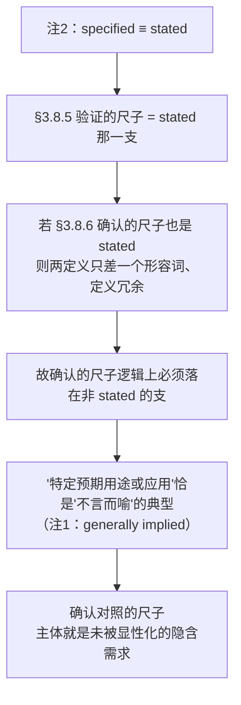

**精修（不可省）**：不是全等，是**"以隐含为主体 + 与 stated 有交集"**。明示的预期用途需求（如客户明说"要在 −40 °C 能开机"）**同时是两把尺子** → 这是 V&V 实践大量重叠的根源。

## 3.4 2005 → 2015 的修订证据

```
2005 §3.8.5 validation = "the SPECIFIED requirements for a specific intended use or
                          application have been fulfilled"

2015 §3.8.6 validation = "the requirements (3.6.4) for a specific intended use or
                          application have been fulfilled"
                                    ↑ 删去了 "specified"
```

- **2015 版删去了 "specified"**，改为引用 §3.6.4 上位概念 → 判据从"仅明示需求"扩展为三支。
- 而 **verification 的措辞两版都保留 "specified requirements"**。

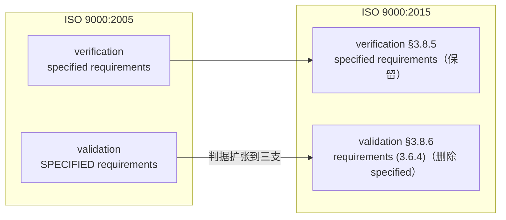

> **2015 版刻意让两把尺子在"是否限定为明示需求"这一点上分岔。这是标准自己承认：确认的判据不在明示需求内。**

## 3.5 无主语：提出者缺位，承受者可补

原文：

> `need or expectation that is stated, generally implied or obligatory`

**整句没有主语。需求的提出者在定义层面就是缺位的。**

因此任何给 requirement 补主语的表述，都是在**加料**：

| 补什么 | 表述 | 判定 |
|---|---|---|
| 补**提出者** | "组织**自己**的要求" | ✗ 无条款支撑，且被 §8.2.3.1 的 a)/b)/d)/e) 四项外部来源证伪 |
| 补**承受者** | "**对组织**的要求" | ✓ 有条款支撑——§3.13.12 auditee = *organization as a whole or parts thereof being audited* |

**且"对组织的"是上位**：组织自设的要求（§8.2.3.1 c）也属于"对组织的"。

**最后一格精度**：「对……的」这个句式仍隐含一个**提出者**预设——而 generally implied 那一支**没有提出者**（惯例不"对"谁提，只是被默认为存在）。故最严表述去掉该预设：

> **组织有义务满足的全部适用需求。**

## 3.6 硬推论：隐含需求只能被确认，不能被验证

**隐含需求在逻辑上无法被验证**（验证判据是明示需求，隐含需求没有明示形式）→ 只能被确认 → 确认必须"用"（§3.8.6 注3：使用条件可真实可模拟）

> **确认的方法论天然是场景 / 用例 / 运行试用 / 现场试验，不是逐条需求符合性检查。**

---

# 第 4 章 intended use or application

## 4.1 词义：use 的两义项，application 的场合义

**核心结论**：`use` 取**目的侧**（用途），不是动作侧（使用）；`application` 取**场合 / 领域侧**（应用）。

中文推荐译法：**预期用途或应用**；"预期的使用"是误导性译法。

| 义项 | 英文 | 中文 |
|---|---|---|
| 动作侧 | the act of using | **使用** |
| 目的侧 | the purpose / end for which something is used | **用途** |

**标准原文级证据**（IEC 60601-1 引 ISO 14971 定义的注）：

> *INTENDED USE should not be confused with NORMAL USE. While both include the concept of use as intended by the manufacturer, INTENDED USE focuses on the **medical purpose** while NORMAL USE incorporates not only the medical purpose, but **maintenance, transport**, etc. as well.*

→ **同一个 use，目的侧叫 INTENDED USE，动作侧叫 NORMAL USE，标准自己对举。**

**application** ← 拉丁 *applicare* = ad-（向）+ plicare（折叠）。义项：① 施加动作 ② **被应用到的场合 / 领域** ③ 现代 IT 义。此处取 ②。

**分工示例：**

| 对象 | 用途（use） | 应用（application） |
|---|---|---|
| 精密螺丝刀 | 拧紧小螺钉 | 电子装配线上 |
| 降压药 | 降低血压 | 成人原发性高血压患者 |

> 降压药这一对正对应 **intended use** 与 **indications for use** 的分界。

## 4.2 跨标准对照与归属差异

| 标准 | 写法 | 特点 |
|---|---|---|
| **ISO 9000:2015 §3.8.6** | *"a specific intended use **or** application"* | 两者并列、都不展开（**保守写法**） |
| **ISO 14971:2019 §3.6 / ISO/IEC Guide 63:2019 §3.4** | *"use for which a product, process or service is intended according to the specifications, instructions and information provided by the **manufacturer**"* | **总括写法**；注1 列典型元素：医学适应症、患者人群、所接触的身体部位或组织类型、使用者画像、**使用环境**、工作原理 |
| **EU MDR 2017/745 Art 2(12)** | **intended purpose** | 只用 purpose |
| **IMDRF N52:2024 §3.14** | *"the **objective intent** regarding the use… as reflected in the specifications, instructions and information provided by the manufacturer"* | 注2：intended use 可含 indications for use |
| **21 CFR 801.4** | *"objective intent"* | 美国 FDA 表述 |

**归属差异（不能混用）：**

| 标准 | 归属 |
|---|---|
| **ISO 9000 §3.6.10 注2** | *the intended use as intended by the **customer*** → 顾客意图 |
| **ISO 14971 / MDR** | *as intended by the **manufacturer*** → 制造商界定 |

## 4.3 与 specified use 的分野

**§8.2.3.1 a)–e) 原文（ISO 9001:2015）：**

| 项 | 原文 | 三支归属 |
|---|---|---|
| a) | requirements **specified by the customer** | stated |
| b) | requirements **not stated by the customer, but necessary for the specified or intended use, when known** | generally implied |
| c) | **requirements specified by the organization** | stated（自设） |
| d) | **statutory and regulatory** requirements | obligatory |
| e) | contract or order requirements differing from those previously expressed | stated |

**两处要点：**

- b) 里的 **"when known" 是限定**——承认"存在但不被知"的区域永远进不了需求基线。
- b) 里 **"specified or intended use" 并列**——ISO 自己把"规定用途"与"预期用途"当作两个东西。

**同构关系**：§3.6.4 的需求三支按"是否已被写明"分；**用途也按同一维度分两面**：

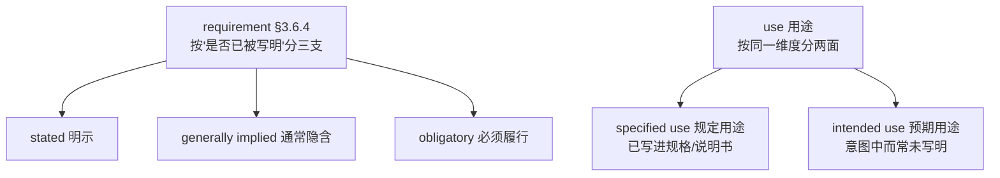

> **§3.6.10 defect 定义**亦用 *"intended or **specified** use"*，两处并列可互证。

**词义旁证**：intended ← 拉丁 *intendere*（in- 朝向 + tendere 伸展，同源 tension / tendon）→ 把意志伸向某处 → intended use 是**规范性（应然）**概念，与 actual use（实然）、foreseeable misuse（可预见误用）须划界。"specific" 要求用途**必须先被指明**，否则确认无靶子。

## 4.4 三条"神来之笔"

| 出处 | 内容 | 推论 |
|---|---|---|
| **ISO/DIS 9001 §3.57 customer satisfaction 注1** | 顾客的期望**可能连顾客自己都不知道，直到产品/服务交付之后** | 确认判据在源头就**不可完全前置获取** → 确认本质上是**后置的、迭代的、参与式的** |
| **IEC Electropedia IEV 192-01-18 注5** | **Multiple validations may be carried out if there are different intended uses** | 一物可有多用途 → 确认按用途分摊，用途参照层与需求基线**多对一**，不可互相替代 |
| **ISO 9000:2015 §3.6.10 defect 注2** | **intended use as intended by the customer** 会被提供方提供的信息（操作/维护说明书）影响 | 用途归属顾客，但可被提供方信息塑造 |

## 4.5 工程含义

**确认的第一件事是写 use specification / ConOps / 使用场景**（否则 §3.8.6 的 "specific" 无从满足）；确认手段必须是"在使用条件下运行"（§3.8.6 注3：真实或模拟），因为**判据是情境而非条目**。

---

# 第 5 章 判据体系：五级阶梯

## 5.1 五级定义

| 活动 | 判据（尺子） | 家族 | 出处 |
|---|---|---|---|
| **验证 verification** | 客体被规定的需求 | 需求（明示支） | ISO 9000:2015 §3.8.5 |
| **确认 validation** | 客体为预期用途或应用的需求 | 需求（通常隐含支为主） | §3.8.6 |
| **评审 review** | 为客体确立的目标 | **目标（跳出）** | §3.11.2 |
| **审核 audit** | 审核准则：方针、程序或需求 | **需求（回落）** | §3.13.7 |
| **治理 governance** | 组织目的的达成 · 方式的正当 | **目的（再跳出）** | ISO 37000:2021 |

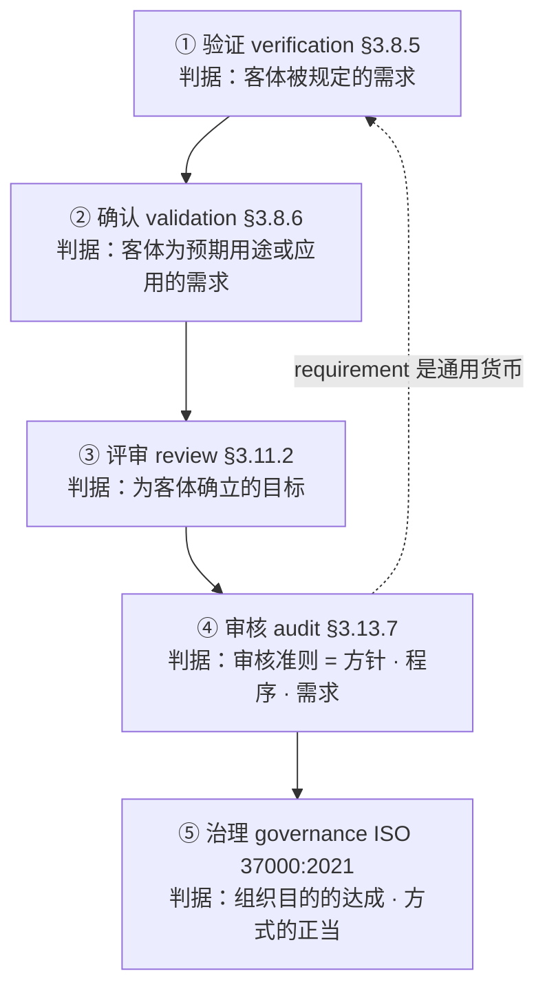

**评审（第 3 级）是分水岭的原文依据：**

> **ISO 9000:2015 §3.11.2 review** = *determination of the suitability, adequacy, or effectiveness of an **object** to achieve **established objectives***
> NOTE 1：还可包括 determination of **efficiency**

**一处位置修正**：2015 版评审位于 **§3.11「决定相关术语」**（review / monitoring / measurement / inspection / test / progress evaluation），**不在 §3.8**。2005 版才是 §3.8.7，且原文用 "subject matter"，2015 改为 "object"。

## 5.2 治理为何自指

**ISO 37000:2021** 的定义本身就是三个动词串：

> *governance = a human-based system by which an organization is **directed, overseen and held accountable** for achieving its defined purpose **in an ethical and responsible manner***

→ 拆出判据的两个维度：**① 目的达成（purpose achieved）② 方式正当（ethical and responsible）**。ISO 37000 的 11 项原则即这两个维度的展开（Purpose 为 primary + 4 foundational + 6 enabling）。

→ **purpose 本身是治理的第一个产出**（governing body 负责 defining the purpose）→ **治理自带判据生成器，自指**。

**另一条可用线索**：ISO/IEC 38500 的治理动词三连 **Evaluate / Direct / Monitor** + 六项原则 Responsibility / Strategy / Acquisition / Performance / Conformance / Human Behaviour。

**三个必须同时给出的限定：**

1. 治理判据不止"目的"，是 11 项原则；
2. purpose 是治理的第一个产出 → 自指；
3. **治理是体系（human-based system）不是活动** —— 不能用体系去对活动。

## 5.3 判据家族的往返

**需求 → 需求 → 目标 → 需求 → 目的**（跳出 — 回落 — 再跳出）

> 说明 **requirement 是这套语言里的通用货币**：一旦要"可判定、可举证"，判据就被拉回需求与准则。
> 唯独治理这一级自指。→ **前四级是"用尺子"，治理是"定尺子并保证尺子被用"。**

## 5.4 三种拓扑

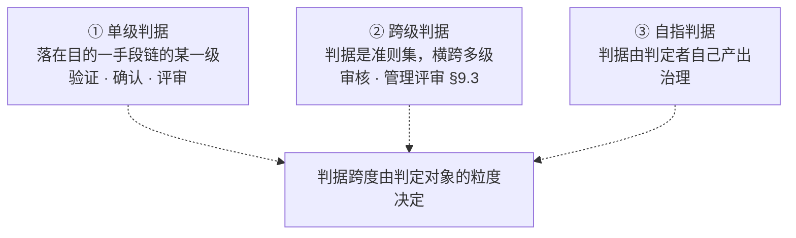

**审核为什么必然跨级**：

> **ISO 9000:2015 §3.13.12 auditee** = *"organization as a whole or parts thereof being audited"*

**审核的对象是"组织整体或其一部分"（体系），不是单个客体。** 而验证 / 确认 / 评审的对象都是单个客体（或产物）。

> **推论：对象是客体 → 单级；对象是体系 → 跨级准则集；对象是组织自身 → 自指。**
> 图像化：**验证 / 确认 / 评审是点判定，审核是线扫描，治理是自指环。**

## 5.5 方针的位置补充

上一节列的五级没有"**方针**"的位置。补入后：

> **方针的判据 = 组织的目的与环境**（ISO 9001 §5.2.1 a：方针应 *appropriate to the purpose and context of the organization*）
> 而 **ISO 9001 §9.3 管理评审**正是定期复评方针持续适宜性的活动。

→ **判据阶梯补为**：治理 ← 管理评审 ← 评审 ← 审核 ← 确认 ← 验证

**方针的三重身份**（详见第 7 章）：

| 关系 | 内容 | 条款 |
|---|---|---|
| 方针**有**判据 | 被"宗旨 + 环境"约束（应适合） | §5.2.1 a) |
| 方针**是**判据 | 本身列入审核准则集 | §3.13.7 |
| 方针**产**判据 | 向下提供目标框架 + 承诺满足适用要求 | §5.2.1 b) / c) |

**它是唯一一个既坐在阶梯某级上、又同时向下生成下一级的东西——是链上的枢纽，不是某一级。**

## 5.6 目的—手段链的验证

Mickey 提出的序次：用户方对客体的需求 → 对客体的期望 → 对客体的目标 → 用户方组织的方针 → 用户方组织的目的。

**判定：方向成立，性质是 means-end chain（目的—手段链），每一级为上一级提供理由；且正好是派生链的倒序（自下而上）。**

**ISO 9001:2015 的条款结构就是它的倒影（原文均已核）：**

| 层级 | 条款 | 原文要点 |
|---|---|---|
| 最上 | §3.5.11 mission | *"organization's **purpose for existing**"* |
| ↓ | **§5.2.1 a)** | 方针应 *"appropriate to the **purpose and context** of the organization and supports its strategic direction"* |
| ↓ | §3.7.1 objective + **§6.2.1** | *"result to be achieved"*；目标应**与方针一致**，并在相关职能、层级、**过程**上建立 |
| ↓ | **§4.2** | 「理解相关方的**需求和期望**」；正文「确定相关方的**要求**」 |
| 最下 | §3.6.4 注2 | 规定要求是经明示的要求 |

→ **三处明文（方针适合宗旨 / 目标与方针一致 / 要求由需要和期望确定），链条无断点。**

**四处修正：**

1. **第 1、2 级关系**：§3.6.4 里 expectation 是 requirement 的**构成材料**，不是把子集放在超集下面。按 **means-end** 读才通——**明示需求是为满足未明示期望而设的手段**；且注5 承认存在连 requirement 都不构成的期望 → **期望集合严格大于需求集合**。
2. **第 3 级措辞**：应写"用户方**为**客体设定的目标"，而非"对客体的目标"（§3.7.1 = *result to be achieved*）。
3. **第 3 → 4 级缺一环**：中间缺**组织层目标**（§3.7.1 注2：目标可分战略/组织/项目/产品/过程五层）。
4. **补入方针**（见 5.5）。

**术语提醒**：落到 AOS 需求链上时，"用户方"须定准是 **15288 的 `user`**（关心使用体验）还是 **`acquirer`**（关心合同、交付、全生命周期成本），两者期望内容不同。

---

# 第 6 章 审核准则：裸词、全集与归属

## 6.1 §3.13.7 原文

> **ISO 9000:2015 §3.13.7 audit criteria** = *"set of **policies, procedures or requirements** used as a reference against which objective evidence is compared"*

**辅助条款：**

- **§3.13.1 audit** = *systematic, independent and documented process… to determine the extent to which the audit criteria are fulfilled*
- **§3.4.5 procedure** = *"specified way to carry out an activity or a process (§3.4.1)"*；**注1：Procedures can be documented or not.**（程序不一定成文）
- **§3.4.1 process** = *"set of interrelated or interacting activities that use inputs to deliver an intended result"*

> **procedure 之于 process，正如 requirement 之于 need** —— 一个是"规定的途径"，一个是"实然发生的活动集"（**规定性 vs 描述性**的对偶）。

## 6.2 三处"requirement"的限定语对比

| 活动 | 原文 | 限定语 | 取哪一支 |
|---|---|---|---|
| 验证 §3.8.5 | *confirmed that **specified** requirements have been fulfilled* | `specified` | 只取**明示**支 |
| 确认 §3.8.6 | *requirements **for a specific intended use or application*** | `for intended use` | 主体在**通常隐含**支 |
| **审核 §3.13.7** | *set of policies, procedures or **requirements*** | **无** | **全集（三支通取）** |

> **只有审核的 requirements 是裸的（无任何限定语）——"无限定"本身就是答案：它是全集。**

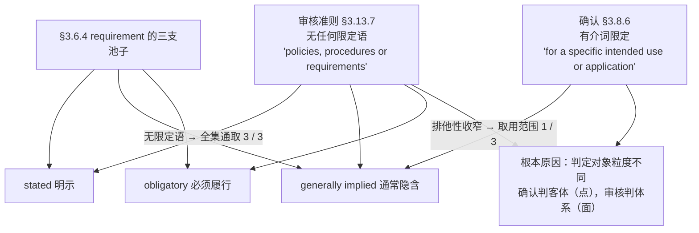

**为什么收窄方向相反：**

- **确认**判的是**一个客体**（点判定）→ 判据必须收窄到明确靶子 → 必须加介词限定。
- **审核**判的是**一个体系**（面扫描）→ 体系里跑着明示的、隐含的、强制的全部要求，预设只看哪一支都会漏审 → 不能加限定语。

> **同一个词、一次收窄一次全取，限定语的有无本身就是设计。**
> **这是全套辨析里最容易滑过去的坑：误把两处裸词当成同一个外延。**

## 6.3 内化机制：外部要求如何变成组织的条款

**ISO 9001 是强制内化的，走四条路径：**

| 路径 | 条款 | 干了什么 |
|---|---|---|
| 1 | **§4.2** 理解相关方的需求和期望 | 决定把**哪些**外部要求纳进来 |
| 2 | **§5.2.1 c)** 方针须包括"满足适用要求的承诺" | **"适用"两个字就是过滤器** |
| 3 | **§6.2.1** 质量目标须考虑适用的要求 | 把要求灌进目标 |
| 4 | **§8.2.2** 确定产品和服务的要求 | 落到条款 |

走完四步 → **来源消失在体系里，成文信息里只剩条款**。审核员翻到的是一句"我们承诺满足适用要求"，而不是"这一条来自 GB xxxx、那一条来自合同附件三"。

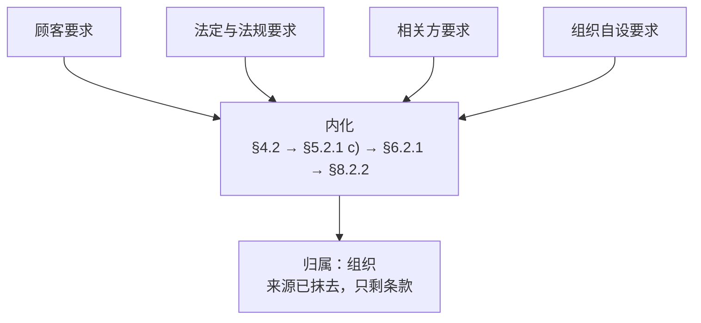

> **"看起来都像组织对自己的要求"，这是内化的副作用，不是事实。**

## 6.4 归属 vs 来源

**问题**：审核判据中的需求，是组织对自己的要求？

**判定：一半对，需要分层。**

| 维度 | 结论 |
|---|---|
| **归属（承受者）** | **统一为组织** —— §3.13.12 auditee = *organization as a whole or parts thereof being audited*；不符合项开在组织头上 |
| **来源** | **多元** —— §8.2.3.1 五项里 4 项外来（a 顾客 / b 无人认领 / d 法规 / e 合同），仅 c 自设 |

**精确表述**：

> **审核判据中的需求 = 已被组织确定、纳入其管理体系、并由组织作为责任承受的全部适用要求。**
> 统一的是**归属**（承受者＝组织）；不统一的是**来源**（顾客 / 立法者 / 相关方 / 组织自身）。
> 换成 §3.6.4 的话说：**三支在"组织"这个名下定格，来源在定格那一刻被抹掉。**

**收口三件套：**

1. **`requirement`**（§3.6.4）—— 明示的、通常隐含的或必须履行的需要或期望（**无主语**）
2. **对组织的** requirement —— 承受者确定（§3.13.12）
3. **审核准则里的 requirement**（§3.13.7）—— **已被组织确定并纳入的全部"对组织的需求"**

> **判据问的不是"谁提的"，是"谁要负责"。**

**这也解释了为什么会反复卡**：人们默认"要求"一定有个提出者，于是拼命去找那个提出者是谁（顾客？组织自己？），而 **§3.6.4 根本不打算回答这个问题**。它只回答：这算不算一个 requirement。

## 6.5 设定权在审核委托方（audit client）

准则的**内容**由委托方确定、载入审核计划——不是被审核方，也不是审核员。所以"组织对自己的要求"的成立程度**取决于审核类型**：

| 审核类型 | 委托方 | 成立度 |
|---|---|---|
| 第一方（内审） | 组织自己 | **最接近成立**——但准则里仍含外部采纳项 |
| 第二方 | 顾客 | 不成立——顾客要求被塞进准则 |
| 第三方（认证） | ≠ 被审方 | 不成立——准则被外部锁定（认证标准 + 法规 + 组织体系文件） |

> ⚠️ **待核**：ISO 19011 中 audit client 的**准确条款号**尚未逐字核对，本稿不给编号。

## 6.6 工程后果

组织既是判据的**承受者**又是**制定者**（差异于治理的"判定者自产"）。

> **内审特别容易"准则写松"——被审方有动机把自己写的方针 / 程序定得宽。**

**演进趋势**：**ISO 19011:2025（草案）**已把 audit criteria 简化为 *"set of **requirements** used as a reference against which objective evidence is compared"* —— policies 与 procedures 被**并入** requirements（不是删除，而是归并：方针程序一旦发布，本身已构成组织必须满足的自设要求）。

另：ISO 9001:2015 已取消 2008 版 6 个强制"程序文件"要求，改为保持成文信息 → 「程序」作为**形式**在弱化，作为**概念**（规定的途径）仍在准则集里。

---

# 第 7 章 术语边界与中文翻译陷阱

## 7.1 组织层五词的边界

| 术语 | 条款 | 原文要点 | 回答的问题 | 类型 |
|---|---|---|---|---|
| **vision** 愿景 | §3.5.10 | aspirational description | 想成为什么 | 志向 |
| **mission** 使命 | §3.5.11 | *organization's purpose for existing as expressed by top management* | 为什么存在 | 理由 |
| **policy** 方针 | §3.5.8 | *intentions and direction of an organization, as formally expressed by its top management* | 往哪走、什么不可让步 | **约束** |
| **strategy** 战略 | §3.5.12 | *plan of action to achieve a long-term or overall objective* | 怎么实现 | 途径 |
| **objective** 目标 | §3.7.1 | *result to be achieved* | 要拿到什么结果 | **结果** |

**方针的单独展开：**

- **三个词要单独咬**：intentions（意图，还没变成动作）· direction（方向，不是目标）· formally expressed by top management。
- **它唯独没有的**：没有"结果"，没有"指标"，没有"期限"。那些全在 objective 那里。
- **词源**：policy ← 希腊 *polis*（城邦）→ *politia*（治理、行政）→ 古法语 *policie*。同源词 **police**（本义即"治理、公共行政"，近代才缩窄为治安）、**politics**、**polity** → 底层义 = **"如何治理一个共同体的成文意志"**，这正是它长在 §3.5 治理词汇区的原因。
  - ⚠️ **易混**：**insurance policy**（保单）来自意大利语 *polizza*（凭据），**与治理义的 policy 是两条不同词源线**。
- **§5.2.1 四项要求**（把方针压"硬"）：

| | ISO 9001:2015 §5.2.1 | 作用 |
|---|---|---|
| a) | 适合组织的宗旨与环境、支持战略方向 | 管**上游** |
| b) | **提供建立质量目标的框架** | 管**下游** |
| c) | **包括满足适用要求的承诺** | 管**外→内** |
| d) | 包括持续改进的承诺 | 管**时间轴** |

**objective 的双特征**：**可测量 + 有期限**，缺一不可。§3.7.1 注2：目标可分**战略层、组织层、项目层、产品层、过程层**——**不必然是组织层**；注3：objective 可表述为 **a purpose**（也可表述为 intended outcome / aim / goal / target）→ **"目标"与"目的"在 ISO 语言里不是互斥层级，是同一物的不同表述**。

## 7.2 三处中文翻译陷阱

| 轮次 | 陷阱 |
|---|---|
| 评审判据 | `specified` 与 `established` 都被译成"**规定**"（**规定要求** / **规定目标**），掩盖了英文差别 |
| 目的正名 | 国标把 **policy** 译作"**宗旨**和方向"、把 **mission** 译作"组织存在的**目的**"；英文的 purpose 挂在 mission 上 → 中文"宗旨"挂在 policy 上，**按中文直觉去对会串行** |
| 方针本身 | 同一个 `policy`，"宗旨"这个词又挂在它身上 |

> **国标的"宗旨"一词被 policy 占用了，而中文读者看到"宗旨"想到的是 mission。**

## 7.3 语感陷阱：ISO 的方针比中文"方针"硬

中文"方针"带**宏观宣示气**（"基本方针""方针政策"），听着像口号。

但 ISO 的 policy **必须能被拿来对照客观证据**（§3.13.7 列为 audit criteria 之一），必须是**可判定的**，不能是"追求卓越"这种。

> **一个比定义更好用的检验法**：**审核员能不能拿这句话开不符合项？** 能 → 合格方针；不能 → 口号。

**治理词汇表的同构发现**：§3.5.8 policy → §3.5.10 vision → §3.5.11 mission → §3.5.12 strategy → §3.7.1 objective，与 ISO 37000 的 **Purpose → Value Generation → Strategy → Accountability → Oversight** **结构同构**。

> **治理不是 ISO 9000 之外的东西；§3.5 就是一套缩小版的治理词汇表。**

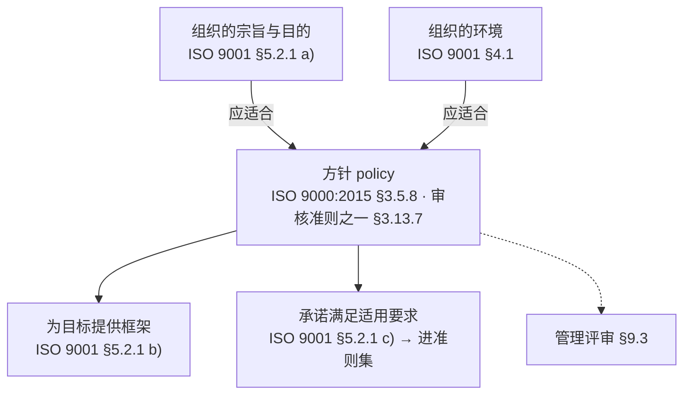

---

# 第 8 章 贯穿案例：七术语一次落地

**方法**：假设一家做工业级惯性测量单元（IMU）的公司「北衡传感」，用同一语境串起七个术语。（案例为假设，结构是标准的。）

## 8.1 组织层五级

| 术语 | 案例内容 | 边界提示 |
|---|---|---|
| **vision** | "让每一台自主移动的机器都能感知自己的姿态" | **不是**"三年做到 10 亿营收"（那是 objective） |
| **mission** | "为高振动、宽温域、长周期的工业场景，提供可靠可依赖的姿态基准" | **不是**"在 2030 年成为全球领先的惯性器件供应商"（那是 vision 语气） |
| **policy** | "未通过全温域标定的产品不出厂；精度指标以实测数据为准，不以标称值替代" | **不是**"追求卓越，顾客至上"（口号，无法作审核准则） |
| **strategy** | "自建全温域标定产线，与高校共建温漂模型，三年内把标定成本减半" | 比 policy 具体，比 objective 长期 |
| **objective** | "2027 年 6 月前：零偏重复性从 0.5 °/h 降至 0.2 °/h；出厂全温域标定覆盖率从 60% 提到 100%" | **不是**"提高产品质量"（不可测） |

> **五级回答的问题依次是**：成为什么 → 为什么在这 → 什么不让步 → 怎么走 → 拿到什么。
> **向下越来越具体、越来越可测；向上越来越稳定、越来越不可测。**

## 8.2 产品层两项

**intended use or application**（§3.8.6 确认的尺子）：

- **用途（use，目的侧）**：为**无人矿卡的行驶控制**提供角速率与加速度测量
- **应用（application，场合侧）**：**无 GPS 的露天矿封闭采区**、−40～+85 °C、强振动、高粉尘
- 关键特征：**它常常没有被写下来** —— 合同里可能只写"零偏 ≤0.5 °/h"，没人写"要在无 GPS 的采区持续可用"
- 一物多用途：同一颗 IMU 也可能装在井下铲运机、农机自动驾驶上 → **每个用途单独确认一次**

**specified requirements**（§3.8.5 验证的尺子）：

> 零偏稳定性 ≤ 0.5 °/h（1σ，**室温**）· 工作温度 −40～+85 °C · 角速率量程 ±300 °/s · CAN 2.0B @100 Hz · MTBF ≥ 50 000 h

**什么叫 "specified"？**（§3.6.4 注2：*A specified requirement is one that is **stated***）

| 表述 | 是 requirement 吗 | 是 specified 吗 |
|---|---|---|
| "要能在冷的地方工作" | ✓ 是 | ✗ **不是**（没法逐条对照） |
| "工作温度 −40 ～ +85 °C" | ✓ 是 | ✓ **是** |

> **specified 的唯一门槛 = 写成可对照的形式。** 不是"重要不重要"，也不是"谁提的"。

## 8.3 错位演示

| | intended use or application | specified requirements |
|---|---|---|
| 谁写的 | **常常没人明确写** | **一定**写进规格书 |
| 三支归属 | 主体在 **generally implied** | 全部是 **stated** |
| 怎么判 | 在预期使用条件下**用**一次 | 逐条**测**一遍 |
| 对应活动 | **确认** validation（§3.8.6） | **验证** verification（§3.8.5） |

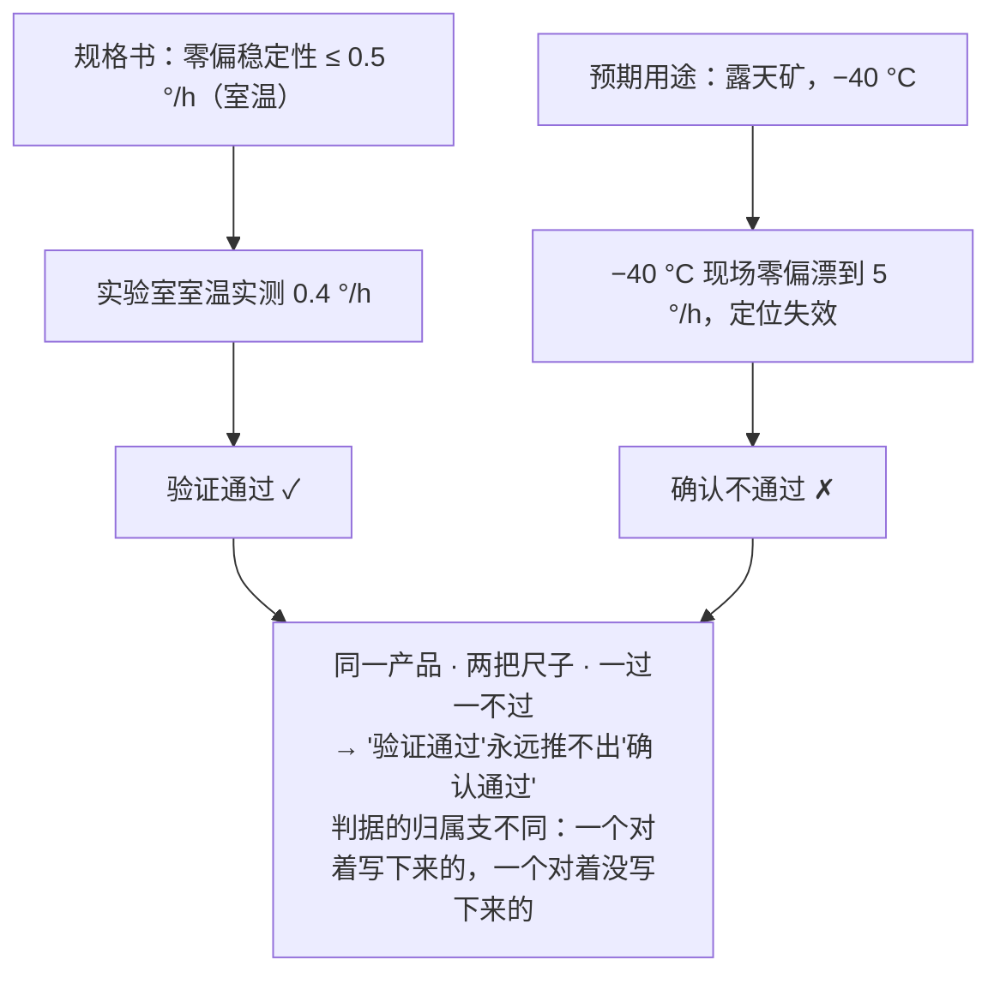

**再补一刀**：规格书里压根**没有**"无 GPS 场景下要持续可用"这一条。但它**仍然是 requirement**——因为它是矿卡厂的**不言而喻的期望**（§3.6.4 注1：惯例或一般做法）。

> **规格书里没有的，仍然可能是需求。**

## 8.4 七术语总览

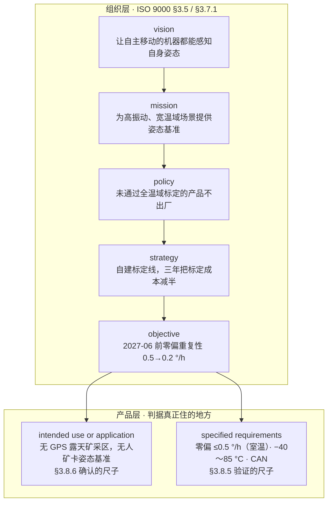

> 前五个词是**组织对自己的约束**，越往上越不可测；
> 后两个词是**判据**——一个写在纸上（specified requirements → 验证），一个常常没写在纸上（intended use or application → 确认）。
> **这七个术语的难度从来不在定义，在于它们看起来像同一件事。**

---

# 第 9 章 对 AOS 的工程结论

## 9.1 派生型文档链之外的两个东西

**第一个：确认的判据**（从第 2、3 章推出）

- 派生链**只能承载 stated**（generally implied 不上链）
- 故"链路自洽"只保证 **verification 侧**
- 确认的判据（预期用途 / 使用情境，主体是隐含需求）**在链外**，且链的结构无法表征它
- 载体建议：use specification / ConOps / 使用情境 / 用例 —— **不是**逐条需求

**第二个：方针**（从第 7 章推出）

- **方针 → 需求，不是 derivation（派生）关系，是 commitment + framework（承诺 + 框架）关系**
- 派生链靠"按规则生成"传递（改 A 则 B 变）；方针从不被派生出任何东西，它是被**承诺**的、被**遵循**的
- **你改一句方针，链上没有任何一条需求会因规则而自动变——只会因人的重新判断而变**
- → **"链路自洽"这个手段天然覆盖不到方针；方针在派生关系的上游之外**

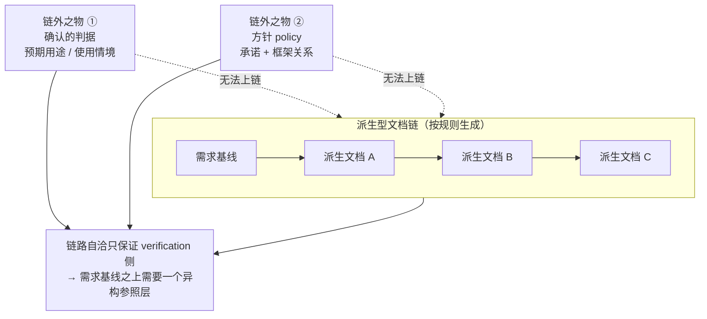

> **结论：需求基线之上必须有一个与派生链异构的参照层。**

## 9.2 派生链丢失来源标记（可补的空）

内化（§4.2 → §5.2.1 c) → §6.2.1 → §8.2.2）会让**来源消失在体系里，成文信息只剩条款**——与派生链"只保留已成为条款的东西、不保留为什么会有这条"**同病**。

- 补漏机制是 **ISO 9000 §3.6.13 traceability**（可追溯性），但**非强制**，且标准只说"追溯什么"，没说"在链条上怎么留痕"
- **可补的空**：给每个条款挂一个**来源指纹**（source / originator / authority / date），且该指纹**不能只留在链上**（链的连锁变动会冲掉它），须挂在与派生链异构的那一层

## 9.3 判据体系速查

| 活动 | 判据 | 拓扑 | 出处 |
|---|---|---|---|
| 验证 | 规定需求 | 单级 | ISO 9000:2015 §3.8.5 |
| 确认 | 为预期用途或应用的需求 | 单级 | §3.8.6 |
| 评审 | 为客体确立的目标 | 单级 | §3.11.2 |
| 审核 | 方针 · 程序 · 需求 | 跨级准则集 | §3.13.7 |
| 管理评审 | 目的与环境 · 方针 · 目标 · 绩效 · 相关方反馈 | 跨级 | ISO 9001 §9.3 |
| 治理 | 组织目的的达成 · 方式的正当 | 自指 | ISO 37000:2021 |

---

# 第 10 章 review / verification / validation 三角对照

## 10.1 三条定义并排看

| 活动 | 条款 | 定义关键片段 |
|---|---|---|
| **验证 verification** | ISO 9000:2015 §3.8.5 | *confirmation, through the provision of objective evidence, that **specified requirements** (3.6.4) have been fulfilled* |
| **确认 validation** | ISO 9000:2015 §3.8.6 | *confirmation, through the provision of objective evidence, that **the requirements (3.6.4) for a specific intended use or application** have been fulfilled* |
| **评审 review** | ISO 9000:2015 §3.11.2 | *determination of the **suitability, adequacy or effectiveness** of an **object** to achieve **established objectives***（NOTE 1：还可包括 determination of efficiency） |

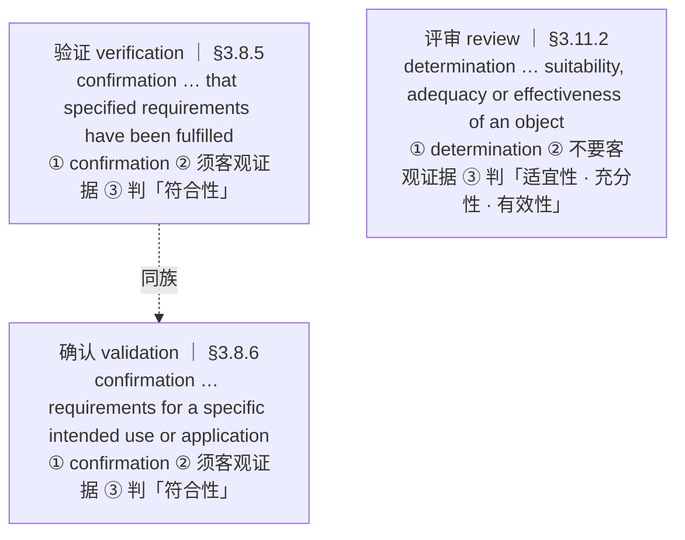

## 10.2 三处硬差别

**① 动词：`confirmation` vs `determination`**

- verification / validation 用 **confirmation** —— **对已有事实的确认**
- review 用 **determination** —— **做出一个判定**，可以是决定性的、权威性的，也可以是"够用了"这种裁量

→ 一个是被动核对，一个是主动裁定。

**② 客观证据：有 vs 无（最硬的一刀）**

| 活动 | 定义中是否有 "objective evidence" |
|---|---|
| verification | **有**：*through the provision of objective evidence* |
| validation | **有**：*through the provision of objective evidence* |
| review | **没有** —— 定义里根本不出现这个词 |

→ **verification / validation 的结论必须由客观证据支撑；review 的结论可以由专家判断支撑。**

这一条决定了 review 为什么便宜、为什么能在早期做、为什么一次评审几个人一下午就能出结论——**它不需要证据链。**

**③ 判的性质：符合性 vs 适宜性**

| 活动 | 定义动词的宾语 | 判的性质 |
|---|---|---|
| verification / validation | *requirements have been **fulfilled***（需求被满足） | **符合性** |
| review | *suitability, adequacy or **effectiveness***（适宜性、充分性、有效性） | **适用性裁量** |

→ **review 问的不是"对上了没有"，是"够不够用、合不合适、行不行"。**

## 10.3 review 的静态性：它能"前置"

**IEEE 1028-2008《IEEE Standard for Software Reviews and Audits》** 把这一点钉死了——其 **walk-through** 的定义就写着：

> *A **static analysis technique** in which a designer or programmer leads members of the development team and other interested parties through a software product…*

| | review | verification / validation |
|---|---|---|
| 需要"运行"吗 | **不需要** | **需要**（或至少需要客观证据） |
| 静态 / 动态 | **静态** | 动态 |
| 对象 | **工作产品**（work product）——文档、模型、代码 | **实物**——已存在的客体 |
| 时机 | **任何阶段**，产物一定型就能做 | 实物已成 / 可运行 |
| 是否要求独立 | 不要求（可为同行自评） | 不要求独立方，但须有证据 |
| 典型手段 | 会议、走查、审查、同行检查 | 检验、试验、替代计算、模拟使用、现场试用 |

> **这就是全部秘密：review 可以对"还不能用的东西"做判定。**
> 一份需求文档没法"验证"，更没法"确认"——它不能被使用——但**可以评审**。

## 10.4 V 模型上的位置

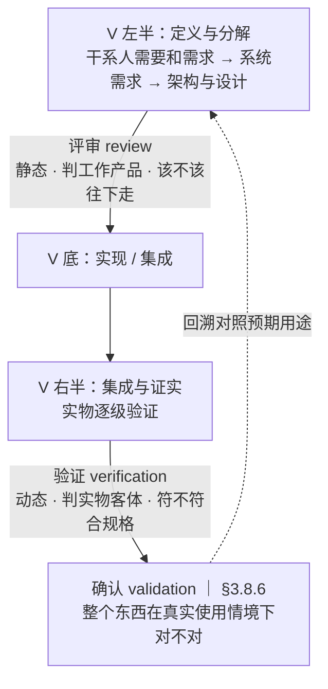

**对应关系：**

| V 模型部位 | 主要判据活动 | 为什么 |
|---|---|---|
| **左半**（定义与分解） | **评审 review** | 产物是文档 / 模型，不能用，只能评 |
| **右半**（集成与证实） | **验证 verification** | 实物已存在，可对着规定需求逐级验 |
| **顶部**（跨越回溯） | **确认 validation** | 只有整个东西可用了，才能对预期用途确认 |

## 10.5 IEEE 1028 的独立贡献

**贡献一：review 在 IEEE 1028 里是属概念（umbrella），下含 5 型**

| 类型 | 大意 | 相对严格度 |
|---|---|---|
| **management review** 管理评审 | 由管理层或代表管理层对软件产品或过程做的系统评价 | 另一条线（对项目 / 过程） |
| **walk-through** 走查 | 由设计者 / 程序员引着团队过一遍，边问边提意见 | **最轻** |
| **technical review** 技术评审 | 由合格人员组成的团队对产品做系统评价 | 中 |
| **inspection** 审查 | 对产品的可视化检查，检出并识别异常 | **最重**（Fagan 式） |
| **audit** 审核 | 独立检查，评估是否符合规格、标准、合同或其他准则 | 独立，不在 peer 序列里 |

**贡献二：给每种类型规定了 entry criteria / inputs / roles / procedures / outputs / exit criteria**

→ **把 review 从"开会"变成了"有约束的活动"。** 一份 review 有没有 exit criteria，决定了它是评审还是座谈。

**⚠️ 术语陷阱的第四处：两本标准的 "review" 外延不一样**

| 标准 | review 的外延 |
|---|---|
| **IEEE 1028** | **属概念**，**包含** audit |
| **ISO 9000:2015 §3.11.2** | **单个活动**，**不含** audit（§3.13.1 是独立词条） |

> **说 "review" 时，必须先问是哪本标准的 review。**

## 10.6 两处标准间的真实冲突

### 冲突 1：IEEE 1028 的 technical review 判据里出现了 intended use

> IEEE 1028 **technical review**：*A systematic evaluation of a software product by a team of qualified personnel that examines the conformance of the product with respect to its **intended use** and identifies discrepancies from specifications and standards.*

**"with respect to its intended use"** —— 按 ISO 9000 的说法这就是 **validation 的判据**。两本标准撞了。

**解法在对象**：

- technical review 的**对象是工作产品**（文档、设计、代码），**它不能被"使用"**
- 所以对文档没法做 validation
- → 标准就让 technical review 代劳，判"这个设计符不符合预期用途"

> **这不是矛盾，是标准在"实物尚不存在时"给了一个替代判据。**
> **同一件事：实物层叫 validation，工作产品层叫 technical review。**

### 冲突 2：inspection 同名，且意思正好相反

| 标准 | inspection 指什么 | 看什么 |
|---|---|---|
| **ISO 9000:2015** | *conformity evaluation by **observation and judgement** accompanied as appropriate by measurement, testing or gauging*（条款号待核） | **看实物** |
| **IEEE 1028-2008** | *A **visual examination** of a software **product** to detect and identify software anomalies…* | **看文档** |

> **同一个词，ISO 指向实物检查，IEEE 指向文档检查——方向相反。** 中文都译"检查 / 审查"，读起来毫无差别。

## 10.7 对 AOS 结论的修正

**修正对象**：第 9 章曾说"链路自洽只保证 verification 侧"。加上 review 之后，这个说法要扩。

| 活动 | 判据 | 派生链能否表征它 |
|---|---|---|
| **评审 review** | 既定目标 | **能** —— 如果每级产物都写明了"本阶段该产出什么" |
| **验证 verification** | 规定需求 | **能** —— 条款对条款，这就是链的主业 |
| **确认 validation** | 为预期用途的需求（主体是隐含需求） | **不能** —— 判据在链外 |
| **审核 audit** | 跨级准则集（方针 · 程序 · 需求） | 部分（方针不在派生关系上） |

> **修正后的结论：派生链能支撑 review 和 verification，但支撑不了 validation。**
> 因为 review 的判据（阶段性目标）和 verification 的判据（规定需求）**都是链上产物**；而 validation 的判据**不是**。

**由此得到 review 在 AOS 中的新定位**：

> **它是唯一一个能在链的每一级就地使用的判据工具。** 每级产物一定型，先评审放行，不用等到最后。
> **它是派生链的内生质检点。**

**但必须说清它的局限：**

> **review 不能替代 validation。** 因为 review 判的是"按既定目标够不够"，而既定目标本身可能从一开始就定错了。
> **一屋子专家对着错误的目标评审，只会一致同意这个错误的目标。**

→ 这正是 validation 必须在链外、且**必须"用"**的原因。

**三句话记法：**

| 活动 | 一句话 | 时态 | 静态 / 动态 | 证据 |
|---|---|---|---|---|
| **review** | **该不该往下走** | 将来 | 静态 | 不要求客观证据 |
| **verification** | **做出来符不符合规格** | 现在（对规格） | 动态 | 须客观证据 |
| **validation** | **用起来对不对** | 现在（对用途） | 动态 | 须客观证据 |

---

# 附录 A 术语定译表

| 英文 | 推荐中文 | 说明 |
|---|---|---|
| `requirement` | **需求** | 约定用词（非"要求"），§3.6.4 |
| `specified requirement` | **规定需求** | `specified ≡ stated`（注2） |
| `need` | 需要 | 与 requirement 不混用 |
| `expectation` | 期望 | 与 requirement 不混用 |
| `use`（目的侧） | **用途** | 弃用"使用" |
| `use`（动作侧） | **使用** | |
| `application` | **应用** | 场合 / 领域侧 |
| `intended use or application` | **预期用途或应用** | **弃用"预期的使用"** |
| `policy` | **方针** | ⚠️ 国标译"宗旨和方向"——"宗旨"易与 mission 混淆 |
| `mission` | **使命** | ⚠️ 国标译"组织存在的目的"——易与 purpose 混淆 |
| `vision` | **愿景** | |
| `strategy` | **战略** | |
| `objective` | **目标** | §3.7.1，注3 可表述为 a purpose |
| `procedure` | **程序** | §3.4.5，注1 可不成文 |
| `process` | **过程** | §3.4.1 |
| `auditee` | **被审核方** | §3.13.12 |
| `audit criteria` | **审核准则** | §3.13.7 |
| `audit client` | **审核委托方** | 条款号待核 |
| `governance` | **治理** | ISO 37000:2021，定义中为**体系**而非活动 |
| `traceability` | **可追溯性** | §3.6.13 |
| `review`（IEEE 1028） | **评审（属概念）** | ⚠️ 含 management review / technical review / inspection / walk-through / **audit**；与 ISO 9000 §3.11.2 的 review 外延**不同** |
| `inspection` | **检查 / 审查** | ⚠️ **同名异义**：ISO 9000 指看实物，IEEE 1028 指看文档，**方向相反** |

---

# 附录 B 标准原文索引

| 标准 | 条款 | 用途 |
|---|---|---|
| ISO 9000:2015 | §3.4.1 / §3.4.5 | process / procedure |
| ISO 9000:2015 | §3.5.8 / §3.5.10 / §3.5.11 / §3.5.12 | policy / vision / mission / strategy |
| ISO 9000:2015 | §3.6.4（含注1/注2/注5） | requirement，全报告地基 |
| ISO 9000:2015 | §3.6.10 | defect（intended or specified use） |
| ISO 9000:2015 | §3.6.13 | traceability |
| ISO 9000:2015 | §3.7.1（含注2/注3） | objective |
| ISO 9000:2015 | §3.8.5 / §3.8.6 | verification / validation |
| ISO 9000:2015 | §3.11.2 | review |
| ISO 9000:2015 | §3.13.1 / §3.13.7 / §3.13.12 | audit / audit criteria / auditee |
| ISO 9000:2005 | §3.8.5 | validation（旧版，含 specified） |
| ISO 9001:2015 | §4.1 / §4.2 | 组织环境 / 相关方需求与期望 |
| ISO 9001:2015 | §5.2.1 a)–d) | 方针四项要求 |
| ISO 9001:2015 | §6.2.1 | 质量目标与方针一致 |
| ISO 9001:2015 | §8.2.2 / §8.2.3.1 a)–e) | 确定要求 / 评审要求 |
| ISO 9001:2015 | §8.3.4 c)/d) | 验证与确认 |
| ISO 9001:2015 | §9.3 | 管理评审 |
| ISO/IEC/IEEE 15288:2015 | §6.4.9.1 / §6.4.11.1（含 NOTE 1） | verification / validation |
| ISO 37000:2021 | 治理定义与 11 项原则 | governance |
| ISO/IEC 38500 | Evaluate / Direct / Monitor + 六原则 | 治理的另一条线索 |
| ISO 19011:2025（草案） | audit criteria | 简化版措辞 |
| ISO 14971:2019 | §3.6 | intended use / purpose |
| ISO/IEC Guide 63:2019 | §3.4 | intended use |
| IEC Electropedia | IEV 192-01-18 注5 | 多用途多次确认 |
| IEC 60601-1 | 引 ISO 14971 注 | INTENDED USE vs NORMAL USE |
| IEEE 1028-2008 | 术语表 | review（属概念）/ audit / inspection / technical review / walk-through / management review |
| IEEE 1028-2008 | review 类型的 entry / exit criteria | review 作为"有约束的活动" |
| EU MDR 2017/745 | Art 2(12) | intended purpose |
| IMDRF N52:2024 | §3.14 | objective intent |
| 21 CFR | 801.4 | objective intent |

---

# 附录 C 存疑与待核清单

| 项 | 状态 |
|---|---|
| ISO 19011 中 `audit client` 的准确条款号 | **待核**，本稿不给编号 |
| ISO 9000:2015 §3.5.9 的内容 | **待核** |
| ISO 9000:2015 §3.5.10 vision 的逐字原文 | **待核** |
| ISO 9000:2015 §3.5.12 strategy 的逐字原文 | 大致为 *plan of action to achieve a long-term or overall objective*，宜复核 |
| ISO 9000:2015 §3.5.8 policy 有无注 | **待核** |
| **IEEE 1028-2008 各术语的准确条款号**（review / audit / inspection / technical review / walk-through / management review） | **待核**，本稿只给定义内容不给编号 |
| **ISO 9000:2015 中 inspection 的准确条款号** | **待核** |
| ISO 17034 某厂商讲义（pjlabs.com） | **编号不可信，勿引用**（把 documented information 标为 §3.8.6、verification 标为 §3.8.12，与 ISO OBP / ERA 冲突） |

---

# 附录 D 未交付事项

| 项 | 说明 |
|---|---|
| ~~review vs verification vs validation 三角对照~~ | **已交付** —— 见第 10 章（锚定 ISO 9000 §3.8.5 / §3.8.6 / §3.11.2 + IEEE 1028-2008） |
| 本报告图的 SVG 版本 | 全文按约定使用 mermaid |

---

*本报告由 `23-判据体系对话记录-从验证确认到治理.md` 整理而成。*
