# 架构与设计边界研究报告

## —— 从定义辨析到架构视角与架构视图

> **编号**：24（研究报告稿）
> **配套文件**：`24-架构与设计边界对话记录-从定义辨析到架构视角与架构视图.md`（对话原样记录，本文即由其整理而成）
> **日期**：2026-09-11
> **主题**：架构与设计的术语边界（架构定义 / 设计定义 / 架构描述 / 设计描述 / 合规 / 架构实体 / 架构视角 / 架构视图）
> **概念依据**：架构、关注点、架构视角、架构视图四概念的定义、关系、界分与译名，一律以 30 号《架构描述核心概念研究报告》为准（依 GB/T 45630-2025／ISO/IEC/IEEE 42010:2022）。
> **相关报告**：29 号《架构治理研究报告——从标准依据到责任主体》——架构治理的定义、层级、对象、输入与输出、责任主体、例外机制的权威；治理本体（含治理与管理的一般分界）在 28 号《治理概念研究报告——从 ISO 37000 定义到域治理实例》。**本报告只借治理侧的「目的」一物（§6.6），不展开治理本体**；凡本报告出现的「治理」，其归属见 §2.3 与 §15.6 的互参。
> **约定**：requirement → 需求；need → 需要；expectation → 期望（三者不混用）
> **图的处理**：全文图以 mermaid 表达
> **文档版本**：v1.0（创建于 2026-09-11）；**v1.1（2026-09-21）**——与 30 号对齐；**v1.2（2026-09-21）**——术语定名随国标收口；**v1.3（2026-09-21）**——依 29 号对齐治理口径；**v1.4（2026-09-21）**——§8.5 权责口径补管理侧限定、第 10 章补符合性评审接驳、术语按 28 号统一（宗旨／担责）；**v1.5（2026-09-21）**——依 27 号核验 ISO 9000 条款号（全文已用 2026 版，逐条核对无误，无 2015 残留）；**v1.6（2026-09-21）**——以本报告为基准对齐全目录（第六轮），自身回修 §17.4 重数版本口径；**v1.7（2026-09-24）**——依库内标准正本核改条款号与逐字引文（见下「修订记录（2026-09-24）」）
> **修订记录**：2026-09-21 与 30 号《架构描述核心概念研究报告》对齐——§1.2 架构定义补 42010:2022 §3.2／GB/T 45630-2025 3.2 现行口径（主体＝所关注实体），15288:2023 §3.5 英文逐字保留为过程标准口径；§15.1 更正 2022 版架构视角定义的本体（属概念仍为**工作产品**），删「去实体化」判断；§16.5 更正架构视角—架构视图重数（每张架构视图恰有一个治理视角，两版相同；一个架构视角可治理多张架构视图）；§6.5 必要性判据的参照由关注点改为**目的**，§6.6 判据栈补「环境」层与关注点闸门；§15.6／§15.11「架构视角产出架构视图」改 **governs**（治理 ≠ 生成）；§5.1 关注点、方面体的归属由「需求／验证层面」改为架构描述层；补 30 号 §3.3 架构视角规格五项约束与 §3.6「治理成立」五问；术语定名切换（视点→架构视角、视图→架构视图、干系人→利益相关方、视图构件→视图组件、方面→方面体、决策与理由→架构决策与理据等）；附录 D 第 1 条与 §15.15 附注的 GB/T 45630-2025 由「待核／需复核」改为**已核**；附录 D 的 §8.1／§6.8／§5.2.8 三条**仍待核，未结清**。
> **修订记录（第二轮收口，2026-09-21）**：按用户裁定「fundamental 用『基本』，其他术语按 GB/T 45630-2025 修订」——① governing principles **定语位**统一作「**管控原则**」，**撤销**第一轮的「治理原则」自译分流；动词／关系位的 governs 仍作「**治理**（或管辖）」，§1.2、§2、§14.1 谓词表、附录 A `governing` 条已补「同源不同位」说明；② `specification` 译名由「规约」改「**规格**」（随 GB/T 45630-2025 与 30 号 §3.3 口径），§15.2、§15.9A、§15.16、§16.6、§17 各节与附录 A、附录 D 同步，第一轮为调和「规约／规格」而加的那条括注已删；③ 架构定义句收口为 **canonical**：「实体在其环境中的**基本**概念或属性，以及该实体及其相关生存周期过程的实现和演化的**管控原则**（governing principles）」（§1.2 定名块、附录 A `architecture` 行）；④ fundamental 仍取「**基本**」，为全报告**唯一**不随国标之处，逐字引国标时照抄「基础」。
> **补充记录（2026-09-21 依 29 号对齐）**：以 29 号《架构治理研究报告》为准，核本报告涉「治理／架构治理」的全部表述——① 头部补**相关报告**互参行（口径分工：治理本体在 28 号、架构域专门展开在 29 号、架构描述四概念在 30 号）；② §2.3 补互参，分清「架构 govern 方案」的概念层支配关系与**架构治理**；③ §4.5 推论 2 补「受控偏离＝例外与豁免机制」的接驳；④ §6.6 补「目的定义权在治理机构」的权威出处；⑤ §8.1 关系 6 补「管理侧过程权属 ≠ 变更获准权」括注；⑥ §15.6 的 governs ≠ architecture governance 一条补**责任主体与例外机制**（裁量者为治理机构、责任不在架构师、例外须登记限期复审）；⑦ 第 10 章章首补**接驳块**——本章的合规判定＋第 11 章凭据链，功能上即 29 号 §7 六机制中的「符合性评审」，并点明判定结论的采信与放行属治理侧（29 号 §6.1 分离原则）、「条件性合规」的出口即「例外与豁免」。**依据**：29 号 §1.1、§2.1、§2.2、§3.1、§4.1～§4.3、§6.1、§6.4、§7、§9。**术语**按 29 号口径核——Architecture Contracts 作「**架构契约**」、42020 第 6 章 §6.4.1–6.4.6 作「**六项任务**」（「四活动」专指 ISO/IEC 38500 治理执行模型）：本报告两类用法均未出现，无待改。**节号、表格行数、图表结构、判据条数一律未动。**
>
> **补充记录（2026-09-21 用户指令第 2、3 条）**：①**§8.5 权责划分口径就地加限定**——本节划的是**管理侧的横向权责**（谁在本层内动得了规定需求），不是治理裁量权；凡触及判据本身的变更（架构原则、标准目录、基线、允许的变体范围）属治理，裁定权在治理机构而不在架构组（29 号 §2.2 判据三、§6.1）；②**判据措辞统一**——本报告涉及的治理判定一律引 29 号 §2.2 三条分界判据（层级／对象／不可自裁）；「跨出单管理层权限」是**介入门槛**（判该不该上治理），不得当分类判据用；③治理三职能句统一作「指导、监督、**担责**」（28 号 §2.3.3）。 **术语（第五轮）**：治理三职能第三成分作「**担责**」、organizational purpose 作「**宗旨**」（按 28 号 §2.3.3／§2.8 统一；本报告原用「运营目的」「问责」处已就地换）。
> **修订记录（2026-09-21 第四轮：依 27 号对齐）**：用户令「以 27 号研究报告为依据，将 27 号之前的报告与之对齐」——依 27 号《ISO 9000:2026 相对 2015 版差异研究报告》及其附 A 迁移映射表（138 条，已逐条实测），核本报告所引 ISO 9000 条款号（摘要决策表 9、§7.3、§10.1、附录 A `specified requirement` 行、附录 B 标准清单）**均已用 ISO 9000:2026 口径**（§3.5.1 及其 Note 2），比对 27 号附 A 映射表无误；**正文无 2015 条款号残留，全报告唯一保留的 2015 条款号在附录 C 第 6 轮条目与「方法论教训 1」中，系历史记录本身，不动**；**补漏 1 处**——§4.2「对照 ISO 9000 的 requirement 三支」原未标出处，补 `ISO 9000:2026 §3.5.1`（三支即该条的 stated / generally implied / obligatory）。附录 B 的 ISO 9000 行（§3.5.1 / §3.5.9 / §3.5.13）与 §4.3 的 conformity 定义句亦一并复核无误。版本 v1.4 → v1.5。
> **修订记录（2026-09-21 第六轮：以本报告为基准对齐全目录）**：用户令「以 24 号研究报告对齐之前的报告」——本报告为**基准方**，00～23 号 ＋ `20250326` 讲稿按本报告核改（各报告逐条改动见其自身修订记录；基准清单见工作区 `.work-24align/00-对齐基线.md`）。**基准方自身回修 1 处**：§17.4 标题与首句仍作「2022 版新口径／2022 版把 1 : 1 改成 1 : N」，与 §16.5 已更正的口径（**重数两版相同**，2022 版只是把既有实践写进 Introduction）自相矛盾——标题改「1 : N 的实际用处」，正文改「治理」并补版本口径注；示意块箭头由「──→」改「──治理──→」。**节号、表格行数、图表结构、判据条数一律未动。** 版本 v1.5 → v1.6。
> **修订记录（2026-09-24 依库内标准正本核改；版本 v1.6 → v1.7）**：本轮五份标准全文入库（42010:2022／42020:2019／42030:2019／15288:2023／ISO 9000:2026），本报告涉标准条款号与逐字引文的部分**逐条对正本复核**。**四处实质更正**——① **`system element` 条款号由 §3.46 改 §3.47**（正本 §3.46 是 `system`；2023 版新增 quality assurance 一条，其后条目整体后移一位），正文 5 处、附录 B 索引 1 处同步，并补正本逐字 *discrete part of a system that can be implemented to fulfil specified requirements*；② **§3.13 design 逐字由 `sufficient to enable` 改 `sufficiently complete to support`**（全库检索证实前者在 15288:2023 零命中），摘要第 10 条、§7.2 引文块、附录 A 词条三处同步，中文定名改「**足够完整到足以支撑**」；③ **§6.4.4.1 逐字由「frame stakeholder concerns and meet system requirements」改 `address stakeholder concerns and system requirements`**（§6.4 判据表、附录 D 同步），过程名按正本作 **System architecture definition process**；④ **§6.4.5 要旨改按 §6.4.5.1 逐字**（「提供关于系统及其元素的足够详细的数据与信息，以按**系统需求和架构**实现解」）。**结清两条历史挂账**：附录 D 第 3／4／5 条（§8.1 视角规格 a)–g)、§6.8 视图组件硬要求、§5.2.8 模型种类与图例）**已由正本逐字结清**；「§3.8 架构视角英文逐字」亦已结清（**定义句无 work product 属概念**——该点见 30 号 §1.3，本报告 §15.1 随 30 号一并修订）。**依据**：`90-治理登记/02-标准条款号核对表.md` §三之二（正本条目索引）与 §五 G-5／G-10。**未改**：其余节号、表格行数、图表结构、判据条数。

---

## 摘要

### 一、问题起点

> **架构定义的输出是系统架构，设计定义的输出是系统方案——那系统方案与系统架构的关系是什么？**

从这一问展开，整条讨论线收敛到一个判断：**架构与设计的差别是种类（kind），不是粒度（granularity）。**

对话中先后否掉了三个流行说法，它们是同一个错误的三种语法：

| 变体 | 用的词 | 错在哪 |
|---|---|---|
| "架构 = 系统的高层级元素" | 位置词 | 用"画得多粗 / 排得多前"代替判据 |
| "架构描述 = 设计描述的概要" | 粒度词 | 把**呈现粒度**搬到**种类层**上 |
| "先做框架设计，再做架构" | 阶段词 | 把两个并发的种类层写成先后阶段 |

**合规关系的存在本身，就是"种类而非粒度"这条结论的证明**——若架构只是更粗的设计，更细的自己不可能对更粗的自己"不合规"。

### 二、十二条核心结论

| # | 结论 |
|---|---|
| 1 | **architecture 是抽象物，不是交付物**；可交付物是 **architecture description（AD）**（42010:2022 §3.3） |
| 2 | **architecture govern，方案 realize**。判据词来自标准原文——15288:2023 §3.5 的 realization 与 §3.13 的 compliant implementation |
| 3 | **AD 与 DD 是平级的 artefact**（同列 15288:2023 §3.6 的 EXAMPLE），不是同一描述的粗细两版；整体形态 = **单向刚性约束 + 双向维护** |
| 4 | **合规的对象是 architecture，不是 architecture description**（15288:2023 §3.13 原句 *compliant implementation **of the architecture***）。把"规"当文件，就退化为文档格式检查 |
| 5 | **"规" = 由架构转化而来的一组规定需求**，其合法性来自一个动作：**选定 + 基线化**——备选概念经选定并基线化之后，才成为 obligatory 约束 |
| 6 | **"规"不是一个平行清单，而是"1 主语 + 5 谓语"的两层支配结构**：元约束层（架构原则 · 架构决策 · 演进承诺）支配对象约束层（架构实体 · 接口约定 · 特性分配）。唯一的筛选判据是「**该内容能否被设计"违反"**」 |
| 7 | **架构的准入判据是 fundamental（基本）**，标准自身未给出该判据（权威缺口）；可形式化为**必要性（membership）+ 充分性（closure）**双判据，参照系是**目的**。必要性失效 = under-specification，充分性失效 = over-specification |
| 8 | **架构不能直接当合规依据**：① 抽象物无法逐条比对；② 粒度不对（AD 按关注点与架构视角组织，判定按系统元素逐条做）。中间必须插一次 **"重排 + 明示化"**——这解释了 15288 为什么把 **interface definition 单列为架构定义的一项输出** |
| 9 | **明示化是分水岭**：停留在 generally implied 的架构约束**不可作合规依据**（ISO 9000:2026 §3.5.1 Note 2：*a specified requirement is one that is **stated***）。双闸门顺序 = **筛选 → 明示 → 追溯 → 冻结** |
| 10 | **DD 只能出具"条件性合规"**：design 的职责是 *sufficiently complete to support*（15288:2023 §3.13 逐字），**合规的承担者是 implementation**。这个"条件"有硬价值——把风险从实现之后提到了实现之前 |
| 11 | **凭架构描述举证，凭架构授权**。AD 是**证物，不是权威**——一条 AD 条目之所以能拿来判 DD，不是因为它是一份架构描述，而是因为它能**回溯到架构**；断在"回溯"这一段，AD 就从凭据退化成资料 |
| 12 | **架构实体（architecture entity）不是"架构的构成物"**，而是"**被架构的那个事物**"（42020:2019 §3.6，≈ 42010:2022 的 entity of interest）。中文圈普遍误读，必须在方法论文档中纠正 |

### 三、架构视角与架构视图：后四分之一的核心

| # | 结论 |
|---|---|
| S1 | **架构视角 = 一种工作产品，它规定架构视图的构建、解读和使用所应遵循的约定**（42010:2022 §3.8；属概念 **work product**）。2022 版相对 2011 版只改两处：动作 construction→**creation**、对象去 `system`；**属概念未变**——读成"一套规则本身"是滑到内容层（30 号 §7.1）。"视点"这一旧译带"立场 / 角度"的误导，GB/T 45630-2025 定名**架构视角** |
| S2 | **架构视角 vs 架构视图 = 规则 vs 产物**。架构视角**可复用**（写一次，用于多个系统），架构视图**不可复用**（只存在于某一个系统的那一份 AD 里）。**架构视角集是组织级资产，架构视图是项目级产物** |
| S3 | **架构视角负责 frame（提出哪些问题），架构视图负责 address（给出答案）**（§3.8 Note 1）。若一份文档"框定"了安全性问题却从不"处置"它——那是**架构视图缺失**，不是架构视角有问题 |
| S4 | **架构视角规定的是"种类"，不是"元素"**：链条是 **架构视角 →（规定用哪些）model kind →（governs）视图组件**。架构视角只能规定到"种类"这一级，**因为架构视角必须可复用** |
| S5 | **基于模型的视图组件有正式管辖（governed by model kind），非模型视图组件只有非正式记录（documented by legend）**——标准对后者的约束明显弱一档 |
| S6 | **viewpoint 与 model kind 是 42010 §4 里并列的合规对象**（§8.1 / §8.2）——正因平级，记法才能被多个架构视角复用，产生**多对多的组合自由** |

---

## 目录

- [第 1 章 问题的起点：两个定义与两个过程](#第-1-章-问题的起点两个定义与两个过程)
- [第 2 章 架构 govern，方案 realize](#第-2-章-架构-govern方案-realize)
- [第 3 章 架构描述与设计描述：两个平级的 artefact](#第-3-章-架构描述与设计描述两个平级的-artefact)
- [第 4 章 合规的"规"：对象是架构，不是架构描述](#第-4-章-合规的规对象是架构不是架构描述)
- [第 5 章 "规"的构成：元约束层与对象约束层](#第-5-章-规的构成元约束层与对象约束层)
- [第 6 章 基本（fundamental）：目的必要性与充分性](#第-6-章-基本fundamental目的必要性与充分性)
- [第 7 章 明示化与合规依据包](#第-7-章-明示化与合规依据包)
- [第 8 章 架构定义与设计定义的过程关系](#第-8-章-架构定义与设计定义的过程关系)
- [第 9 章 设计描述与架构：判定三角与自由度结构](#第-9-章-设计描述与架构判定三角与自由度结构)
- [第 10 章 合规判定：三条门槛与四步程序](#第-10-章-合规判定三条门槛与四步程序)
- [第 11 章 凭架构描述举证，凭架构授权](#第-11-章-凭架构描述举证凭架构授权)
- [第 12 章 元素三层：AD element / 架构构成物 / system element](#第-12-章-元素三层ad-element--架构构成物--system-element)
- [第 13 章 架构实体：一个被普遍误读的术语](#第-13-章-架构实体一个被普遍误读的术语)
- [第 14 章 两个被否掉的说法：高层级与概要](#第-14-章-两个被否掉的说法高层级与概要)
- [第 15 章 架构视角：把"怎么看"沉淀成规则](#第-15-章-架构视角把怎么看沉淀成规则)
- [第 16 章 架构视角、模型种类与视图组件](#第-16-章-架构视角模型种类与视图组件)
- [第 17 章 贯穿案例：IAM 系统的架构视角与架构视图](#第-17-章-贯穿案例iam-系统的架构视角与架构视图)
- [附录 A 术语定译表](#附录-a-术语定译表)
- [附录 B 标准原文索引](#附录-b-标准原文索引)
- [附录 C 自我更正清单](#附录-c-自我更正清单)
- [附录 D 存疑与待核清单](#附录-d-存疑与待核清单)

---

# 第 1 章 问题的起点：两个定义与两个过程

## 1.1 三层权威关系

**INCOSE SEH v5（2023-07）是 state-of-good-practice 的阐释层**，规范定义必须锚在 **ISO/IEC/IEEE 15288:2023**。

## 1.2 两个定义的原文

**architecture**（15288:2023 §3.5）：

> *fundamental concepts or properties of a system in its environment and governing principles for the realization and evolution of this system and its related life cycle processes*
> 〔SOURCE: ISO/IEC/IEEE 42020:2019, 3.3, modified〕

→ 系统在其环境中的**基本概念或属性**，以及用于**实现与演化**该系统的**管控原则**。此句主体是「**系统**」——这是 **15288 的过程标准口径**；同一句式落到架构描述一侧，主体是「**实体**」，见下。

**架构（定名口径）**（GB/T 45630-2025, 3.2／ISO/IEC/IEEE 42010:2022, 3.2，源自 ISO/IEC/IEEE 42020:2019, 3.3）：

> 实体在其环境中的**基本**概念或属性，以及该实体及其相关生存周期过程的实现和演化的**管控原则**（governing principles）。

逐字引 GB/T 45630-2025 时照抄国标字面（见 30 号 §2.1）：

> 实体在其环境中的**基础**概念或属性，以及该实体及其相关生存周期过程的实现和演化的**管控**原则。

两处定名：fundamental 国标作「基础」，本报告自译自用作「**基本**」——**这是全报告唯一不随国标之处**（30 号 §7.2）；governing principles 定语位统一作「**管控原则**」（与国标一致，30 号 §7.3；2026-09-21 用户裁定，**撤销**此前「治理原则」的自译分流）。同源不同位须分清：**governing principles（定语）＝管控原则**；**a viewpoint governs a view（动词／关系名）＝治理（或管辖）**。2011 版的 *system of interest／embodied in its elements, relationships／principles of its design and evolution* 一律降**【历史对照】**（30 号 §2.1／§2.7）。

**design（名词）**（15288:2023 §3.13）：

> 系统元素及其关系的**规格**，**完整到足以支撑对架构的一次合规实现**。

## 1.3 两个过程（不是两个定义）

| 过程 | 条款 | purpose（要旨） |
|---|---|---|
| System Architecture Definition | 15288:2023 §6.4.4 | 生成并表达系统架构，使架构可被实现、可被演进 |
| Design Definition | 15288:2023 §6.4.5 | 提供关于系统及其元素的足够详细的数据与信息，以按**系统需求和架构**实现解 |

## 1.4 三条关键结论

1. **architecture 是抽象物，不是交付物。** 可交付物是 **architecture description（AD）**——42010 对此有严格区分。
2. **design 的职责是"足够完整到足以支撑"（*sufficiently complete to support*），合规的承担者是 implementation。** 这个主语错位是后面所有讨论的关键。（逐字见 15288:2023 **§3.13**：*specification of system elements and their relationships, that is sufficiently complete to support a compliant implementation of the architecture*。）
3. **两个过程不是阶段。** 15288:2023 §5 允许**迭代与并发**——"先架构定义后设计定义"是瀑布式误读。

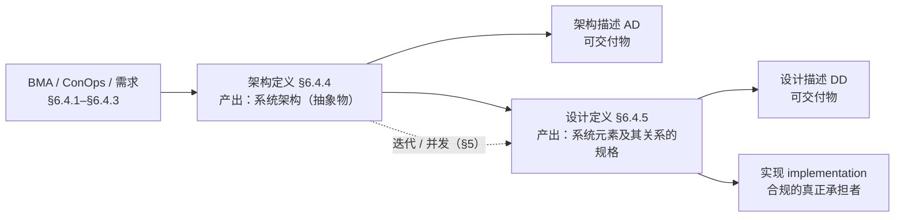

---

# 第 2 章 架构 govern，方案 realize

## 2.1 先纠一个前提

**"系统方案"在 15288 / INCOSE 中不是规范术语。** 15288 用的是 **solution space / solution classes**（§6.4.1 BMA）。

## 2.2 "系统方案"的三种读法

| 读法 | 所指 | 与架构的关系 |
|---|---|---|
| ① 备选方案 | 架构与设计过程中的**中间物**（solution classes 里的候选解） | 被架构**筛选与约束**，尚未定型 |
| ② TOGAF System Solution | 某个 Common System Architecture 的**实现** | 架构 govern，方案 realize |
| ③ 口语整体解 | 一个宽泛的"整体怎么解" | 架构是它的**子集，且是支配层** |

## 2.3 统一关系式

> **架构 govern 方案；方案 realize 架构。**

**判据词来自标准原文**——15288:2023 §3.5 的 **realization**（"governing principles for the realization and evolution of this system"），与 §3.13 的 **compliant implementation**。


**同源不同位**（30 号 §7.3）：**governing principles** 是**定语**，修饰原则，指具有约束力、可据以判定违规——定名「**管控原则**」；**a viewpoint governs a view** 是**动词／关系名**，连接两个元素——定名「**治理**（或管辖）」。二者同出 governing，一个是性质、一个是关系，不可互串。「管控」的力度不由语义给，而由治理机制给（30 号 §5.5）。

> **互参（29 号）**：本节的关系式 **架构 govern 方案** 说的是概念层的**支配关系**（与 governs 同族，30 号 §7.3），**不是架构治理**。架构治理是组织治理职能，其对象是架构决策、决策遵从、架构演化、架构资产四层（29 号 §2.1、§4.1）；而方案、模型、代码、配置、部署属**管理侧**，不在治理对象之列（29 号 §2.2「对象」判据、§4.3 不治理什么）。

---

# 第 3 章 架构描述与设计描述：两个平级的 artefact

## 3.1 前提事实

**两者是平级的 artefact，不是同一描述的粗细两版。**

**硬证据**：15288:2023 §3.6 **artefact** 的 EXAMPLE 把 **architecture descriptions** 与 **design descriptions** 并列，同列的还有 models、requirements、source code、implemented system elements。

## 3.2 三重关系

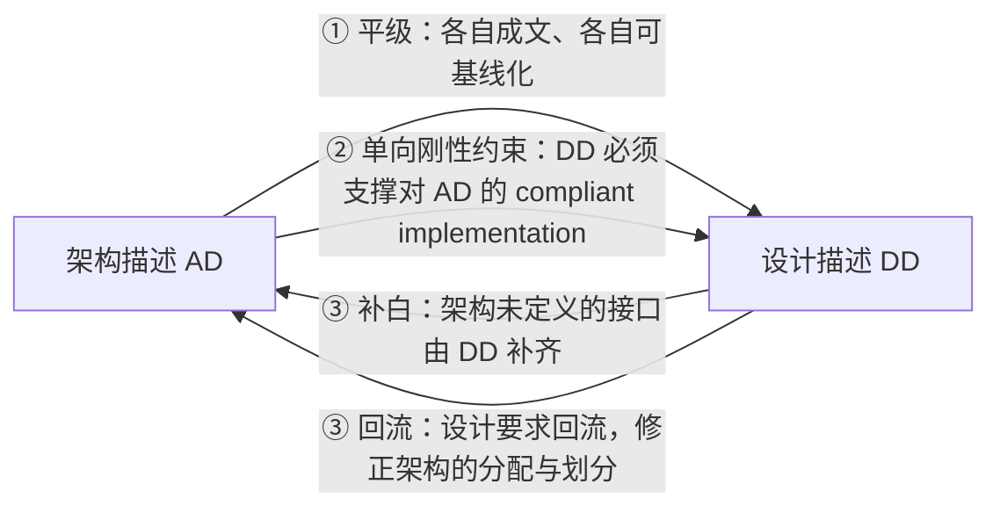

整体形态 = **单向刚性约束 + 双向维护**。

## 3.3 一处不对称事实

**AD 有完整的标准族（42010 描述 / 42020 过程 / 42030 评估），而 DD 没有同等的"描述内容"国际标准**——内容靠领域工程规范 + ISO/IEC/IEEE 15289 信息项兜底。

## 3.4 高价值工具：correspondence

42010 的 **correspondence / correspondence method**——把"文档间一致性"从人工比对变成**可判定规则**。例：*"每个软件元素必须分配到至少一个硬件平台"*。

**这可以直接用作派生型文档链的一致性校验与配置管理自动检查。**

## 3.5 易错点

同一信息在 AD 与 DD 中是**不同断言层**——接口在 AD 是架构性约定，在 DD 是实现级数据 / 协议 / 时序 / 容差。**不能理解为"AD 写名字、DD 写细节"。**

---

# 第 4 章 合规的"规"：对象是架构，不是架构描述

## 4.1 一处关键纠正

15288:2023 §3.13 的原句合规对象是 **architecture**（*compliant implementation **of the architecture***），**不是 architecture description**。

> **若把"规"当成文件，就退化为文档符合性检查**——那是 42010 的另一种 conformance（AD ↔ 42010 要求）。**两个"合规"必须分开。**

## 4.2 "规"是什么

> **"规" = 由架构转化而来的一组规定需求。**

其合法性来自一个动作：**"选定 + 基线化"**——备选概念经选定并基线化之后，才成为 obligatory 约束。

**对照 ISO 9000 的 requirement 三支（ISO 9000:2026 §3.5.1）**：架构基线走 **obligatory**；架构原则走 **generally implied**。

## 4.3 合规的承担者

**合规的承担者是实现，不是 DD。** conformity = fulfilment of a requirement。

> **设计描述只是"实现之前的可判定代理"**——这才是 "implement-to level" 的真实含义。

## 4.4 可判定的条目：四类 + 一个隐藏类

| # | 条目类 | 判什么 |
|---|---|---|
| 1 | 架构实体 | 有承载物吗 |
| 2 | 特性分配 | 被满足了吗 |
| 3 | 架构原则 | 被违反了吗 |
| 4 | 接口约定 | 语义被改了吗 |
| **5** | **演进承诺** | 架构承诺的可替换性 / 扩展点是否被设计焊死（**最难发现**） |

## 4.5 三条推论

1. **合规是多对一**——同一架构 ↔ 多个合规实现，逐实例判定。这是"架构必须技术无关"的必然推论。
2. **不合规有三个合法出口**（15288 设计定义活动）：① 改设计 ② 评估其他设计 / 实现备选 ③ 重做权衡（perform trades）。都走架构变更评审，**禁止静默偏离**——三条出口即**受控偏离**的通道：偏离规则的放行权归治理机构，属 29 号 §7 机制六件中的「**例外与豁免**」，须登记在册、有期限、有约束条件、到期强制复审（29 号 §4.2 判据「凡进入实现的变更，都是治理对象」、§6.4「例外权上收」）。
3. **合规 ≠ 正确。** 合规属 verification 侧（参照规定需求）；满足需要 / 期望属 validation 侧。

---

# 第 5 章 "规"的构成：元约束层与对象约束层

## 5.1 筛选判据收紧为唯一一条

> **该内容能否被设计"违反"。**

据 42010:2022 §6.1–§6.10 逐条筛：

| 条款 | 内容 | 能否被设计违反 | 归属 |
|---|---|---|---|
| §6.2 | 利益相关方 | 否 | 需求 / 验证层面（承载与验证在需求侧） |
| §6.3 | 利益相关方角度 | 否 | 需求 / 验证层面（同左） |
| §6.4 | 关注点 | 否 | **架构描述层（人一侧）**，不属"规" |
| §6.5 | 方面体 | 否 | **架构描述层（人一侧）**，不属"规" |
| §6.6 | 架构视角 | 否 | 描述质量层面 |
| §6.7 | 架构视图 | 否 | 描述质量层面 |
| §6.8 | 视图组件 | 否 | 描述质量层面 |
| §6.9 | 对应关系与对应方法 | 特殊 → **移出"规"** | 描述层内部一致性机制 |
| §6.10 | 架构决策与理据 | **是** | **属"规"** |
| — | 被建模的架构实体及其断言 | **是** | **属"规"** |

> **关注点不是需求**（30 号 §四）：关注点属于**人**（立场、利害），需求属于**系统**（可验证的条件或能力）；两者多对多，**关注点的家在架构描述一侧**——它是选架构视角的锚点（30 号 §4.7）。上表 §6.4／§6.5 两行的「架构描述层（人一侧）」即据此定性：它们不是"规"，但也**不是需求条目**。

## 5.2 修订后的结构：1 主语 + 5 谓语

**两层支配结构，非平行清单。**

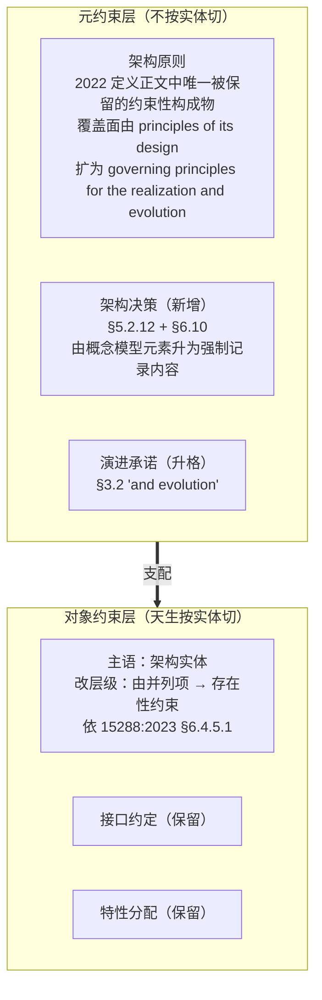

## 5.3 元观察

> **线性化只是"约束层级"在评审顺序上的一次投影；真实结构是元约束支配对象约束。**

线性顺序应按"变更影响半径递减"排：**原则与决策 → 实体 → 接口 → 特性**。

## 5.4 判定口径（可直接进 checklist）

> **凡"一经选定即不得由设计擅自变更的选择"都是规。**

**架构决策最易漏审**，因为它常以"背景说明"的形态出现。

---

# 第 6 章 基本（fundamental）：目的必要性与充分性

## 6.1 一处真漏项

前述讨论用了三个**代理**判据（可引用性 / 可判定性 / 变更影响半径），**从未用定义正文里真正的准入判据——fundamental（基本）**。

## 6.2 标准自身没有给出该判据（可引用的权威缺口）

- **42010:2011 Annex A**：architecture 是 "what is fundamental … not necessarily everything about a system, but the **essentials**"（essentials 同为关系性谓词，缺参照物）
- **SEBoK**：word "fundamental" "is problematic, since it has **no universal definition**"；"the level of detail in an architecture depends on the context of use and **the purpose to which it is being designed**"；并明确要求 "**an architectural description should justify what is included and what is excluded**"

## 6.3 形式化：双判据

| 判据 | 定义 | 管什么 |
|---|---|---|
| **必要性** | 移除 x ⇒ 目的所依赖的结构条件不成立 | 管**入会**（membership，什么必须进） |
| **充分性** | x 齐备后，剩余问题均不影响目的的可达性 | 管**闭包**（closure，架构到哪停） |

**精确化（不可省）**：**不是数学意义的充要条件**——架构不构成目的达成的充分条件（达成还需实现 / 验证 / 运行）；充分性仅指"**目的所要求的结构条件已被完整表达**"。

## 6.4 失效形态

| 失效 | 形态 |
|---|---|
| 必要性失效 | **under-specification**（架构缺失） |
| 充分性失效 | **over-specification**（架构越界写成设计） |

## 6.5 与标准的接驳

| 判据 | 参照与接驳 |
|---|---|
| 必要性 | 由**目的**界定（承重测试：拿掉它，实体还能达成其目的吗）——**不由关注点界定**（30 号 §5.3 原文作「不由关切界定」，所指相同）。42010:2022 的 concern 机制提供的是**关注点的记录位**，供第二步查缺口与定呈现 |
| 充分性 | 15288:2023 **§6.4.4.1**「select one or more alternative(s) that **address stakeholder concerns and system requirements**」 |
| 时间维度 | §3.2「realization **and evolution**」要求必要性判据**跑两遍** → 这解释了"演进承诺"为何必须单列 |
| 环境 | 定义中 *in its environment*——法规、物理条件、外部接口、资源构成「目的能否达成」的**第三类硬条件**（30 号 §5.4） |

## 6.6 判据栈修正

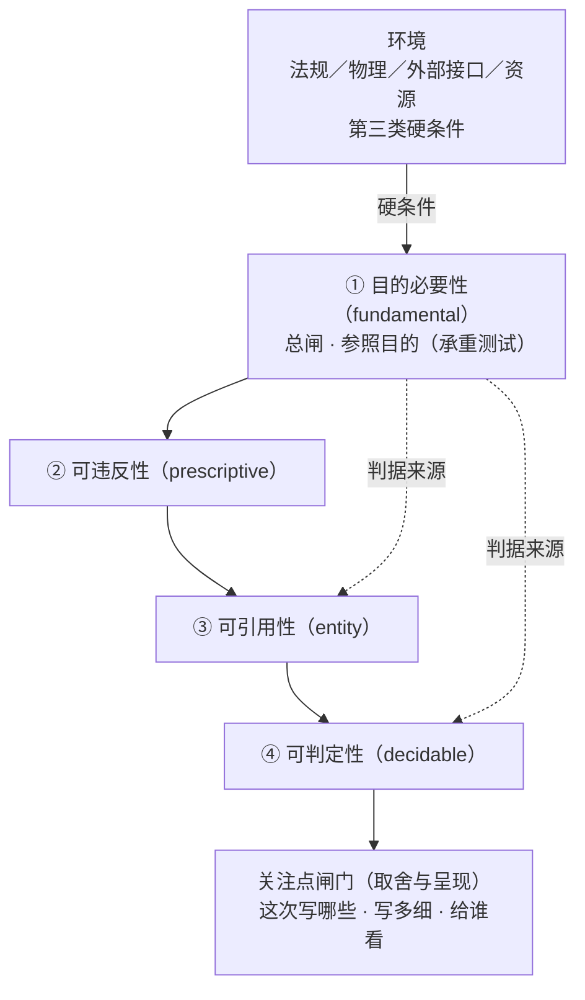

③④ 是可机械检查的**代理**，① 是**判据来源**；代理要有效，AD 中必须保留 **目的 → 关注点 → 实体** 的追溯链。

**两道闸门不可互替**（30 号 §5.4；该节把这道闸门写作「关注点」，所指相同）：**目的**判「够不够格进这一层」（承重测试），**关注点**判「够格的候选里这次写哪些、写多细、给谁看」；**环境**供给第三类硬条件。判据的来源是**架构治理**——治理需要一把高于个体关注点的裁量尺，那把尺就是**目的**（30 号 §5.3）。该归属的权威表述见 29 号 §3.1 前提一：**架构由宗旨评判，而目的的定义权在治理机构，不在架构师，也不在开发团队**——架构师对目的只有质询权与守护责（29 号 §3.1、§6.4）。

## 6.7 上游依赖

判据的参照（目的）不由架构定义过程产生，而由 **BMA → ConOps/MGO → 需求交付**（15288 §6.4.1–§6.4.3）。

> **若目的未被陈述清楚，"基本"不可判定、架构边界必然漂移**——故架构评审第一步必须确认目的基线。

## 6.8 反例检验

- **"目录结构统一小写"**：可违反、可判定、可引用，但对任何目的**不必要** ⇒ **非架构条目**（编码规范）
- **"日志须可被外部审计员独立读取"**：看似实现细节，但若合规审计关注点依赖之 ⇒ **对目的必要** ⇒ **属架构**

---

# 第 7 章 明示化与合规依据包

## 7.1 架构为什么不能直接当依据

两个理由：

1. **抽象物无法逐条比对**
2. **粒度不对**——架构描述按**关注点与架构视角**组织（42010:2022 §6.6–§6.8），而合规判定按**系统元素**逐条做（15288 §6.4.5.1）

故须经一次 **"重排 + 明示化"**。这解释了 15288 为什么把 **interface definition 单列为架构定义的一项输出**——它是重排的第一件产物。

## 7.2 载体形态：三类 + 一层管理

| 类别 | 内容 |
|---|---|
| **逐实体约束**（对象约束层，按系统元素为主键） | 接口定义 · 分配的架构特性 · 实体与关系清单（槽位表） |
| **横切约束**（元约束层，不按实体切） | 架构原则 · 架构决策 · 演进承诺 |
| **管理载体** | 追溯矩阵 · 架构基线（版本化冻结） |

**闭环发现**：上一章由"元约束 / 对象约束"两层导出的六槽位，在"合规依据"视角下**正好表现为"横切约束 + 逐实体约束"两种组织方式**——元约束无法按实体切分，对象约束天生按实体切分。

## 7.3 明示化是分水岭

架构约束若停留在 generally implied，不可作合规依据 → 必须以**规定需求（specified requirement = stated，ISO 9000:2026 §3.5.1 Note 2）**的形式下达给设计。

**双闸门顺序**：


## 7.4 四种失效形态

| 缺什么 | 后果 |
|---|---|
| 缺"逐实体约束" | 槽位空置 / 凭空元素 |
| 缺"明示条目" | 印象式评审 |
| 缺"追溯" | 合规无法证明、变更影响分析失据 |
| 缺"基线" | 合规于哪一版无从回答（典型现象：设计拿最新文档、架构师拿记忆中的架构） |

## 7.5 明示化 = 一次翻译

> **把架构描述里"保证一致性与可审计性"这类目标性陈述，换成可观测判据（同步 / 幂等 / P99 ≤ 50 ms / fail-closed）。**
> **原句无法被违反，故无法被判定；翻译之后，它才成为规定需求。**

**样例（IAM 系统）**：

```
ID: IF-IAM-002 | 对象/范围: 策略引擎 ←→ 认证服务
断言:  同步调用；输入（主体ID, 资源ID, 动作）→ 输出（允许|拒绝, 依据码）；
       无副作用（幂等）；P99 ≤ 50 ms；不可判定时按拒绝处理（fail-closed）
判定方法: 接口测试 IT-IF-002 + 压测 PT-03 + 负向用例
变更权限: 架构评审 | 归属架构版本: AD-IAM v1.3
```

## 7.6 可判定四件套

**ID**（可追溯）· **对象 / 适用范围**（归谁）· **断言**（可判满足）· **判定方法**（可举证）；推荐加"变更权限""归属架构版本"。

| 缺件 | 后果 |
|---|---|
| 缺 ID | 变更影响分析无从下手 |
| 缺对象 | 设计者不知归谁 |
| 缺断言 | 印象式评审 |
| 缺判定方法 | 合规不可复现 |
| 缺变更权限 | 设计侧静默改架构 |
| 缺版本 | 双方比对不同版本 |

## 7.7 AOS 落地物

**架构向设计交付的契约包** = 接口定义基线 + 约束条目表（原则 / 决策 / 演进承诺）+ 追溯矩阵 + 基线版本号。

**它必须纳入配置管理，随 AD 基线同版冻结**——`CBP-IAM-001 v1.0` 对应 `AD-IAM v1.3`，AD 一动，凭据包这版即作废。

> 否则迟早出现"架构改到 v1.4、凭据包还停在 v1.3，设计照着旧条目做，被判不合规"的错配。**这是派生链上最典型的翻车方式，而且双方都会觉得自己没错。**

---

# 第 8 章 架构定义与设计定义的过程关系

## 8.1 六条过程关系

| # | 关系 | 内容 |
|---|---|---|
| 1 | **交替递归** | 上一层设计定义的输出 = 下一层架构定义的输入对象 |
| 2 | **同构** | 同一套活动族：初始化策略 → 生成备选 → 评估权衡 → 选择 → 表达记录 → 维护。**同一种工作做两遍** |
| 3 | **边界同源** | 架构定义的停止线 = 设计定义的起点，由**充分性判据**切定 |
| 4 | **身份转变** | 架构定义的 output → 设计定义的 input，身份由"成果"变为"**规定需求**" |
| 5 | **产物约束** | §3.13 合规实现 |
| 6 | **权威不对等** | 改架构的独占权在架构定义侧；设计定义只能发起 **ACR** 或要求重做权衡（perform trades）。（此处划的是**管理侧**的过程权属；架构自身的变更是治理对象，变更是否获准由治理机构裁决——29 号 §4.2、§6.4） |

## 8.2 时间观纠正

两过程**不是阶段**（15288 §5 允许迭代与并发）——"先架构定义后设计定义"是瀑布式误读；真实形态是**同一时刻在相邻两个种类层上的两类工作**。

## 8.3 可推广原理

> **每个过程的输出，对下游过程而言都是规定需求**（除非下游仅消费信息而不受约束）。

→ V 模型左侧即"规定需求逐级下达"链：


**这也解释了"验证的参照 = 规定需求"为何逐级成立。**

## 8.4 结构补充：系统分析

**系统分析**（15288 §6.4.6，purpose = *provide a rigorous basis of data and information for technical understanding to aid decision-making across the lifecycle*）是贯穿架构定义与设计定义的**横切评估支撑**，位于 §6.4.4 / §6.4.5 之后。

## 8.5 权责划分口径

> **架构组 / 设计组的权责不应按"谁画图"分，而应按"谁拥有对该层规定需求的变更权"分。**

> **口径限定（依 29 号 §2.2）**：本节划的是**管理侧的横向权责**（谁在本层内动得了规定需求），**不是治理裁量权**。按 29 号 §2.2 三条分界判据逐段定性——架构组在本层框架内做的取舍属管理；**凡触及判据本身的变更（架构原则、标准目录、基线、允许的变体范围）属治理，其裁定权在治理机构，不在架构组**（判据三「不可自裁」）。两者并读时勿把架构组当治理裁量者：29 号 §6.1 明定责任在治理机构、分离原则要求「定方向与裁决／设计架构／实施交付」三者不同体。**

---

# 第 9 章 设计描述与架构：判定三角与自由度结构

## 9.1 这是经中介的关系

**DD ↔ 架构不能直接对表**（架构是抽象物；且组织粒度不同）→ 必须构成**判定三角**：


**判定路径（三段式）**：DD 的每条承诺 → 上溯到 AD 中的架构对象 / 约束条目 → 该条目回溯到架构（合法性由**目的必要性判据**保证）。**断任一段，"合规"即退化为印象。**

## 9.2 桥接性（link）

**SEBoK（引 15288）**：

> *"System design is intended to be the **link** between the system architecture and the implementation of technological system elements"*；*"Design provides the 'how-' or '**implement-to**' level of the definition"*

→ 架构 — DD — 实现，三点一线，**DD 是中间段**。

## 9.3 多对一

一架构 ↔ 多份 DD（变体 / 供应商 / 迭代）。推论：**架构知识不可只存于 DD**，否则换实现方案即丢架构。

## 9.4 自由度结构（核心洞见）

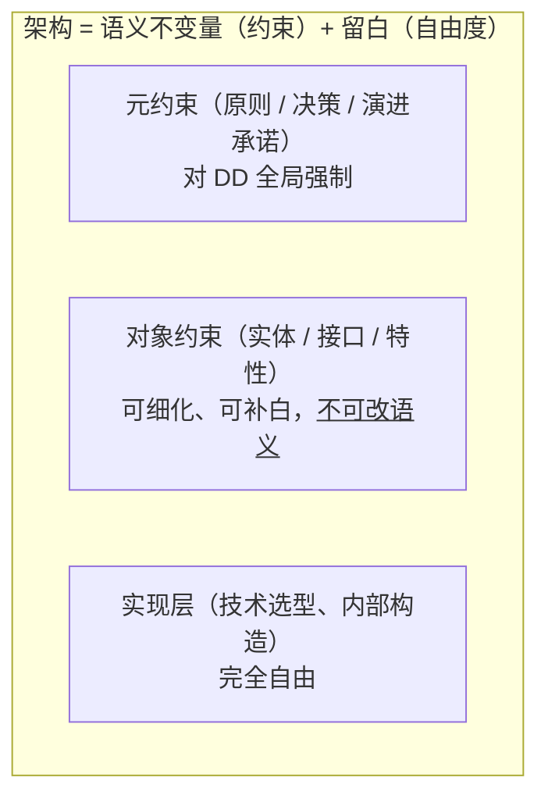

> **架构划定的正是"自由度为零的那条线"**；留白不是遗漏，而是设计意图（恰是"对目的不必要"的部分）。

## 9.5 三重贡献

| 贡献 | 内容 |
|---|---|
| **落实**（realize） | 把架构承诺做成具体的系统元素及其关系 |
| **补白**（refine） | 补齐架构未定义处 |
| **检验**（falsify） | DD 是架构的**第一个可行性检验器**，且发生在实现之前（**最易被漏**） |

---

# 第 10 章 合规判定：三条门槛与四步程序

> **接驳（依 29 号）**：本章的「合规判定」＋第 11 章「凭据链」，功能上就是**架构治理六机制中的「符合性评审」**——29 号 §7 给机制的定位与设计要点（在还有时间纠错的时点进行、问开放问题、**对照标准而非个人偏好**），本章给它的是可判定的工程形态（三条门槛、四步程序、凭据四段与可采性四条件）。两处须并读：① 判定结论的**采信与放行**属治理侧，判定本身属技术支撑（29 号 §6.1 的分离原则——定方向与裁决／设计架构／实施交付三者不同体）；② 判定出「条件性合规」时的**受控偏离**出口，即 29 号 §7 的「例外与豁免」（有期限、有约束条件、有补救计划、登记在册、到期强制复审）。另：29 号 §9 的落点表把本仓库两项符合性审查技能登记为治理载体。

## 10.1 一句话结论

> **判定 DD 是否合规，不靠"像不像"的观感，靠三条门槛——正反双向覆盖闭合 ∧ 每条约束有判定方法 ∧ 两边版本已冻结。全过，也只能得出"条件性合规"；真正的合规必须由实现举证。**

## 10.2 凭据层：凭什么（四条，缺一即退化为意见）

| # | 凭据 | 具体形态 | 缺了会怎样 |
|---|---|---|---|
| 1 | **条目集** | 每条设计承诺都能映射到一条**已明示的架构约束条目**（ID / 对象 / 断言 / 判定方法） | 只能做印象式评审 |
| 2 | **追溯** | 每条承诺能上溯到 AD 中的可引用对象，该对象再回溯到架构 | 合规不可证明，变更影响分析无据 |
| 3 | **判定方法** | 每条约束自带 verification method（审查 / 分析 / 演示 / 测试）与通过准则 | 结论不可复现 |
| 4 | **版本冻结** | 明确比对的是 AD 的**某个基线**（如 AD-IAM v1.3）与 DD 的某个版本 | 双方比对的是不同版本的架构 |

**第 1 条的门槛词是"已明示"**：停留在 generally implied 的架构约束**不可作合规依据**——ISO 9000:2026 §3.5.1 Note 2 把话说死了，*"a specified requirement is one that is **stated**"*。

## 10.3 程序层：怎么查（四步）

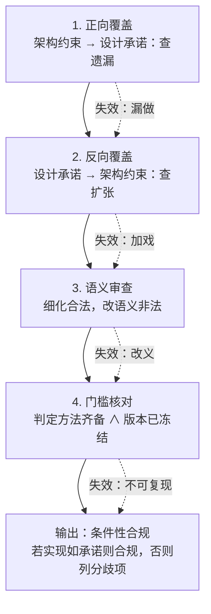

- **正向覆盖**（约束 → 承诺）：查**遗漏**。接驳"基本"判据的必要性面。
- **反向覆盖**（承诺 → 约束）：查**无据扩张**。接驳充分性的边界面。
- **语义审查**：查"改没改"。同一信息在 AD 与 DD 是**不同断言层**——**细化合法，改语义非法**。用 42010:2022 §6.9 的 correspondences / correspondence method 做机械校验。
- **门槛核对**：判定方法与版本双检。

## 10.4 元约束要单独换一把尺子

架构原则、架构决策、演进承诺**不适用逐条覆盖**——形态是"**全局不违反**"，必须用**反例检索（negative check）**：

| 元约束 | 要搜的反例 |
|---|---|
| 原则：策略引擎须可替换 | DD 里有没有对某个具体策略引擎的编译期依赖 |
| 决策：不引入消息中间件，走 outbox | DD 有没有偷偷引入 broker |
| 演进承诺：令牌格式可迁移 | DD 有没有把令牌格式焊死在存储 schema |

→ **这解释了元约束最容易漏审的技术原因：它在覆盖矩阵上没有对应行。**

## 10.5 双向覆盖检查矩阵

| 架构约束条目 | 调用关系 | 接口规格 | 异步实现 | 权限位置 | 分库分表 |
|---|---|---|---|---|---|
| IF-IAM-002（策略引擎↔认证服务 同步调用） | **✓** | **✓** | | | |
| AC-P-01（禁止循环依赖） | **✓** | | | | |
| AC-D-01（不引入消息中间件，走 outbox） | | | **✓** | | |
| AC-E-01（策略引擎须可替换） | | | | **✓** | |
| AC-P-03（审计日志仅追加） | | | | | **✓** |

**未响应 = 遗漏（正向失效）；无依据 = 凭空扩张（反向失效）。**

## 10.6 门槛层：何时才算"可判"

三条**全过**才叫可判定：

1. 双向覆盖闭合（正向无遗漏 ∧ 反向无不合法扩张）
2. 关键约束均有判定方法（可举证、可复现）
3. AD 与 DD 均已有基线号

**缺任一条时，正确的结论是"尚且不可判定"，不是"不合规"。**

> **证据不足 ≠ 判定失败——这两个结论必须分开写。**

## 10.7 收口：DD 只能出具"条件性合规"

15288:2023 §3.13 原句 *"specification of system elements and their relationships, that is **sufficiently complete to support** a compliant implementation **of the architecture**"*，注意主语：

- **design 的职责是"足够完整到足以支撑"**（*sufficiently complete to support*）
- **合规的承担者是 implementation**

| 时刻 | 判定对象 | 结论形态 |
|---|---|---|
| 设计定义阶段 | DD（**承诺**） | **条件性合规**：若实现如 DD 所承诺，则实现合规于 AD v1.3 |
| 验证阶段 | 实现（**举证**） | **实际合规**：以规定需求为参照逐级上溯 |

链路：**架构约束 → DD 承诺 → 实现 → 验证证据 → 合规结论**。

**这个"条件"有硬价值：把风险从实现之后提到了实现之前。** 真正的产出是**尽早逼出架构自身的缺陷**——某条架构约束若根本给不出判定方法，那不是设计没做好，是**架构侧必须回炉**。

## 10.8 五种典型失效

| # | 缺失 | 现场现象 |
|---|---|---|
| 1 | 缺条目集 | 评审变成"我觉得这样也行" |
| 2 | 缺正向覆盖 | **漏做**：DD 少实现一个架构实体或接口，直到集成才炸 |
| 3 | 缺反向覆盖 | **加戏**：DD 引入架构未授权的组件或依赖，架构无声漂移（最隐蔽） |
| 4 | 缺元约束反例检索 | **焊死**：原则与演进承诺被违反，而覆盖表上看不出任何异常 |
| 5 | 缺判定方法或版本 | 结论不可复现；双方比对的是不同版本 |

---

# 第 11 章 凭架构描述举证，凭架构授权

## 11.1 凭，但凭的不是 AD 本身

> **凭架构描述举证，凭架构授权。**

这消解了一处张力：前面说"规是架构、不是架构描述"，后面又把凭据落到了 AD 上。两者不矛盾，但必须分层说清——**凭据链上，AD 是证物，不是权威。**

## 11.2 AD 是证物，不是权威

| | 提供什么 | 能不能直接判 |
|---|---|---|
| **架构**（抽象物） | 合法性 / 权威——由"目的必要性"闸门 + "选定并基线化"动作授予 | 不能。无可引用对象，抽象物打不了钩 |
| **架构描述 AD**（work product, 42010:2022 §3.3） | 可引用对象与可判定条目 | 能引用，但**效力不自足** |

一条 AD 条目之所以能拿来判 DD，**不是因为它是架构描述**，而是因为它能**回溯到架构**。条目本身**不自证**——这正是凭据链不能断开的地方：**断在"回溯"这一段，AD 就从凭据退化成资料。**

AD 本体还不能直接当凭据用的原因：它的组织方式是**关注点与架构视角**（42010:2022 §6.6–§6.8），而合规判定必须**按系统元素逐条做**（15288:2023 §6.4.5.1）——粒度根本对不上。所以中间必须插一次"重排"。

## 11.3 凭据链（四段，每段一次转化）

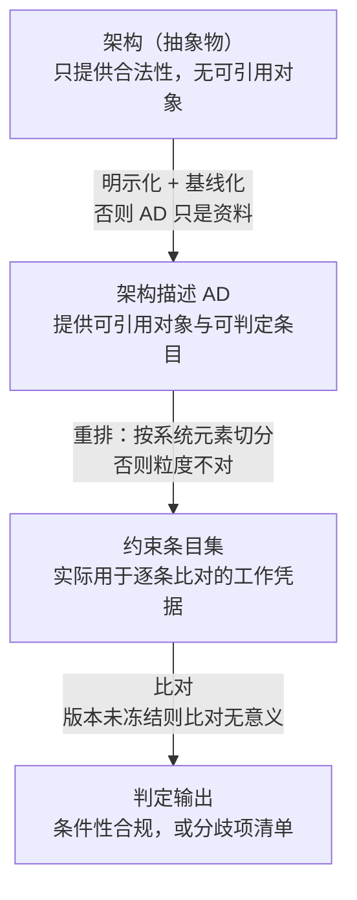

## 11.4 可采性四条件

像证据法一样——**文件里写了，不等于可作证据**：

| 条件 | 内容 | 缺了会怎样 |
|---|---|---|
| **相关性** | 条目能回溯到目的（过必要性判据） | 无根约束，凭据无效 |
| **可检验性** | 已明示 + 自带判定方法与准则 | 不可判定，只剩印象 |
| **时效性** | 属已冻结的基线版本 | 双方比对的是不同版本 |
| **同一性** | 在 AD 中有唯一标识、被唯一引用 | 变更影响分析无从下手 |

> 所以更准确的说法不是"凭架构描述"，而是"**凭架构描述中那些可采的条目**"。

## 11.5 必须避开的分岔

| 分岔 | 判什么 |
|---|---|
| **42010:2022 §4 Conformance** | 判的是"**这份 AD 合不合 42010 的要求**"，描述质量问题 |
| **15288:2023 §3.13** | 判的是"**实现是否合规于架构**"，compliant implementation **of the architecture** |

> **用前者的方式去判后者，合规评审就悄悄变成了文档格式检查**——条目齐不齐、图全不全、模板填没填。这是实践中最常见的偷换。

## 11.6 收口

> **凭架构描述举证，凭架构授权。AD 是证物，架构是权威，中间那两步（明示化 + 基线化、按系统元素重排）是转化器——缺任何一段，"合规"就只剩一个说法。**

---

# 第 12 章 元素三层：AD element / 架构构成物 / system element

## 12.1 "架构描述中的元素"有两个所指

| 读法 | 术语与出处 | 指什么 |
|---|---|---|
| **A** | **AD element**，42010:2022 §3.4（*identified or named part of an architecture description*） | **描述本身的零件**：利益相关方 / 利益相关方角度 / 关注点 / 方面体 / 架构视角 / 架构视图 / 视图组件 / 模型种类 / 对应关系 / 架构决策与理据 |
| **B** | 描述所表达的**架构构成物**（组件、组件间关系、实体与环境的关系） | 所关注实体**内部**的构造 |

**提醒**：**读法 B 在现行标准里没有术语地位**，它只以 42020:2019 §3.3 的一条 **Note 1** 存在（*"usually intended to be embodied in the entity's components, the relationships between components, and the relationships between the entity and its environment"*）。

**且不要用"架构实体（architecture entity）"来指读法 B**——42020:2019 §3.6 的 architecture entity 是"**被架构的那个事物**"，它是读法 B 的**容器**，不是它的成员（详见第 13 章）。

## 12.2 读法 A（AD element）↔ system element：只有表达关系

| | AD element | system element |
|---|---|---|
| 属于什么 | **关于**系统的文档的一部分 | 系统**本身**的一部分 |
| 出处 | 42010:2022 §3.4 | 15288:2023 **§3.47** |
| 关系性质 | **expresses / represents** | — |
| 数量对应 | 无。一个架构视图（AD element）可以表达十个 system element；一个 system element 可以出现在多张架构视图里 | — |

> 最典型的错觉是"**画了架构视图，就等于定了部件**"。不成立。

顺带一提，42010:2022 里的 **view component** 是 2011 版 architecture model 的更名，**仍然是描述层概念**，不要被 "component" 这个词带进实现层。

## 12.3 读法 B（架构构成物）↔ system element：槽位与填料，多对多

- **层次**：架构层（逻辑、技术无关）vs 实现层（技术具体、可被实现 / 采购 / 编码）
- **多对多**，两个方向都有工程后果：
  - **一槽位 ↔ 多元素**：架构里的"认证服务"落到实现可能是 `auth-api` + `auth-db` + `auth-cache` → 这正是**架构可复用**的根本原因
  - **一元素 ↔ 多槽位**：一个 API 网关同时承载"认证入口""限流点""审计埋点"三条架构约束 → **变更影响放大**
- **填充动作发生在设计定义**：15288:2023 §3.13 说 design 是"**系统元素及其关系**的规格"——它同时管元素**和元素之间的关系**
- **方向单向**：架构构成物是**规定需求**（约束方），system element 是**被约束者**

## 12.4 四个术语并排（可直接进术语表）

| 术语 | 出处 | 所在层 | 是什么 |
|---|---|---|---|
| AD element | 42010:2022 §3.4 | 描述层 | 架构描述的零件 |
| architecture entity | 42020:2019 §3.6 | 所关注实体 | **被架构的那个事物** |
| 架构构成物（components / relationships） | 42020:2019 §3.3 Note 1 | 架构层 | 实体的内部构造（**注释级，无术语地位**） |
| system element | 15288:2023 **§3.47** | 实现层 | 可被实现的离散部件（*discrete part of a system that can be implemented to fulfil specified requirements*） |

## 12.5 为什么这个区分非分不可

1. **追溯链的"行"就是它**：需求 → 架构构成物（槽位）→ system element（填料）→ 设计特性 → 验证准则。
2. **变更权限靠它划线**：改**槽位** → 必须动架构基线，权在架构组；改**填料** → 设计侧有权，除非触及槽位的语义不变量。
3. **AOS 落地**：派生型文档链上那个**槽位表**，就是这个多对多映射的载体。

**收口**：AD element 与 system element 之间**隔着两层**，只能通过"表达关系"和"规格实现关系"接续；把它们当成同一张清单上的两栏，是绝大多数架构—设计对齐失败的起点。

---

# 第 13 章 架构实体：一个被普遍误读的术语

## 13.1 一处必须更正的语义级错误

**"架构实体（architecture entity）"是有定义的术语 = ISO/IEC/IEEE 42020:2019 §3.6**：

> **the thing being considered, described, discussed or otherwise addressed during the architecting effort**
> （在架构工作中被考虑、描述、讨论、研究或以其他方式处理的事物）

**关键：它指"被架构的那个事物"（the entity being architected），≈ 42010:2022 的 entity of interest（EoI），不是"架构的构成物（元素 / 关系）"。**

**硬证据：**

- 42020:2019 **§3.2 architecting** 定义来源标注——〔SOURCE: ISO/IEC/IEEE 42010:2011, 3.1 modified — **The word "system" has been replaced with "architecture entity"**〕
- 42020:2019 **§3.3 Note 1** 明说 *"when referring to **the entity being architected** or the entity subject to architecture processes"*

→ **把 architectural entity 读作"架构的构成物"是误读，必须在方法论文档中纠正。**

## 13.2 "架构的构成物"在现行标准中无术语地位

它只以 **42020:2019 §3.3 Note 1**（说明性注释）存在：

> the fundamental concepts or properties of the architecture entity are **usually intended to be embodied in** the entity's **components**, the **relationships between components**, and the **relationships between the entity and its environment**

→ 即 2011 版定义正文的 embodied 句**未消失，而是迁入 42020 注释并改措辞**（elements/relationships → components/relationships/环境关系），**强度由「是」降为「通常意指」**。

这也是第 3 章那条"42010:2011 的 embodied 句式已被删除"的完整答案——**不是消失，是搬家 + 降调**。

## 13.3 四个"实体"必须分清（术语表用）

| 术语 | 出处 | 指什么 |
|---|---|---|
| **architecture entity** | 42020:2019 §3.6 | **被架构的那个事物** |
| **entity of interest (EoI)** | 42010:2022 §3.12 | 架构描述所针对的对象（与上同指） |
| **AD element** | 42010:2022 §3.4 | 描述层的零件 |
| **system element** | 15288:2023 | 可实现的离散部件 |

## 13.4 一处借用事实

15288:2023 §3 术语表**没有** architecture entity 条目（字母序上应位于 architecture(3.5) 与 artefact(3.6) 之间，实际二者相邻）→ 15288 §6.4.5.1 是**借用**该词。

该句中文译法应改为"与**所关注实体在模型和架构视图中的定义**保持一致"，而不再是"架构实体（构造成分）"。**结论"合规对象是架构"不受影响。**

## 13.5 版本状态

**42020:2019 已于 2026-01-08 进入修订（stage 90.92）**，将由 **ISO/IEC/IEEE AWI 42020** 取代（开发中）。当前引用仍正确，但需留意新版可能改动该词措辞。

---

# 第 14 章 两个被否掉的说法：高层级与概要

## 14.1 说法一：「架构描述中的元素是系统的高层级元素」

### （1）浅层：类型错误

若"元素"按读法 A（**AD element**）理解，那句话是把**文档的零件**说成**系统的零件**——范畴错误。

### （2）中层：即使指架构构成物，"是"这个动词仍然错

架构构成物与 system element 之间**不是同一棵树上的上下级**，而是**实现关系 + 多对多映射**。正确的谓语不是 "**is a**"（同一性），而是 "**is realized by**" / "**specifies constraints on**"。

> 用"元素"这个词本身没问题（42020:2019 §3.3 Note 1 自己就用 components）。**问题出在"高层级"这个限定词。**

### （3）深层：这是"基本"被偷换成了"高层级"

42010:2022 §3.2 用的词是 **fundamental（基本）** 和 **governing（定语位，定名『管控原则』；动词／关系位另作『治理／管辖』）**，**从来不是 high-level**。三者是**不同种类的谓词**：

| 谓词 | 种类 | 判据 | 答什么问题 |
|---|---|---|---|
| **high-level 高层级** | **位置性**（positional） | 在同一条轴上的位置 / 粒度 | 它画得多粗 |
| **fundamental 基本** | **目的相关性**（purpose-relative） | 对目的是否必要 | 去掉它，目的还成立吗 |
| **governing 管控原则** | **权威性** | 约束方向 | 谁约束谁 |

**"高层级"当判据，会两头判错：**

- **判错"低层"**：架构条目"日志须能被外部审计员独立读取"——它对合规审计这个目的**必要**，是架构条目；但它在任何分解树里都处在低层，甚至**根本不在树里**。
- **判错"高层"**：架构视图上那个"用户界面层"大方框——位置很**高**，但如果它对任何目的都不必要，它不是架构条目，只是画图习惯。

### （4）致命之处：它的推论会拆掉前面所有结论

一旦接受"架构元素 = 系统的高层级元素"，就必然推出 **架构 = 粗粒度的设计**。而这个推论立刻自相矛盾：

15288:2023 §3.13 把 design 定义为"足以支撑对架构的一次**合规实现**"。可如果架构只是粗粒度的设计，那么**更细的自己不可能对更粗的自己"不合规"**——你只会更详细或更粗略，谈不上合规。**"合规"这个关系，在粒度连续体上根本无处安放。**

同理，"架构是设计的规定需求来源""改架构要动基线""DD 只能出具条件性合规"——全部塌掉。

> **所以结论只能反过来：架构与设计的差别是种类（kind），不是粒度（granularity）。合规关系的存在本身，就是这条结论的证明。**

### （5）它有一个合理内核

这个说法确实抓住了真实的可观察现象：**架构构成物通常更稳定、生存周期更长、变更影响半径更大**。所以口语里用"高层级"指代它，作为沟通速记没问题——但它是个**代理指标（proxy）**，不是判据。

> 这跟"拿可引用性 / 可判定性当判据、而真判据是目的必要性"是同一个形状的错误，只是换了件衣服叫"高层级"。

### （6）外延漏洞

"高层级元素"这个说法**连外延都覆盖不了**，因为两个集合根本不重合：

- 架构原则、架构决策、演进承诺，在实现层**没有节点**
- 实现层大量的"纯实现构造"——框架、构建脚本、中间件配置，**不对应任何架构构成物**

**两头皆漏。**

### （7）可替换的说法

| ❌ 不成立 | ✅ 可用 |
|---|---|
| 架构描述中的元素是系统的高层级元素 | 架构构成物是**系统在架构层的组成承诺**（规格态），由设计**实现为**一个或多个 system element |
| 架构 = 高层级设计 | 架构与设计的差别是**种类**，不是粒度；由**实现关系 + 映射表**相连 |
| 上层 / 下层 | **两棵树 + 一张映射表**：逻辑分解 vs 技术分解，**不保证对齐** |

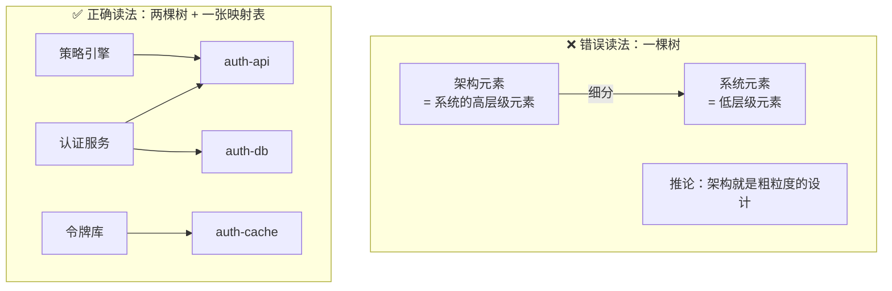

## 14.2 说法二：「架构描述与设计描述中的概要不是一回事」

### （1）根因：两个轴被叠成了一个轴

| | 轴 A：种类层 | 轴 B：呈现粒度 |
|---|---|---|
| 回答什么 | 这件事属于**哪一层**（架构 / 设计） | 这件事**说得多细**（概要 / 详细） |
| 性质 | **种类**（kind） | **粒度**（granularity） |
| 判定词 | fundamental / governing | overview / detail |

"概要"只活在**轴 B** 上。把它挪到轴 A 上去用，就得到"架构描述 = 设计描述的概要"——**这跟上一轮的"架构 = 高层级设计"是同一个错误的另一种语法**：上一轮塌掉的是**位置词**，这一轮塌掉的是**粒度词**。

### （2）2×2 矩阵

| | **架构层** | **设计层** |
|---|---|---|
| **概要** | 架构描述 · 总览视图（把多个架构视图压成一页） | **框架设计**（同一层上先定骨架）← 常被误当成架构 |
| **详细** | 架构描述 · 详细视图（接口定义 · 特性分配） | 详细设计（算法 · 数据结构 · 时序） |

**行 = 呈现粒度（说得多细）；列 = 种类层（在哪一层）。「概要」是行属性，不是列属性。**

### （3）两个"概要"性质相反

| | 架构描述里的概要 | 设计描述里的概要 |
|---|---|---|
| 做法 | **横向聚合**：把同一层的多个架构视图压成一页 | **纵向截断**：同一层上先做前半段，后半段待续 |
| 种类层有没有变 | **没变**，还是架构层 | **没变**，还是设计层 |
| 它是… | 一种**架构视图选择**（42010:2022 §3.7 view） | 一个**阶段深度** |
| 词性 | 形容词——描述"这份架构视图多粗" | 已被名词化为一个阶段名 |

一个是**横向压缩**，一个是**纵向浅挖**。它们唯一的共同点是都借用了"概要"这两个汉字。

### （4）规范侧的一条硬证据

42010:2022 第 6 章列出的**架构描述内容要求**是 §6.2–§6.10：

> 利益相关方 · 利益相关方角度 · 关注点 · 方面体 · 架构视角 · 架构视图 · 视图组件 · 对应关系 · 架构决策与理据

**这份清单里没有"概要"这一项。**

所以架构的"概览"不是架构描述的**定义性要件**，它只是一次**架构视图选择的结果**——绝不是"AD 的未成年形态"。

而在中文软件工程传统里，"框架设计 / 详细设计"已经**被名词化成独立的文档名**。一边是形容词、一边硬化成名词，**这个命名不对称，就是混淆的全部来源**。

### （5）"概要"在中文里其实有三个所指

1. **概览（overview）**——呈现 / 组织方式，**不改变种类层**。例：AD 的总览视图。
2. **框架设计（preliminary design）**——深度 / 阶段定位，同一层上先做骨架。
3. **摘要（abstract）**——面向读者的文档压缩，**与工程内容无关**。

### （6）同一个错的三个语法变体

| 变体 | 用的词 | 藏在哪 |
|---|---|---|
| "架构 = 高层级设计" | 位置词 | "高层级" |
| "架构描述 = 设计描述的概要" | 粒度词 | "概要" |
| "先做框架设计，再做架构" | 阶段词 | "先…再" |

三条都是同一个动作：**把轴 B 的词搬到轴 A 上去用**。就像用"高矮"去回答"男女"。

### （7）实操后果

如果 AD 只写"概要"、DD 只写"详细"，那些**必须在 AD 中明示的条目**——接口约定、特性分配、演进承诺——就会整批掉进"概要"的模糊区，合规判定立刻退回印象式评审。

正解是换尺子：**AD 的详细程度由关注点与判定需要决定，不由"概要 / 详细"这把尺子决定。**

- 某条接口约定在 AD 里就**必须写到可判定**（否则它当不了凭据）；
- 某些架构视图**可以只给总览**（因为它不承载约束）。

> **AD 该细的地方必须细，DD 该概的地方可以概。两侧各有自己的"概要"和"详细"，谁也不替代谁。**

## 14.3 两轮否掉的是同一件事

> **这两轮否掉的其实是同一件事的两种伪装——架构不是"更粗的一档"，也不是"更靠前的那个概览"。它的身份由判据（对目的必要）和治理关系（govern）确定，与它写得多粗、排得多前，毫无关系。**

---

# 第 15 章 架构视角：把"怎么看"沉淀成规则

## 15.1 原文（2022 版，与 2011 版有两处实质改动）

**ISO/IEC/IEEE 42010:2022 §3.8**

> **architecture viewpoint**: **work product** establishing the **conventions** for the **creation, interpretation and use** of an architecture view to **frame one or more concerns**

〔**2026-09-24 依正本更正**：英文逐字已取——*set of conventions for the creation, interpretation and use of an architecture view (3.7) to frame one or more concerns (3.10)*；**该定义句不含属概念**，原「属概念 **work product** 依 OMG UAF14-37 所引 ISO 原文」**不成立**（正本凡需属概念必明写：§3.3 AD ＝ work product、§3.7 视图 ＝ information part）。**GB/T 45630-2025 3.8 中文字面仍库外·不可核**〕

对比 2011 版，实质改动只有两处：

| | 2011 版 | 2022 版 |
|---|---|---|
| 动作 | **construction** | **creation** |
| 对象 | specific **system** concerns | **concerns**（范围扩至软件 / 系统 / 企业） |

**属概念没有变**：两版都是 **work product**（工作产品）。架构视角是**制品**——可版本化、可放架构视角库；其规格（specification）是它的记录载体，但载体不是它本身。把定义读成"一套约定"是滑到了**内容层**，会与架构描述（同为工作产品）失去同族关系（30 号 §7.1）。

## 15.2 译名：定名"架构视角"，"视点"不再作术语

英文 **viewpoint** 的字面意思是 **point of view —— 立场、角度、看法**，而定义说的是一份**约定**（属概念 work product）。§3.8 Note 3 甚至直接给了同义词：

> 架构视角的约定记录在该架构视角的一份 **specification** 中。在一些社区和 ADF 中，**"view specification" 与 "viewpoint" 是同义词**。

**定名取「架构视角」**——保留「视角」二字作日常行文即可，**「视点」不再作术语**。两条依据：GB/T 45630-2025 定名「架构视角」（30 号 §8.2）；OMG UAF14-37 第 3 条要求元素名写成 *Architecture Viewpoint*，正是为了与日常用语的 viewpoint 相区别。要交代的只有一点：**它是约定集（记录在它自己的规格里），不是一种立场**。

## 15.3 它管三段：怎么创建、怎么解释、怎么使用

| 段 | 管什么 | 缺了会怎样 |
|---|---|---|
| **creation** | 用什么模型种类、什么记法、怎么构图 | 图画得出来，但没法复现 |
| **interpretation** | 符号什么意思、读到什么算什么 | 图能看懂一半，歧义靠口口相传 |
| **use** | 拿这份架构视图做什么分析、判什么 | 架构视图沦为摆设，无法支撑决策 |

## 15.4 架构视角 vs 架构视图 = 规则 vs 产物

| | **架构视角 viewpoint** | **架构视图 view** |
|---|---|---|
| 定义 | §3.8：**work product** establishing the conventions | §3.7：**信息部件**（information item that is part of an AD） |
| 是什么 | **规则**（属概念：**工作产品**） | **产物**（属概念：**信息部件**） |
| 关系 | 架构视图被架构视角 **governed by**（治理 ≠ 包含 ≠ 生成） | 每张架构视图恰有一个治理它的架构视角 |
| 数量 | **一个架构视角可治理多张架构视图**（1 : N） | **每张架构视图恰有一个治理视角**（1 : 1，两版相同） |
| **可复用性** | **可复用**——写一次，可用于多个系统 | **不可复用**——只存在于某一个系统的那一份 AD 里 |

> **组织"标准化架构实践"，实际标准化的就是一套架构视角。架构视角集是组织级资产，架构视图是项目级产物。**

## 15.5 Note 1：frame ≠ address（最值得记的一条）

> 用架构视角**框定（frame）**关注点，与在架构视图里**处置（address）**关注点，是两个阶段。**类比"提出一个问题"与"解决这个问题"。**

- **架构视角负责提出**：这里有哪些值得看的东西、用什么语言看
- **架构视图负责解决**：按这个看法，本系统的答案是什么

**诊断价值**：如果一份文档"框定"了安全性问题却从不"处置"它——那是**架构视图缺失**，不是架构视角有问题。这两个毛病的修法完全不同。

## 15.6 五个近邻词，必须分开

| 概念 | 出处 | 是什么 | 一句话 |
|---|---|---|---|
| **架构视角 viewpoint** | 42010:2022 §3.8 | 工作产品：约定集（规则） | 怎么看（的规则） |
| **架构视图 view** | 42010:2022 §3.7 | 信息部件：AD 的一部分 | 看到的东西 |
| **关注点 concern** | 42010:2022 §3.10 | 利益相关方关心的事项 | 要看什么 |
| **利益相关方角度 stakeholder perspective** | 42010:2022 §3.18（**2022 新增**） | 利益相关方的思考方式 | 谁以什么方式在想 |
| **方面体 aspect** | 42010:2022 §3.9（**2022 新增**） | 实体性质的某个侧面 | 从哪个侧面切 |

链条（四个动词各归其主，30 号 §2.6／§3.1）：**利益相关方 --has 持有--> 关注点 → 架构视角 --frames 框定--> 关注点；架构视角 --governs 治理--> 架构视图；架构视图 --addresses 应对--> 关注点**。

> ⚠️ **Rozanski & Woods 的 "perspective"（安全 / 性能 / 可用性这类横切质量透镜）是书级约定，不等于 42010 的任何术语。** 中文里「视角」「透视」与 42010 的 viewpoint／stakeholder perspective 必须按出处分开用。

> ⚠️ **governs ≠ architecture governance**（30 号 §3.7）：前者是概念模型里「架构视角—架构视图」两个元素之间的关系（中文取「治理」或「管辖」，实质是**可判定的符合性**）；后者是组织治理职能（中文作「架构治理」，有裁量者、有例外程序）。两者只共用「治理」二字。**责任主体与后果须一并分清**：前者无裁量者——符合性由规格比对得出，不成立即「不符合、架构视图不成立」；后者的裁量者是**治理机构／架构委员会，责任在治理机构而非架构师**（定方向与裁决、设计架构、实施交付三者必须分离），违反走**例外／豁免**程序，须登记在册、有期限、到期复审。见 29 号 §2.1 四要素、§6.1 三者分离、§6.4 例外权上收与问责不可委托。

## 15.7 架构视角从哪来：ADF 管"看哪些面"，ADL 管"用什么笔"

| | 出处 | 定义 | 例子 |
|---|---|---|---|
| **ADF**（架构描述框架） | §3.5 | 在特定应用领域或利益相关方社区内**已确立**的架构描述约定、原则与实践 | GERAM、RM-ODP、UAF、NAF |
| **ADL**（架构描述语言） | §3.6 | 有**语法与语义**的表达手段 | AADL、ArchiMate、UML、SysML |

实务上，**一个 ADF 的核心内容就是一套预定义的架构视角库**，以及架构视角与关注点的对应关系。

## 15.8 标准故意不规定架构视角清单

42010 被批评最多的一点是"它什么都不强制"。工作组的回应很直接：**架构视角选择权是故意留给使用者的**，因为关注点随系统差异极大——航电设备的安全性架构视角与多租户服务的数据驻留架构视角，根本不是同一个模板的变体。

> 好处是正确判断。代价也要认：**"我们遵循 42010"这句话不携带任何关于文档内容的信息，它只告诉你论证的形状，不告诉你内容。**

## 15.9 两条硬要求（可作 checklist）

1. 每个被识别的**关注点**，必须至少被一个**架构视角**框定（否则是"无根关注点"）
2. 每个**在本 AD 中被引用的架构视角**，至少**治理**一张架构视图（否则是"空架构视角"）；尚在架构视角库中、本 AD 未启用的架构视角不受此限

> 这两条正好是"关注点集 ↔ 架构视角集"的**双向覆盖检查**——和判定 DD 合规时那套机械动作一模一样，只是检查对象换成了描述的内部完整性。
> **用语注意**：第 2 条是 **governs（治理）**，不是"产出"——架构视角不产出内容，内容始终是架构师针对该具体实体做的（30 号 §3.4：「治理 ≠ 生成」）。

## 15.9A 架构视角规格交付的五项约束

一份合格的架构视角规格（specification）必须写明下列五项——它们同时构成对架构视图的约束（30 号 §3.3）：

| 架构视角必须规定 | 对架构视图的约束力 |
|---|---|
| 名称、出处（来自哪个 ADF）、版本 | 架构视图据此声明受哪个架构视角治理 |
| 框定哪些关注点、属哪些典型利益相关方与角度 | 架构视图不得越界，也不得漏掉本架构视角该管的关注点 |
| 采用的模型种类、记号、语言与建模约定 | 架构视图的每个视图组件都必须落在这些模型种类里 |
| 对应方法 | 架构视图与其他架构视图的挂钩方式照此办理 |
| 视图方法：建造类、解读类、分析类 | 他人能按同一套方法复现、读懂、检查这张架构视图 |

> **五问验「治理成立」**（30 号 §3.6）：① 架构视图声明了治理它的架构视角吗（名称、出处、版本）？② 所用模型种类与记号在规格内吗？③ 架构视角框定的关注点覆盖且不越界吗？④ 与其他架构视图的对应关系符合对应方法吗？⑤ 按视图方法能复现与检查吗？——五问全过，治理成立；任一不过，则补齐，或按「一类架构视图交代两类关注点就拆架构视图／拆架构视角」处理。

## 15.10 架构视角规定的是"种类"，不是"元素"

**（第 21 轮，校准一处偏差）**

架构视角 = 约定集，约定里包含的是 **model kinds（模型种类）**。模型种类定义的是"这一类模型用什么语法、语义、记法"，**不是某个具体的框**。

> **架构视角只能规定到"种类"这一级，因为架构视角必须可复用。**

一个架构视角写一次要用在五十个系统上。如果它规定了具体元素，当场就绑死在某一个系统上，复用性归零。**所以架构视角的抽象层级，是被它的可复用性要求决定的**——不是设计者的偏好，是结构性约束。

## 15.11 链条上有两个界

| # | 环节 | 所在层 | 依据 |
|---|---|---|---|
| 1 | **架构视角**（约定集，含模型种类） | 约定 | 42010:2022 §3.8 |
| 2 | **架构视图 ⊃ 视图组件（模型）** | **描述层** | §3.7 / §3.19 |
| 3 | **架构构成物**（组件、组件间关系、与环境的关系） | **架构层** | 42020:2019 §3.3 Note 1 |
| 4 | **system element** | **实现层** | 15288:2023 **§3.47** |

两处变形动作：

- **界 A（2→3）：represent（描述）** —— 描述 ⟷ 被描述
- **界 B（3→4）：realize（实现）** —— 架构 ⟷ 实现

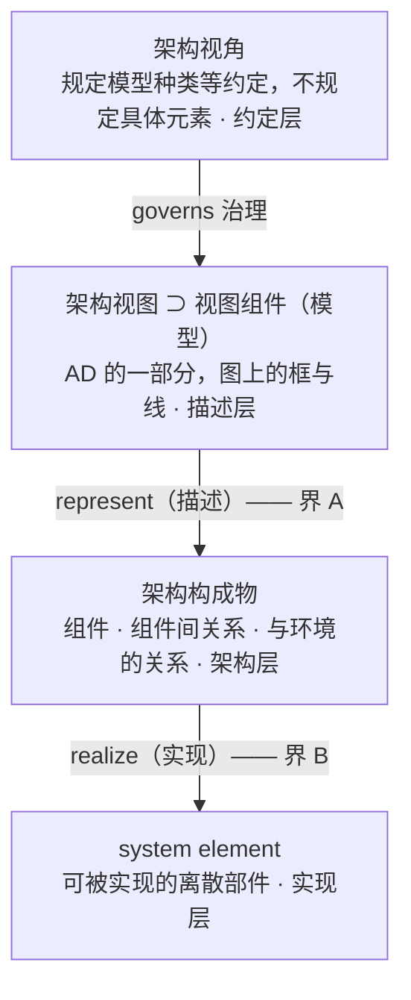

## 15.12 这一刀切出了一个独立的证明

**如果架构只是"粗粒度的设计"，那么视图组件就应该直接对应实现层的某个元素**——顶多是"还没写细的那个元素"。

但它不是。视图组件对应的永远是**架构构成物**，中间那条 **represent** 关系永远跨不过去。

> 也就是说：**你不用靠定义辨析，光靠"视图组件的本体地位"这一条，就能独立证明架构 ≠ 粗粒度的设计。** 这是第二条独立的证据链，比概念辨析更硬——因为它建立在标准的机制上，而不是措辞上。

## 15.13 为什么这个链条能让人看懂"架构 vs 框架设计"

因为**两侧的方框长得一模一样**。

- 框架设计里那个"订单服务"方框 —— 是 system element / design element，在**实现层**
- 架构描述里那个"订单服务"方框 —— 是 view component，在**描述层**，它代表的是架构构成物

**同形，不同界。**

> 这就是"架构 = 粗粒度的设计"这个误读最难根除的原因：打开两份文档，看到的都是方框和箭头，凭什么说它们不是同一回事？
> 答案就在这条链上：**它们之间隔着两个变形动作，每一个都会改变这个方框的身份。**

## 15.14 链条上有三处"空洞"

| 层级 | 空洞 |
|---|---|
| 第 1 级 架构视角 | 在系统中**没有对应物**——它是规则，不是物 |
| 第 3 级 架构构成物 | **架构原则 / 决策 / 演进承诺**在实现层无节点 |
| 第 4 级 system element | **框架 / 构建脚本 / 中间件配置**在架构层无节点 |

> **一条链上三处空洞。** 所以任何"从架构逐级细分到实现"的直筒式想象，必然在这三处断裂——这不是比喻，是可枚举的。

## 15.15 对 AOS 的用处

**为什么"合规依据包"必须重排**：因为 AD 天然按**视图组件**（第 2 级）组织，而判定要在**架构构成物**（第 3 级）与 **system element**（第 4 级）之间做映射。

> **重排的本质 = 从第 2 级的组织方式，切换到第 3 级的组织方式。**

**架构视角集是那个"可冻结、可复用、可跨项目继承"的资产，它比任何一份具体 AD 都值钱。**

> **附（国内等同采用，已核）**：**GB/T 45630-2025《系统与软件工程 架构描述》等同采用 ISO/IEC/IEEE 42010:2022**（IDT，2025-04-25 发布、**2025-11-01 实施**，76 页，SAC/TC 28 归口）——**中文术语定名依据**（架构、架构视角、架构视图、关注点、方面体、利益相关方角度等，见 GB/T 45630-2025 第 3 章）。同批还有 GB/T 31102-2025（SWEBOK）、GB/T 45803-2025（MBSE 统一架构建模语言）。

## 15.16 收口

> **架构视角是把"怎么看"沉淀成规则的那个装置。它让架构描述从"某个人画的一张图"，变成一套可复用、可核查、可交接的规格体系。**

---

# 第 16 章 架构视角、模型种类与视图组件

## 16.1 视图组件的种类不是架构视角直接管的

**§3.19 原文**（谓语写得很清楚）：

> **view component / architecture view component**: separable portion of one or more architecture views that is **governed by the applicable model kind or legend**

管辖者写的是 **model kind 或 legend**——**没有架构视角**。

## 16.2 架构视角落在哪一环：链条是三段

§3.8 说架构视角是 *"set of conventions for the **creation, interpretation and use** of an architecture view"*——它规定的是"这类架构视图怎么建、怎么读、怎么用"，其中**包含指定用哪些 model kind**。

> **架构视角** —（规定用哪些）→ **model kind** —（governs）→ **基于模型的视图组件**

**Introduction 里那句原文**：

> **Model-based view components are governed by model kinds and documented by legends. Non-model-based view components are documented by legends.**

注意两个动词的分工：

| 动词 | 谁做 | 管谁 |
|---|---|---|
| **governed by**（正式管辖） | 只有 **model kind** | 只有基于模型的视图组件 |
| **documented by**（记录说明） | **legend** | 两类视图组件都算 |

而 §3.19 Note 1 给 legend 的定义是"约定的**非正式**记录（informal documentation of conventions）"。

> **所以：基于模型的视图组件有正式管辖；非模型视图组件只有非正式记录。** 标准对后者的约束明显弱一档——这在实际评审里是个可用的松紧判断。

## 16.3 "种类"这个词要拆成两义

| "种类"指什么 | 谁定 | 架构视角的作用 |
|---|---|---|
| **model kind**（模型类别） | 具体用哪些 → **由架构视角规定**；model kind 的**内容** → 不归架构视角定 | 只规定"**用哪些**" |
| **model-based / non-model-based** | **§3.19 直接给定**——取决于它是否被某个 model kind 管辖 | **完全无权改变** |

第二行是关键：**这个二分不是谁选的，是"它有没有被模型管"这个事实决定的。**

## 16.4 为什么标准要插 model kind 这个中间层

因为 **model kind 是独立的规范对象**。§4 Conformance 列了五种合规情形，其中 viewpoint 和 model kind 是**两个并列项**：

| # | 合规对象 | 要求所在 |
|---|---|---|
| 1 | architecture description | 第 6 章 |
| 2 | architecture description framework (ADF) | 7.1 |
| 3 | architecture description language (ADL) | 7.2 |
| 4 | **architecture viewpoint** | **8.1** |
| 5 | **model kind** | **8.2** |

**平级。** 一个 model kind 可以独立地"符合 42010"，不需要依附任何架构视角——**这就是它为什么能被多个架构视角复用**（一张"部署图"model kind，部署视角能用，运维架构视角也能用）。

插这一层换来的是：**记法（model kind）与看法（viewpoint）解耦**，于是产生多对多的组合自由：

- 一个架构视角 → 组合多个 model kinds
- 一个 model kind → 被多个架构视角复用

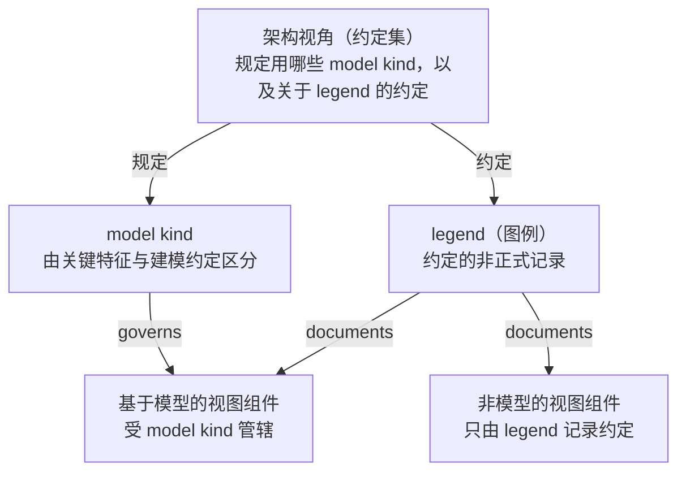

## 16.5 重数口径：每张架构视图恰有一个治理视角，一个架构视角可治多张视图

**Introduction 原话**：

> The concept of architecture viewpoint is updated to accommodate current practice where **a viewpoint governs one or more architecture views within an AD**.

**正确读法（两版相同，据 OMG UAF14-37 第 6 条）**：

- **架构视图 → 架构视角：1 : 1。** 每张架构视图恰好有一个治理它的架构视角（这是 42010 的重数）；
- **架构视角 → 架构视图：1 : N。** 一个架构视角可治理同一 AD 内的多张架构视图，也可治理不同实体的架构视图——这正是架构描述框架（ADF）能成为行业资产的前提。

此处更正两条此前的说法：一是引二手文献转述的 "one viewpoint governs one view"（把「视图→视角」的 1:1 误读成「视角→视图」的 1:1）；二是把「一个架构视角治理多张架构视图」归因于 2022 版改动。**重数在两版相同，2022 版只是把这一实践写进 Introduction。**

> 由 1 : 1 直接得出一条操作口径：若一类架构视图要同时交代两类关注点，正确做法是**拆架构视图／拆架构视角**，而不是让一张架构视图挂两个治理视角（30 号 §3.4）。

## 16.6 连带一条硬门槛

架构视角的约定记录在该架构视角的 **specification** 中（§3.8 Note 3）。而 §3.16 对 specification 的定义是（〔SOURCE: ISO/IEC/IEEE 15289:2019, 3.1.26, modified〕）：

> information part that identifies, in a **complete, precise and verifiable** manner, the requirements, design, behaviour, or other expected characteristics of an entity

**complete / precise / verifiable 这三个词不是修辞，是定义直接施加的要求。**

> 推论：**架构视角规格必须完整、精确、可验证。** 反过来说——一个"说不清、没法验证"的架构视角，根本不构成一份 specification，也就不构成一个合规的架构视角。

## 16.7 收口

> **架构视角规定用哪些 model kind；model kind 管辖基于模型的视图组件；legend 记录两类视图组件的约定。**

三个动词各归其主——**规定（架构视角）→ 管辖（model kind）→ 记录（legend）**。

---

# 第 17 章 贯穿案例：IAM 系统的架构视角与架构视图

**方法**：以一条贯穿全报告的 IAM（身份与访问管理）系统为例，把"架构视角 / 架构视图 / model kind / legend"四个概念一次落地。

## 17.1 同一个 IAM 系统，两个架构视角 → 两个架构视图

### 架构视角一：安全视角（规格形态）

| 段 | 内容 |
|---|---|
| **名称 · 出处 · 版本** | 安全视角（Security Viewpoint）· 出自本团队自建 ADF（参考 UAF 安全视角）· v1.2 |
| 框定（frame）的关注点 | 攻击面 · 凭据保护 · 权限提升路径 |
| **典型利益相关方与角度** | 安全架构师（攻击面角度）· 合规官（凭据保护角度）· 运维负责人（提权路径角度） |
| 使用的 model kind | 数据流图（含信任边界标注） |
| **对应方法** | 数据流图的节点与部署图的部署单元按「逻辑—物理」对应方法挂钩 |
| **创建**约定（建造类视图方法） | 所有跨信任边界的调用必须画成带标注的边 |
| **解释**约定（解读类视图方法） | 跨边界的边，读作"攻击面入口" |
| **使用**约定（分析类视图方法） | 拿它做 STRIDE 威胁建模 |

> 上表按 30 号 §3.3 的五项约束列全：**名称·出处·版本**、**框定关注点与典型利益相关方及角度**、**模型种类与记号**、**对应方法**、**视图方法三类**（创建／解释／使用）。缺任一项，这份规格就不满足 §16.6 的 complete / precise / verifiable（见 §15.9A）。

> 注意它的每一行——**没有一行提到 IAM**。它说的是"任何系统的安全视图该怎么建、怎么读、怎么用"。

### 架构视图一：IAM 安全视图（产物形态）

把上面那份规格用在 IAM 这个具体系统上得到的产物：

- **VC-1 数据流图**：认证服务、策略引擎、令牌库、审计日志四个节点 + 三条跨边界边 → 受 "数据流图" 这个 **model kind** 管辖
- **VC-2 威胁清单**：8 条威胁 + 缓解措施 → 这是**表格，不是模型**，所以由 **legend** 记录约定（表头各列什么意思、严重度怎么分级）
- 归属：AD-IAM v1.3

### 架构视角二：部署视角 → 架构视图二：IAM 部署视图

关注点换成"节点分布、网络分区、单点故障、回滚"，model kind 换成部署图与网络拓扑图。

**关键观察**：两个架构视图看的是**同一个系统、同一个架构**，但：

- 看到的东西**完全不同**（一个看信任边界，一个看物理节点）
- 里面的方框**也不是同一批**——安全视图里的"认证服务"是一个数据流节点，部署视图里它可能被拆成两个部署单元

> **同一个架构构成物，在不同架构视图里呈现为不同的视图组件。**

## 17.2 架构视角的可复用性（它最值钱的性质）

```
安全视角 ──→ IAM 安全视图
         ──→ 支付网关安全视图
         ──→ 车机安全视图
```

**架构视角一个，架构视图三个。** 架构视角可以上架、可以继承、可以跨项目复用；架构视图随系统一起作废。

> **诊断价值**：**如果组织的"安全评审"每次都要从零讨论"该看什么"，那说明没有沉淀架构视角。** 而那才是真正该被管理的资产——不是某一份具体的评审报告。

## 17.3 同一个 model kind 被多个架构视角复用（中间层的价值）

| 谁在用"数据流图"这一种 model kind | 拿来干什么 |
|---|---|
| 安全视角 | 威胁建模（STRIDE） |
| 功能视角 | 看功能分解与数据加工 |
| 性能视角 | 看数据处理热点在哪 |

> **一种记法，三个架构视角。** 这就是为什么标准要把 model kind 单列成独立的合规对象——记法与看法解耦之后，记法才能被复用。

## 17.4 1:N 的实际用处

```
安全视角 ──治理──→ IAM 安全视图        （系统级）
         ──治理──→ 移动端安全视图       （子系统级）
```

同一个架构视角，两个架构视图。这正是 **1 : N** 的用处：**当一个系统有多个层次的描述时，同一个架构视角自然会治理多个架构视图**——不必为子系统的安全视图再造一个"子系统安全视角"。

> **版本口径**：重数**两版相同**——「架构视图 → 架构视角」恒为 1 : 1、「架构视角 → 架构视图」恒为 1 : N（§16.5）；2022 版只是把这一实践写进 Introduction，**不是** 2022 版把 1 : 1 改成了 1 : N。

## 17.5 非模型视图组件与 legend

安全视图里的"威胁清单"**不是模型**——它是一张表格。它仍然需要被读，读法仍然需要被约定：

- 第一列 = 威胁编号，对应 DFD 上的哪条边
- 严重度分级 = 高 / 中 / 低 的判定标准
- "缓解措施"栏必须填架构条目 ID（这样才可追溯）

这些就是 **legend**——约定的**非正式记录**（§3.19 Note 1）。

## 17.6 架构视图的图示例：VC-1 数据流图

这是 IAM 安全视图的 **VC-1：数据流图**。它受 **"数据流图" 这个 model kind** 管辖，而它上面所有的标注，都是**安全视角规格**要求出来的。

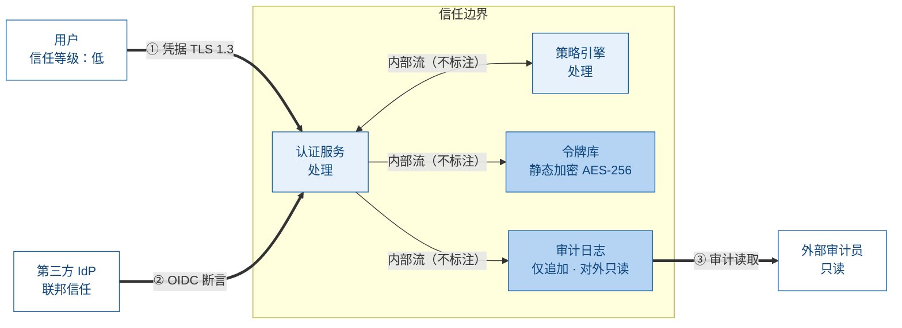

**图例（legend）**：白色矩形 = 外部实体；浅蓝圆角 = 处理；深蓝矩形 = 数据存储；虚线框 = 信任边界；粗箭头 = 跨边界流。

### 图的读法：每一笔都是被架构视角规格逼出来的

| 架构视角规格里的约定 | 图上对应出现的东西 |
|---|---|
| 外部实体必须标信任等级 | 用户（信任等级：低）· 第三方 IdP（联邦信任）· 外部审计员（只读） |
| 数据存储必须标加密状态 | 令牌库（静态加密 AES-256）· 审计日志（仅追加 · 对外只读） |
| 跨信任边界的调用必须画成带标注的边 | 三条粗箭头：① 凭据 TLS 1.3 ② OIDC 断言 ③ 审计读取 |
| 解释约定：跨边界的边读作"攻击面入口" | 这三条边就是后面 STRIDE 威胁建模的输入 |
| 图形惯例（外部实体 / 处理 / 数据存储） | 底部图例五项 |

> **换句话说：这张图不是"随手画的"，它是那份规格的一次执行。** 换一个人按同一份架构视角画，应该得到结构一致的图——这正是"约定"这个词的意义。

### 最值得注意的，是图上"没画"的部分

三条**内部流**（认证服务 ↔ 策略引擎、认证服务 → 令牌库、认证服务 → 审计日志）——它们**一条标注都没有**。

这不是疏忽。安全视角**框定（frame）的是攻击面**，而攻击面只存在于跨边界处。内部流不在关注点内，所以图上留白不注。

> **这就是"架构视角"在图上留下的最明显的痕迹**——它不只是决定了"要画什么"，更决定了"**什么可以不画**"。回到 §3.8 的 Note 1：架构视角负责 **frame（提出哪些问题）**，架构视图负责 **address（给出答案）**。这张图里，被框定的三个问题都答了，没被框定的就静默。

### 底部那排图例，就是 legend 的实际形态

按 §3.19，视图组件分两类：这张 DFD 是**基于模型**的（受 model kind 管辖）；而底部那排图例，就是 **legend**——"约定的**非正式**记录"。

它回答的是：空白矩形什么意思、圆角矩形什么意思、虚线什么意思、粗线什么意思。**没有这排图例，读者就不知道怎么读这份架构视图**——这就是架构视角三段里 "interpretation（解释）" 那一环在产物上的落点。

### 换个架构视角，同一个系统会画成完全不同的图

| | 安全视角 → 安全视图 | 部署视角 → 部署视图 |
|---|---|---|
| 关注点 | 攻击面 · 凭据保护 · 提权路径 | 节点分布 · 网络分区 · 单点故障 · 回滚 |
| model kind | 数据流图（含信任边界） | 部署图 · 网络拓扑图 |
| 节点是什么 | 数据流上的处理与存储 | 物理 / 虚拟节点与部署单元 |
| "认证服务"长什么样 | **一个数据流节点** | **可能被拆成两个部署单元** |

> **同一个架构构成物，在两个架构视图里呈现为不同的视图组件。**

## 17.7 一个可以马上用的判断测试

拿任意一段内容，问一句话：

> **它能原封不动搬到另一个项目的同类文档里去吗？**

- **能** → 它属于**架构视角**，应当被沉淀、版本化、跨项目继承
- **必须改写才能搬** → 它属于**架构视图**，是项目产物，随项目生存周期走

> 大多数团队的实际情况是：**架构视图写了一堆，架构视角一份没有。** 于是新项目永远从零开始，老的评审经验永远留不到下一份文档里。

**一句话对照**：架构视角回答"**怎么看**"，而且这份"怎么看"能反复用；架构视图回答"**看到了什么**"，而且只对这个系统有效。

**如果只记一句**：

> 这张图的价值不在于它画了什么，而在于**它的每一处标注都能回溯到架构视角规格的某一句话**——能做出这个回溯的图，才叫架构视图；做不出回溯的，只是一张示意图。

---

# 附录 A 术语定译表

| 英文 | 推荐中文 | 说明 |
|---|---|---|
| `architecture` | **架构** | **定名口径**：GB/T 45630-2025, 3.2／42010:2022, 3.2（源自 42020:2019, 3.3）= **实体**在其环境中的**基本**概念或属性，以及该实体及其相关**生存周期过程**的实现和演化的**管控原则**（governing principles）；**抽象物，非交付物**（30 号 §2.1） |
| `architecture`（15288 过程口径） | **架构** | 15288:2023 §3.5 = **系统**在其环境中的基本概念或属性，以及用于实现与演化该系统的**管控原则**——同句式、不同落点，主体为系统 |
| `architecture description` (AD) | **架构描述** | 42010:2022 §3.3；属概念 **work product**（工作产品），交付物 |
| `design`（名词） | **设计** | 15288:2023 §3.13 = 系统元素及其关系的规格 |
| `design description` (DD) | **设计描述** | 与 AD 平级的 artefact（15288:2023 §3.6 EXAMPLE） |
| `compliant implementation` | **合规实现** | §3.13；合规对象是 **architecture**，不是 AD |
| `architectural entity` | **架构实体** | ⚠️ 42020:2019 §3.6 = **被架构的那个事物**，**不是**"架构的构成物" |
| `entity of interest` (EoI) | **所关注实体** | 42010:2022 §3.12，与 architecture entity 同指 |
| `AD element` | **架构描述元素** | 42010:2022 §3.4，**描述层**零件 |
| 架构构成物（components / relationships） | — | 42020:2019 §3.3 Note 1，**注释级，无术语地位** |
| `system element` | **系统元素** | 15288:2023 **§3.47**，**实现层**离散部件 |
| `artefact` | **人工制品** | 15288:2023 §3.6，AD 与 DD 在同一 EXAMPLE 中并列。⚠️ 与 42010 的 **work product（工作产品）**：**两册互为属概念、方向相反**——15288 侧 artefact ⊆ work product（§3.6 定义句即以 work product 为属概念）、42010 侧 work product ⊆ artifact（§3.3 Note 1）。〔2026-09-24 依库内正本更正：原句「两个词，不可互译」**不成立**；分流译名照旧，**理由是所属标准不同、属概念层级不同**〕 |
| `work product` / `information item` | **工作产品** / **信息部件** | **两条属概念线不可互串**（30 号 §1.3）：架构描述、架构视角是**工作产品**；架构视图、视图组件是**信息部件**。属概念不可省（30 号 §7.1） |
| `specified requirement` | **规定需求** | ISO 9000:2026 §3.5.1 Note 2：*specified ≡ stated* |
| `viewpoint` | **架构视角** | 42010:2022 §3.8 = **work product**（工作产品）establishing the conventions…；⚠️ 该词的字面义是 viewpoint（立场／角度），而定义说的是**一套约定**——"视点"这一旧译即由此误导而来，GB/T 45630-2025 定名**架构视角**（30 号 §8.2） |
| `view` | **架构视图** | 42010:2022 §3.7 = **信息部件**（information item that is part of an AD）；属概念不可省（30 号 §2.4） |
| `view component` | **视图组件** | 42010:2022 §3.19；2011 版 architecture model 的更名，属概念仍是**信息部件**，**仍是描述层概念** |
| `model kind` | **模型种类** | 42010:2022；独立合规对象（§8.2），与 viewpoint 平级 |
| `legend` | **图例** | §3.19 Note 1：约定的**非正式**记录 |
| `concern` | **关注点** | 42010:2022 §3.10 |
| `stakeholder perspective` | **利益相关方角度** | 42010:2022 §3.18（**2022 新增**） |
| `aspect` | **方面体** | 42010:2022 §3.9（**2022 新增**） |
| `architecture description framework` (ADF) | **架构描述框架** | §3.5；2022 版由 architecture framework 更名 |
| `architecture description language` (ADL) | **架构描述语言** | §3.6 |
| `specification` | **规格** | §3.16（引 15289:2019 §3.1.26）= complete / precise / verifiable。**2026-09-21 定名**：随 GB/T 45630-2025／30 号 §3.3「视角规格」口径，前作「规约」 |
| `correspondence method` | **对应方法** | 42010:2022；把文档间一致性变为可判定规则（**correspondence / correspondence method**；2011 版作 correspondence rule，2022 版改称 method——30 号 §2.5） |
| `fundamental` | **基本** | 42010:2022 §3.2；**目的相关性**谓词，**非** high-level。逐字引 GB/T 45630-2025 时照抄国标字面「**基础**」（30 号 §7.2） |
| `governing` | **管控原则**（定语位）／**治理**（关系位） | 42010:2022 §3.2；**权威性**谓词。此处 governing 是**定语**，指具有约束力、可据以判定违规，**与 architecture governance（架构治理）不是同一用法**（30 号 §7.3）。**同源不同位**：governing principles（定语）＝管控原则；a viewpoint governs a view（动词／关系名）＝治理（或管辖）。**2026-09-21 用户裁定**：定语位统一作「管控原则」，撤销此前「治理原则」的自译分流；逐字引 GB/T 45630-2025 时亦照抄国标字面「**管控**原则」 |
| `solution space / solution classes` | **解空间 / 解类** | 15288:2023 §6.4.1 BMA；**替代"系统方案"这一非规范术语** |
| `perform trades` | **重做权衡** | 15288 设计定义活动；不合规的合法出口之一 |
| `sufficiently complete to support` | **足够完整到足以支撑** | 15288:2023 §3.13 的职责表述；**主体是 design，合规主体是 implementation** |
| `implement-to level` | **实现级** | SEBoK 引 15288；DD 是"实现之前的可判定代理" |

---

# 附录 B 标准原文索引

| 标准 | 条款 | 用途 |
|---|---|---|
| **GB/T 45630-2025**《系统与软件工程 架构描述》 | 等同采用 42010:2022（IDT，2025-04-25 发布、**2025-11-01 实施**，76 页，SAC/TC 28 归口） | **中文术语定名依据**：架构（3.2）、架构视角、架构视图、关注点、方面体、利益相关方角度等——见 30 号 §1.1／§1.4 |
| ISO/IEC/IEEE 15288:2023 | §3.5 | architecture 定义（含 realization；主体为系统——15288 过程标准口径） |
| ISO/IEC/IEEE 15288:2023 | §3.6 | artefact（AD 与 DD 并列的 EXAMPLE） |
| ISO/IEC/IEEE 15288:2023 | §3.13 | design 定义（compliant implementation **of the architecture**） |
| ISO/IEC/IEEE 15288:2023 | **§3.47** | system element（§3.46 是 system） |
| ISO/IEC/IEEE 15288:2023 | §5 | 迭代与并发（两过程不是阶段） |
| ISO/IEC/IEEE 15288:2023 | §6.4.1 | BMA（solution space / solution classes） |
| ISO/IEC/IEEE 15288:2023 | §6.4.4 / §6.4.4.1 | System architecture definition（**address stakeholder concerns and system requirements**） |
| ISO/IEC/IEEE 15288:2023 | §6.4.5 / §6.4.5.1 | Design Definition（按系统元素逐条 / 借用 architecture entity） |
| ISO/IEC/IEEE 15288:2023 | §6.4.6 | 系统分析（横切评估支撑） |
| ISO/IEC/IEEE 42010 | **2022**（2011 已撤销） | §3.2 / §3.3 / §3.4 / §3.5 / §3.6 / §3.7 / §3.8 / §3.9 / §3.10 / §3.11 / §3.12 / §3.14 / §3.15 / §3.16 / §3.17 / §3.18 / §3.19 / §4 / §6.2–§6.10 |
| ISO/IEC/IEEE 42010:2011 | Annex A（essentials） | fundamental 判据的权威缺口佐证 |
| ISO/IEC/IEEE 42010:2022 | §5.2.12 + §6.10 | 架构决策（强制记录内容） |
| ISO/IEC/IEEE 42010:2022 | §4 Conformance | 五种合规情形（AD / ADF / ADL / viewpoint §8.1 / model kind §8.2） |
| ISO/IEC/IEEE 42010:2022 | §6.9 | correspondences / consistency |
| ISO/IEC/IEEE 42020:2019 | §3.2 / §3.3（含 Note 1） / §3.6 | architecting / architecture entity / 架构构成物（注释级） |
| ISO 9000 | **2026**（第 5 版） | §3.5.1（specified ≡ stated；requirement 三支）/ §3.5.9（conformity）/ §3.5.13（nonconformity） |
| ISO/IEC/IEEE 15289:2019 | §3.1.26 | specification 定义来源（complete / precise / verifiable） |
| INCOSE SEH | **v5（2023-07）**（无 v6） | state-of-good-practice 阐释层 |
| SEBoK | — | "fundamental 无普适定义" + design as the **link** + implement-to level |

---

# 附录 C 自我更正清单

**本报告内容源自一轮自我更正密集的对话。以下更正按发生顺序保留，未做前置修正——它们本身即是方法论教训。**

| 轮次 | 更正内容 |
|---|---|
| 第 4 轮 | 纠正"合规对象是架构描述" → 实为 **architecture**（15288:2023 §3.13 原句） |
| 第 6 轮 | **42010:2011 已撤销**（2022-11-07, stage 95.99）→ 现行 42010:2022；定义正文措辞变更；Conformance 移至第 4 章 |
| 第 6 轮 | 自主发现 **ISO 9000:2015 已被 ISO 9000:2026 取代**；requirement 由 §3.6.4 移至 §3.5.1〔按：本条经 27 号附 A 迁移映射表逐条核验，2015→2026 的迁号关系即 §3.6.4→§3.5.1；本报告全文此后一律用 2026 版条款号，现行版本清单见附录 B〕 |
| 第 8 轮 | 承认**未使用"基本（fundamental）"判据**，改用目的必要性 / 充分性双判据 |
| 第 10 轮 | **重大更正**：architecture entity ≠ 架构的构成物，实为"**被架构的那个事物**"（42020:2019 §3.6） |
| 第 12 轮 | 术语用词：**"表述"不是标准术语位**，一律用"**描述**" |
| 第 22 轮 | 更正第 20 轮引用的 1:1 口径：**2022 版架构视角对架构视图为 1:N**〔按：本条口径经 2022 版原文与 OMG UAF14-37 第 6 条复核后**再次更正**——「架构视图 → 架构视角」为 1:1（两版相同），「架构视角 → 架构视图」为 1:N，且重数并非 2022 版改动；见 §16.5〕 |
| 第 18 / 19 轮 | 否掉两个流行说法："架构 = 系统的高层级元素"（**位置词**偷换）；"架构 = 设计的概要"（**粒度词**偷换） |

**三条更正的方法论教训：**

1. **版本引证必须现查**——42010:2011 / ISO 9000:2015 两处过时引用都是被追问后查证发现的（第 6 轮）。
2. **术语误读会级联**——"架构实体 = 架构的构成物"这个误读一旦成立，第 5 轮整轮的类型枚举随之失去依据（第 10 轮）。
3. **代理指标冒充判据是同一个错**——"可引用性 / 可判定性"（第 8 轮）、"高层级"（第 18 轮）都是代理冒充真判据（目的必要性）的变体。

---

# 附录 D 存疑与待核清单

> **★ 2026-09-24 总注（依库内五份标准正本）**：本清单**大部分条目已结清**——第 1 条（GB/T 45630-2025 采标事实）、第 3 条（§8.1 视角规格 a)–g)）、第 4 条（§6.8 视图组件硬要求）、第 5 条（§5.2.8 模型种类与图例）、第 7 条（§3.8 架构视角英文逐字，**且该定义句无属概念**）**均已由正本逐字结清**；第 6 条（逐字核对范围）**已由「§3＋§4」扩围至 §3–§8 与附录 A、B**。**仍不可结清的只有**：第 2 条（ISO/IEC/IEEE AWI 42020 修订版措辞——属**库外**外部状态）、以及一切 **GB/T 45630-2025 中文字面**（库外，走台账 §四 路径①）。逐条状态见下文各行。

| # | 项 | 状态 |
|---|---|---|
| 1 | **GB/T 45630-2025** 是否确为 ISO/IEC/IEEE 42010:2022 的等同采用版本、实施日期 2025-11-01 | **已核**——等同采用（IDT），2025-04-25 发布、2025-11-01 实施，76 页，SAC/TC 28 归口；中文术语定名依 GB/T 45630-2025 第 3 章。**结清依据**：30 号 §1.1／§1.4 |
| 2 | **ISO/IEC/IEEE AWI 42020** 修订版发布后，需复核 **architecture entity** 的措辞是否变动 | **待核**——42020:2019 已于 2026-01-08 进入 stage 90.92（30 号未涉及，仍待核） |
| 3 | **42010:2022 §8.1**（架构视角规格的内容要求） | **待核**——正文未获取，引用前需补齐。**30 号未结清**（其待确认第 7 条仅指「依 GB/T 45630-2025 第 8 章与附录 B，条款号待原文核对」） |
| 4 | **42010:2022 §6.8**（view components 的纳入要求） | **待核**——同上。**30 号未结清** |
| 5 | **42010:2022 §5.2.8**（model kinds, legends and architecture view components） | **待核**——同上。**30 号未结清** |
| 6 | 附：本报告对 42010:2022 的逐字核对范围 | ~~仅覆盖 §3 术语与 §4 Conformance；第 5 / 6 章正文系转述~~ → **✅ 已扩围（2026-09-24，42010:2022 正本在库）**：§3–§8 与附录 A、B 均已可逐字核对（见台账 `90-治理登记/02-标准条款号核对表.md` §三之二.1 条目索引） |
| 7 | **42010:2022 §3.8 英文逐字**与 **GB/T 45630-2025 3.8 中文逐字**（架构视角定义） | **✅ 已结清一半（2026-09-24）**——**英文逐字已取**：*set of conventions for the creation, interpretation and use of an architecture view (3.7) to frame one or more concerns (3.10)*；**★ 且该定义句无属概念**——原「属概念 work product 依 OMG UAF14-37 所引 ISO 原文确认」**不成立**（正本凡需属概念必明写：§3.3 AD／§3.7 视图），本报告 §15.1 与 §7.2 引文块已按正本改正。**GB/T 45630-2025 中文字面仍库外·不可核**（走台账 §四 路径①） |

**参考物**：42010:2022 官方预览样章存于会话工作区 `42010-2022-sample.pdf`（15 页，含 Foreword / Introduction / §3 术语 / §4 Conformance）。

---

*本报告由 `24-架构与设计边界对话记录-从定义辨析到架构视角与架构视图.md` 整理而成。*
