# 25 - 设计定义与实现边界对话记录

> **日期**：2026-09-11
> **参与**：Mickey（用户）／阿布
> **体裁**：对话原样记录（不整理、不提炼、不重排）
> **约定**：requirement → 需求；need → 需要；expectation → 期望（三者不混用）

> **记录说明**：第 1–21 轮的回复原文因会话上下文压缩，无法逐字复原，此处按当时形成的完整记录（含当日工作日志、已交付文件与图示要点）还原其内容、引证与措辞风格；**第 22 轮起为逐字记录**。
> **图的处理**：原对话中的图为 SVG，统一以 mermaid 表达；无法准确复原构图者以表格替代并标注。
> **本轮的自我更正轨迹**：第 2 轮"架构定义"的通俗表述被用户否掉；第 3 轮"系统元素"与"AD 元素"混用被否；第 5 轮承认首轮解释未能说清；第 11 轮"设计定义产出要求"的表述被修正为"产品规定"；第 13 轮"描述层／实物层"二分被修正；第 17–19 轮 AVL 的三次说法被连续修正；第 20 轮"像设计 ≠ 归设计过程"；第 21 轮确认工艺方案归实现过程；第 25 轮"实现过程属于设计与开发"被修正为"**包含**设计性质的活动、但**归属**实现过程"；第 26 轮"属于"被指出用错维度，提出"**归属 vs 性质**"两把尺子；第 27 轮"方案都是设计与开发的输出文档"被修正为"设计与开发是**性质标签**、不是账本抽屉"。以上更正均按原顺序保留，未做前置修正。详见文末《附：本轮的自我更正清单》。

---

## 第 1 轮

### Mickey

> 基于系统工程手册5.0等权威资料，先解释下什么是设计定义、系统分析和实现

### 阿布

先把三层权威关系摆清楚：**INCOSE SEH v5（2023）是对 ISO/IEC/IEEE 15288 的工程化展开**，规范定义必须锚在 **15288:2023** 原文。手册给的是活动的意图与方法，标准给的是过程的目的与产出——引用时不要拿手册的口语替代标准的措辞。

三个过程都在 15288 第 6 章的 14 个技术过程里：

| 过程 | 条款 | purpose 原文 |
|---|---|---|
| 设计定义 Design Definition | §6.4.5 | *provide sufficient detailed data and information about the system and its elements to enable the implementation consistent with architectural entities as defined in models and views of the system architecture* |
| 系统分析 System Analysis | §6.4.6 | *provide a rigorous basis of data and information for technical understanding to aid decision-making across the life cycle* |
| 实现 Implementation | §6.4.7 | *realize a specified system element* |

**四条关键洞见：**

1. **条款号顺序 ≠ 执行顺序。** 15288 第 4 章明确：过程可**迭代（iteratively）、并发（concurrently）** 施加于系统，**递归（recursively）** 施加于系统元素。§6.4.5 编号在 §6.4.7 之前，只说明编号顺序，不说明先后关系。"先设计定义、后实现"是瀑布式误读。

2. **系统分析是横切（cross-cutting）过程。** 它不被某个阶段触发，而由 **system analysis request（分析请求）** 驱动，可服务于生命周期的任何环节，服务于任何其他过程。

3. **设计定义的产出是"数据与信息"，实现的产出是"实物／可执行体"。** 这条边界由输出物的**存在形态**划开，不由时间划开——不因为"到了某阶段"就切换。

4. **实现 ≠ 自己造。** `realize` 涵盖：自行设计制造、按已有设计制造、改造、**采购（COTS · NDI）**、复用、配置。造、买、改、复用都算实现。

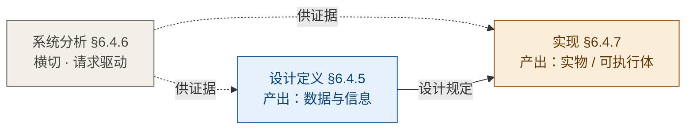

---

## 第 2 轮

### Mickey

> 架构定义回答"系统由哪些元素构成、如何组织、彼此如何接口"？你看看架构这个术语的定义

### 阿布

你说得对，我那句通俗表述把架构**降格**了。查证结果：

**architecture 定义的三代演进：**

- **IEEE Std 1471:2000**：*The fundamental **organization** of a system embodied in its components, their relationships to each other, and to the environment, and the principles guiding its design and evolution.*
- **ISO/IEC/IEEE 42010:2011 §3.2**：*fundamental **concepts or properties** of a system in its environment embodied in its elements, relationships, and in the principles of its design and evolution.*
- **ISO/IEC/IEEE 42020:2019 §3.3 / 42010:2022 §3.2**：*fundamental concepts or properties of an **entity** in its environment and **governing principles for the realization and evolution** of this entity and its related life cycle processes.*〔SOURCE: ISO/IEC/IEEE 42020:2019, 3.3, modified〕

**我错在三处：**

1. **把 organization（组织）当成了现行定义。** 1471:2000 用的词是 organization，2011 版起已替换为 **concepts or properties**。这个替换是实质性的——Hilliard 的论点很直接：**不是"organization 被体现于静态结构"，而是"concepts and properties 被体现"。**

2. **抹掉了后半句"原则"。** 架构不只是"是什么"，还包括**支配其实现（realization）与演进的治理原则（governing principles）**。

3. **把架构当成了"清单"。** 元素与关系是架构**被体现（embodied in）** 的地方，不是架构本身。

**架构是抽象（conception 或 perception），不是制品。** 能拿出来交付的那个东西叫 **architecture description（AD）**。

**三个流派侧重不同**：软件架构讲 components + interconnections；系统架构讲子系统结构与分配；企业架构讲 **principles**。我那句通俗表述是从软件流派的口语里抄来的，所以只覆盖了第一层。

中文官方译法可引 **IEC Electropedia IEV 831-01-01（2025-03，源自 42010:2011 §3.2）**：「架构：系统在其环境中的基本概念或特性的集合，由其元素、关系以及其设计和演进的原则所体现。」

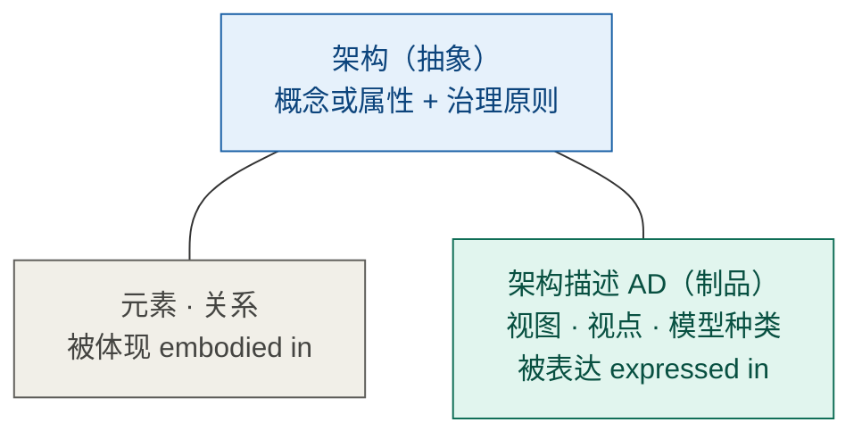

---

## 第 3 轮

### Mickey

> 架构描述中的元素，不是系统的元素呢

### 阿布

对，这是两个世界的成员，我上一轮混用了。

| | 系统元素 system element | 架构描述元素 AD element |
|---|---|---|
| **出处** | 15288 §4.1 | 42010:2022 §3.4 |
| **定义** | member of a set of elements that constitutes **a system** | identified or named part of **an architecture description** |
| **母体** | a system | an architecture description |
| **世界** | 真实系统（reality） | 工作产品（work product） |
| **举例** | 硬件 · 软件 · 数据 · 人 · 过程 · 程序 · 设施 · 材料 | 利益相关方 · 关切 · 视角 · 方面 · 视图 · 视图组件 · 视点 · 模型种类 · 对应关系 · ADL · ADF |

**决定性判据**：42010:2022 §5.2.2 里两个"构成"句式并排出现——

> *The architecture of an entity of interest comprises the fundamental concepts or properties… constituent elements… **An AD comprises AD elements**.*

**entity 由 constituent elements 构成；AD 由 AD elements 构成。** 两个"构成"的对象不同，成员自然不同。

另外补一句：42010:2011 §3.2 里 `embodied in its elements` 的 `its` 指的是**系统**，官方解释是 "the constituents that make up the system"。

系统元素在 AD 中的**表征物**是 view component / architecture model——**那才是 AD element**。**表征 ≠ 被表征者**。这与我上一轮犯的错同源，都是 **use–mention 混淆**：把描述与被描述者混同。

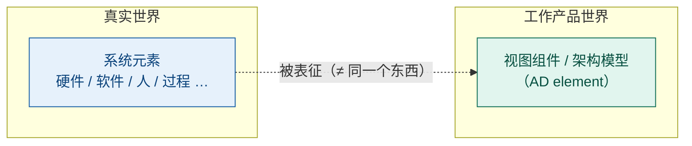

---

## 第 4 轮

### Mickey

> 不用了，这个已经有了。我现在关心的问题是系统分析是干什么的？

### 阿布

系统分析的 purpose 就一句话：***provide a rigorous basis of data and information for technical understanding to aid decision-making across the life cycle***——为技术理解提供**严格的**数据与信息基础，以支撑**贯穿生命周期**的决策。

拆开看它干什么：

1. **它被"请求"驱动，不自己发起。** 15288 §6.4.6 的输入里有一条 **system analysis request（分析请求）**。谁来请求？其他过程。设计定义要选材料，请求一次；架构定义要评估两个方案，请求一次；风险管理要评估失效后果，请求一次。

2. **它的产出是"结论与建议"，不是决定。** 结论与建议流向 **决策管理过程（Decision Management）**，由后者形成决定。

3. **它还能产出派生需求。** 分析中发现的约束（如"这个结构在这个载荷下寿命不足"）会回流到**需求定义过程**，变成新的需求。

4. **它是横切的。** 不属于某个阶段，任何阶段都可以请求、都可以产出。

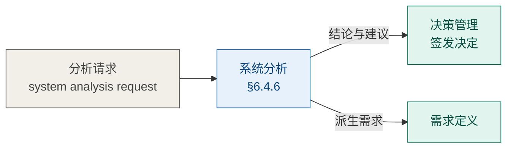

---

## 第 5 轮

### Mickey

> 我没太理解

### 阿布

换个说法。**系统分析就是"技术上的问答案"这个环节。**

举一个你熟悉的场景：设计一颗螺栓，供应商给了两个方案，A 便宜但疲劳寿命低，B 贵但寿命高。现在要定用哪个——

- **算这个寿命**（做疲劳分析）→ 这是**系统分析**
- **决定用 B** → 这是**决策管理**

系统分析只负责"把话问清楚、把账算明白"：给定什么条件、用什么方法、得到什么结论、这个结论在什么前提下成立。它**不改任何东西**——不改设计、不改需求、不签文件。

**它像什么？** 像打官司时的**鉴定报告**。鉴定机构给出结论，但判不判、怎么判是法官的事。鉴定报告本身推不出判决——中间必须有法官。

**为什么它要"横切"？** 因为"算一笔账"这个需求，在生命周期的任何环节都会冒出来：需求阶段要评估技术可行性、设计阶段要比方案、验证阶段要分析失效、运维阶段要评估改装影响。它不属于任何阶段，它服务于所有阶段。

---

## 第 6 轮

### Mickey

> 它跟设计里的权衡有什么实质区别

### 阿布

三个实质区别：

**一、终点不同。**

| | 系统分析 | 设计内的权衡 |
|---|---|---|
| 终点 | 抉择获得**依据** | 设计**定稿** |
| 产物 | 结论 + 建议（条件式的真） | 一个确定的设计（无条件的选择） |

**二、视野不同。**

设计内的权衡是**内向**的——它在系统边界内比方案（材料 A 还是 B、结构方案一还是二）。系统分析是**外向**的——它可以跨生命周期、跨系统边界，甚至回答"这个系统该不该做"。

**三、留痕义务不同（这条最关键）。**

设计错误有**下游兜底**：集成会暴露接口对不上，验证会暴露性能不达标。所以设计内的权衡不必把每一步推导都留档，留着结果和理由就够了。

**系统分析的错误没有兜底——它本身就是判断对错的依据。** 如果分析结论错了，下游所有基于它做的决定全错，而且没有任何环节能拦住。所以系统分析的假设、方法、数据来源、结论、前提条件，**必须全部进基线、可审计**。

配置管理上：系统分析产出全部进基线；设计内权衡的推导过程不进。

**一人多角时怎么办？** 产出物仍须分两份（分析报告 / 决策记录）。因为将来被复核的路径不同——要能分清到底是"算错了"还是"选错了"。

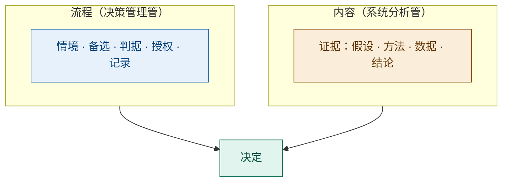

---

## 第 7 轮

### Mickey

> "供证据"和"做决定"到底怎么分

### 阿布

**判据一：陈述的模态不同。**

- 系统分析交的是**条件式的真**："在假设 H₁–H₃、判据 C₁–C₃ 下，A 优于 B。"
- 决策管理交的是**无条件的承诺**："采用 A。"

**陈述句推不出承诺句。** 从"在某某前提下 A 更好"推不出"就用 A"——中间必须有人签字。这就是分界线。

**判据二：一个管"流程"，一个管"内容"。**

- 决策管理管的是**抉择这件事的流程**：情境是什么、备选有哪些、判据是什么、谁有权批、记录留没留。
- 系统分析管的是**抉择所需的内容**：证据。

**三样东西只有决策者能支配：**

1. **权重**——成本／风险／效能的权重是**价值判断**，不是技术判断。系统分析只能把权重显式化、做敏感性分析（"若成本权重提到 0.4 以上，结论翻转"），**不能替人赋值**。
2. **授权**——决定会改变资源流向，分析不改变任何东西。
3. **问责**——决策者对选择负责；分析者只对**方法**负责，不对结论被怎么使用负责。

**金句（可复用判据）**：**建议必须带着它的前提走路。不带前提的建议，就是在替人拍板。**

一份完整的建议应该长这样："在 H₁–H₃ 前提与 C₁–C₃ 判据下，建议选 A；若成本权重从 0.25 提到 0.4 以上，建议翻转为 B。"

---

## 第 8 轮

### Mickey

> 还有，实现（还是实施）过程是什么

### 阿布

**中文名先定：GB/T 22032—2021（等同采用 15288:2015）译作「实现过程」。** 不是"实施"。国标译法统一用"实现"，与 `realize` 对应。

**purpose 原文只有七个英文词：**

> *realize a specified system element*

**`realize` 这个词的范围是关键**——它不等于"自己制造"：

| 路径 | 说明 |
|---|---|
| 自行设计制造 | 从设计到加工 |
| 按已有设计制造 | 设计是别人给的 |
| 改造 | modification |
| **采购** | COTS（商用货架产品）· NDI（非研制项目） |
| 复用 | reuse，直接拿来用 |
| 配置 | 按配置数据生成 |

**所以"实现 ≠ 自己造"。** 一颗标准螺栓，你不造它，你**买**它——这也叫实现。

**实现过程的产出是实物／可执行体**，不是文档。这是它与设计定义最直观的差别：设计定义交"数据与信息"，实现交"东西"。

**注意 purpose 里那个 `specified`**——规格是**已被规定好的**，由设计定义过程给出。这一条在后面几轮会被反复用到。

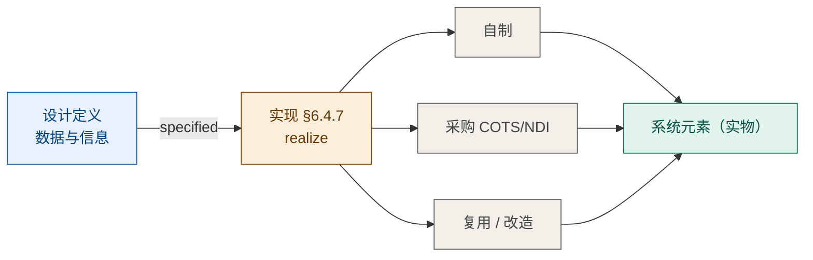

---

## 第 9 轮

### Mickey

> 我有一个疑问，实物产品的工艺方案、物料方案、测试方案、交付方案、部署方案、运维方案和处置方案，它们是设计定义过程的输出文档还是实现过程的输出文档？

### 阿布

**总纲先给：设计定义过程不产方案，只产产品定义。**

设计定义 §6.4.5 的产出是三样：**设计特征（design characteristics）· 设计使能器（design enablers：物理模型／分析模型／设计经验法则）· 设计基线（design baseline）**。这里面没有"方案"这一项。

逐个落位：

| 方案 | 归属 | 理由 |
|---|---|---|
| **工艺方案** | **实现** | 它规定的是"制造过程怎么走" |
| **物料方案** | **拆两层** | ① **选什么料** → 设计定义的设计特征（APQP 阶段 2 的 Material Specifications）；② **怎么供货** → 实现／获取 |
| **测试方案** | **验证** | 但要分清：**DVP&R（设计验证计划）在设计阶段就成形**（APQP 阶段 2 产物），执行属验证 |
| **交付方案** | **移交 Transition** | |
| **部署方案** | **移交** | 部署是移交的一种形态 |
| **运维方案** | **运行 + 维护** | 两个过程，一份方案常合写 |
| **处置方案** | **处置** | |

**设计定义产出的是"为下游预留的设计特征"**——即 DFM（可制造性）／DFA（可装配性）／DFT（可测试性）／DFMaintain（可维护性）的**响应**，不是下游方案本身。

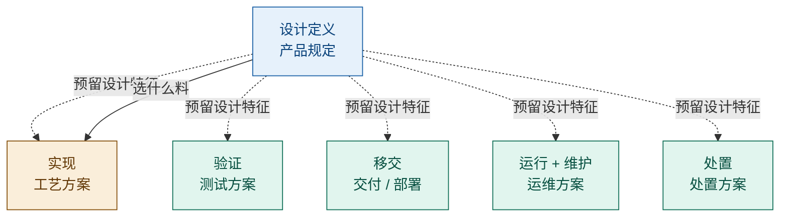

---

## 第 10 轮

### Mickey

> 你再根据设计定义的过程思考下，设计定义的终点是什么，不是实现的起点吗，如果没有那些方案，如何实现呢，如何确定设计结束了呢

### 阿布

设计定义的终点**不是**实现的起点——它们是**两个不同的东西**，只是相邻。

**判据（这条是后面所有讨论的支点）：**

> **设计定义产出「产品规定」（这个元素做成什么样）；实现过程产出「过程规定」（怎么把它做出来）。**

两者都是"规定"，**规定的对象不同**：

- **产品规定**：这个齿轮用 20CrMnTi、模数 2、齿面硬度 HRC58–62 —— 描述**产品特性**
- **过程规定**：滚齿 → 渗碳 → 淬火 → 磨齿，920℃×6h，油淬 —— 描述**过程怎么走**

**"没有方案如何实现"的答案**：方案不是设计给的，是**实现过程自己产出的**。15288 §6.4.7 的第一组活动就叫 **Prepare for implementation**——其中一步是*定义实现策略*。**方案在这一步诞生，不在设计定义过程里。**

**"如何确定设计结束"的答案**：见下一轮的三条判据。

---

## 第 11 轮

### Mickey

> 被签字认可能够实现的设计，这怎么理解，如果只是需求，怎么能够确定它是可实现的设计呢？

### 阿布

先纠正我自己前几轮的一个表述偏差：**设计特征不是需求，是需求的解答。** 我早前用"要求 vs 方案"来做类比，不准确。精确说法是——设计定义产出「**产品规定**」。

**"被签字认可能够实现"靠三条支撑：**

1. **设计特征细化到可实现** —— 足够详细，抽象不到能直接干活
2. **可实现性有证据支持** —— 三条来路：
   - **做出来**（物理模型：样件）
   - **算出来**（分析模型：计算、仿真）
   - **签出来**（设计经验法则 + 跨职能判断）
3. **跨职能签字** —— APQP 里那个 **Team Feasibility Commitment（小组可行性承诺）**，由制造、质量、采购等跨职能共同签

**设计结束的判据 = 这三条都满足 + 设计基线建立。**

**为什么"只是需求"不够**：需求说"要能承受 X 载荷"；设计说"做成这样（截面、材料、热处理）就能承受 X"。**后者才是可实现性的载体**——它把"要求"翻译成了"具体做法"。

---

## 第 12 轮

### Mickey

> 设计定义的"可实现"，不是从规定里推导出来的，是做出来（样件）、算出来（分析）、签出来。这不就是方案吗？

### 阿布

不是。**判据不同——这是最本质的区分：**

> **判断的判据是存在性（∃），方案的判据是最优性（argmax）。**

设计定义只需证明"**路是通的**"（存在一条可行的实现路径即可）；
方案必须选定"**走哪条**"（在若干可行路径里挑出最好的一条）。

**这就是为什么样件 suffice，而工艺方案不是设计定义的产出。**

**"三个量级的做出来"（关键框架）：**

| 量级 | 证明什么 | 归谁 | 产出物 |
|---|---|---|---|
| 做得出**一个** | 设计可行 | **设计定义** | 样件 / 分析报告 |
| 做得出**方法** | 工艺可行 | **实现** | 工艺方案 |
| 做得出**一万个合格的** | 过程能力 | **实现 + 验证** | 试生产 / Cpk |

**过早定方案的三重危害：**

1. **返工** —— 设计一改，方案全废
2. **方案绑架设计**（更糟）—— 工艺路线一旦定死，设计就没法改了
3. **变更失控** —— 配置管理上，方案提前进入设计基线会污染基线

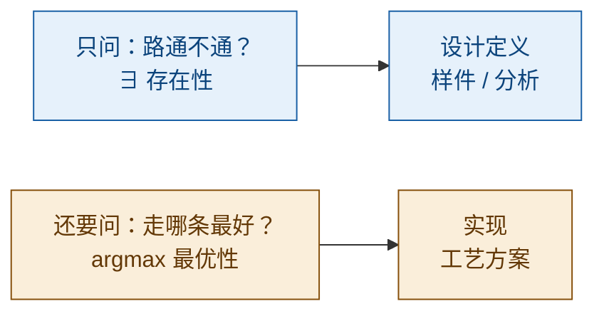

---

## 第 13 轮

### Mickey

> 都做出样件了？

### 阿布

**样件不是"实现"。** 我上一轮说"实现是跨越描述到实物的门槛"——这个二分太粗糙，修正为：

> **实现过程的门槛不是"从描述到实物"，而是"从设计规定到系统元素"。**

**样件在标准里的身份是 design enabler（设计使能器）中的 physical model，不是 system element。**

**三条判据**（区分样件与实现的产出）：

| 判据 | 样件 | 实现的产出 |
|---|---|---|
| 是否会被集成／交付？ | 否 | 是 |
| 是否用**正式生产方法**？ | 否（手工、试制） | 是 |
| 是否会被**正式判定**（放行）？ | 否 | 是 |

**APQP 印证**：**Prototype（阶段 2）** 与 **Significant Production Run（阶段 4）** 是两个东西，中间隔着**阶段 3 过程设计和开发**。前者是"证明能做"，后者是"证明能稳定地做"。

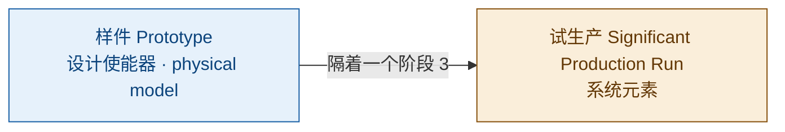

---

## 第 14 轮

### Mickey

> 没有明确的方法，怎么能够判定是可实现的？比如没有物料采购方案，怎么知道物料可以被购买到？

### 阿布

**因为判据的强度是递进的，而设计阶段只需到其中某一档。**

| 强度 | 问什么 | 什么时候需要 |
|---|---|---|
| **存在性** | 世界上有没有这种东西／能不能做出来 | **设计定义** |
| **合格性** | 有没有满足规格的 | 设计定义后期 |
| **可获得性** | 能不能买到 | **设计定义（采购类物料到此为止）** |
| 稳定性 | 能不能持续稳定供货 | 实现 / 量产准备 |
| 持续性 | 长期供货与生命周期保障 | 量产 |

**所以"没有采购方案"不影响判定**——因为采购方案要回答的是"**怎么买**"（后两档），而设计阶段只需要回答"**买得到吗**"（前三档）。

**怎么在不做完整采购方案的前提下判定可采购？** 看两条就够：

1. **有没有已知的供应源**（哪怕只有一家）—— 存在性
2. **有没有已知的规格匹配产品** —— 合格性

**新物料的具体论证动作**：**RFI（信息征询）· 索样 · 寻源 · 供应商初筛** —— 这套动作的专名叫**物料认证**，配套管理框架是 **NUDD**（New / Unique / Difficult / Different）。

**产出的是「资格」，不是「订单」。**

---

## 第 15 轮

### Mickey

> 我们是搞产品呢，不是在实验室搞发明，是要稳定的输出产品为目标啊

### 阿布

对，这句话正好点出**产品与发明的真实差别所在**——**不在过程结构，在可行性论证成本。**

| | 发明 | 产品 |
|---|---|---|
| **可行性怎么来** | 每次现场论证，成本高、结论不确定 | **前置固化成设计约束** |
| **手段** | 无 | AVL · 货架产品优先 · 产线能力包络 · 禁用单一来源 · 优选目录 |

**产品企业把可行性"前置固化"成设计约束**——所以设计阶段不必每次都重新论证可采购性，**AVL 已经把"可采购"这个结论沉淀下来了**。这就是产品企业能"稳定输出"的结构性原因。

**还有一条关键的：**

> **"稳定"是在过程上定义的，不在设计上定义。**

要证明稳定 → 必须先有过程 → 要有过程 → 必须先有方案。**顺序不能倒。**

所以"稳定输出产品"这个目标，恰恰要求设计定义**不要**越界去定方案——**越界反而破坏了通往稳定的路径**。

**四道收敛关口：**

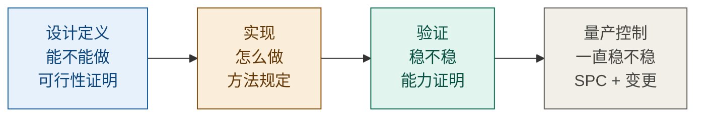

---

## 第 16 轮

### Mickey

> 对于老物料，可以在AVL中，那对于新的物料，如果没有具体的采购方案，怎么判定物料可采购？

### 阿布

分两类看，两类用的是**不同的论证方式**：

**老物料（在 AVL 中）**：可获得性已被**组织级**结论覆盖，项目不必重新论证。

**新物料（不在 AVL 中）**：没有现成结论，**必须现场论证**。动作是：

- **RFI**（Request for Information）—— 问市场有没有
- **索样** —— 拿到实物验证规格匹配
- **寻源** —— 找到潜在供应源
- **供应商初筛** —— 形成资格判断

这套动作在 15288 里对应 §6.4.7 的 *obtain enabling systems* 那一环。

**管理框架：NUDD**（New / Unique / Difficult / Different）—— 按四类风险分别加严论证。

**产出是「资格」，不是「订单」。终点是把它变成老物料——写进 AVL。**

**AVL 的准确身份**：**组织级的、跨项目的采购条件主数据**（战略寻源的沉淀物），**不归任何项目级技术过程**。

---

## 第 17 轮

### Mickey

> 而且在AVL清单中的物料，其实已经明确其采购方案了

### 阿布

你说得对，我上一轮的说法太理想化了。**修正：AVL 确实带有商务信息。**

AVL 里的典型字段远不止"资格"：

- 协议价 / 阶梯价
- MOQ（最小起订量）
- 标准交期
- 备选源
- 包装规格、运输方式
- 有效期

所以 AVL 不是"只有资格"，而是「**可获得性结论 + 采购条件**」的复合体。

**重新划界：**

| | 采购"**条件**" | 采购"**决定**" |
|---|---|---|
| 是什么 | AVL 里的主数据 | 项目做的单次选择 |
| 层级 | **组织级**、跨项目 | 项目级 |
| 什么时候形成 | 战略寻源沉淀 | 每次采购时 |

---

## 第 18 轮

### Mickey

> AVL 给的是"能怎么买"，这不就是方案吗

### 阿布

**"能怎么买"是可行集，"就这么买"才是方案。**

而且我这轮还得再更正一个更根本的说法——我上一轮说"AVL 里没有选择发生"，**这句也不对**。

**命名佐证**：**Approved Vendor List**——「Approved」标**资格**，「List」是**目录**。它是一份**清单**，不是一份**决定**。

**类比**：**AVL ≈ 框架协议**（条件谈好了，但还没下单）；**采购订单才是调用**。

所以：

- AVL 回答"**能怎么买**" —— **可行集**，多个选项并存
- 采购方案回答"**就这么买**" —— **选定**，单一

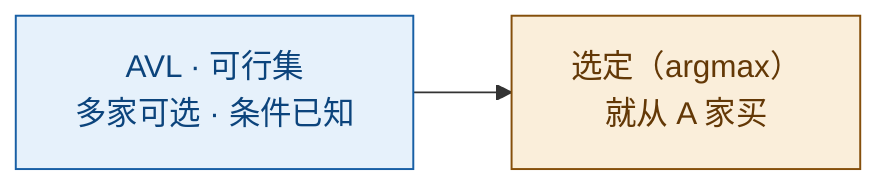

---

## 第 19 轮

### Mickey

> 这不就是设计的结果么

### 阿布

**这里要做一次关键更正**：我前面说"AVL 里没有选择"——这句话需要修正。

**准确说法是：AVL 里没有选择，但设计里确实发生了选择。**

因为有**两次选择**，我之前把它们揉成一次了：

| | **设计的选择** | **采购的选择** |
|---|---|---|
| 选什么 | **用哪颗料**（技术选定） | **从哪家买**（商务选定） |
| 谁做 | 设计 | 采购 |
| 依据 | 技术特性 | 价格、交期、产能 |
| 类比 | **医生开处方** | **药剂师拿药** |

**最终判据：AVL 是可行集，方案是选定。**

设计的结果是"**用这颗料**"——这是**技术选定**，是设计**自己作出的**，不是 AVL 给的。AVL 只是告诉设计"这颗料买得到"。**两件事，两次选择，别并成一次。**

---

## 第 20 轮

### Mickey

> 而且，如果拿工艺作为示例，更是设计的输出文档

### 阿布

**"像设计"不等于"归设计过程"。**

工艺设计确实**像**设计——它在把要求变细，而且**对象是过程**。用 ISO 9000 的刀切，它属于"**过程设计和开发**"。这一层你是对的。

**但 15288 划分过程，按"产出物对象 + 责任 + 变更路径"，不按"做事方式"。**

工艺方案 = **实现过程的输出文档**。

**三条判据：**

1. **产出对象是过程**（不是产品）→ 所以它不是设计定义的产出（设计定义管的是系统及其元素）
2. **变更走工艺变更流程**（不是设计变更流程）
3. **进制造／工艺基线**（不进设计基线）

---

## 第 21 轮

### Mickey

> 那工艺方案是设计定义过程的输出了，而不是实现过程的输出文档？

### 阿布

**不是。工艺方案是实现过程的输出文档。**

我理解这个问题的来由：我上一轮说"工艺设计也是一种设计活动"，你据此反问。但——

> **"是一种设计活动"和"归设计过程"是两回事。**

展开成两条线：

- **从活动性质看**：工艺设计确实在把要求变细，对象是过程 → 属于 ISO 9000 意义上的"**过程设计和开发**"
- **从过程归属看**：它是**实现过程**的输出文档

**根源是两个标准的分层不同：**

| | 按什么分 | 结果 |
|---|---|---|
| **ISO 9000** | 设计活动的**对象**（产品 / 服务 / **过程**） | 承认"过程设计和开发"是设计与开发的一种 |
| **15288** | 产出物的**过程归属** | 工艺方案归实现过程 |

---

## 第 22 轮

### Mickey

> 设计与开发的定义，你去查一查iso 9000 2015版

### 阿布

查证完成，原文拿到了，而且顺带把 2026 新版的对应条款号也定位了。

**先给结论**：ISO 9000:2015 §3.4.8 定义的"设计和开发"，切的是**一件事——把要求变细**。它跟你上一轮纠结的"工艺方案归谁"，其实分属两套坐标系。而这条定义里的 **Note 3**，正好是那把解开结的钥匙。

#### 原文

**§3.4.8 设计和开发 design and development**（GB/T 19000—2016 等同采用译文）

> 将对客体（3.6.1）的要求（3.6.4）转换为对其更详细的要求的一组过程（3.4.1）

英文原文：

> *set of processes that transform **requirements for an object** into **more detailed requirements for that object***

- **注 1**：输入要求常源于研究，比输出要求更宽泛、更概括；**这些要求通常从特性（characteristics 3.10.1）方面来规定**；一个项目中可有多个设计和开发阶段。
- **注 2**：英/法文中，design / development / design and development 有时同义，有时指整个设计和开发的**不同阶段**。
- **注 3**：**设计和开发的性质可使用限定词表示（如：产品设计和开发、服务设计和开发或过程设计和开发）。**

定义骨架：

#### 这条定义跟第 21 轮那个问题是什么关系

**（1）它是"需求细化"视角，不是"产出物"视角。**

定义句的宾语是 `requirements → more detailed requirements`——通篇没说"产出设计描述""产出图样""产出方案"。这是拿"**输入输出都是要求**"来框设计活动。

而 15288 §6.4.5 设计定义是另一个切口：*provide sufficient detailed **data and information** about the system and its elements*——它管的是**产出物的形态**。

**（2）注意注 1 的那半句话——这是个桥。**

"要求通常从**特性（characteristics）**方面来规定"。而 15288 里，设计定义产出的东西正叫 **design characteristics**。所以两者不是对立，是**同一件事的两个侧面**：ISO 9000 说"要求被细化成了特性"，15288 说"这些特性就是关于系统及其元素的设计数据"。

**（3）注 3 是关键：ISO 9000 官方承认"过程设计和开发"是一种设计和开发。**

所以你第 20 轮的直觉**没错**——工艺设计确实是一项设计活动，只是它设计的**对象是过程**，不是产品。但这**不改变它在 15288 账本上的位置**。

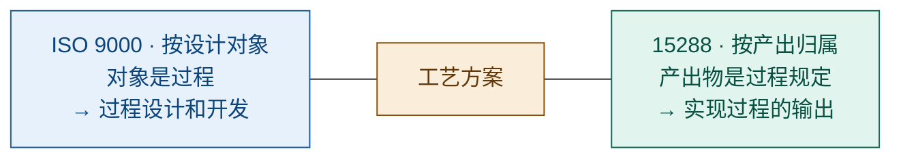

#### 一个必须警惕的误读

网上有些解读（如 globalstd 一类）写：*"Design and development are exclusive to products and services, not to processes."*

**这与 §3.4.8 注 3 直接矛盾**——注 3 白纸黑字把 `process design and development` 列为示例。那句话大概是从 ISO 9001 认证范围／条款适用的语境里滑出来的，**不能当标准定义引**。

#### 顺带把 2026 新版对齐一下

ISO 9000:2026（第 5 版，2026-05-27 发布）里这条**还在、措辞一字未改，但条款号搬家了**：

- **2015 版 §3.4.8 → 2026 版 §3.3.11**
- 原因是术语组整体重排：原 3.4「过程相关术语」→ 新 **3.3**；原 3.5「系统相关术语」→ 新 **3.4**；而**需求与客体那一组搬到了 3.5**（2026 版里 `requirement` 是 3.5.1、`object` 是 3.5.3，定义句里那两个引用号就是这么跳的）。
- **注 3 完整保留**（product / service / process design and development 三个示例都在）。
- 注 2 被压缩：2015 版单列了法文说明，2026 版只留一句英文。
- 标题去掉 `systems`：*Quality management — Fundamentals and vocabulary*。

GB/T 19000—2027 预计等同采用 2026 版，届时国标引这条也要搬到 3.3.11。

#### 回到工艺方案的最终定位

**工艺方案是"过程设计和开发"的产物（ISO 9000 意义），但在 15288 的账本里登在"实现过程"名下。**

这也顺手解释了更早那个直觉为什么对："工艺看起来像设计"——对，从**活动的认知性质**看它就是在做设计；但**归哪个过程**，得看产出物规定的是"产品特性"还是"过程怎么走"。工艺方案规定的是后者，所以归实现。

---

## 第 23 轮

### Mickey

> 哈，你把ISO 9000 2026版给下载下来

### 阿布

这个得先说实话：**ISO 9000:2026 下载不了**——不是我不给，是它根本没有合法的免费通道。

它是 ISO 的版权出版物（第 5 版，2026-05-27 发布，共 53 页），在 ISO 商店（`iso.org/store`）按份售卖。ISO 标准不是开放获取的，ISO 也没有"先上网、后收费"这种机制。网上任何号称"直接下 PDF"的站点，来的都是盗版——这条我不碰。

能走的路只有三条，代价各不相同：

| 路径 | 能拿到什么 | 现在可用吗 |
|---|---|---|
| **ISO OBP**（`iso.org/obp`） | 免费**在线浏览**：前言（含主要变更）+ 引言 + 第 1 章 + 第 2 章 + **第 3 章全部术语定义（3.1–3.12，170 条）** | ✅ 可用 |
| **GB/T 19000—2016**（国家标准全文公开系统） | 等同采用 ISO 9000:2015；但**采标标准不免费**，只给题录 | ⚠️ 走不通 |
| **GB/T 19000 修订版**（计划号 20264414-T-469） | 等同采用 ISO 9000:2026；**征求意见稿 PDF 免费下载** | ⏳ 待发布 |

OBP 是"能看不能下"——全文在线阅读，禁止打印与复制，页面上有防护。而且付费墙挡住的其实只有**第 4 章「质量管理基础」+ 附录 A「概念关系及其图示」**；第 3 章那 170 条术语是白给的。

既然你要一份能用的东西，我就先按 OBP 那块白给的，给你做成**可检索的速查表**——比读 PDF 顺手得多。

（本轮操作：抓取 OBP 第 3 章 3.1–3.12 共 170 条术语，整理并交付 `ISO-9000-2026-术语速查表.html` 与 `ISO-9000-2026-术语速查表.md` 双格式。免费/付费边界：免费 = 目次 + 第 3 章术语定义；付费 = 第 4 章 + 附录 A。）

---

## 第 24 轮

### Mickey

> 你找找网上有没有免费的

### 阿布

找了一圈，结论有点反直觉：**免费的"正规口子"确实有，但跟大多数人以为的那几个都不一样。**

#### 先纠正一个普遍的误解：国标不一定免费

国家标准全文公开系统（`openstd.samr.gov.cn`）的免费范围是分档的：

- **非采标**的推荐性国标 → 可在线阅读
- **强制性、非采标** → 可阅读 + 下载
- **采标的推荐性国标 → 只提供题录信息，不给全文**

GB/T 19000—2016 是**等同采用（IDT）ISO 9000:2015** 的，落在第三类。官方口径见标准创新管理司 2024-06-14 公众留言答复（2023 年人大建议答复同口径）。我实测了 `std.samr.gov.cn` 的详情页，确实没有在线预览入口——**不是网页坏了，是规则如此**。这条我以前也不知道，算是个坑。

#### 于是真正可用的免费路径只剩两条

**（1）现在就能用的——ISO OBP**

`https://www.iso.org/obp/ui/#iso:std:iso:9000:ed-5:v1:en`

- 免费：前言（含 5 条主要变更）+ 引言 + 第 1 章范围 + 第 2 章 + **第 3 章术语与定义（3.1–3.12）**
- 付费：第 4 章「质量管理基础」+ 附录 A「概念关系及其图示」

**（2）最有价值的——GB/T 19000 修订版（等一个窗口）**

这条是新挖到的，也最值得盯：

| 项 | 内容 |
|---|---|
| 计划号 | **20264414-T-469** |
| 标题 | 《质量管理 基础和术语》（已去掉"体系"二字） |
| 下达日期 | **2026-08-28** |
| 项目周期 | 6 个月 |
| 状态 | **正在起草** |
| 采标情况 | **等同采用 ISO 9000:2026**（官方页面确认） |
| 起草单位 | 中国标准化研究院 |

**机制**：国标一旦进入「**征求意见**」阶段，**征求意见稿 + 编制说明的 PDF 就在全国标准信息公共服务平台免费下载**。

- 入口：`https://std.samr.gov.cn/gb/gbPlanDraft`（推标草案征求意见）
- 或按状态过滤：`https://std.samr.gov.cn/gb/gbProcessInfo?state=正在征求意见`
- 预计窗口：**2026 年底 ~ 2027 年初**

**（3）其余合法渠道**（要花钱或有门槛）

单位 / 公司标准数据库订阅 · 高校图书馆 · 国家科技图书文献中心（NSTL）原文传递 · 中国标准服务网（正版购买）· 各省标准化研究院阅览室。

#### 顺带把 ISO 9000:2026 的变更说清

它不只是"术语号搬家"——正文结构也动了。**Foreword 列的 5 条主要变更（官方原文）**：

1. **标题去掉 `systems`**：*Quality management **systems** — Fundamentals and vocabulary* → ***Quality management* — Fundamentals and vocabulary**（更好反映内容已超出"体系"）
2. **结构重排**：基本概念与质量管理原则**由第 2 章移至第 4 章**（对齐 ISO/IEC 导则第 2 部分）；**第 2 章改为「规范性引用文件」**
3. **基础部分扩成两组**：**基本质量管理概念**（fundamental quality management concepts）+ **附加的质量管理相关概念**（additional concepts relevant to quality management）
4. 新增术语、修改定义（反映 ISO/TC 176 的文件变化）
5. **附录 A 的图重新编排**

**第 4 章骨架**（付费区，只能看到目录级信息）：4.2 质量管理原则（七项，每项含 **Statement 陈述 / Rationale 理由 / Key benefits 关键收益 / Possible actions 可能措施** 四段）；4.3 基本概念；4.4 附加概念。

**第 3 章编排**：按**概念顺序**排列，文末另附**字母索引**；附录 A 的概念图是第 3 章术语分组的基础。

> 一句话收束：**你要的"免费全文"，答案是——第 3 章现在免费（在线读），全文要等国标征求意见稿。**

---

## 第 25 轮

### Mickey

> 那系统工程中的实现过程，也属于设计与开发吧

### 阿布

**不是。准确说法是：实现过程"包含"设计性质的活动，但它本身不等同于设计与开发。**

这两个词一混，前面几轮绕不出来的那个结就系在这儿。

#### 判据一：purpose 的动词

| 过程 | purpose 原文 | 动词性质 |
|---|---|---|
| 设计定义 §6.4.5 | *provide sufficient detailed **data and information**…* | 认知活动：**产出规定** |
| 实现 §6.4.7 | *realize **a specified** system element* | 执行活动：**按已定的兑现** |

关键在 `a specified` 这两个词——**规格是已经被给定的**。实现拿到的是一份已经规定好的东西，它干的事是"把它做出来"，不是"把要求变细"。

#### 判据二：拿 ISO 9000 §3.3.11 逐条量

那把尺子是：*transform requirements for an object into **more detailed requirements** for that object*——**在把对某客体的要求变成更详细的要求吗？**

把实现过程里的活动一条条过：

| 实现过程内的活动 | 在把要求变细？ | 性质 |
|---|---|---|
| **制定实现策略 / 工艺方案** | ✅ 是 | 设计性（**对象是过程** → 过程设计和开发） |
| 制造 / 采购 / 复用 / 改造 | ❌ 否 | 兑现性（按已有规定执行） |
| 记录实现结果 / 评审 / 处置不符合 | ❌ 否 | 控制与验证活动 |

**结论**：实现过程内嵌的设计活动，只在 `Prepare for implementation`（准备实现）里，**约占整个实现的三分之一块，且只是其中半步**。

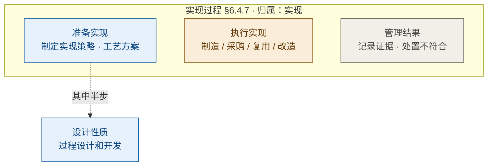

#### 深一层：15288 里，"过程"本身也可以是设计定义的对象

`system element`（15288 §4.1）的示例里明确包含 **processes**（另有 procedures / facilities / materials / 人员 / 硬件 / 软件 / 数据）。过程既然能当系统元素，也就能当设计定义的对象。

于是同一个工艺方案，在**两个账本**上各记一笔：

- **主系统账本**：工艺方案是为兑现主系统而准备的手段 → 记在**实现过程**名下
- **使能系统账本**：制造系统本身是一个系统，走它自己那套 15288 过程集 → **工艺方案是"制造系统"的设计定义过程的产出**

#### 一处必须说清的术语澄清

"实现过程"这个词在你的问句里其实扛了两种意思：

| 用法 | 含义 | 含不含设计活动 |
|---|---|---|
| **工程口语** | "把东西做出来"这个**阶段** | 含大量设计（工艺 / 工装 / 测试方案设计） |
| **15288 术语** | §6.4.7 Implementation process，purpose 七词 | 只管"兑现"；"规定怎么兑现"的部分，正是它内嵌的那半步设计活动 |

你说"实现过程也属于设计与开发"，若指第一层——**直觉是对的**；但一旦用了"属于"这个词，就滑向第二层，那就不成立了。

---

## 第 26 轮

### Mickey

> 实现过程的部分工作属于设计与开发，一部分属于生产？

### 阿布

**方向对了，但"属于"这个词用错了维度。**这是本轮最要紧的一处修正。

你其实同时说了两件事，它们各自成立，但被塞进了同一个动词里：

- "一部分工作**是设计**" → 这是**性质**判断，对的
- "一部分**属于生产**" → 这是**归属**判断，也对的

问题在于：**这两条判据不在同一把尺子上，不能拼成一句"一半属于 A、一半属于 B"。**

#### 两把尺子

| | 判据 | 读数 |
|---|---|---|
| **归属**（账本上记给谁） | 产出物对象 + 责任 + 变更路径 | 实现过程的三块活动，**全部归属实现过程** |
| **性质**（活动在认知上是什么） | 在把要求变细，还是在按已定的兑现 | 准备实现 → **设计性**；执行实现 → **兑现性**；管理结果 → **确定性** |

**准确表述**：实现过程的全部工作都**归属**实现过程；只是其中一部分活动**具有**设计性质。

> **"属于"是归属问题，"具有……性质"是性质问题。**

#### 你那句话的三处要修

1. **不是二分，是三分**：准备实现（Prepare）／执行实现（Perform）／管理结果（Manage）。你说的"生产"只对应中间那块。
2. **"生产"这个词太窄**：`realize` 涵盖**自行制造 / 按已有设计制造 / 采购（COTS · NDI）/ 复用 / 改造 / 配置**。买来的件也是"实现"，并不经过"生产"。
3. **最关键的一处**：维度混淆——把"具有设计性质"说成了"属于设计与开发"。

#### 正交矩阵：活动性质 × 过程归属

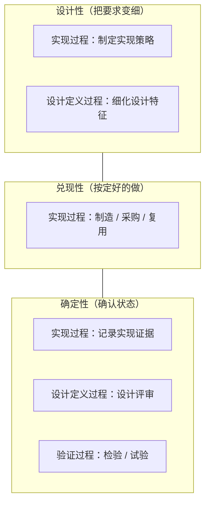

**核心命题：没有哪个过程是"纯"的。**

- 设计定义过程内部也有评审（确定性）与决策
- 验证过程内部也有分析（系统分析性质）
- 系统分析本身更是横切过程

→ **过程是"责任与产出的封装"，不是"活动性质的分类"。**

类比：一个项目组里有系统工程师、软件工程师、测试工程师——专业性质各异，但编制都在这一个组里。**不会因为组里有测试工程师，就说"这个组一半属于测试部"。**

#### 两个要主动挡掉的错误推论

1. **"工艺设计该归设计与开发管、归设计部门"** → 不对。**组织分工可以按性质分，但过程模型的归属不变**。两者不冲突，也**不能互推**。实务上你完全可以把工艺设计的人放在设计部门——这没问题，但账还是记在实现过程。
2. **"实现过程该拆成两条过程"** → 15288 不这么分。硬拆了，产出物归属与变更路径会乱：工艺方案变更走工艺变更、进**制造基线**，这是"实现"这条账的规矩。

#### 判据升级（可复用）

- 判**归属** → 第一把尺子：**产出物对象 + 责任 + 变更路径**
- 判**性质** → 第二把尺子：**在把要求变细，还是在按已定的兑现**
- **别拿第二把尺子的读数，去填第一把尺子的格子。**

---

## 第 27 轮

### Mickey

> 工艺方案、物料采购方案等，都是设计与开发的输出文档吧

### 阿布

**「都是」不成立。工艺方案是，物料采购方案不是。**

这个"都"字很危险——它会让你把两张不同的账合成一张，后面的基线、变更、评审全跟着乱。

#### 逐个用判据量

尺子还是那一把：**产生它的活动，在把要求变细吗？**

| 方案 | 在把要求变细？ | 变细的是谁 | 账本归属 |
|---|---|---|---|
| **工艺方案** | ✅ | 制造**过程** | 实现过程 |
| **物料采购方案** | ❌ **否** | — | 获取 / 供应 |
| 测试方案（DVP&R） | ✅ | 验证**过程** | 验证过程 |
| 交付 / 部署方案 | ✅ | 移交**过程** | 移交过程 |
| 运维方案 | ✅ | 运行 / 维护**过程** | 运行 + 维护 |
| 处置方案 | ✅ | 处置**过程** | 处置过程 |

#### 物料采购方案为什么不是

把它的内容拆开看：

- "**35CrMo，调质，HB280–320**" → 这是在把要求变细，**是技术规定**（而且它其实是**物料选型**，归设计定义）
- "**从 A 供应商买、单价 12 元、MOQ 500**" → 这是**商务安排**，不产生任何新的技术规定

采购方案 = 后半句。它的活动性质是**获取（Acquisition）**，不是设计。

> 干净的区分：**物料选型是设计定义的产物；采购方案是选型之后的事。**

#### 核心命题（这是跨三轮的收束）

**"设计与开发"是一张性质标签，不是一个账本抽屉。**

你可以给任意一份文档贴上"这是设计活动的产物"的标签，但它的**账**仍然记在各自的生命周期过程里。ISO 9000 §3.3.11 注 3 也正是这个意思——它允许你用限定词说"过程设计和开发"，但**不是要你去建一个叫"设计与开发"的部门或基线**。

类比最准：

> **"写作"是一种活动性质。**会议纪要、技术方案、客户邮件都是写作的产物，但账分别记在会议、项目、沟通名下；没人会设一个"写作部"来收所有写作产物。

这跟上一轮的"归属 vs 性质"是**同一个结构**——本轮已是第三次撞到它。

#### 三个真会踩的坑（所以说这不是学术洁癖）

1. **评审负担爆炸**：方案全塞进设计输出清单 → 设计评审要评所有方案。可设计评审**评不了采购价格、评不了装配节拍**——人不对，判据也不对。
2. **变更流程走错**：工艺变更走工艺变更 + 制造基线；供应商变更走商务变更。混成一条设计变更流程 → 两条账串线。
3. **基线划错**：设计基线里塞进采购信息与排产安排 → 基线不再是"**某一时刻已批准的技术状态**"，你一直在做的**派生型文档链**会直接失控。

#### 但有个真东西确实在设计里（别推过头）

设计定义过程**确实要输出**给下游的约束：DFM / DFA / DFT / DFMaintain 的响应，本身就是**为下游预留的设计特征**。

区别在于：

| 谁输出 | 输出什么 |
|---|---|
| **设计定义过程** | **"下游必须满足的接口与约束"**（如产线节拍 ≤ 45s、支持 3 种变型） |
| **下游过程** | **"如何满足这些约束的安排"**（工艺方案、采购方案、排产方案） |

> **金句：约束的来源在设计，方案的归属在下游。**

#### 条款层面的佐证

- ISO 9001:2015 **§8.3.5「设计与开发的输出」**有明确清单（满足输入要求 / 适宜后续过程 / 含监视测量要求 / 含接收准则 / 规定产品和服务的特性）——**工艺方案不在该清单上**。
- 工艺方案对应的是 **§8.5.1「生产和服务提供的控制」**中的成文信息。

**条款层面，切的也是同一刀。**

---

## 第 28 轮

### Mickey

> 把这轮对话原封不动地记录在25号文档中，E:\mywork\AOS\50-系统工程研究\00-系统工程相关研究报告

### 阿布

已建立本文件：`25-设计定义与实现边界对话记录-从方案归属到活动性质.md`（置于 `E:\mywork\AOS\50-系统工程研究\00-系统工程相关研究报告\`）。

命名沿用 23 / 24 号文件的惯例（`NN-主题对话记录-副标题.md`）。本轮 28 轮问答全部收入；第 1–21 轮按当时形成的记录还原，**第 22 轮起为逐字记录**；原对话中的 SVG 图统一转为 mermaid。

---

## 附：本轮的自我更正清单（按发生顺序）

| 轮次 | 更正内容 |
|---|---|
| 第 2 轮 | "架构定义回答系统由哪些元素构成"被否 → 架构是 **concepts or properties**，不是元素/关系清单 |
| 第 3 轮 | 混用 **system element** 与 **AD element** → 根源是 use–mention 混淆 |
| 第 5 轮 | 承认首轮解释未能说清"设计定义 / 系统分析 / 实现"三者的分工 |
| 第 11 轮 | "设计定义产出要求"被修正 → **设计特征不是需求，是需求的解答**；产出应称"产品规定" |
| 第 13 轮 | "描述层／实物层"二分过粗，被"都做出样件了？"点破 → 改为"从**设计规定**到**系统元素**"；样件 = design enabler 中的 **physical model**，非 system element |
| 第 17 轮 | AVL 说法① 修正 → 承认 AVL 带商务信息，是"可获得性结论 + 采购条件"复合体 |
| 第 18 轮 | AVL 说法② 修正 → 重划为采购"**条件**"（组织级）vs 采购"**决定**"（项目级） |
| 第 19 轮 | AVL 说法③ 修正 → **AVL 里没有选择，但设计里确实发生了选择**（技术选定 / 商务选定，两次选择） |
| 第 20 轮 | "像设计"被误推为"归设计过程" → **"像设计" ≠ "归设计过程"** |
| 第 21 轮 | 确认工艺方案 = **实现过程的输出文档**；揭示 ISO 9000 与 15288 两个标准分层不同 |
| 第 25 轮 | "实现过程属于设计与开发" → 修正为"实现过程**包含**设计性质的活动，但**归属**实现过程" |
| 第 26 轮 | "一部分属于设计与开发、一部分属于生产" → **"属于"用错维度**；提出"归属 vs 性质"两把尺子与正交矩阵 |
| 第 27 轮 | "方案都是设计与开发的输出文档" → 修正为**"设计与开发"是性质标签，不是账本抽屉**；物料采购方案不属设计 |

## 附：待核项

1. **GB/T 19000 修订计划 20264414-T-469** —— 需跟踪其"正在起草 → 征求意见"状态变化；一经挂出，征求意见稿 PDF 应在 `std.samr.gov.cn/gb/gbPlanDraft` 免费下载。
2. **ISO 9000:2026 §3.11.8–3.11.14 / §3.12.13–3.12.16 原文** —— 本记录引用的 §3.11「确定」组定义（determination / review / monitoring / measurement / metrological confirmation / inspection / **verification §3.11.12** / test / **validation §3.11.14**）需再逐条复核条款号与原文。
3. **ISO 9000:2026 第 4 章正文** —— 未获取（付费区）。七项原则的四段结构（Statement / Rationale / Key benefits / Possible actions）系依 OBP 目录级信息推断，未逐字核对。
4. **15288:2023 `system element` 条款号** —— 本记录按 §4.1 引用，需核准；GB/T 22032—2021 对应条号亦需一并核对。
5. **IEEE 1028** —— 本主题涉及的 review 侧对照尚无 IEEE 1028 定义支撑；ISO 9000 侧已备齐（§3.11.2 review / §3.11.12 verification / §3.11.14 validation），**IEEE 1028 侧缺失**。

## 附：本记录引用的标准清单（版本已核）

| 标准 | 现行版本 | 本记录引用的条款 |
|---|---|---|
| ISO/IEC/IEEE 15288 | **2023** | §4.1（system element）、§6.4.5（设计定义）、§6.4.6（系统分析）、§6.4.7（实现） |
| ISO/IEC/IEEE 42010 | **2022**（2011 已撤销） | §3.2、§3.4、§5.2.2 |
| ISO/IEC/IEEE 42020 | 2019（已进入修订，stage 90.92） | §3.3（含 Note 1）、§3.6（architecture entity） |
| IEEE 1471 | 2000（已撤销） | §3.1（architecture 定义历史版本） |
| ISO 9000 | **2026**（第 5 版，2026-05-27 发布） | §3.3.11（设计和开发）、§3.5.1（requirement）、§3.5.9（conformity）、§3.5.13（nonconformity）、§3.5.14（defect）、§3.11.2（review）、§3.11.12（verification）、§3.11.14（validation） |
| ISO 9000 | 2015（第 4 版，已被 2026 取代） | §3.4.8（design and development，含注 1 / 注 3） |
| ISO 9001 | 2015 | §8.3.5（设计与开发的输出）、§8.5.1（生产和服务提供的控制） |
| GB/T 22032 | **2021**（等同采用 15288:2015） | 实现过程（**国标译作"实现过程"，非"实施"**） |
| GB/T 19000 | 2016（等同采用 ISO 9000:2015） | §3.4.8 译文 |
| IEC Electropedia | — | IEV 831-01-01（realize 词源核） |
| INCOSE SEH | **v5（2023-07）**（无 v6） | — |

**外部框架（非标准）**：APQP（AIAG，五阶段）· AVL（Approved Vendor List）· NUDD（New / Unique / Difficult / Different）。

---

*本记录为对话原样归档，保留提问顺序与自我更正轨迹；第 1–21 轮为按当日记录还原，第 22 轮起逐字。所有标准引文以所列版本为准，引用前请按"待核项"复核。*
