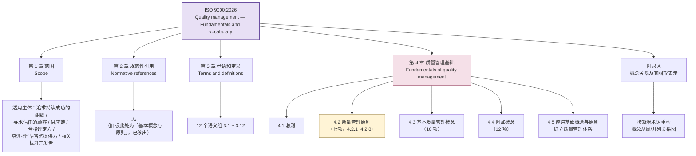
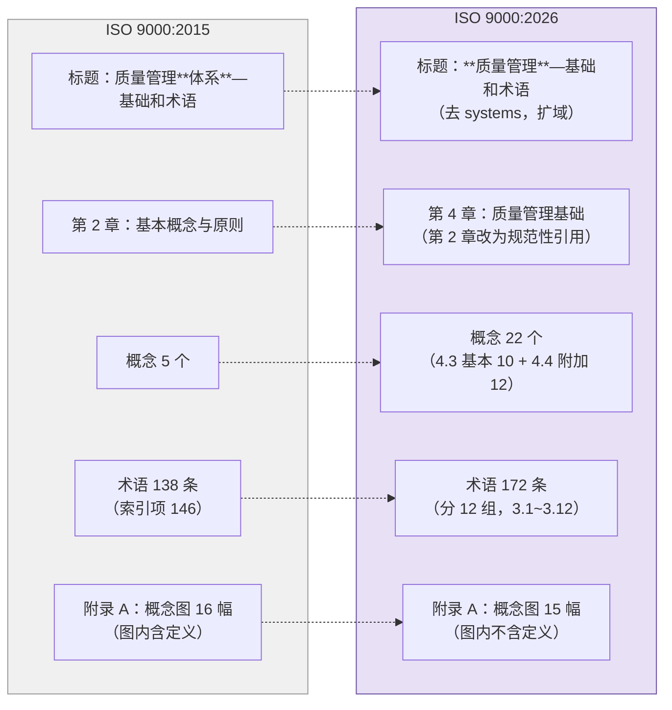
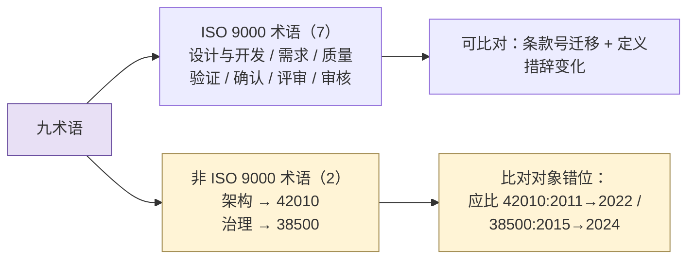

# 26-ISO 9000:2026 研究报告—结构与术语框架导航图

> **范围**：ISO 9000:2026《Quality management — Fundamentals and vocabulary》（第 5 版）的**文档骨架**——发布信息、章节组织、七项质量管理原则、术语分类框架、附录 A 概念图重构，以及与 2015 版的差异。
>
> **方法**：**二手资料汇编 + 结构化归纳**。来源为各国家标准机构（BSI / NEN / AFNOR / UNI / DIN / SIST）的公开预览页与变更说明、ISO/TC 176 公开材料、以及行业媒体的解读文章（清单见文末）。**不含任何 verbatim 引证。**
>
> **适用**：版本升级影响评估、术语溯源导航、教材/培训材料的版本合规检查。
>
> **术语夹注（2026-09-21；同日纠错）**：〔按：ISO 9000 的优先术语是 interested party，**stakeholder 是其许用术语**（2015 §3.2.3 索引标 admitted term；2026 §3.1.4 两词平列同行），GB/T 19000 译「**相关方**」；ISO/IEC/IEEE 15288（GB/T 22032）与 42010（GB/T 45630）的优先术语是 stakeholder，译「**利益相关方**」。**英文同词、中文分译两名**——实据在两处定义不同（9000 取「能影响／受影响／自认受影响」，15288 取「拥有权利、份额、主张或利益」），**理由在定义上，不在英文词上**。本报告所述 ISO 9000:2026 术语体系中的「相关方」（§4.4.2、§3.9 组、关系管理等）一律读作 interested party，故不改。另：§4.4 附加概念中**没有**「产品全生命周期」这一概念——`life cycle` 在 2026 版是**术语**（project life cycle §3.2.16）与散文用词（§4.4.4 循环经济「…throughout the product life cycle」等），无独立概念位。〕
>
> **2026-09-21 第四轮对齐**：依 **27 号《ISO 9000:2026 相对 2015 版差异研究报告》**（本报告之续篇与校正篇，两侧全文逐条实测）对本报告作全篇校正——**27 号 §7.1 结清本报告 9 项待核、§7.2 更正本报告 3 处**，另补入 27 号实测的结构性差异（术语 138→172 条、删除 4／新增 38／改名 8、Annex SL 注 21→0、SOURCE 45→6、领域标注 7 类→13 类、附录 A 16 图→15 图且图内不再重复定义、126 条共有术语中 95 条定义逐字未变）。本报告仍是**二手资料导航图**；凡需定义措辞者一律以 27 号与其所据的两份全文为准。

---

## ★ 资料性质与合规声明（**先读这一条**）

> **本报告不是 ISO 9000:2026 的替代品，也不构成对原文的引用依据。**

三条必须遵守的边界：

1. **非 verbatim**——全文为**归纳与转述**，**不复述任何术语的完整定义**；仅在必须说明差异处摘取**区别性词句**（如 `documented`、`objective`、`as well as`）。凡需在正式文档（教材、培训材料、评审答辩）中引用 ISO 9000 术语定义者，**必须回到正版原文核对**，不得以本报告为据。
2. **未取用 OBP 内容**——ISO Online Browsing Platform 的使用条款明确禁止复制、再分发，并**禁止将内容用于机器学习/AI/数据挖掘**。本报告刻意未从 OBP 取用任何内容。
3. **不含原文副本**——本报告自身**不转录 ISO 9000:2026 的任何正文或定义**。ISO 标准为受版权保护的商业出版物，未经授权复制与再分发属侵权；需全文者请走正版采购（§7.2），勿经未授权渠道获取（§7.3）。

> **使用姿势**：把本报告当**导航图**用——它告诉你"这份标准里有什么、在哪个位置、和旧版差在哪、我们需要动哪些地方"；具体文字请查原文。

---

## 0. 一行结论（TL;DR）

| 维度 | 结论 |
|---|---|
| **发布** | 2026-05-27 发布，第 5 版，53 页（英文），替代 ISO 9000:2015 |
| **最大结构性变化** | 标题**去掉 "systems"**——从《质量管理**体系**—基础和术语》改为《**质量管理**—基础和术语》，适用范围从 QMS 架构扩到质量管理全域 |
| **最易踩坑的变化** | **章节重排**：根本概念从旧的第 2 章移到**第 4 章**，第 2 章改为"规范性引用"。**旧版条款号大范围失效** |
| **对本子项目的影响** | 约 **90 个文件、40+ 处条款级引用**（§3.6.4 / §3.7.6 / §3.4.8 / §3.11.2 / §3.8.13 …）锚在 **2015 版**上，**版本依据需重新评估**（详见 §6）；迁移施工图见 27 号附 A |
| **术语规模** | **138 → 172**（2015 编号条目 138；「146」是其**索引项**数＝138 条 + 8 个别名条目）。净 +34＝新增 38、删除 4、改名 8。分 12 个语义组（3.1~3.12，2015 为 13 组） |
| **概念规模** | 5 → **22**（4.3 基本概念 10 项 + 4.4 附加概念 12 项） |
| **性质提醒** | ISO 9000 是**基础与术语标准**，不是认证标准——**不改变 ISO 9001 的要求，不产生新的审核条款** |

---

## 1. 发布信息与版本定位

| 项 | 内容 |
|---|---|
| 标准号 | ISO 9000:2026 |
| 英文正题 | Quality management — Fundamentals and vocabulary |
| 版本 | 第 5 版（第 1 版 1987，前版 2015） |
| 发布日期 | **2026-05-27** |
| 页数 | 53 页（英文版；EN 采纳版 56 页，BS EN 版 66 页） |
| 编制 | ISO/TC 176「质量管理与质量保证」/ SC 1「概念与术语」 |
| 前版 | ISO 9000:2015（沿用 11 年） |
| 采纳情况 | 经维也纳协定由 CEN 采纳为 **EN ISO 9000:2026**（2026-05-14 通过），各国转版：BS EN / UNI EN / SIST EN / DIN EN ISO 9000:2026-09 等 |
| 规范性引用 | 无（正文明确"无规范性引用文件"） |

### 1.1 与 ISO 9001 的区分（**高频混淆点**）

这两个标准在中文媒体上被大量混为一谈，务必分开：

| | ISO 9000 | ISO 9001 |
|---|---|---|
| 性质 | **基础和术语**（fundamentals & vocabulary） | **要求**（requirements） |
| 作用 | 概念与术语的统一语言底座 | 可认证的体系要求 |
| 2026 版状态 | **已发布**（2026-05-27） | 本报告撰写时（2026-09-12）处于 DIS 草案→正式版过渡期，UNI 预告 9/16 上市 |
| 关系 | ISO 9000 **不改变** ISO 9001:2015 的要求 | 新版 9001 将以新版 9000 的概念体系为基础重建 |

> **实操提醒**：中文渠道（中质捷、品质协会、搜狐号等）标题常写"ISO 9000"，正文夹带 9001 的 DIS 稿。据此下载的"ISO 9000:2026"可能是 9001 草案，或版本真伪不明。**以国家标准机构商店的版本信息为准。**

---

## 2. 文档结构



### 2.1 第 1 章 范围

确立质量管理的**基本概念与原则**，声明通用性——适用于任何规模、复杂度和业务模式的组织。列出的适用主体包括：借 QMS 实现持续成功的组织、寻求"组织能稳定提供合格产品和服务"之信心的顾客、寻求供应链信心的组织、需要共同术语理解的组织和相关方、对 ISO 9001 做合格评定的组织、提供质量管理培训/评估/咨询的机构、以及相关标准的开发者。

> 范围从"QMS 标准用户"扩到"质量管理全域参与者"，与标题去 "systems" 是同一件事的两面。

### 2.2 第 2 章 规范性引用

**空**——正文声明无规范性引用文件。旧版第 2 章承载的"基本概念与原则"整块迁往第 4 章，第 2 章腾给规范性引用。这一调整是为对齐 **ISO/IEC Directives Part 2** 对管理体系标准章节布局的统一要求。

### 2.3 第 3 章 术语和定义

按质量管理的内在逻辑分为 **12 个语义组**（条款号 3.1~3.12）：

| 组 | 主题 | 组 | 主题 |
|---|---|---|---|
| 3.1 | 与**组织**有关的术语 | 3.7 | 与**结果**有关的术语 |
| 3.2 | 与**管理**有关的术语 | 3.8 | 与**数据、信息和文件**有关的术语 |
| 3.3 | 与**过程**有关的术语 | 3.9 | 与**顾客**有关的术语 |
| 3.4 | 与**体系**有关的术语 | 3.10 | 与**特性**有关的术语 |
| 3.5 | 与**要求**有关的术语 | 3.11 | 与**确定**有关的术语 |
| 3.6 | 与**行动**有关的术语 | 3.12 | 与**审核**有关的术语 |

**分组变化（13 组 → 12 组）**：**撤销两组、新立一组**——撤「人」组（2015 §3.1）与「活动」组（2015 §3.3），新立「管理」组（2026 §3.2）。「活动」组原本是杂项篮子（同时装管理、配置、改进），2026 按其语义分流到管理组、过程组与特性组；「人」组的根节点是字典词 person，随之撤销。

**组序最实质的一处改进**：`action` 组在 2015 被搁在倒数第二位（3.12），2026 把它**前提到第 6 位**，使组序读成「组织 → 管理 → 过程 → 体系 → **要求 → 行动 → 结果** → 数据/信息/文件 → 顾客 → 特性 → 确定 → 审核」——**要求—行动—结果三组连成一条因果链**，而 2015 的组序里「行动」是孤悬的。

> ⚠️ **由此产生的最大风险**：分组边界一动，组内条款号几乎必然整体平移。详见 §5.2 与 §6。

### 2.4 第 4 章 质量管理基础

| 条款 | 内容 |
|---|---|
| 4.1 | 总则 |
| **4.2** | **质量管理原则**——4.2.1 总则 + 4.2.2~4.2.8 七项原则（见 §3） |
| **4.3** | **基本质量管理概念**（10 项） |
| **4.4** | **附加概念**（12 项） |
| 4.5 | 应用基础概念与原则建立质量管理体系 |

**4.3 基本质量管理概念（10 项）**：质量、质量管理、质量管理体系（QMS）、质量保证、质量控制、质量策划、过程管理、**基于风险的思维**、组织质量文化、持续改进。

**4.4 附加概念（12 项）**：组织环境、相关方、一体化管理体系、**循环经济**、**新兴技术**、创新、变更管理、**顾客体验**、知识管理、信息管理、人的因素、业务连续性。

> **两层框架的意义**：4.3 是"质量管理的骨架概念"（每个 QMS 都必须用到），4.4 是"有效应用质量的语境概念"（现代经营环境带来的新变量）。旧版只有 5 个概念且不加分层，新版把"必需"和"语境"分开，教学上更清晰。

### 2.5 附录 A 概念关系及其图形表示

- **图数 16 → 15**（A.1~A.3 关系图 + A.4~A.15 十二张组图；2015 为 A.1~A.3 + A.4~A.16 十三张组图）。
- **图内不再重复定义**：2015 的图内重复该术语的定义，2026 改为"定义不入图，须回第 3 章"，即**图从"自足的随身卡片"变成"第 3 章的索引"**。
- **关系示例全部改用 computer mouse**（属种：pointing device→computer mouse；整体部分：optomechanical mouse→mouse button；关联：computer mouse↔mouse pad）；示例来源由 ISO 704:2009 升到 **ISO 704:2022**。
- **图的根节点一律改为已定义术语**——2015 部分用字典词（person／activity／result／action／permission），2026 拆掉这副字典词脚手架，改挂 organization §3.1.1、management §3.2.1、action §3.6.1、result §3.7.1 等正式术语。

---

## 3. 七项质量管理原则（§4.2）

| # | 原则 | 一句话要旨 |
|---|---|---|
| 1 | **以顾客为关注焦点**（Customer focus） | 满足顾客要求并努力超越期望 |
| 2 | **领导作用**（Leadership） | 各层级领导者确立统一的宗旨与方向，创造条件让人员投入 |
| 3 | **全员参与**（Engagement of people） | 各层级有能力、被赋权且敬业的人，是创造价值的关键 |
| 4 | **过程方法**（Process approach） | 把活动作为相互关联、协调一致的过程来管理，以取得一致且可预测的结果 |
| 5 | **改进**（Improvement） | 成功的组织持续关注改进 |
| 6 | **循证决策**（Evidence-based decision-making） | 基于对数据和信息的分析与评价所做的决策，更可能产生预期结果 |
| 7 | **关系管理**（Relationship management） | 管理与相关方的关系以实现持续成功 |

**每项原则的固定展开式**：陈述（Statement）→ 理由（Rationale）→ 主要收益（Key benefits）→ 可能的行动（Possible actions）。七项原则相互关联，应综合应用。

**位置迁移**（2015 §2.3.1~§2.3.7 → 2026 §4.2.2~§4.2.8，序位不变）：以顾客为关注焦点 §4.2.2、领导作用 §4.2.3、全员参与 §4.2.4、过程方法 §4.2.5、改进 §4.2.6、循证决策 §4.2.7、关系管理 §4.2.8。其中第 6 项英文由 `Evidence-based decision making` 改为 **`Evidence-based decision-making`**（加连字符）。

> **可靠性说明（已按 27 号收口）**：七项**名称稳定**——此判断成立。但**每项的四段式展开全部改写**，差异集中在三处：**收益清单换血**（以顾客为关注焦点删"顾客价值提升""收入与市场份额"，改列"顾客体验改善""声誉提升"）、**行动项增补**（领导作用新增"确立并推动质量文化与伦理行为""鼓励基于风险的思维""各层级领导者以身作则"；关系管理增列"监管机构、人员、社区"，"投资者"取代"员工"）、**术语统一**（outcomes→results、improvement projects→improvement actions、data→data and information）。**凡逐句转述原则的"收益"或"行动"者须全文复核；七项名称可放心引用。**

---

## 4. 2026 版相对 2015 版的主要变化



| # | 变化 | 影响面 |
|---|---|---|
| 1 | **标题去 "systems"** | 概念性：从"QMS 的标准"变成"质量管理的标准" |
| 2 | **根本概念 §2 → §4**，第 2 章改为规范性引用 | **结构性：旧条款号全面失效**（138 条中仅 9 条原号未变） |
| 3 | **概念从 5 个扩到 22 个**，分"基本/附加"两层 | 概念框架重建 |
| 4 | **术语 138 → 172 条**（新增 38／删除 4／改名 8），分 **12 组**（2015 为 13 组） | 净 +34；撤「人」组与「活动」组、立「管理」组 |
| 5 | **附录 A 概念图 16 → 15 幅，且图内不再重复定义** | 图从"自足卡片"变为"第 3 章的索引" |
| 6 | 新增概念三大方向：数字化与新兴技术、循环经济与可持续、质量文化与伦理 | 与 ISO 9001 新版修订方向呼应 |
| 7 | **基于风险的思维**从"贯穿主线"升格为与"过程方法""PDCA"并列的**基本概念** | 方法论地位变化 |
| 8 | 逾百条既有定义被修订 | **否决**（见 §5.3）：126 条共有术语中仅 **31 条**有字面变动，语义性约 20 条 |
| 9 | **著录体例三处系统性收缩**：Annex SL 通用术语注 **21 → 0**；SOURCE 来源标注 **45 → 6**（留下的 6 处**全为家族外**来源）；领域标注 7 类 19 处 → **13 类 44 处** | 定义权收回 ISO 9000 本体 |

**三大新增方向的具体落点**（已按 27 号实测校正）：

- **数字化 / 新兴技术**：概念层落 **§4.4.5 新兴技术**（并明示风险——"新兴技术若未被充分认知，可能不利影响 QMS 绩效"）；术语层落 **§3.12.18 remote auditing method**（源 ISO/IEC TS 17012:2024）与若干注中的数字化形态（**virtual location**、**semi-automated／automated workflow**）；§4.4.10 信息管理提及数据完整性、个人数据保护与防范恶意实体。
- **循环经济 / 可持续**：概念层落 **§4.4.4 循环经济**（含"设计消除废物—保持材料在用—再生自然系统"三原则、对 "take, make, use and dispose" 的替代）与 **§4.4.12 业务连续性**；**术语层无新增**。气候维度体现在 §4.4.1 组织环境的外部议题清单**新增 "impact of climate change"**，§4.4.4 点名 climate change、biodiversity loss、waste and pollution。
- **质量文化与伦理**：概念层落 **§4.3.9 组织质量文化**（基本概念）、§4.4.7 变更管理、§4.4.9 知识管理、§4.4.10 信息管理、§4.4.11 人的因素；术语层落 **culture §3.4.7、quality culture §3.4.8、process owner §3.3.3、knowledge §3.10.4、people development §3.3.10、good practice §3.2.4、benchmarking §3.2.5**。词频可佐证：`culture` 由 5 次增至 **29 次**。

> ⚠️ **一处必须辟谣**：外部流传的"**人工智能／大数据／物联网／区块链**等首次纳入术语体系"**不成立**——2026 全文实测 `artificial`、`big data`、`Internet of Things`、`blockchain`、`machine learning`、`metaverse`、`data science`、`digital` **全部零命中**。2026 处理"新兴技术"的方式是**一个抽象概念（§4.4.5）＋ 一条具体术语（remote auditing method）＋ 若干注中的数字化形态**，而非罗列技术名词。本报告 v1.0 的该段系中文自媒体解读、未经原文核验，**已作废**（27 号 §6.6 更正）。

---

## 5. 存疑点与待核实清单（**已由 27 号全部结清**）

> 本节四节原为待核项。**27 号以两侧全文逐条实测全部结清**，结论如下；原文保留以便对照。

### 5.1 ✅ 术语数量：**结清 = 172 条**

**实测 2026 为 172 条**（`#### 3.x.y` 标题计数，最大条款号 `3.12.18`），2015 为 **138 条**（13 组）。「170」与「184」两说**排除**；「**146**」是 2015 的**索引项**数＝138 条编号条目 + 8 个别名条目（configuration control board、dispositioning authority、entity、item、external supplier、supplier、stakeholder、dispute resolution process provider），**两侧口径不同，并非同一口径下的增长**。

**账要平**：138 − 4（删除）+ 38（净新增）= **172**。✓

> **原处置（已废）**：v1.0~v1.5 曾要求"引用术语数量时不要写具体数字，或写约 170~185（待核原文）"——**该限制解除，可径写 172 条**。

### 5.2 ✅ 2015 → 2026 的条款号映射：**已建全表（27 号附 A）**

**27 号附 A 已建立全 138 条新旧条款号对照表**，并以两侧全文实测核验（138 条全部命中，4 条删除无右列）。**原"3.7~3.12 段映射未建"的缺口已补齐。**

| 2015 版术语组 | 2026 版术语组 | 说明 |
|---|---|---|
| §3.1 人 | — | **撤销**（6 条散入 3.1 与 3.9，1 条删除） |
| §3.2 组织 | §3.1 组织 | 号不变；customer 移出至 3.9、metrological function 移出至 3.11 |
| §3.3 活动 | — | **撤销**（管理类 8 条并入新组 3.2；过程类并入 3.3；配置类移往 3.10；2 条删除） |
| §3.4 过程 | §3.3 过程 | 号减一 |
| §3.5 体系 | §3.4 体系 | 号减一 |
| §3.6 要求 | §3.5 要求 | 号减一 |
| §3.7 结果 | §3.7 结果 | 组号不变，**组内整体重排**（objective §3.7.1→§3.7.11、product §3.7.6→§3.7.9） |
| §3.8 数据、信息和文件 | §3.8 数据、信息和文件 | 组号不变；**组内大改**（verification／validation 移出、configuration status accounting 移出、project management plan 移出） |
| §3.9 顾客 | §3.9 顾客 | 组号不变；customer 移入、dispute resolver 移入、新增 5 条 |
| §3.10 特性 | §3.10 特性 | 组号不变；收编配置管理簇 4 条 |
| §3.11 确定 | §3.11 确定 | **组号不变**；收编计量簇 3 条 + 验证／确认 2 条 |
| §3.12 行动 | §3.6 行动 | **前移六位**（语义链重构） |
| §3.13 审核 | §3.12 审核 | 号减一，末组 |

> ⚠️ **两个易错点**：① `determination` 组两版**都是 §3.11**，但**不等于该组没动**——2015 的 verification（§3.8.12）与 validation（§3.8.13）原在**数据组**，2026 迁入确定组（§3.11.12／§3.11.14）；**移动的是术语，不是组**。② 另有 2 条"**号同组不同**"：2026 的 §3.5.1 requirement／§3.5.2 quality 是新组号下的术语，勿与 2015 的 §3.5.1 system／§3.5.2 infrastructure 混淆——**同一串号在两版指向完全不同的术语，这是本表最危险的陷阱**。

**原号未变的仅 9 条**：§3.8.1 data、§3.9.3 complaint、§3.10.1 characteristic、§3.10.2 quality characteristic、§3.10.3 human factor、§3.11.1 determination、§3.11.2 review、§3.11.3 monitoring、§3.11.4 measurement。

> **原处置（已废）**：v1.5 曾要求"未覆盖部分严禁凭推断补""补齐未覆盖段需正版原文或 GB/T 19000 征求意见稿"——**该门槛已解除**，全表见 27 号附 A。

### 5.3 ✅ "逾百条定义被修订"：**否决**

**该说法不成立。** 证据链：2015 的 138 条中只有 **126 条**被 2026 沿用；这 126 条里 **95 条定义逐字未变（75.4%）**；**仅 31 条有字面变动**（其中语义性约 20 条、措辞／引用号／领域标注类约 11 条）。即便把 38 条净新增也计入"修订过的定义"，总计 31 + 38 = **69 条，仍不过百**。

> **对子项目的意义**：教材与培训材料里**逐条转述的术语定义，四分之三是安全的**。需要复核的是那 31 条的引用点，而不是"全部定义"。

### 5.4 ✅ 原则陈述句措辞：**部分结清**

七项**名称稳定**（其中第 6 项英文加连字符，见 §3）；**四段式展开（陈述／理由／主要收益／可能行动）全部改写**，须全文复核。详见 §3 的可靠性说明。

---

## 6. 对本子项目的影响评估

### 6.1 影响面：约 90 个文件、40+ 处条款级引用

本子项目对 ISO 9000 的引用是**条款号级的深度锚定**，不是泛泛提及。分布：

| 板块 | 文件数 | 典型引用 |
|---|---|---|
| `00-系统工程相关研究报告/` | ~20 | 22 号（30 处）、23 号（54 处）、06 号（25 处）、14 号（18 处）、03 号（15 处） |
| `03-架构师是个怎样的物种/`（教材书，含 `成书/build/`） | ~30 | 08 章（28 处）、03 章（22 处）、17 附录（18 处） |
| `02-架构工程师培训材料/`（含 `旧版归档/`） | ~20 | 08 单元（9 处）、17 单元（8 处）、03 单元（7 处） |
| `01-流程工程师培训课件/` | 3 | 参考答案（20 处）、PPT 编制规则（13 处） |

**被引用的 2015 版条款号（部分）**：§3.6.4（需求）、§3.7.6（产品）、§3.7.1（目标）、§3.4.8（设计与开发）、§3.11.2（评审）、§3.8.12（验证）、§3.8.13（确认）、§3.6.2（质量）、§3.5.1（系统）、§3.2.4（顾客）、§3.10.4（能力）。

> **两处曾记录错的号**（27 号 §7.1 一并结清）：① 本报告 v1.5 的该行原把 **§3.5.1 标为「特性」**——错。2015 与 2026 的 **§3.5.1 分别是 system 与 requirement**（同号不同物），而 **characteristic 两版都是 §3.10.1**。② 部分报告（23 号报告与对话记录）把 **verification 记为 §3.8.5、validation 记为 §3.8.6**——**§3.8.5 是 document、§3.8.6 是 documented information**，正确号是 **§3.8.12／§3.8.13**（2026 为 §3.11.12／§3.11.14）。

### 6.2 性质判定：**不是错误，是版本依据过期**

须厘清一件事：现有引用**在 2015 版下是正确的**，报告 22 甚至明写了"★ 标准版本原则——所有主体分析一律以最新现行标准为依据"。问题不在引用错了，而在**"最新现行"这个前提已经变了**：ISO 9000:2015 已于 2026-05-27 被替代。

于是产生一个**自洽性缺口**：子项目自己定的原则要求锚最新现行版，而全项目实际锚在已被替代的版本上。这不是内容错误，是**治理状态与自定原则不符**。

### 6.3 处置顺序与执行状态

**四步的原定顺序**（原文保留，供对照）：

**第一步（可立即执行，无需正版）：盘点分级。** 把 40+ 处引用按"引用性质"分三级——
- **A 级｜定义性引用**：直接把某术语定义当作论据（如"产品依 §3.7.6 定义为…"）。**风险最高**，定义措辞若变则论证受影响。
- **B 级｜定位性引用**：只借条款号说明"某概念在标准中的分组归属"（如"ISO 9000 把评审放在 3.11、把验证放在 3.8"）。**受影响最大**，因分组已重排。
- **C 级｜提及性引用**：泛指"依 ISO 9000"而不给条款号。**风险最低**。

**第二步（需正版）：建立新旧条款对照表。** 持正版 2026 版逐条核对，产出映射表。**在映射表建立前，不做任何条款号替换。**

**第三步：按级替换 + 版本标注。** A/B 级逐条核定义、换条款号；C 级可维持。全项目统一版本标注口径（写明 `ISO 9000:2026 §x.y.z` 或标注所据版本）。

**第四步：先在 22 号报告试点。** 报告 22 是术语对照的枢纽文件（30 处引用 + 版本原则声明），且方法论最严谨。**以它为试点修正版本原则与引用，形成模板后再向教材书和培训材料铺开**——这比大面积同时改更安全。

**执行状态（2026-09-21）**：依 27 号的**迁移口径（§7.3）与全量映射表（附 A）**，本目录 27 号之前的**研究报告已逐份对齐**（00~26 号，含 23／24／25 三份对话记录）——**第二步的"不做替换"门槛已解除**（映射表已由 27 号建立并逐条核验），第三步按级替换已在本目录执行完毕。**教材书与培训材料侧未同步**（依 2026-09-02 定「研究报告优化不考虑教材书侧」），其条款号与论据落差仍挂账。

**分级口径的修正**：B 级（定位性引用）下另有一类**独立的高危项**——**基于"术语分组"的论证**（如"ISO 9000 把评审放 3.11、验证放 3.8，所以是两种动作"）。分组论据在 2026 版**失效**（三词同归 §3.11「确定」组），须把论据由"分组"下沉为"**定义的动作词**"。此外另有两处论据须复核：**基于"文件化审核"或"审核须取得客观证据"者**（2026 audit 定义删掉 `documented` 与 `objective` 两个限定词），以及**基于"审核独立性＝与被审对象无责任关系"者**（2026 改为"经甄选以保证公正与客观"的正向要求）。

### 6.4 不必恐慌的部分

- ISO 9000 是基础与术语标准，**不改变 ISO 9001 的要求**，子项目的论证**不因新版而失去效力根基**——实际印证：126 条共有术语中 **95 条（75%）定义逐字未变**。
- 七项原则**名称未变**，兜底叙述稳定。
- 多数受影响的引用集中在"产品/需求/设计开发/评审/验证/确认"这一组核心术语——**这组正是 4.3 基本概念的落点，恰恰也是 2026 版重写最用力的地方**，所以值得认真做。

---

## 7. 获取渠道与合规边界

### 7.1 合法免费（可读，不可再分发）

| 渠道 | 可得内容 |
|---|---|
| ISO OBP `iso.org/obp` | 目录、前言、引言、范围、**第 3 章术语和定义**、参考文献；部分标准有 Redline 视图 |
| 各国标准机构预览页 | 前 3 页左右（封面 + 前言含"相对旧版变化"说明 + 范围）。BSI 3 页、NEN 预览 PDF、UNI preview、EVS DownloadPreview、iTeh 含 Scope 与 European foreword |

> **OBP 使用条款红线**：仅限信息、研究、评估目的的浏览检索；禁止复制/再分发/商用/系统化提取（含自动化）；**禁止用于机器学习、AI、数据挖掘**。且 OBP 内容为"部分、非穷尽、非官方版本"——**不可作为引用依据**。

### 7.2 正版采购（需全文者走此路）

| 渠道 | 说明 |
|---|---|
| [ANSI Webstore](https://webstore.ansi.org/) | PDF 即时下载；**含 Redline 版**（做新旧对照的首选） |
| [Accuris / Techstreet](https://store.accuristech.com/ieee/publishers/ISO) | ISO 9000:2026 及 Plus Redline，多用户 PDF |
| [国家数字标准馆 NDLS](https://www.ndls.org.cn/standard/detail/6bc572e8e2c8a490baf67480e57e22dd) | 中文场景到馆查阅 |
| AFNOR / Austrian Standards / KSSN / SFS / DIN Media | 各国转版，价差较大（€200~€300 / ¥1,800~2,300 区间），建议比价 |

### 7.3 明确不推荐

中文论坛（品质协会 PinZhi.org）、网盘直链、自媒体"文末附下载"、文档分享站等渠道流通的 ISO 全文副本**均为未授权件**。两条理由：一是 ISO 标准受版权保护，上传/下载/入库属侵权；二是来源不明，**版本真伪与完整性无法核实**——对做术语溯源是致命的。

---

## 8. 来源清单

**国家标准机构公开页**
- [BSI — BS EN ISO 9000:2026](https://knowledge.bsigroup.com/products/quality-management-fundamentals-and-vocabulary)（3 页预览）
- [NEN — 预览 PDF](https://www.nen.nl/en/norm/pdf/preview/document/352727/)
- [AFNOR — ISO 9000:2026](https://www.boutique.afnor.org/en-gb/standard/iso-90002026/quality-management-fundamentals-and-vocabulary/xs147235/599826)
- [UNI — UNI EN ISO 9000:2026（Certifico）](https://www.certifico.com/normazione/documenti-riservati-normazione/organismi-normazione/documenti-uni/uni-en-iso-9000-2026)
- [iTeh — EN ISO 9000:2026](https://www.standards.iteh.ai/catalog/standards/cen/7a09e76c-3ae4-409c-9027-a05022ba5f4c/en-iso-9000-2026)（含 Scope 与 European foreword）
- [EVS — 下载预览](https://www.evs.ee/et/StandardDownload/DownloadPreview?productId=167090&language=EnglishLanguage)
- [Austrian Standards — ISO 9000:2026](https://www.austrian-standards.at/de/shop/iso-9000-2026-2026-05-27~p4887138)
- [SFS — ISO 9000:2026 on julkaistu](https://sfs.fi/iso-9000-2026-on-julkaistu/)
- [DIN — ISO 9000:2026 记录](https://www.din.de/de/wdc-beuth:din21:403145152)（含变更说明 Änderungsvermerk）
- [国家数字标准馆 NDLS — ISO 9000:2026](https://www.ndls.org.cn/standard/detail/6bc572e8e2c8a490baf67480e57e22dd)

**机构与媒体解读**
- [中国标准化研究院 CNIS — ISO 9000 修订重要进展](https://en.cnis.ac.cn/News/CNISNews/202607/t20260708_63295.html)
- [国家标准计划 20264414-T-469（GB/T 19000 修订，等同采用 ISO 9000:2026）— 全国标准信息公共服务平台](https://std.samr.gov.cn/gb/search/gbDetailed?id=5A7BF1C508FC8432E06397BE0A0A8F1E)
- [CNIS — GB/T 19000、GB/T 19001 两项国家标准修订预研工作讨论会](https://www.cnis.ac.cn/ynbm/shehuizl/zhxw/202607/t20260730_63411.html)
- [中国质量报 — 国际质量管理基础标准修订取得重要进展](https://www.cqn.com.cn/zgzlb/content/2026-04/27/content_9154278.htm)
- [UNI — ISO 9001 edizione 2026](https://www.uni.com/la-nuova-era-della-qualita-uni-en-iso-9001-edizione-2026/)（9001 时间线，用于区分）
- [My ISO Consultants — What the Updated Vocabulary Means for ISO 9001 Users](https://www.myisoconsultants.com/post/iso-9000-2026-what-the-updated-quality-management-vocabulary-means-for-iso-9001-users-jay-wiessne)

**合规依据**
- [ISO OBP Terms of Use](https://www.iso.org/es/footer-links/obp-tems-of-use.html)
- [ANSI ISOT Guidance Note 010 — ISO's Online Browsing Platform](https://share.ansi.org/isot/isot%20guidance%20notes/isot%20guidance%20note%20010%20-%20iso%27s%20online%20browsing%20platform.pdf)

---

## 9. 九术语逐项核查（2015 → 2026）

> **核查对象**：设计与开发、需求、质量、架构、验证、确认、评审、审核、治理。
> **核查结论先行**：**七个是 ISO 9000 术语，两个不是。**——"架构"属 ISO/IEC/IEEE 42010，"治理"属 ISO/IEC 38500，**不存在"它们与 ISO 9000:2015 版的区别"这一问题**，那是跨标准对照，不是版本差异。见 §9.3。

### 9.1 术语分流



### 9.2 ISO 9000 七术语：条款迁移（**v1.2 实测核对版**）

> **v1.2 数据来源变更**：本表 2026 侧条款号已由"二手转述"改为**直接实测**——解析子项目内 ISO 9000:2026（EN ISO 版英语正文）的 `word/document.xml` 文本层，定位条款号。关键条款号均在**多处交叉引用句中重复出现**（如 `design and development (3.3.11)` 出现于 3 个不同句子），故可视为确证而非推定。**v1.1 的四个"未确立"项已全部结清。**
>
> ⚠️ **本表只记条款号与迁移类型，不录定义正文**——条款号是事实性元数据，定义措辞是受版权保护的表达。

| 术语 | 2015 条款 | **2026 条款** | 迁移类型 | 置信度 |
|---|---|---|---|---|
| **设计与开发**<br/>design and development | §3.4.8 | **§3.3.11** | 组迁移（过程组 3.4→3.3） | **实测确证** |
| **需求**<br/>requirement | §3.6.4 | **§3.5.1** | 组迁移 + 组内重排至首位 | **实测确证** |
| **质量**<br/>quality | §3.6.2 | **§3.5.2** | 同上 | **实测确证** |
| **验证**<br/>verification | §3.8.12 | **§3.11.12** | **组迁移（3.8 → 3.11）** | **实测确证** |
| **确认**<br/>validation | §3.8.13 | **§3.11.14** | 同上 | **实测确证** |
| **评审**<br/>review | §3.11.2 | **§3.11.2** | **未动** | **实测确证** |
| **审核**<br/>audit | §3.13.1 | **§3.12.1** | 组迁移（审核组 3.13→3.12）；2026 的 3.12 组共 18 条（`3.12.1`~`3.12.18`） | **实测确证** |

> **本表已并入 27 号附 A 的全量映射**（138 条，含删除 4 条），七术语之外的一切条款号迁移查 27 号附 A 即可，不必再逐条推定。

#### 9.2.1 定义层面：**六项实质未变，审核有实质删除**（v1.4 修正）

> 读 2026 侧定义正文，与子项目记录的 2015 侧口径逐项比对。**只报差异，不复述定义原文。**
>
> **v1.4 修正**：v1.3 曾记为"七项实质未变"。用户补入 **ISO 9000:2015 版 audit 定义原文**后复核，**audit 实有两处实质删除**——v1.3 结论对 audit 不成立，已更正（见下方专项）。
>
> **v1.6 结清**：其余六项的"未变"判断原先建立在子项目既存中文口径之上（转写可能吞掉限定词），属**待证**。**27 号已以两侧全文机器对照逐条实测**：126 条共有术语中 95 条定义逐字未变，本表六项全部落在"未变"一侧（设计开发、需求、质量、验证、确认、评审），**该盲区就此关闭**；六项之外新增两条**注层面**的变动（competence 注 1／注 2 删除、record 注 2 删除等），见 27 号 §4.6。

| 术语 | 定义实质 | 2026 相对 2015 的实际差异 |
|---|---|---|
| 设计与开发 §3.3.11 | **未变** | 定义句逐字未变；**注 1／注 2／注 3 三段注全部保留**（注 2 删去法语同义说明）；句内交叉引用号更新（product／service 改指 §3.7.9／§3.7.10） |
| 需求 §3.5.1 | **未变** | 定义句逐字未变；注 1~注 5 全保留（注 2 的 "for example in" 改 "e.g. in"、注 3 增列 service requirement）；**注 6（Annex SL 通用术语注）删除** |
| 质量 §3.5.2 | **未变** | 定义句逐字未变；注 1（可用 poor/good/excellent 修饰）、注 2（inherent vs assigned）保留 |
| 验证 §3.11.12 | **未变** | 定义句**唯一差别是句内引用号**：所据"规定需求"由旧号改指 §3.5.1。注 1（客观证据含检验/替代计算/文件评审）、注 2（qualification process）、注 3（verified 表状态）保留 |
| 确认 §3.11.14 | **未变** | 同上；注 3「使用条件可为真实或模拟」**保留**（子项目教材曾据此立论，**该论据有效**） |
| 评审 §3.11.2 | **未变** | 定义句逐字未变（仅句内引用号更新）；注 1（可含效率 determination）保留 |
| **审核** §3.12.1 | **实质变更（两处删除 + 注重构）** | 见下方专项——**本节唯一有实质定义变更的一项** |

##### 专项：审核 §3.12.1 —— 2026 版删掉了两个限定词

| | 2015（§3.13.1） | 2026（§3.12.1） |
|---|---|---|
| 过程性质 | systematic, independent and **`documented`** process | systematic and independent process |
| 所获证据 | obtaining **`objective`** evidence（并交叉引用 §3.8.3） | obtaining **evidence**（**无**交叉引用） |
| 交叉引用号 | process §3.4.1 ／ audit criteria §3.13.7 | process §3.3.1 ／ audit criteria §3.12.14 |

**两处删除都指向同一方向——放宽：**

1. **`documented` 被删**：2015 要求审核是"文件化的"过程；2026 不再要求。审核过程本身是否落纸，已不由定义强制。
2. **`objective` 被删**：2015 要求取得的是"**客观**证据"（`objective evidence`，2015 §3.8.3 有独立定义）；2026 只说取得"证据"，**且丢掉了对该术语的交叉引用**。注意：`objective evidence` 在 2026 中**仍然存在**（§3.8.6），并在**验证/确认**的定义里照常使用（*through the provision of objective evidence (3.8.6)*）——**唯独审核这一条不再用它**。

→ 评价仍须客观（*evaluating it objectively* 保留），但**被评价的证据不再被限定为"客观"**。

**该条的注也被重构（2015 五注 → 2026 六注），其中一处是实质替换：**

| | 2015 §3.13.1 **注 1** | 2026 §3.12.1 **注 3** |
|---|---|---|
| 独立性判据 | "carried out by **personnel not being responsible for the object audited**" | "carried out by **people selected to ensure impartiality and objectivity of the audit process**" |

即**从"与被审对象无责任关系"的负向排除，改为"经甄选以保证公正与客观"的正向要求**。这是一条容易被漏掉的**定义外**实质变更。

> **一处需补的细节**（27 号未展开，依两份原文补）：2026 的**注 4** 仍保留 *"Independence can be demonstrated by the freedom from responsibility for the activity being audited"*——**"无责任关系"这条老的证明方式并未消失**，它在注 4（内部审核语境）里以"独立性如何被证明"的形态存续；真正改变的是**注 3 那条主判据的措辞方向**。凡据"审核独立性＝与被审对象无责任关系"立论者，宜改按注 3 的正向口径重述，同时知道注 4 仍留此路。

**可能的方向（属解读，非结论）**：与同日发布的 **ISO 19011:2026**（审核指南第 4 版，引入远程审核、虚拟位置、数字证据）方向一致——审核正从"文件化＋客观证据"的形态向容纳数字化与远程形态放宽。

**对子项目的影响**：凡以"审核是文件化过程"或"审核须取得客观证据"立论的段落需复核。**教材 ch13（受控分级）、ch8（评审/验证/确认）与培训材料对应单元是重点排查位。**

**关键洞察（v1.4 修正版）**：**六项**（设计开发／需求／质量／验证／确认／评审）的文本级差异**只有句内嵌的交叉引用号**；**审核是唯一有实质定义变更的一项**（两处删除）。

> **教材与培训材料中的定义级引用与推理——六项成立，审核一项需复核定义论据。**
> 需要处置的总共**三类**：① 条款号替换（机械）；② **审核定义两处删除**（复核论据，v1.4 新增）；③ **基于"术语分组"的论证**（P6）。

改动面因此为"换号 + 两处论据复核"，而非全线崩塌。

> ⚠️ **方法论提醒（已成为本子项目的一条通则）**：v1.3 之所以把 audit 误判为"未变"，是因为拿 2026 原文去比**子项目既存的中文口径**——中文转写会**吞掉 `documented`、`objective` 这类限定词**。**27 号即以两侧英文原文逐条实测取代转写比对**，本条盲区已关闭；凡日后新增的版本比对，仍应循此路。

> **置信度说明（v1.6）**：2026 侧与 2015 侧**均为全文实测**（本目录内两份转换文本，共 2810 行／138 条与 172 条定义句全量抓取成功）——两侧结论同为一等，不再分"确证／待证"。

#### ★★ 最重大的一条发现：「评审 vs 验证/确认 分家」在 2026 版消失

2015 版中 **review 属 3.11 组**、**verification/validation 属 3.8 组**——**两个不同的组**。子项目据此立过教学要点（*"ISO 9000 分家：评审在 3.11「确定」组（判）、验证在 3.8"*），并在教材与培训材料中反复使用。

**2026 版把三者收进了同一个 3.11 组**（组标题 *Terms related to determination*）：

```
3.11.1  determination        3.11.11 inspection
3.11.2  review               3.11.12 verification   ← 原 3.8.12
3.11.3  monitoring           3.11.13 test
3.11.4  measurement          3.11.14 validation     ← 原 3.8.13
```

> **影响**：**凡以"标准把评审与验证分成两组"为论据的段落，在 2026 版下论据失效**——须重立论据，或显式限定"依 ISO 9000:2015"。这是本次核查中**唯一一处会导致教材论证失效**（而非仅条款号需替换）的发现。子项目内该表述的落点需专项清查。
>
> **修法（27 号 §7.3 给出，2026-09-21 已在本目录执行）**：**论据下沉**——把"标准把它们分在两个组"换成"**标准给了它们不同的动作词**"：review 建立在 `determination`（§3.11.1「确定」）之上，verification／validation 则用 `confirmation` 配 `objective evidence`（§3.8.6）。**分组是编排，动作词才是本质**；结论（三者不同）不变。

#### 12 组标题（实测原文）

| 组 | 标题（英） | 组 | 标题（英） |
|---|---|---|---|
| 3.1 | Terms related to **organization** | 3.7 | Terms related to **result** |
| 3.2 | Terms related to **management** | 3.8 | Terms related to **data** |
| 3.3 | Terms related to **process** | 3.9 | Terms related to **customer** |
| 3.4 | Terms related to **system** | 3.10 | Terms related to **characteristic** |
| 3.5 | Terms related to **requirement** | 3.11 | Terms related to **determination** |
| 3.6 | Terms related to **action** | 3.12 | Terms related to **audit** |

#### 组号迁移实测（v1.6 更正版）

> **v1.5 及以前本表把 2015 的 §3.8 标为「测定/判定」组——错。** 2015 的 §3.8 是「数据、信息和文件」组，§3.11 才是「确定」（determination）组。**迁移的是术语不是组**：verification（§3.8.12）与 validation（§3.8.13）从**数据组**迁入确定组（§3.11.12／§3.11.14），**确定组本身组号未动**。这正是 27 号 §3.2 点名的易错点。

| 2015 组 | 2026 组 | 变化 |
|---|---|---|
| §3.1 人 | — | **撤销**（6 条散入 §3.1 与 §3.9，1 条删除） |
| §3.2 组织 | **§3.1 组织** | **号减一**（"人"组撤销后前移一位；customer 移出至 §3.9、metrological function 移出至 §3.11） |
| — | §3.2 管理 | **新立**（吸收 2015「活动」组的管理类 8 条） |
| §3.3 活动 | — | **撤销**（分流到管理组、过程组、特性组；2 条删除） |
| §3.4 过程 | **§3.3** | 号减一 |
| §3.5 体系 | **§3.4** | 号减一 |
| §3.6 要求 | **§3.5** | 号减一 |
| §3.7 结果 | §3.7 | 组号**未动**，**组内整体重排**（objective §3.7.1→**§3.7.11**、product §3.7.6→**§3.7.9**） |
| §3.8 数据、信息和文件 | §3.8 | 组号**未动**；**组内大改**——verification／validation 迁出、configuration status accounting 迁出、project management plan 迁出 |
| §3.9 顾客 | §3.9 | 组号未动；customer 移入、dispute resolver 移入、新增 5 条 |
| §3.10 特性 | §3.10 | 组号未动；收编配置管理簇 4 条 |
| §3.11 确定 | §3.11 | **组号未动**；收编计量簇 3 条 + verification／validation 2 条（review 未动即因此） |
| §3.12 行动 | **§3.6** | **前移六位**（"要求—行动—结果"连成因果链） |
| §3.13 审核 | **§3.12** | 号减一，末组 |

> **净变化**：13 − 2（撤「人」组、「活动」组）+ 1（立「管理」组）= **12**。「活动」组原为杂项篮子（同装管理、配置、改进），2026 按语义分流清空——**这就是 §5.2 所说"前部有一组被撤并"的机制，现已核清**。
>
> **一处对 27 号的更正**：27 号 §3.2 组级映射表把「3.2 organization → 3.1 organization」的"移动"栏记为「号不变」，**该栏有误**——组号由 **3.2 减到 3.1**（"人"组撤销后前移一位），与其后各行同栏的"−1"体例一致。以本表为准。

**相邻术语（实测，可用于交叉校验）**：

| 术语 | 2026 条款 | 2015 条款 | 备注 |
|---|---|---|---|
| object | §3.5.3 | §3.6.1 | 定义句未变；2026 注 1 的 "non-material" 改 "immaterial"、示例改 unicorn／scientific hypothesis；来源更新为 ISO 1087:2019 |
| quality management system | **§3.4.9** | §3.5.4 | **v1.6 更正**：原表记 §3.1.13 系提取截断所致——**§3.1.13 是 `quality management system consultant`（QMS 咨询师）**，QMS 本身在体系组，与直觉一致，**原警示撤销** |
| **characteristic** | **§3.10.1** | §3.10.1 | **未动** → 直接结清 P4（见 §9.4） |
| result | §3.7.1 | —（2015 为字典词） | **新立术语**："consequence of something"，成为结果组上位术语 |
| output | §3.7.8 | §3.7.5 | — |
| product | **§3.7.9** | §3.7.6 | 组内重排 |
| service | **§3.7.10** | §3.7.7 | 组内重排 |
| objective | **§3.7.11** | §3.7.1 | 组内重排；注 3 的 "intended outcome" 改 "intended result" |
| conformity | §3.5.9 | §3.6.11 | **注 1 声明 "conformance" 为同义词但已废弃** → 统一用 conformity。实质性的措辞裁决，影响全部合规类论述 |
| nonconformity | §3.5.13 | §3.6.9 | — |
| defect | §3.5.14 | §3.6.10 | — |
| management review | 未作术语 | — | 系 ISO 9001 条款名，非 ISO 9000 术语 |
| **interested party stakeholder** | **§3.1.4** | §3.2.3（interested party） | **改名（别名并入标题行）**——⚠️ 见下条提示 |

> ⚠️ **一条须记的事实与一处就地更正（2026-09-21 第五轮）**：2026 的 **§3.1.4 标题行是 `interested party stakeholder`**——两个词平列同行（27 号 §3.5 改名表第 6 条）。**但这并非 2026 的新变化**：`stakeholder` 在 **2015 §3.2.3 本就是 interested party 的许用术语**（正文以斜体单列一行，索引标 `stakeholder (admitted term for interested party)`），2026 只是把这一行**并进标题行**——属**著录格式**变动，**语义两版完全相同**。
>
> 本报告 v1.6 曾把此事记为「第四轮新发现」，**该定性有误，现更正**。真正需要处置的是另一件事：本子项目一度据「2026 才并条」的误读写下了「ISO 9000 的 interested party 与 stakeholder **不是同一个英文词**」的断言（报告侧共 **12 处**：01／03／06／12／13／23 报告／23 对话／26／27／28 报告／28 对话／30 号），而**本目录自己的《ISO 9000:2026 中英文对照版·译注 1》早已把事实写对**（「不是并列的两个术语，而是指称同一概念的两个词形」）——**同一目录内两份文档互相矛盾**。该 **12 处**已于同日按仓库口径统一改写：**英文同词、中文分译两名；分译的实据在两处定义不同（9000 取「能影响／受影响／自认受影响」，15288 取「拥有权利、份额、主张或利益」），理由在定义上，不在英文词上**。**命名政策（自撰正文作「利益相关方」、引 ISO 9000／9001 原文作「相关方」）不变。**

> **勘误（二手来源讹传已排除）**：此前二手来源称 "product design and development (**3.7.9**)、service design and development (**3.7.10**)" 为独立术语。实测证明 **3.7.9 是 product、3.7.10 是 service**——该来源把注 3 示例里 `product (3.7.9) design and development`、`service (3.7.10) design and development` 的**交叉引用号误读成了示例自身的条款号**。原文确为**注 3 的示例**，25 号说法正确。**此讹传已排除，不再列为待核项。**

### 9.3 "架构"与"治理"：比对对象错位

| 术语 | 真正的权威定义处 | 该比对的是 |
|---|---|---|
| **架构**（architecture） | **ISO/IEC/IEEE 42010:2022 §3.2** | 42010:**2011 → 2022**——这才是架构的"版本差异"所在，24 号报告已系统梳理（system of interest→**entity of interest**、architecture framework→**ADF**、architecture model→**view component**、Conformance 由第 6 章移入第 4 章 等） |
| **治理**（governance） | **ISO/IEC 38500:2024 §3.3** | 38500:2015 → **2024**——2024 版四活动（相关方参与/评估/指导/监督），子项目教材 ch14、08 号报告已按 2024 版对齐 |

**两处必须留意的连锁问题：**

1. **ISO 9000:2026 未收"架构"与"治理"为术语——已实测确证。** 全文词频检索：**`architect*` 0 次**（连词根都不出现）；**`governance` 共 2 次**，均在散文句中——§4.5.1.3 "…enabling structured governance, measurement and improvement where applicable"、§4.5.1.4 "…to maintain consistency and governance"——**不是术语条目**。12 组标题（§9.2）与 4.3/4.4 的 22 个概念中亦均无二者。→ **凡在 ISO 9000 名下引"架构/治理"定义者，均为误引，无例外**（架构的权威在 ISO/IEC/IEEE 42010，治理的权威在 ISO/IEC 38500 与 ISO 37000）。
2. **22 号报告的表 1 已经更正（2026-09-21）**。其"标准版本原则"表原把 `characteristic / governance` 一并挂到 **ISO 9000:2015（§3.5.1 / §3.10.1）**——同时子项目别处又标注 `characteristic = ISO 9000 §3.10.1`，**同一术语两组条款号并存，必有一误**，且治理本非 ISO 9000 术语，该行**双重失实**。本轮已拆为两行：`characteristic` 锚 **ISO 9000:2026 §3.10.1**（两版同号）、`governance` 改锚 **ISO/IEC 38500:2024 §3.3**；§1.3 参考文献表、§2.1 关系图、§12 引证表与 §14 依据清单随改（22 号 v1.4 → v1.5）。详见 §9.4 的 P4／P5。

### 9.4 本次核查发现的既有资料问题（6 项；**状态列已按 27 号 §7.1 更新**）

| # | 问题 | 状态（v1.6） |
|---|---|---|
| **P1** | **声称的交付物不存在**：25 号对话记录第 23 轮写明"本轮操作：抓取 OBP 第 3 章 3.1–3.12 共 170 条术语，整理并交付 `ISO-9000-2026-术语速查表.html` 与 `.md` 双格式"——**全库检索无此二文件，git 历史亦无**。且同一轮的前文刚声明"任何号称直接下 PDF 的站点来的都是盗版——这条我不碰"，同一文档内**自相矛盾** | **仍待处置**（记录失实／交付物缺失）——**27 号 §7.1 明确该报告不涉此问题，挂账维持**。另：本轮已核，"170 条"本身也不成立（见 P2） |
| **P2** | **术语总数多说并存**：170（25 号）/ 172（一家认证机构称按官方正本勘误）/ 184（多个中文来源） | **完全结清**：2026 实测 **172 条**（最大号 `3.12.18`）；2015 为 **138 条**；「146」是 2015 的**索引项**数（138 条 + 8 别名）。**170 与 184 两说排除** |
| **P3** | **verification 的 2015 条款号内部矛盾**：多数处 §3.8.12，另一处 §3.8.5 | **已结清**：2015 实测为 **§3.8.12**（非 §3.8.5）——**§3.8.5 是 document、§3.8.6 是 documented information**。相应地，validation 的 2015 正号是 **§3.8.13**（2026 为 §3.11.12／§3.11.14） |
| **P4** | **characteristic 的条款号内部矛盾**：`§3.10.1`（多处，含 22 号图表）vs `§3.5.1`（22 号正表） | **维持已结清**：两版实测均为 **§3.10.1** → **22 号报告正表的 §3.5.1 是错的**，别处的 §3.10.1 正确（22 号已于本轮更正） |
| **P5** | **治理被误挂 ISO 9000**：ISO 9000:2026 全文 `governance` 共 2 次散文、非术语（v1.5 记"仅 1 次"，本轮更正为 2 次） | **维持已确证**：22 号报告表 1 该行**双重失实**（characteristic 号错 + governance 本非 ISO 9000 术语），已于本轮更正 |
| **P6** | 「评审 vs 验证分家」论据在 2026 版失效（见 §9.2） | **已处置**：27 号 §7.3 给出修法（论据由"分组"下沉为"定义的动作词"），本目录研究报告侧已于 2026-09-21 执行完毕 |

> **P1 的合规提醒**：即便该速查表日后被补做，其内容系 **OBP 抓取的 ISO 正文字段**——依 OBP 使用条款（禁止复制/再分发/系统化提取）**不得入库本仓库**。正确形态是"自有语言归纳 + 条款号指路"，而非逐条定义抄录。**请勿将速查表作为本仓库的期望交付物。**

### 9.5 合法获取 2026 全文的确定路径（**新发现，最值得盯**）

| 项 | 内容 |
|---|---|
| 标准 | **GB/T 19000**《质量管理 基础和术语》（已去"体系"） |
| 计划号 | **20264414-T-469** |
| 采标 | **等同采用 ISO 9000:2026**（官方页面确认） |
| 下达日期 | 2026-08-28 |
| 状态 | **正在起草**（截至 2026-09-12 未进入征求意见） |
| 周期 | 6 个月 |
| 归口 | SAC/TC151；起草单位 中国标准化研究院 |

**机制**：国标一旦进入**「征求意见」阶段，征求意见稿 + 编制说明的 PDF 在全国标准信息公共服务平台免费下载**。

- 入口：`std.samr.gov.cn/gb/gbPlanDraft`（推标草案征求意见）
- 预计窗口：**2026 年底 ~ 2027 年初**

**这条路径的战略意义（v1.6 更新）**：它仍是目前**唯一合法、免费、能拿到 2026 版中文官方口径**的通道。**英文侧的门槛已解除**——本目录内两份全文（2026 EN ISO 采纳版、2015 ISO 官方英文版）已于 2026-09-12 入库，**27 号据此完成两侧全文实测**，本报告 §9.2 的"未确立"项与 §9.4 的 P2~P5 **已全部结清**，不必再等征求意见稿。国标开放后要补的是**中文官方定名**（如 life cycle 的中译），而非条款号或定义。

> **对照**：GB/T 19000—2016（IDT ISO 9000:2015）**不可免费获取全文**——国家标准全文公开系统对**采标的推荐性国标只给题录**，不给正文。这不是网页故障，是规则如此。

---

## 附：本报告未做的事（**v1.6 结清情况**）

| # | 待办 | 状态 |
|---|---|---|
| 1 | **2015 → 2026 条款号对照表**（全量） | ✅ **已建**——27 号附 A：全 138 条映射，两侧实测核验、0 误差 |
| 2 | 40+ 处引用的 A/B/C 分级盘点 | ✅ **已完成并落地**——本目录研究报告侧 2026-09-21 逐份对齐；教材书与培训材料侧**未同步**（依 2026-09-02 定「研究报告优化不考虑教材书侧」） |
| 3 | 术语数量确证（170 / 172 / 184 三说） | ✅ **结清 = 172 条**（2015 为 138 条；146 是索引项数） |
| 4 | 逐条定义差异核验（"逾百条被修订"真伪） | ✅ **结清 = 该说法否决**（126 条共有术语中 31 条有字面变动，语义性约 20 条） |
| 5 | 22 号报告版本原则的修正试点 | ✅ **已执行**（本轮，并已由点扩到全目录研究报告） |
| 6 | 子项目术语体系（`06-generalspec-glossary` 等）与 4.3/4.4 的 22 个概念的对照 | ⏳ **未做**——在主项目区，不在本目录工作范围；且依「研究报告优化不考虑教材书侧」亦未触及 |
| 7 | §9.4 的 P1~P6 六项既有资料问题 | P2/P3/P4/P5/P6 **已结清**；**P1 仍挂账**（27 号 §7.1 明确不涉） |
| 8 | **ISO 9001:2026** 与新版 9000 的联动验证 | ⏳ **未做**——需 9001 正式版 |
| 9 | GB/T 19000 征求意见稿的比对（等同采用 ISO 9000:2026） | ⏳ **未做**——待国标进入征求意见（预计 2026 年底~2027 年初） |

---

> **版本**：**v1.7 · 2026-09-21（第五轮：术语纠错）**——① 头部术语夹注按仓库《ISO 9000:2026 中英文对照版·译注 1》口径改写：原文「interested party 与 stakeholder **不是同一个英文词**」**失实**（`stakeholder` 在 2015 §3.2.3 即为 interested party 的**许用术语**、2026 §3.1.4 两词平列同行），改为「**英文同词、中文分译两名**——实据在两处定义不同（9000 取「能影响／受影响／自认受影响」，15288 取「拥有权利、份额、主张或利益」），**理由在定义上，不在英文词上**」；② §9.2 相邻术语表下那条「第四轮新发现」**定性更正**——§3.1.4 并条属**著录格式变动、语义两版相同**，非 2026 新变化；登记真正待办（报告侧断言与《对照版·译注 1》互相矛盾，已于同日统一改写）；③ **命名政策不变**（自撰正文「利益相关方」、引 ISO 9000／9001 原文「相关方」）。本轮不动任何实测数据与迁移结论。
> **v1.6** · 2026-09-21（**依 27 号全篇校正**——① 依 27 号 §7.2 **更正三处**：§4「数字化／新兴技术」段的 AI／大数据／物联网／区块链主张**作废**（全文实测零命中）、§9.2 相邻术语表 QMS 由 §3.1.13 改 **§3.4.9**（原警示撤销，§3.1.13 实为 QMS consultant）、§5.2 及 §9.2 组号迁移表的「测定/判定 §3.8→§3.11」**改为**「verification／validation 两条术语由数据组迁入确定组，确定组组号未动」并补「人」组／「活动」组撤销与「管理」组新立；② 依 27 号 §7.1 **结清 9 项待核**：术语总数＝**172 条**（§5.1、§9.4 P2）、映射表已建（§5.2）、「逾百条定义被修订」**否决**（§5.3）、原则四段式全改（§5.4）、verification 的 2015 正号＝**§3.8.12**（§9.4 P3）、`governance` 实为 **2 次**散文（§9.3）；③ **补入 27 号实测的结构性差异**：术语 138→172（删除 4／新增 38／改名 8）、Annex SL 注 21→0、SOURCE 45→6、领域标注 7 类→13 类、附录 A 16 图→15 图且图内不再重复定义、定义 95/126 逐字未变；④ **修正本轮自查发现的两处**：§9.2.1 的「设计与开发注 1/2/3 全部保留」经回查 2015 原文确认无误（保留），audit 专节**补出注 4 仍保留「无责任关系」的证明方式**、§6.1 的「§3.5.1（特性）」改「§3.5.1（系统）」并点明 §3.8.5／§3.8.6 的误记；⑤ §6.3 处置顺序补**执行状态**、附「未做的事」表改为**结清情况表**；⑥ 登记 §3.1.4 标题行为 `interested party stakeholder` 一事（**该条定性已于 v1.7 更正**——属著录格式变动、语义两版相同））
> **v1.5** · 2026-09-13（依用户指示清理两处与事实不符的"ISO 全文入库"口径声明——①**移除 §7.3 的"本仓库口径：ISO 9000:2026 不进版本管理"段落**；②头部 ★ 声明第 3 条**改为只约束本报告自身**（"本报告及本仓库不存放 ISO 9000:2026 的 PDF/正文副本"→"本报告自身不转录其任何正文或定义"），版权与获取渠道告诫保留。两处均因两份 ISO 全文已于 2026-09-12 入库而失效）
> **v1.4** · 2026-09-12（**更正 §9.2.1**：audit 有两处实质删除，「七项未变」改为「六项未变 + 审核变更」；新增转写盲区的方法论提醒）
> **v1.3** · 2026-09-12（新增 §9.2.1 定义层面对比）
> **v1.2** · 2026-09-12（§9.2 改为**实测核对版**，四个"未确立"项全部结清；新增 ★★「评审 vs 验证分家」失效发现；P4/P5 结清、P6 新增）
> **v1.1** · 2026-09-12（增 §9 九术语核查；修正 §5.2 原"映射未知"判断；§9.4 记录 5 项既有资料问题）
> **资料基础**：公开二手来源（详见 §8）**＋ 27 号的两侧全文实测结论**；本报告自身**非 verbatim，不得作为引用依据**
> **关联**：
> - [27-ISO 9000:2026相对2015版差异研究报告-从全文对照到版本迁移清单](27-ISO%209000-2026相对2015版差异研究报告-从全文对照到版本迁移清单.md)——**本报告的续篇与校正篇**（两侧全文逐条实测，给出全 138 条迁移映射与成因分析）
> - [22-架构、概念、属性研究报告—术语权威定义与对照分析](22-架构、概念、属性研究报告—术语权威定义与对照分析.md)（其 ISO 9000:2015 版本依据已被本报告判定过期，其表 1 双重失实已于 2026-09-21 更正）
