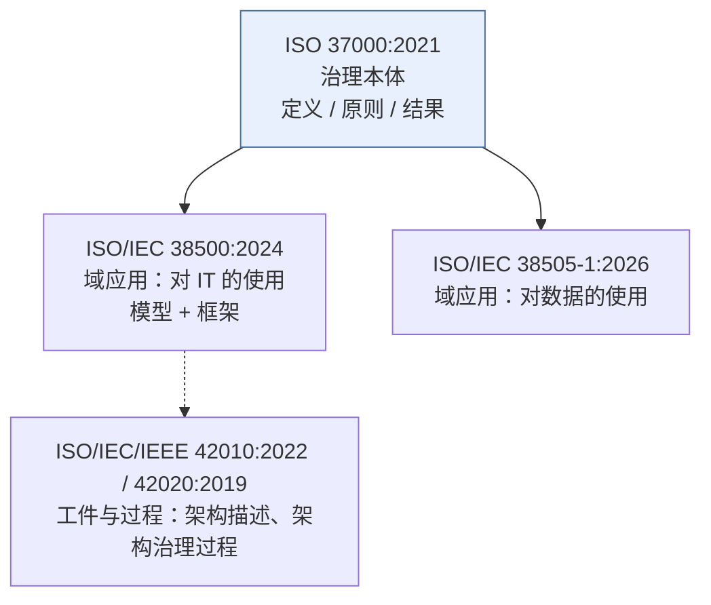
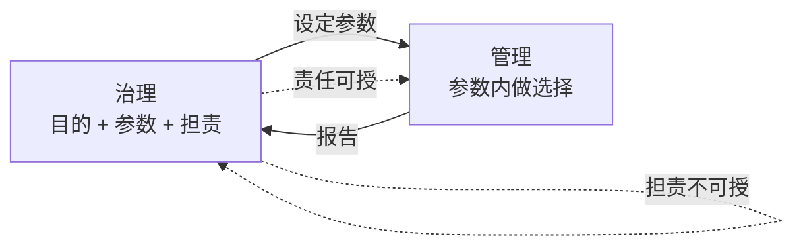
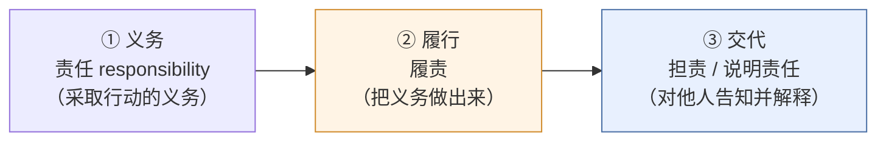
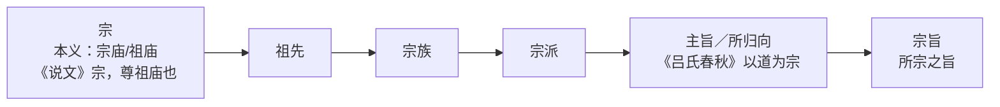
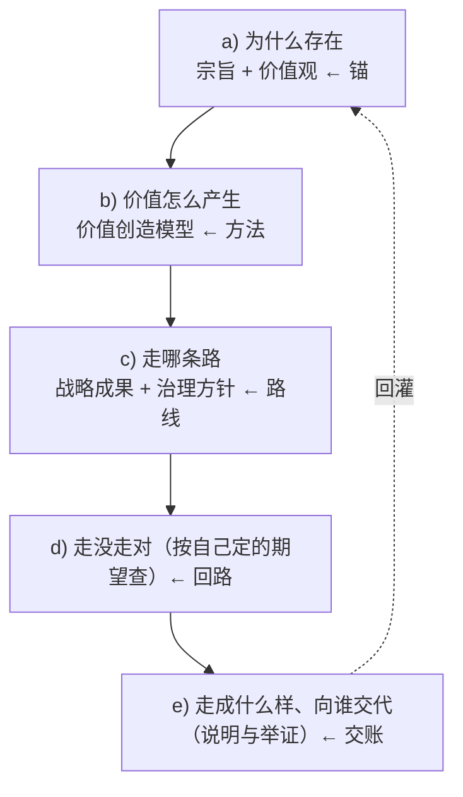
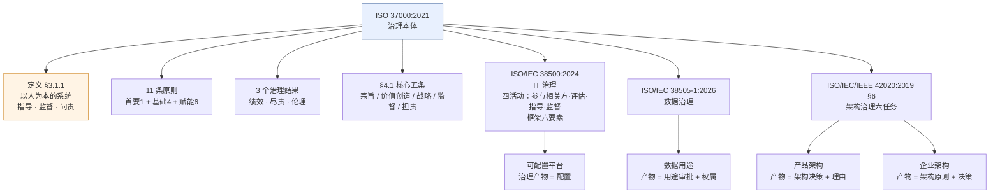
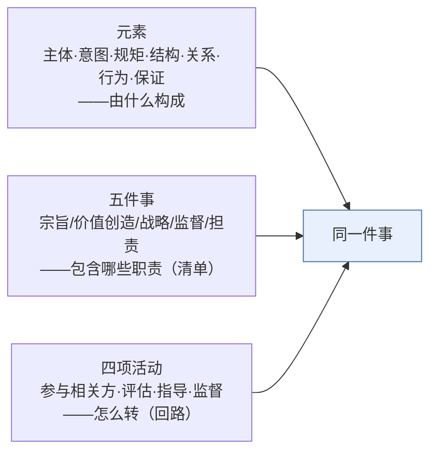

# 28 - 治理概念对话记录

> **日期**：2026-09-14
> **参与**：Mickey（用户）／阿布
> **体裁**：对话原样记录（不整理、不提炼、不重排）
> **起点**：以 **ISO 37000:2021 为权威**，参考 **ISO/IEC 38500:2024** 与 **ISO/IEC/IEEE 42010 最新版**，**不参考既有研究报告**，回答"治理这个概念如何理解"
> **夹注约定**：本轮对齐以「〔按：…〕」形式就地加注，原话一字不改。**2026-09-21 第二轮收口**：governing→管控原则、life cycle→生存周期、stakeholder→利益相关方。**2026-09-21 第三轮（依 29 号《架构治理研究报告》对齐架构治理口径）**：架构治理的定义／目的／对象／输入与输出／责任主体／机制一律以 29 号为准——责任主体是治理机构而非架构师；治理与管理按 29 号 §2.2 三条判据分界；42020 第 6 章 §6.4.1–6.4.6 统一作「六项任务」（「四活动」专指 ISO/IEC 38500 的执行模型）；架构治理不是 IT 治理在对象上的子集或域；架构治理在 ISO/IEC/IEEE 体系无正式术语定义。**本轮只加架构治理相关夹注，治理本体各轮不动。** **2026-09-21 第四轮（术语与判据措辞统一）**：治理三职能的第三成分按 **28 号 §2.3.3** 作「**担责**」（担责＝术语位与职能位、问责＝动词位、述责＝动作层；禁用履责／追责）；**判据族分工**——三条分界判据判「算不算治理」，与「跨出单管理层权限，就要治理介入」这条**介入门槛**（判该不该上治理）分开用，两者不可互换。**仍不加改原话、不重复加注。** **2026-09-21 第五轮（术语按 28 号统一）**：organizational purpose 作「**宗旨**」（不再用「运营目的」），accountability 第三成分作「**担责**」（术语位与职能位）——本记录治理本体各轮原话保留，仅头部约定与附录判据 10 的〔按〕同步。 **2026-09-21 第六轮（术语纠错）**：原夹注写「ISO 体系另有 `interested party` 一词、中文亦作"相关方"，与 `stakeholder` 不是同一个英文词」**失实**——stakeholder 是 ISO 9000 中 interested party 的**许用术语**（2015 §3.2.3／2026 §3.1.4 两版皆然）；按仓库《ISO 9000:2026 中英文对照版·译注 1》口径就地改正第 2 轮那条夹注，命名政策不变。**原话仍一字不改。**
> **文档版本**：v1.5（记录 2026-09-14；2026-09-21 第一轮加夹注，未改原话；2026-09-21 第二轮收口补口径夹注，仍未改原话；2026-09-21 第三轮依 29 号对齐架构治理口径补 5 处夹注，仍未改原话；2026-09-21 第四轮判据措辞统一——附录判据 10 加〔按〕；2026-09-21 第五轮术语按 28 号统一：宗旨／担责，仍未改原话；2026-09-21 第六轮术语纠错——改正第 2 轮的 interested party／stakeholder 夹注，仍未改原话）

> **记录说明**：本轮回复取自同一会话原文，逐轮录入；**实质内容、条款引证、表格、图与结论按原文保留**，仅略去纯过渡性的口语语句。原对话中的结构性表达统一以 **mermaid** 呈现（原文为表格与文字）。
> **取证说明**：ISO 标准原文付费，本轮所用来源为——ISO/TC 309 官方发布材料、ISO 37000:2021 官方预览页（NEN）、**GB/T 45948《组织治理 指南》征求意见稿**（ISO 37000:2021 修改采用，中文全文）、ISO/IEC 38500:2024 等同采用文本（含英文全文）、ISO/IEC/IEEE 42010:2022 官方预览页（NEN）、ISO/IEC/IEEE 42020:2019 目录（DIN）、ISO/IEC 38505-1:2026 官方条目与摘要（AFNOR）。凡引条款号与定义，均随文标注出处。
> **本轮的更正轨迹**（按原顺序保留，未做前置修正）：
> - 第 8 轮把"课责"说成"自带'被施加'、无需'被'字"；**第 10 轮更正**为"课责是主动的，'被'字仍需"。
> - 第 12 轮把"宗旨提上去"判为"语义被扩大"；**第 13 轮撤回**——宽读语义为真，真正的代价是"问责的宾语会悬空"。
> - 第 18 轮说"宗旨避开了与'目标'撞车"；**同轮内自认"说硬了"**（汉典把宗旨的近义词列为目标／目的／方针）。
> - 第 28 轮说"指导只是给方向"；**第 29 轮更正**为"定目的、分责任、立边界、设预期、要求信息回流"。
> - 第 33 轮给的是"框架演示"型示例；**第 34 轮承认那不是"事情怎么发生"**，第 35／39 轮改用时间线与三镜。
> **记录后变更**（本记录完成后由 Mickey 定，**不回填正文**，以维持记录的原样性）：
> - **`by which` 的译法：由"依此"改为"通过该系统"。** 依据：GB/T 45948 用的正是"**通过该系统**"（§3.1.1）／"通过这个系统"（§4.1）——**标准自己两处用词不同**；按"术语位跟官方译法"的判据应当采用。第 12／14／15 轮正文保留原"依此"。定稿见《28-治理概念研究报告》§2.2。
> - **"承担后果"回到定义句内。** 第 12 轮曾提出"移出定义句、落进注 2"；该建议在整理报告时**被撤回**（理由：只写"作出说明"，问责无牙——与 §4.2.2 授权条件 e 同一条道理）。第 15 轮定稿本就含"承担后果"，故正文无需改动。
> - **第 2 章新增「2.3 三职能各自的定义与解释」**——directed／overseen／held accountable 三者的**定义、实际内容与止境**（含"监督含 assurance""问责的五个先决条件""问责的产出是信任不是惩罚"）。原报告只在术语表里给了它们各一行，缺此节。
> - **第 2 章新增「2.8 宗旨与近邻」**——四层边界（宗旨／方针／目标／价值观）；**37000 与 ISO 9000:2026 的归属者对立**（治理机构 vs 最高管理者）；purpose 的中译现状（五处四个处理）。
> - **第 5 章术语表补漏**（原表漏收）：治理**角色族**（最高管理者／委员会／利益相关方族／人员）与**宗旨的近邻**（愿景／使命／战略／目标／原则）；**架构治理**（18 条）／**平台治理**／**数据治理**三个术语族；**accountability 候选族**（课责／说明责任／述责／当责）＋候选总览表。
> - **第 7 章新增「7.7 流程治理」**（见下方第 53 轮）。

---

## 第 1 轮

### Mickey

以 ISO 37000:2021 为权威，参考 38500:2024 和 42010 最新版本为参考，忽略已形成的研究报告，治理这个概念如何理解？

### 阿布

三份标准的原文都取到了（ISO 官方要付费，用的是 ISO/TC 309 官方材料 + NEN 官方预览页 + 各国等同采用稿，条款编号与定义可直接引用）。仓库里已有的研究报告没有读，全部从标准推导。

**先给结论：三份标准不在同一层**

| 标准 | 它回答的问题 | 层次 |
|---|---|---|
| **ISO 37000:2021** | 治理**是什么**——定义、原则、结果 | 本体层（权威） |
| **ISO/IEC 38500:2024** | 治理**在一个域里怎么展开**——模型与框架 | 域应用层（明说自己是 37000 的域） |
| **ISO/IEC/IEEE 42010:2022** | **不回答治理**——它提供治理所作用的工件与痕迹 | 工件层 |

把它们拉平来比较是误解的起点。

#### 一、ISO 37000:2021：治理的定义

原文 §3.1.1：

> **governance of organizations** — human-based system by which an organization is directed, overseen and held accountable for achieving its defined purpose

GB/T 45948（等同采用 ISO 37000）的中译：

> **组织治理**——一种以人为本的系统，通过该系统指导、监督和问责一个组织，以实现其既定目标。

这个定义只有一句话，但每个词都在承重：

1. **human-based system**——是"系统"，但落点在"人"。治理不是制度汇编，也不是 IT 系统，而是人的决策、行为与关系的系统。所以治理**不能外包给工具**——工具只能承载，不能担责。
2. **directed / overseen / held accountable**——指导、监督、担责三个动作。少了任一都不成立：只有"指导"（定战略）那是管理；只有"监督"（看合规）那是审计；必须有"问责"闭环才叫治理。
3. **for achieving its defined purpose**——治理只有一个目标函数：实现既定宗旨。治理不为自身存在，也不以"合规"为目的。
4. **organization** 泛指任何形态（含个体经营商、合伙企业、行政机构），所以治理不是大公司董事会专属。

配套的 **治理机构（governing body，3.3.4）** ＝ 对整个组织**最终担责**的个人或群体。它的注 1 极关键：**每个组织实体都有一个治理机构，无论是否明确成立**。即"没有董事会"不等于"没有治理"。注 3 还专门切开了它与 ISO 管理体系标准中"最高管理者"的区别（后者向治理机构报告并对其负责）。

> `★ Insight`
> - 定义把治理写成 "system by which…"，主语是系统、宾语是组织——这解释了为什么 37000 全篇的规范性主体始终是**治理机构**（用 "should"），而不是流程或文件。治理标准的写作对象是人，不是流程。
> - 37000 是 **Guidance**（指南）不是 Requirements——全文用 should，不用 shall。所以任何"治理框架图"都不可能从标准里直接抄出来，只能从它的原则与结果推导。这是读这份标准最容易踩的坑。

#### 二、治理与管理的区分（这是理解治理的钥匙）

37000 §4.2.3 原文：

> "治理"和"管理"是不同的、必要的、相辅相成的活动，它们相互作用、相互影响。治理包括在为组织设定的范围内负责组织实现其目标，而管理则是在这些范围内做出选择来实现相关目标。

38500:2024 §6.1 说得更直白：

> Governance involves **setting and being accountable for the purpose and parameters** for the organization. Management is about fulfilling the associated objectives by **making choices within the parameters** set by the governing body.

它的 3.7 又给管理的定义补了一刀：management = "fulfilment of the organization's objectives **within the authority and accountability established by governance**"。

一句概括：

> **治理 = 目的 + 参数 + 担责；管理 = 在参数内做选择。**

这条区分的外沿延伸出治理的全部机制张力：

- **责任可授，担责不可授。** 38500 §6.1：“对 IT 的有效、高效和可接受使用的担责仍归治理机构，**不可授权**。”37000 §4.2.2 同义：治理机构可以授权，但仍需对其授权的内容负责，并始终保持对整个组织的责任；授权要满足五个条件（预期结果经协商一致、资源可用、权力与责任层级匹配、定期报告并出示证据、违约后果可执行）。
- **同一人可兼两角色，但必须能分清此刻在履行哪个。** 37000 §4.2.3 与 38500 §6.1 都点了这一条（治理机构的执行成员）。

> `★ Insight`
> - 治理与管理的边界是"参数"，而参数在标准里有明确载体：37000 叫 **governance policy（治理方针，3.2.9）**——"组织治理机构正式表达的意图和方向"。38500 把这一层展开成六要素之一的 Policy。
> - 由此可推：**凡是"在参数内选最优"的问题，都不是治理问题**，交给管理；**凡是"参数该定成什么、由谁定、定错了谁担责"的问题，才是治理问题**。这条判据比"高层/低层"这类划分可靠得多。

#### 三、治理的内容：11 条原则的三个层级

ISO/TC 309 官方材料与 37000 表 1 一致，分三组：

| 类别 | 分类说明（标准原意） | 原则 |
|---|---|---|
| **首要的（1 条）** | 追求目标是所有组织的中心。**其他所有原则都宜在本原则的背景下理解** | 6.1 宗旨 Purpose |
| **基础的（4 条）** | 有效治理能力的核心：确定创造价值的方法／指导和参与战略／监督按期望执行／对绩效行为决策活动担责 | 6.2 价值创造 · 6.3 战略 · 6.4 监督 · 6.5 担责 |
| **赋能的（6 条）** | 强调当前组织的治理责任，以应对不断变化的利益相关方期望与自然、社会、经济环境 | 6.6 利益相关方参与 · 6.7 领导力 · 6.8 数据和决策 · 6.9 风险治理 · 6.10 社会责任 · 6.11 长期生存能力和绩效 |

1. **宗旨是唯一的"首要"**，其余 10 条都在宗旨的语境下读。这使治理有了唯一锚点——不是为了合规、不是为了效率、不是为了股东回报，而是为了宗旨。
2. **基础四条就是治理的主干**，与 37000 §4.1 列出的治理核心五条基本对应。
3. **全部原则都应适用，并同时适用**（表 1 末句）。治理不是打勾清单。

#### 四、治理结果：三个判据

37000 引言与 §5 反复给出同一组：

> ——**有效的绩效** effective performance
> ——**尽责的管理** responsible stewardship
> ——**合乎道德的行为** ethical behaviour

§5 还给了每一条的展开判据。这一点在概念上很重要：**标准给出的评价对象是"结果"，不是"过程"或"机构形态"。** 所以"有没有董事会""有没有制度文件"都不能作为治理好坏的判据——只有这三个结果可以。38500:2024 把这三个结果原封不动搬进了自己的 §4.1。

#### 五、38500:2024 的贡献：治理的解剖结构

38500 第三版（2024-02）。它有两个决定性特征：

**第一，它只有一个规范性引用文件：ISO 37000。** §5.1 原文说明——“由于 IT 治理是组织治理的一个域，其‘原则’声明（表 2、5.2～5.12）即 ISO 37000:2021 第 6 章的原则；表 2 的分类与分组取自 ISO 37000:2021 表 1。”也就是说 **38500 不创造治理原则**，它为 37000 的 11 条原则逐条补两件事：**"对 IT 使用的治理含义"** 与 **"结果"**。

**第二，它给出治理的解剖结构——三个工具（原则／模型／框架）。**

**模型（§6，图 1）** 三层嵌套：

- **三角形 = 治理实践，四个主任务**：`engage stakeholders`、`evaluate`、`direct`、`monitor`
  ——注意这比 2015 版的 EDM（evaluate/direct/monitor）**多了"利益相关方参与"**，而且标准明确强调"治理实践贯穿整个组织"。
- **矩形 = 管理实践**
- **圆圈 = 治理框架**，整个组织在框内运行

**框架（§7，图 2）六要素**：

> **Direction 方向 · Capability 能力 · Policy 方针 · Delegation 授权 · Performance 绩效 · Accountability 担责**

一个值得单独拎出的细节：38500 §7.2.4 说 IT 正变得越来越 **policy-driven**——政策直接驱动、配置、管理并报告数字能力。这是治理从"人读的方针"走向"机器执行的参数"的趋势陈述。

#### 六、42010:2022 的位置：不定义治理，提供治理的对象与痕迹

42010:2022 是第二版（2022-11，替代 2011 版）。它的范围（§1）明确画了边界：规定 AD、ADF、ADL、架构视点和模型种类的**结构与表达要求**及一致性要求；**不**规定创建、使用、管理 AD 的过程、方法、技术与工具。〔按：viewpoint 的标准定名为「架构视角」（GB/T 45630—2025；30 号 §2.5），下文"架构视点"读作同义。〕

三条实质接触点：

1. **它定义了治理所作用的对象词汇**：stakeholder、concern、stakeholder perspective、aspect、architecture viewpoint、view、view component、model kind、AD element、correspondence。〔按：上列各词的中文定名以 30 号 §2.5 为准——stakeholder 利益相关方／concern 关注点／stakeholder perspective 利益相关方角度（不译"视角"，"视角"已由 architecture viewpoint 的定名"架构视角"占用）／aspect 方面体／architecture viewpoint 架构视角／view 架构视图（组成架构描述的一部分的信息部件）／view component 视图组件／model kind 模型种类／AD element 架构描述元素／correspondence 对应关系。〕
2. **它要求记录架构决策与理由（§6.10 decision recording / rationale recording）**——治理的问责链要成立，必须有"谁基于什么理由决定了什么"的记录。〔按：本条原话作「架构决策与理由」，现行定名为**架构决策与理据**（30 号 §8.2）；原话保留。〕
3. **它要求记录对应关系与一致性（§6.9）**——治理最常见的失效不是"没决策"，而是"多处描述互相矛盾、没有单一可信来源"。

**必须避开的一个误读**：42010 把 architecture 定义为 "fundamental concepts or properties of an entity ... and **governing principles** for the realization and evolution of this entity"。这里的 governing 是"**统摄/支配性的**"，**不是 governance 意义上的治理**。同词不同义。〔按：此处 governing 是**定语**；**2026-09-21 第二轮收口**后一律取国标定名「**管控原则**」（指组织/公司治理原则处的「治理原则」不变）——"统摄／支配性"是当时的行文说法，不是定名。与之相对，governs 作**动词**指概念模型里"架构视角—架构视图"之间的关系（无裁量者，违反即"不符合、视图不成立"），作关系名译「治理」，与 architecture governance（组织治理职能，有裁量者，违反走例外／豁免）不是同一用法，见 30 号 §3.7；**定语位「管控原则」与动词位「治理」是分工，不是冲突**。〕

**家族分工**：

| 标准 | 管什么 |
|---|---|
| **42010:2022**（现行，第二版） | 架构**描述**工件 |
| **42020:2019** | 架构**过程**——§6 是完整的 **Architecture Governance process**（六项任务）；**正在修订**（已立项为 ISO/IEC/IEEE AWI 42020） |
| **42030** | 架构**评价** |

#### 七、整合：一个可操作的"四问"理解框架

1. **为谁、为什么？** → 宗旨 + 组织价值观 → *治理的锚*（37000 §6.1）
2. **谁向谁担责？** → 治理机构 → 成员利益相关方；治理小组贯穿组织 → *治理的骨架*（37000 §3.3、§4.2.2）
3. **凭什么做判断？** → 数据和决策 + 风险治理 + 架构描述与决策理由 → *治理的证据面*（37000 §6.8/6.9，42010 §6.10）
4. **边界画在哪？** → 治理方针表达的意图与期望 + 授权的条件 + 监督的范围 → *治理的接口面*（37000 §6.3.3.1.2、§4.2.2，38500 六要素）

一句话收束：

> **治理就是以宗旨为中心的一套人本系统，通过"指导—监督—担责"这条不可断的链条，用方针与授权划出参数，用可追溯的决策与理由证明自己配得上信任。**

它既不是"高层管理"，也不是"合规控制"，更不是"制度文件齐全"——这三者都是治理的常见替身，也都不是治理。

#### 八、取术语时的三个提醒

- **governance ≠ management**：中文取"治理／管理"。
- **governing body = 治理机构**（不是"董事会"——董事会只是其形态之一；也不是 ISO 管理体系标准的"最高管理者"）。
- **governance outcomes = 治理结果**（三个：有效绩效／尽责管理／合乎道德的行为）。

---

## 第 2 轮

### Mickey

这里的 held accountable 怎么翻译为中文，担责 or 问责，还是其他？

### 阿布

查完了，证据很清楚：**这不是二选一的问题，GB/T 45948 自己就是按语法位置分开用的**——问责全篇只出现 **1 次**（就在定义句里），担责出现 **23 次**（术语条、原则名、小节名、行文）。

**一、两个词的语法位置不同，不能互换**

| 位置 | 英文原形 | 词性 | 中文需要 |
|---|---|---|---|
| ISO 37000 §3.1.1 | directed, overseen and **held accountable** | 被动语态的**动词短语**，受动者同为"组织" | **动词** |
| ISO 37000 §3.2.2 / §6.5 | **accountability** | **名词**（一种义务／状态） | **名词** |

"担责"放到动词位直接不成句——"通过该系统指导、监督和**担责**一个组织"是病句。这就是 GB/T 在定义句选"问责"的唯一原因，不是偏好。

**二、更要紧的是：两个词的语义方向是相反的**

- **问责**：主体是**要账的人**（治理机构、相关方、监管者），方向由外向内——追问、要求交代。
- **担责**：主体是**被问责的人**，方向由内向外——接受并扛起。

> 〔按：**2026-09-21 第二轮收口口径**——governing principles→「**管控原则**」（指组织/公司治理原则处的「治理原则」保持不变；governs 作动词（视角—视图关系名）仍译「治理」，两者是定语位／动词位的**分工**）；life cycle→「**生存周期**」（BPM 生命周期等专名除外）；stakeholder→「**利益相关方**」（含"相关方参与"→"利益相关方参与"）。**下文"相关方"为记录当时的用词，一律读作「利益相关方」**。ISO 9000 的优先术语是 interested party，stakeholder 是其**许用术语**（2015 §3.2.3 索引标 admitted term；2026 §3.1.4 两词平列同行），GB/T 19000 译「相关方」；ISO/IEC/IEEE 15288（GB/T 22032）与 42010（GB/T 45630）的优先术语是 stakeholder，译「利益相关方」。**英文同词、中文分译两名**——实据在两处定义不同（9000 取「能影响／受影响／自认受影响」，15288 取「拥有权利、份额、主张或利益」），**理由在定义上，不在英文词上**。〕

而 ISO 37000 §3.2.2 给 accountability 的定义是：

> 对他人履行责任的义务。
> 注 1：义务包括**告知和解释**履行责任的方式。
> 注 2：不履行责任的后果可由责任方承担。

**定义的核心是"说明"（answer for），不是"承担"，更不是"追究"。**

- **担责** 抓到了注 2，**丢了注 1**——只写"担责"二字，读者拿到的是"承担责任"，离 responsibility 只有半步。
- **问责** 抓到了"要其说明"，但做名词时读起来像"追究行为"，且主客颠倒。
- 真正贴定义的是 **"说明责任／答责"**（港台文献作"課責"）。

> `★ Insight`
> - accountability 是个**三元关系词**：谁 向谁 就什么 作出说明。中文"担责"只留了两个位（谁、就什么），"向谁"被吃掉了；"问责"则反过来强调了"向谁"却弱化了"就什么"。所以**单独一个中文词都装不下它**。
> - GB/T 之所以给 3.2.2 选"担责"而不选"责任"，看重的正是**字形上与"责任"分得开**——这是它最大的功绩。它的代价是把 answerability 换成了 bearing。

**三、推荐口径（按位置定，跟 GB/T）**

| 场景 | 建议译法 |
|---|---|
| ISO 37000 §3.1.1 定义句 | **指导、监督和问责**（照 GB/T） |
| ISO 37000 §3.2.2 术语条 | **担责**（照 GB/T）＋**定义必须写全** |
| ISO 37000 §6.5 原则名 | **担责** |
| ISO/IEC 38500 §3.3 定义句 | **指导、监督和担责** ← 见下，这里与 37000 不同 |
| "hold management to account" | **责令管理层作出说明／向管理层问责** |

**38500 §3.3 要特别留意**，它的英文是：

> governance — human-based system comprising **directing, overseeing and accountability**

第三位是**名词**（英文自己也在动名词后滑到了名词），不是 37000 的被动动词 held accountable。所以 38500 这句应译"由指导、监督和**担责**构成的系统"。

**四、三个陷阱**

1. **不要用"负责"译 accountability。** 中文"负责"两头都占，一用就塌。
2. **不要用"追责"。** 那是事后的惩罚动作；ISO 的 accountability 首先是**常态的说明义务**。
3. **不要只写"担责"而不写对象。** accountability 是三元关系。

**五、看两条 GB/T 自己的失手（引用时要小心）**

- 引言：英文 *"Their governing bodies will **hold management to account**…"* → 中译"他们的治理机构将**通过管理层来负责**并确保……"——**主宾颠倒**。
- §6.5.1／§6.5.2：英文 *"**Accountability** is a key aspect of governance…"* → 中译作"**责任**是治理的一个关键方面"。**在定义"担责"原则的这一节里，accountability 反倒被译成了"责任"**。

（这是 GB/T 45948-2025 的征求意见稿，正式版可能已修订。）

**六、如果必须全篇用一个词**

**选"问责"。** "问责"可动词、可名词化；"担责"作动词位不成句。代价是丢掉了它与 responsibility 的字形区分——那就靠**首次出现时括注英文 + 定义句写全**来补。

**七、顺带一处要提醒你自己的文档**

[08-治理概念研究报告](08-治理概念研究报告-从词源到翻译史.md) 的现行口径是"治理定义＝基于人类的系统，包括指导、监督、**问责**（的职能）（§3.3）"。它引的是 **38500 §3.3**，而那一句的第三位是**名词** accountability。用"问责"是把 37000 定义句的动词位译法搬到了 38500 的名词位上；后面加"（的职能）"这个括注，正是察觉到了词性不平之后的补丁。更干净的处理是二选一：要么直接写"由指导、监督和**担责**构成的系统"，要么写成"指导、监督与**问责**三职能"并全篇统一。按"权威文档只提建议不落笔"的规矩，没有动它。

---

## 第 3 轮

### Mickey

用说明责任呢？

### 阿布

> `★ Insight`（先说一个前提）
> **中文里没有一个天然能与"责任"切开的 accountability 单词。** 日语也没有——所以日语只好造了复合词「説明責任」。这意味着 responsibility / accountability 的区分**不能靠词形去承载，只能靠定义句和首次括注去承载**。想清楚这一点，选词的标准就从"哪个词更不一样"变成了"哪个词更贴定义"。

**结论：说明责任是四个候选里对定义最忠实的一个，可以用——但要用对位置。**

**一、它为什么忠实**

ISO 37000 §3.2.2 的注释就是判据：

> 担责（accountability）：对他人履行责任的义务。
> **注 1：义务包括告知和解释履行责任的方式。**
> 注 2：不履行责任的后果可由责任方承担。

**定义的内核是注 1（告知与解释）＝"说明"。** 注 2（后果承担）是次要的、派生的。

- **担责** 取的是注 2，"担"字对上了后果，**"说明"整个丢了**。
- **说明责任** 取的是注 1，**正中定义本体**。

另两条支持：

1. **有成熟的跨语言先例，不是生造。** 日语里 accountability 的标准译法就是「説明責任」，有独立条目。
2. **与治理的机制链天然咬合。** 37000 §6.5.3.2"展示担责"整节讲的**全是报告与披露**。

**二、两个硬约束**

**约束 1：它只有名词位。** 37000 §3.1.1 是**动词位**——"通过该系统指导、监督和**说明责任**一个组织"不成句。要用它，必须改写句子：

> 一种以人为本的系统——组织依此**受到指导、接受监督，并就其既定宗旨的实现作出说明**。

代价是与国标通行译法分道。

**约束 2：词头仍是"责任"。** "说明责任"在字形上是"责任"的修饰复合，而 ISO 把 responsibility 与 accountability **作为两个并列义务**，不是种属。塌陷风险只是被压低了，没有清零。

**三、有一项成本必须算**

**GB/T 45948-2025 采纳的是"担责"。** 术语条首次出现写一次即可：

> **说明责任（accountability；GB/T 45948 译作"担责"）**

**四、落到文档上的口径**

| 位置 | 建议 |
|---|---|
| **术语条 §3.2.2** | **说明责任** |
| **§3.1.1 定义句**（动词位） | 不想动句结构 → 用"问责"；愿意动 → 用被动式 |
| **§6.5 原则名 / 38500 §3.3**（名词位） | 都可用"说明责任"；要与二字并列整齐则用"担责"，**但术语条保持一致** |
| **行文简称** | 允许用"问责"作动词简称——**术语与行文简称分工** |

**五、顺带排掉一个会撞上的词：当责**

企业培训界流通的"当责"抓的是"主动认领、当起责任"，是一种**对内的姿态**，恰好丢掉了 ISO 定义里"**对他人**"这一整半。**做 ISO 语境的术语不合格；做教材里"职业心态"那一章可以用，但必须与术语条分开。**

---

## 第 4 轮

### Mickey

那履责呢？

### 阿布

**判决：不行。履责正好是链条的中间那一环，不是 accountability。**

看 GB/T 自己给出的两个定义，链条是三段：

| 段 | 术语 | 定义（GB/T） |
|---|---|---|
| ① 义务 | 责任 responsibility（3.2.3） | **采取行动和做出决定**以实现所需结果的义务 |
| ② 履行 | —— | 就是**履责**：把①那个义务做出来 |
| ③ 交代 | 担责 accountability（3.2.2） | **对他人**履行责任的义务，**注 1：义务包括告知和解释** |

**"履行责任"是 accountability 的宾语，不是 accountability 本身。**

**三道检验，履责全不过**

1. **语法**：履责是不及物动词（X 履责）。"通过该系统指导、监督和**履责**一个组织"不成句。
2. **对象**：履责是**自指**的——我履行我的职责，不需要别人在场。而 accountability 定义里"**对他人**"是骨架的一半。
3. **后果**：注 2 在履责里无迹可寻——履责只讲做，不讲做砸了怎么交代。

> `★ Insight`
> 中文官方话语里**本来就有这对分界**：**述职**是"说我做了什么事"，**述责**是"就责任的履行向组织作出说明"——后者正是党内监督的"述责述廉"制度。
> 也就是说，**履责（做）／述责（说）在中文里已经是一对**。拿"履责"译 accountability，恰好是把中文本来掰开的两件事又粘回去。

**但"履责"本身是个好词，只是位置不在这儿**：凡是原文是 **fulfilment / performance of responsibility** 的地方，交给它（§4.3.2"履行其职责"、§4.2.2"不**履行**责任的后果"、§6.5.3.2"**履行**责任的情况"）。

**四个候选的最终定位**

| 候选 | 对应链条哪一段 | 抓到什么 | 丢掉什么 | 定位 |
|---|---|---|---|---|
| **履责** | ②履行 | 做事本身 | 对他人、后果、说明——**全丢** | ✗ |
| **担责** | ③交代 | 注 2 ＋字形与"责任"分得开 | 注 1（告知与解释） | △ |
| **问责** | ③交代 | "向谁"——关系维度最完整 | "说明"被弱化成"追究" | ○ |
| **说明责任** | ③交代 | **注 1（内核）**；日语有先例 | 只有名词位 | ◎ |

一句话收束：**②履责是"做"，③accountability 是"说"——你要译的是那个"说"。**

---

## 第 5 轮

### Mickey

那你解释下治理中 held accountable（问责）到底是什么意思

### 阿布

我把它拆成七层来答。

**一句话**

> **held accountable = 有一个外部主体，有权要求你就"宗旨的实现"这道命题持续地告知、解释、举证，并在你答不上来时施加后果——而这个状态不因你把事情授权出去而消失。**

**一、先把三个部件拆开：held / able / account**

- **account（词根）＝账。** 不是"错"，是**可被查的账**。
- **-able ＝ 可被……的。** 所以 accountable 是一种**状态**，不是一个行为、更不是一种美德。
- **held ＝ 被动，且有人持有。** 有人**抓着你**要账。

**accountability 不是你的品格，是你的处境。**

**"held" 这一半是中文最容易丢的**——"担责""履责"都丢在这里。看 §3.1.1 的语法：主语是 governance system，宾语是 organization——**治理系统使组织处于被问责的状态**。

谁来持有？

| 谁 | 向谁交账 | 依据 |
|---|---|---|
| 管理层 | 治理机构 | 37000 引言 "hold management to account" |
| 治理机构 | 授权给它的人（成员相关方、参考相关方） | §6.5.1 "并对其授权的人负责" |
| 组织本身 | 社会、监管者、相关方 | 引言 "afford stakeholders the opportunity to hold organizations to account" |

**二、交的是什么账？——只有一道命题：宗旨的实现**

定义句的尾巴是 **for achieving its defined purpose**。不是"有没有违规"，是"**组织有没有达成它存在的理由**"。

§6.5.3.2 把这个"账"的具体形式列成了八项（宗旨／价值观／价值创造模型／战略／治理方针；治理机构的决策、行动、绩效与改进、**履行责任的情况，包括不履行责任的后果**；组织的表现、绩效实现方式、环境影响、施加影响的人、组织文化；合规义务；信息完整性；透明；**解释和证明**组织的作为、不作为、渎职、风险和依赖性；历史行动与结果、未来意图）。

**三、它的功能：让授权可逆、让控制不断线**

> 治理机构可以授权他人，但仍对整个组织的作为、不作为和渎职负责。（37000 §6.5.2）
> 对 IT 的有效、高效和可接受使用的担责仍归治理机构，**不可授权**。（38500 §6.1）

所以 **held accountable 是"授权"这个动作的对偶**。

**四、它是三条腿里的哪一条**

| 动词 | 动作 | 时间朝向 |
|---|---|---|
| **directed 指导** | 定方向、定规矩 | 面向未来 |
| **overseen 监督** | 查执行是否符合期望 | 面向当下 |
| **held accountable 问责** | 对结果作说明并承担 | 面向过去，并回灌未来 |

三种残缺形态：只指导不问责 → 战略变口号；只问责不指导 → 秋后算账；只监督不问责 → 报告进抽屉。

而它的产出是反直觉的：**不是惩罚，是信任与合法性**（§6.5.2 原话："因为它会产生信任和合法性，从而提高组织绩效"）。

**五、落成可检查的条件：问责的五个先决条件（§4.2.2）**

| 先决条件 | 不成立时变成什么 |
|---|---|
| a) 预期结果经协商、明确、达成一致 | **事后加罪** |
| b) 所需资源可使用 | 有责无资源 |
| c) 权力与责任层级匹配（含自主权） | **有责无权** |
| d) 定期报告产出、结果、过程，并**举证** | 只看结果，不看依据 |
| e) 不履行或不守界限的后果可执行 | **无牙之问责** |

并配一条禁令："**任何人都不宜为他们无权处理的事项负责，也不宜为他们没有提出或商定期望的事项负责。**"

**六、还有一层：被问责（held）与展示担责（demonstrate）是一对**

- **held accountable —— 被动处境。** §3.1.1 定义里的那一个。
- **demonstrate accountability —— 主动供给。** §6.5.3.2"为了展现担责…"；38500 §7.2.7。

标准要的是**"可被强制追问"的处境 + "主动把账摆出来"的作为**。

**七、五个必须排掉的误解**

1. **问责 ≠ 追责惩罚。** 把问责做成追责，第一后果是**信息消失**（坏消息不上报）。
2. **问责 ≠ 出事找人。** 它是常态在线的义务。
3. **问责 ≠ 认错道歉。** 核心动作是"把账摆出来"（告知＋解释＋举证）。
4. **问责 ≠ 汇报工作。** 差别是**对方有权就你的说明继续追问、要你举证**。**"可被追问"就是这条分界线。**
5. **问责 ≠ 只问下级。** 治理机构本身是最被问责的那一个（§6.5.1）。

**八、对架构与平台设计的落点**

- **账的载体是决策记录。** 42010:2022 §6.10 要求记录 architecture decisions 与 rationale。
- **38500 §7.2.7 把"展示担责"的机制写成三句话**：方针反映相关方期望 → 方针被理解并被遵守 → 合规情况被适当报告或披露。
- 同一节末尾点了一个趋势：AI 系统能自适应，"**什么可以自动化、什么必须人工审计**"将是审计师与治理机构的长期挑战。

**收束**

> **问责 = 有一张永远不撤的桌子，你要就"组织有没有达成它存在的理由"这道命题持续地摆账、解释、举证；而这张桌子不会因为你把事情交出去了就搬走。**

---

## 第 6 轮

### Mickey

那应该是说责，而非问责呢

### 阿布

你这一刀切得准——但切口在**主语**上，不在"说"还是"问"上。

**一、你直觉对的那一半**

ISO 37000 §3.2.2 把 accountability 定义成："**对他人**履行责任的**义务**。"注意它的主语是**被问责的一方**（义务的承担者），不是要账的一方。而"问责"的主语恰恰是要账的人——**词的主语站错了边**。

所以你的判断成立：**术语条这个位置，不该用"问责"。**

**二、但"述责"站的位置再低一格**

"述责"的语义是**就责任的履行作出陈述**——这是一个**动作**。而 §3.2.2 定义的 accountability 是一个**义务／状态**。用"述责"当术语，等于用"做"去顶"是"——**和"履责"犯的是同一类错误**。

| 英文 | 词性 | 中文 |
|---|---|---|
| accountability | 状态／义务 | 说明责任 |
| to account / accounting | 动作 | **述责** |
| fulfilment of responsibility | 动作 | 履责 |

**三、那个"述责"该去的位置，标准自己已经留好了**

37000 §6.5.3.2 的标题是**「展示担责」**——**"展示"就是动作**，而这一节的内容全是报告与披露。**这正是"述责"。** 你的词是对的，只是它的家在 §6.5.3.2，不在 §3.2.2。

> `★ Insight`
> 一个可以一次解决全部分歧的规则：**看该句的主语是谁。**
> - 主语是**治理系统／治理机构** → 用**问责**。§3.1.1 定义句就是这一类。
> - 主语是**义务承担者** → 用**说明责任**。§3.2.2 术语条是这一类。
> - 主语是**承担者的动作** → 用**述责**。§6.5.3.2 是这一类。
>
> 三个词不是互相竞争的同义词，是**同一条链上三个不同语法位置**的词。

**四、"述责"的真长处与真代价**

**长处**：**它自带"向谁"。**"向董事会述责"是自然句——答者当主语、持有者当"向"的宾语，语法结构与 ISO 的"**对他人**履行责任的义务"严丝合缝。担责和履责都是自指的，丢掉了"对他人"这一半。

**代价**：语域。**述职**在企业和党政都通用，但**述责**的联想主要在纪检。

**五、三槽落定**

| 位置 | 主语 | 用词 |
|---|---|---|
| §3.1.1 治理定义句 | 治理系统 | **指导、监督和问责** |
| §3.2.2 术语条 / §6.5 原则名 | 义务承担者 | **说明责任** |
| §6.5.3.2 展示担责 | 承担者的动作 | **述责**（行文）／**展示担责**（标题） |

---

## 第 7 轮

### Mickey

述责与担责？

### 阿布

**一句话：它俩不是同义词，是链上相邻的两个动作——述责是"说"，担责是"扛"**，而 ISO 给 accountability 的两条注，正好一人一半。

| | **述责** | **担责** |
|---|---|---|
| 动作 | 就责任的履行作出陈述（**说**） | 把责任／后果接过来（**扛**） |
| 对上标准的 | **注 1**：义务包括**告知和解释** ✓ | **注 2**：不履行责任的**后果**由责任方承担 ✓ |
| 主语站边 | 答账侧 ✓ | 答账侧 ✓ |
| 能否自带"向谁" | ✓ **向董事会述责**——它独有的长处 | ✗ 自指 |
| 词性 | **明显是动作** | 动作，但可名物化 |
| 语域 | 偏纪检 | 中性 |
| 国标先例 | ✗ | ✓ GB/T 45948 就是它 |

**判决：术语条从这俩里挑，选担责。** 三个理由：① 有国标背书；② 语域中性；③ 覆盖更宽。**但有一个必须做的条件**：担责丢的是注 1，所以定义里必须把"说明"补回去：

> **担责（accountability）：对他人说明并解释责任履行情况的义务；不履行时，后果由责任方承担。**

**"述责"输在哪**（含义上它其实更准）：① 撑不起一个术语条目（术语要的是"属性／状态"）；② 它是单向报告，读起来像"汇报"，而问责的要害是**可被追问**；③ 语域。

> `★ Insight`
> 但这两个词并置起来，价值就出来了——**它们两个恰好合起来等于 accountability 的两条注**：
> - **述责 = 注 1**：把账摆出来
> - **担责 = 注 2**：账不对就把后果接住
>
> 教学句：**问责要求的是两件事——先说清账（述责），再扛住后果（担责）。只有后者，是罚；只有前者，是汇报；两个都有，才叫担责。**

---

## 第 8 轮

### Mickey

不是二选一。（我的意思是把 held accountable 翻译成述责与担责）

### 阿布

对，不是二选一——但也不是**并列**。卡点在这儿：

**英文的结构是"held + accountable"，是主从，不是"held 与 accountable"**

> **held**（修饰）＋ **accountable**（中心词）

`held` 是给 `accountable` 加被动标记的，它**不是与它并列的第二个动作**。所以中文不该译成"述责**与**担责"（两个动作并列），而该译成**两段**：一段（外部的力）＝被要求；二段（答账者要做的事）＝说明并承担。

你的"述责与担责"把**两段都写在了答账者一侧**，所以两件事都在、`held` 不在——不是选漏了，是**没给 `held` 留位置**。

**补法：前面加一段，你的两个词就全用上了**

> **一种以人为本的系统——组织依此受到指导、接受监督，并被要求述责与担责，以实现其既定宗旨。**

| 英文 | 中文 |
|---|---|
| directed | 受到指导 |
| overseen | 接受监督 |
| **held** | **被要求** |
| accountable | **述责与担责** ← 你的两分，正好对应注 1＋注 2 |
| for achieving its defined purpose | 以实现其既定宗旨 |

> `★ Insight`
> 这一句是**四件东西装三个槽**，所以必然不齐：前两槽各二字，第三槽要装"被要求＋说明＋承担"三样。
> 但**这个不齐在原句里本来就有**——英文第三项拖着 "for achieving its defined purpose" 这个长尾。所以中文把第三槽写长，是**忠实**，不是失衡。

**如果你就是想要一个词**：唯一自带"被施加"的中文词是**课责**（課責，港台对 accountability 的定格译法——"课"就是施加于人）。

**收束**：`held accountable` 是**三件东西**（被要求 · 说明 · 承担），中文**没有能同时装下三件的词**，所以：要**完整** → "被要求述责与担责"；要**一个词** → 课责；要**二字且对齐** → 问责（丢说明）或担责（丢 held）。**没有第四条。**

---

## 第 9 轮

### Mickey

翻译成"被要求说明并承担责任"？

### 阿布

**对了。这是目前最好的完整译法——结构站住了。** 只剩一处要改。

**一、你这一改做了两件事**

1. **补回了 `held`**（被要求）——前几轮一直缺的那一半。
2. **把"述责"换成了"说明"**——这是升级：语域中性（不带纪检味），而且直接对上标准自己的措辞（§3.2.2 注 1 的"**告知和解释**"）。

三个成分齐了：**被要求**（held）＋**说明**（account）＋**承担**（-able）。

**二、一处必须改：承担责任 → 承担后果**

"承担责任"里的**"责任"正是 ISO 里另一个术语 responsibility（3.2.3）的译词**。用它去译 accountability，等于在定义 accountability 的那句话里，把两个术语撞在一起。换成**"后果"**，而且这是**标准自己用的词**：§3.2.2 注 2 原文就是"不履行责任的**后果**可由责任方承担"。

> **held accountable → 被要求作出说明、承担后果**

（另："说明"改"作出说明"更正式。）

**三、代价：它从"词"变成了"短语"**

所以 §3.1.1 那一句得调结构：

> **一种以人为本的系统——组织依此受到指导、接受监督，就其所定宗旨的实现被要求作出说明、承担后果。**

**四、分层：这个短语用在哪儿**

| 位置 | 写法 |
|---|---|
| §3.1.1 定义句 | **被要求作出说明、承担后果** |
| §3.2.2 术语条 | 术语头仍是**担责**；定义写全："**被要求**就责任的履行**作出说明并解释**，不履行时**后果**由责任方**承担**" |
| §6.5.3.2 展示担责 | 行文可用**述责** |

---

## 第 10 轮

### Mickey

课责，什么意思？

### 阿布

核实完了。**上一轮对它的说明有一处说错了，先更正再讲。**

**一、词义**

**古义：考课督责。** 汉典释为"**考核监督并要求负责**"，书证是唐·刘知幾《史通·忤时》"每汲汲于劝诱，勤勤于**课责**"，陆贽《奉天论前所答奏未施行状》"亦宣谕德令，**课责**侍臣"。

拆开看两个语素：

- **课** ＝ 考课、督课（考核、督促、施加）
- **责** ＝ 督责（要求负责）

所以它的方向是**上级对下级、持有者对答账者**——而且不是一个一次性动作，是"**勤勤于**课责"这种**持续的、常设的**督责。

**今义（台湾学术定格）：accountability 的通行译词。** 在台湾公共行政／公共治理领域，"課責"就是专给 accountability 用的，并且**与"責任"（responsibility）成对区分使用**——有文献引 Hughes 的界定："課責（accountability）和責任（responsibility）是不盡相同，課責係指在組織中，某人因為其決策或行動而**接受責難或獎勵**。"

**二、更正我上一轮说错的那句**

我说它"把 held 含在字形里，所以'被课责'不需要再加被动标记"——**错了**。

课责是**主动**的（施加、督责），方向与"问责"同侧。"**被**課責"的"被"字仍然要。它自带的是"**施加／督**"这个动作，不是被动语态。

> `★ Insight`
> 更正之后，它的价值反而更清楚了：**课责考的是"课"字**——它同时含"**考**（考核）+ **督**（督促）+ **责**（要求负责）"三层。
> 而 §3.1.1 里的 `held` 要的正是一个**持续的持有与督责**，不是"问一次"。这就是它比"问责"更贴的地方：**问责像一次事件，课责像一个常设状态。**

**三、它对我们这道题的意义**

| 位置 | 课责能不能用 |
|---|---|
| §3.1.1 定义句（主语＝治理系统） | **能，而且好用。** 有唐例"课责侍臣"，所以"**指导、监督和课责一个组织**"成立——三动词同侧、同为二字，节奏还齐 |
| §3.2.2 术语条（主语＝义务承担者） | **不能。** 它是持有者一侧的词 |
| 行文 | "被课责"＝被置于须交账的地位，比"被问责"更重更稳 |

**代价**：大陆不通行；且"课"字容易被读成"课税"式的征收，其实它是"考课"。要用就得带一次括注。

**四、结论**

| 位置 | 用词 |
|---|---|
| §3.1.1 定义句 | 指导、监督和**课责**（齐、常设义、同侧）——或求稳用**问责** |
| §3.2.2 术语条 | **担责**，定义写全 |
| §6.5.3.2 | 标题**展示担责**，行文可用**述责** |

**一句话：课责是"持有者一侧"那个词里最准的一个**（考核＋督＋责，常设而非偶发），只是它戴着台湾学术的标签，进正文要配一次说明。

---

## 第 11 轮

### Mickey

> 治理：一种以人为本的系统——组织依此受到指导、接受监督，就其所定宗旨的实现被要求作出说明、承担后果。
> 还是
> 治理：一种以人为基础的系统，组织为实现其宗旨而依此受到指导、接受监督，并要求作出说明、承担后果。

### 阿布

**选 A。** 但把 A 里的"以人为本"换成 B 的"以人为基础"，就是最优解——两份各有一处要拿。

**三处差异的判定**

| 差异点 | A | B | 判定 |
|---|---|---|---|
| `human-based` | 以人为本 | 以人为基础 | **B 胜** |
| `held` 的语法 | **被**要求 | 要求（无"被"） | **A 胜，且是决定性的** |
| `for achieving its defined purpose` 的辖域 | 挂在"被要求作出说明"这一项上 | 提前到三个动词之前 | **A 胜** |

**为什么 B 第二处是硬伤**：B 写成"受到指导、接受监督，**并**要求作出说明"——"要求"没有"被"字，主语就滑到"组织"身上了，读起来是**组织**在要求别人交账，主客颠倒。**`held accountable` 的全部要义就是"组织是被抓来交账的那一方"。**

**为什么 A 第三处对**：英文里 `for achieving its defined purpose` 语法上只挂 `held accountable` 这一项（离它最近）。B 把宗旨提到最前，等于让宗旨去修饰"指导、监督"两个动词——语义被扩大了。

> `★ Insight`
> 这一句的承重墙不是"问责"也不是"担责"，是那个**"被"字**。
> 整句是被动语态：`directed, overseen and held accountable` 三个过去分词，共用一个隐含施动者（治理系统）。中文丢掉"被"，这一句就从"有一种外部力量把组织置于须交账的地位"退回成"组织自己要自觉"——**治理的强制性和持有性一起消失**。

**为什么"以人为基础"更好**："以人为本"在当代中文里是**价值观口号**（＝尊重人、把人放在首位）；而 `human-based` 说的是**构成**——治理这套系统是**由人的行为做成的**，不是文件堆、不是 IT 系统。用"以人为本"，读者得到的是"这个系统很人道"；用"以人为基础"，得到的是"这个系统的底子是人"。**后者才是标准的意思。**

**合并后的最优版**

> **组织治理：一种以人为基础的系统——组织依此受到指导、接受监督，就其既定宗旨的实现被要求作出说明、承担后果。**

**两处另外的修订**

1. **"其所定宗旨" → "其既定宗旨"。** "所定"容易读成"预定的"；"既定"是 GB/T 的用法，且对应英文 `defined purpose`。
2. **术语头是"组织治理"，不是"治理"。** 37000 §3.1.1 的条目是 `governance of organizations`。

---

## 第 12 轮

### Mickey

还是你有更合适的翻译

### 阿布

有。我把它写成**术语条**的样子，而不是一句孤立的句子——因为这一条的问题一半在词、一半在**哪些内容该进定义句、哪些该进注释**。

**我推荐的版本**

> **组织治理（governance of organizations）：一种以人为基础的系统——组织依此受到指导、接受监督，并被要求就其既定宗旨的实现作出说明。**
>
> 注 1：该义务包括**告知和解释**责任的履行情况。
> 注 2：不履行责任的后果可由责任方承担。

**相对你那两版，我改了四处**

| # | 改动 | 理由 |
|---|---|---|
| 1 | 以人为本 → **以人为基础** | `human-based` 说的是**构成**，不是价值观口号 |
| 2 | 就其所定宗旨的实现**被**要求 → **被要求**就其既定宗旨的实现 | "被"字保住 `held`；语序调顺；"所定"→"既定" |
| 3 | **"承担后果"移出定义句，落进注 2** | 见下 |
| 4 | 术语头补英文 | 3.1.1 的条目名是 `governance of organizations` |

> `★ Insight`
> 第 3 处是唯一一个**结构判断**，不是措辞判断。
> `held accountable` 说的是"**被置于须交账的地位**"——它本身不含惩罚义。"后果"来自注 2，那是 accountability **被违反时**的条款，不是它的语义成分。
> 把"承担后果"塞进定义句，会让读者以为治理这个定义带着惩罚意味——而 ISO 恰恰把 accountability 的产出写成"信任与合法性"。**惩罚是保证机制，不是定义内容。**

**三档梯度**

| 档 | 写法 | 用在 |
|---|---|---|
| **极简** | 组织依此受到指导、接受监督、**被课责** | 要"三谓语齐"且能接受台湾术语 |
| **标准**（推荐） | 组织依此受到指导、接受监督，并被要求就其既定宗旨的实现作出说明 | 术语条、规范文档 |
| **完整** | …并被要求就其既定宗旨的实现作出说明、承担后果 | 一句话要讲全的场合 |

**两个可选的微调**

1. **"依此" → "借此"或"赖以"。** `by which` 是**工具义**，"借此／赖以"比"依此"（略偏"遵照"）更准。
2. **正文讲说可用主动式改写**（术语条不要用）："它是一种以人为基础的系统——**它指导组织、监督组织，并要求组织就既定宗旨的实现作出说明。**"

---

## 第 13 轮

### Mickey

受到指导、接受监督不也是为了实现其既定宗旨吗？

### 阿布

你说得对，我上一轮把这一点讲重了。承认在先，然后把真正的分界说清楚。

**一、你对：整个系统都是为宗旨服务的**

标准自己就是这么立的：

- 引言第一句："**The pursuit of purpose is at the centre of all organizations** and is, therefore, of primary importance for the governance of organizations."
- 原则体系的排法：宗旨是**唯一**"首要"原则，其余十条"**都宜在本原则的背景下理解**"（表 1）。
- §4.1 的治理核心五条，第一条就是"设定并致力于实现组织宗旨和组织价值"。

所以"受到指导、接受监督也是为了实现其既定宗旨"——**这不只是可接受，是标准通篇的立场**。宽读（把宗旨提上去管辖三个动词）语义上为真。

我上一轮说 B 版"语义被扩大"，讲重了。准确的说法是：**依附点不同，两种读法都真。**

**二、但有一件东西会在提上去的时候丢掉**

`held accountable **for** X` 里那个 **X**，不是修饰成分，是**问责的命题**——它规定了"**交的是什么账**"。

- 窄读：指导、监督、**就宗旨的实现**接受问责 → 你明确知道要交的是哪一笔账。
- 宽读（提上去）：组织为宗旨而受指导、受监督、被要求作出说明 → "作出说明"**没有宾语了**：说明什么？

这才是关键。不是"扩大语义"的问题，是**问责被抽掉了宾语**。

> `★ Insight`
> 所以这一处的判据不是"依附得对不对"，而是：**"作出说明"后面还能不能接出一个宾语来。**
> 能接上（"就其实现情况"），宽读成立且读起来更像中文；接不上（"并要求作出说明"悬空），问责就退化成一种态度，不是一项义务。

**三、两全的写法**

> **组织治理：一种以人为基础的系统——组织为实现其既定宗旨，依此受到指导、接受监督，并被要求就宗旨的实现作出说明。**

**四、宽读的代价：冗余**

宽读不是免费的，它要么**重复"宗旨"**，要么出现**两个指代不同的"其"**。**这正是英文把这个短语放在末尾的原因**：既不重复，也不歧义，还顺手让第三项成为最长的一项。**倒装到前面，是拿冗余换流畅。**

**五、所以怎么选**

| 取向 | 写法 | 代价 |
|---|---|---|
| **忠于条文**（术语条） | …受到指导、接受监督，并被要求**就既定宗旨的实现**作出说明 | 宗旨只出现在第三项 |
| **忠于标准精神**（讲义、正文） | 组织**为实现其既定宗旨**，依此受到指导、接受监督，并被要求**就宗旨的实现**作出说明 | 宗旨重复一次 |
| **不可用** | 组织为实现其宗旨而依此受到指导、接受监督，并要求作出说明、承担后果 | 丢了"被"；且"作出说明"没有宾语 |

**一句话**：你的读法是对的，我上一轮的措辞不对；但"提上去"必须付一次重复——**因为问责不能没有宾语**。

---

## 第 14 轮

### Mickey

组织为实现其宗旨而依此受到指导、接受监督，并被要求作出说明、承担后果？

### 阿布

这一版比上一版好——**你修好了两处，还剩一处。**

**修好的两处**

1. **"被"回来了** ✓（`held` 保住，主客不再颠倒）
2. **"其"的歧义没有了** —— 而且我上一轮那条警告其实可以撤：中文的"其"**按就近指代**绑定，所以"为其宗旨……就其实现"里两个"其"各绑各自前面的名词，读者不会混。那条"读者要停一下"讲多了。

**还剩的一处**

**"被要求作出说明"仍然没有宾语。** 这正是上一轮的判据：**宽读成立的前提是——"作出说明"后面还接得上一个宾语。**

| | 宗旨的角色 | 读者要答的问题 |
|---|---|---|
| 你的版本 | **目的状语**（为什么做这些事） | 说明**什么**？——没答案 |
| 补上宾语 | 目的状语 **＋ 问责的命题**（交哪一笔账） | 说明**宗旨的实现** ✓ |

替换测试：把"宗旨"换掉——

> "组织为**提升股东回报**而依此受到指导、接受监督，并被要求作出说明、承担后果。"

这时"作出说明"说明什么？答不上来。**宾语一悬空，问责就从"一项义务"退化成"一种态度"。**

**补齐（加三个字）**

> **组织治理：一种以人为基础的系统——组织为实现其宗旨，依此受到指导、接受监督，并被要求就其实现作出说明、承担后果。**

> `★ Insight`
> 补"就其实现"三个字，就把这一句从"**为什么**做这些事"（宗旨作目的状语）升级成"**就什么**交账"（宗旨兼作问责的命题）。
> 两个角色同时在场，而且不靠重复——靠的是"其"就近指代的规则。这就是这一版能同时做到"宗旨管辖全句"和"问责有宾语"的原因。

（若想彻底零歧义，可写"**就宗旨的实现**作出说明"，代价是"宗旨"出现两次。定义条目里重复名词不算毛病，反而更稳。）

**最终三处落在哪**

| 场合 | 建议 |
|---|---|
| **术语条** | 窄依附版：…受到指导、接受监督，并**被要求就既定宗旨的实现作出说明**；"后果"放注释 |
| **正文／讲义／幻灯片** | 补齐后的那一版——宗旨管辖全句，读起来最顺 |

---

## 第 15 轮

### Mickey

组织治理：一种以人为基础的系统——组织为实现其宗旨，依此受到指导、接受监督，并被要求就其宗旨的实现作出说明、承担后果。

### 阿布

**可以定稿了。** 这一版把七项要素全带齐。

**逐项核对**

| 英文 | 你的译法 |
|---|---|
| human-based system | 一种以人为基础的系统 |
| by which | 依此 |
| an organization | 组织 |
| is directed | 受到指导 |
| overseen | 接受监督 |
| **held** | **被**要求 |
| accountable | 就……作出说明（＋承担后果） |
| for achieving its defined purpose | 为实现其宗旨（管辖全句）／就其宗旨的实现（问责命题） |

**一处标点值得点出：逗号用对了**

写成"组织为实现其宗旨**，**依此受到指导、接受监督"——用逗号断开，而不是"组织为实现其宗旨**而**依此受到指导……"。加"而"会把宗旨拉去紧贴"受到指导"，读成"宗旨只管到第一项"；用逗号，宗旨才真正管辖后面整串谓语。**这个标点不是随手打的，它承担了宽读。**

**一处可选微调（也是最后一处）**

**"既定"二字你这一版去掉了**——对应英文的 `defined purpose`。如果是有意求简，可以接受；若无心，建议补回：

> 组织为实现其**既定**宗旨，依此受到指导、接受监督，并被要求就其宗旨的实现作出说明、承担后果。

理由是 `defined` 在原文里带实义：宗旨不是泛泛的愿景，而是**被明确界定出来的**（37000 §6.1）。GB/T 3.1.1 也作"其**既定**目标"。放在前一处即可，后一处用"其宗旨"承前。

**一处已陈述过的取舍**

"承担后果"留着，等于把注 2 并入定义句——**没有错，只是让定义句带上了失败情形的意味**。若术语条另设注释，可从句中去掉。

**收束**：定义句到这里已经稳了——**held 不丢、被动不改、问责有宾语、宗旨管辖全句**，四个要点齐备，而这是中文在这个位置上能做到的极限。

---

## 第 16 轮

### Mickey

宗旨，怎么理解

### 阿布

**一、标准给的定义**

ISO 37000 §3.2.10（GB/T 45948 译文）：

> **组织宗旨 organizational purpose**：组织存在的**有意义的理由**。
>
> 注 1：组织宗旨是组织意图为**特定的**利益相关方创造的**最终价值**。
> 注 2：组织宗旨**指导表现目标**，并为相关利益相关方的**日常决策提供清晰的背景**。

ISO/TC 309 的官方表述是同一件事的两个侧面：

> "All organizations exist for a **meaningful reason**… They have a **purpose** — the **ultimate value they generate for stakeholders**."

定义里三个形容词都在承重：**有意义的**、**特定的**、**最终的**。

**二、拆成三层**

1. **为什么存在** —— 不是"我们做什么业务"，是"我们为什么值得存在"。这一层是**动因**。
2. **为谁创造什么最终价值**（注 1）—— 两个必须填满的空：**对谁**、**什么价值**。所以宗旨是一句**有对象的价值主张**，不是自我描述。
3. **如何使用它**（注 2）—— 宗旨的用处是**当参照系**。

> `★ Insight`
> 注 2 是检验真伪的判据：**不能用来做决策的宗旨，不是宗旨，是标语。**
> 一个组织说"我们的宗旨是客户至上"，但审批预算时从来不看它——那它就不是宗旨，只是墙上的字。ISO 把"日常决策的背景"写进定义，等于要求宗旨必须**可操作到能被引用**。

**三、与四个近邻的边界**

| 词 | 英文 | 在 ISO 37000 里的位置 |
|---|---|---|
| **宗旨** | purpose | 3.2.10 术语；**原则 1（首要）**；治理的锚 |
| **组织价值观** | organizational values | 3.2.11 术语；与宗旨**配对**——"达成宗旨的罗盘" |
| **战略成果／表现目标** | strategic outcomes / performance objectives | 宗旨**指导出来**的可衡量结果 |
| 愿景／使命 | vision / mission | **标准没给这两个设术语** |

最后一行值得停一下：**37000 刻意只用 purpose + values 两个词**，不设 vision／mission 的条目——正是为了避开这两个词天生的"口号体"联想。**宗旨是一件可被界定、可被检验的东西**，不是一个用来鼓舞士气的说法。

**四、宗旨的四个特征（§6.1.3.2 的操作要求）**

1. **文档化** —— 核心内容以文档总结陈述
2. **传达并尽可能入章程**
3. **中心地位** —— 是**治理实践、评议和决策制定的核心**
4. **动态** —— 对不断变化的环境保持动态和敏感；宗旨会变，变了要重新解释和阐述

第 4 条常被忽略：**宗旨不是刻在石头上的**。而这正好接上——"目的不会自己保持，所以需要治理持续盯住"。

**五、谁定？—— 治理机构，不是管理层**

- §6.1.1：**治理机构**宜确保组织的存在理由在组织宗旨中明确定义
- §6.1.3.2：确定宗旨时的输入包括成员／参考／其他相关方的期望、组织能力和机会
- §6.1.3.3：确定价值观时，要**所有相关利益相关方的参与**

→ 宗旨不是管理层写的一份使命宣言，它是**治理机构的职责**。**目的归治理机构，不在执行者手里。**

（可记的三个填空，§6.1.3.2 给的：确定宗旨＝确定**组织要解决的问题**＋**为哪些相关方服务**＋**要避免哪些负面影响**。最后一项说明宗旨里内置了"不作恶"。）

**六、为什么它是"首要"原则**

- **引言**："对宗旨的追求是所有组织的核心，因此对组织的治理至关重要。"
- **表 1**：其余十条原则"**都宜在本原则的背景下理解**"。
- **三个治理结果全部以宗旨为基准**：有效绩效＝"是符合其目标的"；尽责管理＝"确保其对可持续发展的贡献"；合乎道德的行为＝"按公认的正确或良好行为原则行事"。
- **§6.2 价值创造**：宗旨表达的就是那个"**最终价值**"。
- **§6.3 战略**：宗旨 → 战略成果 → 战略。

所以治理不是"管住组织"，是**把组织持续保持在它存在的理由上**。

**七、一句话**

> **宗旨 ＝ 组织为什么值得存在 ＋ 为谁创造什么最终价值 ＋ 不做哪些事。它由治理机构定义，由价值观导引走法，由战略与价值创造落地，由三个治理结果检验。**

**八、两处与中文有关的老问题**

**1. GB/T 自己在 purpose 上就没统一。** 术语条是"组织**宗旨**"（3.2.10），但 §3.1.1 定义句译成"其既定**目标**"，表 1 又写"组织的**目的**"——**同一份标准里 purpose 有三个中文词**。建议全链统一用"**宗旨**"。

**2. 这就是上一轮争的那个位置的答案。** `for achieving its defined purpose` 之所以必须挂在"问责"上、不能被提走，正因为**宗旨是治理的唯一锚**——问的就是"**组织有没有在兑现它存在的理由**"。

---

## 第 17 轮

### Mickey

宗旨的定义在 9000:2026 中

### 阿布

把仓库里的对照版全文核了一遍（含 §4.2.3、术语表、索引）——**结论和你的说法不一致，先把核查结果报给你。**

**核查结果：ISO 9000:2026 里没有「宗旨 / purpose」这个术语条目**

术语族 3.4 的完整序列是：3.4.5 方针 policy · 3.4.7 文化 culture · 3.4.10 **愿景 vision** · 3.4.11 **使命 mission** · 3.4.12 **战略 strategy**——**其间及其后都没有 purpose 条目**，索引和术语表里也没有。

英文版全文中 `purpose`（排除 "for the purposes of" 这类固定搭配）只出现四处，**没有一处是定义**：

| 位置 | 原文 | 性质 |
|---|---|---|
| §3.4.11 **mission 使命** | "organization's **purpose** for existing as expressed by top management" | purpose 出现在**使命的定义里**，自身未被定义；对照版把它译成了"**目的**" |
| §3.7.11 **objective 目标** 注 3 | "An objective can be expressed in other ways… such as an intended result, **as a purpose**…" | purpose 被列为**目标的表述形式之一** |
| §4.2.3.1 领导作用 | "Leaders at all levels establish **unity of purpose** and direction" | 对照版译作"**统一的宗旨和方向**"——这是"宗旨"在全文中仅有的两处出现 |
| §3.12.x 审核方案 | "directed towards a specific purpose" | 普通用法 |

**所以 9000:2026 用了"宗旨"这个词（译 unity of purpose），但没有给它定义。**

**但这个核查结果本身很有价值：两份标准的分工正相反**

| | ISO 37000 | ISO 9000:2026 |
|---|---|---|
| "组织存在的理由" | **组织宗旨 organizational purpose**（3.2.10，有定义＋两条注） | **使命 mission**（3.4.11："organization's purpose for existing"） |
| **由谁定** | **治理机构**（6.1.1） | **最高管理者**（"as expressed by top management"） |
| 相邻词 | 组织**价值观**（3.2.11）、治理方针（3.2.9） | **愿景**（3.4.10）、**战略**（3.4.12）、**方针**（3.4.5） |
| "意图和方向" | 治理方针（3.2.9） | 方针（3.4.5） |

> `★ Insight`
> 这张表露出的不是措辞差异，是**归属者的对立**：
> - 37000：**"为什么存在"归治理机构**——最高管理者只是被授权执行；
> - 9000:2026：**"存在的目的"由最高管理者表述**。
>
> 这正是 37000 §3.3.4 注 3 专门切分"治理机构 vs 最高管理者"的理由。**两份标准同时引用时，这个冲突必须处理或至少标注。**

**顺带：purpose 的中译现在有三个版本**

| 出处 | 译法 |
|---|---|
| ISO 37000 §3.2.10 术语条 | 组织**宗旨** |
| ISO 37000 §3.1.1 定义句 | 其既定**目标** |
| ISO 37000 表 1 | 组织的**目的** |
| ISO 9000:2026 §3.4.11 | **目的** |
| ISO 9000:2026 §4.2.3 | **宗旨** |

同一英文词，五处四个处理。**建议全链锁"宗旨"**——它是 37000 的**术语条目名**，只有它带定义。

**所以对上一轮那个问题的影响**：**不变**。宗旨的定义权威仍是 **37000 §3.2.10**。9000:2026 的贡献不是定义，而是**提供了 mission / vision / strategy / policy 这一组完整的邻居**，把上一轮那张边界表钉死了：**在 9000 的体系里，宗旨（purpose）没有独立席位。**

这也是一个提示：**质量管理体系的标准里没有"宗旨"的位置，因为宗旨属于治理层，不属于管理体系层。** 要做治理，得去 37000。

---

## 第 18 轮

### Mickey

purpose 不是翻译成目的、policy 不是翻译成政策，怎么翻译成宗旨和方针了，怎样考虑的？

### 阿布

查完了。你这两个前提**各有偏差**，先把它们摆正，理由才讲得清。

**一、先纠正两处前提**

**1. policy → 方针 不是一次"取舍"，是沿用。**

对照版开头自己写明了口径：

> **术语依据**：条款号与术语名以 ISO 9000:2026 为准；中文译名以**本项目既有口径**为先（与 GB/T 19000 官方译名有出入处已在《术语定译表》标注），非本项目覆盖的术语**依 GB/T 19000—2016 与行业通行译法**。

而《术语定译表》的**《译例说明》只列了四条有争议的取舍**：`configuration`→配置、`capability`/`competence` 同为"能力"、`involvement`/`engagement`、`dashboard`→仪表板。

**`policy → 方针` 不在其中**——因为它不需要取舍：**"质量方针"是 GB/T 19000 从 1990 年代起就定下的官方译名**。

**2. purpose → 宗旨 也不在 9000:2026 里。**

上一轮已核：**9000:2026 没有 purpose 条目**。而且对照版对同一个 purpose 就用了**两个词**：

| 位置 | 英文 | 对照版译作 |
|---|---|---|
| §3.4.11 mission 定义内 | "organization's **purpose** for existing" | 组织存在的**目的** |
| §4.2.3 领导作用 | "unity of **purpose** and direction" | 统一的**宗旨**和方向 |

所以"宗旨"在 9000 这条线上只是**行文借用**；它的**定译地位来自 ISO 37000**。

**二、那这两个词为什么各自胜出？**

> `★ Insight`
> 中文在这两处各有一对词，标准选的是**纲领性**那一侧：
>
> | 词对 | 纲领／方向侧 | 规定／对策侧 |
> |---|---|---|
> | policy | **方针** | 政策 |
> | purpose | **宗旨** | 目的 |
>
> 中文"**方针政策**"连用而不当同义词，正说明二者是这一轴的两端——方针给方向，政策给规定。

**policy → 方针（而非政策）**

1. **沿革最硬**：GB/T 19000 系列几十年一直译"质量方针"。
2. **定义对得上层次**。9000:2026 §3.4.5 的 policy 是"**intentions and direction**…as formally expressed by its top management"——**意图与方向**。"方针"正是这个层次；"政策"偏**规定与对策**（政策法规、隐私政策、退换货政策——都是可执行的规定）。

**purpose → 宗旨（而非目的）**

1. **避撞**。中文里"目的"与"目标"太近，而 objective / goal / aim / target 已经占了一大族。purpose 若译"目的"，读者会把它读成"目标"的同义变体——**而 purpose 是存在理由，比 objective 高整整一层**。
2. **语域**。宗旨的中文语用天然是**组织／机构层面的根本意图**（办学宗旨、协会宗旨），**不用于一次具体活动的意图**。
3. **四层不打架**：

| 层 | 中文 | 英文 |
|---|---|---|
| 为什么存在 | **宗旨** | purpose |
| 意图与方向 | **方针** | policy |
| 做什么、到什么程度 | **目标** | objective |
| 怎么走 | **价值观** | values |

若改成"目的—政策—目标—价值观"：目的与目标同族、"政策"偏公共与规定——四层立刻塌成两层。

**三、通则（可直接用于以后的定译）**

ISO 中文术语的选词，**不是取默认直译，而是在中文词汇场里找一个"不撞车、配语境、承层次"的位置**。三条判据：

1. **避撞**——不能与同族术语的中文词形近或义近。
2. **配域**——看这个词在中文里惯常指向哪类层次与场合（纲领性还是规定性）。
3. **沿革**——已沉淀几十年的译法不动。

**四、代价与两处遗留**

**1. 对照版自己在 purpose 上不统一。** 建议在《译例说明》补第 5 条锁死。但**不必强求一处译法**：术语位→宗旨；§3.4.11 mission 定义里的 "purpose for existing" → 译"目的"更顺；§4.2.3 "unity of purpose" → "统一的宗旨和方向"是固定搭配，保留。即**术语位锁宗旨，行文搭配可留目的**——但要写进说明。

**2. 更根本的一处仍在**：9000 体系里 **mission 使命**顶着 37000 里 purpose 的位置，但**归属者正相反**。

**3. 一个真正的翻译难点（值得预告）**：ISO/IEC 38500:2024 §7.2.4 说 policy 有**多个层级**——从描述组织宗旨的顶层政策，到描述某个数字能力的细粒度政策。**一个英文词跨了两层，中文就得拆词**：顶层用**方针**，下层用**策略／规则**。

**五、给你文档的一条操作规则**

**术语条目名跟国际标准官方译法（方针、宗旨），行文可以松，但绝不让行文词回到术语位。**

反例就在眼前：GB/T 45948 的 §3.1.1 把 `its defined purpose` 译成了"其既定**目标**"——术语位写了行文词，于是"宗旨"和"目标"在同一份标准里撞了车。

---

## 第 19 轮

### Mickey

宗旨：根本目的，宗是根本的意思？

### 阿布

查证结果：**你的方向对，但"宗"的本义不是"根本"。** 这一层值得较真，因为它恰好给"宗旨"这个词加了一层别的词给不了的意思。

**一、"宗"的本义是宗庙，不是"根本"**

汉典的字源分析很明确：

> **宗**：会意，**从宀、示**。示，神祇；宀，房屋——**在室内对祖先进行祭祀**。本义：**宗庙、祖庙**。
> 《说文》：**"宗，尊祖庙也。"**

引申链是这么走的：

> **宗庙 → 祖先 → 宗族 → 宗派 → 主旨／所归向**

最后一环有书证：《吕氏春秋》"以天为法，以德为行，**以道为宗**"——汉典把这一义的训释写作"**被传达、表示或暗示的意思；主旨**"。

所以"根本"这层意思，是从"**祖先＝本源**"引申出来的，**不是本义**。而更贴的字义是：**所尊、所归、所主**——宗庙是尊祖之所，宗派是所归之门，"以道为宗"是以道为归依。

**二、"宗旨"＝所宗之旨**

- **旨**＝意旨、要旨（本义"味美"，引申为美善、意旨）；**不是"目标"**——目标可量、有期限，旨不带这些。
- 汉典给"宗旨"的释义：
 - 概括语：**"主导思想；主要旨趣"**
 - ① **行事的目的所在**——《老残游记》"弟先须请宗旨何如"（如"革命宗旨"）
 - ② **主要的意旨**——《北齐书·儒林传》"三礼及三传皆通宗旨"
 - 英文对译：*aim; purpose; object*
- 最早书证见于《神僧传》"讲说之日，正标宗旨"——**佛家讲说用语**，后泛化为通用词。

> `★ Insight`
> "宗旨"比"根本目的"多出来的一层，就是**"所宗"**——它含着**归向、尊奉**。
> 这层意味正好对上 ISO 37000 里 purpose 的位置：
> - 表 1：其余十条原则"**都宜在本原则的背景下理解**" → 宗旨是那个**所归**
> - §6.3：战略"为**协调和集中努力**实现组织宗旨" → 努力所归
> - §6.2："宗旨表达的是**最终价值**" → 价值所归
>
> 所以 **宗旨 ＝ 组织所归依的那道旨**。这正是它比"目的"更适合译 purpose 的地方：多了方向性。

**三、但我要修正上一轮的一个说法**

我上一轮说"宗旨避开了与'目标'的撞车"——**说硬了**。汉典把"宗旨"的近义词直接列为：**目标、目的、方针、主意**。词典层面它们确实交叠。

所以定译的真实价值**不在"语义天然不相干"，而在"一个英文词锁定一个中文词"**（purpose↔宗旨、objective↔目标），靠**语域与用法**把它们分开：

| | 宗旨 | 目标 |
|---|---|---|
| 用于 | **机构／纲领层面**的根本意图（革命宗旨、办学宗旨、协会宗旨） | **可量化、有期限、可考核**的结果 |
| 带数量/期限 | ✗ | ✓（"今年目标 5%"） |

用法一分开，词典层面的近义就不构成实务问题——**但前提是术语表把它锁死**。

**四、一句话**

> **宗旨 ＝ 组织所归依的那道旨**（主要旨趣／存在的目的所在）。
> "宗"不是"根本"的本义，而是"**所尊所归**"义——所以它比"根本目的"多一层"**被归向**"的意味，而那一层，正是 purpose 在治理里的位置。

---

## 第 20 轮

### Mickey

governance 是一个 system，那 governance 常见的翻译中文是治理，而治理在中文中一般理解为动词而非名词，应该翻译为什么才合适？

### 阿布

这个问题问到了要害。先查一下"治理"在词典里的词性，再答。

**一、词典义项确实全是动词性的**

汉典/国语辞典给"治理"的义项：

> ① **统治管理**（"治理政务"）② **整治处理**（"治理黄河"）③ **整修；改造**（例："治理河道"，英译 harness）

近义词：**办理、统治、管理、处理**——全是动词。汉典的德语栏干脆标了 **(V)**。**没有一个义项是"一套制度／体系"这类名词义。**

所以你说得对：**"治理"二字本身不带"实体"义。**

**二、但名词性由"复合词"承担，不由"治理"二字承担**

| 结构 | 词性 | 例 |
|---|---|---|
| **治理 + X**（后接宾语） | 动词 | 治理国家、治理污染、治理河道 |
| **X + 治理**（前置限定） | **名词** | 公司治理、数据治理、全球治理、环境治理、IT 治理 |

**中文用最经济的手段完成名物化——语序。** 不需要加"化／性／度"这类后缀。

而 ISO 的术语**本身就带限定语**：`governance **of organizations**`。译作"**组织治理**"，正好落在"X治理"这个名词式里。**术语入口已经解决了你担心的问题**——所以"**组织治理是一种以人为基础的系统**"这句是通的。

另外补一个反例：**"治理不善"**（汉典自己的例句）——这里"治理"就是名词，作"不善"的主语。所以问题不是"不能作名词"，而是**不能作可数实体**。

**三、真正要防的是另外两件事（比词性要紧）**

**1. "整治"联想。** 治理河道、治理污染让"治理"带上了"把乱的东西整好"的色彩。所以"**数据治理**""**架构治理**"容易被读成"把数据／架构收拾一遍"。

→ 对策：**动词义让位**。凡表整治、清理、改造之处，写"整治""清理""优化"，把"治理"留给 governance。

**2. 裸用作名词时要补中心词。** 不写"这套治理如何"，写"这套**治理体系／治理安排／治理机制**如何"。

**四、一处不能碰的边界**

ISO 37000 §3.1.2：`organizational governance **framework**` = **组织治理框架**。

**所以不能用"治理体系"去译 governance 本身**——那会和"治理框架"撞车，且把 `human-based`（人本）压成结构义。定法：**governance → 组织治理；governance framework → 组织治理框架**；口语要实体感可说"治理体系"，**但不立为术语**。

**五、为什么不该换词**

"治理＝governance"的**安装量**是决定性的：公司治理（有公司治理学这门学科）、全球治理、数据治理、IT 治理、环境治理、国家治理体系……**换词的成本远大于它解决的问题**。

| 候选 | 硬伤 |
|---|---|
| **管治** | 也是动名兼类；且是港澳地区变体 |
| **治理体系** | 与"治理框架"撞，丢掉"人本"义 |
| **治道**（古语"为治之道"） | 名词性最好，但文言，承载不了现代治理体系 |
| 治理机制／治理安排 | 是"治理"的下位具体物，不能顶替它 |

> `★ Insight`
> **这不是"治理"的个别病，是整套治理术语在中文里共有的形态。**
> 拿 ISO 37000 的核心词一看就明白：management **管理**、oversight **监督**、leadership **领导**、accountability **担责／问责**、delegation **授权**——**全是动名兼类词**。中文治理话语的底层词汇本来就是动词性的。
> 所以单挑"治理"要换词，等于要求整个术语族换血；而中文的解法（语序名物化）已经够用。

**六、结论**

**不换词，定用法。** 三条：

1. **术语一律用限定式**：组织治理、数据治理、架构治理、流程治理——不裸用"治理"。
2. **裸用作名词时补中心词**：治理体系／治理安排／治理机制。
3. **动词义让位**：整治、清理、优化，别与"治理"混用。

若定义句仍嫌实体感不足，两种加固：**组织治理是"这样一套"以人为基础的系统**；或 **组织治理"指"组织据以受到指导……的那套人本系统**。

---

## 第 21 轮

### Mickey

翻译成治理系统如何？

### 阿布

**不建议。** 一处致命、一处实用，都在这一句上。

**一、致命：定义会变成同语反复**

英文这一条是**属加种差**：

> governance ：human-based **system** by which…（被定义项 ＝ governance；属 ＝ system）

**governance ≠ system**，所以属加种差成立。中文若把术语名定成"**治理系统**"，定义就成了：

> 治理系统：一种以人为基础的系统——组织依此……

**被定义项的字出现在定义里**——"系统"这个属被术语名自己吃掉了，定义退化成"治理系统是一个系统"。术语工作的基本规则（ISO 704 一系）明令定义不得循环，GB/T 1.1 亦同。**属（系统）属于定义的内容，不该提到名字里。**

**二、实用：在 IT／数据语境里，"XX治理系统"几乎专指软件**

- 数据治理系统、IT 治理系统、安全治理系统——中文读者的第一反应是**一套平台／工具**，不是一套实践。
- 而 ISO 37000 这个词的全部要点恰恰是 **human-based**：**治理不是工具，是人的行为系统**。用"治理系统"，正好把标准最想强调的那一点反过来抹掉。

> `★ Insight`
> 这里有一个反讽：**ISO 用 `human-based` 这个词，目的正是把治理与"制度文本""IT 系统"区分开。**
> 所以凡是给"治理"补上**技术性中心词**（系统、平台、机制、工具）的译法，都在语义上**朝反方向走**——补得越具体，离原义越远。

**三、要实体感，换个中心词**

| 补语 | 中文读感 | 判定 |
|---|---|---|
| 治理**系统** | 软件／平台 | ✗ 反向误导 |
| 治理**机制** | 机械、非人 | ✗ **与 human-based 正相反** |
| 治理**安排** | 中性、偏抽象 | ○ 可用 |
| 治理**体系** | 制度／结构 | **◎ 首选**（"国家治理体系"是成熟先例） |

**四、分层落定**

| 层 | 用词 |
|---|---|
| **术语条目名** | **组织治理**（不加"系统"） |
| **定义句的属** | 一种以人为基础的系统 ←"系统"这个字**只在这里出现** |
| **行文需实体感时** | 治理**体系**／治理**安排** |
| **与 3.1.2 的边界** | governance＝组织治理；framework＝**组织治理框架**——不要用"治理体系"去顶术语位 |

**一句话**：`治理系统` 既在术语学上把属吃掉了（定义循环），又在这个行业语境里指向了标准最不想指的东西（软件平台）。

---

## 第 22 轮

### Mickey

治理体系

### 阿布

**可以理解，但我不建议——它解决了词性，代价却有三处，而且第一处是原则性的。**

**一、它确实解决了一半问题**

给"治理"配上一个**非技术性的中心词**，"体系"比"系统"好得多。你原来那个"治理不像名词"的困扰，它确实解决了。

**二、但它的代价**

**代价一（原则性）：术语名比源术语多了一个成分**

源术语是 **governance**（不含 system）。属（system）是**定义的内容**，不是**名字的内容**——这正是属加种差的纪律。而中文这里若加"体系"，术语名就成了 governance + system，比源术语多一层。

对比一下就知道差别在哪：ISO 9000 的 **management system** 中文是**管理体系**——那是因为**英文术语里本来就有 system**。governance 没有，中文就不该加。

**代价二：循环定义的嫌疑并没有真的解掉**

"体系"和"系统"在中文里同指 system，只是按惯例分流。对照版自己的《术语定译表》就是证据：

| 条款 | 英文 | 中文 |
|---|---|---|
| 3.4.1 | **system** | **系统** |
| 3.4.2 | **management system** | **管理体系** |

同一个英文词，两个中文词。所以术语叫"**治理体系**"、定义说"一种以人为基础的**系统**"——**形式上是换个字绕开循环，实质仍是同语反复。**

**代价三：它会去抢"组织治理框架"的位置**

| 条款 | 英文 | 中文 | 内容 |
|---|---|---|---|
| 3.1.1 | governance | 组织治理 | 人本系统 |
| 3.1.2 | organizational governance **framework** | 组织治理**框架** | 战略、治理方针、决策结构、担责 |

改成"治理体系"以后，文档里就会出现"**治理体系**宜确保……"与"**治理框架**宜确保……"并列——中文读者很难一眼分清体系与框架。

更麻烦的是第三层：**"治理体系"在中文政治话语里与"治理能力"配对**（"治理体系和治理能力现代化"），体系＝**制度框架**。而 37000 用 human-based 这个词，**正是要把治理与"制度文本"区分开**。用"体系"，恰好朝反方向拉。

> `★ Insight`
> 这里有一条可迁移的判据：
> **属（genus）写进定义，不写进术语名。**
> 英文的术语名是 `governance`，属 `system` 只在定义里出现一次。中文若把"体系／系统"提到名字里，就同时失去了两样东西——**术语的简洁性**和 **3.1.1／3.1.2 的层次可辨性**。
> 反过来，凡是英文术语名里**本来就带** system 的（management system、information system），中文加"体系／系统"才是对等的。

**三、那实体感怎么给？——三种手法，都不动术语名**

| 场合 | 写法 |
|---|---|
| **术语条目名** | **组织治理**（与源术语 governance of organizations 对齐） |
| **行文需要实体感** | 加指示词／量词：**这套**组织治理、组织治理**这套系统**、**那一套**人本安排 |
| **章节标题** | 可以用实体名：**组织治理体系**（作标题可以，作术语条目名不行） |
| **首次出现给读者落点** | 一次性解说：**组织治理——那套以人为基础的系统** |

---

## 第 23 轮

### Mickey

那 governance 本质上是一个体系（system）吧

### 阿布

查清了。**形式上是，但这个判断本身几乎不含信息**——关键在你没说出来的那三个限定上。

**一、形式上是：系统就是它的"属"**

- **37000 §3.1.1**：governance of organizations = **human-based system** by which… → 属（genus）＝ system
- **9000:2026 §3.4.1**：**system 系统 ＝ 一组相互关联或相互作用的要素**（set of interrelated or interacting elements）

两者一对，结论成立：**governance 有一组要素，要素之间相互关联、相互作用**——符合 system 的定义。

**二、但"是 system"这个判断没有信息量**

**因为 system 的定义宽到几乎什么都装得下。** 一个足球队、一份合同、一门语言，都符合。

所以定义的信息量**全在种差里**：

| 成分 | 内容 | 回答什么 |
|---|---|---|
| 属 | system | 它属于**哪一类** |
| 种差一 | **human-based** | 它的**要素是什么** |
| 种差二 | by which an organization is directed, overseen and held accountable | 它**做什么** |
| 种差三 | for achieving its defined purpose | 它**为了什么** |

> `★ Insight`
> `human-based` 这个限定语，作用正是**回答"要素是什么"**——它是在说：**这个系统的要素是人。**
> 如果 system 的定义只是"要素＋关联"，那么泛泛地说"governance 是一个 system"什么都没说；`human-based` 才把它钉住：**要素是人的决策、行为与交代关系**。
> 这也解释了为什么"治理系统""治理体系"这两个译名会带偏——**它们把"属"提到了名字里，却把真正有信息的那个限定语丢在了原位**。

**三、那它的要素到底有哪些？——37000 自己能列出来**

| 类 | 要素 | 出处 |
|---|---|---|
| **人/角色** | 治理机构、治理小组、管理层、成员相关方、参考相关方 | §3.3 角色族 |
| **意图** | 组织宗旨、组织价值观 | 3.2.10 / 3.2.11 |
| **规矩** | 治理方针 | 3.2.9 |
| **结构** | 决策结构、担责 | 3.1.2 |
| **关系** | 授权、报告、问责 | §4.2.2 / §6.5 |
| **行为** | 领导力、合乎道德的行为 | §6.7 / 3.2.7 |

对照 9000:2026 §3.4.2 给管理体系列的要素——**结构、角色和职责、策划和运行**，注 3 再加**方针、惯例、规则和信念**（beliefs）——可以看到 ISO 的 system 概念**本来就不排斥人的因素**。所以 37000 说 governance 是 system 并不突兀；突兀的只是它把人的因素当成了**全部**。

**四、是哪种 system —— 三个否定**

| 否定 | 为什么 |
|---|---|
| **不是有边界的系统** | 9000:2026 §3.4.2 注 5 说管理体系的范围可以是整个组织、某些职能、某些部门。但治理的范围**只能是整个组织**——38500 §4.1.1/§6.1 说"治理实践贯穿整个组织"，不是因为治理机构到处伸手，而是因为**决策与交代行为本就遍布组织** |
| **不是能买来的系统** | 买得到的是工具、平台、制度文本；买不到"人怎么决策、怎么交代" |
| **不是制度文本** | 制度是它的**产物**（治理方针），不是它本身 |

**五、"本质"这个词该落在哪**

**属回答归类，种差回答本质。** 所以：

> ✗ "governance **本质上**是一个 system" —— 这是归类，不是本质
> ✓ "governance 本质上是一套**把组织保持在宗旨上**的人本安排——由人的决策与交代行为构成，覆盖整个组织"

**六、这对译名意味着什么**

既然"是 system"这个判断**几乎不增加信息**，那么把 system 提到术语名里（治理体系／治理系统）也**不增加信息**——只增加字数，外加两处联想偏差（软件平台／制度框架）。

---

## 第 24 轮

### Mickey

OK，治理既然是一个系统，那它的元素包括哪些

### 阿布

好——但先要把一个区分摆正：**标准里明说的"要素"清单，全都是"治理框架"的要素，不是"治理"本身的要素。** 两者是系统与系统内一个组件的关系。

**一、标准明说的两处要素清单**

**ISO 37000 §3.1.2 —— 治理框架的四要素**

> **organizational governance framework**：strategies, governance policies, decision-making structures and accountabilities **through which the organization's governance arrangements operate**

| 英文 | 中文 |
|---|---|
| strategies | 战略 |
| governance policies | 治理方针 |
| decision-making structures | 决策结构 |
| accountabilities | 担责 |

**ISO/IEC 38500 §7.1 —— 治理框架的六要素**

> Figure 2 shows the framework for the governance of IT, which includes **six elements through which the organization's governance of IT arrangements operate**

| § | 英文 | 中文 |
|---|---|---|
| 7.2.2 | Direction | 方向 |
| 7.2.3 | Capability | 能力 |
| 7.2.4 | Policy | 方针 |
| 7.2.5 | Delegation | 授权 |
| 7.2.6 | Performance | 绩效 |
| 7.2.7 | Accountability | 担责 |

同一节还有一句并列的**要素描述**：*"establishing and maintaining the **policies, decision-making structures, behaviours and accountability mechanisms**"*（方针、决策结构、**行为**、担责机制）——注意"行为"在这里，那是人本的那一面。

> `★ Insight`
> 这两份清单是**父子关系**，不是两套说法：
> > 37000 §3.1.2：…through which the organization's **governance arrangements operate**
> > 38500 §7.1：…through which the organization's **governance of IT arrangements operate**
>
> 句式完全一样。**38500 的六要素，就是把 37000 的四要素展开**——保留了方针（Policy）与担责（Accountability），把"战略"细化为方向（Direction），把"决策结构"细化为授权（Delegation），另加了两项 **Capability（能力）** 与 **Performance（绩效）**。
> 所以实务里要用要素清单，**用 38500 那六项**——它更完整、也更好检查。

**二、那"治理系统"本身的要素？**

标准没给。但可以按定义推——**system ＝ 要素 ＋ 关联，而 `human-based` 已经指明要素是人**：

| 类 | 要素 | 出处 |
|---|---|---|
| **主体**（谁） | 治理机构、治理小组、管理层、成员相关方、参考相关方、人员 | §3.3 角色全族 |
| **意图**（凭什么） | 组织宗旨、组织价值观 | 3.2.10 / 3.2.11 |
| **规矩** | 治理方针、合规义务 | 3.2.9 / 3.2.6 |
| **结构** | 决策结构、委员会、角色与权限、授权 | 3.1.2 / §4.3.1 / §6.3.3.1.2 |
| **关系** | 报告、担责、问责、利益相关方参与 | §4.2.2 / §6.5 / §6.6 |
| **行为** | 领导力、合乎道德的行为 | §6.7 / 3.2.7 |

（这张表是按标准内容**推导**的，不是标准原文——原文明说的只有框架那两项清单。）

其中 §6.3.3.1.2 的一句尤其像要素定义：

> 治理机构宜制定治理方针，并确保：……**确定组织治理中包含的架构（如委员会）和角色，包括其权力、责任、表现和报告要求**

**架构 + 角色 + 权力 + 责任 + 表现 + 报告要求**——这六项就是治理结构层的最小要素集。

**三、别把"要素"和"活动"混成一张表**

| 轴 | 内容 | 出处 |
|---|---|---|
| **静态要素** | 框架四要素（37000）／六要素（38500）；角色族 | §3.1.2 / §7 / §3.3 |
| **动态活动** | 37000 §4.1 核心五条 | §4.1 |
| | 38500 §6.2 四任务 | §6.2 |

**要素是"由什么组成"，活动是"在做什么"。**

**四、一句话收束**

> **治理系统的要素是"人与他们的意图、规矩、结构、关系和行为"；而这些要素据以运行的框架要素，37000 列了四项（战略、方针、决策结构、担责），38500 展开为六项（方向、能力、方针、授权、绩效、担责）——实务用六项。**

建议按"**主体 → 依据 → 结构 → 关系 → 行为 → 结果**"六层排（结果层用 §5 的三个治理结果），这样从"谁"一路走到"换来什么"，读者一遍就通。

---

## 第 25 轮

### Mickey

治理机构 vs 治理小组

### 阿布

一对很容易混、但标准里其实安排得很清楚的概念。**关键在 3.3.4 的注 1。**

**一、定义对照**

| | **治理机构 governing body**（3.3.4） | **治理小组 governing group**（3.3.5） |
|---|---|---|
| 定义 | 对整个组织**最终担责**的个人或群体 | **治理组织**的个人或群体 |
| 定义的落点 | **担责**（accountability） | **职能**（governing 这个动作） |

注意定义方式不同：**一个是从"担责"定义，一个是从"职能"定义。**

**二、它不是两种机构，是同一个位置的两种情形**

3.3.4 注 1 是钥匙：

> 每个**组织实体**都有一个治理机构，无论是否明确成立。**当组织不是组织实体时，治理小组（3.3.5）适用于本文件中使用"治理机构"的地方。**

**这是一条对换规则**：标准全文凡写"治理机构宜……"的地方，如果被治理的不是一个组织实体，就把"治理机构"读作"治理小组"。

**为什么要设这条规则？** 因为"治理机构"的锚是**组织实体**——它承担的是对该实体的**最终**担责。而现实中很多"组织"不是一个实体，没有独立的担责边界。

**三、什么时候出现治理小组（3.3.5 注 3 给了两种）**

| 情形 | 例子 | 为什么不能用"治理机构" |
|---|---|---|
| **组织跨越多个组织实体** | 集团、控股架构 | 没有一个实体能单独对"集团整体"担责 |
| **组织完全存在于另一个组织实体内** | 子公司、部门、事业部 | 它的担责被上层实体吸收，需要一个**维持该实体综合治理**的治理小组 |

所以：**上市公司 → 治理机构（董事会）；集团 → 治理小组；部门 → 治理小组；一人公司 → 治理机构**（注 2："唯一董事"也算）。

**四、三处容易混的边界**

**1. vs 最高管理者**——3.3.4 注 3 专门切开：

> ISO 管理体系标准中用"**最高管理者**"一词描述一个角色，该角色**向治理机构报告，并对其负责**。

**2. 但治理小组可以包含最高管理者**——3.3.5 注 1：

> 在某些情况下，治理小组可以包括**执行经理或具有最高管理角色的人员**，**同时保持管理和治理角色的不同**。

**3. vs 委员会**——§4.3.1：治理机构可以设立委员会来帮助它履行义务。→ 委员会是**治理机构的下属工具**，不是治理小组。

> `★ Insight`
> 三者的**交叉性**是逐步放开的：
>
> | | 能否与最高管理者重叠 | 担责边界 |
> |---|---|---|
> | **治理机构** | ✗ 注 3 明确分开 | 对整个组织实体最终担责 |
> | **治理小组** | ✓ 可以包含（注 1） | 治理该组织，但担责可能上挂 |
> | **委员会** | — | 治理机构授权的助手 |
>
> 所以**"治理小组"是三者里唯一允许治理与管理同体的一位**——这也是它在实践中体验最不一样的地方：治理机构是专职的、独立于管理的；治理小组常常是兼职的、必须靠角色自律。

**五、实践映射**

| 场景 | 用词 | 说明 |
|---|---|---|
| 上市公司 | **治理机构**（董事会） | 独立于管理层 |
| 一人公司 / 个体经营 | **治理机构**（唯一董事） | 注 2 明列；"没有董事会"≠"没有治理" |
| 集团（跨多个实体） | **治理小组** | 集团治理委员会一类 |
| 子公司 / 部门 / 事业部 | **治理小组** | 负责维持该实体的综合治理 |
| 治理机构下设的审计/提名委员会 | **委员会** | 治理机构的助手，非独立主体 |

**六、一处译名提示**

"governing **group** → 治理**小组**"是 GB/T 的定译。但"小组"在中文里偏轻——读者容易读成"一个工作小组／临时小组"，而它在集团语境里其实是一整个**治理集体**。建议首次出现补一次括注。

---

## 第 26 轮

### Mickey

治理动作的核心五条：设定并致力于宗旨与价值／确定价值创造方法／指导和参与战略／监督按期望执行／表达对绩效与行为的责任感。你详细说说

### 阿布

先说一个定位上的发现——**这五条不是另一张清单，它就是原则体系里"首要＋基础"那五项的动作化表述。**

**〇、定位：§4.1 的五条＝表 1 的哪五项**

GB/T 45948 §4.1 原文末尾有一句注：**"注：详细说明见表 1。"**

| §4.1 核心五条 | 表 1 对应原则 | 类别 |
|---|---|---|
| a) 设定并致力于实现组织宗旨和组织价值 | **宗旨（6.1）** | **首要** |
| b) 确定组织创造价值的方法 | 价值创造（6.2） | 基础 |
| c) 指导和参与创造价值的战略 | 战略（6.3） | 基础 |
| d) 监督组织按照治理机构设定的期望执行和行动 | 监督（6.4） | 基础 |
| e) 表达对其表现和行为的责任感 | 担责（6.5） | 基础 |

**逐字证据**：表 1"基础的"这一格的分类说明就是 b/c/d/e——**与 §4.1 几乎逐字相同**。

> `★ Insight`
> 所以这五条的正确读法是：**§4.1 核心五条 ＝ 唯一"首要"原则（宗旨）＋ 四项"基础"原则（价值创造／战略／监督／担责）**
> 它有别于另外两处清单：
> - **赋能六条**（利益相关方参与、领导力、数据和决策、风险治理、社会责任、长期生存能力）——**不在核心五条里**，它们是"条件"不是"动作"
> - **38500 的四任务**——那是**循环**，不是清单

**a) 设定并致力于实现组织宗旨和组织价值**

**注意这一条里有两个动词、两个名词**：设定（define）＋**致力于**（commit to）；宗旨 ＋ **价值观**。

- **设定**（6.1.1）：治理机构宜确保组织的存在理由在组织宗旨中明确定义；宗旨宜明确组织对**自然环境、社会和相关方**的意图；还要确保明确制定一套**相关的组织价值观**
- **致力于**（6.1.3.4）：治理机构**及其成员**宜通过引导组织实现宗旨、并按照价值观行动，来**表现出承诺**

**三处常见误读：** ① 把它读成"写一份使命宣言"；② **漏掉"价值观"这一半**（只有宗旨没有价值观，就是只有方向没有走法）；③ **漏掉"致力于"**。

**b) 确定组织创造价值的方法**

价值创造模型的四步：

| 步骤 | 内容 |
|---|---|
| **确定**价值 | 组织打算产生什么价值 |
| **创造**价值 | 应该如何产生价值 |
| **实现**价值 | 如何保证价值的产生 |
| **维持**价值 | 如何保留和分配产生的价值 |

资源观是六类：人力、社会与关系、智力、自然、金融、制造。

**最关键的一句在 6.2.3.3**：

> 治理机构宜确保其为组织**设定界限**，组织在该界限内实现价值创造目标。

**这一句就是"治理 vs 管理"的具体落点**——治理定界限，管理在界限内。

**三处常见误读：** ① 与 c) 搞混；② **漏掉"维持价值"**（6.2.3.5 还包括：**当组织已破坏或违背价值时，要向相关方披露，说明理由，并说明将如何纠正或恢复**）；③ 把它当成管理层的活。

**c) 指导和参与创造价值的战略**

**注意是两个动词**，标准把它们分得很清（6.3.3）：

| 动词 | 具体动作 | 出处 |
|---|---|---|
| **指导**（direct） | 设定**战略成果**；制定**治理方针** | 6.3.3.1.1 / 6.3.3.1.2 |
| **参与**（engage） | 明确自己在战略规划中的角色；必要时授权；**审查、评估和批准授权人制定的计划**；监督计划实施 | 6.3.3.2.1 |

**"参与"这一条最容易被读反。** 标准说的是：**计划由授权人（管理层）制定，治理机构审查、评估、批准**——这是一个接力。

6.3.2 还有两句值得记：战略是"**不断演变的计划模式**"；"有效的战略是一个**决策框架**"。

**d) 监督组织按照治理机构设定的期望执行和行动**

**要害在定语**："按照**治理机构设定的期望**"。**监督的基准不是通用好实践，是它自己定的期望**——回头挂在 a) 和 c) 上。没有 a 和 c，d 就没有尺子。

**最常漏的一半**：监督不只是"看报表"，还包含**使自己确信治理系统本身设计得当、并按预期运行**——即 assurance。**一个是监督执行，一个是监督系统本身。**

**e) 表达对其表现和行为的责任感**

这正是那个动作面——**"展示担责"（6.5.3.2），也就是"述责"**。

**它是一条持续义务，不是年度动作。** 内容（6.5.3.2 的八项披露），三条最关键：

1. **举证责任在治理机构**——用的是"解释和**证明**"，不是"上报"。
2. **"包括不履行责任的后果"**——把失败也列入披露范围。
3. 6.5.1 的方向是双向的：治理机构宜**对整个组织**负责，**并对其授权的人负责**。

**二、五条不是并列清单，是一条链**

**a→b→c 是治理的"设定"（产出），d、e 是治理的"回路"（核对与交代）。** 缺 a/b/c，d 无尺可量；缺 d/e，a/b/c 全成空文。

**三、与 38500 四任务的关系：一个像清单，一个像循环**

**37000 给的是"治理要做的五类事"（可并行）**；**38500 给的是"一个不断转的回路"**。两者不冲突：**清单回答"治理包含什么"，循环回答"治理怎么转"。**

**四、实践中最常被跳过的两条**

1. **b) 确定价值创造方法**——"战略"看着更实在，于是没有价值创造模型，战略就退化成目标堆。
2. **e) 表达责任感里的"解释和证明"**——降格成一份年度报告，而不是持续的说明与举证。

---

## 第 27 轮

### Mickey

哦，治理五件事和四项活动，你举例说明下

### 阿布

用**同一个场景走两遍**，差别才看得出来。

**场景**：甲工业设备公司，三条产品线，各自一套对外接口（数据格式、认证方式、限流策略全不一样）。客户把设备接进自家产线要花三周，销售抱怨丢单。管理层提了"统一接口标准"。治理机构要不要管、管什么？

**第一遍：五件事（ISO 37000 §4.1）——看谁常年要做哪五类事**

- **a) 设定并致力于实现宗旨与价值观**：治理机构先要问——这件事跟我们的宗旨是什么关系？若宗旨是"让客户最容易把我们的设备接进他们的产线"，那"统一接口"就不是技术偏好，是**宗旨的实现路径**。价值观用来裁取舍。
- **b) 确定组织创造价值的方法**：不是拍板"用 REST 还是 gRPC"，是回答**价值怎么产生**——靠**标准化接口降低客户集成成本**还是靠**定制化贴身服务**？**设定界限**（例如"对外接口必须向后兼容两个大版本"）；覆盖"**维持价值**"（标准将来怎么演进、谁维护、旧版撑多久）。
- **c) 指导和参与创造价值的战略**：**指导**＝设定战略成果（"24 个月内三条产品线对外接口收敛为一套，客户集成工时下降 50%"）；制定治理方针。**参与**＝管理层拿出迁移计划，治理机构**审查、评估、批准**。
- **d) 监督组织按照治理机构设定的期望执行和行动**：**尺子是它自己定的**；外加常被漏掉的一半——确信架构评审这个机制在不在跑。
- **e) 表达对其表现和行为的责任感**：向相关方报告收敛进度、偏离情况，以及"当初决定统一"这个决策的依据、风险与后果。

**注意这五件事的节奏是不一样的**：a 常年；b 确立一次；c 年度；d、e 持续。**它们同时并存，没有先后，也没有"转一圈回到起点"的结构——这是一张清单。**

**第二遍：四活动（ISO/IEC 38500 §6.2）——看这件事怎么转圈**

① **参与相关方**：决定之前先识别并接触相关方——内部（三条产品线开发者、售后、销售）与外部（客户、供应商、监管）。并把承诺**明确说出来**。
② **评估**：对**当前与未来**的 IT 使用做判断；**持续评估，不是一次**。
③ **指导**：分配责任、指导战略与方针的制定与实施。
④ **监督**：通过测量系统监督绩效；确保符合外部义务与内部工作实践。

**→ 然后回到 ①**：客户反馈"新标准让一批老设备接不进来，返工成本翻倍"——**重新进入相关方参与，再评估，再指导，再监督**。

**这就是回路：转一圈，回到起点。** 这个"回到起点"的结构，是五件事里没有的。

> `★ Insight`
> 两边的**分工差别**最值得注意的一处是"相关方"：
> - **37000 的五件事里没有"相关方参与"** ——它被放在**赋能六条**（6.6）里，是做事所依赖的**条件**。
> - **38500 把它放在回路的**第一步** ——因为没有它，这个回路根本转不动。
>
> 所以不是两边矛盾：**37000 说它是"前提"，38500 说它是"起点"。**

**一眼看清两者差别**

| | **五件事**（37000 §4.1） | **四活动**（38500 §6.2） |
|---|---|---|
| 结构 | **清单**，并存的职责 | **回路**，转一圈回到起点 |
| 起点 | 无（宗旨是锚，不是起点） | 固定从**参与相关方**起 |
| 含相关方 | ✗（在赋能六条里，是条件） | ✓（是第一步） |
| 含问责 | ✓（第五件事） | 不在四任务里（在 §3.3 定义中） |
| 回答的问题 | 治理**包含什么** | 治理**怎么转** |

**小尺度那一版：一人公司**（同样的两套，缩到一个人身上照样成立——说明治理不是董事会的专利）：五件事＝定宗旨与价值观／价值怎么产生／战略／每周复盘毛利与返工／向客户说明方案依据；四活动＝客户访谈→评估接不接→定报价与交付方式→盯进度与毛利→**回到客户访谈**。

---

## 第 28 轮

### Mickey

directed，被领导还是被指导？

### 阿布

**指导。** 三条理由，一条来自原文语义，一条来自避撞，一条来自沿革。

**一、原文语义：direct 的定义就是"给方向"**

ISO/IEC 38500:2024 §3.1 把 direct 定义得非常干脆：

> **direct**：**communicate desired purposes and outcomes**（传达期望的**目的与结果**）
> 注 1：在 IT 治理语境中，指导（directing）包括**设定目标、战略和方针**，供组织成员采用。

"传达期望的目的与结果"——这是**给方向**，不是**行使领导权**。

**二、避撞：37000 已经有一个独立的"领导"**

| 条款 | 英文 | 中文 |
|---|---|---|
| 6.7 | **Leadership** | **领导力** |

它的原则声明是："治理机构宜以合乎道德的和有效的方式**领导**本组织，并确保在整个组织中发挥领导作用。"其内容是**以身作则、定调、建立价值驱动的文化**——不是给方向。

所以：**若把定义句里的 directed 译成"领导"，就会与 6.7 的领导力撞车。** 而对照版《术语定译表》里自己写过一句判据，正好适用：

> **在术语标准里，撞车是最重的缺陷。**

| 英文 | 中文 | 做什么 |
|---|---|---|
| **directed**（定义句） | **指导** | 传达期望的目的与结果、定方向、定目标/战略/方针 |
| **Leadership**（原则 6.7） | **领导力** | 以身作则、定调、建立价值驱动的文化 |
| provide strategic **direction**（6.3.3.1） | 提供战略**方向** | direction 作名词＝方向 |

**三、沿革：公司治理学的既定译法**

公司治理的定义源头（Cadbury 报告）那句 "the system by which companies are **directed** and controlled"，中文历来译作"**指导**和控制公司的系统"。而 38500 的 EDM 模型，中文 IT 治理文献的惯称也是"**评估—指导—监督**"。

> `★ Insight`
> **但要注意："指导"在这里不是顾问式的建议。**
> 38500 §6.2.3 说得很清楚——治理机构要"要求管理层提供及时信息、**遵守指导**、符合十一项原则"。**治理的指导是带约束力的**，管理层不遵守就是违背治理。
> 中文"指导"有被读轻的风险。但**不能靠改术语名来补这一层**——补法是：行文里带出约束力（"**遵守指导**""按指导执行"）。

**四、所以**

| 位置 | 用词 |
|---|---|
| §3.1.1 定义句 | 组织依此**受到指导**、接受监督…… |
| §6.3.3.1 | 提供**战略方向** |
| §6.7 原则名 | **领导力**（不与"指导"混） |
| 行文需要强调约束力 | "**遵守指导**""按指导执行" |

---

## 第 29 轮

### Mickey

指导只是给方向？

### 阿布

**你说得对，我说窄了。** 我把"用来把它与 Leadership 区分开的那个特征"，讲成了"directing 的全部内容"。

**一、要分两层：术语定义 ≠ 实践内容**

| 层 | 出处 | 内容 | 作用 |
|---|---|---|---|
| **术语定义** | 38500 §3.1 | direct = **communicate desired purposes and outcomes** | 只给**种差**——用来把它与 evaluate、monitor 分开 |
| **实践内容** | 38500 §6.2.3 | 分配责任／指导战略与方针的**制定与实施**／要求管理层提供信息、遵守指导／指导提交提案报批 | 这才是 directing **实际要做的事** |
| | 37000 §6.3.3 | 设定战略成果／制定治理方针（含授权、架构与角色、责任边界、控制与风险预期）／参与战略规划 | 同上 |

**术语条的定义是"识别特征"，不是"内容清单"**——这是整场对话反复出现的模式：`governance = human-based system by which…` 也只给属加种差，全貌要到 §4–§7 各条里找。

**二、directing 实际包含什么**

| 内容 | 原文 | 出处 |
|---|---|---|
| ① **传达期望的目的与结果** | communicate desired purposes and outcomes | 38500 §3.1 |
| ② **分配责任** | "Governing bodies should **assign responsibility for, and direct** preparation and implementation of strategies and policies" | 38500 §6.2.3 |
| ③ **指导战略与方针的制定** | 设定战略成果；制定治理方针 | 37000 §6.3.3.1 |
| ④ **指导实施**（不止发布） | "direct preparation **and implementation**"；参与战略规划——审查、评估、批准授权人制定的计划、监督其实施 | 38500 §6.2.3；37000 §6.3.3.2.1 |
| ⑤ **授权与设界** | 阐明组织内部的授权；确定治理架构（如委员会）和角色，**包括其权力、责任、表现和报告要求**；为内部控制、合规、风险管理与风险承担**设立预期** | 37000 §6.3.3.1.2 b/c/e |
| ⑥ **要求信息回流、形成文化** | 要求管理层**提供及时信息、遵守指导、符合十一项原则**；必要时指导提交提案供批准 | 38500 §6.2.3 |

所以指导绝不是"说完就完了"——它**管到实施**，还**管到信息怎么回到自己手里**（第⑥项正是治理与管理的接口）。

**三、但有一条边界必须守住**

37000 §6.3.3.1.2 的第 d 项，一句话划清了指导的止境：

> 对**需要履行什么责任（而非具体如何履行）**提供指导。

> `★ Insight`
> 把这一项与上面六条合起来，**指导的内容范围**就清楚了：
> > **定目的 · 分责任 · 立边界 · 设预期 · 要求信息回流 —— 但不管具体做法。**
>
> 这条边界才是"治理 vs 管理"在 directing 上的落点：
> - 越过它去规定具体做法 → 治理在替管理干活（**微管理**）
> - 不到它去定目的与责任 → 指导退化成建议（**没有约束力的期望**）
>
> 所以"指导"不缺权威——**它缺的只是"具体怎么干"那一层，而那一层本来就不该有。**

**四、修正后的一句话**

> **`direct` 的术语定义是"传达期望的目的与结果"（种差）；而指导的实际内容是：定目的、分责任、指导战略与方针的制定与实施、授权设界、设预期、要求信息回流——但不到具体做法。**

前一轮说"指导只是给方向"，是为了论证**为什么不译"领导"**。**那是论证，不是定义**——把论证当定义讲了，是说窄了。

---

## 第 30 轮

### Mickey

大家经常说的 IT 治理、架构治理、流程治理和数据治理，其英文是什么？

### 阿布

四个词都查了，还发现一条**命名规律**——ISO 和行业用的是两种句式。

| 中文 | **ISO 正式术语** | **行业通行** | 依据 |
|---|---|---|---|
| **IT 治理** | **governance of IT** | **IT governance** | ISO/IEC 38500:2024 §3.4；标准标题即 *Information technology — **Governance of IT** for the organization* |
| **数据治理** | **governance of data** | **data governance** | ISO/IEC **38505-1** 标题：*…**Governance of data*** |
| **架构治理** | **architecture governance** | architecture governance | ISO/IEC/IEEE **42020:2019 第 6 章 "Architecture Governance process"**；TOGAF |
| **流程治理** | （**无 ISO 术语**） | **process governance** / business process governance（**BPG**）/ BPM governance | BPM 领域文献 |

> 〔按：此表把 `architecture governance` 列入"ISO 正式术语"一列，与 29 号 §1.1 的记录有出入——**架构治理在 ISO/IEC/IEEE 体系里没有正式术语定义**：42010:2022 的适用范围排除过程、方法与工具；42020:2019 把治理作**过程名**处理，用过程描述而非术语条目的方式表达；ISO/IEC 38500:2024 定义的是 IT 的治理，其文本不使用"架构治理"一词。故该列对架构治理应读作"ISO 体系内最接近的正式出处（第 6 章过程名）"；架构治理的定义取 TOGAF，治理语义取 ISO/IEC 38500（29 号 §1.1）。另记限定条件：42020 第 3 章术语表的正文未获取，准确表述是"**未检索到**国际标准定义该术语的证据"，不是"确认其不存在"。〕

**一、38500 那一族还顺手给了三个等价术语**

ISO/IEC 38500:2024 §3.4 的注 2 原文：

> 术语"**governance of IT**"等价于"**corporate governance of IT**""**enterprise governance of IT**""**organizational governance of IT**"。

注 1 则给了它的归属：

> **governance of IT 是 governance of organizations 的一个组成部分（a component）或一个域（a domain）。**

> `★ Insight`
> **ISO 一律写 `governance of X`，行业一律写 `X governance`。**
> - `governance of X` —— **治理是中心词，X 是宾语**，明说"治理的对象是 X"
> - `X governance` —— **X 作定语**，读作"一种 X 式的治理"或"围绕 X 的治理体系"
>
> 中文正好两种都有：**"IT 的治理"** 对应前者，**"IT 治理"** 对应后者。所以日常说的"IT 治理""数据治理"，**直译的就是行业那一路的 `X governance`**。
> 一个例外：ISO/IEC/IEEE 42020 用的是 **Architecture Governance**（X governance 那一路）。

**二、逐条的几句补充**

- **IT 治理**——ISO 有意不把裸的 "IT governance" 立为术语，而是提供四个 "governance of IT" 式变体。
- **数据治理**——38505-1 是 38500 在数据域的展开，沿用 `governance of data`。行业侧 DAMA-DMBOK 用 **Data Governance**。
- **架构治理**——最"两头一致"：42020:2019 第 6 章就叫 **Architecture Governance process**，章下六项任务是"准备并规划治理工作 / 监控评估与控制治理活动 / 确立架构集合目标 / **作出架构治理决策** / 监控并评估对治理指令的遵守 / 评审治理指令的实施"。
- **流程治理**——**没有 ISO 术语**。学术与行业用 **business process governance（BPG）** 或 **BPM governance**。

**三、引用时的纪律**

| 位置 | 用哪个 |
|---|---|
| **术语位 / 引用 ISO** | `governance of IT`、`governance of data`、`architecture governance` |
| **行文位 / 日常讨论** | `IT governance`、`data governance`、`process governance` |

中文侧对应：术语位写"**IT 的治理**"或直接用"**IT 治理**"但首次出现绑一次英文；行文位直接用"IT 治理""数据治理""架构治理""流程治理"即可。

---

## 第 31 轮

### Mickey

评估、监督怎么理解

### 阿布

两个词最容易混，因为都像"看看情况"。**标准其实在定义里就把差别写死了**——看动词。

**一、定义（38500:2024 §3）**

| | **evaluate 评估**（3.2） | **monitor 监督**（3.8） |
|---|---|---|
| 定义 | consider and make **informed judgements** | review as **a basis for** appropriate decisions and adjustments |
| 注 | 在 IT 治理语境中，评估是对与组织当前及未来使用 IT 有关的**境况与机会**（内部与外部、当前与未来）作出判断 | ①监督包括**例行**获取计划进展信息，以及**周期性**核对整体成就与既定战略和结果，作为决策与调整的依据 ②监督包括复核对相关法律、法规和组织方针的合规情况 |

**定义动词直接点出了产物**：

> **评估的产物是"判断"；监督的产物是"调整的依据"。**

**二、实践层（§6.2.2 / §6.2.4）**

| | **§6.2.2 评估** | **§6.2.4 监督** |
|---|---|---|
| 对象 | 当前与未来的 IT 使用，**包括计划、提案和供应安排** | **绩效**、计划进展、整体成就、合规 |
| 考量 | 外部与内部压力：技术变革、经济与社会趋势、监管义务、**合法的相关方期望**、政治影响；以及当前与未来的业务需要 | 战略符合性、业务目标；**外部义务**与**内部工作实践** |
| 节奏 | 随情况变化**持续**进行 | **例行**获取信息 + **周期性**整体核对 |
| 手段 | —— | 通过**适当的测量系统** |
| 附带要求 | —— | 治理机构要"**使自己确信**"绩效符合战略（assure themselves） |

> `★ Insight`
> 最省事的一条判据：
> > **评估判断"该不该"，监督复核"是不是"。**
>
> - **评估在批准之前**：面对计划、提案、供应安排，问"值不值得批、选哪个"
> - **监督在批准之后**：面对已发生的结果与承诺，问"是不是照它做了、有没有达到、要不要调整"
>
> 另一组对照：**评估看向外与向前**（外部压力、未来业务需要），**监督看向内与向后**（执行、绩效、合规）。

**三、一个必须分清的术语陷阱**

中文"**监督**"同时承接了两个英文词，它们**不是一回事**：

| 英文 | 中文 | 内容 | 出处 |
|---|---|---|---|
| **oversight** / overse**eing** | 监督 | 组织表现**是否符合治理机构设定的期望**、合乎道德的行为、合规义务；**确保内部控制体系被建立**；**使自己确信治理系统设计得当并按预期运行**（assurance） | 37000 §6.4；38500 §3.3 |
| **monitor** | 监督（或**监测／复核**） | 通过测量系统**获取绩效与进展信息**、周期性核对、复核合规 | 38500 §6.2.4 |

**两者是包含关系：oversight ⊃ monitor。** 38500 自己在同一份标准里就两个词都用——§3.3 定义用 **overseeing**，§6.2.4 任务用 **monitor**。

若要在同一句里区分，可用"**监督（oversight，含 assurance）**"对"**监测／复核（monitor，测量层面）**"。

**四、与 37000 三职能的对照**

| 37000 §3.1.1 定义三职能 | 38500 §6.2 四任务 |
|---|---|
| directed 指导 | direct 指导 ✓ |
| overseen 监督 | monitor 监督 ✓（oversight ⊃ monitor） |
| — | **evaluate 评估** ← 37000 定义句里**没有对应词** |
| held accountable 问责 | （不在四任务里；在 §3.3 定义中作为第三成分） |
| — | engage stakeholders 相关方参与（37000 把它放在赋能原则 6.6） |

**评估是 38500 独有的展开**——它承自 2015 版的 EDM 模型。这不是矛盾，是分工：**37000 定义"治理由什么构成"，38500 展开"治理怎么转"。**

---

## 第 32 轮

### Mickey

IT 治理可以理解为组织中 IT 领域的治理系统吗？

### 阿布

**基本可以，但有三处要拧准**——每一处都不是抠字眼，都会改变落地时的做法。

**一、对象是"IT 的**使用**"，不是"IT"**

38500 §3.4 的原文定义是：

> **governance of IT**：system by which the current and future **use of IT** is governed

不是 "IT is governed"，是"**the use of IT** is governed"。

而"使用"的范围，§3.9 给了定义：

> **use of IT**：为达成业务目标并为组织创造价值而**规划、设计、开发、部署、运行、管理和应用** IT
> 注：use of IT **既包括对 IT 的需求，也包括 IT 的供给**。

所以治理的对象不是 IT 资产或技术本身，而是**组织怎么用 IT**——而且**需求侧与供给侧都在里面**。把"IT 治理"读成"管 IT 部门/管技术资产"，从定义上就偏了。

**二、它是组织治理的**一个域**，不是"另一套系统"**

标准明确否掉"IT 领域自己另有一套治理"的读法：

> §3.4 注 1：Governance of IT **是组织治理的一个组成部分（component）或一个域（domain）**。
> §4.1.1：由于 IT 治理**是组织治理的一个域**，本文件与 ISO 37000 及其治理原则保持一致。
> §4.1.1：**治理机构保留对整个组织的最终担责**，但治理 IT 的**实践可以发生在整个组织**。

而且 38500 §5.1 把话说得非常直白：

> 本文件的原则声明（表 2、5.2～5.12）**就是 ISO 37000:2021 第 6 章的那些原则**。

**原则不另立、治理机构不另设、最终担责不转移**——只有对象换成了 IT 的使用。

> `★ Insight`
> 所以更准的说法不是"IT 领域有一套治理系统"，而是：
> > **IT 治理 ＝ 组织的治理在"IT 的使用"这个域上的投影。**
> 同一套 11 条原则、同一个治理机构、同一条担责线，只是**把对象换成组织当前与未来对 IT 的使用（含需求与供应）**。

**三、"治理系统"作释义可以，作术语名不行**

| 用途 | 写法 |
|---|---|
| **释义／讲说** | "IT 治理就是组织治理在 IT 使用这个域上的展开" |
| **术语位** | **governance of IT**（中文"IT 治理"，首次出现绑英文） |
| **不要写** | "IT 治理系统"（会被读成平台）；"IT 领域的治理体系"（与"治理框架"抢位） |

**四、一个立刻可用的推论**

既然原则照搬，**就不要给 IT 治理单独立一套原则**。38500 的做法是：**每条原则后补两节——"对 IT 使用的治理含义"与"结果"**。

所以你要建任何 X 治理（数据治理、架构治理、流程治理），照这个模子来即可：

> **X 治理 ＝ 组织治理在"X"这个域上的展开：沿用 11 条原则 ＋ 每条补"对 X 的治理含义"与"结果"。**

---

## 第 33 轮

### Mickey

那你举例说明 IT 治理

### 阿布

用一个具体场景走一遍全流程。

**场景**：**乙公司**，机械制造，MES（制造执行系统）跑在自建机房 8 年。硬件老化、去年非计划停机 3 次，每次停产损失约 200 万；运维只有 2 人且招不到人。IT 部门提了"上云"提案：三年总成本略升约 8%，但可靠性显著提升、可弹性扩容。销售侧同时提示：**大客户开始在合同里要求承诺系统可用性 99.5%**。

**一、谁在做——治理机构，不是 IT 部门**

- **最终担责在治理机构**（38500 §4.1.1）——上云这个决策的责任不会因为"是技术问题"而落到 IT 部门头上。
- **但治理实践可以发生在整个组织**（同条）。
- 最高管理者向治理机构报告（37000 §3.3.4 注 3）。

**走偏的样子**：IT 部门自己拍板、治理机构事后才听说——那不是 IT 治理，只是 IT 管理。

**二、四活动走一遍（38500 §6.2）**

① **参与相关方**：生产（停机窗口）、销售（合同里的 99.5%）、财务（资本支出转运营支出）、法务（等保、数据本地化、跨境）、云厂商（供应的稳定性与议价）。**并且要把承诺明确说出来**。
② **评估**：对象正是这份提案——**当前与未来的 IT 使用，包括计划、提案和供应安排**（§6.2.2 原文）。要判断：技术可行性？云厂商生态与监管趋势？**单一厂商锁定的风险与退出成本**？——而且是**持续评估**。
③ **指导**：分配责任；制定方针（"关键系统上云须评估供应商锁定与退出成本"）；要求管理层提供及时信息、遵守指导。
④ **监督**：测量系统看可用性、恢复时间、成本偏差、SLA 达成率；**确保符合外部义务**（合同里的 99.5%）与内部工作实践；另加 oversight 的另一半——确信治理系统本身设计得当。

**→ 回到 ①**：大客户续约时把要求提到 99.9%，回路再转一圈。

**三、11 条原则在 IT 域上怎么展开**（这就是 38500 §5 的写法）

| 原则 | 在本例中的治理含义 |
|---|---|
| **宗旨**（5.2） | MES 可靠性直接影响"按期交付"这个宗旨——**上云要拉回宗旨衡量，不是按 IT 部门的技术偏好** |
| **价值创造**（5.3） | IT 在价值创造模型里扮演什么角色？弹性是**新的价值来源**，还是只是**成本转移**？ |
| **战略**（5.4） | 上云服务于业务战略（如柔性生产），不是 IT 自己定节奏 |
| **数据和决策**（5.9） | 数据放到第三方：**权属、分类、共享、保护责任**要明确 |
| **风险治理**（5.10） | **单一云厂商的集中度风险算不算超出风险偏好与限额？** |
| **长期生存能力和绩效**（5.12） | 供应商锁定的长期影响、退出成本、议价能力 |

**四、IT 治理 ≠ IT 管理（一条判据）**

| | **IT 治理** | **IT 管理** |
|---|---|---|
| 做什么 | 可用性目标定 99.5% 还是 99.9%；**风险偏好**能不能接受单一云厂商；批准上云与预算；定义谁担责 | 选哪家云、怎么迁、用哪种架构、怎么排批次、怎么配监控 |
| 判据 | **参数该定成什么、由谁定、定错谁担责** | **在参数内选最优** |

> `★ Insight`
> 注意这个例子里 **"需求侧"和"供应侧"同时在治理范围内**——38500 §3.9 的注写得很清楚：
> > The use of IT includes both the **demand for, and the supply of**, IT.
> 很多企业的"IT 治理"只管了供应侧（IT 部门的采购与运维），把需求侧留给了各业务部门各自提需求——**那就等于把一半的治理对象放空了。**

**五、这一轮治理应该产出什么（四件东西）**

1. **一份 IT 方针**——含风险偏好、供应商锁定与退出评估要求、数据分类与保护要求
2. **一份可用性承诺**——对外 99.5%、对内 99.9%，以及违约怎么处理
3. **一份授权与报告安排**——谁负责、多久报一次、报什么
4. **一份决策记录**——上云决策 + 依据 + 备选方案 + 理由

第 4 件最容易被跳过，但它正是日后问责时唯一的凭据。

---

## 第 34 轮

### Mickey

你给出的示例，我不太明白

### 阿布

上一条给的是**框架的演示**，不是**事情怎么发生**——难怪读不顺。换成一条时间线讲。

**场景就说一句话**：一家做机械设备的公司，想把管生产的系统（MES）从自己的机房搬到云上。

下面每一拍都分两栏：**管理在做什么 / 治理在做什么**。只有右栏那些动作才叫 IT 治理。

**第 1 拍：提案阶段**

**管理在做**：IT 部门写提案——"搬上云，三年多花 8%，但机器不容易坏。"

**治理在做**（治理机构问的不是"选哪家云"，而是四个问题）：

1. 这事跟我们的宗旨什么关系？——宗旨是"**按期交付**"，那系统停机就是宗旨问题，不是技术问题
2. 我们要对客户**承诺**多少可用性？（**这是治理机构的决定**）
3. 能不能接受将来**只有一家云厂商可以选**？（**风险偏好，治理机构的决定**）
4. 谁对结果**负责**？

**治理的产出不是技术方案**，是一句话：

> "批准。条件：对外承诺 99.5%；迁移方案必须评估退出成本；某某对可用性负责。"

**第 2 拍：执行阶段**

**管理在做**：选云厂商、定架构、排迁移批次、配监控。

**治理在做**：**基本不管。** 只在有人想越过参数时才介入——比如管理想改成承诺 99.9%，那必须回到治理层重新批。

**第 3 拍：运行阶段**

**管理在做**：日常运维、故障处置。

**治理在做**：**按月看四组数**——可用性、故障恢复时间、成本、供应商达标情况。**外加一件常被忘的事**：回头看一眼"我们定的那条规矩——上云必须评估退出成本——有没有真的在跑？"（这一条是监督的另一半，叫 assurance。）

**第 4 拍：出事**

**管理在做**：抢修 4 小时。

**治理在做**：**要求就该事故"为什么发生"作出说明。** 不是要人认错——是要"**解释和证明**"。然后向客户交代。因为 99.5% 是**治理机构批准的承诺**——担责在它身上，不在那个抢修的人身上。

**从这条线里抽一句话**

> **IT 治理 = 这条线上那些"定参数、定规矩、看数字、要交代"的动作。**
> **其余全是 IT 管理。**

> `★ Insight`
> 四个问题里，第 2 个（承诺多少可用性）最能说明治理与管理的分界：
> - **IT 部门算得出**"我们的架构能撑 99%（或 99.5%）"——这是**管理**，是技术判断
> - **但"我们对外承诺多少"不是技术判断，是对客户的承诺，是风险承担**——这是**治理**
>
> 同一个数字，谁来说出口，性质完全不同。这就是为什么它必须由治理机构定。

**反面对照：没有治理会怎样**

| 缺了哪一拍 | 后果 |
|---|---|
| 第 1 拍缺"承诺定多少" | IT 部门自己定了 99.9%，销售对外承诺 99.5%，合同签了才发现架构撑不住——**出事时说不清谁承诺的、依据是什么** |
| 第 1 拍缺"能不能接受单一供应商" | 上云两年后发现退出成本极高，想回也回不来——**当时没人问过这句话** |
| 第 3 拍缺"看数字" | 可用性一路下滑到 98%，半年后才知道 |
| 第 4 拍缺"要交代" | 事故报告写"设备故障"，没人问过判断依据——下次还会发生 |

**最后才贴回标准**

| 时间线里的动作 | 标准里的名字 |
|---|---|
| 把生产、销售、法务的期望摆到桌上，并把承诺明确说出来 | **参与相关方**（38500 §6.2.1） |
| 判断这份提案值不值得批 | **评估**（§6.2.2） |
| 定承诺值、定风险偏好、定规矩、分责任 | **指导**（§6.2.3） |
| 按月看数字 + 确信规矩在跑 | **监督**（§6.2.4，含 oversight 那一半） |
| 出事后要求解释和证明、向客户交代 | **担责／问责**（37000 §6.5） |

---

## 第 35 轮

### Mickey

按照治理的元素、五件事、四项活动举例

### 阿布

同一个场景（MES 上云），用三副眼镜看三遍。

**一、按"元素"看：这套治理由什么构成**

用的是 ISO/IEC 38500 §7 的**框架六要素**（它是对 37000 §3.1.2 四要素的展开）。

| 元素 | 标准说它是什么 | 在本例里，它具体是—— |
|---|---|---|
| **方向** Direction | 治理机构审查并设定方向，确保意图、对齐与清晰 | "MES 可用性达到对外承诺水平，**且不得依赖单一供应商**"；依据是宗旨"按期交付"与整体业务战略 |
| **能力** Capability | 治理与管理共同识别现有与所需的数字能力 | 现有：2 名运维、自建机房；所需：云上监控、弹性扩容、供应商管理；缺口：**招不到运维** |
| **方针** Policy | 反映治理机构的决定，指导 IT 的使用、期望与影响 | 《IT 方针》三条：关键系统上云须评估退出成本／数据分类与保护要求／**可用性承诺须经治理机构批准** |
| **授权** Delegation | 通过治理实践与组织结构支持权力与责任的授予 | 迁移由 IT 负责人牵头、生产负责人配合、运维负责人对可用性负责；**每月向治理机构报告** |
| **绩效** Performance | 清楚陈述绩效期望，作为自身测量与运营管理的基准 | 对外 99.5%／对内 99.9%／恢复 ≤30 分钟／成本偏差 ≤10%；配监控平台与月度报告 |
| **担责** Accountability | 确保方针反映相关方期望、被理解并被遵守、合规情况被适当报告或披露 | 季度报告承诺达成与偏离；出事时出具含依据与理由的说明 |

> 若按"人本"推的六类看（主体／意图／规矩／结构／关系／行为），本例分别是：**主体**＝治理机构+IT/生产/销售负责人；**意图**＝宗旨"按期交付"+价值观；**规矩**＝IT 方针；**结构**＝IT 治理委员会+职责表；**关系**＝月度报告+季度说明；**行为**＝委员会成员在取舍时是否真的引用宗旨。

**二、按"五件事"看：治理机构常年要做的五类事**

| 核心五条（37000 §4.1） | 在本例里，它具体是—— |
|---|---|
| **a) 设定并致力于宗旨与价值观** | 把"按期交付"这个宗旨与"**MES 停机就是宗旨问题**"挂上钩；并在"要不要上云"这个取舍里**真的引用它** |
| **b) 确定价值创造方法** | 明确 IT 在价值创造模型里的位置——弹性与可靠是**创造／维持价值的一环**，还是只是成本转移？并**设定界限** |
| **c) 指导和参与战略** | **指导**＝设定战略成果 + 制定方针；**参与**＝管理层做出迁移计划，治理机构审查、评估、**批准** |
| **d) 监督按期望执行** | 尺子是**它自己定的**；外加确信"上云须评估锁定"这条规矩**在跑** |
| **e) 表达责任感** | 就承诺达成、事故原因、当初决策的依据与后果作说明并披露 |

**三、按"四项活动"看：这件事怎么转圈**

| 四活动（38500 §6.2） | 在本例里，它具体是—— |
|---|---|
| **① 参与相关方** | 生产、销售、财务、法务、云厂商都摆到桌上；并把承诺**明确说出来** |
| **② 评估** | 判断这份上云提案：技术可行性、供应商锁定与退出成本、成本结构变化、监管趋势——**持续评估** |
| **③ 指导** | 定承诺值、定风险偏好与限额、定方针、分配责任、要求管理层按时报信息 |
| **④ 监督** | 按月看四组数（可用性／恢复时间／成本／SLA）；并确信自己定的机制在运转 |

**→ 然后回到 ①**：大客户续约时把要求提到 99.9%，回路再转一圈。

**四、三者是什么关系**

| 框架 | 回答什么 | 在本例里的形态 | 变化的节奏 |
|---|---|---|---|
| **元素（六要素）** | 这套治理**由什么构成** | 六个着力点各自的状态 | 相对稳定，不常变 |
| **五件事** | 治理**包含哪些职责** | 治理机构常年做的五类事 | 稳定，但五件节奏不同 |
| **四活动** | 治理**怎么转** | 围绕"上云"转的那个圈 | 每处理一件事转一圈 |

> `★ Insight`
> 三副眼镜看的是**同一件事**，所以三处出现的名字会互相呼应：
> - 元素里的**方针** ←→ 五件事 c 的"制定治理方针" ←→ 四活动的**指导**
> - 元素里的**绩效** ←→ 五件事 d 的"监督执行" ←→ 四活动的**监督**
> - 元素里的**担责** ←→ 五件事 e 的"表达责任感" ←→ 出事后那一段
>
> **认出一个动作在三套里叫什么，比记住三套清单更有用。**

---

## 第 36 轮

### Mickey

你按照 37000 标准重新举例说明

### 阿布

只戴 37000 这一副眼镜，同一个场景（MES 上云）重走一遍。

**一、先定"谁治理、怎么授权"（§4.2、§4.3）**

| 37000 的部件 | 在本例里 |
|---|---|
| **治理机构**（3.3.4） | 董事会。注 1 关键：**每个组织实体都有一个治理机构，无论是否明确成立**——"公司小、没有董事会"不成立 |
| **治理小组**（3.3.5） | 若这套 MES 归**集团下属某厂**用，该厂不是一个独立组织实体 → 由该厂**治理小组**负责。此时注 1 允许它包含执行经理，但**管理与治理角色必须分清** |

**授权五条件（§4.2.2）逐条落到本例**：

| 条件 | 本例 |
|---|---|
| a) 预期结果经协商、明确、达成一致 | "两年内可用性 99.5%、退出成本可控"写进授权 |
| b) 所需资源可使用 | 预算与人力到位 |
| c) 权力与责任层级匹配（含自主权） | IT 负责人可自主选择云厂商与架构 |
| d) 定期报告 + **举证**行动合理适当 | 月度报告 + 决策记录 |
| e) 不履行或不守界限的后果可执行 | 越界改承诺值必须回到治理机构 |

并且记住那条禁令：

> 任何人都不宜为他们**无权处理**的事项负责，也不宜为他们**没有提出或商定期望**的事项负责。

**治理机构可以授权，但仍对整个组织的作为、不作为和渎职负责（§6.5.2）。**

**二、核心五条落到本例（§4.1 ＋ §6.1–6.5）**

| 核心五条 | 在本例里 |
|---|---|
| **a) 设定并致力于宗旨与价值观**（6.1） | 先问：我们的宗旨是什么？若宗旨是"**按期交付**"，那 MES 停机就是**宗旨问题**，不是技术问题。宗旨还要文档化、传达、尽可能入章程，并保持动态 |
| **b) 确定价值创造方法**（6.2） | 四步各落一处——**确定**：客户要的是"不停产的交付能力"；**创造**：靠可靠＋弹性的系统支撑柔性生产；**实现**：监控、演练、SLA；**维持**：退出成本可控、不被单一厂商锁死。**§6.2.3.3 设定界限**。**§6.2.3.5**：若将来价值被破坏，要**披露、说明理由、说明如何恢复** |
| **c) 指导和参与战略**（6.3） | **指导**＝设定战略成果＋制定治理方针——注意 6.3.3.1.2 的 d 项："对**需要履行什么责任（而非具体如何履行）**提供指导"。**参与**＝管理层做迁移计划，治理机构**审查、评估、批准** |
| **d) 监督按期望执行**（6.4） | 尺子是**它自己定的期望**；查承诺达成、合乎道德的行为、合规义务；**并且确保内部控制体系被建立、使自己确信治理系统设计得当并按预期运行**（assurance） |
| **e) 表达责任感**（6.5） | **展示担责**（6.5.3.2 八项披露），其中两项最容易漏：b-2"**履行责任的情况，包括不履行责任的后果**"、g"**解释和证明**" |

**三、赋能六条落到本例（§6.6–6.11）——它们是条件**

| 赋能原则 | 在本例里 |
|---|---|
| **6.6 利益相关方参与** | 生产、销售、法务、云厂商的期望都要进来；还要**确立相关性判据** |
| **6.7 领导力** | 治理机构**以身作则**——它自己是否也在用这套系统、是否亲自出席评审 |
| **6.8 数据和决策** | 把数据当战略资源；数据放到第三方后，**权属与保护**要明确 |
| **6.9 风险治理** | 定**风险偏好与风险限额**——"能不能接受单一云厂商"就是这块板 |
| **6.10 社会责任** | 决策透明；不做"合法但不合期待"的事 |
| **6.11 长期生存能力和绩效** | 识别组织赖以产生价值的**关键资源与系统**，**保护并恢复**它们；退出成本与议价能力属于这一条 |

**四、用三个治理结果验收（§5）**

| 治理结果 | 本例的判据 |
|---|---|
| **有效的绩效** | 符合目标？按要求执行？为相关方创造价值？与方针和相关方期望一致？→ **99.5% 达成了吗** |
| **尽责的管理** | 尽责使用资源？平衡积极与消极影响？对可持续有贡献？→ **成本可控吗、供应商生态被善待吗** |
| **合乎道德的行为** | 有道德文化？准确及时报告以履行责任？公平对待相关方？→ **事故报告如实吗** |

> `★ Insight`
> **37000 这一路的三个重心，与 38500 明显不同：**
> 1. **一切挂在宗旨上**——宗旨是唯一"首要"原则
> 2. **授权是治理的骨架**——五条件 + "责任可授、担责不可授"
> 3. **验收看三个结果**——不看机制是否齐全，看绩效、尽责、伦理三项是否达成
>
> 而 38500 的重心是"六个要素的状态"和"四活动的循环"。**同一件事，37000 问"达成了什么"，38500 问"机制转没转"。**

---

## 第 37 轮

### Mickey

> 主体（谁） 治理机构、治理小组、管理层、成员相关方、参考相关方、人员 | §3.3 角色全族
> 意图（凭什么） 组织宗旨、组织价值观 | 3.2.10 / 3.2.11
> 规矩 治理方针、合规义务 | 3.2.9 / 3.2.6
> 结构 决策结构、委员会、角色与权限、授权 | 3.1.2 / §4.3.1 / §6.3.3.1.2
> 关系 报告、担责、问责、利益相关方参与 | §4.2.2 / §6.5 / §6.6
> 行为 领导力、合乎道德的行为 | §6.7 / 3.2.7
>
> 这是治理系统的元素

### 阿布

对，**这就是治理系统的要素**——但先给这张表标两个性质，再改三处。

**一、先标性质**

**这张表是推导的，不是标准原文。** 37000 没有一节叫"治理系统的要素"；标准原文里称"**要素**"的，是另一张表——**治理框架的要素**（§3.1.2 的战略、治理方针、决策结构、担责；38500 §7 展开为六项）。

所以两层要分开：**治理系统的要素（你这张）** ≠ **治理框架的要素（标准原文那张）**。

**二、三处修订**

**修订 1：`管理层` 不在 §3.3**

§3.3 角色全族的条目是：利益相关方（3.3.1）／成员利益相关方（3.3.2）／参考利益相关方（3.3.3）／治理机构（3.3.4）／治理小组（3.3.5）／**人员 personnel**（3.3.6）。

**"管理层"在 37000 里不是定义术语**——它只在正文里使用（引言 "hold management to account"）。而"最高管理者"是 ISO 管理体系标准的词，37000 §3.3.4 注 3 专门把它与治理机构切开。

→ 主体一栏应改：**治理机构、治理小组、人员、利益相关方（成员／参考）**。

**修订 2：`授权` 应从"结构"移到"关系"**

理由是把"关系"那一栏的内部逻辑理顺——它本来是一条**链**：

> **授权**（权力与责任的授予）→ **报告**（信息的回流）→ **担责／问责**（对结果作出说明并承担）

授权是**主体之间的连接**，不是静态组织形态。留在"结构"里，这条链就断了。

→ 结构栏保留：**决策结构、委员会、角色与权限**；关系栏改为：**授权、报告、担责、问责、利益相关方参与**。

**修订 3：建议补第七类"保证"**

37000 §6.4 在讲监督时，单独点名了两样东西：

> 治理机构宜确保**内部控制体系**被建立，并使自己**确信治理系统被恰当设计并按预期运行**。

**"使自己确信"那部分——保证过程（assurance）、审计——是治理机构自己的工具**，建议单列一类。

边界要注意：**内部控制体系属于"被监督的对象"**（它是管理的产物），不列在治理要素里；列的是**保证过程**。

**三、修订后的定稿表**

| 类 | 要素 | 出处 |
|---|---|---|
| **主体**（谁） | 治理机构、治理小组、人员、相关方（成员／参考） | §3.3 全族 |
| **意图**（为了什么） | 组织宗旨、组织价值观 | 3.2.10 / 3.2.11 |
| **规矩**（依据什么） | 治理方针、合规义务 | 3.2.9 / 3.2.6 |
| **结构**（怎么搭） | 决策结构、委员会、角色与权限、报告要求 | 3.1.2 / §4.3.1 / §6.3.3.1.2 c |
| **关系**（怎么连） | **授权 → 报告 → 担责／问责**；利益相关方参与 | §4.2.2 / §6.5 / §6.6 |
| **行为**（怎么动） | 领导力、合乎道德的行为 | §6.7 / 3.2.7 |
| **保证**（怎么确信） | 保证过程、审计、"使自己确信"的机制 | §6.4 |

（"规矩"作口语标签可以；入正式文档建议改"**准绳**"或"**依据**"。）

> `★ Insight`
> **一处的重复是标准自己造成的，不必改：**
> `合乎道德的行为` 既是**要素**（3.2.7），又是**治理结果**（§5 三个结果之一）。
> 同一概念兼两职是合理的：**作为要素，它是"人在怎么做"；作为结果，它是"治理做出来了什么"。** 不用去重。

**四、拼模型前，先把四层划清**

| 层 | 是什么 | 例 | 出处 |
|---|---|---|---|
| **要素** | 系统的**组成部件** | 主体／意图／规矩／结构／关系／行为／保证 | 推导 |
| **规范** | 约束系统**怎么设计**的规则 | 11 条治理原则 | §6 |
| **框架** | 要素的**组合方式** | 治理框架的要素：战略、方针、决策结构、担责／方向、能力、方针、授权、绩效、担责 | §3.1.2 / 38500 §7 |
| **结果** | 系统跑出来的**产出** | 有效的绩效／尽责的管理／合乎道德的行为 | §5 |

**四层是四个问题**：由什么构成 ／ 按什么规范 ／ 怎么组合 ／ 产出什么。**原则不是要素，结果也不是要素**——把它们塞进同一张表，模型就散了。

---

## 第 38 轮

### Mickey

五件事和四项活动是什么，你找找我们的对话

### 阿布

把这两样从对话里找出来，连出处、原文、结构一起摆出来。

**一、五件事 —— 出自 ISO 37000:2021 §4.1「总则」**

§4.1 先给一句总述，再列"其核心包括"：

> 组织治理是一个以人为本的系统，通过这个系统，组织被指导、监督并对实现其既定的组织宗旨负责。**其核心包括**：
>
> a) **设定并致力于实现组织宗旨和组织价值**；
> b) **确定组织创造价值的方法**；
> c) **指导和参与创造价值的战略**；
> d) **监督组织按照治理机构设定的期望执行和行动**；
> e) **表达对其表现和行为的责任感**。
>
> **注：详细说明见表 1。**

**它的结构**：**a 是唯一"首要"原则（宗旨 6.1），b/c/d/e 是四项"基础"原则**（价值创造 6.2／战略 6.3／监督 6.4／担责 6.5）。

**二、四项活动 —— 出自 ISO/IEC 38500:2024 §6.1–6.2**

§6.1 原文：

> Figure 1 shows the model for the governance of IT. This model consists of:
> 1) **governance of IT practice, comprising the four main tasks of "engage stakeholders", "evaluate", "direct" and "monitor"**（as depicted by the triangle）;
> 2) management of IT practice（the rectangle）;
> 3) framework for the governance of IT（the circle）.

| 任务 | 中文 | §3 定义 |
|---|---|---|
| **engage stakeholders** | 相关方参与 | （无 §3 条目，见 §6.2.1） |
| **evaluate** | 评估 | consider and make **informed judgements** |
| **direct** | 指导 | **communicate desired purposes and outcomes** |
| **monitor** | 监督 | **review as a basis for** appropriate decisions and adjustments |

**它的来历**：38500 的 **2015 版是 EDM 三任务**（Evaluate–Direct–Monitor）；**2024 版新增"相关方参与"** 才成四项。

**三、两者的关系**

| | **五件事**（37000 §4.1） | **四项活动**（38500 §6.2） |
|---|---|---|
| 结构 | **清单**，并存不循环 | **回路**，转一圈回到起点 |
| 起点 | 无（宗旨是锚，不是起点） | 固定从**相关方参与**起 |
| 含相关方 | ✗（在赋能六条 6.6，是条件） | ✓（是第一步） |
| 含问责 | ✓（第五件） | 不在四任务里（在 §3.3 定义中作第三成分） |
| 回答 | 治理**包含什么** | 治理**怎么转** |

**名字的对应**：

| 五件事 | 四项活动 |
|---|---|
| b) 确定价值创造方法 | ② 评估 |
| c) 指导和参与战略 | ③ 指导 |
| d) 监督按期望执行 | ④ 监督 |
| e) 表达责任感 | —（在 §3.3 定义里） |
| —（a 宗旨，是锚） | —（① 相关方参与，37000 归入赋能六条） |

**四、它们在对话里出现的位置**

1. **五件事**——最早出现在讲 37000 治理内容那一轮；随后专门"详细说说"逐条拆了。
2. **四项活动**——最早出现在讲 38500 的模型（图 1 的三角形）那一轮；在"评估、监督怎么理解"那一轮把 evaluate 与 monitor 单独拆开。
3. **两套一起**——是你提出"治理五件事和四项活动，你举例说明下"之后，用接口统一那个场景走了两遍。

---

## 第 39 轮

### Mickey

IT 治理，是对 IT 的使用的治理系统。你以治理的元素、五件事和四项活动，举例说明 IT 治理

### 阿布

先把对象钉住：**IT 治理治理的是"组织对 IT 的使用"**——38500 §3.4 的原文是 "system by which the current and future **use of IT** is governed"，而"使用"按 §3.9 的注**同时包含需求与供应两侧**。它是组织治理在 IT 域上的展开（§4.1.1），原则照搬 37000 §6（§5.1）。

场景沿用：**机械制造企业，MES 自建机房 8 年、年停机 3 次、运维招不到人；IT 部门提"上云"提案；大客户要求合同承诺可用性 99.5%。**

**一、按治理的元素看：这套 IT 治理由什么构成**

| 类 | 在 IT 治理里，它具体是—— |
|---|---|
| **主体** | 治理机构（董事会／其下的 IT 治理委员会）；若套 MES 归集团下属某厂用，则用该厂**治理小组**；人员＝IT 部门与业务侧使用者；相关方＝客户、云厂商、监管 |
| **意图** | 宗旨落到 IT 上的那半——**我们用 IT 是为了什么**（不是"IT 要先进"，而是"支撑按期交付"）；价值观给出 IT 的取舍准则 |
| **规矩** | 《IT 方针》：可用性承诺须经治理机构批准／关键系统上云须评估退出成本／数据分类与保护；合规义务：等保、数据跨境、**合同里的 99.5%** |
| **结构** | IT 决策结构（哪一级投资由谁批）＋委员会（IT 治理委员会、架构评审委员会）＋角色与权限（需求方 vs 供应方）＋报告要求 |
| **关系** | **授权**→ **报告**→ **担责／问责**；相关方参与贯穿 |
| **行为** | 领导力（治理机构自己用不用这套系统、亲不亲自出席评审）；合乎道德的行为（生产数据的使用有没有越界） |
| **保证** | IT 内部审计、SLA 稽核、**确信"上云须评估锁定"这条方针还在跑** |

**二、按五件事看：治理机构对 IT 常年要做的五类事**

| 核心五条 | 在 IT 治理里，它具体是—— |
|---|---|
| **a) 宗旨与价值观** | 把 MES 停机**挂回宗旨**——若宗旨是"按期交付"，停机就是宗旨问题、不是技术问题 |
| **b) 确定价值创造方法** | 明确 IT 在价值创造模型里的位置：**弹性是新的价值来源，还是只是成本转移？** 并**为 IT 设定界限** |
| **c) 指导和参与战略** | **指导**＝设定 IT 战略成果＋制定 IT 方针——注意 6.3.3.1.2 d 的分寸："对**需要履行什么责任**（而非具体如何履行）提供指导"；**参与**＝IT 部门做迁移计划，治理机构**审查、评估、批准** |
| **d) 监督按期望执行** | 尺子是**它自己定的**；**确保 IT 内部控制被建立**；**确信 IT 治理机制本身在运转** |
| **e) 表达责任感** | 就 IT 承诺达成、事故原因、决策依据作说明并披露——含"**不履行责任的后果**" |

**三、按四项活动看：IT 这件事怎么转圈**

| 四活动 | 在 IT 治理里，它具体是—— |
|---|---|
| **① 相关方参与** | **需求侧**：生产、销售、财务、法务；**供给侧**：IT 部门、云厂商。并把对 IT 的承诺**明确说出来**；**违背承诺要及时传达** |
| **② 评估** | 对象正是"**当前与未来对 IT 的使用，包括计划、提案和供应安排**"；**持续评估** |
| **③ 指导** | 分配 IT 责任、指导 IT 战略与方针的**制定与实施**；要求管理层提供及时信息、**遵守指导**、符合十一项原则 |
| **④ 监督** | 通过测量系统监督 IT 绩效；确保 IT 符合**外部义务**与**内部工作实践** |

**→ 回到 ①**：大客户续约时把要求提到 99.9%，回路再转一圈。

**关掉之前，三条边界**

1. **IT 治理 ≠ IT 管理**：定承诺值与风险偏好是**治理**；选哪家云、怎么迁、怎么配监控是**管理**。
2. **需求侧不能放空**：很多企业的"IT 治理"只管了供应侧——那等于把一半对象留在了外面。
3. **三副眼镜看同一件事**：元素里的"方针" = 五件事 c 的"制定 IT 方针" = 四活动 ③ 的"指导"。

---

## 第 40 轮

### Mickey

你的例子太复杂了，给一个确定的例子呗，比如就是一个公司

### 阿布

好，换成最普通的一家公司。

**场景**：**甲公司**，一家卖办公家具的贸易公司，200 人。有一套**订单系统**（接单、发货、开票），8 年前找人做的。去年坏了两次，每次停一天，当天接不了单。IT 主管说：买一套云上的新系统，一年 20 万。

**谁在治理**：老板（唯一董事）＝ **治理机构**。IT 主管和各部负责人 ＝ **管理**。

**一、五件事 —— 就是老板要问的五句话**

| | 老板问 | 答案是什么 |
|---|---|---|
| **a) 宗旨与价值观** | **"我们公司为什么存在？这件事跟它什么关系？"** | 宗旨是"**让客户下单省心**"。订单系统停一天，破的就是这条——**这是宗旨问题，不是 IT 问题**。价值观："客户承诺比省钱重要" |
| **b) 确定价值创造方法** | **"我们靠什么赚钱？换系统帮得上忙吗？底线是什么？"** | 靠接单快、发货准。**定底线**：客户数据不能给出方随便用；将来想换能换得回来（别被一家锁死） |
| **c) 指导和参与战略** | **"目标定多少？规矩定什么？谁去办？"** | **定目标**："两年内一年停机不超过 4 小时"；**定规矩**："换系统必须评估、必须有人签字负责"；然后让 IT 主管写方案，老板**审、批**——不是老板自己挑系统 |
| **d) 监督按期望执行** | **"做到没有？"** | 今年停了几个小时？"能换回来"这一条有没有真写进合同？ |
| **e) 表达责任感** | **"出事我怎么跟客户交代？"** | 停机要向客户说明为什么、怎么补、怎么防。**因为客户承诺是老板批的，担责在他身上** |

**二、四项活动 —— 同一件事转一圈**

| | 动作 | 在甲公司 |
|---|---|---|
| **① 相关方参与** | 先问一圈人 | 销售部怕旺季停一天损失多少；财务要开票数据；客户要能随时查单；IT 主管担心没人维护 |
| **② 评估** | 判断选哪个 | IT 主管摆出三个方案（继续修／买云系统／买本地系统），老板判断：哪个划算、哪个风险大、供应商靠不靠得住 |
| **③ 指导** | 定下来谁办 | 谁负责、什么时候完成、目标多少、**每季度向老板报一次** |
| **④ 监督** | 盯着看 | 每季度看：进度、花了多少、停了多久、有没有出事 |

**→ 回到 ①**：客户说"我们要能在手机上报修"，需求变了，再转一圈。

**三、元素 —— 这套治理由什么构成**

| 类 | 在甲公司 |
|---|---|
| **主体**（谁） | 老板 + 各部门负责人 + IT 主管 |
| **意图**（为了什么） | 宗旨"让客户下单省心" + 价值观 |
| **规矩**（依据什么） | 三条：换系统要评估／客户数据不得外流／要能换回来 |
| **结构**（怎么搭） | 多大金额谁批、谁签字、多久报一次 |
| **关系**（怎么连） | 老板**授权** IT 主管去办 → IT 主管**定期汇报** → 出事要**解释** |
| **行为**（怎么动） | 老板说"客户第一"，那停机时他自己出不出现 |
| **保证**（怎么确信） | 谁去核实"能换回来"真的做到了——比如让人抽查一次合同 |

> `★ Insight`
> **这个例子里最能看出"治理"的地方，是第 c 句话里那个"谁去办"。**
> 老板的活是：**定目标**、**定规矩**、**批方案**。不是老板的活是：**挑系统、谈供应商、定架构**。
> **前者是治理，后者是管理。** 老板一旦越过去自己挑系统，他不是"更负责"，而是**把治理的位置空了出来**——没人再盯"目标定得对不对、规矩守没守"。

**一句话**：**甲公司的 IT 治理，就是老板对这 200 人"怎么用订单系统"这件事的治理——问五句话（为什么用、图什么、定什么、做到没、怎么交代），转四个圈（问人、判断、定办、盯着），靠七个着力点撑住。IT 主管做的那些事，都是管理，不是治理。**

---

## 第 41 轮

### Mickey

如果这个公司是一个设备类研发、生产、售后的公司，请举例说明其 IT 治理

### 阿布

**场景**：**乙公司**，做工业水泵，300 人。三块业务各有自己的 IT：

| 板块 | 用的 IT | 最怕什么 |
|---|---|---|
| **研发** | 图纸、BOM、仿真——放在内部服务器上 | 图纸和技术数据被对手拿到 |
| **生产** | ERP + 车间数据采集 | 批次混料、质量追不回去 |
| **售后** | 泵上装了自家做的**远程监控模块**，回传运行数据、提前预警故障；客户按年付"远程运维服务费"（**利润大头**） | 远程把客户设备弄停、客户数据被越用 |

**谁在治理**：老板（唯一董事）＝ **治理机构**。研发／生产／售后／IT 负责人 ＝ **管理**。

**触发的事**：售后部想给 500 家客户的泵**推送一次固件升级**，修一个已知缺陷。要老板签字。

**一、五件事 —— 老板要问的五句话**

| | 老板问 | 答案 |
|---|---|---|
| **a) 宗旨与价值观** | **"我们为什么存在？这事破没破它？"** | 宗旨是"**让客户的泵不停转**"，不是"卖泵"。价值观："**不拿客户当试验场**"——一次性推 500 家，恰好违反这条 |
| **b) 确定价值创造方法** | **"我们靠什么赚钱？底线在哪？"** | 靠卖泵 + 收年服务费，本质靠"设备不停机"赚钱。**定底线**：远程操作必须留痕、必须能回退；客户数据只能用于服务，不得另作他用 |
| **c) 指导和参与战略** | **"目标定多少？规矩定什么？谁去办？"** | **定目标**："远程服务可用性 99.5%、升级失败率低于 0.5%"；**定规矩**："固件升级须**先灰度 10 家**、须客户书面同意、须能回退"；然后让售后＋研发出方案，老板**审、批** |
| **d) 监督按期望执行** | **"做到没有？"** | 这次灰度 10 家，失败几家？回退成功了吗？"先灰度"这条规矩守了吗？ |
| **e) 表达责任感** | **"出事我怎么跟客户交代？"** | 要向客户说明为什么、怎么修、怎么赔；也要能解释"**当初凭什么批的**" |

**二、四项活动 —— 这一次升级怎么转一圈**

| | 动作 | 在乙公司 |
|---|---|---|
| **① 相关方参与** | 先问一圈 | 客户（怕停产、怕数据被动）、售后（怕投诉）、研发（想快点推）、生产（怕旧版固件混进新机）、监管（泵属特种设备） |
| **② 评估** | 判断能不能推、怎么推 | 影响哪些机型？回退机制有没有做过演练？灰度范围多大？出问题损失多少？ |
| **③ 指导** | 定了谁办 | "灰度 10 家、客户书面同意、可回退、失败即停并回滚"；某某负责、**日报一次** |
| **④ 监督** | 盯着看 | 灰度失败率、回退耗时、客户投诉数 |

**→ 回到 ①**：客户说"我们要**自己决定**什么时候升级"，需求变了，再转一圈。

**三、元素 —— 这套 IT 治理由什么构成**

| 类 | 在乙公司 |
|---|---|
| **主体**（谁） | 老板；研发／生产／售后负责人；IT 主管；相关方＝客户、云服务商、监管 |
| **意图**（为了什么） | 宗旨"让客户的泵不停转" + 价值观"不拿客户当试验场" |
| **规矩**（依据什么） | 固件发布规矩／远程操作规矩／客户数据使用规矩／可用性承诺 |
| **结构**（怎么搭） | 哪一级变更谁批、发布评审会、日报／季报要求 |
| **关系**（怎么连） | 老板**授权**售后＋研发办 → 发布前评审、发布后日报 → 出事**解释和证明** |
| **行为**（怎么动） | 老板自己受不受"先灰度"这条规矩约束；客户数据有没有被越用 |
| **保证**（怎么确信） | 谁去核实"能回退"真的做到——**拉一次回退演练** |

> `★ Insight`
> **设备类公司比贸易公司多出一整层治理对象：产品里嵌的 IT。**
> 38500 §7.2.2 原文点过这一类——"**把 IT 功能嵌入产品以产生持续服务**（如导航、按需维护）"。
> 所以乙公司的"对 IT 的使用"是**两层**：
> 1. **自己用 IT**——研发的图纸系统、生产的 MES、售后的服务系统
> 2. **客户在用你给的 IT**——泵上的固件、远程监控、回传的数据
>
> **第 2 层的使用发生在客户现场。** 这意味着：治理半径要延伸到客户那里——**签字的人，管的不只是自家机房，还有别人厂里的设备。**

---

## 第 42 轮

### Mickey

该公司是民用飞机航电设备的研发、生产和售后服务的公司，员工 3000+

### 阿布

**场景**：**丙公司**，民用飞机航电设备（飞控计算机、显示系统、通信导航），3000 人。客户是**主制造商**与**航空公司**。

| 板块 | 用的 IT | 谁在盯 |
|---|---|---|
| **研发** | 需求→设计→代码→验证，全程按 **DO-178C（机载软件）／DO-254（机载硬件）** 走，**证据链必须可追溯** | 适航当局、主制造商 |
| **生产** | AS9100 体系、**构型管理** | 适航当局 |
| **售后** | 机队数据回传、可靠性监控、服务通告（SB）、适航指令（AD）落实 | 航空公司、适航当局 |

**谁在治理**：董事会 —— 并按 37000 §4.3.1 下设**技术·质量与适航委员会**帮忙履职。研发／生产／质量／客服／IT 负责人 ＝ **管理**。

**触发的事**：某型显示软件发现一个缺陷（特定条件下画面刷新延迟），要发一个补丁版本给已交付机队。

**一、五件事 —— 董事会要问的五句话**

| | 问 | 答案 |
|---|---|---|
| **a) 宗旨与价值观** | **"我们为什么存在？这事破没破它？"** | 宗旨是"**让飞机安全地飞**"，不是"卖设备"。价值观："**安全高于进度**"——所以缺陷必须修，但**不能为了快而绕开审定** |
| **b) 确定价值创造方法** | **"我们靠什么赚钱？底线在哪？"** | 靠**持续适航的能力**。**定底线**：任何变更走受控流程、证据可追溯、**不得跳过审定** |
| **c) 指导和参与战略** | **"目标定多少？规矩定什么？谁去办？"** | **定目标**："6 个月内完成审定并装机队"；**定规矩**："补丁必须过 **CCB（构型控制委员会）**、必须完成回归验证、必须报适航当局"；然后研发与质量出方案，董事会**审、批** |
| **d) 监督按期望执行** | **"做到没有？"** | CCB 决议留痕了吗？回归范围够不够？审定材料齐不齐？ |
| **e) 表达责任感** | **"出事我怎么跟客户和当局交代？"** | 要说明缺陷影响范围、处置依据、为什么这样处置——**要能"解释和证明"** |

**二、四项活动 —— 这一次补丁怎么转一圈**

| | 动作 | 在丙公司 |
|---|---|---|
| **① 相关方参与** | 先问一圈 | 航空公司（机队停场成本）、主制造商（构型一致性）、**适航当局**（审定要求）、客服、第三方组件供应商 |
| **② 评估** | 判断怎么处置 | 影响哪些构型？多少架飞机？回归验证范围多大？**不修的风险 vs 修的风险** |
| **③ 指导** | 定了谁办 | CCB 何时开、回归范围、**审定路径**、谁负责、多久报一次 |
| **④ 监督** | 盯着看 | 回归测试通过率、审定里程碑、装机队进度、有没有冒出新问题 |

**→ 回到 ①**：航空公司要求增加一个显示功能 → 需求变了，再转一圈。

> `★ Insight`
> **这一行的第 ② 格里有一句是航电独有的：**
> > **不修的风险 vs 修的风险**
> 水泵公司只算"不修会怎样"；航电公司必须同时算"**改动本身会带来什么新风险**"。
> 在航空，"改"和"不改"都是风险决策——而**这个取舍不是技术判断，是治理判断**。

**三、元素 —— 这套 IT 治理由什么构成**

| 类 | 在丙公司 |
|---|---|
| **主体**（谁） | 董事会（技术·质量与适航委员会）；研发／生产／质量／客服／IT 负责人；相关方＝主制造商、航空公司、**适航当局** |
| **意图**（为了什么） | 宗旨"让飞机安全地飞" + 价值观"安全高于进度" |
| **规矩**（依据什么） | **适航规章与标准（DO-178C／DO-254／ARP4754A…）＝合规义务**；内部方针：变更控制、构型管理、数据管理 |
| **结构**（怎么搭） | **CCB（构型控制委员会）**、适航审定接口人、评审与批准层级 |
| **关系**（怎么连） | 董事会**授权**研发与质量办 → 里程碑汇报 + 事件报告 → 对客户与当局**解释和证明** |
| **行为**（怎么动） | 管理层是否真的把安全置于进度之上；问题报告是否如实 |
| **保证**（怎么确信） | 独立质量／适航审核、内部审计，以及**可追溯性检查** |

**四、比水泵公司多出来的三层**

| # | 多出来的 | 意味着什么 |
|---|---|---|
| **1** | **合规义务是硬门槛** | 不是"应该遵守"，是"**不审定就不能交付**" |
| **2** | **产品里的 IT 是审定对象** | 机载软件每次变更都是**审定事件**；"对 IT 的使用"的证据链**就是**审定材料 |
| **3** | **失效后果是人命** | 风险治理（6.9）与社会责任（6.10）的权重完全不同，且**变更本身也是风险** |

> `★ Insight`
> 第 2 条有个漂亮的对应：**DO-178C 要求的"可追溯性"，正是"说明责任"的物证。**
> 治理要"解释和证明"（37000 §6.5.3.2 g），在航电行业，这份证明**是法定要留的**——需求→设计→代码→测试的那条追溯链，就是治理的"账本"。
> **这一行的治理不需要额外建证据体系，它本来就得有。**

---

## 第 43 轮

### Mickey

好好举一个示例，说明该公司的 IT 治理

### 阿布

**长天航电的一次显示软件补丁**

一家做民用飞机航电设备的公司（3000 人）。**出场的人**：董事会（下设技术·质量与适航委员会）、总经理、软件研发中心主任、质量总监、**适航接口人**、客服总监。

**第 1 天：问题来了**

一家航空公司报来：某架飞机在**低温条件下切换显示模式**时，屏幕刷新延迟约 1 秒。

客服按程序 **24 小时内上报**质量部，触发事件报告。查构型：受影响的是显示软件 V3.2，共装在 **12 家航空公司的 180 架飞机**上。

**第 1 周：定级——谁有权对这件事拍板**

质量部做初步判断：**不直接危及飞行安全，但会加重机组负荷**。按公司规定，这个等级的事件**必须开 CCB（构型控制委员会）**。

> **这里就是治理的第一刀：哪一级的事、由谁拍板，是事先定好的规矩。**
> 总经理不能说"小事，先不改"，也不能说"赶紧改"——**改不改、改多大范围、怎么放行，都要 CCB 按规矩定。**

**第 2 周：CCB 会议——两种风险一起算**

要算的是**两个方向的风险**：**不改**（180 架继续带着延迟飞）／**改**（可能引入新缺陷；回归验证要重做；已交付的怎么升）。

**董事会那层的介入点不是"选哪个方案"，而是批三件事**：

1. **处置原则**——改还是不改、什么时候改
2. **资源**——停多少研发人力、要不要临时加验证人员
3. **审定路径**——跟适航当局谈，这次算"小改"还是要重新审定

> **这就是治理与管理的分界**：怎么改代码、用哪个工具、回归测什么——全是管理；**要不要动、动多大、花多少、走什么审定路径——是治理。**

**第 3 周起：执行**

- 软件组改代码 → 单元测试 → 集成测试 → 回归验证
- **每条证据都要能追溯**（需求→设计→代码→测试）
- 适航接口人准备审定材料；客服准备给航空公司的情况说明与服务通告

**第 2 个月：怎么装机队——先小范围**

**CCB 决定：先选 2 家航空公司、各 1 架飞机做受控先行。** 飞够一定小时数没问题，再推全机队。

> 注意：**这个"先小范围"的决定是 CCB 定的，不是研发定的。**
> 研发只会说"我觉得没问题"——**"凭什么能往前推"是治理的判断，对应的是风险偏好与限额。**

**第 3 个月：出岔子**

先行的一架飞机升级后，在**另一个显示模式**下出现同类现象。**立即暂停放行**，回到 CCB。这次要决定的是：已升级的飞机**要不要退回旧版本**。

**董事会要的不是道歉，是说明**：

> 当初为什么判断"回归覆盖够了"？漏掉了什么？这个判断是谁做的、依据是什么？

**第 6 个月：收尾**

全机队升级完成，向适航当局提交完整证据包。**董事会做的最后一件事不是庆功，是改规矩**：

> "低温＋模式切换这个组合，必须进标准回归用例库。"

**这一个示例里，治理动作都叫什么**

| 故事里的动作 | 标准里的名字 | 出处 |
|---|---|---|
| 定"哪一级的事谁拍板" | **治理方针** | 3.2.9 / 6.3.3.1.2 |
| 批处置原则、资源、审定路径 | **监督中的"定界限与预期"** | §6.4 / §6.3.3.1.2 e |
| 先 2 家 2 架，再推全机队 | **风险偏好与风险限额** | §6.9 |
| 要求说明"为什么判断够了" | **担责——解释和证明** | §6.5.3.2 g |
| 把教训变成回归用例库 | **方针的定期检查与更新** | §6.3.3.1.2 h |
| 董事会保留最终担责、不因授权而转移 | **担责不可授** | §6.5.2 |

> `★ Insight`
> **这一行的 IT 治理，最具体的形态是"谁有权在什么时候对机载软件动手"。**
> 水泵公司里，老板批的是"买不买新系统"；长天航电里，董事会批的是"**能不能改已经装在飞机上的软件**"。
> 而支撑这个"能"字的，不是勇气，是**那条需求→设计→代码→测试的追溯链**——它既是适航要求，也正好就是治理要的"账本"。

---

## 第 44 轮

### Mickey

如果该公司的业务运营系统是一个可配置的平台，那 IT 治理是怎样的，举例说明

### 阿布

**平台化以后，治理的对象变了**

长天航电的业务运营系统（接单、生产、质量、服务、采购）不是一堆买来的软件，而是**一个可配置平台**——业务随流程变，靠**配置**而不是靠改代码。

**这一变，"对 IT 的使用"就主要变成了"对平台的配置"。** 而治理的产物也跟着变了：**从"一份给人读的方针"，变成"一套给系统执行的配置"。**

**事件：一条适航证据要求，落进平台**

**背景**：公司向适航当局承诺——**服务通告（SB）的执行记录，必须能追溯到每一架飞机的构型**。要**配置进平台**。

**第 1 步：治理机构批的是"方针"**

> **"SB 相关服务工单，必须绑定飞机注册号与构型版本，否则不允许关闭。"**

——这是**治理方针**（37000 §3.2.9），同时是一条**合规义务**的落地（§3.2.6）。

**第 2 步：管理层把它"翻译"成配置**

这一步是平台化带来的**新环节**：**方针 → 配置的转译**。实施人员在平台上配三件事：① 关闭工单前**校验**注册号与构型版本必填；② **不允许绕过**；③ **例外须走审批**并留痕。

> **关键点**：这一步之后，**这条方针不再靠人自觉守，而是系统层面守**——这就是 38500 §7.2.4 说的：*"policy **directly drives, configures, manages and reports on** digital capabilities"*。

**第 3 步：治理的新问题——谁能改这条配置？**

**答案：这条配置属于"受控配置"——改动要评审、要留痕、要有人担责。** 于是治理要立一件新东西：**配置的分级**。

| 配置级别 | 例子 | 谁能改 |
|---|---|---|
| **业务可自调** | 页面字段排序、列表默认视图 | 业务部门自行调整，报备即可 |
| **受控配置** | SB 工单的校验规则、审批链、权限矩阵、留痕规则 | **必须走变更评审**（与改代码同级） |
| **不可配置** | 适航证据相关的字段与留痕机制 | **不得关闭**，只能经治理机构批准变更 |

**第 4 步：变更要留痕——这是新的证据链**

**谁在什么时候、把哪条配置、从什么改成了什么、为什么**——全要留痕（对应 42010 §6.10、37000 §6.5.3.2 g）。理由很直接：**平台承载着适航证据。** 如果配置可以悄悄改，记录的可追溯性就没了——那不是效率问题，是**合规问题**。

**第 5 步：监督与保证**

- **监督**：抽查 SB 工单是不是都绑定了？有没有人走例外？例外有没有按规矩批？
- **保证**：**模拟一次越权改动，看平台拦不拦得住**。

**平台化前后，IT 治理变了什么**

| 维度 | 传统（一堆系统） | **可配置平台** |
|---|---|---|
| 治理的对象 | 用哪些系统、怎么用 | **怎么配置这个平台** |
| 治理的产物 | 方针文件（人读） | 方针 **＋ 配置**（系统执行） |
| 关键权限 | 谁能买／建／改系统 | **谁能改哪一级配置** |
| 变更控制 | 代码变更走 CCB | **受控配置变更走评审**（与代码同级） |
| 证据 | 系统日志 | **配置变更留痕 ＋ 业务记录可追溯** |
| 新风险 | 系统孤岛 | **配置分散 → 看不见的分裂** |

> `★ Insight`
> **可配置平台给治理带来的是一次质变：从"期望别人守规矩"，变成"把规矩做进平台"。**
> 38500 §7.2.3 讲数字能力的三个面向时，把"治理"那一面定义为——
> > **为什么使用这个数字能力，以及它据以运行的准则**（the guidelines by which it operates）
> 在可配置平台上，**"它据以运行的准则"就是配置规则**。
> **这也把治理的担子加重了**：以前方针写错，最坏是没人照做；现在方针配置错，**整个组织按错的规则跑**——而且是自动跑、无人察觉地跑。

---

## 第 45 轮

### Mickey

我希望你用治理的元素、五件事和四项活动这个框架举例说明啊

### 阿布

**场景**：**长天航电**（民用飞机航电设备，3000+ 人）的业务运营系统**是一个可配置平台**。

一句话钉住本次要看的对象：**这家公司的"对 IT 的使用"，主要就是"对平台的配置"。**

**一、按治理的元素看：这套 IT 治理由什么构成**

| 类 | 在长天航电（可配置平台）里 |
|---|---|
| **主体**（谁） | 董事会（技术·质量与适航委员会）；总经理；研发／生产／质量／客服／IT 负责人；**平台管理团队**（平台化后新增的角色）；相关方＝主制造商、航空公司、**适航当局** |
| **意图**（为了什么） | 宗旨"让飞机安全地飞" + 价值观"安全高于进度"。**落到平台上**：配置服从宗旨与合规义务，**不服从部门方便** |
| **规矩**（依据什么） | **平台化后分成两层**——① **文字层**：适航规章与标准、治理方针；② **执行层**：由方针转译出的**配置规则** |
| **结构**（怎么搭） | 董事会下设委员会；**配置分级表**（业务可自调／受控配置／不可配置）；**配置变更评审**（与 CCB 同级）；配置变更与合规数据的报告要求 |
| **关系**（怎么连） | **授权**：董事会授权管理层"**把方针转译成配置**"——但受分级约束 → **报告**：配置变更台账 + 业务合规数据 → **担责**：配置出问题要解释和证明 |
| **行为**（怎么动） | 管理层会不会为了效率绕过受控配置；业务部门会不会"图省事"自己改掉校验；问题是否如实上报 |
| **保证**（怎么确信） | **模拟一次越权改动，看平台拦不拦得住**；配置变更台账抽查；适航证据的追溯性检查 |

> `★ Insight`
> **平台化把"规矩"这一类一分为二**：上面是给人读的方针，下面是给系统执行的配置。
> 于是治理多出一道**转译关**：**方针 → 配置**。这道关最容易失真——写方针的人不配配置，配配置的人不懂方针；而失真的后果是**系统静默地按错的规则跑**。
> **所以"保证"这一类要素的分量在平台化组织里显著上升。**

**二、按五件事看：董事会常年要做的五类事**

| | 董事会问 | 答案 |
|---|---|---|
| **a) 宗旨与价值观** | **"我们为什么存在？这条配置跟它什么关系？"** | 宗旨是"**让飞机安全地飞**"——平台承载**适航证据**，所以配置不是效率问题。价值观"安全高于进度"：**凡是想"放宽校验换效率"的配置变更，一律不批** |
| **b) 确定价值创造方法** | **"我们靠什么赚钱？平台帮什么忙？底线在哪？"** | 靠**持续适航的能力**；平台让全公司按同一套规则记录、运行。**定配置红线**：适航证据相关的字段与留痕机制**不得关闭**；例外必须留痕且有人批 |
| **c) 指导和参与战略** | **"目标定多少？规矩定什么？谁去办？"** | **定目标**："两年内 SB 记录可追溯率 100%、例外率低于 1%"；**定规矩**："受控配置变更必须走评审、必须留痕"；然后管理层拿出**把方针翻译成配置**的方案，董事会**审、批** |
| **d) 监督按期望执行** | **"做到没有？"** | 可追溯率？例外率？有没有人越权改过配置？**配置台账与业务记录对不对得上** |
| **e) 表达责任感** | **"出事我怎么跟当局交代？"** | 用**配置台账 + 业务记录**解释和证明——"这条规则什么时候配的、谁批的、之后有没有改过、为什么改" |

**三、按四项活动看：这件事怎么转一圈**

| | 动作 | 在长天航电 |
|---|---|---|
| **① 相关方参与** | 先问一圈 | 适航当局（证据要求）、主制造商（构型一致性）、航空公司（服务响应会不会变慢）、客服（例外情形多不多）、平台管理团队（配置上做不做得到） |
| **② 评估** | 判断怎么配 | 要配哪几条？会不会影响既有记录？业务会不会因此变慢？例外怎么处理？——**不只看"业务顺不顺"，更要看"证据全不全"** |
| **③ 指导** | 定了谁办 | 规则定下来（必填／不可关／例外须审批）；**级别定下来**（属"受控配置"）；谁负责配、谁负责审、多久报一次 |
| **④ 监督** | 盯着看 | 可追溯率、例外率、**配置变更台账**、越权尝试有没有被拦住 |

**→ 回到 ①**：当局要求把追溯范围从 SB 扩到**所有维修记录** → 再配一轮。

**四、三副眼镜看的是同一件事**

| 出现的地方 | 元素 | 五件事 | 四项活动 |
|---|---|---|---|
| 定"SB 工单必绑构型" | **规矩**（方针 → 配置） | c) 定规矩 | ③ 指导 |
| 定"哪些配置受控" | **结构**（配置分级） | b) 定配置红线 | ③ 指导 |
| 查"可追溯率、例外率、有没有越权" | **保证** | d) 做到没有 | ④ 监督 |
| 出事拿台账解释"谁批的、为什么" | **关系**（担责） | e) 怎么交代 | —（在 §3.3 定义里） |

---

## 第 46 轮

### Mickey

OK，那架构治理，怎么理解

### 阿布

**一、一句话**

**架构治理 = 组织治理在"架构"这个域上的展开**——与 IT 治理完全同构，只是把对象从"对 IT 的使用"换成"**架构**"。

原则不另立、治理机构不另设、最终担责不转移。ISO/IEC/IEEE 42020:2019 专门为它设了一条过程：**Clause 6 Architecture Governance process**。

> 〔按：29 号 §1.2 已改口径——TOGAF 那条「公司治理 ⊃ 技术治理 ⊃ IT 治理 ⊃ 架构治理」讲的是企业内**治理域的分层授权**，不是架构治理在对象上从属于 IT 治理；ISO/IEC 38505-1 那种「数据治理是 IT 治理的子集或域」的写法**可以用于数据，不能照搬到架构**（对象不同：IT 治理的对象是组织对 IT 的使用，架构治理的对象是架构，而架构不一定含 IT——厂房布局、组织结构、产品的物理架构都是架构）。故"与 IT 治理完全同构"应读作**治理职能与治理结构的同构应用**（原则不另立、治理机构不另设、最终担责不转移），"域上的展开"是展开方式，不是对象上的从属——与本轮下文"两者不是同义词、也不互相包含"一致。**架构治理的定义、目的、对象、输入与输出、责任主体与机制**见 29 号 §2／§3／§4／§5／§6；架构治理与 governs（动词位、架构视角—架构视图关系名）的分野见 30 号 §3.7。〕

**二、对象是什么（这里有个坑）**

先看 42010:2022 §3.2 对 architecture 的定义：

> fundamental concepts or properties of an entity in its environment **and governing principles for the realization and evolution** of this entity and its related life cycle processes

两点：

1. **架构不只是"结构"**——它包含**支配该实体实现与演进的原则**。
2. ⚠️ **这里的 `governing principles` 是"统摄性的原则"，不是治理（governance）意义上的"治理"**——同词不同义。

> 〔按：「支配」为当时用词，**2026-09-21 第二轮收口**后按国标定名取「**管控原则**」；「演进」现行作「演化」；定义句的 canonical 写法为"实体在其环境中的基本概念或属性，以及该实体及其相关生存周期过程的实现和演化的管控原则（governing principles）"。〕

**所以架构治理治理的不是"架构文档"，是"架构这件事"**：架构决策、架构的演进、以及**架构与目的一致性**的保持。

**三、为什么必须要有它**

1. **架构由目的评判**——架构好不好，不看它先不先进，看它是否服务组织宗旨
2. **而目的归治理机构**（37000 §6.1），**不在执行者手里**
3. **架构与目的的一致不会自己保持**：战略随环境变 → 原架构可能不再合适；系统在演化运行中会偏离 → **架构不会自行纠正**

→ 所以必须由治理机构对架构持续行使**指导、监督、担责**，把它保持在目的上。

**架构治理里的每一件器物，都是"目的在场化"的技术。**

**四、标准怎么规定它（42020 §6，六项任务）**

| # | 任务 | 白话 |
|---|---|---|
| 6.4.1 | Prepare for and plan the architecture governance effort | 把治理工作本身先规划好 |
| 6.4.2 | Monitor, assess and control the architecture governance activities | 盯着治理活动本身跑得对不对 |
| 6.4.3 | Establish architecture collection objectives | 给"架构集合"定目标 |
| **6.4.4** | **Make architecture governance decisions** | **作出架构治理决策** ← 核心 |
| 6.4.5 | Monitor and assess compliance with governance directives and guidance | 查对治理指令与指南的遵守 |
| 6.4.6 | Review implementation of governance directives and guidance | 评审治理指令的实施 |

> 〔按：42020 第 6 章 §6.4.1–6.4.6 现行统一作「**六项任务**」，不写"六活动"；「**四活动**」专指 ISO/IEC 38500 的执行模型——利益相关方参与、评估、指导、监督——不用来指 42020。第 6 章的条款结构为 §6.1 目的／§6.2 结果／§6.3 实施／§6.4.1–6.4.6 六项任务／§6.5 工作产品（29 号 §1.4）；29 号 §1.4 同以「定架构目标」表述 6.4.3、「查对治理指令的遵守」表述 6.4.5。〕

**第 6.4.4 是心脏**：架构治理的实质就是"**对架构作出决策，并让这个决策可以被交代**"。

而这正好接上 42010:2022 §6.10 的强制要求——**记录架构决策与理由**。**那份记录，就是架构治理的账本。**

（补充：42020:2019 目前**正在修订**，已立项为 ISO/IEC/IEEE AWI 42020。）

**五、与 IT 治理的边界（最容易混的一处）**

| | **IT 治理** | **架构治理** |
|---|---|---|
| 对象 | 组织**对 IT 的使用** | **架构**——企业架构／系统架构／产品架构／软件架构…… |
| 标准 | ISO/IEC 38500:2024 | ISO/IEC/IEEE 42020:2019（＋42010:2022 描述） |
| 是否必须含 IT | **是**（就是 IT） | **不一定**——厂房布局、组织结构、产品的物理架构都是架构 |
| 交叠区 | 企业架构 / IT 架构 | 同左 |

**所以两者不是同义词、也不互相包含。**

**六、一个常见误解**

**把架构治理做成"图纸审批"。** 看那六项任务就知道：评审只是其中一环（6.4.4 与 6.4.6）。完整的架构治理还包括**给架构集合定目标**（6.4.3）、**查对治理指令的遵守**（6.4.5）——而这两项常被整个跳过。

**七、用三副眼镜看（各一句）**

- **元素**——主体＝治理机构＋架构治理委员会＋架构师；意图＝宗旨（架构服务于它）；规矩＝架构原则／技术标准／选型目录；结构＝架构评审与决策权分级；关系＝授权→报告→担责；行为＝架构师与治理机构是否**据宗旨**裁技术偏好；保证＝架构合规审计。
- **五件事**——a) 架构服务于宗旨；b) 架构在价值创造里的位置与界限；c) 定架构方向与架构方针、参与架构规划并批准；d) 监督架构合规与偏离；e) 就架构决策作解释和证明。
- **四项活动**——① 相关方参与（谁关心这个架构）；② 评估（架构方案与提案）；③ 指导（架构原则与方针）；④ 监督（架构合规与偏离）→ 回到 ①。

> 〔按：上列"元素"一栏的"主体"是**参与者**义。**架构治理的责任主体是治理机构（及其授权的架构委员会），不是架构师**——架构师居**技术支撑位**：首席／主任企业架构师保证架构技术连贯、编制评估报告并向委员会呈现，架构师执行具体评审（29 号 §6.1／§6.2）。定方向与裁决、设计架构、实施交付三者必须分离；委员会掌裁决、协调人掌过程、架构师掌技术判断，三者不可合并；例外权上收、问责不下放（29 号 §6.2／§6.4）。下文第 48／49／50 轮把架构师、研发列在"主体"栏，同读作参与者，责任仍在治理机构。〕

---

## 第 47 轮

### Mickey

这里的架构是指企业架构吗？

### 阿布

**不是。企业架构只是"架构"里的一种，而且不是默认那一种。**

**一、标准自己列了清单**

**42010:2022 §1 范围**（原文）：

> 本文件规定架构描述（AD）的结构与表达要求，适用于各种实体，**包括 software, systems, enterprises, systems of systems, families of systems, products (goods or services), product lines, service lines, technologies and business domains**。

**引言**里给了更全的示例清单：

> Enterprise, organization, solution, system（含软件系统）, subsystem, **process**, business, **data**（数据项或数据结构）, application, information technology, mission, **product**, service, software item, hardware item, product line…

**enterprise 排在第一个，但它只是清单里的一个。**

**二、2022 版的改动正是为了这件事**

42010:2022 前言里明写了这一处修订：

> 指代架构描述对象的术语从 "**system of interest**" 改为 "**entity of interest（EoI）**"……**以允许它适用于非系统架构的情形**。

**佐证**：42010 §3.5 给的架构描述框架（ADF）示例里，既有企业／体系级的（GERAM、UAF、NAF），也有**非企业级**的（RM-ODP——分布式处理系统的框架）。**标准自身就横跨两者。**

> `★ Insight`
> **"架构治理"里的"架构"，指的是"你选定的那个 entity of interest 的架构"**——不是预先指定为"企业"。
> 所以架构治理的适用范围**由组织自己选定的架构对象决定**：选企业 → 企业架构治理；选产品 → **产品架构治理**；选某个系统的软件 → 软件架构治理；选数据 → 数据架构治理。**四者都是架构治理，只是对象不同。**

**三、一个组织同时有多个架构——42020 因此用了"架构集合"**

| 42020 任务 | 说明 |
|---|---|
| 6.4.3 Establish **architecture collection** objectives | 给**架构集合**定目标 |
| 7.4.4 Perform management of the **architecture collection** | 管理这个集合 |

因为一个组织手里同时握着好几个架构（产品架构、系统架构、软件架构、数据架构、企业架构……），**架构治理管的是这个"集合"的目标与决策**，不是笼统的"那个企业架构"。

**四、落到长天航电**

| 架构对象 | 内容 |
|---|---|
| **产品架构** | 飞控计算机／显示系统的硬件、软件、接口构型 |
| **系统架构** | 研发、生产、售后各系统的架构 |
| **数据架构** | 构型数据、适航证据数据怎么组织与流转 |
| **企业架构** | 全公司业务—信息—技术的整体架构 |

**所以别把"架构治理"默认读成"企业架构治理"。** 一家没有企业架构实践的公司，只要它有一条产品线的架构需要保持在目的上，架构治理照样成立——那时它的对象就是**产品架构**。

---

## 第 48 轮

### Mickey

那你举例说明架构治理，一种情形是某类产品的架构治理

### 阿布

**场景：长天航电的显示系统产品线**

**产品对象**：某型显示控制单元（DCU）的产品架构——含硬件架构、软件架构、接口与构型。已交付 180 架飞机，另有在产订单。

**事件**：这颗产品用的**核心显示控制器芯片被原厂宣布停产**，最后订购期限 6 个月。

**一、为什么这是"架构治理"问题，不是普通技术问题**

换一颗芯片，技术上至少有三条路：

| 路 | 做法 | 代价 |
|---|---|---|
| **1. 等效替换** | 找一颗引脚兼容的替代件 | 改动最小——但很可能**又绑上另一家** |
| **2. 重新设计板卡** | 换芯片 + 改板 | 中等，要重新验证 |
| **3. 借机调整架构** | 引入**硬件抽象层**，把显示驱动与硬件解耦 | 最大——但**将来换件不用重做软件、少一次审定** |

**这三条路怎么选，研发不能单独定。** 因为它决定的不是"这次怎么修"，而是"**这条产品线的架构往哪儿走**"——影响后续十几年的可维护性、供应商依赖、审定成本和客户构型一致性。

**这正是架构治理要作的决策**（42020 §6.4.4）。

**二、按 42020 §6 的六项任务走一遍**

**6.4.1 准备并规划治理工作**——架构治理委员会先定：本次治理的**范围**；相关方（研发、生产、采购、适航接口、客户）；**哪一级改动由谁批**。

**6.4.2 监控、评估与控制治理活动**——确认研发提交的替代方案**真的评估过三条路**，而不是只报了最省事的那条。

**6.4.3 确立架构集合目标 ← 最常被跳过的一步**

> 这条产品线的架构目标是——**可维护性优先**：关键器件双源；硬件与软件解耦，使未来换件**不需要重做软件与重新审定**。

**没有这一步，6.4.4 的决策就没有尺子**——只能凭"哪个便宜"来选。

**6.4.4 作出架构治理决策 ← 核心**

对着 6.4.3 的目标选：**"等效替换"不合格**（又绑一家），所以定向"**重新设计板卡 + 引入硬件抽象层**"，分两步走。

**决策必须连理由一起记**（42010:2022 §6.10）：

| 记什么 | 本例 |
|---|---|
| 决定了什么 | 重设计板卡 + 引入硬件抽象层，分两步 |
| **为什么** | 长期可维护性、降低供应商依赖 |
| **备选方案与放弃理由** | 等效替换会再绑一家；全面架构调整超出本次预算与审定周期 |

> **这份记录就是架构治理的账本。** 十年后没人能再问当初为什么这么做——只能看它。

**6.4.5 监控并评估对治理指令的遵守**——查研发**有没有真按决策做**：抽象层做了吗？还是又把驱动写死在硬件里了？

**6.4.6 评审治理指令的实施**——评审效果：抽象层真的让换件更容易了吗？**据此更新架构目标与治理指令，回到 6.4.3。**

> `★ Insight`
> **架构治理与其他治理最不同的地方：它作的决策是长期承诺。**
> 换一颗芯片 vs 调整架构，差别不在这次花多少钱，而在**把未来十几年的可能性框定了**。
> **所以架构决策必须由治理层作、必须留下理由**——不是因为决策更难，而是因为**它的后果比决策者的任期还长**。留下理由，是给下一个任期的人留一条能复盘的线。

**三、三副眼镜看同一件事**

| 本例里出现的 | 元素 | 五件事 | 四项活动 |
|---|---|---|---|
| 架构治理委员会、架构师、研发 | **主体** | — | ① 相关方参与 |
| 架构目标"可维护性优先" | **意图 + 规矩** | a 宗旨（架构服务于它） | ② 评估的尺子 |
| 三条路的选择与理由记录 | **关系**（担责的账本） | c 批准 | ③ 指导 |
| 查研发有没有按决策做 | **保证** | d 监督 | ④ 监督 |
| 评审实施效果 → 更新目标 | **规矩更新** | e 担责 | → 回到 ① |

**四、与前面几个例子的分界**

| | 对象 | 治理产物 |
|---|---|---|
| **IT 治理**（38500） | 组织**对 IT 的使用** | 方针 → 配置 |
| **架构治理·产品**（本例） | **产品架构** | 架构决策 + 理由记录 |
| **架构治理·企业** | 企业架构 | 架构原则、架构决策记录 |

同一个治理结构，换了对象，产物也跟着换——**这一行留下的东西不是"一份文件"，而是"当初为什么这么定"**。

---

## 第 49 轮

### Mickey

按照刚才讨论的治理框架：元素、五件事、四活动

### 阿布

**场景**：**长天航电**某型显示控制单元（DCU）的**产品架构**治理。事件：核心显示控制器芯片被原厂宣布停产，最后订购期 6 个月。技术上有三条路——等效替换／重设计板卡／引入硬件抽象层。**选哪条，决定这条产品线的架构往哪儿走。**

**一、按治理的元素看**

| 类 | 在这条产品线的架构治理里 |
|---|---|
| **主体**（谁） | 董事会技术委员会下设的**架构治理委员会**；架构师（产品线总师）；研发／生产／采购／适航接口负责人；相关方＝客户（主制造商、航空公司）、芯片原厂与替代供应商 |
| **意图**（为了什么） | 宗旨"让飞机安全地飞"落到架构上就是**架构目标**——本例定为"**可维护性优先**"；价值观"安全高于进度"→ **不为了赶 6 个月期限而简化验证** |
| **规矩**（依据什么） | 架构原则与技术标准（硬件抽象、接口规范、**关键器件双源**）；选型目录；合规义务（适航规章、DO-254／DO-178C） |
| **结构**（怎么搭） | 架构决策权分级（哪级改动由谁批）；架构评审会；架构治理委员会的组成与议事规则 |
| **关系**（怎么连） | **授权**（董事会授权架构治理委员会作决策、研发执行）→ **报告**（决策记录 + 实施进度）→ **担责**（决策与理由入档，事后可复盘） |
| **行为**（怎么动） | 架构师与委员会是否**据架构目标**裁技术偏好（而不是"我们一直用这家"）；问题是否如实上报 |
| **保证**（怎么确信） | 架构合规审计：抽象层真做了吗？双源真落地了吗？偏离与例外有没有走审批 |

**二、按五件事看**

| | 委员会问 | 在本例里 |
|---|---|---|
| **a) 宗旨与价值观** | **"我们为什么存在？这条产品线的架构跟它什么关系？"** | 宗旨"让飞机安全地飞"→ 飞机要飞几十年，**架构必须支撑长期可维护**；价值观"安全高于进度"→ **不赶工期、不简化验证** |
| **b) 确定价值创造方法** | **"我们靠什么赚钱？架构帮什么忙？底线在哪？"** | 靠"**持续适航的能力**"——架构的可维护性就是这门生意的底层能力。**定界限**：关键器件不得单源；软硬件不得强耦合到无法解耦换件 |
| **c) 指导和参与战略** | **"架构目标定什么？规矩定什么？谁去办？"** | **定架构目标**（42020 §6.4.3）："可维护性优先——换件不需重做软件与重新审定"；**定规矩**："架构决策必须记录决策与理由"；然后研发拿出三条路的评估，委员会**审、批** |
| **d) 监督按期望执行** | **"做到没有？"** | 抽象层做了吗？还是把驱动又写死在硬件里？双源落实了吗？例外走了审批吗？ |
| **e) 表达责任感** | **"十年后有人问为什么这么定，我怎么交代？"** | 用**决策与理由记录**解释和证明——决定了什么、为什么、**放弃了什么方案**（42010 §6.10） |

**三、按四项活动看**

| | 动作 | 本例 |
|---|---|---|
| **① 相关方参与** | 先问一圈 | 芯片原厂（最后订购期）、替代供应商（有没有双源件）、研发（可行方案）、生产（在制品怎么办）、适航接口（换件要不要重新审定）、客户（构型一致性） |
| **② 评估** | 判断 | 三条路各自的成本、周期、**审定影响**、长期可维护性——**尺子是 c 定的架构目标，不是"哪个便宜"** |
| **③ 指导** | 定了谁办 | 定"重设计板卡＋硬件抽象层，分两步走"；分阶段里程碑；谁负责；**决策与理由入档** |
| **④ 监督** | 盯着看 | 抽象层是否真做了、双源是否落地、偏离与例外、审定里程碑 |

**→ 回到 ①**：替代芯片的下一代出现，或客户要求新的显示能力 → 再转一圈。

> `★ Insight`
> **42020 那六项任务，正好能对上五件事与四活动**——它们说的是同一件事：
>
> | 42020 §6 | 对应 |
> |---|---|
> | 6.4.3 确立**架构集合目标** | 五件事 c 的"**定目标**"（也是 ② 评估的尺子） |
> | 6.4.4 **作出架构治理决策** | 五件事 c 的"参与并批准"（对应 ③ 指导） |
> | 6.4.5 监控对治理指令的遵守 | 五件事 d（对应 ④ 监督） |
> | 6.4.6 评审治理指令的实施 | 五件事 e → 更新规矩 |
>
> **在产品架构治理里，最重的两处是 c 与 e**：c 定的是**尺子**（架构目标），e 留下的是**账本**（决策与理由）。因为架构决策的后果比拍板人的任期更长——靠的不是记忆，是记录。

---

## 第 50 轮

### Mickey

另一个示例：企业架构治理

### 阿布

**场景**：**长天航电**，架构对象换成**企业架构**（业务／数据／应用／技术四域）。

**事件**：主制造商与适航当局提出要求——**每一台交付设备，从设计需求、生产批次、装机记录到服役维修记录，要能追溯到单台**。

**现状**：

| 域 | 现状 |
|---|---|
| 研发 | 需求／设计／构型在 PLM（自建） |
| 生产 | 批次／序列号在 ERP＋MES |
| 售后 | 装机与维修记录在客服系统 |
| — | **三个系统各有各的件号体系——同一个"构型版本"在三处叫法都不同** |

**没有任何一个部门能单独解决**：研发改不了生产的件号，生产改不了售后的记录。**这就是那条判据——"跨出单管理层权限，就要治理介入"。**

**一、按治理的元素看**

| 类 | 在企业架构治理里 |
|---|---|
| **主体**（谁） | 董事会（技术委员会）；**企业架构委员会**（跨研发／生产／售后／IT，**有裁决权**）；首席架构师与 EA 团队；相关方＝主制造商、适航当局、各业务部门 |
| **意图**（为了什么） | 宗旨"让飞机安全地飞"落到企业级：**持续适航要靠全链证据**——所以"单台可追溯"不是 IT 项目，是宗旨的要求 |
| **规矩**（依据什么） | **企业架构原则**——"构型数据单一权威源""跨域数据不得各存副本""新系统准入须符合架构原则"；主数据规范；合规义务 |
| **结构**（怎么搭） | **企业架构委员会**（跨部门裁决机构）；架构决策权分级；业务／数据／应用／技术**四域的架构责任人** |
| **关系**（怎么连） | **授权**（董事会授权 EA 委员会裁决跨部门架构事项）→ **报告**（架构决策记录＋各域实施进度）→ **担责**（对客户与当局解释"为什么这样贯通"） |
| **行为**（怎么动） | 各部门会不会为保住自己的系统而抵制统一口径；架构师顶不顶得住部门压力 |
| **保证**（怎么确信） | 抽查构型数据是否真的只有一个权威源；有没有部门私建副本；**做一次追溯演练**——随机挑一台设备，能不能一路追到底 |

**二、按五件事看**

| | 董事会问 | 在企业架构治理里 |
|---|---|---|
| **a) 宗旨与价值观** | **"我们为什么存在？这跟宗旨什么关系？"** | 宗旨"让飞机安全地飞"→ **持续适航要靠全链证据**；所以这件事的正当性来自宗旨，不来自"数字化"这个口号 |
| **b) 确定价值创造方法** | **"靠什么赚钱？底线在哪？"** | 靠持续适航的能力，**企业架构是这门生意的躯体**。**定界限**：构型数据单一权威源；跨域不得各存副本；新系统准入必须过架构评审 |
| **c) 指导和参与战略** | **"目标定什么？规矩定什么？谁去办？"** | **定企业架构目标**："单一构型主数据 ＋ 全链可追溯"；**定架构原则**；**成立企业架构委员会并授予裁决权**；然后各域出方案，委员会**审、批** |
| **d) 监督按期望执行** | **"做到没有？"** | 随机抽一台设备能不能追到底；有没有私建副本；新系统准入有没有走评审 |
| **e) 表达责任感** | **"怎么跟客户和当局交代？"** | 用**架构决策记录 ＋ 追溯演练结果**解释和证明——为什么这样贯通、放弃了哪些方案 |

**三、按四项活动看**

| | 动作 | 本例 |
|---|---|---|
| **① 相关方参与** | 先问一圈 | 研发／生产／售后（各有自己的系统与口径）、IT、质量与适航接口、主制造商、**适航当局** |
| **② 评估** | 判断 | 现状架构撑不撑得住全链追溯？缺什么？三个方案（接口打通／建主数据服务／统一到平台）的成本、周期、风险各自如何 |
| **③ 指导** | 定了谁办 | 定架构原则与目标；成立 EA 委员会并给裁决权；定里程碑与责任人；**决策与理由入档** |
| **④ 监督** | 盯着看 | 抽查追溯链、查私建副本、查新系统准入是否合规 |

**→ 回到 ①**：当局把范围扩到"供应链上游的元器件" → 再转一圈。

> `★ Insight`
> **企业架构治理与其他架构治理的分野在于：它的对象天生跨部门。**
> - **产品架构治理**可以落在一条产品线内——一个总师体系内部就能办（有时管理就够了）
> - **企业架构治理**横跨所有部门——**没有任何一个部门经理有权命令另一个部门改口径**
>
> 所以企业架构治理**从诞生起就只能是治理，不能是管理**；而它的第一件产物不是决策，是**架构原则**——因为要长期约束所有部门的新系统准入。

> 〔按：是否属治理按 29 号 §2.2 的三条判据**逐段定性**——层级／对象（目的、原则、基线、例外、问责关系，而非方案、模型、代码、配置、部署）／不可自裁，任一条不成立即不属治理；**跨不跨部门不是判据**。产品架构治理只要对象仍是架构决策、决策遵从、架构演化、架构资产（29 号 §4.1），就仍是治理，只是治理机构可就近设在产品线内、议题范围较小——故"有时管理就够了"应读作"治理强度可低／机构可就近"，不是"这些事项不属治理"。"跨出单管理层权限"是需要治理介入的**组织理由**（29 号 §2.3、§6.3），不是归管理的依据。29 号 §9 对元流水线／EOS 流水线／EOS 三层同样按治理配置主体。〕

**四、与产品架构治理的对比**

| | **产品架构治理** | **企业架构治理** |
|---|---|---|
| 对象 | 产品（硬件／软件／接口／构型） | **企业四域**（业务／数据／应用／技术） |
| 服务谁的目的 | 产品线的使命 | **组织整体的宗旨与战略** |
| 天然范围 | 可落在一条产品线内 | **天然跨部门** |
| 主要产物 | 架构决策 ＋ 理由 | **架构原则** ＋ 架构决策 ＋ 理由 |
| 能否靠管理替代 | 有时可以 | **不能**——没有部门能裁决另一个部门 |

---

## 第 51 轮

### Mickey

还有，数据治理怎么理解？

### 阿布

核实到一条要紧的：**这个标准的现行版本是 2026 年 8 月刚发布的**。

**一、定义与出处**

**ISO/IEC 38505-1:2026** —— *Information technology — **Governance of data** — Part 1: Application of ISO/IEC 38500 to the governance of data*（2026 年 8 月发布，现行版）

官方摘要原文：

> 本文件为组织的**治理机构**（可以是所有者、董事、合伙人、执行经理等）提供关于其组织内**有效、高效且可接受地使用数据**的原则，方法是：
> ——**把 ISO/IEC 38500 的治理原则与模型应用到数据治理**；
> ——使相关方确信：遵循本文件提出的原则与实践，他们可以对组织的数据治理有信心；
> ——指导治理机构在其组织中的**数据使用与保护**。
>
> 本文件适用于对**当前与未来数据使用**的治理——这些数据被创建、收集、存储、保护、受控……

（2017 版的标题是 "Governance of **IT** — Governance of data"，**2026 版把 "Governance of IT" 前缀去掉了**，直接叫 "Governance of data"——与 38500:2024 的改法一致。）

**二、所以它和 IT 治理完全同构**

| | **IT 治理** | **数据治理** |
|---|---|---|
| 标准 | ISO/IEC 38500:**2024** | ISO/IEC 38505-1:**2026** |
| 上位 | 应用 37000 | **应用 38500**（再上溯 37000） |
| 对象 | 组织**对 IT 的使用** | 组织**对数据的使用** |
| 面向 | 治理机构 | 治理机构 |

> **数据治理 = 组织治理在"数据的使用"这个域上的展开。**

原则不另立、治理机构不另设、最终担责不转移。**注意"使用"这个词**——和 IT 治理一样，对象不是"数据本身"，是**组织怎么用它**。

（行业侧另有 DAMA-DMBOK 的 Data Governance 知识领域，那是**管理框架**视角，讲"怎么落地"；ISO 38505 讲"治理是什么"。两者可并用，别混为一谈。）

**三、数据治理 ≠ 数据管理（最需要分清的一对）**

DAMA 的表述最利落：

> **Data Governance ＝ 对数据管理行使权力、控制和共同决策**（exercise of authority and control over the management of data）

即：**数据管理在做事**（建模、存储、集成、质量、安全、元数据、主数据……），**数据治理在定"谁有权决定、按什么规则、出问题谁担责"**。

判据还是那一条——**定参数是治理，在参数内选最优是管理**：

| 问题 | 归谁 |
|---|---|
| 客户主数据以哪个系统为准 | **治理**（跨部门，谁也无权单独定） |
| 这个字段长度定 50 还是 100 | 管理 |
| 数据能不能用于产品改进（超出原收集目的） | **治理**（涉及相关方期望与合规） |
| 用哪种 ETL 工具 | 管理 |
| 数据不达标时谁担责 | **治理** |
| 这批脏数据怎么清洗 | 管理 |

**四、为什么它必然是治理**

1. **跨管理边界**——数据天生跨部门。一个部门经理无权命令另一个部门改口径 → 需要跨管理边界的权威
2. **目的归属**——数据该怎么用，取决于组织宗旨与合规义务，那是**治理机构**的判断
3. **一致性不会自己保持**——各部门会自发优化本部门的便利，全局口径必然漂移

---

## 第 52 轮

### Mickey

举例说明数据治理，按照我们讨论的治理框架

### 阿布

**场景**

**长天航电**卖出去的航电设备会回传运行数据（使用时长、故障码、环境数据）。

- **已在做**：为签约航空公司做**预测性维护**（提前预警故障）——客户认可，因为对他们有利
- **售后部现在提**：把这些数据汇总，做成**行业可靠性报告对外卖**
- **航空公司的反应**：**"这是我们飞机的数据，你凭什么卖？"**

这件事不是技术问题，也不在任何单个部门的权限内——**它是数据治理问题**。

**一、按治理的元素看**

| 类 | 在数据治理里 |
|---|---|
| **主体**（谁） | 董事会；**数据治理委员会**（售后／研发／销售／法务／IT 跨部门，**有裁决权**）；**数据 Owner**（按数据域指定，如"机队运行数据 Owner"）；相关方＝航空公司、主制造商、监管 |
| **意图**（为了什么） | 宗旨"让飞机安全地飞"→ 数据首先用在**让飞机更安全**上；价值观"**不作超出承诺之事**"→ 原收集目的是维护服务，就不能顺手拿去做买卖 |
| **规矩**（依据什么） | **数据原则**：① 数据按用途分级分类 ② **超出原收集目的的使用须经批准** ③ 数据权属在合同中统一表述 ④ 对外提供须去标识化且经同意 ⑤ 安全用途优先于商业用途；＋合规义务（合同、隐私、出口管制） |
| **结构**（怎么搭） | 数据治理委员会；**数据 Owner 制**；**数据使用审批表**（哪级用途由谁批）；数据分类分级表 |
| **关系**（怎么连） | **授权**（授权数据 Owner 管本域数据的使用）→ **报告**（用途变更、对外提供、异常使用）→ **担责**（用途决策与理由入档，事后能解释） |
| **行为**（怎么动） | 售后会不会"先用了再说"；销售会不会为签单随口承诺数据；问题是否如实上报 |
| **保证**（怎么确信） | 抽查实际使用是否越界；**去标识化是否真的有效**；合同里的数据条款是否统一 |

**二、按五件事看**

| | 董事会问 | 在本例里 |
|---|---|---|
| **a) 宗旨与价值观** | **"我们为什么存在？这事符合它吗？"** | 批准"对外卖报告"前先问：这符合"**让飞机安全地飞**"吗？符合"**不作超出承诺之事**"吗？——这是判据，不是"能赚多少" |
| **b) 确定价值创造方法** | **"靠什么赚钱？底线在哪？"** | 数据确实能创造价值（预测性维护、可靠性报告）。**但价值创造有边界**：去标识化、客户同意、不损害客户的竞争地位 |
| **c) 指导和参与战略** | **"原则定什么？规矩定什么？谁去办？"** | **定数据原则 + 数据使用审批表**；成立数据治理委员会、指定数据 Owner；然后售后／研发出方案，委员会**审、批** |
| **d) 监督按期望执行** | **"做到没有？"** | 抽查实际使用、核对对外提供记录、检查合同数据条款 |
| **e) 表达责任感** | **"客户问起来我怎么交代？"** | 就"**为什么允许/不允许这个用途**"作解释和证明；若发生越界，向客户说明并纠正 |

**三、按四项活动看**

| | 动作 | 本例 |
|---|---|---|
| **① 相关方参与** | 先问一圈 | 航空公司（"数据是我们的吗？会不会泄露我们的运营？"）、主制造商、监管、内部各部门 |
| **② 评估** | 判断 | 这个用途变更的**法律风险、客户信任风险、商业价值**各是多少？去标识化够不够？合同**有没有授权**？ |
| **③ 指导** | 定了谁办 | 定**用途分级与审批权限**；定去标识化标准；定对外提供的条件；谁负责、谁批准 |
| **④ 监督** | 盯着看 | 用途台账、对外提供记录、异常使用告警 |

**→ 回到 ①**：客户提出"我也要用这些数据优化自己的维护" → 再转一圈。

> `★ Insight`
> **数据治理最常出事的地方，不是数据本身出错，而是"它被用在了一个没人批准过的用途上"。**
> 本例里，数据一条没错、系统一切正常——出问题的是**用途越界**。所以数据治理的核心问题是：
> > **"这份数据，能用来做什么？谁有权决定？"**
> ——而不是"数据怎么存、怎么传、怎么算"。后者是数据管理。

**四、数据治理特有的产物**

| 产物 | 内容（本例） |
|---|---|
| **数据分类分级表** | 按敏感度分：公开／内部／客户机密／涉及安全 |
| **数据使用审批表** | 用途 × 谁批，例如：签约客户维护（数据 Owner 即可）／内部产品改进（数据治理委员会）／对外发布报告（**董事会或其下委员会**，且须去标识化＋客户书面同意）／向监管提供（法务按程序） |
| **数据权属条款模板** | 统一合同里"数据归谁、能怎么用"的表述 |
| **用途决策与理由记录** | 决定了什么、为什么、放弃了什么——日后翻得出来 |

---

## 附录 · 本轮形成的判据与结论（阿布整理，非对话原文）

**一、判据汇总**

| # | 判据 | 出处轮次 |
|---|---|---|
| 1 | **定参数是治理，在参数内选最优是管理** | 第 1 轮 |
| 2 | **责任可授，担责不可授** | 第 1 / 5 轮 |
| 3 | **在术语标准里，撞车是最重的缺陷** | 第 2 / 28 轮 |
| 4 | **属（genus）写进定义，不写进术语名** | 第 22 轮 |
| 5 | **术语位与行文位分工**——术语条目名跟官方译法，行文可松，但绝不让行文词回到术语位 | 第 18 轮 |
| 6 | **看句子的主语在哪一侧**——治理系统侧用"问责"、义务承担者侧用"说明责任"、承担者动作侧用"述责" | 第 6 轮 |
| 7 | **"作出说明"后面必须接得上宾语**——否则问责退化成态度 | 第 13 / 14 轮 |
| 8 | **选词三判据：避撞 · 配域 · 沿革**（不是取默认直译） | 第 18 轮 |
| 9 | **X 治理 ＝ 组织治理在"X"这个域上的展开**：沿用 11 条原则 ＋ 每条补"对 X 的治理含义"与"结果" | 第 32 轮 |
| 10 | **跨出单管理层权限，就要治理介入** | 第 50 轮 |
>
> 〔按（依 29 号，措辞统一）：本条**是介入门槛，不是分类判据**——现行统一措辞为「**跨出单管理层权限的议题，须提交治理机构——这是需要治理介入的理由，不是归管理的依据**」。判「一件事算不算治理」用另一族：29 号 §2.2 的三条分界判据（层级／对象／不可自裁），任一条不成立即不属治理。两条不可互换（**判据管分类，门槛管升级**）：不跨层／不跨部门不等于不是治理——产品架构治理常落在一条产品线内，它照样是治理，只是机构可就近、治理强度可低。本记录第 50 轮原话不改，口径以本条为准；详见 28 号报告 §8.1 判据族分工块、29 号 §2.2。〕
| 11 | **治理的对象总是"使用"**（对 IT 的使用、对数据的使用），不是对象本身 | 第 32 / 51 轮 |
| 12 | **治理的产物随对象而变**：方针 → 配置（平台）／架构决策 + 理由（架构）／用途审批（数据） | 第 44 / 49 / 52 轮 |

**二、术语裁决总表**

| 英文 | 术语位 | 定义句（动词位） | 行文位 | 禁用／慎用 |
|---|---|---|---|---|
| governance | 治理（限定义式：X 治理） | —— | 治理体系／治理安排（**不立为术语**） | 治理系统（＝软件）／治理机制（＝非人） |
| governance of organizations | **组织治理** | —— | —— | 治理体系（与框架撞） |
| directed | —— | **受到指导** | 遵守指导（带约束力） | **领导**（＝6.7 Leadership） |
| overseen / oversight | **监督**（含 assurance） | 接受监督 | —— | 与 monitor 混用 |
| monitor | **监测／复核**（需要区分时） | —— | 监督 | —— |
| evaluate | **评估** | —— | —— | 与监督混用 |
| accountability | **担责**（定义须含"说明并解释"） | **问责**（主语为治理系统时） | 述责（动作层） | 负责／追责 |
| held accountable | —— | **被要求作出说明、承担后果** | 被问责／被课责 | 担责/履责单独承担该位 |
| responsibility | **责任** | —— | —— | 与担责混用 |
| organizational purpose | **组织宗旨** | —— | 目的（仅限固定搭配如 "unity of purpose"） | 目标（＝objective，术语位禁用） |
| policy | **方针** | —— | 政策（仅限下层"策略／规则"义） | —— |
| governing body | **治理机构** | —— | —— | 董事会（仅为其形态之一） |
| governing group | **治理小组** | —— | —— | —— |

**三、本轮的形态全景**

**四、三副眼镜（本记录的核心框架）**

---

## 第 53 轮（记录完成后续记）

### Mickey

那你能举例说明流程治理吗，还是用老框架

### 阿布

当然——而且这一例正好补上报告的一个缺口：**§5.4 列了五个域，§7 只给了四个的示例**（流程治理是唯一没例子的）。仍用长天航电、仍用三副眼镜。

**场景**

**长天航电的「服务通告（SB）处理流程」**——从"发现缺陷"到"全机队执行完毕"。这条端到端流程横跨**六个环节**：

| 环节 | 部门 |
|---|---|
| ① 发现与分级 | 质量 |
| ② 设计更改与验证 | 研发 |
| ③ 报批审定 | 适航接口 |
| ④ 新机执行 | 生产 |
| ⑤ 备件保障 | 供应链 |
| ⑥ 在役机队执行与关闭 | 客服 |

**现状**：流程写在一份 12 页的《SB 管理程序》里，各部门另有自己的作业指导书；**关键交接靠邮件和会议**；**没有任何人对"整条流程的周期"负责**。

**触发的事**：某次 SB 从发现到全机队执行用了 **14 个月**，客户投诉；审计发现**"流程上写的"和"实际做的"不一致**——两处例外走了**口头同意**。

**为什么这是流程治理问题**：每个部门都能拿出证据说"我这一段按规定做了"；但**整条流程的结果不对**。而且**没有任何一个部门有权改别的部门那一段的规矩**——跨出单管理层权限 → 治理。

**一、按治理的元素**

| 类 | 在流程治理里 |
|---|---|
| **主体**（谁） | 董事会；**流程治理委员会**（质量／研发／适航接口／生产／供应链／客服 跨部门，**有裁决权**）；**流程责任人 Process Owner**——对**整条流程的结果**负责，而不是对某一段负责；相关方＝适航当局、客户 |
| **意图**（为了什么） | 宗旨"让飞机安全地飞"落到流程上：**缺陷要快而完整地到达机队**；价值观"安全高于进度"→ **不为赶周期跳过验证段** |
| **规矩**（依据什么） | **流程分级与命名规则**（哪些是端到端流程、哪些是部门内子流程）；流程定义与版本管理要求；**例外须书面批准**；合规义务＝适航规章对 SB／AD 的**时限与记录**要求 |
| **结构**（怎么搭） | 流程治理委员会；**流程责任人制**（跨部门对结果负责）；流程变更评审；流程符合性检查安排 |
| **关系**（怎么连） | **授权**（董事会授权流程治理委员会裁决跨部门流程事项）→ **报告**（流程周期、例外、卡点）→ **担责**（流程结果与偏离要解释和证明） |
| **行为**（怎么动） | 各部门会不会"只管自己那段"；卡在**交接处**的问题是否如实上报；**例外会不会变成惯例** |
| **保证**（怎么确信） | **流程符合性检查**——拿"**实际做的**"对"**流程上写的**"；抽查例外是否都有书面批准 |

**二、按五件事**

| | 董事会问 | 在流程治理里 |
|---|---|---|
| **a) 宗旨与价值观** | **"这条流程跟宗旨什么关系？"** | 宗旨"让飞机安全地飞"→ **缺陷要快而完整地到达机队**。流程的正当性来自宗旨，**不来自"流程文件写得规范"** |
| **b) 确定价值创造方法** | **"流程帮什么忙？底线在哪？"** | 靠**持续适航的能力**，端到端流程就是这能力的**实际运行方式**。**定界限**：关键流程**不得有口头例外**；流程变更必须走评审 |
| **c) 指导和参与战略** | **"目标定什么？规矩定什么？谁去办？"** | **定流程分级与命名规则**；**为每条端到端流程指定流程责任人**；**定目标**（"SB 从分级到在役机队执行完毕 ≤ 6 个月"）；然后各部门出流程方案，委员会**审、批** |
| **d) 监督按期望执行** | **"做到没有？"** | 流程周期、例外数、**卡点数**；**拿"实际做的"对"流程上写的"** |
| **e) 表达责任感** | **"怎么跟客户和当局交代？"** | 用**符合性检查结果 ＋ 变更决策记录**解释和证明——为什么这样定、**哪一段卡住了**、改了什么 |

**三、按四项活动**

| | 动作 | 在本例 |
|---|---|---|
| **① 相关方参与** | 先问一圈 | 质量／研发／适航接口／生产／供应链／客服；适航当局（时限与记录要求）；客户（执行进度） |
| **② 评估** | 判断 | 卡的**是哪一段**？是能力不足还是规矩不清？三个方案（加人／改流程／改平台配置）各自的代价与风险 |
| **③ 指导** | 定了谁办 | **定流程责任人**；定分级与版本规则；**定例外审批权限**；定目标周期；**变更决策与理由入档** |
| **④ 监督** | 盯着看 | 流程周期、**例外台账**、符合性检查、卡点 |

**→ 回到 ①**：当局把 SB 时限要求收紧 → 再转一圈。

> `★ Insight`
> **流程治理的独特处，不在流程本身，而在"切割线不重合"。**
> - **组织按职能分科**（质量／研发／生产／客服各一摊）
> - **流程按价值分节**（一条 SB 从头走到尾）
>
> 两条切割线**永远不重合**。后果是：**每个部门都能证明"我这段合规"，而整条流程仍然失败**——而且失败点几乎总在**交接处**（本例的两处口头例外，都发生在部门交接）。
> 所以流程治理要提供的，是两样组织架构里本来没有的东西：**① 一个对整条流程负责的权威（流程责任人）；② 一个看整条流程的视角（周期、卡点、符合性）。**
> 这也解释了那条判据为什么在这一域最锋利：**跨出单管理层权限，就要治理介入**——而流程的每一步都在跨越某个边界。

**四、与其余四例的分界**

| | **对象** | **主要产物** | **特有难点** |
|---|---|---|---|
| **流程治理** | **端到端流程** | **流程清单与分级 ＋ 流程责任人 ＋ 流程定义版本 ＋ 符合性检查** | **切割线不重合**——组织按职能切，流程按价值切 |

**一处与平台配置治理的接口**（长天航电的业务运营系统是可配置平台）：**在平台上，流程定义就是平台的配置**——所以两者共享同一个关口（配置变更评审）。区别是：**流程治理**管"这条流程该不该这么设计、谁对它负责"；**平台配置治理**管"这个设计怎么落进系统、谁能改"。

**标准依据**：流程治理**没有 ISO 术语条目**（第 30 轮已核：行业用 process governance／business process governance (BPG)／BPM governance）——它的依据是 **37000 本体 ＋ BPM 领域实践**。

**这一例要不要补进报告作 §7.7？** 补了，§5.4 列的五个域在 §7 就**全有示例**了（现在流程治理是唯一缺的）。

---

> **记录结束**。本文件为 2026-09-14 一次连续对话的记录。
> **第 1–52 轮**为记录时点的原样记录，止于"把本轮谈话记录原封不动地记录到 28 号文档"这一指令。
> **第 53 轮为记录完成后的续记**（Mickey 要求补流程治理示例），末句"这一例要不要补进报告作 §7.7"即为其去向——**结论：已补，见《28-治理概念研究报告》§7.7**。
