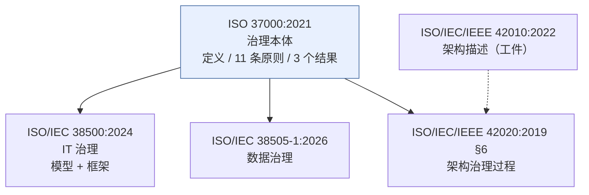
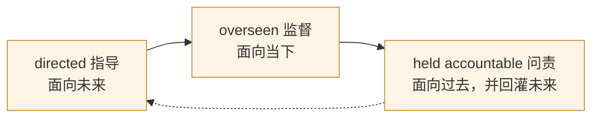
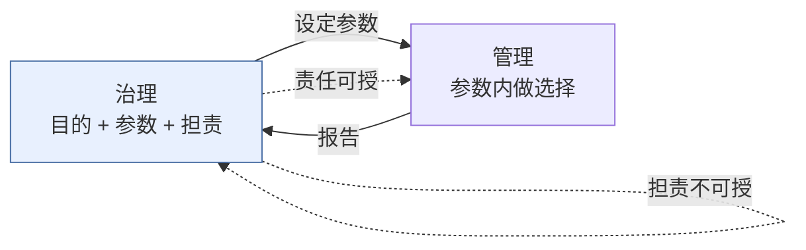
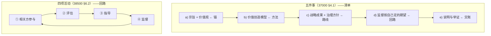
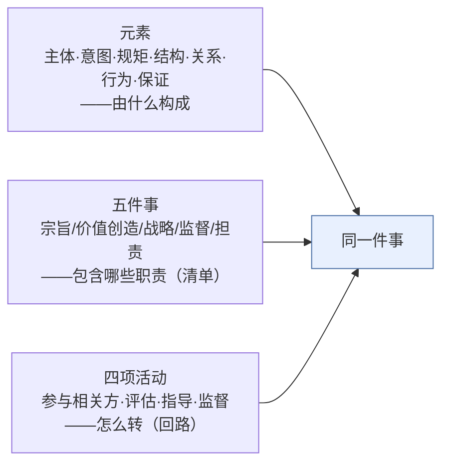
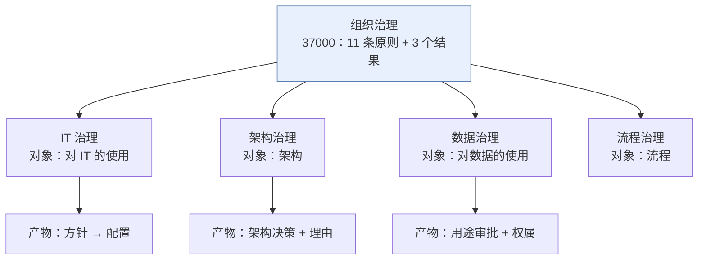
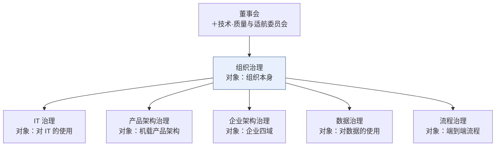

# 治理概念研究报告

## —— 从 ISO 37000 定义到域治理实例

> **编号**：28（研究报告稿）
> **配套文件**：`28-治理概念对话记录-从ISO 37000定义到域治理实例.md`（对话原样记录，本文即由其整理而成）
> **日期**：2026-09-14
> **主题**：治理（governance）的概念、构成与运转；术语定译；六类治理实例
> **权威来源**：以 **ISO 37000:2021** 为权威；参考 **ISO/IEC 38500:2024**、**ISO/IEC/IEEE 42010:2022 / 42020:2019**、**ISO/IEC 38505-1:2026**
> **约定**：governance → **治理**（限定义式"X 治理"）；organizational purpose → **宗旨**；policy → **方针**；objective → **目标**；accountability → **担责**（定义句动词位用**问责**）；responsibility → **责任**（五者不混用）
> **图的处理**：全文图以 mermaid 表达

---

## 摘要

### 一、问题起点

> **以 ISO 37000:2021 为权威，参考 38500:2024 与 42010 最新版，治理这个概念如何理解？**

从这一问展开，讨论线依次收敛于五件事：**治理的定义**（含 held accountable 的中译定稿）、**治理系统的元素**、**治理的运转方式**（五件事与四项活动）、**域治理的统一模子**（IT／架构／数据／流程）、以及**六类治理实例**（全部以一家民用飞机航电设备公司为例）。

### 二、十条核心结论

| # | 结论 | 出处 |
|---|---|---|
| 1 | **三份标准不在同一层**：37000 是治理**本体**（权威）；38500／38505 是**域应用**；42010／42020 提供治理所作用的**工件与过程**。把三者拉平比较是误解的起点 | 第 1 章 |
| 2 | **治理的属是 system，种差才是它的全部信息**。`human-based` 这个限定语回答的是"要素是什么"——**这个系统的要素是人**。泛泛说"治理是一个系统"几乎不含信息 | 第 2 章 |
| 3 | **治理与管理的分界是"参数"**：治理 = 目的 + 参数 + 担责；管理 = 在参数内做选择。判据：**定参数是治理，在参数内选最优是管理** | 第 2 章 |
| 4 | **责任可授，担责不可授**——这是"授权"这个动作的对偶，也是治理机制的全部张力所在 | 第 2 章 |
| 5 | **`held accountable` 是"被要求作出说明、承担后果"**：它是三件东西（held + account + 后果），中文没有一个词能同时装下。而**"被"字是这一句的承重墙** | 第 2 章 |
| 6 | **治理系统的元素是七类**（主体／意图／规矩／结构／关系／行为／保证），是**从标准推导**的；标准原文称"要素"的是**治理框架的要素**，两者不是一个层次 | 第 3 章 |
| 7 | **五件事是清单（治理包含什么），四项活动是回路（治理怎么转）**。前者出自 37000 §4.1，后者出自 38500 §6.2 | 第 4 章 |
| 8 | **X 治理 ＝ 组织治理在"X"这个域上的展开**：沿用 37000 的 11 条原则，**每条补"对 X 的治理含义"与"结果"**——不另立原则、不另设治理机构、最终担责不转移 | 第 6 章 |
| 9 | **治理的对象总是"使用"**（对 IT 的使用、对数据的使用），不是对象本身；而且**治理的产物随对象而变**（方针→配置／架构决策+理由／用途审批） | 第 6 章 |
| 10 | **跨出单管理层权限，就要治理介入**——这是判断一个议题是否属于治理的最实用判据 | 第 6 / 7 章 |

### 三、一句话

> **治理就是以宗旨为中心的一套人本系统，通过"指导—监督—担责"这条不可断的链条，用方针与授权划出参数，用可追溯的决策与理由证明自己配得上信任。**

---

## 目录

- [第 1 章 问题的起点与三层权威](#第-1-章-问题的起点与三层权威)
- [第 2 章 治理的定义](#第-2-章-治理的定义)
- [第 3 章 治理系统的元素](#第-3-章-治理系统的元素)
- [第 4 章 治理的运转：五件事与四项活动](#第-4-章-治理的运转五件事与四项活动)
- [第 5 章 术语定译表](#第-5-章-术语定译表)
- [第 6 章 域治理：统一模子](#第-6-章-域治理统一模子)
- [第 7 章 实例：长天航电的六类治理](#第-7-章-实例长天航电的六类治理)
- [第 8 章 判据汇总与遗留](#第-8-章-判据汇总与遗留)
- [参考文献](#参考文献)
  - [附录 A 标准原文索引](#附录-a-标准原文索引)
  - [附录 B 标准书目](#附录-b-标准书目)
  - [附录 C 其他文献](#附录-c-其他文献)
  - [附录 D 古籍与字书书证](#附录-d-古籍与字书书证)
  - [附录 E 取证来源说明](#附录-e-取证来源说明)

---

# 第 1 章 问题的起点与三层权威

## 1.1 起点

本轮的起点是一条硬约束：**以 ISO 37000:2021 为权威，不参考既有研究报告**。因此全部结论从标准原文推导，并逐条标注条款号。

## 1.2 三层权威关系

| 标准 | 它回答的问题 | 层次 |
|---|---|---|
| **ISO 37000:2021** | 治理**是什么**——定义、原则、结果 | 本体层（权威） |
| **ISO/IEC 38500:2024** | 治理**在 IT 域里怎么展开**——模型与框架 | 域应用层（明说自己是 37000 的域） |
| **ISO/IEC 38505-1:2026** | 治理**在数据域里怎么展开** | 域应用层 |
| **ISO/IEC/IEEE 42020:2019 第 6 章** | **架构治理过程** | 域过程 |
| **ISO/IEC/IEEE 42010:2022** | **不回答治理**——提供治理所作用的工件（架构描述）与痕迹（决策与理由记录） | 工件层 |

## 1.3 取证说明

ISO 标准原文付费，本报告所用来源为：**ISO/TC 309 官方发布材料**、**ISO 37000:2021 官方预览页（NEN）**、**GB/T 45948《组织治理 指南》征求意见稿**（ISO 37000:2021 修改采用，中文全文）、**ISO/IEC 38500:2024 等同采用文本**（含英文全文）、**ISO/IEC/IEEE 42010:2022 官方预览页（NEN）**、**ISO/IEC/IEEE 42020:2019 目录（DIN）**、**ISO/IEC 38505-1:2026 官方条目与摘要（AFNOR）**。

凡引条款号与定义，均随文标注出处。GB/T 45948 为**征求意见稿**，其译文中的两处失手（见 2.2）已标注，正式版以正式文本为准。

---

# 第 2 章 治理的定义

## 2.1 原文

**ISO 37000:2021 §3.1.1**：

> **governance of organizations** — human-based system by which an organization is directed, overseen and held accountable for achieving its defined purpose

**GB/T 45948 中译**：

> **组织治理**——一种以人为本的系统，通过该系统指导、监督和问责一个组织，以实现其既定目标。

## 2.2 中译定稿

经六轮论证（见对话记录第 2–15 轮），**定稿**为：

> **组织治理（governance of organizations）：一种以人为基础的系统——组织为实现其宗旨，通过该系统受到指导、接受监督，并被要求就其宗旨的实现作出说明、承担后果。**
>
> 注：该义务包括**告知和解释**责任的履行情况。（ISO 37000 §3.2.2 注 1）

> 〔说明一〕句中的 "held accountable" 指 §3.2.2 定义的 accountability。**该条注 2**（"不履行责任的后果可由责任方承担"）的内容**已并入定义句的"承担后果"**，故不另设注。
> 〔说明二〕**"承担后果"必须在定义句内**——只写"作出说明"，问责就**无牙**。这与 §4.2.2 授权条件 e（"不履行或不守界限的后果可执行"）是同一条道理；而且它是对话**第 15 轮定稿的写法**，本报告不得擅自更改。

**五个要点，缺一不可**：

| 要点 | 说明 |
|---|---|
| **`held` 不丢** | "**被**要求"——整句是被动语态，三个过去分词共用一个隐含施动者（治理系统）。丢掉"被"，这一句就从"有一种外部力量把组织置于须交账的地位"退回成"组织自己要自觉"，**治理的强制性和持有性一起消失** |
| **被动不改** | 三个谓语的被动性不能动。"受到指导、接受监督"用不同的被动标记，避免重复单调 |
| **问责有宾语** | "就其宗旨的实现作出说明"——`held accountable **for** X` 里的 X 是**问责的命题**，规定了"交的是什么账"。**宾语一悬空，问责就从"一项义务"退化成"一种态度"** |
| **后果在句内** | "承担后果"三个字不能省——省了就是无牙之问责（见上〔说明二〕） |
| **宗旨管辖全句** | "组织为实现其宗旨"用逗号断开（不用"而"），使宗旨管辖后面整串谓语 |

**三处关键取舍**：

1. **`human-based` 译"以人为基础"，不译"以人为本"。** "以人为本"在当代中文里是**价值观口号**（＝尊重人）；而 `human-based` 说的是**构成**——治理这套系统是**由人的行为做成的**，不是文件堆、不是 IT 系统。
2. **`by which` 译"通过该系统"，不译"依此"。** 两条理由：① **有官方依据**——GB/T 45948 用的正是"**通过该系统**"（§3.1.1）／"通过这个系统"（§4.1）（**标准自己两处用词不同**）；按"术语位跟官方译法"的判据，应当采用；② **`by which` 是工具义**——系统是指导得以发生的**手段**；"依此"偏"遵照"，且"此"字虚、回指不清。

   > **一处不跟 GB/T**：GB/T §3.1.1 取**主动**（"通过该系统**指导、监督和问责**一个组织"），本定稿保留**被动**（"组织…**受到**指导"）——因为 ISO 37000 §3.1.1 原文本身就是被动（is directed, overseen and held accountable），且"**被**"字是这一句的承重墙（见上表）。**GB/T §4.1 那处倒是被动**（"通过这个系统，组织被指导、监督…"），可见标准自己两种都用。

3. **"承担后果"留在定义句内。** 对话第 12 轮曾提出"移出定义句、落进注 2"，**该建议在整理本报告时被撤回**——理由见上〔说明二〕。撤回后的写法即本条术语条。

**两处 GB/T 失手（引用时须注意）**：

- 引言：*"Their governing bodies will **hold management to account**…"* → 中译"他们的治理机构将**通过管理层来负责**并确保……"——**主宾颠倒**。
- §6.5.1／§6.5.2：*"**Accountability** is a key aspect of governance…"* → 中译作"**责任**是治理的一个关键方面"——**在定义"担责"原则的这一节里，accountability 反倒被译成了"责任"**。

## 2.3 三职能各自的定义与解释

定义句以三个被动动作界定治理——**directed / overseen / held accountable**。这三者是整条定义的承重结构，逐一定义、展开与划界如下。

### 2.3.1 directed —— 指导

**一、定义**（ISO/IEC 38500:2024 §3.1）

> **direct**：**communicate desired purposes and outcomes**（传达期望的**目的与结果**）
>
> 注 1：在 IT 治理语境中，指导（directing）包括**设定目标、战略和方针**，供组织成员采用，以确保 IT 的使用符合业务目标。
> 注 2：若有治理机构授权，目标、战略和方针可由管理层设定。

**二、中译判定：指导，不译"领导"**

| 理由 | 说明 |
|---|---|
| **避撞** | 37000 已有一条独立原则 **6.7 Leadership 领导力**（以身作则、定调、建立价值驱动的文化）。**在术语标准里，撞车是最重的缺陷** |
| **原文义** | direct 的定义是"**传达期望的目的与结果**"——是**给方向**，不是**行使领导权** |
| **沿革** | Cadbury："the system by which companies are **directed** and controlled" → 中文历来作"**指导**和控制"；38500 的 EDM → "**评估—指导—监督**" |

**三、它实际包含什么**（合 38500 §6.2.3 与 37000 §6.3.3）

| # | 内容 | 出处 |
|---|---|---|
| ① | 传达期望的**目的与结果** | 38500 §3.1 |
| ② | **分配责任**（assign responsibility for…） | 38500 §6.2.3 |
| ③ | 指导战略与方针的**制定**（设定战略成果；制定治理方针） | 37000 §6.3.3.1 |
| ④ | 指导方针的**实施**（direct preparation **and implementation**；审查、评估、批准授权人制定的计划、监督其实施） | 38500 §6.2.3；37000 §6.3.3.2.1 |
| ⑤ | **授权与设界**（阐明内部授权；确定治理架构与角色，含其权力、责任、表现和报告要求；为内部控制、合规、风险管理设立预期） | 37000 §6.3.3.1.2 b/c/e |
| ⑥ | **要求信息回流、形成文化**（要求管理层提供及时信息、遵守指导、符合十一项原则；必要时指导提交提案供批准） | 38500 §6.2.3 |

→ **指导绝不是"说完就完了"**：它管到实施，也管到信息怎么回到自己手里（第⑥项正是治理与管理的接口）。

**四、它的止境**（37000 §6.3.3.1.2 d，一句话划定）

> 对**需要履行什么责任（而非具体如何履行）**提供指导。

- 越过它去规定具体做法 → 治理在替管理干活（**微管理**）
- 不到它去定目的与责任 → 指导退化成建议（**没有约束力的期望**）

即：**定目的 · 分责任 · 立边界 · 设预期 · 要求信息回流——但不管具体做法。**

**五、它是带约束力的**

38500 §6.2.3："治理机构应鼓励有效治理的文化，要求管理层提供及时信息、**遵守指导**、符合十一项原则。"——**治理的指导是带约束力的**，管理层不遵守就是违背治理。

中文"指导"有被读轻的风险（"技术指导""指导意见"）。**补法在行文，不在术语名**：写"**遵守指导**""按指导执行"。

### 2.3.2 overseen —— 监督

**一、定义与归属**

- **37000 §6.4 Oversight 监督**（原则声明）：治理机构宜**监督组织的表现**，确保其符合**治理机构对组织的意图和期望**、**合乎道德的行为**及**满足合规义务**。
- **38500 §3.3** 的定义句第三成分用 **overseeing**（与 directing 并列）。

**二、两处最常被漏的**

| # | 内容 | 出处 |
|---|---|---|
| ① | **监督的基准是"治理机构自己设定的期望"**——回头挂在宗旨（6.1）与战略成果／治理方针（6.3）上。**没有宗旨与战略，监督就没有尺子** | 37000 §6.4／表 1 |
| ② | **监督含 assurance**：不只是看报表，还要**确保内部控制体系被建立**，并**使自己确信治理系统被恰当设计并按预期运行** | ISO/TC 309；37000 §4.3.2 注 3（内部审计） |

→ 一个是**监督执行**，一个是**监督系统本身**。后者最常被跳过。

**三、中文的坑：一个"监督"承接两个英文词**

| 英文 | 中文 | 内容 | 出处 |
|---|---|---|---|
| **oversight** / overse**eing** | **监督** | 是否符合治理机构设定的期望、合乎道德的行为、合规义务；**含 assurance** 与内部控制体系的确保 | 37000 §6.4；38500 §3.3 |
| **monitor** | 监督（通用）／**监测·复核**（需区分时） | 通过测量系统**获取绩效与进展信息**、周期性核对、复核合规 | 38500 §3.8／§6.2.4 |

**两者是包含关系：oversight ⊃ monitor。** 38500 自己在同一份标准里就两个词都用——§3.3 定义用 overseeing，§6.2.4 任务用 monitor。需在同一句里区分时，用"**监督（oversight，含 assurance）**"对"**监测／复核（monitor，测量层面）**"。

**四、与 evaluate（评估）的分工**——见 §4.4：**评估判断"该不该"（批准之前），监督复核"是不是"（批准之后）**。

### 2.3.3 held accountable —— 问责

**一、定义**（37000 §3.2.2）

> 担责（accountability）：**对他人**说明并解释责任履行情况的**义务**。
>
> 注 1：义务包括**告知和解释**履行责任的方式。
> 注 2：不履行责任的**后果**可由责任方承担。

**二、三个部件**

| 部件 | 义 | 落在中文哪里 |
|---|---|---|
| **held** | 被动，且**有人持有**——有人抓着你 | "**被**要求" |
| **-able** | 可被……的 → 一种**状态**，不是行为、不是美德 | —— |
| **account** | 账（不是"错"） | "**说明**"＋"**承担后果**" |

> **accountability 不是你的品格，是你的处境**——你被放在一个"随时要交账"的位置上。**"held" 这一半是中文最容易丢的**（"担责""履责"都丢在这里，它们的主语是被问责者自己）。

**三、谁持有**（三层链条）

| 谁 | 向谁交账 | 依据 |
|---|---|---|
| 管理层 | 治理机构 | 37000 引言 "hold management to account" |
| 治理机构 | 授权给它的人（成员相关方、参考相关方） | §6.5.1 |
| 组织本身 | 社会、监管者、相关方 | 37000 引言 "afford stakeholders the opportunity to hold organizations to account" |

**四、交的是什么账——只有一道命题**

`for achieving its defined purpose`。**不是"有没有违规"**（那只是 §6.5.3.2 d 的一项），是"**组织有没有达成它存在的理由**"。

§6.5.3.2 把这个"账"的形式列为**八项披露**，其中三条最关键：

1. **举证责任在治理机构**——第 g 项用的是"**解释和证明**"（explain and justify），不是"上报"。
2. **"包括不履行责任的后果"**（b-2）——把失败也列入披露范围。
3. **方向是双向的**（§6.5.1）：治理机构宜**对整个组织**负责，**并对其授权的人负责**。

**五、问责有效的五个先决条件**（§4.2.2）

| 先决条件 | 不成立时变成什么 |
|---|---|
| a) 预期结果经协商、明确、达成一致 | **事后加罪**——"没人说过要这样" |
| b) 所需资源可使用 | 有责无资源 |
| c) 权力与责任层级匹配（含自主权） | **有责无权** |
| d) 定期报告产出、结果、过程，并**举证**行动合理适当 | 只看结果，不看依据 |
| e) 不履行或不守界限的**后果可执行** | **无牙之问责** |

配一条禁令：**任何人都不宜为他们无权处理的事项负责，也不宜为他们没有提出或商定期望的事项负责。**

**六、它的产出是信任与合法性，不是惩罚**

37000 §6.5.2：**"责任是治理的一个关键方面，因为它会产生信任和合法性，从而提高组织绩效。"** ISO/TC 309 材料亦把 accountability 的产出写成 *engenders trust and legitimacy*。

**七、五个必须排掉的误解**

| # | 误解 | 纠正 |
|---|---|---|
| 1 | 问责＝追责惩罚 | 惩罚只是条件 e 的保证机制。**把问责做成追责，第一后果是信息消失**（坏消息不上报）——恰好摧毁它要建立的信任 |
| 2 | 问责＝出事找人 | 它是**常态在线**的说明义务，不是事件触发的 |
| 3 | 问责＝认错道歉 | 核心动作是"**把账摆出来**"（告知＋解释＋举证），不是情绪姿态 |
| 4 | 问责＝汇报工作 | 差别是**对方有权就你的说明继续追问、要你举证**。**"可被追问"就是这条分界线** |
| 5 | 问责＝只问下级 | 治理机构本身是**最被问责的那一个**（§6.5.1） |

### 2.3.4 三者不可缺一

| 动词 | 动作 | 时间朝向 | 缺了会怎样 |
|---|---|---|---|
| **directed 指导** | 定方向、定规矩 | 面向未来 | 只指导不问责 → 战略变口号（没人需要交代） |
| **overseen 监督** | 查执行是否符合期望 | 面向当下 | 只监督不问责 → 监督报告进抽屉 |
| **held accountable 问责** | 对结果作说明并承担 | 面向过去，并回灌未来 | 只问责不指导 → 秋后算账（标准没定就拿结果问罪） |

而 **held accountable 是"授权"这个动作的对偶**——37000 §6.5.2 与 38500 §6.1 同一条铁律：**治理机构可以授权他人，但仍对整个组织的作为、不作为和渎职负责**；**责任可授，担责不可授**。没有它，授权就是控制权的永久出让，治理/管理的分层随之断裂。

---

## 2.4 治理与管理

**ISO 37000 §4.2.3**（GB/T）：

> "治理"和"管理"是不同的、必要的、相辅相成的活动……治理包括在为组织设定的范围内负责组织实现其目标，而管理则是在这些范围内做出选择来实现相关目标。

**ISO/IEC 38500:2024 §6.1**：

> Governance involves **setting and being accountable for the purpose and parameters** for the organization. Management is about fulfilling the associated objectives by **making choices within the parameters** set by the governing body.

> **判据：定参数是治理，在参数内选最优是管理。**

这条判据比"高层／低层"这类划分可靠得多。它的两条延伸：

- **责任可授，担责不可授**（37000 §4.2.2；38500 §6.1"不可授权"）。授权要满足五个条件：预期结果经协商一致、资源可用、权力与责任层级匹配、定期报告并**举证**、违约后果可执行。并配一条禁令：**任何人都不宜为他们无权处理的事项负责，也不宜为他们没有提出或商定期望的事项负责。**
- **同一人可兼两角色，但必须能分清此刻在履行哪个**（37000 §4.2.3；38500 §6.1）。

## 2.5 治理是"系统"：属与种差

37000 §3.1.1 的属（genus）是 **system**；按 **ISO 9000:2026 §3.4.1**，system ＝ **一组相互关联或相互作用的要素**。

因此"治理是一个系统"形式为真，**但这个判断几乎不含信息**——system 的定义宽到几乎什么都装得下。定义的信息量全在种差：

| 成分 | 内容 | 回答什么 |
|---|---|---|
| 属 | system | 它属于**哪一类** |
| 种差一 | **human-based** | 它的**要素是什么**（＝人） |
| 种差二 | by which an organization is directed, overseen and held accountable | 它**做什么** |
| 种差三 | for achieving its defined purpose | 它**为了什么** |

**是哪种 system——三个否定**：

| 否定 | 理由 |
|---|---|
| **不是有边界的系统** | 治理的范围只能是**整个组织**——38500 §4.1.1／§6.1 说"治理实践贯穿整个组织"，不是因为治理机构到处伸手，而是因为**决策与交代行为本就遍布组织** |
| **不是能买来的系统** | 买得到的是工具、平台、制度文本；买不到"人怎么决策、怎么交代" |
| **不是制度文本** | 制度是它的**产物**（治理方针），不是它本身 |

> **"本质"该落在哪**：属回答**归类**，种差回答**本质**。所以"治理**本质上**是一个 system"是归类，不是本质；本质在种差，尤其在 `for achieving its defined purpose`——**治理本质上是一套把组织保持在宗旨上的人本安排。**

## 2.6 十一条原则的三个层级

ISO/TC 309 官方材料与 37000 表 1 一致，分三组：

| 类别 | 分类说明（标准原意） | 原则 |
|---|---|---|
| **首要的（1 条）** | 追求目标是所有组织的中心。**其他所有原则都宜在本原则的背景下理解** | 6.1 **宗旨** Purpose |
| **基础的（4 条）** | 有效治理能力的核心：确定创造价值的方法／指导和参与战略／监督按期望执行／对绩效行为决策活动担责 | 6.2 价值创造 · 6.3 战略 · 6.4 监督 · 6.5 担责 |
| **赋能的（6 条）** | 强调当前组织的治理责任，以应对不断变化的利益相关方期望与自然、社会、经济环境 | 6.6 利益相关方参与 · 6.7 领导力 · 6.8 数据和决策 · 6.9 风险治理 · 6.10 社会责任 · 6.11 长期生存能力和绩效 |

三点读法：**① 宗旨是唯一的"首要"，其余 10 条都在宗旨的语境下读；② 基础四条就是治理的主干；③ 全部原则都应适用，并同时适用——治理不是打勾清单。**

## 2.7 三个治理结果

37000 引言与 §5 反复给出同一组：

> ——**有效的绩效** effective performance
> ——**尽责的管理** responsible stewardship
> ——**合乎道德的行为** ethical behaviour

**标准给出的评价对象是"结果"，不是"过程"或"机构形态"。** 所以"有没有董事会""有没有制度文件"都不能作为治理好坏的判据——只有这三个结果可以。38500:2024 把这三个结果原封不动搬进了自己的 §4.1。

---

## 2.8 宗旨与近邻：边界、归属与译法

### 2.8.1 四层边界（四个词各占一层，不重叠）

| 层 | 中文 | 英文 | 位置 |
|---|---|---|---|
| **为什么存在** | **宗旨** | purpose | 37000 §3.2.10 术语；**原则 1（首要）**；治理的锚 |
| **意图与方向** | **方针** | policy | 37000 §3.2.9 治理方针——"正式表达的**意图和方向**" |
| **做什么、到什么程度** | **目标** | objective | 9000:2026 §3.7.11；由宗旨**指导**出来 |
| **怎么走** | **价值观** | values | 37000 §3.2.11；与宗旨**配对**（"达成宗旨的罗盘"） |

**两点读法**：

1. **37000 刻意只用 purpose ＋ values 两个词，不设 vision／mission 的条目**——正是为了避开这两个词天生的"**口号体**"联想。宗旨在这套标准里是**可被界定、可被检验**的东西（"不能用来做决策的宗旨，不是宗旨，是标语"）。
2. **宗旨指导表现目标**（§3.2.10 注 2），故"目标"是宗旨的**下位**，不是同义替换。

### 2.8.2 与 ISO 9000:2026 的**归属者对立**（两份标准并用时必须处理）

| | **ISO 37000** | **ISO 9000:2026** |
|---|---|---|
| "组织存在的理由" | **组织宗旨 organizational purpose**（§3.2.10，有定义＋两条注） | **使命 mission**（§3.4.11："organization's purpose for existing"） |
| **由谁定** | **治理机构**（§6.1.1 宜确保宗旨被明确定义） | **最高管理者**（"as expressed by top management"） |
| 相邻词 | 组织**价值观**（§3.2.11）、治理方针（§3.2.9） | **愿景**（§3.4.10）、**战略**（§3.4.12）、**方针**（§3.4.5） |
| "意图和方向" | 治理方针（§3.2.9） | 方针（§3.4.5） |

**三条关键事实**：

1. **9000:2026 没有 purpose 条目。** `purpose` 只出现在三处——**mission 的定义里**（"organization's purpose for existing"）、**objective 的注 3 里**（"目标可表述为……目的"）、以及 **§4.2.3 的"统一的宗旨和方向"**（unity of purpose and direction）。术语表与索引中均无。
2. **它用 mission 顶了 37000 里 purpose 的位置，但归属者正相反**——37000 归**治理机构**，9000 归**最高管理者**。这正是 37000 §3.3.4 注 3 专门切分"治理机构 vs 最高管理者"的理由所在。
3. **推论**：**质量管理体系的标准里没有"宗旨"的位置，因为宗旨属于治理层，不属于管理体系层。** 要做治理，得去 37000。

### 2.8.3 purpose 的中译现状：五处四个处理

| 出处 | 译法 |
|---|---|
| ISO 37000 §3.2.10 术语条 | 组织**宗旨** |
| ISO 37000 §3.1.1 定义句 | 其既定**目标**（GB/T） |
| ISO 37000 表 1 | 组织的**目的**（GB/T） |
| ISO 9000:2026 §3.4.11 | **目的**（项目译本） |
| ISO 9000:2026 §4.2.3 | **宗旨**（"统一的宗旨和方向"——固定搭配） |

**定译建议**：**全链锁"宗旨"**——理由：它是 37000 的**术语条目名**，只有它带定义，其余都是行文借用。

---

# 第 3 章 治理系统的元素

## 3.1 先分清：标准明说的"要素"是**框架**的要素

**ISO 37000 §3.1.2 —— 治理框架的四要素**

> **organizational governance framework**：strategies, governance policies, decision-making structures and accountabilities **through which the organization's governance arrangements operate**

→ 战略 · 治理方针 · 决策结构 · 担责

**ISO/IEC 38500 §7.1 —— 治理框架的六要素**

> Figure 2 shows the framework for the governance of IT, which includes **six elements through which the organization's governance of IT arrangements operate**

→ 方向 Direction · 能力 Capability · 方针 Policy · 授权 Delegation · 绩效 Performance · 担责 Accountability

**两者是父子关系**，不是两套说法——句式完全一样（"…through which the organization's … arrangements operate"）。**38500 的六要素，就是把 37000 的四要素展开**：保留方针与担责，把"战略"细化为方向，把"决策结构"细化为授权，另加能力与绩效。**实务用六项。**

## 3.2 治理系统的七类元素

标准没有给"治理系统的要素"清单，下表是**从标准内容推导**的：

| 类 | 要素 | 出处 |
|---|---|---|
| **主体**（谁） | 治理机构、治理小组、人员、相关方（成员／参考） | §3.3 全族 |
| **意图**（为了什么） | 组织宗旨、组织价值观 | 3.2.10 / 3.2.11 |
| **规矩**（依据什么） | 治理方针、合规义务 | 3.2.9 / 3.2.6 |
| **结构**（怎么搭） | 决策结构、委员会、角色与权限、报告要求 | 3.1.2 / §4.3.1 / §6.3.3.1.2 c |
| **关系**（怎么连） | **授权 → 报告 → 担责／问责**；利益相关方参与 | §4.2.2 / §6.5 / §6.6 |
| **行为**（怎么动） | 领导力、合乎道德的行为 | §6.7 / 3.2.7 |
| **保证**（怎么确信） | 保证过程、审计、"使自己确信"的机制 | §6.4 |

**三条说明**：

1. **"管理层"不是 37000 的定义术语。** §3.3 的条目只有利益相关方（3.3.1）／成员（3.3.2）／参考（3.3.3）／治理机构（3.3.4）／治理小组（3.3.5）／人员（3.3.6）。"管理层"只在正文里使用；"最高管理者"是 ISO 管理体系标准的词（37000 §3.3.4 注 3 专门切开）。
2. **授权归入"关系"**，使该类成为一条链：**授权（权力与责任的授予）→ 报告（信息回流）→ 担责／问责（对结果作出说明并承担）**。授权是**主体之间的连接**，不是静态组织形态。
3. **"合乎道德的行为"兼两职**：既是**要素**（3.2.7），又是**治理结果**（§5）。作为要素它是"人在怎么做"，作为结果它是"治理做出来了什么"——不必去重。

## 3.3 四层划清（拼模型前必做）

| 层 | 是什么 | 例 | 出处 |
|---|---|---|---|
| **要素** | 系统的**组成部件** | 主体／意图／规矩／结构／关系／行为／保证 | 推导（3.2） |
| **规范** | 约束系统**怎么设计**的规则 | 11 条治理原则 | §6 |
| **框架** | 要素的**组合方式** | 战略、方针、决策结构、担责（37000）／方向、能力、方针、授权、绩效、担责（38500 §7） | §3.1.2 |
| **结果** | 系统跑出来的**产出** | 有效的绩效／尽责的管理／合乎道德的行为 | §5 |

**四层是四个问题**：由什么构成 ／ 按什么规范 ／ 怎么组合 ／ 产出什么。**原则不是要素，结果也不是要素**——把它们塞进同一张表，模型就散了。

---

# 第 4 章 治理的运转：五件事与四项活动

## 4.1 五件事 —— ISO 37000 §4.1「总则」

> 组织治理是一个以人为本的系统，通过这个系统，组织被指导、监督并对实现其既定的组织宗旨负责。**其核心包括**：
>
> a) **设定并致力于实现组织宗旨和组织价值**；
> b) **确定组织创造价值的方法**；
> c) **指导和参与创造价值的战略**；
> d) **监督组织按照治理机构设定的期望执行和行动**；
> e) **表达对其表现和行为的责任感**。
>
> **注：详细说明见表 1。**

**结构**：**a 是唯一"首要"原则（宗旨 6.1），b/c/d/e 是四项"基础"原则**（价值创造 6.2／战略 6.3／监督 6.4／担责 6.5）。表 1"基础的"一格的分类说明即 b/c/d/e，**与 §4.1 几乎逐字相同**。

## 4.2 四项活动 —— ISO/IEC 38500:2024 §6.1–6.2

> Figure 1 shows the model for the governance of IT. This model consists of:
> 1) **governance of IT practice, comprising the four main tasks of "engage stakeholders", "evaluate", "direct" and "monitor"**（as depicted by the triangle）;
> 2) management of IT practice（the rectangle）;
> 3) framework for the governance of IT（the circle）.

| 任务 | 中文 | §3 定义 |
|---|---|---|
| **engage stakeholders** | 相关方参与 | （无 §3 条目，见 §6.2.1） |
| **evaluate** | 评估 | consider and make **informed judgements** |
| **direct** | 指导 | **communicate desired purposes and outcomes** |
| **monitor** | 监督 | **review as a basis for** appropriate decisions and adjustments |

**来历**：38500 的 **2015 版是 EDM 三任务**（Evaluate–Direct–Monitor）；**2024 版新增"相关方参与"** 才成四项。

## 4.3 清单与回路

| | **五件事**（37000 §4.1） | **四项活动**（38500 §6.2） |
|---|---|---|
| 结构 | **清单**，并存不循环 | **回路**，转一圈回到起点 |
| 起点 | 无（宗旨是锚，不是起点） | 固定从**相关方参与**起 |
| 含相关方 | ✗（在赋能六条 6.6，是**条件**） | ✓（是**第一步**） |
| 含问责 | ✓（第五件） | 不在四任务里（在 §3.3 定义中作第三成分） |
| 回答 | 治理**包含什么** | 治理**怎么转** |

**名字的对应**：b↔② 评估；c↔③ 指导；d↔④ 监督；e↔（§3.3 定义第三成分）；a↔（锚）；①↔（37000 归入赋能六条）。
**不是两边矛盾**：37000 说相关方参与是"**前提**"，38500 说它是"**起点**"。

## 4.4 评估与监督之别

**ISO/IEC 38500:2024 §3**：

| | **evaluate 评估**（3.2） | **monitor 监督**（3.8） |
|---|---|---|
| 定义 | consider and make **informed judgements** | review as **a basis for** appropriate decisions and adjustments |
| 产物 | **判断** | **调整的依据** |

| | **§6.2.2 评估** | **§6.2.4 监督** |
|---|---|---|
| 对象 | 当前与未来的 IT 使用，**包括计划、提案和供应安排** | **绩效**、计划进展、整体成就、合规 |
| 节奏 | 随情况变化**持续**进行 | **例行**获取信息 + **周期性**整体核对 |
| 时点 | **批准之前** | **批准之后** |

> **判据：评估判断"该不该"，监督复核"是不是"。评估看向外与向前，监督看向内与向后。**

**一处必须分清的术语陷阱**：中文"监督"同时承接两个英文词，且二者是**包含关系**：

| 英文 | 中文 | 内容 | 出处 |
|---|---|---|---|
| **oversight** / overse**eing** | 监督 | 组织表现**是否符合治理机构设定的期望**、合乎道德的行为、合规义务；**确保内部控制体系被建立**；**使自己确信治理系统设计得当并按预期运行**（assurance） | 37000 §6.4；38500 §3.3 |
| **monitor** | 监测／复核（需区分时） | 通过测量系统**获取绩效与进展信息**、周期性核对、复核合规 | 38500 §6.2.4 |

**需要区分时**：用"监督（oversight，含 assurance）"对"监测／复核（monitor，测量层面）"。

## 4.5 三副眼镜

**三处互相呼应**：元素里的**方针** ←→ 五件事 c 的"制定治理方针" ←→ 四活动的**指导**；元素里的**绩效** ←→ 五件事 d ←→ 四活动的**监督**；元素里的**担责** ←→ 五件事 e ←→ 出事后那一段。

> **认出一个动作在三套里叫什么，比记住三套清单更有用。**

---

# 第 5 章 术语定译表

**本章是本报告的核心交付物之一。** 每条给出英文、中文定译、定义、依据与禁用项。

## 5.1 治理本体

| 英文 | 中文定译 | 定义（中） | 依据 |
|---|---|---|---|
| **governance** | **治理**（限定义式"X 治理"） | 由指导、监督和担责构成的以人为本的系统 | 38500 §3.3；37000 §3.1.1 |
| **governance of organizations** | **组织治理** | 一种以人为基础的系统——组织为实现其宗旨，**通过该系统**受到指导、接受监督，并被要求就其宗旨的实现作出说明、**承担后果**。 **注**：该义务包括**告知和解释**责任的履行情况（§3.2.2 注 1）；§3.2.2 注 2 的内容已并入句中的"承担后果"。 | 37000 §3.1.1；"通过该系统"依 GB/T 45948 §3.1.1 |
| **organization** | **组织** | 为实现目标，由职责、权限和相互关系构成自身功能的一个人或一组人（含个体经营商、公司、行政机构、合伙企业、慈善机构等，无论是否具法人资格） | 37000 §3.1.3 |
| **organizational entity** | **组织实体** | **确定并独立存在**的组织；在某些情况下可以是法律实体。 → **它是"治理机构"的锚**：每个组织实体都有一个治理机构（§3.3.4 注 1） | 37000 §3.1.4 |
| **organizational governance framework** | **组织治理框架** | 组织治理方针得以落实的**战略、治理方针、决策结构和担责** | 37000 §3.1.2 |
| **organizational purpose** | **组织宗旨** | 组织存在的**有意义的理由**；即组织意图为**特定的**相关方创造的**最终价值**；它**指导表现目标**并为日常决策提供背景 | 37000 §3.2.10（含两注） |
| **organizational values** | **组织价值观** | 组织所定义的关于好的、重要的预期结果和行为的信念 | 37000 §3.2.11 |
| **governance policy** | **治理方针** | 组织治理机构**正式表达的意图和方向** | 37000 §3.2.9 |
| **compliance** | **合规** | 履行组织的**全部合规义务** | 37000 §3.2.5 |
| **compliance obligation** | **合规义务** | 组织强制性地必须遵守的要求，以及自愿选择遵守的要求 | 37000 §3.2.6 |
| **ethical behaviour** | **合乎道德的行为** | 符合特定背景情况下被公认为正确的或良好行为原则、并符合国际行为规范的行为。 → **兼两职**：既是治理系统的**要素**（人在怎么做），又是**治理结果**之一（治理做出了什么） | 37000 §3.2.7；§5 |
| **risk appetite** | **风险偏好** | 组织愿意追求或保留的风险**数量和类型**。（§3.1.9 另有 **risk tolerance 风险容忍**：为实现目标在风险应对之后承担风险的意愿） | 37000 §3.1.7／§3.1.9 |
| **governance outcomes** | **治理结果** | 三个：有效的绩效／尽责的管理／合乎道德的行为 | 37000 §5 |

**宗旨的近邻**（ISO 9000:2026 一侧的术语；边界与归属者对立见 §2.8）

| 英文 | 中文定译 | 说明 | 依据 |
|---|---|---|---|
| **vision** | **愿景** | 由最高管理者表述的、组织**希望成为什么样子**的愿望 | 9000:2026 §3.4.10 |
| **mission** | **使命** | "organization's **purpose** for existing as expressed by top management"——**它顶了 37000 里 purpose 的位置，但归属者是最高管理者**（见 §2.8.2） | 9000:2026 §3.4.11 |
| **strategy** | **战略** | 为实现长期或总体目标而作的计划 | 9000:2026 §3.4.12；37000 §6.3 |
| **objective** | **目标** | 要取得的结果。注 3：目标可表述为预期结果、**目的**、运行准则、质量目标，或用 aim／goal／target 等近义词 | 9000:2026 §3.7.11 |
| **principle** | **原则** | 可作为一系列信念、行为或一连串推理基础的基本事实、提议或假设 | 37000 §3.2.1 |

> **两条术语位禁用**：`purpose` **不得译"目标"**（与 objective 撞车——**GB/T 45948 §3.1.1 即犯此错**）；`policy` 在**顶层**不得译"政策"（政策偏**规定与对策**，方针才是**纲领与方向**）。

## 5.2 治理角色族

| 英文 | 中文定译 | 定义（中） | 依据 |
|---|---|---|---|
| **governing body** | **治理机构** | 对整个组织**最终担责**的个人或群体；每个组织实体都有一个，**无论是否明确成立**（注 2：可表现为董事会、监事会、唯一董事、受托人等） | 37000 §3.3.4 |
| **governing group** | **治理小组** | **治理组织**的个人或群体；适用于组织**不是组织实体**的情形（集团、子公司、部门、事业部）。注 1：可以包含执行经理或最高管理角色的人，**但须保持管理与治理角色不同** | 37000 §3.3.5 |
| **top management** | **最高管理者** | ISO 管理体系标准的用词——描述一个**向治理机构报告并对其负责**的角色。**37000 §3.3.4 注 3 专门把它与治理机构切开** | 37000 §3.3.4 注 3 |
| **committee** | **委员会** | 治理机构按其规模设立的、**帮助其履职**的助手（法定或自愿）。 → **它既不是治理机构，也不是治理小组**——它是治理机构的下属工具 | 37000 §4.3.1 |
| **stakeholder** | **利益相关方** | 能够影响决策或活动、受决策或活动影响、或自认为受影响的人或组织 | 37000 §3.3.1 |
| **member stakeholder** | **成员利益相关方** | 对治理机构、以及治理机构所负责的机构**有法律义务或明确决策权利**的相关方（通常即股东与成员） | 37000 §3.3.2 |
| **reference stakeholder** | **参考利益相关方** | 在作出与组织宗旨有关的决定时，**治理机构决定的应该负责**的相关方 | 37000 §3.3.3 |
| **personnel** | **人员** | 组织的高管、主管、雇员、临时职员或工人以及志愿者 | 37000 §3.3.6 |

> **两条使用纪律**（出自对话第 25 轮）：
> 1. **"治理机构"是标准文本的默认主语**——3.3.4 注 1 的**对换规则**：凡写"治理机构宜……"之处，若被治理的对象**不是组织实体**，就把这五个字读作"**治理小组**"。
> 2. **三者的交叉性是逐步放开的**：治理机构**不可**与最高管理者重叠（注 3）；治理小组**可以**包含最高管理者（注 1）；委员会只是助手。**"治理小组"是唯一允许治理与管理同体的一位。**
>
> **术语禁用**：不要把 governing body 一律译"董事会"（董事会只是其形态之一）；不要把"管理层"当 37000 的定义术语（§3.3 无此条目，它只在正文里使用）。

## 5.3 三职能与四活动

| 英文 | 中文定译 | 定义（中） | 位置 |
|---|---|---|---|
| **directed** | **受到指导**（定义句）／**指导** | 传达期望的**目的与结果**；含设定目标、战略和方针，供组织成员采用 | 37000 §3.1.1；38500 §3.1、§6.2.3 |
| **oversight / overseeing** | **监督** | 查组织表现是否符合治理机构设定的期望、合乎道德的行为、合规义务；含 assurance（确信治理系统设计得当并按预期运行） | 37000 §6.4；38500 §3.3 |
| **monitor** | **监督**（通用）／**监测·复核**（需区分时） | 复核，作为适当决策与调整的**依据** | 38500 §3.8 |
| **evaluate** | **评估** | 考虑并作出**有依据的判断** | 38500 §3.2 |
| **accountability** | **担责** | **对他人**说明并解释责任履行情况的**义务**；不履行时，后果由责任方承担 | 37000 §3.2.2（含两注） |
| **held accountable** | **被要求作出说明、承担后果** | （定义句动词位）被置于须交账的地位 | 37000 §3.1.1 |
| **responsibility** | **责任** | 采取行动和做出决定以实现所需结果的义务 | 37000 §3.2.3 |
| **delegation** | **授权** | 将权力和责任从一方分配给另一方 | 37000 §3.2.4 |
| **engage stakeholders** | **相关方参与** | （四活动第一项）识别、咨询并适当参与相关方 | 38500 §6.2.1 |
| **strategic outcomes** | **战略成果** | 治理机构设定的、组织应达成的可衡量结果（位于宗旨之下、战略之上的那一层） | 37000 §6.3.3.1.1 |
| **performance objectives** | **表现目标** | 由**宗旨指导**出来的绩效目标（"组织宗旨指导表现目标"） | 37000 §3.2.10 注 2 |
| **assurance** | **保证**（使自己确信） | 监督的另一半——治理机构**使自己确信**治理系统被恰当设计并按预期运行；工具含内部审计与独立审核 | 37000 §4.3.2 注 3；ISO/TC 309 |
| **internal control system** | **内部控制体系** | 治理机构宜**确保其被建立**。 → **它是被监督的对象**（属管理的产物），**不列在治理系统的要素里** | 37000 §6.4 |

## 5.4 域治理术语与英文

| 中文 | **ISO 正式术语** | **行业通行** | 依据 |
|---|---|---|---|
| **组织治理**（各域之**母项**） | **governance of organizations** | （无行业变体） | 37000 §3.1.1 |
| **IT 治理** | **governance of IT** | **IT governance** | 38500:2024 §3.4（标题即 *Governance of IT for the organization*） |
| **数据治理** | **governance of data** | **data governance** | 38505-1:**2026**（标题即 *Governance of data*） |
| **架构治理** | **architecture governance** | architecture governance | 42020:2019 第 6 章 "Architecture Governance process"；TOGAF |
| **流程治理** | （无 ISO 术语） | **process governance** / business process governance（BPG）/ BPM governance | BPM 领域文献 |

**命名规律**：**ISO 一律写 `governance of X`**（治理是中心词，X 是宾语，明说"治理的对象是 X"）；**行业一律写 `X governance`**（X 作定语）。**中文的"X治理"直译的是行业那一路。**

**对象一律是"使用"**：

- IT 治理：38500 §3.4 —— "system by which the current and future **use of IT** is governed"；§3.9 注：**use of IT 既包括对 IT 的需求，也包括 IT 的供给**
- 数据治理：38505-1:2026 摘要 —— "the effective, efficient and acceptable **use of data**"；"applies to the governance of the **current and future use of data**…"

## 5.5 架构治理术语

| 英文 | 中文定译 | 说明 | 依据 |
|---|---|---|---|
| **architecture** | **架构** | 实体在其环境中的基本概念或属性，**以及支配该实体实现与演进的原则**。 ⚠ **同词不同义的坑**：此处的 governing principles 是"**统摄／支配性**"义，**不是 governance 意义上的治理** | 42010:2022 §3.2（源自 42020:2019 §3.3 modified） |
| **entity of interest (EoI)** | **所关注实体** | 架构描述所针对的那个实体。**2022 版把旧词 "system of interest" 改为 EoI**，"以允许它适用于**非系统架构**的情形" | 42010:2022 前言／§3.12 |
| **architecture description (AD)** | **架构描述** | 用来表达一个架构的**工作产物** | 42010:2022 §3.3 |
| **architecture description framework (ADF)** | **架构描述框架** | 某领域或相关方共同体中确立的、描述架构的**惯例、原则与实践**（例：GERAM、RM-ODP、UAF、NAF） | 42010:2022 §3.5 |
| **architecture description language (ADL)** | **架构描述语言** | 有语法与语义的表达手段（例：AADL、ArchiMate、UML、SysML） | 42010:2022 §3.6 |
| **architecture view** | **架构视图** | 按某视点表达出来的架构呈现 | 42010:2022 §3.7 |
| **architecture viewpoint** | **架构视点** | 用于构建、解释与使用视图的规约 | 42010:2022 §3.8 |
| **aspect** | **方面** | 2022 版新增定义的概念 | 42010:2022 §3.9 |
| **concern** | **关注** | 与某实体有关的相关方利益所在 | 42010:2022 §3.10 |
| **correspondence** | **对应关系** | 架构描述元素之间被识别或命名的关系（用于一致性） | 42010:2022 §3.11／§6.9 |
| **model kind** | **模型种类** | 模型应遵循的约定 | 42010:2022 §3.15 |
| **stakeholder** | **相关方** | （架构语境）与实体有关的利益主体 | 42010:2022 §3.17 |
| **stakeholder perspective** | **相关方视角** | 2022 版新增定义的概念 | 42010:2022 §3.18 |
| **view component** | **视图构件** | 视图的一个可分离部分（2022 版新词，替代 2011 版的 "architecture model"） | 42010:2022 前言／§3.19 |
| **AD element** | **架构描述元素** | 架构描述中被识别或命名的组成部分 | 42010:2022 §3.4 |
| **architecture decision & rationale** | **架构决策与理由** | **必须记录**——决定了什么、为什么、放弃了什么。 →**这就是架构治理的账本** | 42010:2022 §6.10 |
| **architecture collection** | **架构集合** | 一个组织**同时持有的多个架构**的总体 | 42020:2019 §6.4.3／§7.4.4 |
| **architecture governance** | **架构治理** | 组织治理在架构域上的展开；42020 第 6 章给出**六项任务**（见 §7.4.3 的过程对照） | 42020:2019 §6 |

**四条使用纪律**（出自对话第 46–50 轮）：

1. **"架构"不默认指企业架构**——42010:2022 §1 的实体清单含 software／systems／enterprises／products／product lines／technologies 等；**2022 版改用 EoI 正是为了容纳非系统架构**。
2. **一个组织同时持有多个架构**——故 42020 用"**架构集合**"，架构治理管的是**集合的目标与决策**。
3. **不要把它读成"图纸审批"**——六项任务中，**6.4.3 定架构目标**与 **6.4.5 查对治理指令的遵守**最常被整个跳过。
4. **架构治理 ≠ IT 治理**——对象不同（架构 vs 对 IT 的使用），且**架构不一定含 IT**（厂房布局、组织结构、产品的物理架构都是架构）。

## 5.6 平台治理术语

（可配置平台带来的新一组术语；出自对话第 44／45 轮）

| 英文 | 中文定译 | 说明 |
|---|---|---|
| — | **配置**（configuration） | 可配置平台上，业务随流程变**靠配置而不靠改代码**——于是"对 IT 的使用"主要变成"**对平台的配置**" |
| — | **配置分级** | 三级：**业务可自调**（字段排序等，报备即可）／**受控配置**（工单校验规则、审批链、权限矩阵、留痕规则——须走变更评审，**与改代码同级**）／**不可配置**（适航证据相关字段与留痕机制——**不得关闭**，只能经治理机构批准变更） |
| — | **配置变更评审** | 受控配置的变更关口；与 CCB 同级 |
| — | **配置台账** | 谁、何时、把哪条配置、从什么改成了什么、为什么——**平台化后的账本** |
| **policy-driven** | **政策驱动** | 38500 §7.2.4：政策"**直接驱动、配置、管理和报告**数字能力"——**方针不再只是给人读的文件，而是平台运行的参数** |

> ⚠ **一处跨语境消歧**：此处的"**配置**"指**可配置平台的配置项**（业务参数、校验规则、审批链……）；它与 ISO 9000 语境下的 `configuration`（**本项目译"配置"，GB/T 19000—2016 译"技术状态"**——技术状态项／基线／纪实）**不是同一样东西**，行文相遇时须分清。

> **平台化把"规矩"这一类要素一分为二**：上面是给人读的**方针**，下面是给系统执行的**配置**。于是治理多出一道**转译关**（方针 → 配置），**这道关最容易失真**——写方针的人不配配置，配配置的人不懂方针；而失真的后果是**系统静默地按错的规则跑**。**所以"保证"这一类要素的分量在平台化组织里显著上升。**

## 5.7 数据治理术语

（出自对话第 51／52 轮；标准依据为 ISO/IEC 38505-1:2026）

| 英文 | 中文定译 | 说明 |
|---|---|---|
| **data governance / governance of data** | **数据治理** | 组织治理在"**对数据的使用**"域上的展开；38505-1 是 **38500 在数据域的应用** |
| **data owner** | **数据责任人** | 按数据域指定的、对该域数据的使用负责的角色 |
| — | **数据分类分级** | 按敏感度与用途分级（公开／内部／客户机密／涉及安全）——数据原则的落地形态 |
| — | **数据使用审批表** | 用途 × 谁批的权限表（例：签约客户维护＝数据责任人即可／内部产品改进＝数据治理委员会／对外发布＝董事会或其下委员会，且须去标识化＋客户书面同意） |
| — | **超出原收集目的的使用** | 须经批准的用途变更——**数据治理最常出事之处** |
| — | **去标识化** | 对外提供数据的条件之一。**去标识化不等于可以自由使用**（机型＋航线即可反推）——**技术手段不能替代治理判断** |
| — | **数据权属** | 合同中对"数据归谁、能怎么用"的统一表述；**各合同写法不一是隐患** |

> **数据治理 ≠ 数据管理**：DAMA 的表述最利落——**Data Governance ＝ 对数据管理行使权力、控制和共同决策**。判据仍是我们那一条：**定参数是治理，在参数内选最优是管理**（"客户主数据以哪个系统为准"归治理；"字段长度定 50 还是 100"归管理）。

## 5.8 裁决与禁用

| 英文 | 可采用 | **禁用／慎用** | 禁用理由 |
|---|---|---|---|
| governance | 治理；实体感需要时用**治理体系／治理安排**（不立为术语） | **治理系统**／**治理机制** | "治理系统"在 IT／数据语境专指软件平台；"治理机制"暗示非人的机械性，**与 human-based 正相反** |
| governance of organizations | 组织治理 | **组织治理体系** | 与 3.1.2 的"组织治理框架"抢位，且把 human-based 压成结构义 |
| organizational purpose | 宗旨 | **目标**（术语位） | 与 `objective` 撞车（GB/T 45948 §3.1.1 即犯此错） |
| policy | 方针 | **政策**（顶层位） | 政策在中文里偏**规定与对策**；方针才是**纲领与方向**（policy 的定义是"意图和方向"） |
| accountability | 担责（术语位）／问责（动词位）／述责（动作层） | **负责**／**追责**／**履责** | "负责"两头都占，一用就塌；"追责"是事后惩罚；**履责是责任链的第二段（履行），不是 accountability** |
| **课责**（課責） | **可采**（须配一次括注） | — | 台湾公共行政／公共治理对 accountability 的**通行译词**——"课"＝考课督责（**考核＋督＋责**），自带"**施加**"义，且含**常设**而非偶发之义（唐·刘知幾"勤勤于课责"、唐·陆贽"课责侍臣"）。**代价**：大陆不通行；"课"易被读成"课税"式的征收（书证见附录 D） |
| **说明责任** | **可采**（术语位） | — | 日语「**説明責任**」是 accountability 的定译，有跨语言先例；直指注 1 的"**告知和解释**"，是对定义最忠实的候选。**代价**：只有名词位；词头仍是"责任"，与 responsibility 的字形区隔度不如"担责" |
| **述责** | **可采**（动作层） | — | 对应 §6.5.3.2「**展示担责**」一节的行文。**它自带"向谁"**（"向董事会述责"）——这是它与"担责／履责"的关键差别。**不宜作术语名**：它是动作，而 §3.2.2 定义的 accountability 是义务／状态 |
| **当责** | — | **慎用** | 企业培训界流通（《当责》一路），抓的是"**主动认领**"，是一种**对内的姿态**——**恰好丢掉 ISO 定义里"对他人"这一整半**。可作"职业心态"章节用语，**不可作 ISO 语境术语** |
| directed | 指导 | **领导** | 与 6.7 **Leadership 领导力**撞车——**在术语标准里，撞车是最重的缺陷** |
| governing body | 治理机构 | **董事会** | 董事会只是其形态之一（37000 §3.3.4 注 2 另列监事会、唯一董事、受托人等） |

**五条选词通则**：

1. **术语位与行文位分工**——术语条目名跟国际标准官方译法，行文可松，但**绝不让行文词回到术语位**。
2. **避撞**——不能与同族术语的中文词形近或义近（purpose vs objective → 宗旨 vs 目标 ✓；目的 vs 目标 ✗）。
3. **配域**——看这个词在中文里惯常指向哪类层次（纲领性还是规定性）。
4. **沿革**——已沉淀几十年的译法不动（"质量方针"）。
5. **属写进定义，不写进术语名**——`governance` 不含 system，中文术语名也不该含"体系／系统"；反之英文术语名里本来就带 system 的（management system），中文加"体系"才是对等的。

**三条看主语定词位的规则（accountability 一族）**：

| 该句主语 | 用词 | 例 |
|---|---|---|
| **治理系统／治理机构** | **问责** | §3.1.1 定义句 |
| **义务承担者** | **说明责任**（或担责） | §3.2.2 术语条 |
| **承担者的动作** | **述责** | §6.5.3.2"展示担责"一节的行文 |

**accountability 候选总览**（对话第 2–10 轮逐轮淘汰的结果）

链条是三段：**① 责任（义务）→ ② 履责（履行）→ ③ 担责／说明责任（对他人告知并解释）**。

| 候选 | 落在哪一段 | 抓到什么 | 丢掉什么 | 定位 |
|---|---|---|---|---|
| **履责** | ② 履行 | 做事本身 | 对他人、后果、说明——**全丢** | ✗ 是"履行责任"的译法，不是 accountability |
| **担责** | ③ 交代 | 注 2（后果）＋字形与"责任"分得开 | 注 1（告知与解释）＝定义内核 | △ 术语位可用，**定义须写全** |
| **问责** | ③ 交代 | "**向谁**"——关系维度最完整；动／名词化弹性最好 | "说明"被弱化成"追究" | ○ 定义句动词位最佳 |
| **说明责任** | ③ 交代 | **注 1（内核）**；日语有先例 | 只有名词位 | ◎ 术语条最佳 |
| **述责** | ③ 交代 | 注 1 ＋**自带"向谁"** | 是**动作**不是状态／义务 | ○ 动作层 |
| **课责** | ③ 交代 | **考＋督＋施加**，且含**常设**义 | 台湾标签；"课"字易误读 | ○ 配一次括注可用 |
| **当责** | — | 主动认领（**对内**） | **"对他人"这一整半** | ✗ |

**一条跨语言的结论**：**中文里没有一个天然能与"责任"切开的 accountability 单词**——日语也没有，所以日语只好造复合词「説明責任」。**这意味着 responsibility / accountability 的区分不能靠词形去承载，只能靠定义句与首次括注去承载。** 本报告的落法即由此而来（术语位＝担责，定义句动词位＝问责，动作层＝述责）。

---

# 第 6 章 域治理：统一模子

## 6.1 模子

ISO/IEC 38500:2024 §5.1 给出了这个模子的原型。它说得很直白：

> 本文件的原则声明（表 2、5.2～5.12）**就是 ISO 37000:2021 第 6 章的那些原则**。

而 §4.1.1：

> 由于 IT 治理**是组织治理的一个域**，本文件与 ISO 37000 及其治理原则保持一致。
> **治理机构保留对整个组织的最终担责**，但治理 IT 的**实践可以发生在整个组织**。

**于是得到可直接套用的模子**：

> **X 治理 ＝ 组织治理在"X"这个域上的展开：沿用 37000 的 11 条原则 ＋ 每条补"对 X 的治理含义"与"结果"。**

**三条不变**：**原则不另立 · 治理机构不另设 · 最终担责不转移。** 只有对象换了。

## 6.2 三点推论

**推论一：对象总是"使用"，不是对象本身。**
IT 治理治理的是"组织**对 IT 的使用**"；数据治理治理的是"组织**对数据的使用**"。把"数据治理"读成"管数据"、把"IT 治理"读成"管 IT 部门"，从定义上就偏了。而且 38500 §3.9 明确：**使用含需求侧与供给侧**。

**推论二：治理的产物随对象而变。**

| 域 | 对象 | 主要治理产物 |
|---|---|---|
| 组织 | 组织本身 | 宗旨、价值观、治理方针、战略成果、说明与披露 |
| IT | 对 IT 的使用 | 方针 → **配置**（平台化后）／IT 方针与承诺 |
| 架构·产品 | 产品架构 | **架构决策 + 理由记录** |
| 架构·企业 | 企业四域 | **架构原则** + 架构决策 + 理由 |
| 数据 | 对数据的使用 | 数据原则、**用途审批表**、数据权属条款、用途决策与理由 |

**推论三：跨出单管理层权限，就要治理介入。**
这是判断一个议题是否属于治理的最实用判据：

- **数据**：三个部门各有各的口径，一个部门经理无权命令另两个改 → 治理
- **企业架构**：没有部门能裁决另一个部门 → 治理
- **产品架构**：可落在一条产品线内（一个总师体系内就能办），有时管理就够了
- **IT**：定承诺值与风险偏好是治理；选哪家云是管理

## 6.3 与其他"架构治理"的边界

| | **IT 治理** | **架构治理** |
|---|---|---|
| 对象 | 组织**对 IT 的使用** | **架构**——企业／系统／产品／软件／数据架构…… |
| 标准 | ISO/IEC 38500:2024 | ISO/IEC/IEEE 42020:2019（＋42010:2022 描述） |
| 是否必须含 IT | **是** | **不一定**——厂房布局、组织结构、产品的物理架构都是架构 |
| 交叠区 | 企业架构 / IT 架构 | 同左 |

**42010:2022 §1 范围的实体清单**：software, systems, enterprises, systems of systems, families of systems, products, product lines, service lines, technologies and business domains。
**2022 版的关键修订**：指代对象的术语由 "system of interest" 改为 "**entity of interest（EoI）**"，**以允许它适用于非系统架构的情形**。

**所以"架构治理"里的"架构"，指的是"你选定的那个 EoI 的架构"**——不是预先指定为"企业"。

**一处同词不同义的坑**：42010 §3.2 把 architecture 定义为 "fundamental concepts or properties of an entity … and **governing principles** for the realization and evolution of this entity"。这里的 governing 是"**统摄／支配性的**"，**不是 governance 意义上的治理**。

**一个组织同时有多个架构**——42020 因此使用 **architecture collection（架构集合）** 这个概念（6.4.3 确立集合目标、7.4.4 管理集合）。**架构治理管的是这个"集合"的目标与决策。**

---

# 第 7 章 实例：长天航电的六类治理

> **本章全部实例均取自同一家公司**，且每一例都按**三副眼镜**（治理系统的元素／五件事／四项活动）展开，以便横向对照。

## 7.1 公司设定

**长天航电**：民用飞机航电设备（飞控计算机、显示系统、通信导航）的研发／生产／售后，**3000+ 人**。客户是**主制造商**与**航空公司**。

| 板块 | 用的 IT | 谁在盯 | 最怕什么 |
|---|---|---|---|
| **研发** | 需求→设计→代码→验证，按 **DO-178C（机载软件）／DO-254（机载硬件）** 走，**证据链必须可追溯** | 适航当局、主制造商 | 图纸与技术数据外流 |
| **生产** | AS9100 体系、**构型管理**、ERP＋MES | 适航当局 | 批次混料、质量追不回去 |
| **售后** | 设备回传运行数据、可靠性监控、**服务通告（SB）**、适航指令（AD）落实 | 航空公司、适航当局 | 远程把客户设备弄停、数据被越用 |

**治理结构**：董事会 —— 按 37000 §4.3.1 下设**技术·质量与适航委员会**帮忙履职。总经理与研发／生产／质量／客服／IT 负责人 ＝ **管理**。

## 7.2 组织治理

> **对象**：组织本身。**治理机构**：董事会（技术·质量与适航委员会）。

### 7.2.1 按元素的

| 类 | 在长天航电的组织治理里 |
|---|---|
| **主体**（谁） | 董事会（技术·质量与适航委员会）；总经理；研发／生产／质量／客服／IT 负责人；相关方＝主制造商、航空公司、**适航当局**、股东、员工 |
| **意图**（为了什么） | 宗旨"**让飞机安全地飞**"＋价值观"**安全高于进度**" |
| **规矩**（依据什么） | 公司章程与治理方针；合规义务＝**适航规章与标准**（DO-178C／DO-254／ARP4754A…） |
| **结构**（怎么搭） | 董事会下设委员会；决策权分级；月度／季度报告要求 |
| **关系**（怎么连） | 董事会**授权**总经理 → 里程碑汇报与事件报告 → 对主制造商、航空公司、适航当局及股东**解释和证明** |
| **行为**（怎么动） | 董事会说"安全高于进度"——**在预算取舍与交付压力下，它是否真的被引用** |
| **保证**（怎么确信） | 独立质量／适航审核、内部审计、内控有效性评估 |

### 7.2.2 按五件事

| | 董事会问 | 在长天航电 |
|---|---|---|
| **a) 宗旨与价值观** | **"我们为什么存在？"** | 宗旨"让飞机安全地飞"——**不是"卖设备"**。要文档化、向全员与相关方传达、尽可能入章程，并对环境变化保持动态 |
| **b) 确定价值创造方法** | **"靠什么赚钱？底线在哪？"** | 靠**持续适航的能力**（能审定、能支持机队飞几十年）。**定界限**：不做超出审定范围的承诺；不为进度跳过验证 |
| **c) 指导和参与战略** | **"目标定什么？规矩定什么？谁去办？"** | 定战略成果与治理方针；**参与**＝管理层制定经营与研发计划，董事会**审查、评估、批准**——注意 6.3.3.1.2 d："对**需要履行什么责任（而非具体如何履行）**提供指导" |
| **d) 监督按期望执行** | **"做到没有？"** | 按**自己设定的期望**查承诺、伦理与合规；**确保内部控制体系被建立**；**确信治理系统本身设计得当并按预期运行**（assurance） |
| **e) 表达责任感** | **"怎么跟客户、当局和股东交代？"** | 年度与专项报告，含"**履行责任的情况，包括不履行责任的后果**"与"**解释和证明**"（6.5.3.2 八项披露） |

### 7.2.3 按四活动

| | 动作 | 在长天航电 |
|---|---|---|
| **① 相关方参与** | 先问一圈 | 主制造商（构型一致性）、航空公司（运行支持）、**适航当局**（审定要求）、股东（回报与风险）、员工（安全文化） |
| **② 评估** | 判断 | 公司整体战略、重大投资、进入新机型／新客户——**持续评估，不是一次** |
| **③ 指导** | 定了谁办 | 定战略成果与治理方针；分配责任；**要求管理层提供及时信息、遵守指导** |
| **④ 监督** | 盯着看 | 绩效、合规、伦理；并确信内控与治理机制在运转 |

## 7.3 IT 治理

> **对象**：组织**对 IT 的使用**（含需求与供应两侧）。**特有背景**：公司的业务运营系统（接单、生产、质量、服务、采购）**是一个可配置平台**——业务随流程变，靠**配置**而不是靠改代码。

**触发的事**：适航当局要求——**服务通告（SB）的执行记录，必须能追溯到每一架飞机的构型**。这条要求要**配置进平台**。

**这一变带来一个新环节：方针 → 配置的转译。**

### 7.3.1 按元素

| 类 | 在长天航电的 IT 治理里 |
|---|---|
| **主体**（谁） | 董事会（技术·质量与适航委员会）；**IT 治理委员会**；**平台管理团队**（平台化后新增的角色）；业务与数据的 Owner |
| **意图**（为了什么） | 平台承载**适航证据**——所以**配置服从宗旨与合规义务，不服从部门方便**；价值观"安全高于进度"落到配置上：**凡是想"放宽校验换效率"的变更，一律不批** |
| **规矩**（依据什么） | **两层**——① **文字层**：适航规章与标准、治理方针；② **执行层**：由方针转译出的**配置规则**（SB 工单必绑注册号与构型版本、例外须审批、留痕不得关闭） |
| **结构**（怎么搭） | **配置分级表**（业务可自调／受控配置／不可配置）；**配置变更评审**（与 CCB 同级）；配置台账与合规数据的报告要求 |
| **关系**（怎么连） | **授权**：董事会授权管理层"**把方针转译成配置**"，但受分级约束 → **报告**：配置变更台账＋业务合规数据 → **担责**：配置出问题要解释和证明 |
| **行为**（怎么动） | 管理层会不会为了效率绕过受控配置；业务部门会不会"图省事"自己改掉校验；问题是否如实上报 |
| **保证**（怎么确信） | **模拟一次越权改动，看平台拦不拦得住**；配置变更台账抽查；适航证据的追溯性检查 |

> **平台化把"规矩"这一类一分为二**：上面是给人读的方针，下面是给系统执行的配置。于是治理多出一道**转译关**——这道关最容易失真（写方针的人不配配置，配配置的人不懂方针），而失真的后果是**系统静默地按错的规则跑**。**所以"保证"这一类要素的分量在平台化组织里显著上升。**

### 7.3.2 按五件事

| | 董事会问 | 在长天航电 |
|---|---|---|
| **a) 宗旨与价值观** | **"这条配置跟宗旨什么关系？"** | 平台承载适航证据——所以配置不是效率问题，**是宗旨问题** |
| **b) 确定价值创造方法** | **"平台帮什么忙？配置红线在哪？"** | 平台让全公司按同一套规则记录与运行——**这是价值创造的基础设施**。**定配置红线**：适航证据相关的字段与留痕机制**不得关闭**；例外必须留痕且有人批 |
| **c) 指导和参与战略** | **"目标定多少？规矩定什么？谁去办？"** | **定目标**："两年内 SB 记录可追溯率 100%、例外率低于 1%"；**定规矩**："受控配置变更必须走评审、必须留痕"；管理层拿出**转译方案**，董事会**审、批** |
| **d) 监督按期望执行** | **"做到没有？"** | 可追溯率？例外率？有没有人越权改过配置？**配置台账与业务记录对不对得上** |
| **e) 表达责任感** | **"出事我怎么跟当局交代？"** | 用**配置台账＋业务记录**解释和证明——"这条规则什么时候配的、谁批的、之后有没有改过、为什么改" |

### 7.3.3 按四活动

| | 动作 | 在长天航电 |
|---|---|---|
| **① 相关方参与** | 先问一圈 | 适航当局（证据要求）、主制造商（构型一致性）、航空公司（服务响应会不会变慢）、客服（例外情形多不多）、平台管理团队（配置上做不做得到） |
| **② 评估** | 判断怎么配 | 要配哪几条？会不会影响既有记录？业务会不会因此变慢？例外怎么处理？——**不只看"业务顺不顺"，更要看"证据全不全"** |
| **③ 指导** | 定了谁办 | 规则定下来（必填／不可关／例外须审批）；**级别定下来**（属"受控配置"）；谁负责配、谁负责审、多久报一次 |
| **④ 监督** | 盯着看 | 可追溯率、例外率、**配置变更台账**、越权尝试有没有被拦住 |

**→ 回到 ①**：当局要求把追溯范围从 SB 扩到**所有维修记录** → 再配一轮。

**平台化前后，IT 治理变了什么**

| 维度 | 传统（一堆系统） | **可配置平台** |
|---|---|---|
| 治理的对象 | 用哪些系统、怎么用 | **怎么配置这个平台** |
| 治理的产物 | 方针文件（人读） | 方针 **＋ 配置**（系统执行） |
| 关键权限 | 谁能买／建／改系统 | **谁能改哪一级配置** |
| 变更控制 | 代码变更走 CCB | **受控配置变更走评审**（与代码同级） |
| 证据 | 系统日志 | **配置变更留痕 ＋ 业务记录可追溯** |
| 新风险 | 系统孤岛 | **配置分散 → 看不见的分裂** |

> 38500 §7.2.4 已经预见了这一形态：*"policy **directly drives, configures, manages and reports on** digital capabilities"*——政策直接驱动、**配置**、管理和报告数字能力。

## 7.4 架构治理之一：产品架构治理

> **对象**：某型显示控制单元（DCU）的**产品架构**——含硬件架构、软件架构、接口与构型。已交付 180 架飞机，另有在产订单。

**触发的事**：这颗产品用的**核心显示控制器芯片被原厂宣布停产**，最后订购期限 6 个月。技术上至少有三条路：**① 等效替换**（改动最小，但很可能**又绑上另一家**）／**② 重新设计板卡**（中等）／**③ 引入硬件抽象层，把显示驱动与硬件解耦**（最大，但**将来换件不用重做软件、少一次审定**）。

**这三条路怎么选，研发不能单独定**——它决定的不是"这次怎么修"，而是"**这条产品线的架构往哪儿走**"。

### 7.4.1 按元素

| 类 | 在这条产品线的架构治理里 |
|---|---|
| **主体**（谁） | 董事会技术委员会下设的**架构治理委员会**；架构师（产品线总师）；研发／生产／采购／适航接口负责人；相关方＝客户（主制造商、航空公司）、芯片原厂与替代供应商 |
| **意图**（为了什么） | 宗旨"让飞机安全地飞"落到架构上就是**架构目标**——本例定为"**可维护性优先**"；价值观"安全高于进度"→**不为了赶 6 个月期限而简化验证** |
| **规矩**（依据什么） | 架构原则与技术标准（硬件抽象、接口规范、**关键器件双源**）；选型目录；合规义务（适航规章、DO-254／DO-178C） |
| **结构**（怎么搭） | 架构决策权分级；架构评审会；架构治理委员会的组成与议事规则 |
| **关系**（怎么连） | **授权**（董事会授权架构治理委员会作决策、研发执行）→ **报告**（决策记录＋实施进度）→ **担责**（决策与理由入档，事后可复盘） |
| **行为**（怎么动） | 架构师与委员会是否**据架构目标**裁技术偏好（而不是"我们一直用这家"）；问题是否如实上报 |
| **保证**（怎么确信） | 架构合规审计：抽象层真做了吗？双源真落地了吗？偏离与例外有没有走审批 |

### 7.4.2 按五件事

| | 委员会问 | 在本例里 |
|---|---|---|
| **a) 宗旨与价值观** | **"这条产品线的架构跟宗旨什么关系？"** | 飞机要飞几十年——**架构必须支撑长期可维护**；**不赶工期、不简化验证** |
| **b) 确定价值创造方法** | **"架构帮什么忙？底线在哪？"** | 靠"**持续适航的能力**"，架构的可维护性就是这门生意的底层能力。**定界限**：关键器件不得单源；软硬件不得强耦合到无法解耦换件 |
| **c) 指导和参与战略** | **"架构目标定什么？规矩定什么？谁去办？"** | **定架构目标**（42020 §6.4.3）："可维护性优先——换件不需重做软件与重新审定"；**定规矩**："架构决策必须记录决策与理由"；研发拿出三条路的评估，委员会**审、批** |
| **d) 监督按期望执行** | **"做到没有？"** | 抽象层做了吗？还是把驱动又写死在硬件里？双源落实了吗？例外走了审批吗？ |
| **e) 表达责任感** | **"十年后有人问为什么这么定，我怎么交代？"** | 用**决策与理由记录**解释和证明——决定了什么、为什么、**放弃了什么方案**（42010 §6.10） |

### 7.4.3 按四活动

| | 动作 | 本例 |
|---|---|---|
| **① 相关方参与** | 先问一圈 | 芯片原厂（最后订购期）、替代供应商（有没有双源件）、研发（可行方案）、生产（在制品怎么办）、适航接口（换件要不要重新审定）、客户（构型一致性） |
| **② 评估** | 判断 | 三条路各自的成本、周期、**审定影响**、长期可维护性——**尺子是"架构目标"，不是"哪个便宜"** |
| **③ 指导** | 定了谁办 | 定"重设计板卡＋硬件抽象层，分两步走"；分阶段里程碑；谁负责；**决策与理由入档** |
| **④ 监督** | 盯着看 | 抽象层是否真做了、双源是否落地、偏离与例外、审定里程碑 |

**→ 回到 ①**：替代芯片的下一代出现，或客户要求新的显示能力 → 再转一圈。

**依 42020 §6 的六项任务走一遍（过程对照）**

| 42020 §6 | 本例 | 对应 |
|---|---|---|
| 6.4.1 准备并规划治理工作 | 定治理范围、相关方、决策权限 | — |
| 6.4.2 监控、评估与控制治理活动 | 确认研发**真的评估过三条路** | 五件事 d |
| **6.4.3 确立架构集合目标** | **"可维护性优先"** ← 最常被跳过 | 五件事 c 的"定目标" |
| **6.4.4 作出架构治理决策** | 定向"重设计板卡＋硬件抽象层" ＋ 记下理由 | 五件事 c 的"批准" |
| 6.4.5 监控对治理指令的遵守 | 抽象层做了吗？驱动有没有又写死？ | 五件事 d |
| 6.4.6 评审治理指令的实施 | 抽象层真的让换件更容易了吗？→ 更新目标 | 五件事 e → 更新规矩 |

> **架构治理与其他治理最不同的地方：它作的决策是长期承诺。** 换一颗芯片 vs 调整架构，差别不在这次花多少钱，而在**把未来十几年的可能性框定了**。**所以架构决策必须由治理层作、必须留下理由**——不是因为决策更难，而是因为**它的后果比决策者的任期还长**。

## 7.5 架构治理之二：企业架构治理

> **对象**：**企业四域**（业务／数据／应用／技术）。

**触发的事**：主制造商与适航当局提出要求——**每一台交付设备，从设计需求、生产批次、装机记录到服役维修记录，要能追溯到单台**。

**现状**：研发用 PLM、生产用 ERP＋MES、售后用客服系统，**三个系统各有各的件号体系——同一个"构型版本"在三处叫法都不同**。

**没有任何一个部门能单独解决**：研发改不了生产的件号，生产改不了售后的记录。**这就是"跨出单管理层权限，就要治理介入"。**

### 7.5.1 按元素

| 类 | 在企业架构治理里 |
|---|---|
| **主体**（谁） | 董事会（技术委员会）；**企业架构委员会**（跨研发／生产／售后／IT，**有裁决权**）；首席架构师与 EA 团队；相关方＝主制造商、适航当局、各业务部门 |
| **意图**（为了什么） | 宗旨"让飞机安全地飞"落到企业级：**持续适航要靠全链证据**——"单台可追溯"不是 IT 项目，**是宗旨的要求** |
| **规矩**（依据什么） | **企业架构原则**——"构型数据单一权威源""跨域数据不得各存副本""新系统准入须符合架构原则"；主数据规范；合规义务 |
| **结构**（怎么搭） | **企业架构委员会**（跨部门裁决机构）；架构决策权分级；业务／数据／应用／技术**四域的架构责任人** |
| **关系**（怎么连） | **授权**（董事会授权 EA 委员会裁决跨部门架构事项）→ **报告**（架构决策记录＋各域实施进度）→ **担责**（对客户与当局解释"为什么这样贯通"） |
| **行为**（怎么动） | 各部门会不会为保住自己的系统而抵制统一口径；架构师顶不顶得住部门压力 |
| **保证**（怎么确信） | 抽查构型数据是否真的只有一个权威源；有没有部门私建副本；**做一次追溯演练**——随机挑一台设备，能不能一路追到底 |

### 7.5.2 按五件事

| | 董事会问 | 在企业架构治理里 |
|---|---|---|
| **a) 宗旨与价值观** | **"这跟宗旨什么关系？"** | 持续适航要靠全链证据——**正当性来自宗旨，不来自"数字化"这个口号** |
| **b) 确定价值创造方法** | **"底线在哪？"** | 企业架构是这门生意的**躯体**。**定界限**：构型数据单一权威源；跨域不得各存副本；新系统准入必须过架构评审 |
| **c) 指导和参与战略** | **"目标定什么？规矩定什么？谁去办？"** | **定企业架构目标**："单一构型主数据＋全链可追溯"；**定架构原则**；**成立企业架构委员会并授予裁决权**；各域出方案，委员会**审、批** |
| **d) 监督按期望执行** | **"做到没有？"** | 随机抽一台设备能不能追到底；有没有私建副本；新系统准入有没有走评审 |
| **e) 表达责任感** | **"怎么跟客户和当局交代？"** | 用**架构决策记录＋追溯演练结果**解释和证明——为什么这样贯通、放弃了哪些方案 |

### 7.5.3 按四活动

| | 动作 | 本例 |
|---|---|---|
| **① 相关方参与** | 先问一圈 | 研发／生产／售后（各有自己的系统与口径）、IT、质量与适航接口、主制造商、**适航当局** |
| **② 评估** | 判断 | 现状架构撑不撑得住全链追溯？缺什么？三个方案（接口打通／建主数据服务／统一到平台）的成本、周期、风险各自如何 |
| **③ 指导** | 定了谁办 | 定架构原则与目标；成立 EA 委员会并给裁决权；定里程碑与责任人；**决策与理由入档** |
| **④ 监督** | 盯着看 | 抽查追溯链、查私建副本、查新系统准入是否合规 |

**→ 回到 ①**：当局把范围扩到"供应链上游的元器件" → 再转一圈。

**与产品架构治理的对比**

| | **产品架构治理**（7.4） | **企业架构治理**（7.5） |
|---|---|---|
| 对象 | 产品（硬件／软件／接口／构型） | **企业四域**（业务／数据／应用／技术） |
| 服务谁的目的 | 产品线的使命 | **组织整体的宗旨与战略** |
| 天然范围 | 可落在一条产品线内 | **天然跨部门** |
| 主要产物 | 架构决策 ＋ 理由 | **架构原则** ＋ 架构决策 ＋ 理由 |
| 能否靠管理替代 | 有时可以 | **不能**——没有部门能裁决另一个部门 |

## 7.6 数据治理

> **对象**：组织**对数据的使用**。**数据来源**：已交付的航电设备回传的运行数据（使用时长、故障码、环境数据）。

- **已在做**：为签约航空公司做**预测性维护**——客户认可，因为对他们有利
- **售后部现在提**：把数据汇总，做成**行业可靠性报告对外卖**
- **航空公司的反应**：**"这是我们飞机的数据，你凭什么卖？"**

**这件事不是技术问题，也不在任何单个部门的权限内——它是数据治理问题。**

### 7.6.1 按元素

| 类 | 在数据治理里 |
|---|---|
| **主体**（谁） | 董事会；**数据治理委员会**（售后／研发／销售／法务／IT 跨部门，**有裁决权**）；**数据 Owner**（按数据域指定，如"机队运行数据 Owner"）；相关方＝航空公司、主制造商、监管 |
| **意图**（为了什么） | 数据首先用在**让飞机更安全**上；价值观"**不作超出承诺之事**"——原收集目的是维护服务，就不能顺手拿去做买卖 |
| **规矩**（依据什么） | **数据原则**：① 按用途分级分类 ② **超出原收集目的的使用须经批准** ③ 数据权属在合同中统一表述 ④ 对外提供须去标识化且经同意 ⑤ 安全用途优先于商业用途；＋合规义务（合同、隐私、出口管制） |
| **结构**（怎么搭） | 数据治理委员会；**数据 Owner 制**；**数据使用审批表**；数据分类分级表 |
| **关系**（怎么连） | **授权**（授权数据 Owner 管本域数据的使用）→ **报告**（用途变更、对外提供、异常使用）→ **担责**（用途决策与理由入档，事后能解释） |
| **行为**（怎么动） | 售后会不会"先用了再说"；销售会不会为签单随口承诺数据；问题是否如实上报 |
| **保证**（怎么确信） | 抽查实际使用是否越界；**去标识化是否真的有效**；合同里的数据条款是否统一 |

### 7.6.2 按五件事

| | 董事会问 | 在本例里 |
|---|---|---|
| **a) 宗旨与价值观** | **"这事符合宗旨吗？"** | 批准"对外卖报告"前先问：这符合"**让飞机安全地飞**"吗？符合"**不作超出承诺之事**"吗？——**这是判据，不是"能赚多少"** |
| **b) 确定价值创造方法** | **"底线在哪？"** | 数据确实能创造价值（预测性维护、可靠性报告）。**但价值创造有边界**：去标识化、客户同意、不损害客户的竞争地位 |
| **c) 指导和参与战略** | **"原则定什么？规矩定什么？谁去办？"** | **定数据原则＋数据使用审批表**；成立数据治理委员会、指定数据 Owner；售后／研发出方案，委员会**审、批** |
| **d) 监督按期望执行** | **"做到没有？"** | 抽查实际使用、核对对外提供记录、检查合同数据条款 |
| **e) 表达责任感** | **"客户问起来我怎么交代？"** | 就"**为什么允许／不允许这个用途**"作解释和证明；若发生越界，向客户说明并纠正 |

### 7.6.3 按四活动

| | 动作 | 本例 |
|---|---|---|
| **① 相关方参与** | 先问一圈 | 航空公司（"数据是我们的吗？会不会泄露我们的运营？"）、主制造商、监管、内部各部门 |
| **② 评估** | 判断 | 这个用途变更的**法律风险、客户信任风险、商业价值**各是多少？去标识化够不够？合同**有没有授权**？ |
| **③ 指导** | 定了谁办 | 定**用途分级与审批权限**；定去标识化标准；定对外提供的条件；谁负责、谁批准 |
| **④ 监督** | 盯着看 | 用途台账、对外提供记录、异常使用告警 |

**→ 回到 ①**：客户提出"我也要用这些数据优化自己的维护" → 再转一圈。

**数据治理特有的产物**

| 产物 | 内容（本例） |
|---|---|
| **数据分类分级表** | 按敏感度分：公开／内部／客户机密／涉及安全 |
| **数据使用审批表** | 用途 × 谁批：签约客户维护（数据 Owner 即可）／内部产品改进（数据治理委员会）／对外发布报告（**董事会或其下委员会**，且须去标识化＋客户书面同意）／向监管提供（法务按程序） |
| **数据权属条款模板** | 统一合同里"数据归谁、能怎么用"的表述 |
| **用途决策与理由记录** | 决定了什么、为什么、放弃了什么 |

> **数据治理最常出事的地方，不是数据本身出错，而是"它被用在了一个没人批准过的用途上"。** 本例里数据一条没错、系统一切正常——出问题的是**用途越界**。所以数据治理的核心问题是：**"这份数据，能用来做什么？谁有权决定？"**——而不是"数据怎么存、怎么传、怎么算"。后者是数据管理。

## 7.7 流程治理

> **对象**：**端到端流程**。本例取**服务通告（SB）处理流程**——从"发现缺陷"到"全机队执行完毕"。

这条端到端流程横跨**六个环节**：

| 环节 | 部门 |
|---|---|
| ① 发现与分级 | 质量 |
| ② 设计更改与验证 | 研发 |
| ③ 报批审定 | 适航接口 |
| ④ 新机执行 | 生产 |
| ⑤ 备件保障 | 供应链 |
| ⑥ 在役机队执行与关闭 | 客服 |

**现状**：流程写在一份 12 页的《SB 管理程序》里，各部门另有自己的作业指导书；**关键交接靠邮件和会议**；**没有任何人对"整条流程的周期"负责**。

**触发的事**：某次 SB 从发现到全机队执行用了 **14 个月**，客户投诉；审计发现**"流程上写的"和"实际做的"不一致**——两处例外走了**口头同意**。

**为什么这是流程治理问题**：每个部门都能拿出证据说"我这一段按规定做了"；但**整条流程的结果不对**。而且**没有任何一个部门有权改别的部门那一段的规矩**——跨出单管理层权限 → 治理。

### 7.7.1 按元素

| 类 | 在流程治理里 |
|---|---|
| **主体**（谁） | 董事会；**流程治理委员会**（质量／研发／适航接口／生产／供应链／客服 跨部门，**有裁决权**）；**流程责任人 Process Owner**——对**整条流程的结果**负责，而不是对某一段负责；相关方＝适航当局、客户 |
| **意图**（为了什么） | 宗旨"让飞机安全地飞"落到流程上：**缺陷要快而完整地到达机队**；价值观"安全高于进度"→ **不为赶周期跳过验证段** |
| **规矩**（依据什么） | **流程分级与命名规则**（哪些是端到端流程、哪些是部门内子流程）；流程定义与版本管理要求；**例外须书面批准**；合规义务＝适航规章对 SB／AD 的**时限与记录**要求 |
| **结构**（怎么搭） | 流程治理委员会；**流程责任人制**（跨部门对结果负责）；流程变更评审；流程符合性检查安排 |
| **关系**（怎么连） | **授权**（董事会授权流程治理委员会裁决跨部门流程事项）→ **报告**（流程周期、例外、卡点）→ **担责**（流程结果与偏离要解释和证明） |
| **行为**（怎么动） | 各部门会不会"只管自己那段"；卡在**交接处**的问题是否如实上报；**例外会不会变成惯例** |
| **保证**（怎么确信） | **流程符合性检查**——拿"**实际做的**"对"**流程上写的**"；抽查例外是否都有书面批准 |

### 7.7.2 按五件事

| | 董事会问 | 在流程治理里 |
|---|---|---|
| **a) 宗旨与价值观** | **"这条流程跟宗旨什么关系？"** | 宗旨"让飞机安全地飞"→ **缺陷要快而完整地到达机队**。流程的正当性来自宗旨，**不来自"流程文件写得规范"** |
| **b) 确定价值创造方法** | **"流程帮什么忙？底线在哪？"** | 靠**持续适航的能力**，端到端流程就是这能力的**实际运行方式**。**定界限**：关键流程**不得有口头例外**；流程变更必须走评审 |
| **c) 指导和参与战略** | **"目标定什么？规矩定什么？谁去办？"** | **定流程分级与命名规则**；**为每条端到端流程指定流程责任人**；**定目标**（"SB 从分级到在役机队执行完毕 ≤ 6 个月"）；然后各部门出流程方案，委员会**审、批** |
| **d) 监督按期望执行** | **"做到没有？"** | 流程周期、例外数、**卡点数**；**拿"实际做的"对"流程上写的"** |
| **e) 表达责任感** | **"怎么跟客户和当局交代？"** | 用**符合性检查结果 ＋ 变更决策记录**解释和证明——为什么这样定、**哪一段卡住了**、改了什么 |

### 7.7.3 按四活动

| | 动作 | 在本例 |
|---|---|---|
| **① 相关方参与** | 先问一圈 | 质量／研发／适航接口／生产／供应链／客服；适航当局（时限与记录要求）；客户（执行进度） |
| **② 评估** | 判断 | 卡的**是哪一段**？是能力不足还是规矩不清？三个方案（加人／改流程／改平台配置）各自的代价与风险 |
| **③ 指导** | 定了谁办 | **定流程责任人**；定分级与版本规则；**定例外审批权限**；定目标周期；**变更决策与理由入档** |
| **④ 监督** | 盯着看 | 流程周期、**例外台账**、符合性检查、卡点 |

**→ 回到 ①**：当局把 SB 时限要求收紧 → 再转一圈。

> `★ Insight` —— **流程治理的独特处，不在流程本身，而在"切割线不重合"。**
>
> - **组织按职能分科**（质量／研发／生产／客服各一摊）
> - **流程按价值分节**（一条 SB 从头走到尾）
>
> 两条切割线**永远不重合**。后果是：**每个部门都能证明"我这段合规"，而整条流程仍然失败**——而且失败点几乎总在**交接处**（本例的两处口头例外，都发生在部门交接）。
>
> 所以流程治理要提供的，是两样组织架构里本来没有的东西：**① 一个对整条流程负责的权威（流程责任人）；② 一个看整条流程的视角（周期、卡点、符合性）。**
>
> 这也解释了本报告那条判据为什么在这一域最锋利：**跨出单管理层权限，就要治理介入**——而流程的每一步都在跨越某个边界。

**一处与平台配置治理的接口**（长天航电的业务运营系统是可配置平台）：**在平台上，流程定义就是平台的配置**——所以两者共享同一个关口（配置变更评审）。区别是：

- **流程治理**管"**这条流程该不该这么设计、谁对它负责**"
- **平台配置治理**管"**这个设计怎么落进系统、谁能改**"

**标准依据**：流程治理**没有 ISO 术语条目**（行业用 process governance／business process governance (BPG)／BPM governance）——它的依据是 **37000 本体 ＋ BPM 领域实践**。

## 7.8 六例横向对照

| | **对象** | **治理机构／委员会** | **主要产物** | **特有难点** |
|---|---|---|---|---|
| **组织治理** | 组织本身 | 董事会（技术·质量与适航委员会） | 宗旨、价值观、治理方针、说明与披露 | 宗旨与取舍的一致性（"安全高于进度"是否被真的引用） |
| **IT 治理** | 对 IT 的使用 | IT 治理委员会 | 方针 → **配置** | **方针→配置的转译关**；配置权限即合规问题 |
| **产品架构治理** | 产品架构 | 架构治理委员会 | **架构决策＋理由** | **决策后果比任期长**——靠记录不靠记忆 |
| **企业架构治理** | 企业四域 | **企业架构委员会**（跨部门） | **架构原则**＋决策 | **天然跨部门**——没有任何部门能裁决另一个部门 |
| **数据治理** | 对数据的使用 | 数据治理委员会＋数据责任人 | **用途审批**＋权属 | **用途越界**——数据没错，用途没人批过 |
| **流程治理** | **端到端流程** | **流程治理委员会**＋**流程责任人** | **流程清单与分级 ＋ 流程定义版本 ＋ 符合性检查** | **切割线不重合**——组织按职能切，流程按价值切 |

---

# 第 8 章 判据汇总与遗留

## 8.1 判据汇总

| # | 判据 | 适用 | 出处 |
|---|---|---|---|
| 1 | **定参数是治理，在参数内选最优是管理** | 通用 | 37000 §4.2.3；38500 §6.1 |
| 2 | **责任可授，担责不可授** | 通用 | 37000 §4.2.2／§6.5.2；38500 §6.1 |
| 3 | **任何人都不宜为他们无权处理的事项负责，也不宜为他们没有提出或商定期望的事项负责** | 授权有效性的底线 | 37000 §4.2.2 |
| 4 | **"作出说明"后面必须接得上宾语**——否则问责退化成态度 | 定义句与问责机制 | 37000 §3.1.1 |
| 5 | **判决语看主语**：治理系统侧→问责；义务承担者侧→说明责任；承担者动作侧→述责 | accountability 一族的中译 | 37000 §3.1.1／§3.2.2／§6.5.3.2 |
| 6 | **在术语标准里，撞车是最重的缺陷** | 定译 | 项目既有口径 |
| 7 | **属写进定义，不写进术语名** | 定译 | 术语学通则 |
| 8 | **选词三判据：避撞 · 配域 · 沿革** | 定译 | 38500／9000 的中译实践 |
| 9 | **术语位与行文位分工**——术语位跟官方译法，行文可松，但绝不让行文词回到术语位 | 文档一致性 | GB/T 45948 §3.1.1 的反例 |
| 10 | **X 治理 ＝ 组织治理在 X 域上的展开**：沿用 11 条原则 ＋ 每条补"对 X 的治理含义"与"结果" | 建任何域治理 | 38500 §5.1／§4.1.1 |
| 11 | **治理的对象总是"使用"**（含需求与供应两侧） | 界定域治理范围 | 38500 §3.4／§3.9；38505-1:2026 |
| 12 | **跨出单管理层权限，就要治理介入** | 判断某议题是否属于治理 | 37000 §4.1 反推 |
| 13 | **评估判断"该不该"，监督复核"是不是"**；评估在批准之前，监督在批准之后 | 区分 evaluate／monitor | 38500 §3.2／§3.8 |
| 14 | **oversight ⊃ monitor**——中文"监督"同时承接两个英文词 | 区分 37000 §6.4 与 38500 §6.2.4 | — |
| 15 | **不能用来做决策的宗旨，不是宗旨，是标语** | 宗旨的真伪判据 | 37000 §3.2.10 注 2 |

## 8.2 遗留与待裁

| # | 事项 | 状态 |
|---|---|---|
| 1 | **GB/T 45948 正式版 vs 征求意见稿**——本报告引用的中文全文为 2025 年发布的征求意见稿；其中两处失手（引言"hold management to account"主宾颠倒、§6.5 把 accountability 译成"责任"）**正式版是否已修，未核**。正式应用时以正式文本为准 | **待核** |
| 2 | **ISO/IEC/IEEE 42020 正在修订**（已立项为 AWI 42020）——本报告引用的第 6 章六项任务可能变化 | **待核** |
| 3 | **"说明责任"作术语的最终取舍**——本报告的术语表取"担责（术语位）／问责（动词位）／述责（动作层）"三分；若项目决定改用"说明责任"作术语，需在文档内统一并相应调整第 5 章 | **待裁** |
| 4 | **与 08 号研究报告口径的衔接**——08 号现行口径把 38500 §3.3 的第三成分写作"问责（的职能）"，而该处英文是**名词** accountability。建议二选一：改写为"由指导、监督和担责构成的系统"，或统一为"指导、监督与问责三职能" | **待裁**（本报告未改动 08 号） |
| 5 | **policy 跨层级时的中文分词**——38500 §7.2.4 的 policy 从"描述组织宗旨的顶层政策"到"描述某个数字能力的细粒度政策"，**一个英文词跨两层**。建议顶层用**方针**，下层用**策略／规则** | **待定译** |
| 6 | **流程治理无 ISO 术语**——学术与行业用 business process governance（BPG）／BPM governance；本报告未给中文定译之外的进一步规范 | **待定** |
| 7 | **7.2「组织治理」一节的构造说明**——原始对话的四类域治理实例均已逐轮讨论；**"组织治理"作为独立实例是本次整理报告时按同一框架与同一公司设定的构造**，未在对话中单独走查 | **说明** |

---

# 参考文献

## 附录 A 标准原文索引

本报告全部结论的条款级出处。

| 标准 | 条款 | 用途 |
|---|---|---|
| ISO 37000:2021 | **§3.1.1** | governance of organizations 定义（治理本体、三职能、属加种差） |
| ISO 37000:2021 | §3.1.2 | organizational governance framework 定义（治理框架四要素） |
| ISO 37000:2021 | §3.2.2 | accountability 定义与两条注（注 1 告知与解释；注 2 后果由责任方承担） |
| ISO 37000:2021 | §3.2.3 | responsibility 定义（与 accountability 的分界） |
| ISO 37000:2021 | §3.2.4 | delegation 定义 |
| ISO 37000:2021 | §3.2.6 | compliance obligation 定义 |
| ISO 37000:2021 | §3.2.7 | ethical behaviour 定义（兼要素与结果） |
| ISO 37000:2021 | §3.2.9 | governance policy 定义 |
| ISO 37000:2021 | §3.2.10（含两注） | organizational purpose 定义（宗旨：存在的有意义的理由／最终价值／指导表现目标） |
| ISO 37000:2021 | §3.2.11 | organizational values 定义 |
| ISO 37000:2021 | §3.3.1–3.3.6 | 角色全族（利益相关方／成员／参考／治理机构／治理小组／人员） |
| ISO 37000:2021 | §3.3.4 注 1、注 2、注 3 | 治理机构的成立与否；形态枚举；与"最高管理者"的切开 |
| ISO 37000:2021 | §4.1 | **治理核心五条**（＋"注：详细说明见表 1"） |
| ISO 37000:2021 | §4.2.2 | 治理与授权；**授权五条件**；"责任可授、担责不可授"；那一条禁令 |
| ISO 37000:2021 | §4.2.3 | 治理与管理的区分；同人兼两角色 |
| ISO 37000:2021 | §4.2.4 / §4.2.5 | 治理与可持续性／利益相关方 |
| ISO 37000:2021 | §4.3.1 | 治理机构的组成结构；可设委员会 |
| ISO 37000:2021 | §4.3.2（含注 3） | 治理机构能力；内部审计以确保治理系统合理设计与运行 |
| ISO 37000:2021 | §5 | **三个治理结果**及各自判据 |
| ISO 37000:2021 | 表 1 | 11 条原则的分类与分组；宗旨为唯一"首要"；"基础"类说明＝§4.1 的 b–e |
| ISO 37000:2021 | §6.1（6.1.1／6.1.2／6.1.3.2／6.1.3.3／6.1.3.4） | 宗旨原则：原则声明／七条理由／宗旨的文档化传达与动态／价值观的确定／致力于 |
| ISO 37000:2021 | §6.2（6.2.2／6.2.3.1／6.2.3.3／6.2.3.5） | 价值创造：最终价值／模型四步／**设定界限**／维持价值与破坏价值时的披露 |
| ISO 37000:2021 | §6.3（6.3.1／6.3.2／6.3.3.1／6.3.3.2.1） | 战略：据价值创造模型／不断演变的计划模式／**6.3.3.1.2 d 指导的止境**／参与战略规划 |
| ISO 37000:2021 | §6.4 | 监督原则；内部控制体系；assurance |
| ISO 37000:2021 | §6.5（6.5.1／6.5.2／6.5.3.2） | 担责原则；对授权者负责；**展示担责的八项披露**（含 b-2 与 g） |
| ISO 37000:2021 | §6.6–6.11 | 赋能六条（相关方参与／领导力／数据与决策／风险治理／社会责任／长期生存能力和绩效） |
| ISO 37000:2021 | 引言 | "The pursuit of purpose is at the centre…"；hold management to account；治理结果的引出 |
| ISO 37000:2021 | §1 范围 | 适用于所有组织，不论类型、规模、位置、结构或宗旨 |
| ISO/IEC 38500:2024 | §1 范围 | 适用对象两句（治理对 IT 的使用／IT 治理作为组织治理的一个域） |
| ISO/IEC 38500:2024 | §2 规范性引用 | **只有 ISO 37000 一个** |
| ISO/IEC 38500:2024 | §3.1 / §3.2 / §3.8 | direct / evaluate / monitor 三词定义（四活动中的三个） |
| ISO/IEC 38500:2024 | **§3.3** | governance 定义（由指导、监督和担责构成的以人为本的系统） |
| ISO/IEC 38500:2024 | **§3.4**（含注 1、注 2） | **governance of IT** 定义；是组织治理的 component/domain；三个等价术语 |
| ISO/IEC 38500:2024 | §3.7 / §3.9 | management 定义；**use of IT 定义（含需求与供应两侧）** |
| ISO/IEC 38500:2024 | §4.1.1 | 治理 IT 的实践可发生在整个组织；治理机构保留最终担责 |
| ISO/IEC 38500:2024 | §4.1.2–4.1.4 | 三个结果的 IT 展开 |
| ISO/IEC 38500:2024 | §4.2 / 表 1 | 三个工具（原则／模型／框架） |
| ISO/IEC 38500:2024 | **§5.1** | "原则声明即 ISO 37000:2021 第 6 章的那些原则" |
| ISO/IEC 38500:2024 | 表 2 / §5.2–5.12 | 11 条原则的 IT 展开（每条：原则声明／对 IT 使用的治理含义／结果） |
| ISO/IEC 38500:2024 | §6.1 | **四主任务**（engage stakeholders／evaluate／direct／monitor）；模型三层 |
| ISO/IEC 38500:2024 | §6.2.1–6.2.4 | 四活动的实践内容 |
| ISO/IEC 38500:2024 | §6.3 | 管理实践 |
| ISO/IEC 38500:2024 | §7.1–7.2 | **框架六要素**（Direction／Capability／Policy／Delegation／Performance／Accountability） |
| ISO/IEC 38500:2024 | §7.2.3 | 数字能力三面向（识别／**治理＝它据以运行的准则**／管理） |
| ISO/IEC 38500:2024 | §7.2.4 | **policy 的多层级**；policy-driven IT（政策直接驱动、配置、管理、报告数字能力） |
| ISO/IEC 38500:2024 | §7.2.5 | 授权；AI 功能与权限边界（引 ISO/IEC 38507:2022 §6.2） |
| ISO/IEC 38500:2024 | §7.2.6 | 绩效；测量间隔与预测性告警 |
| ISO/IEC 38500:2024 | §7.2.7 | 展示担责的机制；"什么可以自动化、什么必须人工审计" |
| ISO/IEC 38505-1:2026 | 摘要 | governance of data；**对数据的使用**；应用 38500 的原则与模型 |
| ISO/IEC/IEEE 42010:2022 | §1 范围 | 适用实体清单；不规定过程与方法 |
| ISO/IEC/IEEE 42010:2022 | **§3.2** | architecture 定义（含 governing principles 的同词不同义坑） |
| ISO/IEC/IEEE 42010:2022 | §3.5 | ADF 定义与示例（GERAM／RM-ODP／UAF／NAF） |
| ISO/IEC/IEEE 42010:2022 | §3.1–§3.7 | architecting／AD／AD element／ADF／ADL |
| ISO/IEC/IEEE 42010:2022 | §5.2.3 / §5.2.12 | 相关方与关注／架构决策与理由 |
| ISO/IEC/IEEE 42010:2022 | §6.9 | 对应关系与一致性 |
| ISO/IEC/IEEE 42010:2022 | **§6.10** | **架构决策与理由的记录**（架构治理的账本） |
| ISO/IEC/IEEE 42010:2022 | 前言 | 2011→2022 的修订要点（system of interest → **entity of interest**） |
| ISO/IEC/IEEE 42020:2019 | **§6 Architecture Governance process** | 6.1 Purpose／6.2 Outcomes／6.3 Implementation／**6.4.1–6.4.6 六项任务**／6.5 Work products |
| ISO/IEC/IEEE 42020:2019 | §5.3 / §5.6 | Architecture Governance and Management processes 之分；架构与设计的关系 |
| ISO/IEC/IEEE 42020:2019 | §7.4.4 | Perform management of the **architecture collection** |
| ISO 9000:2026 | **§3.4.1** | system 定义（一组相互关联或相互作用的要素） |
| ISO 9000:2026 | §3.4.2（含注 2／注 3／注 5） | management system；要素清单；范围的四种可能 |
| ISO 9000:2026 | §3.4.5 / §3.4.6 | policy／quality policy（"意图和方向"） |
| ISO 9000:2026 | §3.4.10–3.4.12 | vision／**mission（"organization's purpose for existing"，归最高管理者）**／strategy |
| ISO 9000:2026 | §3.7.11 注 3 | objective 可表述为 purpose／aim／goal／target |
| ISO 9000:2026 | §4.2.3.1–4.2.3.2 | 领导作用原则："统一的宗旨和方向"（unity of purpose and direction） |
| GB/T 1.1—2020 | 起草规则 | 定义不得循环（术语条目不得包含被定义项本身） |
| ISO 704 | 术语工作原则与方法 | 同上（非循环性） |

## 附录 B 标准书目

| 编号 | 英文题名 | 中文题名 | 版次／日期 | 状态 | **本次取证来源** |
|---|---|---|---|---|---|
| **ISO 37000:2021** | Governance of organizations — Guidance | 组织治理 指南 | 第 1 版，2021-09 | 现行 | ① **ISO/TC 309 官方发布材料**（11 条原则、Purpose 为 primary principle、Purpose 幻灯片）② **NEN 官方预览页**（10 页，含引言、范围、§3.1.1–3.1.4、完整目录） |
| **GB/T 45948** | — | 组织治理 指南（ISO 37000:2021，MOD） | 征求意见稿（正式版 GB/T 45948-2025） | 修改采用 | **SAC 网站公开的征求意见稿全文 PDF（33 页）**——本报告中文条款译文的主要依据；其 §3／§4／§5／§6.1–6.3 为逐字引用 |
| **ISO/IEC 38500:2024** | Information technology — Governance of IT for the organization | — | 第 3 版，2024-02 | 现行 | ① **NEN 官方预览页**（目录与结构）② 某国标准机构的**采标稿**（RSNI3 ISO/IEC 38500:2024，含英文全文 51 页）——§3／§4／§5／§6／§7 为逐字引用 |
| ISO/IEC 38500:2015 | 同上 | — | 第 2 版 | 已被 2024 版替代 | 由 2024 版对照提及（EDM 三任务） |
| **ISO/IEC 38505-1:2026** | Information technology — Governance of data — Part 1: Application of ISO/IEC 38500 to the governance of data | — | **2026-08** | 现行 | **AFNOR 官方条目与摘要** |
| ISO/IEC 38505-1:2017 | …Governance of IT — Governance of data — Part 1… | — | 第 1 版 | 已被 2026 版替代 | 38500:2024 参考文献表 |
| **ISO/IEC/IEEE 42010:2022** | Software, systems and enterprise — Architecture description | — | 第 2 版，2022-11 | 现行 | **NEN 官方预览页**（13 页，含前言、引言、范围、§3.1–3.7、完整目录） |
| **ISO/IEC/IEEE 42020:2019** | Software, systems and enterprise — Architecture processes | — | 2019-07 | 现行；**修订中**（ISO/IEC/IEEE AWI 42020） | **DIN 目录**（含第 6 章 Architecture Governance process 之 6.1–6.5 与 6.4.1–6.4.6 全部任务标题、第 7 章标题） |
| ISO/IEC/IEEE 42030 | Software, systems and enterprise — Architecture evaluation | — | — | 现行 | 42010:2022 前言提及 |
| **ISO 9000:2026** | Quality management — Fundamentals and vocabulary | 质量管理 基础和术语 | — | 现行 | 项目内《**ISO 9000-2026 中英文对照版**》（**译者译本，非官方中文**——其术语依据见该文件表头） |
| GB/T 19000—2016 | — | 质量管理体系 基础和术语 | 2016 | 现行 | 项目既有口径参考 |
| ISO/IEC 38507:2022 | Governance implications of the use of artificial intelligence by organizations | — | 2022 | 现行 | 38500:2024 §7.2.5／§7.2.7 引用 |
| ISO/IEC 38503 | Assessment of the governance of IT | — | — | 现行 | 38500:2024 参考文献表 |
| ISO/IEC TR 38502 | Framework and model | — | — | 现行 | 同上 |
| ISO/IEC TS 38501 | Implementation guide | — | — | 现行 | 同上 |
| ISO/IEC TS 38505-3 | Governance of data — Part 3 | — | — | 现行 | 同上 |
| ISO/IEC 37301 | Compliance management systems | — | — | 现行 | 38500:2024 §7.2.7 |
| ISO 704 | Terminology work — Principles and methods | — | — | 现行 | 非循环性通则 |
| GB/T 1.1—2020 | — | 标准化工作导则 第 1 部分：标准化文件的结构和起草规则 | 2020 | 现行 | 同上 |

## 附录 C 其他文献

| 文献 | 用途 |
|---|---|
| **DAMA International**, *DAMA-DMBOK*（Data Management Body of Knowledge） | Data Governance 知识领域；**治理＝对数据管理行使权力、控制和共同决策**（治理与管理之分） |
| **The Open Group**, *TOGAF* | Architecture Governance（架构治理的行业框架） |
| **Cadbury Report**（1992） | "the system by which companies are **directed and controlled**"——公司治理定义源头；directed→"指导"的沿革依据 |
| **O. E. Hughes**, *Public Management and Administration* | 課責（accountability）与責任（responsibility）之辨；課責＝"某人因為其決策或行動而接受責難或獎勵"（经台湾学位论文转引） |
| 台湾公共行政／公共治理文献 | 「課責」作为 accountability 的通行译词；與「責任」成对区分使用 |
| BPM 领域文献（business process governance 相关） | 流程治理的英文（BPG／BPM governance） |

## 附录 D 古籍与字书书证

（用于"宗旨"与"课责"的词源论证，经汉典 zdic.net 查证）

| 出处 | 引文 | 用途 |
|---|---|---|
| 《说文解字》 | "宗，尊祖庙也" | 宗的本义＝宗庙（非"根本"） |
| 《吕氏春秋》 | "以天为法，以德为行，**以道为宗**" | 宗＝主旨／所归向（汉典训作"被传达、表示或暗示的意思；主旨"） |
| 《神僧传》 | "讲说之日，正标**宗旨**" | 宗旨的最早书证（佛家讲说用语） |
| 《北齐书·卷四四·儒林传·孙灵晖传》 | "三礼及三传皆通**宗旨**" | 宗旨＝主要的意旨 |
| 《老残游记·第七回》 | "阁下既不耻下问，弟先须请**宗旨**何如" | 宗旨＝行事的目的所在 |
| 唐·刘知幾《史通·忤时》 | "每汲汲于劝诱，勤勤于**课责**" | 课责＝考课督责（常设、持续） |
| 唐·陆贽《奉天论前所答奏未施行状》 | "亦宣谕德令，**课责**侍臣" | 课责可及物（"课责侍臣"→"课责一个组织"成立） |

## 附录 E 取证来源说明

**一、ISO 标准原文付费，本报告的取证路径如下**：

| 类型 | 说明 |
|---|---|
| **官方预览页** | NEN（荷兰）为 ISO 37000:2021 与 ISO/IEC/IEEE 42010:2022 提供官方预览（各含引言、范围、部分术语与完整目录） |
| **ISO 委员会官方材料** | ISO/TC 309 发布的 ISO 37000 宣讲材料（11 条原则的分类与摘要） |
| **国家采标稿** | GB/T 45948 征求意见稿（中文全文）；某国采标稿（38500:2024 英文全文） |
| **标准目录** | DIN（42020:2019 完整目录）；AFNOR（38505-1:2026 条目与摘要） |
| **项目内文献** | ISO 9000:2026 中英文对照版（**译者译本**，非官方中文） |

**二、引用时的三条注意**：

1. **中文条款译文以 GB/T 45948 为准**（它是 ISO 37000:2021 的修改采用）。本报告已标注其两处失手（引言的主宾颠倒、§6.5 把 accountability 译成"责任"）——**引用 GB/T 时须回避这两处**。
2. **GB/T 45948 目前取得的是征求意见稿**；正式版（GB/T 45948-2025）的译文是否已修订，**未核**（见 §8.2 第 1 项）。
3. **ISO 9000:2026 的中文为项目译本**，非官方 GB/T 译文；其术语依据见该文件表头说明。

---

> **报告完**。本报告由 `28-治理概念对话记录-从ISO 37000定义到域治理实例.md`（对话原样记录）整理而成，全部结论出自该轮对话，未新增未经讨论的判断。