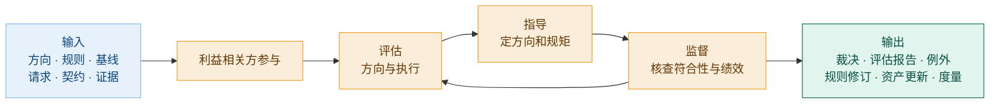
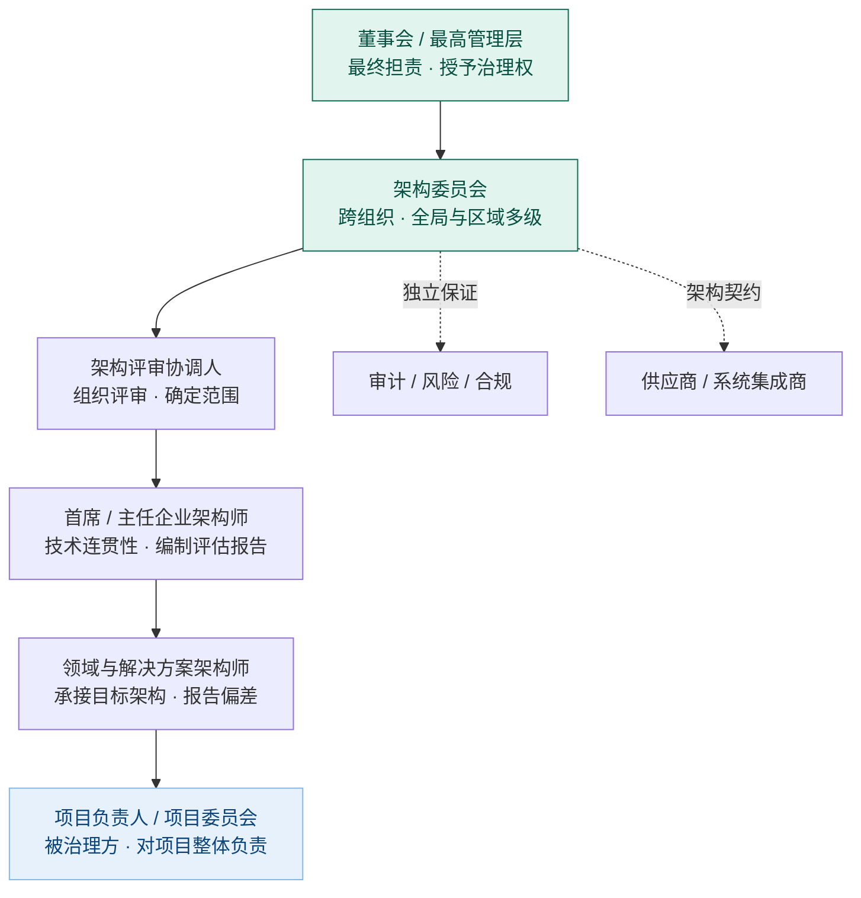

# 架构治理研究报告

## —— 从标准依据到责任主体

**Architecture Governance: A Research Report**

> **编号**：29（研究报告稿）
> **日期**：2026-09-18
> **主题**：架构治理（architecture governance）的标准依据与概念分析——定义、目的、对象、输入与输出、责任主体
> **权威来源**：以 **TOGAF** 的架构治理定义与治理框架为主；治理语义参考 **ISO/IEC 38500:2024**；架构与架构过程参考 **ISO/IEC/IEEE 42010:2022、42020:2019**
> **相关报告**：28 号《治理概念研究报告——从 ISO 37000 定义到域治理实例》——治理本体与六类域治理实例；本报告是其架构域的专门展开，架构治理与 IT 治理的边界口径取自该报告 §5.5／§6.3
> **术语口径（一）治理侧**（2026-09-21 用户裁定「以 29 号为依据对齐之前各报告」后，本报告**自身亦已原地对齐 28 号**）：治理侧术语一律按 **28 号《治理概念研究报告》**（ISO 37000／38500 为权威）——organizational purpose＝**宗旨**（原「运营目的」全篇 10 处已换，含定义句与 §3／§4／§5）；accountability 一族按 **28 号 §2.3.3 的三槽分用**——**担责**（术语位与职能位：定义句「指导、监督、担责」、判据「担责不可委托」「担责不下放」）、**问责**（动词位：「控制与问责」）、**述责**（动作层）；**禁用**履责／追责、动词位不用「负责」；policy＝**方针**、objective＝**目标**、responsibility＝**责任**（五者不混用）。**保留不改**：逐字引文与外部方法论原文——TOGAF 治理内涵四句的「担责实践」（其英文原文即 accountability）、TOGAF 中文传播条的「问责制」（引他人表述）、反模式清单的「有名字无问责」（固定说法）。
> **用语衔接**：30 号《架构描述核心概念研究报告》§5 的「目的」（它为何被立项、被运营）即 28 号 §2.8 的「宗旨（organizational purpose）」——两词所指相同，本报告已统一取「宗旨」
> **术语口径（二）架构侧**：governing principles **一律取国标定名「管控原则」**（自撰正文）；**governs 作动词**（架构视角—架构视图关系名）译「治理」——定语位与动词位是**分工**，不是同一用法；指组织/公司治理原则处的「治理原则」保持不变。fundamental 取「基本」（逐字引 GB/T 45630—2025 时照抄「基础」）；life cycle 取「生存周期」；stakeholder 取「利益相关方」
> **概念依据**：架构、关注点、架构视角、架构视图四概念的定义、关系、界分与译名，一律以 30 号《架构描述核心概念研究报告》为准（依 GB/T 45630-2025／ISO/IEC/IEEE 42010:2022）
> **文档版本**：v1.3（创建于 2026-09-18；2026-09-21 第一轮对齐 30 号；2026-09-21 第二轮收口按用户裁定统一国标定名；2026-09-21 第三轮**本报告自身对齐 28 号术语＋判据措辞统一＋两项缺口建表登记**）
> **约定**：英文术语首次出现附中文对照；取不到原文的表述标「未确认」，不以检索摘要充当证据
>
> **修订记录**
>
> | 版本 | 日期 | 修订内容 | 依据 |
> |---|---|---|---|
> | v1.0 | 2026-09-18 | 创建 | — |
> | v1.1 | 2026-09-21 | 架构定义补足第二个宾语（该实体及其相关生存周期过程）并标注 GB/T 45630-2025, 3.2／ISO/IEC/IEEE 42010:2022, 3.2；删除「架构与治理在定义层咬合」的误读，改立 governs 与架构治理的分野；视点→架构视角；工作产物→工作产品；方向类输入标明「目的＝裁量基准、关切＝合法性来源与雷达」；例外补分级；基线补两条生命线；GB/T 45630—2025 采标关系补标等同采用（IDT）；补与 30 号的互参 | 30 号《架构描述核心概念研究报告》§2.1、§3.7、§5.5、§5.6、§7.3、§8.2 |
> | v1.2 | 2026-09-21 | **第二轮收口**：按用户裁定撤销 v1.1 的分流政策，自撰正文 governing principles 统一取国标定名「**管控原则**」；定义句换为 canonical（实体在其环境中的基本概念或属性，以及该实体及其相关生存周期过程的实现和演化的管控原则）；补明定语位「管控原则」与动词位「治理（governs）」的分工；自撰正文 life cycle→「生存周期」（标准转述与报告转述处同改）；自撰正文 stakeholder→「利益相关方」（含「相关方参与」→「利益相关方参与」）。**指组织/公司治理原则处的「治理原则」保持不变**（§1.1 ISO/IEC 38500 语境、GOV.UK／敏捷交付治理原则及其来源行）；T/ISC「治理及管控」章名不变 | 用户 2026-09-21 裁定；GB/T 45630—2025；30 号 §8.2 |
> | v1.3 | 2026-09-21 | **第三轮（用户四条指令）**：①**本报告自身对齐 28 号术语**（原头部「用语差异」声明自己沿用旧口径、术语以 28 号为准——现改为**原地统一**）：organizational purpose 全篇「运营目的」→「**宗旨**」（10 处，含定义句、§一 TOGAF 表、§2.1 四要素、§3.1 前提一及表、§4.1、§5.1 方向类、§十结论）；accountability 一族按 28 号 §2.3.3 **三槽分用**——定义句与职能位「问责」→「**担责**」（§1.1 三职能句、§2.1、§3.1 结论句、§6.1 图、§6.2 表、§6.4 判据「担责不可委托」「担责不下放」、§7 表、§8.4 表、§十结论），**保留动词位「问责」**（§1.1「控制与问责」）、逐字引文与外部原文（TOGAF 四内涵的「担责实践」、TOGAF 中文传播「问责制」、反模式「有名字无问责」）；禁用「追责／履责」；②**判据措辞统一**——§2.2 新增「判据族的分工」块，把「三条分界判据（判哪算不算治理）」与「跨出单管理层权限（判该不该上治理）」分列，后果与门槛两句各自定稿；③**两项缺口建表登记**——§九 落点表两行改「已建登记载体」，指明 `90-治理登记/01-例外与治理机构登记.md`（A 治理角色与授权／B 裁决登记／D 判据族／E 例外登记），并补登记范围边界与「登记在册不等于获准」 | 用户 2026-09-21 指令第 1～4 条；28 号 §2.3.3、§2.8、§8.1；GB/T 45630—2025 |

---

## 一、标准版图：谁在定义架构治理

「架构治理」不是单一标准的术语，它由三类来源拼合而成：治理的通用语义、架构的专业语义、以及把两者接起来的架构治理框架。

| 来源 | 现行版本 | 提供什么 | 在架构治理中的角色 |
|------|---------|---------|------------------|
| **TOGAF** | 第 10 版（2022-04 发布，基础内容拆为六份文件，治理归入《企业架构能力与治理》；2025 年未出新版本）；治理框架原文见 9.2 第 50 章 | 架构治理的定义、治理框架、架构委员会、合规评审、架构契约、ADM 阶段 G 与阶段 H | 唯一给出「架构治理」正式定义的框架 |
| **ISO/IEC 38500** | 2024 版（2024-02 发布，取代 2015 版） | 治理的通用定义、原则、执行模型；与 ISO 37000 组织治理对齐 | 治理语义的上游，适用于一切领域对象 |
| **ISO/IEC/IEEE 42010** | 2022 版 | 架构与架构描述的定义、利益相关方与关注点、架构视角与架构视图、符合性 | 界定「被治理对象」是什么 |
| **GB/T 45630—2025**《系统与软件工程 架构描述》 | 等同采用（IDT）ISO/IEC/IEEE 42010:2022，2025-04-25 发布、2025-11-01 实施，SAC/TC 28 归口 | 上述要求的中文规范文本 | 架构、关注点、架构视角、架构视图与 **governing principles（管控原则）**的中文定名依据 |
| **ISO/IEC/IEEE 42020** | 2019 版，**修订中**（新工作项 2026-05-22 注册） | 六类架构过程：治理、管理、概念化、评估、细化、使能 | 治理在架构过程模型中的位置 |
| **ISO/IEC/IEEE 42030** | 2019 版，**修订中**（新工作项 2026-05-22 注册） | 架构评估框架：组织与记录架构评估的手段 | 治理的取证手段之一 |
| **ISO/IEC/IEEE 42024 / 42042** | 制定中，前者已至国际标准草案阶段 | 架构基础词汇、概念与原则；参考架构 | 未来架构术语的规范来源 |
| **COBIT** | 2019 版 | 治理与管理的分离、董事会层面的评估-指导-监视、治理域五个目标 | IT 治理的操作框架，与架构治理对接 |
| **ITIL 4 / SAFe** | ITIL 4；SAFe 现行版 | 治理机构与指导-监督-评估；架构管理实践；精简治理、护栏、架构跑道 | 服务管理与规模化敏捷语境的治理口径 |
| **国内标准** | 见 §一.3 | 企业架构管理成熟度、IT 服务治理 | 中文语境下的评价尺度 |

### 1.1 定义权的分布

三个来源各管一段，不可互相替代。

**治理是什么，看 ISO/IEC 38500。** 治理是治理机构对组织行使指导、监督、担责的职能，位于管理层之上，管方向与框架，不替管理层干活。2024 版做过一次结构性换血：

| 变化 | 2015 版 | 2024 版 |
|------|--------|--------|
| **成果** | 自定治理目标 | 沿用 ISO 37000 组织治理的三项成果：有效绩效、负责任的受托、伦理行为 |
| **原则** | 六项自有原则 | 采用 ISO 37000 的十一项原则，并给出 IT 治理场景的适用指引 |

变化的含义是：IT 治理乃至架构治理不再自定一套治理原则，而是组织治理原则在专业域的应用。执行模型仍以四活动循环表述——利益相关方参与、评估、指导、监督。

**架构是什么，看 ISO/IEC/IEEE 42010。** 架构是实体在其环境中的基本概念或属性，以及该实体及其相关生存周期过程的实现和演化的**管控原则**（governing principles；GB/T 45630-2025, 3.2／ISO/IEC/IEEE 42010:2022, 3.2，源自 42020:2019, 3.3）——此处 governing 是**定语**（故作「管控原则」），指具有规约力、可据以判定违规；与之相对，**governs 作动词**连接架构视角与架构视图，作关系名译「治理」——**定语位与动词位是分工，不是同一用法**。这一定义把**有约束力的原则**写进了架构——架构与架构治理在定义层**相邻但不同义**：governs 是概念模型里两个元素之间的关系（无裁量者，违反即「不符合、视图不成立」），architecture governance 是组织治理职能（有裁量者，违反走例外／豁免）。见 30 号 §3.7、§7.3。

**架构治理怎么运转，看 TOGAF。** TOGAF 给出可操作的治理框架：谁批准、评审什么、例外怎么放、契约怎么签、状态怎么报。

TOGAF 对架构治理的定义是全文引用的基准：

> *Architecture governance is the practice and orientation by which enterprise architectures and other architectures are managed and controlled at an enterprise-wide level.*
>
> 架构治理是在企业级范围内对企业架构及其他架构实施管理与控制的实践与取向。

定义中「includes」四句给出内涵边界：

| 内涵 | 内容 |
|------|------|
| **控制体系** | 对所有架构构件与架构活动的创建和监视建立控制，确保架构在组织内被有效引入、实现与演化 |
| **合规体系** | 建立确保符合内部标准、外部标准与监管义务的机制 |
| **受控过程** | 在约定参数内有效管理上述过程 |
| **担责实践** | 建立面向明确识别的利益相关方群体的担责，利益相关方既在组织内也在组织外 |

注意定义用词是 managed and controlled，不是 built。治理的语义中心是控制与问责，不是构建。

**一个需要记录的事实：架构治理在 ISO/IEC/IEEE 体系里没有正式术语定义。** 三处证据：42010:2022 的适用范围明确排除过程、方法与工具，因而不可能定义治理；42020:2019 把治理作为**过程名**处理，用过程描述而非术语条目的方式表达；ISO/IEC 38500:2024 定义的是 IT 的治理，其文本不使用「架构治理」一词。定义只能取 TOGAF，治理语义只能取 ISO/IEC 38500，两者之外没有第三个权威来源。

限定条件必须同时记录：42020 第 3 章术语表的正文未能获取，因此准确表述是「**未检索到**国际标准定义该术语的证据」，而不是「确认其不存在」。

### 1.2 治理的层级与邻域

TOGAF 明确治理在企业内是分层嵌套的，架构治理是其中一层：

```
公司治理 ⊃ 技术治理 ⊃ IT 治理 ⊃ 架构治理
```

每一层都可能存在于全球、区域、本地等多个地理层级。这个层级关系解释了两件事：架构治理的授权来自上层治理，不能自授；架构治理的规则不得与上层治理冲突。

与相邻专业域的关系是另一个维度——**并列同构，而非包含**：

| 领域 | 管理伞 | 治理 | 管理 |
|------|------------|------|------|
| 数据 | 数据管理 | 数据治理 | 数据质量、元数据、集成、安全 |
| 架构 | 企业架构 | 架构治理 | 架构设计、建模、技术选型、系统实施 |
| 流程 | 流程管理 | 流程治理 | 流程设计、建模、自动化、优化 |

三个领域的权威框架都划了这条线。领域层面的伞是「管理」而不是「治理」，这与企业层面「治理 ⊃ 管理」的方向相反——因为企业层面治理的对象是整个组织，而领域层面「XX 治理」的对象是「XX 这个东西」，对象不同，层级关系随之不同。

这条界线同时是防病线：把设计、编码、平台实施算进「架构治理」，是用治理的名义干管理的活，后果是团队分不清哪些决策该上委员会、哪些自己拍板，要么事事上报成瓶颈，要么事事自搞绕过治理。

这层嵌套关系有规范表述可循，但**不能照搬到架构上**。ISO/IEC 38505-1 定义数据治理的写法是：数据治理是 IT 治理的子集或域，IT 治理本身是组织治理的子集或域。数据可以这样嵌套，架构不行——**架构治理与 IT 治理的对象不同**：IT 治理的对象是组织对 IT 的使用，架构治理的对象是架构，而架构不一定含 IT，厂房布局、组织结构、产品的物理架构都是架构。TOGAF 那条「公司治理 ⊃ 技术治理 ⊃ IT 治理 ⊃ 架构治理」描述的是企业内**治理域的分层授权**，不是说架构治理在对象上从属于 IT 治理。两者在企业架构这一交叠区重合，交叠区外各管各的。本报告此处的口径与 28 号报告 §5.5、§6.3 一致。中文「架构治理」另有一义——以架构为手段去治理企业或 IT；本报告用的是前者（governance of architecture），见 30 号 §5.8。

### 1.3 国内标准的对照

国内标准对架构治理有两处直接落点：一处是国家标准中的独立分部，一处是团体标准中的能力域。

**GB/T 45963.3—2025《数字政府架构框架 第3部分：治理》**（2025-08-01 发布，2026-02-01 实施，SAC/TC 28 归口）以「治理」为整部标准的主体内容。其范围是：给出数字政府架构框架中治理的内容，规定治理组织、治理过程、治理结果、治理保障的要求，适用于在治理维度对推进数字政府顶层设计顺利执行进行管理、控制和监督。

四要素的划分与 TOGAF 的治理框架同源，可逐一对应：

| 国标四要素 | 对应的治理框架要素 |
|-----------|-----------------|
| **治理组织** | 治理机构：架构委员会及其授权层级 |
| **治理过程** | 治理流程：评审、裁决、例外、变更、监视 |
| **治理结果** | 治理产物：裁决、评估结论、契约、基线、日志 |
| **治理保障** | 治理的制度、工具与资源支撑 |

值得注意的是范围表述的落点——「管理、控制和监督」，与 TOGAF 定义中的 managed and controlled 及治理三职能中的监督同向。

**T/ISC 0124—2026《面向数字化转型的企业架构管理成熟度模型》**（中国互联网协会发布，2026-07-20 发布，2026-08-20 实施）把架构治理作为四大能力域之一，与战略组织与文化、企业架构设计、企业架构价值评价并列。第 8 章「企业架构治理及管控」分四节：

| 节 | 内容 |
|----|------|
| **8.1 架构需求管理** | 以架构为基准管理战略需求、业务需求与 IT 需求的提出、评审、排序与全生存周期 |
| **8.2 架构一致性管理** | 项目级、系统级架构对企业级架构的遵从 |
| **8.3 架构资产管理** | 架构资产的分类分域、呈现形式、可分析程度与应用场景 |
| **8.4 架构管理工具** | 支撑治理活动的平台与工具 |

该标准把治理的落点定在「一致性」上：治理及管控的目的是围绕数字化项目从需求确立、建设到落地的全生存周期把控质量，实现项目级、系统级架构对企业级架构的有效遵从。8.2 节列出六个架构治理流程：

| 流程 | 内容 |
|------|------|
| **架构度量** | 确保软件架构支持当前与未来业务需求，且高效、可维护、可扩展 |
| **架构项目实施** | 确保项目从启动到交付各阶段有序进行 |
| **架构检查** | 评估项目级架构的合规性、一致性、可行性、可维护性及风险 |
| **架构变更** | 管理企业级与项目级架构的变更请求，评估影响并控制实施 |
| **架构沟通** | 确保相关人员对架构有清晰理解，保持信息流通 |
| **架构落地跟进** | 每半年或每年度跟进一次，确保架构项目有序落地而不偏离 |

成熟度分级把治理的组织化程度作为分档依据：第三级要求形成配套治理流程；第四级要求企业层面建立架构治理组织与管理流程、制定架构委员会章程、建立架构责任体系与统一的架构管理归口部门；第五级要求治理及管控成为日常工作并可量化度量。这套分级给出的经验判断是：治理的成熟不由流程数量衡量，而由「有章程、有归口、有责任体系、有度量」衡量。

**比国标更进一步的是一份团体标准。** T/CESA 1243—2023《数字政府架构框架 架构治理》（中国电子工业标准化技术协会，2023-01-13 发布并实施）是国内目前最接近「架构治理」专门标准的文件，与同系列的 1241 参考模型、1242 架构开发、1244 架构评估配套。它规定的六项内容与本文分析的结构逐项对应：

| T/CESA 1243 的六项规定 | 本文对应 |
|---------------------|---------|
| 架构核心资产、架构资产管理活动 | §四 对象：治理什么 |
| 架构治理组织 | §六 责任主体 |
| 治理过程 | §五 输入与输出 |
| 治理工具、治理保障 | §七 机制工具箱 |

**IT 服务治理的国家标准不含架构治理。** GB/T 34960 系列五部分——通用要求、实施指南、绩效评价、审计导则、数据治理规范——覆盖治理要求、实施、绩效、审计与数据治理五段，没有架构治理的对应部分。架构治理在国标体系里目前是空白，只在数字政府这一特定领域以「架构框架」分部形式出现。

与架构直接相关的现行国标采标另有一项：GB/T 45630—2025《系统与软件工程 架构描述》（2025-04-25 发布，2025-11-01 实施），**等同采用（IDT）ISO/IEC/IEEE 42010:2022**。它规范的是架构描述，不是架构治理。

**中文的「架构治理」定义出自行业与厂商，不出自标准。** 可检索到的中文定义有两类来源：

| 来源 | 定义表述 |
|------|---------|
| 厂商方法论文章 | 架构治理是对企业信息化全过程的责任明确、规则清晰与行为可控的制度化安排 |
| TOGAF 中文传播 | 架构治理是管理决策权、合规性与问责制的机制，四个维度为结构、流程、内容、行为 |

两类表述与 TOGAF 原文不冲突，但都不具备标准效力。T/CESA 1243—2023 虽以架构治理为题，其定义条款的公开预览不完整，未能核实。结论是：定义取 TOGAF 与 ISO/IEC 38500。

**实践侧的组织形态已经趋同。** 中国信通院《企业架构实践与创新观察报告（2025年）》把架构落地概括为「六步骤 + 两支撑」：管理体系完善含架构文化与人才、三级治理组织、全流程制度；数智技术赋能含架构治理平台与架构资产全生存周期管理。三级治理组织与 TOGAF 的全球、区域、本地多级委员会结构同构。

实践侧的痛点有稳定的中文表述——企业架构「看不清、管不住、落不实」。低成熟度的特征被写进标准分档：需求缺乏体系化评审流程，难以避免项目间冲突与重复建设；架构管理依赖人治；架构资产一致性难保证、变更无法及时同步、缺乏版本管理。这些症状与前文的反面清单一一对应。

### 1.4 治理在国际过程模型中的位置

ISO/IEC/IEEE 42020:2019 把架构过程分为六类：**治理、管理、概念化、评估、细化、使能**。治理被列为第一个过程名，与管理并列而非置于管理之下，这与 §2.2 的分界判据同向。标准第 6 章即 Architecture Governance process，内部结构为 6.1 目的、6.2 结果、6.3 实施、**6.4.1–6.4.6 六项任务**、6.5 工作产品（Work products）；第 7 章为架构管理过程，其中 7.4.4 管理架构集合。该标准当前处于修订中，新工作项已于 2026-05-22 注册，修订后的范围仍保留同一过程集——因此第 6 章的六项任务存在变动可能。

一个易被跳过的要点：六项任务中「**定架构目标**」与「**查对治理指令的遵守**」最常被整个略过，把架构治理做成了图纸审批。

另有两项在研标准与治理的规范基础相关：架构基础（术语、概念与原则）已进入国际标准草案阶段，参考架构尚处草案项目阶段。两者发布后，将补上架构领域长期缺失的规范性词汇层——那正是「架构治理」获得标准术语定义的前提。

---

## 二、定义：架构治理是什么

### 2.1 合成定义

把治理的通用语义与架构的专业语义拼合，得到本项目采用的工作定义：

> **架构治理是治理机构对「架构」这一领域对象持续行使指导、监督、担责的职能——通过明确决策权、设定规则、检查符合性、处置例外、监视架构状态，使架构在持续演化中保持与宗旨的一致。**

定义可拆为四要素：

| 要素 | 内容 | 缺一不可的理由 |
|------|------|--------------|
| **主体** | 治理机构及其授权的架构委员会 | 无主体则无人担责，担责落空 |
| **对象** | 架构决策、决策遵从、架构演化、架构资产 | 无对象则治理变成泛泛管理 |
| **手段** | 规则（原则/标准/基线）、评审、契约、例外、监视 | 无手段则治理只剩口号 |
| **目的** | 保持架构与宗旨的一致 | 无目的则治理退化为流程合规 |

### 2.2 判据：治理与管理如何分界

架构治理最常见的误用是把架构管理的工作叫成治理。分界判据有三条，任一条不成立即不属治理：

| 判据 | 治理 | 管理 |
|------|------|------|
| **层级** | 在管理层之上，定方向与框架 | 在治理定下的框架内执行 |
| **对象** | 目的、原则、基线、例外、担责关系 | 方案、模型、代码、配置、部署 |
| **不可自裁** | 判据本身的变化只能由治理裁决 | 框架内的取舍由管理自行决定 |

判据的用法是逐段定性。以「目的漂移后调整架构」为例：评估发现漂移属治理；追认漂移为新目的或拉回原目的属治理；根本集合重审与原则基线批准属治理；架构调整与实施迁移属管理。整条链上只有前段是治理，后段是治理裁决之后的执行输出。

> **判据族的分工（措辞统一口径，2026-09-21）**：仓库里论「某议题是否属治理」时，出现过两条**层级不同**的说法，容易并读成同一族，此处一次分清——
>
> | 说法 | 它答的问题 | 在判据族中的位置 | 措辞 |
> |---|---|---|---|
> | **三条分界判据**（层级／对象／不可自裁） | 一件事**算不算治理** | **判据**（判定用，逐段定性） | 「任一条不成立即不属治理」 |
> | 「跨出单管理层权限，就要治理介入」 | 某议题**该不该上治理** | **组织理由**（介入门槛，不是判定判据） | 「跨出单管理层权限的议题，须提交治理机构——这是**需要治理介入的理由**，不是归管理的依据」 |
>
> 两条不可互换：**判据管分类，理由管升级**。举例——某技术选型超出单管理层权限，须上治理机构裁决；但它**是否属于治理**仍按三条判据逐段定性（定规则、批准例外段属治理；选哪家、怎么实现属管理）。反过来，一件事即使不跨层，只要触及判据本身（第三判据），仍属治理。**推论：把「跨部门／跨管理层」当判据用，会得出「不跨层的架构治理不算治理」的错误结论**——产品架构治理往往落在一个产品线内，它照样是治理，只是机构可就近、治理强度可低。
>
> 本报告 §6.3 列的三级治理组织、§7 的例外通道，都是按这条理由设计的升级路径。

### 2.3 企业层面的治理与管理方向相反

组织层面，治理在管理之上：董事会在 CEO 之上。领域层面，管理是伞、治理是其中一个领域。两者不矛盾——判据是治理对象是什么。对象是「整个组织」时，治理在上；对象是「某个专业域」时，该域的管理伞包含该域的治理职能。这条区分防止一种典型混乱：把架构治理说成「架构工作的最高层」，进而让它去指挥具体的架构设计。

---

## 三、目的：为什么必须做架构治理

### 3.1 根本理由：三个前提

治理不是管理学趣味，它由三个前提推出来，三个前提缺任何一个，治理都可省。

**前提一：架构由宗旨评判，而目的归治理机构。**〔术语：本节的「宗旨」即 28 号 §2.8 定译的 organizational purpose——它回答「这个实体为何被立项、被运营」，是架构合格判据的基准；「目的」是行文中的同义通称，术语位一律作「宗旨」（28 号 §2.8 的四层边界：宗旨／目标／需求／特性各占一层，不重叠）。〕

架构的正当性来自它对宗旨的必要与充分——目的变，架构的合格判据随之变。而目的定义权在治理机构，不在架构师，也不在开发团队。架构师对目的有质询权与守护责，但不定义目的。

**前提二：架构与目的的一致不会自己保持。**

目的变化有两条路，两条都不会自动触发架构重审：

| 变化路径 | 特征 | 治理的响应 |
|---------|------|-----------|
| **战略调整** | 显性、有宣告，企业战略随环境调整，宗旨随之重定 | 评估活动发现原架构不再合格，启动重审 |
| **日常局部决策悄悄带偏** | 无症状、无宣告，业务在日常运行中一点点变 | 靠持续评估捕捉，最容易被执行者失敏 |

**前提三：执行者有局部最优的激励。**

更快的交付、更熟悉的技术栈、更省事的接口，都是执行层的合理偏好，但它们的总和就是架构漂移。偏离是系统性倾向，不是偶发失误，因此需要常设机制而非一次性检查。

三个前提合起来给出结论：**必须有一个在管理层之上、对目的负责、且不在执行链上的机构，持续对架构行使指导、监督、担责。**

### 3.2 目的清单

治理目的在三个抽象层次上表述，三层指向同一件事：组织治理层是 ISO 37000 的三项成果——有效绩效、负责任的受托、伦理行为；IT 与架构治理把这些成果落成可判断的准则；TOGAF 列出的收益是这些准则在架构域的可观察表现。

TOGAF 列出的治理收益可作为目的清单：

| 目的 | 内容 |
|------|------|
| **战略一致** | 把 IT 过程、资源与信息链接到组织战略与目标 |
| **架构完整与一致** | 保证子架构之间一致，避免各部门各建一套 |
| **合规与监管** | 满足内部标准、外部标准与监管义务，支持可审计性 |
| **资产保护与复用** | 充分利用信息、基础设施与软硬件资产，识别可复用构件 |
| **风险可视化** | 使风险可见并前置管理 |
| **担责与可溯** | 对明确识别的利益相关方负责，决策可追溯 |
| **能力成熟** | 提升组织内架构学科的成熟度，使架构驱动开发成为惯例 |

反面清单同样有诊断价值。缺治理会发生五件事：一致性丧失、技术债务安静积累、战略偏离、供应商锁定、复杂性失控。这五件事的共同点是**没有单一环节会报警**——它们都是全局性退化，只有站在全局视角的机构才能看见。

量化侧的证据同样指向这一判断。学术上把「意图架构与实现架构之间的偏离」称为架构侵蚀（architecture erosion），研究结论是它**在很大程度上由非技术因素造成**——这把治理从技术问题变成组织问题。偏离的规模有公开数字：一项覆盖五国 5000 余名知识工作者的调查显示，52% 的员工曾下载未经 IT 批准的应用程序，34% 的 SaaS 应用未受单点登录保护；对百亿行以上代码的分析估算全球技术债达 610 亿个修复工作日；另一项估算认为美国劣质软件的年成本不低于 2.41 万亿美元，其中累积技术债约 1.52 万亿美元。这些是治理需求侧最有力的论据：借贷已经发生，利息可见。

### 3.3 治理的成本与失效两侧

治理不是越多越好，它自身有两个失效方向：

| 失效方向 | 表现 | 后果 |
|---------|------|------|
| **过强** | 事事上会、审批周期长于交付节奏 | 团队绕过治理，偏离从显式转入地下，治理反而失明 |
| **过弱** | 评审无否决权、例外无登记、无跟踪 | 监督形同虚设，治理退化为盖章 |

因此治理框架自身也要被治理。TOGAF 的预备阶段做的就是这件事：在架构工作开始前先定义治理框架本身——委员会章程由谁授予、原则多久复审一次、治理流程是否有效。健康指标包括合规率、审批周期、例外数量与技术债趋势。一条经验判据：**如果每个项目都在申请例外，说明标准本身有问题，而不是项目都不听话。**

从业者侧总结的反模式更具体，八种形态可直接用于自查：把文档当治理、把治理当收费站（团队学会规避阈值、改为寻求口头批准）、决策过度集中（团队最终不再提问）、有名字无问责、靠人工执行、靠事故发现的反应式治理、规模一大就失效、以及绕过治理的文化。其中最锋利的一句诊断问句是：**「治理上一次阻止了某件事发生，是什么时候？」** 若答不上来，治理已是橡皮图章。

分析师侧的警告方向相同。一份被广泛引用的「最差企业架构实践」清单里，直接列入「过度的治理与压迫式保证」「为一切制定标准」「象牙塔式架构」「缺乏关键绩效指标」四项。同一来源在数年后转向主张自动化治理与结果导向度量——措辞变化的背后是「人审」与「机审」的分野，而非治理必要性的动摇。

---

## 四、对象：治理什么

### 4.1 四层对象

治理对象不是「架构文档」，而是「架构与宗旨的一致」。按治理动作的落点分四层：

| 对象层 | 具体问题 | 主要由谁守 |
|--------|---------|-----------|
| **架构决策** | 基本概念与属性的取舍是否仍与目的一致 | 架构委员会 |
| **决策遵从** | 实现与设计是否偏离已确立的元素、关系、原则 | 符合性评审 |
| **架构演化** | 变更是否受控、不变量是否守住、变体是否在允许范围内 | 契约 + 基线与变更控制 |
| **架构资产** | 架构描述、原则库、架构视角、可追溯链是否完整可信 | 架构职能 + 仓库管理 |

四层是递进关系：决策不对，遵从无从谈起；遵从无据，演化失控；资产不实，前三层都失去凭据。

### 4.2 判据：凡进入实现的变更，都是治理对象

从操作角度，治理对象可简化为两类：

- **要进入实现的事项**：新建系统、重大改造、技术选型、采购与外包、跨域接口、共享资产的建设与废止。
- **架构自身的变更**：概念与属性、架构原则、标准目录、基线、允许的变体范围。

例外，即受控的偏离，同时属于两类：它既是对某个实现事项的放行，也是对架构规则边界的一次调整。

### 4.3 不治理什么

划出反面清单，防止治理越界：

- 架构怎么设计、模型怎么画——管理
- 代码怎么写、配置怎么调——管理
- 项目怎么排期、资源怎么调——管理
- 具体技术问题的技术裁决——管理，除非触及原则、标准或基线

治理在这些事项上的正确姿势是**设定框架并检查是否守框**，不是替管理做决定。

---

## 五、输入与输出

### 5.1 输入

治理的输入按性质分七类。缺项会导致特定失效，故列出对应关系：

| 类别 | 内容 | 缺失后果 |
|------|------|---------|
| **方向类** | **宗旨**（organizational purpose，28 号 §2.8 定译；本报告旧稿作「运营目的」，同一物——**裁量基准**）＋企业战略、利益相关方需求与关注点（**合法性来源与雷达**） | 缺基准则只能评形式；缺雷达则漏掉无条目承接的关切 |
| **规则类** | 架构原则、标准与技术目录、监管与合规义务、裁剪后的架构框架 | 评审无据，逐案拍脑袋 |
| **基线类** | 基线架构与目标架构、架构路线图与过渡架构、架构描述、架构仓库内容 | 无从判断偏离 |
| **请求类** | 项目提案、变更请求、例外申请、采购与技术选型事项 | 治理无对象，沦为旁观 |
| **契约类** | 架构契约及其符合性要求、服务水平与运营水平约定 | 治理要求进不了交付过程 |
| **证据类** | 实施状态与符合性证据、成本与绩效数据、缺陷与技术债数据、上轮行动跟踪 | 监督无凭据，报告失真 |
| **组织类** | 治理章程与授权、角色与职责、议事与议程机制、支撑工具与平台 | 决议无人执行 |

### 5.2 输出

| 输出 | 内容 | 消费者 |
|------|------|--------|
| **裁决** | 批准、否决、附条件批准；架构契约签署 | 项目、发起方、架构职能 |
| **符合性评估报告** | 对照标准与原则的评估结论、发现的偏差、建议 | 架构委员会、业务方、管理层 |
| **例外处置** | 豁免及其生效期限、约束条件、补救计划 | 项目、后续评审 |
| **规则修订** | 原则、标准、基线的更新；架构变更请求 | 全体执行者 |
| **资产更新** | 架构仓库更新、基线发布、治理日志、架构决策记录 | 架构职能、后续项目 |
| **行动与裁决** | 行动跟踪表、升级与争议裁决 | 利益相关方 |
| **度量与报告** | 合规率、例外账龄、架构债趋势、决策周期 | 治理机构、上层治理 |
| **能力产物** | 成熟度评估、角色与技能要求、培训与认证 | 组织 |

其中三项最容易被忽略，却是治理是否真在运转的证据：**例外台账**度量安全阀的使用强度，**治理日志**记录决策及其理由，**行动跟踪**检验决议是否闭环。

治理仓库本身的必备内容同样值得单列：所有架构制品、服务协议、合同与支持信息都须经登记、验证、批准、管理与发布的正式流程；仓库至少包含参考数据、过程状态与审计信息三类，其中过程状态指未决的合规请求、豁免请求与合规评估调查。这套内容支撑的是「已获批准项目的关键决策与责任人」的可追溯。

### 5.3 治理循环

治理不是一次性评审，而是持续循环。ISO/IEC 38500 的执行模型给出四活动，TOGAF 给出产物形态，两者合起来构成完整回路：



回路有三条反馈边值得单列：

1. **监督 → 评估**：符合性结论回流为下一轮评估的输入。
2. **输出 → 输入**：裁决、例外、规则修订沉淀进架构仓库，成为下一轮的基线类输入。
3. **例外 → 规则**：同类例外反复出现，触发标准本身修订，而不是继续个案放行。

TOGAF 对这一回路的经典表述是：治理设定规则，管理在规则内博弈。

回路还有一半在 ADM 的阶段 H。阶段 H 的目标之一就是运行治理框架本身：持续监视治理请求、技术演进与业务变化，并按变更规模分流——影响两个以上利益相关方，或触及业务战略、基础架构、重大标准的，重入 ADM；只影响单一利益相关方或可用豁免覆盖的，走常规变更管理。变更按性质分为简化、增量与重架构三类。分流判据由治理机构裁决，并与服务管理的变更审批机制对接，且变更审批机构中应有架构代表。

---

## 六、责任主体：谁来做架构治理

### 6.1 治理不是架构师的加餐

责任配置的首要原则是**分离**：定方向与裁决、设计架构、实施交付三者不得同体。理由与前文的判据一致——管理在框架内自裁会使框架失去约束力，执行者自我评审会使偏离不可见。



### 6.2 角色与职责

TOGAF 的合规评审给出八个角色的分工，可作为角色表基准：

| 角色 | 职责 | 治理位置 |
|------|------|---------|
| **架构委员会** | 保证架构一致并支持整体业务需要；发起并监视架构活动 | 决策与担责主体 |
| **架构评审协调人** | 组织整个评审过程，识别利益相关方、确定范围、排期 | 治理过程的组织者 |
| **首席 / 主任企业架构师** | 保证架构技术连贯与前瞻；编制评估报告，向客户与委员会呈现 | 治理的技术支撑 |
| **架构师** | 首席架构师的技术助手，执行具体评审 | 治理的技术支撑 |
| **项目负责人 / 项目委员会** | 对项目整体负责 | 被治理方 |
| **客户** | 保证业务需求被清晰表达与理解 | 目的侧的利益相关方 |
| **业务领域专家** | 保证满足业务需求的过程被论证与理解 | 目的侧的利益相关方 |
| **项目委托人** | 提供业务需求输入 | 目的侧的利益相关方 |

治理侧的三个角色不可合并：委员会掌裁决，协调人掌过程，架构师掌技术判断。三者合一会同时失去独立性与专业性。

### 6.3 委员会怎么建、怎么开

**发起条件。** 触发设立架构委员会的典型事件：新任 CIO、并购、技术平台迁移、IT 与业务明显脱节、试图以技术获取竞争优势、设立企业架构项目、重大业务变革或高速增长、需要复杂跨职能方案。

**规模与构成。** 常任成员四到五人，最多不超过十人；需要来自最高管理层的执行发起人；跨组织且代表全部关键利益相关方；成员可轮换，但任期交错以保持连续性。

**议题结构。** TOGAF 给出的议程骨架可直接复用：上次纪要、变更请求、例外申请、符合性评估、争议解决、架构战略与方向、行动跟踪、契约文档管理、其他事项、会议排期。其中三项是治理的实质动作：**例外审批**、**符合性评估结论**、**争议裁决**。

### 6.4 决策权的配置判据

| 判据 | 内容 |
|------|------|
| **担责不可委托** | 治理机构对架构符合性负最终责任，不能下放给执行者 |
| **具体责任可委托** | 评审、建模、取证等工作可委托给架构职能或外部方 |
| **独立性约束** | 所有流程、决策与机制的设计须尽量减少或避免潜在利益冲突 |
| **目的一致权不下放** | 目的定义与架构合格判据归治理机构，架构师只有质询权与守护责 |
| **例外权上收** | 偏离规则的放行权只能由治理机构行使，且必须登记、限期、到期复审 |

关于独立性有一条必须澄清的事实：**TOGAF 并不要求「做架构」与「治理架构」彻底分离。** 它明确承认，在多数大型项目中架构职能已深度参与、甚至主导被评审的开发项目，并称这是典型的 TOGAF 场景；此时评审由首席企业架构师协调。只有当项目没有配备全职架构师时，才由企业架构职能组织并执行评审，且标准特别注明：**这类评审不能替代架构师在项目中的参与，只能作为补充或指引。** 补偿机制不是分体，而是独立性约束。

这一安排存在公开的反对意见。时任微软 IT 首席架构师认为，架构只是项目须对齐的众多约束之一；把架构放进一个与掌握预算的指导委员会相分离的架构委员会，等于把架构置于失败之地——「权力跟随黄金规则：有钱的人定规则」。按此主张，决策权应归由 CIO 主持的治理委员会，架构评审委员会降为只提建议的工作委员会。框架与分析师在决策权归属上的这处分歧，落到实践中就是必须先回答的一个问题：**架构委员会的裁决权，是否与预算和立项权挂在同一根线上。**

决策权的分级在实践中比「谁批准」更需要明确。一种可用的四级授权：**告知**（低风险可逆，团队自决后告知）、**咨询**（中风险，委员会给建议、团队决定）、**共识**（高风险，委员会讨论、由更高层破僵局）、**批准**（高风险不可逆，由担责人定夺）。分级的价值在于把委员会从「全部批准」中解放出来，只在后两级介入。

### 6.5 来自 IT 治理框架的交叉验证

COBIT 2019 从 IT 治理侧给出同样的角色安排，可作独立佐证：其治理域的目标在责任分配中把担责定在董事会；其角色定义把架构委员会描述为「对引导企业架构相关事务与决策、制定架构政策与标准负责的利益相关方与专家群体」，把首席架构师描述为「对企业架构过程负责的高级个人」。

两份框架在两点上完全一致：**架构政策与标准的制定权在委员会，不在架构师；架构过程的执行责任在首席架构师，不在委员会。** 这正好是 §6.1 的分离原则在另一套框架里的表述。

ITIL 4 给出的是另一种位置关系。它的治理活动与 TOGAF、COBIT 同构——指导、监督、评估；而架构在其中只是三十四项管理实践之一，除架构管理实践本身，没有任何实践的宗旨点名架构。这条反证有诊断价值：**在服务管理框架里，架构不是横切的治理机制，而是被治理的一个专业域**，与 §1.2 的领域层结论一致。COBIT 对其架构目标的表述是「定义一体化企业架构，以提升敏捷性并降低成本」，落点在整合与复用。

**取证限制**：ITIL 4 与 COBIT 的上述内容取自厂商与学术二手来源，官方页面与出版文件不可公开获取；COBIT 架构目标的官方原文与五项管理实践原文未确认。

---

## 七、机制工具箱

治理的意图必须落在具体机制上，否则只剩口号。六个基本机制：

| 机制 | 作用 | 关键设计点 |
|------|------|-----------|
| **架构原则与标准** | 指导：把方向翻译为可判断的规则 | 少而稳，可判断，定期复审；标准目录含技术选型边界 |
| **符合性评审** | 监督：检查实现是否守框 | 在还有时间纠错的时点进行；问开放问题；对照标准而非个人偏好 |
| **架构契约** | 约束：把治理要求写进交付约定 | 明确交付物、质量、符合性要求、度量与时间窗；多方签署 |
| **例外与豁免** | 弹性：给受控偏离留通道 | 有期限、有约束条件、有补救计划、登记在册、到期强制复审；**分级**——少数不可豁免（安全、合规），多数可经流程豁免 |
| **基线与变更控制** | 稳定：让架构描述可追溯 | 架构描述基线化，变更经审批，历史可回溯；架构的生命与架构描述的生命不同步时，按 GB/T 45630-2025 附录 E 处置 |
| **度量与报告** | 反馈：让治理效果可见 | 合规率、例外账龄、架构债趋势、决策周期；报告直达上层治理 |

两条设计要点值得强调：

**没有例外通道的治理会逼出隐瞒。** 偏离不会因为不许而消失，只会从显式转入地下，治理反而失明。豁免的设计价值不在放水，而在让偏离始终是治理视野内的受控对象。

**评审的时点决定它的价值。** 评审要落在业务需求与企业架构已相对稳定、项目架构正在成形、且仍有时间纠正重大错误的时点。太早无物可评，太晚只能追认。

### 7.1 度量：治理是否拖慢了决策

「治理等于拖慢」是最常见的反对意见，也是治理最难自证的一点。TOGAF 的回应是定位：合规评审的产出是交给 CIO 用于决策的少数可度量交付物之一。更有力的是外部基准数据。

总体口径已经不好看：51% 的组织中架构决策需要一个月或更久，51% 的受访者认同「决策太慢，流程是个拖慢一切的麻烦」。真正有信息量的是分组对比。一项面向全球 360 位企业架构师的调研检验了四项治理实践与决策速度的关系：记录架构原则、透明的架构决策流程、架构决策的权威记录系统、有业务方跨部门代表的架构评审委员会。结果是：**四项实践全无的组织，72% 的架构决策需要一个月以上；四项全备的组织，该比例降到 39%**；一个月内完成决策的比例相应从约四成升到六成。同时，91% 的受访者认为透明的决策流程非常重要，81% 认为决策的单一记录系统非常重要，但只有约一成半的组织在评审委员会中有跨业务方代表。

因果方向需要谨慎——治理更完善的组织可能本就更成熟。但至少有一条结论可以确立：**没有观察到「治理越完整、决策越慢」的证据，而相反的相关性明确存在。** 治理拖慢决策的说法，需要主张者自己举证。

从业者侧另有可用的过程指标，其判据往往反直觉：

| 指标 | 参考阈值 | 说明 |
|------|---------|------|
| **评审响应时间** | 95% 的提案在一周内完成 | 治理的节拍必须快于交付节拍 |
| **异步预读率** | 不低于 80% | 会上才第一次看材料，评审必然退化为通报 |
| **批准率** | 70%~80%，不应为 100% | 趋近 100% 即橡皮图章；否决应当被庆祝 |
| **决策推翻率** | 低于 10% | 频繁翻案说明判据不清 |
| **架构相关事故占比** | 低于 20% | 事后反推治理有效性 |
| **架构债趋势** | 随时间下降 | 债的本金是修复结构性质量问题的成本，利息是额外维护成本 |

（本节待补：跨行业的合规率、例外账龄、复用率基准分布。）

---

## 八、现代演进：从关卡到护栏

传统治理以项目里程碑为节拍，以文档审批为形态。在敏捷与持续交付语境下，这一形态的两个前提被削弱：交付节拍快于评审排期，方案在评审时已经落地。治理的形态随之变化，但治理的职能不变——变的是手段，不是目的。

| 维度 | 传统形态 | 现代形态 |
|------|---------|---------|
| **节拍** | 项目里程碑触发的一次性评审 | 持续评估，随交付流进行 |
| **抓手** | 文档与会议审批 | 可执行的约束：策略即代码、平台固化标准、适应度函数 |
| **决策权** | 集中审批 | 边界由治理设定，边界内团队自主决策 |
| **记录** | 会议纪要与评审报告 | 架构决策记录，决策与理由随代码资产同行 |
| **度量的重点** | 合规率 | 偏离发现时延、例外账龄、架构债趋势 |

三种形态的适用条件不同，不是新旧替代关系：

| 形态 | 适用条件 | 风险 |
|------|---------|------|
| **集中式** | 强合规、强监管、变更频度低 | 成为瓶颈，逼出影子 IT |
| **联邦式** | 多业务线、共享平台与标准需要统一 | 责任分散，标准形同建议 |
| **使能式** | 交付节拍快、工程能力强 | 无护栏则退化为放任 |

现代演进的一个直接推论是：治理的投入应从「评审更多方案」转向「把判断固化为护栏」。可自动检查的约束越多，需要人工裁决的事项越少，治理反而更强。

### 8.1 护栏的技术形态

治理从关卡转向护栏，需要可执行的载体。三个载体已经成形：

| 载体 | 形态 | 治理含义 |
|------|------|---------|
| **适应度函数** | 对架构特性的客观完整性评估，可随流水线自动运行 | 把符合性从人工评审变为可自动判定的约束 |
| **架构决策记录** | 五段式——标题、背景、决策、状态、后果；编号单调递增且不复用；接受后不可修改，被推翻时保留旧记录并标记为被取代 | 决策成为只追加的日志，用作参考、审计与事故响应的单一事实来源；防的是盲目接受与盲目推翻 |
| **护栏与架构跑道** | 组合层级的预算、支出与治理政策；支撑近期特性所需的技术基础设施 | 边界由治理设定，边界内的决策下放给团队 |

护栏要落地，需要区分两个层次。**策略即代码**是单条可测试的规则，例如「对象存储必须加密」；**治理即代码**是覆盖策略创建、审批流、跨环境部署、例外流程、审计日志与合规报告的完整体系。技术上分三层：策略定义层、策略决策点、策略执行点。执行点再按介入时机分为主动控制、预防控制与检测控制——分别在部署前扫描、实时阻断、持续监控中告警。这套结构是「靠人工执行」这一类反模式的工程解，也是适应度函数的落地形态。

### 8.2 分级升级取代集中审批

英国政府数字服务的架构决策记录框架给出一条可参照的路径：决策按影响面分级，团队级自主决策，超出边界时逐级升级到项目群架构论坛、部门架构委员会、跨政府技术设计委员会，每级有明确的升级判据。其自述目标是让团队和组织按敏捷服务交付的治理原则自行做架构决策，而不必经过不必要的审批开销——在自主与担责之间取得平衡。

同源的敏捷交付治理原则表述得更直接：治理应当简单且具有支持性，信任个人并把决策权交给团队；交付团队的每个人都对治理负责并参与其中；团队有权决策，只在需要时才升级。

### 8.3 治理的赋能转向

集中架构组的经典问题是所有决策都要批，直接后果是决策变慢。规模敏捷框架给出的替代是：架构师提供架构跑道与护栏，大决策由治理设定边界，小决策留给团队；企业架构的职责从替别人做选择，转为帮助别人做出正确选择并把结论广播出去。该框架还给出一个可观察的成熟标志——治理从被动、人工的流程转为主动、自动化的流程。

### 8.4 AI 时代的治理负载转移

代理式 AI 进入架构与交付链路后，治理机制本身没有新增，变的是各机制的负载。三类新失效模式都指向同一个根因——**授权**：

| 失效模式 | 表现 | 对应治理机制 |
|---------|------|------------|
| **身份漂移** | 智能体以创建者身份、共享账号或模糊的自动化上下文运行，无法证明「谁执行了这个动作」 | 一智能体一非人身份，可单独关停；担责可归因 |
| **工具与连接器蔓延** | 各团队自建工具路径，造成重复工具、权限分歧、无共享契约 | 工具契约标准化 |
| **「听话的」数据泄漏** | 以「凡能读到即可用」做接地，把过期副本与过度共享的数据操作化 | 权威数据边界：可读不等于权威 |

一句概括其性质：助手型 AI 产出文本，其失效是局部的、可逆的；代理型 AI 产出动作，其失效是授权失效。此外，把适应度函数延伸到 AI 治理与度量、持续合规、以及用大模型降低架构漂移，均已进入主流技术雷达；用大模型检测架构决策违背也已成同行评议议题。

「AI 生成架构制品如何治理」尚无系统性同行评议证据，列为待确认项；可确认的是旧机制是 AI 治理的必要条件，而非可绕过的前置。

---

## 九、对本项目的落点

按本仓库的三层构造链，架构治理的对象与主体分布如下：

| 层 | 治理对象 | 治理的主体位置 |
|----|---------|--------------|
| 元流水线 | 元流水线自身的产品架构与设计规范 | 元流水线开发者 |
| EOS 流水线 | 流水线各子线的操作规程与产出物规格 | 元流水线开发者 |
| EOS | EOS 产品架构、引擎与配置 | EOS 构建与运维者 |

本仓库已有的构件，多数已落在治理结构中的某个位置，只是尚未按治理口径命名：

| 治理要素 | 仓库中的现有载体 |
|---------|----------------|
| 架构原则与标准 | 通用设计规范、文档编写约定、各产品设计规范 |
| 架构描述与基线 | 各产品的架构定义文档与产品数据文件 |
| 符合性评审 | 需求符合性审查、规则符合性审查两项技能 |
| 治理日志 | 各文档的变更记录表 |
| 例外与豁免通道 | **已建登记载体**——本目录 `90-治理登记/01-例外与治理机构登记.md` E 表（受控偏离登记：期限／约束条件／放行人／到期复审） |
| 治理机构与授权 | **已建登记载体**——同上 A 表（治理角色与授权）＋ B 表（裁决登记） |

两项缺口值得单列。其一是**例外通道**：偏离规范时原先没有受控登记与到期复审机制，偏离只能靠个案判断，既不可度量也不可追溯——**已于 2026-09-21 建表登记**（见上表载体）。其二是**治理主体**：三层构造链已明确三个角色，但各层的架构裁决权归属与议事机制尚未在主项目区立文；本目录范围内已按「用户掌裁决、AI 居技术支撑位」登记授权与裁决（A／B 表），**主项目区三层的裁决权与议事机制仍属未决**，本表只能记录、不能代立。

> **登记范围的边界**：`90-治理登记/` 只覆盖本子项目目录（研究报告及其口径）。主项目区（通用规范、流水线、EOS）的规则变更不在其登记范围，也不因其存在而改动——依 AOS 根 CLAUDE.md §九「操作上互不干扰」。登记与放行分离：**登记在册不等于获准**，未获放行者记「未裁」。

---

## 十、结论

**定义。** 架构治理是治理机构对架构这一领域对象持续行使指导、监督、担责的职能，通过明确决策权、设定规则、检查符合性、处置例外、监视架构状态，使架构在演化中保持与宗旨的一致。领域定义取 TOGAF，治理语义取 ISO/IEC 38500。

**目的。** 根本理由是三个前提的合成：架构由归治理机构所有的宗旨评判；架构与目的的一致不会自己保持；执行者有局部最优的激励。收益清单为战略一致、架构完整、合规、资产复用、风险可见、担责可溯、能力成熟。

**对象。** 四层递进：架构决策、决策遵从、架构演化、架构资产。操作判据是「凡进入实现的变更，以及架构自身的变更」。不治理设计、编码、排期等技术执行事项。

**输入与输出。** 输入七类：方向、规则、基线、请求、契约、证据、组织。输出八类：裁决、评估报告、例外处置、规则修订、资产更新、行动与裁决、度量报告、能力产物。回路是利益相关方参与、评估、指导、监督的持续循环。

**主体。** 责任在治理机构而非架构师；定方向与裁决、设计架构、实施交付三者必须分离；架构委员会掌裁决，协调人掌过程，架构师掌技术判断；例外权上收，担责不下放。

**边界。** 领域层面管理是伞、治理是其一；企业层面治理在上。把设计、编码、实施算作治理，是用治理的名义干管理的活。

### 待确认问题

1. 42020 第 6 章六项任务的具体条文与 6.5 工作产品清单，以及 2026 年修订立项后是否调整。条款级位置已由 28 号报告依 DIN 目录核实：§6 Architecture Governance process，含 6.1 目的／6.2 结果／6.3 实施／6.4.1–6.4.6 六项任务／6.5 工作产品。
2. ISO/IEC 38500:2024 执行模型的条款位置与四活动原文。
3. TOGAF 第 10 版是否逐字沿用 9.2 的架构治理定义，官方文本需订阅。
4. 跨行业的合规率、例外账龄、复用率的基准分布数据。
5. AI 生成架构制品的治理要求，尚无系统性同行评议证据。
6. 战略与执行差距的量化证据，本轮未取得可验证来源。

---

## 附录A、来源清单

| 编号 | 来源 | 位置 |
|------|------|------|
| S-01 | TOGAF 架构治理章（治理定义、治理框架、关键过程、组织结构和收益） | [The Open Group](https://www.opengroup.org/architecture/doc-review/protected-sanity/htmlclean/chap50.html) |
| S-02 | TOGAF 架构委员会章（角色、职责、设立、运作、议程） | [The Open Group](https://www.opengroup.org/architecture/doc-review/protected-sanity/htmlclean/chap47.html) |
| S-03 | TOGAF 架构符合性章（合规评审目的、角色、步骤、时点） | [The Open Group](https://www.opengroup.org/architecture/doc-review/protected-sanity/htmlclean/chap48.html) |
| S-04 | TOGAF 架构契约章（契约类型与内容） | [The Open Group](https://www.opengroup.org/architecture/doc-review/protected-sanity/htmlclean/chap49.html) |
| S-05 | TOGAF ADM 阶段 G（实施治理的目标、输入、步骤、输出） | [The Open Group](https://www.opengroup.org/architecture/doc-review/protected-sanity/htmlclean/chap15.html) |
| S-06 | ISO/IEC JTC 1/SC 40 白皮书：ISO/IEC 38500 2015 版与 2024 版差异（成果三项、原则十一项、与 ISO 37000 对齐） | [ISO/IEC JTC 1/SC 40](https://committee.iso.org/sites/jtc1sc40/home/projects/wg-1/published-wg1/content-left-area/isoiec-sc-40-wg-1-develops-the-s/white-paper-on-the-differences-b.html) |
| S-07 | GB/T 45963.3—2025《数字政府架构框架 第3部分：治理》标准信息与适用范围 | [中国标准在线服务网](https://www.spc.org.cn/online/749d39768a665b3b3704ba01f449d16e.html) |
| S-08 | T/ISC 0124—2026《面向数字化转型的企业架构管理成熟度模型》全文（含第 8 章架构治理及管控） | [学兔兔标准下载网](https://www.bzfxw.com/TB/1124066.html) |
| S-09 | T/CESA 1243—2023《数字政府架构框架 架构治理》标准信息 | [中国标准在线服务网](https://www.spc.org.cn/online/3a917522dffde35c7a150cfa87095561.html) |
| S-10 | GB/T 34960.1—2017《信息技术服务 治理 第1部分：通用要求》 | [国家标准全文公开系统](https://openstd.samr.gov.cn/bzgk/std/newGbInfo?hcno=164BA5828013B7BF93CC84573E16FABA) |
| S-11 | 中国信通院《企业架构实践与创新观察报告（2025年）》 | [CAICT](http://www.caict.ac.cn/kxyj/qwfb/ztbg//202602/P020260213391813440785.pdf) |
| S-12 | COBIT 2019 治理与管理的定义、治理域目标、角色定义（架构委员会、首席架构师） | [原书影印](https://studfile.net/preview/21467966/page:13/) |
| S-13 | ITIL 4 治理与架构管理实践 | [BMC: Governance in the ITIL 4 SVS](https://dev.blogs.bmc.com/itil-governance/) |
| S-14 | SAFe 敏捷架构、精简治理、护栏、架构跑道 | [Scaled Agile Framework](https://framework.scaledagile.com/lean-governance/) |
| S-15 | 英国政府数字服务架构决策记录框架（分级治理与升级判据） | [GOV.UK](https://www.gov.uk/government/publications/architectural-decision-record-framework/architectural-decision-record-framework) |
| S-16 | 敏捷交付治理原则 | [GOV.UK Service Manual](https://www.gov.uk/service-manual/agile-delivery/governance-principles-for-agile-service-delivery) |
| S-17 | 架构决策记录原始出处 | [Cognitect](https://cognitect.com/blog/2011/11/15/documenting-architecture-decisions) |
| S-18 | SAP LeanIX《EA Insights 2025》：四项治理实践与架构决策速度的相关性 | [SAP LeanIX](https://www.leanix.net/en/company/press/sap-leanix-ea-insights-2025) |
| S-19 | 治理反模式八种与自查问句 | [ServiceNow](https://www.servicenow.com/community/developer-blog/governance-anti-patterns-your-governance-framework-is-thorough/ba-p/3506112) |
| S-20 | 架构侵蚀的学术定义与成因分析 | [Li et al., ICPC 2021](https://arxiv.org/abs/2103.11392v1) |
| S-21 | 治理即代码的三层结构与控制类型 | [Spacelift](https://spacelift.io/blog/governance-as-code) |
| S-22 | 架构评审委员会的存废之争与决策权归属 | [Microsoft Learn](https://learn.microsoft.com/en-us/archive/blogs/nickmalik/should-we-kill-the-architecture-review-board) |
| S-23 | 分析师视角：从守门人到赋能者、自动化治理（二手转述） | [Timo Elliott](https://timoelliott.com/blog/2025/02/5-things-enterprise-architects-are-doing-wrong-and-what-they-should-do-about-it.html)｜[Avolution](https://www.avolutionsoftware.com/id/our-resources/gartner-hype-cycle-for-ea-2026/) |
| S-24 | ISO 标准状态核查：42020/42030 修订立项、42010:2022 状态、42024/42042 在研、38505-1 的「子集或域」定义范式 | [ISS 项目页](https://iss.rs/en/project/show/iso:proj:93813)｜[IEEE SA](https://standards.ieee.org/ieee/42020/7601)｜[ISO/IEC JTC 1/SC 40](https://committee.iso.org/sites/jtc1sc40/home/projects/wg-1/published-wg1.html) |
| S-25 | GB/T 45630—2025《系统与软件工程 架构描述》（等同采用 ISO/IEC/IEEE 42010:2022，IDT；2025-04-25 发布，2025-11-01 实施） | [国家标准全文公开系统](https://openstd.samr.gov.cn/bzgk/gb/newGbInfo?hcno=CC08670D6F0DEBFC70E99E19DDECE755) |
| S-26 | 影子 IT 与 SaaS 蔓延量化（52% 员工下载未批准应用、34% 的 SaaS 未受单点登录保护） | [1Password 2025](https://1password.com/reports/annual-report-2025) |
| S-27 | 全球技术债规模（610 亿个修复工作日） | [CAST 2025](https://www.castsoftware.com/ciu/coding-in-the-red-technical-debt-report-2025) |
| S-28 | 美国劣质软件成本与技术债规模；技术债本金与利息的定义 | [CISQ 2022](https://www.it-cisq.org/the-cost-of-poor-quality-software-in-the-us-a-2022-report/)｜[CISQ 技术债标准](https://www.it-cisq.org/standards/technical-debt/) |
| S-29 | 最差企业架构实践清单（过度治理、为一切制定标准、象牙塔式架构、缺乏关键绩效指标） | [SD Times 转述](https://sdtimes.com/softwaredev/gartners-13-worst-ea-practices/) |
| S-30 | 架构评审的 RACI、四级授权与委员会指标阈值 | [The Art of CTO](https://theartofcto.com/frameworks/architecture-review-process) |
| S-31 | 代理式 AI 的三类失效模式与授权建议 | [M365.fm](https://www.m365.fm/videos/the-agentic-mirage-why-your-enterprise-architecture-is-eroding-under-copilot/) |
| S-32 | 适配函数治理 AI、持续合规、用大模型降低架构漂移（仅核对到条目与定位） | [Thoughtworks 技术雷达](https://www.thoughtworks.com/radar/techniques/continuous-compliance) |
| S-33 | 用大模型检测架构决策违背（仅确认到会议论文题录） | [IEEE ICSA 2026](https://www.computer.org/csdl/proceedings-article/icsa/2026/574000a001/2inK8loOHRK) |

> **取证说明**：TOGAF 各章正文取自 The Open Group 自托管的标准评审镜像，该镜像页脚标注为未批准的草案版本；其治理定义与框架措辞与 TOGAF 9.2 公开复现一致，但与需订阅的 TOGAF 第 10 版官方文本的逐字一致性未核实。ISO、ISACA、BSI 等机构的正式文本均需订阅，本文对应条目以官方范围陈述、官方白皮书与可公开获取的复现为准。

---

## 附录B、调研过程记录

保留调研的负面结果，使后续研究者不必重走已经走不通的路。

### B.1 抓取失败清单

| 目标 | 结果 |
|------|------|
| pubs.opengroup.org（TOGAF 各章直链） | 401 |
| gartner.com（含 Peer Community） | 403 与 Cloudflare 拦截 |
| oreilly.com《Building Evolutionary Architectures》 | 403 |
| infoq.com（含智能体适应度函数相关） | 405 人机验证 |
| mckinsey.com（含战略与执行差距相关） | 连接失败，镜像域名同样失败 |
| mdpi.com、irma-international.org | 403、429 |
| semanticscholar.org | 202 空响应 |
| computer.org 与 IEEE CSDL 正文 | 页面空壳 |
| ISO、ISACA、BSI、DIN、ANSI 标准正文 | 403 或仅提供 PDF |

TOGAF 的可用入口是 The Open Group 自托管路径 `opengroup.org/architecture/doc-review/protected-sanity/htmlclean/chap47|48|50.html`，`pubs.opengroup.org` 全部返回 401。

### B.2 仍未确认的命题

1. 跨行业的合规率、豁免账龄、复用率与偏离率基准分布——未找到可验证的公开数据。
2. 「做架构」与「治理架构」存在强制职责分离的权威表述——TOGAF 的口径是同体评审加独立性约束，未找到要求强制分离的权威文本。
3. 适应度函数的原文定义——原书不可获取，只能通过二手转述引用。
4. 架构漂移的原始实证文献——Perry & Wolf 及后续开发者视角研究仅有题录。
5. AI 生成架构制品的治理要求——只有会议论文题录与厂商观点，无系统性同行评议证据。
6. 战略与执行差距的量化证据——未取到可验证来源。

### B.3 建议的补齐方向

1. 通过机构订阅取得 Gartner 原文，替换现有的二手转述。
2. 从 ACM DL 或 IEEE Xplore 的机构访问补齐架构漂移的原始实证文献。
3. 合规率、账龄类基准需自建调研或采购付费基准数据。
4. 在可读取 PDF 的环境补齐 ISO/IEC/IEEE 42020 与 42030 的条款级原文，以及 TOGAF 第 10 版的官方定义文本。
