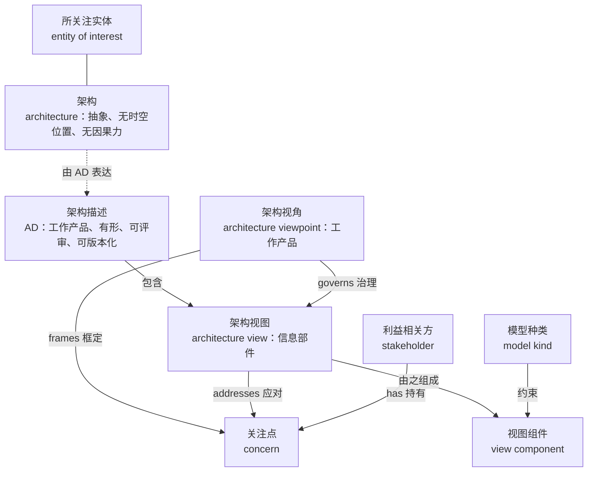
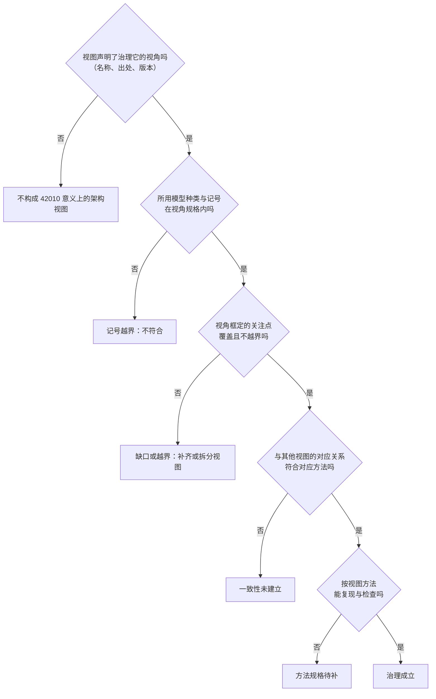
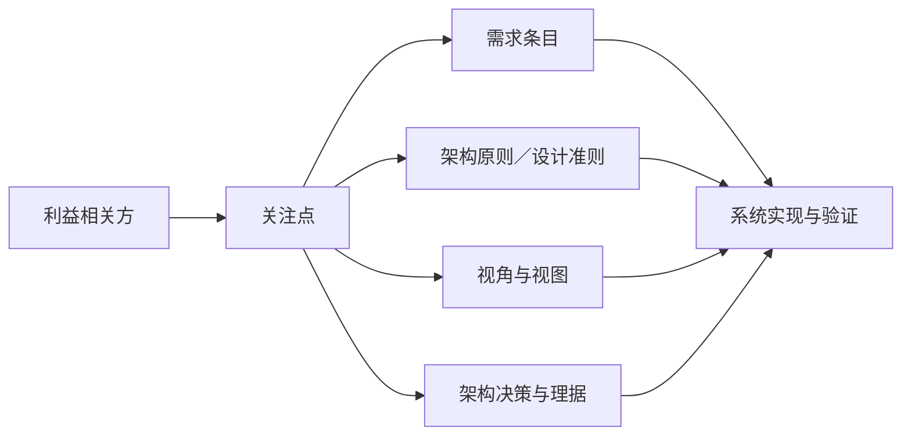
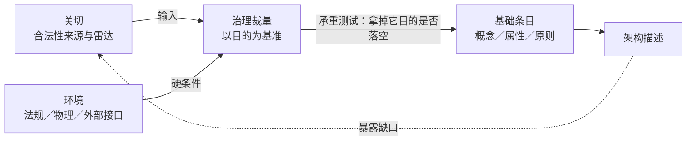
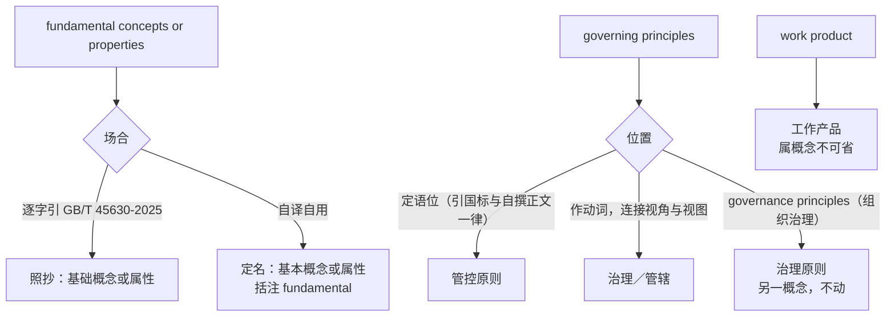

# 架构描述核心概念研究报告

## —— 从四个定义到判据与治理接驳

**Core Concepts of Architecture Description: A Research Report**

> **编号**：30（研究报告稿）
> **日期**：2026-09-21
> **主题**：ISO/IEC/IEEE 42010:2022 及其等同采标本 GB/T 45630-2025 的四个核心概念——架构、关注点、架构视角、架构视图——的定义、关系、界分与译名；「基本」判据的来源及其与架构治理的接驳
> **权威来源**：ISO/IEC/IEEE 42010:2022 与 GB/T 45630-2025（等同采用）；架构过程与治理参照 ISO/IEC/IEEE 42020:2019；关注点与需求的界分参照 ISO/IEC/IEEE 24765、29148
> **相关报告**：24 号《架构与设计边界研究报告》第 6 章已立「基本」的目的必要性／充分性双判据，第 15–17 章已立架构视角、模型种类与视图组件；29 号《架构治理研究报告》已立架构治理的裁量、责任主体与例外机制；22 号《架构、概念、属性研究报告》已做概念与属性的跨标准定义对照及翻译精度辨析。**本报告是 24 号与 29 号之间的接驳增量**——回答「判据由谁供给、关切在何处退位」，并补 24 号列为「待核」的 GB/T 45630-2025 采标事实与第 3 章术语
> **用语与定名政策**（2026-09-21 用户定：**fundamental 取「基本」，其余术语一律按 GB/T 45630-2025 修订**）：fundamental——仓库口径取「**基本**」，逐字引 GB/T 45630-2025 时照抄国标字面「基础」（引文不替人改字）；governing principles——取国标定名「**管控原则**」，动词位 governs 仍作「治理／管辖」（见 §7.3）；其余术语一律随国标——所关注实体／工作产品／信息部件／架构视角／架构视图／方面体／利益相关方角度／视图组件／模型种类／对应关系／对应方法／架构描述框架（ADF）／生存周期／利益相关方／规格。24 号原用「视点」，已随本报告对齐；「架构视角治理架构视图」中的「治理」是概念模型的 governs 关系，与 architecture governance 不是同一用法
> **文档版本**：v1.3（创建于 2026-09-21；同日两轮——先回修重数、属概念与补分工表，再按用户裁定撤销 governing 的分流、统一随国标；第三轮术语纠错：interested party 与 stakeholder 同词）
> **修订记录**：v1.3（2026-09-21 第三轮·术语纠错）——「interested party 与 stakeholder 不是同一个英文词」的断言失实（stakeholder 是 ISO 9000 中 interested party 的许用术语，2015 §3.2.3／2026 §3.1.4 两版皆然），按仓库《ISO 9000:2026 中英文对照版·译注 1》口径统一改写；§8.2 切换清单「相关方（作 stakeholder 时）」行随改（原记「保留并加夹注说明两词之别」——「两词之别」失实）；命名政策不变。v1.2（2026-09-21 第二轮）——按用户裁定「fundamental 用『基本』、其余术语一律按 GB/T 45630-2025 修订」：①§7.3 撤销「分流」，governing principles 自撰正文亦取「**管控原则**」，动词位 governs 保持「治理／管辖」，组织治理原则的「治理原则」不动；②§7.5 决策图与 §7.6 综合译法随迁；③§8.2 切换清单「治理原则」行改为「已按国标切换」；④头部「用语差异与分流政策」行改写为「用语与定名政策」。v1.1（2026-09-21 第一轮）——①§2.7／§3.4 更正视角—视图重数（每视图一个治理视角为 1:1，两版一致；依据 OMG UAF14-37 第 6／8 条）；②§2.3 补「construction／creation」与属概念的待核说明，明确「2022 去实体化」不成立；③§8.2 切换清单补「执行结果」列并补齐干系人、视图构件、方面体等行；④§8.3 分工表补 07／08／28 号三行；⑤待确认问题第 4／6 条结清、新增第 8 条
> **约定**：英文术语首次出现附中文对照；凡未取得标准原文的表述标「未逐字确认」；二手来源单列，不以检索摘要充当证据

---

## 摘要：十条核心结论

1. **标准管的是架构描述（AD），不是架构。** 架构是抽象，AD 是有形的工作产品；被评审、被版本化、被签收的永远是 AD。
2. **四概念的定义各自成句，彼此不嵌套。** 架构回答「实体是什么并如何演化」，关注点回答「谁在乎什么」，架构视角回答「看这类事要守什么规矩」，架构视图回答「按规矩做出来的这份东西是 AD 的哪一部分」。
3. **视角与视图的关系名是 governs**，中文作「治理」：视角是约定，视图是产物；治理的实质是**可判定的符合性**，不是包含、也不是生成。
4. **governs 不等于架构治理。** 前者是概念模型里两个元素之间的关系，后者是 TOGAF 意义上的管理与控制实践，两者只共用「治理」二字。
5. **关注点不是需求。** 关注点属于人（立场、利害），需求属于系统（可验证的条件或能力）；两者多对多，且关注点可以不兑现为需求而兑现为原则、视角或决策。
6. **「基本」的判据是目的，不是关切。** 承重测试：拿掉它，实体还能达成其目的吗——不能，则够格。该判据 24 号已形式化为必要性／充分性双判据。
7. **判据的来源是架构治理。** 治理需要一把高于个体关切的裁量尺，那把尺就是目的；关切退为合法性来源与雷达。
8. **两层判断不可互相替代**：目的判「够不够格」，关切判「这次写哪些、写多细、给谁看」，环境供给第三类硬条件。
9. **架构是抽象对象，AD 是具体物，实体与系统是跨范畴的角色词。** 三者不在同一本体层；「抽象」的三层含义（含义层／本体层／粒度层）混用会得出「一切都是抽象的」这种无分辨力的结论。
10. **译名：一处例外＋一律随国标**——fundamental 取「基本」（用户明定的唯一例外，逐字引国标时照抄「基础」）；其余术语一律按 GB/T 45630-2025 修订——work product 定「工作产品」且属概念不可省，governing principles 取「管控原则」（动词位 governs 仍作「治理／管辖」），life cycle 取「生存周期」，stakeholder 取「利益相关方」。

---

## 一、依据与标准版图

### 1.1 双轨：国际标准与中国采标

| 标准 | 状态 | 提供什么 | 与本研究的关系 |
|------|------|---------|--------------|
| **ISO/IEC/IEEE 42010:2022** | 现行第 2 版，2022-11 发布，取代 2011 版 | 架构描述的结构与表达要求；架构描述框架（ADF）、架构描述语言（ADL）、架构视角与模型种类的符合性要求 | 四个定义的权威来源 |
| **GB/T 45630-2025**《系统与软件工程 架构描述》 | 等同采用（IDT），2025-04-25 发布、2025-11-01 实施，76 页，SAC/TC 28 归口 | 上述要求的中文规范文本；编辑性改动为改标准名、纠正引用编号、增资料性附录 NA／NB | 中文术语定名的依据 |
| **ISO/IEC/IEEE 42020:2019** | 现行 | 六类架构过程：治理、管理、概念化、评估、细化、使能 | 2022 版「架构」定义即引自该标准 3.3 |
| **ISO/IEC/IEEE 42030:2019** | 现行 | 架构评估框架 | 治理与符合性的取证手段 |
| **IEEE 1471-2000** | 被取代 | 首版推荐实践 | 定义谱系的起点 |

两版之间的标题变化有实质含义：2011 版作 "Systems and software engineering"，2022 版作 "Software, systems and enterprise"。描述对象从「系统」扩为「实体」，标题随之改写。

### 1.2 标准管什么、不管什么

三条边界决定了本报告能主张什么：

- **管**：AD 的结构与表达；ADF、ADL、架构视角与模型种类的规格与符合性。
- **不管**：创建、利用或管理 AD 的过程、架构化方法、模型、符号、技术或工具；也不管记录 AD 的格式或媒体。
- **不表态**：不规定任何所关注实体或其环境的要求；**架构本身不是该标准的主题**。

第三条是全部后续讨论的支点：标准把「架构是什么」写成定义，却把「如何得到、如何判定、由谁裁量」全部留给标准之外——这正好解释了第五章为什么必须从架构治理引入判据。

### 1.3 两条属概念线：工作产品与信息部件

GB/T 45630-2025 第 3 章在同一份术语表里用了两个属概念，中译各有定名，不可互串：

| 英文 | 中译 | 用在哪 | 定义（中文规范文本） |
|------|------|--------|-------------------|
| **work product** | **工作产品** | 架构描述、架构视角 | 用于表达架构的工作产品；注：工作产品是由过程产生的人工制品（引 ISO/IEC 20246:2017, 3.18） |
| **information item** | **信息部件** | 架构视图、视图组件 | 组成架构描述的一部分的信息部件 |

区分的实际价值：「工作产品」承载「经过程产出、可评审、可入库」之义，「信息部件」承载「可单独识别、可被 AD 包含」之义。据此，架构视角是**制品**（因而可版本化、可放视角库），架构视图是**部件**（因而是 AD 的构成部分）。

### 1.4 GB/T 45630-2025 采标事实的确认（补 24 号待核项）

24 号报告曾把「GB/T 45630-2025 是否确为 42010:2022 的等同采用版本、实施日期 2025-11-01」列为待核（该报告附录 D 第 1 条）。本研究确认：该标准确为**等同采用（IDT）**，发布与实施日期如 §1.1 所列，29 号来源清单 S-25 已给出国家标准全文公开系统的正式条目。24 号该项可由「待核」改为「已核」。

---

## 二、四个核心定义

### 2.1 架构（architecture）

**中文规范文本（GB/T 45630-2025, 3.2）**：

> 实体在其环境中的基础概念或属性，以及该实体及其相关生存周期过程的实现和演化的管控原则。

**英文（ISO/IEC/IEEE 42010:2022, 3.2；来源标注 ISO/IEC/IEEE 42020:2019, 3.3）**：

> fundamental concepts or properties of an entity in its environment and governing principles for the realization and evolution of this entity and its related life cycle processes

**与前版的差异**（2011 版为 "fundamental concepts or properties of a system in its environment embodied in its elements, relationships, and in the principles of its design and evolution"）：

| 变化点 | 2011 版 | 2022 版 | 含义 |
|--------|--------|--------|------|
| 主体 | system | **entity** | 从「系统」泛化为「实体」，覆盖企业、组织、产品线、服务、数据、过程等 |
| 界定方式 | embodied in its elements, relationships | 删去 | 不再以元素与关系界定架构 |
| 时相 | principles of its design and evolution | governing principles for the **realization** and evolution | design 换 realization（兑现、落实），并挂到生存周期过程 |
| 作用面 | 只及于系统 | 及于**实体与其相关生存周期过程**二者 | 架构原则同时约束「东西怎么做成」与「过程怎么走」 |

最后一行是本次研究反复回到的一句：`for the realization and evolution of [this entity] and [its related life cycle processes]` 中「实现与演化」带两个宾语。2022 版讲架构过程的那一节据此指出，架构会在整个生存周期内影响其他过程。

### 2.2 关注点（concern）

**中文规范文本**：与一个或多个利益相关方相关的、就该实体而言的重要事项（利害）。术语在 GB/T 45630-2025 中定名为「关注点」。

**英文谱系**：

- 2011 版逐字：*interest in a system relevant to one or more of its stakeholders*。
- 2022 版随「所关注实体」的引入而泛化；公开解读常引作 *a matter of relevance or importance to a stakeholder*。**2022 版英文逐字表述未逐字确认**。
- 需要注意一处文献内部的分歧：架构框架文档中曾出现更受限的版本（追加「regarding an entity of interest」），OMG 的缺陷记录把这种加法判为「比标准更受限」。

### 2.3 架构视角（architecture viewpoint）

**中文规范文本（以「架构视角」定名）**：

> 规定架构视图如何构建、解读和使用的一套约定，用来框定特定的关注点。（属概念：工作产品）

**英文**：

> work product establishing the conventions for the construction, interpretation and use of architecture views to frame specific concerns

两点说明。其一，其中 "to frame specific system concerns" 为 2011 版原文（逐字，见 OMG 缺陷单引用），2022 版泛化去「system」。其二，**「construction 还是 creation」与「属概念」两处均须待核**：本报告英文系按 2011 版句法还原，「construction」为 2011 措辞，2022 版作 creation（24 号 §15.2 据 42010:2022 §3.8 引作 *set of conventions for the creation, interpretation and use of an architecture view*）；属概念「工作产品」依 GB/T 45630-2025 第 3 章体例（3.3 架构描述、3.7 架构视图分别为 work product 与 information item）推得，**3.8 逐字待正式文本核对**（见附录B）。因此「2022 版把架构视角去实体化为『一套约定』」这一说法不成立——属概念未变，变的是 construction → creation 与去「system」。

**要点**：视角是**规则**，可脱离具体实体存在（置于视角库），可复用、可版本化；视角规格须写明所框定的关注点、典型利益相关方与角度、方面体、模型种类与图例、对应方法、视图方法（建造／解读／分析）。属概念不可省——省掉「工作产品」会滑到内容层，与架构描述的定义（同为工作产品）失去同族关系。

### 2.4 架构视图（architecture view）

**中文规范文本（GB/T 45630-2025, 3.7）**：

> 组成架构描述的一部分的信息部件。

**英文**：*an information item that is part of an architecture description*。

**与前版的差异**：2011 版为 *work product expressing the architecture of a system from the perspective of specific system concerns*。2022 版把「视图＝工作产品」改为「视图＝AD 中的信息部件」，并把可分解性交给**视图组件（view component）**——组件可以是模型（受模型种类约束），也可以是非模型片段（表格、清单、决策记录）。这一改动是为了容纳非模型化的视图片段。

### 2.5 相邻术语速查

| 术语 | 中文定名 | 定义要点 |
|------|---------|---------|
| entity of interest (EoI) | 所关注实体 | 架构描述的主题。例子：企业、组织、解决方案、系统（含软件系统）、子系统、过程、业务、数据、应用、信息技术、任务、产品、服务、软件项、硬件项、产品线、系统族、系统之系统、系统集合、应用集合 |
| architecture description (AD) | 架构描述 | 用于表达架构的工作产品；提供给利益相关方的信息的有形表示 |
| AD element | 架构描述元素 | AD 的已识别或已命名部分。含利益相关方、关注点、利益相关方角度、方面体、ADL、ADF、对应关系及对应方法、架构视图、视图组件、架构视角、模型种类 |
| architecting | 架构化 | 在所关注实体的整个生存周期中，对架构进行构想、定义、表达、记录、沟通、证明其正确实施、维护和改进 |
| architecture description framework (ADF) | 架构描述框架 | 在特定应用域或利益相关方群体中建立的描述架构的约定、原则和实践（如 GERAM、RM-ODP、UAF、NAF） |
| architecture description language (ADL) | 架构描述语言 | 具有语法和语义的表达方式，由一组表示、约定和相关规则组成（如 AADL、ArchiMate、SysML） |
| model kind | 模型种类 | 模型的类别，由其基本特征、条件与建模约定界定 |
| view component | 视图组件 | 视图的可分离构成部分；可为模型，或由图例治理的非模型片段 |
| correspondence / correspondence method | 对应关系／对应方法 | AD 元素之间的关系，以及为满足这些关系所规定的规则与手段 |
| aspect | 方面体 | 实体特性的客观切面（结构、行为、实现等），用于系统化覆盖关注点 |
| stakeholder perspective | 利益相关方角度 | 依角色、经验、信念形成的思虑方式，是关注点的一个来源 |

### 2.6 概念模型

### 2.7 2011 → 2022 主要差异

| 项 | 2011 版 | 2022 版 |
|----|--------|--------|
| 描述主体 | system of interest | entity of interest |
| 架构框架 | architecture framework | architecture description framework（ADF） |
| 视图的构成 | 视图由架构模型组成 | 视图由视图组件组成（模型或非模型片段） |
| 视角的框定对象 | system concerns | concerns |
| 视角与视图的重数 | 每个视图恰有一个治理视角；一个视角可治理多张视图；视角可外部持有（时称 library viewpoint） | 重数标注弱化，**实质未变**；视角外部持有（视角库）延续 |
| 新增概念 | — | 方面体、利益相关方角度、对应方法、架构决策与理据 |
| 应用面 | 系统与软件 | 系统、软件、企业及更广实体 |

---

## 三、关系：四个动词与 governs 的机制

### 3.1 四个动词不可互换

| 关系 | 英文 | 说明 |
|------|------|------|
| 利益相关方 → 关注点 | **has** | 谁在乎什么 |
| 视角 → 关注点 | **frames** | 视角**框定**关注点，不是解决、也不是应对 |
| 视角 → 视图 | **governs** | 规矩管产物（本报告译「治理」） |
| 视图 → 关注点 | **addresses** | 真正对关注点作出交代的是视图的内容 |

把视角写成「应对关注点」是常见错误，OMG 的架构框架缺陷记录专门纠正过这一处。

### 3.2 governs 的实质：约定—产物与可判定的符合性

「治理」在这里指的不是包含、生成或从属，而是**符合关系**：视角是规则书，视图是按这本规则书做出来、并且声明「我服从哪本规则书」的产物。因此治理在实践上等于**可判定的符合性**——这正是标准用整章篇幅规范符合性的原因。

### 3.3 视角规格交付的五项约束

| 视角必须规定 | 对视图的约束力 |
|-------------|--------------|
| 名称、出处（来自哪个 ADF）、版本 | 视图据此声明受哪个视角治理 |
| 框定哪些关注点、属哪些典型利益相关方与角度 | 视图不得越界，也不得漏掉本视角该管的关注点 |
| 采用的模型种类、记号、语言与建模约定 | 视图的每个视图组件必须落在这些模型种类里 |
| 对应方法 | 视图与其他视图的挂钩方式照此办理 |
| 视图方法：建造类、解读类、分析类 | 他人能按同一套方法复现、读懂、检查这张视图 |

### 3.4 三条边界

- **治理 ≠ 包含**。视角不是视图的一部分，通常独立存放在视角库中，可治理同一实体的多张视图，也可治理不同实体的视图——这是 ADF 能成为行业资产的前提。
- **治理 ≠ 生成**。视角不产出内容；内容始终是架构师针对该具体实体做的。
- **一个视图对一个治理视角**。每个视图恰有一个治理视角，一个视角可治理多张视图——**此点两版一致**（OMG UAF14-37 第 6 条据 42010 判定一视图与其治理视角的重数为 1:1；同单第 8 条并指出视角可由 AD 外部持有，即时称的 library viewpoint）。2022 版弱化了重数标注，但「声明治理视角」这一实质未变。若一类视图要同时交代两类关注点，正确做法是拆视图／拆视角。

### 3.5 「同名」只是命名惯例

视角名（如「数据视角」）来自 ADF 或团队约定，视图为便于阅读常取同名，但标准不要求同名。治理关系靠两件事成立：视图声明其治理视角（可定义在 AD 内，也可引用 AD 外部的视角库），以及视图内容与该视角规格一致。

### 3.6 「治理成立」的五问

### 3.7 与架构治理的分野

| | governs（视角—视图） | architecture governance |
|---|---|---|
| 层次 | 概念模型中的元素关系 | 组织治理职能：管理与控制架构及其相关工作 |
| 中文 | 治理／管辖 | 架构治理 |
| 裁量者 | 无（符合性由规格比对得出） | 有（架构委员会、架构师角色、问责主体） |
| 违反的后果 | 不符合，视图不成立 | 走例外／豁免程序，留痕并可被追责 |
| 出处 | 42010:2022 概念模型 | TOGAF；治理语义参照 ISO/IEC 38500，见 29 号 |

两者只共用「治理」二字，混用会同时污染术语表与治理讨论。

---

## 四、界分：关注点不是需求

### 4.1 定义分家

- **关注点**：与一个或多个利益相关方相关的、就该实体而言的重要事项。它是**站在人的立场上描述的一种利害**——主观、方向性、常常还没有解。
- **需求**：ISO/IEC/IEEE 24765 给出三重含义——① 用户为解决问题或达成目标所需的条件或能力；② 系统或系统部件为满足合同、标准、规格说明书或其他正式文件所必须满足或具备的条件或能力；③ 前两者的成文表述。落点都在「条件或能力」，第三重还明确要求成文。

一个是**立场**，一个是**陈述**。

### 4.2 六维差异

| 维度 | 关注点 | 需求 |
|------|--------|------|
| 归属于 | 利益相关方（随角色走） | 系统（随系统走） |
| 语言形态 | 关切、忧虑、期望的方向 | 含主体、条件、指标、验证方法的陈述句 |
| 可否判定 | 不可验证 | 必须可验证 |
| 生存周期 | 长期存在、跨项目反复出现 | 有基线、有版本、有变更控制 |
| 数量关系 | 一个关注点可派生多条需求 | 一条需求可能服务多个关注点 |
| 在 AD 中的位置 | 锚点：决定选哪些视角 | 输入：属规格说明，不在 AD 之内 |

### 4.3 为什么必须分开

1. **视角才挑得出来**。需求逐条且互相交叉（一条「限额调整必须留痕」同时牵涉逻辑、数据、部署）；若拿需求当锚点，视角退化为「需求清单的容器」，分离关注点失效。
2. **保留权衡空间**。需求是「已经决定要什么」的产物，关注点还停在「在乎什么」。架构工作的价值发生在先摆关切、再取舍、后提要求这段距离里。
3. **让沉默的关注点活得下来**。监管、运维、退役处置、自然环境通常不主动提需求，在需求清单里常是空白；显式记录关注点及其与视角、视图的对应，正是给这类「无主关注点」留可见性。反向亦成立：模型里没有对应需求条目，不等于没有关注点。

### 4.4 转换关系：多对多与四种兑现

以投资评审系统为例：关注点「监管能追溯」可同时兑现为需求三条（限额调整留痕、审批链可导出、数据留存十年）、架构决策一条（变更走不可篡改事件日志，并记录放弃「仅数据库审计表」的理由）、视角一个（安全合规视角）。反方向亦成立：需求「三秒内返回内部收益率」同时服务「投决会要快速决策」与「避免超时重算的成本」两个关注点。

### 4.5 三条判据

| 判据 | 问法 | 判定 |
|------|------|------|
| **改写测试** | 这句话能问出通过／不通过吗，需要指标与验证方法吗 | 需要 → 需求；只能说清「谁在乎、在乎哪一面、为什么在乎」→ 关注点 |
| **换人测试** | 换个利益相关方它还在不在 | 在 → 关注点（随立场）；不在 → 需求（随系统） |
| **粒度检查** | 停在哪一级 | 关注点停在「安全」「成本可控」太抽象、挑不出视角；写到「用 AES-256」又越界进了设计。合适粒度是「刚好足以挑出视角」 |

### 4.6 四种常见错误

1. 拿关注点当需求收集，收回一堆「希望系统好用」式的伪需求。
2. 拿需求当关注点，于是视角按模块／功能切（「订单视角」「报表视角」）而不按关注面切（「安全视角」「运行视角」），视图退化为模块说明书。
3. 把「关注点已记录」当成「需求已覆盖」，或反向用需求清单冒充关注点台账。
4. 只记录会说话的利益相关方的关注点，漏掉监管、运维、退役三类沉默角色。

### 4.7 与本仓库工件的分工

数据文件模板中，`02-相关方需求架构定义.md`、`03-相关方需求详细定义.md` 属需求规格一侧，`04-业务架构.md`、`07-产品架构.md` 属架构描述一侧。关注点的家在架构描述一侧（选视角的锚点、AD 的元素），需求的家在规格一侧。混为一谈会同时污染需求基线与架构描述的可追溯性；这也是「架构描述不是需求规格说明书」的由来。

---

## 五、判据：什么算「基本」

### 5.1 标准自身的缺口

42010 只定义架构，不给出「哪些概念与属性算基本」的判据。24 号报告第 6 章已把这一缺口记为可引用的权威缺口，并指出：定义正文里的准入词 fundamental 是关系性谓词，缺参照物（2011 版附录 A 用 essentials，同样缺参照物）；SEBoK 直接写明该词「没有普适定义」，详细程度「取决于使用的语境与设计目的」，并要求架构描述「说明何为纳入、何为排除」。

### 5.2 判据的形式（沿用 24 号，不重推）

| 判据 | 定义 | 管什么 |
|------|------|--------|
| **必要性** | 移除 x ⇒ 目的所依赖的结构条件不成立 | 入会：什么必须进 |
| **充分性** | x 齐备后，剩余问题均不影响目的可达性 | 闭包：架构到哪停 |

注意精确化：不是数学意义的充要条件。架构不构成目的达成的充分条件（达成还需实现、验证、运行）；充分性仅指「目的所要求的结构条件已被完整表达」。

### 5.3 判据的来源：从架构治理推导（本报告的接驳）

24 号确立了判据的形式，但未回答它的**来源**。本报告补上这一步：

> **治理的核心动作是裁量**——某条内容合规还是不合规、准还是不准。既然是裁量，就必须有一把不随人变的尺。这把尺不能是关切，因为关切互相冲突，而治理存在的理由恰恰是仲裁冲突的关切。于是尺只能落在：该实体的**目的**（它为何被立项、被运营）、由目的派生的**原则**，以及**环境**给出的硬条件。

一句话：**治理需要一把高于个体关切的尺，那把尺就是目的。** 由此可得：**「基本」由目的界定，不由关切界定。**

这也解释了两处此前的悬置：

- 定义的正文里根本没有 stakeholder 与 concern（第一章已引），因为定义的锚是「实体—环境—实现与演化」；
- 29 号记录的事实——架构治理在 ISO/IEC/IEEE 体系中没有正式术语定义，42020 只把治理当过程名处理——并不妨碍判据从治理侧引入，因为判据本就是过程与方法的事，而标准已明确把过程与方法排除在自身范围之外。

### 5.4 三层结构与两道闸门

| 闸门 | 管什么 | 判据 |
|------|--------|------|
| **目的（承重性）** | 条目够不够格进「基本」这一层 | 拿掉它，实体还能达成其目的吗 |
| **关切（取舍与呈现）** | 够格的候选里，这次写哪些、写多细、给谁看 | 哪些关切无条目承接（缺口）；哪些条目只服务单一关切且不承重（降级） |
| **环境** | 第三类来源：非人造的硬约束 | 定义中 in its environment——法规、物理条件、外部接口、资源构成「目的能否达成」的条件 |

这解释了为什么「监管合规」能进架构而不是可选项：不是因为它有人在乎（那是关切层的理由），而是因为它**构成实体在环境中达成目的的条件**。

### 5.5 治理视角的增量

| 增量 | 内容 |
|------|------|
| **权责** | 谁有权判定「这算不算基础」——架构评审机构、架构师角色、签核权限。判据本身不解决「谁裁」 |
| **原则的制度化** | 架构原则是治理的主要抓手，把目的翻译成可援引、可判违规的条文。**「管控」的力度不是语义给的，是制度给的** |
| **例外与豁免** | 原则可被合法地违反，但要走程序、留痕。由此回答「违不违规怎么判」——由治理程序判，不由语义判 |
| **变更控制与两条生命线** | 基线何时冻结、谁能改、影响谁评估；架构的生命与 AD 的生命不同步时的管理（GB/T 45630-2025 附录 E） |

### 5.6 治理视角的边界

- **目的会被冻结，也会被俘获**。目的是利益相关方赋予的；治理机构可能守着过时的目的，委员会构成也可能让「目的」变成强势方的关切。故**关切仍是雷达**——治理体系里对应的机制是评审代表的构成与利益相关方参与。
- **治理合规 ≠ 架构仍然正确**。合规只保证「按既定基准办事」；基准是否还贴着环境与现实，要靠关切持续输入。
- **治理有成本**。判据越刚性，豁免流程越多。故实践中分级：少数不可豁免（安全、合规），多数可经流程豁免。

### 5.7 四步操作流程

1. 把**目的**写清（一个或多个，标明由谁赋予）；
2. 对候选条目做**承重测试**，过不了的一律降到需求或设计选择；
3. 与**关切**对照，查缺口与越界；
4. 定粒度与呈现方式——这一步就是视角与视图的活。

### 5.8 一处术语提醒

中文「架构治理」有两个所指：一是**对架构及其相关决策的治理**（governance of architecture，42020／TOGAF 的用法），二是**以架构为手段去治理企业或 IT**。本章的推导用的是前者——只有在前者里，「目的」才是裁量基准；在后者里，目的是治理的对象而不是尺子。29 号已就架构治理与 IT 治理的边界立口径，此处不再展开。

---

## 六、本体：抽象与具体

### 6.1 「抽象」的三层含义

| 用法 | 说的是什么 | 例子 |
|------|-----------|------|
| **含义层**：概念／共相 | 词的意思是一般的、不指向某个时空个体 | 「服务器」「三角形」「需求」这些概念都抽象 |
| **本体层**：抽象对象与具体对象 | 指称物有没有时空位置、有没有因果力 | 数、命题、类型是抽象对象；这张纸、这台机器、这个团队是具体对象 |
| **粒度层**：省略细节 | 工程口语的「抽象层次」 | 概览图比详图抽象，任何层次都能再抽象一层 |

三层混用会得出「一切术语的指代都是抽象的」这一结论——而那个结论之所以无价值，是因为它把「含义总是抽象的」这个平凡真理当成了本体论发现。含义层全抽象；指称层只有一部分是抽象对象。

### 6.2 逐项定位

| 术语 | 在本体层的位置 | 理由 |
|------|--------------|------|
| **架构** | 抽象对象 | 无时空位置、无因果力、必须被体现（2011 版用 embodied in）；不能装箱、不能通电、不能交割 |
| **实体** | 角色词，跨范畴 | 例子横跨两界：系统、子系统、产品、硬件项偏具体；过程、业务、数据、任务偏抽象。它只表示「被当作一个整体来看待、要为其描述架构的那个东西」 |
| **系统** | 通常落在具体物上 | ISO/IEC/IEEE 15288 定义为「为达成一个或多个既定目的而组织起来的相互作用元素的组合」；概念系统与自然系统是边界情形 |
| **架构描述／视图** | 具体物 | 工作产品／信息部件：有作者、有版本、可签收、可入库 |

标准自身只对架构做了本体定性：引言写明「架构描述是有形的工作产品，而架构是无形、抽象的，是通过其概念、属性和原则来理解的」。对系统与实体，标准刻意不表态——范围里只写「未规定对所关注实体或其环境的要求」。

### 6.3 三条可检验的判据

| 判据 | 问法 |
|------|------|
| **可交割性** | 系统能交付、验收、上线、停机；AD 能签收、入库、版本化；架构不能——交出去的从来不是架构 |
| **同一性** | 架构能多载体一内容（同一架构、两个实现；同一架构、三份 AD）；系统的同一性绑在元素与关系上。多载体一内容正是抽象对象的标志 |
| **因果力** | 架构不导致任何事，只能靠被理解、被援引、被遵守起作用；系统能算、能发指令、能故障 |

### 6.4 内容层与载体层的双指称

几乎每个概念都有两个指称，这一结构贯穿本报告：

| 概念 | 抽象指称（内容） | 具体指称（载体） |
|------|----------------|----------------|
| 架构 | 那个架构 | 描述它的 AD |
| 关注点 | 利害、立场 | 记录在案的关注点条目 |
| 需求 | 条件或能力（命题） | 成文的需求条目 |
| 视角 | 那套约定 | 视角规格说明（可入库、可版本化） |
| 视图 | 所表达的内容 | AD 中的信息部件 |

「抽象／具体」这对词不应给术语分类，而应**给同一概念的两种指称分层**。42010 满篇立「元素」「部件」「工作产品」，做的正是给抽象内容配具体载体，使其可评审、可版本化、可追溯。22 号报告 §8.2 的三层精度（抽象本体／具象载体／产物）是同一结构在另一条轴上的表述，可互参。

---

## 七、译名：三处定名与一项政策

### 7.1 work product → 工作产品

| 备选 | 取舍 |
|------|------|
| **工作产品** | 采用：GB/T 45630-2025 定名，与 GB/T 22032、GB/T 8566 等体系一致 |
| 产物／工作产物 | 语义不错，非标准用语；行文可用，进术语表则与国标脱节 |
| 制品／人工制品 | 仅对应注中的 artifact，作正式译名过窄 |
| 工件 | 机加工语感，不可用 |
| 交付物 | 另一概念（deliverable）：工作产品含大量不交付的中间产物 |

**属概念不可省**：英文骨架是 `work product`（属）＋ `establishing the conventions…`（种差）。译成「一套约定」是滑到内容层，会与架构描述的定义（同为工作产品）失去同族关系，也与视角作为 AD 元素的定位脱节。严格译法：**一种工作产品，它规定架构视图的构建、解读和使用所应遵循的约定，用以框定特定的关注点。**

### 7.2 fundamental → 基本（政策化）

| | 支持「基本」 | 支持「基础」 |
|---|---|---|
| 搭配 | 「基本概念」「基本属性」「基本原则」是中文最稳的搭配 | 「基础理论」「基础研究」「基础数据」亦稳，但集中在领域与物质底座类名词 |
| 语义 | fundamental 的核心是根本的、主要的、必不可少的 | 「基础」兼含根脚（承载）与根本两义，能接住「别的东西立其上」的意象 |
| 污染 | 「基本上」「基本符合」的程度义在旁，作定语时基本不激活 | 「基础课」「基础教育」的初级义在旁——两种译法各有污染，非单边劣势 |
| 文献 | 2011 版无国标采标本，社区通行中译一直作「基本」；本仓库现行术语表亦然 | GB/T 45630-2025 定名「基础」——唯一但硬的对齐理由 |

**政策（可执行，2026-09-21 用户定）**：

- **仓库口径取「基本」**——本方法论自译自用一律定名「基本」，条目内括注英文原词，并在释义里补一句把承载义说透（「即承载该实体成立与演化的那一层」）；
- **逐字引 GB/T 45630-2025 时照抄国标字面「基础」**，引文不替人改字；
- 这是用户明定的**唯一例外**：其余术语一律随国标（见 §7.3、§8.2）。

**必须避的坑**：别让 fundamental 与 governing 都落成「基本」。两者是不同的英文词——fundamental 修饰概念与属性，governing 修饰原则；合并后定义里「构成架构的东西」与「管控实现与演化的东西」这层分工即消失。

### 7.3 governing → 定语位取「管控原则」，关系名位取「治理」

**政策（可执行，2026-09-21 用户定）**：

| 位置 | 英文 | 译名 | 理由 |
|------|------|------|------|
| 作定语修饰 principles（性质），逐字引国标或自撰正文**一律** | governing principles | **管控原则** | GB/T 45630-2025 3.2 定名；用户裁定「其余术语一律按标准修订」。国标用「管控」正是为了把定语位的 governing 与名词 governance 分开 |
| 作动词连接两元素（关系名） | a viewpoint **governs** a view | **治理**（或「管辖」） | 描述两个元素之间的规约关系；与 governs 有关的裁量、例外与豁免另属架构治理（§3.7） |
| 指组织或公司治理原则（governance principles） | governance principles | **治理原则** | 另一概念，与本条无关，不得据本条改动 |

**括注仍必需**：「治理」二字在本报告里同时承担两层用法——动词位的 governs（视角—视图关系）与名词位的架构治理（architecture governance，见 §3.7）。因此在术语表条目内须写明：**governing 是定语，指具有规约力、可据以判定违规，与 architecture governance 不是同一用法**。

**撤销说明**：本报告 v1.0 曾主张「分流」（自译自用取「治理原则」），理由是仓库术语表与 22 号 §9.4 的既定口径。2026-09-21 用户裁定「其他术语都按照标准修订」，分流就此撤销；22 号 §9.4 的原论证作为当时记录保留，结论改按国标。

**必须避的坑**：别让 fundamental 与 governing 都落成同一个中文词——前者修饰概念与属性，后者修饰原则（见 §7.2）。

**governing ≠ guiding**：guiding 是「指方向」，力度是建议；governing 是「说了算」，力度是约束。这条区别正是架构原则区别于最佳实践清单的地方。另外，governs 的强度不由语义给，而由治理机制给（见 §5.5）。

### 7.4 两处附带定名

| 英文 | 建议译名 | 说明 |
|------|---------|------|
| life cycle | **生存周期** | GB/T 45630-2025 与 GB/T 22032、GB/T 8566 体系一致；「生命周期」为通用写法，规范文本宜统一为前者 |
| realization | **实现**（读作兑现、落实） | 替换了 2011 版的 design，宽于 design，也宽于中文软件语境里的「实现＝编码」 |

### 7.5 译名决策图

### 7.6 综合译法

**严格版**（术语表、规范正文；「基本」为用户明定的唯一例外）：

> 架构：实体在其环境中的基本概念或属性，以及该实体及其相关生存周期过程的实现和演化的管控原则（governing principles）。

**逐字引国标字面**（文档声明「符合 GB/T 45630-2025」时，或直接引用该标准）：

> 架构：实体在其环境中的基础概念或属性，以及该实体及其相关生存周期过程的实现和演化的管控原则。

**顺读版**（讲义、叙述）：

> 架构是一个实体在其环境中的基本概念或属性，外加一套有约束力的原则——它管这个实体怎么被兑现、怎么演进，也管作用于它的那些生存周期过程怎么做、怎么改。

---

## 八、对本项目的落点

### 8.1 术语表现存问题

仓库术语表的两处仍引 2011 版定义，术语亦为旧口径（两处在仓库根 `00-generalspec/`，属主项目区，不在本次研究报告对齐范围内，尚未处理）：

| 文件 | 行 | 现状 | 待办 |
|------|----|------|------|
| `00-generalspec/06-generalspec-glossary.md` | 57 | 「系统在其环境中的基本概念或属性，体现于其元素、关系以及设计和演化的原则之中（ISO/IEC/IEEE 42010:2011, 3.2）」 | 换 2022 定义与出处；补所关注实体 |
| `00-generalspec/01-generalspec-sysdev.md` | 63 | 同上 | 同上 |

### 8.2 术语切换清单

| 旧口径 | 新口径（2022／GB/T 45630-2025） | 执行结果（2026-09-21） |
|--------|------------------------------|------|
| 系统（作为 AD 主体） | 所关注实体（entity of interest） | 已切换；15288 过程名与案例语境中的「系统」保留 |
| 利益相关者 | 利益相关方（stakeholder） | 已切换 |
| 干系人（作 stakeholder 时） | 利益相关方 | 已切换（2026-09-21 第二轮铺满：术语位与自撰正文一律改） |
| 相关方（作 stakeholder 时） | 利益相关方 | 已切换；**引 ISO 9000/9001 原文处**的「相关方」＝ interested party，保留并加夹注。〔按：ISO 9000 的优先术语是 interested party，stakeholder 是其**许用术语**（2015 §3.2.3 索引标 admitted term；2026 §3.1.4 两词平列同行），GB/T 19000 译「相关方」；ISO/IEC/IEEE 15288（GB/T 22032）与 42010（GB/T 45630）的优先术语是 stakeholder，译「利益相关方」。**英文同词、中文分译两名**——实据在两处定义不同（9000 取「能影响／受影响／自认受影响」，15288 取「拥有权利、份额、主张或利益」），**理由在定义上，不在英文词上**。故本报告自撰正文一律作「利益相关方」，「相关方」仅出现在引 ISO 9000/9001 原文处。〕 |
| 视点 | 架构视角（architecture viewpoint） | 已切换（含 24 号文件名、副题、章题与目录锚点） |
| 视图（作 42010 术语时） | 架构视图（architecture view） | 已切换 |
| 被架对象／被架实体／关注实体 | 所关注实体 | 已切换 |
| 架构框架（architecture framework） | 架构描述框架（ADF） | 已切换；标准全名《数字政府架构框架…》系专名，不改 |
| 架构模型（作为视图的构成） | 视图组件＋模型种类 | 已切换 |
| 视图构件 | 视图组件 | 已切换 |
| 方面 | 方面体（aspect） | 已切换 |
| 干系人视角／相关方视角 | 利益相关方角度（stakeholder perspective） | 已切换 |
| 对应规则（correspondence rule） | 对应关系／对应方法（correspondence／correspondence method） | 已切换 |
| 架构决策与理由 | 架构决策与理据 | 已切换 |
| 工作产物／制品（作 AD 属概念时） | 工作产品（work product；属概念不可省） | 已切换 |
| 关切（术语位） | 关注点（concern） | 已切换；行文里的「关切」保留 |
| life cycle | 生存周期；life cycle processes → 生存周期过程 | 已切换（2026-09-21 第二轮铺满：自撰正文一律改）；逐字引文、IPD 阶段专名与他人原文保留 |
| 治理原则（作 governing principles 时） | **管控原则** | 已切换（2026-09-21 第二轮：撤销分流，自撰正文亦取国标定名）；动词位 governs 仍作「治理／管辖」，组织治理原则的「治理原则」不动 |
| 规约（specification） | **规格** | 已切换 |
| fundamental | **基本**（不随国标的「基础」） | **用户明定的唯一例外**；逐字引 GB/T 45630-2025 时照抄「基础」 |

> 表中「已切换」指该术语在本目录各报告的**论述**已完成切换；**对话记录体裁内的原话一律保留**，相关更正以「〔按：…〕」夹注就地标注（见 24 号对话记录、25 号、28 号对话记录头部体例声明）。
| — | 新增：方面体、利益相关方角度、对应关系／对应方法、架构决策与理据、视图组件、模型种类 | 已补挂入各报告的术语表与概念链 |

### 8.3 与相关报告的分工

| 报告 | 已立内容 | 本报告的关系 |
|------|---------|------------|
| 22 号 架构、概念、属性 | 概念与属性的跨标准定义对照、翻译精度辨析与陷阱清单 | 本报告不重做定义对照，只在 §6.4 与之互参；其 §9.4–§9.6 的 governing 译名论证已按 §7.3 收口为「管控原则」，原论证作为历史保留 |
| 24 号 架构与设计边界 | 第 6 章「基本」的目的必要性／充分性双判据；第 15–17 章架构视角、模型种类与视图组件 | 本报告承接其判据形式，补判据来源（§5.3）；结清其附录 D 的 GB/T 待核项（§1.4）；并回修其两处——架构视角的属概念（§2.3）与视角—视图重数（§3.4） |
| 29 号 架构治理 | 架构治理的定义、层级、责任主体、例外与合规评审 | 本报告取其治理机制，用于回答「判据由谁供给」；其转述 42010 定义处的 governing principles 已按 §7.3 改「管控原则」，「定义层已经咬合」一语已按 §3.7 更正 |
| 28 号 治理概念 | ISO 37000 的治理定义、accountability 一族定译、域治理实例 | 两者术语口径的落差（本报告的「目的」＝其 §2.8 的「宗旨」）已在双方各加指针 |
| 08 号 治理概念 | 治理的词源与翻译史、治理与管理的分界判据 | 本报告 §3.7 的分野表可供其界分 governs 与架构治理 |
| 06 号 架构概念 | 架构描述、架构视角与架构视图的通俗展开 | 口径一致，本报告提供其术语的规范依据 |
| 07 号 架构概念 | 从概念设计到架构的通俗展开、概念模型四关系 | 其 §11 关系图按本报告 §3.1 的四动词重画 |

---

## 九、结论

1. **四概念的定义各自成句、彼此不嵌套**：架构是实体在其环境中的基本概念或属性加上管控其实现与演化的原则；关注点是利益相关方的利害；架构视角是规定视图构建、解读与使用的约定（属概念为工作产品）；架构视图是 AD 中的信息部件。
2. **视角与视图之间是 governs**，中文作「治理」，实质是可判定的符合性；与「包含」「生成」无关，与架构治理亦非同一用法。
3. **关注点与需求分属人与系统两侧**，多对多，判据为改写测试、换人测试与粒度检查；混同会同时污染需求基线与架构描述。
4. **「基本」由目的界定**：承重测试为判据，24 号已形式化为必要性／充分性；关切不判归属，只判取舍与呈现。
5. **判据的来源是架构治理**：治理需要一把高于个体关切的裁量尺，尺即目的；关切退为合法性来源与雷达，环境供给第三类硬条件。
6. **架构是抽象对象，AD 是具体物，实体与系统是跨范畴的角色词**；「抽象」的含义层、本体层、粒度层必须分开使用。
7. **译名政策是一处例外加一律随国标**：fundamental 取「基本」（唯一例外，逐字引国标照抄「基础」）；其余术语一律按 GB/T 45630-2025 修订——work product 定「工作产品」且属概念不可省，governing principles 取「管控原则」（动词位 governs 取「治理／管辖」，组织治理原则的「治理原则」不动），life cycle 取「生存周期」，stakeholder 取「利益相关方」，specification 取「规格」。
8. **对本项目的直接动作**：本目录 17 份相关报告已按 §8.2 完成术语切换、补挂互参与版本记录（2026-09-21）；术语表两处（`00-generalspec/06-generalspec-glossary.md:57`、`00-generalspec/01-generalspec-sysdev.md:63`）仍引 2011 版定义——两处在主项目区，不属本次范围，尚待处理。

---

## 待确认问题

| 序 | 问题 | 现状 |
|----|------|------|
| 1 | 42010:2022 中「关注点」「架构视角」的英文逐字定义 | **未逐字确认**——仅有中文解读与目次，英文表述系按 2011 版结构还原 |
| 2 | GB/T 45630-2025 第 3 章 3.7 之后的逐字文本（架构视角、关注点、方面体等） | 部分取得（3.1–3.7，且 3.7 的示例被截断）；其余待以正式文本补齐 |
| 3 | 42010:2022 是否保留 2011 版「目标是一种关注点」一句 | **未确认**——2011 中文版有此句（二手转录）；2022 版 §5.1 正文未取得 |
| 4 | 2022 版视角与视图的重数（是否仍为每视图恰一个治理视角） | **已定**——每视图恰有一个治理视角（1:1），一个视角可治理多张视图；两版一致，2022 版仅在表述上弱化重数标注（OMG UAF14-37 第 6 条据 42010 判定，见 §3.4） |
| 5 | 42010:2022 附录 A 对「基本（fundamental）」的注解是否与 2011 版附录 A 同 | 未取得附录 A 原文；24 号所引 2011 版附录 A 表述待与 2022 版对照 |
| 6 | 「基础／基本」之争的最终定名 | **已定**——按 §7.2：仓库口径取「基本」（用户明定的唯一例外），逐字引国标时照抄「基础」 |
| 8 | 架构视角的属概念（work product 还是一套约定） | **倾向已定、逐字待核**——属概念仍为工作产品（§2.3）；GB/T 45630-2025 3.8 逐字待正式文本核对 |
| 7 | 视角规格五项的条款出处（建造／解读／分析三类视图方法的条款号） | 依 GB/T 45630-2025 第 8 章与附录 B；条款号待原文核对 |

---

## 附录A、来源清单

| 编号 | 来源 | 取到什么 | 链接 |
|------|------|---------|------|
| S-1 | NEN 书目页（ISO/IEC/IEEE 42010:2022） | 英文范围逐字、出版日期、取代 2011 版 | https://www.nen.nl/en/nen-iso-iec-ieee-42010-2022-en-304144 |
| S-2 | GSO 标准店（ISO/IEC/IEEE 42010:2022） | 标题、批准日期 2022-11-07、页数 | https://dgsm.gso.org.sa/store/standards/iso:pub:std:IS:74393/ISO-IEC-IEEE%2042010:2022?lang=en |
| S-3 | 国家标准全文公开系统（GB/T 45630-2025） | 正式复核入口（编号出自 29 号 S-25） | https://openstd.samr.gov.cn/bzgk/gb/newGbInfo?hcno=CC08670D6F0DEBFC70E99E19DDECE755 |
| S-4 | 标准信息站点所载 GB/T 45630-2025 正文转录 | 引言、范围、目次、第 3 章 3.1–3.7 中文字面、前言编辑性改动清单 | https://www.bzchaxun.com/view/6212242104000000.html |
| S-5 | GB/T 45630-2025 标准信息与解读页 | 采标关系、发布与实施日期、起草单位 | https://www.antpedia.com/standard/1073686259.html |
| S-6 | 标准改版逐条比对文章 | 2022 与 2011 架构定义英文逐字、实体例子清单、2022 新增概念 | https://mxsmirnov.com/2023/02/04/changes-420x0/ |
| S-7 | OMG UAF 缺陷单 UAF14-37 | 2011 版视角定义逐字；frames／governs／addresses；视角与视图重数；视角可外部持有 | https://issues.omg.org/issues/UAF14-37 |
| S-8 | OMG UAF 缺陷单 UAF14-152 | 关注点两种表述的差异；视角框定而非应对关注点 | https://issues.omg.org/issues/UAF14-152 |
| S-9 | OMG UAF 缺陷单 UAF14-27 | 架构框架文档中关注点定义的常见误写 | https://issues.omg.org/issues/UAF14-27 |
| S-10 | 三代定义演变对照文章（二手） | IEEE 1471 → 42010:2011 → 42010:2022 定义的中译对照 | https://blog.csdn.net/pkuair/article/details/136972253 |
| S-11 | 2011 中文版正文转录（二手） | §4.2.1「目标是一种关注点」、§4.2.2 架构与架构描述之别 | https://workflower.blog.csdn.net/article/details/149336716 |
| S-12 | 仓库内文件 | `00-generalspec/06-generalspec-glossary.md:57`、`00-generalspec/01-generalspec-sysdev.md:63` | — |
| S-13 | 24 号报告 | 第 6 章「基本」双判据与判据栈；第 15–17 章架构视角、模型种类与视图组件；附录 D 待核清单第 1 条 | 本目录 |
| S-14 | 29 号报告 | 架构治理定义与层级；42020 六类过程；来源清单 S-25 | 本目录 |

## 附录B、命题核对表

| 命题 | 状态 | 依据 |
|------|------|------|
| 42010:2022 架构定义英文全文 | 逐字（二手转录，与国标中译互证） | S-6 + S-4 |
| 42010:2011 架构定义英文全文 | 逐字 | S-6 |
| 42010:2011 架构视角定义英文全文 | 逐字（第三方逐句引用） | S-7 |
| GB/T 45630-2025 第 3 章 3.1–3.7 中文字面 | 逐字（商业站点转录，待 S-3 复核） | S-4 |
| GB/T 45630-2025 引言「架构描述是有形的工作产品，而架构是无形、抽象的」 | 逐字 | S-4 |
| 工作产品＝由过程产生的人工制品 | 逐字（标准注引 ISO/IEC 20246:2017, 3.18） | S-4 |
| GB/T 45630-2025 等同采用与发布实施日期 | 已确认 | S-3、S-5、S-14 |
| 2011 版「目标是一种关注点」 | 二手 | S-11 |
| 42010:2022 关注点的英文逐字 | 未逐字确认 | — |
| 42010:2022 架构视角的英文逐字 | 未逐字确认 | — |
| 2022 版重数弱化 | 第三方陈述 | S-7 |
| 2022 新增方面体、利益相关方角度、视图组件、对应方法、架构决策与理据 | 概念存在为逐字（S-4 的 AD 元素注）；「为新增」为二手 | S-4 + S-6 |
