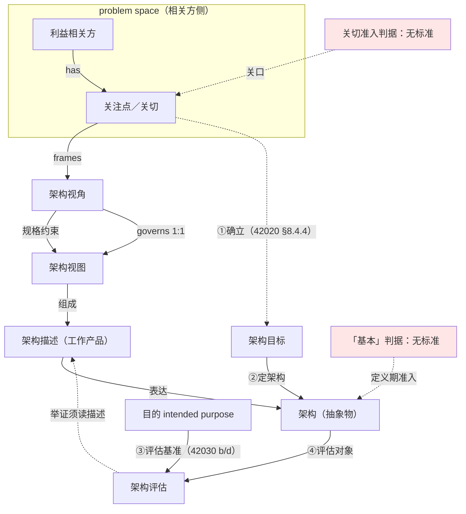
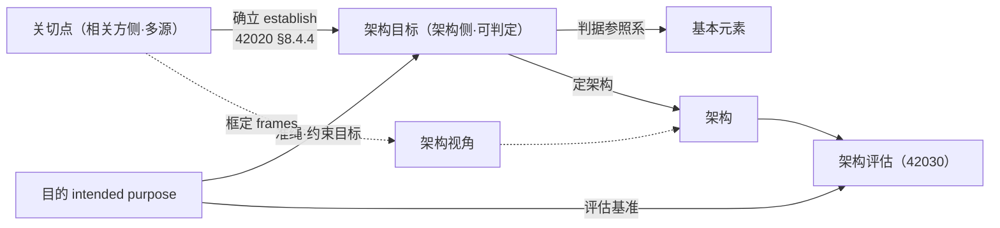
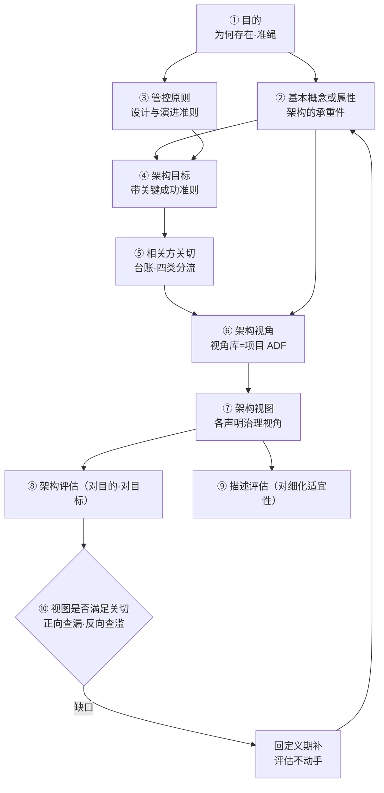

# 架构视角与关切判据研究报告

## —— 从视角集到关切裁决

**Architecture Viewpoints and the Adjudication of Concerns: A Research Report**

> **编号**：32（研究报告稿）
> **日期**：2026-09-23
> **主题**：三领域（实物产品／企业运营体系／作战任务）架构师应掌握的架构视角集；架构元素的「基本（fundamental）」准入判据；无领域视角标准时的视角规格路径；架构评估的依据；以及贯穿全链的关键接缝——关切（关注点）的裁决机制
> **权威来源**：ISO/IEC/IEEE 42010:2011／2022 与 GB/T 45630-2025（等同采用）；ISO/IEC/IEEE 42020:2019（架构过程）；ISO/IEC/IEEE 42030:2019（架构评估框架）；ISO/TS 14812:2022（ITS 词汇，四条明文视角）；DoDAF 2.02；NAF v4.1；OMG UAF 1.3 DMM；MODAF 1.2（已撤销）；The Open Group TOGAF 9.x 与 ArchiMate 3.1 XSD；RM-ODP（ISO/IEC 10746／ITU-T X.901）
> **相关报告**：24 号《架构与设计边界研究报告》已立「基本」的目的必要性／充分性双判据与不可逆性降为代理；30 号《架构描述核心概念研究报告》已立四定义、四关系与译名政策；29 号《架构治理研究报告》已立治理的裁量、责任主体与例外机制。**本报告是四问的递进收束**——回答「用哪些视角看」「什么够格进架构」「没有视角标准怎么写视角」「拿什么评」，并收口于「关切凭什么被裁决」
> **用语与定名政策**（依 GB/T 45630-2025 与仓库既定）：fundamental——仓库口径取「**基本**」，逐字引国标时照抄国标字面「**基础**」（引文不替人改字）；viewpoint——**架构视角**（旧稿「视点」已退役）；view——**架构视图**；concern——**关注点**（沿 42020 行文时作「关切」，本报告两词并用，指同一概念）；stakeholder——**利益相关方**；purpose——**目的**；objective——**目标**；governing principles——**管控原则**（动词位 governs 作「治理／管辖」）
> **引文纪律**（2026-09-23 用户裁定，已立为记忆 `feedback-quote-original-and-chinese`）：凡引外文，**原文与中译并列**，并标一手／二手／形式化；见不到条款文本写「未核」，取不到逐字写「未取得逐字」，不补号、不补句
> **文档版本**：v1.1（创建于 2026-09-23；同日并入附录 C 全链示例，原独立附件稿两份退役）
> **约定**：英文术语首次出现附中文对照；「形式化」单列，不得写成标准规定

---

## 摘要：十条核心结论

1. **视角不是可选项，是成立条件。** 架构视角与架构视图的重数为 **1:1**（governs），不声明支配视角、或内容不守其约定的产物，在标准意义上不构成架构视图。
2. **三个领域各有一套框架目录，但「列」高度通用。** 差别在「行」（谁的事）：实物产品是功能→物理，企业是业务→数据→应用→技术，作战是能力→作战（逻辑）→服务／系统→资源；而 NAF 的七个关注面与 UAF 的十一个方面高度重合。
3. **实物产品领域没有现成的权威视角目录。** INCOSE SEH 5.0 只给过程、不给视角清单；ISO/TS 14812 明文命名了四个视角（功能／物理／通信／企业），是唯一能取到逐字定义句的落点（且其抽象结构即 RM-ODP 在实物产品语境的落法）。
4. **可用蓝本有四份，不是零。** RM-ODP 五视角、ISO/TS 14812 四视角、GERAM／ISO 15704 四视图、UAF／NAF 的 P 行（Resource）。
5. **缺的不是视角标准，是视角规格。** 42010 只规定「视角该有什么」（§8.1＋附录 B）与「框架该有什么」（§7.1），把「用哪几个视角」下放给领域框架（ADF）——**领域没有 ADF，就自己建一个**，这是标准设计的正规路径。
6. **「基本」这个词标准给了，判据没给。** 定义句只说架构住在元素、关系与设计与演化的原则里，一个字没说**什么算基本**——这是权威缺口。判据的形式是**必要性（membership）＋充分性（closure）**，参照系是目的。
7. **关切不是判据，是判据的现场。** 关切的多源、会漏、会歪、会打架，使它无法承担判据；同理，**不可逆性只是代理**，会漏判也会误纳。
8. **关切不是目的的投影，而是目的的原料。** 目的由治理机构在关切基础上确立（42020 §6.4.3／§8.4.4），确立与被确立是两回事：**「关切 → 目的」这条推导线不存在，「关切 → 目标」这条线标准点名（establish）。**
9. **架构评估的依据是目的，判定靠目标。** 42030 官方摘要以 intended purpose 为基准（b、d 条），而目标是目的的落地形态与判定时真正上手的量（§6.1.2、f 条）。**且评估的对象是架构，不是架构描述**——后者归 42020 的概念化与细化过程。
10. **整条链的命门是关切的裁决机制，而它整块没有标准。** 裁决靠的不是原则，是三样可检查的东西：**预置的准入条件（来源与后果可指认）、不可自证的举证责任（三件套前置）、以及标准里真有据可依的裁决主体（42020 §6.4.4 架构治理决策）。**

---

## 一、依据与标准版图

### 1.1 三标准的管辖分工

本报告全程围绕三个标准展开。它们分工清楚，混线即出漏洞：

| 标准 | 现行状态 | 管什么 | 关键条款 | 与「目的／关切」的关系 |
|---|---|---|---|---|
| **ISO/IEC/IEEE 42010:2022**（＋ GB/T 45630-2025 等同采用） | 2022-11 第 2 版；国标 2025-04-25 发布、2025-11-01 实施 | 架构描述的**结构、表达与符合性**；视角与模型种类的规格要求 | §4 符合性；§6 架构描述的规格；§6.10 决策与理据的记录；**§7.1 ADF 规格**；**§8.1 视角规格**；**附录 B 视角规格指南** | 只在 §5.4 要求**声明**目的（*"the purposes for which the architecture description is being created"*，本报告未逐字取到正文，标**未核**），**不给判据** |
| **ISO/IEC/IEEE 42020:2019** | 现行 | 架构**过程**：治理、管理、概念化、评估、细化、使能（六类） | §6.4.3 确立架构集合目标；**§6.4.4 作出架构治理决策**；§8.4.4 确立架构目标与关键成功准则；§9.4.3 确定评估目标与准则；§9.4.7 评估相关方价值；§10.4.3 识别或开发视角；§10.4.6 评估架构细化 | **裁决权的出处**；也是 42010:2022 架构定义句的引用源（42020 §3.3） |
| **ISO/IEC/IEEE 42030:2019** | 现行；**AWI 修订在研**（ISO 号 93814） | 架构**评估框架** | 三层：评估综合（§4.3.1／§6.1）、价值评估（§4.3.2／§6.2）、架构分析（§4.3.3／§6.3）；§8 两个工作产品（评估计划／评估报告）；附录 A 价值与质量；附录 D 具名方法（ATAM／QUASAR／AoA） | **评估依据的出处**：*"assess the quality of architectures with respect to their **intended purpose**"* |

### 1.2 三标准的交界处，正是本报告的问题所在

**两处标红（无标准）与四处接缝，构成本报告 §3~§7 的全部内容。**

### 1.3 取证边界（诚实交代）

| 标准／框架 | 我取到什么 | 未取到什么 |
|---|---|---|
| ISO/IEC/IEEE 42010:2022 | **完整目录**（DIN 官方件）、Foreword 与 Introduction 逐字（ISO 官方预览）、1.1–1.3 与 2.x 变更说明 | §3 术语逐字、§5~§8 正文、附录 B 正文 |
| ISO/IEC/IEEE 42010:2011 | §3.2／3.4／3.5／3.6／3.7／3.9／3.10 定义句（经 ISO/TC 204 官方词汇站逐字转引） | 原件正文 |
| GB/T 45630-2025 | 范围、前言（编辑性改动清单）、引言、3.1~3.7 术语 | 3.8 及以后逐字 |
| ISO/IEC/IEEE 42020:2019 | **完整目录**（DIN 官方件）、**§3.1~3.45 术语逐字**（SIS 官方预览 19 页） | §6~§11 正文、附录 E.5 架构动机模型 |
| ISO/IEC/IEEE 42030:2019 | **完整目录**（DIN 官方件）、官方摘要逐字（Standard Norge） | §3 术语逐字、附录 A 细节 |
| ISO/TS 14812:2022 | 元层九条＋四条视角定义句与条款号（ISO/TC 204 官方词汇站） | 标准本体 |
| NAF v4.1 | **官方 PDF 全文**（208 页） | — |
| DoDAF 2.02 | **官方 PDF 全文**（289 页，`dowcio.war.gov`） | 分册 Vol I/II/III 章节号 |
| OMG UAF 1.3 DMM | **正式文档 dtc/2024-11-03 全文**（295 页） | 正式发布件 formal/25-10-01 |
| MODAF 1.2 | **官方下载件全文**（250 页） | — |
| TOGAF | 9.x 在线全文（Definitions、Architectural Artifacts、Stakeholder Management、Security Architecture and the ADM） | **TOGAF 10 全文**（pubs.opengroup.org 401） |
| ArchiMate | 3.1 Model Exchange File Format XSD 与 HTML schema 文档 | **3.2 规范正文**（401；3.2 路径 XSD 为 404） |
| INCOSE SEH 5.0 | 中译本 PDF 全文（413 页） | 英文原版 |

**凡上表"未取到"栏所涉内容，本报告一律不引其正文句；凡引条款号者必注明取自「官方目录」（条款标题级证据）还是「正文逐字」。**

---

## 二、第一问：三领域架构师应掌握的视角集

### 2.1 实物产品的系统设计

**A 组·标准明文命名并有逐字定义句（ISO/TS 14812:2022）**

| 视角 | 英文原文（逐字） | 中译 | 条款 |
|---|---|---|---|
| 功能视角 | *"architecture viewpoint used to frame concerns related to the definition of processes that perform surface transport functions and data flows shared between these processes"* | 用于框定与「执行地面运输功能的过程之定义、以及这些过程之间共享的数据流」相关的关注点的架构视角 | 3.1.4.6 |
| 物理视角 | *"architecture viewpoint used to frame concerns related to the assignment of functionality to physical objects and the interfaces among these physical objects"* | 用于框定与「功能到物理对象的分配、以及这些物理对象之间的接口」相关的关注点的架构视角 | 3.1.4.8 |
| 通信视角 | *"architecture viewpoint used to frame concerns related to all layers of the Open Systems Interconnection (OSI) stack and related management and security issues"* | 用于框定与「开放系统互连（OSI）各层及相关管理与安全问题」相关的关注点的架构视角 | 3.1.4.2 |
| 企业视角 | *"architecture viewpoint used to frame the policies, funding incentives, working arrangements and jurisdictional structure that support the technical layers of the architecture"* | 用于框定「支撑架构各技术层的政策、资金激励、工作安排与管辖结构」的架构视角 | 3.1.4.4 |

四条的页内关系字段为 `governs some …View`／`subClassOf architectureViewpoint`（治理某个视图／是架构视角的子类），与 42010 概念模型一致。

**边界**：定义句中的 "surface transport" 是 ITS 领域限定词；**其抽象结构（功能→物理→接口→企业）可迁移到任意实物产品，但逐字引用时必须保留 ITS 语境**，不可当作通用产品标准原句。

**B 组·框架命名（见 §2.3 作战侧，对应 P 行）**：NAF v4.1 的 P 行九格为实物产品设计的主用行——资源分类、资源结构、资源交互、资源功能、资源状态、资源路线图、数据模型（P7 Data Model）、资源约束。

**C 组·标准支撑但未以 viewpoint 命名的关注面（提炼）**：安全（ARP4754B／ARP4761A、ISO 26262、IEC 61508）、开发保障（DAL／IDAL；FAA AC 20-115D／20-152A）、验证与确认（15288 技术过程）、环境适应性与合格鉴定（RTCA DO-160）、制造与装配、保障与维修（ISO 26262-7 的 production, operation, service and decommissioning）、信息安全（ISO/SAE 21434、DO-326／DO-356）。**这七条必须写成"以某某标准为权威支撑的提炼视角"，不得写成"标准规定的视角"。**

**一处负面发现（重要）**：**INCOSE SEH 5.0 没有给出视角清单**。其正文用「视点」处无一处在给清单，只给过程与定义引述。**故实物产品领域不存在一份现成的权威视角目录**——这与另两个领域根本不同，也是 §4「自建 ADF」在该领域格外必要的原因。

### 2.2 企业运营体系设计

**框架目录**：TOGAF 四域 ＋ ArchiMate 视角机制。

**TOGAF 的两处原文自相矛盾**，引用时必须交代：

- 定义句是范围语义：*"The architectural area being considered. There are four architecture domains within TOGAF: business, data, application, and technology."* → **架构域**：正在被考虑的**架构区域**。TOGAF 中有四个架构域：业务、数据、应用与技术。句中无 conventions、无 concerns、无 stakeholders，**不满足 42010 视角定义的三要件**。
- 同一标准另一处却断言：*"The TOGAF architecture domains are themselves viewpoints that can be used to group the foundational catalogs, matrices, and diagrams"* → TOGAF 的架构域**本身就是视角**，可用于归组基础性的目录、矩阵与图。
- 同章又自限：*"These TOGAF sections on viewpoints should be considered as guides for the development and treatment of a view, not as a full definition of a viewpoint."* → 这些关于视角的章节应被视为**视图开发与处理的指南**，而非视角的完整定义；并称 *"This is not intended as an exhaustive set of viewpoints, but simply as a starting point."* → 这**并非一份穷尽的视角集合**，而只是一个起点。

**结论**：四域同时承担"分区"与"框架自述的视角"两职，按 42010 定义句它们**不是完整视点规格**。**这是 TOGAF 的框架内自述，不是 ISO 的要求。**

**可执行的约定在 ArchiMate**：其官方 XSD 把 Viewpoint 做成一等类型，字段为 `concern`（内含 `stakeholders`）／`viewpointPurpose`（Designing｜Deciding｜Informing）／`viewpointContent`（Details｜Coherence｜Overview）／`allowedElementType`／`allowedRelationshipType`／`modelingNote`，并枚举 32 个命名视角。**中译**：关注点／视角用途（设计·决策·告知）／视角内容（细节·一致性·概览）／允许的元素类型／允许的关系类型／建模说明。

**边界**：所用 XSD 版本号为 **3.1**（Status: Preliminary），覆盖 3.1/3.2 语言，但 **3.2 规范正文未取得**（401），3.2 路径的 XSD 返回 404——**不得声称「ArchiMate 规范自述符合 42010」**。

**四域的逐字服务对象**（TOGAF 9.x，可用于确定视角服务谁）：

| 域 | 英文原文（逐字） | 中译 |
|---|---|---|
| Data | *"The Data Architecture domain addresses the needs of database designers, database administrators, and system engineers."* | 数据架构域面向数据库设计者、数据库管理员与系统工程师的需要 |
| Application | *"The Application Architecture domain addresses the needs of system and software engineers."* | 应用架构域面向系统与软件工程师的需要 |
| Technology | *"The Technology Architecture domain addresses the needs of acquirers, operators, administrators, and managers."* | 技术架构域面向采办者、操作者、管理员与管理者 |
| Business | *"The Business Architecture domain addresses the needs of users, planners, and business management."* | 业务架构域面向用户、规划者与业务管理 |

**TOGAF 的术语分层**：安全／可管理性／标准合规在 TOGAF 里是 **View 不是 Viewpoint**——*"The Enterprise Security view is concerned with the security aspects of the system."* → 企业安全视图关注系统的安全方面。

### 2.3 作战任务系统设计

**四框架的现行性与视角集**

| 框架 | 版本 | 现行性 | 顶层集合 |
|---|---|---|---|
| **DoDAF** | 2.02（2010-08） | **现行**（官方逐字：*"This is the official and current version for the Department of Defense Architecture Framework."* → 这是国防部架构框架的官方现行版本） | **8 个 Viewpoint** |
| **NAF** | v4.1（Document Version 2026.03） | **现行** | **网格：行 5 × 列 7**，每一格即一个视角 |
| **UAF** | 1.3（同时是 ISO/IEC 19540-1/-2:2022） | 现行 | **11 视角 × 11 方面** |
| **MODAF** | 1.2.004 | **已撤销**（GOV.UK 逐字：*"MODAF has been replaced with the NATO Architecture Framework (NAF) V4."* → MODAF 已被北约架构框架（NAF）V4 取代） | 7 类（存量文档仍在用） |

**DoDAF 2.02 八视角**（官方 PDF 逐字）：

| 视角 | 英文原文（逐字） | 中译 |
|---|---|---|
| All (AV) | *"The All Viewpoint describes the overarching aspects of architecture context that relate to all viewpoints."* | 全景视角描述与所有视角都相关的架构上下文的总体方面 |
| Capability (CV) | *"The Capability Viewpoint articulates the capability requirements, the delivery timing, and the deployed capability."* | 能力视角阐明能力需求、交付时间与已部署的能力 |
| Operational (OV) | *"The Operational Viewpoint includes the operational scenarios, activities, and requirements that support capabilities."* | 作战视角包含支撑能力的作战场景、活动与需求 |
| Services (SvcV) | *"The Services Viewpoint is the design for solutions articulating the Performers, Activities, Services, and their Exchanges, providing for or supporting operational and capability functions."* | 服务视角是解决方案的设计，阐明执行者、活动、服务及其交换，用以提供或支撑作战与能力功能 |
| Systems (SV) | *"The Systems Viewpoint, for Legacy support, is the design for solutions articulating the systems, their composition, interconnectivity, and context…"* | 系统视角（**用于遗留支撑**）是解决方案的设计，阐明各系统及其组成、互连与上下文…… |
| Data and Information (DIV) | *"The Data and Information Viewpoint articulates the data relationships and alignment structures in the architecture content for the capability and operational requirements, system engineering processes, and systems and services."* | 数据与信息视角阐明架构内容中面向能力与作战需求、系统工程过程、系统与服务的**数据关系与对齐结构** |
| Standards (StdV) | *"The Standards Viewpoint can articulate the applicable policy, standards, guidance, constraints, and forecasts…"* | 标准视角可阐明适用的政策、标准、指南、约束与预测…… |
| Project (PV) | *"The Project Viewpoint describes the relationships between operational and capability requirements and the various projects being implemented."* | 项目视角描述作战与能力需求同各实施项目之间的关系 |

**注意 OV 一行里的 "Legacy support"**：**系统视角在 DoDAF 里已被标为遗留支撑**，新工作走服务视角——这一条对设计决策有直接影响。

**DoDAF 的裁剪纪律**（逐字）：*"DoDAF V2.0 does not prescribe any models – instead, it concentrates on data as the essential ingredients of any architecture development. It seeks to make architectural descriptions 'Fit-for-Purpose', based on decision-maker needs."* → DoDAF V2.0 **不规定任何模型**，而是聚焦于数据，力求使架构描述「**适合用途**」，以决策者的需要为准；*"All the DoDAF-described Models do not have to be created."* → **并非所有 DoDAF 所述模型都必须创建。**

**NAF v4.1 网格**（官方逐字）：

- 行＝**Subject of Concern**（关注主题）：Concepts (C)／Service (S)／Logical (L)／Physical Resource (P)／Architecture Foundation (A)
- 列＝**Aspect of Concern**（关注方面）：Taxonomy／Structure／Connectivity／Behaviour／Information／Constraints／Roadmap
- *"Each cell at the intersection of the rows and columns is a Viewpoint."* → 行与列相交处的**每一格就是一个视角**。
- NAFv3 到 v4 的行映射（逐字）：Capability (NCV)→Concepts、Service-Oriented (NSOV)→Service、Operational (NOV)→Logical、Systems (NSV)→Physical Resource、All Views (NAV)→Architecture Foundation

**NAF 的两句关键定义**（逐字）：*"A View is what you see. A Viewpoint is where you are looking from."* → **视图是你看到的东西；视角是你从何处看。** *"A Viewpoint frames one or more concerns. A concern can be framed by more than one Viewpoint."* → 一个视角**框定**一个或多个关注点；一个关注点**可被多个视角框定**。

**NAF 的裁剪纪律**（逐字）：*"NAF neither mandates the use of all standardized Viewpoints, nor does it exclude the usage of additional Viewpoints, if required, to address stakeholder concerns."* → NAF **既不强制使用全部标准化视角，也不排除**在需要时使用额外视角；*"the selection of Viewpoints must be tailored to the specific architecture effort…"* → 视角的选择**必须针对具体架构工作进行裁剪**。

**UAF 1.3 的 11 视角**（DMM Table 7:1 逐字，摘要引四条）：

| 视角 | 英文原文（逐字） | 中译 |
|---|---|---|
| Strategic (St) | *"Capability management process. Describes the capability taxonomy, composition, dependencies, and evolution."* | 能力管理过程。描述能力的分类、组成、依赖与演化 |
| Operational (Op) | *"Illustrates the Logical Architecture of the enterprise. Describes the requirements, operational behavior, structure, and exchanges required to support (exhibit) capabilities. Defines all operational elements in an implementation/solution independent manner."* | 刻画企业的逻辑架构。描述支撑（展现）能力所需的需求、作战行为、结构与交换。以**不依赖实现／方案**的方式定义全部作战要素 |
| Services (Sv) | *"The Service-Orientated View (SOV) is a description of services needed to directly support the operational domain…"* | 面向服务的视图是对直接支撑作战域所需服务的描述…… |
| Resources (Rs) | *"Captures a solution architecture consisting of resources, e.g., organizational, software, artifacts, capability configurations, and natural resources that implement the operational requirements."* | 捕获由资源构成的解决方案架构，例如实现作战需求的组织、软件、制品、能力配置与自然资源 |
| Security (Sc) | *"Security assets and security enclaves. Defines the hierarchy of security assets and asset owners, security constraints (policy, laws, and guidance) and details where they are located (security enclaves)."* | 安全资产与安全域。定义安全资产与资产所有者的层级、安全约束（政策、法律与指南），并详述其所在（安全域） |
| Personnel (Ps) | *"Defines and explores organizational resource types…"* | 定义并探究组织资源类型…… |
| Projects (Pj) | *"Describes projects and project milestones, how those projects deliver capabilities, the organizations contributing to the projects and dependencies between projects."* | 描述项目与项目里程碑、这些项目如何交付能力、参与项目的组织以及项目之间的依赖 |
| Standards (Sd) | *"…the set of rules governing the arrangement, interaction, and interdependence of solution parts or elements."* | ……治理方案各部分或各元素之安排、交互与相互依赖的规则集合 |
| Actual Resources (Ar) | *"The analysis, e.g., evaluation of different alternatives, what-if, trade-offs, V&V on the actual resource configurations."* | 对实际资源构型的分析，例如不同备选方案的评估、假设推演、权衡与验证确认 |
| Architecture Management (Am) | *"Identifies the metadata and views required to develop a suitable architecture that is fit for its purpose."* | 识别开发一个**适合其目的**的架构所需的元数据与视图 |

**UAF 的方面（Aspect）不是视角**——Table 7:2 定义 11 个方面（Motivation／Taxonomy／Structure／Connectivity／Processes／States／Sequences／Information／Constraints／Roadmap／Traceability），其中三条逐字：Motivation *"Captures motivational elements e.g., challenges, opportunities, and concerns…"* → 动机：捕获挑战、机遇与**关注点**等动机要素……；Roadmap *"Addresses how elements in the architecture change over time."* → 路线图：处理架构中各元素**随时间如何变化**；Traceability *"Describes the mapping between elements in the architecture."* → 可追溯性：描述架构中各元素之间的映射。

**UAF 自述其视角命名遵循 42010**（逐字）：*"the term viewpoint is in the context of ISO 42010 where a viewpoint is the specification of a view"* → 此处 viewpoint 取 ISO 42010 的语境，即视角是视图的**规格**；*"The grid is a way of showing how the various view specifications (cells) correspond to viewpoints"* → 网格是显示各**视图规格（单元格）**如何对应到视角的方式。

### 2.4 三域合看：差异在「行」，共性在「列」

| | 实物产品 | 企业运营体系 | 作战任务系统 |
|---|---|---|---|
| **权威框架** | ISO/TS 14812（四条）＋**无统一视角目录** | TOGAF 四域（视角／分区两义）＋ArchiMate | DoDAF 8／NAF 网格／UAF 11×11／MODAF（已撤销）7 |
| **主干「行」** | 功能→物理→通信→企业 | 业务→数据→应用→技术 | 能力→作战（逻辑）→服务／系统→资源 |
| **「列」轴** | 复用 NAF／UAF 的七／十一个方面 | ArchiMate 的 purpose×content 两轴 | NAF 七列／UAF 十一列 |
| **各框架都不点名、必须自建** | 安全、环境鉴定、制造装配、保障维修、信息安全 | 安全、可管理性、标准合规（术语是 View） | 试验鉴定、训练、后勤（**四框架均未命名**） |

**结论**：三域的差别在「行」（谁的事），「列」高度通用。**任一领域自建视角，都在往这两个轴上落格**——这是本问最具迁移价值的一条。

---

## 三、第二问：「基本」判据

### 3.1 标准给了词，没给判据

**架构定义句**（ISO/TC 204 官方词汇站逐字转引 42010:2011 §3.2，→ ISO 14812 条款 3.1.3.1）：

> *"fundamental concepts or properties of a system in its environment embodied in its elements, relationships and in the principles of its design and evolution"*
> **中译**：系统在其环境中的**基本**概念或属性，体现于其元素、关系以及其设计与演化的原则之中。

**GB/T 45630-2025 3.2** 的中文对应句用「**基础**概念或属性」＋「**管控原则**」，并注明来源 ISO/IEC/IEEE 42020:2019, 3.3。

**缺口**：定义句只说了架构**住在哪儿**（元素／关系／设计与演化的原则），**一个字没说"什么算基本"**。42010 与 42030 都不给这条准入判据——**这是权威缺口，本判据整块是形式化。**

### 3.2 判据的形式：必要性＋充分性（参照系＝目的）

| 判据 | 问句 | 管什么 | 失效形态 |
|---|---|---|---|
| **必要性**（membership） | 去掉 x，目的是否落空？ | **成员资格**（在不在架构里） | **under-specification**（架构缺失） |
| **充分性**（closure） | x 齐备后，剩余问题是否都不影响目的的可达性？ | **闭包**（架构到哪儿停） | **over-specification**（架构越界写成设计） |

**精确化（不可省）**：**不是数学意义的充要条件**——架构不构成目的达成的充分条件（还得实现、验证、运行），充分性只指「**目的所要求的结构条件已被完整表达**」。

### 3.3 落到单个元素：三道测试

1. **反事实承重测试**（判必要性）：删掉它，目的会怎样？**跨**（目的落空）→ 概念级基本；**变形**（目的不变但实体性质变了）→ 属性级基本；**只是变难** → 不进架构层。
2. **反事实替换测试**（判性质）：换一个实现，这个概念／属性还在不在？在 → 基本；不在 → 那是**体现**，不是本质。此测同时挡掉「把当前技术选型当架构」。
3. **目的判据的两遍跑**：兑现侧（实现目的需要它吗）＋演化侧（目的变了，它守不守得住）。定义句里 "and evolution"／"principles of its design and evolution" 就是第二遍的出处——**只跑一遍，演进类的基本元素必漏**。

### 3.4 两个必须避开的假判据

| 假判据 | 为什么会冒充判据 | 两类失真 |
|---|---|---|
| **不可逆性** | 可观测、直观、易沟通 | **漏判**：不贵但承重（如"日志须可被外部审计员独立读取"）；**误纳**：很贵但与目的无关（框架版本、组织惯例技术栈） |
| **可判定性／可引用性／高层级／概要** | 都是"看起来像判据"的代理 | 同一形状的错误换了外衣——**代理冒充真判据** |

### 3.5 与目的、关切的三方关系（本报告的核心澄清）

**三句定式**：

> **关切是原料，目标是产物，目的是准绳。**
> **判据对目的量，不对关切点量**（元素的资格问题）。
> **目的对关切点账，不对着偏好量**（目的的合法性问题）。

**两句必须成对用**：只有第一句，目的可以独断；只有第二句，架构会被偏好撑胖。

**一处方向性澄清**：**关切不是目的的投影，而是目的的原料**。把关切写成「目的的投影」，就把「关切 →（裁量）→ 目的」这个环压成了一根单向箭头——**看起来严了，实际是把裁量藏起来了，而藏起来的裁量才是真正随意的部分。**

---

## 四、第三问：没有视角标准，怎么做架构定义

### 4.1 缺的不是视角标准，是视角规格

42010:2022 的条款结构（DIN 官方目录逐字）：

| 条款 | 标题（英文原文） | 中译 | 管什么 |
|---|---|---|---|
| §3.8 | architecture viewpoint | 架构视角 | **视角是什么**（定义句） |
| §5.2.7 | Architecture views and architecture viewpoints | 架构视图与架构视角 | 概念模型 |
| §6 | Specification of an architecture description | 架构描述的规格 | **AD 该有哪些成分** |
| §7.1 | Specification of an architecture description framework | 架构描述框架的规格 | **框架（＝视角集）该有什么** |
| §8.1 | Specification of an architecture viewpoint | 架构视角的规格 | **单个视角该有什么** |
| 附录 B | Guidelines to specification of architecture viewpoints | 架构视角规格指南 | 视角规格指南（p.40，**存在性已结清**） |

**§6 的成分清单**（逐条，即「架构定义该产出什么」的骨架）：6.2 识别相关方 → 6.3 识别相关方角度 → 6.4 识别关注点 → 6.5 识别方面体 → 6.6 纳入架构视角 → 6.7 纳入架构视图 → 6.8 纳入视图组件 → 6.9 记录对应关系（一致性／对应／对应方法）→ 6.10 记录架构决策与理据。

**把这张清单倒过来读，就是架构定义的操作步骤。**

### 4.2 标准给了解法：ADF（架构描述框架）

**ADF 定义**（ISO/TC 204 官方词汇站逐字转引 42010:2011 §3.4，→ ISO 14812 条款 3.1.3.3）：

> *"conventions, principles and practices for the description of architectures established within a specific domain of application and/or community of stakeholders"*
> **中译**：在特定应用领域和／或相关方共同体内确立的、用于描述架构的**约定、原则与实践**。

**改版理由**（ISO 官方预览 Foreword 逐字）：

> *"The term 'architecture description framework' (ADF) replaces 'architecture framework' in the previous edition. It is defined in order to differentiate ADFs from other kinds of architecting frameworks like architecture evaluation frameworks specified in ISO/IEC/IEEE 42030."*
> **中译**：术语「架构描述框架（ADF）」取代了上一版的「架构框架」。它被定义出来，是为了把 ADF 与其他种类的架构化框架（如 ISO/IEC/IEEE 42030 规定的架构评估框架）区分开。

**这条定义就是「标准把视角集下放给领域」的机制本身**——它不说有哪些视角，它说「某领域内确立的约定」。**领域没有 ADF，就自己建一个，这是标准设计的正规路径。**

### 4.3 实物产品的四份蓝本

| 蓝本 | 视角集 | 出处与状态 |
|---|---|---|
| **RM-ODP** | enterprise／information／computational／engineering／technology（五视角） | ISO/IEC 10746 系列；ITU-T X.901 目录逐字给出五视角章（§6~§9 与 technology），并带附录 A 企业视角规格模板 |
| **ISO/TS 14812** | functional／physical／communications／enterprise（四视角） | 见 §2.1；**其抽象结构即 RM-ODP 在实物产品语境的落法**——企业视角定义中的「支撑技术层」正对应 RM-ODP 的 enterprise／engineering／technology 三视角分工 |
| **GERAM／ISO 15704** | Function／Information／Resource／Organization（四视图） | ISO 19439:2006 Scope 逐字：*"In ISO 19439:2006, four enterprise model views are defined in this framework. Additional views for particular user concerns can be generated but these additional views are not part of this International Standard."* → ISO 19439:2006 在本框架中定义了**四个企业模型视图**；针对特定用户关注点的附加视图可以生成，但这些附加视图不属于本国际标准。**（视图名称与条款号未核）** |
| **UAF／NAF 的 P 行** | 资源分类／结构／交互／功能／状态／路线图／数据模型／约束（九格） | 见 §2.3 |

**这四份可以混用**，且有据：42010 的符合性允许一份 AD 声明符合多个 ADF，也允许定义项目自有 ADF。**唯一不能省的是：你用的视角必须写出规格，视图必须声明受哪个视角治理。**

### 4.4 视角规格必须写明的内容（§8.1 ＋ 附录 B）

1. **名称、出处（来自哪个 ADF）、版本**——视图据此声明受谁治理
2. **框定哪些关注点、服务哪些典型相关方与角度**
3. **采用的模型种类、记号与建模约定**——模型种类定义句逐字：*"conventions for a type of modelling"* → 针对某一类建模的约定（42010:2011 §3.9，→ ISO 14812 3.1.3.8），其关系为 `governs → architecture model`
4. **对应方法**——本视角与其他视角怎么挂钩
5. **视图方法：建造类／解读类／分析类**——保证他人能按同一套方法复现、读懂、检查
6. **必需的模型、元素、关系、约束与属性**，以及视图组件、对应关系、一致性规则

### 4.5 实物产品的架构定义流程（八步）

| 步 | 动作 | 产出 | 依据 |
|---|---|---|---|
| 1 | 定目的，锚定所关注实体（EoI） | 目的声明书（治理机构批） | 见 §5、§6 |
| 2 | 列相关方与角度（含沉默方：监管、运维、退役、自然环境） | 相关方×角度表 | 42010 §6.2／6.3 |
| 3 | 关切点台账并分流 | 关切点台账 | 42010 §6.4；见 §6 |
| 4 | **按 §8.1 建视角库**：能复用四蓝本的就复用，缺的才自建 | **项目 ADF（视角规格集）** | 42010 §7.1／§8.1；42020 §10.4.3 |
| 5 | 按视角产视图，视图声明治理它的视角 | 视图与视图组件 | 42010 §6.7／6.8 |
| 6 | 跨视角对应关系与一致性规则 | 对应关系 | 42010 §6.9 |
| 7 | 识别基本元素 | 基本元素清单 | 见 §3（形式化） |
| 8 | 决策与理据入档，纳入基线 | ADR ＋ 架构描述 | 42010 §6.10 |

**第 4 步是全部关键**——它是「没有视角标准」的唯一正解：**视角不是挑的，是按规格写出来的。** 写规格这件事一次投入、长期复用。

**三条边界**：

- **自建 ADF 有成本，不能随便建**。INCOSE SEH 5.0 讲 42010 时逐字提示（中译）：*"开发项目特定的视点规范需要有合理理由，因为它们涉及架构描述、评估、管理和使用成果产出的额外工作。"* 先穷尽复用，再自建。
- **视角是资产，视图是产物**。视角可入库、可版本化、可跨项目复用；视图是逐项目产物。**每次项目都重新发明视角，正是"多套话术、零件互换性归零"的病根。**
- **符合性有明确对象**。42010 §4 的符合性是对 AD／ADF／ADL／视角／模型种类**分别**做的——「我们的架构描述符合 42010」这句话要落到「符合哪些条款、哪些视角规格齐备」。

---

## 五、第四问：架构评估的依据

### 5.1 官方摘要：依据是目的

**ISO/IEC/IEEE 42030:2019 官方摘要逐字**（Standard Norge 官方条目）：

> *"This document specifies the means to organize and record architecture evaluations for enterprise, systems and software fields of application. The aim of this document is to enable architecture evaluations that are used to: a) validate that architectures address the concerns of stakeholders; b) assess the quality of architectures with respect to their intended purpose; c) assess the value of architectures to their stakeholders; d) determine whether architecture entities address their intended purpose; e) provide knowledge and information about architecture entities; f) assess progress towards achieving architecture objectives; g) clarify understanding of problem space and of stakeholder needs and expectations; h) identify risks and opportunities associated with architectures; and i) support decision making where architectures are involved."*
> **中译**：本文件规定了在企业、系统与软件应用领域中组织与记录架构评估的方法。其目的在于使架构评估可用于：a) 认定架构回应了相关方的关注点；b) 对照其**预期目的**评估架构质量；c) 评估架构对其相关方的价值；d) 判定架构实体是否达成其**预期目的**；e) 提供关于架构实体的知识与信息；f) 评估朝着**架构目标**的推进程度；g) 澄清对问题空间以及相关方需要与期望的理解；h) 识别与架构相关的风险与机遇；i) 在涉及架构时支持决策。

**a、b、c、d、f 五条全是「对着目的判」**。

### 5.2 依据是目的，判定靠目标

| 层 | 术语 | 定义／出处 | 在评估里的作用 |
|---|---|---|---|
| 准绳 | **intended purpose**（预期目的） | 42030 摘要 b、d 条 | 架构配不配得上它被托付的用途 |
| 判定量 | **architecture objectives**（架构目标） | 42020 §6.4.3／§8.4.4 确立；42030 §6.1.2 评估；摘要 f 条 | 目的拆成可判定的若干条，每条带关键成功准则 |

**两层的两种崩法**：目标齐全但追不到目的 → **无据扩张**；目的清楚但目标缺项 → **架构缺失**。

**术语防撞（本会话踩过的坑）**：标准里有两个 purpose，**中文都容易写成「目的」**——

- **intended purpose**（预期目的）：架构／被架构的实体的属性；42030 的评估基准；
- **process purpose**（过程目的）：过程本身的属性；42020 §3.29 逐字 *"high level objective of performing the process and the likely outcomes of effective implementation of the process"* → 实施该过程的**高层级目标**，以及有效实施该过程可能产生的结果。

**引用时凡出现「目的」，必须标明是哪一个。**

### 5.3 范围界碑：评估的是架构，不是架构描述

**42030 官方摘要 NOTE 逐字**：

> *"This document addresses the evaluation of an architecture and not an evaluation of the architecture description's suitability. Matters concerning the evaluation of the architecture description fall within the scope of the architecture conceptualization and architecture elaboration processes as defined in ISO/IEC/IEEE 42020."*
> **中译**：本文件针对的是**架构**的评估，而非**架构描述适宜性**的评估。有关架构描述评估的事项，属于 ISO/IEC/IEEE 42020 所定义的**架构概念化**与**架构细化**过程的范围。

**推论（本报告的关键判断）**：

- **「以目的评估架构」成立**——42030 的正业；
- **「审视架构视图是否支持系统目的」不成立**——视图是架构描述的构成部分，**评视图的适宜性是 42020 概念化与细化过程的活**（细化过程 §10.4.6 *Assess the architecture elaboration*，评估架构细化）。

**两个对象、两把尺子**：

| | 评架构 | 评架构描述 |
|---|---|---|
| 对什么判 | **目的**（42030 摘要 b、d） | **细化过程的适宜性**（42020 §10.4.6） |
| 产出 | 架构评估计划与报告（42030 §8） | 描述本身的检查记录 |
| 误用的后果 | — | 拿 42010 §4 符合性当评估 → **评估退化成文档审查** |

### 5.4 评估的三层与方法

| 层 | 条款 | 管什么 | 具名方法（附录 D） |
|---|---|---|---|
| **评估综合** Evaluation synthesis | §4.3.1／§6.1 | 评估本身怎么组织 | — |
| **价值评估** Value assessment | §4.3.2／§6.2 | 对被评估实体**相关方**的价值 | 附录 A：Keeney 价值聚焦思维、Ring 价值模型、价值表述框架、相关方价值→质量→度量；质量侧接 ISO/IEC 25000 族 |
| **架构分析** Architectural analysis | §4.3.3／§6.3 | 架构本身的技术分析 | **ATAM**、Method Framework ＋ QUASAR、**AoA（方案分析）** |

**每层都是「目标—方法—因素—结果」四件套**（§6.1.2~6.1.5／§6.2.2~6.2.5／§6.3.2~6.3.5），这四件就是评估的落地模板。另有 §4.7／§7 定制化架构评估框架、§4.8 裁剪、§8 两个工作产品（**架构评估计划**／**架构评估报告**，各分 requirements／recommendations／permissions 三档）。

### 5.5 术语防撞：「架构评审」与「架构评估」不是一回事

- **架构评审**在本仓库已有主：23 号《判据体系研究报告》确立的判据阶梯（验证／确认／评审／审核／治理），评审的尺子是 ISO 9000 族的**适宜／充分／有效**。
- **架构评估**（architecture evaluation）是 42030 的正业：评架构对目的的适配与价值。

**引用时建议中译分开——评审 vs 评估**，否则两套尺子会串。

---

## 六、收口：关切凭什么是可裁决的

四问的最终落点在这里，也在这里出现**第二处无标准的缺口**。

### 6.1 标准给了什么、没给什么

**给了三件：**

| 依据 | 英文原文（逐字） | 中译 | 出处 |
|---|---|---|---|
| 关切定义① | *"interest in a system relevant to one or more of its stakeholders"* | 与系统的一个或多个相关方相关的**利害** | 42010:2011 §3.7（经 ISO/TC 204 转引） |
| 关切定义② | *"matter of interest or importance to a stakeholder"* | 对相关方而言具有**利害或重要性的事项** | 42020:2019 §3.10（SIS 官方预览） |
| 影响来源 | 见 §6.4 表 | — | 42020:2019 §3.10 Note 1 |

**没给三件**：**准入门槛**（两条定义都是"利害／重要性"，**没有任何过滤器**）；**判决程序**（42010 §6.2~6.5 只给四个 *identification* 活动，不说怎么定去留）；**判决责任人**（**「关切该不该进架构」这句话，标准里没有主语**）。**故关切准入判据整块是形式化。**

**但裁决主体有据**——架构治理过程（42020 §6）：

| 英文原文（逐字） | 中译 | 条款 |
|---|---|---|
| *Establish architecture collection objectives* | 确立架构集合目标 | §6.4.3 |
| *Make architecture governance decisions* | 作出架构治理决策 | §6.4.4 |
| *Establish architecture objectives and critical success criteria* | 确立架构目标与关键成功准则 | §8.4.4 |

**「确立目标」与「作决策」是治理过程名下的动作，不是架构师名下的。**

### 6.2 判据：四类出口（台账里每条关切必须四选一）

| 类型 | 判别 | 出路 |
|---|---|---|
| **承重型** | 不满足，目的达不到 | 产生架构目标与基本元素 |
| **约束型** | 不产生元素，只限可行域 | 转成边界条件，挂到相关元素上 |
| **偏好型** | 只影响方案品味 | 下沉设计／运维 |
| **交付型** | 影响成本、进度、组织接口 | 进项目基线 |

**「悬空」不是选项**——空着的就是漏项，治理要查。

### 6.3 过程：四个关口与责任人

| 关口 | 裁什么 | 判据（程序性） | 责任人 |
|---|---|---|---|
| **立案** | 能不能进台账 | ①来源可指认（谁在乎）②后果可指认（不满足会怎样，要求量化） | **架构师** |
| **进架构** | 能不能转化为架构目标 | ③与目标可对应 ④类型定性 ⑤出路非空 | **治理机构** |
| **排序** | 排不排得上、何时做 | 资源与优先级 | **治理机构** |
| **复核** | 目的变更后重审 | 目的声明书 ↔ 关切点台账 ↔ 四级映射表逐行对上 | **治理机构** |

**三个交叉判据**（区分关切与需求，防止偏好包装成关切）：

| 判据 | 问句 | 结论 |
|---|---|---|
| **换人测试** | 换个相关方它还在不在？ | 在→关切；不在→需求 |
| **改写测试** | 能问出通过／不通过吗？需要指标与验证方法吗？ | 需要→需求 |
| **粒度检查** | 停在「安全」「成本可控」太抽象挑不出视角；写到「用 AES-256」越界进设计 | 合适粒度＝**刚好足以挑出视角** |

### 6.4 依据：四条，全是可指认的事实，没有一条是原则

| 依据 | 为什么可判 | 拒绝时的措辞 |
|---|---|---|
| **来源可指认** | "谁在乎"是事实问题，可核实 | — |
| **后果可指认且可度量** | **最硬的分水岭**：能写出期望值与可接受区间的，是关切；写不出的，是愿望 | **愿望不立案，理由不是"不重要"，是"无法判定，因而无法承接"**——程序性理由，经得起复议 |
| **可归位** | 落在结构／行为／信息／约束哪一面？归不进的，说明它还不成其为架构级关切 | 退回需求侧或运营侧 |
| **有出路** | 四类之一，不许悬空 | 走治理裁量并留痕 |

**防「随意说」最有效的一招：举证责任前置。** 主张者随附**来源／后果／度量**三样，**不齐退回补件，而不是驳回**。这一招把「随口说」变成「要举证」——**整个机制不需要任何人做价值裁判。**

**它同时是评估依据正确性的保障**：42030 附录 A 的结构是 *stakeholder values → qualities → measures*（相关方价值 → 质量 → 度量）——**关切只有走到「可测」这一步，才有资格参与架构评估**。不设这道关，评估依据就是流沙。

**关键认识**：「相关方可以随意说这是他的关切」——**这句话其实没错，应该允许**。只要是他的利害就成立，没有任何标准授权你否定「你在乎这件事」。**所以裁决的对象不是"关切真不真"，是"关切能不能往下走"。**

### 6.5 真正会随意的不是关切，是目标

- 关切是**发现物**——谁在乎有事实可查，编不出来多少；
- 目标是**裁量物**——立哪几条、定多严的成功准则，**权力在此**。

**要防的是三处对账失败**：

| 失败 | 症状 | 属于 |
|---|---|---|
| 目标追不到目的 | 无据扩张 | over-specification |
| 目标追不到关切 | 拍脑袋目标 | 程序缺失 |
| 承重关切无目标承接 | 架构缺失 | under-specification |

**留痕要留的正是这三条**：哪条目的、来自哪条关切、舍了哪条、谁批的（42010 §6.10 记录架构决策与理据）。

---

## 七、三处接缝与十二步补法

### 7.1 三处接缝

| 接缝 | 病 | 严重度 |
|---|---|---|
| **一·关切 ↔ 目的** | 不同尺度，转换点无标准覆盖；且目的若在实体级、关切在部门级，就是拿 A 尺子量 B 东西 | 空焊（需治理补） |
| **二·架构 ↔ 架构描述** | 把「评架构」与「评视图」合成一句 | **错焊（真漏洞）** |
| **三·「基本」的时点** | 把定义期的准入判据塞进评估期 | 空焊（需闸门补） |

### 7.2 补法骨架：三张对账表各管一条链

| 链 | 上游 → 下游 | 对账表 |
|---|---|---|
| **判据链** | 关切 → 目标 → 基本元素 | **四级映射表** |
| **描述链** | 架构 → 视角 → 视图 | **视角库 ＋ 描述符合性检查表** |
| **过程链** | 概念化 → 细化 → 评估 | **阶段闸门清单** |

**四级映射表**（整块拼图的承重件）：

| 关切点 | 架构目标 | 关键成功准则 | 基本元素 | 视图落点 | 依据决策（ADR） |
|---|---|---|---|---|---|
| （示例）疾控要能交出全链温度数据 | 数据可被第三方独立验证 | 断链定位到环节级 | 温度记录带断电保持 | 信息视图·追溯矩阵 | ADR-07 |

**规则三条**：①每一行必须打通（任一格空着＝这一行还没成立）；②每个元素至少一行（没有行的＝无据扩张）；③每行至少一条 ADR（没有的说明不是"决定的"，是"惯例滑进来的"）。

### 7.3 十二步最小可执行清单

| # | 动作 | 产出 | 责任 | 闸门 |
|---|---|---|---|---|
| 1 | 写目的声明书（六项，含舍弃清单） | 目的声明书 | 治理机构 | 立项 |
| 2 | 建关切点台账（四栏，出路不许空） | 关切点台账 | 架构师 | 立项 |
| 3 | 同层锚定检查 | 层级核对记录 | 架构师 | 立项 |
| 4 | 确立架构目标＋关键成功准则 | 目标清单 | 治理机构 | 概念化出口 |
| 5 | 建视角库（按 §8.1 六项规格） | 视角规格集（项目 ADF） | 架构师 | 细化入口 |
| 6 | 出视图＋声明治理视角＋对应关系 | 架构描述 | 架构师 | 细化出口 |
| 7 | 冻结基本元素清单 | 基本元素清单 | 治理机构 | **闸门甲** |
| 8 | 双向覆盖检查（正查漏·反查滥） | 缺口清单 | 架构师 | 闸门甲前 |
| 9 | 描述符合性与适宜性检查 | 描述检查记录 | 架构师 | 细化出口 |
| 10 | 架构评估（对目的／对目标） | 评估计划与报告 | 评估方（独立于设计方） | **闸门乙之后** |
| 11 | 填四级映射表，逐行打通 | 四级映射表 | 架构师 | 持续 |
| 12 | 决策与理据入档 | ADR 集 | 架构师 | 持续 |

### 7.4 两个不许动的闸门

- **闸门甲（定义完成）**：**不许再砍目标**——目标砍了，关切就断供；要砍得走治理重审，并回改目的声明书。
- **闸门乙（评估启动）**：**不许再改目的**——评估基准一变，整轮评估作废重来。目的要改，先改声明书、再过闸门甲。

**这两条一立，那个自由裁量区就被两侧闸门夹住了**——裁量只允许在定义期发生、且必须留痕。

### 7.5 两句元规则

> **判据对目标量，关切点管不漏，取舍要留痕。**
> **标准闭不上的缝，只能由责任来闭。**

---

## 八、给三类使用者的动作建议

**给架构师**：把力气放在第 2、5、11 步——**收全关切、写好视角规格、打通映射表**。取舍不是你的活，但举证与对账是。

**给治理机构**：接手第 1、4、7、10 步的裁决与批准。**关切漫天飞从来不是相关方的错，是治理缺席的表征**——如果没人拿这个权，「随意」的来源就不在相关方。

**给评审／评估方**：先分清你在评什么。**评架构对目的（42030）；评描述对细化（42020 §10.4.6）**。评估报告里出现「这张图没画好」这类结论，就是串尺子了。

---

## 九、未核清单与取证边界

| # | 未核事项 | 原因 |
|---|---|---|
| 1 | ISO/IEC/IEEE 42010:2022 §3 术语逐字（含 viewpoint 的 2022 版定义句） | iso.org 与 iso-architecture.org 均不可达（403／DNS）；仅有 2011 版定义句的官方转引 |
| 2 | 42010:2022 §5.4「声明目的」条款正文 | 同上 |
| 3 | 42010:2022 附录 B 正文 | 同上（**存在性已由官方目录结清**） |
| 4 | ISO/IEC/IEEE 42020:2019 §6~§11 正文、附录 E.5 架构动机模型 | 预览截于术语之后；各分销商预览 403 |
| 5 | ISO/IEC/IEEE 42030:2019 §3 术语逐字、附录 A 细节 | 同上（**目录与摘要已取得**） |
| 6 | TOGAF Standard 10th Edition 全部原文 | pubs.opengroup.org 401 |
| 7 | ArchiMate 3.2 规范正文与 42010 符合性自述 | 401；3.2 路径 XSD 404 |
| 8 | ISO 19439 四视图名称、ISO 15704／19440 条款号 | 仅得 Scope 逐字（官方目录页） |
| 9 | 中国军标（GJB/Z 156 等）作战侧视角集 | 无官方公开正文，仅商业转售站（二手） |
| 10 | DoDAF 2.02 分册章节号 | 分册 PDF 未取得；定义句取自官方 site-wide PDF |
| 11 | ISO/IEC/IEEE 15288:2023、ARP4754B、DO-178C／DO-254、ISO 26262、AUTOSAR 的条款号 | **零获取**，一律不编号 |
| 12 | NAF v4.1 的 AC/323 文件号 | 官方 PDF 封面未载 |

**形式化清单（无标准出处，不得写成标准规定）**：三把关与四条裁决依据、关切四类分流、举证三件套、留痕三对账、三处接缝与十二步补法、四级映射表、两个闸门、「关切是原料／目标是产物／目的是准绳」三句定式、「关切是发现物、目标是裁量物」之分、「目的是从关切点里裁出来的」概括、基本判据的必要性／充分性形式与三道测试。

---

## 附录 A：权威来源 URL 清单

**标准机构（一手）**

| 来源 | URL | 本次取得 |
|---|---|---|
| DIN（ISO/IEC/IEEE 42010:2022 目录） | https://www.din.de/de/mitwirken/normenausschuesse/nia/veroeffentlichungen/wdc-beuth:din21:361506868/toc-3400447/download | 目录 |
| DIN（ISO/IEC/IEEE 42020:2019 目录） | https://www.din.de/de/mitwirken/normenausschuesse/nia/veroeffentlichungen/wdc-beuth:din21:311944607/toc-3094876/download | 目录 |
| DIN（ISO/IEC/IEEE 42030:2019 目录） | https://www.din.de/de/mitwirken/normenausschuesse/nia/veroeffentlichungen/wdc-beuth:din21:311945031/toc-3094906/download | 目录 |
| SIS（42020:2019 官方预览，含 §3 术语） | https://www.sis.se/api/document/preview/80042966/ | §3.1~3.45 逐字 |
| Standard Norge（42030:2019 官方条目，含摘要） | https://online.standard.no/en/isoiecieee-42030-2019-3 | 摘要逐字 |
| ILNAS（42010:2022 官方预览） | https://ilnas.services-publics.lu/ecnor/downloadPreview.action?documentReference=279860 | Foreword／Introduction |
| ISO/TC 204 官方词汇站（ISO 14812） | https://isotc204.org/iso14812/latest/ | 元层九条＋四视角逐字 |
| DoD CIO（DoDAF 2.02 官方） | https://dowcio.war.gov/Portals/0/Documents/DODAF/DoDAF_v2-02_web.pdf | 全文（289 页） |
| NATO（NAF v4.1 官方） | https://www.nato.int/content/dam/nato/webready/documents/publications-and-reports/NATO-Architecture-Framework-v4-1-en.pdf | 全文（208 页） |
| OMG（UAF 1.3 DMM） | https://www.omg.org/cgi-bin/doc?dtc/24-11-03.pdf | 全文（295 页） |
| GOV.UK（MODAF 官方件与撤销声明） | https://assets.publishing.service.gov.uk/media/6001a918d3bf7f33b88fcbb5/MODAF_website_download.pdf ／ https://www.gov.uk/guidance/mod-architecture-framework | 全文（250 页）＋撤销声明 |
| OMG 议题库（42010 概念模型引述） | https://issues.omg.org/issues/UAF14-37 ／ https://issues.omg.org/issues/UAF13-39 ／ https://issues.omg.org/issues/UAF13-172 | 关系名、重数、定义句 |
| The Open Group（TOGAF 9.x 在线全文） | https://www.opengroup.org/architecture/doc-review/protected-sanity/htmlclean/chap03.html ／ chap24.html ／ protected-d3/htmlclean/chap34.html | 定义句与视角分类 |
| The Open Group（ArchiMate 3.1 XSD） | https://www.opengroup.org/xsd/archimate/3.1/archimate3_View.xsd | Viewpoint 字段与枚举 |

**取证路径备注**：DoD CIO 官网已由 `dodcio.defense.gov` 迁至 **`dowcio.war.gov`**——旧域名对本网络全程 403，**旧域名 403 不代表内容不可达**，此路径建议登记入 `90-治理登记/02-标准条款号核对表.md`。

## 附录 B：术语对照（本报告新增与易撞项）

| 英文 | 中文 | 易撞项 |
|---|---|---|
| architecture viewpoint | 架构视角 | **利益相关方角度**（stakeholder perspective）、**方面体**（aspect）——三者各占国标一条 |
| concern | 关注点／关切 | 需求（requirement）：前者属人、后者属系统，用换人／改写／粒度三测区分 |
| intended purpose | 目的（预期目的） | **process purpose**（过程目的，42020 §3.29）——中文都会写成「目的」 |
| architecture objectives | 架构目标 | 与 intended purpose 不是一回事：目标可判定、目的作准绳 |
| fundamental | 基本 | 逐字引 GB/T 45630-2025 时作「**基础**」 |
| architecture description (AD) | 架构描述 | **架构**（architecture，抽象物） |
| architecture evaluation | 架构评估 | **架构评审**（review，ISO 9000 族尺子：适宜／充分／有效） |
| governing principles | 管控原则 | 动词位 governs 作「治理／管辖」 |
| subject of concern／aspect of concern | 关注主题／关注方面 | NAF 网格的行／列 |

## 附录 C：全链示例（产品 A 机载防撞设备／产品 B 机载平视显示器／产品 C 企业运营平台）

> **性质**：**示例构造**，非任何真实型号或真实平台。机型类别、参数符号（〈待定〉）、标准版本与规章引用均为**占位**。
> **用途**：把本报告的四问（视角集／基本判据／视角规格／评估依据）与收口章（关切裁决）串成可走的实例；可直接作培训单元或书稿实例底稿。
> **三例的分工**：A 与 B 为**设备类**（承重件偏**属性**），C 为**平台类**（承重件偏**概念与准则**）——用以检验同一套判据在不同物类上是否仍立得住。
> **共用的边界**：ISO/TS 14812 的四条视角定义句带 ITS 领域限定词，三例均为**结构性迁移**（保留「功能→物理→接口→企业」四段结构），非逐字引用；「安全／环境／制造／保障／人因／数据治理／配置与版本／安全与合规／AI 治理／运维／集成与扩展」等为**自建视角**，其权威支撑是行业标准与实践要求，**不是标准命名的 viewpoint**；**「设计准则 vs 演进准则」的分层属形式化**，标准只说「管控原则」管控实现与演化。

---

### C.0 三例共用的链条顺序与理由

**为什么这个顺序更顺**——它把「判据」与「被判者」分开摆：

| 位置 | 内容 | 作用 |
|---|---|---|
| ① | 目的 | **准绳**（评估基准，42030 摘要 b／d） |
| **②③** | **基本概念或属性 ＋ 管控原则** | **架构定义句的全部承载物**——「架构是什么」在此一次写完 |
| ④~⑦ | 目标 → 关切 → 视角 → 视图 | **派生链**——都从②③长出来 |
| ⑧⑨ | 两把尺子 | 评架构对目的（42030）／评描述对细化（42020 §10.4.6） |
| ⑩ | 对账 | 关切与视图的双向覆盖，缺口回定义期 |

**②③紧随①的三个好处**：**第一**，目的之后立刻看到「这份架构由什么承重」，避免把目的与目标混为一谈；**第二**，基本概念／属性一旦列出，④的目标、⑥的视角都可以**对着它**检查是否越界或漏项；**第三**，管控原则与概念属性并列展示，读者能一眼看出「**哪些是承重物、哪些是约束**」——这两者混在一张表里，是最常见的重复计数来源。

**两条边界先立**：

- **概念与属性会产生承载元素；准则不产生**——准则约束的是「别人怎么做」。把准则拿去追关切，会得出「准则无据」的错误结论。
- **约束型关切（适航、环境、人因类要求）不产生概念与属性**，只以**边界条件**挂在既有元素上。

---

---

## C.1 产品 A（机载防撞设备）

### C.1.1 目的

> **产品 A 的目的**：在机载环境下，通过主动询问与监听，为机组提供**可信的邻近航空器交通态势与冲突告警**，使其在**不依赖地面管制指令**的条件下仍有足够时间做出避让决断，从而降低空中相撞风险；并在装备生命周期内，使这一能力**不因机型改型、总线升级或软件迭代而失效**。

| 项 | 内容 |
|---|---|
| 锚定的所关注实体（EoI） | **产品 A 这一设备**（不是飞机、不是航空公司） |
| 舍掉了什么关切 | 不做机载自主避让决断（不接管操纵）；不做地面航迹的完整重建；不做防撞以外的空域管理职能 |
| 为什么舍 | 接管操纵会使产品从「告警设备」变成「飞行控制链路的一环」，适航审定等级与责任主体随之改变——**不是技术做不到，是目的没这么定** |
| 重审条件 | 适航规章对自主避让提出新要求时；监视体制整体换代导致原理性改变时 |

**同层锚定检查**：A 的目的是**设备级**的。「提高签派可靠率」是运营级，「扩大空域容量」是空域级——**两者只能作约束或环境条件进场**，不能当 A 的架构目标来源。

---

### C.1.2 基本概念或属性

#### C.1.2.1 基本概念（4 条）

| # | 概念 | 一句话说明 | 去掉会怎样 | 承哪条目的 |
|---|---|---|---|---|
| **K1** | **空中自主获取的交通态势** | 目标态势来自本机主动询问与监听，地面是协同方、不是前提 | **变形**——退化为显示终端，目的里「不依赖地面」整段落空 | 「不依赖地面管制指令」 |
| **K2** | **机组可见的冲突告警** | 产出的是**给机组看的告警与决断提示**，不是给飞控的指令 | **跨**——越界成飞控链路一环，审定等级与责任主体全变 | 「为机组提供……告警」 |
| **K3** | **独立性** | 告警能力不依赖于它正在监视的那套系统；降级是**能力分级的连续谱**，不是「有／无」 | **变形**——告警依赖被监视对象，「可信」不成立 | 「可信的」 |
| **K4** | **跨代接口契约** | 与在役各代机型的交联由**被冻结的契约**保证，界面语义不随设备迭代漂移 | **变形**——从「可换装设备」变成「必须整机改造的项目」 | 「不因机型改型、总线升级而失效」 |

#### C.1.2.2 基本属性（8 条）

| # | 属性 | 判据形态（对目的必要） | 派生自 | 承载元素（举例） |
|---|---|---|---|---|
| **P1** | **测量精度** | 精度不足则告警门限失去意义 | K1 | 天线、接收链路、测量算法、标校 |
| **P2** | **端到端时延** | 超出反应窗口则告警无用 | K2 | 捕获、处理、告警生成、显示刷新各段预算 |
| **P3** | **误警率／漏警率** | 误警致机组抑制告警，漏警致防护失效——**两侧都致命** | K3 | 门限逻辑、跟踪滤波、去重与抑制策略 |
| **P4** | **降级输出能力** | 「降级但不消失」 | K3 | 双通道划分、电源域、通道隔离、降级策略 |
| **P5** | **接口向后兼容** | 兼容一破，换装价值归零 | K4 | 冻结字表、追加式扩展规则、未知字忽略策略 |
| **P6** | **安全等级可追溯** | 等级划分须有危害评估支撑 | K3 | 危害评估、故障树、安全需求分配 |
| **P7** | **人机语义可读** | 符号与优先级不符既有习惯，机组会误读或漏读 | K2 | 符号定义、告警优先级、语义映射 |
| **P8** | **环境适应性**（边界条件） | 包线外工作即失效 | K1 | 环境包线、结构与环境设计约束 |

**三条纪律**：**P3 是双向的**——误警与漏警是一对，单侧优化必牺牲另一侧，这条属性的写法本身就是权衡记录；**P8 标明为边界条件**（约束型），不产生新概念，只限定 K1~K4 的取值边界；**替换测试**——换一套监视体制，P1~P8 依然成立，而天线阵面、芯片、算法全部不成立，后者是**体现**。

---

### C.1.3 管控原则

#### C.1.3.1 设计准则（实现侧，6 条）

| # | 准则 | 管住什么 | 违反会出什么事 |
|---|---|---|---|
| **D1** | **危害先于设计** | 功能危害评估与等级划分未定，不得进入元素选型与详细设计 | 等级事后追认，过程证据链断裂 |
| **D2** | **失效状态显式处置** | 每种已识别失效须给出「检测—告警—降级—处置」四段，不得留「待定」 | 隐蔽失效在运行中变成不可恢复的能力丧失 |
| **D3** | **接口契约冻结** | 既有数据字字义与更新率不得变更；扩展只许追加，旧设备须能忽略未知字 | 跨代兼容单方面破坏 |
| **D4** | **约束不产生新元素** | 适航、环境、人因等约束型要求一律挂边界条件 | 架构被审定要求撑胖 |
| **D5** | **可追溯三向闭合** | 概念／属性 → 目标 → 关切三向可追，断任一环即无据 | 无据扩张或架构缺失不可被发现 |
| **D6** | **不越控制器边界** | 任何设计不得使本设备获得对飞行操纵的直接影响 | 产品性质改变，须重新审定与重新定义目的 |

#### C.1.3.2 演进准则（演进侧，5 条）

| # | 准则 | 管住什么 | 违反会出什么事 |
|---|---|---|---|
| **E1** | **演进承诺显式化** | 明写未来版本中**不得改变**的判定（本例：告警语义、接口契约、降级定义） | 每次迭代都在悄悄重定义「什么算告警」 |
| **E2** | **决策权归位** | 数据字定义、通道划分、告警语义属**架构层**；器件与算法实现属**设计层** | 该稳的稳不住、该动的动不了 |
| **E3** | **例外留痕** | 偏离准则走例外程序，记理由·范围·期限·批准人，不得默认续期 | 例外变惯例 |
| **E4** | **目的变更触发重审** | 目的声明书一变，目标、概念属性清单、演进承诺同一轮全部重审 | 目的漂移而架构不动 |
| **E5** | **兼容优先于优化** | 新能力与既有兼容承诺冲突时默认保兼容；破兼容须升格为目的变更事项 | 「小优化」累积成不兼容 |

#### C.1.3.3 管控层级（「谁定」）

| 层级 | 决定什么 | 主体 |
|---|---|---|
| **架构层（元约束）** | 概念／属性清单、准则本身、告警语义、接口契约、通道划分、例外批准 | 架构治理（架构委员会＋适航接口人） |
| **设计层（对象约束）** | 器件选型、算法实现、结构与环境设计的实现方式 | 设计团队，准则内自主 |
| **合规层** | 是否符合准则、证据是否齐备 | 独立于设计方的评审与审定接口 |

> **分界就是「可违反性」**——能被设计违反的才是元约束；设计层怎么选都不违反的，才叫实现自由。

#### C.1.3.4 定义句（②③合并陈述）

> **产品 A 的架构** ＝ 在机载环境下，围绕**空中自主获取的交通态势（K1）**、**机组可见的冲突告警（K2）**、**独立性（K3）**、**跨代接口契约（K4）**四个基本概念，由**测量精度、端到端时延、误警与漏警率、降级输出能力、接口向后兼容、安全等级可追溯、人机语义可读、环境适应性**八项基本属性刻画，并由六条设计准则（D1~D6）与五条演进准则（E1~E5）管控其实现与演化。

**自检**：句中**没有一处技术选型**——出现具体型号、协议版本、芯片名，即说明**体现混进了本质**。

---

### C.1.4 架构目标（带关键成功准则）

| # | 目标 | 关键成功准则 | 上承目的哪一段 | 由哪条概念／属性支承 |
|---|---|---|---|---|
| **G1** | 测量精度满足告警判定需要，最低可用信号环境下不失效 | 最大作用距离上距离误差 ≤ 〈待定〉；单周期内方位误差 ≤ 〈待定〉 | 「可信的……态势」 | K1／P1 |
| **G2** | 捕获到告警的端到端时延落在可用反应窗口内 | 端到端时延 ≤ 〈待定〉毫秒 | 「足够时间做出避让决断」 | K2／P2 |
| **G3** | 误警率可控、漏警率有界 | 规定场景集上误警率与漏警率各 ≤ 〈待定〉 | 「可信」「降低相撞风险」 | K3／P3 |
| **G4** | 供电瞬断与单通道故障下维持交通显示与告警输出 | 瞬断恢复后 ≤ 〈待定〉秒恢复；单通道故障下保持交通显示与基本告警 | 「可信」＋「不依赖地面」 | K3／P4 |
| **G5** | 多代机型接口向后兼容，升级不破坏既有链路 | 各在役接口版本下握手与字义保持兼容；新增字不改既有字义 | 「不因机型改型、总线升级而失效」 | K4／P5 |
| **G6** | 软硬件设计保障等级与失效后果匹配，可追溯可审定 | 各功能等级划分有危害评估支撑；各等级过程目标符合性矩阵齐备 | 「机载环境」＋适航前提 | K3／P6 |

**两条纪律**：**每条目标都能回追目的，追不到的删**（如「统计设备使用率」追不到任何一句目的，删或下沉运营系统）；**目标不能被架构师单方面砍**（闸门甲）。

---

### C.1.5 相关方关切（台账，四类分流）

| # | 关切点 | 来源（谁在乎·具名角色） | 后果（可度量） | 分流 | 出路 |
|---|---|---|---|---|---|
| C1 | 终端区高密度交通下仍能及时看到冲突 | 飞行机组 | 可用反应时间 < 规定值 | **承重型** | G1／G2 |
| C2 | 告警不能频繁误报，否则机组会忽略 | 飞行机组／航空运营人 | 误警率超标 → 机组抑制告警 → 等效无告警 | **承重型** | G3 |
| C3 | 设备失效不能导致交通态势完全消失 | 航空运营人／适航审定方 | 单点故障即失去防撞能力 | **承重型** | G4 |
| C4 | 装得上、接得通、不要求大规模改线 | 航空运营人（工程与维修） | 每架次改装工时与停场天数 | **交付型** | 进项目基线（约束 G5） |
| C5 | 换装后原有交通显示功能不能失效 | 航空运营人／飞行机组 | 升级期能力回退 | **承重型** | G5 |
| C6 | 满足适航规章对设备与机载软硬件的要求 | 适航审定方 | 取不到型号合格证 | **约束型** | 挂边界条件（P6） |
| C7 | 温度、高度、振动、雷电、电源等环境下功能不降级 | 适航审定方／供应商 | 环境试验不通过即无法交付 | **约束型** | 挂边界条件（P8） |
| C8 | 显示符号与告警语义符合机组既有习惯与训练体系 | 飞行机组／训练机构 | 追加训练小时数；误读风险 | **承重型（弱）** | G3 的显示与语义约束（P7） |
| C9 | 采购与全寿命成本可控、供应链稳定 | 航空运营人（采购）／供应商 | 总拥有成本 | **交付型** | 进项目基线 |
| C10 | 可维修、可测试、故障可定位 | 航空运营人（维修）／维修单位 | 平均排故工时 | **承重型** | 自建「保障与维修视角」下的元素 |
| C11 | 制造可重复、装配可检验、构型可管理 | 制造方（工艺与质量） | 生产一致性不达标即批次报废 | **约束型** | 挂边界条件 |
| C12 | 不因新增设备显著增加机组工作负荷 | 适航审定方（人因）／航空运营人 | 新增操作动作数超限 | **承重型（弱）** | 显示与告警语义约束（P7） |

**硬要求**：每行「后果」可度量（**写不出的就是愿望，退回补件，不是驳回**）；每行「出路」不许空。

---

### C.1.6 架构视角（视角库＝项目 ADF）

**规格六项**（依 42010:2022 §8.1 与附录 B）：名称·出处·版本／框定的关注点与服务的相关方／模型种类与记号／对应方法／视图方法（建造·解读·分析）／必需的模型·元素·关系·约束与属性。

| 视角 | 出处 | 框定关切 | 模型种类 | 视图方法 |
|---|---|---|---|---|
| **功能视角** functional viewpoint | ISO/TS 14812 §3.1.4.6 | C1／C2／C8／C12 | 功能流图、活动图、时序图 | 建造：按功能分解；解读：看过程与数据流；分析：查覆盖与死循环 |
| **物理视角** physical viewpoint | ISO/TS 14812 §3.1.4.8 | C3／C4／C7／C11 | 物理架构图、接口框图（N²）、产品分解结构 | 建造：分配功能到物理件；解读：看安装与接口；分析：查单点与接口冲突 |
| **通信视角** communications viewpoint | ISO/TS 14812 §3.1.4.2 | C5／C7 | 分层协议栈图、数据字定义表、时序图 | 建造：定字与率；解读：看链路与时序；分析：查带宽与中断行为 |
| **企业视角** enterprise viewpoint | ISO/TS 14812 §3.1.4.4 | C6／C9／C10 | 职责与接口图、审定与采办路线图 | 建造：定管辖与职责；解读：看谁对谁负责；分析：查管辖缺口 |
| **安全视角**（自建） | ARP4754B／ARP4761A、DO-178C／DO-254 | C3／C6 | 危害评估表、故障树、安全需求分解表 | 形式化视角规格 |
| **环境适应性视角**（自建） | RTCA DO-160 系列 | C7 | 环境试验矩阵、环境包线图 | 形式化视角规格 |
| **制造与装配视角**（自建） | 工艺与构型管理要求 | C11 | 装配顺序图、工艺流程卡、生产分解结构 | 形式化视角规格 |
| **保障与维修视角**（自建） | 持续适航与维修大纲要求 | C10 | 维修任务分析、机内自检与故障隔离图 | 形式化视角规格 |
| **人因视角**（自建） | 适航人因要求与机组训练体系 | C8／C12 | 显示符号定义、告警语义表、工作负荷评估 | 形式化视角规格 |

> **五条自建视角必须写全六项规格**——尤其**对应方法**（如「安全视角的失效状态如何与物理视角的通道划分挂钩」）与**视图方法**。**规格不全的视角，产出的东西不构成架构视图。**

---

### C.1.7 架构视图

| # | 视图 | 治理视角（声明） | 视图组件 | 承接关切 |
|---|---|---|---|---|
| V1 | 功能分解与数据流视图 | 功能视角 | 功能分解树、数据流图、运行场景时序 | C1／C2／C8／C12 |
| V2 | 物理分解与安装视图 | 物理视角 | 产品分解结构、LRU 划分、安装与接口框图 | C3／C4 |
| V3 | 接口与总线视图 | 通信视角 | 总线拓扑、数据字定义表、时序与更新率 | C5 |
| V4 | 职责与审定路径视图 | 企业视角 | 职责分派表、主审当局与审定基线、构型更改权属 | C6／C9 |
| V5 | 失效与安全视图 | 安全视角 | 功能危害评估、故障树、安全需求分配矩阵 | C3／C6 |
| V6 | 环境包线与试验视图 | 环境适应性视角 | 环境包线图、试验项目矩阵 | C7 |
| V7 | 工艺与构型视图 | 制造与装配视角 | 装配顺序、关键工艺清单、构型项清单 | C11 |
| V8 | 维修与自检视图 | 保障与维修视角 | 维修任务分析、机内自检与隔离逻辑 | C10 |
| V9 | 显示与告警语义视图 | 人因视角 | 符号定义、告警优先级表、语义映射 | C8／C12 |

**三条硬要求**：**声明支配视角**（名称·出处·版本）；**模型种类落在该视角规格内**；**跨视图对应关系可判定**（V2 的通道划分须与 V5 的失效状态、V3 的总线分区对得上）。**一个视图恰有一个支配视角。**

---

### C.1.8 架构评估（两把尺子）

**评架构（对目的／对目标，42030）**

| 目标 | 评估问题 | 证据取自 |
|---|---|---|
| G1 精度 | 最差信号环境下精度链是否仍满足判定需要？ | V3＋V5 |
| G2 时延 | 端到端时延是否落在反应窗口内？哪段吃掉预算？ | V1＋V3＋V9 |
| G3 误警／漏警 | 门限与逻辑是否把两侧都压在界内？ | V1＋V5 |
| G4 降级 | 瞬断与单通道故障下是否「降级但不消失」？ | V2＋V5 |
| G5 兼容 | 各在役接口版本下既有字义是否未变？ | V3 |
| G6 保障等级 | 等级划分是否有危害评估支撑、证据是否齐备？ | V5 |

**三层组织**：**评估综合**（目标·路径·边界）／**价值评估**（对运营人、机组、审定方的价值，取 42030 附录 A「相关方价值 → 质量 → 度量」链）／**架构分析**（场景走查、方案分析）。

**评描述（对细化适宜性，42020 §10.4.6）**：视角规格是否齐备、视图是否声明治理视角、模型种类是否合规、对应关系是否可判定。**此项归 42020，不归 42030。**

---

### C.1.9 视图是否满足关切的对账

**正向覆盖（关切 → 视图）查漏**

| 关切 | 承接视图 | 结论 |
|---|---|---|
| C1／C2／C3 | V1／V1＋V5／V2＋V5 | 满足 |
| C4／C6／C7 | V2／V4＋V5／V6 | 满足 |
| C5 升级不破坏既有显示 | V3 | **⚠ 缺口一** |
| C8／C9／C11／C12 | V9／V4／V7／V9 | 满足 |
| C10 可维修 | 无视图承接 | **⚠ 缺口二** |

**反向覆盖（视图 → 关切）查滥**——三种形态：**技术选型越界**（V2 锁定器件型号，应下沉设计层）；**惯例滑入**（把组织习惯的总线版本写成架构约束）；**交付关切升格**（把采购价上限写成架构元素）。

**缺口一·C5「升级不破坏既有显示」在 V3 里没有真正承接。**
V3 定义了数据字与更新率，但**没有定义「既有字义不可变」这条不变量，也没有定义新增数据字的兼容规则**——目的是「不因总线升级而失效」那一段**被判空**。

> **补法**：V3 增补两件视图组件——**既有数据字的冻结清单**（字义与更新率不可变）与**新增字的兼容规则**（只许追加、不许改义，旧设备须能忽略未知字）。两件均为**基本元素**（去掉之一，G5 落空）。
> **归属**：属**定义期**修补（回头补视角与视图），**不经评估方动手**。

**缺口二·C10「可维修」整条关切没有视图承接。**
它登记了、也分流为承重型，但视角库里**「保障与维修视角」的规格缺失**。按既定口径：**承重关切没有目标或视图承接＝架构缺失（under-specification）**——且这是**最容易漏的一类**：C10 的来源是维修单位（**沉默方**，不主动提需求）。

> **补法**：先补视角规格（自建「保障与维修视角」），再产 V8；须在**闸门甲（定义完成）之前**补，否则冻结后只能走变更。

---

---

## C.2 产品 B：机载平视显示器（设备类）

### C.2.1 目的

> **产品 B 的目的**：在飞行各阶段（尤其进近与着陆），把**经配准的飞行与引导符号虚像**叠加于机组正前方外界视场上，使其在**不低头、不切换注视点**的条件下即可获得操纵所需信息，从而缩短「看到—理解—操纵」的回路；并在装备生命周期内，使该显示能力**不因机型改型、符号集扩充或光源换代而失效或失去可信度**。

| 项 | 内容 |
|---|---|
| 锚定的 EoI | **产品 B 这一设备** |
| 舍掉了什么关切 | 不做主用飞行仪表（不替代主显示器的法定地位，除非另有适航认可）；不做增强视景（不合成外界图像，只叠加符号）；不做机组以外乘员显示 |
| 为什么舍 | 升格为主用源会改变失效分类与审定基线；**不是做不到，是目的没这么定** |
| 重审条件 | 规章允许以平视显示器为主用飞行信息源时；光源或组合玻璃体制换代导致配准链原理性改变时 |

---

### C.2.2 基本概念或属性

#### C.2.2.1 基本概念（5 条）

| # | 概念 | 说明 | 去掉会怎样 | 承哪条目的 |
|---|---|---|---|---|
| **K1** | **实时配准的透视叠加** | 符号显示在正前方外界视场上，且与外部世界在空间与时间上对齐 | **跨**——退化为普通显示器，「抬头可见」的价值消失 | 「叠加于机组正前方外界视场上」 |
| **K2** | **眼动范围内的虚像** | 符号不是固定投在眼前，而是在一个**可用的头位范围**内都能看到 | **变形**——机组须保持单一头位，产品丧失实用价值 | 「不低头、不切换注视点」 |
| **K3** | **远距虚像与外界共焦** | 符号与外界同时清晰，不需在两者间切换调焦 | **变形**——退化为近距小型显示器，增加而非减少注视切换 | 同上 |
| **K4** | **可监控的显示完整性** | 显示内容与其来源的正确性可被持续判定，错显示可被发现 | **跨**——误导性显示不可检出，产品从「可依赖仪表」变成「不可信信息源」 | 「可信度」（B 的命门） |
| **K5** | **符号集契约** | 符号位置·含义·优先级构成对机组程序与训练的承诺，不随版本漂移 | **变形**——每次更新都在重定义机组看到什么 | 「不因符号集扩充而失效」 |

#### C.2.2.2 基本属性（8 条）

| # | 属性 | 判据形态 | 派生自 | 承载元素 |
|---|---|---|---|---|
| **P1** | **眼动范围** | 范围不足则头动即丢符号 | K2 | 光学出瞳、组合玻璃尺寸、安装位置 |
| **P2** | **配准精度** | 不足即错误引导 | K1 | 光学装配精度、传感器基准、标校链 |
| **P3** | **虚像视距与共焦性** | 不足则需切换调焦 | K3 | 准直光学 |
| **P4** | **亮度与对比度** | 全亮度范围内可读 | K1 | 光源、调光链、镀膜与滤光 |
| **P5** | **符号延迟** | 破坏配准与操纵同步 | K1 | 数据处理、生成、驱动各段预算 |
| **P6** | **失效降级定义** | 降级而非消失，且降级态可辨 | K4 | 完整性监控、降级策略、告警呈现 |
| **P7** | **光源寿命与衰减可控** | 衰减到界即须可预测更换 | K4／K2 | 光源、寿命管理、更换可达性 |
| **P8** | **跨座舱适配性** | 换装不需大改座舱 | K2 | 安装接口、光学调整自由度 |

**替换测试要点**：把阴极射线管换成液晶、把折射式组合玻璃换成波导——**P1~P8 全部依然成立，而具体光源与光学体制都不成立**。

---

### C.2.3 管控原则

#### C.2.3.1 设计准则（6 条）

| # | 准则 | 管住什么 | 违反会出什么事 |
|---|---|---|---|
| **D1** | **危害先于设计，且必须覆盖「误导性显示」这一类** | 危害评估未覆盖错误显示前，不得进入符号与光学设计 | 只考虑「黑屏」、漏掉「显示错」，安全性论证不成立 |
| **D2** | **配准链全程可标定、可保持、可检查** | 配准链每环须给出标定方法、保持机制与检查手段，且标定状态纳入监控 | 交付时对准、使用中漂移且不可发现 |
| **D3** | **失效显式处置** | 每种已识别失效须给出「检测—告警—降级—处置」四段 | 隐蔽失效在关键阶段暴露 |
| **D4** | **符号语义冻结** | 符号的位置·含义·优先级不得在版本间变更；扩充只许追加 | 机组按训练预期读到的与实际显示不一致 |
| **D5** | **信息一致性规则前置** | 与主显示器的权威序位与冲突处置规则须在架构中定义 | 同一参数两处显示不一致，机组无从判断 |
| **D6** | **约束不产生新元素** | 适航、环境、人因等约束型要求一律挂边界条件 | 架构被审定与环境要求撑胖 |

#### C.2.3.2 演进准则（5 条）

| # | 准则 | 管住什么 |
|---|---|---|
| **E1** | **演进承诺显式化**：明写未来版本不得改变者（符号语义、配准容差定义、降级行为） | 防「悄悄重新定义什么算显示正确」 |
| **E2** | **决策权归位**：符号集定义与权威序位属架构层；光源与光学实现属设计层 | 防该稳的稳不住、该动的动不了 |
| **E3** | **例外留痕**：偏离准则走例外程序，记理由·范围·期限·批准人 | 防例外变惯例 |
| **E4** | **目的变更触发重审** | 防目的漂移而架构不动 |
| **E5** | **兼容优先于优化**：新能力与符号契约冲突时默认保契约 | 防「小优化」累积成对机组习惯的破坏 |

#### C.2.3.3 定义句（②③合并陈述）

> **产品 B 的架构** ＝ 在机载座舱环境下，围绕**实时配准的透视叠加（K1）**、**眼动范围内的虚像（K2）**、**远距虚像与外界共焦（K3）**、**可监控的显示完整性（K4）**、**符号集契约（K5）**五个基本概念，由**眼动范围、配准精度、虚像视距与共焦性、亮度与对比度、符号延迟、失效降级定义、光源寿命与衰减可控、跨座舱适配性**八项基本属性刻画，并由六条设计准则（D1~D6）与五条演进准则（E1~E5）管控其实现与演化。

---

### C.2.4 架构目标（带关键成功准则）

| # | 目标 | 关键成功准则 | 上承目的 | 由哪条概念／属性支承 |
|---|---|---|---|---|
| **G1** | 整个眼动范围内可见，头部正常活动不丢失 | 标称眼动范围与规定头位范围内符号可见且无遮断 | 「不低头、不切换注视点」 | K2／P1 |
| **G2** | 符号与外界配准在标准与极限条件下均落容差内 | 标准条件配准误差 ≤ 〈待定〉毫弧度；极限条件 ≤ 〈待定〉 | 「经配准的……虚像」 | K1／P2 |
| **G3** | 虚像聚焦远距，与外界同时清晰 | 虚像视距 ≥ 〈待定〉米；规定外界亮度范围内两者均可辨 | 同上 | K3／P3 |
| **G4** | 全环境亮度范围内对比度足够 | 自最暗至最亮环境，符号对比度 ≥ 〈待定〉 | 「缩短看到—理解—操纵回路」 | K1／P4 |
| **G5** | **误导性显示**限制到可接受水平且可被检出 | 危及性误导显示概率 ≤ 〈待定〉；完整性监控覆盖率与检出时间满足要求 | 「可信度」 | K4／P6 |
| **G6** | 延迟不影响配准与操纵 | 端到端延迟 ≤ 〈待定〉毫秒 | 同上 | K1／P5 |
| **G7** | 通过座舱形态与光学容差实现换装适配 | 各目标座舱下安装与光学调整项在 〈待定〉 范围内 | 「不因机型改型而失效」 | K2／P8 |
| **G8** | 符号集在版本演进中语义稳定、可追溯 | 符号位置·含义·优先级在基线中冻结；扩充只许追加 | 「不因符号集扩充而失去可信度」 | K5／P6 |

---

### C.2.5 相关方关切（台账，四类分流）

| # | 关切点 | 来源 | 后果（可度量） | 分流 | 出路 |
|---|---|---|---|---|---|
| C1 | 全程不必低头就能看到关键信息 | 飞行机组 | 每进近低头次数 | **承重型** | G1／G3 |
| C2 | 符号必须与现实对得上，不能指偏 | 飞行机组／适航审定方 | 配准误差（毫弧度） | **承重型** | G2 |
| C3 | 强光、低空、夜间都要看得清 | 飞行机组 | 对比度不足即不可读 | **承重型** | G4 |
| C4 | **显示错了比不显示更危险，必须能发现** | 适航审定方（安全）／飞行机组 | 危及性误导显示概率（每飞行小时事件率） | **承重型** | G5 |
| C5 | 不能在飞行中无故闪断或延迟 | 飞行机组 | 闪断次数；延迟毫秒 | **承重型** | G6 |
| C6 | 符号位置与含义符合既有训练与程序 | 飞行机组／训练机构 | 追加训练小时数 | **承重型** | G8 |
| C7 | 安装不大改座舱、不挡视野 | 航空运营人（工程）／适航审定方 | 改装工时与停场天数 | **交付型＋约束型** | G7（约束部分挂边界） |
| C8 | 与主显示器信息不得互相矛盾 | 适航审定方（人因）／飞行机组 | 冲突项数 | **承重型** | G5／G8 |
| C9 | 满足适航对平视显示设备的性能与安装要求 | 适航审定方 | 取不到装机批准 | **约束型** | 挂边界条件 |
| C10 | 满足环境（温度、高度、振动、湿度、电磁、电源）要求 | 适航审定方／供应商 | 环境试验不通过 | **约束型** | 挂边界条件 |
| C11 | 光源寿命与亮度衰减可控 | 航空运营人（维修）／供应商 | 平均更换间隔 | **承重型** | K4／P7 |
| C12 | 可测试、可标校、故障可定位 | 航空运营人（维修） | 平均排故工时 | **承重型** | 保障与维修视角下的元素 |
| C13 | 采购与全寿命成本可控 | 航空运营人（采购） | 总拥有成本 | **交付型** | 进项目基线 |
| C14 | 制造与装调可重复，光学件一致性可控 | 制造方（工艺与质量） | 装调良率与批次一致性 | **约束型** | 挂边界条件 |

> **C4 是 B 的命门，而其来源是「适航审定方＋飞行机组」——不是运营人。** 这类关切**不通过运营人转达**；若只按客户（运营人）访谈收集，**C4 会漏**。这是「沉默方」在民机语境的具体形态。

---

### C.2.6 架构视角（视角库）

| 视角 | 出处 | 在 B 上主要框定 | 模型种类 |
|---|---|---|---|
| **功能视角** | ISO/TS 14812 §3.1.4.6 | 数据处理链、符号生成、显示驱动、监控功能 | 功能流图、活动图、时序图 |
| **物理视角** | ISO/TS 14812 §3.1.4.8 | 光学与结构分解：图像源、中继光学、组合玻璃、安装与座舱接口 | 物理分解结构、光学布局图、安装接口图 |
| **通信视角** | ISO/TS 14812 §3.1.4.2 | 航电总线交联、数据字与更新率、时序与丢失行为 | 总线拓扑、数据字表、时序图 |
| **企业视角** | ISO/TS 14812 §3.1.4.4 | 主审当局与审定基线、符号集更改权属、供应商与运营人职责 | 职责分派表、审定与更改权流程图 |
| **安全视角**（自建） | ARP4754B／ARP4761A、DO-178C／DO-254 | C4（误导性显示）／C5 | 危害评估表、故障树、**显示完整性监控逻辑图** |
| **人因视角**（自建） | 适航人因要求与机组训练与程序体系 | C1／C2／C3／C6／C8 | 符号集定义、眼动范围图、信息优先级表 |
| **环境适应性视角**（自建） | RTCA DO-160 系列 | C10 | 环境包线、试验矩阵 |
| **制造与装调视角**（自建） | 工艺与光学装调要求 | C14 | 装调顺序、光学对准与检验规程 |
| **保障与维修视角**（自建） | 持续适航与维修大纲要求 | C11／C12 | 标校规程、光源寿命管理、自检与隔离逻辑 |

> **与 A 的差别在权重**：A 的自建视角里「安全」与「保障」并重；**B 的自建视角里「人因」与「安全」是双核心**——因为 B 的失效模式中「显示得清楚但不对」这一类**须由人因与安全两视角联合框定**，单靠任一方盖不住。

---

### C.2.7 架构视图

| # | 视图 | 治理视角 | 视图组件 | 承接关切 |
|---|---|---|---|---|
| V1 | 数据处理与符号生成视图 | 功能视角 | 功能分解、数据流、符号生成链、监控功能 | C5／C8 |
| V2 | 光学与结构分解视图 | 物理视角 | 图像源、中继光学、组合玻璃、安装接口 | C1／C7 |
| V3 | 总线与数据字视图 | 通信视角 | 总线拓扑、数据字表、更新率与时序 | C5／C8 |
| V4 | 职责与更改权视图 | 企业视角 | 主审基线、符号集更改权、供应商职责 | C6／C9 |
| V5 | **失效与误导性显示视图** | 安全视角 | 危害评估、故障树、**完整性监控覆盖表**、降级与告警策略 | C4 |
| V6 | **符号集与人因视图** | 人因视角 | 符号定义表、位置与优先级、眼动范围图、**信息一致性规则** | C1／C2／C3／C6／C8 |
| V7 | 环境包线与试验视图 | 环境适应性视角 | 包线图、试验矩阵 | C10 |
| V8 | 装调与光学检验视图 | 制造与装调视角 | 装调顺序、对准检验规程、一致性控制点 | C14 |
| V9 | 标校与维修视图 | 保障与维修视角 | 标校规程、光源寿命管理、自检与隔离 | C11／C12 |

> **对应关系的死点**：**V2（光学布局）↔ V6（符号位置与眼动范围）↔ V5（完整性监控）三者必须能对得上**——眼动范围边界由光学布局决定，边界处的符号可读性由人因视图定义，边界外的呈现须由监控逻辑给出处置。**这三张图对不上，产品 B 的架构就不成立**（此时不是「图不够好」，是**视图之间的对应关系断了**）。

---

### C.2.8 架构评估（两把尺子）

| 目标 | 评估问题 | 证据取自 |
|---|---|---|
| G1 眼动范围 | 标称与极限头位下是否都可见？边界如何定义？ | V2＋V6 |
| G2 配准 | 标准与极限条件下误差是否在容差内？配准链各环是否有标定与保持机制？ | V2＋V6 |
| G3 虚像视距 | 符号与外界是否同时清晰？ | V2 |
| G4 对比度 | 全亮度范围内是否可读？ | V2＋V6 |
| **G5 误导性显示** | 危及性误导概率是否在界内？监控覆盖率与检出时间是否足够？ | V5 |
| G6 延迟 | 端到端延迟是否影响配准与操纵？ | V1＋V3 |
| G7 换装适配 | 各目标座舱下安装与调整项是否在界内？ | V2 |
| G8 符号集稳定 | 符号语义是否冻结、扩充是否只许追加？ | V6＋V4 |

**评描述（42020 §10.4.6）**：视角规格是否齐备（尤其五条自建）、视图是否声明治理视角、模型种类是否合规、**V2↔V5↔V6 的对应关系是否可判定**。

---

### C.2.9 视图是否满足关切的对账

**正向覆盖（关切 → 视图）查漏**

| 关切 | 承接视图 | 结论 |
|---|---|---|
| C1／C2／C3 | V1／V2／V6 ／ V2＋V6 | 满足 |
| C4 误导性显示 | V5 | **⚠ 需验**（见缺口二） |
| C5／C6 | V1／V3 ／ V6＋V4 | 满足 |
| C7 安装不挡视野 | V2 | **部分**——须与 V6 共同定界 |
| C8 与主显示器不矛盾 | V3＋V6 | **⚠ 缺口一** |
| C9／C10 约束 | V4／V7（挂边界） | 满足 |
| C11／C12 | V9 | 满足 |
| C13 成本 | V4 | 部分（交付型，只承诺不做不必要定制） |
| C14 装调一致 | V8 | 满足 |

**反向覆盖查滥**——B 特有的三种形态：**把光学选型当概念**（V2 锁定某型镀膜体制，应下沉设计层；基本属性是「配准」与「对比度」）；**把主显示器内容搬进来**（V6 出现大量与主显示器重复的页面——追不到 B 自己的目的）；**把交付关切升格**（采购价上限写成架构元素）。

**缺口一·C8「与主显示器不矛盾」缺一条一致性规则。**
V3 与 V6 各自定义了数据与符号，但**没有定义「同一参数在两处显示时的权威序位」**（谁是主用源、冲突时以谁为准）。后果：某一数据源异常时两处显示可能给出不同值，机组在进近中面对矛盾信息——**这正是 G5「误导性显示」的一个具体成因，而其根因不在安全视角，在描述层的对应关系缺失。**

> **补法**：V6 增补**信息一致性规则**（逐参数给出权威序位与冲突处置），并挂进 V5 的监控覆盖表——**V6 与 V5 各补一件视图组件且互指**。属**定义期**修补（补视角规格的「对应方法」项）。

**缺口二·C4 的「完整性监控覆盖率」没有量化。**
V5 定义了失效与降级，但**没有定义监控覆盖的完整性判据**（哪些符号、哪些链路、哪些失效模式必须被监控，检出时间多少）。后果：**未被监控的失效**可能长期潜伏并按错误数据生成看似正常的符号——**这是平视显示器最不希望的失效形态：错而不显。**

> **补法**：为 V5 增加**监控覆盖矩阵**（失效模式 × 监控手段 × 检出时间 × 处置动作），规定未覆盖项的申报与接受程序；并将该矩阵与 V6 符号集逐条对齐（**每个符号至少一条监控路径**）。

---

---

## C.3 产品 C：可配置、可嵌入 AI 的企业运营体系信息化平台（平台类）

### C.3.1 目的

> **产品 C 的目的**：为企业提供**一个**承载其运营体系的信息化平台，使业务过程、数据与规则**在同一定义体系内**被表达、配置、运行与演进——从而使企业**不必在多个系统之间搬运与对账**；同时使 AI 能力**作为平台的内生构成**参与业务过程，而非外挂的旁路工具。

| 项 | 内容 |
|---|---|
| 锚定的所关注实体（EoI） | **产品 C 这一平台**（不是某一家企业的运营体系，也不是平台上的某个业务应用） |
| 舍掉了什么关切 | 不做单一业务域的最优（不追求某域的极致深度）；不做企业外部协同网络的全覆盖（只到与外部系统的受控接口）；**不做「无需配置即开箱可用」**——本平台承认配置是必要工作量 |
| 为什么舍 | 「某域最优」与「全体系一体化」在取舍上互斥：前者要求域内自定语言与结构，后者要求全体系共用一套语言；**本平台选后者**——这也解释了为什么它在单一域深度上通常打不过专业系统 |
| 重审条件 | 企业边界或组织形态发生根本变化（如并购、事业部制改造）；AI 参与决策的授权范围发生法规级变化 |

**同层锚定检查**：「降低某部门人力成本」是部门级目标，「提高集团合规水平」是集团级目标——**两者只能作约束或环境条件进场**，不能当 C 的架构目标来源。C 的目标只能从「平台」这一层的目的派生。

---

### C.3.2 基本概念或属性

#### C.3.2.1 基本概念（5 条）

| # | 概念 | 说明 | 去掉会怎样（承重测试） | 承哪条目的 |
|---|---|---|---|---|
| **K1** | **可配置性** | 业务过程、数据对象、规则、界面与权限由**配置**定义，而非由代码写死；「配置」是平台的一等公民 | **跨**——平台退化为定制开发项目，每个业务域都要写代码，配置资产归零 | 「使业务过程、数据与规则被表达、配置、运行」 |
| **K2** | **单一业务定义体系** | 全平台的业务对象、术语与规则注册在**同一套定义体系**内，同一对象只有一个权威定义与一个归属 | **跨**——退化为「多个系统的集成」，孤岛与碎片化回归 | 「在同一定义体系内」＋「不必在多个系统之间搬运与对账」 |
| **K3** | **数据归属唯一** | 每个业务对象有且仅有一个**权威责任方**；他方通过引用与事件获得，不得自立副本 | **变形**——数据可读但不可信，对账成本回归 | 同上 |
| **K4** | **AI 在回路** | AI 能力以**平台内生的参与者**身份出现：读取平台定义的数据、产出可被业务过程消费的结果、其行为受同一套权限与追溯约束 | **跨**——AI 退化为外部旁路工具，「作为内生构成参与业务过程」落空 | 「使 AI 能力作为平台的内生构成参与业务过程」 |
| **K5** | **配置可演进** | 配置资产本身可版本化、可迁移、可回滚、可审计；平台升级不要求配置重做 | **变形**——配置成为一次性投入，第二次升级即需重构 | 「被……演进」 |

> **K1 与 K3 是同一枚硬币的两面**：**可配置是自由度，数据归属唯一是对自由度的约束**。只有 K1 没有 K3，平台会以最快速度长出孤岛——**因为配置的自由度恰好允许每个业务域「自己定义一份」**。这是平台类产品与设备类产品在概念层最大的差异：**它的第一条概念自带一个必须先立的反面约束。**

#### C.3.2.2 基本属性（8 条）

| # | 属性 | 判据形态 | 派生自 | 承载元素（举例） |
|---|---|---|---|---|
| **P1** | **配置覆盖度** | 业务需求的落地方式中，「零代码可配」的比例；低于阈值即退化为开发平台 | K1 | 配置模型、可配项清单、配置校验与发布链 |
| **P2** | **部署期不改码** | 交付给新业务域时，核心代码变更量不超过〈待定〉 | K1 | 扩展点机制、插件边界、平台与配置的隔离层 |
| **P3** | **数据归属原子性** | 同一业务对象的权威源**唯一**，可被机器检查（不允许第二个写入方） | K3 | 对象注册表、写入权矩阵、引用与事件同步机制 |
| **P4** | **语义一致性** | 全平台术语注册唯一；同义异名与同名异义可被检出 | K2 | 术语注册表、对象与字段字典、语义校验规则 |
| **P5** | **过程贯通性** | 一条跨域业务过程可端到端跑通，中途不出现「导出—再导入」的断点 | K2 | 过程编排、事件总线、状态机与追溯链 |
| **P6** | **AI 可管性** | AI 输出的采纳/驳回/豁免可记录、可追溯；决策权归属显式定义 | K4 | AI 服务注册、决策权矩阵、结果留痕与回溯 |
| **P7** | **配置可治理性** | 配置可版本化、可灰度、可回滚；有变更审批与审计轨迹 | K5 | 配置版本库、发布流水、审批与审计链 |
| **P8** | **平台与配置解耦** | 平台升级不破坏既有配置；配置不依赖平台内部实现细节 | K5 | 版本兼容规则、废弃策略、扩展点稳定性承诺 |

**替换测试**：换掉底层技术栈、换掉流程引擎、换掉 AI 模型——**K1~K5 与 P1~P8 全部依然成立**，而具体引擎、模型、技术栈均不成立。**这就是「平台」这一物的本质所在：它承诺的是能力形态，不是实现手段。**

---

### C.3.3 管控原则

#### C.3.3.1 设计准则（实现侧，6 条）

| # | 准则 | 管住什么 | 违反会出什么事 |
|---|---|---|---|
| **D1** | **可配置优先** | 新业务需求先评估可否以配置实现；仅当配置不可达时才扩展平台能力，才改核心代码 | 配置能力被绕过，平台逐项目退化为定制开发 |
| **D2** | **配置不得越界** | 配置只许使用平台暴露的可配项与扩展点；不得借配置绕过平台能力、权限或留痕机制 | 配置层成为第二个（不可治理的）实现层 |
| **D3** | **归属唯一不可破** | 任何模块不得复制他方权威数据自立副本；跨域取数一律走引用或事件 | **孤岛以「配置出来的副本」形态回归**——这是本平台的头号失效模式 |
| **D4** | **语义先注册后使用** | 业务对象与术语须先在平台注册，方可在配置中使用；禁止同义异名与同名异义 | 语义漂移，跨域对账重启 |
| **D5** | **AI 在回路内** | AI 的输入取自平台定义的数据、输出进入业务流程、决策权归属显式声明 | AI 成为旁路，数据与决策两套体系并存 |
| **D6** | **一切留痕** | 业务状态变化与配置变更均留可追溯记录，含 AI 参与环节 | 过程与决策不可复盘，审计与合规失效 |

#### C.3.3.2 演进准则（演进侧，6 条）

| # | 准则 | 管住什么 | 违反会出什么事 |
|---|---|---|---|
| **E1** | **配置平滑迁移承诺** | 平台版本升级须保证既有配置可迁移或不迁移亦可用；废弃项须给过渡期与迁移工具 | 每次升级都要求业务侧重做配置，平台价值随版本递减 |
| **E2** | **扩展点稳定性承诺** | 对外扩展点的语义变更属破坏性变更，须走版本与兼容程序 | 生态与二次开发成果随升级失效 |
| **E3** | **归属与语义不因演进而变** | 数据归属方与术语定义不得因平台演进被「顺手」调整 | 演进成为孤岛复归的通道 |
| **E4** | **配置灰度与回滚** | 配置发布须支持灰度与回滚；不得「一键全量」 | 一次错误配置影响全企业，且无法快速回退 |
| **E5** | **决策权归位** | 平台能力边界、扩展点语义、AI 决策权归属属**平台架构层**；业务配置与参数属**业务配置层** | 该稳的稳不住（平台被业务牵着改），该动的动不了（业务改个参数要走架构变更） |
| **E6** | **例外留痕** | 偏离准则走例外程序，记理由·范围·期限·批准人，不得默认续期 | 例外累积成事实上的新架构 |

#### C.3.3.3 管控层级（「谁定」）

| 层级 | 决定什么 | 主体 |
|---|---|---|
| **平台架构层（元约束）** | 能力边界、可配项清单、扩展点语义、数据归属规则、术语注册规则、AI 决策权框架、例外批准 | 平台架构治理 |
| **业务配置层（对象约束）** | 具体业务流程、表单、规则、权限、报表、AI 参与点与阈值 | 业务配置团队，在准则内自主 |
| **运行与合规层** | 是否符合准则、配置是否越界、留痕是否完整 | 平台运营＋数据治理＋审计，独立于配置方 |

> **平台类产品的分界尤其容易糊**：一条业务规则写在配置里还是写进代码，表面是技术选择，实际是**层级归属**——写进代码就把它提到了平台架构层，从此全企业共担其变更成本。**D1 与 E5 联合管的就是这件事。**

#### C.3.3.4 定义句（②③合并陈述）

> **产品 C 的架构** ＝ 在企业运营环境下，围绕**可配置性（K1）**、**单一业务定义体系（K2）**、**数据归属唯一（K3）**、**AI 在回路（K4）**、**配置可演进（K5）**五个基本概念，由**配置覆盖度、部署期不改码、数据归属原子性、语义一致性、过程贯通性、AI 可管性、配置可治理性、平台与配置解耦**八项基本属性刻画，并由六条设计准则（D1~D6）与六条演进准则（E1~E6）管控其实现与演化。

**自检**：句中**没有一处技术选型**——出现具体技术栈、流程引擎、模型名或厂商名，即说明**体现混进了本质**。**平台的本质是承诺，不是零件。**

---

### C.3.4 架构目标（带关键成功准则）

| # | 目标 | 关键成功准则 | 上承目的 | 由哪条概念／属性支承 |
|---|---|---|---|---|
| **G1** | 业务需求的落地以配置为主，零代码可配覆盖主流需求 | 需求落地方式中「零代码可配」占比 ≥ 〈待定〉；单需求平均配置工时 ≤ 〈待定〉 | 「被表达、配置、运行」 | K1／P1 |
| **G2** | 新增业务域交付期不改动核心代码或改动在界内 | 核心代码变更行数 ≤ 〈待定〉／新域 | 「一个平台承载运营体系」 | K1／P2 |
| **G3** | 数据归属唯一在机制上可检查、不可绕过 | 每个业务对象恰有一个权威写入方；违反可被自动检出 | 「不必在多个系统之间搬运与对账」 | K3／P3 |
| **G4** | 跨域业务过程端到端贯通，无导出—导入式断点 | 关键端到端过程全程在平台内完成，断点数＝0 | 「在同一定义体系内」 | K2／P5 |
| **G5** | 全平台语义一致，同义异名与同名异义可检出 | 术语与对象注册覆盖率 100%；语义冲突检出率 ≥ 〈待定〉 | 同上 | K2／P4 |
| **G6** | AI 参与业务过程且全程可管、可追溯 | AI 决策权归属逐项声明；AI 输出采纳/驳回/豁免记录覆盖率 100% | 「AI 作为内生构成参与业务过程」 | K4／P6 |
| **G7** | 平台演进不破坏既有配置与扩展 | 升级后既有配置无需重做即可运行；扩展点破坏性变更走版本程序 | 「被……演进」 | K5／P7／P8 |

---

### C.3.5 相关方关切（台账，四类分流）

| # | 关切点 | 来源（谁在乎·具名角色） | 后果（可度量） | 分流 | 出路 |
|---|---|---|---|---|---|
| C1 | 业务变化时能自己改流程与表单，不必等开发排期 | 业务部门（过程负责人） | 需求平均交付周期（天）；可量化为「提出→上线」时长 | **承重型** | G1 |
| C2 | 新业务域上线不能大动平台、不能长期停业务 | 信息化部门（平台建设方） | 新域交付期与核心代码变更量 | **承重型** | G2 |
| C3 | 同一份数据只能有一个来源，不能各存一份 | 数据治理岗／审计部门 | 同一对象多源写入点数；**多源写入点＝0 为达标** | **承重型** | G3 |
| C4 | 一条业务从发起到完成不能中途换系统 | 过程负责人／业务部门 | 端到端过程中的断点数；跨系统搬运次数 | **承重型** | G4 |
| C5 | 同一个词在全企业只能有一个意思 | 数据治理岗／业务部门 | 术语冲突项数；同名异义检出数 | **承重型** | G5 |
| C6 | AI 参与业务后，责任归属要说得清 | 审计部门／业务负责人／法务与合规 | 决策权归属声明的覆盖率；不可追溯的 AI 决策数 | **承重型** | G6 |
| C7 | 监管与内控要求的留痕必须完整、可按对象追溯 | 审计部门／监管机构 | 留痕覆盖率；审计取证所需时间 | **约束型** | 挂边界条件（D6／P7） |
| C8 | AI 输出不得违反合规与伦理底线 | 法务与合规 | 违规输出事件数 | **约束型** | 挂边界条件（K4 的边界） |
| C9 | 平台升级不能要求业务侧重做配置 | 信息化部门／业务部门 | 升级后需重做的配置比例 | **承重型** | G7 |
| C10 | 配置变更要能回滚，不能一键全量 | 平台运营岗 | 平均恢复时间；灰度和回滚能力覆盖度 | **承重型** | E4（准则层）＋P7 |
| C11 | 权限、脱敏、留存要按角色与法规执行 | 数据治理岗／法务与合规 | 越权访问事件数 | **约束型** | 挂边界条件 |
| C12 | 平台运维可诊断、故障可定位 | 平台运营岗／信息化部门 | 平均排故工时 | **承重型** | 运维视角下的元素 |
| C13 | 二次开发与集成有稳定的扩展边界 | 二次开发方与生态伙伴 | 扩展点在升级后的失效率 | **承重型** | G7（E2） |
| C14 | 采购与全寿命成本、许可与规模化经济性 | 企业高层／采购 | 单用户年成本；总拥有成本 | **交付型** | 进项目基线 |
| C15 | 满足等级保护与商用密码等合规要求 | 合规与安全部门 | 测评不通过即无法上线 | **约束型** | 挂边界条件（安全视角） |

**平台类产品的台账特征（与 A／B 不同）**：**「数据治理岗」「审计部门」「法务与合规」「二次开发方」四个来源是设备类产品里没有的**，而它们几乎全是**沉默方**——不主动提需求，但后果可度量且极重（C3／C5／C6／C7／C11）。**平台项目若只按业务部门的诉求建台账，这五条会整体缺席**，而这五条恰好是「避免数据孤岛」这一承诺的实际承重者。

---

### C.3.6 架构视角（视角库）

#### C.3.6.1 复用：ISO/TS 14812 四视角在平台上的迁移

| 视角 | 在 C 上主要框定 | 模型种类 | **迁移的注意点** |
|---|---|---|---|
| **功能视角** functional viewpoint | 平台功能分解、业务过程编排、事件流与数据流 | 功能流图、过程编排图、时序图 | **「过程」在这里是配置出来的**，不是设计出来的——视图要区分「平台固定能力」与「配置可变过程」 |
| **物理视角** physical viewpoint | 部署形态、服务与存储划分、多租户与隔离结构、节点与网络 | 部署图、服务划分图、隔离边界图 | **「物理对象」在平台上主要指部署单元与隔离域**，不是硬件零件；隔离边界是「一体化」与「合规」的接口 |
| **通信视角** communications viewpoint | 接口与协议栈、集成通道、事件总线语义与保障级别 | 接口清单、协议栈图、消息与事件语义表 | **平台的主要通信面在「与外部系统的受控接口」与「内部事件语义」**；事件语义要按 K2 的注册规则管理 |
| **企业视角** enterprise viewpoint | 职责分派（谁有权改配置、谁有权改平台）、**数据归属矩阵**、术语注册权属、许可与成本结构 | 职责与权属图、归属矩阵、语义注册流程 | **这是 C 的第一承重视角**——「数据归属唯一」与「语义唯一」本质上是**管辖结构**，不是技术属性 |

> **迁移判断**：「企业视角」在 A／B 里是配合视角（定管辖、管采办），**在 C 里升为第一承重视角**——因为平台的孤岛风险恰恰是**管辖失守**造成的，而管辖失守又恰好不表现在任何一张技术图上。

#### C.3.6.2 自建视角（按 42010 §8.1 写规格）

| 视角 | 权威支撑（非 viewpoint 命名） | 框定关切 | 模型种类 |
|---|---|---|---|
| **数据治理视角** | 数据管理知识体系与数据质量要求 | C3／C5／C11 | 对象注册表、归属矩阵、**写入权矩阵**、数据质量规则 |
| **配置与版本视角** | 配置管理与变更控制要求（ISO 10007 体系） | C9／C10 | **配置项模型**、版本与基线树、灰度与回滚流程 |
| **安全与合规视角** | 等级保护与商用密码等要求 | C7／C8／C11／C15 | 安全域划分、权限矩阵、审计留痕设计 |
| **AI 治理视角** | AI 治理与风险管理通行框架 | C6／C8 | **决策权矩阵**、AI 服务注册表、输出留痕与回溯设计 |
| **运维视角** | 服务运维与可观测性要求 | C12 | 监控与告警拓扑、故障隔离与诊断路径 |
| **集成与扩展视角** | 接口与扩展点管理要求 | C13 | 扩展点清单、兼容性承诺表、集成通道图 |

> **六条自建视角里，与「避免孤岛」直接相关的是前两条**（数据治理、配置与版本）。**若项目只建功能与物理视角，孤岛风险在这套视角库里根本没有落点**——这正是平台项目最常见的视角库缺陷。

#### C.3.6.3 TOGAF／ArchiMate 的边界（一处必须交代的术语问题）

企业架构侧常被引为「视角」的东西，术语上要分清：

| 说法 | 英文原文（逐字） | 中译 | 是否 42010 意义上的视角 |
|---|---|---|---|
| 四域 | *"The architectural area being considered. There are four architecture domains within TOGAF: business, data, application, and technology."* | **架构域**：正在被考虑的架构区域。TOGAF 中有四个架构域：业务、数据、应用与技术 | **不是**——定义句是范围语义，无「约定」「关注点」「相关方」三要件。**但 TOGAF 另一处又自述**：*"The TOGAF architecture domains are themselves viewpoints that can be used to group the foundational catalogs, matrices, and diagrams"* → TOGAF 的架构域本身就是视角，可用于归组基础性的目录、矩阵与图。**这是框架内自述，且同章自限**：*"not as a full definition of a viewpoint"* → 并非视角的完整定义 |
| ArchiMate 视角 | Viewpoint 为 schema 一等类型，字段 `concern`／`viewpointPurpose`（Designing｜Deciding｜Informing）／`viewpointContent`（Details｜Coherence｜Overview）／`allowedElementType`／`allowedRelationshipType`／`modelingNote` | 关注点／视角用途（设计·决策·告知）／视角内容（细节·一致性·概览）／允许的元素类型／允许的关系类型／建模说明 | **结构上同构于 42010 的「约定」**（可执行形态），但**其规范正文自述与 42010 的符合性关系未取得逐字**（pubs.opengroup.org 401），不得声称 |

**落地建议**：C 的视角库**以 42010 §8.1 规格为准**，TOGAF 四域可作**分类参考**（用于组织视角与制品），ArchiMate 可作**建模语言与视角机制的实现载体**——但**「四域＝四个视角」这句话在正式文档里不要写**。

---

### C.3.7 架构视图

| # | 视图 | 治理视角 | 视图组件 | 承接关切 |
|---|---|---|---|---|
| V1 | 平台功能与过程编排视图 | 功能视角 | 固定能力分解、配置可变过程、事件与数据流 | C1／C4 |
| V2 | 部署与隔离视图 | 物理视角 | 部署单元、服务划分、多租户与隔离边界 | C11／C12 |
| V3 | 接口与事件语义视图 | 通信视角 | 外部接口清单、协议栈、事件语义与保障级别 | C13 |
| V4 | **权属与归属视图** | 企业视角 | **数据归属矩阵**、配置与平台的权属分派、术语注册权属 | C3／C5／C9 |
| V5 | **术语与对象注册视图** | 数据治理视角 | 对象注册表、字段字典、**写入权矩阵**、语义校验规则 | C3／C5／C11 |
| V6 | **配置项与版本视图** | 配置与版本视角 | 配置项模型、版本与基线树、灰度与回滚流程 | C9／C10 |
| V7 | 安全与合规视图 | 安全与合规视角 | 安全域、权限矩阵、审计留痕设计 | C7／C11／C15 |
| V8 | **AI 决策权与留痕视图** | AI 治理视角 | 决策权矩阵、AI 服务注册、输出留痕与回溯 | C6／C8 |
| V9 | 运维与可观测视图 | 运维视角 | 监控告警拓扑、故障隔离、诊断路径 | C12 |
| V10 | 扩展点与兼容性视图 | 集成与扩展视角 | 扩展点清单、兼容性承诺表、集成通道 | C13 |

**对应关系的死点（与 A／B 不同的地方）**：C 的**关键对应关系不在技术视图之间，而在「权属视图」与其余视图之间**——

> **V4（权属与归属）↔ V5（对象注册与写入权）↔ V6（配置项）三者必须互指且一致**：V4 说谁对哪个对象负责，V5 就必须只允许该方写入；V6 里任何一条配置若引入新的数据副本，必须能在 V5 的写入权矩阵中留下痕迹。
>
> **这三张图对不上，「一体化」就是一句口号**——因为孤岛正是从「配置里悄悄多了一个副本」开始的。

---

### C.3.8 架构评估（两把尺子）

**评架构（对目的／对目标，42030）**

| 目标 | 评估问题 | 证据取自 |
|---|---|---|
| G1 配置覆盖度 | 主流需求中多少可零代码落地？配置工时是否可控？ | V1＋V6 |
| G2 部署期不改码 | 新域交付的核心代码变更量是否在界内？ | V1＋V10 |
| G3 归属唯一 | 每个对象是否恰有一个权威写入方？能否自动检出违规？ | V4＋V5 |
| G4 过程贯通 | 关键端到端过程是否无断点？ | V1＋V3 |
| G5 语义一致 | 术语与对象注册是否全覆盖？冲突能否检出？ | V5 |
| G6 AI 可管 | 决策权是否逐项声明？AI 输出是否全程留痕？ | V8 |
| G7 演进不破坏配置 | 升级后既有配置是否无需重做？扩展点破坏性变更是否走版本程序？ | V6＋V10 |

**三层组织**：**评估综合**（目标·路径·边界）／**价值评估**（对企业高层、业务部门、治理与审计、二次开发方的价值，取 42030 附录 A「相关方价值 → 质量 → 度量」链）／**架构分析**（场景走查：**取一条真实端到端业务，横穿 V1→V3→V4→V5，看它是否全程不换体系**——这一步在平台类产品上最有效）。

**评描述（对细化适宜性，42020 §10.4.6）**：视角规格是否齐备（**尤查六条自建**）、视图是否声明治理视角、**V4↔V5↔V6 的对应关系是否可判定**。

---

### C.3.9 视图是否满足关切的对账

**正向覆盖（关切 → 视图）查漏**

| 关切 | 承接视图 | 结论 |
|---|---|---|
| C1／C2 | V1／V1＋V10 | 满足 |
| C3 归属唯一 | V4＋V5 | 满足（**须查自动检出能力**） |
| C4 过程贯通 | V1＋V3 | 满足 |
| C5 语义一致 | V5 | 满足 |
| C6 AI 责任 | V8 | **⚠ 缺口一** |
| C7 留痕（约束） | V7（挂边界） | 满足 |
| C8 AI 合规底线（约束） | V8 边界 | **⚠ 需补边界声明** |
| C9 升级不重做配置 | V6＋V10 | 满足 |
| C10 灰度与回滚 | V6 | 满足 |
| C11 权限与脱敏（约束） | V5＋V7 | 满足 |
| C12 可诊断 | V9 | 满足 |
| C13 扩展边界稳定 | V10 | **⚠ 缺口二** |
| C14 成本 | V4 | 部分（交付型） |
| C15 等保与密评（约束） | V7 | 满足 |

**反向覆盖（视图 → 关切）查滥**——平台类产品特有的三种形态：

- **把技术选型当概念**：V2 里锁定某个流程引擎或数据库产品——追不到任何承重关切（那是**体现**），应下沉设计层；
- **把交付关切升格**：把「许可成本上限」写进架构元素——属交付型，应进项目基线；
- **⚠ 平台特有的第三形态·把「配置自由度」当架构资产**：V1 里出现大量「可配置项」，但它们**追不到任何承重关切**，只是「让用户能改」——**这是平台类项目最常见的无据扩张**：可配项本身不是架构价值，**能让业务在不破坏归属与语义的前提下自行演进**才是。

#### C.3.9.3 本例刻意留下的两个缺口

**缺口一·C6「AI 责任归属」缺决策权矩阵的完备性判据。**
V8 定义了决策权矩阵与留痕，但**没有定义「哪些业务环节必须声明 AI 参与」的完备性规则**。后果：某个环节悄悄引入 AI 建议而未被声明，**责任归属出现空白**——出了问题无法判定是人的决定还是模型的影响。

> **补法**：V8 增补**参与声明完备性规则**（凡 AI 输出可影响业务状态变化者，必须在该环节的配置项中声明参与方式与决策权归属；未声明的 AI 输出不得进入流程），并与 V6 的配置项模型互指。
> **归属**：属**定义期**修补（补 AI 治理视角的规格与视图组件），**不由评估方动手**。

**缺口二·C13「扩展点稳定」只有承诺、没有可判定的边界。**
V10 列出了扩展点与兼容性承诺表，但**没有定义「什么算破坏性变更」的判据**——于是 E2 那条演进准则在实操中无法判定违反，扩展点的稳定性承诺变成口头承诺。

> **补法**：为 V10 增补**破坏性变更判据**（凡使既有扩展实现失效、或使其语义改变者即属破坏性），并规定其变更程序与过渡期；将该判据**上溯到 E2**，使准则可判定。
> **这是「准则必须可判定违反」在平台上的具体形态**——与产品 A／B 的缺口性质不同：A 缺的是不变量清单，B 缺的是监控覆盖，**C 缺的是「判据本身」**。

---

### C.3.10 产品 C 的定义句与清单（汇总）

**基本概念**：K1 可配置性／K2 单一业务定义体系／K3 数据归属唯一／K4 AI 在回路／K5 配置可演进。
**基本属性**：P1 配置覆盖度／P2 部署期不改码／P3 数据归属原子性／P4 语义一致性／P5 过程贯通性／P6 AI 可管性／P7 配置可治理性／P8 平台与配置解耦。
**设计准则**：D1 可配置优先／D2 配置不得越界／D3 归属唯一不可破／D4 语义先注册后使用／D5 AI 在回路内／D6 一切留痕。
**演进准则**：E1 配置平滑迁移承诺／E2 扩展点稳定性承诺／E3 归属与语义不因演进而变／E4 配置灰度与回滚／E5 决策权归位／E6 例外留痕。
**管控层级**：平台架构层（元约束）／业务配置层（对象约束）／运行与合规层。

**定义句**：见 §3.4。

---

### C.3.11 首要失效模式：「配置出来的孤岛」

题目说「业务全在一个平台，天生就避免了数据孤岛和业务碎片化」。**架构上要把它说准**：

| 说法 | 准确表述 |
|---|---|
| 天生避免孤岛 | **平台在结构上消除了「多系统集成」这一类孤岛**——因为不再有系统边界；但**它不能消除「同平台内的多源副本」这一类孤岛** |
| 天然一体化 | **一体化是承诺，不是结果**——兑现它靠 K2／K3 两条概念、D3／D4 两条准则与 E3 一条演进准则**同时守住** |

**三条复归通道**（平台类产品真正的风险）：

1. **配置复制**——某业务域为图方便，在配置里自建一份他方权威数据的副本 → 破坏 K3／P3；
2. **语义自立**——某域在配置中引入平台未注册的术语或字段 → 破坏 K2／P4；
3. **演进漂移**——平台升级时为兼容旧配置，默许了本应废弃的重复定义 → 破坏 E3。

**三条通道的共同点**：**它们都发生在配置层，都不出现在技术图里，也都不是恶意的**——每一条单独看都是"为了把事办成"。**这正是「一切留痕」与「写入权矩阵」这两件制品存在的理由**：它们把不可见的漂移变成可检出的记录。

> **对题目那句话的最终表述建议**：**「业务全在一个平台上，因而在结构上不产生系统级孤岛；平台内的孤岛风险由数据归属唯一与语义注册两条约束守住。」**——把卖点写成承诺＋约束，比写成「天生」更经得起架构评审，也更经得起审计追问。

---

### C.3.12 三例对照（A／B／C）

| 面向 | A 防撞设备 | B 平视显示器 | **C 企业运营平台** |
|---|---|---|---|
| 物的类别 | 设备 | 设备 | **平台／产品线** |
| 第一条基本概念 | 空中自主获取的交通态势 | 实时配准的透视叠加 | **可配置性** |
| 命门概念 | 独立性（K3） | 可监控的显示完整性（K4） | **数据归属唯一（K3）＋语义唯一（K2）** |
| 最危险失效 | 漏警 | 误导性显示 | **配置出来的孤岛（多源副本）** |
| 承重自建视角 | 安全＋保障 | 人因＋安全 | **数据治理＋配置与版本**（其次 AI 治理） |
| 演进承诺的重心 | 接口契约 | 符号集契约 | **配置迁移与扩展点稳定** |
| 评估的关键目标 | 误警／漏警率 | 误导性显示概率 | **归属唯一性与语义一致性** |
| 缺口补法的性质 | 补「兼容不变量」 | 补「错误可检出性」 | 补「**判据本身**」（可判定性） |
| 对应关系死点 | 物理↔安全↔通信（通道对齐） | 光学↔人因↔安全（眼动范围与监控覆盖） | **权属↔注册↔配置（归属与写入权）** |
| 最易漏的关切来源 | 维修单位 | 适航审定方 | **数据治理、审计、法务、二次开发方** |
| 第二条链条（线外） | — | — | **配置链：配置项→版本→灰度→回滚** |

**一句话对照**：**A 是「测得准、说得清」，B 是「看得见、对得上、错得能发现」，C 是「改得动、守得住、散不开」。**

**三例共同的结论**：**同一句定义句（基本概念或属性 ＋ 管控原则），在设备类产品上承重件偏「属性」，在平台类产品上偏「概念与准则」。** 这印证了 32 号研究报告的一条判断——**清单不能照抄，只能按各自的目的推**。

---

---

## C.4 三例共通的纪律与自检

### C.4.1 三例对照小结

| 面向 | 产品 A（防撞设备） | 产品 B（平视显示器） |
|---|---|---|
| 第一条基本概念 | 空中自主获取的交通态势（对外部世界的**认知**） | 实时配准的透视叠加（对内部信息的**呈现**） |
| 命门概念 | 独立性（K3） | **可监控的显示完整性（K4）** |
| 最危险失效 | 漏警 | **误导性显示** |
| 承重自建视角 | 安全＋保障 | **人因＋安全** |
| 演进承诺的重心 | 接口契约 | **符号集契约** |
| 评估的关键目标 | G3 误警／漏警率 | **G5 误导性显示概率** |
| 缺口补法的性质 | 补「兼容不变量」 | 补「**错误可检出性**」 |
| 对应关系的死点 | 物理↔安全↔通信 的通道对齐 | 光学↔人因↔安全 的**眼动范围与监控覆盖对齐** |
| 最易漏的关切来源 | 维修单位（保守型沉默方） | **适航审定方（不通过客户转达）** |

**一句话对照**：**A 的架构定义核心是「测得准、说得清」，B 的核心是「看得见、对得上、错得能发现」。**

### C.4.2 三例共通的四条纪律

1. **目的与目标同层锚定**——设备级目的不接运营级目标；否则拿 A 尺子量 B 东西。
2. **约束型关切不产生元素，只挂边界**——适航、环境、人因类要求若被当承重型处理，架构会被审定要求撑胖；若当它不存在，产品取不到证。
3. **准则不追关切**——概念与属性必须逐条追到关切与目标；**准则不产生承载物，只约束实现**，拿去追关切会得出「准则无据」的错误结论。
4. **评估只出结论，不动手**——缺口一律回定义期补，并经闸门重审；**把补图放进评估现场，就把两个过程搅在一起了**。

### C.4.3 自检清单（可直接用于真实项目）

| # | 自检项 | 判据 |
|---|---|---|
| 1 | 目的声明书是否写明**舍掉了什么** | 读不出「舍了什么」＝没写 |
| 2 | 目的与架构目标是否**同层** | 逐条问「两者是同一个 EoI 吗」 |
| 3 | 基本概念是否通过**替换测试** | 换个实现它还在不在 |
| 4 | 基本属性是否通过**承重测试** | 去掉它，目的是跨还是变形 |
| 5 | 准则是否**可判定违反** | 写成「应当追求卓越」的不是准则 |
| 6 | 每条目标是否**双向可追** | 追得到目的、追得到关切 |
| 7 | 每条关切是否**有出路** | 四类之一，悬空即漏 |
| 8 | 每个视角是否**六项规格齐备** | 尤查「对应方法」与「视图方法」 |
| 9 | 每张视图是否**声明治理视角** | 一个视图恰一个支配视角 |
| 10 | 跨视图对应关系是否**可判定** | 对不上＝架构不成立，不是图不好 |
| 11 | 评估是否**只对目的／目标** | 出现「这张图没画好」＝串尺子 |
| 12 | 缺口是否**回定义期**并过闸门 | 评估现场补图＝过程混淆 |

---

**边界交代**：本附件为**示例构造**，两个产品的机型类别、参数符号（〈待定〉）、标准版本与规章引用均为**占位**；ISO/TS 14812 的四条视角定义句带 ITS 领域限定词，本处为**结构性迁移**（保留「功能→物理→接口→企业」四段结构），非逐字引用；「安全／环境／制造／保障／人因」五条为**自建视角**，其权威支撑是行业标准与适航要求，**不是标准命名的 viewpoint**；**准则分层与写法要求属形式化**，标准未给。

---

**边界交代**：本稿为**示例构造**，非任何真实平台；参数以〈待定〉占位；ISO/TS 14812 的四视角定义句带 ITS 领域限定词，此处为**结构性迁移**，非逐字引用；数据治理／配置与版本／安全与合规／AI 治理／运维／集成与扩展六条为**自建视角**，其权威支撑是相关领域标准与实践要求，**不是标准命名的 viewpoint**；**「设计准则 vs 演进准则」的分层属形式化**，标准只说「管控原则」管控实现与演化。TOGAF 四域与 ArchiMate 视角的术语边界已在 §6.3 逐字交代，**正式文档中不应写成「四域＝四个视角」**。

---

## 修订记录

| 版本 | 日期 | 变更说明 |
|---|---|---|
| v1.1 | 2026-09-23 | **并入附录 C「全链示例」**——产品 A（机载防撞设备）、产品 B（机载平视显示器）、产品 C（可配置可嵌入 AI 的企业运营体系信息化平台）三例，按用户裁定的顺序「目的 → 基本概念或属性 → 管控原则 → 目标 → 关切 → 视角 → 视图 → 评估 → 对账」编排；**原两份独立附件稿随之退役**（`32-附-…`／`32-附C-…`，同一内容不两处并存）。|
| v1.0 | 2026-09-23 | 创建。四问递进（视角集 → 基本判据 → 视角规格 → 评估依据）＋收口章（关切裁决）；附三处接缝与十二步补法、未核清单、来源 URL、术语对照 |
