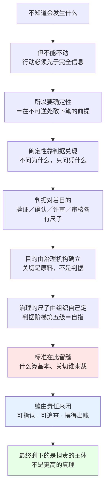

# 工程方法论的哲学地基研究报告

## —— 从确定性与判据到责任的最终根据

**Philosophical Groundwork for an Engineering Methodology: From Certainty and Criteria to Responsibility as the Final Warrant**

> **编号**：33（研究报告稿）
> **配套文件**：`33-工程方法论的哲学地基对话记录-从确定性到责任的最终根据.md`（对话原样记录：5 轮，含第 1 轮那句过强断言与第 2 轮的更正、第 5 轮的工具性限制与未核清单；本报告即由其整理而成）
> **日期**：2026-09-24
> **主题**：哲学是什么、它的底层逻辑是什么、这个术语该怎么理解；以及工程方法论中哪些位置是哲学问题、判据用尽之后还剩什么在支撑决定
> **问题起点**：三问递进——① 人类为什么需要确定性（前一问已答，本报告只收其结论）；② 判据凭什么立得住、谁有权立判据（32 号 §6 已提出，未答到底）；③ 哲学的定义、底层逻辑与这个术语该怎么理解（本问）
> **相关报告**：**23 号**《判据体系研究报告》已立判据阶梯五级（验证→确认→评审→审核→治理），并写明**前四级是"用尺子"、治理是"定尺子并保证尺子被用"**、治理为**自指**判据；**24 号**《架构与设计边界研究报告》已立「基本」的判据栈与"代理 ≠ 判据"；**28 号**《治理概念研究报告》已立治理本体的 ISO 37000 定义、三职能与担责；**29 号**《架构治理研究报告》已立治理的责任主体与例外机制；**30 号**《架构描述核心概念研究报告》已立四定义、四关系与译名政策，并给出"治理的核心动作是裁量，裁量需要一把高于个体关注点的尺"；**32 号**《架构视角与关切判据研究报告》已立关切裁决的四关、四条依据与举证三件套，并以「标准闭不上的缝，只能由责任来闭」收口。**本报告是这条线的下一站**：把 32 号那句收口追到底，并回答"哲学"这个术语本身
> **用语与定名政策**（依 GB/T 45630-2025 与仓库既定）：concern——**关注点**（沿 42020 行文作「关切」，指同一概念，与 32 号一致）；fundamental——**基本**；purpose——**目的**；objective——**目标**；criterion／criteria——**判据**；governing principles——**管控原则**；stakeholder——**利益相关方**；accountability——术语位作「**担责**」、动词位作「问责」、动作层作「述责」（依 28 号 §2.3.3）
> **引文纪律**（2026-09-23 用户裁定，已立为记忆 `feedback-quote-original-and-chinese`）：凡引外文，**原文与中译并列**，并标一手／二手／形式化；见不到条款文本写「未核」，取不到逐字写「未取得逐字」，不补号、不补句
> **本报告不引标准条款作论证支点**：本报告论证的是"判据用尽之后还剩什么"，凡立论处一律标明它是**形式化**（本报告自身的推演），不写成标准规定
> **论证不依赖外部文献**：本报告 §一~§二 的通用论述以仓库外文献为佐证，佐证不足处一律标「未核」并**不以之为论证支点**；§三~§六 的工程论点的根据全部落在仓库内既有报告（逐条索引见附录 B）
> **文档版本**：v1.0（创建于 2026-09-24）
> **约定**：英文术语首次出现附中文对照；「形式化」单列

---

## 摘要

### 一、问题起点

工程方法论里有一条极有效的规矩：**不问"为什么"，只问"凭什么"**——每条约束要能过判据，每批判据要能对着目的交代。这条规矩把争论从"我觉得"拉到"按哪条"，成效显著。

但它自己有一个前提没有交代：**判据本身从哪来、凭什么立得住、谁有权立判据。** 仓库里这条线已经反复触到边界——32 号 §6 的"关切如何避免随意性，谁裁决、凭什么裁决"、29 号 §3.1 的"三个前提"、以及那句被写进教材第 15 章的收口"**标准闭不上的缝，只能由责任来闭**"。这些都不是工程问题了，它们是哲学的题面，只是以工程的语言出现。

本报告回答三问：哲学是什么；它的底层逻辑是什么；这个术语该怎么理解。并把答案落回工程方法论，指认哪些位置是哲学问题、哪些不是，以及判据用尽之后剩下的是什么。

### 二、十条核心结论

| # | 结论 |
|---|---|
| 1 | **哲学是对第一层工作的前提所做的第二层追问**。它不是一块地盘，是一种**层级**：任何对象，问法换一层就是哲学 |
| 2 | **哲学问题的判据是"有没有判定程序"**，不是"难不难"。一件事一旦有了判定程序，它就不再是哲学问题——它交给科学或工程了。**哲学不产出事实，它产出清楚、一致与边界** |
| 3 | **哲学唯一的禁令是拒绝用权威、习惯、直觉、人数、利害来结束一个问题**。这条禁令推出三个动作：**区分概念、追前提、查矛盾**；前两个动作把问题**降级**为可判定问题，第三个动作**证伪** |
| 4 | **哲学与科学不是前后阶段，而是同时并存**。每一次科学分家都同时给哲学留下新的地基问题；**哲学管科学踩在脚下但不去看的那一层** |
| 5 | **"哲学"这个中译是西周为译 philosophy 造的缩略，它把主词与宾语调了个位置**——"爱智慧"的重心在"爱"（动作），"哲学"的重心在"智"（状态；《说文》："哲：知也"）。于是中译极容易被读成"关于智慧的更高深的学问"，而那正是它最不是的东西。**哲学是活动，不是知识门类** |
| 6 | **本方法论里最大的一个哲学动作是判据主义本身**：用判据替代不可查验的权威论断，把"为什么"（不可判定）换成"凭什么"（可判定）。**它落的是认识论的位置**——为知识主张规定一个公共的成立条件 |
| 7 | **本方法论已经做过四个真实的哲学决断，且都是有意为之**：42010 用 `concepts **or** properties` 兼容两种哲学并表态 *without prejudice*；区分**代理与判据**；把**关切**安排为"判据的现场"而非判据本身；把**治理**安排为自指的定尺子者 |
| 8 | **判据可以逐层往下问，但链条在"谁有权立判据"处终止**：判据来自目的（32 号），目的由治理机构在关切基础上确立（42020 §6.4.3／§8.4.4），而**确立这个动作本身没有更高的判据可用**——判据阶梯第五级是自指（23 号） |
| 9 | **标准闭不上的缝，最终不是由真理来闭，是由责任来闭**。责任之所以能闭，是因为它有两个可检查的性质：**可指认**（找到是谁）与**可追查**（账摆得出来）。担责的核心动作是**把账摆出来**，产出是**信任与合法性**而非惩罚（ISO 37000 §3.2.2／§6.5.2；28 号 §2.3.3 所立） |
| 10 | **哲学在本体系里不是最后避难所，是最外层边界**。它不能用来自抬身价，也不能用来逃避判据——凡"哲学"一词出现在一份工程文档里，必须能指出它守的是哪条缝、缝外站的是谁 |

### 三、一句话

> **判据管到哪儿为止，责任就从哪儿开始；哲学管的，是"哪儿为止"这条线本身。**

### 四、对 AOS 的两条工程结论

| # | 结论 |
|---|---|
| A | **判据主义必须配一条边界规则**：凡立判据处，须同时写明**该判据的出处**、**它失效时的处置**与**担责主体**。缺后两项的判据是一条"看起来严格、实际上无人负责"的判据——它比没有判据更危险，因为它会拦住质疑 |
| B | **"哲学"一词在本仓库有两套用法，须分工不混**：一套是**日常与学术义**（本报告 §一~§四所论）；一套是**在册专名**——42010 的 *Conception／Perception 两哲学*（06／07／22 号）、06／07 号"概念"一词的**哲学语境**（词义宽窄谱的最窄端）、00 号所述"找根概念就是做本体论"。**在册专名不得与一般义互相回读** |

---

## 一、哲学是什么

### 1.1 古典定义：爱智慧，不是有智慧

"哲学"的西方名字是 philosophia，由 philos（爱、亲）与 sophia（智慧）构成，字面义为**爱智慧**。这个构词方式本身就携带了它的全部要害：**爱是追求，不是占有**。手里已经握着智慧的人不需要"爱"它；还在追的人才需要。

〔按：philosophia 一词的希腊语最早用例、"Pythagoras 首创此词"一说的文献出处与现代学界的评价，见附录 A 的证据登记；凡未取到逐字者一律记「未核」，本报告不以该说为论证支点。〕

这里有一处值得单独记下的证据趣事。该说的古文献出处是 **Heraclides of Pontus**（经 Cicero, *Tusculan Disputations* V 3.8 与 Diogenes Laertius, *Proem* 转述），而现代学界判它不可靠的**理由本身**恰好是一条哲学论证——它依赖"哲学家没有知识、处在无知与知识之间并追求知识"这一**柏拉图式的**哲学家形象（*Symposium* 204A），Burkert（1960）据此证明它不能属于历史上的毕达哥拉斯（SEP *Pythagoras* §3）。

**一个关于"哲学"一词起源的传说，被哲学论证判为不可靠**——§1.4 那三个动作在两千多年后的这处考据上照样生效。

因此从命名起，这个词指的就不是一套已完成的学问，而是一种**尚未收敛的活动**。"爱智慧"与"有智慧"的差别不是修辞上的谦辞，它决定了这个术语的正确用法：**哲学是一个动词的位置，不是一个名词的仓库**。

这个古典定义经中世纪沿用至今，各家辞书的措辞差异很大，但有一个共同点：它们都无法像给"三角形"下定义那样给出一个属加种差的定义。原因见 §1.2——**哲学没有专属对象，所以按对象定义这条路从一开始就是堵的**。

顺带说明一条与工程直接相关的分寸。术语学对"定义"是有硬规矩的：定义的首选结构是"**属＋种差**"（先说明所属的类、再列举使它区别于同类其他成员的特征），并且要用**替换原则**检验——一个定义若能在文本中替换被定义词而不丢失或改变意义，它才是有效的。这两条都在 ISO 704 里成文（条款与逐字见附录 A 的 A9）。

**这些规矩管的是术语的定义，不管"哲学是什么"这类问题。** 两者的分别正是 §1.2 与 §1.3 的主题：凡能按属加种差定义的对象，它已经有判定程序了，那通常已经不是哲学问题；反过来，要求哲学给出属加种差的定义，等于要求它交出一件它构造上不拥有的东西。

### 1.2 实用定义：对前提的第二层追问

工程语境需要一条能用的定义。本报告取以下工作定义，并声明它是**形式化**（本报告的推演，非任何标准或辞书的规定）：

> **哲学，是对我们正在使用的前提所做的第二层追问。**

任何一门具体学问都在第一层工作。物理问"这个粒子多重"，工程问"这条缝留在哪里"，会计问"这笔钱怎么记"。它们各自都带着一批**不再追问的前提**：世界有规律、因果明天照样成立、测量可重复、语言足以表达事实。这些前提在第一层是**地基**，踩在上面往前走就行；哲学做的事是把地基翻出来看，然后问：它凭什么。

于是哲学**没有专属对象**。同一个对象，问法换一层就是哲学：

| 第一层（已可判定） | 第二层（哲学） |
|---|---|
| 这个接口定在这里对不对 | "正交分解"凭什么是一种正确的分法 |
| 这条需求可验证吗 | 凭什么说"可验证"是需求的必要条件 |
| 这份架构文档合规吗 | 什么叫"同一个架构"——改到哪一步它就不是它了 |
| 这条判据成立吗 | 判据本身从哪来，谁有权立判据 |
| 这个决策该不该批 | 批准权凭什么归这一级——授权链的正当性从哪里开始 |

这张表右侧那一列里的每一问，都是本仓库真实出现过的争论，且都已在本仓库的某份报告里以工程语言被处理过（见 §三）。

### 1.3 怎样认出一个哲学问题：看判定程序，不看难度

日常用法里，"哲学问题"常被当成"特别难的问题"或"特别大的问题"。这个读法是错的，而且坏处很大——它把哲学推向玄虚，同时让真正的哲学问题在工程里被当成"扯远了"而拦下。

正确的判据是**有没有判定程序**：

| 问题 | 有判定程序吗 | 归属 |
|---|---|---|
| 这批货的尺寸是否在公差内 | 有——量 | 工程 |
| 这段代码在给定输入下是否返回预期值 | 有——跑用例 | 工程 |
| 这个方案能否达成这条目标 | 有——评估与测量 | 工程 |
| 这条目标是否正当 | 无——须论证 | **哲学** |
| 判据本身从哪来、谁有权立 | 无——须论证 | **哲学** |
| 要不要把这一层前提换掉 | 无——换掉即换掉整个体系 | **哲学** |

由此得出本报告第一条硬结论：

> **哲学不产出事实，它产出清楚、一致与边界。** 它回答的不是"世界是什么样"，而是"你刚才那句话，站在什么上面"。

同时得出一个工程上极有用的推论：**哲学问题不是永久问题，而是"尚未取得判定程序"的问题**。一旦某个哲学问题被给出了判定程序，它就离开哲学、成为科学或工程的一节。哲学史上有大量这样的迁移——概率论、心理学、逻辑学都是从哲学里分出去并取得判定程序的。**判据主义做的事，正是持续地做这种迁移**（见 §三之二）。

### 1.4 底层逻辑：一条禁令，三个动作

如果只允许用一句话说哲学的底层逻辑，本报告这样说：

> **哲学是拒绝用权威、习惯、直觉、人数、利害来结束一个问题。**

别的领域都可以在某个点上说"就这样，别问了"——宗教说因为启示，法条说因为规定，工程说因为规范和工期，日常说因为大家都这么干。哲学唯一不接受的就是这个"别问了"。**这是它唯一的禁令，也是它唯一的方法起点。**

这条禁令推出三个动作，一切哲学活动都是这三件事的组合：

| 动作 | 做什么 | 对问题起什么作用 |
|---|---|---|
| **区分概念** | 把话说清，把两义分开 | **降级**——大量所谓的"哲学争论"在区分概念之后变成可判定的问题 |
| **追前提** | 一层层往下问"这条凭什么"，直到问出一个不能再追问的、或暴露出它其实没有根据的地方 | **降级或到底**——降级则交给科学，到底则暴露缺口 |
| **查矛盾** | 把断言推到极端，看哪里崩；用反例与推论代替实验 | **证伪**——证明某条路走不通 |

三个动作有一个共同点：**它们都不增加知识，只检验知识。** 哲学的"实验器材"是**反例**和**推论**，不是仪器。

这一点决定了哲学的产出形态与工程不同：**工程留下的是能用的东西，哲学留下的是不能走的那些路**。所以哲学文献读起来多半是否定性的——它在排除，而不是在堆积。评价一份哲学工作的标准也就随之确定：**能指出一个立场在哪里崩、以及为什么崩**。说不出崩在哪，就只是转述者，不是参与者。

### 1.5 一个常被问的问题：哲学是不是科学的早期阶段

有一种流行的说法：哲学是科学的前身，科学从哲学里分家出来，剩下的那点就是哲学。这个说法只对了一半，而错的那一半正好致命。

对的一半是：确实有大量问题从哲学迁移进了科学（§1.3）。错的一半是：**每一次科学分家，都同时给哲学留下了新的地基问题**。物理学不追问"为什么数学能描述世界"，它只是发现能，然后接着算；概率论不追问"概率到底指什么"（频率？信念？倾向？），它只是用；工程不追问"为什么正交分解是一种正确的分法"，它只是分。**这些被踩在脚下但不去看的前提，就是哲学的地盘。**

所以正确的说法是：

> **哲学与科学不是前后阶段，而是同时并存——科学每前进一段，就有一批新的前提被踩在脚下，而那一层归哲学。**

顺带说明一个与工程密切相关的机制：**科学的分家往往始于一次哲学动作**。因为要建立新学科，先得把它的前提讲清楚、把老前提的适用范围划出来——那正是"区分概念＋追前提"。所以哲学不生产知识，但它反复地为知识的重新组织腾出地方。

### 1.6 中文"哲学"这个术语：一个译名丢掉的那一点

#### 1.6.1 造词与传入

中文"哲学"是日本人**西周**（Nishi Amane，1829—1897）为翻译 philosophy 造的译名，后经中国学者使用而进入中文。

〔按：西周的译名过程——他先后用过的译名、"希哲学"如何缩为"哲学"、定于哪份文献——见附录 A 的证据登记与未核清单；本条只取"造词者与造词意图"这一层，凡未取到逐字者记「未核」。〕

这个译法很顺，但**恰好丢掉了"爱"那个字里的追求与未得**。丢掉之后会发生什么，看它的字面："哲学"＝"智慧之学"，读起来就是**一门关于智慧的、更高深的学问**——听起来像第一层的学科，甚至是学科之王。

而这正是西方意义上哲学最不是的东西：**它不是"更高深的学问"，它是"对一切学问的前提的追问"**。两者的差别不是措辞：

| 读法 | "哲学"＝智慧之学 | "哲学"＝爱智慧 |
|---|---|---|
| 它是什么 | 一门学科（与其他学科并列、更高） | 一种活动（对所有学科都可用） |
| 它的拥有者 | 哲学家（掌握某种专门知识的人） | 任何人，只要他在追问自己脚下的前提 |
| 它与其他学科的关系 | 上下级（哲学是总纲） | 地基与上层（哲学管前提） |
| 它的产出 | 一套结论 | 清楚、一致与边界 |

**这条辨析有一个直接的工程价值**：在本仓库的语境里，"这是哲学问题"这句话经常被用来做两件事——**抬高**（这个问题更高深，你们工程的人不懂）与**推挡**（这个问题太玄，落不了地）。两种用法都源自"智慧之学"的读法。**回到"爱智慧"的读法，这两种用法都立刻失效**：说一件事是哲学问题，既没有抬高它，也没有推开它，它只是意味着"这个问题现在还没有判定程序，得靠论证，而且得有人担"。

#### 1.6.2 中译丢掉的那一点，在字书上可以对出来

这条落差不是印象之谈，用两本字书夹一下就出来。

中文这边，**"哲"字本义就是"知（智）"**。《说文解字》卷二口部：**「哲：知也。从口折聲。」**（反切：陟列切），并收两个异体——「悊：哲或从心。」「嚞：古文哲从三吉。」段玉裁《说文解字注》进一步点明："釋言曰。哲、智也。方言曰。哲、知也。古智知通用。"

希腊语那边，philosophia 的**主词是"爱"**，sophia（智慧）只是所爱之物。

两边一夹，落差就清楚了：**"爱智慧"的重心在"爱"（一个动作），"哲学"的重心在"智"（一种状态）。** 中译把主词与宾语调了个位置——把动作换成了状态。这也是为什么"哲学"一词在中文里天然地读起来像"智慧之学"：字面上它确实就是。

〔按：本条只用到《说文》与段注的逐字（一手，出处见附录 A 的 A14）；至于最早把这一批评写成文章的现代学者是谁、其原文如何，本轮**未取得逐字**，故本报告不替任何人署名。〕

#### 1.6.3 本仓库的两套用法，须分工不混

本仓库此前的报告里，"哲学"一词已经出现过多次，而且用的**不是本报告这一层含义**。它们是在册专名，须登记在案、不得与本报告的一般义互相回读：

| 用法 | 出处 | 它实际指什么 | 与一般义的关系 |
|---|---|---|---|
| **Conception／Perception 两哲学** | 06 号 §1.4／§7.1.1、07 号 §7.1.1、22 号 §5.4 | 关于"架构住在哪里"的两种**立场**（脑中／观察中） | 是哲学在架构领域的一次**具体分歧**，属一般义的一个实例 |
| **"概念"一词的哲学语境** | 06 号 §1.1.4、07 号 §6 词义宽窄谱 | 词义**最窄**的那一端——纯粹本质，剥离一切经验的抽象 | 是"哲学"一词在**词义谱**上的位置，不是哲学的定义 |
| **找根概念就是做本体论** | 00 号 §4.0／§5.5 | ontology：追问一个领域"什么存在" | 与一般义一致：属 §1.4"追前提"动作的一次实例化 |
| **判据主义** | 00 号 §6、教材各判据章 | 不问"为什么"、只问"凭什么" | 与一般义一致：属 §1.4"区分概念＋追前提"两动作的**方法论化** |

**两条使用规则**（本报告立，供后续报告与教材遵守）：

1. 在册专名（两哲学、哲学语境）**首次出现处须带限定语**，不得裸用"哲学"二字。例如写"42010 的两哲学"而不写"哲学认为"。
2. 凡在工程文档里使用一般义的"哲学"，**必须能指出它守的是哪条缝**（§五之二的操作表）；指不出缝的，属于抬高式或推挡式用法，不写。

---

## 二、三个动作落在工程上是什么样

§1.4 说哲学有三个动作。它们听起来抽象，实际在工程里有极强的对应物——而且本仓库已经在做，只是没有把这一层说出来。

### 2.1 区分概念：工程上最便宜的一次降级

**"大量所谓的哲学争论，在区分概念之后变成可判定的问题。"** 这句话在工程上最容易验证。

本仓库的实例全部是同一形态——**一个词同时承两个意思，于是争论双方各自对着一个意思说话，谁也说服不了谁**：

| 现场 | 混用的两个意思 | 区分之后的结论 |
|---|---|---|
| "架构" | 抽象物（architecture）／文档（架构描述 AD） | 争论"架构改没改"变成"改的是哪一样"——可判定 |
| "规定需求" | 被明示的需求（stated）／以成文信息记录的需求 | 口头明示**是**规定需求但**不可采**——可判定 |
| "监督" | oversight（治理职能，包住 monitor 与 review）／monitor（监测） | 治理的三职能之一，与"监测／复核"分开写——可判定 |
| "确认" | validation（对预期用途）／相关方确认（成立判据） | 两把尺子不同，不可互换——可判定 |
| "不可逆性" | 够不够格进架构层（目的必要性）／怎么排·何时定·谁能改（时机与授权） | 两个问题分开答——可判定 |

**这就是判据主义的第一步**：不是把问题往下压，而是把问题**分清楚**。分清之后大量争论自动消失，剩下的才是真问题。

〔按：以上五例的条款与出处见附录 B。〕

### 2.2 追前提：一路问到目的，再往下就断

**"追前提"在工程上的形态是"逐层指着什么讲话"。** 本仓库这条链已经追到了尽头，见 23 号与 32 号：

```
验证    对着：规定需求
确认    对着：为特定预期用途或应用的需求
评审    对着：为客体确立的目标
审核    对着：准则集
治理    对着：组织目的的达成 · 方式的正当        ← 自指：判据由判定者自己产出
```

这条阶梯的要害在最后一级：**前四级是"用尺子"，治理是"定尺子并保证尺子被用"**（23 号 §5.3）。再往下问"那治理的尺子谁来定"，标准里没有更高的判据可用了——ISO 37000 给的答案是宗旨（organizational purpose）与十一项原则，而宗旨由组织自己确立。

**这就是"追前提"追到底的样子**：不是找到了一个不可追问的真理，而是找到了一个**由人自己确立、因而必须由人自己担的东西**。

### 2.3 查矛盾：把断言推到极端，看哪里崩

**"查矛盾"在工程上的形态是"反例测试"，而本仓库用得最多的地方是判据的准入。**

标准或方法论提出的判据往往带一条**代理**（proxy）：不可逆性、变更成本、可判定性、可引用性、高层级、概要。代理好用，但代理会失真。查矛盾的做法是：**把代理推到极端，看它漏判什么、误纳什么。**

| 代理 | 漏判（不贵但承重） | 误纳（很贵但与目的无关） |
|---|---|---|
| 不可逆性／变更成本 | "日志须可被外部审计员独立读取"——不贵，但去掉目的就变形 | 框架版本、组织惯例技术栈——很贵，但与目的无关 |

**两类失真都只在极端情形下暴露**，而评审现场最常翻车的就是这两类。因此本仓库立了一条与哲学第三个动作同形的纪律：**代理不得承当判据**——真判据只有一个，就是目的（32 号 §3.4）。

---

## 三、本方法论已经做过的哲学决断

第一部分的定义与逻辑是通用的。这一部分回答一个更要紧的问题：**在本仓库这套方法论里，哪些位置是哲学在做决定？**

答案是：不止一处，而且都是有意为之。

### 3.1 判据主义本身就是一次认识论选择

本方法论最显眼的规矩是：**不问"为什么"，只问"凭什么"。** 每条约束要能过判据，每批判据要能对着目的交代。这个规矩通常被当成一种工程习惯，实际它落的是一个**认识论**的位置——它规定了"一条主张要算成立，必须满足什么公共条件"。

这个选择解决了什么，看它替代了什么：

| | 无法查验的论断 | 判据主义 |
|---|---|---|
| 论据说出来的形态 | "我觉得""经验上都是这样""上面定的""大家都这么做" | "按哪条" |
| 反对的方式 | 只能反对人（你不懂、你资历浅） | 反对那条（这条对不上目的） |
| 争论的收敛 | 靠权力与人数 | 靠对账 |
| 失效形态 | 权威一倒，结论全倒 | 判据一错，可定点修 |

**这就是哲学第一、二两个动作（区分概念、追前提）的制度化**：把"为什么"这样不可判定的问法，换成"凭什么"这样可判定的问法。**判据主义是哲学在方法论层面的一次落地，不是它的替代品。**

### 3.2 42010 的 `concepts or properties`：一次典型的哲学决断

本仓库已经详细记录过这一处（06 号 §1.4／§7.1.1、07 号 §7.1.1、22 号 §5.4）：ISO/IEC/IEEE 42010 的架构定义句采用 `concepts **or** properties` 这一析取式，**为的是不带偏见地兼容两种哲学**——Conception 派（架构是存在于人脑中的系统概念）与 Perception 派（架构是观察者对系统属性的感知）。工作组的表态是 *without prejudice*（不带偏见），并且两派之下共同承认一句：*an architecture is abstract — not an artifact*（架构是抽象的，不是人工制品）。

这里要指出的是**这件事实的哲学含义**，而不只是记录它：

1. **标准正文里可以合法地容纳哲学分歧**——不是把分歧删掉，而是用析取式把两派都包进来，让分歧不阻碍标准落地。这是"区分概念"动作的一种高级形态：**先承认两种读法都成立，再把下游条款设计成对两者都成立。**
2. **折中的代价写在标准自己身上**：`concepts or properties` 于是不能按 ISO 1087:2019 §3.2.7／§3.1.3 的严谨义读（42010 §3 里既没有 concept 也没有 property 两条，是按普遍接受的含义使用），也不得用 ISO 9000 的 inherent／assigned 限定回读。**哲学上的兼容，换来的是术语上的不严谨**——这是自愿付的价，不是疏忽。
3. **对本仓库的启示**：凡是方法论内部存在两种正当立场、而下游又要继续工作时，**析取式＋明确表态**比"选一边并宣布另一边过时"更稳。反过来说，凡做了这种兼容，就必须在术语层写清"不得回读"的禁令。

### 3.3 本方法论里已经埋着的哲学决断：一张八行表

把本仓库散落各处的这类决断收拢，可以列成下面四组。**每一组的左列都是哲学问题，右列都是本仓库已经给出答案的地方**——这就是"哲学地基"的实际形状。

| # | 哲学问题（无判定程序） | 本仓库的答案落在哪 | 答案的性质 |
|---|---|---|---|
| 1 | 架构住在哪里——脑中还是观察中 | 两哲学兼容＋*without prejudice*（42010；06／22 号） | 悬置（不站队） |
| 2 | 概念有没有真假 | 概念无真假、命题才有（弗雷格；00 号 §4.7） | 采纳（决定了"原理要显式化"） |
| 3 | 词义从哪里来 | 意义即用法（维特根斯坦《哲学研究》；00 号 §6.3） | 采纳（决定了"术语锁定三问"的形态） |
| 4 | 一个领域里"什么存在" | 本体论一问：找根概念（00 号 §4.0／§5.5） | 方法化（第 0 步） |
| 5 | 知识主张凭什么算成立 | 判据主义：对判据交代，不对权威交代（§3.1） | 制度化 |
| 6 | 便宜的指标能不能当判据 | 不能——代理 ≠ 判据，真判据＝目的（24 号 §6.1；32 号 §3.4） | 禁止 |
| 7 | 关注点能否充当判据 | 不能——关切是**判据的现场**，不是判据（32 号；教材第 15 章） | 禁止 |
| 8 | 判据用尽之后凭什么 | 由责任来闭（32 号 §7.5 两句元规则；本报告 §四） | 未完成（本报告在此接续） |

**这张表的用法**：它不是哲学概论，它是**变更影响分析表**。改动其中任何一行，下游成片的结论都要重算——例如把第 5 行换成"对权威交代"，整条判据阶梯与治理结构随之作废；把第 6 行换成"指标够用就行"，追溯矩阵与验收体系立刻退化成报表。

### 3.4 判据链的三层结构：一个判据从哪里来

一个判据要立得住，本仓库的既有做法实际上已经给出了三层结构，而这三层此前没有合在一处说过：

| 层 | 是什么 | 谁给 | 失效时会怎样 | 本仓库的出处 |
|---|---|---|---|---|
| **来源层** | 目的 | 治理机构在关切基础上**确立** | 目的错，则全链的判据集体错，且内部查不出来 | 42020 §6.4.3／§8.4.4；32 号 §2.4 |
| **依据层** | 目标（目的的可判定形态） | 由目的派生、经批准 | 目标被砍或被改，判据随之漂移 | 32 号 §5.2；教材第 15 章"目标不可砍" |
| **现场层** | 关注点／关切 | 利益相关方提出，经治理裁决准入 | 关切无出路，则判据现场缺项而无人知 | 32 号 §6.2~§6.4 |

三层之外还有一类东西不在这条链上：**标准与法规**。它们是**约束型**输入，不产生承载元素，只挂边界（32 号附录 C 纪律 2）。把它们当来源层用，会得到"标准说了算"这个假答案——而标准恰恰在关键处留了缝（§四之一）。

**这里出现一个必须点明的结构**：来源层与依据层的判据，其正当性**不能由这两层自己证明**。一条由治理机构确立的目的，不能用"它符合目的"来证明自己正当。**这是判据链的终点，也是本报告下半部分要处理的那个洞。**

---

## 四、链条的终点：标准闭不上，责任来闭

### 4.1 标准在哪儿留缝，为什么必然留缝

工程界的默认期待是"标准把话说全"。这个期待在架构领域具体落空过两次，本仓库都查过（32 号 §3.1、§4.1）：

| 缺口 | 标准给了什么 | 没给什么 |
|---|---|---|
| **什么算"基本"（fundamental）** | 架构定义句里用了这个词 | 判据。定义句只说架构住在元素、关系与原则里，一个字没说**什么算基本** |
| **关切由谁裁、凭什么裁** | 42010 给出视角规格与 ADF 规格；42020 给出裁决主体 | 准入条件、举证责任与裁决理由——**整块没有标准** |

**这两处留缝不是标准的疏忽，而是标准的分工。** 标准是跨组织、跨行业、跨国界的文件，它必须对一切使用者成立；而"什么算基本""谁的关切优先"这类问题的答案**随目的而变**——同一个"数据所有权"问题，在汽车电子与在政务系统里的答案不同。标准若强行给出统一判据，它就会在多数场景下给出错误答案。

于是得到一个与 §1.5 同形的结论：

> **标准把可通用的部分收紧，把随目的而变的部分下放；下放出去的那部分，接住它的不是标准，是组织里的某个人或某个机构。**

### 4.2 "由责任来闭"这句话的准确含义

"**标准闭不上的缝，只能由责任来闭**"这句收口如果只当口号用，就会滑向两个错处：一是把责任读成道德要求（"大家要有责任心"），二是把责任读成事后追惩（"出事就问责"）。两者都不是它的意思。它的准确含义包含三条：

**第一，闭缝是一个动作，不是一个态度。** 缝要闭，得有人做出一个**具体决定**——把这条关切纳入架构、把这条目标定下来、把这个例外批出去。动作没发生，缝就还开着。

**第二，闭缝的人必须是可以被找到的。** 责任的第一要件是**可指认**：不是"团队负责"，而是"这个决定由这一级在这一天做出，理由记在这一处"。找不到人的决定等于没有决定——它的缝只是被遮住了。

**第三，闭缝的产出是信任与合法性，不是惩罚。** 依 ISO 37000：担责（accountability）的实质是**把账摆出来**并接受质询，惩罚只是它得以成立的条件之一，不是它的目的（28 号 §2.3.3 所立）；治理的第三项结果也正是"合乎伦理的行为"，标准只认结果、不认机构形态。

**三者合起来，得到本报告对"责任"的工作定义**（形式化）：

> **责任 ＝ 一个可指认的主体，对一个已做出的决定，承担可追查的交代义务。**

### 4.3 完整链条：从"不知道"到"谁担着"

把前面所有环节接起来，就得到这条链的全貌。**它也是本报告回答"确定性为什么重要"的方式**——前一问的结论在此收口：



这条链有四处需要单独点明：

1. **它是收敛的，不是发散的。** 每一步问的都是"上一个环节凭什么"，一直问到不能再问。终点只有一个：**某个可指认的主体。**
2. **终点不是真理，这一点必须说出来。** 工程界有一种期待——把问题追到底会追出一个"客观正确的答案"。本仓库这条链追到底的结果不是这个，而是**一个担着的人**。这不是退让，这是这条链的真实形状；把它说成真理，反而会让担责的人藏到"客观规律"后面去。
3. **终点也不是任意。** 由人担，不等于怎么说都行——因为担责是**可追查**的：账要摆出来、理由要记下来、失败也要入披露（ISO 37000 §6.5.3.2 的披露要求）。**任意与担责的分界就在这里：任意的决定摆不出账。**
4. **链条的方向不可倒。** 责任不能往上推给"标准没说"，也不能往下压给"执行没做到"——缝开在哪儿，就由那一级的治理机构闭。这正是 29 号 §2.2"判据管分类、理由管升级"的同一结构。

---

## 五、哲学在本体系里的位置与边界

### 5.1 位置：不是最高层，是最外层

工程界对"哲学"最常见的两种态度都不对：

| 态度 | 说法 | 错在哪 |
|---|---|---|
| **抬高** | "这是哲学问题，更高深" | 把 §1.2 的**层级**误读成 §1.6.1 的**学问等级**；哲学不是更高，是更靠外 |
| **推挡** | "这太玄了，落不了地" | 同上，且掩盖了确实没有判定程序这一事实——缝在那里，说它玄不会把缝闭上 |
| **避难** | "这里有个哲学问题，所以说不清" | 把哲学当免罪符。哲学不提供判据，它只是**指出缺口在哪** |

**正确的位置是一句很短的话：哲学在本体系里不是最高层，是最外层。** 它守的是最外面那道边界；它不参与里面任何一道工序的作业，但它是"里面所有工序的前提"集中接受检查的地方。

这个位置带来一条**使用规则**：凡在工程文档里出现一般义的"哲学"，必须能同时说出三样东西——**守的是哪条缝、缝外站的是谁（担责主体）、缝不闭会出什么事**。三样说不齐，这个"哲学"就是抬高、推挡或避难，删掉。

### 5.2 边界表：哪些问题该收在判据内，哪些不该

判据主义有一个副作用：它容易过度伸张，把所有问题都拖进判据程序，于是**在哲学问题被当成工程问题处理**。下面是本仓库高频出现的十问，按"该不该进判据程序"分列。这张表是本报告最直接可用的东西。

| # | 问题 | 归属 | 该走什么程序 |
|---|---|---|---|
| 1 | 这条需求可验证吗 | 工程 | 判据——验证，对规定需求 |
| 2 | 这个方案能达成目标吗 | 工程 | 判据——评估，对目的／目标 |
| 3 | 这个变更要不要批 | 工程 | 判据——治理决策，看权限与例外 |
| 4 | 这条关切该不该进架构 | 工程 | 判据——四类分流＋举证三件套（32 号 §6.2） |
| 5 | 目的本身定得对不对 | **哲学** | 论证——不可由下游判据自证（§3.4） |
| 6 | 凭什么说这条是"基本"的 | **哲学** | 论证——必要性与充分性双判据是**形式化**，不是标准 |
| 7 | 谁有权立这条判据 | **哲学** | 论证——自指环，答案在授权链与担责（23 号 §5.3） |
| 8 | 两套价值排序冲突时听谁的 | **哲学** | 论证——由治理机构裁决并留痕 |
| 9 | 标准没有规定，是不是怎么做都行 | 都不是 | **误问**——标准留缝，缝由责任闭（§4.1） |
| 10 | 这是不是哲学问题 | 都不是 | **误问**——用 §1.3 的判据（有没有判定程序）当场判 |

**这张表的读法：第 5~8 行不是"更高级的问题"，是"暂时没有判定程序、只能靠论证并且必须有人担"的问题。** 第 9、10 行是两个典型的假问题——它们的共同形态是**想用一句话把责任推掉**：第 9 行想推出"没人负责"，第 10 行想推出"不该在这儿讨论"。

### 5.3 三条禁令

**禁令一：不得用哲学止争论。** "这是哲学问题"不构成任何结论。它只说明该问题缺判定程序，接下来的动作是**论证并留痕**，不是散会。

**禁令二：不得用判据掩盖缺口。** 凡遇到没有判定程序的问题，立一条判据把它按下去，是判据主义最危险的失效形态——**它会让缺口看起来被处理了**，而且拦住质疑（有判据在那儿）。缺口该登记，不该伪装。

**禁令三：不得让代理承当判据。** 代理（不可逆性、变更成本、可判定性、可引用性、高层级、概要）各有正当用途，但**一律不得作判据使用**（24 号 §6.1、§6.6；32 号 §3.4）。这条禁令的哲学根据是 §2.3：代理会失真，而失真只在极端情形下暴露，评审现场正是极端情形最多的地方。

### 5.4 本体系对"哲学问题"的四步处置法

把上面几节收成一套可执行的动作，供后续报告与教材使用（**形式化**，本报告立）：

| 步 | 动作 | 判据（做完这一步怎么算完成） |
|---|---|---|
| 1 | **认**——判定它是不是哲学问题 | 用 §1.3 的判据：**有没有判定程序**。有则回判据程序，无则进第 2 步 |
| 2 | **降**——先试降级 | 做 §1.4 前两个动作：区分概念、追前提。降得下来就变成可判定问题（这是成本最低的一步） |
| 3 | **登**——降不下来就登记 | 写进缺口台账：缺的是**判据本身**、还是缺**可检出性**、还是缺**不变量**（三型见教材第 15 章 §15.3.5"缺口的长相"表） |
| 4 | **担**——指定担责主体与留痕 | 写明谁裁、凭什么裁、账放在哪儿、失败如何入披露（§4.2 三要件） |

**四步里最容易被跳过的是第 2 步。** 现实中最常见的做法是从第 1 步直接跳到第 4 步（一遇分歧就"交给领导定"），结果是大量本可降级的问题堆积到治理层，治理层被迫用权威来结束那些本可以用概念区分来解决的争论——**这正是"治理看起来很忙、但总在补漏"的机制性原因。**

---

## 六、对 AOS 的落点

### 6.1 一张变更影响表

§3.3 那八行是哲学决断，改动它们的影响面如下。此表用于判断"某条基础立场能不能动"：

| 改哪一行 | 立刻作废的下游 |
|---|---|
| 第 5 行（判据主义） | 判据阶梯五级、追溯矩阵、验收体系、治理的四条依据 |
| 第 6 行（代理 ≠ 判据） | 「基本」判据栈、架构决策的识别、关切四类分流 |
| 第 7 行（关切不是判据） | 关切台账、四关、举证三件套、第 15 章全章 |
| 第 8 行（责任闭缝） | 治理的裁量权、例外机制、担责三要件、第 14 章治理章 |

### 6.2 与前一问（确定性）的接合

前一轮讨论的结论在本报告 §4.3 的链条里就位：**确定性不是目的，它是"在不可逆处敢下笔"的前提；而确定性的兑现方式是判据；判据的最终根据是责任。** 这条链使"确定性为什么重要"有了一个工程上可操作的答案——**要确定性，就是要在关键处能指认到一个人**。

### 6.3 本报告与 32 号的分工

32 号回答"关切凭什么被裁决"，落到**四条可指认的事实**（来源、后果、度量、裁决主体），并声明"裁决靠的不是原则"。本报告回答**再往下那一层**：那四条事实的依据是自指的治理结构，而自指链条的最后一环是担责。**32 号给判据，本报告给判据的根据。**

### 6.4 未完成与待裁

| # | 事项 | 性质 |
|---|---|---|
| 1 | 责任作为"最终根据"是否足够——是否需要补一层"正当性"论述（授权链的正当性从哪里开始） | 待裁。本报告只做到"可指认＋可追查"，未处理"授权链本身是否正当" |
| 2 | 四步处置法（§5.4）与边界表（§5.2）是否进教材 | 待裁。两件都可直接用于第 12/14/15 章，但依既有边界，教材侧联动由用户统筹 |
| 3 | 「哲学」一词的两套用法（§1.6.3）是否升格为仓库术语纪律 | 待裁。若升格，建议落 `00-doc-conventions` 或本子项目 `claude-memory/feedback-` |
| 4 | 本报告 §3.3 的八行表是否与框架的"底座"合流 | 待裁。该表性质上是底座级内容，形态上尚属报告 |

---

## 附录 A：来源与取证登记

**取证纪律**：本附录逐条登记本报告所引外部事实的证据状态，标**一手**者为取到原文或官方件，标**二手**者为权威转引，标**未核**者为未取得可核文本。**本报告不以「未核」项为论证支点**——凡未核处，正文只作"约定俗成"的交代，并把论证落在仓库内既有报告上（附录 B）。

### A.1 哲学术语文献

| # | 事实 | 证据状态 | 出处 |
|---|---|---|---|
| A1 | philosophia ＝ philos（爱、亲）＋ sophia（智慧），字面义"爱智慧" | **约定俗成**（构词为通行知识，本轮未取一手词典条目逐字） | —— |
| A2 | "Pythagoras 首创 philosophia 一词"一说 | **一手取得**：该说**出自早期学园**，最早见于 **Heraclides of Pontus**（Cicero, *Tusculan Disputations* V 3.8；Diogenes Laertius, *Proem*）。**现代学界评价：不可靠**——它不出自史书或传记，而出自一篇讲述恩培多克勒使一名停止呼吸的女子复活的**对话**；且该说依赖"哲学家没有知识、处在无知与知识之间并追求知识"这一观念，而这是**彻底柏拉图式的**（见 *Symposium* 204A），Burkert（1960）已证明它不能属于历史上的毕达哥拉斯。 | [SEP, *Pythagoras*, §3](https://plato.stanford.edu/entries/pythagoras/)；Burkert 1960；Riedweg 2005: 90–97 与 Huffman 2008a: 207–208 的往复 |
| A3 | 亚里士多德对知识门类的划分（理论／实践／创制） | **未取得逐字**（本轮未取到《形而上学》Ε.1／Κ.7） | —— |
| A4 | Kant 关于"学院概念的哲学／世间概念的哲学"两义 | **未核**（本轮未取到《纯粹理性批判》B 版该段德文原句、通行英译与中译，亦未独立复核版页；中译通行作"学院概念／世间概念"） | —— |
| A5 | 现代辞书对 philosophy 的定义策略 | **未查到**（SEP／Routledge／Merriam-Webster／OED／Britannica 逐字定义均未取得） | —— |
| A13 | philosophia 的最早文本用例（通行常举希罗多德 1.30.2 的 φιλοσοφέων、修昔底德 2.40.1 的 φιλοσοφοῦμεν） | **未取得逐字**：两处均未取到可用文本（见 A.5 工具性限制）。故正文 §1.1 **不以"最早用例"为论据**，只说构词与字面义 | —— |

### A.2 中文"哲学"译名史

| # | 事实 | 证据状态 | 出处 |
|---|---|---|---|
| A6 | 西周（Nishi Amane）创译"哲学"的经过与文献 | **未取得逐字**：本轮取到相关研究文献数种，但**未取到**其译名过程的逐字文本（含"希哲学"如何缩为"哲学"定于何种文献） | 待补（相关线索：西周《百学连环》明治三年（1870）在育英会讲义；[京都大学人文科学研究所藏本说明](https://repository.kulib.kyoto-u.ac.jp/dspace/bitstream/2433/147954/1/jic086_565.pdf)；[関西大学『百学連環』翻刻](http://www2.kansai-u.ac.jp/shkky/wakumon/no-24/14XUKW.pdf)） |
| A7 | 该译名传入中国的路径 | **未核** | —— |
| A8 | 学界对"哲学"译名丢掉"爱"这一层的批评 | **存在文献**：中文期刊有《"哲学"抑或"理学"？——西周对 Philosophy 的误读及其理论困境》（《哲学研究》2012 年第 12 期）一题**可证此类批评存在**；本轮**未取得该文正文逐字**，故正文不引其观点 | [CNKI 条目页](https://read.cnki.net/web/Journal/Article/ZXYJ201212011.html)（仅题录） |
| A14 | "哲"字的中文本义与字形 | **一手逐字**：《说文解字》卷二·口部——**「哲：知也。从口折聲。」**（反切：陟列切）；又收两个异体：**「悊：哲或从心。」**「嚞：古文哲从三吉。」段玉裁《说文解字注》逐字：「釋言曰。哲、智也。方言曰。哲、知也。古智知通用。」「韵會引說文古以此爲哲字。按心部云。悊、敬也。疑敬是本義。以爲哲是假借。」 | [《说文解字》在线 · 卷二口部](https://www.shuowen.org/view/837) |
| A15 | 国标采用方式的一处更正 | **一手（标准页元数据）**：**GB/T 15237.1—2000**《术语工作 词汇 第 1 部分：理论与应用》与 ISO 1087-1:2000 的关系是 **eqv（等效采用）而非 idt（等同采用）**；该标准**状态为废止**，国家标准全文公开系统明示"废止标准不提供标准文本阅读服务"。另：**GB/T 10112—2019** 采用 ISO 704:2009 的方式是 **IDT（翻译法等同采用）** | [GB/T 15237.1-2000 标准页](https://openstd.samr.gov.cn/bzgk/std/newGbInfo?hcno=69364A24C567645274B9761573144D26) |

### A.3 术语规范形态

| # | 事实 | 证据状态 | 出处 |
|---|---|---|---|
| A9 | 定义的写作规则（属加种差、替换原则、禁止循环）的规范出处 | **部分取得逐字**：**属加种差**见 ISO 10241 的 5.2.5 b)——*"The preferred structure of a definition is: a basic part stating the class to which the concept belongs, and another part enumerating the characteristics that distinguish the concept from other members of the class."*（中译：定义的首选结构是，一个基本部分说明该概念所属的类，另一部分列举使该概念区别于同类其他成员的特征）；**替换原则**见 ISO 704 的 6.3.5——*"The substitution principle shall be used to test the validity of a definition. A definition is valid if it can replace a designation in a text without loss of or change in meaning."*（中译：应使用替换原则检验定义的有效性；如果一个定义能在文本中替换某一指称而不丢失或改变意义，该定义就是有效的）。两条的上游文本**均为二手转引**（HtaGlossary 术语库整理页，**未标版本年**，其 ISO 10241 条款号形态提示可能是 ISO 10241:1992 而非现行的 ISO 10241-1:2011——**版本归属未核**）。国标侧对应关系可核：**GB/T 10112—2019《术语工作 原则与方法》以翻译法等同采用 ISO 704:2009**（IDT；现行，2019-08-30 发布、2020-03-01 实施），其**目次**含"6 定义／6.1 定义的性质／6.2 内涵定义／**6.3 定义撰写**／6.4 定义的补充信息／**6.5 不恰当定义**"——即替换原则所在的 6.3 层级在国标中确有对应，但**6.3 与 6.5 的条款正文未取得逐字**（目次只证明该节存在，不证明其内含哪条规则）。**更正一处前提**：该组规则**不在** ISO/IEC Directives Part 2 中取证（此次未取到 Part 2 的任何定义撰写规则逐字；其官方 HTML 版返回 403，PDF 不可读），此前若把它挂在 Part 2 名下，应改挂 ISO 704／ISO 10241 | ISO 704:2009 6.3.5；ISO 10241 5.2.5 b)（经 HtaGlossary 转引）；[GB/T 10112-2019 标准页](https://openstd.samr.gov.cn/bzgk/gb/newGbInfo?hcno=0A63743C8C1993736445B41545925CFF) |
| A10 | ISO 1087:2019 对 concept／property／characteristic／definition 的界定 | **已核（仓库内一手链条）**：条款号与逐字已在 22 号 §4 登记 | 22 号 §4.1–§4.5 |
| A11 | 定义不能做什么（逻辑学上的功能限制） | **部分取得一手逐字**：SEP 条目 *Definitions* 给出**恶性循环原则**——*"Whatever involves all of a collection must not be one of the collection"*（中译：凡涉及一个集合之全部者，不得是该集合之一员；SEP 引 Russell 1908, 63），及其变体 *"If, provided a certain collection had a total, it would have members only definable in terms of that total, then the said collection has no total."*（中译：若某集合倘有总体、则其成员只能依该总体来定义，则该集合无总体）；并给出**实在定义／名义定义**的分工——*"to discover the real definition of a term X one needs to investigate the thing or things denoted by X; to discover the nominal definition, one needs to investigate the meaning and use of X."*（中译：要发现术语 X 的实在定义须研究 X 所指称的事物；要发现名义定义则须研究 X 的意义与用法）。**未取得**"定义不能用于证明被定义对象存在"这一命题的直接逐字（该条目只在导言处点出安瑟尔谟"本体论证明"的关键一步是对 God 的定义），故本报告不引该命题 | [SEP, *Definitions*](https://plato.stanford.edu/entries/definitions/) |

### A.4 风险与不确定性

| # | 事实 | 证据状态 | 出处 |
|---|---|---|---|
| A12 | 可度量的风险与不可度量的不确定性的区分 | **未取得逐字**：通行出处为 F. H. Knight, *Risk, Uncertainty and Profit*（1921）第三部分；本轮**未取到该书该部分逐字**，故正文（§六 6.2 的相关段落及问题起点）只以"可估／不可估"的通俗分法表述，**不引页码、不标章节** | —— |

### A.5 本轮取证的工具性限制（如实交代）

| # | 事项 |
|---|---|
| L1 | 本轮两次智能检索中途**网络中断**；一处取证子任务完整取回、另一处在完成前失败。上表状态为中断后**就地交回**的实况 |
| L2 | 中文维基百科在本机解析到**非公网 IP**，无法抓取；故涉及中文译名史与中文哲学界论述的条目（A6／A7／A8）取证不足 |
| L3 | PDF 直取被工具拒绝（`unsupported content type "application/pdf"`），故日文与中文期刊 PDF（A6／A8）只到题录级 |
| L4 | 古典文本库多不可用：`perseus.tufts.edu/hopper/…` 返回 200 但正文被巨型目录树挤出截取范围（章级、节级 URL 皆然）；`scaife.perseus.org` 为 JS 空壳；`loebclassics.com`／`lsj.gr`／`sacred-texts.com` 一律 403；本机 pwsh **无外网**，故"下载后本地检索"这条绕行不通 |
| L5 | 可用的替代源两类：**Bibliotheca Augustana**（`tha.de`，希腊／拉丁文本按"卷"一页，长篇必被截断，只宜短篇或取卷首）；**cmuntz.hosted.uark.edu/texts/**（轻量希腊／拉丁文库，无希罗多德、修昔底德、柏拉图、亚里士多德） |
| L6 | **A2 一行的证据链单独交代**：该行的结论取自 Stanford Encyclopedia of Philosophy 的 *Pythagoras* 条目 §3（本报告直接抓取该页，逐字见该行出处），SEP 在该处已完整给出该说的古文献出处（Cicero, *Tusc.* V 3.8；Diogenes Laertius, *Proem*）、它的文献性质（出自对话而非史书）与现代评价（Burkert 1960；Riedweg 2005 与 Huffman 2008a 的往复）。**这属"权威二手里已给出完整引证链"的一档**，本报告未再回取 Cicero 与第欧根尼的原文 |

**补证入口**：A3~A5、A7、A9、A11、A12、A13 各条的取数目标与可用源已在上表标出；凡补证到手，应**在本附录内**登记条款号与逐字，并同步 §一~§二 相应表述。

---

## 附录 B：本报告所引仓库内出处的条款索引

| 本报告处 | 结论 | 仓库内出处 |
|---|---|---|
| §2.1 | 架构＝抽象物／AD＝工作产品 | 24 号 §1.4-1、§2.3 |
| §2.1 | `specified ≡ stated`；口头明示是规定需求但不可采 | 23 号 §3.2；ISO 9000:2026 §3.5.1 注 2 |
| §2.1 | 监督（oversight）包住 monitor 与 review | 28 号 §4.4、§5.3 |
| §2.1 | 确认（validation）对预期用途 | 23 号 §10；ISO 9000:2026 §3.11.14 |
| §2.1 | 不可逆性的两个问题分家 | 24 号 §5.3；06 号 §4「不可逆性的正位」 |
| §2.2 | 判据阶梯五级与前四级／第五级之分 | 23 号 §5.1、§5.3 |
| §2.3 | 代理的两类失真与"代理 ≠ 判据" | 24 号 §6.1、§6.6；32 号 §3.4 |
| §3.2 | 两哲学、`concepts or properties`、*without prejudice*、*abstract — not an artifact* | 06 号 §1.4／§7.1.1；22 号 §5.4；42010:2011 配套页 |
| §3.3 | 弗雷格"概念无真假、命题才有真假" | 00 号 §4.7 第 4 点 |
| §3.3 | 维特根斯坦"意义即用法" | 00 号 §6.3 |
| §3.3 | 本体论一问（找根概念） | 00 号 §4.0、§5.5 |
| §3.3／§4.2 | 关切是判据的现场，不是判据 | 32 号 §6；教材第 15 章 15.3.2 |
| §3.4 | 目的由治理机构在关切基础上确立 | 42020 §6.4.3／§8.4.4（32 号 §2.4 已登记） |
| §3.4 | 目标不可砍、改目的回定义期 | 32 号 §5.2；教材第 15 章 15.2.4 |
| §4.1 | 标准在两处留缝（"基本"判据、关切裁决） | 32 号 §3.1、§4.1、§6.1 |
| §4.2 | 担责的实质是把账摆出来，产出是信任与合法性 | 28 号 §2.3.3（问责职能的展开）；ISO 37000 §3.2.2／§4.2.2 五条件（28 号 R-94 已登记） |
| §4.2／§4.3 | 披露要求（含失败入披露） | ISO 37000 §6.5.3.2（28 号 R-94 已登记） |
| §4.3 | 判据管分类、理由管升级 | 29 号 §2.2；教材第 14 章 §14.4.1 |
| §5.2 | 关切四类分流与举证三件套 | 32 号 §6.2~§6.4 |
| §5.4 | 缺口三型（补不变量／补可检出性／补判据本身） | 教材第 15 章 §15.3.5（"缺口的长相"表；**形式化**，非标准规定） |

---

## 附录 C：术语对照（本报告新增与易撞项）

| 中文 | 英文 | 本报告口径 |
|---|---|---|
| **哲学** | philosophy | 一般义：对前提的第二层追问（§1.2）。**在册专名**（两哲学／哲学语境）须带限定语，见 §1.6.3 |
| **爱智慧** | philosophia 的字面义 | 强调**追求未得**；不作"智慧之学"读 |
| **判据** | criterion／criteria | 判"是不是／合不合"的尺子。与**理由**分工：**判据管分类，理由管升级**（29 号 §2.2） |
| **代理** | proxy | 好用的替代指标，**不得承当判据**（§5.3 禁令三） |
| **责任** | responsibility（本报告工作定义） | 一个可指认的主体，对一个已做出的决定，承担可追查的交代义务（§4.2，**形式化**） |
| **担责** | accountability | 术语位；核心动作是**把账摆出来**；产出是信任与合法性而非惩罚（28 号 §2.3.3） |
| **述责** | account giving | 动作层；与术语位「担责」、动词位「问责」三者分工（28 号 §2.3.3） |
| **缝** | gap（本报告用语） | 标准下放、须由组织接住的那部分决定；**形式化**用语，非标准术语 |
| **在册专名** | registered term（本报告用语） | 仓库内已固定、不得与一般义回读的用法（§1.6.3） |

---

## 修订记录

| 版本 | 日期 | 变更说明 |
|---|---|---|
| v1.0 | 2026-09-24 | 创建。三问递进（哲学的定义／底层逻辑／术语理解）＋工程落点六部分：本方法论的哲学决断（§三）、判据链的终点与责任的闭合（§四）、哲学在本体系中的位置与边界（§五）、对 AOS 的落点（§六）；附来源取证登记、仓库内出处条款索引、术语对照。**取证实况**：本轮网络两次中断，一路取证子任务完成前失败；实证条目里凡未取到逐字者一律标「未核／未取得逐字」并由附录 A 的 A.5 如实交代工具限制与补证入口，**全部论证不依赖未核项** |
