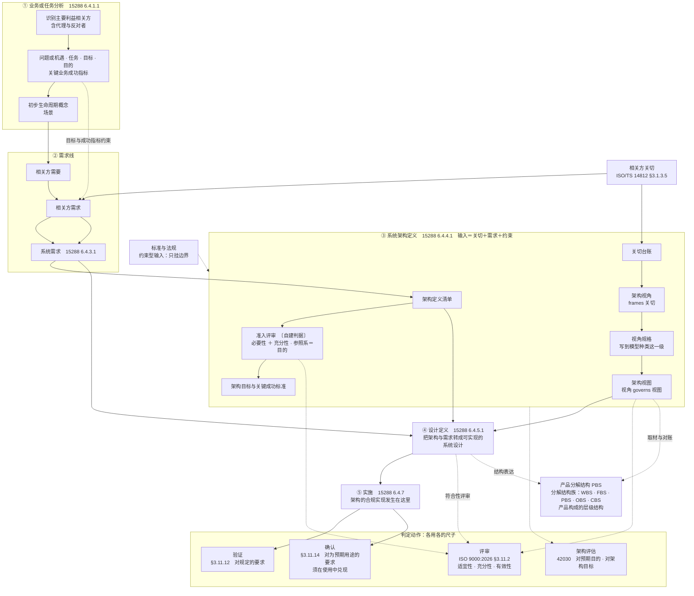
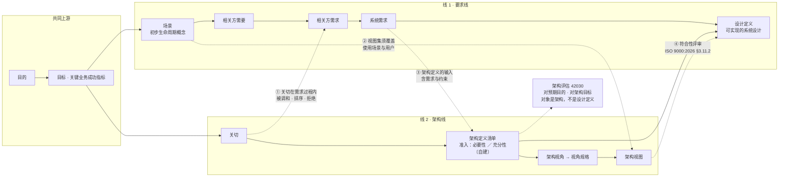

# 架构与设计过程模型研究报告

## —— 从术语定义到双线过程

**Architecture and Design Process Model: A Research Report**

> **编号**：34（研究报告稿）
> **日期**：2026-09-24
> **主题**：以标准为唯一依据，重新厘定架构定义与设计定义的分工、接口与产物；给出产品设计过程的两种视图（分层过程图／双线视图）；补正产品分解结构（PBS）、相关方关切、评审与评估的定位；补齐**从架构定义到设计定义的过程与方法**（含「合规实现」溯源、两条转化、递归换手点）与**八类可实现性关切在架构视角上的分配**
> **修订记录（v1.3，2026-09-24 依库内五份标准正本核改）**：五份标准全文入库（42010:2022／42020:2019／42030:2019／15288:2023／ISO 9000:2026），本报告涉标准出处、条款号与逐字引文的部分**逐条对正本复核**。**四组更正**——① **★「合规实现」出处改挂一手**：原判为 ISO/IEC/IEEE 24765:2017（经 ISO/TS 14812 §3.1.15.1 转引），**正本一手在 15288:2023 §3.13**（*…sufficiently complete to support a compliant implementation of the architecture*）——§9.7 整节重写并补过程侧 §6.4.5.1 目的句、第二段三个对齐面与 Note 2 回退通道，24765／14812 降为术语学旁证；摘要第 12 条同步。② **★ 六处 SEH 转引实为 15288 §5.9 一手**（原标 SEH p148／p153／p155）：*The system architecture definition process focuses on defining an architecture that addresses the stakeholder concerns and is applied iteratively and concurrently with…*／*The design definition process … is driven by requirements that have been vetted through evaluation with the architecture and more detailed analyses of feasibility.*／*Architecture focuses on suitability, viability, and desirability, whereas design focuses on compatibility with technologies … and on feasibility of construction and integration. An effective architecture is as design-agnostic as possible…*——**「有效的架构尽可能不依赖于设计」的规范位即 §5.9**。③ **未核清单 9 项结清**（原第 1、2、3、4、5、9 项＋第 8 项部分）：42010 §3.2／§3.7／§3.8 逐字、15288 §3.13 与 §6.4.11.1 逐字、**42020 六过程名（原清单漏第六个「架构使能 §11」）**、42030 分层与附录条款、§8.1 视角规格 a)–g) 七项；④ **新增正本依据两处**：15288 **§6.4.4.3 Note 1**（架构定义活动的 b)~d) **对应 42020 的三个核心过程**，即「三核过程」接驳为**标准明写**）、**§6.4.5.1 内明写 architecture entity 与 system element *represent two different notions***。**未改**：§一～§八、§十、§十一 的骨架与结论、附录 C／D 的示例构造、全部节号与图表结构。
> **依据（只用标准与外部权威）**：ISO 9000:2026（**标准全文**，仓库存中英对照版）｜**ISO/IEC/IEEE 15288:2023（库内全文）**——过程条号、§5.9、§6.4.4.1／§6.4.4.3 Note 1／§6.4.5.1／§6.4.11.1 与 §3.13 均已由正本直核，INCOSE SEH 5.0 中文版（2023-07）退为**同版同年旁证**｜**ISO/IEC/IEEE 42010:2022（库内全文）**｜**ISO/IEC/IEEE 42020:2019（库内全文）**｜**ISO/IEC/IEEE 42030:2019（库内 CSA 2020 采标件全文）**｜ISO/TS 14812:2022（ISO/TC 204 官方词汇站，**术语学旁证**）｜OMG UAF 1.4 RTF 缺陷单 UAF14-152／UAF14-27
> **文档版本**：v1.2（2026-09-24 创建；同日两次续补）→ **v1.3（2026-09-24 依库内五份标准正本核改：合规实现出处改挂 15288 §3.13、六处 SEH 转引实为 §5.9、未核清单 9 项结清）**
> **取证纪律**（本轮用户定）：**不引用本项目研究报告的结论**；引外文一律原文与中译并列；一手／二手／形式化三分；见不到条款文本写「未核」，不补号不补句
> **文档版本**：v1.2（2026-09-24 创建；同日两次续补）
> **修订记录（v1.2）**：2026-09-24 —— ① 新增 **§十一 设计定义：形态、表达与审核方法**（工作产品形态、表达手段三层、内容要件七件、信息项家族、合格判据、与架构描述的分工、九查审核法）；② 新增 **附录 D 三例设计定义与合规审核**（**案例底本取自 32 号附录 C**，判据只取标准）；③ 摘要补第 15~16 条；④ 附录 B 补两项未核。
> **修订记录**：v1.1（2026-09-24 续）——① 新增 **§2.7 架构定义与设计定义**（两过程的目的句与描述、`design` 的宽窄两义）；② 新增 **§九 从架构定义到设计定义**（关系五条、并发·迭代·递归、四组过程活动、两条转化、五类方法、五条判据、回退通道、递归换手点、「合规实现」溯源）；③ 新增 **§十 可实现性关切与架构视角的分配**（八项关切的受理表与五件待裁）；④ 摘要在原十条后补第 11~14 条；⑤ 附录 A 补 ISO/IEC/IEEE 24765:2017 与 14812 §3.1.15.x 行、附录 B 补四项未核、附录 C 补术语十行。（v1.0＝2026-09-24 创建，覆盖第 1~25 轮）

---

## 摘要：十条

1. **上一版术语的落点**：ISO 9000:2026 里「目标」有定义句，「目的」没有——`purpose` 只作 mission 的释义、并作为 objective 的一种表述形式出现（§3.7.11 注 3）。把「目的 vs 目标」当两个互斥的筐，在标准上没有依据。
2. **架构定义的输入是两路**：关切与需求（SEH p148 逐字）。所以「关切线」与「需求线」不是两条平行流，而是**交叉的两条内容线**。
3. **关切是双入口的横切件**：既在需求过程里被调和、排序、拒绝（SEH p140），也在架构过程里决定视角与覆盖（ISO/TS 14812 §3.1.3.6）。
4. **「架构定义清单」不是标准件**；标准里对应的是**关切台账 ＋ 视角规格**，且规格必须写到**模型种类**这一级。
5. **PBS 不是架构视图**：它是「系统的划分」的结果，属分解结构族（WBS／FBS／PBS／OBS／CBS），与**物理视图**（physical view）不同族、不同尺子。
6. **「合规实现」发生在实施侧**，不在 PBS、也不在设计定义；设计定义是把架构与需求转成可实施规格的中间环节（SEH p155）。
7. **判定动作四把尺子**：评审对工作产品（§3.11.2）、验证对规定要求（§3.11.12）、确认对「为特定预期用途或应用的要求」（§3.11.14）、架构评估对预期目的（42030 b／d）。串尺子是本轮反复出现的错型。
8. **准入评审**（对目的的必要性／充分性）：标准给了动作位（评审定义含 adequacy）与基准位（intended purpose），**没给判据**——判据须自建并标注。
9. **支撑概念按角色分**：架构定义＝目的·关切·需求·治理（架构是产物）；设计定义＝架构·需求（输入）＋质量（判据侧）＋特性（载体）。
10. **两处口径更正**：① PBS 曾被误称为「物理视角下的架构视图」；② 质量曾被误降为「事后量度」而划出支撑概念名单。两处均在本报告改正。
11. **架构定义与设计定义是两类工作、两个过程，但不是两个阶段**——"**有效的架构尽可能不依赖于设计**"；两者之间是**并发、迭代、递归**，递归的形态是"上一层级的产出作为下一层级的输入（定义时往下，实现时往上）"。
12. **"合规实现"的出处是 ISO/IEC/IEEE 15288:2023 §3.13**（一手原文即在此；ISO/IEC/IEEE 24765:2017 经 ISO/TS 14812 §3.1.15.1 转引的同一句降为**术语学旁证**）：设计**足够完整到足以支撑**（*sufficiently complete to support*）对架构的一次合规实现——**合规的承担者是 `implementation`，不是设计／方案本身**。〔2026-09-24 出处更正〕
13. **从架构到方案有四组过程活动、两条转化、五类方法**；判据是完备·一致·可实施·可追溯·原子换手；并有三条回退通道。
14. **八类可实现性关切不必各配一个视角**——四类既有视角已能受理其中大多数；只有**需要独立模型种类且能独立判定**时，才为它新建视角。
15. **设计定义是一件有规定形态的工作产品**：**系统设计描述**——"对系统或元素的设计的描述"；用**方法、框架、图示形式、符号和其他模型形式**表达，并**开发为规范**，用于**采购或实现**。它要到"能拿去采购或实现"为止，**停在〈待定〉即未过出口**。
16. **审核设计定义的动作是评审**（ISO 9000:2026 §3.11.2），对象是工作产品；附录 D 三例的审核结果均为**条件性合规**，且缺口性质各不相同——A 缺**不变量清单**、B 缺**监控覆盖**、C 缺**判据本身**。

---

## 一、前提：本轮采信的标准与其证据等级

| 标准 | 现行版 | 本轮取到的证据 | 等级 |
|---|---|---|---|
| ISO 9000 | **2026**（第 5 版） | 仓库存**标准全文**中英对照版，本轮逐条引用 §3.x／§4.3.x | **一手** |
| ISO/IEC/IEEE 15288 | **2023** | 过程 purpose 与活动，经 SEH 5.0 中文版逐条转引并冠以标准条号（[6.4.1.1]～[6.4.9.1]） | **二手（同版同年）** |
| ISO/TS 14812 | **2022** | ISO/TC 204 官方词汇站，条款级（§3.1.3.x／§3.1.4.x／§3.1.8.x） | **一手（委员会发布）** |
| ISO/IEC/IEEE 42010 | **2022** | 官方条目摘要（范围与符合性对象）；术语经 14812 转引，**所引为 2011 口径** | 摘要一手／术语二手 |
| ISO/IEC/IEEE 42030 | **2019** | 官方条目摘要（九条用途＋NOTE 界碑） | **一手（摘要）** |
| INCOSE SEH 5.0 中文版 | 2023-07 | 分解结构族、PBS 机制、各过程 purpose、关切调和、架构治理与管理、设计定义过程 | **二手（外部手册）** |
| OMG UAF 1.4 RTF 缺陷单 | 2022／2024 | 引 ISO/IEC/IEEE 42010 的关切定义、关系名与重数、选择次序 | 权威团体公开文件 |

**一条版本说明**：14812 的架构术语自标来源为 **ISO/IEC/IEEE 42010:2011**；2022 版的 `view`／`viewpoint`／`architecture` 逐字本轮未取得，凡涉 2022 措辞处一律标「未核」。

---

## 二、术语基线

### 2.1 目的与目标

**目标（objective）**——**§3.7.11** 逐字：

> **result to be achieved** ／ 要实现的结果。

- 注 1：目标可以是**战略性的、战术性的或运行层面的**。
- 注 2：目标可以与不同领域有关；可以是组织范围的，也可以是针对某个项目、产品、服务或过程的。
- **注 3 逐字**：*An objective can be expressed in other ways, such as an intended result, **as a purpose**, as an operational criterion, as a quality objective or by the use of other words with similar meaning (e.g. **aim, goal, target**).*
  → 目标可以用其他方式表述，例如预期的结果、**目的**、运行准则、质量目标，或用 aim／goal／target 等近义词。

**目的（purpose）**——**不是 ISO 9000 的术语条**。它在本标准中以两处形态出现：

1. **§3.4.11 使命（mission）** 逐字：*organization's **purpose** for existing as expressed by top management* ／ 由最高管理者表述的组织存在的目的。
2. **§3.7.11 注 3**（见上）：目的可以是目标的一种表述形式。

**判定链上的归属**：

| 术语 | 条款 | 逐字要点 |
|---|---|---|
| 愿景 | §3.4.10 | 由最高管理者表述的、组织希望成为什么样子的愿望 |
| 使命 | §3.4.11 | 由最高管理者表述的组织存在的目的 |
| 方针 | §3.4.5 | 由最高管理者正式表述的组织的**意图和方向** |
| 战略 | §3.4.12 | 实现**长期目标或总体目标**的计划 |
| 目标 | §3.7.11 | 要实现的结果 |
| 质量目标 | §3.7.12 | 关于质量的目标；通常以**质量方针**为依据；通常针对相关**职能、层次和过程**分别规定 |
| 成功 | §3.7.13 | **实现目标**；注 1：组织的成功强调需要在组织的经济或财务利益与其**相关方的需求**之间取得平衡 |

**要点**：**目的管方向与归属（表述权在最高管理者），目标管判定与分解**（success＝实现目标）。分开它们的不是词形，而是归属者、抽象层次与可否判定三件事。

在系统一侧，可挂的权威是 **42030:2019 官方摘要**的 *intended purpose*（b、d 条，作架构评估基准）；**42010 §3 无 purpose 条**。

### 2.2 架构、关切、架构视角、架构视图

**架构（architecture）**——ISO/TS 14812 **§3.1.3.1** 逐字（自标来源 ISO/IEC/IEEE 42010:**2011**, 3.2）：

> **fundamental concepts or properties of a system in its environment embodied in its elements, relationships and in the principles of its design and evolution**
> 系统的、体现在其元素与关系以及其设计与演化原则之中的基本概念或属性。

**关切（concern）**——**§3.1.3.5** 逐字（来源 42010:2011, 3.7）：

> `<system>` **interest in a system relevant to one or more of its stakeholders**
> 与一个或多个利益相关方相关的、对该系统的利害。

注 1 逐字给出关切的影响面：developmental／technological／business／operational／organizational／political／economic／legal／regulatory／ecological／social。许用术语：system concern。

OMG **UAF14-152**（2024-04）逐字引 2022 版口径："In ISO/IEC/IEEE 42010 it's **'matter of relevance or importance to a stakeholder'**"；同一单指出，把定义追加为"regarding an entity of interest"的写法**比标准更受限**，不可当标准定义。

**利益相关方（stakeholder）**——**§3.1.3.4** 逐字（来源 42010:2011, 3.10）：*individual, team, organization, or classes thereof, having an interest in a system*；关系：`has some concern`。

**架构视角（architecture viewpoint）**——**§3.1.3.6** 逐字（来源 42010:2011, 3.6）：

> **work product** establishing the **conventions for the construction, interpretation and use of architecture views to frame specific system concerns**

关系表逐字：`aggregates some modelKind`｜`frames some concern`｜`governs some architectureView`。

**架构视图（architecture view）**——**§3.1.3.7** 逐字（来源 42010:2011, 3.5）：

> **work product expressing the architecture of a system from the perspective of specific system concerns**

关系：`aggregates some architectureModel`。

**物理视角与物理视图**——**§3.1.4.8** 逐字：*architecture viewpoint used to frame concerns related to **the assignment of functionality to physical objects and the interfaces among these physical objects***；关系 `governs some physicalView`。**§3.1.4.7** 逐字：*architecture view from the physical viewpoint*；关系 `aggregates physicalObject／informationTransfer／functionalObject`。

**架构模型（architecture model）**——**§3.1.3.9** 逐字：*work product representing one or more architecture views and expressed in a format **governed by a model kind***。

**架构框架（architecture framework）**——**§3.1.3.3** 逐字：*conventions, principles and practices for the description of architectures established within a specific domain of application and/or community of stakeholders*；自示例：GERAM〔ISO 15704〕、RM-ODP〔ISO/IEC 10746〕。

**要点**：视角是**规则**（约定），视图是**产物**；关系名取 `frames`（对关切）与 `governs`（对视图）。OMG UAF14-152 引标准："Architecture Viewpoints don't address concerns — they **frame** concerns"；且"**always frame at least one Concern — mandatory**"。同单提醒：**2022 版删除了重数标注**，故"一视图恰一治理视角"一类硬重数是 2011 口径。

### 2.3 设计与开发、评审、验证、确认

**设计与开发（design and development）**——**§3.3.11** 逐字：

> **set of processes that transform requirements for an object into more detailed requirements for that object**
> 将某一客体的要求转换为该客体更详细要求的一组过程。

- 注 1：输入要求往往是研究成果，表述比输出要求更宽泛；**要求通常按特性来定义**；一个项目中可以有若干设计和开发阶段。
- 注 2：design、development 与 design and development 三者有时同义、有时分指不同阶段。
- 注 3：可加限定语表明对象（产品／服务／过程设计和开发）。

**评审（review）**——**§3.11.2** 逐字：

> **determination** of the **suitability, adequacy or effectiveness** of an object **to achieve established objectives**
> 为达成既定目标，对客体的适宜性、充分性或有效性所作的确定。

示例逐字含"设计和开发评审"；注 1：评审也可包括对**效率**的确定。

**验证（verification）**——**§3.11.12** 逐字：

> **confirmation, through the provision of objective evidence, that specified requirements have been fulfilled**
> 通过提供客观证据，证实规定的要求已得到满足。

**确认（validation）**——**§3.11.14** 逐字：

> **confirmation, through the provision of objective evidence, that the requirements for a specific intended use or application have been fulfilled**
> 通过提供客观证据，证实针对特定预期用途或应用的要求已得到满足。

注 3 逐字：**使用条件可以是真实的，也可以是模拟的**。

**三者的界分**：评审用 `determination`（定义中**不出现**客观证据）；验证与确认用 `confirmation`，**必须**通过提供客观证据。差别不在分组，在**尺子**：评审对"为客体确立的目标"，验证对"规定的要求"，确认对"为特定预期用途或应用的要求"。

### 2.4 预期用途与使用

两者均**不是术语条**，其规定散在定义句中：

| 出处 | 逐字 | 说明 |
|---|---|---|
| **§3.11.14** | requirements **for a specific intended use or application** | 确认的尺子 |
| **§3.11.13 试验** | determination according to requirements **for a specific intended use or application** | 同一短语 |
| **§3.11.7 计量确认** | requirements **for its intended use**；注 3：预期用途的要求包括**量程、分辨力和最大允许误差**等 | 预期用途产生要求 |
| **§3.5.14 缺陷** | nonconformity related to **an intended or specified use** | — |
| **§3.5.14 注 2** | **顾客所预期的用途**，可能受到供方所提供信息（例如**使用说明或维护说明**）性质的影响 | **预期用途的主语是顾客所预期的用途** |
| **§3.6.5 报废** | to preclude its **originally intended use**（原定用途） | — |
| **§3.6.7 返修** | to make it acceptable **for the intended use** | — |
| **§3.7.1 结果 注 1** | 结果可以表现为输出，也可以表现为**成效**（即**使用或应用**一项或多项输出所产生的后果） | 使用是输出变成效的环节 |

**系统工程侧**：15288 的确认过程条号为 **§6.4.11**（经 SEH 转引）；运行时须"在**预期的运行环境**中达成其预期用途"（该句本轮取自 2015 版逐字，2023 版逐字未取）。

**译名纪律**：`intended use or application` 作「**预期用途或应用**」；「预期的使用」是误导性译法（此处 use 取目的侧"用途"）。而"使用"另指 `use conditions`／`when in use`，两者并存不冲突。

### 2.5 架构评估

**ISO/IEC/IEEE 42030:2019** 官方摘要逐字（用途九条）：

> a) validate that architectures **address the concerns of stakeholders**; b) assess the quality of architectures with respect to their **intended purpose**; c) assess the value of architectures to their stakeholders; d) determine whether architecture entities **address their intended purpose**; e) provide knowledge and information about architecture entities; f) assess progress towards achieving **architecture objectives**; g) clarify understanding of problem space and of stakeholder needs and expectations; h) identify risks and opportunities associated with architectures; i) support decision making where architectures are involved.

同摘要 NOTE 逐字（界碑）：

> **本文件针对的是架构的评估，而非架构描述适宜性的评估**；后者属 ISO/IEC/IEEE 42020 的架构概念化与细化过程。

**要点**：评估的**依据是目的**（b、d），**判定靠目标**（f）；对象是**架构**，不是架构描述。`concern`（a、c）与 `architecture objectives`（f）在标准自己的清单里**分列**。

### 2.6 质量（补）

**§3.5.2 质量** 逐字：*degree to which a set of **inherent characteristics** of an object fulfils **requirements*** ／ 客体的一组**固有特性**满足**要求**的程度。注 2：「固有」与「赋予」相对，是指存在于客体之中的特性。

**§3.10.2 质量特性** 逐字：*inherent characteristic of an object **related to a requirement*** ／ 客体的与要求有关的固有特性。注 2 逐字：**赋予客体的特性（如某客体的价格）不是该客体的质量特性**。

**§3.10.1 特性** 逐字：可区分的特征；注 1：特性可以是**固有的**，也可以是**赋予的**；注 2：可以是定性的，也可以是定量的。

**§4.3.1 质量（概念段）** 逐字：组织产品和服务质量的高低，取决于它们**满足顾客需求和期望的程度**，以及它们对相关方**有意的和无预期的影响**；这种评价不仅取决于产品和服务**预期的功能和性能**，还取决于**顾客所感知的价值**以及给其他相关方带来的收益。

---

### 2.7 架构定义与设计定义（两个过程名）

**架构定义（System Architecture Definition）——15288:2023 §6.4.4**。目的句（SEH p148／书内 p133 逐字引 **[6.4.4.1]**）：

> 系统架构定义过程的目的是**生成系统架构的不同方案，选择一个或多个能够满足利益相关方关切和系统需求的方案，并以一致的视图和模型进行表达**。

过程描述逐字：

> ……将相关的架构（例如，战略架构、企业架构、参考架构和系统集群架构）、组织和项目的政策及指导、生命周期概念与约束、**利益相关方的关注点和需求以及系统需求与约束**，转化为**系统的基本属性和概念，以及指导系统及其相关生命周期过程演化的原则（系统架构的定义）**。该过程最终生成一个**系统架构描述**……

两条补充逐字：架构治理"将通过**发布架构治理指导**为系统架构定义过程**提供额外指导**"；"**系统架构描述应被视为一个动态工件**"。

**设计定义（Design Definition）——15288:2023 §6.4.5**。目的句（SEH p155／书内 p140 逐字引 **[6.4.5.1]**）：

> 设计定义过程的目的是**提供关于系统和其元素的足够详细的数据和信息，以便根据系统需求和架构实现解决方案**。
> 该过程由**经过架构和更详细的可行性分析审核的需求**驱动。

过程描述逐字：

> 设计定义过程将**架构和需求转化为可实现的系统设计**。该过程产生关于系统及其元素的足够详细的数据和信息，以便能够**根据模型和系统架构的视图中定义的架构实体进行实施**，并符合相关的系统需求……系统元素是在**系统架构定义过程中识别出的**……设计信息和数据将**定义分配给每个系统元素的预期属性和特征**，并支持**向其实现的过渡**。

**分立说明**（SEH p153／书内 p138 逐字）：

> 系统架构定义过程侧重于适用于系统解决方案的**基本概念、特性结构、行为和特性**……**设计定义过程则侧重于制定整体系统设计，确保其细节充分以便于后续的实现**。**有效的架构尽可能不依赖于设计，以便在设计的权衡空间中实现最大的灵活性。**

**`design` 的宽窄两义**（引用时必须标口径）：

| 口径 | design 指什么 | 出处 |
|---|---|---|
| **宽义** | 定义**架构**、系统元素、接口及其他特性的**过程或结果** | ISO/TS 14812 §3.1.15.1（页面自标源 ISO/IEC/IEEE 24765:2017） |
| **窄义** | 架构定义**之外**的那一段工作（本报告用此义） | ISO/IEC/IEEE 15288:2023 §6.4.5 |

"架构只是粗的设计"这一误读，术语学来源正在**宽义**处——它的定义句里就写着 define **the architecture**。

## 三、ISO 为什么引入架构

### 3.1 从定义句读出的三段结构

14812 §3.1.3.1 的定义句可分三段，各答一个问题：

| 段 | 答什么 | 解决什么 |
|---|---|---|
| `fundamental` concepts or properties | 什么算承重 | 实体千头万绪，须分出本质与细节两层 |
| of a system **in its environment** | 相对谁算本质 | 基本与否是**相对环境与目的**的，非绝对属性 |
| `governing principles` for the design and evolution | 凭什么约束下游与时间 | 架构不只说"是什么"，还说"必须怎么做成、怎么改" |

### 3.2 它填的空白

1. **不可视见，因而不可交付**：42010:2022 官方摘要逐字：*"This document distinguishes the architecture of an entity of interest from an AD expressing that architecture. **Architectures are not the subject of this document.**"* → 不能直接管的东西，先管它**可判定的形态**。
2. **复杂度超出认知带宽**：架构提供压缩与共享心智模型。
3. **多方关切无法同时上桌**：标准用 `视角 frames 关切／视图 addresses 关切` 把"谁在乎什么"变成**可核查的覆盖问题**。
4. **"合规"需要落点**：SEH p155 逐字，设计定义是"以便能够**根据模型和系统架构的视图中定义的架构实体进行实施**"——**合规的对象是架构，承担者是实施**。
5. **变更与演化没有锚**：定义句把 evolution 写进原则的作用面。
6. **评估没有靶子**：42030 的九条用途几乎全部以架构为对象。
7. **责任无法指认**：42020 把架构治理列为架构过程之一，并"通过发布架构治理指导为系统架构定义过程提供额外指导"（SEH p148）。
8. **跨组织不可采信**：42010:2022 摘要逐字，符合性是对 **AD、ADF、ADL、架构视角与模型种类分别**做的。

### 3.3 为什么由标准来做

42010:2022 的范围逐字写明它**不管**过程、方法、模型、符号、技术与工具，也不管记录格式与媒体。**它标准化接口，不标准化内容**——因为"什么是好架构"的判据来自目的，不由标准供给。

### 3.4 它不解决什么

- **不给"什么算基本（fundamental）"的判据**：定义句里只有 `fundamental` 一词，标准未给准入条件。
- **不评架构好坏**：那是 42030 的正业，且评的是架构而非描述。
- **不等于文档或图**：可交付、可签收的是架构描述。
- **`governs` 不是 architecture governance**：前者是概念模型里的关系名。
- **不能对工作产品做验证或确认**：工作产品只能评审。

---

## 四、架构视角存在的价值

**一句话**：把"看的方式"从个人手艺变成**公共约定**——关切是主观的、视图是具体的，二者都不能被复用、版本化、核查与追责，**只有规则可以**。

| # | 价值 | 依据 |
|---|---|---|
| 1 | **唯一占两条关系的元素**：`frames`（对关切）与 `governs`（对视图） | 14812 §3.1.3.6 关系表 |
| 2 | **关切的执行形态**：把"谁在乎什么"翻译成"按什么规矩看什么、谁来复现" | §3.1.3.6；OMG UAF14-152 的 mandatory 表述与选择次序 |
| 3 | **覆盖检查的判定单元**：关切至少被一个视角框定；启用的视角至少治理一张视图 | 关系表的 `some` 强制 |
| 4 | **合规有可判定对象**：视角规格即视图的验收条件 | §3.1.3.6／§3.1.3.9 |
| 5 | **抽象层级由复用性决定**：视角只规定到**模型种类**这一级 | 同上 |
| 6 | **组织资产**：视角可入库、可跨项目复用；ADF 可取自领域既有框架 | §3.1.3.3 及其两例 |
| 7 | **两把尺子分得开**：评架构对目的（42030）／评描述适宜性归 42020 | 42030 摘要 NOTE |

**它不是什么**：视角 ≠ 视图（规则 vs 产物）；视角 ≠ ADF（后者是约定集）；视角 ≠ 模型种类（视角聚合它）；`governs` ≠ architecture governance。

---

## 五、产品分解结构（PBS）的定位

### 5.1 PBS 是什么

SEH 5.0 中文版：

- **p103（书内 p88）** 逐字："功能树，也称为功能分解结构（FBS），是将所需系统的功能分解为逐级更低层次的**功能架构**……产品树，也称为**产品分解结构（PBS）**，是将系统分解为逐级更低层次的**物理架构细节**。"
- **p34** 逐字："这被称为**系统的划分**，最终的结果叫做产品分解结构（PBS）……**系统内的层级结构是使用划分关系对系统结构进行组织表示的一种方式**。"
- **p101（书内 p86）** 逐字：分解结构族＝WBS／FBS／**PBS**／OBS／CBS，"是**系统工程与项目管理的交叉活动**之一"（引 Forsberg 等，2005）。

### 5.2 PBS 不是架构视图

ISO/TS 14812 的术语体系里：

- 物理视角 `governs` 的是 **physical view**（§3.1.4.7／§3.1.4.8）；
- 物理视图 `aggregates` 的是 **physicalObject／informationTransfer／functionalObject**；
- 物理对象"在物理视图内被表示为**元素**并承担一个角色"（§3.1.8.1 注 1）；
- **整套架构术语中没有"产品分解结构"这一条**。

**结论**：视图的资格来自"被某个视角治理"，不是来自"它长成一棵树"。**不写视角规格而宣称"PBS 是架构视图"，属无据。** 唯一合法通道是自建 ADF 并写出治理它的视角规格。

### 5.3 PBS 与物理视图的关系与区别

| 维度 | **物理视图** physical view | **产品分解结构** PBS |
|---|---|---|
| 是什么 | 从物理视角表达架构的工作产品 | 分解结构：产品构成的层级树 |
| 上位族 | 架构描述成分 | 分解结构族（WBS／FBS／PBS／OBS／CBS） |
| 资格来源 | 被物理视角**治理**（视角＝约定） | **划分**关系 |
| 回答什么 | 功能**分配**到哪些物理对象、这些对象之间的**接口**是什么 | 产品由**哪些件**构成、**层级**如何组织 |
| 元素 | physicalObject／functionalObject／informationTransfer | 产品件（层级节点） |
| 形状 | 由 **model kind** 决定（可树、可矩阵、可分配表） | **必然是树** |
| 服务 | 架构的表达与判定 | 成本、责任、配置控制、工作包、权衡空间探索 |
| 尺子 | **视角规格** | **划分纪律** ＋ 配置／成本可用性 |

**关系**：**同源（同一批实物）、不同族（描述侧 vs 结构侧）、无上下位**。PBS 只覆盖物理视图三类构成物中的**一类**——功能与传递／接口在 PBS 上没有位置。**PBS 是画物理视图时的取材与对账底稿，不是那张视图，也不是它的一部分。**

### 5.4 两处口径更正

1. **更正一**：曾把 32 号类报告的项目归位表述为"按最新标准，PBS 是物理视角下的一张架构视图"。**标准从未如此说**——物理视角治理的是 physical view。
2. **更正二**：曾据 SEH p103"PBS 展开物理架构细节"一句支撑上述主张。**SEH 没有这么说**——它把 PBS 归入分解结构族，并注明那是系统工程与项目管理的交叉活动。**"相关"被读成了"是"。**

---

## 六、相关方关切的位置

### 6.1 为什么要开发关切（四个目的）

| # | 目的 | 依据逐字 |
|---|---|---|
| 1 | **给架构定义定"满足谁"** | SEH p148 引 15288 **[6.4.4.1]**："生成系统架构的不同方案，选择一个或多个能够**满足利益相关方关切和系统需求**的方案" |
| 2 | **给"看什么"定靶** | 14812 §3.1.3.6（视角 frames 关切）；OMG UAF14-152（mandatory；**先确立关切，再选视角**） |
| 3 | **给"漏没漏"定清单** | 42030 摘要 a)："validate that architectures **address the concerns of stakeholders**" |
| 4 | **给"来源"开口并带入两类人** | 15288 **[6.4.2.1]**（明确利益相关方需要与需求）；SEH p140（反对者"首先被考虑"；联系不到者"应确定其**代理**"）；ISO 9000 §3.5.1（要求三支，"通常隐含"那一支无文件来源） |

### 6.2 关切如何被判断

**没有一部标准给"关切合格性"的判据**；标准给的是**受理规则**：

1. **资格**（§3.1.3.5／§3.1.3.4）：只问是否与某个利益相关方相关的利害，不问正当性与可行性。
2. **关系**（§3.1.3.6 关系表）：唯一可机械检查的一层——`frames some concern`、`governs some architectureView`。
3. **处理**（SEH p140 逐字）：关切"可能存在冲突、不完整、模糊、不可行或无法在项目约束条件下集体满足"，故须有"**调和**"途径，"对竞争的关注点进行优先级排序"，甚至"**直接拒绝**某些利益相关方的关注"——**拒绝理由只有两条：与其他相关方的需要与需求不一致／缺乏可行性**。
4. **去向**（SEH p139／ISO 9000 §3.5.1）：关切转成需要与需求后才进判据体系；每条需求要带来源、理由、优先级。

### 6.3 关切与目的、与目标的关系

- **与目的**：关切是**覆盖面**，目的是**准绳**。42030 把两者分列（a／c 与 b／d）；目的约束关切的受理（SEH p136：需要与需求活动受业务需要与关键业务成功指标约束）；"目的是裁决关切的尺子"是**推论**，标准无此句。
- **与目标**：目标约束关切（同上）；关切经需要／需求转形才影响目标；"目标是关切的收敛产物"是**推论**。
- **共同点**：两者都不是确认的尺子（§3.11.14）；目的也不是判据供给者之外的任何东西。

---

## 七、产品设计过程模型

### 7.1 过程次序与三个改正

**标准次序**（SEH 转引 15288 条号）：**[6.4.1.1]** 业务或任务分析 → **[6.4.2.1]** 利益相关方需要与需求定义 → **[6.4.3.1]** 系统需求定义 → **[6.4.4.1]** 系统架构定义 → **[6.4.5.1]** 设计定义 → **[6.4.7]** 实施 → **[6.4.9]** 验证／**[6.4.11]** 确认。

**三个改正**：

1. **不是两条平行支流**：架构定义在需求的**下游**；其输入同时含关切与需求（SEH p148）。
2. **「架构定义清单」不是标准件**：对应的是关切台账＋视角规格（须写到模型种类）。
3. **PBS 不是架构的合规实现**：合规在实施侧；PBS 属分解结构族。

### 7.2 分层过程图

### 7.3 双线视图与四个交叉点

| # | 方向 | 依据逐字 |
|---|---|---|
| ① | 关切 → 需求线 | SEH p140（在利益相关方需要与需求定义过程内）：对竞争的关注点进行**优先级排序**，甚至**直接拒绝**某些关注 |
| ② | 场景 → 架构线 | SEH p151：视图与模型的组合须能**充分覆盖架构描述的使用场景和用户** |
| ③ | 需求 → 架构线 | SEH p148：架构定义过程"将……**利益相关方的关注点和需求以及系统需求与约束**，转化为系统的基本属性和概念……" |
| ④ | 架构 → 设计定义 | SEH p155：**[6.4.5.1]** "设计定义过程将**架构和需求转化为可实现的系统设计**" |

**结论**：两条线作为**内容面**成立；作为**流程**不成立——它们在 ①③④ 三处互相穿过，并在**设计定义**处汇合。

### 7.4 判定动作的分工

| 动作 | 对象 | 尺子 | 出处 |
|---|---|---|---|
| **评审** | 工作产品（清单、架构描述、设计定义） | 适宜性 · 充分性 · 有效性，为达成既定目标 | ISO 9000:2026 §3.11.2 |
| **验证** | 实现物 | 规定的要求（须客观证据） | §3.11.12；15288 6.4.9 |
| **确认** | 实现物 | 为特定预期用途或应用的要求；使用条件可真实可模拟 | §3.11.14 及注 3；15288 6.4.11 |
| **架构评估** | **架构**（不是描述） | 预期目的；推进度对架构目标 | 42030 摘要 b／d／f 及 NOTE |
| **描述适宜性评估** | 架构描述 | 细化过程的适宜性 | 42030 摘要 NOTE（归 42020） |

`架构视图 → 设计定义` 那条箭头是**符合性评审**：对象是工作产品、尺子是架构实体／接口与规定需求；**视图是举证载体，不是尺子本身**。

### 7.5 准入评审：标准给了动作与基准，没给判据

- **动作位**：§3.11.2 的评审定义含 **adequacy（充分性）**；**"必要性"不在其中**。
- **基准位**：42030 摘要 b／d 条以 **intended purpose** 为基准。
- **判据来源**：SEH p151 要求"**确定**价值评估和架构分析的**评估目标和标准**"，来源为使命和要求、利益相关方及其关注点、政策和标准、价值以及质量特性——**标准把标准本身留给项目定**。
- **最接近的借用**：SEH p139 的需求质量特征含"**必要**、独立、正确、无歧义、可行、适当层次、**完整**、符合要求和可确认"（对象是**需求**）。
- **〔自建〕两步**：① **必要性**——拿掉它，实体还能达成其目的吗；② **充分性**——够格的条目合起来能否闭合目的所要求的全部。两条均须与**关切台账**对账。

---

## 八、支撑概念表

**分开两类**：过程的**对象（产物）**与**支撑它的依据与输入**。

### 8.1 架构定义

| 角色 | 概念 | 逐字锚点 |
|---|---|---|
| **产物** | 架构（抽象物）＋架构描述 | 14812 §3.1.3.1；42010:2022 摘要（架构与 AD 之分） |
| **依据（基准）** | **目的** | 42030 摘要 b／d（intended purpose）；SEH p148 [6.4.4.1] |
| **依据（范畴）** | **关切** | SEH p153 逐字："根据 ISO/IEC/IEEE 42010，**利益相关方的关注点**、架构方面和利益相关方的视角属于**架构考虑的范畴**" |
| **依据（输入）** | **需求** | SEH p148 逐字（关注点**和需求**以及系统需求与约束） |
| **依据（指导）** | **治理** | SEH p148 逐字："组织层面的**架构治理**活动将通过**发布架构治理指导**为系统架构定义过程**提供额外指导**"；p277 逐字："**架构管理，在项目合同的框架内执行治理指令**……并**向治理层报告**治理指令和协议的应用情况及其理由" |

### 8.2 设计定义

| 角色 | 概念 | 逐字锚点 |
|---|---|---|
| **产物** | 设计——"可实现的系统设计"（足够详细的数据与信息） | SEH p155 [6.4.5.1] |
| **输入（依据）** | **架构** · **需求** | SEH p155 逐字："将**架构和需求**转化为可实现的系统设计"；"由经过**架构**和更详细的可行性分析审核的需求驱动" |
| **输出的性质（判据侧）** | **质量** | §3.5.2（固有特性满足要求的程度）；§3.10.2 注 2（**赋予的特性如价格不算质量特性**） |
| **输出的载体** | **特性／质量特性** | §3.10.1／§3.10.2；SEH p155"将定义分配给每个系统元素的**预期属性和特征**" |
| **过程本身的 QMS 侧命名** | **设计与开发** | §3.3.11；注 1：要求通常按**特性**定义 |
| **评价的扩展面** | 需求与期望的满足 · 有意与无预期的影响 · 感知价值 | §4.3.1 逐字 |

**两条标注**：① ISO 9000 的"设计与开发"**不区分架构与设计**（定义句只说"要求→更详细要求"），拆分只存在于系统工程侧；② ISO 9000 的质量在 §4.3.1 的对象是**产品和服务**，而设计定义的产物是**设计数据与信息**——同一件事的两侧表述，引用时标明对象。

---

## 九、从架构定义到设计定义

### 9.1 两者的关系（五条）

| # | 关系 | 逐字依据 |
|---|---|---|
| 1 | **上下游**：架构的产物是设计的输入之一，与需求并列 | SEH p155："将**架构和需求**转化为可实现的系统设计"；"系统元素是在**系统架构定义过程中识别出的**" |
| 2 | **作用面分工**：架构管"基本概念、结构、行为、涌现"；设计管"整体设计＋细节充分" | SEH p153："系统架构定义过程侧重于适用于系统解决方案的**基本概念、特性结构、行为和特性**……**设计定义过程则侧重于制定整体系统设计，确保其细节充分以便于后续的实现**。" |
| 3 | **一条质量要求**：**有效的架构尽可能不依赖于设计** | 同页逐字："**有效的架构尽可能不依赖于设计，以便在设计的权衡空间中实现最大的灵活性**。" |
| 4 | **合规方向朝上游** | SEH p155："以便能够**根据模型和系统架构的视图中定义的架构实体进行实施**" |
| 5 | **不是接力，而是并发、迭代、递归** | 见 9.1.1 |

**9.1.1 并发·迭代·递归（四条逐字）**

> ……它们之间存在迭代，逐步演化的系统需求通过识别的约束和功能及质量要求来**塑造架构**。例如，由于详细的电气建模显示某个系统元素的负载超过了其分配的功率预算，这可能需要**更改系统架构，从而迫使设计变更**……**设计定义过程也可能会识别出需要重新考虑系统需求定义或系统架构定义过程中的决策和权衡**。（SEH p72／书内 p57）

> **递归**指的是**在系统的不同层级上重复应用生命周期的过程**……在这个递归过程中，**上一层级的产出会作为下一层级的输入（在系统定义时往下，在系统实现时往上）**。（SEH p73／书内 p58）

> 所有系统生命周期过程在系统层级的**每个层次上都是同时进行和迭代的**，并且在每个层级上这些过程都是**递归应用**的。（SEH p65／书内 p50）

> 随着项目团队在**系统架构的层级中逐步推进**，技术过程更倾向于以**并发、迭代和递归**方式进行。因此，这个图**适用于系统架构中的每个系统元素**。（SEH p132／书内 p117）

**由此可得一条判断**：架构定义与设计定义**不是"同一类工作的粗细两版"**（目的句、作用面、独立性要求三处都不同），**但也不是两个阶段**（过程之间并发、迭代、递归）。

### 9.2 过程：15288 §6.4.5 的四组活动（SEH p155–157 逐字）

**① 为设计定义做准备**

> - 确定系统设计的**设计驱动因素**、适当的设计策略及适用方法……非功能性需求和设计约束也应被识别，因为它们同样可以作为设计驱动因素。
> - 确定设计中所需的**技术和系统特性的类别**……质量模型也应被确定，因为它们可以帮助分类系统特性。
> - **检查系统架构，以确定适用于系统设计的基本属性和概念，以及应指导设计及其演化的原则。**
> - 制定系统设计工作的实施方法。
> - 确保必要的系统设计支持元素、服务、资源和能力可用。

**入口动作是标准明写的**：从架构出发不是比喻——第三条即"检查系统架构，取出适用于设计的**基本属性和概念**，以及**指导设计及其演化的原则**"。

**② 开展系统设计**

> - 识别和评估设计方案……可以采用的技巧包括：修改现有的设计方案、将可用系统元素组合成设计方案、创造全新设计方案，或者采用上述方法的组合。
> - **将系统需求分配给系统元素**，以确保满足所有系统需求和**架构目标**。该任务包括**将架构实体和关系转化为设计元素，以及将架构特性转化为设计特性**。
> - 在必要时，通过**综合**技术构思一个现有系统之外的设计……可以通过头脑风暴、类比思维或使用形态学图表等方法进行构思。
> - 将**架构实体**（例如，企业或项目目标、能力和效果、操作活动、资源功能）及其关系**转化为设计元素**。同时，将**架构特性转换为设计特性**（例如，功能、行为、尺寸、形状、材料、关键质量特性、数据处理结构）。
> - 将**设计分析**作为设计创作活动的一部分……（1）**参数化设计**……（2）**权衡分析**……
> - **分析在系统架构中识别和定义的接口**，并根据设计特性要求和系统元素与外部实体之间的交互，**细化或进一步定义**这些接口。
> - **记录系统设计**……称为**系统设计描述**……**系统设计描述将开发为规范，以用于采购或实现**组成设计的系统元素。

**③ 评估系统设计**

> - 评估潜在设计方案的整体适用性和优劣……**设计应与主导架构描述保持一致。**
> - ……评估设计对各种利益相关方的价值或意义，以及可能产生的负面影响。
> - 将分析和评估综合为整体评估决策，该决策可作为**选择首选系统设计**的基础，并可作为**对系统架构定义过程的反馈**。此设计评估活动还可以为**验证过程**提供有用的信息。

**④ 管理设计定义的结果**

> - **维持系统设计的双向可追溯性**。跟踪对需求、限制和目标的满足情况，以及**设计特性与架构实体、接口和分析结果之间的关系**。
> - 记录、维护并管理在选择替代方案和设计决策中的**理由**及支持信息。维护设计配置，并与配置管理过程结合进行变更管理。
> - ……保持设计的完整性。通常会指定一个专门的职责（如**系统设计权威**）来处理此问题。
> - **进行设计评审**，以评估设计的进展、适宜性和质量。

### 9.3 方法：两条转化与五类可指名方法

| # | 方法 | 逐字要点 |
|---|---|---|
| 1 | **两条转化（核心）** | 架构实体／关系 → **设计元素**；架构特性 → **设计特性**（功能、行为、尺寸、形状、材料、关键质量特性、数据处理结构） |
| 2 | **分配** | "将系统需求分配给系统元素，以确保满足所有系统需求**和架构目标**" |
| 3 | **方案产生** | 改现有／组合可用元素／全新创造／组合；辅以综合技术（头脑风暴、类比思维、形态学图表） |
| 4 | **设计分析** | 参数化设计、权衡分析；接口的分析与细化 |
| 5 | **设计描述符法** | 设计描述符＝（1）**设计特性**和（2）**其可能的值**；由（1）**自上而下的分配和配置**与（2）**自下而上的选择和测量**相结合确定（p158） |

同页还给出**设计方法的四个来源**逐字：需求与约束／业务或任务分析确定的业务问题、机会与解决方案空间／**由系统架构定义过程所界定的系统架构**／设计策略（例如最大限度地重用）。

**术语表两侧对仗**（可直接引）：**系统架构理由**＝"对架构选择、技术/技术系统元素选择以及**系统需求和架构实体之间的分配**的理由"；**系统设计原理**＝"对设计选择、系统元素选择以及**系统需求与系统元素之间的分配**的理由"；**系统设计特征**（页面自标源 15288:2023）＝"与产品或服务的**可测量描述**相关的设计属性或特征"。

### 9.4 判据：怎么算做完、做对

| # | 判据 | 逐字／出处 |
|---|---|---|
| 1 | **完备** | "提供关于系统和其元素的**足够详细的数据和信息**，以便根据系统需求和架构实现解决方案"（[6.4.5.1]）；系统设计描述"将开发为**规范**，以用于**采购或实现**" |
| 2 | **一致** | "设计应与**主导架构描述**保持一致"（p156） |
| 3 | **可追溯** | "设计特性与**架构实体、接口和分析结果**之间的关系"（p157） |
| 4 | **描述符匹配** | "将系统元素及其特定的设计描述符与**整体系统的设计描述符相匹配**是系统设计的关键部分"（p158） |
| 5 | **接口只细化不新增** | 只对"在系统架构中识别和定义的接口"做"**细化或进一步定义**"（p156） |

**一处必须处理的缝**（p159 逐字）：

> **系统架构识别系统元素，尽管架构描述可能仅识别那些在架构上具有重要意义的元素，但随着更详细设计考虑的出现，其他元素也会逐渐显现。**

故"设计不得引入架构没有的东西"**过强**；须配回流规则（p30 逐字）："当这些衍生功能影响目标系统时，**相应的衍生需求应当纳入系统需求基线**"。

### 9.5 回退通道：不是单向流

| 通道 | 逐字 |
|---|---|
| 迭代反馈 | "可能需要**更改系统架构，从而迫使设计变更**"；"设计定义过程也可能会识别出需要**重新考虑系统需求定义或系统架构定义**过程中的决策和权衡"（p72） |
| 评估反馈 | 设计评估结论"可作为**对系统架构定义过程的反馈**"（p156） |
| 衍生需求回流 | "相应的**衍生需求应当纳入系统需求基线**"（p30） |
| 设计演化 | "**概念设计**关注……总体形式。**初步设计**（有时称为具体化）……**详细设计**通过规范推进……"；"**系统架构可以指定设计演化的原则**……应在设计中包含**适应变化的特性**"（p159） |

### 9.6 递归换手点

**判据（两条件）**（SEH p33 引 15288:2023 术语）：

> 如果一个系统元素**只需要用黑盒（也称为不透明箱）表示法来描述它的需求**，并**能够自信而明确地定义其在现实世界中的解决方案**，那么它可以被视为**原子元素**。在这种情况下，可以在不进一步详细说明元素的情况下，自信而明确地做出关于是**购买、制造还是重用**该元素的决策。

**位置**（p73 逐字）："直到在某一层级决定是制造、购买还是重用某个系统元素……上一层级的产出会作为下一层级的输入。"
**交出什么**（p156）：系统设计描述"将开发为**规范**，以用于**采购或实现**"。
**判据性质**：**信息充分性判据，不是深度／层级判据**——标准没有"分到第几层停"的规定。
**两条勿混的相邻规则**：层宽启发式 7 ± 2（p34，**可管理性**规则，非停止规则）；**横向集成**（深入研究之前的完整性）／**纵向集成**（各层级之间的一致性）（p73）。

### 9.7 「合规实现」的溯源与两处口径更正

> **★ 2026-09-24 依库内正本更正（出处与证据等级双改）**：本节原判「出处是 ISO/IEC/IEEE 24765:2017（经 ISO/TS 14812 §3.1.15.1 转引）」。**该句的一手原文就在 ISO/IEC/IEEE 15288:2023 §3.13**（库内全文实测），**不必绕道 24765／14812**——后者退为**术语学旁证**。

**一手出处（15288:2023 §3.13 `design, noun`）逐字**：

> specification of *system elements* (3.47) and their relationships, that is **sufficiently complete to support a compliant implementation of the *architecture* (3.5)**
> 系统元素及其关系的规定，其完整程度**足以支撑对架构的一次合规实现**。

**过程侧的另一手句（15288:2023 §6.4.5.1 Purpose）**：

> The purpose of the design definition process is to provide sufficient detailed data and information about the system and its elements to realise the solution in accordance with the system requirements and architecture.
> 设计定义过程的目的是提供关于系统及其元素的足够详细的数据和信息，**以按系统需求和架构实现解**。

同节第二段进一步给出合规的**三个对齐面**：*…to enable implementation **consistent with architectural entities defined in models and views of the system architecture**, in conformance with applicable system requirements, and in alignment with design guidelines and standards adopted by the organization or project.*；**Note 2** 给出回退通道：本过程**回馈**系统架构定义过程，以 *consolidate or confirm the allocation, partitioning, and alignment of architectural entities to system elements*。

**术语学旁证（二手，保留但降级）**：ISO/TS 14812 **§3.1.15.1 `design` 注 1**（页面自标 Source＝ISO/IEC/IEEE 24765:2017）逐字 *It is information including specification of system elements and their relationships, that is sufficiently complete to support a compliant implementation of the architecture*；同组 **§3.1.15.2 `implementation`**（把设计翻译为硬件部件、软件部件或两者的过程或其结果）、**§3.1.15.4 `realization`**（*implementation of a system concept*）。

三个要点：① 主语是**信息／规格**；② 关系词是 **support**，不是 be；③ 合规实现的承担者是 **implementation**——"把设计翻译为硬件部件、软件部件或两者的过程，或该过程的结果"（14812 §3.1.15.2 旁证）。

**链条**：concept → design（开发出规格）→ implementation（把设计翻译成部件）→ realization（系统概念实现）。**"合规"这个关系挂在 design 与 architecture 之间，落点在 implementation 上。**

**版本提醒**：这批术语的 History note 记 "Introduced in ISO/TS 14812:**2025**"，而 `architecture`／`concern`／`viewpoint` 等记 **2022**——词汇站含两批术语。

## 十、可实现性关切与架构视角的分配

### 10.1 问题

产品研发中的"可实现性"常被列成八项：**物料可采购性、可制造性、可测试性、可交付性、可部署性、可操作性、可服务性、可退役性**。若这八项各代表一类相关方、各有自己的关切，是否应当各配一个架构**视角**（乃至各出一张"XX 性架构视图"）？

### 10.2 判断口径（先立，再逐行填）

1. **视角的实质是"约定 ＋ 模型种类"，不是"一类人"**——§3.1.3.6 关系表：`aggregates some modelKind`／`frames some concern`／`governs some architectureView`。
2. **关系只有下界，没有独占**：视角框定**至少一个**关切；标准**没有**"一条关切只能被一个视角框定"。
3. **一个视角治理至少一张视图**（重数 1..*）→ **同一视角下可以有多张视图**，故"XX 性视图"未必需要"XX 性视角"。
4. **选择的准则是"最贴近"**：OMG UAF14-152 逐字 "select the architecture viewpoints that **most closely frame** those concerns"。
5. **处置四条路，代价从低到高**〔判〕：① 并入既有视角 → ② 扩既有视角规格 → ③ 新建视角 → ④ 改用别的标准手段（架构类型／ADF）。
6. **最终出几张视图由覆盖论证决定**，不由相关方名单决定——SEH p151 逐字：视图与模型的组合须"充分覆盖架构描述的使用场景和用户"。

### 10.3 四类既有视角（定义句逐字，供对读）

| 视角 | 条款 | 定义句（frames concerns related to …） |
|---|---|---|
| **功能视角** | §3.1.4.6 | the definition of **processes** that perform surface transport functions and **data flows** shared between these processes |
| **物理视角** | §3.1.4.8 | the **assignment of functionality to physical objects** and the **interfaces among these physical objects** |
| **通信视角** | §3.1.4.2 | **all layers of the OSI stack** and related **management and security issues** |
| **企业视角** | §3.1.4.4 | the **policies, funding incentives, working arrangements and jurisdictional structure** that support the technical layers of the architecture |

### 10.4 八项关切受理表

| # | 关切 | 相关方（待确认） | 受理视角〔判〕 | 需要的模型种类〔判，待专业确认〕 | 处置建议〔判〕 |
|---|---|---|---|---|---|
| 1 | **物料可采购性** | 采购／供应链、供应商 | **企业视角**为主；物理视角次之 | 供应政策／合格目录／合同条款；件选型约束 | **并入既有视角** |
| 2 | **可制造性** | 制造／工艺、产线、工装 | **物理视角**为主；**功能视角**次之 | 工艺路线／工装／装配顺序／公差链 | **扩规格**；需独立判定则**新建** |
| 3 | **可测试性** | 测试／检验 | **物理视角**＋**通信视角**＋功能视角 | 测试点／激励—响应／诊断覆盖率 | **扩规格** |
| 4 | **可交付性** | 交付／物流、包装运输 | **企业视角**为主；物理视角次之 | 运输单元／包装／吊装接口；交付与验收条款 | **并入既有视角** |
| 5 | **可部署性** | 部署／安装（现场） | **物理视角** | 现场布局／外部接口／迁移与替换 | **并入既有视角**；口径待裁（见 10.5） |
| 6 | **可操作性** | 运行／操作（用户、操作员） | **功能视角**为主；**通信视角**次之 | 运行模式／状态机／人机任务 | **并入既有视角** |
| 7 | **可服务性** | 维修／保障、备件、培训 | **物理＋功能＋企业**三视角 | 维修任务／可达性／备件与更换单元 | **新建视角候选** |
| 8 | **可退役性** | 处置／环保合规、回收 | **物理＋企业**两视角 | 拆解顺序／材料与回收路径／合规项 | **新建视角候选** |

**汇总**〔判〕：**并入既有视角 4 项**（可采购性、可交付性、可部署性、可操作性）／**扩规格 2 项**（可制造性、可测试性）／**新建视角候选 2 项**（可服务性、可退役性）。

**关键判据只有一条**：**是否真需要一套独立的模型种类，且能否独立判定**。需要 → 新建视角；只是同一套模型种类的内容侧重不同 → 那只是**同一视角下的另一张视图**。

### 10.5 结论与待裁五件

**结论**：八类可实现性关切**不应机械对应八个视角**。切视角的维度是"**看什么**"（关注面），不是"**谁在看**"（相关方名单）——14812 自己就是按过程／物理分配／通信栈／组织安排切的；而八类相关方的关切在四个视角上**重叠分布**（例如可服务性同时落功能〔维修过程〕、物理〔可达性〕、企业〔服务组织与合同〕）。**但八类相关方都必须有受理口**——这是硬要求（42030 摘要 a)："validate that architectures **address the concerns of stakeholders**"）。

**待裁五件**：

1. **相关方名单**：上表第二列系拟制，**未经确认**；名单一变，分配跟着变。
2. **"部署"的口径**：14812 把部署处理为**架构类型**（`deployment architecture`＝"a vision of a specific deployment of a system within a geographic area"），与 `planning architecture`、`reference architecture` 并列——**标准里"部署"不是视角，是另一种架构类型**。故"可部署性"有两条路：物理视角下多一张部署视图，或采用 deployment architecture 这一类型；**标准未给选择规则**。
3. **可服务性与可退役性**：新建视角，还是先在既有视角规格里扩模型种类？本报告倾向**先扩规格**（代价低）。
4. **模型种类栏最软**：全系拟制，需工艺／测试／服务／环安专业确认。
5. **"可实现性需求"的归类另做**：本章只处理"关切→视角"；这八项作为**要求**的归属（约束类要求／设计特性）是另一条线。

## 十一、设计定义：形态、表达与审核方法

### 11.1 它是一件工作产品：**系统设计描述**

SEH 术语表（附录 C）逐字：

> **系统设计说明**：**对系统或元素的设计的描述**。（根据 ISO/IEC/IEEE **24765:2017** 调整）

同表另一件更细、与它**分层配对**的：

> **系统元素说明**：**将系统架构描述应用于低级别的系统配置项和元素**。其**详细程度足以支持设计、实现和测试**。（改编自 ISO/IEC/IEEE **15289:2019**）

**译名口径**：SEH 中文把 *system design description* 译作「系统设计**说明**」；本目录惯用「系统设计**描述**」。同物异译，引用时标注。两者分层：**系统设计说明（系统级）↔ 系统元素说明（元素级）**。

### 11.2 表达方式（SEH p156 逐字）

> **记录系统设计，并以工作成果的形式表达，称为系统设计描述**，涵盖系统设计的组成、属性和特性。**通常，使用方法、框架、图示形式、符号和其他模型形式来表达这一工作成果。系统设计描述将开发为规范，以用于采购或实现组成设计的系统元素。**

| 层 | 内容 |
|---|---|
| **表达手段** | 方法 · 框架 · **图示形式** · **符号** · 其他**模型形式** |
| **工作成果** | **系统设计描述**——涵盖设计的**组成、属性和特性** |
| **出口形态** | 开发为**规范（specification）**，用于**采购或实现** |

### 11.3 内容要件（七件，逐条挂判据）

| # | 要件 | 逐字依据 |
|---|---|---|
| 1 | **设计元素及其关系** | "将**架构实体**（企业或项目目标、能力和效果、操作活动、资源功能）**及其关系转化为设计元素**" |
| 2 | **接口** | 对"在系统架构中识别和定义的接口"做"**细化或进一步定义**" |
| 3 | **设计特性 ＋ 设计描述符** | 设计描述符＝"一组（1）**设计特性和**（2）**其可能的值**"；"将**架构特性转换为设计特性**" |
| 4 | **分配** | "将**系统需求分配给系统元素**，以确保满足所有系统需求和**架构目标**" |
| 5 | **设计原理（理由）** | 术语表："**系统设计原理**：对设计选择、系统元素选择以及**系统需求与系统元素之间的分配**的理由。包括主要选择的实施选项和支持因素的理由。" |
| 6 | **可追溯性映射** | 术语表："记录开发过程中**两个或多个工件间的关系**"；过程活动："维持系统设计的**双向可追溯性**" |
| 7 | **设计评估报告** | 术语表："**系统设计评估报告**：提供系统设计评估的结果。**包括评估准则**。"（据 15289:2019 调整） |

### 11.4 周边信息项家族（15289 家族，经 SEH 术语表）

| 信息项 | 定义 |
|---|---|
| 系统设计说明 | 对系统或元素的设计的描述（据 24765:2017） |
| 系统元素说明 | 将系统架构描述应用于低级别的系统配置项和元素；详细程度足以支持设计、实现和测试（据 15289:2019） |
| 系统接口定义 | 系统与系统元素之间接口的描述（据 24765:2017） |
| 系统设计特征 | 与产品或服务的**可测量描述**相关的设计属性或特征（**源 15288:2023**） |
| 系统设计原理／系统设计评估报告／可追溯性映射 | 见 11.3 第 5~7 项 |
| **设计定义记录/工件 · 设计定义报告 · 设计定义策略/方法** | 过程的三件记录、报告与策略（SEH 附录 C／E） |

### 11.5 合格判据（形式之外四条）

1. **完备**：足够详细，**以便根据系统需求和架构实现解决方案**；并能**开发为规范**用于采购或实现——**停在〈待定〉即未过出口**。
2. **一致**：**与主导架构描述保持一致**；并**与组织或项目采用的设计指南和标准保持一致**（SEH p155 逐字）。
3. **匹配**：**元素级设计描述符 ↔ 整体系统级设计描述符**必须匹配（p158 逐字）。
4. **接口只细化不新增**：只能"细化或进一步定义"架构中已识别者。

### 11.6 与架构描述的分工（表达形态上的差别）

| | 架构描述（AD） | 系统设计描述（DD） |
|---|---|---|
| 说什么 | **是什么、凭什么**：基本概念或属性 ＋ 管控原则 | **做成什么、够细到能采购或实现**：元素、接口、特性与取值 |
| 形态 | 视角 ＋ 视图（每张视图声明治理它的视角） | 元素规格 ＋ 设计特性与描述符（声明其**主导架构描述**并与之一致） |
| 表达手段 | 视角规格规定的**模型种类** | 方法 · 框架 · 图示形式 · 符号 · 其他模型形式 |
| 出口 | 供项目、组织与各相关方使用 | 开发为**规范**，用于**采购或实现** |

**一句话**：**AD 交代"凭什么"，DD 交代"做成什么"——前者到"表达清楚"为止，后者要到"能拿去采购或实现"为止。**

### 11.7 审核方法：九查与三档结论

**动作名**：**评审**——"为达成既定目标，对客体的**适宜性、充分性或有效性**所作的确定"（ISO 9000:2026 §3.11.2）。设计定义是**工作产品**，只可评审，**不可确认或验证**（§3.11.14 要求"为特定预期用途或应用的要求"且须在使用中兑现）。

| # | 查什么 | 判据 | 不合格的形态 |
|---|---|---|---|
| 1 | **实体转化** | 架构实体与关系 → 设计元素 | 漏转化（有架构实体无承担者）／**加戏**（引入架构未授权的元素或依赖） |
| 2 | **特性转化** | 架构特性 → 设计特性 | 属性无承担者；或出现追不到架构特性的"自设指标" |
| 3 | **分配** | 系统需求 → 系统元素，须满足**架构目标** | 目标找不到承担者；或元素无任何需求／目标挂靠 |
| 4 | **接口** | 只细化架构中已识别者 | **新增架构未识别的接口** |
| 5 | **一致** | 设计应与**主导架构描述**保持一致 | 与某张视图冲突；或跨视图对应关系断裂 |
| 6 | **可追溯** | 设计特性 ↔ 架构实体·接口·分析结果，双向可追 | 追不到出处／追不到去向 |
| 7 | **完备** | 足够详细以便实现；可开发为规范 | 停在〈待定〉 |
| 8 | **准则守** | 管控原则（D／E）逐条查违反 | 违反且未走例外留痕 |
| 9 | **查滥** | 技术选型当概念／交付关切升格／把自由度当架构资产 | 三者均属"追不到承重关切" |

**结论三档**：**合规**／**条件性合规**（附补项、责任方、期限）／**不合规**（退回设计定义）。

## 十二、结论

1. **架构定义与设计定义是两类工作、两个过程**，不是同一物的粗细两版：架构定义针对"基本概念或属性＋实现与演化的管控原则"，设计定义提供"足够详细的数据和信息以便根据架构实施"。
2. **关切与需求是两条内容线上的两种东西**：关切属人（利害、可冲突、可拒绝），需求属规格（明示／通常隐含／必须履行）；两者**互相穿越**，并在架构定义与设计定义两处汇合。
3. **判定动作必须分尺子**：评审对工作产品、验证对规定要求、确认对为预期用途的要求、架构评估对预期目的。**用错尺子是本轮出现频率最高的错型。**
4. **两处曾被说错的地方**：PBS 不是架构视图；质量是设计定义的支撑概念（判据侧），不是事后量度。
5. **标准的留缝**：`fundamental` 的准入判据、关切合格性判据、架构评估标准的制定，标准都不给——**须自建，并标注自建**。
6. **从架构到方案有一条入口动作、一条出口判据**：入口＝"**检查系统架构，以确定适用于系统设计的基本属性和概念，以及应指导设计及其演化的原则**"（SEH p156）；出口＝原子元素的"黑盒可定义"两条件，届时转为**购买／制造／重用**决策（SEH p33／p73）。中间是**两条转化 ＋ 分配**，判据五条（完备·一致·可追溯·描述符匹配·接口只细化不新增）。
7. **关切→视角是分配问题，不是命名问题**：先立关切台账，再选或建视角；能并入既有视角的不新建。**"XX 性视图"可以先有，"XX 性视角"须经论证**——判据只是"是否真需要一套独立的模型种类且能独立判定"。

---

## 附录 A 引文出处与证据等级（节选）

| 引文 | 出处 | 等级 |
|---|---|---|
| 目标／使命／方针／战略／质量／质量特性／特性／评审／验证／确认／结果 等定义句 | ISO 9000:2026 §3.x、§4.3.1 | 一手 |
| 架构／关切／利益相关方／视角／视图／物理视角／物理视图／架构模型／架构框架 定义句与关系表 | ISO/TS 14812:2022 §3.1.3.x／§3.1.4.x／§3.1.8.x（自标源 42010:2011） | 一手（委员会发布） |
| 架构与 AD 之分；符合性对象（AD／ADF／ADL／视角／模型种类） | ISO/IEC/IEEE 42010:2022 官方摘要 | 一手（摘要） |
| 评估九条用途与 NOTE 界碑 | ISO/IEC/IEEE 42030:2019 官方摘要 | 一手（摘要） |
| 各过程 purpose（[6.4.1.1]～[6.4.9.1]）、关切调和与拒绝、分解结构族、架构治理与管理、设计定义过程 | INCOSE SEH 5.0 中文版 p34／p101／p103／p110／p132／p134／p136／p139／p140／p148／p150／p151／p152／p153／p155／p277 | 二手（外部手册，与 15288:2023 同版同年） |
| 关切的 2022 版措辞、`frames`／`governs` 强制、2022 取消重数、选择次序 | OMG UAF14-152（2024）／UAF14-27（2022） | 权威团体公开文件 |
| `design` 注 1 "sufficiently complete to support **a compliant implementation of the architecture**"；`implementation`、`realization` 定义 | ISO/TS 14812 §3.1.15.1／§3.1.15.2／§3.1.15.4（页面自标源 **ISO/IEC/IEEE 24765:2017**） | 二手（转引标准，来源自标） |
| 四类视角的定义句与关系表 | ISO/TS 14812 §3.1.4.2／§3.1.4.4／§3.1.4.6／§3.1.4.8 | 一手（委员会发布） |
| 设计定义过程的四组活动、两条转化、设计描述符、原子元素判据、设计演化、系统设计特征 等 | INCOSE SEH 5.0 中文版 p30／p33／p34／p65／p72／p73／p132／p150／p153／p155–159 ＋ 附录 C 术语表 | 二手（外部手册，与 15288:2023 同版同年） |

## 附录 B 未核清单

1. ~~**ISO/IEC/IEEE 42010:2022 §3.2／§3.7／§3.8 的逐字定义**~~ → **✅ 已结清（2026-09-24）：正本在库**。§3.2 *fundamental concepts or properties of an entity in its environment and governing principles for the realization and evolution of this entity and its related life cycle processes*；§3.7 *information part comprising portion of an architecture description*；**§3.8 *set of conventions for the creation, interpretation and use of an architecture view to frame one or more concerns***（**句中无 work product 属概念**——原据 14812 转引的 2011 口径作 *work product establishing the conventions…*，**该口径对 2022 版不成立**）。
2. ~~**ISO/IEC/IEEE 15288:2023 §3.13（design）术语逐字**~~ → **✅ 已结清（2026-09-24）：正本在库**——*specification of system elements (3.47) and their relationships, that is sufficiently complete to support a compliant implementation of the architecture (3.5)*（见 §9.7）。
3. ~~**ISO/IEC/IEEE 15288:2023 §6.4.11 的逐字**~~ → **✅ 已结清（2026-09-24）：正本在库**——§6.4.11.1 Purpose 逐字：*The purpose of the validation process is to provide objective evidence that the system, when in use, fulfils its business or mission objectives and stakeholder needs and requirements, achieving its intended use in its intended operational environment.*（「when in use…intended operational environment」一句 **2023 版仍在**，原记「系 2015 版逐字」不确）。
4. ~~**ISO/IEC/IEEE 42020:2019 的六个架构过程其名**~~ → **✅ 已结清（2026-09-24）：正本在库**——**§6 Architecture Governance／§7 Architecture Management／§8 Architecture Conceptualization／§9 Architecture Evaluation／§10 Architecture Elaboration／§11 Architecture Enablement**（**第六个是「架构使能」，原清单漏列**）；分组见 **§5.3 治理**与**管理**（同组）／**§5.4 概念化、评估、细化**（三个核心过程）／**§5.5 使能**。
5. ~~**42030:2019 的分层结构与附录条款**~~ → **✅ 已结清（2026-09-24）：正本在库**——§4.3.1 Evaluation synthesis／§4.3.2 Value assessment／§4.3.3 Architectural analysis；§4.4 概念模型；**§4.5 assessment 与 analysis 之对照**；附录 A 价值与质量概念／B 与其他标准的关系／C AE 示例／D 示例 AE 框架（**D.2 ATAM／D.3 QUASAR／D.4 AoA**）。**版本名**：国际标准号 **42030:2019**，库内件为 **CSA 2020 采标件**。
6. **IEC 81346-1（function／product／location 三 aspect）**——PBS 的标准级出处候选，本轮未见原文。
7. **ISO 37000:2021 §3.2.10 organizational purpose**——治理侧"目的"的定义与归属，未独立取得。
8. **ISO/IEC/IEEE 24765:2017 原文**——本轮仅有 14812 的转引（页面自标 Source）。〔**✅ 部分结清（2026-09-24）**：本报告唯一真正需要的 24765 关键句（design 的 *sufficiently complete to support a compliant implementation of the architecture*）**已由 15288:2023 §3.13 一手取得**，出处改挂 §3.13；24765 原文仅供术语学旁证，不再是缺口。〕
9. ~~**ISO/IEC/IEEE 42010:2022 §8.1 视角规格必写项**——未取得~~ → **✅ 已结清（2026-09-24）：正本在库**。§8.1 规定视角规格**应含或引用**：a) 相关的利益相关方角度（按 6.3）；b) 本视角所框定的一项或多项关注点（按 6.4）；c) 与这些关注点相关的一项或多项方面体（按 6.5）；d) 持有被框定关注点的已知典型利益相关方（按 6.2）；e) 建造视图所用的模型种类与图例（按 8.2）；f) 承载所得视图及其视图组件间关系的对应方法（按 6.8）；g) 该视角的资料来源引用。**宜**另识别视图方法（按 8.3）与一种或多种模型种类。**注**：正本列 **a)–g) 七项**（本报告他处若作「六项」系形式化归并，须标明）；附录 B.2.1 逐字：*An architecture viewpoint that is documented in this form meets the requirements of 8.1.*
10. **ISO/TS 14812 是否含 `stakeholder perspective` 与 `aspect`**——该路径返回 404，2022 版新增的这两类 AD 元素在 14812 中查不到条目，**外部不可核**。
11. **"架构类型"与"视角"之间的选择规则**——标准未给，属自建判断（§10.5 第 2 条）。
12. **ISO/IEC/IEEE 15289:2019 原文**——§11.4 数条自标"改编自／据 15289"，本轮未取原文。
13. **`system design description` 的规范中译**——SEH 作"系统设计说明"、本目录作"系统设计描述"，何者为规范名未核。
14. **附录 D 三例的设计元素与描述符取值**——均为示例构造，其中的量化值一律以〈待定〉占位；真实项目须由设计方与专业方确认。

## 附录 C 术语对照（本轮新增或须留意）

| 中文 | 英文 | 出处与备注 |
|---|---|---|
| 目的 | purpose | **非 ISO 9000 术语**；作 mission 的释义与 objective 的表述形式 |
| 目标 | objective | ISO 9000:2026 §3.7.11 |
| 架构 | architecture | 14812 §3.1.3.1（源 42010:2011, 3.2） |
| 关切／关注点 | concern | 14812 §3.1.3.5；2022 版作 "matter of relevance or importance to a stakeholder"（OMG 引，逐字待核） |
| 架构视角 | architecture viewpoint | 14812 §3.1.3.6 |
| 架构视图 | architecture view | 14812 §3.1.3.7 |
| 物理视角／物理视图 | physical viewpoint／physical view | 14812 §3.1.4.8／§3.1.4.7 |
| 模型种类 | model kind | 14812 §3.1.3.6／§3.1.3.9 引用（定义句两次取失败，未取） |
| 产品分解结构 | product breakdown structure（PBS） | SEH 5.0；**非 ISO 术语** |
| 预期用途 | intended use | 见于 §3.11.14／§3.11.13／§3.11.7 等定义句；**非术语条** |
| 使用条件 | use conditions | §3.11.14 注 3 |
| 质量特性 | quality characteristic | ISO 9000:2026 §3.10.2 |
| 架构定义（过程） | System Architecture Definition | ISO/IEC/IEEE 15288:2023 §6.4.4 |
| 设计定义（过程） | Design Definition | ISO/IEC/IEEE 15288:2023 §6.4.5 |
| 设计（宽义） | design | ISO/TS 14812 §3.1.15.1（源 24765:2017）——含 define **the architecture** |
| 实现 | implementation | ISO/TS 14812 §3.1.15.2 |
| 兑现·实现 | realization | ISO/TS 14812 §3.1.15.4 |
| 系统设计描述 | system design description | SEH 附录 C（据 24765:2017 调整） |
| 系统设计特征 | system design characteristic | SEH 附录 C（页面自标源 15288:2023） |
| 功能视角／通信视角／企业视角 | functional／communications／enterprise viewpoint | ISO/TS 14812 §3.1.4.6／§3.1.4.2／§3.1.4.4 |
| 部署架构 | deployment architecture | ISO/TS 14812——**架构类型，非视角** |
| 原子元素 | atomic system element | SEH p33（引 15288:2023） |

---

## 附录 D 三例设计定义与合规审核（示例）

> **案例底本**：32 号报告附录 C 的三例——**产品 A** 机载防撞设备／**产品 B** 机载平视显示器／**产品 C** 可配置可嵌入 AI 的企业运营体系信息化平台。**本附录使用该底本系用户 2026-09-24 指定**；三例均为**示例构造**，其中的**设计元素、设计特性与描述符亦为示例构造**，不得当作真实型号或真实平台的设计底稿。**判据只取标准**（§11.7 九查），32 号的结论不作判据。

### D.1 产品 A · 机载防撞设备（设备类）

**架构基线要点**：K1 空中自主获取的交通态势／K2 机组可见的冲突告警／K3 独立性／K4 跨代接口契约；P1–P8＝测量精度·端到端时延·误警率与漏警率·降级输出能力·接口向后兼容·安全等级可追溯·人机语义可读·环境适应性（边界条件）；D1–D6／E1–E5；G1–G6；视角＝四视角＋自建五条（安全·环境适应性·制造与装配·保障与维修·人因）；V1–V9，死点＝V2 通道划分 ↔ V3 总线分区 ↔ V5 失效状态。

**设计定义（示例）**

| 类 | 设计元素 | 承担架构实体 |
|---|---|---|
| 硬件 | A-1 天线阵面单元／A-2 收发机组件／A-3 测量与跟踪处理机／A-4 显示驱动与符号生成单元／A-5 总线接口与控制单元／A-6 电源与通道隔离单元 | K1／K1／K1·K3／K2／K4／K3 |
| 软件 | S-1 测量与标校／S-2 跟踪滤波与去重／S-3 告警门限与降级策略／S-4 符号与告警语义／S-5 总线字表与兼容层／S-6 机内自检与监控 | K1／K1·K3／K2·K3／K2／K4／K3 |
| 结构环境 | M-1 安装托架与减振／M-2 天线罩与结构界面 | P8／P8·K1 |

**接口细化**（逐条注明来源视图）：在役总线（既有数据字**冻结清单**＋追加规则）←V3；座舱显示（符号与告警优先级）←V9；电源与通道（双通道划分·瞬断恢复）←V2；维修接口（BIT·隔离码表）←V8。
**设计特性分配**：P1→A-1/A-2/S-1；P2→S-2/S-3/S-4/A-3；P3→S-3；P4→A-6/S-3；P5→A-5/S-5；P6→安全需求分配矩阵；P7→S-4；P8→M-1/M-2。

| 查项 | 结果 | 说明 |
|---|---|---|
| 实体转化 | ⚠ **加戏一处** | 若引入"与地面站协同链路"即未授权——目的明写"不依赖地面管制指令" |
| 特性转化 | ✅ | P1–P8 全落位；P8 保持边界条件，未派生新元素（合 D4） |
| 分配 | ✅ | G1–G6 均可指到元素 |
| 接口 | ⚠ 需验 | 四条均源出 V2／V3／V8／V9；"新增数据字"属细化还是新增，须以 D3 判 |
| 一致 | ⚠ 需验 | V2↔V3↔V5 对应关系须逐条对账 |
| 可追溯 | ✅ 双向 | — |
| 完备 | ⚠ 待定值待补 | 未达"可开发为规范用于采购或实现" |
| 准则守 | ✅ | 须显式声明"本设计不含对飞控的写权限"（D6） |
| 查滥 | ✅ | 未见器件型号进架构元素位 |

**结论：条件性合规。** 补项三件——删"地面站协同链路"或升格为目的变更／补 V2↔V3↔V5 对账表／描述符取值补齐。**定义期修补，评估方不动手。**

### D.2 产品 B · 机载平视显示器（设备类）

**架构基线要点**：K1 实时配准的透视叠加／K2 眼动范围内的虚像／K3 远距虚像与外界共焦／K4 可监控的显示完整性／K5 符号集契约；P1–P8＝眼动范围·配准精度·虚像视距与共焦性·亮度与对比度·符号延迟·失效降级定义·光源寿命与衰减可控·跨座舱适配性；G1–G8（含 **G5 误导性显示**）；视角＝四视角＋自建五条（安全·**人因**·环境适应性·制造与装调·保障与维修）；V1–V9，死点＝**V2 光学布局 ↔ V6 符号位置与眼动范围 ↔ V5 完整性监控**。

**设计定义（示例）**：设计元素＝B-1 图像源单元（**光源体制不在此层锁定**）／B-2 中继光学组／B-3 组合玻璃·目视耦合件／B-4 符号生成与驱动单元／B-5 配准与标校单元／B-6 完整性监控单元／B-7 安装与座舱接口件；软件 S-1 符号生成／S-2 配准解算与标定／S-3 完整性监控与降级策略／S-4 符号集定义表与版本管理／S-5 总线接口与数据字。
**接口细化**：航电总线（数据字表·更新率·时序与丢失行为）←V3；**与主显示器（信息一致性规则：逐参数权威序位与冲突处置）←V6**；座舱安装（安装界面·视野遮挡包线）←V2；维修与标校←V9。

| 查项 | 结果 | 说明 |
|---|---|---|
| 实体转化 | ✅ | 光源体制留在"实现选择"位，未写成架构元素 |
| 特性转化 | ✅ | P1–P8 全落位 |
| 分配 | ⚠ **缺承担者** | G5 要求"监控覆盖率与检出时间"，而 P6 只写"降级态可辨"，**缺监控覆盖矩阵** |
| 接口 | ✅ | 均源出 V2／V3／V6／V9，无新增 |
| 一致 | ⚠ **死点须对账** | 眼动范围边界（光学）·边界处可读性（人因）·边界外处置（监控）三者须逐条列出对应项 |
| 可追溯 | ⚠ **反向缺口** | 缺"每个符号至少一条监控路径"的闭合 |
| 完备 | ⚠ 待定值待补 | — |
| 准则守 | ⚠ **D5 未落地** | 信息一致性规则须由设计明确给出，否则 C8"与主显示器不矛盾"无落点 |
| 查滥 | ✅ | 未见主显示器页面被搬入；成本关切未升格 |

**结论：条件性合规。** 补项三件——补**监控覆盖矩阵**（接 G5）／补**信息一致性规则**（D5，V6 与 V5 互指）／补 V2↔V6↔V5 对账表。

### D.3 产品 C · 企业运营体系信息化平台（平台类）

**架构基线要点**：K1 可配置性／K2 单一业务定义体系／K3 数据归属唯一／K4 AI 在回路／K5 配置可演进；P1–P8＝配置覆盖度·部署期不改码·数据归属原子性·语义一致性·过程贯通性·AI 可管性·配置可治理性·平台与配置解耦；D1–D6／E1–E6；G1–G7；视角＝四视角＋自建六条（数据治理·配置与版本·安全与合规·AI 治理·运维·集成与扩展），**企业视角升为第一承重视角**；V1–V10，死点＝**V4 权属与归属 ↔ V5 对象注册与写入权 ↔ V6 配置项**。

**设计定义（示例）**：设计元素＝D-1 配置引擎／D-2 对象与术语注册中心／D-3 归属仲裁与写入权服务／D-4 过程编排与事件总线／D-5 AI 服务注册与决策留痕／D-6 权限脱敏与审计留痕／D-7 集成与扩展点网关／D-8 部署单元与隔离域／D-9 运维可观测组件。
**接口细化**：扩展点（清单＋兼容性承诺表＋**破坏性变更判据**）←V10（上溯 E2）；事件语义（注册后使用）←V3；外部受控接口←V3；配置与平台（升级兼容规则）←V6。

| 查项 | 结果 | 说明 |
|---|---|---|
| 实体转化 | ✅ | 技术栈·流程引擎·模型名未进架构元素位 |
| 特性转化 | ✅ | P1–P8 全落位 |
| 分配 | ⚠ **缺完备性规则** | G6 要求"决策权逐项声明"，而设计中缺"**哪些环节必须声明 AI 参与**"的完备性规则 |
| 接口 | ⚠ **判据缺失** | "什么算破坏性变更"未定义 → E2 不可判定 |
| 一致 | ⚠ **死点须对账** | V4 说谁负责 → V5 只允许该方写入 → **V6 中任何引入新数据副本的配置必须在 V5 留下痕迹** |
| 可追溯 | ✅（建议加一条） | 建议加"配置项 ↔ 对象注册 ↔ 归属矩阵"三向追溯 |
| 完备 | ⚠ 待定值待补 | — |
| 准则守 | ⚠ **D2／D3 须机制化** | 不能只是承诺，须落到 D-3 的**自动检出** |
| 查滥 | ⚠ **平台特有的第三形态** | **把"配置自由度"当架构资产**——可配项须逐条追到承重关切 |

**结论：条件性合规。** 补项四件——AI **参与声明完备性规则**／**破坏性变更判据**／**V4↔V5↔V6 对账表＋配置项三向追溯**／可配项逐条追关切。

### D.4 三例对照与三条共用结论

| 例 | 实体转化 | 特性转化 | 分配 | 接口 | 一致 | 可追溯 | 完备 | 准则守 | 结论 |
|---|---|---|---|---|---|---|---|---|---|
| **A 设备** | ⚠ 加戏一处 | ✅ | ✅ | ⚠ 需验 | ⚠ 需验 | ✅ | ⚠ 待定 | ✅ | **条件性合规** |
| **B 设备** | ✅ | ✅ | ⚠ 缺 G5 承担者 | ✅ | ⚠ 死点 | ⚠ 反向缺口 | ⚠ 待定 | ⚠ D5 | **条件性合规** |
| **C 平台** | ✅ | ✅ | ⚠ 缺 G6 完备性 | ⚠ 判据缺失 | ⚠ 死点 | ✅ | ⚠ 待定 | ⚠ D2／D3 | **条件性合规** |

1. **三例的缺口性质各不相同**——A 缺**不变量清单**（冻结与兼容规则），B 缺**监控覆盖**（哪些失效必须被监控），C 缺**判据本身**（什么算破坏性变更、哪些环节必须声明 AI 参与）。**同一条审核方法，三种补法。**
2. **"一致"这一查永远落在跨视图对应关系上**：A 是 V2↔V3↔V5，B 是 V2↔V6↔V5，C 是 V4↔V5↔V6。**架构描述内部的对应关系断了，不是"图不够好"，是架构不成立。**
3. **"完备"这一查全部卡在同一处——描述符值停在〈待定〉**。设计定义的出口判据是"足够详细以便根据系统需求和架构实现解决方案"并"开发为规范用于采购或实现"；停在待定的设计定义**尚未越过这道出口**。

**分寸**：本附录的审核是**评审**（ISO 9000:2026 §3.11.2），对象是设计定义这一**工作产品**；**不是确认、也不是验证**——真正的确认落在实现出的客体上，且须在使用条件下兑现（§3.11.14 及注 3）。

---

*文档版本：v1.2（2026-09-24 创建；同日两次续补：§2.7／§九／§十／§十一 ＋ 附录 A~D）*
