# ISO 9000:2026《质量管理 — 基础和术语》中英文对照版

> **本文件性质**：`ISO 9000-2026-质量管理基础和术语-英文版.md` 的**逐段中英对照译本**。英文为源文（原文照录），中文为译文，置于对应英文段落之下。

> **对照体例**：正文英文段落原样保留，**其下紧跟中文译文**（与英文段落**同格式、同为齐左**）；条目标题、图题、表头等**短标识行**采用“英文 + 中文”同行并置。**Mermaid 代码块保留英文原文不动**——图中只含术语名与条款号，术语中文名查第 3 章或文末《术语定译表》。详见下方【对照体例说明】。

> **术语依据**：条款号与术语名以 ISO 9000:2026 为准；中文译名以**本项目既有口径**为先（与 GB/T 19000 官方译名有出入处已在《术语定译表》标注），非本项目覆盖的术语依 GB/T 19000—2016 与行业通行译法。

---

## 【对照体例说明】

**非标准正文，译者所加。** 十条：

| # | 项 | 处理 |
|---|---|---|
| 1 | 正文段落 | 英文原文 → 其下紧跟**中文译文**，**与英文同为齐左正文段落**（不加引用、不加“译”字标记，靠中英交替辨读） |
| 2 | 列表 | **逐条紧跟**——每个英文列表项之下，紧接**该条**的中文，同为齐左列表项（多条目区块不把中文整块堆在末尾）。**两处例外**：①**编号有指向意义的有序列表**（如附录 A 图 A.3 的 Key 1~4），改作行内并置「英文（中文）」以保住编号；②位于注（`>`）内部的子列表，中文随注保持引用态，以与英文注同形 |
| 3 | 条目标题 / 图题 / 章标题 | 「英文 中文」同行并置，不另起译行。**一个条目挂多个英文术语名时**（优先术语＋许用术语／缩写），英文名之间用 ` / ` 连接、英文串与中文之间用 ` ｜ ` 分隔，作「英文名一 / 英文名二 ｜ 中文译名」——否则中文会被误读为只对应末一个英文名（如 `相关方` 恰是 `stakeholder` 的常见中译）。排法与文末《术语定译表》一致 |
| 4 | 注（Note）、示例（EXAMPLE）、来源（SOURCE） | 英文原样（**引用块**）→ 其下中文**同为引用块**：`> **注 N**：…`、`> **示例**：…`、`> **来源**：…` |
| 5 | 表格 | 单元格内「英文 ／ 中文」并置；参考文献与索引用「英文（中文）」内联 |
| 6 | **Mermaid 代码块** | **原样保留**（不译）。图中节点为「条款号 + 英文术语名」，中文术语名见第 3 章正文或文末《术语定译表》 |
| 7 | 译者自注（非原文内容） | `> **译注**：…`、`> **译者提示**：…`——凡带“译注／译者”字样者，均为**译者所加**，不是原文；置于引用块中，以免与译文混淆 |
| 8 | **标题层级** | **本译本与源文件有一处层级差异（有意为之）**：源文把 `4.2.2.1 Statement` 这类四段编号标题与 `4.2.2 Customer focus` 放在**同一级**（均为 `####`）；本译本按其编号深度下沉一级（`#####`），使“陈述／理由／主要收益／可能的行动”四段式在目录中正确嵌套于各原则之下。**标题文字未改，仅层级不同。** |
| 9 | **专业领域标注**（尖括号行） | 源文以斜体尖括号标出术语所用的特定专业领域（如 `<projects>`）——**照录英文一行，其下紧跟中文一行**。**两处技术处理**：①尖括号**写作 HTML 实体** `&lt;…&gt;`——源文此处的 `<…>` 是纯 ASCII，Markdown 渲染器会把它当 HTML 标签**吞掉不显示**（中文因含非 ASCII 会被自动转义，故只有英文那行会隐形）；用实体可保证两行都正常显示，渲染结果仍是 `<…>`，且源文“转换说明”处自己用的就是 `&lt;…&gt;`。②**不加“专业领域”之类的解说标签**——该标注的含义由附录 A.5 与源文“转换说明”交代 |
| 10 | **交叉引用号** | 正文与注中的 `(3.x.y)` **一律做成超链接**，点击跳至该术语条目。共 1262 处，覆盖 112 个条款号，**无失效链接**（含目录在内的全部 1336 处内部链接均能落到目标）。括号统一为**半角**（与源文一致）。锚点由标题自动生成，slug 规则与 `.tools/md2pdf` 一致，**PDF 中已实测可跳转**：渲染后生成 1346 个链接注解、186 个命名目标（分布 92 页）。**注意**：英文行因此多了链接标记，不再是纯字节照录（**文字内容未改**） |

**关于多术语条目标题**：一个术语条目可挂多个英文名（优先术语＋许用术语／缩写）。在**源 docx** 中，这一行**多被并进条目标题**（3.1.4、3.1.9、3.1.10、3.4.9、3.7.15、3.8.3、3.9.9、3.9.11、3.9.12 共九条），**仅 3.1.11 保留分行**（`DRP-provider` ／ `dispute resolution process provider`）。本译本为求十条一致，将 3.1.11 的许用术语也并入条目标题，**该独立行不再保留——这是本译本相对源文的一处有意删减**。（源 docx 系重排版产物，其行分合**不足以判定标准印刷版面**，故不据以改写源文——详见英文版《源文件缺陷》第 5 条。）

**关于图的说明**：源文件的 15 幅图（图 A.1~A.15）为矢量图重绘的 Mermaid，其内容仅为术语名与条款号，属结构性标签而非行文；逐条译注会使图面臃肿且易破坏渲染，故保留原文。**图题与图前后的说明文字均已译出。**

---

## 目录（Contents）

> 链接文本取标题的中文部分；锚点按标题自动生成。

  - [转换说明 / About this file](#转换说明-about-this-file)
  - [文档信息](#文档信息)
  - [CEN 封面页](#cen-cover-page-source-lay-out-verbatimcen-封面页)
- [欧洲前言](#european-foreword-欧洲前言)
  - [采纳声明](#endorsement-notice-采纳声明)
- [ISO 9000:2026（英文版）](#iso-90002026eniso-90002026英文版)
  - [质量管理 — 基础和术语](#quality-management-fundamentals-and-vocabulary质量管理-基础和术语)
- [前言](#foreword-前言)
- [引言](#introduction-引言)
  - [范围](#1-scope-范围)
  - [规范性引用文件](#2-normative-references-规范性引用文件)
  - [术语和定义](#3-terms-and-definitions-术语和定义)
    - [与组织有关的术语](#31-terms-related-to-organization-与组织有关的术语)
    - [与管理有关的术语](#32-terms-related-to-management-与管理有关的术语)
    - [与过程有关的术语](#33-terms-related-to-process-与过程有关的术语)
    - [与体系有关的术语](#34-terms-related-to-system-与体系有关的术语)
    - [与要求有关的术语](#35-terms-related-to-requirement-与要求有关的术语)
    - [与措施有关的术语](#36-terms-related-to-action-与措施有关的术语)
    - [与结果有关的术语](#37-terms-related-to-result-与结果有关的术语)
    - [与数据、信息和文件有关的术语](#38-terms-related-to-data-information-and-documents-与数据信息和文件有关的术语)
    - [与顾客有关的术语](#39-terms-related-to-customer-与顾客有关的术语)
    - [与特性有关的术语](#310-terms-related-to-characteristic-与特性有关的术语)
    - [与确定有关的术语](#311-terms-related-to-determination-与确定有关的术语)
    - [与审核有关的术语](#312-terms-related-to-audit-与审核有关的术语)
  - [质量管理基础](#4-fundamentals-of-quality-management-质量管理基础)
    - [总则](#41-general-总则)
    - [质量管理原则](#42-quality-management-principles-质量管理原则)
    - [基本质量管理概念](#43-fundamental-quality-management-concepts-基本质量管理概念)
    - [与质量管理有关的附加概念](#44-additional-concepts-relevant-to-quality-management-与质量管理有关的附加概念)
    - [运用基本概念和原则建立质量管理体系](#45-developing-a-qms-using-fundamental-concepts-and-principles-运用基本概念和原则建立质量管理体系)
- [附录 A（资料性）](#annex-a-informative附录-a资料性)
  - [概念关系及其图形表示](#concept-relationships-and-their-graphical-representation概念关系及其图形表示)
    - [总则](#a1-general-总则)
    - [属种关系](#a2-generic-relation-属种关系)
    - [整体部分关系](#a3-partitive-relation-整体部分关系)
    - [联想关系](#a4-associative-relation-联想关系)
    - [概念图](#a5-concept-diagrams-概念图)
- [参考文献](#bibliography-参考文献)
- [索引](#index-索引)
    - [A](#a)
    - [B](#b)
    - [C](#c)
    - [D](#d)
    - [E](#e)
    - [F](#f)
    - [G](#g)
    - [H](#h)
    - [I](#i)
    - [J](#j)
    - [K](#k)
    - [L](#l)
    - [M](#m)
    - [N](#n)
    - [O](#o)
    - [P](#p)
    - [Q](#q)
    - [R](#r)
    - [S](#s)
    - [T](#t)
    - [V](#v)
    - [W](#w)
    - [与组织有关的术语（Terms related to organization，13 条）](#31-与组织有关的术语terms-related-to-organization13-条)
    - [与管理有关的术语（Terms related to management，17 条）](#32-与管理有关的术语terms-related-to-management17-条)
    - [与过程有关的术语（Terms related to process，13 条）](#33-与过程有关的术语terms-related-to-process13-条)
    - [与体系有关的术语（Terms related to system，14 条）](#34-与体系有关的术语terms-related-to-system14-条)
    - [与要求有关的术语（Terms related to requirement，14 条）](#35-与要求有关的术语terms-related-to-requirement14-条)
    - [与措施有关的术语（Terms related to action，11 条）](#36-与措施有关的术语terms-related-to-action11-条)
    - [与结果有关的术语（Terms related to result，17 条）](#37-与结果有关的术语terms-related-to-result17-条)
    - [与数据、信息和文件有关的术语（Terms related to data, information and documents，15 条）](#38-与数据信息和文件有关的术语terms-related-to-data-information-and-documents15-条)
    - [与顾客有关的术语（Terms related to customer，14 条）](#39-与顾客有关的术语terms-related-to-customer14-条)
    - [与特性有关的术语（Terms related to characteristic，12 条）](#310-与特性有关的术语terms-related-to-characteristic12-条)
    - [与确定有关的术语（Terms related to determination，14 条）](#311-与确定有关的术语terms-related-to-determination14-条)
    - [与审核有关的术语（Terms related to audit，18 条）](#312-与审核有关的术语terms-related-to-audit18-条)
    - [复用术语与关键短语（非第 3 章条目，但需统一）](#复用术语与关键短语非第-3-章条目但需统一)

---

## 转换说明 / About this file

**（本节由源文件的转换者所加，记载转换取舍与源文件缺陷；原文即为中文，不属 ISO 9000:2026 标准正文。此处照录，未作改译。）**

本文件由 `ISO 9000 2026.docx` 转换生成：正文逐段转为 Markdown；原文中的 15 幅插图（图 A.1–A.15）为矢量绘图与逐词位图，无法直接提取文字，故按原图版面重绘为 **Mermaid** 图。

**图例（Mermaid 约定）**

| 原图记号 | Mermaid 写法 | 关系含义 |
|---|---|---|
| 扇形/树形连线（无箭头） | `---` | 属种关系（generic） |
| 耙形连线（无箭头） | `-.-` | 整体–部分关系（partitive） |
| 有向箭头 | `-->` | 属种关系；Mermaid 中统一为“上位→下位”，原图箭头方向相反（下位→上位） |
| 双向箭头 | `<-->` | 关联关系（associative） |

图中尖括号 `&lt;…&gt;` 为原文的适用领域标注（subject field），如 `<projects>`、`<documentation>`。

**源文件缺陷（已尽量修补，仍存疑处已标注）**

1. 第 4 章首句在转换中丢失，已按上下文补为 “The grouping of concepts in 4.3 and 4.4 is to enhance readability…”。
2. 3.6.8 定义中若干词首字母在转换中丢失（onconforming / ervice / equirements），已补全。
3. 图 A.10 中 3.7.13、3.7.14 与图 A.11 中 3.8.9–3.8.11 在原文件版面上没有可见连线，故仅列出节点。
4. 目录在源文件中为点线制表符（页码不可靠），已替换为按标题层级生成的 Markdown 目录。

> **译者提示**：上述第 1 条与第 3 条属于**源文件自身的缺陷**，并非标准原文如此。阅读 §4.1 与图 A.10／A.11 时须留意。

---

## 文档信息

| 项 | 内容 |
|---|---|
| 标准号 | EN ISO 9000:2026（等同采用 ISO 9000:2026） |
| 英文正题 | Quality management — Fundamentals and vocabulary（质量管理 — 基础和术语） |
| 法文正题 | Management de la qualité — Principes essentiels et vocabulaire（质量管理 — 基本原则和术语） |
| 德文正题 | Qualitätsmanagement — Grundlagen und Begriffe（质量管理 — 基础和概念） |
| 发布日期 | May 2026（2026 年 5 月；CEN 于 2026-05-14 通过） |
| ICS | 01.040.03; 03.120.10; 03.100.70 |
| 替代 | EN ISO 9000:2015 |
| 编制 | ISO/TC 176「Quality management and quality assurance」/ SC 1「Concepts and terminology」，与 CCMC 合作（国际标准化组织第 176 技术委员会“质量管理与质量保证”／第 1 分委员会“概念与术语”，与 CCMC 合作） |
| 版权 | © 2026 CEN，保留一切形式与方式的利用权 |

---

## CEN cover page (source lay-out, verbatim)｜CEN 封面页

**CEN 封面页**（按源文件版面逐字保留）

EUROPEAN STANDARD NORME EUROPÉENNE

EUROPÄISCHE NORM

欧洲标准　欧洲规范　欧洲准则

EN ISO 9000

May 2026

> EN ISO 9000　2026 年 5 月

ICS 01.040.03; 03.120.10; 03.100.70 Supersedes EN ISO 9000:2015

> ICS 01.040.03；03.120.10；03.100.70　代替 EN ISO 9000:2015

English Version

英文版本

Quality management - Fundamentals and vocabulary (ISO        9000:2026)

质量管理 — 基础和术语（ISO 9000:2026）

Management de la qualité - Principes essentiels et vocabulaire (ISO 9000:2026)

质量管理 — 基本原则和术语（ISO 9000:2026）

Qualitätsmanagement - Grundlagen und Begriffe (ISO 9000:2026)

质量管理 — 基础和概念（ISO 9000:2026）

This European Standard was approved by CEN on 14 May 2026.

本欧洲标准由 CEN 于 2026 年 5 月 14 日批准。

CEN members are bound to comply with the CEN/CENELEC Internal Regulations which stipulate the conditions for giving this European Standard the status of a national standard without any alteration. Up-to-date lists and bibliographical references concerning such national standards may be obtained on application to the CEN-CENELEC Management Centre or to any CEN member.

CEN 成员须遵守 CEN/CENELEC 内部规章，该规章规定了在不得作任何改动的前提下将本欧洲标准赋予国家标准地位的条件。有关此类国家标准的最新清单和文献索引，可向 CEN-CENELEC 管理中心或任一 CEN 成员索取。

This European Standard exists in three official versions (English, French, German). A version in any other language made by translation under the responsibility of a CEN member into its own language and notified to the CEN-CENELEC Management Centre has the same status as the official versions.

本欧洲标准有三种正式版本（英文、法文、德文）。CEN 成员负责译成本国语言并通知 CEN-CENELEC 管理中心的任何其他语言版本，与正式版本具有同等地位。

CEN members are the national standards bodies of Austria, Belgium, Bulgaria, Croatia, Cyprus, Czech Republic, Denmark, Estonia, Finland, France, Germany, Greece, Hungary, Iceland, Ireland, Italy, Latvia, Lithuania, Luxembourg, Malta, Netherlands, Norway, Poland, Portugal, Republic of North Macedonia, Romania, Serbia, Slovakia, Slovenia, Spain, Sweden, Switzerland, Türkiye and United Kingdom.

CEN 成员为下列国家的国家标准机构：奥地利、比利时、保加利亚、克罗地亚、塞浦路斯、捷克、丹麦、爱沙尼亚、芬兰、法国、德国、希腊、匈牙利、冰岛、爱尔兰、意大利、拉脱维亚、立陶宛、卢森堡、马耳他、荷兰、挪威、波兰、葡萄牙、北马其顿共和国、罗马尼亚、塞尔维亚、斯洛伐克、斯洛文尼亚、西班牙、瑞典、瑞士、土耳其和英国。

EUROPEAN COMMITTEE FOR STANDARDIZATION  COMITÉ EUROPÉEN DE NORMALISATION  EUROPÄISCHES KOMITEE FÜR NORMUNG

欧洲标准化委员会

CEN-CENELEC Management Centre:  Rue de la Science 23,  B-1040 Brussels

CEN-CENELEC 管理中心：科学街 23 号，B-1040 布鲁塞尔

© 2026 CEN      All rights of exploitation in any form and by any means reserved Ref. No. EN ISO 9000:2026 E worldwide for CEN national Members.

© 2026 CEN　以任何形式和方式利用本标准的权利，在世界范围内均由 CEN 各国家成员保留。参考号 EN ISO 9000:2026 E

Contents Page

目次页

# European foreword 欧洲前言

This document (EN ISO 9000:2026) has been prepared by Technical Committee ISO/TC 176 "Quality management and quality assurance" in collaboration with CCMC.

本文件（EN ISO 9000:2026）由 ISO/TC 176 技术委员会“质量管理与质量保证”与 CCMC 合作编制。

This European Standard shall be given the status of a national standard, either by publication of an identical text or by endorsement, at the latest by November 2026, and conflicting national standards shall be withdrawn at the latest by November 2026.

本欧洲标准最迟应于 2026 年 11 月前，以出版等同文本或予以采纳的方式取得国家标准地位；与之冲突的国家标准最迟应于 2026 年 11 月前撤销。

Attention is drawn to the possibility that some of the elements of this document may be the subject of patent rights. CEN shall not be held responsible for identifying any or all such patent rights.

请注意，本文件的某些内容可能涉及专利权。CEN 不承担识别任何或全部此类专利权的责任。

This document supersedes EN ISO 9000:2015.

本文件代替 EN ISO 9000:2015。

This document has been prepared under a standardization request addressed to CEN by the European Commission. The Standing Committee of the EFTA States subsequently approves these requests for its Member States.

本文件是依据欧盟委员会向 CEN 提出的标准化要求编制的。欧洲自由贸易联盟（EFTA）成员国常设委员会随后为其成员国批准这些要求。

Any feedback and questions on this document should be directed to the users’ national standards body/national committee. A complete listing of these bodies can be found on the CEN website.

对本文件的任何反馈和问题，应向使用者所在国家的国家标准机构／国家委员会提出。这些机构的完整名录见 CEN 网站。

According to the CEN-CENELEC Internal Regulations, the national standards organizations of the following countries are bound to implement this European Standard: Austria, Belgium, Bulgaria, Croatia, Cyprus, Czech Republic, Denmark, Estonia, Finland, France, Germany, Greece, Hungary, Iceland, Ireland, Italy, Latvia, Lithuania, Luxembourg, Malta, Netherlands, Norway, Poland, Portugal, Republic of North Macedonia, Romania, Serbia, Slovakia, Slovenia, Spain, Sweden, Switzerland, Türkiye and the United Kingdom.

按照 CEN-CENELEC 内部规章，下列国家的国家标准组织须实施本欧洲标准：奥地利、比利时、保加利亚、克罗地亚、塞浦路斯、捷克、丹麦、爱沙尼亚、芬兰、法国、德国、希腊、匈牙利、冰岛、爱尔兰、意大利、拉脱维亚、立陶宛、卢森堡、马耳他、荷兰、挪威、波兰、葡萄牙、北马其顿共和国、罗马尼亚、塞尔维亚、斯洛伐克、斯洛文尼亚、西班牙、瑞典、瑞士、土耳其和英国。

## Endorsement notice 采纳声明

The text of ISO 9000:2026 has been approved by CEN as EN ISO 9000:2026 without any modification.

ISO 9000:2026 的正文已由 CEN 批准为 EN ISO 9000:2026，未作任何改动。

CEN members are the national standards bodies of Austria, Belgium, Bulgaria, Croatia, Cyprus, Czech Republic, Denmark, Estonia, Finland, France, Germany, Greece, Hungary, Iceland, Ireland, Italy, Latvia, Lithuania, Luxembourg, Malta, Netherlands, Norway, Poland, Portugal, Republic of North Macedonia, Romania, Serbia, Slovakia, Slovenia, Spain, Sweden, Switzerland, Türkiye and United Kingdom.

CEN 成员为下列国家的国家标准机构：奥地利、比利时、保加利亚、克罗地亚、塞浦路斯、捷克、丹麦、爱沙尼亚、芬兰、法国、德国、希腊、匈牙利、冰岛、爱尔兰、意大利、拉脱维亚、立陶宛、卢森堡、马耳他、荷兰、挪威、波兰、葡萄牙、北马其顿共和国、罗马尼亚、塞尔维亚、斯洛伐克、斯洛文尼亚、西班牙、瑞典、瑞士、土耳其和英国。

---

# ISO 9000:2026(en)｜ISO 9000:2026（英文版）

ISO 9000:2026（英文版）

**International Standard**

国际标准

## Quality management — Fundamentals and vocabulary｜质量管理 — 基础和术语

质量管理 — 基础和术语

---

# Foreword 前言

ISO (the International Organization for Standardization) is a worldwide federation of national standards bodies (ISO member bodies). The work of preparing International Standards is normally carried out through ISO technical committees. Each member body interested in a subject for which a technical committee has been established has the right to be represented on that committee. International organizations, governmental and non-governmental, in liaison with ISO, also take part in the work. ISO collaborates closely with the International Electrotechnical Commission (IEC) on all matters of electrotechnical standardization.

ISO（国际标准化组织）是各国标准机构（ISO 成员体）的世界性联合会。制定国际标准的工作通常由 ISO 各技术委员会完成。凡对某技术委员会已设立的项目感兴趣的成员体，都有权派代表参加该委员会。与 ISO 有联络关系的国际组织（官方的和非官方的）也参与此项工作。在电工技术标准化的所有事项上，ISO 与国际电工委员会（IEC）密切合作。

The procedures used to develop this document and those intended for its further maintenance are described in the ISO/IEC Directives, Part 1. In particular, the different approval criteria needed for the different types of ISO document should be noted. This document was drafted in accordance with the editorial rules of the ISO/IEC Directives, Part 2 (see www.iso.org/directives).

用于制定本文件的程序，以及此后维护本文件的程序，见《ISO/IEC 导则》第 1 部分。特别需要注意：不同类型的 ISO 文件所需遵循的批准准则各不相同。本文件是按照《ISO/IEC 导则》第 2 部分的编辑规则起草的（见 www.iso.org/directives）。

ISO draws attention to the possibility that the implementation of this document may involve the use of (a) patent(s). ISO takes no position concerning the evidence, validity or applicability of any claimed patent rights in respect thereof. As of the date of publication of this document, ISO had not received notice of (a) patent(s) which may be required to implement this document. However, implementers are cautioned that this may not represent the latest information, which may be obtained from the patent database available at www.iso.org/patents. ISO shall not be held responsible for identifying any or all such patent rights.

ISO 提请注意：实施本文件可能涉及使用某项或某些专利。对于任何相关主张的专利权的证据、有效性或适用性，ISO 不表明任何立场。截至本文件发布之日，ISO 尚未收到关于实施本文件可能需要的专利的通知。但提醒实施者注意，这可能不是最新信息，最新信息可从 www.iso.org/patents 的专利数据库获得。ISO 不承担识别任何或全部此类专利权的责任。

Any trade name used in this document is information given for the convenience of users and does not constitute an endorsement.

本文件中使用的任何商品名称，都是为方便使用者而提供的信息，不构成对该商品的认可。

For an explanation of the voluntary nature of standards, the meaning of ISO specific terms and expressions related to conformity assessment, as well as information about ISO’s adherence to the World Trade Organization (WTO) principles in the Technical Barriers to Trade (TBT), see www.iso.org/iso/foreword.html.

关于标准的自愿性质、与合格评定有关的 ISO 专门术语和表述的含义，以及 ISO 遵守世界贸易组织（WTO）《技术性贸易壁垒（TBT）协定》原则的相关信息，见 www.iso.org/iso/foreword.html。

This document was prepared by Technical Committee ISO/TC 176, Quality management and quality assurance, Subcommittee SC 1, Concepts and terminology, in collaboration with the European Committee for Standardization (CEN) Technical Committee, in accordance with the Agreement on technical cooperation between ISO and CEN (Vienna Agreement).

本文件由 ISO/TC 176 技术委员会“质量管理与质量保证”下属 SC 1 分委员会“概念与术语”与欧洲标准化委员会（CEN）相关技术委员会合作，按照 ISO 与 CEN 之间的技术合作协议（《维也纳协定》）编制。

This fifth edition cancels and replaces the fourth edition (ISO 9000:2015), which has been technically revised.

本第五版取消并代替第四版（ISO 9000:2015），第四版已经过技术修订。

The main changes are as follows:

主要变化如下：

- the title has been changed from “Quality management systems — Fundamentals and vocabulary” to “Quality management — Fundamentals and vocabulary” to better represent the enhanced content;
- the document has been restructured by moving the fundamental concepts and quality management principles from Clause 2 to Clause 4 to align with the structure in the ISO/IEC Directives, Part 2; Clause 2 is now Normative references;
- additions have been made to the fundamentals, dividing them into two congruent groups, “Fundamental quality management concepts” and “Additional concepts relevant to quality management”, to address emerging trends in quality;
- terms have been added and definitions modified to reflect changes to ISO/TC 176 documents;
- the diagrams in Annex A have been restructured to illustrate the relationship between terms.

- 标题由“质量管理体系 — 基础和术语”改为“质量管理 — 基础和术语”，以更好地反映内容的扩充；
- 文件结构作了调整：将基本概念和质量管理原则由第 2 章移至第 4 章，以与《ISO/IEC 导则》第 2 部分的结构保持一致；第 2 章现为“规范性引用文件”；
- 对“基础”部分作了扩充，将其分为两个对等的组——“基本质量管理概念”和“与质量管理有关的附加概念”，以应对质量领域的新兴趋势；
- 增补了术语、修改了定义，以反映 ISO/TC 176 各文件的变化；
- 重构了附录 A 中的图，用以说明术语之间的关系。

Any feedback or questions on this document should be directed to the user’s national standards body. A complete listing of these bodies can be found at www.iso.org/members.html.

对本文件的任何反馈和问题，应向使用者所在国家的国家标准机构提出。这些机构的完整名录见 www.iso.org/members.html。

# Introduction 引言

This document provides the fundamentals of quality management. It provides the foundation and the vocabulary for quality management documents and quality management standards. This document is intended to help the user understand the fundamental principles, concepts and vocabulary of quality management, in order to be able to effectively and efficiently implement a quality management system (QMS) and realize value from quality management documents and QMS standards. This document proposes a well-planned QMS, based on a framework that integrates established principles and concepts relevant to quality management, in order to help organizations realize their objectives. It aims to increase an organization’s awareness of its duties and commitment in fulfilling the needs and expectations of its customers and other interested parties, and in achieving satisfaction with its products and services.

本文件给出质量管理的基础。它为各项质量管理文件和质量管理标准提供基础与术语。本文件旨在帮助使用者理解质量管理的基本原则、概念和术语，从而能够有效且高效地实施质量管理体系（QMS），并从各项质量管理文件和 QMS 标准中获得价值。本文件给出了一个经过妥善规划的质量管理体系，其框架整合了与质量管理有关的既定原则和概念，以帮助组织实现其目标。本文件还意在增强组织对其职责和承诺的认识，即满足顾客及其他相关方的需求和期望，并使顾客对其产品和服务满意。

To gain the most value for their organization’s QMS, the user should first seek to understand the quality management principles and their rationale. The quality management principles form the basis of quality management documents. This document contains seven quality management principles in 4.2. For each quality management principle, there is a “Statement” describing the principle, a “Rationale” explaining why the organization would address the principle, “Key benefits” attributed to the principle, and “Possible actions” an organization can take in applying the principle.

为使组织的质量管理体系获得最大价值，使用者宜首先了解质量管理原则及其理由。质量管理原则构成各项质量管理文件的基础。本文件在 4.2 中给出七项质量管理原则。对每一项质量管理原则，都有一段“陈述”说明该原则，一段“理由”解释组织为何要处理该原则，以及归属于该原则的“主要收益”和组织在应用该原则时可以采取的“可能的行动”。

The user should then understand the fundamental concepts in 4.3 and additional concepts relevant to quality management in 4.4 to seek insight into how they are used to develop QMS standards. Fundamental concepts are those which are integral to the understanding of quality management in general. Additional concepts are those relevant to the effective application of quality management within an organization.

随后，使用者宜了解 4.3 中的基本概念和 4.4 中与质量管理有关的附加概念，以深入理解它们在制定 QMS 标准时是如何使用的。基本概念是理解质量管理总体所不可缺少的概念；附加概念则与在组织内有效应用质量管理有关。

The vocabulary in Clause 3 serves as a unified language for quality management documents, ensuring the terms are clearly and accurately defined as used within the quality management documents developed by ISO/TC 176. This document contains the terms and definitions that apply to all quality management documents and QMS standards developed by ISO/TC 176, at the time of publication. This document does not contain sector-specific terms and definitions for sector-specific QMS standards. The terms and definitions are arranged in conceptual order, with an alphabetical index of the terminological entries provided at the end of this document. Annex A includes a set of concept diagrams on which the thematic grouping of the terms and definitions in Clause 3 is based.

第 3 章的术语构成各项质量管理文件的统一语言，确保术语在 ISO/TC 176 制定的质量管理文件中使用时得到清晰、准确的定义。本文件所载的术语和定义，在发布之时适用于 ISO/TC 176 制定的全部质量管理文件和 QMS 标准。本文件不包含面向特定行业的 QMS 标准所用的行业特定术语和定义。术语和定义按概念顺序编排，本文件末尾附有全部术语条目的字顺索引。附录 A 给出一组概念图，第 3 章中术语和定义的主题分组正是以此为依据。

NOTE Guidance on some additional frequently used words in the QMS standards developed by ISO/TC 176, and which have an identified dictionary meaning, is provided in Reference [19].

> **注**：关于 ISO/TC 176 制定的 QMS 标准中另外一些常用词（这些词具有确定的词典含义）的指南，见参考文献［19］。

## 1 Scope 范围

This document establishes the fundamental concepts and principles of quality management which are universally applicable to the following:

本文件确立了质量管理的基本概念和原则，它们普遍适用于下列各方：

- organizations seeking sustained success through the implementation of a quality management system (QMS);
- 希望通过实施质量管理体系（QMS）获得持续成功的组织；
- customers seeking confidence in an organization’s ability to consistently provide products and services conforming to their requirements;
- 希望确信组织能够稳定提供符合其要求的产品和服务的顾客；
- organizations seeking confidence in their supply chain that product and service requirements will be met;
- 希望确信其供应链能够满足产品和服务要求的组织；
- organizations and interested parties seeking to improve communication through a common understanding of the vocabulary used in quality management;
- 希望通过共同理解质量管理所用术语来改善沟通的组织和相关方；
- organizations performing conformity assessments against the requirements of ISO 9001;
- 依据 ISO 9001 的要求实施合格评定的组织；
- providers of training, assessment or advice in quality management;
- 提供质量管理培训、评定或咨询的机构；
- developers of related standards.
- 相关标准的制定者。

This document defines terms that apply to all quality management documents and QMS standards developed by ISO/TC 176.

本文件所定义的术语，适用于 ISO/TC 176 制定的全部质量管理文件和 QMS 标准。

This document is applicable to all organizations, regardless of size, complexity or business model.

本文件适用于所有组织，不论其规模、复杂程度或业务模式如何。

## 2 Normative references 规范性引用文件

There are no normative references in this document.

本文件无规范性引用文件。

## 3 Terms and definitions 术语和定义

### 3.1 Terms related to organization 与组织有关的术语

#### 3.1.1 organization 组织

person or group of people that has its own functions with responsibilities, authorities and relationships to achieve its objectives [(3.7.11)](#3711-objective-目标)

具有自身的职能、职责和权限以及相互关系，以实现其目标[(3.7.11)](#3711-objective-目标)的一个人或一组人。

> **Note 1 to entry:** The concept of organization includes, but is not limited to, sole-trader, company, corporation, firm, enterprise, authority, partnership, charity or institution, or part or combination thereof, whether incorporated or not, public or private.

> **注 1**：“组织”的概念包括但不限于：个体经营者、公司、集团公司、商行、企事业单位、政府机构、合伙企业、慈善机构或社团，以及上述组织的部分或组合，不论是否为法人，也不论是公有还是私有。

> **Note 2 to entry:** If the organization is part of a larger entity, the term “organization” refers only to the part of the larger entity that is within the scope of the quality management system [(3.4.9)](#349-quality-management-system-qms-质量管理体系).

> **注 2**：如果组织是某个更大实体的一部分，则“组织”一词仅指该更大实体中处于质量管理体系[(3.4.9)](#349-quality-management-system-qms-质量管理体系)范围内的那一部分。

#### 3.1.2 context of the organization 组织环境

combination of internal and external issues that can have an effect on an organization’s [(3.1.1)](#311-organization-组织) approach to specifying and achieving its objectives [(3.7.11)](#3711-objective-目标)

可能影响组织[(3.1.1)](#311-organization-组织)规定和实现其目标[(3.7.11)](#3711-objective-目标)之方式的内部和外部问题的组合。

> **Note 1 to entry:** The organization’s objectives can be related to its products [(3.7.9)](#379-product-产品) and services [(3.7.10)](#3710-service-服务), investments and behaviour towards its interested parties [(3.1.4)](#314-interested-party-stakeholder-相关方).

> **注 1**：组织的目标可以与其产品[(3.7.9)](#379-product-产品)和服务[(3.7.10)](#3710-service-服务)、投资以及对待其相关方[(3.1.4)](#314-interested-party-stakeholder-相关方)的行为有关。

> **Note 2 to entry:** The concept of “context of the organization” is equally applicable to not-for-profit or public service organizations as it is to those seeking profits.

> **注 2**：“组织环境”这一概念同样适用于非营利组织或公共服务组织，其适用性与对营利组织的适用性相同。

> **Note 3 to entry:** Understanding the infrastructure [(3.4.3)](#343-infrastructure-基础设施) can help to define the context of the organization.

> **注 3**：理解基础设施[(3.4.3)](#343-infrastructure-基础设施)有助于界定组织环境。

> **译注 1｜`issue` 不是“问题”**：本条定义把“组织环境”说成“内部和外部事项的组合”，中文读来像是“环境＝一堆麻烦”——这是被译名带偏的。`issue` 在标准英语里是“**事项、情势、关切点**”，正负都算，不专指毛病。标准自己在 §4.4.1 开的清单就是证据：内部如**使命、愿景、价值观、文化和历史、知识和绩效**，外部如**法律、技术、竞争、市场、文化、气候变化的影响、社会、经济、环境和政府**——**没有一条是“麻烦”**；§4.4.1 第二段更把它与“风险**与机遇**”并置。中文「问题」的默认义偏负面，把正的半边切掉了。
>
> **另需知道：这个定义为什么不“描述”环境**。日常语里“组织环境”是个大概念（行业、宏观、文化、市场……），而术语条目的职责是给**一条可操作的判据线**：**能否影响组织“规定目标”和“实现目标”的方式**。过线的事项才算，不过线的不入——**定义窄是为了能当判据用，不等于概念穷**；若写成“组织所处的全部内外部条件”，它就无法用来判断某件事该不该纳入考虑。
>
> 定义里的“影响什么”，**2026 版加宽了一格**：2015 版作 `approach to developing and achieving its objectives`，2026 版改为 `approach to specifying and achieving its objectives`——从“怎么形成”改成“怎么**规定**目标”。**环境由此不只是达成目标时的约束，还是目标本身的来源**。

> **译注 2｜“内部和外部事项”的示例**：`issue` 具体指什么，标准在 §4.4.1 给了分类清单；按它举几例，并注明各自落在“规定目标”还是“实现目标”上。
>
> **外部**：**法律**——新的排放法规生效，原先根本没有这一项，须从法规限值倒推出一个目标并分解到各厂（落在**规定**）；**技术**——出现能测出原先测不出的缺陷的新检测法，目标还叫“合格率 ≥ 99%”，但按新方法测已名存实亡，须按新的测量基础重新规定（落在**规定**）；**竞争与市场**——主要竞争者公开承诺 48 小时交付，原定的 72 小时被改写（落在**规定**）；**气候变化的影响**——客户与投资方开始索要碳数据，“降低单位能耗”改成“降低碳强度”，对象与范围一起变（落在**规定**）；**政府**——本行业被列为重点监管对象，新增“监管问询响应时限”一类此前不存在的目标（落在**规定**）。
>
> **内部**：**使命与价值观**——使命从“做到最大”改成“做到最可信赖”，目标体系的重心随之从规模份额转向可靠性与投诉、召回（落在**规定**）；**知识与绩效**——第一次积累起可量化的“一次通过率”数据，这个目标此前不是不想定，是**没有测量基础、定不了**（落在**规定**，且限定了“哪些目标定得出来”）；**基础设施**——关键设备老化，目标一字不改，只是达成更难、更贵（落在**实现**，作对照）。
>
> 这张清单的分布本身就是结论：**多数事项先落在“规定”上**——它们改写的是目标本身，而非达成目标的难度；而“一次通过率”一例最见分量：**环境不只约束目标怎么达成，还决定哪些目标“定得出来”、能被规定成什么。**

#### 3.1.3 top management 最高管理者

person or group of people who directs and controls an organization [(3.1.1)](#311-organization-组织) at the highest level

在最高层指挥和控制组织[(3.1.1)](#311-organization-组织)的一个人或一组人。

> **Note 1 to entry:** Top management has the power to delegate authority and provide resources within the organization.

> **注 1**：最高管理者有权在组织内部授权和提供资源。

> **Note 2 to entry:** If the scope of the management system [(3.4.2)](#342-management-system-管理体系) covers only part of an organization, then top management refers to those who direct and control that part of the organization.

> **注 2**：如果管理体系[(3.4.2)](#342-management-system-管理体系)的范围仅覆盖组织的一部分，则最高管理者指指挥和控制组织该部分的人员。

#### 3.1.4 interested party / stakeholder ｜ 相关方

person or organization [(3.1.1)](#311-organization-组织) that can affect, be affected by, or perceive itself to be affected by a decision or activity [(3.2.12)](#3212-activity-活动)

能够影响某项决策或活动[(3.2.12)](#3212-activity-活动)、受其影响，或自认为受其影响的个人或组织[(3.1.1)](#311-organization-组织)。

> **EXAMPLE** Customers [(3.9.1)](#391-customer-顾客), owners, people in an organization, providers [(3.1.9)](#319-provider-supplier-供方), bankers, regulatory authorities, unions, partners or society that can include competitors or opposing pressure groups.

> **示例**：顾客[(3.9.1)](#391-customer-顾客)、所有者、组织内的人员、供方[(3.1.9)](#319-provider-supplier-供方)、银行、监管机构、工会、合作伙伴，或可包括竞争对手或持反对立场的施压团体在内的社会。

> **译注 1｜两个英文名，一个概念**：`interested party` 与 `stakeholder` 不是并列的两个术语，而是指称**同一概念**的两个词形——前者是优先术语，后者是许用术语（2015 版 §3.2.3 在索引里标作 “admitted term for interested party”；2026 版不再标注，两词平列同行）。
>
> **① 词法｜`interested party` 是「定语＋中心名词」**。`party` 的中心义是“（某件事里的）一方、当事人”——合同里 Party A／Party B 的那个 party，源自拉丁 `pars`（部分），分成两边后的一方；**不是“聚会”，也不是“政党”**。`interested` 是 `interest` 的过去分词转作定语形容词，此处取的是 `having an interest`（握着一份利益）这个**关系义**，即“有利害关系的”，**不是“感兴趣”那个心理义**；它也不接 `in`（`an interested party`，不说 interested in something）。合起来读作：**在某个事项上主张着一份利害的当事人**。与 `interesting` 对照更清楚：英语 `-ing` 形容词表**致使**（令人……的），`-ed` 表**承受或具有**（处于……状态的）——这里取的是“具有利益”这一支，中文读者最容易在此打滑。
>
> **② 构词｜`stakeholder` 是复合名词**。`hold` ＋ `-er` ＝持有者，`stake` ＝赌注／股本／一份利害，字面即“手里握着赌注或股份的人”——最早指替人保管赌金的那一方（下注时由第三方拿着钱），后来泛化为“在事情里押着一份利益的人”。同一套构词模具可对照 `shareholder`（股东）：`share` ＋ `hold` ＋ `-er`。书写上连成一词、不加连字符，重音在前。
>
> **③ 为何 ISO 视为同一术语**。两词建在同一个概念上，即“**利益／利害**”——`interest` 与 `stake` 是同一件事的两种说法，差别只在**取景**：`interested party` 取**程序／法律视角**，落脚在 `party`，读出的是“在一件事上有一份利害、可在程序中主张的一方”；`stakeholder` 取**持有关系视角**，落脚在 `holder`，读出的是“手里握着一份利益、有投入担后果的人”。一个落点在当事人（能主张、能进程序），一个落点在持有者（有投入、担后果）——同一概念的两面，故一个写在另一个后面，作同一词的两个名字。

> **译注 2｜定义的“三支择一”**：本条定义是一个**关系式**，不是分类清单——“能影响”“受其影响”“自认为受其影响”三支，**任一支成立即为相关方**。以一家饮料厂决定更换灌装线为例。**能影响**：投资方、放贷银行、设备供方——他们的决定与供给能左右这个决策；**受其影响**：生产线工人（班次与技能要求变了）、下游经销商（供货节奏变了）、厂区周边居民（运输车流变了）；**自认为受其影响**：环保团体（自认为该厂用水量触及它主张的水资源利益）、另一家饮料厂（自认为会丢掉份额）——这一支不问实际是否受影响。
>
> 第三支最容易被读漏，而它恰恰是关键：**若只取前两支**，“是否相关”就由组织单方判定，一句“你其实没受影响”即可把人排除；补上“自认为受其影响”，判定的起点便交回该方自己——**自认即入**。代价是名单变长，换来的是组织无法单方裁剪。
>
> 这也解开了源文示例最末尾那一串：`society that can include competitors or opposing pressure groups`（可包括竞争对手或持反对立场的施压团体的社会）——**竞争对手与施压团体之所以算相关方，靠的正是第三支**。定义的边界同样明确：一个从没听说过该厂、也不可能受其影响的外地消费者，三支全不成立，不是相关方——所以“相关方”不等于“所有人”。
>
> 可比性：三支的英文措辞（`can affect` ／ `be affected by` ／ `perceive itself to be affected by`）在 2015 版 §3.2.3 与 2026 版 §3.1.4 **逐字相同**；2026 版变的是它外面那圈——Annex SL 的通用术语注被删，示例保留。

> **译注 3｜为什么把“自认为受影响”的也算进来**：这一支与前两支不同——前两支是**客观关系**（能否影响、是否受影响，第三方也可判断），可由组织自行认定；这一支是**主观主张**，只有该方自己提得出。它在定义里的作用因而有三层：①它是“组织还不知道的影响”**唯一的入口**——组织看不见的进不了名单，而组织预见不到自己不知道的东西，这一支正是给盲区开的口子；②它把“谁有资格进名单”的**提议权**分给组织之外，组织不能单方宣布“你不相关”——代价是名单会有噪音，换来的是不出现“组织说你不相关、你就被划掉”；③**对抗性相关方**正是靠它被捞进来（源文示例末尾的 `competitors or opposing pressure groups`），这类方对组织没有正向价值，却有不小的破坏力——**不纳入视野不等于它不存在，只等于组织把它留在盲区里**。
>
> **要紧的是别把它读成“必须满足所有自认相关方”。** 标准要的是**识别**——§4.4.2：识别相关相关方、其需求和期望、及其对组织的影响；随后 §4.2.8 关系管理原则才说“**确定应当管理的**相关方关系，**并排定优先次序**”。所以正确读法是：**先知道，再决定管谁、管到什么程度**。这一支的价值落在“知情”这一段——**把盲区变成可判断的对象**；要不要应对、怎么应对，是下一步。
>
> 另可注意：这一支**写在定义句里**，而不是某节的实施指南里。9000 是基础与术语标准，是 9001 一类要求标准的**地基**；门槛钉在概念层，凡用到“相关方”一词之处便自动带上这一支。若只留一句“由组织自行识别相关方”，组织会本能地收窄。

#### 3.1.5 involvement 参与

taking part in an activity [(3.2.12)](#3212-activity-活动), event or situation

参加某项活动[(3.2.12)](#3212-activity-活动)、事件或情形。

> **译注 1｜既然有 `engagement`，为什么还要立 `involvement`**：拿一次培训看最清楚。通知发了、人到了、课也听完了——这时人**参加了**（`involvement`）；课听完，有人回去真改了做法、还有人提了改进建议——这才叫**投入**（`engagement`，参加**且**往里添）。这两件事得能分开说：只留 `engagement`，“到了、可没出力”这种情形就无词可用，只能笼统说一句“培训效果不好”——可它恰恰是最该被点出来的一类（走过场的培训、被列名而不出力的人）。
>
> 标准自己也把这两个词分了工。§4.2.4 原则原文就是：`respect and involve all people at all levels`（组织要做的：把人**拉进来**）→ `facilitate the engagement of people`（想要的结果：人有**投入**）——一个是组织下的功夫，一个是人员给出的状态，不是一个词能兼的。§4.2.6 改进原则的“主要收益”用的是 `involvement`——`enhanced involvement of people in improvement activities`，那里关心的是**有多少人参与进来**，不是投入度。
>
> 另有一层结构上的原因：`engagement` 的定义句里直接写了 `involvement`（`involvement in, and contribution to, activities`）。**若 `involvement` 不是术语，这个定义就只能靠日常语去猜**——术语标准里，定义中用到的词要有出处。就此而言，它也是 `engagement` 的落脚点。（两词的差——参加，对比参加且往里添——见下一条 3.1.6 译注 2。）

#### 3.1.6 engagement 投入

involvement [(3.1.5)](#315-involvement-参与) in, and contribution to, activities [(3.2.12)](#3212-activity-活动) to achieve shared objectives [(3.7.11)](#3711-objective-目标)

参与[(3.1.5)](#315-involvement-参与)活动[(3.2.12)](#3212-activity-活动)并为之作出贡献，以达成共同目标[(3.7.11)](#3711-objective-目标)。

> **译注 1｜共享宾语结构**：本条英文是“共享宾语”写法——逗号把 `and contribution to` 夹在介词 `in` 与**它的宾语** `activities` 之间，表明两个介词共用同一个宾语。展开即 `involvement in activities and contribution to activities`。**`to achieve shared objectives` 是目的状语**，管整句，不是 `contribution to` 的宾语。源文另有两处同型结构：4.4.1「within, and are influenced by, the context of their operating environment」、4.4.4「with, and accountability to, interested parties」。

> **译注 2｜为什么“对活动作出贡献”读着别扭**：问题在**中文搭配**，不在理解。「贡献」在中文里要接有分量的事物——贡献给事业、目标、组织、国家；而「活动」是“在做的事”，说“给活动做贡献”就像说“给跑步做贡献”，搭配不上。**英文没有这个障碍**：`contribute to the project’s activities` 是地道英语，`contribution to` 的意味是“对……有所增益／推动”，宾语可以是任何你帮着往前推的事。
>
> 本条英文的实际意思**不是“给活动献贡献”**，而是：人在活动中不只是“到场”，还往里添东西——能力、努力、主意——从而**使活动更有效**。**`engagement` 与 `involvement` 的差正在这里**：`involvement` 只是参加；`engagement` 是参加**且往里添**。这个“往里添”就是 `contribution to activities`。

> **译注 3**：`engagement` 与 `intervention`（3.3.9 干预）形近而义异，勿混——**前者说的是“人对活动的投入”，后者说的是“改变组织行为的过程”**。两处分界：①**上位术语不同**——`engagement` 是 `involvement`（3.1.5 参与）的加强（参与**并**为之作出贡献），`intervention` 是 `process`（3.3.1）之一种；②**对象不同**——`engagement` 的对象是**活动**，`intervention` 的对象是**组织的行为**。

#### 3.1.7 innovation 创新

new or changed object [(3.5.3)](#353-object-客体) realizing or redistributing value

实现价值或对价值进行重新分配的新的或经改变的客体[(3.5.3)](#353-object-客体)。

> **Note 1 to entry:** Activities [(3.2.12)](#3212-activity-活动) resulting in innovation are generally managed.

> **注 1**：带来创新的活动[(3.2.12)](#3212-activity-活动)通常是受管理的。

> **Note 2 to entry:** Innovation is generally significant in its effect.

> **注 2**：创新通常具有显著效应。

> **译注 1**：如果创新定义成活动，那每一个在做的研发项目都成了“创新”——包括最后什么都没成的。术语就失去了区分能力，“创新”与“研发”“改进”变成同一件事。国际创新度量界正是为堵这个口子，才强制要求“已被提供给潜在用户或投入使用”（OECD 奥斯陆手册）。也就是说：把创新锚在结果上，是为了让这个词仍然能筛人。
>
> 「创新」在中文里以动词性为主，读不出“那个东西”。这不是标准的问题，是汉语词形的问题——所以中文文献常要借「创新成果」来补。

> **译注 2｜创新与改进的分别**：二者**不在同一层**——改进是**活动**（3.2.3：提高绩效的活动），创新是**客体**。判据上共有一个“成”（即**兑现为价值**），分界在“**新**”：**改进＝有成无新**（优化、复现），**创新＝有新有成**。三条可操作的判别：①有没有一个此前不存在或已改变的东西产生？无 → 改进；②能否指着它说“就是它”，并说清实现了或重新分配了价值？不能 → 改进；③这件事能否反复做？能 → 改进（重复就不再“新”；3.2.3 注 1 明说改进“可以是反复开展的”）。另一处口径差异：改进锚在**绩效**（3.7.3：可测量的结果），创新锚在**价值**，且定义留了“**重新分配**价值”这条口子——创新不必把蛋糕做大，也可能只是重新切，而改进做不到这一点。二者不是并列而是“活动 → 可能产出”：§4.5.2「由此获得的知识可以带来创新」、§4.2.6 把“增强创新动力”列为改进原则的主要收益之一——**不是所有改进都成为创新，也不是所有创新都来自改进**。

> **译注 3｜拿一个例子过一遍**：设“提高绩效而形成的新的工作规范”。它**是客体**（3.5.3：可感知或可想象到的任何事物；4.4.6 亦明说创新可涉及**过程**与**管理模式**的变更）——但算创新的是**那份规范**，不是**制定规范这件事**，后者是活动、属 3.2.3 改进。**最容易栽的是“成”这一关**：“在改进过程中产生”不等于“它自己兑现了价值”。规范写出来却没落地、绩效没变 → 属“只有新没成”（规范草案）；落地见效才算；成为常规后再重申一遍，则不再“新”。
>
> **一处本条定义未作裁决的边界**：**“新”是相对于谁**？相对于本组织，还是相对于世界？OECD 奥斯陆手册取“**相对于本组织**”（以“与该单位以往的产品或过程有显著不同”为准），照此则照搬外部良法亦可成立；而 ISO 9000 另设 3.2.4 良好实践、3.2.5 标杆分析两词，专管“采用已知良法”。**须按场景自定口径。**

#### 3.1.8 association 协会

organization [(3.1.1)](#311-organization-组织) consisting of member organizations or persons

由成员组织或个人组成的组织[(3.1.1)](#311-organization-组织)。

> **译注 1｜“协会”这两个字要读准**：本条定义的英文是 `organization consisting of member organizations or persons`——`member` 只写在 `organizations` 前面，字面上只说了“成员组织，或者个人”。**但这个读法讲不通**：若“个人”不必是成员，定义就成了“由一些成员组织加上一些路人组成的组织”，变成漏洞。**只能把 `member` 分配到两处来读**：成员不是组织，就是个人——也就是团体会员与个人会员之分。中文那行若写作“由**成员组织或成员个人**组成”，或干脆写成“成员为组织或个人的组织”，这处松动就没了。
>
> “协”与“会”也都不取各自最顺手的那个义：**协**是共同、协同（古字作「劦」，三力并立，本义是合力、同力），**不是“协商”**——足球协会、集邮协会、校友会与协商毫无关系，协商只是协会**可能**承担的功能之一；**会**是团体（由“聚集”引申为聚起来的那个群体），**不是“会议”**——同一个“会”字，修饰语说“是谁”（工人、学生、商人）时是团体：工会、学生会、商会、协会，说“干什么”（运动、展览、音乐）时才是活动：运动会、音乐会、展览会。**定义句自己就把这一点锁死了**：协会是 `organization`（组织），而一次会议不可能是组织。
>
> 另有一段来历。2015 版这条挂着领域标注 `<customer satisfaction>`，并注明取自 `ISO 10003:2007`（投诉处理／争议解决那一族标准）——它原本是**限定语境**里的词；2026 版把标注与 SOURCE 一并撤掉，**定义句一字未改**，它由此升为通用词。标准中的用法也只此一处：§3.1.11 注 3「协会也可以作为争议解决过程提供者」——**术语只界定它由什么构成，不规定它做什么**。

#### 3.1.9 provider / supplier ｜ 供方

organization [(3.1.1)](#311-organization-组织) that provides a product [(3.7.9)](#379-product-产品) or a service [(3.7.10)](#3710-service-服务)

提供产品[(3.7.9)](#379-product-产品)或服务[(3.7.10)](#3710-service-服务)的组织[(3.1.1)](#311-organization-组织)。

> **EXAMPLE** Producer, distributor, retailer or vendor of a product or a service.

> **示例**：产品生产商、分销商、零售商或销售商，或服务的提供者。

> **Note 1 to entry:** A provider can be internal or external to the organization.

> **注 1**：供方可以是组织内部的，也可以是组织外部的。

> **Note 2 to entry:** In a contractual situation, a provider is sometimes called “contractor”.

> **注 2**：在合同情形下，供方有时称为“承包方”。

#### 3.1.10 external provider / external supplier ｜ 外部供方

provider [(3.1.9)](#319-provider-supplier-供方) that is not part of the organization [(3.1.1)](#311-organization-组织)

不属于组织[(3.1.1)](#311-organization-组织)组成部分的供方[(3.1.9)](#319-provider-supplier-供方)。

> **EXAMPLE** Producer, distributor, retailer or vendor of a product [(3.7.9)](#379-product-产品) or a service [(3.7.10)](#3710-service-服务).

> **示例**：产品[(3.7.9)](#379-product-产品)或服务[(3.7.10)](#3710-service-服务)的生产商、分销商、零售商或销售商。

#### 3.1.11 DRP-provider / dispute resolution process provider ｜ 争议解决过程提供者

person or organization [(3.1.1)](#311-organization-组织) that supplies and operates an external dispute [(3.9.4)](#394-dispute-争议) resolution process [(3.3.1)](#331-process-过程)

提供并运行外部争议[(3.9.4)](#394-dispute-争议)解决过程[(3.3.1)](#331-process-过程)的个人或组织[(3.1.1)](#311-organization-组织)。

> **Note 1 to entry:** Generally, a DRP-provider is a legal entity, separate from the organization or person as an individual and the complainant [(3.9.6)](#396-complainant-投诉人). In this way, the attributes of independence and fairness are emphasized. In some situations, a separate unit is established within the organization to handle unresolved complaints [(3.9.3)](#393-complaint-投诉).

> **注 1**：通常，争议解决过程提供者是独立于组织（或作为个人的当事人）和投诉人[(3.9.6)](#396-complainant-投诉人)的法人实体，以此强调独立性和公正性。在某些情况下，组织内部会设立一个单独的部门来处理未解决的投诉[(3.9.3)](#393-complaint-投诉)。

> **Note 2 to entry:** The DRP-provider contracts with the parties to provide dispute resolution, and is accountable for performance [(3.7.3)](#373-performance-绩效). The DRP-provider supplies dispute resolvers [(3.9.5)](#395-dispute-resolver-争议解决者). The DRP-provider also utilizes support, executive and other managerial staff to supply financial resources, clerical support, scheduling assistance, training, meeting rooms, supervision and similar functions.

> **注 2**：争议解决过程提供者与各方订立合同以提供争议解决，并对其绩效[(3.7.3)](#373-performance-绩效)负责。争议解决过程提供者派出争议解决者[(3.9.5)](#395-dispute-resolver-争议解决者)，同时也使用辅助人员、行政人员及其他管理人员，以提供财务资源、文书支持、日程安排协助、培训、会议室、监督及类似职能。

> **Note 3 to entry:** DRP-providers can take many forms including not-for-profit, for-profit and public entities. An association [(3.1.8)](#318-association-协会) can also be a DRP-provider.

> **注 3**：争议解决过程提供者可以采取多种形式，包括非营利、营利和公共实体。协会[(3.1.8)](#318-association-协会)也可以作为争议解决过程提供者。

#### 3.1.12 continual improvement 持续改进

recurring activity [(3.2.12)](#3212-activity-活动) to enhance performance [(3.7.3)](#373-performance-绩效)

为提高绩效[(3.7.3)](#373-performance-绩效)而反复开展的活动[(3.2.12)](#3212-activity-活动)。

#### 3.1.13 quality management system consultant 质量管理体系咨询师

person who assists the organization [(3.1.1)](#311-organization-组织) on quality management system realization [(3.3.6)](#336-quality-management-system-realization-质量管理体系实现), giving advice or information [(3.8.4)](#384-information-信息)

在质量管理体系实现[(3.3.6)](#336-quality-management-system-realization-质量管理体系实现)方面协助组织[(3.1.1)](#311-organization-组织)，并提供建议或信息[(3.8.4)](#384-information-信息)的人员。

> **Note 1 to entry:** The consultant can also assist in realizing parts of a quality management system [(3.4.9)](#349-quality-management-system-qms-质量管理体系).

> **注 1**：咨询师也可以协助实现质量管理体系[(3.4.9)](#349-quality-management-system-qms-质量管理体系)的某些部分。

> **Note 2 to entry:** ISO 10019 provides guidance on how to distinguish a competent quality management system consultant from one who is not competent.

> **注 2**：ISO 10019 给出了区分称职的质量管理体系咨询师与不称职者的指南。

### 3.2 Terms related to management 与管理有关的术语

#### 3.2.1 management 管理

coordinated activities [(3.2.12)](#3212-activity-活动) to direct and control an organization [(3.1.1)](#311-organization-组织)

指挥和控制组织[(3.1.1)](#311-organization-组织)的协调一致的活动[(3.2.12)](#3212-activity-活动)。

> **Note 1 to entry:** Management can include establishing policies [(3.4.5)](#345-policy-方针) and objectives [(3.7.11)](#3711-objective-目标), and processes [(3.3.1)](#331-process-过程) to achieve these objectives.

> **注 1**：管理可以包括确立方针[(3.4.5)](#345-policy-方针)和目标[(3.7.11)](#3711-objective-目标)，以及实现这些目标所需的过程[(3.3.1)](#331-process-过程)。

> **Note 2 to entry:** The word “management” sometimes refers to people, i.e. a person or group of people with authority and responsibility for the conduct and control of an organization. When “management” is used in this sense, it should always be used with some form of qualifier to avoid confusion with the concept of “management” as a set of activities defined above. For example, “management shall…” is deprecated whereas “top management [(3.1.3)](#313-top-management-最高管理者) shall…” is acceptable. Otherwise different words should be adopted to convey the concept when related to people (e.g. managerial or managers).

> **注 2**：“管理”一词有时指人，即对组织的运行和控制负有权限和职责的一个人或一组人。当“管理”在这一意义上使用时，务必加上某种限定语，以免与上文所定义的作为一组活动的“管理”概念相混淆。例如，“management shall…”（管理应……）已废弃，而“top management [(3.1.3)](#313-top-management-最高管理者) shall…”（最高管理者应……）是可以接受的。此外，当涉及人时，宜改用其他词来表述这一概念（如 managerial、managers）。

#### 3.2.2 quality management 质量管理

management [(3.2.1)](#321-management-管理) with regard to quality [(3.5.2)](#352-quality-质量)

关于质量[(3.5.2)](#352-quality-质量)的管理[(3.2.1)](#321-management-管理)。

> **Note 1 to entry:** Quality management can include establishing quality policies [(3.4.6)](#346-quality-policy-质量方针) and quality objectives [(3.7.12)](#3712-quality-objective-质量目标), and processes [(3.3.1)](#331-process-过程) to achieve these quality objectives through quality planning [(3.2.6)](#326-quality-planning-质量策划), quality assurance [(3.2.7)](#327-quality-assurance-质量保证), quality control [(3.2.8)](#328-quality-control-质量控制) and quality improvement [(3.2.9)](#329-quality-improvement-质量改进).

> **注 1**：质量管理可以包括确立质量方针[(3.4.6)](#346-quality-policy-质量方针)和质量目标[(3.7.12)](#3712-quality-objective-质量目标)，以及通过质量策划[(3.2.6)](#326-quality-planning-质量策划)、质量保证[(3.2.7)](#327-quality-assurance-质量保证)、质量控制[(3.2.8)](#328-quality-control-质量控制)和质量改进[(3.2.9)](#329-quality-improvement-质量改进)来实现这些质量目标所需的过程[(3.3.1)](#331-process-过程)。

#### 3.2.3 improvement 改进

activity [(3.2.12)](#3212-activity-活动) to enhance performance [(3.7.3)](#373-performance-绩效)

提高绩效[(3.7.3)](#373-performance-绩效)的活动[(3.2.12)](#3212-activity-活动)。

> **Note 1 to entry:** The activity can be recurring or singular.

> **注 1**：该活动可以是反复开展的，也可以是一次性的。

#### 3.2.4 good practice 良好实践

method that has been proven to work well and produce good results [(3.7.1)](#371-result-结果), and is therefore recommended to be adopted as a model

经证明行之有效并能产生良好结果[(3.7.1)](#371-result-结果)，因而被推荐作为范本采用的方法。

> **Note 1 to entry:** A method described as a good practice has usually been tested over time and validated through repeated trials before being accepted as worthy of broad adoption.

> **注 1**：被称为良好实践的方法，通常经过长期检验并通过反复试用得到确认后，才被认为值得广泛采用。

> **Note 2 to entry:** In some circumstances “good practice” is referred to as “best practice”.

> **注 2**：在某些情况下，“良好实践”也被称为“最佳实践”。

#### 3.2.5 benchmarking 标杆分析

comparative evaluation or analysis of similar practices with the aim of improving performance [(3.7.3)](#373-performance-绩效)

以改进绩效[(3.7.3)](#373-performance-绩效)为目的，对类似做法进行的比较评价或分析。

> **Note 1 to entry:** Benchmarking can be applied to policies [(3.4.5)](#345-policy-方针), strategies [(3.4.12)](#3412-strategy-战略) and objectives [(3.7.11)](#3711-objective-目标), processes [(3.3.1)](#331-process-过程) and their operation, products [(3.7.9)](#379-product-产品), services [(3.7.10)](#3710-service-服务) and the organization’s [(3.1.1)](#311-organization-组织) structures.

> **注 1**：标杆分析可用于方针[(3.4.5)](#345-policy-方针)、战略[(3.4.12)](#3412-strategy-战略)和目标[(3.7.11)](#3711-objective-目标)、过程[(3.3.1)](#331-process-过程)及其运行、产品[(3.7.9)](#379-product-产品)、服务[(3.7.10)](#3710-service-服务)以及组织[(3.1.1)](#311-organization-组织)的结构。

#### 3.2.6 quality planning 质量策划

part of quality management [(3.2.2)](#322-quality-management-质量管理) focused on setting quality objectives [(3.7.12)](#3712-quality-objective-质量目标) and specifying processes [(3.3.1)](#331-process-过程) necessary for providing products [(3.7.9)](#379-product-产品) and services [(3.7.10)](#3710-service-服务), and related resources to achieve the quality objectives

质量管理[(3.2.2)](#322-quality-management-质量管理)的一部分，致力于设定质量目标[(3.7.12)](#3712-quality-objective-质量目标)，并规定为提供产品[(3.7.9)](#379-product-产品)和服务[(3.7.10)](#3710-service-服务)所必需的过程[(3.3.1)](#331-process-过程)及相关资源，以实现这些质量目标。

> **Note 1 to entry:** Establishing quality plans [(3.8.10)](#3810-quality-plan-质量计划) can be part of quality planning.

> **注 1**：制定质量计划[(3.8.10)](#3810-quality-plan-质量计划)可以是质量策划的一部分。

#### 3.2.7 quality assurance 质量保证

part of quality management [(3.2.2)](#322-quality-management-质量管理) focused on providing confidence that quality requirements [(3.5.6)](#356-quality-requirement-质量要求) will be fulfilled

质量管理[(3.2.2)](#322-quality-management-质量管理)的一部分，致力于提供质量要求[(3.5.6)](#356-quality-requirement-质量要求)将得到满足的信任。

#### 3.2.8 quality control 质量控制

part of quality management [(3.2.2)](#322-quality-management-质量管理) focused on fulfilling quality requirements [(3.5.6)](#356-quality-requirement-质量要求)

质量管理[(3.2.2)](#322-quality-management-质量管理)的一部分，致力于满足质量要求[(3.5.6)](#356-quality-requirement-质量要求)。

#### 3.2.9 quality improvement 质量改进

part of quality management [(3.2.2)](#322-quality-management-质量管理) focused on increasing the ability to fulfil quality requirements [(3.5.6)](#356-quality-requirement-质量要求)

质量管理[(3.2.2)](#322-quality-management-质量管理)的一部分，致力于增强满足质量要求[(3.5.6)](#356-quality-requirement-质量要求)的能力。

> **Note 1 to entry:** The quality requirements can be related to any aspect such as effectiveness [(3.7.17)](#3717-effectiveness-有效性), efficiency [(3.7.16)](#3716-efficiency-效率) or traceability [(3.5.11)](#3511-traceability-可追溯性).

> **注 1**：质量要求可以与任何方面有关，例如有效性[(3.7.17)](#3717-effectiveness-有效性)、效率[(3.7.16)](#3716-efficiency-效率)或可追溯性[(3.5.11)](#3511-traceability-可追溯性)。

#### 3.2.10 project management 项目管理

planning, organizing, monitoring [(3.11.3)](#3113-monitoring-监视), controlling and reporting of all aspects of a project [(3.2.11)](#3211-project-项目), and the motivation of all those involved in it to achieve the project objectives

对项目[(3.2.11)](#3211-project-项目)各方面进行的策划、组织、监视[(3.11.3)](#3113-monitoring-监视)、控制和报告，以及为项目目标而激励所有参与其中的人员。

#### 3.2.11 project 项目

unique process [(3.3.1)](#331-process-过程) undertaken to achieve an objective [(3.7.11)](#3711-objective-目标)

为实现某一目标[(3.7.11)](#3711-objective-目标)而开展的独特的过程[(3.3.1)](#331-process-过程)。

> **Note 1 to entry:** A project generally consists of a set of coordinated and controlled activities [(3.2.12)](#3212-activity-活动) with start and finish dates, conforming to specific requirements [(3.5.1)](#351-requirement-要求), including the constraints of time, cost and resources.

> **注 1**：项目通常由一组协调并受控的活动[(3.2.12)](#3212-activity-活动)构成，有开始日期和完成日期，符合特定的要求[(3.5.1)](#351-requirement-要求)，并受时间、成本和资源等约束。

> **Note 2 to entry:** An individual project can form part of a larger project structure and generally has a defined start and finish date.

> **注 2**：单个项目可以构成更大项目结构的一部分，通常有确定的开始日期和完成日期。

> **Note 3 to entry:** In some projects, the objectives and scope are updated and the product or service characteristics [(3.10.1)](#3101-characteristic-特性) defined progressively as the project proceeds.

> **注 3**：在某些项目中，随着项目的推进，目标和范围会不断更新，产品或服务的特性[(3.10.1)](#3101-characteristic-特性)也逐步确定。

> **Note 4 to entry:** The output [(3.7.8)](#378-output-输出) of a project can be one or several units of a product [(3.7.9)](#379-product-产品) or service [(3.7.10)](#3710-service-服务).

> **注 4**：项目的结果（输出）[(3.7.8)](#378-output-输出)可以是一件或数件产品[(3.7.9)](#379-product-产品)，也可以是一项或数项服务[(3.7.10)](#3710-service-服务)。

> **Note 5 to entry:** The project’s organization is normally temporary and established for the lifetime of the project.

> **注 5**：项目组织通常是临时性的，在项目存续期内设立。

> **Note 6 to entry:** The complexity of the interactions among project activities is not necessarily related to the project size.

> **注 6**：项目各项活动之间相互作用的复杂程度，不一定与项目规模相关。

#### 3.2.12 activity 活动

*&lt;projects&gt;*

*&lt;项目&gt;*

identified piece of work that is required to be undertaken to complete a project [(3.2.11)](#3211-project-项目)

为完成项目[(3.2.11)](#3211-project-项目)所必需开展的一项已识别的工作。

> **Note 1 to entry:** The activity in a project can generally be recognized as the smallest identified entity.

> **注 1**：项目中的活动通常可以视为最小的已识别实体。

#### 3.2.13 project organization 项目组织

*&lt;projects&gt;*

*&lt;项目&gt;*

temporary structure that includes project [(3.2.11)](#3211-project-项目) roles, responsibilities, and levels of authority and boundaries that need to be defined and communicated to all interested parties [(3.1.4)](#314-interested-party-stakeholder-相关方) of a project

临时性的结构，包含项目[(3.2.11)](#3211-project-项目)的角色、职责、权限层级和边界——这些都需要予以界定，并传达给项目的所有相关方[(3.1.4)](#314-interested-party-stakeholder-相关方)。

#### 3.2.14 project management plan 项目管理计划

document [(3.8.7)](#387-document-文件) specifying what is necessary to meet the objective(s) [(3.7.11)](#3711-objective-目标) of a project [(3.2.11)](#3211-project-项目)

规定为达成项目[(3.2.11)](#3211-project-项目)目标[(3.7.11)](#3711-objective-目标)所必需事项的文件[(3.8.7)](#387-document-文件)。

> **Note 1 to entry:** A project management plan should include or refer to the project’s quality plan [(3.8.10)](#3810-quality-plan-质量计划).

> **注 1**：项目管理计划宜包含或引用该项目的质量计划[(3.8.10)](#3810-quality-plan-质量计划)。

> **Note 2 to entry:** The project management plan also includes or references such other plans as those relating to organizational structures, resources, schedule, budget, risk management, environmental management, health and safety management and security management, as appropriate.

> **注 2**：项目管理计划还酌情包含或引用其他计划，如与组织结构、资源、进度、预算、风险管理、环境管理、职业健康安全管理和安全管理有关的计划。

#### 3.2.15 progress evaluation 进展评价

*&lt;projects&gt;*

*&lt;项目&gt;*

assessment of progress made on achievement of project [(3.2.11)](#3211-project-项目) objectives [(3.7.11)](#3711-objective-目标)

对实现项目[(3.2.11)](#3211-project-项目)目标[(3.7.11)](#3711-objective-目标)所取得进展的评价。

> **Note 1 to entry:** This assessment should be carried out at appropriate points in the project life cycle [(3.2.16)](#3216-project-life-cycle-项目生命周期) across project processes [(3.3.1)](#331-process-过程), based on criteria for project processes and products [(3.7.9)](#379-product-产品) or services [(3.7.10)](#3710-service-服务).

> **注 1**：这种评价宜在项目生命周期[(3.2.16)](#3216-project-life-cycle-项目生命周期)的适当节点、跨项目各过程[(3.3.1)](#331-process-过程)进行，并以项目过程以及产品[(3.7.9)](#379-product-产品)或服务[(3.7.10)](#3710-service-服务)的准则为依据。

> **Note 2 to entry:** The results [(3.7.1)](#371-result-结果) of progress evaluations can lead to revision of the project management plan [(3.2.14)](#3214-project-management-plan-项目管理计划).

> **注 2**：进展评价的结果[(3.7.1)](#371-result-结果)可导致对项目管理计划[(3.2.14)](#3214-project-management-plan-项目管理计划)的修订。

#### 3.2.16 project life cycle 项目生命周期

*&lt;projects&gt;*

*&lt;项目&gt;*

defined set of phases from the start to the end of a project [(3.2.11)](#3211-project-项目)

项目[(3.2.11)](#3211-project-项目)从开始到结束所确定的一组阶段。

#### 3.2.17 project phase 项目阶段

*&lt;projects&gt;*

*&lt;项目&gt;*

division of a project life cycle [(3.2.16)](#3216-project-life-cycle-项目生命周期) into manageable sets of activities [(3.2.12)](#3212-activity-活动), such as conception, development, realization and termination

将项目生命周期[(3.2.16)](#3216-project-life-cycle-项目生命周期)划分为若干组便于管理的活动[(3.2.12)](#3212-activity-活动)，如构思、开发、实现和终止。

### 3.3 Terms related to process 与过程有关的术语

#### 3.3.1 process 过程

set of interrelated or interacting activities [(3.2.12)](#3212-activity-活动) that uses or transforms inputs to deliver a result [(3.7.1)](#371-result-结果)

利用或转换输入以交付结果[(3.7.1)](#371-result-结果)的一组相互关联或相互作用的活动[(3.2.12)](#3212-activity-活动)。

> **Note 1 to entry:** Whether the result of a process is called an output [(3.7.8)](#378-output-输出), a product [(3.7.9)](#379-product-产品) or a service [(3.7.10)](#3710-service-服务) depends on the context of the reference.

> **注 1**：过程的结果称为输出[(3.7.8)](#378-output-输出)、产品[(3.7.9)](#379-product-产品)还是服务[(3.7.10)](#3710-service-服务)，取决于所提及的语境。

> **Note 2 to entry:** Inputs to a process are generally the outputs of other processes and outputs of a process are generally the inputs to other processes.

> **注 2**：过程的输入通常是其他过程的输出，过程的输出通常又是其他过程的输入。

> **Note 3 to entry:** Two or more interrelated and interacting processes in series can also be referred to as a “process”.

> **注 3**：两个或两个以上相互关联、相互作用且串联的过程，也可以统称为一个“过程”。

> **Note 4 to entry:** Processes in an organization [(3.1.1)](#311-organization-组织) are generally planned and carried out under controlled conditions to add value and to ensure that intended results can be achieved.

> **注 4**：组织[(3.1.1)](#311-organization-组织)中的过程通常是在受控条件下策划并实施的，以增加价值并确保能够达到预期的结果。

> **Note 5 to entry:** A process where the conformity [(3.5.9)](#359-conformity-合格) of the resulting output cannot be readily or economically validated is frequently referred to as a “special process”.

> **注 5**：如果过程所产生输出的合格[(3.5.9)](#359-conformity-合格)状况不能方便地或经济地予以确认，这样的过程常称为“特殊过程”。

#### 3.3.2 procedure 程序

specified way to carry out an activity [(3.2.12)](#3212-activity-活动) or a process [(3.3.1)](#331-process-过程)

开展某项活动[(3.2.12)](#3212-activity-活动)或过程[(3.3.1)](#331-process-过程)所规定的途径。

> **Note 1 to entry:** Procedures can be documented or not.

> **注 1**：程序可以形成文件，也可以不形成文件。

#### 3.3.3 process owner 过程责任人

*&lt;quality culture&gt;*

*&lt;质量文化&gt;*

person (or team) responsible for defining and maintaining a process [(3.3.1)](#331-process-过程)

负责定义和维护某一过程[(3.3.1)](#331-process-过程)的人员（或团队）。

> **Note 1 to entry:** At the organizational level, the process owner is the person (or team) responsible for the description of a standard process; at the project level, the process owner is the person (or team) responsible for the description of the defined process. A process can therefore have multiple owners at different levels of responsibility.

> **注 1**：在组织层面，过程责任人是负责描述标准过程的人员（或团队）；在项目层面，过程责任人是负责描述已定义过程的人员（或团队）。因此，一个过程可以在不同的职责层面上有多个责任人。

#### 3.3.4 process approach 过程方法

*&lt;financial and economic benefits&gt;*

*&lt;财务与经济效益&gt;*

systematic approach to management [(3.2.1)](#321-management-管理) in which an organization [(3.1.1)](#311-organization-组织) identifies, monitors and manages its internal processes [(3.3.1)](#331-process-过程) and their interactions

一种系统化的管理[(3.2.1)](#321-management-管理)方式：组织[(3.1.1)](#311-organization-组织)据此识别、监视并管理其内部各过程[(3.3.1)](#331-process-过程)及其相互作用。

#### 3.3.5 workflow 工作流

*&lt;documentation&gt;*

*&lt;文件集&gt;*

series of activities [(3.2.12)](#3212-activity-活动) necessary to complete a task

完成一项任务所必需的一系列活动[(3.2.12)](#3212-activity-活动)。

> **Note 1 to entry:** A workflow that is partially carried out without manual interference can be referred to as a “semi-automated workflow”. A workflow that is completely carried out without manual interference can be referred to as an “automated workflow”.

> **注 1**：部分无需人工干预即可完成的工作流，可称为“半自动化工作流”；完全无需人工干预即可完成的工作流，可称为“自动化工作流”。

> **Note 2 to entry:** Workflows can be documented.

> **注 2**：工作流可以形成文件。

#### 3.3.6 quality management system realization 质量管理体系实现

process [(3.3.1)](#331-process-过程) of establishing, documenting, implementing, maintaining and continually improving a quality management system [(3.4.9)](#349-quality-management-system-qms-质量管理体系)

建立、形成文件、实施、保持并持续改进质量管理体系[(3.4.9)](#349-quality-management-system-qms-质量管理体系)的过程[(3.3.1)](#331-process-过程)。

#### 3.3.7 change matrix 变革矩阵

*&lt;organizational change management&gt;*

*&lt;组织变更管理&gt;*

two-dimensional array showing the relationship between product [(3.7.9)](#379-product-产品) or service [(3.7.10)](#3710-service-服务) realization stages and organizational change stages

用以表示产品[(3.7.9)](#379-product-产品)或服务[(3.7.10)](#3710-service-服务)实现阶段与组织变革阶段之间关系的二维阵列。

> **Note 1 to entry:** The product or service realization stages are presented on the x-axis and organizational change stages on the y-axis.

> **注 1**：产品实现或服务实现的阶段列于横轴，组织变革的阶段列于纵轴。

#### 3.3.8 aggregation model 聚合模型

*&lt;organizational change management&gt;*

*&lt;组织变更管理&gt;*

combined view of the current state of organizational change

对组织变革当前状态的综合视图。

> **Note 1 to entry:** The combined view presents the positions of interested parties [(3.1.4)](#314-interested-party-stakeholder-相关方) on the change matrix [(3.3.7)](#337-change-matrix-变革矩阵).

> **注 1**：这一综合视图用以呈现各相关方[(3.1.4)](#314-interested-party-stakeholder-相关方)在变革矩阵[(3.3.7)](#337-change-matrix-变革矩阵)上的位置。

#### 3.3.9 intervention 干预

*&lt;organizational change management&gt;*

*&lt;组织变更管理&gt;*

process [(3.3.1)](#331-process-过程) through which the behaviour of an organization [(3.1.1)](#311-organization-组织) is changed

使组织[(3.1.1)](#311-organization-组织)的行为发生改变的过程[(3.3.1)](#331-process-过程)。

#### 3.3.10 people development 人员发展

*&lt;training&gt;*

*&lt;培训&gt;*

encouragement of employees to acquire new or advanced competence [(3.10.6)](#3106-competence-能力人员) by creating learning and training opportunities with circumstances to deploy the outcomes that have been acquired

通过创造学习和培训机会，并提供运用所学成果的条件，鼓励员工获得新的或更高水平的能力[(3.10.6)](#3106-competence-能力人员)。

#### 3.3.11 design and development 设计和开发

set of processes [(3.3.1)](#331-process-过程) that transform requirements [(3.5.1)](#351-requirement-要求) for an object [(3.5.3)](#353-object-客体) into more detailed requirements for that object

将某一客体[(3.5.3)](#353-object-客体)的要求[(3.5.1)](#351-requirement-要求)转换为该客体更详细要求的一组过程[(3.3.1)](#331-process-过程)。

> **Note 1 to entry:** The requirements forming input to design and development are often the result [(3.7.1)](#371-result-结果) of research and can be expressed in a broader, more general sense than the requirements forming the output [(3.7.8)](#378-output-输出) of design and development. The requirements are generally defined in terms of characteristics [(3.10.1)](#3101-characteristic-特性). In a project [(3.2.11)](#3211-project-项目), there can be several design and development stages.

> **注 1**：作为设计和开发输入的要求，往往是研究的成果[(3.7.1)](#371-result-结果)，其表述可能比作为设计和开发输出[(3.7.8)](#378-output-输出)的要求更宽泛、更概括。这些要求通常按特性[(3.10.1)](#3101-characteristic-特性)来定义。在一个项目[(3.2.11)](#3211-project-项目)中，可以有若干个设计和开发阶段。

> **Note 2 to entry:** The words “design” and “development” and the term “design and development” are sometimes used synonymously and sometimes used to define different stages of the overall design and development.

> **注 2**：“设计”和“开发”两个词，以及“设计和开发”这一术语，有时作为同义词使用，有时则用以指称整个设计和开发的不同阶段。

> **Note 3 to entry:** A qualifier can be applied to indicate the nature of what is being designed and developed (e.g. product [(3.7.9)](#379-product-产品) design and development, service [(3.7.10)](#3710-service-服务) design and development, process design and development).

> **注 3**：可以加限定语来表明设计和开发的对象是什么（例如产品[(3.7.9)](#379-product-产品)设计和开发、服务[(3.7.10)](#3710-service-服务)设计和开发、过程设计和开发）。

#### 3.3.12 outsource, verb 外包(动词)

make an arrangement where an external organization [(3.1.1)](#311-organization-组织) performs part of an organization’s function or process [(3.3.1)](#331-process-过程)

作出安排，由某个外部组织[(3.1.1)](#311-organization-组织)承担本组织职能或过程[(3.3.1)](#331-process-过程)的一部分。

> **Note 1 to entry:** An external organization is outside the scope of the management system [(3.4.2)](#342-management-system-管理体系), although the outsourced function or process is within the scope.

> **注 1**：外部组织处于管理体系[(3.4.2)](#342-management-system-管理体系)的范围之外，但被外包的职能或过程仍在范围之内。

#### 3.3.13 contract 合同

binding agreement

具有约束力的协议。

### 3.4 Terms related to system 与体系有关的术语

#### 3.4.1 system 系统

set of interrelated or interacting elements

一组相互关联或相互作用的要素。

#### 3.4.2 management system 管理体系

set of interrelated or interacting elements of an organization [(3.1.1)](#311-organization-组织) to establish policies [(3.4.5)](#345-policy-方针) and objectives [(3.7.11)](#3711-objective-目标), as well as processes [(3.3.1)](#331-process-过程) to achieve those objectives

组织[(3.1.1)](#311-organization-组织)中一组相互关联或相互作用的要素，用以确立方针[(3.4.5)](#345-policy-方针)和目标[(3.7.11)](#3711-objective-目标)，以及实现这些目标所需的过程[(3.3.1)](#331-process-过程)。

> **Note 1 to entry:** A management system can address a single discipline or several disciplines.

> **注 1**：一个管理体系可以针对单一领域，也可以针对多个领域。

> **Note 2 to entry:** The management system elements include the organization’s structure, roles and responsibilities, planning and operation.

> **注 2**：管理体系的要素包括组织的结构、角色和职责、策划和运行。

> **Note 3 to entry:** The management system elements can include the organization’s policies, practices, rules and beliefs.

> **注 3**：管理体系的要素还可以包括组织的方针、惯例、规则和信念。

> **Note 4 to entry:** An organization manages its interrelated elements in an orderly manner to achieve its objectives.

> **注 4**：组织以有序的方式管理其相互关联的各个要素，以实现其目标。

> **Note 5 to entry:** The scope of a management system can include the whole of the organization, specific and identified functions of the organization, specific and identified sections of the organization, or one or more functions across a group of organizations.

> **注 5**：管理体系的范围可以包括整个组织、组织中特定且已识别的职能、组织中特定且已识别的部门，或者跨越一组组织的一项或多项职能。

#### 3.4.3 infrastructure 基础设施

*&lt;organization&gt;*

*&lt;组织&gt;*

system [(3.4.1)](#341-system-系统) of facilities, equipment and services [(3.7.10)](#3710-service-服务) needed for the operation of an organization [(3.1.1)](#311-organization-组织)

组织[(3.1.1)](#311-organization-组织)运行所需的设施、设备和服务[(3.7.10)](#3710-service-服务)构成的系统[(3.4.1)](#341-system-系统)。

#### 3.4.4 work environment 工作环境

set of conditions under which work is performed

开展工作时所处的一组条件。

> **Note 1 to entry:** Conditions can include physical, social, psychological and environmental factors (such as temperature, lighting, recognition schemes, occupational stress, ergonomics and atmospheric composition).

> **注 1**：这些条件可以包括物理的、社会的、心理的和环境的因素（如温度、照明、表彰奖励机制、职业压力、人机工效和大气成分）。

#### 3.4.5 policy 方针

*&lt;organization&gt;*

*&lt;组织&gt;*

intentions and direction of an organization [(3.1.1)](#311-organization-组织) as formally expressed by its top management [(3.1.3)](#313-top-management-最高管理者)

由组织[(3.1.1)](#311-organization-组织)最高管理者[(3.1.3)](#313-top-management-最高管理者)正式表述的组织的意图和方向。

#### 3.4.6 quality policy 质量方针

policy [(3.4.5)](#345-policy-方针) related to quality [(3.5.2)](#352-quality-质量)

关于质量[(3.5.2)](#352-quality-质量)的方针[(3.4.5)](#345-policy-方针)。

> **Note 1 to entry:** The quality policy:

> **注 1**：质量方针：

>   - is generally consistent with the overall policy of the organization [(3.1.1)](#311-organization-组织);
>   - 通常与组织[(3.1.1)](#311-organization-组织)的总体方针保持一致；
>   - can be aligned with the organization’s vision [(3.4.10)](#3410-vision-愿景) and mission [(3.4.11)](#3411-mission-使命);
>   - 可以与组织[(3.1.1)](#311-organization-组织)的愿景[(3.4.10)](#3410-vision-愿景)和使命[(3.4.11)](#3411-mission-使命)相协调；
>   - provides a framework for the setting of quality objectives [(3.7.12)](#3712-quality-objective-质量目标).
>   - 为制定质量目标[(3.7.12)](#3712-quality-objective-质量目标)提供框架。

> **Note 2 to entry:** The quality management [(3.2.2)](#322-quality-management-质量管理) principles presented in this document can form a basis for the establishment of a quality policy.

> **注 2**：本文件给出的质量管理[(3.2.2)](#322-quality-management-质量管理)原则可以作为确立质量方针的基础。

#### 3.4.7 culture 文化

*&lt;quality culture&gt;*

*&lt;质量文化&gt;*

integrated shared values, beliefs, history, ethics, attitudes and observed behaviours

整合在一起的共同价值观、信念、历史、伦理、态度和可观察到的行为。

#### 3.4.8 quality culture 质量文化

culture [(3.4.7)](#347-culture-文化) supporting the achievement of a quality policy [(3.4.6)](#346-quality-policy-质量方针) and objectives [(3.7.12)](#3712-quality-objective-质量目标), and the delivery of products [(3.7.9)](#379-product-产品) and services [(3.7.10)](#3710-service-服务) that meet the needs and expectations of customers [(3.9.1)](#391-customer-顾客) and other interested parties [(3.1.4)](#314-interested-party-stakeholder-相关方)

一种文化[(3.4.7)](#347-culture-文化)：它支持实现质量方针[(3.4.6)](#346-quality-policy-质量方针)和目标[(3.7.12)](#3712-quality-objective-质量目标)，并支持交付满足顾客[(3.9.1)](#391-customer-顾客)及其他相关方[(3.1.4)](#314-interested-party-stakeholder-相关方)需求和期望的产品[(3.7.9)](#379-product-产品)和服务[(3.7.10)](#3710-service-服务)。

#### 3.4.9 quality management system / QMS ｜ 质量管理体系

part of the overall management system [(3.4.2)](#342-management-system-管理体系) of an organization [(3.1.1)](#311-organization-组织) related to quality [(3.5.2)](#352-quality-质量)

组织[(3.1.1)](#311-organization-组织)总体管理体系[(3.4.2)](#342-management-system-管理体系)中与质量[(3.5.2)](#352-quality-质量)有关的那一部分。

#### 3.4.10 vision 愿景

aspiration of what an organization [(3.1.1)](#311-organization-组织) would like to become as expressed by top management [(3.1.3)](#313-top-management-最高管理者)

由最高管理者[(3.1.3)](#313-top-management-最高管理者)表述的、组织[(3.1.1)](#311-organization-组织)希望成为什么样子的愿望。

#### 3.4.11 mission 使命

organization’s [(3.1.1)](#311-organization-组织) purpose for existing as expressed by top management [(3.1.3)](#313-top-management-最高管理者)

由最高管理者[(3.1.3)](#313-top-management-最高管理者)表述的组织[(3.1.1)](#311-organization-组织)存在的目的。

#### 3.4.12 strategy 战略

plan to achieve a long-term or overall objective [(3.7.11)](#3711-objective-目标)

实现长期目标或总体目标[(3.7.11)](#3711-objective-目标)的计划。

#### 3.4.13 economic benefit 经济效益

*&lt;financial and economic benefits&gt;*

*&lt;财务与经济效益&gt;*

benefit attained through the effective implementation of management system [(3.4.2)](#342-management-system-管理体系) processes [(3.3.1)](#331-process-过程) and resources to generate value and improve the health and overall worth of an organization [(3.1.1)](#311-organization-组织) and its relevant interested parties [(3.1.4)](#314-interested-party-stakeholder-相关方)

通过有效实施管理体系[(3.4.2)](#342-management-system-管理体系)的过程[(3.3.1)](#331-process-过程)和资源而获得的收益——由此创造价值，并提升组织[(3.1.1)](#311-organization-组织)及其相关相关方[(3.1.4)](#314-interested-party-stakeholder-相关方)的健全性和整体价值。

#### 3.4.14 financial benefit 财务效益

*&lt;financial and economic benefits&gt;*

*&lt;财务与经济效益&gt;*

organizational improvement [(3.2.3)](#323-improvement-改进) expressed in monetary form

以货币形式表现的组织改进[(3.2.3)](#323-improvement-改进)。

> **Note 1 to entry:** Financial benefits should be realized by implementing cost-effective management system [(3.4.2)](#342-management-system-管理体系) processes [(3.3.1)](#331-process-过程).

> **注 1**：财务效益宜通过实施具有成本效益的管理体系[(3.4.2)](#342-management-system-管理体系)过程[(3.3.1)](#331-process-过程)来实现。

### 3.5 Terms related to requirement 与要求有关的术语

#### 3.5.1 requirement 要求

need or expectation that is stated, generally implied or obligatory

明示的、通常隐含的或必须履行的需求或期望。

> **Note 1 to entry:** “Generally implied” means that it is custom or common practice for the organization [(3.1.1)](#311-organization-组织) and interested parties [(3.1.4)](#314-interested-party-stakeholder-相关方) that the need or expectation under consideration is implied.

> **注 1**：“通常隐含”是指，对所考虑的需求或期望，组织[(3.1.1)](#311-organization-组织)和相关方[(3.1.4)](#314-interested-party-stakeholder-相关方)的惯例或一般做法是隐含不露的。

> **Note 2 to entry:** A specified requirement is one that is stated, e.g. in documented information [(3.8.14)](#3814-documented-information-成文信息).

> **注 2**：规定的要求是明示的要求，例如写在成文信息[(3.8.14)](#3814-documented-information-成文信息)中的要求。

> **Note 3 to entry:** A qualifier can be used to denote a specific type of requirement, e.g. product [(3.7.9)](#379-product-产品) requirement, service [(3.7.10)](#3710-service-服务) requirement, quality management [(3.2.2)](#322-quality-management-质量管理) requirement, customer [(3.9.1)](#391-customer-顾客) requirement, quality requirement [(3.5.6)](#356-quality-requirement-质量要求).

> **注 3**：可以用限定语来表示特定类型的要求，例如产品[(3.7.9)](#379-product-产品)要求、服务[(3.7.10)](#3710-service-服务)要求、质量管理[(3.2.2)](#322-quality-management-质量管理)要求、顾客[(3.9.1)](#391-customer-顾客)要求、质量要求[(3.5.6)](#356-quality-requirement-质量要求)。

> **Note 4 to entry:** Requirements can be generated by different interested parties or by the organization itself.

> **注 4**：要求可以由不同的相关方提出，也可以由组织自身提出。

> **Note 5 to entry:** It can be necessary for achieving high customer satisfaction [(3.9.13)](#3913-customer-satisfaction-顾客满意) to fulfil an expectation of a customer even if it is neither stated nor generally implied or obligatory.

> **注 5**：要达到高水平的顾客满意[(3.9.13)](#3913-customer-satisfaction-顾客满意)，可能有必要满足顾客的某项期望，即使这项期望既未明示，也不是通常隐含的或必须履行的。

#### 3.5.2 quality 质量

degree to which a set of inherent characteristics [(3.10.1)](#3101-characteristic-特性) of an object [(3.5.3)](#353-object-客体) fulfils requirements [(3.5.1)](#351-requirement-要求)

客体[(3.5.3)](#353-object-客体)的一组固有特性[(3.10.1)](#3101-characteristic-特性)满足要求[(3.5.1)](#351-requirement-要求)的程度。

> **Note 1 to entry:** The term “quality” can be used with adjectives such as poor, good or excellent.

> **注 1**：“质量”一词可以用形容词修饰，如差、好或优秀。

> **Note 2 to entry:** “Inherent”, as opposed to “assigned”, means existing in the object.

> **注 2**：“固有”与“赋予”相对，是指存在于客体之中的（特性）。

#### 3.5.3 object 客体

anything perceivable or conceivable

可感知或可想象到的任何事物。

> **EXAMPLE** Product [(3.7.9)](#379-product-产品), service [(3.7.10)](#3710-service-服务), process [(3.3.1)](#331-process-过程), person, organization [(3.1.1)](#311-organization-组织), system [(3.4.1)](#341-system-系统), resource.

> **示例**：产品[(3.7.9)](#379-product-产品)、服务[(3.7.10)](#3710-service-服务)、过程[(3.3.1)](#331-process-过程)、人员、组织[(3.1.1)](#311-organization-组织)、系统[(3.4.1)](#341-system-系统)、资源。

> **Note 1 to entry:** Objects can be material (e.g. an “engine”, a “sheet of paper”, a “diamond”), immaterial (e.g. “conversion ratio”, “project plan”) or imagined (e.g. “unicorn”, “scientific hypothesis”).

> **注 1**：客体可以是物质的（如“发动机”“一张纸”“钻石”）、非物质的（如“换算比”“项目计划”）或想象的（如“独角兽”“科学假说”）。

*[SOURCE: ISO 1087:2019, 3.1.1, modified — Example added. Articles added in Note 1 to entry.]*

> **来源**：［来源：ISO 1087:2019，3.1.1，有修改——增加了示例；注 1 中增加了冠词。］

#### 3.5.4 grade 等级

category or rank given to different requirements [(3.5.1)](#351-requirement-要求) for an object [(3.5.3)](#353-object-客体) having the same functional use

对功能用途相同但要求[(3.5.1)](#351-requirement-要求)不同的客体[(3.5.3)](#353-object-客体)所做的类别或级别划分。

> **EXAMPLE** Class of airline ticket, category of hotel in a hotel brochure.

> **示例**：机票的舱位等级、旅馆指南中旅馆的星级档次。

> **Note 1 to entry:** When establishing a quality requirement [(3.5.6)](#356-quality-requirement-质量要求), the grade is generally specified.

> **注 1**：在确定质量要求[(3.5.6)](#356-quality-requirement-质量要求)时，通常要规定等级。

#### 3.5.5 statutory requirement 法定要求

obligatory requirement [(3.5.1)](#351-requirement-要求) specified by a legislative body

由立法机构规定的必须履行的要求[(3.5.1)](#351-requirement-要求)。

#### 3.5.6 quality requirement 质量要求

requirement [(3.5.1)](#351-requirement-要求) related to quality [(3.5.2)](#352-quality-质量)

关于质量[(3.5.2)](#352-quality-质量)的要求[(3.5.1)](#351-requirement-要求)。

#### 3.5.7 metrological requirement 计量要求

set of requirements [(3.5.1)](#351-requirement-要求) for measurement processes [(3.11.8)](#3118-measurement-process-测量过程) that include criteria and practices necessary to ensure that measurements [(3.11.4)](#3114-measurement-测量) are reliable and comply with applicable requirements and regulations

针对测量过程[(3.11.8)](#3118-measurement-process-测量过程)的一组要求[(3.5.1)](#351-requirement-要求)，其中包含为确保测量[(3.11.4)](#3114-measurement-测量)可靠并符合适用的要求和法规所必需的准则和做法。

> **Note 1 to entry:** This may include, among other things, the accuracy and precision of the measurement process, metrological traceability [(3.5.11)](#3511-traceability-可追溯性), calibration frequency, personnel training levels, necessary maintenance operations.

> **注 1**：这些要求除其他事项外，可以包括测量过程的准确度和精密度、计量溯源性[(3.5.11)](#3511-traceability-可追溯性)、校准频次、人员培训水平和必要的维护作业。

> **Note 2 to entry:** Metrological requirements for measurement processes are generally separate from product [(3.7.9)](#379-product-产品) requirements and are not specified in the latter (usually given as an upper or lower specification limit or both).

> **注 2**：测量过程的计量要求通常与产品[(3.7.9)](#379-product-产品)要求相互独立，且不在产品要求中规定（产品要求通常只给出规格上限或下限，或两者兼有）。

#### 3.5.8 regulatory requirement 法规要求

obligatory requirement [(3.5.1)](#351-requirement-要求) specified by an authority mandated by a legislative body

由立法机构授权的机构规定的必须履行的要求[(3.5.1)](#351-requirement-要求)。

#### 3.5.9 conformity 合格

fulfilment of a requirement [(3.5.1)](#351-requirement-要求)

满足要求[(3.5.1)](#351-requirement-要求)。

> **Note 1 to entry:** The term “conformance” is synonymous but deprecated.

> **注 1**：“conformance”一词与之同义，但已废弃。

#### 3.5.10 capability 能力

ability of an object [(3.5.3)](#353-object-客体) to realize an output [(3.7.8)](#378-output-输出) that will fulfil the requirements [(3.5.1)](#351-requirement-要求) for that output

客体[(3.5.3)](#353-object-客体)实现满足该输出[(3.7.8)](#378-output-输出)之要求[(3.5.1)](#351-requirement-要求)的输出的能力。

> **译注**：此处的“能力”（capability）指**客体**所具有的能力，与 3.10.6 的 `competence`（指**人**应用知识与技能的能力）在英文中是不同的两个词，中文均译“能力”。阅读时留意条款号。

> **Note 1 to entry:** Process [(3.3.1)](#331-process-过程) capability terms in the field of statistics are defined in ISO 3534-2.

> **注 1**：统计学领域中的过程[(3.3.1)](#331-process-过程)能力术语定义于 ISO 3534-2。

#### 3.5.11 traceability 可追溯性

ability to trace the history, application or location of an object [(3.5.3)](#353-object-客体)

追溯客体[(3.5.3)](#353-object-客体)的历史、应用情况或位置的能力。

> **Note 1 to entry:** When considering a product [(3.7.9)](#379-product-产品) or a service [(3.7.10)](#3710-service-服务), traceability can relate to:

> **注 1**：在考虑产品[(3.7.9)](#379-product-产品)或服务[(3.7.10)](#3710-service-服务)时，可追溯性可以涉及：

>   - the origin of materials and parts;
>   - 材料和零部件的来源；
>   - the processing history;
>   - 加工的历史；
>   - the distribution and location of the product or service after delivery.
>   - 交付后产品和服务的分布及所在位置。

> **Note 2 to entry:** In the field of metrology, the definition in ISO/IEC Guide 99 is the accepted definition.

> **注 2**：在计量学领域，ISO/IEC Guide 99 中的定义是公认的定义。

#### 3.5.12 dependability 可信性

ability to perform as and when required

在需要时按需要的方式执行的能力。

*[SOURCE: IEC 60050-192:2015, 192-01-2, modified — Notes to entry deleted.]*

> **来源**：［来源：IEC 60050-192:2015，192-01-2，有修改——删除了条目注。］

#### 3.5.13 nonconformity 不合格

non-fulfilment of a requirement [(3.5.1)](#351-requirement-要求)

未满足要求[(3.5.1)](#351-requirement-要求)。

#### 3.5.14 defect 缺陷

nonconformity [(3.5.13)](#3513-nonconformity-不合格) related to an intended or specified use

与预期用途或规定用途有关的不合格[(3.5.13)](#3513-nonconformity-不合格)。

> **Note 1 to entry:** The distinction between the concepts “defect” and “nonconformity” is important as it has legal connotations, particularly those associated with product [(3.7.9)](#379-product-产品) and service [(3.7.10)](#3710-service-服务) liability issues.

> **注 1**：区分“缺陷”与“不合格”这两个概念很重要，因为这带有法律含义，特别是涉及产品[(3.7.9)](#379-product-产品)和服务[(3.7.10)](#3710-service-服务)责任问题时。

> **Note 2 to entry:** The intended use as intended by the customer [(3.9.1)](#391-customer-顾客) can be affected by the nature of the information [(3.8.4)](#384-information-信息), such as operating or maintenance instructions, provided by the provider [(3.1.9)](#319-provider-supplier-供方).

> **注 2**：顾客[(3.9.1)](#391-customer-顾客)所预期的用途，可能受到供方[(3.1.9)](#319-provider-supplier-供方)所提供信息[(3.8.4)](#384-information-信息)性质的影响，例如使用说明或维护说明。

### 3.6 Terms related to action 与措施有关的术语

#### 3.6.1 action 措施

activity [(3.2.12)](#3212-activity-活动) to achieve something

为达成某事而开展的活动[(3.2.12)](#3212-activity-活动)。

#### 3.6.2 preventive action 预防措施

action [(3.6.1)](#361-action-措施) to eliminate the cause(s) of a potential nonconformity [(3.5.13)](#3513-nonconformity-不合格) or a potential undesired situation

为消除潜在不合格[(3.5.13)](#3513-nonconformity-不合格)或潜在不期望情况的原因而采取的措施[(3.6.1)](#361-action-措施)。

> **Note 1 to entry:** There can be more than one cause for a potential nonconformity.

> **注 1**：潜在不合格的原因可能不止一个。

> **Note 2 to entry:** Preventive action is taken to prevent occurrence whereas corrective action [(3.6.4)](#364-corrective-action-纠正措施) is taken to prevent recurrence.

> **注 2**：采取预防措施是为了防止发生，而采取纠正措施[(3.6.4)](#364-corrective-action-纠正措施)是为了防止再发生。

#### 3.6.3 correction 纠正

action [(3.6.1)](#361-action-措施) to eliminate a detected nonconformity [(3.5.13)](#3513-nonconformity-不合格)

为消除已发现的不合格[(3.5.13)](#3513-nonconformity-不合格)而采取的措施[(3.6.1)](#361-action-措施)。

> **Note 1 to entry:** A correction can be made in advance of, in conjunction with or after a corrective action [(3.6.4)](#364-corrective-action-纠正措施).

> **注 1**：纠正可以在纠正措施[(3.6.4)](#364-corrective-action-纠正措施)之前、与之同时或在其之后进行。

> **Note 2 to entry:** A correction can be, for example, rework [(3.6.8)](#368-rework-返工) or regrade [(3.6.6)](#366-regrade-降级).

> **注 2**：纠正例如可以是返工[(3.6.8)](#368-rework-返工)或降级[(3.6.6)](#366-regrade-降级)。

#### 3.6.4 corrective action 纠正措施

action [(3.6.1)](#361-action-措施) to eliminate the cause(s) of a nonconformity [(3.5.13)](#3513-nonconformity-不合格) and to prevent recurrence

为消除不合格[(3.5.13)](#3513-nonconformity-不合格)的原因并防止再发生而采取的措施[(3.6.1)](#361-action-措施)。

> **Note 1 to entry:** Corrective action is taken to prevent recurrence whereas preventive action [(3.6.2)](#362-preventive-action-预防措施) is taken to prevent occurrence.

> **注 1**：采取纠正措施是为了防止再发生，而采取预防措施[(3.6.2)](#362-preventive-action-预防措施)是为了防止发生。

#### 3.6.5 scrap 报废

action [(3.6.1)](#361-action-措施) on a nonconforming [(3.5.13)](#3513-nonconformity-不合格) product [(3.7.9)](#379-product-产品) or service [(3.7.10)](#3710-service-服务) to preclude its originally intended use

为使不合格[(3.5.13)](#3513-nonconformity-不合格)产品[(3.7.9)](#379-product-产品)或服务[(3.7.10)](#3710-service-服务)不能按其原定用途使用而采取的措施[(3.6.1)](#361-action-措施)。

> **EXAMPLE** Recycling, destruction.

> **示例**：回收、销毁。

> **Note 1 to entry:** In a nonconforming service situation, use is precluded by discontinuing the service.

> **注 1**：在服务不合格的情形下，通过停止该项服务来阻止其被使用。

#### 3.6.6 regrade 降级

alteration of the grade [(3.5.4)](#354-grade-等级) of a nonconforming [(3.5.13)](#3513-nonconformity-不合格) product [(3.7.9)](#379-product-产品) or service [(3.7.10)](#3710-service-服务) in order to make it conform to requirements [(3.5.1)](#351-requirement-要求) differing from the initial requirements

改变不合格[(3.5.13)](#3513-nonconformity-不合格)产品[(3.7.9)](#379-product-产品)或服务[(3.7.10)](#3710-service-服务)的等级[(3.5.4)](#354-grade-等级)，使其符合不同于原要求的要求[(3.5.1)](#351-requirement-要求)。

#### 3.6.7 repair 返修

action [(3.6.1)](#361-action-措施) on a nonconforming [(3.5.13)](#3513-nonconformity-不合格) product [(3.7.9)](#379-product-产品) or service [(3.7.10)](#3710-service-服务) to make it acceptable for the intended use

为使不合格[(3.5.13)](#3513-nonconformity-不合格)产品[(3.7.9)](#379-product-产品)或服务[(3.7.10)](#3710-service-服务)满足预期用途而采取的措施[(3.6.1)](#361-action-措施)。

> **Note 1 to entry:** A successful repair of a nonconforming product or service does not necessarily make the product or service conform to the requirements [(3.5.1)](#351-requirement-要求). It can be that in conjunction with a repair, a concession [(3.6.9)](#369-concession-让步) is required.

> **注 1**：对不合格产品或服务进行成功的返修，并不一定使其符合要求[(3.5.1)](#351-requirement-要求)。在进行返修的同时，可能需要作出让步[(3.6.9)](#369-concession-让步)。

> **Note 2 to entry:** Repair includes remedial action taken on a previously conforming product or service to restore it for use (e.g. as part of maintenance).

> **注 2**：返修包括对先前合格的产品或服务采取的补救性措施，以使其恢复可用（例如作为维护的一部分）。

> **Note 3 to entry:** Repair can affect or change parts of the nonconforming product or service.

> **注 3**：返修可能会影响或改变不合格产品或服务的某些部分。

#### 3.6.8 rework 返工

action [(3.6.1)](#361-action-措施) on a nonconforming [(3.5.13)](#3513-nonconformity-不合格) product [(3.7.9)](#379-product-产品) or service [(3.7.10)](#3710-service-服务) to make it conform to requirements [(3.5.1)](#351-requirement-要求)

为使不合格[(3.5.13)](#3513-nonconformity-不合格)产品[(3.7.9)](#379-product-产品)或服务[(3.7.10)](#3710-service-服务)符合要求[(3.5.1)](#351-requirement-要求)而采取的措施[(3.6.1)](#361-action-措施)。

> **Note 1 to entry:** Rework can affect or change parts of the nonconforming product or service.

> **注 1**：返工可能会影响或改变不合格产品或服务的某些部分。

#### 3.6.9 concession 让步

permission to use or release [(3.6.11)](#3611-release-放行) a product [(3.7.9)](#379-product-产品) or service [(3.7.10)](#3710-service-服务) that does not conform to specified requirements [(3.5.1)](#351-requirement-要求)

对使用或放行[(3.6.11)](#3611-release-放行)不符合规定要求[(3.5.1)](#351-requirement-要求)的产品[(3.7.9)](#379-product-产品)或服务[(3.7.10)](#3710-service-服务)的许可。

> **Note 1 to entry:** A concession is generally limited to the delivery of products and services that have nonconforming [(3.5.13)](#3513-nonconformity-不合格) characteristics [(3.10.1)](#3101-characteristic-特性) within specified limits and is generally given for a limited quantity of products and services or period of time, and for a specific use.

> **注 1**：让步通常仅限于交付具有在规定限值内不合格[(3.5.13)](#3513-nonconformity-不合格)特性[(3.10.1)](#3101-characteristic-特性)的产品和服务，并且通常针对有限数量的产品和服务或有限的时间段，以及特定用途。

#### 3.6.10 deviation permit 偏离许可

permission to depart from the originally specified requirements [(3.5.1)](#351-requirement-要求) of a product [(3.7.9)](#379-product-产品) or service [(3.7.10)](#3710-service-服务) prior to its realization

在产品[(3.7.9)](#379-product-产品)或服务[(3.7.10)](#3710-service-服务)实现之前，对其偏离原规定要求[(3.5.1)](#351-requirement-要求)的许可。

> **Note 1 to entry:** A deviation permit is generally given for a limited quantity of products and services or period of time, and for a specific use.

> **注 1**：偏离许可通常针对有限数量的产品和服务或有限的时间段，以及特定用途。

#### 3.6.11 release 放行

permission to proceed to the next stage of a process [(3.3.1)](#331-process-过程) or the next process

进入过程[(3.3.1)](#331-process-过程)的下一阶段或下一过程的许可。

> **Note 1 to entry:** In the context of software and documents [(3.8.7)](#387-document-文件), the word “release” is frequently used to refer to a version of the software or the document itself.

> **注 1**：在软件和文件[(3.8.7)](#387-document-文件)的语境中，“release”（发布）一词常用来指软件或文件本身的某个版本。

### 3.7 Terms related to result 与结果有关的术语

#### 3.7.1 result 结果

consequence of something

某事物的后果。

> **Note 1 to entry:** A result can take the form of an output [(3.7.8)](#378-output-输出) or an outcome (i.e. consequence of the use or application of an output or outputs).

> **注 1**：结果可以表现为输出[(3.7.8)](#378-output-输出)，也可以表现为成效（即使用或应用一项或多项输出所产生的后果）。

#### 3.7.2 risk 风险

effect of uncertainty

不确定性对目标的影响。

> **译注**：英文定义仅为 `effect of uncertainty`（不确定性的影响），未出现“对目标”字样；中文按 GB/T 19000 与 ISO 31000 的通行译法补足，便于理解。下文注 1 明确“影响即对预期的偏离”。

> **Note 1 to entry:** An effect is a deviation from the expected — positive or negative.

> **注 1**：影响是指对预期的偏离——可能是正面的，也可能是负面的。

> **Note 2 to entry:** Uncertainty is the state, even partial, of deficiency of information [(3.8.4)](#384-information-信息) related to, understanding or knowledge [(3.10.4)](#3104-knowledge-知识) of, an event, its consequence, or likelihood.

> **注 2**：不确定性是指，对某个事件、其后果或可能性，在信息[(3.8.4)](#384-information-信息)、理解或知识[(3.10.4)](#3104-knowledge-知识)方面存在欠缺的状态（哪怕是部分的欠缺）。

> **Note 3 to entry:** Risk is often characterized by reference to potential events and consequences, or a combination of these.

> **注 3**：风险通常用潜在事件和后果、或者两者的组合来刻画。

> **Note 4 to entry:** Risk is often expressed in terms of a combination of the consequences of an event (including changes in circumstances) and the associated likelihood of occurrence.

> **注 4**：风险通常表达为某一事件（包括环境变化）的后果与相应发生可能性的组合。

> **Note 5 to entry:** The word “risk” is sometimes used when there is the possibility of only negative consequences.

> **注 5**：当仅有负面后果的可能时，有时也用“风险”一词。

#### 3.7.3 performance 绩效

measurable result [(3.7.1)](#371-result-结果)

可测量的结果[(3.7.1)](#371-result-结果)。

> **Note 1 to entry:** Performance can relate either to quantitative or qualitative findings.

> **注 1**：绩效可以与定量或定性的发现有关。

> **Note 2 to entry:** Performance can relate to managing activities [(3.2.12)](#3212-activity-活动), processes [(3.3.1)](#331-process-过程), products [(3.7.9)](#379-product-产品), services [(3.7.10)](#3710-service-服务), systems [(3.4.1)](#341-system-系统) or organizations [(3.1.1)](#311-organization-组织).

> **注 2**：绩效可以与活动[(3.2.12)](#3212-activity-活动)、过程[(3.3.1)](#331-process-过程)、产品[(3.7.9)](#379-product-产品)、服务[(3.7.10)](#3710-service-服务)、系统[(3.4.1)](#341-system-系统)或组织[(3.1.1)](#311-organization-组织)的管理有关。

#### 3.7.4 lagging indicator 滞后指标

*&lt;financial and economic benefits&gt;*

*&lt;财务与经济效益&gt;*

metric [(3.7.6)](#376-metric-度量) that gives an indication of past performance [(3.7.3)](#373-performance-绩效)

反映过去绩效[(3.7.3)](#373-performance-绩效)的度量[(3.7.6)](#376-metric-度量)。

#### 3.7.5 leading indicator 先行指标

*&lt;financial and economic benefits&gt;*

*&lt;财务与经济效益&gt;*

metric [(3.7.6)](#376-metric-度量) that gives an indication of expected performance [(3.7.3)](#373-performance-绩效)

反映预期绩效[(3.7.3)](#373-performance-绩效)的度量[(3.7.6)](#376-metric-度量)。

#### 3.7.6 metric 度量

*&lt;financial and economic benefits&gt;*

*&lt;财务与经济效益&gt;*

verifiable measurement [(3.11.4)](#3114-measurement-测量) used for quantifying or evaluating a result [(3.7.1)](#371-result-结果)

用于量化或评价结果[(3.7.1)](#371-result-结果)的可验证的测量[(3.11.4)](#3114-measurement-测量)。

> **EXAMPLE** Indicator, performance indicator, key performance indicator.

> **示例**：指标、绩效指标、关键绩效指标。

#### 3.7.7 productivity 生产率

*&lt;financial and economic benefits&gt;*

*&lt;财务与经济效益&gt;*

ability to generate, create, enhance or deliver products [(3.7.9)](#379-product-产品), services [(3.7.10)](#3710-service-服务) and knowledge [(3.10.4)](#3104-knowledge-知识)

产出、创造、提升或交付产品[(3.7.9)](#379-product-产品)、服务[(3.7.10)](#3710-service-服务)和知识[(3.10.4)](#3104-knowledge-知识)的能力。

#### 3.7.8 output 输出

result [(3.7.1)](#371-result-结果) of a process [(3.3.1)](#331-process-过程)

过程[(3.3.1)](#331-process-过程)的结果[(3.7.1)](#371-result-结果)。

> **Note 1 to entry:** Whether an output of the organization [(3.1.1)](#311-organization-组织) is a product [(3.7.9)](#379-product-产品) or a service [(3.7.10)](#3710-service-服务) depends on the preponderance of the characteristics [(3.10.1)](#3101-characteristic-特性) involved (e.g. a painting for sale in a gallery is a product whereas the supply of a commissioned painting is a service, a hamburger bought in a retail store is a product whereas receiving an order and serving a hamburger ordered in a restaurant is part of a service).

> **注 1**：组织[(3.1.1)](#311-organization-组织)的某项输出是产品[(3.7.9)](#379-product-产品)还是服务[(3.7.10)](#3710-service-服务)，取决于所涉及特性[(3.10.1)](#3101-characteristic-特性)中占主导地位的那一类。例如：画廊里出售的一幅画是产品，而按委托创作并交付一幅画则是服务；在零售店买到的汉堡是产品，而在餐馆接受点单并提供所点汉堡则是服务的一部分。

#### 3.7.9 product 产品

output [(3.7.8)](#378-output-输出) of an organization [(3.1.1)](#311-organization-组织) that can be produced without any transaction taking place between the organization and the customer [(3.9.1)](#391-customer-顾客)

组织[(3.1.1)](#311-organization-组织)的输出[(3.7.8)](#378-output-输出)，其生产无需在组织与顾客[(3.9.1)](#391-customer-顾客)之间发生任何交易。

> **Note 1 to entry:** Production of a product is achieved without any transaction necessarily taking place between the provider [(3.1.9)](#319-provider-supplier-供方) and the customer, but can often involve this service [(3.7.10)](#3710-service-服务) element upon its delivery to the customer.

> **注 1**：产品的生产无需在供方[(3.1.9)](#319-provider-supplier-供方)与顾客之间必然发生交易即可完成，但在向顾客交付时，往往可能涉及服务的成分[(3.7.10)](#3710-service-服务)。

> **Note 2 to entry:** The dominant element of a product is that it is generally tangible.

> **注 2**：产品的主导要素是它通常有形。

> **Note 3 to entry:** Hardware is tangible and its amount is a countable characteristic [(3.10.1)](#3101-characteristic-特性) (e.g. tyres). Processed materials are tangible and their amount is a continuous characteristic (e.g. fuel and soft drinks). Hardware and processed materials are often referred to as “goods”. Software consists of information [(3.8.4)](#384-information-信息) regardless of the delivery medium (e.g. computer program, mobile phone app, instruction manual, dictionary content, musical composition copyright, driver’s licence).

> **注 3**：硬件是有形的，其数量是可计数的特性[(3.10.1)](#3101-characteristic-特性)（如轮胎）。流程性材料是有形的，其数量是连续的特性（如燃料和软饮料）。硬件和流程性材料常被称为“货物”。软件由信息[(3.8.4)](#384-information-信息)组成，与交付介质无关（如计算机程序、手机应用、使用手册、词典内容、音乐作品版权、驾驶证）。

#### 3.7.10 service 服务

output [(3.7.8)](#378-output-输出) of an organization [(3.1.1)](#311-organization-组织) with at least one activity [(3.2.12)](#3212-activity-活动) necessarily performed between the organization and the customer [(3.9.1)](#391-customer-顾客)

组织[(3.1.1)](#311-organization-组织)的输出[(3.7.8)](#378-output-输出)，且其中至少有一项活动[(3.2.12)](#3212-activity-活动)必然在组织与顾客[(3.9.1)](#391-customer-顾客)之间进行。

> **Note 1 to entry:** The dominant elements of a service are generally intangible.

> **注 1**：服务的主导要素通常是无形的。

> **Note 2 to entry:** Service often involves activities at the interface with the customer to establish customer requirements [(3.5.1)](#351-requirement-要求) as well as upon delivery of the service and can involve a continuing relationship such as banks, accountancies or public organizations (e.g. schools, hospitals).

> **注 2**：服务往往既涉及与顾客接触面上为确定顾客要求[(3.5.1)](#351-requirement-要求)而开展的活动，也涉及服务交付时的活动，还可能涉及持续的关系，如银行、会计事务所或公共机构（如学校、医院）。

> **Note 3 to entry:** Provision of a service can involve, for example, the following:

> **注 3**：服务的提供可以包括以下情形，例如：

>   - an activity performed on a customer-supplied tangible product [(3.7.9)](#379-product-产品) (e.g. a car to be repaired);
>   - 对顾客提供的无形产品[(3.7.9)](#379-product-产品)开展的活动（如待修理的汽车）；
>   - an activity performed on a customer-supplied intangible product (e.g. the income statement needed to prepare a tax return);
>   - 对顾客提供的无形产品开展的活动（如编制纳税申报表所需的损益表）；
>   - the delivery of an intangible product (e.g. the delivery of information [(3.8.4)](#384-information-信息) in the context of knowledge transmission);
>   - 无形产品的交付（如在知识传递语境下的信息[(3.8.4)](#384-information-信息)交付）；
>   - the creation of ambience for the customer (e.g. in hotels and restaurants).
>   - 为顾客营造氛围（如在旅馆和餐馆）。

> **译注**：上面第 1 条英文为 `customer-supplied tangible product`（**有形**产品），第 2 条为 `customer-supplied intangible product`（**无形**产品）——两处的“有形／无形”是原文的对照，勿读作同一类。

> **Note 4 to entry:** A service is generally experienced by the customer.

> **注 4**：服务通常由顾客亲身感受。

#### 3.7.11 objective 目标

result [(3.7.1)](#371-result-结果) to be achieved

要实现的结果[(3.7.1)](#371-result-结果)。

> **Note 1 to entry:** An objective can be strategic, tactical or operational.

> **注 1**：目标可以是战略性的、战术性的或运行层面的。

> **Note 2 to entry:** Objectives can relate to different disciplines (e.g. finance, health and safety, environment). They can be, for example, organization-wide or specific to a project [(3.2.11)](#3211-project-项目), product [(3.7.9)](#379-product-产品), service [(3.7.10)](#3710-service-服务) or process [(3.3.1)](#331-process-过程).

> **注 2**：目标可以与不同领域有关（如财务、职业健康安全、环境）。例如，目标可以是组织范围的，也可以是针对某个项目[(3.2.11)](#3211-project-项目)、产品[(3.7.9)](#379-product-产品)、服务[(3.7.10)](#3710-service-服务)或过程[(3.3.1)](#331-process-过程)的。

> **Note 3 to entry:** An objective can be expressed in other ways, such as an intended result, as a purpose, as an operational criterion, as a quality objective [(3.7.12)](#3712-quality-objective-质量目标) or by the use of other words with similar meaning (e.g. aim, goal, target).

> **注 3**：目标可以用其他方式表述，例如表述为预期的结果、目的、运行准则、质量目标[(3.7.12)](#3712-quality-objective-质量目标)，或者使用其他含义相近的词（如 aim、goal、target）。

> **Note 4 to entry:** In the context of quality management systems [(3.4.9)](#349-quality-management-system-qms-质量管理体系), quality objectives are set by the organization [(3.1.1)](#311-organization-组织), consistent with the quality policy [(3.4.6)](#346-quality-policy-质量方针), to achieve specific results.

> **注 4**：在质量管理体系[(3.4.9)](#349-quality-management-system-qms-质量管理体系)的语境中，质量目标由组织[(3.1.1)](#311-organization-组织)设定，与质量方针[(3.4.6)](#346-quality-policy-质量方针)保持一致，以实现特定的结果。

#### 3.7.12 quality objective 质量目标

objective [(3.7.11)](#3711-objective-目标) related to quality [(3.5.2)](#352-quality-质量)

关于质量[(3.5.2)](#352-quality-质量)的目标[(3.7.11)](#3711-objective-目标)。

> **Note 1 to entry:** Quality objectives are generally based on the organization’s [(3.1.1)](#311-organization-组织) quality policy [(3.4.6)](#346-quality-policy-质量方针).

> **注 1**：质量目标通常以组织[(3.1.1)](#311-organization-组织)的质量方针[(3.4.6)](#346-quality-policy-质量方针)为依据。

> **Note 2 to entry:** Quality objectives are generally specified for relevant functions, levels and processes [(3.3.1)](#331-process-过程) in the organization.

> **注 2**：质量目标通常针对组织内相关的职能、层次和过程[(3.3.1)](#331-process-过程)分别规定。

#### 3.7.13 success 成功

*&lt;organization&gt;*

*&lt;组织&gt;*

achievement of an objective [(3.7.11)](#3711-objective-目标)

实现目标[(3.7.11)](#3711-objective-目标)。

> **Note 1 to entry:** The success of an organization [(3.1.1)](#311-organization-组织) emphasizes the need for a balance between its economic or financial interests and the needs of its interested parties [(3.1.4)](#314-interested-party-stakeholder-相关方), such as customers [(3.9.1)](#391-customer-顾客), users, investors/shareholders (owners), people in the organization, providers [(3.1.9)](#319-provider-supplier-供方), partners, interest groups and communities.

> **注 1**：组织的成功[(3.1.1)](#311-organization-组织)强调需要在组织的经济或财务利益与其相关方[(3.1.4)](#314-interested-party-stakeholder-相关方)的需求之间取得平衡——这些相关方包括顾客[(3.9.1)](#391-customer-顾客)、使用者、投资者／股东（所有者）、组织内的人员、供方[(3.1.9)](#319-provider-supplier-供方)、合作伙伴、利益团体和社区。

#### 3.7.14 sustained success 持续成功

*&lt;organization&gt;*

*&lt;组织&gt;*

success [(3.7.13)](#3713-success-成功) over a period of time

在一段时间内的成功[(3.7.13)](#3713-success-成功)。

> **Note 1 to entry:** Sustained success emphasizes the need for a balance between the economic–financial interests of an organization [(3.1.1)](#311-organization-组织) and those of the social and ecological environment.

> **注 1**：持续成功强调需要在组织[(3.1.1)](#311-organization-组织)的经济财务利益与社会和生态环境的利益之间取得平衡。

> **Note 2 to entry:** Sustained success relates to the interested parties [(3.1.4)](#314-interested-party-stakeholder-相关方) of an organization, such as customers [(3.9.1)](#391-customer-顾客), owners, people in an organization, providers [(3.1.9)](#319-provider-supplier-供方), bankers, unions, partners and society.

> **注 2**：持续成功与组织[(3.1.1)](#311-organization-组织)的相关方[(3.1.4)](#314-interested-party-stakeholder-相关方)有关，如顾客[(3.9.1)](#391-customer-顾客)、所有者、组织内的人员、供方[(3.1.9)](#319-provider-supplier-供方)、银行、工会、合作伙伴和社会。

#### 3.7.15 measurement result / result of measurement ｜ 测量结果

set of quantity values being attributed to a measurand together with any other available relevant information [(3.8.4)](#384-information-信息)

赋予被测量的一组量值，连同任何其他可获得的有关信息[(3.8.4)](#384-information-信息)。

> **Note 1 to entry:** A measurement result generally contains “relevant information” about the set of quantity values, such that some may be more representative of the measurand than others. This may be expressed in the form of a probability density function (PDF).

> **注 1**：测量结果通常包含关于该组量值的“有关信息”，因为其中某些量值可能比其他量值更能代表被测量。这可以用概率密度函数（PDF）的形式表示。

> **Note 2 to entry:** No measurement result is valid without an associated statement of measurement uncertainty.

> **注 2**：没有附带的测量不确定度说明，任何测量结果都是无效的。

*[SOURCE: ISO/IEC Guide 99:2007, 2.9, modified — Notes 2 and 3 to entry deleted. New Note 2 to entry added.]*

> **来源**：［来源：ISO/IEC Guide 99:2007，2.9，有修改——删除了注 2 和注 3；新增了注 2。］

#### 3.7.16 efficiency 效率

relationship between the result [(3.7.1)](#371-result-结果) achieved and the resources used

所取得的结果[(3.7.1)](#371-result-结果)与所用资源之间的关系。

#### 3.7.17 effectiveness 有效性

extent to which planned activities [(3.2.12)](#3212-activity-活动) are realized and planned results [(3.7.1)](#371-result-结果) are achieved

策划的活动[(3.2.12)](#3212-activity-活动)得以实现、策划的结果[(3.7.1)](#371-result-结果)得以达成的程度。

### 3.8 Terms related to data, information and documents 与数据、信息和文件有关的术语

#### 3.8.1 data 数据

facts about an object [(3.5.3)](#353-object-客体)

关于客体[(3.5.3)](#353-object-客体)的事实。

#### 3.8.2 dashboard 仪表板

*&lt;financial and economic benefits&gt;*

*&lt;财务与经济效益&gt;*

combination of numerical and graphical data displays used to present performance [(3.7.3)](#373-performance-绩效) and trends of key results [(3.7.1)](#371-result-结果)

数值与图形数据显示的组合，用以呈现绩效[(3.7.3)](#373-performance-绩效)和关键结果[(3.7.1)](#371-result-结果)的走向趋势。

> **EXAMPLE** Traffic light charts, Pareto charts, pie charts, trend charts.

> **示例**：交通灯图、帕累托图、饼图、趋势图。

#### 3.8.3 statistical technique / statistical method ｜ 统计技术

*&lt;statistical techniques&gt;*

*&lt;统计技术&gt;*

methodology for the analysis of quantitative data [(3.8.1)](#381-data-数据) associated with variation in products [(3.7.9)](#379-product-产品), processes [(3.3.1)](#331-process-过程), services [(3.7.10)](#3710-service-服务) and phenomena under study to provide information [(3.8.4)](#384-information-信息) on the object [(3.5.3)](#353-object-客体) of the study

分析定量数据[(3.8.1)](#381-data-数据)的方法论。这些数据与产品[(3.7.9)](#379-product-产品)、过程[(3.3.1)](#331-process-过程)、服务[(3.7.10)](#3710-service-服务)及所研究现象中的变异有关，用以提供关于研究对象[(3.5.3)](#353-object-客体)的信息[(3.8.4)](#384-information-信息)。

> **Note 1 to entry:** Statistical techniques are equally applicable to qualitative (non-numeric) data if such data can be converted to quantitative (numeric) data.

> **注 1**：如果定性（非数值）数据能够转换为定量（数值）数据，统计技术同样适用于这类数据。

#### 3.8.4 information 信息

meaningful data [(3.8.1)](#381-data-数据)

有意义的数据[(3.8.1)](#381-data-数据)。

#### 3.8.5 information system 信息系统

network of communication channels used within an organization [(3.1.1)](#311-organization-组织)

组织[(3.1.1)](#311-organization-组织)内部使用的沟通渠道网络。

#### 3.8.6 objective evidence 客观证据

data [(3.8.1)](#381-data-数据) supporting the existence or verity of something

支持某事物存在或其真实性的数据[(3.8.1)](#381-data-数据)。

> **Note 1 to entry:** Objective evidence can be obtained through observation, measurement [(3.11.4)](#3114-measurement-测量), test [(3.11.13)](#31113-test-试验) or by other means.

> **注 1**：客观证据可以通过观察、测量[(3.11.4)](#3114-measurement-测量)、试验[(3.11.13)](#31113-test-试验)或其他方式获得。

> **Note 2 to entry:** Objective evidence for the purpose of audit [(3.12.1)](#3121-audit-审核) generally consists of records [(3.8.12)](#3812-record-记录), statements of fact or other information [(3.8.4)](#384-information-信息) which are relevant to the audit criteria [(3.12.14)](#31214-audit-criteria-审核准则) and verifiable.

> **注 2**：就审核[(3.12.1)](#3121-audit-审核)而言，客观证据通常由记录[(3.8.12)](#3812-record-记录)、事实陈述或其他信息[(3.8.4)](#384-information-信息)构成，且应与审核准则[(3.12.14)](#31214-audit-criteria-审核准则)相关并可验证。

#### 3.8.7 document 文件

information [(3.8.4)](#384-information-信息) and the medium on which it is contained

信息[(3.8.4)](#384-information-信息)及其载体。

> **EXAMPLE** Record [(3.8.12)](#3812-record-记录), specification [(3.8.8)](#388-specification-规范), procedure document, drawing, report, standard.

> **示例**：记录[(3.8.12)](#3812-record-记录)、规范[(3.8.8)](#388-specification-规范)、程序文件、图样、报告、标准。

> **Note 1 to entry:** The medium can be paper, magnetic, electronic or optical computer disc, photograph or master sample, or combination thereof.

> **注 1**：载体可以是纸张、磁性的、电子的或光学的计算机盘片、照片或标准样品，或它们的组合。

> **Note 2 to entry:** A set of documents (e.g. specifications and records) is frequently called “documentation”.

> **注 2**：一组文件（如规范加记录）常被称为“文件集”（documentation）。

> **Note 3 to entry:** Some requirements [(3.5.1)](#351-requirement-要求) (e.g. the requirement to be readable) relate to all types of documents. However, there can be different requirements for specifications (e.g. the requirement to be revision controlled) and for records (e.g. the requirement to be retrievable).

> **注 3**：有些要求[(3.5.1)](#351-requirement-要求)（如“可读”这一要求）适用于所有类型的文件。但对规范（如“应受更改控制”这一要求）和对记录（如“可检索”这一要求），要求可以不同。

#### 3.8.8 specification 规范

document [(3.8.7)](#387-document-文件) stating requirements [(3.5.1)](#351-requirement-要求)

阐明要求[(3.5.1)](#351-requirement-要求)的文件[(3.8.7)](#387-document-文件)。

> **EXAMPLE** Quality manual [(3.8.9)](#389-quality-manual-质量手册), quality plan [(3.8.10)](#3810-quality-plan-质量计划), technical drawing, procedure document, work instruction [(3.8.13)](#3813-work-instruction-作业指导书).

> **示例**：质量手册[(3.8.9)](#389-quality-manual-质量手册)、质量计划[(3.8.10)](#3810-quality-plan-质量计划)、技术图样、程序文件、作业指导书[(3.8.13)](#3813-work-instruction-作业指导书)。

> **Note 1 to entry:** A specification can be related to activities [(3.2.12)](#3212-activity-活动) (e.g. procedure document, process [(3.3.1)](#331-process-过程) specification and test [(3.11.13)](#31113-test-试验) specification) or products [(3.7.9)](#379-product-产品) (e.g. product specification, performance specification and drawing).

> **注 1**：规范可以与活动[(3.2.12)](#3212-activity-活动)有关（如程序文件、过程[(3.3.1)](#331-process-过程)规范和试验[(3.11.13)](#31113-test-试验)规范），也可以与产品[(3.7.9)](#379-product-产品)有关（如产品规范、性能规范和图样）。

> **Note 2 to entry:** By stating requirements, a specification can also state results [(3.7.1)](#371-result-结果) achieved by design and development [(3.3.11)](#3311-design-and-development-设计和开发) and thus in some cases can be used as a record [(3.8.12)](#3812-record-记录).

> **注 2**：由于规定了要求，规范也可以陈述由设计和开发[(3.3.11)](#3311-design-and-development-设计和开发)所取得的结果[(3.7.1)](#371-result-结果)，因此在某些情况下可用作记录[(3.8.12)](#3812-record-记录)。

#### 3.8.9 quality manual 质量手册

documented information [(3.8.14)](#3814-documented-information-成文信息) describing the organization [(3.1.1)](#311-organization-组织), its structure, resources, products [(3.7.9)](#379-product-产品) and services [(3.7.10)](#3710-service-服务) and specifying its quality management system [(3.4.9)](#349-quality-management-system-qms-质量管理体系) directly or by reference to other documents [(3.8.7)](#387-document-文件)

描述组织[(3.1.1)](#311-organization-组织)及其结构、资源、产品[(3.7.9)](#379-product-产品)和服务[(3.7.10)](#3710-service-服务)，并直接规定或通过引用其他文件[(3.8.7)](#387-document-文件)来规定其质量管理体系[(3.4.9)](#349-quality-management-system-qms-质量管理体系)的成文信息[(3.8.14)](#3814-documented-information-成文信息)。

> **Note 1 to entry:** Quality manuals can vary in detail and format to suit the size and complexity of an individual organization.

> **注 1**：质量手册的详略程度和形式可以各不相同，以适应单个组织的规模和复杂程度。

#### 3.8.10 quality plan 质量计划

specification [(3.8.8)](#388-specification-规范) of the actions [(3.6.1)](#361-action-措施), responsibilities and associated resources to be applied to a specific object [(3.5.3)](#353-object-客体)

针对特定客体[(3.5.3)](#353-object-客体)所应采取的措施[(3.6.1)](#361-action-措施)、职责及相关资源的规范[(3.8.8)](#388-specification-规范)。

#### 3.8.11 specific case 特定情况

*&lt;quality planning&gt;*

*&lt;质量策划&gt;*

subject of a quality plan [(3.8.10)](#3810-quality-plan-质量计划)

质量计划[(3.8.10)](#3810-quality-plan-质量计划)的对象。

> **Note 1 to entry:** The specific case can be a process [(3.3.1)](#331-process-过程), product [(3.7.9)](#379-product-产品), project [(3.2.11)](#3211-project-项目), contract [(3.3.13)](#3313-contract-合同) or other intended output [(3.7.8)](#378-output-输出) for the quality plan.

> **注 1**：特定情况可以是质量计划所针对的某一过程[(3.3.1)](#331-process-过程)、产品[(3.7.9)](#379-product-产品)、项目[(3.2.11)](#3211-project-项目)、合同[(3.3.13)](#3313-contract-合同)或其他预期输出[(3.7.8)](#378-output-输出)。

#### 3.8.12 record 记录

document [(3.8.7)](#387-document-文件) stating results [(3.7.1)](#371-result-结果) achieved or providing evidence of activities [(3.2.12)](#3212-activity-活动) performed

阐明所取得的结果[(3.7.1)](#371-result-结果)，或提供所开展活动[(3.2.12)](#3212-activity-活动)的证据的文件[(3.8.7)](#387-document-文件)。

> **Note 1 to entry:** Records can be used, for example, to formalize traceability [(3.5.11)](#3511-traceability-可追溯性) and to provide evidence of verification [(3.11.12)](#31112-verification-验证), preventive action [(3.6.2)](#362-preventive-action-预防措施) and corrective action [(3.6.4)](#364-corrective-action-纠正措施).

> **注 1**：例如，记录可用于使可追溯性[(3.5.11)](#3511-traceability-可追溯性)正式化，并为验证[(3.11.12)](#31112-verification-验证)、预防措施[(3.6.2)](#362-preventive-action-预防措施)和纠正措施[(3.6.4)](#364-corrective-action-纠正措施)提供证据。

#### 3.8.13 work instruction 作业指导书

*&lt;documentation&gt;*

*&lt;文件集&gt;*

detailed description of how to perform tasks

如何执行任务的详细说明。

> **EXAMPLE** Detailed written descriptions, flow charts, templates, models, technical notes incorporated into drawings, specifications [(3.8.8)](#388-specification-规范), equipment instruction manuals, pictures, audios and videos, checklists or combinations thereof.

> **示例**：详细的书面说明、流程图、模板、模型、并入图样中的技术说明、规范[(3.8.8)](#388-specification-规范)、设备使用手册、图片、音频和视频、检查表，或它们的组合。

> **Note 1 to entry:** Work instructions describe any materials, equipment and documented information [(3.8.14)](#3814-documented-information-成文信息) to be used. When relevant, work instructions include acceptance criteria.

> **注 1**：作业指导书描述所要使用的任何材料、设备和成文信息[(3.8.14)](#3814-documented-information-成文信息)。在相关时，作业指导书还包含接收准则。

> **译注**：`acceptance criteria` 在本项目教材中统一译**接收准则**（不用“验收标准”）。

#### 3.8.14 documented information 成文信息

information [(3.8.4)](#384-information-信息) required to be controlled and maintained by an organization [(3.1.1)](#311-organization-组织) and the medium on which it is contained

组织[(3.1.1)](#311-organization-组织)要求控制和保持的信息[(3.8.4)](#384-information-信息)及其载体。

> **Note 1 to entry:** Documented information can be in any format and media and from any source.

> **注 1**：成文信息可以采用任何格式和载体，也可以来自任何来源。

> **Note 2 to entry:** Documented information can refer to:

> **注 2**：成文信息可以指：

>   - the management system [(3.4.2)](#342-management-system-管理体系), including related processes [(3.3.1)](#331-process-过程);
>   - 管理体系[(3.4.2)](#342-management-system-管理体系)，包括相关的过程[(3.3.1)](#331-process-过程)；
>   - information created in order for the organization to operate (documentation);
>   - 为组织运行而创建的信息（文件集）；
>   - evidence of results [(3.7.1)](#371-result-结果) achieved (records [(3.8.12)](#3812-record-记录)).
>   - 所取得结果[(3.7.1)](#371-result-结果)的证据（记录[(3.8.12)](#3812-record-记录)）。

#### 3.8.15 form 表单

*&lt;documentation&gt;*

*&lt;文件集&gt;*

documented information [(3.8.14)](#3814-documented-information-成文信息) used to record data [(3.8.1)](#381-data-数据) required by the quality management system [(3.4.9)](#349-quality-management-system-qms-质量管理体系)

用以记录质量管理体系[(3.4.9)](#349-quality-management-system-qms-质量管理体系)所要求的数据[(3.8.1)](#381-data-数据)的成文信息[(3.8.14)](#3814-documented-information-成文信息)。

> **Note 1 to entry:** A form becomes documented information to be retained (i.e. a record [(3.8.12)](#3812-record-记录)) when data are entered.

> **注 1**：当填入数据后，表单即成为需保留的成文信息（即记录[(3.8.12)](#3812-record-记录)）。

### 3.9 Terms related to customer 与顾客有关的术语

#### 3.9.1 customer 顾客

person or organization [(3.1.1)](#311-organization-组织) that can or does receive a product [(3.7.9)](#379-product-产品) or a service [(3.7.10)](#3710-service-服务) that is intended for or required by this person or organization

能够或正在接收为其准备、或由其要求的产品[(3.7.9)](#379-product-产品)或服务[(3.7.10)](#3710-service-服务)的个人或组织[(3.1.1)](#311-organization-组织)。

> **EXAMPLE** Consumer [(3.9.8)](#398-consumer-消费者), client, end-user, retailer, receiver of product or service from an internal process [(3.3.1)](#331-process-过程), beneficiary and purchaser.

> **示例**：消费者[(3.9.8)](#398-consumer-消费者)、客户、最终使用者、零售商、从内部过程[(3.3.1)](#331-process-过程)接收产品或服务的接收方、受益人和采购方。

> **Note 1 to entry:** A customer can be internal or external to the organization.

> **注 1**：顾客可以是组织内部的，也可以是组织外部的。

#### 3.9.2 feedback 反馈

*&lt;customer satisfaction&gt;*

*&lt;顾客满意&gt;*

opinions, comments and expressions of interest in a product [(3.7.9)](#379-product-产品), service [(3.7.10)](#3710-service-服务) or complaints-handling process [(3.3.1)](#331-process-过程)

对产品[(3.7.9)](#379-product-产品)、服务[(3.7.10)](#3710-service-服务)或投诉处理过程[(3.3.1)](#331-process-过程)的意见、评论和关注表达。

#### 3.9.3 complaint 投诉

*&lt;customer satisfaction&gt;*

*&lt;顾客满意&gt;*

expression of dissatisfaction made to an organization [(3.1.1)](#311-organization-组织), related to its product [(3.7.9)](#379-product-产品) or service [(3.7.10)](#3710-service-服务), or the complaints-handling process [(3.3.1)](#331-process-过程) itself, where a response or resolution is explicitly or implicitly expected

向组织[(3.1.1)](#311-organization-组织)提出的、与其产品[(3.7.9)](#379-product-产品)或服务[(3.7.10)](#3710-service-服务)、或与投诉处理过程[(3.3.1)](#331-process-过程)本身有关的不满表达，且明示或暗示期望得到答复或解决。

#### 3.9.4 dispute 争议

*&lt;customer satisfaction&gt;*

*&lt;顾客满意&gt;*

disagreement, arising from a complaint [(3.9.3)](#393-complaint-投诉), submitted to a dispute resolution process (DRP) provider [(3.1.11)](#3111-drp-provider-dispute-resolution-process-provider-争议解决过程提供者)

由投诉[(3.9.3)](#393-complaint-投诉)引起、并提交给争议解决过程提供者[(3.1.11)](#3111-drp-provider-dispute-resolution-process-provider-争议解决过程提供者)处理的分歧。

> **Note 1 to entry:** Some organizations [(3.1.1)](#311-organization-组织) allow their customers [(3.9.1)](#391-customer-顾客) to express their dissatisfaction to a DRP-provider in the first instance. In this situation, the expression of dissatisfaction becomes a complaint when sent to the organization for a response, and becomes a dispute if not resolved by the organization without DRP-provider intervention [(3.3.9)](#339-intervention-干预). Many organizations prefer their customers to first express any dissatisfaction to the organization before utilizing dispute resolution external to the organization.

> **注 1**：有些组织[(3.1.1)](#311-organization-组织)允许其顾客[(3.9.1)](#391-customer-顾客)首先向争议解决过程提供者表达不满。在此情形下，该不满表达在发送给组织以求答复时即成为投诉；若组织未能在争议解决过程提供者干预[(3.3.9)](#339-intervention-干预)之前自行解决，则成为争议。许多组织更希望顾客在诉诸组织外部的争议解决之前，先向组织表达不满。

#### 3.9.5 dispute resolver 争议解决者

*&lt;customer satisfaction&gt;*

*&lt;顾客满意&gt;*

individual person assigned by a dispute resolution process (DRP) provider [(3.1.11)](#3111-drp-provider-dispute-resolution-process-provider-争议解决过程提供者) to assist the parties in resolving a dispute [(3.9.4)](#394-dispute-争议)

由争议解决过程提供者[(3.1.11)](#3111-drp-provider-dispute-resolution-process-provider-争议解决过程提供者)指派、协助各方解决争议[(3.9.4)](#394-dispute-争议)的个人。

> **EXAMPLE** Staff, volunteer, contract [(3.3.13)](#3313-contract-合同) personnel.

> **示例**：正式员工、志愿者、合同[(3.3.13)](#3313-contract-合同)人员。

#### 3.9.6 complainant 投诉人

*&lt;customer satisfaction&gt;*

*&lt;顾客满意&gt;*

person, organization [(3.1.1)](#311-organization-组织) or their representative making a complaint [(3.9.3)](#393-complaint-投诉)

提出投诉[(3.9.3)](#393-complaint-投诉)的个人、组织[(3.1.1)](#311-organization-组织)或其代表。

#### 3.9.7 customer service 顾客服务

interaction of an organization [(3.1.1)](#311-organization-组织) with a customer [(3.9.1)](#391-customer-顾客) throughout the life cycle of a product [(3.7.9)](#379-product-产品) or a service [(3.7.10)](#3710-service-服务)

在产品[(3.7.9)](#379-product-产品)或服务[(3.7.10)](#3710-service-服务)的整个生命周期内，组织[(3.1.1)](#311-organization-组织)与顾客[(3.9.1)](#391-customer-顾客)之间的相互交往。

#### 3.9.8 consumer 消费者

person who is the end user of products [(3.7.9)](#379-product-产品) and services [(3.7.10)](#3710-service-服务)

作为产品[(3.7.9)](#379-product-产品)和服务[(3.7.10)](#3710-service-服务)最终使用者的个人。

> **Note 1 to entry:** For the purposes of this document, use of the term “consumer” includes a range of potential and existing product or service users, for example:

> **注 1**：就本文件而言，“消费者”一词涵盖各类潜在的和现有的产品或服务使用者，例如：

>   - those thinking about using or purchasing a product or a service;
>   - 正在考虑使用或购买某项产品或服务的人；
>   - those who have purchased a one-off product or service;
>   - 已购买一次性产品或服务的人；
>   - those in a short- or long-term product or service contract [(3.3.13)](#3313-contract-合同);
>   - 处于短期或长期产品或服务合同[(3.3.13)](#3313-contract-合同)中的人；
>   - end users of a product or a service paying directly for the product or service;
>   - 直接为产品或服务付费的产品或服务最终使用者；
>   - end users of a product or a service not paying for the product or service.
>   - 不为产品或服务付费的产品或服务最终使用者。

> **Note 2 to entry:** The end user is not necessarily the customer [(3.9.1)](#391-customer-顾客) who purchased the product or service (e.g. persons having a meal at a restaurant that is paid for either by one person in this group or by a different person).

> **注 2**：最终使用者不一定是购买该产品或服务的顾客[(3.9.1)](#391-customer-顾客)（例如在餐馆用餐的人，其餐费可能由同桌的某一位支付，也可能由他人支付）。

*[SOURCE: ISO/IEC Guide 76:2020, 3.5, modified — “individual member of the general public” replaced by “person” and “services or service-related goods (e.g. a smart speaker)” replaced by “products and services” in the definition. “product” added before “service” throughout Notes 1 and 2 to entry.]*

> **来源**：［来源：ISO/IEC Guide 76:2020，3.5，有修改——定义中“社会公众的个体成员”改为“个人”，“服务或与服务相关的货物（如智能音箱）”改为“产品和服务”；注 1 和注 2 中凡“service”之前均增加了“product”。］

#### 3.9.9 business-to-consumer electronic commerce transaction / B2C ECT ｜ 企业对消费者电子商务交易

*&lt;business-to-consumer electronic commerce transaction&gt;*

*&lt;企业对消费者电子商务交易&gt;*

set of interactions between an organization [(3.1.1)](#311-organization-组织) and a consumer [(3.9.8)](#398-consumer-消费者) for the provision of products [(3.7.9)](#379-product-产品) and services [(3.7.10)](#3710-service-服务), facilitated online

组织[(3.1.1)](#311-organization-组织)与消费者[(3.9.8)](#398-consumer-消费者)之间为提供产品[(3.7.9)](#379-product-产品)和服务[(3.7.10)](#3710-service-服务)而进行的一组交往，且通过在线方式实现。

#### 3.9.10 content 内容

*&lt;business-to-consumer electronic commerce transaction&gt;*

*&lt;企业对消费者电子商务交易&gt;*

wording, images and related mechanisms associated with communicating information [(3.8.4)](#384-information-信息) about an organization [(3.1.1)](#311-organization-组织), its products [(3.7.9)](#379-product-产品) and services [(3.7.10)](#3710-service-服务), and the business-to-consumer electronic commerce transaction [(3.9.9)](#399-business-to-consumer-electronic-commerce-transaction-b2c-ect-企业对消费者电子商务交易)

与传达下列信息[(3.8.4)](#384-information-信息)有关的措辞、图像及相关机制：关于组织[(3.1.1)](#311-organization-组织)、其产品[(3.7.9)](#379-product-产品)和服务[(3.7.10)](#3710-service-服务)，以及该企业对消费者电子商务交易[(3.9.9)](#399-business-to-consumer-electronic-commerce-transaction-b2c-ect-企业对消费者电子商务交易)的信息。

#### 3.9.11 business-to-consumer electronic commerce transaction code / B2C ECT code ｜ 企业对消费者电子商务交易准则

*&lt;business-to-consumer electronic commerce transaction&gt;*

*&lt;企业对消费者电子商务交易&gt;*

promise or set of promises made by organizations [(3.1.1)](#311-organization-组织) to consumers [(3.9.8)](#398-consumer-消费者), and related provisions in support of B2C ECTs [(3.9.9)](#399-business-to-consumer-electronic-commerce-transaction-b2c-ect-企业对消费者电子商务交易)

组织[(3.1.1)](#311-organization-组织)向消费者[(3.9.8)](#398-consumer-消费者)作出的承诺或一系列承诺，以及支持企业对消费者电子商务交易[(3.9.9)](#399-business-to-consumer-electronic-commerce-transaction-b2c-ect-企业对消费者电子商务交易)的相关条款。

> **Note 1 to entry:** Promises can include elements of what are commonly referred to as “terms and conditions”.

> **注 1**：承诺可以包括通常所谓的“条款和条件”中的各项内容。

#### 3.9.12 business-to-consumer electronic commerce transaction provider / B2C ECT provider ｜ 企业对消费者电子商务交易提供者

*&lt;business-to-consumer electronic commerce transaction&gt;*

*&lt;企业对消费者电子商务交易&gt;*

organization [(3.1.1)](#311-organization-组织) that supplies a B2C ECT [(3.9.9)](#399-business-to-consumer-electronic-commerce-transaction-b2c-ect-企业对消费者电子商务交易)process [(3.3.1)](#331-process-过程) or activity [(3.2.12)](#3212-activity-活动) to an organization and that is external to the organization operating the B2C ECT system

向某组织提供 B2C ECT[(3.9.9)](#399-business-to-consumer-electronic-commerce-transaction-b2c-ect-企业对消费者电子商务交易)过程[(3.3.1)](#331-process-过程)或活动[(3.2.12)](#3212-activity-活动)，且处于运营该 B2C ECT 系统的组织之外的组织[(3.1.1)](#311-organization-组织)。

> **译注**：英文原文此处 `B2C ECT (3.9.9)process` 之间**缺一个空格**，系源文件排版疏漏（按语义应为 `B2C ECT (3.9.9) process`）。

#### 3.9.13 customer satisfaction 顾客满意

customer’s [(3.9.1)](#391-customer-顾客) perception of the degree to which the customer’s expectations have been fulfilled

顾客[(3.9.1)](#391-customer-顾客)对其期望已被满足的程度的感受。

> **Note 1 to entry:** It can be that the customer’s expectation is not known to the organization [(3.1.1)](#311-organization-组织), or even to the customer in question, until the product [(3.7.9)](#379-product-产品) or service [(3.7.10)](#3710-service-服务) is delivered. It can be necessary for achieving high customer satisfaction to fulfil an expectation of a customer even if it is neither stated nor generally implied or obligatory.

> **注 1**：在产品和[(3.7.9)](#379-product-产品)服务[(3.7.10)](#3710-service-服务)交付之前，顾客的期望可能不为组织[(3.1.1)](#311-organization-组织)所知，甚至也不为顾客本人所知。要达到高水平的顾客满意，可能有必要满足顾客的某项期望，即使这项期望既未明示，也不是通常隐含的或必须履行的。

> **Note 2 to entry:** Complaints [(3.9.3)](#393-complaint-投诉) are a common indicator of low customer satisfaction but their absence does not necessarily imply high customer satisfaction.

> **注 2**：投诉[(3.9.3)](#393-complaint-投诉)是顾客满意低的常见指标，但没有投诉并不一定意味着顾客满意高。

> **Note 3 to entry:** Even when customer requirements [(3.5.1)](#351-requirement-要求) have been agreed with the customer and fulfilled, this does not necessarily ensure high customer satisfaction.

> **注 3**：即使顾客要求[(3.5.1)](#351-requirement-要求)已与顾客商定并得到满足，也不一定确保顾客满意高。

#### 3.9.14 customer satisfaction code of conduct 顾客满意行为规范

promises, made to customers [(3.9.1)](#391-customer-顾客) by an organization [(3.1.1)](#311-organization-组织) concerning its behaviour, that are aimed at enhanced customer satisfaction [(3.9.13)](#3913-customer-satisfaction-顾客满意) and related provisions

组织[(3.1.1)](#311-organization-组织)就其自身行为向顾客[(3.9.1)](#391-customer-顾客)作出的承诺，旨在提高顾客满意[(3.9.13)](#3913-customer-satisfaction-顾客满意)，以及相关条款。

> **Note 1 to entry:** Related provisions can include objectives [(3.7.11)](#3711-objective-目标), conditions, limitations, contact information [(3.8.4)](#384-information-信息), and complaints [(3.9.3)](#393-complaint-投诉) handling procedures [(3.3.2)](#332-procedure-程序).

> **注 1**：相关条款可以包括目标[(3.7.11)](#3711-objective-目标)、条件、限制、联系信息[(3.8.4)](#384-information-信息)以及投诉[(3.9.3)](#393-complaint-投诉)处理程序[(3.3.2)](#332-procedure-程序)。

### 3.10 Terms related to characteristic 与特性有关的术语

#### 3.10.1 characteristic 特性

distinguishing feature

可区分的特征。

> **Note 1 to entry:** A characteristic can be inherent or assigned.

> **注 1**：特性可以是固有的，也可以是赋予的。

> **Note 2 to entry:** A characteristic can be qualitative or quantitative.

> **注 2**：特性可以是定性的，也可以是定量的。

> **Note 3 to entry:** There are various classes of characteristic, such as the following:

> **注 3**：特性有各种类别，例如下列几类：

> **译注**：**源文件此处缺 2015 版原有的 a)~f) 六类列表**（物理、感官、行为、时间、人机工效、功能）。系转换丢失，非 2026 版删除原文。完整列表请对照 ISO 9000:2015 §3.10.1 注 3。

#### 3.10.2 quality characteristic 质量特性

inherent characteristic [(3.10.1)](#3101-characteristic-特性) of an object [(3.5.3)](#353-object-客体) related to a requirement [(3.5.1)](#351-requirement-要求)

客体[(3.5.3)](#353-object-客体)的与要求[(3.5.1)](#351-requirement-要求)有关的固有特性[(3.10.1)](#3101-characteristic-特性)。

> **Note 1 to entry:** Inherent means existing in something, especially as a permanent characteristic.

> **注 1**：“固有”是指存在于某事物之中，特别是作为永久性的特征存在。

> **Note 2 to entry:** A characteristic assigned to an object (e.g. the price of an object) is not a quality characteristic of that object.

> **注 2**：赋予客体[(3.5.3)](#353-object-客体)的特性（如某客体的价格）不是该客体的质量特性。

#### 3.10.3 human factor 人的因素

characteristic [(3.10.1)](#3101-characteristic-特性) of a person having an impact on an object [(3.5.3)](#353-object-客体) under consideration

人的、对所考虑的客体[(3.5.3)](#353-object-客体)产生影响的特性[(3.10.1)](#3101-characteristic-特性)。

> **Note 1 to entry:** Characteristics can be physical, cognitive or social.

> **注 1**：这些特性可以是生理的、认知的或社会的。

> **Note 2 to entry:** Human factors can have a significant impact in the implementation of a management system [(3.4.2)](#342-management-system-管理体系).

> **注 2**：人的因素可能对管理体系[(3.4.2)](#342-management-system-管理体系)的实施产生重大影响。

#### 3.10.4 knowledge 知识

understanding that enables effective context-specific decisions and action [(3.6.1)](#361-action-措施)

使人能够在特定情境下作出有效决策并采取行动[(3.6.1)](#361-action-措施)的理解。

> **EXAMPLE** Insights, know-how, good practices [(3.2.4)](#324-good-practice-良好实践).

> **示例**：洞见、专有诀窍、良好实践[(3.2.4)](#324-good-practice-良好实践)。

> **Note 1 to entry:** Knowledge exists within and between individuals, teams and organizations [(3.1.1)](#311-organization-组织).

> **注 1**：知识存在于个人、团队和组织[(3.1.1)](#311-organization-组织)之内，也存在于它们之间。

#### 3.10.5 skill 技能

*&lt;training&gt;*

*&lt;培训&gt;*

learned capacity to perform a task to a specified expectation

经学习获得的、按规定的预期完成某项任务的能力。

*[SOURCE: ISO 30400:2022, 3.14.12]*

> **来源**：［来源：ISO 30400:2022，3.14.12］

#### 3.10.6 competence 能力(人员)

ability to apply knowledge [(3.10.4)](#3104-knowledge-知识) and skills [(3.10.5)](#3105-skill-技能) to achieve intended results [(3.7.1)](#371-result-结果)

应用知识[(3.10.4)](#3104-knowledge-知识)和技能[(3.10.5)](#3105-skill-技能)以取得预期结果[(3.7.1)](#371-result-结果)的能力。

#### 3.10.7 metrological characteristic 计量特性

characteristic [(3.10.1)](#3101-characteristic-特性) which can influence the results [(3.7.1)](#371-result-结果) of measurement [(3.11.4)](#3114-measurement-测量)

可能影响测量[(3.11.4)](#3114-measurement-测量)结果[(3.7.1)](#371-result-结果)的特性[(3.10.1)](#3101-characteristic-特性)。

> **Note 1 to entry:** Measuring equipment [(3.11.9)](#3119-measuring-equipment-测量设备) usually has several metrological characteristics.

> **注 1**：测量设备[(3.11.9)](#3119-measuring-equipment-测量设备)通常具有若干项计量特性。

> **Note 2 to entry:** Metrological characteristics can be the subject of calibration.

> **注 2**：计量特性可以是校准的对象。

#### 3.10.8 configuration 配置

interrelated functional and physical characteristics [(3.10.1)](#3101-characteristic-特性) of a product [(3.7.9)](#379-product-产品) or service [(3.7.10)](#3710-service-服务) defined in configuration information [(3.10.10)](#31010-configuration-information-配置信息)

在配置信息[(3.10.10)](#31010-configuration-information-配置信息)中规定的产品[(3.7.9)](#379-product-产品)或服务[(3.7.10)](#3710-service-服务)的相互关联的功能特性和物理特性[(3.10.1)](#3101-characteristic-特性)。

> **译注**：GB/T 19000—2016 将 `configuration` 系术语译作**技术状态**（技术状态项／技术状态信息／技术状态基线）。本译本按本项目既有口径统一作**配置**系。引用国标时须留意译名差异。

#### 3.10.9 configuration item 配置项

*&lt;configuration management&gt;*

*&lt;配置管理&gt;*

entity within a configuration [(3.10.8)](#3108-configuration-配置) that satisfies an end use function

配置[(3.10.8)](#3108-configuration-配置)之中满足某一最终使用功能的实体。

#### 3.10.10 configuration information 配置信息

*&lt;configuration management&gt;*

*&lt;配置管理&gt;*

requirements [(3.5.1)](#351-requirement-要求) for product [(3.7.9)](#379-product-产品) or service [(3.7.10)](#3710-service-服务) design, realization, verification [(3.11.12)](#31112-verification-验证), operation and support

关于产品[(3.7.9)](#379-product-产品)或服务[(3.7.10)](#3710-service-服务)的设计、实现、验证[(3.11.12)](#31112-verification-验证)、运行和支持的要求[(3.5.1)](#351-requirement-要求)。

#### 3.10.11 configuration status accounting 配置状态纪实

*&lt;configuration management&gt;*

*&lt;配置管理&gt;*

formalized recording and reporting of configuration information [(3.10.10)](#31010-configuration-information-配置信息), the status of proposed changes and the status of the implementation of approved changes

对配置信息[(3.10.10)](#31010-configuration-information-配置信息)、所提议更改的状态以及已批准更改的实施状态进行的正式记录和报告。

#### 3.10.12 configuration baseline 配置基线

*&lt;configuration management&gt;*

*&lt;配置管理&gt;*

approved configuration information [(3.10.10)](#31010-configuration-information-配置信息) that establishes the characteristics [(3.10.1)](#3101-characteristic-特性) of a product [(3.7.9)](#379-product-产品) or service [(3.7.10)](#3710-service-服务) at a point in time that serves as reference for activities [(3.2.12)](#3212-activity-活动) throughout the life cycle of the product or service

经批准的配置信息[(3.10.10)](#31010-configuration-information-配置信息)，它确定产品[(3.7.9)](#379-product-产品)或服务[(3.7.10)](#3710-service-服务)在某一时间点上的特性[(3.10.1)](#3101-characteristic-特性)，并作为该产品或服务生命周期内各项活动[(3.2.12)](#3212-activity-活动)的参照。

### 3.11 Terms related to determination 与确定有关的术语

#### 3.11.1 determination 确定

activity [(3.2.12)](#3212-activity-活动) to find out one or more characteristics [(3.10.1)](#3101-characteristic-特性) and their characteristic values

查明一项或多项特性[(3.10.1)](#3101-characteristic-特性)及其特性值的活动[(3.2.12)](#3212-activity-活动)。

> **译注**：`determination` 是本组（3.11）的根术语，覆盖评审、监视、测量、检验、试验、验证、确认等一系列“查明”活动。2026 版把 `verification`（验证）与 `validation`（确认）由旧版的“数据组”移入本组，正是因为它俩本质上是“确定”活动。

#### 3.11.2 review 评审

determination [(3.11.1)](#3111-determination-确定) of the suitability, adequacy or effectiveness [(3.7.17)](#3717-effectiveness-有效性) of an object [(3.5.3)](#353-object-客体) to achieve established objectives [(3.7.11)](#3711-objective-目标)

为达成既定目标[(3.7.11)](#3711-objective-目标)，对客体[(3.5.3)](#353-object-客体)的适宜性、充分性或有效性[(3.7.17)](#3717-effectiveness-有效性)所作的确定[(3.11.1)](#3111-determination-确定)。

> **EXAMPLE** Management review, design and development [(3.3.11)](#3311-design-and-development-设计和开发) review, review of customer [(3.9.1)](#391-customer-顾客) requirements [(3.5.1)](#351-requirement-要求), review of corrective action [(3.6.4)](#364-corrective-action-纠正措施), peer review.

> **示例**：管理评审、设计和开发[(3.3.11)](#3311-design-and-development-设计和开发)评审、顾客[(3.9.1)](#391-customer-顾客)要求[(3.5.1)](#351-requirement-要求)评审、纠正措施[(3.6.4)](#364-corrective-action-纠正措施)评审、同行评审。

> **Note 1 to entry:** Review can also include the determination of efficiency [(3.7.16)](#3716-efficiency-效率).

> **注 1**：评审也可以包括对效率[(3.7.16)](#3716-efficiency-效率)的确定。

#### 3.11.3 monitoring 监视

determining [(3.11.1)](#3111-determination-确定) the status of a system [(3.4.1)](#341-system-系统), a process [(3.3.1)](#331-process-过程) or an activity [(3.2.12)](#3212-activity-活动)

确定[(3.11.1)](#3111-determination-确定)系统[(3.4.1)](#341-system-系统)、过程[(3.3.1)](#331-process-过程)或活动[(3.2.12)](#3212-activity-活动)的状态。

> **Note 1 to entry:** To determine the status, there can be a need to check, supervise or critically observe.

> **注 1**：为确定状态，可能需要检查、监督或密切观察。

> **Note 2 to entry:** Monitoring can also determine the status of a product [(3.7.9)](#379-product-产品) or a service [(3.7.10)](#3710-service-服务).

> **注 2**：监视也可以确定产品[(3.7.9)](#379-product-产品)或服务[(3.7.10)](#3710-service-服务)的状态。

> **Note 3 to entry:** Monitoring is generally a determination of the status of an object [(3.5.3)](#353-object-客体), carried out at different stages or at different times.

> **注 3**：监视通常是在不同阶段或不同时间，对客体[(3.5.3)](#353-object-客体)状态的确定。

> **译注**：2026 版把 `product`、`service` 从**定义句**移到了**注 2**——定义收窄，但外延未缩小（注 2 明确监视也可用于产品和服务）。

#### 3.11.4 measurement 测量

process [(3.3.1)](#331-process-过程) to determine a value

确定数值的过程[(3.3.1)](#331-process-过程)。

> **Note 1 to entry:** According to ISO 3534-2:2006, 3.2.1, the value determined is generally the value of a quantity.

> **注 1**：按照 ISO 3534-2:2006 的 3.2.1，所确定的数值通常是量值。

#### 3.11.5 measurement management system 测量管理体系

management system [(3.4.2)](#342-management-system-管理体系) with regard to measurement [(3.11.4)](#3114-measurement-测量)

关于测量[(3.11.4)](#3114-measurement-测量)的管理体系[(3.4.2)](#342-management-system-管理体系)。

> **译注**：本定义在 2026 版中**整句重写**。2015 版为“为实现计量确认和控制测量过程所必需的一组相互关联或相互作用的要素”，2026 版改写成与“质量管理体系”“质量方针”同构的“X 管理体系”句式。

#### 3.11.6 metrological function 计量职能

function with administrative and technical responsibility for defining and implementing the measurement management system [(3.11.5)](#3115-measurement-management-system-测量管理体系)

负责规定并实施测量管理体系[(3.11.5)](#3115-measurement-management-system-测量管理体系)的具有行政和技术职责的职能。

> **译注**：2015 版作 `functional unit`（职能单元），2026 版改为 `function`（职能）；且本术语由旧版的**组织组**移入本**确定组**。

#### 3.11.7 metrological confirmation 计量确认

set of operations required to ensure that measuring equipment [(3.11.9)](#3119-measuring-equipment-测量设备) conforms to the requirements [(3.5.1)](#351-requirement-要求) for its intended use

为确保测量设备[(3.11.9)](#3119-measuring-equipment-测量设备)符合其预期用途的要求[(3.5.1)](#351-requirement-要求)所必需的一组操作。

> **Note 1 to entry:** Metrological confirmation generally includes calibration or verification [(3.11.12)](#31112-verification-验证), any necessary adjustment or repair [(3.6.7)](#367-repair-返修) and subsequent recalibration, and comparison with the metrological requirements [(3.5.7)](#357-metrological-requirement-计量要求) for the intended use of the equipment, as well as any required sealing and labelling.

> **注 1**：计量确认通常包括校准或验证[(3.11.12)](#31112-verification-验证)、任何必要的调整或返修[(3.6.7)](#367-repair-返修)及随后的再校准，以及与该设备预期用途的计量要求[(3.5.7)](#357-metrological-requirement-计量要求)的比较，还包括任何必要的封印和标识。

> **Note 2 to entry:** Metrological confirmation is not achieved until and unless the fitness of the measuring equipment for the intended use has been demonstrated and documented.

> **注 2**：只有证明并记录了测量设备适用于预期用途，计量确认才算完成。

> **Note 3 to entry:** The requirements for intended use include such considerations as range, resolution and maximum permissible errors.

> **注 3**：预期用途的要求包括量程、分辨力和最大允许误差等考虑事项。

> **Note 4 to entry:** Metrological requirements are usually distinct from, and are not specified in, product [(3.7.9)](#379-product-产品) requirements.

> **注 4**：计量要求通常与产品[(3.7.9)](#379-product-产品)要求不同，且不在产品要求中规定。

#### 3.11.8 measurement process 测量过程

set of operations to determine the value of a quantity

确定量值的一组操作。

#### 3.11.9 measuring equipment 测量设备

measuring instrument, software, measurement standard, reference material or auxiliary apparatus, or a combination thereof, necessary to realize a measurement process [(3.11.8)](#3118-measurement-process-测量过程)

实现测量过程[(3.11.8)](#3118-measurement-process-测量过程)所必需的测量仪器、软件、测量标准、标准物质或辅助装置，或其组合。

#### 3.11.10 measurement service 测量服务

task(s) and associated processes [(3.3.1)](#331-process-过程) performed to implement a measurement [(3.11.4)](#3114-measurement-测量) or to document a measurement

为实施测量[(3.11.4)](#3114-measurement-测量)或为将测量形成文件而开展的任务及相关过程[(3.3.1)](#331-process-过程)。

> **Note 1 to entry:** The term “measurement service” includes tasks such as repair [(3.6.7)](#367-repair-返修) of equipment where measurements are used in the repair process.

> **注 1**：“测量服务”一词包括诸如设备返修[(3.6.7)](#367-repair-返修)之类的任务——在这类返修过程中会用到测量。

#### 3.11.11 inspection 检验

determination [(3.11.1)](#3111-determination-确定) of conformity [(3.5.9)](#359-conformity-合格) to specified requirements [(3.5.1)](#351-requirement-要求)

对符合规定要求[(3.5.1)](#351-requirement-要求)之合格[(3.5.9)](#359-conformity-合格)状况的确定[(3.11.1)](#3111-determination-确定)。

> **Note 1 to entry:** If the result [(3.7.1)](#371-result-结果) of an inspection shows conformity, it can be used for purposes of verification [(3.11.12)](#31112-verification-验证).

> **注 1**：如果检验的结果[(3.7.1)](#371-result-结果)表明合格，该结果可用于验证[(3.11.12)](#31112-verification-验证)。

> **Note 2 to entry:** The result of an inspection can show conformity or nonconformity [(3.5.13)](#3513-nonconformity-不合格) or a degree of conformity.

> **注 2**：检验的结果可以表明合格、不合格[(3.5.13)](#3513-nonconformity-不合格)，或合格的程度。

#### 3.11.12 verification 验证

confirmation, through the provision of objective evidence [(3.8.6)](#386-objective-evidence-客观证据), that specified requirements [(3.5.1)](#351-requirement-要求) have been fulfilled

通过提供客观证据[(3.8.6)](#386-objective-evidence-客观证据)，证实（confirm）规定的要求[(3.5.1)](#351-requirement-要求)已得到满足。

> **Note 1 to entry:** The objective evidence needed for a verification can be the result [(3.7.1)](#371-result-结果) of an inspection [(3.11.11)](#31111-inspection-检验) or of other forms of determination [(3.11.1)](#3111-determination-确定) such as performing alternative calculations or reviewing documents [(3.8.7)](#387-document-文件).

> **注 1**：验证所需的客观证据，可以是检验[(3.11.11)](#31111-inspection-检验)的结果[(3.7.1)](#371-result-结果)，也可以是其他确定[(3.11.1)](#3111-determination-确定)形式的结果，如进行替代计算或评审文件[(3.8.7)](#387-document-文件)。

> **Note 2 to entry:** The activities [(3.2.12)](#3212-activity-活动) carried out for verification are sometimes called a “qualification process”.

> **注 2**：为验证而开展的活动[(3.2.12)](#3212-activity-活动)，有时称为“鉴定过程”。

> **Note 3 to entry:** The word “verified” is used to designate the corresponding status.

> **注 3**：“已验证”一词用以表示相应的状态。

> **译注**：`confirmation` 直译为“证实／确认”，但若把验证的定义句也译作“确认”，就会与 3.11.14 `validation`（确认）撞车。故此处译“**证实**”，以保留“确认”这一术语专供 `validation`。**这是全套术语中最需要留意的一处译名分工。**

#### 3.11.13 test 试验

determination [(3.11.1)](#3111-determination-确定) according to requirements [(3.5.1)](#351-requirement-要求) for a specific intended use or application

按照针对特定预期用途或应用的要求[(3.5.1)](#351-requirement-要求)所作的确定[(3.11.1)](#3111-determination-确定)。

> **Note 1 to entry:** If the result [(3.7.1)](#371-result-结果) of a test shows conformity [(3.5.9)](#359-conformity-合格), it can be used for purposes of validation [(3.11.14)](#31114-validation-确认).

> **注 1**：如果试验的结果[(3.7.1)](#371-result-结果)表明合格[(3.5.9)](#359-conformity-合格)，该结果可用于确认[(3.11.14)](#31114-validation-确认)。

#### 3.11.14 validation 确认

confirmation, through the provision of objective evidence [(3.8.6)](#386-objective-evidence-客观证据), that the requirements [(3.5.1)](#351-requirement-要求) for a specific intended use or application have been fulfilled

通过提供客观证据[(3.8.6)](#386-objective-evidence-客观证据)，证实（confirm）针对特定预期用途或应用的要求[(3.5.1)](#351-requirement-要求)已得到满足。

> **Note 1 to entry:** The objective evidence needed for a validation is the result [(3.7.1)](#371-result-结果) of a test [(3.11.13)](#31113-test-试验) or other form of determination [(3.11.1)](#3111-determination-确定) such as performing alternative calculations or reviewing documents [(3.8.7)](#387-document-文件).

> **注 1**：确认所需的客观证据，是试验[(3.11.13)](#31113-test-试验)的结果[(3.7.1)](#371-result-结果)，或其他确定[(3.11.1)](#3111-determination-确定)形式的结果，如进行替代计算或评审文件[(3.8.7)](#387-document-文件)。

> **Note 2 to entry:** The word “validated” is used to designate the corresponding status.

> **注 2**：“已确认”一词用以表示相应的状态。

> **Note 3 to entry:** The use conditions for validation can be real or simulated.

> **注 3**：确认的使用条件可以是真实的，也可以是模拟的。

### 3.12 Terms related to audit 与审核有关的术语

#### 3.12.1 audit 审核

systematic and independent process [(3.3.1)](#331-process-过程) for obtaining evidence and evaluating it objectively to determine the extent to which the audit criteria [(3.12.14)](#31214-audit-criteria-审核准则) are fulfilled

为获取证据并对其进行客观评价，以确定审核准则[(3.12.14)](#31214-audit-criteria-审核准则)得到满足的程度，而开展的系统的、独立的过程[(3.3.1)](#331-process-过程)。

> **译注**：2015 版的英文定义为 `systematic, independent and **documented** process for obtaining **objective** evidence…`。2026 版**删去了 `documented` 与 `objective` 两个限定词**——即：不再要求审核过程本身是“文件化的”过程，也不再要求所获取的证据必须限定为“客观证据”。定义中 `evaluating it objectively`（对证据作客观评价）保留。**凡以“审核是文件化的过程”或“审核须取得客观证据”立论的段落，须重新表述。**

> **Note 1 to entry:** An audit can be an internal audit (first party) or an external audit (second party or third party), and it can be a combined audit [(3.12.2)](#3122-combined-audit-结合审核) (combining two or more disciplines).

> **注 1**：审核可以是内部审核（第一方）或外部审核（第二方或第三方），也可以是结合审核[(3.12.2)](#3122-combined-audit-结合审核)（结合两个或两个以上领域）。

> **Note 2 to entry:** An internal audit is conducted by the organization [(3.1.1)](#311-organization-组织) itself, or by an external party on its behalf.

> **注 2**：内部审核由组织[(3.1.1)](#311-organization-组织)自身实施，或由代表其的外部方实施。

> **Note 3 to entry:** The fundamental elements of an audit include the determination [(3.11.1)](#3111-determination-确定) of the conformity [(3.5.9)](#359-conformity-合格) of an object [(3.5.3)](#353-object-客体) according to a procedure [(3.3.2)](#332-procedure-程序) carried out by people selected to ensure impartiality and objectivity of the audit process.

> **注 3**：审核的基本要素包括：按照程序[(3.3.2)](#332-procedure-程序)确定[(3.11.1)](#3111-determination-确定)客体[(3.5.3)](#353-object-客体)的合格[(3.5.9)](#359-conformity-合格)状况，该程序由经甄选以确保审核过程公正、客观的人员实施。

> **译注**：本注在 2026 版中**实质改写**。2015 版为“由**对被审核客体不负有责任**的人员实施”，是从反面排除；2026 版改为“**经甄选以确保审核过程的公正性和客观性**”，是从正面要求。独立性判据由此改变，引用该判据的段落须改口径。

> **Note 4 to entry:** Internal audits are conducted for management review [(3.11.2)](#3112-review-评审) and other internal purposes and can form the basis for an organization’s declaration of conformity. Independence can be demonstrated by the freedom from responsibility for the activity [(3.2.12)](#3212-activity-活动) being audited.

> **注 4**：内部审核为管理评审[(3.11.2)](#3112-review-评审)及其他内部目的而开展，并可作为组织声明合格的基础。独立性可以通过免于对所审核活动[(3.2.12)](#3212-activity-活动)承担责任来证明。

> **Note 5 to entry:** Second-party audits are conducted by parties having an interest in the organization, such as customers [(3.9.1)](#391-customer-顾客), or by other persons on their behalf. Third-party audits are conducted by external, independent auditing organizations such as those providing certification or registration of conformity or governmental agencies.

> **注 5**：第二方审核由与组织有利益关系的各方（如顾客[(3.9.1)](#391-customer-顾客)）或代表他们的其他人员实施。第三方审核由外部独立的审核组织（如提供合格认证或注册的机构）或政府机构实施。

> **Note 6 to entry:** An audit can also be a joint audit [(3.12.3)](#3123-joint-audit-联合审核) conducted by two or more auditing organizations.

> **注 6**：审核也可以是由两个或两个以上审核组织实施的联合审核[(3.12.3)](#3123-joint-audit-联合审核)。

#### 3.12.2 combined audit 结合审核

audit [(3.12.1)](#3121-audit-审核) carried out together at a single auditee [(3.12.5)](#3125-auditee-受审核方) on two or more management systems [(3.4.2)](#342-management-system-管理体系)

在同一受审核方[(3.12.5)](#3125-auditee-受审核方)处，对两个或两个以上管理体系[(3.4.2)](#342-management-system-管理体系)一起实施的审核[(3.12.1)](#3121-audit-审核)。

> **Note 1 to entry:** The parts of a management system that can be involved in a combined audit can be identified by the relevant management system standards, product standards, service standards or process standards being applied by the organization [(3.1.1)](#311-organization-组织).

> **注 1**：结合审核可能涉及的管理体系各部分，可以通过组织[(3.1.1)](#311-organization-组织)所采用的相关管理体系标准、产品标准、服务标准或过程标准来识别。

#### 3.12.3 joint audit 联合审核

audit [(3.12.1)](#3121-audit-审核) carried out at a single auditee [(3.12.5)](#3125-auditee-受审核方) by two or more auditing organizations [(3.1.1)](#311-organization-组织)

由两个或两个以上审核组织[(3.1.1)](#311-organization-组织)在同一受审核方[(3.12.5)](#3125-auditee-受审核方)处实施的审核[(3.12.1)](#3121-audit-审核)。

#### 3.12.4 audit client 审核委托方

organization [(3.1.1)](#311-organization-组织) or person requesting an audit [(3.12.1)](#3121-audit-审核)

要求审核[(3.12.1)](#3121-audit-审核)的组织[(3.1.1)](#311-organization-组织)或个人。

#### 3.12.5 auditee 受审核方

organization [(3.1.1)](#311-organization-组织) being audited

被审核的组织[(3.1.1)](#311-organization-组织)。

#### 3.12.6 guide 引导员

*&lt;audit&gt;*

*&lt;审核&gt;*

person appointed by the auditee [(3.12.5)](#3125-auditee-受审核方) to assist the audit team [(3.12.7)](#3127-audit-team-审核组)

由受审核方[(3.12.5)](#3125-auditee-受审核方)指定、协助审核组[(3.12.7)](#3127-audit-team-审核组)的人员。

#### 3.12.7 audit team 审核组

one or more persons conducting an audit [(3.12.1)](#3121-audit-审核), supported if needed by technical experts [(3.12.9)](#3129-technical-expert-技术专家)

实施审核[(3.12.1)](#3121-audit-审核)的一名或多名人员，必要时由技术专家[(3.12.9)](#3129-technical-expert-技术专家)提供支持。

> **Note 1 to entry:** One auditor [(3.12.8)](#3128-auditor-审核员) of the audit team is appointed as the audit team leader.

> **注 1**：审核组中的一名审核员[(3.12.8)](#3128-auditor-审核员)被指定为审核组长。

> **Note 2 to entry:** The audit team can include auditors-in-training.

> **注 2**：审核组可以包括实习审核员。

#### 3.12.8 auditor 审核员

person who conducts an audit [(3.12.1)](#3121-audit-审核)

实施审核[(3.12.1)](#3121-audit-审核)的人员。

#### 3.12.9 technical expert 技术专家

*&lt;audit&gt;*

*&lt;审核&gt;*

person who provides specific knowledge [(3.10.4)](#3104-knowledge-知识) or expertise to the audit team [(3.12.7)](#3127-audit-team-审核组)

向审核组[(3.12.7)](#3127-audit-team-审核组)提供特定知识[(3.10.4)](#3104-knowledge-知识)或专长的人员。

> **Note 1 to entry:** Specific knowledge or expertise relates to the organization [(3.1.1)](#311-organization-组织), the activity [(3.2.12)](#3212-activity-活动), process [(3.3.1)](#331-process-过程), product [(3.7.9)](#379-product-产品), service [(3.7.10)](#3710-service-服务) discipline to be audited, language or culture [(3.4.7)](#347-culture-文化).

> **注 1**：特定知识或专长，与受审核的组织[(3.1.1)](#311-organization-组织)、活动[(3.2.12)](#3212-activity-活动)、过程[(3.3.1)](#331-process-过程)、产品[(3.7.9)](#379-product-产品)、服务[(3.7.10)](#3710-service-服务)领域有关，或者与语言或文化[(3.4.7)](#347-culture-文化)有关。

> **Note 2 to entry:** A technical expert to the audit team does not act as an auditor [(3.12.8)](#3128-auditor-审核员).

> **注 2**：审核组的技术专家不作为审核员[(3.12.8)](#3128-auditor-审核员)行事。

#### 3.12.10 observer 观察员

individual who accompanies the audit team [(3.12.7)](#3127-audit-team-审核组) but does not act as an auditor [(3.12.8)](#3128-auditor-审核员) nor a technical expert [(3.12.9)](#3129-technical-expert-技术专家)

陪同审核组[(3.12.7)](#3127-audit-team-审核组)，但不作为审核员[(3.12.8)](#3128-auditor-审核员)也不作为技术专家[(3.12.9)](#3129-technical-expert-技术专家)行事的个人。

#### 3.12.11 audit programme 审核方案

arrangements for a set of one or more audits [(3.12.1)](#3121-audit-审核) planned for a specific time frame and directed towards a specific purpose

针对特定时间段所策划、并指向特定目的的一组（一次或多次）审核[(3.12.1)](#3121-audit-审核)的安排。

#### 3.12.12 audit scope 审核范围

extent and boundaries of an audit [(3.12.1)](#3121-audit-审核)

审核[(3.12.1)](#3121-audit-审核)的广度和边界。

> **Note 1 to entry:** The audit scope generally includes a description of the physical and virtual locations, organizational units, activities [(3.2.12)](#3212-activity-活动) and processes [(3.3.1)](#331-process-过程), as well as the time period covered.

> **注 1**：审核范围通常包括对实际场所和虚拟场所、组织单元、活动[(3.2.12)](#3212-activity-活动)和过程[(3.3.1)](#331-process-过程)的描述，以及所覆盖的时间段。

> **Note 2 to entry:** A virtual location is where an organization [(3.1.1)](#311-organization-组织) performs work or provides a service [(3.7.10)](#3710-service-服务) using an online environment allowing individuals to perform processes irrespective of physical locations.

> **注 2**：虚拟场所是指组织[(3.1.1)](#311-organization-组织)利用在线环境开展工作或提供服务[(3.7.10)](#3710-service-服务)的场所，这种环境使个人能够在不受实际场所限制的情况下执行过程。

#### 3.12.13 audit plan 审核计划

description of the activities [(3.2.12)](#3212-activity-活动) and arrangements for an audit [(3.12.1)](#3121-audit-审核)

对审核[(3.12.1)](#3121-audit-审核)的活动[(3.2.12)](#3212-activity-活动)和安排的说明。

#### 3.12.14 audit criteria 审核准则

set of requirements [(3.5.1)](#351-requirement-要求) used as a reference against which objective evidence [(3.8.6)](#386-objective-evidence-客观证据) is compared

用作参照、据以与客观证据[(3.8.6)](#386-objective-evidence-客观证据)进行比较的一组要求[(3.5.1)](#351-requirement-要求)。

> **Note 1 to entry:** If the audit criteria are legal (including statutory or regulatory) requirements, the words “compliance” or “non-compliance” are often used in an audit finding [(3.12.16)](#31216-audit-finding-审核发现).

> **注 1**：如果审核准则是法律要求（包括法定要求或法规要求），则审核发现[(3.12.16)](#31216-audit-finding-审核发现)中常用“符合法规”或“不符合法规”来表述。

> **Note 2 to entry:** Requirements may include policies [(3.4.5)](#345-policy-方针), procedures [(3.3.2)](#332-procedure-程序), work instructions [(3.8.13)](#3813-work-instruction-作业指导书), legal requirements, contractual obligations, etc.

> **注 2**：要求可以包括方针[(3.4.5)](#345-policy-方针)、程序[(3.3.2)](#332-procedure-程序)、作业指导书[(3.8.13)](#3813-work-instruction-作业指导书)、法律要求、合同义务等。

> **译注**：2015 版的定义句为“一组**方针、程序或**要求”，2026 版把“方针、程序”从定义句移入注 2——定义收窄，但外延未缩小。

#### 3.12.15 audit evidence 审核证据

records [(3.8.12)](#3812-record-记录), statements of fact or other information [(3.8.4)](#384-information-信息), which are relevant to the audit criteria [(3.12.14)](#31214-audit-criteria-审核准则) and verifiable

与审核准则[(3.12.14)](#31214-audit-criteria-审核准则)相关并可验证的记录[(3.8.12)](#3812-record-记录)、事实陈述或其他信息[(3.8.4)](#384-information-信息)。

#### 3.12.16 audit finding 审核发现

results [(3.7.1)](#371-result-结果) of the evaluation of the collected audit evidence [(3.12.15)](#31215-audit-evidence-审核证据) against audit criteria [(3.12.14)](#31214-audit-criteria-审核准则)

将收集到的审核证据[(3.12.15)](#31215-audit-evidence-审核证据)对照审核准则[(3.12.14)](#31214-audit-criteria-审核准则)进行评价的结果[(3.7.1)](#371-result-结果)。

> **Note 1 to entry:** Audit findings indicate conformity [(3.5.9)](#359-conformity-合格) or nonconformity [(3.5.13)](#3513-nonconformity-不合格).

> **注 1**：审核发现表明合格[(3.5.9)](#359-conformity-合格)或不合格[(3.5.13)](#3513-nonconformity-不合格)。

> **Note 2 to entry:** Audit findings made against audit criteria selected from statutory requirements [(3.5.5)](#355-statutory-requirement-法定要求) or regulatory requirements [(3.5.8)](#358-regulatory-requirement-法规要求) can indicate compliance or non-compliance.

> **注 2**：针对选自法定要求[(3.5.5)](#355-statutory-requirement-法定要求)或法规要求[(3.5.8)](#358-regulatory-requirement-法规要求)的审核准则所作的审核发现，可以表明符合法规或不符合法规。

> **Note 3 to entry:** Audit findings can lead to the identification of risks [(3.7.2)](#372-risk-风险), opportunities for improvement [(3.2.3)](#323-improvement-改进) or recording good practices [(3.2.4)](#324-good-practice-良好实践).

> **注 3**：审核发现可能导致识别出风险[(3.7.2)](#372-risk-风险)、改进机会[(3.2.3)](#323-improvement-改进)，或记录良好实践[(3.2.4)](#324-good-practice-良好实践)。

#### 3.12.17 audit conclusion 审核结论

result [(3.7.1)](#371-result-结果) of an audit [(3.12.1)](#3121-audit-审核), after consideration of the audit objectives and all audit findings [(3.12.16)](#31216-audit-finding-审核发现)

考虑了审核目标和全部审核发现[(3.12.16)](#31216-audit-finding-审核发现)之后，得出的审核[(3.12.1)](#3121-audit-审核)的结果[(3.7.1)](#371-result-结果)。

> **译注**：2015 版作 `outcome of an audit`（审核的**结果**），2026 版改为 `result (3.7.1) of an audit`，即统一挂到新增的正式术语 `result`[(3.7.1)](#371-result-结果)之下。凡中文转述用“审核结果（outcome）”者，宜统一为“**结果（result）**”。

#### 3.12.18 remote auditing method 远程审核方法

method used for conducting audit activities [(3.2.12)](#3212-activity-活动) from any place other than the location of the auditee [(3.12.5)](#3125-auditee-受审核方)

在受审核方[(3.12.5)](#3125-auditee-受审核方)所在场所以外的任何地点开展审核活动[(3.2.12)](#3212-activity-活动)所使用的方法。

> **Note 1 to entry:** Remote auditing methods can be used in combination with on-site methods to achieve a full and effective audit [(3.12.1)](#3121-audit-审核).

> **注 1**：远程审核方法可以与现场方法结合使用，以实现完整而有效的审核[(3.12.1)](#3121-audit-审核)。

> **Note 2 to entry:** Remote auditing methods can be used for virtual locations, i.e. where an organization [(3.1.1)](#311-organization-组织) performs work or provides a service [(3.7.10)](#3710-service-服务) using an online environment, enabling individuals to execute processes [(3.3.1)](#331-process-过程) irrespective of physical locations.

> **注 2**：远程审核方法可用于虚拟场所，即组织[(3.1.1)](#311-organization-组织)利用在线环境开展工作或提供服务[(3.7.10)](#3710-service-服务)、使个人能够在不受实际场所限制的情况下执行过程[(3.3.1)](#331-process-过程)的场所。

> **Note 3 to entry:** Remote auditing methods can be used by the auditor [(3.12.8)](#3128-auditor-审核员) at one site of the auditee to audit another site.

> **注 3**：审核员[(3.12.8)](#3128-auditor-审核员)可以在受审核方的一处场所，使用远程审核方法审核另一处场所。

*[SOURCE: ISO/IEC TS 17012:2024, 3.1]*

> **来源**：［来源：ISO/IEC TS 17012:2024，3.1］

## 4 Fundamentals of quality management 质量管理基础

### 4.1 General 总则

The quality management principles and concepts described in 4.2, 4.3 and 4.4 constitute the fundamentals of quality management. They give the organization the ability to meet the challenges of ongoing change in both internal and external issues. The context in which an organization works today can be influenced by accelerated changes, global markets and supply chains, new technologies, information technology, innovation, and knowledge as a principal resource. The impact of quality management extends beyond customer satisfaction: it can also have a direct impact on the organization’s reputation and sustained success.

4.2、4.3 和 4.4 所述的质量管理原则和概念，构成质量管理的基础。它们使组织有能力应对内部和外部问题持续变化带来的挑战。当今组织所处的环境，可能受到加速变化、全球市场与供应链、新兴技术、信息技术、创新，以及作为主要资源的知识的影响。质量管理的影响不限于顾客满意——它还可以直接影响组织的声誉和持续成功。

All concepts, principles and their interrelationships should be seen as a whole and not in isolation. No individual concept or principle is more important than another and the division of concepts between 4.3 and

The grouping of concepts in 4.3 and 4.4 is to enhance readability and understanding of this document without intent to separate the application of the concepts. At any time, finding the right balance in their application is critical.

全部概念、原则及其相互关系，都应当作一个整体来看，而不应孤立看待。没有任何一个概念或原则比其他的更重要；把概念分列于 4.3 与 4.4 之下，

（承上）只是为了提高本文件的可读性和易理解性，无意割裂这些概念的应用。在任何时候，在应用中求得恰当的平衡都是至关重要的。

> **译注**：以上两段英文在源文件中被**断句错误**——第一段末尾停在“the division of concepts between 4.3 and”，第二段以“The grouping of concepts…”开头，实为同一句被截断所致（源文件转换说明第 1 条已自承“第 4 章首句在转换中丢失，已按上下文补为…”）。因此**上面第二个英文段落中的内容系源文件转换者的重建，并非 ISO 9000:2026 原文**。引用前须核对正版。

### 4.2 Quality management principles 质量管理原则

#### 4.2.1 General 总则

The quality management principles outlined in this document provide organizations with a solid foundation for developing or improving their QMS.

本文件所述的质量管理原则，为组织制定或改进其质量管理体系提供了坚实的基础。

While each principle can be understood individually, they should be viewed as interrelated and interdependent when applied within the organization.

虽然每项原则都可以单独理解，但在组织内应用时，应把它们视为相互关联、相互依存的整体。

These principles serve as fundamental guidance and are universally applicable to any organization’s QMS.

这些原则是基本指南，普遍适用于任何组织的质量管理体系。

#### 4.2.2 Customer focus 以顾客为关注焦点

##### 4.2.2.1 Statement 陈述

The primary focus of quality management is to meet customer requirements and to strive to exceed customer expectations.

质量管理的首要关注点，是满足顾客要求并努力超越顾客期望。

##### 4.2.2.2 Rationale 理由

Understanding the current and future needs and expectations of customers and other interested parties contributes to the sustained success of the organization. Every aspect of customer interaction provides an opportunity to build and retain the confidence of customers and other interested parties.

了解顾客及其他相关方当前和未来的需求与期望，有助于组织获得持续成功。与顾客交往的每一个环节，都是建立并保持顾客及其他相关方信任的机会。

##### 4.2.2.3 Key benefits 主要收益

Some potential key benefits are:

潜在的主要收益包括：

- improved customer experience;
- 改善顾客体验；
- increased customer satisfaction;
- 提高顾客满意；
- improved customer loyalty;
- 提升顾客忠诚度；
- enhanced repeat business;
- 增加回头业务；
- enhanced reputation of the organization;
- 提升组织的声誉；
- expanded customer base.
- 扩大顾客群体。

##### 4.2.2.4 Possible actions 可能的行动

Possible actions include:

可能的行动包括：

- understand and take action on the current and future needs and expectations of customers and other interested parties;
- 了解顾客及其他相关方当前和未来的需求与期望，并采取行动；
- link the organization’s policies and objectives to customer needs and expectations;
- 把组织的方针和目标与顾客的需求和期望联系起来；
- communicate customer needs and expectations throughout the organization;
- 在整个组织内沟通顾客的需求和期望；
- plan, design, develop, produce, deliver, support and improve products and services to meet customer needs and expectations;
- 策划、设计、开发、生产、交付、支持和改进产品和服务，以满足顾客的需求和期望；
- measure and monitor customer satisfaction and take appropriate actions;
- 测量并监视顾客满意，并采取适当行动；
- determine and address risks and opportunities that can affect customer satisfaction and experience;
- 确定并应对可能影响顾客满意和顾客体验的风险与机遇；
- actively manage relationships with customers to achieve sustained success.
- 主动管理顾客关系，以实现持续成功。

#### 4.2.3 Leadership 领导作用

##### 4.2.3.1 Statement 陈述

Leaders at all levels establish unity of purpose and direction and create conditions in which people are engaged in achieving the organization’s quality objectives.

各层级的领导者确立统一的宗旨和方向，并创造条件，使人员投入实现组织的质量目标。

##### 4.2.3.2 Rationale 理由

Creation of unity of purpose and the direction and engagement of people enable an organization to align its strategies, policies, processes and resources to achieve its objectives.

确立统一的宗旨，并对人员加以引导和使之投入，能使组织协调一致地运用其战略、方针、过程和资源来实现目标。

##### 4.2.3.3 Key benefits 主要收益

Some potential key benefits are:

潜在的主要收益包括：

- increased effectiveness and efficiency in meeting the organization’s quality objectives;
- 提高实现组织质量目标的有效性和效率；
- better coordination of the organization’s processes;
- 更好地协调组织的各项过程；
- improved communication between levels and functions of the organization;
- 改善组织各层级之间、各职能之间的沟通；
- development and improvement of the capability of the organization and its people to deliver desired results.
- 提升并改进组织和人员交付预期结果的能力。

##### 4.2.3.4 Possible actions 可能的行动

Possible actions include:

可能的行动包括：

- communicate the organization’s mission, vision, strategy, policies and processes throughout the organization;
- 在整个组织内沟通组织的使命、愿景、战略、方针和过程；
- create and sustain shared values, fairness, and trust at all levels of the organization;
- 在组织各层级建立并保持共同的价值观、公平和信任；
- establish and promote a quality culture and ethical behaviour;
- 确立并促进质量文化和道德行为；
- encourage an organization-wide commitment to quality;
- 鼓励全组织对质量的承诺；
- ensure that leaders at all levels are positive examples to people in the organization;
- 确保各层级领导者在组织内人员面前以身作则；
- encourage risk-based thinking to proactively address issues to enhance desired effects;
- 鼓励基于风险的思维，主动处理问题以增强预期效果；
- provide people with the required resources, training and authority to act with accountability;
- 为人员提供所需的资源、培训和权限，使其能够带着责任感行事；
- inspire, encourage and recognize the contribution of people.
- 激励、鼓励并认可人员的贡献。

#### 4.2.4 Engagement of people 全员参与

##### 4.2.4.1 Statement 陈述

Competent, empowered and engaged people at all levels throughout the organization are essential to enhance the organization’s capability to create and deliver value for customers and other interested parties.

在组织各层级拥有有能力、被赋权且投入的人员，是增强组织为顾客和其他相关方创造并交付价值之能力的关键。

##### 4.2.4.2 Rationale 理由

In order to manage an organization effectively and efficiently, it is important to respect and involve all people at all levels. Recognition, empowerment and enhancement of competence facilitate the engagement of people in achieving the organization’s quality objectives.

要有效且高效地管理组织，尊重并让各层级的全体人员参与进来十分重要。认可、赋权和提升能力，都有助于人员投入实现组织的质量目标。

##### 4.2.4.3 Key benefits 主要收益

Some potential key benefits are:

潜在的主要收益包括：

- improved understanding of the organization’s quality objectives by people in the organization and increased motivation to achieve them;
- 组织内人员对组织质量目标的理解得到改善，实现目标的动力增强；
- enhanced involvement of people in improvement activities;
- 人员对改进活动的参与增强；
- enhanced personal development, initiatives and creativity;
- 个人发展、主动性和创造力增强；
- enhanced people satisfaction;
- 人员满意度提高；
- enhanced trust and collaboration throughout the organization;
- 整个组织内的信任与协作增强；
- increased attention to shared values and culture throughout the organization.
- 整个组织对共同价值观和文化的关注增强。

##### 4.2.4.4 Possible actions 可能的行动

Possible actions include:

可能的行动包括：

- communicate with people to promote understanding and awareness of the importance of their individual contribution;
- 与人员沟通，促进其理解并认识到个人贡献的重要性；
- promote collaboration throughout the organization;
- 促进整个组织内的协作；
- facilitate open discussion and sharing of knowledge and experience;
- 为公开讨论和分享知识与经验提供便利；
- empower people to determine constraints to performance and to take initiatives without fear;
- 赋予人员权力，使其能识别制约绩效的因素，并无所畏惧地主动行动；
- recognize and acknowledge people’s motivation, contribution, learning and improvement;
- 认可并肯定人员的积极性、贡献、学习和改进；
- enable self-evaluation of performance against personal objectives;
- 使人员能够对照个人目标自我评价绩效；
- conduct surveys to assess people’s satisfaction, communicate the results and take appropriate actions.
- 开展调查以评估人员满意度，沟通调查结果并采取适当行动。

#### 4.2.5 Process approach 过程方法

##### 4.2.5.1 Statement 陈述

Consistent and predictable results are achieved more effectively and efficiently when activities are understood and managed as interrelated or interacting processes that function as a coherent system.

当把活动作为相互关联、相互作用的过程来理解和管理，并使之作为一个协调一致的系统运行时，就能更有效、更高效地取得一致且可预期的结果。

##### 4.2.5.2 Rationale 理由

The QMS consists of interrelated or interacting processes. Understanding how results are produced by this system enables an organization to improve the system and its performance.

质量管理体系由相互关联、相互作用的过程构成。理解这一系统如何产生结果，能使组织改进该体系及其绩效。

##### 4.2.5.3 Key benefits 主要收益

Some potential key benefits are:

潜在的主要收益包括：

- enhanced ability to focus effort on key processes and opportunities for improvement;
- 把力量集中于关键过程和改进机会的能力增强；
- consistent and predictable results through a system of aligned processes;
- 通过协调一致的过程系统，取得一致且可预期的结果；
- optimized performance through effective process management, efficient use of resources and reduced cross-functional barriers;
- 通过有效的过程管理、高效的资源利用和跨职能障碍的减少，使绩效最优；
- enabling the organization to provide confidence to interested parties related to its consistency, effectiveness and efficiency.
- 使组织能够就自身的一致性、有效性和效率向相关方提供信任。

##### 4.2.5.4 Possible actions 可能的行动

Possible actions include:

可能的行动包括：

- define objectives of the system and processes necessary to achieve them;
- 确定系统的目标，以及实现这些目标所必需的过程；
- establish authority, responsibility and accountability for managing processes;
- 为管理过程确立权限、职责和责任；
- understand the organization’s capabilities and determine resource constraints prior to action;
- 了解组织的能力，并在行动之前确定资源上的制约；
- determine process interdependencies and analyse the effect of modifications to individual processes on the system as a whole;
- 确定过程之间的相互依赖关系，并分析对单个过程的更改会给整个系统带来什么影响；
- manage processes and their interrelations as a system to achieve the organization’s quality objectives effectively and efficiently;
- 把过程及其相互关系作为一个系统来管理，以有效、高效地实现组织的质量目标；
- ensure the necessary information is available to operate and improve the processes and to measure, monitor, analyse and evaluate the performance of the overall system;
- 确保可获得必要的信息，用以运行和改进过程，并测量、监视、分析和评价整个系统的绩效；
- manage risks which can affect outputs of the processes and overall outcomes of the QMS.
- 管理可能影响过程输出和质量管理体系整体成效的风险。

#### 4.2.6 Improvement 改进

##### 4.2.6.1 Statement 陈述

Successful organizations have an ongoing focus on improvement.

成功的组织始终把改进作为关注点。

##### 4.2.6.2 Rationale 理由

Improvement is essential for an organization to maintain current levels of performance, to react to changes in its internal and external conditions, to manage risks and to create new opportunities.

对组织而言，改进是必不可少的：它用以保持现有绩效水平、应对内外部条件的变化、管理风险并创造新机遇。

##### 4.2.6.3 Key benefits 主要收益

Some potential key benefits are:

潜在的主要收益包括：

- improved process performance, organizational capability and customer satisfaction;
- 改善过程绩效、组织能力和顾客满意；
- enhanced focus on root cause investigation and determination, followed by prevention and corrective actions;
- 更注重根本原因的调查与确定，并据此采取预防措施和纠正措施；
- enhanced ability to anticipate and react to internal and external risks and opportunities;
- 预见并应对内外部风险与机遇的能力增强；
- enhanced consideration of both incremental and breakthrough improvement;
- 对渐进式改进和突破性改进两者都更加重视；
- effective use of learning for improvement;
- 有效利用学习成果推动改进；
- enhanced drive for innovation.
- 创新动力增强。

##### 4.2.6.4 Possible actions 可能的行动

Possible actions include:

可能的行动包括：

- promote the establishment of improvement objectives at all levels of the organization;
- 推动在组织各层级确立改进目标；
- educate and train people at all levels on how to apply basic tools and methodologies to achieve improvement objectives;
- 教育和培训各层级人员，使其掌握应用基本工具和方法实现改进目标的方法；
- ensure people are competent to successfully promote and complete improvement actions;
- 确保人员有能力成功地推动并完成改进行动；
- develop and deploy processes to implement improvement projects throughout the organization;
- 制定并部署相应过程，在整个组织内实施改进项目；
- track, review and audit the planning, implementation, completion and results of improvement actions;
- 跟踪、评审并审核改进行动的策划、实施、完成情况和结果；
- integrate improvement consideration into development of new or modified products, services and processes;
- 把改进的考量融入新产品、新服务和新过程的开发，或融入对现有产品、服务和过程的修改；
- recognize and acknowledge improvement.
- 认可并肯定改进。

#### 4.2.7 Evidence-based decision-making 循证决策

##### 4.2.7.1 Statement 陈述

Decisions based on the analysis and evaluation of data and information are more likely to produce desired results and lead the organization to improve.

基于对数据和信息的分析与评价所作出的决策，更有可能产生预期结果，并引领组织走向改进。

##### 4.2.7.2 Rationale 理由

Decision-making can be a complex process and it always involves some uncertainty. It often involves multiple types and sources of inputs, as well as their interpretation, which can be subjective. It is important to understand cause and effect relationships and potential unintended consequences. Facts, evidence and data analysis lead to greater objectivity and confidence in decision-making for the benefit of all the organization’s interested parties.

决策可能是一个复杂的过程，且总是带有某种不确定性。决策往往涉及多种类型、多个来源的输入，以及对这些输入的解读，而解读可能是主观的。理解因果关系和潜在的意外后果十分重要。事实、证据和数据分析能提高决策的客观性和信心，从而惠及组织的所有相关方。

##### 4.2.7.3 Key benefits 主要收益

Some potential key benefits are:

潜在的主要收益包括：

- improved decision-making processes;
- 改进决策过程；
- improved assessment of process performance and ability to achieve objectives;
- 改进对过程绩效和实现目标能力的评价；
- improved operational effectiveness and efficiency;
- 提高运行的有效性和效率；
- increased ability to review, challenge and change opinions and decisions;
- 增强评审、质疑和改变意见与决策的能力；
- increased ability to demonstrate the effectiveness of past decisions.
- 增强证明以往决策有效性的能力。

##### 4.2.7.4 Possible actions 可能的行动

Possible actions include:

可能的行动包括：

- determine, measure and monitor key indicators to demonstrate the organization’s performance;
- 确定、测量并监视关键指标，以显示组织的绩效；
- make all data and information needed available to the relevant people;
- 把所需的所有数据和信息提供给相关人员；
- ensure that data and information are sufficiently accurate, reliable, secure and available;
- 确保数据和信息足够准确、可靠、安全且可获得；
- analyse and evaluate data and information using suitable methods;
- 采用适当的方法分析和评价数据和信息；
- ensure people are competent to analyse and evaluate data and information as needed;
- 确保人员有能力按需分析和评价数据和信息；
- make decisions and take actions based on evidence, balanced with experience and intuition.
- 依据证据作出决策、采取行动，并与经验和直觉相权衡。

#### 4.2.8 Relationship management 关系管理

##### 4.2.8.1 Statement 陈述

For sustained success, organizations manage their relationships with interested parties.

为了持续成功，组织要管理与相关方的关系。

##### 4.2.8.2 Rationale 理由

Interested parties influence the performance of an organization. Sustained success is more likely to be achieved when the organization manages relationships with all of its interested parties to optimize their

impact on its performance. Relationship management with its provider and partner networks is of particular importance.

相关方会影响组织的绩效。当组织管理与所有相关方的关系，以使其对绩效的影响达到最优时，就更有可能获得持续成功。与供方网络和合作伙伴网络的关系管理尤为重要。

> **译注**：以上英文在源文件中被段落断开处截断（“…to optimize their” 与 “impact on its performance.” 分属两段），系转换所致，原文应为一句。

##### 4.2.8.3 Key benefits 主要收益

Some potential key benefits are:

潜在的主要收益包括：

- enhanced performance of the organization and its interested parties through responding to the opportunities and constraints related to each interested party;
- 通过回应与每个相关方有关的机遇和制约，提升组织及其相关方的绩效；
- common understanding of objectives and values among interested parties;
- 相关方之间对目标和价值观有共同的理解；
- increased capability to create value for interested parties by sharing resources and competence and managing relevant risks and opportunities;
- 通过共享资源和能力、管理相关风险与机遇，增强为相关方创造价值的能力；
- enhanced supply chain management that provides a stable flow of products and services.
- 改进供应链管理，使产品和服务的流动保持稳定。

##### 4.2.8.4 Possible actions 可能的行动

Possible actions include:

可能的行动包括：

- determine interested parties (such as providers, partners, customers, regulators, investors, people, communities or society as a whole) and their relationship with the organization;
- 确定相关方（如供方、合作伙伴、顾客、监管机构、投资者、人员、社区或整个社会）及其与组织的关系；
- determine and prioritize interested party relationships that should be managed;
- 确定应当管理的相关方关系，并排定优先次序；
- establish relationships that balance short-term gains with long-term considerations;
- 建立能兼顾短期收益与长期考量的关系；
- gather and share information, expertise and resources with interested parties;
- 与相关方汇集并共享信息、专长和资源；
- measure performance and provide performance feedback to interested parties, as appropriate, to enhance improvement initiatives;
- 测量绩效，并酌情向相关方提供绩效反馈，以增强改进举措；
- establish collaborative development and improvement activities with providers, partners and other interested parties;
- 与供方、合作伙伴及其他相关方共同开展开发和改进活动；
- encourage and recognize improvements and achievements by providers and partners.
- 鼓励并认可供方和合作伙伴的改进与成就。

### 4.3 Fundamental quality management concepts 基本质量管理概念

#### 4.3.1 Quality 质量

The quality of an organization’s products and services is determined by the extent to which they meet the needs and expectations of customers, and their intended and unintended impacts on other interested parties. Therefore, customers or other interested parties can experience good or poor quality, acceptable or unacceptable quality.

组织产品和服务质量的高低，取决于它们满足顾客需求和期望的程度，以及它们对相关方有意的和无预期的影响。因此，顾客或其他相关方可能感受到好的或差的质量，可接受的或不可接受的质量。

This assessment is not only dependent on the intended function and performance of the products and services, but also their perceived value to the customer and benefit to other interested parties.

这种评价不仅取决于产品和服务预期的功能和性能，还取决于顾客所感知的价值以及给其他相关方带来的收益。

An organization focused on quality promotes a culture that results in the behaviour, attitudes, activities and processes that deliver value and benefit through fulfilling the needs and expectations of customers and other interested parties.

以质量为关注点的组织，会促成一种文化：由此产生的行为、态度、活动和过程，通过满足顾客及其他相关方的需求和期望来交付价值与收益。

#### 4.3.2 Quality management 质量管理

Quality management applies to the processes of quality planning, quality control, quality assurance and quality improvement to achieve its intended results. It is about managing the organization so that it meets the needs and expectations of its customers and other interested parties.

质量管理通过质量策划、质量控制、质量保证和质量改进等过程来达到其预期结果。其实质是管理组织，使其满足顾客及其他相关方的需求和期望。

Quality management focuses on customers, while at the same time enhancing engagement of people in the organization and maintains effective relationships with other interested parties. It supports leadership in the development of policies and practices, as well as maintaining a commitment to evidence-based decision-making. It provides a basis for ongoing development and improvement of processes within a coherent QMS, so that interrelationships and interactions among processes can be managed effectively and efficiently. The quality management principles when applied together form the foundation of quality management and a quality culture in the organization.

质量管理以顾客为中心，同时增强组织内人员的投入，并与其他相关方保持有效的关系。它支持领导层制定方针和惯例，也支持坚守循证决策。它为一个协调一致的质量管理体系内各项过程的持续发展和改进提供基础，从而使过程之间的相互关系和相互作用能够得到有效且高效的管理。各项质量管理原则共同应用时，就构成组织质量管理与质量文化的基础。

#### 4.3.3 Quality management system (QMS) 质量管理体系(QMS)

The QMS provides a framework of interacting and interrelated processes. In addition, the QMS connects these processes with the resources required to deliver value for customers and realize benefits for other interested parties. A QMS is used to manage activities by which the organization determines quality objectives, processes, and resources needed to achieve intended results.

质量管理体系提供一个由相互作用、相互关联的过程构成的框架。此外，它还把这些过程与为顾客交付价值、为其他相关方带来收益所需的资源连接起来。质量管理体系用于管理一系列活动：组织借此确定质量目标、过程以及实现预期结果所需的资源。

Implementing a QMS enables top management to optimize the use of resources, considering the long- and short-term consequences of their decision. It provides the resources to determine risks and opportunities, and actions to address intended and unintended consequences in providing products and services.

实施质量管理体系，能使最高管理者在考虑其决策的长短期后果的前提下，实现资源利用的最优化。它为确定风险与机遇提供资源，并为应对提供产品和服务过程中有意和无预期的后果提供行动。

Maintaining and continually improving a QMS enables organizations to improve their performance, while providing confidence in their capabilities to interested parties. This can also provide a competitive advantage.

保持并持续改进质量管理体系，能使组织改进其绩效，同时向相关方提供对其能力的信任。这也可以带来竞争优势。

Providing a structured framework ensures all processes, decisions and resources are coordinated toward a common objective. A QMS can ensure that all activities of an organization are aligned and make people aware of what is required of them to achieve intended results. This can increase engagement of people and assist in establishing a strong organizational quality culture.

提供一个结构化的框架，可确保所有过程、决策和资源都朝着共同的目标协调一致。质量管理体系可以确保组织的全部活动协调一致，并让人员了解为实现预期结果需要他们做什么。这可以增强人员的投入，并有助于建立强大的组织质量文化。

#### 4.3.4 Quality assurance 质量保证

Quality assurance provides customers and other interested parties with a basis for confidence that their needs and expectations will be fulfilled. This can be achieved by providing evidence of the effectiveness of the QMS, and the processes involved in the delivery of products and services. This can be done by providing results of relevant process monitoring and measurement activities.

质量保证为顾客和其他相关方提供信心，使其相信自己的需求和期望将会得到满足。这可以通过提供质量管理体系有效性以及产品和服务交付所涉过程有效性的证据来实现，具体做法是提供相关过程监视和测量活动的结果。

Confidence that needs and expectations will be fulfilled is an important aspect of the relationship of an organization with its customers and other interested parties. This applies to both current and future relationships. Consistency between what is promised and what is delivered provides a basis for future customer loyalty and support by other interested parties. Effective quality assurance also provides people within the organization with confidence that they are acting with ethics and integrity in the relationship between the organization and its customers and other interested parties.

使顾客和其他相关方相信其需求和期望将会得到满足，是组织与其顾客及其他相关方关系中一个重要方面，对当前的关系和未来的关系都同样适用。所作承诺与所交付内容之间的一致性，为未来的顾客忠诚以及其他相关方的支持奠定基础。有效的质量保证还能让组织内的人员相信：在组织与顾客及其他相关方的关系中，他们是以符合伦理和诚信的方式行事的。

#### 4.3.5 Quality control 质量控制

Quality control is used to ensure that the organization consistently meets requirements for products and services. It involves systematic activities designed to monitor, inspect and test products and services at various stages of production or delivery. Effective quality control confirms requirements are met and intended results are delivered. Information from quality control activities provides inputs to quality assurance and quality improvement.

质量控制用以确保组织稳定地满足产品和服务的要求。它涉及为监视、检验和试验生产或交付各阶段的产品和服务而设计的系统性活动。有效的质量控制能确认要求得到满足、预期结果得以交付。来自质量控制活动的信息，为质量保证和质量改进提供输入。

Quality control activities can be planned to be appropriate to the nature and complexity of processes, products and services. By controlling key aspects of processes, quality control can be consistent with optimizing the use of the skills of competent people.

质量控制活动可以策划得与过程、产品和服务的性质及复杂程度相适应。通过控制过程的关键方面，质量控制可以与最优利用有能力人员的技能保持一致。

Quality control is essential to meeting the needs and expectations of customers and other interested parties, while preventing or reducing undesired effects. This can have a positive effect on the success and reputation of an organization.

质量控制对于满足顾客及其他相关方的需求和期望、同时防止或减少不期望的影响，是必不可少的。这对组织的成功和声誉可以产生积极影响。

Information from quality control activities is important in providing a basis for confidence in the effectiveness of quality management and the ongoing improvement of processes, products and services.

来自质量控制活动的信息，对于提供信任基础——即相信质量管理的有效性以及过程、产品和服务的持续改进——十分重要。

#### 4.3.6 Quality planning 质量策划

Quality planning is used to plan for the processes, activities and resources necessary to achieve quality objectives. It ensures:

质量策划用以策划实现质量目标所必需的过程、活动和资源。它确保：

- there are a clear set of requirements for the product or service to be supplied;
- 对所供产品和服务有一组清晰的要求；
- there is a specified sequence and interaction of processes to realize the product or service.
- 对实现该产品和服务有一组已规定顺序和相互作用的过程。

Like in other fundamental concepts, quality planning is scalable, and quality plans can be nested. Quality planning can occur at the system level, as if one were designing the QMS for a new organization. It can also occur at the level of an individual process or within a specific project. The detail required in quality plans can vary from organization to organization, as well as the point in the development cycle of a product or service.

与其他基本概念一样，质量策划是可缩放的，质量计划可以嵌套。质量策划可以发生在体系层面——犹如为新组织设计质量管理体系；也可以发生在单个过程的层面，或某个特定项目之内。质量计划所需的详略程度，因组织而异，也随产品和服务开发周期的不同时点而异。

Quality planning should consider the context in which the organization operates and the requirements determined by the interested parties, and should take into account the risks and opportunities that need to be addressed.

质量策划宜考虑组织所处的环境以及由相关方确定的要求，并宜考虑需要应对的风险与机遇。

Quality planning connects quality arrangements with the needs of the customer or other interested parties. Quality planning can translate the needs and expectations of the customer into the planned quality management arrangements of an organization. As a result of quality planning, an organization can ensure that it can produce the intended results.

质量策划把质量方面的安排与顾客或其他相关方的需求连接起来。质量策划能够把顾客的需求和期望，转化为组织所策划的质量管理安排。通过质量策划，组织可以确保自己能够产生预期的结果。

#### 4.3.7 Process management 过程管理

Process management is the practice of planning, implementing, controlling and continually improving processes to ensure they achieve the organization’s goals and objectives. Process management enables process inputs, activities and outputs to be managed coherently across functional boundaries. Interrelated processes can be managed so that intended results are achieved effectively and efficiently.

过程管理是指策划、实施、控制并持续改进过程，以确保过程达成组织的目标。过程管理使过程的输入、活动和输出能够跨越职能边界得到协调一致的管理。通过对相互关联的过程加以管理，可以有效且高效地达成预期结果。

Process management can add value by allowing for better resource allocation, monitoring of performance, and continual improvement through analysis and optimization of processes. It also facilitates meeting the needs and expectations of customers and other interested parties.

过程管理能够创造价值：它使资源分配更合理、绩效得到监视，并通过分析和优化过程实现持续改进。它也有助于满足顾客及其他相关方的需求和期望。

#### 4.3.8 Risk-based thinking 基于风险的思维

Risk-based thinking promotes a commitment to prioritizing and managing the effects of uncertainty at all levels of the organization. It involves the consideration of the potential benefits and harms of exercising one choice of action over another when faced with a possibility of something not going as intended, including a missed opportunity.

基于风险的思维推动组织各层级致力于对不确定性的影响排定优先次序并加以管理。当面对事情可能不如预期（包括错失机遇）的可能性时，它要求权衡选择某一行动方案相对于另一方案的潜在益处与危害。

Risk-based thinking leads to better informed decision-making when planning and performing activities. Promoting risk-based thinking throughout the organization assists people to focus on improving how work is done. Using risk-based thinking also enables the organization to avoid unnecessary complexity by minimizing negative consequences and taking advantage of opportunities.

基于风险的思维能在策划和实施活动时带来更为知情的决策。在整个组织内推动基于风险的思维，有助于人员把注意力放在改进工作方式上。运用基于风险的思维，还能使组织通过尽量减少负面后果、把握机遇，来避免不必要的复杂化。

#### 4.3.9 Organizational quality culture 组织质量文化

Organizational quality culture refers to the shared values, beliefs, history, attitudes and observed behaviours of people within an organization. This is influenced and consistently reinforced through the behaviours and attitudes of people at any level of the organization. Evidence of top management commitment to promoting an organizational quality culture is essential. This can be supported by other aspects of behaviour throughout the organization such as ethics and values.

组织质量文化是指组织内人员共有的价值观、信念、历史、态度和可观察到的行为。它受到组织任何层级人员的行为和态度的影响，并被其不断强化。最高管理者对推动组织质量文化作出承诺的证据，是不可缺少的。组织内其他方面的行为（如伦理和价值观）也可以对此形成支持。

An effective organizational quality culture enables people to work together to meet the needs of customers and other interested parties. A shared commitment to improvement promotes positive relationships within the organization and with external providers, partnering organizations and the community. It is important to note that an organization’s quality culture can be influenced and expressed within the context of local customs, cultures and other organizational characteristics.

有效的组织质量文化使人们能够协同工作，以满足顾客和其他相关方的需求。对改进的共同承诺，能促进组织内部以及与外部供方、合作组织和社区之间的良好关系。需要注意的是，组织的质量文化会在地域习俗、文化及其他组织特征的背景下受到影响并表现出来。

An organizational quality culture can provide benefits including an improved work environment, a competitive edge, effective and efficient performance, team cohesiveness, high morale, strong alignment towards goal achievement and increased customer satisfaction. Organizational quality culture influences the way people interact with each other, their customers and other interested parties. It can also influence the context within which knowledge is created, the extent to which people share it and the adaptability to change. Organizational quality culture is an important aspect of quality management, including the effective establishment and maintenance of a QMS.

组织质量文化可以带来诸多收益，包括改善工作环境、形成竞争优势、实现有效且高效的绩效、增强团队凝聚力、提高士气、有力地朝着目标达成方向对齐，以及提高顾客满意。组织质量文化影响人们彼此之间、与其顾客及其他相关方之间的交往方式。它还可以影响知识得以产生的环境、人们分享知识的程度，以及对变化的适应能力。组织质量文化是质量管理的一个重要方面，其中包括有效建立并保持质量管理体系。

#### 4.3.10 Continual improvement 持续改进

Continual improvement is a recurring activity to enhance performance which can take place intermittently, frequently or regularly. It should continue as long as the organization exists. Continual improvement can be applied to any aspect of quality management and encompasses all types of improvement methodologies.

持续改进是为提高绩效而反复开展的活动，可以间歇进行、频繁进行或定期进行。只要组织存在，持续改进就宜持续下去。持续改进可以应用于质量管理的任何方面，并涵盖各类改进方法论。

A consistent focus on improvement at all levels of an organization promotes commitment to meeting the needs and expectations of customers and other interested parties. Through continual improvement, an organization consistently uses its knowledge of current performance, assigned resources, and externally provided processes, products and services to plan improvement opportunities. This can result in optimizing the benefits of achieving objectives and delivering value. An organization that embraces continual improvement demonstrates its commitment to achieving better results.

组织各层级始终如一地关注改进，能促进对满足顾客及其他相关方需求和期望的承诺。通过持续改进，组织持续运用关于当前绩效、所分配资源以及外部提供的过程、产品和服务的知识，来策划改进机会。这可以使实现目标和交付价值的收益达到最优。拥抱持续改进的组织，展示出对取得更好结果的承诺。

### 4.4 Additional concepts relevant to quality management 与质量管理有关的附加概念

#### 4.4.1 Context of an organization 组织环境

Organizations exist within, and are influenced by, the context of their operating environment. The context of an organization can include internal issues such as mission, vision, values, culture and history, knowledge and performance. It also includes external issues such as legal, technological, competitive, market, cultural, impact of climate change, social, economic, environmental and governmental influences.

组织存在于其运行环境的背景之中，并受其影响。组织环境可以包括内部问题，如使命、愿景、价值观、文化和历史、知识和绩效；也包括外部问题，如法律、技术、竞争、市场、文化、气候变化的影响、社会、经济、环境和政府方面的影响。

By understanding its context, the organization determines issues which influence its ability to achieve the planned quality objectives. Further, understanding its context provides clarity to the organization to manage its risks and opportunities and meet the needs and expectations of interested parties.

通过理解自身环境，组织得以确定那些影响其实现既定质量目标之能力的问题。此外，理解自身环境还能使组织清晰地管理其风险与机遇，并满足相关方的需求和期望。

#### 4.4.2 Interested parties 相关方

There are interested parties that can provide a significant opportunity for organizational sustained success if their needs and expectations are met, and a risk if they are not.

有些相关方，其需求和期望若得到满足，可为组织的持续成功提供重大机遇；若得不到满足，则构成风险。

Part of the process for understanding the context of the organization is to identify relevant interested parties, their needs and expectations, and their effect on the organization. The concept of interested parties extends the focus of quality management beyond the customer alone.

理解组织环境这一过程的一部分工作，就是识别相关相关方、其需求和期望，以及他们对组织的影响。相关方这一概念把质量管理的关注点扩展到顾客之外。

By engaging and building positive relationships with interested parties, organizations can, for example, improve their overall performance and reputation, anticipate and mitigate potential risks, improve strategic decision-making, support the development of effective organizational strategies, and ensure compliance with relevant laws, regulations and standards.

通过与相关方建立投入的关系和积极的关系，组织可以（举例而言）改进其整体绩效和声誉、预见并减轻潜在风险、改进战略决策、支持制定有效的组织战略，并确保符合相关法律、法规和标准。

#### 4.4.3 Integrated management system 一体化管理体系

An integrated management system unifies an organization’s approach to managing its functions and processes which when implemented, enable it to achieve its objectives and to meet the needs and expectations of customers and other interested parties.

一体化管理体系把组织管理其职能和过程的方式统一起来；这些职能和过程一经实施，就能使组织实现其目标，并满足顾客及其他相关方的需求和期望。

These objectives can include product and service quality, operational efficiency, environmental performance, information security, and health and safety in the workplace.

这些目标可以包括产品和服务质量、运行效率、环境绩效、信息安全以及工作场所的职业健康安全。

Having an integrated management system helps organizations improve performance by providing a comprehensive view of the inputs from the various functional disciplines while designing and executing effective processes. It also facilitates a more efficient allocation and prioritization of resources and can help to reduce waste or avoid conflicting information.

拥有一体化管理体系，有助于组织改进绩效：它在设计和执行有效过程的同时，提供一个涵盖各职能领域输入的全景视图。它还有助于更高效地分配资源和排定优先次序，并有助于减少浪费或避免信息冲突。

Examples of benefits include aligned objectives and policies, increased effectiveness and efficiency, reduction in costs and improved communication leading to a strengthened organizational quality culture.

收益的例子包括：目标与方针协调一致、有效性和效率提高、成本降低，以及沟通改善从而增强组织质量文化。

> **译注**：以上英文在源文件中被断为两段（“…while designing and executing” 与 “effective processes. It also facilitates…”），系转换所致，原文应为一句。

#### 4.4.4 Circular economy 循环经济

The circular economy includes a wide variety of topics by decoupling economic activity from the consumption of finite resources. Its objective is to maintain the greatest usefulness and value of existing resources, thus contributing to sustainability and the reduction of waste generated. In a circular economy, products and materials are kept in circulation through processes such as maintenance, reuse, refurbishment, repurposing, remanufacture, recycling and composting.

循环经济通过使经济活动与有限资源的消耗脱钩，涵盖范围广泛的议题。其目标是保持现有资源的最大效用与价值，从而促进可持续性并减少所产生的废物。在循环经济中，产品和材料通过维护、再利用、翻新、重新利用、再制造、回收和堆肥等过程保持循环流转。

A circular economy involves the design of products that can be used, repaired or re-used, or the components recycled, thereby minimizing the use of raw materials. It also requires a rethinking of design and development, production and service provision, and resource traceability, and the incorporation of post-consumer materials. This change requires adjustments in processes throughout the product life cycle.

循环经济要求设计出可重复使用、可修理或可再利用的产品，或使其零部件可回收，从而尽量减少原材料的使用。它还要求重新思考设计和开发、生产和服务提供以及资源可追溯性，并要求纳入消费后材料。这一变革需要在整个产品生命周期内对过程作出调整。

A circular economy goes beyond the model of “take, make, use and dispose” and focuses on positive benefits for all of society. Effective communication highlighting an organization’s commitment towards sustainability can enhance people engagement within the organization and its reputation with, and accountability to, interested parties.

循环经济超越了“取用、制造、使用、废弃”的模式，着眼于为整个社会带来正面收益。有效的沟通能够凸显组织对可持续性的承诺，从而增强组织内人员的投入，并提升其在相关方心目中的声誉和向相关方负责的形象。

Using a life cycle perspective, a circular economy generates economic, natural and social capital based on three principles:

运用生命周期视角，循环经济基于三项原则创造经济资本、自然资本和社会资本：

- design to eliminate waste and pollution;
- 通过设计消除废物和污染；
- keep products and materials in use;
- 保持产品和材料处于使用状态；
- regenerate natural systems.
- 再生自然系统。

This aims to tackle global challenges such as climate change, biodiversity loss, waste and pollution to reduce the consumption of finite resources.

其目标是应对气候变化、生物多样性丧失、废物和污染等全球性挑战，以减少有限资源的消耗。

#### 4.4.5 Emerging technologies 新兴技术

Emerging technologies are new and innovative technologies or improvements of already existing technologies. They can have high impact and uncertainty in their application and affect various aspects of society, economic sectors and organizations. These technologies often have the ability to disrupt traditional methods and create new opportunities for organizations and individuals.

新兴技术是新的创新性技术，或对已有技术的改进。它们在应用中可能有很大的影响和不确定性，并影响社会、经济部门和组织的方方面面。这些技术往往能够颠覆传统方法，并为组织和个人创造新机遇。

Emerging technologies play a crucial role in quality management because they can enable organizations to streamline processes, improve efficiency and enhance overall performance. These technologies provide advanced methods that can help organizations determine and address quality requirements more effectively, ultimately leading to better processes, products and services. The use of emerging technologies can adversely affect the performance of the QMS if their impact is not fully understood.

新兴技术在质量管理中起着关键作用，因为它们能使组织简化过程、提高效率并提升整体绩效。这些技术提供了先进的方法，可帮助组织更有效地确定并应对质量要求，最终带来更好的过程、产品和服务。**如果未能充分理解新兴技术的影响，其使用可能对质量管理体系的绩效产生不利影响。**

Emerging technologies can also help organizations stay ahead of the competition by enabling them to adapt quickly to changing market trends and the needs and expectations of customers and other interested parties. Regardless of the technologies used, there are issues that can include design, dependability, information security, resources, organizational knowledge, competence and organizational change management.

新兴技术还能帮助组织保持竞争优势，使其能够迅速适应不断变化的市场趋势以及顾客和其他相关方的需求与期望。无论采用何种技术，都可能涉及一些问题，包括设计、可信性、信息安全、资源、组织知识、能力和组织变更管理。

#### 4.4.6 Innovation 创新

Innovation can relate to changes in technology, products or services, processes, the structure of the organization, business models and management systems. It is beneficial to have a systematic approach, rather than random innovation activity.

创新可以涉及技术、产品或服务、过程、组织结构、商业模式和管理体系等方面的变化。采用系统化的方法，比随机开展创新活动更为有益。

Innovation can result in added value for customers or benefits for other interested parties. Innovation begins with an understanding of needs and expectations. From there, innovation can be achieved through new or changed products or services, performance, processes or market position, enabling realization or redistribution of value.

创新可以为顾客带来附加价值，或为其他相关方带来收益。创新始于对需求和期望的理解。由此出发，可以通过新的或经改变的产品或服务、绩效、过程或市场地位来实现创新，从而创造价值或对价值进行重新分配。

The opportunity and practicality of innovation can vary depending on various factors such as the organization’s size, industry, culture, resources and market conditions.

创新的机会和可行性会因多种因素而异，如组织的规模、行业、文化、资源和市场条件。

Innovation is a way to meet new or anticipated needs and expectations of customers and other interested parties, and also can enhance sustainability.

创新是满足顾客及其他相关方新的或可预见的需求和期望的一条途径，也可以增强可持续性。

Innovation can be a key factor to enhance effectiveness and efficiency, quality, sustained growth, value to customers and benefits to other interested parties, and the ability to address risks and opportunities.

创新可以成为提升有效性和效率、质量、持续增长、对顾客的价值、对相关方的收益，以及应对风险与机遇之能力的关键因素。

Innovation can provide a competitive advantage by increasing productivity, reducing costs and solving complex business problems.

创新可以通过提高生产率、降低成本和解决复杂的业务问题，带来竞争优势。

#### 4.4.7 Change management 变更管理

Change management can be used to facilitate the implementation and control of change within the organization to improve performance, mitigate or avoid adverse outcomes, and achieve intended results. This involves determining the need for change, developing a strategy for managing the change, engaging and communicating with people in the organization, and providing support and training to implement the change.

变更管理可用于促进组织内部变更的实施和控制，以改进绩效、减轻或避免不利后果，并达成预期结果。这涉及：确定变更需求、制定管理该变更的战略、与组织内人员建立投入的关系并进行沟通，以及为实施变更提供支持和培训。

Change management can be applied at all levels of the organization. The change can be a result of an internal decision or the response to an external issue from an interested party that affects the organization.

变更管理可以应用于组织各层级。变更可能源于内部决策，也可能是对影响组织的、来自相关方的外部问题作出的响应。

Change management enables the organization to adapt to the environment and improve organizational performance, thus mitigating risk, taking advantage of opportunities and optimizing results. It includes important issues to be considered and managed such as human, social and cultural aspects along with technological and structural aspects.

变更管理使组织能够适应环境并改进组织绩效，从而减轻风险、把握机遇并使结果最优。其中包含需要加以考虑和管理的重要问题，如人的、社会的和文化方面的因素，以及技术和结构方面的因素。

Change management helps organizations navigate the complex process of change, minimize resistance, increase engagement of people, ensure continuity, improve communication, and increase the likelihood of successful outcomes.

变更管理帮助组织驾驭复杂的变更过程：尽量减少阻力、增强人员投入、确保连续性、改善沟通，并提高取得成功的可能性。

#### 4.4.8 Customer experience 顾客体验

Customer experience reflects how a customer feels about an organization. It includes the emotional, physical and psychological connection customers have with the product or service provided.

顾客体验反映顾客对某个组织的感受。它包括顾客与所提供产品或服务之间情感上、身体上和心理上的联系。

Customer experience extends through the full life cycle of the organization’s engagement with the customer, including all interactions, from first discovering and researching a product or service, to its purchase, use and associated follow up. This helps to improve customer satisfaction and loyalty that is not always achieved by solely fulfilling stated needs and expectations.

顾客体验贯穿组织与顾客交往的整个生命周期，涵盖所有互动——从最初发现和研究某项产品或服务，到购买、使用及相关后续跟进。这有助于提高顾客满意和顾客忠诚，而仅靠满足明示的需求和期望并不总能达到这一效果。

Building trust and personal relationships by involving the customer in the organization’s activities can improve the customer experience beyond what can be achieved through product or service performance alone.

通过让顾客参与到组织的活动中来建立信任和个人关系，可以在产品和服务性能之外，进一步改善顾客体验。

#### 4.4.9 Knowledge management 知识管理

Knowledge management is a discipline and set of practices that facilitate knowledge creation and application to improve organizational performance. Knowledge management is established to acquire, create, retain, use, maintain, protect and share knowledge. Knowledge management aids consistent performance over time, despite changing availability of people and their knowledge.

知识管理是一门学科，也是一组做法，用以促进知识的创造和应用，从而改进组织绩效。建立知识管理，是为了获取、创造、保留、使用、保持、保护和分享知识。尽管人员的可用性及其知识会发生变化，知识管理仍有助于绩效长期保持一致。

Knowledge includes experience, expertise and insights held by individuals, groups or organizations. To prevent loss of knowledge in the organization, it is important to manage knowledge in a systematic way.

知识包括个人、群体或组织所拥有的经验、专长和洞见。为防止组织中的知识流失，以系统化的方式管理知识十分重要。

It helps the organization achieve its objectives and create value or benefit by improving the organization’s effectiveness, efficiency and sustainability.

知识管理通过改进组织的有效性、效率和可持续性，帮助组织实现其目标并创造价值或收益。

Knowledge management ensures that valuable insights and experiences are not lost but are accessible at the point of use to people in the organization. It supports continual improvement and innovation by enabling organizations to learn from past experiences and adapt to changing environments.

知识管理确保有价值的洞见和经验不致丢失，而是能让组织内的人员在使用现场即可获得。它使组织能够从过往经验中学习并适应不断变化的环境，从而支持持续改进和创新。

Knowledge management can help organizations to better understand the needs and expectations of customers, enabling the organization to provide more personalized and effective products and services. It can also contribute to the development of people in the organization.

知识管理可以帮助组织更好地理解顾客的需求和期望，使组织能够提供更具个性化、更有效的产品和服务。它也有助于组织内人员的发展。

#### 4.4.10 Information management 信息管理

Information comprises meaningful facts about anything perceivable or conceivable. The accuracy, relevance, timeliness, completeness and accessibility of information significantly impact quality management. Information management controls the acquisition, integrity, storage, preservation and protection of data, and can prevent the misuse of an organization’s information. It supports decision-making and operational efficiency by providing reliable and timely information.

信息由关于任何可感知或可想象事物的有意义的事实构成。信息的准确性、相关性、及时性、完整性和可获取性，对质量管理有重大影响。信息管理对数据的获取、完整性、存储、保全和保护加以控制，并能够防止组织信息被滥用。它通过提供可靠、及时的信息，支持决策和运行效率。

The adequacy of information management can impact such things as the fulfilment of interested parties’ needs and expectations and can affect customer satisfaction/loyalty, compliance with legislation, reputation of the organization, etc. Effective management of information is a key performance factor in quality management. Many processes are dependent on the availability of accurate information at the point of use and in decision-making. Protecting the integrity of information is important for proper and consistent use, especially where there is immediacy between the generation and consumption of information.

信息管理的充分程度会影响诸多事项，如相关方需求和期望的满足、顾客满意／忠诚、法规符合性、组织的声誉等。有效的信息管理是质量管理中的一个关键绩效因素。许多过程都依赖于在使用现场和在决策时能够获得准确的信息。保护信息的完整性，对于正确、一致地使用信息十分重要，在信息的产生与消费之间具有即时性的场合尤为如此。

Information beyond the immediate control of the organization, such as that generated through external sources, can impact the context of the organization. It is also important to consider and provide safeguards to protect data, including personal data, from malicious entities which can create legal, financial or performance disruptions.

组织无法直接控制的信息（如由外部来源产生的信息）会影响组织的环境。同样重要的是，要考虑并采取保障措施，保护数据（包括个人数据）免遭恶意实体侵害——这类侵害可能造成法律、财务或绩效方面的中断。

#### 4.4.11 People aspects 人的方面

People are essential resources within the organization. It is important that people have the appropriate competence to work within the QMS, and that they have the necessary training, education and experience. It is the responsibility of top management to provide opportunities for people to develop these necessary competencies, so that they will understand their responsibilities and how their actions contribute to the achievement of the organization’s objectives.

人员是组织内不可或缺的资源。人员具有在质量管理体系中工作所需的适当能力，并具备必要的培训、教育和经验，这一点很重要。为人员提供发展这些必要能力的机会，是最高管理者的职责，从而使人员理解自己的职责，以及自己的行动如何有助于实现组织的目标。

People aspects include attracting, developing, deploying and supporting people within an organization. These enable the QMS to function effectively and efficiently.

人的方面包括在组织内吸引、发展、部署和支持人员。这些使质量管理体系能够有效且高效地运行。

Effective communication between top management and the people they manage enhances engagement with the organization. Planned and effective internal (i.e. throughout the organization) and external (i.e. with relevant interested parties) communication increases awareness and understanding of the context of the organization, the needs and expectations of customers and other interested parties, and the QMS.

最高管理者与其所管理人员之间的有效沟通，能增强人员对组织的投入。有策划且有效的内部沟通（即在整个组织内）和外部沟通（即与相关相关方之间），能增进对组织环境、顾客及其他相关方的需求和期望以及质量管理体系的认识和理解。

The engagement of people within the QMS enables the organization to provide the necessary resources, monitor processes and results, determine and evaluate risks or opportunities and implement appropriate actions.

人员在质量管理体系内的投入，使组织能够提供必要的资源、监视过程和结果、确定并评价风险或机遇，以及实施适当的行动。

#### 4.4.12 Business continuity 业务连续性

Business continuity is the ability of an organization to continue delivery of products and services during and following a disruption.

业务连续性是指组织在中断期间和中断之后继续交付产品和服务的能力。

Business continuity management enables an organization to prepare for, protect against, respond to and recover from disruptions. Examples of disruptions include acts of nature, infectious diseases, acts of sabotage or terrorism, and infrastructure failure.

业务连续性管理使组织能够针对中断作好准备、加以防范、作出响应并从中恢复。中断的例子包括自然灾害、传染病、破坏活动或恐怖主义活动，以及基础设施故障。

Once the impact of such threats and risks is determined, a plan of action in the form of a business continuity plan can be introduced to eliminate, or at least minimize, the identified risks.

一旦确定了此类威胁和风险的影响，就可以推出以业务连续性计划形式出现的行动计划，以消除或至少尽量减少已识别的风险。

Business continuity management determines an organization’s priorities and prepares solutions to address disruption. It includes determining risks, avoiding or minimizing the impact of those risks, creating response structures to clarify roles and responsibilities, and producing business continuity plans. It involves issues such as facilities management, supply chain management, health and safety, knowledge management, emergency management, training and exercises, crisis communications, and public relations.

业务连续性管理确定组织的优先事项，并为应对中断准备解决方案。它包括：确定风险、避免或尽量减少这些风险的影响、建立响应结构以明确角色和职责，以及编制业务连续性计划。它涉及设施管理、供应链管理、职业健康安全、知识管理、应急管理、培训与演练、危机沟通和公共关系等问题。

Confidence that needs and expectations will be fulfilled when disruptions occur is a key aspect of the relationship of organizations with their customers and other interested parties.

在发生中断时仍能使顾客和其他相关方相信其需求和期望将会得到满足，是组织与其顾客及其他相关方关系中的一个关键方面。

### 4.5 Developing a QMS using fundamental concepts and principles 运用基本概念和原则建立质量管理体系

#### 4.5.1 Attributes of a QMS 质量管理体系的属性

##### 4.5.1.1 General 总则

A QMS is adaptive and provides structure for processes and activities. To remain effective, organizations should adapt to changing contexts. A QMS provides a structured framework for managing change, ensuring consistency, and supporting organizational improvement.

质量管理体系具有适应性，并为过程和活动提供结构。为保持有效，组织宜适应不断变化的环境。质量管理体系提供一个结构化的框架，用以管理变更、确保一致性并支持组织改进。

Organizations can innovate to drive both incremental and breakthrough improvements. While some systems, processes, and activities require flexibility to respond to changing conditions, others remain structured to ensure consistency and conformity. A QMS provides a structured framework that enables organizations to manage complexity, adjust strategies, and maintain operational effectiveness.

组织可以通过创新来推动渐进式改进和突破性改进。有些体系、过程和活动需要具有灵活性，以应对不断变化的条件；另一些则保持结构化，以确保一致性和合格。质量管理体系提供一个结构化的框架，使组织能够管理复杂性、调整战略并保持运行的有效性。

> **译注**：2015 版此处开篇为“**组织与作为有生命、会学习的社会有机体的人有许多共同特征**”的比喻段，2026 版**整段删除**，改为上述以“质量管理体系具有适应性”开篇的写法。

##### 4.5.1.2 System 体系

Organizations seek to understand the internal and external context to identify the needs and expectations of relevant interested parties. This information is used in the development of the QMS to achieve the objectives and sustainability of the organization. The outputs from one process can be the inputs into other processes. Although often appearing to be comprised of similar processes, each organization and its QMS is unique.

组织力求理解内部和外部环境，以识别相关相关方的需求和期望。这些信息用于建立质量管理体系，以实现组织的目标和可持续性。一个过程的输出可以是其他过程的输入。尽管各个组织常常看起来由相似的过程构成，但每个组织及其质量管理体系都是独特的。

##### 4.5.1.3 Processes 过程

Processes are described within the framework of a QMS, which includes their definition and specified parameters where necessary, enabling structured governance, measurement and improvement where applicable. These processes interact to deliver results consistent with expectations of interested parties, organizational objectives, and boundaries between functions. Some processes are critical due to their impact on quality, conformity, and operational effectiveness, while others play a supporting role.

过程在质量管理体系的框架内加以描述，其中包括对过程的定义，并在必要时规定其参数，从而在适用时实现有结构的治理、测量和改进。这些过程相互作用，交付与相关方的期望、组织目标以及各职能之间的边界相一致的结果。有些过程因其对质量、合格和运行有效性的影响而至关重要，也有些过程起支持作用。

##### 4.5.1.4 Activity 活动

People collaborate in carrying out their activities within the framework of a QMS, which defines roles, responsibilities, and interactions to ensure alignment with organizational objectives. Some activities are formally established, based on an understanding of the objectives of the organization and the needs and expectations of interested parties. Some activities require adaptability, depend on external inputs and are not formally established. They all operate within a structured framework to maintain consistency and governance.

人们在质量管理体系的框架内协作开展其活动，该框架界定了角色、职责和相互作用，以确保与组织目标协调一致。有些活动是基于对组织目标以及相关方需求和期望的理解而正式确立的；有些活动则需要适应性，依赖外部输入，且没有正式确立。它们都在一个有结构的框架内运行，以保持一致性和治理。

#### 4.5.2 Development of a QMS 质量管理体系的建立

A QMS should be developed as necessary by the organization in response to changes in its strategic plan, changes to the context of the organization and continual improvement. Every organization has policies and practices it uses to manage the quality of its products and services, whether they have been formally planned or not. This document provides information on developing a formal system to manage quality management activities. It is necessary to determine those which already exist in the organization and their suitability

within the context of the organization. This document, along with ISO 9001 and ISO 9004 and other relevant quality management documents, can then be used to assist the organization to develop a cohesive QMS. The documents on quality management developed by ISO/TC 176/SC 3 (i.e. ISO 10001 to ISO/TS 10020) provide guidance in developing certain processes needed for an effective QMS. A QMS provides a framework for planning, executing, monitoring and improving the performance of quality management activities. The QMS should not be complicated; rather it should accurately reflect the needs, objectives, and processes of the organization. In developing the QMS, the fundamental concepts and principles given in this document can provide valuable guidance.

组织宜视需要建立质量管理体系，以应对其战略计划的变化、组织环境的变化以及持续改进。每个组织都有自己用以管理产品和服务质量的方针和惯例，无论这些方针和惯例是否经过正式策划。本文件提供关于建立一个正式体系来管理质量管理活动的信息。有必要确定组织中已经存在哪些活动及其在组织环境下的适宜性。随后，可以运用本文件以及 ISO 9001、ISO 9004 和其他相关质量管理文件，协助组织建立一个协调一致的质量管理体系。由 ISO/TC 176/SC 3 制定的质量管理文件（即 ISO 10001 至 ISO/TS 10020）为建立有效质量管理体系所需的某些过程提供指南。质量管理体系为策划、执行、监视和改进质量管理活动的绩效提供框架。质量管理体系不宜复杂，而宜准确反映组织的需求、目标和过程。在建立质量管理体系时，本文件所给出的基本概念和原则可以提供有价值的指导。

> **译注**：以上英文在源文件中被断为两段（“…their suitability” 与 “within the context of the organization.”），系转换所致，原文应为一句。另：2015 版此处**逐一列出了** ISO 10001、10002、10003、10004、10005、10006、10007、10008、10012、10014、10015、10018、10019、ISO/TR 10013、10017、ISO/TS 16949 共 16 项（含已撤销的 ISO/TS 16949）；2026 版**压缩为区间表述**“ISO 10001 至 ISO/TS 10020”，并首次标明归口“ISO/TC 176/SC 3”。

Planning a QMS is an ongoing activity. Plans evolve as the organization learns and circumstances change. A plan takes into account the quality management activities of the organization and should ensure that it covers the guidance of this document and other quality management documents.

策划质量管理体系是一项持续进行的活动。计划随着组织的学习和情况的变化而演进。计划要考虑组织的各项质量管理活动，并宜确保其涵盖本文件及其他质量管理文件的指南。

The organization should monitor and evaluate both the implementation of the requirements of its QMS and the performance of the organization following implementation. Carefully considered indicators can facilitate these monitoring and evaluation activities.

组织宜既监视和评价其质量管理体系要求的实施情况，也监视和评价实施之后组织的绩效。经过仔细考虑所确定的指标，可以为这些监视和评价活动提供便利。

Auditing is a means of evaluating the effectiveness of the QMS and its implementation, to identify risks and to determine the fulfilment of requirements. For audits to be effective, objective evidence should be collected. Actions are taken for correction and improvement based upon analysis of the evidence gathered. The knowledge gained can lead to innovation, taking the organization’s performance to higher levels.

审核是评价质量管理体系及其有效性和实施情况的一种手段，用以识别风险并确定要求的满足情况。为使审核有效，宜收集**客观证据**。基于对所收集证据的分析，采取纠正和改进措施。由此获得的知识可以带来创新，把组织的绩效提升到更高水平。

> **译注**：2015 版此处为“**tangible and intangible** evidence needs to be collected”（需要收集**有形的和无形的**证据），2026 版改为“**objective evidence** should be collected”（宜收集**客观证据**）。**注意：这与 3.12.1 `audit` 定义中删去 `objective` 限定词的方向相反**——定义层放宽，指导层反而收紧。两者规范层级不同（定义描述“审核是什么”，指导说明“审核怎样才有效”），故可自洽，但阅读时须留意。

#### 4.5.3 QMS standards, other management system standards and organizational excellence models 质量管理体系标准、其他管理体系标准与卓越模式

The approaches to a QMS described in QMS standards developed by ISO/TC 176, in other management system standards and in organizational excellence models are based on common principles. They all enable an organization to identify risks and opportunities and contain guidance for improvement. In the current context, many issues such as innovation, ethics, trust and reputation can be regarded as parameters within the QMS. Standards related to quality management (e.g. ISO 9001), environmental management (e.g. ISO 14001), occupational health and safety (e.g. ISO 45001) and energy management (e.g. ISO 50001), as well as other management standards and organizational excellence models, have addressed this.

ISO/TC 176 制定的质量管理体系标准、其他管理体系标准以及组织卓越模式中所述的建立质量管理体系的方法，都以共同的原则为基础。它们都使组织能够识别风险与机遇，并包含改进的指南。在当前的背景下，创新、伦理、信任和声誉等许多议题都可以视为质量管理体系之内的参数。与质量管理（如 ISO 9001）、环境管理（如 ISO 14001）、职业健康安全（如 ISO 45001）和能源管理（如 ISO 50001）有关的标准，以及其他管理体系标准和组织卓越模式，都已对此作出回应。

The quality management documents and QMS standards developed by ISO/TC 176 provide a comprehensive set of requirements and guidance for a QMS. ISO 9001 specifies requirements for a QMS. ISO 9004 provides guidance on a wide range of objectives of a QMS for sustained success and improved performance. Requirements for a QMS are also provided in sector-specific International Standards.

由 ISO/TC 176 制定的质量管理文件和质量管理体系标准，为质量管理体系提供了一套完整的要求和指南。ISO 9001 规定了质量管理体系的要求。ISO 9004 就质量管理体系为实现持续成功和改进绩效的广泛目标提供指南。面向特定行业的国际标准也规定了质量管理体系的要求。

> **NOTE** 1 Examples of standards with guidance for components of a QMS and technical subjects in support of a QMS are ISO 9001, ISO/IEC 27001 and ISO 14001.

> **注 1**：为质量管理体系的组成部分以及支持质量管理体系的技术专题提供指南的标准，例如 ISO 9001、ISO/IEC 27001 和 ISO 14001。

The requirements of an organization’s management system and other management system standards can be integrated into one management system. The organization can perform an audit of its management system against the requirements of multiple International Standards, such as ISO 9001, ISO 14001, ISO/IEC 27001 and ISO 50001. ISO 19011 provides guidance on auditing an organization’s management system.

组织自身管理体系的要求与其他管理体系标准的要求，可以整合为一个管理体系。组织可以依据多项国际标准（如 ISO 9001、ISO 14001、ISO/IEC 27001 和 ISO 50001）的要求，对其管理体系实施审核。ISO 19011 就审核组织的管理体系提供指南。

> **NOTE** 2 Reference [20] provides useful guidance.

> **注 2**：参考文献［20］提供了有用的指南。

---

# Annex A (informative)｜附录 A（资料性）

## Concept relationships and their graphical representation｜概念关系及其图形表示

### A.1 General 总则

In terminology work, the relationships between concepts are based on the hierarchical formation of the characteristics of a species so that the most economical description of a concept is formed by naming its species and describing the characteristics that distinguish it from its parent or sibling concepts.

在术语工作中，概念之间的关系建立在对“种”的特征作层级化构成的基础上，因此，对一个概念最经济的描述方式，是说出它所属的种，并描述使其与上位概念（父）或并列概念（兄弟）相区别的特征。

There are three primary forms of concept relationships indicated in this annex: generic (see Clause A.2), partitive (see Clause A.3) and associative (see Clause A.4).

本附录指出三种主要的概念关系形式：属种关系（见 A.2）、整体部分关系（见 A.3）和联想关系（见 A.4）。

### A.2 Generic relation 属种关系

Subordinate concepts within the hierarchy inherit all the characteristics of the superordinate concept and contain descriptions of these characteristics which distinguish them from the superordinate (parent) and coordinate (sibling) concepts, e.g. the relation of mechanical mouse, optomechanical mouse, and optical mouse to computer mouse.

层级中的下位概念继承上位概念的全部特征，并含有用以区别于上位概念（父）和并列概念（兄弟）的特征描述。例如，机械鼠标、光机鼠标和光学鼠标与计算机鼠标之间的关系。

Generic relations are depicted by a fan or tree diagram without arrows (see Figure A.1).

属种关系用无箭头的扇形图或树形图表示（见图 A.1）。

> **NOTE** Example adapted from ISO 704:2022, 5.5.4.2.1, Example 1.

> **注**：示例改编自 ISO 704:2022 的 5.5.4.2.1 之例 1。

**Figure A.1 — Graphical representation of a generic relation**

**图 A.1 — 属种关系的图形表示**

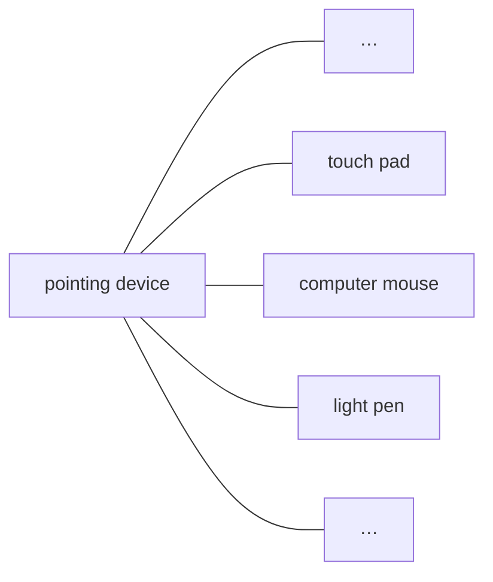

### A.3 Partitive relation 整体部分关系

Subordinate concepts within the hierarchy form constituent parts of the superordinate concept, e.g. mouse button, mouse cord, infrared emitter, and mouse wheel can be defined as parts of the concept optomechanical mouse. In comparison, it is inappropriate to define cord (one possible characteristic of mouse cord) as part of an optomechanical mouse.

层级中的下位概念构成上位概念的组成部分。例如，鼠标按键、鼠标线、红外发射器和鼠标滚轮可以定义为“光机鼠标”这一概念的组成部分。相比之下，把“线”（鼠标线可能具有的一项特征）定义为光机鼠标的一部分，是不恰当的。

Partitive relations are depicted by a rake without arrows (see Figure A.2).

整体部分关系用无箭头的耙形图表示（见图 A.2）。

> **NOTE** Example adapted from ISO 704:2022, 5.5.4.3.1, Example 1.

> **注**：示例改编自 ISO 704:2022 的 5.5.4.3.1 之例 1。

**Figure A.2 — Graphical representation of a partitive relation**

**图 A.2 — 整体部分关系的图形表示**

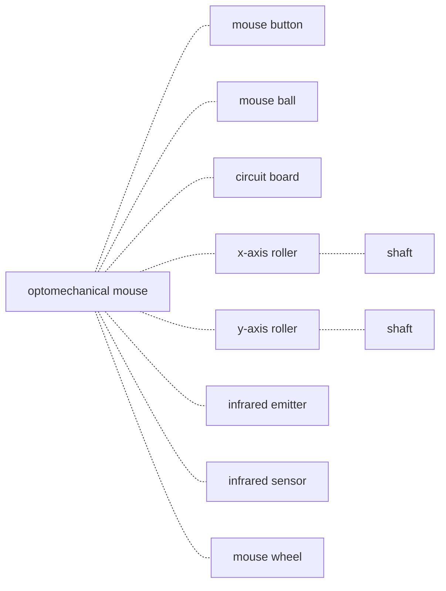

### A.4 Associative relation 联想关系

Associative relations cannot provide the economies in description that are present in generic and partitive relations but are helpful in identifying the nature of the relationship between one concept and another within a concept system, e.g. cause and effect, activity and location, activity and result, tool and function, material and product. Associative relations are the most encountered in terminology practical work as they correspond to the concepts relations established in the real world.

联想关系不能像属种关系和整体部分关系那样带来描述上的经济性，但有助于识别概念体系内一个概念与另一个概念之间关系的性质，例如原因与结果、活动与地点、活动与结果、工具与功能、材料与产品。联想关系在术语实际工作中最为常见，因为它们对应着现实世界中建立起来的概念关系。

Associative relations are depicted by a line with arrowheads at each end (see Figure A.3).

联想关系用两端带箭头的连线表示（见图 A.3）。

**Key**

> **图例**

1. dependency relation（依赖关系）
2. enhancement relation（增强关系）
3. attachment relation（附接关系）
4. tool relation（工具关系）

> **NOTE** Example adapted from ISO 704:2022, 5.6.3, Example 1.

> **注**：示例改编自 ISO 704:2022 的 5.6.3 之例 1。

**Figure A.3 — Graphical representation of an associative relation**

**图 A.3 — 联想关系的图形表示**

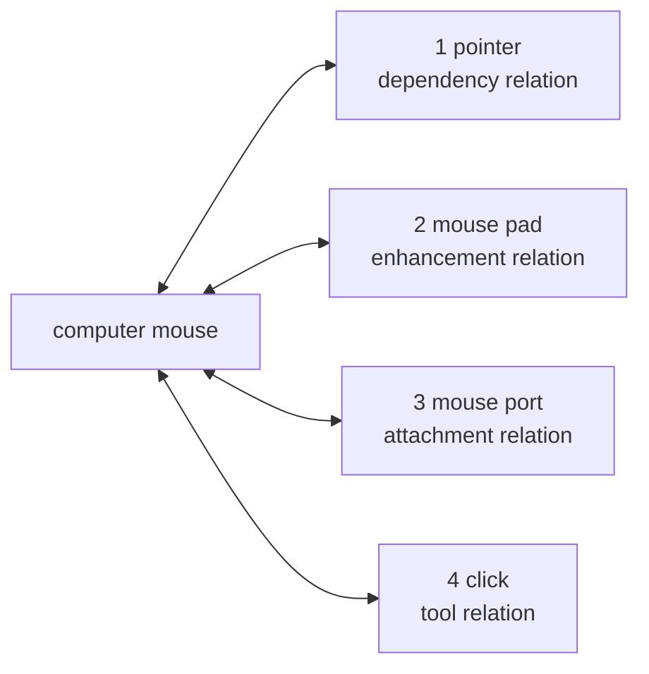

### A.5 Concept diagrams 概念图

Figures A.4 to A.15 show the concept diagrams on which the thematic groupings of Clause 3 are based.

图 A.4 至图 A.15 给出第 3 章主题分组所依据的概念图。

Since the definitions of the terms are not included in the concept diagrams, it is necessary to refer to Clause 3 to see the definitions and any related notes.

由于概念图中不含各术语的定义，因此需要查阅第 3 章才能看到定义及任何相关的注。

> **译注**：2015 版的图**在图中重复给出定义**（当年原文自述“the definitions of the terms are repeated”），2026 版的图**不再含定义**，只给出术语名与条款号，须回第 3 章查。这是两版附录 A 的一处实质差异。

The words in angle brackets below some terms indicate the specific subject fields where the terms are used.

某些术语下方用尖括号标出的词语，表示该术语所使用的特定专业领域。

**Figure A.4 — 3.1 Terms related to organization**

**图 A.4 — 3.1 与组织有关的术语**

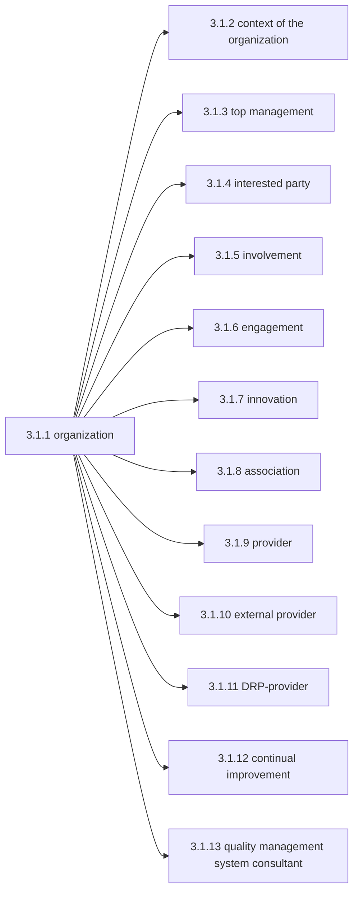

**Figure A.5 — 3.2 Terms related to management**

**图 A.5 — 3.2 与管理有关的术语**

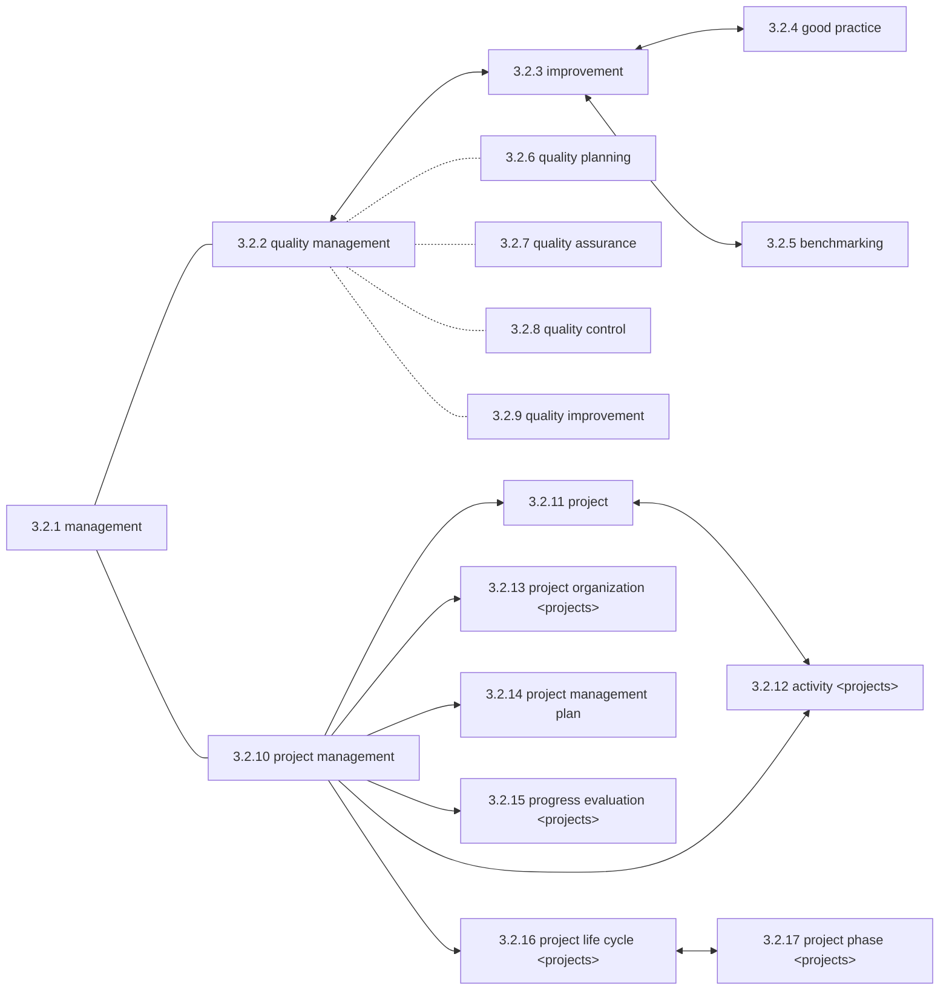

**Figure A.6 — 3.3 Terms related to process**

**图 A.6 — 3.3 与过程有关的术语**

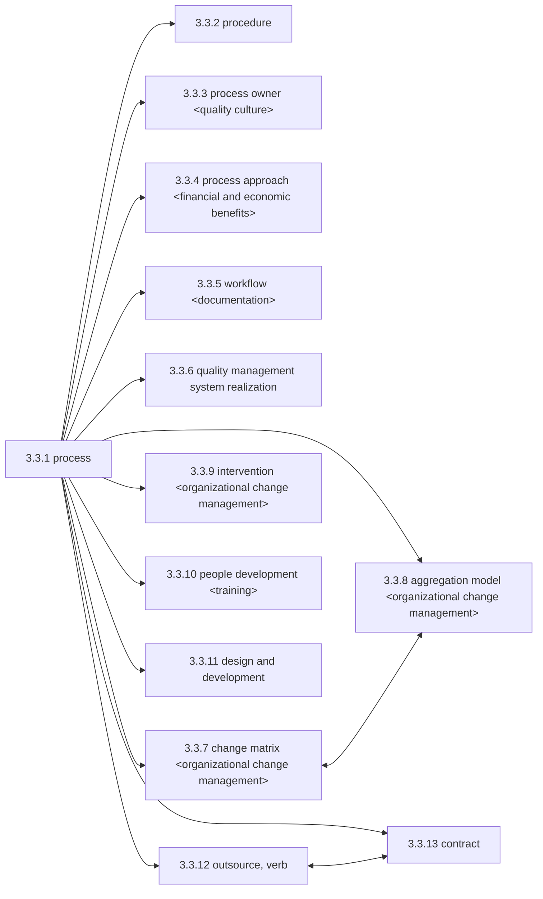

**Figure A.7 — 3.4 Terms related to system**

**图 A.7 — 3.4 与体系有关的术语**

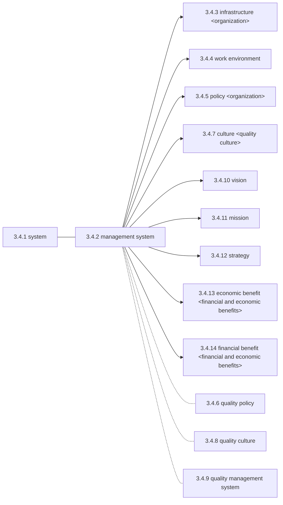

**Figure A.8 — 3.5 Terms related to requirement**

**图 A.8 — 3.5 与要求有关的术语**

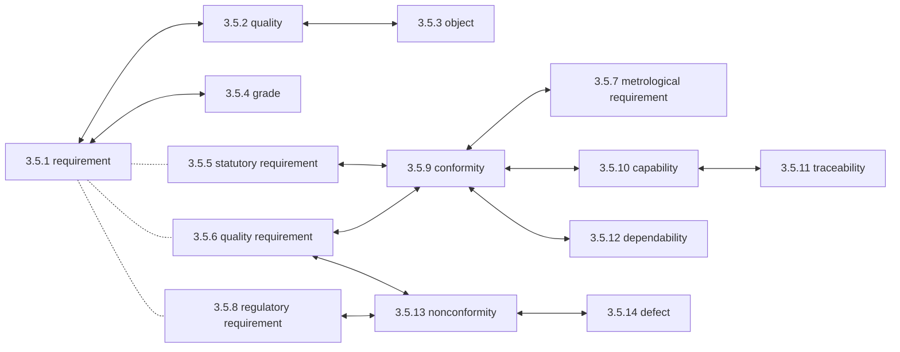

**Figure A.9 — 3.6 Terms related to action**

**图 A.9 — 3.6 与措施有关的术语**

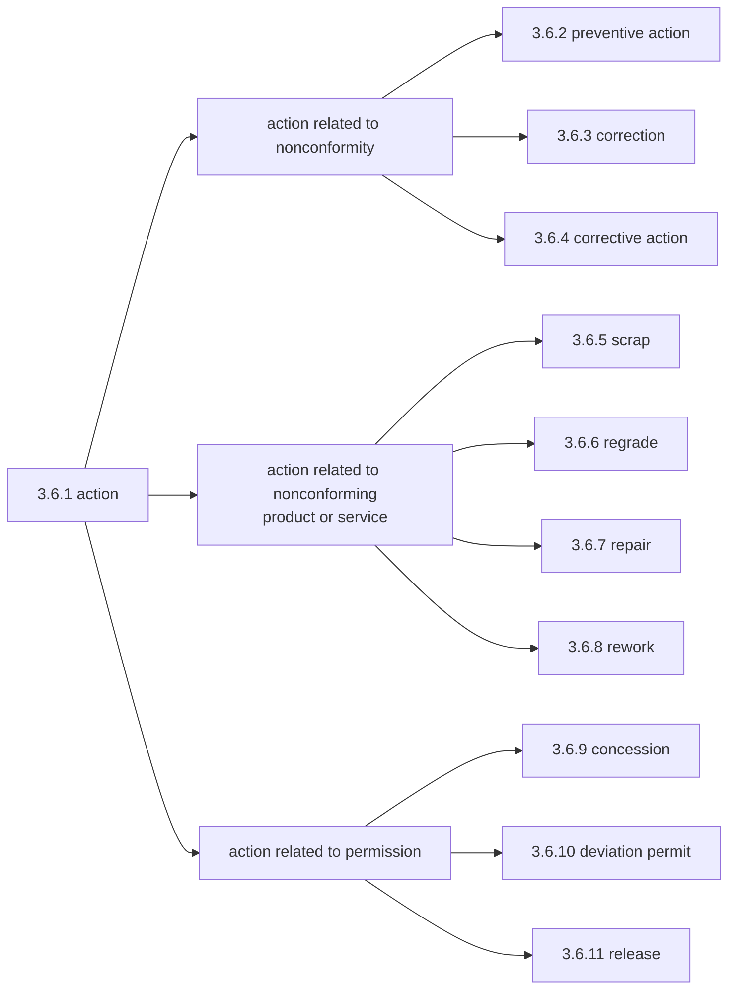

**Figure A.10 — 3.7 Terms related to result**

**图 A.10 — 3.7 与结果有关的术语**

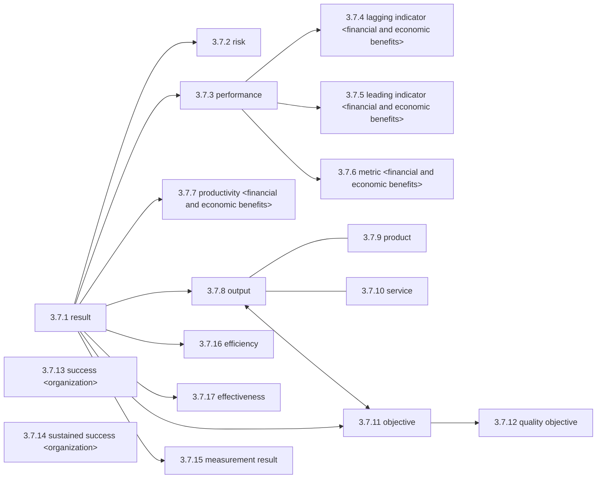

**Figure A.11 — 3.8 Terms related to data, information and documents**

**图 A.11 — 3.8 与数据、信息和文件有关的术语**

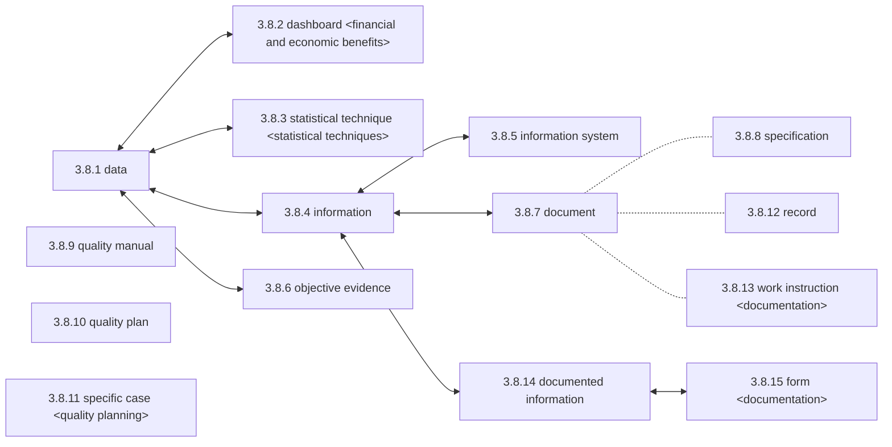

**Figure A.12 — 3.9 Terms related to customer**

**图 A.12 — 3.9 与顾客有关的术语**

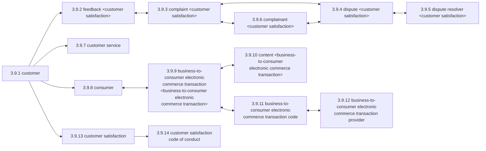

**Figure A.13 — 3.10 Terms related to characteristic**

**图 A.13 — 3.10 与特性有关的术语**

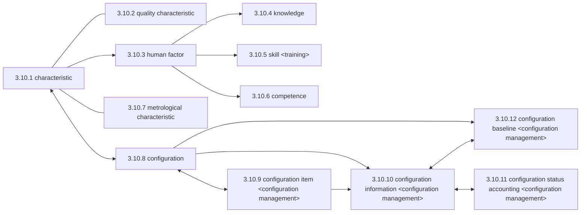

**Figure A.14 — 3.11 Terms related to determination**

**图 A.14 — 3.11 与确定有关的术语**

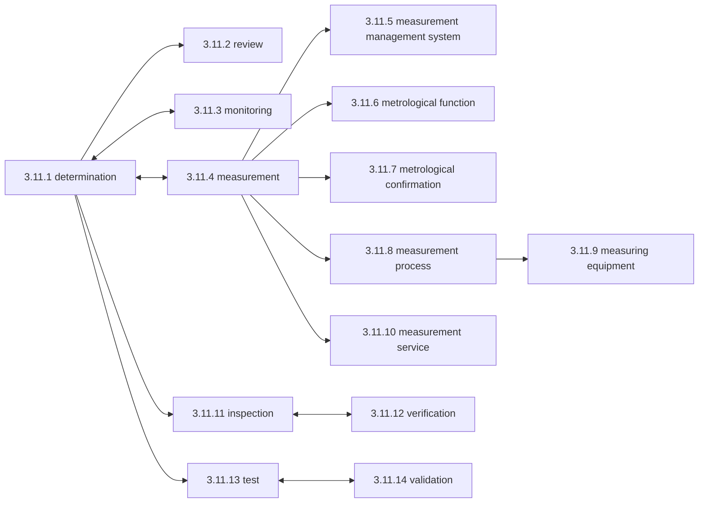

**Figure A.15 — 3.12 Terms related to audit**

**图 A.15 — 3.12 与审核有关的术语**

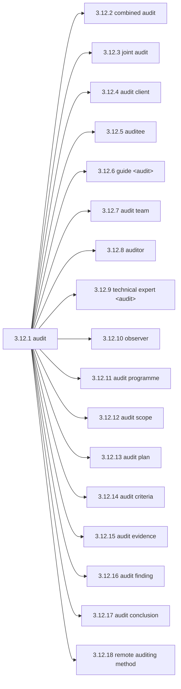

---

# Bibliography 参考文献

文献题名按原文照录，其后括注中文。

[1] ISO 704:2022, Terminology work — Principles and methods（术语工作 — 原则与方法）

[2] ISO 1087:2019, Terminology work and terminology science — Vocabulary（术语工作与术语学 — 词汇）

[3] ISO 3534-2:2006, Statistics — Vocabulary and symbols — Part 2: Applied statistics（统计学 — 词汇与符号 — 第 2 部分：应用统计学）

[4] ISO 9001, Quality management systems — Requirements（质量管理体系 — 要求）

[5] ISO 9004, Quality management — Quality of an organization — Guidance to achieve sustained success（质量管理 — 组织的质量 — 实现持续成功指南）

[6] ISO 10001, Quality management — Customer satisfaction — Guidelines for codes of conduct for organizations（质量管理 — 顾客满意 — 组织行为规范指南）

[7] ISO 10019, Guidelines for the selection of quality management system consultants and use of their services（质量管理体系咨询师的选择及其服务使用的指南）

[8] ISO/TS 10020, Quality management systems — Organizational change management — Processes（质量管理体系 — 组织变更管理 — 过程）

[9] ISO 14001, Environmental management systems — Requirements with guidance for use（环境管理体系 — 要求及使用指南）

[10] ISO/IEC TS 17012:2024, Conformity assessment — Guidelines for the use of remote auditing methods in auditing management systems（合格评定 — 管理体系审核中远程审核方法的使用指南）

[11] ISO 19011, Guidelines for auditing management systems（管理体系审核指南）

[12] ISO 30400:2022, Human resource management — Vocabulary（人力资源管理 — 词汇）

[13] ISO 45001, Occupational health and safety management systems — Requirements with guidance for use（职业健康安全管理体系 — 要求及使用指南）

[14] ISO 50001, Energy management systems — Requirements with guidance for use（能源管理体系 — 要求及使用指南）

[15]  ISO/IEC 27001, Information security, cybersecurity and privacy protection — Information security management systems — Requirements（信息安全、网络安全和隐私保护 — 信息安全管理体系 — 要求）

[16]  ISO/IEC Guide 76:2020, Development of service standards — Recommendations for addressing consumer issues（服务标准的制定 — 处理消费者问题的建议）

[17] ISO/IEC Guide 99, International vocabulary of metrology — Basic and general concepts and associated terms (VIM)（国际计量学词汇 — 基础与通用概念及相关术语（VIM））

[18] IEC 60050-192:2015, International electrotechnical vocabulary — Part 192: Dependability（国际电工词汇 — 第 192 部分：可信性）

[19] ISO. Glossary Guidance on selected words used in the ISO 9000 family of standards. Geneva: ISO, 2025. Available from: https://w ww. iso .org/f iles/ live/ sites/i soorg/ files/ standards/d ocs/ en/ terminology -ISO9000- family .pdf（ISO 9000 族标准中部分用词的术语表指南，日内瓦：ISO，2025）

> **译注**：原文 URL 中的空格系源文件转换所致（应为 `https://www.iso.org/files/live/sites/isoorg/files/standards/docs/en/terminology-ISO9000-family.pdf`），此处按原文照录，未作改动。

[20] ISO. Integrating Management System Standards - A Practical Guide. ISO Handbook. Geneva: ISO, 2025. Available from: https:// www .iso. org/p ublication/ PUB100435. html（管理体系标准的整合 — 实用指南，ISO 手册，日内瓦：ISO，2025）

---

# Index 索引

原文为英文术语的字顺索引。此处保留原索引结构，并在每条术语后**加注中文译名**，便于中英对照查检。数字为条款号。

### A

- action 措施 — 3.6.1
- activity 活动 — 3.2.12

- aggregation model 聚合模型 — 3.3.8
- association 协会 — 3.1.8

- audit 审核 — 3.12.1

- audit client 审核委托方 — 3.12.4

- audit conclusion 审核结论 — 3.12.17
- audit criteria 审核准则 — 3.12.14
- audit evidence 审核证据 — 3.12.15
- audit finding 审核发现 — 3.12.16
- audit plan 审核计划 — 3.12.13

- audit programme 审核方案 — 3.12.11
- audit scope 审核范围 — 3.12.12

- audit team 审核组 — 3.12.7
- auditee 受审核方 — 3.12.5
- auditor 审核员 — 3.12.8

### B

- B2C ECT 企业对消费者电子商务交易 — 3.9.9

- B2C ECT code 企业对消费者电子商务交易准则 — 3.9.11
- B2C ECT provider 企业对消费者电子商务交易提供者 — 3.9.12
- benchmarking 标杆分析 — 3.2.5

- business-to-consumer electronic commerce transaction 企业对消费者电子商务交易 — 3.9.9

- business-to-consumer electronic commerce transaction code 企业对消费者电子商务交易准则 — 3.9.11

- business-to-consumer electronic commerce transaction provider 企业对消费者电子商务交易提供者 — 3.9.12

### C

- capability 能力 — 3.5.10
- change matrix 变革矩阵 — 3.3.7
- characteristic 特性 — 3.10.1
- combined audit 结合审核 — 3.12.2
- competence 能力（人员） — 3.10.6
- complainant 投诉人 — 3.9.6
- complaint 投诉 — 3.9.3
- concession 让步 — 3.6.9
- configuration 配置 — 3.10.8

- configuration baseline 配置基线 — 3.10.12
- configuration information 配置信息 — 3.10.10
- configuration item 配置项 — 3.10.9

- configuration status accounting 配置状态纪实 — 3.10.11
- conformity 合格 — 3.5.9

- consumer 消费者 — 3.9.8
- content 内容 — 3.9.10

- context of the organization 组织环境 — 3.1.2
- continual improvement 持续改进 — 3.1.12
- contract 合同 — 3.3.13

- correction 纠正 — 3.6.3

- corrective action 纠正措施 — 3.6.4
- culture 文化 — 3.4.7
- customer 顾客 — 3.9.1

- customer satisfaction 顾客满意 — 3.9.13

- customer satisfaction code of conduct 顾客满意行为规范 — 3.9.14
- customer service 顾客服务 — 3.9.7

### D

- dashboard 仪表板 — 3.8.2
- data 数据 — 3.8.1
- defect 缺陷 — 3.5.14

- dependability 可信性 — 3.5.12

- design and development 设计和开发 — 3.3.11
- determination 确定 — 3.11.1
- deviation permit 偏离许可 — 3.6.10
- dispute 争议 — 3.9.4

- dispute resolution process provider 争议解决过程提供者 — 3.1.11
- dispute resolver 争议解决者 — 3.9.5

- document 文件 — 3.8.7

- documented information 成文信息 — 3.8.14
- DRP-provider 争议解决过程提供者 — 3.1.11

### E

- economic benefit 经济效益 — 3.4.13
- effectiveness 有效性 — 3.7.17
- efficiency 效率 — 3.7.16
- engagement 投入 — 3.1.6
- external provider 外部供方 — 3.1.10
- external supplier 外部供方 — 3.1.10

### F

- feedback 反馈 — 3.9.2
- financial benefit 财务效益 — 3.4.14
- form 表单 — 3.8.15

### G

- good practice 良好实践 — 3.2.4
- grade 等级 — 3.5.4

- guide 引导员 — 3.12.6

### H

- human factor 人的因素 — 3.10.3

### I

- improvement 改进 — 3.2.3
- information 信息 — 3.8.4
- information system 信息系统 — 3.8.5
- infrastructure 基础设施 — 3.4.3
- innovation 创新 — 3.1.7

- inspection 检验 — 3.11.11
- interested party 相关方 — 3.1.4
- intervention 干预 — 3.3.9
- involvement 参与 — 3.1.5

### J

- joint audit 联合审核 — 3.12.3

### K

- knowledge 知识 — 3.10.4

### L

- lagging indicator 滞后指标 — 3.7.4
- leading indicator 先行指标 — 3.7.5

### M

- management 管理 — 3.2.1
- management system 管理体系 — 3.4.2
- measurement 测量 — 3.11.4

- measurement management system 测量管理体系 — 3.11.5
- measurement process 测量过程 — 3.11.8
- measurement result 测量结果 — 3.7.15

- measurement service 测量服务 — 3.11.10
- measuring equipment 测量设备 — 3.11.9
- metric 度量 — 3.7.6

- metrological characteristic 计量特性 — 3.10.7
- metrological confirmation 计量确认 — 3.11.7
- metrological function 计量职能 — 3.11.6
- metrological requirement 计量要求 — 3.5.7
- mission 使命 — 3.4.11

- monitoring 监视 — 3.11.3

### N

- nonconformity 不合格 — 3.5.13

### O

- object 客体 — 3.5.3
- objective 目标 — 3.7.11

- objective evidence 客观证据 — 3.8.6
- observer 观察员 — 3.12.10
- organization 组织 — 3.1.1
- output 输出 — 3.7.8

- outsource, verb 外包（动词） — 3.3.12

### P

- people development 人员发展 — 3.3.10
- performance 绩效 — 3.7.3

- policy 方针 — 3.4.5

- preventive action 预防措施 — 3.6.2
- procedure 程序 — 3.3.2
- process 过程 — 3.3.1

- process approach 过程方法 — 3.3.4
- process owner 过程责任人 — 3.3.3
- product 产品 — 3.7.9

- productivity 生产率 — 3.7.7
- progress evaluation 进展评价 — 3.2.15
- project 项目 — 3.2.11

- project life cycle 项目生命周期 — 3.2.16
- project management 项目管理 — 3.2.10

- project management plan 项目管理计划 — 3.2.14
- project organization 项目组织 — 3.2.13
- project phase 项目阶段 — 3.2.17

- provider 供方 — 3.1.9

### Q

- QMS 质量管理体系 — 3.4.9
- quality 质量 — 3.5.2

- quality assurance 质量保证 — 3.2.7
- quality characteristic 质量特性 — 3.10.2
- quality control 质量控制 — 3.2.8

- quality culture 质量文化 — 3.4.8
- quality improvement 质量改进 — 3.2.9
- quality management 质量管理 — 3.2.2

- quality management system 质量管理体系 — 3.4.9

- quality management system consultant 质量管理体系咨询师 — 3.1.13
- quality management system realization 质量管理体系实现 — 3.3.6
- quality manual 质量手册 — 3.8.9

- quality objective 质量目标 — 3.7.12
- quality plan 质量计划 — 3.8.10
- quality planning 质量策划 — 3.2.6
- quality policy 质量方针 — 3.4.6
- quality requirement 质量要求 — 3.5.6

### R

- record 记录 — 3.8.12
- regrade 降级 — 3.6.6

- regulatory requirement 法规要求 — 3.5.8
- release 放行 — 3.6.11

- remote auditing method 远程审核方法 — 3.12.18
- repair 返修 — 3.6.7

- requirement 要求 — 3.5.1
- result 结果 — 3.7.1

- result of measurement 测量结果 — 3.7.15
- review 评审 — 3.11.2

- rework 返工 — 3.6.8
- risk 风险 — 3.7.2

### S

- scrap 报废 — 3.6.5
- service 服务 — 3.7.10
- skill 技能 — 3.10.5

- specific case 特定情况 — 3.8.11
- specification 规范 — 3.8.8
- stakeholder 相关方 — 3.1.4
- statistical method 统计技术 — 3.8.3
- statistical technique 统计技术 — 3.8.3

- statutory requirement 法定要求 — 3.5.5
- strategy 战略 — 3.4.12

- success 成功 — 3.7.13
- supplier 供方 — 3.1.9

- sustained success 持续成功 — 3.7.14

- system 系统 — 3.4.1

### T

- technical expert 技术专家 — 3.12.9
- test 试验 — 3.11.13

- top management 最高管理者 — 3.1.3
- traceability 可追溯性 — 3.5.11

### V

- validation 确认 — 3.11.14
- verification 验证 — 3.11.12
- vision 愿景 — 3.4.10

### W

- work environment 工作环境 — 3.4.4
- work instruction 作业指导书 — 3.8.13
- workflow 工作流 — 3.3.5

---

# 附录《术语定译表》（译者所加）

**非标准正文。** 本表列出本译本对 2026 版全部术语的统一译名，作为跨章节一致性的锚点与查检入口。

**译例说明（三处需留意的取舍）**：

1. **`configuration` 家族 → 配置 / 配置管理**。GB/T 19000—2016 的官方译名为「技术状态」（技术状态项、技术状态信息、技术状态纪实、技术状态基线）。本译本按**本项目既有口径**取「配置」系（本项目内「配置管理」出现 900 余次、「技术状态」8 次）。引用国家标准时须注意译名差异。
2. **`capability` 与 `competence` 同为「能力」**。两词在 GB/T 19000 中均译「能力」，中文本无区分。本译本沿用，但约定：`capability` 指**客体（过程／对象）实现输出的能力**，`competence` 指**人应用知识与技能的能力**。上下文不足处补「（人员）」等限定。
3. **`involvement` 与 `engagement`**。两词近义。本译本取 `involvement`＝**参与**、`engagement`＝**投入（参与并作出贡献）**；七项原则中的 “Engagement of people” 按通行译法作**全员参与**。
4. **`dashboard` → 仪表板（不用「看板」）**。三条理由：①**形态逐语素对应**——`dashboard` = dash(仪表) + board(板)，「仪表板」正好对应，「仪表盘」的尾字「盘」对应的是 gauge 而非 board；②**定义形状吻合**——3.8.2 定义为“数值与图形数据显示的组合，用以呈现绩效和关键结果的走向趋势”，示例全为图表（交通灯图／帕累托图／饼图／趋势图），是**指标读数面板**，不是**传递指令的卡片板**；③**在术语标准里，撞车是最重的缺陷**——「看板」在制造业质量／精益／敏捷读者心里已有确定含义（日语かんばん = 精益 kanban、任务看板），以之指另一概念会在术语标准中新增歧义。**须注意**：本项目既有口径把 Dashboard 也译作**看板**（如 `20-pl4eos/80-pl4eos-2-eosdata/28-eos-dashboard-indicator-assets.md` 的双语标题「EOS 看板与指标资产／EOS Dashboard & Indicator Assets」），且项目同时用「看板」指 kanban（`@engine-kanban`「看板引擎」，管卡片／泳道）。**本译本与项目口径在此有意分歧**，为的是把「看板」留给 kanban、解开项目自身那处混用。**GB/T 19000 正在起草（等同采用 ISO 9000:2026），其征求意见稿一旦发布，本词官方中文即定，届时以国标为准。**

### 3.1 与组织有关的术语（Terms related to organization，13 条）

| 条款 | 英文 | 中文 |
|---|---|---|
| 3.1.1 | organization | 组织 |
| 3.1.2 | context of the organization | 组织环境 |
| 3.1.3 | top management | 最高管理者 |
| 3.1.4 | interested party / stakeholder | 相关方 |
| 3.1.5 | involvement | 参与 |
| 3.1.6 | engagement | 投入（参与并作出贡献） |
| 3.1.7 | innovation | 创新 |
| 3.1.8 | association | 协会 |
| 3.1.9 | provider / supplier | 供方 |
| 3.1.10 | external provider / external supplier | 外部供方 |
| 3.1.11 | DRP-provider / dispute resolution process provider | 争议解决过程提供者 |
| 3.1.12 | continual improvement | 持续改进 |
| 3.1.13 | quality management system consultant | 质量管理体系咨询师 |

### 3.2 与管理有关的术语（Terms related to management，17 条）

| 条款 | 英文 | 中文 |
|---|---|---|
| 3.2.1 | management | 管理 |
| 3.2.2 | quality management | 质量管理 |
| 3.2.3 | improvement | 改进 |
| 3.2.4 | good practice | 良好实践 |
| 3.2.5 | benchmarking | 标杆分析 |
| 3.2.6 | quality planning | 质量策划 |
| 3.2.7 | quality assurance | 质量保证 |
| 3.2.8 | quality control | 质量控制 |
| 3.2.9 | quality improvement | 质量改进 |
| 3.2.10 | project management | 项目管理 |
| 3.2.11 | project | 项目 |
| 3.2.12 | activity | 活动 |
| 3.2.13 | project organization | 项目组织 |
| 3.2.14 | project management plan | 项目管理计划 |
| 3.2.15 | progress evaluation | 进展评价 |
| 3.2.16 | project life cycle | 项目生命周期 |
| 3.2.17 | project phase | 项目阶段 |

### 3.3 与过程有关的术语（Terms related to process，13 条）

| 条款 | 英文 | 中文 |
|---|---|---|
| 3.3.1 | process | 过程 |
| 3.3.2 | procedure | 程序 |
| 3.3.3 | process owner | 过程责任人 |
| 3.3.4 | process approach | 过程方法 |
| 3.3.5 | workflow | 工作流 |
| 3.3.6 | quality management system realization | 质量管理体系实现 |
| 3.3.7 | change matrix | 变革矩阵 |
| 3.3.8 | aggregation model | 聚合模型 |
| 3.3.9 | intervention | 干预 |
| 3.3.10 | people development | 人员发展 |
| 3.3.11 | design and development | 设计和开发 |
| 3.3.12 | outsource, verb | 外包（动词） |
| 3.3.13 | contract | 合同 |

### 3.4 与体系有关的术语（Terms related to system，14 条）

| 条款 | 英文 | 中文 |
|---|---|---|
| 3.4.1 | system | 系统 |
| 3.4.2 | management system | 管理体系 |
| 3.4.3 | infrastructure | 基础设施 |
| 3.4.4 | work environment | 工作环境 |
| 3.4.5 | policy | 方针 |
| 3.4.6 | quality policy | 质量方针 |
| 3.4.7 | culture | 文化 |
| 3.4.8 | quality culture | 质量文化 |
| 3.4.9 | quality management system / QMS | 质量管理体系 |
| 3.4.10 | vision | 愿景 |
| 3.4.11 | mission | 使命 |
| 3.4.12 | strategy | 战略 |
| 3.4.13 | economic benefit | 经济效益 |
| 3.4.14 | financial benefit | 财务效益 |

### 3.5 与要求有关的术语（Terms related to requirement，14 条）

| 条款 | 英文 | 中文 |
|---|---|---|
| 3.5.1 | requirement | 要求 |
| 3.5.2 | quality | 质量 |
| 3.5.3 | object | 客体 |
| 3.5.4 | grade | 等级 |
| 3.5.5 | statutory requirement | 法定要求 |
| 3.5.6 | quality requirement | 质量要求 |
| 3.5.7 | metrological requirement | 计量要求 |
| 3.5.8 | regulatory requirement | 法规要求 |
| 3.5.9 | conformity | 合格 |
| 3.5.10 | capability | 能力 |
| 3.5.11 | traceability | 可追溯性 |
| 3.5.12 | dependability | 可信性 |
| 3.5.13 | nonconformity | 不合格 |
| 3.5.14 | defect | 缺陷 |

### 3.6 与措施有关的术语（Terms related to action，11 条）

| 条款 | 英文 | 中文 |
|---|---|---|
| 3.6.1 | action | 措施 |
| 3.6.2 | preventive action | 预防措施 |
| 3.6.3 | correction | 纠正 |
| 3.6.4 | corrective action | 纠正措施 |
| 3.6.5 | scrap | 报废 |
| 3.6.6 | regrade | 降级 |
| 3.6.7 | repair | 返修 |
| 3.6.8 | rework | 返工 |
| 3.6.9 | concession | 让步 |
| 3.6.10 | deviation permit | 偏离许可 |
| 3.6.11 | release | 放行 |

### 3.7 与结果有关的术语（Terms related to result，17 条）

| 条款 | 英文 | 中文 |
|---|---|---|
| 3.7.1 | result | 结果 |
| 3.7.2 | risk | 风险 |
| 3.7.3 | performance | 绩效 |
| 3.7.4 | lagging indicator | 滞后指标 |
| 3.7.5 | leading indicator | 先行指标 |
| 3.7.6 | metric | 度量 |
| 3.7.7 | productivity | 生产率 |
| 3.7.8 | output | 输出 |
| 3.7.9 | product | 产品 |
| 3.7.10 | service | 服务 |
| 3.7.11 | objective | 目标 |
| 3.7.12 | quality objective | 质量目标 |
| 3.7.13 | success | 成功 |
| 3.7.14 | sustained success | 持续成功 |
| 3.7.15 | measurement result / result of measurement | 测量结果 |
| 3.7.16 | efficiency | 效率 |
| 3.7.17 | effectiveness | 有效性 |

### 3.8 与数据、信息和文件有关的术语（Terms related to data, information and documents，15 条）

| 条款 | 英文 | 中文 |
|---|---|---|
| 3.8.1 | data | 数据 |
| 3.8.2 | dashboard | 仪表板 |
| 3.8.3 | statistical technique / statistical method | 统计技术 |
| 3.8.4 | information | 信息 |
| 3.8.5 | information system | 信息系统 |
| 3.8.6 | objective evidence | 客观证据 |
| 3.8.7 | document | 文件 |
| 3.8.8 | specification | 规范 |
| 3.8.9 | quality manual | 质量手册 |
| 3.8.10 | quality plan | 质量计划 |
| 3.8.11 | specific case | 特定情况 |
| 3.8.12 | record | 记录 |
| 3.8.13 | work instruction | 作业指导书 |
| 3.8.14 | documented information | 成文信息 |
| 3.8.15 | form | 表单 |

### 3.9 与顾客有关的术语（Terms related to customer，14 条）

| 条款 | 英文 | 中文 |
|---|---|---|
| 3.9.1 | customer | 顾客 |
| 3.9.2 | feedback | 反馈 |
| 3.9.3 | complaint | 投诉 |
| 3.9.4 | dispute | 争议 |
| 3.9.5 | dispute resolver | 争议解决者 |
| 3.9.6 | complainant | 投诉人 |
| 3.9.7 | customer service | 顾客服务 |
| 3.9.8 | consumer | 消费者 |
| 3.9.9 | business-to-consumer electronic commerce transaction / B2C ECT | 企业对消费者电子商务交易 |
| 3.9.10 | content | 内容 |
| 3.9.11 | business-to-consumer electronic commerce transaction code / B2C ECT code | 企业对消费者电子商务交易准则 |
| 3.9.12 | business-to-consumer electronic commerce transaction provider / B2C ECT provider | 企业对消费者电子商务交易提供者 |
| 3.9.13 | customer satisfaction | 顾客满意 |
| 3.9.14 | customer satisfaction code of conduct | 顾客满意行为规范 |

### 3.10 与特性有关的术语（Terms related to characteristic，12 条）

| 条款 | 英文 | 中文 |
|---|---|---|
| 3.10.1 | characteristic | 特性 |
| 3.10.2 | quality characteristic | 质量特性 |
| 3.10.3 | human factor | 人的因素 |
| 3.10.4 | knowledge | 知识 |
| 3.10.5 | skill | 技能 |
| 3.10.6 | competence | 能力（人员） |
| 3.10.7 | metrological characteristic | 计量特性 |
| 3.10.8 | configuration | 配置 |
| 3.10.9 | configuration item | 配置项 |
| 3.10.10 | configuration information | 配置信息 |
| 3.10.11 | configuration status accounting | 配置状态纪实 |
| 3.10.12 | configuration baseline | 配置基线 |

### 3.11 与确定有关的术语（Terms related to determination，14 条）

| 条款 | 英文 | 中文 |
|---|---|---|
| 3.11.1 | determination | 确定 |
| 3.11.2 | review | 评审 |
| 3.11.3 | monitoring | 监视 |
| 3.11.4 | measurement | 测量 |
| 3.11.5 | measurement management system | 测量管理体系 |
| 3.11.6 | metrological function | 计量职能 |
| 3.11.7 | metrological confirmation | 计量确认 |
| 3.11.8 | measurement process | 测量过程 |
| 3.11.9 | measuring equipment | 测量设备 |
| 3.11.10 | measurement service | 测量服务 |
| 3.11.11 | inspection | 检验 |
| 3.11.12 | verification | 验证 |
| 3.11.13 | test | 试验 |
| 3.11.14 | validation | 确认 |

### 3.12 与审核有关的术语（Terms related to audit，18 条）

| 条款 | 英文 | 中文 |
|---|---|---|
| 3.12.1 | audit | 审核 |
| 3.12.2 | combined audit | 结合审核 |
| 3.12.3 | joint audit | 联合审核 |
| 3.12.4 | audit client | 审核委托方 |
| 3.12.5 | auditee | 受审核方 |
| 3.12.6 | guide | 引导员 |
| 3.12.7 | audit team | 审核组 |
| 3.12.8 | auditor | 审核员 |
| 3.12.9 | technical expert | 技术专家 |
| 3.12.10 | observer | 观察员 |
| 3.12.11 | audit programme | 审核方案 |
| 3.12.12 | audit scope | 审核范围 |
| 3.12.13 | audit plan | 审核计划 |
| 3.12.14 | audit criteria | 审核准则 |
| 3.12.15 | audit evidence | 审核证据 |
| 3.12.16 | audit finding | 审核发现 |
| 3.12.17 | audit conclusion | 审核结论 |
| 3.12.18 | remote auditing method | 远程审核方法 |

### 复用术语与关键短语（非第 3 章条目，但需统一）

| 英文 | 中文 |
|---|---|
| quality management principle | 质量管理原则 |
| fundamental quality management concept | 基本质量管理概念 |
| additional concept relevant to quality management | 与质量管理有关的附加概念 |
| risk-based thinking | 基于风险的思维 |
| process management | 过程管理 |
| organizational quality culture | 组织质量文化 |
| integrated management system | 一体化管理体系 |
| circular economy | 循环经济 |
| emerging technology | 新兴技术 |
| change management | 变更管理 |
| customer experience | 顾客体验 |
| knowledge management | 知识管理 |
| information management | 信息管理 |
| people aspects | 人的方面 |
| business continuity | 业务连续性 |
| customer focus | 以顾客为关注焦点 |
| leadership | 领导作用 |
| engagement of people | 全员参与 |
| process approach | 过程方法 |
| improvement | 改进 |
| evidence-based decision-making | 循证决策 |
| relationship management | 关系管理 |
| Statement | 陈述 |
| Rationale | 理由 |
| Key benefits | 主要收益 |
| Possible actions | 可能的行动 |
| Note N to entry | 条目注 N |
| EXAMPLE | 示例 |
| SOURCE | 来源 |
| subject field | 专业领域 |
| generic relation | 属种关系 |
| partitive relation | 整体部分关系 |
| associative relation | 联想关系 |
| concept diagram | 概念图 |
| Annex (informative) | 附录（资料性） |
| Terms and definitions | 术语和定义 |
| Normative references | 规范性引用文件 |
| Bibliography | 参考文献 |
| Index | 索引 |
