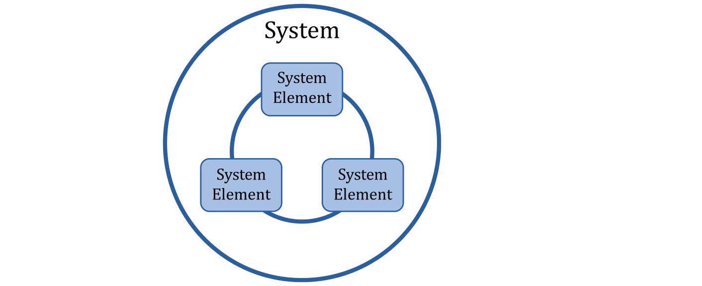
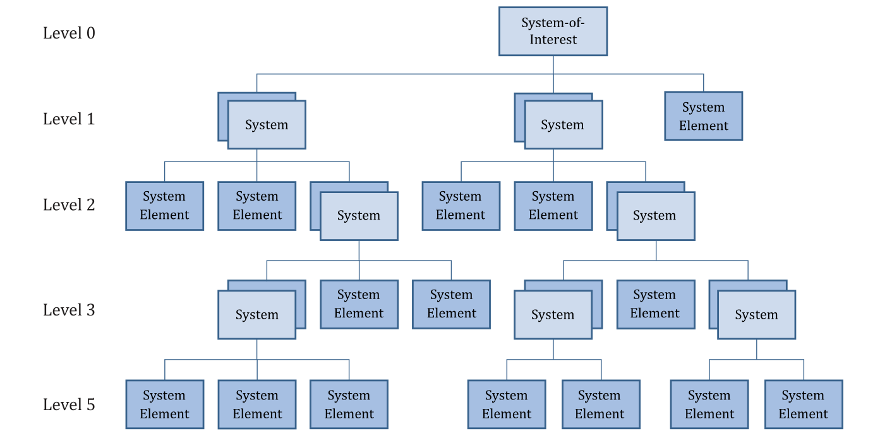
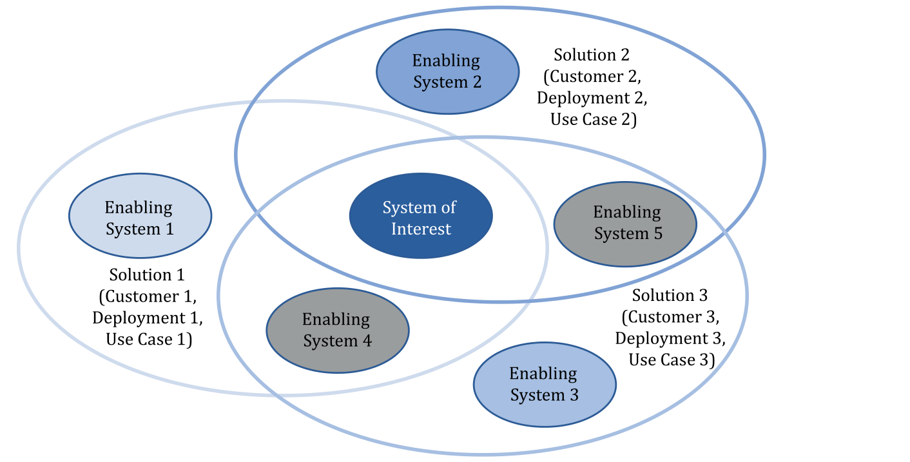
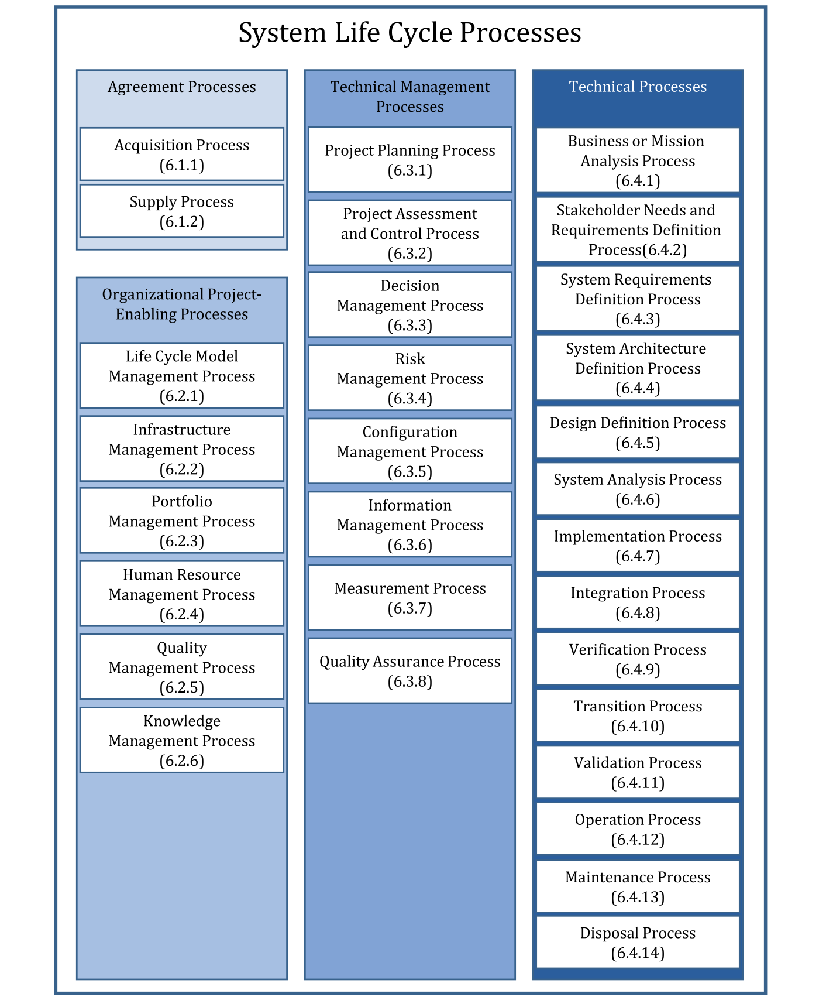
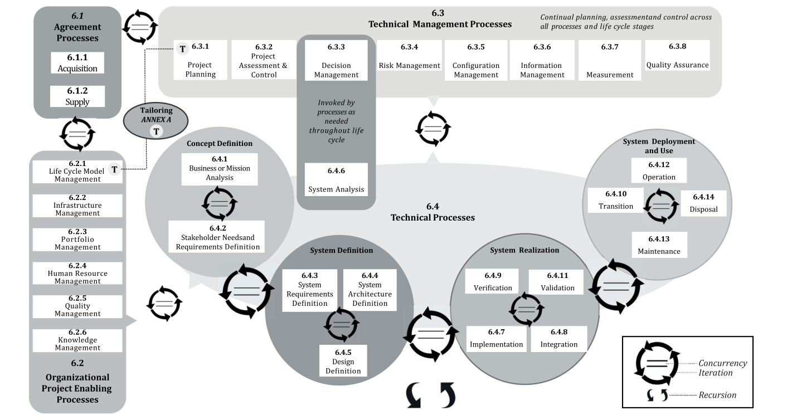

# ISO/IEC/IEEE 15288:2023

> **Systems and software engineering — System life cycle processes**

> **转换说明 / About this file**
>
> 本文件由 `ISO IEC IEEE 15288 2023.pdf` 自动转换生成，正文为**英文原文照录**，未作翻译或改写。
>
> - **条款号**：一律保留印刷条款号（`1`、`6.4.1`、`A.1`、`D.5`…）；标题层级**按条款号的级数还原**（1→三级、6.1→四级、6.4.1→五级；附录 A.1→三级、A.2.1→四级），不按字号——同一层级的字号在源件里并不统一。
> - **插图**：源 PDF 的图为矢量轮廓（文字不在文本层），故按图区渲染为 PNG，存于同名 `.assets/` 目录，在原文位置以 `` 引用。
> - **表格**：按 `find_tables` 检出结果转 Markdown 表；跨页表在源件中被版面切段，转换后仍分段呈现。
> - **目录**：原印刷目录为点线制表符且页码不可靠，已替换为按标题层级生成的 Markdown 目录。
> - **页眉页脚**（`ISO/IEC/IEEE 15288:2023(E)`、版权行、页码）为版面构件，未收入正文。
> - **断行连字符**已还原，固有连字符保留。
> - **段落切分**：源 PDF 在部分页/栏交界处把**一句话切成两段**（转为 Markdown 后仍分段呈现，与另两份标准的英文 MD 同一处理）；文字未增删，覆盖面校验可证。
> - **封面与版权页**照录于正文之前，未作标题化处理。

---

## Contents

  - [Foreword](#foreword)
  - [Introduction](#introduction)
  - [Systems and software engineering — System life cycle processes](#systems-and-software-engineering-system-life-cycle-processes)
    - [1 Scope](#1-scope)
    - [2 Normative references](#2-normative-references)
    - [3 Terms, definitions, and abbreviated terms](#3-terms-definitions-and-abbreviated-terms)
      - [3.1 acquirer](#31-acquirer)
      - [3.2 acquisition](#32-acquisition)
      - [3.3 activity](#33-activity)
      - [3.4 agreement](#34-agreement)
      - [3.5 architecture](#35-architecture)
      - [3.6 artefact](#36-artefact)
      - [3.7 audit](#37-audit)
      - [3.8 baseline](#38-baseline)
      - [3.9 concept of operations](#39-concept-of-operations)
      - [3.10 concern](#310-concern)
      - [3.11 configuration item](#311-configuration-item)
      - [3.12 customer](#312-customer)
      - [3.13 design, noun](#313-design-noun)
      - [3.14 design characteristics](#314-design-characteristics)
      - [3.15 enabling system](#315-enabling-system)
      - [3.16 environment](#316-environment)
      - [3.17 incident](#317-incident)
      - [3.18 information item](#318-information-item)
      - [3.19 interface](#319-interface)
      - [3.20 interoperating system](#320-interoperating-system)
      - [3.21 life cycle](#321-life-cycle)
      - [3.22 life cycle model](#322-life-cycle-model)
      - [3.23 operational concept](#323-operational-concept)
      - [3.24 operator](#324-operator)
      - [3.25 organization](#325-organization)
      - [3.26 problem](#326-problem)
      - [3.27 process](#327-process)
      - [3.28 iteration](#328-iteration)
      - [3.29 process purpose](#329-process-purpose)
      - [3.30 process outcome](#330-process-outcome)
      - [3.31 recursion](#331-recursion)
      - [3.32 product](#332-product)
      - [3.33 project](#333-project)
      - [3.34 quality assurance](#334-quality-assurance)
      - [3.35 quality characteristic](#335-quality-characteristic)
      - [3.36 requirement](#336-requirement)
      - [3.37 resource](#337-resource)
      - [3.38 retirement](#338-retirement)
      - [3.39 risk](#339-risk)
      - [3.40 safety](#340-safety)
      - [3.41 security](#341-security)
      - [3.42 service](#342-service)
      - [3.43 stage](#343-stage)
      - [3.44 stakeholder](#344-stakeholder)
      - [3.45 supplier](#345-supplier)
      - [3.46 system](#346-system)
      - [3.47 system element](#347-system-element)
      - [3.48 system-of-interest](#348-system-of-interest)
      - [3.49 system of systems](#349-system-of-systems)
      - [3.50 systems engineering](#350-systems-engineering)
      - [3.51 task](#351-task)
      - [3.52 traceability](#352-traceability)
      - [3.53 user](#353-user)
      - [3.54 validation](#354-validation)
      - [3.55 verification](#355-verification)
      - [3.56 view](#356-view)
      - [3.57 viewpoint](#357-viewpoint)
    - [4 Conformance](#4-conformance)
      - [4.1 Intended usage](#41-intended-usage)
      - [4.2 Full conformance](#42-full-conformance)
      - [4.3 Tailored conformance](#43-tailored-conformance)
    - [5 Key concepts and their application](#5-key-concepts-and-their-application)
      - [5.1 General](#51-general)
      - [5.2 System concepts](#52-system-concepts)
      - [5.3 Organizational concepts](#53-organizational-concepts)
      - [5.4 System of systems concepts](#54-system-of-systems-concepts)
      - [5.5 Life cycle concepts](#55-life-cycle-concepts)
      - [5.6 Process concepts](#56-process-concepts)
      - [5.7 Processes in this document](#57-processes-in-this-document)
      - [5.8 Process application](#58-process-application)
      - [5.9 Concept and system definition](#59-concept-and-system-definition)
      - [5.10 Assurance and quality characteristics](#510-assurance-and-quality-characteristics)
      - [5.11 Process reference model](#511-process-reference-model)
    - [6 System life cycle processes](#6-system-life-cycle-processes)
      - [6.1 Agreement processes](#61-agreement-processes)
      - [6.2 Organizational project-enabling processes](#62-organizational-project-enabling-processes)
      - [6.3 Technical management processes](#63-technical-management-processes)
      - [6.4 Technical processes](#64-technical-processes)
  - [Annex A (normative) — Tailoring process](#annex-a-normative-tailoring-process)
    - [A.1 General](#a1-general)
    - [A.2 Tailoring process](#a2-tailoring-process)
      - [A.2.1 Purpose](#a21-purpose)
      - [A.2.2 Outcomes](#a22-outcomes)
      - [A.2.3 Activities and tasks](#a23-activities-and-tasks)
  - [Annex B (informative) — Example process artefacts and information items](#annex-b-informative-example-process-artefacts-and-information-items)
  - [Annex C (informative) — Process reference model for assessment purposes](#annex-c-informative-process-reference-model-for-assessment-purposes)
    - [C.1 General](#c1-general)
    - [C.2 Conformance with ISO/IEC 33004](#c2-conformance-with-isoiec-33004)
      - [C.2.1 General](#c21-general)
      - [C.2.2 Requirements for process reference models](#c22-requirements-for-process-reference-models)
      - [C.2.3 Process descriptions](#c23-process-descriptions)
    - [C.3 The process reference model](#c3-the-process-reference-model)
  - [Annex D (informative) — Model-based systems and software engineering (MBSSE)](#annex-d-informative-model-based-systems-and-software-engineering-mbsse)
    - [D.1 MBSE description](#d1-mbse-description)
    - [D.2 Implementation of system life cycle processes in an MBSE approach](#d2-implementation-of-system-life-cycle-processes-in-an-mbse-approach)
    - [D.3 MBSE as a practice](#d3-mbse-as-a-practice)
    - [D.4 Benefits of executing system life cycle processes in an MBSE environment](#d4-benefits-of-executing-system-life-cycle-processes-in-an-mbse-environment)
    - [D.5 Model types useful in MBSE](#d5-model-types-useful-in-mbse)
  - [Bibliography](#bibliography)
  - [IEEE notices and abstract](#ieee-notices-and-abstract)

---

## Cover and copyright pages (source lay-out, verbatim)

15288

Second edition

2023-05

Systems and software engineering — System life cycle processes

Ingénierie des systèmes et du logiciel — Processus du cycle de vie du système

Reference number ISO/IEC/IEEE 15288:2023(E)

COPYRIGHT PROTECTED DOCUMENT

© ISO/IEC 2023 © IEEE 2023 All rights reserved. Unless otherwise specified, or required in the context of its implementation, no part of this publication may be reproduced or utilized otherwise in any form or by any means, electronic or mechanical, including photocopying, or posting on the internet or an intranet, without prior written permission. Permission can be requested from either ISO or IEEE at the respective address below or ISO’s member body in the country of the requester.

ISO copyright office Institute of Electrical and Electronics Engineers, Inc CP 401 • Ch. de Blandonnet 8 3 Park Avenue, New York CH-1214 Vernier, Geneva NY 10016-5997, USA Phone: +41 22 749 01 11 Fax: +41 22 749 09 47 Email: copyright@iso.org Email: stds.ipr@ieee.org Website: www.iso.orgWebsite: www.ieee.org Published in Switzerland

---

## Foreword

ISO (the International Organization for Standardization) and IEC (the International Electrotechnical Commission) form the specialised system for worldwide standardization. National bodies that are members of ISO or IEC participate in the development of International Standards through technical committees established by the respective organization to deal with particular fields of technical activity. ISO and IEC technical committees collaborate in fields of mutual interest. Other international organizations, governmental and non-governmental, in liaison with ISO and IEC, also take part in the work.

The procedures used to develop this document and those intended for its further maintenance are described in the ISO/IEC Directives, Part 1. In particular, the different approval criteria needed for the different types of ISO/IEC documents should be noted. This document was drafted in accordance with the editorial rules of the ISO/IEC Directives, Part 2 (see www.iso.org/directives or www.iec.ch/members_experts/refdocs).

IEEE Standards documents are developed within the IEEE Societies and the Standards Coordinating Committees of the IEEE Standards Association (IEEE-SA) Standards Board. The IEEE develops its standards through a consensus development process, approved by the American National Standards Institute, which brings together volunteers representing varied viewpoints and interests to achieve the final product. Volunteers are not necessarily members of the Institute and serve without compensation. While the IEEE administers the process and establishes rules to promote fairness in the consensus development process, the IEEE does not independently evaluate, test, or verify the accuracy of any of the information contained in its standards.

Attention is drawn to the possibility that some of the elements of this document may be the subject of patent rights. ISO shall not be held responsible for identifying any or all such patent rights. Details of any patent rights identified during the development of the document will be in the Introduction and/ or on the ISO list of patent declarations received (see www.iso.org/patents) or the IEC list of patent declarations received (see https://patents.iec.ch).

Any trade name used in this document is information given for the convenience of users and does not constitute an endorsement.

For an explanation of the voluntary nature of standards, the meaning of ISO specific terms and expressions related to conformity assessment, as well as information about ISO's adherence to the World Trade Organization (WTO) principles in the Technical Barriers to Trade (TBT), see www.iso.org/iso/foreword.html. In the IEC, see www.iec.ch/understanding-standards.

This document was prepared by Joint Technical Committee ISO/JTC 1, *Information technology,* Subcommittee SC 7, *Software and systems engineering,* in cooperation with the Systems and Software Engineering Standards Committee of the IEEE Computer Society, under the Partner Standards Development Organization cooperation agreement between ISO and IEEE.

This second edition cancels and replaces the first edition (ISO/IEC/IEEE 15288:2015), which has been technically revised.

The main changes are as follows:

- improvements to selected technical processes including business or mission analysis, system

architecture definition, system analysis, implementation, integration, operations, and maintenance;

- improvements to selected technical management processes including risk management and

configuration management;

- updates to Clause 5, key concepts, including a better description of iteration, recursion, system-of-

systems, quality characteristics, etc.;

- new content in Clause 5 on concept and system definition, and expanded content on process

application and system concepts;

- updates to the terms and definitions;

- a new annex addressing model-based systems engineering (MBSE).

Any feedback or questions on this document should be directed to the user’s national standards body. A complete listing of these bodies can be found at www.iso.org/members.html and www.iec.ch/national-committees.

## Introduction

The complexity of systems continues to increase to unprecedented levels. This has led to new opportunities, but also to increased challenges for the organizations that create and utilise systems. These challenges exist throughout the life cycle of a system and at all levels of architectural detail. This document provides a common process framework for describing the life cycle of systems, adopting a systems engineering approach. This document concerns systems that can be configured with one or more of the following system elements: hardware elements, software elements, data, humans, processes, services, procedures, facilities, materials, and naturally occurring entities.

This document focuses on defining stakeholder needs, concerns, priorities, and constraints for the required functionality early in the development cycle, establishing requirements, then proceeding with design synthesis and system validation while considering the complete problem. It integrates all the disciplines and specialty groups into a team effort forming a structured development process that proceeds from conception through production to operation. It considers the needs of all stakeholders with the goal of providing a quality product that meets the needs of users and other applicable stakeholders. It provides the processes for acquiring and supplying systems. It helps to improve communication and cooperation among the parties that create, utilise, and manage modern systems in order that they can work in an integrated, coherent fashion. Finally, this document provides the framework for assessment and improvement of the life cycle processes.

There is a wide variety of systems in terms of their purpose, domain of application, complexity, size, novelty, adaptability, quantity, location, life span, and evolution. The processes in this document form a comprehensive set from which an organization can construct system life cycle models appropriate to its products and services. An organization, depending on its purpose, can select and apply an appropriate subset to fulfil that purpose.

This document can be used in one or more of the following modes:

- By an organization — to help establish an environment of desired processes. These processes can be

supported by an infrastructure of methods, procedures, techniques, tools, and trained personnel. The organization may then employ this environment to perform and manage its projects and progress systems through their life cycle stages. In this mode this document is used to assess conformance of a declared, established environment to its provisions. It can be used by a single organization in a self-imposed mode or in a multi-party situation. Parties can be from the same organization or from different organizations and the situation can range from an informal agreement to a formal contract.

- By a project — to help select, structure, and employ the elements of an established environment to

provide products and services. In this mode this document is used in the assessment of conformance of the project to the declared and established environment.

- By an acquirer and a supplier — to help develop an agreement concerning processes and activities.

Via the agreement, the processes and activities in this document are selected, negotiated, agreed to, and performed. In this mode this document is used for guidance in developing the agreement.

- By process assessors — to serve as a process reference model for use in the performance of process

assessments that can be used to support organizational process improvement.

In the context of this document and ISO/IEC/IEEE 12207, there is a continuum of human‐made systems from those that use little or no software to those in which software is the primary interest. When software is the predominant system or element of interest, ISO/IEC/IEEE 12207 should be used. Both documents have the same process model, share most activities and tasks, and differ primarily in descriptive notes.

Although this document does not establish a management system, it is intended to be compatible with the quality management system provided by ISO 9001, the service management system provided by ISO/IEC 20000 series, the IT asset management system provided by the ISO/IEC 19770 series, and the information security management system provided by ISO/IEC 27000.

## Systems and software engineering — System life cycle processes

### 1 Scope

This document establishes a common framework of process descriptions for describing the life cycle of systems created by humans, defining a set of processes and associated terminology from an engineering viewpoint. These processes can be applied to systems of interest, their system elements, and to systems of systems. Selected sets of these processes can be applied throughout the stages of a system's life cycle. This is accomplished through the involvement of stakeholders, with the ultimate goal of achieving customer satisfaction.

This document defines a set of processes to facilitate system development and information exchange among acquirers, suppliers, and other stakeholders in the life cycle of a system.

This document specifies processes that support the definition, control, and improvement of the system life cycle processes used within an organization or a project. Organizations and projects can use these processes when acquiring and supplying systems.

This document applies to organizations in their roles as both acquirers and suppliers.

This document applies to the full life cycle of systems, including conception, development, production, utilization, support and retirement of systems, and to the acquisition and supply of systems, whether performed internally or externally to an organization. The life cycle processes of this document can be applied iteratively and concurrently to a system and recursively to the system elements.

This document applies to one-of-a-kind systems, mass-produced systems, and customised, adaptable systems. It also applies to a complete stand-alone system and to systems that are embedded and integrated into larger more complex and complete systems.

This document does not prescribe a specific system life cycle model, development methodology, method, modelling approach or technique.

This document does not detail information items in terms of name, format, explicit content, and recording media. ISO/IEC/IEEE 15289 addresses the content for life cycle process information items (documentation).

### 2 Normative references

There are no normative references in this document.

### 3 Terms, definitions, and abbreviated terms

For the purposes of this document, the following terms and definitions apply.

ISO, IEC, and IEEE maintain terminology databases for use in standardization at the following addresses:

- ISO Online browsing platform: available at https://​www​.iso​.org/​obp

- IEC Electropedia: available at https://​www​.electropedia​.org/​

- IEEE Standards Dictionary Online: available at: https://​dictionary​.ieee​.org/​

NOTE Definitions for other system and software engineering terms can be found in ISO/IEC/IEEE 24765, available at www​.computer​.org/​sevocab.

#### 3.1 acquirer

*stakeholder* (3.44) that acquires or procures a *system* (3.46), *product* (3.32) or *service* (3.42) from a *supplier* (3.45)

Note 1 to entry: Other terms commonly used for an acquirer are buyer, *customer* (3.12), owner, purchaser, or internal/organizational sponsor.

#### 3.2 acquisition

*process* (3.27) of obtaining a *system* (3.46), *product* (3.32) or *service* (3.42)

#### 3.3 activity

set of cohesive *tasks* (3.51) of a *process* (3.27)

#### 3.4 agreement

mutual acknowledgement of terms and conditions under which a working relationship is conducted

EXAMPLE Contract, memorandum of agreement.

#### 3.5 architecture

fundamental concepts or properties of a *system* (3.46) in its *environment* (3.16) and governing principles for the realization and evolution of this system and its related *life cycle* (3.21) *processes* (3.27)

[SOURCE: ISO/IEC/IEEE 42020:2019, 3.3, modified — ‘entity’ has been replaced with ‘system’; notes to entry have been removed.]

#### 3.6 artefact

work *product* (3.32) that is produced and used during a project to capture and convey information

EXAMPLE Models, stakeholder requirements, system/software requirements, architecture descriptions, design descriptions, source code, implemented system elements, verified or validated system.

[SOURCE: ISO 19014-4:2020, 3.9, modified — EXAMPLE has been added.]

#### 3.7 audit

independent examination of a work *product* (3.32) or set of work products to assess compliance with specifications, standards, contractual *agreements* (3.4), or other criteria

#### 3.8 baseline

formally approved version of a *configuration item* (3.11)*,* regardless of media, formally designated and fixed at a specific time during the configuration item's *life cycle* (3.21)

[SOURCE: IEEE Std 828-2012]

#### 3.9 concept of operations

verbal and graphic statement, in broad outline, of an *organization’s* (3.25) assumptions or intent in regard to an operation or series of operations of new, modified, or existing organizational *systems* (3.46)

Note 1 to entry: The concept of operations frequently is embodied in long-range strategic plans and annual operational plans. In the latter case, the concept of operations in the plan covers a series of connected operations to be carried out simultaneously or in succession to achieve an organizational performance objective. See also *operational concept* (3.23).

Note 2 to entry: The concept of operations provides the basis for bounding the operating space, system capabilities, *interfaces* (3.19), and operating *environment* (3.16).

[SOURCE: ANSI/AIAA G-043B-2018, 5.2, modified — The second definition has been used; the last two sentences of Note 1 to entry have been removed; Note 2 to entry has been added.]

#### 3.10 concern

matter of interest or importance to a *stakeholder* (3.44)

Note 1 to entry: A concern pertains to any influence on a *system* (3.46) in its *environment* (3.16), including developmental, technological, business, operational, organizational, political, economic, legal, regulatory, ethical, ecological, and social influences.

[SOURCE: ISO/IEC/IEEE 42020:2019, 3.8, modified — EXAMPLE has been removed; Note 1 to entry has been added.]

#### 3.11 configuration item

item or aggregation of hardware, software, or both, that is designated for configuration management and treated as a single entity in the configuration management *process* (3.27)

#### 3.12 customer

*organization* (3.25) or person that receives a *product* (3.32) or *service* (3.42)

EXAMPLE Consumer, client, *user* (3.53), *acquirer* (3.1), buyer, or purchaser.

Note 1 to entry: A customer can be internal or external to the organization.

#### 3.13 design, noun

specification of *system elements* (3.47) and their relationships, that is sufficiently complete to support a compliant implementation of the *architecture* (3.5)

Note 1 to entry: Design provides the detailed implementation-level physical structure, behaviour, temporal relationships, and other attributes of system elements.

#### 3.14 design characteristics

design attributes or distinguishing features that pertain to a measurable description of a *product* (3.32) or *service* (3.42)

#### 3.15 enabling system

*system* (3.46) that supports a *system-of-interest* (3.48) during its *life cycle* (3.21) *stages* (3.43) but does not necessarily contribute directly to its function during operation

EXAMPLE Production-enabling system, which is required when a system-of-interest enters the production stage.

Note 1 to entry: Each enabling system has a life cycle of its own. This document is applicable to each enabling system when, in its own right, it is treated as a system-of-interest.

#### 3.16 environment

<system> context determining the setting and circumstances of all influences upon a *system* (3.46)

#### 3.17 incident

anomalous or unexpected event, set of events, condition, or situation at any time during the *life cycle* (3.21) of a *project* (3.33)*,* *product* (3.32)*, service* (3.42)*,* or *system* (3.46)

Note 1 to entry: An incident is elevated and treated as a *problem* (3.26) when the cause of the incident needs to be analysed and corrected to prevent reoccurrence to avoid or minimise loss of life, or damage of property or natural *resources* (3.37).

#### 3.18 information item

separately identifiable body of information that is produced, stored, and delivered for human use

[SOURCE: ISO/IEC/IEEE 15289:2019, 3.1.12, modified — The preferred term "information product" has been removed; notes to entry have been removed.]

#### 3.19 interface

point at which two or more logical, physical, or both, *system elements* (3.47) or software system elements meet and act on or communicate with each other

[SOURCE: ISO/IEC/IEEE 24748-6: —, 3.1.3]

#### 3.20 interoperating system

*system* (3.46) that exchanges information with the *system-of-interest* (3.48) and uses the information that has been exchanged

#### 3.21 life cycle

evolution of a *system* (3.46), *product* (3.32), *service* (3.42), *project* (3.33) or other human-made entity from conception through *retirement* (3.38)

#### 3.22 life cycle model

framework of *processes* (3.27) and *activities* (3.3) concerned with the *life cycle* (3.21) which can be organized into *stages* (3.43)*,* acting as a common reference for communication and understanding

#### 3.23 operational concept

verbal and graphic statement of an *organization’s* (3.25) assumptions or intent in regard to an operation or series of operations of a specific *system* (3.46) or a related set of specific new, existing or modified systems

Note 1 to entry: The operational concept is designed to give an overall picture of the operations using one or more specific systems, or set of related systems, in the organization’s operational *environment* (3.16) from the *users’* (3.53) and *operators’* (3.24) perspectives. See also *concept of operations* (3.9).

Note 2 to entry: The operational concept is about systems, while a *concept of operations* (3.9) typically refers to organizations.

[SOURCE: ANSI/AIAA G-043B-2018, 5.2, modified — The third definition has been used; the first sentence in Note 1 to entry has been removed; Note 2 to entry has been added.]

#### 3.24 operator

individual or *organization* (3.25) that performs the operations of a *system* (3.46)

Note 1 to entry: The role of operator and the role of *user* (3.53) can be vested, simultaneously or sequentially, in the same individual or organization.

Note 2 to entry: An individual operator combined with knowledge, skills, and procedures can be considered as an element of the system.

Note 3 to entry: An operator may perform operations on a system that is operated, or of a system that is operated, depending on whether or not operating instructions are placed within the system boundary.

#### 3.25 organization

person or group of people that has its own functions with responsibilities, authorities, and relationships to achieve its objectives

EXAMPLE Company, corporation, firm, enterprise, manufacturer, institution, charity, sole trader, association, or parts or combination thereof.

[SOURCE: ISO 9000:2015, 3.2.1, modified — Notes to entry have been removed; EXAMPLE has been added.]

#### 3.26 problem

difficulty, uncertainty, or otherwise realised and undesirable event, set of events, condition, or situation that requires investigation and corrective action

#### 3.27 process

set of interrelated or interacting *activities* (3.3) that transform inputs into outputs

#### 3.28 iteration

<process> repeating the application of the same *process* (3.27) or set of processes on the same level of the *system* (3.46) structure

#### 3.29 process purpose

high level objective of performing the *process* (3.27) and the likely outcomes of effective implementation of the process

Note 1 to entry: The purpose of implementing the process is to provide benefits to the *stakeholders* (3.44).

#### 3.30 process outcome

observable result of the successful achievement of the *process purpose* (3.29)

#### 3.31 recursion

<process> repeating the application of the same *process* (3.27) or set of processes to successive levels of *system elements* (3.47) in the system structure

#### 3.32 product

output of an *organization* (3.25) that can be produced without any transaction taking place between the organization and the *customer* (3.12)

Note 1 to entry: The dominant element of a product is that it is generally tangible.

[SOURCE: ISO 9000:2015, 3.7.6, modified — Notes 1 and 3 to entry have been removed.]

#### 3.33 project

endeavour with defined start and finish criteria undertaken to create a *product* (3.32) or *service* (3.42) in accordance with specified *resources* (3.37) and *requirements* (3.36)

Note 1 to entry: A project is sometimes viewed as a unique *process* (3.27) comprising coordinated and controlled *activities* (3.3) and composed of activities from the Technical Management and Technical Processes defined in this document.

Note 2 to entry: Continuous development approaches such as agile and DevOps can use different terminology for the creation of product and services.

#### 3.34 quality assurance

**QA** part of quality management focused on providing confidence that quality *requirements* (3.36) will be fulfilled

[SOURCE: ISO 9000:2015, 3.3.6, modified — The abbreviated term has been added.]

#### 3.35 quality characteristic

inherent characteristic of a *product* (3.32), *service* (3.42), *process* (3.27), or *system* (3.46) related to a *requirement* (3.36)

[SOURCE: ISO 9000:2015, 3.10.2, modified — ‘object’ has been replaced with ‘product, service, process, or system’; notes to entry have been removed.]

#### 3.36 requirement

statement which translates or expresses a need and its associated constraints and conditions

[SOURCE: ISO/IEC/IEEE 29148:2018, 3.1.19, modified — Notes to entry have been removed.]

#### 3.37 resource

asset that is utilised or consumed during the execution of a *process* (3.27)

Note 1 to entry: Resource includes diverse entities such as funding, personnel, facilities, capital equipment, tools and utilities such as power, water, fuel, and communication infrastructures.

Note 2 to entry: Resources include those that are reusable, renewable or consumable.

#### 3.38 retirement

<system> withdrawal of active support by the operation and maintenance *organization* (3.25), partial or total replacement by a new *system* (3.46)*,* or installation of an upgraded system, or final decommissioning and disposal

#### 3.39 risk

effect of uncertainty on objectives

Note 1 to entry: An effect is a deviation from the expected — positive or negative. A positive effect is also known as an opportunity.

Note 2 to entry: Objectives can have different aspects [such as financial, health and *safety* (3.40), and environmental goals] and can apply at different levels [such as strategic, organization-wide, project, *product* (3.32) and *process* (3.27)].

Note 3 to entry: Risk is often characterized by reference to potential events and consequences, or a combination of these.

Note 4 to entry: Risk is often expressed in terms of a combination of the consequences of an event (including changes in circumstances) and the associated likelihood of occurrence.

Note 5 to entry: Uncertainty is the state, even partial, of deficiency of information related to understanding or knowledge of an event, its consequence, or likelihood.

[SOURCE: ISO Guide 73:2009, 1.1, modified — The last sentence in Note 1 to entry has been added.]

#### 3.40 safety

expectation that a *system* (3.46) does not, under defined conditions, lead to a state in which human life, health, property, or the *environment* (3.16) is endangered

Note 1 to entry: The term is alternatively defined as freedom from *risk* (3.39) which is not tolerable.

[SOURCE: ISO/IEC/IEEE 12207:2017, 3.1.48, modified — Note 1 to entry has been added.]

#### 3.41 security

protection against intentional subversion or forced failure

Note 1 to entry: Security includes authenticity, accountability, confidentiality, integrity, availability, non-repudiation, and reliability, all of which have the related issue of their assurance.

[SOURCE: NATO AEP-67, modified — Note 1 to entry has been updated.]

#### 3.42 service

output of an *organization* (3.25) with at least one *activity* (3.3) necessarily performed between the organization and the *customer* (3.12)

Note 1 to entry: The dominant elements of a service are generally intangible.

Note 2 to entry: A service is coherent, discrete, and can be composed of other services.

[SOURCE: ISO 9000:2015, 3.7.7, modified — Notes 2, 3, and 4 to entry have been replaced by a new Note 2 to entry.]

#### 3.43 stage

period within the *life cycle* (3.21) of an entity that relates to the state of its description or realization

Note 1 to entry: As used in this document, stages relate to major progress and achievement milestones of the entity through its life cycle.

Note 2 to entry: Stages often overlap.

#### 3.44 stakeholder

individual or *organization* (3.25) having a right, share, claim, or interest in a *system* (3.46) or in its possession of characteristics that meet their needs and expectations

EXAMPLE End *users* (3.53), end user organizations, supporters, developers, *customers* (3.12), producers, trainers, maintainers, disposers, *acquirers* (3.1), *suppliers* (3.45), regulatory bodies, and people influenced positively or negatively by a system.

Note 1 to entry: Some stakeholders can have interests that oppose each other or oppose the system.

#### 3.45 supplier

*organization* (3.25) or an individual that enters into an *agreement* (3.4) with the *acquirer* (3.1) for the supply of a *product* (3.32) or *service* (3.42)

Note 1 to entry: Other terms commonly used for supplier are contractor, producer, seller or vendor.

Note 2 to entry: The acquirer and the supplier sometimes are part of the same organization.

#### 3.46 system

arrangement of parts or elements that together exhibit a stated behaviour or meaning that the individual constituents do not

Note 1 to entry: A system is sometimes considered as a *product* (3.32) or as the *services* (3.42) it provides.

Note 2 to entry: In practice, the interpretation of its meaning is frequently clarified by the use of an associative noun, e.g. aircraft system. Alternatively, the word “system” is substituted simply by a context-dependent synonym (e.g. aircraft), though this potentially obscures a system principles perspective.

Note 3 to entry: A complete system includes all of the associated equipment, facilities, material, computer programs, firmware, technical documentation, *services* (3.42), and personnel required for operations and support to the degree necessary for self-sufficient use in its intended *environment* (3.16).

#### 3.47 system element

discrete part of a *system* (3.46) that can be implemented to fulfil specified *requirements* (3.36)

EXAMPLE Hardware, software, data, humans, *processes* (3.27) [e.g. processes for providing *service* (3.42) to *users* (3.53)], procedures [e.g., *operator* (3.24) instructions], facilities, materials, and naturally occurring entities or any combination.

#### 3.48 system-of-interest

**SoI** *system* (3.46) whose *life cycle* (3.21) is under consideration

#### 3.49 system of systems

**SoS** set of *systems* (3.46) or *system elements* (3.47) that interact to provide a unique capability that none of the constituent systems can accomplish on its own

[SOURCE: ISO/IEC/IEEE 21839:2019, 3.1.4]

#### 3.50 systems engineering

transdisciplinary and integrative approach to enable the successful realization, use, and *retirement* (3.38) of engineered *systems* (3.46) using systems principles and concepts and scientific, technological and management methods

[SOURCE: INCOSE-TP-2020-002-06]

#### 3.51 task

required, recommended, or permissible action, intended to contribute to the achievement of one or more outcomes of a *process* (3.27)

#### 3.52 traceability

discernible association among two or more logical entities, such as *requirements* (3.36)*,* *system elements* (3.47), *verifications* (3.55), or *tasks* (3.51)

[SOURCE: ISO/IEC TR 29110-1:2016, 3.71, modified — "discernible" has been added; EXAMPLE has been removed.]

#### 3.53 user

individual or group that interacts with a *system* (3.46) or benefits from a system during its utilization

Note 1 to entry: The role of user and the role of *operator* (3.24) are sometimes vested, simultaneously or sequentially, in the same individual or *organization* (3.25).

[SOURCE: ISO/IEC 25010:2011, 4.3.16, modified — The original Note 1 to entry has been replaced by a new one.]

#### 3.54 validation

confirmation, through the provision of objective evidence, that the *requirements* (3.36) for a specific intended use or application have been fulfilled

Note 1 to entry: In a *life cycle* (3.21) context, validation involves the set of *activities* (3.3) for gaining confidence that a *system* (3.46) is able to accomplish its intended use, goals, and objectives in an *environment* (3.16) like the operational environment. The right system was built.

[SOURCE: ISO 9000:2015, 3.8.13, modified — Notes 1 to 3 to entry have been removed; a new Note 1 to entry has been added.]

#### 3.55 verification

confirmation, through the provision of objective evidence, that specified *requirements* (3.36) have been fulfilled

Note 1 to entry: Verification is a set of *activities* (3.3) that compares a *system* (3.46) or *system element* (3.47) against the required characteristics. This includes, but is not limited to, specified requirements, *design* (3.13) description, and the system itself. The system was built right.

[SOURCE: ISO 9000:2015, 3.8.12, modified — Notes 1 to 3 to entry have been removed; a new Note 1 to entry has been added.]

#### 3.56 view

representation of a *system* (3.46) from the perspective of a related set of *concerns* (3.10)

Note 1 to entry: A view can be an operational, functional, or architectural representation of a system.

[SOURCE: ISO/IEC/IEEE 24774:2021, 3.21, modified — removed ‘whole’ from the definition and the original Note 1 to entry has been replaced by a new one.]

#### 3.57 viewpoint

specification of the conventions for constructing and using a *view* (3.56)

[SOURCE: ISO/IEC/IEEE 24774:2021, 3.22, modified — Notes 1 to 3 to entry have been removed.]

### 4 Conformance

#### 4.1 Intended usage

The requirements in this document are contained in Clause 6 and Annex A. This document provides requirements for a number of processes suitable for usage during the life cycle of a system. It is possible that particular projects or organizations need only some of the processes provided by this document. Therefore, implementation of this document typically involves selecting and declaring a set of processes suitable to the organization or project. There are two ways that an implementation can be claimed to conform to the provisions of this document – full conformance and tailored conformance.

There are two criteria for claiming full conformance. Achieving either criterion suffices for conformance, although the chosen criterion (or criteria) shall be stated in the claim. Claiming “full conformance to tasks” asserts that all of the requirements of the activities and tasks of the declared set of processes are achieved. Alternatively, claiming “full conformance to outcomes” asserts that all of the required outcomes of the declared set of processes are achieved. Full conformance to outcomes permits greater freedom in the implementation of conforming processes and can be useful for implementing processes to be used in the context of an innovative life cycle model.

NOTE 1 Options for conformance are provided for needed flexibility in the application of this document. Each process has a set of objectives (phrased as “outcomes”) and a set of activities and tasks that represent one way to achieve the objectives.

NOTE 2 Users who implement the activities and tasks of the declared set of processes can assert full conformance to tasks of the selected processes. Some users, however, can have innovative process variants that achieve the objectives (i.e. the outcomes) of the declared set of processes without implementing all of the activities and tasks. These users can assert full conformance to the outcomes of the declared set of processes. The two criteria – conformance to task and conformance to outcome – are necessarily not equivalent since specific performance of activities and tasks can require, in some cases, a higher level of capability than just the achievement of outcomes.

NOTE 3 An organization (e.g. national, industrial association, company) imposing this document as a condition of trade can specify and make public the minimum set of required processes, outcomes, activities, and tasks, which constitute suppliers' compliance with the conditions of trade.

NOTE 4 Requirements of this document are marked by the use of the verb "shall". Recommendations are marked by the use of the verb "should". Permissions are marked by the use of the verb "may". However, despite the verb that is used, the requirements for conformance are selected as described previously.

#### 4.2 Full conformance

##### 4.2.1 Full conformance to outcomes

A claim of full conformance declares the set of processes for which conformance is claimed. Full conformance to outcomes is achieved by demonstrating that all of the outcomes of the declared set of processes have been achieved. In this situation, the provisions for activities and tasks of the declared set of processes are guidance rather than requirements, regardless of the verb form that is used in the provision.

NOTE One intended use of this document is to facilitate process assessment and improvement. For this purpose, the objectives of each process are written in the form of 'outcomes' compatible with the provisions of the ISO/IEC 33000 family of standards. Those standards provide for the assessment of the processes of this document, providing a basis for improvement. Users intending process assessment and improvement can use the process outcomes written in this document as the "process reference model" required by ISO/IEC 33002.

##### 4.2.2 Full conformance to tasks

A claim of full conformance declares the set of processes for which conformance is claimed. Full conformance to tasks is achieved by demonstrating that all of the requirements of the activities and tasks of the declared set of processes have been achieved. In this situation, the provisions for the outcomes of the declared set of processes are guidance rather than requirements, regardless of the verb form that is used in the provision.

NOTE A claim of full conformance to tasks can be appropriate in contractual situations where an acquirer or a regulator requires detailed understanding of the suppliers’ processes.

#### 4.3 Tailored conformance

When this document is used as a basis for establishing a set of processes that do not qualify for full conformance, the processes in Clause 6 of this document shall be selected or modified in accordance with the tailoring process prescribed in Annex A. The tailored set of processes, for which tailored

conformance is claimed, are declared. Tailored conformance is achieved by demonstrating that the outcomes, activities, and tasks, as tailored, have been achieved.

NOTE 1 Tailoring can diminish the perceived value of a claim of conformance to this document because it is difficult for other organizations to understand the extent to which tailoring can have deleted desirable provisions.

NOTE 2 An organization asserting a claim of conformance to this document can find it advantageous to claim full conformance to a smaller list of processes rather than tailored conformance to a larger list of processes.

NOTE 3 An organization can also choose to claim full conformance to a selected set of processes as well as tailored conformance to other processes.

### 5 Key concepts and their application

#### 5.1 General

This clause highlights and explains essential concepts on which this document is based. Further elaboration of these concepts can be found in the ISO/IEC/IEEE 24748-1 and ISO/IEC/IEEE 24748-2, which provide guidelines on the application of life cycle management.

#### 5.2 System concepts

##### 5.2.1 Systems

A system is an arrangement of parts or elements that together exhibit behaviour or meaning that the individual constituents do not. Systems can be either physical or conceptual, or a combination of both. Systems in the physical universe are composed of matter and energy, may embody information encoded in matter-energy carriers, and exhibit observable behaviour. Conceptual systems are abstract systems of pure information, and do not directly exhibit behaviour, but exhibit “meaning”. In both cases, the system’s properties (as a whole) result or emerge from the parts or elements and their individual properties and the relationships and interactions between and among the parts, the system and its environment.

The perception and definition of a particular system, its architecture and its system elements depend on a stakeholder's interests and responsibilities. One stakeholder's system-of-interest (SoI) can be viewed as a system element in another stakeholder's SoI. Furthermore, an SoI can be viewed as being part of the environment for another stakeholder's SoI. Also, an SoI can be viewed as a constituent system in an SoS.

The following are key points regarding the characteristics of the SoI (also see Figure 1 and Figure 2):

a) defined boundaries encapsulate meaningful needs and practical solutions;

b) there is a hierarchical or other relationship between system elements;

c) an entity at any level in the SoI can be viewed as a system;

d) a system comprises an integrated, defined set of subordinate system elements;

e) humans can be viewed as both users external to a system (e.g. users) and as system elements (e.g.

operators) within a system;

f) a system can be viewed in isolation as an entity, i.e. a product; or as a collection of functions capable of interacting with its surrounding environment, i.e. a set of services.

NOTE Services, hardware elements, and software elements can be products or services if they are either individual SoIs or constituents in an SoS. Consideration of services and products integrated within a system is sometimes called a product-service system[65]. Product-service systems provide a means for organizations to offer services related to their products.

Whatever the boundaries chosen to define the system, the concepts in this document are generic and permit a practitioner to correlate or adapt individual instances of life cycles to its system principles.

##### 5.2.2 System structure

The system life cycle processes in this document are described in relation to a system (see Figure 1) which is composed of a set of interacting system elements, each of which can be implemented to fulfil its respective specified requirements. System elements may include software elements, hardware elements, services, and utilization and support resources. Responsibility for the implementation of any system element may be delegated to another party through an agreement.

**Figure 1 — System and system element relationship**

The relationship between system elements can be expressed in many forms, including hierarchies or networks. For more complex SoIs, a prospective system element may itself need to be considered as a system (that in turn is comprised of system elements) before a complete set of system elements can be defined with confidence (see Figure 2). In this manner, the appropriate system life cycle processes are applied recursively to an SoI to resolve its structure to the point where understandable and manageable system elements can be implemented (made, bought, or reused). While Figures 1 and 2 imply a hierarchical relationship, in reality there are an increasing number of systems that, from one or more aspects, are not hierarchical, such as networks and other distributed systems. 5.4 discusses the concept of a system of systems (SoS).

**Figure 2 — System-of-interest structure**

##### 5.2.3 Interfacing, enabling, and interoperating systems

Any system sharing an interface (data or information, energy, resource, physical) with the SoI during any stage of the SoI’s life cycle is an interfacing system and needs to be considered in the system development. Humans can be system elements of the SoI (e.g. an operator) or can be interfacing externally to the SoI (e.g. a user requesting information) throughout the SoI’s life cycle stages.

Throughout the life cycle of an SoI, essential services are required from enabling systems, e.g. mass-production system, training system, maintenance system. Each of these systems supports one or more lifecycle processes of the SoI to be conducted. SoIs often have interfaces with other systems that are used during life cycle stages other than operations. Some of these interfaces can be exclusive to that stage and not used during operation.

Systems that interact to perform a function are called interoperating systems, which are an important aspect in the context of systems of systems (see 5.4). Interoperating systems are a subset of the interfacing systems. While interoperability can involve the exchange and use of information, physical and other types of interoperability can be important. For example, many kinds of electronic devices now have power adapters appropriate for the user’s location.

NOTE Interoperating systems can exchange information to enable an SoI to operate reliably, securely, usefully or efficiently, or to improve accessibility or usability. An interoperating system can also receive information from the SoI for use by other systems or SoS.

The interrelationships between the SoI and the interfacing, enabling, and interoperating systems can be bi-directional or one-way. Requirements for the interrelationships need to be included in the requirements for the SoI.

Further elaboration of these concepts can be found in the ISO/IEC/IEEE 24748-1 and ISO/IEC/IEEE 24748-2, which provide guidelines on the application of life cycle processes.

##### 5.2.4 Concepts related to the system solution context

An SoI and its enabling systems are normally thought of as a solution addressing stakeholder concerns. The concerns of stakeholders are related to their business models. In particular, the concerns of an SoI supplier, an acquirer, and a user are different; this drives the need for them to consider different

enabling systems to make the SoI viable in their own system solution context. Thus, the solution needs to consider the different stakeholder needs and business models.

EXAMPLE A manufacturing system is necessary for the supplier and is usually not considered by users and acquirers.

In this perspective, for a given SoI, the business or mission analysis process is intended to address the set of solution contexts (see Figure 3).

**Figure 3 — System solution contexts**

NOTE Several operational concepts, acquisition contexts and deployments can be associated with a given SoI. This multi-dimensional life description is provided in ISO 15704.

Variants and options shall be specified for the SoI to address the set of solution contexts. Products and services are often considered in system families and product lines with identification of elements common to different projects, and variants and options per project (see ISO/IEC 26550 for more details). Development of systems, products, and services often benefit from the identification of reuse opportunities between projects, including the establishment of product lines, families of products, systems, and systems of systems. These assets available for the projects are managed through the application of the knowledge management process.

##### 5.2.5 Product line engineering (PLE)

When an organization develops a product line, engineering the product line holistically is much more effective and efficient than engineering each of the individual systems. This requires engineering the product line as a single SoI, with variations defined to support the individual system instances, for much of the life cycle. However, at the point in the life cycle where a specific system instance is developed, validated, and deployed into operation – an individual member of the product line – that system becomes an SoI itself that can continue with its own post-development life cycle, which can include production, support, utilization, retirement, and more. Variation management models are applied to manage the definition and production of the system instances. Whereas PLE generally focuses on the benefits of using a common platform with reusable assets for a product family, feature-based PLE addresses PLE in a holistic and automated manner (see ISO/IEC 26580).

In this approach, all of the system life cycle processes apply both when the product line is viewed as the SoI and when each instance of the product line with its variations is considered the SoI. From the

holistic product line SoI perspective, many of the artefacts developed through the life cycle processes are shared across multiple members of the product line, which adds to the efficiency.

The following are key tenets of feature-based PLE:

- A collective set of features for the system instances in the product line (called the feature catalogue in

ISO/IEC 26580) captures the distinguishing characteristics of how the members of the product line differ from each other and provides a common language of variation throughout the organization. The feature catalogue is a special type of MBSE (model-based systems engineering) model that helps to analyse and address the variations in the product line (see Annex D).

- The features selected for a system instance in a product line portfolio are specified in a collection of

features applicable to that instance (called the bill of features in ISO/IEC 26580).

- All engineering artefacts that support the creation, design, implementation, deployment, and

operation of products are identified and maintained as a single copy of all content used in any system in the product line – i.e. no duplication (called shared asset supersets in ISO/IEC 26580). Content used in all products is common content, which is managed collectively for the product line. Content that varies in one or more system instances is encapsulated with its variations (called the variation points in ISO/IEC 26580), which can be included, omitted, generated, or transformed for a given system instance, based on selected features.

- A system instance is comprised of the variation points, automatically derived according to the

selected features for the instance, plus all common content.

#### 5.3 Organizational concepts

##### 5.3.1 Organizations

When an organization, as a whole or a part, enters into an agreement, it is sometimes called a “party” to the agreement. Parties can be from the same organization or from separate organizations. An organization can be as small as a single individual, if the individual is assigned responsibilities and authorities.

In informal terms, the organization that is responsible for executing a process is sometimes referred to by the name of that process. For example, the organization executing the acquisition process is sometimes called the “acquirer”. Other examples include supplier, implementer, maintainer, and operator.

A few other terms are applied to organizations in this document: "user" can be the organization that benefits from the utilization of the product or service; "customer" refers to the user and acquirer collectively; and "stakeholder" refers to an individual or organization with an interest in the system.

The processes and organizations are only related functionally. This document does not dictate or imply a structure for an organization, nor does it specify that particular processes are to be executed by particular parts of the organization. It is the responsibility of the organization that implements this document to define a suitable structure for the organization and assign appropriate roles and responsibilities for the execution of processes.

The processes in this document form a comprehensive set to serve various organizations. An organization, small or large, depending on its purpose or its acquisition strategy, can select an appropriate set of the processes (and associated activities and tasks) to fulfil that purpose. An organization may perform one process or more than one process.

This document is intended to be applied by an organization internally or by two or more organizations. When applied internally, the two agreeing parties typically act under the terms of an agreement that may vary in formality under different circumstances. When applied externally, the two agreeing parties typically act under the terms of a contract. This document uses the term “agreement” to apply to either situation.

For the purpose of this document, any project is assumed to be conducted within the context of an organization. This is important because a project is dependent upon various outcomes produced by the processes of the organization, e.g. employees to staff the project and facilities to house the project. For this purpose, this document provides a set of “organizational project-enabling” processes. These processes are not assumed to be adequate to operate an organization; instead, the processes, considered as a collection, are intended to state the minimum set of dependencies that the project places upon the organization.

##### 5.3.2 Organization and project-level adoption

Modern organizations strive to develop a robust set of life cycle processes that are applied repeatedly to the projects of the organization. Therefore, this document is intended to be useful for adoption at either the organization level or at the project level. An organization would adopt this document and supplement it with appropriate procedures, practices, tools, and policies. A project of the organization would typically conform to the organization's processes rather than conform directly to this document.

In some cases, projects may be executed by an organization that does not have an appropriate set of processes adopted at the organizational level. Such a project may directly adopt the provisions of this document.

##### 5.3.3 Organization and collaborative activities

Due to the increasing complexities of system solutions, it is often useful to employ collaborative and concurrent engineering approaches across the system life cycle. The following are some considerations:

- System life cycle activities are performed in a collaborative manner by involving stakeholders and

subject matter experts concurrently, as practical.

- A collaborative framework can be defined within an organization or between organizations to

facilitate the involvement of the range of stakeholders and experts. A collaborative framework includes shared methods, tools, and other resources, and establishes an environment for better communication and shared vision and values.

- Collaborative engineering is an essential element of iterative or incremental development approaches

to help ensure timely feedback and communication across the stakeholders.

#### 5.4 System of systems concepts

##### 5.4.1 Differences between systems and SoS

An SoS is a set of systems that interact to provide a unique capability that none of the constituent systems can accomplish on its own. In the context of SoS, the relevant pieces of the SoI are, by definition, systems themselves. An SoS consists of some number of constituent systems, plus any inter-system infrastructure, facilities, and processes necessary to enable the constituent systems to integrate or interoperate.

Within an SoS, each constituent system is an independent system that forms part of an SoS. Constituent systems can be part of one or more SoS. Each constituent system is a useful system by itself, having its own development, management, utilization, goals, and resources, but interacts within the SoS to provide the unique capability of the SoS. These additional attributes are what distinguish SoS from a collection of systems.

A system may interact as part of one or more SoS in support of multiple capabilities. In this document, when the interaction of an SoI with an SoS is discussed, this may include one or more SoS in support of one or more capabilities.

The differences between systems and SoS are not in the structure or arrangement of the individual elements, but rather in the behavioural and managerial characteristics of those elements.

##### 5.4.2 Managerial and operational independence

Systems operate within a context of managerial control subject to governance. Organizations govern a portfolio of programmes through goals and objectives, subject to laws, regulations, and external agreements such as contracts. Programmes manage some number of projects to achieve those goals and objectives. Relationships between constituent systems affect the SoS. Systems that do not have any interactions with the constituent systems of a subject SoS are not part of that SoS.

An essential characteristic of the SoS is that constituent systems within the SoS are operationally independent. That is, the constituent systems can (and do) operate independently to fulfil some number of purposes on their own, separate from the SoS. While constituent systems operate independently from each other for their own purposes, they also operate interdependently with each other and other elements to produce the SoS outputs. Constituent systems are never totally independent, yet they are also never totally subservient to the SoS.

Another essential characteristic is that constituent systems within the SoS are both managerially independent and interdependent. Managerial independence suggests that the constituent systems can be managed by organizations that retain some degree of independence even though they are interdependent while participating in SoS. The implication is that these organizations can have goals and objectives for the constituent systems that differ from those of the SoS and the other constituent systems. If so, there is likely some degree of independence and interdependence of governance, as well as some degree of independence and interdependence of management.

Regardless of the means of managing the organizations, alignment (or lack thereof) in the goals and objectives affects the SoS. While some constituent systems are directed or influenced to belong to SoS, some constituent systems can be unaware of the SoS. Some constituent systems choose to belong on a cost/benefits basis, also to cause greater fulfilment of their own purposes, and because of their belief in the overarching SoS purpose.

##### 5.4.3 Taxonomy of SoS

Using essential characteristics to partition the various types of SoS provides an abbreviated nomenclature for thinking about SoS. ISO/IEC/IEEE 21841 defines a normalised taxonomy for systems of systems (SoS) to facilitate communications among stakeholders. It also briefly explains what a taxonomy is and how it applies to the SoS to aid in understanding and communication. There are many characteristics such as scale and scope, around which taxonomies can be derived.

The SoS taxonomy in ISO/IEC/IEEE 21841 organizes the relevant aspects or essential characteristics of SoS, providing specific viewpoints that align with stakeholder concerns. This organization facilitates communications between the various stakeholders that are involved with activities like governance, engineering, operation, and management of these SoS, and provides a reference for other related standards.

ISO/IEC/IEEE 21841 can be useful when describing an SoS or comparing SoS.

##### 5.4.4 SoS considerations in life cycle stages of a system

ISO/IEC/IEEE 21839 provides a set of SoS considerations to be addressed at key points in the life cycle of the SoI. The considerations and key points align with those which are introduced in this document. Selected subsets of these considerations can be applied throughout the life of systems through the involvement of stakeholders. The ultimate goal is to achieve stakeholder satisfaction, so that when delivered, the SoI operates effectively in the operational environment which is typically characterized as one or more systems of systems.

A constituent system can be an entity in more than one SoS. An SoS is often comprised of existing constituent systems along with new constituent systems which are developed and integrated into the SoS. The focus of ISO/IEC/IEEE 21839 is a constituent system as the SoI. The considerations provided in ISO/IEC/IEEE 21839 are with respect to what is necessary to account for the life cycle of the constituent system to enable it to interact in the anticipated SoS configurations.

ISO/IEC/IEEE 21839 can be useful as an augmentation to this document when the SoI is a constituent system within an SoS, which is the typical situation for current systems.

##### 5.4.5 Application of this document to SoS

ISO/IEC/IEEE 21840 provides guidance for the utilization of this document in the context of SoS. While this document applies to systems in general (including constituent systems), ISO/IEC/IEEE 21840 provides guidance on the application of these processes to the special case of SoS. However, ISO/IEC/IEEE 21840 is not a self-contained SoS replacement for this document. ISO/IEC/IEEE 21840 is intended to be used in conjunction with this document, ISO/IEC/IEEE 21839, and ISO/IEC/IEEE 21841 and is not intended to be used as standalone guidance.

When the SoI is part of an SoS, the application of the processes in this document is dependent on the type of SoS life cycle and impact of the SoS interactions on the SoI. In some cases, there can be “waves” of SoS revision. In other cases, SoS changes occur continually, with many processes operating on a continuous basis to implement evolutionary change.

#### 5.5 Life cycle concepts

##### 5.5.1 System life cycle model

Every system has a life cycle. A life cycle can be described using an abstract functional model that represents the conceptualization of a need for the system, its realization, utilization, evolution, and disposal.

A system progresses through its life cycle as the result of actions, performed and managed by people in organizations, using processes for execution of these actions. The detail in the life cycle model is expressed in terms of these processes, their outcomes, relationships, and sequence. This document does not prescribe any particular life cycle model. Instead, it defines a set of processes, termed life cycle processes, that can be used in the definition of the system's life cycle. The processes described in this document support sequential as well as iterative and incremental development models. Also, this document does not prescribe any particular sequence of processes within the life cycle model. The sequence of the processes is determined by project objectives and by selection of the system life cycle model.

##### 5.5.2 System life cycle stages

Life cycles vary according to the nature, purpose, use, and prevailing circumstances of the system. Each stage has a distinct purpose and contribution to the whole life cycle and is considered when planning and executing the system life cycle. The life cycle model comprises one or more stages, as needed. It is assembled as a sequence of stages that can be iterative, concurrent, or overlapping, as appropriate for the SoI's scope, magnitude, complexity, changing needs, and opportunities.

The stages represent the major life cycle periods associated with a system and they relate to the state of the system description or the system itself. The stages describe the major progress and achievement milestones of the system through its life cycle. They give rise to the primary decision gates of the life cycle. These decision gates apply specific decision criteria and are used by organizations to understand and manage the inherent uncertainties and risks associated with business case, costs, schedule, performance, or functionality of a system. The stages thus provide a framework within which organization management has high-level visibility and control of technical management and technical processes. ISO/IEC/IEEE 24748-1 describes the application of these processes in any stage, provides more details on decision gates, and defines typical system life cycle stages, including

- concept;

- development;

- production;

- utilization;

- support;

- retirement.

Note that there are significant differences between life cycle stages (e.g. utilization, support, retirement) and processes (e.g. operation, maintenance, disposal).

Organizations employ stages differently to satisfy contrasting strategies. The life cycle stages often occur concurrently, especially in continuous, incremental, or evolutionary approaches. Using stages concurrently and in different orders can lead to life cycle forms with distinctly different characteristics.

Further elaboration of these concepts can be found in ISO/IEC/IEEE 24748-1 and ISO/IEC/IEEE 24748-2, which provide guidelines on the application of life cycle management.

NOTE The set of events, occurrences, and evolution across the life cycle is sometimes referred to as the system life history. Per ISO 15704, the life history is the actual, recorded and configuration managed sequence of steps the system has gone through during its lifetime.

#### 5.6 Process concepts

##### 5.6.1 Criteria for processes

The determination of the life cycle processes in this document is based upon three basic principles:

- Each life cycle process has strong relationships among its outcomes, activities, and tasks.

- The dependencies among the processes are reduced to the greatest feasible extent.

- A process is capable of execution by a single organization in the life cycle.

##### 5.6.2 Description of processes

Each process of this document is described in terms of the following attributes:

- The title conveys the scope of the process as a whole.

- The purpose describes the goals of performing the process.

- The outcomes express the observable results expected from the successful performance of the

process.

- The activities are sets of cohesive tasks of a process.

- The tasks are requirements intended to support the achievement of the outcomes.

Additional detail regarding this form of process description can be found in ISO/IEC/IEEE 24774. Outputs are an optional attribute for a process description. They are artefacts or information items. Annex B includes examples of outputs from the processes.

##### 5.6.3 General characteristics of processes

In addition to the basic attributes described in 5.6.2, processes may be characterized by other attributes common to all processes. The ISO/IEC 33000 family of standards identifies common process attributes that characterize six levels of achievement within a measurement framework for process capability.

#### 5.7 Processes in this document

##### 5.7.1 General

This document groups the activities that can be performed during the life cycle of a system into four process groups:

a) agreement processes;

b) organizational project-enabling processes;

c) technical management processes;

d) technical processes.

The groups and the processes included in each group are depicted in Figure 4. Each of the life cycle processes is described in terms of its purpose and desired outcomes with a set of related activities and tasks that can be performed to achieve those outcomes.

The processes described in this document are not intended to preclude or discourage the use of additional processes that organizations find useful. The order of the subclauses in which the processes are defined in this document does not determine the order in which the processes are performed during the system life cycle or any of its stages (i.e. there is no prescriptive order or sequence). A description of each process group is provided in 5.7.2 to 5.7.5.

**Figure 4 — System life cycle processes**

##### 5.7.2 Agreement processes

Organizations are producers and users of systems. One organization (acting as an acquirer) can task another (acting as a supplier) for products or services. This is achieved using agreements. Agreements allow both acquirers and suppliers to realise value and support strategies for their organizations.

Generally, organizations act simultaneously or successively as both acquirers and suppliers of systems. The agreement processes can be used with less formality when the acquirer and the supplier are in the same organization. Similarly, they can be used within the organization to agree on the respective responsibilities of organization, project, and technical functions.

The agreement processes consist of the following (also see Figure 4):

a) acquisition process – used by organizations for acquiring products or services;

b) supply process – used by organizations for supplying products or services.

These processes define the activities necessary to establish an agreement between two organizations. If the acquisition process is invoked, it provides the means for interacting with a supplier. This may include products that are supplied for use as an operational system, services in support of operational activities, or elements of a system being provided by a supplier. If the supply process is invoked, it provides the means for an agreement for a product or service that is provided to the acquirer.

NOTE 1 Security is an increasing concern in systems engineering. See the ISO/IEC 27036 series for requirements and guidance for suppliers and acquirers on how to secure information in supplier relationships. Specific aspects of information security supplier relationships are addressed in ISO/IEC 27036-3 and ISO/IEC 27036-4.

When an SoI participates as part of an SoS, it is often necessary to consider the resource and capability dependencies in the performance of the agreement processes. As needed, the agreements would include clauses for the SoS interactions and dependencies or additional agreements generated. The processes apply for the agreements between the stakeholders of the SoI and interoperating systems. If there is an external entity with some type of responsibility that spans an SoS in which the SoI is a constituent system, then management and support arrangements can be required with that external entity. The agreements establish the responsibilities and modes of support and control across the life cycle stages among the stakeholder organizations from the context of the SoI participation in the SoS. This is of greater importance if the organization holds primary objectives for their constituent system that may not be directly aligned with those of the SoS.

NOTE 2 More information about process application for the SoS is provided in ISO/IEC/IEEE 21839 and ISO/IEC/IEEE 21840.

##### 5.7.3 Organizational project-enabling processes

The organizational project-enabling processes are concerned with providing the resources needed to enable the project to meet the needs and expectations of the organization’s stakeholders. The organizational project-enabling processes are typically concerned at a strategic level with the management and improvement of the organization’s undertaking, with the provision and deployment of resources and assets, and with its management of risks in competitive or uncertain situations.

The organizational project-enabling processes establish the environment in which projects are conducted. The organization establishes the processes and life cycle models to be used by projects; establishes, redirects, or cancels projects; provides resources required, including human and financial; and sets and monitors the quality measures for systems and other deliverables that are developed by projects to satisfy internal and external customers.

The organizational project-enabling processes do not necessarily imply commercial or profit-making motives. Organizational project-enabling processes are equally relevant to non-profit organizations, since they are also accountable to stakeholders, are responsible for resources and encounter risk in their undertakings. This document can be applied to non-profit organizations as well as to profit-

making organizations. In addition, organizational project-enabling processes are not intended to be a comprehensive set of organizational processes that enable strategic management of the organization.

The organizational project-enabling processes consist of the following (also see Figure 4):

a) life cycle model management process;

b) infrastructure management process;

c) portfolio management process;

d) human resource management process;

e) quality management process;

f) knowledge management process.

In a typical SoI, organizational project-enabling processes establish the environment and provide the necessary resources for the conduct of projects to address system solutions. The organization establishes the processes and life cycle models to be used by projects; establishes, redirects, or cancels projects; provides resources required, including human, material and financial; and sets and monitors the quality measures for systems and other deliverables that are developed by projects for internal and external customers. These processes also provide the environment and resources for the SoI to be able to support capabilities provided by an SoS in which the SoI participates. The organizations responsible for the constituent systems implement these processes for their SoI independent of the SoS. These processes can be influenced by regulations, interface standards, or agreements for those parts of the SoI that contribute to the overall SoS capabilities.

NOTE More information about process application for the SoS is provided in ISO/IEC/IEEE 21839 and ISO/IEC/IEEE 21840.

##### 5.7.4 Technical management processes

The technical management processes are concerned with managing the resources and assets allocated by organization management and with applying them to fulfil the agreements into which the organization or organizations enter. The technical management processes relate to the technical effort of projects, in particular to planning in terms of cost, timescales, and achievements; to the checking of actions to help ensure that they comply with plans and performance criteria; and to the identification and selection of corrective actions that recover shortfalls in progress and achievement. These processes are used to establish and perform technical plans for the project, manage information across the technical team, assess technical progress against the plans for the system products or services, control technical tasks through to completion, and to aid in the decision-making process. Individual technical management processes may be invoked at any time in the life cycle and at any level in a hierarchy of projects, as required by plans or unforeseen events. The technical management processes are applied with a level of rigor and formality that depends on the agreements as well as risk and complexity of the project.

NOTE 1 Technical management is ‘the application of technical and administrative resources to plan, organize, and control engineering functions’ (ISO/IEC/IEEE 24765).

Typically, several projects co-exist in any one organization. The technical management processes can be employed at a corporate level to meet internal needs.

NOTE 2 Technical management processes are applied during the performance of each technical process.

The technical management processes can be applied to manage the technical activities through the life cycles of systems, including products or services.

NOTE 3 This set of technical management processes are performed so that system-specific technical processes can be conducted effectively. They do not comprise a management system or a comprehensive set of processes for project management, as that is not within the scope of this document.

The technical management processes consist of the following (also see Figure 4):

a) project planning process;

b) project assessment and control process;

c) decision management process;

d) risk management process;

e) configuration management process;

f) information management process;

g) measurement process;

h) quality assurance process.

Project planning and project assessment and control are key to all management practices. These processes establish the general approach for managing a project or a process. The other processes in this group provide a specific focused set of tasks for performing to a specialised management objective. They are all evident in the management of any undertaking, ranging from a complete organization down to a single life cycle process and its tasks. In this document, the project is chosen as the context for describing processes. The same processes can also be applied in the performance of services.

Technical management processes are concerned with managing the resources and assets allocated by organization management and with applying them to fulfil the agreements into which the organization or organizations enter. The technical management processes need to include the considerations of the expected SoS interactions. The considerations span the planning, assessment, and management of resources, risks, and other factors associated with dependencies from other interacting systems. For example, the planning, assessment, and control activities need to include SoS-related cost and schedule considerations for the SoI. This includes monitoring the progress in the areas of cross-system dependencies. The agreement processes are executed to negotiate the required resources across stakeholders.

NOTE 4 More information about process application for the SoS is provided in ISO/IEC/IEEE 21839 and ISO/IEC/IEEE 21840.

##### 5.7.5 Technical processes

The technical processes are concerned with technical actions throughout the life cycle. Technical processes transform the needs of stakeholders into products or services. By applying that product or operating that service, technical processes provide sustainable performance, when and where needed, to meet the stakeholder requirements and achieve customer satisfaction. The technical processes are applied to create and use a system, whether it is in the form of a model or is a finished product.

The technical processes are used to define the requirements for a system, to transform the requirements into an effective product, to permit consistent reproduction of the product where necessary, to use the product, to provide the required services, to sustain the provision of those services and to dispose of the product when it is retired from service.

The technical processes define the activities that enable organization and project functions to optimise the benefits and reduce the risks that arise from technical decisions and actions. These activities enable products and services to possess the timeliness and availability, the cost effectiveness, and the functionality, reliability, maintainability, producibility, usability and other quality characteristics required by acquiring and supplying organizations. They also enable products and services to conform to the expectations, ethical perspectives, or legislated requirements of society.

The technical processes consist of the following (also see Figure 4):

a) business or mission analysis process;

b) stakeholder needs and requirements definition process;

c) system requirements definition process;

d) system architecture definition process;

e) design definition process;

f) system analysis process;

g) implementation process;

h) integration process;

i) verification process;

j) transition process;

k) validation process;

l) operation process;

m) maintenance process;

n) disposal process.

NOTE 1 For software and hardware system elements, these processes are applied at recursively lower levels for system definition and recursively higher levels for system realization.

NOTE 2 These processes are often performed concurrently, iterating between one another to establish a solution that is balanced with respect to requirements, critical performance measures, critical quality characteristics, and SoS considerations. At any level of abstraction, system requirements and models are made consistent via iterations of applicable technical processes. When requirements and models are not directly capable of being implemented, the same processes are repeated recursively throughout the system structure.

NOTE 3 Interface management is a set of activities that cut across the systems engineering processes. These are cross-cutting activities of the technical and technical management processes that apply and track as a specific view of the processes and system. See ISO/IEC/IEEE 24748-1 for an example interface management process view and INCOSE-TP-2003-002-5, Part III, section 3.2.4 for more information.

Technical processes are concerned with technical actions throughout the life cycle of the SoI. As the technical processes are performed for the provision and support of technical solutions across the life cycle stages, SoS considerations for the SoI include the technical impact on interacting systems and their stakeholders and infrastructure. ISO/IEC/IEEE 21839 states that “this includes both systems/ services on which the SoI depends and systems/services that depend on the SoI”. This can impose new requirements or constraints on the SoI by the SoS configurations in which the SoI participated in support of required or desired business or mission capabilities. The SoS technical considerations apply to all the technical processes across the life cycle stages and play an especially important role in the business or mission analysis, stakeholder needs and requirements definition, system requirements definition, system architecture definition, and design definition processes.

NOTE 4 ISO/IEC/IEEE 21839 and ISO/IEC/IEEE 21840 provide more information on process application for the SoS.

#### 5.8 Process application

##### 5.8.1 Overview

The life cycle processes defined in this document can be used by any organization when acquiring, using, creating, modifying or supplying a system. They can be applied at any point in a system’s structure and at any stage in the life cycle.

The functions these processes perform are defined in terms of specific purposes, outcomes, and the set of activities and tasks that constitute the process.

Each life cycle process in Figure 4 can be invoked, as required, at any time throughout the life cycle. The application of these processes is influenced by many factors throughout the life cycle of the system, which may require the processes to be applied in an iterative, recursive, or concurrent manner.

Figure 5 illustrates the interrelationships among processes defined in this document. The technical management processes are continually applied to manage and control all of the processes and life cycle stages. The system analysis process provides data and information that are essential for each iteration of the systems life cycle processes, which are performed to support any of the technical management processes (6.3) and the technical processes (6.4).

NOTE The arrows in Figure 5 are intended to show general relationships that include iterative, recursive, and concurrent application. All possible relationships are not included. The actual flows or interactions between the processes for a project are determined by the project tailoring and needs. Also, the arrows are not intended to indicate any specific temporal relationships, sequences, or scheduling. The arrows between process groups or aggregations of processes within process groups are intended to indicate that the project can apply the processes in any order, can iterate between processes, and can implement them concurrently.

The changing nature of the influences on the system (e.g. operational environment changes, new opportunities for system element implementation, modified structure, and responsibilities in organizations) requires continual review of the selection and timing of process use. Process use in the life cycle can be dynamic, responding to the many external influences on the system or internal influences from a more continuous development approach. The life cycle approach also allows for incorporating the changes in the next stage. The life cycle stages assist the planning, execution, and management of life cycle processes in the face of this complexity in life cycles by providing comprehensible and recognizable high-level purpose and structure. The set of processes within a life cycle stage are applied with the common goal of satisfying the exit criteria for that stage or the entry criteria of the formal progress reviews within that stage. This applies regardless of the type of life cycle model or development approach.

Where justified by quality risks, detailed descriptions of process instances in the context of the specific product or service may also be created. Instantiation of processes involves identifying specific success criteria for a process instance, derived from the requirements, and identifying the specific activities and tasks needed to achieve the success criteria, derived from the activities and tasks identified in this document. Creating detailed descriptions of process instances enables better management of quality risks by establishing the link between the process and the specific requirements.

**Figure 5 — Interrelationships between processes**

The processes in this document are often applied using an MBSE approach, which uses a set of models to implement the processes and achieve the expected outcomes. See Annex D for information regarding MBSE.

##### 5.8.2 Process iteration, recursion, and concurrency

When the application of the same process or set of processes is repeated on the same level of the system structure, the application is referred to as iterative. The iterative use of processes is important for the progressive refinement of process outputs, for example, the interaction between successive verification actions and integration actions can incrementally build confidence in the conformance of the product or service. Iteration is not only appropriate but also expected. New information is created by the application of a process or set of processes. Typically, this information takes the form of questions with respect to requirements, analysed risks, or opportunities. Iterative application of a process or set of processes should continue until such questions are resolved.

Iteration between business or mission analysis, stakeholder needs and requirements definition, system requirements definition, system architecture definition, and design definition processes often occurs to help achieve a common understanding of the problem to be solved and the identification of a satisfactory solution. These are heavily supported by the system analysis and decision management processes (see Figure 5). Information produced by the processes should be shared and used by all other system life cycle processes.

The recursive use of processes, i.e. the repeated application of the same process or set of processes applied to successive levels of system elements in a system’s structure, is a key aspect of the application of this document. From a view of relations between a system and its system elements, the outputs of processes applied for a system or system element, whether information, artefacts, or services, are inputs to other processes or other system elements for additional analysis or more generalised synthesis of its system elements, to arrive at a more detailed or mature set of outcomes. Such an approach adds value to systems at successive levels in the system structure.

The discussion in this subclause on iterative and recursive use of the system life cycle processes is not meant to imply any specific hierarchical, vertical, or horizontal structure for the SoI, enabling system, organization, or project.

Concurrent use of processes can exist within a project (e.g. when design actions and preparatory actions for building a system are performed at the same time), and between projects (e.g. when system elements are designed at the same time under different project responsibilities). All processes can be used in parallel with other processes. As an example, the operation and maintenance processes need to provide input to the system requirements definition, system architecture definition, design definition, and implementation processes.

##### 5.8.3 Process views

There are cases where a unified focus is needed for activities and tasks that are selected from disparate processes to provide visibility to a significant concept or thread that cuts across the processes employed across the life cycle. For this purpose, the concept of a process view has been formulated. Like a process, the description of a process view includes a statement of purpose and outcomes. Unlike a process, the description of a process view does not include unique activities and tasks. Instead, the description includes guidance explaining how the outcomes can be achieved by employing the activities and tasks of the various life cycle processes. The detailed information about process views is available in ISO/IEC/IEEE 24748-1 and ISO/IEC/IEEE 24774. The following International Standards provide details on some of the technical viewpoints:

- ISO/IEC/IEEE 24748-1

- specialty engineering;

- interface management;

- security.

- ISO/IEC/IEEE 15026-4

- system assurance;

- software assurance.

#### 5.9 Concept and system definition

Concepts, needs, and requirements evolve at various levels resulting from the establishment of or changes to the organizational concept of operations, strategy, or environment. The concept of operations addresses the leadership’s intended way of operating the organization. This evolution is accomplished through the application of the business or mission analysis, stakeholder needs and requirement definition, system requirements definition, system architecture definition, and design definition processes with the support of other processes as needed. Through the iterative and concurrent use of all these processes, stakeholders are identified and insights are gained into the relationships between the concepts, needs, and requirements of the organization, stakeholders, and systems, as well as the emergent properties and behaviours of the system that arise from the interactions and relations among the system elements and environment.

The business or mission analysis process analyses changes in the organizational concept of operations, environment, and other strategic inputs to identify and define key problems or opportunities that should be addressed to achieve the organization’s mission(s), vision, goals, or objectives. The business or mission analysis process also identifies, characterizes, and prioritises alternative solution classes (or general approaches) that are candidates to address the problem or opportunity. Using the stakeholder needs and requirements definition process, stakeholders define their concepts, needs, and requirements in the context of the defined problem or opportunity, the associated capabilities required, and the preferred solution class(es). This includes defining the operational context of the solution. The operational concept addresses what the system will do and why. Using the system requirements definition process, the engineering team tasked with providing a solution transform the stakeholder requirements into system requirements. In the application of the three processes discussed in this document, a range of analysis techniques and trade-offs are applied iteratively and recursively to

transform concepts into needs and needs into requirements (e.g. mission analysis, business analysis, operational analysis, requirements analysis).

NOTE 1 ISO/IEC/IEEE 29148 provides further details on the development of concepts, needs, and requirements. It includes lower-level elaboration for the processes discussed in this document, as well as annotated outlines for documenting operational concepts, stakeholder needs and requirements, and system requirements.

The system architecture definition process focuses on defining an architecture that addresses the stakeholder concerns and is applied iteratively and concurrently with the business or mission analysis, stakeholder needs and requirements definition, and system requirements definition processes to determine the best solution to address stakeholder concerns. The design definition process, on the other hand, is driven by requirements that have been vetted through evaluation with the architecture and more detailed analyses of feasibility. Architecture focuses on suitability, viability, and desirability, whereas design focuses on compatibility with technologies and other design elements and on feasibility of construction and integration. An effective architecture is as design-agnostic as possible to allow for maximum flexibility in the design trade space.

The design definition process provides feedback to the system architecture definition process to consolidate or confirm the allocation, partitioning and alignment of architectural entities (e.g. strategic goals, capabilities and effects, operational activities, resource functions) to system elements that comprise the system. Note that an architecture entity (an entity being architected or one subject to the system architecture definition process) and a system element (a discrete part of a system that fulfils specified requirements) represent two different notions.

NOTE 2 Practices, conventions, principles, and concepts for system architecture definition are specified by the ISO/IEC/IEEE 420x0 family of standards. ISO/IEC/IEEE 42020 provides architecture processes for the governance, management, conceptualization, evaluation, and elaboration of architectures; ISO/IEC/IEEE 42030 provides an architecture evaluation framework for performing architectural analysis, value assessment, and evaluation synthesis; and ISO/IEC/IEEE 42010 provides key principles and concepts for describing an architecture.

The enterprise architecture(s) or relevant reference architectures, when available, can provide useful insights for the system architecture through the life cycle of the SoI. Additionally, when the organization or enterprise is treated as the SoI, the enterprise architecture becomes a relevant part of the system definition, since it is then the top-level system architecture.

The processes discussed in this clause interact with other technical and technical management processes to provide necessary inputs and information. For example, the system analysis process provides analysis results to support trade-offs that are managed by the decision management process. Additionally, the establishment of the concepts, requirements, architecture, and design are informed by the other technical processes, such as the operations and maintenance processes.

#### 5.10 Assurance and quality characteristics

Assurance is defined as grounds for justified confidence that a claim has been or will be achieved. This confidence is achieved by applying applicable system life cycle activities, which include a planned, systematic approach with acceptable measures of system assurance and risk management of exploitable vulnerabilities. Stakeholders need assurance prior to depending on a system, especially a system involving complexity, novelty, or technology with a history of problems. The greater the degree of dependence, the greater the need for strong assurance. System assurance claims frequently concern the functions or capabilities of the system.

Assurance, as for a variety of attributes such as safety, security, and dependability, is often required. Stakeholder concerns include achieving justified confidence that the system, while achieving its intent, does not also provide unintended behaviour or produce unintended outcomes. A claims-oriented approach to assurance serves to address the concerns that are not typically captured within the requirements that focus on intended behaviour. An assurance case can identify gaps in requirements coverage and inform the development of derived requirements to address those gaps.

Assurance is often provided through activities to construct an assurance case. An assurance case is an auditable artefact that provides a convincing and valid argument for a claim on the basis of tangible evidence under a given context. Subtle and complex arguments are necessary to organize a wide variety and huge amount of evidence and link them to the claim. Pieces of evidence can be pass/fail results of test, quantitative measurements, or qualitative evaluations. These pieces require careful review on their validity, certainty, fairness, etc., when they are integrated into a cohesive argument. Often there is not a simple direct connection between the evidence provided and the overall claim, so there has to be a structure to describe the subclaims and the reasoning that links this overall claim and the evidence.

Assurance cases focusing on specific characteristics include safety case, composed assurance package (for security), and dependability case.

Assurance activities should be integrated into life cycle processes throughout the system life cycle. Construction of assurance cases require detailed knowledge about both the SoI and the characteristics under consideration. Integration of the specific analyses in the SoI development and involving experts in the SoI development are key success factors to achieve a compliant and balanced system solution.

NOTE The ISO/IEC/IEEE 15026 series provides more information on systems and software assurance and assurance cases.

Considerations for requirements on specific characteristics are provided by other documents including the IEC 61508 series (safety); ISO/IEC 27000 and ISO/IEC 15408-3 (information security); IEC 60300-1 and IEC 62741 (dependability); and ISO/IEC 25000 (systems and software quality requirements and evaluation).

#### 5.11 Process reference model

Annex C defines a process reference model for processes contained in Clause 6. The process reference model is applicable to an organization that is assessing its processes to determine the capability of these processes. The purpose and outcomes are a statement of the goals of the performance of each process. This statement of goals permits assessment of the effectiveness of the processes in ways other than simple conformity assessment.

### 6 System life cycle processes

#### 6.1 Agreement processes

##### 6.1.1 Acquisition process

###### 6.1.1.1 Purpose

The purpose of the acquisition process is to obtain a product or service in accordance with the acquirer's requirements.

NOTE As part of this process, the agreement is modified when a change request is agreed to by both the acquirer and supplier.

###### 6.1.1.2 Outcomes

As a result of the successful performance of the acquisition process:

a) a request for supply is prepared;

b) one or more suppliers are selected;

c) an agreement is established between the acquirer and supplier;

d) a product or service complying with the agreement is accepted;

e) acquirer obligations defined in the agreement are satisfied;

f) responsibility for the acquired product or service is transferred, as directed by the agreement.

###### 6.1.1.3 Activities and tasks

The acquirer shall implement the following activities and tasks in accordance with applicable organization policies and procedures with respect to the acquisition process.

NOTE 1 The activities and resulting agreement from this process often apply to suppliers in the supply chain, including subcontracted suppliers.

a) Prepare for the acquisition. This activity consists of the following tasks.

1) Define a strategy for how the acquisition will be conducted.

NOTE 2 This strategy describes or references the life cycle model, risks and issues mitigation, a schedule of milestones and decision gates, and selection criteria if the supplier is external to the acquiring organization. It also includes key drivers and characteristics of the acquisition, such as responsibilities and liabilities; specific models, methods, or processes; level of criticality; formality; and priority of relevant trade-off factors.

2) Prepare a request for the supply of a product or service that includes the requirements.

NOTE 3 If a supplier is external to the organization, then the request typically includes the practices with which a supplier is expected to comply and the criteria for selecting a supplier.

NOTE 4 A definition of requirements is provided to one or more suppliers. The requirements are the stakeholder or the system requirements, depending on the type of acquisition approach, through the associated requirements definition process.

b) Advertise the acquisition and select the supplier. This activity consists of the following tasks.

1) Communicate the request for the supply of a product or service to potential suppliers.

2) Select one or more suppliers.

NOTE 5 To obtain competitive solicitations, proposals to supply are evaluated and compared against the selection criteria and ranked. The justification for rating each proposal is declared and suppliers are informed why they were or were not selected.

c) Establish and maintain an agreement. This activity consists of the following tasks.

NOTE 6 Project cost, schedule, and performance are monitored through the project assessment and control process. Any identified issues that require agreement modifications are referred to this activity. Any proposals for changes to system elements or information are controlled through the change management activity of the configuration management process.

NOTE 7 For an SoS, if a multi-lateral agreement exists, responsibilities and modes of support and control are established across the life cycle stages among the stakeholder organizations participating in the SoS. Agreements are flexible to adapt to changing requirements of an SoS for which the SoI is a constituent system.

1) Develop and approve an agreement with the supplier that includes acceptance criteria.

NOTE 8 This agreement ranges in formality from a written contract to a verbal agreement. Appropriate to the level of formality, the agreement establishes requirements, development and delivery milestones, verification, validation and acceptance conditions, process requirements (e.g. configuration management, risk management, measurement), exception-handling procedures, agreement change management procedures, payment schedules, accountability of each party in case of non-fulfilment, and handling of data rights and intellectual property so that both parties of the agreement understand the basis for executing the agreement. For a written contract, this occurs when the contract is signed.

NOTE 9 The agreement identifies any requirements to be imposed on participating subcontractors.

2) Identify necessary changes to the agreement.

NOTE 10 In requesting a change to the agreement, the acquirer or the supplier details its specifications, rationale, and background.

3) Evaluate impact of changes on the agreement.

NOTE 11 Any change is investigated for impacts to project plans, schedule, cost, technical capability, and quality. A change can be handled within the existing agreement, can require a modification to the agreement, or can require a new agreement.

4) Update the agreement with the supplier, as necessary.

NOTE 12 The result of the agreement modification is incorporated into the project plans and communicated to all affected parties.

d) Monitor the agreement. This activity consists of the following tasks.

1) Assess the execution of the agreement.

NOTE 13 This includes confirmation that all parties are meeting their responsibilities in accordance with the agreement. The project assessment and control process is used to evaluate projected cost, schedule, performance, and the impact of undesirable outcomes on the organization. This information is combined with other assessments of the execution of the terms of the agreement.

2) Provide data needed by the supplier and resolve issues in a timely manner.

e) Accept the product or service. This activity consists of the following tasks.

1) Confirm that the delivered product or service complies with the agreement.

NOTE 14 Exceptions that arise during the conduct of the agreement or with the delivered product or service are resolved in accordance with the procedures established in the agreement.

NOTE 15 Acceptance can be performed using the validation process.

2) Provide payment or other agreed consideration.

3) Accept the product or service from the supplier, or other party, as directed by the agreement.

4) Close the agreement.

NOTE 16 The project is closed by the portfolio management process.

##### 6.1.2 Supply process

###### 6.1.2.1 Purpose

The purpose of the supply process is to provide an acquirer with a product or service that meets agreed requirements.

NOTE As part of this process, the agreement is modified when a change request is agreed to by both the acquirer and supplier.

###### 6.1.2.2 Outcomes

As a result of the successful performance of the supply process:

a) an acquirer for a product or service is identified;

b) a response to the acquirer's request is produced;

c) an agreement is established between the acquirer and supplier;

d) a product or service is provided;

e) supplier obligations defined in the agreement are satisfied;

f) responsibility for the acquired product or service is transferred, as directed by the agreement.

###### 6.1.2.3 Activities and tasks

The supplier shall implement the following activities and tasks in accordance with applicable organization policies and procedures with respect to the Supply process.

a) Prepare for the supply. This activity consists of the following tasks.

1) Determine the existence and identity of an acquirer who has a need for a product or service.

NOTE 1 Potential acquirers are often identified through the business or mission analysis process. For a product or service developed for consumers, an agent, for example, a marketing function within the supplier organization, often represents the acquirer.

2) Define a supply strategy.

NOTE 2 This strategy describes or references the life cycle model, risks and issues mitigation, and a schedule of milestones. It also includes key drivers and characteristics of the acquisition such as responsibilities and liabilities; specific models; methods or processes; level of criticality; formality; and priority of relevant trade-off factors.

b) Respond to a request for supply of products or services. This activity consists of the following

tasks.

1) Evaluate a request for the supply of a product or service to determine feasibility and how to respond.

2) Prepare a response that satisfies the solicitation.

c) Establish and maintain an agreement. This activity consists of the following tasks.

1) Negotiate and approve an agreement with the acquirer that includes acceptance criteria.

NOTE 3 This agreement ranges in formality from a written contract to a verbal agreement. Appropriate to the level of formality, the agreement establishes requirements, development and delivery milestones, verification, validation and acceptance conditions, process requirements (e.g. configuration management, risk management, measurement), exception-handling procedures, agreement change management procedures, payment schedules, accountability of each party in case of non-fulfilment, and handling of data rights and intellectual property so that both parties of the agreement understand the basis for executing the agreement. For a written contract, this occurs when the contract is signed.

NOTE 4 For an SoS, if a multi-lateral agreement exists, responsibilities and modes of support and control are established across the life cycle stages among the stakeholder organizations participating in the SoS. Agreements are flexible to adapt to changing requirements of an SoS for which the SoI is a constituent system.

2) Identify necessary changes to the agreement.

NOTE 5 In requesting a change to the agreement, the acquirer or the supplier details its specifications, rationale, and background.

3) Evaluate impact of changes on the agreement.

NOTE 6 Any change is investigated for impacts to project plans, schedule, cost, technical capability, or quality. A change can be handled within the existing agreement, can require a modification to the agreement, or can require a new agreement.

4) Update the agreement with the acquirer, as necessary.

NOTE 7 The result of the agreement modification is incorporated into the project plans and communicated to all affected parties.

d) Execute the agreement. This activity consists of the following tasks.

1) Execute the agreement in accordance with the established project plans.

NOTE 8 A supplier sometimes adopts or agrees to use acquirer processes.

2) Assess the execution of the agreement.

NOTE 9 This includes confirmation that all parties are meeting their responsibilities in accordance with the agreement. The project assessment and control process is used to evaluate projected cost, schedule, performance, and the impact of undesirable outcomes on the organization. The change management activity of the configuration management process is used to control changes to the system elements. This information is combined with other assessments of the execution of the terms of the agreement.

e) Deliver and support the product or service. This activity consists of the following tasks.

1) Deliver the product or service in accordance with the agreement criteria.

2) Provide assistance to the acquirer in support of the delivered product or service, per the agreement.

3) Accept and acknowledge payment or other agreed consideration.

4) Transfer the product or service to the acquirer, or other party, as directed by the agreement.

5) Close the agreement.

NOTE 10 The project is closed by the portfolio management process.

#### 6.2 Organizational project-enabling processes

##### 6.2.1 Life cycle model management process

###### 6.2.1.1 Purpose

The purpose of the life cycle model management process is to define, maintain, and help ensure availability of policies, life cycle processes, life cycle models, and procedures for use by the organization with respect to the scope of this document.

This process provides policies, life cycle processes, life cycle models, and procedures that are consistent with the organization's objectives. These life cycle assets are defined, adapted, improved, and maintained to support individual project needs in a way that they are capable of being applied using effective, proven methods and tools.

NOTE Regulated domains sometimes require specific life cycle management process standards, e.g. ANSI/ AAMI/IEC 62304.

###### 6.2.1.2 Outcomes

As a result of the successful performance of the life cycle model management process:

a) organizational policies and procedures for the management and deployment of life cycle models

and processes are established;

b) roles, responsibility, accountability, and authority within life cycle policies, processes, models, and

procedures are defined;

c) policies, life cycle processes, life cycle models, and procedures for use by the organization are selected;

d) policies, life cycle processes, life cycle models, and procedures for use by the organization are

assessed;

e) prioritised process, model, and procedure improvements are implemented.

###### 6.2.1.3 Activities and tasks

The organization shall implement the following activities and tasks in accordance with applicable organization policies and procedures with respect to the life cycle model management process.

a) Establish the life cycle processes. This activity consists of the following tasks.

NOTE 1 The detail of the life cycle implementation within a project is dependent upon the complexity of the work, the methods used, and the skills and training of personnel involved in performing the work. A project tailors policies, processes, models, and procedures in accordance with its requirements and needs, while maintaining alignment with regulations and organizational policies.

1) Establish policies and life cycle procedures for process management and deployment that are consistent with organizational strategies.

2) Establish the life cycle processes that implement the requirements of this document and that are consistent with organizational strategies.

3) Define the roles, responsibilities, accountabilities, and authorities to facilitate implementation of life cycle processes and the strategic management of life cycles.

4) Define criteria that control progression through the life cycle.

NOTE 2 The decision-making criteria regarding entering and exiting each life cycle stage and key milestones and decision gates are established.

5) Establish standard life cycle models for the organization that are comprised of stages and define the purpose and outcomes for each stage.

NOTE 3 The life cycle model comprises one or more stages, as needed. It is assembled as a sequence of stages that overlap or iterate, as appropriate for the SoI's scope, magnitude, complexity, changing needs and opportunities. Stages are illustrated in ISO/IEC/IEEE 24748-1 using a commonly encountered example of life cycle stages. The life cycle processes and activities are selected, tailored as appropriate and employed in a stage to fulfil the purpose and outcomes of that stage.

b) Assess the life cycle processes. This activity consists of the following tasks.

NOTE 4 The ISO/IEC 33000 family of standards provides a more detailed set of process assessment activities and tasks that are aligned with the tasks shown below.

1) Monitor process execution across the organization.

NOTE 5 This includes the analysis of process measures and review of trends with respect to strategic criteria, feedback from the projects regarding the effectiveness and efficiency of the processes, and monitoring execution in accordance with regulations and organizational policies.

2) Conduct periodic reviews of the life cycle models used by the projects.

NOTE 6 This includes confirming the continuing suitability, adequacy, and effectiveness of the life cycle models used by the projects and making improvements as appropriate. This includes the stages, processes, and achievement criteria that control progression through the life cycle.

3) Identify improvement opportunities from assessment results.

c) Improve the process. This activity consists of the following tasks.

1) Prioritise and plan improvement opportunities.

2) Implement improvement opportunities and inform relevant stakeholders.

NOTE 7 Process improvement includes improvements to any of the processes in the organization. Lessons learned are captured and available.

##### 6.2.2 Infrastructure management process

###### 6.2.2.1 Purpose

The purpose of the infrastructure management process is to provide the infrastructure and services to projects to support organization and project objectives throughout the life cycle.

This process defines, provides and maintains the facilities, tools, and communications and information technology assets needed for the organization with respect to the scope of this document.

###### 6.2.2.2 Outcomes

As a result of the successful performance of the infrastructure management process:

a) the needs for infrastructure are defined;

b) the infrastructure elements are specified;

c) infrastructure elements are obtained;

d) the infrastructure is available;

e) prioritised infrastructure improvements are implemented.

###### 6.2.2.3 Activities and tasks

The organization shall implement the following activities and tasks in accordance with applicable organization policies and procedures with respect to the infrastructure management process.

a) Establish the infrastructure. This activity consists of the following tasks.

1) Define project infrastructure needs.

NOTE 1 Infrastructure element examples are facilities, tools, hardware, software, services, and standards.

NOTE 2 The infrastructure resource needs for the project are considered in context with other projects and resources within the organization, as well as within the policies and strategic plans of the organization. Constraints and timelines that influence and control provision of infrastructure resources and services for the project are also evaluated. Project plans and future strategy needs contribute to the understanding of the resource infrastructure that is required. Physical factors (e.g. facilities), logistics needs, and human factors (including health and safety aspects) are also considered.

NOTE 3 The ISO/IEC 27036 series provides guidance for addressing security of outsourced infrastructure.

2) Identify, obtain, and provide infrastructure resources and services that are needed to implement and support projects.

NOTE 4 An inventory asset registry is often established to track infrastructure elements and support reuse.

b) Maintain the infrastructure. This activity consists of the following tasks.

1) Evaluate the degree to which delivered infrastructure resources satisfy project needs.

2) Identify and provide improvements or changes to the infrastructure resources as needed.

##### 6.2.3 Portfolio management process

###### 6.2.3.1 Purpose

The purpose of the portfolio management process is to initiate and sustain necessary, sufficient, and suitable projects to meet the strategic objectives of the organization.

This process commits the investment of adequate organization funding and resources, and sanctions the authorities needed to establish selected projects. It performs continued assessment of projects to confirm they justify, or can be redirected to justify, continued investment.

###### 6.2.3.2 Outcomes

As a result of the successful performance of the portfolio management process:

a) strategic venture opportunities, investments, or necessities are prioritised;

b) projects are identified;

c) resources and budgets for each project are allocated;

d) project management responsibilities, accountability, and authorities are defined;

e) projects meeting agreements and stakeholder requirements are sustained;

f) projects not meeting agreements or satisfying stakeholder requirements are redirected or terminated;

g) projects that have completed agreements and satisfied stakeholder requirements are closed.

###### 6.2.3.3 Activities and tasks

The organization shall implement the following activities and tasks in accordance with applicable organization policies and procedures with respect to the portfolio management process.

a)Define and authorise projects. This activity consists of the following tasks.

1)Identify potential new or modified capabilities or missions.

NOTE 1 The organization strategy, concept of operations, or gap or opportunity analysis is reviewed for current gaps, problems, or opportunities. A new capability or strategic need is usually determined in the business or mission analysis process, further defined in the stakeholder needs and requirements definition process, and managed through this process.

2)Prioritise, select, and establish new strategic opportunities, ventures, or undertakings.

NOTE 2 These are usually consistent with the strategy and action plans of the organization. The potential projects are prioritised and thresholds established to determine which projects will be executed. The characteristics of identified projects are often determined, including stakeholder value, risks and barriers to success, dependencies and inter-relationships, constraints, resource needs, and mutual contention for resources. Each potential project is then assessed with respect to likelihood of success and cost-benefit. The decision management and system analysis processes provide details on performing an analysis of alternatives.

3)Define projects, accountabilities, and authorities.

4)Identify the expected goals, objectives, and outcomes of each project.

5)Identify and allocate resources for the achievement of project goals and objectives.

6)Identify any multi-project interfaces and dependencies to be managed or supported by each project.

NOTE 3 This includes the use or reuse of enabling systems used by more than one project and the use or reuse of common system elements by more than one project.

NOTE 4 Understanding each project in the context of the overall (strategic or enterprise) architecture or SoS environment helps to ensure interfaces and constraints are identified.

7)Specify the project reporting requirements and review milestones that govern the execution of each project.

8)Authorise each project to commence execution of project plans.

NOTE 5 Additional information on developing project plans is provided in the project planning process. Project plans are most useful when developed and approved early in the project life cycle.

b)Evaluate the portfolio of projects. This activity consists of the following tasks.

1)Evaluate projects to confirm ongoing viability.

NOTE 6 Viability includes the following.

a) The project is making progress towards achieving established goals and objectives.

b) The project is complying with project directives.

c) The project is being conducted in accordance with project life cycle policies, processes, and procedures.

d) The project remains viable, as indicated by, for example, continuing need for the service, practicable product implementation, and acceptable investment benefits.

2)Act to continue projects that are satisfactorily progressing.

3)Act to redirect projects that can be expected to progress satisfactorily with appropriate redirection.

c)Terminate projects**.\** This activity consists of the following tasks.

1)Where agreements permit, act to cancel or suspend projects whose disadvantages or risks to the organization outweigh the benefits of continued investments.

2)After completion of the agreement for products and services, act to close the projects.

NOTE 7 Closure is accomplished in accordance with organizational policies and procedures, and the agreement.

##### 6.2.4 Human resource management process

###### 6.2.4.1 Purpose

The purpose of the human resource management process is to provide the organization with necessary human resources and to maintain their competencies, consistent with strategic needs.

This process provides a supply of skilled and experienced personnel qualified to perform life cycle processes to achieve organization, project, and stakeholder objectives.

###### 6.2.4.2 Outcomes

As a result of the successful performance of the human resource management process:

a) skills required by projects are identified;

b) necessary human resources are provided to projects;

c) skills of personnel are developed, maintained, or enhanced;

d) personnel conflicts are resolved.

###### 6.2.4.3 Activities and tasks

The organization shall implement the following activities and tasks in accordance with applicable organization policies and procedures with respect to the Human Resource management process.

a) Identify skills. This activity consists of the following tasks.

1) Identify skill needs based on current and expected projects.

2) Identify and record skills of personnel.

b) Develop skills. This activity consists of the following tasks.

1) Establish skills development strategy.

NOTE 1 This strategy includes types and levels of training, categories of personnel, schedules, personnel resource requirements, and training needs.

2) Obtain or develop training, education, or mentoring resources.

NOTE 2 These resources include training materials that are developed by the organization or external parties, training courses that are available from external suppliers, or computer-based instruction.

3) Provide planned skill development.

4) Maintain records of skill development.

c) Acquire and provide skills. This activity consists of the following tasks.

NOTE 3 This includes the recruitment and retention of personnel with experience levels and skills necessary to properly staff projects; staff assessment and review, e.g. their proficiency, motivation, ability to work in a team environment, as well as the need to be retrained, reassigned, or reallocated.

1) Obtain qualified personnel when skill deficits are identified.

NOTE 4 This includes using outsourced resources.

2) Maintain and manage the pool of skilled personnel necessary to staff ongoing projects.

3) Make project assignments based on project and staff-development needs.

4) Motivate personnel, e.g. through career development and reward mechanisms.

5) Resolve personnel conflicts across or within projects.

NOTE 5 This includes conflicts of capacity in organizational infrastructure and supporting services and personnel resources among ongoing projects; or from project personnel being over-committed.

##### 6.2.5 Quality management process

###### 6.2.5.1 Purpose

The purpose of the quality management process is to assure that products, services, and implementations of the quality management process meet organizational and project quality objectives, and achieve customer satisfaction.

###### 6.2.5.2 Outcomes

As a result of the successful performance of the quality management process:

a) organizational quality management policies, objectives, and procedures are implemented;

b) quality evaluation criteria and methods are established;

c) resources and information are provided to projects to support the operation and monitoring of project QA activities;

d) QA evaluation results are analysed;

e) quality management policies and procedures are improved based upon project and organizational

results.

NOTE These outcomes have been written to align with ISO 9001:2015, 4.4.1. See ISO 9001 for information regarding how to establish a complete quality management system.

###### 6.2.5.3 Activities and tasks

The organization shall implement the following activities and tasks in accordance with applicable organization policies and procedures with respect to the quality management process.

a) Plan quality management. This activity consists of the following tasks**.\**

1) Establish quality management policies, objectives, and procedures.

NOTE 1 ISO 9001 is a process model for quality management systems. ISO 9004 contains guidelines for performance improvements. Regulated domains sometimes require specific quality management process standards, e.g. ISO 13485.

NOTE 2 The policies, objectives, and procedures are based on the organization’s strategy for customer satisfaction.

2) Define responsibilities and authority for implementation of quality management.

NOTE 3 Resources for quality management are often assigned from distinct organizations for independence from project management.

3) Define quality evaluation criteria and methods.

4) Provide resources and information for quality management.

b) Assess quality management. This activity consists of the following tasks.

1) Gather and analyse QA evaluation results, in accordance with the defined criteria.

2) Assess customer satisfaction.

NOTE 4 ISO 10004 contains guidelines for monitoring and measuring customer satisfaction.

3) Conduct periodic reviews of project QA activities for compliance with the quality management policies, objectives, and procedures.

4) Monitor the status of quality improvements on processes, products, and services.

c) Perform quality management corrective and preventive action. This activity consists of the following tasks.

1) Plan corrective actions when quality management objectives are not achieved.

2) Plan preventive actions when there is a sufficient risk that quality management objectives will not be achieved.

3) Monitor corrective and preventive actions to completion and inform relevant stakeholders.

NOTE 5 Implementation of corrective and preventive action is performed in other relevant processes, such as life cycle model management or project assessment and control.

##### 6.2.6 Knowledge management process

###### 6.2.6.1 Purpose

The purpose of the knowledge management process is to create the capability and assets that enable the organization to exploit opportunities to re-apply existing knowledge.

This encompasses knowledge, skills, and knowledge assets, including system elements.

###### 6.2.6.2 Outcomes

As a result of the successful performance of the knowledge management process:

a) a taxonomy for the application of knowledge assets is identified;

b) the organizational knowledge, skills, and knowledge assets are organized;

c) the organizational knowledge, skills, and knowledge assets are available;

d) the organizational knowledge, skills, and knowledge assets are communicated across the

organization;

e) knowledge management usage data is analysed.

###### 6.2.6.3 Activities and tasks

The organization shall implement the following activities and tasks in accordance with applicable organization policies and procedures with respect to the knowledge management process.

a)Plan knowledge management. This activity consists of the following tasks.

1)Define the knowledge management strategy.

NOTE 1 The knowledge management strategy generally includes:

a) identifying domains and their potential for the reapplication of knowledge;

b) plans for obtaining and maintaining knowledge, skills, and knowledge assets for their useful life;

c) characterization of the types of knowledge, skills, and knowledge assets to be collected and maintained;

d) criteria for accepting, qualifying, and retiring knowledge, skills, and knowledge assets;

e) procedures for controlling changes to the knowledge, skills, and knowledge assets;

f) plans, mechanisms, and procedures for protection, control, and access to classified or sensitive data and information;

g) mechanisms for storage and retrieval.

NOTE 2 Knowledge management includes knowledge shared internally within the organization and knowledge that is shared outside the organization with stakeholders, acquirers, and partners, subject to intellectual property and non-disclosure agreements.

2)Identify the knowledge, skills, and knowledge assets to be managed.

3)Identify projects that can benefit from the application of the knowledge, skills, and knowledge assets.

b)Share knowledge and skills throughout the organization. This activity consists of the following tasks.

1)Establish and maintain a classification for capturing and sharing knowledge and skills across the organization.

NOTE 3 This classification includes expert, common, and domain knowledge and skills, as well as lessons learned.

2)Capture or acquire knowledge and skills.

3)Make knowledge and skills accessible to the organization.

c)Share knowledge assets throughout the organization. This activity consists of the following tasks.

1)Establish a taxonomy to organize knowledge assets.

NOTE 4 The taxonomy includes the following:

a) definition of the boundaries of domains and their relationships to others;

b) domain models capturing essential common and different features, capabilities, concepts, functions;

c) an architecture for a family of systems within the domain, including their common and different features.

NOTE 5 See ISO/IEC 26550 for more information on product line knowledge assets and ISO/IEC/IEEE 42010 for knowledge assets on architecture frameworks, viewpoints, model kinds, views, and models.

2)Develop or acquire knowledge assets.

NOTE 6 Knowledge assets include system elements or their representations (e.g. reusable code libraries, reference architectures) architecture or design elements (e.g. architecture or design patterns), processes, criteria, or other technical information (e.g. training materials) related to domain knowledge, and lessons learned.

3)Make knowledge assets accessible to the organization.

d)Manage knowledge, skills, and knowledge assets. This activity consists of the following tasks.

1)Maintain knowledge, skills, and knowledge assets.

2)Monitor and record the use of knowledge, skills, and knowledge assets.

3)Periodically reassess the currency of technology and market needs of the knowledge assets.

#### 6.3 Technical management processes

##### 6.3.1 Project planning process

###### 6.3.1.1 Purpose

The purpose of the project planning process is to produce and coordinate effective and workable plans.

This process determines the scope of the project management and technical activities, identifies process outputs, tasks and deliverables, establishes schedules for task conduct, including achievement criteria, and required resources to accomplish tasks. This is an on-going process that continues throughout a project, with regular revisions to plans. ISO/IEC/IEEE 16326 provides additional information on project planning.

NOTE The strategies defined in each of the other processes provide inputs and are integrated in the project planning process. The project assessment and control process is used to assess whether the plans are integrated, aligned, and feasible. Any revision to plans requires approval by the authority defined in the project management plan.

###### 6.3.1.2 Outcomes

As a result of the successful performance of the project planning process:

a) objectives and plans are defined;

b) roles, responsibilities, accountabilities, and authorities within the project are defined;

c) performance and achievement criteria are defined;

d) resources and services necessary to achieve the objectives are committed;

e) plans for the execution of the project are activated.

###### 6.3.1.3 Activities and tasks

The following activities and tasks shall be implemented in accordance with applicable organization policies and procedures with respect to the project planning process.

a) Define the project. This activity consists of the following tasks.

1) Identify the project objectives, assumptions, and constraints.

NOTE 1 Objectives and constraints include strategic goals, performance and other quality aspects, cost, schedule, and customer satisfaction. Each objective is identified with a level of detail that permits selection, tailoring, and implementation of the appropriate processes and activities.

2) Define the project scope as established in the agreement.

NOTE 2 This includes all the relevant activities required to satisfy decision criteria and complete the project successfully. A project can have responsibility for one or more stages in the complete system life cycle. Planning includes defining appropriate actions for maintaining project plans, performing assessments and controlling the project.

3) Define and maintain a life cycle model that is comprised of stages using the defined life cycle models of the organization.

NOTE 3 ISO/IEC/IEEE 24748-1 provides detailed information regarding life cycle stages and the definition of a representative life cycle model. See 5.5.2 and ISO/IEC/IEEE 24748-1 for information on life cycle models and stages.

4) Establish appropriate breakdown structures.

NOTE 4 Each element is described with a level of detail that is consistent with identified risks and required visibility. Typical breakdown structures include work breakdown structure, functional breakdown structure, system breakdown structure, and organizational breakdown structure. Related tasks in the work breakdown structure are grouped into project tasks. PMI®1) Practice Standard for Work Breakdown Structures[68] contains additional details.

5) Define and maintain the life cycle processes that will be applied on the project.

NOTE 5 These processes are based on the defined processes of the organization (see life cycle model management process). The definition of the processes can include the entry criteria; exit criteria; inputs; outputs; process sequence constraints (predecessor/successor relationships); process concurrency requirements (what processes and tasks are worked concurrently with other process area tasks or activities); and scope and cost parameters (for critically important cost estimation).

b) Plan project and technical management. This activity consists of the following tasks.

1) Define and maintain a schedule based on project objectives and work estimates.

NOTE 6 This includes definition of the duration, relationship, dependencies, and sequence of activities; achievement milestones; resources employed; the reviews; and schedule reserves for risk management necessary to achieve timely completion of the project.

2) Define achievement criteria for the life cycle stage decision gates, delivery dates, and major dependencies on external inputs or outputs.

3) Define project performance criteria.

4) Define the costs and plan a budget.

NOTE 7 Costs are based on the schedule, labour estimates, infrastructure costs, procurement items, acquired service and enabling system estimates, and budget reserves for risk management.

5) Define roles, responsibilities, accountabilities, and authorities.

NOTE 8 This includes defining the project organization, staff acquisitions, and the development of staff skills. Authorities include, as appropriate, the legally responsible roles and individuals, e.g. design authorization, safety authorization, and award of certification or accreditation.

6) Define the infrastructure and services required.

NOTE 9 This includes defining the capacity needed, its availability and its allocation to project tasks. Infrastructure includes facilities, tools, communications, and information technology assets. The requirements for enabling systems for each life cycle stage are also specified.

7) Plan the acquisition of materials and enabling system services supplied from outside the project.

1) PMI® is a trademark of Project Management Institute. This information is given for the convenience of users of this document and does not constitute an endorsement by ISO of the product named.

NOTE 10 This includes, as necessary, plans for solicitation, supplier selection, acceptance, contract administration, and contract closure. The agreement processes are used for the planned acquisitions.

NOTE 11 The ISO/IEC 27036 series provides guidance for acquisition of infrastructure and services.

8) Generate and communicate a plan for project and technical management and execution, including reviews.

NOTE 12 Technical planning for the system is often captured in a systems engineering management plan (SEMP), see ISO/IEC/IEEE 24748-4, or a software engineering management plan. Plans for developing a software system are often captured in a software development plan, see ISO/ IEC/IEEE 24748-5.

NOTE 13 The strategy activities and tasks from each of the other processes provide inputs and are integrated in the project planning process. The project assessment and control process is used to help ensure that the plans are integrated, aligned, and feasible.

c) Activate the project. This activity consists of the following tasks.

1) Obtain authorization for the project.

NOTE 14 The portfolio management process provides the authorization.

2) Submit requests and obtain commitments for necessary resources to perform the project.

3) Implement project plans.

##### 6.3.2 Project assessment and control process

###### 6.3.2.1 Purpose

The purpose of the project assessment and control process is to assess if the plans are aligned and feasible; determine the status of the project, technical and process performance; and direct execution to help ensure that the performance is according to plans and schedules, within projected budgets, to satisfy project objectives.

This process evaluates, periodically and at major events, the progress and achievements against requirements, plans, and overall strategic objectives. Information is provided for management action when significant variances are detected. This process also includes redirecting the project activities and tasks, as appropriate, to correct identified deviations and variations from other technical management or technical processes. Redirection may include re-planning as appropriate.

###### 6.3.2.2 Outcomes

As a result of the successful performance of the project assessment and control process:

a) performance measures or assessment results are available;

b) adequacy of roles, responsibilities, accountabilities, authorities, and resources is assessed;

c) technical progress reviews are performed;

d) deviations in project performance from plans are analysed;

e) affected stakeholders are informed of project status;

f) corrective action is directed when project performance or achievement is not meeting targets;

g) project replanning is initiated, as necessary;

h) project action to progress (or not) from one scheduled milestone, decision gate or event to the next

is authorised.

###### 6.3.2.3 Activities and tasks

The following activities and tasks shall be implemented in accordance with applicable organization policies and procedures with respect to the project assessment and control process.

a) Plan for project assessment and control. This activity consists of the following task:

1) Define the project assessment and control strategy.

NOTE 1 The strategy identifies the expected project assessment and control activities, including planned assessment methods and timeframes as well as necessary management and technical reviews.

b) Assess the project. This activity consists of the following tasks.

1) Assess alignment of project objectives and plans with the project context.

2) Assess management and technical plans against objectives to determine adequacy and feasibility.

3) Assess project and technical status against appropriate plans to determine actual and projected cost, schedule, and performance variances.

4) Assess the adequacy of roles, responsibilities, accountabilities, and authorities.

NOTE 2 This includes assessment of the adequacy of personnel competencies to perform project roles and accomplish project tasks. Objective measures are used wherever possible, e.g. efficiency of resource use, project achievement.

5) Assess the adequacy and availability of resources.

NOTE 3 Resources include infrastructure, personnel, funding, time, or other pertinent items. This task includes evaluating the reuse of existing processes and infrastructure resources, and confirming that intra-organizational commitments are satisfied.

6) Assess progress using measured achievement and milestone completion.

NOTE 4 This includes collecting and evaluating data for labour, material, service costs, and technical performance, as well as other technical data about objectives, such as affordability. These are compared against measures of achievement. This includes conducting effectiveness assessments to determine the adequacy of the evolving system against requirements. It also includes assessing the readiness of enabling systems to deliver their services when needed.

7) Conduct required management and technical reviews, audits, and inspections.

NOTE 5 These are formal or informal, and are conducted to determine readiness to proceed to the next stage of the life cycle or project milestone, to help ensure that project and technical objectives are being met, or to obtain feedback from stakeholders. These reviews, audits, and inspections are closely coordinated with the quality assurance process. For more information on technical reviews see ISO/IEC/IEEE 24748-8.

8) Monitor critical processes and new technologies.

NOTE 6 This includes identifying and evaluating technology maturity and feasibility of technology insertion.

9) Make recommendations based on measurement results and other project information.

NOTE 7 Measurement results are analysed to identify deviations, variations, or undesirable trends from planned values that include potential concerns, and to make appropriate recommendations for corrective, preventive, adaptive, additive, or perfective actions. This includes, where appropriate, statistical analysis of measures that indicates trends, e.g. fault density to indicate quality of outputs, distribution of measured parameters that indicate process repeatability.

10) Record and provide status and findings from assessment tasks.

11) Monitor process execution within the project.

NOTE 8 This includes the analysis of process measures and review of trends with respect to project objectives. Any improvement actions identified would be handled through the quality assurance process or the life cycle model management process.

c) Control the project. This activity consists of the following tasks.

1) Initiate necessary actions needed to address identified issues.

NOTE 9 This occurs when project or technical achievement is not meeting planned targets. This includes corrective, preventive, and problem resolution actions. Actions generally require replanning or reassignment of personnel, tools, and infrastructure assets and often impact the cost, schedule, or technical scope or definition. Actions sometimes require changes to the implementation and execution of the life cycle processes.

NOTE 10 Actions are recorded and reviewed to confirm their adequacy and timeliness.

2) Initiate necessary project replanning.

NOTE 11 The project planning process is invoked for replanning when project objectives or constraints have changed, or when planning assumptions are shown to be invalid.

NOTE 12 Any change that requires a change to the agreement between acquirer and supplier invokes the acquisition and supply processes.

3) Initiate necessary change actions when there is a contractual change to cost, time, or quality due to the impact of an acquirer or supplier request.

NOTE 13 This includes consideration of modified terms and conditions for supply or initiating new supplier selection, which invokes the acquisition and supply processes.

4) Authorise the project to proceed toward the next milestone, decision gate, or event, if justified.

NOTE 14 The decision management process is used to reach agreement on milestone or decision gate completion.

##### 6.3.3 Decision management process

###### 6.3.3.1 Purpose

The purpose of the decision management process is to provide a structured, analytical framework for objectively identifying, characterizing, and evaluating a set of alternatives for a decision at any point in the life cycle and select the most beneficial course of action.

NOTE 1 This process is used to resolve technical or project issues and to respond to requests for decisions encountered during the system life cycle. Typical approaches include identification of the alternative(s) that provides the preferred outcomes for the situation. The methods most frequently used for decision management are the trade-off study, cost-benefit analysis, engineering analysis, and problem-solving analysis (e.g., TRIZ and Kepner-Tregoe). Each of the alternatives is assessed against the decision criteria (e.g., cost impact, schedule impact, programmatic constraints, regulatory implications, technical performance characteristics, critical quality characteristics, SoS considerations, and risk). Results of these comparisons are ranked, via a suitable selection model, and are then used to decide on an optimal solution. Key study data (e.g. assumptions and decision rationale) are typically managed to inform decision-makers, re-justify the decision in the future, and support future decision-making.

NOTE 2 When it is necessary to perform a detailed assessment of a parameter for one of the criteria, the system analysis process is employed to perform the assessment.

###### 6.3.3.2 Outcomes

As a result of the successful performance of the decision management process:

a) decisions requiring alternative analysis are identified;

b) alternative courses of action are evaluated;

c) a preferred course of action is selected;

d) the resolution, decision rationale, and assumptions are recorded.

###### 6.3.3.3 Activities and tasks

The following activities and tasks shall be implemented in accordance with applicable organization policies and procedures with respect to the decision management process.

a) Prepare for decisions. This activity consists of the following tasks.

1) Define a decision management strategy.

NOTE 1 A decision management strategy includes the identification of roles, responsibilities, accountabilities, and authorities. It includes the identification of decision categories and a prioritization scheme. Decisions often arise as a result of an effectiveness assessment, a technical trade-off, a problem needing to be solved, an action needed as a response to risk exceeding the acceptable threshold, or a new opportunity or approval for project progression to the next life cycle stage. Organization or project guidelines determine the level of rigor and formality to apply to the decision analysis.

2) Identify the circumstances and need for a decision.

NOTE 2 Problems or opportunities and the alternative courses of action that will resolve their outcome are recorded, categorised, and reported.

3) Involve relevant stakeholders in the decision-making to draw on experience and knowledge.

b) Analyse the decision information. This activity consists of the following tasks.

1) Select and declare the decision management strategy for each decision.

NOTE 3 The level of rigor required to resolve these problems or opportunities is determined, as well as the data and system analysis needed for evaluating the alternatives.

2) Determine desired outcomes and measurable selection criteria.

NOTE 4 The desired value for all quantifiable criteria and the threshold value(s) beyond which the attribute will be unsatisfactory are determined. Typically, weighting factors for all criteria are determined.

3) Identify the trade space and alternatives.

NOTE 5 If a large number of alternatives exist, they are qualitatively screened to reduce alternatives to a manageable number for further detailed system analysis. This screening is often based on qualitative assessments of such factors as risk, cost, schedule, and regulatory impacts. This includes new design parameters, different architecture characteristics, SoS considerations, range of values for critical quality characteristics as well as risks and opportunities.

4) Evaluate each alternative against the criteria.

NOTE 6 The system analysis process is used, as necessary, to quantify specific criteria for each trade-off alternative to be evaluated. This includes new design parameters, different architecture characteristics, SoS considerations, and range of values for critical quality characteristics. The system analysis process assesses the range of parameter variations to obtain a sensitivity analysis for each of the trade-off alternatives evaluated. These results are used to establish the feasibility of the various trade-off alternatives.

c) Make and manage decisions. This activity consists of the following tasks.

1) Determine preferred alternative for each decision.

NOTE 7 Alternatives are evaluated quantitatively, using the selection criteria. The selected alternative generally provides an optimization of, or improvement in an identified decision.

2) Record the resolution, decision rationale, and assumptions.

3) Record, track, evaluate, and report decisions.

NOTE 8 This includes records of problems and opportunities, accountability for the decision, and disposition, as stipulated in agreements or organizational procedures and in a manner that permits auditing and learning from experience.

NOTE 9 This allows the organization to confirm that problems have been effectively resolved, adverse trends have been reversed, unanticipated risks and consequences have been addressed, and opportunities have been exploited.

##### 6.3.4 Risk management process

###### 6.3.4.1 Purpose

The purpose of the risk management process is to identify, analyse, treat, and monitor the risks continually.

The risk management process systematically addresses uncertainty throughout the life cycle of a system product or service towards achieving objectives.

NOTE In Clause 3, risk is defined as the “effect of uncertainty on objectives”. Consequently, risks can be either positive or negative. However, in common usage, risk generally means a negative effect. This document uses common interpretation of risk where there is a negative effect. When the effect is positive, it is often considered an opportunity. The risk management activities defined below can easily be adapted to also cover opportunities; additional guidance is provided in notes in the risk management process activities and tasks.

###### 6.3.4.2 Outcomes

As a result of the successful performance of the risk management process:

a) risks are identified;

b) risks are analysed;

c) risk treatments are selected;

d) appropriate treatments are implemented;

e) risks are evaluated to assess changes in status and progress in treatment;

f) risk profile is maintained.

###### 6.3.4.3 Activities and tasks

The following activities and tasks shall be implemented in accordance with applicable organization policies and procedures with respect to the risk management process.

NOTE 1 ISO/IEC/IEEE 16085 provides a more detailed set of risk management activities and tasks and is aligned with ISO 31000 and ISO Guide 73*.\* ISO 9001:2015, Clause A.4 provides additional risk-based thinking to address preventive action with respect to quality management.

a)Plan risk management. This activity consists of the following tasks.

1)Define the risk management strategy.

NOTE 2 The strategy typically defines the scope of the risk management process, risk management approach, and risk criteria, measures, parameters, rating scale, and treatment alternatives. This includes a description of the risk management process at all levels of the supply chain and describes how risks from all suppliers will be raised to the next level(s) for incorporation in the project risk management process.

NOTE 3 To additionally cover the management of opportunities, the strategy can include opportunities in the scope and approach, as well as define the opportunity criteria, measures, parameters, rating scale, and treatment alternatives.

2)Define and record the context of the risk management process.

NOTE 4 This includes the identification of the stakeholders and description of their perspectives, risk categories, and a description (perhaps by reference) of the technical and managerial objectives, assumptions, and constraints. The risk categories include the relevant technical areas of the system and facilitate identification of risks across the life cycle of the system.

NOTE 5 Opportunities provide potential benefits for the system or project. Each of the opportunities pursued have associated risks that detract from the expected benefit. This includes the risks associated with not pursuing an opportunity, as well as the risk of not achieving the effects of the opportunity.

b)Maintain the risk profile. This activity consists of the following tasks.

1)Define and record the risk thresholds and conditions.

NOTE 6 Risk (and opportunity) thresholds define the levels at which the appropriate treatment strategies are considered.

2)Establish and maintain a risk profile.

NOTE 7 A risk profile includes:

- description of the risk;

- the risk's likely causes and events;

- possible consequences of the risk;

- the risk's severity of consequences;

- the risk's likelihood of occurrence;

- the risk's likelihood of detection in the case the risk become an issue;

- the risk's thresholds and conditions;

- the risk's current state;

- the risk's current treatment, or contingency strategy or plan;

- the risk's history.

The risk profile is updated and baselined periodically. Updates are typically made when there are changes in:

- the risk management context;

- a new risk is identified;

- any change in an existing risk’s information.

NOTE 8 When addressing opportunities, typically one profile is used for both risks and opportunities to gain a better understanding of the overall contingencies.

3)Periodically provide the relevant risk profile to stakeholders.

c)Analyse risks. This activity consists of the following tasks.

1)Identify risks in the categories described in the risk management context.

NOTE 9 Risks are commonly identified through various analyses, such as safety, reliability, assurance, producibility, and performance analyses; technology, architecture, integration, and readiness assessments; measurement reports; and trade-off studies. Sometimes, these risks are identified early in the life cycle and continue into the utilization, support, and retirement of the system. Additionally, risks are often identified through the analysis of measures associated with system goals, e.g. measures of effectiveness or measures of performance. See IEC 31010 which includes several methods for identifying risks.

2)Estimate the likelihood of occurrence and consequences of each identified risk.

3)Evaluate each risk against its risk thresholds.

4)Define and record recommended treatment strategies and measures for each risk that exceeds its risk threshold.

NOTE 10 Risk treatment strategies include, but are not limited to, eliminating the risk, reducing its likelihood of occurrence or severity of consequence, or accepting the risk. Opportunity treatment strategies include pursuing or exploiting the opportunity, deferring, or monitoring. Treatment strategies can also include taking or increasing risk to pursue an opportunity. Measures provide information about the effectiveness of the treatment alternatives.

d)Treat risks that exceed their risk threshold. This activity consists of the following tasks.

1)Identify recommended alternatives for risk treatment.

2)Define measures for determining the effectiveness of risk treatments.

3)Implement selected risk treatments.

NOTE 11 Typically, the implemented alternative can be the one for which the stakeholders determine the actions taken will make a risk acceptable. If there is more than one alternative with acceptable risk levels, decision criteria are established and applied to choose the best alternative.

4)Coordinate management action for selected risk treatments.

NOTE 12 Further information can be found in 6.3.2.

e)Monitor risks. This activity consists of the following tasks.

1)Continually monitor all risks and the risk management context.

NOTE 13 When risks change their state, the changes are captured and the risks are re-evaluated. Risks that exceed thresholds are considered as high priority and are continually monitored to determine if any future risk treatment actions are necessary.

2)Implement and monitor measures to evaluate the effectiveness of risk treatments.

3)Continually monitor for the emergence of new risks and sources throughout the life cycle.

##### 6.3.5 Configuration management process

###### 6.3.5.1 Purpose

The purpose of the configuration management process is to manage system and system element configurations over their life cycle.

Managing includes establishing and maintaining consistency, integrity, traceability, and control. Configurations include products and their product configuration information.

###### 6.3.5.2 Outcomes

As a result of the successful performance of the configuration management process:

a) system and system element configurations are managed;

b) configuration baselines, including approved configurations, are maintained;

c) changes to items under configuration management are controlled;

d) configuration status information is available;

e) required configuration audits are completed;

f) system releases are approved.

###### 6.3.5.3 Activities and tasks

The following activities and tasks shall be implemented in accordance with applicable organization policies and procedures with respect to the configuration management process.

a)Prepare for configuration management. This activity consists of the following tasks.

1)Define a configuration management strategy.

NOTE 1 This includes details covering:

a) roles, responsibilities, accountabilities, and authorities;

b) management of changes to items under configuration management, including dispositions, access, release, and control;

c) the necessary baselines to be established;

d) the locations and conditions of storage, the storage media and their environment, in accordance with designated levels of integrity, security, and safety;

e) the criteria or events for commencing configuration control and maintaining baselines of evolving configurations;

f) the audit strategy and the responsibilities for assessing continual integrity and security of the configuration definition information;

g) change management, including any planned configuration control boards, regular and emergency change requests, and procedures for change management;

h) coordination across the applicable stakeholders, including the set of acquirer, supplier, and supply chain organizations, as well as interacting organizations in an SoS environment.

NOTE 2 The strategy covers the life of the system, or the extent of the contract, as appropriate.

NOTE 3 Additional guidance regarding configuration management activities can be found in ISO 10007, IEEE Std 828, SAE EIA-649, STANAG 4427, and SAE ARP4754A.

2)Define the archive and retrieval approach for items under configuration management, as well as configuration management artefacts and data.

NOTE 4 This includes data retention procedures that need to be aligned with the information management process.

b)Perform configuration identification. This activity consists of the following tasks.

1)Identify the system elements and artefacts that need to be under configuration management.

NOTE 5 Items under configuration management are often called configuration items. They receive special attention. They are often the subject of reviews and configuration audits. Items subject to configuration management usually include requirements, models, product and system elements, services, and baselines.

2)Identify the configuration data to be managed.

NOTE 6 This includes the relationships between system elements as well as the associated data.

3)Establish unique identifiers for the items under configuration management.

NOTE 7 Items are distinguished by unique identifiers or markings. The identifiers are in accordance with relevant standards and product sector conventions, such that the items under configuration control are unambiguously traceable to their specifications or equivalent, recorded descriptions. The ISO/IEC 19770 series includes requirements for unique identification of IT assets that are configuration items.

4)Define baselines through the life cycle.

NOTE 8 Baselines capture the evolving configuration states of system elements at designated times or under defined circumstances. The content for the baselines is developed through the technical processes, but is formalised at a point in time through the configuration management process. Baselines form the basis for the next change.

5)Obtain applicable stakeholder agreement to establish a baseline.

NOTE 9 The project assessment and control process is used to reach agreement.

6)Approve and track system or system element releases.

NOTE 10 The purpose of a release is to authorise the use of a system or system element for a specific purpose, with or without restrictions. Examples are releases for tests or for operational use.

NOTE 11 Releases generally include a set of changes. These changes are made through the technical processes and then verified or validated through the verification and validation processes. Approval of a release generally includes acceptance of the verified and validated changes.

c)Perform configuration change management. This activity consists of the following tasks.

NOTE 12 Configuration change management establishes procedures and methods for managing change to a baseline once it is established. This is sometimes referred to as configuration control.

1)Identify and record requests for change and requests for variance.

NOTE 13 A request for variance is sometimes referred to as a deviation, waiver, or concession.

2)Coordinate, evaluate, and disposition requests for change and requests for variance.

NOTE 14 This includes an impact assessment of proposed changes, including impact on project plans, costs, benefits, risks, quality, and schedule. A decision is made on whether to implement or close the change request.

3)Submit requests for review and approval.

NOTE 15 Requests for change and requests for variance are often under the formal control of a configuration control board (CCB). Evaluation includes analysis of need versus impact.

4)Track and manage approved changes to the baseline, requests for change, and requests for variance.

NOTE 16 This task involves prioritization, tracking, scheduling, and closing changes. Changes are then made through the technical processes. These changes are verified or validated through the verification and validation processes, to help ensure that the approved changes have been made.

NOTE 17 It is good practice to record the rationale for changes.

d)Perform configuration status accounting. This activity consists of the following tasks.

1)Develop and maintain the configuration management status information, for system elements, baselines, and releases.

NOTE 18 Configuration status accounting provides the data on the status of controlled products or services needed to make decisions regarding system elements throughout the product life cycle. This includes taking into account the nature of the items under configuration control. Configuration descriptions conform, where possible, to product or technology standards. Configuration information permits forward and backward traceability to other configuration states. The rationale for the baselines and releases and associated authorizations in configuration data are generally recorded. Configuration records are maintained through the system life cycle and then archived taking into account agreements, relevant legislation, or best industry practice.

NOTE 19 The recording, retrieval, and consolidation of the current configuration status and the status of all preceding configurations to confirm information correctness, timeliness, integrity, and security is managed. Audits are performed to verify conformance of a baseline to drawings, interface control documents, and other agreement requirements.

2)Capture, store, and report configuration management data.

e)Perform configuration verification and audit. This activity consists of the following tasks.

1)Identify the need for configuration and configuration management verification activities and audits.

NOTE 20 The configuration management process works in conjunction with the verification process to identify and perform the verification activities.

2)Verify the product or service configuration meets the configuration requirements.

NOTE 21 This is performed by comparing requirements, constraints, and waivers (variances) with results of formal verification activities.

3)Monitor the incorporation of approved configuration changes.

4)Perform configuration and configuration management verification activities and audits to establish product baselines.

NOTE 22 Typical audits include the functional configuration audit (FCA) that is focused on functional and performance capabilities and the physical configuration audit (PCA) that is focused on system conformance to operational and configuration information items. The verification process is used to perform configuration verification and audits.

5)Record the configuration management audit and other configuration evaluation results and disposition action items.

##### 6.3.6 Information management process

###### 6.3.6.1 Purpose

The purpose of the information management process is to generate, obtain, confirm, transform, retain, retrieve, disseminate, and dispose of information for designated stakeholders.

Information management plans, executes, and controls the provision of information for designated stakeholders that is unambiguous, complete, verifiable, consistent, modifiable, traceable, and presentable. Information includes technical, project, organizational, agreement, and user information. Information is often derived from data records of the organization, system, process, or project.

###### 6.3.6.2 Outcomes

As a result of the successful performance of the information management process:

a) information to be managed is identified;

b) information representations are defined;

c) information is managed;

d) the status of information is identified;

e) information is available to designated stakeholders.

###### 6.3.6.3 Activities and tasks

The following activities and tasks shall be implemented in accordance with applicable organization policies and procedures with respect to the information management process.

NOTE 1 ISO/IEC/IEEE 15289 summarises requirements for the content of life cycle process information items (documentation) and provides guidance on their development.

a) Prepare for information management. This activity consists of the following tasks.

1) Define the strategy for information management.

NOTE 2 Information about the same topic can be developed in different ways at different points in the life cycle and for different audiences.

2) Define the items of information that will be managed.

NOTE 3 This includes the information that will be managed during the system life cycle and possibly maintained for a defined period beyond. Organizational policy, agreements, or legislation are taken into account.

3) Designate authorities and responsibilities for information management.

NOTE 4 Due regard is paid to information and data legislation, security and privacy, e.g. ownership, agreement restrictions, rights of access, data rights, intellectual property and patents. Where restrictions or constraints apply, information is identified accordingly. Staff having knowledge of such items of information are informed of their obligations and responsibilities.

4) Define the content, formats, and structure of information items.

NOTE 5 The information originates and terminates in many forms (e.g. audio-visual, textual, graphical, numerical) and media (e.g. electronic, printed, magnetic, optical). Organization constraints, e.g. infrastructure, inter-organizational communications, and distributed project workings, are taken into account. Relevant information item standards and conventions are used taking into account policy, agreements, and legislation constraints.

5) Define information maintenance actions.

NOTE 6 Information maintenance includes status reviews of stored information for integrity, validity, and availability. It also includes any needs for replication or transformation to an alternative medium, as necessary, either to retain infrastructure as technology changes so that archived media can be read or to migrate archived media to newer technology.

b) Perform information management. This activity consists of the following tasks.

1) Obtain, develop, or transform the identified items of information.

NOTE 7 This includes collecting the data, information, or information items from appropriate sources (e.g. resulting from any life cycle process), and writing, illustrating, or transforming it into useable information for stakeholders. It includes reviewing, validating, and editing information per information standards.

2) Maintain information items and their storage records, and record the status of information.

NOTE 8 Information items are maintained in accordance with their integrity, security, and privacy requirements. The status of information items is maintained (e.g. version description, date of issue or validity date, record of distribution, security classification). Legible information is stored and retained in such a way that it is readily retrievable.

NOTE 9 The source data and tools used to transform information, along with the resulting documentation is placed under configuration control in accordance with the configuration management process. ISO/IEC/IEEE 26531 provides information on requirements for content management systems useful for life cycle information and documentation.

3) Publish, distribute, or provide access to information to designated stakeholders.

NOTE 10 Information is provided to designated stakeholders in an appropriate form, as required by agreed schedules or defined circumstances. Information items include official documentation used for certification, accreditation, licence, or assessment ratings, as required.

4) Archive designated information.

NOTE 11 Archiving is done in accordance with the audit, knowledge retention, regulatory, agreement, and project closure purposes. The media, location, and protection of the information are selected in accordance with the specified storage and retrieval periods, taking into account organizational policy, agreements, and legislation. Arrangements are put in place to retain necessary information items after project closure.

5) Dispose of unwanted, invalid, or unvalidated information.

NOTE 12 Legislative rules, organization policy, and security and privacy requirements are taken into account.

##### 6.3.7 Measurement process

###### 6.3.7.1 Purpose

The purpose of the measurement process is to collect, analyse, and report objective data and information to support effective management and address information needs about the products, services, and processes.

###### 6.3.7.2 Outcomes

As a result of the successful performance of the measurement process:

a) information needs are identified;

b) an appropriate set of measures, based on the information needs, are identified or developed;

c) required data is managed;

d) the data is analysed and the results interpreted;

e) measurement results provide objective information that support decisions.

###### 6.3.7.3 Activities and tasks

The following activities and tasks shall be implemented in accordance with applicable organization policies and procedures with respect to the measurement process.

NOTE 1 ISO/IEC/IEEE 15939 provides a more detailed set of measurement activities and tasks that are aligned with the activities and tasks shown below.

NOTE 2 ISO 9001:2015, 7.1.5 specifies quality management system requirements for measurement and monitoring of processes and products.

a) Prepare for measurement. This activity consists of the following tasks.

1) Define the measurement strategy.

2) Describe the characteristics of the organization that are relevant to measurement.

3) Identify and prioritise the information needs.

NOTE 3 The information needs are based on the organization's strategic objectives, the project objectives, identified risks, and other items related to project decisions.

4) Select and specify measures that satisfy the information needs.

5) Define data collection, analysis, access, and reporting procedures.

6) Define criteria for evaluating the information items and the measurement process.

7) Identify and plan for the necessary enabling systems or services to be used.

8) Obtain or acquire access to the enabling systems or services to be used.

b) Perform measurement. This activity consists of the following tasks.

1) Integrate procedures for data generation, collection, analysis, and reporting into the relevant processes.

NOTE 4 Some of these required changes are integrated into other life cycle processes.

2) Collect, store, and verify data.

3) Analyse data and develop information items.

4) Record results and inform the measurement users.

NOTE 5 The measurement analyses results are reported to relevant stakeholders in a timely, usable fashion to support decision-making and assist in corrective, preventive, adaptive, additive, and perfective actions; risk management; and improvements. Results are reported to decision process participants, technical and management review participants, and product and process improvement process owners.

##### 6.3.8 Quality assurance process

###### 6.3.8.1 Purpose

The purpose of the quality assurance process is to help ensure the effective application of the organization’s quality management process to the project.

QA focuses on providing confidence that quality requirements are fulfilled. Proactive analysis of the project life cycle processes and outputs is performed to help ensure that the product being produced or the service being developed is of the desired quality and that organization and project policies and procedures are followed.

NOTE Establishing an assurance case (see 5.10) can be applied to guide QA activities and to help ensure critical quality characteristics are considered.

###### 6.3.8.2 Outcomes

As a result of the successful performance of the quality assurance process:

a) QA procedures, including criteria and methods for QA evaluations, are implemented;

b) evaluations of products, services, and processes are performed, consistent with quality

management policies, procedures, and requirements;

c) results of evaluations are provided to relevant stakeholders;

d) incidents are resolved;

e) prioritised problems are treated.

NOTE Outcomes a) through d) align with the outcomes of the quality management process.

###### 6.3.8.3 Activities and tasks

The following activities and tasks shall be implemented in accordance with applicable organization policies and procedures.

a)Prepare for quality assurance. This activity consists of the following tasks.

1)Define a QA strategy.

NOTE 1 The strategy is consistent with the quality management policies, objectives, and procedures; and includes:

a) project QA procedures;

b) defined roles, responsibilities, accountabilities, and authorities;

c) activities appropriate to each life cycle process;

d) activities appropriate to each supplier (including subcontractors);

e) required verification, validation, monitoring, measurement, inspection, and test activities specific to the product or service;

f) criteria for product or service acceptance and evaluation criteria and methods for process, product, and service evaluations.

2)Establish independence of QA from other life cycle processes.

NOTE 2 Resources for QA are often assigned from distinct organizations for independence from project management.

b)Perform product or service evaluations. This activity consists of the following tasks.

1)Evaluate products and services for conformance to established criteria, contracts, standards, and regulations.

NOTE 3 This includes system quality requirements that are derived from the stakeholder needs and requirements definition and system requirements definition processes. See ISO/IEC 25010 for more information.

2)Perform verification and validation of the outputs of the life cycle processes to determine conformance to specified requirements.

c)Perform process evaluations. This activity consists of the following tasks.

1)Evaluate project life cycle processes for conformance.

2)Evaluate tools and environments that support or automate the process for conformance.

3)Evaluate supplier processes for conformance to process requirements.

NOTE 4 Typically, items such as a collaborative development environment, process measures that suppliers are required to provide, or a risk process that suppliers are required to use are considered.

d)Manage QA records and reports. This activity consists of the following tasks.

1)Create records and reports related to QA activities.

NOTE 5 Records and reports are created using the information management process and taking into account organizational, regulatory, and project requirements.

2)Maintain, store, and distribute records and reports.

3)Identify incidents and problems associated with product, service, and process evaluations.

NOTE 6 This includes the capture of lessons learned and the conduct of surveillance reviews of process implementation through the supply chain.

e)Treat incidents and problems. This activity consists of the following tasks.

NOTE 7 In the terminology of quality management, problems are often described as “non-conformities” which, if left untreated, can cause the project to fail to meet its requirements.

NOTE 8 For additional information and examples of problem categories and priority classifications, see ISO/IEC/IEEE 24748-1:2018, Annex G.

1)Incidents are recorded, analysed, and classified.

2)Incidents are resolved or elevated to problems.

3)Problems are recorded, analysed, and classified.

NOTE 9 Analysis results include potential treatment options.

4)Treatments for problems are prioritised and implementation is tracked.

NOTE 10 Implementation is done in the technical processes after initiation by the project assessment and control process.

5)Trends in incidents and problems are noted and analysed.

6)Stakeholders are informed of the status of incidents and problems.

7)Incidents and problems are tracked to closure.

#### 6.4 Technical processes

##### 6.4.1 Business or mission analysis process

###### 6.4.1.1 Purpose

The purpose of the business or mission analysis process is to define the overall strategic problem or opportunity, characterize the solution space, and determine potential solution class(es) that can address a problem or take advantage of an opportunity.

NOTE 1 The organizational strategy and concept of operations of the organization(s) with a potential need for the system solution establishes the context within which the business or mission analysis is performed. The organizational concept of operations reflects the leadership's intended way of operating the organization. It describes the organization’s assumptions and how it intends to use the system to be developed, existing systems, and possible future systems in support of an overall operation or series of operations of the business. In the case that the organization is the SoI, the organization’s strategy is part of the system definition.

NOTE 2 In some domains, this relates to the concept of identifying and analysing capabilities that are needed or desired by the organization. This process focuses on the necessary capabilities and interacts with the portfolio management process for identifying the trade space that can address the capability. The identified problems or opportunities are often translated into target capabilities. As applicable within a given domain, the problem or opportunity space includes the target capabilities.

NOTE 3 Business or mission analysis is part of the activities of concept definition – the set of systems engineering activities in which the problem space and the needs of the business or enterprise and stakeholders are closely examined.

###### 6.4.1.2 Outcomes

As a result of the successful performance of the business or mission analysis process:

a) the problem or opportunity space is defined;

b) the solution space is characterized;

c) preliminary operational concepts and other concepts in the life cycle stages are defined;

d) alternative solution classes are analysed;

e) the preferred alternative solution class(es) are selected;

f) enabling systems or services needed for business or mission analysis are available;

g) traceability of strategic problems and opportunities and the preferred alternative solution classes

is established.

###### 6.4.1.3 Activities and tasks

The following activities and tasks shall be implemented in accordance with applicable organization policies and procedures with respect to the business or mission analysis process.

a) Prepare for business or mission analysis. This activity consists of the following tasks.

1) Review changes to the organization strategy and concept of operations to identify potential problems and opportunities with respect to desired organization mission(s), vision, goals, and objectives.

NOTE 1 This includes identified deficiencies or gaps in existing capabilities, systems, products, or services.

2) Define the business or mission analysis strategy.

NOTE 2 This includes the approach to be used to identify and define the problem space, characterize the solution space, and select a solution class.

3) Identify and plan for the necessary enabling systems or services needed to support business or mission analysis.

NOTE 3 This includes identification of requirements and interfaces for enabling systems. Enabling systems for business or mission analysis include the business systems and repositories of the organization.

4) Obtain or acquire access to the enabling systems or services to be used.

NOTE 4 The validation process is used to objectively confirm that the enabling system achieves its intended use for its enabling functions.

b) Define the problem or opportunity space. This activity consists of the following tasks.

1) Analyse the problems and opportunities in the context of relevant trade-space factors.

NOTE 5 This analysis is focused on understanding the scope, basis, or drivers of the problems or opportunities, as opposed to the synthesis that is the focus of system analysis and decision management needed for trade-off studies. The focus here includes changes in mission requirements, business needs and opportunities, capabilities, performance improvement, or lack of existing systems, security and safety improvement, factors such as cost and effectiveness, regulation changes, user dissatisfaction, and PESTEL (political, economic, social, technological, environmental, and legal) factors. This can be accomplished through external, internal, or SWOT (strengths, weaknesses, opportunities, and threats) analyses.

NOTE 6 The outputs of the analysis are considered as part of the portfolio management decisions.

2) Define the mission, business, or operational problem or opportunity to be addressed by a solution.

NOTE 7 This definition includes the context, any key parameters, and critical business success measures without regard to a specific solution, since the solution can be an operational change, a change to an existing product or service, or a new system.

3) Prioritise the potential problem or opportunity against other business needs.

NOTE 8 This task attempts to develop an understanding of the relative importance of addressing this new business need (the problem or opportunity) versus other business needs that are not part of the new solution. This is especially important when there is a limited amount of resources available.

c) Characterize the solution space. This activity consists of the following tasks.

1) Define preliminary operational concepts and other life cycle concepts.

NOTE 9 This involves the identification of major stakeholder groups such as customers, users, administrations, regulators, and system owners that are defined in the stakeholder needs and requirements definition process.

NOTE 10 Preliminary life cycle concepts include preliminary acquisition concepts, preliminary deployment concepts, preliminary operational concepts, preliminary support concepts, and preliminary retirement concepts. Operational concepts include high level operational modes or states, operational scenarios, potential use cases, or usage within a proposed business strategy. These concepts enable feasibility analysis and evaluation of alternatives. These concepts are further refined within the stakeholder needs and requirements definition process.

NOTE 11 The operating environment can have vulnerabilities associated with specific security threats and safety hazards. These vulnerabilities are reviewed in association with the product under development. The system and human interfaces are an element of the system assurance context and related vulnerabilities are examined in the context of mission critical threads.

2) Identify alternative solution classes that span the potential solution space.

NOTE 12 These classes can range from simple operational changes to various system developments or modifications. The solution space can include the identification of existing assets, systems, and software products suitable for reuse, and changes in services that can address the need for operational or functional modifications. This includes deducing what potential expected services will be needed. The solution space characterization often invokes the system architecture definition process for a user architecture viewpoint resulting in architecture views (e.g. capability views, programme views, operational views, and user or human views) as proposed by ISO/IEC/IEEE 42010.

d) Evaluate alternative solution classes. This activity consists of the following tasks.

NOTE 13 If no single system solution alternative exists from evaluation results, an SoS solution can be alternatively identified and evaluated as an alternative solution class. Further information of SoS can be found in 5.4, ISO/IEC/IEEE 21840, and ISO/IEC/IEEE 21841.

1) Assess each alternative solution class.

NOTE 14 A solution class refers to the means of achieving a solution, such as a new system, adapting or modifying an existing system, linking system elements from various systems, exercising operational considerations. Solution classes look at different approaches to providing a solution.

NOTE 15 Each alternative solution class is assessed against defined criteria that are established based on the organization's strategy. Feasibility of the solution class and its capability to meet the strategic needs and requirements are key decision criteria. The portfolio management process provides some criteria to be considered.

NOTE 16 The system analysis process is used to assess the value of each criterion for each alternative solution class. Structured affordability trade-offs are recommended. Including cost as a criterion aids affordability decisions. The assessment of alternatives can include modelling, simulation, analytical techniques, or expert judgement to understand the risks, feasibility, and value of the alternative solution classes.

2) Select the preferred alternative solution class(es).

NOTE 17 The decision management process is used to evaluate alternatives and to guide selection. Selected alternatives are validated in the context of the organization's strategy. Feedback on risks, feasibility, market factors, and alternatives is provided for use in updating the organization's strategy.

3) Provide feedback to strategic level life cycle concepts to reflect the selected solution class(es).

e) Manage the business or mission analysis. This activity consists of the following tasks.

1) Record key business or mission analysis decisions and the rationale.

NOTE 18 Rationale includes information about major alternatives and enablers.

2) Maintain traceability of business or mission analysis and the alternative solution class(es).

NOTE 19 Through the life cycle, bi-directional traceability is maintained between the business or mission problems and opportunities, and the preferred alternative solution classes with the organizational strategy, stakeholder needs and requirements, and system analysis results supporting decisions.

3) Provide key artefacts that have been selected for baselines.

NOTE 20 The configuration management process is used to establish and maintain configuration items and baselines. The business or mission analysis process identifies candidates for the baseline, and then provides the artefacts to configuration management.

##### 6.4.2 Stakeholder needs and requirements definition process

###### 6.4.2.1 Purpose

The purpose of the stakeholder needs and requirements definition process is to define the stakeholder needs and requirements for a system that can provide the capabilities needed by users and other stakeholders in a defined environment.

It identifies stakeholders, or stakeholder classes, involved with the system throughout its life cycle, and their needs. It analyses and transforms these needs into a common set of stakeholder requirements that express the intended interaction the system will have with its operational environment and that are the reference against which each resulting operational capability is validated. The stakeholder requirements are defined considering the context of the SoI, which includes the interoperating systems and enabling systems. This also includes consideration of laws and regulations, environmental restrictions, and ethical values.

###### 6.4.2.2 Outcomes

As a result of the successful performance of the stakeholder needs and requirements definition process:

a) stakeholders of the system are identified;

b) required characteristics, context of use of capabilities, operational concepts, and other life cycle

concepts are defined;

c) constraints on a system are identified;

d) stakeholder needs are defined;

e) prioritised stakeholder needs are transformed into stakeholder requirements;

f) critical performance measures and quality characteristics are defined;

g) stakeholder agreement that their needs and expectations are reflected adequately in the

requirements is achieved;

h) enabling systems or services needed for stakeholder needs and requirements are available;

i) traceability of stakeholder requirements to stakeholders and their needs is established.

###### 6.4.2.3 Activities and tasks

The following activities and tasks shall be implemented in accordance with applicable organization policies and procedures with respect to the stakeholder needs and requirements definition process.

a)Prepare for stakeholder needs and requirements definition. This activity consists of the following tasks.

1)Identify the stakeholders who have an interest in the solution throughout its life cycle.

NOTE 1 This includes individuals and classes of stakeholders who are users, operators, supporters, developers, producers, trainers, maintainers, disposers, acquirer and supplier organizations, parties responsible for external interfacing entities, regulatory bodies, and others who have a legitimate interest in the system solution. Where direct communication is not practicable (e.g. for consumer products and services), representatives or designated proxy stakeholders are selected.

2)Define the stakeholder needs and requirements definition strategy.

NOTE 2 Some stakeholders have interests that oppose the system or oppose each other. When the stakeholder interests oppose each other, but do not oppose the system, this process is intended to gain consensus among the stakeholder classes to establish a common set of acceptable requirements. The intent or desires of those that oppose the system, or detractors of the system, are addressed through the risk management process, threat analyses of the system analysis process, or the system requirements for security, adaptability, or resilience. In this case, the stakeholder needs are not satisfied, but rather addressed in a manner to help ensure system assurance and integrity if actions from the detractors are encountered.

3)Identify and plan for the necessary enabling systems or services needed to support stakeholder needs and requirements definition.

NOTE 3 This includes identification of requirements and interfaces for the enabling systems. Enabling systems for stakeholder needs and requirements definition include tools for facilitation and requirements management.

4)Obtain or acquire access to the enabling systems or services to be used.

NOTE 4 The validation process is used to objectively confirm that the enabling system achieves its intended use for its enabling functions.

b)Develop the operational concept and other life cycle concepts. This activity consists of the following tasks.

NOTE 5 Other life cycle concepts can include acquisition concepts, deployment concepts, support concepts, security concepts, and retirement concepts. In this activity, the preliminary life cycle concepts defined within the business or mission analysis process are further developed in the context of specific stakeholder needs, as associated scenarios and interactions are defined. More information on operational concepts can be found in ISO/IEC/IEEE 29148:2018, Clauses 5 and 6; and an annotated outline for a system operational concept is provided in ISO/IEC/IEEE 29148:2018, Annex A.

1)Define context of use within the concept of operations, the preliminary life cycle concepts, and the preferred solution class(es).

NOTE 6 Context of use is often captured using a context of use description (ISO/IEC 25063). Preliminary life cycle concepts and preferred alternative solution class(es) are developed by the business or mission analysis process.

2)Define the context of use and a set of scenarios (or use cases) to identify all required capabilities that correspond to anticipated operational concepts and other life cycle concepts.

NOTE 7 Scenarios are used to analyse the operation of the system in its intended environment to identify additional needs or requirements that possibly have not been explicitly identified by any of the stakeholders, e.g. legal, regulatory, and social obligations. The context of use of the system is identified and analysed, including the activities that users perform to achieve system objectives, the relevant characteristics of the end users of the system (e.g. expected training, degree of fatigue), the physical environment (e.g. available light, temperature), and any equipment to be used (e.g. protective or communication equipment).

NOTE 8 These scenarios often motivate updates to the operational or other life cycle concepts. Abuse and failure scenarios highlight the need for additional functional requirements (or more specific derived requirements) to mitigate risks that are identified in the abuse or failure scenarios.

3)Characterize the operational environment and the intended users.

4)Identify interactions between users and the system and the factors affecting the interactions.

NOTE 9 Usability requirements take into account human capabilities and skills limitations. Where possible, applicable standards, e.g. ISO 9241-210, and accepted professional practices are used to define:

a) physical, mental, and learned capabilities;

b) workplace, environment, and facilities, including other equipment in the context of use;

c) normal, unusual, and emergency conditions;

d) operator and user recruitment, training, and culture.

NOTE 10 If usability is important, usability requirements are planned, specified, and implemented through the life cycle processes. Further information on human-system issues can be found in ISO TS 18152 and information on usability in ISO/IEC TR 25060.

5)Identify all interface boundaries across which the SoI interacts with external systems.

NOTE 11 Identifying the interactions between the SoI and the interfacing, enabling, and interoperating systems is helpful for identifying interface boundaries (also see 5.2.3).

6)Identify the constraints on a system solution.

NOTE 12 These result from:

- instances or areas of stakeholder-defined solution;

- implementation decisions made elsewhere in the system structure;

- required use of defined enabling, legacy, or interfacing systems or system elements, resources and staff; or

- stakeholder defined affordability objectives. Include those that are unavoidable consequences of existing agreements, management decisions, and technical decisions.

c)Define stakeholder needs. This activity consists of the following tasks.

1)Identify stakeholder needs within the constraints imposed by the life cycle concepts.

NOTE 13 Identification of stakeholder needs includes elicitation of needs, wants, desires, expectations, and perceived constraints of identified stakeholders; identification of implicit stakeholder needs based on domain knowledge and context understanding; and documented gaps from previous activities. Needs often include measures of effectiveness (further information can be found in ISO/IEC/IEEE 24748-2) and identification of critical operational issues. Functional analysis is often used to aid the elicitation of needs. Quality characteristics of the quality model in ISO/IEC 25010 and quality model application to requirements analysis in ISO/IEC 25030 are also useful to elicit and identify quality characteristics requirements, which are often implicit stakeholder needs. Additionally, the needs can also include considerations for the SoI to interact with other systems as it participates in a system of systems (further information can be found in ISO/IEC/IEEE 21839).

NOTE 14 Based on analysis of the impact of adverse or hostile stakeholders, constraints are derived that can mitigate risk.

2)Prioritise and down-select needs.

NOTE 15 The decision management process is typically used to support prioritization. The system analysis process is used to analyse needs for feasibility or other factors.

3)Record the stakeholder needs and rationale.

NOTE 16 Needs concentrate on system purpose and behaviour, and are described in the context of the operational environment and conditions. It is useful to trace needs to their sources and rationale.

NOTE 17 It is good practice to review needs for format and quality.

d)Transform stakeholder needs into stakeholder requirements. This activity consists of the following tasks.

1)Identify the stakeholder requirements and functions that relate to critical quality characteristics, such as assurance, safety, security, environment, or health.

NOTE 18 ISO/IEC/IEEE 15026 series provides additional information on system and software assurance.

NOTE 19 Identifying safety risks facilitates the identification of safety requirements and functions. Safety risks include those associated with methods of operations and support, health and safety, threats to property, and environmental influences. Applicable standards, e.g. the IEC 61508 series, and accepted professional practices can be used.

NOTE 20 Identifying security risks facilitates the identification of security requirements and functions. Safety risks include applicable areas of system security (e.g. physical, procedural, communications, computers); access and damage to protected personnel, properties, and information; compromise of sensitive information; and denial of approved access to property and information. Security functions such as mitigation and containment are typical considerations.

NOTE 21 ISO/IEC 25030 provides further information regarding quality characteristics from a quality in use perspective.

2)Define stakeholder requirements, consistent with life cycle concepts, scenarios, interactions, constraints, critical quality characteristics, and SoS considerations.

NOTE 22 More information on stakeholder requirements can be found in ISO/IEC/IEEE 29148:2018, Clauses 5 and 6; and ISO/IEC/IEEE 29148:2018, Clauses 8 and 9 provides a description of and an annotated outline for a stakeholder requirements specification.

NOTE 23 The stakeholder requirements are reviewed at key decision times in the life cycle to help ensure that account is taken of any changes of need. Including supporting rationale for stakeholder requirements aids in future analysis efforts.

NOTE 24 The stakeholder requirements are recorded in a form suitable for requirements management through the life cycle. These records establish the stakeholder requirements baseline, and retain changes of need and their origin throughout the system life cycle. These records are the basis for traceability to decisions made by the business or mission analysis process as well as stakeholder needs, system requirements, and subsequent system elements.

NOTE 25 Information on SoS considerations for an SoI is provided in 5.4.4 and ISO/IEC/IEEE 21839.

e)Analyse stakeholder needs and requirements. This activity consists of the following tasks.

1)Analyse the complete set of stakeholder requirements.

NOTE 26 Stakeholder requirements are analysed for characteristics of individual requirements, as well as characteristics of the set of requirements. Potential analysis characteristics include that the requirements are necessary, implementation independent, unambiguous, complete, singular, achievable, verifiable, and conforming. For a set of requirements, the characteristics are complete, consistent, feasible (or affordable), and bounded. ISO/IEC/IEEE 29148 provides additional information on characteristics of requirements.

NOTE 27 The system analysis process is used to assess feasibility and affordability. The verification and validation processes are used in the review of stakeholder requirements.

2)Define critical performance measures and quality characteristics that enable the assessment of technical achievement.

NOTE 28 This includes defining technical and quality measures and critical performance parameters associated with each effectiveness measure identified in the stakeholder requirements. The critical performance measures (e.g. measures of effectiveness and measures of suitability) are defined, analysed, and reviewed to help ensure stakeholder requirements are met and to help ensure identification of project cost, schedule, or performance risk associated with any non-compliance. ISO/IEC/IEEE 15939 provides a process to identify, define and use appropriate measures. INCOSE-TP-2003-020-01 provides information on the selection, definition, and implementation of critical performance measures. The ISO/IEC 25000 family of standards provides relevant quality measures.

3)Feed back the analysed requirements to applicable stakeholders to validate that their needs and expectations have been adequately captured and expressed.

4)Resolve stakeholder requirements issues.

NOTE 29 This includes requirements that violate the characteristics for individual requirements or the set of requirements.

f)Manage the stakeholder needs and requirements definition. This activity consists of the following tasks.

1)Obtain explicit agreement on the stakeholder requirements.

NOTE 30 This includes confirming that stakeholder requirements meet stakeholder needs, are expressed correctly, comprehensible to originators, and that the resolution of conflict in the requirements has not corrupted or compromised stakeholder intentions.

2)Record key stakeholder requirements decisions and the rationale.

NOTE 31 Rationale includes information about major alternatives and enablers.

3)Maintain traceability of stakeholder needs and requirements.

NOTE 32 Through the life cycle, bi-directional traceability is maintained between the stakeholder needs and requirements and the stakeholders and sources, organizational strategy, and business or mission problems and opportunities. Additional traceability to systems making up the system solution facilitates the transition to the system requirements definition process. This is often facilitated by an appropriate data repository.

4)Provide key artefacts that have been selected for baselines.

NOTE 33 The configuration management process is used to establish and maintain configuration items and baselines. The stakeholder needs and requirements definition process identifies candidates for the baseline, and then provides the artefacts to configuration management. For the stakeholder needs and requirements definition process, the stakeholder needs, stakeholder requirements, and operational concept are typical artefacts that are baselined.

##### 6.4.3 System requirements definition process

###### 6.4.3.1 Purpose

The purpose of the system requirements definition process is to transform the stakeholder, user-oriented view of desired capabilities into a technical view of a solution that meets the operational needs of the user.

This process creates a set of measurable system requirements that specify, from the supplier’s perspective, what characteristics, attributes, and functional and performance requirements the system is to possess, to satisfy stakeholder requirements. As far as constraints permit, the requirements should not imply any specific implementation.

###### 6.4.3.2 Outcomes

As a result of the successful performance of the system requirements definition process:

a) the system description, including system external interfaces, functions, and boundaries, for a

system solution is defined;

b) system requirements (functional, performance, process, quality, and interface) and design

constraints are defined;

c) critical performance measures are defined;

d) the system requirements are analysed;

e) enabling systems or services needed for system requirements definition are available;

f) traceability of system requirements to stakeholder requirements is developed.

###### 6.4.3.3 Activities and tasks

The following activities and tasks shall be implemented in accordance with applicable organization policies and procedures with respect to the system requirements definition process.

a)Prepare for system requirements definition. This activity consists of the following tasks.

1)Define the functional boundary of the system in terms of the behaviour and properties to be provided.

NOTE 1 The functional boundary definition is partly based on the context of use and operational scenarios defined in the frame of the stakeholder needs and requirements definition process. This includes the system’s stimuli and its responses to user and environment behaviour, and an analysis and description of the required interactions between the system and its environment in terms of interface properties and constraints, such as mechanical, electrical, mass, thermal, data, and procedural flows. This establishes the expected system behaviour, expressed in quantitative terms, at its boundary.

NOTE 2 This includes an evaluation of alternative boundaries and a selection among the alternatives.

2)Define the system requirements definition strategy.

NOTE 3 This includes the approach to be used to identify and define the system requirements, and manage the requirements through the system’s life cycle.

3)Identify and plan for the necessary enabling systems or services needed to support system requirements definition.

NOTE 4 This includes identification of requirements and interfaces for the enabling systems. Enabling systems for system requirements definition include tools for facilitation and requirements management.

4)Obtain or acquire access to the enabling systems or services to be used.

NOTE 5 The validation process is used to objectively confirm that the enabling system achieves its intended use for its enabling functions.

b)Define system requirements. This activity consists of the following tasks.

1)Define each function that the system is required to perform.

NOTE 6 This includes how well the system, including its operators, is required to perform each function, the conditions under which the system is to be capable of performing the function, the conditions under which the system is to commence performing that function and the conditions under which the system is to cease performing that function. In some cases, functions are derived from analysis of critical quality characteristics (e.g. system diagnosing function or highly frequent data backup function for reliability). Functions can interact adversely.

NOTE 7 Conditions for the performance of functions can incorporate reference to required states and modes of operation of the system. System requirements depend heavily on abstract representations of proposed system characteristics and sometimes employ multiple modelling techniques and perspectives to give a sufficiently complete description of the desired system requirements.

NOTE 8 Enabling functions that are required to support the SoI in achieving its functionality are also identified and defined concurrently with the function of the SoI. This is necessary to help ensure that the enabling functions are identified and accounted for.

NOTE 9 This includes an evaluation of alternative functions and sets of functions, and a selection among alternatives.

2)Define necessary implementation constraints.

NOTE 10 This includes the implementation decisions that are allocated from architecture definition at higher levels in the structure of the system and are introduced by stakeholder requirements or are solution limitations.

3)Identify system requirements that relate to risks, criticality of the system, or critical quality characteristics.

NOTE 11 Critical quality characteristics commonly include those related to health, safety, security, assurance, reliability, resilience, availability, and supportability. Which quality characteristics are important is dependent on the project and domain. This includes analysis and definition of:

a) safety considerations, including those relating to methods of utilization and support, environmental influences and personnel injury (see the IEC 61508 series for functional safety and ISO 14001 for environmental safety);

b) security considerations, including those related to compromise and protection of sensitive information, data and material (see ISO/IEC/IEEE 15026-4 for system and software assurance and the ISO/IEC 27036 series for information security requirements for the outsourcing of products and services);

c) external system quality factors (see ISO/IEC 25030);

d) human interaction and human-factors engineering (ergonomics) considerations (see ISO 9241-210 for usability).

4)Define system requirements and rationale.

NOTE 12 This includes defining system requirements consistent with stakeholder requirements, functional boundaries, functions, constraints, cost targets, identified interfaces, critical quality characteristics, and SoS considerations. Conduct of this task benefits from iterative and recursive steps in parallel with other life cycle processes through the system structure. More information on system requirements can be found in ISO/IEC/IEEE 29148:2018, Clauses 5 and 6; and a description of and an annotated outline for a system requirements specification in ISO/IEC/IEEE 29148:2018, Clauses 8 and 9.

NOTE 13 The system requirements are recorded in a form suitable for requirements management through the life cycle. These records establish the system requirements baseline and include the associated rationale, decisions, and assumptions. They are the basis for traceability to information items and subsequent system elements.

NOTE 14 The system analysis process is used to determine appropriate values for requirement parameters, considering the estimated cost, schedule, and technical performance of the system. The validation process is used to determine if the requirements address the stakeholders’ needs. The verification process determines the quality of the requirements with respect to the attributes and characteristics of good requirements.

c)Analyse system requirements. This activity consists of the following tasks.

1)Analyse the complete set of system requirements.

NOTE 15 System requirements are analysed for characteristics of individual requirements, as well as characteristics of the set of requirements. Potential analysis characteristics include that the requirements are necessary, implementation free, unambiguous, consistent, complete, singular, feasible, traceable, verifiable, affordable, and bounded. ISO/IEC/IEEE 29148 provides additional information on characteristics of requirements. Deficiencies, conflicts and weaknesses are identified and resolved within the complete set of system requirements.

NOTE 16 The system analysis process is used to assess feasibility, affordability, and other requirements characteristics.

2)Define critical performance measures that enable the assessment of technical achievement.

NOTE 17 This includes defining technical and quality measures and critical performance parameters associated with each effectiveness measure identified in the system requirements. The critical performance measures (e.g. measures of performance and technical performance measures) are analysed and reviewed to help ensure system requirements are met and to help ensure identification of project cost, schedule, or performance risk associated with any non-compliance. ISO/IEC/IEEE 15939 provides a process to identify, define, and use appropriate measures. INCOSE-TP-2003-020-01 provides information on the selection, definition, and implementation of critical performance measures. The ISO/IEC 25000 family of standards provides relevant quality measures.

3)Feed back the analysed requirements to applicable stakeholders for review.

NOTE 18 Feedback helps ensure that the specified system requirements have been adequately captured and expressed. Confirmation is made that they are a necessary and sufficient response to stakeholder requirements and a necessary and sufficient input to other processes, in particular architecture and design. This is one application of the validation process applied for the specific requirements.

4)Resolve system requirements issues.

NOTE 19 This includes requirements that violate the characteristics for individual requirements or the set of requirements.

d)Manage system requirements. This activity consists of the following tasks.

NOTE 20 Maintaining system requirements includes defining, recording, and controlling the baseline, generally under formal configuration management, along with managing any changes resulting from the application of other life cycle processes such as architecture or design.

1)Obtain explicit agreement on the system requirements.

NOTE 21 This includes confirming that system requirements meet stakeholder requirements, are expressed correctly, comprehensible to originators, and that the resolution of conflict in the requirements has not corrupted or compromised stakeholder intentions.

2)Record key system requirements decisions and the rationale.

NOTE 22 Rationale includes information about major alternatives and enablers.

3)Maintain traceability of the system requirements.

NOTE 23 Through the life cycle, bi-directional traceability is maintained between the system requirements and the stakeholder needs and requirements, architecture elements, interface definitions, analysis results, verification methods or techniques, and allocated, decomposed, and derived requirements. This helps ensure that all achievable stakeholder requirements are met by one or more system requirements, and all system requirements meet or contribute to meeting at least one stakeholder requirement. This is often facilitated by an appropriate data repository.

4)Provide key artefacts that have been selected for baselines.

NOTE 24 The configuration management process is used to establish and maintain configuration items and baselines. The system requirements definition process identifies candidates for the baseline and then provides the artefacts to configuration management. For the system requirements definition process, the system requirements are typical artefacts that are baselined.

##### 6.4.4 System architecture definition process

###### 6.4.4.1 Purpose

The purpose of the system architecture definition process is to generate system architecture alternatives, select one or more alternative(s) that address stakeholder concerns and system requirements, and express this in consistent views and models.

The system architecture definition activities define a solution based on principles, concepts, and properties logically related to and consistent with each other. The solution architecture has features, properties, and characteristics which satisfy, as far as possible, the problem or opportunity expressed by a set of system requirements (traceable to mission, business and stakeholder requirements) and life cycle concepts (e.g. operational, support).

This process transforms related architectures (e.g. strategic, enterprise, reference, and SoS architectures), organizational and project policies and directives, life cycle concepts and constraints, stakeholder concerns and requirements, and system requirements and constraints into the fundamental

concepts and properties of the system and the governing principles for evolution of the system and its related life cycle processes.

NOTE When the enterprise or SoS is the SoI, then the enterprise architecture or SoS architecture is the system architecture.

###### 6.4.4.2 Outcomes

As a result of the successful performance of the system architecture definition process:

a) problem space is refined with respect to key stakeholder concerns, context, and perspectives;

b) alignment of the architecture with applicable policies, directives, objectives, and constraints is

achieved;

c) concepts, properties, characteristics, behaviours, functions, or constraints that are significant to architecture decisions of the system are allocated to architectural entities;

d) identified stakeholder concerns are addressed by the system architecture;

e) traceability of system architecture elements to key architecturally-relevant stakeholder and

system requirements is established;

f) architecture views and models of the system are developed;

g) system elements including their interfaces with each other are defined;

h) enabling systems or services needed for system architecture definition are available.

###### 6.4.4.3 Activities and tasks

The following activities and tasks shall be implemented in accordance with applicable organization policies and procedures with respect to the system architecture definition process.

NOTE 1 Activities b) through d) of the system architecture definition process correspond to the three core processes in ISO/IEC/IEEE 42020. The tasks below each of these activities correspond to the activities in each of those 42020 architecture processes. The activities and tasks are edited to reflect the scope of the system only. ISO/IEC/IEEE 42020 provides additional detail on the following activities and tasks.

a)Prepare for system architecture definition. This activity consists of the following tasks.

1)Identify key milestones and decisions to be informed by the system architecture effort.

2)Define the strategy for system architecture definition.

3)Prepare for and plan the support to architecture governance and architecture management efforts of the organization.

4)Identify and plan for the necessary enabling systems or services needed to support system architecture definition efforts.

5)Obtain or acquire access to the enabling systems or services to be used in the system architecture definition efforts.

NOTE 2 The validation process is used to objectively confirm that the enabling system achieves its intended use for its enabling functions.

b)Conceptualise the system architecture. This activity consists of the following tasks.

1)Characterize the problem space.

NOTE 3 This is done in conjunction with the business or mission analysis process, which identifies and defines the problem (or opportunity) space. It includes any key considerations, such as SoS interactions, required quality characteristics.

2)Establish architecture objectives and critical success criteria.

3)Synthesize potential solution(s) in the solution space.

NOTE 4 The business or mission analysis process establishes preferred alternative solutions classes for the solution space. Potential solutions within the preferred alternative solution classes are identified and analysed.

4)Characterize solutions and the trade space.

5)Formulate candidate architecture(s).

6)Capture architecture concepts and properties.

7)Relate the architecture to other architectures and to relevant affected entities to help ensure consistency.

8)Coordinate use of architecture by intended users.

c)Evaluate the system architecture. This activity consists of the following tasks.

NOTE 5 This activity is performed in conjunction with the system analysis and decision management processes.

1)Determine evaluation objectives and criteria.

2)Determine evaluation methods and integrate with evaluation objectives and criteria.

NOTE 6 The measurement process is used to establish measures and associated measurement techniques, methods and tools to support the evaluation.

3)Collect and review evaluation-related information.

4)Analyse architecture concepts and properties and assess the value of the architecture.

5)Combine the analyses and assessments into an overall evaluation to select a preferred system architecture solution.

6)Characterize architecture(s) based on assessment results.

7)Formulate findings and recommendations.

8)Capture and communicate evaluation results.

d)Elaborate the system architecture. This activity consists of the following tasks.

1)Identify or develop architecture viewpoints and model kinds and legends that are governed by these architecture viewpoints.

2)Develop models and views of the architecture(s).

NOTE 7 Models include such items as systems, system elements, interfaces, activities, roles, personnel, techniques, processes, policies, rules, principles, objectives, capabilities, nodes, links, data elements, layers, protocols, hardware items, software items. Architecture viewpoints that include the human as part of a system capture the human requirements to inform how the human impacts system definition (i.e. user or human views).

NOTE 8 The following are typical considerations in the identification or development of architecture viewpoints:

a) selection, adaptation, or development of viewpoints and model kinds based on stakeholder concerns;

b) identification of expected users of architecture elaboration information, including relevant architecture descriptions, models, and data;

c) identification potential architecture framework(s) or reference architectures to be used in developing models and views.

NOTE 9 The following are typical considerations to define the system context and boundaries in terms of interfaces and interactions with external entities:

a) definition of the system context and boundaries in terms of interfaces and interactions with external entities;

b) identification of architectural entities and relationships between entities that address key stakeholder concerns and critical system requirements;

c) allocation of concepts, properties, characteristics, behaviours, functions, or constraints that are significant to architecture decisions of the system to architectural entities;

d) selection, adaptation, or development of models of the candidate architectures of the system;

e) composition of views from the models according to identified viewpoints to express how the architecture addresses stakeholder concerns and meets stakeholder and system requirements;

f) harmonization of the architecture models and views with each other during the development of models and views of the architecture(s).

3)Relate the architecture to other architectures and to relevant affected entities to help ensure consistency of the elaborated system architecture.

4)Assess the architecture elaboration.

5)Coordinate use of elaborated architecture by intended users.

e)Manage results of system architecture definition. This activity consists of the following tasks.

1)Monitor, assess, and control the system architecture definition activities and tasks.

2)Obtain agreement on the architecture definition.

3)Provide support to organizational architecture governance and architecture management efforts.

4)Record key system architecture decisions and the rationale.

NOTE 10 Rationale includes information about major alternatives and enablers.

5)Maintain traceability of the system architecture.

NOTE 11 Through the life cycle, bi-directional traceability is maintained between the architectural entities (models, views, and viewpoints) to the requirements (including allocated, decomposed, and derived), interface definitions, analysis results, and verification methods or techniques. If possible, traceability is also maintained between the architecture entities and the stakeholder concerns.

6)Provide key artefacts that have been selected for baselines.

NOTE 12 The configuration management process is used to establish and maintain configuration items and baselines. The system architecture definition process identifies candidates for the baseline and then provides the artefacts to configuration management.

##### 6.4.5 Design definition process

###### 6.4.5.1 Purpose

The purpose of the design definition process is to provide sufficient detailed data and information about the system and its elements to realise the solution in accordance with the system requirements and architecture.

This process transforms architecture and requirements into a design of the system that can be realised. This process results in sufficiently detailed data and information about the system and its elements to enable implementation consistent with architectural entities defined in models and views of the system architecture, in conformance with applicable system requirements, and in alignment with design guidelines and standards adopted by the organization or project.

NOTE 1 Design definition considers any applicable technologies and their contribution to the system solution. Design provides the ‘implement-to’ level of the definition, such as drawings and detailed design descriptions.

NOTE 2 This process provides feedback to the system architecture definition process to consolidate or confirm the allocation, partitioning, and alignment of architectural entities to system elements that comprise the system.

###### 6.4.5.2 Outcomes

As a result of the successful performance of the design definition process:

a) design alternatives for system elements are assessed;

b) system requirements are allocated to the system design or its elements;

c) interfaces between system design elements comprising the system are defined;

d) design characteristics of each system element are defined;

e) enabling systems or services needed for design definition are available;

f) design enablers necessary for design definition efforts are defined;

g) system design is evaluated;

h) traceability of the design is established.

###### 6.4.5.3 Activities and tasks

The following activities and tasks shall be implemented in accordance with applicable organization policies and procedures with respect to the design definition process.

a) Prepare for design definition. This activity consists of the following tasks.

1) Define the design definition strategy.

2) Determine technologies required for each system element comprising the system.

3) Determine the necessary categories of system characteristics represented in the design.

NOTE 1 Examples of system characteristic categories, many of which are the result of an architecture description, include the following: affordability, agility, assurance, autonomy, availability, complexity, flexibility, interoperability, maintainability, modularity, reliability, resilience, security, and usability. Many others exist.

4) Define principles for evolution of the design.

NOTE 2 This includes defining periodic assessment of the design characteristics in case of evolution of the system and of its architecture as well as forecasting potential obsolescence of system elements and technologies, their replacement by others over time in the system life cycle, and the consequences for the system design.

5) Identify and plan for the necessary enabling systems or services needed to support design definition efforts.

6) Obtain or acquire access to the enabling systems or services to be used in the design definition efforts.

NOTE 3 The validation process is used to objectively confirm that the enabling system achieves its intended use for its enabling functions.

b) Create the system design. This activity consists of the following tasks.

1) Allocate system requirements to system elements.

NOTE 4 Some of the system requirements are often allocated to system elements during the system architecture definition process. The purpose of this task is to complete the allocation to the extent necessary to address all system requirements and architecture objectives.

2) Transform architectural entities and relationships into design elements.

NOTE 5 This task helps to ensure that each architectural entity (e.g. enterprise or project goals, capabilities and effects, operational activities, resource functions) and relationship is mapped into the appropriate system design elements to help ensure that all the architectural objectives are addressed by the design. ISO/IEC/IEEE 42020 provides more detail on architecture entities.

3) Transform architectural characteristics into design characteristics.

NOTE 6 Design characteristics include functionality, behaviour, dimensions, shapes, materials, critical quality characteristics, data processing structures, etc. Margins appropriate for the application are considered as necessary.

4) Define the necessary design enablers.

NOTE 7 Design enablers include product standards and specifications, models, equations, algorithms, calculations, formal expressions and values of parameters, patterns, heuristics, etc. that are associated with allocated system characteristics. Consider critical properties in the context of their planned operational environment during the definition of necessary design enablers.

5) Examine design alternatives.

NOTE 8 Feasibility of allocated system characteristics is assessed and trade-offs across the architecture and requirements are performed when allocated system characteristics cannot be readily implemented or when there are significant design or realization challenges to be overcome.

NOTE 9 In addition to new design alternatives, any candidate non-developmental-items (NDI) are usually identified for consideration. This includes COTS (commercial-off-the-shelf), reuse of a previous design, or acquirer provided items. Use of NDI is often preferable for reliability, cost, and interoperability considerations, unless design characteristics cannot be realised by existing artefacts.

6) Refine or define the interfaces between the system elements and with external entities.

NOTE 10 Interfaces are identified and defined in the system architecture definition process to the level or extent needed for the architecture intent and understanding. They are refined in design definition process based on the design characteristics, interfaces and interactions of the system element with other system elements comprising the system and with external entities, such as constituent systems of an SoS. It is possible that additional interfaces need to be identified and defined that were not addressed in the system architecture definition process.

7) Establish the design artefacts.

NOTE 11 This task formalises the design characteristics of the system element through dedicated artefacts depending on the implementation technology. Examples of artefacts include data sheets (electronics), databases (software), documents (operator role), and exportable data files (mechanics).

8) Capture the design.

NOTE 12 This includes the design description in a form that can be used to either procure or realise the system elements that comprise the system

c) Evaluate the system design. This activity consists of the following tasks.

NOTE 13 This design evaluation activity can provide useful information to the verification process.

1) Analyse each system design alternative against criteria developed from expected design properties and characteristics.

2) Assess each system design alternative for how well it meets the stakeholder requirements and system requirements.

NOTE 14 The assessment includes any associated risks with respect to its suitability for the intended application.

NOTE 15 Design suitability includes consideration of ease of integration, usability in operation, ease of maintenance, and eventual system disposal.

3) Combine the analyses and assessments into an overall evaluation to select a preferred system design solution.

d) Manage results of design definition. This activity consists of the following tasks.

1) Obtain agreement on the design.

2) Map design characteristics up to the system elements.

NOTE 16 This task consists of establishing traceability between the detailed design characteristics and the architectural entities of the system architecture.

NOTE 17 This facilitates providing feedback to the system architecture definition process to possibly modify the physical arrangement of system elements to obtain architectural characteristics (e.g. modularity, usability, inter-operability, safeguard) as expected for the parent system architecture to meet stakeholder concerns.

3) Record key design decisions and the rationale.

NOTE 18 Rationale includes information about major implementation options and enablers.

4) Maintain traceability of the system design.

NOTE 19 Through the life cycle, bi-directional traceability is maintained between the design characteristics and the architectural entities, identified interfaces, analysis results, verification methods or techniques, and system element requirements.

5) Provide key artefacts that have been selected for baselines.

NOTE 20 The configuration management process is used to establish and maintain configuration items and baselines. The design definition process identifies candidates for the baseline and then provides the artefacts to configuration management.

##### 6.4.6 System analysis process

###### 6.4.6.1 Purpose

The purpose of the system analysis process is to provide a rigorous basis of data and information for technical understanding to aid decision-making and technical assessments across the life cycle.

System analysis covers a wide range of differing analytic functions, levels of complexity, and levels of rigor. It is used to provide input for diverse technical assessments and analytical needs concerning operational concepts, determination of requirement values, resolution of requirements conflicts, assessment of alternative architectures or system elements, performance and risk analyses, and evaluation of engineering strategies (integration, verification, validation, and maintenance). Formality and rigor of the analysis will depend on the criticality of the information needed or artefact supported, the amount of information/data available, the size of the project, and the schedule for the results.

NOTE 1 This process is often used in conjunction with the decision management, project assessment and control, and risk management processes.

NOTE 2 Typical approaches include mathematical analysis, modelling, simulation, experimentation, and other techniques to analyse technical performance, system behaviour, feasibility, affordability, critical quality characteristics, SoS considerations, technical risks, life cycle costs, and to perform sensitivity analysis of the potential range of values for parameters across all life cycle stages.

###### 6.4.6.2 Outcomes

As a result of the successful performance of the system analysis process:

a) system analyses needed are identified;

b) system analysis assumptions and results are validated;

c) system analysis results are provided for decisions or technical assessment needs;

d) enabling systems or services needed for system analysis are available;

e) traceability of the system analysis results is established.

###### 6.4.6.3 Activities and tasks

The following activities and tasks shall be implemented in accordance with applicable organization policies and procedures with respect to the system analysis process.

a) Prepare for system analysis. This activity consists of the following tasks.

1) Define the system analysis strategy.

2) Identify the problem or question that requires system analysis.

NOTE 1 This includes technical and functional objectives, critical quality characteristics, various properties, technology maturity, manufacturing maturity, technical risks, etc. The problem statement or question to be answered by the analysis is essential to establish the objectives of the analysis and the expectations and utility of the results.

3) Identify the stakeholders of the system analysis.

4) Define the scope, objectives, and level of fidelity of the system analysis.

NOTE 2 The necessary level of fidelity (accuracy or precision) is an important factor in determining the appropriate level of rigor.

5) Select the system analysis methods.

NOTE 3 The methods are chosen based on time, cost, fidelity, technical drivers, and criticality of analysis. Analysis methods have a wide range of levels of rigor and include expert judgement, “back of the envelope” calculation, spreadsheet computations, historical data and trend analysis, engineering models, simulation, visualization, and prototyping. Due to cost and schedule constraints, organizations typically perform system analysis only for critical characteristics.

6) Identify and plan for the necessary enabling systems or services needed to support system analysis.

NOTE 4 This includes identification of requirements and interfaces for the enabling systems. The system analysis enabling systems include the tools, relevant models, and potential data repositories needed to support the analysis. The methods chosen will be a major factor in determining what tools are appropriate to support the analysis. This also includes determining the availability of relevant models and data.

7) Obtain or acquire access to the enabling systems or services to be used.

NOTE 5 The validation process is used to objectively confirm that the enabling system achieves its intended use for its enabling functions.

8) Identify and validate assumptions.

NOTE 6 Validation of assumptions is an ongoing concern. If assumptions change or are determined to be incorrect over time, the analysis is revised.

9) Plan for and collect the data and inputs needed for the analysis.

NOTE 7 The origin, quality, and validity of data is important to the formulation and execution of the analysis. Criteria for trustworthiness of data needed for the analysis are established. Data and inputs are reviewed for quality and validity (i.e. trustworthy data). Use authoritative sources.

b) Perform system analysis. This activity consists of the following tasks.

1) Apply the selected analysis methods to perform the required system analysis.

2) Review the analysis results for quality and validity.

NOTE 8 The results are coordinated with associated analyses that have been previously completed. Trustworthiness of the results is determined in the review.

3) Establish conclusions and recommendations.

NOTE 9 The appropriate subject matter experts and stakeholders are identified and engaged in this task.

4) Record the results of the system analysis,

c) Manage system analysis. This activity consists of the following tasks.

1) Maintain traceability of system analysis results.

NOTE 10 Through the life cycle, bi-directional traceability is maintained between the system analysis results and any system definition item for which the analysis is supporting a decision or providing rationale (e.g. system requirement values, architecture alternatives). This is often facilitated by an appropriate data repository. Trustworthy data includes a requirement to maintain the traceability of the data used for analysis.

2) Provide key artefacts that have been selected for baselines.

NOTE 11 The configuration management process is used to establish and maintain configuration items and baselines. The system analysis process identifies candidates for the baseline and then provides the artefacts to configuration management. For the system analysis process, the analysis results or reports are typical artefacts that are baselined.

##### 6.4.7 Implementation process

###### 6.4.7.1 Purpose

The purpose of the implementation process is to realise a specified system element.

This process transforms requirements, architecture, and design, including interfaces, into actions that create a system element according to the practices of the selected implementation technology, using appropriate technical specialties or disciplines. This process results in a system element that satisfies

specified system requirements (including allocated and derived requirements), architecture, and design.

For system elements that need to be manufactured, after the definition of system element is elaborated to a point that it can be built, a manufacturing approach or procedure is developed or adapted according the system element definition and the desired production rate. The manufacturing of the system elements is then performed over the time with quality control and production optimisation.

NOTE 1 An effective and efficient manufacturing approach is crucial when large series of items have to be produced. In that case, acceptance of the first produced elements is generally distinguished from the following mass production.

NOTE 2 Implementation applies to elements, in concept, development, and production stages. Production can include manufacturing of a single element or mass production.

###### 6.4.7.2 Outcomes

As a result of the successful performance of the implementation process:

a) implementation constraints that influence the requirements, architecture, or design are identified;

b) a system element is realised;

c) enabling systems or services needed for implementation are available;

d) implementation results and anomalies are identified;

e) traceability is established.

###### 6.4.7.3 Activities and tasks

The following activities and tasks shall be implemented in accordance with applicable organization policies and procedures with respect to the implementation process.

a)Prepare for implementation. This activity consists of the following tasks.

1)Define an implementation strategy.

NOTE 1 Implementation strategies include building new, acquiring new, and reusing existing elements (with or without modification). If the strategy is to reuse, then the project determines the extent, source, and suitability of the reused system elements. The implementation strategy includes procedures, fabrication processes, tools and equipment, tolerances, and verification uncertainties. In the case of repeated system element implementation (e.g. mass production, replacement system elements) the procedures and fabrication processes are defined to achieve consistent and repeatable producibility.

NOTE 2 The implementation strategy often invokes the agreement processes, or requires enabling systems and services that include specialised life cycle development and support environments.

2)Identify constraints and objectives from implementation on the system requirements, architecture and design characteristics, or implementation techniques.

NOTE 3 Constraints include current or anticipated limitations of the chosen implementation technology, acquirer furnished materials or system elements for adaptation and limitations resulting from the use of required implementation enabling systems.

3)Identify and plan for the necessary enabling systems or services needed to support implementation.

NOTE 4 This includes identification of requirements and interfaces for the enabling systems.

4)Obtain or acquire access to the enabling systems or services, and materials to be used.

NOTE 5 The validation process is used to objectively confirm that the integration enabling system (including tools) achieves its intended use for its enabling functions.

b)Perform implementation. This activity consists of the following tasks.

NOTE 6 Throughout the implementation process, the verification process is used to objectively confirm the system element's conformance to requirements and the product's quality characteristics. The validation process is used to objectively confirm the element is ready to be used in its intended operational environment in accordance with stakeholder requirements.

1)Realise or adapt system elements, according to the strategy, constraints, and defined implementation procedures.

NOTE 7 This is done using the implementation enabling systems and specified resources. Realizing system elements can include development or acquisition. Adaptation includes configuration of system elements that are reused or modified. Realization or adaptation is conducted with regard to standards that govern applicable safety, security, privacy, quality, environmental guidelines or legislation, and the practices of the relevant implementation technology.

NOTE 8 System elements can include the following.

a) Hardware: Hardware elements are either acquired or fabricated. Hardware elements are fabricated using applicable techniques relevant to the physical implementation technology and materials selected. The ISO 22400 series specifies requirements for key performance indicators (KPIs) useful for manufacturing systems.

b) Software: System elements realised in software are either acquired or developed. ISO/IEC/IEEE 12207 applies to system elements realised in software.

c) Services: Service elements including a set of services to be provided are acquired or developed. The ISO/IEC 20000 series applies to system elements realised in services.

d) Utilization and support resources: Other system elements include utilization and support resources such as operational procedures, maintenance procedures as well as workforce and user training.

e) Prototypes: Prototypes are either acquired or fabricated. Often, they are used in early stages to better understand the strategic problem or opportunity and the solution space.

2)Place the system element in a state for future use, as needed.

NOTE 9 The system element is contained to achieve continuance of its characteristics. Conveyance, packaging, and storage, and their durations, influence the specified containment. Final configuration and product information is captured by the configuration management and information management processes when the system element is stored.

3)Record objective evidence from check-out that the system element meets requirements.

NOTE 10 Evidence is provided in accordance with supply agreements, legislation, and organization policy. Evidence includes element modifications made due to processing changes or any non-conformances found during check-out or the verification and validation processes. The objective evidence is part of the system element's as-implemented configuration baseline established through the configuration management process and includes the results of unit testing, analysis, inspections, walk-through events, demonstrations, product or technical reviews, or other verification exercises.

c)Manage results of implementation. This activity consists of the following tasks.

1)Record implementation results and any anomalies encountered.

NOTE 11 This includes anomalies due to the implementation strategy, the implementation enabling systems, or incorrect system definition. The project assessment and control process is used to analyse the data to identify the root cause, to enable corrective, preventive, adaptive, additive, or perfective actions and to record lessons learned.

2)Maintain traceability of the implemented system elements.

NOTE 12 Bi-directional traceability is maintained between the implemented system elements and the system architecture, design, and system requirements including interface requirements and definitions that are necessary for implementation.

3)Provide key artefacts that have been selected for baselines.

NOTE 13 The configuration management process is used to establish and maintain configuration items and baselines. The implementation process identifies candidates for the baseline and then provides the artefacts to configuration management. For the implementation process, the system elements are typical artefacts that are baselined.

##### 6.4.8 Integration process

###### 6.4.8.1 Purpose

The purpose of the integration process is to synthesize a set of system elements into a realised system that satisfies the system requirements.

This process encompasses planning for, preparing for, and aggregating a progressively more complete set of system elements or artefacts. Interfaces are identified and activated to enable interoperation and subsequent verification and possibly validation of the requirements (including characteristics) of the system elements or elements as intended. This process also connects and checks out interfaces of the SoI with enabling systems for which there is direct interaction.

NOTE A detailed description of the integration process can be found in ISO/IEC/IEEE 24748-6.

###### 6.4.8.2 Outcomes

As a result of the successful performance of the integration process:

a) integration constraints that influence system requirements, architecture, or design, including

interfaces, are identified;

b) approaches and checkpoints for the correct activation of the identified interfaces and system

functions are defined;

c) enabling systems or services needed for integration are available;

d) a system composed of implemented system elements or artefacts is integrated;

e) the system external interfaces (system to external environment) and system internal interfaces

(between implemented system elements) are checked;

f) integration results and anomalies are identified;

g) traceability of the integrated system elements is established.

###### 6.4.8.3 Activities and tasks

The following activities and tasks shall be implemented in accordance with applicable organization policies and procedures with respect to the Integration process.

a) Prepare for integration. This activity consists of the following tasks.

1) Identify and define checkpoints for the correct activation and integrity of the interfaces and the selected system functions as the system elements are synthesized.

NOTE 1 The verification process is applied for detailed verification of the interfaces.

NOTE 2 ISO/IEC/IEEE 15026 series and ISO/IEC 27000 provide information on assurance, integrity, and security. Typical considerations include anti-counterfeit, anti-tamper, system and software assurance, and interoperability elements when identifying and defining checkpoints.

2) Define the integration strategy.

NOTE 3 The integration is performed according to a predefined integration strategy that sequences the order for aggregating the evolving system elements (the actual system, concepts, requirements, models, mock-ups, prototypes, procedures, plans, or other documents) based on the priorities of the system requirements and system architecture definition focusing on the interfaces, while minimizing integration time and cost and providing appropriate risk treatments.

NOTE 4 This strategy often provides for subsequent verification against a sequence of progressively more complete system element configurations. It is dependent on system element availability and is consistent with a fault isolation and diagnosis strategy.

3) Identify constraints and objectives from integration to be incorporated in the system requirements, architecture or design.

NOTE 5 This includes requirements such as accessibility, safety for integrators, required interfaces for sets of implemented system elements and for enablers, and interface constraints.

4) Identify and plan for the necessary enabling systems or services needed to support integration.

NOTE 6 This includes identification of requirements and interfaces for the enabling systems. Enabling systems for integration include integration facilities, assembly equipment, training systems, discrepancy reporting systems, simulators, measurement devices, and facility security.

5) Obtain or acquire access to the enabling systems or services, and materials to be used.

NOTE 7 The validation process is used to objectively confirm that the integration enabling system (including tools) achieves its intended use for its enabling functions.

b) Perform integration. This activity consists of the following tasks.

1) Check interface availability and conformance of the interfaces in accordance with interface definitions and integration schedules.

NOTE 8 This includes interfaces internal to the SoI (e.g. between system elements including operators), and between the SoI and external systems or entities (including interfacing, enabling, interoperating systems, as well as users of the SoI).

2) Perform actions to address any conformance or availability issues.

3) Combine the implemented system elements or artefacts in accordance with planned sequences.

4) Integrate system element configurations until the complete system is synthesized.

5) Check for expected results of the interfaces, selected functions, and critical quality characteristics.

NOTE 9 This is performed several times at different integration levels to confirm that specific interfaces have been established.

c) Manage results of integration. This activity consists of the following tasks.

1) Record integration results and any anomalies encountered.

NOTE 10 This includes anomalies due to the integration strategy, the integration enabling systems (including tools), execution of the integration or incorrect system or element definition. Where inconsistencies exist at the interface between the system, its specified operational environment and any systems that enable the utilization stage, the deviations lead to corrective actions or requirement changes. The project assessment and control process is used to analyse the data to identify the root cause, to enable corrective, preventive, adaptive, additive, or perfective actions and to record lessons learned.

2) Maintain traceability of the integrated system elements.

NOTE 11 Bi-directional traceability is maintained between the integrated system elements and the integration strategy, system architecture, design, as well as stakeholder and system requirements including interface requirements and definitions that are necessary for integration.

3) Provide key artefacts that have been selected for baselines.

NOTE 12 The configuration management process is used to establish and maintain configuration items and baselines. The integration process identifies candidates for the baseline and then provides the artefacts to configuration management. For the integration process, the integration strategy is a typical artefact that is baselined.

##### 6.4.9 Verification process

###### 6.4.9.1 Purpose

The purpose of the verification process is to provide objective evidence that a system, system element, or artefact fulfils its specified requirements and characteristics.

The verification process identifies the anomalies in any artefact (e.g. system requirements, architecture description, or design description), implemented system elements, or life cycle processes using appropriate methods, techniques, standards, or rules. This process provides the necessary information to determine resolution of identified anomalies.

NOTE 1 The verification process determines that the "solution is built right". The validation process determines that the "right solution is built".

NOTE 2 Construction of an assurance case (see 5.10) can be helpful to provide insight for verification activities and to present verification results.

###### 6.4.9.2 Outcomes

As a result of the successful performance of the verification process:

a) constraints of verification that influence the requirements, architecture, or design are identified;

b) enabling systems or services needed for verification are available;

c) the system, system element, or artefact is verified;

d) data providing information for corrective actions are reported;

e) objective evidence that the realised system fulfils the requirements, architecture, and design is

provided;

f) verification results and anomalies are identified;

g) traceability of the verified system elements is established.

###### 6.4.9.3 Activities and tasks

The following activities and tasks shall be implemented in accordance with applicable organization policies and procedures with respect to the verification process.

a) Prepare for verification. This activity consists of the following tasks.

1) Identify the verification scope and corresponding verification actions.

NOTE 1 Scope includes system, system elements, artefacts, or information items which will be verified against applicable requirements, characteristics, or other properties. For each verification action, the strategy describes what will be verified (actual system, model, mock-up, prototype, procedure, plan, or other document), the verification method, and the expected result as defined by the success criteria.

2) Identify the constraints that potentially limit the feasibility of verification actions.

NOTE 2 Constraints include technical feasibility, cost, time, availability of verification enablers or qualified personnel, contractual constraints, and characteristics such as criticality of the mission.

3) Select appropriate verification methods and associated success criteria for every verification action.

NOTE 3 Verification methods include: inspection (including peer review), analysis (including modelling, simulation, and analogy/similarity), demonstration, and testing. The selection of one or more verification methods is made according to the type of system, the needs of the item being verified, the objectives of the project, and the acceptable risks. Selected methods and success criteria are coordinated with relevant stakeholders to help ensure the verification strategy is acceptable.

4) Define the verification strategy.

NOTE 4 The definition includes trading off what will be verified (scope) against the constraints or limits, and deduces what verification actions to use. Verification actions that are candidates for deletion are evaluated for the risks their withdrawal imposes. The prioritised verification strategy encompasses the most appropriate verification method for every verification action and the necessary verification enabling systems (simulators, test-benches, qualified personnel, location, facilities, etc.) according to selected verification methods. Under some regulatory situations, the strategy can include the verification of all system elements. The strategy also identifies any points in the system life cycle requiring evidence that the system meets its requirements.

NOTE 5 The verification strategy and schedule are updated according to the progress of the project; in particular planned verification actions are redefined or rescheduled when unexpected events or system evolutions occur.

NOTE 6 This strategy generally focuses on minimizing cost and schedule, and/or risk, providing a balanced approach for confirming that the system or system element has been “built right”.

5) Identify constraints and objectives from the verification strategy to be incorporated in the system requirements, architecture, and design.

NOTE 7 This includes practical limitations of accuracy, uncertainty, or repeatability that are imposed by the verification enablers; the associated measurement methods; the level of system integration; and the availability, accessibility, and interconnection with enablers.

6) Identify and plan for the necessary enabling systems or services needed to support verification.

NOTE 8 Verification enabling systems include verification equipment, simulators, test automation tools, facilities, etc.

7) Obtain or acquire access to the enabling systems or services to be used to support verification.

NOTE 9 The acquisition of the enabling systems can be done through various ways such as rental, procurement, development, reuse, subcontracting; usually the acquisition of the complete set of enablers is a mix of these ways. The validation process is used to objectively confirm that the verification enabling system achieves its intended use for its enabling functions.

b) Perform verification. This activity consists of the following tasks.

1) Define the verification procedures, each supporting one or a set of verification actions.

NOTE 10 The procedures identify the purpose of the verification with success criteria (expected results), the verification method to be applied, the necessary enabling systems (facilities, equipment, etc.), and the environmental conditions to perform each verification procedure (resources, qualified personnel, etc.).

2) Perform the verification procedures.

NOTE 11 Verification, according to the verification strategy, occurs at the appropriate time in the schedule. Verification activities are performed at the appropriate point in the system life cycle in the defined environment, with defined enabling systems and resources. The performance of a verification action consists of capturing a result from the execution of the verification procedure, comparing the obtained result with the expected result as defined by the success criteria, and deducing a degree of correctness of the submitted element and confidence in the result. The necessity of repeating verification actions is determined as anomalies are resolved.

c) Manage results of verification. This activity consists of the following tasks.

1) Record verification results and any anomalies encountered.

NOTE 12 This includes anomalies due to the verification strategy, the verification enabling systems, execution of the verification action, or incorrect system definition. The project assessment and control process is used to analyse the data to identify the root cause, to enable corrective, preventive, adaptive, additive, or perfective actions, and to record lessons learned.

NOTE 13 The evaluation of verification results in the project assessment and control process and follow-up corrective action can vary greatly depending on the purpose of the verification. For elements of a system, this can imply a simple problem resolution action to address a failed system element verification followed by re-verification, or more significant actions such as major project re-direction based on a failure to attain a key milestone, e.g. failed system testing.

2) Record operational incidents and problems during verification and track their resolution.

NOTE 14 Performing problem resolution is handled through the quality assurance and project assessment and control processes. Any actual changes to the requirements, architecture, design, or system elements are done within other technical processes.

NOTE 15 Operational incidents are those that occur in the operational environment.

3) Obtain agreement from the approval authority that the system, system element, or artefact meets the specified requirements.

4) Maintain traceability for verification.

NOTE 16 Bi-directional traceability is maintained between the verified system elements and the verification strategy, system architecture, design, and system requirements. Traceability of the verified system, system elements, or artefacts typically includes traceable verification results or evidence, such as anomalies, deviations or requirement satisfaction.

5) Provide key artefacts that have been selected for baselines.

NOTE 17 The configuration management process is used to establish and maintain configuration items and baselines. The verification process identifies candidates for the baseline, and then provides the artefacts to configuration management. For the verification process, the verification strategy is a typical artefact that is baselined.

##### 6.4.10 Transition process

###### 6.4.10.1 Purpose

The purpose of the transition process is to establish a capability for a system to provide services specified by stakeholder requirements in the operational environment.

This process moves the system in an orderly, planned manner to be operable in the intended environment, which may be a new or changed environment, e.g., operations or validation. As a result of the transition, the system is functional and compatible with enabling, interfacing, and interoperating systems in the environment. It installs a verified system, together with relevant enabling systems (e.g. planning system, support system, operator training system, user training system), as defined

in agreements. The transition process can be used every time the system or system elements are transitioned from one entity or environment to another.

NOTE In the case of system upgrades, a typical goal is that transition activities are accomplished with minimal disruption to ongoing operations.

###### 6.4.10.2 Outcomes

As a result of the successful performance of the transition process:

a) transition constraints that influence system requirements, architecture, or design are identified;

b) enabling systems or services needed for transition are available;

c) the site is prepared;

d) the system installed in its operational environment is capable of delivering its specified functions;

e) operators, users and other stakeholders necessary to the system utilization and support are

trained;

f) transition results and anomalies are identified;

g) the installed system is activated and ready for operation;

h) traceability of the transitioned elements is established.

###### 6.4.10.3 Activities and tasks

The following activities and tasks shall be implemented in accordance with applicable organization policies and procedures with respect to the transition process.

a) Prepare for the transition. This activity consists of the following tasks.

1) Define a transition strategy.

NOTE 1 The transition strategy includes all activities from site delivery and installation through deployment and commissioning of the system in accordance with agreements using appropriate mechanisms to help ensure system integrity is maintained. The strategy involves all the stakeholders, including human operators. The strategy includes roles and responsibilities, facilities considerations, shipping and receiving, contingency back out plans, training, installation acceptance demonstration tasks, operational readiness reviews, operations commencement, transition success criteria, rights of access, data rights, and integration with other plans. Commissioning of the system is considered along with the decommissioning of the old system, when one exists. In this case, the transition and disposal processes are used concurrently.

2) Identify and define any facility or site changes needed.

NOTE 2 This includes changes needed for installation or use.

3) Identify and arrange training of operators, users, and other stakeholders necessary for system utilization and support.

NOTE 3 In addition to formal or informal training, organizational change management activities can be helpful for adapting to changes required for use of transitioned systems.

4) Identify system constraints from transition to be incorporated in the system requirements, architecture or design.

5) Identify and plan for the necessary enabling systems or services needed to support transition.

NOTE 4 This includes identification of requirements and interfaces for the enabling systems.

6) Obtain or acquire access to the enabling systems or services to be used.

NOTE 5 The validation process is used to objectively confirm that the transition enabling system achieves its intended use for its enabling functions.

7) Identify and arrange shipping and receiving of system elements and enabling systems.

b) Perform the transition. This activity consists of the following tasks.

1) Prepare the site of operation in accordance with installation requirements.

NOTE 6 It is presupposed that site preparation is conducted in accordance with applicable health, safety, security, and environmental regulations.

2) Deliver the system for installation at the correct location and time.

NOTE 7 Sometimes intermediate storage prior to delivery is a necessary consideration.

3) Install the system in its operational environment and interface to its environment.

NOTE 8 The system installation includes configuring it with required operational data, taking into account changes to the operating environment or the organization’s process changes. Consideration of data migration is sometimes necessary. This includes data that will be or is stored in a cloud resource.

4) Demonstrate proper installation of the system.

NOTE 9 Acceptance tests are usually defined in the agreement to demonstrate satisfactory installation. Where the exact location or environment of operation is not available, a representative example is selected. Specific attention is given to the physical interfaces, including interfaces to any functions supplied by virtual resources (e.g. cloud).

5) Provide training of the operators, users, and other stakeholders necessary for system utilization and support.

6) Perform activation and check-out of the system.

NOTE 10 This task takes all steps needed to activate the system to an operational state, including power-up, instrument checks, assessment of environmental conditions, assessment of connections to external systems, and other readiness evaluations, in accordance with operational procedures and organizational policies, taking into account regulations. This task also interacts with the validation process to objectively confirm that the system fulfils the stakeholder requirements in the operational environment.

NOTE 11 This task includes integrity checks and conformance with technical standards. Anti-counterfeit, system and software assurance, and interoperability elements are usually considered when identifying and defining checkpoints.

7) Demonstrate the installed system is capable of delivering its required functions.

NOTE 12 Acceptance tests, as specified in agreements, can define the criteria that demonstrate that the system or system element possesses the capability to deliver the required functions and services when installed in its operational environment and staffed by operators. Specific attention is given to the key functions and logical interfaces with respect to adequately addressing changes in business processes and workflow.

NOTE 13 This is an operational readiness task that examines readiness of functional capability for an operational state. The validation process evaluates whether the system meets the stakeholder needs.

8) Demonstrate the functions provided by the system are sustainable by the enabling systems.

NOTE 14 This is an operational readiness task that examines readiness of enabling systems for an operational state.

9) Review the system for operational readiness.

NOTE 15 This includes the results functional demonstration, validation activities, and sustainment demonstration.

10) Commission the system for operations.

NOTE 16 This includes providing support to the users and operators during the operations commencement (commissioning) of the system.

c) Manage results of transition. This activity consists of the following tasks.

1) Record transition results and any anomalies encountered.

NOTE 17 This includes anomalies due to the transition strategy, the transition enabling systems, execution of the transition or incorrect system definition. Where inconsistencies exist at the interface between the system, its specified operational environment and any systems that enable the utilization stage, the deviations are resolved through corrective actions or changes to the requirements. The project assessment and control process is used to analyse the data to identify the root cause, to enable corrective, preventive, adaptive, additive, or perfective actions and to record lessons learned.

2) Record operational incidents and problems during transition and track their resolution.

NOTE 18 Performing problem resolution is handled through the quality assurance and project assessment and control processes. Any actual changes to the requirements, architecture, design, or system elements are done within other technical processes.

3) Maintain traceability of the transitioned system elements.

NOTE 19 Bi-directional traceability is maintained between the transitioned system elements and the transition strategy, system architecture, design, and system requirements. Traceability records are updated when a system element is changed.

4) Provide key artefacts that have been selected for baselines.

NOTE 20 The configuration management process is used to establish and maintain configuration items and baselines. The transition process identifies candidates for the baseline and then provides the artefacts to configuration management. For the transition process, the transition strategy is a typical artefact that is baselined.

##### 6.4.11 Validation process

###### 6.4.11.1 Purpose

The purpose of the validation process is to provide objective evidence that the system, when in use, fulfils its business or mission objectives and stakeholder needs and requirements, achieving its intended use in its intended operational environment.

The objective of validating a system, system element, or artefact is to acquire confidence in its ability to meet validation criteria. Validation is confirmed by stakeholders. This process provides the necessary information so that identified anomalies can be resolved by the appropriate technical process where the anomaly was created.

NOTE 1 The validation process determines that the "right solution is built". The verification process determines that the "solution is built right".

NOTE 2 Validation is also applicable to the artefacts (e.g. requirements, architecture, design, design characteristics, or system elements) produced in the definition and realization of the system.

NOTE 3 Construction of an assurance case (see 5.10) can be helpful to provide insight for validation activities and to present validation results.

###### 6.4.11.2 Outcomes

As a result of the successful performance of the validation process:

a) validation criteria are defined;

b) the availability of services required by stakeholders is confirmed;

c) constraints of validation that influence the requirements, architecture, or design are identified;

d) the system, system element, or artefact is validated;

e) enabling systems or services needed for validation are available;

f) validation results and anomalies are identified;

g) objective evidence of successful validation is provided;

h) traceability of the validated system elements is established.

###### 6.4.11.3 Activities and tasks

The following activities and tasks shall be implemented in accordance with applicable organization policies and procedures with respect to the validation process.

a) Prepare for validation. This activity consists of the following tasks.

1) Identify the validation scope and corresponding validation actions.

NOTE 1 Scope includes system, system elements, or artefacts which will be validated against applicable validation criteria. For each validation action, the strategy describes what will be validated (e.g. the actual system, a model, a mock-up, a prototype, a procedure, a plan, or other document), the validation method, and the expected result as defined by the success criteria. The scope also includes evaluating that the product or service is predictable in its intended environment and does not enable any unintended users that can negatively impact the intended use of the system.

NOTE 2 The supplier, the acquirer, or an agent of the acquirer participates in or performs validation. The responsibility is generally designated in the agreement.

2) Identify the constraints that potentially limit the feasibility of validation actions.

NOTE 3 Constraints include technical feasibility, cost, time, availability of validation enablers or qualified personnel, contractual constraints, and characteristics such as criticality of the mission.

3) Select appropriate validation methods and associated success criteria for each validation action.

NOTE 4 Validation methods include: inspection, analysis, analogy/similarity, demonstration, simulation, peer-review, testing, or certification. The selection of validation methods is made according to the type and purpose of the system, the objectives of the project, regulatory or legal requirements, and the acceptable risks of a validation action.

NOTE 5 Where appropriate, validation steps or states are defined (e.g. in-house validation, on-site validation, operational validation) that progressively build confidence in conformance of the delivered system, then the installed system, then the in-service system, and assist diagnosis of any encountered discrepancies. Appropriate validation methods needed to perform the validation actions are selected, as are defined in the purpose, conditions and success criteria for each validation action.

4) Define the validation strategy.

NOTE 6 The definition includes the trade-off analysis of what will be validated (scope) against the constraints or limits and deduces what validation actions to keep. Validation actions that are candidates for deletion are evaluated for the risks their withdrawal imposes. The prioritised validation strategy is obtained defining concurrently: the most appropriate validation method for every validation action; the necessary validation enablers (simulators, test-benches, qualified personnel, location, facilities, etc.) according to selected validation methods.

NOTE 7 The validation strategy and schedule are updated according to the progress of the project; in particular planned validation actions are redefined or rescheduled when unexpected events or system evolutions occur.

5) Identify system constraints from the validation strategy to be incorporated in the stakeholder needs and requirements transformed from those needs.

NOTE 8 This includes practical limitations of accuracy, uncertainty, or repeatability that are imposed by the validation enablers; the associated measurement methods; and the availability, accessibility and interconnection with enablers.

6) Identify and plan for the necessary enabling systems or services needed to support validation.

NOTE 9 This includes identification of requirements and interfaces for enabling systems. Validation enabling systems include validation equipment, simulators, test automation tools, facilities, etc.

7) Obtain or acquire access to the enabling systems or services to be used to support validation.

NOTE 10 There are various ways to obtain access to enabling systems such as rental, procurement, development, reuse, or subcontracting. Usually access to the complete set of enablers is a mix of these ways. The validation process is also used to objectively confirm that the validation enabling system achieves its intended use for its enabling functions.

b) Perform validation. This activity consists of the following tasks.

1) Define the validation procedures, each supporting one or a set of validation actions.

NOTE 11 This includes the identification of the success criteria (expected results), the validation method to be applied, the corresponding validation enablers (facilities, equipment, etc.), and the environment conditions to perform the validation procedure (resources, qualified personnel, etc.).

2) Perform the validation procedures.

NOTE 12 The performance of a validation action consists of capturing a result from the execution of the validation procedure; comparing the obtained result with the expected result as defined by the success criteria; deducing a degree of compliance of the element; and deciding about the acceptability of compliance, if possible, uncertainty (lack of confidence) remains.

NOTE 13 System validation activities are performed at the appropriate point the system life cycle, in the defined environment (as close as possible of the operational environment, or representative of it), with the intended users or acceptable surrogates, and with defined enablers and resources. Validation results are reviewed to confirm that the services of the system that are required by stakeholders are available.

c) Manage results of validation. This activity consists of the following tasks.

1) Record validation results and any anomalies encountered.

NOTE 14 This includes anomalies due to the validation strategy, the validation enabling systems, execution of the validation action, or incorrect system definition. The project assessment and control process is used to analyse the data to identify the root cause, to enable corrective, preventive, adaptive, additive, or perfective actions, and to record lessons learned.

2) Record operational incidents and problems during validation and track their resolution.

NOTE 15 Performing problem resolution is handled through the quality assurance and project assessment and control processes. Any actual changes to the requirements, architecture, design, or system elements are done within other technical processes.

3) Obtain agreement that the validation criteria have been met.

4) Maintain traceability for validation.

NOTE 16 Bi-directional traceability is maintained between the validated system elements and the validation strategy, mission or business analysis, life cycle concepts, stakeholder requirements, system architecture, design, and system requirements. Traceability of the validated system, system elements, or artefacts typically includes traceable validation results or evidence, such as deviations from or achievements of intended use of the system.

5) Provide key artefacts that have been selected for baselines.

NOTE 17 The configuration management process is used to establish and maintain configuration items and baselines. The validation process identifies candidates for the baseline and then provides the artefacts to configuration management. For the validation process, the validation strategy is a typical artefact that is baselined.

##### 6.4.12 Operation process

###### 6.4.12.1 Purpose

The purpose of the operation process is to use the system to provide its products or services.

This process establishes requirements for and assigns personnel to operate the system, and monitors the products or services and operator-system performance. To sustain products or services, it identifies and analyses operational anomalies in relation to agreements, stakeholder requirements, and organizational constraints.

NOTE ISO/IEC 20000-1 details the operation of a service management system, including operation and improvement of managed operational services.

###### 6.4.12.2 Outcomes

As a result of the successful performance of the operation process:

a) operation constraints that influence system requirements, architecture, or design are identified;

b) enabling systems, services, and material needed for operation are available;

c) trained, qualified operators are available;

d) system products or services that meet stakeholder requirements are delivered;

e) system performance during operation is monitored;

f) support to the stakeholders is provided.

###### 6.4.12.3 Activities and tasks

The following activities and tasks shall be implemented in accordance with applicable organization policies and procedures with respect to the operation process.

a)Prepare for operation. This activity consists of the following tasks.

1)Define an operation strategy.

NOTE 1 This defines approaches, schedules, resources, and specific considerations required to perform system operation, and usually is created in early life cycle stages. It often includes:

a) the capacity, availability, schedule considerations, and security of products or services as they are introduced, routinely operated, and disposed;

b) the human resources strategy and qualification requirements;

c) the release and re-acceptance criteria and schedules of the system to permit modifications that sustain existing or enhanced products or services;

d) the approach to implement the operational modes in the system operational concept, including normal and contingency operations; this can include an approach for critical operational issues and for resiliency in the face of cyber security threats and attacks;

e) measures for operation that will provide insight into performance levels.

NOTE 2 The ISO 22400 series specifies requirements for key performance indicators (KPI) useful for manufacturing systems.

a) The operational and occupational safety strategy for operators and others using or in contact with the system during operation, accounting for any safety regulations.

b) The environmental protection and sustainability strategy for operating the system.

c) Monitoring procedures for changes in external conditions (e.g. threats, need for improved performance) and the results of operational monitoring activities.

2)Identify system constraints and objectives from operation to be incorporated in the system requirements, architecture, or design.

NOTE 3 It is generally helpful to identify the following: cyber security threats that are related to operation; required resiliency objectives from operation; areas that are high priority for automation to address operational needs.

3)Identify and plan for the necessary enabling systems or services needed to support operation.

NOTE 4 This includes identification of requirements and interfaces for the enabling systems.

4)Obtain or acquire access to the enabling systems or services to be used.

NOTE 5 The validation process is used to objectively confirm that the operation enabling system achieves its intended use for its enabling functions.

5)Identify or define training and qualification requirements to sustain the workforce needed for system operation.

6)Assign trained, qualified personnel to be operators.

NOTE 6 The training and qualification includes awareness of the system in its operational environment and a defined programme of familiarization, with appropriate fault detection and isolation instruction. Operator knowledge, skill and experience requirements guide the personnel selection criteria, and where relevant, their authorization to operate is confirmed. The scope of qualification depends on the SoI and its environment. For example, in some environments regulatory requirements include certification of operators, whereas in others there is no certification requirement. A training mode of the operational system sometimes impacts product or service availability.

b)Perform operation. This activity consists of the following tasks.

1)Use the system in its intended operational environment.

NOTE 7 The operation strategy guides the system usage. Where agreed, continuous service capacity and quality is maintained when the system replaces an existing system that is being retired.

2)Apply materials and other resources, as required, to operate the system and sustain its product and service capabilities.

NOTE 8 This includes energy sources for hardware, connectivity for software, and provisions for operators.

3)Monitor system operation.

NOTE 9 This often includes:

a) managing adherence to the operation strategy and operational procedures;

b) monitoring that the system is operated in a safe manner and compliant with legislated guidelines concerning occupational safety and environmental protection.

4)Use the measures defined in the strategy and analyse them to confirm that system performance is within acceptable parameters.

NOTE 10 Monitoring the system includes reviewing that the performance is within established thresholds, periodic instrument readings are acceptable, and service and response times are acceptable. Operator feedback and suggestions are useful input for improving system operational performance.

NOTE 11 Cost of operation is also monitored against objectives and constraints, and to identify potential improvements.

5)Identify and record when system or service performance is not within acceptable parameters.

NOTE 12 The system sometimes exhibits unacceptable performance when system elements implemented in hardware have exceeded their useful life or the system’s operational environment affects the operating and maintenance personnel (including staff turnover, operator stress and fatigue).

6)Perform system contingency operations, if necessary.

NOTE 13 This includes operating the system in a degraded mode, performing back-out and restore operation, system shutdown, implementation of work-around procedures to restore operation, or other modes for special conditions. If needed, the operator performs steps necessary to enter into contingency operations and possibly power down the system. Contingency operations are performed according to pre-established procedures for such an event. Often these procedures are accompanied by a continuity plan.

c)Manage results of operation. This activity consists of the following tasks.

1)Record results of operation and any anomalies encountered.

NOTE 14 This includes anomalies due to the operation strategy, the operation enabling systems, execution of the operation, or incorrect system definition. The project assessment and control process is used to analyse the data to identify the root cause; to enable corrective, preventive, adaptive, additive, or perfective actions; and to record lessons learned.

2)Record operational incidents and problems and track their resolution.

NOTE 15 Performing problem resolution is handled through the quality assurance and project assessment and control processes. Any actual changes to the requirements, architecture, design, or system elements are done within other technical processes.

NOTE 16 If an incident is experienced during operation, the operator records the incident and performs actions prescribed in validated operating procedures to restore normal operations.

3)Maintain traceability for operations.

NOTE 17 Maintain bi-directional traceability to operational results and artefacts, strategic needs, system operational concept, concept of operations, and stakeholder requirements. Traceability of the operational results and artefacts typically includes evidence, incidents, and problems.

4)Provide key artefacts that have been selected for baselines.

NOTE 18 The configuration management process is used to establish and maintain configuration items and baselines. The operation process identifies candidates for the baseline and then provides the artefacts to configuration management.

d)Support stakeholders. This activity consists of the following tasks.

1)Provide assistance and consultation to stakeholders as requested.

NOTE 19 Assistance and consultation includes the provision or recommendation of sources for training, documentation, vulnerability resolution, cyber security reporting, and other support services supporting effective use of the product or service.

2)Record and monitor requests and subsequent actions for support.

3)Determine the degree to which delivered products or services satisfy the needs of stakeholders.

NOTE 20 The results are analysed and required action to restore or amend system or services to provide continued customer satisfaction is identified. Wherever possible the benefit of such action is agreed upon by stakeholders or their representatives. The customer satisfaction data also serves as an input to the quality management process.

##### 6.4.13 Maintenance process

###### 6.4.13.1 Purpose

The purpose of the maintenance process is to sustain the capability of the system to provide a product or service.

This process monitors the system’s capability to deliver products or services, records incidents for analysis, takes corrective, preventive, adaptive, additive, and perfective actions and confirms restored capability. The process includes packaging, handling, storage, and transportation for the required replacement system elements. This is often required to support the objectives of the Integration and Transition processes, including required system and software assurance.

The need for maintenance can arise from multiple causes other than failures, such as changes to interfacing systems or infrastructure, evolving security threats, and technical obsolescence of system elements and enabling systems over the system life cycle.

NOTE More detail on software maintenance can be found in ISO/IEC/IEEE 14764.

###### 6.4.13.2 Outcomes

As a result of the successful performance of the maintenance process:

a) maintenance and logistics constraints that influence system requirements, architecture, or design

are identified;

b) enabling systems or services needed for maintenance and logistics are available;

c) replacement, repaired, or revised system elements are made available;

d) the need for required maintenance and logistics actions are reported;

e) failure and life cycle data, including associated costs, is determined.

###### 6.4.13.3 Activities and tasks

The following activities and tasks shall be implemented in accordance with applicable organization policies and procedures with respect to the maintenance process.

a)Prepare for maintenance and logistics. This activity consists of the following tasks.

1)Define a maintenance strategy.

NOTE 1 The maintenance strategy, also known as the maintenance concept, defines the approaches, priorities, schedules, resources, and specific considerations required to perform maintenance in conformance with operational availability requirements. It generally includes:

a) the corrective, preventive, adaptive, additive, and perfective maintenance strategy to sustain products or services in the operational environment to achieve customer satisfaction;

b) the scheduled preventive maintenance actions that reduce the likelihood of system failure without undue loss of services or impact on normal operations (e.g. suspension or restriction of the products or services);

c) approach to help ensure that sourced materials and system elements that do not meet specified quality, origin and functionality (e.g. counterfeit) are not introduced into the system.

d) the skill and personnel levels required to effect repairs, replacements, and restoration accounting for maintenance staff requirements and any relevant legislation regarding health and safety, security, and the environment;

e) measures for maintenance that will provide insight into performance levels, effectiveness, and efficiency.

NOTE 2 In most cases, the extension of capability, mid-life upgrade, or evolution of legacy systems becomes a new system development project that will apply the set of processes within an appropriate life cycle as applicable.

NOTE 3 Reliability-centered maintenance (RCM) is a cost-effective maintenance strategy to address dominant causes of equipment failures [supported by failure modes, effects, and criticality analysis (FMECA) and fault tree analysis]. It provides a systematic approach to defining a routine maintenance programme composed of cost-effective tasks that preserve important functions. SAE JA1011 provides detailed information. Condition-based maintenance (CBM) is a strategy to improve system reliability by reducing the amount of time the system is unavailable while conducting routine or corrective maintenance.

NOTE 4 The ISO 18435 series specifies a set of methods for use when integrating diagnostics, capability assessment, and maintenance applications with other applications in production, control, and other manufacturing operations.

2)Define a logistics strategy.

NOTE 5 The logistics strategy defines the approaches, schedules, resources, and specific considerations required to perform logistics throughout the life cycle. It generally includes:

a) acquisition logistics to help ensure supportability implications are considered early during the development stage;

b) operations logistics to help ensure that the necessary material and resources, in the right quantity and quality, are available at the right place and time throughout the utilization and support stages;

c) the number and type of replacement system elements to be stored, their storage locations and conditions, their anticipated replacement rate, and their storage life and renewal frequency.

3)Identify constraints and objectives from maintenance or logistics to be incorporated in the system requirements, architecture, or design.

NOTE 6 These often result from the need to

- reuse existing maintenance enabling systems;

- reuse existing holdings of replaceable system element and accommodate re-supply limitations;

- conduct maintenance in specific locations or environments; or

- enhancing or simplifying existing maintenance activities.

4)Identify trade-offs such that the system and associated maintenance and logistics actions results in a solution that is affordable, operable, supportable, and sustainable.

NOTE 7 The system analysis and decision management processes are used to perform the assessments and trade-off decisions.

5)Identify and plan for the necessary enabling systems, products, or services needed to support maintenance and logistics.

NOTE 8 This includes identification of requirements and interfaces for the enabling systems.

6)Obtain or acquire access to the enabling systems or services to be used.

NOTE 9 The validation process is used to objectively confirm that the maintenance enabling system achieves its intended use for its enabling functions.

b)Perform maintenance. This activity consists of the following tasks.

1)Monitor and review stakeholder requirements as well as incident and problem reports to identify future corrective, preventive, adaptive, additive, or perfective maintenance needs.

NOTE 10 Anomalies, incidents, and problems resulting from system monitoring in the operation process are a major trigger for maintenance actions.

2)Record maintenance incidents and problems and track their resolution.

NOTE 11 If an incident is experienced during maintenance, the maintenance staff records the incident and performs actions prescribed in validated maintenance procedures.

NOTE 12 Performing maintenance problem identification and resolution is handled through the quality assurance and project assessment and control processes.

3)Analyse the impact of changes introduced by maintenance actions on the system and system elements.

NOTE 13 Changes on the system and system elements can include data structures, data, related functionality, documentation, and interfaces.

NOTE 14 Reviews and analyses often include factors such as the category of maintenance action; size of modification; cost involved; time to modify; and impacts on performance, safety, or security.

4)Upon encountering faults that cause a system failure, restore the system to operational status.

NOTE 15 Sometimes it is not possible to restore full operational status until the cause of the fault is corrected. In that case, the system is restored to a degraded mode consistent with the contingency planning.

NOTE 16 Typically, cyber security aspects are taken into account to reduce malicious threats to an acceptable level when restoring the system.

5)Correct anomalies (defects, errors, and faults), replace, or upgrade system elements.

NOTE 17 For random system failures, the fault is isolated down to the planned level of system element replacement, repair, revision, or reconfiguration. Then the corrective actions for the system element are performed and correct system performance is verified. Actions are recorded to estimate the useful life of degradable system elements.

6)Perform preventive maintenance by replacing, upgrading, or servicing system elements prior to failure.

7)Perform adaptive, additive, or perfective maintenance as required.

NOTE 18 Adaptive, additive, and perfective maintenance actions usually involve change to the system requirements, architecture, or design. It can be necessary to establish a new project to modify the existing system. If so, the portfolio management process can be the starting point to initiate the work in the development stage.

c)Perform logistics support. This activity consists of the following tasks.

NOTE 19 The logistics actions enable the system to sustain operational readiness. The actions include provisions for staffing, supply support, support equipment, technical data needs (user documentation) and agreed data rights, training support, communications, equipment/computing resource support, and facilities.

1)Perform acquisition logistics.

NOTE 20 Acquisition logistics considers the supportability needs of the system concurrently with the definition of the system requirements. This includes performing analysis to determine whether it is more cost-effective to influence the initial design of the system or to plan for spare parts and repairs during utilization. This also includes validating the availability of suppliers for support and technology refresh over the intended life of the system, for the hardware and software selected. These decisions are often constrained by availability requirements and impact the supply chain management and commitments. Acquisition logistics considerations are included in the agreement resulting from the agreement processes. Supportability implications are also considered during the development stage.

2)Perform operational logistics.

NOTE 21 Operational logistics is the concurrent tuning of both the SoI and enabling systems throughout the operational life to help ensure effective and efficient delivery of system functions. It also includes taking the steps necessary to help ensure that the necessary material and resources, in the right quantity and quality, are available at the right place and time.

3)Implement logistics actions needed during the life cycle.

NOTE 22 This typically includes packaging, handling, storage, transportation, installation, monitoring, and communications.

4)Confirm that logistics actions are implemented.

NOTE 23 Logistics actions can include satisfying the required replenishment levels so that stored system elements meet repair rates and planned schedules. This can include monitoring the quality and availability of spares, their transportation and their continued integrity during storage. Logistics actions can also include satisfying supportability requirements to achieve operational readiness. This can include staffing, supply, support equipment, technical data needs (manuals, instructions, lists, etc.), personnel and training, equipment/computing resources, and facilities.

d)Manage results of maintenance and logistics. This activity consists of the following tasks.

1)Record maintenance and logistics results and any anomalies encountered.

NOTE 24 This includes anomalies due to the maintenance strategy, the maintenance enabling systems, execution of the maintenance and logistics, or incorrect system definition. The project assessment and control process is used to analyse the data to identify the root cause; to enable corrective, preventive, adaptive, additive, or perfective actions; and to record lessons learned.

2)Record maintenance and logistics incidents and problems and track their resolution.

NOTE 25 Performing problem resolution is handled through the quality assurance and project assessment and control processes. Any actual changes to the requirements, architecture, design, or system elements are done within other technical processes.

3)Identify and record trends of incidents, problems, and maintenance and logistics actions.

NOTE 26 This is used to inform operations and maintenance personnel, and other projects that are creating or utilizing similar system entities.

NOTE 27 Incident and problem reporting, including resulting action taken, is tracked through incident and process management activity of the quality assurance process (6.3.8.3).

4)Maintain traceability for maintenance and logistics.

NOTE 28 Bi-directional traceability is maintained between maintenance, logistics, system elements, and life cycle artefacts.

5)Provide key artefacts that have been selected for baselines.

NOTE 29 The configuration management process is used to establish and maintain configuration items and baselines. The maintenance process identifies candidates for the baseline and then provides the artefacts to configuration management. Examples include maintenance plans and life cycle support plans.

6)Monitor customer satisfaction with the system, maintenance, and logistics.

NOTE 30 The customer satisfaction data is used in the quality management process. ISO 10004 contains guidelines for monitoring and measuring customer satisfaction.

##### 6.4.14 Disposal process

###### 6.4.14.1 Purpose

The purpose of the disposal process is to end the existence of a system element or system for a specified intended use, appropriately handle replaced or retired elements, appropriately handle any waste products, and to properly attend to identified critical disposal needs (e.g. per an agreement; per organizational policy; or for environmental, legal, safety, or security aspects).

This process deactivates, disassembles, and removes the system or any of its system elements from the specific use. It addresses any waste products, consigning them to a final condition and returning the environment to its original or an acceptable condition. The waste products can be in-process resulting during any life cycle stage, e.g. waste materials during fabrication. This process destroys, stores, or reclaims system elements and waste products in an environmentally sound manner, in accordance with legislation, agreements, organizational constraints and stakeholder requirements. Disposal includes preventing expired, non-reusable, or inadequate elements from getting back into the supply chain. Where required, it maintains records in order that the health of operators and users, and the safety of the environment, can be monitored. When part of the system will continue to be in use in a modified form, the disposal process helps ensure the proper handling of the portion being disposed of.

NOTE 1 The disposal process is intended to be applicable throughout the life cycle of the system, including disposing prototypes during the concept and development stages, dealing with waste during the production stage, decommissioning elements from modifications during the utilization and support stages, and ultimately removing the system from service during the retirement stage.

NOTE 2 During the retirement stage, the disposal process can be used to dispose of the system at the end of its life or, if the system is still useful, to manage the transition from its current life cycle to a new life cycle, whether in a different part of the organization or to a different organization.

###### 6.4.14.2 Outcomes

As a result of the successful performance of the disposal process:

a) disposal constraints are provided as inputs to requirements, architecture, design, and

implementation;

b) enabling systems or services needed for disposal are available;

c) the system elements or waste products are destroyed, stored, reclaimed, or recycled in accordance with safety and security requirements;

d) the environment is returned to its original or an agreed state;

e) records of disposal actions and analysis are available.

###### 6.4.14.3 Activities and tasks

The following activities and tasks shall be implemented in accordance with applicable organization policies and procedures with respect to the disposal process.

a)Prepare for disposal. This activity consists of the following tasks.

1)Define a disposal strategy for the system, to include each system element and any resulting waste products.

NOTE 1 This defines schedules, actions and resources that:

a) permanently terminate the system's functions and delivery of services;

b) transform the system into, or retain it in, a socially and physically acceptable state, thereby avoiding subsequent adverse effects on stakeholders, society and the environment;

c) take account of the health, safety, security and privacy applicable to disposal actions and to the long-term condition of resulting physical material and information;

d) considers transition of the system for future use in modified or adapted form, including legacy migration.

2)Identify constraints and objectives from disposal on the system requirements, architecture and design characteristics, or implementation techniques.

NOTE 2 This includes issues of disassembly, including their associated enabling systems, access to and availability of storage locations, and available skill levels.

3)Identify and plan for the necessary enabling systems or services needed to support disposal.

NOTE 3 This includes identification of requirements and interfaces for the enabling systems.

4)Obtain or acquire access to the enabling systems or services to be used.

NOTE 4 The validation process is used to objectively confirm that the disposal enabling system achieves its intended use for its enabling functions.

5)Specify containment facilities, storage locations, inspection criteria, and storage periods, if the system is to be stored.

6)Define preventive methods to preclude disposed elements and materials that should not be repurposed, reclaimed, or reused from re-entering the supply chain.

b)Perform disposal. This activity consists of the following tasks.

1)Deactivate the system or system element to prepare it for removal.

NOTE 5 Interfaces to other systems are considered, for example, power or fuel are disconnected in accordance with disassembly instructions, taking into account relevant health, safety, security and privacy legislation. When the SoI is being modified for technology or capability upgrades, only the impacted system elements are deactivated and removed. This can apply to a prototype of the SoI during the concept or development stage.

2)Remove the system, system element, or waste material from use or production for appropriate disposition and action.

NOTE 6 The disposition includes reuse, recycling, reconditioning, overhaul, destruction, or transition to another life cycle. It is presupposed that the disposition and subsequent actions are conducted in accordance with relevant safety, security, privacy, and environmental standards, directives, and laws. Elements of the system that have useful life remaining, either in their current condition or following overhaul or modification, are transferred to other systems-of-interest or to a life cycle in another organization. Where appropriate, system elements are reconditioned to extend their useful life. Services and subscriptions, including cloud-based assets are released or halted. Operators are reallocated, redeployed, or retired. This task includes the removal of waste material from production or other stages.

3)Withdraw impacted operating staff from the system or system element and record relevant operating knowledge.

NOTE 7 This is conducted in accordance with relevant safety, security, privacy, and environmental standards, directives, and laws. Action is performed to safeguard and secure knowledge and skills possessed by operators. It can be related to knowledge management process.

4)Disassemble the system or system element into manageable elements to facilitate its removal for reuse, recycling, reconditioning, overhaul, archiving, or destruction.

5)Handle system elements and their parts that are not intended for reuse in a manner that will help ensure they do not get back into the supply chain.

6)Conduct destruction of the system elements, as necessary, to reduce the amount of waste treatment or to make the waste easier to handle.

NOTE 8 This activity includes obtaining the destruction services required to melt, crush, incinerate, demolish, or eradicate the system or its elements as necessary.

c)Finalise the disposal. This activity consists of the following tasks.

1)Confirm that no detrimental health, safety, security, and environmental factors exist following disposal.

2)Return the environment to its original state or to a state that is specified by agreement.

3)Identify and record information about the disposed system or system element.

NOTE 9 Information includes disposal records gathered through the lifetime of the system to permit audits and reviews in the event of long-term hazards to health, safety, security, and the environment; to maintain knowledge of disposal logistics (method and location); and to permit future system creators and users to build a knowledge base from experiences. This information provides traceability of disposal.

4)Provide key artefacts that have been selected for baselines.

NOTE 10 The configuration management process is used to establish and maintain configuration items and baselines. The disposal process identifies candidates for the baseline and then provides the artefacts to configuration management. Examples include disposal plans and records.

## Annex A (normative) — Tailoring process

### A.1 General

This annex provides requirements for the tailoring of the processes included in this document.

NOTE 1 Tailoring is not a requirement for conformance to this document. In fact, tailoring is not permitted if a claim of "full conformance" is to be made. If a claim of "tailored conformance" is made, then this process is applied to perform the tailoring.

NOTE 2 Additional guidance for tailoring can be found in the ISO/IEC/IEEE 24748-1 and ISO/IEC/IEEE 24748-2, which provide guidelines on the application of life cycle processes.

### A.2 Tailoring process

#### A.2.1 Purpose

The purpose of the tailoring process is to adapt the life cycle processes included in this document to satisfy particular circumstances or factors that:

a) surround an organization that is employing this document in an agreement;

b) influence a project that is required to meet an agreement in which this document is referenced;

c) reflect the needs of an organization to supply products or services.

#### A.2.2 Outcomes

As a result of the successful performance of the tailoring process:

a) modified or new life cycle processes are defined to achieve the purposes and outcomes of a life

cycle model.

#### A.2.3 Activities and tasks

If the life cycle processes included in this document are tailored, then the organization or project shall implement the following tasks in accordance with applicable policies and procedures with respect to the tailoring process, as required.

a) Identify and record the circumstances that influence tailoring. These influences include, but are

not limited to:

1) stability of, and variety in, operational environments;

2) risks, commercial or performance, to the concern of stakeholders;

3) novelty, size, and complexity;

4) starting date and duration of utilization;

5) integrity issues such as safety, security, privacy, usability, availability;

6) emerging technology opportunities;

7) profile of budget and organizational resources available;

8) availability of the services of enabling systems;

9) roles, responsibilities, accountabilities, and authorities in the overall life cycle of the system;

10) the need to conform to other standards.

b) In the case of properties critical to the system, take due account of the life cycle structures

recommended or mandated by standards relevant to the dimension of the criticality.

c) Obtain input from parties affected by the tailoring decisions. This includes, but may not be limited to:

1) the system stakeholders;

2) the interested parties to an agreement made by the organization;

3) the contributing organizational functions.

d) Make tailoring decisions in accordance with the decision management process to achieve the

purposes and outcomes of the selected life cycle model.

NOTE 1 Organizations establish standard life cycle models as a part of the life cycle model management process. It is sometimes appropriate for an organization to tailor processes of this document to achieve the purposes and outcomes of the stages of a life cycle model to be established.

NOTE 2 Projects select an organizationally-established life cycle model for the project as a part of the project planning process. It is sometimes appropriate to tailor organizationally adopted processes to achieve the purposes and outcomes of the stages of the selected life cycle model.

NOTE 3 In cases where projects are directly applying this document, it is sometimes appropriate to tailor processes of this document to achieve the purposes and outcomes of the stages of a suitable life cycle model.

e) Select the life cycle processes that require tailoring and delete selected outcomes, activities, or

tasks.

NOTE 4 Irrespective of tailoring, organizations and projects are always permitted to implement processes that achieve additional outcomes or implement additional activities and tasks beyond those required for conformance to this document.

NOTE 5 An organization or project sometimes encounter a situation where there is the desire to modify a provision of this document. Because of unanticipated consequences on other processes, outcomes, activities or tasks, such modifications are generally avoided. If necessary, modification is performed by deleting the provision (making the appropriate claim of tailored conformance) and, with careful consideration of consequences, implementing a process that achieves additional outcomes or performs additional activities and tasks beyond those of the tailored standard.

## Annex B (informative) — Example process artefacts and information items

Table B.1 provides a possible set of work products, including artefacts and information items, associated with each process. This list is not all-inclusive: for each process, an organization may decide to develop a policy, plan, procedures, reports, and records to demonstrate the outcomes or perform the activities and tasks. Where less intensive documentation is considered sufficient, information items can be combined. Also, the organizational policies and procedures can be applied or tailored for each process and project. Typical titles are shown, including common examples of alternate titles and details in parentheses. An artefact is any kind of work product and includes information items. Information items represent an identifiable body of information for human use to communicate to stakeholders.

NOTE 1 ISO/IEC/IEEE 15289 provides information on content and management of information items.

NOTE 2 Every process has a strategy, whether or not it is documented. When it is documented, then it would be an artefact.

**Table B.1 — Sample artefacts and information items by process**

| Process Process group | Typical title |
|---|---|
| Agreement processes |  |

**Acquisition process**

Request for supply (request for proposal, request for tender)Info item

Agreement (contract)Info item

Info item

Acquisition records and reports (acquisition approach, agreement changes, supplier selection report, supply acceptance, delivery acceptance)

**Supply process**

Supply response (proposal, tender)Info item

Agreement (contract)Info item

Info item

Supply records and reports (supply approach, system and element delivery records, change requests)

**Organizational project-enabling processes**

**Life cycle model management process**

Life cycle management policies and proceduresInfo item

Authorised life cycle models and processesArtefact

Info item

Life cycle model management records and reports (model and process assessment, improvement)

**Infrastructure management process**

Infrastructure elementsArtefact

Info item

Infrastructure records and reports (requirements for infrastructure, change requests, descriptions)

**Portfolio management process**

Project portfolioArtefact

Project authorizationArtefact

Project closure reportInfo item

**Table B.1** *(continued)***Table B.1** *(continued)*

**ProcessTypical titleType**

**Process** **group**

Info item

Portfolio management records and reports (portfolio analysis, evaluations, project direction)

**Human resource management process**

Skill development assets (training materials)Info item

Info item

Human resource records and reports (skill needs, skill inventory, training records, staff assignments)

**Quality management process**

Quality management policies and proceduresInfo item

Info item

Quality management records and reports (criteria and methods, assessment results, corrective and preventive action report)

**Knowledge management process**

Knowledge management elements (assets)Artefact

Knowledge asset records and reportsInfo item

**Technical management processes**

**Project planning process**

Project plans (management, technical, and process specific)Info item

Project life cycle model (tailored)Artefact

Breakdown structureArtefact

Resource requestInfo item

Info item

Project planning records and reports (objectives, constraints, schedules, budgets)

**Project assessment and control process**

Authorization to proceed to next milestone (record)Info item

Change requestsInfo item

Info item

Project assessment and control records and reports (project performance data, project control requests, meeting minutes, reviews, status, variances, corrective actions)

**Decision management process**

Decision registerArtefact

Info item

Decision records and reports (decision requests, trade-off analysis)

**Risk management process**

Risk registerArtefact

Risk records and reports (profiles)Info item

**Configuration management process**

Configuration baselinesArtefact

Info item

Configuration management records (variances, change requests, changes)

Info item

Configuration management reports (status, evaluation, audit, results, release)

**Information management process**

Information item registerArtefact

Information management records and reportsInfo item

**Measurement process**

Measurement registerArtefact

**Table B.1** *(continued)***Table B.1** *(continued)*

**ProcessTypical titleType**

**Process** **group**

Info item

Measurement records and reports (information need, evaluation)

**Quality assurance process**

Incident records and reportsInfo item

Problem records and reportsInfo item

Info item

Quality assurance records and reports (criteria and methods, evaluations, corrective actions)

**Technical processes**

**General (applies to all technical processes)**

Requirements for enabling systems (records)Artefact

Traceability mappingArtefact

**Business or mission analysis process**

Life cycle conceptsInfo item

Problem or opportunity statementArtefact

Solution alternatives (with preliminary operational concepts)Artefact

Info item

Business or mission analysis reports (solution alternatives analysis and recommendations)

**Stakeholder needs and requirements definition process**

Info item

System life cycle concepts (operational, acquisition, support, deployment, security, etc.)

Info item

Stakeholder needs (critical performance needs, product need assessment)

Stakeholder needs and requirementsArtefact

Info item

Stakeholder needs and requirements reports (identification of stakeholders and requirements)

**System requirements definition process**

System requirementsArtefact

Requirements records (system, system element)Info item

System requirements reports (definitions, rationale, changes)Info item

**System architecture definition process**

Architecture views, viewpoints, and modelsArtefact

Interface definition (initial)Artefact

Architecture descriptionArtefact

Architecture reports (assessments, rationales)Info item

**Design definition process**

Design baselines (design characteristics)Artefact

Design descriptionsArtefact

Interface definitionArtefact

Design reports (design evaluations, rationales)Info item

**System analysis process**

System analysis modelsArtefact

Info item

System analysis records and reports (evaluations, results, recommendations)

**Implementation process**

System elementsArtefact

**Table B.1** *(continued)***Table B.1** *(continued)*

**ProcessTypical titleType**

**Process** **group**

Info item

Implementation records and reports (constraints on solution, unit test results)

**Integration process**

Integrated system elementsArtefact

Interface control descriptionArtefact

Integration records and reports (discrepancies)Info item

**Verification process**

Verified systemArtefact

Info item

Verification records and reports (approach, criteria, results, discrepancies)

**Transition process**

Prepared target environment (operational site)Artefact

Transitioned system/elementArtefact

Info item

Transition records and reports (approach, constraints, discrepancies, installation, release approach, contingency/backout approach)

**Validation process**

Validated systemArtefact

Info item

Validation records and reports (approach, constraints, discrepancies)

**Operation process**

Info item

Operation procedures (user documentation, information for users, continuity procedures, security procedures)

Customer support records (requests, problem reports)Info item

Info item

Operation records and reports (approach, constraints, discrepancies, monitoring, evaluation, customer satisfaction))

**Maintenance process**

Replacement system elementsArtefact

Info item

Maintenance/logistics records and reports (approach, constraints, maintenance/supply requests, discrepancies)

**Disposal process**

Disposed/archived systems and elementsArtefact

Info item

Disposal/archive records and reports (approach, constraints, outcomes)

## Annex C (informative) — Process reference model for assessment purposes

### C.1 General

It is understood that some users of this document desire to assess the implemented processes in accordance with ISO/IEC 33004:2015. This annex provides a process reference model suitable for use in conjunction with ISO/IEC 33004:2015.

The process reference model is composed of the processes in the body of this document, including the name, statement of purpose, and statement of outcomes for each process. Clause C.3 identifies the processes in the process reference model and the clauses in which they are defined.

### C.2 Conformance with ISO/IEC 33004

#### C.2.1 General

ISO/IEC 33004:2015, 5.3 places requirements on process reference models suitable for assessment by that document. Table C.1 and C.2.3 quote the requirements for process reference models and describe how these are met by this document.

#### C.2.2 Requirements for process reference models

**Table C.1 — Implementation of requirements for process reference models in ISO/IEC 33004**

| Process reference model requirements (see ISO/IEC 33004:2015, 5.3.1) | ISO/IEC/IEEE 15288 implementation |
|---|---|
| a) Declaration of domain | This is provided in Clause 1. |
| b) Description of relationship between the process reference model and context of use. | This is provided by Clause 5. |
| c) Description of processes | This is provided in Clause C.3. |
| d) Description of relationship between processes | This is provided in Clause C.3 in the description of each process. For example, some process descriptions include the statement that the process contains lower-level processes. |
| Process reference model community of interest and consensus (see ISO/IEC 33004:2015, 5.3.2) |  |
| a) Characterization of community of interest | The relevant community of interest is the users of this document and ISO/IEC/IEEE 12207. |
| b) Achievement of consensus | Both this document and ISO/IEC/IEEE 12207 are International Standards satisfying the consensus requirements of ISO, IEC and IEEE. |
| c) If no action taken to achieve consensus, action documented | Not applicable |
| Unique process descriptions (see ISO/IEC 33004:2015, 5.3.3) | The process descriptions are unique. The process descriptions are per the requirements of ISO/IEC/IEEE 24774. |

#### C.2.3 Process descriptions

ISO/IEC 33004:2015, 5.4 identifies the following requirements for a process description:

a) a process is described in terms of its purpose and process outcomes;

b) the set of process outcomes is necessary and sufficient to achieve the purpose of the process;

c) process descriptions do not contain or imply aspects of the process quality characteristic beyond the basic level of any relevant process measurement framework conformant with ISO/IEC 33003.

Process outcomes include:

- production of an artefact;

- a significant change of state;

- meeting of specified constraints, e.g. requirements, goals, and objectives.

These requirements are met by the process descriptions in Clause 6. Some outcomes can be interpreted as contributing to levels of capability above level 1. However, conforming implementation of the relevant processes does not require achievement of these higher levels of capability.

### C.3 The process reference model

The process reference model is composed of the statement of purpose and outcomes of each of the processes included in Clause 6. The process reference model for the system life cycle is composed of the set of processes in Figure 4.

## Annex D (informative) — Model-based systems and software engineering (MBSSE)

### D.1 MBSE description

MBSE is the formalised application of modelling to support systems engineering throughout the whole life cycle of an SoI.

Typically, there is a need to address both systems and software engineering in a digital environment. Consequently, the scope and content of this annex includes both MBSE and MBSSE.

### D.2 Implementation of system life cycle processes in an MBSE approach

This document provides a common process reference model for the engineering of systems. This document provides a comprehensive set of processes from which an organization can develop system life cycle models appropriate to its products; services; and the framework for development, assessment, support, and improvement of the life cycle processes.

Execution of these life cycle processes can be greatly facilitated through the adoption of MBSE. ISO/IEC/IEEE 24641 specifies a reference framework for systems and software engineering with a model-based approach. In this approach, the systems engineering activities rely on evolving models that serve as the “main or major source of knowledge” about the SoI and its life cycle processes.

The set of system life cycle processes included in this document and their relationships to the supporting ISO/IEC/IEEE 24641 reference framework, as model-based supporting activities, are included in ISO/IEC/IEEE 24641:2023, Annex A and Annex E. MBSE adoption and application often includes a set of milestones of capabilities and maturity enhancement for those practicing MBSE. As an example, see Reference [58].

### D.3 MBSE as a practice

MBSE utilises modelling environments to express engineering data as models in the execution of the processes detailed in the systems engineering framework elicited in the processes and relationships covered in 5.7 through 5.9. In addition to integrating concepts, requirements, architecture and design data, the models also support measurement, project assessment and control, system analysis, decision management, verification, and validation processes.

This modelling approach results in the following.

- A single source of truth for system definition that accelerates data maturity, integration, and utility.

This single source of truth allows more aggressive development schedules to be pursued. For example, as stated in 5.2, a system element in one context can be an SoI in another. In MBSE, a model of the SoI can be effectively integrated with models of enabling systems or interoperating systems to provide a model of a complete solution.

- The ability to support multiple stakeholder viewpoints and views. As described in 5.2, an SoI may

need to be represented as a hierarchical decomposition or a network. By using tailored model element relationships in MBSE, both are achievable using the same dataset comprising the SoI.

- The ability to rapidly and thoroughly analyse the integrated model-based dataset by query helps

ensure model completeness and accuracy, and greatly reduces the time required and errors

introduced through manual data verification. This feature greatly facilitates and provides the formality and rigor described in 6.4.6.

### D.4 Benefits of executing system life cycle processes in an MBSE environment

The use of MBSE does accelerate the system life cycle processes. One key value of MBSE comes to fruition during verification and validation (see 6.4.9 and 6.4.11).

The MBSE dataset also provides valuable information for service support of the system in operation.

A more complete list of benefits provided by incorporation of MBSE support activities in system life cycle processes is provided in Table D.1.

**Table D.1 — System life cycle processes supported by an MBSE environment**

| MBSE benefit | MBSE support activity description | Reference in this document |
|---|---|---|
| More thorough understanding of the concept and system definition | Delivering systems engineering data as enhances specificity, clarity, and accurate interpretation of the data. | 6.4.1 to 6.4.5 |
| Better ability to perform trade-offs | Through data query and analyses, modelling allows comparison of solution alternatives much more expeditiously, comprehensively, and accurately than can be executed through manual review of data. Solution alternatives can be compared by query and analyses against a common set of requirements functions, and key performance parameters. | 6.3.3 6.4.6 |
| More effective and efficient measurement | Modelling allows more expeditious, comprehensive, and accurate collection of data to support measures and perform analyses of proposed SoI and system element solutions than can be executed through manual reviews of data. Proposed solutions can be analysed by query to determine to what extent solutions achieve targeted values of technical measures (e.g. measures of effectiveness, measures of performance, technical performance measures). | 6.3.7 |
| Better ability to perform impact analysis | Relationships in the integrated system definition dataset allows, by model query, rapid determination of the impact of changes to system definition, including impacts within and between system elements, at the interfaces, across the overall SoI, and possibly between the SoI and interoperating/enabling systems. | 6.4.6 |
| Help ensure consistency and completeness of requirements | Model analysis can, for instance, rapidly and thoroughly determine whether requirements, architectures, and design completely specify system elements; whether the system and system elements fully satisfy allocated requirements and functionality; and whether system interfaces are fully defined and reconciled. | 6.4.1 6.4.2 6.4.3 |
| Help ensure consistency and completeness of architecture and design | Through the establishment of data relationships, modelling allows more effective integration of architecture and design data. Querying the integrated data allows rapid identification of missing data elements and model construction errors. | 6.4.4 6.4.5 6.4.6 |
| Enable reuse and adaptability | Delivering systems engineering data as models that enhance specificity, clarity, and accurate interpretation of the data and facilitates their reuse. Knowledge assets from model-based system element representations (models, views, architecture and design patterns, etc.) can be exploited across the organization. The models better facilitate capturing the integrated technical information for the reusable patterns. Additionally, the models can be used to explore alternatives and impacts, enabling the identification of alternatives that increase the adaptability. | 6.2.6 6.4.4 6.4.5 6.4.6 |

**Table D.1** *(continued)***Table D.1** *(continued)*

| MBSE benefit | MBSE support activity description | Reference in this document |
|---|---|---|
| Surrogate for verification and validation activities | Model analysis can detect requirements, architecture, and design errors through model verification and validation, in advance of pro-ducing and integrating physical system components. Validated models allow verification and validation activities to be done via simulated and modelled representations when it is not feasible to use the actual system. | 6.3.8 6.4.9 6.4.11 |
| Reduction of risk | Models can be analysed to identify technical and programmatic risks that would not otherwise have been apparent. Additionally, system definition elements (requirements, architecture, design, interfaces) that are developed and integrated within the models can be leveraged to affect risk treatment decisions. | 6.3.4 |
| Early detection of interface / integration issues | Relationships in the integrated system definition dataset allows, by model query, rapid determination of missing, improperly defined and incompatible interfaces. | 6.4.8 6.4.4 6.4.5 |
| Better understanding and management of dependencies | Delivering systems engineering data as models enhances specificity, clarity, and accurate interpretation of the data so that life cycle process and technical dependencies may be assessed. | 6.3.1 6.3.2 |

### D.5 Model types useful in MBSE

Various types of models are used in MBSE. Among them are the following.

a) Prescriptive models express either the expectations in terms of needs or requirements on

the acquirer side, or committed requirements on the supplier side. They are used to reduce risks through analysis, validation and optimization of the system architecture models and are mathematically based to support mathematical analyses or simulation.

b) Descriptive models (sometimes referred to as constructive models or system architecture models)

capture the system’s behaviour, structure, constraints, interfaces, requirements, and serve as a repository to define product entities and their relationships.

c) Verification models are supported by descriptive and prescriptive models and are used to verify and validate that the system architecture and analysis models meet the customer’s requirements and needs.

d) Cognitive models allow a simplified representation aimed at modelling psychological or intellectual

processes. They can be enriched with representation of the virtual reality to represent human factors. Cognitive models replicate human reasoning and problem-solving for predictive purposes.

All of the above models can be further classified according to the domain that they represent, called "domain specific models". For example, models may be related to the properties of the system (performance, reliability, mass property, power, etc.), technology implementation (electrical, mechanical, software, human, etc.), and application domain (automotive, aerospace, medical, defence, etc.).

Different degrees of abstraction (conceptual, logical, technical, and physical models) and formalisation vary according to the intent of models. Depending on the intent, the following models can be used.

- Formal models are necessary to provide verifiable evidence or to directly generate system elements

(i.e., hardware or software elements).

- Semi-formal models are generally used as specification for further description or development

activities.

- Informal models are utilised when complete formal specification is impractical and can be based on

heuristics or expert judgement.

As proposed by architecture description frameworks, models can be elaborated per stakeholder perspectives or viewpoints. They can also be elaborated to reflect aspects of the entity of interest (see ISO/IEC/IEEE 42010). In addition, practitioners may use a tool-supported modelling framework to organize models according to levels of abstraction and domain of coverage. By using this type of framework, various views of these models can be produced and packaged for stakeholder use. This approach is cost-effective, because the same model can often be used to reflect a multitude of views (both in form and level of detail, according to stakeholder viewpoints), as well as eliminate many correspondence problems across views that otherwise may arise if using purely description-based views.

Verification and validation of models can be performed to anticipate these activities with the system itself. In particular, these activities allow assessment of the needs and requirements, evaluation of the system definition against these requirements, and evaluation of the quality characteristics of the systems.

NOTE The added value of verification and validation depends on the accuracy and fidelity of the models. The modelling effort is often limited by partial knowledge of the solution and by availability of time and resources.

## Bibliography

[1] ISO 9000:2015, *Quality management systems — Fundamentals and vocabulary*

[2] ISO 9001:2015, *Quality management systems — Requirements*

[3] ISO 9004, *Quality management — Quality of an organization — Guidance to achieve sustained* *success*

[4] ISO 9241-210, *Ergonomics of human-system interaction — Part 210: Human-centred design for* *interactive systems*

[5] ISO 10004, *Quality management — Customer satisfaction — Guidelines for monitoring and* *measuring*

[6] ISO 10007, *Quality management — Guidelines for configuration management*

[7] ISO/IEC/IEEE 12207:2017, *Systems and software engineering — Software life cycle processes*

[8] ISO 14001, *Environmental management systems — Requirements with guidance for use*

[9] ISO/IEC/IEEE 14764, *Software engineering — Software life cycle processes — Maintenance*

[10] ISO/IEC/IEEE 15026 (all parts), *Systems and software engineering — Systems and software* *assurance*

[11] ISO/IEC/IEEE 15289:2019, *Systems and software engineering — Content of life-cycle information* *items (documentation)*

[12] ISO/IEC 15408-3, *Information security, cybersecurity and privacy protection — Evaluation criteria* *for IT security — Part 3: Security assurance components*

[13] ISO 15704, *Enterprise modelling and architecture — Requirements for enterprise-referencing* *architectures and methodologies*

[14] ISO/IEC/IEEE 15939, *Systems and software engineering — Measurement process*

[15] ISO/IEC/IEEE 16085, *Systems and software engineering — Life cycle processes — Risk management*

[16] ISO/IEC/IEEE 16326, *Systems and software engineering — Life cycle processes — Project* *management*

[17] ISO/TS 18152, *Ergonomics of human-system interaction — Specification for the process assessment* *of human-system issues*

[18] ISO 18435 (all parts), *Industrial automation systems and integration — Diagnostics, capability* *assessment and maintenance applications integration*

[19] ISO 19014-4:2020, *Earth-moving machinery — Functional safety — Part 4: Design and evaluation* *of software and data transmission for safety-related parts of the control system*

[19] ISO/IEC 20000 (all parts), *Information technology — Service management*

[20] ISO/IEC/IEEE 21839:2019, *Systems and software engineering — System of systems (SoS)* *considerations in life cycle stages of a system*

[21] ISO/IEC/IEEE 21840:2019, *Systems and software engineering — Guidelines for the utilization of* *ISO/IEC/IEEE 15288 in the context of system of systems (SoS)*

[22] ISO/IEC/IEEE 21841, *Systems and software engineering — Taxonomy of systems of systems*

[23] ISO 22400 (all parts), *Automation systems and integration — Key performance indicators (KPIs)* *for manufacturing operations management*

[24] ISO/IEC/IEEE 24641:2023, *Systems and software engineering — Methods and tools for model-* *based systems and software engineering*

[25] ISO/IEC/IEEE 24748-1:20182), *Systems and software engineering — Life cycle management — Part* *1: Guidelines for life cycle management*

[26] ISO/IEC/IEEE 24748-2, *Systems and software engineering — Life cycle management — Part 2:* *Guidelines for the application of ISO/IEC/IEEE 15288 (System life cycle processes)*

[27] ISO/IEC/IEEE 24748-4:2016, *Systems and software engineering — Life cycle management — Part* *4: Systems engineering planning*

[28] ISO/IEC/IEEE 24748-5, *Systems and software engineering — Life cycle management — Part 5:* *Software development planning*

[29] ISO/IEC/IEEE 24748-6:—3), *Systems and software engineering — Life cycle management — Part 6:* *System and software integration*

[28] ISO/IEC/IEEE 24748-8:2019, *Systems and software engineering — Life cycle management — Part* *8: Technical reviews and audits on defense programs*

[30] ISO/IEC/IEEE 24765, *Systems and software engineering — Vocabulary*

[31] ISO/IEC/IEEE 24774:2021, *Systems and software engineering — Life cycle management —* *Specification for process description*

[32] ISO/IEC 25000, *Systems and software engineering — Systems and software Quality Requirements* *and Evaluation (SQuaRE) — Guide to SQuaRE*

[33] ISO/IEC 25010:2011, *Systems and software engineering — Systems and software Quality* *Requirements and Evaluation (SQuaRE) — System and software quality models*

[34] ISO/IEC 25030, *Systems and software engineering — Systems and software quality requirements* *and evaluation (SQuaRE) — Quality requirements framework*

[35] ISO/IEC/TR 25060, *Systems and software engineering — Systems and software product Quality* *Requirements and Evaluation (SQuaRE) — Common Industry Format (CIF) for usability: General* *framework for usability-related information*

[36] ISO/IEC 25063, *Systems and software engineering — Systems and software product Quality* *Requirements and Evaluation (SQuaRE) — Common Industry Format (CIF) for usability: Context of* *use description*

[37] ISO/IEC/IEEE 26531, *Systems and software engineering — Content management for product life-* *cycle, user and service management documentation*

[38] ISO/IEC 26550, *Software and systems engineering — Reference model for product line engineering* *and management*

[39] ISO/IEC 26580, *Software and systems engineering — Methods and tools for the feature-based* *approach to software and systems product line engineering*

[40] ISO/IEC 27000, *Information technology — Security techniques — Information security management* *systems — Overview and vocabulary*

[41] ISO/IEC 27036 (all parts), *Cybersecurity — Supplier relationships*

2) Freely available on the www​.iso​.org website.

3) Under preparation. Stage at the time of publication: ISO/IEC/IEEE FDIS 24748-6:2023.

[42] ISO/IEC/TR 29110-1:2016, *Systems and software engineering — Lifecycle profiles for Very Small* *Entities (VSEs) — Part 1: Overview*

[43] ISO/IEC/IEEE 29148:2018, *Systems and software engineering — Life cycle processes —* *Requirements engineering*

[44] ISO 31000, *Risk management — Guidelines*

[45] IEC 31010, *Risk management — Risk assessment techniques*

[46] ISO/IEC 33002:2015, *Information technology — Process assessment — Requirements for* *performing process assessment*

[47] ISO/IEC 33004:2015, *Information technology — Process assessment — Requirements for process* *reference, process assessment and maturity models*

[48] ISO/IEC/IEEE 42010, *Systems and software engineering — Architecture description*

[49] ISO/IEC/IEEE 42020:2019, *Software, systems and enterprise — Architecture processes*

[50] ISO/IEC/IEEE 42030, *Software, systems and enterprise — Architecture evaluation framework*

[51] IEC 60300-1, *Dependability management - Part 1: Guidance for management and application*

[52] IEC 61508 (all parts), *Functional safety of electrical/electronic/ programmable electronic safety-* *related systems*

[53] IEC 62741, *Demonstration of dependability requirements – The dependability case*

[54] ISO Guide 73:2009, *Risk management — Vocabulary*

[55] ANSI/AIAA G-043B-2018, *ANSI/AIAA Guide to the Preparation of Operational Concept Documents*

[56] SAE EIA-649-C-2019, *Configuration Management Standard*

[57] IEEE Std 828-2012, *IEEE Standard for Configuration Management in Systems and Software* *Engineering*

[58] INCOSE-MBCM-2020-001.1, *Model-Based Capabilities Matrix and User’s Guide*, Version 1.0, January 2020

[59] INCOSE-TP-2003-002-5, Systems Engineering Handbook, *A Guide for System Life Cycle Processes* *and Activities*, 20234)

[60] INCOSE-TP-2003-020-01, *Technical Measurement*, Version 1.0, 27 December 2005

[61] INCOSE-TP-2020-002-06, *Systems Engineering and System Definition*, Version 1.0, 08 January 2020

[62] NATO AEP-67 *Engineering for System Assurance in NATO Programs*

[63] SAE ARP4754A, *Guidelines for Development of Civil Aircraft and Systems*

[64] SAE JA1011, *Evaluation Criteria for Reliability-Centered Maintenance (RCM) Processes*

[65] Tukker A.2004, , Eight Types of Product Service Systems: Eight Ways to Sustainability?, Business Strategy and the Environment **13**, p. 246

[66] ANSI/AAMI/IEC 62304:2006/A1:​2016, *Medical device software — Software life cycle processes*

[67] ISO 13485, *Medical devices — Quality management systems — Requirements for regulatory* *purposes*

4) Under preparation.

[68] PMI *Practice Standard for Work Breakdown Structures*, 2006

[69] STANAG 4427*Configuration Management in System Life Cycle Management*

[70] ISO/IEC 19770 (all parts), *Information technology — IT asset management*

## IEEE notices and abstract

**Important Notices and Disclaimers Concerning IEEE Standards Documents**

IEEE Standards documents are made available for use subject to important notices and legal disclaimers. These notices and disclaimers, or a reference to this page (https://​standards​.ieee​.org/​ipr/​disclaimers​ .html), appear in all standards and may be found under the heading “Important Notices and Disclaimers Concerning IEEE Standards Documents.”

**Notice and Disclaimer of Liability Concerning the Use of IEEE Standards Documents**

IEEE Standards documents are developed within the IEEE Societies and the Standards Coordinating Committees of the IEEE Standards Association (IEEE SA) Standards Board. IEEE develops its standards through an accredited consensus development process, which brings together volunteers representing varied viewpoints and interests to achieve the final product. IEEE Standards are documents developed by volunteers with scientific, academic, and industry-based expertise in technical working groups. Volunteers are not necessarily members of IEEE or IEEE SA, and participate without compensation from IEEE. While IEEE administers the process and establishes rules to promote fairness in the consensus development process, IEEE does not independently evaluate, test, or verify the accuracy of any of the information or the soundness of any judgments contained in its standards.

IEEE does not warrant or represent the accuracy or completeness of the material contained in its standards, and expressly disclaims all warranties (express, implied and statutory) not included in this or any other document relating to the standard, including, but not limited to, the warranties of: merchantability; fitness for a particular purpose; non-infringement; and quality, accuracy, effectiveness, currency, or completeness of material. In addition, IEEE disclaims any and all conditions relating to results and workmanlike effort. In addition, IEEE does not warrant or represent that the use of the material contained in its standards is free from patent infringement. IEEE Standards documents are supplied “AS IS” and “WITH ALL FAULTS.”

Use of an IEEE standard is wholly voluntary. The existence of an IEEE Standard does not imply that there are no other ways to produce, test, measure, purchase, market, or provide other goods and services related to the scope of the IEEE standard. Furthermore, the viewpoint expressed at the time a standard is approved and issued is subject to change brought about through developments in the state of the art and comments received from users of the standard.

In publishing and making its standards available, IEEE is not suggesting or rendering professional or other services for, or on behalf of, any person or entity, nor is IEEE undertaking to perform any duty owed by any other person or entity to another. Any person utilizing any IEEE Standards document, should rely upon his or her own independent judgment in the exercise of reasonable care in any given circumstances or, as appropriate, seek the advice of a competent professional in determining the appropriateness of a given IEEE standard.

IN NO EVENT SHALL IEEE BE LIABLE FOR ANY DIRECT, INDIRECT, INCIDENTAL, SPECIAL, EXEMPLARY, OR CONSEQUENTIAL DAMAGES (INCLUDING, BUT NOT LIMITED TO: THE NEED TO PROCURE SUBSTITUTE GOODS OR SERVICES; LOSS OF USE, DATA, OR PROFITS; OR BUSINESS INTERRUPTION) HOWEVER CAUSED AND ON ANY THEORY OF LIABILITY, WHETHER IN CONTRACT, STRICT LIABILITY, OR TORT (INCLUDING NEGLIGENCE OR OTHERWISE) ARISING IN ANY WAY OUT OF THE PUBLICATION, USE OF, OR RELIANCE UPON ANY STANDARD, EVEN IF ADVISED OF THE POSSIBILITY OF SUCH DAMAGE AND REGARDLESS OF WHETHER SUCH DAMAGE WAS FORESEEABLE.

**Translations**

The IEEE consensus development process involves the review of documents in English only. In the event that an IEEE standard is translated, only the English version published by IEEE is the approved IEEE standard.

**Official statements**

A statement, written or oral, that is not processed in accordance with the IEEE SA Standards Board Operations Manual shall not be considered or inferred to be the official position of IEEE or any of its committees and shall not be considered to be, nor be relied upon as, a formal position of IEEE. At lectures, symposia, seminars, or educational courses, an individual presenting information on IEEE standards shall make it clear that the presenter’s views should be considered the personal views of that individual rather than the formal position of IEEE, IEEE SA, the Standards Committee, or the Working Group.

**Comments on standards**

**IEEE does not provide interpretations, consulting information, or advice pertaining to IEEE** **Standards documents**

Suggestions for changes in documents should be in the form of a proposed change of text, together with appropriate supporting comments. Since IEEE standards represent a consensus of concerned interests, it is important that any responses to comments and questions also receive the concurrence of a balance of interests. For this reason, IEEE and the members of its Societies and Standards Coordinating Committees are not able to provide an instant response to comments, or questions except in those cases where the matter has previously been addressed. For the same reason, IEEE does not respond to interpretation requests. Any person who would like to participate in evaluating comments or in revisions to an IEEE standard is welcome to join the relevant IEEE working group. You can indicate interest in a working group using the Interests tab in the Manage Profile & Interests area of the IEEE SA myProject system. An IEEE Account is needed to access the application.

Comments on standards should be submitted using the Contact Us form.

**Laws and regulations**

Users of IEEE Standards documents should consult all applicable laws and regulations. Compliance with the provisions of any IEEE Standards document does not constitute compliance to any applicable regulatory requirements. Implementers of the standard are responsible for observing or referring to the applicable regulatory requirements. IEEE does not, by the publication of its standards, intend to urge action that is not in compliance with applicable laws, and these documents may not be construed as doing so.

**Data privacy**

Users of IEEE Standards documents should evaluate the standards for considerations of data privacy and data ownership in the context of assessing and using the standards in compliance with applicable laws and regulations.

**Copyrights**

IEEE draft and approved standards are copyrighted by IEEE under US and international copyright laws. They are made available by IEEE and are adopted for a wide variety of both public and private uses. These include both use, by reference, in laws and regulations, and use in private self-regulation, standardization, and the promotion of engineering practices and methods. By making these documents available for use and adoption by public authorities and private users, IEEE does not waive any rights in copyright to the documents.

**Photocopies**

Subject to payment of the appropriate licensing fees, IEEE will grant users a limited, non-exclusive license to photocopy portions of any individual standard for company or organizational internal use or individual, non-commercial use only. To arrange for payment of licensing fees, please contact Copyright Clearance Center, Customer Service, 222 Rosewood Drive, Danvers, MA 01923 USA; +1 978

750 8400; https://​www​.copyright​.com/​. Permission to photocopy portions of any individual standard for educational classroom use can also be obtained through the Copyright Clearance Center.

**Updating of IEEE Standards documents**

Users of IEEE Standards documents should be aware that these documents may be superseded at any time by the issuance of new editions or may be amended from time to time through the issuance of amendments, corrigenda, or errata. An official IEEE document at any point in time consists of the current edition of the document together with any amendments, corrigenda, or errata then in effect.

Every IEEE standard is subjected to review at least every 10 years. When a document is more than 10 years old and has not undergone a revision process, it is reasonable to conclude that its contents, although still of some value, do not wholly reflect the present state of the art. Users are cautioned to check to determine that they have the latest edition of any IEEE standard.

In order to determine whether a given document is the current edition and whether it has been amended through the issuance of amendments, corrigenda, or errata, visit IEEE Xplore or contact IEEE. For more information about the IEEE SA or IEEE’s standards development process, visit the IEEE SA Website.

**Errata**

Errata, if any, for all IEEE standards can be accessed on the IEEE SA Website. Search for standard number and year of approval to access the web page of the published standard. Errata links are located under the Additional Resources Details section. Errata are also available in IEEE Xplore. Users are encouraged to periodically check for errata.

**Patents**

IEEE Standards are developed in compliance with the IEEE SA Patent Policy.

**IMPORTANT NOTICE**

IEEE Standards do not guarantee or ensure safety, security, health, or environmental protection, or ensure against interference with or from other devices or networks. IEEE Standards development activities consider research and information presented to the standards development group in developing any safety recommendations. Other information about safety practices, changes in technology or technology implementation, or impact by peripheral systems also may be pertinent to safety considerations during implementation of the standard. Implementers and users of IEEE Standards documents are responsible for determining and complying with all appropriate safety, security, environmental, health, and interference protection practices and all applicable laws and regulations.

**Abstract**

This document establishes a common framework of process descriptions for describing the life cycle of systems created by humans, defining a set of processes and associated terminology from an engineering viewpoint. These processes can be applied to systems of interest, their system elements, and to system of systems. Selected sets of these processes can be applied throughout the stages of a system's life cycle. This is accomplished through the involvement of stakeholders, with the ultimate goal of achieving customer satisfaction.

This document also specifies processes that support the definition, control and improvement of the system life cycle processes used within an organization or a project. Organizations and projects can use these processes when acquiring and supplying systems.

This document concerns systems that can be configured with one or more of the following system elements: hardware elements, software elements, data, humans, processes, services, procedures, facilities, materials, and naturally occurring entities.
