# ISO/IEC/IEEE 42020:2019《软件、系统与企业 — 架构过程》中英文对照版

> **本文件性质**：`ISO-IEC-IEEE 42020 2019.md` 的**逐段中英对照译本**。英文为源文（原文照录），中文为译文，置于对应英文段落之下。

> **对照体例**：正文英文段落原样保留，**其下紧跟中文译文**（与英文段落**同格式、同为齐左**）；条目标题、图题、表头等**短标识行**采用「英文 + 中文」同行并置；表格单元格内「英文 ／ 中文」并置。详见下方【对照体例说明】。

> **术语依据**：条款号与术语名以标准原文为准；中文译名以本项目**24 号研究报告附录 A 术语定译表**与 **GB/T 45630-2025**（等同采用 42010:2022）为先，未覆盖的术语依 ISO 通行译法。

---

## 【对照体例说明】

**非标准正文，译者所加。**

| # | 项 | 处理 |
|---|---|---|
| 1 | 正文段落 | 英文原文 → 其下紧跟**中文译文**，与英文同为齐左正文段落（不加引用、不加「译」字标记） |
| 2 | 列表 | **逐条紧跟**——每个英文列表项之下，紧接该条的中文 |
| 3 | 条目标题 / 图题 / 章标题 | 「英文 中文」同行并置；**条目挂多个英文名时**用 ` / ` 连接、英文串与中文之间改用 ` ｜ ` 分隔 |
| 4 | 注（NOTE）／示例（EXAMPLE）／来源（SOURCE） | 英文原样（引用块）→ 其下中文**同为引用块**：`> **注 N**：…`、`> **示例**：…`、`> **来源**：…` |
| 5 | 表格 | 单元格内「英文 ／ 中文」并置 |
| 6 | 图引用行 | 原样保留（不译）；图题已译 |
| 7 | 译者自注 | `> **译注**：…`——凡带「译注」字样者均为译者所加，不是原文 |
| 8 | 一词多义的分译 | 少数词按语境分译，不强行统一：`program` 指软件程序时译「程序」，指与 project 并列的管理单元时译「项目群」，指企业举措时译「计划」；`assessment`／`analysis`／`evaluation` 分译「评定／分析／评估」 |

---

## 转换说明 / About this file

**转换说明 / About this file**
本文件由 `ISO-IEC-IEEE 42020 2019.pdf` 自动转换生成，正文为**英文原文照录**，未作翻译或改写。
- **源件取舍**：本目录内有两份同版采标本，靠文件名分隔符相区分——本文件对应的 `ISO-IEC-IEEE 42020 2019.pdf`（连字符，原英国 BSI 本），以及 `ISO IEC IEEE 42020 2019.pdf`（空格，原澳大利亚本）。后者正文字体缺 ToUnicode 映射，抽取结果为乱码（全文约 3 775 个字符不可读），故取前者为源；后者前言自称 "identical with, and has been reproduced from" ISO/IEC/IEEE 42020:2019，二者正文同一。
- **条款号**：一律保留印刷条款号（`1`、`10.4.1`、`A.1`、`H.6`、术语条目 `3.1`…），标题层级按原版字号还原。
- **插图**：原 PDF 的图为矢量轮廓（个别为位图），文字不在文本层，故按图区渲染为 PNG，存于同名 `.assets/` 目录，在原文位置以 `` 引用，共 17 幅（图 1~2、D.1、E.1~E.7、H.1~H.7）。
- **表格**：12 张表转为 Markdown 表；原表跨页处被版面切段（并重复表头），转换后仍分段呈现，故 Markdown 表块数多于表数。
- **目录**：原印刷目录为点线制表符且页码不可靠，已替换为按标题层级生成的 Markdown 目录。
- **页眉页脚**（`BS ISO/IEC/IEEE 42020:2019`、`ISO/IEC/IEEE 42020:2019(E)`、版权行、页码）为版面构件，未收入正文。
- **断行连字符**已还原（`identi- fying` → `identifying`），固有连字符保留（`non-functional`）。
- **封面与版权页**照录于正文之前，未作标题化处理。
**校验**：正文按 70 字符窗口全文比对，7453 个窗口 **0 未命中**；表格单元格 **0 缺失**。

---

## 目录（Contents）

  - [Cover and copyright pages (source lay-out, verbatim) 封面与版权页（源版式，逐字照录）](#cover-and-copyright-pages-source-lay-out-verbatim-封面与版权页源版式逐字照录)
  - [Foreword 前言](#foreword-前言)
    - [0 Introduction 引言](#0-introduction-引言)
      - [0.1 Rationale for architecture processes 架构过程的理据](#01-rationale-for-architecture-processes-架构过程的理据)
      - [0.2 Use of the term architecture in this document 本文件中“架构”一词的使用](#02-use-of-the-term-architecture-in-this-document-本文件中架构一词的使用)
      - [0.3 Purpose 目的](#03-purpose-目的)
      - [0.4 Field of application 应用领域](#04-field-of-application-应用领域)
      - [0.5 Reference model for processes 过程参考模型](#05-reference-model-for-processes-过程参考模型)
      - [0.6 Intended audience 预期读者](#06-intended-audience-预期读者)
      - [0.7 Benefits from use of this document 使用本文档的益处](#07-benefits-from-use-of-this-document-使用本文档的益处)
      - [0.8 Limitations 局限性](#08-limitations-局限性)
  - [Software, systems and enterprise — Architecture processes 软件、系统与企业 — 架构过程](#software-systems-and-enterprise-architecture-processes-软件系统与企业-架构过程)
    - [1 Scope 范围](#1-scope-范围)
    - [2 Normative references 规范性引用文件](#2-normative-references-规范性引用文件)
    - [3 Terms and definitions 术语和定义](#3-terms-and-definitions-术语和定义)
      - [3.1 activity 活动](#31-activity-活动)
      - [3.2 architecting 架构工作](#32-architecting-架构工作)
      - [3.3 architecture 架构](#33-architecture-架构)
      - [3.4 architecture collection 架构集合](#34-architecture-collection-架构集合)
      - [3.5 architecture description 架构描述](#35-architecture-description-架构描述)
      - [3.6 architecture entity 架构实体](#36-architecture-entity-架构实体)
      - [3.7 architecture framework 架构框架](#37-architecture-framework-架构框架)
      - [3.8 concern 关注点](#38-concern-关注点)
      - [3.9 enterprise 企业](#39-enterprise-企业)
      - [3.10 library 资料库](#310-library-资料库)
      - [3.11 life cycle 生存周期](#311-life-cycle-生存周期)
      - [3.12 life cycle 生存周期](#312-life-cycle-生存周期)
      - [3.13 model 模型](#313-model-模型)
      - [3.14 organization 组织](#314-organization-组织)
      - [3.15 phase 时期](#315-phase-时期)
      - [3.16 process 过程](#316-process-过程)
      - [3.17 project 项目](#317-project-项目)
      - [3.18 registry 登记簿](#318-registry-登记簿)
      - [3.19 repository 存储库](#319-repository-存储库)
      - [3.20 stage 阶段](#320-stage-阶段)
      - [3.21 stakeholder 利益相关方](#321-stakeholder-利益相关方)
      - [3.22 system 系统](#322-system-系统)
      - [3.23 task 任务](#323-task-任务)
      - [3.24 view 架构视图](#324-view-架构视图)
      - [3.25 viewpoint 架构视角](#325-viewpoint-架构视角)
      - [3.26 work product 工作产品](#326-work-product-工作产品)
    - [4 Conformance 符合性](#4-conformance-符合性)
      - [4.1 General 总则](#41-general-总则)
      - [4.2 Approach to conformance 符合性的途径](#42-approach-to-conformance-符合性的途径)
      - [4.3 Full conformance cases 完全符合性情形](#43-full-conformance-cases-完全符合性情形)
      - [4.4 Tailored conformance 裁剪符合性](#44-tailored-conformance-裁剪符合性)
    - [5 Process overview and application 过程概览与应用](#5-process-overview-and-application-过程概览与应用)
      - [5.1 General 总则](#51-general-总则)
      - [5.2 Relationship of architecture to other processes and information elements 架构与其他过程和信息元素的关系](#52-relationship-of-architecture-to-other-processes-and-information-elements-架构与其他过程和信息元素的关系)
      - [5.3 Architecture Governance and Management processes 架构治理与管理过程](#53-architecture-governance-and-management-processes-架构治理与管理过程)
      - [5.4 Architecture Conceptualization, Evaluation and Elaboration processes 架构概念化过程、评估过程与细化过程](#54-architecture-conceptualization-evaluation-and-elaboration-processes-架构概念化过程评估过程与细化过程)
      - [5.5 Architecture Enablement process 架构使能过程](#55-architecture-enablement-process-架构使能过程)
      - [5.6 Relationship of architecture to design 架构与设计的关系](#56-relationship-of-architecture-to-design-架构与设计的关系)
      - [5.7 Architecture adaptation 架构适配](#57-architecture-adaptation-架构适配)
      - [5.8 Process application 过程应用](#58-process-application-过程应用)
        - [5.8.1 Criteria for processes 过程准则](#581-criteria-for-processes-过程准则)
        - [5.8.2 Description of processes 过程的描述](#582-description-of-processes-过程的描述)
        - [5.8.3 General characteristics of processes 过程的一般特性](#583-general-characteristics-of-processes-过程的一般特性)
        - [5.8.4 Tailoring 裁剪](#584-tailoring-裁剪)
    - [6 Architecture Governance process 架构治理过程](#6-architecture-governance-process-架构治理过程)
      - [6.1 Purpose 目的](#61-purpose-目的)
      - [6.2 Outcomes 预期结果](#62-outcomes-预期结果)
      - [6.3 Implementation 实施](#63-implementation-实施)
      - [6.4 Activities and tasks 活动与任务](#64-activities-and-tasks-活动与任务)
        - [6.4.1 Prepare for and plan the architecture governance effort 准备并规划架构治理工作](#641-prepare-for-and-plan-the-architecture-governance-effort-准备并规划架构治理工作)
        - [6.4.2 Monitor, assess and control the architecture governance activities 监视、评定和控制架构治理活动](#642-monitor-assess-and-control-the-architecture-governance-activities-监视评定和控制架构治理活动)
        - [6.4.3 Establish architecture collection objectives 确立架构集合目标](#643-establish-architecture-collection-objectives-确立架构集合目标)
        - [6.4.4 Make architecture governance decisions 作出架构治理决策](#644-make-architecture-governance-decisions-作出架构治理决策)
        - [6.4.5 Monitor and assess compliance with governance directives and guidance 监视并评定对治理指令与指导的符合性](#645-monitor-and-assess-compliance-with-governance-directives-and-guidance-监视并评定对治理指令与指导的符合性)
        - [6.4.6 Review implementation of governance directives and guidance 评审治理指令与指导的实施](#646-review-implementation-of-governance-directives-and-guidance-评审治理指令与指导的实施)
      - [6.5 Work products 工作产品](#65-work-products-工作产品)
    - [7 Architecture Management process 架构管理过程](#7-architecture-management-process-架构管理过程)
      - [7.1 Purpose 目的](#71-purpose-目的)
      - [7.2 Outcomes 预期结果](#72-outcomes-预期结果)
      - [7.3 Implementation 实施](#73-implementation-实施)
      - [7.4 Activities and tasks 活动与任务](#74-activities-and-tasks-活动与任务)
        - [7.4.1 Prepare for and plan the architecture management effort 准备并规划架构管理工作](#741-prepare-for-and-plan-the-architecture-management-effort-准备并规划架构管理工作)
        - [7.4.2 Monitor, assess and control the architecture management activities 监视、评定并控制架构管理活动](#742-monitor-assess-and-control-the-architecture-management-activities-监视评定并控制架构管理活动)
        - [7.4.3 Develop architecture management approach 制定架构管理途径](#743-develop-architecture-management-approach-制定架构管理途径)
        - [7.4.4 Perform management of the architecture collection 执行架构集合的管理](#744-perform-management-of-the-architecture-collection-执行架构集合的管理)
        - [7.4.5 Monitor architecting effectiveness 监视架构工作的有效性](#745-monitor-architecting-effectiveness-监视架构工作的有效性)
        - [7.4.6 Prepare for completion of the architecture management plan 为完成架构管理计划做好准备](#746-prepare-for-completion-of-the-architecture-management-plan-为完成架构管理计划做好准备)
      - [7.5 Work products 工作产品](#75-work-products-工作产品)
    - [8 Architecture Conceptualization process 架构概念化过程](#8-architecture-conceptualization-process-架构概念化过程)
      - [8.1 Purpose 目的](#81-purpose-目的)
      - [8.2 Outcomes 预期结果](#82-outcomes-预期结果)
      - [8.3 Implementation 实施](#83-implementation-实施)
      - [8.4 Activities and tasks 活动与任务](#84-activities-and-tasks-活动与任务)
        - [8.4.1 Prepare for and plan the architecture conceptualization effort 为架构概念化工作做准备并作出计划](#841-prepare-for-and-plan-the-architecture-conceptualization-effort-为架构概念化工作做准备并作出计划)
        - [8.4.2 Monitor, assess and control the architecture conceptualization activities 监视、评定和控制架构概念化活动](#842-monitor-assess-and-control-the-architecture-conceptualization-activities-监视评定和控制架构概念化活动)
        - [8.4.3 Characterize problem space 刻画问题空间](#843-characterize-problem-space-刻画问题空间)
        - [8.4.4 Establish architecture objectives and critical success criteria 建立架构目标与关键成功准则](#844-establish-architecture-objectives-and-critical-success-criteria-建立架构目标与关键成功准则)
        - [8.4.5 Synthesize potential solution(s) in the solution space 在解空间中综合出潜在解决方案](#845-synthesize-potential-solutions-in-the-solution-space-在解空间中综合出潜在解决方案)
        - [8.4.6 Characterize solutions and the tradespace 刻画解决方案与权衡空间](#846-characterize-solutions-and-the-tradespace-刻画解决方案与权衡空间)
        - [8.4.7 Formulate candidate architecture(s) 形成候选架构](#847-formulate-candidate-architectures-形成候选架构)
        - [8.4.8 Capture architecture concepts and properties 捕获架构概念与属性](#848-capture-architecture-concepts-and-properties-捕获架构概念与属性)
        - [8.4.9 Relate the architecture to other architectures and to relevant affected entities 将架构与其他架构以及相关受影响的实体关联起来](#849-relate-the-architecture-to-other-architectures-and-to-relevant-affected-entities-将架构与其他架构以及相关受影响的实体关联起来)
        - [8.4.10 Coordinate use of conceptualized architecture by intended users 协调预期用户对已概念化架构的使用](#8410-coordinate-use-of-conceptualized-architecture-by-intended-users-协调预期用户对已概念化架构的使用)
      - [8.5 Work products 工作产品](#85-work-products-工作产品)
    - [9 Architecture Evaluation process 架构评估过程](#9-architecture-evaluation-process-架构评估过程)
      - [9.1 Purpose 目的](#91-purpose-目的)
      - [9.2 Outcomes 预期结果](#92-outcomes-预期结果)
      - [9.3 Implementation 实施](#93-implementation-实施)
      - [9.4 Activities and tasks 活动与任务](#94-activities-and-tasks-活动与任务)
        - [9.4.1 Prepare for and plan the architecture evaluation effort 筹备并规划架构评估工作](#941-prepare-for-and-plan-the-architecture-evaluation-effort-筹备并规划架构评估工作)
        - [9.4.2 Monitor, assess and control the architecture evaluation activities 监视、评定和控制架构评估活动](#942-monitor-assess-and-control-the-architecture-evaluation-activities-监视评定和控制架构评估活动)
        - [9.4.3 Determine evaluation objectives and criteria 确定评估目标与准则](#943-determine-evaluation-objectives-and-criteria-确定评估目标与准则)
        - [9.4.4 Determine evaluation methods and integrate with evaluation objectives and criteria 确定评估方法并与评估目标及准则相集成](#944-determine-evaluation-methods-and-integrate-with-evaluation-objectives-and-criteria-确定评估方法并与评估目标及准则相集成)
        - [9.4.5 Establish measurement techniques, methods and tools 建立测量技术、方法与工具](#945-establish-measurement-techniques-methods-and-tools-建立测量技术方法与工具)
        - [9.4.6 Collect and review evaluation-related information 收集并审查评估相关信息](#946-collect-and-review-evaluation-related-information-收集并审查评估相关信息)
        - [9.4.7 Analyze architecture concepts and properties and assess stakeholder value 分析架构概念与性质并评定利益相关方价值](#947-analyze-architecture-concepts-and-properties-and-assess-stakeholder-value-分析架构概念与性质并评定利益相关方价值)
        - [9.4.8 Characterize architecture(s) based on assessment results 基于评定结果刻画架构](#948-characterize-architectures-based-on-assessment-results-基于评定结果刻画架构)
        - [9.4.9 Formulate findings and recommendations 形成发现与建议](#949-formulate-findings-and-recommendations-形成发现与建议)
        - [9.4.10 Capture and communicate evaluation results 捕获并沟通评估结果](#9410-capture-and-communicate-evaluation-results-捕获并沟通评估结果)
      - [9.5 Work products 工作产品](#95-work-products-工作产品)
    - [10 Architecture Elaboration process 架构细化过程](#10-architecture-elaboration-process-架构细化过程)
      - [10.1 Purpose 目的](#101-purpose-目的)
      - [10.2 Outcomes 预期结果](#102-outcomes-预期结果)
      - [10.3 Implementation 实施](#103-implementation-实施)
      - [10.4 Activities and tasks 活动与任务](#104-activities-and-tasks-活动与任务)
        - [10.4.1 Prepare for and plan the architecture elaboration effort 为架构细化工作做准备并作出计划](#1041-prepare-for-and-plan-the-architecture-elaboration-effort-为架构细化工作做准备并作出计划)
        - [10.4.2 Monitor, assess and control the architecture elaboration activities 监视、评定和控制架构细化活动](#1042-monitor-assess-and-control-the-architecture-elaboration-activities-监视评定和控制架构细化活动)
        - [10.4.3 Identify or develop architecture viewpoints 识别或开发架构视角](#1043-identify-or-develop-architecture-viewpoints-识别或开发架构视角)
        - [10.4.4 Develop models and views of the architecture(s) 开发架构的模型与视图](#1044-develop-models-and-views-of-the-architectures-开发架构的模型与视图)
        - [10.4.5 Relate the architecture to other architectures and to relevant affected entities 将架构与其他架构以及相关受影响的实体关联起来](#1045-relate-the-architecture-to-other-architectures-and-to-relevant-affected-entities-将架构与其他架构以及相关受影响的实体关联起来)
        - [10.4.6 Assess the architecture elaboration 评定架构细化](#1046-assess-the-architecture-elaboration-评定架构细化)
        - [10.4.7 Coordinate use of elaborated architecture by intended users 协调预期用户对已细化架构的使用](#1047-coordinate-use-of-elaborated-architecture-by-intended-users-协调预期用户对已细化架构的使用)
      - [10.5 Work products 工作产品](#105-work-products-工作产品)
    - [11 Architecture Enablement process 架构使能过程](#11-architecture-enablement-process-架构使能过程)
      - [11.1 Purpose 目的](#111-purpose-目的)
      - [11.2 Outcomes 预期结果](#112-outcomes-预期结果)
      - [11.3 Implementation 实施](#113-implementation-实施)
      - [11.4 Activities and tasks 活动与任务](#114-activities-and-tasks-活动与任务)
        - [11.4.1 Prepare for and plan the architecture enablement effort 筹备并规划架构使能工作](#1141-prepare-for-and-plan-the-architecture-enablement-effort-筹备并规划架构使能工作)
        - [11.4.2 Monitor, assess and control the architecture enablement activities 监视、评定和控制架构使能活动](#1142-monitor-assess-and-control-the-architecture-enablement-activities-监视评定和控制架构使能活动)
        - [11.4.3 Manage the architecture process enablers 管理架构过程使能因素](#1143-manage-the-architecture-process-enablers-管理架构过程使能因素)
        - [11.4.4 Acquire, develop and establish enabling capabilities, services and resources 获取、开发和建立使能能力、服务和资源](#1144-acquire-develop-and-establish-enabling-capabilities-services-and-resources-获取开发和建立使能能力服务和资源)
        - [11.4.5 Deploy enabling capabilities, services and resources 部署使能能力、服务和资源](#1145-deploy-enabling-capabilities-services-and-resources-部署使能能力服务和资源)
        - [11.4.6 Improve architecture enablement capabilities, services and resources 改进架构使能能力、服务和资源](#1146-improve-architecture-enablement-capabilities-services-and-resources-改进架构使能能力服务和资源)
      - [11.5 Work products 工作产品](#115-work-products-工作产品)
  - [Annex A (normative) — Tailoring process ｜ 附录A（规范性）——裁剪过程](#annex-a-normative-tailoring-process-附录a规范性裁剪过程)
    - [A.1 General 总则](#a1-general-总则)
    - [A.2 Overview of architecture processes 架构过程概述](#a2-overview-of-architecture-processes-架构过程概述)
      - [A.2.1 Process usage 过程的使用](#a21-process-usage-过程的使用)
      - [A.2.2 Introduction to process ordering 过程排序简介](#a22-introduction-to-process-ordering-过程排序简介)
      - [A.2.3 Process iteration 过程迭代](#a23-process-iteration-过程迭代)
      - [A.2.4 Process recursion 过程递归](#a24-process-recursion-过程递归)
      - [A.2.5 Life cycle stages 生存周期阶段](#a25-life-cycle-stages-生存周期阶段)
      - [A.2.6 Process instantiation 过程实例化](#a26-process-instantiation-过程实例化)
      - [A.2.7 Process reference model 过程参考模型](#a27-process-reference-model-过程参考模型)
    - [A.3 Tailoring process steps 裁剪过程步骤](#a3-tailoring-process-steps-裁剪过程步骤)
      - [A.3.1 Purpose 目的](#a31-purpose-目的)
      - [A.3.2 Outcomes 预期结果](#a32-outcomes-预期结果)
      - [A.3.3 Activities and tasks 活动与任务](#a33-activities-and-tasks-活动与任务)
  - [Annex B (informative) — Defining metrics for architecture processes ｜ 附录 B（资料性）——为架构过程定义度量指标](#annex-b-informative-defining-metrics-for-architecture-processes-附录-b资料性为架构过程定义度量指标)
    - [B.1 General 总则](#b1-general-总则)
    - [B.2 Guidelines for developing architecture process metrics 制定架构过程度量指标的指南](#b2-guidelines-for-developing-architecture-process-metrics-制定架构过程度量指标的指南)
      - [B.2.1 Metrics for governance effort 治理工作量的度量指标](#b21-metrics-for-governance-effort-治理工作量的度量指标)
      - [B.2.2 Metrics for management effort 管理工作量的度量指标](#b22-metrics-for-management-effort-管理工作量的度量指标)
      - [B.2.3 Metrics for conceptualization effort 概念化工作的度量指标](#b23-metrics-for-conceptualization-effort-概念化工作的度量指标)
      - [B.2.4 Metrics for evaluation effort 评估工作的度量指标](#b24-metrics-for-evaluation-effort-评估工作的度量指标)
      - [B.2.5 Metrics for elaboration effort 细化工作的度量指标](#b25-metrics-for-elaboration-effort-细化工作的度量指标)
      - [B.2.6 Metrics for enablement effort 使能工作的度量指标](#b26-metrics-for-enablement-effort-使能工作的度量指标)
  - [Annex C (normative) — Interactions with other processes and uses of architecture ｜ 附录C（规范性）——与其他过程的交互及架构的使用](#annex-c-normative-interactions-with-other-processes-and-uses-of-architecture-附录c规范性与其他过程的交互及架构的使用)
    - [C.1 Relationship with system and software life cycle processes and stages 与系统和软件生存周期过程及阶段的关系](#c1-relationship-with-system-and-software-life-cycle-processes-and-stages-与系统和软件生存周期过程及阶段的关系)
    - [C.2 Relationship with enterprise processes 与企业过程的关系](#c2-relationship-with-enterprise-processes-与企业过程的关系)
  - [Annex D (informative) — Relationship with other standards ｜ 附录 D（资料性）——与其他标准的关系](#annex-d-informative-relationship-with-other-standards-附录-d资料性与其他标准的关系)
  - [Annex E (informative) — Notes on terms and concepts ｜ 附录 E（资料性）——术语与概念说明](#annex-e-informative-notes-on-terms-and-concepts-附录-e资料性术语与概念说明)
    - [E.1 General 总则](#e1-general-总则)
    - [E.2 Architecture concepts 架构概念](#e2-architecture-concepts-架构概念)
      - [E.2.1 Metaphors 隐喻](#e21-metaphors-隐喻)
      - [E.2.2 Architecture solution concepts 架构解决方案概念](#e22-architecture-solution-concepts-架构解决方案概念)
      - [E.2.3 Architecture life concepts 架构生存期概念](#e23-architecture-life-concepts-架构生存期概念)
      - [E.2.4 Life cycle models 生存周期模型](#e24-life-cycle-models-生存周期模型)
    - [E.3 Architecting strategies and approaches 架构工作策略与途径](#e3-architecting-strategies-and-approaches-架构工作策略与途径)
      - [E.3.1 Architecting strategy 架构工作策略](#e31-architecting-strategy-架构工作策略)
        - [E.3.1.1 Introduction to architecting strategy 架构工作策略简介](#e311-introduction-to-architecting-strategy-架构工作策略简介)
        - [E.3.1.2 New development, (sometimes known as a “greenfield” approach) 全新开发（有时称为“绿地”途径）](#e312-new-development-sometimes-known-as-a-greenfield-approach-全新开发有时称为绿地途径)
        - [E.3.1.3 New product in a product-line 产品线中的新产品](#e313-new-product-in-a-product-line-产品线中的新产品)
        - [E.3.1.4 Legacy evolution 遗留系统演进](#e314-legacy-evolution-遗留系统演进)
        - [E.3.1.5 Legacy revolution 遗留系统革命](#e315-legacy-revolution-遗留系统革命)
        - [E.3.1.6 Incremental start 增量式启动](#e316-incremental-start-增量式启动)
        - [E.3.1.7 Product-line start 产品线式启动](#e317-product-line-start-产品线式启动)
      - [E.3.2 Architecting approaches 架构工作途径](#e32-architecting-approaches-架构工作途径)
        - [E.3.2.1 General 总则](#e321-general-总则)
        - [E.3.2.2 Forward 正向](#e322-forward-正向)
        - [E.3.2.3 Bottom-up 自底向上](#e323-bottom-up-自底向上)
        - [E.3.2.4 Middle-out 自中向外](#e324-middle-out-自中向外)
        - [E.3.2.5 Outer-in 自外向内](#e325-outer-in-自外向内)
        - [E.3.2.6 Reverse 逆向](#e326-reverse-逆向)
        - [E.3.2.7 Top-down 自顶向下](#e327-top-down-自顶向下)
        - [E.3.2.8 Zigzagging 之字形映射](#e328-zigzagging-之字形映射)
      - [E.3.3 Useful architecting mechanisms 有用的架构工作机制](#e33-useful-architecting-mechanisms-有用的架构工作机制)
        - [E.3.3.1 General 总则](#e331-general-总则)
        - [E.3.3.2 Reference architectures 参考架构](#e332-reference-architectures-参考架构)
        - [E.3.3.3 Architectural Patterns 架构模式](#e333-architectural-patterns-架构模式)
        - [E.3.3.4 Tactics 战术](#e334-tactics-战术)
        - [E.3.3.5 Heuristics 启发式方法](#e335-heuristics-启发式方法)
    - [E.4 Architecture kinds, views and styles 架构种类、架构视图与风格](#e4-architecture-kinds-views-and-styles-架构种类架构视图与风格)
      - [E.4.1 Architecture kinds 架构种类](#e41-architecture-kinds-架构种类)
        - [E.4.1.1 General 总则](#e411-general-总则)
        - [E.4.1.2 Enterprise architecture 企业架构](#e412-enterprise-architecture-企业架构)
        - [E.4.1.3 Overarching or strategic architecture 总体架构或战略架构](#e413-overarching-or-strategic-architecture-总体架构或战略架构)
        - [E.4.1.4 Reference architecture 参考架构](#e414-reference-architecture-参考架构)
        - [E.4.1.5 Domain architecture 领域架构](#e415-domain-architecture-领域架构)
        - [E.4.1.6 Baseline architecture 基线架构](#e416-baseline-architecture-基线架构)
        - [E.4.1.7 Target architecture 目标架构](#e417-target-architecture-目标架构)
        - [E.4.1.8 System architecture 系统架构](#e418-system-architecture-系统架构)
        - [E.4.1.9 Product line architecture 产品线架构](#e419-product-line-architecture-产品线架构)
        - [E.4.1.10 System of systems architecture 系统的系统架构](#e4110-system-of-systems-architecture-系统的系统架构)
        - [E.4.1.11 Product-service system architecture 产品服务系统架构](#e4111-product-service-system-architecture-产品服务系统架构)
        - [E.4.1.12 Data architecture 数据架构](#e4112-data-architecture-数据架构)
      - [E.4.2 Architecture views 架构视图](#e42-architecture-views-架构视图)
        - [E.4.2.1 General 总则](#e421-general-总则)
        - [E.4.2.2 Contextual (view of) architecture 架构的语境视图](#e422-contextual-view-of-architecture-架构的语境视图)
        - [E.4.2.3 Conceptual (view of) architecture 架构的概念视图](#e423-conceptual-view-of-architecture-架构的概念视图)
        - [E.4.2.4 Functional (view of) architecture 架构的功能视图](#e424-functional-view-of-architecture-架构的功能视图)
        - [E.4.2.5 Logical (view of) architecture 架构的逻辑视图](#e425-logical-view-of-architecture-架构的逻辑视图)
        - [E.4.2.6 Physical (view of) architecture 架构的物理视图](#e426-physical-view-of-architecture-架构的物理视图)
        - [E.4.2.7 Technical (view of) architecture 架构的技术视图](#e427-technical-view-of-architecture-架构的技术视图)
        - [E.4.2.8 Organizational (view of) architecture 架构的组织视图](#e428-organizational-view-of-architecture-架构的组织视图)
      - [E.4.3 Architecture styles 架构风格](#e43-architecture-styles-架构风格)
        - [E.4.3.1 General 总则](#e431-general-总则)
        - [E.4.3.2 Client server 客户端服务器](#e432-client-server-客户端服务器)
        - [E.4.3.3 Component-based architecture 基于构件的架构](#e433-component-based-architecture-基于构件的架构)
        - [E.4.3.4 Data-driven architecture 数据驱动架构](#e434-data-driven-architecture-数据驱动架构)
        - [E.4.3.5 Event-driven architecture 事件驱动架构](#e435-event-driven-architecture-事件驱动架构)
        - [E.4.3.6 Layered architecture 分层架构](#e436-layered-architecture-分层架构)
        - [E.4.3.7 Object-oriented architecture 面向对象的架构](#e437-object-oriented-architecture-面向对象的架构)
        - [E.4.3.8 Publish-subscribe oriented architecture 面向发布-订阅的架构](#e438-publish-subscribe-oriented-architecture-面向发布-订阅的架构)
        - [E.4.3.9 Repository architecture 仓库架构](#e439-repository-architecture-仓库架构)
        - [E.4.3.10 Service-oriented architecture (SOA) 面向服务的架构（SOA）](#e4310-service-oriented-architecture-soa-面向服务的架构soa)
    - [E.5 Architecture motivation model 架构动机模型](#e5-architecture-motivation-model-架构动机模型)
    - [E.6 Quality 质量](#e6-quality-质量)
      - [E.6.1 General 总则](#e61-general-总则)
      - [E.6.2 What is “Quality”? 什么是“质量”？](#e62-what-is-quality-什么是质量)
      - [E.6.3 Architecture quality attributes 架构质量属性](#e63-architecture-quality-attributes-架构质量属性)
      - [E.6.4 Boehm’s quality model and ontology Boehm 的质量模型与本体](#e64-boehms-quality-model-and-ontology-boehm-的质量模型与本体)
      - [E.6.5 The ISO/IEC 25000 family of standards on quality 关于质量的 ISO/IEC 25000 系列标准](#e65-the-isoiec-25000-family-of-standards-on-quality-关于质量的-isoiec-25000-系列标准)
        - [E.6.5.1 General 总则](#e651-general-总则)
        - [E.6.5.2 ISO/IEC 25000 Quality model framework ISO/IEC 25000 质量模型框架](#e652-isoiec-25000-quality-model-framework-isoiec-25000-质量模型框架)
        - [E.6.5.3 ISO/IEC 25010 System and software quality models ISO/IEC 25010 系统与软件质量模型](#e653-isoiec-25010-system-and-software-quality-models-isoiec-25010-系统与软件质量模型)
        - [E.6.5.4 ISO/IEC 25012 Data quality model ISO/IEC 25012 数据质量模型](#e654-isoiec-25012-data-quality-model-isoiec-25012-数据质量模型)
        - [E.6.5.5 ISO/IEC 25020 System and software product quality measurement reference model ISO/IEC 25020 系统与软件产品质量测量参考模型](#e655-isoiec-25020-system-and-software-product-quality-measurement-reference-model-isoiec-25020-系统与软件产品质量测量参考模型)
  - [Annex F (informative) — Architecture enablement and process-enabling resources ｜ 附录 F（资料性）— 架构使能与过程使能资源](#annex-f-informative-architecture-enablement-and-process-enabling-resources-附录-f资料性-架构使能与过程使能资源)
    - [F.1 Architecture enablement 架构使能](#f1-architecture-enablement-架构使能)
    - [F.2 Architecture process enabling resources 架构过程使能资源](#f2-architecture-process-enabling-resources-架构过程使能资源)
  - [Annex G (informative) — Architecture governance and management ｜ 附录 G（资料性）— 架构治理与管理](#annex-g-informative-architecture-governance-and-management-附录-g资料性-架构治理与管理)
    - [G.1 Architecture governance 架构治理](#g1-architecture-governance-架构治理)
    - [G.2 Architecture management 架构管理](#g2-architecture-management-架构管理)
  - [Annex H (informative) — Mapping of processes to architecture frameworks ｜ 附录 H（资料性）——过程到架构框架的映射](#annex-h-informative-mapping-of-processes-to-architecture-frameworks-附录-h资料性过程到架构框架的映射)
    - [H.1 General 总则](#h1-general-总则)
    - [H.2 TOGAF framework TOGAF 框架](#h2-togaf-framework-togaf-框架)
      - [H.2.1 Framework overview 框架概览](#h21-framework-overview-框架概览)
      - [H.2.2 Mapping to framework elements 到框架要素的映射](#h22-mapping-to-framework-elements-到框架要素的映射)
      - [H.2.3 Items in the TOGAF framework not addressed in this document TOGAF 框架中本文件未处理的条目](#h23-items-in-the-togaf-framework-not-addressed-in-this-document-togaf-框架中本文件未处理的条目)
      - [H.2.4 Items in this document not addressed in the TOGAF framework 本文件中 TOGAF 框架未处理的条目](#h24-items-in-this-document-not-addressed-in-the-togaf-framework-本文件中-togaf-框架未处理的条目)
    - [H.3 PEAF framework PEAF 框架](#h3-peaf-framework-peaf-框架)
      - [H.3.1 Framework overview 框架概览](#h31-framework-overview-框架概览)
      - [H.3.2 Mapping to framework elements 到框架元素的映射](#h32-mapping-to-framework-elements-到框架元素的映射)
      - [H.3.3 Items in the PEAF framework not addressed in this document PEAF 框架中本文件未处理的条目](#h33-items-in-the-peaf-framework-not-addressed-in-this-document-peaf-框架中本文件未处理的条目)
      - [H.3.4 Items in this document not addressed in the PEAF framework 本文件中 PEAF 框架未处理的条目](#h34-items-in-this-document-not-addressed-in-the-peaf-framework-本文件中-peaf-框架未处理的条目)
    - [H.4 GERAM framework GERAM 框架](#h4-geram-framework-geram-框架)
      - [H.4.1 GERAM framework overview GERAM 框架概览](#h41-geram-framework-overview-geram-框架概览)
      - [H.4.2 Mapping this document to GERAM framework elements 将本文件映射到 GERAM 框架要素](#h42-mapping-this-document-to-geram-framework-elements-将本文件映射到-geram-框架要素)
      - [H.4.3 Items in GERAM not addressed in this document 本文件未涉及的 GERAM 条目](#h43-items-in-geram-not-addressed-in-this-document-本文件未涉及的-geram-条目)
      - [H.4.4 Items in this document not addressed in GERAM GERAM 未涉及的本文件条目](#h44-items-in-this-document-not-addressed-in-geram-geram-未涉及的本文件条目)
    - [H.5 DoDAF framework DoDAF 框架](#h5-dodaf-framework-dodaf-框架)
      - [H.5.1 Framework overview 框架概览](#h51-framework-overview-框架概览)
      - [H.5.2 Mapping to framework elements 到框架要素的映射](#h52-mapping-to-framework-elements-到框架要素的映射)
      - [H.5.3 Items in the DoDAF framework not addressed in this document DoDAF 框架中本文件未涉及的事项](#h53-items-in-the-dodaf-framework-not-addressed-in-this-document-dodaf-框架中本文件未涉及的事项)
      - [H.5.4 Items in this document not addressed in the DoDAF framework 本文件中 DoDAF 框架未涉及的事项](#h54-items-in-this-document-not-addressed-in-the-dodaf-framework-本文件中-dodaf-框架未涉及的事项)
    - [H.6 RM-ODP framework RM-ODP 框架](#h6-rm-odp-framework-rm-odp-框架)
      - [H.6.1 Framework overview 框架概览](#h61-framework-overview-框架概览)
      - [H.6.2 Mapping to framework elements 到框架要素的映射](#h62-mapping-to-framework-elements-到框架要素的映射)
      - [H.6.3 Items in the RM-ODP Framework not addressed in this document RM-ODP 框架中本文件未涉及的事项](#h63-items-in-the-rm-odp-framework-not-addressed-in-this-document-rm-odp-框架中本文件未涉及的事项)
      - [H.6.4 Items in this document not addressed in the RM-ODP Framework 本文件中 RM-ODP 框架未涉及的事项](#h64-items-in-this-document-not-addressed-in-the-rm-odp-framework-本文件中-rm-odp-框架未涉及的事项)
  - [Bibliography 参考文献](#bibliography-参考文献)
  - [IEEE notices and abstract IEEE 声明与摘要](#ieee-notices-and-abstract-ieee-声明与摘要)

---

---

## Cover and copyright pages (source lay-out, verbatim) 封面与版权页（源版式，逐字照录）

BSI Standards Publication

BSI 标准出版物

Software, systems and enterprise — Architecture processes

软件、系统与企业 — 架构过程

National foreword

国家前言

This British Standard is the UK implementation of ISO/IEC/IEEE 42020:2019.

本英国标准是 ISO/IEC/IEEE 42020:2019 的英国实施版本。

The UK participation in its preparation was entrusted to Technical Committee IST/15, Software and systems engineering.

英国对本标准编制工作的参与由技术委员会 IST/15（软件与系统工程）承担。

A list of organizations represented on this committee can be obtained on request to its secretary.

本委员会所代表的组织名单可向其秘书索取。

This publication does not purport to include all the necessary provisions of a contract. Users are responsible for its correct application.

本出版物无意包含合同的所有必要条款。使用者应对其正确应用负责。

© The British Standards Institution 2019 Published by BSI Standards Limited 2019

© 英国标准协会 2019 由 BSI Standards Limited 于 2019 年出版

ISBN 978 0 580 91525 3

ISBN 978 0 580 91525 3

ICS 35.080

ICS 35.080

Compliance with a British Standard cannot confer immunity from legal obligations.

符合英国标准并不能免除法律义务。

This British Standard was published under the authority of the Standards Policy and Strategy Committee on 31 July 2019.

本英国标准由标准政策与战略委员会授权，于 2019 年 7 月 31 日发布。

Amendments/corrigenda issued since publication

自发布以来发布的修改单／勘误表

DateText affected

日期 受影响的文本

IEEE 42020

IEEE 42020

First edition

第一版

2019-07

2019-07

Software, systems and enterprise — Architecture processes

软件、系统与企业 — 架构过程

Logiciel, systèmes et entreprise - Processus d'architecture

软件、系统与企业 - 架构过程

Reference number ISO/IEC/IEEE 42020:2019(E)

参考编号 ISO/IEC/IEEE 42020:2019(E)

COPYRIGHT PROTECTED DOCUMENT

受版权保护的文件

© ISO/IEC 2019 © IEEE 2019 All rights reserved. Unless otherwise specified, or required in the context of its implementation, no part of this publication may be reproduced or utilized otherwise in any form or by any means, electronic or mechanical, including photocopying, or posting on the internet or an intranet, without prior written permission. Permission can be requested from either ISO or IEEE at the respective address below or ISO’s member body in the country of the requester.

© ISO/IEC 2019 © IEEE 2019 版权所有。除非另有规定，或在实施本文件的语境中有所要求，未经事先书面许可，不得以任何形式或任何手段（电子的或机械的，包括影印以及在国际互联网或内联网上发布）复制或以其他方式利用本出版物的任何部分。许可可向 ISO 或 IEEE（地址见下文各自地址）或向请求者所在国家的 ISO 成员机构申请。

ISO copyright office Institute of Electrical and Electronics Engineers, Inc CP 401 • Ch. de Blandonnet 8 3 Park Avenue, New York CH-1214 Vernier, Geneva NY 10016-5997, USA Phone: +41 22 749 01 11 Fax: +41 22 749 09 47 Email: copyright@iso.org Email: stds.ipr@ieee.org Website: www.iso.org Website: www.ieee.org Published in Switzerland

ISO 版权办公室 Institute of Electrical and Electronics Engineers, Inc CP 401 • Ch. de Blandonnet 8 3 Park Avenue, New York CH-1214 Vernier, Geneva NY 10016-5997, USA 电话：+41 22 749 01 11 传真：+41 22 749 09 47 电子邮件：copyright@iso.org 电子邮件：stds.ipr@ieee.org 网址：www.iso.org 网址：www.ieee.org 在瑞士出版

---

## Foreword 前言

ISO (the International Organization for Standardization) and IEC (the International Electrotechnical Commission) form the specialized system for worldwide standardization. National bodies that are members of ISO or IEC participate in the development of International Standards through technical committees established by the respective organization to deal with particular fields of technical activity. ISO and IEC technical committees collaborate in fields of mutual interest. Other international organizations, governmental and non-governmental, in liaison with ISO and IEC, also take part in the work.

ISO（国际标准化组织）和 IEC（国际电工委员会）构成世界范围标准化的专门体系。作为 ISO 或 IEC 成员的国家机构，通过各该组织为处理特定技术活动领域而设立的技术委员会，参与国际标准的制定。ISO 与 IEC 的技术委员会在共同感兴趣的领域开展合作。与 ISO 和 IEC 有联络的其他国际组织，政府的和非政府的，也参与此项工作。

The procedures used to develop this document and those intended for its further maintenance are described in the ISO/IEC Directives, Part 1. In particular, the different approval criteria needed for the different types of ISO documents should be noted. This document was drafted in accordance with the rules given in the ISO/IEC Directives, Part 2 (see www​.iso​.org/directives).

用于制定本文件的程序以及旨在对其进一步维护的程序，在《ISO/IEC 导则 第1部分》中描述。尤其宜注意，不同类型的 ISO 文件需要不同的批准准则。本文件依据《ISO/IEC 导则 第2部分》给出的规则起草（见 www​.iso​.org/directives）。

IEEE Standards documents are developed within the IEEE Societies and the Standards Coordinating Committees of the IEEE Standards Association (IEEE-SA) Standards Board. The IEEE develops its standards through a consensus development process, approved by the American National Standards Institute, which brings together volunteers representing varied viewpoints and interests to achieve the final product. Volunteers are not necessarily members of the Institute and serve without compensation. While the IEEE administers the process and establishes rules to promote fairness in the consensus development process, the IEEE does not independently evaluate, test, or verify the accuracy of any of the information contained in its standards.

IEEE 标准文件由 IEEE 各协会以及 IEEE 标准协会（IEEE-SA）标准委员会的标准协调委员会制定。IEEE 通过协商一致制定过程来制定其标准，该过程由美国国家标准学会批准，它汇集代表各种观点和利益的志愿者以形成最终产品。志愿者不一定是该学会的成员，且不取报酬。尽管 IEEE 管理该过程并制定规则以促进协商一致制定过程中的公平性，但 IEEE 并不独立评估、测试或验证其标准中所含任何信息的准确性。

Attention is drawn to the possibility that some of the elements of this document may be the subject of patent rights. ISO and IEC shall not be held responsible for identifying any or all such patent rights. Details of any patent rights identified during the development of the document will be in the Introduction and/or on the ISO list of patent declarations received (see www​.iso​.org/patents) or the IEC list of patent declarations received (see http:​//patents​.iec​.ch).

提请注意，本文件的某些内容可能涉及专利权。ISO 和 IEC 不应负责识别任何或所有此类专利权。在制定本文件过程中识别出的任何专利权的细节，将载于引言和／或 ISO 已收到的专利声明清单（见 www​.iso​.org/patents）或 IEC 已收到的专利声明清单（见 http:​//patents​.iec​.ch）中。

Any trade name used in this document is information given for the convenience of users and does not constitute an endorsement.

本文件中使用的任何商品名称，均为方便使用者而提供的信息，不构成背书。

For an explanation of the voluntary nature of standards, the meaning of ISO specific terms and expressions related to conformity assessment, as well as information about ISO's adherence to the World Trade Organization (WTO) principles in the Technical Barriers to Trade (TBT) see www​.iso​ .org/iso/foreword​.html.

关于标准的自愿性质、与合格评定有关的 ISO 特定术语和表述的含义，以及有关 ISO 遵守世界贸易组织（WTO）《技术性贸易壁垒（TBT）协定》原则的信息，见 www​.iso​ .org/iso/foreword​.html。

This document was prepared by Joint Technical Committee ISO/IEC JTC 1, *Information technology*, Subcommittee SC 7, *Software and systems engineering*, in cooperation with the Systems and Software Engineering Standards Committee of the IEEE Computer Society, under the Partner Standards Development Organization cooperation agreement between ISO and IEEE.

本文件由联合技术委员会 ISO/IEC JTC 1（*信息技术*）分委员会 SC 7（*软件与系统工程*）与 IEEE 计算机学会的系统与软件工程标准委员会合作，根据 ISO 与 IEEE 之间的伙伴标准制定组织合作协议制定。

Any feedback or questions on this document should be directed to the user’s national standards body. A complete listing of these bodies can be found at www​.iso​.org/members​.html.

对本文件的任何反馈或问题，宜向使用者所在国的国家标准化机构提出。这些机构的完整名录可在 www​.iso​.org/members​.html 查到。

### 0 Introduction 引言

#### 0.1 Rationale for architecture processes 架构过程的理据

The complexity of human-made systems has grown to an unprecedented level, which leads to new opportunities and greater challenges for organizations that create, trade and utilize systems. To address these opportunities and challenges, it is increasingly necessary to apply concepts, principles, procedures and tools to make better architecture-related decisions, more effective architectures, better architecture strategy and increased architecture maturity. Architecture-related activities are now strategic aspects of projects and enterprises, and the use of architecture frameworks has become common practice in commercial, government, civil and military domains.

人造系统的复杂性已增长到前所未有的水平，这为创建、交易和使用系统的组织带来了新的机遇和更大的挑战。为应对这些机遇和挑战，越来越有必要运用概念、原则、程序和工具，以做出更好的架构相关决策、形成更有效的架构、制定更好的架构策略并提高架构成熟度。架构相关活动现已成为项目和企业的战略性方面，架构框架的使用也已成为商业、政府、民用和军事领域的通行做法。

Architecture is increasingly applied to systems—and to other entities that are not traditionally considered to be systems, such as enterprises, services, data, business functions, mission areas, product lines, families of systems, software items, etc. The concept of architecture used in this document goes beyond the traditional use where the architecture entity is a system. This allows for a more generalized usage of architecture when the processes in this document are applied. These entities are becoming more complex and architecture practices are increasingly adopted to manage the complexity.

架构正越来越多地应用于系统——以及传统上不被视为系统的其他实体，如企业、服务、数据、业务功能、任务领域、产品线、系统族、软件项等。本文件所使用的架构概念超出了架构实体即系统的传统用法。这使得在应用本文件中的过程时，可对架构作更为通用的使用。这些实体正变得日益复杂，架构实践也越来越多地被采用以管理这种复杂性。

Within enterprises and the engineering disciplines, acknowledgement is increasing for the value added by architecture, both as a practice and in the realization of artifacts that guide engineering and management activities.

在企业内部和各工程学科中，架构所增加的价值日益得到认可，这既体现为一种实践，也体现为产出指导工程与管理活动的人工制品。

This document complements the architecture-related processes identified in ISO/IEC/IEEE 15288, ISO/IEC/IEEE 12207 and ISO 15704 with activities and tasks that enable architects and others to more effectively and efficiently implement architecture practices. Implementing these practices can help ensure that the architecture has greater influence on business and mission success.

本文件以活动与任务补充了 ISO/IEC/IEEE 15288、ISO/IEC/IEEE 12207 和 ISO 15704 中所确定的架构相关过程，这些活动与任务使架构师及其他人员能够更有效、更高效地实施架构实践。实施这些实践有助于确保架构对业务成功和任务成功产生更大影响。

#### 0.2 Use of the term architecture in this document 本文件中“架构”一词的使用

This document uses the term architecture in a broad sense. When the word architecture is used without any qualifier the word refers to the general case where the architecture entails the fundamental concepts and properties of an architecture entity. When a qualifier is prepended to the word architecture, this indicates that the architecture applies to that entity, such as in the following cases:

本文件在广义上使用“架构”一词。当“架构”一词不带任何限定词使用时，该词指一般情形，即架构蕴含某一架构实体的基本概念和特性。当“架构”一词前冠以限定词时，表明该架构适用于该实体，如下列情形：

- System Architecture: When the entity is a system.

- 系统架构：当实体为系统时。

- Enterprise Architecture: When the entity is an enterprise.

- 企业架构：当实体为企业时。

The following are kinds of architecture entities that can be dealt with by the architecture processes of this document: enterprise, organization, solution, system (including software systems), subsystem, business, data (as a data element or data structure), application, information technology (as a collection), mission, product, service, software item, hardware item, etc. The kind of entity can also be a product line, family of systems, system of systems, collection of systems, collection of applications, etc.

下列各类架构实体能由本文件的架构过程处理：企业、组织、解决方案、系统（包括软件系统）、子系统、业务、数据（作为数据元素或数据结构）、应用、信息技术（作为集合）、使命、产品、服务、软件项、硬件项等。实体的种类也能是产品线、系统族、系统的系统、系统集合、应用集合等。

There can be cases where the word architecture is prepended by the subject of interest, not by the entity being architected, such as in the following examples: security architecture, functional architecture, physical architecture and so on. See E.4.1 for more examples.

有些情形下，“架构”一词前冠以的是所关注的主题，而不是被架构的实体，例如下列示例：安全架构、功能架构、物理架构等。更多示例见 E.4.1。

Finally, there are cases when the word architecture is prepended by the purpose of the architecture, for example integration architecture, coherence architecture, design-control architecture, etc. See E.4.1 for more examples.

最后，有些情形下，“架构”一词前冠以的是架构的目的，例如集成架构、一致性架构、设计控制架构等。更多示例见 E.4.1。

#### 0.3 Purpose 目的

The purpose of this document is to set the standard of performance for the governance, management, conceptualization, evaluation and elaboration of architectures, and activities that enable these processes. This document can be used as a process reference model in establishing architecture practice and be used across a range of contexts and situations. It provides guidance in conforming to the architecture processes specified in this document, and, in a larger context, to facilitate trading in systems, products and services.

本文件的目的是为架构的治理、管理、概念化、评估和细化，以及使能这些过程的活动，规定执行标准。本文件能用作建立架构实践的过程参考模型，并能在各种情境和情形中使用。它为符合本文件规定的架构过程提供指南，并在更大的范围内促进系统、产品和服务的交易。

#### 0.4 Field of application 应用领域

The processes specified in this document apply in the context of:

本文件规定的过程适用于下列情境：

- understanding, developing and evolving entities through their life cycle stages such as conception,

- 理解、开发和演进实体，贯穿其生存周期阶段，如构想、

development, implementation, operation, sustainment, decommissioning and disposal;

开发、实施、运行、维持、退役和处置；

- the type of architecture to be developed;

- 所要开发的架构的类型；

- organization(s) acting as users, customers and providers of the solution specified by the architecture

- 作为架构

description; and

描述所规定的解决方案的用户、客户和提供方的组织；以及

- architecting of entities.

- 实体的架构工作。

The intent is to provide processes applicable across a wide spectrum of architecting domains (such as the enterprise, systems, services and software domains) for use by a broad range of architects and users of these practices.

本文件的意图是提供适用于广泛的架构工作领域（如企业、系统、服务和软件领域）的过程，供广大架构师和这些实践的使用者使用。

When the entity is a system then it is necessary to consider that:

当实体为系统时，需要考虑：

- Systems can vary widely in terms of purpose, domain of application, complexity, size, novelty,

- 系统可在目的、应用领域、复杂性、规模、新颖性、

adaptability, qualities, locations, life spans and evolution. This document specifies processes for the development and use of architecture that involves human-made systems including one-of-a-kind systems, mass-produced systems and customized, adaptable systems either as a complete stand-alone system or systems embedded and integrated into larger, more complex and complete systems.

适应性、质量、位置、寿命和演进等方面存在很大差异。本文件规定了架构的开发和使用过程，这些架构涉及人造系统，包括单件系统、批量生产系统和定制的、可适应的系统，无论是作为完整的独立系统，还是作为嵌入并集成到更大、更复杂、更完整的系统中的系统。

- Systems addressed by this document can be configured with one or more of the following kinds

- 本文件所涉及的系统能配置下列一类或多类

of system elements: hardware, software, data, humans, processes (e.g. processes for providing services to users), procedures (e.g. operator instructions), facilities, materials and naturally occurring entities.

系统元素：硬件、软件、数据、人员、过程（例如向用户提供服务的过程）、规程（例如操作员指令）、设施、材料以及自然存在的实体。

- The processes in this document can be used to define the architecture of a system as well as

- 本文件中的过程能用于定义系统的架构，也能用于

to independently define the architecture of a system of systems involving that system or the architecture of an element of that system, such as a software, data or hardware item.

独立定义涉及该系统的“系统的系统”的架构，或该系统某个元素（如软件项、数据项或硬件项）的架构。

#### 0.5 Reference model for processes 过程参考模型

This document provides a process reference model defined according to the ISO/IEC TR 24774 guidelines. This process reference model is characterized by process purpose and process outcomes that result from the successful execution of the relevant tasks in each of the process activities, and the creation of relevant work products, following the process constructs of ISO/IEC/IEEE 15288 and ISO/IEC/IEEE 12207. Therefore, this document is useful to support process assessment as specified in ISO/IEC 33002. ISO/IEC/IEEE 15288:2015, Annex C provides information regarding the use of processes as a process reference model.

本文件提供了按 ISO/IEC TR 24774 指南定义的过程参考模型。该过程参考模型以过程目的和过程预期结果为特征：过程预期结果源自成功执行各过程活动中的相关任务并创建相关工作产品，并遵循 ISO/IEC/IEEE 15288 与 ISO/IEC/IEEE 12207 的过程构造。因此，本文件有助于支持 ISO/IEC 33002 规定的过程评定。ISO/IEC/IEEE 15288:2015 附录 C 提供了关于将过程用作过程参考模型的信息。

The processes specified in this document are applicable:

本文件规定的过程适用于：

- concurrently, iteratively, incrementally and recursively to an architecture entity or its elements; and

- 以并行、迭代、增量和递归方式应用于架构实体或其元素；以及

- for the management and control of portfolios, programs and projects pertaining to the entities

- 用于管理和控制与这些实体有关的项目组合、项目群和项目，这些实体正在

being architected.

被架构。

#### 0.6 Intended audience 预期读者

The architecture processes specified in this document apply in the context of an enterprise or an extended enterprise, as well as on individual organizations or projects within the enterprise.

本文件规定的架构过程适用于企业或扩展企业的情境，也适用于该企业内的单个组织或项目。

This document is applicable to organizations in their roles as both acquirers and suppliers of architected entities or their elements, and is useful for a single organization in a self-imposed mode or in a multi- party situation involving agreements between parties. Parties can be from the same organization or from different organizations and the situation can range from informal agreements to formal contracts.

本文件适用于作为被架构实体或其元素的采购方和供方的组织，并且对以自我施加模式运作的单个组织或处于多方情形（涉及各方之间的协议）的单个组织也有用。各方可来自同一组织或不同组织，情形可从非正式协议到正式合同不等。

The principal intended users of this document are architects and others who create, express, evaluate, communicate and document architectures. Other users include:

本文件的主要预期使用者是架构师，以及创建、表述、评估、沟通和记录架构的其他人员。其他使用者包括：

- clients, acquirers, designers, service providers, sub-contractors, users and operators of systems

- 系统的客户、采购方、设计者、服务提供方、分包方、用户和操作员，

and others who need to understand architectures;

以及需要理解架构的其他人员；

- developers and other stakeholders who need to understand, interpret and analyze architecture

- 开发人员和其他利益相关方，他们需要理解、解释和分析架构

descriptions to establish, maintain and transform enterprises, systems or other entities;

描述，以建立、维护和改造企业、系统或其他实体；

- chief information officers, chief engineers, program/enterprise managers, auditors, independent

- 首席信息官、总工程师、项目群／企业管理者、审计员、独立

assessors and those who oversee and evaluate architecture entities and their development;

评定人员，以及监督和评估架构实体及其开发工作的人员；

- managers of architecting endeavors who establish, plan, monitor and control such undertakings;

- 架构工作活动的管理者，他们确立、规划、监视和控制此类活动；

- people involved in enterprise-wide activities that span development of multiple systems products,

- 参与全企业范围活动的人员，这些活动跨越多个系统产品、

services and software, including those that seek to establish and codify architecture frameworks, architecture viewpoints and architecting methods;

服务和软件的开发，包括那些力求建立和编纂架构框架、架构视角和架构工作方法的人员；

- business analysts who need to understand the norms for the architecture process and process

- 业务分析师，他们需要充分理解架构过程和过程

outcome sufficiently in order to verify whether a given architecture description (a) is consistent with their stakeholder needs, and (b) does not risk leaving any of their needs unsatisfied or contradicted; and

预期结果的准则，以便核实给定的架构描述 (a) 是否与其利益相关方需求一致，且 (b) 是否不会使其任何需求得不到满足或受到抵触；以及

- developers of tools and methods used in support of architecting practices, architecture governance

- 用于支持架构工作实践、架构治理

and management, and enablement of architecture process implementation.

与管理，以及架构过程实施使能的工具与方法的开发者。

Additional users include researchers who can use this document to provide a common framework for expressing their research discoveries related to novel methods or techniques that enable or improve the practices of architecting, architecture governance and architecture management, as well as improving the enablement of these practices.

其他使用者包括研究人员，他们能使用本文件提供一个通用框架，用以表述其与新颖方法或技术相关的研究发现，这些方法或技术使能或改进架构工作、架构治理和架构管理的实践，并改进这些实践的使能。

#### 0.7 Benefits from use of this document 使用本文档的益处

This document provides a process framework that:

本文档提供一个过程框架，该框架：

- contributes to the identification of job roles and responsibilities in the organization, along with

- 有助于识别组织中的岗位角色与职责，以及

requisite skills and competencies;

所需的技能与能力；

- facilitates proper oversight, accountability, consistent governance and management, and alignment

- 促进适当的监督、问责、一致的治理与管理，以及

within and between architectures;

架构内部与架构之间的一致性；

- enables proper implementation of architecture governance directives and change management of

- 使架构治理指令得以适当实施，并支持对

architectures; and

架构的变更管理；以及

- facilitates the effective planning and tracking of the architecture effort.

- 促进架构工作的有效规划与跟踪。

A set of well-specified architecture activities results in:

一组规定良好的架构活动产生：

- an architecting capability that is applicable to all architecture efforts, irrespective of size and

- 一种适用于所有架构工作的架构工作能力，无论其规模和

complexity;

复杂程度如何；

- a framework that provides a consistent approach for developing an architecture based on addressing

- 一个框架，它提供一致的方法，用于基于处理

stakeholder concerns and for identifying the aspects of the architecture that would be required to address those concerns;

利益相关方关注点来开发架构，并用于识别处理这些关注点所需的架构方面体；

- standardized architecture approaches that can be adopted by enterprise, system, information

- 标准化的架构途径，能由企业、系统、信息

technology, software, product and service architects;

技术、软件、产品和服务架构师采用；

- an effective mechanism that facilitates the understanding and communication of the problem and

- 一种有效的机制，促进对问题和

corresponding solution to various stakeholders; and

相应解决方案的理解并向各类利益相关方沟通；以及

- a common vocabulary that facilitates communication between stakeholders.

- 一种共同的词汇表，促进利益相关方之间的沟通。

Various groups and individuals benefit from the use of standardized architecture processes, including:

各类群体和个人从标准化架构过程的使用中受益，包括：

- solution acquirers in helping them characterize the business context, evaluate providers' proposals,

- 解决方案获取方，帮助其刻画业务语境、评估供方的建议书、

identify alternatives, make informed decisions, and in facilitating collaboration between providers who will work together on architecture development and governance;

识别备选方案、做出知情决策，并促进将共同开展架构开发与治理的供方之间的协作；

- solution providers in helping them understand the problem/request, elaborate a proposal in their

- 解决方案提供方，帮助其理解问题／请求，并在其

solution space, and define and justify their deliveries;

解空间中细化建议书，并定义和论证其交付物；

- solution users in helping them express the operational context, characterize their needs and

- 解决方案使用方，帮助其表达运行语境、刻画其需求并

evaluate providers' proposals in the context of their problem space;

在其问题空间的语境中评估供方的建议书；

- decision makers and program/project managers in helping them consider a range of options during

- 决策者以及项目群／项目管理者，帮助其在

creation and usage of architectures which are considered as a source of information and as a basis for the rationale when decisions are made; and

架构的创建与使用期间考虑一系列选项，这些架构被视为信息来源，并作为做出决策时论证依据的基础；以及

- other bodies such as legal, safety and security authorities, in helping them assess compliance with

- 其他机构，如法律、安全和安保主管机构，帮助其评定对

standards, policies, directives, treaties, regulations and laws.

标准、政策、指令、条约、法规和法律的符合性。

#### 0.8 Limitations 局限性

No formal traceability is made between ISO/IEC/IEEE 15288, ISO/IEC/IEEE 12207, ISO 15704 and this document. Consequently, meeting all requirements in this document does not necessarily mean that all requirements related to architecture processes specified in those other documents are met.

本文档与 ISO/IEC/IEEE 15288、ISO/IEC/IEEE 12207、ISO 15704 之间未建立正式的可追溯性。因此，满足本文档中的全部要求并不必然意味着满足了那些其他文件中规定的与架构过程相关的全部要求。

This document does not specify a particular life cycle model to be used when applying these processes.

本文档未规定应用这些过程时应使用的特定生存周期模型。

The ISO/IEC/IEEE 24748 series provides guidance for life cycle definition and application of life cycle processes. Although this document does not establish a management system, the intent of this specification is to be compatible with the quality management system provided by ISO 9001, the service management system provided by ISO/IEC 20000-1 (also published as IEEE Std 20000-1), and the information security management system provided by ISO/IEC 27000.

ISO/IEC/IEEE 24748 系列为生存周期定义以及生存周期过程的应用提供指南。尽管本文档未建立管理体系，但本规范的意图是与 ISO 9001 提供的质量管理体系、ISO/IEC 20000-1（亦作为 IEEE Std 20000-1 发布）提供的服务管理体系，以及 ISO/IEC 27000 提供的信息安全管理体系相兼容。

This document does not specify detailed information items in terms of format, explicit content and recording media. ISO/IEC/IEEE 15289 addresses the content for life cycle process information items (documentation).

本文档未规定信息部件在格式、明确内容和记录介质方面的详细信息。ISO/IEC/IEEE 15289 规定了生存周期过程信息部件（文档）的内容。

This document does not specify any particular architecture framework or architecture documentation standard.

本文档未规定任何特定的架构框架或架构文档标准。

## Software, systems and enterprise — Architecture processes 软件、系统与企业 — 架构过程

### 1 Scope 范围

This document establishes a set of process descriptions for the governance and management of a collection of architectures and the architecting of entities. This document also establishes an enablement process description that provides support to these other architecture processes.

本文档建立了一组过程描述，用于架构集合的治理与管理以及实体的架构工作。本文档还建立了使能过程描述，为这些其他架构过程提供支持。

The processes defined in this document are applicable for a single project, as well as for an organization performing multiple projects. These processes are applicable throughout the life of an architecture or a collection of architectures. These processes are applicable for managing and performing the activities within any stage in the life cycle of the architecture entities.

本文档所定义的过程适用于单个项目，也适用于执行多个项目的组织。这些过程适用于一个架构或一个架构集合的整个存续期间。这些过程适用于管理和执行架构实体生存周期中任一阶段内的活动。

Annex D describes the relationships between this document and other standards.

附录 D 描述了本文档与其他标准之间的关系。

### 2 Normative references 规范性引用文件

There are no normative references in this document.

本文档没有规范性引用文件。

### 3 Terms and definitions 术语和定义

For the purposes of this document, the following terms and definitions apply.

下列术语和定义适用于本文件。

ISO, IEC and IEEE maintain terminological databases for use in standardization at the following addresses:

ISO、IEC 和 IEEE 维护供标准化使用的术语数据库，其网址如下：

- ISO Online browsing platform: available at https:​//www​.iso​.org/obp

- ISO 在线浏览平台：可在 https:​//www​.iso​.org/obp 获取

- IEC Electropedia: available at http:​//www​.electropedia​.org/

- IEC Electropedia：可在 http:​//www​.electropedia​.org/ 获取

- IEEE Standards Dictionary Online: available at http:​//ieeexplore​.ieee​.org/xpls/dictionary​.jsp

- IEEE 标准词典在线版：可在 http:​//ieeexplore​.ieee​.org/xpls/dictionary​.jsp 获取

> **NOTE** Definitions for other terms typically can be found in ISO/IEC/IEEE 24765, which provides the vocabulary for system and software engineering, available at www​.computer​.org/sevocab.

> **注**：其他术语的定义通常可在 ISO/IEC/IEEE 24765 中找到，该标准提供系统和软件工程的词汇，可在 www​.computer​.org/sevocab 获取。

#### 3.1 activity 活动

set of cohesive *tasks* (3.23) of a *process* (3.16)

*过程*(3.16)的一组内聚*任务*(3.23)

> [SOURCE: ISO/IEC/IEEE 15288:2015, 4.1.3]

> **来源**：ISO/IEC/IEEE 15288:2015，4.1.3

#### 3.2 architecting 架构工作

conceiving, defining, expressing, documenting, communicating, certifying proper implementation of, maintaining and improving an *architecture* (3.3) throughout the *life cycle* (3.11) for an *architecture* *entity* (3.6)

在*架构* *实体*(3.6)的整个*生存周期*(3.11)内，对*架构*(3.3)进行构想、定义、表达、编制文档、沟通、证实其正确实施、维护和改进

> **Note 1 to entry:** The entity to be architected can be of several kinds, as illustrated in the following examples: system, *enterprise* (3.9), solution, business, data, application, information technology, mission, product, service, software, etc. See E.4 for more information on this topic.

> **注 1**：被架构的实体能是若干种类，如下列示例所示：系统、*企业*(3.9)、解决方案、业务、数据、应用、信息技术、使命、产品、服务、软件等。有关本主题的更多信息见 E.4。

> **Note 2 to entry:** Certifying the proper implementation of an architecture is sometimes captured as a formal statement by the architect to the client or user that the system, as built, meets the criteria as ready for use.

> **注 2**：证实架构的正确实施有时被表述为架构师向客户或用户作出的正式声明，即所构建的系统满足可投入使用准则。

> [SOURCE: ISO/IEC/IEEE 42010:2011, 3.1 modified — The word “system” has been replaced with “architecture entity”; the original NOTE has been removed; Notes 1 and 2 to entry have been added.]

> **来源**：ISO/IEC/IEEE 42010:2011，3.1，修改——“system”一词已替换为“architecture entity”；删除了原有的注；增加了注 1 和注 2。

#### 3.3 architecture 架构

fundamental concepts or properties of an entity in its environment and governing principles for the realization and evolution of this entity and its related *life cycle* (3.11) *processes* (3.16)

实体在其环境中的基本概念或属性，以及为实现和演化该实体及其相关*生存周期*(3.11)*过程*(3.16)的管控原则

> **Note 1 to entry:** *Architecture entity* (3.6) is the term used in this document when referring to the entity being architected or the entity subject to architecture processes. The fundamental concepts or properties of the architecture entity are usually intended to be embodied in the entity’s components, the relationships between components, and the relationships between the entity and its environment.

> **注 1**：本文档中使用*架构实体*(3.6)这一术语来指被架构的实体或受架构过程约束的实体。架构实体的基本概念或属性通常意在体现于实体的各组件、组件之间的关系，以及实体与其环境之间的关系之中。

> **Note 2 to entry:** The concept of architecture used in this document applies broadly to the entity being architected or evaluated. This allows for a more generalized usage when the elements in this document are applied.

> **注 2**：本文档所用的架构概念广泛适用于被架构或被评估的实体。这使得本文档中的要素在被应用时能有更为通用的用法。

> **Note 3 to entry:** The entity to be architected can be of several kinds, as illustrated in the following examples: *enterprise* (3.9), *organization* (3.14), solution, system, subsystem, business, data (as a data element or data structure), application, information technology (as a collection), mission, product, service, software item, hardware item, product line, family of systems, system of systems, etc. It also spans the variety of applications that utilize digital technology such as mobile, cloud, big data, robotics, Internet of things (IoT), web, desktop, embedded systems and so on.

> **注 3**：被架构的实体能是若干种类，如下列示例所示：*企业*(3.9)、*组织*(3.14)、解决方案、系统、分系统、业务、数据（作为数据元素或数据结构）、应用、信息技术（作为集合）、使命、产品、服务、软件项、硬件项、产品线、系统族、系统的系统等。它还涵盖利用数字技术的各种应用，如移动、云、大数据、机器人技术、物联网（IoT）、Web、桌面、嵌入式系统等。

> **Note 4 to entry:** Representation of the concepts or properties of an entity and governing principles is captured in architecture *models* (3.13).

> **注 4**：实体或管控原则的概念或性质的表现形式，捕获于架构*模型*(3.13)之中。

> **Note 5 to entry:** Architectures can address a wide range of *concerns* (3.8) expressed, for example, through architecture *views* (3.24) and models, as illustrated in the following examples associated with particular kinds of architectures such as: security architecture, functional architecture, physical architecture, resilience architecture, etc.

> **注 5**：架构能针对范围广泛的*关注点*(3.8)，这些关注点例如通过架构*视图*(3.24)与模型来表达，如下列与特定种类的架构相关的示例所示：安全架构、功能架构、物理架构、韧性架构等。

#### 3.4 architecture collection 架构集合

group of *architectures* (3.3) held by an *organization* (3.14) that is subject to governance and management by the organization as a whole

由*组织*(3.14)持有、并作为整体受该组织治理与管理的一组*架构*(3.3)

> **Note 1 to entry:** The architectures in the collection can have relationships with each other (as in the case of product lines). The architectures in the collection can be based on the same reference architecture.

> **注 1**：架构集合中的各架构能彼此存在关系（如产品线的情形）。架构集合中的各架构能基于同一参考架构。

#### 3.5 architecture description 架构描述

*work product* (3.26) used to express an *architecture* (3.3)

用于表达*架构*(3.3)的*工作产品*(3.26)

> [SOURCE: ISO/IEC/IEEE 42010:2011, 3.3, modified — The abbreviated term has been removed.]

> **来源**：ISO/IEC/IEEE 42010:2011, 3.3, modified — 已删除缩略语。

#### 3.6 architecture entity 架构实体

thing being considered, described, discussed, studied or otherwise addressed during the *architecting* (3.2) effort EXAMPLE The following are kinds of architecture entities that can be dealt with by the *architecture* (3.3) *processes* (3.16): *enterprise* (3.9), *organization* (3.14), solution, *system* (3.22) (including software systems), subsystem, business, data (as a data element or data structure), application, information technology (as a collection), mission, product, service, software item, hardware item, product line, family of systems, system of systems, collection of systems, collection of applications, etc.

在*架构工作*(3.2)中正被考虑、描述、讨论、研究或以其他方式处理的事物下列是可由*架构*(3.3)*过程*(3.16)处理的架构实体的种类：*企业*(3.9)、*组织*(3.14)、解决方案、*系统*(3.22)（包括软件系统）、子系统、业务、数据（作为数据元素或数据结构）、应用、信息技术（作为集合）、任务、产品、服务、软件项、硬件项、产品线、系统族、系统的系统、系统集合、应用集合等。

> **Note 1 to entry:** When referring to the architecture itself of these architecture entities, it is common practice to place the name of the kind of entity in front of the word architecture. For example, the phrase system architecture is used when the thing being dealt with during the architecting effort is a system. Likewise, for the other kinds of entities that are being dealt with during the architecting effort.

> **注 1**：当提及这些架构实体自身的架构时，通常的做法是把实体种类的名称置于架构一词之前。例如，当架构工作中所处理的事物是系统时，使用系统架构这一表述。对于架构工作中所处理的其他种类的实体同样如此。

#### 3.7 architecture framework 架构框架

conventions, principles and practices for use by *architecture*-related (3.3) activities that have been established within a specific domain of application or community of *stakeholders* (3.21)

在特定应用领域或*利益相关方*(3.21)群体内确立的、供与*架构*(3.3)相关的活动使用的约定、原则与实践

> **EXAMPLE 1** Generalised Enterprise Reference Architecture and Methodology (GERAM) (see ISO 15704) includes an architecture description framework (called the GERA Modelling Framework).

> **示例 1**：通用企业参考架构与方法论（GERAM）（见 ISO 15704）包含一个架构描述框架（称为 GERA 建模框架）。

> **EXAMPLE 2** Reference Model of Open Distributed Processing (RM-ODP) is an architecture framework. See the ISO/IEC 10746 series.

> **示例 2**：开放分布式处理的参考模型（RM-ODP）是一个架构框架。见 ISO/IEC 10746 系列。

> **EXAMPLE 3** Department of Defense Architecture Framework (DoDAF), Ministry of Defence Architecture Framework (MODAF), Department of National Defense/Canadian Armed Forces Architecture Framework (DNDAF), NATO Architecture Framework (NAF), The Open Group Architecture Framework (TOGAF®) are some architecture frameworks.

> **示例 3**：国防部架构框架（DoDAF）、国防部架构框架（MODAF）、国防部／加拿大武装部队架构框架（DNDAF）、北约架构框架（NAF）、开放群组架构框架（TOGAF®）是一些架构框架。

> **Note 1 to entry:** The concept of architecture framework has been expanded in this document beyond the way this term is used in ISO/IEC/IEEE 42010 where it is used strictly with regard to the “description of architectures”.

> **注 1**：架构框架这一概念在本文件中已超出 ISO/IEC/IEEE 42010 中该术语的用法得到扩展，在 42010 中它仅严格地用于“架构的描述”。

#### 3.8 concern 关注点

matter of interest or importance to a *stakeholder* (3.21)

对*利益相关方*(3.21)具有利益或重要性的问题

> **EXAMPLE** Affordability, agility, availability, dependability, flexibility, maintainability, reliability, resilience, usability and viability are examples of concerns. Survivability, depletion, degradation, loss, obsolescence are examples of concerns. The PESTEL mnemonic is a reminder of possible areas of concern: political, economic, social, technological, environmental, and legal.

> **示例**：经济可承受性、敏捷性、可用性、可信性、灵活性、维修性、可靠性、韧性、易用性和生存能力是关注点的示例。抗毁性、耗尽、退化、损失、过时也是关注点的示例。PESTEL 助记符提示了可能的关注点领域：政治的、经济的、社会的、技术的、环境的和法律的。

#### 3.9 enterprise 企业

bold or complex endeavor

大胆的或复杂的努力

> **Note 1 to entry:** One or more *organizations* (3.14) can participate in an enterprise. In case of multi-organization enterprises, each of the organizations brings various resources forward for use in the enterprise and they participate to the extent that they benefit from their involvement. The purpose of the enterprise is to address some challenges that these participating organizations cannot readily address on their own. Within a single organization, an enterprise may refer to a subset of the organization which is typically addressing particularly challenging or complex issues, often over a defined duration, and may undertake this with certain relaxations, tightening or otherwise authorized modifications of standard corporate *processes* (3.16) and practices (see definition of organization).

> **注 1**：一个或多个*组织*(3.14)能参与一项企业。在多个组织的企业的情况下，各组织投入各种资源供该企业使用，并按它们从其参与中所获的惠益程度参与其中。该企业的目的是应对这些参与组织无法轻易独自应对的某些挑战。在单个组织内，企业可指该组织的一个子集，该子集通常应对特别具有挑战性或复杂的问题，且往往在一段确定的期限内进行，并可通过对标准的企业*过程*(3.16)与实践作某些放宽、收紧或其他经授权的修改来开展（见组织的定义）。

#### 3.10 library 资料库

place containing collections of *work products* (3.26) and useful information items for people to read, borrow or refer to, and for machines to access and retrieve data from

存放*工作产品*(3.26)集合与有用信息部件、供人阅读、借阅或参考、并供机器访问与检索数据的地方

> **Note 1 to entry:** In a *repository* (3.19), work products and other items are preserved for future retrieval when needed, whereas in a library, working data is temporarily stored and retrieved as necessary.

> **注 1**：在*存储库*(3.19)中，工作产品与其他条目被保存下来，以备将来需要时检索；而在资料库中，工作数据被暂时存储，并在必要时检索。

#### 3.11 life cycle 生存周期

<entity> set of distinguishable *phases* (3.15) or *stages* (3.20) that an entity goes through from its conceptualization until it ceases to exist

<实体>实体从其概念化直至不复存在所历经的一组可区分的*阶段*(3.15)或*时期*(3.20)

#### 3.12 life cycle 生存周期

<architecture> set of distinguishable *phases* (3.15) or *stages* (3.20) that an *architecture* (3.3) goes through

<架构>*架构*(3.3)所历经的一组可区分的*阶段*(3.15)或*时期*(3.20)

> **Note 1 to entry:** The architecture life cycle starts with the identification of a need for the architecture and ends when it is no longer needed.

> **注 1**：架构生存周期始于识别出对该架构的需要，并在不再需要该架构时结束。

#### 3.13 model 模型

abstract representation of an entity or collection of entities that provides the ability to portray, understand or predict the properties or characteristics of the entity or collection under conditions or situations of interest

实体或实体集合的抽象表示，它提供在关注的条件下或情形下刻画、理解或预测该实体或实体集合的性质或特性的能力

> **Note 1 to entry:** A model can use a formalism that could be based on mathematical or scientific principles and concepts. A model can be generated using an established metamodel. Metamodels are often used to facilitate development of accurate, complete, consistent and understandable models.

> **注 1**：模型能使用可基于数学或科学原理与概念的形式化方法。模型能使用既有的元模型生成。元模型常用于促进开发准确、完整、一致且可理解的模型。

> **Note 2 to entry:** A model can be used to construct or express *architecture* (3.3) *views* (3.24) of the entity. Descriptive models and analytic models are two kinds of models. A model should be governed by a model kind in accordance with ISO/IEC/IEEE 42010.

> **注 2**：模型能用于构建或表达该实体的*架构*(3.3)*视图*(3.24)。描述性模型与分析性模型是两类模型。模型宜按照 ISO/IEC/IEEE 42010 由模型种类来管控。

> **Note 3 to entry:** A reference model can be used to capture a general case that is used as the basis for creating special case models for particular conditions or situations. A reference model can be used to encourage and enforce uniformity of architectures and architecture elements.

> **注 3**：参考模型能用于捕获一般情形，该一般情形用作针对特定条件或情形创建特例模型的基础。参考模型能用于鼓励并强制实现架构与架构元素的统一性。

> **Note 4 to entry:** The model can be an architecture model, *architecture entity* (3.6) model, concept model or reference model, as the case may be.

> **注 4**：视情形而定，模型能是架构模型、*架构实体*(3.6)模型、概念模型或参考模型。

#### 3.14 organization 组织

group of people and facilities with an arrangement of responsibilities, authorities and relationships EXAMPLE Company, corporation, firm, *enterprise* (3.9), institution, charity, sole trader, association, or parts or combination thereof.

具有职责、权限与关系安排的一群人及设施公司、企业、商行、*企业*(3.9)、机构、慈善团体、独资经营者、协会，或其部分或组合。

> **Note 1 to entry:** An identified part of an organization (even as small as a single individual) or an identified group of organizations can be regarded as an organization if it has explicitly stated responsibilities, authorities and relationships. A body of persons organized for some specific purpose, such as a club, union, corporation or society, can be an organization.

> **注 1**：组织的已标识部分（甚至小到单个个人）或已标识的组织群体，若其明确陈述了职责、权限与关系，则可视为一个组织。为某种特定目的而组织起来的一群人构成的团体，如俱乐部、工会、公司或社团，能是一个组织。

> **Note 2 to entry:** One or more organizations will participate in an enterprise. In case of multi-organization enterprises, each of the organizations brings various resources forward for use in the enterprise and they participate to the extent that they benefit from their involvement. The purpose of the enterprise is to address some challenges that these participating organizations cannot readily address on their own. Within a single organization, an enterprise may refer to a subset of the organization which is typically addressing particularly challenging or complex issues, often over a defined duration, and may undertake this with certain relaxations, tightening or otherwise authorized modifications of standard corporate *processes* (3.16) and practices. See definition of enterprise.

> **注 2**：一个或多个组织将参与某一企业。对于多组织企业，各组织将其各种资源投入企业中使用，并在其参与能够从中获益的限度内参与其中。企业的目的是应对这些参与组织无法自行轻易应对的某些挑战。在单一组织内部，企业可指该组织的一个子集，该子集通常应对特别具有挑战性或复杂的问题，往往在一段确定的持续时间内进行，并可在对标准的企业*过程*(3.16)与实践作某些放宽、收紧或其他经授权的修改的情况下开展。见企业的定义。

#### 3.15 phase 时期

period of time in the *life cycle* (3.11) during which activities are performed that enable achievement of objectives for that phase

在*生存周期*(3.11)中的一个时期，其间开展的活动使该时期的目标得以达成

#### 3.16 process 过程

set of interrelated or interacting activities that transforms inputs into outputs

将输入转换为输出的一组相互关联或相互作用的活动

> [SOURCE: ISO 9000:2015, 3.4.1, modified — The words “use inputs to deliver an intended result” have been replaced with “transforms inputs into outputs”; Notes 1 to 6 to entry have been removed.]

> **来源**：ISO 9000:2015, 3.4.1，修改——“使用输入交付预期结果”一语已替换为“将输入转换为输出”；注 1 至注 6 已删除。

#### 3.17 project 项目

endeavor with defined start and finish criteria undertaken to create a product or service in accordance with specified resources and requirements

为按规定的资源与要求创建产品或服务而开展的、具有确定的起始与完成准则的努力

> [SOURCE: ISO/IEC/IEEE 15288:2015, 4.1.33, modified — Note 1 to entry has been removed.]

> **来源**：ISO/IEC/IEEE 15288:2015, 4.1.33，修改——注 1 已删除。

#### 3.18 registry 登记簿

book or *system* (3.22) for keeping an official list or record of *work products* (3.26) and the associated information items

*系统*(3.22)或簿册，用于保存*工作产品*(3.26)及相关信息部件的正式清单或记录

> **Note 1 to entry:** *Repository* (3.19) and *library* (3.10) items should be recorded in registries to enable better management and governance of these items.

> **注 1**：*存储库*(3.19)与*库*(3.10)中的条目宜登记于登记簿中，以便更好地管理和治理这些条目。

#### 3.19 repository 存储库

place where *work products* (3.26) and the associated information items are or can be stored for preservation and retrieval

保存*工作产品*(3.26)及相关信息部件以供留存和检索、或能够加以保存的场所

> **Note 1 to entry:** Repository items should be under configuration control.

> **注 1**：存储库中的条目宜处于配置控制之下。

> **Note 2 to entry:** In a repository, work products and other items are preserved for future retrieval when needed, whereas in a *library* (3.10), working data is temporarily stored and retrieved as necessary.

> **注 2**：在存储库中，工作产品及其他条目予以留存，以备将来需要时检索；而在*库*(3.10)中，工作数据是临时存储并在必要时检索的。

#### 3.20 stage 阶段

period within the *life cycle* (3.11) of an entity that relates to the state of its description or realization

实体*生存周期*(3.11)中与其描述或实现的状态相关的一段时间

> **Note 1 to entry:** As used in this document, stages relate to major progress and achievement milestones of the entity through its life cycle.

> **注 1**：如本文件所使用，阶段涉及实体在其生存周期中的重大进展与成就里程碑。

> **Note 2 to entry:** Stages often overlap.

> **注 2**：各阶段常常相互重叠。

> [SOURCE: ISO/IEC/IEEE 15288:2015, 4.1.43]

> **来源**：ISO/IEC/IEEE 15288:2015, 4.1.43

#### 3.21 stakeholder 利益相关方

role, position, individual or *organization* (3.14) having a right, share, claim or other interest in an *architecture entity* (3.6) or its *architecture* (3.3) that reflects their needs and expectations

对*架构实体*(3.6)或其*架构*(3.3)拥有权利、份额、主张或其他利益，从而反映其需要与期望的角色、职位、个人或*组织*(3.14)

#### 3.22 system 系统

combination of interacting elements organized to achieve one or more stated purposes

为实现一个或多个既定目的而组织起来的、相互作用的元素的组合

> **Note 1 to entry:** A system is sometimes considered as a product or as a set of services.

> **注 1**：系统有时被视为产品或一组服务。

> **Note 2 to entry:** In practice, the interpretation of its meaning is frequently clarified by the use of an associative noun, e.g., aircraft system. Alternatively, the word “system” is substituted simply by a context-dependent synonym, e.g., aircraft, though this potentially obscures a system principles perspective.

> **注 2**：在实践中，其含义的解释常常通过使用限定性名词而得以澄清，例如飞机系统。或者，“系统”一词径直由依语境而定的同义词替代，例如飞机，尽管这可能模糊系统原理的视角。

> **Note 3 to entry:** A system element is a discrete part of a system that can be implemented to fulfill specified requirements. A system element can be hardware, software, data, humans, *processes* (3.16) (e.g., processes for providing service to users), procedures (e.g., operator instructions), facilities, materials, and naturally occurring entities (e.g., water, organisms, minerals), or any combination.

> **注 3**：系统元素是系统的一个离散部分，可经实现以满足规定需求。系统元素能是硬件、软件、数据、人员、*过程*(3.16)（例如向用户提供服务的过程）、规程（例如操作员指令）、设施、材料以及自然存在的实体（例如水、生物、矿物），或其任意组合。

> **Note 4 to entry:** A system can be comprised of multiple subsystems. For example, an aircraft system can include an avionics subsystem and a radar subsystem. The distinction between a system and a subsystem is a matter of perspective, and as such the radar subsystem can be referred to as a radar system in some contexts.

> **注 4**：系统能由多个子系统构成。例如，飞机系统能包括航空电子子系统和雷达子系统。系统与子系统的区分是一个角度问题，因此雷达子系统在某些语境中能称为雷达系统。

> [SOURCE: ISO/IEC/IEEE 15288:2015, 4.1.46, modified — in Note 1 to entry “the services it provides” is replaced by “a set of services”; Note 3 to entry is from ISO/IEC/IEEE 15288:2008; Note 4 to entry has been added.]

> **来源**：ISO/IEC/IEEE 15288:2015, 4.1.46，修改——注 1 中“其所提供的服务”替换为“一组服务”；注 3 取自 ISO/IEC/IEEE 15288:2008；注 4 为新增。

#### 3.23 task 任务

recommended action intended to contribute to the achievement of one or more outcomes of an *architecture* (3.3) *process* (3.16)

旨在有助于达成*架构*(3.3)*过程*(3.16)的一项或多项预期结果的推荐行动

#### 3.24 view 架构视图

<architecture> information item expressing the *architecture* (3.3) from the perspective of specific *stakeholders* (3.21) regarding specific aspects of the *architecture entity* (3.6) and its environment

<架构> 从特定*利益相关方*(3.21)的角度、针对*架构实体*(3.6)及其环境的特定方面体表达*架构*(3.3)的信息部件

> **Note 1 to entry:** When the term view is used without any qualifier it refers to the general case. When a qualifier is prepended to the word view, this indicates that the architecture view is specific to a particular *viewpoint* (3.25), such as illustrated in these examples:

> **注 1**：当“架构视图”一语不带任何限定词使用时，指一般情形。当在“架构视图”一词前加上限定词时，表明该架构视图特定于某一*架构视角*(3.25)，如下列示例所示：

- operational view: when the associated viewpoint is dealing with operations;

- 运行视图：当相关联的架构视角涉及运行时；

- services view: when the associated viewpoint is dealing with services.

- 服务视图：当相关联的架构视角涉及服务时。

#### 3.25 viewpoint 架构视角

<architecture> conventions for the construction, interpretation and use of *architecture* (3.3) *views* (3.24) to address specific *concerns* (3.8) about the *architecture entity* (3.6)

<架构> 用于构造、解释和使用*架构*(3.3)*视图*(3.24)以应对关于*架构实体*(3.6)的特定*关注点*(3.8)的约定

> **Note 1 to entry:** When the word "viewpoint" is used without any qualifier it refers to the general case. When a qualifier is prepended to the word viewpoint, this indicates that the viewpoint applies to a specific set of concerns, such as in the following examples: operational viewpoint, capability viewpoint, services viewpoint.

> **注 1**：当“架构视角”一词不带任何限定词使用时，指一般情形。当在“架构视角”一词前加上限定词时，表明该架构视角适用于一组特定的关注点，如下列示例所示：运行视角、能力视角、服务视角。

> **Note 2 to entry:** ISO/IEC/IEEE 42010 specifies that an architecture view shall be governed by its viewpoint.

> **注 2**：ISO/IEC/IEEE 42010 规定，架构视图应受其架构视角支配。

#### 3.26 work product 工作产品

artifact associated with the execution of a *process* (3.16)

与*过程*(3.16)的执行相关联的人工制品

### 4 Conformance 符合性

#### 4.1 General 总则

This document specifies requirements, recommendations and permissions for architecture processes in Clauses 6 through 11. Requirements are marked by the use of the verb "shall". Recommendations are marked by the use of the verb "should". Permissions are marked by the use of the verb "may". However, despite the verb that is used, the requirements for conformance are specified as described below.

本文件在第 6 章至第 11 章中规定架构过程的要求、推荐和许可。要求以动词“应”标示。推荐以动词“宜”标示。许可以动词“可”标示。然而，无论使用何种动词，符合性要求均按下文所述予以规定。

#### 4.2 Approach to conformance 符合性的途径

The processes specified in this document are suitable for use during any stage in the life cycle of an entity, such as an enterprise, a project, a system or a product. Recognizing that particular projects or organizations may not need to use all of the processes provided by this document, implementation typically involves selecting and declaring a set of process activities suitable to the enterprise, organization or project. To accommodate that flexible implementation approach, this document provides two primary ways to claim conformance — full conformance and tailored conformance.

本文件所规定的过程适用于实体生存周期中的任何阶段，例如企业、项目、系统或产品。考虑到特定项目或组织可能不需要使用本文件所提供的全部过程，实施通常涉及选择并声明一组适合该企业、组织或项目的过程活动。为适应这种灵活的实施途径，本文件提供两种主张符合性的主要方式——完全符合性和裁剪符合性。

#### 4.3 Full conformance cases 完全符合性情形

It is recognized that particular projects or organizations may not need to use all of the processes provided by this document. Therefore, implementation of this document typically involves selecting and declaring a set of processes suitable to the organization or project.

认识到特定项目或组织可能不需要使用本文件所提供的全部过程。因此，本文件的实施通常涉及选择并声明一组适合该组织或项目的过程。

A claim of full conformance declares the set of processes for which conformance is claimed. The selected processes, for which conformance is claimed, are declared. Full conformance is achieved by demonstrating that requirements for the declared set of processes, as tailored, have been satisfied.

完全符合性的主张声明其所主张符合的过程集合。所选择的、主张符合性的过程予以声明。完全符合性通过证明所声明的过程集合经裁剪后的要求已得到满足而达成。

To claim full conformance, a user of this document shall demonstrate conformance with respect to one or more of the following three criteria:

为声明完全符合性，本文件的使用者应证明其符合以下三项准则中的一项或多项：

- Claiming “conformance to outcomes” asserts achievement of all required outcomes of the declared

- 声明“结果符合性”即主张达成所声明

set of processes.

过程集合的全部所需结果。

> **NOTE 1** In this situation, the provisions for activities and tasks of the declared set of processes are guidance rather than requirements, regardless of the verb form that is used in the provision.

> **注 1**：在此情形下，无论所声明过程集合的活动与任务条款中使用何种动词形式，这些条款均为指南而非要求。

> **NOTE 2** Some users could have innovative process variants or life cycle models that achieve the objectives of the declared set of processes without implementing all of the activities or delivering all the work products. These users can instead assert conformance to the outcomes of the declared set of processes.

> **注 2**：某些使用者可能拥有创新的过程变体或生存周期模型，它们实现所声明过程集合的目标，但并不实施全部活动或交付全部工作产品。这些使用者可转而声明符合所声明过程集合的结果。

- Claiming “conformance to activities” asserts achievement of all requirements for the activities of

- 声明“活动符合性”即主张达成所声明

the declared set of processes.

过程集合活动的全部要求。

> **NOTE 3** Conformance at the task level is considered to be too constraining in most situations. The tasks specified in this document are recommendations only.

> **注 3**：任务层级的符合性在多数情形下被认为约束过强。本文件中规定的任务仅为推荐。

- Claiming “conformance to work products” asserts achievement of all required work products (as

- 声明“工作产品符合性”即主张达成全部所需工作产品（如

specified in the fifth subclause in each process description) associated with the declared set of processes.

各过程描述中第五个分条款所规定），这些工作产品与所声明过程集合相关联。

> **NOTE 4** In tailoring, work products required in this document can be modified (added to, combined or retitled). The titles of work products can be tailored to satisfy requirements of an organization, its projects, or agreements based on the tailored conformance to this document. The contents of the work products correspond to the selected or tailored processes.

> **注 4**：在裁剪中，本文件所要求的工作产品可予修改（增补、合并或改名）。工作产品的名称可加以裁剪，以满足组织、其项目或协议基于对本文件的裁剪符合性所提出的要求。工作产品的内容与所选或所裁剪的过程相对应。

> **NOTE 5** The three criteria—conformance to outcomes, conformance to activities, and conformance to work products—are not necessarily equivalent since specific performance of activities could need, in some cases, a higher level of capability than just the achievement of process outcomes and delivery of the work products.

> **注 5**：三项准则——结果符合性、活动符合性和工作产品符合性——未必等价，因为在某些情形下，活动的具体执行所需的能力水平可能高于仅达成过程结果并交付工作产品。

#### 4.4 Tailored conformance 裁剪符合性

When use of this document establishes a set of processes that do not qualify for full conformance, the selected or adapted clauses and subclauses shall be identified in accordance with the Tailoring process defined in Annex A. The claim of tailored conformance shall include the modified text to replace the relevant clause or subclause. Tailoring may be performed by process, outcomes, activities, work products and tasks. Tailored conformance shall demonstrate achievement of the outcomes, activities and work products as tailored. Tailored conformance can also entail selection or modification of tasks, although the tasks are not required for conformance purposes. All the levels of tailoring are acceptable as long as consequence of a partial conformance is understood and accepted. A rationale shall be provided to show relevance of this tailoring.

当使用本文件所确立的过程集合不符合完全符合性时，应按附录 A 所定义的裁剪过程标识所选或经调整的条款与分条款。裁剪符合性的声明应包含用以替换相关条款或分条款的修改后文本。裁剪可按过程、结果、活动、工作产品和任务进行。裁剪符合性应证明达成经裁剪的结果、活动和工作产品。裁剪符合性还可涉及任务的选择或修改，尽管任务并非符合性所必需。只要部分符合性的后果得到理解和接受，所有层级的裁剪均可接受。应给出理由以表明该裁剪的相关性。

### 5 Process overview and application 过程概览与应用

#### 5.1 General 总则

This document describes each of the architecture processes in terms of a purpose, desired outcomes, and a list of activities for achieving those outcomes. Tasks are recommended for implementing those activities. Table 1 provides the purpose of each process.

本文件按目的、预期结果以及一组用于达成这些结果的活动来描述各项架构过程。任务为实现这些活动而推荐。表 1 给出各过程的目的。

**Table 1 — Architecture processes and their purposes**

**表 1 — 架构过程及其目的**

| Clause ／ 条款 | Process ／ 过程 | Purpose ／ 目的 |
| --- | --- | --- |
| 6 | Architecture Governance ／ 架构治理 | Establish and maintain alignment of architectures in the architecture collection with enterprise goals, policies and strategies and with related architectures ／ 建立并保持架构集合中的架构与企业目标、策略和战略以及与相关架构的一致性 |

**Table 1** *(continued)*

**表 1** *（续）*

| Clause ／ 条款 | Process ／ 过程 | Purpose ／ 目的 |
| --- | --- | --- |
| 7 | Architecture Management ／ 架构管理 | Implement architecture governance directives to achieve architecture collection objectives in a timely, efficient and effective manner ／ 实施架构治理指令，以及时、高效和有效的方式达成架构集合的目标 |
| 8 | Architecture Conceptualization ／ 架构概念化 | Characterize the problem space and determine suitable solutions that address stakeholder concerns, achieve architecture objectives and meet relevant requirements ／ 刻画问题空间并确定适宜的解决方案，以应对利益相关方关注点、达成架构目标并满足相关要求 |
| 9 | Architecture Evaluation ／ 架构评估 | Determine the extent to which one or more architectures meet their objectives, address stakeholder concerns and meet relevant requirements ／ 确定一个或多个架构在多大程度上达成其目标、应对利益相关方关注点并满足相关要求 |
| 10 | Architecture Elaboration ／ 架构细化 | Describe or document an architecture in a sufficiently complete and correct manner for the intended uses of the architecture ／ 以对架构预期用途而言足够完整和正确的方式描述或记录架构 |
| 11 | Architecture Enablement ／ 架构使能 | Develop, maintain and improve the enabling capabilities, services and resources needed to perform the other architecture processes ／ 开发、保持并改进执行其他架构过程所需的使能能力、服务和资源 |

These architecture processes and their key interactions in terms of typical information flows for a particular team, project, organization or enterprise are depicted in Figure 1. The interactions between the core processes are not labeled here but are depicted in more detail in Figure 2. Not all the possible interactions are shown in Figure 1 and Figure 2 for implementing these processes. Typical interactions with external processes are described in Annex C.

这些架构过程及其关键交互（就特定团队、项目、组织或企业的典型信息流而言）如图 1 所示。核心过程之间的交互此处未加标注，但在图 2 中有更详细的展现。图 1 和图 2 未示出实施这些过程的所有可能交互。与外部过程的典型交互在附录 C 中描述。

The architecture processes may execute concurrently with interactions between them and iterating over time. At the same time, governance directives and management instructions flow from Architecture Governance process to the Architecture Management process and operational plans and status flows from the Architecture Management process to the Architecture Governance process. The interactions between the core processes are described in 5.4.

各架构过程可并发执行，其间存在交互并随时间迭代。同时，治理指令与管理指令从架构治理过程流向架构管理过程，运行计划和状态则从架构管理过程流向架构治理过程。核心过程之间的交互在 5.4 中描述。

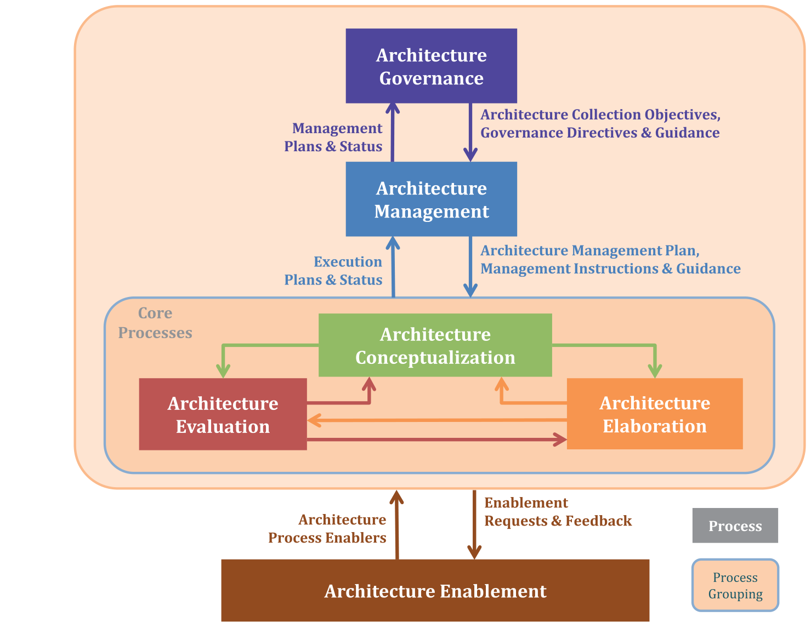

**Figure 1 — Architecture processes and their interactions**

**图 1 — 架构过程及其交互**

#### 5.2 Relationship of architecture to other processes and information elements 架构与其他过程和信息元素的关系

There are other life cycle processes that are affected by these architecture processes. For example, system requirements may be derived from the architecture and the architecture may be driven by requirements. The specific nature of how architecture and requirements are related to each other is organization dependent so cannot be specified in this document.

还有其他生存周期过程受这些架构过程影响。例如，系统需求可由架构导出，而架构可由需求驱动。架构与需求彼此关联的具体性质取决于组织，故无法在本文件中规定。

Likewise, architecture has a relationship to risks, decisions, project planning, integration, verification, acquisition, supply, quality management, investment management and so on, but the specific nature of these relationships cannot be specified in this document. The architecture processes shall interact with other processes and information elements as described in Annex C.

同样，架构与风险、决策、项目规划、集成、验证、采购、供应、质量管理、投资管理等也存在关系，但这些关系的具体性质无法在本文件中规定。架构过程应如附录 C 所述与其他过程和信息元素交互。

Iteration of the architecture processes with the Business or Mission Analysis process, System Requirements Definition process, Design Definition process and Stakeholder Needs and Requirements Definition process is often employed so that there is a negotiated understanding of the problem to be solved and a satisfactory solution is identified. The results of the architecture processes are widely used across the other life cycle processes. Architecture processes may be applied at many levels of abstraction, highlighting the relevant detail that is necessary for the decisions at that level.

架构过程常与业务或任务分析过程、系统需求定义过程、设计定义过程和利益相关方需求与要求定义过程迭代进行，以便对所求解的问题达成经协商的理解，并确定满意的解决方案。架构过程的结果在其他生存周期过程中被广泛使用。架构过程可应用于多个抽象层级，突出该层级决策所必需的相关细节。

#### 5.3 Architecture Governance and Management processes 架构治理与管理过程

Architecture governance and management processes are applicable to a collection of architectures, typically in an enterprise or project context. During architecture governance and management, the stakeholders who make financial, governance and technical decisions are identified, documented and included in performance of the activities of these processes. The governance process ensures proper oversight and accountability, and identifies, manages, audits and disseminates all information related to architecture collection decisions. It is applicable for all architecture efforts in an organization.

架构治理与管理过程适用于架构的集合，通常处于企业或项目情境中。在架构治理与管理期间，作出财务、治理和技术决策的利益相关方得到标识、记录，并被纳入这些过程活动的执行。治理过程确保适当的监督与问责，并标识、管理、审计和分发与架构集合决策相关的全部信息。它适用于组织中的所有架构工作。

The management process implements governance directives and guidance and captures this in an architecture management plan. The core processes are monitored and assessed against the plan and appropriate controls are implemented to direct course corrections. Instructions and guidance are issued to the core processes as a means to provide further direction beyond what the plan provides, especially with respect to directing how the architecture(s) should be developed and used.

管理过程实施治理指令与指导，并将其记录于架构管理计划中。核心过程依据该计划受到监视与评定，并实施适当的控制以引导纠偏。向核心过程发布指令与指导，作为在计划所提供的方向之外提供进一步方向的手段，尤其是在指导架构应如何开发和如何使用方面。

Architecture governance specifies the governance directives and guidance that can be used to drive the appropriate evolution of architectures in the architecture collection. It also specifies the architecture collection objectives to be pursued and establishes the strategy to be adopted for achievement of these objectives. It uses the management plans and status regarding the architecture collection to monitor compliance with governance directives and guidance.

架构治理规定可用于推动架构集合中架构适当演进的治理指令与指导。它还规定拟追求架构集合目标，并确立为实现这些目标而拟采用的策略。它利用有关架构集合的管理计划与状态来监视对治理指令与指导的符合性。

> **NOTE 1** The governance framework typically comprises a set of controls over the creation and monitoring of all architecture process components, work products and outcomes.

> **注 1**：治理框架通常包括对全部架构过程组件、工作产品与预期结果的创建和监视的一组控制。

> **NOTE 2** Absolute control may not be possible in cases like: SOS situations, federated architectures, consortium-based architectures, public-private partnerships, etc.

> **注 2**：在系统的系统情形、联邦式架构、基于联合体的架构、公私合作等情况下，可能无法实现绝对控制。

Architecture management specifies the management plans and instructions that are used to drive the core architecture processes. It uses the execution plans and status of the core processes to monitor compliance with management plans and instructions. In addition to management instructions, management guidance is developed as a means to assist those following the plans and instructions in implementing governance directives and in carrying out work to be in better alignment with management intent.

架构管理规定用于驱动核心架构过程的管理计划与指令。它利用核心过程的执行计划与状态来监视对管理计划与指令的符合性。除管理指令外，还制定管理指导，作为帮助遵循这些计划与指令的人员实施治理指令、并以更好地契合管理意图的方式开展工作的一种手段。

> **NOTE 3** See Annex G for additional information regarding architecture governance and management.

> **注 3**：关于架构治理与管理的补充信息见附录 G。

#### 5.4 Architecture Conceptualization, Evaluation and Elaboration processes 架构概念化过程、评估过程与细化过程

Key interactions between the core processes (Conceptualization, Evaluation and Elaboration) are illustrated in Figure 2. These processes can also be triggered by other processes external to these three processes. Conceptualization specifies the objectives of the architecture and the quality measures that can be used in the assessment of its value. Value is defined in terms of the extent to which stakeholder concerns are addressed. These architecture objectives are based on the problem/opportunity identification and definition that occurs in this process. Architecture concepts are generated with value in mind and are then assessed using these quality measures.

核心过程（概念化、评估与细化）之间的关键交互见图 2。这些过程也能由这三个过程之外的其他过程触发。概念化规定架构的目标以及可用于评定其价值的质量度量。价值按利益相关方关注点得到满足的程度来定义。这些架构目标以此过程中发生的问题／机会识别与定义为基础。架构概念在生成时即考虑价值，随后使用这些质量度量对其加以评定。

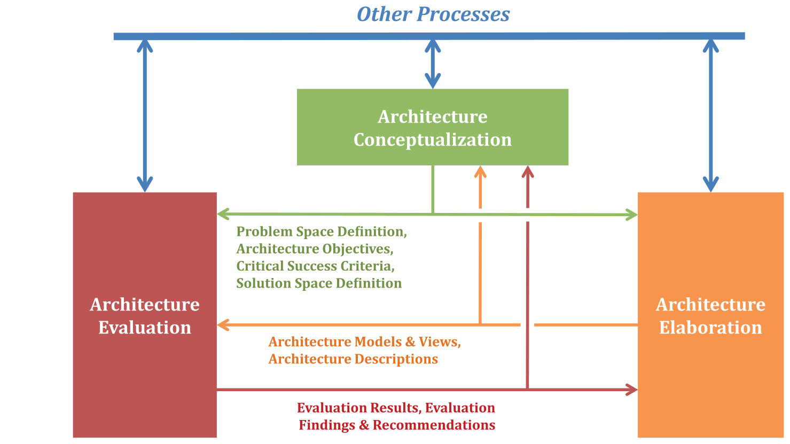

**Figure 2 — Interactions between the core processes and with other processes**

**图 2 — 核心过程之间以及与其他过程之间的交互**

Conceptualization aids architects and others in characterizing the problem space, synthesizing potential solutions, formulating candidate architectures and expressing these architectures in a form that is suitable for the intended uses. The name of the process being “conceptualization” does not mean that the results are necessarily at the “conceptual” level, or consist of a set of conceptual models and views. The results could include a “logical” architecture or a “physical” architecture, depending on the nature of the situation.

概念化帮助架构师及其他人员刻画问题空间、综合潜在解决方案、形成候选架构，并以适合预期用途的形式表达这些架构。该过程名为“概念化”，并不意味着其结果必然处于“概念”层级，或由一组概念模型与概念视图构成。视情形性质而定，结果可包括“逻辑”架构或“物理”架构。

During early stages, it can be important to be agile and quick in conceptualizing many alternative architectures. Some of these early architecture descriptions are little more than sketches. After doing several quick rounds of evaluation and conceptualization, there can then be a smaller number of viable architectures that are worth capturing in a more complete form and storing in the repository for later use. A more complete form of architecture description would be developed during architecture elaboration.

在早期阶段，敏捷而快速地概念化众多备选架构可能很重要。其中一些早期架构描述不过是草图而已。在完成若干轮快速的概念化与评估之后，可能会有较少数量的可行架构值得以更完整的形式记录下来，并存入存储库以供后用。更完整的架构描述形式将在架构细化期间编制。

Conceptualization can use the results of architecture elaboration, when appropriate. Architecture conceptualization only needs to describe the architecture to the level of specificity and granularity that is suitable for its intended users, which in many cases does not require significant elaboration. The elaboration of architecture views, models and descriptions can often occur later in the life cycle of the architecture, after the architecture has become more mature and the extra effort of elaboration becomes worthwhile. Elaboration can often be deferred until after several architecture alternatives have been examined for their suitability, and they are selected down to one or a few alternatives for further examination and eventual use downstream in the engineering effort.

在适当时，概念化可利用架构细化的结果。架构概念化仅需将架构描述到适合其预期使用者的特定程度与粒度，这在许多情况下无需大量细化。架构视图、模型与描述的细化常常可发生在架构生存周期的较后阶段，此时架构已趋于成熟，细化的额外投入变得值得。细化常常可推迟到若干备选架构的适宜性已经过考察、并从中选定一个或少数几个以供进一步考察及最终在下游工程工作中使用之后。

During evaluation, there could be a recognition that alternative architecture concepts are needed to more completely search the tradespace. However, in some cases there can be only a single architecture that is being evaluated for its suitability. Value assessments can be based on analysis of relevant architecture attributes and properties of the situation, or on an assessment of how much value is delivered to, for example, an operational setting or to individual users. The assessment and analysis results, along with estimates of assessment uncertainty, are returned along with key findings and recommendations, to determine if the proposed architecture sufficiently addresses stakeholder concerns. If not, then additional cycles between conceptualization and evaluation are pursued.

在评估期间，可能认识到需要备选架构概念，以更完整地搜索权衡空间。然而，在某些情况下可能只有一个架构正被评估其适宜性。价值评定可基于对相关架构属性及情形固有性质的分析，或基于对例如向运行环境或向单个用户交付了多少价值的评定。评定与分析结果连同评定不确定度的估计，与关键发现和建议一并返回，以确定所提出的架构是否充分满足利益相关方关注点。若否，则在概念化与评估之间开展更多轮次。

When further elaboration of the architecture is needed then the architecture objectives, architecture concepts and properties are expressed in a sufficiently complete and correct manner that can be delivered and used as the basis for more complete modeling, delineation and decomposition of these concepts and properties. Elaborated models and views, along with supporting materials, can be used to provide more detailed understanding of the architecture and to check for consistency with the original concepts and alignment with the objectives.

当需要对架构做进一步细化时，架构目标、架构概念与性质应以足够完整且正确的方式表达，使其能够交付，并可用作对这些概念与性质进行更完整建模、勾画与分解的基础。经细化的模型与视图连同支撑材料，可用于提供对架构的更详细理解，并检查其与原始概念的一致性和与目标的对齐情况。

During evaluation, there can sometimes be a need for more complete models and views. In these cases, elaboration could be requested to generate additional models and views. During evaluation these models and views can be annotated with the results of the evaluation and with comments on strengths and weaknesses of the architecture or its description.

在评估期间，有时可能需要更完整的模型与视图。在这些情况下，可请求细化以生成额外的模型与视图。在评估期间，这些模型与视图可标注评估结果以及对架构或其描述的优点与弱点的评述。

> **NOTE** These processes can be repeated for each level of decomposition, refinement, realization, abstraction, disaggregation, etc. of the architecture. In such a case, the processes need to ensure that the architecture at that level is aligned with relevant architectures above and below that level.

> **注**：这些过程可针对架构的每一级分解、精化、实现、抽象、解聚等重复进行。在此类情况下，这些过程需确保该层级的架构与高于和低于该层级的相关架构相对齐。

Any of the architecture processes can generate or contribute to an architecture description of varying scope, granularity and formality. However, the elaboration process captures the architecture description in a sufficiently complete and correct manner for the intended uses and intended users of the architecture downstream from the architecture effort.

任一架构过程都能生成架构描述或为其做出贡献，其范围、粒度与形式化程度各不相同。然而，细化过程以足够完整且正确的方式捕获架构描述，以供架构工作下游的预期用途与预期使用者使用。

#### 5.5 Architecture Enablement process 架构使能过程

Architecture enablement selects, modifies and develops capabilities, services and resources in support of the other processes. In this document, these things are called enablers. This process can be used to enable the development of an individual architecture or a collection of architectures, or provide enabling resources, capabilities and services to all architecture endeavors of an organization. Architecture enablement ensures that the information regarding the different enablers is uniformly organized and integrated.

架构使能选择、修改并开发能力、服务与资源，以支持其他过程。在本文件中，这些事物称为使能物。该过程可用于使能单个架构或架构集合的开发，或为组织的所有架构工作提供使能资源、能力与服务。架构使能确保关于不同使能物的信息得到统一组织与整合。

The other architecture processes request enablers to assist in performing the activities, utilize the enablers and provide feedback in terms of the effectiveness of the enablers and the changes that are necessary to improve their effectiveness. These other processes also may contribute enablers to the Architecture Enablement process which can then be made available for use by other projects. Architecture enablement tracks the usage and usefulness of the enablers and the difficulties that are faced when utilizing these enablers. Architecture enablement establishes and maintains enablers for use throughout the organization.

其他架构过程请求使能因素以协助执行活动，利用这些使能因素，并就使能因素的有效性以及为提高其有效性所必需的变更提供反馈。这些其他过程还可向架构使能过程贡献使能因素，随后可将其提供给其他项目使用。架构使能跟踪使能因素的使用情况与有用性，以及利用这些使能因素时所面临的困难。架构使能建立并维护供整个组织使用的使能因素。

> **EXAMPLE** Enabling capabilities include, among other things, procedures, methods, tools, frameworks, architecture viewpoints, work product templates, decision support systems, storage, configuration management and reference models. Enabling services include, among other things, infrastructure, technologies, skilled personnel and automation agents. Enabling resources include, among other things, architecture repository, library, registry, communication channels and mechanisms, human and technical resources, and training and licenses for tools and methods.

> **示例**：使能能力包括程序、方法、工具、框架、架构视角、工作产品模板、决策支持系统、存储、配置管理和参考模型等。使能服务包括基础设施、技术、技能人员和自动化代理等。使能资源包括架构存储库、库、注册表、沟通渠道与机制、人力和技术资源，以及工具和方法的培训与许可等。

The key enablers are the architecture repository, library and registry. The architecture repository provides mechanisms to store, manage and manipulate architecture work products. It also provides appropriate access to projects, organizations, and individuals. The architecture library provides services to the projects or organizations for finding and organizing information. It also catalogs and stores source materials for ready access by all those involved in an architecture effort. In support of the repository and library is an architecture registry, where the items can be referenced as to their intended uses, anticipated limitations, location in the repository or library, pointers to other relevant materials that enable proper utilization, and to their stage of development.

关键的使能因素是架构存储库、架构库和架构注册表。架构存储库提供存储、管理和操作架构工作产品的机制，还向项目、组织和个人提供适当的访问。架构库为项目或组织提供查找和组织信息的服务，还编目和存储源材料，供参与架构工作的所有人员随时访问。支持存储库和库的是架构注册表，其中各条目可被引用，说明其预期用途、预期局限、在存储库或库中的位置、指向能够支持正确使用的其他相关材料的指针，以及其开发阶段。

> **NOTE** See Annex F for additional information regarding architecture enablement practices.

> **注**：架构使能实践的相关补充信息见附录 F。

#### 5.6 Relationship of architecture to design 架构与设计的关系

Architecture processes provide one or more architecture alternatives that frame the concerns of stakeholders and addresses their key requirements. Architecture can be widely used across the life cycle processes of the architecture entity. Architecture processes can be applied at many levels of abstraction, highlighting the relevant features that are necessary for the decisions at that level.

架构过程提供一个或多个架构备选方案，用以框定利益相关方的关注点并应对其关键要求。架构能在架构实体的生存周期过程中被广泛使用。架构过程能应用于许多抽象层次，突出该层次决策所必需的相关特征。

As defined in 3.3, architectures provide the fundamental concepts or properties of the architecture entity and associated governing principles. Architectures should be described using a set of views and models that are complete, consistent and correct. The completeness of an architecture view or model is determined relative to its intended use.

如 3.3 所定义，架构提供架构实体的基本概念或属性以及相关的管控原则。架构宜使用一组完整、一致且正确的架构视图和模型来描述。架构视图或模型的完整性相对于其预期用途来确定。

Design, as defined in ISO/IEC/IEEE 15288, is a technical process providing sufficient details about the architecture entity and its elements to enable an implementation consistent with architecture. An effective architecture guides the design activities in such a way that it allows for maximum flexibility in the design tradespace.

如 ISO/IEC/IEEE 15288 所定义，设计是一种技术过程，它提供关于架构实体及其元素的充分细节，以支撑与架构一致的实施。有效的架构指导设计活动，其方式使设计权衡空间具有最大的灵活性。

Through use of the Design Definition process in ISO/IEC/IEEE 15288, insights are gained into the relation between the requirements specified for the architecture entity and the emergent properties and behaviors of the architecture entity that arise from the interactions and relations between the elements and between the properties of those elements.

通过使用 ISO/IEC/IEEE 15288 中的设计定义过程，可深入了解为架构实体规定的需求与架构实体的涌现属性和行为之间的关系，后者产生于元素之间及其属性之间的交互和关系。

Sometimes the elements of the architecture entity are initially notional until Design Definition process in ISO/IEC/IEEE 15288 has occurred since this depends on the actual design(s) to be done. Sometimes a “reference architecture” is created using these notional elements as a means to convey architectural intent and to check for design feasibility.

有时，架构实体的元素在最初是概念性的，直至 ISO/IEC/IEEE 15288 中的设计定义过程完成后才确定，因为这取决于实际要完成的设计。有时会以这些概念性元素创建“参考架构”，作为传达架构意图并检查设计可行性的一种手段。

Interfaces and interactions between elements are defined at a level of detail necessary to convey the architectural intent and could be further refined in the Design Definition process. The Design Definition process considers any applicable technologies and their contribution to the system solution. Design Definition provides the level of the definition necessary for realization, such as drawings, detailed design descriptions, software code, task descriptions, etc.

元素之间的接口和交互按传达架构意图所必需的详细程度定义，并可在设计定义过程中进一步细化。设计定义过程考虑任何适用的技术及其对系统方案的贡献。设计定义提供实现所必需的定义级别，例如图纸、详细设计描述、软件代码、任务描述等。

The Design Definition process provides feedback to the architecture processes to consolidate or confirm the concepts and properties of the architecture entity, along with the allocation, partitioning and alignment of architectural entities to elements that compose the architecture entity.

设计定义过程向架构过程提供反馈，以整合或确认架构实体的概念和属性，以及架构实体到构成该架构实体的元素的分配、划分和协调。

#### 5.7 Architecture adaptation 架构适配

All the processes are involved with adaptation of the architecture to a given situation. Conceptualization and Elaboration act directly to make the architecture evolve and adapt. Evaluation provides evidence for decision making on architecture evolution and change. Architecture-related decisions could be made in conjunction with the architecture processes, but this is usually the responsibility of some other process where the decision is most relevant. Governance and Management provide directives and instructions for architecture evolution and change. Enablement provides enabling capabilities, services and resources that support the other processes in adapting the architecture.

所有过程都涉及使架构适配给定情形。概念化和细化直接作用于使架构演进和适配。评估为有关架构演进和变更的决策提供证据。与架构有关的决策可结合架构过程作出，但这通常是决策最为相关的某个其他过程的职责。治理和管理为架构演进和变更提供指令和指示。使能提供使能能力、服务和资源，以支持其他过程适配架构。

#### 5.8 Process application 过程应用

##### 5.8.1 Criteria for processes 过程准则

The determination of architecture processes in this document is based upon three basic principles:

本文件对架构过程的确定基于三项基本原则：

- Each architecture process has strong relationships among its outcomes, activities and work

- 每个架构过程在其预期结果、活动和工作

products.

产品之间具有紧密关系。

- The dependencies between the processes are reduced to a minimum.

- 过程之间的依赖关系减至最少。

- A process is capable of execution by a single organization in the life cycle.

- 一个过程能在生存周期中由单一组织执行。

##### 5.8.2 Description of processes 过程的描述

Each process of this document is described in terms of the following attributes:

本文件的每个过程按以下属性描述：

- The title conveys the scope of the process as a whole.

- 标题传达过程作为整体的范围。

- The purpose describes the goals of performing the process.

- 目的描述执行过程的目标。

- The outcomes express the observable results expected from the successful performance of the

- 预期结果表达成功执行过程所期望得到的可观察

process.

结果。

- The activities are sets of cohesive tasks of the process.

- 活动是过程的内聚任务集。

- The tasks are recommended actions intended to contribute to the achievement of one or more

- 任务是为促成实现一个或多个预期结果而推荐的行动，

outcomes (i.e. results) that come about due to execution of the process.

这些预期结果（即结果）因过程的执行而产生。

- The work products help achieve the desired outcomes and can be produced based on the activities

- 工作产品帮助实现预期结果，并能基于过程的活动

of the process.

产生。

Additional detail regarding this form of process description can be found in ISO/IEC TR 24774.

关于这种过程描述形式的更多细节可见 ISO/IEC TR 24774。

##### 5.8.3 General characteristics of processes 过程的一般特性

In addition to the basic process attributes described above, processes may be characterized by other attributes common to all processes. ISO/IEC 33002 identifies common process attributes that characterize six levels of achievement within a measurement framework for use in process assessment activities. ISO/IEC/IEEE 15288:2015, Annex C includes the list of process attributes that contribute to the achievement of higher levels of process capability as defined in ISO/IEC 33002.

除上述基本过程属性外，过程还可由所有过程共有的其他属性来表征。ISO/IEC 33002 识别出在过程评定活动中使用的测量框架中表征六个等级的共有过程属性。ISO/IEC/IEEE 15288:2015 附录 C 列出了有助于实现 ISO/IEC 33002 所定义的更高等级过程能力的各项过程属性。

ISO/IEC 33020 specifies a process measurement framework for assessment of process capability.

ISO/IEC 33020 规定了用于评定过程能力的过程测量框架。

Annex C in this document specifies how system life cycle processes in ISO/IEC/IEEE 15288 should use architecture-related information. Annex C in this document also specifies how the architecture processes should use information items from ISO/IEC/IEEE 15288 processes.

本文件的附录 C 规定了 ISO/IEC/IEEE 15288 中的系统生存周期过程宜如何使用与架构相关的信息。本文件的附录 C 还规定了架构过程宜如何使用来自 ISO/IEC/IEEE 15288 过程的信息部件。

##### 5.8.4 Tailoring 裁剪

Annex A is normative and defines the basic activities needed to perform tailoring of this document.

附录 A 是规范性的，规定了执行本文件裁剪所需的基本活动。

Tailoring may entail the changing or removal of architecture processes. It may be performed for many reasons including the scale of the architecting endeavor, the purpose of the desired architecture (such as the kind of architecture sought), and the approach to architecting which is employed. For example, if the purpose of the architecting endeavor is to devise an architecture from an extant system or system design (i.e. to employ reverse architecting) then certain processes, such as architecture conceptualization in this particular case, may not need to be performed.

裁剪可涉及更改或删除架构过程。可出于多种原因进行裁剪，包括架构工作的规模、所期望架构的目的（例如所寻求的架构种类）以及所采用的架构工作途径。例如，若架构工作的目的是从现存系统或系统设计推导出架构（即采用逆向架构工作），则某些过程（在此情形下如架构概念化）可能无需执行。

In all cases where such tailoring of architecture processes is employed, the rationale behind the tailoring shall be recorded. Recording of the rationale assists stakeholders in determining the value arising from the architecting effort and the confidence they should attribute to its outcomes.

在所有采用此类架构过程裁剪的情形下，应记录裁剪所依据的理由。记录理由有助于利益相关方确定架构工作所产生的价值，以及他们宜对架构工作预期结果赋予的信任程度。

Note that tailoring may diminish the perceived value of a claim of conformance to this document. This is because it is difficult for other organizations to understand the extent to which tailoring may have removed desirable provisions. An organization asserting a single-party claim of conformance to this document may find it advantageous to claim full conformance to a smaller list of processes rather than tailored conformance to a larger list of processes.

裁剪可能降低对本文件符合性主张的感知价值。这是因为其他组织难以了解裁剪可能在多大程度上移除了可取的规定。组织若提出对本文件的单方符合性主张，则对较小的过程清单主张完全符合性，可能比之对较大的过程清单主张裁剪符合性更为有利。

The processes described in this document are not intended to preclude or discourage the use of additional processes that organizations find useful. In particular, governance and directives of the organization can be applied for tailoring of the architecture governance and management processes and therefore tailoring of the process outcomes and the other architecture processes.

本文件所述过程无意排除或阻碍组织使用其认为有用的附加过程。特别是，组织的治理与指令可用于对架构治理过程和架构管理过程进行裁剪，进而对过程预期结果及其他架构过程进行裁剪。

### 6 Architecture Governance process 架构治理过程

#### 6.1 Purpose 目的

The purpose of the Architecture Governance process is to establish and maintain alignment of architectures in the architecture collection with enterprise goals, policies and strategies and with related architectures.

架构治理过程的目的是建立并保持架构集合中的架构与企业目标、策略和战略的一致，以及与相关架构的一致。

> **NOTE** See Annex G for additional information regarding architecture governance and management and the distinction between these related but separate processes.

> **注**：关于架构治理与架构管理以及这两个相互关联但彼此独立的过程之间区别的更多信息，见附录 G。

#### 6.2 Outcomes 预期结果

As a result of the successful implementation of the Architecture Governance process:

作为架构治理过程成功实施的结果：

a) Architecture collection objectives are addressing current and anticipated business needs of the enterprise and its customers and suppliers.

a) 架构集合目标正在满足企业及其客户和供应商当前和预期的业务需求。

b) Architecting activities and decisions are aligned with enterprise and contextual concerns.

b) 架构工作活动与架构决策与企业关注点及语境关注点保持一致。

> **NOTE 1** Concerns can include organizational standards, policies, business priorities, relevant constraints and regulations.

> **注 1**：关注点能包括组织标准、策略、业务优先级、相关约束和法规。

c) Architecture decisions supported by rationale are made with appropriate authorities and communicated to stakeholders.

c) 有理由支撑的架构决策由具有适当职权者作出，并传达给利益相关方。

d) The various architectures within the architecture collection are consistent with, and in alignment to, the goals, objectives, strategy and vision of the organization responsible for the architecting effort.

d) 架构集合中的各个架构与负责架构工作的组织的目标、具体目标、战略与愿景保持一致并对齐。

e) The various architectures within the architecture collection are in alignment with each other as necessary.

e) 架构集合中的各个架构之间在必要时保持对齐。

f) Agreement of the purpose, objectives and goals for the architecture collection is maintained amongst the key stakeholders.

f) 在关键利益相关方之间保持对架构集合目的、目标和具体目标的一致认同。

> **NOTE 2** Architecture governance outcomes are applicable across the organization while architecture management outcomes are applicable across the entire collection of architectures.

> **注 2**：架构治理的预期结果适用于整个组织，而架构管理的预期结果适用于整个架构集合。

#### 6.3 Implementation 实施

The organization shall implement the activities in 6.4 (numbered as 6.4.N) in accordance with applicable organization policies and procedures with respect to the Architecture Governance process. The activities may be performed in any order that is deemed appropriate. The organization should implement the relevant tasks (identified as list items under each 6.4.N activity) as appropriate to the situation.

组织应就架构治理过程，按照适用的组织策略与程序实施 6.4 中的活动（编号为 6.4.N）。这些活动可按任何被认为适当的顺序执行。组织宜视情形实施相关任务（标识为各 6.4.N 活动下的列表项）。

The organization should store organization policies and procedures to facilitate widespread access, enable auditing and encourage future reuse.

组织宜保存组织策略与程序，以便于广泛获取、支持审计并鼓励未来复用。

#### 6.4 Activities and tasks 活动与任务

##### 6.4.1 Prepare for and plan the architecture governance effort 准备并规划架构治理工作

a) Identify the set of architectures to be included in a single architecture collection that requires governance oversight.

a) 识别应纳入某一需要治理监督的单一架构集合的那些架构。

b) Identify the set of existing architectures or reference architectures which may have direct applicability to the architecture collection and can be used as guiding oversight.

b) 识别可能直接适用于架构集合、并可用作指导性监督的现有架构或参考架构的集合。

c) Identify, define or establish architecture-related standards and policies driven by organizational policies, strategy and vision.

c) 识别、定义或建立由组织策略、战略与愿景驱动的与架构相关的标准和策略。

d) Establish roles, responsibilities, accountabilities, authorities and organizational structures to support the Architecture Governance process and reporting requirements and alignment with other relevant architectures.

d) 建立角色、职责、问责、职权和组织结构，以支持架构治理过程与报告要求，并与其他相关架构保持一致。

e) Establish the architecture governance organizational structure that is consistent with the defined roles, authorities, responsibilities and accountabilities.

e) 建立与所定义的角色、职权、职责和问责相一致的架构治理组织结构。

f) Establish guiding principles, policies and directives for performing architecture governance.

f) 为开展架构治理建立指导原则、策略与指令。

> **NOTE 1** These guiding principles, policies and directives delineate the procedures and work instructions to be performed by those who execute the governance activities. This is to ensure the governance directives are transparent and consistently followed. Sometimes a secretariat is used to administer these procedures and work instructions and to ensure they are properly followed.

> **注 1**：这些指导原则、策略与指令界定了执行治理活动者所应执行的程序与作业指导书。这是为了确保治理指令透明并得到一致遵循。有时会设立秘书处以管理这些程序与作业指导书，并确保其得到恰当遵循。

g) Identify, define or establish architecture-related reusable elements from the set of existing architectures or reference architectures.

g) 从现有架构或参考架构的集合中识别、定义或建立与架构相关的可复用元素。

> **NOTE 2** These reusable elements can be governance directives, guiding principles, work instructions, governance organizational structure or procedures.

> **注 2**：这些可复用元素能是治理指令、指导原则、作业指导书、治理组织结构或程序。

h) Identify knowledge assets (historical information, successful outcomes) that can aid in governance of the architecture collection.

h) 识别能有助于架构集合治理的知识资产（历史信息、成功的成果）。

i) Establish governance forums to carry out architecture governance work instructions in accordance with guiding principles.

i) 建立治理论坛，以按照指导原则执行架构治理作业指导书。

j) Ensure responsibilities are appropriately assigned by utilizing a responsibility matrix.

j) 通过使用职责矩阵确保职责得到适当分配。

k) Define procedures for identifying, managing, auditing and disseminating information related to architecture governance decisions.

k) 定义用于识别、管理、审计和分发与架构治理决策相关信息的程序。

1) Link these procedures to architecture collection strategies, policies and objectives.

1) 将这些程序与架构集合的战略、策略和目标相关联。

2) Map these procedures to resources and constraints to support strategy, planning and decision making.

2) 将这些程序映射到资源与约束，以支持战略、规划和决策。

l) Plan the architecture governance effort using the Project Planning process in ISO/IEC/IEEE 15288 as a guide.

l) 以 ISO/IEC/IEEE 15288 中的项目规划过程为指导，规划架构治理工作。

> **NOTE 3** ISO 21500 and ISO 21505 can be used as guidance for the planning effort.

> **注 3**：ISO 21500 和 ISO 21505 能用作规划工作的指南。

1) Establish the scope of the architecture governance effort.

1) 确立架构治理工作的范围。

2) Establish metrics for the architecture governance effort.

2) 确立架构治理工作的度量指标。

> **NOTE 4** Annex B contains information about defining metrics for architecture processes. See B.2.1 for example metrics for architecture governance.

> **注 4**：附录 B 包含关于为架构过程定义度量指标的信息。架构治理的示例度量指标见 B.2.1。

3) Identify the data and information needed for the architecture governance effort.

3) 识别架构治理工作所需的数据和信息。

4) Obtain access to enablers needed for the architecture governance effort.

4) 获得架构治理工作所需的使能因素。

> **NOTE 5** The enablers can be obtained from the Architecture Enablement process. When enablers are obtained from other sources, these can become candidate enablers for use by other architecture efforts through the Architecture Enablement process.

> **注 5**：使能因素能从架构使能过程获得。当使能因素从其他来源获得时，它们能通过架构使能过程成为供其他架构工作使用的候选使能因素。

> **EXAMPLE 1** Architecture governance enablers could be tools and methods that support accountability gap analysis, implementation gap analysis, objectives gap analysis and capacity gap analysis.

> **示例 1**：架构治理使能因素可为支持问责差距分析、实施差距分析、目标差距分析和能力差距分析的工具与方法。

5) Specify the work products and their outlines to be produced through performance of this process.

5) 规定通过执行本过程将产生的工作产品及其大纲。

6) Identify and define architecture governance work elements and associated resources.

6) 识别并定义架构治理工作要素及相关资源。

> **EXAMPLE 2** Architecture governance work elements could be policy documents, strategic objectives, vision, mission, values of the architecture governance board.

> **示例 2**：架构治理工作要素可为方针文件、战略目标、愿景、使命、架构治理委员会的价值观。

7) Develop architecture governance schedule and define associated milestones.

7) 制定架构治理进度表并定义相关里程碑。

m) Produce an architecture governance plan that contains the planning information.

m) 编制包含规划信息的架构治理计划。

n) Obtain necessary approvals and funding for the plan.

n) 为该计划获得必要的批准与资金。

o) Collect the data and information needed for the architecture governance effort.

o) 收集架构治理工作所需的数据和信息。

##### 6.4.2 Monitor, assess and control the architecture governance activities 监视、评定和控制架构治理活动

a) Monitor and assess how changes to industry, governmental directives and guidance, and technological change could impact the architectures being governed.

a) 监视并评定产业、政府指令与指导以及技术变化可能如何影响受治理的架构。

> **NOTE 1** The evolution of disruptive technologies can impact the architectures being governed. E.g. Frequency Slice Processor as a new technology impacts the control system architectures.

> **注 1**：颠覆性技术的演进能影响受治理的架构。例如，频率切片处理器作为一种新技术会影响控制系统架构。

b) Monitor and assess how changes to industry, government and technology could impact the governing directives and guidance.

b) 监视并评定产业、政府与技术的变化可能如何影响管控指令与指导。

c) Monitor and assess how changes to industry, government and technology regulations and policies could impact the governing directives and guidance.

c) 监视并评定产业、政府与技术法规和方针的变化可能如何影响管控指令与指导。

d) Monitor and assess metrics for the architecture governance effort.

d) 监视并评定架构治理工作的度量。

e) Identify and assess risks and opportunities associated with the architecture governance effort.

e) 识别并评定与架构治理工作相关的风险和机会。

f) Ensure that other processes are properly using architecture governance directives and guidance.

f) 确保其他过程正确使用架构治理指令与指导。

> **NOTE 2** See C.1 for recommended interactions with system life cycle processes.

> **注 2**：关于与系统生存周期过程的推荐交互，见 C.1。

> **NOTE 3** See C.2 for recommended interactions with enterprise life cycle processes.

> **注 3**：关于与企业生存周期过程的推荐交互，见 C.2。

g) Report architecture governance activity plans and status in accordance with reporting requirements.

g) 按照报告要求报告架构治理活动计划与状态。

h) Assess and control the architecture governance effort using the Project Assessment and Control process in ISO/IEC/IEEE 15288 as a guide.

h) 评定并控制架构治理工作，以 ISO/IEC/IEEE 15288 中的项目评定与控制过程为指导。

> **NOTE 4** ISO 21500 and ISO 21505 can be used as guidance for assessment and control.

> **注 4**：ISO 21500 和 ISO 21505 能用作评定与控制的指导。

i) Manage decisions about the architecture collection associated with architecture governance using the Decision Management process in ISO/IEC/IEEE 15288 as a guide.

i) 管理与架构治理相关的架构集合决策，以 ISO/IEC/IEEE 15288 中的决策管理过程为指导。

> **NOTE 5** ISO 21505 can be used as guidance for strategic decision making.

> **注 5**：ISO 21505 能用作战略决策制定的指导。

j) Manage risks associated with architecture governance using the Risk Management process in ISO/IEC/IEEE 15288 as a guide.

j) 以 ISO/IEC/IEEE 15288 中的风险管理过程为指导，管理与架构治理相关的风险。

> **NOTE 6** ISO 31000, ISO 21500 and ISO 21505 can be used as guidance for risk management.

> **注 6**：ISO 31000、ISO 21500 和 ISO 21505 能用作风险管理的指导。

k) Establish configuration control management mechanism to govern the changes in the architecture collection.

k) 建立配置控制管理机制，以管控架构集合中的变更。

##### 6.4.3 Establish architecture collection objectives 确立架构集合目标

a) Examine current and future business needs.

a) 审查当前和未来的业务需求。

> **NOTE 1** This task is an examination of information that comes from the Business or Mission Analysis process in ISO/IEC/IEEE 15288.

> **注 1**：本任务即审查来自 ISO/IEC/IEEE 15288 中业务或任务分析过程的信息。

1) Examine current and future enterprise objectives that shall be achieved, such as maintaining competitive advantage.

1) 审查应实现的当前和未来企业目标，例如保持竞争优势。

2) Examine and evaluate the current and future enterprise vision, including strategies, proposals and supply arrangements (whether internal, external, or both) in support of the enterprise objectives.

2) 审查并评估当前和未来的企业愿景，包括为支持企业目标的战略、提议与供应安排（无论是内部的、外部的还是两者兼有）。

> **NOTE 2** The examination can consider the external or internal pressures acting upon the enterprise, such as business change, technological change, economic and social trends and political influences.

> **注 2**：该审查能考虑作用于企业的外部或内部压力，例如业务变化、技术变化、经济与社会趋势以及政治影响。

3) Examine specific objectives of the strategies and proposals that are being evaluated.

3) 审查正在评估的战略与提议的具体目标。

b) Examine current and future mission needs for those missions supported by the enterprise.

b) 审查企业所支持各项任务的当前和未来任务需求。

> **NOTE 3** This task is examination of information that comes from the Business or Mission Analysis process in ISO/IEC/IEEE 15288.

> **注 3**：本任务即审查来自 ISO/IEC/IEEE 15288 中业务或任务分析过程的信息。

1) Examine current and future mission objectives that shall be achieved.

1) 审查应实现的当前和未来任务目标。

2) Examine and evaluate possible future use of entities being architected, including strategies, proposals and supply arrangements (whether internal, external or both) in support of the mission objectives.

2) 审查并评估被架构的实体的可能未来用途，包括为支持任务目标的战略、提议与供应安排（无论是内部的、外部的还是两者兼有）。

> **NOTE 4** The examination can consider the external or internal pressures acting upon the enterprise, such as technological change, economic and social trends, and political influences.

> **注 4**：该审查能考虑作用于企业的外部或内部压力，例如技术变化、经济与社会趋势以及政治影响。

3) Examine specific objectives of the strategies and proposals that are being evaluated.

3) 审查正在评估的战略与提议的具体目标。

c) Establish architecture strategy by making the relevant decisions about the architectures in the architecture collection.

c) 通过就架构集合中的架构作出相关决策，确立架构战略。

1) Discover, develop, define and evaluate the overall goals of the architecture collection as a whole.

1) 发现、制定、定义并评估架构集合整体的总体目标。

i) Identify work to be performed to achieve these goals.

i) 识别为实现这些目标将开展的工作。

ii) Create a configuration of resources which are necessary ingredients in meeting these goals.

ii) 创建一种资源配置，作为达成这些目标的必要组成部分。

iii) Establish means of measuring governance effectiveness.

iii) 确立度量治理有效性的手段。

2) Define architecture governance policies related to the architecture collection.

2) 定义与架构集合相关的架构治理方针。

3) Define a set of governance principles that apply to the architecture collection.

3) 定义一套适用于架构集合的治理原则。

4) Determine adherence to objectives based on governance compliance criteria and strategies.

4) 基于治理符合性准则与战略，确定对目标的依从情况。

5) Establish management criteria for control of architecture governance practices, dispensations and compliance.

5) 为控制架构治理实践、特许与符合性，确立管理准则。

d) Identify the architecture collection objectives to be pursued and desired levels of achievement for each.

d) 识别拟追求的架构集合目标以及各项目标所期望的达成水平。

e) Establish procedures to investigate and capture how the architecture collection objectives can be changed when necessary.

e) 建立程序，以调查并记录架构集合目标能如何在必要时变更。

##### 6.4.4 Make architecture governance decisions 作出架构治理决策

a) Establish and issue governance direction in the form of directives and guidance for architectures in the architecture collection.

a) 以指令和指导的形式确立并发布针对架构集合中架构的治理指示。

1) Develop and issue governance directive(s) that drive the appropriate evolution of architectures in the architecture collection.

1) 制定并发布治理指令，以推动架构集合中架构的适当演进。

> **NOTE 1** Governance directives could be about specific architecture patterns, reference architectures, standards, frameworks, principles, tools, methods, etc. that would need to be applied to the architectures or used when architecting.

> **注 1**：治理指令能涉及需要应用于架构或在开展架构工作时使用的特定架构模式、参考架构、标准、框架、原则、工具、方法等。

2) Implement a governance framework that supports this governance directive so as to define conceptual and organizational structures and provide a structured decision-making approach.

2) 实施支持该治理指令的治理框架，以定义概念结构与组织结构，并提供结构化的决策途径。

> **NOTE 2** The governance framework typically comprises a set of controls over the creation and monitoring of all architecture process components, work products and outcomes.

> **注 2**：治理框架通常包括对全部架构过程组件、工作产品与预期结果的创建和监视的一组控制。

> **NOTE 3** Absolute control may not be possible in cases like: SOS situations, federated architectures, consortium-based architectures, public-private partnerships, etc.

> **注 3**：在诸如系统的系统情形、联邦式架构、基于联盟的架构、公私合作伙伴关系等情况下，绝对控制可能无法实现。

3) Establish a decision-making mechanism that minimizes or avoids potential conflicts of interests with escalation in the organization if the problems cannot be properly addressed by architecture governance.

3) 建立决策机制，以尽可能减少或避免潜在利益冲突，并在架构治理无法恰当解决问题时在组织内逐级上报。

4) Develop and issue directives on mandated standards to be used during execution of architecture processes.

4) 制定并发布关于架构过程执行期间所使用强制性标准的指令。

b) Assign responsibility for, and direct preparation and implementation of, directives, standards and policies that set the direction for architecting efforts.

b) 为确定架构工作方向的指令、标准和方针分配职责，并指导其编制与实施。

c) Analyze architectural dependencies to exploit the associations amongst the architectures in the architecture collection.

c) 分析架构依赖关系，以利用架构集合中各架构之间的关联。

> **NOTE 4** Dependencies could be capabilities, resources, services, reference architectures, assumptions, principles, vocabulary, ontologies and so on.

> **注 4**：依赖关系能是能力、资源、服务、参考架构、假设、原则、词汇表、本体等。

d) Make strategic decisions within the scope of architecture governance responsibilities and authorities using the Decision Management process in ISO/IEC/IEEE 15288 as a guide.

d) 在架构治理职责与职权范围内作出战略决策，并以 ISO/IEC/IEEE 15288 中的决策管理过程为指导。

> **NOTE 5** ISO 21505 can be used as guidance for strategic decision making.

> **注 5**：ISO 21505 可作为战略决策制定的指南。

e) Elevate other decisions to the appropriate enterprise decision forum.

e) 将其他决策上报至适当的企业决策论坛。

f) Review and communicate the decisions.

f) 评审并传达这些决策。

##### 6.4.5 Monitor and assess compliance with governance directives and guidance 监视并评定对治理指令与指导的符合性

a) Monitor the governance of the architecture collection by utilizing appropriate means.

a) 利用适当手段监视架构集合的治理。

> **NOTE 1** In order to see how well the architectures are helping to achieve the enterprise goals and objectives, architecture governance can monitor metrics from the development and use of actual entities based on the architecture.

> **注 1**：为考察各架构在多大程度上有助于实现企业目标与具体目标，架构治理能监视基于架构的实际实体的开发与使用所产生的度量。

> **NOTE 2** A dashboard is a common way of doing this.

> **注 2**：仪表板是开展此项工作的常见方式。

b) Ensure that the architectures comply with external obligations and internal work practices.

b) 确保各架构符合外部义务与内部工作实践。

> **NOTE 3** External obligations can vary between countries where the instances of architecture entity and its life cycle activities can occur.

> **注 3**：外部义务能因架构实体实例及其生存周期活动可能发生的国家而异。

c) Monitor management plans and status and assess compliance with governance directives and guidance for the architecture collection.

c) 监视管理计划与状态，并评定架构集合对治理指令与指导的符合性。

d) Allow the appropriate authority to access directly an entity constructed according to a design based upon an architecture description for an architecture to verify that it conforms to obligations established by governance directives.

d) 允许适当职权者直接访问按设计构建的实体，该设计基于架构的架构描述，以验证其符合治理指令所确立的义务。

> **NOTE 4** This access is to enable verification that a system, an enterprise, a software item, a service or other kind of architecture entity conforms to obligations established by governance directives. Merely checking the architecture for conformance could be insufficient since the architectural features could lack proper translation into design or operation of the entity.

> **注 4**：此种访问是为了能够验证系统、企业、软件项、服务或其他种类的架构实体符合治理指令所确立的义务。仅检查架构的符合性可能不够充分，因为架构特征可能未能恰当转化为该实体的设计或运行。

e) Check compliance with external obligations to be applied and standards that affect architecture governance.

e) 检查对拟适用的外部义务以及影响架构治理的标准的符合性。

##### 6.4.6 Review implementation of governance directives and guidance 评审治理指令与指导的实施

This activity includes the tasks necessary for closing out one iteration of the architecture governance endeavor by the organization driving the endeavor.

本活动包括由推动架构治理工作的组织对架构治理工作的一轮迭代进行收尾所必需的任务。

a) Review all information to assert that the architecture governance work is complete and that the architecture collection objectives have been met.

a) 评审所有信息，以确认架构治理工作已完成，且架构集合目标已满足。

b) Establish procedures to capture, investigate and resolve the various reasons for non-implementation of governance directives and guidance.

b) 建立程序，以获取、调查和解决治理指令与指导未实施的各种原因。

> **NOTE** Document and retain the investigation and the rationale to support later reviews. Resolutions may require modification of the directives and guidance.

> **注**：记录并保留调查及其理由，以支撑后续评审。解决措施可能需要修改指令与指导。

c) Collect lessons learned regarding architecture governance as reported from the other architecture processes and make these lessons available to future projects.

c) 收集其他架构过程所报告的关于架构治理的经验教训，并使这些经验教训可供未来项目使用。

d) Record lessons learned and communicate to all relevant stakeholders.

d) 记录经验教训并传达给所有相关利益相关方。

1) Contribute to best practices for architecture governance.

1) 为架构治理的最佳实践作出贡献。

2) Scrutinize effectiveness of governance directives and guidance.

2) 审查治理指令与指导的有效性。

e) Examine the effectiveness of the governance policies and initiate steps to revise the policies as necessary.

e) 检查治理方针的有效性，并在必要时启动修订这些方针的步骤。

f) Identify and select the changes to be made to the architecture governance directives and guidance.

f) 识别并选择拟对架构治理指令与指导作出的变更。

g) Incorporate the changes into the architecture governance directives and guidance.

g) 将这些变更纳入架构治理指令与指导。

#### 6.5 Work products 工作产品

The following work products shall be produced:

应产生以下工作产品：

- architecture governance plan,

- 架构治理计划，

- architecture governance directives and guidance,

- 架构治理指令与指导，

- architecture governance compliance status report, and

- 架构治理符合性状态报告，以及

- architecture collection objectives.

- 架构集合目标。

### 7 Architecture Management process 架构管理过程

#### 7.1 Purpose 目的

The purpose of the Architecture Management process is to implement architecture governance directives to achieve architecture collection objectives in a timely, efficient and effective manner.

架构管理过程的目的是实施架构治理指令，以及时、高效和有效的方式实现架构集合目标。

> **NOTE** See Annex G for additional information regarding architecture governance and management, and the distinction between these related but separate processes.

> **注**：关于架构治理与架构管理以及这两个相互关联但彼此独立的过程之间区别的更多信息，见附录 G。

#### 7.2 Outcomes 预期结果

As a result of the successful implementation of the Architecture Management process:

作为架构管理过程成功实施的结果：

a) Architecting activities are in alignment with architecture governance directives and guidance.

a) 架构工作活动与架构治理指令和指导保持一致。

b) Architecting activities are identified and prioritized, maximizing value to relevant stakeholders given available resources.

b) 识别架构工作活动并排定优先级，在给定可用资源的条件下最大化对相关利益相关方的价值。

c) Inputs, including stakeholder inputs, and resources for architecting are identified, made available and utilized effectively.

c) 识别架构工作的输入（包括利益相关方输入）与资源，使其可供使用并得到有效利用。

d) Architecture collection objectives are monitored and assessed for achievement.

d) 监视并评定架构集合目标的达成情况。

> **NOTE** Architecture governance outcomes are applicable across the organization while architecture management outcomes are applicable across the entire collection of architectures.

> **注**：架构治理的预期结果适用于整个组织，而架构管理的预期结果适用于整个架构集合。

#### 7.3 Implementation 实施

The organization shall implement the activities in 7.4 (numbered as 7.4.N) in accordance with applicable organization policies and procedures with respect to the Architecture Management process. The activities may be performed in any order that is deemed appropriate. The organization should implement the relevant tasks (identified as list items under each 7.4.N activity) as appropriate to the situation.

组织应就架构管理过程，按照适用的组织方针与程序实施 7.4 中的活动（编号为 7.4.N）。这些活动可按任何被认为适当的顺序执行。组织宜视情形实施相关任务（标识为各 7.4.N 活动下的列表项）。

Architecture management work products should be stored in the architecture repository for future reference and audit. The repository should be used to facilitate widespread access, enable auditing and encourage future reuse.

架构管理工作产品宜存储在架构存储库中，以供未来参考和审计。该存储库宜用于便于广泛获取、支持审计并鼓励未来复用。

#### 7.4 Activities and tasks 活动与任务

##### 7.4.1 Prepare for and plan the architecture management effort 准备并规划架构管理工作

a) Identify and categorize architectures into an architecture collection based on their relevance, respective purpose and scope, time validity and alignment with each other.

a) 基于各架构的相关性、各自的目的与范围、时间有效性和彼此之间的一致性，识别架构并将其归入某一架构集合。

b) Identify architectures, used and to be worked, in the architecture collection that require architecture management oversight.

b) 识别架构集合中已使用和将开展、并需要架构管理监督的架构。

c) Develop a charter for management of the architecture collection.

c) 制定架构集合管理章程。

> **NOTE 1** ISO 21500 and ISO 21505 can be used as guidance for developing the charter.

> **注 1**：ISO 21500 和 ISO 21505 能用作制定该章程的指导。

1) Identify organizational assets (people, resources, processes) that influence management of the architecture collection.

1) 识别影响架构集合管理的组织资产（人员、资源、过程）。

2) Identify knowledge assets (historical information, issues and defect resolutions, successful outcomes) that can aid in management of the architecture collection.

2) 识别能有助于架构集合管理的知识资产（历史信息、问题与缺陷解决方案、成功的成果）。

3) Identify internal and external factors and criteria that influence management of the architecture collection.

3) 识别影响架构集合管理的内部与外部因素及准则。

4) Identify in-scope and out-of-scope items that influence management of the architecture collection.

4) 识别影响架构集合管理的范围内与范围外事项。

5) Identify skill gap of people involved in architecture management and establish training and improvement plans to address the gap.

5) 识别参与架构管理的人员的技能差距，并建立培训和改进计划以弥补该差距。

6) Develop a statement of work in alignment with the charter for management of the architecture collection.

6) 制定与架构集合管理章程保持一致的工作说明书。

7) Define measurable architecture management objectives and related success criteria for the architecture collection.

7) 为架构集合定义可度量的架构管理目标与相关成功准则。

d) Develop the architecture management organizational structure.

d) 建立架构管理组织结构。

1) Identify the necessary managerial roles, responsibilities and authorities that are concerned with or involved in architecture management.

1) 识别与架构管理有关或参与架构管理的必要管理角色、职责与权限。

2) Define an architecture management control hierarchy corresponding to the identified roles and responsibilities.

2) 定义与所识别的角色和职责相对应的架构管理控制层级。

3) Ensure proper delegation of management responsibilities in the architecture management control hierarchy.

3) 确保在架构管理控制层级中适当下放管理职责。

4) Ensure proper allocation of roles to identified role players in the architecture management hierarchy.

4) 确保向架构管理层级中所识别的角色承担者适当分配角色。

e) Plan the effort for managing the architecture collection using the Project Planning process in ISO/IEC/IEEE 15288 as a guide.

e) 规划管理架构集合的工作，以ISO/IEC/IEEE 15288 中的项目规划过程为指南。

> **NOTE 2** ISO 21500 and ISO 21505 can be used as guidance for planning of the management effort.

> **注 2**：ISO 21500 和 ISO 21505 可作为规划管理工作的指南。

1) Establish the scope of the architecture management effort.

1) 确立架构管理工作的范围。

2) Identify metrics and metrics data collection strategy for the architecture management effort.

2) 识别架构管理工作的度量指标及度量数据收集策略。

> **NOTE 3** Annex B contains information about defining metrics for architecture processes. See B.2.2 for information on architecture metrics.

> **注 3**：附录 B 包含关于为架构过程定义度量指标的信息。关于架构度量指标的信息见 B.2.2。

3) Collect the data and information needed for the architecture management effort.

3) 收集架构管理工作所需的数据和信息。

4) Obtain access to enablers needed for the architecture management effort.

4) 获得架构管理工作所需的使能因素。

> **NOTE 4** The enablers will usually be obtained from the Architecture Enablement process. When enablers are obtained from other sources, these can become candidate enablers for use by other projects through the Architecture Enablement process.

> **注 4**：使能因素通常从架构使能过程获得。当使能因素从其他来源获得时，它们能通过架构使能过程成为供其他项目使用的候选使能因素。

> **EXAMPLE 1** Architecture management enablers could be tools, methods and procedures for scheduling, budgeting, and cost analysis.

> **示例 1**：架构管理使能因素可为用于排程、预算编制和成本分析的工具、方法与程序。

5) Specify the work products and their outlines to be produced through performance of this process.

5) 规定通过执行本过程将产生的工作产品及其大纲。

6) Identify and define architecture management work elements and associated resources.

6) 识别并定义架构管理工作要素及相关资源。

> **EXAMPLE 2** Architecture management work elements could be work breakdown structure, risk breakdown structure.

> **示例 2**：架构管理工作要素可为工作分解结构、风险分解结构。

7) Develop architecture management schedule and define associated milestones.

7) 制定架构管理进度表并定义相关里程碑。

8) Produce an architecture management plan that contains the planning information.

8) 编制包含规划信息的架构管理计划。

9) Obtain necessary approvals and funding for the architecture management plan.

9) 为架构管理计划获得必要的批准与资金。

##### 7.4.2 Monitor, assess and control the architecture management activities 监视、评定并控制架构管理活动

a) Report architecture management activity plans and status.

a) 报告架构管理活动的计划与状态。

b) Monitor and assess whether architecture governance directives and guidance are being followed.

b) 监视并评定架构治理指令与指南是否得到遵循。

c) Monitor and assess metrics for the architecture management effort.

c) 监视并评定架构管理工作的度量指标。

d) Identify and assess risks and opportunities associated with the architecture management effort.

d) 识别并评定与架构管理工作相关的风险和机会。

e) Ensure that other processes are properly using architecture management work instructions.

e) 确保其他过程正确使用架构管理工作指令。

> **NOTE 1** See C.1 for recommended interactions with system life cycle processes.

> **注 1**：关于与系统生存周期过程的推荐交互，见 C.1。

> **NOTE 2** See C.2 for recommended interactions with enterprise life cycle processes.

> **注 2**：关于与企业生存周期过程的推荐交互，见 C.2。

f) Report architecture management activity plans and status in accordance with reporting requirements.

f) 按照报告要求报告架构管理活动的计划与状态。

g) Assess and control the architecture management effort using the Project Assessment and Control process in ISO/IEC/IEEE 15288 as a guide.

g) 评定并控制架构管理工作，以ISO/IEC/IEEE 15288 中的项目评定与控制过程为指南。

> **NOTE 3** ISO 21500 and ISO 21505 can be used as guidance for assessment and control.

> **注 3**：ISO 21500 和 ISO 21505 可作为评定与控制的指南。

h) Manage decisions about the architecture collection associated with architecture management using the Decision Management process in ISO/IEC/IEEE 15288 as a guide.

h) 管理与架构管理相关的架构集合决策，以ISO/IEC/IEEE 15288 中的决策管理过程为指南。

> **NOTE 4** ISO 21505 can be used as guidance for strategic decision making.

> **注 4**：ISO 21505 可作为战略决策制定的指南。

i) Manage risks associated with architecture management using the Risk Management process in ISO/IEC/IEEE 15288 as a guide.

i) 以 ISO/IEC/IEEE 15288 中的风险管理过程为指南，管理与架构管理相关的风险。

> **NOTE 5** ISO 31000, ISO 21500 and ISO 21505 can be used as guidance for risk management.

> **注 5**：ISO 31000、ISO 21500 和 ISO 21505 可作为风险管理的指南。

##### 7.4.3 Develop architecture management approach 制定架构管理途径

a) Identify architecture management approaches, constraints, methods, tools and techniques according to architecture governance policies, directives and guidance.

a) 识别架构管理途径、约束、方法、工具与技术，依据架构治理方针、指令与指南。

> **NOTE 1** Management by objectives, management by measurement and management by policies are examples of management approaches.

> **注 1**：目标管理、度量管理和方针管理是管理途径的示例。

> **NOTE 2** Annex H provides information on mapping of processes to architecture frameworks. TOGAF, DoDAF and NAF are examples of architecture frameworks that contain architecture management methods.

> **注 2**：附录 H 提供关于过程到架构框架映射的信息。TOGAF、DoDAF 和 NAF 是包含架构管理方法的架构框架示例。

b) Develop architecture management plans in accordance with governance directions for the architecture collection.

b) 依据治理指示制定适用于架构集合的架构管理计划。

1) Identify architecture collection requirements and other concerns.

1) 识别架构集合需求及其他关注点。

2) Define architecture management scope statement (scope description, acceptance criteria, architecture deliverables, exclusions, constraints, assumptions).

2) 定义架构管理范围说明（范围描述、验收准则、架构交付物、排除项、约束、假设）。

3) Establish specific architecture management goals that address the architecture collection objectives and specify the reasons for their sufficiency.

3) 确立针对架构集合目标的特定架构管理目标，并说明其充分性的理由。

4) Prioritize the goals in terms of their importance in achieving architecture collection objectives.

4) 按各目标在实现架构集合目标中的重要性排定优先级。

5) Create a work definition that provides a common framework for the overall planning and control of the architecture collection.

5) 创建工作定义，为架构集合的总体规划与控制提供共同框架。

6) Establish the resources necessary for performing the architecture management work elements and assign responsibility and authority to the management hierarchy.

6) 确立执行架构管理工作要素所必需的资源，并向管理层级分配职责与权限。

7) Define management measures that allow assessment of compliance with the architecture management goals.

7) 定义能够评定与架构管理目标符合性的管理措施。

c) Ensure the architecture collection is established and maintained in accordance with the relevant architecture management plans.

c) 确保按照相关架构管理计划建立并维护架构集合。

d) Develop the architecture management schedule in accordance with the architecture management plan(s).

d) 依据架构管理计划制定架构管理进度表。

1) Develop the schedule for the activities identified in the work definition and define precise and measurable milestones.

1) 为工作定义中所识别的活动制定进度表，并定义精确且可度量的里程碑。

2) Define the activities, their dependencies and resources necessary for creating and managing the architecture collection.

2) 定义创建和管理架构集合所必需的活动、其依赖关系及资源。

3) Estimate the duration of each of the activities and include them as part of the schedule.

3) 估算每项活动的持续时间，并将其纳入进度表。

e) Develop a budget and associated justification to manage the architecture collection.

e) 编制用于管理架构集合的预算及相关论证。

f) Secure adequate types and quantities of funding and resources to properly implement the planned architecture activities.

f) 获取类型与数量充足的资金和资源，以正确实施所计划的架构活动。

> **NOTE 3** If it is not within the remit of the Architecture Management process to provide funding and resources for the planned architecture activities, then this process could champion these needs to the organizational entity that can.

> **注 3**：如果为所计划的架构活动提供资金和资源不属于架构管理过程的职责范围，则本过程可向有能力提供的组织实体争取这些需求。

g) Adapt the architecture management plan using an agile approach according to new information.

g) 依据新信息，采用敏捷方法调整架构管理计划。

1) Adjust management activities, schedule, directions and goals in response to new information.

1) 针对新信息调整管理活动、进度表、指示与目标。

2) Prepare adaptive management actions that respond to new problems or opportunities.

2) 准备应对新问题或新机会的适应性管理措施。

3) Apply new knowledge, insights and technologies that contribute to achieving architecture management objectives.

3) 应用有助于实现架构管理目标的新知识、新见解和新技术。

##### 7.4.4 Perform management of the architecture collection 执行架构集合的管理

Architecture management is about management of the architecture collection.

架构管理即对架构集合的管理。

> **NOTE 1** Often, it is necessary to manage individual architectures in the architecture collection and could require individual directions and additional tasks to specific architecture endeavors.

> **注 1**：通常有必要管理架构集合中的各个架构，这可能需要针对特定架构工作的单独指示和附加任务。

a) Establish and issue management direction in the form of documented instructions and guidance for the architecture collection.

a) 以成文指令与指南的形式确立并发布针对架构集合的管理指示。

b) Establish and issue management instructions and guidance on mandated standards and policies to be used during execution of architecture processes.

b) 针对强制要求的标准与方针确立并发布管理指令与指南，以供在架构过程执行期间使用。

c) Assign resources to all the identified roles in accordance with the sequence of tasks that needs to be performed.

c) 按照需要执行的任务顺序，为所有已识别的角色分配资源。

d) Activate the necessary tracking systems which can capture work performance information and use it to control architecture development.

d) 启用能够采集工作绩效信息的必要跟踪系统，并利用其控制架构开发。

e) Perform the tasks defined in the architecture collection management plan to achieve the architecture collection objectives.

e) 执行架构集合管理计划中定义的任务，以实现架构集合目标。

f) Assess architecture management measures, work performance information, resource utilization, probable risks and new opportunities and manage changes to improve work performance.

f) 评定架构管理措施、工作绩效信息、资源利用情况、可能的风险与新机遇，并管理变更以改进工作绩效。

g) Provide relevant information to all stakeholders as outlined in the architecture management plan.

g) 按架构管理计划所述，向所有利益相关方提供相关信息。

h) Periodically confirm that work performance results conform to the architecture collection requirements including deviations and dispensations.

h) 定期确认工作绩效结果符合架构集合要求，包括偏差与豁免。

> **NOTE 2** An appropriate periodicity of confirmation can be inversely proportional to the magnitude of effort involved in performing the tasks outlined in the architecture management plan.

> **注 2**：适当的确认周期能与执行架构管理计划所述任务所涉及的工作量成反比。

i) Set strategic directions for architectures in the architecture collection that addresses policy decisions.

i) 为架构集合中各架构设定应对政策决策的战略方向。

j) Establish individual plans for the development or revision of architectures in the architecture collection.

j) 为架构集合中各架构的开发或修订制定单独的计划。

k) Manage decisions about the architectures in the architecture collection using the Decision

k) 管理架构集合中各架构的相关决策，以

Management process in ISO/IEC/IEEE 15288 as a guide.

ISO/IEC/IEEE 15288 中的决策管理过程为指南。

> **NOTE 3** ISO 21505 can be used as guidance for strategic decision making l) Manage risks associated with architecture management using the Risk Management process in ISO/IEC/IEEE 15288 as a guide.

> **注 3**：ISO 21505 可作为战略决策制定的指南。l) 以 ISO/IEC/IEEE 15288 中的风险管理过程为指南，管理与架构管理相关的风险。

> **NOTE 4** ISO 31000, ISO 21500 and ISO 21505 can be used as guidance for risk management.

> **注 4**：ISO 31000、ISO 21500 和 ISO 21505 可作为风险管理的指南。

m) Manage changes to the architectures using the Configuration Management process in ISO/IEC/IEEE 15288 as a guide.

m) 管理架构的变更，以ISO/IEC/IEEE 15288 中的配置管理过程为指南。

##### 7.4.5 Monitor architecting effectiveness 监视架构工作的有效性

a) Monitor and control work performance by tracking, reviewing and regulating the progress to meet the management objectives based on the architecture management plan.

a) 通过跟踪、审查和调节进展来监视与控制工作绩效，以达到基于架构管理计划的管理目标。

1) Monitor work performance to identify variances from the architecture management plan.

1) 监视工作绩效，以识别偏离架构管理计划的差异。

2) Monitor management issues and recommend preventive action in anticipation of possible problems.

2) 监视管理问题，并针对可能发生的问题建议预防措施。

3) Monitor status reports and recommend corrective action when necessary.

3) 监视状态报告，并在必要时建议纠正措施。

4) Monitor management plan execution progress against the schedule estimates.

4) 对照进度估计监视管理计划的执行进展。

5) Monitor health of the architecture collection using the identified management measures and identify any areas that require additional attention.

5) 使用已识别的管理措施监视架构集合的健康状况，并识别需要额外关注的任何领域。

6) Monitor the status of the architecture collection scope and manage changes to the scope baseline.

6) 监视架构集合范围的状况，并管理范围基线的变更。

7) Monitor the status of the architecture collection schedule and manage changes to the schedule baseline.

7) 监视架构集合进度表的状况，并管理进度基线的变更。

b) Monitor effectiveness of the architecture management effort.

b) 监视架构管理工作的有效性。

> **NOTE 1** Plan, schedule, budget, approach, outcome and performance are typical monitored elements.

> **注 1**：计划、进度表、预算、途径、结果和绩效是典型的受监视要素。

c) Assess actual outcomes against planned targets and make corrective actions when necessary.

c) 对照计划目标评定实际结果，并在必要时采取纠正措施。

d) Collect and communicate performance information to all relevant stakeholders at periodic intervals.

d) 定期收集绩效信息并将其传达给所有相关利益相关方。

1) Maintain accurate and timely information concerning the architecture collection.

1) 维护关于架构集合的准确且及时的信息。

2) Assess whether the architecture management objectives are being reached.

2) 评定架构管理目标是否正在达成。

3) Provide forecasts to update current schedule information.

3) 提供预测以更新当前的进度表信息。

e) Define quality assurance actions and audits that confirm execution of the architecture management plans using the Quality Assurance process in ISO/IEC/IEEE 15288 as a guide.

e) 定义用于确认架构管理计划执行情况的质量保证措施与审核，以 ISO/IEC/IEEE 15288 中的质量保证过程为指南。

f) Report architecture management activity plans and status in accordance with reporting requirements.

f) 按照报告要求报告架构管理活动计划与状态。

g) Maintain a list of known needs and gaps and periodically perform analysis and prioritization to select architecture activities to be performed.

g) 维护已知需求与差距的清单，并定期进行分析与优先级排序，以选定将要执行的架构活动。

h) Assess and control the architecture management effort in accordance with the Project Assessment and Control process in ISO/IEC/IEEE 15288.

h) 评定并控制架构管理工作，按照ISO/IEC/IEEE 15288 中的项目评定与控制过程。

> **NOTE 2** ISO 21500 and ISO 21505 can be used as guidance for assessment and control.

> **注 2**：ISO 21500 和 ISO 21505 可作为评定与控制的指南。

##### 7.4.6 Prepare for completion of the architecture management plan 为完成架构管理计划做好准备

This activity includes the tasks necessary for closing out one iteration of the architecture management endeavor.

本活动包括结束一轮架构管理工作所必需的任务。

> **NOTE** This could be because the architecture life-cycle has come to a closure and a new architecture is planned to be taken up.

> **注**：这可能是因为架构生存周期已告结束，且计划启动一个新架构。

a) Close execution of the architecture management plan when appropriate.

a) 在适当时结束架构管理计划的执行。

b) Review all information to determine whether any mid-stream changes are necessary and incorporate the changes into the architecture management plan, schedule, budget and the management approach.

b) 审查所有信息，以确定是否需要进行任何中途变更，并将变更纳入架构管理计划、进度表、预算与管理途径。

c) Review all information to determine whether the architecture management work is complete and the architecture collection objectives have been met, so that architecture management changes may be closed, or there are significant gaps that necessitate and drive changes to the architecture management plan, schedule, budget and approach.

c) 审查所有信息，以确定架构管理工作是否完成、架构集合目标是否已达成，从而可以关闭架构管理变更，或者存在重大差距，需要并驱动对架构管理计划、进度表、预算与途径作出变更。

d) Assess metrics for the architecture management effort.

d) 评定架构管理工作的度量指标。

e) Check compliance with standards that affect the architectures in the architecture collection.

e) 检查对于影响架构集合中各架构的标准的符合性。

f) Establish procedures to investigate and capture the various reasons for management actions taken as part of architecture management.

f) 建立程序，以调查并捕获作为架构管理一部分所采取的各种管理行动的原因。

g) Record lessons learned and communicate to all relevant stakeholders.

g) 记录经验教训并传达给所有相关利益相关方。

1) Contribute to best practices for architecture management.

1) 为架构管理的最佳实践做出贡献。

2) Scrutinize effectiveness of management approaches that were adopted in order to address the architecture management problem.

2) 细致审查为应对架构管理问题而采用的各管理途径的有效性。

h) Identify changes to be made to the architecture management plan, schedule, budget and the management approach.

h) 识别需要对架构管理计划、进度表、预算与管理途径作出的变更。

i) Select the changes to be made in the next iteration of the architecture management plan, schedule, budget and the management approach.

i) 选定架构管理计划、进度表、预算与管理途径在下一轮迭代中将要作出的变更。

j) Analyze the impact of the selected changes on the architecture management plan, schedule, budget and the management approach and adapt accordingly.

j) 分析所选变更对架构管理计划、进度表、预算与管理途径的影响，并据此进行调整。

k) Incorporate the changes into the architecture management plan, schedule, budget and the management approach.

k) 将变更纳入架构管理计划、进度表、预算与管理途径。

#### 7.5 Work products 工作产品

The following work products shall be produced:

应产生下列工作产品：

- architecture management plan,

- 架构管理计划，

- architecture management status report,

- 架构管理状态报告，

- architecture management work instructions and guidance,

- 架构管理作业指导书与指南，

- architecture management charter,

- 架构管理章程，

- execution plan, and

- 执行计划，以及

- execution status report.

- 执行状态报告。

### 8 Architecture Conceptualization process 架构概念化过程

#### 8.1 Purpose 目的

The purpose of the Architecture Conceptualization process is to characterize the problem space and determine suitable solutions that address stakeholder concerns, achieve architecture objectives and meet relevant requirements.

架构概念化过程的目的是刻画问题空间，并确定适宜的解决方案，以应对利益相关方关注点、达成架构目标并满足相关要求。

> **NOTE 1** The name of the process being “conceptualization” does not mean that the results are necessarily at the “conceptual” level, or consist of a set of conceptual models and views. The results could include a “logical” architecture or a “physical” architecture, depending on the nature of the situation.

> **注 1**：该过程名为“概念化”，并不意味着其结果必然处于“概念”层级，或由一组概念模型与架构视图构成。视情形性质而定，结果可包括“逻辑”架构或“物理”架构。

> **NOTE 2** Identification of solutions can occur in any of the architecture processes or in any of the life cycle processes. Solutions are not limited to just the Architecture Conceptualization process. However, conceptualization is where there is a special focus on identifying solutions, but with also an emphasis on fully understanding the complete problem space. This also entails the definition and establishment of architecture objectives, as well as negotiation with key stakeholders on prioritization of their concerns.

> **注 2**：解决方案的识别能发生在任何架构过程中，或任何生存周期过程中。解决方案并不限于架构概念化过程。然而，概念化是特别着重于识别解决方案之所在，同时也强调充分理解完整的问题空间。这还涉及架构目标的定义与确立，以及与关键利益相关方就其关注点的优先次序进行协商。

#### 8.2 Outcomes 预期结果

As a result of the successful implementation of the Architecture Conceptualization process:

作为架构概念化过程成功实施的结果：

a) The problem being addressed is clearly defined and understood.

a) 明确地定义并理解所处理的问题。

b) Architecture objectives that address the key stakeholder concerns are established.

b) 建立针对关键利益相关方关注点的架构目标。

c) The architecture’s key concepts and properties, and the principles guiding its formulation, application and evolution, are clearly defined.

c) 明确地定义架构的关键概念和属性，以及指导其形成、应用和演进的原则。

d) The architecture is clearly conceived and key tradeoffs are understood with respect to the problem being addressed and the relevant stakeholder concerns.

d) 明确地构想架构，并针对所处理的问题和相关利益相关方关注点理解关键权衡。

e) Tradeoffs among architecture objectives and feasibility limitations are identified, and the architecture objectives targeted to be addressed by the architecture are clearly specified.

e) 识别架构目标之间以及可行性与各项限制之间的权衡，并明确地规定架构拟针对的架构目标。

f) The candidate solutions for the problem are clearly defined and understood.

f) 该问题的候选解决方案得到清晰的定义和理解。

#### 8.3 Implementation 实施

The organization shall implement the activities in 8.4 (numbered as 8.4.N) in accordance with applicable organization policies and procedures with respect to the Architecture Conceptualization process. The activities may be performed in any order that is deemed appropriate. The organization should implement the relevant tasks (identified as list items under each 8.4.N activity) as appropriate to the situation.

组织应针对架构概念化过程，按照适用的组织方针和程序实施 8.4 中的活动（编号为 8.4.N）。这些活动可按任何视为适当的顺序执行。组织宜视情况实施相关任务（标识为每个 8.4.N 活动下的列表项）。

Architecture conceptualization work products should be stored in the architecture repository for future reference and audit. The repository should be used to facilitate widespread access, enable auditing and encourage future reuse.

架构概念化工作产品宜存储在架构存储库中，以供将来参考和审核。该存储库宜用于促进广泛访问、支持审核并鼓励未来复用。

> **NOTE** Below are a few guidelines that can assist in the implementation of this process.

> **注**：本过程实施时可参考以下若干指南。

a) Customers and users can have a special role to play in the architecture development effort. They are sometimes paying for the architecting effort and usually have to live with the resulting solution for years to come. They also have a key role in helping to specify the architecture objectives and the evaluation criteria.

a) 客户和用户能在架构开发工作中发挥特殊作用。他们有时为架构工作付费，并且通常不得不在未来多年中一直使用所产生的解决方案。他们在帮助规定架构目标和评估准则方面也起关键作用。

b) During early stages, it is sometimes important to be agile and quick in conceptualizing many alternative architectures. Some of these early architecture descriptions can be little more than sketches. After doing several quick rounds of evaluation and conceptualization, there can then be a smaller number of viable architectures that are worth capturing in a more complete form and storing in the repository for later use. A more complete form of architecture description would be developed in the Architecture Elaboration process.

b) 在早期阶段，迅速敏捷地概念化许多备选架构有时很重要。其中一些早期架构描述可能只是草图。在完成若干轮快速评估和概念化之后，会剩下数量较少、值得以更完整形式记录并存入库中以备后用的可行架构。更完整的架构描述形式将在架构细化过程中开发。

c) An important aspect of architecture conceptualization is to allow the analysts, project participants and various stakeholders to understand the tradespace of potential options that can meet the objectives. (See 8.4.6 for more information on the nature of a tradespace.) Typically, a varied and distinctive mix of architectural solution concepts can be considered in order to allow the tradeoff between various constraints and concerns. In other words, in dealing with a complex problem space, an extensive exploration of the solution space is necessary as part of the conceptualization process in order to eventually select the most appropriate solution.

c) 架构概念化的一个重要方面，是让分析人员、项目参与者和各类利益相关方理解能够满足目标的潜在选项的权衡空间。（关于权衡空间性质的更多信息见 8.4.6。）通常可以考虑多样且各具特色的架构解决方案概念组合，以便在各种约束和关注点之间进行权衡。换言之，在处理复杂问题空间时，需要对解空间进行广泛探索，作为概念化过程的一部分，以便最终选择最适当的解决方案。

d) The candidate architecture(s) can be derived from or can be already existing architecture(s) in the architecture collection under architecture management oversight or from other sources.

d) 候选架构能派生自架构管理监督下的架构集合中已存在的架构，或派生自其他来源。

e) The set of views generated for the architecture(s) do not have to be complete at this point since a minimal set of views could be sufficient to determine whether the proposed architectures are fit for purpose. The Architecture Elaboration process can fill in the necessary details where appropriate.

e) 此时为架构生成的架构视图集无需完整，因为最小的一组架构视图就可能足以确定所提议的架构是否合用。架构细化过程可在适当时填入必要的细节。

f) There could be existing requirements to be considered as drivers of the candidate architecture(s). These requirements can sometimes come from execution of the requirements processes described in ISO/IEC/IEEE 15288, namely the Stakeholder Needs and Requirements Definition process and the System Requirements Definition process. These requirements can also come through the Acquisition process. These requirements could include relevant mandates and imperatives, including relevant policies, regulations and standards.

f) 可能存在现有需求，需作为候选架构的驱动因素加以考虑。这些需求有时来自 ISO/IEC/IEEE 15288 中所述需求过程的执行，即利益相关方需要与需求定义过程和系统需求定义过程。这些需求也能通过采办过程获得。这些需求可包括相关指令和强制性要求，包括相关方针、法规和标准。

g) In addition to requirements, another driver of the candidate architecture(s) could be needs, wants and expectations identified during execution of the Business or Mission Analysis process in ISO/IEC/IEEE 15288. Needs can either be designated as objectives or stated as requirements.

g) 除需求外，候选架构的另一个驱动因素可以是在执行 ISO/IEC/IEEE 15288 中的业务或任务分析过程期间所识别的需要、愿望和期望。需要既可以被指定为目标，也可以被表述为要求。

h) Additionally, the situation context can also serve as a driver for synthesizing solutions and formulating candidate architectures. The source information about the situation context might not be stated as requirements. It can come from the assumptions in the domain or from best-practices in the domain.

h) 此外，情境上下文也能作为综合解决方案和形成候选架构的驱动因素。关于情境上下文的来源信息可能并未表述为要求。它可能来自本领域中的假设，或来自本领域中的最佳实践。

#### 8.4 Activities and tasks 活动与任务

##### 8.4.1 Prepare for and plan the architecture conceptualization effort 为架构概念化工作做准备并作出计划

a) Identify the general nature of the problem area(s) that needs to be addressed.

a) 识别需要处理的问题领域的一般性质。

b) Define the expected purpose, scope, objectives and level of detail of the architecture conceptualization effort.

b) 定义架构概念化工作的预期目的、范围、目标和详细程度。架构概念化工作。

c) Establish the architecture description framework(s) to be used throughout the architecting effort for developing the views and models of the architecture based on expressed stakeholder desires or analysis of stakeholder needs.

c) 基于所表达的利益相关方意愿或对利益相关方需要的分析，建立将在整个架构工作中使用的架构描述框架，以用于开发架构的架构视图和模型。

d) Define one or more architecture conceptualization approaches that are consistent with the architecture governance and management directions and are consistent with the purpose, scope and objectives of this effort.

d) 定义一个或多个架构概念化途径，这些途径与架构治理和管理指示一致，并与本工作的目的、范围和目标一致。架构治理和管理指示，并与本工作的目的、范围和目标一致。

> **NOTE 1** It could be the case that more than one approach is needed to conceptualize different aspects of the architecture. For example, mathematical algorithms can be employed to generate architecture concepts for dealing with various data collection problems while employing an “expert panel” for generating concepts for dealing with security issues.

> **注 1**：可能需要不止一种途径来概念化架构的不同方面体。例如，可采用数学算法生成用于处理各类数据收集问题的架构概念，同时采用“专家组”生成用于处理安全问题的概念。

> **NOTE 2** There are various architecting strategies and approaches to consider when planning how to conceptualize architectures. Several examples of these are described in E.3. There are various kinds, views and styles of architectures that can be considered as delineated in E.4.

> **注 2**：在规划如何概念化架构时，有各种架构工作策略和途径需要考虑。E.3 中描述了其中若干示例。E.4 中描述了可考虑的各种架构种类、架构视图和架构风格。

e) Select or develop the required architecture conceptualization techniques, methods and tools.

e) 选择或开发所需的架构概念化技术、方法和工具。

f) Plan the architecture conceptualization effort using the Project Planning process in ISO/IEC/IEEE 15288 as a guide.

f) 以 ISO/IEC/IEEE 15288 中的项目规划过程为指南，规划架构概念化工作。

> **NOTE 3** ISO 21500 and ISO 21505 are also useful references for planning of the architecture conceptualization effort.

> **注 3**：ISO 21500 和 ISO 21505 也是规划架构概念化工作的有用参考。

1) Document the purpose, scope and objectives of the architecture conceptualization effort.

1) 记录架构概念化工作的目的、范围和目标。

2) Establish metrics for the architecture conceptualization effort that enable a determination of when the architecture conceptualization task is complete.

2) 为架构概念化工作建立度量，以便能够确定架构概念化任务何时完成。

3) Identify the data and information needed for the architecture conceptualization effort.

3) 识别架构概念化工作所需的数据和信息。

4) Obtain access to enablers needed for the architecture conceptualization effort.

4) 获得对架构概念化工作所需使能因素的访问权。

> **NOTE 4** The enablers will usually be obtained from the Architecture Enablement process. When enablers are obtained from other sources, these can become candidate enablers for use by other projects through the Architecture Enablement process.

> **注 4**：使能因素通常从架构使能过程获得。当使能因素从其他来源获得时，它们能通过架构使能过程成为供其他项目使用的候选使能因素。

> **EXAMPLE** Architecture conceptualization enablers could be tools, methods and procedures for brainstorming, collaboration, conceptual modeling, etc.

> **示例**：架构概念化使能物能是用于头脑风暴、协作、概念建模等的工具、方法和程序。

5) Identify and define architecture conceptualization work elements and associated resources.

5) 识别并定义架构概念化工作元素及相关资源。

6) Specify the work products and their outlines to be produced through performance of this process.

6) 规定通过执行本过程将产生的工作产品及其提纲。

7) Develop architecture conceptualization schedule and define associated milestones.

7) 制定架构概念化进度计划并定义相关里程碑。

g) Produce an architecture conceptualization plan that contains the planning information.

g) 编制包含上述规划信息的架构概念化计划。

h) Obtain necessary approvals, resources and funding for the plan.

h) 为该计划获取必要的批准、资源和资金。

i) Collect the data and information needed for the architecture conceptualization effort.

i) 收集架构概念化工作所需的数据和信息。

j) Ensure personnel are trained in the use of identified techniques, methods and tools.

j) 确保人员在使用所识别的技术、方法和工具方面受过培训。

k) Ensure personnel have necessary and appropriate access to relevant architecture work products, data and information.

k) 确保人员对相关架构工作产品、数据与信息具有必要且适当的访问权。

##### 8.4.2 Monitor, assess and control the architecture conceptualization activities 监视、评定和控制架构概念化活动

a) Report architecture conceptualization activity plans and status.

a) 报告架构概念化活动的计划与状态。

b) Monitor and assess whether architecture governance directives and guidance are being followed.

b) 监视并评定架构治理指令与指导是否得到遵循。

c) Monitor and assess whether architecture management instructions and guidance are being followed.

c) 监视并评定架构管理指示与指导是否得到遵循。

d) Monitor and assess metrics for the architecture conceptualization effort.

d) 监视并评定架构概念化工作的度量。

e) Identify and assess risks and opportunities associated with the architecture conceptualization effort.

e) 识别并评定与架构概念化工作相关的风险和机遇。

f) Maintain traceability of architecture conceptualization results to the source material used during the process.

f) 保持架构概念化结果对本过程中所用源材料的可追溯性。

g) Ensure that other processes are properly using architecture conceptualization products.

g) 确保其他过程恰当使用架构概念化产品。

> **NOTE 1** See C.1 for recommended interactions with system life cycle processes.

> **注 1**：与系统生存周期过程的建议交互见 C.1。

> **NOTE 2** See C.2 for recommended interactions with enterprise life cycle processes.

> **注 2**：与企业生存周期过程的建议交互见 C.2。

h) Implement corrective actions where necessary to modify the work plan or realign the work with the plan.

h) 必要时实施纠正措施，以修改工作计划或使工作与计划重新对齐。

i) Assess and control the architecture conceptualization effort in accordance with the Project Assessment and Control process in ISO/IEC/IEEE 15288.

i) 按照 ISO/IEC/IEEE 15288 中的项目评定与控制过程，评定和控制架构概念化工作。

> **NOTE 3** ISO 21500 and ISO 21505 are also useful references for assessment and control.

> **注 3**：ISO 21500 和 ISO 21505 也是评定与控制的有用参考。

##### 8.4.3 Characterize problem space 刻画问题空间

a) Identify the potential problem area(s) that needs to be addressed.

a) 识别需要处理的潜在问题域。

> **NOTE 1** The “problem” could actually be an expectation for improvement without necessarily being considered to be a problem per se. Throughout this process the word “problem” is used to serve as the term used to indicate the thing that is being addressed by some architectural solution. In all cases, such architecture development leads to an improvement in the situation which can be expressed using the notion of problem space.

> **注 1**：“问题”实际上可能是一种改进期望，而不必被视为其本身即为问题。在本过程中，“问题”一词用作指示某种架构解决方案所处理之物的术语。在所有情况下，此类架构开发都会带来情形的改进，这种改进能用问题空间的概念来表达。

b) Identify current and projected situation(s) in the problem space.

b) 识别问题空间中的当前情形与预计情形。

> **NOTE 2** The problem space and the solution space are abstract. In simple terms, the problem space relates to the world of end-user challenges and motivations, which is usually captured in the form of validated problem statements and specified needs. The solution space focuses on the application of products, services and technologies that will adequately address end-user problems and needs. A systemic approach is important to apply in both the solution space and the problem space to ensure that viable alternatives are not overlooked and that the most effective solution can more readily be identified and applied.

> **注 2**：问题空间与解空间都是抽象的。简而言之，问题空间涉及最终用户的挑战与动因这一世界，通常以经验证的问题陈述与规定需求的形式予以捕获。解空间则关注产品、服务和技术的应用，以充分应对最终用户的问题与需求。在解空间和问题空间中采用系统性方法很重要，以确保可行的备选方案不被忽视，并能更容易地识别和应用最有效的解决方案。

c) Identify problems and opportunities in the current and projected situation(s).

c) 识别当前情形与预计情形中的问题和机遇。

> **NOTE 3** The concept of “problem” is used here in the same sense used in ISO/IEC/IEEE 15288: “difficulty, uncertainty, or otherwise realized and undesirable event, set of events, condition, or situation that requires investigation and corrective action.” A problem space is a mental representation of a problem (or set of problems) that contains knowledge of the initial state and the goal state of the problem(s) as well as possible intermediate states to be searched in order to link up the beginning and the end of the task.

> **注 3**：此处“问题”的概念与 ISO/IEC/IEEE 15288 中的用法含义相同：“需要调查和纠正措施的困难、不确定性或其他已显现且不期望的事件、事件集合、条件或情形。”问题空间是问题（或问题集合）的一种心智表征，其中包含问题的初始状态与目标状态的知识，以及为连接任务的起点与终点而可能要搜索的中间状态。

d) Identify relevant aspects of the identified situation(s).

d) 识别所识别情形的相关方面体。

> **NOTE 4** An aspect is a way in which a thing, idea, situation or domain can observed, considered or regarded. A clear understanding of the different aspects involved can help ensure that the full nature of the problems and opportunities are well understood. It is a common error not to consider these things with respect to these different aspects. An aspect is not the same as a concern although there might be some concerns identified when considering something from a particular aspect. For example, the logistics aspect can be used to help understand and address concerns such as safety, reliability, maintainability, availability, supportability, etc.

> **注 4**：方面体是观察、考虑或看待一个事物、想法、情形或域的方式。清晰理解所涉及的各个不同方面体，有助于确保充分理解问题与机遇的全部性质。一个常见错误是未针对这些不同方面体来考虑这些事物。方面体与关注点并不相同，尽管从特定方面体考虑某事时可能识别出某些关注点。例如，后勤方面体可用于帮助理解和应对安全性、可靠性、维修性、可用性、保障性等关注点。

> **EXAMPLE 1** PESTEL is a common approach used in strategic planning methodologies – political, economic, social, technological, environmental, legal aspects of a situation.

> **示例 1**：PESTEL 是战略规划方法论中常用的一种途径——即情形的政治、经济、社会、技术、环境、法律方面体。

> **EXAMPLE 2** Other aspects that can be used as the basis for problem space characterization: demographic, ethical, logistical, recreational, constructional, mission, business, logical, mathematical, strategic, operational, tactical, philosophical, ontological, axiological, epistemological, constructivist, positivist.

> **示例 2**：能用作问题空间刻画基础的其他方面体：人口统计、伦理、后勤、休闲、建造、任务、业务、逻辑、数学、战略、运行、战术、哲学、本体论、价值论、认识论、建构主义、实证主义。

e) Examine current and future business and mission needs with respect to these problems and opportunities.

e) 针对这些问题与机遇，审查当前和未来的业务与任务需求。

> **NOTE 5** This task entails the examination of information that could potentially come from execution of the Business or Mission Analysis process described in ISO/IEC/IEEE 15288. The findings from this problem space analysis could be useful as feedback to the Business or Mission Analysis process.

> **注 5**：本任务涉及审查可能来自 ISO/IEC/IEEE 15288 所述业务或任务分析过程执行的信息。该问题空间分析的发现结果可用作对业务或任务分析过程的反馈。

> **NOTE 6** Refer to the Business or Mission Analysis process in ISO/IEC/IEEE 15288 for more information on the distinction between business needs and mission needs.

> **注 6**：关于业务需求与任务需求之间区别的更多信息，见 ISO/IEC/IEEE 15288 中的业务或任务分析过程。

f) Identify stakeholders and their concerns corresponding to each of these problems and opportunities.

f) 识别与这些问题和机遇中的每一项相对应的利益相关方及其关注点。

> **NOTE 7** The stakeholders could be those concerned about the architecture itself or those concerned about the systems or other entities the architecture is dealing with. Therefore, architecture concerns can be different from entity concerns and vice versa.

> **注 7**：利益相关方可以是关注架构本身者，也可以是关注该架构所处理的系统或其他实体者。因此，架构关注点能不同于实体关注点，反之亦然。

g) Identify and analyze any formal and informal requirements that apply to this situation and document which requirements are relevant to current effort and how they would flow to the evaluation criteria.

g) 识别并分析适用于该情形的任何正式与非正式要求，并记录哪些要求与当前工作相关以及它们将如何流向评估准则。

h) Identify value, if any, that stakeholders will receive when the stakeholder concerns are addressed.

h) 识别在利益相关方关注点得到应对时利益相关方将获得的价值（若有）。

i) Identify and prioritize quality measures associated with these stakeholder concerns that can be used as the basis for development and evaluation of the architecture.

i) 识别与这些利益相关方关注点相关的质量度量并确定其优先级，这些度量能用作架构开发和评估的基础。

> **NOTE 8** Quality attributes can be related to any kind of entity. Quality attributes for software and computer systems have been specified in ISO/IEC 25010, otherwise referred to as SQuaRE (systems and software quality requirements and evaluation). Quality measures are not only a function of the problem space but could also derive from things in the solution space. Quality measures relative to problem space can be for example like “ends objectives,” whereas quality measures relative to solution space can be for example like “means objectives.”

> **注 8**：质量属性能与任何种类的实体相关。软件与计算机系统的质量属性已在 ISO/IEC 25010 中规定，该标准又称为 SQuaRE（系统和软件质量要求与评估）。质量度量不仅是问题空间的函数，也能从解空间中的事物推导而来。相对于问题空间的质量度量例如能是“目的目标”，而相对于解空间的质量度量例如能是“手段目标”。

j) Identify and characterize how the problems and opportunities affect different stakeholders and their priorities in addressing these items.

j) 识别并刻画问题和机会如何影响不同的利益相关方，以及他们在应对这些事项时的优先次序。

k) Identify and characterize complexities of each problem and opportunity, its cause and effect, and how it is being addressed currently in each of the identified situations.

k) 识别并刻画每个问题和机会的复杂程度、其因果关系，以及在每个已识别情形中当前是如何应对该问题和机会的。

l) Identify and characterize the cause and effect relationships for the identified problem(s).

l) 识别并刻画已识别问题的因果关系。

> **EXAMPLE 3** Inference networks can be used to characterize cause-effect relationships and can take various forms depending on the situation such as problem tree, influence diagram, Bayesian network, causal loop diagrams, fishbone diagrams, etc.

> **示例 3**：推断网络能用于刻画因果关系，并能依情形采取多种形式，如问题树、影响图、贝叶斯网络、因果回路图、鱼骨图等。

m) Formulate a clear statement of the problem(s), including risks, opportunities which could be addressed and constraints which are to be satisfied in the solutions.

m) 形成对问题的清晰陈述，包括风险、可被应对的机会以及解决方案中应得到满足的约束。

n) Produce a problem space definition report.

n) 产出问题空间定义报告。

##### 8.4.4 Establish architecture objectives and critical success criteria 建立架构目标与关键成功准则

a) Use identified problems and related risks and constraints as the basis for gathering, analyzing and negotiating requirements.

a) 以已识别的问题及相关风险与约束为基础，收集、分析和协商需求。

b) Classify requirements by stakeholder needs to help identify who is interested in each problem and opportunity.

b) 按利益相关方需要对需求分类，以帮助识别谁关注每个问题和机会。

c) Determine boundary conditions, root causes, drivers and relevant scenarios for each identified problem and opportunity.

c) 针对每个已识别的问题和机会，确定边界条件、根本原因、驱动因素和相关场景。

d) Determine gaps or shortfalls of current or planned solutions in addressing the problem and opportunity.

d) 确定当前或计划的解决方案在应对问题和机会方面的差距或不足。

e) Identify relevant assumptions, degrees of freedom, constraints, conditions and challenges.

e) 识别相关假设、自由度、约束、条件和挑战。

f) Identify and define architecture objectives that address the problem(s) and opportunities with respect to the stakeholder concerns, requirements or quality attributes, or that take advantage of identified opportunities.

f) 识别并定义架构目标，使其在利益相关方关注点、需求或质量属性方面应对问题和机会，或利用已识别的机会。

> **EXAMPLE** A generic example of an objective to take advantage of an opportunity is for the architecture of interest to support reuse of an entity across various technologies, protocols, platforms, operational venues, market segments, etc.

> **示例**：利用机会的目标的一个通用示例是：所关注的架构支持某一实体在各种技术、协议、平台、运营场所、细分市场等之间复用。

g) Develop a quality model that captures the relevant quality measures and defines the relationships between the measures.

g) 开发质量模型，以捕获相关的质量度量并定义各度量之间的关系。

> **NOTE 1** There are generic quality models such as in ISO/IEC 25010 that can be used to help inform development of the specific quality model in this activity. The quality model can show how all the measures are related to each other and can sometimes indicate the relative priorities for the various quality measures in the model. (See E.6 for further details).

> **注 1**：ISO/IEC 25010 等标准中有通用质量模型，能用于帮助为本活动中特定质量模型的开发提供输入。质量模型能显示所有度量之间如何相互关联，有时还能指出模型中各质量度量的相对优先级。（更多细节见 E.6）。

h) Define critical success criteria that can be used to assess the extent to which the problems(s) are resolved and to inform exploration and selection of alternatives.

h) 定义关键成功准则，用以评定问题在多大程度上得到解决，并为备选方案的探索与选择提供依据。

> **NOTE 2** These success criteria are directly related to aspects of the problem(s) in the problem space, and are primarily concerned with achieving desired “ends”. As such, these are sometimes called ends objectives. In some domains, the ends objectives are related directly to desired “effects” and are the basis for so-called effects-based analysis. These criteria are different but related to the “means objectives” to be defined during solution space analysis.

> **注 2**：这些成功准则与问题空间中的问题各方面体直接相关，主要关注达成所期望的“目的”。因此，这些准则有时称为目的目标。在某些领域中，目的目标与所期望的“效果”直接相关，并且是所谓基于效果的分析的基础。这些准则与将在解空间分析期间定义的“手段目标”不同，但与之相关。

> **NOTE 3** Ends objectives are sometimes called “fundamental” objectives. Information on the distinction between ends objectives and means objectives, and how to apply them, can be found in the Bibliography. See Handbook of Decision Analysis, Parnell 2013[43] and OMG Business Motivation Model[34] for example.

> **注 3**：目的目标有时称为“基本”目标。关于目的目标与手段目标之间区别及其如何应用的信息，可见于参考文献。例如见 Handbook of Decision Analysis, Parnell 2013[43] 和 OMG Business Motivation Model[34]。

i) If relevant, include relative weighting of success criteria, using a normalized scale, to help distinguish more critical items from less critical items.

i) 如相关，采用归一化标度纳入成功准则的相对权重，以帮助区分较为关键的事项与不太关键的事项。

j) If necessary, translate the critical success criteria into evaluation criteria that can be used during architecture evaluation and in support of decision making.

j) 必要时，将关键成功准则转化为能在架构评估期间使用并支持决策的评估准则。

##### 8.4.5 Synthesize potential solution(s) in the solution space 在解空间中综合出潜在解决方案

a) Define more specific objectives, where necessary, to be achieved in addressing the problems and opportunities and relate these to the established architecture objectives and success criteria.

a) 必要时定义更为具体的目标，以在应对问题和机会时达成，并将这些目标与已确立的架构目标和成功准则相关联。

b) Identify existing or previous solutions to determine if these can be used as potential solution(s) for the current or projected situation under examination.

b) 识别现有或以往的解决方案，以确定这些方案能否用作潜在解决方案，用于所考察的当前或预期状况。

> **NOTE 1** Solutions can be found in current or future architectures and can sometimes address more than one problem or opportunity. The collection of architectures is sometimes called an “architecture landscape”.

> **注 1**：解决方案能在当前或未来的架构中找到，有时能应对不止一个问题或机会。架构的集合有时称为“架构全景”。

c) Identify problem mitigation strategies that can achieve the specific objectives and serve as potential solution(s).

c) 识别能达成具体目标并可作为潜在解决方案的问题缓解策略。

1) Consult with subject matter experts for relevant technologies, design patterns and solution approaches.

1) 就相关技术、设计模式和解决方案途径咨询领域专家。

2) Perform technology scan for relevant technologies.

2) 针对相关技术开展技术扫描。

3) Perform problem/solution pattern scan for relevant solutions to similar problems.

3) 针对类似问题的相关解决方案开展问题／解决方案模式扫描。

4) Perform natural system metaphor scan for possible naturally occurring solutions to similar problems.

4) 针对类似问题可能自然存在的解决方案，开展自然系统隐喻扫描。

5) Perform risk assessment of the identified strategies.

5) 对已识别的策略进行风险评估。

> **NOTE 2** The architecting strategies and approaches described in Annex E suggest solution approaches that could help in finding the correct problem mitigation strategies.

> **注 2**：附录 E 中所述的架构工作策略与途径给出了解决方案途径，可有助于找到恰当的问题缓解策略。

6) Identify relevant architectural patterns, heuristics, and tactics.

6) 识别相关的架构模式、启发式方法和战术。

> **NOTE 3** Domain architectures, reference architectures, and architectural patterns can be used in forming potential solutions or parts of solutions. Further details on these can be found in Annex E.

> **注 3**：领域架构、参考架构和架构模式可用于形成潜在解决方案或解决方案的组成部分。关于这些内容的更多细节见附录 E。

d) Review the resulting relationships between problem mitigation strategies and problem causes to assure the completeness of the potential solution(s).

d) 审查问题缓解策略与问题原因之间所形成的关系，以确保潜在解决方案的完备性。

> **NOTE 4** Strategies might apply to multiple objectives. It could be important to clearly specify the relationships between strategies and objectives to facilitate the examination of solution completeness.

> **注 4**：策略可能适用于多个目标。明确规定策略与目标之间的关系可能很重要，以便于检查解决方案的完备性。

e) Formulate purpose statement(s) for each potential solution.

e) 为每个潜在解决方案形成目的陈述。

> **NOTE 5** There might be a different purpose statement for each solution since the solution might not be addressing the entire problem or all aspects of the problem.

> **注 5**：每个解决方案可能有不同的目的陈述，因为该解决方案可能并未应对整个问题或问题的所有方面体。

f) Characterize strengths, weaknesses and tradeoffs for each potential solution.

f) 刻画每个潜在解决方案的优势、劣势和权衡。

> **NOTE 6** The solution might not be addressing the entire problem or all aspects of the problem. Therefore, it is important to understand where the solutions fall short and the tradeoffs that are to be considered when choosing among alternative solutions.

> **注 6**：解决方案可能并未应对整个问题或问题的所有方面体。因此，重要的是理解解决方案在何处存在不足，以及在备选解决方案之间进行选择时应考虑的权衡。

g) Identify needs, wants and expectations for each potential solution.

g) 识别每个潜在解决方案的需要、愿望和期望。

> **NOTE 7** Expectations are what someone regards as likely to happen, which might have nothing to do with what they need or want. Expectations can drive the solutions as much as what might be needed or wanted by a person.

> **注 7**：期望是某人认为可能发生的事情，这可能与其需要或愿望毫无关系。期望对解决方案的驱动作用，可能与一个人所需要或所愿望的东西一样大。

h) If needs, wants or expectations drive the solutions, then negotiate with those stakeholders to determine which of the needs, wants or expectations are to be translated into requirements on the solution and the relative priority of each.

h) 若需要、愿望或期望驱动解决方案，则与这些利益相关方协商，以确定哪些需要、愿望或期望应转化为对解决方案的需求，以及各自的相对优先级。

i) Determine consequences and obligations associated with the needs, wants and expectations, and translate these into requirements or objectives on each of the solutions.

i) 确定与需要、愿望和期望相关的后果与义务，并将这些转化为对每个解决方案的需求或目标。

> **NOTE 8** Since there can be more than one solution to the problem that can achieve the objectives defined above in task (a), this is where the objectives (or requirements) are established for each of those solutions.

> **注 8**：由于能达成任务 a) 中上述定义的同一目标的问题解决方案可能不止一个，因此在此为其中每个解决方案确立目标（或需求）。

j) Identify relevant critical success factors and key performance indicators for each potential solution.

j) 识别每个潜在解决方案的相关关键成功因素与关键绩效指标。

> **NOTE 9** Success factors could be different for each potential solution. They depend on the problem perspective on which the solution is based. Success factors are relative to the purpose for that particular solution. The proposed solutions might also be addressing different aspects/parts of the problem. Success factors and performance indicators can be based on the identified stakeholder concerns or quality attributes from problem space analysis.

> **注 9**：成功因素可能因每个潜在解决方案而异。它们取决于该解决方案所基于的问题角度。成功因素相对于该特定解决方案的目的。所提出的解决方案还可能处理问题的不同方面体／部分。成功因素与绩效指标能基于已识别的利益相关方关注点，或基于问题空间分析所得的质量属性。

##### 8.4.6 Characterize solutions and the tradespace 刻画解决方案与权衡空间

> **NOTE 1** This activity characterizes the solutions and tradeoffs from the technical perspective, considering aspects such as ease of realization, compatibility with other solutions, trends in the technology space, etc. It is complementary to architecture evaluation, which examines the proposed solutions in terms of value to stakeholders and quality attributes delivered by each solution. The previous activity is focused on the "creation" or identification of potential solutions while this activity is focused on the characterization of those solutions. These can be done simultaneously, but often they are done by different people since some who are very creative and innovative might not be as analytical and as precise as needed during the characterization activity.

> **注 1**：本活动从技术角度刻画解决方案与权衡，考虑诸如实现难易程度、与其他解决方案的兼容性、技术空间中的趋势等方面体。它是对架构评估的补充，后者从对利益相关方的价值以及每个解决方案所交付的质量属性的角度考察所提出的解决方案。上一活动侧重于潜在解决方案的“创建”或识别，而本活动侧重于对这些解决方案的刻画。二者能同时进行，但常常由不同的人完成，因为有些极具创造力与创新性的人可能并不像刻画活动所要求的那样善于分析、那样精确。

> **NOTE 2** Tradespace is the range and extent of parameters, properties and characteristics that are relevant in satisfying architecture objectives and stakeholder concerns. The tradespace often does not include a solution that will completely satisfy the architecture objectives and stakeholder concerns. Tradespace analysis is used for analyzing the relevant constraints, conditions and challenges involved in large complex problems with multiple stakeholders and multiple objectives. It involves the identification and understanding of tradeoffs involved in choosing between competing solutions. Tradeoffs can be within each solution and between solutions (and the problems/opportunities they are intended to address).

> **注 2**：权衡空间是在满足架构目标与利益相关方关注点方面相关的参数、性质与特征的范围与程度。权衡空间往往不包含将完全满足架构目标与利益相关方关注点的解决方案。权衡空间分析用于分析涉及多方利益相关方与多重目标的大型复杂问题中的相关约束、条件与挑战。它涉及识别和理解在相互竞争的解决方案之间进行选择时所涉及的权衡。权衡能存在于每个解决方案内部，也能存在于解决方案之间（以及它们旨在处理的问题／机遇之间）。

a) Examine the context in which stakeholders perceive value and formulate value propositions for each potential solution.

a) 考察利益相关方感知价值的语境，并针对每个潜在解决方案形成价值主张。

b) Identify strengths, weaknesses, opportunities and threats for each potential solution.

b) 识别每个潜在解决方案的优势、劣势、机遇与威胁。

c) Identify other important aspects related to each potential solution including, but not limited to, the following.

c) 识别与每个潜在解决方案相关的其他重要方面体，包括但不限于以下各项。

1) Identify and characterize risks for each potential solution.

1) 识别并刻画每个潜在解决方案的风险。

2) Identify cost and schedule considerations for each potential proposed solution.

2) 识别每个潜在拟议解决方案的成本与进度考虑因素。

3) Identify areas for potential reuse of existing architecture elements and the risks associated with this reuse.

3) 识别可潜在复用现有架构元素的领域，以及与此复用相关的风险。

4) Identify assumptions with respect to each potential solution.

4) 识别关于每个潜在解决方案的假设。

5) Identify additional problems that might be caused by each potential solution.

5) 识别每个潜在解决方案可能引起的其他问题。

6) Determine remaining gaps or shortfalls after implementing the proposed solutions.

6) 确定实施所提出的解决方案之后遗留的差距或不足。

d) Harmonize elements of each potential solution to ensure that it can be realized in a coherent and cohesive manner.

d) 协调每个潜在解决方案的各个元素，以确保其能以连贯且内聚的方式实现。

> **NOTE 3** If architectural patterns or tactics have been employed (see E.3.3 for further details) then such harmonization could be necessary to ensure they are properly applied to the situation at hand.

> **注 3**：若已采用架构模式或战术（更多细节见 E.3.3），则可能需要进行此类协调，以确保它们被恰当地应用于当前情形。

e) Identify and characterize the tradeoffs involved in achieving the architecture objectives:

e) 识别并刻画实现架构目标所涉及的权衡：

1) between and within proposed solutions,

1) 在所提出的解决方案之间及其内部；

2) between these solutions and the status quo, and

2) 这些解决方案与现状之间；以及

3) between proposed solutions and other possible solutions (i.e. those not being proposed).

3) 所提出的解决方案与其他可能的解决方案（即未被提出的那些）之间。

> **NOTE 4** Tradeoffs can be within each solution and between solutions. There are also tradeoffs between proposed solutions and the status quo (which can be considered as one of the alternative “solutions” to be considered). Typical tradeoffs to consider are the following: cost vs performance, cost vs schedule, weight vs speed, accuracy vs timeliness, acquisition cost vs operating cost, ease of use vs security, flexibility vs predictability, agility vs robustness, risk vs reward, etc.

> **注 4**：权衡能存在于每个解决方案内部，也能存在于解决方案之间。所提出的解决方案与现状（可将现状视为所要考虑的备选“解决方案”之一）之间也存在权衡。宜考虑的典型权衡如下：成本与性能、成本与进度、重量与速度、准确性与及时性、购置成本与运行成本、易用性与安全性、灵活性与可预测性、敏捷性与稳健性、风险与回报等。

f) Identify and characterize negative and positive influences and interactions between proposed solutions and pre-existing/planned solutions.

f) 识别并刻画所提出的解决方案与既有／已规划的解决方案之间的负面与正面影响及相互作用。

> **NOTE 5** The collection of tradeoff considerations, along with the influences and interactions between solutions, is called in this document the “tradespace”. More information on how to explore the tradespace can be found in the Bibliography. See for example, Trade-off Analytics, Parnell 2017[34].

> **注 5**：在本文件中，权衡考虑因素的集合连同解决方案之间的影响与相互作用，称为“权衡空间”。关于如何探索权衡空间的更多信息见参考文献。例如见 Trade-off Analytics, Parnell 2017[34]。

g) Formulate a roadmap for implementing the proposed solution(s).

g) 为实施所提出的解决方案形成路线图。

> **NOTE 6** The purpose of the roadmap is to help in identifying possible pathways to achieving the solution. Some of these pathways can reveal otherwise unanticipated difficulties that need to be considered when formulating candidate architectures in the next activity. It might also reveal some cases where the solution is not achievable in a timely or efficient manner.

> **注 6**：路线图的目的是帮助识别实现该解决方案的可能路径。其中一些路径可能揭示出原本未预料到的困难，这些困难在下一活动中形成候选架构时需要考虑。它还可能揭示某些情形，即该解决方案无法以及时或高效的方式实现。

h) Define success criteria that can be used to assess the extent to which the proposed solution(s)

h) 定义成功准则，用以评定所提出的解决方案

address the specified problem(s) and to inform exploration and selection of alternatives.

处理所规定问题的程度，并为备选方案的探索与选择提供信息。

> **NOTE 7** These success criteria are directly related to aspects of the solution(s) in the solution space, and are primarily concerned with the “means” by which a solution addresses the identified problems. As such, these are sometimes called means objectives. These criteria are different but related to the “ends objectives” defined during problem space analysis.

> **注 7**：这些成功准则与解空间中解决方案的各个方面体直接相关，并且主要关注解决方案借以处理所识别问题的“手段”。因此，这些准则有时称为手段目标。这些准则与问题空间分析期间所定义的“目的目标”不同，但与之相关。

Ends objectives are sometimes called “fundamental” objectives. Information on the distinction between ends objectives and means objectives, and how to apply them, can be found in the Bibliography. See for example, Handbook of Decision Analysis, Parnell 2013[43] and OMG Business Motivation Model[34].

目的目标有时也称为“基本”目标。关于目的目标与手段目标之间的区别以及如何应用它们的更多信息，见参考文献。例如见 Handbook of Decision Analysis, Parnell 2013[43] 与 OMG Business Motivation Model[34]。

i) Identify issues and areas for improvement in the proposed solution(s).

i) 识别所提出的解决方案中的问题与改进领域。

j) Establish and capture the desired functional and non-functional characteristics based on the identified solution(s) with respect to the purpose of each solution that corresponds to the stakeholder concerns, relevant requirements and constraints, and quality attributes identified during problem space analysis.

j) 基于所识别的解决方案，针对每个解决方案的目的确立并捕获所需的功能与非功能特征；该目的与问题空间分析期间所识别的利益相关方关注点、相关要求与约束以及质量属性相对应。

> **NOTE 8** Quality attributes can be related to any kind of entity. Quality attributes for software and computer systems have been specified in ISO/IEC 25010, otherwise referred to as SQuaRE (systems and software quality requirements and evaluation).

> **注 8**：质量属性能与任何种类的实体相关。软件与计算机系统的质量属性已在 ISO/IEC 25010 中规定，该标准也称为 SQuaRE（系统与软件质量要求和评价）。

##### 8.4.7 Formulate candidate architecture(s) 形成候选架构

a) Identify the solution(s) to be architected.

a) 识别拟对其开展架构工作的解决方案。

b) Devise structural, behavioral and organizational concepts and properties, as appropriate, that support the desired functional, non-functional and other (e.g. operational, business, environmental impact) characteristics.

b) 视情形构思结构、行为与组织方面的概念与性质，以支撑所需的功能、非功能及其他（例如运行、业务、环境影响）特征。

> **EXAMPLE 1** These concepts and properties could be expressed in the form of information-technology-like constructs such as information flows, control flows, data structures, operational rules, event/trace diagrams, state transition diagrams, timelines, roadmaps, etc.

> **示例 1**：这些概念与性质能以类似信息技术的构造形式表达，例如信息流、控制流、数据结构、运行规则、事件／轨迹图、状态转换图、时间线、路线图等。

> **EXAMPLE 2** These concepts and properties could be expressed in other forms such as risk models, financial models, economic models, simulation models, sensitivity models, queuing models (as well as other kinds of continuous and discrete event simulation models), geospatial models, management models, business models, social- and environmental-impact models, value stream models, etc.

> **示例 2**：这些概念与性质还能以其他形式表达，例如风险模型、财务模型、经济模型、仿真模型、敏感性模型、排队模型（以及其他种类的连续与离散事件仿真模型）、地理空间模型、管理模型、业务模型、社会与环境影响模型、价值流模型等。

> **NOTE 1** Domain architectures, reference architectures and architectural patterns can be used in forming potential solutions or parts of solutions. Further details on these can be found in Annex E.

> **注 1**：领域架构、参考架构和架构模式可用于形成潜在解决方案或解决方案的组成部分。关于这些内容的更多细节见附录 E。

> **NOTE 2** Architectural patterns and related tactics, along with heuristics, (see E.3.3 for further details) could be employed to deliver desired characteristics.

> **注 2**：架构模式及相关战术，连同启发式方法（更多细节见 E.3.3），可用于交付所期望的特征。

c) Identify and characterize the tradeoffs between candidate architectures for each solution.

c) 识别并刻画每个解决方案的候选架构之间的权衡。

d) Identify key characteristics that provide insight into the architecture and use the key characteristics to define the context and scope of the architecture(s).

d) 识别有助于深入理解架构的关键特征，并使用这些关键特征来定义架构的语境与范围。

> **NOTE 3** The key characteristics are based on identified stakeholder concerns, relevant requirements, quality attributes, architecture objectives and other relevant factors. A mapping between such drivers and the key characteristics can be developed to aid in traceability.

> **注 3**：关键特征以所识别的利益相关方关注点、相关要求、质量属性、架构目标及其他相关因素为基础。可建立此类驱动因素与关键特征之间的映射，以有助于追溯。

> **NOTE 4** Consideration can be given to various architecture solution concepts as delineated in E.2.2 and to various architecture life concepts and life cycle models as delineated in E.2.3 and E.2.4.

> **注 4**：可考虑 E.2.2 中所述的各种架构解决方案概念，以及 E.2.3 和 E.2.4 中所述的各种架构生存概念与生存周期模型。

e) Formulate principles, implications, guidelines, protocols and standards for each candidate architecture.

e) 为每个候选架构形成原则、影响、指南、规程与标准。

f) Decompose, when necessary, and allocate the key characteristics to components, processes and other kinds of elements that make up each candidate architecture.

f) 必要时分解关键特征，并将其分配到构成每个候选架构的组件、过程及其他种类的元素。

g) Identify the processes and activities that, when arranged or performed in a specific order, will provide or enable the identified characteristics.

g) 识别那些在按特定顺序安排或执行时提供或使能所识别特征的过程与活动。

h) Identify rules governing the components, their composition, aggregation, interaction and interdependence that ensure that each candidate architecture provides or enables the desired solution characteristics.

h) 识别管控组件及其组合、聚集、交互与相互依赖的规则，这些规则确保每个候选架构提供或使能所期望的解决方案特征。

i) Determine that each candidate architecture provides the desired solution characteristics or enables them to be realizable.

i) 确定每个候选架构提供所期望的解决方案特征，或使这些特征能够实现。

j) Identify issues and areas for improvement in the architecture(s).

j) 识别架构中的问题与改进领域。

> **NOTE 5** If a promising architecture with high stakeholder value does not close (i.e. it does not meet all the requirements) due to a constraint imposed by a requirement, it is helpful to discuss with relevant stakeholders to determine whether the requirement can be relaxed or whether some other compromise can be reached that allows the promising, high-value architecture to close. This could involve securing a waiver on a requirement or changing the requirement.

> **注 5**：若一个有前景且利益相关方价值高的架构因某项要求所施加的约束而无法闭合（即不能满足全部要求），则宜与相关利益相关方讨论，以确定该要求能否放宽，或能否达成某种其他折衷，使该有前景、高价值的架构得以闭合。这可能涉及争取对某项要求的豁免或更改该要求。

k) If more than one architecture is devised, select the best architecture(s) for use downstream.

k) 若设计出不止一个架构，则选择最佳架构供下游使用。

> **NOTE 6** The Architecture Evaluation process can be used to facilitate selection of the most suitable architecture(s). The results of problem space analysis can be used as a basis for the evaluation criteria. Often an initial screening of candidate architectures is conducted prior to sending these for evaluation to avoid unnecessary effort in evaluating candidates that are duplicative, too costly or risky, unsuitable or infeasible, etc.

> **注 6**：可使用架构评估过程来促进对最适宜架构的选择。问题空间分析的结果可用作评估准则的基础。通常，在将候选架构送交评估之前会先进行初步筛选，以避免为评估重复、成本过高或风险过大、不适宜或不可行等的候选架构而付出不必要的努力。

> **NOTE 7** Sometimes the selection of the architecture(s) going forward is made through decisions outside the scope of the architecture processes. In that case, the candidate architectures are presented to decision makers along with an assessment of these architectures. This might entail involvement of the Decision Management Process or the Portfolio Management Process described in ISO/IEC/IEEE 15288.

> **注 7**：有时，继续推进哪个架构的选择是通过架构过程范围之外的决策作出的。在此情形下，候选架构连同对这些架构的评定一并提交给决策者。这可能涉及 ISO/IEC/IEEE 15288 中所述的决策管理过程或项目组合管理过程。

##### 8.4.8 Capture architecture concepts and properties 捕获架构概念与属性

> **NOTE 1** This activity could use the results of the Architecture Elaboration process when appropriate. Architecture conceptualization only needs to describe the architecture to the level of specificity and granularity that is suitable for its intended users, which in many cases does not require significant elaboration. The elaboration of architecture views, models and descriptions will often occur later in the life cycle of the architecture, after the architecture has become more mature and the extra effort of elaboration becomes worthwhile. Elaboration could also occur only after several architecture alternatives have been examined for their suitability, and they are selected down to one or a few alternatives for further examination and eventual use downstream in the engineering effort.

> **注 1**：本活动可视情形使用架构细化过程的结果。架构概念化只需将架构描述到适合其预期使用者的具体程度与粒度，这在许多情况下并不需要大量细化。架构视图、模型与描述的细化往往发生在架构生存周期的较后阶段，即架构已更为成熟、额外投入细化工作变得值得之时。也可能只有在若干架构备选方案经考察其适宜性、并被筛选至一个或少数几个备选方案，以供进一步考察并最终用于下游工程工作之后，才进行细化。

a) Identify the uses and users of architecture views and models.

a) 识别架构视图与模型的用途与使用者。

b) Define the purpose, scope, breadth and depth for the necessary architecture views and models.

b) 定义所需架构视图与模型的目的、范围、广度与深度。

c) Identify key aspects to be addressed by the architecture views and models.

c) 识别需由架构视图与模型处理的关键方面体。

d) Identify relevant stakeholders and concerns with respect to the architecture views and models.

d) 识别与架构视图和模型相关的利益相关方与关注点。

e) Specify the form(s) of expression for the necessary architecture views and models suitable for their intended users for this stage of development.

e) 为所需架构视图与模型规定适合其预期使用者、适合本开发阶段的表达形式。

f) Identify, select, develop or modify enablers to support generation of the necessary models and views, such as the following items:

f) 识别、选择、开发或修改使能因素，以支持生成所需的模型与视图，例如下列各项：

1) architecture viewpoints, modeling methods and view generation methods, model kinds,

1) 架构视角、建模方法与视图生成方法、模型种类，

2) architecture frameworks, modeling templates, view templates and metamodels, and

2) 架构框架、建模模板、视图模板与元模型，以及

3) modeling tools and techniques.

3) 建模工具与技术。

> **NOTE 2** These enablers could have been already selected or developed by the Architecture Enablement process. If these are selected or developed by the Architecture Conceptualization process then these can be provided to Architecture Enablement to be placed in the organization repository for use by other architecture efforts.

> **注 2**：这些使能因素可能已由架构使能过程选择或开发。若这些使能因素由架构概念化过程选择或开发，则可将其提供给架构使能过程，以置入组织存储库供其他架构工作使用。

g) Capture architecture decisions and architectural characteristics in the specified form.

g) 以规定形式捕获架构决策与架构特征。

h) Capture key architectural concepts, properties of interest, rationales, conditions, constraints and assumptions in the specified form.

h) 以规定形式捕获关键架构概念、所关注的属性、理由、条件、约束与假设。

i) Capture architectural guidelines, principles, protocols and standards in the specified form.

i) 以规定形式捕获架构指南、原则、规程与标准。

j) Capture components, their composition, interdependence and their interactions in the specified form.

j) 以规定形式捕获组件及其组合、相互依赖与交互。

k) Capture identified processes, activities and tasks that aid in achievement of architecture and solution characteristics.

k) 捕获有助于达成架构与解决方案特征的已识别过程、活动与任务。

l) Develop an architecture description consisting of relevant viewpoints, views, models, model correspondences and express them in the specified form with a level of detail, correctness and completeness suitable for their intended use.

l) 开发由相关架构视角、架构视图、模型与模型对应关系构成的架构描述，并以规定形式、按适合其预期用途的详细程度、正确性与完备性表达这些内容。

> **NOTE 3** See ISO/IEC/IEEE 42010 for more information on these architecture description concepts.

> **注 3**：关于这些架构描述概念的更多信息见 ISO/IEC/IEEE 42010。

##### 8.4.9 Relate the architecture to other architectures and to relevant affected entities 将架构与其他架构以及相关受影响的实体关联起来

> **NOTE 1** It is common that a new architecture is replacing or subsuming existing or planned design elements. In such a case, the new architecture can be mapped to the design, for example, to help understand the impact of implementing the architecture. It could also be important to map the architecture to other relevant elements such as policies, processes, doctrine, organizations, training, logistics, personnel, facilities, etc.

> **注 1**：新架构替代或包容现有或计划的设计元素，是常见情形。在此类情形下，新架构将被映射到该设计，例如以帮助理解实施该架构所带来的影响。将架构映射到其他相关元素也可能很重要，诸如方针、过程、条令、组织、培训、后勤、人员、设施等。

a) Identify relevant entities and other architectures that relate to architecture elements and the nature of these relationships.

a) 识别与架构元素相关的相关实体及其他架构，以及这些关系的性质。

b) Define the correspondences, interfaces and interactions between the relevant entities and other architectures with each other and with the architecture being expressed.

b) 定义相关实体与其他架构彼此之间以及与正在表达的架构之间的对应关系、接口与交互。

c) Partition, align and allocate requirements to architecture elements and related entities.

c) 对要求加以划分、对齐并分配给架构元素及相关实体。

> **NOTE 2** During this task, sometimes additional factors that drive the architecture will be found, which might result in changes to the architecture. Also, this provides an opportunity to help clarify the meaning and intent of requirements and to ensure that all the relevant requirements can be met by the architecture.

> **注 2**：在此任务期间，有时会发现驱动架构的附加因素，这可能导致架构发生变化。此外，这还提供了一个机会，有助于澄清需求的含义与意图，并确保架构能够满足所有相关需求。

d) Map affected entities and other architectures to relevant architecture concepts, properties and other attributes.

d) 将受影响的实体和其他架构映射到相关架构概念、属性和其他特性。

e) Formulate principles and precepts expected to be used during execution of the life cycle processes for the architecture entity.

e) 制定预期在生存周期过程执行期间使用的原则与准则，这些生存周期过程针对该架构实体。

> **NOTE 3** Architecture information can be used in other systems life cycle processes as specified in C.1.

> **注 3**：架构信息能按 C.1 中的规定用于其他系统生存周期过程。

> **EXAMPLE 1** The architecture could dictate as a matter of principle for example that elements are to use a single place to store all data rather than having their own storage location.

> **示例 1**：架构能作为原则作出规定，例如各元素应使用单一位置存储所有数据，而不各自拥有自己的存储位置。

> **NOTE 4** A precept is “a general rule intended to regulate behavior or thought” that might not rise to the level of being a principle.

> **注 4**：准则是指“用以规范行为或思维的一般规则”，其可能达不到原则的层级。

> **EXAMPLE 2** An example precept is that designers are to look at the future evolution of the architecture to determine possible design features that can be devised to better accommodate future architecture characteristics (i.e., sometimes called “hooks” in the design).

> **示例 2**：准则的一个示例是：设计者应考察架构的未来演化，以确定能设计出哪些可能的设计特征，从而更好地适应未来的架构特性（即在设计中有时称为“钩子”）。

f) Formulate principles and precepts for design and evolution of the architecture entity.

f) 为架构实体的设计与演化制定原则与准则。

##### 8.4.10 Coordinate use of conceptualized architecture by intended users 协调预期用户对已概念化架构的使用

a) Identify intended users of architecture conceptualization information, including relevant architecture descriptions, models and data.

a) 识别架构概念化信息的预期用户，包括相关的架构描述、模型和数据。

> **NOTE 1** Users of this information could be different than the original set of users identified during the initial generation of architecture models and views. These users could be those doing evaluation or elaboration of the architecture, architects of related systems and other collaborators and reviewers who provide inputs and feedback to the conceptualization of the architecture, those managing the collection so they can gain some understanding of the nature of an architecture, analysts who need to understand the architecture as the basis for their analysis, managers who need to use the architecture for planning and scoping a project, design engineers who need to use the architecture to get an early start on conceptual design and to give feedback on the architecture that will drive their design, and so on.

> **注 1**：这些信息的用户可能不同于在架构模型与架构视图初始生成期间所识别的原有用户集。这些用户可能是：从事架构评估或架构细化的人员；相关系统的架构师及其他协作者与评审者，他们为架构的概念化提供输入和反馈；管理架构集合的人员，以便对架构的性质有所理解；需要理解架构作为其分析基础的分析人员；需要使用架构来规划和界定项目范围的管理者；需要使用架构以尽早启动概念设计、并就驱动其设计的架构给出反馈的设计工程师；等等。

> **NOTE 2** Interactions with project processes are delineated in B.1, which could suggest potential users of architectural information.

> **注 2**：与项目过程的交互在 B.1 中作了描述，其中能提示架构信息的潜在用户。

b) Prepare architecture conceptualization information and data, along with supporting material, for use by others.

b) 准备架构概念化信息和数据及配套材料，以供他人使用。

c) Deliver architecture conceptualization information and data to intended users and other interested parties.

c) 将架构概念化信息和数据交付给预期用户及其他相关方。

> **NOTE 3** This could occur as a direct delivery to intended recipients, as a posting to the architecture repository, or in a formal release through some organizational release process. The particular mechanism for the delivery could be a factor in determining how best to package the information and what steps needs to be taken to validate the information and data before it is released.

> **注 3**：这能以直接交付给预期接收者的方式发生，也能以张贴到架构存储库的方式发生，或以通过某组织的发布过程进行正式发布的方式发生。交付的具体机制可能是决定如何最好地打包信息、以及在发布前需要采取哪些步骤来确认信息和数据的一个因素。

> **NOTE 4** Sometimes the conceptualized architecture is not mature or complete enough for use by those who need to know about the architecture or to use the architecture information in performing their duties. In such cases, it could be necessary to prepare a more complete set of architecture views and models through the Architecture Elaboration process before this information is suitable for use downstream.

> **注 4**：有时，已概念化的架构尚不够成熟或完整，无法供需要了解架构、或在履行职责时使用架构信息的人员使用。在此类情况下，可能有必要通过架构细化过程准备一套更为完整的架构视图与模型，然后这些信息才适合在下游使用。

d) Monitor use of architecture conceptualization information to collect feedback on the architecture and on the form and contents of the architecture work products.

d) 监视架构概念化信息的使用，以收集关于架构以及架构工作产品的形式和内容的反馈。

e) Communicate architecture conceptualization information to interested parties.

e) 将架构概念化信息传达给相关方。

f) Incorporate feedback into the architecture descriptions, views and models.

f) 将反馈纳入架构描述、架构视图和模型。

g) Incorporate feedback into the architecture conceptualization effort when this is not otherwise captured in architecture descriptions, views and models.

g) 将反馈纳入架构概念化工作，条件是这些反馈并未以其他方式被架构描述、架构视图和模型所捕获。

#### 8.5 Work products 工作产品

The following work products shall be produced:

应产出下列工作产品：

- architecture conceptualization plan,

- 架构概念化计划；

- architecture conceptualization status report,

- 架构概念化状态报告；

- problem space definition report,

- 问题空间定义报告；

- architecture objectives,

- 架构目标；

- quality model, and

- 质量模型；以及

- architecture views and models.

- 架构视图与模型。

> **EXAMPLE** Work products from Architecture Conceptualization can be captured, for example, as problem formulations (concepts, abstractions, scope and relationships definition), problem structures (cause/effect relationships, objectives hierarchies, needs, wants and expectation), solution structures (components, connectors), and principles and guidelines. Solution elements could also include such things as policies, procedures, rules, organizations, people and a variety of other entities and practices.

> **示例**：架构概念化的工作产品能例如以问题表述（概念、抽象、范围与关系定义）、问题结构（因果／效果关系、目标层级、需要、愿望与期望）、解结构（组件、连接件），以及原则与指南的形式加以捕获。解决方案元素还可包括方针、程序、规则、组织、人员以及各种其他实体与实践等内容。

> **NOTE** During early stages it is sometimes important to be agile and quick in conceptualizing many alternative architectures. Some of these early architecture descriptions will be little more than sketches. After doing several quick rounds of evaluation, there might then be a smaller number of viable architectures that are worth capturing in a more complete form and storing in the repository for later use. The more complete form of architecture description would be developed in the Architecture Elaboration process.

> **注**：在早期阶段，有时重要的是敏捷而迅速地概念化许多备选架构。其中一些早期架构描述不过是一些草图。在完成若干轮快速评估之后，可能会有较少数量的可行架构，值得以更完整的形式捕获并存入存储库以供后续使用。更完整形式的架构描述将在架构细化过程中开发。

### 9 Architecture Evaluation process 架构评估过程

#### 9.1 Purpose 目的

The purpose of the Architecture Evaluation process is to determine the extent to which one or more architectures meet their objectives, address stakeholder concerns and meet relevant requirements.

架构评估过程的目的是确定一个或多个架构在多大程度上达成其目标、应对利益相关方关注点并满足相关要求。

> **EXAMPLE** Architecture evaluations can be performed to answer questions such as:

> **示例**：能开展架构评估以回答诸如下列问题：

a) Is the architecture sufficient to address expected operational uses and situations?

a) 架构是否足以应对预期的运行使用与运行情形？

b) Is the architecture sufficiently flexible and extensible to address the evolving needs?

b) 架构是否足够灵活且可扩展，以应对不断演变的需要？

c) Is the quality of the architecture acceptable to stakeholders?

c) 架构的质量对利益相关方而言是否可接受？

d) Is the architecture addressing stakeholder concerns?

d) 架构是否正在应对利益相关方关注点？

e) Is the architecture addressing stated objectives? and f) Can the architecture be implemented successfully?

e) 架构是否正在达成所述目标？以及f) 架构能否得到成功实施？

#### 9.2 Outcomes 预期结果

As a result of the successful implementation of the Architecture Evaluation process:

作为成功实施架构评估过程的结果：

a) The basis for evaluation findings and recommendations are clearly communicated and understood by the relevant decision makers and key stakeholders.

a) 评估发现与建议的依据得到清晰传达，并被相关决策者与关键利益相关方所理解。

b) Relationship between stakeholder concerns and evaluation findings and recommendations is well established.

b) 利益相关方关注点与评估发现及建议之间的关系得到良好确立。

c) The projected costs, risks, opportunities and tradeoffs associated with implementing the architecture(s) are understood and well founded.

c) 与实施架构相关的预计成本、风险、机遇与权衡得到理解且有充分依据。

d) Stakeholders are able to understand the extent to which the architecture addresses their concerns and intended operational uses, and where and why there are shortfalls.

d) 利益相关方能理解架构在多大程度上应对其关注点与预期的运行使用，以及在何处存在不足及其原因。

e) Value of the architecture(s) to relevant stakeholders is understood by those doing the architecting.

e) 架构对相关利益相关方的价值为从事架构工作的人员所理解。

> **NOTE** The “value of the architecture” referred to above is a determination of the extent to which the architecture addresses stakeholder concerns and intended operational uses. This implies that the entity that is being architected, when implemented, will be capable of providing some degree of satisfaction if that entity is implemented in accordance with the architecture description.

> **注**：上文提及的“架构的价值”是对架构在多大程度上应对利益相关方关注点与预期运行使用的判定。这意味着，若所架构的实体按照架构描述予以实施，则该实体在实施后将能够提供某种程度的满足。

#### 9.3 Implementation 实施

The organization shall implement the activities in 9.4 (numbered as 9.4.N) in accordance with applicable organization policies and procedures with respect to the Architecture Evaluation process. The activities may be performed in any order that is deemed appropriate. The organization should implement the relevant tasks (identified as list items under each 9.4.N activity) as appropriate to the situation.

组织应按照适用于架构评估过程的组织方针与程序，实施 9.4（编号为 9.4.N）中的活动。这些活动能以任何被认为适当的顺序执行。组织宜视情形实施相关任务（在各 9.4.N 活动下以列表项标识）。

Architecture evaluation work products should be stored in the architecture repository for future reference and audit. The repository should be used to facilitate widespread access, enable auditing and encourage future reuse.

架构评估工作产品宜存储在架构存储库中，以供将来参考与审计。宜利用该存储库便利广泛访问、支持审计并鼓励将来复用。

> **NOTE** Below are a few guidelines that can assist in the implementation of this process.

> **注**：以下若干指南能有助于本过程的实施。

a) This clause specifies the requirements on architecture evaluation activities while ISO/IEC/IEEE 42030 specifies the requirements on an architecture evaluation framework and its elements.

a) 本条规定了架构评估活动的要求，而 ISO/IEC/IEEE 42030 规定了架构评估框架及其各元素的要求。

b) Architecture evaluation is most useful when it focuses on areas that are high risk or on particularly strong concerns held by key stakeholders.

b) 当架构评估聚焦于高风险领域或关键利益相关方所持的特别强烈的关注点时，最为有用。

c) The process activities are based on the concepts and principles specified in ISO/IEC/IEEE 42030 on an architecture evaluation framework: evaluation objectives, value assessment objectives, architectural analysis objectives and factors for evaluation, assessment and analysis.

c) 本过程的活动基于 ISO/IEC/IEEE 42030 中关于架构评估框架所规定的概念与原则：评估目标、价值评定目标、架构分析目标，以及用于评估、评定与分析的各项因素。

d) This process is for evaluating one or more architectures (i.e. the fundamental concepts or properties of an architecture entity) rather than just evaluation of an architecture description (AD) (e.g. views and models) for those architectures. The evaluation could use an AD as the basis for getting information about the architecture but this is not the only way.

d) 本过程用于评估一个或多个架构（即架构实体的基本概念或性质），而不只是评估这些架构的架构描述（AD）（例如架构视图与模型）。评估可将 AD 用作获取架构信息的依据，但这不是唯一的方式。

e) Customers and users can have a special role to play in the architecture development effort. They are sometimes paying for the architecting effort and usually have to live with the resulting solution for years to come. They also have a key role in helping to specify the architecture objectives and the success criteria.

e) 客户与用户在架构开发工作中能发挥特殊作用。他们有时为架构工作出资，并且通常不得不在未来数年内一直承受由此产生的解决方案。他们在帮助规定架构目标与成功准则方面也起着关键作用。

f) Conduct the architecture evaluation effort in such a manner as to avoid potential bias or conflict of interest. One common way of doing this is by using an independent party to perform the evaluation.

f) 以能够避免潜在偏见或利益冲突的方式开展架构评估工作。一种常见做法是使用独立第三方来执行评估。

#### 9.4 Activities and tasks 活动与任务

##### 9.4.1 Prepare for and plan the architecture evaluation effort 筹备并规划架构评估工作

a) Formulate judgments to be made by architecture evaluation based on the potential decision(s) that can be supported by the architecture evaluation effort.

a) 形成架构评估所要作出的各项判断，其依据是潜在的决策，这些决策能由架构评估工作予以支持。

b) Define the expected purpose, scope, objectives and level of detail of the architecture evaluation effort.

b) 定义架构评估工作的预期目的、范围、目标与详细程度。

> **EXAMPLE 1** Scope can include things such as selection of the best alternative among several, identification of alternatives that meet a minimum criterion set, determination of best alternatives to include in a portfolio.

> **示例 1**：范围能包括诸如以下事项：在若干备选方案中选出最佳者、识别满足最低准则集的备选方案、确定拟纳入组合的最佳备选方案。

c) Review stated purpose, scope and objectives of the architecture evaluation effort with the sponsor, architect and other interested parties.

c) 与发起方、架构师及其他有关各方一起评审所陈述的架构评估工作目的、范围与目标。

d) Define one or more architecture evaluation approaches that are consistent with the architecture governance and management directions and are consistent with the purpose, scope and objectives for this effort.

d) 定义一个或多个架构评估途径，这些途径与架构治理与管理方向一致，并与本工作的目的、范围与目标一致。

> **NOTE 1** In some cases, the approaches defined here could be a function of the evaluation criteria defined in 9.4.3. Also, approval of the evaluation plan can sometimes depend on the evaluation criteria to be used. Therefore, the remainder of this planning activity could depend on completion of the criteria determination.

> **注 1**：在某些情况下，此处所定义的途径可能取决于 9.4.3 中所定义的评估准则。此外，评估计划的批准有时能取决于所要使用的评估准则。因此，本规划活动的其余部分可能取决于准则确定工作的完成。

e) Select the evaluation approach to be used.

e) 选择所要使用的评估途径。

f) Select or develop the requisite architecture evaluation techniques, methods and tools.

f) 选择或开发所需的架构评估技术、方法与工具。

> **NOTE 2** The items selected or developed here could be a function of the evaluation methods defined in 9.4.4 and the measurement techniques defined in 9.4.5. Also, approval of the evaluation plan can sometimes depend on these methods and techniques to be used. Therefore, the remainder of this planning activity could depend on determination of these methods and techniques.

> **注 2**：此处所选择或开发的各项可能取决于 9.4.4 中所定义的评估方法与 9.4.5 中所定义的测量技术。此外，评估计划的批准有时能取决于所要使用的这些方法与技术。因此，本规划活动的其余部分可能取决于这些方法与技术的确定。

g) Select or develop one or more architecture evaluation framework(s).

g) 选择或开发一个或多个架构评估框架。

> **NOTE 3** This framework is different than the architecture description framework typically used as the basis for generation of architecture views and models. The architecture evaluation framework can consist of generalized evaluation objectives and criteria, value models, assessment measurements and methods, scorecard templates, business case heatmap templates, dashboard constructs, etc.

> **注 3**：本框架不同于通常用作生成架构视图与模型之依据的架构描述框架。架构评估框架能由通用化的评估目标与准则、价值模型、评定测量与方法、记分卡模板、业务论证热图模板、仪表盘构造等组成。

h) Collect any relevant regulatory requirements that dictate when and where an evaluation is to be performed and possibly who should be involved in the effort.

h) 收集任何相关的法规要求，这些要求规定评估拟于何时、何地执行，并可能规定谁宜参与该工作。

i) Plan the architecture evaluation effort using the Project Planning process in ISO/IEC/IEEE 15288 as a guide.

i) 以 ISO/IEC/IEEE 15288 中的项目规划过程为指南来规划架构评估工作。

> **NOTE 4** ISO 21500 and ISO 21505 are also useful references for planning the architecture evaluation effort.

> **注 4**：ISO 21500 与 ISO 21505 也是规划架构评估工作的有用参考。

1) Document the purpose, scope and objectives of the architecture evaluation effort.

1) 记录架构评估工作的目的、范围与目标。

2) Establish metrics for the architecture evaluation effort.

2) 为架构评估工作建立度量指标。

3) Identify the data and information needed for the architecture evaluation effort.

3) 识别架构评估工作所需的数据与信息。

4) Obtain access to enablers needed for the architecture evaluation effort.

4) 获得对架构评估工作所需使能因素的访问权。

> **NOTE 5** The enablers will usually be obtained from the Architecture Enablement process. When enablers are obtained from other sources, these can become candidate enablers for use by other projects through the Architecture Enablement process.

> **注 5**：使能因素通常将取自架构使能过程。当使能因素取自其他来源时，这些能经由架构使能过程成为供其他项目使用的候选使能因素。

> **EXAMPLE 2** Architecture evaluation enablers could be tools, methods and procedures for value modeling, optimization, value measurement, meeting facilitation, etc.

> **示例 2**：架构评估使能因素能是用于价值建模、优化、价值测量、会议引导等的工具、方法与程序。

5) Identify and define architecture evaluation work elements and associated resources.

5) 识别并定义架构评估工作元素及相关资源。

6) Specify the work products and their outlines to be produced through performance of this process.

6) 规定通过执行本过程所要产生的工作产品及其大纲。

7) Identify subject matter experts necessary to support the architecture evaluation effort.

7) 识别支持架构评估工作所必需的领域专家。

> **NOTE 6** This could require access to the architecture development lead and other people involved in architecture conceptualization and elaboration. Stakeholders and implementers are sometimes needed to participate in the effort.

> **注 6**：这可能要求接触架构开发负责人以及参与架构概念化与架构细化的其他人员。有时需要利益相关方与实施者参与该工作。

8) Develop architecture evaluation schedule and define associated milestones.

8) 制定架构评估进度计划并定义相关里程碑。

j) Produce an architecture evaluation plan that contains the planning information.

j) 产生一份包含上述规划信息的架构评估计划。

k) Obtain necessary approvals, resources and funding for the plan.

k) 为该计划获取必要的批准、资源与资金。

l) Collect the data and information needed for the architecture evaluation effort.

l) 收集架构评估工作所需的数据与信息。

m) Determine how and when to involve stakeholders in the architecture evaluation effort.

m) 确定如何以及何时让利益相关方参与架构评估工作。

n) Ensure personnel are trained in the use of identified techniques, methods and tools.

n) 确保人员接受使用所识别的技术、方法与工具的培训。

o) Ensure personnel have necessary and appropriate access to relevant architecture work products, data and information.

o) 确保人员对相关架构工作产品、数据与信息具有必要且适当的访问权。

##### 9.4.2 Monitor, assess and control the architecture evaluation activities 监视、评定和控制架构评估活动

a) Report architecture evaluation activity plans and status.

a) 报告架构评估活动的计划与状态。

b) Monitor and assess whether architecture governance directives and guidance are being followed.

b) 监视并评定架构治理指令与指导是否得到遵循。

c) Monitor and assess whether architecture management directives and guidance are being followed.

c) 监视并评定架构管理指令与指导是否得到遵循。

d) Monitor and assess metrics for the architecture evaluation effort.

d) 监视并评定架构评估工作的度量指标。

e) Identify and assess risks and opportunities associated with the architecture evaluation effort.

e) 识别并评定与架构评估工作相关的风险与机遇。

f) Maintain traceability of architecture evaluation results to the source material used during the process.

f) 保持架构评估结果对本过程中所用源材料的可追溯性。

g) Ensure traceability and integration of information that was assessed in tasks above.

g) 确保上述各任务中所评定信息的可追溯性与集成。

h) Ensure that other processes are properly using architecture evaluation products.

h) 确保其他过程恰当使用架构评估产品。

> **NOTE 1** See C.1 for recommended interactions with system life cycle processes.

> **注 1**：与系统生存周期过程的建议交互见 C.1。

> **NOTE 2** See C.2 for recommended interactions with enterprise life cycle processes.

> **注 2**：与企业生存周期过程的建议交互见 C.2。

i) Implement corrective actions where necessary to modify the work plan or realign the work with the plan.

i) 必要时实施纠正措施，以修改工作计划或使工作与计划重新对齐。

j) Assess and control the architecture evaluation effort in accordance with the Project Assessment and Control process in ISO/IEC/IEEE 15288.

j) 按照 ISO/IEC/IEEE 15288 中的项目评定与控制过程，评定和控制架构评估工作。

> **NOTE 3** ISO 21500 and ISO 21505 are also useful references for assessment and control.

> **注 3**：ISO 21500 和 ISO 21505 也是评定与控制的有用参考。

k) Manage risks associated with architecture evaluation in accordance with the Risk Management process in ISO/IEC/IEEE 15288.

k) 按照 ISO/IEC/IEEE 15288 中的风险管理过程，管理与架构评估相关的风险。

> **NOTE 4** ISO 31000, ISO 21500 and ISO 21505 are also useful references for risk management.

> **注 4**：ISO 31000、ISO 21500 和 ISO 21505 也是风险管理的有用参考。

##### 9.4.3 Determine evaluation objectives and criteria 确定评估目标与准则

> **NOTE 1** The evaluation criteria consist of both the value assessment criteria and the architectural analysis criteria. Value assessment criteria are the conditions that are to be met by or the tests that are to be passed by the entity being assessed. This assessment is a determination of the extent to which stakeholder concerns and architecture objectives are going to be met. Architectural analysis criteria are the conditions that are to be met by or the tests that are to be passed by the entity being analyzed in terms of those concepts and properties that contribute to the value assessment activity. This analysis is a determination of the extent to which stakeholder needs and requirements are going to be met.

> **注 1**：评估准则由价值评定准则与架构分析准则两部分组成。价值评定准则是被评定的实体所要满足的条件或所要通过的检验。该评定是对利益相关方关注点与架构目标将在多大程度上得到满足的判定。架构分析准则是就被分析的实体中那些有助于价值评定活动的概念与性质而言，该实体所要满足的条件或所要通过的检验。该分析是对利益相关方需要与要求将在多大程度上得到满足的判定。

Since the evaluation could be about determination of architecture suitability for some use different than the original purpose of the architecture, the evaluation objectives may be different from the objectives used in conceptualization of the architecture(s). In that case, the conceptualization objectives should be examined to determine to what extent they apply to this evaluation.

由于评估可能是判定架构对某项不同于其原定目的的用途是否适宜，因此评估目标可不同于架构概念化中所用的目标。在此情形下，宜考察概念化目标，以确定它们在多大程度上适用于本次评估。

The evaluation objectives and criteria should be based on the results of problem space analysis performed during architecture conceptualization or elsewhere, when applicable.

适当时，评估目标与准则宜以在架构概念化期间或其他场合所进行的问题空间分析的结果为依据。

a) Identify relevant mandates and imperatives, including relevant policies and standards.

a) 识别相关指令与强制要求，包括相关方针与标准。

b) Identify relevant stakeholders and their concerns for the architecture(s) being evaluated.

b) 识别相关利益相关方及其对所评估架构的关注点。

> **NOTE 2** The stakeholder concerns to be considered during the architecture evaluation might be different from the stakeholder concerns addressed during the original conceptualization of the architecture. The evaluation, for example, might be tasked with determining if the architecture can be suitable for some other purpose than that originally envisioned.

> **注 2**：架构评估期间所要考虑的利益相关方关注点可能不同于架构原有概念化期间所处理的利益相关方关注点。例如，评估可能被赋予的任务是确定该架构能否适宜于其原定设想之外的某种其他目的。

c) Define value assessment objectives and criteria that contribute to key success factors, key indicators and decisions that need to be made.

c) 定义有助于关键成功因素、关键指标以及需要作出的决策的价值评定目标与准则。

> **NOTE 3** During Architecture Evaluation, those value assessment criteria defined during Architecture Conceptualization can be evaluated for relevance in the evaluation effort, and if necessary, additional criteria can be added or existing criteria can be modified to reflect the evaluation context.

> **注 3**：在架构评估期间，可针对本次评估工作的相关性，评审架构概念化期间所定义的这些价值评定准则；必要时可增加附加准则，或修改现有准则，以反映评估语境。

d) Define architectural analysis objectives and criteria that support the value assessment objectives and criteria.

d) 定义架构分析目标与准则，以支持价值评定目标与准则。

> **NOTE 4** Consider the agreed-upon quality attributes for the architecture as candidates for architectural analysis criteria.

> **注 4**：将已达成一致的架构质量属性视为架构分析准则的候选者。

e) Determine value assessment and architectural analysis objectives and criteria structure and relationships.

e) 确定价值评定与架构分析的目标与准则的结构与关系。

> **NOTE 5** The relationships between value assessment and architectural analysis criteria helps determine the extent to which stakeholder concerns are addressed. These relationships can often be structured in such a way to facilitate doing the value assessment and correlating this with the analysis results. See ISO/IEC/IEEE 42030 for more details on this.

> **注 5**：价值评定准则与架构分析准则之间的关系有助于确定利益相关方关注点得到应对的程度。这些关系往往能以有助于开展价值评定并将其与分析结果相关联的方式加以构造。关于此点的更多细节见 ISO/IEC/IEEE 42030。

f) Determine relationships between value assessment objectives and criteria and architectural analysis objectives and criteria and elements of value or utility (e.g. value function, utility curve).

f) 确定价值评定目标与准则、架构分析目标与准则，以及价值或效用要素（例如价值函数、效用曲线）之间的关系。

> **NOTE 6** This task will determine how the two sets of objectives and criteria map to the “value curves” that represent the figures of merit for the architecture. See Trade-off Analytics, Parnell 2017[42] for example.

> **注 6**：本任务将确定这两组目标与准则如何映射到代表架构品质因数的“价值曲线”。例如见 Trade-off Analytics, Parnell 2017[42]。

g) Examine evaluation objectives and criteria with respect to requirements and validate them against stakeholder concerns and intended operational uses.

g) 针对要求考察评估目标与准则，并对照利益相关方关注点与预期运行使用对其进行确认。

h) Inform each stakeholder about the validation of evaluation objectives and criteria that are traceable to their respective concerns, needs or requirements.

h) 将评估目标与准则的确认情况告知每位利益相关方，这些目标与准则可追溯到其各自的关注点、需要或要求。

##### 9.4.4 Determine evaluation methods and integrate with evaluation objectives and criteria 确定评估方法并与评估目标及准则相集成

a) Select or develop value assessment and architectural analysis methods that support the defined value assessment and architectural analysis objectives and criteria.

a) 选择或开发价值评定与架构分析方法，以支持所定义的价值评定与架构分析的目标与准则。

> **NOTE 1** These methods might have been developed by the Architecture Enablement process. If so, then they will be located in the architecture repository. If these methods are developed here, then they can be supplied to architecture enablement as candidate items to be made appropriate for reuse across the organization.

> **注 1**：这些方法可能已由架构使能过程开发。若是，则它们将位于架构存储库中。若这些方法在此处开发，则可将它们作为候选条目提供给架构使能工作，以便使其适宜于在整个组织内复用。

b) Identify and define factors for evaluation, assessment and analysis with respect to the selected or developed methods.

b) 针对所选或所开发的方法，识别并定义用于评估、评定与分析的因素。

c) Review assessment and analysis objectives, criteria and methods and associated factors, scales and weights with the sponsor and architect.

c) 与发起方和架构师一起评审评定与分析的目标、准则、方法以及相关的因素、标度与权重。

d) Identify sources of information for use during application of the value assessment and architectural analysis objectives and criteria.

d) 识别在应用价值评定与架构分析的目标与准则期间所使用的信息来源。

> **NOTE 2** Some information will come from analysis, but other information could come from other sources, such as prior evaluation efforts, operational experience, industry databases, system verification activities and research activities.

> **注 2**：部分信息将来自分析，但其他信息可能来自其他来源，诸如以往的评估工作、运行经验、行业数据库、系统验证活动与研究活动。

##### 9.4.5 Establish measurement techniques, methods and tools 建立测量技术、方法与工具

> **NOTE 1** Many architecture evaluations can be performed adequately without invoking a substantial multi-tiered structure of value assessment and architectural analysis layers. At a minimum, the evaluation will assess each alternative against the objectives and criteria. It does not always need to be quantitative, and does not always need to apply measurement scales. More information on how to perform evaluations using measurement techniques, methods and tools can be found in the Bibliography. See for example Trade-off Analytics, Parnell 2017[42].

> **注 1**：许多架构评估无需引入庞大的多层级价值评定与架构分析层次结构即可充分开展。评估至少将对照目标与准则评定每个备选方案。它并不总是需要是定量的，也并不总是需要应用测量标度。关于如何使用测量技术、方法与工具开展评估的更多信息，可见于参考文献。例如见 Trade-off Analytics, Parnell 2017[42]。

> **NOTE 2** Weights are not absolutely required since this is nearly always a multi-objective problem, and the goal will usually be to present to the stakeholders the tradeoffs between those objectives, not necessarily to mathematically determine the "best" solution.

> **注 2**：权重并非绝对必要，因为这几乎总是一个多目标问题，且目标通常是向利益相关方呈现这些目标之间的权衡，而不必以数学方式确定“最佳”解决方案。

a) When appropriate, utilize scales and weights as a means to measure factors and properties of the architecture.

a) 适当时，利用标度与权重作为度量架构的因素与性质的手段。

1) Define analysis scales for measuring against the analysis objectives and criteria, if appropriate.

1) 适当时，定义用于对照分析目标与准则进行测量的分析标度。

2) Define assessment scales for measuring against the assessment objectives and criteria, if appropriate.

2) 适当时，定义用于对照评定目标与准则进行测量的评定标度。

3) Specify weights for assessment and analysis objectives and criteria, if appropriate.

3) 如相关，规定评定与分析目标及准则的权重。

> **NOTE 3** Some methods do not use weights, while others depend on them to achieve more accurate results. There are different kinds of weights, such as importance weights, swing weights and criticality weights. The methods chosen will usually specify the kinds of weights to be used. See Trade-off Analytics, Parnell 2017[42] for example.

> **注 3**：有些方法不使用权重，而另一些方法则依靠权重来获得更准确的结果。权重有不同种类，例如重要性权重、摇摆权重与关键性权重。所选择的方法通常会规定要使用的权重种类。例如见 Trade-off Analytics, Parnell 2017[42]。

4) Determine where on these scales the architecture is now and identify desired point(s) for future levels of achievement.

4) 确定架构当前处于这些标度上的哪一点，并识别未来达成水平的期望点。

b) Identify appropriate measures for the relevant architecture concepts and properties.

b) 为相关架构概念与性质识别适当的度量。

c) Identify metrics to be determined from the measures.

c) 识别将由这些度量确定的度量指标。

> **NOTE 4** There is an overlap between measures and metrics. Both can be qualitative or quantitative, but what distinguishes them is important. Measures are concrete, usually measure one thing, and are quantitative in nature (e.g. I have five apples). Metrics describe a quality and require a measurement baseline (e.g. I have five more apples than I did yesterday). Measures and metrics can be useful for setting program priorities, allocating resources, and measuring performance. See ISO/IEC/IEEE 15939 for information on the measurement process.

> **注 4**：度量与度量指标之间存在重叠。二者都能是定性的或定量的，但二者之间的区别很重要。度量是具体的，通常只测量单个事项，并且本质上是定量的（例如我有五个苹果）。度量指标描述某种质量，并且需要测量基线（例如我比昨天多了五个苹果）。度量与度量指标能用于设定计划优先级、分配资源和测量绩效。关于测量过程的信息见 ISO/IEC/IEEE 15939。

d) Define relationships between measures, metrics and evaluation objectives and criteria.

d) 定义度量、度量指标与评估目标及准则之间的关系。

e) Identify sources of information for obtaining values for these measures and metrics.

e) 识别用于获取这些度量与度量指标取值的信息来源。

f) Identify techniques, methods and tools appropriate for these measures, metrics and evaluation objectives and criteria.

f) 识别适用于这些度量、度量指标与评估目标及准则的技术、方法与工具。

g) Estimate the likely accuracy, errors and degrees of uncertainty in results when using these measures, metrics and evaluation objectives and criteria.

g) 估计在使用这些度量、度量指标与评估目标及准则时，结果中可能达到的准确度、误差与不确定度程度。

##### 9.4.6 Collect and review evaluation-related information 收集并审查评估相关信息

a) Identify relevant information for the chosen value assessment and architectural analysis methods.

a) 为所选的价值评定与架构分析方法识别相关信息。

> **NOTE** If possible, reuse existing data and results from previous evaluations of this kind, if the information available is still valid.

> **注**：如有可能，若可用的信息仍然有效，则复用此类以往评估的现有数据与结果。

b) Collect all relevant and necessary information, including required architecture views and models.

b) 收集所有相关且必要的信息，包括所需的架构视图与模型。

c) Create additional information if not readily obtainable (i.e. non-existent, inaccessible) and if its creation is feasible within the available time without causing disruptions.

c) 若信息不易获得（即不存在、不可访问），且其创建在可用时间内可行且不会造成中断，则创建补充信息。

d) Examine and qualify collected artifacts in terms of completeness, correctness and consistency.

d) 就完整性、正确性与一致性审查并鉴定所收集的人工制品。

e) Develop an understanding of the architecture, the architecture quality attributes, key decisions and concerns about the architecture or associated architecture entities.

e) 形成对架构、架构质量属性、关键决策以及与架构或相关架构实体有关的关注点的理解。

##### 9.4.7 Analyze architecture concepts and properties and assess stakeholder value 分析架构概念与性质并评定利益相关方价值

a) Identify the architecture or the architecture alternatives that will be subject to the evaluation.

a) 识别将接受评估的架构或架构备选方案。

> **NOTE 1** The architecture(s) can come from the architecture conceptualization or elaboration activities.

> **注 1**：架构可来自架构概念化活动或架构细化活动。

> **NOTE 2** The status quo is sometimes one of the alternatives that could be considered.

> **注 2**：现状有时是可供考虑的备选方案之一。

> **NOTE 3** Development of these alternatives could be outside the scope of the evaluation activity. However, sometimes the evaluation activity determines that there is an insufficient number, variety or extent of alternatives that have been predefined and that additional alternatives need to be generated.

> **注 3**：这些备选方案的开发可能不在评估活动的范围之内。然而，评估活动有时会认定：已预先定义的备选方案在数量、种类或程度上不够充分，需要生成更多备选方案。

b) Eliminate alternatives that are similar to each other and that do not provide a discriminating case with respect to the evaluation objectives and criteria.

b) 剔除彼此相似、且就评估目标与准则而言不能提供区分性情形的备选方案。

c) Identify where alternatives fail to meet identified mandates and imperatives and propose changes to the architectures (or new alternatives to consider) that would meet these mandates and imperatives.

c) 识别备选方案在何处未能满足已识别的指令与强制要求，并提出能满足这些指令与强制要求的架构变更（或可供考虑的新备选方案）。

d) Use the assessment and analysis method(s) as specified in the evaluation work plan to assess architecture for the identified purpose.

d) 使用评估工作计划中规定的评定与分析方法，评定架构在所识别的目的方面的情况。

e) Use selected evaluation methods to determine concepts and properties of the architecture

e) 使用所选评估方法，针对评估目标与准则确定架构

(alternatives) with respect to the evaluation objectives and criteria.

（备选方案）的概念与性质。

> **EXAMPLE** Examples of methods to determine these concepts and properties include elements such as analysis, observation, simulation, prototyping, experimentation, inspection, audit, review, walk-through and expert judgment.

> **示例**：确定这些概念与性质的方法示例，包括分析、观察、仿真、原型制作、实验、检查、审计、评审、走查与专家判断等要素。

f) Identify areas for potential or planned reuse of existing architecture elements and the risks associated with this reuse, when appropriate.

f) 如相关，识别可潜在复用或已规划复用现有架构元素的领域，以及与此复用相关的风险。

g) Identify and characterize costs, risks and opportunities, when appropriate.

g) 如相关，识别并刻画成本、风险与机遇。

> **NOTE 4** Risks and costs will have been identified during architecture conceptualization for each potential solution under consideration. The risks and costs identified here for the architecture under evaluation might be related to the previously identified risks and costs for the proposed solutions. It is sometimes necessary to assess potential implementations of the architecture to determine other risks and costs that might arise. This could involve interaction with a development project or organization to devise potential implementations that can be used as the basis for risk identification and assessment and the basis for cost estimation and projection.

> **注 4**：在架构概念化期间，将已针对所考虑的每个潜在解决方案识别风险与成本。此处为所评估的架构识别的风险与成本，可能与先前为所提出的解决方案识别的风险与成本相关。有时需要评定架构的潜在实施，以确定可能产生的其他风险与成本。这可能涉及与开发项目或开发组织互动，以设计出潜在实施，用作风险识别与评定的依据以及成本估算与预测的依据。

h) Identify the causes of risk and propose modifications to the architecture to mitigate these risks.

h) 识别风险成因，并提出对架构的修改以缓解这些风险。

i) Evaluate the architecture or the architecture alternatives against the identified quality attributes, stakeholder concerns and architecture objectives.

i) 对照已识别的质量属性、利益相关方关注点与架构目标，评估架构或架构备选方案。

j) Characterize the accuracy of, the degrees of uncertainty associated with and the extent of errors in the measurements used and other results obtained during the evaluation.

j) 刻画评估期间所用测量及其他所得结果的准确度、相关的不确定度程度以及误差幅度。

k) Perform sensitivity analysis to help understand which factors are dominant.

k) 开展敏感性分析，以帮助理解哪些因素占主导。

l) Produce an architectural analysis results report.

l) 产生架构分析结果报告。

m) Produce a value assessment results report.

m) 产生价值评定结果报告。

##### 9.4.8 Characterize architecture(s) based on assessment results 基于评定结果刻画架构

a) When multiple alternatives are being considered, develop screening criteria to use as a filter to facilitate dismissal of alternatives from being further evaluated.

a) 当考虑多个备选方案时，制定筛选准则，用作过滤器，以便于将备选方案从进一步评估中剔除。

b) Screen alternatives from further consideration.

b) 将备选方案从进一步考虑中筛除。

> **NOTE 1** Similarity is not the only reason for screening. This activity is for examining tradeoffs using the results of the prior analysis and assessment. Alternatives that don’t “highlight” the tradeoff criteria are screened. Two alternatives that present the exact same tradeoffs are not examined. A set of alternatives that “span” the tradespace is also examined.

> **注 1**：相似性并不是筛选的唯一理由。本活动旨在利用先前分析与评定的结果考察权衡。未能“凸显”权衡准则的备选方案会被筛除。呈现完全相同权衡的两个备选方案不予考察。能“跨越”权衡空间的一组备选方案也会被考察。

c) Identify and characterize tradeoffs with respect to quality attributes, stakeholder concerns, architecture concepts and properties, costs, risks and opportunities.

c) 就质量属性、利益相关方关注点、架构概念与性质、成本、风险与机遇识别并刻画权衡。

> **NOTE 2** This activity analyzes the proposed solutions in terms of value to stakeholders and quality attributes delivered by each solution. It is complementary to architecture conceptualization, which characterizes the solutions and tradeoffs from the technical perspective, considering aspects such as ease of realization, compatibility with other solutions, trends in the technology space, etc.

> **注 2**：本活动从对利益相关方的价值以及每个解决方案所交付的质量属性出发，分析所提出的解决方案。它与架构概念化互为补充，后者从技术角度刻画解决方案与权衡，考虑诸如实现难易程度、与其他解决方案的兼容性、技术空间中的趋势等方面体。

> **NOTE 3** Tradespace is the range and extent of parameters, properties and characteristics that are relevant in potentially satisfying architecture objectives and stakeholder concerns. The tradespace often does not include any solution that will completely satisfy the architecture objectives and stakeholder concerns. Tradespace analysis is used for analyzing the relevant constraints, conditions and challenges involved in problems where you have multiple stakeholders and multiple objectives. It involves the identification and understanding of tradeoffs involved in choosing between competing solutions. Tradeoffs can be within each solution and between solutions (and the problems/opportunities they are intended to address).

> **注 3**：权衡空间是在可能满足架构目标与利益相关方关注点方面相关的参数、性质与特征的范围与程度。权衡空间往往不包含将完全满足架构目标与利益相关方关注点的解决方案。权衡空间分析用于分析在具有多方利益相关方与多重目标的问题中所涉及的相关约束、条件与挑战。它涉及识别和理解在相互竞争的解决方案之间进行选择时所涉及的权衡。权衡能存在于每个解决方案内部，也能存在于解决方案之间（以及它们旨在处理的问题／机遇之间）。

d) Assess whether, and the extent to which, relevant mandates and imperatives, including relevant policies and standards, are met by the architecture(s).

d) 评定相关的指令与强制要求，包括相关的政策和标准，是否得到架构的满足，以及在何种程度上得到满足。

> **NOTE 4** Sometimes the architecture meets the objectives and addresses stakeholder concerns, but does not meet a mandate or imperative. It might be possible to get relief from meeting such mandates or imperatives, so it would be good to examine this possibility.

> **注 4**：有时架构达成了目标并回应了利益相关方关注点，却未满足某项指令或强制要求。有可能获得对满足此类指令或强制要求的豁免，因此宜考察这种可能性。

> **NOTE 5** It is sometimes better to eliminate architecture alternatives that fail to meet mandates and imperatives earlier in the process to avoid expending considerable resources in the further evaluation of these items. However, it could also be helpful to see how far off these are from meeting the mandates and imperatives.

> **注 5**：有时在过程早期就剔除不满足指令与强制要求的架构备选方案更好，以避免在进一步评估这些项上耗费大量资源。然而，考察这些方案距满足指令与强制要求还有多大差距，也可能是有益的。

e) When multiple alternatives are being considered, assess results of this analysis to determine, as appropriate, the best architecture(s) among the alternatives.

e) 当考虑多个备选方案时，评定本分析的结果，以酌情确定各备选方案中最优的架构。

f) Assess results of this analysis to determine, as appropriate, the quality of the architecture, or the extent to which the architecture achieves architecture objectives, meets relevant requirements or addresses stakeholder concerns.

f) 评定本分析的结果，以酌情确定架构的质量，或架构在何种程度上达成架构目标、满足相关要求或回应利益相关方关注点。

g) Assess results of this analysis to determine, as appropriate, where the architecture(s) fail to meet objectives and satisfy stakeholder concerns.

g) 评定本分析的结果，以酌情确定架构在哪些方面未能达成目标和满足利益相关方关注点。

h) Review analysis and assessment results with the sponsor, architect and other interested parties.

h) 与发起人、架构师及其他有关各方一起评审分析与评定结果。

##### 9.4.9 Formulate findings and recommendations 形成发现与建议

a) Identify and characterize findings from the evaluation.

a) 识别并刻画评估得出的发现。

b) Analyze the findings.

b) 分析这些发现。

c) Validate the findings with subject matter experts and other relevant parties, as appropriate.

c) 酌情与主题专家及其他相关方一起确认这些发现。

d) Assess implications of findings.

d) 评定这些发现的含义。

e) Develop recommendations.

e) 制定建议。

f) Identify how the findings and recommendations can contribute to evolution of the evaluated architectures, evolution of other architectures and evaluation of other architectures.

f) 识别这些发现与建议如何能够有助于所评估架构的演进、其他架构的演进以及其他架构的评估。

g) Identify how the findings and recommendations can contribute to relevant organization and project decisions and milestone determinations.

g) 识别这些发现与建议如何能够有助于相关的组织与项目决策及里程碑判定。

h) Review findings and recommendations with the sponsor, architect and other interested parties.

h) 与发起人、架构师及其他有关各方一起评审发现与建议。

##### 9.4.10 Capture and communicate evaluation results 捕获并沟通评估结果

a) Identify the audience for communicating the evaluation results.

a) 识别沟通评估结果的目标受众。

b) Select the most relevant result and elaborate on key findings and recommendations.

b) 选择最相关的结果，并详细阐述关键发现与建议。

c) Develop an evaluation report summarizing the findings and recommendations and describing how these were developed.

c) 编制评估报告，概述这些发现与建议，并说明这些内容是如何形成的。

d) Obtain approval for report, if appropriate.

d) 酌情获得对报告的批准。

e) Present findings and recommendations to decision makers, if relevant.

e) 如相关，向决策者呈报发现与建议。

f) Present to key stakeholders and architects.

f) 向关键利益相关方和架构师呈报。

> **NOTE** If a promising architecture with high stakeholder value does not close (i.e. it does not meet all the requirements) due to a constraint imposed by a requirement, then discuss with relevant stakeholders to determine whether the requirement can be relaxed or whether some other compromise can be reached that allows the promising, high-value architecture to close. This could involve securing a waiver on a requirement or changing the requirement.

> **注**：如果某个具有高利益相关方价值、前景良好的架构因某项要求所施加的约束而无法闭合（即不满足全部要求），则应与相关利益相关方讨论，以确定该要求能否放宽，或者能否达成某种其他折衷，使该前景良好、高价值的架构得以闭合。这可能涉及就某项要求取得豁免，或更改该要求。

g) Capture responses from these presentations (e.g. issues, action items, risks, observations, perspectives).

g) 捕获这些呈报所得到的回应（例如问题、行动项、风险、观察、视角）。

h) Capture resolutions of issues raised during reviews and presentations for future reference.

h) 捕获评审和呈报期间所提出问题的处置结果，以供将来参考。

i) If required or requested, iterate relevant parts of the evaluation.

i) 若需要或被要求，则迭代评估的相关部分。

j) If evaluation is updated, review changes with the sponsor, architect and other interested parties.

j) 若评估得到更新，则与发起人、架构师及其他有关各方一起评审变更。

k) Update report, if necessary, based on feedback from presentations.

k) 必要时根据呈报所获反馈更新报告。

l) Archive report and responses received during presentations.

l) 归档报告及呈报期间收到的回应。

#### 9.5 Work products 工作产品

The following work products shall be produced:

应产出下列工作产品：

- architecture evaluation plan,

- 架构评估计划，

- architecture evaluation report,

- 架构评估报告，

- architecture value assessment results, and

- 架构价值评定结果，以及

- architecture analysis results.

- 架构分析结果。

### 10 Architecture Elaboration process 架构细化过程

#### 10.1 Purpose 目的

The purpose of the Architecture Elaboration process is to describe or document an architecture in a sufficiently complete and correct manner for the intended uses of the architecture.

架构细化过程的目的是以足够完整和正确的方式描述或记录架构，以满足架构的预期用途。

> **NOTE 1** This clause specifies the requirements on architecture elaboration activities while ISO/IEC/IEEE 42010 specifies the requirements on architecture description elements.

> **注 1**：本条规定了架构细化活动的要求，而 ISO/IEC/IEEE 42010 规定了架构描述元素的要求。

> **NOTE 2** The elaboration process is not necessarily working on the “logical” or “physical” architecture. Likewise, the conceptualization process is not necessarily working on the “conceptual” architecture. Each of these processes can work on any or all three of these “kinds” of architecture (or even none of these three kinds). The kinds of architectures that are relevant depend on the situation at hand. See Annex E for discussion on these and several other kinds of architectures.

> **注 2**：细化过程未必针对“逻辑”架构或“物理”架构开展工作。同样，概念化过程也未必针对“概念”架构开展工作。这两个过程都能针对这三种“种类”架构中的任意一种或全部开展工作（甚至可以不针对这三种中的任何一种）。哪些架构种类是相关的，取决于手头的情形。关于这些架构以及其他若干种架构的讨论，见附录 E。

#### 10.2 Outcomes 预期结果

As a result of the successful implementation of the Architecture Elaboration process:

作为架构细化过程成功实施的结果：

a) Architecture viewpoints and metamodels are suitable for developing the appropriate architecture views and models.

a) 架构视角与元模型适合用于开发适当的架构视图和模型。

b) Architecture views and models are captured to an appropriate level of detail for their intended purposes, using selected architecture modeling/description languages and notations to the extent necessary for their intended use.

b) 架构视图和模型按预期目的捕获到适当的详细程度，并使用所选的架构建模／描述语言和记法，达到其预期用途所必需的程度。

c) Architecture views and models are accurately and completely expressed to capture the fundamental concepts and properties of the architecture to the extent necessary for their intended use.

c) 架构视图和模型得到准确而完整的表达，以捕获架构的基本概念与特性，达到其预期用途所必需的程度。

d) Architecture views and models are adequately expressed to capture the principles and precepts of the architecture that guide development and evolution of the entity being architected.

d) 架构视图和模型得到充分的表达，以捕获指导所架构实体开发与演进的架构原则与准则。

e) Architecture description is under configuration control and made available to all relevant parties.

e) 架构描述处于配置控制之下，并提供给所有相关方。

f) Architecture description continues to be aligned with changes to the architecture entity during its development.

f) 在架构实体开发期间，架构描述持续与架构实体的变更保持一致。

g) Alignment of the architecture with relevant requirements and design characteristics is achieved.

g) 实现了架构与相关要求及设计特性的一致性。

h) Alignment of the architecture with other relevant architectures is achieved.

h) 实现了架构与其他相关架构的一致性。

> **NOTE** Alignment is a shared responsibility between architecture governance and management, as well as between conceptualization and elaboration. As the architecture views and models are refined during elaboration it is possible that the alignment established earlier by these other processes is diminished. Where misalignment is noticed during elaboration, it is important to make this known to the other processes to ensure that appropriate mitigation can occur, where possible and appropriate.

> **注**：一致性是架构治理与管理之间、以及概念化与细化之间的共同责任。随着架构视图和模型在细化期间得到精化，这些其他过程早先建立的一致性有可能被削弱。当在细化期间发现不一致时，重要的是将其告知这些其他过程，以确保在可能且适宜时能够采取适当的缓解措施。

#### 10.3 Implementation 实施

The organization shall implement the activities in 10.4 (numbered as 10.4.N) in accordance with applicable organization policies and procedures with respect to the Architecture Elaboration process. The activities may be performed in any order that is deemed appropriate. The organization should implement the relevant tasks (identified as list items under each 10.4.N activity) as appropriate to the situation.

组织应按照适用于架构细化过程的组织政策和程序，实施 10.4（编号为 10.4.N）中的活动。这些活动可以按任何被认为适当的顺序执行。组织宜根据具体情形，实施相关任务（在各 10.4.N 活动下以列表项标识）。

The Architecture Elaboration process may need to handle system architectures (in the sense used in ISO/IEC/IEEE 15288), software architectures (in the sense used in ISO/IEC/IEEE 12207), and enterprise architectures (in the sense used in ISO 15704) depending on the situation at hand.

视手头的情形，架构细化过程可能需要处理系统架构（按 ISO/IEC/IEEE 15288 所用的含义）、软件架构（按 ISO/IEC/IEEE 12207 所用的含义）以及企业架构（按 ISO 15704 所用的含义）。

Architecture elaboration work products should be stored in the architecture repository for future reference and audit. The repository should be used to facilitate widespread access, enable auditing and encourage future reuse.

架构细化工作产品宜存储在架构存储库中，以供将来参考和审核。该存储库宜用于促进广泛访问、支持审核并鼓励未来复用。

> **NOTE** Below are a few guidelines that can assist in the implementation of this process.

> **注**：本过程实施时可参考以下若干指南。

a) Architecture description concepts considered in this document are those described in ISO/IEC/IEEE 42010: stakeholder concerns, viewpoints, model kinds, views, models, architecture description.

a) 本文件所考虑的架构描述概念即 ISO/IEC/IEEE 42010 中所述的概念：利益相关方关注点、架构视角、模型种类、架构视图、模型、架构描述。

b) The Architecture Elaboration process is typically applied to one or more architecture descriptions produced by the Architecture Conceptualization process. However, there could be cases where this process is applied during the “reverse” architecting of a system or other entity. Another case could be creation of a product line architecture based on knowledge of several existing or imagined systems or other entities.

b) 架构细化过程通常施加于架构概念化过程所产出的一个或多个架构描述。然而，在某些情形下，本过程也可在系统或其他实体的“逆向”架构工作期间施加。另一种情形是基于若干现有或设想的系统或其他实体的知识，创建产品线架构。

c) Architecture Elaboration process can be applied to current architectures (to articulate and expound what the current architecture is), to planned architectures (to define the architectural basis on which they are formed), and to future envisioned architectures (to set architectural target levels against which planned architectures should make progress through the inclusion of relevant features and/or the provision of evolutionary capabilities).

c) 架构细化过程能施加于当前架构（以阐明并详述当前架构是什么）、计划架构（以定义其形成所依据的架构基础）以及未来设想的架构（以设定架构目标层级，计划架构宜通过纳入相关特性和／或提供演进能力，朝着该目标层级取得进展）。

d) ISO/IEC/IEEE 15288 specifies activities for dealing with systems that are designed and built by projects and programs within an organization. In the context of implementing the processes in this document, the activities in ISO/IEC/IEEE 15288 have limited value for engineering the enterprise itself.

d) ISO/IEC/IEEE 15288 规定了处理由组织内项目和项目群设计与构建的系统的活动。在实施本文件各过程的情境下，ISO/IEC/IEEE 15288 中的活动对企业自身进行工程化的价值有限。

e) The views in an architecture description can be created in any of the architecture processes. However, the more complete and refined set of views are generally created in the Architecture Elaboration process. These views created in the Architecture Elaboration process are usually composed of architecture models that conform to selected viewpoints and model kinds. ISO/IEC/IEEE 42010 provides requirements and guidance on architecture description.

e) 架构描述中的架构视图能在任一架构过程中创建。然而，更完整、更精细的架构视图集一般在架构细化过程中创建。在架构细化过程中创建的这些架构视图，通常由符合所选架构视角与模型种类的架构模型组成。ISO/IEC/IEEE 42010 规定了架构描述的要求并给出指南。

#### 10.4 Activities and tasks 活动与任务

##### 10.4.1 Prepare for and plan the architecture elaboration effort 为架构细化工作做准备并作出计划

a) Identify the intended users of the architecture description to be generated by this elaboration effort.

a) 识别本次细化工作将生成的架构描述的预期用户。

b) Identify the question(s) to be addressed by the architecture elaboration effort.

b) 识别架构细化工作拟应对的问题。

c) Determine the set of stakeholder concerns and architecture objectives that will be addressed during the architecture elaboration effort.

c) 确定将在架构细化工作期间应对的一组利益相关方关注点与架构目标。

d) Define the expected purpose, scope, objectives and level of detail of the architecture elaboration effort.

d) 定义架构细化工作的预期目的、范围、目标和详细程度。

e) Define one or more architecture elaboration approaches that are consistent with the architecture governance and management directions and are consistent with the purpose, scope and objectives of this effort.

e) 定义一个或多个架构细化途径，这些途径与架构治理和管理指示一致，并与本工作的目的、范围和目标一致。

f) Select or develop the requisite architecture elaboration techniques, methods and tools.

f) 选择或开发所需的架构细化技术、方法和工具。

> **NOTE 1** If the development is going to be extensive, it might be appropriate to have the Architecture Enablement process develop these items. But in any case, it might be prudent to nominate these items for standardized use throughout the organization by providing these to the Architecture Enablement process for possible further development and for placing them in the architecture library and registry.

> **注 1**：若开发工作规模较大，由架构使能过程开发这些条目可能是合适的。但无论如何，宜审慎地将这些条目提名供整个组织标准化使用，其方式是将其提供给架构使能过程，以便可能作进一步开发并置入架构库和架构注册表。

g) Identify, select, develop or modify architecture frameworks, viewpoints, modeling templates, view generation methods and metamodels to be used for generating the necessary models and views.

g) 识别、选择、开发或修改架构框架、架构视角、建模模板、视图生成方法及元模型，以用于生成必要的模型与架构视图。

> **NOTE 2** Frameworks, viewpoints, modeling templates, view generation methods and metamodels could specify modeling formalisms, languages and notations that enable the modeling effort to be more effective in providing key insights and communicating clearly.

> **注 2**：框架、架构视角、建模模板、视图生成方法与元模型可规定建模形式化表示、语言与记法，使建模工作能更有效地提供关键洞见并清晰沟通。

h) Plan the architecture elaboration effort using the Project Planning process in ISO/IEC/IEEE 15288 as a guide.

h) 规划架构细化工作，以 ISO/IEC/IEEE 15288中的项目规划过程为指南。

> **NOTE 3** ISO 21500 and ISO 21505 are also useful references for planning of the architecture elaboration effort.

> **注 3**：ISO 21500 和 ISO 21505 也是规划架构细化工作的有用参考。

1) Document the purpose, scope and objectives of the architecture elaboration effort.

1) 记录架构细化工作的目的、范围和目标。

2) Establish metrics for the architecture elaboration effort.

2) 为架构细化工作建立度量。

3) Identify the data and information needed for the architecture elaboration effort.

3) 识别架构细化工作所需的数据和信息。

4) Obtain access to enablers needed for the architecture elaboration effort.

4) 获得对架构细化工作所需使能因素的访问权。

> **NOTE 4** The enablers will usually be obtained from the Architecture Enablement process. When enablers are obtained from other sources, these can become candidate enablers for use by other projects through the Architecture Enablement process.

> **注 4**：使能因素通常从架构使能过程获得。当使能因素从其他来源获得时，它们能通过架构使能过程成为供其他项目使用的候选使能因素。

> **EXAMPLE** Architecture elaboration enablers could be tools, methods and procedures for model development, view creation, document production, change control, etc.

> **示例**：架构细化使能因素可为用于模型开发、视图创建、文档编制、变更控制等的工具、方法与程序。

5) Identify and define architecture elaboration work elements and associated resources.

5) 识别并定义架构细化工作要素及相关资源。

6) Specify the work products and their outlines to be produced through performance of this process.

6) 规定通过执行本过程将产生的工作产品及其大纲。

7) Develop an architecture elaboration schedule and define associated milestones.

7) 制定架构细化进度表并定义相关里程碑。

i) Produce an architecture elaboration plan that contains the planning information j) Obtain necessary approvals, resources and funding for implementing the plan.

i) 编制包含规划信息的架构细化计划。j) 为实施该计划获得必要的批准、资源与资金。

k) Collect the data and information needed for the architecture elaboration effort.

k) 收集架构细化工作所需的数据和信息。

l) Ensure personnel are trained in the use of identified techniques, methods and tools.

l) 确保人员就所识别的技术、方法和工具的使用接受培训。

m) Ensure personnel have necessary and appropriate access to relevant architecture work products, data and information.

m) 确保人员对相关架构工作产品、数据与信息具有必要且适当的访问权。

##### 10.4.2 Monitor, assess and control the architecture elaboration activities 监视、评定和控制架构细化活动

a) Report architecture elaboration activity plans and status.

a) 报告架构细化活动的计划与状态。

b) Monitor and assess whether architecture governance directives and guidance are being followed.

b) 监视并评定架构治理指令与指南是否得到遵循。

c) Monitor and assess whether architecture management directives and guidance are being followed.

c) 监视并评定架构管理指令与指南是否得到遵循。

d) Monitor and assess metrics for the architecture elaboration effort.

d) 监视并评定架构细化工作的度量指标。

e) Identify and assess risks and opportunities associated with the architecture elaboration effort.

e) 识别并评定与架构细化工作相关的风险和机会。

1) Implement risk mitigation efforts for risks deemed sufficiently critical to warrant such action.

1) 对被认为足够关键、值得采取此类行动的风险，实施风险缓解工作。

2) Implement opportunity pursuit efforts for opportunities deemed sufficiently worthy to warrant such action.

2) 对被认为足够有价值、值得采取此类行动的机会，实施机会追求工作。

f) Maintain traceability of architecture elaboration results to the source material used during the elaboration effort.

f) 保持架构细化结果对细化工作期间所用源材料的可追溯性。

g) Ensure that the architecture description is maintained.

g) 确保架构描述得到维护。

h) Ensure that the architecture description is under proper change control.

h) 确保架构描述处于适当的变更控制之下。

i) Provide developed or modified viewpoints to the Architecture Enablement process for possible use as an organization standard.

i) 将已开发或修改的架构视角提供给架构使能过程，以供可能用作组织标准。

j) Ensure that the elaboration effort is consistently using architecture elaboration products.

j) 确保细化工作一致地使用架构细化产品。

k) Ensure that other processes are properly using architecture elaboration products.

k) 确保其他过程正确使用架构细化产品。

> **NOTE 1** See C.1 for recommended interactions with system life cycle processes.

> **注 1**：关于与系统生存周期过程的推荐交互，见 C.1。

> **NOTE 2** See C.2 for recommended interactions with enterprise life cycle processes.

> **注 2**：关于与企业生存周期过程的推荐交互，见 C.2。

l) Implement corrective actions where necessary to modify the work plan or realign the work with the plan.

l) 必要时实施纠正措施，以修改工作计划或使工作与计划重新对齐。

m) Manage risks associated with architecture elaboration using the Risk Management process in ISO/IEC/IEEE 15288 as a guide.

m) 管理与架构细化相关的风险，以ISO/IEC/IEEE 15288 中的风险管理过程为指南。

> **NOTE 3** ISO 31000, ISO 21500 and ISO 21505 are also useful references for risk management.

> **注 3**：ISO 31000、ISO 21500 和 ISO 21505 也是风险管理的有用参考。

n) Manage changes to the architecture descriptions, views and models using the Configuration

n) 使用配置

Management process in ISO/IEC/IEEE 15288 as a guide.

管理过程作为指南。

##### 10.4.3 Identify or develop architecture viewpoints 识别或开发架构视角

a) Select, adapt or develop viewpoints and model kinds based on stakeholder concerns.

a) 基于利益相关方关注点，选择、适配或开发视角与模型种类。

> **NOTE 1** Relevant viewpoints might have already been identified or developed during the Architecture Conceptualization process. These are examined to see if they can be used as-is or if they need to be modified or expanded for use during elaboration.

> **注 1**：相关视角可能已在架构概念化过程中识别或开发。对这些视角加以检查，以确定它们能按原样使用，还是需要修改或扩展以供细化期间使用。

> **NOTE 2** An architecture viewpoint governs the view(s) that will be created and addresses a particular set of stakeholder concerns. It is usually best to have the people who develop the viewpoint be those who are most familiar with the nature of the problem being resolved and the relevant stakeholder concerns being addressed. Where possible, generalize the viewpoint to enable its use in other architecting efforts of this kind. ISO/IEC/IEEE 42010 can be used to assist in developing viewpoints.

> **注 2**：架构视角管控将要创建的架构视图，并应对一组特定的利益相关方关注点。通常最好让开发该视角的人员就是那些最熟悉待解决问题的性质以及所应对的相关利益相关方关注点的人员。在可能的情况下，将该视角泛化，以使其能用于此类其他架构工作。可使用 ISO/IEC/IEEE 42010 来协助开发视角。

> **NOTE 3** If the development is going to be extensive, it might be appropriate to have the Architecture Enablement process develop these items. But in any case, it might be prudent to nominate these items for standardized use throughout the organization by providing these to the Architecture Enablement process for possible further development and for placing them in the architecture repository.

> **注 3**：若开发工作规模较大，由架构使能过程开发这些条目可能是合适的。但无论如何，宜审慎地将这些条目提交给架构使能过程，以便可能作进一步开发并将其置入架构库，从而在整个组织内标准化使用。

b) Identify expected users of architecture elaboration information, including relevant architecture descriptions, models and data.

b) 识别架构细化信息的预期用户，包括相关的架构描述、模型与数据。

c) Establish or identify potential architecture framework(s) to be used in developing models and views.

c) 建立或识别拟用于开发模型与视图的潜在架构框架。

> **NOTE 4** Relevant architecture frameworks might have already been established or identified during the Architecture Conceptualization process. These are examined to see if they can be used as-is or if they can to be modified or expanded for use during elaboration.

> **注 4**：相关架构框架可能已在架构概念化过程中建立或识别。对这些框架加以检查，以确定它们能按原样使用，还是需要修改或扩展以供细化期间使用。

> **NOTE 5** Frameworks and viewpoints usually come with metamodels that could be modified or configured for this particular purpose. Metamodels (and related data schemas) can be used to inform the relative completeness and consistency of an architecture description by identifying constituent architecture entities and relationships that are useful and possibly necessary to capture and describe.

> **注 5**：框架与视角通常附带元模型，可为此特定目的对元模型加以修改或配置。元模型（及相关数据模式）可用于表明架构描述的相对完备性与一致性，其方式是识别出那些有用且可能必须捕获和描述的构成性架构实体与关系。

d) Capture rationale for selection of framework(s), viewpoints, templates, metamodels and model kinds.

d) 捕获选择框架、视角、模板、元模型与模型种类的理由。

e) Define purpose and scope of each model and view to be developed.

e) 定义拟开发的每个模型与视图的目的和范围。

f) Select, modify or develop supporting modeling methods and tools.

f) 选择、修改或开发支撑性建模方法与工具。

g) Select, develop or modify architecture frameworks, modeling templates and metamodels to be used for generating the necessary models and views.

g) 选择、开发或修改拟用于生成所需模型与视图的架构框架、建模模板与元模型。用于生成必要的模型与视图。

h) Select, modify or develop relevant metamodel specifications and templates.

h) 选择、修改或开发相关的元模型规格与模板。

##### 10.4.4 Develop models and views of the architecture(s) 开发架构的模型与视图

The extent and variety of the models and views should be limited to those models and views that adequately address the specified concerns, questions and the purpose, scope, breadth and depth specified in the architecture elaboration plan. The models and views should comply with, or conform to, the selected framework and viewpoint. The models and views should fulfill stated stakeholder desires for specific views to be produced.

模型与视图的广度与多样性宜限于那些足以应对规定关注点、问题以及架构细化计划中规定的目的、范围、广度和深度的模型与视图。模型与视图宜遵守或符合所选框架与视角。模型与视图宜满足利益相关方关于应产出特定视图的明确期望。

a) For each viewpoint, define the architectural context and boundaries in terms of interfaces and interactions with external entities to establish the purpose and scope of the viewpoint.

a) 对每个视角，按与外部实体的接口和交互来定义架构语境与边界，以确定该视角的目的和范围。

b) For each viewpoint, identify the kinds of entities and their relationships to be modeled that will address key stakeholder concerns and address architecture objectives.

b) 对每个视角，识别将要建模的实体种类及其关系，以应对关键利益相关方关注点并应对架构目标。

> **NOTE 1** Elements in the model of the architecture will represent things that exist as particular and discrete units. They are neither necessarily tangible objects nor visible items. Examples of modeled things include such items as organizations, facilities, activities, roles, personnel, techniques, processes, policies, rules, principles, objectives, capabilities, nodes, links, systems, system elements, interfaces, data elements, layers, protocols, hardware items, software items, etc.

> **注 1**：架构模型中的元素将表示作为特定且离散单元而存在的事物。它们既不必是有形物体，也不必是可见条目。所建模事物的示例包括诸如组织、设施、活动、角色、人员、技术、过程、方针、规则、原则、目标、能力、节点、链路、系统、系统元素、接口、数据元素、层、协议、硬件条目、软件条目等条目。

c) Modify the metamodels and view templates associated with selected architecture frameworks to ensure the relevant modeling elements and relationships can be accommodated.

c) 修改与所选架构框架关联的元模型与视图模板，以确保相关的建模元素与关系能够被容纳。

d) Identify specific entities and relationships between these entities to be modeled that will address key stakeholder concerns and address architecture objectives.

d) 识别将要建模的特定实体及这些实体之间的关系，以应对关键利益相关方关注点并应对架构目标。

e) Allocate relevant concepts, properties, characteristics, behaviors, functions, features or constraints to the entities and relationships to be modeled.

e) 将相关概念、属性、特征、行为、功能、特性或约束分配给将要建模的实体与关系。

> **NOTE 2** This allocation could have been done in the Architecture Conceptualization process. If so, this allocation is checked to see if it is still relevant and of sufficient detail to use here. If not, more details are added as appropriate for the intended use of the elaborated architecture description.

> **注 2**：这一分配可能已在架构概念化过程中完成。若如此，则检查该分配是否仍然相关且细节充分，可在此使用。若否，则按细化后架构描述的预期用途酌情补充更多细节。

f) Identify relevant principles and precepts that will guide evolution of the architecture entity.

f) 识别将指导架构实体演进的相关原则与准则。

g) Select, adapt or develop models of the architecture.

g) 选择、适配或开发架构的模型。

h) Compose views from the models in accordance with identified viewpoints to express how the architecture addresses stakeholder concerns, architecture principles and precepts, and architecture objectives, and meets stakeholder and system requirements.

h) 按照已识别的视角，由模型组成架构视图，以表达架构如何应对利益相关方关注点、架构原则与准则以及架构目标，并满足利益相关方需求与系统需求。

i) Identify risks and opportunities that have become apparent in the architecture views and modify the architecture to address significant risks and opportunities where appropriate.

i) 识别在架构视图中已显现的风险与机遇，并酌情修改架构以应对重大风险与机遇。

j) Harmonize the architecture models and views with each other.

j) 使各架构模型与架构视图相互协调一致。

k) Generate or modify the architecture description based on relevant models and views.

k) 基于相关模型与视图，生成或修改架构描述。

l) Modify the architecture description based on feedback from issue resolution arising during various stages in the development life cycle of the relevant architecture entity.

l) 基于相关架构实体开发生存周期各阶段中出现的问题解决所反馈的信息，修改架构描述。

m) Place architecture description in the architecture repository.

m) 将架构描述置入架构库。

##### 10.4.5 Relate the architecture to other architectures and to relevant affected entities 将架构与其他架构以及相关受影响的实体关联起来

> **NOTE 1** It is common that a new architecture is replacing or subsuming existing or planned design elements. In such a case, the new architecture will be mapped to the design, for example, to help understand the impact of implementing the architecture. It could also be important to map the architecture to other relevant elements such as policies, processes, doctrine, organizations, training, logistics, personnel, facilities, etc.

> **注 1**：新架构替代或包容现有或计划的设计元素，是常见情形。在此类情形下，新架构将被映射到该设计，例如以帮助理解实施该架构所带来的影响。将架构映射到其他相关元素也可能很重要，诸如方针、过程、条令、组织、培训、后勤、人员、设施等。

a) Identify related entities and other architectures that relate to architecture elements and the nature of these relationships.

a) 识别与架构元素相关的实体及其他架构，以及这些关系的性质。

b) Define the interfaces and interactions between the related entities and other architectures with each other and with the architecture being elaborated.

b) 定义相关实体与其他架构彼此之间以及与正在细化的架构之间的接口与交互。

c) Identify areas for potential reuse of existing architecture elements and the risks associated with this reuse.

c) 识别可潜在复用现有架构元素的领域以及与此复用相关的风险。

d) Partition, align and allocate requirements to architecture elements and these related entities.

d) 对需求加以划分、对齐并分配给架构元素及这些相关实体。

e) Map related entities and other architectures to relevant architecture concepts, properties and other attributes.

e) 将相关实体与其他架构映射到相关的架构概念、属性及其他特性。

f) Formulate principles and precepts expected to be used during execution of the life cycle processes for the architecture entity.

f) 制定预期在架构实体的生存周期过程执行期间使用的原则与准则。

> **NOTE 2** Architecture information can be used in other systems life cycle processes as specified in C.1.

> **注 2**：架构信息能按 C.1 中的规定用于其他系统生存周期过程。

g) Formulate principles and precepts for design and evolution of the architecture entity.

g) 为架构实体的设计与演化制定原则与准则。

##### 10.4.6 Assess the architecture elaboration 评定架构细化

a) Assess each architecture view and model against architecture elaboration objectives, purposes and questions.

a) 对照架构细化目标、目的与问题评定每个架构视图与模型。

b) Validate elaborated architecture against the intent of the conceptualized architecture and identify and pursue resolution of any discrepancies or disconnects.

b) 对照已概念化架构的意图验证细化后的架构，并识别任何差异或不衔接之处，并推动其解决。

c) Assess the suitability of the architecture description.

c) 评定架构描述的适宜性。

> **NOTE** This assessment of the architecture description is separate from evaluation of the architecture that happens during the Architecture Evaluation process. However, these activities are sometimes done concurrently or in close cooperation since the quality of the architecture description could impact the effectiveness of the architecture evaluation.

> **注**：对架构描述的这一评定不同于架构评估过程期间对架构所做的评估。不过，这些活动有时会同时进行或密切合作，因为架构描述的质量可能影响架构评估的有效性。

1) Assess the architecture description to determine if it meets the needs of intended users.

1) 评定架构描述，以确定其是否满足预期用户的需要。

2) Assess the architecture description to determine if it is comprehended by potential users and relevant stakeholders.

2) 评定架构描述，以确定其是否能被潜在用户及相关利益相关方所理解。

3) Assess the architecture description for consistency, completeness and correctness.

3) 评定架构描述的一致性、完整性和正确性。

4) Assess whether the architecture description fully and accurately reflects the architecture concepts.

4) 评定架构描述是否充分而准确地反映架构概念。

5) Assess whether architecture views are consistent with the selected viewpoints.

5) 评定架构视图是否与所选的架构视角一致。

d) Verify the consistency of architecture work products with descriptions and depictions of the architecture entity or other associated entities of interest (e.g. system design drawings, concept of operations, construction drawings, user manuals, etc.).

d) 验证架构工作产品与架构实体或其他相关所关注实体的描述与描绘（例如系统设计图、运行概念、施工图、用户手册等）之间的一致性。

e) Update the architecture description to address identified redundancies, gaps and shortfalls.

e) 更新架构描述，以处理已识别的冗余、缺口和不足。

f) Place updated architecture description in the architecture repository.

f) 将更新后的架构描述置入架构存储库。

g) Place updated architecture description under change control, when appropriate.

g) 在适当时将更新后的架构描述置于变更控制之下。

h) Identify views and models that can be generalized for reuse by other projects.

h) 识别能通用化以供其他项目复用的视图与模型。

##### 10.4.7 Coordinate use of elaborated architecture by intended users 协调预期用户对已细化架构的使用

a) Identify users of architecture elaboration information, including relevant architecture descriptions, models and data.

a) 识别架构细化信息的预期用户，包括相关的架构描述、模型和数据。

> **NOTE 1** Users of this information could be those doing evaluation or elaboration of the architecture, those managing the collection so they can gain some understanding of the nature of an architecture, analysts who need to understand the architecture as the basis for their analysis, stakeholders who have particular concerns relevant to certain models and views, managers who need to use the architecture for planning and scoping a project, design engineers who need to use the architecture to get an early start on design and to give feedback on the architecture that will drive their design, and so on.

> **注 1**：该信息的用户可能是：从事架构评估或架构细化的人员；管理架构集合以便对架构的性质有所理解的人员；需要理解架构以作为其分析基础的分析人员；对某些模型与视图有特定关注点的利益相关方；需要使用架构来规划和界定项目范围的管理者；需要使用架构以尽早启动设计、并就驱动其设计的架构给出反馈的设计工程师；等等。

> **NOTE 2** Interactions with project processes is delineated in B.1, which could suggest potential users of architecture-related information.

> **注 2**：与项目过程的交互在 B.1 中作了描述，其中能提示架构相关信息的潜在用户。

b) Prepare architecture elaboration information and data and supporting material for use by others.

b) 准备架构细化信息和数据及配套材料，以供他人使用。

c) Maintain the architecture elaboration information and data and supporting material as it is being used by users to clarify intent, correct errors found, tailor views and models for particular uses, and incorporate lower level architecture information where appropriate.

c) 在用户使用架构细化信息和数据及配套材料的过程中对其加以维护，以澄清意图、更正发现的错误、为特定用途裁剪视图与模型，并在适当时纳入更低层次的架构信息。

d) Maintain change control of architecture elaboration-related data items and inform users of relevant changes.

d) 对架构细化相关数据项保持变更控制，并将相关变更告知用户。

e) Deliver architecture elaboration information and data to intended users.

e) 将架构细化信息和数据交付给预期用户。

> **NOTE 3** This delivery could occur as a direct delivery to intended recipients, as a posting to the architecture repository, or in a formal release through some organizational release process. The particular mechanism for the delivery could be a factor in determining how best to package the information and what steps need to be taken to validate the information and data before it is released.

> **注 3**：这能以直接交付给预期接收者的方式发生，也能以张贴到架构存储库的方式发生，或以通过某组织的发布过程进行正式发布的方式发生。交付的具体机制可能是决定如何最好地打包信息、以及在发布前需要采取哪些步骤来确认信息和数据的一个因素。

f) Monitor use of architecture elaboration information to collect feedback on the architecture and on the form and contents of the architecture work products.

f) 监视架构细化信息的使用，以收集关于架构以及架构工作产品的形式和内容的反馈。

g) Communicate architecture elaboration information to interested parties.

g) 将架构细化信息传达给相关方。

h) Incorporate feedback into the architecture descriptions, views and models.

h) 将反馈纳入架构描述、架构视图和模型。

#### 10.5 Work products 工作产品

The following work products shall be produced:

应产出下列工作产品：

- architecture elaboration plan,

- 架构细化计划；

- architecture elaboration status report,

- 架构细化状态报告；

- architecture viewpoints,

- 架构视角；

- model kinds,

- 模型种类；

- architecture views,

- 架构视图；

- architecture models, and

- 架构模型；以及

- architecture descriptions.

- 架构描述。

> **NOTE** These work products are usually developed by either the Architecture Conceptualization or Architecture Elaboration processes. However, in some cases where these products can be made in a generalized manner for use by multiple architecting efforts, then these products could be generated instead by the Architecture Enablement process so they can ensure the products are created in such a manner that they are suitable for use in the various relevant situations.

> **注**：这些工作产品通常由架构概念化过程或架构细化过程开发。不过，在某些情况下，若这些产品能以通用化的方式制作以供多个架构工作使用，则这些产品能改由架构使能过程生成，以确保这些产品以适合在各种相关情形中使用的方式创建。

### 11 Architecture Enablement process 架构使能过程

#### 11.1 Purpose 目的

The purpose of the Architecture Enablement process is to develop, maintain and improve the enabling capabilities, services and resources needed to perform the other architecture processes.

架构使能过程的目的是开发、保持并改进执行其他架构过程所需的使能能力、服务和资源。

> **NOTE** This could involve the acquisition or development of these capabilities, services and resources, as appropriate.

> **注**：视情形，这可能涉及获取或开发这些能力、服务和资源。

> **EXAMPLE** Enabling capabilities include, among other things, procedures, methods, tools, frameworks, architecture viewpoints, work product templates, decision support systems, storage, configuration management and reference models. Enabling services include, among other things, infrastructure, technologies, skilled personnel and automation agents. Enabling resources include, among other things, architecture repository, library, registry, communication channels and mechanisms, human and technical resources, and licenses for tools and methods.

> **示例**：使能能力除其他外包括程序、方法、工具、框架、架构视角、工作产品模板、决策支持系统、存储、配置管理和参考模型。使能服务除其他外包括基础设施、技术、技能人员和自动化代理。使能资源除其他外包括架构存储库、库、注册表、沟通渠道与机制、人力和技术资源，以及工具和方法的许可证。

#### 11.2 Outcomes 预期结果

As a result of the successful implementation of the Architecture Enablement process:

作为成功实施架构使能过程的结果：

a) Enabling capabilities, services and resources are available when and where they are needed and are accessible by those who need them.

a) 使能能力、服务和资源在需要之时与需要之处可用，并能为需要它们的人员所获取。

b) Enabling capabilities are suitable for and accessible to the architecture process activities.

b) 使能能力适合并能为架构过程活动所获取。

c) Enabling services are suitable for and accessible to the architecture process activities.

c) 使能服务适合并能为架构过程活动所获取。

d) Enabling resources are suitable for and accessible to the architecture process activities.

d) 使能资源适合并能为架构过程活动所获取。

e) Personnel have the requisite knowledge and skills for proper use of the enabling capabilities, services and resources.

e) 人员具备恰当使用使能能力、服务和资源所需的知识与技能。

#### 11.3 Implementation 实施

The organization or project shall implement the activities in 11.4 (numbered as 11.4.N) in accordance with applicable organization policies and procedures with respect to the Architecture Enablement process. The activities may be performed in any order that is deemed appropriate. The organization should implement the relevant tasks (identified as list items under each 11.4.N activity) as appropriate to the situation.

组织或项目应针对架构使能过程，按照适用的组织方针与程序，实施 11.4（编号为 11.4.N）中的活动。这些活动可按任何被认为适当的顺序执行。组织宜视情形实施相关任务（在各 11.4.N 活动下以列表项标识）。

Architecture enablement work products should be stored in the architecture repository for future reference and audit. The repository should be used to facilitate widespread access, enable auditing and encourage future reuse.

架构使能工作产品宜存储在架构存储库中，以供将来参考与审计。该存储库宜用于促进广泛访问、支持审计并鼓励未来复用。

#### 11.4 Activities and tasks 活动与任务

##### 11.4.1 Prepare for and plan the architecture enablement effort 筹备并规划架构使能工作

a) Identify the enabling capabilities, services and resources needed for support to governance and management of the architecture collection.

a) 识别所需的使能能力、服务和资源，以支持治理与架构集合的管理。

b) Identify the enabling capabilities, services and resources needed for support to conceptualization, evaluation and elaboration of architectures.

b) 识别支持架构概念化、评估和细化所需的使能能力、服务和资源。

c) Identify the guidelines, policies, strategies and constraints for deploying the enabling capabilities, services and resources.

c) 识别用于部署使能能力、服务和资源的指南、策略、战略与约束。

> **NOTE 1** These guidelines, policies, strategies and constraints could be obtained from the architecture governance directives and architecture management guidance.

> **注 1**：这些指南、策略、战略与约束可来自架构治理指令与架构管理指导。

d) Identify and define the necessary roles and responsibilities of people involved in the architecture enablement effort.

d) 识别并定义参与架构使能工作的人员的必要角色与职责。

e) Plan the architecture enablement effort using the Project Planning process in ISO/IEC/IEEE 15288 as a guide.

e) 以 ISO/IEC/IEEE 15288 中的项目规划过程为指南，对架构使能工作进行规划。

> **NOTE 2** ISO 21500 and ISO 21505 can be used as guidance for planning of the architecture enablement effort.

> **注 2**：ISO 21500 和 ISO 21505 能用作架构使能工作规划的指导。

1) Establish the scope of the architecture enablement effort.

1) 确立架构使能工作的范围。

2) Establish metrics for the architecture enablement effort.

2) 确立架构使能工作的度量指标。

3) Collect the data and information needed for the architecture enablement effort.

3) 收集架构使能工作所需的数据与信息。

4) Obtain access to capabilities, services and resources needed for the architecture enablement effort.

4) 获得对架构使能工作所需能力、服务和资源的访问权。

5) Specify the work products and their outlines to be produced through performance of this process.

5) 规定通过执行本过程将产生的工作产品及其提纲。

6) Identify and define architecture enablement work elements and associated resources.

6) 识别并定义架构使能工作元素及相关资源。

7) Develop architecture enablement schedule and define associated milestones.

7) 制定架构使能进度计划并定义相关里程碑。

8) Develop necessary control and communication plans for architecture enablement.

8) 为架构使能制定必要的控制与沟通计划。

f) Produce an architecture enablement plan that contains the planning information.

f) 编制包含上述规划信息的架构使能计划。

g) Obtain necessary approvals, funding and resources for the plan.

g) 为该计划获取必要的批准、资金和资源。

##### 11.4.2 Monitor, assess and control the architecture enablement activities 监视、评定和控制架构使能活动

a) Report architecture enablement activity plans and status.

a) 报告架构使能活动的计划与状态。

b) Monitor and assess whether architecture governance directives and guidance for architecture enablement are being followed.

b) 监视并评定针对架构使能的架构治理指令与指导是否得到遵循。

c) Monitor and assess whether architecture management directives and guidance for architecture enablement are being followed.

c) 监视并评定针对架构使能的架构管理指令与指导是否得到遵循。

d) Monitor and assess metrics for the architecture enablement effort.

d) 监视并评定架构使能工作的度量指标。

e) Identify the enablement issues arising from changes to governance directives and guidance.

e) 识别因治理指令与指导的变更而引起的使能问题。

f) Identify the enablement issues arising from changes to management instructions and guidance.

f) 识别因管理指示与指导的变更而引起的使能问题。

g) Identify and assess risks and opportunities associated with the architecture enablement effort.

g) 识别并评定与架构使能工作相关的风险和机遇。

h) Monitor and assess whether architecture enablers are being utilized properly.

h) 监视并评定架构使能因素是否得到恰当利用。

i) Monitor and assess whether the architecture repository and library are being utilized properly.

i) 监视并评定架构存储库与架构库是否得到恰当利用。

j) Implement corrective actions to modify the work plan or realign the work with the plan where necessary.

j) 必要时实施纠正措施，以修改工作计划或使工作与计划重新对齐。

k) Assess and control the architecture enablement effort using the Project Assessment and Control process in ISO/IEC/IEEE 15288 as a guide.

k) 以 ISO/IEC/IEEE 15288 中的项目评定与控制过程为指南，评定和控制架构使能工作。

> **NOTE** ISO 21500 and ISO 21505 can be used as guidance for assessment and control.

> **注**：ISO 21500 和 ISO 21505 能用作评定与控制的指导。

##### 11.4.3 Manage the architecture process enablers 管理架构过程使能因素

a) Manage decisions about architecture process enablers using the Decision Management process in ISO/IEC/IEEE 15288 or ISO/IEC/IEEE 12207 as a guide.

a) 管理有关架构过程使能因素的决策，以决策管理过程为指南，该过程见ISO/IEC/IEEE 15288 或 ISO/IEC/IEEE 12207。

> **NOTE 1** ISO 21505 can be used as guidance for strategic decision making.

> **注 1**：ISO 21505 能用作战略决策的指导。

b) Manage risks associated with architecture process enablers using the Risk Management process in ISO/IEC/IEEE 15288 or ISO/IEC/IEEE 12207 as a guide.

b) 管理与架构过程使能因素相关的风险，以风险管理过程为指南，该过程见ISO/IEC/IEEE 15288 或 ISO/IEC/IEEE 12207。

> **NOTE 2** ISO 31000, ISO 21500 and ISO 21505 can be used as guidance for risk management.

> **注 2**：ISO 31000、ISO 21500 和 ISO 21505 能用作风险管理的指导。

c) Manage changes to the architecture process enablers using the Configuration Management process in ISO/IEC/IEEE 15288 or ISO/IEC/IEEE 12207 as a guide.

c) 以 ISO/IEC/IEEE 15288 或 ISO/IEC/IEEE 12207 中的配置管理过程为指南，管理架构过程使能因素的变更。

d) Manage the architecture repositories, libraries and registries using the Information Management,

d) 管理架构存储库、架构库与架构注册表，以信息管理、

Knowledge Management and Configuration Management processes in ISO/IEC/IEEE 15288 or ISO/IEC/IEEE 12207 as a guide.

知识管理和配置管理过程为指南，这些过程见 ISO/IEC/IEEE 15288 或 ISO/IEC/IEEE 12207。

e) Manage the quality of architecture process enablers using the Quality Management and Quality

e) 管理架构过程使能因素的质量，以质量管理与质量

Assurance processes in ISO/IEC/IEEE 15288 or ISO/IEC/IEEE 12207 as a guide.

保证过程为指南，这些过程见 ISO/IEC/IEEE 15288 或 ISO/IEC/IEEE 12207。

f) Manage infrastructure associated with architecture process enablers using the Infrastructure Management process in ISO/IEC/IEEE 15288 or ISO/IEC/IEEE 12207 as a guide.

f) 以 ISO/IEC/IEEE 15288 或 ISO/IEC/IEEE 12207 中的基础设施管理过程为指南，管理与架构过程使能因素相关的基础设施。

##### 11.4.4 Acquire, develop and establish enabling capabilities, services and resources 获取、开发和建立使能能力、服务和资源

a) Identify capabilities, services and resources that can be leveraged for facilitating achievement of architecture vision, strategy, goals and objectives.

a) 识别可用于促进实现架构愿景、战略、目标和具体目标的各项能力、服务和资源。

b) Develop a catalog of capabilities, services and resources that can be used by the other architecture processes and put this catalog in the architecture registry.

b) 编制可供其他架构过程使用的各项能力、服务和资源目录，并将该目录放入架构注册表。

c) Develop and establish an architecture repository that can be used to store architecture-related information and data.

c) 开发和建立能用于存储架构相关信息和数据的架构存储库。

d) Establish access control measures for the architecture-related information and data in the architecture repository.

d) 为架构存储库中的架构相关信息和数据建立访问控制措施。

e) Establish access control measures for the architecture-related information and data in the architecture library.

e) 为架构库中的架构相关信息和数据建立访问控制措施。

f) Establish access control measures for the architecture-related information and data in the architecture registry.

f) 为架构注册表中的架构相关信息和数据建立访问控制措施。

g) Identify and establish reusable architecture frameworks and viewpoints that can be used for conceptualization, evaluation and elaboration of architectures.

g) 识别并建立可复用的架构框架与架构视角，用于架构的概念化、评估和细化。

h) Establish work product templates that can be used by the other architecture processes.

h) 建立可供其他架构过程使用的工作产品模板。

i) Define measurement systems that can aid in measurement of progress in the execution of the architecture processes.

i) 定义能帮助测量架构过程执行进展的测量系统。

j) Develop the requisite information and information flows needed for governing and managing the architecture collection.

j) 开发治理与管理架构集合所需的必要信息与信息流。

k) Select, develop and establish architecture frameworks, architecture description languages, modelling templates and architecture viewpoints that can be used by the architecting processes.

k) 选择、开发和建立可供架构工作过程使用的架构框架、架构描述语言、建模模板与架构视角。

> **NOTE 1** Architecture frameworks and viewpoints are often key enablers for development of architecture descriptions. Refer to ISO/IEC/IEEE 42010 for requirements and guidance on developing architecture descriptions, architecture viewpoints and architecture frameworks. Annex H provides information on mapping of processes to architecture frameworks.

> **注 1**：架构框架与架构视角往往是开发架构描述的关键使能因素。关于开发架构描述、架构视角与架构框架的要求和指导，见 ISO/IEC/IEEE 42010。附录 H 提供了过程与架构框架映射的相关信息。

l) Identify areas of improvement and additional training to be provided in order to drive the architecture vision, strategy, goals and objectives.

l) 识别为推动架构愿景、战略、目标和具体目标而需提供的改进领域与附加培训。

m) Establish activities, events and controls that can be applied for architecture enablement.

m) 建立能应用于架构使能的活动、事件与控制措施。

> **NOTE 2** Events are milestones, reviews, audits, key decision points, quality gates, etc. Controls are checklist, entry criteria, exit criteria, decision trees, etc.

> **注 2**：事件是里程碑、评审、审计、关键决策点、质量门禁等。控制措施是检查单、入口准则、出口准则、决策树等。

##### 11.4.5 Deploy enabling capabilities, services and resources 部署使能能力、服务和资源

a) Deploy the architecture repository for maintaining the architecture work-products.

a) 部署架构存储库，以维护架构工作产品。

b) Align activities, services, resources, capabilities and information cohesively for provision of effective architecture enablement.

b) 以连贯一致的方式统筹活动、服务、资源、能力和信息，以提供有效的架构使能。

c) Deploy capabilities, services, activities, events and controls for support to the other architecture processes.

c) 部署能力、服务、活动、事件与控制措施，以支持其他架构过程。

d) Deploy the appropriate organizational resources, capabilities, assets, activities and services for provision of architecture enablement.

d) 部署适当的组织资源、能力、资产、活动与服务，以提供架构使能。

e) Deploy architecture viewpoints, modelling templates and architecture frameworks.

e) 部署架构视角、建模模板与架构框架。

f) Deploy architecture work product templates.

f) 部署架构工作产品模板。

g) Deploy information structures and information flows necessary for architecture enablement.

g) 部署架构使能所需的信息结构与信息流。

h) Deploy mechanisms to collect relevant data and information needed for the architecture enablement effort.

h) 部署机制，以收集架构使能工作所需的相关数据和信息。

i) Deploy mechanisms to collect relevant data and information needed for managing the architecture repository.

i) 部署机制，以收集管理架构存储库所需的相关数据和信息。

j) Provide training on enabling capabilities, services and resources.

j) 就使能能力、服务和资源提供培训。

k) Certify personnel on requisite knowledge skills for relevant enabling capabilities, services and resources.

k) 就相关使能能力、服务和资源所需的必备知识技能对人员进行认证。

##### 11.4.6 Improve architecture enablement capabilities, services and resources 改进架构使能能力、服务和资源

a) Identify gaps and shortfalls in

a) 识别下列各项中的差距和不足

1) architecture frameworks, modelling templates and viewpoints,

1) 架构框架、建模模板和架构视角，

2) enabling capabilities, services and resources,

2) 使能能力、服务和资源，

3) mechanisms used to collect data and information “related to” or “used in” architecture enablement,

3) 用于收集“与架构使能相关”或“用于架构使能”的数据和信息的机制，

4) architecture repository contents and structure,

4) 架构存储库的内容和结构，

5) architecture library contents and structure,

5) 架构库的内容和结构，

6) architecture registry contents and structure,

6) 架构注册表的内容和结构，

7) work product templates and guidelines,

7) 工作产品模板和指南，

8) information structures and flows related to performing the other architecture processes,

8) 与执行其他架构过程相关的信息结构和信息流，

9) enablement activities, events and controls,

9) 使能活动、事件和控制，

10) architecture governance enablers,

10) 架构治理使能因素，

11) architecture management enablers,

11) 架构管理使能因素，

12) architecture conceptualization enablers,

12) 架构概念化使能因素，

13) architecture evaluation enablers,

13) 架构评估使能因素，

14) architecture elaboration enablers, and

14) 架构细化使能因素，以及

15) decision support systems.

15) 决策支持系统。

b) Examine gaps and shortfalls to identify potential improvements.

b) 审查差距和不足，以识别潜在的改进。

c) Propose improvements to the enabler development activity.

c) 向使能因素开发活动提出改进建议。

d) Monitor development of the improved enablers to ensure the expected improvements are achieved.

d) 监视改进后使能因素的开发，以确保达到预期改进。

#### 11.5 Work products 工作产品

The following work products shall be developed:

应产生以下工作产品：

- architecture enablement plan,

- 架构使能计划，

- architecture enablement status report,

- 架构使能状态报告，

- architecture framework,

- 架构框架，

- architecture viewpoint,

- 架构视角，

- catalog of enabling capabilities,

- 使能能力目录，

- catalog of enabling services,

- 使能服务目录，

- catalog of enabling resources, and

- 使能资源目录，以及

- architecture work product templates.

- 架构工作产品模板。

## Annex A (normative) — Tailoring process ｜ 附录A（规范性）——裁剪过程

> **NOTE** This annex is an adaptation of ISO/IEC/IEEE 15288:2015, Annex A.

> **注**：本附录是对 ISO/IEC/IEEE 15288:2015 附录 A 的改编。

### A.1 General 总则

This Annex provides requirements for the tailoring of architecture processes in this document.

本附录给出了本文件中架构过程裁剪的要求。

> **NOTE 1** Tailoring is not a requirement for conformance to this document. In fact, tailoring is not permitted if a claim of "full conformance" is to be made. If a claim of "tailored conformance" is made, then this process is applied to perform the tailoring.

> **注 1**：裁剪不是符合本文件的一项要求。事实上，若提出“完全符合性”的主张，则不允许裁剪。若提出“裁剪符合性”的主张，则应用本过程来执行裁剪。

> **NOTE 2** Additional guidance for tailoring can be found in the ISO/IEC/IEEE 24748 series on the application of life cycle processes.

> **注 2**：关于裁剪的附加指南见 ISO/IEC/IEEE 24748 系列标准中有关生存周期过程应用的内容。

### A.2 Overview of architecture processes 架构过程概述

#### A.2.1 Process usage 过程的使用

The architecture processes defined in this document can be used by any organization when acquiring, using, creating or supplying a system, as well as when operating, evolving or transforming an enterprise. They can be applied at any level in an enterprise and at any stage in the life cycle of the architecture or associated systems.

本文件所定义的架构过程，可由任何组织在获取、使用、创建或供应系统时使用，也可在运营、演进或转型企业时使用。这些过程能应用于企业中的任何层级，以及架构或相关系统的生存周期中的任何阶段。

The functions these processes perform are defined in terms of specific purposes, outcomes and the set of activities and tasks that constitute the process.

这些过程所执行的功能，按特定目的、预期结果以及构成该过程的活动与任务集来定义。

#### A.2.2 Introduction to process ordering 过程排序简介

Each architecture process in Figure 1 can be invoked, as required, at any time throughout the life cycle. The order that the processes are presented in this document does not imply any prescriptive order in their use. However, sequential relationships are introduced by the definition of a life cycle model. The detailed purpose and timing of use of these processes throughout the life cycle are influenced by multiple factors, including social, economic, organizational and technical considerations, each of which can vary during the life of an architecture. An individual architecture life cycle is thus a complex aggregation of processes that will normally possess concurrent, iterative, recursive and time dependent characteristics. Concurrent use of processes can exist within an organization (e.g. when the architecture is being elaborated at the same time that a architecture is conceptualization is improving), and between organizations (e.g. when an organization unit governs and manages contracted architecting activities).

图 1 中的每个架构过程，均可按需在生存周期内的任何时间调用。本文件中各过程的呈现顺序，并不意味着其使用上存在任何规定性顺序。然而，生存周期模型的定义会引入顺序关系。这些过程在整个生存周期中的具体目的和使用时机受多种因素影响，包括社会、经济、组织和技术方面的考虑，其中每一项都可能在架构的存续期间发生变化。因此，单个架构的生存周期是过程的复杂聚合，通常具有并发、迭代、递归和随时间变化的特征。过程能在一个组织内部并发使用（例如在架构细化的同时又在改进架构概念化），也能在组织之间并发使用（例如某组织单元对合同约定的架构工作进行治理和管理）。

#### A.2.3 Process iteration 过程迭代

When the application of the same process or set of processes is repeated on the same level of an architecture structure, the application is referred to as iterative. The iterative use of processes is important for the progressive refinement of process outputs, e.g. the interaction between successive architecture evaluation efforts can incrementally build confidence in the suitability of the architecture. Iteration is not only appropriate but also expected. New information is created by the application of a process or set of processes. Typically this information takes the form of questions with respect to architecture objectives, stakeholder needs, analyzed risks or opportunities. Such questions should be resolved before completing the activities of a process or set of processes.

当同一过程或过程集在架构结构的同一层级上重复应用时，该应用称为迭代的。过程的迭代使用对于过程输出的逐步细化很重要，例如相继的架构评估工作之间的交互能逐步建立对架构适宜性的信心。迭代不仅是适当的，而且是预期的。过程或过程集的应用会产生新信息。这些信息通常表现为关于架构目标、利益相关方需求、已分析的风险或机遇的问题。此类问题宜在完成一个过程或过程集的活动之前得到解决。

#### A.2.4 Process recursion 过程递归

The recursive use of processes, i.e. the repeated application of the same process or set of processes applied to both the whole architecture and successively to several parts of the architecture structure, is a key aspect of the application of this document. The outcomes from one process application are used as inputs to invoked processes at the next recursion level in order to get a more detailed or mature architecture structure. Such an approach adds value to successive architectures in the architecture structure.

过程的递归使用，即同一过程或过程集既应用于整个架构、又相继应用于架构结构若干部分的重复应用，是应用本文件的一个关键方面。一次过程应用所得的预期结果用作下一递归层级所调用过程的输入，以获得更详细或更成熟的架构结构。这种做法为架构结构中相继的各个架构增添价值。

#### A.2.5 Life cycle stages 生存周期阶段

The changing nature of the influences on the architecture (e.g. operational environment changes, new opportunities for architecture entity implementation, modified structure and responsibilities in organizations) requires continual review of the selection and timing of process use. Process use in the life cycle can be dynamic, responding to the many external influences on the architecture. The life cycle approach also allows for incorporating the changes in the next stage. The life cycle stages assist the planning, execution and management of architecture processes in the face of this complexity in life cycles by providing comprehensible and recognizable high-level purpose and structure. The life cycle approach also allows for incorporating the changes in the next stage when defined criteria are satisfied.

影响架构的因素不断变化（例如运行环境变化、架构实体实施的新机遇、组织中结构和职责的修改），这要求持续评审过程使用的选择与时机。生存周期中的过程使用能是动态的，以响应作用在架构上的诸多外部影响。生存周期方法还允许在下一阶段纳入这些变化。生存周期阶段通过提供可理解且可识别的高层级目的和结构，在此类生存周期复杂性面前协助架构过程的策划、执行和管理。在满足规定准则时，生存周期方法还允许在下一阶段纳入这些变化。

The discussion in this clause on iterative and recursive use of the architecture processes is not meant to imply any specific hierarchical, vertical or horizontal structure for the architecture, system-of-interest, enabling system, organization or project.

本章关于架构过程迭代与递归使用的讨论，无意暗示架构、所关注系统、使能系统、组织或项目的任何特定层级结构、纵向结构或横向结构。

#### A.2.6 Process instantiation 过程实例化

Where justified by product quality risks, detailed descriptions of process instances in the context of the specific product may also be created. Instantiation of processes involves identifying specific success criteria for a process instance, derived from the product requirements, and identifying the specific activities and tasks needed to achieve the success criteria, derived from the activities and tasks identified in this document. Creating detailed descriptions of process instances enables better management of product quality risks by establishing the link between the process and the specific product requirements.

在产品质量风险证明有必要时，还可创建特定产品语境下过程实例的详细描述。过程实例化包括：识别由产品要求导出的、针对某个过程实例的特定成功准则；以及识别由本文件所识别的活动与任务导出的、为达到成功准则所需的特定活动与任务。创建过程实例的详细描述，通过建立过程与特定产品要求之间的联系，能够更好地管理产品质量风险。

Further elaboration of these concepts can be found in the ISO/IEC/IEEE 24748 series on the application of architecture processes over a life cycle.

这些概念的进一步阐述见论述架构过程在生存周期上应用的 ISO/IEC/IEEE 24748 系列。

#### A.2.7 Process reference model 过程参考模型

ISO/IEC/IEEE 15288:2015, Annex C defines a Process Reference Model (PRM) at a level of abstraction higher than that of the detailed requirements contained in the main text of this document. The PRM is applicable to an organization that is assessing its processes in order to determine the capability of these processes. The purpose and outcomes are a statement of the goals of the performance of each process. This statement of goals permits assessment of the effectiveness of the processes in ways other than simple conformity evaluation.

ISO/IEC/IEEE 15288:2015 附录 C 定义了一个过程参考模型（PRM），其抽象层级高于本文件正文所载详细要求。PRM 适用于正在评定其过程以确定这些过程能力的组织。目的和预期结果是对每个过程实施目标的陈述。这种目标陈述使得能够以简单符合性评价以外的方式评定这些过程的有效性。

> **NOTE** ISO/IEC 33004 can be used as guidance for specification of the PRM, consideration of process assessment and associated maturity model.

> **注**：ISO/IEC 33004 可用作 PRM 规格、过程评定及相关成熟度模型考虑的指南。

### A.3 Tailoring process steps 裁剪过程步骤

#### A.3.1 Purpose 目的

The purpose of the Tailoring process is to adapt the processes of this document to satisfy particular circumstances or factors that:

裁剪过程的目的是调整本文件的过程，以满足以下特定情况或因素：

a) surround an organization that is employing this document in an agreement;

a) 围绕在协议中使用本文件的组织的；

b) influence a project that is required to meet an agreement in which this document is referenced;

b) 影响须满足引用了本文件的协议的项目的；

c) reflect the needs of an organization in order to supply products or services.

c) 反映组织为提供产品或服务的需要的。

#### A.3.2 Outcomes 预期结果

As a result of the successful implementation of the Tailoring process:

作为裁剪过程成功实施的结果：

a) Modified or new life cycle processes are defined to achieve the purposes and outcomes of a life cycle model.

a) 定义经修改的或新的生存周期过程，以实现某个生存周期模型的目的和预期结果。

b) Justification for tailoring is provided in support of ensuring a successful outcome to the architecture processes.

b) 提供裁剪的理由，以支持确保架构过程取得成功的预期结果。

#### A.3.3 Activities and tasks 活动与任务

If this document is tailored, then the organization or project shall implement the following tasks in accordance with applicable policies and procedures with respect to the Tailoring process, as required.

若对本文件进行裁剪，则组织或项目应视需要，按照适用于裁剪过程的现行方针和程序，实施以下任务。

a) Identify and record the circumstances that influence tailoring. These influences include, but are not limited to:

a) 识别并记录影响裁剪的情况。这些影响包括但不限于：

1) instability of, and variety in, operational environments;

1) 运行环境的不稳定性与多样性；

2) risks, commercial or performance, to the concern of interested parties;

2) 相关方所关注的商业风险或性能风险；

3) novelty, urgency, size and complexity;

3) 新颖性、紧迫性、规模和复杂性；

4) starting date and duration of utilization;

4) 投入使用的起始日期和持续时间；

5) integrity issues such as safety, security, privacy, usability, availability;

5) 诸如安全、信息安全、隐私、易用性、可用性等完整性议题；

6) emerging technology opportunities;

6) 新兴技术机遇；

7) profile of budget and organizational resources available;

7) 可用预算和组织资源的概况；

8) non-availability of the services of enabling products, services or other enabling item;

8) 使能产品、服务或其他使能项的服务不可获得；

9) roles, responsibilities, accountabilities and authorities in the overall life cycle of the system;

9) 系统整个生存周期中的角色、职责、责任和权限；

10) the need to conform to other standards.

10) 符合其他标准的需要。

b) In the case of properties critical to the architecture entity, take into account the life cycle structures recommended or mandated by standards relevant to those properties.

b) 对于对架构实体至关重要的特性，考虑与这些特性相关的标准所推荐或强制要求的生存周期结构。

c) Obtain input from parties affected by the tailoring decisions. This includes, but may not be limited to:

c) 获取受裁剪决策影响的各方的输入。这包括但不限于：

1) the stakeholders for the architecture entity(ies);

1) 架构实体的利益相关方；

2) the interested parties to an agreement made by the organization;

2) 组织所订立协议的相关方；

3) the contributing organizational functions.

3) 做出贡献的组织职能。

d) Make tailoring decisions in accordance with the enterprise and project management processes to achieve the purposes and outcomes of the selected life cycle model.

d) 按照企业过程和项目管理过程做出裁剪决策，以实现所选生存周期模型的目的和预期结果。

> **NOTE 1** Organizations establish standard life cycle models as a part of the Life Cycle Model Management process. It is sometimes appropriate for an organization to tailor processes of this document in order to achieve the purposes and outcomes of the stages of a life cycle model to be established.

> **注 1**：组织作为生存周期模型管理过程的一部分建立标准生存周期模型。组织有时宜裁剪本文件的过程，以实现待建立的生存周期模型各阶段的目的和预期结果。

> **NOTE 2** Projects select an organizationally-established life cycle model for the project as a part of the Project Planning process. It is sometimes appropriate to tailor organizationally adopted processes to achieve the purposes and outcomes of the stages of the selected life cycle model.

> **注 2**：项目作为项目规划过程的一部分，为该项目选择组织已建立的生存周期模型。有时宜裁剪组织已采用的过程，以实现所选生存周期模型各阶段的目的和预期结果。

> **NOTE 3** In cases where projects are directly applying this document, it is sometimes appropriate to tailor processes of this document in order to achieve the purposes and outcomes of the stages of a suitable life cycle model.

> **注 3**：在项目直接应用本文件的情况下，有时宜裁剪本文件的过程，以实现合适的生存周期模型各阶段的目的和预期结果。

e) Select the life cycle processes that require tailoring and add, modify or delete relevant outcomes, activities or tasks.

e) 选择需要裁剪的生存周期过程，并增加、修改或删除相关的预期结果、活动或任务。

> **NOTE 4** Irrespective of tailoring, organizations and projects can always implement processes that achieve additional outcomes or implement additional activities and tasks beyond those required for conformance to this document.

> **注 4**：无论是否裁剪，组织和项目总能实施达成附加预期结果的过程，或实施超出符合本文件所需的活动与任务之外的附加活动与任务。

> **NOTE 5** An organization or project sometimes encounters a situation where there is the desire to modify a provision of this document, but modification is a potential source of unanticipated consequences on other processes, outcomes, activities or tasks. Consequently, when necessary, modification is performed by deleting the provision (making the appropriate claim of tailored conformance) and, with careful consideration of consequences, implementing a process that achieves additional outcomes or performs additional activities and tasks beyond those of the tailored standard.

> **注 5**：组织或项目有时会遇到希望修改本文件某一条款的情形，但修改可能对其他过程、预期结果、活动或任务产生未曾预料的后果。因此，在必要时，修改通过删除该条款（做出相应的裁剪符合性声明）来实施，并在审慎考虑后果的前提下，实施达成附加预期结果或执行超出经裁剪标准的活动与任务的附加活动与任务的过程。

f) Record the rationale for the tailoring in terms of the reason for tailoring, the architecture process impacted and the nature and extent of such impact.

f) 从裁剪的原因、受影响的架构过程以及此类影响的性质和程度方面，记录裁剪的基本理由。

The nature and extent of such impact shall be captured in terms of the change, restriction or removal of architecture processes. It may be expressed in terms of processes, outcomes, activities and work products.

此类影响的性质和程度应以架构过程的变更、限制或移除来表述。它可表示为过程、预期结果、活动和工作产品。

g) Provide explanation for why each life cycle process was tailored or why each outcome, activity or task was deleted.

g) 说明每个生存周期过程为何被裁剪，或每个预期结果、活动或任务为何被删除。

h) Provide sufficient information for future determination of the purpose and rationale for making these decisions.

h) 提供充分的信息，以便将来确定做出这些决策的目的和理由。

## Annex B (informative) — Defining metrics for architecture processes ｜ 附录 B（资料性）——为架构过程定义度量指标

### B.1 General 总则

It would be difficult to provide a definitive list of process metrics that would be applicable in all situations. Therefore, this annex provides guidance on the information that can be considered when process metrics particular to an organization are defined.

要提供一份在所有情形下都适用的过程度量指标的确定清单是困难的。因此，本附录就组织定义其特有的过程度量指标时可考虑的信息给出指南。

Two definitions can be considered for metrics:

度量指标可考虑两种定义：

- A composite of two or more measurements resulting in a value that defines a characteristic of the

- 两个或多个测量的复合，其结果是一个定义过程

process. [SEI]

特性的值。[SEI]

- A quantifiable entity that allows the measurement of the achievement of a process goal. Metrics

- 一种可量化的实体，可用于测量过程目标的达成情况。度量指标

should be SMART—specific, measurable, actionable, relevant and timely. Complete metric guidance defines the unit used, measurement frequency, ideal target value (if appropriate) and also the procedure to carry out the measurement and the procedure for the interpretation of the assessment. [ISO/IEC 33001]

宜是 SMART 的——具体的、可测量的、可行动的、相关的和及时的。完整的度量指标指南定义所用单位、测量频度、理想目标值（若适宜），以及执行测量的程序和解释评定的程序。[ISO/IEC 33001]

### B.2 Guidelines for developing architecture process metrics 制定架构过程度量指标的指南

#### B.2.1 Metrics for governance effort 治理工作量的度量指标

- Business resources indicators like key performance indicators, key business indicators, value chain,

- 业务资源指标，如关键绩效指标、关键业务指标、价值链、

financial measures, business excellence scores.

财务量度、业务卓越评分。

- Architectures status and evolution/intentions with regards to business objectives.

- 各架构相对于业务目标的状况与演进／意图。

- Associations amongst the architectures of interest: models identifying commonalities, differences

- 所关注各架构之间的关联：识别共性、差异

and dependencies.

和依赖关系的模型。

#### B.2.2 Metrics for management effort 管理工作量的度量指标

- Indicators allowing monitoring of architecture tasks and enabling planning evolution include:

- 可用于监视架构任务并支持规划演进的指标包括：

- Scope (breadth of coverage, level of details, partitioning characteristics).

- 范围（覆盖广度、详细程度、划分特性）。

- Schedule (time period, delivery schedule dates, provision for risk, etc.).

- 进度（时间段、交付进度日期、风险预留等）。

- Resource utilization (staffing availability, manpower loading limitations, facility availability

- 资源利用情况（人员配备可用性、人力负荷限制、设施可用性

dates, capacity restrictions, and use of particular materials or reusable hardware or software units).

日期、容量限制，以及特定材料或可复用硬件或软件单元的使用）。

- Indicators allowing monitoring whether governance directives and guidance are being followed

- 用于监视治理指令与指南是否得到遵循的指标

include:

包括：

- Status or progress of management process via critical success factors, and numeric and graphical

- 通过关键成功因素反映的管理过程状态或进展，以及数字和图形形式的

key performance indicators.

关键绩效指标。

- Decision-making aids used to help to define actions when variations and trends are pointing out

- 当变化和趋势表明存在

some risks.

某些风险时，用于帮助确定行动的决策辅助工具。

#### B.2.3 Metrics for conceptualization effort 概念化工作的度量指标

- Indicators allowing monitoring whether directives and guidance are being followed include:

- 用于监视指令与指南是否得到遵循的指标包括：

- Governance directives and guidance.

- 治理指令与指南。

- Management directives and guidance.

- 管理指令与指南。

- Check-lists to verify if conceptualization techniques, methods and tools are available, and if

- 用于核查概念化技术、方法和工具是否可用，以及

personnel are trained in their use.

人员是否受过其使用培训的检查单。

- Status or progress of conceptualization process via critical success factors, and numeric and

- 通过关键成功因素反映的概念化过程状态或进展，以及数字和

graphical key performance indicators.

图形形式的关键绩效指标。

- Indicators of risks and opportunities include:

- 风险和机遇的指标包括：

- Indicators of risks with regards to likelihood and severity, and opportunities to be anticipated.

- 关于可能性和严重程度的风险指标，以及需预见的机遇。

- Monitoring aids used to trigger warning and alert when variations and trends are pointing out

- 当变化和趋势表明存在

some risks.

某些风险时，用于触发警告和警报的监视辅助工具。

- Indicators of opportunities.

- 机遇指标。

- Dependencies within the process.

- 过程内部的依赖关系。

- Dependencies between this process and other processes.

- 本过程与其他过程之间的依赖关系。

#### B.2.4 Metrics for evaluation effort 评估工作的度量指标

- Indicators allowing monitoring whether directives and guidance are being followed include:

- 用于监视指令与指南是否得到遵循的指标包括：

- Governance directives and guidance.

- 治理指令与指南。

- Management directives and guidance.

- 管理指令与指南。

- Check-lists to verify if evaluation techniques, methods and tools are available, and if personnel are

- 用于核查评估技术、方法和工具是否可用，以及人员是否

trained in their use.

受过其使用培训的检查单。

- Status and progress of evaluation process via critical success factors, and numeric and graphical

- 通过关键成功因素反映的评估过程状态和进展，以及数字和图形形式的

key performance indicators.

关键绩效指标。

- Indicators of risks and opportunities include:

- 风险和机遇的指标包括：

- Indicators of risks with regards to likelihood and severity, and opportunities to be anticipated.

- 关于可能性和严重程度的风险指标，以及需预见的机遇。

- Monitoring aids used to trigger warning and alert when variations and trends are pointing out

- 当变化和趋势表明存在

some risks (e.g. unsatisfied stakeholders).

某些风险（例如利益相关方不满意）时，用于触发警告和警报的监视辅助工具。

- Indicators of opportunities.

- 机遇指标。

- Dependencies within the process.

- 过程内部的依赖关系。

- Dependencies between this process and other processes.

- 本过程与其他过程之间的依赖关系。

#### B.2.5 Metrics for elaboration effort 细化工作的度量指标

- Indicators allowing monitoring whether are directives and guidance being followed include:

- 用于监视指令与指南是否得到遵循的指标包括：

- Governance directives and guidance.

- 治理指令与指南。

- Management directives and guidance.

- 管理指令与指南。

- Check-lists to verify if elaboration techniques, methods and tools are available, and if personnel are

- 用于核查细化技术、方法和工具是否可用，以及人员是否

trained in their use.

受过其使用培训的检查单。

- Status and progress of elaboration process via critical success factors, and numeric and graphical

- 通过关键成功因素反映的细化过程状态和进展，以及数字和图形形式的

key performance indicators.

关键绩效指标。

- Indicators of risks and opportunities include:

- 风险和机遇的指标包括：

- Indicators of risks with regards to likelihood and severity, and opportunities anticipated.

- 关于可能性和严重程度的风险指标，以及所预见的机遇。

- Dependencies within the process.

- 过程内部的依赖关系。

- Dependencies between this process and other processes.

- 本过程与其他过程之间的依赖关系。

- Monitoring aids used to trigger warning and alert when variations and trends are pointing out some

- 当变化和趋势表明存在某些

risks e.g. deviation with respect to architecture description rules, consistency with requirement elaboration process, etc.

风险（例如相对架构描述规则的偏差、与需求细化过程的一致性等）时，用于触发警告和警报的监视辅助工具。

- Indicators of opportunities: bypassing techniques, customization, etc.

- 机遇指标：绕过技术、定制化等。

#### B.2.6 Metrics for enablement effort 使能工作的度量指标

- Indicators allowing monitoring whether directives and guidance are being followed include:

- 用于监视指令与指南是否得到遵循的指标包括：

- Governance directives and guidance.

- 治理指令与指南。

- Management directives and guidance.

- 管理指令与指南。

- Check-lists to verify if enablement information and communications technology (ICT) resources

- 用于核查使能信息与通信技术（ICT）资源

and tools (e.g. licenses, documentation) are available and used.

和工具（例如许可证、文档）是否可用并得到使用的检查单。

- Check-list to verify performance of training, coaching and mentoring.

- 用于核查培训、辅导和指导绩效的检查单。

- Status of enablement process via critical success factors, and numeric and graphical key performance

- 通过关键成功因素反映的使能过程状态，以及数字和图形形式的关键绩效

indicators.

指标。

- Indicators of risks and opportunities include:

- 风险和机遇的指标包括：

- Indicators of risks with regards to likelihood and severity, and opportunities to be anticipated.

- 关于可能性和严重程度的风险指标，以及需预见的机遇。

- Monitoring aids used to trigger warning and alert when variations and trends are pointing out

- 当变化和趋势表明存在

some risks. For example: users administration, interface consistency with other tools (import/ export format), impact of software upgrades (software bloat), storage capacity, overcritical access delay, recurrent software bugs, etc.

某些风险时，用于触发警告和警报的监视辅助工具。例如：用户管理、与其他工具的接口一致性（导入／导出格式）、软件升级的影响（软件膨胀）、存储容量、超临界访问延迟、反复出现的软件缺陷等。

- Indicators of opportunities (e.g. software bypassing, information and communications

- 机遇指标（例如软件绕过、信息与通信

technology (ICT) infrastructure enhancement, etc.).

技术（ICT）基础设施增强等）。

- Dependencies within the process.

- 过程内部的依赖关系。

- Dependencies between this process and other processes.

- 本过程与其他过程之间的依赖关系。

## Annex C (normative) — Interactions with other processes and uses of architecture ｜ 附录C（规范性）——与其他过程的交互及架构的使用

### C.1 Relationship with system and software life cycle processes and stages 与系统和软件生存周期过程及阶段的关系

The architecture processes should interact with the following categories of system life cycle processes (per ISO/IEC/IEEE 15288) and software life cycle processes (per ISO/IEC/IEEE 12207):

架构过程宜与下列各类系统生存周期过程（依据 ISO/IEC/IEEE 15288）和软件生存周期过程（依据 ISO/IEC/IEEE 12207）交互：

- agreement processes;

- 协议过程；

- organizational project-enabling processes;

- 组织级项目使能过程；

- technical management processes;

- 技术管理过程；

- technical processes.

- 技术过程。

The links are identified in three cases:

这些联系在三种情形下予以识别：

- When system or software life cycle processes provide information to architecture-related processes.

- 当系统或软件生存周期过程向架构相关过程提供信息时。

For example, the validation process in ISO/IEC/IEEE 15288 and ISO/IEC/IEEE 12207 may identify interfaces required for validation and fulfillment of constraints related to the architecture.

例如，ISO/IEC/IEEE 15288 和 ISO/IEC/IEEE 12207 中的确认过程可识别确认所需的接口，以及与架构有关的约束的满足情况。

- When architecture processes provide information to a system or software life-cycle process.

- 当架构过程向系统或软件生存周期过程提供信息时。

For example, the Architecture Elaboration process in this document might provide a validated architecture description package to the design definition process.

例如，本文件中的架构细化过程可向设计定义过程提供经过确认的架构描述包。

- When an architecture process in this document is implemented inside a particular system life cycle

- 当本文件中的某个架构过程在特定的系统生存周期

process in ISO/IEC/IEEE 15288 and ISO/IEC/IEEE 12207.

过程（ISO/IEC/IEEE 15288 和 ISO/IEC/IEEE 12207 中的）内实施时。

- When a life cycle process is realized within an architecture process, such as an example of doing life

- 当一个生存周期过程在某个架构过程内实现时，例如进行生存周期

cycle tradeoffs, competitive designs, etc.

权衡、竞争性设计等的情形。

Table C.1 describes how architecture should be used during each stage of a system life cycle as described in ISO/IEC/IEEE 15288. The relationship between system life cycle stages and these architecture processes is discussed in A.2.5.

表 C.1 描述了在 ISO/IEC/IEEE 15288 所述的系统生存周期各阶段中宜如何使用架构。系统生存周期阶段与这些架构过程之间的关系在 A.2.5 中讨论。

When the systems engineering process is applied to things like a product line or an enterprise, these system life cycle stages may not be appropriate. For this description, the stages are those described in the INCOSE SE Handbook[38] and ISO/IEC/IEEE 24748-1:2018, Figure 5.

当系统工程过程应用于产品线或企业之类的对象时，这些系统生存周期阶段可能并不适用。就本描述而言，所采用的阶段为 INCOSE SE 手册[38]和 ISO/IEC/IEEE 24748-1:2018 图 5 中所述的阶段。

**Table C.1 — Architecture use along a system life cycle**

**表 C.1——系统生存周期中的架构使用**

| 15288 Stages ／ 15288 阶段 | Architecture usage ／ 架构使用 |
| --- | --- |
| Concept ／ 概念 | Selling the program, procurement of funding, discovery of needs with stakeholders, opportunity assessment, operational analysis, exploration of system concepts and concepts of operations, exploration of support concepts, problem definition, understand feasibility and alternatives ／ 推介项目、筹措资金、发现利益相关方的需求、机遇评定、运行分析、探索系统概念和运行概念、探索保障概念、问题定义、理解可行性与备选方案 |
| Development ／ 开发 | Requirements definition, concept of operations development, system analysis, system design, verification planning, support system design, organizational interface design, support data mapping, etc. ／ 需求定义、运行概念开发、系统分析、系统设计、验证规划、保障系统设计、组织接口设计、保障数据映射等 |
| Production ／ 生产 | Problem resolution, production planning, integration planning ／ 问题解决、生产规划、集成规划 |
| Utilization ／ 使用 | Operational planning, training of users, logistics planning, defect resolution ／ 运行规划、用户培训、后勤规划、缺陷解决 |
| Support ／ 保障 | Problem resolution, anomaly investigation, evolution planning, define support workflows, support function interactions ／ 问题解决、异常调查、演进规划、定义保障工作流、保障功能交互 |

**Table C.1** *(continued)*

**表 C.1** *（续）*

| 15288 Stages ／ 15288 阶段 | Architecture usage ／ 架构的使用 |
| --- | --- |
| Retirement ／ 退役 | Reuse planning, decommissioning decision, repurposing analysis ／ 重用规划、停用决策、改用途分析 |

System and software life cycle processes in ISO/IEC/IEEE 15288 and ISO/IEC/IEEE 12207 should use architecture-related information as specified in Table C.2.

ISO/IEC/IEEE 15288 和 ISO/IEC/IEEE 12207 中的系统与软件生存周期过程宜按表 C.2 的规定使用架构相关信息。

**Table C.2 — Uses of architecture by ISO/IEC/IEEE 15288 and ISO/IEC/IEEE 12207 processes**

**表 C.2 — ISO/IEC/IEEE 15288 和 ISO/IEC/IEEE 12207 过程对架构的使用**

| 15288 & 12207 Clause ／ 15288 与 12207 条款 | System life cycle process ／ 系统生存周期过程 | Uses of architecture by this process ／ 本过程对架构的使用 |
| --- | --- | --- |
| 6.1 | Agreement processes ／ 协议过程 |  |
| 6.1.1 | Acquisition ／ 获取 | Basis of supplier evaluation. ／ 供方评价的依据。 |
| 6.1.2 | Supply ／ 供应 | Basis of solution to be supplied. ／ 拟供应的解决方案的依据。 |
| 6.2 | Organizational project-enabling processes ／ 组织项目使能过程 |  |
| 6.2.1 | Life cycle model management ／ 生存周期模型管理 | Identification of systems and system elements, system transition points. ／ 系统与系统元素、系统转换点的标识。 |
| 6.2.2 | Infrastructure management ／ 基础设施管理 | Identification of infrastructure needed by systems. ／ 系统所需基础设施的标识。 |
| 6.2.3 | Portfolio management ／ 项目组合管理 | Identification of systems and system elements, system transition points, system inter-dependencies. ／ 系统与系统元素、系统转换点、系统相互依赖关系的标识。 |
| 6.2.4 | Human resource management ／ 人力资源管理 | Determination of necessary knowledge, skills and expertise. ／ 所需知识、技能与专长的确定。 |
| 6.2.5 | Quality management ／ 质量管理 | Identification of systems and system elements. ／ 系统与系统元素的标识。 |
| 6.2.6 | Knowledge management ／ 知识管理 | Identification of architecture features to be used for tagging information items in knowledge repository, management of architectures and architecture information. ／ 用于对知识库中的信息部件加标签的架构特征的标识，以及架构与架构信息的管理。 |
| 6.3 | Technical management processes ／ 技术管理过程 |  |
| 6.3.1 | Project planning ／ 项目规划 | Identification of systems and system elements, system transition points, system attributes and measure, system inter-dependencies. ／ 系统与系统元素、系统转换点、系统属性与度量、系统相互依赖关系的标识。 |
| 6.3.2 | Project assessment and control ／ 项目评定与控制 | Identification of systems and system elements, system transition points, system attributes and measures. ／ 系统与系统元素、系统转换点、系统属性与度量的标识。 |
| 6.3.3 | Decision management ／ 决策管理 | Architecture evaluation recommendations. Identification of systems and system elements, system transition points, system attributes and measures. ／ 架构评估建议。系统与系统元素、系统转换点、系统属性与度量的标识。 |
| 6.3.4 | Risk management ／ 风险管理 | Identification of systems and system elements, system transition points, system attributes and measures, system inter-dependencies. ／ 系统与系统元素、系统转换点、系统属性与度量、系统相互依赖关系的标识。 |
| 6.3.5 | Configuration management ／ 配置管理 | Identification of systems and system elements, system interfaces, system configurations and options. ／ 系统与系统元素、系统接口、系统配置与选项的标识。 |
| 6.3.6 | Information management ／ 信息管理 | Identification of architecture features to be used for tagging information items to be managed. ／ 用于对待管理的信息部件加标签的架构特征的标识。 |
| 6.3.7 | Measurement ／ 测量 | Identification of systems and system elements, system transition points, system attributes and measures. ／ 系统与系统元素、系统转换点、系统属性与度量的标识。 |
| 6.3.8 | Quality assurance ／ 质量保证 | Identification of systems and system elements, system transition points, system attributes and measures. ／ 系统与系统元素、系统转换点、系统属性与度量的标识。 |
| 6.4 | Technical processes ／ 技术过程 |  |
| 6.4.1 | Business or mission analysis ／ 业务或使命分析 | Understanding of current and planned architectures and related systems. ／ 对当前与规划的架构及相关系统的理解。 |
| 6.4.2 | Stakeholder needs and requirements definition ／ 利益相关方需要与需求定义 | Understanding of current and planned architectures and related systems. Identification of architecture features and functions. ／ 对当前与规划的架构及相关系统的理解。架构特征与功能的标识。 |

**Table C.2** *(continued)*

**表 C.2** *（续）*

| 15288 & 12207 Clause ／ 15288 与 12207 条款 | System life cycle process ／ 系统生存周期过程 | Uses of architecture by this process ／ 本过程对架构的使用 |
| --- | --- | --- |
| 6.4.3 | System requirements definition ／ 系统需求定义 | Identification of systems and system elements, system transition points, system attributes and measures. Understanding of current and planned architectures and related systems. Identification of architecture features and functions. ／ 系统与系统元素、系统转换点、系统属性与度量的标识。对当前与规划的架构及相关系统的理解。架构特征与功能的标识。 |
| 6.4.4 | Architecture definition ／ 架构定义 | Basis for definition of architecture, architecture conceptualization, architecture elaboration. ／ 架构定义、架构概念化、架构细化的依据。 |
| 6.4.5 | Design definition ／ 设计定义 | Basis for design of system and non-system solutions. NOTE Design definition can employ architecture at lower levels within a system hierarchy, e.g. at the system element level. ／ 系统与非系统解决方案设计的依据。设计定义能在系统层级体系内的较低层级，例如系统元素层级，使用架构。 |
| 6.4.6 | System analysis ／ 系统分析 | Identification of systems and system elements, system transition points, system attributes and measures. Understanding of current and planned architectures and related systems. Identification of architecture features and functions. NOTE Problem analysis will occur as part of the Architecture Conceptualization process. ／ 系统与系统元素、系统转换点、系统属性与度量的标识。对当前与规划的架构及相关系统的理解。架构特征与功能的标识。问题分析将作为架构概念化过程的一部分进行。 |
| 6.4.7 | Implementation ／ 实施 | Understanding of intended use of architecture-related systems. ／ 对架构相关系统预期用途的理解。 |
| 6.4.8 | Integration ／ 集成 | Identification of systems and system elements, system transition points, system attributes and measures. Understanding of current and planned architectures and related systems. Identification of architecture features and functions. NOTE Integration addresses the composition of systems from their constituent elements and the integration of systems into their operational context/environment. Such considerations are identified, conceptualized and elaborated by architecting. So, architecting can be applied for this purpose. ／ 系统与系统元素、系统转换点、系统属性与度量的标识。对当前与规划的架构及相关系统的理解。架构特征与功能的标识。集成处理的是系统由其构成元素组成，以及将系统集成到其运行语境／环境。此类考虑由架构工作予以标识、概念化并细化。因此，架构工作能用于此目的。 |
| 6.4.9 | Verification ／ 验证 | Identification of systems and system elements, system transition points, system attributes and measures. Understanding of current and planned architectures and related systems. Identification of architecture features and functions. ／ 系统与系统元素、系统转换点、系统属性与度量的标识。对当前与规划的架构及相关系统的理解。架构特征与功能的标识。 |
| 6.4.10 | Transition ／ 转换 | Identification of systems and system elements, system transition points, system attributes and measures. Understanding of current and planned architectures and related systems. Identification of architecture features and functions. ／ 系统与系统元素、系统转换点、系统属性与度量的标识。对当前与规划的架构及相关系统的理解。架构特征与功能的标识。 |
| 6.4.11 | Validation ／ 确认 | Identification of systems and system elements, system transition points, system attributes and measures. Identification of architecture features and functions. ／ 系统与系统元素、系统转换点、系统属性与度量的标识。架构特征与功能的标识。 |
| 6.4.12 | Operation ／ 运行 | Identification of systems and system elements, system transition points, system attributes and measures. Understanding of current and planned architectures and related systems. Identification of architecture features and functions. ／ 系统与系统元素、系统转换点、系统属性与度量的标识。对当前与规划的架构及相关系统的理解。架构特征与功能的标识。 |
| 6.4.13 | Maintenance ／ 维护 | Identification of systems and system elements, system transition points, system attributes and measures. Understanding of current and planned architectures and related systems. Identification of architecture features and functions. ／ 系统与系统元素、系统转换点、系统属性与度量的标识。对当前与规划的架构及相关系统的理解。架构特征与功能的标识。 |
| 6.4.14 | Disposal ／ 处置 | Identification of systems and system elements, system transition points. Understanding of current and planned architectures and related systems. ／ 系统与系统元素、系统转换点的标识。对当前与规划的架构及相关系统的理解。 |

Architecture processes in this document should use system and software life cycle-related information as specified in Table C.3.

本文件中的架构过程宜按表 C.3 的规定使用系统与软件生存周期相关信息。

**Table C.3 — Information used by ISO/IEC/IEEE 42020 architecture processes**

**表 C.3 — ISO/IEC/IEEE 42020 架构过程使用的信息**

| 15288 & 12207 Clause ／ 15288 与 12207 条款 | System life cycle process ／ 系统生存周期过程 | Information used by architecture processes ／ 架构过程使用的信息 |
| --- | --- | --- |
| 6.1 | Agreement processes ／ 协议过程 |  |
| 6.1.1 | Acquisition ／ 获取 | Acquisition plans, supplier evaluation criteria. ／ 获取计划、供方评价准则。 |
| 6.1.2 | Supply ／ 供应 | Proposed solution attributes. ／ 所建议解决方案的属性。 |
| 6.2 | Organizational project-enabling processes ／ 组织项目使能过程 |  |
| 6.2.1 | Life cycle model management ／ 生存周期模型管理 | Life cycle models of systems and system elements. ／ 系统与系统元素的生存周期模型。 |
| 6.2.2 | Infrastructure management ／ 基础设施管理 | Infrastructure features, functions and services. ／ 基础设施的特征、功能与服务。 |
| 6.2.3 | Portfolio management ／ 项目组合管理 | Portfolio evaluation criteria, program and project dependencies. ／ 项目组合评价准则、项目群与项目依赖关系。 |
| 6.2.4 | Human resource management ／ 人力资源管理 | Knowledge, skills and expertise of current or planned personnel. ／ 当前或规划人员的知识、技能与专长。 |
| 6.2.5 | Quality management ／ 质量管理 | Quality assessment criteria. ／ 质量评定准则。 |
| 6.2.6 | Knowledge management ／ 知识管理 | General information from knowledge repository. ／ 来自知识库的通用信息。 |
| 6.3 | Technical management processes ／ 技术管理过程 |  |
| 6.3.1 | Project planning ／ 项目规划 | Project plans. ／ 项目计划。 |
| 6.3.2 | Project assessment and control ／ 项目评定与控制 | Project assessment data. ／ 项目评定数据。 |
| 6.3.3 | Decision management ／ 决策管理 | Architecture-related decisions, decision criteria. ／ 架构相关决策、决策准则。 |
| 6.3.4 | Risk management ／ 风险管理 | Identification of system risks and risk mitigation plans. ／ 系统风险与风险缓解计划的标识。 |
| 6.3.5 | Configuration management ／ 配置管理 | Identification of configuration items. Baselined requirements and requirements changes (proposed and actual). ／ 配置项的标识。已基线化的需求与需求变更（提议的与实际发生的）。 |
| 6.3.6 | Information management ／ 信息管理 | General information from information repository. ／ 来自信息库的通用信息。 |
| 6.3.7 | Measurement ／ 测量 | Measurement parameters and values. ／ 测量参数与值。 |
| 6.3.8 | Quality assurance ／ 质量保证 | Quality assurance criteria. ／ 质量保证准则。 |
| 6.4 | Technical processes ／ 技术过程 |  |
| 6.4.1 | Business or mission analysis ／ 业务或使命分析 | Business needs, gaps and shortfalls. Mission needs, gaps and shortfalls. ／ 业务需要、差距与不足。使命需要、差距与不足。 |
| 6.4.2 | Stakeholder needs and requirements definition ／ 利益相关方需要与需求定义 | Identification of stakeholders and their concerns. Prioritization of concerns. Definition of perceived needs, gaps and shortfalls. ／ 利益相关方及其关注点的标识。关注点的优先级排序。所感知的需要、差距与不足的定义。 |
| 6.4.3 | System requirements definition ／ 系统需求定义 | Proposed and approved system requirements. Identification of key requirements constraints, conditions and challenges. ／ 所提议并经批准的系统需求。关键需求约束、条件与挑战的标识。 |
| 6.4.4 | Architecture definition ／ 架构定义 | Architecture plans and roadmaps. Architecture descriptions. ／ 架构计划与路线图。架构描述。 |
| 6.4.5 | Design definition ／ 设计定义 | Design plans, tools and roadmaps. Design descriptions. Design evaluation results. ／ 设计计划、工具与路线图。设计描述。设计评估结果。 |
| 6.4.6 | System analysis ／ 系统分析 | System analysis results. System analysis tools, methods, capabilities and limitations. ／ 系统分析结果。系统分析工具、方法、能力与局限。 |
| 6.4.7 | Implementation ／ 实施 | Implementation plans and roadmaps. Identification of key implementation constraints, conditions and challenges. ／ 实施计划与路线图。关键实施约束、条件与挑战的标识。 |
| 6.4.8 | Integration ／ 集成 | Integration plans and roadmaps. Identification of key integration constraints, conditions and challenges. ／ 集成计划与路线图。关键集成约束、条件与挑战的标识。 |
| 6.4.9 | Verification ／ 验证 | Verification plans and roadmaps. Identification of key verification constraints, conditions and challenges. NOTE Verification approaches can impose issues such as architecture controllability and observability. ／ 验证计划与路线图。关键验证约束、条件与挑战的标识。验证途径可能带来架构可控性与可观测性等问题。 |
| 6.4.10 | Transition ／ 转换 | Transition plans and roadmaps. Identification of key transition constraints, conditions and challenges. ／ 转换计划与路线图。关键转换约束、条件与挑战的标识。 |
| 6.4.11 | Validation ／ 确认 | Validation plans and roadmaps. Identification of key validation constraints, conditions and challenges. ／ 确认计划与路线图。关键确认约束、条件与挑战的标识。 |
| 6.4.12 | Operation ／ 运行 | Operations plans and roadmaps. Identification of key operations constraints, conditions and challenges. ／ 运行计划与路线图。关键运行约束、条件与挑战的标识。 |

**Table C.3** *(continued)*

**表 C.3** *（续）*

| 15288 & 12207 Clause ／ 15288 与 12207 条款 | System life cycle process ／ 系统生存周期过程 | Information used by architecture processes ／ 架构过程使用的信息 |
| --- | --- | --- |
| 6.4.13 | Maintenance ／ 维护 | Maintenance plans and roadmaps. Identification of key maintenance constraints, conditions and challenges. ／ 维护计划与路线图。关键维护约束、条件与挑战的标识。 |
| 6.4.14 | Disposal ／ 处置 | Disposal plans and roadmaps. Identification of key disposal constraints, conditions and challenges. ／ 处置计划与路线图。关键处置约束、条件与挑战的标识。 |

### C.2 Relationship with enterprise processes 与企业过程的关系

One or more organizations participate in an enterprise to perform architecture processes to improve the ability for achieving mission and business objectives and desired outcomes.

一个或多个组织参与某个企业，以执行架构过程，从而提高实现使命与业务目标以及预期结果的能力。

Table C.4 describes how architecture should be used during each stage or phase of life cycle of an enterprise or any of its entities. For this description, the phases are those described in ISO 15704, which are called GERA (generalized enterprise reference architecture) life cycle phases, for any enterprise or entity.

表 C.4 描述了在企业或其任一实体的生存周期各阶段或各时期中宜如何使用架构。就本描述而言，对于任一企业或实体，这些时期即 ISO 15704 所述的那些时期，称为 GERA（通用企业参考架构）生存周期时期。

**Table C.4 — Architecture use along an enterprise life cycle**

**表 C.4 — 企业生存周期中的架构使用**

| Phases ／ 时期 | Architecture usage ／ 架构的使用 |
| --- | --- |
| Identification ／ 标识 | Selling the venture, procurement of funding. ／ 推介创业项目、筹措资金。 |
| Concept ／ 概念 | Discovery of needs with stakeholders, identification of the enterprise assets. NOTE Architecture can be used to structure or restructure the enterprise itself, e.g. conceptualization. ／ 发现利益相关方的需求、标识企业资产。架构能用于构造或重构企业自身，例如概念化。 |
| Requirements ／ 需求 | Finding and definition of the requirements, identification of enterprise projects. ／ 发现并定义需求、标识企业项目。 |
| Design ／ 设计 | Enterprise analysis, preliminary and detailed design, definition of enterprise projects. ／ 企业分析、初步设计与详细设计、企业项目的定义。 |
| Implementation ／ 实施 | Problem resolution, production planning, integration planning, set up of enterprise projects. ／ 问题解决、生产规划、集成规划、组建企业项目。 |
| Operation ／ 运行 | Operational planning, training, logistics planning, monitoring of enterprise projects, anomaly investigation, problem resolution, evolution planning. ／ 运行规划、培训、后勤规划、监视企业项目、异常调查、问题解决、演进规划。 |
| Decommissioning ／ 退役 | Reuse planning, decommissioning decision, repurposing analysis. ／ 复用规划、停用决策、改用途分析。 |

The architecture processes will interact with the enterprise engineering process (specified in ISO 15704:2000 A.3.2, on enterprise engineering methodologies), taking into account aspects such as:

架构过程将与企业工程过程（见 ISO 15704:2000 A.3.2，关于企业工程方法学）交互，并考虑诸如下列方面体：

- human factors;

- 人的因素；

- project management;

- 项目管理；

- economic, financial and commercial considerations;

- 经济、财务与商业考量；

- new and changing standards.

- 新的和不断变化的标准。

The links are identified in three cases:

这些联系在三种情形下予以识别：

- When enterprise life cycle processes provide information to architecture-related processes. For

- 当企业生存周期过程向架构相关过程提供信息时。

example, when the enterprise strategy impacts the architecture governance activities.

例如，当企业战略影响架构治理活动时。

- When architecture processes provide information to the enterprise life cycle process. For example,

- 当架构过程向企业生存周期过程提供信息时。例如，

the architecture definition process updates the vision of the asset management of the enterprise.

架构定义过程更新企业资产管理的愿景。

- When an architecture process is implemented inside a particular enterprise life cycle process.

- 当某个架构过程在特定的企业生存周期过程内部实施时。

For example, when the architecture definition activities are performed to elaborate an enterprise architecture aiming to structure the enterprise itself and its projects.

例如，当执行架构定义活动，以细化旨在构造企业自身及其项目的企业架构时。

## Annex D (informative) — Relationship with other standards ｜ 附录 D（资料性）——与其他标准的关系

The standards related to architecture are listed in Bibliography.

与架构相关的标准列于参考文献中。

> **NOTE** The JTC1/SC7 Architecting Guidance Study Report provides the main references about architecture and architecting.

> **注**：JTC1/SC7《架构工作指南研究报告》提供了关于架构与架构工作的主要参考文献。

Figure D.1 describes the main relationships between this document and other ISO standards related to architecture and related activities. This document does the following:

图 D.1 描述了本文件与涉及架构及相关活动的其他 ISO 标准之间的主要关系。本文件完成下列事项：

- refines the Architecture Definition process of the ISO/IEC/IEEE 15288 for systems;

- 细化 ISO/IEC/IEEE 15288 针对系统的架构定义过程；

- refines the Architecture Definition process of ISO/IEC/IEEE 12207 for software systems;

- 细化 ISO/IEC/IEEE 12207 针对软件系统的架构定义过程；

- frames the processes of these two standards;

- 为这两项标准的过程提供框架；

- refines the Enterprise Reference Architecture of ISO 15704 and the process description provided in

- 细化 ISO 15704 的企业参考架构以及

the GERAM annex;

GERAM 附录中提供的过程描述；

- is considered with the enterprise principles defined by ISO 15704;

- 与 ISO 15704 所定义的企业原则一并考虑；

- provides processes for application of Architecture Description defined by ISO/IEC/IEEE 42010;

- 提供应用 ISO/IEC/IEEE 42010 所定义的架构描述的过程；

- provides processes for application of Architecture Evaluation defined by ISO/IEC/IEEE 42030.

- 提供应用 ISO/IEC/IEEE 42030 所定义的架构评估的过程。

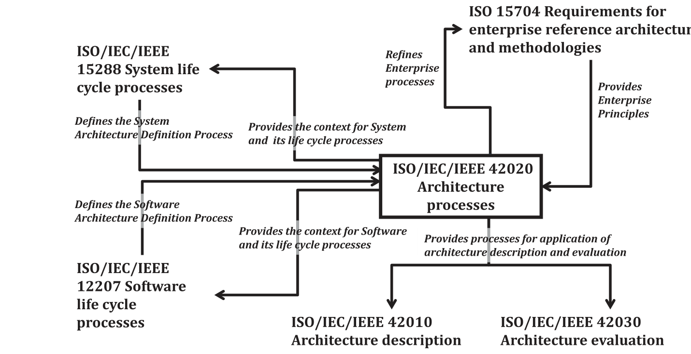

**Figure D.1 — Main relationships between ISO/IEC/IEEE 42020 and other ISO standards**

**图 D.1 — ISO/IEC/IEEE 42020 与其他 ISO 标准之间的主要关系**

## Annex E (informative) — Notes on terms and concepts ｜ 附录 E（资料性）——术语与概念说明

### E.1 General 总则

This annex complements Clauses 3 and 5 with additional information about key terms and concepts used in this document.

本附录以关于本文件所用关键术语与概念的补充信息，对第 3 章和第 5 章加以补充。

### E.2 Architecture concepts 架构概念

#### E.2.1 Metaphors 隐喻

A companion document, ISO/IEC/IEEE 42010, lists six overlapping applications of architecture. In terms of metaphors, the six are: architecture as concept; architecture as property; architecture as blueprint; architecture as literature; architecture as language; and architecture as decision. The present document adds a seventh metaphor: architecture as constraint. The constraint is on the design space available to the design definition process. While it is true that an architecture should be as design-agnostic as possible (see ISO/IEC/IEEE 15288:2015, 6.4.4.1, NOTE 2), at the same time it is also true that there may be reasons for an architecture to constrain the design space. The major reasons for constraint are:

配套文件 ISO/IEC/IEEE 42010 列出了架构的六种相互重叠的应用。就隐喻而言，这六种是：架构作为概念；架构作为属性；架构作为蓝图；架构作为文献；架构作为语言；以及架构作为决策。本文件增加了第七种隐喻：架构作为约束。该约束施加于可供设计定义过程使用的设计空间。虽然架构宜尽可能与设计无关（见 ISO/IEC/IEEE 15288:2015, 6.4.4.1, NOTE 2），但同时也确实可能存在使架构约束设计空间的理由。约束的主要理由是：

- to close off parts of the design space that are showing to be prone to undesirable emergent properties;

- 封闭设计空间中已显现出易产生非期望涌现特性的部分；

- to avoid limitations on entity evolution - to avoid painting oneself into a corner;

- 避免对实体演进的限制——避免自陷困境；

- to avoid limitations on entity re-use;

- 避免对实体复用的限制；

- to avoid designs that would cause incompatibilities among implementations on platforms or

- 避免产生会导致在能力不同的平台或

technologies of different capabilities - communication and network architectures, and indeed platform architectures, are cases in point;

技术上的各实现之间互不兼容的设计——通信与网络架构，乃至平台架构，即为适例；

- to avoid limitations on the flexibility to respond to future, evolving stakeholder needs.

- 避免对响应未来不断演变的利益相关方需要的灵活性的限制。

In many cases, needs for constraining a design space are discovered by the “downstream” processes, particularly (but not only) the processes of implementation, verification, validation and operation. This document's architecture processes are able to respond to these discoveries.

在许多情况下，约束设计空间的需求是由“下游”过程发现的，特别是（但不限于）实施、验证、确认和运行过程。本文件的架构过程能够响应这些发现。

Architectures as constraint are limited by the counter-balancing desire to maximize the available design space. Within its limits, an architecture as constraint can be exhaustive and exceedingly precise. Architectures as constraint also tend to be long-lived, leading to organizational forms such as an architecture maintenance board.

作为约束的架构受制于最大化可用设计空间这一相互制衡的诉求。在其限度之内，作为约束的架构能是详尽无遗且极为精确的。作为约束的架构也往往长期存续，从而催生诸如架构维护委员会之类的组织形式。

#### E.2.2 Architecture solution concepts 架构解决方案概念

Solution is a term used very often in scientific and technical activities. Figure E.1 gives an overview of the solution concepts.

解决方案是科学技术活动中十分常用的一个术语。图 E.1 给出了解决方案概念的概览。

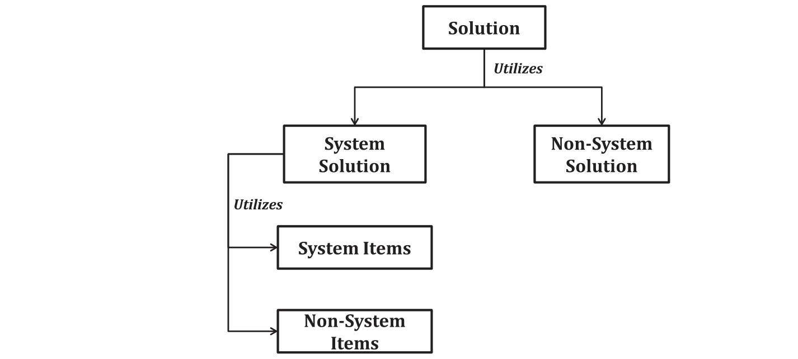

**Figure E.1 — Solution concepts**

**图 E.1 — 解决方案概念**

A solution is an answer to a problem that addresses concerns of stakeholders.

解决方案是对问题的解答，用以应对利益相关方的关注点。

> **EXAMPLE 1** Solution can be business, information technology, mission, capability, service, architecture building block (as defined by the TOGAF framework) and reference architecture (as defined by ISO 15704).

> **示例 1**：解决方案可以是业务、信息技术、使命、能力、服务、架构构建块（如 TOGAF 框架所定义）和参考架构（如 ISO 15704 所定义）。

This solution may utilize system solutions and/or non-system solutions.

该解决方案可利用系统解决方案和／或非系统解决方案。

> **NOTE 1** The term “system” is used in ISO/IEC/IEEE 42010 to refer to entities whose architectures are of interest. The term is intended to encompass, but is not limited to, entities within the following domains:

> **注 1**：术语“系统”在 ISO/IEC/IEEE 42010 中用于指代其架构受到关注的实体。该术语意在涵盖但不限于以下领域内的实体：

- systems as described in ISO/IEC/IEEE 15288: “systems that are man-made and may be configured with one

- ISO/IEC/IEEE 15288 所述的系统：“人造的、并且可配置有以下一项

or more of the following: hardware, software, data, humans, processes (e.g., processes for providing service to users), procedures (e.g. operator instructions), facilities, materials and naturally occurring entities”;

或多项的系统：硬件、软件、数据、人员、过程（例如为用户提供服务的过程）、规程（例如操作员指令）、设施、材料以及自然存在的实体”；

- software products and services as described in ISO/IEC/IEEE 12207;

- ISO/IEC/IEEE 12207 所述的软件产品和服务；

- software-intensive systems as described in IEEE Std 1471:2000: “any system where software contributes

- IEEE Std 1471:2000 所述的软件密集型系统：“任何这样的系统，其中软件对

essential influences to the design, construction, deployment, and evolution of the system as a whole” to encompass “individual applications, systems in the traditional sense, subsystems, systems of systems, product lines, product families, whole enterprises, and other aggregations of interest”.

整个系统的设计、构建、部署和演进产生关键影响”，以涵盖“单个应用、传统意义上的系统、子系统、系统的系统、产品线、产品族、整个企业以及其他所关注的聚合体”。

> **EXAMPLE 2** System solution can be system of systems, class of systems, individual systems and solution building block (as defined by the TOGAF framework).

> **示例 2**：系统解决方案可以是系统的系统、系统类别、单个系统和解决方案构建块（如 TOGAF 框架所定义）。

> **EXAMPLE 3** Non-system solutions can be product line, family of systems, data, technology, policy, process and mission thread.

> **示例 3**：非系统解决方案可以是产品线、系统族、数据、技术、政策、过程和使命线程。

System Solutions may utilize system items and/or non-system items.

系统解决方案可利用系统项和／或非系统项。

> **EXAMPLE 4** System item can be class of systems, system of systems, individual systems, product system, service system and natural system.

> **示例 4**：系统项可以是系统类别、系统的系统、单个系统、产品系统、服务系统和自然系统。

> **EXAMPLE 5** Non-system item can be hardware item, firmware, software item, database, personnel, role, resource, service and natural resources (e.g. water, air, animals).

> **示例 5**：非系统项可以是硬件项、固件、软件项、数据库、人员、角色、资源、服务和自然资源（例如水、空气、动物）。

> **NOTE 2** Architecture can exhibit any part of the solution being considered as entity-of-interest.

> **注 2**：架构能将解决方案中被视为所关注实体的任何部分呈现出来。

#### E.2.3 Architecture life concepts 架构生存期概念

Figure E.2 identifies key architecture life concepts and their relationships.

图 E.2 标示了关键的架构生存期概念及其关系。

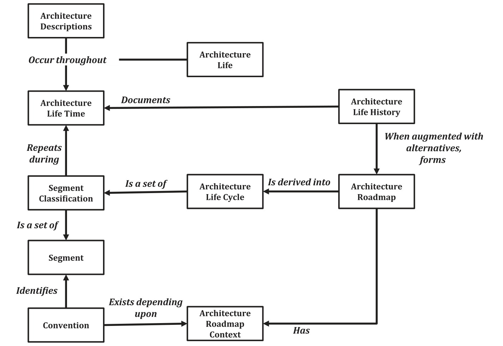

**Figure E.2 — Architecture life concepts**

**图 E.2 — 架构生存期概念**

Architecture life concepts refer to the characterization of entity architecture as documented by architecture descriptions that occur throughout the entity’s life span. Each entity for which an architecture is said to exist, should have a life time described by a life history associated with the evolution of the architecture, in whatever form that reality takes, to end of life. This architecture life history, when augmented with alternatives considered along the way, forms a roadmap for the architecture of the entity described, whether that entity is a single system-of-interest or some grouping of systems as yet lacking particular clarification.

架构生存期概念是指实体架构的特征刻画，该刻画由在实体整个寿命期内出现的架构描述予以记载。凡据称存在架构的每个实体，其寿命宜由一段生存史来描述，该生存史与该架构的演进相关联——无论该现实采取何种形式——直至寿命终止。这一架构生存史若辅以过程中考虑过的各种备选方案，便构成所描述实体之架构的路线图，无论该实体是单个所关注系统，还是某种尚缺乏具体明确的系统组合。

Since many entities may utilize the same architecture, and since that architecture may change over time for particular entities or may be reused at some other time, the architecture itself have a life history distinct from the life history of the entities utilizing that architecture.

由于许多实体可以利用同一架构，并且由于该架构对于特定实体可能随时间而变化，或在其他时候被复用，因此架构本身具有与利用该架构的实体的生存史不同的生存史。

To classify commonly encountered segments along that roadmap several conventions exist depending upon roadmap context. Collectively, these conventions identify distinct segments found in most roadmaps as a life cycle, i.e. while a particular entity may progress from one segment to the next during its life span without repetition of a segment, all entities of that particular kind transition through the same set of segments. Life cycle refers to the set of distinct segment classifications that commonly occur within a context even when one or more of those segments repeats during the entity’s life span. In this regard, the life cycle metaphor is conceptual since no life cycle instance in nature repeats a metamorphic segment for a particular individual.

为对路线图上常见的各段加以归类，依路线图语境的不同存在若干约定。这些约定合起来把大多数路线图中可见的各不同段识别为一个生存周期，即：虽然特定实体在其寿命期内可从一段推进到下一段而无需重复某段，但该特定种类的所有实体都经历同一组段。生存周期指某一语境中通常出现的一组不同的段分类，即便其中一段或多段在实体的寿命期内重复出现。就此而言，生存周期这一隐喻是概念性的，因为自然界中没有任何生存周期实例会为某个特定个体重复某个蜕变段。

Life cycle is a set of distinguishable phases or stages that an entity goes through from its conceptualization until it ceases to be used (See 3.11). Phases are period of time in the life cycle during which activities are performed (See 3.15) while stages are periods within the life cycle that relates to the state of its description or realization (See 3.20).

生存周期是实体从其概念化直至不再被使用所经历的一组可区分的时期或阶段（见 3.11）。时期是生存周期内执行活动的时段（见 3.15），而阶段是生存周期内与其描述或实现的状态相关的时期（见 3.20）。

Two life cycle classification schemes have found utility in International Standards associated with system and enterprise architecture. Independently developed at about the same time, ISO/IEC/IEEE 15288 is the result of work associated with the standardization of engineered systems while ISO 15704 is the result of work associated with the standardization of industrial automation systems. Since initial publication, amendment and revision for both standards now position them for broader and more general application than originally published, the focus of, ISO/IEC/IEEE 15288 is still systems and the focus of ISO 15704 is still enterprises.

两种生存周期分类方案在与系统和企业的架构相关的国际标准中得到了应用。二者大约在同一时期各自独立制定：ISO/IEC/IEEE 15288 是与工程化系统标准化相关工作的成果，而 ISO 15704 是与工业自动化系统标准化相关工作的成果。自首次发布以来，两项标准的修正与修订使其定位为比最初发布时更广泛、更通用的应用，ISO/IEC/IEEE 15288 的重点仍是系统，ISO 15704 的重点仍是企业。

#### E.2.4 Life cycle models 生存周期模型

Every entity has an associated life cycle. According to ISO/IEC/IEEE 15288 a life cycle is the “evolution of a system, product, service, project or other human-made entity from conception through retirement”. A life cycle can be described using an abstract functional model that represents the conceptualization of a need for the entity, its realization, utilization, evolution and disposal. Such life cycle models may be defined as a “framework of processes and activities concerned with the life cycle that may be organized into stages, which also acts as a common reference for communication and understanding”.

每个实体都有与之关联的生存周期。按照 ISO/IEC/IEEE 15288，生存周期是“系统、产品、服务、项目或其他人造实体从构想到退役的演进”。生存周期可用一个抽象的功能模型来描述，该模型表示对实体需要的概念化、其实现、利用、演进和处置。此类生存周期模型可定义为“与生存周期有关、可组织为阶段的过程与活动的框架，它同时充当沟通与理解的共同参考”。

An entity progresses through its life cycle as the result of tasks performed and managed by people in organizations, using processes and practices for the execution of these tasks. A life cycle model is expressed in terms of processes, their outcomes, relationships and sequencing/concurrency. ISO/IEC/IEEE 15288 defines a set of processes, termed life cycle processes, which can be used to describe a system’s life cycle. Further details may be found in Annex C.

实体在其生存周期中的推进，是组织中的人员完成并管理各项任务的结果，而人员使用过程和实践来执行这些任务。生存周期模型用过程、其预期结果、关系以及顺序／并行来表达。ISO/IEC/IEEE 15288 定义了一组称为生存周期过程的过程，可用于描述系统的生存周期。更多细节可参见附录 C。

An architecture can also be viewed as having a life cycle that is distinct from the associated entity life cycle.

架构也可被视为具有一个与其关联实体的生存周期不同的生存周期。

Every architecture goes through various distinct stages of development, use and revision before it is ultimately discarded. It is therefore useful to think of an architecture as having a life cycle, which is not necessarily aligned completely with any particular entity. This perspective is important because it allows the identification of the appropriate infrastructure needed to manage architecting products. The nature of the architecture life cycle is determined by the purpose of the architecture.

每个架构在被最终废弃之前，都经历开发、使用和修订等各个不同阶段。因此，把架构视为具有生存周期是有益的，该生存周期未必与任何特定实体完全一致。这一视角很重要，因为它允许识别管理架构工作的产品所需的适当基础设施。架构生存周期的性质由架构的目的决定。

Some typical architecture life cycles featuring varying degrees of use (and revision) are indicated in Figure E.3 bellow.

图 E.3 中示出若干典型的架构生存周期，其使用（与修订）程度各不相同。

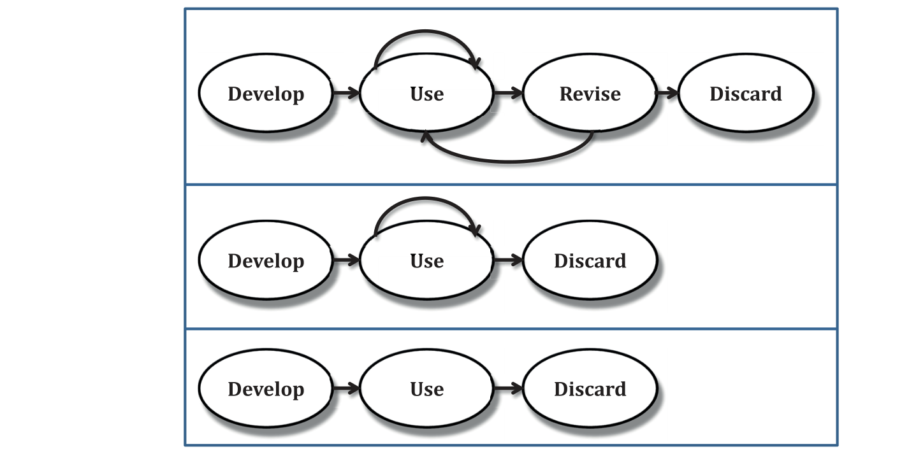

**Figure E.3 — Architecture life cycle options**

**图 E.3 — 架构生存周期选项**

### E.3 Architecting strategies and approaches 架构工作策略与途径

#### E.3.1 Architecting strategy 架构工作策略

##### E.3.1.1 Introduction to architecting strategy 架构工作策略简介

An architecting strategy defines the starting point for conducting an architecting activity. It defines the background and reasons for trying to form a system concept. While there is no complete list, there are a number of common cases. The situation, the approach and the other points made here are distinct but not independent. Arbitrary combinations will often not make practical sense, but neither does each solely depend on the other.

架构工作策略规定开展架构工作活动的起点。它规定试图形成系统概念的背景与理由。虽不存在完整的清单，但存在若干常见情形。此处所述的情形、途径与其他要点彼此相异，但并不相互独立。任意组合往往并无实际意义，但各者也不是单单依赖于另一者。

Note that these strategies are described in terms of being applied to a “system” architecture although they can be also applied to enterprise architectures, as well as to products and services that are not otherwise considered to be systems (e.g. software item).

注意，这些策略是按应用于“系统”架构来描述的，尽管它们也能应用于企业架构，以及在其他情况下不被视为系统的产品与服务（例如软件项）。

##### E.3.1.2 New development, (sometimes known as a “greenfield” approach) 全新开发（有时称为“绿地”途径）

This is the classic case where there is no prior system, the system (or other kind of entity) being architected will be all new. In the most extreme case the sponsor will desire a system delivering an unprecedented capability implemented with a technology with limited or non-existent precedent (consider the development of nuclear submarines in the 1950’s).

这是不存在先前系统的经典情形：被架构的系统（或其他种类的实体）将完全是新的。在最极端的情形下，发起方期望系统交付前所未有的能力，而该能力以先例有限或全无先例的技术来实现（可考虑 20 世纪 50 年代核潜艇的研制）。

##### E.3.1.3 New product in a product-line 产品线中的新产品

In this case there are pre-existing systems with capabilities and technology quite similar to the desired system. The new system is intended to make a precedented extension of the pre-existing related systems that have been genericized into a product line.

在此情形下，存在能力与技术同所期望系统颇为相似的既有系统。新系统旨在对已通用化为产品线的既有相关系统作有先例的扩展。

##### E.3.1.4 Legacy evolution 遗留系统演进

Here the architect has an existing system or collection of systems (the “legacy”) and is tasked to evolve or extend that legacy. The goals may be to add capability, reduce operating cost, eliminate obsolete technology, or something else. A key aspect is that the legacy exists and cannot be abandoned.

此处架构师拥有一个既有系统或系统集合（“遗留系统”），其任务是演进或扩展该遗留系统。目标可以是增加能力、降低运行成本、淘汰过时技术，或别的什么。一个关键方面是：遗留系统已存在，且不能被弃置。

An outstanding example of legacy evolution is planned periodic technology refresh such as submarine combat system technology with alternating biennial refresh of the hardware and software baselines in even and odd years to minimize logistics costs for hardware and provide a more capable computing infrastructure to support future evolution.

遗留系统演进的一个突出示例是计划性的周期性技术更新，例如潜艇作战系统技术，其硬件基线与软件基线在偶数年与奇数年交替进行两年一次的更新，以尽量降低硬件的后勤成本，并提供能力更强的计算基础设施以支撑未来的演进。

##### E.3.1.5 Legacy revolution 遗留系统革命

In this case the legacy exists but the sponsors’ intent is to radically depart from that legacy. The usual case here is that while the legacy works there is a belief that the adoption of a radical departure (usually a radical departure in both technical approach and concept of operations) will enable large changes in capabilities or costs. The situation is not entirely a new development because the legacy capability exists and the “revolutionary” system will presumably have to interface to it in some fashion, but the deliberate intent is to abandon some large fraction of existing infrastructure.

在此情形下，遗留系统存在，但发起方的意图是彻底脱离该遗留系统。通常的情形是：遗留系统虽仍在工作，但人们相信采纳一种彻底的脱离（通常是技术途径与运行概念两方面的彻底脱离）将带来能力或成本上的重大变化。这种情形并不完全是全新开发，因为遗留能力存在，且“革命性”系统想必必须以某种方式与其接口，但其有意的意图是弃置现有基础设施的很大一部分。

##### E.3.1.6 Incremental start 增量式启动

Here the sponsor wants to build something new, but the uncertainty about what will be the best fit is great. Instead of making a large-scale and irrevocable bet on the future system the intent is to make an incremental step, to be followed by later steps that move toward a superior system. The architecting activity embraces the uncertainty and develops both initial steps and options for subsequent steps that account for known (and possibly unknown) uncertainties in user demand or technology.

此处发起方想要构建某种新事物，但关于何为最佳匹配存在很大的不确定性。其意图不是对未来系统作大规模且不可撤回的押注，而是迈出增量式的一步，随后再以若干后续步骤朝更优的系统推进。架构工作活动接纳这种不确定性，既制定初始步骤，也针对后续步骤制定选项，以顾及用户需求或技术方面已知（以及可能未知）的不确定性。

##### E.3.1.7 Product-line start 产品线式启动

This is a particular case of a new start where the intent is to build a product-line rather than a single system. The result should be a genericized solution used to produce an indeterminate number of future, related systems, related by reliance on a common base of design, technology, or production, and possibly variable elements.

这是新启动的一种特殊情形，其意图是构建产品线而非单个系统。其结果宜为一种通用化的解，用于生产数量不定的未来相关系统；这些系统因依赖共同的设计、技术或生产基础而相互关联，并可能包含可变元素。

#### E.3.2 Architecting approaches 架构工作途径

##### E.3.2.1 General 总则

Several different approaches to architecting (i.e. conceptualization, evaluation and elaboration) exist. These are categorized primarily in terms of the strategy (starting points) for forming the system architecture. The approach which should be adopted depends upon the complexity of the system of interest, its novelty, realization mechanisms and/or the uncertainty in the stakeholder needs.

架构工作存在若干不同的途径（即概念化、评估与细化）。这些途径主要按形成系统架构的策略（起点）来分类。宜采用何种途径取决于所关注系统的复杂性、其新颖程度、实现机制，和／或利益相关方需求中的不确定性。

Note that a particular system architecting effort sometimes requires the use of more than one of these approaches.

注意，某一特定的系统架构工作有时需要使用上述途径中的一种以上。

Some examples of architecting approaches are given in the following subclauses.

以下各分条款给出了架构工作途径的一些示例。

##### E.3.2.2 Forward 正向

In forward architecting the architecting process moves from consideration of the problem space to the solution space, initially at an architectural level of consideration. Within forward architecting several more specific approaches may be employed, either singly or in combination, for example top-down or bottom-up. Architecture evaluation is also likely to be employed to ensure that the architecture is sound in meeting its intended purpose.

在正向架构工作中，架构工作过程从对问题空间的考虑转向解空间，起初处于架构层面的考虑。在正向架构工作内部，可采用若干更为具体的途径，或单独使用，或组合使用，例如自顶向下或自底向上。还可能采用架构评估，以确保架构在满足其预期目的方面是健全的。

##### E.3.2.3 Bottom-up 自底向上

In bottom-up architecting the starting points are the artifacts, capabilities and/or services that are available and/or realizable which are then composed and formed into a system architecture exhibiting the desired (or desirable) emergent properties.

在自底向上架构工作中，起点是可获得和／或可实现的人工制品、能力和／或服务，随后将其组合并形成为系统架构，以呈现所期望的（或合宜的）涌现属性。

Note that in studying an existing system there is a clear distinction between producing an architecture description document and comprehending the pre-existing architecture of the system. One may have a clear comprehension of the architecture of the system of interest without having developed a complete document. Conversely, one may have a comprehensive document (albeit one badly written) and still have no clear comprehension of any organizing structure or principles of the system (perhaps because there are no such organizing abstractions).

注意，在研究既有系统时，编制架构描述文档与理解该系统既有的架构之间有明确的区别。人们可能对关注系统的架构有清晰的理解，却并未编制出完整的文档。反之，人们可能拥有一份全面的文档（尽管写得很差），却仍对系统的任何组织化结构或原则没有清晰的理解（也许是因为并不存在此类组织化的抽象）。

##### E.3.2.4 Middle-out 自中向外

In the middle-out approach an arbitrary level of abstraction in the system hierarchy is used as the starting point. Reasoning about, and architecting of, the system then progresses both upwards (towards the goals) and downwards (towards artifacts/capabilities/services).

在自中向外途径中，以系统层级中任意的抽象层次作为起点。随后对系统的推理与架构工作既向上推进（朝向目标），也向下推进（朝向人工制品／能力／服务）。

##### E.3.2.5 Outer-in 自外向内

This approach to system architecting starts at both the top (system goals) and bottom (artifacts/ capabilities/services) and works towards the middle. It entails balancing and harmonizing desirable and achievable system properties.

这种系统架构工作途径同时从顶部（系统目标）与底部（人工制品／能力／服务）开始，并向中间推进。它需要权衡并协调合宜的系统属性与可实现的系统属性。

##### E.3.2.6 Reverse 逆向

Reverse architecting is an aspect of reverse engineering for making the architectures of existing (or designed) systems explicit. It involves the extraction, abstraction and presentation of system information. The devising of “as is” architectures can be devised in this manner. Reverse architecting may address the goals of the existing systems, their components or both. Architecture evaluation may form part of reverse architecting in ascertaining for example as to whether an existing architectural solution is suitable for continued usage.

逆向架构工作是逆向工程的一个方面，用于使既有（或已设计的）系统的架构显式化。它涉及系统信息的提取、抽象与呈现。“现状”架构可以此方式构想出来。逆向架构工作可针对既有系统的目标、其组件或两者。架构评估可构成逆向架构工作的一部分，以例如查明既有的架构解是否适合继续使用。

##### E.3.2.7 Top-down 自顶向下

In top-down system architecting the starting points are the system goals. The approach proceeds through conceptualization to form the system architecture, stopping when appropriate levels of definitional formality and detail have been achieved. The devising of “to-be” architectures generally involves some top-down architecting.

在自顶向下系统架构工作中，起点是系统目标。该途径经由概念化推进以形成系统架构，当达到适当水平的定义形式化程度与详细程度时即停止。“将来”架构的构想通常涉及某种自顶向下架构工作。

##### E.3.2.8 Zigzagging 之字形映射

An approach to decomposition which entails moving from the functional domain to the physical domain (and the process domain) since, according to axiomatic design, decomposition of functional requirements and design parameters (and process variables) cannot be achieved by remaining in a single domain.

一种分解途径，它需要从功能域移动到物理域（以及过程域），因为按照公理设计，功能要求与设计参数（以及过程变量）的分解无法通过停留于单一域来实现。

#### E.3.3 Useful architecting mechanisms 有用的架构工作机制

##### E.3.3.1 General 总则

Various mechanisms can be used to devise a system architecture. Some commonly used mechanisms are described in the following subclauses.

能使用各种机制来构思系统架构。以下各分条款描述了其中一些常用的机制。

##### E.3.3.2 Reference architectures 参考架构

Reference architectures are defined in E.4.1.4. They can be instantiated and specialized to yield potential architecture solutions.

参考架构在 E.4.1.4 中定义。能对其实例化并加以特化，以得出潜在的架构解决方案。

##### E.3.3.3 Architectural Patterns 架构模式

Architectural patterns are patterns as applicable to architectures and architectural artifacts; they tend to be more specific in scope or aspect than reference architectures. They are more abstract in nature and have broader applicability than design patterns. Patterns may be implemented as a set of tactics.

架构模式是适用于架构与架构人工制品的模式；它们在范围或方面体上往往比参考架构更为具体。它们在本质上更为抽象，适用范围也比设计模式更广。模式可实现为一组战术。

They apply to functional components and modules, their structure, organization and interaction. They include rules and guidelines for organizing the relationships between the constituent elements, serving as templates for functional composition. They may be used to identify commonality and re-usability in systems and to deliver key functionality.

它们适用于功能组件与模块，及其结构、组织与交互。它们包含用于组织各构成元素之间关系的规则与指南，充当功能组合的模板。它们能用于识别系统中的共性与可复用性，并交付关键功能。

##### E.3.3.4 Tactics 战术

Tactics are primitive techniques architects employ to achieve particular system characteristics or enshrine these characteristics in architecture principles. They are simpler and more primitive than patterns and are abstract in nature. Architectural patterns and styles incorporate and are implemented using multiple tactics. Tactics may be employed, for example, to ease modifiability of a system or to ensure performance levels are achieved.

战术是架构师为达成特定的系统特性、或将这些特性固化于架构原则之中而采用的原始技术。它们比模式更简单、更原始，且本质上是抽象的。架构模式与风格纳入战术，并借助多种战术来实现。战术可用于例如提升系统的可修改性，或确保达到所要求的性能水平。

##### E.3.3.5 Heuristics 启发式方法

Within the scope of this document, heuristics are guidelines for architecting. They are derived from experience. Not all heuristics apply in all circumstances. Heuristics exist for different aspects of architecting such as partitioning functionality, aggregating functionality, evaluating systems architectures, etc.

在本文件的范围内，启发式方法是用于架构工作的指南。它们源自经验。并非所有启发式方法都适用于所有情形。启发式方法存在于架构工作的不同方面体，例如划分功能、聚合功能、评估系统架构等。

### E.4 Architecture kinds, views and styles 架构种类、架构视图与风格

#### E.4.1 Architecture kinds 架构种类

##### E.4.1.1 General 总则

Different kinds of architecture can be considered according to their purpose, domains of application and roles within entity and architecture life cycles. Architecting may require the use (including development and/or application) of architectures of several kinds.

能根据架构的目的、应用领域以及在实体与架构生存周期中的角色来考察不同种类的架构。架构工作可能需要使用（包括开发和／或应用）若干种类的架构。

> **NOTE** Descriptions expressing a viewpoint, an aspect, an abstraction level or a perspective are sometimes called architecture kinds. Examples are security architecture, logical architecture and physical architecture.

> **注**：用于表达某个视角、某个方面体、某个抽象层级或某个角度的描述，有时称为架构种类。示例包括安全架构、逻辑架构与物理架构。

In discussing architecture kinds it is important to keep in mind the distinction in ISO standards (especially ISO/IEC/IEEE 42010) between architecture descriptions (as documents) and architectures (as conceptual things).

在讨论架构种类时，务必牢记 ISO 标准（尤其是 ISO/IEC/IEEE 42010）中架构描述（作为文档）与架构（作为概念性事物）之间的区别。

Some commonly used architecture kinds are given in the following subclauses.

以下各分条款给出了一些常用的架构种类。

##### E.4.1.2 Enterprise architecture 企业架构

An enterprise architecture is either the architecture of an enterprise[46] or the architecture of an entity from an enterprise point of view. In both cases, it has a defined overall business objective and may include one or more participating organization.

企业架构或者是一个企业[46]的架构，或者是从企业角度考察的某个实体的架构。在这两种情况下，它都具有已定义的总体业务目标，并且可包含一个或多个参与组织。

Enterprise architecture is the organizing logic for business processes and information technology infrastructure reflecting the integration and standardization requirements of the company's operating model. The operating model is the desired state of business process integration and business process standardization for delivering goods and services to customers. See Innovating in Information Systems, Weill 2007[44].

企业架构是业务流程与信息技术基础设施的组织逻辑，它反映公司运营模式的集成与标准化要求。运营模式是为向客户交付货物与服务而期望达到的业务流程集成与业务流程标准化状态。见 Innovating in Information Systems, Weill 2007[44]。

##### E.4.1.3 Overarching or strategic architecture 总体架构或战略架构

An overarching architecture provides a strategic architectural context for a collection of entities and their associated architectures, including the interactions between these entities and any dependencies between the architectures. It concentrates on high-level objectives at the level of capabilities, systems of systems, or portfolios of projects and of necessity addresses such considerations at a comparatively high level of abstraction given the breadth of coverage.

总体架构为一组实体及其相关联的架构提供战略性的架构语境，其中包括这些实体之间的交互以及各架构之间的任何依赖关系。它关注能力、系统的系统或项目组合层面的高层级目标，并且鉴于覆盖范围的广度，必然在相对较高的抽象层级上处理此类考虑因素。

> **NOTE** Notion of overarching architecture is described in the NATO Architecture Framework. A similar architecture kind is called “strategic architecture” in TOGAF.

> **注**：总体架构的概念在 NATO 架构框架中有所描述。一种类似的架构种类在 TOGAF 中称为“战略架构”。

> **EXAMPLE** An overarching architecture can be done for maritime surveillance of a country. This architecture orients programs and projects which occur in this scope, focusing particular domains of activities, like maritime search and rescue.

> **示例**：能为一国的海上监视制定总体架构。该架构为该范围内开展的规划与项目指明方向，并聚焦于海上搜救等特定的活动域。

##### E.4.1.4 Reference architecture 参考架构

A reference architecture is used by a community of interest as a shared and agreed reference description that can be used for that community’s business purposes. It is usually generic and is instantiated as architectures specific for individual business purposes. Reference architectures are used to:

参考架构由某个利益共同体用作共享且经协商一致的参考描述，供该共同体用于其业务目的。它通常是通用的，并被实例化为针对个别业务目的的架构。参考架构用于：

a) aid understanding of the forms of likely solutions to problems within a particular domain, and b) maximize the possible commonality in forms of solutions to similar problems within such a domain.

a) 帮助理解特定领域内问题的可能解决方案的形态；以及b) 使此类领域内类似问题的解决方案形态的可能共性最大化。

When the entity of interest is intended as a generalized case to be used as a guide for use in the architecting effort, then this kind of architecture is sometimes called a “reference architecture”. In this case, the entity itself is not intended to be instantiated but is used as the basis for creating a realizable architecture of some entity that is a more concrete example of the abstract reference entity. An example of a reference architecture of this kind is the Open Systems Interconnection model (OSI model) specified in ISO/IEC 7498-1.

当所关注实体意在被当作一种泛化情形、以用作架构工作中可资借鉴的指南时，这类架构有时称为“参考架构”。在此情况下，该实体本身并不意在实例化，而是用作创建某个实体的可实现架构的基础，该实体是抽象参考实体的一个更具体的示例。一个示例这类参考架构的示例是 ISO/IEC 7498-1 中规定的开放系统互连模型（OSI 模型）。

> **NOTE** Notion of reference architecture is described in many architecture frameworks, engineering methodologies and guides.

> **注**：参考架构的概念在许多架构框架、工程方法论与指南中都有描述。

> **EXAMPLE** See OASIS Reference Architecture for Service Oriented Architecture

> **示例**：见 OASIS Reference Architecture for Service Oriented Architecture

##### E.4.1.5 Domain architecture 领域架构

A generic, organizational structure or design for systems in a domain (based on IEEE Std 1517-1999).

领域中各系统的一种通用的组织性结构或设计（基于 IEEE Std 1517-1999）。

> **NOTE** The domain architecture contains the architectural forms that are capable of satisfying requirements within a specific domain. A domain architecture 1) can be adapted to create designs for systems within a domain, and 2) provides a framework for configuring assets within individual systems.

> **注**：领域架构包含能满足特定领域内要求的各种架构形态。领域架构 1) 能经调整以创建领域内各系统的设计，并且 2) 为在单个系统内配置资产提供框架。

##### E.4.1.6 Baseline architecture 基线架构

Baseline architecture is the definition of the architecture being defined for a given point of time. They serve as synchronization key-points for review and provision of architectures as references. Particular cases are:

基线架构是为给定时间点所定义的架构的定义。它们充当同步关键点，用于架构的评审以及将架构作为参考予以提供。其特例包括：

- Current architecture (or “as-is” architecture) is the definition of the architecture currently in use

- 当前架构（或“现状”架构）是当前正在使用的架构的定义

- Target architecture (or “to-be” architecture) gives the expected definitive definition.

- 目标架构（或“将来”架构）给出所预期的最终定义。

> **NOTE** A definition of target architecture is provided below.

> **注**：目标架构的定义见下文。

##### E.4.1.7 Target architecture 目标架构

Target architecture is a description of an envisioned architecture concerning the ultimate evolution of the entity of interest.

目标架构是关于所关注实体最终演进的所设想架构的描述。

##### E.4.1.8 System architecture 系统架构

System architecture addresses the architecture of a system. It can be defined for one or more epochs according to a roadmap.

系统架构针对的是系统的架构。能按照路线图为一个或多个时段定义它。

> **NOTE 1** System is used here to cover anything studied with a systemic approach.

> **注 1**：在此，系统用于涵盖以系统性方法研究的任何事物。

> **NOTE 2** System architecture definition will apply the directives given by the relevant Overarching Architecture, if any.

> **注 2**：系统架构定义将应用相关总体架构（若有）给出的指示。

> **NOTE 3** A system architecture can be derived totally or partially from one or several Reference Architectures.

> **注 3**：系统架构能全部或部分地从一或多个参考架构导出。

> **NOTE 4** If the system architecture is defined for one or more epochs according to a roadmap, there is one (or several) system Baseline Architecture and one system Target Architecture.

> **注 4**：若按照路线图为某个时段或多个时段定义系统架构，则存在一个（或多个）系统基线架构和一个系统目标架构。

##### E.4.1.9 Product line architecture 产品线架构

According to ISO/IEC/IEEE 24765, a product line is:

根据 ISO/IEC/IEEE 24765，产品线是：

- from the commercial viewpoint, a group of products or services sharing a common, managed set of

- 从商业视角看，是一组产品或服务，它们共享一组公共的、受管理的

features that satisfy specific needs of a selected market or mission;

特性，这些特性满足所选市场或使命的特定需要；

- from the engineering viewpoint, a collection of systems that are potentially derivable from a single

- 从工程视角看，是一组系统，这些系统有可能从单个

domain architecture.

领域架构导出。

Architecture description of a product line formulates a set of products addressing similar problems and exhibiting an appropriate degree of architectural and solution commonality.

产品线的架构描述表述了一组应对类似问题、并展现出适当程度的架构与解共性的产品。

##### E.4.1.10 System of systems architecture 系统的系统架构

The architecture of a system that meets the criteria for a “system-of-systems”. Systems of systems will be distinguished from large but monolithic systems by the operational and managerial independence of their components, their evolutionary nature, emergent behavior and a geographic extent that limits the interaction of their components to information exchange. See Architecting Principles for Systems-of- Systems, Maier 1996[45].

满足“系统的系统”准则的系统的架构。系统的系统与大型但单体式的系统的区别在于：其组成部分在运行上和管理上的独立性、其演进本性、涌现行为，以及将组成部分之间的交互限制为信息交换的地理范围。见 Architecting Principles for Systems-of- Systems, Maier 1996[45]。

##### E.4.1.11 Product-service system architecture 产品服务系统架构

The architecture of a system that meets the criteria for a “product-service system”. A product service-system will be a system of products, services, networks of “players” and supporting infrastructure that continuously strives to be competitive, satisfy customer needs and have a lower environmental impact than traditional business models. The product/service ratio in this system will vary depending on the function fulfillment or economic value. The architecture of the product-service system will be capable of jointly satisfying a user’s need while taking into consideration the shift from techno-productive dimension (focus on functionality) to the social and cultural dimension (focus on value).

满足“产品服务系统”准则的系统的架构。产品服务系统将是由产品、服务、“参与者”网络以及支撑性基础设施组成的系统，它持续力求具有竞争力、满足客户需要，并具有比传统商业模式更低的环境影响。该系统中的产品／服务比例将随功能履行情况或经济价值而变化。产品服务系统的架构将能在考虑从技术生产维度（关注功能性）向社会文化维度（关注价值）转变的同时，共同满足用户的需要。

> **NOTE** Service-Oriented Architecture (SOA) is sometimes identified as an architecture kind but is more accurately termed an architecture style. In fact, any of the architecture kinds considered can be defined with a service orientation.

> **注**：面向服务的架构（SOA）有时被认定为一种架构种类，但更准确地应称为一种架构风格。事实上，所考虑的任何架构种类都能以服务导向来定义。

##### E.4.1.12 Data architecture 数据架构

A data architecture is composed of models, policies, rules or standards that govern which data is collected, and how it is stored, arranged, integrated, and put to use in data systems and in organizations.

数据架构由模型、方针、规则或标准组成，它们管控收集哪些数据，以及数据在数据系统和组织中如何存储、安排、集成和使用。

#### E.4.2 Architecture views 架构视图

##### E.4.2.1 General 总则

Architecture views express the architecture from the perspective of specific concerns about the architecture entity. Typically, several such (complementary) views are formed during architecting. Some commonly used views are given in the following subclauses.

架构视图从关于架构实体的特定关注点的角度来表达架构。通常在架构工作期间会形成若干此类（互补的）视图。下面各分条款给出了一些常用的视图。

##### E.4.2.2 Contextual (view of) architecture 架构的语境视图

The contextual view of an architecture deals with contextual factors and drivers including, for example, PESTEL (political, economic, social, technical, environmental or legal) aspects or description of DOTMLPFI (Doctrine, Organization, Training, Material, Leadership, Personnel, Facilities, Interoperability) aspects.

架构的语境视图处理语境因素与驱动因素，例如包括 PESTEL（政治、经济、社会、技术、环境或法律）方面体，或 DOTMLPFI（条令、组织、训练、物资、领导、人员、设施、互操作性）方面体的描述。

##### E.4.2.3 Conceptual (view of) architecture 架构的概念视图

The conceptual view of an architecture provides the main ideas or concepts from outside of the architecture. This provides the fundamental view that can be used as a starting point for further architecture efforts.

架构的概念视图提供来自架构之外的主要思想或概念。这提供了基本视图，可用作进一步架构工作的起点。

##### E.4.2.4 Functional (view of) architecture 架构的功能视图

ISO/IEC/IEEE 42010 conformant architecture description document will normally contain a view capturing the functions of the system of interest (it is not a 42010 normative requirement but would almost always be included). A functional architecture can be said to be the essential or organizing functional structure, the way abstracted inputs are transformed into outputs by the system to achieve its mission.

符合 ISO/IEC/IEEE 42010 的架构描述文档通常会包含一个捕获所关注系统功能的视图（它不是 42010 的规范性要求，但几乎总会被包含在内）。功能架构可以说是本质性的或起组织作用的功能结构，即系统为达成其使命而将抽象化的输入转换为输出的方式。

##### E.4.2.5 Logical (view of) architecture 架构的逻辑视图

The logical view of an architecture in an architecture description is typically an integrated model of both the system’s functions and retained data, where the abstraction level is chosen to be directly relevant to users rather than implementation. The logical view of the architecture defines data as it makes sense in the problem domain, and defers definition of how it can be represented to other views. So, for example, the logical view would define data and functional transformations in terms of positions, currency amounts, or objects of user interest and not in terms of XML records or database fields.

架构描述中架构的逻辑视图通常是系统功能与留存数据两者的集成模型，其中抽象层级的选择是使其与用户直接相关，而不是与实施相关。架构的逻辑视图按在问题域中有意义的方式来定义数据，而将数据如何表示的定义推迟到其他视图。因此，例如，逻辑视图将按位置、货币金额或用户所关注的对象来定义数据与功能转换，而不按 XML 记录或数据库字段来定义。

> **NOTE** What constitutes a logical or physical architecture is often somewhat subjective and a spectrum of such architectures can be so employed.

> **注**：构成逻辑架构或物理架构的内容往往带有一定主观性，因而可以采用处于这一谱系上的各类此类架构。

##### E.4.2.6 Physical (view of) architecture 架构的物理视图

A physical view of the architecture description is an arrangement of system elements and physical interfaces that provides the design solution for a product, service or enterprise, and is intended to satisfy logical architecture elements and system requirements.

架构描述的物理视图是系统元素与物理接口的一种安排，它为产品、服务或企业提供设计解，并旨在满足逻辑架构元素与系统需求。

##### E.4.2.7 Technical (view of) architecture 架构的技术视图

A technical view of the architecture description is defined in terms of technical recognizable objects that compose a systems implementation and the interfaces among them. It is implementable through technologies.

架构描述的技术视图按构成系统实施的技术上可识别的对象及其相互之间的接口来定义。它能通过技术加以实现。

##### E.4.2.8 Organizational (view of) architecture 架构的组织视图

The organizational view represents the responsibilities and authorities on all entities identified in the other enterprise views (processes, information and resources). It caters for the structure of the enterprise organization by organizing the identified organizational units into larger units such as departments, divisions, sections, etc. See ISO 15704:2000 A.3.1.5.3.2.

组织视图表示其他企业视图（过程、信息与资源）中所识别的全部实体上的职责与权限。它通过将所识别的组织单元组织为诸如部门、分部、科室等更大的单元，来满足企业组织的结构需要。见 ISO 15704:2000 A.3.1.5.3.2。

The organization-related aspects have to do with decision level, responsibilities and authorities, the operational ones relate to the capabilities and qualities of humans as enterprise resource elements. See ISO 15704:2000 A.3.1.1.

与组织相关的方面体涉及决策层级、职责与权限；与运行相关的方面体则涉及作为企业资源元素的人的能力与品质。见 ISO 15704:2000 A.3.1.1。

#### E.4.3 Architecture styles 架构风格

##### E.4.3.1 General 总则

An architecture (or architectural) style is a set of principles and/or a generic pattern that provides a canonical guidance for architecting. It can be defined by the architecture elements, their topological layout, connectors and interaction mechanisms, and applicable constraints. Architecture styles may describe deployment patterns, structure and design issues, and communication factors. Their use improves structuring and understanding (through the use of established mechanisms and vocabularies), promotes design reuse (through the development of entities based upon proven forms of solution) and supports the consideration of pertinent technical issues.

架构（或架构性）风格是一组原则和／或一种通用模式，为架构工作提供典范性指南。它可由架构元素、这些元素的拓扑布局、连接器与交互机制以及适用的约束来定义。架构风格可描述部署模式、结构与设计问题以及通信因素。使用架构风格能改进结构化与理解（通过运用既定的机制与词汇），促进设计复用（通过基于经证明的解的形式来开发实体），并支撑对相关技术问题的考虑。

> **NOTE** Architecture styles are distinct from the notion of architecting styles. Architecting styles refer to ways of architecting which are codified according to the architecture’s primary purpose including its extent of influence. See Styles of Architecting, Evans 2014[46].

> **注**：架构风格有别于架构工作风格这一概念。架构工作风格指架构工作的方式，这些方式依据架构的首要目的（包括其影响范围）加以编纂。见 Styles of Architecting, Evans 2014[46]。

Some examples of architecture styles particularly as applicable to computer-based systems are given in the following subclauses.

下面各分条款给出了一些架构风格的示例，特别是适用于基于计算机的系统的架构风格。

##### E.4.3.2 Client server 客户端服务器

This architecture distributes data and processing physically across different types of system element. Servers provide specific services such as printing, data management, etc. Clients call on these services. Networks allow clients to access servers.

该架构将数据与处理在物理上分布到不同类型的系统元素上。服务器提供特定服务，诸如打印、数据管理等。客户端调用这些服务。网络允许客户端访问服务器。

##### E.4.3.3 Component-based architecture 基于构件的架构

This style decomposes system functionality into reusable cohesive functional or logical components that expose well-defined communication interfaces.

该风格将系统功能分解为可复用的、内聚的功能构件或逻辑构件，这些构件对外暴露定义良好的通信接口。

##### E.4.3.4 Data-driven architecture 数据驱动架构

Data-driven architectures are concerned with the acquisition, manipulation and dissemination of data. They may be considered as being composed of pipelines of filters (which perform functional transformations of input data to produce data output) and pipes (which convey streams of data).

数据驱动架构关注数据的获取、操纵和分发。可将它们视为由过滤器流水线（对输入数据执行功能变换以产生数据输出）和管道（传送数据流）组成。

##### E.4.3.5 Event-driven architecture 事件驱动架构

Event-driven architectures promote the production, detection, consumption of, and reaction to events, where an event is a significant change in system state. Event-driven systems comprise event emitters (or agents), event consumers (or sinks) and event channels.

事件驱动架构促进事件的生产、检测、消费以及对事件的反应，其中事件是系统状态的重大变化。事件驱动系统由事件发出者（或代理）、事件消费者（或汇点）和事件通道组成。

##### E.4.3.6 Layered architecture 分层架构

Layered architectures hierarchically structure functionality as several layers of increasing abstraction typically ranging from a problem focus at the top level to realization considerations at the lowest level. Interaction between layers is often restricted to adjacent layers.

分层架构将功能按层次结构组织为若干抽象程度递增的层，通常从顶层的关注问题到最低层的实现考虑。层间交互通常限于相邻层。

##### E.4.3.7 Object-oriented architecture 面向对象的架构

An object is a collection of functions (called methods) and associated data. Object-orientation is an analysis and design paradigm based on the division of responsibilities for a system into individual reusable and self-sufficient objects, each containing the data and the behavior relevant to the object.

对象是功能（称为方法）与关联数据的集合。面向对象是一种分析和设计范式，其基础是将系统的职责划分到各个可复用且自足的对象中，每个对象都包含与该对象相关的数据和行为。

##### E.4.3.8 Publish-subscribe oriented architecture 面向发布-订阅的架构

Publish-subscribe is a style of information exchange in which certain elements offer data to other elements through published messages. Elements requiring such input data subscribe to the relevant messages.

发布-订阅是一种信息交换风格，其中某些元素通过已发布的消息向其他元素提供数据。需要此类输入数据的元素订阅相关消息。

##### E.4.3.9 Repository architecture 仓库架构

In this style of architecture the information exchange between system elements is physically realized through a central data repository which can be accessed (and where appropriate, contributed to) by all system elements.

在这种架构风格中，系统元素之间的信息交换通过一个中央数据仓库实际实现，所有系统元素都能访问该仓库（并在适当情况下向其贡献内容）。

##### E.4.3.10 Service-oriented architecture (SOA) 面向服务的架构（SOA）

SOA is an architecture style that supports the service-orientation paradigm by exposing (and consuming) functionality from distributed systems as independent services in the form of stateless functions and using contracts and messages. SOA promotes reuse at the macro (service level) rather than micro (e.g. object) level.

SOA 是一种架构风格，它通过将分布式系统的功能以无状态函数的形式作为独立服务暴露（并消费），并使用契约和消息，来支持面向服务的范式。SOA 促进宏观（服务级）而非微观（例如对象）级的复用。

Any of the architecture kinds described above can be defined with a service orientation. With this approach, services are preferred to expressed outcomes and interactions between entities (actors and constituents of the solution), with consideration of various operational, system, application and technical views.

上述任一种架构类型都能以面向服务的方式定义。采用这种方法时，相对于所表达的结果以及实体（行动者与解决方案的构成部分）之间的交互，更偏好服务，并考虑各种运行视图、系统视图、应用视图和技术视图。

> **NOTE** Entities can support multiple architecture styles (heterogeneous architecture) for example to support different architectural concerns (information centricity, process/flow-orientation) but this increases solution complexity. The use of a single architecture style (homogeneous architecture) could ease design but could compromise certain required (or desired) system capabilities

> **注**：实体能支持多种架构风格（异质架构），例如为支持不同的架构关注点（以信息为中心、面向过程／流程），但这会增加解决方案的复杂性。使用单一架构风格（同质架构）可简化设计，但可能损害某些所需（或期望）的系统能力

### E.5 Architecture motivation model 架构动机模型

Enterprise activities, including architecture ones, will be driven by a set of motivation elements:

企业活动（包括架构活动）将由一组动机要素驱动：

- business aspiration including vision, goal, objectives and mission;

- 业务抱负，包括愿景、目标、具体目标和使命；

- business means including strategy, policies, rules and guidance;

- 业务手段，包括战略、方针、规则和指南；

- business constraints including laws, regulation and influencers;

- 业务约束，包括法律、法规和影响者；

- existing and expected business assets including products, tools and people.

- 现有和预期的业务资产，包括产品、工具和人员。

> **EXAMPLE** An example of an architecture motivation model is provided by OMG[34].

> **示例**：OMG[34] 提供了架构动机模型的一个示例。

These motivation elements can be used to form a dashboard for monitoring of the architecture activities:

这些动机要素可用于形成仪表板，以监视架构活动：

- Aspiration elements are elaborated and used by governance.

- 抱负要素由治理加以细化并使用。

- Means are drivers for management.

- 手段是管理的驱动因素。

- Constraints and assets have to be considered for any process.

- 任何过程都必须考虑约束和资产。

Criteria are derived from the dashboard for analysis and assessment of architectures activities and of the architectures themselves.

从仪表板导出准则，用于对架构活动以及对架构本身进行分析和评定。

### E.6 Quality 质量

#### E.6.1 General 总则

This clause provides information on quality attributes, quality models and quality measures that could be useful in applying this document. The following items are covered in this clause:

本章给出关于质量属性、质量模型和质量测度的信息，这些信息在应用本文件时可能有用。本章涵盖以下条目：

- What is “Quality”?

- 什么是“质量”？

- Architecture quality attributes.

- 架构质量属性。

- Boehm’s quality models and ontology.

- Boehm 的质量模型和本体。

- Standards on System and Software Quality Requirements and Evaluation (SQuaRE) – the

- 关于系统和软件质量要求与评价（SQuaRE）的标准——

ISO/IEC 25000 family.

ISO/IEC 25000 系列。

The inclusion of these items does not imply endorsement of these particular ways of addressing quality. Exclusion of other items is not intended to imply their shortfalls. The intention is to include those items that can be related to the conceptual elements in this document.

列入这些条目并不意味着认可这些处理质量的具体方式。未列入其他条目也无意暗示它们存在缺陷。其意图是列入那些能与本文件中的概念要素相关联的条目。

#### E.6.2 What is “Quality”? 什么是“质量”？

The importance of the concept of “Quality” during architecting has been underscored in numerous articles, journal papers, case studies, books, and in practice. “Quality” is a subjective term for which each person or sector has its own definition. There is a wide variety of opinions on the nature of “quality”; some of these are summarized below:

架构工作期间“质量”概念的重要性已在大量文章、期刊论文、案例研究、书籍以及实践中得到强调。“质量”是一个主观术语，每个人或每个部门都有自己的定义。关于“质量”的本质存在各种各样的观点；以下概述其中一些：

- Quality has a pragmatic interpretation as the non-inferiority or superiority of something.

- 质量在实用意义上可解释为某事物的非劣性或优越性。

- Quality is the characteristics of a product or service that bear on its ability to satisfy stated or

- 质量是产品或服务的特性，这些特性关系到其满足明确或

implied needs[47].

隐含需要[47]的能力。

- Quality is a product or service free of deficiencies[47].

- 质量是无缺陷的产品或服务[47]。

- Quality means “fitness for purpose”[51].

- 质量意味着“适合用途”[51]。

- Quality means “conformance to requirements”[49].

- 质量意味着“符合要求”[49]。

- Quality means “uniformity around a target”[53].

- 质量意味着“围绕目标的均匀性”[53]。

- Quality means “the loss a product imposes on society after it is shipped”[53].

- 质量意味着“产品出厂后给社会造成的损失”[53]。

- Quality in a product or service is not what the supplier puts in. It is what the customer gets out and

- 产品或服务的质量不是供应商投入的东西。它是客户得到并

is willing to pay for[50].

愿意为之付费的东西[50]。

- Degree to which a set of inherent characteristics fulfills requirements[2].

- 一组固有特性满足要求的程度[2]。

- Quality is “excellence of the system in a chosen dimension and is the basis for satisfying its stated

- 质量是“系统在所选维度上的卓越性，并且是满足其规定的

purpose”[55].

目的的基础”[55]。

- Quality characteristics of a system are a set of essential and distinguishing attributes that have a

- 系统的质量特性是一组基本的、具有区分性的属性，它们具有

pragmatic interpretation of the system’s inferiority or superiority[54].

对系统的非劣性或优越性的实用解释[54]。

In business, engineering and manufacturing, quality has a pragmatic interpretation as the non-inferiority or superiority of something; it is also defined as fitness for purpose. Quality is a perceptual, conditional and somewhat subjective attribute and may be understood differently by different people. Consumers may focus on the specification quality of a product/service, or how it compares to competitors in the marketplace. Producers might measure the conformance quality, or degree to which the product/service was produced correctly[51].

在商业、工程和制造领域，质量在实用意义上可解释为某事物的非劣性或优越性；它也被定义为适合用途。质量是一种感知性的、有条件的且多少带有主观性的属性，不同的人可能有不同的理解。消费者可能关注产品／服务的规格质量，或关注其在市场上与竞争者的比较。生产者则可能测度符合性质量，即产品／服务被正确生产的程度[51]。

Support personnel may measure quality in the degree that a product is reliable, maintainable or sustainable. A quality item (an item that has quality) can perform satisfactorily in service and is suitable for its intended purpose[52].

保障人员可能按产品可靠、可维护或可持续的程度来测度质量。质量条目（即具有质量的条目）能在使用中令人满意地运行，并适合其预期目的[52]。

#### E.6.3 Architecture quality attributes 架构质量属性

Architecture quality attributes are the extent to which the architecture can deliver value to its stakeholders. It is a set of essential and distinguishing attributes that have a pragmatic interpretation of the architecture’s inferiority or superiority. It is a function of:

架构质量属性是架构能向其利益相关方交付价值的程度。它是一组基本的、具有区分性的属性，这些属性具有对架构非劣性或优越性的实用解释。它是以下各项的函数：

a) architecture process outcomes, b) impact of the architecture on various stakeholders, c) measure of extent of achievement of stakeholder concerns, and d) measure of capabilities of the architecture.

a) 架构过程的预期结果，b) 架构对各种利益相关方的影响，c) 利益相关方关注点达成程度的测度，以及d) 架构能力的度量。

While ATAM does deal with quality attributes, these are attributes of the architecture entity, not the architecture itself. See more on ATAM in Annex D.

虽然 ATAM 确实处理质量属性，但这些是架构实体的属性，而非架构本身的属性。关于 ATAM 的更多内容见附录 D。

Architecture quality attributes are the overall factors that affect behavior, structure, design and experience of architectures. They represent areas of concern that potentially impact the structure and behavior exhibited by the realized system. The extent to which the architecture handles a combination of quality attributes indicates the success of the architecting effort and overall quality of the realized system. The taxonomy for each architecture quality attribute would be:

架构质量属性是影响架构的行为、结构、设计和体验的总体因素。它们代表可能影响所实现系统所展现的结构与行为的关注领域。架构对一组质量属性的处理程度，表明架构工作努力的成败以及所实现系统的总体质量。各架构质量属性的分类体系为：

a) Measures: The parameters by which the attributes are measured.

a) 度量：据以度量这些属性的参数。

b) Factors: Policies and mechanisms of the system and its environment that impact the stakeholder concerns.

b) 因素：系统及其环境中影响利益相关方关注点的策略与机制。

c) Methods: Techniques for addressing concerns and processes for realizing the quality attributes during productions.

c) 方法：处理关注点的技术，以及在生产期间实现这些质量属性的过程。

While conceptualizing architecture to address the architecture quality attributes, it is necessary to consider potential impact of each of the quality attributes on other stakeholder concerns. While tradeoff analysis techniques aid architects in prioritizing architecture quality attributes, architectural tactics describe techniques to achieve particular system characteristics or enshrine these characteristics in architecture principles. The importance of each architecture quality attribute depends on the context and the stakeholder’s concerns for which the specific architecture is conceptualized. Table E.1 provides an example list of architecture quality attributes.

在概念化架构以应对架构质量属性时，有必要考虑各质量属性对其他利益相关方关注点的潜在影响。虽然权衡分析技术有助于架构师确定架构质量属性的优先级，但架构战术描述用于达成特定系统特性、或将这些特性奉为架构原则的技术。各架构质量属性的重要程度取决于具体架构为之概念化的语境以及利益相关方关注点。表 E.1 给出架构质量属性的示例清单。

**Table E.1 — Architecture quality attributes**

**表 E.1 — 架构质量属性**

| Quality Attribute ／ 质量属性 | Description ／ 描述 |
| --- | --- |
| Coherence[56] ／ 一致性[56] | Being logical and consistent ／ 合乎逻辑且一致 |
| Completeness[56] ／ 完备性[56] | Ability to form a whole ／ 能够构成一个整体 |
| Elegance[60] ／ 优雅性[60] | Form and function are graceful and stylish ／ 形式与功能优雅而富有风格 |
| Hierarchy[61] ／ 层次性[61] | Levels of abstractions ／ 抽象层级 |
| Modularity[58] ／ 模块化[58] | Separation of concerns ／ 关注点分离 |
| Variability[57] ／ 可变性[57] | Expandable in preplanned ways ／ 可按预先规划的方式扩展 |
| Subsetability[57] ／ 可子集化[57] | Support the production of a subset ／ 支持子集的产生 |
| Conceptual integrity[56] ／ 概念完整性[56] | Architecture unification ／ 架构统一 |
| Commonality[57] ／ 共性[57] | Sharing in preplanned ways ／ 按预先规划的方式共享 |
| Durability[59] ／ 耐久性[59] | Stand up robustly and remain in good condition ／ 稳固地承受并保持良好状态 |
| Utility[59] ／ 实用性[59] | Useful and function well for people ／ 对人有用且功能良好 |
| Beauty[59] ／ 美观性[59] | Delight people and raise their spirits ／ 令人愉悦并提振精神 |
| Robust[60] ／ 健壮[60] | Strong and not be vulnerable to changes ／ 强固且不易受变化影响 |
| Feasible[60] ／ 可行[60] | Should be able to implement ／ 宜能够实施 |
| Flexible[60] ／ 灵活[60] | Adapt to changing conditions ／ 适应变化的条件 |
| Verifiable[60] ／ 可验证[60] | Perform as designed ／ 按设计运行 |
| Traceable[60] ／ 可追溯[60] | Architectural elements can be traced in any direction ／ 架构元素可沿任一方向追溯 |
| Cohesion[58] ／ 内聚性[58] | Forming a unified whole ／ 构成一个统一的整体 |

#### E.6.4 Boehm’s quality model and ontology Boehm 的质量模型与本体

Boehm et al.[41] attempt to qualitatively define quality by a set of attributes and metrics. They utilize a hierarchical quality model structured around high-level quality characteristics, intermediate level quality characteristics and primitive quality characteristics for this purpose. Each of these characteristics contributes to the overall quality level. They consider high level quality characteristics to represent the basic high-level requirements, intermediate level quality characteristics to represent the quality factors (portability, reliability, efficiency, usability, testability, understandability and flexibility), and primitive level quality characteristics to represent the quality metrics (device independence, accuracy, completeness, robustness, consistency, accountability and so on) that measure a given primary characteristic.

Boehm 等[41]试图通过一组属性和度量定性地定义质量。为此，他们采用一种围绕高层质量特性、中间层质量特性和原始质量特性组织的层次化质量模型。这些特性各自对总体质量水平作出贡献。他们认为高层质量特性代表基本的高层要求，中间层质量特性代表质量因素（可移植性、可靠性、效率、可用性、可测试性、可理解性和灵活性），原始层质量特性代表度量某一给定基本特性的质量度量（设备独立性、准确性、完备性、健壮性、一致性、可问责性等）。

Boehm and Nupul[48] present an ontology for reasoning about a system’s qualities. They espouse the view that functional requirements specify what the system should do and hence it is additive in nature, while non-functional requirements (system qualities) specifies how well the system performs its functions and hence it is multiplicative and system-wide in nature. They utilize a variation of the IDEF5 ontology structure comprising the elements Class, Individual, Referent, Relation, State and Process to express the ontology of system qualities. These class hierarchies are organized in terms of stakeholder value propositions, and child-class system qualities as means for achieving the parent class system quality end objectives. They also espouse the view that class hierarchies do not necessarily maintain one-to-many relationships and there are many cases where many-to-many relationships exist, especially when one or more system qualities impacts one or more top level system qualities. Table E.2 presents a typical upper level of system quality hierarchy.

Boehm 与 Nupul[48]提出一种用于推理系统质量的本体。他们主张：功能需求规定系统应做什么，因而本质上是可加的；而非功能需求（系统质量）规定系统执行其功能的优良程度，因而本质上是可乘的且遍及整个系统。他们采用 IDEF5 本体结构的一种变体来表达系统质量的本体，该结构包含类、个体、指称、关系、状态和过程等元素。这些类层次按利益相关方价值主张组织，并以子类系统质量作为达成父类系统质量终极目标的手段。他们还主张：类层次未必保持一对多关系，在许多情形下存在多对多关系，尤其当一个或多个系统质量影响一个或多个顶层系统质量时。表 E.2 给出系统质量层次的典型上层。

**Table E.2 — Upper level of system quality hierarchy[48]**

**表 E.2 — 系统质量层次的上层[48]**

**Stakeholder value-based sys-**

**基于利益相关方价值的系-**

**Contributing system quality means**

**贡献性系统质量手段**

**tem quality ends**

**统质量目的**

Mission EffectivenessStakeholders-satisfactory balance of Physical Capability, Cyber Capability, Human Usability, Speed, Endurability, Maneuverability, Accuracy, Impact, Scalability, Versatility, Interoperability

使命有效性利益相关方满意的物理能力、网络能力、人的可用性、速度、耐久性、机动性、准确性、影响力、可扩展性、多用途性、互操作性的平衡

Resource UtilizationCost, Duration, Key Personnel, Other Scarce Resources; Manufacturability, Sustainability

资源利用成本、工期、关键人员、其他稀缺资源；可制造性、可持续性

DependabilitySecurity, Safety, Reliability, Maintainability, Availability, Survivability, Robustness

可信性安全性、安全、可靠性、可维护性、可用性、生存性、健壮性

FlexibilityModifiability, Tailorability, Adaptability

灵活性可修改性、可裁剪性、适应性

#### E.6.5 The ISO/IEC 25000 family of standards on quality 关于质量的 ISO/IEC 25000 系列标准

##### E.6.5.1 General 总则

The ISO/IEC 25000 family of standards, also known as SQuaRE (System and Software Quality Requirements and Evaluation), has the goal of creating a framework for the evaluation of software product quality. Some of these are discussed in this Annex:

ISO/IEC 25000 系列标准又称 SQuaRE（系统与软件质量要求和评价），其目标是创建用于评估软件产品质量的框架。本附录讨论了其中的部分标准：

- ISO/IEC 25000, SQuaRE — Quality model framework

- ISO/IEC 25000，SQuaRE — 质量模型框架

- ISO/IEC 25010, SQuaRE — System and Software Quality models

- ISO/IEC 25010，SQuaRE — 系统与软件质量模型

- ISO/IEC 25012, SQuaRE — Data Quality model

- ISO/IEC 25012，SQuaRE — 数据质量模型

- ISO/IEC 25020, SQuaRE — Measurement reference model and guide

- ISO/IEC 25020，SQuaRE — 测量参考模型与指南

##### E.6.5.2 ISO/IEC 25000 Quality model framework ISO/IEC 25000 质量模型框架

This framework categorizes product quality into characteristics, which in some cases are further subdivided into sub-characteristics. A sub-characteristic in some cases can be divided into sub-sub-characteristics. This results in a quality breakdown structure as illustrated in Figure E.4.

该框架将产品质量归类为若干特性，某些情况下特性进一步细分为子特性。某些情况下子特性又可分为子子特性。由此形成如图 E.4 所示的质量分解结构。

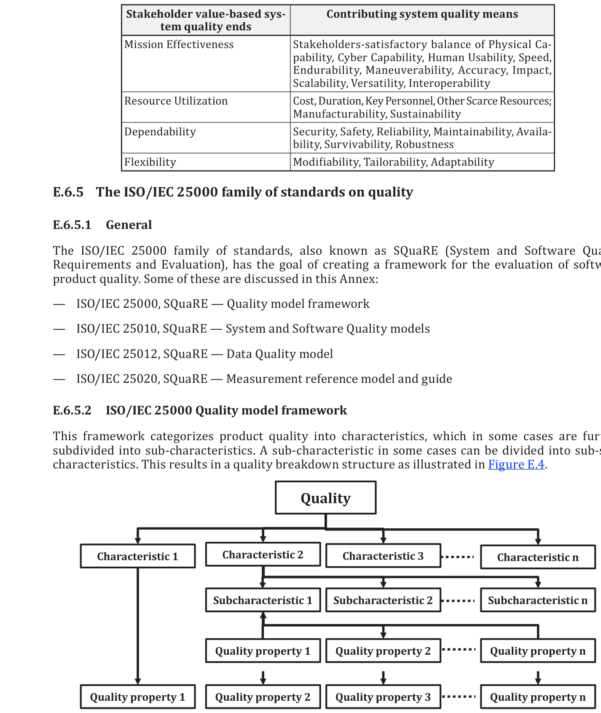

**Figure E.4 — ISO/IEC 25000 Quality model framework**

**图 E.4 — ISO/IEC 25000 质量模型框架**

##### E.6.5.3 ISO/IEC 25010 System and software quality models ISO/IEC 25010 系统与软件质量模型

###### E.6.5.3.1 Quality in use model 使用质量模型

This quality in use model defines five characteristics related to outcomes of interaction with a system. It characterizes the impact that the product has on stakeholders. This model is presented in Figure E.5.

该使用质量模型定义了与系统交互结果相关的五个特性。它刻画了产品对利益相关方的影响。该模型见图 E.5。

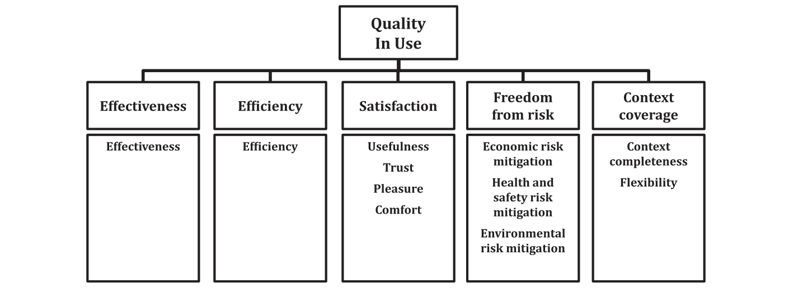

**Figure E.5 — ISO/IEC 25010 Quality in use model**

**图 E.5 — ISO/IEC 25010 使用质量模型**

###### E.6.5.3.2 System/software product quality model 系统／软件产品质量模型

This product quality model categorizes a system/software product quality properties into eight characteristics that focuses on the target system. This model is presented in Figure E.6.

该产品质量模型将系统／软件产品的质量属性归类为八个特性，聚焦于目标系统。该模型见图 E.6。

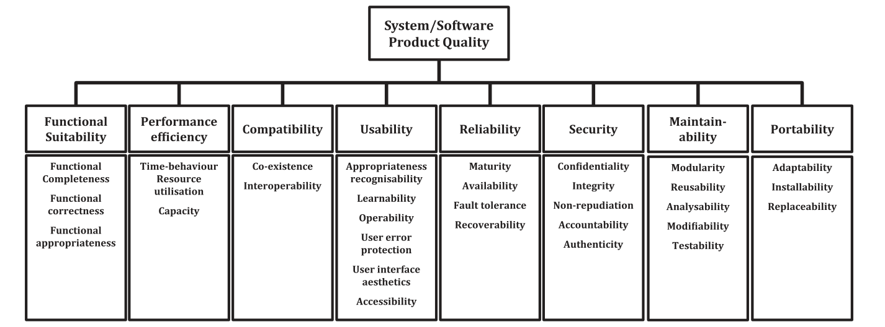

**Figure E.6 — ISO/IEC 25010 System/software product quality model**

**图 E.6 — ISO/IEC 25010 系统／软件产品质量模型**

##### E.6.5.4 ISO/IEC 25012 Data quality model ISO/IEC 25012 数据质量模型

This data quality model, as illustrated in Table E.3, categorizes data quality attributes into fifteen characteristics that are considered from two points of view: inherent and system dependent. While the inherent data quality refers to the degree to which the quality characteristics of data have the potential to satisfy needs when data is used in specified conditions, system dependent data quality refers to the degree to which data quality is reached and preserved within a system when data is used under specific conditions.

如表 E.3 所示，该数据质量模型将数据质量属性归类为十五个特性，并从两个角度考察：固有的与系统相关的。固有数据质量指当数据在规定条件下使用时，数据的质量特性具有满足需求的潜力的程度；系统相关数据质量指当数据在特定条件下使用时，数据质量在系统内得以达成并保持的程度。

**Table E.3 — ISO/IEC 25012 Data quality model**

**表 E.3 — ISO/IEC 25012 数据质量模型**

| Characteristics ／ 特性 | Inherent ／ 固有 | System dependent ／ 系统相关 | Characteristics ／ 特性 | Inherent ／ 固有 | System dependent ／ 系统相关 |
| --- | --- | --- | --- | --- | --- |
| Accuracy ／ 准确性 | X |  | Efficiency ／ 效率 | X | X |
| Completeness ／ 完备性 | X |  | Precision ／ 精度 | X | X |
| Consistency ／ 一致性 | X |  | Traceability ／ 可追溯性 | X | X |
| Credibility ／ 可信性 | X |  | Understandability ／ 可理解性 | X | X |
| Currentness ／ 现时性 | X |  | Availability ／ 可用性 |  | X |
| Accessibility ／ 可访问性 | X | X | Portability ／ 可移植性 |  | X |
| Compliance ／ 符合性 | X | X | Recoverability ／ 可恢复性 |  | X |
| Confidentiality ／ 保密性 | X | X |  |  |  |

##### E.6.5.5 ISO/IEC 25020 System and software product quality measurement reference model ISO/IEC 25020 系统与软件产品质量测量参考模型

This product quality measurement reference model describes the relationship between a quality model, its associated quality characteristics (and sub-characteristics), and system and software product attributes with the corresponding software quality measures, measurement functions, quality measure elements and measurement methods. This model is presented in Figure E.7.

该产品质量测量参考模型描述质量模型、其关联的质量特性（及子特性），以及系统与软件产品属性同相应的软件质量测度、测量函数、质量测度元素和测量方法之间的关系。该模型如图 E.7 所示。

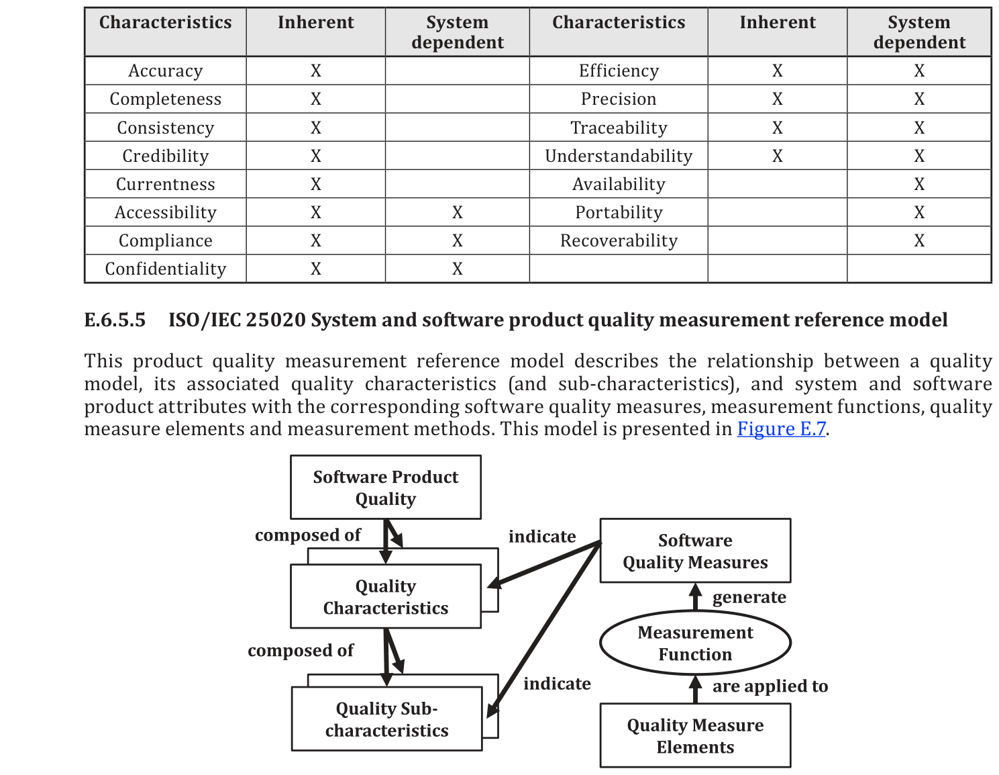

**Figure E.7 — ISO/IEC 25020 System/software product quality measurement reference model**

**图 E.7 — ISO/IEC 25020 系统／软件产品质量测量参考模型**

An illustration of this model as given in ISO/IEC 25021 is presented in Table E.4.

ISO/IEC 25021 中给出的该模型示例见表 E.4。

**Table E.4 — ISO/IEC 25021 product quality measurement reference model**

**表 E.4 — ISO/IEC 25021 产品质量测量参考模型**

| SNo ／ 序号 | Element ／ 元素 | Particulars ／ 细目 |
| --- | --- | --- |
| 1 | Quality measure element name ／ 质量测度元素名称 | Number of records ／ 记录数 |
| 2 | Objective ／ 目的 | To determine data quality of target data ／ 确定目标数据的质量 |
| 3 | Property to quantify ／ 待量化的属性 | Record is a set of related data items treated as a unit ／ 记录是作为单元处理的一组相关数据项 |
| 4 | Relevant quality measures ／ 相关质量测度 | Measure of accuracy ／ 准确性测度 |
| 5 | Measurement method ／ 测量方法 | Review and analyze data records ／ 评审并分析数据记录 |
| 6 | List of sub-properties ／ 子属性清单 | Data Item: Lowest component of a group of data File: A set of related records ／ 数据项：一组数据的最低层组成部分　文件：一组相关记录 |
| 7 | Input for the quality measure element ／ 质量测度元素的输入 | Physical files of a database ／ 数据库的物理文件 |
| 8 | Numerical rules ／ 数值规则 | Adding total records ／ 累加记录总数 |

**Table E.4** *(continued)*

**表 E.4** *（续）*

| SNo ／ 序号 | Element ／ 元素 | Particulars ／ 细目 |
| --- | --- | --- |
| 9 | Context of the quality measure element ／ 质量测度元素的语境 | Measure the accuracy and completeness to a group of data ／ 测量一组数据的准确性和完备性 |
| 10 | Measurement constraints ／ 测量约束 | Verify the impact of technology on the number of records generated for the same information ／ 核查技术对同一信息所生成记录数的影响 |

## Annex F (informative) — Architecture enablement and process-enabling resources ｜ 附录 F（资料性）— 架构使能与过程使能资源

### F.1 Architecture enablement 架构使能

Architecture enablement is needed for establishing and maintaining consistent practices, standard approaches, reusable items and uniform ways of communication, and for proper utilization of these things. The enablers consist of a collection of tools, techniques, technologies, skills, practices, frameworks, methods and processes used in architecture processes in support of the accomplishment of an organization’s objectives. It is implemented for a given area of responsibility to guide the proper selection, development, utilization and improvement of enablers (tools, technologies, approaches and so on). This process maintains information about the various work-products and also provides checks and balances to ensure that the information about these work-products is of high quality.

架构使能是建立并保持一致的实践、标准途径、可复用项和统一沟通方式，以及恰当利用这些事物所必需的。使能项由一组工具、技术、工艺、技能、实践、框架、方法和过程构成，用于架构过程以支持组织目标的达成。它针对给定的职责领域实施，以指导使能项（工具、技术、途径等）的恰当选择、开发、利用和改进。该过程维护关于各类工作产品的信息，并提供制衡以确保这些工作产品的信息具有高质量。

Architecture enablement has oversight over the performance of architecture process operations and decision making, as well as the efficient organization of people, capabilities, processes and other resources to achieve the architecture goals and objectives. It enables users to quickly understand available information so that they can make better and faster decisions and efficiently achieve architecture goals and objectives. Architecture enablement involves dealing with interactions, interconnections, activities, outcomes and work-products and how they need to be structured to produce the desired governance, management and architecting functions.

架构使能对架构过程运作和决策的绩效，以及为实现架构目的和目标而对人员、能力、过程及其他资源的高效组织，具有监督职责。它使用户能迅速理解可用信息，从而作出更好、更快的决策，并高效地实现架构目的和目标。架构使能涉及处理交互、互连、活动、结果和工作产品，以及如何组织它们以产生所需的治理、管理和架构工作功能。

Architecture enablement includes the following elements:

架构使能包括以下要素：

- Establishing an architecture repository that provides for the storage and archiving of architecture

- 建立架构存储库，为架构过程的人工制品和工作产品提供存储与归档。

process artifacts and work products. The repository can be used to store different classes of architecture work products that facilitates coordination and cooperation between the architecture process stakeholders.

该存储库可用于存储不同类别的架构工作产品，便于架构过程利益相关方之间的协调与合作。

> **NOTE** The architecture repository referred to in this document is not necessarily isomorphic with architecture repositories in commercial use.

> **注**：本文件所提及的架构存储库与商用架构存储库不一定同构。

- Establishing an architecture library concerning enabling capabilities, services and resources that

- 建立架构库，涉及使能能力、服务和资源，

can be used by or deemed to be useful to those who perform role specific architecture activities. The library can provide guidelines, templates, patterns and other forms of source material that can be leveraged by the architecture processes.

它们能由执行角色特定架构活动的人员使用或被其认为有用。该库能提供指南、模板、模式及其他形式的源材料，供架构过程利用。

- Establishing an architecture registry that keeps information about the artifacts and work products

- 建立架构注册簿，保存关于人工制品和工作产品的信息，

contained in the repository and library as well as the changes made to them. The registry can be used to discover and use current and relevant information items for an ongoing architecture endeavor.

这些人工制品和工作产品包含在存储库和库中，注册簿还保存对它们所做的更改。该注册簿可用于发现并使用当前且相关的信息部件，以支持正在进行的架构工作。

### F.2 Architecture process enabling resources 架构过程使能资源

Examples of resources that can be used in performing the architecture processes are listed below.

可用于执行架构过程的资源示例如下。

- Architecture patterns: A pattern addresses a specific architecture problem, in a context, to provide

- 架构模式：模式针对特定语境中的特定架构问题，提供

a solution maximizing reuse and permitting a range of tradeoffs.

一种使复用最大化并容许一系列权衡的解决方案。

- Architecture kinds: Several kinds may be needed to fully express the essential properties and

- 架构种类：为完整表达本质属性和概念，

concepts (see E.4.1).

可能需要若干种类（见 E.4.1）。

- Architecture styles: An idiom for organizing an architecture to achieve certain properties (see E.4.2).

- 架构风格：为组织架构以实现某些属性而采用的惯用手法（见 E.4.2）。

- Model kinds: Conventions for a type of modeling, to address specific types of concerns (see

- 模型种类：针对某类建模的约定，用以应对特定类型的关注点（见

ISO/IEC/IEEE 42010).

ISO/IEC/IEEE 42010）。

- Architecture description languages: Any defined form of expression for use in architecture

- 架构描述语言：用于架构描述的任何已定义表达形式

descriptions (see ISO/IEC/IEEE 42010).

（见 ISO/IEC/IEEE 42010）。

- Architecture viewpoints: Work product establishing the conventions for the construction,

- 架构视角：确立架构视图的构造、解释和使用约定以框定特定系统关注点的

interpretation and use of architecture views to frame specific system concerns (see ISO/IEC/IEEE 42010).

工作产品（见 ISO/IEC/IEEE 42010）。

- Architecture frameworks: Conventions, principles and practices for the description of architectures

- 架构框架：在特定应用领域和／或利益相关方群体内确立的、用于描述架构的

established within a specific domain of application and/or community of stakeholders (see ISO/IEC/IEEE 42010).

约定、原则和实践（见 ISO/IEC/IEEE 42010）。

- Architecture methods: Practice, technique, or procedure with rules to guide architecture processes.

- 架构方法：指导架构过程的实践、技术或规程，并附有规则。

- Skills and knowledge associated with specific roles identified to perform architecture-related

- 与为执行架构相关工作而识别的特定角色相关联的技能和知识

activities:

活动：

- The skills required by each role.

- 各角色所需的技能。

- The depth of knowledge required to fulfill the role successfully.

- 成功履行该角色所需的知识深度。

- Norms and standards associated with the activities and the work products.

- 与活动和工作产品相关联的规范和标准。

- Tools and languages sustaining the activities and allowing the formulation of work products and

- 支撑各项活动并支持表述工作产品及其相关信息

their related information.

的工具和语言。

> **NOTE** Catalogs can be used to collect homogeneous sets of metadata, resources and related information. The repositories can be implemented with catalogs used as references for governance, management and usage.

> **注**：目录可用于汇集同质的元数据、资源及相关信息集合。存储库可实现为以目录作为治理、管理和使用的参照。

## Annex G (informative) — Architecture governance and management ｜ 附录 G（资料性）— 架构治理与管理

### G.1 Architecture governance 架构治理

Architecture governance is needed for consistent management, cohesive standards and policies, proper guidance, uniform processes and appropriate decision-rights. It is implemented for a given area of responsibility to ensure proper oversight and accountability. This enables the organization to identify, manage, audit and disseminate all information related to architecture decisions, management actions in response to these decisions, contracts affecting the architecture(s) and implementation of architecture changes.

架构治理是一致的管理、协调的标准与方针、恰当的指导、统一的过程和适当的决策权所必需的。它针对给定的职责领域实施，以确保恰当的监督与问责。这使组织能够识别、管理、审计和传播与架构决策、针对这些决策的管理措施、影响架构的合同以及架构更改的实施相关的全部信息。

Architecture governance has oversight of the architecture objectives for the architecture collection to ensure their consistency with organizational goals and objectives, among other things. Each set of architecture objectives is considered with respect to factors of maintenance, servicing and upgrade with minimal disruption of the everyday operations. In particular, consideration is given to available internal and external resources in order to determine when general resources can be adapted for specific needs and to determine where specific solutions can be generalized to support wider re-use.

架构治理对架构集合的架构目标具有监督职责，以确保其与组织目的和目标等保持一致。每一组架构目标都结合维护、服务和升级等因素加以考虑，并力求对日常运行的扰乱最小。特别地，要考虑可用的内部和外部资源，以确定何时可将通用资源适配于特定需要，并确定何处可将特定解决方案泛化以支持更广泛的复用。

Architecture governance is the practice and orientation by which architectures are managed and controlled at an organization-wide level. It includes the following:

架构治理是在组织范围内对架构进行管理和控制所依循的规程与取向。它包括下列各项：

a) Formulating directives and guidelines of all the architectural components and processes, to ensure effective conceptualization, evaluation, elaboration, implementation and evolution of the collection of architectures within the organization.

a) 制定全部架构组成部分与过程的指令和指南，以确保组织内架构集合的有效概念化、评估、细化、实施和演进。

b) Ensuring compliance with industry and governmental standards and regulatory obligations.

b) 确保符合行业标准与政府标准以及监管义务。

c) Establishing processes that support effective adherence to the directives, guidelines, policies, standards and other regulatory obligations.

c) 建立支持有效遵守指令、指南、方针、标准及其他监管义务的过程。

d) Developing practices that ensure accountability to the governance board for the architectural decisions for a collection of architectures.

d) 制定规程，以确保就架构集合的架构决策向治理委员会负责（问责）。

Architecture governance is typically performed at higher levels of the organization providing oversight over business units, programs, projects, etc. Architecture governance has responsibilities for legal compliance, alignment with organizational goals and objectives, optimum utilization of resources, maintaining focus on the long term vision, responding to changes in the marketplace and user community, anticipating new forces and scenarios that will likely arise, maximizing shareholder gains, etc.

架构治理通常在组织的较高层级执行，对业务单元、项目群、项目等提供监督。架构治理的职责包括法律合规、与组织目标和目的保持一致、资源的最优利用、保持对长期愿景的关注、响应市场与用户群体的变化、预判可能出现的新的驱动因素与情境、使股东收益最大化等。

Architecture governance acts on an architecture collection in order to check the alignment between them and for compliance with the organizational mandates and expectations. Usually the collection consists of several architectures that are related to each other, but the collection could consist of a single architecture if appropriate.

架构治理作用于架构集合，以检查这些架构彼此之间的一致性，并检查其是否符合组织的指令与期望。通常该集合由若干彼此相关的架构组成，但如适当，该集合也能仅由单个架构组成。

Each activity is governed by principles. An organizational authority should be in charge of checking that the activities are performed according to these principles. This authority is sometimes called a “Design Authority”, identified for governance according to architecture principles with an escalation approach when necessary.

每项活动都受原则管控。宜由某个组织权威机构负责检查各项活动是否按照这些原则执行。该权威机构有时称为“设计权威机构”，其职责是按照架构原则为治理而被指定，并在必要时采用逐级上报的途径。

### G.2 Architecture management 架构管理

Architecture management is needed for centralized management of current and proposed collection of architectures. Architecture management establishes, maintains and uses a coherent set of guidelines, principles and management regimes that provides direction and instructions for the design and development of an architecture. Architecture management involves identifying potential risks and mitigating them in accordance with the governance directives. The objectives of architecture management are to determine, manage and control the risks, processes and resources necessary for architecting the collection of architectures while taking into account constraints, conflicts, strategic objectives and governance directives.

架构管理是集中管理当前架构集合与拟议架构集合所必需的。架构管理建立、维护并使用一套连贯的指南、原则和管理制度，为架构的设计与开发提供方向和指示。架构管理包括识别潜在风险并按照治理指令缓解这些风险。架构管理的目标是确定、管理和控制为架构集合开展架构工作所必需的风险、过程和资源，同时考虑约束、冲突、战略目标和治理指令。

Architecture management is concerned with managing the architectures, not the activities of architecting. The main focus of architecture management is on managing the implementation and evolution of the architecture(s) to maximize alignment with strategic goals and objectives. The Architecture Management process does not manage the development of the architecture but rather its evolution and its implementation in the design, build, deployment, operations, maintenance, decommissioning, etc. of one or more systems related to the architecture. Architecture management is responsible for implementing the guidance and direction from architecture governance where this is accomplished by giving management guidance and direction to the other architecture processes. Architecture management provides plans and status to architecture governance on how well the architectures are evolving and being implemented.

架构管理关注的是管理架构，而不是架构工作的各项活动。架构管理的主要重点在于管理架构的实施与演进，以最大限度地与战略目标和目的保持一致。架构管理过程不管理架构的开发，而是管理架构在与该架构相关的一个或多个系统的设计、构建、部署、运行、维护、退役等环节中的演进与实施。架构管理负责落实来自架构治理的指导和方向，其落实方式是通过向其他架构过程提供管理指导和方向。架构管理就架构演进与实施的良好程度向架构治理提供计划和状态。

Architecture management has oversight over the architectural decisions for the collection of architectures to ensure their consistency. Each set of architecture decisions will be considered with respect to factors of risks, evolution, cost, budget, and with minimal disruption of schedule and effort. In particular, consideration will be given to coordination, communication and control in order to determine when shared resources can be used efficiently and effectively.

架构管理对架构集合的架构决策实施监督，以确保其一致性。每套架构决策都将结合风险、演进、成本、预算等因素加以考虑，并尽量少地扰乱进度和工作量。特别要考虑协调、沟通和控制，以确定何时能够高效且有效地使用共享资源。

Architecture management is the practice by which a set of architectural decisions are managed and controlled at a collection level. Architecture management includes the following elements:

架构管理是在集合层级对一组架构决策进行管理和控制所依循的规程。架构管理包括下列要素：

a) Formulating an architecture management charter that defines the statement of work for a collection- of architectures.

a) 制定架构管理章程，该章程规定架构集合的工作说明书。

b) Ensuring compliance with project, industry and governmental quality requirements.

b) 确保符合项目、行业和政府质量要求。

c) Establishing management hierarchies and management plan that support architectural decision making.

c) 建立支持架构决策的管理层级和管理计划。

## Annex H (informative) — Mapping of processes to architecture frameworks ｜ 附录 H（资料性）——过程到架构框架的映射

### H.1 General 总则

This annex provides information on how the elements of various architecture frameworks relate to the processes in this document. The following frameworks are covered in this annex:

本附录提供关于各种架构框架的要素如何与本文件中的过程相关联的信息。本附录涵盖下列框架：

- TOGAF Framework

- TOGAF 框架

- Pragmatic Enterprise Architecture Framework (PEAF)

- 实用企业架构框架（PEAF）

- Generalized Enterprise Reference Architecture and Methodology (GERAM) framework

- 通用企业参考架构与方法（GERAM）框架

- Department of Defense Architecture Framework (DoDAF) adjustment to reflect the terminological

- 美国国防部架构框架（DoDAF），已作出调整以反映术语

development

方面的发展

- RM-ODP (Reference Model – Open Distributed Processing) framework

- RM-ODP（参考模型——开放分布式处理）框架

The inclusion of these frameworks does not imply endorsement of these particular frameworks. Exclusion of other frameworks is not intended to imply shortfalls of those frameworks. The intention is to include those frameworks that contain processes similar in nature to the processes in this document so that the relationships can be better understood, or that include elements that can be related to the processes in this document.

纳入这些框架并不意味着认可这些特定框架。未纳入其他框架也无意暗示这些框架存在不足。其意图是纳入那些包含与本文件中的过程性质相似的过程的框架，以便更好地理解其间的关系；或者纳入那些包含能与本文件中的过程相关联的要素的框架。

Other well-known architecture frameworks like NAF, AUS-DAF, UPDM, UAF and Archimate provide formalisms, and sometimes notations, but do not provide description of architecture processes. These frameworks can be used during architecture elaboration in order to provide a formalized way of describing the architectures. The Architecture Elaboration process as described in Clause ‎10 does not make any assumption on formalisms or notations.

其他知名架构框架（如 NAF、AUS-DAF、UPDM、UAF 和 Archimate）提供形式化表示，有时也提供记法，但不提供对架构过程的描述。这些框架能在架构细化期间使用，以提供描述架构的某种形式化方式。第 10 章所述的架构细化过程不对形式化表示或记法作任何假定。

### H.2 TOGAF framework TOGAF 框架

#### H.2.1 Framework overview 框架概览

TOGAF[36], an Open Group standard, is a framework that provides a detailed method and a set of supporting tools for developing enterprise architectures. It includes a process for developing the architecture description called the Architecture Development Method (ADM) (see Figure H.1), as well as general principles for doing architecting and for architecture governance.

TOGAF[36] 是开放群组（Open Group）的一项标准，该框架为开发企业架构提供了详细方法和一套配套工具。它包括一个用于开发架构描述的过程，称为架构开发方法（ADM）（见图 H.1），还包括开展架构工作与进行架构治理的一般原则。

![Figure H.1 — Architecture development cycle, TOGAF v9.1, 2011\[36\]](ISO-IEC-IEEE 42020 2019.assets/fig-11.png)

**Figure H.1 — Architecture development cycle, TOGAF v9.1, 2011[36]**

**图 H.1——架构开发周期，TOGAF v9.1，2011[36]**

The ADM (part II of the TOGAF framework[36]) together with the rest of the guidance detailed in subsequent parts of the TOGAF framework cover the set of processes and guidance provided in this document as shown in Table H.1.

ADM（TOGAF 框架[36]的第 II 部分）连同 TOGAF 框架后续各部分中详述的其余指南，共同覆盖了本文件所提供的一组过程与指南，如表 H.1 所示。

#### H.2.2 Mapping to framework elements 到框架要素的映射

While the coverage mapping is not one-to-one (e.g. several sections of the TOGAF framework map to more than one process provided by this document and vice versa), it is intended as a quick reference for users of the TOGAF framework[36] who may wish to document how coverage of the ISO/IEC/IEEE 42020 processes is achieved. An X indicates that full or partial coverage of this ISO/IEC/IEEE 42020 process is achieved via activities as described in the corresponding phase or in Parts III, V, or VII of the TOGAF Framework[36].

尽管此覆盖映射并非一一对应（例如，TOGAF 框架的若干节映射到本文件提供的多个过程，反之亦然），但其意图是为 TOGAF 框架[36]的用户提供快速参考，这些用户可能希望记录 ISO/IEC/IEEE 42020 各过程的覆盖是如何实现的。X 表示对某个 ISO/IEC/IEEE 42020 过程的全部或部分覆盖是通过相应时期所述的活动、或通过 TOGAF 框架[36]第 III、V 或 VII 部分所述的活动实现的。

> **NOTE 1** This document uses the definition for phase from ISO/IEC/IEEE 24765: "a collection of logically related project activities, usually culminating in the completion of a major deliverable.“ In the TOGAF framework[36], the phases refer to iterative states used to group activities around specific content of the architecture description (e.g. business, technology, etc.).

> **注 1**：本文件采用 ISO/IEC/IEEE 24765 中 phase 的定义：“一组逻辑上相关的项目活动，通常以完成某个主要交付物而告终。”在 TOGAF 框架[36]中，时期指用于围绕架构描述的特定内容（例如业务、技术等）对活动加以分组的迭代状态。

> **NOTE 2** Refinement and updates to architecture governance and architecture management documents can occur during any of the TOGAF phases[36].

> **注 2**：架构治理与架构管理文件的细化与更新能在 TOGAF 的任一时期[36]内发生。

**Table H.1 — Mapping of processes to the TOGAF framework[36]**

**表 H.1 — 过程到 TOGAF 框架[36]的映射**

| TOGAF Architecture Development Method (ADM) Phase ／ TOGAF 架构开发方法（ADM）时期 | Architecture Governance ／ 架构治理 | Architecture Management ／ 架构管理 | Architecture Conceptualization ／ 架构概念化 | Architecture Evaluation ／ 架构评估 | Architecture Elaboration ／ 架构细化 | Architecture Enablement ／ 架构使能 |
| --- | --- | --- | --- | --- | --- | --- |
| CH 6 Preliminary Phase ／ 第 6 章 预备时期 | X | X |  | X |  | X |
| Phase A: Architecture Vision ／ 时期 A：架构愿景 | X | X | X |  |  |  |
| Phase B: Business Architecture ／ 时期 B：业务架构 |  | X |  |  | X |  |
| Phase C: Information Systems Architectures ／ 时期 C：信息系统架构 |  | X |  |  | X |  |
| Phase D: Technology Architecture ／ 时期 D：技术架构 |  | X |  |  | X |  |
| Phase E: Opportunities and Solutions ／ 时期 E：机会与解决方案 |  | X |  | X | X |  |
| Phase F: Migration Planning ／ 时期 F：迁移规划 | X | X |  | X | X |  |
| Phase G: Implementation Governance ／ 时期 G：实施治理 |  | X |  | X |  |  |
| Phase H: Architecture Change Management ／ 时期 H：架构变更管理 | X | X |  | X |  |  |
| Ch 26 Business Scenarios and Business Goals ／ 第 26 章 业务场景与业务目标 |  |  | X | X |  |  |
| Ch 27 Gap Analysis ／ 第 27 章 差距分析 |  |  |  | X |  |  |
| Part V: Enterprise Continuum and Tools, Chs 38-32 ／ 第 V 部分：企业连续体与工具，第 38-32 章 |  |  |  |  |  | X |
| Ch 46 Establish an Architecture Capability ／ 第 46 章 建立架构能力 |  |  |  |  |  | X |
| Ch 47 Architecture Board ／ 第 47 章 架构委员会 | X |  |  |  |  |  |
| Ch 48 Architecture Compliance ／ 第 48 章 架构符合性 | X | X |  | X |  |  |
| Ch 49 Architecture Contracts ／ 第 49 章 架构契约 |  | X |  |  |  |  |
| Ch 50 Architecture Governance ／ 第 50 章 架构治理 | X | X |  |  |  |  |
| Ch 51 Architecture Maturity Models ／ 第 51 章 架构成熟度模型 | X |  |  |  |  | X |
| Ch 52 Architecture Skills Framework ／ 第 52 章 架构技能框架 |  |  |  | X |  | X |
| NOTE This table is sourced from TOGAF®<?> Version 9.1[36]. ／ 本表来源于 TOGAF®<?> 9.1 版[36]。 |  |  |  |  |  |  |

#### H.2.3 Items in the TOGAF framework not addressed in this document TOGAF 框架中本文件未处理的条目

The scope of this document addresses roadmaps, life cycles and baselines; but the Architecture Governance process is limited to cover the relevance of the architecture with regards to application of architecture and consequently does not cover completely the implementation governance.

本文件的范围涉及路线图、生存周期与基线；但架构治理过程仅限于涵盖架构在架构应用方面的相关性，因此并未完全涵盖实施治理。

#### H.2.4 Items in this document not addressed in the TOGAF framework 本文件中 TOGAF 框架未处理的条目

This document is concerned with the architecting effort, including architecture management and dealing with stakeholders for whom the architecture is being developed, evaluation of the architecture, etc.

本文件关注架构工作，包括架构管理、与为其开发架构的利益相关方打交道、架构评估等。

ADM is only concerned with the steps needed to develop the Architecture Description. To augment this, the TOGAF framework includes additional information in Parts III, IV, and V, specifically, Chapter 26 covers Business Scenarios and Business Goals, and Chapter 27 covers Gap Analysis in Part III, while Part IV covers the Architecture Content Framework, and Part V covers the Enterprise Continuum and Tools.

ADM 仅关注开发架构描述所需的步骤。作为补充，TOGAF 框架在第 III、IV 和 V 部分中包含了附加信息，具体而言，第 26 章涵盖业务场景与业务目标，第 27 章涵盖第 III 部分中的差距分析，而第 IV 部分涵盖架构内容框架，第 V 部分涵盖企业连续体与工具。

### H.3 PEAF framework PEAF 框架

#### H.3.1 Framework overview 框架概览

The Pragmatic Enterprise Architecture Framework (PEAF)[31] is an element of the “Pragmatic Family of Frameworks” (PF2) designed to help improve the maturity of how enterprises carry out their business.

务实企业架构框架（PEAF）[31]是“务实框架族”（PF2）的一个元素，旨在帮助提升企业开展其业务的成熟度。

PEAF instantiates the methods, artifacts, cultural and environmental sections defined in the “Pragmatic Ontology for Enterprise Transformation” (POET) framework in order to set the context for strategizing and roadmapping enterprise architecture, as part of enterprise transformation.

PEAF 实例化“务实企业转型本体”（POET）框架中定义的方法、人工制品、文化与环境的各部分，以便为企业架构的战略谋划与路线图规划设定语境，作为企业转型的一部分。

POET defines an ontology for enterprise transformation with information existing at different levels of Idealization/Realization: Motivation, Actions, Guidance, Measures and Assessment. Height fundamental phases of transformation are identified: Strategizing, Roadmapping, Initiating, Elaborating, Transitioning, Using and Governance & Lobbying.

POET 定义了企业转型的本体，其信息存在于理想化／实现的不同层级：动机、行动、指导、度量与评定。识别出八个转型的基本时期：战略谋划、路线图规划、启动、细化、过渡、使用以及治理与游说。

The enterprise architecture context described by PEAF relies on: Processes, Disciplines, Levels, Input and Output. Viewpoints to describe this context are: Contextual, Conceptual, Logical, Physical and Operational.

PEAF 所描述的企业架构语境依赖于：过程、专业领域、层级、输入与输出。用于描述该语境的视角为：语境视角、概念视角、逻辑视角、物理视角与运行视角。

PEAF artifacts are metamodels used for enterprise planning and governance in order to develop: Business Model, Roadmap Model, Operating Model, Capability Model and Enterprise Context. From these basic models come two aggregate and overlapping artifacts: Enterprise Strategy and Transformation Strategy.

PEAF 人工制品是用于企业规划与治理的元模型，用以开发：业务模型、路线图模型、运营模型、能力模型与企业语境。由这些基本模型产生两个聚合且相互重叠的人工制品：企业战略与转型战略。

#### H.3.2 Mapping to framework elements 到框架元素的映射

PEAF proposes to perform enterprise transformation based on methods, artifacts, culture and environment with actions and foundation described in the following figure.

PEAF 提出基于方法、人工制品、文化与环境来开展企业转型，其行动与基础如下图所示。

![Figure H.2 — PEAF functional areas and foundation (PEAF v3, August 2014\[31\])](ISO-IEC-IEEE 42020 2019.assets/fig-12.png)

**Figure H.2 — PEAF functional areas and foundation (PEAF v3, August 2014[31])**

**图 H.2 — PEAF 职能域与基础（PEAF v3，2014 年 8 月[31]）**

The following table relates the PEAF actions with the processes defined in this document.

下表将 PEAF 行动与本文件所定义的过程关联起来。

**Table H.2 — Mapping of processes to the PEAF framework**

**表 H.2 — 过程到 PEAF 框架的映射**

| PEAF functional domain ／ PEAF 职能域 | PEAF actions ／ PEAF 行动 | Architecture Governance ／ 架构治理 | Architecture Management ／ 架构管理 | Architecture Conceptualization ／ 架构概念化 | Architecture Evaluation ／ 架构评估 | Architecture Elaboration ／ 架构细化 | Architecture Enablement ／ 架构使能 |
| --- | --- | --- | --- | --- | --- | --- | --- |
| Prepare ／ 准备 | Strategizing (Why should I care?) ／ 战略谋划（我为何要在意？） |  |  |  |  |  |  |
|  | Roadmapping (Select EA Framework) ／ 路线图规划（选择 EA 框架） |  |  |  |  |  | ? |
|  | Initiating (Understand EA Framework) ／ 启动（理解 EA 框架） |  | ? |  |  |  |  |
|  | Elaborating (Plan EA Framework Rollout) ／ 细化（规划 EA 框架的推行） |  | X |  |  |  |  |
| Implement ／ 实施 | Constructing (Prepare Culture Change) ／ 构建（准备文化变革） | X |  |  |  |  |  |
|  | Constructing (Setup EA Governance) ／ 构建（建立 EA 治理） | X |  |  |  |  |  |
|  | Constructing (Prepare Process Change) ／ 构建（准备过程变革） | ? |  |  |  |  |  |
|  | Constructing (Prepare Education) ／ 构建（准备教育） | ? |  |  |  |  |  |
|  | Constructing (Define & Setup EA Metamodel) ／ 构建（定义并建立 EA 元模型） |  |  | X |  |  |  |
|  | Constructing (Develop EA Change) ／ 构建（开发 EA 变更） |  |  | X |  |  |  |
|  | Constructing (Select EA tools) ／ 构建（选择 EA 工具） |  |  |  |  |  | X |
| Operate ／ 运行 | Transitioning (Rollout EA Changes: strategic planning; EA roadmapping) ／ 过渡（推行 EA 变更：战略规划；EA 路线图规划） | X |  |  |  |  |  |
|  | Transitioning (Provide EA Education) ／ 过渡（提供 EA 教育） | ? |  |  |  |  |  |
|  | Transitioning (Rollout EA Modeling) ／ 过渡（推行 EA 建模） |  |  | X |  |  |  |
|  | Transitioning (Manage Value and Evolution: Review Options & solutions; Evaluate, Analyze and Modify) ／ 过渡（管理价值与演进：评审选项与解决方案；评估、分析与修改） |  |  |  | X |  |  |
| NOTE “?” occurrences show potential extension of the scope of this document. ／ “？”的出现表明本文件范围的可能扩展。 |  |  |  |  |  |  |  |

#### H.3.3 Items in the PEAF framework not addressed in this document PEAF 框架中本文件未处理的条目

The scope of this document does not include rationale data for enterprise architecture setup, culture and education related activities and data, roadmaps and plans for transitioning the enterprise from baseline to target architectures.

本文件的范围不包括企业架构建立的理由数据、文化与教育相关活动和数据，以及将企业从基线架构过渡到目标架构的路线图与计划。

#### H.3.4 Items in this document not addressed in the PEAF framework 本文件中 PEAF 框架未处理的条目

PEAF very lightly addresses architecture management and does not include the elaboration activities. The scope is specifically dedicated to enterprises transformation and does not consider architecture/ transformation of any kind of architecture entity.

PEAF 对架构管理的处理极为简略，且未包含细化活动。其范围专门针对企业转型，不考虑任何种类架构实体的架构／转型。

> **NOTE 1** Frameworks like TOGAF can complement PEAF for management of enterprise architectures.

> **注 1**：像 TOGAF 这样的框架能补充 PEAF，用于企业架构的管理。

> **NOTE 2** Frameworks like DoDAF, NAF and UAF can complement PEAF with formalism and architecting concepts for architecture entities.

> **注 2**：像 DoDAF、NAF 和 UAF 这样的框架能以针对架构实体的形式体系与架构工作概念来补充 PEAF。

### H.4 GERAM framework GERAM 框架

#### H.4.1 GERAM framework overview GERAM 框架概览

The GERAM framework is a generalization of frameworks and defines a number of fundamental concepts that any architecture framework needs to cover. GERAM is lightweight in the sense that it defines placeholders for necessary components, but leaves the population of these to the collective development of the enterprise architecture body of knowledge. For example, GERAM defines the concept of methodologies, but acknowledges that depending on the industry domain and a number of other factors there can be many legitimate and useful methodologies.

GERAM 框架是各框架的泛化，它定义了任何架构框架都需要涵盖的若干基本概念。GERAM 是轻量的，其表现为：它为必要组成部分定义占位符，而将这些占位符的填充留给企业架构知识体系的集体开发。例如，GERAM 定义了方法论这一概念，但承认视行业域及若干其他因素而定，可能存在许多正当且有用的方法论。

The requirements that frameworks need to satisfy are the normative part of ISO 15704, and the GERAM framework is an annex that demonstrates how these requirements can be met. Historically, the GERAM framework was developed first, then the normative part of ISO 15704 was extracted from it. Similarly, ISO 15704 defines enterprise entity life cycle (consisting of phases, each being a set of life cycle processes considering the enterprise entity on a given level of abstraction), and life history (consisting of stages in time, similar to stages in ISO/IEC/IEEE 15288): whereupon GERAM defines eight phases, the normative part of ISO 15704 only requires that life cycle phases be defined and leaves that subdivision to individual frameworks.

各框架需要满足的要求即 ISO 15704 的规范性部分，而 GERAM 框架是一个附录，用以表明这些要求如何能够得到满足。从历史上看，GERAM 框架先被开发出来，随后从其中提取出 ISO 15704 的规范性部分。类似地，ISO 15704 定义了企业实体生存周期（由若干时期构成，每个时期是一组在给定抽象层级上考虑该企业实体的生存周期过程）与生存历史（由时间上的若干阶段构成，类似于 ISO/IEC/IEEE 15288 中的阶段）：据此，GERAM 定义了八个时期，而 ISO 15704 的规范性部分仅要求定义生存周期时期，并将该细分留给各个框架。

According to GERAM’s philosophy an enterprise is implemented as a socio-technical system of systems, that are embodied in concrete (and sometimes also virtual) enterprise entities, such as business units, corporate headquarters, programs, projects, various entities that implement supporting systems, infrastructure service entities, virtual organizations, networks of organizations, etc.

按照 GERAM 的理念，企业是作为一个社会技术性的系统的系统来实施的，这些系统体现为具体（有时也为虚拟）的企业实体，如业务单元、公司总部、项目群、项目、实施支撑系统的各类实体、基础设施服务实体、虚拟组织、组织网络等。

When the architecture of an enterprise entity is devised, a fundamental (architectural) decision is made about the nature of how the entity implements the system (the way design parameters map to the functions of the system), and the nature (and timing) of this mapping decides various non-functional systemic properties of the implemented system.

在构想某一企业实体的架构时，会就该实体实施系统的性质（即设计参数映射到系统功能的方式）作出一项基本（架构）决策，而这一映射的性质（及时机）决定了所实施系统的各种非功能性的系统性特性。

GERAM also defines a modeling framework, defining an open-ended list of “aspects” such as functional, information, resource, organizational, economic, etc. Each “aspect” can be populated by various kinds of models for the purpose of supporting various life cycle processes. We call these “aspects” here to make this description independent from the outcome of current terminological developments both in ISO 15704 and the ISO 42000 family of standards.

GERAM 还定义了一个建模框架，其中定义了功能、信息、资源、组织、经济等“方面体”的开放式清单。每个“方面体”都能由各种模型来填充，以支持各种生存周期过程。本文在此称其为“方面体”，以使本描述独立于 ISO 15704 和 ISO 42000 系列标准中当前术语发展的结果。

The modeling framework defined three categories of models:

该建模框架定义了三个模型类别：

- Particular Models (describing an entity of interest),

- 特定模型（描述所关注实体），

- Partial (or Reference-) Models (describing reusable models that can be specialized and instantiated

- 部分（或参考）模型（描述可复用模型，这些模型能特化并实例化

to build Particular models), and

以构建特定模型），以及

- Generic Models (describing the semantics of the models populating the first two).

- 通用模型（描述填充前两类的模型的语义）。

Generic Models can be defined on various levels of formalization, such as illustrated text, meta-models or formal ontological theories expressed in a suitably selected logic.

通用模型能在各种形式化层级上定义，例如图示文本、元模型，或以恰当选定的逻辑表达的形式本体论理论。

Figure H.3 and Figure H.4 show respectively version 1.6.3 (current) and version 2.1 (being part of the new edition of ISO 15704 under preparation, therefore it is not yet final) of the GERAM meta-model; the basic difference is the adjustment to reflect the terminological development of the ISO 42000 family of standards.

图 H.3 和图 H.4 分别示出 GERAM 元模型的 1.6.3 版（现行版本）和 2.1 版（属于正在制定的 ISO 15704 新版的一部分，因此尚未最终定稿）；其基本差别在于为反映 ISO 42000 系列标准的术语发展而作的调整。

> **NOTE 1** GERAM metamodel V2.1 elements in italics are not explicitly mentioned in GERAM V1.6.3 text (but implied). Underlined concepts are included to show compatibility with the ISO 42000 family of standards.

> **注 1**：GERAM 元模型 V2.1 中以斜体表示的要素未在 GERAM V1.6.3 正文中明确提及（但为其所隐含）。带下划线的概念是为表明与 ISO 42000 系列标准的兼容性而列入的。

> **NOTE 2** For all relations the participation and cardinality constraint is 0...\* unless otherwise noted.

> **注 2**：除另有说明外，所有关系的参与约束与基数约束均为 0...\*。

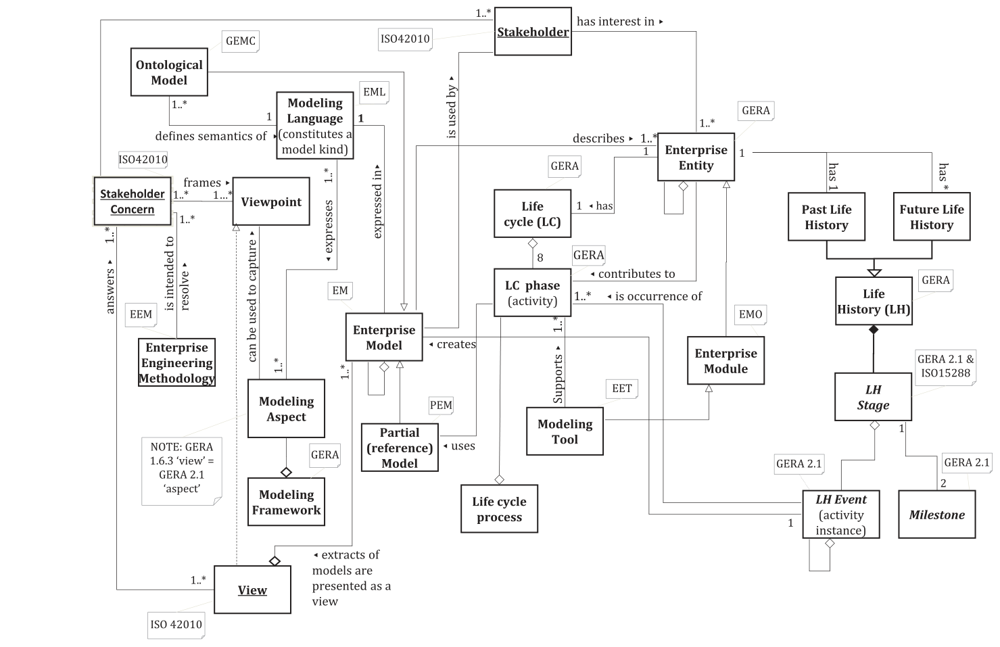

**Figure H.3 — GERAM1.6.3 and GERAM meta-model V2.1**

**图 H.3 — GERAM1.6.3 与 GERAM 元模型 V2.1**

> **NOTE 1** This is an illustration of GERA’s typology of models according to model type and scope: a) Multiple categorisations are possible. b) The figure illustrates the detail of the typology models that capture the “Function” aspect. c) The combination of these aspects determines the scope and kind of a model. d) The Model Type determines the types of questions about the entity of interest that the model can be used to answer.

> **注 1**：本图是对 GERA 按模型类型和范围划分的模型类型学的说明：a) 可能存在多种分类。b) 本图示出捕获“功能”方面体的类型学模型的细目。c) 这些方面体的组合决定了某一模型的范围和种类。d) 模型类型决定了该模型能用于回答的关于所关注实体的问题的类型。

> **NOTE 2** Aspect was called “view” in V1.6.3.

> **注 2**：在 V1.6.3 中，方面体曾称为“视图”。

> **NOTE 3** NB model scope can span multiple enterprise entities.

> **注 3**：NB：模型范围能跨越多个企业实体。

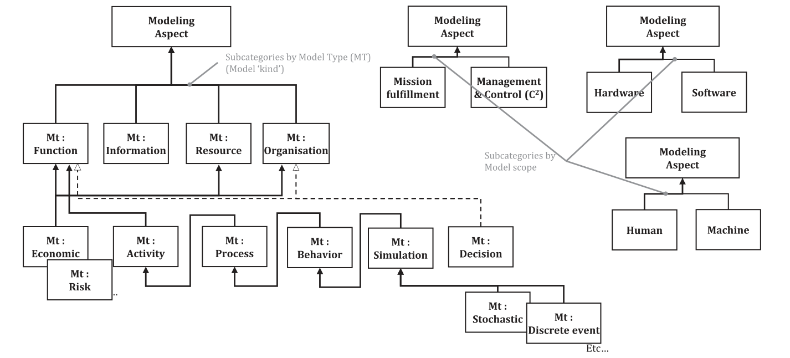

**Figure H.4 — GERAM Modeling Aspect concept V2.1**

**图 H.4 — GERAM 建模方面体概念 V2.1**

#### H.4.2 Mapping this document to GERAM framework elements 将本文件映射到 GERAM 框架要素

In order to illustrate the role of this document’s Architecture Processes (as a reference model) Figure H.5 describes a “dynamic business model” of a typical enterprise (decomposed into its constituent entities). The figure shows enterprise entities, the relationships among their life-cycles and the role of reference models. Figure H.5 a) shows the case of EA practice adoption, and Figure H.5 b) shows EA practice (including architecture processes) in operation.

为说明本文件的架构过程（作为参考模型）的作用，图 H.5 描述了一个典型企业（分解为其构成实体）的“动态业务模型”。该图示出企业实体、其生存周期之间的关系以及参考模型的作用。图 H.5 a) 示出采用 EA 实践的情形，图 H.5 b) 示出运行中的 EA 实践（包括架构过程）。

When describing or (re)designing various entities in the above, a large number of reference models are used, helping to instantiate various (e.g. process-, information-, organizational-, financial-, decisional-, structural-etc.) designs.

在描述或（重新）设计上述各类实体时，要使用大量参考模型，以帮助实例化各种设计（如过程、信息、组织、财务、决策、结构等设计）。

Architecture Processes need to be distributed across the entities in question in two senses:

架构过程需要在两种意义上分布于所涉及的各实体：

- As part of the introduction of architecture practices, these process reference models need to be

- 作为引入架构实践的一部分，这些过程参考模型需要

adopted as part of a portfolio activity (possibly through an EA maturity improvement program and its projects). The reference models would be adopted, adapted, particularized and distributed among organizational roles. There exist multiple different ways, depending on whether EA is a centralized function or distributed across business units, supported by some central service, for example. Also, the reference models can either be adopted through policy instruments or through introducing them as standard procedures (depending on the skill levels and experience of the roles among which the processes or parts thereof are distributed). Depending on these decisions the introduction of the ISO/IEC/IEEE 42020 Architecture Processes may only have to be defined on the level of the requirements and preliminary design life cycle phases (without any detailed design being necessary as the rest of the details are to be filled by highly skilled personnel who take the respective roles), or additional detailed design level procedures would be defined, which are then followed by personnel filling the respective roles.

作为项目组合活动的一部分予以采用（可能通过一项 EA 成熟度改进项目群及其项目）。这些参考模型将被采用、改编、特化并分配至各组织角色。存在多种不同方式，例如取决于 EA 是集中式职能，还是分布于各业务单元并由某个中央服务提供支持。此外，这些参考模型既能通过政策手段采用，也能通过将其作为标准规程引入来采用（取决于过程或其部分所分配至的各角色的技能水平与经验）。视这些决策而定，ISO/IEC/IEEE 42020 架构过程的引入可能只需在需求与初步设计这两个生存周期时期的层级上予以定义（无需任何详细设计，因为其余细节将由承担相应角色的高技能人员填充），或者将定义附加的详细设计层级规程，再由担任相应角色的人员遵循这些规程。

- As shown in Figure H.5 a), in this establishment stage of EA practice, a typical distribution of

- 如图 H.5 a) 所示，在 EA 实践的这一建立阶段，架构过程的典型分布

Architecture Processes includes activities and tasks being allocated to and rolled out to roles in Corporate Management, in Business Units (SBUs), as well as in Program management, Project mission fulfillment, Project management, as well as possibly external entities (e.g., consulting and other service providers). As shown in Figure H.5, the build life cycle phase is concerned with Figure H.5 a) establishing the required human architecting, governance and management skills and competencies (through hiring & training individuals, forming committees, and appointing personnel to roles), Figure H.5 b) selecting, commissioning and deploying of tools (in support architecting, modeling, communication, management and governance) and of their respective repositories.

包括将活动与任务分配并推行至公司管理层、业务单元（SBU）中的各角色，以及项目群管理、项目使命履行、项目管理中的各角色，还可能包括外部实体（如咨询及其他服务提供方）中的各角色。如图 H.5 所示，建造生存周期时期涉及：图 H.5 a) 建立所需的人员架构工作、治理和管理技能与能力（通过招聘与培训个人、组建委员会并任命人员担任角色）；图 H.5 b) 选定、调试并部署工具（以支持架构工作、建模、沟通、管理和治理）及其各自的存储库。

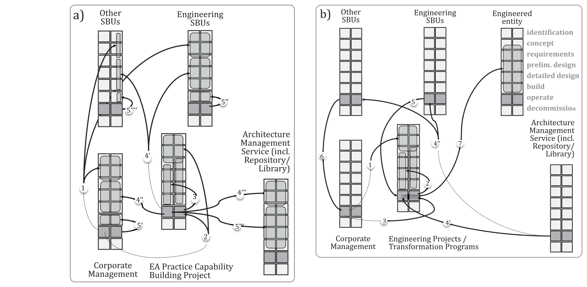

**Figure H.5 — a) Deploying Architecture Processes (establishment stage) and**

**图 H.5 — a) 部署架构过程（建立阶段）和**

**b) Applying Architecture Processes (operation stage)**

**b) 应用架构过程（运行阶段）**

The establishment stage uses this document as a reference model [see Figure H.5 a)]: (1) Corporate Management decides on the need to establish Architecture Processes in its architecture practice, this has consequences to the policies and principles that govern how SBUs (and Corporate Management) do business; (2) Corporate Management defines the mandate of an EA Practice Capability Building Project (and in turn participates in project supervisory capacity) and appoints project management; (3) Project management works out the detail of the project; (4’…4’’’) the project uses this document as a reference model to design the changes necessary in Engineering SBUs and other SBUs, as well as specifies the need for an architecture management service entity that incorporates architecture management, library and repository services (including technology and human roles), as well as designs the necessary localized processes and organizational roles necessary to build Architecture Governance; (5’…5’’’’) respective entities roll out the above, including the commissioning and deployment of the tools that support architecture processes.

建立阶段将本文件用作参考模型[见图 H.5 a)]：(1) 公司管理层决定需要在其架构实践中建立架构过程，这会影响管控 SBU（以及公司管理层）如何开展业务的方针与原则；(2) 公司管理层确定一项 EA 实践能力建设项目群的授权（并进而以项目监督的身份参与）并任命项目管理；(3) 项目管理制定该项目的细节；(4’…4’’’) 项目将本文件用作参考模型，以设计工程 SBU 及其他 SBU 中必要的变更，并规定对架构管理服务实体的需要——该实体纳入架构管理、库与存储库服务（包括技术角色与人员角色），同时设计建立架构治理所必需的本地化过程与组织角色；(5’…5’’’’) 各相关实体推行上述内容，包括调试并部署支持架构过程的工具。

As part of (the operation stage of) EA practice, Architecture Processes are applied. Figure H.5 b) illustrates the typical life cycle relationships through which corporate strategic portfolio managers and transformation programs can exercise direction (by operating governance, management, control, communication & coordination processes). The figure also illustrates the typical use of the architecting processes proper (including architecture development, elaboration and evaluation).

作为 EA 实践（运营阶段）的一部分，架构过程得到应用。图 H.5 b) 示出了典型的生存周期关系，企业战略项目组合管理者与转型项目群可借此施加方向指引（通过运行治理、管理、控制、沟通与协调过程）。该图还示出了架构工作过程本身（包括架构开发、架构细化与架构评估）的典型使用。

In the operation stage uses established ISO/IEC/IEEE 42020 processes as follows [see Figure H.5 b)]: (1) any strategic engineering project, or transformation program’s mandate is defined by Corporate Management (through its established architecture governance roles), including the mandate to use architecture definition, elaboration and evaluation processes; (2) Project management defines the details of the project (program), including the use of the mandated processes; (3) Corporate Management through its Architecture Governance processes participates in the supervision of projects/programs; (4’…4’’) Architecture management services (including architecture management and supporting services for architecture work) provides operational support to all of the other entities involved; (5) Engineering SBUs participate in these projects/programs, and as part of that participation perform architecture definition, elaboration and evaluation processes; (6) interests of other SBUs not involved in architecture work are still represented by contributing to architecture governance; (7) For example, as the Engineering Project operates it covers part of the life cycle of the Engineered entity (as defined in the project's mandate). As part of this, it develops its architecture(s). (In this example the identification and concept development is assumed to be out of scope – e.g. it was already developed by an acquirer).

运营阶段按如下方式使用已确立的 ISO/IEC/IEEE 42020 过程［见图 H.5 b)］：(1) 任何战略工程项目或转型项目群的授权由企业管理层（通过其已确立的架构治理角色）定义，其中包括以下授权：使用架构定义、架构细化与架构评估过程；(2) 项目管理定义项目（项目群）的细节，包括对所授权过程的使用；(3) 企业管理层通过其架构治理过程参与对项目／项目群的监督；(4’…4’’) 架构管理服务（包括架构管理以及为架构工作提供的支持服务）为所有其他相关实体提供运营支持；(5) 工程 SBU 参与这些项目／项目群，并作为该参与的一部分执行架构定义、架构细化与架构评估过程；(6) 未参与架构工作的其他 SBU 的利益，仍通过为架构治理作出贡献而得到代表；(7) 例如，工程项目运作时覆盖被工程化实体（如项目授权中所定义）生存周期的一部分。作为其中的一部分，它开发其架构。（在此示例中，假定识别与概念开发不在范围内——例如，它已由获取方开发。）

#### H.4.3 Items in GERAM not addressed in this document 本文件未涉及的 GERAM 条目

This document does not explicitly address the introduction of architecture processes into architecture practice [see Figure H.5 a)]. It is to be noted, that this document is not defining information, organizational or structural models: it is up to the introduction effort to standardize these (or not, and leave the details to be decided on a case-by-case basis in various transformation projects or programs).

本文件未明确涉及将架构过程引入架构实践［见图 H.5 a)］。需要注意，本文件并未定义信息模型、组织模型或结构模型：这些模型是否标准化由引入工作自行决定（也可不标准化，而将细节留给各转型项目或项目群逐案决定）。

#### H.4.4 Items in this document not addressed in GERAM GERAM 未涉及的本文件条目

The details of the architecture processes described in this document (as a reference model) are out of scope of GERAM, because GERAM only stipulates the need for reference modes (referring the details to standards such as this document and other industry reference models); GERAM does not prescribe any preferred set. It is part of the introduction of EA practice to identify, evaluate for suitability, select, adapt as appropriate, adopt and finally deploy process reference models that suit best the characteristics of the given industry and organization.

本文件所述架构过程（作为参考模型）的细节不在 GERAM 的范围之内，因为 GERAM 仅规定了对参考模型的需要（将细节交由本文件及其他行业参考模型等标准）；GERAM 并不规定任何首选的集合。识别、评估适宜性、选择、酌情适配、采用并最终部署最契合给定行业与组织特征的过程参考模型，是引入 EA 实践的一部分。

### H.5 DoDAF framework DoDAF 框架

#### H.5.1 Framework overview 框架概览

The US Department of Defense Architecture Framework (DoDAF)[40] provides guidance and rules for developing, representing and understanding architectures. Architecture descriptions based-on DoDAF can be compared and related across programs, mission areas and, ultimately, the enterprise, thus, establishing the foundation for analyses that supports decision-making processes.

美国国防部架构框架（DoDAF）[40] 为开发、表示和理解架构提供了指南与规则。基于 DoDAF 的架构描述能在各项目群、使命领域乃至企业之间进行比较和关联，从而为支持决策过程的分析奠定基础。

The major DoDAF elements are:

DoDAF 的主要元素如下：

- Architecture Development describes a method for building DoDAF-compliant architectures. The

- 架构开发描述了构建符合 DoDAF 的架构的方法。该

method is data-centric rather than view-centric. The data-centric approach ensures concordance between the views (formerly called “products”) and also ensures that all essential entity relationships are captured to support a wide variety of analysis tasks.

方法以数据为中心，而非以视图为中心。以数据为中心的做法确保各视图（原称“产品”）之间协调一致，也确保捕获所有必要的实体关系，以支持各种各样的分析任务。

- DoDAF Meta Model (DM2) establishes and defines the constrained vocabulary to be used for

- DoDAF 元模型（DM2）建立并定义受限词汇表，以用于

architecture development, facilitating the understandability of the views and exchanging of data between collaborative environments.

架构开发，便于理解各视图，并便于在协作环境之间交换数据。

- DoDAF formalism defines a way of representing an architecture by dividing the problem and

- DoDAF 形式体系定义了一种表示架构的方式：将问题空间与

solution spaces into manageable pieces, according to the stakeholders’ viewpoints, further defined as DoDAF-specified Models. Views are instances of specific models or combinations of models.

解空间按照利益相关方的视角划分为若干可管理的部分，这些部分进一步定义为 DoDAF 规定的模型。视图是特定模型或模型组合的实例。

- As presented in DoDAF V2.0[39], volume 2 (defining the formalism), Section 1 – Introduction:

- 如 DoDAF V2.0[39] 第 2 卷（定义形式体系）第 1 节——引言所述：

- Version 1.0 and 1.5 of the DoDAF used the terms “Product” and “Products” to describe the

- DoDAF 1.0 版和 1.5 版使用术语“Product”和“Products”来描述

visualizations of architectural data. In Version 2, the term “Model” is generally used instead, unless there is a specific reference to term “Products” of earlier versions. DoDAF-described “Models” that have been populated or created with architecture data are called “Views”.

架构数据的可视化表示。在第 2 版中，一般改用术语“Model”，除非特指较早版本中的术语“Products”。用架构数据填充或创建的 DoDAF 所述“Models”称为“Views”。

- The term “View” is used when the DoDAF-described “Models” are customized or combined for

- 术语“View”用于 DoDAF 所述“Models”经定制或组合以满足

the decision-maker’s need. When creating a view that is not strictly based on one of the DoDAF-specified models, this kind of view is called a “Fit-for-Purpose” view.

决策者需要的情形。当所创建的视图并非严格基于某一 DoDAF 规定的模型时，此类视图称为“Fit-for-Purpose”视图。

- In addition, to align with ISO 15704, ISO 19439, and ISO/IEC/IEEE 42010 terminology where

- 此外，为在适当之处与 ISO 15704、ISO 19439 和 ISO/IEC/IEEE 42010 的术语保持一致，

appropriate, “Views” in DoDAF V1.0 and 1.5 are changed to “Viewpoints” in DoDAF V2.0 (e.g., from Operational View to Operational Viewpoint, from System View to System Viewpoint).

DoDAF V1.0 和 1.5 中的“Views”在 DoDAF V2.0 中改为“Viewpoints”（例如，从 Operational View 改为 Operational Viewpoint，从 System View 改为 System Viewpoint）。

- The DoDAF 6-step architecture development process provides guidance to the architect and

- DoDAF 6 步架构开发过程为架构师和

Architectural Description development team and emphasizes the guiding principles. Figure H.6 depicts this six-step process as described in [40].

架构描述开发团队提供指南，并强调指导原则。图 H.6 示出了 [40] 中所述的这一 6 步过程。

> **NOTE** The process illustrated here is a synthesis of information from multiple versions of DoDAF. In particular, Step-6 was titled “Document results in accordance with the Architecture Framework” in the first versions of DoDAF, meaning that the results are elaborated according to established templates; but are not always fulfilling all the decision maker needs; i.e. the results are formalizing the best compromise found during the trade-off analysis done during the Step-5.

> **注**：此处所示过程是对多个版本 DoDAF 信息的综合。具体而言，在 DoDAF 的最初几个版本中，第 6 步的标题为“Document results in accordance with the Architecture Framework”，意为结果按已确立的模板加以细化，但并不总能满足决策者的全部需要；也就是说，结果是将第 5 步所作权衡分析中找到的最佳折衷予以形式化。

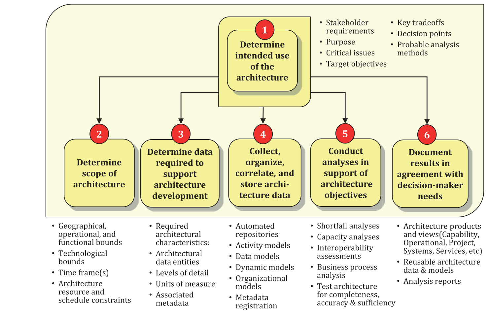

**Figure H.6 — DoDAF six-step architecture process**

**图 H.6 — DoDAF 6 步架构过程**

#### H.5.2 Mapping to framework elements 到框架要素的映射

The DoDAF 6-step process cannot be mapped directly to one or more processes provided by this document and vice versa. The reason for the lack of a direct mapping is that this document promotes a functional decomposition of the architecture process, while DoDAF uses a decomposition into stages in time, whereupon each stage (called 'step') some or all architecture processes may be iterated. In the following table, an X indicates that full or partial coverage of the ISO/IEC/IEEE 42020 process is achieved via activities as described in the corresponding step in the DoDAF architecture process.

DoDAF 6 步过程无法直接映射到本文件所提供的一个或多个过程，反之亦然。缺乏直接映射的原因在于：本文件推崇对架构过程作功能分解，而 DoDAF 采用按时间划分阶段的分解，据此在每个阶段（称为“步”）中，可迭代部分或全部架构过程。在下表中，X 表示通过 DoDAF 架构过程中相应步骤所述的活动，实现对 ISO/IEC/IEEE 42020 过程的全部或部分覆盖。

**Table H.3 — Mapping of ISO/IEC/IEEE 42020 processes to the DoDAF framework[39]**

**表 H.3 — ISO/IEC/IEEE 42020 过程到 DoDAF 框架的映射[39]**

| DoDAF 6-steps ／ DoDAF 6 步 | Architecture Governance ／ 架构治理 | Architecture Management ／ 架构管理 | Architecture Conceptualization ／ 架构概念化 | Architecture Evaluation ／ 架构评估 | Architecture Elaboration ／ 架构细化 | Architecture Enablement ／ 架构使能 |
| --- | --- | --- | --- | --- | --- | --- |
| Step 1: Determine intended use of the architecture ／ 第 1 步：确定架构的预期用途 | X |  | X |  | Xa |  |
| Step 2: Determine scope of architecture ／ 第 2 步：确定架构的范围 | X | X | X |  | Xb |  |
| Step 3: Determine data required to support architecture development ／ 第 3 步：确定支持架构开发所需的数据 |  | X | X |  | X |  |
| Step 4: Collect, organize, correlate and store architecture data ／ 第 4 步：采集、组织、关联并存储架构数据 |  |  | X | X | X | X |
| Step 5: Conduct analyses in support of architecture objectives ／ 第 5 步：开展分析以支撑架构目标 |  |  | X | Xc |  |  |
| Step 6: Document results in agreement with decision-maker needs ／ 第 6 步：按决策者的需要记录结果 |  | X | X | Xd | X | X |
| a The Elaboration process is usually provided with the intended use of the architecture when the elaboration task is initiated. However, the Elaboration process needs to identify and understand the intended uses of the architecture views, models and descriptions, which could be different than intended uses of the architecture itself. b The scope of the architecture views and models developed in the Conceptualization process may be different than the scope of the architecture views and models produced by the Elaboration process. c The Evaluation process also includes value assessment which is separate from architectural analysis. However, DoDAF uses the term “analysis” in a broader sense to include both architectural analysis and value assessment. d During the Evaluation process, more details about the architecture can be determined or discovered, so these extra details could be captured during the Evaluation process itself rather than necessarily cycling through one of the other processes to add this detail. Furthermore, details might be added to enable the assessment and analysis activities to be performed adequately. ／ a 细化任务启动时，通常会向细化过程提供架构的预期用途。然而，细化过程需要识别并理解架构视图、模型和描述的预期用途，这些用途可能与架构本身的预期用途不同。 b 在概念化过程中所开发的架构视图和模型的范围，可能与细化过程所产生的架构视图和模型的范围不同。 c 评估过程还包括价值评定，价值评定与架构分析彼此分开。然而，DoDAF 在更宽泛的意义上使用“分析”一词，以同时涵盖架构分析和价值评定。 d 在评估过程期间，能确定或发现关于架构的更多细节，因此这些附加细节可在评估过程本身之中捕获，而不必为了添加此细节而再循环经历其他某个过程。此外，可能添加细节，以使评定和分析活动能够充分开展。 |  |  |  |  |  |  |

#### H.5.3 Items in the DoDAF framework not addressed in this document DoDAF 框架中本文件未涉及的事项

The DoDAF framework provides a very precise formalism for architecture description with a predefined set of viewpoints and models. This document does not specify particular viewpoints and models.

DoDAF 框架以一组预定义的视角和模型，为架构描述提供了一种非常精确的形式体系。本文件不规定特定的视角和模型。

#### H.5.4 Items in this document not addressed in the DoDAF framework 本文件中 DoDAF 框架未涉及的事项

This document is concerned with the architecting effort, including architecture management and dealing with stakeholders for whom the architecture is being developed, evaluation of the architecture, etc. The DoDAF 6-step Architecture Development process is more oriented towards the architecture data to be produced with regard to satisfaction of the stakeholders.

本文件关注架构工作，包括架构管理、与架构为之开发的利益相关方打交道、架构的评估等。DoDAF 六步架构开发过程则更侧重于为满足利益相关方而将产生的架构数据。

### H.6 RM-ODP framework RM-ODP 框架

#### H.6.1 Framework overview 框架概览

Reference Model – Open Distributed Processing (RM-ODP)[2] is a reference model based on precise concepts derived from current distributed processing developments and, as far as possible, on the use of formal description techniques for specification of the architecture. Many RM-ODP concepts, possibly under different names, have been around for a long time and have been rigorously described and explained in exact philosophy and in system-thinking. Some of these concepts—such as abstraction composition and emergence—have recently been provided with a solid mathematical foundation in category theory.

参考模型——开放分布式处理（RM-ODP）[2] 是一种参考模型，它基于从当前分布式处理发展中导出的精确概念，并尽可能基于为规定架构而采用的形式化描述技术。许多 RM-ODP 概念（可能以不同名称出现）已存在很久，并已在精确哲学和系统思维中得到严谨的描述与解释。其中一些概念——如抽象、组合与涌现——近来已在范畴论中获得坚实的数学基础。

RM-ODP has four fundamental elements:

RM-ODP 有四个基本要素：

- an object-modeling approach to system specification;

- 一种用于系统规格的对象建模途径；

- the specification of a system in terms of separate but interrelated viewpoint specifications;

- 以彼此独立但相互关联的视角规格来规定系统；

- the definition of a system infrastructure providing distribution transparencies for system

- 对为系统提供分布透明性的系统基础设施的定义

applications; and

应用；以及

- a framework for assessing system conformance.

- 用于评定系统符合性的框架。

Figure H.7 shows the RM-ODP framework. As shown, the RM-ODP consists of 5 viewpoints: Enterprise viewpoint, Information viewpoint, Computational viewpoint, Engineering viewpoint, Technology viewpoint. Each viewpoint prescribes its own architecture constituents.

图 H.7 示出 RM-ODP 框架。如图所示，RM-ODP 由 5 个视角组成：企业视角、信息视角、计算视角、工程视角、技术视角。每个视角规定其自身的架构构成要素。

The RM-ODP family of recommendations and international standards defines a system of interrelated essential concepts necessary to specify open distributed processing systems and provides a well-developed enterprise architecture framework for structuring the specifications for any large-scale systems including software systems.

RM-ODP 系列建议书和国际标准定义了规定开放分布式处理系统所必需的一套相互关联的基本概念体系，并为构造任何大规模系统（包括软件系统）的规格提供了发展完善的企业架构框架。

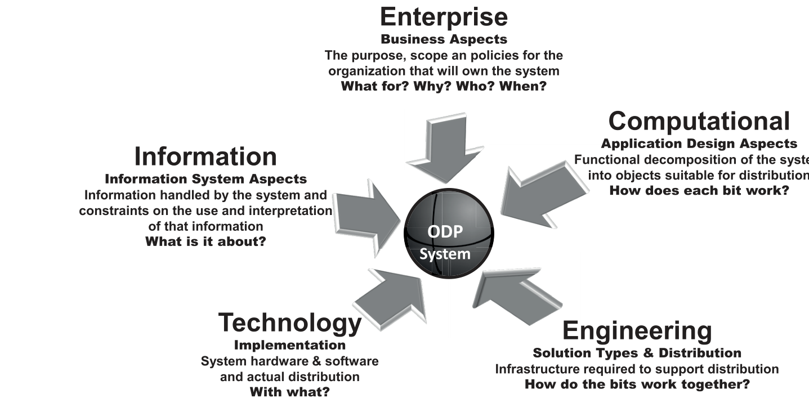

**Figure H.7 — RM-ODP framework**

**图 H.7——RM-ODP 框架**

#### H.6.2 Mapping to framework elements 到框架要素的映射

The RM-ODP is a framework for specification of system’s architecture. This does not correspond to architecture process perspective directly. Therefore, it is impossible to indicate mapping.

RM-ODP 是用于规定系统架构的框架。这与架构过程角度并不直接对应。因此，无法给出映射。

#### H.6.3 Items in the RM-ODP Framework not addressed in this document RM-ODP 框架中本文件未涉及的事项

The RM-ODP prescribes specification notion/description for systems. Especially, in ISO/IEC 19793, concrete elements of all viewpoints are defined as UML profile. Therefore, System specifications are constructed using these elements in diagrams. Furthermore, the RM-ODP represents from the high abstraction specification (Enterprise specification) to detail one (Technology/Engineering specification).

RM-ODP 规定系统的规格概念／描述。特别是在 ISO/IEC 19793 中，所有视角的具体元素均定义为 UML 概要文件。因此，系统规格是使用这些元素以图的形式构造的。此外，RM-ODP 所表示的范围从高抽象的规格（企业规格）到详细的规格（技术／工程规格）。

#### H.6.4 Items in this document not addressed in the RM-ODP Framework 本文件中 RM-ODP 框架未涉及的事项

This document prescribes the Architecture process for system development. However, the RM- ODP doesn’t include development process. Furthermore, the RM-ODP mainly focuses on Enterprise Architecture, on the contrary, this document covers Enterprise/System Architecture.

本文件规定用于系统开发的架构过程。然而，RM-ODP 不包含开发过程。此外，RM-ODP 主要关注企业架构，与此相反，本文件覆盖企业／系统架构。

## Bibliography 参考文献

[1] ISO/IEC 7498-1, *Information technology — Open Systems Interconnection — Basic Reference* *Model: The Basic Model*

[1] ISO/IEC 7498-1, *信息技术 — 开放系统互连 — 基本参考* *模型：基本模型*

[2] ISO 9000:2015, *Quality management systems — Fundamentals and vocabulary. International* *Organization for Standardization*

[2] ISO 9000:2015, *质量管理体系 — 基础和术语。国际* *标准化组织*

[3] ISO/IEC 10746 (all parts), *Information technology — Open distributed processing — Reference model*

[3] ISO/IEC 10746（所有部分）, *信息技术 — 开放分布式处理 — 参考模型*

[4] ISO/IEC/IEEE 12207, *Systems and software engineering — Software life cycle processes*

[4] ISO/IEC/IEEE 12207, *系统与软件工程 — 软件生存周期过程*

[5] ISO/IEC/IEEE 15288:2015, *Systems and software engineering — System life cycle processes*

[5] ISO/IEC/IEEE 15288:2015, *系统与软件工程 — 系统生存周期过程*

[6] ISO/IEC/IEEE 15289, *Systems and software engineering — Content of life-cycle information items* *(documentation)*

[6] ISO/IEC/IEEE 15289, *系统与软件工程 — 生存周期信息* *部件（文档）的内容*

[7] ISO/IEC/IEEE 15939, *Systems and software engineering — Measurement process*

[7] ISO/IEC/IEEE 15939, *系统与软件工程 — 测量过程*

[8] ISO 15704:2000, *Industrial automation systems* *— Requirements for enterprise-reference* *architectures and methodologies*

[8] ISO 15704:2000, *工业自动化系统* *— 对企业参照* *架构与方法论的要求*

[9] ISO 19439, *Enterprise integration — Framework for enterprise modelling*

[9] ISO 19439, *企业集成 — 企业建模框架*

[10] ISO/IEC 19793, *Information technology — Open Distributed Processing — Use of UML for ODP* *system specifications*

[10] ISO/IEC 19793, *信息技术 — 开放分布式处理 — UML 用于 ODP* *系统规格*

[11] ISO/IEC 20000-1, *Information technology — Service management — Part 1: Service management* *system requirements*

[11] ISO/IEC 20000-1, *信息技术 — 服务管理 — 第 1 部分：服务管理* *系统要求*

[12] ISO 21500, *Guidance on project management*

[12] ISO 21500, *项目管理指南*

[13] ISO 21505, *Project, programme and portfolio management — Guidance on governance*

[13] ISO 21505, *项目、项目群与项目组合管理 — 治理指南*

[14] ISO/IEC/IEEE 24748 (all parts), *Systems and software engineering — Life cycle management*

[14] ISO/IEC/IEEE 24748（所有部分）, *系统与软件工程 — 生存周期管理*

[15] ISO/IEC/IEEE 24765, *Systems and software engineering — Vocabulary*

[15] ISO/IEC/IEEE 24765, *系统与软件工程 — 词汇*

[16] ISO/IEC/TR 24774, *Systems and software engineering — Life cycle management — Guidelines for* *process description*

[16] ISO/IEC/TR 24774, *系统与软件工程 — 生存周期管理 —* *过程描述指南*

[17] ISO/IEC 25000, *Systems and software engineering — Systems and software Quality Requirements* *and Evaluation (SQuaRE) — Guide to SQuaRE*

[17] ISO/IEC 25000, *系统与软件工程 — 系统与软件质量* *要求和评价（SQuaRE） — SQuaRE 指南*

[18] ISO/IEC 25010, *Systems and software engineering — Systems and software Quality Requirements* *and Evaluation (SQuaRE) — System and software quality models*

[18] ISO/IEC 25010, *系统与软件工程 — 系统与软件质量* *要求和评价（SQuaRE） — 系统与软件质量模型*

[19] ISO/IEC 25012, *Software engineering — Software product Quality Requirements and Evaluation* *(SQuaRE) — Data quality model*

[19] ISO/IEC 25012, *软件工程 — 软件产品质量要求和评价* *（SQuaRE） — 数据质量模型*

[20] ISO/IEC 25020, *Systems and software engineering — Systems and software Quality Requirements* *and Evaluation (SQuaRE) — Quality measurement framework*

[20] ISO/IEC 25020, *系统与软件工程 — 系统与软件质量* *要求和评价（SQuaRE） — 质量测量框架*

[21] ISO/IEC 27000, *Information technology — Security techniques — Information security management* *systems — Overview and vocabulary*

[21] ISO/IEC 27000, *信息技术 — 安全技术 — 信息安全管理* *体系 — 概述和词汇*

[22] ISO 31000, *Risk management — Guidelines*

[22] ISO 31000, *风险管理 — 指南*

[23] ISO/IEC 33001, *Information technology — Process assessment — Concepts and terminology*

[23] ISO/IEC 33001, *信息技术 — 过程评定 — 概念和术语*

[24] ISO/IEC 33002, *Information technology — Process assessment — Requirements for performing* *process assessment*

[24] ISO/IEC 33002, *信息技术 — 过程评定 — 执行* *过程评定的要求*

[25] ISO/IEC 33004, *Information technology* *— Process assessment* *— Requirements for process* *reference, process assessment and maturity models*

[25] ISO/IEC 33004, *信息技术* *— 过程评定* *— 过程参考、过程评定* *与成熟度模型的要求*

[26] ISO/IEC 33020, *Information technology — Process assessment — Process measurement framework* *for assessment of process capability*

[26] ISO/IEC 33020, *信息技术 — 过程评定 — 过程测量框架* *用于评定过程能力*

[27] ISO/IEC 38500, *Information technology — Governance of IT for the organization*

[27] ISO/IEC 38500, *信息技术 — 组织的 IT 治理*

[28] ISO/IEC/TR 38502, *Information technology — Governance of IT — Framework and model*

[28] ISO/IEC/TR 38502, *信息技术 — IT 治理 — 框架与模型*

[29] ISO/IEC/IEEE 42010, *Systems and software engineering — Architecture description*

[29] ISO/IEC/IEEE 42010, *系统与软件工程 — 架构描述*

[30] ISO/IEC/IEEE 42030, *Enterprise, systems and software — Architecture evaluation framework*

[30] ISO/IEC/IEEE 42030, *企业、系统与软件 — 架构评估框架*

[31] IEEE Std 1471:2000, *IEEE Recommended Practice for Architectural Description for Software-* *Intensive Systems*

[31] IEEE Std 1471:2000, *IEEE 软件密集型系统架构描述* *推荐实施规程*

[32] IEEE Std 1517-1999 (R2004) *IEEE Standard for Information Technology — Software Life Cycle* *Processes — Reuse Processes, and modified by generalizing in terms of systems rather than* *software systems*

[32] IEEE Std 1517-1999 (R2004) *IEEE 信息技术标准 — 软件生存周期* *过程 — 复用过程，并经修改，按系统* *而非软件系统进行泛化*

[33] Pragmatic Enterprise Architecture Framework, V3.3 June 2017, Pragmatic EA Ltd, ISBN: 978-1- 908424-10-5

[33] Pragmatic Enterprise Architecture Framework，V3.3，2017 年 6 月，Pragmatic EA Ltd，ISBN: 978-1- 908424-10-5

[34] Business Motivation Model, Version 1.0, OMG Document Number: formal/2008-08-02, standard document. URL: http:​//www​.omg​.org/spec/BMM/1​.0/PDF

[34] Business Motivation Model，版本 1.0，OMG 文档编号：formal/2008-08-02，标准文档。URL：http:​//www​.omg​.org/spec/BMM/1​.0/PDF

[35] MDA Guide version 1.0.1, omg/03-06-01, June 2003

[35] MDA 指南 1.0.1 版，omg/03-06-01，2003 年 6 月

[36] The Open Group Architecture Framework, (TOGAF®) Version 9.1, van Haren Publishing, ISBN-10: 9087536798

[36] The Open Group Architecture Framework，(TOGAF®) 9.1 版，van Haren Publishing，ISBN-10: 9087536798

[37] The DoD Architecture Framework Version 2.02, DoD Deputy Chief Information Officer. URL: http:​//dodcio​.defense​.gov/Library/DoD​-Architecture​-Framework/

[37] The DoD Architecture Framework 2.02 版，DoD 副首席信息官。URL：http:​//dodcio​.defense​.gov/Library/DoD​-Architecture​-Framework/

[38] Handbook Systems Engineering, a guide for system life cycle processes and activities, International Council on Systems Engineering, INCOSE-TP-2003-002-04 2015

[38] 系统工程手册，系统生存周期过程与活动指南，国际系统工程理事会，INCOSE-TP-2003-002-04 2015

[39] The DoDAF Architecture Framework Version 2.0, 28 May 2009

[39] The DoDAF Architecture Framework 2.0 版，2009 年 5 月 28 日

[40] The DoDAF Architecture Framework Version 2.02. URL: http:​//dodcio​.defense​.gov/Library/DoD​ -Architecture​-Framework/

[40] The DoDAF Architecture Framework 2.02 版。URL：http:​//dodcio​.defense​.gov/Library/DoD​ -Architecture​-Framework/

[41] Boehm B. W., Brown J. R., Kaspar H., Lipow M., McLeod G., Meritt M., Characteristics of Software Quality, Edition 2, North-Holland Pub. Co., 1978 [Broy, 2009] Automotive Architecture Framework: Towards a Holistic and Standardised System Architecture Description, An overview on description concepts, models and methods

[41] Boehm B. W.，Brown J. R.，Kaspar H.，Lipow M.，McLeod G.，Meritt M.，软件质量特性，第 2 版，North-Holland Pub. Co.，1978 [Broy, 2009] 汽车架构框架：迈向整体化与标准化的系统架构描述，描述概念、模型与方法概述

[42] Parnell Gregory S., (ed.) (2017). Trade-off Analytics: Creating and Exploring the System Tradespace (Wiley Series in Systems Engineering and Management, January 2017)

[42] Parnell Gregory S.（编），(2017)。权衡分析：创建与探索系统权衡空间（Wiley Series in Systems Engineering and Management，2017 年 1 月）

[43] Parnell Gregory S., Bresnick Terry, Tani Steven N., Johnson Eric R., (2013). Handbook of Decision Analysis (Wiley Handbooks in Operations Research and Management Science, April 2013) by

[43] Parnell Gregory S.，Bresnick Terry，Tani Steven N.，Johnson Eric R.，(2013)。决策分析手册（Wiley Handbooks in Operations Research and Management Science，2013 年 4 月）由

[44] Weill P., (2007), Innovating in Information Systems: What do the most agile firms in the world do? Sixth e-Business Conference, Barcelona Spain, URL: http:​//www​.scirp​ .org/(S(i43dyn45teexjx455qlt3d2q))/reference/ReferencesPapers​.aspx​?ReferenceID​=​382108

[44] Weill P.，(2007)，信息系统的创新：世界上最敏捷的企业在做什么？第六届电子商务会议，西班牙巴塞罗那，URL：http:​//www​.scirp​ .org/(S(i43dyn45teexjx455qlt3d2q))/reference/ReferencesPapers​.aspx​?ReferenceID​=​382108

[45]Mark W., Maier (1996), Architecting Principles for Systems-of-Systems, DOI: 10.1002/j.2334- 5837.1996.tb02054.x

[45]Mark W.，Maier(1996)，面向系统的系统的架构原则，DOI: 10.1002/j.2334- 5837.1996.tb02054.x

[46]Evans D., (2014), Styles of Architecting - A smarter approach to architecting the Defence Enterprise, Niteworks White Paper, URL: https:​//assets​.publishing​.service​.gov​ .uk/government/uploads/system/uploads/attachment​_data/file/692432/NWP​_​-​_Styles​_of​ _Architecting​.pdf

[46]Evans D.，(2014)，架构工作风格——架构国防企业的更明智方法，Niteworks 白皮书，URL：https:​//assets​.publishing​.service​.gov​ .uk/government/uploads/system/uploads/attachment​_data/file/692432/NWP​_​-​_Styles​_of​ _Architecting​.pdf

[47]American Society for Quality, Glossary – Entry: Quality, retrieved 2017-08-01

[47]美国质量协会，术语表——条目：质量，2017-08-01 检索

[48]Boehm B., Kukreja N., (2015), An initial Ontology for System Qualities, Proceedings of 25th INCOSE Symposium, Seattle, USA

[48]Boehm B.，Kukreja N.，(2015)，系统质量的初始本体，第 25 届 INCOSE 研讨会论文集，美国西雅图

[49]Crosby Philip, (1979). Quality is Free. New York: McGraw-Hill. ISBN 0-07-014512-1

[49]Crosby Philip，(1979)。质量免费。纽约：McGraw-Hill。ISBN 0-07-014512-1

[50]Drucker P. F., (1986). Innovation and entrepreneurship: Practice and principles. New York: Harper Row

[50]Drucker P. F.，(1986)。创新与企业家精神：实践与原则。纽约：Harper Row

[51] Juran, Joseph M and Joseph A Defeo (2010), Quality Control Handbook, New York, McGraw- Hill, 6th Edition

[51] Juran, Joseph M 与 Joseph A Defeo(2010)，质量控制手册，纽约，McGraw- Hill，第 6 版

[52]Kiran D R, (2017), Total Quality Management: Key Concepts and Case Studies, Edition 1, Elsevier, Butterworth Heinemann publications

[52]Kiran D R，(2017)，全面质量管理：关键概念与案例研究，第 1 版，Elsevier，Butterworth Heinemann publications

[53]Taguchi G., (1992). Taguchi on Robust Technology Development. ASME Press. ISBN 978-99929- 1-026-9.

[53]Taguchi G.，(1992)。田口论稳健技术开发。ASME Press。ISBN 978-99929- 1-026-9.

[54]Kumar A., Doji S. L, Nikhil R Z, and Swaminathan N (2016), Value based System Architecting: Illustrated by Designing a Task Automation System, Proceedings of 26th INCOSE Symposium, Edinburgh, UK

[54]Kumar A.，Doji S. L，Nikhil R Z 与 Swaminathan N(2016)，基于价值的系统架构工作：以设计任务自动化系统为例，第 26 届 INCOSE 研讨会论文集，英国爱丁堡

[55]Kumar A., Doji S. L, Nikhil R Z, and Jose K R (2017), Value based Architecture of Digital Product- Service Systems, Proceedings of 27th INCOSE Symposium, Adelaide, Australia

[55]Kumar A.，Doji S. L，Nikhil R Z 与 Jose K R(2017)，基于价值的数字产品服务系统架构，第 27 届 INCOSE 研讨会论文集，澳大利亚阿德莱德

[56]Len Bass, Paul Clements, Rick Kazman, 2003, Software Architecture in Practice, 2nd Edition, Addison Wesley Publications, ISBN: 0-321-15495-9

[56]Len Bass，Paul Clements，Rick Kazman，2003，软件架构实践，第 2 版，Addison Wesley Publications，ISBN: 0-321-15495-9

[57]Paul Clements, Rick Kazman, Mark Klein, 2002, Evaluating Software Architectures: Methods and Case Studies, 1st Edition, Addison Wesley Publications, ISBN-10: 0-201-70482-X

[57]Paul Clements，Rick Kazman，Mark Klein，2002，评估软件架构：方法与案例研究，第 1 版，Addison Wesley Publications，ISBN-10: 0-201-70482-X

[58]The qualities of architecture, John Critchley, March 10th, 2008

[58]架构的质量，John Critchley，2008 年 3 月 10 日

[59]Vitruvius BC, De architectura, Marcus Vitruvius Pollio (1st century BC) (Transl. Morris 2106 Hicky Morgan, 1960), The Ten Books on Architecture. Courier Dover Publications. ISBN 0-2107 486-20645-9

[59]Vitruvius BC，De architectura，Marcus Vitruvius Pollio（公元前 1 世纪）（译者 Morris 2106 Hicky Morgan，1960），建筑十书。Courier Dover Publications。ISBN 0-2107 486-20645-9

[60]Characteristics of Good Architecture, Enterprise Architect User Guide v13.0, Sparx Systems, 2018, URL: http:​//sparxsystems​.com/enterprise​_architect​_user​_guide/13​.0/guidebooks/ea​ _characteristics​_of​_good​_architecture​.html

[60]良好架构的特性，Enterprise Architect 用户指南 v13.0，Sparx Systems，2018，URL：http:​//sparxsystems​.com/enterprise​_architect​_user​_guide/13​.0/guidebooks/ea​ _characteristics​_of​_good​_architecture​.html

[61] Simon A, Herbert, 1962, The Architecture of Complexity, *Proceedings of the American* *Philosophical Society*, Vol. **106**, No. 6. (Dec. 12, 1962), pp 467-482

[61] Simon A, Herbert，1962，复杂性的架构，*Proceedings of the American* *Philosophical Society*，第 **106** 卷，第 6 期。（1962 年 12 月 12 日），第 467-482 页

## IEEE notices and abstract IEEE 声明与摘要

**Important Notices and Disclaimers Concerning IEEE Standards Documents**

**关于 IEEE 标准文件的重要声明与免责声明**

IEEE documents are made available for use subject to important notices and legal disclaimers. These notices and disclaimers, or a reference to this page, appear in all standards and may be found under the heading “Important Notices and Disclaimers Concerning IEEE Standards Documents.” They can also be obtained on request from IEEE or viewed at http:​//standards​.ieee​.org/IPR/disclaimers​.html.

IEEE 文件在重要声明与法律免责声明的前提下提供使用。这些声明与免责声明，或对本页的引用，出现在所有标准中，可在“关于 IEEE 标准文件的重要声明与免责声明”标题下查到。也可应请求向 IEEE 索取，或在http:​//standards​.ieee​.org/IPR/disclaimers​.html查看。

**Notice and Disclaimer of Liability Concerning the Use of IEEE Standards Documents**

**关于使用 IEEE 标准文件的声明与责任免责声明**

IEEE Standards documents (standards, recommended practices, and guides), both full-use and trial-use, are developed within IEEE Societies and the Standards Coordinating Committees of the IEEE Standards Association (“IEEE-SA”) Standards Board. IEEE (“the Institute”) develops its standards through a consensus development process, approved by the American National Standards Institute (“ANSI”), which brings together volunteers representing varied viewpoints and interests to achieve the final product. IEEE Standards are documents developed through scientific, academic, and industry-based technical working groups. Volunteers in IEEE working groups are not necessarily members of the Institute and participate without compensation from IEEE. While IEEE administers the process and establishes rules to promote fairness in the consensus development process, IEEE does not independently evaluate, test, or verify the accuracy of any of the information or the soundness of any judgments contained in its standards.

IEEE 标准文件（标准、推荐实施规程与指南），无论完全使用版还是试用版，均由 IEEE 各专业协会以及 IEEE 标准协会（“IEEE-SA”）标准理事会的标准协调委员会制定。IEEE（“本学会”）通过共识制定过程制定其标准，该过程经美国国家标准学会（“ANSI”）批准，汇集代表各种观点与利益的志愿者以形成最终成果。IEEE 标准是由科学界、学术界与产业界技术工作组制定的文件。IEEE 工作组的志愿者不一定是本学会会员，且不从 IEEE 获取报酬。尽管 IEEE 管理该过程并制定规则以促进共识制定过程的公平性，但 IEEE 不独立评估、测试或核实其标准中所含任何信息的准确性或任何判断的可靠性。

IEEE Standards do not guarantee or ensure safety, security, health, or environmental protection, or ensure against interference with or from other devices or networks. Implementers and users of IEEE Standards documents are responsible for determining and complying with all appropriate safety, security, environmental, health, and interference protection practices and all applicable laws and regulations.

IEEE 标准不保证或确保安全、安保、健康或环境保护，也不确保免于同其他设备或网络之间的干扰。IEEE 标准文件的实施者和使用者有责任确定并遵守所有适当的安全、安保、环境、健康和干扰防护实践以及所有适用的法律和法规。

IEEE does not warrant or represent the accuracy or content of the material contained in its standards, and expressly disclaims all warranties (express, implied and statutory) not included in this or any other document relating to the standard, including, but not limited to, the warranties of: merchantability; fitness for a particular purpose; non-infringement; and quality, accuracy, effectiveness, currency, or completeness of material. In addition, IEEE disclaims any and all conditions relating to: results; and workmanlike effort. IEEE standards documents are supplied “AS IS” and “WITH ALL FAULTS.”

IEEE 不担保也不声明其标准所含材料的准确性或内容，并明确否认未包含在本文件或任何其他与该标准有关的文件中的所有担保（明示、默示和法定），包括但不限于以下担保：可销售性；特定用途适用性；不侵权；以及材料的质量、准确性、有效性、时效性或完整性。此外，IEEE 否认与下列各项有关的一切条件：结果；以及专业水准的努力。IEEE 标准文件按“AS IS”和“WITH ALL FAULTS”提供。

Use of an IEEE standard is wholly voluntary. The existence of an IEEE standard does not imply that there are no other ways to produce, test, measure, purchase, market, or provide other goods and services related to the scope of the IEEE standard. Furthermore, the viewpoint expressed at the time a standard is approved and issued is subject to change brought about through developments in the state of the art and comments received from users of the standard.

使用 IEEE 标准完全出于自愿。某项 IEEE 标准的存在并不意味着不存在其他方式来生产、测试、测量、采购、营销或提供与该 IEEE 标准范围有关的其他商品和服务。此外，标准批准和发布时所表达的观点可能因技术现状的发展和该标准使用者所提意见而改变。

In publishing and making its standards available, IEEE is not suggesting or rendering professional or other services for, or on behalf of, any person or entity nor is IEEE undertaking to perform any duty owed by any other person or entity to another. Any person utilizing any IEEE Standards document, should rely upon his or her own independent judgment in the exercise of reasonable care in any given circumstances or, as appropriate, seek the advice of a competent professional in determining the appropriateness of a given IEEE standard.

IEEE 出版并提供其标准，并非为任何人或实体、或代表任何人或实体建议或提供专业服务或其他服务，IEEE 也不承诺履行任何其他人或实体对他人所负的任何义务。任何人使用任何 IEEE 标准文件时，宜在任何特定情形下尽合理注意并依赖其自身的独立判断，或视情况在确定某项 IEEE 标准是否适当时寻求有资质的专业人员的意见。

IN NO EVENT SHALL IEEE BE LIABLE FOR ANY DIRECT, INDIRECT, INCIDENTAL, SPECIAL, EXEMPLARY, OR CONSEQUENTIAL DAMAGES (INCLUDING, BUT NOT LIMITED TO: PROCUREMENT OF SUBSTITUTE GOODS OR SERVICES; LOSS OF USE, DATA, OR PROFITS; OR BUSINESS INTERRUPTION) HOWEVER CAUSED AND ON ANY THEORY OF LIABILITY, WHETHER IN CONTRACT, STRICT LIABILITY, OR TORT (INCLUDING NEGLIGENCE OR OTHERWISE) ARISING IN ANY WAY OUT OF THE PUBLICATION, USE OF, OR RELIANCE UPON ANY STANDARD, EVEN IF ADVISED OF THE POSSIBILITY OF SUCH DAMAGE AND REGARDLESS OF WHETHER SUCH DAMAGE WAS FORESEEABLE.

在任何情况下，IEEE 均不对任何直接的、间接的、附带的、特殊的、惩罚性的或后果性的损害（包括但不限于：替代商品或服务的采购；使用、数据或利润的损失；业务中断）承担任何责任，无论其因何引起，也无论基于何种责任理论，无论是合同责任、严格责任还是侵权责任（包括过失或其他情形），只要是以任何方式因出版、使用或依赖任何标准而引起的，即使已被告知发生此类损害的可能性，也无论此类损害是否可预见。

**Translations**

**译文**

The IEEE consensus development process involves the review of documents in English only. In the event that an IEEE standard is translated, only the English version published by IEEE should be considered the approved IEEE standard.

IEEE 的共识制定过程仅涉及以英文对文件进行审查。若某项 IEEE 标准被翻译，只有 IEEE 出版的英文版本宜被视为经批准的 IEEE 标准。

**Official statements**

**正式声明**

A statement, written or oral, that is not processed in accordance with the IEEE-SA Standards Board Operations Manual shall not be considered or inferred to be the official position of IEEE or any of its committees and shall not be considered to be, or be relied upon as, a formal position of IEEE. At lectures, symposia, seminars, or educational courses, an individual presenting information on IEEE standards shall make it clear that his or her views should be considered the personal views of that individual rather than the formal position of IEEE.

我们的各类订阅服务旨在让您更轻松地使用标准。有关我们订阅产品的更多信息，请访问 bsigroup. com/subscriptions。

**Comments on standards**

借助 **British Standards Online (BSOL)**，您可以从桌面即时访问超过 55,000 项英国标准以及所采用的欧洲标准和国际标准。该服务全天候 24/7 可用，且每日刷新，因此您始终能掌握最新内容。

Comments for revision of IEEE Standards documents are welcome from any interested party, regardless of membership affiliation with IEEE. However, IEEE does not provide consulting information or advice pertaining to IEEE Standards documents. Suggestions for changes in documents should be in the form of a proposed change of text, together with appropriate supporting comments. Since IEEE standards represent a consensus of concerned interests, it is important that any responses to comments and questions also receive the concurrence of a balance of interests. For this reason, IEEE and the members of its societies and Standards Coordinating Committees are not able to provide an instant response to comments or questions except in those cases where the matter has previously been addressed. For the same reason, IEEE does not respond to interpretation requests. Any person who would like to participate in revisions to an IEEE standard is welcome to join the relevant IEEE working group.

**标准信息**

Comments on standards should be submitted to the following address:

我们能够为您提供贵组织取得成功所需的知识。如需进一步了解英国标准，请访问我们的网站 bsigroup.com/standards，或联系我们的客户服务团队或知识中心。

Secretary, IEEE-SA Standards Board

通过成为 **BSI 订阅会员\**，您可以及时了解标准发展动态，并在购买标准时享受大幅折扣，无论是以单册形式还是订阅形式。

445 Hoes Lane

**PLUS** 是 BSI 订阅会员专属的更新服务。您的标准经修订或被替代时，您将自动收到其最新纸质版本。

Piscataway, NJ 08854 USA

**购买标准**

**Laws and regulations**

您可以经由我们的网站 bsigroup. com/shop 购买并下载 BSI 出版物的 PDF 版本，包括英国标准以及所采用的欧洲标准和国际标准；纸质版本亦可在此购买。

Users of IEEE Standards documents should consult all applicable laws and regulations. Compliance with the provisions of any IEEE Standards document does not imply compliance to any applicable regulatory requirements. Implementers of the standard are responsible for observing or referring to the applicable regulatory requirements. IEEE does not, by the publication of its standards, intend to urge action that is not in compliance with applicable laws, and these documents may not be construed as doing so.

如需进一步了解如何成为 BSI 订阅会员及其会员权益，请访问 bsigroup.com/shop。

**Copyrights**

如果您需要来自其他标准制定组织的国际标准和外国标准，可通过我们的客户服务团队订购纸质版本。

IEEE draft and approved standards are copyrighted by IEEE under U.S. and international copyright laws. They are made available by IEEE and are adopted for a wide variety of both public and private uses. These include both use, by reference, in laws and regulations, and use in private self-regulation, standardization, and the promotion of engineering practices and methods. By making these documents available for use and adoption by public authorities and private users, IEEE does not waive any rights in copyright to the documents.

持有 **多用户网络许可（MUNL）**，您即可将标准出版物托管在您的内部网上。许可涵盖的用户数量可多可少，由您自行决定。更新一经发布即行提供，因此您可以确信您的文档始终为现行版本。如需更多信息，请发送电子邮件至 cservices@bsigroup.com。

**Photocopies**

**BSI 出版物中的版权**

Subject to payment of the appropriate fee, IEEE will grant users a limited, non-exclusive license to photocopy portions of any individual standard for company or organizational internal use or individual, non-commercial use only. To arrange for payment of licensing fees, please contact Copyright Clearance Center, Customer Service, 222 Rosewood Drive, Danvers, MA 01923 USA; +1 978 750 8400. Permission to photocopy portions of any individual standard for educational classroom use can also be obtained through the Copyright Clearance Center.

BSI 出版物中的所有内容，包括英国标准，均属 BSI 的财产，其版权归 BSI 所有；或归对所用信息拥有版权并已将该信息的商业出版和使用正式许可给 BSI 的某个人或实体（如各国际标准化组织）所有。

**Updating of IEEE Standards documents**

**修订**

Users of IEEE Standards documents should be aware that these documents may be superseded at any time by the issuance of new editions or may be amended from time to time through the issuance of amendments, corrigenda, or errata. An official IEEE document at any point in time consists of the current edition of the document together with any amendments, corrigenda, or errata then in effect.

我们的英国标准及其他出版物通过修改单或修订予以更新。

Every IEEE standard is subjected to review at least every ten years. When a document is more than ten years old and has not undergone a revision process, it is reasonable to conclude that its contents, although still of some value, do not wholly reflect the present state of the art. Users are cautioned to check to determine that they have the latest edition of any IEEE standard.

我们持续改进产品与服务的质量，以助益您的业务。如您发现某项英国标准或其他 BSI 出版物中存在不准确或歧义之处，请告知知识中心。

In order to determine whether a given document is the current edition and whether it has been amended through the issuance of amendments, corrigenda, or errata, visit the IEEE-SA Website at http:​//ieeexplore​.ieee​.org/xpl/standards​.jsp or contact IEEE at the address listed previously. For more information about the IEEE-SA or IEEE’s standards development process, visit the IEEE-SA Website at http:​//standards​.ieee​.org.

除下述规定外，您不得将本标准的任何部分转让、共享或传播给任何其他人。未经 BSI 事先书面同意，您不得以任何方式改编、分发、商业利用或公开展示本标准或其任何部分。

**Errata**

**实用联系方式**

Errata, if any, for all IEEE standards can be accessed on the IEEE-SA Website: http:​//standards​.ieee​ .org/findstds/errata/index​.html. Users are encouraged to check this URL for errata periodically.

**标准的存储与使用**

**Patents**

**客户服务** **电话：** +44 345 086 9001 **电子邮件：** cservices@bsigroup.com

Attention is called to the possibility that implementation of this standard may require use of subject matter covered by patent rights. By publication of this standard, no position is taken by the IEEE with respect to the existence or validity of any patent rights in connection therewith. If a patent holder or patent applicant has filed a statement of assurance via an Accepted Letter of Assurance, then the statement is listed on the IEEE-SA Website at http:​//standards​.ieee​.org/about/sasb/patcom/patents​ .html. Letters of Assurance may indicate whether the Submitter is willing or unwilling to grant licenses under patent rights without compensation or under reasonable rates, with reasonable terms and conditions that are demonstrably free of any unfair discrimination to applicants desiring to obtain such licenses.

以软拷贝形式购买的标准：

Essential Patent Claims may exist for which a Letter of Assurance has not been received. The IEEE is not responsible for identifying Essential Patent Claims for which a license may be required, for conducting inquiries into the legal validity or scope of Patents Claims, or determining whether any licensing terms or conditions provided in connection with submission of a Letter of Assurance, if any, or in any licensing agreements are reasonable or non-discriminatory. Users of this standard are expressly advised that determination of the validity of any patent rights, and the risk of infringement of such rights, is entirely their own responsibility. Further information may be obtained from the IEEE Standards Association.

• 以软拷贝形式购买的英国标准，仅授权给唯一具名用户，供其个人或公司内部使用。

**Abstract and keywords**

**订阅** **电话：** +44 345 086 9001 **电子邮件：** subscriptions@bsigroup.com

This document complements the architecture-related processes identified in ISO/IEC/IEEE 15288, ISO/IEC/IEEE 12207 and ISO 15704 with activities and tasks that enable architects and others to more effectively and efficiently implement architecture practices. Implementing these practices can help ensure that the architecture has greater influence on business and mission success. It specifies a coherent set of processes for governance, management, conceptualization, evaluation and elaboration of architectures, and activities that enable these processes. Users of this document can apply these processes in the context of: (1) understanding, development and evolution of entities through their life cycle stages such as conception, development, implementation, operation, sustainment, decommissioning, and disposal; (2) organization(s) acting as users, customers and providers of the solution specified by the architecture description; and (3) architecting of entities.

• 该标准可存储于不止一台设备上，前提是仅唯一具名用户可访问，且任一时刻仅访问一份副本。

Keywords: architecture, architecture collection, architecture entity, architecture conceptualization, architecture elaboration, architecture enablement, architecture evaluation, architecture governance, architecture management, concern, design, enterprise, life cycle, life cycle model, model, outcomes, phase, process reference model, process tailoring, stage, stakeholder, system, software, tradeoff, view, viewpoint.

**知识中心** **电话：** +44 20 8996 7004 **电子邮件：** knowledgecentre@bsigroup.com

British Standards Institution (BSI)

• 可打印一份纸质副本，仅供个人或公司内部使用。

BSI is the national body responsible for preparing British Standards and other standards-related publications, information and services.

以硬拷贝形式购买的标准：

BSI is incorporated by Royal Charter. British Standards and other standardization products are published by BSI Standards Limited.

• 以硬拷贝形式购买的英国标准，仅供个人或公司内部使用。

**About us**

**版权与许可** **电话：** +44 20 8996 7070 **电子邮件：** copyright@bsigroup.com

**Reproducing extracts**

• 不得以任何形式进一步复制以生成额外副本。这包括对文件的扫描。

For permission to reproduce content from BSI publications contact the BSI Copyright and Licensing team.

如果您需要该文件的多个副本，或希望在内部网络上共享该文件，选择订阅产品（见‘订阅’）可以节省费用。

We bring together business, industry, government, consumers, innovators and others to shape their combined experience and expertise into standards -based solutions.

**BSI 集团总部**

**Subscriptions**

389 Chiswick High Road London W4 4AL UK

The knowledge embodied in our standards has been carefully assembled in a dependable format and refined through our open consultation process. Organizations of all sizes and across all sectors choose standards to help them achieve their goals.

我们的标准所承载的知识，以可靠的形式经精心汇编，并通过公开征询过程加以提炼。各种规模和各行各业的组织都选择标准来帮助其实现目标。

Our range of subscription services are designed to make using standards easier for you. For further information on our subscription products go to bsigroup. com/subscriptions.

我们提供一系列订阅服务，旨在让您更轻松地使用标准。有关订阅产品的更多信息，请访问 bsigroup. com/subscriptions。

With **British Standards Online (BSOL)** you’ll have instant access to over 55,000 British and adopted European and international standards from your desktop. It’s available 24/7 and is refreshed daily so you’ll always be up to date.

借助 **British Standards Online (BSOL)**，您可从桌面即时访问 55,000 多项英国标准以及所采用的欧洲标准和国际标准。该服务全天候可用，并且每日更新，因此您始终能掌握最新信息。

**Information on standards**

**标准信息**

We can provide you with the knowledge that your organization needs to succeed. Find out more about British Standards by visiting our website at bsigroup.com/standards or contacting our Customer Services team or Knowledge Centre.

我们可为您提供贵组织取得成功所需的知识。如需了解有关英国标准的更多信息，请访问我们的网站 bsigroup.com/standards，或联系我们的客户服务团队或知识中心。

You can keep in touch with standards developments and receive substantial discounts on the purchase price of standards, both in single copy and subscription format, by becoming a **BSI Subscribing Member.\**

成为 **BSI 订阅会员。\**后，即可随时了解标准制定动态，并在以单册购买和订阅形式购买标准时享受大幅折扣。

**PLUS** is an updating service exclusive to BSI Subscribing Members. You will automatically receive the latest hard copy of your standards when they’re revised or replaced.

**PLUS** 是专为 BSI 订阅会员提供的更新服务。您的标准一经修订或替换，您将自动收到最新的纸质版本。

**Buying standards**

**购买标准**

You can buy and download PDF versions of BSI publications, including British and adopted European and international standards, through our website at bsigroup. com/shop, where hard copies can also be purchased.

您可以通过我们的网站 bsigroup. com/shop 购买并下载 BSI 出版物（包括英国标准以及所采用的欧洲标准和国际标准）的 PDF 版本，也可在该网站购买纸质版本。

To find out more about becoming a BSI Subscribing Member and the benefits of membership, please visit bsigroup.com/shop.

如需了解成为 BSI 订阅会员的更多信息以及会员权益，请访问 bsigroup.com/shop。

If you need international and foreign standards from other Standards Development Organizations, hard copies can be ordered from our Customer Services team.

如果您需要其他标准制定组织制定的国际标准和国外标准，可通过我们的客户服务团队订购纸质版本。

With a **Multi-User Network Licence (MUNL)** you are able to host standards publications on your intranet. Licences can cover as few or as many users as you wish. With updates supplied as soon as they’re available, you can be sure your documentation is current. For further information, email cservices@bsigroup.com.

借助 **Multi-User Network Licence (MUNL)**，您可以将标准出版物托管在您的内联网上。许可所覆盖的用户数量可多可少，完全按您的需要确定。更新一经提供即会送达，因此您可以确信您的文档始终为最新版本。如需更多信息，请发送电子邮件至 cservices@bsigroup.com。

**Copyright in BSI publications**

**BSI 出版物中的版权**

All the content in BSI publications, including British Standards, is the property of and copyrighted by BSI or some person or entity that owns copyright in the information used (such as the international standardization bodies) and has formally licensed such information to BSI for commercial publication and use.

BSI 出版物中的所有内容（包括英国标准）均为 BSI 或对所用信息享有版权的某个个人或实体的财产，并受其版权保护；后者（如各国际标准化机构）已将该信息的商业出版和使用权正式许可给 BSI。

**Revisions**

**修订**

Our British Standards and other publications are updated by amendment or revision.

我们的英国标准及其他出版物通过修改单或修订进行更新。

We continually improve the quality of our products and services to benefit your business. If you find an inaccuracy or ambiguity within a British Standard or other BSI publication please inform the Knowledge Centre.

我们不断改进产品和服务的质量，以惠及您的业务。如果您发现英国标准或其他 BSI 出版物中存在不准确或歧义之处，请告知知识中心。

Save for the provisions below, you may not transfer, share or disseminate any portion of the standard to any other person. You may not adapt, distribute, commercially exploit or publicly display the standard or any portion thereof in any manner whatsoever without BSI’s prior written consent.

除下述规定外，您不得将本标准的任何部分转让、共享或传播给任何其他人。未经 BSI 事先书面同意，您不得以任何方式改编、分发、商业利用或公开展示本标准或其任何部分。

**Useful Contacts**

**实用联系方式**

**Storing and using standards**

**标准的存储与使用**

**Customer Services** **Tel:** +44 345 086 9001 **Email:** cservices@bsigroup.com

**客户服务** **电话：** +44 345 086 9001 **电子邮件：** cservices@bsigroup.com

Standards purchased in soft copy format:

以软拷贝格式购买的标准：

• A British Standard purchased in soft copy format is licensed to a sole named user for personal or internal company use only.

• 以软拷贝形式购买的英国标准，仅授权给唯一具名用户，供其个人或公司内部使用。

**Subscriptions** **Tel:** +44 345 086 9001 **Email:** subscriptions@bsigroup.com

**订阅** **电话：** +44 345 086 9001 **电子邮件：** subscriptions@bsigroup.com

• The standard may be stored on more than one device provided that it is accessible by the sole named user only and that only one copy is accessed at any one time.

• 该标准可存储于不止一台设备上，前提是仅唯一具名用户可访问，且任一时刻仅访问一份副本。

**Knowledge Centre** **Tel:** +44 20 8996 7004 **Email:** knowledgecentre@bsigroup.com

**知识中心** **电话：** +44 20 8996 7004 **电子邮件：** knowledgecentre@bsigroup.com

• A single paper copy may be printed for personal or internal company use only.

• 可打印一份纸质副本，仅供个人或公司内部使用。

Standards purchased in hard copy format:

以硬拷贝形式购买的标准：

• A British Standard purchased in hard copy format is for personal or internal company use only.

• 以硬拷贝形式购买的英国标准，仅供个人或公司内部使用。

**Copyright & Licensing** **Tel:** +44 20 8996 7070 **Email:** copyright@bsigroup.com

**版权与许可** **电话：** +44 20 8996 7070 **电子邮件：** copyright@bsigroup.com

• It may not be further reproduced – in any format – to create an additional copy. This includes scanning of the document.

• 不得以任何形式进一步复制以生成额外副本。这包括对文件的扫描。

If you need more than one copy of the document, or if you wish to share the document on an internal network, you can save money by choosing a subscription product (see ‘Subscriptions’).

如果您需要该文件的多个副本，或希望在内部网络上共享该文件，选择订阅产品（见‘订阅’）可以节省费用。

**BSI Group Headquarters**

**BSI 集团总部**

389 Chiswick High Road London W4 4AL UK

389 Chiswick High Road London W4 4AL UK
