# ISO 9000:2015 — Quality management systems — Fundamentals and vocabulary

> **转换说明 / About this file**
> 
> 由 `ISO9000-2015-质量管理体系基础和术语-英文版.pdf`（ISO 官方英文电子版，58 页）转换生成：正文含文字层，逐段转为 Markdown；附录 A 的 16 幅概念图（图 A.1–A.16）为纯矢量绘图、文字不可提取，故按页面渲染结果重绘为 **Mermaid**。
> 
> **图例（Mermaid 约定）**
> 
> | 原图记号 | Mermaid | 关系含义 |
> |---|---|---|
> | 扇形/树形连线（无箭头） | `---` | 属种关系（generic） |
> | 耙形连线（无箭头） | `-.-` | 整体–部分关系（partitive） |
> | 两端都有箭头的连线 | `<-->` | 关联关系（associative） |
> | 单向箭头 | `-->` | 仅见于图 A.15（action 指向两个中间概念） |
> 
> 附录 A 的每个方框内同时给出术语与定义；为便于阅读，Mermaid 节点只保留 **术语（条款号）**，定义与注释请查第 3 章。
> 
> 页眉、页脚、页码、IHS 版权水印与点线目录已剔除；目录按标题层级重新生成。

---

## 文档信息

| 项 | 内容 |
|---|---|
| 标准号 | ISO 9000:2015(E) |
| 英文正题 | Quality management systems — Fundamentals and vocabulary |
| 法文正题 | Systèmes de management de la qualité — Principes essentiels et vocabulaire |
| 版次 | 第四版（Fourth edition），替代 ISO 9000:2005 |
| 发布日期 | 2015-09-15 |
| ICS | 03.120.10; 01.040.03 |
| 编制 | ISO/TC 176「Quality management and quality assurance」/ SC 1「Concepts and terminology」 |
| 版权 | © ISO 2015 — All rights reserved（Published in Switzerland） |
| 篇幅 | 全文 58 页：正文第 1–13 章（p.1–33）、附录 A（p.33–46）、参考文献（p.47–48）、术语索引（p.49–51） |

---

## Contents

- [Foreword](#foreword)  
- [Introduction](#introduction)  
- [1 Scope](#1-scope)  
- [2 Fundamental concepts and quality management principles](#2-fundamental-concepts-and-quality-management-principles)  
- [2.1 General](#21-general)  
- [2.2 Fundamental concepts](#22-fundamental-concepts)  
- [2.3 Quality management principles](#23-quality-management-principles)  
- [2.4 Developing the QMS using fundamental concepts and principles](#24-developing-the-qms-using-fundamental-concepts-and-principles)  
- [3 Terms and definitions](#3-terms-and-definitions)  
- [3.1 Terms related to person or people](#31-terms-related-to-person-or-people)  
- [3.2 Terms related to organization](#32-terms-related-to-organization)  
- [3.3 Terms related to activity](#33-terms-related-to-activity)  
- [3.4 Terms related to process](#34-terms-related-to-process)  
- [3.5 Terms related to system](#35-terms-related-to-system)  
- [3.6 Terms related to requirement](#36-terms-related-to-requirement)  
- [3.7 Terms related to result](#37-terms-related-to-result)  
- [3.8 Terms related to data, information and document](#38-terms-related-to-data-information-and-document)  
- [3.9 Terms related to customer](#39-terms-related-to-customer)  
- [3.10 Terms related to characteristic](#310-terms-related-to-characteristic)  
- [3.11 Terms related to determination](#311-terms-related-to-determination)  
- [3.12 Terms related to action](#312-terms-related-to-action)  
- [3.13 Terms related to audit](#313-terms-related-to-audit)  
- [Concept relationships and their graphical representation](#concept-relationships-and-their-graphical-representation)  
- [A.1 General](#a1-general)  
- [A.2 Generic relation](#a2-generic-relation)  
- [A.3 Partitive relation](#a3-partitive-relation)  
- [A.4 Associative relation](#a4-associative-relation)  
- [A.5 Concept diagrams](#a5-concept-diagrams)  
- [Bibliography](#bibliography)  
- [Alphabetical index of terms](#alphabetical-index-of-terms)  

# Foreword

ISO (the International Organization for Standardization) is a worldwide federation of national standards bodies (ISO member bodies). The work of preparing International Standards is normally carried out through ISO technical committees. Each member body interested in a subject for which a technical committee has been established has the right to be represented on that committee. International organizations, governmental and non-governmental, in liaison with ISO, also take part in the work.

ISO collaborates closely with the International Electrotechnical Commission (IEC) on all matters of electrotechnical standardization.

The procedures used to develop this document and those intended for its further maintenance are described in the ISO/IEC Directives, Part 1. In particular the different approval criteria needed for the different types of ISO documents should be noted. This document was drafted in accordance with the editorial rules of the ISO/IEC Directives, Part 2 (see www.iso.org/directives).

Attention is drawn to the possibility that some of the elements of this document may be the subject of patent rights. ISO shall not be held responsible for identifying any or all such patent rights. Details of any patent rights identified during the development of the document will be in the Introduction and/or on the ISO list of patent declarations received (see www.iso.org/patents).

Any trade name used in this document is information given for the convenience of users and does not constitute an endorsement.

For an explanation on the meaning of ISO specific terms and expressions related to conformity assessment, as well as information about ISO’s adherence to World Trade Organization (WTO) principles in the Technical Barriers to Trade (TBT) see the following URL: www.iso.org/iso/foreword.html.

The committee responsible for this document is Technical Committee ISO/TC 176, Quality management and quality assurance, Subcommittee SC 1, Concepts and terminology.

This fourth edition cancels and replaces the third edition (ISO 9000:2005), which has been technically revised.

# Introduction

This International Standard provides the fundamental concepts, principles and vocabulary for quality management systems (QMS) and provides the foundation for other QMS standards. This International Standard is intended to help the user to understand the fundamental concepts, principles and vocabulary of quality management, in order to be able to effectively and efficiently implement a QMS and realize value from other QMS standards.

This International Standard proposes a well-defined QMS, based on a framework that integrates established fundamental concepts, principles, processes and resources related to quality, in order to help organizations realize their objectives. It is applicable to all organizations, regardless of size, complexity or business model. Its aim is to increase an organization’s awareness of its duties and commitment in fulfilling the needs and expectations of its customers and interested parties, and in achieving satisfaction with its products and services.

This International Standard contains seven quality management principles supporting the fundamental concepts described in 2.2. In 2.3, for each quality management principle, there is a “statement” describing each principle, a “rationale” explaining why the organization would address the principle, “key benefits” that are attributed to the principles, and “possible actions” that an organization can take in applying the principle.

This International Standard contains the terms and definitions that apply to all quality management and QMS standards developed by ISO/TC 176, and other sector-specific QMS standards based on those standards, at the time of publication. The terms and definitions are arranged in conceptual order, with an alphabetical index provided at the end of the document. Annex A includes a set of diagrams of the concept systems that form the concept ordering.

> **NOTE** Guidance on some additional frequently-used words in the QMS standards developed by ISO/TC 176, and which have an identified dictionary meaning, is provided in a glossary available at: http://www.iso.

org/iso/03_terminology_used_in_iso_9000_family.pdf Quality management systems — Fundamentals and vocabulary

## 1 Scope

This International Standard describes the fundamental concepts and principles of quality management which are universally applicable to the following:

- organizations seeking sustained success through the implementation of a quality management system;
- customers seeking confidence in an organization’s ability to consistently provide products and services conforming to their requirements;
- organizations seeking confidence in their supply chain that product and service requirements will be met;
- organizations and interested parties seeking to improve communication through a common understanding of the vocabulary used in quality management;
- organizations performing conformity assessments against the requirements of ISO 9001;
- providers of training, assessment or advice in quality management;
- developers of related standards.

This International Standard specifies the terms and definitions that apply to all quality management and quality management system standards developed by ISO/TC 176.

## 2 Fundamental concepts and quality management principles

### 2.1 General

The quality management concepts and principles described in this International Standard give the organization the capacity to meet challenges presented by an environment that is profoundly different from recent decades. The context in which an organization works today is characterized by accelerated change, globalization of markets and the emergence of knowledge as a principal resource.

The impact of quality extends beyond customer satisfaction: it can also have a direct impact on the organization’s reputation.

Society has become better educated and more demanding, making interested parties increasingly more influential. By providing fundamental concepts and principles to be used in the development of a quality management system (QMS), this International Standard provides a way of thinking about the organization more broadly.

All concepts, principles and their interrelationships should be seen as a whole and not in isolation of each other. No individual concept or principle is more important than another. At any one time, finding the right balance in application is critical.

### 2.2 Fundamental concepts

#### 2.2.1 Quality

An organization focused on quality promotes a culture that results in the behaviour, attitudes, activities and processes that deliver value through fulfilling the needs and expectations of customers and other relevant interested parties.

The quality of an organization’s products and services is determined by the ability to satisfy customers and the intended and unintended impact on relevant interested parties.

The quality of products and services includes not only their intended function and performance, but also their perceived value and benefit to the customer.

#### 2.2.2 Quality management system

A QMS comprises activities by which the organization identifies its objectives and determines the processes and resources required to achieve desired results.

The QMS manages the interacting processes and resources required to provide value and realize results for relevant interested parties.

The QMS enables top management to optimize the use of resources considering the long and short term consequences of their decision.

A QMS provides the means to identify actions to address intended and unintended consequences in providing products and services.

#### 2.2.3 Context of an organization

Understanding the context of the organization is a process. This process determines factors which influence the organization’s purpose, objectives and sustainability. It considers internal factors such as values, culture, knowledge and performance of the organization. It also considers external factors such as legal, technological, competitive, market, cultural, social and economic environments.

Examples of the ways in which an organization’s purpose can be expressed include its vision, mission, policies and objectives.

#### 2.2.4 Interested parties

The concept of interested parties extends beyond a focus solely on the customer. It is important to consider all relevant interested parties.

Part of the process for understanding the context of the organization is to identify its interested parties.

The relevant interested parties are those that provide significant risk to organizational sustainability if their needs and expectations are not met. Organizations define what results are necessary to deliver to those relevant interested parties to reduce that risk.

Organizations attract, capture and retain the support of the relevant interested parties they depend upon for their success.

#### 2.2.5 Support

##### 2.2.5.1 General

Top management support of the QMS and engagement of people enables:

- provision of adequate human and other resources;
- monitoring processes and results;
- determining and evaluating of risks and opportunities;
- implementing appropriate actions.

Responsible acquisition, deployment, maintenance, enhancement and disposal of resources support the organization in achieving its objectives.

##### 2.2.5.2 People

People are essential resources within the organization. The performance of the organization is dependent upon how people behave within the system in which they work.

Within an organization, people become engaged and aligned through a common understanding of the quality policy and the organization’s desired results.

##### 2.2.5.3 Competence

A QMS is most effective when all employees understand and apply the skills, training, education and experience needed to perform their roles and responsibilities. It is the responsibility of top management to provide opportunities for people to develop these necessary competencies.

##### 2.2.5.4 Awareness

Awareness is attained when people understand their responsibilities and how their actions contribute to the achievement of the organization’s objectives.

##### 2.2.5.5 Communication

Planned and effective internal (i.e. throughout the organization) and external (i.e. with relevant interested parties) communication enhances people’s engagement and increased understanding of:

- the context of the organization;
- the needs and expectations of customers and other relevant interested parties;
- the QMS.

### 2.3 Quality management principles

#### 2.3.1 Customer focus

##### 2.3.1.1 Statement

The primary focus of quality management is to meet customer requirements and to strive to exceed customer expectations.

##### 2.3.1.2 Rationale

Sustained success is achieved when an organization attracts and retains the confidence of customers and other relevant interested parties. Every aspect of customer interaction provides an opportunity to create more value for the customer. Understanding current and future needs of customers and other interested parties contributes to the sustained success of the organization.

##### 2.3.1.3 Key benefits

Some potential key benefits are:

- increased customer value;
- increased customer satisfaction;
- improved customer loyalty;
- enhanced repeat business;
- enhanced reputation of the organization;
- expanded customer base;
- increased revenue and market share.

##### 2.3.1.4 Possible actions

Possible actions include:

- recognize direct and indirect customers as those who receive value from the organization;
- understand customers’ current and future needs and expectations;
- link the organization’s objectives to customer needs and expectations;
- communicate customer needs and expectations throughout the organization;
- plan, design, develop, produce, deliver and support products and services to meet customer needs and expectations;
- measure and monitor customer satisfaction and take appropriate actions;
- determine and take action on relevant interested parties’ needs and appropriate expectations that can affect customer satisfaction;
- actively manage relationships with customers to achieve sustained success.

#### 2.3.2 Leadership

##### 2.3.2.1 Statement

Leaders at all levels establish unity of purpose and direction and create conditions in which people are engaged in achieving the organization’s quality objectives.

##### 2.3.2.2 Rationale

Creation of unity of purpose and the direction and engagement of people enable an organization to align its strategies, policies, processes and resources to achieve its objectives.

##### 2.3.2.3 Key benefits

Some potential key benefits are:

- increased effectiveness and efficiency in meeting the organization’s quality objectives;
- better coordination of the organization’s processes;
- improved communication between levels and functions of the organization;
- development and improvement of the capability of the organization and its people to deliver desired results.

##### 2.3.2.4 Possible actions

Possible actions include:

- communicate the organization’s mission, vision, strategy, policies and processes throughout the organization;
- create and sustain shared values, fairness and ethical models for behaviour at all levels of the organization;
- establish a culture of trust and integrity;
- encourage an organization-wide commitment to quality;
- ensure that leaders at all levels are positive examples to people in the organization;
- provide people with the required resources, training and authority to act with accountability;
- inspire, encourage and recognize the contribution of people.

#### 2.3.3 Engagement of people

##### 2.3.3.1 Statement

Competent, empowered and engaged people at all levels throughout the organization are essential to enhance the organization’s capability to create and deliver value.

##### 2.3.3.2 Rationale

In order to manage an organization effectively and efficiently, it is important to respect and involve all people at all levels. Recognition, empowerment and enhancement of competence facilitate the engagement of people in achieving the organization’s quality objectives.

##### 2.3.3.3 Key benefits

Some potential key benefits are:

- improved understanding of the organization’s quality objectives by people in the organization and increased motivation to achieve them;
- enhanced involvement of people in improvement activities;
- enhanced personal development, initiatives and creativity;
- enhanced people satisfaction;
- enhanced trust and collaboration throughout the organization;
- increased attention to shared values and culture throughout the organization.

##### 2.3.3.4 Possible actions

Possible actions include:

- communicate with people to promote understanding of the importance of their individual contribution;
- promote collaboration throughout the organization;
- facilitate open discussion and sharing of knowledge and experience;
- empower people to determine constraints to performance and to take initiatives without fear;
- recognize and acknowledge people’s contribution, learning and improvement;
- enable self-evaluation of performance against personal objectives;
- conduct surveys to assess people’s satisfaction, communicate the results and take appropriate actions.

#### 2.3.4 Process approach

##### 2.3.4.1 Statement

Consistent and predictable results are achieved more effectively and efficiently when activities are understood and managed as interrelated processes that function as a coherent system.

##### 2.3.4.2 Rationale

The QMS consists of interrelated processes. Understanding how results are produced by this system enables an organization to optimize the system and its performance.

##### 2.3.4.3 Key benefits

Some potential key benefits are:

- enhanced ability to focus effort on key processes and opportunities for improvement;
- consistent and predictable outcomes through a system of aligned processes;
- optimized performance through effective process management, efficient use of resources and reduced cross-functional barriers;
- enabling the organization to provide confidence to interested parties related to its consistency, effectiveness and efficiency.

##### 2.3.4.4 Possible actions

Possible actions include:

- define objectives of the system and processes necessary to achieve them;
- establish authority, responsibility and accountability for managing processes;
- understand the organization’s capabilities and determine resource constraints prior to action;
- determine process interdependencies and analyse the effect of modifications to individual processes on the system as a whole;
- manage processes and their interrelations as a system to achieve the organization’s quality objectives effectively and efficiently;
- ensure the necessary information is available to operate and improve the processes and to monitor, analyse and evaluate the performance of the overall system;
- manage risks which can affect outputs of the processes and overall outcomes of the QMS.

#### 2.3.5 Improvement

##### 2.3.5.1 Statement

Successful organizations have an ongoing focus on improvement.

##### 2.3.5.2 Rationale

Improvement is essential for an organization to maintain current levels of performance, to react to changes in its internal and external conditions and to create new opportunities.

##### 2.3.5.3 Key benefits

Some potential key benefits are:

- improved process performance, organizational capability and customer satisfaction;
- enhanced focus on root cause investigation and determination, followed by prevention and corrective actions;
- enhanced ability to anticipate and react to internal and external risks and opportunities;
- enhanced consideration of both incremental and breakthrough improvement;
- improved use of learning for improvement;
- enhanced drive for innovation.

##### 2.3.5.4 Possible actions

Possible actions include:

- promote establishment of improvement objectives at all levels of the organization;
- educate and train people at all levels on how to apply basic tools and methodologies to achieve improvement objectives;
- ensure people are competent to successfully promote and complete improvement projects;
- develop and deploy processes to implement improvement projects throughout the organization;
- track, review and audit the planning, implementation, completion and results of improvement projects;
- integrate improvement consideration into development of new or modified products and services and processes;
- recognize and acknowledge improvement.

#### 2.3.6 Evidence-based decision making

##### 2.3.6.1 Statement

Decisions based on the analysis and evaluation of data and information are more likely to produce desired results.

##### 2.3.6.2 Rationale

Decision-making can be a complex process and it always involves some uncertainty. It often involves multiple types and sources of inputs, as well as their interpretation, which can be subjective. It is important to understand cause and effect relationships and potential unintended consequences. Facts, evidence and data analysis lead to greater objectivity and confidence in decision making.

##### 2.3.6.3 Key benefits

Some potential key benefits are:

- improved decision making processes;
- improved assessment of process performance and ability to achieve objectives;
- improved operational effectiveness and efficiency;
- increased ability to review, challenge and change opinions and decisions;
- increased ability to demonstrate the effectiveness of past decisions.

##### 2.3.6.4 Possible actions

Possible actions include:

- determine, measure and monitor key indicators to demonstrate the organization’s performance;
- make all data needed available to the relevant people;
- ensure that data and information are sufficiently accurate, reliable and secure;
- analyse and evaluate data and information using suitable methods;
- ensure people are competent to analyse and evaluate data as needed;
- make decisions and take actions based on evidence, balanced with experience and intuition.

#### 2.3.7 Relationship management

##### 2.3.7.1 Statement

For sustained success, organizations manage their relationships with relevant interested parties, such as providers.

##### 2.3.7.2 Rationale

Relevant interested parties influence the performance of an organization. Sustained success is more likely to be achieved when the organization manages relationships with all of its interested parties to optimize their impact on its performance. Relationship management with its provider and partner networks is of particular importance.

##### 2.3.7.3 Key benefits

Some potential key benefits are:

- enhanced performance of the organization and its relevant interested parties through responding to the opportunities and constraints related to each interested party;
- common understanding of objectives and values among interested parties;
- increased capability to create value for interested parties by sharing resources and competence and managing quality related risks;
- a well-managed supply chain that provides a stable flow of products and services.

##### 2.3.7.4 Possible actions

Possible actions include:

- determine relevant interested parties (such as providers, partners, customers, investors, employees or society as a whole) and their relationship with the organization;
- determine and prioritize interested party relationships that need to be managed;
- establish relationships that balance short-term gains with long-term considerations;
- gather and share information, expertise and resources with relevant interested parties;
- measure performance and provide performance feedback to interested parties, as appropriate, to enhance improvement initiatives;
- establish collaborative development and improvement activities with providers, partners and other interested parties;
- encourage and recognize improvements and achievements by providers and partners.

### 2.4 Developing the QMS using fundamental concepts and principles

#### 2.4.1 QMS model

##### 2.4.1.1 General

Organizations share many characteristics with humans as a living and learning social organism. Both are adaptive and comprise interacting systems, processes and activities. In order to adapt to their varying context, each needs the ability to change. Organizations often innovate to achieve breakthrough improvements. An organization’s QMS model recognizes that not all systems, processes and activities can be predetermined; therefore it needs to be flexible and adaptable within the complexities of the organizational context.

##### 2.4.1.2 System

Organizations seek to understand the internal and external context to identify the needs and expectations of relevant interested parties. This information is used in the development of the QMS to achieve organizational sustainability. The outputs from one process can be the inputs into other processes and are interlinked into the overall network. Although often appearing to be comprised of similar processes, each organization and its QMS is unique.

##### 2.4.1.3 Processes

The organization has processes that can be defined, measured and improved. These processes interact to deliver results consistent with the organization’s objectives and cross functional boundaries. Some processes can be critical while others are not. Processes have interrelated activities with inputs to deliver outputs.

##### 2.4.1.4 Activity

People collaborate within a process to carry out their daily activities. Some activities are prescribed and depend on an understanding of the objectives of the organization, while others are not and react to external stimuli to determine their nature and execution.

#### 2.4.2 Development of a QMS

A QMS is a dynamic system that evolves over time through periods of improvement. Every organization has quality management activities, whether they have been formally planned or not. This International Standard provides guidance on how to develop a formal system to manage these activities. It is necessary to determine activities which already exist in the organization and their suitability regarding the context of the organization. This International Standard, along with ISO 9004 and ISO 9001, can then be used to assist the organization to develop a cohesive QMS.

A formal QMS provides a framework for planning, executing, monitoring and improving the performance of quality management activities. The QMS does not need to be complicated; rather it needs to accurately reflect the needs of the organization. In developing the QMS, the fundamental concepts and principles given in this International Standard can provide valuable guidance.

QMS planning is not a singular event, rather it is an ongoing process. Plans evolve as the organization learns and circumstances change. A plan takes into account all quality activities of the organization and ensures that it covers all guidance of this International Standard and requirements of ISO 9001. The plan is implemented upon approval.

It is important for an organization to regularly monitor and evaluate both the implementation of the plan and the performance of the QMS. Carefully considered indicators facilitate these monitoring and evaluation activities.

Auditing is a means of evaluating the effectiveness of the QMS, in order to identify risks and to determine the fulfilment of requirements. In order for audits to be effective, tangible and intangible evidence needs to be collected. Actions are taken for correction and improvement based upon analysis of the evidence gathered. The knowledge gained could lead to innovation, taking QMS performance to higher levels.

#### 2.4.3 QMS standards, other management systems and excellence models

The approaches to a QMS described in QMS standards developed by ISO/TC 176, in other management system standards and in organizational excellence models are based on common principles. They all enable an organization to identify risks and opportunities and contain guidance for improvement. In the current context, many issues such as innovation, ethics, trust and reputation could be regarded as parameters within the QMS. Standards related to quality management (e.g. ISO 9001), environmental management (e.g. ISO 14001) and energy management (e.g. ISO 50001), as well as other management standards and organizational excellence models, have addressed this.

The QMS standards developed by ISO/TC 176 provide a comprehensive set of requirements and guidelines for a QMS. ISO 9001 specifies requirements for a QMS. ISO 9004 provides guidance on a wide range of objectives of a QMS for sustainable success and improved performance. Guidelines for components of a QMS include ISO 10001, ISO 10002, ISO 10003, ISO 10004, ISO 10008, ISO 10012 and ISO 19011. Guidelines for technical subjects in support of a QMS include ISO 10005, ISO 10006, ISO 10007, ISO 10014, ISO 10015, ISO 10018 and ISO 10019. Technical reports in support of a QMS include ISO/TR 10013 and ISO/TR 10017. Requirements for a QMS are also provided in sector-specific standards, such as ISO/TS 16949.

The various parts of an organization’s management system, including its QMS, can be integrated as a single management system. The objectives, processes and resources related to quality, growth, funding, profitability, environment, occupational health and safety, energy, security and other aspects of the organization can be more effectively and efficiently achieved and used when the QMS is integrated with other management systems. The organization can perform an integrated audit of its management system against the requirements of multiple International Standards, such as ISO 9001, ISO 14001, ISO/IEC 27001 and ISO 50001.

> **NOTE** The ISO handbook “The integrated use of management system standards” can provide useful guidance.

## 3 Terms and definitions

### 3.1 Terms related to person or people

#### 3.1.1 top management

person or group of people who directs and controls an organization (3.2.1) at the highest level

> **Note 1 to entry:** Top management has the power to delegate authority and provide resources within the organization.

> **Note 2 to entry:** If the scope of the management system (3.5.3) covers only part of an organization, then top management refers to those who direct and control that part of the organization.

> **Note 3 to entry:** This constitutes one of the common terms and core definitions for ISO management system standards given in Annex SL of the Consolidated ISO Supplement to the ISO/IEC Directives, Part 1.

#### 3.1.2 quality management system consultant

person who assists the organization (3.2.1) on quality management system realization (3.4.3), giving advice or information (3.8.2)

> **Note 1 to entry:** The quality management system consultant can also assist in realizing parts of a quality management system (3.5.4).

> **Note 2 to entry:** ISO 10019:2005 provides guidance on how to distinguish a competent quality management system consultant from one who is not competent.

*[SOURCE: ISO 10019:2005, 3.2, modified]*

#### 3.1.3 involvement

taking part in an activity, event or situation

#### 3.1.4 engagement

involvement (3.1.3) in, and contribution to, activities to achieve shared objectives (3.7.1)

#### 3.1.5 configuration authority

*configuration control board*

*dispositioning authority*

person or a group of persons with assigned responsibility and authority to make decisions on the configuration (3.10.6)

> **Note 1 to entry:** Relevant interested parties (3.2.3) within and outside the organization (3.2.1) should be represented on the configuration authority.

*[SOURCE: ISO 10007:2003, 3.8, modified]*

#### 3.1.6 dispute resolver

<customer satisfaction> individual person assigned by a DRP-provider (3.2.7) to assist the parties in resolving a dispute (3.9.6)

> **EXAMPLE** Staff, volunteer, contract (3.4.7) personnel.

*[SOURCE: ISO 10003:2007, 3.7, modified]*

### 3.2 Terms related to organization

#### 3.2.1 organization

person or group of people that has its own functions with responsibilities, authorities and relationships to achieve its objectives (3.7.1)

> **Note 1 to entry:** The concept of organization includes, but is not limited to, sole-trader, company, corporation, firm, enterprise, authority, partnership, association (3.2.8), charity or institution, or part or combination thereof, whether incorporated or not, public or private.

> **Note 2 to entry:** This constitutes one of the common terms and core definitions for ISO management system standards given in Annex SL of the Consolidated ISO Supplement to the ISO/IEC Directives, Part 1. The original definition has been modified by modifying Note 1 to entry.

#### 3.2.2 context of the organization

combination of internal and external issues that can have an effect on an organization’s (3.2.1) approach to developing and achieving its objectives (3.7.1)

> **Note 1 to entry:** The organization’s objectives can be related to its products (3.7.6) and services (3.7.7), investments and behaviour towards its interested parties (3.2.3).

> **Note 2 to entry:** The concept of context of the organization is equally applicable to not-for-profit or public service organizations as it is to those seeking profits.

> **Note 3 to entry:** In English, this concept is often referred to by other terms such as “business environment”, “organizational environment” or “ecosystem of an organization”.

> **Note 4 to entry:** Understanding the infrastructure (3.5.2) can help to define the context of the organization.

#### 3.2.3 interested party

*stakeholder*

person or organization (3.2.1) that can affect, be affected by, or perceive itself to be affected by a decision or activity

> **EXAMPLE** Customers (3.2.4), owners, people in an organization, providers (3.2.5), bankers, regulators, unions, partners or society that can include competitors or opposing pressure groups.

> **Note 1 to entry:** This constitutes one of the common terms and core definitions for ISO management system standards given in Annex SL of the Consolidated ISO Supplement to the ISO/IEC Directives, Part 1. The original definition has been modified by adding the Example.

#### 3.2.4 customer

person or organization (3.2.1) that could or does receive a product (3.7.6) or a service (3.7.7) that is intended for or required by this person or organization

> **EXAMPLE** Consumer, client, end-user, retailer, receiver of product or service from an internal process (3.4.1), beneficiary and purchaser.

> **Note 1 to entry:** A customer can be internal or external to the organization.

#### 3.2.5 provider

*supplier*

organization (3.2.1) that provides a product (3.7.6) or a service (3.7.7)

> **EXAMPLE** Producer, distributor, retailer or vendor of a product or a service.

> **Note 1 to entry:** A provider can be internal or external to the organization.

> **Note 2 to entry:** In a contractual situation, a provider is sometimes called “contractor”.

#### 3.2.6 external provider

*external supplier*

provider (3.2.5) that is not part of the organization (3.2.1)

> **EXAMPLE** Producer, distributor, retailer or vendor of a product (3.7.6) or a service (3.7.7)

#### 3.2.7 DRP-provider

*dispute resolution process provider*

person or organization (3.2.1) that supplies and operates an external dispute (3.9.6) resolution process (3.4.1)

> **Note 1 to entry:** Generally, a DRP-provider is a legal entity, separate from the organization or person as an individual and the complainant. In this way, the attributes of independence and fairness are emphasized. In some situations, a separate unit is established within the organization to handle unresolved complaints (3.9.3).

> **Note 2 to entry:** The DRP-provider contracts (3.4.7) with the parties to provide dispute resolution, and is accountable for performance (3.7.8). The DRP-provider supplies dispute resolvers (3.1.6). The DRP-provider also utilizes support, executive and other managerial staff to supply financial resources, clerical support, scheduling assistance, training, meeting rooms, supervision and similar functions.

> **Note 3 to entry:** DRP-providers can take many forms including not-for-profit, for-profit and public entities. An association (3.2.8) can also be a DRP-provider.

> **Note 4 to entry:** In ISO 10003:2007 instead of the term DRP-provider, the term “provider” is used.

*[SOURCE: ISO 10003:2007, 3.9, modified]*

#### 3.2.8 association

<customer satisfaction> organization (3.2.1) consisting of member organizations or persons

*[SOURCE: ISO 10003:2007, 3.1]*

#### 3.2.9 metrological function

functional unit with administrative and technical responsibility for defining and implementing the measurement management system (3.5.7)

*[SOURCE: ISO 10012:2003, 3.6, modified]*

### 3.3 Terms related to activity

#### 3.3.1 improvement

activity to enhance performance (3.7.8)

> **Note 1 to entry:** The activity can be recurring or singular.

#### 3.3.2 continual improvement

recurring activity to enhance performance (3.7.8)

> **Note 1 to entry:** The process (3.4.1) of establishing objectives (3.7.1) and finding opportunities for improvement (3.3.1) is a continual process through the use of audit findings (3.13.9) and audit conclusions (3.13.10), analysis of data (3.8.1), management (3.3.3) reviews (3.11.2) or other means and generally leads to corrective action (3.12.2) or preventive action (3.12.1).

> **Note 2 to entry:** This constitutes one of the common terms and core definitions for ISO management system standards given in Annex SL of the Consolidated ISO Supplement to the ISO/IEC Directives, Part 1. The original definition has been modified by adding Note 1 to entry.

#### 3.3.3 management

coordinated activities to direct and control an organization (3.2.1)

> **Note 1 to entry:** Management can include establishing policies (3.5.8) and objectives (3.7.1), and processes (3.4.1) to achieve these objectives.

> **Note 2 to entry:** The word “management” sometimes refers to people, i.e. a person or group of people with authority and responsibility for the conduct and control of an organization. When “management” is used in this sense, it should always be used with some form of qualifier to avoid confusion with the concept of “management” as a set of activities defined above. For example, “management shall…” is deprecated whereas “top management (3.1.1) shall…” is acceptable. Otherwise different words should be adopted to convey the concept when related to people, e.g. managerial or managers.

#### 3.3.4 quality management

management (3.3.3) with regard to quality (3.6.2)

> **Note 1 to entry:** Quality management can include establishing quality policies (3.5.9) and quality objectives (3.7.2), and processes (3.4.1) to achieve these quality objectives through quality planning (3.3.5), quality assurance (3.3.6), quality control (3.3.7), and quality improvement (3.3.8).

#### 3.3.5 quality planning

part of quality management (3.3.4) focused on setting quality objectives (3.7.2) and specifying necessary operational processes (3.4.1), and related resources to achieve the quality objectives

> **Note 1 to entry:** Establishing quality plans (3.8.9) can be part of quality planning.

#### 3.3.6 quality assurance

part of quality management (3.3.4) focused on providing confidence that quality requirements (3.6.5) will be fulfilled

#### 3.3.7 quality control

part of quality management (3.3.4) focused on fulfilling quality requirements (3.6.5)

#### 3.3.8 quality improvement

part of quality management (3.3.4) focused on increasing the ability to fulfil quality requirements (3.6.5)

> **Note 1 to entry:** The quality requirements can be related to any aspect such as effectiveness (3.7.11), efficiency (3.7.10) or traceability (3.6.13).

#### 3.3.9 configuration management

coordinated activities to direct and control configuration (3.10.6)

> **Note 1 to entry:** Configuration management generally concentrates on technical and organizational activities that establish and maintain control of a product (3.7.6) or service (3.7.7) and its product configuration information (3.6.8) throughout the life cycle of the product.

*[SOURCE: ISO 10007:2003, 3.6, modified — Note 1 to entry has been modified]*

#### 3.3.10 change control

<configuration management> activities for control of the output (3.7.5) after formal approval of its product configuration information (3.6.8)

*[SOURCE: ISO 10007:2003, 3.1, modified]*

#### 3.3.11 activity

<project management> smallest identified object of work in a project (3.4.2)

*[SOURCE: ISO 10006:2003, 3.1, modified]*

#### 3.3.12 project management

planning, organizing, monitoring (3.11.3), controlling and reporting of all aspects of a project (3.4.2), and the motivation of all those involved in it to achieve the project objectives

*[SOURCE: ISO 10006:2003, 3.6]*

#### 3.3.13 configuration object

object (3.6.1) within a configuration (3.10.6) that satisfies an end-use function

*[SOURCE: ISO 10007:2003, 3.5, modified]*

### 3.4 Terms related to process

#### 3.4.1 process

set of interrelated or interacting activities that use inputs to deliver an intended result

> **Note 1 to entry:** Whether the “intended result” of a process is called output (3.7.5), product (3.7.6) or service (3.7.7) depends on the context of the reference.

> **Note 2 to entry:** Inputs to a process are generally the outputs of other processes and outputs of a process are generally the inputs to other processes.

> **Note 3 to entry:** Two or more interrelated and interacting processes in series can also be referred to as a process.

> **Note 4 to entry:** Processes in an organization (3.2.1) are generally planned and carried out under controlled conditions to add value.

> **Note 5 to entry:** A process where the conformity (3.6.11) of the resulting output cannot be readily or economically validated is frequently referred to as a “special process”.

> **Note 6 to entry:** This constitutes one of the common terms and core definitions for ISO management system standards given in Annex SL of the Consolidated ISO Supplement to the ISO/IEC Directives, Part 1. The original definition has been modified to prevent circularity between process and output, and Notes 1 to 5 to entry have been added.

#### 3.4.2 project

unique process (3.4.1), consisting of a set of coordinated and controlled activities with start and finish dates, undertaken to achieve an objective (3.7.1) conforming to specific requirements (3.6.4), including the constraints of time, cost and resources

> **Note 1 to entry:** An individual project can form part of a larger project structure and generally has a defined start and finish date.

> **Note 2 to entry:** In some projects the objectives and scope are updated and the product (3.7.6) or service (3.7.7) characteristics (3.10.1) defined progressively as the project proceeds.

> **Note 3 to entry:** The output (3.7.5) of a project can be one or several units of product or service.

> **Note 4 to entry:** The project’s organization (3.2.1) is normally temporary and established for the lifetime of the project.

> **Note 5 to entry:** The complexity of the interactions among project activities is not necessarily related to the project size.

*[SOURCE: ISO 10006:2003, 3.5, modified — Notes 1 to 3 have been modified]*

#### 3.4.3 quality management system realization

process (3.4.1) of establishing, documenting, implementing, maintaining and continually improving a quality management system (3.5.4)

*[SOURCE: ISO 10019:2005, 3.1, modified — Notes have been deleted]*

#### 3.4.4 competence acquisition

process (3.4.1) of attaining competence (3.10.4)

*[SOURCE: ISO 10018:2012, 3.2, modified]*

#### 3.4.5 procedure

specified way to carry out an activity or a process (3.4.1)

> **Note 1 to entry:** Procedures can be documented or not.

#### 3.4.6 outsource (verb)

make an arrangement where an external organization (3.2.1) performs part of an organization’s function or process (3.4.1)

> **Note 1 to entry:** An external organization is outside the scope of the management system (3.5.3), although the outsourced function or process is within the scope.

> **Note 2 to entry:** This constitutes one of the common terms and core definitions for ISO management system standards given in Annex SL of the Consolidated ISO Supplement to the ISO/IEC Directives, Part 1.

#### 3.4.7 contract

binding agreement

#### 3.4.8 design and development

set of processes (3.4.1) that transform requirements (3.6.4) for an object (3.6.1) into more detailed requirements for that object

> **Note 1 to entry:** The requirements forming input to design and development are often the result of research and can be expressed in a broader, more general sense than the requirements forming the output (3.7.5) of design and development. The requirements are generally defined in terms of characteristics (3.10.1). In a project (3.4.2) there can be several design and development stages.

> **Note 2 to entry:** In English the words “design” and “development” and the term “design and development” are sometimes used synonymously and sometimes used to define different stages of the overall design and development.

In French the words “conception” and “développement” and the term “conception et développement” are sometimes used synonymously and sometimes used to define different stages of the overall design and development.

> **Note 3 to entry:** A qualifier can be applied to indicate the nature of what is being designed and developed (e.g. product (3.7.6) design and development, service (3.7.7) design and development or process design and development).

### 3.5 Terms related to system

#### 3.5.1 system

set of interrelated or interacting elements

#### 3.5.2 infrastructure

<organization> system (3.5.1) of facilities, equipment and services (3.7.7) needed for the operation of an organization (3.2.1)

#### 3.5.3 management system

set of interrelated or interacting elements of an organization (3.2.1) to establish policies (3.5.8) and objectives (3.7.1), and processes (3.4.1) to achieve those objectives

> **Note 1 to entry:** A management system can address a single discipline or several disciplines, e.g. quality management (3.3.4), financial management or environmental management.

> **Note 2 to entry:** The management system elements establish the organization’s structure, roles and responsibilities, planning, operation, policies, practices, rules, beliefs, objectives and processes to achieve those objectives.

> **Note 3 to entry:** The scope of a management system can include the whole of the organization, specific and identified functions of the organization, specific and identified sections of the organization, or one or more functions across a group of organizations.

> **Note 4 to entry:** This constitutes one of the common terms and core definitions for ISO management system standards given in Annex SL of the Consolidated ISO Supplement to the ISO/IEC Directives, Part 1. The original definition has been modified by modifying Notes 1 to 3 to entry.

#### 3.5.4 quality management system

part of a management system (3.5.3) with regard to quality (3.6.2)

#### 3.5.5 work environment

set of conditions under which work is performed

> **Note 1 to entry:** Conditions can include physical, social, psychological and environmental factors (such as temperature, lighting, recognition schemes, occupational stress, ergonomics and atmospheric composition).

#### 3.5.6 metrological confirmation

set of operations required to ensure that measuring equipment (3.11.6) conforms to the requirements (3.6.4) for its intended use

> **Note 1 to entry:** Metrological confirmation generally includes calibration or verification (3.8.12), any necessary adjustment or repair (3.12.9), and subsequent recalibration, comparison with the metrological requirements for the intended use of the equipment, as well as any required sealing and labelling.

> **Note 2 to entry:** Metrological confirmation is not achieved until and unless the fitness of the measuring equipment for the intended use has been demonstrated and documented.

> **Note 3 to entry:** The requirements for intended use include such considerations as range, resolution and maximum permissible errors.

> **Note 4 to entry:** Metrological requirements are usually distinct from, and are not specified in, product (3.7.6) requirements.

*[SOURCE: ISO 10012:2003, 3.5, modified — Note 1 to entry has been modified]*

#### 3.5.7 measurement management system

set of interrelated or interacting elements necessary to achieve metrological confirmation (3.5.6) and control of measurement processes (3.11.5)

*[SOURCE: ISO 10012:2003, 3.1, modified]*

#### 3.5.8 policy

<organization> intentions and direction of an organization (3.2.1) as formally expressed by its top management (3.1.1)

> **Note 1 to entry:** This constitutes one of the common terms and core definitions for ISO management system standards given in Annex SL of the Consolidated ISO Supplement to the ISO/IEC Directives, Part 1.

#### 3.5.9 quality policy

policy (3.5.8) related to quality (3.6.2)

> **Note 1 to entry:** Generally the quality policy is consistent with the overall policy of the organization (3.2.1), can be aligned with the organization’s vision (3.5.10) and mission (3.5.11) and provides a framework for the setting of quality objectives (3.7.2).

> **Note 2 to entry:** Quality management principles presented in this International Standard can form a basis for the establishment of a quality policy.

#### 3.5.10 vision

<organization> aspiration of what an organization (3.2.1) would like to become as expressed by top management (3.1.1)

#### 3.5.11 mission

<organization> organization’s (3.2.1) purpose for existing as expressed by top management (3.1.1)

#### 3.5.12 strategy

plan to achieve a long-term or overall objective (3.7.1)

### 3.6 Terms related to requirement

#### 3.6.1 object

*entity*

*item*

anything perceivable or conceivable

> **EXAMPLE** Product (3.7.6), service (3.7.7), process (3.4.1), person, organization (3.2.1), system (3.5.1), resource.

> **Note 1 to entry:** Objects can be material (e.g. an engine, a sheet of paper, a diamond), non-material (e.g. conversion ratio, a project plan) or imagined (e.g. the future state of the organization).

*[SOURCE: ISO 1087‑1:2000, 3.1.1, modified]*

#### 3.6.2 quality

degree to which a set of inherent characteristics (3.10.1) of an object (3.6.1) fulfils requirements (3.6.4)

> **Note 1 to entry:** The term “quality” can be used with adjectives such as poor, good or excellent.

> **Note 2 to entry:** “Inherent”, as opposed to “assigned”, means existing in the object (3.6.1).

#### 3.6.3 grade

category or rank given to different requirements (3.6.4) for an object (3.6.1) having the same functional use

> **EXAMPLE** Class of airline ticket and category of hotel in a hotel brochure.

> **Note 1 to entry:** When establishing a quality requirement (3.6.5), the grade is generally specified.

#### 3.6.4 requirement

need or expectation that is stated, generally implied or obligatory

> **Note 1 to entry:** “Generally implied” means that it is custom or common practice for the organization (3.2.1) and interested parties (3.2.3) that the need or expectation under consideration is implied.

> **Note 2 to entry:** A specified requirement is one that is stated, for example in documented information (3.8.6).

> **Note 3 to entry:** A qualifier can be used to denote a specific type of requirement, e.g. product (3.7.6) requirement, quality management (3.3.4) requirement, customer (3.2.4) requirement, quality requirement (3.6.5).

> **Note 4 to entry:** Requirements can be generated by different interested parties or by the organization itself.

> **Note 5 to entry:** It can be necessary for achieving high customer satisfaction (3.9.2) to fulfil an expectation of a customer even if it is neither stated nor generally implied or obligatory.

> **Note 6 to entry:** This constitutes one of the common terms and core definitions for ISO management system standards given in Annex SL of the Consolidated ISO Supplement to the ISO/IEC Directives, Part 1. The original definition has been modified by adding Notes 3 to 5 to entry.

#### 3.6.5 quality requirement

requirement (3.6.4) related to quality (3.6.2)

#### 3.6.6 statutory requirement

obligatory requirement (3.6.4) specified by a legislative body

#### 3.6.7 regulatory requirement

obligatory requirement (3.6.4) specified by an authority mandated by a legislative body

#### 3.6.8 product configuration information

requirement (3.6.4) or other information for product (3.7.6) design, realization, verification (3.8.12), operation and support

*[SOURCE: ISO 10007:2003, 3.9, modified]*

#### 3.6.9 nonconformity

non-fulfilment of a requirement (3.6.4)

> **Note 1 to entry:** This constitutes one of the common terms and core definitions for ISO management system standards given in Annex SL of the Consolidated ISO Supplement to the ISO/IEC Directives, Part 1.

#### 3.6.10 defect

nonconformity (3.6.9) related to an intended or specified use

> **Note 1 to entry:** The distinction between the concepts defect and nonconformity is important as it has legal connotations, particularly those associated with product (3.7.6) and service (3.7.7) liability issues.

> **Note 2 to entry:** The intended use as intended by the customer (3.2.4) can be affected by the nature of the information (3.8.2), such as operating or maintenance instructions, provided by the provider (3.2.5).

#### 3.6.11 conformity

fulfilment of a requirement (3.6.4)

> **Note 1 to entry:** In English the word “conformance” is synonymous but deprecated. In French the word “compliance” is synonymous but deprecated.

> **Note 2 to entry:** This constitutes one of the common terms and core definitions for ISO management system standards given in Annex SL of the Consolidated ISO Supplement to the ISO/IEC Directives, Part 1. The original definition has been modified by adding Note 1 to entry.

#### 3.6.12 capability

ability of an object (3.6.1) to realize an output (3.7.5) that will fulfil the requirements (3.6.4) for that output

> **Note 1 to entry:** Process (3.4.1) capability terms in the field of statistics are defined in ISO 3534-2.

#### 3.6.13 traceability

ability to trace the history, application or location of an object (3.6.1)

> **Note 1 to entry:** When considering a product (3.7.6) or a service (3.7.7), traceability can relate to:

>   - the origin of materials and parts;
>   - the processing history;
>   - the distribution and location of the product or service after delivery.
> **Note 2 to entry:** In the field of metrology, the definition in ISO/IEC Guide 99 is the accepted definition.

#### 3.6.14 dependability

ability to perform as and when required

*[SOURCE: IEC 60050‑192, modified — Notes have been deleted]*

#### 3.6.15 innovation

new or changed object (3.6.1) realizing or redistributing value

> **Note 1 to entry:** Activities resulting in innovation are generally managed.

> **Note 2 to entry:** Innovation is generally significant in its effect.

### 3.7 Terms related to result

#### 3.7.1 objective

result to be achieved

> **Note 1 to entry:** An objective can be strategic, tactical, or operational.

> **Note 2 to entry:** Objectives can relate to different disciplines (such as financial, health and safety, and environmental objectives) and can apply at different levels (such as strategic, organization (3.2.1)-wide, project (3.4.2), product (3.7.6) and process (3.4.1)).

> **Note 3 to entry:** An objective can be expressed in other ways, e.g. as an intended outcome, a purpose, an operational criterion, as a quality objective (3.7.2) or by the use of other words with similar meaning (e.g. aim, goal, or target).

> **Note 4 to entry:** In the context of quality management systems (3.5.4) quality objectives (3.7.2) are set by the organization (3.2.1), consistent with the quality policy (3.5.9), to achieve specific results.

> **Note 5 to entry:** This constitutes one of the common terms and core definitions for ISO management system standards given in Annex SL of the Consolidated ISO Supplement to the ISO/IEC Directives, Part 1. The original definition has been modified by modifying Note 2 to entry.

#### 3.7.2 quality objective

objective (3.7.1) related to quality (3.6.2)

> **Note 1 to entry:** Quality objectives are generally based on the organization’s (3.2.1) quality policy (3.5.9).

> **Note 2 to entry:** Quality objectives are generally specified for relevant functions, levels and processes (3.4.1) in the organization (3.2.1).

#### 3.7.3 success

<organization> achievement of an objective (3.7.1)

> **Note 1 to entry:** The success of an organization (3.2.1) emphasizes the need for a balance between its economic or financial interests and the needs of its interested parties (3.2.3), such as customers (3.2.4), users, investors/shareholders (owners), people in the organization, providers (3.2.5), partners, interest groups and communities.

#### 3.7.4 sustained success

<organization> success (3.7.3) over a period of time

> **Note 1 to entry:** Sustained success emphasizes the need for a balance between economic-financial interests of an organization (3.2.1) and those of the social and ecological environment.

> **Note 2 to entry:** Sustained success relates to the interested parties (3.2.3) of an organization, such as customers (3.2.4), owners, people in an organization, providers (3.2.5), bankers, unions, partners or society.

#### 3.7.5 output

result of a process (3.4.1)

> **Note 1 to entry:** Whether an output of the organization (3.2.1) is a product (3.7.6) or a service (3.7.7) depends on the preponderance of the characteristics (3.10.1) involved, e.g. a painting for sale in a gallery is a product whereas supply of a commissioned painting is a service, a hamburger bought in a retail store is a product whereas receiving an order and serving a hamburger ordered in a restaurant is part of a service.

#### 3.7.6 product

output (3.7.5) of an organization (3.2.1) that can be produced without any transaction taking place between the organization and the customer (3.2.4)

> **Note 1 to entry:** Production of a product is achieved without any transaction necessarily taking place between provider (3.2.5) and customer, but can often involve this service (3.7.7) element upon its delivery to the customer.

> **Note 2 to entry:** The dominant element of a product is that it is generally tangible.

> **Note 3 to entry:** Hardware is tangible and its amount is a countable characteristic (3.10.1) (e.g. tyres). Processed materials are tangible and their amount is a continuous characteristic (e.g. fuel and soft drinks). Hardware and processed materials are often referred to as goods. Software consists of information (3.8.2) regardless of delivery medium (e.g. computer programme, mobile phone app, instruction manual, dictionary content, musical composition copyright, driver’s license).

#### 3.7.7 service

output (3.7.5) of an organization (3.2.1) with at least one activity necessarily performed between the organization and the customer (3.2.4)

> **Note 1 to entry:** The dominant elements of a service are generally intangible.

> **Note 2 to entry:** Service often involves activities at the interface with the customer to establish customer requirements (3.6.4) as well as upon delivery of the service and can involve a continuing relationship such as banks, accountancies or public organizations, e.g. schools or hospitals.

> **Note 3 to entry:** Provision of a service can involve, for example, the following:

>   - an activity performed on a customer-supplied tangible product (3.7.6) (e.g. a car to be repaired);
>   - an activity performed on a customer-supplied intangible product (e.g. the income statement needed to
prepare a tax return);

- the delivery of an intangible product (e.g. the delivery of information (3.8.2) in the context of knowledge transmission);
- the creation of ambience for the customer (e.g. in hotels and restaurants);

> **Note 4 to entry:** A service is generally experienced by the customer.

#### 3.7.8 performance

measurable result

> **Note 1 to entry:** Performance can relate either to quantitative or qualitative findings.

> **Note 2 to entry:** Performance can relate to the management (3.3.3) of activities (3.3.11), processes (3.4.1), products (3.7.6), services (3.7.7), systems (3.5.1) or organizations (3.2.1).

> **Note 3 to entry:** This constitutes one of the common terms and core definitions for ISO management system standards given in Annex SL of the Consolidated ISO Supplement to the ISO/IEC Directives, Part 1. The original definition has been modified by modifying Note 2 to entry.

#### 3.7.9 risk

effect of uncertainty

> **Note 1 to entry:** An effect is a deviation from the expected — positive or negative.

> **Note 2 to entry:** Uncertainty is the state, even partial, of deficiency of information (3.8.2) related to, understanding or knowledge of, an event, its consequence, or likelihood.

> **Note 3 to entry:** Risk is often characterized by reference to potential events (as defined in ISO Guide 73:2009, 3.5.1.3) and consequences (as defined in ISO Guide 73:2009, 3.6.1.3), or a combination of these.

> **Note 4 to entry:** Risk is often expressed in terms of a combination of the consequences of an event (including changes in circumstances) and the associated likelihood (as defined in ISO Guide 73:2009, 3.6.1.1) of occurrence.

> **Note 5 to entry:** The word “risk” is sometimes used when there is the possibility of only negative consequences.

> **Note 6 to entry:** This constitutes one of the common terms and core definitions for ISO management system standards given in Annex SL of the Consolidated ISO Supplement to the ISO/IEC Directives, Part 1. The original definition has been modified by adding Note 5 to entry.

#### 3.7.10 efficiency

relationship between the result achieved and the resources used

#### 3.7.11 effectiveness

extent to which planned activities are realized and planned results are achieved

> **Note 1 to entry:** This constitutes one of the common terms and core definitions for ISO management system standards given in Annex SL of the Consolidated ISO Supplement to the ISO/IEC Directives, Part 1. The original definition has been modified by adding “are” before “achieved”.

### 3.8 Terms related to data, information and document

#### 3.8.1 data

facts about an object (3.6.1)

#### 3.8.2 information

meaningful data (3.8.1)

#### 3.8.3 objective evidence

data (3.8.1) supporting the existence or verity of something

> **Note 1 to entry:** Objective evidence can be obtained through observation, measurement (3.11.4), test (3.11.8), or by other means.

> **Note 2 to entry:** Objective evidence for the purpose of audit (3.13.1) generally consists of records (3.8.10), statements of fact or other information (3.8.2) which are relevant to the audit criteria (3.13.7) and verifiable.

#### 3.8.4 information system

<quality management system> network of communication channels used within an organization (3.2.1)

#### 3.8.5 document

information (3.8.2) and the medium on which it is contained

> **EXAMPLE** Record (3.8.10), specification (3.8.7), procedure document, drawing, report, standard.

> **Note 1 to entry:** The medium can be paper, magnetic, electronic or optical computer disc, photograph or master sample, or combination thereof.

> **Note 2 to entry:** A set of documents, for example specifications and records, is frequently called “documentation”.

> **Note 3 to entry:** Some requirements (3.6.4) (e.g. the requirement to be readable) relate to all types of documents.

However there can be different requirements for specifications (e.g. the requirement to be revision controlled) and for records (e.g. the requirement to be retrievable).

#### 3.8.6 documented information

information (3.8.2) required to be controlled and maintained by an organization (3.2.1) and the medium on which it is contained

> **Note 1 to entry:** Documented information can be in any format and media and from any source.

> **Note 2 to entry:** Documented information can refer to:

>   - the management system (3.5.3), including related processes (3.4.1);
>   - information created in order for the organization to operate (documentation);
>   - evidence of results achieved (records (3.8.10)).
> **Note 3 to entry:** This constitutes one of the common terms and core definitions for ISO management system standards given in Annex SL of the Consolidated ISO Supplement to the ISO/IEC Directives, Part 1.

#### 3.8.7 specification

document (3.8.5) stating requirements (3.6.4)

> **EXAMPLE** Quality manual (3.8.8), quality plan (3.8.9), technical drawing, procedure document, work instruction.

> **Note 1 to entry:** A specification can be related to activities (e.g. procedure document, process (3.4.1) specification and test (3.11.8) specification), or products (3.7.6) (e.g. product specification, performance (3.7.8) specification and drawing).

> **Note 2 to entry:** It can be that, by stating requirements, a specification additionally is stating results achieved by design and development (3.4.8) and thus in some cases can be used as a record (3.8.10).

#### 3.8.8 quality manual

specification (3.8.7) for the quality management system (3.5.4) of an organization (3.2.1)

> **Note 1 to entry:** Quality manuals can vary in detail and format to suit the size and complexity of an individual organization (3.2.1).

#### 3.8.9 quality plan

specification (3.8.7) of the procedures (3.4.5) and associated resources to be applied when and by whom to a specific object (3.6.1)

> **Note 1 to entry:** These procedures generally include those referring to quality management (3.3.4) processes (3.4.1) and to product (3.7.6) and service (3.7.7) realization processes.

> **Note 2 to entry:** A quality plan often makes reference to parts of the quality manual (3.8.8) or to procedure documents (3.8.5).

> **Note 3 to entry:** A quality plan is generally one of the results of quality planning (3.3.5).

#### 3.8.10 record

document (3.8.5) stating results achieved or providing evidence of activities performed

> **Note 1 to entry:** Records can be used, for example, to formalize traceability (3.6.13) and to provide evidence of verification (3.8.12), preventive action (3.12.1) and corrective action (3.12.2).

> **Note 2 to entry:** Generally records need not be under revision control.

#### 3.8.11 project management plan

document (3.8.5) specifying what is necessary to meet the objective(s) (3.7.1) of the project (3.4.2)

> **Note 1 to entry:** A project management plan should include or refer to the project’s quality plan (3.8.9).

> **Note 2 to entry:** The project management plan also includes or references such other plans as those relating to organizational structures, resources, schedule, budget, risk (3.7.9) management (3.3.3), environmental management, health and safety management, and security management, as appropriate.

*[SOURCE: ISO 10006:2003, 3.7]*

#### 3.8.12 verification

confirmation, through the provision of objective evidence (3.8.3), that specified requirements (3.6.4) have been fulfilled

> **Note 1 to entry:** The objective evidence needed for a verification can be the result of an inspection (3.11.7) or of other forms of determination (3.11.1) such as performing alternative calculations or reviewing documents (3.8.5).

> **Note 2 to entry:** The activities carried out for verification are sometimes called a qualification process (3.4.1).

> **Note 3 to entry:** The word “verified” is used to designate the corresponding status.

#### 3.8.13 validation

confirmation, through the provision of objective evidence (3.8.3), that the requirements (3.6.4) for a specific intended use or application have been fulfilled

> **Note 1 to entry:** The objective evidence needed for a validation is the result of a test (3.11.8) or other form of determination (3.11.1) such as performing alternative calculations or reviewing documents (3.8.5).

> **Note 2 to entry:** The word “validated” is used to designate the corresponding status.

> **Note 3 to entry:** The use conditions for validation can be real or simulated.

#### 3.8.14 configuration status accounting

formalized recording and reporting of product configuration information (3.6.8), the status of proposed changes and the status of the implementation of approved changes

*[SOURCE: ISO 10007:2003, 3.7]*

#### 3.8.15 specific case

<quality plan> subject of the quality plan (3.8.9)

> **Note 1 to entry:** This term is used to avoid repetition of “process (3.4.1), product (3.7.6), project (3.4.2) or contract (3.4.7)” within ISO 10005.

*[SOURCE: ISO 10005:2005, 3.10, modified — Note 1 to entry has been modified]*

### 3.9 Terms related to customer

#### 3.9.1 feedback

<customer satisfaction> opinions, comments and expressions of interest in a product (3.7.6), a service (3.7.7) or a complaints-handling process (3.4.1)

*[SOURCE: ISO 10002:2014, 3.6, modified — The term “service” has been included in the definition]*

#### 3.9.2 customer satisfaction

customer’s (3.2.4) perception of the degree to which the customer’s expectations have been fulfilled

> **Note 1 to entry:** It can be that the customer’s expectation is not known to the organization (3.2.1), or even to the customer in question, until the product (3.7.6) or service (3.7.7) is delivered. It can be necessary for achieving high customer satisfaction to fulfil an expectation of a customer even if it is neither stated nor generally implied or obligatory.

> **Note 2 to entry:** Complaints (3.9.3) are a common indicator of low customer satisfaction but their absence does not necessarily imply high customer satisfaction.

> **Note 3 to entry:** Even when customer requirements (3.6.4) have been agreed with the customer and fulfilled, this does not necessarily ensure high customer satisfaction.

*[SOURCE: ISO 10004:2012, 3.3, modified — Notes have been modified]*

#### 3.9.3 complaint

<customer satisfaction> expression of dissatisfaction made to an organization (3.2.1), related to its product (3.7.6) or service (3.7.7), or the complaints-handling process (3.4.1) itself, where a response or resolution is explicitly or implicitly expected

*[SOURCE: ISO 10002:2014, 3.2, modified — The term “service” has been included in the definition]*

#### 3.9.4 customer service

interaction of the organization (3.2.1) with the customer (3.2.4) throughout the life cycle of a product (3.7.6) or a service (3.7.7)

*[SOURCE: ISO 10002:2014, 3.5, modified — The term “service” has been included in the definition]*

#### 3.9.5 customer satisfaction code of conduct

promises, made to customers (3.2.4) by an organization (3.2.1) concerning its behaviour, that are aimed at enhanced customer satisfaction (3.9.2) and related provisions

> **Note 1 to entry:** Related provisions can include objectives (3.7.1), conditions, limitations, contact information (3.8.2), and complaints (3.9.3) handling procedures (3.4.5).

> **Note 2 to entry:** In ISO 10001:2007, the term “code” is used instead of “customer satisfaction code of conduct”.

*[SOURCE: ISO 10001:2007, 3.1, modified — The term “code” has been removed as an admitted term, and*

> **Note** Note 2 to entry has been modified]

#### 3.9.6 dispute

<customer satisfaction> disagreement, arising from a complaint (3.9.3), submitted to a DRP-provider (3.2.7)

> **Note 1 to entry:** Some organizations (3.2.1) allow their customers (3.2.4) to express their dissatisfaction to a DRP- provider in the first instance. In this situation, the expression of dissatisfaction becomes a complaint when sent to the organization for a response, and becomes a dispute if not resolved by the organization without DRP-provider intervention. Many organizations prefer their customers to first express any dissatisfaction to the organization before utilizing dispute resolution external to the organization.

*[SOURCE: ISO 10003:2007, 3.6, modified]*

### 3.10 Terms related to characteristic

#### 3.10.1 characteristic

distinguishing feature

> **Note 1 to entry:** A characteristic can be inherent or assigned.

> **Note 2 to entry:** A characteristic can be qualitative or quantitative.

> **Note 3 to entry:** There are various classes of characteristic, such as the following:

a) physical (e.g. mechanical, electrical, chemical or biological characteristics);

b) sensory (e.g. related to smell, touch, taste, sight, hearing);

c) behavioural (e.g. courtesy, honesty, veracity);

d) temporal (e.g. punctuality, reliability, availability, continuity);

e) ergonomic (e.g. physiological characteristic, or related to human safety);

f) functional (e.g. maximum speed of an aircraft).

#### 3.10.2 quality characteristic

inherent characteristic (3.10.1) of an object (3.6.1) related to a requirement (3.6.4)

> **Note 1 to entry:** Inherent means existing in something, especially as a permanent characteristic.

> **Note 2 to entry:** A characteristic assigned to an object (e.g. the price of an object) is not a quality characteristic of that object.

#### 3.10.3 human factor

characteristic (3.10.1) of a person having an impact on an object (3.6.1) under consideration

> **Note 1 to entry:** Characteristics can be physical, cognitive or social.

> **Note 2 to entry:** Human factors can have a significant impact on a management system (3.5.3).

#### 3.10.4 competence

ability to apply knowledge and skills to achieve intended results

> **Note 1 to entry:** Demonstrated competence is sometimes referred to as qualification.

> **Note 2 to entry:** This constitutes one of the common terms and core definitions for ISO management system standards given in Annex SL of the Consolidated ISO Supplement to the ISO/IEC Directives, Part 1. The original definition has been modified by adding Note 1 to entry.

#### 3.10.5 metrological characteristic

characteristic (3.10.1) which can influence the results of measurement (3.11.4)

> **Note 1 to entry:** Measuring equipment (3.11.6) usually has several metrological characteristics.

> **Note 2 to entry:** Metrological characteristics can be the subject of calibration.

#### 3.10.6 configuration

interrelated functional and physical characteristics (3.10.1) of a product (3.7.6) or service (3.7.7) defined in product configuration information (3.6.8)

*[SOURCE: ISO 10007:2003, 3.3, modified — The term “service” has been included in the definition]*

#### 3.10.7 configuration baseline

approved product configuration information (3.6.8) that establishes the characteristics (3.10.1) of a product (3.7.6) or service (3.7.7) at a point in time that serves as reference for activities throughout the life cycle of the product or service

*[SOURCE: ISO 10007:2003, 3.4, modified — The term “service” has been included in the definition]*

### 3.11 Terms related to determination

#### 3.11.1 determination

activity to find out one or more characteristics (3.10.1) and their characteristic values

#### 3.11.2 review

determination (3.11.1) of the suitability, adequacy or effectiveness (3.7.11) of an object (3.6.1) to achieve established objectives (3.7.1)

> **EXAMPLE** Management review, design and development (3.4.8) review, review of customer (3.2.4) requirements (3.6.4), review of corrective action (3.12.2) and peer review.

> **Note 1 to entry:** Review can also include the determination of efficiency (3.7.10).

#### 3.11.3 monitoring

determining (3.11.1) the status of a system (3.5.1), a process (3.4.1), a product (3.7.6), a service (3.7.7), or an activity

> **Note 1 to entry:** For the determination of the status there can be a need to check, supervise or critically observe.

> **Note 2 to entry:** Monitoring is generally a determination of the status of an object (3.6.1), carried out at different stages or at different times.

> **Note 3 to entry:** This constitutes one of the common terms and core definitions for ISO management system standards given in Annex SL of the Consolidated ISO Supplement to the ISO/IEC Directives, Part 1. The original definition and Note 1 to entry have been modified, and Note 2 to entry has been added.

#### 3.11.4 measurement

process (3.4.1) to determine a value

> **Note 1 to entry:** According to ISO 3534-2, the value determined is generally the value of a quantity.

> **Note 2 to entry:** This constitutes one of the common terms and core definitions for ISO management system standards given in Annex SL of the Consolidated ISO Supplement to the ISO/IEC Directives, Part 1. The original definition has been modified by adding Note 1 to entry.

#### 3.11.5 measurement process

set of operations to determine the value of a quantity

#### 3.11.6 measuring equipment

measuring instrument, software, measurement standard, reference material or auxiliary apparatus or combination thereof necessary to realize a measurement process (3.11.5)

#### 3.11.7 inspection

determination (3.11.1) of conformity (3.6.11) to specified requirements (3.6.4)

> **Note 1 to entry:** If the result of an inspection shows conformity, it can be used for purposes of verification (3.8.12).

> **Note 2 to entry:** The result of an inspection can show conformity or nonconformity (3.6.9) or a degree of conformity.

#### 3.11.8 test

determination (3.11.1) according to requirements (3.6.4) for a specific intended use or application

> **Note 1 to entry:** If the result of a test shows conformity (3.6.11), it can be used for purposes of validation (3.8.13).

#### 3.11.9 progress evaluation

<project management> assessment of progress made on achievement of the project (3.4.2) objectives (3.7.1)

> **Note 1 to entry:** This assessment should be carried out at appropriate points in the project life cycle across project processes (3.4.1), based on criteria for project processes and product (3.7.6) or service (3.7.7).

> **Note 2 to entry:** The results of progress evaluations can lead to revision of the project management plan (3.8.11).

*[SOURCE: ISO 10006:2003, 3.4, modified — Notes to entry have been modified]*

### 3.12 Terms related to action

#### 3.12.1 preventive action

action to eliminate the cause of a potential nonconformity (3.6.9) or other potential undesirable situation

> **Note 1 to entry:** There can be more than one cause for a potential nonconformity.

> **Note 2 to entry:** Preventive action is taken to prevent occurrence whereas corrective action (3.12.2) is taken to prevent recurrence.

#### 3.12.2 corrective action

action to eliminate the cause of a nonconformity (3.6.9) and to prevent recurrence

> **Note 1 to entry:** There can be more than one cause for a nonconformity.

> **Note 2 to entry:** Corrective action is taken to prevent recurrence whereas preventive action (3.12.1) is taken to prevent occurrence.

> **Note 3 to entry:** This constitutes one of the common terms and core definitions for ISO management system standards given in Annex SL of the Consolidated ISO Supplement to the ISO/IEC Directives, Part 1. The original definition has been modified by adding Notes 1 and 2 to entry.

#### 3.12.3 correction

action to eliminate a detected nonconformity (3.6.9)

> **Note 1 to entry:** A correction can be made in advance of, in conjunction with or after a corrective action (3.12.2).

> **Note 2 to entry:** A correction can be, for example, rework (3.12.8) or regrade (3.12.4).

#### 3.12.4 regrade

alteration of the grade (3.6.3) of a nonconforming (3.6.9) product (3.7.6) or service (3.7.7) in order to make it conform to requirements (3.6.4) differing from the initial requirements

#### 3.12.5 concession

permission to use or release (3.12.7) a product (3.7.6) or service (3.7.7) that does not conform to specified requirements (3.6.4)

> **Note 1 to entry:** A concession is generally limited to the delivery of products and services that have nonconforming (3.6.9) characteristics (3.10.1) within specified limits and is generally given for a limited quantity of products and services or period of time, and for a specific use.

#### 3.12.6 deviation permit

permission to depart from the originally specified requirements (3.6.4) of a product (3.7.6) or service (3.7.7) prior to its realization

> **Note 1 to entry:** A deviation permit is generally given for a limited quantity of products and services or period of time, and for a specific use.

#### 3.12.7 release

permission to proceed to the next stage of a process (3.4.1) or the next process

> **Note 1 to entry:** In English, in the context of software and documents (3.8.5), the word “release” is frequently used to refer to a version of the software or the document itself.

#### 3.12.8 rework

action on a nonconforming (3.6.9) product (3.7.6) or service (3.7.7) to make it conform to the requirements (3.6.4)

> **Note 1 to entry:** Rework can affect or change parts of the nonconforming product or service.

#### 3.12.9 repair

action on a nonconforming (3.6.9) product (3.7.6) or service (3.7.7) to make it acceptable for the intended use

> **Note 1 to entry:** A successful repair of a nonconforming product or service does not necessarily make the product or service conform to the requirements (3.6.4). It can be that in conjunction with a repair a concession (3.12.5) is required.

> **Note 2 to entry:** Repair includes remedial action taken on a previously conforming product or service to restore it for use, for example as part of maintenance.

> **Note 3 to entry:** Repair can affect or change parts of the nonconforming product or service.

#### 3.12.10 scrap

action on a nonconforming (3.6.9) product (3.7.6) or service (3.7.7) to preclude its originally intended use

> **EXAMPLE** Recycling, destruction.

> **Note 1 to entry:** In a nonconforming service situation, use is precluded by discontinuing the service.

### 3.13 Terms related to audit

#### 3.13.1 audit

systematic, independent and documented process (3.4.1) for obtaining objective evidence (3.8.3) and evaluating it objectively to determine the extent to which the audit criteria (3.13.7) are fulfilled

> **Note 1 to entry:** The fundamental elements of an audit include the determination (3.11.1) of the conformity (3.6.11) of an object (3.6.1) according to a procedure (3.4.5) carried out by personnel not being responsible for the object audited.

> **Note 2 to entry:** An audit can be an internal audit (first party), or an external audit (second party or third party), and it can be a combined audit (3.13.2) or a joint audit (3.13.3).

> **Note 3 to entry:** Internal audits, sometimes called first-party audits, are conducted by, or on behalf of, the organization (3.2.1) itself for management (3.3.3) review (3.11.2) and other internal purposes, and can form the basis for an organization’s declaration of conformity. Independence can be demonstrated by the freedom from responsibility for the activity being audited.

> **Note 4 to entry:** External audits include those generally called second and third-party audits. Second party audits are conducted by parties having an interest in the organization, such as customers (3.2.4), or by other persons on their behalf. Third-party audits are conducted by external, independent auditing organizations such as those providing certification/registration of conformity or governmental agencies.

> **Note 5 to entry:** This constitutes one of the common terms and core definitions for ISO management system standards given in Annex SL of the Consolidated ISO Supplement to the ISO/IEC Directives, Part 1. The original definition and Notes to entry have been modified to remove effect of circularity between audit criteria and audit evidence term entries, and Notes 3 and 4 to entry have been added.

#### 3.13.2 combined audit

audit (3.13.1) carried out together at a single auditee (3.13.12) on two or more management systems (3.5.3)

> **Note 1 to entry:** The parts of a management system that can be involved in a combined audit can be identified by the relevant management system standards, product standards, service standards or process standards being applied by the organization (3.2.1).

#### 3.13.3 joint audit

audit (3.13.1) carried out at a single auditee (3.13.12) by two or more auditing organizations (3.2.1)

#### 3.13.4 audit programme

set of one or more audits (3.13.1) planned for a specific time frame and directed towards a specific purpose

*[SOURCE: ISO 19011:2011, 3.13, modified]*

#### 3.13.5 audit scope

extent and boundaries of an audit (3.13.1)

> **Note 1 to entry:** The audit scope generally includes a description of the physical locations, organizational units, activities and processes (3.4.1).

*[SOURCE: ISO 19011:2011, 3.14, modified — Note to entry has been modified]*

#### 3.13.6 audit plan

description of the activities and arrangements for an audit (3.13.1)

*[SOURCE: ISO 19011:2011, 3.15]*

#### 3.13.7 audit criteria

set of policies (3.5.8), procedures (3.4.5) or requirements (3.6.4) used as a reference against which objective evidence (3.8.3) is compared

*[SOURCE: ISO 19011:2011, 3.2, modified — The term “audit evidence” has been replaced by*

“objective evidence”]

#### 3.13.8 audit evidence

records, statements of fact or other information, which are relevant to the audit criteria (3.13.7) and verifiable

*[SOURCE: ISO 19011:2011, 3.3, modified — Note to entry has been deleted]*

#### 3.13.9 audit findings

results of the evaluation of the collected audit evidence (3.13.8) against audit criteria (3.13.7)

> **Note 1 to entry:** Audit findings indicate conformity (3.6.11) or nonconformity (3.6.9).

> **Note 2 to entry:** Audit findings can lead to the identification of opportunities for improvement (3.3.1) or recording good practices.

> **Note 3 to entry:** In English, if the audit criteria (3.13.7) are selected from statutory requirements (3.6.6) or regulatory requirements (3.6.7), the audit finding can be called compliance or non-compliance.

*[SOURCE: ISO 19011:2011, 3.4, modified — Note 3 to entry has been modified]*

#### 3.13.10 audit conclusion

outcome of an audit (3.13.1), after consideration of the audit objectives and all audit findings (3.13.9)

*[SOURCE: ISO 19011:2011, 3.5]*

#### 3.13.11 audit client

organization (3.2.1) or person requesting an audit (3.13.1)

*[SOURCE: ISO 19011:2011, 3.6, modified — Note to entry has been deleted]*

#### 3.13.12 auditee

organization (3.2.1) being audited

*[SOURCE: ISO 19011:2011, 3.7]*

#### 3.13.13 guide

<audit> person appointed by the auditee (3.13.12) to assist the audit team (3.13.14)

*[SOURCE: ISO 19011:2011, 3.12]*

#### 3.13.14 audit team

one or more persons conducting an audit (3.13.1), supported if needed by technical experts (3.13.16)

> **Note 1 to entry:** One auditor (3.13.15) of the audit team is appointed as the audit team leader.

> **Note 2 to entry:** The audit team can include auditors-in-training.

*[SOURCE: ISO 19011:2011, 3.9, modified]*

#### 3.13.15 auditor

person who conducts an audit (3.13.1)

*[SOURCE: ISO 19011:2011, 3.8]*

#### 3.13.16 technical expert

<audit> person who provides specific knowledge or expertise to the audit team (3.13.14)

> **Note 1 to entry:** Specific knowledge or expertise relates to the organization (3.2.1), the process (3.4.1) or activity to be audited, or language or culture.

> **Note 2 to entry:** A technical expert does not act as an auditor (3.13.15) in the audit team (3.13.14).

*[SOURCE: ISO 19011:2011, 3.10, modified — Note 1 to entry has been modified]*

#### 3.13.17 observer

<audit> person who accompanies the audit team (3.13.14) but does not act as an auditor (3.13.15)

> **Note 1 to entry:** An observer can be a member of the auditee (3.13.12), a regulator or other interested party (3.2.3) who witnesses the audit (3.13.1).

*[SOURCE: ISO 19011:2011, 3.11, modified — The verb “audit” has been removed from the definition;*

> **Note** Note to entry has been modified]

## Concept relationships and their graphical representation

### A.1 General

In terminology work, the relationships between concepts are based on the hierarchical formation of the characteristics of a species so that the most economical description of a concept is formed by naming its species and describing the characteristics that distinguish it from its parent or sibling concepts.

There are three primary forms of concept relationships indicated in this annex: generic (see Clause A.2), partitive (see Clause A.3) and associative (see Clause A.4).

### A.2 Generic relation

Subordinate concepts within the hierarchy inherit all the characteristics of the superordinate concept and contain descriptions of these characteristics which distinguish them from the superordinate (parent) and coordinate (sibling) concepts, e.g. the relation of spring, summer, autumn and winter to season.

Generic relations are depicted by a fan or tree diagram without arrows (see Figure A.1).

Example adapted from ISO 704:2009, (5.5.2.2.1)

**Figure A.1 — Graphical representation of a generic relation**

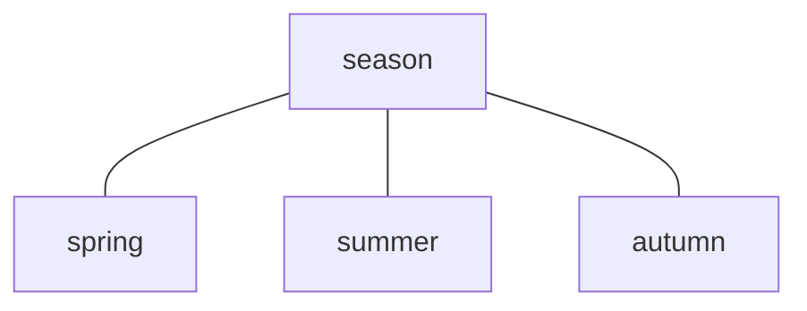

### A.3 Partitive relation

Subordinate concepts within the hierarchy form constituent parts of the superordinate concept, e.g.

spring, summer, autumn and winter can be defined as parts of the concept year. In comparison, it is inappropriate to define sunny weather (one possible characteristic of summer) as part of a year.

Partitive relations are depicted by a rake without arrows (see Figure A.2).

Example adapted from ISO 704:2009, (5.5.2.3.1)

**Figure A.2 — Graphical representation of a partitive relation**

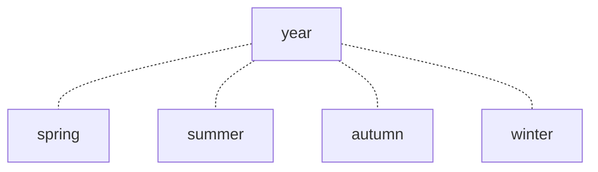

### A.4 Associative relation

Associative relations cannot provide the economies in description that are present in generic and partitive relations but are helpful in identifying the nature of the relationship between one concept and another within a concept system, e.g. cause and effect, activity and location, activity and result, tool and function, material and product.

Associative relations are depicted by a line with arrowheads at each end (see Figure A.3).

Example adapted from ISO 704:2009, (5.6.2)

**Figure A.3 — Graphical representation of an associative relation**

### A.5 Concept diagrams

Figures A.4 to A.16 show the concept diagrams on which the thematic groupings of Clause 3 are based.

Since the definitions of the terms are repeated without any related notes, it is recommended to refer to Clause 3 to consult any such notes.

**Figure A.4 — 3.1 Concepts of the class “person or people” and related concepts**

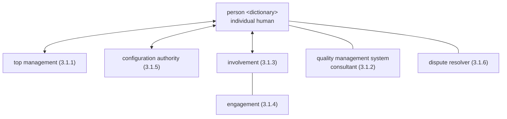

**Figure A.5 — 3.2 Concepts of the class “organization” and related concepts**

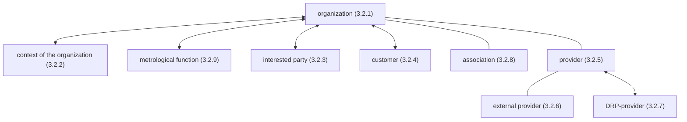

**Figure A.6 — 3.3 Concepts of the class “activity” and related concepts**

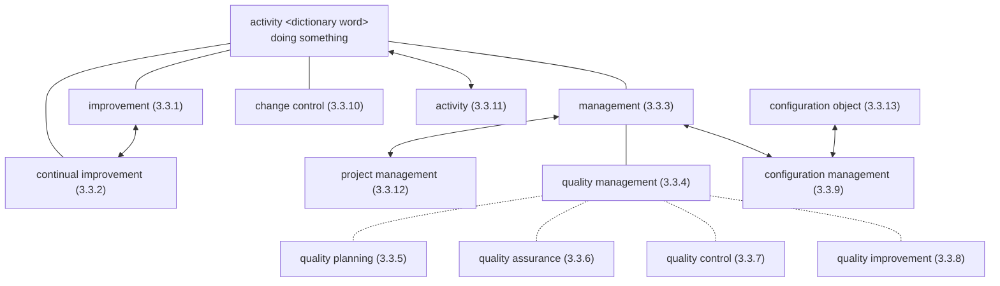

**Figure A.7 — 3.4 Concepts of the class “process” and related concepts**

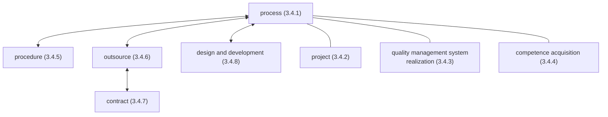

**Figure A.8 — 3.5 Concepts of the class “system” and related concepts**

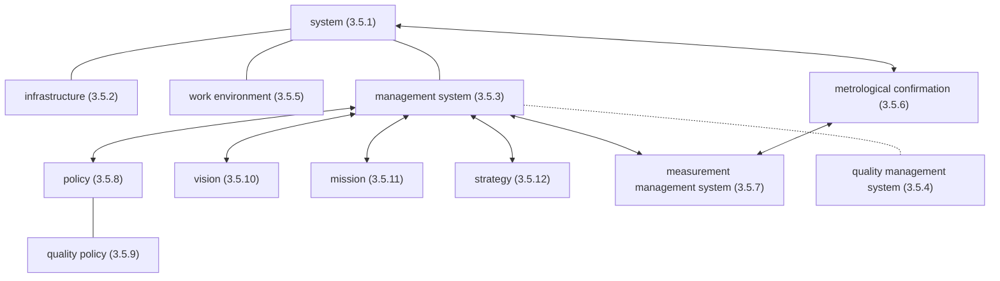

**Figure A.9 — 3.6 Concepts of the class “requirement” and related concepts**

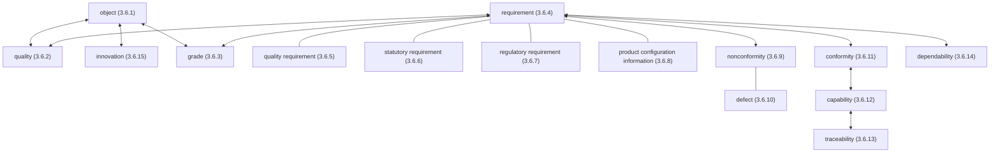

**Figure A.10 — 3.7 Concepts of the class “result” and related concepts**

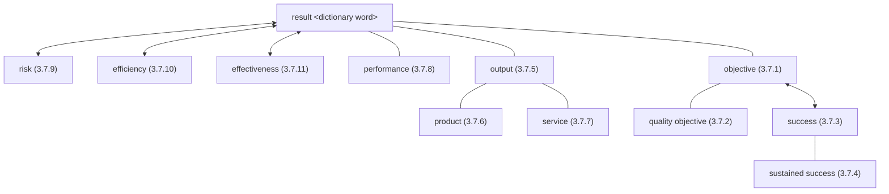

**Figure A.11 — 3.8 Concepts of the class “data, information and document” and related concepts**

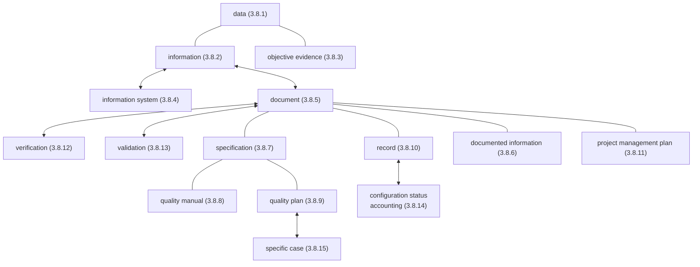

**Figure A.12 — 3.9 Concepts of the class “customer” and related concepts**

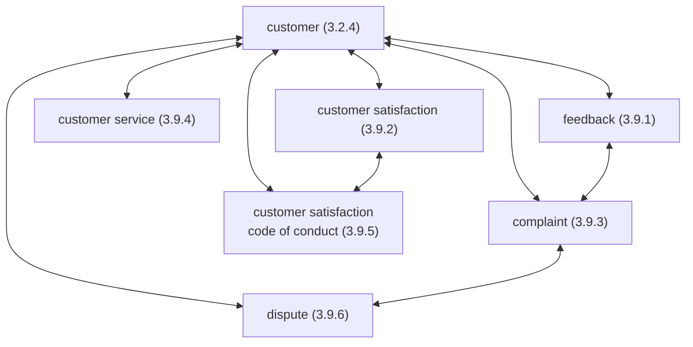

**Figure A.13 — 3.10 Concepts of the class “characteristic” and related concepts**

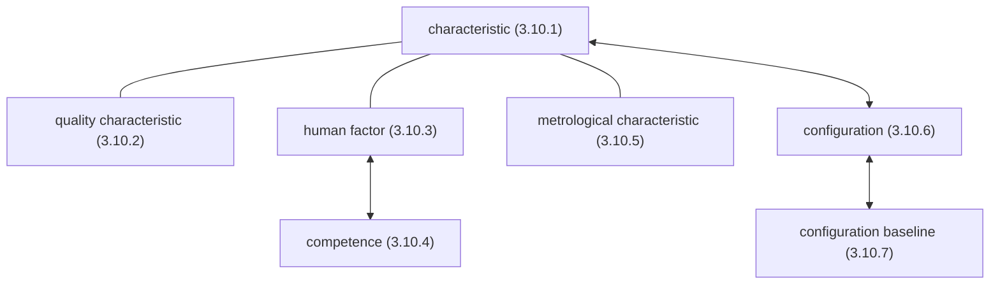

**Figure A.14 — 3.11 Concepts of the class “determination” and related concepts**

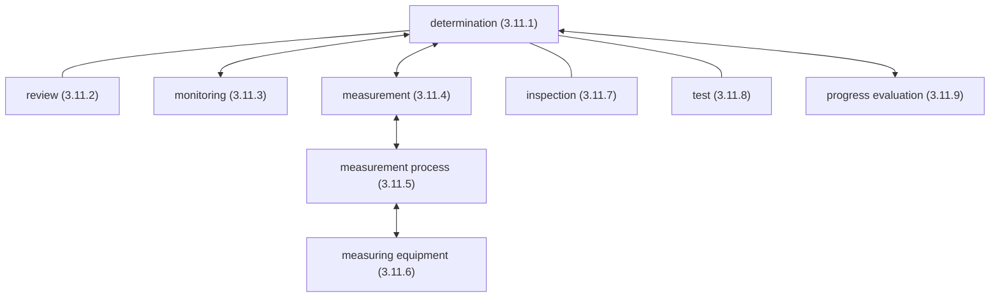

**Figure A.15 — 3.12 Concepts of the class “action” and related concepts**

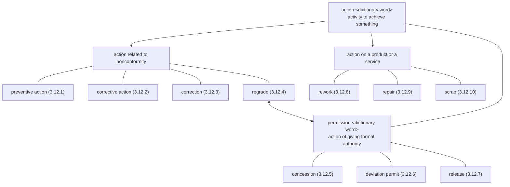

**Figure A.16 — 3.13 Concepts of the class “audit” and related concepts**

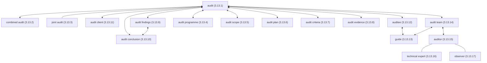

# Bibliography

[1] ISO 704:2009, Terminology work — Principles and methods

[2] ISO 1087-1:2000, Terminology work — Vocabulary — Part 1: Theory and application

[3] ISO 3534-2, Statistics — Vocabulary and symbols — Part 2: Applied statistics

[4] ISO 9001, Quality management systems — Requirements

[5] ISO 9004, Managing for the sustained success of an organization — A quality management approach

[6] ISO 10001:2007, Quality management — Customer satisfaction — Guidelines for codes of conduct for organizations

[7] ISO 10002:2014, Quality management — Customer satisfaction — Guidelines for complaints handling in organizations

[8] ISO 10003:2007, Quality management — Customer satisfaction — Guidelines for dispute resolution external to organizations

[9] ISO 10004:2012, Quality management — Customer satisfaction — Guidelines for monitoring and measuring

[10] ISO 10005:2005, Quality management systems — Guidelines for quality plans

[11] ISO 10006:2003, Quality management systems — Guidelines for quality management in projects

[12] ISO 10007:2003, Quality management systems — Guidelines for configuration management

[13] ISO 10008, Quality management — Customer satisfaction — Guidelines for business-to-consumer electronic commerce transactions

[14] ISO 10012:2003, Measurement management systems — Requirements for measurement processes and measuring equipment

[15] ISO/TR 10013, Guidelines for quality management system documentation

[16] ISO 10014, Quality management — Guidelines for realizing financial and economic benefits

[17] ISO 10015, Quality management — Guidelines for training

[18] ISO/TR 10017, Guidance on statistical techniques for ISO 9001:2000

[19] ISO 10018:2012, Quality management — Guidelines on people involvement and competence

[20] ISO 10019:2005, Guidelines for the selection of quality management system consultants and use of their services

[21] ISO 10241-1, Terminological entries in standards — Part 1: General requirements and examples of presentation

[22] ISO 10241-2, Terminological entries in standards — Part 2: Adoption of standardized terminological entries

[23] ISO 14001, Environmental management systems — Requirements with guidance for use

[24] ISO/TS 16949, Quality management systems — Particular requirements for the application of ISO 9001:2008 for automotive production and relevant service part organizations

[25] ISO/IEC 17000, Conformity assessment — Vocabulary and general principles

[26] ISO 19011:2011, Guidelines for auditing management systems

[27] ISO/IEC 27001, Information technology — Security techniques — Information security management systems — Requirements

[28] ISO 31000, Risk management — Principles and guidelines

[29] ISO 50001, Energy management systems — Requirements with guidance for use

[30] IEC 60050-192, International electrotechnical vocabulary — Part 192: Dependability

[31] ISO/IEC Guide 2, Standardization and related activities — General vocabulary

[32] ISO Guide 73, Risk management — Vocabulary

[33] ISO/IEC Guide 99, International vocabulary of metrology — Basic and general concepts and associated terms (VIM)

[34] Quality management principles1) 1) Available from website: http://www.iso.org

# Alphabetical index of terms

- activity — 3.3.11

- association — 3.2.8

- audit — 3.13.1

- audit client — 3.13.11

- audit conclusion — 3.13.10

- audit criteria — 3.13.7

- auditee — 3.13.12

- audit evidence — 3.13.8

- audit findings — 3.13.9

- auditor — 3.13.15

- audit plan — 3.13.6

- audit programme — 3.13.4

- audit scope — 3.13.5

- audit team — 3.13.14

- capability — 3.6.12

- change control — 3.3.10

- characteristic — 3.10.1

- combined audit — 3.13.2

- competence — 3.10.4

- competence acquisition — 3.4.4

- complaint — 3.9.3

- concession — 3.12.5

- configuration — 3.10.6

- configuration authority — 3.1.5

- configuration baseline — 3.10.7

- configuration control board (admitted term for

- configuration authority) — 3.1.5

- configuration object — 3.3.13

- configuration management — 3.3.9

- configuration status accounting — 3.8.14

- conformity — 3.6.11

- context of the organization — 3.2.2

- continual improvement — 3.3.2

- contract — 3.4.7

- correction — 3.12.3

- corrective action — 3.12.2

- customer — 3.2.4

- customer satisfaction — 3.9.2

- customer satisfaction code of conduct — 3.9.5

- customer service — 3.9.4

- data — 3.8.1

- defect — 3.6.10

- dependability — 3.6.14

- design and development — 3.4.8

- determination — 3.11.1

- deviation permit — 3.12.6

- dispositioning authority (admitted term for

- configuration authority) — 3.1.5

- dispute — 3.9.6

- dispute resolution process provider (admitted

- term for DRP-provider) — 3.2.7

- dispute resolver — 3.1.6

- document — 3.8.5

- documented information — 3.8.6

- DRP-provider — 3.2.7

- effectiveness — 3.7.11

- efficiency — 3.7.10

- engagement — 3.1.4

- entity (admitted term for object) — 3.6.1

- external provider — 3.2.6

- external supplier (admitted term for external

- provider) — 3.2.6

- feedback — 3.9.1

- grade — 3.6.3

- guide — 3.13.13

- human factor — 3.10.3

- improvement — 3.3.1

- information — 3.8.2

- information system — 3.8.4

- infrastructure — 3.5.2

- innovation — 3.6.15

- inspection — 3.11.7

- interested party — 3.2.3

- involvement — 3.1.3

- item (admitted term for object) — 3.6.1

- joint audit — 3.13.3

- management — 3.3.3

- management system — 3.5.3

- measurement — 3.11.4

- measurement management system — 3.5.7

- measurement process — 3.11.5

- measuring equipment — 3.11.6

- metrological characteristic — 3.10.5

- metrological confirmation — 3.5.6

- metrological function — 3.2.9

- mission — 3.5.11

- monitoring — 3.11.3

- nonconformity — 3.6.9

- object — 3.6.1

- objective — 3.7.1

- objective evidence — 3.8.3

- observer — 3.13.17

- organization — 3.2.1

- output — 3.7.5

- outsource (verb) — 3.4.6

- performance — 3.7.8

- policy — 3.5.8

- preventive action — 3.12.1

- procedure — 3.4.5

- process — 3.4.1

- product — 3.7.6

- product configuration information — 3.6.8

- progress evaluation — 3.11.9

- project — 3.4.2

- project management — 3.3.12

- project management plan — 3.8.11

- provider — 3.2.5

- quality — 3.6.2

- quality assurance — 3.3.6

- quality characteristic — 3.10.2

- quality control — 3.3.7

- quality improvement — 3.3.8

- quality management — 3.3.4

- quality management system — 3.5.4

- quality management system consultant — 3.1.2

- quality management system realization — 3.4.3

- quality manual — 3.8.8

- quality objective — 3.7.2

- quality plan — 3.8.9

- quality planning — 3.3.5

- quality policy — 3.5.9

- quality requirement — 3.6.5

- record — 3.8.10

- regrade — 3.12.4

- regulatory requirement — 3.6.7

- release — 3.12.7

- repair — 3.12.9

- requirement — 3.6.4

- review — 3.11.2

- rework — 3.12.8

- risk — 3.7.9

- scrap — 3.12.10

- service — 3.7.7

- specific case — 3.8.15

- specification — 3.8.7

- stakeholder (admitted term for interested party)

- 3.2.3

- statutory requirement — 3.6.6

- strategy — 3.5.12

- success — 3.7.3

- supplier (admitted term for provider) — 3.2.5

- sustained success — 3.7.4

- system — 3.5.1

- technical expert — 3.13.16

- test — 3.11.8

- top management — 3.1.1

- traceability — 3.6.13

- validation — 3.8.13

- verification — 3.8.12

- vision — 3.5.10

- work environment — 3.5.5

- ICS 03.120.10; — 01.040.03

- Price group A
