# ISO/IEC/IEEE 42010:2022

> **Software, systems and enterprise — Architecture description**

---

## Contents

  - [Foreword](#foreword)
  - [Introduction](#introduction)
  - [Software, systems and enterprise — Architecture description](#software-systems-and-enterprise-architecture-description)
    - [1 Scope](#1-scope)
    - [2 Normative references](#2-normative-references)
    - [3 Terms and definitions](#3-terms-and-definitions)
    - [4 Conformance](#4-conformance)
    - [5 Conceptual foundations](#5-conceptual-foundations)
    - [6 Specification of an architecture description](#6-specification-of-an-architecture-description)
    - [7 Architecture description frameworks and architecture description languages](#7-architecture-description-frameworks-and-architecture-description-languages)
    - [8 Architecture viewpoints and model kinds](#8-architecture-viewpoints-and-model-kinds)
  - [Annex A (informative) — Notes on terms and concepts](#annex-a-informative-notes-on-terms-and-concepts)
    - [A.1 General](#a1-general)
    - [A.2 Entities and their architectures](#a2-entities-and-their-architectures)
    - [A.3 Concerns](#a3-concerns)
    - [A.4 Aspects and perspectives](#a4-aspects-and-perspectives)
    - [A.5 Architecture views and viewpoints](#a5-architecture-views-and-viewpoints)
    - [A.6 Correspondences](#a6-correspondences)
    - [A.7 Perspectives on architecture description languages](#a7-perspectives-on-architecture-description-languages)
  - [Annex B (informative) — Guidelines to specification of architecture viewpoints](#annex-b-informative-guidelines-to-specification-of-architecture-viewpoints)
    - [B.1 General](#b1-general)
    - [B.2 Template for documenting specification of architecture viewpoints](#b2-template-for-documenting-specification-of-architecture-viewpoints)
    - [B.3 Resources for specifications of architecture viewpoints](#b3-resources-for-specifications-of-architecture-viewpoints)
  - [Annex C (informative) — Relationship to other standards](#annex-c-informative-relationship-to-other-standards)
    - [C.1 General](#c1-general)
    - [C.2 Use with ISO/IEC/IEEE 42020](#c2-use-with-isoiecieee-42020)
    - [C.3 Use with ISO/IEC/IEEE 42030](#c3-use-with-isoiecieee-42030)
    - [C.4 Use with ISO 15704](#c4-use-with-iso-15704)
    - [C.5 Use with ISO/IEC/IEEE 12207](#c5-use-with-isoiecieee-12207)
    - [C.6 Use with ISO/IEC/IEEE 15288](#c6-use-with-isoiecieee-15288)
    - [C.7 Use with open distributed processing standards](#c7-use-with-open-distributed-processing-standards)
  - [Annex D (informative) — Uses of architecture descriptions](#annex-d-informative-uses-of-architecture-descriptions)
    - [D.1 General](#d1-general)
    - [D.2 Uses of architecture descriptions](#d2-uses-of-architecture-descriptions)
  - [Annex E (informative) — Architecture and architecture description life cycles](#annex-e-informative-architecture-and-architecture-description-life-cycles)
    - [E.1 General](#e1-general)
    - [E.2 Architecting in the life cycle](#e2-architecting-in-the-life-cycle)
  - [Annex F (informative) — Architecture description frameworks](#annex-f-informative-architecture-description-frameworks)
    - [F.1 General](#f1-general)
    - [F.2 Evolution of ADFs](#f2-evolution-of-adfs)
    - [F.3 ADF concepts](#f3-adf-concepts)
    - [F.4 Compliance with ADF requirements](#f4-compliance-with-adf-requirements)
  - [Bibliography](#bibliography)
  - [IEEE Notices and Abstract](#ieee-notices-and-abstract)

---

## Cover and copyright pages (source lay-out, verbatim)

42010

Second edition

2022-11

Software, systems and enterprise — Architecture description

Logiciel, systèmes et entreprise — Description de l'architecture

Reference number ISO/IEC/IEEE 42010:2022(E)

COPYRIGHT PROTECTED DOCUMENT

© ISO/IEC 2022 © IEEE 2022 All rights reserved. Unless otherwise specified, or required in the context of its implementation, no part of this publication may be reproduced or utilized otherwise in any form or by any means, electronic or mechanical, including photocopying, or posting on the internet or an intranet, without prior written permission. Permission can be requested from either ISO or IEEE at the respective address below or ISO’s member body in the country of the requester.

ISO copyright office Institute of Electrical and Electronics Engineers, Inc CP 401 • Ch. de Blandonnet 8 3 Park Avenue, New York CH-1214 Vernier, Geneva NY 10016-5997, USA Phone: +41 22 749 01 11 Fax: +41 22 749 09 47 Email: copyright@iso.org Email: stds.ipr@ieee.org Website: www.iso.org Website: www.ieee.org Published in Switzerland

---

## Foreword

ISO (the International Organization for Standardization) and IEC (the International Electrotechnical Commission) form the specialized system for worldwide standardization. National bodies that are members of ISO or IEC participate in the development of International Standards through technical committees established by the respective organization to deal with particular fields of technical activity. ISO and IEC technical committees collaborate in fields of mutual interest. Other international organizations, governmental and non-governmental, in liaison with ISO and IEC, also take part in the work.

The procedures used to develop this document and those intended for its further maintenance are described in the ISO/IEC Directives, Part 1. In particular, the different approval criteria needed for the different types of ISO/IEC documents should be noted. This document was drafted in accordance with the rules given in the ISO/IEC Directives, Part 2 (see www.iso.org/directives or www.iec.ch/members_experts/refdocs).

IEEE Standards documents are developed within the IEEE Societies and the Standards Coordinating Committees of the IEEE Standards Association (IEEE-SA) Standards Board. The IEEE develops its standards through a consensus development process, approved by the American National Standards Institute, which brings together volunteers representing varied viewpoints and interests to achieve the final product. Volunteers are not necessarily members of the Institute and serve without compensation. While the IEEE administers the process and establishes rules to promote fairness in the consensus development process, the IEEE does not independently evaluate, test, or verify the accuracy of any of the information contained in its standards.

Attention is drawn to the possibility that some of the elements of this document may be the subject of patent rights. ISO and IEC shall not be held responsible for identifying any or all such patent rights. Details of any patent rights identified during the development of the document will be in the Introduction and/or on the ISO list of patent declarations received (see www.iso.org/patents) or the IEC list of patent declarations received (see https://patents.iec.ch).

Any trade name used in this document is information given for the convenience of users and does not constitute an endorsement.

For an explanation of the voluntary nature of standards, the meaning of ISO specific terms and expressions related to conformity assessment, as well as information about ISO's adherence to the World Trade Organization (WTO) principles in the Technical Barriers to Trade (TBT), see www.iso.org/iso/foreword.html. In the IEC, see www.iec.ch/understanding-standards.

ISO/IEC/IEEE 42010 was prepared by Joint Technical Committee ISO/IEC JTC 1, *Information technology*, Subcommittee SC 7, *Software and systems engineering*, in cooperation with the Software and Systems Engineering Standards Committee of the Computer Society of the IEEE, under the Partner Standards Development Organization cooperation agreement between ISO and IEEE.

This second edition cancels and replaces the first edition (ISO/IEC/IEEE 42010:2011), which has been technically revised.

The main changes are as follows:

- The term used to refer to the subject of an architecture description is changed from “system of interest”

to “entity of interest” (EoI) to be compatible with ISO/IEC/IEEE 42020 and ISO/IEC/IEEE 42030 standards and to allow for its application in non-system architecture situations. The term “entity” is also used in this document when entities are considered as surrounding things in an environment of an EoI.

- The term “architecture description framework” (ADF) replaces “architecture framework” in

the previous edition. It is defined in order to differentiate ADFs from other kinds of architecting frameworks like architecture evaluation frameworks specified in ISO/IEC/IEEE 42030.

- Architecture description element, introduced in the 2011 edition (see ISO/IEC/IEEE 42010:2011,

4.2.6, 5.7 and A.6) is now defined in Clause 3 as identified or named part of an architecture description allowing representing at least stakeholders, concerns, perspectives, and aspects identified in an AD, and views, view components, viewpoints, and model kinds included in an AD.

- Aspect and stakeholder perspective concepts ―already introduced in the 2011 edition (See 3.5, note

1 of 5.6, Annex A and B) are defined and described to accommodate current practice where these ideas are prevalent.

- A correspondence defines an identified or named relation between AD elements, as in Clause 4.2.6

of the 2011 edition. But, to clarify the relationship between AD and correspondence, a note 1 to the definition is added to state that for the purpose of correspondences, an architecture description can be considered as an AD element in another architecture description. This correspondence between ADs is necessary because an architecture can be described by more than one AD and these alternatives of architectures have related for activities like trade-off analysis and decision making.

- The term “architecture view component” is introduced as a separable portion of one or more

architecture views, replacing “architecture model” in the 2011 edition. This change is to account for the fact that some parts of a view are model-based while others may not be. View components can be derived from an information source, which can sometimes be a model.

- Model-based view components are governed by model kinds and documented by legends. Non-

model-based view components are documented by legends.

- Model kinds are identified as a new conformance case to encourage model-based architecting.

- The concept of architecture viewpoint is updated to accommodate current practice where a

viewpoint governs one or more architecture views within an AD.

- The definition of “model kind” given by the 2011 edition is extended to include categories of models

as used by ADF like UAF.

- The figures use an informal entity-relationship diagram notation replacing UML class diagrams in

the 2011 edition, to facilitate comprehension by users of this document. The multiplicities of the relationships are explained in the text when necessary.

- Annex E illustrates a few concepts pertaining to architecture life cycles and architecture description

life cycles.

- Annex F shows examples of how some architecture description frameworks can conform to

requirements of this document.

Any feedback or questions on this document should be directed to the user’s national standards body. A complete listing of these bodies can be found at www.iso.org/members.html and www.iec.ch/national-committees.

## Introduction

The complexity of human-made entities has grown to an unprecedented level. This has led to new opportunities, and also increased challenges for organizations that create and use these entities. Architecting is increasingly applied by organizations, teams and individuals, to help manage the complexity faced by stakeholders of these entities.

Examples of entities include the following: Enterprise, organization, solution, system (including software systems), subsystem, process, business, data (as a data item or data structure), application, information technology (as a collection), mission, product, service, software item, hardware item, product line, family of systems, system of systems, collection of systems, collection of applications.

An architecture of an entity, expressed in one or more architecture descriptions (AD), assists in understanding the fundamental concepts or properties of the entity, pertaining to its structure, behaviour, design and evolution, such as feasibility, utility and maintainability and fundamental concepts for its development, operation, employment, external impacts, utilization and decommissioning.

ADs are used by the parties that create, use and manage human-made entities to improve communication and cooperation, enabling all parties, organizations, teams and individuals to work together in an integrated and coherent fashion.

NOTE ISO/IEC/IEEE 42020 specifies a set of processes for architecting which can be employed in support of creating one or more ADs. The architecture elaboration process in ISO/IEC/IEEE 42020 is especially relevant for creation of ADs.

Whereas an AD is a tangible work product, an architecture is intangible and abstract, understood through its concepts, properties and principles.

Architecture description frameworks (ADF) are used to codify the conventions and common practices of architecture description. Architecture description languages (ADL) are used to codify the description of architectures within different communities and domains of application.

ADs have many uses, such as design, development, documentation, analysis, evaluation, maintenance, risk mitigation, downstream user specifications, tool specification, communication, planning, guidance, life cycle support, decision support, review, training, design validation, solution trade studies, cost comparison and analysis, by a variety of stakeholders throughout the life cycles of their entities of interest. Annex D describes more uses of an AD.

This document provides terms, definitions and relationships for best practices in ADs. The provisions of this document serve to specify desired properties of ADs. This document also gives provisions that specify desired properties of ADFs and ADLs in order to usefully support the development and use of ADs. This document provides a basis for considering and comparing ADFs and ADLs by providing a common ontology for specifying their contents.

This document can be used to establish a coherent architecting practice for developing ADs, ADFs and ADLs within an organization, in the context of an entity of interest (EoI) or its architecture. The provisions of this document can be used to assess conformance of specifications of ADs, ADFs, ADLs, viewpoints and model kinds.

The intent of this document is to enable a range of consistent and coherent approaches to describing an architecture including document-centric and model-based techniques.

This document also provides motivations for use of architecture-related terms and concepts in other documents such as guides and standards.

Users of this document are advised to consult Clause 5 to gain appreciation of the conceptual foundations, along with the concepts and principles associated with an AD work product.

This document does not explicitly address completeness or correctness regarding the inclusion of particular elements in an AD. Nevertheless, completeness and correctness of an AD can be partially checked, for example, through the consistency of the AD elements established, whether relationships

are transitive, and whether AD elements are shown in the views. Consistency rules can also be defined by showing whether the same particular AD element has correspondences with an AD. In addition, specifications that appear as elements within an AD are expected to be complete, precise and verifiable with respect to the subject of the specification.

In this document, the following verbal forms are used:

- “shall” indicates a requirement;

- “should” indicates a recommendation;

- “may” indicates a permission.

## Software, systems and enterprise — Architecture description

### 1 Scope

This document specifies requirements for the structure and expression of an architecture description (AD) for various entities, including software, systems, enterprises, systems of systems, families of systems, products (goods or services), product lines, service lines, technologies and business domains.

This document distinguishes the architecture of an entity of interest from an AD expressing that architecture. Architectures are not the subject of this document.

This document specifies requirements for use of the architectural concepts and their relationships as captured in an AD. It does not specify requirements for any entity of interest or its environment.

This document specifies requirements for an architecture description framework (ADF), an architecture description language (ADL), architecture viewpoints and model kinds in order to usefully support the development and use of an AD.

This document specifies conformance to the requirements for an AD, ADF, ADL, architecture viewpoint and model kind.

This document does not specify the processes, architecting methods, models, notations, techniques or tools by which an AD is created, utilized or managed.

This document does not specify any format or media for recording an AD.

### 2 Normative references

There are no normative references in this document.

### 3 Terms and definitions

For the purposes of this document, the following terms and definitions apply.

ISO, IEC and IEEE maintain terminology databases for use in standardization at the following addresses:

- ISO Online browsing platform: available at https:// www .iso .org/ obp/ ui

- IEC Electropedia: available at https:// www .electropedia .org/

- IEEE Standards Dictionary Online: available at https:// dictionary .ieee .org/

NOTE For additional terms and definitions in the field of systems and software engineering, see ISO/IEC/IEEE 24765, which is published periodically as a “snapshot” of the SEVOCAB (Systems and software Engineering Vocabulary) database and is publicly accessible at www .computer .org/ sevocab.

#### 3.1 architecting

conceiving, defining, expressing, documenting, communicating, certifying proper implementation of, maintaining and improving an *architecture* (3.2) throughout the life cycle of an *entity of interest* (3.12)

#### 3.2 architecture

fundamental concepts or properties of an entity in its *environment* (3.13) and governing principles for the realization and evolution of this entity and its related life cycle processes

[SOURCE: ISO/IEC/IEEE 42020:2019, 3.3, modified — The notes to entry have been removed.]

#### 3.3 architecture description

**AD** work product used to express an *architecture* (3.2)

Note 1 to entry: A work product is an artifact produced by a process (see ISO/IEC 20246:2017, 3.18).

Note 2 to entry: An AD is a tangible representation of information provided to the *stakeholders* (3.17). An AD is considered an *information part* (3.14).

#### 3.4 architecture description element

**AD element** identified or named part of an *architecture description* (3.3)

Note 1 to entry: AD elements include *stakeholders* (3.17), *concerns* (3.10), *stakeholder perspectives* (3.18), and *aspects* (3.9) identified in an *AD* (3.3), *ADLs* (3.6), *ADFs* (3.5) and *correspondences* (3.11) and correspondence methods used in an AD, and *architecture views* (3.7), *view components* (3.19), *architecture viewpoints* (3.8), and *model kinds* (3.15) included in an *AD* (3.3).

Note 2 to entry: For the purpose of *correspondences* (3.11), an *AD* (3.3) can be considered as an AD element in another *AD* (3.3).

#### 3.5 architecture description framework

**ADF** conventions, principles and practices for the description of *architectures* (3.2) established within a specific domain of application or community of *stakeholders* (3.17)

EXAMPLE Generalized Enterprise-Referencing Architectures Modelling Framework (GERAM) (ISO 15704:2019, Annex B), Reference Model of Open Distributed Processing (RM-ODP),[2] Unified Architecture Framework (UAF)[48], and NATO Architecture Framework (NAF)[44].

Note 1 to entry: Architecture description frameworks promote structured organization, consistency of description, greater potential for reuse, and completeness of *architecture views* (3.7) and models.

#### 3.6 architecture description language

**ADL** means of expression, with syntax and semantics, consisting of a set of representations, conventions, and associated rules intended to be used to describe an *architecture* (3.2)

EXAMPLE Architecture Analysis and Design Language (AADL),[57] ArchiMate,[61] UML,[49] SysML,[47] UAF Profile[48].

#### 3.7 architecture view

*information part* (3.14) comprising portion of an *architecture description* (3.3)

EXAMPLE An Information or Data View addresses information-relevant concerns framed by an Information viewpoint. It contains as *view components* (3.19), a conceptual data model, a data management model and a data access model and correspondences linking those components together.

#### 3.8 architecture viewpoint

set of conventions for the creation, interpretation and use of an *architecture view* (3.7) to frame one or more *concerns* (3.10)

Note 1 to entry: In this document, “to frame” concerns means “to shape, compose, give expression to” those concerns. It is used to distinguish the stages of framing concerns by a viewpoint from addressing those concerns in a resulting view. This is analogous to the distinction between “framing a problem” and “solving that problem”.

Note 2 to entry: A viewpoint is a frame of reference for the concerns determined by the architect as relevant to the purpose of the *architecture description* (3.3).

Note 3 to entry: The conventions of an architecture viewpoint are documented in a *specification* (3.16) of that viewpoint. In some communities and architecture description frameworks, “view specification” and viewpoint are synonyms.

Note 4 to entry: The identification of a viewpoint is often the result of prior knowledge, experience and praxis in the domain(s) to which the viewpoint applies, indicating the information relevant to addressing the *concern* (3.10).

#### 3.9 aspect

part of an entity’s character or nature

EXAMPLE Functional, structural and informational aspects of an entity.

Note 1 to entry: A particular aspect can be used for capturing the relevant features of the *entity of interest* (3.12) as a refinement of one or more *concerns* (3.10) under examination with respect to some part of its character, e.g. the structural character, functional character or informational character of the entity.

Note 2 to entry: Aspects enable the architect to analyse, address and structure *concerns* (3.10). In general, there is a many-to-many relation between aspects and *concerns* (3.10).

Note 3 to entry: See 5.2.5 for more discussion and examples.

#### 3.10 concern

matter of relevance or importance to a *stakeholder* (3.17)

Note 1 to entry: concerns can be identified with regards to an *entity of interest* (3.12) or independently, such as with regards to environment, scenario, situation or use case of that entity.

Note 2 to entry: In this document, interest in an entity is intended to encompass interest in that entity’s *environment* (3.13), life cycle, *architecture* (3.2), requirements, design, implementation and operation. Such interests are captured via *aspects* (3.9), concerns and *stakeholder perspectives* (3.18).

Note 3 to entry: The identification of a concern is often the result of prior knowledge, experience and praxis in the domain to which the concern applies.

Note 4 to entry: See 5.2.3 for more discussion and examples.

[SOURCE: ISO/IEC/IEEE 42020:2019, 3.8, Notes have been modified]

#### 3.11 correspondence

identified or named relationship between two or more *architecture description elements* (3.4)

EXAMPLE Correspondences are used to express a wide range of relationships, such as equivalence, composition, refinement, consistency, traceability, dependency, constraint, satisfaction, and obligation.

Note 1 to entry: For the purpose of correspondences, an *architecture description* (3.3) can be considered as an *AD* *element* (3.4) in another *architecture description* (3.3).

Note 2 to entry: Correspondences can be identified or named relationship between *architecture description* *elements* (3.4) in different *architecture descriptions* (3.3) or between *architecture description elements* (3.4) stated in different notations.

#### 3.12 entity of interest

**EoI** subject of an *architecture description* (3.3)

EXAMPLE Enterprise, organization, solution, system (including software systems), subsystem, process, business, data (as a data item or data structure), application, information technology (as a collection), mission, product, service, software item, hardware item, product line, family of systems, system of systems, collection of systems, collection of applications.

Note 1 to entry: In this document, the term entity of interest refers to the entity whose *architecture* (3.2) is under consideration in the preparation of an *architecture description* (3.3).

Note 2 to entry: This document distinguishes the entity of interest from other entities which are not the subject of the *architecture description* (3.3).

Note 3 to entry: In this document, interest in an entity is intended to encompass interest in that entity’s environment, life cycle, architecture, requirements, design, implementation and operation. Such interests are captured via aspects, concerns and stakeholder perspectives.

#### 3.13 environment

context of surrounding things, conditions, or influences upon an entity

Note 1 to entry: The environment of an *entity of interest* (3.12) includes external entities that can have various influences upon an *entity*, such as developmental, technological, business, operational, organizational, political, economic, legal, regulatory, ecological and social influences as well as external physical effects such as electromagnetic radiation, charged particles, gravitational effects, and electric and magnetic fields.

Note 2 to entry: A label attached as a qualifier to the term environment identifies a particular context within another context, such as development environment, test environment, and operational environment.

#### 3.14 information part

separately identifiable body of information that is produced, stored, and delivered for human and machine use

#### 3.15 model kind

category of model distinguished by its key characteristics and modelling conventions

EXAMPLE Functional models, activity models, structural models, use case models, geopolitical models, analytic models and economic models.

#### 3.16 specification

*information part* (3.14) that identifies, in a complete, precise and verifiable manner, the requirements, design, behaviour, or other expected characteristics of an entity

[SOURCE: ISO/IEC/IEEE 15289:2019, 3.1.26 — “a system, service or process” replaced with “an entity”, “information item” replaced with “information part”]

#### 3.17 stakeholder

role, position, individual, organization, or classes thereof, having an interest, right, share, or claim, in an *entity of interest* (3.12)

EXAMPLE End users, operators, acquirers, owners, suppliers, architects, developers, builders, maintainers, regulators, taxpayers, certifying agencies, and markets.

#### 3.18 stakeholder perspective

way of thinking about an *entity of interest* (3.12), especially as it relates to *concerns* (3.10)

EXAMPLE The labels given to the middle three rows (i.e. owner, designer and builder) of the Zachman framework[67] correspond to stakeholder perspectives. The rows in the Unified Architecture Framework[48] and NATO Architecture Framework[44] grids correspond to stakeholder perspectives (although they are called ”domains” and “subjects of concerns,” respectively in those frameworks). See 5.2.4 for more examples.

Note 1 to entry: The way one thinks about an entity can be influenced by one’s beliefs, training, experience, knowledge, personality, character traits, culture, peer pressure, role or stance, etc.

#### 3.19 view component

**architecture view component** separable portion of one or more *architecture views* (3.7) that is governed by the applicable *model kind* (3.15) or legend

EXAMPLE An architecture view component describing access control mechanisms can be used in several views of an *architecture description* (3.3) to explain functional flows, behaviour and security features of an entity.

Note 1 to entry: In the context of an *architecture description* (3.3), a legend is an informal documentation of conventions.

### 4 Conformance

The requirements in this document are contained in Clauses 6, 7 and 8. There are five situations in which claims of conformance with the provisions of this document can be made.

1) When conformance is claimed for an architecture description, the claim shall demonstrate that the specification of the architecture description meets the requirements listed in Clause 6.

2) When conformance is claimed for an architecture description framework, the claim shall demonstrate that the specification of the architecture description framework meets the requirements listed in 7.1.

3) When conformance is claimed for an architecture description language, the claim shall demonstrate that the specification of the architecture description language meets the requirements listed in 7.2.

4) When conformance is claimed for an architecture viewpoint, the claim shall demonstrate that the specification of the architecture viewpoint meets the requirements listed in 8.1.

5) When conformance is claimed for a model kind, the claim shall demonstrate that the specification of the model kind meets the requirements listed in 8.2.

This document is designed such that “tailoring” is neither required nor permitted for its use when claims of conformance are made.

### 5 Conceptual foundations

**5.1 General**

This clause introduces the conceptual foundations of architecture description expressed in a set of conceptual models (see 5.2) and the application of those foundations to ADs (5.2), ADFs (see 5.4.2) and ADLs (see 5.4.3). The use of the architecture descriptions to support different architecture practices is outlined in Annex D. The concepts introduced in this clause are used in Clauses 6 to 8 to express requirements.

NOTE Annex A provides further discussion of the terms and concepts used in this document and presents examples of their use in an historical context.

**5.2 Conceptual models of an architecture description**

#### 5.2.1 Context of architecture description

The term "entity of interest" is used in this document to refer to the subject of an architecture description. The term is intended to encompass, but is not limited to, entities within the following fields of application, reflecting the intended scope of this document as specified in Clause 1.

- software, including software products and services, per ISO/IEC/IEEE 12207;

- systems, including one-of-a-kind systems, mass-produced systems, customized, adaptive systems,

stand-alone and embedded systems, per ISO/IEC/IEEE 15288;

- enterprises as described in ISO 15704, i.e. human undertakings or ventures that have mission, goals

and objectives to offer products or services, or to achieve a desired project outcome or business outcome.

This document takes no position on what constitutes an entity within those or other fields of application or elsewhere. An entity can be a concrete entity or an abstract entity. An AD as specified in this document is suitable not only for entities in the fields of applications listed above, but also for entities in fields such as natural systems or conceptual systems.

Each entity of interest is situated in an environment which influences its characteristics and behaviours. The environment determines the totality of influences upon the entity of interest and the totality of influences of the entity of interest upon that environment, including its interactions with the environment and other entities, throughout the life cycle of that entity of interest.

Figure 1 depicts key concepts pertaining to an entity of interest and its architectures as a means of understanding ADs.

NOTE 1 The figures and text in the remainder of Clause 5 constitute a set of conceptual models of architecture description. Figures 1 to 6 use an informal entity-relationship diagram notation to facilitate comprehension by users of this document. In the figures, rounded rectangles represent information objects, and arrows represent relationships between objects with the annotation read in the arrow direction. The figures illustrate the key concepts described throughout Clause 5. Annex A presents the full conceptual model.

NOTE 2 Identification of the EoI can emerge from the analysis of the concerns of the stakeholders or can preexist before identification of some stakeholders and their concerns.

EXAMPLE The identification of an EoI generally results from the definition of the problem space. The problem description can be expressed with an architecture definition of a set of operational capabilities (often called “capability architecture”). At this capability definition stage, identified stakeholders are potentially concerned by the future EoI.

#### 5.2.2 Architectures and architecture descriptions

The architecture of an entity of interest comprises the fundamental concepts or properties of that entity considered in its environment. The architecture of an entity of interest can pertain to any or all of the entity’s:

- constituent elements;

- interactions or interrelationships among its elements;

- interactions or interrelationships with its environment, including with other entities in that

environment;

- behaviour and structure;

- principles governing its design, use, operation and evolution.

An AD is an expression of an architecture. ADs are work products resulting from architecting efforts. As a work product, an AD is devised for the specific purpose for which the architecting effort is undertaken, which is distinct from the purpose of the entity of interest. An AD comprises AD elements (see 5.2.10).

The architecture of an entity of interest can be understood through one or more distinct ADs, each created for a purpose relative to the architecture and stakeholder needs. Different ADs can, for example, be based on different stakeholders (see 5.2.3), stakeholder perspectives (see 5.2.4), time periods (sometimes termed epochs), or specific contexts or usage within the environment.

NOTE ISO/IEC/IEEE 42020 specifies a set of processes for architecting which can be employed in support of creating one or more ADs.

#### 5.2.3 Stakeholders and concerns

Stakeholders are parties with direct or indirect interests in an entity. Among the stakeholders are those parties that have influence or control over and those who are impacted by an entity. A stakeholder’s interests are typically expressed as concerns about an entity of interest or the architecture of which they are aware. Concerns are often the result of the stakeholder's perspective gained from domain knowledge, experience, training, responsibility and authority.

Concerns are matters of interest or importance to one or more stakeholders. A concern can be shared by one or more stakeholders and a stakeholder can hold more than one concern. The legitimacy and importance of a concern held by a stakeholder can be a consequence of the role of the stakeholder (e.g. owner, end user or participant, developer, architect, maintainer, disposer) or financial or social rights, shares, impact or claims (e.g. funding organization, governmental body, party receiving environmental impact from entity, stakeholder of an entity impacted by the entity of interest).

Some stakeholders’ concerns are contrary to the success of the entity of interest. These stakeholders can have disagreements on the grounds of political or environmental considerations, can seek active disruption of the entity’s operations, or even outright destruction of the entity. Adversarial concerns can be taken into account when developing the architecture of the entity. For example, political objections can be resolved by incorporating a negotiated solution in the architecture of the entity, or threats can be mitigated by taking preventative measures.

During the entity of interest’s life cycle, concerns can arise at any time including (but not limited to) during conceptualization, when design choices are made, from construction or implementation, through deployment, operation, transfer of ownership, retirement and disposal.

Concerns can manifest in various ways in relation to stakeholder's needs, architecture goals, expectations, responsibilities, requirements, design constraints and assumptions. Concerns can also manifest in recognition of dependencies, quality attributes, architecture decisions, risks or other issues.

Concerns can pertain to influences exerted upon or by an entity of interest, including developmental, technological, business, operational, organizational, political, economic, legal, regulatory, ecological, social and physical influences. Concerns can also pertain to design influences such as internal structural features and component interoperability, particularly when architecting a system of systems or an enterprise.

EXAMPLES

- How is the system maintained?

- What system behaviours are safety-critical?

- Can the entity of interest attain compliance with national regulations?

- What is the cost to operate?

- What are the risks, opportunities, satisfaction, resilience, coherence, affordability, complexity and trust

offered by this architecture?

- In case of a flight navigation system of a commercial aircraft, what is GPS signal availability, tracking, degree

of accuracy, line of sight reception, altitude or elevations?

- What are the data qualities (i.e. data qualities as described in ISO/IEC 25012:2008, Clause 4 or traditional

system quality attributes as described in ISO/IEC 25010.)?

- What is the system’s ability to maintain confidentiality, integrity, and availability for protecting operations?

- What is the ability to support a seamless transition from a legacy capability to a modernized operational

capability?

#### 5.2.4 Stakeholder perspectives

Stakeholders often form distinct groupings, or stakeholder perspectives, based on their common roles, experiences, beliefs or other characteristics. A perspective can reflect domain knowledge, professional experience, training or proximity to the entity of interest in its lifecycle (e.g. design, development, manufacturing, supply, operation and use). Importantly, a stakeholder perspective can also be influenced by personality, character traits, culture, peer pressure, constituency, etc.

Stakeholder perspectives are ways of thinking about the entity of interest in a context, especially as they relate to concerns. Typically, there are several ways of thinking about the architecture of the entity of interest.

The purpose of an AD (see 6.2) guides the identification of concerns that can reflect the perspectives of some stakeholders. There are often multiple stakeholder perspectives on any entity of interest.

EXAMPLE 1 Operational and financial perspectives about an industrial production system.

EXAMPLE 2 Business, management, acquisition and supply perspectives about a banking system.

EXAMPLE 3 Development, deployment and customization perspectives about a mobile app.

EXAMPLE 4 Provider and consumer perspectives about a hospitality service.

EXAMPLE 5 Data user and data provider perspectives about a content provider entity.

Each perspective results in one or more concerns. Because concerns arise from stakeholder perspectives, architecture viewpoints framing those concerns are often grouped by stakeholder perspectives. Concerns are based on current interests and influences of the stakeholders and are often subjective in nature.

#### 5.2.5 Aspects

Aspects capture a set of characteristics or features of the entity of interest in its environment to address concerns within an AD.

An aspect can relate to one or more concerns of stakeholders. Usage of known aspects based upon prior experience within a field of application enables systematic coverage of the range of established concerns and also the identification of new concerns.

Aspects are based on experience in characterization of architectures and are more objective in nature as they arise from agreements among experts about practice in a domain and therefore are presumed to be best practice.

By examining aspects, relevant features or properties of the entity of interest can be discerned or predicted. Analysis of aspects can uncover one or more concerns.

The definition of the relationships between aspects and concerns are based on the experience of the architects and are assessed by the stakeholders with their understanding and knowledge.

NOTE A.4.2 contains more information about the utility of aspects.

EXAMPLE 2 Behavioural, informational and structural aspects in a computer AD.

EXAMPLE 3 Connectivity aspects in a communications network AD (commonly shown as separate logical network and physical network depictions of a configuration of links and nodes in the network).

Figure 1 depicts relationships between concerns, aspects, and stakeholder perspectives as utilized in an AD.

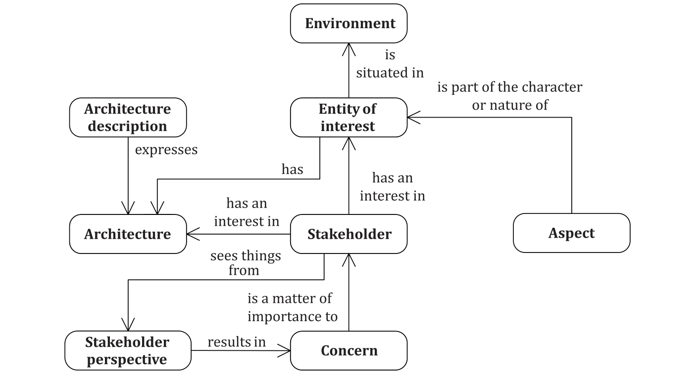

**Figure 1 — Concerns, aspects, and stakeholder perspectives**

#### 5.2.6 Architecture considerations

Architecture considerations are factors taken into account when architecting. Concerns (see 5.2.3), stakeholder perspectives (see 5.2.4) and aspects (see 5.2.5) are different considerations to consider while architecting. There are other considerations that can arise due to the architecture practices in use.

Architecture considerations are useful when specifying architecture viewpoints and when constructing, interpreting, organizing or using architecture views (see 5.2.7). Architecture considerations can group specifications of architecture viewpoints, e.g. with respect to stakeholder perspectives.

EXAMPLES Considerations include: the ability of stakeholders to interpret the architecture description languages chosen to express stakeholder views, the degree of formality required for viewpoints and model kinds, the availability of supporting tools, standard practices used in the given industry domain, the availability of time and resources, the criticality of the depth of understanding that stakeholders need to achieve.

NOTE Other considerations can relate to contexts, criteria, building blocks and domain vocabulary.

#### 5.2.7 Architecture views and architecture viewpoints

An AD contains one or more architecture views. An architecture viewpoint governs one or more of these architecture views. A specification of an architecture viewpoint establishes the conventions for creating, interpreting, presenting and analysing a view to address the concerns framed by that viewpoint. Viewpoint specifications typically reflect the information elements required to facilitate

the application of knowledge (including possibly informal or tacit experiential knowledge) to ascertain whether the architecture addresses the concerns satisfactorily.

NOTE 1 Architecture concerns, stakeholder perspectives and aspects can serve as an organizing basis for the viewpoints of an AD. Aspects are refinements of concerns and these aspects can be used to establish the viewpoint conventions. These aspects are evidenced in the resulting architecture view(s).

EXAMPLE 1 A telecommunications network (entity) is represented by a network connectivity deployment diagram that can be used to express the network model (as an architecture view) contained in a telecommunications architecture description. That view addresses communications parameters such as throughput and uptime (concerns) of operators and users (stakeholders).

EXAMPLE 2 A Parts and Variations View describing the content of a product line (entity) including common parts and individual products with their variants and options.

Figure 2 depicts the relationship between architecture views and architecture viewpoints in an AD.

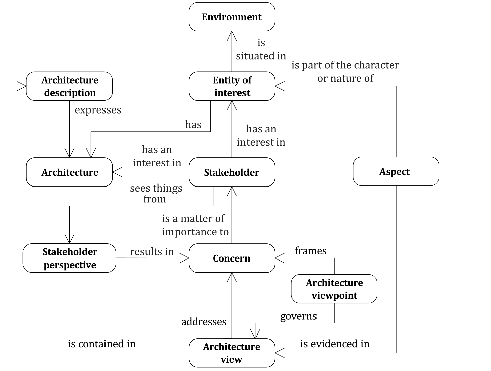

**Figure 2 — Architecture views and architecture viewpoints**

An architecture viewpoint frames one or more concerns (see 5.2.3). A concern can be framed by more than one viewpoint. The architecture viewpoint identifies the specific aspects to be reflected in and concerns to be addressed by one or more architecture views. The specification of an architecture

viewpoint provides conventions, e.g. AD elements, syntax and semantics, usage guidance and direction, to those who are creating, interpreting or using the architecture views.

NOTE 2 Distinct from requirements for product acceptance, architecture views for the entity of interest that addresses concerns and reflects aspects can result in modified requirements.

Using a metamodel or other conventions, the viewpoint specification establishes the manner in which AD elements (e.g. entities, relationships, attributes and constraints) are used, and possibly transformed by the viewpoint, when creating a view (see 5.2.9).

Architecture viewpoints are important analytical resources for development of architecture views because viewpoints reflect the architecting purpose, typical stakeholders and their perspectives, identified concerns, defined aspects of the entity of interest, and particular AD elements.

NOTE 3 Clause 8 specifies requirements on specification of architecture viewpoints. Annex B provides guidance on preparing architecture viewpoints.

#### 5.2.8 Model kinds, legends and architecture view components

An architecture view is composed of one or more architecture view components. A view component that can be based on a model or not. Each view component is governed by a model kind or legend identified by its architecture viewpoint. A model kind determines the conventions for model-based view components. A legend documents the conventions for view components. These conventions include the intended uses, the terminology, the notations and their syntax and semantics and symbology of its governed models. A model kind or legend can be used by more than one viewpoint in an AD. Within an AD, an architecture view component can be part of more than one architecture view to enable sharing information when its content and presentation is relevant to more than one view.

EXAMPLE 1 Model kinds include use cases, activity models [such as structured analysis and design technique (SADT[53]) and ICAM1) Definition Language (IDEF0[60])], threat models, component models and connectivity models.

EXAMPLE 2 A data flow diagram can be a view component of a functional view. A separate control flow diagram can be a second view component in the same functional view. The functional view can also contain a narrative that explains how to interpret the flow diagrams in the view. The flow diagrams are model-based while the narrative is not. The data flow diagram can be part of an information security view.

EXAMPLE 3 A symbology table can be a legend of an operational view.

Figure 3 depicts the composition of views from view components and the kinds of view components.

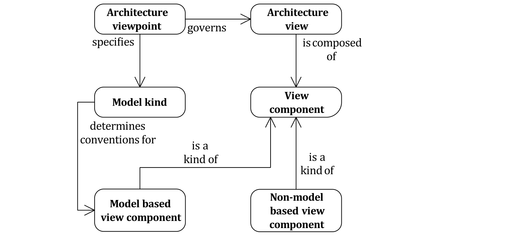

**Figure 3 — Conceptual model for views and view components**

#### 5.2.9 Architecture description (AD) elements

An AD element is an occurrence of one or more architectural concepts in an AD. The AD elements include occurrences of the following architectural concepts: stakeholder, concern, aspect, stakeholder perspective, architecture viewpoint, architecture view, model kind, legend, architecture view component, architecture decision, architecture rationale and any correspondence and correspondence method specified on those constructs.

Any one of these concepts can have multiple occurrences in one or more AD. An AD element occurrence specifies one or more architectural concepts.

An AD element in an AD can be refined or elaborated by reference to another AD. An AD can utilize protocols introduced as AD elements of distinct ADs.

As viewpoints (see 5.2.7), model kinds (see 5.2.8) and legends (see 5.2.8) are specified and applied, additional AD elements are introduced. The governing viewpoint or model kind or legend determines the syntax and semantic conventions for these introduced AD elements.

EXAMPLE AD elements introduced by viewpoints or model kinds include use case constructs such as preconditions, actors, boundaries, systems; activity model constructs such as activities, inputs, outputs, controls, and mechanisms; architecture or design patterns to be employed.

#### 5.2.10 View methods

A specification of an architecture viewpoint includes one or more view methods. View methods provide guidance, heuristics, metrics, patterns, design rules or guidelines, best practices and examples to aid in view construction and use of associated views. View methods specify expression rules, modelling methods, analysis techniques and other operations on views. These methods specify the AD elements used when creating the view and methods to analyse, interrogate or query views to assess properties of interest. Requirements on view methods are specified in 8.3.

View methods are divided into categories, including:

- Construction methods are the means by which views are prepared using a viewpoint. These can be

in the form of process guidance (how to start, what to do next); or description guidance (templates for views of this type); or heuristics, styles, patterns, or other idioms to employ.

- Interpretive methods are the means by which views are to be understood by stakeholders and other

users.

- Analysis methods are used to check, reason about, transform, predict, apply and evaluate results

from this view.

NOTE View methods are usually defined in a viewpoint and are referenced by or used by model kinds, architecture description frameworks, and architecture description languages.

EXAMPLE View methods pertaining to: chaining dependencies to assess the impact of a change; workshops to trade-off qualities or other concerns; boundary analyses to determine whether context and entity of interest are well defined; guidance on partitioning; analysis of architectural complexity; creation and enforcement of architecture styles (such as layered, aspect-oriented); pattern families to promote intended properties of the entity of interest; analyses against requirements for completeness and coverage; interpretation and integration of external models as information sources.

#### 5.2.11 AD element correspondence

An AD element correspondence identifies an identified or named relation between two or more AD elements.

An AD element correspondence can relate:

- one or more AD elements with one or more AD elements within an AD;

- one or more AD elements with one or more AD elements occurring in multiple ADs;

- one or more AD elements with one or more AD elements within an ADF or across several ADFs;

- one or more AD elements with one or more AD elements using one or more ADLs

For the purposes of correspondences, an AD itself may be considered an AD element of a different AD.

AD element correspondences may be used to indicate consistency relationships within and among ADs; to facilitate correlations among ADs of related systems; or to enable coordinated interpretation and analysis of related descriptions.

An AD element correspondence may be governed by a correspondence method which expresses rules, practices or models to specify the particular relation between the AD elements.

AD element correspondences and correspondence methods can be used to express and enforce architecture relations such as composition, refinement, consistency, traceability, dependency, constraint, satisfaction and obligation [26] of AD elements.

EXAMPLE 1 A correspondence between an AD element within a view and the concern that it addresses; between an architecture view and the aspect that it implements; between an AD element and the function that it implements; between an interface on a component and the stack of standards to which the interface conforms; between a data object on a functional flow and the full data structure definition; between a system and the organizational structure that implements it.

EXAMPLE 2 “Self-referential” correspondences are an activity that is refined into two or more activities of the same kind, or an activity that can recursively invoke itself.

Figure 4 depicts the nature of AD element correspondences.

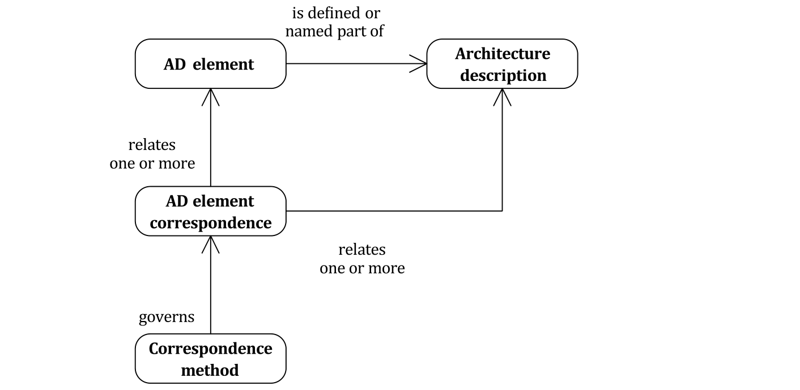

**Figure 4 — Conceptual model of AD element correspondences**

EXAMPLE 3 A correspondence method can specify that all AD elements trace to a concern or requirement. Compliance to that method can be recorded in the form of a traceability matrix, with a rationale provided for each AD element that does not trace to a concern or requirement. The AD elements in a correspondence do not need to be distinct. A correspondence can be defined between an AD element and itself.

NOTE 1 Requirements for using correspondences and correspondence methods are specified in 6.9. Additional examples of their use are given in A.7.

NOTE 2 Correspondences in this document are similar to view correspondences in ISO/IEC 10746-2 (RM- ODP) and ISO/IEC 19793.

NOTE 3 Usually correspondence methods are “cross model” or “cross view” or “cross AD” since correspondences within a view component are part of the conventions of the specification of the model kind.

NOTE 4 Correspondences and correspondence methods can be applied to multiple AD elements to express architecture relations pertaining to multiple AD elements.

#### 5.2.12 Architecture decisions and rationale

An architecture decision is a collection of choices made in the overall context of an architecture. These choices usually pertain to various AD elements, entity requirements, or environmental influences on the architecture.

EXAMPLE 1 Selection of architecture concepts, choice of AD elements, selection of ADFs, choice of architecture layering scheme, choice of underlying technology, choice of business components, choice of tactics to use for achieving system qualities, choice of business processes, choice of applicable patterns, choice of style(s) to be applied, choice of range of implementation technologies or other realizations to be considered, and choice of option sets to be considered.

Architecture rationale records explanation, justification or reasoning about architecture decisions. The rationale for a decision can include the following items: the basis for making a decision, impact on quality attributes, alternatives and trade-offs considered, potential consequences of the decision, architectural principles, and citations to sources of additional information.

EXAMPLE 2 Meeting cost commitments, meeting time commitments, using proven technologies, minimizing rework, reducing capital investments, achieving interface compatibility, satisfying constraints imposed by the operational context.

EXAMPLE 3 Modelling tool selections to align with related architectures (e.g. customer’s enterprise architecture) to ensure interoperability and traceability.

NOTE Requirements for capturing decisions and rationale within an AD are specified in 6.10.

**5.3 Architecture description in the life cycle**

Architecting activities occur and ADs are produced for various reasons throughout the life of the entity of interest, from initial concept through the operation, refurbishment or final retirement from use, and eventual disposal of this entity.

NOTE 1 Since an AD describes the concept of the entity of interest, in some cases, ADs continue to be produced even after retirement as long as there is interest in the concept, and can be parked or discarded as per the policies of the organization.

ADs are the work products that result from architecting, which takes place within the context of a project and/or organization (company, network of companies, consortium and standardization body).

During the entity of interest life cycle, an AD can precede or follow architecture creation, updating or changing.

NOTE 2 See Annex E for more details of the role of architecting in the life cycle.

**5.4 Architecture description frameworks and languages**

#### 5.4.1 General

ADFs and ADLs are now widely used in architecting to facilitate normalized expression of the architecture for those constructing and using ADs, and to ensure consistency of style and content coverage across ADs. ADFs and ADLs built on the concepts of architecture description presented in this document, can be utilized effectively for:

a) generalized reference frameworks and languages intended to guide more specific ADFs;

b) special purpose frameworks and languages intended to enable better analytical understanding

and situational awareness;

c) entity implementation frameworks and languages intended to facilitate entity engineering, operation and retirement.

#### 5.4.2 Architecture description frameworks

An ADF establishes a common practice for creating, interpreting, analysing and using ADs within a particular domain of interest, e.g. defense, aerospace and banking. An ADF can also guide or serve as a reference for one or more than one specialized ADF. For a generalized entity of interest within the context of a particular domain of practice, an ADF intended as a reference typically identifies architecture viewpoints for expected or known architecture considerations, often as stakeholder perspectives, concerns or aspects related to structure, function (both behaviour and fitness) and life cycle. For a reference use, the many different stakeholder perspectives can be generalized. Utilizing an architecture viewpoint, users of the reference have access to views appropriate for the generalized entity of interest that can satisfy the architecture considerations framed by that viewpoint.

An architecture viewpoint identified in an ADF, which intends to guide or serve as a reference for more specific ADF, identifies the typical concerns, aspects, model kinds and view methods, which constitute the conventions governing views associated with that viewpoint. Users of an ADF serving as a generalized reference can specialize the architecture considerations, the specifications of architecture viewpoints, and thus the resulting architecture views, as an ADF to use in implementing the architecture of a particular entity of interest.

The architecture viewpoints identified in an ADF can result from experiences with architecture viewpoints specified or used by prior architecting efforts to determine satisfaction of concerns about an entity of interest to the extent of detail consistent with the purpose of the ADF.

NOTE 1 Particular architecture decisions are made in ADFs: selection of stakeholders and related concerns, specific aspects and stakeholder perspectives. An ADF will structure ADs according to these decisions.

An ADF provides a structuring formalism to organize AD elements that are usually associated with the architecture viewpoints used to generate associated views. The purpose of the structuring formalism is to provide ways of representing relationships among various elements of the architecture and enhancing opportunities for analysis of interactions among those elements.

NOTE 2 The most common structuring formalisms use architecture considerations, i.e. concerns, stakeholder perspectives and aspects, represented in a grid or matrix format.

EXAMPLE 1 Well known structuring formalisms include: GERAM cube in ISO 15704, Reference Architectural Model Industrie 4.0 (RAMI 4.0)[34], TOGAF phases (Business, Data, Application and Technology),[62] NAF grid,[44] UAF grid,[48] and Zachman Framework matrix[67].

Figure 5 depicts the conceptual model of an ADF.

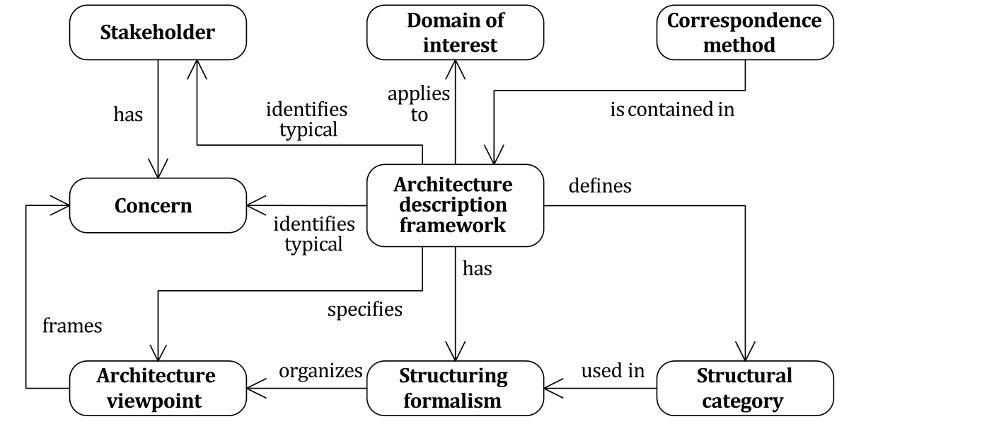

**Figure 5 — Conceptual model of an architecture description framework**

An ADF defines structural categories used in the structuring formalism. These categories result from correspondence methods that group AD elements into meaningful configurations for presentation, analysis, and management of the AD for the entity of interest.

NOTE 3 Sometimes categories are represented by “dimensions” in a graphic portrayal, such as the rows and columns used in several frameworks. A structuring formalism in grid form usually has two framework dimensions but formalisms can have a single framework dimension, often segmented in a multi-layer hierarchy, or several framework dimensions where visual representation of framework dimensions above three is difficult.

EXAMPLE 2 A two-dimensional grid is used in the Zachman[67] and UAF[48] ADFs where stakeholder perspectives are depicted as rows and aspects of the generalized entity of interest are depicted as columns.

NOTE 4 An ADF used as a reference can successfully rely on generalized architecture considerations and an agreed upon common vocabulary for the encompassed domain of interest. Specializations for implementation often necessitate careful customization to meet stakeholder expectations, particularly when adapting an ADF used as a reference for a particular purpose or for better comprehension by those stakeholders sponsoring the architecting effort. As a result of the introduction of specialized AD elements, a change in vocabulary and specifications of architecture viewpoints can be necessary.

Within an ADF, architecture viewpoints are important analytical resources for development of architecture views because viewpoints reflect the architecting purpose, typical stakeholders and their perspectives, identified concerns, defined aspects of the entity of interest, and particular AD elements.

Depending upon the intended application for a framework, the extent of detail resulting from a viewpoint can vary widely. A framework for reference can be expected to have more generalized stakeholder perspectives and architecture considerations, often partitioned into multiple functional clusters, e.g. product and life cycle.

#### 5.4.3 ADF utilization

When sharing typical AD elements in a common methodology, users can develop and maintain a less generalized domain specific ADF as a reference with architecture considerations and stakeholder viewpoints with appropriate model kinds and legends. Some ADFs used for references include explicit definitions of the AD elements associated with the model kinds and legends to use for each view of the entity of interest. Additional model kinds can address needed architecture considerations not covered by a particular framework.

A specialized framework, or one intended for implementation rather than reference, uses more specific and possibly more detailed stakeholder concerns, specific aspects and often a narrow portion of, or no consideration of, the life cycle.

NOTE 1 Particular practice communities establish norms in areas where similar architecting is recurring: stakeholders with recurring concerns, conventions for addressing specific aspects, and architecting practices for establishing customary perspectives. An ADF will structure ADs according to these norms.

Usage of ADFs in different situations is likely to identify new combinations of architecture considerations and useful viewpoints, model kinds, legends, views and correspondences. In different situations the following can occur:

- omission of life cycle or part of life cycle;

- inclusion of only some stakeholders or aspects;

- inclusion of overlapping sets of aspects;

- inclusion of only sub-domain or sub-groups of aspects;

- inclusion of new or adapted viewpoints as new concerns emerge;

- identification of previously unrealized correspondences.

Stakeholder concerns are often better understood when examined from different stakeholder perspectives across different aspects of the entity of interest, such as structure, behaviour and connectivity.

Some stakeholders look at an architecture from a business perspective and can be interested in the functionality that is required or provided (what capability of the entity is being created or changed, or what new processes are necessary?) and some stakeholders look at an architecture from an economic perspective and can be interested in the financial consequences of the same functionality (what are the investment implications and what is the expected impact on the bottom line?).

NOTE 2 ADFs frequently encompass both provisions for AD and additional architecting practices.

NOTE 3 Requirements for an ADF are specified in 7.1.

NOTE 4 Annex F gives more information about ADFs and how they can be related to the concepts and requirements of the document.

NOTE 5 ADFs identify one or more AD elements which are instances of the architectural constructs: stakeholder, concern, stakeholder perspective, aspect, architecture viewpoint, model kind, legend, etc.

One way to look at ADFs is to consider that an ADF is specifying the information model of an architecting effort (or project) that is tasked with the development of an architecture and its description. In other words, the ADF describes in an organized form the information elements that are to be produced.

If the ADF is expressed in a generic way, then it can only be used as a reference model (or partial model) of this information model, which then needs to be specialized by adding necessary detail for the purposes of the effort. Conversely, if the ADF is already specialized for the purposes of an application domain, then less tailoring is needed before utilization.

However, given the objective(s) of a particular architecting effort, domain specific ADFs can be further specialized. For example, some viewpoints, aspects, or perspectives may not be relevant from the point of view of these objective(s), or in turn there may exist concerns that are specific to the particular effort and shall therefore be addressed, which requires that additional viewpoints be specified and used.

This continuum from generic to reference (or partial) and particular models is an application of the identical concepts expressed in ISO 15704 (for further details, see C.4).

#### 5.4.4 Architecture description languages

An ADL is a specified syntax and semantics intended for use in describing the architecture of an entity of interest. An ADL is a language for stakeholders, including those involved in the architecting effort that allows the expression of architecture considerations by means of AD elements pertaining to the entity of interest, and the architecting context. An AD can use more than one ADL, even a different ADL for each viewpoint, or even distinct ADLs for each model kind specified by a single architecture viewpoint.

EXAMPLE 1 UML profiles for architecture description are defined using stereotypes, tag definitions, and constraints applied to specific model elements (classes, attributes, operations, and activities) with a profile collection of such extensions collectively customized for a particular domain (e.g. aerospace, healthcare, financial) or platform (J2EE, .NET), and a modelling profile can define a particular model kind as part of its specification. Often general-purpose modelling languages, e.g. UML[49], SysML[47], OPM (ISO/PAS 19450), are embellished with profiles specifically intended for use in ADs.

ADLs can be employed (or devised) to express specific architecture considerations which an architect needs to address.

NOTE 1 The use of more than one ADL in an AD requires great care to avoid confusion and misunderstanding.

An ADL provides a way to create and understand the view components that compose into architecture views. Suitable ADL selection occurs by considering view methods that specify how information is selected, transformed and presented in an architecture view. View methods determine the information to capture when constructing ADs, to use for the analysis of captured descriptions, and the information needed for the description of architecture concepts and features.

ADLs can provide necessary rigor for the development of an AD. The semantics of an ADL can be specified in increasing extents of formality and expressive power by: a vocabulary or glossary using natural language, a taxonomy of terms and relationships, a meta-model expressing the uses of language constructs, and as an ontological theory using axioms in a formal logic or as an analytical theory using differential equations, tensor calculus, etc.

As transition occurs from a very generic reference ADF through a domain specific ADF and practice specific ADF to an implementation ADF, different ADLs are likely to be employed to meet more refined specifications of architecture viewpoints for architecture views.

EXAMPLE 2 The transition from a generic Zachman Framework[67] to a UAF[48] involves a transition from general information and computing technology (ICT) ADL terminology to a precise terminology based on the UAF Domain Meta-Model.[48] This terminology can be implemented with the UAF Profile[48] using SysML[47] notation and semantics, which in turn is transitioned to implementation-specific ADL for a particular project modelling profile extension of UML[49].

using correspondences (see 6.9.2) or a unified underlying ontology (see A.6 on projective and synthetic view creation approaches). The constructs of the actual ADLs used in practice are then subsets of this integrated ontology.

EXAMPLE 3 AADL,[57] ArchiMate,[61] Systems Modelling Language (SysML),[47] ISO 19440, Business Process Model and Notation (BPMN),[46] Unified Modelling Language (UML),[49] Unified Architecture Framework (UAF) Profile[48] and the viewpoint languages of RM-ODP[3][4].

NOTE 2 ADLs identify one or more AD elements which are instances of the architectural constructs: stakeholder, concern, architecture viewpoint, model kind, legend, etc.

Figure 6 provides the conceptual model for an ADL.

NOTE 3 Requirements on ADLs are specified in 7.2.

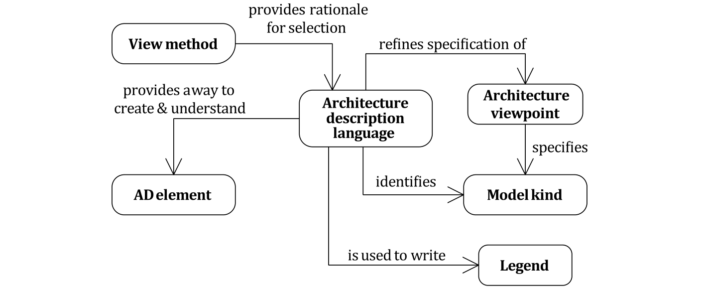

**Figure 6 — Conceptual model of an architecture description language**

### 6 Specification of an architecture description

**6.1 Architecture description identification and overview**

An AD shall identify the entity of interest and the expected environment of that entity of interest.

An AD shall include a statement of its intended purpose.

An AD shall include identifying information and supplementary information as determined by the project and/or organization.

EXAMPLE Date of issue and status; authors, reviewers, approving authority, issuing organization; change history; summary; scope; context; glossary; version control information; configuration management information and references. See ISO/IEC/IEEE 15289 or ISO/IEC TS 33060 for additional examples.

NOTE 1 For an AD intended to serve as a reference for another AD, the entity of interest is abstract, or a generalization of entities of interest, and the purpose of the AD is to express a reference architecture which could provide a basis for further ADs.

NOTE 2 This document does not specify a format for ADs.

NOTE 3 This document does not prescribe how ADs are created. For example, they can be individually constructed, generated with automated tools, derived from or based upon other information sources and models.

NOTE 4 This document does not prescribe the extent or expectation regarding the use of formal modelling methods in an AD. While informal methods can be used effectively, formal modelling methods are often less ambiguous.

**6.2 Identification of stakeholders**

An AD shall identify the stakeholders having concerns that are considered fundamental to the architecture of the entity of interest and consistent with the purpose of the AD.

EXAMPLE Stakeholders include users, operators, acquirers, owners, suppliers and vendors, architects, designers and developers, implementers, maintainers, regulators (including government), testers, public-at- large, adversaries and competitors.

An AD should identify the possible impacts of the architecture on the current and future stakeholders.

Consideration shall be given to recommendations made in previous evaluations of the architecture or of related architectures.

An AD shall include a statement of known resource limitations or other constraints that prevented the AD from addressing identified stakeholders and architecture considerations, i.e. concerns, perspectives, and aspects.

Non-conformances shall be identified and explained with rationales.

**6.3 Identification of stakeholder perspectives**

An AD shall identify stakeholder perspectives considered relevant to the architecture of the entity of interest and consistent with the purpose of the AD.

An AD shall associate each identified perspective with the identified stakeholders holding that perspective.

Within the scope of the intended purpose of the AD, the architecting effort should identify present or future stakeholder perspectives which may be relevant to the entity of interest.

For each identified perspective, an AD shall enumerate its resulting concerns from among identified concerns (per 6.4).

EXAMPLE Stakeholder perspectives include: strategic, organizational, operational, logical, physical and technological perspectives.

NOTE 1 This document does not prescribe: the granularity of concerns; the granularity and dependencies of stakeholder perspectives; how stakeholder perspectives relate to each other; or how stakeholder perspectives relate to other statements about an entity such as stakeholder needs, entity goals, or entity requirements. These issues are subjects for specific AD, ADFs, architecting methods, or other practices.

NOTE 2 See Annex F for examples of stakeholder perspectives as used in ADFs.

**6.4 Identification of concerns**

An AD shall identify the concerns considered relevant to the architecture of the entity of interest and consistent with the purpose of the AD.

EXAMPLE Concerns include the following: suitability of the architecture for achieving the objectives for the entity of interest, enterprise capability and capacity to implement the entity of interest, the feasibility of realizing and operating the entity of interest, the potential risks and impacts of the entity of interest to its stakeholders throughout its life cycle, added value to the stakeholder(s), reuse of known architectures, resilience, extensibility, adaptability, latency, resource utilization, effectiveness, operability, usefulness, usability, interoperability, complexity, sustainability and evolvability of the entity of interest, environmental impacts of the development, use, and disposal of the entity of interest.

An AD shall associate each identified concern with the identified stakeholders holding that concern.

NOTE 1 In general, the association of concerns with stakeholders is many-to-many.

NOTE 2 Consideration of past, present or future concerns can be relevant to the entity of interest.

NOTE 3 Concerns expressed as interrogative questions and with appropriate detail to the purpose of the AD enable more efficient and effective communication.

**6.5 Identification of aspects**

An AD shall identify aspects considered relevant to the architecture of the entity of interest and consistent with the purpose of the AD.

Each identified aspect shall be associated with the concerns that apply.

EXAMPLE Aspects include, among others, structural, behavioural, functional, programmatic aspects.

NOTE This document does not prescribe: the granularity and dependencies of aspects; how aspects relate to each other; or how aspects relate to other statements about an entity such as stakeholder needs, entity goals, or entity requirements. These issues are subjects for specific ADs, ADFs, ADLs, architecting methods, or other practices. See Annex F for examples of ADFs that use particular aspects and stakeholder perspectives.

**6.6 Inclusion of architecture viewpoints**

An AD shall include or reference each architecture viewpoint used therein.

Each architecture viewpoint shall include version identification as specified by the organization and/ or project.

The specification of each included architecture viewpoint shall be in accordance with the provisions of Clause 8.

Each concern identified in accordance with 6.4 shall be framed by at least one architecture viewpoint.

Each stakeholder perspective identified in accordance with 6.3 shall be associated with the architecture viewpoints which cover that perspective.

EXAMPLE Function, Information, Resource, and Organization.

NOTE 1 This document does not require the use of any particular architecture viewpoints.

NOTE 2 Annex B and Annex C provide additional information pertaining to specification of architecture viewpoints.

NOTE 3 An architecture viewpoint can serve as a contract between architect and other stakeholders. For the concerns framed by the viewpoint, architect and stakeholders can agree on what notations and representational conventions will be used to address those concerns. This contract agreement can be made before any detailed architecting is undertaken to reduce or avoid surprises.

**6.7 Inclusion of architecture views**

An AD shall include one or more architecture views for each architecture viewpoint used.

NOTE 1 When a viewpoint governs more than one view in a particular AD, they are describing one architecture.

EXAMPLE 1 Several kinds of views can be described for a functional viewpoint: for example, functional chains express the behaviour and function trees express decomposition.

Each architecture view shall include version identification as specified by the organization and/or project.

Each stakeholder perspective identified by the AD in accordance with 6.3 shall be addressed by at least one view in accordance with the view’s governing viewpoint.

Each concern identified by the AD in accordance with 6.4 shall be addressed by at least one view in accordance with the view's governing viewpoint.

Each architecture aspect identified by the AD in accordance with 6.5 shall be addressed by at least one view in accordance with the view’s governing viewpoint.

Each architecture view shall adhere to the conventions of its governing architecture viewpoint. Each architecture view may address more than one concern.

Each architecture view shall include or provide a reference for:

a) identifying and supplementary information as specified by the organization and/or project;

b) identification of its governing architecture viewpoint;

c) one or more view components that address all of the concerns (per 6.4) framed by its governing architecture viewpoint (per 6.6) and that cover some or all of the entity of interest with respect to that viewpoint; and

d) the recording of any known issues within a view with respect to its governing architecture

viewpoint.

NOTE 2 “Known issues” per d) include unresolved issues, risks, exceptions and deviations from the governing model kinds or legends. Open issues can lead to decisions to be made. Exceptions and deviations can be documented as decision outcomes and rationale (per 6.10).

NOTE 3 Per c), it is not necessary to require that each view covers the entire entity of interest with regard to the purpose and scope of the AD. It can, for example, be scoped to purposely be limited to one particular portion of the entity, sometimes by direction, sometimes by limited time or resources, or sometimes based on the narrow scope of the architecting effort

An AD may include other information which is not part of any architecture view.

EXAMPLE 2 Information parts not within any view could include overviews of the entity of interest, architecture principles, architecture patterns and architecture styles whose application spans more than one view; referenced bases for the architecture, such as domain or reference architectures; correspondences between views; and architecture rationale. This information can assist stakeholders and other users of the AD responsible for its maintenance and development.

**6.8 Inclusion of view components**

An architecture view shall be composed of one or more view components in accordance with its governing architecture viewpoint.

Each view component shall include version identification as specified by the organization and/or project.

Each view component shall identify its governing model kind, if any, and adhere to the conventions of its governing architecture viewpoint (see 6.6).

Within a view, one or more view components can be used to selectively present some or all of the informational content required by the architecture viewpoint to highlight points of interest.

A view component may be a part of more than one architecture view. Correspondences can express the relationships among components shared across views.

When a view component does not have a governing model kind, i.e. for an information part not described with a model, a view component legend shall be included to specify the conventions used in that view component.

EXAMPLE A view component that is a record of expert opinion, rather than a model that one can analyse using calculations, simulation, or any other suitable analysis method.

NOTE 1 Sharing view components between architecture views permits an AD to capture distinct but related concerns without redundancy or repetition of the same information in multiple views and reduces possibilities for inconsistency. Sharing of view components also permits an aspect-oriented style of AD[52]: view components shared across architecture views can be used to express architectural perspectives; view components shared within an architecture view can be used to express architectural textures. View components can be used as “containers” for applying architecture patterns[27] or architecture styles to express fundamental schemes (such as layers, three-tier, peer-to-peer and model-view-controller) within architecture views.

NOTE 2 This document does not prescribe the level of formality of view components to be used in an AD. While model-based view components that have a formal specification of semantics and syntax can be less ambiguous, non-model-based view components can also be used effectively.

**6.9 Recording of architecture correspondences**

#### 6.9.1 Consistency within an architecture description

An AD shall record any known inconsistencies.

An AD should include or reference an analysis of consistency of its architecture views, its view components and other AD elements.

Correspondences and correspondence methods, as specified in 6.9.2 and 6.9.3, may be used to express, record, enforce and analyse consistency between views, their view components and other AD elements within and among ADs.

#### 6.9.2 Correspondences

An AD shall include or reference a list of AD element correspondences.

An AD element correspondence shall identify one or more participating AD elements.

EXAMPLE An AD element satisfies a Requirement as demonstrated by an Evaluation Method: TracesToDemo (an AD Element, a Requirement, an Evaluation Method).

An AD element correspondence may involve elements within an AD or across several ADs.

An AD element correspondence shall identify any governing correspondence methods (see 6.9.3).

Each AD element correspondence shall identify the participating ADs.

NOTE AD element Correspondences can be used to express relations among ADs, ADFs, and ADLs. See Zachman Framework [56] example in Annex F.

#### 6.9.3 Correspondence methods

An AD shall include or reference a list of correspondence methods applying to itself or its AD elements.

A correspondence method applying to one or more AD elements can originate in the AD elements, in the AD itself; in the specification of a model kind or an architecture viewpoint used for the AD (see 8); or in the specification of an ADF or ADL used therein (see 7).

NOTE 1 For each applied correspondence method, an AD shall record whether the method holds (is satisfied) or otherwise record all known violations. A correspondence method holds if an associated correspondence can be shown to be satisfied. A correspondence method is violated if an associated correspondence cannot be shown to be satisfied or when no associated correspondence exists.

An AD shall include or reference each correspondence method applying to it.

NOTE 2 A correspondence method applying to an AD could originate in the AD; in the specification of a viewpoint or a model kind (see Clause 8); or in the specification of an ADF or ADL selected for use in that AD (see Clause 7).

**6.10 Recording of architecture decisions and rationale**

#### 6.10.1 Decision recording

An AD shall record architecture decisions considered essential to the architecture of the entity of interest within the scope and intended purpose of the AD.

NOTE 1 An AD expresses decisions about an architecture. Architecture rationale expresses why decisions have been chosen.

The AD should record alternative decisions considered and rejected and the rationale for those choices.

The organization and/or project should establish a decision recording and sharing strategy and criteria for selecting important decisions to record and support with rationale in the AD.

Decisions, among others, to consider for selection criteria are those:

- regarding architecturally significant requirements;

- needing a major investment of effort or time to make, implement or enforce;

- affecting key stakeholders or a number of stakeholders;

- addressing fundamental concerns (such as performance, evolvability, safety);

- necessitating intricate or non-obvious reasoning;

- that are highly sensitive to changes;

- that are likely to be costly to change;

- that form a base for project planning and management (such as work breakdown structure creation,

critical chain identification and management quality gate tracking);

- that result in the replacement of assumptions with known information;

- that result in significant capital expenditures or indirect costs;

- linked to requirement compliance;

- linked to technical standard selection;

- linked to system vulnerability mitigation.

When recording decisions, the inclusion of the following information should be considered:

- unique decision identification;

- clear statement of decision;

- identification of decision authority or owner;

- identification of constraints and assumptions that influence the decision;

- link decision to the concerns or aspects of an entity to which it pertains;

- link decision to AD elements affected by the decision;

- link to decision rationale;

- relationships to other decisions;

- consequences of the decision (relating to other decisions) are recorded;

- timestamps for when the decision occurred, when approved and when modified;

- source citations for additional information.

NOTE 2 The lists of decisions are not intended to be exhaustive.

NOTE 3 Sometimes recording rejected alternatives and their rationale for rejection is useful, e.g. when in the future the rationale no longer applies and the decisions are necessary.

EXAMPLE Examples of types of relationships are: constrains, influences, enables, triggers, forces, subsumes, refines, conflicts with, exposes, and is compatible with (See Reference [39] and Reference [60]).

Relations among decisions can be captured via correspondences or by applying correspondence methods.

#### 6.10.2 Rationale recording

An AD should include or reference a rationale for each architecture viewpoint selected for use (per 6.6).

An AD should include or reference a rationale for each ADF and each ADL selected for use.

An AD shall include or reference rationale for each essential architecture decision (per 6.10.1).

An AD should include or reference evidence of consideration and rationale for selection of alternatives.

An AD should include a rationale for an AD limitation (e.g. resource problem, timing problem, and effort avoided for well-known description already covered by other ADs).

### 7 Architecture description frameworks and architecture description languages

**7.1 Specification of an architecture description framework**

**7.1.1** An ADF (3.5) shall include or reference:

a) information identifying the ADF and its intended scope of applicability;

b) version identification of the ADF as specified by the organization and/or project;

c) one or more typical stakeholders (per 6.2);

d) one or more typical concerns held by typical stakeholders (per 6.4);

e) one or more architecture viewpoints that frame those typical concerns (per 8.1);

**7.1.2** When expected in a conforming AD, an ADF should specify:

a) one or more stakeholder perspectives (per 6.3);

b) one or more aspects (per 6.5);

c) definition of one or more structuring formalisms to organize viewpoints (per 5.4.2);

d) one or more model kinds that apply to specified architecture viewpoints (per 8.2);

e) definition of one or more legends that apply to specified architecture viewpoints;

f) identification of ADLs that can be used to create views with regards to the viewpoint specification (per 7.2);

g) correspondence methods (per 6.9.3);

h) view methods (per 8.3);

i) version identification as specified by the organization and/or project.

The intended scope of use can range on a scale between the very generic (all industries and application domains and all kinds of entities of interest (EoI), and the use of the ADF for multiple purposes) through to the very special or particular (such as intended to cover a given industry, application domain, or kind of EoI, a particular EoI, or a particular EoI in a given stage of its life, or for a particular purpose). This classification is similar to the genericity dimension defined as a structuring formalism in ISO 15704 (see A.4.4).

NOTE 1 The word typical in the list above is intended to mean ‘typical in the intended scope of applicability’.

The specification of an ADF should include conditions on applicability.

EXAMPLE 1 The following are conditions on applicability:

- An ADF can require an AD to identify stakeholders when the entity of interest operates within a jurisdiction

impacting their business model.

- An ADF can permit an AD to omit a real-time viewpoint when none of its concerns have been identified for the

entity of interest.

- An ADF can allow an AD to omit use of a particular model kind when no selected viewpoint uses that model

kind.

The specification of an ADF should indicate its consistency with the concepts in 5.2.

NOTE 2 The above requirement can be met through a metamodel, a mapping of framework constructs to the requirements in Clause 5, a text narrative, or in some other manner.

An AD that conforms to the requirements of Clause 6 adheres to a specification of an ADF when the AD identifies and considers the applicability of each:

- stakeholder (per 6.2) identified by the ADF;

- stakeholder perspective (per 6.3) identified by the ADF;

- concern (per 6.4) identified by the ADF;

- aspect (per 6.5) identified by the ADF;

- architecture viewpoint (per 8.1) specified by the ADF;

- correspondence method (per 6.9.3) specified by the ADF.

A specification of an ADF may establish additional rules for adherence.

An AD can adhere to one or more specifications of ADFs, or to no framework specifications.

NOTE 3 For an AD to adhere to more than one framework specification entails a reconciliation between each framework specification’s identified stakeholders, concerns, aspects, stakeholder perspectives, architecture viewpoints, model kinds, and correspondence methods within the AD.

An ADF may have a structuring formalism with one or more structural categories to provide ways of representing relationships among various elements of the architecture and enhancing opportunities for analysis of interactions among those elements.

EXAMPLE 2 Structural categories include architectural constructs such as: domains, model kinds, perspectives, aspects, interrogatives, levels of abstraction, subjects of concern, aspects of concern, phases, layers and architectural tiers.

NOTE 4 See Annex F for examples of architecture frameworks using aspects, stakeholder perspectives and other structural categories.

**7.2 Specification of an architecture description language**

The specification of an ADL shall include or reference:

a) identification of typical concerns (6.4) or aspects (6.5) covered by the ADL;

b) the identification of one or more view methods to be selected from the ADL (per 8.3);

c) one or more model kinds (per 8.2) implemented by the ADL for use in framing the relevant concerns or reflect the relevant aspects;

d) any architecture viewpoints (per 8.1) implemented by the ADL;

e) any correspondence methods (per 6.9.3);

f) version identification as specified by the organization and/or project.

### 8 Architecture viewpoints and model kinds

**8.1 Specification of an architecture viewpoint**

The specification of an architecture viewpoint shall include or reference:

a) any stakeholder perspectives associated with this viewpoint (per 6.3);

b) one or more concerns (per 6.4) framed by this architecture viewpoint;

c) one or more aspects related to those concerns (per 6.5);

d) known typical stakeholders (per 6.2) holding those concerns which are framed by this architecture

viewpoint (per item b));

e) model kinds (per 8.2) and legends for use when constructing views (per 8.2);

f) correspondence methods capturing relations within resulting views and their view components (per 6.8);

g) references to any sources of information about this viewpoint.

A specification of an architecture viewpoint should identify view methods (per 8.3) used to create, interpret or analyse views governed by the associated architecture viewpoint; and one or more model kind (per 8.2).

Each legend shall provide guidance to users in interpreting the view components which it documents.

The specification of an architecture viewpoint can use correspondence methods.

The specification of an architecture viewpoint can be included as part of an AD (Clause 6), as a part of the specification of an ADF or ADL (Clause 7) or individually using the requirements of this clause.

NOTE 1 When a specification of an architecture viewpoint is included and applied in an AD, the typical stakeholders of item e) are replaced by the known stakeholders identified in the AD.

NOTE 2 This document does not require any particular specifications of architecture viewpoints to be used.

NOTE 3 Annex B provides guidance to specification of architecture viewpoints.

**8.2 Specification of a model kind**

The specification of a model kind shall include or reference:

a) conventions such as definition of a language, notation or modelling technique comprising the model

kind;

b) any view methods (per 8.3) and correspondence methods associated with the model kind;

c) any version identification as specified by the organization and/or project;

d) any sources of information about this model kind.

NOTE Item a) can be met in a number of ways such as with a metamodel, grammar or template for the specification of a model kind that defines the structure and interpretation of its models (see B.2.9).

**8.3 View methods**

A specification of an architecture viewpoint may include one or more view methods.

View methods shall be defined in the specifications of model kinds (see 8.2), viewpoints (see 8.1), ADLs (see 7.2), and ADFs (see 7.1) when it is necessary to provide guidance on how views are constructed or used.

If a model is used as an information source when creating a view, a view method should define how AD elements will be portrayed in the view component, how model data are transformed or translated for use in the view component and how relationships between information from different sources are portrayed in the view component.

If a “non-model” is used as an information source when creating a view, a view method should define how its contents are portrayed in the view component as AD elements, how the non-model-related data are transformed or translated for use in the view component, and how relationships between information from different sources are portrayed in the view component.

## Annex A (informative) — Notes on terms and concepts

### A.1 General

This annex discusses the principles, concepts and terms on which this document is based. Figure A.1 depicts the main concepts of AD.

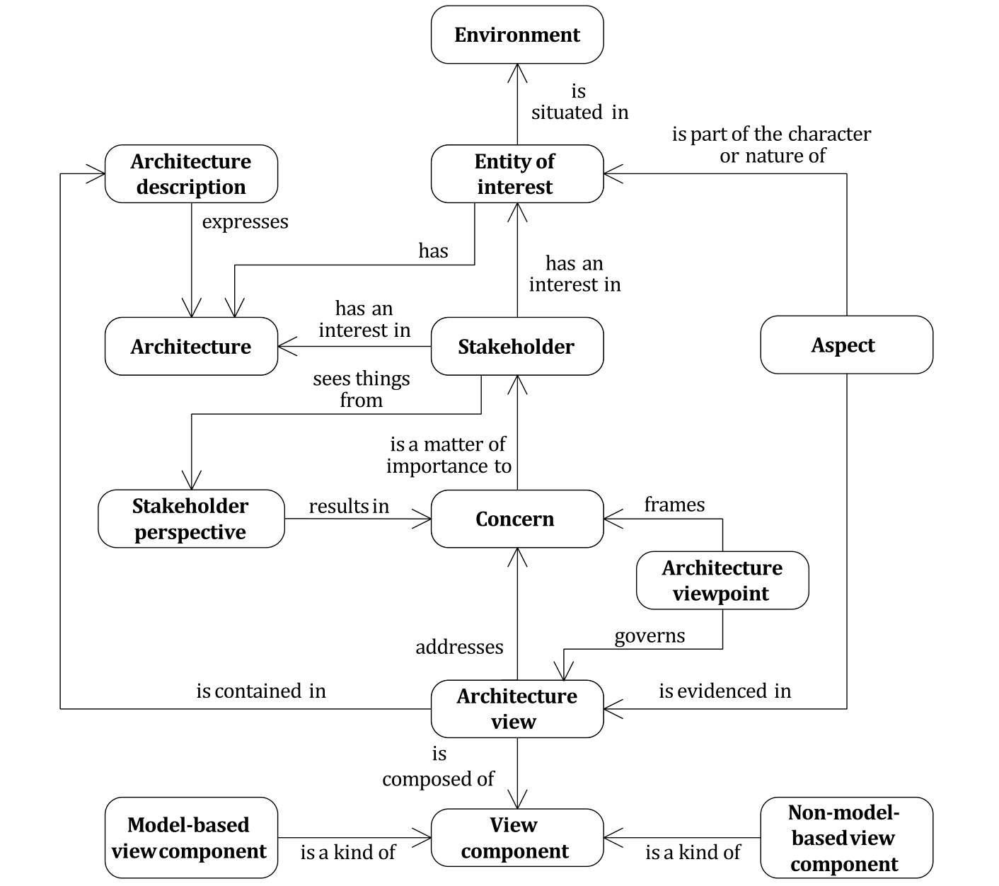

**Figure A.1 — Conceptual model of an architecture description**

This document makes use of several terms (architecture, concern, aspect, stakeholder perspective, architecture view, architecture viewpoint, view component, model kind) which are in wide usage with

several different meanings across the community. This Annex discusses these terms, the motivations for their definitions in this document, and contrasts these definitions with other usages.

This document defines minimal requirements on ADs to support the scope established in Clause 1. The approach is to allow organizations maximum flexibility in applying the standard while demonstrating conformance with the requirements in Clauses 6, 7 and 8. Given the multi-disciplinary nature of architecting, the intent is to meet the needs of multiple stakeholders and allow different ways to describe the architecture of an entity of interest. The organization of ADs into architecture views governed by architecture viewpoints provides a mechanism for the separation of concerns based on the stakeholders, while providing an integrated view of the whole entity that is fundamental to the notion of architecture.

Establishing the quality of an architecture being described by a conforming AD (Is this a good architecture?) or the quality of an AD itself (Is this AD complete and consistent?) are factors for the evaluation of the AD. This document does not presume to impose conditions that are required for quality considerations. It does recommend that results of such evaluations be recorded (per 6.2).

NOTE Evaluation of architectures is the subject of ISO/IEC/IEEE 42030.

### A.2 Entities and their architectures

In this document, the term architecture is intended to convey the essence or fundamentals of an entity of interest. There are several key aspects to the definition of architecture (3.2) in this document. This definition is chosen to encompass a variety of previous uses of the term “architecture” by recognizing their underlying common themes. Principal among these is the need to understand and control those elements of an entity of interest that contribute to its utility, cost, time and risk within its environment. In some cases, the fundamental elements are physical or structural components of the entity and their relationships. Sometimes, the fundamental elements are functional or logical elements. In other cases, what is fundamental or essential to the understanding of an entity are its overarching principles or patterns. Properties can also be the fundamental characteristics of an entity, its elements and their relationships. The definition of architecture in this document is intended to encompass these distinct, but related uses, while encouraging a more rigorous delineation of what constitutes the architecture of an entity.

The phrase “concepts or properties” is used in the definition of architecture (3.2) to allow two differing philosophies to use this document without prejudice. These two philosophies are:

- Architecture as concept: wherein architecture is a conception of an entity in one’s mind;

- Architecture as property: wherein architecture is a property or attribute of an entity of interest.

Empirical studies have discovered four metaphors for architecture found in organizations[59]:

- architecture as blueprint;

- architecture as literature;

- architecture as language;

- architecture as decision.

The conceptual foundation of this document does not presume any one of these metaphors; rather it works equally well with any of them. The existence of these multiple metaphors supports a central design tenet of this document: that architecture is inherently based upon multiple stakeholders with multiple concerns and using multiple viewpoints and aspects.

### A.3 Concerns

This document uses the term concern to mean any topic of interest pertaining to the entity being architected or to the architecture itself. Stakeholders, including the architect, of that subject entity hold

these concerns. Some concerns drive or relate to the architecture and therefore this document requires their identification as a part of the AD. Concerns range over a wide spectrum of interests (including technical, personal, developmental, technological, business, operational, organizational, political, economic, legal, regulatory, ecological, social influences).

The motivation for using this term comes from the phrase “separation of concerns” in software and systems engineering, coined by Edsger W. Dijkstra.

Let me try to explain to you, what to my taste is characteristic for all intelligent thinking. It is, that one is willing to study in depth an aspect of one’s subject matter in isolation for the sake of its own consistency, all the time knowing that one is occupying oneself only with one of the aspects. We know that a program must be correct and we can study it from that viewpoint only; we also know that it should be efficient and we can study its efficiency on another day, so to speak. In another mood we may ask ourselves whether, and if so: why, the program is desirable. But nothing is gained—on the contrary!—by tackling these various aspects simultaneously. It is what I sometimes have called “the separation of concerns”, which, even if not perfectly possible, is yet the only available technique for effective ordering of one's thoughts, that I know of. This is what I mean by “focusing one’s attention upon some aspect”: it does not mean ignoring the other aspects, it is just doing justice to the fact that from this aspect’s point of view, the other is irrelevant. It is being one- and multiple-track minded simultaneously[30].

As specified in this document, each architecture viewpoint frames one or more concerns (see 6.6) so that a view resulting from the application of that architecture viewpoint addresses identified concerns for the entity of interest. Separating the treatment of concerns by views allows stakeholders to focus on what is of special interest to them and offers a means of organizing and managing complexity of the AD (see 6.7). The literature of enterprise, systems and software engineering records a large inventory of such concerns. Examples are given in 5.2.3.

### A.4 Aspects and perspectives

**A.4.1 General**

Historically architecting efforts were driven by the concerns of stakeholders. However, the advent of ADFs (and to a much lesser extent ADLs) established practices that drew upon prior architecting experience which resulted in the organizing of architecting efforts which are not necessarily driven by concerns specific to the architecting effort in question but significantly driven by this prior experience. This approach to architecting enabled specific concerns to be identified at a later point in time after first building architecture views using the ADF-driven approach.

This prior experience is typically encapsulated in grid-based ADFs, typically of two dimensions, but sometimes of three or more dimensions. While there is no uniformity in the established practice as to what the respective rows and columns comprise, it appears there are at least two orthogonal sets which are prevalent.

One such dimension is the “aspect.” Architects do not necessarily address all aspects simultaneously nor even all possible aspects but tend to address them in a specific order (with iteration as appropriate) dependent upon the architecting objectives, prior experience and any method being applied. Some aspects may not be important for particular architecting efforts (e.g. because they are not relevant to the architecture of interest, or its kind of architecture, or because they are not a driver for that specific architecture).

The other dimension “stakeholder perspective,” is also fundamental and captures what an architect does, namely employing different ways of thinking about an entity or its architecture driven e.g. by concerns, prior experience or method.

Stakeholder perspective is driven more by architecting thinking and approach. Aspect is driven more by what is or may be needed to be covered in an AD. Concerns form (and are amenable to being addressed through and mapped onto) some combination of one or more aspects and one or more stakeholder perspectives.

The use of aspects and stakeholder perspectives is compatible with a more organized and disciplined (and standardized) approach to both architecting and AD. It is noted that some architectural issues can be direct stakeholder concerns in particular domains or circumstances. In such cases, they are usually addressed through the mechanism of stakeholder perspectives. In other cases, they are not, but instead can be addressed through the mechanism of aspects. This gives rise to variation in the organizing of material employed in commonly used ADFs.

**A.4.2 Aspects**

Aspects provide a way to partition the architecture to enable a more systematic examination of the architecture’s fundamental concepts such as structure and properties, and the evaluation of architecture alternatives. This document uses the term aspect as an organizing basis for views in an architecture description (see 6.5). Aspects, concerns and stakeholder perspectives focus views on cohesive sets of interests within an architecture description. Aspects, concerns and perspectives can provide a basis for capturing many of the relevant architecture considerations with respect to the architecture.

The aspects align with technical architecting specialities which access relevant architectural information to be able to analyse, synthesize, assess, elaborate their particular aspect(s) and in turn add to (i.e. develop, embellish, elaborate on, increase confidence in, etc.) the architectural information. Examples of roles with specialities include information architects and analysts, security architects, reliability engineers, human factors specialists, human organization experts, and cost forecasters.

EXAMPLE 1 Spatial, structural, functional, connectivity, taxonomic, informational and roadmap aspects in an aircraft AD.

EXAMPLE 2 Behavioural, informational and structural aspects in a computer AD.

EXAMPLE 3 Logical connectivity and physical connectivity aspects in a communications network AD (corresponding to the so-called logical network and physical network depictions of a configuration of links and nodes in the network).

Aspects are neutral with respect to any particular concern although these concerns can be mapped to many relevant aspects. By examining the aspects of an architecture description, certain relevant features or properties of the entity can be discerned or predicted.

Aspects often reflect domain knowledge and come from the experience of engineers and architects. They also come from the ADFs that have found certain aspects to be useful for architecting for the scoped domain for that framework. These aspects are also embedded in methods that are taught to architects and encapsulated in some modelling tools.

Concerns will apply directly to what is relevant or important with regard to an entity of interest or an architecture whereas an aspect is a part of the character or nature of the architecture entity itself.

Treating a “stakeholder concern” as the starting point for creating architecture views assumes that one already knows a priori who the stakeholders are and what their concerns may be. In many complex entities, this is not feasible. Some stakeholders are often not known until creation of some architecture views for the aspects considered to be relevant and customary for the domain. When these views are shown to potential stakeholders, then they can likely reveal to us the concerns they may have (if any) for the implied architecture solution.

Concerns of the architect as a stakeholder will typically differ from aspects in being not as extensive in scope and less structured in form. Over time and following review and consolidation these concerns can become codified into aspects, usually as they apply to a specific domain of application.

Aspects can be used to examine the entity to get a more complete understanding of how the architecture addresses that concern. Aspects can likewise aid understanding to what extent the architecture is not addressing that concern.

The relationship between concerns and aspects can be illustrated with these examples: one can analyse, for example, the entity’s behaviour (as an aspect) against several concerns, like: portability,

performance; or one can assess a concern such as security through analysis of, for example, behavioural, structural and organizational aspects.

Aspects are also useful during evaluation of alternative architectures (see ISO/IEC/IEEE 42030).

The concept of aspects has been used in software development to deal with “cross-cutting concerns.” An aspect is a feature of a program shared across by many parts of the program and unrelated to its primary function (Kiczales et al [39]).

Non-functional properties such as performance, cost, and quality factors (like reliability, confidentiality and resilience) are concerns that are structured using the notion of aspects (5.2.5). These non- functional properties are often termed “-ilities” or “non-functional requirements (NFRs)”.

**A.4.3 Stakeholder perspectives**

This document uses the term stakeholder perspective to mean a particular way of thinking about an entity, especially one that is influenced by one’s beliefs or experiences. The way one thinks about an entity (i.e. one’s perspective) can be influenced by organizational role, training, experience, knowledge, personality, character traits, culture, peer pressure, etc. Different ways of thinking about an architecture are often employed when architecting. (See examples in 5.2.4.)

EXAMPLE From UAF[48]: strategic, operational, services, personnel, resources, security, projects, standards, actual resources. From ArchiMate[61]: strategy, business, application, technology, physical, implementation, migration. From NAF[44]: concepts, service specifications, logical specifications, resource specifications, architecture metadata. From DODAF[31]: capability, operational, services, systems, standards, data, and information, projects. From ISO 15704 (GERAM): identity, concept, requirements, preliminary design, detailed design, implementation, operation, decommissioning.

The determination of relevant stakeholder perspectives is dependent upon the interests of, and stances adopted by, the various stakeholders that are relevant to the architecture. For a given stakeholder perspective there are usually multiple concerns and aspects to be considered.

**A.4.4 Structuring formalisms and structural categories**

An ADF can provide a structuring formalism, i.e. a set of rules for using architecture considerations and correspondences between them, to organize the architecture viewpoints used to generate associated views, e.g. a grid framework formalism. The purpose of the structuring formalism is to provide ways of representing relationships among various elements of the architecture and enhancing opportunities for analysis of interactions among those elements.

EXAMPLE 1 Well known structuring formalisms include: GERAM cube in ISO 15704, Reference Architectural Model Industrie 4.0 (RAMI 4.0)[34], TOGAF stack (business, information systems, technology)[62], NAF grid,[44] UAF grid,[48] and Zachman Framework matrix[67].

In this document, this concept of framework dimensions is called “structural categories” since the way these categories are used in various ADFs is not always aligned with the concept of “dimensions.” So, the structural categories term is used herein since it is a broader and more inclusive concept.

An ADF can define structural categories used in the structuring formalism. Sometimes these categories are represented by “dimensions” in a graphic portrayal, such as the rows and columns used in several frameworks. A structuring formalism in grid form usually has two framework dimensions but formalisms can have a single framework dimension, often segmented in a multi-layer hierarchy, or many framework dimensions where visual representation of framework dimensions above three is difficult.

EXAMPLE 2 A two-dimensional grid is used as a structuring formalism by some ADFs where stakeholder perspectives correspond to rows and aspects correspond to columns.

The structural categories (i.e. dimensions) of the formalism can include things such as domains, model kinds, perspectives, aspects, interrogatives, levels of abstraction, subjects of concern, aspects of concern, phases, layers, architectural tiers.

Some commonly used ADFs have a two-dimensional grid or matrix to organize their specifications of architecture viewpoints. The two-dimensional grid originated with Zachman.[67] (Today, many other forms can be found such as cubes, stars, pentagons and ellipses.) These are examples of structuring formalisms used on those frameworks.

The rows in these grids are the perspectives referred to in this document, although the names of these rows in the frameworks will vary: UAF[48] calls them domains, ArchiMate[61] calls them layers, NAF[44] calls them “subjects of concern”, GERAM in ISO 15704 has two of its three primary dimensions representing extent of abstraction (genericity) and life cycle modelling phase. The underlying idea is the same across these frameworks and this concept has been adopted by this document. The concept also makes explicit that a viewpoint provides a perspective.

‘Genericity’ is a key conceptual approach from ISO 15704 that applies to an enterprise when modelling the expression of increasingly specific concepts. ISO 15704 defines three levels of genericity: generic, partial and particular. This genericity concept is applicable to other kinds of entities and to the notion of ADFs as well. A progression of increasingly specific (i.e., less generic) ADFs can be used to provide more specificity as one approaches the level of implementation of entities in the real world.

EXAMPLE 3 One possibility is to begin with the generic ICT terminology ADF, such as concepts used in the Zachman Framework, and transition to an ADF with more prototypical domain detail, such as UAF (with a UAF Profile and accompanying SysML notation and semantics), which in turn can transition to an implementation- specific ADF for a particular project using a further modelling profile extension with detail sufficient for the particular domain specific context.

The transitions from generic through partial to particular that provide more domain-specific detail in an ADF are useful due to reasons of quality and efficiency, since any particular project prefers to use an ADF tailored to the application area (such as having predefined perspectives and aspects that are common and reusable in similar projects), has previously been tested (prior success provides expertise and knowledge), and utilizes a terminology shared among experts of the given domain.

**A.4.5 Relationship between aspect and stakeholder perspective**

Stakeholder perspective and aspect are closely related and often confused. While perspective is the way one thinks about something, aspect can be used for capturing the relevant features of the *entity of* *interest*. An aspect of properties or concepts associated with the entity is perceived when viewing it and thinking about it from a particular perspective. When the perspective is shifted, often the properties or concepts are different. Likewise, when the viewing aspect is changed then different properties or concepts about the entity can be discerned.

Aspects and stakeholders perspectives are commonly used in the ADF as a way to organize architecture viewpoints as illustrated by the examples described in Annex F (see References [38] [63]). An architecture view can be constructed for a particular aspect and a particular perspective. The perspective can represent an aggregation of concerns held by one or more stakeholders. When an architecture framework matrix or grid uses these concepts, the columns usually represent aspect- related items and the rows usually represent perspective-related items.

**A.4.6 Complementary ADF approaches**

The combination of stakeholder perspectives and aspects to conduct architecting in a manner informed by prior experience can serve as a different and complementary approach to architecting driven by identified stakeholders and their specific concerns (see 5.2.3). For example, using prior experience in conducting the architecting of a similar entity situated in a similar environment, potential issues can be identified which when raised with stakeholders give rise to real concerns.

Using established aspects from known stakeholder perspectives can be enormously helpful in reducing architecting effort to arrive at suitable architecture viewpoints. However, architects need to exercise care not to let these aspects and stakeholder perspectives of prior architecting effort overshadow concerns not previously expressed nor to discount emerging concerns as the architecting project unfolds.

The roles fulfilled by aspects and stakeholder perspectives are different. For a given perspective there are usually multiple aspects to be considered. When the stakeholder perspective is changed, then the properties or concepts that are perceived are different.

### A.5 Architecture views and viewpoints

The terms architecture view and architecture viewpoint are central to this document. Although sometimes used synonymously, in this document they refer to separate and distinct concepts.

It is a goal of this document to encompass existing AD practices by providing common terminology and concepts. Many existing practices express architectures through collections of models. Typically, these models are further organized into cohesive groups, called views. The cohesion of a group of models or other information is determined by the perspective taken and the concerns and aspects addressed by that group of models and other information sources. In this document, a specification of an architecture viewpoint refers to the conventions for expressing an architecture with respect to a given perspective, set of concerns and aspects:

*A view is a* way *of expressing the architecture of an entity of interest from a particular viewpoint.*

The use of multiple views to express an architecture is a fundamental premise of this document. The need for multiple views in ADs is widely recognized. While the use of multiple views is widespread, authors differ on what views are needed, based on audience, and on appropriate methods for expressing each view. Because of the wide range of opinion, this document does not require a predefined set of architecture viewpoints and their specifications; it encourages the practice of defining or selecting architecture viewpoints appropriate to the entity of interest.

A consequence of making architecture viewpoints first-class entities is that they are among the constructs considered as AD elements.

The remainder of this subclause provides brief historical notes on the use and evolution of the term “viewpoint” in systems and software.

The earliest use of first-class viewpoints appears in Ross’ Structured Analysis (SADT) in 1977.[53] In requirements engineering, Nuseibeh, Kramer and Finkelstein treat viewpoints as first-class entities, with associated attributes and operations[43]. These works inspired the formulation of architecture viewpoints as specified in Clause 8. The term is chosen to align with the ISO Reference Model of Open Distributed Processing (RM-ODP),[2] which uses the term in these ways:

A viewpoint (on a system) is an abstraction that yields a specification of the whole system related to a particular set of concerns. (see ISO/IEC 10746-1:1998, 6.2.2.)

A viewpoint (on a system) is a form of abstraction achieved using a selected set of architectural constructs and structuring rules, in order to focus on particular concerns within a system. (see ISO/IEC 10746-2:2009, 3.2.7.)

However, where this document uses “architecture view” to refer to the application of a viewpoint to a particular entity, RM-ODP[2] uses the term “viewpoint specification”.

A specification of an architecture viewpoint contains the conventions (such as notations, languages and types of models) for constructing a certain kind of view. An architecture viewpoint offers a way of looking at an entity’s architecture and provides the architect with resources for modelling an entity with respect to the concerns framed by that viewpoint. That viewpoint can be applied to many entities. Each view is one such application.

Every architecture view must have a specification of an architecture viewpoint specifying the conventions for interpreting the contents of the view. In this document, legends are introduced to document the conventions of view components.

Within an individual AD, this document requires that each view needs to be governed by an architecture viewpoint. This means that each view conforms to one set of conventions (possibly including one or

more specifications of model kinds, possibly presented in more than one way for diverse stakeholders). In situations where there is a need to use two or more viewpoints to produce a view, a single viewpoint can be developed by composing the two or more viewpoints which can then be used to produce the view. Alternatively, usage of multiple viewpoints can be simply documented in the view.

In situations where there is a need to consider the whole entity of interest for the development of a view; but the boundary of the entity is not known then, parts of the entity can become the focus from the perspective of the concerns framed and aspects revealed by the governing architecture viewpoint. For example, to develop a performance view of a networked entity, both network transmission delays and processing times can be considered to produce a complete end-to-end view of the performance of the entire entity of interest, but somethings like size, weight, power consumption, bandwidth and throughput need not be considered.

An AD can focus on the entity of interest at a specific point of time (for example, when it is delivered to a customer), or consider the evolution of the architecture over several time scales. Any view can be constructed from a series of view components, each representing the entity of interest at a given point of time, stage or phase. The composition of such view components within a view would describe how that entity evolves over time, while still allowing the view to deal with the whole entity of interest.

There are two common approaches to the construction of views: the synthetic approach[55] and the projective approach.[25] In the synthetic approach, the architect constructs views of the entity of interest and integrates these views within an AD, using correspondences. In the projective approach, an architect derives each view through some routine, possibly mechanical, procedure of extraction from an underlying information source or set of models. This document is designed to be usable with either of these approaches to views.

Annex B and Annex C provide further information and references pertaining to specification of architecture viewpoints.

### A.6 Correspondences

Correspondences are used to identify or express named relations within and between AD elements.

Although many model kinds and ADLs include constructs to capture relations (such as relationships in entity-relation-attribute diagrams, associations in UML), when an AD utilizes multiple viewpoints and model kinds, there may not be any available way to identify and express named relations between these diverse representations. In such cases, correspondences can be used to identify and express these named relations.

The 2011 edition of this document introduced correspondences and correspondence rules to express and enforce relations between AD elements. In this document, AD element is an identified or named part of an architecture description. AD elements include stakeholders, concerns, stakeholder perspectives, and aspects identified in an AD, and views, view components, viewpoints, and model kinds included in an AD.

In addition, AD elements include ADs themselves and instances of the constructs introduced by viewpoints and model kinds. Any of these AD elements can participate in relations expressed by correspondences. Correspondences have a number of uses. They can be used to express consistency, traceability, composition, refinement and model transformation, and dependences of any type within and between ADs.

A survey of uses of model relations together with a taxonomy and classification of relation mechanisms is found in Reference [26]. Correspondences can be used to meet the requirements of 6.9.1 for recording view consistencies and inconsistencies.

In this edition, correspondence rules are generalized to correspondence methods. Correspondence methods capture intended relationships that are to be enforced on correspondences within and between AD elements.

The remainder of this subclause presents examples of correspondences and correspondence methods. The features of the correspondence mechanism, in relation to similar mechanisms in the literature, are discussed.

EXAMPLE 1 Consider two view components in an automotive system’s AD: a software application view component and an electronic control unit (ECU) view component. The software application view component includes these elements: Autopilot, Dashboard (consisting of Controls, Instrument panel cluster, Center stack), Braking, GPS, LIDAR and Sensor Fusion. The ECU view component identifies a number of ECUs, numbered 1 through 4. A correspondence, depicting the assignment of applications to ECUs, is shown in Figure A.2 as a matrix. The form of a correspondence is not specified by this document.

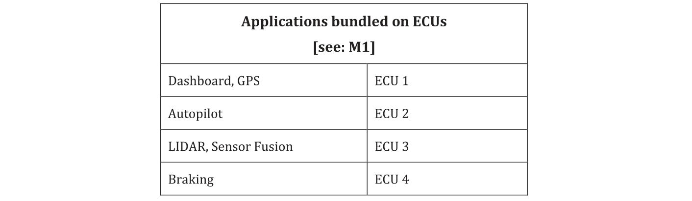

**Figure A.2 — Example of a correspondence**

The example meets the requirement of 6.9.2: it has a unique name (“bundled on”), identifies participating elements (the applications and ECU), and identifies an optional correspondence method (M1).

A correspondence method expresses a constraint to be enforced on correspondences. EXAMPLE 2 presents a simple correspondence method.

EXAMPLE 2 M1: every application must be bundled onto at least one ECU.

The correspondence named “bundled on” in EXAMPLE 1 satisfies M1 because all applications are assigned to at least one ECU.

Most correspondences will be expressed in terms of elements of views or view components, but this is not required. EXAMPLES 3 and 4 show other forms of correspondences.

EXAMPLE 3 Tasks Interactions: For every instance of the model kind, Tasks needs to have a refinement to an instance of model kind Interactions.

This correspondence method can be satisfied by the correspondence shown in Figure A.3 where there are Users, Operators and Auditors. Each task instance (view component depicted as a triangle) is refined into an interaction instance (view component depicted with a pentagon). Alternatively, this can be recorded as a matrix, as in EXAMPLE 1.

In EXAMPLE 3 the participants in the correspondence are not elements within view components, but view components themselves. A correspondence can relate any AD elements (see 5.2.11 and 6.9.2); users of this document are free to introduce other types of AD elements suited to their purposes.

Many correspondences will be binary, but this is not required. A correspondence can relate an arbitrary number of AD elements. EXAMPLE 4 illustrates an *n*-ary correspondence method.

EXAMPLE 4 View Versioning: The version identifier of each view needs to be greater than 1.5 prior to publication of this AD.

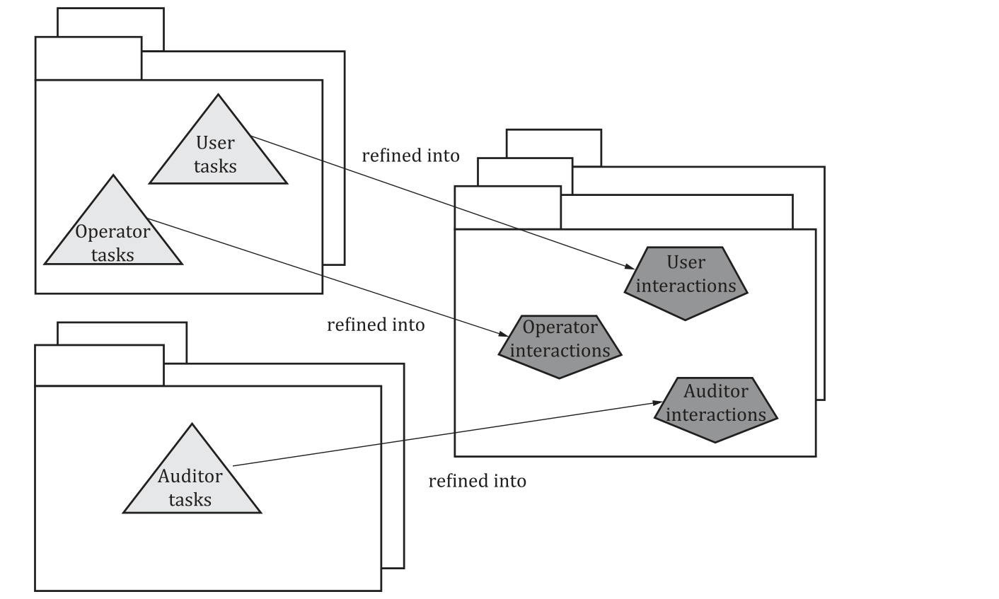

**Figure A.3 — Example of a correspondence satisfying the Task-Interactions method**

The term “correspondence” is chosen to align with RM-ODP. The correspondence mechanism is designed to be compatible with view correspondences in RM-ODP[2] however, there are some differences. Notable differences are:

a) The term “correspondence” is used in this document rather than “view correspondence”. In RM-

ODP, each view is homogeneous—a single viewpoint language is used per viewpoint specification. In RM-ODP a viewpoint specification is what is referred to in this document as an architecture view (see A.5).

b) This document permits heterogeneous views: each view consists of one or more view components

wherein each can utilize a different modelling convention (see 6.8). It is useful to be able to state a correspondence between view components in different modelling languages, not just between views. Therefore, “view correspondence” is a special case of what is needed in this document, and that term is somewhat misleading in this more general case;

c) RM-ODP view correspondences express binary relations where correspondences in this document express *n*-ary relations;

d) RM-ODP view correspondences are defined on elements of view specifications whereas

correspondences in this document do not need to refer to individual elements of models, but arbitrary AD elements;

e) Correspondences and correspondence methods can be used to identify and express named relations

across ADs.

Mathematically, a correspondence is an *n*-ary relation. A correspondence method is an intentional definition of an *n*-ary relation. Relations include 1-1 mappings (isomorphisms) and functions as special cases, both of which are too restrictive for many applications of correspondences. Relations have useful properties which permit composition, reasoning and allow efficient representation and manipulation (see Reference [42] and references therein).

### A.7 Perspectives on architecture description languages

The term architecture description language (ADL) has been in use since the 1990s in the software, systems and enterprise architecture communities. Within the conceptual model of this document, an ADL is any language for use in describing an architecture.

Early ADLs included Rapide (Stanford),[41] Wright (CMU)[65], and Darwin[37] (Imperial College) . ADLs focused on structural concerns: large-scale system organization expressed in terms of components, connectors and configurations with varying support for framing behavioural concerns. More recently, “wide-spectrum” ADLs have been developed which support a wider range of concerns. These include Architecture Analysis and Description Language (AADL)[57], SysML,[47] and ArchiMate.[61] EXAMPLEs 1 to 3 describe some contemporary ADLs with reference to their relationship to the conceptual model defined in this document.

Within the conceptual model of this document, an ADL is any language for use in describing an architecture. An ADL can be used for a single model kind (e.g. Darwin[37]), multiple model kinds (e.g. UML, Rapide, AADL), a single viewpoint (e.g. ACME[33]), or multiple viewpoints (e.g. ArchiMate, SysML). Therefore, an ADL can be used by one or more specifications of architecture viewpoints to frame identified concerns within an AD.

EXAMPLE 1 ArchiMate[61] organizes ADs into several layers of concerns: Business, Application and Technology (or Infrastructure), specifies several aspects of concerns within each of those layers: Structural, Behavioural and Informational aspects, and defines a number of basic architecture viewpoints for these. Each architecture viewpoint is defined via its own metamodel, relating that architecture viewpoint to others, and specifying the stakeholders, concerns, purpose, layers and aspects.

EXAMPLE 2 The Systems Modelling Language (SysML[47]) is built upon UML. SysML defines several types of diagrams: Activity, Sequence, State Machine, Use Case, Block Definition, Internal Block, Package, Parametric, and Requirement diagrams. In the terms of this document, each SysML diagram type provides a different type of view. SysML provides first-class constructs for Stakeholders, Concerns, Views and Architecture Viewpoint so that users can create new model kind in accordance with this document.

EXAMPLE 3 The Unified Architecture Framework Profile (UAFP[48]) is a modelling language focused on representation of the enterprise and includes language extensions to UML/SysML that allow the extraction of specified and custom models from an integrated AD. The models describe the enterprise (and associated “resources”) from a set of stakeholders’ concerns through a set of predefined architecture viewpoints, specifications of views and associated views Given that in architecture practice multiple models would be created separately from a number of specifications of architecture viewpoints and in multiple versions, to be able to maintain cross-model consistency the UAFP allows the definition of constraints to express this. UAFP is defined as a UML 2 / SysML v1.6 profile, corresponding to the actual domain concepts (UAF concepts and relationships) separately defined in the UAF Domain Meta Model (DMM).[48] This separation allows UAF to be used in conjunction with more than one ADF (such as DoDAF[31] or NAF,[44] for example).

An ADL frames a particular set of concerns for an audience of stakeholders, by defining one or more model kinds together with any other methods or tools. Similar to an ADF or an architecture viewpoint, an ADL is a reusable resource—it is not limited in use to an individual entity or AD.

## Annex B (informative) — Guidelines to specification of architecture viewpoints

### B.1 General

This annex provides a template for preparing specifications of architecture viewpoints and annotated guidelines to a sample of currently available specifications of architecture viewpoints.

### B.2 Template for documenting specification of architecture viewpoints

**B.2.1 Template overview**

A template for the specification of architecture viewpoints is presented. An architecture viewpoint that is documented in this form meets the requirements of 8.1.

The template identifies the contents of a specification of an architecture viewpoint. Each element of the content includes its name (B.2.X), and a brief description of its intended content, and guidance for developing that content. In some cases, additional contents are nested within top-level description contents of the specification.

**B.2.2 Architecture viewpoint name**

The name for the architecture viewpoint. If there are synonyms or other common names by which the architecture viewpoint is known, in addition to the name of the architecture viewpoint, other common names can be identified.

**B.2.3 Architecture viewpoint overview**

An abstract or brief overview of the architecture viewpoint and the related architecture viewpoint features.

**B.2.4 Concerns**

A listing of the architecture-related concerns to be framed by this architecture viewpoint per 8.1 item b). This helps decide whether the related architecture viewpoint will be useful for modelling a particular entity of interest.

A listing of the kinds of issues an architecture viewpoint is not appropriate for to avoid misuse. This can be a good antidote for certain overly used viewpoints and model kinds.

**B.2.5 Stakeholder perspectives**

A listing of any stakeholder perspectives associated with this architecture viewpoint [per 8.1 item b)].

**B.2.6 Aspects**

A listing of the aspects refining the above concerns [per 8.1 item c)] or encompassing potential concerns.

NOTE The identification of concerns, stakeholder perspectives and aspects are intended to assist architects and other stakeholders in determining the utility of this viewpoint for their entity of interest.

**B.2.7 Typical stakeholders**

A listing of the stakeholders expected to be users or audiences for views prepared using this architecture viewpoint [per 8.1 item d)].

NOTE When an architecture viewpoint is selected for use and applied in an AD, it is useful to document the association of actual stakeholders with concerns framed by this viewpoint and related specification (per 6.4).

**B.2.8 Correspondence methods**

A listing of any correspondence methods defined by this viewpoint or its model kinds (per 8.1, 8.2 and 6.9.3).

These methods can be applied across view components, across views within an AD or across ADs.

**B.2.9 Specification of model kinds**

#### B.2.9.1 General

The architecture viewpoint identifies each model kind [per 8.1 item e)].

For each model kind used, describe its conventions, language or modelling techniques. These are key modelling resources which the specification of the architecture viewpoint makes available that establish the vocabularies for constructing the architecture views.

This document does not require one style for documenting specifications of model kinds. A specification of a model kind can be documented in various ways, including:

a) by specifying a metamodel that defines its core constructs and relationships;

b) by providing a template to be filled in by users;

c) via a language definition, modelling profile or by reference to an existing modelling language;

d) by some combination of these, or other means.

Guidance on methods a) to c) is provided in B.2.9.2 to B.2.9.4.

#### B.2.9.2 Metamodel related to the specification of a model kind

A metamodel presents one or more constructs which are the AD elements that comprise the vocabulary of the model kind and its specification. There are various ways of representing metamodels. The metamodel will present:

- entities: What are the major sorts of elements that are present in models of this kind?

- attributes: What properties do entities possess in models of this kind?

- relationships: What relations are defined among entities in models of this kind?

- constraints: What kinds of constraints are there on entities, attributes and/or relationships in

models of this kind?

Within an AD, instances of entities, attributes, relationships and constraints are AD elements in the sense of 5.2.9.

NOTE When specification of an architecture viewpoint specifies multiple model kinds it can be useful to specify a single architecture viewpoint related metamodel unifying the definition of the model kinds. Furthermore, it is often helpful to use a unified metamodel to express a set of related architecture viewpoints (such as when defining an ADF or ADL).

#### B.2.9.3 Templates of specifications of model kinds

Provide a template or form specifying the format or expected content of view components governed by this model kind specification.

Each such template, form, or their parts, can have a legend to be used when this model kind is used within an AD.

#### B.2.9.4 Language related to the specification of a model kind

Identify an existing notation or modelling language or define one that can be used when applying this model kind in an AD. Describe its syntax, semantics, and tool support, as needed.

**B.2.10 View methods**

Define methods available on views. (see 5.2.10 and 8.3).

**B.2.11 Examples**

This subclause provides examples for users.

**B.2.12 Notes**

Any additional information that users of this specification may need or find helpful.

**B.2.13 Sources**

Identify the sources for this specification, if any, including author, history, literature references and prior art [per 8.1 item g)].

### B.3 Resources for specifications of architecture viewpoints

The following represent some resources for well-documented specifications of architecture viewpoints. Not all of these are documented in accordance with the requirements of this document but can be used in an AD or included in an ADF specification in a conforming manner.

- Callo-Arias, America, and Avgeriou, “Defining execution viewpoints for a large and complex

software-intensive system”[27].

The source above documents an “execution viewpoint catalog” for understanding the execution of complex software-intensive systems. The four architecture viewpoints are specified: Execution Profile, Execution Deployment, Resource Usage and Execution Concurrency. Correspondence methods between the architecture viewpoints are also included.

- Clements, et al., “Documenting Software Architectures: views and beyond”[28].

The source above provides extensive resources for defining 3 categories of specifications of architecture viewpoints. These categories, called viewtypes, are Module, Component and Connector and Allocation viewtypes. Within each viewtype, a number of styles are defined.

- Eeles and Cripps, “The Process of Software Architecting”[32].

The source above defines a process for software architects, using the IEEE 1471-2000[1] model as a foundation. Provides a template for specifications of architecture viewpoints and architecture viewpoint catalogues including: Requirements, Functional, Deployment, Validation, Application, Infrastructure, Systems Management, Availability, Performance, Security; and the “work products” (i.e. model kind specifications) for each.

- Architecture viewpoint Repository[64]

The website is a repository for architecture viewpoints specified by the community.

- Kruchten, “The ‘4+1’ view model of software architecture”[40]

The source above specifies architecture viewpoints for Logical, Development, Process and Physical views. The resulting views are integrated via Scenarios.

- Rozanski and Woods, “Software Systems Architecture: Working with Stakeholders Using Viewpoints

and Perspectives”[54]

The source above defines a catalogue of architecture viewpoints: Functional, Information, Concurrency, Development, Deployment and Operational viewpoints and perspectives (see 5.2.4): Security, Performance and Scalability, Availability and Resilience, and Evolution perspectives for software- intensive systems.

NOTE Rozanski and Woods’ perspectives do not fit the definition in this document.

## Annex C (informative) — Relationship to other standards

### C.1 General

This annex illustrates how ADs created in accordance with this document can meet the requirements of other standards. This document specifies the core terminology and the concepts usable for AD. Other standards can use this document as a normative reference in order to define one or more architecture viewpoints, concerns, aspects and perspectives to be used in ADs within projects and enterprises.

### C.2 Use with ISO/IEC/IEEE 42020

ISO/IEC/IEEE 42020 specifies requirements, recommendations and permissions for architecture processes suitable for the enterprise, organization or project. In this reference document, AD is mainly addressed by a process called “architecture elaboration”, explaining how to describe or document an architecture in a sufficiently complete and correct manner for the intended uses of the architecture. Nevertheless, another ISO/IEC/IEEE 42020 process, called “architecture conceptualization”, can be undertaken to serve as the basis for an AD in order to characterize the problem space and determine suitable solutions that address stakeholder concerns, achieve architecture objectives and meet relevant requirements. Both architecture conceptualization and architecture elaboration are specified in ISO/IEC/IEEE 42020 through an extensive set of activities, tasks, outcomes and work products. Recognizing that particular projects or organizations do not need to use all of the processes specified by this document, full conformance and tailored conformance are defined to accommodate a flexible implementation approach to claim conformance to ISO/IEC/IEEE 42020.

### C.3 Use with ISO/IEC/IEEE 42030

ISO/IEC/IEEE 42030 provides a conceptual foundation for examining architecture related information that can help determine facts about the architecture. It provides a generic, conceptual guiding framework that can be used for the planning, execution, and documentation of architecture evaluations. The elements presented can be used to determine architecture value, determine architectural characteristics, validate whether an architecture can address evaluation criteria, validate whether the architecture addresses current and future stakeholder needs, and also provide inputs to decisions made at the operational and tactical levels. ISO/IEC/IEEE 42030 proposes three tiers for architecture evaluation. The evaluation synthesis tier aids in combining results from multiple value assessments to determine to what extent the evaluation objectives will be achieved. The value assessment tier aids in determining the amount and kind of value a stakeholder can expect from the architecture. The architectural analysis tier aids in examining the key attributes of an architecture, or the relevant attributes of the architecture entity, as well as actual or potential impacts on stakeholders or on the environment. In ISO/IEC/IEEE 42030, AD is considered to help determine the different architecture concepts and architecture related information necessary for the purposes of architecture evaluation. Nevertheless, AD is considered in order to determine the value due to an architecture and quality characteristics exhibited by the entity and its architecture.

### C.4 Use with ISO 15704

ISO 15704 specifies a reference base of concepts and principles for enterprise architectures that enable enterprise development, enterprise integration, enterprise interoperability, human understanding

and computer processing and further specifies requirements for models and languages created for expressing such enterprise architectures.

ISO 15704 specifies those terms, concepts and principles considered necessary to address stakeholder concerns and to carry out enterprise creation programs as well as any incremental change projects required by the enterprise throughout the whole life of the enterprise and forms the basis by which enterprise architecture and modelling standards can be developed or aligned.

ISO 15704 does not present or adopt specific methodologies for creating or using enterprise architectures or models but does utilize this document as a source of some terminology and overall characterization of an architecture description. However, the focus is on establishing a reference base capable of supporting specific enterprise programs, rather than a design intended to fulfil the stated requirements.

ISO 15704 identifies an extensive collection of potential artefacts for expressing an enterprise- referencing architecture and its associated methodologies. Not all of these artefacts will be applicable, necessary or even desirable for all architecting efforts. The identification of these artefacts assures that this document meets the needs of the widest possible number of enterprise-referencing architecture and methodology situations. Users of this document need to assess not only the value of generating an identified artefact but also the value of maintaining that artefact under the changing circumstances of the referenced enterprise.

The approach taken in ISO 15704 is the use of systems thinking and systems theory in enterprise architecture and about how it is possible to reconcile and understand, based on a single overarching framework, the interplay of two major enterprise change endeavours: enterprise engineering (i.e. deliberate change) and evolutionary, organic change. This approach has stood the test of time in diverse applications [51].

ISO 15704 is concerned with the complete life cycle architecture of entities in an enterprise context and advocates model-based architecting and a framework to be used for organizing models of these entities.

Accordingly, a modelling framework is to provide the means (dimensions) to organize models according to:

- The extent of abstraction used by the model, such as covering identity, concept, requirements,

preliminary (architectural) design, detailed design, build/implementation, operation and decommissioning. (Note that the scope of ISO 15704 is therefore broader than architectural design.)

- The type of information (or aspect) about the entity as conveyed by the model (function, information,

resource, and organization), which characterizes viewpoints across extents of abstraction.

- The scope of information covered (models describing mission fulfilment and mission control)

- The scope according to the means of implementation (models describing human-implemented and

technology-implemented parts of the entity)

In addition, ISO 15704 provides a categorization of models according to a genericity-to-specificity axis. Accordingly, in a modelling framework there is a continuum, covering

- Generic models that capture the semantics of concepts used across all of the dimensions of enterprise

modelling in the domain of interest. Typical representations of generic models (in increasing level of formality) include taxonomies, meta-models, and ontological theories. The level of detail of meta- models would vary depending on the domain (examples include ISO 19440, UAF domain meta- model, etc.)

- Partial models, which are reusable, paradigmatic, typical models (or model fragments, or model

building blocks) that capture characteristics common to many enterprises within or across one

or more industrial sectors. Combined with the extent of abstraction axis this provides for the organization of models.

An important kind of partial model is a reference model, which captures the common characteristics of a set of particular entities, such as the model of a product line, or a collection of models covering the architecture of a product line.

NOTE Most ISO standards can be represented as partial models or reference models.

- Particular models, each describing an individual entity of interest.

An example of a modelling framework is provided in ISO 15704:2019 Annex B (GERAM) and ISO 19439, which latter is an elaboration of GERAM’s GERA Modelling Framework (see Figure C.1).

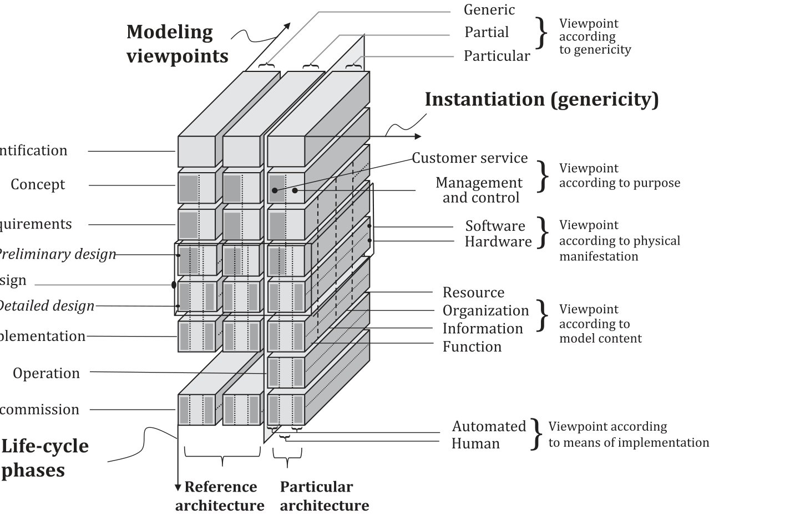

**Figure C.1 — Depiction of GERA modelling framework**

Practitioners may use a tool-supported architecture modelling framework (AMF) to organize models as above, because in this way various views of these models can be produced and packaged for stakeholder consumption as proposed by architecture description frameworks (ADFs).

This approach is more economical than updating views and propagating the effects of such updates across multiple views, because often the same model can be used to extract from it a multitude of views (both in form and level of detail, according to stakeholder viewpoints); this will eliminate many correspondence problems across views that otherwise may arise if using purely description-based architecture views.

Another distinguishing feature of the GERAM approach is the use of recursion and iteration to manage the complicated relationships within an enterprise and its supply chain (see Figure C.2).

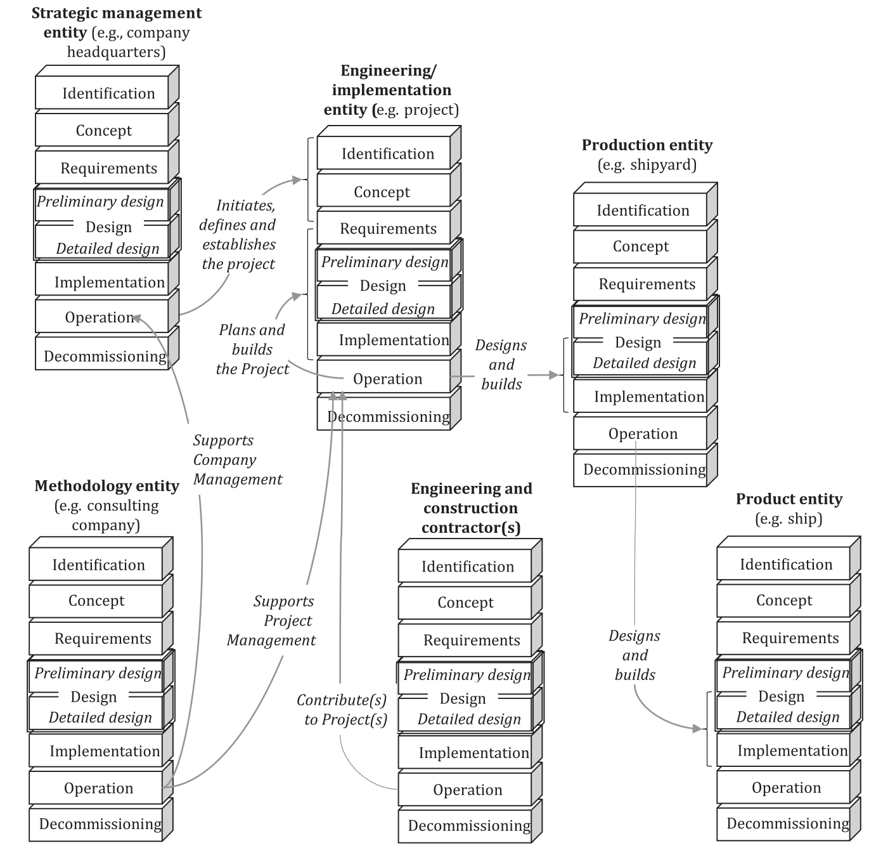

**Figure C.2 — Recursive use of ADs that iterate life cycle modelling phases**

### C.5 Use with ISO/IEC/IEEE 12207

ISO/IEC/IEEE 12207 defines one process specifically pertaining to software architecture: architecture definition (see ISO/IEC/IEEE 12207). The concept of architecture in this document is consistent with the architectural design processes of ISO/IEC/IEEE 12207. However, ISO/IEC/IEEE 12207 places requirements on an AD in addition to those of this document. Specifically, an architecture definition needs to include an identification of the architecture entities included in the software and an allocation of key stakeholder concerns and critical software requirements to those items.

As observed in the NOTE accompanying ISO/IEC/IEEE 12207:2017, 6.4.4.3 c) 2), architecture is not necessarily concerned with all requirements, but rather only with those that drive the architecture, hence the focus of the architecture definition process on the critical software requirements.

The expected use of an AD can include other ISO/IEC/IEEE 12207 processes. In particular, an AD is used to communicate the architecture to the Design Definition process and can be used to facilitate the communications between the acquirer and the developer roles in other software life cycle processes.

An AD can conform to this document and to ISO/IEC/IEEE 12207.

### C.6 Use with ISO/IEC/IEEE 15288

ISO/IEC/IEEE 15288 defines one process specifically pertaining to system architecture: architecture definition. The concept of architecture in this document is consistent with the architecture definition process of ISO/IEC/IEEE 15288. However, ISO/IEC/IEEE 15288 places requirements on an AD in addition to those herein. Specifically, an architecture definition needs to include an identification of the architecture entities included in the system and an allocation of key stakeholder concerns and critical system requirements to those items. These can be achieved in various ways, such as by creating decomposition and allocation architecture viewpoints, or through use of correspondences.

As observed in the NOTE accompanying ISO/IEC/IEEE 15288:2015, 6.4.4.3 c) 2), architecture is not necessarily concerned with all requirements, but rather only with those that drive the architecture, hence the focus of the architecture definition process on the critical system requirements.

The expected uses of an AD can include other ISO/IEC/IEEE 15288 processes. In particular, an AD is used to communicate the system architecture to the design definition process and can be used to facilitate the communications between the acquirer and the developer roles in other system life cycle processes.

An AD can conform to this document and to ISO/IEC/IEEE 15288.

### C.7 Use with open distributed processing standards

**C.7.1 General**

The reference model of open distributed processing (RM-ODP)[2] defines an ADF for distributed processing systems; systems “in which discrete components may be located in different places, or where communication between components may suffer delay or may fail.” (see ISO/IEC 10746-2).

The RM-ODP framework defines five viewpoints for specifying ODP systems and a set of correspondences between them.

For each viewpoint, there is an associated viewpoint language which defines “the concepts and rules for specifying ODP systems from the corresponding viewpoint”.

An AD conforming to this document and using ISO/IEC 10746-3 would include the viewpoints defined by ISO/IEC 10746-3 and views to implement these viewpoints. A conforming AD does not need to be limited to the five predefined viewpoints of ISO/IEC 10746-3; the AD can include additional viewpoints and views, as needed.

Elements of that specification specific to ADs (such as stakeholders) are omitted here since they are particular to individual systems. Unless noted, all contents are direct quotes or close paraphrases from ISO/IEC 10746-3.

NOTE ISO/IEC 19793 defines a UML profile for the specification of open distributed processing systems using these viewpoints.

**C.7.2 Enterprise viewpoint**

The enterprise viewpoint frames these concerns:

- the purpose, scope and policies for an ODP system;

- activities undertaken by the system;

- policy statements about the system.

In the enterprise language, an ODP system and its environment are represented as a community of objects. The community is defined in terms of:

- enterprise objects comprising the community;

- roles fulfilled by each of those objects;

- policies governing interactions between enterprise objects fulfilling roles;

- policies governing the creation, usage and deletion of resources by enterprise objects fulfilling

roles;

- policies governing the configuration of enterprise objects and assignment of roles to enterprise

objects;

- policies relating to environment contracts governing the system.

NOTE 1 Roles constrain the behaviour of the objects that fulfil them.

NOTE 2 Policies are defined in terms of permissions, obligations, and prohibitions.

NOTE 3 The enterprise language is defined in ISO/IEC 15414.

**C.7.3 Information viewpoint**

The information viewpoint frames these concerns: the semantics of information and information processing in an ODP system.

The information language is defined in terms of three schemata:

- invariant schema: predicates on objects which always need to be true;

- static schema: state of one or more objects at some point in time;

- dynamic schema: allowable state changes of one or more objects.

**C.7.4 Computational viewpoint**

The computational viewpoint frames these concerns: a functional decomposition of the system into objects which interact at interfaces.

The computational language covers concepts for specifying:

- computational objects;

- interfaces to objects and interface definitions;

- interactions at interfaces, as either operations or continuous streams;

- implicit and explicit bindings and compound binding objects.

**C.7.5 Engineering viewpoint**

The engineering viewpoint frames these concerns: the mechanisms and functions required to support distributed interaction between objects in the system.

The engineering language includes concepts for specifying:

- the structure of communication channels that connect engineering objects, in terms of stubs,

binders, protocols and interceptors;

- templates for providing required transparencies, such as migration, relocation, replication and

failure transparencies.

**C.7.6 Technology viewpoint**

The technology viewpoint frames these concerns: the selection of implementable standards for the system, their implementation and testing.

The technology language includes concepts to:

- capture the choice of technology to be used, in terms of the selection of existing standards or

domain-specific specifications for these technologies;

- express how the specifications for an ODP system are implemented;

- provide support for testing.

## Annex D (informative) — Uses of architecture descriptions

### D.1 General

ADs can be used in a variety of settings and life cycle models. This annex illustrates a few uses of ADs throughout the life cycle of their entities of interest.

### D.2 Uses of architecture descriptions

Uses for ADs include, but are not limited to:

a) as basis for entity design and development activities;

b) as basis to analyse and evaluate alternative implementations of an architecture;

c) as development and maintenance documentation;

d) to support informed technical, investment or other strategic decisions, to reduce or mitigate

attendant risk;

e) documenting essential features of an entity of interest, such as:

1) intended use and environment;

2) principles, assumptions and constraints to guide future change;

3) points of flexibility or limitations of the entity with respect to future changes;

4) architecture decisions, their rationales and implications;

5) recording its architecture styles;

f) as input to automated tools for simulation, system generation and analysis;

g) specifying a group or family of entities sharing common features (such as can be codified as a

reference architecture, reference model or product line architecture);

h) communicating among parties involved in the development, production, deployment, operation

and maintenance of an entity of interest streamlining the flow from architecture and system engineering to development;

i) as basis for preparation of acquisition documents (such as requests for proposal and statements of work);

j) communicating among clients, acquirers, suppliers and developers as a part of contract negotiations;

k) documenting the characteristics, features and design of an entity for potential clients, acquirers,

owners, operators and integrators;

l) planning for transition from a legacy architecture to a new architecture;

m) as guide to operational and infrastructure support and configuration management;

o) establishing criteria for certifying implementations for compliance with an architecture;

p) as compliance mechanism to external, program-, project- or organization-specific policies (for

example legislation, or overarching architecture principles adopted by governance);

q) as basis for review, analysis, and evaluation of the entity throughout its life cycle;

r) as basis to analyse and evaluate alternative architectures;

s) sharing lessons learned and reusing architectural knowledge through definition of architecture viewpoints, architecture patterns and architecture styles;

t) training and education of stakeholders and other parties on best practices in architecting and evolution;

u) as evidence for entity functional and non-functional properties;

v) scenario-based simulation.

NOTE Annex C discusses the use of ADs in the context of other standards.

## Annex E (informative) — Architecture and architecture description life cycles

### E.1 General

ADs can be used in a variety of settings and life cycle models. This annex illustrates a few concepts pertaining to architecture life cycles and AD life cycles.

### E.2 Architecting in the life cycle

Architecting contributes to the conceptualization, development, operation and maintenance of an entity from its initial conception through its operation, refurbishment or final retirement from use, and eventual disposal.

Architecting can take place throughout the life cycle of the entity, not necessarily only within the early stage of its life. Therefore, an entity’s architecture potentially influences processes throughout the entity’s life cycle. While it is expected that the architecture of an entity remains stable over a longer period, from time to time the architecture of the entity (or a part of the entity) can incrementally evolve. Less frequently an entity can go through a significant transformation, with necessary re-architecting being performed.

ADs are the work products resulting from the execution of architecting efforts to transmit, share and record the architecture of the entity and associated decisions across the life cycle. The original and subsequent (incremental or extensive) architecting efforts communicate and document the outcome from using ADs. The status and history of solution alternatives and versions are expressed as architecture descriptions.

NOTE 1 ISO/IEC/IEEE 15288 and ISO/IEC/IEEE 12207 describes the architecture definition process. ISO/IEC/IEEE 42020 complements this definition toward a complete set of architecture processes in support of architecting efforts.

The developed models and other information parts, as well as the ADs themselves, each have their own life cycle. During architecture development the need for the architecture is identified, the architecture concepts are defined, its details are elaborated, trade-offs and possible realizations are analysed, evaluated and approved, and released for use, then utilized. Later the AD can be updated, and new versions released. Ideally the stages of utilization are long and stable, because of the efficiencies achieved by using a shared architecture in the life cycle of multiple entities. Therefore, the architecture of the entity(ies) of interest has its own life cycle.

Conversely, the life cycle of any entity is fundamentally influenced by the life cycle of its architecture. For example, investment decisions to create a project to develop a system of systems based upon the existing systems in a service ecosystem heavily depend on the existence of a stable, trusted, shared and agreed-upon architecture of its integrating infrastructure. When planning the life cycle stages of an entity, the plan will take into account the predicted life cycle stages of the chosen architecture.

The process of architecting involves thinking about the entity of interest from multiple perspectives, and these perspectives correspond to life cycle phase activities. For example, the architect will consider the entity from the business perspective, including the entity’s identity, as well as the concept of the entity (such as its role in the market, the capabilities, the relationships to the business context, and the policies and principles that need to govern the solution). The architect will also consider the high-level requirements that the entity needs to satisfy (functional and non-functional requirements), and from the business analyst’s perspective translate this to a specification. The architect will also translate

these requirements to an architectural solution, which is a preliminary design of the entity of interest and prepare the solution for evaluation.

The phases (identity definition, concept development, requirements definition, preliminary design, as defined in ISO 15704) are activity types that are normally iterated within the architecture development stage (as defined in ISO/IEC/IEEE 15288 and ISO/IEC/IEEE 12207) until the relevant stakeholder questions can all be addressed in a satisfactory manner. The concept of phase is therefore referring to a type of activity, whereupon instances of that activity are repeated as necessary during a stage and typically across multiple future stages of the entity’s life.

The need for iterations depends on multiple factors, such as the innovation content of the architecture development, skills and maturity of the organization, the availability of reference architectures or patterns that can be reused, and the methodology used.

It is typical for architecture development to be performed in the organizational setting of a project or program, in which case the program and its projects need to be architected as well, as entities in their own right. The same is true in the setting of systems of systems and of supporting systems (as defined in ISO/IEC/IEEE 15288 and ISO/IEC/IEEE 24748-1), each of these systems are implemented as entities that would need to be architected if not pre-existing.

In the process of architecture development architects must engage in two-way communication with stakeholders – both for getting informed and to inform. Work products incorporate various information parts (more and more often various models), which then form the basis of creating ADs that are in a form that stakeholders and architects mutually understand and that satisfy the goal of architecting as defined by architecture governance and management.

This document does not depend upon, assume or prescribe any particular life cycle.

NOTE 2 Annex C demonstrates how this document can be used when applying the life cycle processes of ISO/IEC/IEEE 12207 and ISO/IEC/IEEE 15288. ISO/IEC/IEEE 42020 specifies a set of processes for architecting, and for architecture governance, management, and enablement within the context of a life cycle.

## Annex F (informative) — Architecture description frameworks

### F.1 General

This annex provides examples of ADFs and the way they use the concepts defined in 5.4.2 (see Figure 6). Each of them conforms to applicable requirements of 7.1.

### F.2 Evolution of ADFs

In systems and software engineering, the notion of ADF dates back to the 1970s.[31][67][29] The motivation for definition of the term (3.5) and its specification (see 7.1) in this document is to provide a means of evolving existing and future ADFs in a uniform manner to promote sharing of information about entities, architectures and techniques for AD, better uniformity to enable improved understanding of the architectures being described, and interoperability between architecture communities who use different conceptual foundations. The uniform definition of architecture viewpoints and coordinated collections of associated specifications can promote reuse of tools and techniques by the communities using these frameworks.

The specification of ADF is intended to establish the relationships between an ADF and other concepts in this document (illustrated in Figure 2 and Figure 6). ADFs often include additional content, prescriptions and relationships, such as process guidance, life cycle connections, and documentation formats, not defined by this document. These are potential future areas of standardization.

### F.3 ADF concepts

**F.3.1 ADF domains**

Various architecture frameworks have been in existence over a few decades.

EXAMPLE GERA Framework provided by ISO 15704, Industrial Internet Architecture Framework,[36] Kruchten’s “4+1” view model,[40] NATO Architecture Framework (NAF),[44] US Department of Defence Architecture Framework (DoDAF),[31] OASIS - Reference Architecture Foundation for Service Oriented Architecture,[45] Reference Model for Open Distributed Processing (RM-ODP),[2][3][4] The Open Group’s Architecture Framework(TOGAF),[62] OMG’s Unified Architecture Framework,[48] and Zachman’s information systems architecture framework[67].

NOTE GERAM provides an ADF for an enterprise architecture modelling activity and is therefore a modelling framework covering the whole of life for an entity of interest.

Most of them are dedicated to creating ADs in different domains like:

- Zachman[67] and TOGAF[62] for information systems;

- Kruchten’s “4+1” view model[40] for software;

- NAF,[44] DoDAF[31] and UAF[48] for enterprises and systems of systems;

- GERA (ISO 15704) for enterprise modelling of socio-technical systems of systems, e.g. industrial

automation, transformation, critical infrastructure.

**F.3.2 Identification of stakeholders and definition of their perspectives**

Some ADFs like Zachman[67] clearly identify typical stakeholders like: Planner, Owner, Designer, Builder, Implementer and User.

Others identify stages in the AD related to a class of typical stakeholders like: The Open Group’s Architecture Framework (TOGAF),[62] with Business Architecture, Information System Architecture and Technology Architecture.

Others identify stakeholder perspectives like:

- UAF[48] with “domains”: Architecture Management, Strategic, Operational, Services, Personnel,

Resources, Security, Projects, Standards, and Actual Resources;

- ArchiMate[61] with “layers”: Strategy, Business, Application, Technology, Physical, Implementation,

and Migration;

- NAF[44] with “subjects of concerns”: concept specification, service specification, logical specification,

physical resource specification, and architecture meta-data;

- DoDAF[31] with “viewpoints”: Capability, Operational, Services, Systems, Standards, and Data and

Information;

- GERA (ISO 15704) with “levels of abstraction” or “life cycle phases”: Identity, concept, requirements,

preliminary design, detailed design, implementation, operation and decommissioning.

**F.3.3 Definition of aspects**

ADFs organize the properties and features of architecture models and views in various ways, such as:

- Zachman[67] with “interrogatives”: What, How, Where, Who, Where, Why;

- NAF[44] with “aspects of concerns”: Taxonomy, Structure, Connectivity, Processes, States, Sequences,

Information, Constraints and Roadmap;

- UAF[48] with “model kinds”: Motivation, Taxonomy, Structure, Connectivity, Processes, States,

Sequences, Information, Parameters, Constraints, Roadmap and Traceability.

ADFs attempt to generalize or harmonize multiple particular ADs to offer guidance for creation of new particular cases by specifying generic stakeholder perspectives and generic aspects (see Zachman[67] [66] and others).

**F.3.4 Specification of architecture viewpoint**

An ADF generally specifies architecture viewpoints providing specifications of model kinds to frame typical concerns and to govern the architecture views and ease understanding of the legends.

EXAMPLE Reference Model for Open distributed (RM-ODP)[3] defines the following concepts: enterprise, information, computational, engineering and technology viewpoint specifications.

ADFs often utilize one or more structural categories to represent distribution of architecture viewpoints in a two-dimensional grid or matrix. See References [38][63] for example. There are some ADFs, such as GERA (ISO 15704) and SABSA[56], which use three or more categories to convey the complexity of describing architectures.

**F.3.5 Specification of formalisms and languages**

Generally the ADFs define their formalism for constructing models with a metamodel: like DoDAF’s[31] DoDAF Metamodel (DM2), UAF’s[48][48] Domain Metamodel (DMM), and NAF’s[44] metamodel (MM).

Some of them also provide languages, which can be used to implement the formalism, like:

- UAF[48][48] with its Profile;

- ArchiMate modelling language[61];

- Constructs for enterprise modelling (ISO 19440).

### F.4 Compliance with ADF requirements

Currently none of the ADF fully comply with all the requirements itemized in 7.1. Nevertheless, each of the items is addressed by several of the ADF and all these items are considered as necessary in an AD. Consequently, the provisions in 7.1 provide areas for improvement for these frameworks.

Table F.1 and Table F.2 show an interpretation of how some of the published ADFs comply with 7.1 requirements.

NOTE In Table F.1 and Table F.2 “Partial” means that the requirement is fulfilled to some degree but is not expressed with explicit wording. “Yes” is used when the requirement is met. “No” states that the requirement is not addressed.

**Table F.1 — ADF requirements compliance (1/2)**

|  | GERA (ISO 15704) | RM-ODP[2] | Zachman[67] | TOGAF[62] |
|---|---|---|---|---|
| Information identi- fying the ADF | Implementation depend- ent | Implementation dependent | Yes | Yes |
| Stakeholder identifi- cation | Organization viewpoint | No | Yes | No |
| Concern identifica- tion | Covered by identification, concept and requirements life cycle phases | Yes (in Viewpoints) | Partial | Partial |
| Aspects | Aspect-oriented views | No | Called “interroga- tives” | No |
| Stakeholder per- spectives | Covered by identification, concept and requirements life cycle phases | No | Yes | Called “phases” |
| Formalism | GERAM Metamodel | UML Profile | No | No |
| Architecture View- point | Aspect-oriented view- points | Viewpoint specifi- cation or viewpoint language | Partial | No |
| Model kinds | Criteria explained | One per viewpoint | Partial | Partial |
| Legends and corre- spondence methods | Partial | Formalized | Partial | Partial |
| Framework methods | GERAM | No | Partial | TOGAF/ADM |

**Table F.2 — ADF requirements compliance (2/2)**

|  | UAF[48] | NAF[44] | DoDAF[31] | ArchiMate[61] |
|---|---|---|---|---|
| Information identi- fying the ADF | Yes | Yes | Yes | Yes |
| Stakeholder identifi- cation | Yes (in view specifica- tions) | No | No | Yes (as part of the "Motivation Elements") |
| Concern identifica- tion | Yes (in view specifica- tions) | Partial | Partial | Yes (in View- points) |

**Table F.2** *(continued)***Table F.2** *(continued)*

|  | UAF[48] | NAF[44] | DoDAF[31] | ArchiMate[61] |
|---|---|---|---|---|
| Aspects | Called “Model kinds” | Called “Aspects of concerns” | No | Called “Aspects” |
| Stakeholder per- spectives | Called “domains” | Called “subjects of concerns” | Called “view- points” | Called “Layers” |
| Formalism | Domain metamodel (DMM) and a Profile | NAF metamodels | DM2 metamodel | ArchiMate Speci- fication |
| Architecture View- point | Called “view specifica- tions” within a Grid | Called “viewpoints” within a Grid | Called “Models” | Called “viewpoint mechanism” |
| Model kinds | Recommended imple- mentations in UAF Pro- file’s view specifications | Partial | Partial | ArchiMate Speci- fication |
| Legends and corre- spondence methods | Partial | Partial | Partial | Partial |
| Framework methods | No | NAF Chapter 2 | 6 Step Approach | No |

## Bibliography

[1] IEEE 1471:2000, *IEEE Recommended Practice for Architectural Description for Software-Intensive* *Systems*

[2] ISO/IEC 10746-1, *Information technology — Open Distributed Processing — Reference model:* *Overview — Part 1:*

[3] ISO/IEC 10746-2, *Information technology — Open distributed processing — Reference model:* *Foundations — Part 2:*

[4] ISO/IEC 10746-3, *Information technology — Open distributed processing — Reference model:* *Architecture — Part 3:*

[5] ISO/IEC/IEEE 12207:2017, *Systems and software engineering — Software life cycle processes*

[6] ISO/IEC/IEEE 15288:2015, *Systems and software engineering — System life cycle processes*

[7] ISO/IEC/IEEE 15289:2019, *Systems and software engineering — Content of life-cycle information* *items (documentation)*

[8] ISO/IEC 15414, *Information technology — Open distributed processing — Reference model —* *Enterprise language*

[9] ISO 15704:2019, *Enterprise modelling and architecture — Requirements for enterprise-referencing* *architectures and methodologies*

[10] ISO 19439:2006, *Enterprise integration — Framework for enterprise modelling*

[11] ISO 19440:2020, *Enterprise modelling and architecture — Constructs for enterprise modelling*

[12] ISO/PAS 19450:2015, *Automation systems and integration — Object-Process Methodology*

[13] ISO/IEC 19793:2015, *Information technology — Open Distributed Processing — Use of UML for* *ODP system specifications*

[14] ISO/IEC 20246:2017, *Software and systems engineering — Work product reviews*

[15] ISO/IEC/IEEE 24748-1:2018, *Systems and software engineering — Life cycle management — Part* *1: Guidelines for life cycle management*

[16] ISO/IEC/IEEE 24765:2017, *Systems and software engineering — Vocabulary*

[17] ISO/IEC 25010:2011, *Systems and software engineering — Systems and software Quality* *Requirements and Evaluation (SQuaRE) — System and software quality models*

[18] ISO/IEC 25012:2008, *Software engineering — Software product Quality Requirements and* *Evaluation (SQuaRE) — Data quality model*

[19] ISO/IEC 25024:2015, *Systems and software engineering — Systems and software Quality* *Requirements and Evaluation (SQuaRE) — Measurement of data quality*

[20] ISO/IEC 33001:2015, *Information technology — Process assessment — Concepts and terminology*

[21] ISO/IEC TS 33060:2020, *Information technology — Process assessment — Process assessment* *model for system life cycle processes*

[22] ISO/IEC/IEEE 42010:2011, *Systems and software engineering — Architecture description*

[23] ISO/IEC/IEEE 42020:2019, *Software, systems and enterprise — Architecture processes*

[24] ISO/IEC/IEEE 42030:2019, *Software, systems and enterprise — Architecture evaluation framework*

[25] Atkinson C., Gerbig R., Tunjic C., “A multi-level modelling environment for SUM-based software engineering”, Proceedings of the 1st Workshop on View-Based, Aspect-Oriented and Orthographic Software Modelling (VAO '13), ACM Press, 2013

[26] Boucké N., Composition and relations of architectural models supported by an architectural description language. Doctoral dissertation, Katholieke Universiteit Leuven, October 2009

[27] Callo-Arias T.B., America P., Avgeriou P., “Defining execution viewpoints for a large and complex software-intensive system”, Proceedings of WICSA/ECSA 2009

[28] Clements P., Bachmann F., Bass L., Garlan D., Ivers J., Little R. et al., Documenting Software Architectures: Views and Beyond. Addison-Wesley, Boston, 2002

[29] Darnton G., Giacoletto S., Information in the Enterprise. Digital Press, Burlington, MA, 1992

[30] Dijkstra E.W., On the role of scientific thought. 1974. https:// www .cs .utexas .edu/ users/ EWD/ transcriptions/ EWD04xx/ EWD447 .html

[31] DoD Architecture Framework, version 2.02, https:// dodcio .defense .gov/ library/ dod -architecture -framework/

[32] Eeles P., Cripps P., The Process of Software Architecting. Addison Wesley, 2010

[33] Garlan D., Monroe R.T., Wile D., ACME: An Architecture Description Interchange, Proceedings of the 1997 conference of the Centre for Advanced Studies on Collaborative research, 7-22.

[34] Heidel R., The Reference Architecture Model RAMI 4.0 and the Industrie 4.0 component, 2019

[35] Hilliard R., “Viewpoint modelling”, First ICSE Workshop on Describing Software Architecture with UML, May 2001

[36] Industrial Internet Architecture Framework https:// www .iiconsortium .org/

[37] Magee J., Kramer J., Dynamic structure in software architectures, ACM SIGSOFT Foundations of Software Engineering (FSE), pages 3-14, 1996, Conference Sa Francisco CA October 16-18, 1996

[38] Josey A, Lankhorst M, Band I, Jonkers H, Quartel D., “An Introduction to the ArchiMate® 3.0 Specification”, June 2016

[39] Kiczales G., Lamping J., Menhdhekar A., Maeda C., Lopes C., Loingtier J.M. et al., Aspect- oriented programming. In Akșit, M., Matsuoka, S., eds.: Proceedings European Conference on Object-Oriented Programming. Volume 1241. Springer-Verlag, Berlin, Heidelberg, and New York (1997) 220–242

[40] Kruchten P.B., The ‘4+1’ View Model of Architecture. IEEE Softw. 1995, **12** (6) pp. 45–50

[41] Luckham D.C., Kenney J.J., Augustin L.M., Vera J., Bryan D., Mann W., Specification and analysis of system architecture using Rapide. IEEE Trans. Softw. Eng. 1995 April, **21** (4) pp. 336– 355

[42] Muskens J., Bril R.J., Chaudron M.R.V., “Generalizing consistency checking between software views”, Proceedings of the 5th Working IEEE/IFIP Conference on Software Architecture (WICSA’05), 169–180, Washington, DC: IEEE Computer Society, 2005

[43] Nuseibeh B., Kramer J., Finkelstein A., A framework for expressing the relationships between multiple views in requirements specification. IEEE Trans. Softw. Eng. 1994, **20** (10) pp. 760–773

[44] NATO. Architecture Framework version 4, https:// www .nato .int/ cps/ en/ natohq/ topics _157575 .htm

[45] OASIS, Reference Architecture Foundation for Service Oriented Architecture Version 1.0

[46] OMG Business Process Model and Notation (BPMN™), https:// www .omg .org/ spec/ BPMN/ About -BPMN/

[47] Systems Modelling Language Object Management Group https:// www .omg .org/ spec/ SysML/ About -SysML/

[48] Unified Architecture Framework Object Management Group https:// www .omg .org/ spec/ UAF/ About -UAF/

[49] Unified Modelling Language Object Management Group , (UML®), https:// www .omg .org/ spec/ UML/ About -UML/

[50] OMG UML Profile for DoDAF/MODAF https:// www .omg .org/ updm/

[51] Bernus Peter, *Richard Martin, Ovidiu Noran, and Arturo Molina. IFIP WG5.12 Architectures for* *Enterprise Integration: Twenty-Five Years of the GERAM Framework*, in Goedicke M. et al., (Eds.): Advancing Research in Information and Communication Technology, IFIP AICT 600, pp. 1–24, 2021. https:// doi .org/ 10 .1007/ 978 -3 -030 -81701 -5 _10

[52] Ran A., “*ARES Conceptual Framework for Software Architecture*”, M. Jazayeri, A. Ran, and F. van der Linden (eds.), Software Architecture for Product Families Principles and Practice, Boston: Addison-Wesley, 1–29, 2000

[53] Ross D.T., Structured Analysis (SA): a language for communicating ideas. IEEE Trans. Softw. Eng. 1977, **SE-3** (1) pp. 16–34

[54] Rozanski N., Woods E., Software Systems Architecture: Working with Stakeholders Using Viewpoints and Perspectives. Addison-Wesley, 2005

[55] Sabetzadeh M., Finkelstein A., Goedicke M., “Viewpoints”, P. Laplante (ed.), Encyclopedia of Software Engineering, Taylor and Francis, 2010

[56] SABSA Institute Resource, The SABSA White Paper, W100, Published 2009

[57] Society of Automotive Engineers, Architecture Analysis & Design Language, http:// www .aadl .info/

[58] Shaw M., Prospects for an engineering discipline of software. IEEE Softw. 1990 November

[59] Smolander K., “Four Metaphors of Architecture in Software Organizations: Finding out The Meaning of Architecture in Practice”, Proceedings of the 2002 International Symposium on Empirical Software Engineering (ISESE’02)

[60] ISO/IEC/IEEE 31320-1:2012, *Information technology — Modeling Languages — Part 1: Syntax and* *Semantics for IDEF0*

[61] The Open Group, ArchiMate Specification, https:// www .opengroup .org/ archimate -forum/ archimate -overview

[62] The Open Group Architecture Framework (TOGAF) https:// www .opengroup .org/ togaf/

[63] Unified Architecture Method (UAM) https:// www .unified -am .com/ UAM/ index .htm

[64] Viewpoints Repository for ISO/IEC/IEEE 42010, http:// www .iso -architecture .org/ viewpoints/

[65] Wright ADL website, http:// www .cs .cmu .edu/ ~able/ wright/

[66] XP Z67-140 Information Technology –ARCADIA– Method for Systems Engineering supported by its conceptual modelling language –General Description– Specification of the engineering definition method and the modelling language, AFNOR

[67] Zachman J.A., A Framework for Information Systems Architecture. IBM Syst. J. 1987, **26** (3)

## IEEE Notices and Abstract

**Important Notices and Disclaimers Concerning IEEE Standards Documents**

IEEE Standards documents are made available for use subject to important notices and legal disclaimers. These notices and disclaimers, or a reference to this page (https:// standards .ieee .org/ ipr/ disclaimers .html), appear in all standards and may be found under the heading “Important Notices and Disclaimers Concerning IEEE Standards Documents.”

**Notice and Disclaimer of Liability Concerning the Use of IEEE Standards Documents**

IEEE Standards documents are developed within the IEEE Societies and the Standards Coordinating Committees of the IEEE Standards Association (IEEE SA) Standards Board. IEEE develops its standards through an accredited consensus development process, which brings together volunteers representing varied viewpoints and interests to achieve the final product. IEEE Standards are documents developed by volunteers with scientific, academic, and industry-based expertise in technical working groups. Volunteers are not necessarily members of IEEE or IEEE SA, and participate without compensation from IEEE. While IEEE administers the process and establishes rules to promote fairness in the consensus development process, IEEE does not independently evaluate, test, or verify the accuracy of any of the information or the soundness of any judgments contained in its standards.

IEEE does not warrant or represent the accuracy or completeness of the material contained in its standards, and expressly disclaims all warranties (express, implied and statutory) not included in this or any other document relating to the standard, including, but not limited to, the warranties of: merchantability; fitness for a particular purpose; non-infringement; and quality, accuracy, effectiveness, currency, or completeness of material. In addition, IEEE disclaims any and all conditions relating to results and workmanlike effort. In addition, IEEE does not warrant or represent that the use of the material contained in its standards is free from patent infringement. IEEE Standards documents are supplied “AS IS” and “WITH ALL FAULTS.”

Use of an IEEE standard is wholly voluntary. The existence of an IEEE Standard does not imply that there are no other ways to produce, test, measure, purchase, market, or provide other goods and services related to the scope of the IEEE standard. Furthermore, the viewpoint expressed at the time a standard is approved and issued is subject to change brought about through developments in the state of the art and comments received from users of the standard.

In publishing and making its standards available, IEEE is not suggesting or rendering professional or other services for, or on behalf of, any person or entity, nor is IEEE undertaking to perform any duty owed by any other person or entity to another. Any person utilizing any IEEE Standards document, should rely upon his or her own independent judgment in the exercise of reasonable care in any given circumstances or, as appropriate, seek the advice of a competent professional in determining the appropriateness of a given IEEE standard.

IN NO EVENT SHALL IEEE BE LIABLE FOR ANY DIRECT, INDIRECT, INCIDENTAL, SPECIAL, EXEMPLARY, OR CONSEQUENTIAL DAMAGES (INCLUDING, BUT NOT LIMITED TO: THE NEED TO PROCURE SUBSTITUTE GOODS OR SERVICES; LOSS OF USE, DATA, OR PROFITS; OR BUSINESS INTERRUPTION) HOWEVER CAUSED AND ON ANY THEORY OF LIABILITY, WHETHER IN CONTRACT, STRICT LIABILITY, OR TORT (INCLUDING NEGLIGENCE OR OTHERWISE) ARISING IN ANY WAY OUT OF THE PUBLICATION, USE OF, OR RELIANCE UPON ANY STANDARD, EVEN IF ADVISED OF THE POSSIBILITY OF SUCH DAMAGE AND REGARDLESS OF WHETHER SUCH DAMAGE WAS FORESEEABLE.

**Translations**

The IEEE consensus development process involves the review of documents in English only. In the event that an IEEE standard is translated, only the English version published by IEEE is the approved IEEE standard.

**Official statements**

A statement, written or oral, that is not processed in accordance with the IEEE SA Standards Board Operations Manual shall not be considered or inferred to be the official position of IEEE or any of its committees and shall not be considered to be, nor be relied upon as, a formal position of IEEE. At lectures, symposia, seminars, or educational courses, an individual presenting information on IEEE standards shall make it clear that the presenter’s views should be considered the personal views of that individual rather than the formal position of IEEE, IEEE SA, the Standards Committee, or the Working Group.

**Comments on standards**

**IEEE does not provide interpretations, consulting information, or advice pertaining to IEEE** **Standards documents**

Suggestions for changes in documents should be in the form of a proposed change of text, together with appropriate supporting comments. Since IEEE standards represent a consensus of concerned interests, it is important that any responses to comments and questions also receive the concurrence of a balance of interests. For this reason, IEEE and the members of its Societies and Standards Coordinating Committees are not able to provide an instant response to comments, or questions except in those cases where the matter has previously been addressed. For the same reason, IEEE does not respond to interpretation requests. Any person who would like to participate in evaluating comments or in revisions to an IEEE standard is welcome to join the relevant IEEE working group. You can indicate interest in a working group using the Interests tab in the Manage Profile & Interests area of the IEEE SA myProject system. An IEEE Account is needed to access the application.

Comments on standards should be submitted using the Contact Us form.

**Laws and regulations**

Users of IEEE Standards documents should consult all applicable laws and regulations. Compliance with the provisions of any IEEE Standards document does not constitute compliance to any applicable regulatory requirements. Implementers of the standard are responsible for observing or referring to the applicable regulatory requirements. IEEE does not, by the publication of its standards, intend to urge action that is not in compliance with applicable laws, and these documents may not be construed as doing so.

**Data privacy**

Users of IEEE Standards documents should evaluate the standards for considerations of data privacy and data ownership in the context of assessing and using the standards in compliance with applicable laws and regulations.

**Copyrights**

IEEE draft and approved standards are copyrighted by IEEE under US and international copyright laws. They are made available by IEEE and are adopted for a wide variety of both public and private uses. These include both use, by reference, in laws and regulations, and use in private self-regulation, standardization, and the promotion of engineering practices and methods. By making these documents available for use and adoption by public authorities and private users, IEEE does not waive any rights in copyright to the documents.

**Photocopies**

Subject to payment of the appropriate licensing fees, IEEE will grant users a limited, non-exclusive license to photocopy portions of any individual standard for company or organizational internal use or individual, non-commercial use only. To arrange for payment of licensing fees, please contact Copyright Clearance Center, Customer Service, 222 Rosewood Drive, Danvers, MA 01923 USA; +1 978 750 8400; https:// www .copyright .com/ . Permission to photocopy portions of any individual standard for educational classroom use can also be obtained through the Copyright Clearance Center.

**Updating of IEEE Standards documents**

Users of IEEE Standards documents should be aware that these documents may be superseded at any time by the issuance of new editions or may be amended from time to time through the issuance of amendments, corrigenda, or errata. An official IEEE document at any point in time consists of the current edition of the document together with any amendments, corrigenda, or errata then in effect.

Every IEEE standard is subjected to review at least every 10 years. When a document is more than 10 years old and has not undergone a revision process, it is reasonable to conclude that its contents, although still of some value, do not wholly reflect the present state of the art. Users are cautioned to check to determine that they have the latest edition of any IEEE standard.

In order to determine whether a given document is the current edition and whether it has been amended through the issuance of amendments, corrigenda, or errata, visit IEEE Xplore or contact IEEE. For more information about the IEEE SA or IEEE’s standards development process, visit the IEEE SA Website.

**Errata**

Errata, if any, for all IEEE standards can be accessed on the IEEE SA Website. Search for standard number and year of approval to access the web page of the published standard. Errata links are located under the Additional Resources Details section. Errata are also available in IEEE Xplore. Users are encouraged to periodically check for errata.

**Patents**

IEEE Standards are developed in compliance with the IEEE SA Patent Policy.

**IMPORTANT NOTICE**

IEEE Standards do not guarantee or ensure safety, security, health, or environmental protection, or ensure against interference with or from other devices or networks. IEEE Standards development activities consider research and information presented to the standards development group in developing any safety recommendations. Other information about safety practices, changes in technology or technology implementation, or impact by peripheral systems also may be pertinent to safety considerations during implementation of the standard. Implementers and users of IEEE Standards documents are responsible for determining and complying with all appropriate safety, security, environmental, health, and interference protection practices and all applicable laws and regulations.

**Abstract**

ISO/IEC/IEEE 42010:2022 addresses the creation, analysis and sustainment of architectures of entities through the use of architecture description work products. A conceptual model for architecture description is established. Architecture viewpoint, stakeholder perspectives, architecture aspects, model kinds, architecture description frameworks and architecture description languages are introduced for codifying conventions and common practices of architecture description. The required content is specified for architecture descriptions, architecture viewpoints, architecture description frameworks, architecture description languages, and model kinds. Annexes provide the motivation and background for key concepts and terminology and examples of applying ISO/IEC/IEEE 42010:2022.

**Keywords**: architecture description, architecture view, architecture viewpoint, architecture view component, architecture description framework, architecture description language, architecture decision, architecture rationale, architecture consideration, concern, architecture aspect, stakeholder perspective, model kind, correspondence, correspondence method.

**ICS 35.080** **ISBN 978-1-5044-9155-6 STD25753 (PDF); 978-1-5044-9156-3 STDPD25753 (Print)**
