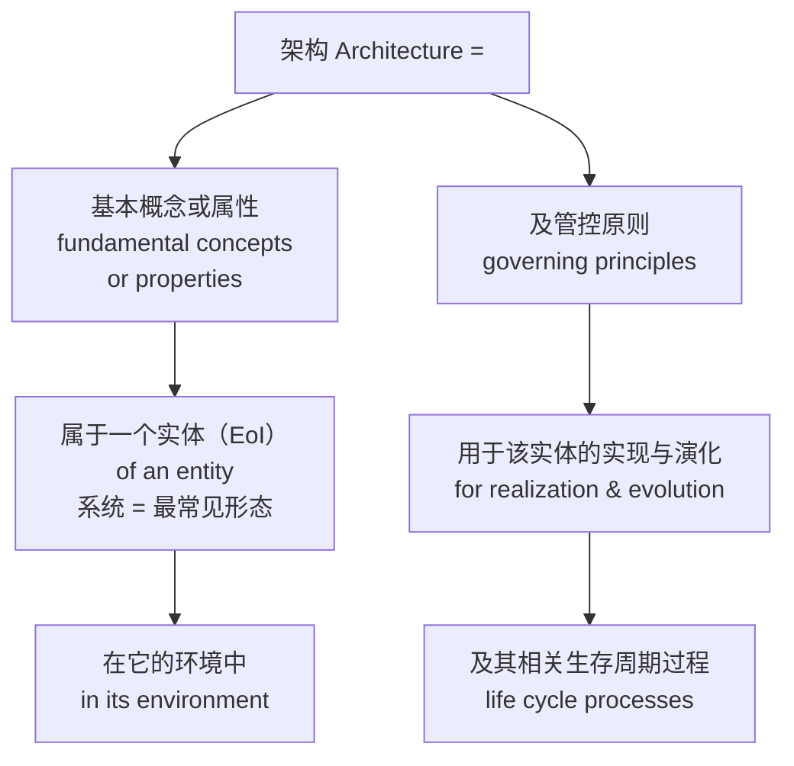

# 00-风格参考 · 一手样本（原文）

> **本文件是什么**：`00-风格参考.md` 的**证据附录**——把该文件所用的**候选书原文样本**与**本书对照单元**逐字集中于此，供复核。判据、指标与结论在 `00-风格参考.md`；**原文在这里**。
> **体例**：样本正文逐字照录（不改写、不节译、不补标点）；样本自带的标题统一**降两级**（`##`→`####`），以免扰乱本文件层级；分段与脚注编号保持原样。**样本内的段落长度、句长一律照原样**——它们不受本书「段落 ≤150 汉字」体例的约束（本书体例只管本书自己的正文，故本文件出现超长段属正常）。
> **版权与用途（务请遵守）**：下列候选书样本均为**短篇引用**，仅用于本项目内部的写作风格分析与复核，**注明出处与版本、不再分发、不随书出版**。**本书正式出版、或本仓库转为公开可见之前，必须移除第二部分（候选书原文）**，只保留出处索引与指标（即 `00-风格参考.md` §四／§五 的内容）。
> **样本来源与证据等级**：逐条见各节「样本信息」行；采集日期均为 2026-09-25。

---

## 第一部分 · 本书对照单元（原文）

> 本书自己的四段文字，与候选书样本一一对读用。出处：`03-架构师是个怎样的物种/` 对应章文件（行号见各节）。

### 一·A　ch10 §10.2.2~§10.2.3（权威定义逐词拆＋双判据）　〔论证体〕

**样本信息**：本书原文（无版权限制）｜字数见 `00-风格参考.md` §3.1

##### 10.2.2 权威定义：ISO/IEC/IEEE 42010 逐词拆解

架构不是软件和系统领域的原住民。它最初是建筑学的词——指承重结构、空间布局。软件工程在 1970 年代借用了它：结构化设计把模块划分、层次关系叫"架构"。

1990 年代系统越做越大，"软件架构"成为一门显学；后由系统与软件工程标准 ISO/IEC/IEEE 42010（现行 2022 版）把"架构"从行业用语定稿成权威定义。下面这份，就是现行权威定义，原文是这样的：

> **Architecture: fundamental concepts or properties of an entity in its environment and governing principles for the realization and evolution of this entity and its related life cycle processes.**
>
> 中文：架构——一个实体在其环境中的基本概念或属性，以及用于该实体及其相关生存周期过程的实现和演化的管控原则。
>
> 本书要讲的"系统"，就是这个"实体"最常见的形态——系统的架构，是它那组基本概念或属性，加上治理它实现与演化的原则。

这句话读起来像绕口令，但它是整个架构领域的"宪法条款"。逐词拆开，每个词都压着一个分量：

**第一块分量，"基本"（fundamental）。** 这是整句定义的核心。架构不关心全部细节，只关心那些"如果改变就会让系统变成另一种系统"的东西（以系统要达成的目的为判据，§10.2.3 展开）。这划清了架构和详细设计的边界——§10.3.5 专门拆它。

**第二块分量，"概念或属性"（concepts or properties）。** 注意原文是"或"（or），不是"和"（and）——中文翻译常写成"概念和属性"，把两个视角当成必须同时具备的两半。其实"or"更宽松：可以从"核心概念是什么"切入（订单是一种交易意图的记录），也可以从"核心属性是什么"切入（数据可追溯）。**两条路都能走到架构，不必同时具备。**

**第三块分量，"属于一个实体、在它的环境中"（of an entity in its environment）。** 现行版的主体是**实体（entity，即关注对象 EoI）**，不限于"系统"——企业、流程、数据、产品都可被架（§10.3.2 注）；本书要讲的系统只是实体最常见的形态。架构不是孤立地描述一个盒子，而是描述它"放在什么环境里"。

M3 的环境是冷链运输：低温车厢、颠簸、信号弱、监管要追溯——环境定义了哪些属性才算"基本"。同一个温控设备，放在实验室台架上，架构可以是"温度控制单元"；放在冷链运输里，必须包括"断链检测与补传"——**环境变了，什么算"基本"就变了。**

**第四块分量，"及管控原则"（governing principles）。** 现行版把"原则"升格成与"概念或属性"并列的一块，还给它一个关键限定——**governing（治理）**：它不再是"被描述、被体现"的清单，而是**有约束力**的管控清单，约束这个实体怎么实现（realization）、怎么演化（evolution）、以及相关生存周期过程（life cycle processes）怎么走。管控原则是架构的核心组成，不是可选的尾巴——它不是建议，是要被守住的东西。

注意标准只有这一句管控原则——它约束这个实体怎么实现、怎么演化及其相关生存周期过程（§10.3.4 展开），立法时"当下把它造对"与"以后怎么变不破坏"两个方向都要被它管住。再往下那半句"及其相关生存周期过程"说的是：治理还管这个实体一生相关的整个过程——退役、替换，第13、17章接上。

防混注（三分）：① 定语位 governing principles＝**管控原则**，就是本节这一块；② 动词位 governs（架构视角—架构视图）＝**治理／管辖**（§10.4.3）；③ governance principles（组织治理原则）＝**治理原则**——另一个概念，第14章讲。三处同源不同位，混用会同时污染术语表与治理讨论——正是 §1.7.4 病二。

补一句更大范围的分野：动词位的 governs 也**不等于** architecture governance（架构治理）——前者是概念模型里的元素关系，靠规格比对即可判定；后者是组织治理职能，有裁量者、有责任主体，违反走例外与豁免程序（第14章另讲）。

定义拆完了，还有一处悬空要交代：定义里没有直接出现的，只有"元素"与"关系"——早期版本的措辞曾把这两样连同原则写进"体现在……之中"，现行版已把它们移出定义句，落在**架构描述要交代的内容**里：描述一个所关注实体的架构，要交代它的组成元素、元素间的交互与关系、与环境的交互，以及治理其设计、运行、演化的原则（§10.3.2 注所列五类）。

本书的落地读法是：**本质（基本概念或属性）落在系统的元素与关系上**——经它们显形、靠架构描述表达与承接；管控原则不"承载"本质，是定义里与本质并列的第二样内容，约束它们怎么连、怎么演化。这是本书读法，不是标准原话（"落在"≠"就是"，§10.2.5）；元素与关系，是下一节起的舞台。

##### 10.2.3 双判据：什么才算基本（三问为必要性侧）

定义里那个"基本"（fundamental），是整句最容易被一带而过、却分量最重的词。它来自拉丁语 **fundamentum**——地基：地基在最底层，承托一切，一动则整栋楼动，决定楼能盖多高、多稳。

但"地基"还是个比喻。判据的正身是**必要性与充分性**两条，参照系都是目的——**必要性（入会，membership）**管"什么必须进"，**充分性（闭包，closure）**管"架构到哪儿停"。

| 判据 | 参考问法 | 管什么 | 失效形态 |
|---|---|---|---|
| **必要性**（Necessary · 入会，membership） | 去掉它，目的是否落空？（此问要跑两遍：兑现侧＋演化侧） | 成员资格：什么必须进 | **under-specification**：架构缺失 |
| **充分性**（Sufficient · 闭包，closure） | 它齐备后，剩余问题是否都不影响目的的可达？ | 闭包：架构到哪儿停 | **over-specification**：越界写成设计 |

目的判据要**跑两遍**：兑现侧问"实现目的需要它吗"，演化侧问"目的变了它守不守得住"——定义句里 "and evolution" 就是第二遍的出处，**只跑一遍必漏演进类基本元素**。

必要性的参考问法可以再落成三句更顺口的检验——**不可再分**（去掉它，就不再是它了）、**不可缺失**（缺少它，系统就垮掉）、**不可替代**（换掉它，性质就变了）。三句共有一个锚：**"还是不是这个系统"，是看它是否还服务于系统在其环境中的目的**；目的变了，"基本"就变了。

这三句，是把第1章三步识别法里最狠的一步——**反事实检验**（去掉它，这个领域还成立吗）——用在了系统上，归在必要性一侧。第1章用它识别"领域枢纽"，本章用它识别"系统架构"，同一个动作，换个对象。**两判据并立：三句属必要性一侧，充分性一侧由这张表的第二行承担。**

> 术语注（"以目的检验架构"）：这是有标准背书的读法——ISO/IEC/IEEE **42030:2019**（架构评估框架，2019 首版、2025 复审确认现行）把"评估架构是否针对其预期目的"立为评估目的；42010 家族分工：**42010 管描述、42020 管过程、42030 管评估**。对应到三个看门人：**确认**（参照预期用途）与**评审**（参照所规定目标）以目的为依据，**验证**的参照是规定需求、不以目的直接为参照——三者构成"目的 → 规定需求 → 实现"的参照链。

> 术语注（判据的出处）：**必要＋充分双判据是本书的形式化，标准不给这条准入判据**——42010 与 42030 都不给。标准只说架构"住在哪儿"（元素、关系、设计与演化的原则），一个字没说"什么算基本"，这是权威缺口。所引 IEV 831-01-01 Note 2 系二手派生表述，只提供"对目的而言必要且充分"这一读法，不是准入判据的条款；三问的名称与问法也是本书凝练。**本书形式化，欢迎检验、欢迎校准。**

> **术语注（防误用）：这三条问法查的是必要性一侧，可操作地问成三关。**
> - **目的关**：去掉的是**这个角色**，系统达成目的会不会失败——不是"系统描述会不会变"。去掉审批流一个抄送节点，流程描述变了、目的没失败，就不是基本。
> - **角色关**：这个元素是不是**它那个角色**难以替代的载体——**角色必要 ≠ 实例必要**。告警的"角色"必要，但走短信还是 App 只是载体，可换。
> - **层级关**：判定在**当前被关注实体（EoI）**的粒度上做，元素内部细节不参与本级判定——§10.2.1 的落点（系统有架构、模块也有架构）：一个字段格式细节只在"模块"下才谈得上基本，在"系统"一级从一开始就不在视野里。

用这两把尺子，可以把"架构"从一堆"重要的事"里筛出来："采集间隔 1 分钟还是 5 分钟"不是架构——改了它，M3 还是 M3，可逆、可调、影响局部；"温度数据的所有权归云端还是归硬件"是架构——换了所有权，整个追溯链的职责、接口、合规口径全部跟着动，改了它 M3 就不是现在的 M3。

**数据所有权，是 M3 最不可逆的决定之一；但"不可逆"只是它顺带显出的形状，不是它入选的判据——判据是目的。**

"架构决策和普通实现决策的分界线，到底画在哪"——第二幕磨边界时会专门细磨（§10.3.5）。

**关切要分流，悬空即漏项。** 每一条关注点都得有一个出路——承重型（进架构目标与基本元素）、约束型（转成边界条件挂到元素上）、偏好型（下沉设计或运维）、交付型（进项目基线）。四条出路一条都不许空着；空着的那条，就是没被接住的那条。

回到 M3，用两把尺子筛一遍，什么浮上来了？——**"全程冷链可追溯、断链即报废时还能撑到接入冷库"**：

- **不可再分**：去掉"断链即报废还能撑到接入冷库"，M3 就退化成一只普通温控箱；
- **不可缺失**：没有全程可追溯，疫苗运输的合规底线没了，系统在监管意义上"垮掉"；
- **不可替代**：把"冷链可追溯"换成"只要温度对就行"，M3 就从"运输保障系统"变成"保温容器"。

必要性侧三问全过，再看充分性：这三条齐备之后，剩下的问题（传感器型号、云端选型、界面层级）都不影响目的的可达——**到这里，架构可以停笔了。**

一个系统能拥有这样一组"去掉就不是它"的决定，正是我们说"M3 有架构"的全部含义。

**两条假判据，必须当场排除。** 判据只有一个，就是目的；可"什么算基本"这个问题太要紧，市面上就长出几个代理来冒充它：

| 假判据 | 为什么会冒充判据 | 两类失真 |
|---|---|---|
| **不可逆性** | 可观测、直观、易沟通 | **漏判**：不贵但承重（"日志须可被外部审计员独立读取"）；**误纳**：很贵但与目的无关（框架版本、组织惯例技术栈） |
| **可判定性／可引用性／高层级／概要** | 都是"看起来像判据"的代理 | 同一形状的错误换外衣——**代理冒充真判据** |

代理不是没用，是**不能当总闸**。它们的正当用途只有四样：**排序**（先定哪几件）、**定决策时机**（什么时候必须拍板）、**配治理强度**（多严的评审与留痕）、**做回代检查**（事后核这条决定是否真承重）。

真判据只有一个：**目的**。这条判据也附着一个常被忽略的分工——**目的的定义权在治理机构，不在架构师**（42020 §6.4.3／§6.4.4／§8.4.4）。架构师对它只有质询权与守护责：可以问"这条目的还算数吗"，不能自己改写。目的被悄悄换掉而不重走这道程序，是架构失效的第二种病因。

最后点破方法论的那个瞬间：水忠把"架构"从"一张框图"修正为"不可还原的涵义"，是一次枢纽修正。第1章说过，概念是活的、可修正的——勤校准是正常纠偏，不是失败；§10.2.2 那段行业史，本身就是"架构"被一路校准的轨迹。

> **概念卡片 · 架构**（四问为纲，九格为目；格号=九格尺子）
>
> | 四问 | 格 | 内容 |
> |---|---|---|
> | **它是什么** | ① | 一个实体（如系统）在其环境中的基本概念或属性，以及用于该实体及其相关生存周期过程的实现和演化的管控原则（ISO/IEC/IEEE 42010:2022）——本书读作系统不可还原的涵义 |
> | **它不是什么** | ⑥⑦ | 架构是"去掉就不是这个系统"的决定（不可还原），详细设计是"改了系统还是它"的细节（可还原）；架构 ≠ 一张图——图是架构描述，架构那组不可还原的决定真实存在、没有视觉形态 |
> | **它从哪来** | ②③⑨ | 从建筑学借入软件与系统领域——系统太复杂、一个人装不下时，用"最重要的决定"压复杂度；架构=图纸 → 1970s 结构化设计 → 1990s 软件架构热 → 后由 ISO/IEC/IEEE 42010（现行 2022）定稿；architecture ← 希腊语 architekton（首席工匠）、fundamental ← 拉丁 fundamentum（地基） |
> | **它往哪去** | ④⑤⑧ | 回答"如何把系统复杂度压成可管理"；在不可逆决策做出来之前、变更影响评估时、团队边界定义时用；误区 ✗ "架构就是那张图"（图会过时，决策可一直有效）✗ "架构等于技术选型" |
> | **判据** | 两判据 | 必要性（入会）：去掉它，目的落空吗？充分性（闭包）：到这层可以停了吗？——可操作地问成三句：去掉它还是这个系统吗？缺少它系统垮吗？换掉它性质变吗？三句全答"是"，才过必要性一侧 |

### 一·B　ch1 §1.1 章首·误解现场（冰链／恒信双会对白）　〔叙事体〕

**样本信息**：本书原文（无版权限制）｜字数见 `00-风格参考.md` §3.1

#### 1.1 章首 · 误解现场

一个词，让两个项目停了工。

冰链的 M3 二代，模块边界划了两个月，划不下来；恒信的合同系统，改造方案评了三个月，评不完。一个造硬件、一个做软件，八竿子打不着——卡住的原因却一模一样：**"架构"这两个字，一在会上说出口，会就开不下去了。**

不信？看这两场会——

**冰链科技**——造 M3 医疗温控箱的工程团队——在定 M3 二代怎么分块：

产品开发经理永兵把会拉了起来："M3 二代的边界，划了两个月。今天先把'架构'这词说清楚——说清楚了，再谈分块。"

文正先把话钉死："架构就是模块边界怎么划——**产品架构**。"

水忠摇头："模块边界你说了算？我说的是**硬件架构**——传感器、主控、通信怎么布。"

董勐接话："硬件只是部件。**系统架构**在云端——服务边界、数据所有权。"

李旭皱眉："你们说的不是一个架构吧？测试到底按哪个测？"

逸人敲桌："反正架构不定，物料清单和批次怎么追溯，都定不下来。M3 二代每拖一个月，一代的订单就在外面压一批——架构对你们是张图，对我是一整条产线停不停。"

散会时，M3 二代的边界还是没划下来。

**恒信集团**——做合同审批系统的设计团队——在评改造方案：

产品开发经理满海把会议室占了："改造方案评了三个月。今天先把'架构'定了——定不了，方案没法评。"

黄程先抱怨："我们公司的**架构**不行，审批链跨三个部门扯皮。"

万辉纠正："你说的那是组织架构。**系统架构**是服务边界、数据所有权。"

小白追问："接口得按架构对齐——你定的系统架构，前端才好开工。"

玉杰补一句："还有**部署架构**呢？服务边界你定了，部署在哪、谁运维、上线怎么不炸——这一摊子，总得有人说了算吧？"

徐漾放下笔："停——'架构'在我们嘴里已经是五件事了。先各自说清你指的是哪一件。"

这一问，没人接得住。

一个在硬件工程的世界，一个在软件设计的世界。**同一个词，两个世界，都是五张脸**——因为问题不在人，在**词**。

可是，把词当场对齐了，就真的懂"架构"了吗？十个人就算同意"架构"指系统架构，你让他们各答四问——它是什么、不是什么、从哪来、往哪去——多半还是答不齐。**词可以当场对齐；概念，要花功夫才能真正拥有。**

而"真正拥有概念"的能力，是有名字的——**概念体系能力**：以概念为单位的压缩与组织能力，是学习能力的杠杆。

这本书的第一课，教的不是某个概念，而是一套能力。它回答三个更根本的问题：为什么这套能力值得花功夫练？它靠什么起作用？怎样才算真正拥有一个概念？这套能力里，读者要记的是一把四问的尺子；它展开成一把九格的尺子（§1.7.5），供查全使用。

---

### 一·C　ch18 本章判据（十四条＋工作检查单）　〔判据体〕

**样本信息**：本书原文（无版权限制）｜字数见 `00-风格参考.md` §3.1

#### 本章判据

> **架构师是一个方向，不是头衔；是一张清单，不是职级；是一份专责，不是终责。**

> 这十四项判据是本书的体检清单——十项能力、两把分工尺、一把母词尺与一把目的判据尺，都是本书的凝练，不是任何标准的条文；标准出处（42010/15288/12207）见正文。它们都当场可检验：欢迎检验、欢迎校准。

十项能力体检（架构师的十把尺子，逐项自问）：

1. **科学素养**：我对这个系统的理论是什么？靠什么成功、最大压力在哪、做错什么最致命？**违反即崩：答不上"系统靠什么成功"，理论就是空的——万辉长期不碰实现，判断悬空（缺①，判词初挂）。**
2. **方法论素养**：我的方法能被别人学会吗？还是只有我会？**违反即崩：方法只在自己脑子里，架构随人走——水忠的判断换个人做不出来（缺②，判词）。**
3. **实践能力**：我最近一次亲手落地，是什么时候？**违反即崩：架构停在图上，判断没有锚点——远离代码的架构师，不知道系统真实的样子（失败四式第四宗，缺③）。**
4. **职业伦理**：压力面前，我会不会为进度悄悄牺牲可靠性？有没有让利益相关方知情？**违反即崩：为进度悄悄牺牲可靠性、还没让利益相关方知情——万辉的"先上再说"，第2章事故就是价值层失守（缺④）。**
5. **工程判断**：冲突里，我依据什么做取舍？**违反即崩：图下面没有"决定"的字——画图匠死于自己没有判断（失败四式第一宗，缺⑤）。**
6. **可复现意识**：我的判断换个人能接住吗？我写决策记录吗？**违反即崩：判断换个人就接不住——水忠的老规矩换个人做不出来，成了手艺型架构师（缺⑥，判词）。**
7. **识别后果严重的决策**：我认得出"影响半径大/持续时间长/修改成本高"的决策，并按决策对待吗？**违反即崩：把致命决策当普通字段改——万辉改合同编号规则，以为"今天就能改"，三个月连环三爆（§18.2.4）。**
8. **对系统的理论**：我的架构有原理吗？换个上下文还成立吗？**违反即崩：碰巧做对、却不知道为什么对，换个上下文就错——没有理论的架构，像没有原理的工程（§18.2.5）。**
9. **把架构说清楚**：每个利益相关方的关注点，都有一张图能落吗？**违反即崩：图是死的、视图是活的——利益相关方看不到自己该看的那一面，冲突被闷在各自脑子里（§18.2.6）。**
10. **判断不可逆性**：我认得出不可逆决策吗？该早做的早做、该推迟的显式推迟吗？**违反即崩：把决定留给默认——不决策的架构师，把架构决策的资格交给运气和时间（失败四式第三宗，缺⑩）。**

十把尺子之外，还有两把分工尺、一把母词尺——

11. **专责尺**：我清楚自己背的是专责（架构正确性）不是终责（系统成败）吗？我和系统工程师的分工，是委托—协商—验收吗？**违反即崩：把专责错当终责——"什么都管"的架构师越过边界背系统成败的账，既僭越又失职（§18.3.2，失败四式第二宗）。**
12. **符合性尺**：我检查过实现是否符合架构分配吗？（certifying proper implementation——认证架构的恰当实现）**违反即崩：画完架构就完了，实现符不符合不查——模块详细定义背离架构分配、技术方案违背架构原则，也没人发现（§18.4.6）。**
13. **母词尺**：我知道自己正在做七动词链里的哪个动作吗？构思想清楚了吗？定义定形了吗？认证检查了吗？**违反即崩：只做表达就以为做完了架构——链断在半路，画图匠式架构师（§18.2.9）。**
14. **目的判据尺**：我清楚目的定义权在业务方吗？我是在理解/澄清/质疑/守护目的，还是越界改写它？**违反即崩：目的和架构在脑子里互相即兴迁就——小团队一人兼戴"产品负责人"和"架构师"两顶帽子，做决定不知道戴的是哪顶，Cowboy Coding 式架构（§18.3.7「不是目的的定义者」）。**

十把尺子量到最后是一句话：**能力再强，也要看我能不能开发出高质量的产品数据——换个人能不能接住。**

**工作检查单**（每次做架构决策前）：

- [ ] 这是不是一次"影响半径大 / 持续时间长 / 修改成本高"的决策？
- [ ] 这次决定的"目的"签了确认单吗（《系统目的或任务理解确认单》）？我在理解/澄清/质疑/守护目的，还是在越界改写它？
- [ ] 我对这个系统的理论是什么？这次决定对不对得起它？
- [ ] 有哪几个利益相关方的关注点会被这次决定影响？他们的视图跟上了吗？
- [ ] 这次决策记录写了吗？不可逆性标注了吗？
- [ ] 我是在做决定，还是在画图 / 什么都管 / 等默认？
- [ ] 这次决定对应的接口契约改了吗？下游的部件方案跟着变了吗？
- [ ] 我在背专责还是终责？有没有把不该背的账揽到自己头上？

### 一·D　ch7 §7.2.1~§7.2.2（产品的两个存在）　〔概念随笔〕

**样本信息**：本书原文（无版权限制）｜字数见 `00-风格参考.md` §3.1

##### 7.2.1 产品有两个存在：物理存在与信息存在

水忠盯着墙上的图纸，其实他盯的正是这个问题：M3 温控箱，到底"是"什么？

在制造车间里，M3 是一台台能插电、能制冷、能报警的实物箱子。可在开发部的电脑里，M3 是另一副样子：一份需求规格、一张张图纸、一版版固件源码、一堆测试报告、一张 BOM 表。这副样子没有重量、不能制冷，但它**决定了**那台能制冷的箱子长什么样。

这就是产品的两个存在。

**物理存在**——你摸得到、用得了的那台实物。它在制造、使用中发生，会老化、会报废。

**信息存在**——描述这产品"是什么、为什么、怎么做、怎么证明对"的全部数据。它在开发、验证中发生，可以被复制、被传递、被留存。

水忠几十年只跟物理存在打交道：图纸画完给车间，固件编完烧进芯片，剩下的事与他无关。所以他天然以为"产品 = 实物，数据 = 文档"。

可问题在于：**物理存在的每一件，都是从信息存在里"复制"出来的**——车间照着图纸造箱子，生产线照着 BOM 采物料，固件照着源码编译烧录。同一份图纸，可以造一万台箱子。

所以从开发的角度看，你真正"造"的东西只有一个——**信息存在**。实物只是信息存在的复制品。

> 产品 = 需求的物化 + 价值的载体 + 过程的输出；而这三样，全部以数据为形态存在。
>
> 术语注：这个"三视角一句话"是本书对工程界产品视角的凝练（三视角的出处见 §7.2.2：ISO 9000 §3.7.6 产品、IEEE 24765 产品 = 由过程产出的工件），不是任何标准的原文；"以数据为形态存在"是本章的主张——它把三视角收束到"开发造的是信息存在"。

水忠的直觉错在哪？他以为"开发"是对着物理存在工作。可事实上，开发全程没有一件实物可摸——你写需求、画图纸、编源码、跑测试、攒证据，全部是在**数据**上工作。直到移交制造，数据才第一次被"复制"成实物。

信息存在还有一个实物没有的特性——**它不磨损、可复制、可传递**。实物用一次旧一次、报废一件少一件；产品数据复制一万份不损耗、传递一百年不衰减。这也是为什么企业真正的资产是数据不是实物：**实物会折旧，数据会增值。**

##### 7.2.2 产品：需求的物化、价值的载体、过程的输出

在进入"产品数据"之前，先把"产品"这个词也钉一钉——否则"产品数据"会失去底座。

工程界看"产品"，有三个视角，合起来是一句话：

| 视角 | 产品是什么 | 一句话 |
|---|---|---|
| 对需求 | 规定需求的实现物 | 需求是"应然"，产品是"实然" |
| 对顾客 | 价值交换的介质 | 价值从组织流向顾客的载体 |
| 对过程 | 开发过程的输出工件 | 产品是过程的结果物，不是过程本身 |

水忠的 M3，三个视角都对得上：它是需求规格的实现物（需求说制冷 -20℃，它就要能制冷）、是给冷链客户的载体（价值靠它兑现）、是设计开发过程的输出（图纸、固件、验证证据的结果）。

这里还有一条容易混的边界：**产品 vs 服务**。ISO 9000 的分界线是 transaction（交易）——产品可以不经交易就生产出来，服务必须至少有一项活动发生在组织与顾客之间；所以标准里服务是产品的一个类别（硬件/软件/服务/流程性材料并列），管理口语里两者才并列。

把"产品"钉住之后，"产品数据"就清楚了——它是产品的信息形态，三个视角的每一份记录。

再顺带把"产品"和它最容易混的三个词分开：

| 概念 | 判据要点 | 与产品的关系 |
|---|---|---|
| 服务 | 边界见上文"产品 vs 服务"（transaction 分界） | 产品的类别之一 |
| 系统 | 按"目的 + 元素相互作用"定义（ISO/IEC/IEEE 15288） | 产品通常是系统，但系统不必然可交付 |
| 项目 | 创造独特产品/服务/成果的临时性工作（PMBOK） | 创造产品的过程载体 |
| 成果 outcome | 使用产品后产生的可观察影响 | 产品的"目的端" |

水忠嘴里的"M3"，同时是产品（可交付）、系统（目的 + 元素相互作用）、项目（开发它的临时组织）、成果（冷链运输能力）——四个词四个层面，别混成一团。

还有一层经营视角值得点一句：在集成产品开发（IPD）里，"产品"常指**产品包（offering）**——硬件 + 软件 + 服务 + 解决方案的组合交付，多了一个商业维度。技术视角回答"产品是什么物"，经营视角回答"顾客愿意为什么付钱"，两个视角不冲突。

---

## 第二部分 · 候选书原文样本

> ⚠️ **本节为他人作品之短篇引用**（见文首版权与用途说明）：仅供本项目内部写作风格分析与复核，**不再分发、不随书出版**；**成书或仓库转公开前须移除本节**。
> 每节首行给「样本信息」（版本／来源 URL／获取方式／证据等级），其后为逐字原文。

### 二·1　《设计数据密集型应用》（DDIA，第一版中译）· 第 1 章「可靠性」节　〔论证体〕

- **版本/译者**：第一版官方中译（冯若航 译）；本样本取第一版第 1 章「可靠性」节
- **来源 URL**：https://cdn.jsdelivr.net/gh/Vonng/ddia@main/content/v1/ch1.md
- **采集日期**：2026-09-25
- **获取方式**：Vonng/ddia 仓库公开 Markdown 源文（原书第一版中译）
- **样本性质**：定义＋术语清洗＋反直觉点（论证体·定义段）
- **字数（汉字）**：1282

#### 可靠性

人们对于一个东西是否可靠，都有一个直观的想法。人们对可靠软件的典型期望包括：

* 应用程序表现出用户所期望的功能。
* 允许用户犯错，允许用户以出乎意料的方式使用软件。
* 在预期的负载和数据量下，性能满足要求。
* 系统能防止未经授权的访问和滥用。

如果所有这些在一起意味着 “正确工作”，那么可以把可靠性粗略理解为 “即使出现问题，也能继续正确工作”。

造成错误的原因叫做 **故障（fault）**，能预料并应对故障的系统特性可称为 **容错（fault-tolerant）** 或 **回弹性（resilient）**。“**容错**” 一词可能会产生误导，因为它暗示着系统可以容忍所有可能的错误，但在实际中这是不可能的。比方说，如果整个地球（及其上的所有服务器）都被黑洞吞噬了，想要容忍这种错误，需要把网络托管到太空中 —— 这种预算能不能批准就祝你好运了。所以在讨论容错时，只有谈论特定类型的错误才有意义。

注意 **故障（fault）** 不同于 **失效（failure）**【2】。**故障** 通常定义为系统的一部分状态偏离其标准，而 **失效** 则是系统作为一个整体停止向用户提供服务。故障的概率不可能降到零，因此最好设计容错机制以防因 **故障** 而导致 **失效**。本书中我们将介绍几种用不可靠的部件构建可靠系统的技术。

反直觉的是，在这类容错系统中，通过故意触发来 **提高** 故障率是有意义的，例如：在没有警告的情况下随机地杀死单个进程。许多高危漏洞实际上是由糟糕的错误处理导致的【3】，因此我们可以通过故意引发故障来确保容错机制不断运行并接受考验，从而提高故障自然发生时系统能正确处理的信心。Netflix 公司的 *Chaos Monkey*【4】就是这种方法的一个例子。

尽管比起 **阻止错误（prevent error）**，我们通常更倾向于 **容忍错误**。但也有 **预防胜于治疗** 的情况（比如不存在治疗方法时）。安全问题就属于这种情况。例如，如果攻击者破坏了系统，并获取了敏感数据，这种事是撤销不了的。但本书主要讨论的是可以恢复的故障种类，正如下面几节所述。

##### 硬件故障

当想到系统失效的原因时，**硬件故障（hardware faults）** 总会第一个进入脑海。硬盘崩溃、内存出错、机房断电、有人拔错网线…… 任何与大型数据中心打过交道的人都会告诉你：一旦你拥有很多机器，这些事情 **总** 会发生！

据报道称，硬盘的 **平均无故障时间（MTTF, mean time to failure）** 约为 10 到 50 年【5】【6】。因此从数学期望上讲，在拥有 10000 个磁盘的存储集群上，平均每天会有 1 个磁盘出故障。

为了减少系统的故障率，第一反应通常都是增加单个硬件的冗余度，例如：磁盘可以组建 RAID，服务器可能有双路电源和热插拔 CPU，数据中心可能有电池和柴油发电机作为后备电源，某个组件挂掉时冗余组件可以立刻接管。这种方法虽然不能完全防止由硬件问题导致的系统失效，但它简单易懂，通常也足以让机器不间断运行很多年。

直到最近，硬件冗余对于大多数应用来说已经足够了，它使单台机器完全失效变得相当罕见。只要你能快速地把备份恢复到新机器上，故障停机时间对大多数应用而言都算不上灾难性的。只有少量高可用性至关重要的应用才会要求有多套硬件冗余。

但是随着数据量和应用计算需求的增加，越来越多的应用开始大量使用机器，这会相应地增加硬件故障率。此外，在类似亚马逊 AWS（Amazon Web Services）的一些云服务平台上，虚拟机实例不可用却没有任何警告也是很常见的【7】，因为云平台的设计就是优先考虑 **灵活性（flexibility）** 和 **弹性（elasticity）**[^i]，而不是单机可靠性。

如果在硬件冗余的基础上进一步引入软件容错机制，那么系统在容忍整个（单台）机器故障的道路上就更进一步了。这样的系统也有运维上的便利，例如：如果需要重启机器（例如应用操作系统安全补丁），单服务器系统就需要计划停机。而允许机器失效的系统则可以一次修复一个节点，无需整个系统停机。

[^i]: 在 [应对负载的方法](#应对负载的方法) 一节定义

### 二·2　《设计数据密集型应用》（DDIA，第一版中译）· 第 7 章「ACID 的含义」节　〔术语体〕

- **版本/译者**：第一版官方中译（冯若航 译）；本样本取第一版第 7 章「ACID 的含义」节
- **来源 URL**：https://cdn.jsdelivr.net/gh/Vonng/ddia@main/content/v1/ch7.md
- **采集日期**：2026-09-25
- **获取方式**：Vonng/ddia 仓库公开 Markdown 源文（原书第一版中译）
- **样本性质**：术语清洗（拆穿 ACID／BASE 的含糊）＋逐词定义（术语体·论证体）
- **字数（汉字）**：1403

##### ACID的含义

事务所提供的安全保证，通常由众所周知的首字母缩略词 ACID 来描述，ACID 代表 **原子性（Atomicity）**，**一致性（Consistency）**，**隔离性（Isolation）** 和 **持久性（Durability）**。它由 Theo Härder 和 Andreas Reuter 于 1983 年提出，旨在为数据库中的容错机制建立精确的术语。

但实际上，不同数据库的 ACID 实现并不相同。例如，我们将会看到，关于 **隔离性** 的含义就有许多含糊不清【8】。高层次上的想法很美好，但魔鬼隐藏在细节里。今天，当一个系统声称自己 “符合 ACID” 时，实际上能期待的是什么保证并不清楚。不幸的是，ACID 现在几乎已经变成了一个营销术语。

（不符合 ACID 标准的系统有时被称为 BASE，它代表 **基本可用性（Basically Available）**，**软状态（Soft State）** 和 **最终一致性（Eventual consistency）**【9】，这比 ACID 的定义更加模糊，似乎 BASE 的唯一合理的定义是 “不是 ACID”，即它几乎可以代表任何你想要的东西。）

让我们深入了解原子性，一致性，隔离性和持久性的定义，这可以让我们提炼出事务的思想。

###### 原子性

一般来说，原子是指不能分解成小部分的东西。这个词在计算机的不同领域中意味着相似但又微妙不同的东西。例如，在多线程编程中，如果一个线程执行一个原子操作，这意味着另一个线程无法看到该操作的一半结果。系统只能处于操作之前或操作之后的状态，而不是介于两者之间的状态。

相比之下，ACID 的原子性并 **不** 是关于 **并发（concurrent）** 的。它并不是在描述如果几个进程试图同时访问相同的数据会发生什么情况，这种情况包含在 [**隔离性**](#隔离性) 中。

ACID 的原子性描述了当客户想进行多次写入，但在一些写操作处理完之后出现故障的情况。例如进程崩溃，网络连接中断，磁盘变满或者某种完整性约束被违反。如果这些写操作被分组到一个原子事务中，并且该事务由于错误而不能完成（提交），则该事务将被中止，并且数据库必须丢弃或撤消该事务中迄今为止所做的任何写入。

如果没有原子性，在多处更改进行到一半时发生错误，很难知道哪些更改已经生效，哪些没有生效。该应用程序可以再试一次，但冒着进行两次相同变更的风险，可能会导致数据重复或错误的数据。原子性简化了这个问题：如果事务被 **中止（abort）**，应用程序可以确定它没有改变任何东西，所以可以安全地重试。

ACID 原子性的定义特征是：**能够在错误时中止事务，丢弃该事务进行的所有写入变更的能力。** 或许 **可中止性（abortability）** 是更好的术语，但本书将继续使用原子性，因为这是惯用词。

###### 一致性

一致性这个词被赋予太多含义：

* 在 [第五章](/v1/ch5) 中，我们讨论了副本一致性，以及异步复制系统中的最终一致性问题（请参阅 “[复制延迟问题](/v1/ch5#复制延迟问题)”）。
* [一致性哈希](/v1/ch6#一致性哈希) 是某些系统用于重新分区的一种分区方法。
* 在 [CAP 定理](/v1/ch9#CAP定理) 中，一致性一词用于表示 [线性一致性](/v1/ch9#线性一致性)。
* 在 ACID 的上下文中，**一致性** 是指数据库在应用程序的特定概念中处于 “良好状态”。

很不幸，这一个词就至少有四种不同的含义。

ACID 一致性的概念是，**对数据的一组特定约束必须始终成立**，即 **不变式（invariants）**。例如，在会计系统中，所有账户整体上必须借贷相抵。如果一个事务开始于一个满足这些不变式的有效数据库，且在事务处理期间的任何写入操作都保持这种有效性，那么可以确定，不变式总是满足的。

但是，一致性的这种概念取决于应用程序对不变式的理解，应用程序负责正确定义它的事务，并保持一致性。这并不是数据库可以保证的事情：如果你写入违反不变式的脏数据，数据库也无法阻止你（一些特定类型的不变式可以由数据库检查，例如外键约束或唯一约束，但是一般来说，是应用程序来定义什么样的数据是有效的，什么样是无效的。—— 数据库只管存储）。

原子性、隔离性和持久性是数据库的属性，而一致性（在 ACID 意义上）是应用程序的属性。应用可能依赖数据库的原子性和隔离性来实现一致性，但这并不仅取决于数据库。因此，字母 C 不属于 ACID [^i]。

[^i]: 乔・海勒斯坦（Joe Hellerstein）指出，在 Härder 与 Reuter 的论文中，“ACID 中的 C” 是被 “扔进去凑缩写单词的”【7】，而且那时候大家都不怎么在乎一致性。

###### 隔离性

大多数数据库都会同时被多个客户端访问。如果它们各自读写数据库的不同部分，这是没有问题的，但是如果它们访问相同的数据库记录，则可能会遇到 **并发** 问题（**竞争条件**，即 race conditions）。

### 二·3　《凤凰项目》（中译，人民邮电·图灵）· 第 2 章 应急会议　〔叙事体（小说）〕

- **版本/译者**：《凤凰项目：一个IT运维的传奇故事（修订版）》，(美)吉恩·金、凯文·贝尔、乔治·斯帕福德 著，成小留、刘征 等 译，人民邮电出版社（图灵教育出品），ISBN 9787115516763，2019-09
- **来源 URL**：https://book.qq.com/book-read/27337404/13 （QQ阅读公开在线试读页，第 13 页＝第 2 章「9月2日，星期二」；书籍页 https://book.qq.com/book-detail/27337404 ；官方章节列表 https://ubook.reader.qq.com/book-chapter/27337404 ）
- **采集日期**：2026-09-25
- **获取方式**：正版电子书平台 QQ阅读（腾讯阅文集团）公开在线试读页正文（免登录可读页：第 11、12、13 页；第 14 页起出现「上QQ阅读APP看后续精彩内容／登录订阅本章」付费墙）
- **样本性质**：小说对白段（IT 运维故障应急会议现场：白板前的多人对话＋少量叙述）
- **字数（汉字）**：1424

会议室里有两位穿着考究的女士：一位45岁上下，正在研究一块画满流程图和各种表格数据的白板；另一位30出头，正在笔记本电脑上敲打键盘。大型会议桌上到处散落着报表。较年长的女士用一支打开的记号笔指着一列清单，看上去像是潜在的故障原因。

她们的打扮以及那种焦躁不安的神态，让我觉得她们像是从本地的某家会计师事务所聘请来的审计人员。我想有她们在是好事。

安精疲力尽，沮丧地摇摇头：“恐怕没什么进展。几乎可以肯定，是某个上游计时系统发生了IT系统故障，所有计时工的记录都在最近一次上传中被搞乱了……”

迪克打断了她：“这是IT部的比尔。他说他是被派来收拾这个烂摊子的，或者准备在收拾的过程中壮烈牺牲，我是这么理解的。”

我说：“你们好。我刚成为IT运维部的新领导。关于这个问题你们知道些什么？可以从头说一遍吗？”

安走向白板上的流程图，说道：“就从信息流开始吧。财务系统通过不同的渠道获取各部门的工资数据。我们汇总全体薪水工和计时工的数据，包括工资和税费。这听上去简单，但其实非常复杂，因为各州的税率、劳动法等各不相同。”

“为了确保不出差错，”她继续说，“我们要保证每个部门的具体数字与最后的总数相吻合。”

我匆忙做着笔记，她继续说：“这是个又繁杂又机械的过程。之前它运行得很正常，但昨天我们发现计时工的总账数据没有传过来。所有计时工的工作时间和应付工资都是零。”

“这个上传数据已经出过好多次问题了，”她显然很沮丧，“所以IT部给了我们一个可以手动修正的程序，那样我们就不用再麻烦他们了。”

我皱起眉头。我不喜欢财务部的人在工资核算应用程序之外手动更改工资数据。那样做既容易出错又很危险。有人可以把那些数据复制到U盘上，或者通过电子邮件发到公司外面去，那样的话，公司就会丢失敏感数据。

“你是说薪水工的数据都正常吗？”我问道。

“是的。”她回答。

“但计时工的数据都是零。”我确认道。

“对啊。”她再次答复。

有意思。我问：“既然之前都运作得好好的，那你们为什么认为是工资核算出了故障？以前你们有没有遇到过类似的问题？”

她耸了耸肩：“以前从来没有发生过这样的事。我不知道问题出在哪里——本次支付周期内没有安排重大调整。我也一直在问同样的问题，但是在得到IT部门的答复之前，我们只能被困在这儿了。”

“假如事情一发不可收拾，我们不能及时获得计时工数据的话，”我问道，“备用方案是什么？”

“哭爹喊娘呗，”迪克说，“你手上的电子邮件里写着呢。电子支付的最后时限是今天下午5点。如果我们赶不上那个时间节点，恐怕就得把一捆一捆的支票快递给各个分部，让他们发给员工了！”

想到这番情形，我不禁皱起眉头，财务部的其他人也都忧心忡忡。

“那没有用。”安说，用一支记号笔轻叩着牙齿，“我们已经把工资核算流程外包了。每个支付周期，我们都向他们上传工资数据，由他们进行处理。最坏的情况下，也许我们可以下载之前的工资数据，在电子表格里进行修改，然后重新上传？”

“但是，我们不知道每个工人分别工作了多少小时，所以我们不知道该付给他们多少钱！”她继续说，“我们不想多发工资，但是多发工资总比‘意外地’少发要强。”

显然B方案有很多问题。我们基本上只能靠估算来确定员工的工资，而且还会给那些已经辞职的人继续发薪，或者漏发新员工的薪水。

为了向财务部提供他们需要的数据，我们恐怕必须弄出一些定制的报表，那就意味着把应用程序开发人员或数据库维护人员也拖进来。

但那就等于火上浇油。程序开发人员比网络维护人员更可怕。你要是能找出一个不给生产体系添乱的开发人员，我就能给你找出一个往镜子上哈气却不会起雾的人。或者更有可能的是，他们也许今天又放假了。

迪克说：“这两个选择都很糟。即便我们可以推迟一些，等拿到正确数据后再发工资，但也不能那么做——哪怕只推迟一天，工会就会介入。所以我们别无选择，只能按照安的提议，即使金额是错的，也要给员工发工资。我们得在下一个支付周期里再把每个人的薪金调回来。但现在我们遇到了一个财务报表错误，得回去修正一下。”

### 二·4　《程序员修炼之道（第2版）》（中译，博文视点）· 新版前言＋第一版前言　〔判据体／条目体〕

- **版本/译者**：《程序员修炼之道：通向务实的最高境界（第2版）》（The Pragmatic Programmer, 20th Anniversary Edition 中译本），(美) David Thomas、Andrew Hunt 著，云风 译，电子工业出版社（博文视点出品），ISBN 978-7-121-38435-6，2020-03-26
- **来源 URL**：http://www.broadview.com.cn/book/6274 （博文视点官方图书页「前言」栏）
- **采集日期**：2026-09-25
- **获取方式**：出版社（电子工业出版社博文视点）官方图书页的「前言」栏正文，即出版社向公众公开的样章（新版前言／第一版前言全篇），免登录、免下载
- **样本性质**：tips 条目式建议 + 前言论证段（含书中两个原文「提示」框：提示1、提示2；含「务实的程序员」特征条目清单；段末以伊顿公学草坪／改善 Kaizen 比喻收束）——中译本，非英文原版
- **字数（汉字）**：1498

每个开发人员都是独特的，有各自的优势和劣势，以及偏好和厌恶的东西。诚如随着时间的推移，每个人都将打造自己的个人环境。这种环境将像程序员的爱好、衣服或发型一样，能强烈地反映出他或她的个性。然而，作为务实的程序员，你们会共有许多如下特征：

· 早期的采纳者/快速的适配者

你对技术和技巧有一种直觉，喜欢尝试。当接触到新东西时，你可以很快地掌握它们，并把它们与其他的知识结合起来。你的信心来自经验。

· 好奇

你倾向于问问题。这真不错——你怎么做到的？你对那个库有意见吗？总在听人说起的量子计算到底是什么？符号链接是怎么实现的？你热衷于收集各种细微的事实，坚信它们会影响自己多年后的决策。

· 批判性的思考者

你在没有得到证实前很少接受既定的现实。当同事们说“因为就该这么做”，或者供应商承诺会解决所有的问题时，你会闻到挑战的味道。

· 现实主义

你试图理解所面临的每个问题的本质。这种现实主义让你对事情有多困难、需要用多长时间有一个很好的感知。一个过程应该很难，或是需要点时间才能完成，对这些的深刻理解，给了你坚持下去的毅力。

· 多面手

你努力熟悉各种技术和环境，并努力跟上新的进展。虽然目前的工作可能要求你在某个专门领域成为行家，但你总是能够进入新的领域，迎接新的挑战。

我们把最基本的特征留到最后。所有务实的程序员都有这个特征。它足够基本，完全可以作为提示来加以声明。

提示1 关注你的技艺

我们觉得，如果你不关心怎么把软件开发好，那么软件开发领域就再也没什么好谈的事情了。

提示2 思考！思考你的工作

为了成为一名务实的程序员，我们要求你在做事的时候，思考一下自己正在做什么。这不是对当前实践做的一次性审计——而是对每天里每一个项目所做的每一个决定进行的批判性评估。不要用自动辅助驾驶系统偷懒，而是要不断地思考，即时地批判自己的工作。IBM 公司的座右铭“思考！”，实属每个务实程序员的真言。

如果你觉得这听起来很困难，那么你就表现出了现实主义的特征。这会占用你一些宝贵的时间——可能是已经处于巨大压力之下的时间。当然会有回报，你能更积极地投入喜欢的工作，对越来越多的学科有掌控感，对不断进步产生愉悦感。从长期来看，时间投资将得到回报，因为你和你的团队将变得更高效，能编写出更容易维护的代码，并且在会议上花的时间更少。

【务实的个体，大型的团队】

有些人认为在大型团队或复杂的项目中没有个性的空间。“软件是一门工程学科，”他们说，“如果团队成员个体自行其是，软件就会崩溃。”

我们强烈反对这种看法。

诚然，软件构造有工程的成分。然而，这并不妨碍个体的技艺。想想中世纪在欧洲建造的大教堂，每一座都需要数千人年的努力，时间跨度长达几十年。从中吸取的经验教训被传递给下一代的建造者，最终一代代累积的造诣推动了结构工程的发展。而木匠、石匠、雕刻师和玻璃工人都是手工艺人——通过吃透工程要求，其创造所体现出的整体水准，已远超建筑中纯机械的部分。正是他们对个人贡献的信念支撑着这些项目：我们，采集的只是石头，却必须始终展望着未来的大教堂。

在一个项目的整体结构中，总有个性和技艺的空间。考虑到软件工程的当前状态，这一点尤为正确。今天的土木工程师，很难接受中世纪大教堂建造者使用的技术——百年后我们的工程看上去也一样古老，而我们的技艺仍将受到尊重。

【这是一个连续的过程】

一位游客在参观英格兰伊顿公学时，询问园丁是如何把草坪修剪得如此完美的。“那很简单，”园丁回答说，“你只要每天早上拂去露水，隔天修剪一次，一周再滚压一次就行了。”

“就是这些吗？”游客问。“就这些，”园丁回答，“这样做上五百年，你也会有一片漂亮的草坪。”

伟大的草坪需要每天的点滴护理，伟大的程序员也是如此。管理顾问喜欢在谈话中抛出“改善（Kaizen）”这个词。“改善”是一个日语术语，意思是不断地做出许多小的改进。这被认为是日本制造业生产率和质量大幅提高的主要原因之一，并被全世界广泛效仿。改善也适用于个人。每一天都要努力打磨你的技能，并往技能库里添加新的工具。与伊顿草坪不同，你会在几天内就看到效果。几年下来，你会对成果惊讶不已——经验业已开花结果，技能早就茁壮成长。

### 二·5　吴军《数学之美（第二版）》（中文原著）· 第 3 章 统计语言模型 第 1 节　〔中文随笔〕

- **版本/译者**：吴军 著，**《数学之美（第二版）》，人民邮电出版社，2014-11**（ISBN 7115373558，出品方 Just-pub）。作者以中文直接写作，无译者。所取样本为该版第 3 章「统计语言模型」第 1 节。
- **来源 URL**：豆瓣读书（发行方试读页）https://book.douban.com/subject/26163454/reading/
- **采集日期**：2026-09-25
- **获取方式**：豆瓣读书「试读」页（出版方提供的试读章节）。**该页正文以书页图片发布，无文本层**；本样本由该试读页图片逐字转录（将长图切分并放大后逐段读取、比对）。
- **样本性质**：中文技术随笔段（用"美联储主席讲话"的例子把统计语言模型与条件概率展开讲清楚，并引出贾里尼克与马尔可夫）
- **字数（汉字）**：999

第3章　统计语言模型

我们在前面的章节一直强调，自然语言从它产生开始，逐渐演变成一种上下文相关的信息表达和传递的方式，因此让计算机处理自然语言，一个基本的问题就是为自然语言这种上下文相关的特性建立数学模型。这个数学模型就是在自然语言处理中常说的统计语言模型（Statistical Language Model），它是今天所有自然语言处理的基础，并且广泛应用于机器翻译、语音识别、印刷体或手写体识别、拼写纠错、汉字输入和文献查询。

1　用数学的方法描述语言规律

统计语言模型产生的初衷是为了解决语音识别问题。在语音识别中，计算机需要知道一个文字序列是否能构成一个大家理解而且有意义的句子，然后显示或者打印给使用者。

比如在上一章的例子中：

美联储主席本·伯南克昨天告诉媒体7000亿美元的救助资金将借给上百家银行、保险公司和汽车公司。

这句话就很通顺，意思也很明白。

如果改变一些词的顺序，或者替换掉一些词，将这句话变成：

本·伯南克美联储主席昨天7000亿美元的救助资金告诉媒体将借给银行、保险公司和汽车公司上百家。

意思就含混了，虽然多少还能猜到一点。

但是如果再换成：

联主美储席本·伯诉体南将借天的救克告媒昨助资金70元亿00美给上百百家银保行、汽车险公司公和。

基本上读者就不知所云了。

如果问一个没有学过自然语言处理的人，句子为什么会变成这样，他可能会说，第一个句子合乎语法，词义清晰。第二个句子虽不合乎语法，但是词义还算清晰。而第三个句子则连词义都不清晰了。上个世纪70年代以前，科学家们也是这样想的，他们试图判断这个文字序列是否合乎文法、含义是否正确等。正如我们上节所讲，这条路走不通。而贾里尼克换了一个角度，用一个简单的统计模型很漂亮地搞定了这个问题。

贾里尼克的出发点很简单：一个句子是否合理，就看它的可能性大小如何。至于可能性就用概率来衡量。第一个句子出现的概率大致是10^-20，第二个句子出现的概率是10^-25，第三个句子出现的概率是10^-70。因此，第一个句子出现的可能性最大，是第二个句子的10万倍，第三个句子的一百亿亿亿亿亿倍。这个方法更普遍而严格的描述是：

假定S表示某一个有意义的句子，由一连串特定顺序排列的词w1, w2, …, wn组成，这里n是句子的长度。现在，我们想知道S在文本中出现的可能性，也就是数学上所说的S的概率P(S)。当然，也可以把人类有史以来讲过的话统计一下，同时不要忘记统计几百上千年前可能讲过的话，就知道这句话可能出现的概率了。但这种方法恐怕连傻子都知道行不通。因此，需要有个模型来估算。既然S = w1, w2, …, wn，那么不妨把P(S)展开表示：

P(S) = P(w1, w2, …, wn)　　　　　　　　　　(3.1)

利用条件概率的公式，S这个序列出现的概率等于每一个词出现的条件概率相乘，于是P(w1, w2, …, wn)可展开为：

P(w1, w2, …, wn)
= P(w1) · P(w2|w1) · P(w3|w1, w2) … P(wn|w1, w2, …, wn-1)　　　(3.2)

其中P(w1)表示第一个词w1出现的概率；P(w2|w1)是在已知第一个词的前提下，第二个词出现的概率；依此类推。不难看出，词wn的出现概率取决于它前面的所有词。

### 二·6　《领域驱动设计（修订版）》（中译，异步社区）· 第 2 章 2.1 通用语言　〔术语论证〕

- **版本/译者**：**《领域驱动设计：软件核心复杂性应对之道（修订版）》**，【美】埃里克·埃文斯（Eric Evans）著，**马利伟、万龙 译**，人民邮电出版社（异步社区）。所取样本为第 2 章「交流与语言的使用」第 2.1 节「模式：Ubiquitous Language」正文。
- **来源 URL**：https://developer.aliyun.com/article/92341
- **采集日期**：2026-09-25
- **获取方式**：出版社/发行方试读页性质的**授权书摘**——该文由发行方「异步社区」官方账号发布，文首明确标注："本节书摘来自异步社区《领域驱动设计：软件核心复杂性应对之道（修订版）》一书中的第2章，第2.1节模式：Ubiquitous Language，作者【美】埃里克•埃文斯（Eric Evans）, 马利伟 , 万龙"。
- **样本性质**：术语论证段（"通用语言／Ubiquitous Language"的概念、诊断与行动处方）
- **字数（汉字）**：1360

如果语言支离破碎，项目必将遭遇严重问题。领域专家使用他们自己的术语，而技术团队所使用的语言则经过调整，以便从设计角度讨论领域。

日常讨论所使用的术语与代码（软件项目的最重要产品）中使用的术语不一致。甚至同一个人在讲话和写东西时使用的语言也不一致，这导致的后果是，对领域的深刻表述常常稍纵即逝，根本无法记录到代码或文档中。

翻译使得沟通不畅，并削弱了知识消化。

然而任何一方的语言都不能成为公共语言，因为它们无法满足所有的需求。

所有翻译的开销，连带着误解的风险，成本实在太高了。项目需要一种公共语言，这种语言要比所有语言的最小公分母健壮得多。通过团队的一致努力，领域模型可以成为这种公共语言的核心，同时将团队沟通与软件实现紧密联系到一起。该语言将存在于团队工作中的方方面面。

Ubiquitous Language（通用语言）的词汇包括类和主要操作的名称。语言中的术语，有些用来讨论模型中已经明确的规则，还有一些则来自施加于模型上的高级组织原则（如第14章和第16章要讨论的Context Map和大型结构）。最后，团队常常应用于领域模型的模式名称也使这种语言更为丰富。

模型之间的关系成为所有语言都具有的组合规则。词和短语的意义反映了模型的语义。

开发人员应该使用基于模型的语言来描述系统中的工件、任务和功能。这个模型应该为开发人员和领域专家提供一种用于相互交流的语言，而且领域专家还应该使用这种语言来讨论需求、开发计划和特性。语言使用得越普遍，理解进行得就越顺畅。

至少，我们应该将它作为目标。但最初，模型可能不太好，因此无法很好地履行这些职责。它可能不会像领域的专业术语那样具有丰富的语义。但我们又不能直接使用那些术语，因为它们有歧义和矛盾。模型可能缺乏开发人员在代码中所创建的更为微妙和灵活的特性，这要么是因为开发人员认为模型不必具备这些特性，要么是因为编码风格是过程式的，只能隐含地表达领域概念。

尽管模型和基于模型的语言之间的次序像是循环论证，但是，能够产生更有用模型的知识消化过程依赖于团队投身于基于模型的语言。持续使用Ubiquitous Language可以暴露模型中存在的缺点，这样团队就可以尝试并替换不恰当的术语或组合。当在语言中发现缺失时，新的词语将被引入到讨论中。这些语言上的更改也会在领域模型中引起相应的更改，并促使团队更新类图并重命名代码中的类和方法，当术语的意义改变时，甚至会导致行为也发生改变。

通过在实现的过程中使用这种语言，开发人员能够指出不准确和矛盾之处，并和领域专家一起找到有效的替代方案。

当然，为了解释和给出更广泛的上下文，领域专家的语言会超出Ubiquitous Language的范围。但在模型应对的范围内，他们应该使用Ubiquitous Language，并在发现不合适、不完整或错误之处后要引起注意。通过大量使用基于模型的语言，并且不达流畅绝不罢休，我们可以逐步得到一个完整的、易于理解的模型，它由简单元素组成，并通过组合这些简单元素表达复杂的概念。

因此：

将模型作为语言的支柱。确保团队在内部的所有交流中以及代码中坚持使用这种语言。在画图、写东西，特别是讲话时也要使用这种语言。

通过尝试不同的表示方法（它们反映了备选模型）来消除难点。然后重构代码，重新命名类、方法和模块，以便与新模型保持一致。解决交谈中的术语混淆问题，就像我们对普通词汇形成一致的理解一样。

要认识到，Ubiquitous Language的更改就是对模型的更改。

领域专家应该抵制不合适或无法充分表达领域理解的术语或结构，开发人员应该密切关注那些将会妨碍设计的有歧义和不一致的地方。

有了Ubiquitous Language，模型就不仅仅是一个设计工件了。它成为开发人员和领域专家共同完成的每项工作中不可或缺的部分。语言以动态形式传递知识。使用这种语言进行讨论能够呈现图和代码背后的真实含义。

### 二·7　《人月神话》· No Silver Bullet（英文原版，UNC TR86-020）　〔随笔论证（英文）〕

- **版本/译者**：**英文原版，非中译**。Frederick P. Brooks, Jr., "No Silver Bullet — Essence and Accidents of Software Engineering", UNC Chapel Hill 计算机系技术报告 **TR86-020**（1986 年 9 月）。该文即《人月神话》20 周年纪念版第 16 章「没有银弹」的原始论文版。
- **来源 URL**：https://www.cs.unc.edu/techreports/86-020.pdf
- **采集日期**：2026-09-25
- **获取方式**：作者所在机构（University of North Carolina at Chapel Hill, Department of Computer Science）公开发布的技术报告 PDF；下载后用 pypdf 提取文本层，按版式（layout）模式恢复段落。
- **样本性质**：英文原版，非中译；随笔式论证／格言段落（"人狼—银弹"比喻 → 无银弹论断 → 本质困难）
- **字数（汉字）**：0（英文原文）；**英文 772 词**（约合中文 1200 字）

Of all the monsters who fill the nightmares of our folklore, none terrify more than werewolves, because they transform unexpectedly from the familiar into horrors. For these, one seeks bullets of silver that can magically lay. them to rest.

The familiar software project has something of this character (at least as seen by the non-technical manager), usually innocent and straightforward, but capable of becoming a monster of missed schedules, blown budgets, and flawed products. So we hear desperate cries for a silver bullet, something to make software costs drop as rapidly as computer hardware costs do.

But, as we look to the horizon of a decade hence, we see no silver bullet. There is no single development, in either technology or management technique, which by itself promises even one order of magnitude improvement in productivity, in reliability, in simplicity. In this paper we shall try to see why, by examining both the nature of the software problem and the properties of the bullets proposed.

Skepticism is not pessimism, however. Although we see no startling breakthroughs, and indeed, believe such to be inconsistent with the nature of software, many encouraging innovations are under way. A disciplined, consistent effort to develop, propagate, and exploit them should indeed yield an order-of-magnitude improvement. There is no rayal road, but there is a road.

The first step toward the management of disease was replacement of demon theories and humours theories by the germ theory. That very step, the beginning of hope, in itself dashed all hopes of magical solutions. It told workers that progress would be made stepwise, at great effort, and that a persistent, unremitting care would have to be paid to a discipline of cleanliness. So it is with software engineering today.

2. DOES IT HAVE TO BE HARD? -ESSENTIAL DIFFICULTIES

Not only are there no silver bullets now in view, the very nature of software makes it unlikely that there will be any - no inventions that will do for software productivity, reliability, and simplicity what electronics, transistors, large-scale integration did for computer hardware. We cannot expect ever to see two-fold gains every two years.

First, one must observe that the anomaly is not that software progress is so slow, but that computer hardware progress is so fast. No other technology since civilization began has seen six orders of magnitude price-performance gain in 30 years. In no other technology . can one choose to take the gain in either improved performance or in reduced costs. These gains flow from the transformation of computer manufacture from an assembly industry into a process industry.

Second, to see what rate of progress one can expect in software technology, let us examine its difficulties. Following Aristotle, I divide them into essence, the difficulties inherent in the nature of the software, and accidents, those difficulties which today attend its production but which are not inherent.

The accidents I discuss in the next section. First let us consider the essence.

The essence of a software entity is a construct of interlocking concepts: data sets, relationships among data items, algorithms, and invocations of functions. This essence is abstract, in that the conceptual construct is the same under many different representations. It is nonetheless highly precise and richly detailed.

I believe the hard part of building software to be the specification, design, and testing of this conceptual construct, not the labor of representing it and testing the fidelity of the representation. We still make syntax errors, to be sure; but they are fuzz compared to the conceptual errors in most systems.

If this is true, building software will always be hard. There is. inherently no silver bullet.

Let us consider the inherent properties of this irreducible essence of modern software systems: complexity, conformity, changeability, and invisibility.

2.1 Complexity

Software entities are more complex for their size than perhaps any other human construct, because no two parts are alike (at least above the statement level). If they are, we make the two similar parts into one, a subroutine, open or closed. In this respect software systems differ profoundly from computers, buildings, or automobiles, where repeated elements abound.

Digital computers are themselves more complex than most things people build; they have very large numbers of states. This makes conceiving, describing, and testing them hard. Software systems have orders of magnitude more states than computers do.

Likewise, a scaling-up of a software entity is not merely a repetition of the same elements in larger size, it is necessarily an increase in the number of different elements. In most cases,' the elements interact with each other in some non-linear fashion, and the complexity of the whole increases much more than linearly.

---

## 第三部分 · 对读索引

| 对读组 | 本书单元 | 候选书样本 | 读什么 |
|---|---|---|---|
| **论证体** | 一·A（ch10 定义逐词拆） | 二·1（DDIA 可靠性）／二·6（DDD 通用语言） | 段长与句长几乎同量级——**本书论证体已与它们同频** |
| **术语体** | 一·A 内含「防混注（三分）」 | 二·2（DDIA ACID 术语清洗） | 同一动作的两种做法：DDIA 拆穿营销词，本书做分位＋分流译名 |
| **叙事体** | 一·B（章首双会对白）／另见 ch18 案例进展③ | 二·3（凤凰项目应急会议） | 本书段更短、明喻更少；**靠对白密度而非比喻取胜** |
| **判据体／条目体** | 一·C（ch18 十四条＋检查单） | 二·4（程序员修炼之道 前言＋提示框） | 「每条落到能做什么」的同构；本书多一层出处署名 |
| **中文随笔** | 一·D（产品的两个存在） | 二·5（数学之美 统计语言模型） | 中文技术随笔的句子样板：段更短、故事引概念 |
| **随笔论证（英文）** | —（本书为中文） | 二·7（人月神话 No Silver Bullet） | 只作**形态**参照（词级指标）；中译另有译笔变量 |

---

## 版本变更记录

| 版本 | 日期 | 变更说明 |
|------|------|---------|
| v1.0 | 2026-09-25 | 创建：装配 `00-风格参考.md` 所用的全部一手样本原文——本书对照单元 4 段（A 论证体／B 叙事体／C 判据体／D 概念随笔）＋候选书样本 6 本 7 段（DDIA 两段、凤凰项目、程序员修炼之道、数学之美、领域驱动设计、人月神话英文原版）；含版权与用途说明、逐样本来源与证据等级、对读索引。**《目标》未取得**（只留条目与取证指针） |
