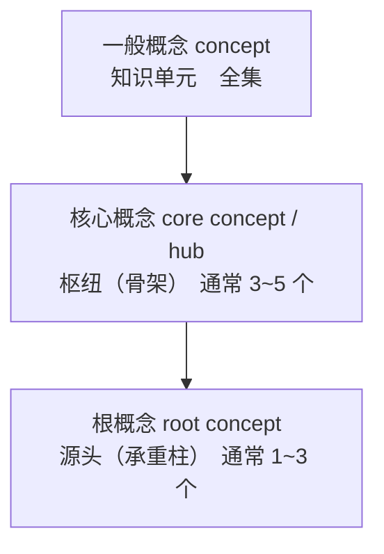
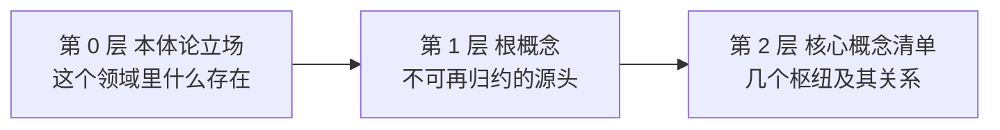
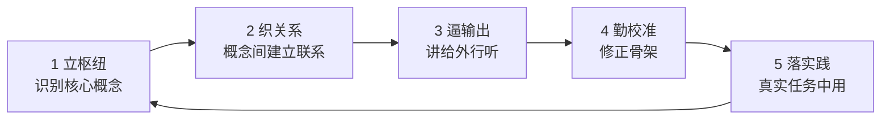
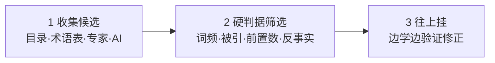
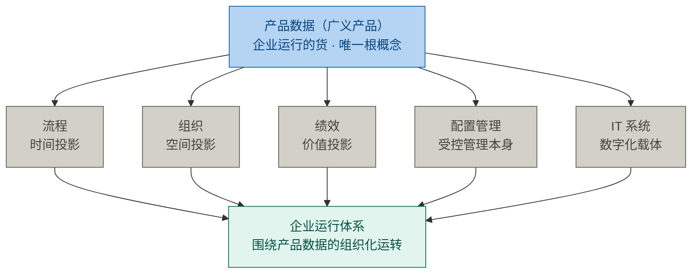
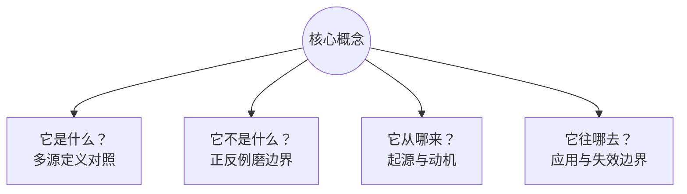

# 第1章 概念体系能力：学习能力的杠杆

---

## 1.1 引言

这一章从一个现场讲起：一个词没对齐，两个项目停了工。接着回答一个问题：凭什么说"把话说准"是学习能力里回报最高的那一步？最后给出一副骨架，让你看清后面的路怎么走。一路读下来，落到手上的，是一套能用的本事。

### 1.1.1 误解现场

一个词，让两个项目停了工。

冰链的 M3 二代，模块边界划了两个月没划下来；恒信的合同系统，改造方案评了三个月没评完。一硬一软，卡住的原因一模一样："架构"这两个字一在会上说出口，会就开不下去了。

冰链科技是造 M3 医疗温控箱的工程团队。这天他们开会，议题是 M3 二代怎么分块：

产品开发经理永兵把会拉起来："M3 二代的边界划了两个月。今天先把'架构'这词说清楚，再谈分块。"

文正先把话钉死："架构就是模块怎么分——产品架构。分块方案定下来，后面的活才好派。"

水忠摇头："模块边界是设计的事。我说的是硬件架构——传感器、主控、通信怎么布，那是元件怎么划。"

董勐接话："元件只是元素。系统架构在云端——服务边界、数据所有权，那是跨元素的约定。"

李旭皱眉："那我按哪一层拆测试用例？验收判据挂在哪一层的定义上，我得先知道。"

逸人敲桌："架构定不下来，物料清单和批次追溯也无从谈起。M3 二代每拖一个月，一代的订单就在外面压一批——架构对你们是张图，对我是一整条产线。"

散会时，M3 二代的边界还是没划下来。

恒信集团是做合同审批系统的设计团队。这天他们在评改造方案：

产品开发经理满海把会议室占了："改造方案评了三个月。今天先把'架构'这两个字对齐——对不齐，方案没法评。"

黄程先抱怨："我们公司的架构不行，审批链跨三个部门扯皮。"

万辉纠正："你说的那是组织架构。系统架构是服务边界和数据所有权——这些定不下来，图都画不出来。"

小白追问："那我这边的接口清单，按哪张图对齐？前端等着开工。"

玉杰补一句："还有部署架构呢？部署在哪、谁运维、上线怎么回滚——这一摊子总得有人说了算吧？"

徐漾放下笔："停——'架构'在我们嘴里已经是五件事了。先各自说清你指的是哪一件。"

这一问，没人接得住。同一个词，两个世界，都是五张脸——问题不在人，在词。

可把词当场对齐，就真懂"架构"了吗？就算十个人都同意它指系统架构，让他们各答四问，多半还是答不齐。**词可以当场对齐；概念要花功夫，才能真正拥有。**

### 1.1.2 这一章要回答什么

这一章从头到尾只为回答一个问题，另有六个小问题替它铺路：

1. **为什么"把话说准"**，是学习能力里回报最高的那一步？——"把话说准"，一半是**说准哪个词**，先抓枢纽与根；另一半是把它说到底。
2. 一句话说不准，凭什么能让两个项目一停就是两三个月的工？（§1.1、§1.8）
3. 说准哪个词：概念为什么是一套三层包含的体系？枢纽与根各是什么？（§1.2）
4. 谁来说准：这副能力由哪几样组成，又怎么检验它强不强？（§1.3）
5. 凭什么说回报最高：这条乘法律的两个归零项是什么，有没有证据？（§1.4.1、§1.5）
6. 说到多深才算说到：能力分哪四级，"表征是 1，上面三级是 0"又是怎么来的？（§1.4.4、§1.4.5）
7. 怎么练、怎么找、怎么验：五环是什么？三步识别法怎么找枢纽？四问法怎么验"真拥有"？（§1.6~§1.8）

### 1.1.3 这一章的骨架

这一章要立的，是一个主张和一把量它的尺子。

> **把话说准，是学习能力里回报最高的那一步。**

这句话里有两件事：先**说准哪个词**（先抓枢纽与根），再把这个词说到底（从一个词说到一整片）。

凭什么说回报最高？因为这条乘法律的两个归零项，都落在"把话说准"上：**方向**（先抓错了词）与**表征**（话说得不准）。这两项里只要有一项是零，整条式子就是零——冰链和恒信的两场会，失守的正是这两项。

说到什么程度？同一个词，你能说到好几级：先把词说准（表征）→ 看得出套路（图式）→ 能推演（心智模型）→ 能判断什么值得相信（解释框架）。量"说到多深"的那把刻度尺，本章 §1.4.5 交给你。

后面七节就是答这一问的七步：先说准哪个词（§1.2）→ 这副能力是什么（§1.3）→ 它凭什么决定成败（§1.4）→ 有什么证据（§1.5）→ 怎么练（§1.6）→ 怎么找（§1.7）→ 怎么验（§1.8）。

## 1.2 先说准哪个词：真正要紧的词很少

> 上一问：两个项目为什么停工？因为"架构"这个词没拿准。那该说准哪个词、先抓哪几个？——一个领域里真正要紧的词很少，它们连成一张有主次的网。

### 1.2.1 概念是什么

"工程""需求""质量""架构""评审""治理"——这些词有什么共同点？它们都是各自领域的概念；而概念是什么，标准里说得清清楚楚：**知识单元**。冰链和恒信那两场会里，"架构"就是这么个词——人人拿它当概念使，却没有一个人说得准它。

> **概念（concept）**：**由特性的独特组合而形成的知识单元**（ISO 1087:2019 §3.2.7）。
> 判据：可指称（一个词或短语）＋可界定（内涵与外延）。概念与术语的区别（能指与所指），见 §1.8.3 病二。

一个概念拆开来看，有三个角。能指是词或符号，也就是概念的名字；所指是概念本身，你脑子里那个意思；指称（指称对象）是这个词指向的那个东西。三个角里，这本书说的"概念"是中间那个：它既不在嘴上，也不在物上。冰链和恒信那两场会吵的，正是中间这个角——嘴上说的是同一个词，脑子里装的是各家的意思（语义三角的完整出处见 §1.8.3）。

> 术语注：别把两个"指称"混成一个。判据里的"可指称"与 ISO 1087 的 designation 一样，是"给概念命名"义；上文的"指称（指称对象）"是"概念指向的客观事物"义——同名两个角，恰是病二（§1.8.3）要治的同词异义。

概念从哪里来？多数不是哪位天才发明的，它们的来路不外乎创造、发现与凝结：

| 方式 | 含义 | 例子 |
|------|------|------|
| 创造（invented） | 人造的工具，无自然界对应物 | 变量（笛卡尔/韦达）、图灵机 |
| 发现（discovered） | 规律本来就在，被揭开 | 万有引力、能量守恒 |
| 凝结（distilled） | 共同体长期实践经验的结晶被固化 | baseline（源自军品工程实践，后由 ISO 10007 固化） |

baseline 不是哪位科学家发明的：它来自军品工程"版本失控、改坏了找不回来"的教训，工程共同体摸出"受控快照"的做法，最后才被标准写成条文。多数要紧的概念都是这样"酿"出来的——这也预先交代了一条后文要用的性质：概念是共识，不是真理（§1.6.4）。

关键在于：概念不是孤立的词，而是一张网。一个词的意义，由它与别的概念的关系决定；冰链和恒信那两场会之所以开不下去，就是因为十个人说的是同一个词，各自脑子里却是十张不同的网。这张网也不是平的：它有骨架，也有承重柱。

### 1.2.2 概念有主次：一般的、核心的、根上的

一个领域里的概念，不是一堆平级的名词，而是一套三层包含的体系：


```mermaid
flowchart TD
    A["一般概念 concept<br/>知识单元　全集"] --> B["核心概念 core concept / hub<br/>枢纽（骨架）　通常 3~5 个"]
    B --> C["根概念 root concept<br/>源头（承重柱）　通常 1~3 个"]
```

| 层级 | 名称 | 管什么 | 判据 | 数量 |
|---|---|---|---|---|
| 全集 | 一般概念 | 可界定 | 可指称 + 可界定 | 全部 |
| 骨架 | 核心概念 | 连接多 | 反事实检验 + 词频／被引用度／前置数（后三条为代理判据） | 通常 3~5 个 |
| 承重柱 | 根概念 | 是源头 | 原子性 + 生成性 + 不可替代性 + 递归性 | 通常 1~3 个 |

这三层要连起来看。第一，一层套一层。根概念 ⊂ 核心概念 ⊂ 一般概念：每个根概念必然被全域依赖，每个核心概念必然可指称、可界定；反过来都不成立——大多数概念、甚至大多数核心概念，都不是根。

第二，越往里，门槛越高。一般概念只要求"能指称、能界定"，领域里绝大多数词都满足；核心概念还要过"枢纽性"：去掉它，领域不成立（反事实检验）；它被引用最多，前置最少。根概念再加一条"源头性"：不可再向下归约，其余概念由它导出，领域因它成立，多层反复生效。一句话：能界定，是概念；被依赖得多，是核心概念；依赖它的一切、它却不依赖域内任何概念，才是根概念。

第三，视角不同，不冲突。这三层比的不是谁更重要，是看你说的那个概念在网里站得靠不靠中心：核心概念（hub，轮毂）管"连接多不多"，根概念（root，根）管"是不是源头"。一个概念可以连得多却非源头——"治理"很重要、被反复引用，但它由"对什么治理"定义，是派生的；质量也一样，在产品开发里被到处引用，却是需求与系统的派生。重要和源头，是两回事。

> 领域边界注记：一个概念算哪一层，要看在哪个领域里算。同一个词换个领域，位置就可能变——先看清是哪个领域，再判它站哪一层。

### 1.2.3 先抓哪个：核心概念与根概念

三层里最该先动手的是哪一层？先看中间那一层。

> **核心概念（core concept / hub）**：概念网络中处于枢纽地位的概念——解释领域内其他概念都要用到它，而理解它自己只需要很少前置知识。判据：反事实检验 + 词频／被引用度／前置数（后三条为代理判据；前置数，就是理解它所需的前置知识量，越少，越是枢纽）。

要解释"符合性"，得先解释"需求"；要解释"架构"，得先解释"系统"。"需求""系统"被反复调用，自己却几乎不需要前置——它们就是枢纽。章首冰链那场会上，三个人各说各的"架构"，谁也没有先问一句"系统"指什么；枢纽没立住，边界就划不下去。

枢纽的作用，每一处都关着整个领域。它决定这个领域用什么词说话（没有共同词汇，就没有精确沟通），也管着新知识往哪挂（新词要挂到已有的概念上才有意义），还管换个场景灵不灵（靠概念学到的本事能带走，靠死记硬背的带不走）。

再往深一层，是根概念——整张网的承重柱。

> **根概念（root concept）**：领域中不可再向下归约的源头概念，其余概念（含核心概念）都由它导出。
> 四条判据：
> - **原子性**：不可由域内其他概念定义；
> - **生成性**：其余概念从它派生；
> - **不可替代性**：去掉它，领域崩塌；
> - **递归性**：多个抽象层级反复生效。

根概念 ⊂ 核心概念，一个领域里通常只有 1~3 个。概念是网上的节点，原理是连接它们的边；边也有层级：概念之间反复出现的规律（如"基线一经批准，变更须走受控流程"）是**核心原理**；再往上，领域中不可再被推导的法则，是**基本原理**——把根概念里本来就含着的道理，写成一句明白话。

> 术语注：一个概念是否含子概念，先讲父概念的内涵、把子概念作为其中一项，再讲子概念的内涵——本章 §1.2 正是这样做的。"根概念"四条判据、"基本原理"（root principle）为本方法论命名，不是任何标准的条文；"概念体系能力"是本书的操作化命名，源出 Katz 1955 的概念技能研究（见参考文献 R-30）。

为什么先抓根？因为它是源头：先立它，新知识有地方挂，后面的学习越来越省力（§1.5 有实验证据）。因为它管方向：它辨对了，往哪使劲才不错（§1.4.3）。还因为它能生成一片：把它立住，领域知识由它导出，换个场景也能重新展开（§1.7.4、§1.7.5）。还有一条时间账：根概念变动的速度远慢于外围知识，立得越早越省事，立错了则后面每一层都跟着错。

怎么算立住了？拿判定矩阵与演绎链过一遍，证明它是根；答全四问；再拿它给一个陌生领域立骨架。工具见 §1.7.3 与 §1.8.2。

这一问答完就是一句话：先说准源头上的那几个词，再展开骨架，最后填细节。

## 1.3 概念体系能力：哪几样本事

> 接上一问：谁来把词说准？——识别枢纽、织关系、迁移、辨边界，这几样合起来才是它。学习里最容易白费力气的地方也就在这两处：记了一堆点，却织不成网；学会了套路，却搬不到新场景。

### 1.3.1 挑枢纽、连关系、搬得走、划得清

前面讲了概念这张网的结构；现在讲在这张网上干活的能力——概念体系能力（conceptual ability，简称"概念能力"）。冰链的边界划了两个月、恒信的方案评了三个月——这些工不是卡在方案上，是卡在这张网没人搭起来。

> **概念体系能力（conceptual ability）**：以概念为单位的压缩与组织能力——识别枢纽 × 织关系 × 迁移 × 辨边界。判据（三级，一级比一级硬）：转述测试（§1.5.3 又叫"压缩测试"；做到"建构"这一级，§1.6.1）＋辨伪测试（要有人来回对质才算）＋迁移测试（最高档）。

> 术语注：标准里另有一条"知识—技能—能力"的链（ISO 9000:2026 §3.10.4 知识／§3.10.5 技能／§3.10.6 能力）：知识是使人能够做出有效的、依情境而定的决策与行动的领悟；技能是把一项任务做到规定期望的习得能力；能力是运用知识与技能达成预期结果的本领。那条链说的是人员能力由什么构成，本章说的是同一种能力练到多深——两把尺子，别并成一把。

它不是一样单独的本事，而是四样：

| 构件 | 做什么 | 反面对照 |
|------|--------|---------|
| 识别枢纽 | 抓出决定其余部分的核心概念 | 被细节淹没，分不清主次 |
| 织关系 | 把概念连成有结构的网络 | 孤立记点，学一个丢一个 |
| 迁移 | 把网络搬到新场景 | 绑定场景，换个题就失灵 |
| 辨边界 | 用反例划清适用与失效范围 | 只举正例，不知何时失效 |

这四个构件合起来是什么成色，用转述、辨伪、迁移就能检验：

- **转述测试**（C 级）：陌生领域，三五句话讲清楚——讲不清，说明结构没成型（织关系没到位）；讲到卡壳处，说明边界没划清（辨边界没到位）。注意它的上限：讲给外行听只到"建构"这一级（§1.6.1），外行提不出有效质疑；
- **辨伪测试**（要到 I 级）：能举反例划清边界——举不出反例，说明只见过正例（辨边界没到位）；而且要**有人挑战**才算数，自己跟自己辩不算；
- **迁移测试**（最高档）：换一个情境，换行业、换粒度，你还认得出同一个结构吗？

> 概念能力强，不是"懂得多"，而是组织得好：同样的信息量，有人堆成一盘散沙，有人织成一张网。判断能力强弱，看的是这张网，不是信息量。

这四样里还有一个管方向的，下一节专门说：**根概念能力**（root-concept ability）。

### 1.3.2 根概念能力：先抓源头，再展结构

四构件之外，还有一个管方向的子能力，它叫**根概念能力**（root-concept ability）。它是概念体系能力的一部分，做的是识别根概念、验证根概念、运用根概念。

说得再直白一点：它决定你先说哪个词。先从领域里挑出源头上的那几个词，再顺着它们把核心概念清单和彼此的关系铺开。其余三个构件负责"说出来之后怎么组织"，它负责"开口之前先站在哪儿"。

怎么算练到了？给你一个能当场试的判据：**20 分钟**，对一个陌生领域说出一组"根概念＋核心概念清单及其关系"，并且能为每一个候选说出理由。判定矩阵和演绎链就是用来辩护的，工具见 §1.7.3（候选清单的收集见 §1.7.2）。

不过这条判据有几处边界，先说清楚，免得你照着练却练歪：

- 20 分钟是练出来的，不是读出来的。第一次做，半小时能理出个头绪就算不错；
- 它是给陌生领域用的。对自己已经有底子的领域，一上来就跳枢纽，反而会让你把该看的细节漏掉；什么时候该换一种学法，§1.6.4 会讲；
- 它只管"先抓哪个词"，不管"拿主意"。把词说准和做决定，不是同一级能力；§1.4.4 会把这四级摊开给你看。

### 1.3.3 记忆可以外包，把话说准不能

这副能力在今天比过去更值钱，原因只有一句：**记忆与信息处理已经外包给机器**，剩下的识别枢纽、织关系、迁移、辨边界，才是你自己的活。

机器记得比你多、算得比你快，也写得出你没读过的句子；但它不替你判断"这个词在这里指什么"。恒信那场会就是现成的例子："架构"在五个人嘴里是五件事，机器替你分不出谁在说哪一件。工具越强，方向与表征上的一次错被放得越大——这正是乘法律在今天的说法（§1.4.1）。

一条边界同时立在这里：**AI 是好助手，不是判据**。你完全可以让它给候选清单，§1.7.2 就把"问 AI"列为收集候选的一条正路；但候选要自己用硬判据筛、用演绎链辩护。它能替你收集，不能替你拥有。

## 1.4 凭什么说回报最高：方向与表征

> 能力有了名字，接下来要问：它凭什么决定学习的成败？——因为学习产出是一个乘积，而它两头各握着一个能让结果归零的开关。

### 1.4.1 这条式子是乘号，不是加号

为什么要给这副能力单独立一个名字？因为别的能力都没有它这个位置——它是学习能力的杠杆。章题这么说，这一章就得论证到底：凭什么说把话说准回报最高？

先看这条式子：

> 学习产出 = 根概念能力（方向）× 概念体系能力（力臂）× 学习投入（施力）× 实践场景（支点）

它们的分工不同：方向决定往哪儿使劲，力臂决定同样的力气能撬动多少，施力是投入，支点是概念落脚的真实任务；后三样只负责放大，下一节逐个说。

关键在乘号。加号里的项可以互相补偿：这一项弱一点、那一项强一点，总分还过得去。乘号里不能：任何一项为零，整条式子就是零。同一门知识、同样多的时间，一个人先抓源头，一个人从细节啃起——过一阵子再看，差距不是努力拉开的，是方向拉开的：后者的方向那一项接近零，后面的力气全乘在零上。冰链和恒信那两场会就是这样：十个人都在使劲，可各使各的方向。

这条式子因此叫**乘法律**。一错就让别的力气全白费的，却只有两个归零项：方向（先抓错了词，§1.4.3）和表征（话说得不准，§1.4.5）；其余都只负责放大——投入再多、场景再好，也只是把已经错了的东西放大。

这是"回报最高"的第一层理由：把话说准是这条乘法律里的归零项之一。它不是让学习好一点，而是决定学习有没有。而它同时是最便宜的一步：立枢纽只要 20 分钟，给一个词建一张概念档案只要一张纸（§1.8.4）。

"杠杆"这个说法，讲的是这条律的另一半——放大。所以章题没有说错，只是这个说法自带边界：杠杆放大的是力，却不分方向，枢纽选错，学得越快偏得越远；杠杆需要支点，概念不落真实任务，力臂再长也撬不动什么；杠杆自己不发力，没有投入，力臂无穷长也是零产出。

### 1.4.2 力臂、施力、支点：只负责放大

式子里的另外三项，性质不一样：它们只负责放大，不负责指方向。

- 力臂，就是概念体系能力。把枢纽连成关系、搬到新场景、划清边界；同样一份材料，会组织的人拿走的是结构，不会组织的人拿走的是一堆点；
- 施力，就是学习投入。时间、注意力、练习量，缺一样，力臂再长也不动；
- 支点，就是实践场景。概念要落在真实任务上才使得上劲；只记不用，前面两样也一起白费（§1.6.2 第 5 环、§1.6.3 迁移）。

它们有一个共同点：放大的都是已经确定的东西。方向对了，力臂越长撬得越多；方向错了，力臂越长偏得越远。冰链那边的力气和经验都不缺，施力、支点都在，卡住的只是最初的那一项。同一门知识，两种学法的差别就在这里：

| 先学核心概念（先立骨架） | 只背结论和招式（无框架） |
|---|---|
| 知识有地方挂：新概念迅速入网 | 碎片化记忆：学完就忘 |
| 举一反三：跨场景自由迁移 | 绑定具体场景：换个题就失灵 |
| 能辨伪：识别概念偷换 | 易被带偏：分不清概念边界 |

先立骨架再填细节，后面的学习越来越省力；先切入细节，越来越吃力。这不是经验之谈，§1.5 给出的实验会证明这一点。

### 1.4.3 方向：挑错了词，全盘皆输

四个构件里，最根本的不是力臂，是**方向**。为什么？

因为其他三个构件都在"放大"，只有方向在"指路"——放大是没有方向感的，方向一旦错了，后面每一份力气都加在错误上。压缩学习实验里，枢纽优先组的全部优势，正来自"先识别枢纽"这一下——其后 800 轮正式学习，都只是这个方向上的展开（§1.5）。

方向不是一次选定的，而是三层递进：


```mermaid
flowchart LR
    Z["第 0 层 本体论立场<br/>这个领域里什么存在"] --> A["第 1 层 根概念<br/>不可再归约的源头"] --> B["第 2 层 核心概念清单<br/>几个枢纽及其关系"]
```

先问本体论问题：这个领域里，什么东西是存在的？**再抓根概念**：哪几个是不可再归约的源头？**最后展开**成核心概念清单及其关系。

第 0 层答错，上面两层再漂亮也是错的：把"产品"当成企业运行领域的根，与把"产品数据"当成根（§1.7.5），导出的是两张完全不同的网。根概念能力就是把这三层都定准的那一下。

这就是本章标题的一半意思：概念体系能力是学习能力的杠杆，而杠杆的第一性是方向。所以本书反复强调"先立枢纽"——它不是一条技巧，是把方向握在手里的那一下。

一个澄清，防止误读：概念体系能力管的是学习的头一步和放大那一步，不是学习的全部。五环的每一环都在练它，其中第 1、2 环（立枢纽、织关系）练得最直接；第 3~5 环还要配另外三样：把学过的拿出来用、随时检查自己哪里想错了、以及坚持下去。它决定学得多快、看得多深；后三样决定学不学得动、学不学得远。

### 1.4.4 一个词能说到多深：能力四级

方向选定了，接下来要问的是说得有多准。同一个词，能说到好几个深度；说得浅，等于没说。

这一章后面有一场评审会，正好是这件事的例子。恒信的万辉把"架构"的四问答得滴水不漏，可轮到"这个系统要不要拆"，他一个字也说不出来。不是他没准备，是他的能力只到第一级。

我们在大脑里操作的从来不是真实世界，而是它的代用品。你思考的不是经济活动本身，是那些概念和指标；你理解的不是历史，是某种历史叙事。能做多大的事，取决于手里的代用品长成了什么样。代用品本身有粗有细——粗到能判断，细到只是一个词；能力四级说的就是这件事。它不是四种知识，是同一种能力的四种粗细：

| 级 | 是什么 | 一句话判据 |
|---|---|---|
| ① 表征 | 现实事物在头脑中的代用品；最小单位——概念、名词、对象、关系和边界 | 能提取关键表征，并把它画成关系图，才算入门 |
| ② 图式 | 表征聚起来、认得出的一类结构；一眼能认出的套路 | 看事情一块一块看；一听就知道这是哪一出，还能预判下一步 |
| ③ 心智模型 | 会动的图式——内部有变量、有因果、有反馈、有边界条件 | 能推演"如果 A 则 B"，能说出它的失效边界在哪 |
| ④ 解释框架 | 对一整个领域的整体看法：把一堆模型和套路攒成的一整套 | 能判断什么值得相信、什么只是叙事包装 |

第一级是表征。"苹果"这个词就是表征；真实的苹果是一堆原子，你脑子里的苹果是红的、圆的、甜的。零散地记住一批词，不叫入门；抓住关键表征、认出它们之间的关系、画出图来，才叫入门。

第二级是图式。表征聚成结构，就成了图式：一看就知道这是哪一出，还能预判下一步。没图式的人看什么剧情都新鲜；图式多的人看什么都是套路。反过来说，恒信那五张"架构"的脸，连表征这一级都还没对齐——更谈不上图式。

第三级是心智模型。图式回答"这是什么"，心智模型回答"它怎么运转"。万有引力定律是一个心智模型，费曼"在积分号下求导"的绝招是一个心智模型；本书后面讲的每一条判据，说到底也是一个心智模型。

第四级是解释框架。它是当前某一派意见对一整个领域的系统性看法——回答的是"这一大类现象该怎么解释"。摸到这一级，你才开始像行家那样理解世界：不是追故事，而是问机制；不是摆立场，而是比解释力。

> 术语注：前三级的说法在认知科学里是通行的；**第四级"解释框架"是课程作者的自命名**（原话："这个词是我发明的"），不是标准术语——本书借用它的分法，读者不必把它当成定论。

四级共用同一种能力，只是粗细不同：识别枢纽，第一级是挑出最该先认的那几个词，第四级是认出"这一派把什么当枢纽"；辨边界，第一级是说清这个词不指什么，第三级是说出模型的失效边界。同一个构件，换一级来用，做的事是同一件。

本章的工具停在第一级。四问是第一级（表征）用的工具，管的是"把词看准"：这个词指什么、不指什么、从哪来、往哪去。这是最底层的一级，也是最便宜、最容易被跳过的一级，但它不负责拿主意。万辉的四问答得再好，也只是把几个词说准了——他还没有能推演的机制，更谈不上判断该不该拆。本章后面给出的判据，也都还在这一级；它们长成能推演的机制，要到后面几章。

这里有一个可以自查的崩样：

> 能把一个概念的四问答全，却在一个真实的取舍面前说不出话——这不是表达能力问题，是能力层级问题。

那上面三级谁来建？本书后面每一章都在建，只是你此前不知道它们各在哪一级：

| 级 | 每一级处理什么、怎么算做到了 |
|---|---|
| ① 表征 | 本章的四问与术语工作；第3～5章的领域概念——判据：能提取关键表征，并画出关系 |
| ② 图式 | 本章的三层体系与"织关系"；第6、7章的结构与产品数据——判据：能认出结构，预判下一步 |
| ③ 心智模型 | 第10～12章（架构、架构设计、架构决策）——判据：能推演，能说出失效边界 |
| ④ 解释框架 | 第17章整合、第18章架构师——判据：能判断什么值得相信 |

所以这本书不是一个一个知识点，是同一种能力逐级往上练：先在表征这一级把话说准，再在图式这一级把结构认出来，然后建能推演的心智模型，最后逼近判断。

这四级里，前三级可以讲、可以写、可以画出来；第四级有一块是讲不出来的。有一种知识只能在现场长在身上——老师傅调火候、老工程师看一眼就知道哪不对，那不是天赋，是在现场待久了长出来的本事。本书教你把话说准、把结构理出骨架；但第四级里有一块，写不进书里。认下这条边界，比多背几条判据有用。

### 1.4.5 表征：第一级拿不到，上面全是零

"回报最高"还有第二层理由，就藏在这四级之间：

> **价值律**：**表征是 1，上面三级是 0**（本书命名。"1 和 0"说的是成不成立、以及量级，不是分数。）

先说"1 定成立"这一半：第一级决定的是**成不成立**，词指错了东西，上面三级再漂亮也是零。前言里那句话说的正是这一级——"地基不准确，上面盖多少层都白搭"。本书反复讲的"先把话说准"，不是风格要求，是这条式子里最靠前的那个数。

再说"0 定量级"这一半：上面三级不是不重要，它们决定的是**能做多大事**：从"看准一个词"，到"看出一套套路"（图式），到"能推演"（心智模型），再到"能判断什么值得相信"（解释框架），每加一级，同样一份信息能做的事就翻着倍往上涨。**1 定成立，0 定量级**——这就是为什么第一级最便宜，也最不能省：省掉 1，后面全是 0；有了 1，后面每一级都实打实地加量级。

于是这条乘法律的两个归零项到齐了：**方向**（§1.4.3：先抓哪个词）与**表征**（本节：话说得准不准）。方向管往哪使劲，表征管拿的是不是那个东西；两者都过，才轮到力臂与投入去放大。这就是章题的完整意思——概念体系能力是学习能力的杠杆，因为它同时管住了这条律的归零项与放大项。

两个归零项，两根轴，合成一个坐标系：位次轴（一般 ⊃ 核心 ⊃ 根）回答"该抓哪个词"，深度轴·能力四级回答"这个词你要说到多深"——它就是你量"说到多准、说到多深"的那把刻度尺。

下面这把刻度尺，量的就是"你说到多准、说到多深"：

```
深度·能力四级（说到多深）
 ④ 解释框架 │
 ③ 心智模型 │
 ② 图式     │
 ① 表征     │ ← 这是 1：它不成立，上面三级都是 0
            └─────────┼─────────┼─────────→ 位次（说准哪个词）
                   一般概念   核心概念   根概念
```

两根轴各管一件事——一个概念可以位次不低、深度很浅，也可以位次不高、深度很深。万辉的"架构"就是前一种：位次上落在核心概念，深度上只到表征——枢纽抓到了、话也答全了，可能力只到第一级。所以谈到任何一个概念，都要同时报出它的两个坐标。

> 术语注：位次轴上的"三层"（一般／核心／根）与深度轴上的"四级"（表征／图式／心智模型／解释框架）是两个量词，别混：论位次说"第几层"，论能力说"第几级"。

最后交代一句"概念"这个词。四级处理的东西，本书一律叫概念。这是本书自己的用法，比 §1.2.1 的严谨定义宽：概念是头脑里对现实事物的代用品；它在四级里各是一个样子：表征这一级是**现实事物在头脑中的代用品**——概念、名词、对象、关系和边界；图式这一级是**认得出的一类结构**；心智模型这一级是**会动的图式**；解释框架这一级是**对一整个领域的系统性看法**。

> 术语注：严谨定义（ISO 1087:2019 §3.2.7 的知识单元、§1.2.1 的可指称＋可界定）管的是术语意义上最窄的那一层；四级通称"概念"，是本书的操作读法。

## 案例回场｜答得全，却说不出该不该拆

恒信的评审会上，方案要过一道关：合同系统要不要拆成两个。

万辉先把"架构"答了一遍——它是什么：一个实体在其环境中的基本概念或属性，以及用于该实体及其相关生存周期过程的实现和演化的管控原则（ISO/IEC/IEEE 42010:2022 §3.2）；它不是什么：不是一张架构图，不是一次技术选型，不是组织架构；它从哪来：从建筑学借入软件与系统领域，1970 年代结构化设计、1990 年代软件架构热，后由标准定稿；它往哪去：不可逆决策被做出之前用，变更影响评估时用。

四条一条不差。

徐漾问了一句："那这次拆不拆？"

万辉停了几秒："……我得再看看。"

他不是没准备。他手上的"架构"停在第一级：词说准了，关系也画得出；可拆与不拆要的是能推演的机制——服务边界怎么切、数据所有权怎么划、拆完之后哪条链会断。这些他还没有。

**四问答得全，只是拿到了那个 1**

## 1.5 有什么证据：一项压缩学习实验

> 道理讲完了，该给证据。凭什么说"先立枢纽"不是经验之谈——2026 年北京大学团队的一项实验，证明了枢纽优先的学习结构为什么占优。

### 1.5.1 差距在压缩，不在记性

2026 年，北京大学心理与认知科学学院等团队在《自然·通讯》发表了一项研究。它给出了一个反直觉的答案：高手和普通人的差距，不在记性好，而在擅长"压缩"——把全量信息转化成关键信号。

> 术语注：这是本书对实验的读法。实验直接测量的是"枢纽优先的知识结构更容易掌握"（§1.5.2）；从"结构更易学"引申到"高手与普通人的差距在压缩"，是本书的一步引申——它经得起检验，但不是论文的原话。

经验医生把成千上万种疾病的知识，压缩成几个关键信号；资深调查记者在堆成山的文件里，只盯着"异常"的部分。他们都在做同一件事：压缩学习。章首那十个人反着来——十套没压缩过的说法，谁也接不住谁。

压缩为什么有效？机制在带宽上：**一般认为，工作记忆一次只能同时处理 4 到 7 个信息元素**。学习失败的常见原因不是"存不下"，而是新信息过这道窄门时堵住了。压缩的单位叫**组块**（认知心理学的既有概念，英文 chunk，见参考文献 R-61）：把多个相关元素打包成一个整体，打包得越多，一次能过的信息就越多。北大团队这一步的贡献，是把"什么样的结构最容易被压缩"量了出来。

### 1.5.2 实验：先学枢纽的人更快

团队设计了几类结构相同、但连接方式不同的人工知识网络，找一批人来学。结果很清楚：少数枢纽占据大量连接的网络（无标度网）最好学；均匀对称、没有主次的结构反而难掌握。

另一个实验更有说服力。同一批知识，一组先学枢纽再学细节（枢纽优先），一组先学边缘再学枢纽（边缘优先），还有一组随机学。进入完全相同的正式学习后，枢纽优先组的优势随时间越来越大，而且扩散到整张网络——包括那些从没直接学过的纯细节节点。

脑成像也印证了这一点：枢纽优先的学习者在大脑里维持着更稳定的知识结构表征；先学边缘的人，早期也有表征，但迅速衰减。先搭框架的人，新信息进来只需判断"挂在框架哪个位置"；先切入细节的人，后期积压太多零散节点，整合不动。

### 1.5.3 把压缩用在自己身上

研究给了三步可以直接照做的动作。**找到枢纽**：学任何新东西前，先花 20 分钟找枢纽节点，翻书目录、读百科开头、问 AI、问行家都行；比如《思考，快与慢》的枢纽就是系统一、系统二、偏见。**建立联系**：先弄清枢纽之间的关系，再填细节，关系没通，细节学一个丢一个。**转述**：讲给完全外行的人听，三五句话讲清楚，就是压缩成功；转述是"压缩测试"，费曼技巧的机制正是它。

它们不是孤立的技巧，而是后面那条循环的头三环（§1.6）——§1.6 把它们接成一条完整的练法。

### 1.5.4 它证明了什么，没证明什么

论文也有它的边界，每一条都要说清：

- **生态效度**：实验用的是抽象的知识网络，真实领域（教科书、标准、行业惯例）的结构复杂得多；怎么识别真实领域的枢纽仍是手艺活，论文没有替你解决——这正是 §1.7 要做的事：三步识别法＋判定矩阵；
- **测的是预测，不是应用**：范式测的是"预测下一张图片"这类隐含结构的学习，没有直接测应用与迁移。所以"转述能验证掌握"是本书补上的一步，不是论文的结论；
- **先有鸡还是先有蛋**：枢纽优先的前提是先知道枢纽在哪；面对完全陌生的领域，只能靠二手信号（目录、百科、专家、AI）先取候选，边学边修正（§1.7.2）。

另外，别把"框架形成后表征更稳定"过度引申成"框架不可改"——框架可改，见 §1.6.4 校准。

## 1.6 怎么练：一条循环转起来

> 道理和证据都有了，接下来是手上的活。这副能力不是天赋，怎么把它练出来——一条可以一圈一圈转的循环。

### 1.6.1 什么叫学会：会用才算掌握

先说"掌握"是什么意思。教育学界有一个公认的认知目标阶梯——布鲁姆分类学：知道 → 理解 → 应用 → 分析 → 评价 → 创造，六级。

大多数人的学习停在"知道"和"理解"：能复述，能听懂，考试能过；换个场景，就用不出来。分界线画在"应用"上——会用才算掌握。你背得出"质量＝客体的固有特性满足需求的程度"，不算掌握质量；你拿着它评一份验收标准、判断一次分歧算不算质量问题，才算掌握。恒信评审会上徐漾那句"那这次拆不拆"，问的正是"会不会用"。

还有一条更细的分界：同样一段时间，参与的方式决定收效——被动听讲（P）最弱，主动复述（A）强一些，**建构（C）**（生成材料里原本没有的新信息）才算真学习，能与人来回对质（互动，I）则更强。这条次序说明了：为什么"讲给外行听"只是入门线（外行提不出有效质疑），以及为什么第 3 环要配第 4 环（§1.6.2）。

### 1.6.2 循环：从立枢纽到用起来

掌握五环模型是一个循环。每转一圈，骨架更准、网络更密、输出更顺：


```mermaid
flowchart LR
    A["1 立枢纽<br/>识别核心概念"] --> B["2 织关系<br/>概念间建立联系"]
    B --> C["3 逼输出<br/>讲给外行听"]
    C --> D["4 勤校准<br/>修正骨架"]
    D --> E["5 落实践<br/>真实任务中用"]
    E --> A
```

| 环节 | 做什么 | 为什么（依据） |
|------|--------|----------------|
| 1 立枢纽 | 学新领域前先花 20 分钟识别枢纽概念：翻目录、读百科开头、问 AI、问行家 | 压缩学习：先学枢纽，好处会扩散到整张网；一上来要记的东西最少（§1.5） |
| 2 织关系 | 弄清枢纽间关系（包含/依赖/对立）再填细节 | 知识是网络不是列表；记忆靠连接检索（§1.2.1） |
| 3 逼输出 | 三五句话讲给外行、写成文档、做题、教别人 | 自己回想一遍，比再看一遍记得牢（测试效应）；一讲就露馅，缺口自己冒出来 |
| 4 勤校准 | 随时准备推翻自己：枢纽选错、关系画反就改 | 想错的地方，得用更准的说法顶掉（概念转变） |
| 5 落实践 | 在真实任务中用：做项目、审文档、解真问题 | 只记不用的知识是死的（惰性知识）；真本事＝概念结构×在场景里练出来的经验 |

这张表里最容易被跳过的是第 3 环和第 4 环，而它们恰好是**刻意练习**的要件：目标明确到能判对错、反馈快到能马上改。没有反馈的重复不叫练习，叫重复——这也是"讲出去"和"勤校准"要挨着放的原因。恒信那场会上，徐漾那声"停"就是一次现成的反馈，可惜没人接住（§1.8.5）。

掌握 = 用结构消化信息，用输出验证结构，用实践把结构磨出来。学习不是把知识装进脑子，而是长出结构，让新知识有处安放。

### 1.6.3 每一步在练哪一样

五环的每一环都有名字：立枢纽 → 织关系 → 逼输出 → 勤校准 → 落实践。能力不是天生的，是练出来的——这不是说天赋不存在，而是说天赋与练习是乘法关系：天赋决定每次更新的利率，练习决定你有没有在更新；专家与新手的差别，一部分在正确性标准的分辨率（专家能分辨出新手看不出的差别），一部分在内化了的身体图式（手艺长在身上，说不出来但做得出来）——都不是天赋，是路径。怎么练？五环本身就是那条循环，四个构件在五环里各就各位：

- 识别枢纽 → 第 1 环"立枢纽"：四构件的第一个，就是五环的第一步；
- 织关系 → 第 2 环"织关系"：把概念连成网，正是织关系构件；第 3 环"逼输出"讲不清，说明结构没成型，也是织关系没到位；
- 辨边界 → 第 3 环"逼输出"：讲到卡壳处，就是边界没划清的地方；第 4 环"勤校准"：用反例推翻旧骨架，也是辨边界；
- 迁移 → 第 5 环"落实践"：换场景用，正是迁移构件。

所以五环不是五件事，是四构件在循环里转。每转一圈，四构件都更准一点——这是概念体系能力最实在的训练路径，也是"能力是练出来的，不是天生定死的"这句话怎么落到做上。

第 5 环"落实践"最常失效的地方在**迁移**。从学到用，中间有三道锁：**表征锁**——学的时候就没抓住结构，只记住了字面；**触发锁**——知道该用，但那个场景里想不起来用；**生态锁**——真到了现场，环境不给你用的条件。对应的两个策略很朴素：**拥抱**，主动把新知识往自己已有的场景里塞；**桥接**，拿旧场景里的经验去接新知识。迁移测试（§1.3.1 第三级）量的就是这三道锁开没开。（这三道锁是课程对迁移研究的提炼，本书沿用。）

### 1.6.4 校准：概念是共识，不是真理

五环的最后一根柱子，是第 4 环"勤校准"。它凭什么立得住？因为概念是共识，不是真理（本书底色：反绝对真理）。

化学的"燃素"、物理的"以太"，都曾是各自时代的核心概念，后来被推翻。库恩把它叫做"范式转换"——每个时代的枢纽清单，是那个时代认知的天花板，不是终点。

所以，学核心概念，就是花最小的力气，把这一行几百年攒下的共识接过来；但它是共识，不是真理——枢纽是起点，不是天花板。这也正是"勤校准"的意思：连领域公认的枢纽，都可以怀疑、修正。

对管方向的概念体系能力来说，这条尤其要紧：方向不是一次定死的，要一路校准。你今天立的枢纽，明天可能被证明是错的——那不是失败，是这条乘法律在正常纠偏。枢纽清单是活的，方向就永远是活的。

最后一条边界：先立枢纽不是一刀切。对完全陌生的领域，先花 20 分钟找枢纽最划算；对已经有基础的领域，一上来就跳枢纽反而会压住细节——同一种学法，在新手身上有效，在行家身上会失效。练的时候还要挑**可取的困难**：在自己扛得住的范围内跟材料较劲（先自己回想再翻书、把话说给别人听），而不是跟疲劳和干扰较劲。

## 1.7 怎么找：挑出枢纽与根概念

> 说准哪个词、凭什么、怎么练，都答完了。落到手上还有一问：具体怎么找到那个词？——三步识别法、判定矩阵与演绎链，最后走三个真实领域。

### 1.7.1 概念是点，原理是线

找枢纽，先分清两个层级：

- 核心概念 = 节点（名词）：领域的"词汇"，如需求、配置、基线、版本；
- 核心原理 = 边/规则（一句判断）：概念之间反复出现的规律，通常用"当……必须……""……取决于……"表达，如"基线一经批准，变更须走受控流程""验证以规定需求为参照"。原理是更高级的枢纽——掌握原理，概念自动串联。

原理也有层级：核心原理之上，是基本原理——原理侧的源头（见 §1.2.3）。

### 1.7.2 怎么挑出枢纽

找核心概念（枢纽），可以顺着三步走：


```mermaid
flowchart LR
    A["1 收集候选<br/>目录·术语表·专家·AI"] --> B["2 硬判据筛选<br/>词频·被引·前置数·反事实"]
    B --> C["3 往上挂<br/>边学边验证修正"]
```

第一步，收集候选，借现成的材料，20 分钟就够。领域共同体已经帮你压缩过，直接"抄"就行：

| 来源 | 为什么有效 |
|------|-----------|
| 教材目录/章节标题 | 好教材的顺序本身是枢纽优先的（先基础后应用） |
| 专业术语表 Glossary | 共同词汇的浓缩，出现即被共同体认可 |
| 课程大纲/综述论文 | 专家设计并经多年检验；综述是高手压缩好的结构 |
| 问 AI/问专家 | 直接要"10 个核心概念及其关系"，再交叉验证 |

收集阶段宁多勿少：判据要求"20 分钟给出根概念与核心概念清单及其关系"，那是收敛之后的答案；收集时先要"10 个"，多出来的正好用来交叉验证、往上挂。

第二步，硬判据筛选，用枢纽的定义去验证：

- **词频**：领域文本里被反复提到的名词，多半是枢纽；
- **被引用度**：统计概念定义中被引用的其他概念，被引用最多者最基础——比如"需求"的定义，被整个质量体系引用；
- **前置数**：理解它需要的前置知识越少，越像枢纽——数一数"要讲清它，得先讲几个别的概念"；
- **反事实检验**：问一句"如果这个概念/原理不存在，这个领域还成立吗？"经济学少了"供需"，整个框架就塌了——它是枢纽。反事实检验是四条里最狠的一条。

> 术语注：前三条是**代理判据**——用可数的量代替真正要判的东西，方便，但会骗人。本书早期草稿就写错过一次：把"被引用度＝出度、前置数＝入度"当成枢纽的判据（出度是它连出去的关系，入度是连进来、指向它的关系），那测的其实是**根**（被全部依赖），不是**枢纽**（连接最多）。真要判谁是根，回到四条判据与反事实检验（§1.2.3、§1.7.3）。

第三步，往上挂。每学一个新概念，都问一句"它挂在哪个枢纽下？"挂不上去，说明枢纽清单有漏洞。清单是活的，随理解加深增删；专家与新手的区别，不是清单长度，而是清单准不准。

### 1.7.3 判定矩阵与演绎链

三步识别法给出的是核心概念清单（骨架）；要辨出其中哪几个是根概念（承重柱），还要过判定矩阵与演绎链——根概念 ⊂ 核心概念，正好对应 §1.2.2 的包含关系。

识别根概念不能靠感觉，要用两件能查、能对质的工具：**判定矩阵**（横向打分）与**演绎链**（纵向论证）。

**判定矩阵**：四条判据（原子性／生成性／不可替代性／递归性）× 候选概念，逐格打分并附证据：

| 候选 | 原子性 | 生成性 | 不可替代性 | 递归性 | 判定 |
|------|--------|--------|-----------|--------|------|
| 候选 A | ✅/⚠️/❌ + 一句证据 | …… | …… | …… | 根 / 派生 / 子类 |

**演绎链**：把结论写成能一条条查的论证链——每个前提（P）附出处，结论（C）由前提逐条推出：

```
P1: 候选 = 三步识别法收集的候选清单（§1.7.2）
P2: 根概念 = 不可再归约的源头概念，四条判据判定（§1.2.3）
P3: 判定证据 = 标准族 / 工程现实（可核验）
P4: 候选 X 通过四条判据的判定矩阵（见上表）
——→ C: X 是该领域的根概念
```

> 演绎链的意义：把"我觉得是"变成"因为 P1、P2、P3、P4，所以是"——每一环都可以被反驳、被替换，结论因此可辩护。这正是根概念能力判据里"为每个候选辩护"的完整操作。

### 1.7.4 根概念长什么样：阻抗

这两件工具落在真实领域里长什么样？先看两个领域，各用几句话走完。

高速信号传输，根是阻抗。说起高速信号，你多半先想到速率、带宽——但它们都是结果，不是根。信号一上高频就失真：反射、串扰、衰减、损耗、时序，根子都在阻抗。

用四条判据核验：阻抗由传输线本身的特性（线宽、介质、间距）决定，不依赖域内其他概念（原子）；特性阻抗、反射、串扰、损耗、时序都由它派生（生成）；去掉它，信号完整性领域不成立（不可替代）；从芯片引脚到背板到系统，层层都生效（递归）。所以这个领域的根概念是阻抗（1 个）。

产品开发，根是需求、系统、设计（开发）。很多人以为根是"质量"——但质量是需求被满足的程度，是派生的；也有人以为是"产品"——那只是一个交付物的名称。三个源头各答一问：需求回答"要什么"，系统回答"承载在什么上"，设计（开发）回答"怎么把它一级一级说到可实现"。恒信要评的改造方案、冰链要分的 M3 二代，说到底都挂在这三个词上。

质量、功能、接口、组件、架构，都从这三者派生；四条判据逐条同样过：都不可再定义、都生成一片、去掉一个领域就失去立足点、从产品级到模块级层层生效。所以产品开发的根概念是需求、系统、设计（开发），共 3 个。

### 1.7.5 根概念长什么样：产品数据

第三个领域，走一遍完整的判定——它是本书的主场。

企业运行体系的根概念是产品数据。为什么不是"产品"？设计与制造之间传递的不是实物而是模型与图纸，质量与合规证明的是数据记录，产品的"身份"就是它的数据档案——在企业运行层面，产品以数据形态存在。

更反直觉的是，根也不是流程。企业运行不就是跑流程吗？但流程由"数据的流转次序"定义——它不原子；去掉流程，数据仍在，只是无序。流程只是产品数据按时间排出来的样子；同理，组织是它按空间摆出来的样子、绩效是它按价值算出来的样子；配置管理管的是产品数据的受控状态、IT 系统是它的数字化载体——投影可再造、可重组，都不是根。

真正过得了这四条判据的是产品数据：自身即事实（原子）、一切由它派生（生成）、去掉它企业只剩空壳制度（不可替代）、概念级/流程级/实例级都生效（递归）。


```mermaid
flowchart TD
    P["产品数据（广义产品）<br/>企业运行的货 · 唯一根概念"]
    P --> F["流程<br/>时间投影"]
    P --> O["组织<br/>空间投影"]
    P --> K["绩效<br/>价值投影"]
    P --> CM["配置管理<br/>受控管理本身"]
    P --> IT["IT 系统<br/>数字化载体"]
    F --> E["企业运行体系<br/>围绕产品数据的组织化运转"]
    O --> E
    K --> E
    CM --> E
    IT --> E
    classDef root fill:#B5D4F4,stroke:#185FA5,color:#0C447C
    classDef proj fill:#D3D1C7,stroke:#5F5E5A,color:#444441
    classDef comp fill:#E1F5EE,stroke:#0F6E56,color:#085041
    class P root
    class F,O,K,CM,IT proj
    class E comp
```

> 图注：流程、组织、绩效是产品数据在时间、空间、价值三个维度上的投影；配置管理、IT 系统是它的受控管理与数字化载体——投影可重组，产品数据这一个根不变。

所以企业运行体系的根概念，是产品数据（1 个）。这个域的核心概念则是流程、组织、绩效（三个投影），以及被反复引用的需求、质量、治理——它们都由产品数据派生，都不是根。注意：同一个词换个领域，位置就可能变——需求在产品开发域里是根，在企业运行域里只是核心。产品数据这根承重柱，第7章会把它展开为"开发产品就是开发产品数据"。

（三个示例是本书按四条判据判定的结果，供对照——不是任何标准的条文。）

## 1.8 怎么验：答不全，就只是见过

> 最后回到手上最容易含糊的一步：一个词说到什么程度，才算说准了？——一把尺子（四问法）、几种最常见的"没拿准"（词汇病），以及要查全时去哪儿查。

### 1.8.1 假懂长什么样

怎么才算真正说准了一个枢纽概念？先看"假懂"长什么样：能背原文，却举不出反例；不知道它何时失效；孤立记住，不知道它挂在哪个枢纽下；不关心它从哪来；只在考试里答得出来。

真懂反过来：能用自己的话重述，能举正例也能举反例，知道它不是什么、何时不成立，知道它挂在哪个枢纽下、与谁冲突，知道它解决什么问题、为何被发明，讲给外行能懂、换个情境能用。

理论依据是维特根斯坦的一句话："意义即用法"（meaning is use）——概念的意义不在字典里，在它的用法里。理解一个概念，就是会用它，而不是会背它。按这条看，章首那十个人各说各的"架构"，说的确实是十个不同的概念：词是同一个，用法各是各的。

### 1.8.2 怎么问才算问全

怎么判断自己真懂了？把上面那些差别压成四个问题：


```mermaid
flowchart TD
    C((核心概念)) --> Q1["它是什么？<br/>多源定义对照"]
    C --> Q2["它不是什么？<br/>正反例磨边界"]
    C --> Q3["它从哪来？<br/>起源与动机"]
    C --> Q4["它往哪去？<br/>应用与失效边界"]
```

| 问 | 操作 | 理由 |
|----|------|------|
| 它是什么？ | 找三四个来源（标准、教材、百科、高手著作）对照定义，差异处即本质处 | 定义的差异暴露概念本质；同一个词，标准与教材表述不同，差的那一点往往就是本质 |
| 它不是什么？ | 找正例和反例，用反例磨边界 | 边界靠反例定型；概念靠典型例子活，靠反例定型 |
| 它从哪来？ | 回到概念被创造时的问题现场：解决什么问题？没有它之前人们怎么受苦 | 知道它当初解决什么问题，才记得住；词源能让它活起来 |
| 它往哪去？ | 挂在什么流程、被谁使用、何时失效 | 用得越熟越知道适用条件；掌握失效边界＝深度理解 |

能答全四问，才算拥有它；只能答第一问，只是见过它。这背后，是本书底色的反记忆崇拜——懂不等于记住。大多数人的"懂"，其实是"见过"：背得出定义，却答不出它"不是什么"的边界，也答不出它"往哪去"。

同一道门槛，本章量过三次：答全四问，是给这个词做体检；把关键表征画成关系图，是把它摆进网里（§1.4.4）；三五句话讲给外行听，是压缩测试（§1.3.1）。三次都过，才算把它提到第一级。

四问之前还有一步，专门管词的身份：**术语锁定三问**——① 这个词出自哪部标准的哪个条款？② 那部标准的术语章里有没有定义它？③ 没定义的话，它是按通用语意用的吗？"概念"就是个现成的例子：它在 ISO 1087:2019 §3.2.7 有正式定义，在 ISO/IEC/IEEE 42010 里却是按通用语意使用的（§1.2.1 的两个"指称"之争就是这么来的）。词的身份没锁住，四问会问在错的对象上。

拿章首那个被吵翻天的词练一遍——量的是本书口径下的那个所指（系统架构）：

- 它是什么：一个实体在其环境中的基本概念或属性，以及用于该实体及其相关生存周期过程的实现和演化的管控原则（ISO/IEC/IEEE 42010:2022 §3.2）；
- 它不是什么：不是一张架构图（图会过时，架构的基本概念持续起作用）；不是一次技术选型；更不是组织架构、产品形态；
- 它从哪来：从建筑学借入软件与系统领域；1970 年代结构化设计、1990 年代软件架构热，后由 ISO/IEC/IEEE 42010（现行 2022 版）定稿为系统与软件工程标准；
- 它往哪去：在不可逆决策被做出之前用；在变更影响评估时用；在团队边界定义时用。失效边界——当组织架构、产品形态混进来时，它就说不清了。

答完四问，章首那两场吵架的解法已经出来了：他们吵的是各自不同的"它"。四问先帮他们分清在谈哪一个，再谈要不要改。

## 案例回场｜先分清在谈哪一个

回到章首那两场会。这一次，屋里有人带了四问。

冰链那边，文正先说自己指的是产品架构——模块怎么分；水忠说他指的是硬件架构——传感器、主控、通信怎么布；董勐说他指的是系统架构——服务边界与数据所有权。三个人把各自的四问答完，才看清说的是三个不同的所指——先分清在谈哪一个，再谈要不要改。

恒信那边同样：黄程说的是组织架构，万辉说的是系统架构，玉杰问的是部署架构，小白要的是接口对齐用的那张图。四问答下来，每个"架构"都各自说清了自己指的那一件；先谈哪一个、后谈哪一个，也就排得出来了。

**没有人先把"在谈哪一个"问出来**

### 1.8.3 词汇病：最常见的几种"没拿准"

四问法为什么必要？因为"见过"的样子是有规律的，最常见的那几种，合起来叫"词汇病"：

| 病 | 症状 | 例子 |
|---|---|---|
| 病一 说不出定义 | 用例子代替定义，问不到判据 | "评审就是开会过一遍" |
| 病二 同词异义 | 同一个词，各指各的概念 | 章首的"架构" |
| 病三 翻译伪朋友 | 英文原词不同，中文翻译形近 | 评审 / 验证 / 确认 |

- 病一，说不出定义，只能举例。例子是插图，不是定义：定义回答"它是什么"，例子只回答"它长这样"。要判断"一次不走流程的聊天算不算评审"，例子答不了，判据才答得了。治病的药是给定义，而且定义要带可检验的判据——这背后是本书的**判据主义**。"评审"的定义是"为达成既定目标，对客体的适宜性、充分性或有效性所作的确定"（ISO 9000:2026 §3.11.2），判据便是：有没有得出结论？有没有留下记录？
- 病二，同词异义，各指各的。同一个能指（词），挂在不同的人身上（不同所指）——这正是章首"架构"吵架的机制。三个来源说的是同一件事的不同侧面：索绪尔的能指与所指、弗雷格的符号／涵义／指称、奥格登与理查兹的语义三角（符号—思想—事物）。词还会漂移："架构"从建筑学漂到软件、组织、数据，每次借用叠一个新所指。漂移无害，不对齐才可怕。治病的药是把词和概念分开——不谈"架构是什么意思"，改谈"你说的架构，指称的是什么"。
- 病三，翻译伪朋友。几个英文原词完全不同，中文翻译后听起来像一类。本书第8章的主角评审（review）、验证（verification）、确认（validation），在 ISO 9000 里的定义动作词不同——评审用"确定"（determination，§3.11.1）定义，验证与确认用的是"证实"（confirmation，它没有自己的条款号，只出现在这两条定义句的开头）；中文都带"评/验/认"像近亲，其实不是。治病的药是回英文原词、查词根、看定义的动作词。

（冰链和恒信那两场会，病二占了大头；这本书每章章首的"误解现场"，大多也落在这几种词汇病里。比词更深的还有"乱用"——概念本身没认错，却用在不该用的场景，那是"往哪去"没答全，见 §1.8.4。）

### 1.8.4 查全：概念档案

四问好记、也够用，但它记住的是四个方向，不是一张可以逐项打勾的清单。要查全，本书另备一样东西：**概念档案**——书末附录 B 给每张核心概念配一张档案卡，把四问展开成固定的几栏，一栏一栏填过去，漏在哪一栏一目了然。全书约 45 张核心档案，其中 33 张完整版收在书末附录 B，其余散见各章。恒信那场会如果按这张档案过一遍，"架构"的几栏里一定有空着的——空着的那栏，正是他们卡了三个月的地方。

一条使用规则，必须遵守：档案不是每一栏都必须填——薄栏可省，但不可被跳过。跳过的栏，往往是误解潜伏的地方。本书各章给概念"钉死定义"，用的都是这张档案；你自己给手头的概念建档案，也照它来。

### 1.8.5 认知反转

回到章首那两场会。

其实十个人都没有错。冰链的五张脸——产品、硬件、云端、测试、制造——各有各的立场；恒信的五张脸——组织、系统、接口、部署、点醒——也各有各的道理。错的是这两场会本身：一场没有对齐概念的会议，注定是一场各说各话的表演。

如果当时有人带着四问，会议会是另一个样子：

> "等一下，我们说的'架构'是五件不同的事。先各自答四问：它是什么、不是什么、从哪来、往哪去？——产品架构管模块边界，硬件架构管元件布局，系统架构才管服务边界和数据所有权。分清在谈哪个，再谈要不要改。"

这一章的认知反转，比"一场各说各话的表演"更深一层：你不是不懂那个词，你是还没拥有它。能把"架构"背出来、能画出架构图，都只是"见过"它；能回答它是什么、不是什么、从哪来、往哪去，才算拥有它。四问答不出后两问的人，和那两场会里的十个人，站在同一条起跑线上。

顺手把一个更深的念头也放进你的口袋：如果连"架构"这么核心的枢纽词，都只是"见过"而非"拥有"——那你脑子里其他天天用的词呢？你真正拥有几个？位次上，你追到根了吗？深度上，你是刚把词说准（表征），看得出套路了（图式），能推演了（心智模型），还是能判断什么值得相信了（解释框架）？

两个坐标一起报，才是完整的答案。这一章的工具，把你送到第一级。

一个在造温控箱的工程世界，一个在做审批系统的设计世界——同一种能力量过来，同一个词都是五张脸。从第2章起，每章帮你把一个枢纽概念从"见过"变成"拥有"，这是第一级的活；上面那三级，从第6章起接着建。

---

## 小结

这一章不给你一个新概念，给你一套本事：概念体系能力，学习能力的杠杆。

说到底就两句话。一是挑对该先说准的那个词：先找根，再铺骨架；二是把这个词从"背得出"说到"用得上"：把话说准是那个 1，能推演、能判断是它后面添的 0。

这两步看着便宜，却最不能省：词挑错了、说歪了，后面花多大力气，都只是在把错的东西放大。

从第2章起，我们用这套坐标去量第一个枢纽概念——工程：工程是什么，不是什么，以及为什么"用敏捷 + CI/CD"不等于"在做软件工程"。

## 附录

### A 本章概念总图

```
主张：把话说准，是学习能力里回报最高的那一步
  ├─ 一个现场 ────────── 一个词，让两个项目停了工；词可以当场对齐，概念要花功夫拥有   §1.1
  ├─ 先说准哪个词 ────── 概念是一张网：一般概念 ── 核心概念（枢纽）── 根概念（源头）   §1.2
  │      └ 为什么先抓根：它是源头（新东西靠它挂）／方向（管往哪使劲）／能生成一片／立得越早越省事
  ├─ 概念体系能力 ────── 识别枢纽 × 织关系 × 迁移 × 辨边界；判据分三级      §1.3
  │      └ 子能力：根概念能力（先抓源头，再展结构；20 分钟立骨架是练习目标）
  ├─ 凭什么说回报最高 ── 一条乘法律：方向 × 力臂 × 施力 × 支点；两个归零项：方向、表征 §1.4
  │      ├─ 放大项：力臂、施力、支点——只放大，不指方向                              §1.4.2
  │      ├─ 归零项一·方向：先抓哪个词（第 0 层本体论立场 → 根概念 → 核心概念清单）     §1.4.3
  │      ├─ 深度轴：能力四级（表征 → 图式 → 心智模型 → 解释框架）                    §1.4.4
  │      ├─ 归零项二·表征：表征是 1，上面三级是 0；位次轴 × 深度轴＝坐标系            §1.4.5
  │      └─ 证据：压缩学习实验——枢纽优先的优势随时间扩散到整张网                    §1.5
  ├─ 怎么练 ──────────── 一条循环：立枢纽→织关系→逼输出→勤校准→落实践；迁移有三道锁   §1.6
  ├─ 怎么找 ──────────── 三步识别法（收集候选→硬判据→往上挂）＋判定矩阵／演绎链       §1.7
  └─ 怎么验 ──────────── 四问法（是什么／不是什么／从哪来／往哪去）＋术语锁定三问      §1.8
```

### B 本章的能力级

**第 ① 级为主**

- **表征**——把六个词说准：概念／核心概念（枢纽）／根概念／基本原理／概念体系能力／根概念能力（书末附录 B 六张卡）；用的工具是四问＋术语锁定三问
- **图式**——给出两个可识别的结构：三层包含（一般 ⊃ 核心 ⊃ 根）与能力四级（表征 ⊃ 图式 ⊃ 心智模型 ⊃ 解释框架），以及两轴合成的坐标系（§1.4.5）
- **心智模型**——给出三个能推演的机制：三步识别法＋判定矩阵／演绎链、乘法律与价值律、五环模型
- **解释框架**——本章不建此级；由第 17、18 章承担

> 能答全四问，才算拥有；只能答第一问，只是见过。记住这条次序：表征是 1，上面三级是 0——1 定成立，0 定量级。

### C 自查 · 这些说法对吗？

1. "概念是专业术语，背熟定义就算懂了。"——**错**。懂＝能答四问、能用、能迁移；背熟定义只是"见过"。
2. "概念能力＝知识渊博，懂得多能力就强。"——**错**。组织得好才关键；知识多不等于会抓枢纽。
3. "概念体系能力＝根概念能力，两个词是一回事。"——**错**。概念体系能力是全集（四构件）；根概念能力是它的子能力（方向盘：先抓承重柱，再展骨架）。
4. "杠杆的力臂越长越好，投入越多产出越大。"——**错**。乘号里有两个归零项：方向与表征。方向错了，力臂越长偏得越远；表征没拿到，上面盖多少层都白搭（§1.4.3、§1.4.5）。
5. "先学细节再搭框架，殊途同归，反正最后都学全了。"——**错**。压缩学习：先立枢纽，后面的学习越来越省力；先切细节，越来越吃力。
6. "把概念讲给外行听是浪费时间。"——**错**。转述是压缩测试，讲不清＝结构没成型，正好暴露缺口。
7. "四问法答出'它是什么'就够了。"——**错**。能答全四问才算拥有；答不出"不是什么/往哪去"＝只是见过它。
8. "核心概念一旦记住就不用再改。"——**错**。概念是共识不是真理，枢纽是起点，随时可修正（勤校准）。
9. "掌握一个领域＝记住更多信息。"——**错**。学习不是往脑子里堆信息，而是先搭骨架，再让输入各归其位。
10. "识别枢纽靠天赋，没有方法。"——**错**。有可操作的三步识别法：收集候选、硬判据筛选、往上挂；辨根概念还要过判定矩阵＋演绎链。
11. "核心概念都是科学家发明的。"——**错**。三种出生方式：创造/发现/凝结；多数是共同体长期实践"酿"出来的。
12. "枢纽就是最重要的那一个词，记住它就够。"——**错**。核心概念是骨架（通常 3~5 个）；之上还有根概念（承重柱通常 1~3 个）；还有原理一层。
13. "根概念就是最重要的概念。"——**错**。根概念是最"源头"的概念（原子/生成/不可替代/递归），未必最"重要"——质量很重要，但它不是根。
14. "概念只有节点，没有边。"——**错**。概念是节点、原理是边；核心原理之上还有基本原理（§1.2.3），掌握原理，概念自动串联。
15. "先把图式建起来更要紧，表征差一点没关系。"——**错**。表征是 1，上面三级是 0：1 定成立，0 定量级；1 没拿到，上面盖多少层都白搭（§1.4.5）。
16. "能答全四问，就说明我这一级已经修满了。"——**错**。四问是第一级（表征）用的工具；上面还有能推演的心智模型、能判断的解释框架（§1.4.4）。答全四问是**入场**，不是到顶。

### D 练习

1. 用四问法量你工作里天天用的一个词（架构/需求/质量/评审……）——哪一问最薄？为什么最薄的那一问，恰恰是你最容易出错的地方？量完再给它报个坐标：位次在哪一层、能力练到第几级？
2. 用三步识别法找出你领域的核心概念：收集候选（目录/术语表/专家/AI）、硬判据筛选（词频/被引/前置数/反事实）——"如果没有它，这个领域还成立吗？"再试着用判定矩阵辨出其中哪几个是根概念。
3. 把某个概念讲给一个完全外行的人，三五句话讲清楚。卡在哪一步？暴露了什么缺口？
4. 用五环模型给最近一次学习做个体检：你停在第几环？下一环是什么？为什么卡在那？
5. 用四问法重开章首那两场会：十个人对"架构"各持所指，哪些是同一个所指、哪些不是？怎么让工程团队和设计团队先各自对齐，再谈别的？
6. 你领域里哪个概念是"凝结"出来的？它的共同体是谁？哪个是"发现"或"创造"的？
7. 你有没有"曾经坚信、后来修正"的概念？是五环哪一环让你改的？
8. 用乘法律给你的学习做个诊断：方向（根概念能力）、力臂（概念体系能力）、施力（学习投入）、支点（实践场景）各缺什么？两个归零项——方向与表征——哪一项你更没底？
9. 拿你最近学到的一个概念做一次**迁移测试**：换一个行业、换一个粒度，这条判据还成立吗？认出"同一个结构换了张脸"了吗？（§1.4.4 四级里，这是从图式走向心智模型的那一步。）

（答案要点见书末附录，与训练教材题卡同源）


---

### E 参考文献

**标准**
- R-01 ISO 1087:2019 —— 概念定义依据（§3.2.7："由特性的独特组合而形成的知识单元"）
- R-02 ISO 9000:2026 —— 评审/验证/确认（§3.11.2 / §3.11.12 / §3.11.14，伪朋友辨析）
- R-04 ISO/IEC/IEEE 42010:2022 —— 架构定义（§1.8.2 演示、概念档案·架构）
- R-08 ISO 10007:2017 —— baseline 由军品工程实践固化（凝结三方式举例）

**经典文献**
- R-24 Xiangjuan Ren 等《Compressive learning scaffolds higher-order network structure to enhance human knowledge acquisition》（Nature Communications, 2026, DOI: 10.1038/s41467-026-75843-7）—— 压缩学习实验
- R-25 Bloom 教育目标分类学（Anderson & Krathwohl 修订版, 2001）—— 五环掌握线"会用才算掌握"
- R-30 Katz《Skills of an Effective Administrator》(1955) —— 概念技能（"概念体系能力"的管理学源头）
- R-26 Roediger & Karpicke (2006) —— 测试效应
- R-27 Posner 等 (1982) —— 概念转变
- R-28 Whitehead《The Aims of Education》(1929) —— 惰性知识
- R-29 Lave & Wenger《Situated Learning》(1991) —— 情境学习
- R-61 Miller《The Magical Number Seven, Plus or Minus Two》(Psychological Review, 1956) —— 工作记忆容量与组块
- R-22 索绪尔《普通语言学教程》—— 符号=能指+所指；语言（langue）与言语（parole）
- R-23 弗雷格《论涵义与指称》(1892) —— 符号→涵义→指称
- R-48 维特根斯坦《哲学研究》(1953) —— 意义即用法（假懂 vs 真懂）
- R-49 库恩《科学革命的结构》(1962) —— 范式转换（共识 ≠ 真理）
- R-50 Kahneman《思考，快与慢》(2011) —— 系统一/系统二（"找枢纽"的读者参照）
- R-106 万维钢《现代思维工具100讲》（得到 App 课程，第 38—47 讲）—— 能力四级（表征→图式→心智模型→解释框架）、参与度分级、迁移三道锁、默会知识边界
- 费曼技巧 —— 转述=压缩测试的机制（无正式书目，沿用研习笔记 00 的标注）

