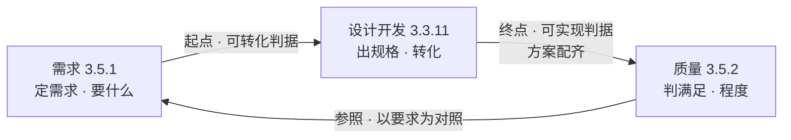

# 第3章 需求、设计开发、质量：产品开发的图式

---

## 3.1 引言

这一章立产品开发里最要紧的三个词：需求、设计开发、质量。三节走一条线——先把三个词各自说准，再把相邻两个词之间的边界画开，最后合起来看它们为什么拆不掉。这条线立住之后，从第4章起，每一章都是它在某一个方向上的展开。

### 3.1.1 误解现场

周五下午四点，冰链科技的产品评审会开了整整两个小时，会议室里飘着咖啡和争论的气味。

产品经理文正把一页参数对比表拍到桌上，指着一个数字：

> "M3 的温度精度做到 ±0.3℃，竞品只有 ±0.5℃；保温时长 72 小时，竞品 48 小时；重量还轻了 2 公斤。这几条都落到可测量的固有特性上了，实测值全线优于竞品——**符合性没有问题**，质量这一关我看不出问题在哪。现在只剩一件事：对外怎么讲，是打'行业精度第一'，还是'保温时长远超竞品'。"

会议室里一片点头，有人甚至轻轻鼓了掌。坐在上首的产品开发经理永兵也点了头，在产品评审结论栏里签下"通过"：

> "三个参数全线领先，需求里写的每一条都超了。质量这一关，我签字。"

只有坐在角落的测试李旭，弱弱地举起手：

> "那……测试判据是什么？接收准则写在哪份测试方案里？"

文正摆摆手："技术方案都定了，符合性判据后面自然会有。先定对外怎么讲。"

李旭张了张嘴，又闭上。会议继续。

如果你坐在这间会议室里，你大概也会点头。因为大多数人对"质量"和"设计开发"这两个词的直觉，和文正一模一样：

- **质量 = 东西做得比人强、指标压过竞品**；
- **设计开发 = 做出技术方案**——方案定了，后面的测试、采购、生产、交付，都是"自然会有"的事。

这两个直觉，是这一章要推翻的东西。错的不是文正——错的是这两个词在他脑子里指向的那个东西。李旭那句被淹没的问话，其实已经给出了结论：设计开发根本没有结束。到章末我们回来读它。

### 3.1.2 这一章要回答什么

读完本章，你应该能回答：

1. 需求、设计开发、质量各自是什么？它们为什么能构成产品开发的图式，彼此又不在同一个层级上？
2. 需要、期望、需求有什么区别？目的、目标、需求又有什么区别？
3. 需求里"明示的""通常隐含的""必须履行的"分别指什么？漏掉哪一种最要命？
4. 设计开发从什么时候开始、到什么时候结束？"技术方案做完了"够不够？
5. 需求开发和设计开发的边界画在哪？凭什么这么画？
6. 质量是"特性除以需求"吗？"等级高"等于"质量好"吗？特性超出需求是加分还是减分？
7. 质量能打分吗？为什么有些特性不能摊进平均数？
8. "质量与进度冲突"到底是一场什么冲突？该动的是什么，不该动的是什么？
9. 三个词为什么互相定义、拆不掉？这条路径能推出什么，又推不出什么？

### 3.1.3 这一章的骨架

先把这一章要立的东西摆出来——后面三节，都是给它添内容。

这一章的主张是一句话——

> 把"东西好不好"从一句印象，变成一次可复核的判定——判定的依据先由需求定下来，再由设计开发细化成规格，质量才有东西可对照。

三个词在这条路径上各有位置：

> 需求 = 定需求：定义"要什么"。它是设计开发的输入，也是质量判定的依据。
>
> 设计开发 = 出规格：把需求转化为更详细的需求。这一步的产物是规定需求——规格就是规定需求的集合。
>
> 质量 = 判满足：认定客体的固有特性满足要求的程度。单项看符合不符合，整体看满足到什么程度。

三个词的分量并不一样。第1章把领域里的概念分成三层：一般概念、核心概念、根概念，**根概念 ⊂ 核心概念**，越往里门槛越高。产品开发这一行的核心概念不止三个，这一章只取这三个；其中需求与设计开发在第1章 §1.6.4 的判定里是根概念，质量是派生的枢纽——它被到处引用，却由需求与系统派生出来。三个词同属核心概念这一层，但不在同一个层级上。而它们聚起来形成的结构，就是这一章要说的产品开发的图式——三个词是表征，聚起来的那条路径才是图式（第1章 §1.3.5）。

这一章分三节走：第一节把三个词各自是什么说准，包括它们的来处；第二节把相邻两个词之间的边界画开——起点、终点、参照；第三节把这条路径用起来——读出程度、解开冲突、看它们为什么拆不掉。

---

## 3.2 需求、设计开发、质量是什么

> 这一节先看定义。三个词都在这里出场：需求给三种形态，设计开发给一条转化的定义，质量给一个程度。看完定义，后面的边界与运用才有话可说。

### 3.2.1 需求：明示的、隐含的、必须履行的

打头的是需求。ISO 9000:2026 给它的定义只有一行：

> **需求（requirement）**：明示的、通常隐含的或必须履行的需求或期望（ISO 9000:2026 §3.5.1）。
>
> *need or expectation that is stated, generally implied or obligatory*

注意后半句那三个词是并列的，没有主次：明示的（stated，说出来了）、通常隐含的（generally implied，惯例默认、没说出口）、必须履行的（obligatory，法规强制）。三个都是需求。

拿 M3 温控箱展开，三种形态全占。

**明示的**——写在纸上的。客户在合同里写明"箱温波动不超过 ±0.5℃""箱门可单手打开"。白纸黑字，谁都能看到，谁都赖不掉。

**通常隐含的**——没人写，但行业默认。冷链运输箱"应该扛得住装卸时的磕碰""外壳不能有锐角划伤搬运工""电池要能撑过全程并显示余量"。这几条没人写进合同，但你要是漏了，客户在使用的第一天就会认定"这产品不行"。隐含需求漏了是缺陷，不是"没写下来所以不算"——它不会自己开口，需要组织主动去识别。这是起点判据里最贵的一条（见 §3.3.2）。

**必须履行的**——法规强制，无条件满足。GSP 对疫苗冷链的温度与断链有硬性要求（冷藏疫苗常见 2~8℃，冻干制品 -20℃ 冷冻），M3 按 -20℃~8℃ 宽范围设计，断链即报废。不满足这条，M3 连上市资格都没有。必须履行的需求没有讨价还价的余地。

镜照一眼恒信集团：合同审批系统的明示需求是"合同在三个部门间流转审批"，隐含需求是"审批人能在手机上快速通过""离职审批人自动移交待办"，必须履行的是"合同数据按公司法要求留档十年"。三个词在 IT 世界里一个不缺。

三种形态的差异，到第8章会变得性命攸关：验证（verification）对照的是规定需求，也就是明示成文的那些；确认（validation）对照的是为特定预期用途或应用的需求，也就是真实场景里的那些（ISO 9000:2026 §3.11.12、§3.11.14）。隐含需求没进文档，验证够不着它，只有确认拦得住。那是第8章的事，这里先埋一句。

"需求"这个词本身也有来处：requirement ← 拉丁 requirere（要求、寻求）。而这个词的所指经历过一次漂移——它原指"要的东西"，后来才分出明示、隐含、必须履行这三种形态。这正是第1章 §1.7.3 说的"同词异义"：一个词如何攒出多个概念。ISO 9000 把这场漂移固化成了标准定义。

### 3.2.2 需要、期望与需求：内容与呈现方式

英文在这里特别值钱。中文习惯把"需要""期望""需求"糊成一个词，英文是三个：

| 英文 | 中文 | 含义 | M3 的例子 |
|---|---|---|---|
| need | 需要 | 硬性诉求，缺了会痛 | 疫苗不能坏 |
| expectation | 期望 | 软性诉求，缺了会失望 | 精度越高越好、App 越顺手越好 |
| requirement | 需求 | 需要或期望 × 呈现方式 | 上面两者的全集 |

分清这一层，要害在于"需要"和"期望"是**内容**，而"明示""隐含""必须履行"是**呈现方式**。内容说的是"你要的那个东西本身"，呈现方式说的是"这个内容是怎么出现的"。两个方向交叉，才是需求的完整样子：一个 need 可以是明示的（"我们要 72 小时保温"），也可以是隐含的（"要能扛磕碰"）；一个 expectation 可以是隐含的（"手感要高级"），也可以是明示的（"外壳要金属拉丝"）。

> 术语注："需要和期望是内容、明示和隐含和必须履行是呈现方式"这个两维说法是本书的梳理主张——ISO 9000 §3.5.1 只并列给出 need / expectation / requirement 三个词，不这样分方向；两维画法是本书为方便使用而做的凝练。

为什么要较真这个区别？因为后面所有的设计开发、质量判定、评审、验证与确认，对上的都是"需求"这个完整样子，而不是其中某一个形态。文正心里想的"质量"，八成只有"期望"那一层——"越高级越好"；而法规、客户合同、行业惯例这些真正决定成败的部分，不在他的视野里。把三个词糊成一个，等于把最重要的一半需求扔出视野。

镜照一眼恒信：黄程的"需要"是月底账能对上——缺了会痛；"期望"是查询响应再快一点——缺了会烦；而"查询响应有明确指标、数据留档十年"才是落到纸上的需求。IT 世界里同样是"内容 × 呈现方式"这个两维样子。

### 3.2.3 目的、目标与需求：价值、结果与规格

比上一条更常见的混用，是需求、目标、目的不分。ISO 9000:2026 给了目标（objective）和需求（requirement）的标准定义，没有单列"目的"（purpose）。三者怎么分，用这一份定义对齐（本书的梳理主张，作为对标准定义的解释）：

> **目的（purpose）** = 系统为什么被研制的理由。落在价值侧，可以不量化；它是目标与需求的来源，在最上游。确立过程对 ISO/IEC/IEEE 15288:2023 §6.4.1 业务或任务分析——使命与目的在那里定义，ISO 没有给它术语级定义。
>
> **目标（objective）** = 要实现的结果（ISO 9000:2026 §3.7.11）。落在系统语境，就是系统预期达成的可度量结果，是目的的可度量投影；主语是"要实现的结果"，可以落在战略、战术或运行层面，也可以针对整个组织或它的过程、产品、服务（§3.7.11 注 1、注 2），不必是系统自身的属性。
>
> **需求（requirement）** = 系统自身的可验证规格。落在系统自身；三种形态见 §3.5.1。

对照着看：目的 = 存在理由，目标 = 要实现的可度量结果，需求 = 自身可验证规格——三者都是关于系统的陈述，区别在侧面，不在"内"和"外"。链条是：目的 →（展开）目标 →（转化）需求。

落到 M3（疫苗冷链）：目的 = "让疫苗在冷链运输中一路不失活、安全送达"（价值侧，可以不量化）；目标 = "到站疫苗活性 ≥ 95%"（把"不失活"翻译成能盯着看的数）；需求 = "箱温 -20℃~8℃ 内偏差不超过 ±0.5℃、断链 30 秒内告警"（系统的可验证规格）。三者各占一个侧面：价值、结果、规格。

为什么不能混？目的定方向，需求定规格，目标是中间那层翻译。把目的当需求写进规格，设计开发会茫然：一张写着"疫苗不失活"的纸，没给任何可设计的数。把目标当需求，则跳过了"靠什么达成"这一步：活性 ≥ 95% 是个结果，活性靠箱温守住，得倒推出箱温条款，设计才落得下去。

| | 目的 | 目标 | 需求 |
|---|---|---|---|
| 回答 | 为什么做 | 达成什么可度量的结果 | 做成什么样 |
| 侧面 | 价值 | 结果 | 规格 |
| 能不能量化 | 可虚 | 必量化 | 必须可判定 |
| 锚点 | 15288:2023 §6.4.1 | ISO 9000:2026 §3.7.11 | ISO 9000:2026 §3.5.1 |

比混用更隐蔽的，是**根本不立目的**。目的由利益相关方定义、业务方签字确认，开发团队与架构师只承接、不拍板（第18章展开）。目的缺位的时候，团队不会停下来等，而是照自己猜的那个"目的"往前冲——做得越完美，离真实目的越远，这正是"正确地做错事"。先过目的这一关，再谈目标与需求。

恒信的合同审批系统，同一根链条也立得住：目的 = "让合同审批合规、月底账目清楚对得上"；目标 = "月底对账时间不超过 2 小时、逐笔一致率 100%"；需求 = "合同编号三方一致、25 号后签的合同归属下个统计月"。两个系统，同一套价值、结果、规格。

### 3.2.4 设计开发：需求怎么变得更详细

第二个词，也是这一章的主角。ISO 9000:2026 的定义，几乎每个词都是关键词：

> **设计和开发（design and development）**：将某一客体（§3.5.3）的要求（§3.5.1）转换为该客体更详细要求的一组过程（§3.3.1）。

拆开看，四样东西各有各的讲究。

客体——被设计的东西。定义用的是"客体"，不是"产品"。这不是措辞讲究：设计开发的对象绝不限于硬件，产品设计开发、服务设计开发、过程设计开发都成立（§3.3.11 注 3）。M3 温控箱是客体，恒信的合同审批系统是客体，连一条"疫苗出库流程"也可以是客体。

把"过程设计开发"落到最熟悉的例子：工艺编制。图纸定下"装配扭矩 15±2 N·m、密封无泄漏"，这是构件做成什么样；工艺编制就是过程（制造）的设计开发——把"做成什么样"转成"制造环节怎么做"的可实现需求，输出制造方案（工艺规程、工艺卡）。产品开发不只是图纸或代码，还包括构件的加工、装配、检验技术的开发。缺了工艺，产线不知道"怎么装配、用什么工装、检验标准是什么"，设计就没到可实现。

需求——输入必须是需求，不是点子、灵感、创意。创意不表述为需求，就进不了设计开发的流程。顺着这条边界再往外划一格：目的和目标也不在设计开发之内，它们是设计开发的输入端与前提（15288:2023 §6.4.1 业务或任务分析、§6.4.2 利益相关方需要与需求定义）；设计开发从系统需求（§6.4.3）起算，架构定义（§6.4.4）、设计定义（§6.4.5）才是它的核心。

转换为——动词才是灵魂。输入与输出必须是不同的东西。流程走完了，输出和输入一个样——那不是设计开发，那是走流程。这个"不同"体现在"更详细"上。

**更详细的需求**——唯一的判定标准。注意：定义没说"更正确""更优化"，只说"更详细"。设计开发的职责是把需求展开、分解，落到可实现和可验证的粗细；方案好不好，由评审和验证把关，不是设计开发自己说了算。

> 辨析栏 · 设计、开发、设计开发
>
> 英语里 design（设计）、development（开发）与 design and development（设计开发）三者，有时完全同义，有时指整个流程的不同阶段——design 偏概念与方案阶段，development 偏详细化与实现阶段。用哪个词不重要，重要的是整体是一个需求转化过程（§3.3.11 注 2）。落到中文，"设计开发"对应 §3.3.11 的完整术语，别把它拆成"设计"加"开发"两件事。

"更详细"这三个字，拆开来看是三个可查的成分：

| 成分 | 回答的问题 | 判据 | 锚点 |
|---|---|---|---|
| **更具体** | 详细体现在哪 | 需求以特性来规定——落到可测量的特性上 | §3.3.11 注 1 |
| **更可实现** | 详细到什么程度够 | 够实现为止——能直接被生产和服务提供执行 | §3.3.5 终点 |
| **更可验证** | 详细得对不对方向 | 落到特性上可测量可验证，让验证有对照的东西 | §3.3.11 注 1 |

注意"更可验证"这一格只证明方向对，不能当终点——验证以规定需求为对照，而规定需求正是设计开发的输出：验证能发生，前提是设计开发已经结束（§3.3.4 有完整推理）。

还有一个被排除的成分："更可理解"。它若指"文字浅显"，与"详细"无关甚至相悖；若指"能被下游理解执行"，已经被"更可实现"吸收了。

一句话记：具体到特性，详细到实现，可验证指方向。

这套判据在实战里很好用。既然"更详细"是设计开发有没有发生的唯一判据，判断"这个变更算不算设计开发"就有了硬标准——输入输出同样详细，就是没发生设计开发。只改外观颜色、不产生任何新需求细节的变更，严格说不构成设计开发，可以走快速通道；而"把温度控制从单路改成双路冗余"产生了新的可靠性需求、新的接口需求、新的测试需求，就是一次实实在在的设计开发，必须走完整流程。这条标准在变更管理和审核时很管用：它把"改一下"和"重新设计"分开，后者不能图省事。

### 3.2.5 设计开发是递归的

定义里还有一个注容易被忽略：一个项目中可以有若干个设计和开发阶段（§3.3.11 注 1）。这句话让设计开发在项目内部层层往下走：

```
客户需求（宽泛）→ 概念设计 → 系统需求（细化中）
                        → 详细设计 → 部件规格（更细）
                              → 工艺设计 → 可生产可检验的要求（最细）
```

概念设计把客户需求变成系统需求，详细设计把系统需求变成部件规格，工艺设计把部件规格变成可生产、可检验的要求——**每一级都在执行同一个 §3.3.11**。每个阶段的输出需求，就是下一阶段的输入需求，直到需求足以支撑实现和验证。

这对 M3 意味着什么？文正以为"设计开发 = 做一次技术方案"。不对——M3 的温度控制系统需求 → 制冷子系统规格 → 压缩机与温控板件规格 → 生产工艺要求，是四五个设计开发阶段叠在一起。任何一级的"更详细"没做透，下游就在半成品上开工。这也是为什么终点那么要紧：总得知道整条路径在哪里算走完。

设计开发内部怎么运转？有三个动词常被误当成三个并列的流程：构思（conceiving）、定义（defining）、设计（design）。它们不是并列，是包含——构思和定义都发生在设计开发这个范围里面。

> **构思（conceiving）**：从利益相关方关切出发，生成多个候选方案的发散性活动——产物是"可能是什么"，不是"决定是什么"。
>
> **定义（defining）**：在候选之间画边界，使选定方案从"多义"变为"单义"、从"漂浮"变为"确定"的活动——把可能性收敛为一个被承诺的方案。

| | 构思 | 定义 | 设计开发 |
|---|---|---|---|
| 一句话 | 打开可能性 | 终结漂浮 | 转换到底 |
| 干什么 | 发散：生成至少两个候选 | 收敛：画边界、挑定一个 | 把需求转化为更详细的需求 |
| 产物 | 候选清单 | 选定的方案 | 更详细的需求（规格） |
| 位置 | 内·发散段 | 内·收敛段 | 整体 |

设计开发"把需求转化为更详细的需求"，转化不是一步到位的：先想（构思——这个需求有哪些"怎么做"的候选），再选（定义——在候选之间画边界、挑定一个）。发散在前、收敛在后，合起来才是"转化"。

所以"设计开发包含构思与定义"，是包含关系，不是三个并列的流程。这落到第6章的结对六步，就是③出方案与⑤做裁决；落到第11章的架构活动动词链，就是"每一层都在执行同一个 §3.3.11"的内芯——每一层设计开发内部，都重复这一轮构思、定义、再细化。

> 术语注：构思与定义取自 ISO/IEC/IEEE 42010:2022 的架构活动动词链，"设计"一词有宽窄两义（宽义是装下构思与定义的容器，狭义是 15288:2023 §6.4.5 的向下细化），与 ISO 9000:2026 §3.3.11 的中文"设计开发"在这里按整体与部分对接——详见第11章。

设计开发是递归的，落地时每一级都是一对"需求—方案"的结对，走完六步：拆需求、验分解、出方案、对需求、做裁决、签定稿（见 §6.4.1）。

### 3.2.6 质量：固有特性满足需求的程度

第三个词，也是全章最容易被误解的一个。

> **质量（quality）**：客体的一组固有特性（§3.10.1）满足要求（§3.5.1）的程度（ISO 9000:2026 §3.5.2）。

三个关键词，一个都不能松。

**固有特性**——存在于客体本身的：功能、性能、材质。"固有"与"赋予"相对，是指存在于客体之中的特性（§3.5.2 注 2）。价格、品牌、交付时间这类赋予特性不算。这意味着设计开发的范围也被"固有"框住——价格、交付周期是其他过程的事，设计开发管不着，也不该管（成本作为"经济可承受性"需求仍会进入设计输入，见 §5.4.8：管不着的是价格这一质量特性，成本需求本身要接）。

文正在评审会上比"精度、保温时长、重量"——这些是固有特性，比对了；但要是比"价格比竞品便宜"，那不是质量，是经营。镜照一眼恒信：合同审批系统的固有特性是查询响应时间、正确性；"用的是哪家平台""上线时间"是赋予特性，设计开发管不着。文正式的"比参数"，在 IT 世界里换成"比平台名气、比上线速度"——一样比错了地方。

**满足**——符合性判定，不是数量比。特性达到要求规定的水平就是满足，达不到就是不满足。这是一次判定，不是一道除法。质量问的是"结果在标准上的位置"，不是"标准除以结果"——两边不同质，一个在客体里，一个在客体外，除不了。

**程度**——差、好、优秀，形容词，不是数字（§3.5.2 注 1）。质量是被认定出来的，不是被计算出来的，靠验证与确认拿客观证据判定。

这里藏着全书的一个方法时刻：**判据主义**——不给没有判据的定义（第1章 §1.7.3）。质量的定义，恰恰把"质量好"从一个主观印象，变成了一条可检验的判据：特性满足要求的程度。程度可以用客观证据认定（测量、比对、检验），因此"质量好不好"可以争论、可以复核、可以裁决。这不是给质量泼冷水，这是让质量第一次成为工程上可用的判据。整章后面每一次划线，用的都是它。

还有一处常被忽略：质量定义里的"要求"是广义要求——明示、隐含、必须履行三种形态并列（§3.5.1），规定要求只是它的子集。定义这一层，质量已经把隐含需求罩进去了；但要衡量质量，就必须落到可衡量的规定要求上——隐含需求不显性化成文，就验不着、量不出。这个"定义宽、衡量窄"的落差，正是需求必须显性化的根源（第5章展开）。

"质量"这个词的来处，同样是一次漂移：quality ← 拉丁 qualitas（"如何"）。它原指"档次、用料"——好东西就是好质量；ISO 9000 把它纠正为"特性满足要求的程度"，与档次无关（呼应第1章 §1.7.3）。这一漂，是这一章要立的最大一个反转。

### 3.2.7 概念卡片

三个词亮相完毕。档案收在这里，按四问查——

> **概念卡片 · 需求**
>
> | 四问 | 内容 |
> |---|---|
> | 它是什么 | 明示的、通常隐含的或必须履行的需求或期望（ISO 9000:2026 §3.5.1）——定需求，定义"要什么" |
> | 它不是什么 | 对立：点子、创意——不表述为需求就进不了设计开发的流程；辨析：需要是内容里的硬性诉求、期望是内容里的软性诉求、需求是内容乘呈现方式；需求不等于目标，也不等于目的 |
> | 它从哪来 | requirement ← 拉丁 requirere（要求、寻求）；"需求"原指"要的东西"，后漂移出明示、隐含、必须履行三种形态（第1章 §1.7.3）；ISO 9000 把它固化为标准定义 |
> | 它往哪去 | 它回答"要什么"，是设计开发的输入、质量判定的依据；在需求获取、需求评审、变更控制时用；误区 ✗ "需求 = 用户说出来的"（隐含需求与必须履行的需求漏掉就是缺陷）✗ "需求 = 目标"（目标回答"达成什么可度量的结果"，需求回答"做成什么样"；回答"为什么做"的是目的） |
> | 判据 | 起点判据"可转化"：完整、无歧义、不冲突、隐含需求已识别（见 §3.3.2） |

> **概念卡片 · 设计开发**
>
> | 四问 | 内容 |
> |---|---|
> | 它是什么 | 将某一客体的要求转换为该客体更详细要求的一组过程（ISO 9000:2026 §3.3.11）——出规格，把需求变成规定需求 |
> | 它不是什么 | 对立：走流程——输入输出同样详细，就是没发生设计开发；辨析：设计、开发、设计开发三个词的关系；需求开发（ISO 9001:2015 §8.2）与设计开发（§8.3）的边界看"特性有没有被规定"（见 §3.3.3）；构思与定义是设计开发内部的发散段与收敛段，不是并列的流程 |
> | 它从哪来 | design ← 拉丁 designare（标注、指明）；"设计开发"由"设计""开发"两个词合成，但不是两件事的简单拼合——ISO 9000 用 design and development 完整表述需求转化这一件事，中文标准统一译作"设计开发"，强调它是整体 |
> | 它往哪去 | 它回答"怎么把要什么变成做得出来、验得了的规格"；从需求进入设计，到规格足以支撑实现和验证时止；误区 ✗ "设计开发 = 画图或创意活动"（是需求转化）✗ "技术方案做完 = 设计开发完成"（下游方案配齐才算，见 §3.3.5） |
> | 判据 | 终点判据"可实现"：还有哪个环节会在执行时反问"这到底怎么做"？有，设计开发就没结束（见 §3.3.5） |

> **概念卡片 · 质量**
>
> | 四问 | 内容 |
> |---|---|
> | 它是什么 | 客体的一组固有特性满足要求的程度（ISO 9000:2026 §3.5.2）——判满足，判出满足到什么程度 |
> | 它不是什么 | 对立：等级——等级高不等于质量好；辨析：符合性回答"满足了吗"，质量回答"满足到什么程度"，等级回答"按哪套要求分类"（见 §3.3.6） |
> | 它从哪来 | quality ← 拉丁 qualitas（"如何"）；"质量"从日常的"档次、用料"漂移到"符合要求的程度"——ISO 9000 纠正了"好东西就是好质量"的直觉（第1章 §1.7.3） |
> | 它往哪去 | 它回答"东西做出来到底好不好"；在评审、验证与确认、接收时用；误区 ✗ "特性越多越高，质量越好"（超出需求范围是过度设计，见 §3.3.6）✗ "质量能算成一个分数"（见 §3.4.2） |
> | 判据 | 质量等于特性满足要求的程度，可检验；特性超出要求区间就是过度设计（见 §3.3.6） |

## 案例进展①｜没做调研的文正

冰链科技立项 M3 的第七周，产品、研发、销售开联合评审。

文正拿着方案书进场，标题是"M3：行业精度第一的冷链温控箱"。他开口第一句："客户要的是精度——这条需求我们直接做到行业第一。"

销售小冯打断他："谁告诉你的？上周我拜访了三个省疾控中心，他们问的第一句话全是——能不能塞进我们现有的疫苗运输车？你的 M3 尺寸比现在那款大了一圈，塞不进去。这条需求合同里没写，你也没问过。"

会议室安静了。

文正愣住："……合同里没写这条。"

"是没写，"小冯说，"是没写。但这是他们所有人都在问的——按 §3.5.1，通常隐含的也是需求。你立项前做过市场调研吗？"

文正没做过。他的起点是一个点子——"把精度做上去，就能赢"——跳过了研究，直接进了设计开发。七周后，方案书被推倒重来，重新做尺寸、重新评估保温层厚度、重新谈供应链。

这一轮返工，损失的七周，就是起点没收好的全部代价。设计开发转化的是需求，起点给错了需求，转化得越彻底，浪费得越彻底。

---

## 3.3 需求、设计开发、质量不是什么

> 这一节把相邻两个词之间最容易混的地方分开。概念靠正例活，靠反例定型：起点一处的边界在需求与设计开发之间，终点一处在设计开发与质量之间，参照一处在需求与质量之间。

### 3.3.1 起点之前：研究把点子变成需求

边界最容易打架的地方是交接处。第一处在需求与设计开发的交接处——设计开发从什么时候开始？

先说清"开始之前"。设计开发不始于点子，而始于被研究确认过的需求：

> 点子、灵感、想法 →（市场调研、可行性分析、技术预研、客户需求识别）→ 确定的需求 → 设计开发开始

为什么必须插这一步？因为设计开发的输入是需求，而输入的需求（按 §3.3.11 注 1）往往是研究的成果。一个没经过研究确认的点子，设计开发会把它老老实实做成一个"错误的需求"的完美实现——它不会自己发现方向错了，它只管把给它的东西转化到底。

很多项目"设计得很辛苦、产品没人要"，根源不在终点没管好，而在起点没收好：错的不是施工，是拿到的要求本身就错了。

### 3.3.2 起点的判据：需求要可转化

那"开始"这一步怎么算过？设计开发的起点，是一份需求规格被正式确立为设计输入的时刻。而这份需求规格，必须先满足"可转化"判据——四条前提，一条都不能松：

1. 完整——功能、性能，以及由产品和服务性质导致的潜在失效后果，一个不缺。M3 不只是"能制冷"，还包括"制冷失效时自动告警""断电后保温时长""结霜影响"这些潜在失效的处置。缺一项，设计开发就可能在错误的方向上越走越远。
2. 无歧义——每条需求只能有一种理解。"精度要高"不是需求，"箱温波动不超过 ±0.5℃"才是。歧义就是留给未来的争吵。
3. 不冲突——需求之间自洽。"重量轻 2 公斤"和"保温 72 小时"可能打架（保温靠保温层，保温层厚则重），这要在需求阶段协调掉，而不是等设计开发做完再发现。
4. 隐含需求已识别——最容易被忽略、却最决定规格对不对的一条。它没写进规格，却决定规格对不对；它不会自己出现，需要主动去挖。

这四条前提不是拍脑袋凑出来的标准，而是"设计开发就是需求转化"这一定义想成立所必须具备的条件。逐条反推就知道它们躲不开：

- 需求有缺口，转化在残缺的输入上开工，输出必然残缺——转化不可靠；
- 需求有歧义，同一份输入生出多种理解——转化没有确定结果；
- 需求冲突，满足 A 就违反 B——转化无解；
- 隐含需求没识别出来，方向就错了，验证全绿、确认全红——转化白做。

所以可转化判据的正当性不来自任何更高层的东西，就来自定义本身。标准（ISO 9001:2015 §8.3.3）做的，只是把这四条前提写成了条款。

> 起点没收好，转化的是错误需求——终点越完美，偏离越远。

### 3.3.3 需求开发与设计开发的边界

第二处要划的，是"需求开发"和"设计开发"的分界。管理评审时一定会遇到这个问题：市场调研、可行性研究、URS（用户需求说明书）这些文档的开发，算不算设计开发？

概念上：算，而且同构。 §3.3.11 的定义不挑阶段——顾客说"我要一台能低温运行的小型设备"，需求开发把它变成"工作温度 -40℃、体积不超过 0.5m³、……"，这本身就是一次"需求变详细"。需求开发也是需求转化，同样具备 §3.3.11 的定义特征。它和设计开发是同一种认知活动的不同阶段，只是转化发生在更靠前、更粗的层级。

标准组织上：可合可分。 ISO 9001:2015 把需求确定（§8.2：顾客沟通、要求确定、要求评审）和设计开发（§8.3）分成两条，不是因为"需求开发不是需求转化"，而是职责的组织方式不同：§8.2 管"要什么"（面向顾客与市场），§8.3 管"怎么实现"（面向技术与实现）。复杂组织常把需求开发作为设计开发的第一阶段纳入 §8.3；简单组织放在 §8.2 即可。两种策划都合规。

实用判据：看特性有没有被规定。这是把质量定义（§3.5.2"客体的固有特性"）用起来的硬判据：

> 需求开发阶段，客体还没确立，特性压根不存在，质量没有承载体；设计开发阶段才开始"把需求落到客体的固有特性上"。
>
> 特性还没开始规定，是需求开发（ISO 9001:2015 §8.2）；特性开始被规定，才是设计开发（§8.3）。需求规格就是那道分界。

必须补的一句提醒：不管这些文档（市场调研、可行性研究、URS）归 §8.2 还是 §8.3 的第一阶段，它们都是设计输入的来源，直接影响产品质量特性——审核时"这些文档不在受控范围"是过不去的。它们可以不属于"设计开发"，但不能不受控、不可追溯。文正的"M3 立项调研"如果能受控存档，案例进展①那七周返工至少不会连个"当时为什么这么做"的记录都没有。

### 3.3.4 终点的判据：为什么不是可验证

第一处边界在起点，第二处在设计开发与质量的交接处——设计开发什么时候算结束？

绝大多数团队（包括冰链科技）说"技术方案做完就结束了"。但结论不能拍脑袋，得把候选终点一个一个删掉：

| 候选终点 | 为什么被否定 |
|---|---|
| 确认通过 | 错位：确认的判定对象是已可使用的客体、发生在设计开发形式结束之后很久；而设计开发这一段锚定的是"要求" |
| 责任移交点 | 只是制度动作（设计基线发布），不是定义内部的条件 |
| 可验证 | 逻辑倒置——详见下面 |
| 可实现 | 定义内部唯一自然的终止条件 |

"可验证"为什么不对——这是全书最要紧的一处推理，值得单独看。

验证（verification）的定义是：通过提供客观证据，证实规定的要求已得到满足（ISO 9000:2026 §3.11.12）。注意：验证的对照物是规定要求，而规定要求正是设计开发的输出。也就是说——

> 验证能发生，前提是设计开发已经结束（已经输出了规定要求）。
> 拿"可验证"当设计开发的终点，等于让设计开发结束在验证的起跑线上——循环倒置。

更致命的是第二层：验证的注 1 说，客观证据可以是评审文件（§3.11.12 注 1）。那么几乎所有写清楚的需求都"可验证"——这条判据区分不了完成与未完成。你说"需求写完了所以可验证了所以设计开发完了"，那到底是"写完了"还是"可验证"？绕回去了。

所以终点只能落在"可实现"：

> 设计开发止于"可实现"：需求被细化到足以支撑客体实现、生产和服务提供可直接执行的程度（输出成为完整的规定要求）。
>
> 验证与确认以这份规定要求为对照、在其后把关。"可实现"是入场券（必要条件），验证通过是及格线（符合），确认通过才算在真实场景里站住——但终点在验证之前。

顺带把确认的位置摆正：它的判定对象是已可使用的客体，对照物是"为特定预期用途或应用的需求"（§3.11.14），使用条件可以真实也可以模拟（§3.11.14 注 3）。它不是设计开发内部的终点，而是终点之后的终审。

### 3.3.5 终点的样子：方案配齐，指令可执行

"可实现"在实物产品上是什么样子？答案是——下游各个环节要用的方案，全部完成：

```
技术方案 · 物料采购方案 · 制造方案（工艺）· 测试方案
交付方案 · 部署方案 · 操作方案 · 运维方案
```

这些方案不是彼此独立的几件事，是一样东西的不同侧面——"规定要求"按下游环节分配下去：采购照着买、生产照着做、检验照着测、实施照着装、用户照着用、维护照着修。每个方案，都是给一个下游环节的"可实现要求"。这正是"满足后续产品和服务提供过程的需要"（ISO 9001:2015 §8.3.5 b）的完整展开。

> 术语注："止于可实现"与这份方案清单是本书的主张——本书对 ISO 9001:2015 §8.3.5 b（设计输出应"足以支撑后续产品和服务提供"）的操作化，不是 ISO 原文的列举。标准给的是判据方向；拆成哪几个方案、怎么命名，由组织按自己的下游环节裁剪。

每个方案对应的条款，都对着下游过程的要求：

| 方案 | 对应条款 | 下游环节 |
|---|---|---|
| 技术方案 | §8.3.5 d：规定对预期目的至关重要的特性 | 设计本身 |
| 物料采购方案 | §8.4：外部提供的要求 | 采购 |
| 制造方案（工艺） | §8.5.1：生产和服务提供的受控条件 | 生产 |
| 测试方案 | §8.3.5 c：监视和测量要求 + 接收准则 | 检验与验证 |
| 交付、部署、操作、运维 | §8.5.1 及生存周期各环节 | 交付、实施、使用、维护 |

退役与回收不在默认清单内——ISO 9001:2015 的生存周期到退役即止，没有对应条款，退役处置属 ISO/IEC/IEEE 15288:2023 的生存周期末段。它的需求侧由第5章的可回收性需求承接（§5.2.5），方案侧可以按下游环节增删。

还有一处用词要精确："方案"不是"结果"。测试方案属于设计开发——它规定测什么、判据是什么；测试的执行和测试结论属于验证。停在"方案完成"这一步，正好守住"设计开发止于可实现"这条线。

> 终点由"最后一个配齐的方案"决定，不由"第一个完成的技术方案"决定。

为什么技术方案不够？因为技术方案只回答"客体本身长什么样、怎么实现"，它是这些方案里最先完成、最显眼的一个，但只是一个侧面。只做到技术方案就宣布终点，后果是下游连环停摆：

- 采购没有物料规格和合格准则——采购停在原地；
- 生产没有工艺依据——产线开不了工；
- 测试没有判据——验证无法启动，李旭那句"测试判据是什么"没人能答；
- 交付、部署、操作、运维没有指令——产品出门即失联，客户拿到手不知道怎么装、怎么用、怎么修。

镜照一眼软件世界——恒信集团的合同审批系统，这些方案长这样：技术方案（架构与技术选型）、数据方案（表结构与数据字典）、接口方案（与法务、财务系统的对接约定）、测试方案（验收标准）、部署方案（环境与发布）、操作方案（用户操作手册）、运维方案（监控、升级、容灾）、安全方案（权限与审计）。一个不少，只是名字从"物料、制造"换成了"数据、接口、部署"。凡是只做了技术方案就宣布"设计完成"的软件项目，和只有技术方案的 M3 一样，都会在下游连环停摆。

"可实现"这个词容易引起误会——好像设计开发完了，东西就能跑起来。所以要分清三层：

| 层次 | 谁给的 | 性质 |
|---|---|---|
| 原理可实现 | 技术方案 | 纸上走得通 |
| 方案可实现 | 方案全部配齐 | 设计开发的终点——从"原理可行"跨到"可执行指令齐备" |
| 事实可实现 | 验证与确认 | 终点之后——"能不能真正实现并运行"由它们裁决 |

落到 M3：双压缩机冗余在纸面上完全成立，这是原理可实现；方案配齐、可执行指令齐全，这是方案可实现，也就是设计开发的终点；真造出样机、在真实冷链运输里跑通验证与确认，才是事实可实现——而这一层，冰链连边都没摸到。从"纸面走得通"到"真能跑"，中间隔着整个验证与确认。

设计开发交付的不是事实，而是一份声明——一份可信的可实现声明：方案齐备、逻辑自洽，靠评审、样机、仿真来提高把握，但最终裁决权在终点之后的验证与确认。守住这条界线，设计开发就不会把"我们觉得能做"当成"我们做完了"。

这就是第二处边界的全部内容：设计开发把裁决权交在终点之外——它只负责把规格做到"可实现"，把"到底行不行"交给质量判定。各管一段，边界在这里。

### 3.3.6 参照的判据：等级不是质量

第三处在需求与质量的交接处。中文里最容易和"质量"混的，是"等级"和"符合性"。三个词不是同一个意思的不同说法，而是回答三个不同的问题：

| | 回答的问题 | 形态 | M3 的例子 |
|---|---|---|---|
| 符合性 conformity | 满足了吗？ | 二者取一（符合或不符合） | 箱温波动是否在 ±0.5℃ 以内？ |
| 质量 quality | 满足到什么程度？ | 程度（差、好、优秀） | 一组特性综合下来，好不好？ |
| 等级 grade | 按哪套要求分类？ | 分级（高档、低档） | M3 是高配冷链箱，还是经济型？ |

三者都以"要求"为对照——而要求是设计开发定出来的。等级的定义在这里要说全：对功能用途相同但要求不同的客体所做的类别或级别划分（§3.5.4）。

关键的一处反直觉：等级高不等于质量好。高档车可以是差质量（功能设计有缺陷），低档车可以是好质量（按它自己的要求做到了极致）。因为等级是"按不同要求分类"，质量是"满足各自要求的程度"。M3 把精度做到行业第一——它只是等级定得高；如果要求只要 ±0.5℃，那么超出的部分对"质量"没有贡献。

这条边界走到头，就得到过度设计的一条硬判据：特性超出要求范围的，不是质量加分，是过度设计——只加成本，不加质量。这给"砍需求"提供了一条干净的标准：砍过度设计，是唯一"既省时间又不伤质量"的操作——不是牺牲质量，是给质量做减法。

回到冰链那场评审会：文正比的"±0.3℃ 对 ±0.5℃"是等级之争；要问质量，得先问要求写的是 ±0.5℃ 还是 ±0.3℃。要求范围之外的那 0.2℃，就是过度设计的起点。

镜照一眼恒信：合同审批系统的要求是"合同在三个部门间流转审批"；设计开发把这条要求做进审批流设计；质量读的是查询响应时间、审批时效、正确性——同一套"定需求、出规格、判满足"，只是从"温度精度"换成了"审批流转"。

一个硬件、一个软件，三处边界画开的方式一模一样。这正是本书用两条线讲故事的原因：这套概念不挑行业。

三处边界画完，"判据主义"的手法也亮了相——概念靠正例活、靠反例定型：等级靠"高档车可以是差质量"定型，过度设计靠"超出要求范围只加成本"定型，终点靠"可验证是循环倒置"定型。每一处边界，都有一条可检验的判据收口。

## 案例进展②｜只有技术方案的 M3

时间回到章首那场评审会之后。

M3 的技术方案确实漂亮：双压缩机冗余、±0.3℃ 恒温控制、全数字监控。文正拿着它宣布"设计完成"，产品进入"等待量产"。

量产准备会上，采购先问："压缩机我们按什么型号采？物料采购方案的接收准则是什么？"——采购方案：没有。

制造与供应链的逸人顺着技术方案往下追。他翻到装配那页："装配工艺规程呢？产线上按哪份文件装、用什么工装？设计开发止于可实现，这两条不落纸，规格就没走完。"文正没接上。他又翻到测试那节："低温密封测试的接收准则写在哪？不合格判到哪一档？"还是没接上。他敲着纸面说了最后一句："§3.3.5 说终点是方案配齐——制造方案和测试方案都不在，这条线没走完。"

李旭接着问："验证的对照物是规定要求。规定要求在哪份文件里？接收准则写在哪份测试方案里？"——测试方案：没有。他章首那句被淹没的问话，在这里第二次冒出来，这次没人能再忽略。

交付团队问："客户拿到箱子，怎么装、怎么部署、怎么培训？这几条下游需求，谁写？"——交付方案、部署方案、操作方案：都没有。

云端软件的董勐问："追溯平台的数据谁备份、App 断连了谁发现？运维方案里这两条需求写在哪儿？"——运维方案：没有。

五轮追问下来，七个"没有"。会议室从"技术方案真漂亮"的气氛，跌进"我们离能交付还差得远"的沉默。

水忠，那个一直不怎么说话的嵌入式工程师，说了句："我们以为设计开发已经结束了。其实按 §3.3.11，它连一半都没走完。"

设计开发止于"可实现"——方案配齐的那一刻。冰链只完成了八分之一，就宣布了胜利。

> 还有哪个环节会在执行时反问"这到底怎么做"？——有，设计开发就没结束。

---

## 3.4 需求、设计开发、质量往哪去

> 这一节把这条路径用起来：先读出结果，再解开冲突，最后看三个词为什么互相定义、拆不掉。

### 3.4.1 程度怎么认定：从特性值到结论

上一节把"程度"这个词说清了——它是认定出来的，不是计算出来的。那"程度"到底怎么得出来？三步，一步不缺：

```
第一步  确定特性值（§3.11.1）      查明特性及其值
        手段：测量（定量）、检验（符合性）、试验、评审、计算
        产出：客观证据（§3.8.6）

第二步  与要求比对                  判符合性（§3.5.9）
        用接收准则——设计输出 §8.3.5 c 里提前写好的判定标准

第三步  认定满足程度                得出质量（§3.5.2）
        综合一组特性的符合情况，认定程度：差、好、优秀
        动作上就是验证（§3.11.12）与确认（§3.11.14）
```

四个条款，一步不缺，程度才出得来：工具在 §3.11，对照物在 §8.3.5（接收准则写在测试方案里，它是终点那批方案中的一个），动作在 §3.11.12 与 §3.11.14。缺了测试方案里的接收准则，程度就出不来。

这里有一处重要的不对称：

- 单项是二者取一——每一条特性：符合，或者不符合；
- 整体是程度——综合一组特性：差、好、优秀。

整体程度按特性的重要程度综合评价——关键特性优先（§8.3.5 d 说的"对预期目的至关重要的特性"）。这是第8章评审与质量判定的底子，这里先立起来。

"接收准则"落到纸面是什么样子——M3 的测试方案里必须写清楚：箱温波动在 ±0.5℃ 以内判"符合"还是"不符合"，用什么设备测、测多久、抽多少样本，判定结论写在哪份记录上。没有这几样，程度就出不来——你说 M3"质量好"，拿什么证据？哪条特性符合了、哪条没符合、符合到什么程度？

接收准则就是那份提前写好的判定标准，它让"质量好"从一句感觉，变成一次可复核的认定。这也正是测试方案必须占终点一席的原因——没有接收准则，质量永远只能"感觉"，不能"认定"。

镜照一眼恒信：合同审批的"查询响应"怎么读？测试方案里写清楚——在多大数据量下测、多少并发、响应超过几秒判"不符合"、结论记在哪张记录上。同一套三步，只是把"温度"换成了"响应"。

### 3.4.2 分值为什么靠不住

既然"程度"是形容词，那能不能给它打分——比如 M3"质量 85 分"？

标准这一层：没有。符合性、质量、等级三个近亲都不是分值，而且标准在整个评价体系里刻意不用单点分值：特性是多维的、彼此不同质，加不成一个数；隐含需求无法完整数值化；注 1 也明说质量用形容词修饰。

组织这一层：分值可以造，但它是组织的度量，不是标准概念。打分等于定权重（特性重要程度）、单项评分（把接收准则映射成分数）、加权汇总，得到"85 分"。三个前提，缺一个分就是假的：需求完整（起点）、特性规定完整（终点）、证据可靠（验证）。

最要命的一条：关键特性不能被摊平。 §8.3.5 d 说"对预期目的至关重要的特性"要优先。加权公式若把安全性、可靠性这种一票否决的特性摊进平均数——安全项失了分，被"精度超强"补回来，结果还是 85 分——这个 85 分，就是用假象盖住了致命问题。分值的最大陷阱：它给了你一个精确的错误。

## 案例进展③｜平均分遮住的致命项

质量评审会上，李旭拿着刚按设计参数估算出来的评分表："我给 M3 的质量打了 85 分——温度控制 92 分、保温 88 分、外壳做工 90 分、重量 70 分……"

水忠打断他："权重怎么算的？"

李旭："平均。"

水忠指着评分表一行小字："你把'断电告警'放进去了吗？"

李旭："放了。我把它当普通特性，权重和其他项一样，20 分里得 18 分。"

水忠："断电告警是保命的。§8.3.5 d 说它是'对预期目的至关重要的特性'，不是平均数里的一项。它不合格，产品就不该上市。你把它摊进平均数，安全项失 2 分，被'温度控制 92 分'补回来，最后 85 分——这 85 分，是在替一个致命缺陷打掩护。"

会议室安静了。水忠继续说："要么给关键特性设一票否决，要么用加权而不是平均。否则这个分数，就是给了你一个精确的错误。"

李旭默默改评分规则。他在心里记下：打分看起来比"程度"精确，但精确的前提是把权重量对——量错了，精确就是假象。

### 3.4.3 质量与进度：改需求，不改质量

读出结果之后，一定会撞上一个绕不开的冲突：质量与进度。这一节的主题是：这场冲突是一场被误判的取舍。

先拆掉两个站不住的前提。

第一个：质量不是时间的函数。质量等于特性满足要求的程度，和花多少时间没有必然关系——你不能说"多给我三个月，质量就自动变好"。

第二个，也是更深的那个：进度本身就是一种要求。ISO 9001:2015 §8.2.2 说得很清楚——交付时间和交付条件也是顾客要求的一部分。所以"质量与进度"本质是同一份要求集合内部打架：性能与功能要求，对上交付时间要求。不是两个系统在拔河，是一份要求清单自己起了内讧。

解法不是二选一，是重新平衡这份要求集合。

第一步：判真伪。一半以上的"质量进度冲突"是估算失真、计划虚报、范围蔓延造成的假冲突——进度算错了，却怪质量太慢。假冲突，改计划，不动质量。M3 的"八周做不完"里，有多少是因为七周返工浪费的？那一部分不是质量的问题，是起点欠下的账。

第二步：用需求谈判，不用质量谈判。调整的是要求集合（哪条可降、可删、可延），不是"质量原则"。必须走正式变更（ISO 9001:2015 §8.2.4 要求的更改、§8.3.6 设计更改）：书面、评审、通知利益相关方。口头"差不多就行"是最危险的变更形式——要求被悄悄换掉，验证与确认全在跟一个没被承认的靶子打。这种降级（把"实时推送"降成"两小时同步"）必须落在变更记录里，而不是散会后的记忆里。

第三步：分清可妥协与不可妥协。

- 不可动：必须履行的要求（安全、法规——§3.5.1 里"必须履行"那一类）、关键特性（§8.3.5 d 对预期目的至关重要的那些）。"断电告警"就在这一类；
- 可动：非关键特性、性能上的富余、过度设计（可砍，见 §3.3.6）。

第四步：度量环节可缩不可砍。最蠢的赶进度方式是"先交付，验证确认后补"。验证与确认是质量的度量——砍掉等于不度量就宣布合格，风险全部后移成现场返工（失败成本是质量成本里最贵的）。正确的做法是：把验证范围缩到关键特性，而不是把验证整个砍掉——只验关键的，别全验；但不验，不行。

三条禁忌，一条比一条贵：

1. 砍验证与确认赶进度——最贵，风险后移，返工爆炸；
2. 口头改要求——最危险，要求被偷换，整条定义链失效；
3. 把"降要求"说成"降质量"——概念错。等级（§3.5.4）不等于质量（§3.5.2）：降低要求水平（砍非关键）是合法变更；交付不满足已承诺要求的东西，才是真降质量。

正道：与利益相关方一起剪裁要求。

> 单方面砍要求叫偷换，和顾客一起剪裁才叫变更——中间差着整个要求的所有权。

为什么"一起"是硬要求？四条理由，层层递进：

1. 要求的所有权在利益相关方手里。需求（§3.5.1）是"需要或期望"的表述，是利益相关方（尤其顾客）的资产，组织只是受托转化。单方面剪裁等于拿别人的东西替别人做主：剪掉的那块可能恰好是顾客最在乎的隐含需求——他没说，但你剪了，事后必炸；
2. 剪裁改变的是验证的靶子。验证（§3.11.12）对照规定要求——要求一剪，靶子就变了。不和利益相关方一起剪，验证就是在打一个自己偷偷移动的靶子；
3. 剪裁的正确动作是排序，不是删减。让利益相关方排优先级：命根子（不可动）、想要的（可降）、贪多的（可剪）；
4. 剪裁要留痕，剪下来的部分要存档。走 §8.2.4 与 §8.3.6 的正式变更：剪了什么、为什么剪、谁决定的、哪天恢复，全部记录。剪掉的要求不是消失了，是挂账：这一轮进度解了，下一轮迭代或改型时就是现成的输入。剪裁是暂存，不是销毁。

把三个词放回原位看：质量等于特性满足要求的程度——要求集合变了，质量判定跟着变。所以"解进度冲突"从来不是牺牲质量，而是和要求的利益相关方一起，重新把参照摆正。

## 案例进展④｜进度不够，客户被迫说真话

M3 的量产进度亮起红灯，逼出了冰链第一次真正的剪裁：距离向省疾控中心首批交付还剩八周，可制造方案、测试方案都还没影。

逸人把产线的日历摊开："装配工艺、低温密封测试、工装夹具，排进产线就要六周；压缩机供应商谈了两家，都卡在'接收准则是什么'。这两份方案一天不定，产线要的可实现需求就一天没落纸。"

文正这才明白，"八周做不完"不是缺时间，是缺制造和测试两个方案——量产准备会上那七个"没有"里的两个。

他走进会议室，对面坐着疾控中心的刘主任——这位"客户"其实是采购方代表。

文正硬着头皮开口："刘主任，进度不够了。我们可能需要砍掉一部分要求才能按时交付。"

刘主任："砍哪部分？"

文正："比如把'箱门单手打开'这条需求……"

刘主任打断他："不行。护士经常一手抱孩子一手开箱——这条是必须履行的需求，不能砍。"

文正："那'App 实时温度推送'这条需求呢？"

刘主任想了想："这个可以降级——不用实时推送，两小时同步一次就行。但断电告警必须保留，那是保命的——按 §3.5.1 的分类，它属于必须履行的要求，不在可谈的范围里。"

文正："还有'重量再轻 2 公斤'这条需求？"

刘主任笑了："那条本来就是你们销售自己吹出来的，我从没要过——超出要求范围的，就是过度设计，砍。"

三十分钟，要求清单被重新排了序：命根子（断电告警、箱门单手开）、可降的（实时推送改成定时同步）、可砍的（重量减 2 公斤、宣传用的"行业精度第一"）。李旭在旁边记录，每一条都写下了谁决定、为什么、什么时候恢复。

散会后，李旭对文正说："你知道吗，我们开产品会开了七周，问客户'你还有什么需求'，刘主任每次都说'没有了'。今天让他砍需求，他十分钟就把真正在意的全说出来了。"

进度冲突，会把隐含需求逼出来。平时问"你还有什么要求"他答不出；你说"进度不够，必须砍一样，砍哪个"，他立刻知道答案。

这也是这一章最实在的一课：文正一直以为"质量与进度"是两件事在拔河，真坐下来和顾客一起排要求，才发现那是同一份要求集合的内部排序——命根子、可降的、可砍的，各归其位，参照重新摆正。

### 3.4.4 互相定义，所以拆不掉

三个词各自是什么、三处边界在哪、一场冲突怎么解——最后一步，是把它们放回一起看。为什么这三个词不是三个并列概念？因为三个定义互相引用，拆不掉：

- 需求（§3.5.1）是输入，定义"要什么"；
- 设计开发（§3.3.11）是转化，把要求变成特性化的规定要求；
- 质量（§3.5.2）是判定，认定固有特性满足要求的程度。

> 一个产品开发流程，无非是：定需求 → 出规格 → 判满足。

两条案例线在这条路径上完全同构：冰链定需求（-20℃~8℃ 宽范围、断链即报废的硬要求）、出规格（方案配齐）、判满足（箱温精度的符合性）；恒信定需求（合同三部门审批流转）、出规格（接口、数据、部署方案）、判满足（查询响应、审批时效）。一个是硬件，一个是软件，这条路径纹丝不动——这正是这套概念不挑行业的证据，也是全书用两条线讲故事的原因。

说它们撑得起"核心概念"这个位置，有三层证据。

证据一：定义互相引用，拆不掉。设计开发（§3.3.11）引用需求（§3.5.1）；质量（§3.5.2）引用要求和特性（§3.10.1）；§3.3.11 注 1 又说要求"通常按特性来定义"。抽掉任何一个，另外两个都悬空——自洽，且不可拆。

证据二：角色不可替代。需求管输入、设计开发管转化、质量管判定——三个角色各司其职，谁也替不了谁。

证据三：能推出领域里现有的全部方法。

- 需求管理、需求评审、变更控制 ← 从"需求"推出；
- 设计输入与设计输出、评审、验证与确认 ← 从"设计开发 + 质量判定"推出；
- 质量控制、质量策划、质量改进 ← 从"质量"推出。

再往外看，主流方法也各有各的位置：

| 类别 | 方法 | 与这三个词的关系 |
|---|---|---|
| 直接展开 | 系统工程（V 模型）、软件工程、硬件工程 | 这条路径的工程化形态 |
| 流程框架 | IPD | 这条路径的流程化、组织化形态 |
| 运行容器 | 过程方法 | 这条路径的运行骨架——设计开发本身就是一组过程 |
| 扩展学科 | 可靠性工程、安全性工程 | 质量里"随时间、随失效"的专门化 |

逐个检验。 V 模型为什么是 V？因为需求从哪一级分解下去，验证就必须从哪一级收回来——左半边是需求逐级转化，右半边是质量判定逐级回收。IPD 为什么必须设技术评审点与决策检查点？因为质量判定不能等到最后才看，要在每个关口用"特性满足要求的程度"检查一遍。需求为什么要有追溯矩阵？因为要求是质量判定的参照，参照断了，判定就无据。变更为什么要控制？因为改要求就是改参照，不改参照，验证就是打移动靶。

这些"为什么"都能从三个词推出来——这就是"核心概念"和"几个相关概念"的区别。

但这里必须补一句刹车，否则上面那段话就被说满了：这三个词长不出技术本体。

> 工程 = 概念这一侧的方法（需求、设计开发、质量，管"要什么、怎么证明做对"）× 技术本体（物理、材料、算法、工艺，管"怎么做"）。

三个词能推出的是"如何组织做什么"和"如何证明做对了"的全部方法；它长不出牛顿定律，也长不出快速排序。判别标准只有一条——看问题的主语是谁：

- 主语是"做不做得出、怎么做" → 技术本体（跟着客体走）；
- 主语是"做没做对、值不值得、怎么保证" → 概念这一侧（跟着要求与质量走）；
- 两者都在 → 两者杂交的产物。

真正的产品开发方法，几乎都是两侧杂交出来的——越靠中间，越值钱。

路径上还嵌着两个承重构件：客体（§3.5.3）和特性（§3.10.1）。没有客体，质量的定义（"客体的固有特性"）和设计开发的定义（"对客体的要求"）无处安放；没有特性，要求落不到客体上，质量也无从度量。

三个词的层级也不完全平级：需求和质量是元概念——横跨一切领域，不只是产品开发；设计开发是中间的机制——需求和质量在产品开发这个场景里靠它接上。最底下站着的是需求和质量这两个元概念，设计开发是两者之间的转化机制。

> 术语注："需求与质量是元概念、设计开发是中间的机制"是本书对三者层级关系的凝练主张，不是任何标准的术语——ISO 9000 只分别定义三个词，不划定三者的层级。

后面第4章到第16章，除了第9章回到"工程师"这个人的角色章，其余都是这三个词在不同方向上的展开；到第17章合起来落成一件真实的事，第18章回到那个把这条路径背在身上的人。

第2章把"工程"说清了：工程不是手艺，是可复现的方法。这一章的三个词，就落在那层底子上。三个词不是终点，是后面所有章节的出发点。

### 3.4.5 认知反转

回到周五下午那场评审会。文正拍着参数对比表说"符合性没有问题"。

现在我们知道，他说错了一个字。他想说的不是"质量高"，是"等级高"。M3 按更高的要求设计制造、精度行业第一——它是高档产品，等级高。但等级高不等于质量好：高档车可以是差质量，低档车可以是好质量。M3 的精度远超要求（±0.3℃ 对 ±0.5℃），对"质量"没有贡献，只贡献了成本和复杂度——那部分不是质量，是过度设计。

而真正决定 M3 成不成的，是另外两件事，一件在终点，一件在起点。

终点没守住。冰链团队只做了技术方案就宣布"设计完成"，采购、制造、测试、交付、部署、操作、运维的方案一个都没有。李旭那句被淹没的"测试判据是什么"，不是一句无关紧要的问话——它宣告设计开发没有结束。到案例进展②里它第二次冒出来，这次谁都无法再忽略。

起点没收好。文正跳过研究、从"把精度做上去"的点子直接开工，把七周浪费在一个没有对过要求的方向上。"箱体能塞进标准疫苗车"这种客户开口第一句就在问、合同里却没写的要求，反而在立项七周后才被销售带回来。

这一章其实给了三个反转：一个属于术语（等级不等于质量），一个属于流程（设计开发止于可实现），一个属于起点（研究到需求再到设计开发这条链不能跳）。它们都从同一个动作出发：

> 把一个你以为懂、其实各指各的词，摆到定义面前；把一条你以为是流程的路径，从起点到终点重新走一遍。

而画这三处边界、解这一场冲突用的工具，正是第1章那套方法里的**判据主义**——每个概念都给一条可检验的判据：质量等于特性满足要求的程度，设计开发止于可实现，需求要过"可转化"。三个词从此合成一条能走的路径。

用第1章的话说一句：对"需求""设计开发""质量"这三个词，你原来只是"见过"——背得出定义，说得出"质量好""设计完成了"。这一章把它们推到"拥有"——能答全四问（各是什么、不是什么、从哪来、往哪去），能用"定需求、出规格、判满足"把任何一个项目从头走到尾，能说出每一处边界的判据。能答全四问，才算拥有。

用第1章 §1.3.5 的尺子量一下：这一章把"需求""设计开发""质量"三个词从**第 ① 级（表征）**推到了**第 ② 级（图式）**——你现在看得出"定需求、出规格、判满足"这条路径怎么接起来，而不只是背得出三个定义。

## 小结

这一章是三个词的入场，也是全书方法论的底子：定需求、出规格、判满足。第2章把"工程"说清了，这三个词就落在那一层上。

第一节把三个词各自是什么说准：需求（明示、隐含、必须履行三种形态，还要和需要、期望、目的、目标分开）、设计开发（"更详细"是唯一判据，而且层层往下走）、质量（固有特性、满足、程度）。

第二节画开三处边界：起点（研究先于需求、"可转化"的四条前提、特性有没有被规定）、终点（止于可实现、方案配齐、声明不等于事实）、参照（等级不是质量、过度设计）——判据主义在这里成了亲身体验。

第三节把路径用起来：读结果（从特性值到结论）、解冲突（质量与进度是同一份要求集合内部打架，与利益相关方一起剪裁）、合起来看（定义互相引用、角色不可替代、能推出领域里的全部方法，但长不出技术本体）。

它们互相咬合、推不翻，还能推出后面所有章节的方法——V 模型为什么是 V、IPD 为什么有技术评审点、为什么要求要有追溯矩阵、为什么变更要控制，答案都在这三个词里。

下一章，我们看要求是怎么被开发出来的——需求工程。

产线计划本上，添了两行字：制造方案、测试方案。以前产线排不动，大家只说"八周做不完"，两份方案从不上纸；这一章之后逸人明白了——方案不落纸，设计就没到可实现，产线排得再满，也是空转。

---

## 附录

### A 本章概念总图

三个词的关系，一张图收住：



- 第一节 · 三个词是什么：需求（明示、通常隐含、必须履行，以及需要、期望、需求的分别）、设计开发（"更详细"判据、层层递归）、质量（固有特性、满足、程度）；三个词各带来处；
- 第二节 · 三处边界：起点（研究先于需求、可转化的四条前提、特性有没有被规定）；终点（止于可实现、方案配齐、声明不等于事实）；参照（等级不等于质量、过度设计）；
- 第三节 · 运用：读结果（从特性值到结论、关键特性不能摊平）→ 冲突（质量与进度是同一份要求集合内部打架；与利益相关方一起剪裁：排序、留痕、挂账）→ 合起来（定需求、出规格、判满足；客体与特性是承重构件；需求与质量是元概念，设计开发是中间的机制；能推出领域里的方法，但长不出技术本体）。

M3 走完这张图的正确姿势：定需求（-20℃~8℃ 宽范围、断链即报废的硬要求）→ 出规格（方案配齐）→ 判满足（箱温精度的符合性）→ 全程让利益相关方参与剪裁。恒信集团走的是同一张图，只是从"温度"换成了"审批流转"。

### B 本章的能力级

**第 ② 级为主**

- **表征**——把"需求""设计开发""质量"三个词说准：明示、通常隐含、必须履行三种形态；设计开发的输入、客体、转换、更详细的要求；质量的固有特性、满足、程度。三者同属核心概念一层，其中需求与设计开发在第1章 §1.6.4 的判定里是根概念，质量是派生的枢纽；
- **图式**——三个词聚起来形成的结构："定需求 → 出规格 → 判满足"这条路径，以及路径上的三处边界（起点、终点、参照）；章题说的"产品开发的图式"，就是它；
- **心智模型**——起点判据"可转化"（完整、无歧义、不冲突、隐含需求已识别）；终点判据"可实现"（方案配齐、执行时没人反问你"这到底怎么做"）；参照判据"等级不是质量"（特性超出要求范围就是过度设计）；
- **解释框架**——本章不建，由第17、18章承担。

> 能答全四问，才算拥有。

### C 自查 · 这些说法对吗？

1. "我们把参数做得比竞品高一倍，质量肯定没问题。"——**错**。参数超出要求范围是等级高、是过度设计，不是质量好；质量等于特性满足要求的程度。
2. "技术方案完成了，设计开发就结束了。"——**错**。止于"可实现"，方案配齐才算；只到技术方案，下游环节连环停摆。
3. "质量进度冲突，砍掉测试先上线，后面再补。"——**错**。验证与确认是质量的度量，可缩不可砍；砍了等于不度量就宣布合格，风险后移成现场返工。
4. "客户没说要，我们就不用做。"——**错**。隐含需求也是需求，漏了就是缺陷；它没进文档，验证够不着，只有确认拦得住。
5. "这个变更只是改个颜色，不用走设计流程。"——对。输入输出同样详细，就是没发生设计开发，可以走快速通道；但"把温控改成双路冗余"这种产生了新需求细节的，就是设计开发，不能图省事。
6. "我们和客户一起砍要求，是降低质量。"——**错**。和客户一起剪裁要求是合法变更（排序、留痕、挂账）；单方面砍要求才叫偷换。
7. "把'成为行业第一'写进需求规格，设计开发就知道怎么做了。"——**错**。那是目的，回答"为什么做"；目标把目的翻译成可度量的结果（比如"到站疫苗活性 ≥ 95%"），需求回答"做成什么样"，必须可判定。目的定方向，需求必须可判定。
8. "质量能打分，M3 质量 85 分，就是客观结论。"——**错**。程度是认定不是计算；关键特性（安全、可靠）不能摊进平均数——那个 85 分是"一个精确的错误"。
9. "需求开发是需求的事，设计开发是画图的事，两不相干。"——**错**。需求开发也是需求转化，和设计开发同构（同一个 §3.3.11）；边界只看一条——特性有没有被规定。

### D 练习

1. 设计开发的输入必须是"需求"。一个"点子"算不算输入？用你手上的一个产品举例，指出"点子"和"需求"的分界在哪。
2. 设计开发什么时候算结束？"技术方案做完了"够吗？列出至少三个还缺的方案，并说明为什么终点由"最后一个配齐的方案"决定。
3. 质量等于客体固有特性满足要求的程度。特性超出要求范围（过度设计），质量是升了还是降了？为什么？
4. "质量与进度"的冲突本质是什么？砍掉验证与确认赶进度为什么最贵？口头改要求为什么最危险？
5. "和顾客一起剪裁要求"和"单方面砍要求"的本质区别是什么？为什么剪下来的要求算挂账，不算消失？
6. 符合性、质量、等级三者各自回答什么问题？"高档车可以是差质量"这句话为什么成立？
7. 用"特性有没有被规定"这条判据，判断你们公司一个正在进行的工作，是需求开发还是设计开发。
8. 检查你当前一个项目："要什么"（需求规格）满足完整、无歧义、不冲突、隐含需求已识别吗？哪一条最弱？会造成什么后果？
9. 用"它从哪来"量一遍三个词：需求、设计开发、质量各自为什么被造出来、如何演化成今天的定义？哪个词曾从"档次、用料"漂移成"符合要求的程度"？
10. 用"定需求、出规格、判满足"把你最近的一个项目走一遍：要求定全了吗？规格出到"可实现"了吗？读出来的是"程度"还是"感觉"？三处边界各在哪里容易混？

（答案要点见书末附录，与训练教材题卡同源）

### E 参考文献

**标准**
- R-103 ISO 9000:2026（第 5 版）—— 需求（§3.5.1：明示的、通常隐含的或必须履行的需求或期望）、设计开发（§3.3.11：把要求转换为更详细的要求）、质量（§3.5.2：固有特性满足要求的程度）、等级（§3.5.4）、符合性（§3.5.9）、特性（§3.10.1）、客观证据（§3.8.6）、确定（§3.11.1）、验证与确认（§3.11.12、§3.11.14）、目标（§3.7.11）、过程（§3.3.1）、项目（§3.2.11）
- R-03 ISO 9001:2015 —— 需求确定（§8.2；§8.2.2 交付时间和交付条件也是顾客要求）、设计开发（§8.3：§8.3.3 设计开发输入的可转化判据、§8.3.5 b 满足后续产品和服务提供过程的需要、§8.3.5 c 监视和测量要求与接收准则、§8.3.5 d 对预期目的至关重要的特性、§8.3.6 设计更改）、§8.2.4 要求的更改、§8.4 外部提供、§8.5.1 生产和服务提供的受控条件

**经典文献**
- R-63 V 模型（V-Model）—— 开发过程模型：验证与确认的 V 形对应（从这条路径推出的主流方法）
- R-64 IPD（集成产品开发）—— 技术评审点 TR、决策检查点 DCP（从这条路径推出的主流方法）