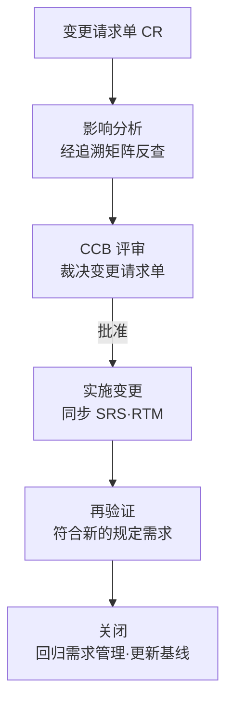
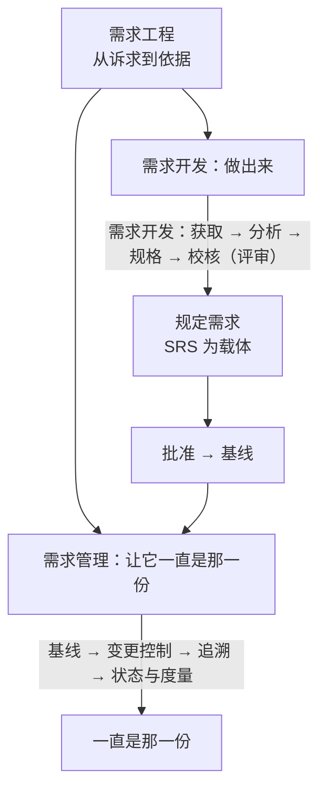

# 第4章 需求工程：从诉求到依据

---

## 4.1 引言

第3章把需求、设计开发、质量三个词立在了产品开发的路径上，需求是那条路径的起点。可需求不会自己站到纸上——它得有人去问、去分析、去写成条文，写成之后还得有人看着它不被悄悄换掉。这一章看的就是这件事：一份需求是怎么被做出来的，做出来之后又靠什么一直是那一份。先把这件事分成两段看，再把最容易混的几处边界画开，最后看它在项目里怎么用。

### 4.1.1 误解现场

恒信集团合同审批系统项目启动后的第三周，管理层开了个会。

IT 总监拍板："需求最近总是变来变去，合同评审、财务对账、法务条款，改一版崩一版。我们要加强需求管理。谁负责？徐漾，你来。"

徐漾是需求分析师，系统工程师团队里的需求侧专职。他没接话，先问了三个问题：

> "需求为什么会变？变之前，我们的需求开发做到位了吗——调研做了吗？分析做了吗？每条需求写得能当依据用吗？"

会议室安静了几秒。

IT 总监皱眉："这些不都是需求管理的一部分吗？管好需求，自然就都做了。"

如果你坐在这间会议室里，大概也会点头。因为大多数人对需求的直觉，跟这位总监一模一样：需求乱，是管理没跟上；把需求管理做好，需求就稳了。

这一章要推翻的正是这个直觉。它错在一个词上——**需求管理不包含需求开发**。需求是开发出来的，不是管出来的。

### 4.1.2 这一章要回答什么

读完本章，你应该能回答：

1. 需求工程、需求开发、需求管理是什么关系？"需求管理包含需求开发"错在哪？
2. 需求开发有哪几个活动？最后一个活动为什么叫校核（评审），不叫确认？
3. 一条需求"说出来了"算什么？为什么口头说的不能当验证的依据？
4. 需求从哪来？除了从目标转化，还有哪些来路？
5. 需求"总在变"的时候，怎么先分清是需求变了，还是当初没说清？
6. 运行概念（ConOps）在整条链的什么位置？为什么"先写条款、后补故事"顺序反了？
7. 需求管理管的是什么？变更控制要走过哪几步才算完整？基线凭什么当分界线？
8. "另存为 v2"为什么不是版本管理？
9. 一条好需求的判据是什么？哪些文档任何规模的项目都不能省？

### 4.1.3 这一章的骨架

这一章的主张是一句话——

> 需求工程，是把模糊的诉求做成一份能当依据用的规定需求——开发负责做出来，管理负责让它一直是那一份；两段并列，只在"批准 → 基线"那道门上交接。

反过来说更刺人：**管理的严格补不了开发的欠账**。需求乱，多半不是没人管，是没人做。

两段各有各的活动、各有各的判据，中间只隔着一道门：批准之前需求还在流动，批准之后一切改动都要走变更。这一章把这两段分别看清，再把最容易混的几处画开——说出来了不等于能当依据（明示与可采）、需求乱得先分清是谁的账（开发与管理）、对着需求文档只能评审（评审与验证确认）、给文件改名不等于版本管理（留档与受控）。

最后一节把这条链用起来：先用运行概念把"系统怎么被用"讲清楚，再写规格里的条款。这是第1章说的"先立枢纽，再填细节"在本章的现身——先立问题域，再写条款；顺序反了，条款写得再整齐也是悬着的。

---

## 4.2 需求工程是什么

> 这一节先看定义。需求工程由哪两段构成、每一段各做什么、需要从哪来、做出来的是什么、两段在哪里交接——这些立住了，后面的边界与运用才有话可说。

### 4.2.1 一个定义，两条路径

需求工程不是一个过程，是一对。

> **需求工程（requirements engineering）= 需求开发 + 需求管理**（并列，不是包含）

- **需求开发（requirements development）**：把利益相关方的需要与期望转化为规定需求——经过获取、分析、规格说明、需求校核。它是创造性的：从没有到有。
- **需求管理（requirements management）**：对规定需求进行基线化治理——经过基线、变更控制、追溯、状态与度量。它是控制性的：从有到一直是那一份。

一句话：**开发负责做出来，管理负责让它一直是那一份。**

这不是本书的分法，标准就是这么分的。CMMI 把需求管理（REQM）与需求开发（RD）列为两个并列的过程域；ISO/IEC/IEEE 29148（需求工程）按"开发 + 管理"两条线组织全篇（该书库内无正本，此处只锚标准与名称，不引条款号）。

在 ISO/IEC/IEEE 15288:2023 的过程清单里，这条链有三步：业务或任务分析（§6.4.1）定义使命与目的，利益相关方需要与需求定义（§6.4.2）把需要与期望做成利益相关方需求，系统需求定义（§6.4.3）再把它做成系统需求。需求工程做的是后两步，第一步是它的输入——第3章 §3.2.4 已经把这个位置划开过。

那为什么配得上"工程"二字？因为这件事有方法（访谈、原型、排序、评审）、有过程（每一步都有输入、输出、角色和准则）、有纪律（基线、变更控制、追溯），而且可复现——换个人来做，结果不会差太远。第2章讲"工程化的成色"时列的那几条（有结构、有方法、可重复、全覆盖、受控、可验证），需求工程一条不缺：获取讲方法，规格讲结构，规定需求讲可验证，管理讲受控。这套说法的出处是 IEEE 610.12-1990 对软件工程的定义，出处层级第2章 §2.2.3 交代过。

它和方法论、手艺的分野也在这里：可复现、可检验，换个人也能做。

### 4.2.2 为什么是并列，不是包含

流行一种说法："广义的需求管理包含需求开发。"这个说法错在把两类性质相反的活动揉成了一团。

| | 需求开发 | 需求管理 |
|---|---|---|
| 性质 | 创造性：收集、分析、建模、写规格 | 控制性：冻结、变更、追溯、跟踪 |
| 回答 | 需求是什么、合理吗 | 需求定了吗、变了吗、谁改的 |
| 失败模式 | 来源没摸清、分析没做透 | 基线乱、变更失控 |

把开发包进管理，会盖住一个关键事实：**需求是开发出来的，不是管出来的。** 管理再严，开发没做好，一样出烂需求——章首恒信那场会，就是"只谈管理、不谈开发"的典型。

两种欠账的后果也不一样。开发欠账出在源头：来源没摸清、话没说清，之后再怎么严管，管的也还是那些没说清的东西。管理欠账出在过程：需求原本写清楚了，却被无序变更一点点磨掉。

恒信"改一版崩一版"，如果只去加强管理，那些没说清的需求依然没说清，只是从此被更严格地看住而已。**先把开发的欠账补上，再谈管理的严**——顺序不能反。

> **概念卡片 · 需求工程**
>
> | 四问 | 内容 |
> |---|---|
> | 它是什么 | 需求开发与需求管理两段并列的总称（CMMI 的两个并列过程域、29148 的两条线）——开发负责做出来，管理负责让它一直是那一份 |
> | 它不是什么 | 对立：广义的"需求管理"——把创造性活动包进控制性活动里，会盖住"需求是开发出来的"；辨析：需求工程 ⊃ 需求开发、需求管理；需求工程 ≠ 需求管理 |
> | 它从哪来 | 从系统工程的需求侧过程演化来——15288:2023 §6.4.2 利益相关方需要与需求定义、§6.4.3 系统需求定义是它的过程锚点；CMMI 与 29148 把它分成并列两段 |
> | 它往哪去 | 它回答"需求从哪来、做出来之后怎么才算一直是那一份"；在需求获取、评审、变更控制时用；误区 ✗ "加强需求管理 = 往流程上加东西"（先问源头清了吗）✗ "需求工程 = 写需求文档"（文档只是载体） |
> | 判据 | 能说清"做出来"和"一直是那一份"分别归谁吗？两段是并列而不是包含吗？——需求是开发出来的，不是管出来的 |

### 4.2.3 需求开发：把诉求变成规定需求

需求开发把"模糊的诉求"变成"可靠的依据"，走四个活动：

```
需求获取 → 需求分析 → 需求规格说明 → 需求校核（评审）
收集需要与期望    澄清/分解/排序/协商    写成可验证条文    对工作产品做评审
```

| 活动 | 做什么 | 典型输出 |
|---|---|---|
| 获取 | 访谈、调研、竞品分析，收集需要与期望 | 利益相关方登记册、访谈调研记录 |
| 分析 | 澄清、分解、排序、协商冲突 | 需求池、优先级排序表、业务规则清单 |
| 规格说明 | 把分析结果写成可验证条文 | SRS、术语表、追溯矩阵初版 |
| 需求校核（评审） | 对工作产品判断适宜、充分、有效 | 需求评审报告、评审与确认记录、批准记录 |

四个活动不是跑一遍就完——它们是一个循环：分析时发现缺信息就回获取，规格时发现问题就回分析。为什么是循环？因为"模糊的诉求"不会一次被看清：访谈时对方说"重要合同要审批"，分析时发现"重要"没定义，回获取再问"多重要算重要"，得到"金额 ≥ 500 万或三年期以上"，才进得了规格。需求开发的每一步都可能推翻前一步的假设——循环不是低效，是正视"需求天然是渐进的"这个事实。

最后一个活动为什么叫校核（评审），不叫确认？ 这是本章第一处要钉死的地方。

需求文档是一份工作产品，还不是能用的东西。而按 ISO 9000:2026，验证（§3.11.12）与确认（§3.11.14）的对象都是已经实现出来的客体：验证通过客观证据证实规定要求已得到满足，确认通过客观证据证实"针对特定预期用途或应用的要求"已得到满足。一份还没实现的文档，既不能被验证，也不能被确认——能对它做的只有评审（§3.11.2：为达成既定目标，对客体的适宜性、充分性或有效性所作的确定）。

所以需求开发的末位活动，准确的名字是**需求校核（评审）**：评审人对着目标，判断这份需求适不适宜、够不够、有没有用。真正的验证与确认，要等到有东西可用了才做——那是第8章的活，本章只把它挂在链上。

> 术语注：需求工程标准里有一个说法叫 requirements validation，指的是"需求本身对不对"，与 ISO 9000:2026 §3.11.14 的确认（validation）同名不同物：后者判的是已实现客体在特定用途下满不满足。该书库内无正本，故此处只锚标准与版本，不引条款号。

获取与分析：来源与澄清。 获取是需求的第一手证据。恒信的合同审批系统，获取的对象是三个部门的人：法务（条款、合规）、财务（金额、账期、对账）、业务（审批流、时效）。获取做没做到位，判据只有一条：**每条需求有没有来源**——无来源需求不得入需求池。

分析是第一道加工，四件具体的事：

1. 澄清：把"重要合同要审批"问成"金额 ≥ 500 万或涉及三年期以上的合同须审批"；
2. 分解：把父需求切出子需求——这与第6章的分解是同一条规则、两处现身：切点都由消费方的语义范围定，不存在"需求侧""设计侧"两套分解；
3. 排序：MoSCoW、Kano，决定先做什么、做什么——第3章"与利益相关方一起剪裁要求"在这里落地；
4. 协商冲突：三个部门对"合同状态"的理解不一致，在这里拍平，而不是等集成时炸。

排序值得单独说一句：MoSCoW（必须／应该／可以／不要）和 Kano（基本型／期望型／兴奋型）不是两张玩具表，它们直接决定"要求不够时砍哪条、保哪条"。恒信的"合同数据留档十年"（公司法强制）在 MoSCoW 里是 Must，在 Kano 里是基本型——两套框架指向同一个结论：它不在被砍的清单里。

需求缺陷的成本。 常被引用的一组数据：同一个缺陷在需求阶段修复成本是 1，发布后修复是 30 到 70 倍。需求阶段写错一个字，可能意味着设计、开发、测试全部返工——需求工程的每一分投入，都在给下游省十倍百倍的返工钱。这组数据出自 Boehm 一系的研究（附录 E）。

### 4.2.4 需求的来路

第3章 §3.2.1 把需求分成三种形态：明示的、通常隐含的、必须履行的。三种形态不是分类游戏——它们各自对应一条来路。问"需求从哪来"，答案就是这三条。

```
目的（为什么做）──展开──→ 目标 ──转化──→ 需求    来路一：目标转化（主流）
环境与法规 ─────────────────────────→ 需求    来路二：必须履行（不经目标）
利益相关方的隐含需要 ────────────────→ 需求    来路三：通常隐含（未必被目标覆盖）
```

来路一：从目标转化。 目的展开成目标、目标转化成需求，这是主流来路。第3章 §3.2.3 已经把目的、目标、需求三个词摆开，这里只钉一处用词：**目标到需求是"转化"，不是"分解"。**

分解是同类拆分、语义守恒——整体等于部分之和；目标→子目标、需求→子需求才是分解。目标回答"要实现的结果"，需求回答"做成什么样"，两者不同类，这条链是跨类导出：一条目标往往导出一组需求，导出的每一条都要判断；阈值是权衡出来的，不是从目标里分出来的。ISO 9000:2026 §3.3.11 说设计开发是"把某一客体的要求转换为该客体更详细的要求"，那是同类细化；目标到需求比这更远一步，本书按跨类导出处理，理由是语义不守恒。

来路二：从环境与法规。 恒信"合同数据留档十年"是公司法强制。组织就算没立过"合规目标"，这条需求照样成立——它不经过组织目标这道转化。

来路三：从利益相关方的隐含需要。 案例进展②里财务那句"25 号之后签的合同能不能算下个月"，就是这一路：行业惯例默认，没人写进文档，但漏了就要出事。

三条来路合起来说明一件事：**需求 ⊋ 目标转化的结果。** 目标的完备性靠评审的充分性把关（目标有没有被需求覆盖全，第8章）；另外两条来路不经过目标，只能靠需求工程自己补齐——利益相关方的需要要收集全，法规要列成清单（第5章展开）。

> 术语注："需求三形态对应三条来路"是本书为方便使用做的梳理，不是标准原文；标准只并列给出需求的三形态，不给来路。

### 4.2.5 规格与规定需求：一份 SRS 里有什么

规格说明把分析结果写成可验证的条文，核心交付物是需求规格说明书（SRS）。一份 SRS 通常有六章：

```
引言（目的·范围·读者）→ 总体描述（产品视角·环境·约束）
→ 功能需求（逐条编号 REQ-xxx）→ 非功能需求（性能·安全·可用性）
→ 外部接口（用户·硬件·软件·通信）→ 验证方法（每条需求的接收准则）
```

各章各有职责：引言把读者领进来；总体描述给出产品视角；功能需求逐条编号，无歧义、可验证；非功能需求写性能、安全、可用性；外部接口定义与外部世界的边界；验证方法给每条需求配接收准则——这一章最容易被砍，但它正是"规定需求可验证"的兑现处：没有接收准则，需求就退化成愿望。

> 承接 §3.3.1：第3章说过"特性还没开始规定，是需求开发；特性开始被规定，才是设计开发"。那份分界文档就是 SRS——写完之后，才谈得上把需求落到客体的固有特性上。

这里的枢纽概念是规定需求。

> **规定需求（specified requirement）**：被明示的需求（ISO 9000:2026 §3.5.1 注 2）。

正本的原话是 *A specified requirement is one that is stated, e.g. in documented information*——"规定的要求是明示的要求，例如写在成文信息中的要求"。要紧的是那个 e.g.：写在成文信息里是最常见的一种明示方式，不是"规定"的条件。说出来了就是规定需求，口头说的也算——它已经进了这个集合。

那口头说的和成文的差在哪？差在能不能拿来当依据。规定需求要当验证或合规的参照，还得满足可采的条件：条目得先可判定——有编号、有对象与适用范围、有断言、有判定方法；再对得上目的、禁得起检验、属于已冻结的那一版、有唯一标识。口头那句"页面要快一点"是规定需求，但不可采：没有判定方法，不可复现，也没有版本可查。

所以"说了不等于规定"这句话，准确的说法是：说出来了就是规定需求，但**说出来了不等于能当依据**。 这处改动只换理由，不换结论——口头需求照样不能当验证的靶子，不是因为它"不算规定需求"，而是因为它不可采。这也顺带解释了需求工作的两道动作：需求评审要把口头内容写成条目，配置管理要把条目冻进基线——成文与基线不是"升格为规定"的仪式，是取得可采性的两步。

> **概念卡片 · 规定需求**
>
> | 四问 | 内容 |
> |---|---|
> | 它是什么 | 被明示的需求（ISO 9000:2026 §3.5.1 注 2）——验证的参照；成文与基线是它的可采条件，不是它的构成条件 |
> | 它不是什么 | 对立：不可采的明示——口头说了但没判定方法、不可复现、无版本，够不上"依据"；辨析：明示 = 规定（一个等号），成文 ⊂ 明示（最常用的一种方式） |
> | 它从哪来 | ISO 9000:2026 §3.5.1 把需求按"明示的、通常隐含的、必须履行的"三形态并列，其中"明示"这一支被单列——因为验证需要一个能对账的稳定参照；specified ← 拉丁 specificare（明确指明） |
> | 它往哪去 | 它回答"拿什么当验证的参照"；在需求规格、评审、测试设计、变更控制时用；误区 ✗ "没写成文档就不算规定需求"（不算的是可采，不是资格）✗ "口头说了就能当依据" |
> | 判据 | 一条需求能提供客观证据吗（测试只是其一）？能，就可采、可当依据；只能"感觉"，就还得写下来、定下来 |

### 4.2.6 需求管理：让它一直是那一份

需求开发把需求做出来了，之后归需求管理看着。它保证的只有一件事：需求一直是那一份——谁动了、动在哪、为什么动，都说得清。

四个活动：

```
基线管理 → 变更控制 → 可追溯性 → 状态与度量
```

| 活动 | 解决什么问题 | 典型产出 |
|---|---|---|
| 基线管理 | 需求"定了吗" | 需求基线、基线登记表 |
| 变更控制 | 需求"变了吗、谁改的" | 变更请求单 CR、CCB 评审记录 |
| 可追溯性 | 需求"从哪来、到哪去" | 追溯矩阵 RTM |
| 状态与度量 | 需求"整体什么状态" | 需求状态报告、度量报告 |

四者不是均分的：**变更控制是核心战场**（大多数团队的需求管理问题都出在这里）；基线是它的前提，追溯让它查得清影响面，状态与度量让它看得见整体情况。合起来回答的是一串问题——定了吗、变了吗、影响谁、整体什么状态。

> 术语注：这里的"治理"取"受控地管住"这一层意思，与第14章作为专名的治理（谁掌舵、谁划桨）不是同一个概念——那一个讲的是跨层级的校正机制，这一个讲的是把已批准的需求看住。

变更怎么走完一圈。 需求管理最容易失控的地方是变更。一条标准的路径：

```
变更请求单 CR → 影响分析（经追溯矩阵反查）→ CCB 评审（批准/拒绝/暂缓）
→ 实施变更（同步 SRS·RTM）→ 再验证（符合新的规定需求）→ 关闭（更新基线·登记日志）
```



每个节点都是一个必须可判定的关卡：CR 有没有立案、影响分析有没有做、CCB 有没有结论、再验证有没有通过——任何一个答不上来，变更就在流程外流窜。

三条铁律：

> **无 CR 不得变更**；**不分析不得上会**；**验证通过方可关闭**。
>
> 术语注：这三条是本书对变更控制纪律的操作化凝练（源出 CMMI 配置管理与需求工程标准的变更管理要求，非标准原文照录）——可当场检验。

变更还要分级：微小（需求负责人批）、一般（项目经理批）、重大（CCB 全体评审）。时限上有组织级约定（如 SRS 完成后 5 个工作日内评审、影响分析 3 个工作日、CCB 5 个工作日内决策、紧急变更 24 小时内追认）；度量上有预警阈值（变更率 ≥ 15%、稳定性 ≤ 80%、追溯覆盖率 < 100%、变更平均周期 ≥ 10 天，一到线就启动根因分析）。这些数字是组织级示例，要害在于：变更控制的每一步都要可判定——"以什么标准"必须写死，否则流程就是摆设。

一个走完整条路径的例子：恒信法务提出"电子签章的合同也走审批流"——这是一条 CR。影响分析经 RTM 反查，发现影响审批状态机、签章模块、归档模块共 3 处；CCB 评审通过；实施后同步 SRS 与 RTM；再验证"电子签章合同审批通过后进入归档"；关闭，更新基线。整个过程留下 6 份记录——任何一环断了，这条变更就成了查无实据的暗改。

基线是分界线。 线左是需求开发的产物（还在流动），线右归需求管理（一切改动走变更控制）。

> **基线**：被批准冻结、作为生存周期参照的配置信息。
>
> 术语注：此定义是本书对基线概念的操作化凝练（配置管理的通用概念，第13章展开全貌）。

第13章会把这个概念讲透。这里只需要记住它在需求链上的作用：基线是变更的出发原点——从基线出发，一切变更都可描述；离开基线，一切变化都不可言说。

基线和追溯是一体两面：基线给"变"一个参照原点，追溯给"变"一份影响清单。没有基线，追溯无从谈起；没有追溯，基线一建立就失效。恒信先建基线、再建 RTM——顺序对了。

### 4.2.7 两条路径的交接：批准 → 基线

两段怎么接上？接口只有一处：批准 → 基线。需求开发的最后一步是需求批准记录（评审通过、利益相关方确认），批准之后建立需求基线，进入需求管理的领地。

> 这道门是整条需求工程唯一的分界——批准前，需求还可以流动，归开发负责；批准后，一切改动走变更请求，归管理负责。这道门不咬合，两段就各管一段，需求会在中间断掉。

需求管理计划（RMP）。 程序文件（组织级"怎么管需求"的通用要求）与 RMP（项目级执行计划）是两个层级：每个项目启动时，按程序文件编制 RMP。RMP 通常有六块，每块回答一个问题：

| 模块 | 回答的问题 |
|---|---|
| 目的范围 | 这份计划管什么 |
| 角色职责 | 谁是 CCB、谁批微小变更 |
| 需求组织规则 | 需求怎么编号、怎么入池 |
| 基线策略 | 什么时候建基线、什么算重大变更 |
| 变更控制流程 | CR 怎么走、时限多久 |
| 追溯与度量安排 | RTM 怎么建、什么指标预警 |

RMP 是程序文件的项目版——把"组织怎么管需求"翻译成"这个项目怎么管需求"。

需求管理的正式产出，以台账和凭证为准——审计、扯皮、追责全靠它们：

| 活动 | 文档 |
|---|---|
| 计划 | 需求管理计划 RMP |
| 基线 | 需求基线 · 基线登记表 |
| 变更 | 变更请求单 CR · 影响分析报告 · CCB 评审记录 · 变更验证记录 |
| 追溯 | 覆盖分析记录 · 追溯矩阵 RTM |
| 状态与度量 | 需求状态报告 · 变更日志 · 需求度量报告 |

其中 CR、CCB 记录、变更日志最要紧——它们是"改了没有、谁批的、为什么改"的唯一凭证。**变更日志只追加不修改**，审计时调取。需求管理最忌口头的变更：落到文档层面，就是没有凭证的变更。

骨架文档不可省。 需求工程的文档体系可以有十几份，但任何规模的项目，有五份不可省：

```
SRS（需求规格说明书）· 需求池 · RTM（追溯矩阵）· 评审报告 · 基线
```

- SRS：规定需求的载体；
- 需求池：需求统一入口，无来源需求不得入池；
- RTM：追溯矩阵——变更影响分析的依据、测试覆盖的对照、合规审计的证据；
- 评审报告：校核的凭证；
- **基线**：变更的参照。

RTM 的终极检验：任取一条需求，能不能双向走通——往上游知道它从哪来，往下游知道它影响谁？ 走不通，RTM 就是一张漂亮的表格，不是追溯。

这五份可以统一编号（如 QR-01~23）：开发域 QR-01~12（利益相关方登记册、访谈记录、需求池、优先级、业务规则、ConOps、SRS、术语表、RTM、评审报告、评审与确认记录、批准记录），另加四份支撑文档（竞品分析、用户故事、原型模型、可行性分析）；管理域 QR-13~23（RMP、基线、基线登记表、CR、影响分析、CCB 记录、变更验证记录、覆盖分析、状态报告、变更日志、度量报告）。

编号让"哪份文档属于哪个活动"一目了然。**编号不是目的，可引用才是**——"这条需求在哪个文档、哪一条"要能指到具体位置，否则追溯就是空谈。

## 案例进展①｜徐漾的"需求管理"升级会议

会后，徐漾把"加强需求管理"这条指令翻成了两件事。

第一件，他调了恒信需求库里近三个月的变更记录。四十七条变更里，二十九条不是需求变了，而是当初就没说清：合同评审什么时候启动，写的是"重要合同要审批"，可"重要"从没定义过；财务要的"对账报表"从没说清统计范围。

第二件，他列了两张单子：一张是开发欠账（没调研、没分析、没写可验证的规格），一张是管理欠账（没基线、没变更流程、没追溯）。


> "加强需求管理这件事，一半是补需求开发的课。管理能让一份需求一直是那一份，可它没办法让没说清的需求变清楚——说不清的，只有开发能补。"

万辉盯着那张开发欠账的单子看了半天。

> "这四个星期我们加了三道流程、两张模板，变更数一条没降。现在看，是把两件事当成一件事了：管理管的是'定了的需求不变形'，开发管的是'需求本身立得住'。"

> "流程没错，是顺序反了。按 §3.3.11，设计开发是把要求转换成更详细的要求——那些连'重要'都没定义的条目，压根过不了 §3.3.2 那条可转化的线。拿没过线的条目去开发，开发得越彻底，返工越彻底。"

两周后，徐漾补了需求调研和需求池，建了第一版基线。万辉说"需求稳了一点"——不是需求变少了，是欠账开始还了。

这两张单子，正是这一章要分的两笔账：第二节磨它们的边界，第四节看怎么用起来。

## 案例进展②｜合同的"隐含需求"

做合同审批系统需求调研时，徐漾访谈法务、财务、业务各三场。每次最后他都问一句："还有别的吗？"——得到的都是"没有了"。

直到财务随口说了一句："对了，我们月底要对账，合同如果 25 号之后才签，能不能算到下个月？"

徐漾记下了。这句话暴露了一条隐含需求：合同审批的统计归属月份规则。没人把它写进任何需求文档——它"通常隐含"，是行业惯例默认。但如果漏了，月底对账会错，财务会觉得"这系统根本不能用"。

需求开发里，**隐含需求不会自己开口**。它需要主动去挖：访谈里的随口一句、业务流程里的惯例、前代产品的教训。挖出来的隐含需求要显性化、写进规格、变成规定需求——否则验证够不着它（验证对照规定需求），只有确认拦得住它（确认对照特定预期用途或应用的要求）。那是第8章的核心，这里先埋种子。

需求开发到底开发什么？不是把用户的话抄下来，是把不开口的、没成文的、说不清的，都挖出来、写下来、定下来。

---

## 4.3 需求工程不是什么

> 这一节把最容易混的几处分开。概念靠正例活，靠反例定型：一处混在"说了"与"能当依据"之间，一处混在开发与管理之间，一处混在评审、验证与确认之间，一处混在留档与受控之间。

### 4.3.1 明示与可采：说出来了，就能当依据吗

"页面要快一点""系统要好用""审批要严谨"——这些话客户说了，领导也说了。它们算需求吗？

算。按 §3.5.1 注 2，说出来了就是明示的需求，明示即规定。它们已经是规定需求了。

但它们还当不了依据。

验证要的是一个能对账的靶子，而一句口头的话对不了账："快一点"是几秒？"好用"怎么证明？所以同一句需求，要从"说了"走到"能当依据"，中间还得满足可采的条件：

| | 口头明示 | 成文且已定版 |
|---|---|---|
| 是规定需求吗 | 是（明示即规定） | 是 |
| 能当验证的参照吗 | 不能：没有判定方法、不可复现、没有版本 | 能：有编号、有判定方法、在已冻结的那一版上 |
| 传得下去吗 | 转述容易走样 | 白纸黑字不漂移 |
| 追得回来吗 | 没有版本可查 | 有版本可查 |

这条边界的判据问句：一条需求能提供客观证据吗（测试只是其一）？能，就可采、能当依据；只能"感觉"，就还得写下来、定下来。

恒信那句"重要合同要审批"就是标本。它是明示的需求，也是规定需求，可它不可采——"重要"有两种以上的理解，谁也没法拿它去验证。把它规定成"金额 ≥ 500 万或三年期以上"，它才第一次能当依据用。

> 承接 §3.3.2：第3章从设计开发的门口看同一件事，给的是"可转化"那条线（完整、无歧义、不冲突、隐含需求已识别）——管的是能不能进厂加工。这一节从验证的门口看，管的是能不能当对照的靶子。两条线不是一回事：可转化管进不进得去，可采管作不作数。

### 4.3.2 开发与管理：需求乱，是谁的账

案例进展①里徐漾翻了三个月的变更记录，发现一多半"变更"根本不是需求变了，而是当初就没说清楚。

这条边界钉死的是一条诊断判据：当需求"总在变"，先别急着上管理手段——先分清它是哪个病。

| 病 | 症状 | 药 |
|---|---|---|
| 开发欠账 | 没调研、没分析、没写可验证的规格 | 补开发：调研、分析、写规格 |
| 管理欠账 | 没基线、变更失控、查无实据 | 补管理：基线、变更流程、追溯 |

开发欠账出在源头，再严的管理也只是把没说清的东西看住；管理欠账出在过程，再好的开发也会被无序变更磨掉。先补开发的课，再谈管理的严——顺序不能反。

判据问句：最近这次需求混乱，是"当初没说清"（开发欠账）还是"定了之后没人管"（管理欠账）？ 答错了病，药就开错了——章首那位总监开的就是这个药。

### 4.3.3 评审与验证确认：对着需求文档能做什么

需求评审开完，主持人常问一句："验证了吗？确认了吗？"这句话问错了。

按 ISO 9000:2026，这三件事各有各的对照，对象也不一样：

| | 评审 review | 验证 verification | 确认 validation |
|---|---|---|---|
| 定义 | 为达成既定目标，对客体的适宜性、充分性或有效性所作的确定（§3.11.2） | 通过提供客观证据，证实规定要求已得到满足（§3.11.12） | 通过提供客观证据，证实针对特定预期用途或应用的要求已得到满足（§3.11.14） |
| 对照 | 为客体确立的目标 | 规定需求 | 特定预期用途或应用的需求 |
| 对象 | 工作产品——还不能用的东西 | 实现出来的客体 | 已可使用的客体 |

需求文档是工作产品。所以对它只能评审：判断这份需求适不适宜、够不够、有没有用。验证与确认要等客体做出来——那是第8章的三个看门人。

这一处为什么非分清不可？ 因为它决定了一句话能不能被承诺。把需求评审叫成"需求确认"，等于给一份还没实现的东西签了确认的字：评审会上说"确认通过"，验收时才发现用户要的不是这个——那句"确认通过"就成了将来扯皮的证据。第8章会把这条线完整展开，这里先钉住一句：需求文档只能评审，验证与确认只对做出来的东西做。

> 术语注：需求工程标准里的 requirements validation（"需求本身对不对"）与这里的确认同名不同物，见 §4.2.3 的术语注。

判据问句：你现在要判的这份东西，是做出来的客体，还是纸面上的工作产品？ 是工作产品，就只能评审；说得出"验证通过""确认通过"的，得先把东西做出来。

### 4.3.4 留档与受控：改名算不算版本管理

这是本章最后一处边界，也是最容易被当小事放过去的一处——需求管理里最像版本管理的动作，是给文件改名。

**改名、留档，不等于版本管理。** 版本管理要有三样：**基线**（批准的参照）、变更控制（怎么变、谁批）、追溯（从哪变起、波及谁）。

"另存为 v2"只做到了留档——留下了每一版的快照，却没回答三个问题：哪一版是权威基线？这次改为什么、谁批的？这条需求从哪来、影响谁？

没有基线，每一次变更都说不清"从什么变到什么"。这是全书"另存为 v2"的首次出场——第13章会用合同版本 final_2.zip 再演一遍，同一个病，换了文件后缀。

判据问句：这次"版本管理"，能回答"哪一版是基线、这次为什么改、从什么变到什么"吗？ 答不上来，就只是改名。

## 案例进展③｜"另存为 v2"的合同需求

恒信的合同审批需求改了六版。v1 是没后缀的原稿，v2 以后靠文件名管版本——"合同需求 最终版 v3.doc""合同需求 真最终版 v4.doc"。

后果是：需求池里同一份合同的需求散在六个文件里，追溯矩阵没法建，验证没有参照。小白是开发，她接口写到一半，对着六个文件名发愁：

> "我照着哪个版本写？接口这一半按 v4 的字段名写的，可 v6 里'合同状态'多出一个'已签章待归档'——六个文件三种说法。哪一版是批过的需求规格说明书，我看不出来，数据库的表结构就定不下来。"

玉杰是运维，他把发布记录也摊到桌上：

> "文件名记不下谁批的、为什么改。我们发布认的是可复现——哪个包配哪套环境参数，能复现出当时的运行形态，才算数。你们这六个文件，连哪一版是基线都对不上；没有变更请求单，也没有追溯矩阵，等于每次改动都没发生过。"

万辉终于承认："我们不是需求变太多，是这几份需求文件从来没立过基线。"

徐漾给这份需求立了第一版基线，之后每个变更都走 CR 流程。六周后，变更失控率降了七成——不是需求变少了，是每次变更都留下了痕迹。

---

## 4.4 需求工程往哪去

> 这一节把这条链用起来：先用一份运行概念把"系统怎么被用"讲清楚（问题域），再写规格里的条款（解空间），最后看一条好需求的判据和不可省的文档。

### 4.4.1 ConOps：系统将被怎么用

SRS 回答"系统必须做什么"，可在这之前还有一个更根本的问题：系统怎么被用？ 法务怎么审合同、财务怎么对账、业务怎么发起审批——这些"怎么被用"的叙事，是 SRS 的上下文。

没有它，SRS 的每一条都像悬空的条款：你知道要做什么，却不知道为什么、为谁、在什么场景下。

运行概念（Concept of Operations，ConOps）就是回答"系统怎么被用"的那份文档（IEEE 1362 定义其结构）。它是需求工程里唯一一份叙事性的正式输出——别的文档都是条目和条款，只有它讲一段过程。

### 4.4.2 ConOps 的位置：分析之后，规格之前

这是需求开发里最重要的位置判断之一。ConOps 不在流程最前，也不在最后：

```
业务目标 → 需求获取/分析 → 运行概念 ConOps（系统怎么被用）→ SRS（系统必须做什么）→ 设计·测试
```

链头那段"业务目标／系统目的"，由业务方定义并签字确认——对应后记里系统架构师那份《系统目的或任务理解确认单》（第18章）。目的、目标、需求三个词怎么分，第3章 §3.2.3 已经立过，这里只补分工：目的由业务方定；目标由需求侧帮它立成可衡量的结果；架构师在架构语境里把它当判据用，但立得对不对仍要业务方点头。

需求从三条来路上来（§4.2.4），三件东西各有一种落纸形态：目的落成确认单，目标落成操作目标清单——评审的通过标准，正是会前从这份清单里选出的可判定目标（第8章）；需求落成规格里的条目。

为什么 ConOps 必须在"分析之后、规格之前"？ 因为它的完整定稿（运行场景、异常、应急、角色）必须建立在已经摸清需要的基础上——先获取分析，再综合成运行概念，最后翻译成 SRS 条文。

跳过 ConOps 直接写 SRS，等于从问题域一步跨进解空间，中间那段没了。

ConOps 还有第二重身份，比"上下文"更要紧：**它是确认判据的载体。** 确认对照的是"针对特定预期用途或应用的要求"，而这份要求的正文，恰恰写在运行场景里——并且主体是隐含需求那一支。隐含需求不在派生链上（派生链承载的是明示的那些），验证够不着它，只有确认拦得住它；没有 ConOps，确认就没有靶子。第8章会把这条线接上。

> ConOps 讲一段过程，SRS 讲一条条条款——先讲清楚系统怎么被用，才谈得上系统必须做什么。

这正是本章的方法底座时刻：**先立问题域，再写条款**——第1章叫它"先立枢纽，再填细节"。第一节立的"开发与管理并列"是第一个枢纽，ConOps 是第二个。先扎进条款、不立骨架，条款越多越悬空。

### 4.4.3 一份 ConOps 里有什么

IEEE 1362 给 ConOps 的结构列了六部分：

| 部分 | 内容 |
|---|---|
| 引言 | 目的、范围、读者 |
| 系统概述 | 系统的使命与地位 |
| 运行环境 | 部署环境、外部接口 |
| 运行场景 | 正常·异常·应急（核心） |
| 利益相关方与角色 | 谁用什么、谁管什么 |
| 运行支持 | 部署、培训、维护、升级 |

其中**运行场景是核心**，而且要写三种：正常（一份合同走完审批全流程）、异常（法务驳回、财务校验不过、审批人离职）、应急（系统宕机时的线下替代流程）。

写 ConOps 有个实用判据：让一个不熟悉这套系统的人读完，能不能画出审批流程图？ 画得出来，ConOps 合格；画不出来，故事没讲清楚。

它的失效边界也要说清：ConOps 服务的是"怎么被用"的复杂度——运行方式一眼看透的小系统（单机、单场景）可以省掉；场景越复杂、角色越多，越不能省。

> **概念卡片 · 运行概念 ConOps**
>
> | 四问 | 内容 |
> |---|---|
> | 它是什么 | 从用户与运营视角描述"系统将如何被使用"的文档（IEEE 1362 定义其结构）——需求工程里唯一一份叙事性的正式输出 |
> | 它不是什么 | 对立：SRS——ConOps 讲一段过程，SRS 讲一条条条款；辨析：不是运营手册（不含运维操作细节），不是需求清单（是运行叙事），不是系统设计（不落进解空间） |
> | 它从哪来 | 系统工程早期发现：只写"系统必须做什么"，利益相关方对"系统将被怎么用"各想各的，于是把运行方式单独立成一份文档；Concept of Operations → IEEE 1362 定其结构 → 需求工程标准收编，缩写 ConOps |
> | 它往哪去 | 它回答"SRS 的上下文是什么"，同时是确认判据的载体（隐含需求的正文写在运行场景里）；用在分析之后、规格之前；失效边界：运行方式一眼看透的小系统可省 |
> | 判据 | 让一个不熟悉系统的人读完，能画出流程图吗？画得出来就合格，画不出来就是故事没讲清楚 |

### 4.4.4 一条好需求的判据

一条需求工程意义上合格的需求，须同时满足六条：

> 完整（该有的都有，含隐含需求）· 一致（互不打架）· 无歧义（只能有一种理解）· 可验证（能提供客观证据）· 可追溯（知道从哪来、到哪去）· 有优先级（知道先做哪个）

> 术语注：这六条不是任何标准的固定清单——它是本书从 ISO/IEC/IEEE 29148:2018 的需求特性里选取六项凝练而成，是本书对"SRS 写得好不好"的判据。该书库内无正本，此处只锚标准与版本。

六条不是并列的形容词，它们互相支撑：无歧义是可验证的前提，可验证是规定需求当依据的条件，可追溯是变更影响分析的依据，有优先级是"与利益相关方一起剪裁要求"（第3章）的操作基础。

六条里最常被牺牲的是可追溯——因为它不立刻显形，直到需求变更时才发现"这条需求当初为什么加、影响谁"全答不上来。

落地表现：SRS 里禁止"快速""大约""友好"这类不可验证的表述——这正是无歧义与可验证的检查项。恒信那句"重要合同要审批"为什么烂？它同时违反两条：无歧义（"重要"有两种以上理解）和可验证（提供不出客观证据）。

六条之上还有一套全集，分两层立。 整体层管"这份规格能不能当设计输入"——第3章 §3.3.2 的可转化四条前提；单条层管"这一条写得好不好"——本节这六条。需求工程标准另给"单条好需求"列了一份更长的特性清单（必要性、恰当、正确、符合、单一、可实现等），本书按二手来源处理：只锚标准与版本，不逐条照抄条款号，也不写成"标准说……"。

这些判据是怎么来的？ 不是标准组织凭空发明的，是失败模式的反面。工程界用几十年数据统计需求缺陷：约半数的软件错误要到后期才被发现，而且多数发生在写代码之前（Boehm 一系的研究，附录 E）。于是把"歧义、缺失、冲突、不可验证、不可追溯"这些缺陷类型逐条写成它们的对偶——"不许歧义"就成了无歧义。标准制定也是一条生产线：收集实践 → 提炼失败模式 → 写成正向条款 → 投票评审 → 修订。判据不是被"想"出来的，是被"反推"出来的。

### 4.4.5 需求文档体系

需求工程的文档可以有十几份，按"素材 → 分析 → 正式交付 → 校核"四类组织：

| 类 | 文档 | 用途 |
|---|---|---|
| 素材类 | 利益相关方登记册 · 访谈调研记录 · 竞品分析 · 用户故事 | 需要与期望的第一手证据 |
| 分析类 | 需求池 · 优先级排序表 · 业务规则清单 · 原型 · 可行性分析 | 需求怎么定 |
| 正式交付 | SRS · 术语表 · 追溯矩阵 RTM | 需求是什么 |
| 校核交接 | 需求评审报告 · 评审与确认记录 · 需求批准记录 | 对不对、交出去 |

素材类文档即使不写成正式文档，也要留原始记录——它们是追溯链的最底层。

文档体系是不是太重了？判据很简单：没有文档的环节，就是不可追溯的环节。 裁掉文档不是省事，是把追溯链砍断——追溯链断了，需求变更时你就只能靠记忆和运气。

用恒信走一遍 SRS 六章：引言（这份 SRS 覆盖合同审批系统 1.0 的功能与非功能需求）；总体描述（系统替代线下纸质审批，部署于内网，用户为法务、财务、业务三方）；功能需求 REQ-001~REQ-187（发起、初审、校验、终审、签章、归档）；非功能需求（月末高峰 500 并发、合同数据留档十年、操作日志不可篡改）；外部接口（与 OA、电子签章平台、财务系统的接口契约）；验证方法（每条需求的接收准则，如"审批通过后 5 分钟内通知利益相关方"）。六章写完，一个不熟悉项目的人能独立判断这份规格全不全。

恒信补了 RTM 之后，一次"合同金额校验规则"变更，五分钟内定位了受影响的 17 条需求、3 个模块——没有 RTM，这要翻遍六个版本文件找两天。

## 案例进展④｜恒信没人写的 ConOps

恒信的第一版 SRS 写得飞快——三个月，三百条需求。评审会上，法务负责人翻了两页就问：

> "你们写'合同审批通过后自动通知利益相关方'——哪个利益相关方？审批链上有几个人？通知不到会怎样？这三问答不上来，这一条就不是能验收的需求，是一句表态。"

没人答得上。因为没人写过 ConOps："法务、财务、业务三方怎么用这套系统审批一份合同"这个叙事，从没被写进过任何文档。三百条条款悬在半空，每一条都缺上下文。

产品开发经理满海翻了翻那三百条：

> "条款一条条都对，可凑在一起，说不清一份合同到底是怎么被用起来的。评审到这儿只能一条条过——我们要的不是三百条各自成立的条目，是一份看完能明白这系统怎么运转的运行概念。"

徐漾花三周补 ConOps：把一份 200 万的采购合同从发起、初审、校验、终审、签章到归档的完整过程写成故事，逐环节标注角色、异常与应急。

业务方的黄程陪着徐漾一段段对审批链。对到一半他提醒：

> "审批人要是离职了，谁接得上？流程图上这一格是空的。运行场景里'异常'那一栏不写，上线第一个月就会有人拿着纸质单子来找我们——这一栏不是补充材料，它就是需求。"

写到"运行支持"，徐漾去问运维玉杰。玉杰说：

> "系统宕机了，审批走什么替代流程？数据怎么备份、监控什么、谁负责升级？这些都得写进运行概念——运行支持那一栏不落纸，上线那天我们就是临时摸索。"

写完，三百条 SRS 里有一半需要改写——因为先写条款、后补故事，顺序反了。

规格的问题，往往要到运行概念里才看得出来。

镜照一眼冰链：M3 的 ConOps 是"疫苗从出库到接种全程温度不断链"——运行场景里写着"运输车在高速上抛锚 2 小时"这种应急，直接决定了"断电保温时长"这条硬需求。ConOps 写不出来的场景，就是将来要出事故的场景。

冰链的另一面在需求管理：文正评审会上随口一句"精度差不多就行"——没有 CR、没有记录，一句口头变更把验证的靶子当场换掉。一个缺的是把系统怎么被用写下来，一个缺的是把改动管起来。

### 4.4.6 认知反转

回到章首那场会。IT 总监说"我们要加强需求管理"——现在我们知道，他说错了一半。

需求工程是需求开发与需求管理两段并列，不是包含。恒信的需求乱，一大半是需求开发的欠账：没调研（来源不清）、没分析（"重要合同"没澄清）、没写可验证的规格（三百条悬空条款）。这些欠账，管理补不了——管理能让一份需求一直是那一份，不能让一份没说清的需求变清楚。

徐漾补的三样东西，各自补在了正确的位置上：ConOps 补上问题域（先讲清怎么被用，再写条款），需求基线补上变更的参照原点（改名留档不等于版本管理），CR 流程补上变更的痕迹（无 CR 不得变更）。

这一章的反转是："需求管理"这四个字被用得太顺口，以至于人们忘了它不包含"需求开发"。 需求是开发出来的，不是管出来的。

再深一层：恒信以为"加强需求管理"是往流程上加东西，结果一半是补开发的课。这提示一条普遍的次序——当一个团队说"要管起来"的时候，先问一句：源头清了吗？ 管理的价值建立在开发的质量之上，这是需求工程里最容易被倒置的一对关系。

这一章还改了两句流行话的说法，结论没变、理由变了：

- "说了不等于规定"——说出来了就是规定需求（§3.5.1 注 2 是一个等号）；要紧的是**说出来了不等于能当依据**，缺的那一样叫可采。
- "需求评审就是需求确认"——需求文档是工作产品，对它只能评审；验证与确认只对做出来的东西做。

用第1章的话收一次束：这一章从头到尾演示的是同一只手——先立枢纽，再填细节。第一节立"开发与管理并列"这个枢纽，ConOps 立"问题域"这个枢纽，四处边界一条条磨开，都在对"陷细节而不立枢纽"说不。

对"需求工程"这个词，你原来只是"见过"——背得出"需求工程 = 开发 + 管理"；这一章把它推到"拥有"——能答全四问：它是什么（两段并列）、不是什么（四处边界）、从哪来（15288 的需求侧过程、CMMI 与 29148 的两分）、往哪去（先问题域再条款）。能答全四问，才算拥有——分清"做出来"和"一直是那一份"：先补开发的课，再谈管理的严。

用第1章 §1.3.5 的尺子量一下：这一章把"需求工程"推到了**第 ② 级（图式）**——你现在看得出"开发做出来、管理看住、批准与基线交接"这条结构，而不只是背得住那个并列式。

## 小结

承接第3章，这一章讲要求是怎么被开发出来的：需求工程把模糊的诉求变成能当依据用的规定需求——需求开发负责做出来（获取、分析、规格说明、需求校核；以 ConOps 为问题域、SRS 为载体、规定需求为枢纽），需求管理负责让它一直是那一份（基线、变更控制、追溯、状态与度量），两段并列，接口在"批准 → 基线"那道门上。

它磨开了四处边界：明示与可采（说出来了不等于能当依据）、开发与管理（需求乱先分清是谁的账）、评审与验证确认（需求文档只能评审）、留档与受控（改名不等于版本管理）。全章反复演示的是同一个方法底座时刻——先立枢纽，再填细节，也就是先立问题域、再写条款。

需求域的那份产品数据，也在这几周里补齐了：ConOps、第一版需求基线、CR 流程，都是徐漾一件件补起来的——第7章会看到，这些东西本身就是产品。

下一章看另一件事：需求要全到什么程度。功能、环境适应性、可实现性三类需求及其指标齐备，规格才算立全；而需求工程产出的规定需求怎么进设计开发的树形结构、怎么被分解和分配，是再下一章（第6章 设计开发落地）的事。

---

## 附录

### A 本章概念总图



- 第一节 · 两段并列：需求工程 = 需求开发 + 需求管理（不是包含）；四个活动与循环；需求的来路；规定需求与可采条件；管理的四个活动、变更控制、基线；两段交接在"批准 → 基线"；
- 第二节 · 四处边界：明示与可采（说出来了不等于能当依据）／开发与管理（先分清是谁的账）／评审与验证确认（需求文档只能评审）／留档与受控（改名不等于版本管理）；
- 第三节 · 运用：ConOps 在分析之后、规格之前（先立问题域，它同时是确认判据的载体）；一条好需求的六条判据；需求文档体系与不可省的那五份。

恒信走完这张图：徐漾补 ConOps（问题域）→ 写 SRS（条款）→ 补 RTM 与基线 → 变更走 CR。冰链走的是同一张图，只是把"审批流转"换成了"温度不断链"。

### B 本章的能力级

**第 ② 级为主**

- **表征**——把"需求工程""需求开发""需求管理""规定需求""运行概念 ConOps"几个词说准：两段并列而非包含；规定需求是被明示的需求（明示即规定，成文属可采条件）；ConOps 是需求工程里唯一一份叙事性的正式输出；
- **图式**——两段路径合成的结构："开发做出来 → 批准 → 基线 → 管理让它一直是那一份"，以及这条路径上的四处边界（明示与可采、开发与管理、评审与验证确认、留档与受控）；
- **心智模型**——欠账二分（需求乱先分清是开发的账还是管理的账）；可采条件（有判定方法、可复现、有版本，才当得了依据）；变更控制怎么走完一圈、三条铁律（无 CR 不得变更、不分析不得上会、验证通过方可关闭）；
- **解释框架**——本章不建，由第17、18章承担。

> 能答全四问，才算拥有。

### C 自查 · 这些说法对吗？

1. "需求管理包含需求开发，管好需求自然就开发好了。"——**错**。两段并列不是包含；开发是创造、管理是控制；需求是开发出来的，不是管出来的。
2. "客户说了'页面要快一点'，这算不上需求吧。"——**错**。说出来了就是明示的需求，明示即规定；它缺的是可采——没有判定方法、不可复现、没有版本，所以当不了验证的靶子。
3. "需求写完了开个评审会，就是确认通过了。"——**错**。需求文档是工作产品，对它只能评审（判断适宜、充分、有效）；验证与确认的对象是实现出来的客体，要等有东西可用才做。
4. "需求变更多，说明需求管理没做好。"——**错**。先分清是需求变了，还是当初没说清——后者是开发的欠账，加流程治不了。
5. "版本文件名改一改，就是需求管理。"——**错**。那是留档，不是受控；没有基线，变更就说不清"从什么变到什么"。
6. "ConOps 是给运营部门看的故事，跟开发没关系。"——**错**。它是问题域那一侧的正式输出，也是确认判据的载体；跳过它直接写 SRS，条款就悬空。
7. "需求分析就是开会讨论一下需求。"——**错**。分析有四件具体的事（澄清、分解、排序、协商冲突），每件都有可检验的产出。
8. "写需求文档就是把用户的话抄下来。"——**错**。抄下来的是获取的原始记录；规格说明要把分析结果写成可验证的条文。
9. "隐含需求会自己冒出来，客户没提就是没有。"——**错**。隐含需求不会自己开口，要主动去挖；挖出来还得显性化、写进规格，否则验证够不着。
10. "需求开发四个活动跑一遍就完。"——**错**。它们是一个循环：分析发现缺信息回获取，规格发现问题回分析；需求天然是渐进的。

### D 练习

1. 用"开发做出来、管理让它一直是那一份"给恒信的困境做诊断：徐漾列的两张单子分别是什么？你们团队最近一次需求混乱，属于哪一张？
2. 找出你们公司一条"明示但不可采"的需求（说了，但拿不出客观证据），把它改写成可采的规定需求。
3. 你最近一次写需求（或接收需求），有没有跳过分析直接进规格？跳过了，代价是什么？
4. 你们团队的"需求评审"有没有被叫成"需求确认"？如果改口叫评审，签字那一刻的责任归属会有什么变化？
5. ConOps 和 SRS 的区别是什么？"先写条款、后补故事"为什么顺序反了？
6. 用六条判据给一条你正在做的需求打分：完整、一致、无歧义、可验证、可追溯、有优先级——哪一条最弱？后果是什么？
7. 你们当前项目的需求基线在哪？没有基线的话，最近一次变更"从什么变到什么"说得清吗？
8. 需求变更走完一圈（CR → 影响分析 → CCB → 实施 → 再验证 → 关闭），你们哪一环最常被跳过？跳过之后那条变更还查得到吗？
9. "隐含需求不会自己开口"——用恒信财务那句"25 号之后签的合同算下个月"举例，说明隐含需求怎么被挖出来、怎么显性化。
10. 用 MoSCoW 给恒信合同审批系统的需求排一次序（必须/应该/可以/不要），"合同数据留档十年"属于哪一档？为什么？
11. 需求"从哪来"？用三条来路（目标转化、环境与法规、隐含需要）各举一例，说明哪一条最容易被漏掉。

（答案要点见书末附录，与训练教材题卡同源）

### E 参考文献

**标准**
- R-103 ISO 9000:2026（第 5 版）—— §3.5.1 要求（注 2：规定的要求是明示的要求，例如写在成文信息中的要求）、§3.11.2 评审、§3.11.12 验证、§3.11.14 确认、§3.3.11 设计和开发、§3.7.11 目标
- R-102 ISO/IEC/IEEE 15288:2023 —— §6.4.1 业务或任务分析、§6.4.2 利益相关方需要与需求定义、§6.4.3 系统需求定义（需求工程的过程锚点）
- R-03 ISO 9001:2015 —— §8.3.3 设计开发输入（可转化判据在标准里的位置；库内无正本，条款号照录、版本随引）
- R-12 ISO/IEC/IEEE 29148:2018 —— 需求工程（需求开发与需求管理并列；单条需求质量特性与需求集特性；shall 语句形式规则）（库内无正本，本书按二手来源处理）
- R-13 IEEE 1362 —— 运行概念 ConOps（结构六部分，运行场景为核心）（库内无正本）
- R-18 CMMI（REQM / RD）—— 需求管理与需求开发是并列过程域（库内无正本）
- R-86 IEEE 830-1998 —— 软件需求规格说明书推荐实践（好 SRS 八特性，29148 的前身经典）（库内无正本）

**经典文献**
- R-51 MoSCoW 优先级方法（源自 DSDM）—— 需求优先级排序（Must / Should / Could / Won't）
- R-52 Kano 模型（1984）—— 基本型/期望型/兴奋型需求分类——"与利益相关方一起剪裁要求"
- R-87 Boehm & Basili, "Software Defect Reduction Top 10 List"（IEEE Computer, 2001）—— 需求缺陷的实证溯源（约半数软件错误到后期才被发现，判据从失败反推的经验锚点）
