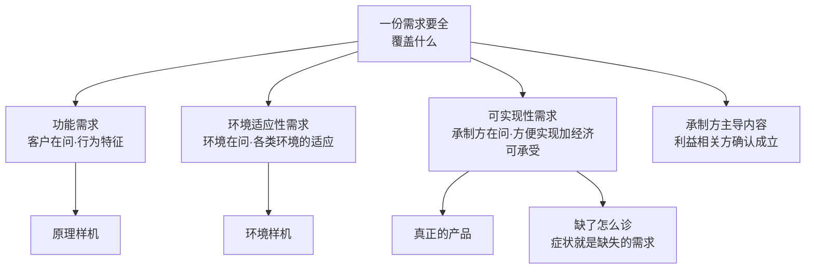

# 第5章 需求的完整性：谁在问，谁在验

---

## 5.1 引言

第4章把规定需求做出来了，也让它一直是那一份；它没有回答的是：这一份需求本身，全不全。这一章看的就是这件事。先把"全"拆成几类内容看清，再把最容易混的几处边界画开，最后看它在项目里怎么用。

### 5.1.1 误解现场

冰链科技的 M3 医疗冷链温控箱，原理样机做出来了。

水忠把一个能稳定把箱内温度控制在 2℃、波动不超过半度的样机摆在桌上：金属箱体、半导体制冷片、一块单片机，走线是手焊的，电源是实验室的。它跑了一周，温度曲线漂亮极了。

文正站在白板前宣布："原理样机验证通过，我们的产品成功了。接下来就是放大生产。"

产品开发经理永兵点了头："样机跑通了，验证也过了——放大生产，我签。"

会议室一片掌声。只有角落里制造代表逸人皱着眉。他翻着样机的零件清单，摆了三件事，最后问了一句：

> "制冷片我们买得到，可这颗控温芯片是定制料——供应商说最小起订量五万片，交期二十周。外壳是 CNC 一件件铣出来的，量产要改注塑，这个结构和壁厚注不出来。还有，这个精度是靠手工校准的，产线上没人会做。你们管这些叫'成功'？"

会议室安静了。

如果你坐在冰链的会议室里，大概也会觉得文正没错：样机都跑通了，验证也过了，怎么会不是产品成功？

这一章要推翻的正是这个直觉。它错在一个词上："原理样机验证通过"只验证了一类需求。

### 5.1.2 这一章要回答什么

读完本章，你应该能回答：

1. 一个产品的需求要"全"，要覆盖哪几类内容？为什么每一类都必须"及其指标"？
2. 给需求分类，看什么？为什么同一个特性会同时落在两类需求里？
3. 为什么"原理样机验证通过"不等于"产品成功"？哪一类需求只有真正的产品才能验？
4. 三类内容各自由谁提出？为什么可实现性需求客户根本不关心？
5. 为什么说承制方是需求开发的主导方？"引导"与"确认"的边界在哪？
6. 一个组织怎么才能不反复踩"可实现性需求缺失"的坑？成本为什么是需求、不是结果？

### 5.1.3 这一章的骨架

> 需求要全，全在三类内容上：功能需求、环境适应性需求、可实现性需求各有各的代言人，各有各的专属验证载体——缺哪一类，交付物就降一格。而最容易被漏掉的那一类没有人替你要，所以"全不全"是承制方自己的责任。

反过来说更刺人：功能需求客户会要，环境需求法规会要；可实现性需求，只有你自己会要。

这一章分三块走。第一块把"全"拆开：一份需求要覆盖哪些内容、每类由谁提出、为什么每类都要有指标。第二块把最容易混的几处画开：样机通过为什么不等于产品成功、"非功能需求"这个分法为什么不能用、隐含需求为什么不是单独一类。第三块回答最扎心的那个问题：可实现性需求客户不关心，那它靠谁提、靠什么补、缺了怎么诊。

---

## 5.2 需求的完整性是什么

> 这一块先立"全"的答案：需求要覆盖哪些内容、按什么判据分类、每一类各自包括什么、从哪里来。

### 5.2.1 一份全的需求：覆盖什么

第3章立过一句话：需求必须可判定。第4章立过另一句：需求是开发出来的，要能当依据用。这一章往前走一步，问一个更基本的问题：一份需求要"全"，到底要覆盖哪些内容？

答案藏在"产品"这个词里。讲正向设计的那份材料里，"产品"与两种样机的分别写得很干净：

> **产品**：满足功能需求、环境需求和可实现性需求的成品。

也就是说，"产品"这个词的成立，本身就要求这三类内容都在场。反过来推：需求缺了哪一类，交付物就降一格。缺可实现性需求，它停在环境样机；环境适应性需求也缺，它连环境样机都算不上。

三类内容，每一样都不是一条笼统的要求，而是一组能展开、能设指标、能指派利益相关方的条目：

| 问的问题 | 需求类别 | 一句话定义 |
|---|---|---|
| 它能不能干我们要它干的事？ | **功能需求** | 系统所具备的行为特征，以输入、处理、输出方式定义 |
| 它在真实环境里能不能活？ | **环境适应性需求** | 对气候、国家、文化、风俗、法律等各类环境的适应 |
| 它能不能被经济、可重复地造出来？ | **可实现性需求** | 生存周期各环节"方便实现"，加经济可承受 |

这套分法不只对系统成立。构件的需求同样由这三块构成，与系统完全同构。同一个模板，在系统级和构件级各复现一次。

> 术语注：这一章把需求内容分成"功能／环境适应性／可实现性"三块，并让每一块各配一个专属验证载体，是本书对军品与工程界"完整需求"实践的**凝练与命名**，不是任何标准的原文。它的一手来源是一份讲正向设计的培训材料（§7.2 给出这三类内容的正式清单），本书在它之上做了两件事：把分类判据统一到"谁在问"，把内容与载体的对应讲成一条因果。标准这边给的是另外两样东西：需求本身的定义与三种呈现方式（ISO 9000:2026 §3.5.1），以及需求过程的框架（ISO/IEC/IEEE 15288:2023 §6.4.2、§6.4.3，第4章已引）。欢迎检验、欢迎校准。

### 5.2.2 需求分类：看谁在问

这三类最容易搞混的地方，是拿"特性的名字"来分。但分类的判据不是特性本身，是**谁在问**：

- **功能需求**，是客户与使用者在问：我要的产品，做不做得到我要的事？
- 环境适应性需求，是使用环境在问（监管方、气候、法律）：你到了我的地盘，守不守规矩、活不活得下去？
- 可实现性需求，是承制方在问：我造得出来吗？造得起吗？交付得了吗？维护得了吗？

这条判据极有用。它解释了为什么同一个特性会同时出现在两类需求里。拿"测试性"说：它在使用环境下被问，问的是"产品在役期间测得出状态、定得了位"，归环境适应性需求；它在承制方的生产与交付里被问，问的是"产线上测得方便、测得快"，归可实现性需求。同一个特性，两个主人，两种归类。

叫法也跟着主人走：在使用环境下被问，写"测试性"；在承制方的生产交付里被问，写"可测试性"。

### 5.2.3 功能需求：包括什么，从哪来

功能需求是系统所具备的**行为特征**，以输入、处理、输出方式定义。它不是"要有个温控功能"，而是"给定箱内目标温度 X，处理器采样、决策、输出制冷驱动，使实测温度稳定在 X±0.5℃"：有输入可构造，有输出可检查，这样才可验证。

它还包括一条从业务走到系统的展开链：

```
业务用例 → 业务场景 → 系统用例 → 用例场景
（用产品完成什么业务）（典型过程）（系统为支撑业务的行为）（可运行的具体过程）
```

这是三类内容里唯一自带展开通道的一块：环境适应性需求靠环境分析展开，可实现性需求靠实现方案展开，只有功能需求能从"利益相关方要办什么事"一路走到"系统在什么场景下做什么动作"。这条链也是后面把需求往下分解时最主要的素材来源（第6章）。

**来源**主要有五个：

1. 客户与使用者的需要与期望——三类内容里最强的一个外部代言人，客户最愿意、也最能主动表达的就是这一块；
2. 业务用例与场景分析——不是听客户罗列功能，而是把业务建模成用例与场景，再从场景里推出系统该有的行为；
3. 需求分析师的专业捕获——客户以为自己在提需求，往往提的是"想要的东西"甚至"解决方案"，分析师要穿透到"真正的需要"。这一类需要常常连客户自己都没意识到，因而往往不成文；
4. 组织资产——同类业务的用例骨架、场景模板可以跨产品复用，但功能需求的主体仍是产品特异的；
5. 利益相关方确认（签认）——需求是对需要或期望的规范性陈述，并经利益相关方确认，才算成立。

功能需求的陷阱不是"没人提"，而是"提了但没提对"：客户自信满满说出的，常常是方案，不是需要。

### 5.2.4 环境适应性需求：包括什么，从哪来

环境适应性需求是对**各类环境**的适应。这里的"环境"是广义的：不只是自然环境，还包括法规环境与社会文化环境。

它通常展开成这么几项，每一项都答"在什么环境下，产品必须做到什么"：

1. **可靠性**——在规定条件与时间内完成规定功能、不失效，跑冷链车不出故障；
2. 安全性——运行与维护中不产生不可接受的伤害或风险，不漏电、不伤人；
3. 测试性——产品在役期间便于测试与故障定位，能快速确认自身状态；
4. 保障性——使用与维护所需的保障资源（备件、工具、人力）易于配备；
5. 适航性——符合航空器适航法规，可安全进入空中运行；
6. 气候适应性——在温度、湿度、盐雾、海拔等气候条件下保持正常功能；
7. 电磁兼容性——在电磁环境中既不受外界干扰，也不对外界产生超标干扰；
8. 法律合规性——符合投放地域的法律法规与强制性标准，例如环保回收的新规。

负责 App 与追溯平台的董勐跟着补了一句："冷链车进了山区连不上网，App 得先把温度数据暂存在本地，出了山区再补传——在弱网环境下，产品必须不丢数据。"

与可实现性需求的重叠。测试性、保障性这一类特性，在可实现性需求那边也会出现（写作可测试性、可运维性）。这不是重复，是同一个特性同时服务两个主人：面向使用环境，产品在役期间要测得出、保得住；面向承制方，生产、交付、运维过程中要测得方便、维得方便。归到哪一边，还是看谁在问（§5.2.2）。

来源主要有五个：

1. 产品投放地域的自然与电磁环境本身——卖到哪、用在什么环境，需求就从哪来；
2. 强制性的标准、法律、法规——这些不是可选项，捕获的动作是"摘录"：从法规文本里摘进需求条目；
3. 文化、风俗、国家——使用地的社会文化环境，决定人机交互、内容、外观、操作习惯方面的要求；
4. 环境利益相关方，并经其确认——监管方确认合规，最终用户确认真实环境下的使用预期；
5. 组织的环境适应性需求资产库——这一类需求不应从零发明，应基于组织积累下来的资产开发。

捕获环境适应性需求的关键不在技术，在先把产品打算投放的完整环境集定下来，再逐项确认。

> 术语注：法规强制的那几条，属于需求三种呈现方式里的"必须履行的"。正本给过两个条目：法定要求是立法机构规定的必须履行的需求（ISO 9000:2026 §3.5.5），法规要求是立法机构授权的机构规定的必须履行的需求（§3.5.8）。三种呈现方式与本章的内容分类是两条轴，§5.3.5 会把它们厘清。

### 5.2.5 可实现性需求：包括什么，从哪来

可实现性需求是承制方对自己提的要求，一共八个方面：前七个各对生存周期的一个过程，第八个是横切这些过程的总账：

| 生存周期过程 | 可实现性需求 | 对应的实现方案 | 提出者 |
|---|---|---|---|
| 物料采购 | 物料可采购性 | 物料采购方案 | 采购业务代表 |
| 制造 | 可制造性 | 制造（集成）方案 | 制造业务代表 |
| 测试 | 可测试性 | 测试方案 | 测试业务代表 |
| 交付 | 可交付性 | 交付方案 | 交付业务代表 |
| 部署 | 可部署性 | 部署方案 | 部署业务代表 |
| 运维 | 可运维性 | 运维方案 | 运维业务代表 |
| 回收 | 可回收性 | 回收方案 | 回收业务代表 |
| 生存周期全程 | **经济可承受性** | 成本方案 | 市场代表 |

这张表有三处要点。

其一，三条线是锁死的：过程、需求、方案。实现方案是对可实现性需求对应内容的**符合性解答**：物料采购方案回答物料可采购性需求，制造方案回答可制造性需求，如此类推。一条可实现性需求缺了，与它对应的那条方案也就没有依据。

其二，最后那一条与前面七条不是并列关系，它是横切前面七项的总账。经济可承受性差，几乎总是"物料不方便采购、不方便制造、不方便测试"等等共同把成本堆上去的结果；它算的是总账，所以它是**需求项**，不是过程。七个过程加上这条总账，才是完整的八个方面（§5.4.6 单独说它）。

其三，构件级与系统级同构。构件需求同样由这三块构成，可实现性需求也还是那些方面，只是构件级的"可运维性"在有些材料里写成"可服务性"。那是同一个方面在系统级与构件级的两种叫法，本章一律按系统级的叫法写。

> 术语注：第3章讲过设计开发的终点是"可实现"，那时说的是设计输出的完成度（下游各方案配齐、输出完整的规定需求）；本章讲的"可实现性需求"是需求集合里的一类内容（承制方在需求阶段提出的诉求）。一个是终点判据，一个是需求类别，两处不是一回事，别混。两张表合看才完整：第3章从设计输出面向下游，本章从承制方在需求侧提出诉求。另有一张表要分清：本书讲设计开发的终点"可实现"时，列的是下游各方案（技术、物料采购、制造、测试、交付、部署、操作、运维）；本章这八个方面多"回收"与"经济可承受性"、少"技术"与"操作"——**两者不是同一张清单的两种写法**。另有一张表要分清：本书讲设计开发的终点"可实现"时，列的是下游各方案（技术、物料采购、制造、测试、交付、部署、操作、运维）；本章这八个方面多"回收"与"经济可承受性"、少"技术"与"操作"——**两者不是同一张清单的两种写法**。另有一张表要分清：本书讲设计开发的终点"可实现"时，列的是下游各方案（技术、物料采购、制造、测试、交付、部署、操作、运维）；本章这八个方面多"回收"与"经济可承受性"、少"技术"与"操作"——**两者不是同一张清单的两种写法**。

来源主要有五个：

1. 承制方各业务代表——采购、制造、测试、交付、部署、运维、回收的业务代表，加市场代表。可实现性需求不是客户提的，是组织对自己提的；
2. 承制方现有的能力与资源约束——人、机、料、法、环，需求的指标边界据此设门槛；
3. 开发过程中的现实检验——产品开发本身就包括开发加工与装配技术、开发供应商、研制新设备与工装；一旦某条实现不了（物料买不到、技术不成熟、设备拿不到），必须回头改技术方案，而不是悄悄绕过这条需求；
4. 组织资产——工艺、供应商、设备方面的长期积累；
5. 市场与竞争研究——经济可承受性来自对竞品与替代产品的价格成本研究。

客户不关心这一块，所以必须自己提。客户只关心结果：价格、交期、质量、售后；他不关心你的成本结构、物料好不好采购、好不好制造。更麻烦的是，客户还可能反向挤压它：定制化要求违背货架产品策略，不停加功能抬高制造难度，压缩报价挤压成本空间。可实现性需求常常是那个需要组织顶住客户压力才守得住的底线。

### 5.2.6 每一类需求：都要有指标

三类内容各自包括什么、从哪里来，到这里都看清了。还剩一条三类共用的规矩：需求等于描述加指标，缺了指标就不成立。

拿 M3 说：

- **功能需求的指标**：温控精度、响应时间、续航时长、容量；
- 环境适应性需求的指标：工作温度范围、防护等级、电磁兼容的限值、法规条款的符合性；
- 可实现性需求的指标：目标成本、关键尺寸公差、交期、服务周期。

一句"要控温准"是愿望；"箱温波动不超过 ±0.5℃"才是需求。没有指标的需求，三块都会退化成愿望。

> **概念卡片 · 三类内容**
>
> | 四问 | 格 | 内容 |
> |---|---|---|
> | **它是什么** | ① | 产品需求要全，全在三类内容上：功能需求（以输入、处理、输出定义的行为特征）、环境适应性需求（对气候、国家、文化、风俗、法律等各类环境的适应）、可实现性需求（生存周期各环节"方便实现"加经济可承受）——每块都"及其指标" |
> | **它不是什么** | ⑥⑦ | 对立面：只写功能需求，把"产品需求"当成"功能清单"，这是最常见的伪全。辨析：功能与非功能的二分是这三块的一个子集，不是它的替代（§5.3.4 展开）；隐含需求也不是单独一类，它是"怎么出现"的一种形态（§5.3.5 展开） |
> | **它从哪来** | ②③⑨ | 背景：需求"全不全"在"产品与样机"的落差里暴露——从样机翻车、量产反咬的教训里逼出来。历史：源自军品与工程界的完整需求实践，本书凝练为三类内容加各自的专属验证载体，并把分类判据统一到"谁在问"。英文：functional／environmental adaptability／realizability requirement |
> | **它往哪去** | ④⑤⑧ | 它回答"一份需求要全到什么程度"——缺可实现性需求，交付物停在环境样机；环境适应性需求也缺，连环境样机都算不上。用在需求捕获、需求评审、规格编写三处：每一块都要答出来源、利益相关方、指标、验证载体。误区 ✗ "需求写全了等于功能写全了"——功能写全只够造原理样机 |
> | **判据** | 谁在问 | 每一块都能答出"谁在问"（客户、环境、承制方），每一块都有指标，每一块都有专属验证载体 |

---

## 5.3 需求的完整性不是什么

> 这一块把"全"和它容易混的样子分开：先立每类内容各配一个验证交付物，再逐条磨开四处边界。

### 5.3.1 验证载体：各管一类需求

三类内容各自对应一个**专属的验证交付物**，本书叫**验证载体**。这不是分法的巧合，是一条因果链：

```
需求类别 → 决定验证条件 → 决定交付物形态
```

| 需求类别 | 要在什么条件下验证 | 验证载体 | 确认方 |
|---|---|---|---|
| 功能需求 | 把功能从环境与量产成本约束里**剥离**出来，单独验证原理 | **原理样机** | 客户与使用者 |
| 环境适应性需求 | 把产品放进**真实环境**去跑 | **环境样机** | 环境相关方 |
| 可实现性需求 | 在**量产经济性**约束下实现出来 | **真正的产品** | 承制方 |

为什么必须各有一个？因为三类内容需要的验证条件互不相容：验证"原理对不对"，环境干扰越少越好；验证"真实环境下活不活得下来"，就必须上真实环境；验证"能不能经济、可重复地造出来"，只能在量产的约束下见真章。一个载体替不了另一个。原理样机跑通了，什么都证明不了你量产能做出来。

负责测试的李旭点头应道："那我手里的活也跟着载体走——原理样机上我只能测功能，环境样机上测真实环境，能不能上产线，得等真正的产品出来。按这一章的说法，每一类需求各有一个专属载体；样机不换，测来测去还是那一块。"

工程界有一把同构的刻度可以借来看这件事：美国航空航天局的技术就绪水平（TRL），从"基本原理被观察到"到"在真实环境中运行"，一共九级。原理样机的演示通常落在中间几级，离"真实环境运行"还隔着距离；而"能不能造出来"归另一个刻度（制造就绪水平 MRL）管。这两种就绪水平都不在本书的库内，属二手来源，这里只借它说明一件事：样机通过，不等于产品就绪。

> 概念卡片 · 验证载体
>
> | 四问 | 格 | 内容 |
> |---|---|---|
> | **它是什么** | ① | 每一类需求的专属验证交付物：功能需求对原理样机、环境适应性需求对环境样机、可实现性需求对真正的产品 |
> | **它不是什么** | ⑥⑦ | 对立面：用一个载体验证全部需求——拿原理样机的通过宣布产品成功。辨析：验证载体与"评审、验证、确认"（第8章）不是一回事——载体回答"每一类需求用什么证明"，**评审、验证、确认各自回答"对照什么"**；另外，确认的参照物是使用情境、运行概念、用例这一族东西，它与三类验证载体并列，不能互相替代 |
> | **它从哪来** | ②③⑨ | 背景：三类内容需要三种互不相容的验证条件——原理要脱离环境与成本单独验，环境要放进真实环境验，可实现要在量产经济性约束下验。历史：技术就绪水平（TRL）把技术成熟度分成九级，原理样机演示对应中间几级、真实环境运行对应最高两级（库外来源，二手）；生产就绪是制造就绪水平（MRL）管的另一个刻度。英文：prototype（原理样机）；validation vehicle |
> | **它往哪去** | ④⑤⑧ | 它回答"每一类需求用什么证明"——用原理样机的通过就宣布产品成功，会漏掉环境适应性还没验、可实现性根本没进需求清单。用在交付验收、里程碑决策、需求评审三处：判定"交付物是什么"，看三类载体的验证完成到哪一步。误区 ✗ "样机验证通过了等于产品成功了"——那只验证了功能需求 |
> | **判据** | 各管一类 | 每一类需求都能答出"用什么交付物验证它"——答不上来的那一类，就是需求没写全的证据 |

三件事别混，这里先划一条边界。三类载体承载的是验证，判据是明示的规定需求（ISO 9000:2026 §3.5.1 注 2）。

而"确认"对的不是条目，是为特定预期用途或应用的需求，它要在真实或模拟的使用条件下用一次（§3.11.14 注 3：使用条件可真实可模拟）。所以环境样机上"逐条环境指标是否达标"属验证，"放进真实使用环境看合不合用"属确认；确认的参照物是使用情境这一族东西，与三类验证载体并列，不能互相替代。展开留给第8章。

### 5.3.2 做全与验过：不是一回事

细看会发现，交付物是一级级**累加**起来的：环境样机当然得先把功能做全（不工作就谈不上环境适应），真正的产品当然得先满足功能与环境。所以很多人顺口就把"原理样机、环境样机、真正的产品"当成需求逐级累加的三段，以为做到最后一段，前面几块内容就都验过了。

累加的是交付物，**不是验证**。每一块内容有且只有一个专属载体：功能需求靠原理样机验收，环境适应性需求靠环境样机验收，可实现性需求靠真正的产品验收。原理样机不验证可实现性需求，环境样机也不验证它。

可实现性需求，只有真正的产品（量产、交付、运维跑过一遍）才能验证。这就是"原理样机通过"与"产品成功"之间那段距离的来源。

### 5.3.3 样机与产品：通过不等于成功

回到章首那场会。文正说"原理样机验证通过，我们的产品成功了"，他做对了什么？他确实验证了功能需求：温控原理成立，这一关过得漂亮。

他漏掉的是什么？环境适应性需求还没验：真上了冷链车，温差、振动、零下二十度的库房，曲线还平不平？可实现性需求根本没写进需求清单：定制料断供、注塑结构做不出来、手工校准上不了产线。

精确地说，他把**一个载体**的验证结果，当成了**全部载体**的验证结果。而那八条"不方便"，压根不是"问题"，是可实现性需求缺失的症状。

一句话：样机通过只证明了它是一台好的原理样机。把它当产品，是需求的完整性欠账在交付环节结的账。

### 5.3.4 功能与非功能：这么分行吗

工程界最常见的需求分类不是三分，是两分：功能需求与非功能需求。这个分法听着顺手，却是需求分类里最误导人的一个。

"非功能"是一条排除法划出来的：凡是不能当场演示"它能干什么"的，全被划到这个名目下。性能、可靠性、环境适应性、可维护性、可部署性、成本，它们的主人、来源、验证载体全不一样，却在同一个名字下被当成同类需求处理。

拿"谁在问"这条判据一量就清楚了：这个名目底下装着的，是**环境适应性需求**（环境在问，用环境样机验）和**可实现性需求**（承制方在问，用真正的产品验）两块。

它的害处有三条。一是判据丢了：排除法答不出"谁在问"，你问"这条非功能需求该归谁提"，没人答得上来。二是验证载体糊了：环境样机与真正的产品是两回事，装进同一个名目就分不清该用哪个去验。三是"全"的标准消失了："非功能"没有上限，只能越列越多；而"内容分几块、每块及其指标"有判据、有终点。

所以本章不用"非功能需求"来给需求分类：功能与非功能的二分，是三类内容的一个子集，不是它的替代。判据主义在这里磨出的一条边是：别用排除法给需求分类，要用"谁在问"。

### 5.3.5 隐含需求：算不算单独一类

前面磨掉了一条边：别用"功能与非功能"给需求分类。这里再磨一条，专治"三"字撞车："怎么出现"与"归哪一类"，是两条不同的轴。

第3章讲过需求的三种呈现方式：**明示的**（说出来了）、**通常隐含的**（惯例默认、没说出口）、必须履行的（法规强制的那一类），三个都是需求。本章讲的是按内容分类：功能、环境适应性、可实现性，判据是"谁在问"。

两条轴互不相干。一条功能需求可以是明示的（合同写明"箱门可单手打开"），也可以是隐含的（谁都没写，但你漏了，客户第一天就会说这产品不行）。一条环境适应性需求多半是必须履行的（法规摘录），也可以是惯例默认的。

三支落位大致有偏向：环境适应性需求多为必须履行的那一支，可实现性需求多为明示的那一支（组织自设），功能需求则是明示与通常隐含两支的混合。

所以隐含需求不是单独一类。它不是"谁在问"的一种答案，而是"怎么出现"的一种形态，任何一块内容都可能以隐含形态出现。

隐含需求的来路是一条旁路。需求的上游大致有三条通道：从目标转化而来、从环境与法规而来、从利益相关方没说出口的需要而来。隐含需求正是第三条通道的产物。它不经目标转化，未必被目标覆盖，而且常常不成文。客户自己都没意识到的需要，写不进目标，也就无从"转化"，只能由分析师从利益相关方的需要里挖出来（§5.2.3 来源三）。

它不成文，靠文档做的验证够不着它；拦得住它的，是用真实使用场景做的确认（第8章）。这也给本章的判据补了一条边界："谁在问"只回答"归哪一块"，不回答"怎么出现的"。归好类之后还得追问一句：这一条是明示的，还是隐含的？隐含的那一条，才最容易被漏掉。

---

## 案例进展①｜恒信的"样机"是什么

恒信的合同审批系统没有物理样机，但同一副框架照样成立。徐漾复盘时发现，公司里反复出现的"系统上线后一堆问题"，很多不是功能问题，而是三类内容在 IT 世界里以另一种形态缺位：

- **功能需求**（合同能发起、能审批、能归档）——恒信做得最早，原型阶段就把流程跑通了；
- **环境适应性需求**（月末五百人并发、审计留痕、内网安全合规）——只在试点（放进真实业务环境跑）时才验；
- 可实现性需求（可部署、可运维、可升级、成本可承受）——只有真正的产品（投产、运维跑过一年）才验。

恒信的"样机"是原型、试点、真正的产品；冰链的"样机"是原理样机、环境样机、真正的产品。同一副框架，两个世界，长一个样。

徐漾在复盘会上写下一句："恒信大部分'上线翻车'，翻的不是功能，是可实现性需求——部署文档缺失、运维没人接、升级要停机、一年运维成本是预算的两倍。原型跑通那天，这三样一条都验不了；要等真正的产品跑过一年，它们才会浮出来。"

---

## 5.4 需求的完整性怎么用

> 这一块回答最扎心的问题：可实现性需求客户不关心，那它靠谁提、靠什么补、缺了怎么诊。

### 5.4.1 谁主导，谁确认

前面把三类内容的来源一条条列过了，镜头拉远看，需求开发其实是一场三方戏：

| 角色 | 是谁 | 干什么 |
|---|---|---|
| **来源方** | 客户与使用者、监管与环境、组织资产 | 提供原始素材：需要与期望、强制性标准、经验与问题 |
| **主导方** | **承制方** | 驱动需求开发全过程：捕获、分析、建模、引导范围、形成条目 |
| **确认方** | **利益相关方** | 终审：需求条目成立，以利益相关方**确认（签认）**为准 |

来源方提供原料，承制方主导加工，利益相关方执行验收。客户说了算的不是"需求是什么"，而是"这条需求成不成立"：内容由承制方主导，成立由利益相关方确认。

> 术语注：这里的"确认"是**签认受理**——需求条目成不成立；不是第8章的 validation（对预期用途的确认，ISO 9000:2026 §3.11.14）。同一个词两个义，本章分开写。

> 术语注：这里的"确认"是**签认受理**——需求条目成不成立；不是第8章的 validation（对预期用途的确认，ISO 9000:2026 §3.11.14）。同一个词两个义，本章分开写。

> 术语注：这里的"确认"是**签认受理**——需求条目成不成立；不是第8章的 validation（对预期用途的确认，ISO 9000:2026 §3.11.14）。同一个词两个义，本章分开写。

承制方凭什么主导？因为客户知道**自己要什么**（他的业务、他的痛点），却不知道另外四件事，而这四件恰好是承制方的强项：

1. **什么技术可能**——有没有更优的实现路线；
2. 行业横向视野——服务过很多客户与产品，知道同类业务普遍缺什么、普遍踩什么坑，单个客户永远没有这个广度；
3. 标准与环境——法规、环境、行业规范，是承制方在摘录；
4. 资产积累——组织长期攒下来的经验、建议、问题，这是专业性的物质基础。

正因为这四条，承制方不只是被动接收客户需求，而是主动引导需求：把客户"想要的"穿透成"需要的"；提出客户没想到的需求（行业惯例、标准、未来趋势）；建议技术路线与范围；把可实现性约束主动注入需求。

引导能力本身也是一条判据：只能逆向模仿的承制方，是被动接收客户规格的执行者，谈不上引导；只有具备理论推导内核的承制方，才可能提出客户自己都想不到的需求。正向设计的能力，从需求捕获那一刻就开始用了。

> 概念卡片 · 承制方主导
>
> | 四问 | 格 | 内容 |
> |---|---|---|
> | **它是什么** | ① | 需求开发由承制方主导（捕获、分析、建模、引导范围、形成条目），利益相关方保留确认终审权 |
> | **它不是什么** | ⑥⑦ | 对立面：客户主导，把需求开发当成"客户说、承制方记"；承制方对产品更专业，是主导方而非转述方。辨析：承制方（主导，负责加工）与来源方（客户、环境、资产，提供原料）、确认方（利益相关方，终审）三分工；引导可以主动，确认不能缺席 |
> | **它从哪来** | ②③⑨ | 背景：客户知道"自己要什么"，却不知道技术可能、行业视野、标准环境、资产积累这四件事，需求开发只能由承制方主导加工。历史：源自供需双方的契约视角——承制方是产品的实现方，也天然是需求开发的主导方。英文：承制方＝产品的实现方（realizing party／developer）；主导≈lead／drive，与 guide（引导）不是同一个词 |
> | **它往哪去** | ④⑤⑧ | 它回答"需求由谁做出来、谁说了算"——客户说了算的不是需求是什么，而是需求成不成立。用在需求捕获、需求评审、范围沟通三处：承制方主动把可实现性约束注入需求。误区 ✗ "承制方就是听客户要什么就做什么"——它引导范围、塑造需求 |
> | **判据** | 责任归属 | 需求全不全、明不明确、可不可度量，问责承制方；引导可以主动到拉满，利益相关方的确认一次不能省 |

### 5.4.2 主导不等于替客户拍板

承制方主导的是**过程与专业内容**，确认权始终在利益相关方手里。引导的**力度**可以拉满：该追问的追问到底，该提的主动提，该顶住压力挡回去的就挡回去。被限制住的从来不是力度，而是最后那一个动作：替对方做决定。

引导越界有几种常见的样子：为了可制造性，悄悄删掉一条功能；为了用货架件，把标准件硬塞进需求；用一句"客户其实不需要"把需求压下去。这些动作看着都是在替客户着想，实质是把自己的约束伪装成了客户的需求。一旦越界，需求就不再是"客户要办的事"，退化成承制方自己方便的设想。

所以这一层边界是一条铁律：

> 承制方引导可以主动到拉满，利益相关方的确认一次都不能省。

这条与第14章要讲的"目的的所有权在业务方"是同一件事：内容可以主导，目的与成立的终审在外部。后记里那份《系统目的或任务理解确认单》由业务方签字生效，走的正是同一条规矩。

### 5.4.3 全不全，是承制方的责任

既然是主导方，"需求全不全、明不明确、可不可度量"这三件事，就是承制方的责任，不是客户的。

客户可以说"我不知道自己要什么"，那是他的本分；承制方不能说"客户没提，所以需求不全"，那是失职。

这一条在本章格外扎人，因为最容易漏的那一块内容，恰好是**没有外部代言人**的那一块。功能需求客户会主动提，环境适应性需求法规会强制提，可实现性需求，客户根本不关心，只有组织自己会要。没有人催的那一块，只能靠主导方自己记住。

### 5.4.4 可实现性需求从哪里补

可实现性需求还有一个性质，让它比另外两块好补：**它的复用度最高。**

功能需求随产品而变，环境适应性需求随投放市场而变；可实现性需求不一样：组织的供应链、工艺、设备、人员约束跨产品持续存在。过去的产品在制造上踩过的坑，下一个产品十有八九还会踩。采购难、装配难、运维难，这些痛点在同一个组织里几乎是常量。

| 类别 | 重新捕获的比重 | 复用组织资产的比重 |
|---|---|---|
| 功能需求 | 高（随产品而变） | 低 |
| 环境适应性需求 | 中（随投放环境） | 中（法规与标准类可积累） |
| **可实现性需求** | **低** | **高（组织约束长期恒定）** |

所以这一块**最适合、也最应该**基于组织资产开发，而不是每个项目从零发明。它的来路是一个回路：

```
问题 / 经验 / 建议 →（转化）→ 可实现性需求资产 →（复用）→ 新产品需求 →（产生新问题）→ 回到起点
```

关键词是"转化"：问题不是照抄进需求，而是被提炼成一条规范的需求条目，并配上指标：

- 问题："这批零件公差太严，装配车间返工率三成" → 转化 → 可制造性需求："零件关键尺寸公差 ≥ X，装配间隙 ≥ Y"；
- 建议："接口统一成标准件" → 转化 → 物料可采购性需求："优先选用标准外购件（货架产品，COTS）"；
- 教训："上一代低温试验反复失败" → 转化 → 环境适应性需求资产条目。

"自觉"两个字是这套积累成立的前提，也定义了它的反面：问题靠口口相传，只在现场救火，从不落成条目。这样的组织看着也在积累，其实那些经验是散的、隐性的、没法复用的。判断一个组织自不自觉，只看一条：它有没有一条制度化的回路，问题、分析、转成需求条目、入库、新产品复用、复盘更新。

于是有一个更硬的推论：没有资产积累机制的组织，天然捕获不到全面的可实现性需求。不是承制方的代表不肯说，是组织根本没有可复用的东西可以拿来提。"大部分团队都不考虑可实现性需求"，不是一次需求访谈的疏漏，是组织知识管理缺位的必然结果。

### 5.4.5 从症状反推缺了哪条需求

既然这一块内容这么重要、又这么容易被漏，那漏了之后怎么查出来？先看它为什么会被漏——四个错位：

1. **利益相关方错位**：可实现性需求的提出者是承制方，不是客户。团队习惯只访谈客户，自然捕获不到；
2. **时间错位**：功能需求缺失，原理样机阶段就爆；环境适应性需求缺失，环境样机阶段爆；可实现性需求缺失，要到量产、交付、运维才爆——最晚，也最贵，于是在短期评估里显得"不重要"；
3. 话语权错位：研发阶段由研发主导，采购、制造、运维的代表没有在需求阶段发声的机制，等产品定了稿才说"做不出来"；
4. 认知错位：团队把可实现性当成"后续工艺的事"，而它其实是产品的固有特性，必须写进需求。

四个错位导致一个最常见的现场：团队在量产时吐槽"物料难买、零件难造、测试难做、交付难搞、部署难办、运维难弄、退役麻烦、成本失控"，然后互相指责采购、制造、运维"没做好"。

但按本章的框架，这些症状不是执行问题，是需求缺失问题：

| 事后症状 | 缺失的需求条目 |
|---|---|
| 物料不方便采购 | 物料可采购性 |
| 零部件不方便制造 | 可制造性 |
| 不方便测试 | 可测试性 |
| 不方便交付 | 可交付性 |
| 不方便部署 | 可部署性 |
| 不方便运维 | 可运维性 |
| 不方便退役 | 可回收性 |
| 成本很大 | 经济可承受性 |

团队每抱怨一个"不方便"，就等于供认了一条当初没写进需求的可实现性需求。诊断的方向整个反过来：不是"执行要不要改进"，而是"需求起点全不全"。

这一招正是第1章那套方法里的反事实检验在需求侧的动作：第1章问"去掉这个枢纽，这个领域还成立吗"，本章问"没有这条可实现性需求，量产会怎样"。它把"缺了会怎样"从一句抽象假设，变成一次从现场症状反推的查账。

---

## 案例进展②｜冰链的量产翻车清单

逸人在会后列了一张单子，给文正看。这张单子后来被冰链叫作"量产翻车清单"：

> 定制控温芯片——物料不方便采购，最小起订量五万片、交期二十周；
> 箱体外壳 CNC 铣出来——不方便制造，注塑的模具与壁厚做不出来；
> 精度靠手工校准——不方便测试，产线上没人会、也来不及；
> 电源适配器没有认证——不方便交付，进不了冷链资质清单；
> 固件没有远程升级通道——不方便部署，客户现场只能返厂；
> 备件库里没有温控模块——不方便运维，坏一块换整机；
> 电池按环保新规要回收——不方便退役，回收成本比电池还贵；
> 全部加起来——成本超预算四成，经济可承受性崩了。

文正越看脸越白："这八条，没有一条是'制造没做好'，全是'需求当初没写'——定制料对应物料可采购性，注塑做不出来对应可制造性，手工校准对应可测试性。我们一直在查执行，该查的是需求起点。"

每一条都是一个"不方便"，每一条都对应一条可实现性需求：物料可采购性、可制造性、可测试性、可交付性、可部署性、可运维性、可回收性、经济可承受性。它们不是"量产时冒出来的问题"，是从一开始就缺位的需求。

永兵站在旁边，脸色也没比文正好到哪去："放大生产是我签的字——我签的是'样机跑通了'，不是'产品造得出来'。第3章说设计开发止于可实现，第4章说需求是开发出来的；这两句今天落到我头上：这份需求从起点就缺着一块，而那一块，从来没有外部代言人。"

### 5.4.6 成本是需求，不是结果

那八个方面里，最后一条要单独说，因为它的地位和其他几条不一样：**它是总账。**

经济可承受性差，几乎总是"物料不方便采购，加上不方便制造，加上不方便测试"等等共同把成本堆上去的结果。它有四处特殊。

第一，成本是需求，不是结果。产品的成本是相关需求经过分解、分配、分析之后的结果，不是单纯"设计出来"的。没有成本相关的需求，设计就没有依据和目标：每次选型、定工艺、定测试深度，都没有预算约束可以对着优化，成本只能自由落体。等量产报价发现太贵，再开"降本大会"换供应商、压工艺——每一次降本动作，都等于承认经济可承受性需求当初没写过。

第二，提它的不是客户，是市场代表。客户报价越低越好，财务管的是账不是需求；提出经济可承受性这一条的是市场代表，依据是对竞品与替代产品的价格成本研究，给出价格与成本的建议，其他人负责承接和实现。团队没让市场代表在需求阶段发声，成本需求就缺位；就算设了一个成本目标，没确认利益相关方、没落到承接者，它仍然不是一条需求。

第三，它验证得最晚，几乎不可逆。成本要到真正的产品阶段才能用完整的成本记录来验证；而压成本的杠杆（优先选用标准外购件、避免定制化外包、把核心技术模块做成可复用资产）全是设计期的决定。等发现贵了再改，架构基线与物料清单已经冻结。

第四，它同样需要指标。目标成本、生存周期成本上限、降本目标——不可衡量，同样不成为需求。

### 5.4.7 认知反转

回到章首那场会。文正说"原理样机验证通过，我们的产品成功了"。现在我们知道，他把**一块内容**的验证通过，当成了**几块内容**的验证通过。

精确地说：水忠的样机验证了功能需求，温控原理成立，这一关他过得漂亮；环境适应性需求还没验；可实现性需求根本不在需求清单里。那八条"不方便"，不是量产时冒出来的执行问题，是需求起点就缺位的证据。

冰链交付的不是产品，充其量是一台经过验证的原理样机：原理对、能控温，但造不出、交付不了、用不起。

这一章的反转是："产品需求"这几个字，大多数人以为等于"功能清单"。真相是功能只占一份，另外两份分别是环境适应性与可实现性；而最容易被漏掉的，恰恰是没有外部代言人的那一块——客户不关心你造不造得出来，只有组织自己会要，而组织自己又常常忘了要。

判断一份需求全不全，不要问"功能写全了吗"，要问"每一块内容，都能答出用什么交付物验证它吗"——答不上来的那一块，就是欠账。

还有更深的一层：需求全不全，是承制方的责任，不是客户的。客户可以不知道自己要什么；承制方不能说"客户没提，所以不全"。

而"承制方为什么不提可实现性需求"的答案，多半不是他们不肯，是组织没有积累下可提的东西。这给出一条普遍的提醒：当一个团队说"下次吸取教训"的时候，先问一句——这次的问题，有没有变成一条可复用的需求？问题不转成资产，教训就永远是教训。

用第1章的话收一次束：对"需求的完整性"，你原来只是"见过"——背得出"样机不是产品"，也喊得出"需求要全"。这一章把它推到"拥有"：能用"谁在问"给任何一条需求分类，能用验证载体查出哪一块欠账，能从一声"不方便"反推出当初没写的那条需求。能答全四问，才算拥有。

用第1章 §1.4.4 的尺子量一下：这一章把"需求的完整性"推到了第 ② 级（图式）。内容与载体那张对应表，你现在一眼看得出缺口在哪。

## 小结

承接第3、4章，这一章回答的是"一份需求要全到什么程度"。答案是把需求拆成三类内容，功能（客户在问，以行为特征定义）、环境适应性（环境在问）、可实现性（承制方在问），每块及其指标；判据是"谁在问"。

然后立起内容与载体的对应：原理样机验证功能需求，环境样机验证环境适应性需求，真正的产品验证可实现性需求。"样机通过不等于产品成功"不是一句谨慎话，是需求的完整性在交付环节结的账。

最后回答最扎心的问题：可实现性需求为什么总被漏掉。答案不是能力，是四个错位、没有外部代言人，以及组织没有积累下可提的东西。而这一切的责任都在承制方——它是需求开发的主导方，引导可以主动到拉满，利益相关方的确认一次都不能省。

把这条链反过来用，就是本章给的现场工具。从症状反推缺了哪条需求：每一声"不方便"，都是一条缺失需求的自白。

散会那天，文正把那句"我们的产品成功了"又说了一遍，说完自己先摇了头——他要的那份需求，从一开始就缺着一块，而那一块没有人替他提。他记住了自己欠的是哪一块账。

到这里，"要什么"这一问答完了：工程是什么，需求、设计开发、质量三个词，需求从哪里来、要全到什么程度。这些都立起来了，接下来看它怎么被用来造东西。

下一章是第6章 设计开发落地：需求与方案结对。它看的是这份完整的需求集合怎么被用来造东西：一份需求与一份方案结成一对，靠分配生成、分析迭代、分解分析，一层层变成可实现的方案。

## 附录

### A 本章概念总图



- 第一节 · 内容：功能需求（输入、处理、输出定义的行为特征，自带从业务到系统的展开链）、环境适应性需求（对气候、国家、文化、风俗、法律等各类环境的适应）、可实现性需求（生存周期各环节"方便实现"加经济可承受）；每块都"及其指标"；分类判据是"谁在问"；
- 第二节 · 边界：验证载体各管一类需求（原理样机、环境样机、真正的产品）；交付物累加而验证不累加；样机通过不等于产品成功；拿"非功能"给需求分类，分不出谁在问；隐含需求不是单独一类，它与内容分类是两条轴；
- 第三节 · 怎么用：承制方主导、利益相关方确认；责任在承制方；可实现性需求靠组织资产补，从问题转化而来；缺了就从症状反推；成本是需求，不是结果。

恒信走完这张图：原型验功能、试点验环境适应性、投产运维才验可实现性。冰链走的是同一张图，只是把"并发、审计、合规"换成了"温差、振动、断链"。

### B 本章的能力级

**第 ② 级为主**

- **表征**——把"功能需求""环境适应性需求""可实现性需求""验证载体""承制方主导"几个词说准：三类内容各有各的代言人；验证载体是每一类需求的专属验证交付物；内容由承制方主导、成立由利益相关方确认；
- 图式——内容与载体的对应结构：需求类别决定验证条件、验证条件决定交付物形态，缺哪一块内容，交付物就降一格；以及"谁在问"这条分类判据；
- 心智模型——从症状反推缺了哪条需求（每一声"不方便"对应一条缺失的可实现性需求）；四个错位（利益相关方、时间、话语权、认知）；问题、资产、需求这条回路；成本是需求、不是结果；
- 解释框架——本章不建，由第17、18章承担。

> 能答全四问，才算拥有——一份需求缺的是哪一块、该拿什么去验，你现在看得出来；样机通过，也不再等于产品成功。

### C 自查 · 这些说法对吗？

1. "原理样机验证通过了，产品就成功了。"——**错**。只验证了功能需求；环境适应性需求还没验，可实现性需求压根没进需求清单。
2. "需求写全了，就是功能写全了。"——**错**。功能只是三类内容里的一块；缺了可实现性需求，交付物是环境样机，不是产品。
3. "可实现性需求是后续工艺的事，不归需求管。"——错。它是产品的固有特性，必须写进经利益相关方确认的需求；没有它，设计就没有依据和目标。
4. "成本是算出来的，设计完再核算。"——错。成本是需求分解、分配、分析的结果；没设成本相关的需求，设计就没有优化的目标。
5. "客户不关心的需求，就是不重要的需求。"——错。可实现性需求客户根本不关心，可它决定组织能不能活下去。
6. "承制方就是听客户要什么就做什么。"——错。承制方是需求开发的主导方，更专业、引导范围；但引导不等于替客户拍板，利益相关方的确认不能缺席。
7. "需求不够全，是客户没提清楚。"——错。需求全不全是承制方的责任；客户可以不知道自己要什么，承制方不能说"没提所以不全"。
8. "量产翻车是采购、制造、运维没做好。"——错。每一个"不方便"，都是一条当初没写进需求的可实现性需求。
9. "一个特性归哪一类，看特性的名字。"——错。分类的判据是"谁在问"；同一个测试性，在使用环境下是环境适应性需求，在承制方的生产交付里是可实现性需求。
10. "原理样机、环境样机、产品是需求逐级累加的三段，做到最后一段就都验过了。"——错。累加的是交付物，不是验证；可实现性需求只有真正的产品能验。
11. "八条可实现性需求配不配实现方案，是后面设计的事。"——错。过程、需求、方案三条线是锁死的；实现方案是可实现性需求的符合性解答，一条缺了，对应的方案就没有依据。
12. "我们经验很丰富，问题口口相传，这就是在自觉积累。"——错。散的、隐性的、没法复用的经验不是资产；自觉积累指的是那条制度化的回路。
13. "'非功能需求'就是功能之外的需求，管性能、可靠性这些。"——错。功能与非功能的二分只是三类内容的子集；这个名目底下装着环境适应性需求与可实现性需求两块，它们的主人、来源、验证载体都不同。
14. "隐含需求是三类之外的又一类需求。"——错。隐含是"怎么出现"的一种形态，不是"谁在问"的一种答案；任何一块内容都可能是隐含的。

### D 练习

1. 拿冰链的八条"不方便"复盘：它们分别对应哪八条可实现性需求？如果重做需求，哪几条最该在需求阶段就写出来？
2. 找你们的一个产品，把它的功能需求、环境适应性需求、可实现性需求各列三条。哪一块最少？为什么？
3. 对你们的产品问一遍验证载体那一条判据：每一块内容，用什么交付物验证？答不上来的那一块，就是欠账。
4. 你们最近一次量产翻车或上线翻车，症状是哪一个"不方便"？反推出来缺的是哪条需求？当时的需求评审里，为什么没人提？
5. 用"测试性"与"可测试性"举例：同一个特性为什么有两个名字、两种归类？
6. 你们做需求捕获时访谈的对象都有谁？采购、制造、运维、市场的代表，有没有在需求阶段发过声？
7. 画一条你们组织的"问题、资产、需求"回路：最近一次事故，有没有变成一条可复用的需求条目？没有的话，卡在哪一步？
8. 经济可承受性这条需求，你们由谁提出、设没设指标、有没有经市场代表确认？如果没有，你们的"降本大会"是不是每隔一段时间就开一次？
9. 用恒信的镜照走一遍：你们的原型、试点、真正的产品分别对应什么？"上线成功"与"产品成功"之间差了什么？
10. 用四问法量一量"验证载体"或"承制方主导"：它是什么、不是什么、从哪来、往哪去？哪一问最薄，为什么最薄的那一问恰恰是你最容易出错的地方？

（答案要点见书末附录，与训练教材题卡同源）

### E 参考文献

**标准**
- R-103 ISO 9000:2026（第 5 版）—— §3.5.1 需求（注 2：规定的要求是明示的要求）、§3.5.5 法定要求、§3.5.8 法规要求、§3.5.9 合格、§3.3.11 设计和开发、§3.11.12 验证、§3.11.14 确认（注 3：使用条件可真实可模拟）
- R-102 ISO/IEC/IEEE 15288:2023 —— §6.4.2 利益相关方需要与需求定义、§6.4.3 系统需求定义（需求过程锚点，第4章已引）
- R-10 NASA TRL（技术就绪水平）—— 技术成熟度九级刻度：原理样机演示落在中间几级、真实环境运行落在最高两级，"样机通过不等于产品就绪"的工程刻度（库内无正本，二手来源）

**经典文献**
- R-65 MRL（制造就绪水平）—— 生产就绪是另一把尺子（与 TRL 对应：TRL 管技术成熟度、MRL 管制造就绪）（库内无正本）
- R-66 COTS（货架商用产品）—— 组织资产复用的一条通路（§5.4.4 那句"优先选用标准外购件"；库内无正本）

> 对照阅读：本章"内容与载体"呼应第3章"需求、设计开发、质量"与第4章"需求工程"，"从症状反推"是第1章反事实检验在需求侧的动作，验证与确认的界分留给第8章。
