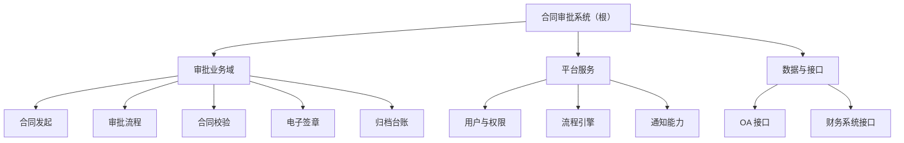
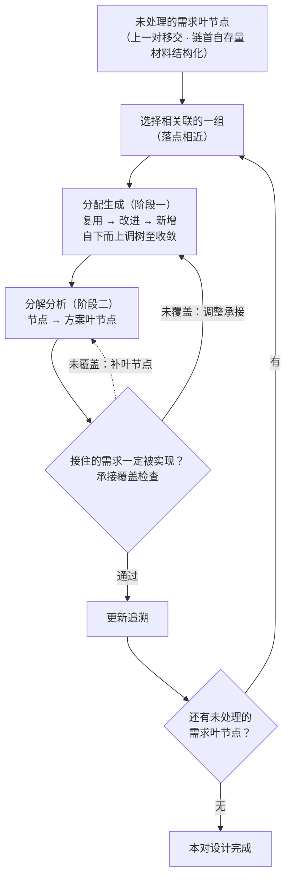
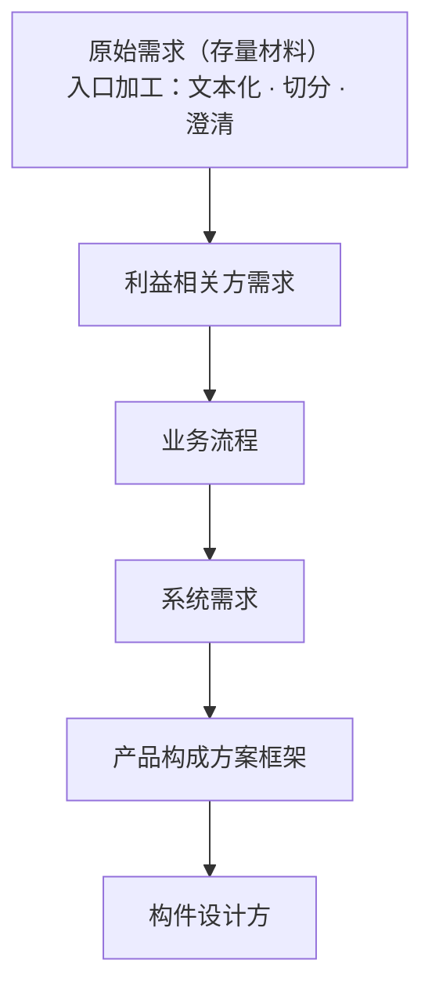
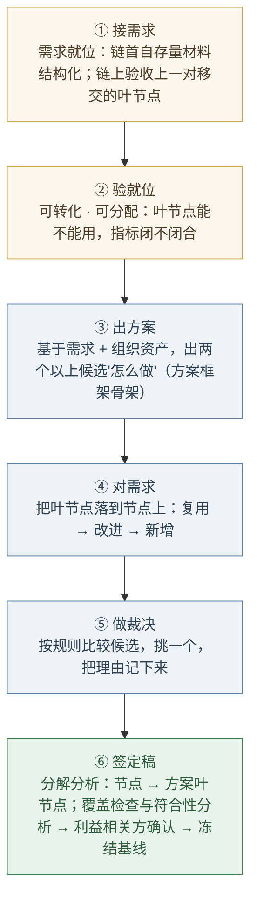

# 第6章 设计开发落地：需求与方案结对

---

## 6.1 引言

第5章把一份需求立全了：功能需求、环境适应性需求、可实现性需求，各有各的代言人，各有各的专属验证载体。立全之后要回答的是下一个问题：这份需求，怎么被用来造东西。

本章看的就是这一段，设计开发。一句话说清它的样子：一份需求配一份方案，结成一对；一对之内先定规则，再走分配生成、分析迭代、分解分析三个动作，把每一条需求落到一个能负责它的节点上；上一对交出来的东西，就是下一对的输入，一对一对往下接。

### 6.1.1 误解现场

恒信集团合同审批系统项目评审会，下午两点，会议室坐满了人。

万辉在投影上打开了《合同审批系统总体设计方案》，六十页，他花两个月写成，评审会前夜还在改格式。他清了清嗓子："这份方案覆盖了需求调研的全部三百条需求，下面我按章节过一遍——"

徐漾问了一句："它跟需求文档是什么关系？"万辉："设计文档嘛，就是把需求写详细一点。"

法务部的人翻开打印稿，翻了十几页，打断他："审批链上，谁能驳回、谁不能？"

万辉翻到那一页："在这里，第 23 页的流程图。"徐漾追问："那这条需求，落在方案哪个节点上？"

万辉："……图上没有它。"

财务的人翻到第 31 页："月底对账的统计口径，合同 25 号之后签的算哪个月？"

万辉："这个……在需求文档里写过。"

业务部的小周问："我们上线之后，发起一份合同，先点哪里？"

万辉："……界面上。"

运维的玉杰补了一句："那它部署在哪、监控什么、怎么回滚？"

万辉翻了翻稿子，没翻到："……这些后面会写。"

玉杰追问："那我上线要部署几样、监控什么，稿子里数得出来吗？"

产品开发经理满海坐在后排，把六十页掂了掂："两个月、六十页、三百条需求，都在了。可我们要的是一份'评审完就能开工'的方案，不是一本要通读的书。"

会议室安静下来。徐漾坐在角落，把六十页从头翻到尾，又翻回第一页，轻声说了一句：

"万辉，这不是一篇方案。这是一本小说。"

"方案不该是一篇文章。"徐漾把打印稿合上，"一篇文章是线性的，只能从头读到尾。可你的方案有五类读者——法务要看审批规则、财务要看校验和台账、业务要看怎么发起、开发要知道模块边界、运维要知道怎么部署。五个人的问题分散在六十页里，谁也找不到自己那一枝。"

万辉不服："那这三百条需求，该往哪儿放？"

徐漾说："写成结构。三百条需求，一条一条落到该负责它的地方去——写成一篇文章，就没有地方可落。"

万辉没接话。他忽然意识到，自己两个月里做的每一件事都对：访谈做了、需求收了、方案写了、格式改了。可这份方案没有一个位置是给"这条需求由谁负责"准备的，它只有页码。

### 6.1.2 这一章要回答什么

读完本章，你应该能回答：

1. 设计开发的对象为什么是"一对"文档，而不是一份？什么叫"由需求开发出方案、并由方案迭代需求"？
2. 记成一次 Y=F(X) 的求值，X、Y、F 各是什么？为什么说"单承接"就是函数的单值性？
3. 设计文档为什么必须能定位、能承接、能追溯？产品数据凭什么可以条目化、可以成树、可以按 N:1 分配？
4. 框架定义与详细定义各管什么？同一棵树为什么有框架、概要、定义三个形态，"最深形态"又指什么？
5. 为什么框架定义不是架构定义？
6. 每一对开工之前为什么先要定规则？三套规则各管什么，分解规则为什么必须带着消费方的语义范围来定？
7. 分配生成、分析迭代、分解分析这三个动作各在做什么，各自靠什么判据收敛？
8. 一条需求为什么只能归一个节点？违规了分几种情形、各回哪一步修？
9. 链上相邻两份之间，哪些步在承接、哪些步不做映射？链尾那一刀交给谁？

### 6.1.3 这一章的骨架

这一章要立的是"需求-方案"这一对。先把骨架立起来，后面三块，都是给它添东西。

> 设计开发的单元是一对"需求-方案"：上一份的叶节点，就是下一份的需求。一份需求配一份方案，一次 Y=F(X) 的求值（X 是需求，Y 是方案，F 是三套规则）。每份文档都是一棵树：干枝是框架定义，叶节点是详细定义；树按定义到多深，分框架、概要、定义三个形态。一对之内，先定规则，再走分配生成、分析迭代、分解分析三个动作。一条链上逐对接力，链尾把最后一刀交给构件设计方。

**一对**——设计开发的单元是一份需求文档配一份方案文档，有需求必有方案。结对是双向的：正向由需求开发出方案，反向由方案迭代需求。记成函数，就是一次 Y=F(X) 的求值（§6.2.1 展开）。

**一棵树**——每份文档都是一棵树，不是一篇文章：干枝管结构、叶节点管内容；同一棵树按定义到多深，分框架、概要、定义三个形态，最深的那个形态是这一对实际交出去的东西（§6.2.4、§6.2.5 展开）。

先定规则，再走三个动作，每一对开工先把 F 立起来：分解、构建、承接三套规则由人类主导制定。然后走三个动作：**分配生成**（把需求叶节点落到下游能负责它的节点上，长出方案骨架）、分析迭代（守住"一条需求只归一个节点"，违规就回炉重切需求）、分解分析（节点长出下层的叶节点，并检查"接住的需求一定被实现"）（§6.3 展开）。

一条链——链上相邻两份之间，上一份的叶节点就是下一份的需求；一份一份往下接，追溯边自然生成。链尾那一份只到框架，把最后一刀交给构件设计方，执行换手，概念不分（§6.4 展开）。

这一章的方法时刻，是第1章概念能力里的织关系：方案是结构，不是堆，把条目织成树、让每个部件各就其位彼此承接，而不是排成一列摞起来。

---

## 6.2 设计开发的对象

> 这一块把设计开发的对象看清：先立"一对"——一次 Y=F(X) 的求值；再看设计文档为什么必须能定位、承接、追溯；再推产品数据凭什么能条目化、能成树、能按 N:1 分配；然后把干枝与叶节点、树的三个形态、框架定义与架构的分界、树装不下的内容一一分开。

### 6.2.1 需求与方案结对

先回答一个问题：设计开发的对象是什么？不是一份文档，是一对——一份需求文档，配一份方案文档。

有需求必有方案，有方案必有需求：需求说"要什么"，方案说"怎么做"；上一层的需求，靠下一层的方案承接；而这份方案接住了需求，转过身又成为更下一层的需求，中间每一层，既是方案，又是需求（§6.4.1 展开）。

结对是双向的。正向，由需求开发出方案，按规则把需求一步步转换成方案；反向，由方案迭代需求，方案做下去发现需求切得不合用，就回头重切需求、调整承接（§6.3.4）。正反交替，直到这一对收敛：需求是合规的需求，方案是合规的方案。

这个"由 X 按规则得到 Y"的过程，记成一个函数最清楚：**Y=F(X)**。X 是需求，Y 是方案，F 是三套规则，需求侧的树形结构与节点规则、方案侧的树形结构与节点规则、方案节点承接需求叶节点的承接规则。F 由每一对开工时先定（§6.3.1）。

函数有一条铁律：**必须单值**——多个 X 可以映射同一个 Y，多条需求叶节点落到同一个节点上，没问题；一个 X 映射多个 Y，一条需求叶节点归两个节点，F 就不成其为函数。单承接，就是函数的单值性（§6.3.4 磨开）。

> Y=F(X)：由符合规则的 X，按函数规则生成符合规则的 Y。
>
> 术语注：这一记法是本书对设计开发落地方法的凝练命名，非标准条文——欢迎检验、欢迎校准。

所以这一章说"一棵树"时，先记住：树是对一份文档而言的。需求文档是一棵树，方案文档也是一棵树，一对"需求-方案"，就是两棵树。这一块先看清"每份文档都是一棵树"；下一块的三个动作，正是这两棵树之间的事。

### 6.2.2 设计文档要能定位、承接、追溯

现在回到万辉那份六十页。它为什么失败？不是他写得不好，他写得太像文章了。一篇文章有三样东西，恰好是设计文档不能缺的。

第一是不能定位。一篇文章是线性流动的，从第 2 页读到第 60 页。但"审批驳回的规则"在第几页？"对账的统计口径"在第几页？读者只能从头找起。

而方案从来不是给一个人从头读到尾的。方案是给五类人分别"查询"的：法务只找审批规则，财务只看校验与台账，开发只管模块边界。一篇文章逼着五类人都通读全文，白费功夫；更糟的是通读之后还是找不到，于是开始猜。评审会开到第四十分钟还在争"这条需求到底有没有被方案覆盖"，不是大家不认真，是文章没有给"覆盖"一个可定位的位置。

第二是不能承接。下游开发拿到六十页文章，怎么开工？他需要三件事：负责哪一块、要满足哪些需求、做到什么程度算完成。文章没有模块边界，开发只能"全文通读，然后自己揣摩"，各揣出各的边界，集成必然撞车。文章没有叶节点，需求没有地方落。

第三是不能追溯。需求是会变的（第4章刚讲完）。一条需求变了，影响方案的哪几页？文章时代只能重读全文、靠人肉找相关性，找不全就漏改。

三样合起来，其实是一件事：文章里没有"位置"。 没有位置，读者定不了位，开发接不了手，变更找不到落点。

树的回答恰好是三件事：

| 部分 | 是什么 | 干什么 |
|------|--------|--------|
| **根与层级** | 从根节点到枝梢节点的完整分级 | 层层细化，同层保持同一抽象级别 |
| **分类节点** | 非枝梢节点（如"审批业务域""平台服务"） | 组织层级——像文件夹，本身不含实体内容 |
| **枝梢节点** | 框架骨架的终点 | 承接需求——需求落在这个节点上（一个节点可落多条） |

一篇文章与一棵树，差别不在长短，在有没有叶节点：

- 文章里，"审批驳回"是正文里的一个段落；树里，它是"审批流程"这个枝梢节点上挂着的一条需求。
- 文章的段落不能被"承接"，你不能说"这一段归张三做"；树的枝梢节点可以，枝梢节点是需求落脚的钩子，也是开发认领的任务单。
- 文章的段落不能被"追溯"，需求变了你不知道哪段要改；树的枝梢节点可以，沿着"需求→枝梢节点"这条边，一步命中。

所以树的关键，是枝梢节点与叶节点怎么咬合。它有两个判据，一个管"落"，一个管"搬"：

> 枝梢节点 = 需求落脚的主要落脚点（下游还能负责这条语义的节点，见 §6.3.3）——一个枝梢节点可以落多条需求（N:1）；**落点以语义定级**。
> 叶节点（详细条目）= 能一对一搬走的原子条目——一个叶节点只能属于下一棵树的一个节点。
>
> 术语注："干枝管结构、叶节点管内容"是本书（通用设计规范）的落地操作，非标准条文；**本章各术语的英译均为本书自拟，非标准术语**。后记四角色清单里，框架定义／详细定义这对文档为模块级（模块架构师／模块工程师），系统级对应物为系统架构师的架构描述。

"一对一"是这一章最要紧的一个约束，先记住它，第二块会展开：一个叶节点，只能被搬到下一棵树的唯一一个节点上。

最后是最值得问的一句：既然树这么好，为什么大家天然写文章？因为写作是线性的，一支笔顺着思路走就行；而一棵树要有层级、要让每条需求落到枝梢节点、要让叶节点长出来，这需要方法。大多数团队没有这个方法，方案就退化成文章。翻一翻公司里任何一份"总体设计"，十有八九是按章节排列的文章，不是大家不愿意写树，是没人教过这套方法。

### 6.2.3 产品数据的条目化、树形化与分配

上一节回答"文章为什么不行"，是从读者角度看的。还有个更根本的问题："树"为什么就行？树能成，是拍脑袋定的吗？ 不是，它底下有三条依据，每条都有出处。

依据一：产品数据可以被条目化。设计的每一步产物都要能被独立判定"是否被满足"，而通行的需求书写标准正是这样要求单条需求的，单数、可验证、无歧义（ISO/IEC/IEEE 29148 对良构需求的要求；库内无该标准正本，可核的一手位是 ISO/IEC/IEEE 15288:2023 §6.4.2.3 注 26 与 §6.4.3.3 注 15，其中"单数"一名就是"一条只讲一件事"；"唯一解释"是本书的读法）。

于是最小的判定单元是条目：一条条目能独立定义、独立验证、独立分配、独立追溯。文章里没有这个最小单元，段落不能被单独验证，也不能被单独交出去。

依据二：产品数据可以被树形化。因为分层是复杂系统的常态结构（复杂系统研究里的层级与近可分解性，见 H. A. Simon《The Sciences of the Artificial》1996 第 7 章〔库外来源·不可核〕），工程上也早有分解纪律（工程分解纪律里的"百分之百规则"，即互斥且完备，本书转述）。但要注意："能组树"不是自动的，同一层的分组必须同时满足三条，否则得到的不是树：

| # | 条件 | 不满足则 |
|---|------|---------|
| 一 | 判据单维——同一层只用一个判据分组（如"系统职责"），不得混用两个（如职责与业务域并用） | 同层出现交叉分类，两个判据交叉切出的是一张格，不是树 |
| 二 | 条目单归属——每条只归一个父节点 | 得到的是有向无环图，不是树 |
| 三 | 分组完备互斥——子层完整覆盖父层，且互不重叠 | 出现缺口或重叠，不是合格的树 |

依据三：产品数据可以由需求设计方案，按 N:1 分配。因为设计被建模为从需求域到方案域的映射（公理化设计讲的 FR 与 DP 映射，见 N. P. Suh《Axiomatic Design》2001〔库外来源·不可核〕）。

这条映射的形状，由两端与一条约束定下来：定义域取需求侧的原子（叶节点）。粗粒度节点内部含着多条性质不同的需求，交出去后没法判定谁负责哪一部分；值域取方案侧当前能负责的实体；映射必须是函数，允许多对一（一个实体承担一族需求，这是内聚），不允许一对多（一条需求散在多个实体，那是变更传播与重复实现）。

两侧的理由还不同源：定义域取原子，是为了可判定；值域取当前实体，是因为这一刻方案侧的叶节点还没产出。

> 产品数据能条目化、能成树、能按 N:1 分配——三条依据合起来，才撑得起一套可执行的生成方法。
>
> 术语注：三条依据引自通用设计规范与 EOS 产品数据分解结构（见章末参考文献与库内路径），本书只做转述与举例。

三条依据还有一层用处：它们把"相邻两份产品数据之间的步"分成三类：分配步、整段搬入步、形态轴步（本章叫它**链上三类步**），是第三块要用的分界（§6.4.2）。

条目化之后，还有一件事必须回答：条目一多，怎么组织？ 真实系统几百上千条，平铺着三条都不成立：人脑装不下，需要"先看结构、再进细节"；一条需求变了、影响哪些条目，要聚类才能定位；要按领域把条目分给不同团队。所以条目必须被组织。

而组织成什么形态？这里藏着树最深的理由，为什么偏偏是树，不是列表、不是表格、不是网状？

> 因为树是唯一能让"导航路径"与"承接路径"合一的形态。

列表没有层次，一多就应付不了；表格能表达"谁承接谁"，但那是映射表，不是内容组织；网状能表达复杂关系，但需求必须"从根落到叶节点"，网状没有唯一根，答不了"这条需求归谁"。只有树，从根到叶节点有唯一路径：既是读者找路的导航，也是需求落地的承接。顺着树走一遍，就是一次完整的承接验证。

这个"合一"，就是第1章概念能力里的织关系：把散点织成结构，让导航与承接走同一条路。设计做的是把三百条需求织成一棵树，每条需求有唯一的位置。方案是结构，不是堆：堆是线性排列，结构是有承接关系的网。

### 6.2.4 框架定义与详细定义

树组织好了，还差最后一步：细到什么程度？细到每条需求都被接住、每个叶节点都可验证，可整棵树都细到叶节点，你就看不见树了。管理与理解需要先看骨架（结构、分类、承接关系）；落实与验证需要逐个看叶节点（定义、指标、验收标准）。

两种抽象级别、两种目的、两种变更频率，于是树天然分成两大部分：**干枝**与**叶节点**——这不是谁规定的，是"既要看懂、又要做实"这两件事逼出来的。它们各有各的名字：

| 部分 | 叫什么 | 管什么 | 回答什么问题 |
|------|--------|--------|--------------|
| 干枝（结构） | 框架定义 | 组织与承接 | "结构是什么、承接了谁、往下分解出什么" |
| 叶节点（内容） | 详细定义 | 定义与验证 | "每个模块具体做什么、做到什么程度" |

框架定义就是树的干枝：从根节点一路分叉到枝梢节点，每个枝梢节点回答"结构是什么、承接了谁"，系统被组织成哪几大块，每个枝梢节点上要落哪些需求。

详细定义就是树的叶节点：长在枝梢节点上的每一条，回答"每个模块具体做什么"，一条可独立定义、可独立验证的条目，有编号、需求描述、性能指标、验收标准、映射目标。

最关键的一点：叶节点不是漂着的，它长在枝梢节点上。每个叶节点都明确属于某个枝梢节点。"顺序审批"这个叶节点长在"审批流程"这个枝梢节点上。树正是用"叶节点属于哪根枝"这件事，把结构与内容连成一个整体。

这也回答了"为什么缺一不可"：干枝上没有叶节点是枯树，叶节点没有干枝是落叶。如果只有干枝，树就是空骨架，枝梢节点上没有内容；如果只有叶节点，叶节点就散落一地。一棵好树：干枝挂得住，叶节点长得出。

画出来，就是一棵实实在在的树，干枝部分，是框架定义：



中间层的"审批业务域""平台服务"是**分类节点**（干枝的分叉、负责组织的文件夹）；"合同发起""审批流程"这些枝梢节点是框架树的终端。每个枝梢节点上长着叶节点，叶节点就是详细定义：

```
「审批流程」这个枝梢节点上，长着四条叶节点：
  · SYS-002.01  顺序审批   支持按法务→财务→业务顺序审批，审批后 5 分钟内进入下一节点
  · SYS-002.02  驳回回退   支持驳回，驳回后回到发起人并可修改重提，响应 < 1s
  · SYS-002.03  会签       支持多方同时审批，会签发起后同步通知各方
  · SYS-002.04  超时提醒   审批超过 48 小时未处理自动提醒，提醒后 24 小时内升级
```

注意这个例子里已经藏着三个动作的影子："审批流程"这四条叶节点，是一把分解的刀切出来的；每条叶节点都要落到下一棵树的一个节点上，落靠在分配生成时对账（§6.3.3）。 干枝与叶节点这两个部分，正是为这些动作而生的。

> 概念卡片 · 框架定义
>
> | 四问 | 格 | 内容 |
> |---|---|---|
> | **它是什么** | ① | 设计树的干枝：从根到枝梢节点的树形结构 ＋ 映射表 |
> | **它不是什么** | ⑥⑦ | 对立＝详细定义（叶节点）——干枝组织与承接，叶节点定义与验证，合起来才是一棵完整的树；辨析＝框架定义 ≠ 架构（见 §6.2.6） |
> | **它从哪来** | ②③⑨ | 从结构骨架与内容条目分层来：设计文档先立骨架、再填条目；为拆掉"架构＝文档"的词汇病定名（见 §6.2.6）；英文 preliminary definition，preliminary ← 拉丁 praeliminaris（门槛之前） |
> | **它往哪去** | ④⑤⑧ | 没有它，方案不可整体看懂、需求没有地方落；在设计树结构搭建、需求落靠定位时用；误区 ✗"框架定义就是画一张系统结构图"——画图只是第一半，还必须有映射表说明每条叶节点承接了谁 |
> | **判据** | 落枝问 | 任取一条需求，能说出它落在哪个节点上吗？说不出的，这棵树还没长全。失效边界：链首的需求侧是存量材料（开工时直接结构化成树）、链尾的方案侧止于框架（叶节点归构件设计方）——这两处退化成最简形态 |
>
> 概念卡片 · 详细定义
>
> | 四问 | 格 | 内容 |
> |---|---|---|
> | **它是什么** | ① | 设计树的叶节点：长在枝梢节点下的条目列表，每条可独立定义、独立验证 |
> | **它不是什么** | ⑥⑦ | 对立＝框架定义（干枝）——叶节点给干枝填内容，干枝给叶节点定位；辨析＝详细定义 ≠ 需求文档——它既写"是什么"也写"做到什么程度"（指标＋验收标准），是设计内容的最终落点 |
> | **它从哪来** | ②③⑨ | 与框架定义同源孪生：把"可验证、可落实"的最小单元独立成层（见 §6.2.3 条目化）；"详细"之名与"框架"对称而成；英文 detailed definition，detail ← 拉丁 talis（如此） |
> | **它往哪去** | ④⑤⑧ | 它回答"每个模块具体做什么、做到什么程度"——可逐条验证、可一对一搬走；在逐条定义、验收核对时用；误区 ✗"叶节点越多越详细越好"——叶节点必须长在枝梢节点上，散落的条目只是段落 |
> | **判据** | 五件套 | 每条叶节点都有编号、需求描述、性能指标、验收标准、映射目标吗？缺一，叶节点还不完整 |

### 6.2.5 框架、概要与定义

同一棵树，可以停在不同的深度上。按定义到多深，它有三个形态：

| 形态 | 包含什么 |
|------|---------|
| **框架**（xx 框架） | 根 → 枝梢节点；叶节点只以枝梢节点的展开项露名字 |
| **概要**（xx 概要） | 根 → 叶节点，各级节点只到说明 |
| **定义**（xx 定义） | 概要 ＋ 各节点的详细定义 |

同一棵树上，层名分三级：**干枝**（叶以外的各级）、**枝梢节点**（这一次框架的最深一级）、**叶节点**（树的末级）。本章下文单说"节点"时，指下游能负责这条语义的那个节点（可能是干枝，也可能是枝梢，§6.3.3 展开）。

三个形态由三级设计动作产出：框架设计出框架，概要设计出概要，详细定义出定义。相邻两级可以合做，一个设计动作一次交出两级；也可以按需省略或裁剪，某份产品数据不必每一级都停。

这一对实际交出去的东西，是各自最深的那个形态。本书因此不用"框架与完整态"这种两分说法：说"完整态"会把"概要"这一档挤没，它既不等于框架，也不等于定义，而是"根到叶节点、只到说明"的独立一档。"最深形态"才是这一对两端的正式说法。

有两处细节，越往后越要紧，先在这里立住：

- 框架有阶：枝梢取哪一级，由这一次框架设计定；取得越浅，框架的阶越高。"枝梢"始终指这一次框架的最深一级，不是一个固定的树位，同一份业务流程产品数据，可以给出构件级的高阶框架（枝梢＝产品构件），也可以给出文档级的高阶框架（枝梢＝文档级端到端任务），每一阶都是一份合法的框架。因为枝梢是承接的落点（§6.3.3），框架的阶越高，这一对承接时下游能提供的落点越浅。
- 叶节点有三种身份：在框架里，它只是枝梢节点上的一条展开项（名称级）；到概要，它才成为树节点（说明级）；到定义，它才带着详细定义。

还有一条随之而来的口径：分解源判据附着于这一次形态的最深一级。框架停在哪一阶，判据就挂哪一级；到了概要，叶节点已是树节点，判据的内容就是叶节点本身，不再另设展开清单。

最后一点，叶不只是"最深的那一级"，它有判据：叶节点必须切到可被独立解释、可独立验证、可被唯一交出去的粒度。所以"某棵树到哪一级为止"是一个判断——不是一个位置约定。

### 6.2.6 框架定义不是架构定义

细心的读者会问：在很多方法论文档里，这份树形文档常被叫作**架构定义**（architecture definition），一棵树的形状，不就是架构吗？（按 ISO/IEC/IEEE 42010:2022，这项工作的规范名字是 **§3.3 架构描述**，即"用于表达架构的工作产品"；"架构定义"是习惯叫法。）

正是这个"听着顺耳"，是个词汇病。这一节要竖起的又一个反直觉命题，就在这里：

> 框架定义 ≠ 架构定义。

三个理由，每一个都值得想清楚。

理由一：与"架构"撞车。 "架构"（architecture）在全书极其重量级。第10章会依 ISO/IEC/IEEE 42010:2022 **§3.2** 给它一个精确的定义（"实体在其环境中的基本概念或属性，以及为实现和演化该实体及其相关生存周期过程的管控原则"）；本书把这个定义读作系统不可还原的涵义——关于系统根本性质的决定：几个要素、怎么连接、哪条不可推倒重来。

按 ISO/IEC/IEEE 15288:2023 §3.13，设计是"系统元素及其关系的规定，其完整程度足以支撑架构的合规实现"。架构是设计的支配层，设计是让它落成的东西。框架定义是一份文档，架构是系统本身的那组根本决定。

镜照一眼冰链，同一个病，换了世界。冰链把 M3 的方案结构文档直接叫"架构定义"，这名字一听就重：架构都"定义"了，还动什么？

于是人人都以为架构已定、画完即可，文档再没人维护。可那棵树天天在长：加一点需求、改一条逻辑，它就得跟着长。等第10章把"架构"说清楚，水忠才明白：被他们叫"架构定义"的只是一棵还没长成的树；真正的架构（那组"去掉就不是 M3"的决定）一直活着，只是从没人写下来。

用已经承担重量级含义的词，去命名轻量级文档，是给自己埋词汇病的坑。

理由二：不对称。它的孪生兄弟叫"详细定义"。既然另一半叫"详细"，按对称，这一半就该叫"框架"。叫"架构定义"，反而跟这对名字自己的对称关系打架。

理由三：名实相符。它回答"结构是什么、承接了谁"，是设计的结构骨架——比架构轻：初步、框架，用于组织与承接。真正"不可还原的决定"确实藏在树的枝条走向里，但那是从树里读出来的判断，不是树本身。第10、11、12章会专门去挖。

> 框架定义是目录，详细定义是正文，架构是这本书真正要表达的思想。目录不是思想，但好的目录帮你定位思想。

不过，把"不等于"说死之前，得分清两层。文档层面，框架定义不等于架构，框架定义是一份设计文档（结构骨架＋映射表），架构是系统不可还原的涵义（第10章），两者不在一个层面。但在"把系统结构写下来"的描述层面，框架定义可以作为架构的一种描述，它把结构写下来，本身就是架构描述的一种。两层不打架：不等于，是在文档与涵义之间划线；可作描述，是在描述与涵义之间搭桥。

所以这一章里，我们统一用框架定义这个名字。它比"架构定义"少一分误导，多一分老实。

万辉后来问徐漾："为什么不叫架构定义？"徐漾反问："你那六十页'总体设计方案'，叫不叫架构？"万辉哑然。徐漾："所以名字上就要分开，文档是文档，架构是架构。"

### 6.2.7 树装不下的内容

本方法有一个基础假设：需求或方案类产品数据都能组织成树形结构。这个假设成立，但依据是组织性的，不是内容性的：说"组织成树"，只保证每条内容有一个唯一的归属位置；不保证内容之间只有父子关系。

需求与方案的语义本质是图，有四类内容，纯树放不下：

| 内容类型 | 现象 | 树形处理 |
|---------|------|---------|
| **横切** | 一条约束影响多个分支（"可用性 ≥ 99.9%""所有操作需审计留痕"） | 给它独立的树位置（如非功能分支），用影响面标注勾连被影响的节点 |
| **共享** | 一个定义被多处引用（"客户"贯穿多个流程、接口契约被多个组件消费） | 归属到一处，其余引用——跨文档只记引用、不复制正文 |
| **多维** | 同一批需求可按功能／场景／性能／利益相关方多个维度切分 | 选一个稳定的主组织维度作树的轴，其余维度降为节点属性 |
| **循环／递归** | 业务流程自调用、嵌套，调用关系成环 | 树按归属组织层级，调用关系记在节点内容里（递归：每一级元素的设计开发都是一次完整的设计开发） |

由此读出本方法对"树"的读法：树是存储骨架，引用与追溯是关系载体。承接因此分两种并存，**归属式承接**（功能性分配，走单承接约束）与**横切式承接**（非功能、约束、安全策略：留在独立分支作叶节点，用影响面标注表达对多个方案节点的承接，不走归属分配）。

假设在两种情况下不成立：一是要求树同时表达全部关系（把横切、共享也塞进分支结构），解法已给出：横切走独立分支加标注；二是选不出稳定的主组织维度，树组织变成任意的，内容一增长就会反复重构。后者的解法是：每一对开工前先定死主组织维度（对应下一块的"每一对先定规则"）。

还有一层边界要提前说清：上面讨论的是"哪些内容树装不下"，另有一层是"哪些东西根本上不了链"，**确认的判据**（预期用途、使用情境，主体是隐含需求）与方针不在链上，因为本链按派生关系生成、只承载明示的条目。这决定了这条链能支撑评审与验证，支撑不了确认（§6.4.3 收口）。

## 案例进展①｜六十页文章变成一棵树

评审会散了之后，万辉回去熬了一夜。

他把六十页文章揉碎了，提炼成一页树：合同审批系统＝三个枝（审批业务域／平台服务／数据与接口），十个枝梢节点（发起、流程、校验、签章、归档／权限、流程引擎、通知能力／OA、财务接口）。

第二天他把这一页树拿给徐漾看。徐漾点头："好多了。现在你告诉我，法务关心的审批规则，在哪个枝上？"

万辉指向"审批流程"那个枝梢节点。

"那这个枝梢节点上，落了哪几条需求？"

万辉愣住了。树还只是一张图，枝梢节点上还没有叶节点。

"这就对了。"徐漾说，"树还只是骨架。要变成方案，得把三百条需求一条一条落到枝头上——落得准、落得全、落得能验证。"

"怎么落，先立骨架还是先切叶节点？"

"先定规则，再一个动作一个动作来。"徐漾竖起一根手指，"第一个动作是分配生成——把三百条需求落到这十个节点上。先学落，再学查，最后学长叶节点。"

---

## 6.3 设计开发的规则与动作

> 这一块先立规矩、再磨动作：每一对开工先定规则——三套规则由人类主导制定，分解规则必须带着消费方的语义范围来定。然后三个动作各靠反例定型：分配生成不是"简单分派"、分析迭代不是"返工丢人"、分解分析不是"多列几条"更不是"空话"；最后说清干枝与叶节点为什么不焊死在一起。

### 6.3.1 每一对先定规则

上一块的树，回答了"设计文档长什么样"。现在的问题更根本：树是怎么长出来的？ 答案是先定规则，再走下面三个动作。

三个动作不是三个先后的大阶段，而是每一对"需求-方案"都要走的功课，各有各的发生地：

| 动作 | 在哪儿做 | 做什么 | 自检 |
|------|----------|--------|------|
| **分配生成** | 需求叶节点 → 方案框架（两棵树之间，加树上） | 叶节点落到节点上（复用 → 改进 → 新增），新节点自下而上调树 | 三自检 ＋ 收敛判据 |
| **分析迭代** | 两棵树之间（查），加回需求侧（迭代） | 检查分配与生成的正确性：单承接成立吗、承载量合适吗、改进波及谁——违规就迭代需求分解 | 违规两分类处理 |
| **分解分析** | 方案树上（节点 → 叶节点） | 节点按分解规则分解为方案叶节点，再做承接覆盖检查 | 语义四查三场景 ＋ 覆盖公式 |

但在这三个动作之前，还有一件每对必做的事：**定规则**（分解、构建、承接三套）。规则不是从天上掉下来的通用教条，是这一对自己的本钱：没有它，三个动作没有可执行的依据。

规则由谁制定？人类主导，AI 辅助。定义各级节点的物理意义与父子关系、选定主组织维度、制定本对的具体规则，这些是判断性工作，不存在机械算法：语义归纳、边界界定的制定权在人。AI 承担三类辅助，候选生成、一致性检查、反例检验，并按规则执行设计动作与机械核对。父节点的生成是最典型的一例：只有人类制定的语义与质量判据下的检查，没有机械的生成算法。

三套规则按动作对象分三块：

| 规则块 | 内容 |
|--------|------|
| **需求侧规则** | 需求侧的分解规则与构建规则（首对在这一步制定；链上各对沿用上一对——本对的需求树就是上一对的方案树） |
| **方案侧规则** | 方案侧的构建规则与分解规则（每对新立） |
| **承接规则** | 需求叶节点 → 方案节点（每对新立） |

三套执行规则各有一条机械判据：

| 执行规则 | 管什么 | 机械判据／收敛判据 |
|---------|--------|-------------------|
| **分解规则** | 节点 → 叶节点（两处现身：本对方案侧在分解分析中产出；需求侧叶节点是上一对同规则的产出） | 单承接 ＋ 语义原子性（防止切得过碎） |
| **构建规则** | 子节点 → 父节点（自下而上调树的依据） | 覆盖完整 ＋ 兄弟互斥（收敛）；父语义三查：独立可定义、非兜底、最小覆盖 |
| **承接规则** | 需求叶节点 → 方案节点（分配依据） | 单承接（可 N:1、不可 1:N）＋ 承载量约束（超限触发节点拆分） |

分解规则怎么定，是最要紧的一条：制定时必须把消费方的语义范围带进来。叶节点长出来是给下游用的，消费方就是承接、使用这些叶节点的一方。四条考量：

- 消费方的语义范围：把消费方承接结构的节点物理意义及其特征作为制定输入，切点落在其语义范围的边界上，叶节点天然可被单点承接。单承接由分解规则直接保证，而不是迭代试错的目标。本对内，需求的消费方是方案框架，方案的消费方是下一对的承接结构（§6.4.1）。
- 语义原子性：叶节点保有独立语义、可独立验证。它的作用是防止切得过碎：不为迁就消费方的切法把语义整体切碎。
- 切不动不硬切：消费方语义范围切不动的语义整体（一致性约束、接口语义等关系性内容）走两个出口，节点拆分、横切式承接（§6.2.7）。
- 随消费方结构演进：分配生成中消费方的节点被新增或改进时，受影响的分解规则随影响面复查同步修订，"先定"指对当前消费方结构的首次制定，不是一劳永逸。

构建规则再补两句。父节点的语义按三条质量判据自查：**独立可定义**——父语义能独立于子节点清单表述，回答"这一组共同是什么"，不是清单的拼接；**非兜底**，"其他／杂项"式语义筐不合格，没有独立语义范围的父节点会在后续承接中变成语义黑洞；最小覆盖——选能覆盖子节点语义之并的最小类，只留生长余量、不留模糊空间。

收敛判据两条机械可查：覆盖完整（每个非叶节点语义包含其子节点语义之并）＋兄弟互斥（同层兄弟两两不重叠），两者满足即收敛。

定规则还有一层容易被忽略的分工：

|  | 切法（内容规则） | 判据（形式判据） |
|---|-----------------|------------------|
| 回答的问题 | 按什么维度切 | 切得好不好 |
| 典型例子 | 按利益相关方／按流程／按能力／按职责拆 | 语义四查、三场景、单承接、覆盖公式 |
| 性质 | 领域经验 | 逻辑要求 |
| 适用范围 | 结对特有（每对结对不同） | 全链通用（所有结对相同） |
| 该不该统一 | 不该——必须业务化 | 必须——不统一则对账失败 |

判据必须统一：分配要做对账，需要一套所有结对都认的账本语言，A 结对送来的叶节点，在 B 结对的下层能对上账。切法必须业务化：业务专家直接参与分解规则制定与评审，每次退回重切的裁决都沉淀成新的切法经验，切法指南是项目自己的记忆，越用越准。

还有两个把"切"与"落"接上的装置：候选声明（每个叶节点在切出时声明一个候选节点，声明是给分配的输入，不是切法的验收）、骨架先行（对着已约好的下层节点清单切，候选声明才有节点可指）。

> 定规则 = 人类主导（AI 辅助）× 切法业务化（结对独有）× 判据统一（全链共用）× 契约共享（候选声明 ＋ 骨架先行）。
>
> 术语注：这套"切法／判据／契约"三分，是本书对通用设计规范"分解分配解耦"的凝练命名，非标准条文——欢迎检验、欢迎校准。

除了解耦，还有组织级约定：术语表、命名规则、验收模板、反模式案例库。判据全链通用、切法结对独有，但都要落到组织的本地语言，统一叫法、统一格式，否则各对写出的叶节点长得不一样，全链照样对不齐。

### 6.3.2 准备工作与设计循环

规则定完，进入干活。干活分两段：正式设计之前有一段准备，然后是**正式设计的循环**。

准备这一段做三件事：定规则（每一对必做，见 §6.3.1）；把存量材料结构化成树（如果需要，入口材料已经是最深形态就直通）；处理可以直接承接的需求叶节点，准备阶段只做直接承接，不动已有的方案结构：需要改进或新增才能接住的，留给正式设计。

准备的第三件事也要过同一道关口：承接落定后，对被承接的节点执行承接覆盖检查（§6.3.6），没通过的叶节点不算直接承接，退回未处理。处理完能直接承接的，其余全部作为未处理的需求叶节点进入循环。

正式设计是一个叶节点驱动的循环，直到全部需求叶节点处理完。一轮走五步（走完一对是六步，见 §6.4.4）：



1. 选择待设计的一组：预计由同一个（或同一小簇）节点承载的叶节点归为一组，判据方向是落点相近，可查的信号是同一业务场景、同一功能主题、内容互相牵连；拆开设计会导致重复承接或互相等待。
2. 分配生成（阶段一）：这一组叶节点落到方案侧能负责它的节点上，走复用 → 改进 → 新增，改进伴随影响面复查；有新增或改进就自下而上调树至收敛。
3. 分解分析（阶段二）：把本轮涉及的节点按分解规则分解，产出方案叶节点；上一轮覆盖检查要求补叶节点的节点一并处理。
4. 承接覆盖检查：对本轮涉及的节点执行检查，该节点承接的所有需求的语义，包含于其叶节点语义之并；未覆盖就回第 2 步调整承接，或回第 3 步补叶节点。
5. 更新追溯——进入下一轮；没有未处理的需求叶节点时循环终止。

细心的读者会发现一个问题：需求侧的"分解"去哪了？ 答案在整条链上看，本对的需求叶节点，正是上一对分解分析切出来的；本对开工时验收移交，只在分析迭代检出不合规时才重切。分解只有一条规则、两处现身（§6.3.5 收口）。

### 6.3.3 分配生成：从需求长出骨架

分配生成：把需求叶节点落到方案框架能负责它的节点上，并为新增或改进的节点自下而上调树。

它回答的问题：这条叶节点，归下一棵树的哪个节点负责？这棵树的骨架该怎么长？

先纠正一个容易想错的地方：落点不一定是枝梢节点。落点是下游能负责这条语义的那个节点，干枝或枝梢，由语义定，"上游叶节点落到下游枝梢节点"只是"上游已到最深形态、下游只到框架"这一种完成度差下的样子。往下游若已交出概要，落点也可以落在干枝上。所以落点是一次判断：判据是语义，不是位置。

恒信走到这里，万辉手上有"系统需求"这棵树的叶节点（SYS-002.01 顺序审批、SYS-003.01 金额校验……），下一棵树是"产品构成方案框架"，前端、审批引擎、合同台账、签章服务、通知服务。分配就是给每一条叶节点找一个归宿：

```
需求叶节点（系统需求详细条目）      →    产品构成方案节点
SYS-002.01 顺序审批               →    审批引擎
SYS-002.04a 超时检测             →    审批引擎
SYS-002.04b 提醒发送             →    通知服务
SYS-003.01 金额校验               →    审批引擎
SYS-005.02 电子签章               →    签章服务
SYS-006.01 合同归档               →    合同台账
```

（SYS-002.04a／b 系由 SYS-002.04"超时提醒"重切而来，故事见 §6.3.4。）

分配完成不是结束，要过三关：

| 自检 | 问的问题 | 违反的后果 |
|------|----------|-----------|
| **全覆盖** | 所有叶节点都落上了吗？ | 没落的叶节点在下层方案中无对应设计，需求直接遗漏 |
| **单承接（一对一）** | 每条叶节点都只落一个节点吗？ | 重复实现，浪费资源、无法验证 |
| **N:1 合理性** | 每个节点落的叶节点数合理吗？ | 太少，节点太碎；太多，节点承载过宽 |

- 全覆盖最容易被"觉得没问题"带过。万辉第二次分配，数一遍叶节点总数、再数一遍落上去的，数字对不上，有一条"审批历史查询"没地方放。方案树里压根没有"检索"这个节点，补也没处补，这条叶节点还是从需求里消失了，直到上线后用户问"审批历史哪去了"才发现。
- **N:1 合理性**的经验值：一个节点落 2 到 5 条叶节点较优，超过 8 条就该考虑这个节点是否太宽、要不要触发节点拆分。但这是经验不是铁律。判断标准永远是语义相关：落在同一个节点上的叶节点，应该确实是一类事。

分配不是把叶节点贴到一张现成的树上，方案框架本身就是分配生成长出来的。三步，优先级从高到低：

| 动作 | 资产优先原则 | 说明 |
|------|-------------|------|
| **直接承接** | Reuse（复用） | 现有节点的语义范围直接覆盖需求，落上即完成 |
| **改进后承接** | Improve（扩展／拆分／合并） | 现有节点扩展、拆分、合并后能承接，就落到拟改进节点，登记改进意图 |
| **新增承接** | Add（新增） | 基于需求语义与节点的物理意义，生成新的节点 |

优先级始终不变：能复用就不改进——改进有代价（影响面复查，§6.3.4）；但既有结构仍应先用尽，能改进就不新增，新增只留给改进也接不住的叶节点。

新增或改进之后，**自下而上调树**——归组子节点、归纳或修订各级父节点的物理意义，直至收敛：覆盖完整 ＋ 兄弟互斥。调树由人类主导、AI 辅助；每长一个新父节点，先过三条质量判据：独立可定义、非兜底、最小覆盖。新节点归不进任何现有父节点的语义范围时，才在更高层新增父节点。

还有一层名字要分清：架构定义活动有三个动词，分割、对齐、分配（ISO/IEC/IEEE 15288:2023 §6.4.5.1 注 2 与 §5.9 作 allocation／partitioning／alignment；SEBoK 亦记这三个动词〔库外来源·不可核〕），那是架构级把边界落到元素与契约上的动作（第11章六步的第④步"分配与接口"）；本章的"分配"是需求叶节点与方案节点之间的落靠，两级同名，说的是两件事。

> 概念卡片 · 分配生成
>
> | 四问 | 格 | 内容 |
> |---|---|---|
> | **它是什么** | ① | 把需求叶节点落到方案侧能负责它的节点上（复用→改进→新增），并为新节点自下而上调树——阶段一：由需求长出方案骨架 |
> | **它不是什么** | ⑥⑦ | 对立＝分析迭代（查与迭代）——分配生成负责"长"，分析迭代负责"查"，查出的违规才回炉；辨析＝分配生成 ≠ 简单分派——单承接是硬约束（一条叶节点一个归宿），落点由语义定级而非位置约定，且必须先复用再改进后新增 |
> | **它从哪来** | ②③⑨ | 源自系统工程的需求分配与资产复用实践（复用优于改进、改进优于新增）；"分配生成"合称是本书对阶段一动作的凝练命名；英文 allocation & generation，allocation ← ad-（向）＋ locare（放置） |
> | **它往哪去** | ④⑤⑧ | 在两棵树之间接力时用；边界＝落点以语义定级（干枝或枝梢，不预设）、改进伴随影响面复查；误区 ✗"把叶节点贴到一张现成的树上"——方案框架本身就是分配生成长出来的 |
> | **判据** | 三自检 | 三自检过了吗？全覆盖／单承接／N:1 合理。调树收敛了吗（覆盖完整＋兄弟互斥）？改进做影响面复查了吗？ |

## 案例进展②｜万辉的第一次结对

万辉撸起袖子，把系统需求的叶节点往产品构成方案框架的节点上搬。

徐漾拦住他："搬之前，叶节点验过了吗？父需求里'三年期以上要重点审'这条，你的叶节点齐吗？"

万辉一愣，回去一查："合同校验"节点的叶节点只切了金额校验、条款校验、资格校验三个，期限校验漏了。"合同期 ≥ 3 年进入重点校验"这条要求，叶节点里没有对应。

"这批叶节点是上一对切出来交到你手上的，开工前就要验收。"徐漾说，"漏一条叶节点，下层方案就不会做期限校验。将来五年期合同不走重点审，出了事追溯回来，就是这个漏洞。判据在 §6.3.5 的语义四查里。"

万辉补切了期限校验，又看了一遍，越看越不对劲："我好像还多切了一个'合同打印'……这不是校验该干的。"

徐漾："那叫影子需求，切叶节点是精确切分，不是顺手多切。删掉。"

万辉删掉，又复查约束继承，把"数据留档十年"这条系统约束，落到归档那个节点上，确保有叶节点显式承接了它。

小白凑过来看了一遍，她是开发，问："这批叶节点齐了，我是不是就能照着开工了？"

徐漾："还早。叶节点齐了、落上了，才算走完分配生成；接着要分解分析，让节点长出自己的叶节点，再查一遍'接住的需求一定被实现'。这两步没过，开工就是白干（§6.3.3、§6.3.5）。"

"好，我先把这批叶节点过一遍。"万辉说。

徐漾："现在，先把落上去的每一条都查一遍——下一个动作，分析迭代。"

### 6.3.4 分析迭代：一条需求一个归宿

分析迭代：检查分配与生成的正确性，并根据检查结果迭代，迭代的主要对象，是需求分解。

它回答的问题：叶节点落对了吗？落得下吗？错了，回哪一步修？

很多团队怕这两个字，"迭代"听着像返工、像前面的活白干了。恰恰相反：分析迭代是有方向的修正，不是推倒重来。方向规定只有一条：

> 节点是基准，需求是适配方。违规时重切需求，而不是迁就需求改框架。

为什么？基准不只被动接收分配。分解规则预先定好了需求侧怎么切（切点带进消费方的语义范围，§6.3.1）；叶节点天然可单点落靠，迭代试错不是常态机制，而是兜底。改进与新增属正向承接设计，框架为承接切好的叶节点而生长，不是修正；修正只在检查出违规时发生，方向只指向需求侧。

#### 单承接：函数的单值性

分析迭代守的核心约束只有一条，也是这一章最重要的约束：

> 一条需求叶节点，只能落到下一棵树的唯一一个节点上（单承接：可 N:1、不可 1:N）。

这就是 Y=F(X) 的单值性：多条叶节点落同一个节点（N:1）是聚合，一条叶节点落两个节点（1:N）让函数不成其为函数。为什么这么严？三个理由：

1. 避免重复实现。一条叶节点（比如"金额校验"）同时落到"审批引擎"和"前端"，两个模块各实现一遍，同一逻辑两处实现，改一处漏一处，这是重复代码的根源。
2. 保证验证有唯一对象。 "金额校验"对不对，该测哪个模块？单承接让验证有唯一目标；一对多让验证不知道该查谁。
3. 让变更可定位。需求改了金额校验，只改一个模块；分到两处就要找齐两处，漏一处就是缺陷。

注意一个对称：节点承接叶节点是 N:1（一个节点落多条叶节点），叶节点归宿节点是单承接（一条叶节点只有一个归宿）。前者是聚合，后者是定位。很多团队把方向搞反，让叶节点落多个节点（违反单承接），却让一个节点只落一条叶节点（浪费聚合能力）。

还有一条随之而来的口径：承接落定的标志是一次明示化。被承接的需求叶节点以**规定需求**的形态落到目标节点上：有编号、有对象与适用范围、有断言、有判定方法。停留在"大致知道归它管"，不算落定。

#### 违规两分类：回炉，还是走出口

仍出现一对多时，先判类型，别急着返工：

- **程序违规**——分解规则没按四条考量制定（切点没带进消费方的语义范围）。处理：回炉重定分解规则，再重切需求。把消费方节点的物理意义带进来重新定切点。
- **切不动的语义整体**：关系性内容怎么切都要跨节点（判据见 §6.3.1 第三条考量）。走两个出口：承载量超限触发节点拆分（比如"超时提醒"拆成超时检测与提醒发送）；约束与策略类内容走横切式承接（留在独立分支作叶节点，用影响面标注表达，§6.2.7）。

顺带把"防切过碎"说全：重切不是越切越细。语义原子性判据守着下界：叶节点保有独立语义、可独立验证，防止为迁就节点的切法把语义整体切碎。

#### 改进有涟漪：影响面复查

"改进后承接"不是局部操作。对节点的扩展、拆分、合并会影响已承接的其他需求：拆分后，原已承接的需求要重新分配到子节点；合并后，节点的语义范围变窄，某些既有需求可能失配。

任何改进操作后必须执行"影响面复查"：重新核对既有承接，失配则批量重分配或回退改进。否则会在循环内留下隐性失配，到符合性审查才暴露。改进同时改变分解规则的制定输入。新增或改动的节点物理意义即时更新消费方的语义范围，受影响的分解规则须随影响面复查同步修订。

> 概念卡片 · 分析迭代
>
> | 四问 | 格 | 内容 |
> |---|---|---|
> | **它是什么** | ① | 检查分配与生成的正确性（单承接、承载量、影响面），并根据检查结果迭代——迭代的主要对象是需求分解 |
> | **它不是什么** | ⑥⑦ | 对立＝分配生成（长骨架）——迭代不是否定生成，是修正输入（重切叶节点）或补全结构（节点拆分、新增）；辨析＝分析迭代 ≠ 需求分析（第4章·加工）——需求分析往前看（需求清不清楚），分析迭代往回修（叶节点合不合用） |
> | **它从哪来** | ②③⑨ | 源自单承接约束（Y=F(X) 的单值性）与资产变更管理实践；"分析迭代"是本书对阶段一关口的凝练命名，非标准条文；英文 analysis & iteration |
> | **它往哪去** | ④⑤⑧ | 每轮分配生成后立刻用；违规两分类——程序违规回炉重定分解规则再重切需求，切不动的整体走节点拆分或横切式承接；改进伴随影响面复查；误区 ✗"检查不过就推倒重来"——迭代有方向：节点是基准，重切的是需求 |
> | **判据** | 两问一查 | 单承接成立吗（可 N:1、不可 1:N）？承载量合适吗（超限触发拆分）？改进后既有承接核对了吗（影响面复查）？ |

## 案例进展③｜一个"悬空"的叶节点

万辉把系统需求的叶节点往产品构成方案框架上搬，搬到最后，剩下一条没人要：

SYS-004.01 合同全文检索 ， 支持对已归档合同按全文检索，响应 < 3s。

"全文检索……"万辉先看系统需求树：三个干枝——审批业务域、平台服务、数据与接口；再看产品构成方案框架的节点——哪个都不像。硬塞给"合同台账"？台账只管存储，不做检索。（SYS 编号按需求流水编排、不对应节点序——004 是"数据与接口"域下的需求，不表示缺了第 4 个节点。）

顺带分清两层名字：系统需求树里叫"流程引擎""通知能力"（能力），产品构成方案框架里叫"审批引擎""通知服务"（构件），名字别跨层混用。

分析迭代检出了这条悬空叶节点。徐漾让他先别硬塞："一条叶节点没有归宿，只有两种可能：要么**叶节点切粗了**（欠切分，该重切成'建索引'和'查索引'两条），要么**方案树没长够**（缺一个'检索服务'的节点，生成新节点）。你先判断是哪种，两条路的判据在 §6.3.4。"

万辉想了半天："这条叶节点拆不开，'对已归档合同全文检索'就是一件事，再拆就把'建索引'和'查索引'的接口写进去了，那是设计不是需求。所以是方案树缺节点。"

于是分配生成走了一步新增：产品构成方案框架新增一个节点"检索服务"，叶节点有了归宿。至此产品构成方案框架六个节点齐了。

玉杰一直在旁边听着，他是运维，接过话茬："这根'检索服务'立住了，我运维就有得部署、有得监控了，一个节点，就是一样要上线伺候的东西？可反过来，树没长全，我连该部署几样都数不清，少一个节点就少一样要伺候的东西，到上线那天才露馅。"

徐漾点头："对。方案里的节点，就是你运维要伺候的对象。你的部署清单，就是这棵树的全覆盖检查，你数得清几样，树就长了几个节点。"

他顿了顿，补了一句："分析迭代检出来的问题，一半是分配的错，缺枝要生成新节点；一半是上游的错，叶节点切粗了要重切。三个动作是互相把门的。"

### 6.3.5 分解分析：切到可独立验证

分解分析：方案节点按分解规则分解为方案叶节点（阶段二），并做承接覆盖检查，接住的需求一定被实现。

它回答两个问题：这个节点要长出哪些叶节点，才能把它承接的叶节点全部实现？长出来的叶节点，真的把承接的需求都实现了吗？

先回头看一眼叶节点的来历。需求叶节点是上一对用同一条分解规则切出来的（首对由链首从存量材料结构化产出）；本对的方案叶节点，由本对在分解分析中产出，同一条分解规则，全链两处现身。链尾对例外：节点的分解移交构件设计方执行（§6.4.3）。

#### 切到哪为止

万辉面对的"合同校验"这个节点（上一对的产物），落着几条需求。它被切成了四条叶节点。"拆成几条"谁都会，难的是拆得对。分解规则的执行，先记住切法：

> 切点沿消费方节点的语义范围边界切分——本对方案叶节点的消费方是下一对的承接结构，链尾对的消费方是构件设计方。叶节点天然可被消费方单点承接（单承接由分解规则直接保证，§6.3.1）；"再分就失去独立语义"只是下界——防止切得过碎；切不动的语义整体不硬切（走节点拆分或横切式承接两个出口）。

切出来对不对，过语义四查：

| 检查 | 问的问题 | 违反的样子 |
|------|----------|-----------|
| **覆盖完整性** | 父节点里的每条要求，叶节点都有对应吗？ | 漏——父里有的，叶节点缺了 |
| **不超出性** | 叶节点引入父范围外的新内容了吗？ | 超出——凭空冒出来的要求 |
| **逻辑一致性** | 叶节点之间互相矛盾吗？ | 冲突——两条叶节点打架 |
| **约束继承** | 父的非功能约束，至少一条叶节点承接了吗？ | 丢失——约束在分解中消失 |

- 覆盖完整性："合同校验"要审"金额、期限、条款"三件事，只长出"金额校验""条款校验"，期限校验就漏了，这是最常见的失败（案例进展②刚抓过一次），漏一条，下层就不知道要支持它。
- 不超出性：如果顺手长出第五条叶节点"合同打印"，这是"校验"节点上不该有的，分解不是多列几条，是精确切分。没经上游确认，就是范围蔓延（也叫影子需求）。
- 逻辑一致性："金额 ≥ 500 万进入重点校验"和"所有合同一视同仁"不能同时存在，两条叶节点打架，下层方案无所适从。
- 约束继承："合同数据留档十年"是系统级约束，分解时必须至少一条叶节点显式承接（比如归档的叶节点写"数据保存 10 年"）。约束在分解中丢了，下层根本不知道，直到审计才发现没留档。

四条检查里，"覆盖完整"与"不超出"是姊妹对：一条防漏，一条防多。漏了，需求在方案里消失；多了，长出没被授权的需求，方向相反，都让树偏离它该承接的需求。

#### 指标怎么跟着分

分解还有第二个工作面：性能指标怎么分。父需求带着一个指标（比如"整笔审批在 48 小时内完成"），分解后指标怎么落到各条叶节点上？三种情况，按顺序判断。

情形一：可拆分，子指标之间有函数关系。响应时间、可靠度、功耗这类指标，子项可按运算关系拆。恒信的例子："整笔审批 48 小时完成"拆成"发起 ＋ 各级审批 ＋ 签章 ＋ 归档"各段加起来不超过 48 小时（串联可加），每个子项分到预算，总和不超过父值。

镜照一眼冰链，这是最漂亮的一类：M3 温控箱的"全程可靠度 ≥ 0.99"，拆成硬件可靠度 × 固件可靠度 × 云端可靠度 ≥ 0.99（**串联乘积**——任何一个环节断链，整条链就断）。于是硬件分到 0.995、固件 0.995、云端 0.999，三者乘积约 0.989，不够 0.99。

数字一旦落纸，立刻发现预算不够，就得回炉，这正是"可拆分"的价值：把账算清楚，不靠感觉。

情形二：下放，所有子需求各自独立满足同一指标。工作温度范围这类指标没法拆分：M3 的"工作温度 -20℃~60℃"（设备工作环境温度；箱内冷链货温是另一档，见第3章），是指每个部件，传感器、电池、压缩机、主控板，都必须在 -20℃~60℃ 正常工作，不是把温度区间分给不同部件。所以所有叶节点**同值继承**——恒信的例子："操作日志不可篡改"是系统级约束，全部下放。

情形三：暂不分解，系统级耦合，需求阶段算不清。 M3 的"整机噪声 ≤ 45dB"：噪声是"声源—传播路径—接收者"的系统级问题，需求分解阶段还没有结构数据，没法预先分给某个部件。这时候**不做假分解**——在分解记录里标注"向下一层传递"，指标不消失，留到方案设计阶段再算。

最怕的是第三种情况当成第二种，硬塞给一条叶节点，结果那条叶节点怎么都满足不了。

> 指标分解三情形：能拆就拆（按函数关系）、拆不动就下放（同值继承）、算不清就传递（标注"向下一层传递"）。最忌讳的是假装能拆。

#### 切法上的七种错

分解的错误不止"漏"和"多"，一共七种，值得一次记全：

| 类 | 反模式 | 表现 | 后果 |
|----|--------|------|------|
| 语义 | 过分解 | 把实现步骤当功能切（"先加热→再保温→最后冷却"） | 需求里混入实现细节，压缩下层设计空间 |
| 语义 | 欠分解 | 一条需求含多个独立功能（"上料、加工、检测、分拣一起做"） | 无法分配——一条要多个节点承接 |
| 语义 | 影子需求 | 凭空长出父需求没有的内容 | 范围蔓延，未经上游确认 |
| 语义 | 约束丢失 | 父的非功能约束在叶节点中消失 | 下层不知有约束，交付后才发现不满足 |
| 指标 | 指标错配 | 子指标口径变了（父"响应 < 2s（95 分位）"→ 子"< 2s（平均）"） | 名义继承、实质偏移，验证时对不上 |
| 指标 | 指标落空 | 父有量化指标，子只保留功能描述（"加热响应 < 5s"→"支持加热"） | 指标约束彻底丢失 |
| 指标 | 指标超预算 | 子指标之和超过父指标（成本 5000 → 2000＋2000＋1500） | 预算被突破，整体无法收敛达标 |

过分解最值得多说一句：它把"怎么做"混进"做什么"。第3章讲过需求答"要什么"、设计开发答"怎么做"，分解是精确切分，只切"要什么"，不写"怎么做"。 "支持温度控制"是需求，"先加热再保温"是设计，后者一旦写进需求，下游就失去选"怎么实现"的自由（万一有更好的方案呢），这是需求被过度约束最常见的形式。

> 概念卡片 · 分解分析
>
> | 四问 | 格 | 内容 |
> |---|---|---|
> | **它是什么** | ① | 节点按分解规则分解为方案叶节点（阶段二），并做承接覆盖检查——接住的需求一定被实现 |
> | **它不是什么** | ⑥⑦ | 对立＝分配生成（树间落靠）——分解分析在树内（节点→叶节点）；辨析＝分解分析 ≠ 多列几条——切点由消费方语义范围定，语义四查＋指标三情形防切过碎、七种反模式防切错 |
> | **它从哪来** | ②③⑨ | 源自工程分解实践：把整体拆回组成部分，让复杂设计可逐个验证、逐个分配；同一条分解规则全链两处现身；"分解分析"是本书凝练命名；英文 decomposition & analysis，de-（反）＋ compose（组成） |
> | **它往哪去** | ④⑤⑧ | 每个节点分配落定后用；链尾对例外——节点分解移交构件设计方（分解源判据就是规则接口，§6.4.3）；误区 ✗"叶节点越多越详细越好"——切过细把语义整体切碎，下游消费不了 |
> | **判据** | 四查一公式 | 切点带消费方语义范围了吗？语义四查与指标三情形过了吗？覆盖检查公式过了吗（该节点承接的所有需求的语义，包含于其叶节点语义之并）？ |

### 6.3.6 接住的需求一定被实现

叶节点切完、落好，是不是就结束了？没有。分配只保证"每条叶节点都有归宿"，不保证"每个节点都接住了叶节点"。 这是分解分析的第二半，分析：

每个节点分解完成后，检查：

> 该节点承接的所有需求的语义，包含于其叶节点语义之并（满足度）

这是需求符合性审查第三层（满足度）的设计期预演——未覆盖就回分配生成调整承接，或回分解分析补叶节点。这防止"接住了但没实现"的空洞，这道关口，分配生成里落了承接的每个节点都要过。

覆盖检查是两阶段之间的关口：分配生成决定"谁承接谁"，分解分析决定"承接的有没有被实现"，两者在这一对会合。

覆盖检查落成文档动作，就是符合性分析：检查每个方案节点，是否充分满足了它落着的全部需求，分语义、指标两个维度。

先清一个词。"分析"这个词，到本章已经一分为三：第4章的"需求分析"是**加工**（往前看，需求清不清楚）；§6.3.4 的"分析迭代"是**查分配与生成**（往回修，叶节点合不合用）；这里的"符合性分析"是**查承接的实现**（往后看，方案接没接住）。同词三义，各指各的，评审会上听到"分析"，先问一句查的是什么。

语义符合性：方案的定义覆盖了需求吗？ 三问：

| 问 | 充分的样子 | 不充分的样子 |
|----|-----------|-------------|
| **覆盖度** | 方案节点的定义里，提到了每条承接需求的对应处理 | 定义只覆盖了部分需求 |
| **映射正确性** | 需求的术语和方案的术语能对应 | 需求是"安全审计"，方案是"操作日志"——范围不同 |
| **分析具体性** | "通过实现 X 机制满足 Y 需求，具体体现在 Z" | "本节点满足上述需求" |

"本节点满足上述需求"是最典型的空话——它什么都没说。合格的符合性分析长这样：

> 本节点（审批引擎）通过以下方式满足所承接的需求：
> - 针对 SYS-002.01（顺序审批）：实现状态机驱动的审批流，支持法务→财务→业务顺序流转，覆盖了"按序审批"的全部语义；
> - 针对 SYS-003.01（金额校验）：实现金额规则引擎，校验金额 ≥ 500 万进入重点审，响应 < 1s。

每一条叶节点，都有一个"怎么满足它"的具体回答。写不出来的，就是没接住。

指标符合性：方案指标不低于需求指标吗？ 语义接住了，指标也要接住：

- 需求"审批响应 < 2s"，方案节点"审批引擎响应 1.8s" → 满足；
- 方案节点"审批引擎响应 2.5s" → 降级（必须说明理由、经评审确认，不能默默降）；
- 方案节点根本没提响应时间 → 丢失（指标在方案里消失了）。

和指标分解一样，比较前要先确认运算关系：需求 2s 是整体（可拆分），方案要算的是组合值；需求是下放（同值继承），方案直接比。指标分析最强的形式是把账算出来："本节点各环节 0.6＋0.7＋0.5＝1.8s < 2s，结论：满足。"

> 符合性分析的基本句式："针对需求 A，本节点通过 X 机制满足 Y，指标 Z 满足／降级／丢失。" 写不出这句的，等于没分析。

时机：每一层分配完立刻做，不是末次全量验证。符合性分析最容易犯的错是"留到最后做"，等全部设计完成才做一次总检查，这是倒置的：分析越晚，缺陷离源头越远，返工越贵。正确做法是每一对"需求-方案"分配完成，立刻对每个节点做分析（本章把一对"需求-方案"走完的功课叫结对六步，它是其中第⑥步"签定稿"内的检查关，见 §6.4.4）。逐层清账，而不是算总账。

这呼应着第8章要讲的评审、验证与确认，那时我们会看到，验证把"符合性分析"纳入了更完整的框架：设计期这一遍是预演——链尾构件规格评审上是正式审查（§6.4.3）。这里先记住：分析是每一层都要做的动作，不是最后的仪式。

> 概念卡片 · 符合性分析
>
> | 四问 | 格 | 内容 |
> |---|---|---|
> | **它是什么** | ① | 检查承接的实现：每个方案节点是否充分满足所承接的全部需求（语义＋指标）——承接覆盖检查的落纸形态 |
> | **它不是什么** | ⑥⑦ | 对立＝需求分析（第4章·加工）与分析迭代（查分配与生成）——符合性分析查的是"承接的实现"；辨析＝符合性分析 ≠ 评审——它是设计动作（每层分配后立刻做），评审是关口（第8章）；分析是评审的输入 |
> | **它从哪来** | ②③⑨ | 源自验证实践：检查方案是否满足所承接的需求，从"评审验证确认"家族分出，成为每层分配后立即执行的动作；英文 compliance analysis，comply（符合）；区别于质量意义上的"符合性"（那是程度判定） |
> | **它往哪去** | ④⑤⑧ | 每层分配完成后立刻用；设计期是满足度预演，链尾构件规格评审上是正式审查（§6.4.3）；误区 ✗"本节点满足上述需求"——空话；要逐条叶节点说清怎么满足、指标多少 |
> | **判据** | 满足句式 | 每个节点都有语义＋指标结论（满足／降级／丢失）吗？降级有理由并经评审确认吗？ |

## 案例进展④｜覆盖检查抓住重要合同

恒信走到这一步，徐漾组织了一次覆盖检查（符合性分析），对产品构成方案框架的每个节点，逐条核对"承接了的需求，它的定义接得住吗"，再报"满足／降级／丢失"。

报到"审批引擎"这个节点，万辉卡住了。节点上落着顺序审批、金额校验那几条。

但第4章徐漾好不容易澄清的那条"重要合同要审批"。触发条件"金额 ≥ 500 万或三年期以上"，在审批引擎的定义里，没有对应的处理。

"那条需求哪去了？"万辉翻了半天："我把它归到'合同校验'去了，校验过了就触发重点审……"

徐漾摇头："那你看看'审批引擎'的承接判据，有没有写'承接重点审触发'？"没有。校验触发只是触发，"进入重点审批流程"这个动作本身，没有节点认领。覆盖检查失败：需求写着"重要合同要审批"，方案里"审批"这一环没人认领。

这不是小事。没有这个承接，重点合同会和其他合同一样走普通流程，三年期合同漏掉重点审，是合规事故。

黄程坐直了，他是业务方："'金额 ≥ 500 万或三年期以上要重点审'，这是我们业务方定的红线。方案里没接住，业务上就是漏审。"

万辉在"审批引擎"的承接判据里补上：承接"重要合同触发重点审流程"，实现"校验结果 → 重点审路由"。

徐漾合上本子："这就是为什么覆盖检查每一层都要做。分配让每条叶节点有归宿，但归宿了不等于接住了，树是不是真的长起来，要靠分解分析来验。"

### 6.3.7 干枝与叶节点分开维护

动作的边磨完了，还有一个容易焊死的地方，干枝与叶节点。

这是设计文档里最容易被低估的一件事。干枝和叶节点必须分开维护、各自演进，因为它们的变更频率和变更原因完全不同：

- **修剪枝条**（调整分类层级，比如"归档台账"从"审批业务域"挪到"数据与接口"）→ **只动框架定义**——叶节点一条都不用动。
- **长新叶节点**（新增需求，落在已有节点下）→ 动的是内容（详细定义加叶节点、框架定义映射表补一行承接），干枝结构不用动。
- 只有当节点本身变了（新增或删除节点）时，干枝和叶节点才同时动。

第4章刚讲过需求变更控制。这里你看到了"结构"与"内容"分离带来的变更弹性：干枝管结构，结构不轻易变；叶节点管内容，内容随时长。把结构和内容焊死在同一份文档里，每次内容变更都要拖着结构一起动，变更成本成倍上升。这呼应着第13章的配置管理：干枝和叶节点是两个配置项，分别纳入基线。

---

## 6.4 一条链上的逐对接力

> 这一块把一对放大成一条链：链上相邻两份是什么关系、哪些步在承接哪些步不做映射、链尾那一刀怎么交出去、一对之内要走完哪些功课、设计开发怎么验收。

### 6.4.1 上一份的叶节点，下一份的需求

前面两块在讲"一对需求-方案之间"怎么干活：叶节点落到节点上、骨架长出来（分配生成），违规就迭代需求（分析迭代），节点长出自己的叶节点、检查承接的实现（分解分析）。但真实设计不止一对"需求-方案"。

从一个真实的链条看起，恒信的项目从头到尾是这样：

- 老总一句话"合同审批要数字化"，**原始需求**——还没被组织；
- 徐漾访谈法务、财务、业务，把"数字化"展开成各方需要的集合，**利益相关方需求**；
- 运行概念写清"一份合同怎么被三方审批"，**业务流程**；
- 业务流程翻译成系统必须提供的能力，系统需求（上一块的 SYS 叶节点）；
- 系统需求变成可交给构件设计方的构件骨架，产品构成方案框架。

从"一句话"到"可设计的构件"，一份一份往下接，每相邻两份之间都是一个"需求-方案"结对。而链首那一句还没被组织的话，要先进一段入口加工：把外部材料文本化、切分、澄清，加工成第一份需求产品数据。入口加工出来的，才是链上的第一份；"原始需求"本身不是链上的一份产品数据。



关键在中间层。 "利益相关方需求""系统需求"这两层，同时扮演两个角色：向上，它是方案；向下，它是需求。这就是"需求与方案相对"，需求不是文档的固有标签，而是相对相邻文档扮演的角色：

| 层 | 对上层 | 对下层 |
|----|--------|--------|
| 原始需求（存量材料） | — | 入口加工的输入，不是链上产品数据 |
| 利益相关方需求 | 方案（承接原始需求） | 需求（驱动业务流程） |
| 业务流程 | 方案（承接利益相关方需求） | 需求（驱动系统需求） |
| 系统需求 | 方案（承接业务流程） | 需求（驱动产品构成方案框架） |
| 产品构成方案框架 | 方案（承接系统需求） | —（链尾：节点＝构件设计方可消费的单元，§6.4.3） |

这个相对关系不是纯概念。它是三个动作能接力工作的前提：上一对的分解分析刚切完叶节点，下一对的分配生成紧接着就从这批叶节点开工。利益相关方需求刚当完"方案"，转过身就当"需求"。

这也是为什么树结构在每一层都长得一样：树不挑角色，需求是树，方案也是树。

每一对"需求-方案"的正式名字叫文档结对：上层叶节点（详细定义条目）是需求方，下层节点（方案侧能负责这条语义的那个节点）是方案方。有需求必有方案，有方案必有需求，这是结对的第一条律。

每一对都遵循同样的两阶段工作法：

1. 骨架阶段：先约定下层方案的框架树，长哪几根枝、每个节点叫什么，并建立初步映射；
2. 填充阶段：上下层并行填充，上层完善叶节点（详细定义），下层完善节点（节点定义、承接、分析）。

为什么骨架先行？回到案例进展③那条悬空叶节点。它如果放在骨架阶段，第一天就会暴露"方案树缺一个检索节点"，因为骨架阶段就要约定"方案有哪些节点、哪些叶节点落哪些枝"。万辉先长完叶节点再统一搬，悬空的叶节点到最后才浮出。先约骨架、再填内容，缺枝问题最早暴露，而不是最晚。

### 6.4.2 链上只有分配步在做承接

上一节说"上一份的叶节点就是下一份的需求"。这句话很顺手，但它不是对链上每一步都成立。把相邻两份之间的步分一分，得到的就是**链上三类步**，边界也就清楚了——这也是 §6.2.3 三条依据的第三层用处。

| 步型 | 判据 | 本链实例 | 做与不做 |
|------|------|---------|---------|
| **分配步** | 两侧的叶节点不是同一批，须按映射定落点 | 业务流程定义 → 系统需求框架；系统需求概要 → 产品构成方案框架 | 做承接：Y=F(X) 在这里求值；单承接与承接覆盖检查在这里适用 |
| **整段搬入步** | 两侧的叶节点就是同一批，叶节点由上游直接给出 | 利益相关方需求 → 业务流程概要；业务流程概要的两个视角之间 | 不做映射：整段搬入；这一步的活是长干枝（把上游节点的属性长成下游的各级节点），并逐级判定其落位 |
| **形态轴步** | 同一份产品数据在两个形态之间 | 业务流程概要 → 业务流程定义；系统需求框架 → 系统需求概要 | 不是承接：形态轴上的深浅，不换产品数据、不换叶节点 |

本方法只在分配步上做 Y=F(X) 的求值。这条区分，是与"逐级分解"式说法最要紧的界线：如果把三类步一律当成承接，就会得出"上游第 N 级对应下游第 N−1 级"这类数量关系，而落点由语义定，不由位置约定（§6.3.3）。

顺带说清一个词的两种用法：承接有时指承接规则（定义域只取上游叶节点、基数可 N:1 不可 1:N），有时指承接记录（"某份上游文档由哪份下游文档收下"的逐对对应）。后者是一份备档，不含映射语义，不受本条规则约束。本章其余各处，一律用前一个意思。

"上一份的叶节点就是下一份的需求"因此要加一句限定语：它在分配步上是机制，在另两类步上只是形态与视角的搬入。写进"下一份的需求"，不等于写进"下一次承接"。

### 6.4.3 链尾交给构件设计方

先把一句常被说错的话立正。理论上，设计的终点是生产的起点，设计画到"可以照着造"，就该交给生产了。但它不能说成"设计的终点是开发的起点"：设计与开发是一个概念（第3章），没有"设计完了才开始开发"这回事。

真正发生的，是设计层级之间的换手。本章这条链，走的是系统设计，系统设计的终点，是构件设计的起点。

整条链走到最后一份，产品构成方案框架，它只到框架这个形态落纸。它的节点（审批引擎、前端、合同台账这些构件）就是构件设计方可直接消费的最小单元。系统设计的终点，是一份带分解源判据的节点清单。

每个节点都带着两样东西：**承接判据**（它承接了哪些需求）和**分解源判据**（它该展开成哪类规格）。

分解源判据就是移交出去的规则接口，构件设计方接手后的第一件功课，就是照着它把构件展开成规格，这仍然是一次设计开发（第3章的递归：每一级都是一次完整的设计开发），只是执行者从系统设计换成了构件设计。规格落定，照着规格把构件造出来，生产的起点，就在这条链的终点上。

所以链尾的换手，不是概念的断裂，是执行的接力：整条链每一对都是一次完整的设计开发；链尾这一次设计开发（构件 → 规格），由构件设计方执行。因为最后一刀的切法由消费方（构件设计方的实现结构）锚定，自然由构件设计方来切（§6.3.1 分解规则的制定输入）。设计与开发是一个概念，贯穿全链；换的只是谁来执行这一级。

覆盖也在这一步核验：§6.3.6 检查的"接住的需求一定被实现"，在链尾不再是设计期预演，而是构件规格评审中的正式审查。追溯链相应停在"需求 → 方案框架 → 节点"。

还有一层边界要说清：这条链按派生关系生成，只承载明示的条目。所以"链路自洽"只保证验证这一侧。

确认的判据是"**针对**特定预期用途或应用的需求"（ISO 9000:2026 §3.11.14），主体常常是隐含需求；方针是承诺加框架的关系，与派生关系不同构。确认的判据与方针都不在这条链上，它们要由需求基线之上另一个与派生链不同构的参照层承载。这也解释了 §6.2.7 留下的那句话：树装不下的内容可以另开分支，链装不下的东西只能另设一层。

### 6.4.4 一对从接需求走到冻结基线

两阶段说的是时间怎么组织；真正把一对"需求-方案"从头走完，要走六步（本章叫它**结对六步**）：**接 · 验 · 想 · 对 · 裁 · 签**

| # | 步骤 | 白话 | 概念归属 | 三个动作的展开 |
|---|------|------|----------|------------|
| ① | 接需求 | 需求就位：链首把存量材料结构化成需求树；链上各对验收上一对移交的最深形态——不新拆 | 需求就位（做） | 上一对分解分析的产出，本对的输入 |
| ② | 验就位 | 检查移交来的叶节点能不能用：可转化（完整、无歧义、不冲突、隐含已识别）、可分配（原子性、全覆盖、单承接、候选声明） | 需求就位的检查关 | 验 · 做 |
| ③ | 出方案 | 照着需求，想出两个以上候选"怎么做"（方案框架骨架：节点怎么长） | 分配生成 · 目标（先造树） | 生成 · 想 |
| ④ | 对需求 | 把每条叶节点落到方案对应的部分上：复用 → 改进 → 新增 | 分配生成（做） | 分配 · 做 |
| ⑤ | 做裁决 | 按规则比较候选，挑一个（改进谁、新增谁），把理由记下来 | 分配生成 · 裁决 | 生成 · 裁 |
| ⑥ | 签定稿 | 分解分析：节点 → 方案叶节点，覆盖检查与符合性分析（语义与指标都过）→ 利益相关方确认 → 冻结成基线 | 分解分析 ＋ 定稿 | 分解 · 做 ＋ 核 ＋ 封存 |

六步不是六个并列的动作，而是三个动作各自的展开，每件都缺一样它特定的东西，于是各长成一对：

- 需求就位长成接与验（①②）：叶节点是上一对的产出，接手必须验收（可转化、可分配），不合格退回上一对或走分析迭代重切；
- 分配生成长成想、对与裁（③④⑤）：下一棵树不会自己出现，分配前必须先想出骨架，骨架不是第四样，而是分配的目标树：没有目标树，分配无处可落；候选多个，必须先裁一个才算落定；
- 分解分析长成签（⑥）：骨架落定后切叶节点、查覆盖、确认冻结，阶段二的活全在⑥里收口。

> 六步 = 三个动作 ＋ 各自缺的那件东西（验 · 想 · 裁）。



第②步的验收，用三把尺子加两把数值尺子：

| 尺子 | 检查什么 | 不过怎么办 |
|------|----------|-----------|
| 可转化（入口） | 移交来的框架定义本身够不够格用：完整、无歧义、不冲突、隐含已识别 | 退回上一对补识别——不是自己重切 |
| 可分配（出口） | 拆出来的叶节点能不能用：原子性、全覆盖、单承接、候选声明 | 不合格的叶节点登记待迭代——分析迭代重切（§6.3.4） |
| 边界不越位（深度） | 切到哪为止：止于"可被分配"，太细就侵入方案层 | 调粒度：太粗继续切，太细把细节剥回方案侧 |

三把尺子管"切得规不规范"，看形状、不动数值。另有两把数值尺子管"指标断没断"：**指标闭合**（切出来的指标组合，能回到父指标吗？整机 ≤10W → 各模块之和 ≤10W，误差与可靠性同理）与分配预判（方案节点的指标，给需求留了满足空间吗？）。为什么这两查更要紧：切得再规整，指标闭合不了，系统照样不达标，指标闭合不过，全链返工；分配预判不过，方案白想、分配必然撞墙。

三个精化点，处处咬着本章既有概念：

1. ④ 先挂接、⑤ 后权衡：④ 是轻量覆盖映射（候选声明：只落不细），只给⑤ 的裁决提供覆盖率、均衡性、冲突性证据；正式细化留到⑤ 选定之后，被否掉的方案不白做工。
2. 派生需求回流：⑥ 定稿会派生对需求侧的新需求（接口约束、性能指标、可行性限制），必须回流需求基线、双向对账，方案侧不能单方面定义。这正是"结对双向"的一个落点：方案也在迭代需求。
3. ⑥"利益相关方确认"的双重身份：内部评审对质（决策理由、备选死因）＋ 利益相关方确认承诺，确认通过才冻结基线。这里的"确认"是利益相关方认可承诺，属理解确认与签认；第8章三把尺子里的确认要等真实使用场景取证。

> 与第11章划清：第11章另有"架构生成六步"（构思、定义、表达、认证），那是架构设计这一级的生成动作；本章的六步是每一对"需求-方案"的通用功课。两套六步层级不同、对象不同，别混为一谈。

### 6.4.5 设计开发的验收与追溯

做了这么多功课，设计开发怎么验收？答案是回到树本身，五个维度，每个都呼应着本章的一个概念。这五维是喂给第8章三道验收签字的检查内容：评审、验证、确认依次签下去，签的是这五维过了没有。

| 维度 | 检查什么 | 合格线 |
|------|----------|--------|
| 干枝（框架定义） | 树完整（根到节点无中断、同层抽象一致）、每个节点四要素齐（节点定义／承接需求／符合性分析／映射关系） | 100% |
| 叶节点（详细定义） | 分解完成、叶节点原子（守住防切过碎的下界）、指标完整（数值＋单位＋测量条件） | 100% |
| 分配生成 | 全覆盖、单承接、N:1 合理 | 100% |
| 分解分析 | 每个节点语义与指标都过（覆盖检查＋符合性分析），无"满足"空话 | 100% |
| 追溯 | 从原始需求到构件正向走通，从构件到原始需求反向走通 | 100% |

"干枝与叶节点"验收的是"一棵树"本身；"分配生成"是三自检；"分解分析"是覆盖检查与符合性分析；而追溯是把全链的树串起来的总验证——任取一条原始需求，看能否一路走到对应构件（正向）；任取一个构件，看能否说清它由哪些需求而来（反向）。走不通处，就是树与树之间断了。

最后回到第3章的一句话：设计开发止于可实现。现在你看到了"可实现"在树上的样子，叶节点切到可被单点落靠，节点具体到能被开发承接（带着分解源判据），每个节点都做过覆盖检查与符合性分析。设计开发的可靠性，不靠写得长，靠每一对"需求-方案"咬合得好。

### 6.4.6 认知反转

一个月后，恒信又开了一次方案评审会。还是那间会议室，还是那些人。

万辉在投影上打开的，不再是六十页文档，而是三页：

- 第一页：合同审批系统的框架树，一页纸，三个枝、十个节点；
- 第二页：需求叶节点与映射表，每条叶节点各有编号、描述、指标、验收标准、映射目标；
- 第三页：三张自检表，分配三自检、分解分析四查、每个节点的覆盖检查与符合性分析。

法务一秒钟定位到"审批流程"，找到驳回规则；财务翻到"合同校验"，看到对账口径；业务的小周指着"合同发起"说"这就是我要的"。

会议开了一小时，散会。万辉对徐漾说："我第一次觉得，这份方案是'活'的，每一条叶节点都能被找到，每个决定都有来路。"

回到章首那场会。你以为设计开发是"写方案"，质量取决于文笔和长度。这一章的反转是：设计开发的对象是一对文档、不是一份，走的是三个动作、不是一支笔，方案不是写出来的，是种出来的。

四件事背后，是同一次方法时刻，第1章说的**织关系**——万辉把三百条需求排成一列（堆），徐漾教他织成树（结构）：堆起来的方案找不到路，织起来的每条需求都有位置。第10章说架构是压缩，也是同一个原理：用结构消化复杂度。

用第1章的话收一次束：对"设计方案""框架定义""分配生成""分析迭代""分解分析"这些词，你原来只是"见过"，知道设计开发对着"需求-方案"一对、每份文档是棵树、有三个动作。

这一章把它们推到"拥有"：能答全四问，

- 它是什么：一对"需求-方案"、一次 Y=F(X) 求值、每份文档是棵树（框架／概要／定义三个形态）、三个动作（分配生成、分析迭代、分解分析）；
- 不是什么：不是单独一份文档、不是文章、不是简单分派、不是返工丢人、不是多列几条、不是空话、不是架构；
- 从哪来：从"可验证、可落实"的内涵推出来，从 Y=F(X) 的规则里长出来；
- 往哪去：链上每一对逐对接力，只在分配步求值；链尾交给构件设计方。

能答全四问才算拥有，你手里有了一对"需求-方案"，一个函数、一棵树一棵树往下走。

> 方案不是写出来的，是种出来的——一对"需求-方案"、一次 Y=F(X) 求值、三个动作，在整条链上逐对接力。

用第1章 §1.4.4 的尺子量一下："需求-方案结对"是**第 ② 级（图式）**的功夫，你学会了把结构一块一块搭出来；至于"这么拆对不对"的判断，要到**第 ③ 级（心智模型）**。

## 案例进展⑤｜一条线从老总画到开发

恒信第一次把整条链走通，徐漾和万辉坐在白板前，从下往上推了一遍。

最顶层，老总的一句话："合同审批要数字化。"，存量材料，还没被组织。第二层，三方需求：法务要条款校验、财务要对账口径、业务要流程时效。第三层，业务流程：一份合同从发起、法务初审、财务校验、业务终审、签章、归档，运行概念里的故事，现在长成了树。

第四层，系统需求：SYS 叶节点，上一对分解分析切出来的那批（顺序审批、金额校验、期限校验……）。第五层，产品构成方案框架：审批引擎、前端、合同台账、签章服务、通知服务、检索服务。

徐漾在白板上画了一条线，从"金额 ≥ 500 万要重点审"这条要求，一路画到"审批引擎"那个节点：

"一条需求，从老总嘴里到开发手里，过了四对结对——每一对都是一次分配生成、分析迭代、分解分析。中间任何一道断了，这条需求就丢了。"

万辉盯着那条线看了很久，说："所以方案不是写出来的，是每一对都走一遍三个动作、接力接出来的。"

徐漾笑了："你现在才懂。那六十页文章，就是四层功课都没做，只写了一篇感想。"

---

## 小结

这一章回答的是"这份需求怎么被用来造东西"：一份需求与一份方案结成一对，一次 Y=F(X) 的求值，由需求开发出方案，并由方案迭代需求。

一对——设计开发的单元是一份需求文档配一份方案文档；一棵树——每份文档都是一棵树，干枝（框架定义）管结构、叶节点（详细定义）管内容，按定义到多深分框架、概要、定义三个形态，结构不轻易变、内容随时长。

**先定规则**——分解、构建、承接三套规则由人类主导制定，分解规则带着消费方的语义范围来定，单承接由分解规则直接保证；**三个动作**——分配生成（复用 → 改进 → 新增，长出骨架）、分析迭代（守住函数的单值性，违规就迭代需求分解）、分解分析（节点长出叶节点，接住的需求一定被实现）。

一条链——从存量材料经入口加工到第一份需求，再一份一份往下接：上一份的叶节点就是下一份的需求，追溯边自然生成；只有分配步在做承接，整段搬入步与形态轴步不做映射；链尾那一份只到框架，节点带着分解源判据移交构件设计方，执行换手，概念不分。

方案是结构，不是堆，第1章说的织关系，这一章在"需求-方案"这一对上长成了两棵树。

下一章，我们先看这棵树长成什么，产品数据：开发产品就是开发产品数据。一棵树的干枝、叶节点、根，全是产品数据。再下一章，评审、验证与确认，三个看门人上场，这一章的"覆盖检查与符合性分析"在更完整的验证框架里归位。

小白的工作夹里，多了一个"金额校验"的叶节点——她把这批叶节点的编号、指标、验收标准，一条条抄了进去。以前她得追着万辉问"做到什么程度算完"；这一章之后，编号、指标、验收标准都写在叶节点上，不用问人了。

---

## 附录

### A 本章概念总图

```
一对（需求-方案结对 = 一次 Y=F(X) 求值）：由需求开发出方案、并由方案迭代需求——正反交替、逐对收敛
  Y=F(X)：X=需求、Y=方案、F=三套规则（分解／构建／承接）——每一对先定规则，规则由人类主导制定（AI 辅助）
  分解规则以消费方的语义范围为制定输入——单承接由分解规则直接保证，迭代试错只是兜底
  单承接约束 = 函数的单值性：可 N:1、不可 1:N
  落点以语义定级：下游能负责这条语义的节点——干枝或枝梢，不预设落点在枝梢

一棵树（对一份文档而言）：设计文档是树，不是文章
  树要能定位、能承接、能追溯（文章三样都缺）
  干枝 = 框架定义（管结构：根到节点 + 映射表；节点双向可用：承接判据 + 分解源判据）
  叶节点 = 详细定义（管内容：五件套，单承接搬走）
  三个形态：框架（根→枝梢）／概要（根→叶，只到说明）／定义（概要＋详细定义）；框架有阶、叶有三种身份
  三条依据：可条目化／可树形化（成树三条件：判据单维、条目单归属、分组完备互斥）／可按 N:1 分配
  树形假设有边界：横切／共享／多维／循环四类纯树放不下——树是存储骨架，引用与追溯是关系载体
  框架定义 ≠ 架构定义：文档层面不等于；描述层面可作架构的一种描述

三个动作（叶节点驱动的循环：每轮处理相关联的一组，直至处理完）：
  准备：定规则 · 结构化存量材料 · 只做直接承接（复用）
  分配生成（阶段一）—— 叶节点落到能负责它的节点上：复用 → 改进 → 新增
          自下而上调树：收敛 = 覆盖完整 + 兄弟互斥；父语义三查：独立可定义、非兜底、最小覆盖
          三自检：全覆盖／单承接／N:1 合理
  分析迭代 —— 检查分配与生成：单承接成立吗？承载量合适吗？改进波及谁？
          违规两分类：程序违规回炉重定分解规则再重切需求；切不动的整体走节点拆分、横切式承接
          改进必做影响面复查；修正方向单向：节点是基准，需求是适配方
  分解分析（阶段二）—— 节点 → 方案叶节点：切点沿消费方语义范围；语义四查 + 指标三情形
          七种反模式：过分解／欠分解／影子需求／约束丢失／指标错配／指标落空／指标超预算
          承接覆盖检查：该节点承接的所有需求的语义，包含于其叶节点语义之并（语义＋指标；满足／降级／丢失）

一条链：入口加工 → 利益相关方需求 → 业务流程 → 系统需求 → 产品构成方案框架 → 构件设计方
  需求与方案相对：中间层是双面人（对上是方案、对下是需求）；上一份的叶节点就是下一份的需求
  链上三类步：分配步（做承接，Y=F(X) 在此求值）／整段搬入步（不做映射，长干枝）／形态轴步（不是承接）
  文档结对：有需求必有方案；骨架先行、填充并行；六步：接 · 验 · 想 · 对 · 裁 · 签
  追溯边自然生成；链尾节点带分解源判据移交构件设计方——执行换手、概念不分
  链的覆盖边界：按派生关系生成、只承载明示条目；确认的判据与方针不在链上，另设参照层
  验收五维：干枝／叶节点／分配生成／分解分析／追溯；设计开发止于可实现
```

### B 本章的能力级

**第 ② 级为主**

- **表征**——把"需求-方案结对""框架定义""详细定义""分配生成""分析迭代""分解分析""符合性分析""单承接"几个词说准：结对是一对文档、树有两个部分三个形态、落点以语义定级、单承接是硬约束；
- **图式**——一次 Y=F(X) 的求值这条结构；每份文档一棵树（根 → 枝梢 → 叶节点）；框架、概要、定义三个形态与"最深形态"；两阶段（阶段一长骨架、阶段二填叶节点）；一条链上的逐对接力；
- 心智模型——为什么必须是树（可条目化、可树形化、可按 N:1 分配，以及成树三条件）；单承接为什么是函数的单值性、违规两分类各回哪里修；指标三情形怎么判；改进的涟漪为什么要做影响面复查；
- 解释框架——本章不建，由第17、18章承担。

> 能答全四问才算拥有——你手里有了一对"需求-方案"，一个函数、一棵树一棵树往下走。

### C 自查 · 这些说法对吗？

1. "设计方案写得越详细越好，六十页比一页树强。"——错。文章不可定位、不可承接、不可追溯；没有结构的详细只是堆砌。
2. "结对就是由需求开发出方案，需求侧等着就行。"——错。结对是双向的：由需求开发出方案，并由方案迭代需求（重切需求、调整承接、修订规则），正反交替、逐对收敛。
3. "一条需求分给两个模块做，双保险。"——错。违反单承接（函数的单值性），重复实现、验证无对象、变更难定位。
4. "叶节点切得越细越好，切到不可再分才负责。"——错。切点由消费方的语义范围定；语义原子性只是防止切得过碎的下界，为迁就节点把语义整体切碎，下游消费不了。
5. "分解规则应该全项目统一，一套切法拆所有结对。"——错。切法必须业务化，每个结对按自己的领域经验定；全链统一的是判据。
6. "符合性分析写'本节点满足上述需求'就够了。"——错。那是空话；要对每条承接的叶节点说清"怎么满足、指标多少"。
7. "指标拆不动的就先不管。"——错。要标注"向下一层传递"，指标不消失，留到方案阶段再算。
8. "先把需求全部写完、切完，再开始设计。"——错。结对设计是骨架先行、并行填充；叶节点驱动的循环逐轮推进，否则悬空叶节点、方案缺枝要到最后才暴露。
9. "第4章的需求分析和本章的分析迭代是一回事。"——错。需求分析是加工（往前看，需求清不清楚），分析迭代是检查分配与生成并迭代需求分解（往回修，叶节点合不合用）。
10. "分配生成、分析迭代、分解分析是三个先后大阶段，走一遍就完。"——错。它们是叶节点驱动的循环：每轮处理相关联的一组叶节点，循环推进直到全部处理完。
11. "框架定义和详细定义焊在一起维护，省得两处对不上。"——错。变更频率与原因不同：结构不轻易变、内容随时长；焊死则每次内容变更都拖着结构动。
12. "设计文档交付一次就完了，画完即定型。"——错。需求会变；不可追溯就漏改；干枝和叶节点分开演进，文档是活的。
13. "规则定一次，终生不动。"——错。分解规则随消费方结构演进：改进或新增节点时，受影响的分解规则随影响面复查同步修订。
14. "链尾系统设计方把构件规格也写完，才算交付到位。"——错。执行换手：设计方交付到节点（带分解源判据），构件规格是构件设计方接手后的第一件功课，它仍是一次设计开发，只是换了执行者。
15. "上一份的叶节点就是下一份的需求，所以链上每一步都在做承接。"——错。只有分配步在做承接；整段搬入步不做映射，形态轴步根本不是承接。落点是判断，判据是语义。

### D 练习

1. 找一份你们团队最近的设计文档，判断它是树还是文章。如果是文章，找出它"不能定位""不能承接""不能追溯"各一个具体例子。
2. 把你们系统的一个功能域画成一棵框架树（根→枝梢节点），标出分类节点和枝梢节点，再给一个节点写出它的承接判据和分解源判据（双向可用）。
3. 用语义四查检验一批需求叶节点：覆盖完整吗？不超出吗？一致吗？约束继承了吗？每查都给出你检查到的证据。
4. 取一条带指标的需求，用指标分解三情形走一遍：先判断是"可拆分／下放／暂不分解"，写出你的判断过程和结论。
5. 给你们的方案节点做一次分配三自检：全覆盖吗？单承接吗？N:1 合理吗？有没有悬空的叶节点？
6. 找一条"不知道该归谁"的叶节点，判断它是"叶节点切粗了（迭代重切）"还是"方案树缺枝（生成新节点）"，并说明你的判断依据。
7. 用承接覆盖检查核一个方案节点：它承接的所有需求的语义，包含于它的叶节点语义之并吗？试按"针对需求 A，本节点通过 X 机制满足 Y，指标 Z 满足／降级／丢失"写一句。
8. 解释"框架定义"和"架构"为什么不能混，并举一个你们团队（或你听过的项目）"架构＝一份文档"的词汇病例子。
9. 一棵树的干枝和叶节点为什么能独立演进？举一个"修剪枝条不动叶节点、长新叶节点不动干枝"的例子，说明这对变更控制的好处。
10. 把一个文档结对走一遍：取上层三条叶节点，分配到下层两个节点（复用、改进、新增各至少试一次），再对每个节点做覆盖检查，记录每一步的自检结果。
11. 用第1章的四问法量"分配生成"（或"分解分析"）：它是什么、不是什么、从哪来、往哪去？哪一问最薄？最薄处往往正是最易混用处。
12. 取一个文档结对，走一遍六步：①接需求 → ②验就位（三把尺子加两把数值尺子）→ ③出方案（至少两个候选）→ ④对需求（复用→改进→新增）→ ⑤做裁决（写下选择的理由）→ ⑥签定稿（分解分析＋利益相关方确认＋冻结基线），并说明每一步对应本章的哪个动作或概念。
13. 给一段相邻产品数据之间的步判类型：它是分配步、整段搬入步，还是形态轴步？判完再说这一步该做什么、不该做什么。

（答案要点见书末附录，与训练教材题卡同源）

### E 参考文献

**标准**
- R-09 ISO/IEC/IEEE 15288:2023 —— §6.4.5 设计定义过程；§3.13 设计（设计是系统元素及其关系的规定，**其**完整程度足以支撑架构的合规实现）〔附录 D 该条锚 2015 版，本章引 2023 版条款号，随该条版本双轨一并校准〕
- R-04 ISO/IEC/IEEE 42010:2022 —— §3.2 架构；§3.3 架构描述（"框架定义 vs 架构"的界分参照）
- R-103 ISO 9000:2026 —— §3.3.11 设计和开发；§3.5.1 需求（注 2："规定的**要求**是明示的要求"——正本中译作"要求"，本书术语口径 requirement→需求，见附录 A T-26）
- R-03 ISO 9001:2015 —— §8.3.3 设计开发输入〔库内无正本，属库外来源；条款号照录、版本随引〕
- R-12 ISO/IEC/IEEE 29148:2018 —— 单条需求的质量特性〔条款号待核：仓库未见正式文本〕
- R-02 ISO 9000:2015 —— §3.4.8 设计和开发〔已被 R-103 取代；本章只作版本对照〕

经典文献
- R-70 SEBoK〔库外来源·不可核〕—— 架构定义活动（分割／对齐／分配），与本章"分配生成"两级同名不同物；三动词的库内一手位＝ISO/IEC/IEEE 15288:2023 §6.4.5.1 注 2／§5.9

库内方法件（内部引用，不给编号）
- `00-generalspec/01-generalspec-sysdev.md` §2.2.2 —— 分解终止标准
- `20-pl4eos/10-pl4eos-subpl-sysdev/10-wfsysdev-4-eos/94-eos-sys-dev-dbs.md`（v1.44）—— 产品数据清单、三条依据、三个形态与树间对应

> 对照阅读：本章"需求与方案结对"呼应第3章"需求、设计开发、质量"、第4章"需求工程"、第5章"需求的完整性"、第8章"评审、验证与确认"。
