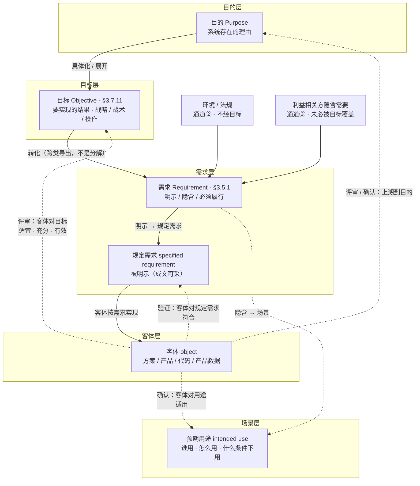
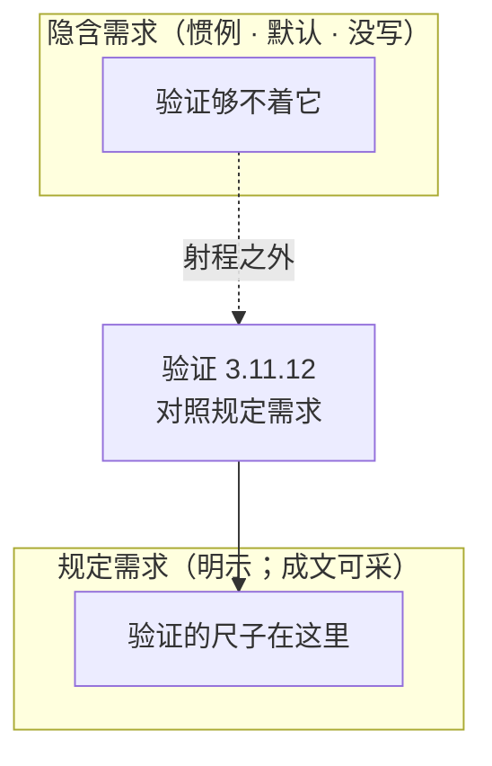
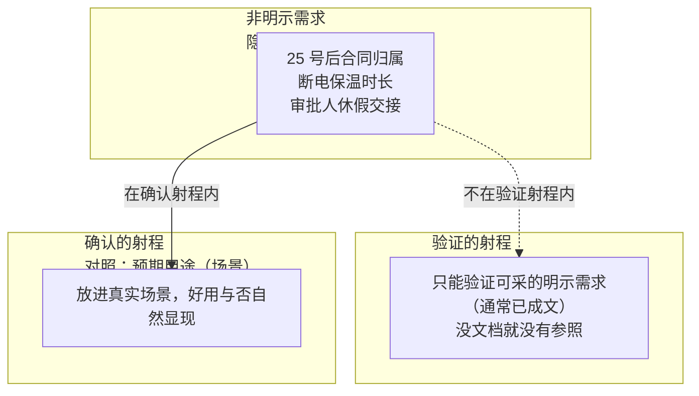
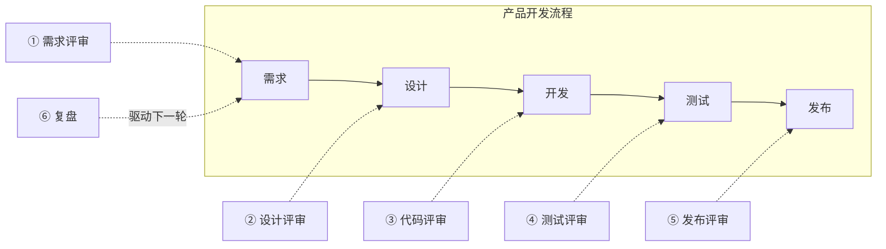

# 第8章 评审、验证与确认：目标、需求、用途

---

## 8.1 引言

第7章把那棵树立了起来：开发产品就是开发产品数据，你亲手造的是那棵树，不是实物。树立起来了，接下来是：谁来查它，拿什么当尺子，查完放不放行。

这一章回答这一问。它做三件事：把评审、验证、确认这三个天天被混着用的词分开；把它们的边界一条条画开；再看它们在一份需求从生到用的一生里，各站在哪儿。

### 8.1.1 误解现场

恒信集团合同审批系统上线前的评审会，周三下午两点，会议室坐满了人。

**系统架构师**万辉在投影上打开 UAT（用户验收测试）报告，语气笃定：

"UAT 全部通过。用例通过率 96%，P0/P1 缺陷清零，三条业务主流程全部走通。我们验收合格，可以上线。"

产品开发经理满海已经把报告翻到最后一页的签字栏，笔尖悬在上面："UAT 全绿，业务方也点了测试环境——验收合格，这个字我签了。"

会议室里有人开始收东西了。财务对接的**黄程**却没动，他盯着报告翻了两页，问了一句：

"你们让我们点的那个测试环境，我们月底对账的场景——25 号之后签的合同算哪个月——测了吗？"

万辉愣了一下："测试用例是照着需求清单写的，需求清单里……没有这条。这是上一轮口头补的需求，还没排进用例。"

"没排进用例？"**黄程**皱起眉，"那我们月底对账靠什么？"

法务的人也放下手机："等一下。上线前那条'电子签章合同也走审批流'的变更，你们说做了影响分析。可我们法务从头到尾没被拉去评审过这条变更——影响谁、谁审批、出了问题谁兜底，你们自己定的？"

会议室安静下来。徐漾坐在角落，把 UAT 报告合上，轻声说：

"万辉，你把三件事当成一件事办了。"

"哪三件事？"

"评审、验证、确认。"徐漾竖起三根手指，"你说业务方点了测试环境，所以确认过了——那不是确认，那是让业务方当测试员，替你跑用例。你说测试全绿，所以验证过了——是过了，但你验证的是'按需求做对了'，不是'真实场景能用'。你说上线前评审过了——评审对的是目标，你们只对了需求清单。"

万辉不服："这三样……不都是把关吗？方向对、做得对、能用，验收不就是看这个？"

"正因为三样都叫把关，才必须分清。"徐漾看着他，"你这一句话里混了三个词，三个词各对着一处东西——平时混，没事；混到验收签字那一刻，就是合同纠纷。"

如果你坐在这间会议室里，大概会站在万辉那边。因为大多数人对这三个词的直觉，和他一模一样：都是"检查一下"，都是把关，差不多——中文里都带一个"评/验/认"字，听起来像近亲。

这一章要推翻的，正是这个直觉。

### 8.1.2 这一章要回答什么

读完本章，你应该能回答：

1. 评审、验证、确认这三个词，差在哪？为什么中文看起来像近亲？
2. 它们各自对着什么——评审对什么、验证对什么、确认对什么？
3. 一件事该走哪一道，凭什么判？各自的判据是什么？
4. 三句话——"评审就是过一遍""测试全绿就是验证过了""业务方点了就是确认过了"——各错在哪？
5. 这三道关在一条链上怎么排？缺了哪一道，会漏掉什么？
6. 它们只对做出来的实物做吗？一份需求文档、一份设计描述，算不算它们的对象？
7. 为什么"只做验证不做确认"，最后会得到"测试全过、没人用"？

### 8.1.3 这一章的骨架

先把三个词各自是什么立起来，再把它们最常被认错的地方画开，最后看它们怎么用。

这一章的骨架，是一句话加一条因果。

> **评审对目标、验证对规定需求、确认对预期用途。这三样判定不挑节点，也不挑对象——实现可以查，产品数据也可以查。缺哪一样，就漏一类东西；而最贵的一课是：只做验证不做确认，隐含需求系统性漏失，测试全过、没人用。**

三块：

- **是什么**——三个词为什么被混用、各自参照什么、判据各是什么；
- **不是什么**——三个最贵的误解、两处射程、方向由谁看；
- **怎么用**——一条需求怎么走完这几道关、这些关怎么排满全程、三套手法各怎么做。

---

## 8.2 评审、验证与确认是什么

> 这一块把三个词分开看清：先讲病根——它们为什么被混用；再立三个参照对象；用一张表把它们摆开；最后逐个钉死各自的判据。

### 8.2.1 病根：它们为什么被混用

万辉的问题不是他笨，是中文给了他一个陷阱。

把三个词摆到英文面前，陷阱当场现形：**review、verification、validation**。三个词源不同、构词不同、归属也完全不同，译成中文是"评审 / 验证 / 确认"，都带一个"评/验/认"字。

这是第1章说的第三种词汇病"翻译伪朋友"的教科书案例：英文一眼能看出的不同，中文因为都是"一个动词加一个形近字"，看起来像三个近亲。三个词不是"检查一下"的几种说法，而是三件不同的事。

更狠的是，标准在定义里就把它们分了家——靠的不是分组，而是"确定"与"证实"的分野。

- **评审（review，§3.11.2）**的动作是"**确定**"：它的定义直接建立在 **determination（§3.11.1）**之上——查明特性、得出结论，是一次主动调查，**不要求客观证据**；
- **验证（verification，§3.11.12）**和**确认（validation，§3.11.14）**的动作是"**证实**"：定义用 **confirmation** 配 **objective evidence**——结果已经在那儿了，去证实它，**必须有客观证据**。

一个是判，一个是证。判，靠判断力；证，靠客观证据。中文的形近字把这层区别糊上了，糊了四十年。

这里要把一个同形的词分开。第3章 §3.4.1 的节题叫"程度怎么认定"，那里判的是质量满足程度（差、好、优秀）；**本章的动作词统一用"证实"**。同一个动作，两章各叫各的名：第3章要"把程度定出来"，本章要"拿出客观证据证明它"。往后见到"认定"，先看它判的是程度，还是规定需求。

一个版本细节值得留意：ISO 9000 的历版编排里，这三个词曾分属两个不同的术语组——评审在"确定"组，验证与确认在"数据、信息与文件"组。到 2026 版，三者并入同一个"**有关确定的术语**"组，组内次第仍留痕：评审紧跟确定（3.11.1 → 3.11.2），验证与确认在组尾（3.11.12 / 3.11.14）。

分组是编排，动作词才是本质。标准把三个词收进同一组，却仍用"确定"与"证实"分别定义它们。这恰恰说明判与证的区别不是编排出来的，是概念本身的。

第1章点过的那场翻译伪朋友病，最重的代价是一场合同纠纷。一家医疗器械公司和一家医院在合同里写了"系统通过验收后付清尾款"，但谁也没定义"验收"是什么：公司说验收是功能测试通过，医院说验收是临床科室用得顺。双方扯皮四个月。

那四个月，就是把验证和确认糊在一个词"验收"里，等纠纷发生时一次性结算的代价。这一章把三个词分家，就是那场纠纷的预防针。

### 8.2.2 各自的参照

为什么各参照一处，而不是共用一个参照？因为它们看向三处不同的东西。把开发的世界画成四层：预期用途挂在旁边的场景层，另有两条旁路通道从侧边汇入需求。一图看清。



- **目的（purpose）**：系统存在的理由，回答为什么存在；目标是它在操作层的展开；
- **目标（objective，§3.7.11）**：要实现的结果，可分战略、战术或操作层面。其中**操作目标**是运行层可判定的那一层，也是链接需求的那层。"我们要让月底对账不再靠手工"是目标；
- **需求（requirement，§3.5.1）**：要满足的需要或期望，分明示、隐含、必须履行三种呈现方式，不都是规定需求；
- **规定需求（specified requirement，§3.5.1 注 2）**：被明示的需求，是"明示"这一形态的子集。"合同必须经财务、法务、业务三方审批"是规定需求（第3章展开过）；
- **预期用途（intended use）**：这个客体被设计出来，到底要在什么场景、给什么人、干什么用。

**先把两个系统的目的钉在这里**。冰链 M3 的目的，是"让疫苗在冷链运输中一路不失活、安全送达"；恒信合同系统的目的，是"让合同审批合规、月底账目清楚对得上"。两个系统的目标、需求与案例，都从各自的目的上长出来：恒信的"月底对账不再靠手工"、M3 的"断链即报废时还能撑到接入冷库"，分别是这两个目的在操作层的展开。

这张图里最容易被忽略的有几点。目的在最顶层，目标次之，规定需求居中，客体在最下面；预期用途不在这一列，它在旁边的场景层。需求还挂着两条不经目标的旁路通道。向下的建造是这条链：目的具体化成目标，目标转化出需求，需求明示成规定需求，再约束客体。三个判定则全部从客体出发，分别向三处不同的参照看去。

- 评审看客体对**目标**——方向对不对；
- 验证看客体对**规定需求**——做对了吗；
- 确认看客体对**预期用途**——做对的东西能用吗。

这里有一处最容易被漏掉的前提。图里画的"客体"是最笼统的说法：它既指实现出来的实物与系统，也指一纸规定需求、一份架构描述、一份设计描述——那些都是产品数据。第7章说过，开发全程你亲手造的是数据，实物是数据复制出来的结果。所以下面这几道判定，量的从来不只是车间里的东西；**数据本身也在射程内**（§8.3.2、§8.4.1 说透）。

把三个参照放回闭环，接缝才看清：目标是系统目的在操作层的展开，需求是目标转化（跨类导出，不是分解）的结果——但需求不只有目标一个来源。环境法规与利益相关方隐含需要这两条通道不经目标，直接进需求。目标的完备性靠评审的充分性把关，旁路通道靠需求工程兜底。

需求再往下，三种呈现方式在这里分叉。明示的那一种**写下来、定下来**（成文与基线是可采条件），就是规定需求；验证的参照在文档里。隐含的那一种写不出来，只能靠场景兜；确认把它放进真实用途，让它现形。三段的接缝，恰好是需求三种形态的分叉口。

评审与确认，都沿链上溯到目的：评审以目标为参照，根子上看的是系统目的；确认在真实场景里终审，方向照样对到目的。方向上的把关因此不是一处，是前后两处（§8.3.6）。

三种参照落在三个不同的世界里：目标属于"想要的"，需求属于"写下来的"，预期用途属于"真实的"。三者由此各守一种错。评审守方向错，验证守转写错，确认守匹配错。

这也解释了一处结构差：目标可以推导出需求，向下建造；唯独预期用途不能推导。它不是被想出来的，是真实场景里本来就有的事实，只能放进场景里发现。

一句话定案，各就各位：

> **评审对目标，验证对规定需求，确认对预期用途。**

换成三个可当场问的问句，按"哪个错最贵"排：

> **产品的方向对不对？（评审）→ 在真实场景里立不立得住？（确认）→ 是不是满足规定需求？（验证）**

方向错，整个产品白做；用途错，做对了也没人用；实现错，可以返工。若按站岗先后排（开工前 → 做完了 → 交给用户），就是评审 → 验证 → 确认，本章定案句与接力顺序都照此排。但要点在这里：这几处站位是典型站位，不是排他的位置——一份数据在它的每一个交付口上，都可以过这几道判定（§8.4.1）。

> 术语注：这句"评审对目标，验证对规定需求，确认对预期用途"是本书对 ISO 9000 三个定义（§3.11.2 / §3.11.12 / §3.11.14）的**凝练**，不是任何标准的原文——三个定义的原文见 §8.2.4~§8.2.6；本书的命名与判据拆法同样是作者主张，欢迎检验、欢迎校准。

### 8.2.3 分开它们的几处差别

光说参照不同还不够，因为参照不同可以只是修辞。把三个词摆成一张对比表，你会看到几处差别一起把它们分开：验证与确认的动作相同、证据要求也相同，只在参照上不同；评审则与前两者分了家。

| 维度 | 评审 review §3.11.2 | 验证 verification §3.11.12 | 确认 validation §3.11.14 |
|---|---|---|---|
| **定义**（汇总） | 为达成既定目标，对客体的适宜性、充分性或有效性所作的确定 | 通过提供客观证据，证实规定需求已得到满足 | 通过提供客观证据，证实针对特定预期用途或应用的需求已得到满足 |
| **参照** | 目标 | 规定需求 | 预期用途 / 应用 |
| **动作** | 确定（判断） | 证实（证明） | 证实（证明） |
| **证据** | 不要求客观证据 | 必须有客观证据 | 必须有客观证据 |
| **对象** | 工作产品（纸面即可） | **实现物，或人工制品**（产品数据） | **不限**（须在使用中兑现） |
| **时机** | 事前 / 事中做判断 | 对结果做证实 | 在真实或模拟场景中做证实 |
| **软件落点** | 需求评审、设计评审、代码评审 | 单元 / 集成 / 系统测试、压测 | UAT、Beta、灰度、试运行 |

> 注：表中"定义"一行是三个词各自权威定义的总览，算**汇总行**；真正的对比维度是下面几行。**"对象"一行是本章 2026-10-08 新增的**：评审桌上摆的是工作产品；验证与确认的对象并不限于实现出来的东西，人工制品也就是产品数据，同样在内。依据见 §8.2.5 的术语注。

逐处看，三处差别最要紧：

动作不同，是最根本的分家。评审的动作是确定，验证与确认的动作是证实。确定是一次主动调查：从"没有结论"到"有结论"，结论是造出来的；证实的前提是结果已经在那儿，动作只是去证实它。这就是为什么评审不要求客观证据，而验证与确认必须有。

证据要求不同，是最容易踩的坑。"测试通过了"是验证的证据；这条证据不是评审本身。评审的结论是"这方案对目标合不合适"，不是证据，是判断。很多团队把评审开成读文档会，把证据念一遍，没有判断，那不算评审。

参照不同，是决定性的差异。评审对目标，验证对规定需求，确认对预期用途。这一条是后面所有部分的骨架。

评审、验证与确认并排立在这里，判据主义也在这里登场：第1章说过，不给没有判据的工具。评审三问（适宜、充分、有效）、验证与确认的三要素（对照、证据、证实），就是各自的判据。下面逐个钉死。

### 8.2.4 评审：适宜、充分、有效

先看第一道。评审的权威定义（ISO 9000:2026 §3.11.2）：

> **评审 review：为达成既定目标，对客体的适宜性、充分性或有效性所作的确定。**
> *determination of the suitability, adequacy or effectiveness of an object to achieve established objectives.*
>
> 示例：管理评审、设计和开发评审、顾客要求评审、纠正措施评审和同行评审。（注：本书按统一口径写作"设计开发评审"——设计开发不拆开。）

拆开定义，四个关键词：客体（被评的东西）、既定目标（尺子）、确定（动作）、**适宜性 / 充分性 / 有效性**（三个问句）。前三个都好懂，关键是最后这个三连问——评审不是问"对不对"，是问三件事。

| 问句 | 英文 | 通俗 | 恒信的例子（目标：月底对账不再靠手工） |
|---|---|---|---|
| **适宜性** | suitability | 对症吗？ | 想解决月底对账，方案却只做了审批提速，不适宜 |
| **充分性** | adequacy | 够全吗？ | 对账口径只覆盖了当月，25 号之后的归属没算，不充分 |
| **有效性** | effectiveness | 管用吗？ | 功能全上线，月底对账还是要手工算三个小时，无效 |

三个问句层层递进，一个都不能跳过。

> **方向不对，做得再全也是白费（适宜性）；覆盖不全，方向对了也会翻车（充分性）；前两个都过了，还要看结果说话（有效性）。**

ISO 9000 还补了一句注：评审也可以包括确定"效率"（efficiency）——不仅看管不管用，还要看投入产出比。管理评审（**据** ISO 9001:2015 §9.3，**转述**，库外来源·不可核）同样落在这三问上——适宜性、充分性、有效性，三问是同一套，从产品评审一路用到公司管理。

拿冰链的 M3 走一遍三问，面目会更清楚。目标：断链即报废时，还能撑到接入冷库。

第一问是适宜性。方案选了双压缩机冗余，断一台还有一台，与"撑到接入冷库"相称。第二问是充分性。方案覆盖了压缩机故障，却没覆盖"运输车抛锚两个小时"：只做了设备级冗余，没做旅程级冗余。

第三问有效性——就算设备级、旅程级都齐了，真断链时能不能撑到冷库，要等真实运输的结果说话（§8.3.4 那辆会颠的车，会给出答案）。

三问不是同一个会里一次问完：第一问挡掉方向错的方案，第二问在方案细化时不断追问还漏了什么场景，第三问要等真实结果。很多人觉得评审是开一次会。错了：评审是一个动作，这个动作从方案出生那天起，就一直没停过。

> **概念卡片 · 评审**
>
> | 四问 | 格 | 内容 |
> |---|---|---|
> | **它是什么** | ① | 为达成既定目标，对客体的适宜性、充分性或有效性所作的确定（ISO 9000:2026 §3.11.2）；动作是确定（判断），不要求客观证据 |
> | **它不是什么** | ⑥⑦ | 与验证构成最接近的辨析——评审对目标（方向对不对，判断），验证对规定需求（做对了吗，证明）；评审不是核对需求——核对需求是验证的姿势，评审是唯一在纸面阶段抬头看目标的环节（确认是建成后的实证终审，见 §8.3.6） |
> | **它从哪来** | ②③⑨ | 源自工程里的把关实践——设计评审、代码评审让多双眼睛在缺陷进门前拦一道；没有它，错误只能等验证与确认阶段才被证伪，返工贵数倍。ISO 9000 用确定（determination，§3.11.1）定义评审，与验证、确认的证实（confirmation）分属不同的动作（§8.2.1）——中文把它们译成"评/验/认"近亲，糊了四十年；review 由 re-（再）加 view（看）构成，第一遍是做，第二遍是看 |
> | **它往哪去** | ④⑤⑧ | 它回答方向对不对；在需求评审、设计评审、代码评审、发布评审这些关口上用（§8.4.2）；误区 ✗ 评审就是开会过一遍——没结论、没记录，最多算聊天 ✗ 评审目标太抽象，评不了——目标具体化配方见 §8.4.4 |
> | **判据** | 三问 | 适宜、充分、有效三问过了吗？通过标准会前定了吗？团队、结论、记录三样齐吗？ |

### 8.2.5 验证：对照、证据、证实

第二道，也是大家最熟悉的——验证。它的权威定义（ISO 9000:2026 §3.11.12）：

> **验证 verification：通过提供客观证据，证实规定需求已得到满足。**
> *confirmation, through the provision of objective evidence, that specified requirements have been fulfilled.*

定义里有三个要素，**缺一个都不算验证**。

| 要素 | 问什么 | 反例 |
|---|---|---|
| **① 对照：规定需求** | 有白纸黑字的尺子吗？ | 口头"大概要快一点"，无法验证 |
| **② 证据：客观证据** | 有可复核的证据吗？ | "我认为满足"，不算验证 |
| **③ 证实：明确结论** | 有明确结论吗？ | "差不多吧"，不是验证 |

第一个要素呼应第4章的规定需求：验证的参照必须是**可采**的规定需求——成文与基线是可采的条件，不是构成条件。"口头补的"需求（章首那条"25 号之后归属"）没进文档，就永远不在验证的射程内。

第二个要素最容易被低估。"客观证据"是验证和评审的分水岭：评审可以不依赖证据，验证必须拿证据说话。第三个要素决定验证的输出是结论："已验证 / 未验证"，不是"跑完了"。

三要素背后还藏着一条推论，值得单独看一眼，它是第4章"需求质量里那条可验证"的真正出处。ISO 9000 定义规定需求（§3.5.1 注 2）时，只说它是"被明示的需求"，**并没有说"可验证"**。

"可验证"是从哪来的？从验证的定义（§3.11.12）推出来的。验证要求提供客观证据，而验证的参照是规定需求；那么能被当参照的规定需求，就必须能提供客观证据，也就是应当可验证。这是一条逻辑推导，不是定义原话。

> **"规定需求可验证"不是标准直接写的，是从"验证要求客观证据，验证以规定需求为参照"推出来的——可验证，是规定需求当验证参照的资格证。**

这条推论解释了第4章为什么把"可验证"列进需求质量：它不是一个可选的加分项，而是"这条需求能被验证"的入场券。口头那句"大概要快一点"，连被验证的资格都没有。没有资格，就没有证据；没有证据，就永远停在感觉上，到不了证实。

> 术语注（**对象不限，是本轮新立的一条口径**）：标准说验证的对象时用的是 *a system, system element, or artefact*——系统、系统元素**或人工制品**（ISO/IEC/IEEE 15288:2023 §6.4.9），并举例说人工制品包括系统需求、架构描述、设计描述。所以**验证并不是只对做出来的实物做**：一份规定需求、一份设计描述，都可以被验证——验证它满足"这份文档自身应满足的规定需求"。第6章的"符合性分析"就是这种验证（§8.3.2）。至于**确认，它的现场在使用态，必须在使用中兑现**；工作产品层拿不到确认结论，能给的最重也只是**条件性合规**（§8.3.6）。
>
> 同族的两个动作也要分清。**检验（inspection，§3.11.11）**是对规定要求符合性的确定；**表明合格时**，它的结果可以作验证的证据。**试验（test，§3.11.13）**是按针对特定预期用途或应用的要求所作的确定；**表明合格时**，它的结果可以作确认的证据。这里说的是"哪一族的证据"，不是"哪个动作更高级"。
>
> 另有一处正本内部的张力：两册互为属概念、方向相反——42010 把工作产品说成人工制品，15288 把人工制品说成工作产品（15288 §3.6 与附录 B.1 的 NOTE）。本章取 15288 的父子序。

> **概念卡片 · 验证**
>
> | 四问 | 格 | 内容 |
> |---|---|---|
> | **它是什么** | ① | 通过提供客观证据，证实规定需求已得到满足（ISO 9000:2026 §3.11.12）；三要素＝对照规定需求＋客观证据＋做出证实 |
> | **它不是什么** | ⑥⑦ | 与评审构成最接近的辨析——验证对规定需求（做对了吗，证明），评审对目标（方向对不对，判断）；验证不是测试——测试是提供证据的手段之一，验证要对全部规定需求做证实（§8.3.2） |
> | **它从哪来** | ②③⑨ | 随"按规格建造"的工程实践而生——产品对规格的符合性必须能被客观证明，做对了才算定案；ISO 9000 用证实（confirmation）配客观证据定义验证（§3.11.12），与确认共享同一动作、唯参照不同，一个在文档、一个在场景（§8.2.1）；verification 出自 verus（真），求真——对照规定需求，证明为真 |
> | **它往哪去** | ④⑤⑧ | 它回答做对了吗；在交付时逐级回收（V 模型的右半边，§8.4.5）；误区 ✗ 测试全绿就是验证过了——测试只是证据之一 ✗ 隐含需求靠验证兜住——验证的参照在文档里，够不着没写下来的需求（§8.3.4） |
> | **判据** | 三要素 | 三要素齐吗（对照、证据、证实）？逐级回收（单元、集成、系统）了吗？ |
>
> 引：第6章的"符合性分析"在这里归位——它和测试一样满足验证三要素，只是证据形态是文档评审（§8.3.2）。

### 8.2.6 确认：换参照，不换判法

第三道，也是全书最被低估的一个。它的权威定义（ISO 9000:2026 §3.11.14）：

> **确认 validation：通过提供客观证据，证实针对特定预期用途或应用的需求已得到满足。**
> *confirmation, through the provision of objective evidence, that the requirements for a specific intended use or application have been fulfilled.*

注意：确认和验证**共享同一套三要素**：对照、证据、证实。它们唯一的区别在第一个要素——验证对照"规定需求"（文档），确认对照"特定的预期用途"（场景）。就这一处参照之别，决定了二者完全不同的射程和命运。

"预期用途"不是一句空话，它由三样东西构成。

| 构成 | 问什么 | 恒信的例子 |
|---|---|---|
| **目标用户** | 给谁用？ | 法务、财务、业务三方审批人，不是 IT 测试员 |
| **使用场景 / 任务** | 用来干什么？ | 月底对账、电子签章合同审批、审批人出差时手机处理 |
| **环境与条件** | 什么情况下用？ | 月末高峰并发、弱网、审批人休假交接 |

> **这套三构成，和 UAT 那句"真实用户加真实任务加真实场景"一一对应：目标用户对真实用户，使用场景对真实任务，环境与条件对真实场景。** 后文 §8.3.3、§8.4.6 会反复用它。

确认的尺子上，还有一处更精确的写法值得钉死：ISO 9000 对照的是「特定的预期用途或应用的要求」——注意是"**要求**"（requirement，§3.5.1）。按标准，要求＝明示的、通常隐含的、必须履行的需要或期望，**隐含形态天然就在里面**。这把尺子拆开是两半：

- **明示的那半**：操作目标——运行层确认的显性判分线，§8.4.4 那句"月底对账时间不超过两个小时"就挂在这里；
- **隐含的那半**：未明示的使用需要与期望——"审批人休假交接也能顺""月末高峰不卡"，靠场景确认兜住（§8.3.5 展开）。

操作目标不是预期用途要求的全部，只是它的显性子集。它当"所确立目标"进评审，是全身进入；进确认，只是参照的一部分。这也预告一句要紧话：操作目标全绿，确认未必通过（§8.3.5）。

确认的证据，ISO 9000 注 1 给了：试验结果，或替代计算、文件评审。注 3 更重要：使用条件可以是真实的，也可以是模拟的——这一句给了灰度发布、仿真测试的合法性。

M3 温控箱的"真实运输车跑全程"是真实条件；恒信"用测试环境模拟出月底高峰的并发"是模拟条件。都算确认，都满足"放进场景里看结果"。

镜照一眼冰链，把 M3 的预期用途填满三构成。目标用户是疾控中心和运输司机，不是实验室的测试员。使用场景是疫苗出库到接种的全程运输，不是恒温台架模拟。环境与条件是低温车厢、路面颠簸、信号弱的山区，不是平稳的测试环境。

M3 的预期用途，浓缩在"全程温度不断链"这几个字里。后面案例进展里那辆会颠的车，就是在用真环境填这三个格子。

还有一层要说清：确认的对象也可以是一份产品数据。数据的预期用途，就是接收方拿它干什么：制造数据给产线，场景记录给运维，需求数据给设计。这一层是本书的演绎。标准的确认定义不限定对象，但另一册把确认锚在"系统在使用时"（15288:2023 §6.4.11）；本书的桥是第7章那句话，开发产品就是开发产品数据，实物是数据复制出来的结果。演绎归演绎，底线的两样不动：确认的证据必须是客观证据，确认必须在使用中兑现。

还要当场划清一类"确认"：本书也会在一般汉语意义上用这个词——《系统目的或任务理解确认单》、"业务方确认""同行确认"。这类确认是理解确认、是签认：对目的或任务的理解达成一致、靠签字生效，不要求客观证据，也不对照预期用途——它不是这一节说的那个确认。

往后见到"确认单"，别把它当成第三道关。这一节的确认只认一件事：真实或模拟的场景里，那份为特定预期用途的要求，满足没有。

> **概念卡片 · 确认**
>
> | 四问 | 格 | 内容 |
> |---|---|---|
> | **它是什么** | ① | 通过提供客观证据，证实针对特定预期用途或应用的需求已得到满足（ISO 9000:2026 §3.11.14）；三构成＝目标用户＋使用场景／任务＋环境与条件 |
> | **它不是什么** | ⑥⑦ | 不是验证的加强版——参照不同（场景对文档）、射程不同（确认兜得住隐含，验证够不着）；也不是签认——《系统目的或任务理解确认单》那一类是理解确认，不要求客观证据、也不对照预期用途（本节末） |
> | **它从哪来** | ②③⑨ | 随"产品要在真实用途里兑现"的工程实践而生；validation 出自 validus（强、有效）——问的是"这东西真能用吗"；ISO 9000 用证实（confirmation）配客观证据定义确认（§3.11.14），与验证共享同一动作、唯参照不同（§8.2.1）；15288:2023 §6.4.11 把它的现场锚在"系统在使用时" |
> | **它往哪去** | ④⑤⑧ | 它回答"做对的东西能用吗"；参照在场景里、不在文档里（§8.3.5）；使用条件可以真实也可以模拟（注 3）——灰度发布、仿真测试因此合法；✗ 业务方点了不等于确认过了——让业务方点测试环境，是把确认做成了验证（§8.3.3） |
> | **判据** | 三要素 | 三要素齐吗（对照预期用途、客观证据、做出证实）？真实用户＋真实任务＋真实场景齐了吗？隐含需求在真实场景里显现并处理了吗？ |
>
> 引：确认的对象也可以是一份产品数据——数据的预期用途，就是接收方拿它干什么（本节末，**本书演绎**）；但确认必须在使用中兑现，工作产品层只出条件性合规（§8.3.6）。

## 案例进展①｜恒信重开上线评审会

章首那场会散会后，徐漾提议第二天重开。这次他先做的，不是讲方案，是定目标。

"这次评审的目标是什么？"徐漾问。

万辉："上线前评审，目标就是……系统能上线。"

"'能上线'评不了。目标要有对象、有时限、有可衡量结果。"徐漾在白板上写下三行：

- **月底对账**：上线后第一个月底，对账单与台账逐笔核对一致率 100%，对账时间不超过两个小时；
- **法务合规**：电子签章合同的审批链完整、每一步可追溯，法务可随时抽查；
- **业务可用**：业务人员三个工作日内完成一次合同发起到归档，不用求助外援。

"今天这场会，就按这三条评审。每条都有通过标准，会前定的，会后逐条打勾。"

万辉对着这三条，忽然卡住了："……法务合规这条，我们的方案里，电子签章合同的审批链，到底谁审、谁签？这条变更当初是口头定的，需求清单里没有，方案里也没有。"

会议室安静了。

徐漾没有意外："这就是评审对目标的意义。如果今天只核对需求清单，你会说全部覆盖、通过。可你的尺子不是需求清单，是法务合规这个目标——目标一摆出来，你立刻发现：这条变更连需求都不是，是口头的一句承诺。"

万辉后来对徐漾说："我以为评审是核对需求，原来评审是先把目标摆出来，再拿目标照需求。"

## 8.3 评审、验证与确认不是什么

> 这一块把这三个词最常被认错的地方分开：评审不是核对需求，测试通过不等于验证通过，业务方点了不等于确认过了；再磨清两处射程；最后看清方向上的把关为什么是前后两处。

### 8.3.1 评审不是核对需求

这是评审三问背后那个最容易被跳过的问题。如果评审以需求为参照，不是更省事吗？需求是现成的文档，一条条核对就是——很多团队就是这么做的（冰链团队的病，案例进展②会看到）。

四条理由，每一条都足以让"以需求为参照"破产。

理由一：需求本身可能是错的。需求是人写的——理解错、互相矛盾、不完整，都是常态。如果评审拿需求当尺子，就等于默认需求一定对。那谁来审需求本身？

需求评审的本质，恰恰是审需求对业务目标是否适宜、充分、有效。恒信那条电子签章变更没被评审：不是没核对需求，是需求背后那个目标（法务审批合规）没人去看。

这里有个对称值得记下：规定需求是**评审的对象**（需求评审审的就是它），也是**验证的参照**（验证对照的就是它），还是**验收与责任的依据**（争议时以它为准）。第4章把它立为全章枢纽、定成验证的参照；到这一章，前两样正好各归一道：评审审它、验证对它；确认不参照它——确认的参照在场景里（预期用途），兜住的是验证够不着的东西。

同一个词，评审和验证都绕不开它；它没成文，这两道就都闭门。这正是章首那条口头补的需求的下场。

理由二：否则评审和验证就重复了。验证（§3.11.12）本来就是"以规定需求为参照、确认符合性"。如果评审也以需求为参照，两个术语就变成同一件事——标准用"确定"定义评审（§3.11.2）、用"证实"定义验证（§3.11.12），这套区分就塌了。两个词必须是两件事，否则标准不会用"确定"与"证实"分别定义。

理由三：满足所有需求不等于达成目标。需求全做完，做出来的可能还是没人要的东西：目标错了，需求再对也白做。评审是整条链上唯一在纸面阶段抬头看目标的环节：验证低头对规格、不沾方向；确认走进场景当实证终审。所以说"早拦方向，只有评审拿着目标这把尺子"；确认也看方向，但它要到使用态才登场（§8.3.6）。

理由三值得再往前推一步：它是最容易被"需求管理"掩盖的一种失败。恒信的目标是"月底对账不再靠手工"，需求清单里却全是审批提速、流程优化。需求一条条满足了，目标一个都没碰到。需求满足得越彻底，目标的偏离走得越远。

评审不是要否定需求，是要每隔一段就问一句：我们做的这些需求，还朝那个目标吗？

理由四：目标本身会漂移，漂的是系统目的。前三条理由默认目标是对的、静止的，这一条戳破它：目标不是钉死的靶子。

先把链点破。目标是系统目的在操作层的展开："月底对账不再靠手工"是目标，"让合同审批合规、月底账目清楚对得上"才是系统目的。评审抬头看目标，根子上看的是系统目的：《系统目的或任务理解确认单》锚定的就是它。

真正会漂移、漂了最危险的，正是系统目的。产品定位从专业工具滑向大众应用，业务方在评审里一点一点改口径，没有任何一个环节宣告过目的变了，需求却还钉在旧目的上。这就是第14章说的目的漂移：无症状、事后才发现，只能靠定期评审、以系统目的为参照检出。评审因此是捕捉缓慢漂移的传感装置。反过来，系统目的显式变更（战略调整、产品定位改变）就是第14章说的目的变更：显式发生的强制扳机，必须靠变更流程挂钩、触发架构重审。

评审以目标而非需求为参照的深层理由就在这里：需求是静止的文档，目标与目的是活的判据——只有评审，能在目的悄悄漂走时把船拉回来。

把四条收成一句话：

> **要求是路，目标是目的地。评审的价值，就是在低头检查路况之外，抬头看看目的地对不对。**

最失败的评审不是没查出问题，而是把评审做成了验证：只核对满足需求没有，从不问这需求本身对吗。章首万辉那条"UAT 全绿"，就是这个病的晚期。

## 案例进展②｜冰链镜照：评审做成了核对

冰链科技的需求评审会，开了整整一下午。

流程很标准：文正拿着需求清单，逐条念，逐条打勾——"有编号 ✓、有来源 ✓、可测吗 ✓、验收标准有 ✓"。三十条念完，清单上划满了对勾，文正宣布："评审通过。"

测试李旭没有跟着打勾。他翻到第十一条，问了一句：

"这条是'断电保温不少于七十二小时'。我们的目标是什么？疫苗断链即报废，断电后要撑到接入冷库。那这套需求里，有没有写'运输车抛锚两个小时'这种场景？断电是从哪儿断的、断多久、什么时候算撑不住？"

会议室安静了。文正翻了翻："需求清单里……没写。但这些是应急场景，要不要写进需求，可以后面再说。"

李旭："后面再说，就是评审没过。你刚才的评审，只核对清单有没有写——那是验证的姿势，对的是需求清单。可评审要对目标：这套需求，能不能撑起'断链即报废时还能撑到接入冷库'？这才是评审要回答的问题。"

文正的病，和章首万辉是同一个病的镜像。万辉把确认做成验证（让业务方当测试员）；文正把评审做成验证（逐条核对需求清单）。两边的病根一模一样：这三个词里，只认识中间那道。评审对目标、验证对需求、确认对用途——把中间那道当成了全部。

文正后来在需求清单顶部加了一行字："评审第一问：这套需求，对目标够不够？"逐条核对，是评审的最后一小时，不是评审本身。

### 8.3.2 测试通过不等于验证通过

这是验证这一节最要紧的一个辨析。测试只是提供客观证据的手段之一。验证的证据形态不少，本书统一列举为五种：测试、检验、审查、计算、文档评审。这是本书的归纳，不是标准的清单。标准在验证的注里举的是检验的结果、替代计算、评审文件（§3.11.12 注 1）；在确认的注里举的是试验结果、替代计算、文件评审（§3.11.14 注 1）。

把"测试过了"等同于"验证过了"，是把手段当成了目的。

拿恒信的例子说透：UAT 报告写"用例通过率 96%"——这是一份**测试结果**，是证据的一种。但验证要回答的是"规定需求是否得到满足"，证据要覆盖全部规定需求——96% 意味着 4% 的用例没过或没写，这 4% 对应的需求是否满足，测试没有给出证据。

测试报告是验证的输入，不是验证本身；验证是拿着全部证据、对全部规定需求做出证实。

顺带把"检验"也请出来。它有双重身份：在 ISO 9000 里归 §3.11 这一组、和评审同组（§3.11.11）；但在证据链上又服务于验证——和测试一样，是提供客观证据的手段之一。检验是"对符合规定要求之合格状况的确定"，听起来和验证几乎一样，区别在粒度。检验盯着特性（温度波动不超过半个摄氏度这种单条）；验证盯着规定需求（一条需求可能含多条特性）。

第6章的符合性分析展示了另一种证据形态：文档评审。它没动一行代码，把"方案枝梢对需求的满足"当证据，也是验证，分两档。设计期的覆盖检查是满足度的**预演**；链尾构件规格评审上的那一遍，才是**正式审查**。

第6章说"符合性分析不等于评审，分析是评审的输入"，现在补全另一句：符合性分析是评审的输入，也是验证的一种。同一个动作，在"看它对不对"时是评审的输入，在"证明它满足需求"时是验证的证据。关键在于你在哪道门里用它。

> **符合性分析是设计层的验证（文档评审式）；测试是实现层的验证（试验式）。两者都满足验证三要素，只是证据不同。**

这里正好接上 §8.2.5 那条口径。验证一份规定需求、一份设计描述、一份架构描述，都是名副其实的验证——标准把人工制品明明白白写进了验证的对象里（15288:2023 §6.4.9）。所以"这只是一份文档，没法验证"这句话是错的：能验证，只是它的证据形态是文档评审、替代计算这类，不是跑一遍程序。

验证的证据有很多种：测试、检验、审查、计算、文档评审。别把验证窄化成跑测试，也别把跑测试升级成验证过了。

### 8.3.3 业务方点了不等于确认过了

确认最容易被误解的形态，是 UAT。拿它说透：

> **UAT 不是让业务方点一遍测试环境，而是真实用户、真实任务、真实场景三样齐了的确认。**

章首万辉的 UAT 错在哪？他让法务、财务、业务在测试环境点了一圈——那是让业务方当测试员，替测试团队跑用例，对照的还是需求清单。

真正的 UAT 是：财务用真实的对账数据、在真实的月底时间点、跑真实的月底对账任务——对照的是"月底对账能用"这个预期用途。前一种 UAT，测的还是需求；后一种 UAT，测的是场景。

让业务方点测试环境，是把确认做成了验证。业务方替你打勾的，还是需求清单上的格子；真实场景里会不会对不上账、审批人休了假怎么办，测试环境替不了真环境回答。

## 案例进展③｜恒信 UAT 的教训

上线前两周，徐漾把那次 UAT 的整个过程调出来，把万辉、玉杰、小白叫到会议室复盘。

"你说业务方点了测试环境，通过了。我问你三个问题。"

"第一，月底对账的数据，用的是真实数据还是造的数据？"——造的数据，二十条，没有一条是 25 号之后签的。

"第二，月底对账，是在真实月底的时间点、真实并发下做的吗？"——不是，周二下午，三个人轮流点。

玉杰说："测试环境那三台机器是我部署的。周二下午三个人轮流点，是人在点；月底是几十个人同时冲进去对账，测试环境替不了真环境——那种并发，它扛不住，也测不出来。"

"第三，法务的电子签章审批链，业务方验证过谁审谁签吗？"——没有，那条变更压根没排进 UAT。

小白说："UAT 的数据和用例都是我准备的，全照着需求清单写——清单里没有 25 号后归属，用例里就没有；清单里没有电子签章，用例里也没有。我以为跑到 96% 就是确认过了，现在才明白：我验证的只是需求，不是它好不好用。"

徐漾合上文件夹："所以那次不是确认，是让业务方当测试员。你把确认做成了验证，让业务方对着需求清单替你打勾。真正的确认要回答的问题只有一个：真实业务场景里，这套系统转得起来吗？你没问。"

万辉："那现在怎么办？"

徐漾："补。确认不能后补到上线后——上线后补确认，就叫上线事故。把月底对账、电子签章、审批人休假交接三个真实场景，排进下一轮 UAT，用真实数据、真实任务、真实时间点。验证证明做对了，确认证明能用——两个都要，缺一个，另一个就是自我安慰。"

### 8.3.4 验证够不着没写下来的需求

验证有一处致命的边界，这一节把它看清。验证的参照是**规定需求**——规定，意味着**明示**；成文与基线是它的**可采条件**。那么：

> **没写进文档的需求，验证够不着。因为验证的尺子在文档里，没文档就没有参照。**

第3、4章讲过隐含需求——"箱体要能扛住装卸磕碰""25 号之后签的合同归属下个统计月"，这些没人写，但漏了用户会骂。它们不是规定需求，于是不在验证的射程内。



这就是"只做验证不做确认，测试全过没人用"的前半截：如果团队只做验证，那么所有没写进文档的隐含需求，全部在体系外漏着。测试全绿，恰恰是漏光的那批需求绿不了，因为根本没被测。后半截，由确认来补。

### 8.3.5 确认的参照在场景里

把验证和确认摆在一起，一句话划界。

> **验证的参照在文档里，确认的参照在场景里。**

规定需求**通常以文档形态出现**：明示，成文与基线是可采条件。预期用途不是一份文档，它是一种**真实使用情境**：把产品放进情境里，好用不好用是自然显现的事实。这个区别带来一处决定性的推论——**确认能兜住验证够不着的东西**。



为什么场景兜得住、文档够不着？因为真实场景自带答案。月底对账、运输车颠簸、审批人休假——这些场景不会因为你没写文档就不存在。把产品放进场景，隐含需求漏没漏，当场现形：对不上账、断档半分钟、待办卡在离职审批人手里，全是看得见的缺陷。

顺着这把尺子再往前一步：操作目标全绿，不等于确认通过。操作目标只是预期用途要求的显性子集（§8.2.6）——它达标是确认的必要条件，不是充分条件：指标全绿、真实场景却用着别扭，确认照样失败。

确认的独特价值，恰恰在兜住操作目标没有覆盖的隐含要求：验证够不着的是文档外的隐含（§8.3.4），确认还要兜住操作目标外的使用期望——两层"外"，都只在场景里现形。

这里有个比喻，值得放进记忆——隐含需求像冰山，水面下的部分占了大半。传递到下游的只能是浮出水面的部分；但没有"水下还有冰山"这个认知，船就直接撞上去了。

验证是量吃水线的尺子，它只管浮在水面上的部分；确认是把船开进那片水域的试航，水下撞没撞到，试航时才知道。第4章说过隐含需求不会自己开口；它不开口，就靠把船开进真实水域，让水下部分撞出声来。

冰山下面不只有隐含，还有强制。法规与安全的强制要求（第3章 M3 的断链即报废、恒信的合同数据留档十年），梳理成清单之前同样是未成文的。它们同样不在验证的射程内：要么靠确认看真实场景里法规是否满足，要么先梳理成合规清单再走验证。

## 案例进展④｜冰链镜照：测试全过，路上不行

M3 温控箱交付前，李旭组织了一次真实场景测试。不是测试用例，是一场真的运输：疫苗装箱，上真实的疫苗运输车，跑出库、运输、到达全程。

第一天晚上，问题就出来了。车厢过减速带时，温度记录仪因振动断电重启，断档三十秒。温度数据不是连续的。

李旭回看数据，发现断档发生在每次颠簸之后。他试着在测试台架复现——台架没有颠簸，复现不了。翻用例：里面只有"温度记录连续"，没有"振动下温度记录连续"。

"这不是测试用例没写好。"水忠看完数据，说了句，"是测试环境里没有路。测试台架稳得像桌面，真实车厢会颠。用例全过，说明不了上路能过。"

他们把 M3 装到真实车上连跑三天，又抓出三个问题：电池在低温下掉电快于预期、箱门在振动下轻微漏温、云端断网重连要四十秒。

三天，四个问题，没有一个能被测试用例提前发现——因为用例的参照是需求文档，而真实场景的参照是"疫苗能不能安全送到"。

把这四个问题翻回需求清单，一条都对不上：颠簸断电、低温掉电、振动漏温、断网重连，没有一条被写进过需求文档——它们是典型的隐含需求，真实存在、没人写过、验证够不着。确认的价值正在这里：它把没写下来的需求显影成看得见的缺陷——那次颠簸断档三十秒，就是需求文档里缺"振动下温度记录连续"这一条的证据。

这就是确认和验证的差别：验证在文档的尺子上跑，确认在真实世界的尺子上跑。冰链的测试台架做得再好，也替代不了那辆会颠的车。

### 8.3.6 评审早拦，确认终审

这三个词里，验证是唯一不看方向的——需求本身错了，它照样放行。抬头看方向的是评审和确认两双眼睛，不是并列的两处，是一前一后。

| | 评审（前一处，早拦） | 确认（后一处，终审） |
|---|---|---|
| **时机** | 事前 / 事中，系统未建成 | 事后，系统投入使用 |
| **方式** | 预测性把关：判断与论证推演"方向应该对" | 实证性把关：真实或仿真使用证实"方向确实对" |
| **对象** | 纸面**工作产品**（目标、需求、**架构描述**、方案） | 系统本身，或载体为产品数据的人工制品 |
| **覆盖** | 显性部分（写在目标里、可逐条论证的） | 连隐含部分一起兜（真实使用暴露一切） |

> **术语注**：评审桌面上摆的是**工作产品**，不是"架构"本身——架构是抽象物，表达它的是**架构描述（AD）**。两个英文词互为属概念、方向相反：`artefact`（**人工制品**，ISO/IEC/IEEE 15288:2023 §3.6 即 *work product (3.32) that is produced and used during a project to capture and convey information*）；`work product`（**工作产品**，ISO/IEC/IEEE 42010:2022 §3.3 注 1 即 *A work product is an artifact produced by a process*）。15288 侧 artefact 是 work product 的下位，42010 侧 work product 是 artifact 的下位。本项目按所属标准不同、属概念层级不同分流译名：指 15288 侧写"人工制品"，指 42010 侧写"工作产品"。

评审能前置，这是它最便宜的地方。一份需求文档没法被使用，也就做不了确认；但它可以评审，也可以验证。评审不要求客观证据，只要产品一定型就能做；验证则要等到有证据可举。这也是为什么评审能洒在整个流程的每一个节点上（§8.4.2）。

评审通过，只代表"基于当时信息的最佳判断"——它可能被确认推翻：纸面上再顺的方案，放进真实场景站不住，终审照样打回。所以两处关缺一不可：只靠评审，隐含需要无法被论证覆盖，评审对隐性盲区无能为力；只靠确认，方向把关全推到建成之后，纠偏成本爆炸。

但这里有一条不能越的界：评审替代不了确认。评审判的是"按既定目标够不够"，而既定目标本身可能从一开始就定错了。一屋子专家对着错误的目标评审，只会一致同意那个错目标。这正是确认必须在链外、且必须用起来的原因。

同理，也不能靠工作产品层拿确认结论。工作产品不能被使用，该层能给的最重结论是**条件性合规**：若实现如承诺则合规。**本书口径**：工作产品不能被使用，只能出条件性结论。真正的合规要由实现举证——ISO/IEC/IEEE 15288:2023 §3.13 `design` 的定义句要求的，正是"足够完整以支撑**架构的合规实现**"（*a compliant implementation of the architecture*）。这一点第2章已经点过一次，本章把它落到判定动作上。

> **一句话：方向对不对，评审先拦、确认终审；验证只管按写下的做对了吗，从头到尾不抬头。**

## 8.4 评审、验证与确认怎么用

> 这一块把这三个词用起来：先看一份需求怎么走完全程，再看这些关怎么排满整条流程，然后看清那条最硬的因果，最后是三套手法各怎么做。

### 8.4.1 需求走完全程

这三个词不是三座孤立的门。它们串起来，就是第3章"程度三步得出法"的第三步落地。回顾第3章：质量是特性满足需求的程度，程度怎么得来？三步——确定特性值（测量、检验、试验、评审、计算），与需求比对（**接收准则**——到评审那一关就叫**通过标准**），认定满足程度。

第三步的"认定"，动作上正是验证和确认：验证证实特性满足规定需求，确认证实客体满足预期用途。

所以这几道判定不是质量体系的外挂，是质量判定那个"程度"从感觉变成认定的必经动作。第3章说"没有接收准则，程度永远只能感觉"，这一章补全后半句："没有验证与确认，连感觉都算不上，因为没人证实。"

先说清两处口径，后面才不会读歪。

第一处，这几道判定不挑节点。下面按开工前、交付时、交给用户排，是因为这三个站位最好记，也是它们最常出现的地方；但它们不是排他的位置。评审从方案出生那天起就能做，一直到发布之后还能做；验证在数据交到哪一级就在哪一级做；确认在任何一个已经用起来的场景里都能做。

第二处，它们也不挑对象。查的可以是实现物，也可以是一份规定需求、一份设计描述、一份架构描述——都是产品数据。下面这张全景图画的虽然是一份需求从生到用，它同样适用于树上的每一份数据。数据交到哪一级，验证就在哪一级回收；数据连同它的实现放进真实场景，确认才做得了终审。

把三部分合起来，让一份需求从生到用走一遍。这是本章最重要的一张全景图：

场景：恒信口头补了一条变更——"电子签章合同也走审批流"，它连需求都不是，只是口头承诺。

**第一关 · 评审（对目标）**：这条变更的目标是什么？法务审批合规。评审问：电子签章合同走审批流，谁发起、谁审批、谁签章、谁归档？法务认可这个审批链吗？这条变更对月底对账、业务可用两个目标有没有副作用？

评审在开工前，把目标摆出来照方案。案例进展①里恒信就是在这一关发现这条变更连需求都不是。

第二关 · 验证（对规定需求）：开发完成，这条需求被规定成文："电子签章合同提交后进入审批流，审批通过后自动进入归档。"

验证问：这条需求满足了吗？单元测试过（签章触发逻辑）、集成测试过（审批引擎与签章服务）、系统测试过（全流程走通）、符合性分析过（审批引擎这个枝梢的语义与指标）。这一关的对象不只是跑起来的系统：那条需求本身、承载它的设计描述，同样在射程内。

验证在交付时，拿规定需求当尺子，逐条证实。

第三关 · 确认（对预期用途）。上线前，法务、财务、业务用真实场景跑一份电子签章的采购合同。从发起、法务初审、财务校验、业务终审、签章到归档，全程能不能走通？月底对账时，电子签章合同的统计口径对不对？

确认在交给用户时，把产品放进真实场景，问能用吗。

缺哪一关，故事都不一样：每缺一关，缺的是一道具体判定，后果完全不同：

| 缺哪一关 | 后果 | 恒信的例子 |
|---|---|---|
| **缺评审** | 需求错了没人发现，白做 | 电子签章变更没有目标可对照，它连需求都不是，是口头承诺 |
| **缺验证** | 做错了没人知道，返工 | UAT 通过率 96%，剩下 4% 没有证据，却照样宣布验证通过 |
| **缺确认** | 做对了也没人用，白做 | 真实对账场景从没测过，测试全过，月底对账对不上 |

这三个词各看一处，谁也替不了谁。

反过来，这张表还能做反向诊断：系统上线运行了，业务问题却还在——需求做对了、真实场景也能跑，说明转写（需求译成设计那一步）与匹配（放进真实场景那一步）都没错。根子只可能在最上游。评审没把"这系统对达成目标有效吗"这一关。目标是可度量结果，上线只是系统在跑，不等于目标达成。建外场排故知识库是为解排故慢，需求却写成支持库存查询，上线了排故依旧慢：缺的正是评审这一关。

这三个词的产出——评审记录、验证证实、确认结论——合起来，就是后记四角色清单里系统工程师团队的《验证与确认报告》：怎么过的，都有证据落纸。这份报告本身就是产品数据，也要被管起来、被引用、被追溯。

同一套判定，在冰链长得一模一样，这是本书最喜欢的双域对照。评审：M3 的目标是"断链即报废时还能撑到接入冷库"，评审拿它照需求清单（案例进展②的教训）。验证：零部件试验、系统联调、整机低温试验，对照的是各项规定需求。确认：真实运输车跑全程（案例进展④的教训），对照的是"疫苗能不能安全送到"。一个软件，一个硬件；一条审批流，一辆运输车。同一个概念，两扇世界的门。

### 8.4.2 评审贯穿整条流程

把关要卡在每一次交接之后——从需求到发布，每个关键节点站一班。



| 把关节点 / 复盘节点 | 目标陈述 | 判定内容 |
|---|---|---|
| **① 需求评审** | 需求达到可转化状态（可作设计开发输入） | 符合业务目标（适宜）/ 无遗漏（充分）/ 可落地（有效） |
| **② 设计评审** | 方案可行且满足全部需求 | 对症（适宜）/ 周全（充分）/ 能落地（有效） |
| **③ 代码评审** | 代码正确、可维护 | 正确性 / 可维护性 / 规范性 |
| **④ 测试评审** | 质量达到准出 | 覆盖充分 / 缺陷收敛 / 结果可信 |
| **⑤ 发布评审** | 可安全上线、风险可控 | 就绪度 / 风险 / 兜底 |
| **⑥ 复盘** | 经验沉淀、流程改进 | 归因准确 / 行动闭环 / 记录归档（复盘是改进而非把关，见下） |

评审类的关口，都是评审三问（适宜、充分、有效）这一判据精神在具体关口的一次落地。上表各关口的判定词不同（如代码评审看正确性、可维护性，测试评审看覆盖、收敛、可信），追问的仍是同一件事：方向对吗、够全吗、管用吗。复盘除外。

而且注意时机：问题越早发现，修复成本越低——需求阶段的缺陷修复成本是一，发布后是三十到七十倍（第4章讲过）。这些节点排下来的本质，是把把关从终点挪到全程：让返工成本最高的那一段堵在源头。

为什么偏是这些节点？因为它们每个都是一次**转写**：需求译成设计、设计译成代码、代码译成测试、测试译成发布。每译一次，想要的就可能被带偏一层：方向带歪、内容漏掉、意思歧义。这些关口恰好卡在每一次转写之后，对照上一层的源检查转没转偏：设计评审对兑现需求且站得住、代码评审对兑现设计且站得住、发布评审对可上线。评的都是本层产物自己够不够格，不是验证那种逐条对照需求。评审点的密度，就是转写层的密度：不是评审点选得巧，是转写层本来就有这么多。

评审类关口的通过标准，都该是一组**可勾选的硬条件**。拿需求评审和发布评审举例，两组清单的样子：

| 需求评审通过标准 | 发布评审通过标准 |
|---|---|
| ☐ 每条需求有唯一 ID 加验收标准（可测） | ☐ 发布清单逐条通过 |
| ☐ 业务场景覆盖 100% | ☐ 回滚预案就绪（已演练） |
| ☐ 无未决 TBD 项、无需求冲突 | ☐ 无未决 P0/P1 缺陷 |
| ☐ 每条需求可测 | ☐ 已知缺陷有缓解方案 |
| ☐ 资源、排期认可 | ☐ 运营、合规、安全准备到位 |

两组清单的共同点：全部由数字加动作构成，没有"质量要好"这种形容词。会前发出去，会后逐条打勾——打勾齐了，才叫通过。

这里有个连锁推论：通过标准会前定，意味着评审的尺子不是评审会当天造出来的，是方案出生时就该有的。第3章李旭那句"测试判据是什么"问的就是这个：测试方案里没有接收准则，评审就没有打勾的资格。

镜照一眼冰链，这些节点在硬件侧一个不少：需求评审、设计评审、试产评审、测试评审（出厂检验标准）、上市评审、复盘——名字换成试产、出厂，把关的骨架不变。硬件团队尤其容易犯"评审只在试产时做一次"的错。这组节点不分行业，分的是你有没有把它铺到全程。

再说复盘。它是这排节点里最容易和评审划到一起的一个：两者都有回顾审视的直觉，但它和评审是两件事。

| | 评审（review） | 复盘（retrospective） |
|---|---|---|
| **时机** | 干活之前或之中把关 | 干完了，事后总结 |
| **归属** | IEEE 1028-2008 五类 / ISO 9000 术语 | 敏捷实践（Scrum Guide，库外来源·不可核）/ 组织过程改进 |
| **目的** | 把关：判断适宜、充分、有效 | 改进：沉淀经验、驱动下一轮 |
| **位置** | 在流程链条上 | 绕回起点 |

一句话：评审管把关，复盘管改进。复盘不在 IEEE 1028-2008 的五类里，也不是 ISO 9000 的评审。它绕回起点，把上一轮的教训变成下一轮评审的目标。

复盘还有一层身份，容易和治理混。**复盘是检测器**——它像传感装置一样例行运行：每个迭代、每轮上线后定期复盘，把偏差显影出来（对不上账、漏了场景、口头变更没记录）。

但复盘发现偏差，不等于裁决：把偏差显影出来的是检测，对偏差做裁决（要不要改口径、谁有资格批准、边界要不要挪）才是治理——那是第14章的事，本章只把检测器立稳。

复盘的通过标准同样要会前定：每个行动项有负责人和截止日期、上轮行动项关闭率不低于八成、问题按根因归类而不是甩锅、记录归档可追溯。复盘不产出"我们很努力"，产出"下一轮改什么、谁改、何时改完"。案例进展⑤里恒信那次对账事故复盘，产出的就是两条行动项——变更必须先过评审对目标这一关、UAT 改真实场景跑，各配负责人和期限。复盘的价值，一半在诊断，一半在闭环；只诊断不闭环的复盘，是把同样的错再复一遍。

### 8.4.3 只做验证，会漏掉什么

现在把第4章的种子、第6章的动作、本章的两道判定串起来——这是全章最硬的一条推论。

> **只做验证不做确认，隐含需求系统性漏失，测试全过、上线没人用。**

拆成三段：

1. **隐含需求没进文档**（第3、4章）——它真实存在，但验证够不着；
2. **只做验证的团队**——所有没写进文档的需求，全部漏在体系外，连被检验的机会都没有；
3. **上线后**——功能全对、测试全绿，但用户用起来处处别扭：对账对不上、要的操作找不到、离职审批人把流程卡死。用户嘴上不说，行动上不用——**这就是"测试全过、没人用"的完整因果**。

反过来推一句更狠的，这是确认的第一层意义：确认的存在价值，恰恰建立在非明示需求上。如果所有需求都能写下来被验证，确认这个活动就不需要存在了——验证就够了。正因为永远有写不下来的需求（顺手、直觉、动效、节奏、惯例），确认才不可替代。

而确认兜住的，不止漏掉的隐含需求，还有一类**文字说不清的需求**。这是确认的第二层意义：冰链 M3 的手感要高级、恒信审批系统的用起来要顺，这类体验类需求显性化写不出来，只有真实使用能裁决。确认是这类需求的唯一裁判。

还有第三层意义，最容易被忽略：确认把漏掉的隐含需求变成可发现的缺陷。隐含需求没被写下来，所以它不是文档里的空洞：它是用户用不出来、卡住、放弃、抱怨。确认的价值，是把隐性缺失显影成缺陷证据：用户卡住了是证据，对不上了也是证据。

隐性缺失看不见，显影出来的缺陷看得见。章首万辉的 UAT 报告里没有一条缺陷——那不是因为他没有缺陷，是因为他把产品放进了一个造不出缺陷的场景（测试环境），缺陷无处显影。

## 案例进展⑤｜月底对账，对不上了

上线两周后，恒信第一个月底对账日。

黄程打开系统，导出对账单，按合同编号逐笔对着台账核对。两个小时，越对脸色越差。下午三点，他把徐漾和万辉叫到了财务办公室：

"对不上。25 号之后签的合同，编号全落在当月，系统把它们统计进了当月。我们月底对账的口径是——25 号之后算下个月。"

万辉："这条……当初财务提过，后来口头说的，一直没进需求清单。合同编号的归属规则，谁也没定过。"

黄程："我知道没进清单。但现在是真金白银的对不上，不是清单对不上。"

玉杰在边上查完一圈回来："系统本身没坏——月底并发我盯着，没崩、没卡、日志干净。坏的从来不是机器，是'25 号后算哪个月'这条规则，从没被写进系统。"

徐漾让万辉把这次事故从头捋一遍，捋到最后，他在白板上写了八个字：验证做了，其余没做。

- 验证：UAT 全绿，测试证明按需求做对了——做了；
- 评审：这条变更从没评审过，目标（月底对账口径）没人对照过——没做；
- 确认：真实对账场景从没测过——当初排进下一轮 UAT 的三个真实场景，上线前被赶进度挤回了测试环境，25 号后的合同编号是真实对账时第一次出现——没做。

徐漾放下笔："测试全过、没人用的下一句，是测试全过、月底对账对不上。你们以为它是运气问题，其实它是因果问题——该来的判定只来了一道，剩下两道，在等一场事故。"

万辉这次没有反驳。他后来在变更流程里加了一条：任何需求变更，必须先过评审对目标这一关，再谈开发；UAT 改成真实场景跑。第二个月底，对账在一个小时内对完：不是系统变聪明，是这三个词都站到了该站的地方。

这场复盘，徐漾让万辉把两条行动项记下来——变更必须先过评审对目标一关、UAT 改真实场景跑。复盘显影了偏差，但偏差的裁决（合同编号归属规则要不要定、归谁定）复盘给不了，那是第14章治理的事。

合同编号这条线，从这次对不上开始，后面还会在第12章被当成字段想改就改、在第14章三方编号对不上、在第17章上缝合清单。

### 8.4.4 评审怎么评

评审对目标，有一处操作性难题：目标是抽象的，怎么评？答案是先把目标具体化，再评审。抽象的目标评不了，"做出高质量的产品"无法评审；具体的目标评得了，"月底对账不再靠手工、对账时间不超过两个小时"可以评审。

目标具体化的配方，三个成分缺一不可：

> **目标＝对象（谁 / 什么）＋时限（何时）＋可衡量结果（多少）**

| 抽象（评不了） | 具体（可评审） |
|---|---|
| "做出高质量的产品" | "上线后三个月内，月底对账时间从三个小时降到两个小时以内" |
| "提升用户体验" | "审批人在手机端完成一次审批平均不超过一分钟" |
| "做好电子签章" | "本季度完成电子签章与审批流的打通，签章合同可全程追溯" |

评审会开场前，先做一遍**会前三检**——任何一个答不上来，就是目标还没定好，先别开会：

1. 评审结束后，**通过的标准**是什么（怎么算达标）？
2. 这个达标有没有**可观察、可测量的判定**（数字、行为、状态）？
3. 如果两个人理解不一致，**看什么能裁决**（哪份文档、哪个数字）？

三个都答得上，这个评审有尺子；答不上来，会开了也是白开——因为大家连过没过都没共识。而通过标准的正确用法，是**随评审邀请一起发出**："本评审通过标准：……全部打勾等于通过；任一不满足等于打回修改。"不是开会时现想，是会前定好、会后逐条打勾。

还有一个容易踩的点：目标本身还**分层级**。ISO 9000 说目标可以是战略的、战术的或操作层面的——注意这里的操作是运行层面，不是动手操作：它指管理层级里最贴近执行的那一层，不是让人去操作机器。同一份方案挂不同层级的目标，结论可能完全不同。

"我们要成为行业内合同数字化的标杆"是战略目标，激励人用；"月底对账时间不超过两个小时"是操作目标，评审用。战略目标让人相信值得做，操作目标让评审开得下去。评审要挂可判定那一层的目标：拿战略目标当尺子，等于没有尺子。

还要看清目标的来历：它不是供方自定的，是需方与供方就成功判据达成的约定。业务方提方向（要达成什么可度量结果），供方译成可评审的操作目标，再请业务方确认。确认过，它才成为评审的尺子。第4章链头说"立得对不对要业务方点头"，说的就是这一笔。

操作目标还有第二身份：它是确认参照里明示的那一半——进评审全身进入，进确认只是显性子集，所以操作目标全绿不等于确认通过（§8.2.6、§8.3.5）。

还记得第3章文正那句"符合性没有问题"吗？那是评审不了的——因为没问题不是标准。把它翻译成"温度波动不超过半个摄氏度、断电保温不少于七十二小时、交付前百分之百通过出厂检验"，才评得起来。评审对目标，但目标必须是能打勾的目标。

讲到这里，有人会问：评审这么好，凭什么信它是评审，不是聊天？IEEE 1028-2008（软件评审与审计标准，库外来源·不可核）给系统性评审钉了三个必备属性：

> **团队参与、评审结果文档化、评审过程文档化。** 三个属性缺一个，按标准的话说，就是非系统性评审——说人话：**没记录的评审不算评审，最多算聊天。**

这一条值得停下来多看一眼，因为它是评审重形式的正当理由。为什么非要记录？因为评审的职责是主动暴露问题，不是汇报成果——而问题要被人看见、被追踪、被验证已解决，就必须落纸。第6章讲过覆盖完整性：漏一片叶子，下层方案就不知道要做；评审记录同理，不记录的问题，下次评审没人记得它存在过。

IEEE 1028-2008 把评审做法分成五类，各管一段：

| 类型 | 英文 | 干什么 | 落点 |
|---|---|---|---|
| **管理评审** | management review | 评估项目状态，支持管理层决策 | 项目级定期评审（进度、风险、资源） |
| **技术评审** | technical review | 对照规格，识别技术偏差 | 需求评审、设计评审、发布评审 |
| **审查** | inspection | 最正式，逐行检测，缺陷检出率最高 | 代码评审（最正式时） |
| **走查** | walk-through | 作者引导讲解，同行熟悉产品 | 代码评审（非正式时） |
| **审计** | audit | 独立于开发方，核实符合合同与标准 | 上线前独立核查 |

这里有一处术语分工要留意：IEEE 1028-2008 里的 inspection 本书译审查，让给 ISO 9000 §3.11.11 的 inspection（检验）——同一个英文词在两册里指的不是一件事：一册看规定需求，一册看软件工作产品。

五类从轻到重：走查最轻（作者带看一遍），审查最重（逐行挑刺）。但无论轻重，三个属性不变——有团队、有结论、有记录。

ISO/IEC/IEEE 12207:2017（软件生存周期过程，库外来源·不可核）把评审定为软件生存周期里的支持过程，并强调评审方与被评方角色分离：评的人不能只评自己写的东西。这正是"有团队"的深层含义。

那评审到底图什么？把 IEEE 1028-2008 和工程实践里的评审目的收拢一下，是五件事，每一件都独立成立。

| 目的 | 说明 | 恒信的例子 |
|---|---|---|
| **质量把关** | 多双眼睛盯同一份产出，把缺陷拦在上线之前而不是出事之后 | 设计评审挡掉"电子签章变更没有审批链" |
| **风险识别** | 不只看对不对，更看会不会出事，给项目做体检 | 发布评审发现"月底对账场景没人验证" |
| **对齐共识** | 把每个人脑中的想象差异摆上桌面当场敲定 | 三方审批人对谁审谁签当场对齐 |
| **决策推进** | 给出明确结论：通过、有条件通过、不通过 | 上线评审给出"暂缓上线，补确认" |
| **经验沉淀** | 新人学团队标准和坑，老手梳理思路 | 复盘沉淀"口头变更必炸"的教训 |

五条里，最容易被轻视的是决策推进——因为大多数评审会开完就散，没人敢说不过。开完会没下文的评审，前三件事全白做。决策推进的落地是三个动作：明确结论（通过、有条件通过、不通过）加有条件通过必须写明条件、复核人、期限，加记录留档。

这三条与 ISO 9001:2015 §8.3.4 的方向一致（转述，库外来源·不可核）：评审发现的问题要采取措施，并保留成文信息。评审的终点不是散会，是有一个字面结论、有一份记录、有下一步谁负责。

### 8.4.5 验证怎么验

验证不是最后做一次就完——它和设计开发的分解一样，是**逐级**的。第3章讲过 V 模型：需求的左半边（需求、设计、详细设计）逐级分解下去，验证的右半边（部件验证、系统验证、确认）逐级回收上来。左右是镜像。

需求从哪一级分解下去，验证就从哪一级收回来。这就是 V 模型的形状。

一个具体的样子（恒信合同审批系统）：

| 验证层级 | 验证对象 | 证据 |
|---|---|---|
| **单元验证** | 单个函数、模块（金额校验逻辑） | 单元测试、代码走查 |
| **集成验证** | 模块之间（审批引擎与签章服务） | 集成测试、接口契约检查 |
| **系统验证** | 整个系统（合同审批全流程） | 系统测试、压测、合规检查 |

关键在左右镜像："金额不低于五百万触发重点审"这条需求从系统需求层一路分解下去，它对应的验证就必须在每一层收回来。不是在最后一次性验，是分解到哪一级，验证跟到哪一级。

这里的镜像还有另一半，正好接上 §8.4.1 那条口径。分解下去的是需求数据，回收上来的是验证数据，而这两样都是产品数据。所以"分解到哪一级、验证就在哪一级回收"换句话说：数据交到哪一级，验证就在哪一级做。数据停在纸面，验证就停在纸面（文档评审、替代计算）；数据变成实物，验证就跟到实物。

这个镜像可以推到底，推演一遍你就明白它为什么不是教条：需求分解到哪一级，说明需求在哪一级被规定；被规定的需求在哪里，验证就在哪里回收。

恒信把"金额不低于五百万触发重点审"分解到系统需求层，系统验证就在这一层回收（系统测试覆盖重点审触发）。它再分配到审批引擎，集成验证就在该引擎与签章服务的接口处回收。它落进金额校验这个函数，单元验证就在这一层回收。

每一级分解，都对应一级回收——V 模型的形状不是画出来的，是"需求在哪一级被规定，验证就在哪一级证明"这条逻辑逼出来的。

只做最后一次性验证，等于让所有分解白做了：需求分解到每一层，验证却只在最后一层收，中间断掉的层级，恰恰是缺陷藏身的地方。

镜照一眼冰链，硬件侧的验证长得不一样，但同一个骨架。单元验证是零部件试验（传感器精度校准、压缩机耐久台架）；集成验证是系统联调（温控单元、云端、应用软件协同）；系统验证是整机试验（低温环境箱里跑全温域）。

软件叫测试，硬件叫试验，V 模型的左右镜像纹丝不动。

你下次听到"我们要加强测试"，先问一句：是加强哪一级的验证？只加强系统级，等于只验最后一层，前面几层的分解没人接。

### 8.4.6 确认怎么确认

确认怎么落地？关键就在 §8.2.6 提到的那句 ISO 9000 注 3——使用条件可以是真实的，也可以是模拟的。这一句给了确认一整个手段谱系，按成本从轻到重：

| 手段 | 场景 | 谁当裁判 |
|---|---|---|
| **仿真测试** | 模拟场景（测试环境造一个月底高峰让系统跑） | 造出来的场景 |
| **灰度发布** | 一小部分真实用户加真实流量先跑 | 真实场景的小样 |
| **试运行** | 全部真实场景 | 真实场景全量 |

灰度发布的合法性就在这里——它是确认，不是缩小版的验证。放一成真实流量进去，就是用真实场景当裁判。别把"灰度没出问题"读成"验证过了"，要读成"确认初步通过了，剩下九成的真实场景还没当裁判"。

确认还有一类照不到的强制需求，值得提醒：法规与安全的强制要求（第3章 M3 的断链即报废、恒信的合同数据留档十年），梳理成清单之前同样是未成文的。它们同样不在验证的射程内：要么靠确认看真实场景里法规是否满足，要么先梳理成合规清单再走验证。冰山下面，不只有隐含，还有强制。

数据侧的确认，前面说过一句，这里补完。数据的预期用途，是它的接收方拿它干什么：制造数据交给产线，产线能不能照着造；场景记录交给运维，运维能不能照着判。这一层是本书的演绎，不是标准的原话；做法与实物侧一致——把数据连同它的实现放进真实使用里，看它立不立得住。演绎归演绎，标准那条底线不动：必须有客观证据，必须在使用中兑现。

时机上，确认常在设计开发形式结束之后（第3章说过，确认锚定产品，不锚定需求）。它站在工程系统的门口（第2章）：技术系统上线，不等于工程系统成功。确认问的正是：整个社会技术系统能转起来吗？确认不能后补到上线后。上线后补确认，就叫上线事故。

### 8.4.7 认知反转

回到章首那场会。万辉说"UAT 全绿，验收合格，可以上线"：他说错的不止一处。

第一处，他把评审做成了核对需求。评审对的是目标，不是需求清单。恒信那条电子签章变更没被评审，不是没核对，是没有人拿"法务合规"这个目标去照它。核对需求是验证的姿势；评审是唯一在纸面阶段抬头看目标的环节，方向这事，确认还会在真实场景里终审一次（§8.3.6）。

第二处，他把测试当成了验证。96% 的通过率是一份证据，验证是对全部规定需求做出证实。测试报告是验证的输入，不是验证本身。

第三处，也是最深的一处，他把确认做成了验证。让业务方点测试环境，是让业务方当测试员；真正的确认是真实用户、真实任务、真实场景。只做验证不做确认，隐含需求就系统性漏失——测试全过、没人用，不是运气问题，是因果问题。

这一章的反转，是那层被翻译糊了四十年的动作词区别被重新撕开。

> **评审对目标，验证对规定需求，确认对预期用途——方向对不对、做对了吗、真实场景好用吗，谁也替不了谁。**

而它最后指向的，是第2章那个没算完的账：恒信的系统上线了，但工程系统没成功——因为确认那道门没开。这一章让你看见的是：工程系统的成功，不靠上线这个词，靠这三个词各自站住。

回到章首徐漾那句警告——混到验收签字那一刻，就是合同纠纷。这一章看完，你应该说得出那句警告的全部含义：验收不是一句话，是这三个词依次签字。评审签方向对，验证签做对了，确认签能用——三个字都签齐，才轮到验收通过四个字。

少了任何一个，验收就是把几个词糊成一个的代价——§8.2.1 那场四个月扯皮的预演。

用第1章的话收一次束：对评审、验证、确认这三个词，你原来只是见过——背得出定义、叫得出名字，却分不清它们各自参照什么。这一章把它们推到拥有。

能答全评审、验证与确认各自的四问（各是什么、不是什么、从哪来、往哪去），能用三问和三要素量一张 UAT 报告、一场评审会、一次月底对账。

能答全四问才算拥有——评审、验证、确认，现在装进你手里了。

用第1章 §1.4.4 的尺子量一下：这几道判定站在**第 ② 级与第 ③ 级之间**——它们是把看得出结构校准成判断得住的那道质检关。

## 小结

这一章讲的是评审、验证与确认。**评审对目标**——站在开工前，拿目标这把尺，问方向对不对（适宜、充分、有效三问，目标具体化才评得起来，没记录的评审最多算聊天）。

**验证对规定需求**——站在交付时，拿规定需求这把尺，提供客观证据做证实（测试只是证据之一，第6章的符合性分析在这里归位，V 模型逐级回收）。

确认对预期用途——站在交给用户时，拿预期用途这把尺，把产品放进真实场景（真实用户、真实任务、真实场景，UAT 是确认不是验证）。三者接力，构成一份需求从生到用的几道关。方向上的把关是前后两处：评审在纸面早拦，确认在真实或模拟的场景里终审——验证不沾方向（§8.3.6）。

这一章还立了一条常被忽略的口径：这几道判定不挑节点，也不挑对象。开工前、交付时、交给用户只是三处最好记的站位；而它们查的从来不只有实现出来的实物——产品数据同样在射程内。数据交到哪一级，验证就在哪一级回收。

最要紧的那句因果，值得贴在墙上：只做验证不做确认，隐含需求系统性漏失——测试全过、没人用，不是运气问题，是因果问题。月底对账那天合同编号对不上的教训，就是这句因果的活例证：该来的判定只来了一道，剩下两道在等一场事故。

复盘站在另一头：它是检测器，例行地显影偏差，但复盘本身不裁决——复盘触发的裁决，才是第14章治理的事。

下一章，我们先去看把关背后那个人——工程师：头衔不定义他，六项能力才定义他，判断换个人接得住才算数。再下一章（第10章），才进入全书概念的重心——架构；到第11章，架构活动的收尾一步是评审与背书，那里会看到架构评审的看家本领。

你会看到，第6章那棵树的枝条走向里藏着的，正是评审最该抬头看的那批决定：系统的不可还原涵义。

运维的场景表里，添上了月底对账一格。这些规则以前只在业务方脑子里、不在纸上；这一章之后玉杰知道：场景不写下来，确认就够不着。

---

## 附录

### A 本章概念总图

```
评审、验证、确认（判据主义：每道判定各带可检验判据）：
  评审 review 3.11.2 —— 对目标 · 确定（判断）· 不要求客观证据
    · 三问：适宜性（对症）→ 充分性（够全）→ 有效性（管用）
    · 系统性三属性：团队参与 · 结果文档化 · 过程文档化（没记录＝聊天）
  验证 verification 3.11.12 —— 对规定需求 · 证实（证明）· 必须客观证据
    · 三要素：对照规定需求 + 客观证据 + 做出证实
    · 测试只是证据之一；逐级回收（V 模型右半边）；射程够不着隐含
  确认 validation 3.11.14 —— 对预期用途 · 证实 · 必须客观证据
    · 参照在场景里：真实用户 + 真实任务 + 真实场景（UAT/Beta/灰度/试运行）
    · 兜隐含需求（冰山水下）：只做验证不做确认 → 测试全过没人用

对象不限（本章 2026-10-08 立）：评审桌上摆的是工作产品；验证与确认的对象，实现物与人工制品（产品数据）都在内
  —— 依据：15288:2023 §6.4.9「a system, system element, or artefact」；确认侧为本书演绎（桥＝第7章实物是数据的复制品）
节点不限：开工前 / 交付时 / 交给用户，是三处典型站位，不是排他位置

ISO 9000 的动作分野：评审＝确定（判），验证与确认＝证实（证）——同组而动作词不同，中文糊了四十年
接力链：评审（开工前·方向）→ 验证（交付时·需求）→ 确认（交给用户·用途）
把关铺在流程全程：需求 → 设计 → 代码 → 测试 → 发布 → 复盘
辨析：评审 ≠ 核对需求｜验证 ≠ 测试（证据 vs 手段）｜确认 ≠ 让业务方点环境｜评审 ≠ 复盘
方向的前后两处：评审（早拦·纸面·预测）→ 确认（终审·真实·实证）——验证不沾方向
评审替代不了确认：一屋子专家对着错目标评审，只会一致同意那个错目标
工作产品层只出条件性合规（合规的承担者是实现）
复盘 = 检测器（例行显影偏差），复盘触发的裁决才是治理（第14章）
合同编号对不上（月底对账）：该来的判定只来了一道，剩下两道在等一场事故
```

### B 本章的能力级

> **第 ② 级为主**，并落在 ② 与 ③ 之间。

- **表征**——把评审、验证、确认三个词说准，并把挨着它们的词分开：检验、试验、审核、核对需求、复盘、UAT、签认（确认单那一类）。
- **图式**——三处参照（目标、规定需求、预期用途）加一条接力链（开工前、交付时、交给用户，是典型站位不是排他位置）加一条因果链（只做验证不做确认，隐含需求系统性漏失，测试全过没人用）。
- **心智模型**——从症状反推缺了哪一道；方向由谁看（评审早拦、确认终审，验证不沾方向）；评审能前置；工作产品层只出条件性合规。
- **解释框架**——本章不建（归第17、18章）。

> 能答全四问，才算拥有——评审、验证、确认，现在装进你手里了。

### C 自查 · 这些说法对吗？

1. "评审就是开会过一遍需求。"——**错**。评审对目标，不是核对需求；没结论、没记录，最多算聊天。
2. "UAT 跑了就是确认过了。"——**错**。让业务方点测试环境是当测试员，不是确认；确认要真实用户、真实任务、真实场景。
3. "测试全绿就是验证过了。"——**错**。测试是提供客观证据的手段之一；验证要对照全部规定需求做出证实。
4. "验证和确认差不多，都是证明没问题。"——**错**。翻译伪朋友：验证对规定需求（做对了吗），确认对预期用途（做对的东西能用吗）。
5. "满足所有需求就是达成目标。"——**错**。需求本身可能是错的；评审是唯一在纸面阶段抬头看目标的环节——方向还有一处实证终审（确认，§8.3.6）。
6. "确认是验证的加强版，范围更大而已。"——**错**。参照不同（文档对场景），射程不同（验证够不着隐含，确认兜得住隐含）。
7. "这一份需求文档、这一份设计描述，谈不上验证，只能评审。"——**错**。标准把人工制品明写进了验证的对象（15288:2023 §6.4.9）；对文档能做的是评审与验证，做不了的是确认——确认要在使用中兑现。
8. "把评审通过标准写出来太形式化。"——**错**。目标不具体就评不了；对象、时限、可衡量结果，会前三检都答得上才开会。
9. "复盘也是评审，因为都有回顾审视的直觉。"——**错**。评审管把关，复盘管改进；复盘是检测器，复盘发现的偏差要等一道裁决才成为治理。
10. "测试全过、没人用是运气问题，多用心就能避免。"——**错**。只做验证不做确认，隐含需求系统性漏失，是因果问题不是运气问题。
11. "验证最后做一次、系统级全量跑一遍就够了。"——**错**。V 模型左右镜像：需求从哪一级分解，验证就从哪一级回收；中间断掉的层级恰是缺陷藏身的地方。
12. "评审目标太抽象，评不了，先看方案再定标准。"——**错**。目标具体化配方（对象、时限、可衡量结果）加会前三检；通过标准会前定、会后逐条打勾。
13. "评审过了就等于确认过了，两道门做一道就行。"——**错**。评审只代表基于当时信息的最佳判断，可能被确认推翻；而一屋子专家对着错误的目标评审，只会一致同意那个错误的目标。

### D 练习

1. 用一张表列出评审、验证、确认的参照、动作、证据、对象，再用你自己最近一个项目的具体例子各填一行。
2. 找出你们团队最近一次把评审做成逐条核对需求的例子——把这次评审重做一遍：先写出目标（对象、时限、可衡量结果），再问三问。
3. 你上一次说测试全绿的时候，验证三要素（对照、证据、证实）齐了吗？缺的是哪一条？
4. 拿你们一份需求文档或设计描述，试着做一次验证：它自身应满足的规定需求是什么？证据拿出来了吗？再说一遍：它做不了的是确认，为什么？
5. 用评审对目标检查你们一条正在做的需求：这条需求对应的目标是什么？拿目标照需求，需求够吗？
6. 测试全过、没人用的病根是什么？用验证射程与确认射程，解释隐含需求为什么只有确认兜得住。
7. 找出你们一条口头改的需求（没进文档、没评审、没验证的）——它现在在哪一步漏着？
8. 设计一次真正的确认：选一个你们系统的核心场景，列出真实用户、真实任务、真实场景、真实数据，写一份确认方案。
9. 用 V 模型解释：为什么"金额不低于五百万触发重点审"这条需求要逐级验证，而不是最后一次性验？这条链上流动的是什么，是实物还是产品数据？
10. 评审和复盘的区别是什么？你们团队最近一次复盘，是改进还是把关？复盘发现的偏差，后来由谁做了裁决？
11. 你们一次上线前评审，通过标准是会后现想的吗？如果是，把它改成会前定好、会后逐条打勾。
12. 用三关走一遍你们最近一次上线：评审对目标过了吗？验证对需求过了吗？确认对用途过了吗？缺的那一关，代价是什么？

（答案要点见书末附录，与训练教材题卡同源）

### E 参考文献

**标准**

- R-103 ISO 9000:2026（第 5 版）—— 评审（§3.11.2）/ 验证（§3.11.12）/ 确认（§3.11.14）/ 确定（§3.11.1）/ 检验（§3.11.11）/ 试验（§3.11.13）/ 目标（§3.7.11）/ 需求与规定需求（§3.5.1 及注 2）/ 客观证据（§3.8.6）；三者同属 §3.11"有关确定的术语"组，靠"确定"与"证实"分野——中文糊了四十年
- R-03 ISO 9001:2015 —— §8.3.4（评审、验证、确认三分：问题须采取措施加保留成文信息）、§9.3 管理评审（适宜性、充分性、有效性）（**库外来源·不可核**）
- R-11 IEEE 1028-2008 —— 五种评审类型（管理、技术、审查、走查、审计）加系统性评审三属性（团队、结果文档化、过程文档化）加评审产出（异常清单加行动项）（**库外来源·不可核**）
- R-16 ISO/IEC/IEEE 12207:2017 —— 联合评审是支持过程（评审方与被评方角色分离）（**库外来源·不可核**）
- R-102 ISO/IEC/IEEE 15288:2023 —— §6.4.9 验证过程（对象含 *a system, system element, or artefact*）、§6.4.11 确认过程（系统在使用时）、§3.6 `artefact`、§3.13 `design`
- R-53 Scrum Guide（Schwaber & Sutherland）—— 敏捷实践：复盘归属对照（**库外来源·不可核**）

> 对照阅读：本章的目标、需求与用途呼应第3章的"需求、设计开发、质量"、第4章的规定需求、第6章的符合性分析、第7章的产品数据就是那棵树。
> 架构评审（评审四看、对质三问、背书分工）不在本章展开——它是架构活动的收尾一步，见第11章生成六步的第⑥步。
