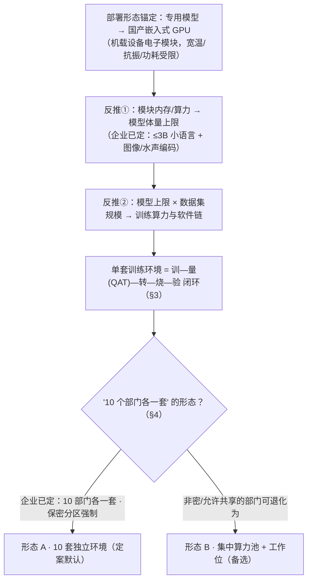
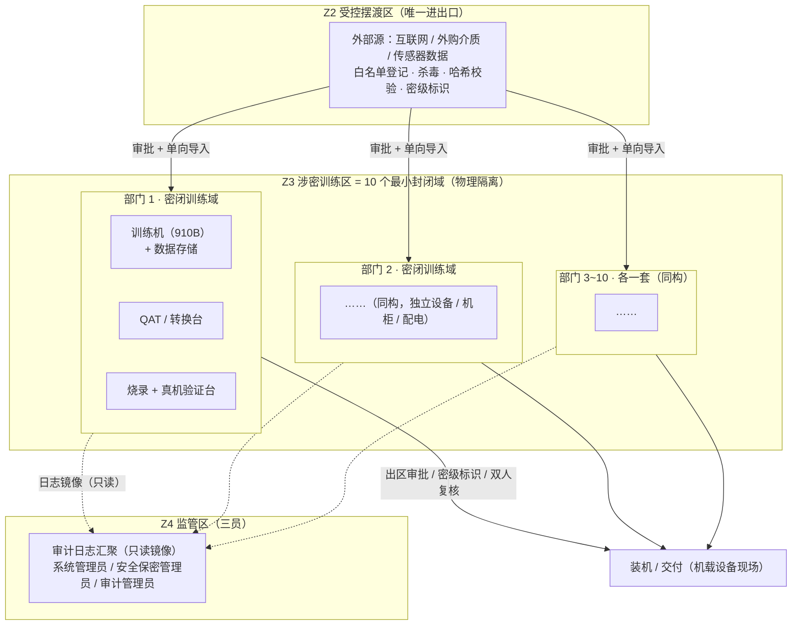

# 02-企业专用模型训练调优与机载嵌入式部署专项研究报告（v1.2）

| 文档信息 | |
|---|---|
| 编号 | 02 |
| 版本 | v1.2（定稿方向 · 已并入指标收口默认值，与 11-v1.4 对齐） |
| 日期 | 2026-09-08 |
| 来源 | 01 号研究报告 + 11 号建设方案建议的延伸论证（企业对话整理） |
| 状态 | 定稿方向；企业关键输入已定（3B 模型 / 10 部门各一套 / 图像+水声 / 保密分区强制），见 §2.2 / §4 / §7 分区；模块内存与烧录实测待验证，成本估算待询价 |

> **修订记录**：
> - **v1.0**：将「专用模型训练调优区 + 数据与知识底座」建设增量，与「训练后模型部署于**国产嵌入式 GPU、作为机载设备电子模块**」的场景论证，整理为研究报告；确立**部署目标反推 → 单套训练环境定义 → 10 套形态测算**主线；外部口径与 01 报告 v2.2 同一纪律。
> - **v1.1（2026-09-08）**：企业四项关键输入落地——① 目标模型定为 **3B 级小语言模型**（可融合图像/水声编码）；② **10 个部门各一套**训练环境（形态 A 定为默认）；③ 任务数据以**图像为主、可能含水声信号**；④ **保密分区强制**，新增 §7「涉密分区与安全架构方案」；同步修订 §2.2/§4/§6/§8/§9（原 §7/§8 顺延），成本仍为估算待询价。
> - **v1.2（本版，2026-09-08）**：新增 **§10 指标收口默认值**（与 11 号稿 v1.4 P49 对齐）——机载任务正确率双基线三判据、时延任务分级、平台级 3B 装入、采购放行门与保密三证据；默认值为【建议，待业务/保密办书面校准】，不写成定稿事实；同步附录速查加行。

> **一行结论**：企业自训 **3B 级小语言模型（可融合图像/水声信号编码）**，经 QAT 量化后烧进机载设备的**昇腾 Atlas 200I A2** 端侧模块；据此需要 **10 个部门各一套独立训练环境（形态 A 定案）**——因**保密分区强制**，各环境物理隔离、数据模型只进不出。每套 = 小型"训—量(QAT)—转—烧—验"闭环：训练用昇腾 910B 系（与 200I A2 同 CANN 生态），配套数据/转换/烧录验证台。**单套估算 ¥150~250 万（标准档）/ ¥60~120 万（轻量档），×10 ≈ ¥600~2500 万量级（待询价）**，另加分区机房、独立配电与三员运维。

---

## 一、缘起与定位：从"在线推理"到"训—埋—机载"

01 号报告与 11 号方案解决的是"**企业内网跑模型**"（96 卡在线推理双池）；本文解决的是它的另一半——"**企业自训专用模型，并把它部署进自有产品的机载电子设备**"：

- 11 号方案中，这部分对应 P15「产品智能化转型：要造/调专用模型」，当时只做到"识别需求 + 预留架构（P29）"，**规模刻意未测算**；
- 本次讨论把部署形态**锚定**下来：训练产物 = 可烧录进**国产嵌入式 GPU（作为机载设备电子模块）**的量化模型。此锚定改变了一切量级判断：从"数据中心里很多人并发用"变为"每个模块独立跑一份、数量 = 装机套数"。
- 红线不变且更强：机载研制多涉内网/保密要求，**训练环境须能物理隔离、断外网、介质受控**——比 01 报告"数据不出域"更硬。



---

## 二、部署目标反推：模型体量上限由机载模块决定

### 2.1 反推链（本报告主线）

1. **机载模块约束**：内存（几 GB~十几 GB 量级）、算力（几十 TOPS 量级 INT8）、功耗/散热、宽温抗振、确定性时序 → 共同决定可烧模型的上限；
2. **模型形态**：机载场景分两类——
   - **视觉/信号/目标识别类**：中小 CNN/ViT 网络（权重量级 MB~GB），**数据重、算力轻**；
   - **小语言模型**：若模块内存实测允许（边缘模块典型 8~16GB 量级），可烧 1B~3B 的 INT8/INT4 小 LLM——对已选 **Atlas 200I A2** 是否可行、能上多大，取决于其内存实测（见 §2.2 待复核项）；7B 级通常不现实。
3. **训练环境规模**：由"模型上限 + 数据集规模 + 并行项目数"三者反推，而非由"在线并发人数"决定——**与 01 号报告"人头不是负载、人时才是"同构，这里是"型号数不是负载、同时训的作业才是"**。

### 2.2 部署芯片已选定：昇腾 Atlas 200I A2（企业 2026-09-08 输入）

- **形态**：昇腾**端侧 AI 加速模块**（边缘 NPU，昇腾 310 系；工程形态可作机载设备电子模块评估；有 **Ind「高可靠/工业级」产品线**，是否选用待定）；
- **生态优势（关键）**：与训练侧昇腾 **910B/CANN 同源**——训练用 MindSpeed/ModelLink，部署侧走 CANN 端侧 runtime + MindIE 量化导出链，**"训→量(QAT)→转→烧"整条软件链同一套工具生态**，跨厂商时"训一套、转一套"的适配摩擦在这里最小；
- **规格待复核**：算力/内存/功耗以华为官方 HiAscend 产品规格页为准——本报告**不臆造精确值**；公开渠道口径为"端侧 TOPS 级加速模块"（约几十 TOPS 以内、内存典型边缘模块 8~16GB 量级，仅作量级参考）；
- **企业已定目标（2026-09-08）**：模块上跑 **3B 级小语言模型**（可融合图像/水声编码）；任务数据以**图像为主、可能含水声信号**。仍待 datasheet/实测确认一项：选 **A2 基础版还是 Ind 高可靠版**、模块**内存容量**——决定"3B INT4/INT8 权重 + 编码器 + 运行缓冲"能否装入。

> 注：**模块内存实测前，模型体量数字都是假设**。本报告的方法是"定模块→实测约束→反推模型→定训练环境"。已选 Atlas 200I A2 意味着：模型大概率是**视觉/信号识别类中小网络**，或（若内存允许）≤3B 级 INT4/INT8 小语言模型；7B 级通常不现实。

---

## 三、单套"训练环境"的定义（六个组成部分的闭环）

机载专用模型的训练环境，不是"几台训练机"，而是把**从数据到上机**跑通的最小研制单元：

| # | 组成 | 内容 | 要点 |
|---|---|---|---|
| 1 | **训练算力** | 昇腾训练整机（如 Atlas 800T A2，8×910B 64GB）×1 台 | 7B 级全参 SFT/LoRA 单机可覆盖，≤3B 更富余；**推理卡（300I A2 等 PCIe 卡）不能承担训练**，须训练卡体系（HCCS + CANN 训练栈） |
| 2 | **训练软件栈** | CANN + torch_npu + MindSpeed / ModelLink（DP/TP/序列并行、ZeRO）+ 实验留痕 | 与在线推理栈不同，属训练栈能力 |
| 3 | **数据环境** | 领域数据（图像/信号/任务样本/少量语料）采集—清洗—标注—增强—密级管理 | **机载专用模型的第一稀缺资源是任务数据，不是算力** |
| 4 | **QAT 与量化转换链** | 量化感知训练(QAT)、蒸馏；训完 W8A8/INT8/INT4 导出模块 runtime 格式 | **没有这条链，训出的模型上不了机**——机载模块多为 INT8/INT4 定点运行 |
| 5 | **烧录与真机验证台** | 接目标模块的调试板/工装：精度对照、确定性、时序、功耗、温箱抽查 | 机载/军品对"回归可复现"要求高于数据中心 |
| 6 | **版本与配置管理** | 数据集版本/模型版本/量化配置/烧录批次留痕 | 支撑型号研制与追溯 |

（涉密研制场景整套装于隔离内网：断外网、软件与模型白名单介质导入——同数据不出域红线。）

```mermaid
flowchart LR
    D["数据环境<br/>任务数据采集/标注/分级"] --> T["训练算力<br/>Atlas 800T A2（8×910B）"]
    T --> Q["QAT 量化感知训练<br/>INT8/INT4 精度校准"]
    Q --> C["转换与烧录<br/>导出模块 runtime 格式 → 烧录工装"]
    C --> V["真机验证台<br/>精度/时序/功耗/温箱回归"]
    V -->|不达标| T
    V -->|达标| R["版本/配置入库<br/>（供装机追溯）"]
    R -.→|下一型号复用| D
```

---

## 四、10 个部门各一套：形态与单套规模测算（v1.1 定案：形态 A）

### 4.1 定案：形态 A · 10 套独立环境（企业 2026-09-08 决定）

- **企业口径**："10 个部门各一套"；且**保密分区强制** → 每套为物理隔离的独立环境，数据/模型只进不出；
- **形态 B（集中算力池共享）仅作备选**，只适用于保密办确认"允许共享/非密"的部门（多数部门同密级且无网级隔离要求时，可退化为"分域分区 + 设备独立、非网级隔离"——布点与成本可下调，列入 §8 待保密办确认项）。

### 4.2 单套配置两档（适配 3B 目标）

| 档位 | 单套组成（3B 微调/蒸馏规模） | 一次性规模（估） | ×10 |
|---|---|---|---|
| **标准档**（部门多人/数据量大） | 训练整机 8×910B（64GB）×1 + 数据/转换/烧录验证台 + 独立柜与配电 | ~¥150~250 万/套 | ~¥1500~2500 万 |
| **轻量档**（部门 1~3 人/数据量小） | 2~4 卡训练小机 + 数据/转换/烧录验证台 | ~¥60~120 万/套 | ~¥600~1200 万 |

（均含软硬件栈与密管基础；单价**估算待询价**。另加：分区机房、独立 UPS、三员运维——见 §7。）

### 4.3 说明

- 训练区为**独立于 96 卡在线推理的另一类采购**（训练卡体系），电力/柜位在建设方案中与在线推理**错峰复用或单独扩容**，避免双峰值叠加；
- 3B 级训练属中小规模：单卡即可跑 LoRA/SFT，8 卡机是给部门内多人排队与后续更大模型留的余量——先按部门实际人数定档，不必全部顶格标准档。

---

## 五、支撑建设内容（若并入 11 号建设方案需增加的部分）

1. **部署目标约束页**：机载模块型号/内存/算力/功耗 → 专用模型体量上限与形态（补足 11 P15"产品智能化"的空泛）；
2. **训—转—烧链路工程页**：QAT/量化/转换/真机回归，替代"能训能调"的笼统表述；
3. **训练区硬件新类**：训练整机（910B 系）与电力/机房扩容，**独立于**在线推理 96 卡采购清单；
4. **数据与知识底座（C 区）优先级**：领域任务数据的**采集标注管线**优先于通用语料治理——机载模型的瓶颈是任务数据，C 区是训练区的"原料厂"；本次任务**图像为主、可能含水声信号**，应分别建立图像/视频标注管线与水声（→时频图）处理管线；
5. **MLOps/模型治理**：实验、数据集、模型、评测、烧录批次五件套留痕；与 AI 网关、在线池的关系（专用模型是否同时进在线池另议）；
6. **组织与预算**：训练算法/数据/验证人力从"预留"转为分档测算（按 10 部门各一套的运维口径，含保密三员）；保密办前置参与 §7 分区方案的细化。

---

## 六、成本总览与分期建议（估算，待询价）

| 阶段 | 内容 | 一次性规模（估） | 说明 |
|---|---|---|---|
| 前期 POC | 1 个型号先跑通"训—量—转—烧—验"闭环 | 单套训练整机 + 数据台：~¥150~250 万 | 先验证数据可得性、3B 装入模块实测与真机达标率，再铺 10 套 |
| 形态 B（备选） | 集中 2~3 台训练机 + 工作位（仅非密/允许共享部门） | ~¥500~900 万 | 若保密办确认部分部门可共享时采用 |
| 形态 A（定案默认） | **10 部门各一套独立环境**（保密分区强制，见 §7） | ~¥600~2500 万（按标准/轻量档） | POC 达标后分批铺 |
| 二期扩容 | 按型号需求 + 数据量实测 | 专项测算 | 与在线推理配电错峰复用 |

---

## 七、涉密分区与安全架构方案（10 部门各一套 · 保密分区强制）

> 定位：本节为**架构级分区方案**（v1.1 新增，回应企业"保密分区强制"输入），供立项与建设讨论；涉密合规细节（密级界定、适用条款、三员岗位设置等）须由保密办与主管部门按企业保密资格审定，本节不作合规结论。

### 7.1 分区目标与原则

- 10 部门各一套训练环境，机载型号多涉密 → 采用"**一密一网、按套隔离**"：每套环境是独立的**最小封闭域**，彼此及与外部均无网络连接；
- 数据/模型只沿**受控单向链路（摆渡）**进出，杜绝越权流动；全程可审计；
- **三分离**并治：网络隔离、介质管控、人员权限（三员分立）。

### 7.2 分区拓扑（建议）



### 7.3 关键控制项

| 控制 | 措施 |
|---|---|
| 网络 | 涉密训练域断外网、无无线；与办公网 / 在线推理区物理隔离；域间不设网联 |
| 摆渡 | 集中 1~2 处受控摆渡站：白名单、杀毒、哈希、来源与密级登记；专盘专用、加密、进出双向登记 |
| 介质与外设 | USB / 光驱禁用或管控；打印审批；禁私带介质出区 |
| 人员 | 三员分立（系统 / 安全保密 / 审计）；最小授权 + 关键操作双人复核 |
| 日志审计 | 训练作业、数据访问、模型出区全程留痕，只读镜像汇聚监管区 |
| 分区布点 | 每部门 1 机柜单元（训练机 + 数据 + 转换 + 烧录验证台 + 独立 UPS / 配电），物理分柜分区；同密级可相邻共管、异密级隔开 |
| 供应链 | 框架 / 权重 / 驱动经摆渡站导入并校验、来源登记，杜绝供应链污染 |

### 7.4 与形态 A 的对应与提示

- **10 套环境 = Z3 内 10 个密闭域**：硬件一次建、密管一次审，建议 POC 先建 1 个域验证，再复制；
- **提示**：单部门是否真需"网级隔离"取决于保密办对**部门密级是否一致**的界定——若多数部门同密级且属同一涉密网络，可退化为"**分域分区、设备独立、非网级隔离**"，布点与配电成本相应下调（列入 §8 待确认项）；
- 此分区方案只覆盖训练域（Z2/Z3/Z4）；在线推理 96 卡（01 报告）与训练域之间的关系（是否跨网、是否需单独评估）另由信息/保密体系整体论证。

---

## 八、风险与待确认输入（数字纪律：假设不写成事实）

### 8.1 关键待确认 / 待实测（企业 4 项输入已定，余项如下）

| # | 待确认项 | 影响 |
|---|---|---|
| 1 | ~~模块/型号~~ → **已定：昇腾 Atlas 200I A2**；仍待：A2 基础版 vs **Ind 高可靠版**、模块**内存容量**（官方 datasheet 复核） | 决定 3B + 编码器能否装入（§2） |
| 2 | **3B 装入模块实测门禁**：INT4/INT8 权重大小、推理速度、时序/功耗（模块样机先导试验） | 方案成立性（§2/§7） |
| 3 | ~~10 个环境含义~~ → **已定：10 部门各一套（形态 A）**；形态 B 仅备选（§4） | —（已消解） |
| 4 | ~~任务类型~~ → **已定：3B 小语言 + 图像为主/可能水声** | 影响数据管线（§5-4） |
| 5 | ~~保密分区~~ → **已定：强制**；仍待保密办对部门密级界定（可否同密级共享、降为分域分区） | 网级隔离强度与布点成本（§7.4） |
| 6 | 训练整机/小机与配套单价（询价） | 全篇成本由估算转实测（§4/§6） |
| 7 | 可授权训练的数据规模（图像/水声标注量） | 数据投入的主导变量 |

### 8.2 主要风险

| 风险/假设 | 影响 | 缓解 |
|---|---|---|
| 低估任务数据成本（图像/水声采集标注） | 训练区真实瓶颈在数据而非算力 | POC 先在 1 个部门建数据集验证可得性，再铺 10 套 |
| 3B + 编码器超出模块内存/算力 | 方案不成立 | 模块样机先导试验压测（显存/速度/时序）；必要时降编码器/INT4/蒸馏（§8.1-2） |
| 保密合规细化（三员/摆渡/介质/密级界定）落地慢 | 立项与建设节奏 | 保密办前置参与 §7 方案细化并先行审定 |
| 训练栈与在线栈生态差异（MindSpeed 训练 vs MindIE 推理） | 需要两套软件能力 | 人力与厂商支持按两线编制 |
| 量化后真机精度/确定性不达标 | 上不了机 | QAT 前置 + 真机回归台（§3 组件 4/5） |

---

## 九、方法论沉淀

1. **部署目标反推**：先定"模型装进什么"，再反推模型上限与训练环境——任何"专用模型"需求先过这一问；
2. **训—量—转—烧闭环**：机载/嵌入式 AI 的交付单元不是"模型权重"而是"可烧录、可回归的量化制品"；
3. **型号数≠负载**：与"人头≠负载"同构——项目制训练按"同时训的作业"买算力，不为闲置买单；
4. **数据先于算力**：专用模型的稀缺资源是任务数据，训练环境的预算重心应偏数据与验证；
5. **分区即形态、合规前置**：保密分区一旦强制，形态与预算即被锁定（§4/§7）——立项前先与保密办对齐"密级界定 / 三员 / 摆渡 / 介质"，避免按错误拓扑买设备。

---

## 十、指标收口默认值（与 11 号稿 v1.4 P49 对齐）

> 为让 02 与 11 号稿验收口径一致，机载专用模型（引擎 B）的验收指标按下表收口；A · 在线的收口（warm/cold 首包、解码 P95 等）见 11-P49 / 01 号报告。**以下默认值均为【建议，待业务与保密办书面校准】**，不写成定稿事实。
>
> 收口规则：每个指标带 **5 属性——目标 / 统计口径 / 测试条件 / 证据 / 不达标回退**；A · 在线按 **P95** 收口，B · 机载按"**平台级 + 任务级、额定工况最坏值**"收口。

| 层 | 指标（B · 机载） | 默认值【建议，待校准】 | 口径/条件 | 证据 | 不达标回退 |
|---|---|---|---|---|---|
| 业务 · 任务级 | 任务正确率 | ≥ **现状基线**，且 ≥ 参考上界 **90%**（分类/识别类；生成/问答类 ≥ 85%）；**INT4 相对 BF16 退化 ≤2pp**（分类类） | 固定回放集（企业真实数据，双人标注真值，版本冻结） | 任务级验收 | 增数据 / 蒸馏 / 换档 |
| 业务 · 任务级 | 端到端时延 | **S1** 短任务 ≤200ms(P95)/≤500ms(最坏)；**S2** LLM 单轮 ≤128 token 整轮 ≤5s（上限 15s）、首 token<1s；**S3** 后台分钟级 | 额定工况最坏值 + 典型工况 | 模块样机实测 | 降量化 / 蒸馏 / 调整任务分配 |
| 平台级 | 3B 量化后装得进 | INT4 体积 + 编码器 + 缓冲 ≤ 模块可用内存；推理速度/时序/功耗达标 | 模块样机先导 | 官方 datasheet + 实测 | 降编码器 / INT4 / 蒸馏 |
| 采购放行 | POC 门 | "装得进 + 跑得动 + 精度达标" **且** 保密预检三证据通过 | POC 验收门 | 样机 + 保密办 | 缩小试点 / 等栈成熟 / 重审方案 |

**保密分区收口（三件会签证据，见 §7）**：① 《密级界定与分域方案》保密办会签（按型号/项目密级切域，同密级共域、设备独立）；② 三员任命到位 + 权限矩阵最小化；③ 现场检查通过（摆渡/介质/网隔/双人复核）+ 试运行 1 个月无违规 → 出具《预检通过报告》，作为采购放行前置。

**放行逻辑**：POC 达标 → 提交正式采购（按"基准档 + 最大需求上界"两版，见 11-P50）；部分达标 → 只扩试点或走上表"回退"列；主门禁（采购放行行）不达标 → 不采购、回方案层重审。

---

## 附录：关键参数速查

| 参数 | 值 | 状态 |
|---|---|---|
| 单套训练算力 | 训练整机（8×910B 64GB）×1（标准）/ 2~4 卡小机（轻量） | 假设，型号待询价 |
| 单套环境规模 | ¥150~250 万（标准）/ ¥60~120 万（轻量） | 估算，待询价 |
| 形态 A（定案：10 部门各一套） | ~¥600~2500 万（按档）；IT ~60~80kW | 已定（2026-09-08）；成本估算待询价 |
| 形态 B（备选：集中 + 工作位） | ¥500~900 万 | 仅非密/允许共享部门 |
| 目标模型 | **3B 级小语言模型**（可融合图像/水声编码） | 企业已定（2026-09-08）；装入 200I A2 可行性待模块实测 |
| 部署芯片 | **昇腾 Atlas 200I A2**（端侧 NPU 模块） | 企业选定（2026-09-08）；子型号/内存以官方 datasheet 复核 |
| 训练芯片 | 昇腾 910B 系训练整机（如 Atlas 800T A2，8 卡） | 假设，型号待询价 |
| 训练/在线关系 | 训练区独立采购（训练卡体系），与在线 96 卡不同类 | 定稿（方法层） |
| 指标收口（B · 机载） | 正确率双基线三判据 / 时延任务分级 S1~S3 / 保密三证据 | **【建议默认，待业务/保密办校准】**（见 §10） |
