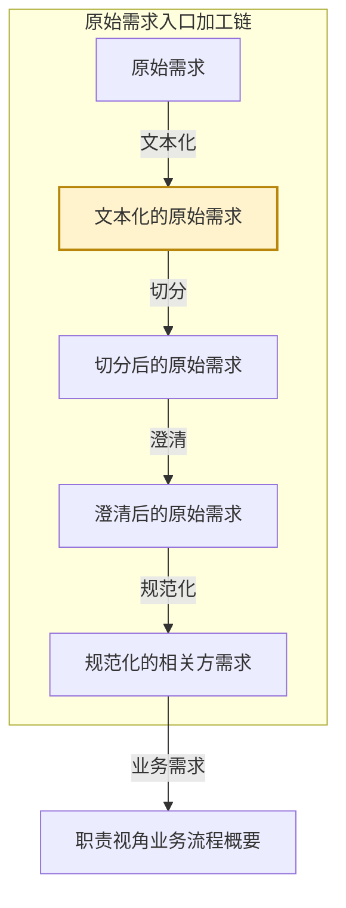

# eos-or00-x2md · 原始需求 → 文本化的原始需求
**SKILL 指南ID**：or00-x2md

> **本文件是什么**：本文件是 EOS 规范化的相关方需求预处理链第一步「文本化」的 SKILL 指南。它说明本任务这一次转换：输入文档 X 是原始需求，输出文档 Y 是文本化的原始需求，转换规则是换载体在本批材料上的实例化。
>
> **命名约定**：文档写本名，不写任务代号或文档编号，如「原始需求」「文本化的原始需求」；相邻任务按链上位置称呼，如「切分任务」「澄清任务」「规范化任务」；带「级」的节点名首次出现给全称与简称，其后用简称；状态值与字段名保留原值，如 `已登记`、`已文本化`。本任务在链上的位置由 §1.2 定。
>
> **自足声明**：本任务的过程判据就地成文；其余一律引权威单源——
>
> - **[94 号文档《EOS 系统设计产品数据分解结构》](../10-wfsysdev-4-eos/94-eos-sys-dev-dbs.md)**：入口加工链的五个加工形态与各形态的载体、结构上做了什么；各产品数据的树形与各级语义
> - **[91 号规范《EOS平台-业务-引擎规范》](../10-wfsysdev-4-eos/91-eos-biz-eng-spec.md)**：产品数据文档结构 §11、Skill 运行时协议 附录A
> - **[00-doc-conventions《文档编写约定》](../../../00-generalspec/00-doc-conventions.md)**：表达风格 §八、Skill 文档操作流程 Step 布局约定 §十三
>
> **创建**：2026-09-30 | **版本**：第 1 版

---

## 一、目的与目标

### 1.1 主要目的

> 把各类原始需求材料忠实转成统一载体的文本化工作副本，为规范化的相关方需求预处理链准备稳定可读的工作面，原始文件保持不动，并为每份材料登记处理状态。

### 1.2 在链上的位置

EOS 设计线在需求-方案结对之前，另有一条**原始需求入口加工链**：同一份材料被逐级加工，加工到多细就是一个形态，五个形态共用一棵以需求文档为下一级的树。

**图1-1：入口加工链与本任务的位置**



- **本任务所在的链**：原始需求入口加工链，EOS 设计线的入口。
- **本任务所在的位置**：加工链的第二个形态。上一个形态是原始需求，下一个形态是切分后的原始需求。
- **本任务**：把原始需求换成统一载体的文本化工作副本，产出 Y，即**文本化的原始需求**。它的输入 X 是**原始需求**。

这条链不是形态轴。框架、概要、定义说的是同一棵树长到多深，本链说的是同一份材料加工到多细；五个加工形态里只有切分与规范化两处动结构，本任务处在两处之前，**只换载体、不长结构**。X 与 Y 也不是需求-方案对的两端——一个需求-方案对的两端是需求与方案两份产品数据，而本任务是同一份材料在两个加工深度上的两个形态。

本任务处理的是**材料**，一次运行可以处理多份。人类有三处参与点：

- **Step Start**——从候选清单中选定本批处理的材料。
- **Step 2**——讨论并确认文本化方案。
- **Step 4**——裁决待处置项的去留。

本轮没讨论完的方案留在 `文本化方案待确认`，由下一轮接着讨论；人类确认之后，这份材料的文本化文档落定，状态文档表 A 相应地推进。

### 1.3 主要目标

把本批选定的原始需求材料逐份换成文本化工作副本，并为每份材料落定它在加工链上的位置。材料本身有缺陷的，不进链，标出来交人类处置。

1. **给出候选清单并校验受理**：列出 `10-raw-files/` 里尚未文本化的材料，逐份过受理门槛，交人类选定本批处理的对象。
2. **换载体**：把选定材料逐份转成 Markdown 工作副本，保存原载体的一切结构与数值，原始文件不动。
3. **标注识别不了的内容**：转录不了的用占位标注就地说明，标注即「此处需人工确认」的提示牌，不补全、不推断。
4. **查重**：新文本化正文与既有正文逐字比对，内容完全一致的判重复，不保留独立正文。
5. **登记**：为每份材料在状态文档的原始材料处理进度上登记一行，落定它的加工状态。
6. **检查并检出待处置项**：逐份复核要素齐备与查重结论，检出的待处置项交人类裁决。
7. **裁决待处置项**：逐条裁决材料缺陷、重复判定与要素缺项三类，并按裁决结果写回。
8. **写回与收尾**：确认后写入文本化文档与状态文档，已确认的推进状态、未确认的留待下一轮；并受理上游的变更。

### 1.4 与上下游的衔接

**表1-1：与上下游的衔接**

| 方向 | 任务 | 交接内容 |
|------|------|---------|
| 上游，X 的来源 | 原始需求入库 | 人类把 PDF／图片／邮件／纪要／已有 `.md` 放入 `10-raw-files/`；设计链的任务补充生成的材料也入此目录，登记为 `已登记` |
| 下游 | 切分任务 | 取本任务交出的文本化文档，在它之上长出需求文档；表中的 `人类决策=同意切分` 的材料是它的入口 |
| 回向，待人工处置 | 人类 | 收本任务检出的缺陷材料——损坏、加密、格式不受支持、转换器报错——修好或换掉源文件后重跑本步 |

> **交出的文本化文档由切分任务取用**：它的正文区必须是纯原文，没有切分方案块、没有分析建议块。切分任务检出正文区带下游产物的，按缺陷退回本任务。

---

## 二、输入文档结构及规则

输入文档（X） = **原始需求**，为入口加工链的第一个加工形态。

X 由外部输入，也由设计链的任务补充生成，两者都落在 `10-raw-files/`。它的结构、载体与加工状态，出处是 94 号文档 §2.0 与状态文档自身。

**X 不产树**：原始需求尚未进入 EOS 的结构，它的"结构上做了什么"一栏在 94 号文档里是空的。X 因此没有级、没有节点，是一份材料一个文件的载体集合。本任务不认树的级，只认材料。

**X 的构成**：

| 面 | 内容 |
|----|------|
| 载体 | `10-raw-files/` 下的任意文件——PDF／图片／扫描件／邮件／纪要／录音转写／已有 `.md`／`.txt` 等 |
| 命名 | 无约定，沿用材料原名；本任务的产物另加后缀，见 表3-3 |
| 一份材料一个文件 | 一份材料即一次转换的对象，也是登记与查重的单位 |
| 加工状态 | 不在文件上，记在状态文档的原始材料处理进度，一份材料一行 |

> **X 的加工状态由状态文档承接**：状态文档位于 `../../80-pl4eos-2-eosdata/00-origin-requirement-materials/01-eos-sysdev-status.md`，按管理对象分表。本任务读它选出待处理材料，写它落账。它只管理入口加工链的状态，设计链各任务的产品数据以各自文档管理区为权威源。

---

## 三、输出文档结构及规则

输出文档（Y） = 文本化的原始需求，为入口加工链的第二个加工形态。

### 3.1 Y 的树形结构与各级语义

Y 的树只有根与一级。**文本化的原始需求树**回答的问题是：一份材料被换载体之后，下一次加工在它上面依什么切分。本任务交出的是根这一级，即这份文档本身；① 那一级由切分任务落出。

**图3-1：文本化的原始需求树**

```
文本化的原始需求 ──── 根
└── 需求文档 ────────── ①
```

**表3-1：文本化的原始需求树各级节点的意义**

| 级 | 节点 | 意义 |
|----|------|------|
| 根 | 文本化的原始需求 | 一份材料 ＝ 一份文本化文档，载体形态，结构照搬原文 |
| ① | 需求文档 | 由切分产出。三味——业务需求文档，属性：所属业务域、业务输出文档；非功能需求文档，属性：所属业务域或平台语境、适用对象，片名另带主题；引擎需求文档，属性：所属业务域或平台语境、能力诉求 |

> **① 由切分任务产出，本任务交出 Y 时尚不存在**：本任务交出的是根这一级的实体，即这份文档本身。切分任务在它之上按需求的落点把正文划开，才落出 ①；本任务不预置它、不推断它、不为它预留位置。

### 3.2 Y 树各节点实现规则

本任务交出的是**载体**，不是内容结构。它对各级只做一件事——判这一级的实体由谁产出、本任务交到哪一步为止。

**表3-2：文本化的原始需求树各节点实现规则**

| 级 | 节点 | 实现规则 |
|----|------|---------|
| 根 | 文本化的原始需求 | **本任务产出**。一份材料产出一份文档，产出即落定，无形态深浅之分。正文区只放原文与转录占位标注，不放切分标记、方案块或分析建议块；管理区放状态摘要。**源文件已经是 `.md` 的，仍另立一份工作副本**，不改源文件 |
| ① | 需求文档 | **本任务不产出**，由切分任务在本次产出的文档之上切出。本任务不为它设位、不为它推断名称 |

- **收敛自查**：本任务只有根一级，不涉同层兄弟，覆盖完整与兄弟互斥两问在本任务上不成立；这两问的落点在切分任务，那里的切分结论必须切满全文、且切片之间互不重叠。

### 3.3 Y 根节点的要素

写入 Y 的根节点即这份文档本身。它须带齐两区。

**表3-3：文本化的原始需求**

| 要素 | 说明 |
|------|------|
| 文件命名 | `{原始文件名}.textualized.md`，与源文件同目录。源文件名含扩展名在内的原名照抄，后缀另加；软链接文档同此命名，靠管理区的重复标记区分 |
| 管理区 | 文档顶部、正文之前。放状态摘要表：阶段、AI建议、待处理、操作指引四项；重复材料写重复标记，不写本表 |
| 正文区 | 管理区之后。只放纯原文，以及转录识别不了时的占位标注；不放切分标记、方案块或分析建议块 |
| 历史 | 不设历史区、归档区或旧版正文。历史版本由 Git 管理，需留痕的结论摘要写入管理区，不复制旧版全文 |

> **管理区给人看、正文区给下游**：管理区的四项从状态文档表 A 推导而来，是同一件事的快速读法；正文区是切分任务唯一的读取面。两者不一致时以状态文档为准重建管理区。

**移交承诺**

本任务把文本化文档交给下游时，承诺文档达到：

1. 正文区只有纯原文与转录占位标注，可被切分任务直接读取；
2. 管理区的四项齐备，与状态文档表 A 的对应行一致；
3. 每份材料的正文逐字忠实于原文，未识别处已按 表4-2 标注，未擅自补全；
4. 重复材料的文档只有定向引用、无独立正文，并在管理区标出重复。

> **移交承诺就是切分任务的受理前提**——它读的是同一组条件。它检出正文区带下游产物的，按缺陷退回本任务。

---

## 四、输入到输出的过程及规则

一次转换依次走三步：换载体，落在 Y 的正文区；查重，落在 Y 是否保留独立正文；登记，落在 X 的加工状态。三步互不越位——换载体不管登记，查重不改正文，登记不重转一遍。

### 4.1 X 与 Y 的对应

X 是一份材料一个文件的载体集合，无级、无节点。Y 同样只有根一级。两者一对一：**一份材料对一份文本化文档**，不多不少。X 到 Y 的转换不涉级与级的落位，也不涉叶子与干枝，它只换载体。

**表4-1：X 与 Y 的对应**

| X 的面 | Y 的对应 |
|--------|---------|
| 载体，任意格式 | 统一后缀 `.textualized.md` 的 Markdown 工作副本 |
| 一份材料一个文件 | 一份材料一份工作副本 |
| 加工状态，记在状态文档表 A | 不变，本任务在表 A 上登记与推进 |
| — | 管理区状态摘要，由表 A 推导 |
| — | 正文区纯原文，由源文件转录得到 |

> **X 的加工状态不迁移**：它在状态文档表 A 上就地推进，不搬进 Y。Y 上的管理区只是它的快速读法。

**登记记录规则**——这份材料的加工状态按下列各项落进状态文档表 A 的对应行：

1. **记录ID**——本任务首次登记时生成，形如 `ORT-YYYYMMDD-序号`；
2. **内容摘要**——该材料当前处理阶段的一句话摘要；
3. **源文件**——原始文件名，含扩展名；
4. **文本化文档**——本次产出的工作副本文件名；
5. **生命周期**——该材料在加工链上的位置；
6. **AI建议与操作指引**——本任务对下一步的判断，以及人类下一步应做的事。

### 4.2 第一步 · 换载体

#### 转换过程

本步把源文件的内容搬进工作副本，落在 Y 的正文区。识别不了的内容就地标注，不补全。

1. 逐份读取源文件的内容——使用**转录规则**。
2. 识别不了或不确定的段落按场景标注——使用**转录规则**。
3. 写出工作副本的正文区。

正文区写就，Y 的实体就位。

#### 转换规则

**转录规则**——只改载体、不改内容。不总结、不解释、不补充。绝大多数内容直接转录，只有内容识别不了或不确定时，才按下表处置。

**表4-2：转录场景**

| 场景 | 处理方式 |
|------|---------|
| 内容能识别，含文本、表格、PDF 表格 | 直接转录为 Markdown，保留结构与数值 |
| 图片、扫描件 | 识别文字内容，标注 `[AI 识别，待人工确认]` |
| 录音转写 | 标注发言人与时间戳；听不清的标 `[听写不清]` |
| 手写内容 | 能辨识的标 `[AI 推测]`；不能辨识的标 `[原文模糊]` |
| 多语言混写 | 保留原文语种，必要时标注 `[中文/英文/…]` |
| 完全无法识别的图片 | 写占位符 `[图片：无法识别文字内容]` |
| 文档明显不完整 | 文档开头标注 `[文档疑似不完整：缺页/截断]` |
| 转换失败，源于损坏、加密、格式不受支持或转换器报错 | 不产出文档；该材料在 表 A 登记失败，见**登记规则** |
| 部分转换成功 | 能转的部分正常转录；未转部分在正文区标 `[转换失败：<原因>]`，整体仍按已文本化进入下游 |

> **标注是提示牌，不是结论**：标注说的是「此处需人工确认」，不是 AI 已把这处加工过了。宁可用标注如实说明，也不凭空补全。

### 4.3 第二步 · 查重

#### 转换过程

本步判这次换载体得到的正文，与既有工作副本是不是同一份材料。

1. 取新文本化的正文区——使用**查重规则**。
2. 与既有工作副本的正文区逐字比对——使用**查重规则**。
3. 判为重复的，不保留独立正文，改写定向引用。

判完，Y 是保留独立正文还是只留定向引用，就定了。

#### 转换规则

**查重规则**——比三样：比什么、怎么算重复、重复了怎么办。

- **比什么**：正文区全文。管理区的不参与比对。比对范围是所有生命周期不是 `已废弃（重复）` 的既有工作副本。
- **怎么算重复**：全文逐字完全一致，忽略行尾空格与连续空行的差异。
- **重复了怎么办**：不保留独立正文，正文区改为指向原文档的定向引用；这份工作副本仍在原处、仍叫 `{原始文件名}.textualized.md`，靠管理区的重复标记与正常副本区分。

### 4.4 第三步 · 登记

#### 转换过程

本步把这份材料在加工链上的位置定下来，落在 X 的加工状态上，即状态文档表 A 的对应行。

1. 先落表 A 的对应行——使用**登记规则**。
2. 再从表 A 推导，写出工作副本管理区的状态摘要。

两步写完，这份材料的加工状态就落定了。

#### 转换规则

**登记规则**——表 A 是加工状态的权威源，本任务写入下列各列：

**表4-3：本任务写入的表 A 各列**

| 列 | 本任务写什么 |
|----|-------------|
| 记录ID | 首次登记时生成，形如 `ORT-YYYYMMDD-序号` |
| 内容摘要 | 一句话摘要；重复材料写 `与<源文件名>内容完全重复`；转换失败写 `转换失败：<原因>` |
| 源文件 | 原始文件名，含扩展名 |
| 文本化文档 | 工作副本文件名 |
| 生命周期 | 方案已确认、非重复的写 `已文本化`；未确认的写 `文本化方案待确认`；重复的写 `已废弃（重复）`；转换失败的留在 `已登记` |
| AI建议 | 纯前视提示：非重复的写 `可以切分`；重复的写 `已废弃（重复）` |
| 处置标记 | 转换失败的写 `待人工处置`；其余留空 |
| 操作指引 | 人类下一步应执行的操作 |

> **写回顺序固定**：先写表 A，再从表 A 推导写工作副本的管理区。两者不一致时，以表 A 为准重建管理区。
>
> **人类决策列不由本任务写**：它是人类的输入面，本任务只读它判这份材料该走哪条路，不代写。

### 4.5 重进入与变更影响声明

**重进入规则**——已进链的材料再次被本任务处理时，按四种情形分流：

**表4-4：重进入的四种情形**

| 情形 | 判定 | 处置 |
|------|------|------|
| 新进材料 | 表 A 上无对应行 | 按新材料处理 |
| 重新文本化 | 表 A 上该行的生命周期被清空，源文件仍在 | 先查这份材料是否已被下游消费；未被消费的，替换旧工作副本重做；已被消费的，先写变更影响声明，把受影响的下游对象标为待重审，再重做 |
| 重复误判 | 表 A 上该行的生命周期被清空，原判为重复 | 删掉定向引用文档，重新判定 |
| 转换失败重试 | 表 A 上该行的生命周期被清空，源文件已修复或替换 | 重新转换 |

**变更影响声明规则**——本次有重新文本化或重复关系纠正的，按 [91 号规范 §A.7.2](../10-wfsysdev-4-eos/91-eos-biz-eng-spec.md) 判变更类型，按 §A.7.3 的格式写入文档末尾，并列出受影响的需求文档、规范化的相关方需求与已消费的业务框架，不笼统说下游不受影响。

---

## 五、执行步骤及检验规则

一次运行起于 Step Start，依次走 Step 1~4 的设计动作，收于 Step End。

**表5-1：Step 布局总览**

| Step | 名称 | 职责 | 人类参与 | 执行模式 | 产出 | 写资产 |
|------|------|------|---------|---------|------|--------|
| Start | 为任务选择并校验材料 | 前置校验、给出候选清单、受理门槛、按状态路由 | **有**——从候选清单中选定 | 对话 | 受理结论 + 候选清单 | 状态文档（首次） |
| 1 | 基于材料生成文本化方案 | 逐份转录、标注、查重、登记草稿 | 无（AI 自动） | 统一 | 文本化方案 + 登记草稿 | — |
| 2 | 基于对话确认文本化方案 | 列出未确认清单、讨论修改；要素机械检查后写回 | **有**——讨论与确认 | 对话 | 确认结论 + 未确认清单 | 状态文档、文本化的原始需求 |
| 3 | 检查材料并检出待处置项 | 复核要素齐备与查重结论，检出待处置项 | 无（AI 自动） | 统一 | 检查结论 + 待处置项 | 状态文档 |
| 4 | 基于对话裁决待处置项 | 列出待处置项、裁决去留；复跑检查后写回 | **有**——裁决 | 对话 | 裁决结论 + 处置清单 | 状态文档、文本化的原始需求 |
| End | 给出本轮任务成果总结 | 汇总本轮写回结果、三区摘要输出 | **有**——查看结果摘要 | 对话 | 本轮成果总结 + 下一步 | — |

### 5.1 Step Start · 为任务选择并校验材料

**选定本次处理对象**——本步给出**候选清单**交人类选定：每份待处理的材料占一行，列出源文件名、它在表 A 上的当前生命周期与 AI建议。人类选定其中一份或多份，本批一并处理。

**存量节点**——待本任务处理的存量有两类：生命周期停在 `文本化方案待确认` 的，即上一轮没讨论完留下的方案；`处置标记=待处置` 的，即上一轮已检出、尚未裁决的项。两类都由入口检出，与本次新选的材料一并处理。

**按状态路由**——表 A 上各材料的生命周期、人类决策与处置标记决定它走哪条路：

- `人类决策=已终止` 且生命周期停在 `已登记` 或 `已文本化`：进本批，Step 1 给出「置 `已废弃`」的方案，Step 2 确认后写回并追加废弃说明。
- `人类决策=已终止` 且生命周期已到 `切分方案待确认` 或 `已切分`：不进本批，列入行动清单，提示走切分任务处置。
- `生命周期` 为空且源文件仍在：进本批，按**重进入规则**分流。
- `生命周期=已废弃（重复）` 且源文件已不存在：进本批，Step 3 检出、Step 4 裁决收尾。
- `人类决策=同意切分` 或 `暂不切分`：不进本批，列入行动清单。

受理门槛如下，逐条判；不满足条件的，按「判定」「动作」两列处置。

**表5-2：受理门槛（对 X）**

| 校验条件 | 判定 | 动作 |
|---------|------|------|
| 源文件名以 `.textualized.md` 结尾 | 不是原始需求 | 输出提示 → 跳过该文件 |
| 源文件名含 `.chunk-` | 不是原始需求 | 输出提示 → 跳过该文件，提示走澄清任务 |
| 表 A 上该行生命周期为 `已文本化` 或更后 | 已在处理流程中 | 跳过；如需重做，先清空该行生命周期值 |
| 表 A 上该行生命周期为 `已废弃（重复）` | 重复关系已记录 | 跳过；如需重判，先清空该行生命周期值 |
| 表 A 上该行生命周期为 `已废弃` | 已废弃 | 跳过；如需重启，先清空该行生命周期值 |
| 源文件损坏、加密或格式不受支持 | 不可处理 | 登记失败，`处置标记=待人工处置` → 该材料不进本批 |
| 本次选定的材料跨了多份 | 软提示 | 逐份分别处理，不合并成一份 |
| 无待处理材料 + 无入口检出的存量 | 无待处理对象 | 输出提示 → 退出 |

表中的状态值取自表 A 的生命周期列，它的完整取值与含义以状态文档自身为准。`已登记` 的材料每轮重新进入转换——转换失败自动重试，中断的材料继续处理。

**状态推进**——本任务写入 `文本化方案待确认` 与 `已文本化` 两个生命周期值，并在重复材料上写 `已废弃（重复）`；`切分方案待确认` 与 `已切分` 由切分任务随切分一并写回；`已澄清`、`已规范化` 由澄清任务与规范化任务写回。`处置标记` 列：Step 3 检出问题的写 `待处置`，源文件缺陷的写 `待人工处置`。Step Start 按状态路由，Step 2 在确认后写回。

上游变更，即新需求汇入，按状态分流：

- `已文本化` 及更后的状态→原行不动，新进材料另登记一行；
- `已废弃（重复）`→原行不动，新料按新材料处理。

**待人工处置**：材料本身有缺陷、且缺陷的处置权不在本任务——损坏、加密、格式不受支持、转换器报错——登记为 `已登记`、`处置标记=待人工处置`，交人类修好或换掉源文件后重跑，本批不再受理。

### 5.2 Step 1 · 基于材料生成文本化方案

有新选定的材料汇入，或入口检出存量节点时，走本步，两者都没有时本步不走。存量节点先于新输入处理。

**读取材料**——读的是三处。**源文件这一处**：本批选定材料的全部内容。**既有产物这一处**：查重比对范围内的既有工作副本正文区，用 `ls` 与按需读取，不默认加载全文。**状态文档这一处**：本批各材料在表 A 上的对应行。X 是本任务唯一的外部输入，Y 即资产、就在本任务的产出里，不另读资产文档。

对本次每一份材料，本步依次走第四章的三步：

1. 换载体——使用**转录规则**。
2. 查重——使用**查重规则**。
3. 登记——填写表 A 各列的草稿，这一份材料的加工状态就位。

三步走完，本批每一份材料都有一份文本化方案，含正文区草稿、独立正文或定向引用的判定、以及一行登记草稿。

**产出去向**——生成的全部方案不作状态写入，随方案一并交 Step 2 讨论确认。**本步无人类参与点**。

**失败处置**——源文件读不到、或转录中途报错的，该份材料登记失败、`处置标记=待人工处置` 交 Step 2 的对话，其余材料照常；整批受理不过的，按受理门槛处置退出。

### 5.3 Step 2 · 基于对话确认文本化方案

本步每轮都走。本步讨论确认两件事——Step 1 刚生成的方案，以及状态停在 `文本化方案待确认` 的遗留方案，两者处置一样。

**未确认清单**——把本轮新生成的方案与状态为 `文本化方案待确认` 的遗留方案一并列出交人类讨论，逐份给出它的处置建议。这份清单就是本步的界面。

**逐条讨论与确认**——修改落在方案上即按讨论结果改；人类确认后，该份材料转为已确认。确认的单位是材料——一份方案给出一条结论，可以逐份给，也可以一次全部确认。

**写回前的要素机械检查**——逐份检查要素齐备：管理区四项非空，或属**合理空置**；正文区有内容，或已按 表4-2 标注；标注齐备。检查不过的就地补齐；无法补齐的说明它是结构性缺陷，回 Step 1 重做，不带不合的要素写回。

**写回**——确认即写回，按确认结果分四种情形：

**表5-3：确认后写回的四种情形**

| 对象 | 讨论结果 | 写回动作 |
|------|---------|---------|
| 本轮生成或修订的方案 | 已确认 | 写入工作副本与表 A，生命周期写 `已文本化` |
| 本轮生成或修订的方案 | 未确认 | 写入工作副本与表 A，状态写 `文本化方案待确认`，留作下一轮的处理对象 |
| 遗留的待确认方案 | 已确认 | 推状态到 `已文本化`，正文按讨论结果改或不改 |
| 遗留的待确认方案 | 仍未确认 | 不动 |

**已被下游消费过的材料本次被修订**，写回时另按上游变更分流定状态：材料已被切分任务取用的，维持原状态、版本递增；已被澄清或规范化任务消费的，标为待下游重审。

**写的是 Y**——文本化的原始需求：正文区按讨论结果落定，管理区的四项按 表4-3 从表 A 推导写入。

**也写的是 X 的加工状态**——状态文档表 A 上本批各材料的对应行按**登记规则**落定，先写表 A、再写管理区。

**本步的特化参数**：

- **锚点需求** = 本批各材料的源文件全文与既有工作副本正文
- **操作条目** = 源文件 + 文本化文档 + 表 A 对应行
- **推进目标** = `已文本化`
- **清除条件** = 已确认的材料默认跳过。本轮新输入满足下列任一条件时，该材料回到待处理：源文件被更换过；表 A 上对应行的生命周期被清空；它所属的既有工作副本已被下游消费且正文有变
- **级联触发条件** = 改动使某份材料由独立正文变为重复、或由重复变为独立正文 → 重验受影响的既有工作副本是否仍成立，重验由 Step 3 的检查承担

**产出去向**——本步写回的方案交 Step 3 做检查。**人类参与点在本节**——讨论并确认文本化方案。

**失败处置**——同一份材料反复退改超过一次的，停止处理，`处置标记=待处置` 留待下一轮。

### 5.4 Step 3 · 检查材料并检出待处置项

Step 1 走过就走本步；Step 2 写回后即执行本任务的关口——检查取三面：

- **载体这一面**——每份材料都换成了工作副本，源文件未被改动；正文区只有纯原文与转录占位标注，无切分标记、方案块或分析建议块。
- **查重这一面**——判为重复的确实与既有正文逐字一致；判为不重复的确实无逐字一致的既有正文。
- **要素这一面**——管理区四项齐备、正文区有内容或已标注。

检出问题的在 `处置标记` 列记 `待处置`，交 Step 4 的对话里由人类裁决。问题分三类，各锚一处：

**表5-4：待处置项的三类锚点**

| 类 | 锚在哪 | 例 |
|----|--------|----|
| 材料缺陷类 | 源文件 | 损坏、加密、格式不受支持、转换器报错；部分转换成功而未转部分 |
| 重复判定类 | 表 A 的对应行 | 判重存疑、重复误判、源文件已删而重复关系已记录 |
| 要素缺项类 | 工作副本 | 管理区四项不齐、正文区为空、标注不完整 |

**产出与去向**——检查结论与待处置项清单交 Step 4。本步无人类参与点。

**失败处置**——检查所依据的既有工作副本不可读时，该份材料的 `处置标记` 记 `待处置` 交 Step 4 讨论，不静默通过。

### 5.5 Step 4 · 基于对话裁决待处置项

本步每轮都走，逐条裁决 Step 3 检出的待处置项。

**待处置项清单**——把 Step 3 的检查结论与待处置项一并列出交人类讨论：每条写明它锚在哪份材料或哪个工作副本上、属于哪一类、缺的是哪一样。这份清单就是本步的界面。

**逐条裁决**——材料缺陷类的，人类修好或换掉源文件后重跑；重复判定类的，判「确认」即删源文件、判「误判」即清空表 A 生命周期值重跑；要素缺项类的，就地补齐或回 Step 1 重做。结构性改动触及查重面的，材料留待下一轮重判。

**复跑检查**——本步每执行一处修改即复跑 Step 3 的检查，范围限被改动的材料；改动触及重复关系的，按 [91 号规范 §A.5.3](../10-wfsysdev-4-eos/91-eos-biz-eng-spec.md) 的级联处理 `处置标记=待处置` 回 Step 1 重走。同一处反复退改超过一次的，停止处理，`处置标记=待处置` 留待下一轮。

**写回**——判「确认重复」的，源文件删除、定向引用文档保留，表 A 对应行落 `已废弃（重复）`；判「重跑」的，清空表 A 生命周期值后按 §4.5 重进入；判「误判」的，删掉定向引用文档、重新判定。裁决完成的行清掉 `处置标记`。改动使某份材料的管理区变更的，一并写回。

**本步的操作条目** = 待处置项。

**产出去向**——裁决结论与处置清单一并交 Step End 汇总。**人类参与点在本节**——裁决待处置项的去留。

### 5.6 Step End · 给出本轮任务成果总结

本步只汇总本轮结果并给出下一步。

**三区输出**——第一区的状态与结果摘要行就地写实：

```text
当前状态：<已文本化 / 文本化方案待确认 / 待处置 / 待人工处置 / 已废弃（重复）/ 无待处理对象>
  本轮已文本化：<N 份，逐份列源文件名>
  本轮判为重复：<N 份，逐份列「源文件名 → 与<原文档>内容完全重复」>
  本轮待人工处置：<N 份，逐份列「源文件名 → 缺陷与原因」>
  检查结论：<通过 / 检出待处置项 N 处，已裁决 M 处>

一、未确认的方案
  <本轮未确认 N 份：源文件名 + 状态；无则写「无」，下一轮运行接着讨论>

二、下一步
  本任务 → 选定新一批待处理材料重新运行
  下游    → 切分任务（取本轮交出的文本化文档）
```

**收尾**——更新状态文档的基线记录、提交本轮变更。

**增量标记**——`[新增]`／`[变更]`／`[确认]`／`[需裁决]` 与 `[推断]` 的定义与使用按 [91 号规范 §A.3.1](../10-wfsysdev-4-eos/91-eos-biz-eng-spec.md) 执行。本任务另用到三枚标记：`[待复核]` 标候选清单中归上存疑的行；`[待处置]` 标检查检出的问题；`[推断]` 标转录中由 AI 推定而未获确认的内容。本任务增量清单对操作条目逐条标注，并附检查结论行。

**自检清单**——一次运行收尾前，按本任务流程分组逐项核对：

- **受理**
  - 前置材料——目录、状态文档与基线——已确认就绪。
  - 候选清单已给出，人类已选定本批处理的对象。
  - 入口检出的存量节点与待处置项已并作本次处理对象。
  - 无待处理对象时本任务已退出。
- **载入与校验**
  - 本批材料的源文件全文、查重范围内的既有工作副本正文、表 A 对应行都已按读取协议加载，不全载全文。
  - 受理门槛已逐条校验，软提示项已交人类定夺。
  - 人类对表 A 的直接修改已标 `[需复核]`、未覆盖。
- **生成**
  - 转录按**转录规则**执行，只改载体、不改内容；识别不了的内容已按 表4-2 标注。
  - 查重按**查重规则**执行，比对范围与判定口径都对。
  - 登记草稿按**登记规则**填写，各列齐备。
- **Y 侧要素**
  - 每份工作副本命名合规，管理区四项齐备，正文区只有纯原文与转录占位标注。
  - 重复材料只留定向引用，管理区已标重复及指向的原文档。
  - 要素非空或合理空置。
- **确认与写回**
  - 要素机械检查已执行。
  - 文本化方案已列全、逐份确认。
  - 确认结果已按 表5-3 写回，已被下游消费过的材料已按上游变更分流落定状态与版本。
  - 写回顺序合规：先写表 A，再据此写工作副本管理区。
- **检查**
  - 检查已执行，三面都取。
  - 待处置项已按三类锚点归位。
  - 缺口不以本任务判断处置，**不脑补内容**，交人类裁决。
- **裁决与写回**
  - 待处置项已逐条裁决。
  - 改动处的复跑已执行。
  - 裁决结论已写回表 A 与受影响的文档。
- **收尾**
  - 三区摘要已输出，下一步已给出。
  - 基线记录已更新，本轮变更已提交。
