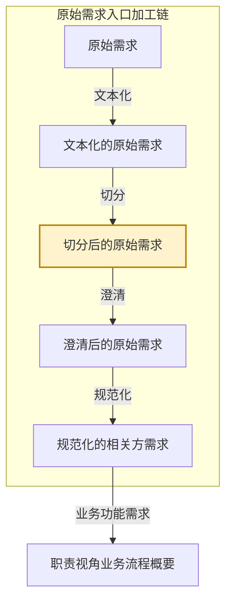

# eos-or01-x2docbiz · 文本化的原始需求 → 功能需求文档与非功能需求文档
**SKILL 指南ID**：or01-x2docbiz

> **本文件是什么**：本文件是 EOS 规范化的相关方需求预处理链第二步「切分」的 SKILL 指南。它说明本任务这一次转换：输入文档 X 是文本化的原始需求，输出文档 Y 是需求文档——功能性需求归成功能需求文档，非功能需求归成非功能需求文档；转换规则是按每条需求的落点划出语义片。
>
> **命名约定**：文档写本名，不写任务代号或文档编号，如「文本化的原始需求」「功能需求文档」「非功能需求文档」；相邻任务按链上位置称呼，如「文本化任务」「澄清任务」「规范化任务」；带「级」的节点名首次出现给全称与简称，其后用简称；状态值与字段名保留原值，如 `已文本化`、`已切分`。本任务在链上的位置见第一章。
>
> **自足声明**：本任务的过程判据就地成文；其余一律引权威单源——
>
> - **[94 号文档《EOS 系统设计产品数据分解结构》](../10-wfsysdev-4-eos/94-eos-sys-dev-dbs.md)**：入口加工链的五个加工形态与各形态的载体、结构上做了什么；各产品数据的树形与各级语义
> - **[91 号规范《EOS平台-业务-引擎规范》](../10-wfsysdev-4-eos/91-eos-biz-eng-spec.md)**：业务对象与业务场景概念 §1.4、产品数据文档结构 §11、Skill 运行时协议 附录A
> - **[00-doc-conventions《文档编写约定》](../../../00-generalspec/00-doc-conventions.md)**：表达风格 §八、Skill 文档操作流程 Step 布局约定 §十三
>
> **创建**：2026-10-08 | **版本**：第 1 版

---

## 一、目的与目标

### 1.1 主要目的

> 把一份文本化的原始需求按每条需求的落点切成若干份需求文档，功能性需求归到它所属的业务输出文档，非功能需求归到它的适用对象与主题，使每份需求文档能独立进入澄清与规范化；原文出处保留，切分结论交人类把关。

### 1.2 在链上的位置

EOS 设计线在需求-方案结对之前，另有一条**原始需求入口加工链**：同一份材料被逐级加工，加工到多细就是一个形态，五个形态共用一棵以需求文档为下一级的树。

**图1-1：入口加工链与本任务的位置**



- **本任务所在的链**：原始需求入口加工链，EOS 设计线的入口。
- **本任务所在的位置**：加工链的第三个形态。上一个形态是文本化的原始需求，下一个形态是澄清后的原始需求。
- **本任务**：把一份文本化材料切成若干份需求文档，产出 Y，即**切分后的原始需求**。它的输入 X 是**文本化的原始需求**。

这条链不是形态轴。框架、概要、定义说的是同一棵树长到多深，本链说的是同一份材料加工到多细；五个加工形态里只有切分与规范化两处动结构，本任务正是其中一处——**在材料上划出需求文档，落出切分后的原始需求树的下一级**。X 与 Y 也不是需求-方案对的两端——一个需求-方案对的两端是需求与方案两份产品数据，而本任务是同一份材料在两个加工深度上的两个形态。

本任务处理的是**材料**，一次运行可以处理多份。人类有三处参与点：

- **Step Start**——从候选清单中选定本批处理的材料。
- **Step 2**——讨论并确认切分方案。
- **Step 4**——裁决待处置项的去留。

本轮没讨论完的方案留在 `切分方案待确认`，由下一轮接着讨论；人类确认之后，这份材料的切分结论落定，需求文档随即产出，状态文档表 A 相应地推进。

### 1.3 主要目标

把本批选定的文本化材料逐份切成需求文档，并为每份材料落定它的切分结论。

1. **给出候选清单并校验受理**：列出表 A 上待切分的材料，逐份过受理门槛，交人类选定本批处理的对象。
2. **分需求与指标**：通读材料，把每一句归入功能诉求、非功能诉求，或某条需求上的性能指标三类之一。
3. **归功能需求**：数材料里的业务输出文档，同属一份业务输出文档的功能性需求连同它的性能指标合成一篇功能需求文档；材料未显式写出产物的，由本任务给出建议交人类确认。
4. **归非功能需求**：判每条非功能诉求的适用对象与主题，同一个适用对象、同一个主题的非功能需求连同它的性能指标合成一篇非功能需求文档。
5. **划边界并成方案**：定每篇文档的行号范围与片名，形成切分方案，交人类在对话中确认。
6. **检查并检出待处置项**：逐份复核覆盖、归属与要素，检出的待处置项交人类裁决。
7. **裁决待处置项**：逐条裁决覆盖缺口、归属存疑与要素缺项三类，并按裁决结果写回。
8. **写回与收尾**：确认后写入需求文档与状态文档；已确认的推进状态、未确认的留待下一轮；并受理上游的变更。

### 1.4 与上下游的衔接

**表1-1：与上下游的衔接**

| 方向 | 任务 | 交接内容 |
|------|------|---------|
| 上游，X 的来源 | 文本化任务 | 取本任务交出的文本化文档，在它之上长出需求文档；表中的 `人类决策=同意切分` 的材料是它的入口 |
| 上游，X 的来源 | 原始需求入库 | 人类把 PDF／图片／邮件／纪要／已有 `.md` 放入 `10-raw-files/`，再经文本化任务转成工作副本 |
| 下游 | 澄清任务 | 取本任务交出的需求文档，逐条标注模糊项并澄清；表 B 中 `生命周期=已切分` 且 `人类决策=同意澄清` 的需求文档是它的入口 |
| 回向，待人工处置 | 人类 | 收本任务检出的缺陷材料——正文区带下游产物、损坏、读不了——修好或换掉源文件后重跑本步 |

> **交出的需求文档由澄清任务取用**：它的正文区必须是纯原文片段，没有方案块、没有分析建议块。

---

## 二、输入文档结构及规则

输入文档（X） = **文本化的原始需求**，为入口加工链的第二个加工形态。

X 由文本化任务产出，落在 `10-raw-files/`。它的结构、载体与加工状态，出处是 94 号文档 §2.0 与状态文档自身。

**X 不产树**：文本化的原始需求只换载体、不长结构，它的"结构上做了什么"一栏在 94 号文档里是空的。X 因此没有级、没有节点，是一份材料一个文件的载体。本任务不认树的级，只认材料与它上面的文句。

**X 的构成**：

| 面 | 内容 |
|----|------|
| 载体 | `10-raw-files/` 下的 `.textualized.md` 文件 |
| 命名 | `{原始文件名}.textualized.md`，与源文件同目录 |
| 两区 | 管理区放状态摘要四项；正文区放纯原文与转录占位标注 |
| 一份材料一个文件 | 一份材料即一次切分的对象 |
| 加工状态 | 不在文件上，记在状态文档，一份材料一行 |

> **X 的加工状态由状态文档承接**：状态文档位于 `../../80-pl4eos-2-eosdata/00-origin-requirement-materials/01-eos-sysdev-status.md`，按管理对象分表。本任务读它选出待处理材料，写它落账。它只管理入口加工链的状态，设计链各任务的产品数据以各自文档管理区为权威源。

---

## 三、输出文档结构及规则

输出文档（Y） = **切分后的原始需求**，为入口加工链的第三个加工形态。它是若干份**需求文档**，分两味：**功能需求文档**与**非功能需求文档**。

### 3.1 Y 的树形结构与各级语义

Y 的树只有根与一级。**切分后的原始需求树**回答的问题是：一份材料被切分之后，下游逐份加工的单位是什么。本任务交出的是根这一级与 ① 这一级两处。

**图3-1：切分后的原始需求树**

```
切分后的原始需求 ──── 根
└── 需求文档 ────────── ①
```

**表3-1：切分后的原始需求树各级节点的意义**

| 级 | 节点 | 意义 |
|----|------|------|
| 根 | 切分后的原始需求 | 一份材料切出的全部需求文档的集合，一次切分的产物整体 |
| ① | 需求文档 | 由切分产出。两味——**功能需求文档**，挂在它的业务输出文档上，带两个属性：所属业务域、业务输出文档；**非功能需求文档**，挂在它的适用对象上，带三个属性：所属业务域或平台语境、适用对象、主题即该篇的分类维度 |

> **① 的键**：功能需求文档的键是它那张业务输出文档；非功能需求文档的键是适用对象与主题。键相同即同一篇，键不同即两篇。

### 3.2 Y 树各节点实现规则

本任务交出的是**划断的文本**，不是新的内容。它对各级只做一件事——判这一级的实体由谁产出、本任务交到哪一步为止。

**表3-2：切分后的原始需求树各节点实现规则**

| 级 | 节点 | 实现规则 |
|----|------|---------|
| 根 | 切分后的原始需求 | **本任务产出**。一份材料产出一批需求文档，本任务交出的是这一批的整体。根不另立实体，它的构成就是那批需求文档 |
| ① | 需求文档 | **本任务产出**。每篇装一段连续的原文片段，片段内不改、不补、不评；片名与行号范围由切分方案定，人类确认后成篇 |

- **收敛自查**：本任务只有一级，覆盖完整与不重叠两问落在这里——切分结论必须**切满全文**，且需求文档之间**行号不重叠**。缺一段即覆盖不全，两篇行号相交即重叠。

### 3.3 需求文档的要素

写入 Y 的每一篇需求文档都须带齐三段。

**表3-3：需求文档（`.chunk-{seq}.md`）**

| 要素 | 说明 |
|------|------|
| 文件命名 | `{原始文件名}.chunk-{seq}.md`，与文本化文档同目录；`{seq}` 三位补零，按材料行文次序编 |
| frontmatter | YAML 元数据：`source`（文本化文档名）、`original_source`（原始文件名）、`seq`、`total`、`kind`（`功能需求文档` / `非功能需求文档`）、`label`（片名）、`range`（行号范围）、`status`（初始 `raw`）；非功能需求文档另带 `applicable`（适用对象）与 `topic`（主题，即该篇的分类维度） |
| 管理区 | frontmatter 之后、正文之前。放状态摘要表：阶段、AI建议、待处理、操作指引四项 |
| 正文区 | 管理区之后。只放这一次切出的原文片段，不带方案块、不带分析建议块 |
| 历史 | 不设历史区、归档区或旧版正文。历史版本由 Git 管理，需留痕的结论摘要写入管理区，不复制旧版全文 |

> **片名（`label`）的两种形状**：功能需求文档写它那张业务输出文档的名；非功能需求文档写「适用对象·主题」，如「全局对象·系统性能」。结构锚点片按标题或主题命名。
>
> **非功能需求的分类维度就记在这篇文档上**——`topic` 与片名即它的分类维度，本任务不另设分类表、也不向下游另报一次。

> **管理区给人看、正文区给下游**：管理区的四项从状态文档表 A 推导而来，是同一件事的快速读法；正文区是澄清任务唯一的读取面。两者不一致时以状态文档为准重建管理区。

**移交承诺**

本任务把需求文档交给下游时，承诺每篇达到：

1. 正文区只有这一段原文片段，可被澄清任务直接读取；
2. frontmatter 与 `range` 齐备，行号范围能追回文本化文档的正文区；
3. 管理区的四项齐备，与状态文档表 B 的对应行一致；
4. 一篇之内键单一——功能需求文档只装同一份业务输出文档上的诉求，非功能需求文档只装同一适用对象、同一主题上的诉求。

> **移交承诺就是澄清任务的受理前提**——它读的是同一组条件。它检出正文区带下游产物的，按缺陷退回本任务。

---

## 四、输入到输出的过程及规则

一次转换依次走四步：分需求与指标，落在每一句的归类上；归功能需求，落在功能需求文档；归非功能需求，落在非功能需求文档；划边界成文档，落在需求文档本身。四步互不越位——分句不改片，归并定篇数，划边界定行号与片名。

### 4.1 X 与 Y 的对应

X 是一份材料一个文件，无级、无节点。Y 有一级，即若干篇需求文档。两者一对多：**一份文本化材料切出一批需求文档**，篇数由材料里的键数决定。

**表4-1：X 与 Y 的对应**

| X 的面 | Y 的对应 |
|--------|---------|
| 一份材料一份工作副本 | 一批需求文档，篇数不定 |
| 正文区纯原文 | 每一篇取其中一段连续原文片段，片段之并覆盖全文、彼此不重叠 |
| 加工状态，记在状态文档表 A | 不变，本任务在表 A 上推进，另在表 B 上追加每篇一行 |
| — | 每篇一篇名，取它的键 |
| — | 每篇一 frontmatter 与一管理区状态摘要 |

> **X 的加工状态不迁移**：它在状态文档表 A 上就地推进，不搬进 Y。Y 上的管理区只是它的快速读法。

### 4.2 第一步 · 分需求与指标

#### 转换过程

本步把材料里的每一句归入三类之一，落在它的归类上。归类定了，后面两步才知道它该进哪一篇。

1. 通读材料正文区的每一句——使用**句类分流规则**。
2. 判这一句是不是某条需求上的性能指标——使用**指标判据**。
3. 不是指标的，判它是功能诉求还是非功能诉求——使用**句类分流规则**。

通读完毕，材料里的每一句都带上了归类。

#### 转换规则

**句类分流规则**——需求 ＝ 需求描述 ＋ 性能指标，需求分功能性与非功能性两类。一句是需求本身还是某条需求上的指标，看它能不能指出在给谁打分。

**表4-2：句类分流**

| 这一句说的是 | 判为 | 去向 |
|------------|------|------|
| 要能做什么——某个业务动作、某份产物上的操作 | **功能诉求** | 进第二步，随它那张业务输出文档 |
| 必须达到什么状态或程度，且指得出在给哪条需求打分 | **性能指标** | 随那条需求，不单独成篇 |
| 必须达到什么状态或程度，指不出在给哪条需求打分 | **非功能诉求** | 进第三步，按适用对象与主题归并 |
| 既无诉求也不含量化，是背景交代、术语定义、现状描述 | 非需求 | 留在原文里，随它所在的片段 |

> **性能指标不是非功能需求**：它是需求的部件，不是需求的同类。一条功能需求带它的性能指标，一条非功能需求也带它的性能指标；判「是不是指标」只问一句——它指得出在给哪条需求打分吗。

### 4.3 第二步 · 归功能需求

#### 转换过程

本步把功能诉求按业务输出文档归并，落在功能需求文档上。

1. 数材料里的**业务输出文档**——使用**业务输出文档判据**。
2. 每份业务输出文档立一篇功能需求文档——使用**归并规则**。
3. 该文档上的功能诉求连同它的性能指标一并归入——使用**指标体系规则**。

数完归完，材料的功能侧成了若干篇功能需求文档。

#### 转换规则

**业务输出文档判据**——业务输出文档是本任务切功能需求的锚，它是这一群功能诉求所围绕的那个东西。

原始需求多半不显式写出产物名，所以这个锚不靠认出某个已有的名字，靠指认这一群诉求围绕的那个东西。**业务输出文档由本任务给出建议**，交人类在 Step 2 的对话里确认；确认下来即为这一篇的键与片名。

**表4-3：业务输出文档的取值**

| 档 | 材料的样子 | 键取什么 | 片名 |
|----|-----------|---------|------|
| 一 | 显式写出产物——单据、台账、清单、报告、记录、表册、图纸 | 那份产物 | 材料里怎么称呼就怎么称呼 |
| 二 | 未写出产物名，但指得出诉求围绕的东西——动作的宾语、被反复操作或产出的那一样 | 那个东西，用材料里的说法 | 那个说法，标 `[推断]` |
| 三 | 指不出——一组诉求横跨几样东西，或纯是能力、接口、技术说明 | 退回材料自身的分组：节标题、编号 | 该组的标题 |

> **一份的边界**：同一份产物上出现多处的诉求合入同一篇，不同产物各立一篇。

**归并规则**——功能需求文档的键是业务输出文档，键相同即同一篇。

1. 同一份业务输出文档上的功能性需求，无论由几个角色提出、覆盖几个环节，合入同一篇。
2. **不要求闭环**：原始需求里的诉求可以只是某个环节的一段，不成一个完整的业务闭环，照样成篇——成篇的底线是同一份业务输出文档，不是环闭没闭合。
3. 一份产物上的诉求可能跨好几个角色提出，角色都随原文留在篇内，不另立标识。

**指标体系规则**——功能需求的性能指标随它那条需求走。

- 已在第一步判为某条功能需求上的性能指标的，随那条需求进同一篇；
- 一句功能诉求与其指标写在一起的，整句进那一篇，不拆。

### 4.4 第三步 · 归非功能需求

#### 转换过程

本步把非功能诉求按适用对象与主题归并，落在非功能需求文档上。

1. 逐条判非功能诉求的**适用对象**——使用**适用对象判据**。
2. 逐条判它的**主题**——使用**主题判据**。
3. 同一个适用对象、同一个主题的合成一篇——使用**归并规则**。

判完归完，材料的非功能侧成了若干篇非功能需求文档。

#### 转换规则

**适用对象判据**——适用对象是那条约束的落点：一句非功能诉求在说"什么必须怎样"，那个"什么"就是它。判它由小到大问四问，先试最小的。

**表4-4：适用对象四问**

| 序 | 问 | 落点长什么样 | 归 |
|----|-----|------------|-----|
| 1 | 落点是不是材料里某一份业务输出文档，或它名下的业务动作、产物 | 约束里的动作名或产物名，能对上某篇功能需求文档的锚 | 该业务输出文档 |
| 2 | 落点是不是某个业务域——域内全部，不指某一个场景 | 范围词：本域、各业务域、域内所有；或域名的出现 | 业务域 |
| 3 | 落点是不是平台的某项能力——与哪个业务域无关，平台自己提供 | 落点说的是平台自身提供的功能（目录管理、版本管理、血缘分析一类），不是某个业务场景里的动作 | 平台能力 |
| 4 | 以上都不缩小 | 落点是"系统""平台"整体，或泛得指不出来 | 全局对象 |

**三条纪律**：

- **落点从约束句里读，不从段落倒推**——「系统可用性不低于 99.9%」哪怕写在数据治理员那一节里，落点也是系统整体，不改判成数据治理员场景。
- **判到具体的那一个，不只是判到类**——「数据治理域」与「业务架构建模域」都属业务域这一类，但不是同一个适用对象，各立一篇。
- **判不出的给建议、交人类定**——适用对象判不出来时，在方案里给出候选并写明缺的是哪样证据，由人类在对话中确认。

**主题判据**——主题是这条非功能诉求的质量属性，也是这一篇非功能需求的分类维度；取材料已有的说法与句内的质量属性词。

- **材料自带的节标题是首选**：材料把约束分节写着（「性能要求」「安全要求」「可用性要求」），节标题即主题。
- **材料不分节时看句内的质量属性词**：性能、安全、可用性、可靠性、易用性、可扩展性、可运维性、合规、数据保留等。
- **一条横跨两类时取其主**：一句同时像安全又像合规的，按它约束的主要面取一个主题，在方案里写明取值理由，由人类确认。
- **判不出的给建议、交人类定**，与适用对象同法。

**归并规则**——非功能需求文档的键是适用对象与主题两者，两个键都相同才算同一篇。

1. 适用对象相同、主题相同 → 同一篇。
2. 任一不同 → 分作两篇。
3. 已在第一步判为某条非功能需求上的性能指标的，随那条需求进同一篇。

> **键细，同键未必同篇**：材料把同一个适用对象、同一个主题的约束写在相隔的两处，两处之间的文字属于别的篇，就着材料分成两篇，两篇同键。片是连续原文范围，同键写散在材料里时以材料的接缝为准。

### 4.5 第四步 · 划边界成文档

#### 转换过程

本步把前两步定下的篇落成文档，落在需求文档本身。

1. 定每一篇的**行号范围**——使用**边界规则**。
2. 定每一篇的**片名**——使用**命名规则**。
3. 合成切分方案，交人类在对话中确认。

三步走完，每一篇需求文档就位，切分方案成形。

#### 转换规则

**边界规则**——每篇取一段连续的原文片段，片段之并覆盖全文、彼此不重叠。

**表4-5：边界处理**

| 情形 | 处理 |
|------|------|
| 行号边界落在段落中间 | 整段归入起始的那一篇 |
| 连续两篇之间有空白行 | 空白行归入前一篇 |
| 某一处切出来是空的 | 不输出空文件，那一处不成篇 |
| 性能指标句落在两篇之间 | 随它那条需求所在的那一篇，不单独成篇 |
| 全文只有一篇 | 照样成篇，`total` 记 1 |

> **行号基准**：行号相对**正文区**计数，正文区第 1 行即 L1；管理区行数变化不影响。方案块的行号与执行切分都以该基准为准。

**命名规则**——片名取这一篇的键。

- 功能需求文档：写它那张业务输出文档的名——材料给出名字的照用，本任务推出来的标 `[推断]`，退回材料分组的用该组的标题；
- 非功能需求文档：写「适用对象·主题」，如「全局对象·系统性能」「数据治理域·信息安全」；
- 结构锚点成篇的：写它那一节的标题。

**切分方案**——把每篇的行号范围、片名、键与理由汇成一份方案，写入文本化文档正文区之后，交人类在对话中确认。方案在本步定不下来时，留在 `切分方案待确认`，随方案一并交 Step 2 讨论。

### 4.6 重进入与变更影响声明

**重进入规则**——已进链的材料再次被本任务处理时，按四种情形分流：

**表4-6：重进入的四种情形**

| 情形 | 判定 | 处置 |
|------|------|------|
| 新进材料 | 表 A 上无对应行 | 按新材料处理 |
| 重新切分 | 表 A 上该行的生命周期被清空，源文件仍在 | 先查这批需求文档是否已被下游消费；未被消费的，清除旧需求文档与表 B 记录后重切；已被消费的，先写变更影响声明，把受影响的下游对象标为待重审，再重切 |
| 方案重开 | 表 A 上该行的生命周期被清空，旧方案块仍留在正文区 | 清除旧方案块，正文区回归纯原文，重走方案 |
| 材料终止 | 表 A 上该行的人类决策为 `已终止` | 清除方案块使正文区回归纯原文，旧需求文档与表 B 记录置 `已废弃` |

**变更影响声明规则**——本次有重新切分的，按 [91 号规范 §A.7.2](../10-wfsysdev-4-eos/91-eos-biz-eng-spec.md) 判变更类型，按 §A.7.3 的格式写入文档末尾，并列出受影响的需求文档、规范化的相关方需求与已消费的业务框架，不笼统说下游不受影响。

---

## 五、执行步骤及检验规则

一次运行起于 Step Start，依次走 Step 1~4 的设计动作，收于 Step End。

**表5-1：Step 布局总览**

| Step | 名称 | 职责 | 人类参与 | 执行模式 | 产出 | 写资产 |
|------|------|------|---------|---------|------|--------|
| Start | 为任务选择并校验材料 | 前置校验、给出候选清单、受理门槛、按状态路由 | **有**——从候选清单中选定 | 对话 | 受理结论 + 候选清单 | 状态文档（首次） |
| 1 | 基于材料生成切分方案 | 分需求与指标、归功能需求、归非功能需求、划边界，出方案 | 无（AI 自动） | 统一 | 切分方案 | — |
| 2 | 基于对话确认切分方案 | 列出未确认清单、讨论修改；机械检查后写回成篇 | **有**——讨论与确认 | 对话 | 确认结论 + 未确认清单 | 状态文档、需求文档 |
| 3 | 检查并检出待处置项 | 复核覆盖、归属与要素，检出待处置项 | 无（AI 自动） | 统一 | 检查结论 + 待处置项 | 状态文档 |
| 4 | 基于对话裁决待处置项 | 列出待处置项、裁决去留；复跑检查后写回 | **有**——裁决 | 对话 | 裁决结论 + 处置清单 | 状态文档、需求文档 |
| End | 给出本轮任务成果总结 | 汇总本轮写回结果、三区摘要输出 | **有**——查看结果摘要 | 对话 | 本轮成果总结 + 下一步 | — |

### 5.1 Step Start · 为任务选择并校验材料

**选定本次处理对象**——本步给出**候选清单**交人类选定：每份待处理的材料占一行，列出源文件名、它在表 A 上的当前生命周期与 AI建议。人类选定其中一份或多份，本批一并处理。

**存量节点**——待本任务处理的存量有两类：状态停在 `切分方案待确认` 的，即上一轮没讨论完留下的方案；状态为 `待处置` 的，即上一轮已检出、尚未裁决的项。两类都由入口检出，与本次新选的材料一并处理。

**按状态路由**——表 A 上各材料的生命周期与人类决策两项决定它走哪条路：

- `人类决策=同意切分` 且生命周期为 `已文本化`：进本批，Step 1 生成切分方案。
- `人类决策=已终止`：进本批，Step 1 给出「置 `已废弃`」的方案，Step 2 确认后按重进入规则处置。
- `人类决策=暂不切分` 或空：不进本批，列入行动清单。
- `生命周期` 为空且源文件仍在：进本批，按**重进入规则**分流。
- `人类决策=同意澄清` 或更后：不进本批，列入行动清单。

受理门槛如下，逐条判；不满足条件的，按「判定」「动作」两列处置。

**表5-2：受理门槛（对 X）**

| 校验条件 | 判定 | 动作 |
|---------|------|------|
| 源文件名以 `.textualized.md` 结尾 | 不是文本化文档 | 不可处理 → 输出提示、跳过该文件 |
| 源文件名含 `.chunk-` | 走错路径 | 路由错误 → 跳过，提示走澄清任务 |
| 正文区带方案块或分析建议块 | 上游未交干净 | 退回上游 → 交回文本化任务重做 |
| 表 A 上该行生命周期为 `已文本化` 或更后 | 已在处理流程中 | 不可处理 → 跳过；如需重做，先清空该行生命周期值 |
| 表 A 上该行生命周期为 `已废弃` | 已废弃 | 不可处理 → 跳过；如需重启，先清空该行生命周期值 |
| 源文件损坏或读不了 | 不可处理 | 登记失败，标 `待人工处理`，该材料不进本批 |
| 本次选定的材料跨了多份 | 软提示 | 逐份分别处理，不合并成一份 |
| 无待处理材料 + 无入口检出的存量 | 无待处理对象 | 输出提示 → 退出 |

表中的状态值取自表 A 的生命周期列，它的完整取值与含义以状态文档自身为准。

**状态推进**——本任务写入 `切分方案待确认` 与 `已切分` 两个状态，并在材料终止时写 `已废弃`；`澄清中`、`已澄清` 由澄清任务写回，`已规范化` 由规范化任务写回。Step Start 按状态路由，Step 2 在确认后写回。

上游变更，即新需求汇入，按状态分流：

- `已文本化` 及更后的状态 → 原行不动，新进材料另登记一行；
- `已废弃` → 原行不动，新料按新材料处理。

**退回去向**——X 有缺陷的退回文本化任务重做，退回条件见表5-2「退回上游」那一行；检出已被下游消费而需重切的，写变更影响声明后重切。

### 5.2 Step 1 · 基于材料生成切分方案

有新选定的材料汇入，或入口检出存量节点时，走本步，两者都没有时本步不走。存量节点先于新输入处理。

**读取材料**——读的是三处。**文本化文档这一处**：本批选定材料的正文区全文。**状态文档这一处**：本批各材料在表 A 上的对应行。X 是本任务唯一的外部输入，Y 即资产、就在本任务的产出里，不另读资产文档。

对本次每一份材料，本步依次走第四章的四步：

1. 分需求与指标——使用**句类分流规则**。
2. 归功能需求——使用**业务输出文档判据**与**归并规则**。
3. 归非功能需求——使用**适用对象判据**与**主题判据**。
4. 划边界成文档——使用**边界规则**与**命名规则**。

四步走完，本批每一份材料都有一份切分方案，含每一篇的行号范围、片名、键与理由。

**写方案块**——方案写入文本化文档正文区原文之后，供人类阅读与讨论：

```markdown
╔═ 切分方案 ════════════════════════════════╗
║ 建议：切分为 3 份需求文档                   ║
║                                            ║
║ 001 · 功能需求文档 · 市场活动单             ║
║   行号：L120~L340                          ║
║   键：业务输出文档「市场活动单」            ║
║   理由：同属一份业务输出文档                ║
║                                            ║
║ 002 · 功能需求文档 · 市场费用台账           ║
║   行号：L341~L480                          ║
║   键：业务输出文档「市场费用台账」          ║
║   理由：同属一份业务输出文档                ║
║                                            ║
║ 003 · 非功能需求文档 · 全局对象·系统性能    ║
║   行号：L481~L500                          ║
║   键：适用对象「全局对象」｜主题「系统性能」 ║
║   理由：同一适用对象、同一主题              ║
╚═════════════════════════════════════════════╝
```

> 判不定的适用对象或主题，在那一篇的「键」行写下候选，并在「理由」行写明缺的是哪样证据；这两项由人类在 Step 2 的对话里定。

**产出去向**——生成的方案不作状态写入，随方案一并交 Step 2 讨论确认。**本步无人类参与点**。

**失败处置**——文本化文档读不到、或正文区为空读不出诉求的，该份材料标 `待处置` 交 Step 2 的对话，其余材料照常；整批受理不过的，按受理门槛处置退出。

### 5.3 Step 2 · 基于对话确认切分方案

本步每轮都走。本步讨论确认两件事——Step 1 刚生成的方案，以及状态停在 `切分方案待确认` 的遗留方案，两者处置一样。

**未确认清单**——把本轮新生成的方案与状态为 `切分方案待确认` 的遗留方案一并列出交人类讨论，逐份给出它的处置建议。这份清单就是本步的界面。

**逐条讨论与确认**——修改落在方案上即按讨论结果改；人类确认后，该份材料转为已确认。确认的单位是材料——一份方案给出一条结论，可以逐份给，也可以一次全部确认。判不定的适用对象与主题在此定下。

**写回前的要素机械检查**——逐份检查要素齐备：每篇的行号范围连续、彼此不重叠、合起来覆盖全文；片名非空；键单一。检查不过的就地补齐；无法补齐的说明它是结构性缺陷，回 Step 1 重做，不带不合的要素写回。

**写回**——确认即写回，按确认结果分四种情形：

**表5-3：确认后写回的四种情形**

| 对象 | 讨论结果 | 写回动作 |
|------|---------|---------|
| 本轮生成或修订的方案 | 已确认 | 逐篇输出 `.chunk-{seq}.md`，写入 frontmatter 与管理区；清理文本化文档正文区的方案块；表 B 每篇追加一行；表 A 生命周期写 `已切分` |
| 本轮生成或修订的方案 | 未确认 | 方案块写入文本化文档正文区，表 A 生命周期写 `切分方案待确认`，留作下一轮的处理对象 |
| 遗留的待确认方案 | 已确认 | 推状态到 `已切分`，按讨论结果出篇 |
| 遗留的待确认方案 | 仍未确认 | 不动 |

**已被下游消费过的材料本次被修订**，写回时另按上游变更分流定状态：需求文档已被澄清任务取用的，维持原状态、版本递增；已被规范化任务消费的，标为待下游重审。

**写的是 Y**——切分后的原始需求：需求文档逐篇落定，管理区的四项按 表3-3 从状态文档推导写入。

**也写的是 X 的加工状态**——状态文档表 A 上本批各材料的对应行按**登记规则**落定，先写表 A、再写管理区。

**本步的特化参数**：

- **锚点需求** = 本批各材料的文本化文档正文区全文
- **操作条目** = 文本化文档 + 需求文档 + 表 A 对应行 + 表 B 对应行
- **推进目标** = `已切分`
- **清除条件** = 已确认的材料默认跳过。本轮新输入满足下列任一条件时，该材料回到待处理：源文件被更换过；表 A 上对应行的生命周期被清空；它所属的既有需求文档已被下游消费且正文有变
- **级联触发条件** = 改动使某篇由一篇变两篇、或由两篇并作一篇 → 重验受影响的需求文档是否仍成立，重验由 Step 3 的检查承担

**产出去向**——本步写回的方案交 Step 3 做检查。**人类参与点在本节**——讨论并确认切分方案。

**失败处置**——同一份材料反复退改超过一次的，停止处理，标 `待处置` 留待下一轮。

### 5.4 Step 3 · 检查并检出待处置项

Step 1 走过就走本步；Step 2 写回后即执行本任务的关口——检查取三面：

- **覆盖这一面**——每篇取的是连续原文片段；片段之并覆盖全文，一段不漏；各篇行号不重叠。
- **归属这一面**——功能需求文档确只装同一份业务输出文档上的诉求；非功能需求文档确只装同一适用对象、同一主题上的诉求；片名与它的键相符。
- **要素这一面**——frontmatter 齐备、片名非空、管理区四项齐备、正文区只有原文片段。

检出问题的记 `待处置`，交 Step 4 的对话里由人类裁决。问题分三类，各锚一处：

**表5-4：待处置项的三类锚点**

| 类 | 锚在哪 | 例 |
|----|--------|-----|
| 覆盖缺口类 | 材料 | 有段落未落进任何一篇；两篇行号相交；片序与材料行文次序不符 |
| 归属存疑类 | 方案块的篇 | 片名与材料自带的标题不符；同一篇里混了两个键；适用对象或主题的判据不足 |
| 要素缺项类 | 需求文档 | frontmatter 缺项、片名空、管理区不齐、正文区带非原文内容 |

**产出与去向**——检查结论与待处置项清单交 Step 4。本步无人类参与点。

**失败处置**——检查所依据的文本化文档读不到时，该份材料标 `待处置` 交 Step 4 讨论，不静默通过。

### 5.5 Step 4 · 基于对话裁决待处置项

本步每轮都走，逐条裁决 Step 3 检出的待处置项。

**待处置项清单**——把 Step 3 的检查结论与待处置项一并列出交人类讨论：每条写明它锚在哪份材料或哪一篇上、属于哪一类、缺的是哪一样。这份清单就是本步的界面。

**逐条裁决**——覆盖缺口类的，补齐缺口段或改边界；归属存疑类的，改片名或并入相邻的那一篇；要素缺项类的，就地补齐或回 Step 1 重做。结构性改动触及覆盖面的，材料留待下一轮重切。

**复跑检查**——本步每执行一处修改即复跑 Step 3 的检查，范围限被改动的材料；改动触及需求文档篇数的，按 [91 号规范 §A.5.3](../10-wfsysdev-4-eos/91-eos-biz-eng-spec.md) 的级联处理标 `待处置` 回 Step 1 重走。同一处反复退改超过一次的，停止处理，标 `待处置` 留待下一轮。

**写回**——判「补齐」的，就地补段或改边界并重出受影响的篇；判「重切」的，清空表 A 生命周期值后按重进入规则重切；判「终止」的，清方案块、需求文档与表 B 记录置 `已废弃`。改动使某篇的管理区变更的，一并写回。

**本步的操作条目** = 待处置项。

**产出去向**——裁决结论与处置清单一并交 Step End 汇总。**人类参与点在本节**——裁决待处置项的去留。

### 5.6 Step End · 给出本轮任务成果总结

本步只汇总本轮结果并给出下一步。

**三区输出**——第一区的状态与结果摘要行就地写实：

```text
当前状态：<已切分 / 待确认方案 / 待处置 / 已废弃 / 无待处理对象>
  本轮已成篇：<N 篇，逐篇列「片名（功能／非功能）」>
  本轮待确认：<N 份，逐份列源文件名>
  本轮待人工处置：<N 份，逐份列「源文件名 → 缺陷与原因」>
  检查结论：<通过 / 检出待处置项 N 处，已裁决 M 处>

一、未确认的方案
  <本轮未确认 N 份：源文件名 + 状态；无则写「无」，下一轮运行接着讨论>

二、下一步
  本任务 → 选定新一批待处理材料重新运行
  下游   → 澄清任务（取本轮交出的需求文档）
```

**收尾**——更新状态文档的基线记录、提交本轮变更。

**增量标记**——`[新增]`／`[变更]`／`[确认]`／`[需裁决]` 与 `[推断]` 的定义与使用按 [91 号规范 §A.3.1](../10-wfsysdev-4-eos/91-eos-biz-eng-spec.md) 执行。本任务另用到三枚标记：`[待复核]` 标候选清单中归上存疑的行；`[待处置]` 标检查检出的问题；`[推断]` 标切分方案中由 AI 推定而未获确认的键。本任务增量清单对操作条目逐条标注，并附检查结论行。

**自检清单**——一次运行收尾前，按本任务流程分组逐项核对：

- **受理**
  - 前置材料——目录、状态文档与基线——已确认就绪。
  - 候选清单已给出，人类已选定本批处理的对象。
  - 入口检出的存量节点与待处置项已并作本次处理对象。
  - 无待处理对象时本任务已退出。
- **载入与校验**
  - 本批材料的文本化文档正文区、表 A 对应行都已按读取协议加载。
  - 受理门槛已逐条校验，软提示项已交人类定夺。
  - 人类对表 A 的直接修改已标 `[需复核]`、未覆盖。
- **生成**
  - 句类分流按**句类分流规则**执行，每一句都归了类，指标未误判为非功能需求。
  - 功能需求按**业务输出文档判据**归并，同一份产物合一篇，未强求闭环。
  - 非功能需求按**适用对象判据**与**主题判据**归并，两个键都相同才合一篇；判不出的已给候选、留待确认。
  - 边界与命名按**边界规则**与**命名规则**执行，行号按正文区基准。
  - 方案块已写入正文区原文之后。
- **Y 侧要素**
  - 每篇 frontmatter 齐备、片名非空、管理区四项齐备。
  - 正文区只有本次切出的原文片段，无方案块、无分析建议块。
  - 各篇行号连续、彼此不重叠、合起来覆盖全文。
- **确认与写回**
  - 要素机械检查已执行。
  - 切分方案已列全、逐份确认；判不定的适用对象与主题已在对话中定下。
  - 确认结果已按 表5-3 写回，已被下游消费过的材料已按上游变更分流落定状态与版本。
  - 写回顺序合规：先写表 A／表 B，再据此写需求文档管理区。
- **检查**
  - 检查已执行，三面都取。
  - 待处置项已按三类锚点归位。
  - 缺口不以本任务判断处置，**不脑补内容**，交人类裁决。
- **裁决与写回**
  - 待处置项已逐条裁决。
  - 改动处的复跑已执行。
  - 裁决结论已写回表 A 与受影响的文档。
- **收尾**
  - 三区摘要已输出，下一步已给出。
  - 基线记录已更新，本轮变更已提交。
