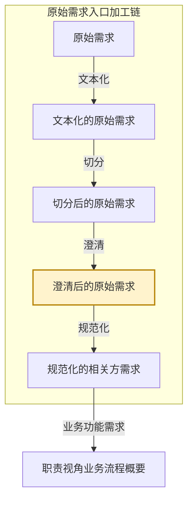

# eos-or02-x2vv · 切分后的原始需求 → 澄清后的原始需求
**SKILL 指南ID**：or02-x2vv

> **本文件是什么**：本文件是 EOS 规范化的相关方需求预处理链第三步「澄清」的 SKILL 指南。它说明本任务这一次转换：输入文档 X 是切分后的原始需求，输出文档 Y 是澄清后的原始需求；转换规则是把正文里说不清与该有却缺的地方逐处找出来，交由相关方确认后换写成明确内容。
>
> **命名约定**：文档写本名，不写任务代号或文档编号，如「切分后的原始需求」「澄清后的原始需求」「需求文档」；相邻任务按链上位置称呼，如「文本化任务」「切分任务」「规范化任务」；带「级」的节点名首次出现给全称与简称，其后用简称；状态值、字段名与标记保留原值，如 `已切分`、`澄清中`、`[⨯]`、`[✓已澄清]`。本任务在链上的位置见第一章。
>
> **自足声明**：本任务的过程判据就地成文；其余一律引权威单源——
>
> - **[94 号文档《EOS 系统设计产品数据分解结构》](../10-wfsysdev-4-eos/94-eos-sys-dev-dbs.md)**：入口加工链的五个加工形态与各形态的载体、结构上做了什么
> - **[91 号规范《EOS平台-业务-引擎规范》](../10-wfsysdev-4-eos/91-eos-biz-eng-spec.md)**：产品数据文档结构 §11、Skill 运行时协议 附录A
> - **[00-doc-conventions《文档编写约定》](../../../00-generalspec/00-doc-conventions.md)**：表达风格 §八、Skill 文档操作流程 Step 布局约定 §十三
>
> **创建**：2026-10-08 | **版本**：第 1 版

---

## 一、目的与目标

### 1.1 主要目的

> 把切分出的需求文档从"能读"推进到"能规范化"——把正文里说不清与该有却缺的地方逐处找出来，交由相关方确认后换写成明确内容，原文出处保留，澄清结论交人类把关。

### 1.2 在链上的位置

EOS 设计线在需求-方案结对之前，另有一条**原始需求入口加工链**：同一份材料被逐级加工，加工到多细就是一个形态，五个形态共用一棵以需求文档为下一级的树。

**图1-1：入口加工链与本任务的位置**



- **本任务所在的链**：原始需求入口加工链，EOS 设计线的入口。
- **本任务所在的位置**：加工链的第四个形态。上一个形态是切分后的原始需求，下一个形态是规范化的相关方需求。
- **本任务**：把一批需求文档的正文从"能读"改成"能规范化"，产出 Y，即**澄清后的原始需求**。它的输入 X 是**切分后的原始需求**。

这条链不是形态轴。框架、概要、定义说的是同一棵树长到多深，本链说的是同一份材料加工到多细；五个加工形态里只有切分与规范化两处动结构，本任务处在两者之间，**树形不动、只消歧**。X 与 Y 也不是需求-方案对的两端——一个需求-方案对的两端是需求与方案两份产品数据，而本任务是同一批需求文档在两个加工深度上的两个形态。**X 与 Y 是同一批文件**，本任务改的是每篇需求文档的正文区。

本任务处理的是**需求文档**，一次运行可以处理多篇。人类有三处参与点：

- **Step Start**——从候选清单中选定本批处理的需求文档。
- **Step 2**——讨论并确认标注方案，并给出相关方确认的答案。
- **Step 4**——裁决待处置项的去留。

> **答案来自相关方，本任务只出题**：业务事实——术语定义、指标数值、边界条件——只有相关方知道。本任务通读正文、把不清楚与缺项的地方标出来，并为每处生成一句可直接问相关方的问题；开发者持问题清单向相关方问明后，在**对话里把答案给本任务**，由本任务换写成新正文。本任务不替相关方给答案、不发明指标数值、不把澄清内容扩展成设计方案。

本轮没讨论完的方案留在 `澄清中`，由下一轮接着讨论；人类确认、相关方给了答案之后，本任务换写出新正文，状态推进到 `已澄清`。

### 1.3 主要目标

把本批选定的需求文档逐篇标注、逐处澄清，并为每篇落定它的澄清结论。

1. **给出候选清单并校验受理**：列出表 B 上待澄清的需求文档，逐份过受理门槛，交人类选定本批处理的对象。
2. **找出模糊与缺项**：通读正文，把每一处"说不清"或"该有却缺"归入两味里的某一类。
3. **为每处出题**：为每一处生成一句可直接向相关方确认的问题，汇总成标注方案。
4. **收答案并成文**：按相关方确认的内容换写正文，只在标注处改动，其余一字不动。
5. **判定澄清完成**：用三项条件判每篇是否已澄清——正文清晰完整、历史模糊已澄清、无新增模糊。
6. **检查并检出待处置项**：复核澄清面、改动面与要素面，检出的待处置项交人类裁决。
7. **裁决待处置项**：逐条裁决澄清未竟、改动越界与要素缺项三类，并按裁决结果写回。
8. **写回与收尾**：确认后写入需求文档与状态文档；已澄清的推进状态、未澄清的留待下一轮；并受理上游取消切分与下游退回。

### 1.4 与上下游的衔接

**表1-1：与上下游的衔接**

| 方向 | 任务 | 交接内容 |
|------|------|---------|
| 上游，X 的来源 | 切分任务 | 取本任务交出的需求文档，在它之上澄清；表 B 中 `人类决策=同意澄清` 的需求文档是它的入口 |
| 下游 | 规范化任务 | 取本任务交出的需求文档，逐条判类型、拆分并落成条目；表 B 中 `生命周期=已澄清` 且 `人类决策=同意规范化` 的需求文档是它的入口 |
| 回向，下游退回 | 规范化任务 | 收下游退回的、原文层仍缺事实的需求文档，按「重进入规则」的反向路由重新标注 |
| 回向，待人工处置 | 人类 | 收本任务检出的缺陷需求文档——正文区非连续片段、损坏、读不了——修好或换掉后重跑本步 |

> **交出的需求文档由规范化任务取用**：它的正文区必须是澄清后的纯净本，没有 `[⨯]` 标注、没有 `[✓已澄清]` 注释、没有方案块。规范化任务检出正文区带标注或方案块的，按缺陷退回本任务。

---

## 二、输入文档结构及规则

输入文档（X） = **切分后的原始需求**，为入口加工链的第三个加工形态。

X 由切分任务产出，落在 `10-raw-files/`。它的结构、载体与加工状态，出处是 94 号文档 §2.0 与状态文档自身。

**X 的树只有根与一级**。下图是这棵树的展开。

**图2-1：切分后的原始需求树**

```
切分后的原始需求 ──── 根
└── 需求文档 ────────── ①
```

**表2-1：X 树各级节点的意义**

| 级 | 节点 | 意义 |
|----|------|------|
| 根 | 切分后的原始需求 | 一份材料 ＝ 一批需求文档，即这份材料切出的产物整体 |
| ① | 需求文档 | 由切分产出。两味——**功能需求文档**，属性：所属业务域、业务输出文档；**非功能需求文档**，属性：所属业务域或平台语境、适用对象，片名另带主题。一篇装一段连续的原文片段 |

**X 的构成**（每篇需求文档）：

| 面 | 内容 |
|----|------|
| 载体 | `10-raw-files/` 下的 `.chunk-{seq}.md` 文件 |
| 命名 | `{原始文件名}.chunk-{seq}.md`，与文本化文档同目录 |
| frontmatter | YAML 元数据：`source`／`original_source`／`seq`／`total`／`kind`／`label`／`range`／`status`；非功能需求文档另带 `applicable` 与 `topic` |
| 管理区 | frontmatter 之后、正文之前。放状态摘要表：阶段、AI建议、待处理、操作指引四项 |
| 正文区 | 管理区之后。切分给出的原文片段，一篇一段连续原文 |
| 一篇文档一批 | 一篇需求文档即一次澄清的对象，也是登记与选材的单位 |
| 加工状态 | 不在文件上，记在状态文档表 B，一篇一行 |

> **X 的加工状态由状态文档承接**：状态文档位于 `../../80-pl4eos-2-eosdata/00-origin-requirement-materials/01-eos-sysdev-status.md`，按管理对象分表。本任务读它选出待处理需求文档，写它落账。它只管理入口加工链的状态，设计链各任务的产品数据以各自文档管理区为权威源。

---

## 三、输出文档结构及规则

输出文档（Y） = **澄清后的原始需求**，为入口加工链的第四个加工形态。

### 3.1 Y 的树形结构与各级语义

Y 的树与 X **同形**——树形不动，本任务只消歧。下图与 图2-1 是同一棵树，标出的是本任务交出时的态。

**图3-1：澄清后的原始需求树**

```
澄清后的原始需求 ──── 根
└── 需求文档 ────────── ①
```

**表3-1：Y 树各级节点的意义**

| 级 | 节点 | 意义 |
|----|------|------|
| 根 | 澄清后的原始需求 | 同一批需求文档澄清后的整体，一份材料一批，与 X 同批 |
| ① | 需求文档 | **与 X 的 ① 是同一批、同一批文件**。本任务把它正文区里说不清与该有却缺的地方换成相关方确认的内容；它的键、片名与属性均不动 |

> **本任务不增删任何节点**：X 与 Y 是同一批 ① 需求文档的两个加工深度。切分长出这批节点，澄清只把它们逐篇消歧。

### 3.2 Y 树各节点实现规则

本任务交出的是**消歧后的正文**，不是新的结构。它对各级只做一件事——判这一级的实体由谁产出、本任务改到哪一步为止。

**表3-2：澄清后的原始需求树各节点实现规则**

| 级 | 节点 | 实现规则 |
|----|------|---------|
| 根 | 澄清后的原始需求 | **本任务产出**（就其澄清态而言）。一批需求文档澄清后即这一态 |
| ① | 需求文档 | **承袭**，取自 X 的 ①；本任务**就地改它的正文区与加工状态**，不动它的键、片名与属性 |

- **收敛自查**：本任务不动树形，覆盖完整与兄弟互斥两问仍以切分结论为准；本任务的对应自查是**逐处标注都被消解**——正文里每一处 `[⨯]` 都有相关方确认的答案，且换写出的新正文不再产生新的 `[⨯]`。

### 3.3 需求文档的要素

写入 Y 的每一篇需求文档都带齐三段；三段与 X 同构，本任务只改其中的正文区与管理区。

**表3-3：需求文档（`.chunk-{seq}.md`）**

| 要素 | 说明 |
|------|------|
| 文件命名 | 原地更新，不更名；`{原始文件名}.chunk-{seq}.md` 与文本化文档同目录，`{seq}` 三位补零 |
| frontmatter | 更新 `status`（`raw` → `annotated` → `clarified` → `abandoned`）；其余字段不动 |
| 管理区 | frontmatter 之后、正文之前。状态摘要表：阶段、AI建议、待处理、操作指引四项；澄清结论记入本区 |
| 正文区 | 澄清后的纯净本——不带 `[⨯]` 标注、不带 `[✓已澄清]` 注释、不带方案块 |
| 历史 | 不设历史区、归档区或旧版正文。历史版本由 Git 管理，需留痕的结论摘要写入管理区，不复制旧版全文 |

> **管理区给人看、正文区给下游**：管理区的四项从状态文档表 B 推导而来，是同一件事的快速读法；正文区是规范化任务唯一的读取面。两者不一致时以状态文档为准重建管理区。

**移交承诺**

本任务把需求文档交给下游时，承诺每篇达到：

1. 正文区是澄清后的纯净本，可被规范化任务直接读取；
2. frontmatter 与片名齐备，键不变；
3. 管理区的四项齐备，与状态文档表 B 的对应行一致；
4. **三项条件已满足**——正文每一处模糊或缺项都由相关方确认的内容换写干净，且新正文不再产生新的模糊。

> **移交承诺就是规范化任务的受理前提**——它读的是同一组条件。它检出正文区带标注或方案块的，按缺陷退回本任务。

---

## 四、输入到输出的过程及规则

一次转换依次走两步：标注，落在正文的行内标记与问题清单；成文，落在正文区本身。两步互不越位——标注只找、只问，不改成文；成文只按相关方答案改，不重写其余。

### 4.1 X 与 Y 的对应

X 与 Y 同形，是同一批 ① 需求文档。两者一对一：**一篇需求文档对一篇需求文档**，不增不删、不更名。X 到 Y 的转换不涉级与级的落位——树形不动，改的是正文区里的文字。

**表4-1：X 与 Y 的对应**

| X 的面 | Y 的对应 |
|--------|---------|
| 同一批 ① 需求文档 | 同一批 ① 需求文档 |
| 正文区：切分给出的原文片段 | 正文区：澄清后的纯净本 |
| 加工状态，记在状态文档表 B | 不变，本任务在表 B 上推进 |
| — | 管理区记澄清结论 |
| — | frontmatter.status 推进 |

> **X 的加工状态不迁移**：它在状态文档表 B 上就地推进，不搬进 Y。Y 上的管理区只是它的快速读法。

**登记记录规则**——本篇的加工状态按下列各项落进状态文档表 B 的对应行：

1. **源文件**——所属原始材料文件名；
2. **子文件**——本篇 `.chunk-{seq}.md` 的路径；
3. **内容摘要**——该篇核心内容的一句话摘要；
4. **生命周期**——该篇在加工链上的位置；
5. **AI建议**——本任务对下一步的判断；
6. **迭代计数与未解决数**——澄清轮次与当前未解决的模糊项数量；
7. **操作指引**——人类下一步应做的事。

### 4.2 第一步 · 标注（找出模糊并出题）

#### 转换过程

本步通读正文，把每一处说不清与该有却缺的地方标出来，并为每处生成一句可问相关方的问题，落在正文的行内标记与正文之后的问题清单上。

1. 通读正文区的每一句——使用**两味判据**。
2. 逐处判它属哪一味、哪一类——使用**两味判据**。
3. 为每一处生成一句向相关方确认的问题——使用**问句规则**。
4. 汇总成本轮的标注方案——使用**标注方案**。

通读完毕，正文里每一处模糊或缺项都带上了行内标记与一句问题。

#### 转换规则

**两味判据**——模糊与缺项分两味：**表述不清**（文本说到了这件事，但读不出确切含义、范围或主体）与**要素缺席**（文本该有的一块没写）。

**表4-2：表述不清的四类**

| 类 | 判据 | 例 |
|----|------|-----|
| 术语 | 业务或领域术语表述不明确，读不出确切含义与范围 | 「外购件」指哪些物料 |
| 主体客体 | 动作的主体或作用对象不可识别 | 「提出该需求」——由谁提出 |
| 边界 | 条件、范围、时限缺少边界 | 「试运行期」缺起止条件与时长 |
| 信息 | 缺来源、时间、提出方等元信息 | 该条需求缺来源日期与提出方 |

**表4-3：要素缺席的三类**

| 类 | 判据 | 例 |
|----|------|-----|
| 缺少定量指标 | 有需求描述，缺性能指标的定量部分。判据＝这句指不出在给哪条需求打分；指得出的随那条需求走，不是缺席 | 「支持批量导入」缺单次上限；「实时响应」缺目标值 |
| 分支缺对应面 | 文中明确写了「当X时／正常情况」等条件或路径，却缺其对应面，且对应面不能由上下文明显推出 | 只写了「已审核」路径，「未审核／驳回」未提 |
| 引用对象缺失 | 文内引用了实体、流程或文档，而在本批需求文档里均无定义 | 引用「审批单」，全批无其定义 |

> **多重：同一处属两类以上的合并标一次**——如一处既是术语不明又缺指标，标为多重，问题里一并问清。多个类并列不各标一处。

> **要件**：需求 ＝ 需求描述 ＋ 性能指标，缺定量指标即缺"性能指标"的定量部分，功能需求与非功能需求同构适用。**性能指标不是非功能需求**，它是需求的部件。

> **表达与结构两种证据**：表述不清的判据来自正文里的一句话；要素缺席的判据多来自一段文本自身制造的期待——它列了条件、引了对象、给了诉求，却漏了对应的一面。

**非功能需求分支**——凡涉及非功能诉求（质量诉求：实时、高效、安全、可靠等）的缺项，除要数值外，还须一并澄清两样，并在问题里带出：

**表4-4：非功能需求缺项随带澄清**

| 随带项 | 问什么 | 去向 |
|--------|--------|------|
| 质量属性准确表述 | 「快」指的是响应时间还是吞吐量 | 喂规范化任务的分类维度判定 |
| 适用对象 | 约束的是哪个场景、流程还是系统整体 | 喂规范化任务的适用对象线索 |
| 关注角色（必要时） | 谁提出或承受该质量诉求 | — |
| 定量指标 | 目标值＋单位＋条件 | 目标值由相关方确认，系统侧指标设计由下游展开 |

**问句规则**——每一处标注都携带一句可直接向相关方确认的问题。

1. **一处一问**——一句问题对应一处标注，问的是这一处缺什么、指什么。
2. **只问不答**——不代替相关方给答案、不给指标数值、不给设计方案；本任务连"该有什么"也只在文本自证时指出。
3. **可直接问**——问题写成能原样念给相关方听的问句，不写"此处需澄清"这类元话。

> **直觉走一遍**：原文「生产物料由**外购件**组成」→ 本任务标 `[⨯表述不清·术语: 外购件→问题："外购件"的确切定义和范围是？]` → 你问采购相关方，答「外购件指需对外采购的原材料与标准件」→ 你在 Step 2 的对话里把答案给本任务，本任务换写成新正文。

**标注格式**：

```text
[⨯<味>·<类>: <原文片段>→问题：<向相关方确认的问句>]
[✓已澄清: <相关方确认后的明确内容>]
```

- `<味>` 取「表述不清」或「要素缺席」，`<类>` 取表4-2 或 表4-3 的类名；
- 同一处属两类以上的，标一次、写成 `[⨯多重: <类1>+<类2>: …]`；
- 一处标记有两个态——Step 1 标 `[⨯…]`，Step 2 收到相关方答案后换成 `[✓已澄清: <相关方确认的内容>]`；`[✓已澄清]` 由本任务记，不是人类写的。

**标注方案**——把本轮的行内标记与问题清单汇成一份方案，写进正文区原文之后，供人类阅读与讨论：

```markdown
╔═ 标注方案 ════════════════════════════════╗
║ 建议：本轮标注 3 处（表述不清 2 · 要素缺席 1）║
║                                            ║
║ ① 表述不清·术语 · 正文 L12                 ║
║   原文：外购件                              ║
║   问题：「外购件」的确切定义和范围是？       ║
║                                            ║
║ ② 表述不清·边界 · 正文 L18                 ║
║   原文：试运行期                            ║
║   问题：试运行期的起止条件和时长是？         ║
║                                            ║
║ ③ 要素缺席·缺少定量指标 · 正文 L25         ║
║   原文：支持批量导入                        ║
║   问题：批量导入的单次上限（数值/单位/条件）是？║
╚═════════════════════════════════════════════╝
```

> 同一处已在前轮澄清过的，不重复标注；本轮只标新出现的与仍存疑的。

**标注方案的去向**——生成的方案不作状态写入，随方案一并交 Step 2 讨论确认。

### 4.3 第二步 · 成文

#### 转换过程

本步按相关方确认的内容，把正文里的模糊或缺项逐处换写成明确内容，落在正文区。

1. 逐处读取相关方给出的答案——使用**成文规则**。
2. 按答案换写该处的表述——使用**成文规则**。
3. 把该处的 `[⨯…]` 换成 `[✓已澄清: <相关方确认的内容>]`，落出下一版正文。

逐处换写完毕，该篇的澄清态就位。

#### 转换规则

**成文规则**——只在标注处改动，其余一字不动。

1. **只在标注处改**——每一处按相关方确认的内容换写；答案给的是术语定义就换术语，给的是指标就补数值＋单位＋条件，给的是边界就补条件与范围。
2. **其余一字不动**——原文其余部分照抄，不重写、不润色、不顺手补正；成文只动标注覆盖的那一处。
3. **答案不足则不改**——答案仍不足以消歧的，这一处留标不动，交 Step 3 检查检出，不在本步自行补齐。
4. **一处一态**——一处消解，即把该处的 `[⨯…]` 换成 `[✓已澄清: <相关方确认的内容>]`，正文表述同时按答案换写；一处始终只有一个标记，不叠加。
5. **关口清理**——全部 `[⨯]` 都转为 `[✓已澄清]` 且无新模糊时，关口的判定通过，清掉全部 `[✓已澄清]`，正文区回归纯净本。

> **成文不改原文语义**：换写只是把含糊换成明确、把缺项补上，不改原诉求本身。原文说要批量导入，成文仍是批量导入，只是补上了单次上限。

### 4.4 重进入与变更影响声明

**重进入规则**——已进链的需求文档再次被本任务处理时，按三种情形分流：

**表4-5：重进入的三种情形**

| 情形 | 触发 | 处置 |
|------|------|------|
| 澄清续做 | `生命周期=澄清中`，正文区有 `[⨯]` 待澄清或方案停在 `澄清中` | 进 Step 1 续标（若有新正文）或进 Step 2 收答案成文；关口判定后推进 `已澄清` 或保持 `澄清中` |
| 反向路由（退回重标） | `生命周期=澄清中` 且 `人类决策=需退回澄清`（下游规范化任务退回） | 重新标注（同 Step 1 首轮动作）；`人类决策` 触发后清空、迭代计数重置为 1 |
| 澄清中途终止 | `人类决策=已终止` | 表 B → `已废弃`、AI建议 → `建议终止`、frontmatter.status → `abandoned` |

**变更影响声明规则**——本次有重新标注或成文改动改变了原诉求语义的，按 [91 号规范 §A.7.2](../10-wfsysdev-4-eos/91-eos-biz-eng-spec.md) 判变更类型，按 §A.7.3 的格式写入文档末尾，并列出受影响的规范化的相关方需求与已消费的业务框架，不笼统说下游不受影响。

---

## 五、执行步骤及检验规则

一次运行起于 Step Start，依次走 Step 1~4 的设计动作，收于 Step End。

**表5-1：Step 布局总览**

| Step | 名称 | 职责 | 人类参与 | 执行模式 | 产出 | 写资产 |
|------|------|------|---------|---------|------|--------|
| Start | 为任务选择并校验需求文档 | 前置校验、给出候选清单、受理门槛、按状态路由 | **有**——从候选清单中选定 | 对话 | 受理结论 + 候选清单 | 状态文档（首次） |
| 1 | 基于材料生成标注方案 | 通读正文、按两味判据标注、为每处出题，出标注方案 | 无（AI 自动） | 统一 | 标注方案 | 需求文档 |
| 2 | 基于对话确认并成文 | 列出未确认清单、讨论修改；收相关方答案、按答案成文；机械检查后写回 | **有**——讨论与确认、给答案 | 对话 | 确认结论 + 未确认清单 + 新正文 | 状态文档、需求文档 |
| 3 | 检查澄清并检出待处置项 | 关口的检验：三项条件、改动越界、要素齐备，检出待处置项 | 无（AI 自动） | 统一 | 澄清判定 + 待处置项 | 状态文档、需求文档 |
| 4 | 基于对话裁决待处置项 | 列出待处置项、裁决去留；复跑检查后写回 | **有**——裁决 | 对话 | 裁决结论 + 处置清单 | 状态文档、需求文档 |
| End | 给出本轮任务成果总结 | 汇总本轮写回结果、三区摘要输出 | **有**——查看结果摘要 | 对话 | 本轮成果总结 + 下一步 | — |

### 5.1 Step Start · 为任务选择并校验需求文档

**选定本次处理对象**——本步给出**候选清单**交人类选定：每篇待处理的需求文档占一行，列出源文件名与子文件名、它在表 B 上的当前生命周期与 AI建议。人类选定其中一篇或多篇，本批一并处理。

**存量节点**——待本任务处理的存量有两类：状态停在 `澄清中` 的，即上一轮没讨论完留下的方案，或仍在迭代、等待答案的篇；状态为 `待处置` 的，即上一轮已检出、尚未裁决的项。两类都由入口检出，与本次新选的文档一并处理。

**按状态路由**——表 B 上各文档的生命周期与人类决策两项决定它走哪条路：

- `人类决策=同意澄清` 且生命周期 `已切分`：进本批，Step 1 生成标注方案。
- `生命周期=澄清中`：进本批，按**重进入规则**续做。
- `人类决策=需退回澄清`（下游规范化任务退回）：进本批，按**重进入规则**的反向路由重新标注。
- `人类决策=已终止`：进本批，Step 1 给出「置 `已废弃`」的方案，Step 2 确认后按重进入规则处置。
- `人类决策` 为空：不进本批，列入待选入澄清提醒。
- `人类决策=同意规范化` 或更后：不进本批，列入行动清单。

受理门槛如下，逐条判；不满足条件的，按「判定」「动作」两列处置。

**表5-2：受理门槛（对 X）**

| 校验条件 | 判定 | 动作 |
|---------|------|------|
| 源文件名不以 `.chunk-` 命名 | 不是需求文档 | 输出提示 → 跳过该文件 |
| 表 B 上该行生命周期为 `已澄清` 或更后 | 已在处理流程中 | 不可处理 → 跳过；如需重做，先清空该行生命周期值 |
| 表 B 上该行生命周期为 `已废弃` | 已废弃 | 不可处理 → 跳过；如需重启，先清空该行生命周期值 |
| 正文区带分析建议块 | 下游产物混入 | 路由错误 → 跳过，提示走规范化任务 |
| 正文区为空或读不出内容 | 不可处理 | 登记失败，标 `待人工处置`，该篇不进本批 |
| 正文区残留 `[⨯]` 或方案块 | 上次中断遗留 | 按**重进入规则**续做，不另起一轮 |
| 本次选定的需求文档跨了多篇 | 软提示 | 逐篇分别处理，不合并成一篇 |
| 无待处理需求文档 + 无入口检出的存量 | 无待处理对象 | 输出提示 → 退出 |

表中的状态值取自表 B 的生命周期列，它的完整取值与含义以状态文档自身为准。

**状态推进**——本任务写入 `澄清中`、`已澄清` 与 `已废弃` 三个状态；`已切分` 由切分任务写回，`待确认规范方案`、`已规范化` 由规范化任务写回。Step Start 按状态路由，Step 2 收答案成文后写 `澄清中`，Step 3 的关口判定通过后写 `已澄清`。

上游变更，即该篇被重新切分，按状态分流：

- 该行生命周期被清空且源文件仍在 → 进本批，按**重进入规则**分流；
- 生命周期 `已澄清` 及更后而被重新切分 → 原结果不动，新料另起一行。

**退回去向**——X 有缺陷、且缺陷的处置权不在本任务——正文区非连续片段、混入下游产物、损坏读不了——退回切分任务重做或交人类处置，本轮不再受理。

### 5.2 Step 1 · 基于材料生成标注方案

有新选定的需求文档汇入，或入口检出存量节点时，走本步，两者都没有时本步不走。存量节点先于新输入处理。

**读取正文**——读的是两处。**需求文档这一处**：本篇正文区全文。**状态文档这一处**：本篇在表 B 上的对应行。X 是本任务唯一的外部输入，Y 即资产、就在本任务的产出里，不另读资产文档。加载读取协议是逐篇加载、按需扩大，不默认加载全文。

对本次每一篇需求文档，本步依次走第四章的第一步：

1. 标注——使用**两味判据**（表4-2 与 表4-3）与**问句规则**，非功能诉求的缺项按 表4-4 随带澄清。

走完，本批每一篇都有一份标注方案，含行内标记、问题清单与行号定位。

**写标注方案**——行内标记写在正文对应处，问题清单写在正文区原文之后（模板见 4.2）。方案**不作状态写入**，随方案一并交 Step 2 讨论确认，由 Step 2 收答案成文、写回状态。

**无标注的情形**——通读后正文没有任何模糊与缺项，方案就写「本轮无标注」；该篇仍进 Step 2 交人类确认。

**产出去向**——生成的方案不作状态写入，随方案一并交 Step 2 讨论确认，由 Step 2 收答案成文。**本步无人类参与点**。

**失败处置**——正文区读不到、或读不出诉求的，该篇标 `待处置` 交 Step 2 的对话，其余文档照常；整批受理不过的，按受理门槛处置退出。

### 5.3 Step 2 · 基于对话确认并成文

本步每轮都走。本步讨论确认两件事——Step 1 刚生成的方案，以及状态停在 `澄清中` 的遗留方案，两者处置一样。

**未确认清单**——把本轮新生成的方案与状态为 `澄清中` 的遗留方案一并列出交人类讨论，逐篇给出它的处置建议。这份清单就是本步的界面。

**逐条讨论与确认**——修改落在方案上即按讨论结果改；人类确认后，该篇的标注方案转为已确认。确认的单位是文档——一份方案给出一条结论，可以逐份给，也可以一次全部确认。

**收答案与成文**——人类在对话里给出相关方确认的答案（如「chunk-002 的外购件指对外采购的原材料与标准件」），本任务按**成文规则**逐处换写：先记 `[✓已澄清: <相关方确认的内容>]` 落账，再换写该处表述、清理标记。一次收到一处答案即处理一处，可分批给、分批成。

**写回前的要素机械检查**——逐篇检查要素齐备：frontmatter 齐备；管理区四项非空，或属**合理空置**——还没到产生它的时点；正文区有内容。检查不过的就地补齐；无法补齐的说明它是结构性缺陷，回 Step 1 重做，不带不合的要素写回。

**写回**——确认即写回，按确认结果分四种情形：

**表5-3：确认后写回的四种情形**

| 对象 | 讨论结果 | 写回动作 |
|------|---------|---------|
| 本轮生成或修订的方案 | 已确认且有答案 | 换写正文成新正文，清理标记；表 B 生命周期写 `澄清中`、AI建议写 `需继续澄清` |
| 本轮生成或修订的方案 | 已确认但尚无答案 | 方案块与行内标记留在正文区，表 B 生命周期写 `澄清中`，留作下一轮收答案 |
| 本轮生成或修订的方案 | 未确认 | 方案块写入正文区，表 B 生命周期写 `澄清中`，留作下一轮的处理对象 |
| 遗留的待确认方案 | 已确认且有答案 | 按答案换写正文，按讨论结果推进 |

**已被下游消费过的文档本次被修订**，写回时另按上游变更分流定状态：正文已被规范化任务取用的，维持原状态、版本递增。

**写的是 Y**——澄清后的原始需求：正文区按答案换写落定，frontmatter.status 写 `annotated`（已确认落定、待关口判定），管理区的四项与澄清结论按 表3-3 从状态文档推导写入。

**也写的是状态文档表 B**——本批各文档的对应行按**登记记录规则**落定，先写表 B、再写管理区。

**本步的特化参数**：

- **锚点需求** = 本篇需求文档的原文片段（切分给出的那一段）
- **操作条目** = 需求文档正文区 + 行内标记 + 标注方案块 + 表 B 对应行
- **推进目标** = `已澄清`
- **清除条件** = 已确认的文档默认跳过。本轮新输入满足下列任一条件时，该篇回到待处理：该篇被重新切分（表 B 该行生命周期被清空）；下游规范化任务退回（人类决策写 `需退回澄清`）
- **级联触发条件** = 成文使某处改变触及原诉求语义的 → 重验受影响的规范化条目与已消费业务框架，按 [91 号规范 §A.5.3](../10-wfsysdev-4-eos/91-eos-biz-eng-spec.md) 的级联处理

**产出去向**——本步写回的新正文交 Step 3 做关口检验。**人类参与点在本节**——讨论并确认标注方案、给出相关方答案。

**失败处置**——同一处反复退改超过一次的，停止处理，标 `待处置` 留待下一轮。

### 5.4 Step 3 · 检查澄清并检出待处置项

Step 1 走过就走本步；Step 2 写回后即执行本任务的关口——**三项条件**。检验取三面：

- **澄清这一面——三项条件**：正文清晰完整、历史模糊已澄清、无新增模糊，三项全满足即判澄清完成。判据见表5-4。
- **改动这一面——只在标注处改**：成文只动标注覆盖的那一处，正文其余部分与原文片段逐字一致，未重写、未润色、未增删。
- **要素这一面**：frontmatter 齐备、管理区四项齐备；判为澄清完成的，正文区已清成纯净本，无残留 `[⨯]`、`[✓已澄清]` 或方案块。

**表5-4：三项条件（澄清完成的判据）**

| 条件 | 判定口径 |
|------|---------|
| 正文清晰完整 | 表述不清与要素缺席的每一处都已替换为明确内容，且**内容来自相关方确认**——本任务出的问题不算已澄清 |
| 历史模糊项已澄清 | 本篇标出的每一处 `[⨯]` 都已转为 `[✓已澄清]`，没有一处被跳过或丢弃 |
| 无新增模糊 | 换写出的新正文通读后不再产生新的 `[⨯]` |

> **三项全满足 → 澄清完成**：清掉全部 `[✓已澄清]`，正文区成纯净本；生命周期写 `已澄清`、AI建议写 `可以规范化`、frontmatter.status 写 `clarified`。**任一未满足 → 仍在澄清**：生命周期保持 `澄清中`、AI建议写 `需继续澄清`，新产生的 `[⨯]` 交下一轮。

> **缺定量指标与要素缺席按同一口径**——本任务出的是问题、不是答案；目标值（数值＋单位＋条件）必须由相关方确认后才算已澄清。系统侧指标设计——统计口径、测量方法、验收条件——由下游展开，不作为本步的待办遗留。

检出问题的记 `待处置`，交 Step 4 的对话里由人类裁决。问题分三类，各锚一处：

**表5-5：待处置项的三类锚点**

| 类 | 锚在哪 | 例 |
|----|--------|-----|
| 澄清未竟类 | 正文的 `[⨯]` 处 | 有标注无答案；答案不足以消歧；换写后仍产生新模糊 |
| 改动越界类 | 需求文档正文区 | 成文动到了标注以外的内容；原文片段有内容丢失或重写 |
| 要素缺项类 | 需求文档 | frontmatter 缺项、管理区不齐、正文区残留 `[⨯]` 或方案块 |

**产出与去向**——澄清判定与待处置项清单交 Step 4；判为澄清完成的，写回 `已澄清`。本步无人类参与点。

**失败处置**——检查所依据的正文区读不到时，该篇标 `待处置` 交 Step 4 讨论，不静默通过。

### 5.5 Step 4 · 基于对话裁决待处置项

本步每轮都走，逐条裁决 Step 3 检出的待处置项。

**待处置项清单**——把 Step 3 的澄清判定与待处置项一并列出交人类讨论：每条写明它锚在哪篇需求文档或哪一处上、属于哪一类、缺的是哪一样。这份清单就是本步的界面。

**逐条裁决**——澄清未竟类的，给出答案即就地成文，或判「搁置」留待下一轮；改动越界类的，回 Step 2 恢复原文片段后重成；要素缺项类的，就地补齐或回 Step 1 重做。结构性改动触及原诉求语义的，文档留待下一轮重判。

**复跑检查**——本步每执行一处修改即复跑 Step 3 的关口检验，范围限被改动的文档；改动触及原诉求语义的，按 [91 号规范 §A.5.3](../10-wfsysdev-4-eos/91-eos-biz-eng-spec.md) 的级联处理标 `待处置` 回 Step 1 重走。同一处反复退改超过一次的，停止处理，标 `待处置` 留待下一轮。

**写回**——判「成文」的就地换写并复判三项条件；判「搁置」的留待下一轮；判「终止」的清方案块与行内标记、表 B 记录落 `已废弃`。改动使某篇的管理区或状态变更的，一并写回。

**本步的操作条目** = 待处置项。

**产出去向**——裁决结论与处置清单一并交 Step End 汇总。**人类参与点在本节**——裁决待处置项的去留。

### 5.6 Step End · 给出本轮任务成果总结

本步只汇总本轮结果并给出下一步。

**三区输出**——第一区的状态与结果摘要行就地写实：

```text
当前状态：<已澄清 / 澄清中 / 待处置 / 已废弃 / 无待处理对象>
  本轮已澄清：<N 篇，逐篇列子文件名>
  本轮成文：<N 篇，逐篇列「子文件名 → 消解 M 处」>
  本轮新标注：<N 篇，逐篇列「子文件名 → 标注 M 处」>
  本轮待人工处置：<N 篇，逐篇列「子文件名 → 缺陷与原因」>
  关口检验：<通过 / 检出待处置项 N 处，已裁决 M 处>

一、未确认的方案
  <本轮未确认 N 份：子文件名 + 状态；无则写「无」，下一轮运行接着讨论>

二、下一步
  本任务 → 选定新一批待处理需求文档重新运行
  下游   → 规范化任务（取本轮交出的需求文档）
```

**收尾**——更新状态文档的基线记录、提交本轮变更。

**增量标记**——`[新增]`／`[变更]`／`[确认]`／`[需裁决]` 与 `[推断]` 的定义与使用按 [91 号规范 §A.3.1](../10-wfsysdev-4-eos/91-eos-biz-eng-spec.md) 执行。本任务另用到四枚标记：`[待复核]` 标候选清单中归上存疑的行；`[待处置]` 标关口检验检出的问题；`[⨯]` 标一处模糊或缺项；`[✓已澄清]` 标一处已由相关方确认的明确内容。本任务增量清单对操作条目逐条标注，并附关口检验结论行。

**自检清单**——一次运行收尾前，按本任务流程分组逐项核对：

- **受理**
  - 前置材料——目录、状态文档与基线——已确认就绪。
  - 候选清单已给出，人类已选定本批处理的对象。
  - 入口检出的存量节点与待处置项已并作本次处理对象。
  - 无待处理对象时本任务已退出。
- **载入与校验**
  - 本批需求文档的正文区、表 B 对应行都已按读取协议加载，不全载全文。
  - 受理门槛已逐条校验，软提示项已交人类定夺。
  - 人类对表 B 的直接修改已标 `[需复核]`、未覆盖。
- **生成**
  - 标注按**两味判据**执行，表述不清四类与要素缺席三类分得清，多重合并标一次。
  - 每一处标注都附「向相关方确认的问题」，一处一问、只问不答、可直接问。
  - 非功能需求缺项已按 表4-4 随带澄清质量属性与适用对象。
  - 标注方案已写入正文区原文之后。
- **确认与成文**
  - 标注方案已列全、逐篇确认。
  - 相关方答案已按**成文规则**换写：只在标注处改，其余一字不动；答案不足的留标不改。
  - 写回顺序合规：先写表 B，再据此写需求文档管理区。
- **Y 侧要素**
  - 每篇 frontmatter 与片名齐备，键不变。
  - 管理区四项齐备。
  - 澄清完成的篇，正文区为纯净本，无残留 `[⨯]`、`[✓已澄清]` 或方案块。
- **检查**
  - 关口检验已执行，三面都取。
  - **三项条件**已逐项判定。
  - 待处置项已按三类锚点归位。
  - 缺口不以本任务判断处置，**不脑补内容**，交人类裁决。
- **裁决与写回**
  - 待处置项已逐条裁决。
  - 改动处的复跑已执行。
  - 裁决结论已写回表 B 与受影响的文档。
- **收尾**
  - 三区摘要已输出，下一步已给出。
  - 基线记录已更新，本轮变更已提交。
