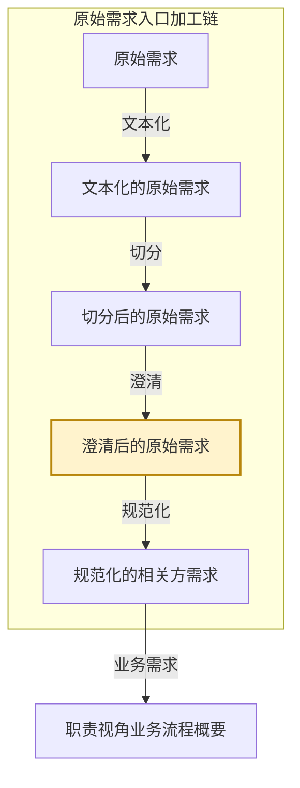

# eos-or02-x2vv · 切分后的原始需求 → 澄清后的原始需求
**SKILL 指南ID**：or02-x2vv

> **本文件是什么**：本文件是 EOS 规范化的相关方需求预处理链第三步「澄清」的 SKILL 指南。它说明本任务这一次转换：输入文档 X 是切分后的原始需求，输出文档 Y 是澄清后的原始需求；转换规则是维护一份问题清单——把正文里说不清与该有却缺的地方逐处问出来，交相关方确认后写回正文。
>
> **命名约定**：文档写本名，不写任务代号或文档编号，如「切分后的原始需求」「澄清后的原始需求」「需求文档」「澄清问题清单」；相邻任务按链上位置称呼，如「文本化任务」「切分任务」「规范化任务」；带「级」的节点名首次出现给全称与简称，其后用简称；状态值与字段名保留原值，如 `已切分`、`澄清中`。本任务在链上的位置见 §1.2。
>
> **自足声明**：本任务的过程判据就地成文；其余一律引权威单源——
>
> - **[94 号文档《EOS 系统设计产品数据分解结构》](../10-wfsysdev-4-eos/94-eos-sys-dev-dbs.md)**：入口加工链的五个加工形态与各形态的载体、结构上做了什么
> - **[91 号规范《EOS平台-业务-引擎规范》](../10-wfsysdev-4-eos/91-eos-biz-eng-spec.md)**：产品数据文档结构 §11、Skill 运行时协议 附录A
> - **[00-doc-conventions《文档编写约定》](../../../00-generalspec/00-doc-conventions.md)**：表达风格 §八、Skill 文档操作流程 Step 布局约定 §十三
>
> **创建**：2026-10-08 | **版本**：第 2 版

---

## 一、目的与目标

### 1.1 主要目的

> 把切分出的需求文档从"能读"推进到"能规范化"——把正文里说不清与该有却缺的地方逐处问出来，交相关方确认后写回正文，原文出处保留，问过什么、答了什么，都留在清单上。

### 1.2 在链上的位置

EOS 设计线在需求-方案结对之前，另有一条**原始需求入口加工链**：同一份材料被逐级加工，加工到多细就是一个形态，五个形态共用一棵以需求文档为下一级的树。

**图1-1：入口加工链与本任务的位置**



- **本任务所在的链**：原始需求入口加工链，EOS 设计线的入口。
- **本任务所在的位置**：加工链的第四个形态。上一个形态是切分后的原始需求，下一个形态是规范化的相关方需求。
- **本任务**：把一批需求文档的正文说清，产出 Y，即**澄清后的原始需求**。它的输入 X 是**切分后的原始需求**。

这条链不是形态轴。框架、概要、定义说的是同一棵树长到多深，本链说的是同一份材料加工到多细；五个加工形态里只有切分与规范化两处动结构，本任务处在两者之间，**树形不动、只消歧**。X 与 Y 也不是需求-方案对的两端——一个需求-方案对的两端是需求与方案两份产品数据，而本任务是同一批需求文档在两个加工深度上的两个形态。**X 与 Y 是同一批文件**，本任务改的是每篇需求文档的正文区。

**澄清靠一条环推进**：本任务通读正文、把说不清与该有却缺的地方认出来、逐处写成一句问题；开发者持问题清单向相关方问明后，在**对话里把答复给本任务**，由本任务写进正文。**内容只能来自相关方**——本任务不替相关方给答案、不发明指标数值、不把澄清内容扩展成设计方案。

本任务处理的是**需求文档**，一次运行只处理一篇。人类有两处参与点：

- **Step Start**——从候选清单中选定本次处理的那一篇。
- **Step 2**——确认问题清单，给出相关方确认的答复。

一轮运行对一篇文档，终态只有两种：**问题清单空**，这篇已澄清；**清单不空**，这篇带着一份最新的问题清单等答复。**"等答复"就是这一轮的结论**——该问的本轮都问出去了，只是答复还在相关方那里。

### 1.3 主要目标

把本次选定的那一篇问清、写清，并落定它的澄清结论。

1. **给出候选清单并校验受理**：列出表 B 上待澄清的需求文档，逐份过受理门槛，交人类选定本次处理的那一篇。
2. **出题**：通读正文，把每一处说不清与该有却缺的地方认出来，逐处写成一句可直接问相关方的问题，汇成**澄清问题清单**。
3. **落答**：按相关方确认的答复逐处写回正文，该条随即从清单上勾销。
4. **复核与判定**：重读落答后的正文，把因写回而新出现的问题并入清单；**清单空即已澄清，不空即仍在澄清**。
5. **写回与收尾**：确认后写入需求文档与状态文档；已澄清的推进状态、仍在澄清的留待下一轮；并受理上游变更与下游退回。

### 1.4 与上下游的衔接

**表1-1：与上下游的衔接**

| 方向 | 任务 | 交接内容 |
|------|------|---------|
| 上游，X 的来源 | 切分任务 | 取本任务交出的需求文档，在它之上澄清；表 B 中 `人类决策=同意澄清` 的需求文档是它的入口 |
| 下游 | 规范化任务 | 取本任务交出的需求文档，逐条判类型、拆分并落成条目；表 B 中 `生命周期=已澄清` 且 `人类决策=同意规范化` 的需求文档是它的入口 |
| 回向，下游退回 | 规范化任务 | 收下游退回的、原文层仍缺事实的需求文档，按「重进入规则」的反向路由重新出题 |
| 回向，待人工处置 | 人类 | 收本任务检出的缺陷需求文档——正文区非连续片段、损坏、读不了——修好或换掉后重跑本步 |

> **交出的需求文档由规范化任务取用**：它的正文区必须是澄清后的纯净本，其后不留澄清问题清单。规范化任务检出正文区带清单的，按缺陷退回本任务。

---

## 二、输入文档结构及规则

输入文档（X） = **切分后的原始需求**，为入口加工链的第三个加工形态。

X 由切分任务产出，落在 `10-raw-files/`。它的结构、载体与加工状态，出处是 94 号文档 §2.0 与状态文档自身。

**X 的树只有根与一级**。下图是这棵树的展开。

**图2-1：切分后的原始需求树**

```
切分后的原始需求 ──── 根
└── 需求文档 ────────── ①
```

**表2-1：X 树各级节点的意义**

| 级 | 节点 | 意义 |
|----|------|------|
| 根 | 切分后的原始需求 | 一份材料 ＝ 一批需求文档，即这份材料切出的产物整体 |
| ① | 需求文档 | 由切分产出。三味——**业务需求文档**，属性：所属业务域、业务输出文档；**非功能需求文档**，属性：所属业务域或平台语境、适用对象，片名另带主题；**引擎需求文档**，属性：所属业务域或平台语境、能力诉求。一篇装一段连续的原文片段 |

**X 的构成**（每篇需求文档）：

| 面 | 内容 |
|----|------|
| 载体 | `10-raw-files/` 下的 `.chunk-{seq}.md` 文件 |
| 命名 | `{原始文件名}.chunk-{seq}.md`，与文本化文档同目录 |
| frontmatter | YAML 元数据：`source`／`original_source`／`seq`／`total`／`kind`／`label`／`range`／`status`；三味另带属性字段——业务需求文档：`domain`（所属业务域）；非功能需求文档：`domain` 或 `platform`（所属业务域或平台语境）、`applicable`（适用对象）、`topic`（主题）；引擎需求文档：`domain` 或 `platform`、`capability`（能力诉求） |
| 管理区 | frontmatter 之后、正文之前。放状态摘要表：阶段、AI建议、待处理、操作指引四项 |
| 正文区 | 管理区之后。切分给出的原文片段，一篇一段连续原文 |
| 一篇文档一批 | 一篇需求文档即一次澄清的对象，也是登记与选材的单位 |
| 加工状态 | 不在文件上，记在状态文档表 B，一篇一行 |

> **X 的加工状态由状态文档承接**：状态文档位于 `../../80-pl4eos-2-eosdata/00-origin-requirement-materials/01-eos-sysdev-status.md`，按管理对象分表。本任务读它选出待处理需求文档，写它落账。它只管理入口加工链的状态，设计链各任务的产品数据以各自文档管理区为权威源。

---

## 三、输出文档结构及规则

输出文档（Y） = **澄清后的原始需求**，为入口加工链的第四个加工形态。

### 3.1 Y 的树形结构与各级语义

Y 的树与 X **同形**——树形不动，本任务只消歧。下图与 图2-1 是同一棵树，标出的是本任务交出时的态。

**图3-1：澄清后的原始需求树**

```
澄清后的原始需求 ──── 根
└── 需求文档 ────────── ①
```

**表3-1：Y 树各级节点的意义**

| 级 | 节点 | 意义 |
|----|------|------|
| 根 | 澄清后的原始需求 | 同一批需求文档澄清后的整体，一份材料一批，与 X 同批 |
| ① | 需求文档 | **与 X 的 ① 是同一批、同一批文件**。本任务把它的正文说清；它的键、片名与属性均不动 |

> **本任务不增删任何节点**：X 与 Y 是同一批 ① 需求文档的两个加工深度。切分长出这批节点，澄清只把它们逐篇说清。

### 3.2 Y 树各节点实现规则

本任务交出的是**说清了的正文**，不是新的结构。它对各级只做一件事——判这一级的实体由谁产出、本任务改到哪一步为止。

**表3-2：澄清后的原始需求树各节点实现规则**

| 级 | 节点 | 实现规则 |
|----|------|---------|
| 根 | 澄清后的原始需求 | **本任务产出**（就其澄清态而言）。一批需求文档澄清后即这一态 |
| ① | 需求文档 | **承袭**，取自 X 的 ①；本任务**就地改它的正文区与加工状态**，不动它的键、片名与属性 |

- **收敛自查**：本任务不动树形，覆盖完整与兄弟互斥两问仍以切分结论为准；本任务的对应自查是**问题清单空**——正文里每一处说不清与该有却缺的地方，都已由相关方确认的答复写清，且重读新正文不再生新条目。

### 3.3 需求文档的要素

写入 Y 的每一篇需求文档都带齐下列各段；各段与 X 同构，本任务只改其中的正文区、管理区与那条工作态清单。

**表3-3：需求文档（`.chunk-{seq}.md`）**

| 要素 | 说明 |
|------|------|
| 文件命名 | 原地更新，不更名；`{原始文件名}.chunk-{seq}.md` 与文本化文档同目录，`{seq}` 三位补零 |
| frontmatter | 更新 `status`（`raw` → `annotated` → `clarified` → `abandoned`）；其余字段不动 |
| 管理区 | frontmatter 之后、正文之前。状态摘要表：阶段、AI建议、待处理、操作指引四项 |
| 正文区 | 管理区之后。切分给出的原文片段，经本任务逐处写回后成为澄清后的**纯净本** |
| 澄清问题清单 | 工作态，写在正文区之后。本任务维护的那份清单；本篇澄清完成时连同它的标题一并清除 |
| 历史 | 不设历史区、归档区或旧版正文。历史版本由 Git 管理，需留痕的结论摘要写入管理区，不复制旧版全文 |

> **管理区给人看、正文区给下游**：管理区的四项从状态文档表 B 推导而来，是同一件事的快速读法；正文区是规范化任务唯一的读取面。两者不一致时以状态文档为准重建管理区。

> **澄清问题清单是工作态、带不走**：它记的是"这篇还有哪些没说清、问出去没有"。它随正文一起放在文件里，供人读、供跨轮续做；本篇澄清完成时清除，不让它进入下游。

**移交承诺**

本任务把需求文档交给下游时，承诺每篇达到：

1. 正文区是澄清后的纯净本，可被规范化任务直接读取，其后不留澄清问题清单；
2. frontmatter 与片名齐备，键不变；
3. 管理区的四项齐备，与状态文档表 B 的对应行一致；
4. **问题清单已空**——正文每一处说不清与该有却缺的地方都由相关方确认的答复写清，重读新正文不再生新条目。

> **移交承诺就是规范化任务的受理前提**——它读的是同一组条件。它检出正文区带澄清问题清单的，按缺陷退回本任务。

---

## 四、输入到输出的过程及规则

一次转换依次走两步：**出题**，落在澄清问题清单上；**落答**，落在正文区本身。两步互不越位——出题只认、只问，不改成文；落答只按答复改，不重写其余。

### 4.1 X 与 Y 的对应

X 与 Y 同形，是同一批 ① 需求文档。两者一对一：**一篇需求文档对一篇需求文档**，不增不删、不更名。X 到 Y 的转换不涉级与级的落位——树形不动，改的是正文区里的文字，加的是正文之后的一条清单。

**表4-1：X 与 Y 的对应**

| X 的面 | Y 的对应 |
|--------|---------|
| 同一批 ① 需求文档 | 同一批 ① 需求文档 |
| 正文区：切分给出的原文片段 | 正文区：逐处写回后的澄清纯净本 |
| 加工状态，记在状态文档表 B | 不变，本任务在表 B 上推进 |
| — | 正文区之后一条澄清问题清单，本篇澄清完成时清除 |
| — | frontmatter.status 推进 |

> **X 的加工状态不迁移**：它在状态文档表 B 上就地推进，不搬进 Y。Y 上的管理区只是它的快速读法。

**澄清记录规则**——本篇的加工状态按下列各项落进状态文档表 B 的对应行：

1. **源文件**——所属原始材料文件名；
2. **子文件**——本篇 `.chunk-{seq}.md` 的路径；
3. **内容摘要**——该篇核心内容的一句话摘要；
4. **生命周期**——该篇在加工链上的位置；
5. **AI建议**——本任务对下一步的判断；
6. **未解决数**——当前澄清问题清单的条数；
7. **操作指引**——人类下一步应做的事。

### 4.2 第一步 · 出题

#### 转换过程

本步通读正文，把每一处说不清与该有却缺的地方认出来，逐处写成一句可问相关方的问题，落在正文区之后的澄清问题清单上。

1. 通读正文区的每一句——使用**两味判据**。
2. 逐处判它属哪一味、哪一类——使用**两味判据**。
3. 把认出的每一处与**既有清单**对账，只补新的、不重复、不改既有条目的状态——使用**对账规则**。
4. 为每一条生成一句向相关方确认的问题——使用**问句规则**。
5. 汇成本轮的清单——使用**清单格式**。

通读完毕，正文里每一处说不清与该有却缺的地方，都在清单上占了一条。

#### 转换规则

**两味判据**——说不清与该有却缺，分两味：**表述不清**（文本说到了这件事，但读不出确切含义、范围或主体）与**要素缺席**（文本该有的一块没写）。

**表4-2：表述不清的四类**

| 类 | 判据 | 例 |
|----|------|-----|
| 术语 | 业务或领域术语表述不明确，读不出确切含义与范围 | 「外购件」指哪些物料 |
| 主体客体 | 动作的主体或作用对象不可识别 | 「提出该需求」——由谁提出 |
| 边界 | 条件、范围、时限缺少边界 | 「试运行期」缺起止条件与时长 |
| 信息 | 缺来源、时间、提出方等元信息 | 该条需求缺来源日期与提出方 |

**表4-3：要素缺席的三类**

| 类 | 判据 | 例 |
|----|------|-----|
| 缺少定量指标 | 有需求描述，缺性能指标的定量部分。判据＝这句指不出在给哪条需求打分；指得出的随那条需求走，不是缺席 | 「支持批量导入」缺单次上限；「实时响应」缺目标值 |
| 分支缺对应面 | 文中明确写了「当X时／正常情况」等条件或路径，却缺其对应面，且对应面不能由上下文明显推出 | 只写了「已审核」路径，「未审核／驳回」未提 |
| 引用对象缺失 | 文内引用了实体、流程或文档，而在本批需求文档里均无定义 | 引用「审批单」，全批无其定义 |

> **「引用对象缺失」的查法**——「无定义」的范围是**本篇所属那一份材料的全集**（同一份材料切出的全部需求文档，即源材料 `{原始文件名}.textualized.md`），不是这一篇。做法是按需扩大：grep 这个名、命中才读，不全量加载。

> **一处一条**：同一处属两类以上的，仍只立一条，问题里一并问清。

> **要件**：需求 ＝ 需求描述 ＋ 性能指标，缺定量指标即缺"性能指标"的定量部分，业务需求与非功能需求同构适用。**性能指标不是非功能需求**，它是需求的部件。

> **表达与结构两种证据**：表述不清的判据来自正文里的一句话；要素缺席的判据多来自一段文本自身制造的期待——它列了条件、引了对象、给了诉求，却漏了对应的一面。

**非功能需求分支**——凡涉及非业务诉求（质量诉求：实时、高效、安全、可靠等）的缺项，除要数值外，还须一并澄清两样，并在问题里带出：

**表4-4：非功能需求缺项随带澄清**

| 随带项 | 问什么 | 去向 |
|--------|--------|------|
| 质量属性准确表述 | 「快」指的是响应时间还是吞吐量 | 喂规范化任务的分类维度判定 |
| 适用对象 | 约束的是哪个场景、流程还是系统整体 | 喂规范化任务的适用对象线索 |
| 关注角色（必要时） | 谁提出或承受该质量诉求 | — |
| 定量指标 | 目标值＋单位＋条件 | 目标值由相关方确认 |

**对账规则**——新认出的每一处，与既有清单比对：

**表4-5：出题与既有清单的对账**

| 情形 | 处置 |
|------|------|
| 清单里已有同一处 | 不动——不改它的问句，也不改它的状态 |
| 正文里冒出清单没有的新处 | 追加一条，状态记 `待问` |
| 清单里有、正文里已找不到对应处 | 该条随正文的变动作废，从清单划去 |

> **对账是为跨轮服务**：清单跨轮活着，上一轮问出去的条目本轮仍在那儿等答复。出题只补新的，不把问过的重问一遍。

**问句规则**——每一条都携带一句可直接向相关方确认的问题。

1. **一处一问**——一句问题对应一条清单，问的是这一处缺什么、指什么。
2. **只问不答**——不代替相关方给答案、不给指标数值、不给设计方案；本任务连"该有什么"也只在文本自证时指出。
3. **可直接问**——问题写成能原样念给相关方听的问句，不写"此处需澄清"这类元话。

> **直觉走一遍**：原文「生产物料由**外购件**组成」→ 本任务立一条：`外购件 ｜ 表述不清·术语 ｜ "外购件"的确切定义和范围是？` → 你问采购相关方，答「外购件指需对外采购的原材料与标准件」→ 你在 Step 2 的对话里把答复给本任务，本任务写进正文。

**清单格式**——澄清问题清单写在正文区之后，一段原文对应一块清单：

```markdown
【澄清问题清单】本篇澄清完成时连同本行一并清除

| # | 位置 | 原片段 | 味·类 | 问句 | 状态 |
|---|------|--------|-------|------|------|
| 1 | 第 3 段 | 外购件 | 表述不清·术语 | 「外购件」的确切定义和范围是？ | 待答 |
| 2 | 第 7 段 | 试运行期 | 表述不清·边界 | 试运行期的起止条件和时长是？ | 待答 |
| 3 | 第 12 段 | 支持批量导入 | 要素缺席·缺少定量指标 | 批量导入的单次上限（数值/单位/条件）是？ | 待问 |
```

- **位置**填原文的段序，供落答时定位；
- **状态**两值：`待问`（认出、还没交人确认）与`待答`（人已确认、已问出、等答复）。落答一条即从清单划去一条。

### 4.3 第二步 · 落答

#### 转换过程

本步按相关方确认的答复，把清单上的条目逐条写进正文，落在正文区。

1. 逐条读取相关方给出的答复——使用**落答规则**。
2. 按答复写回该处——使用**落答规则**。
3. 该条从清单划去。

逐条写完，正文区就位，清单相应缩短。

#### 转换规则

**落答规则**——只在清单所指处改，其余一字不动。

1. **只在所指处改**——每一条按相关方确认的答复写回；答复是术语定义就写术语，是指标就补数值＋单位＋条件，是边界就补条件与范围。
2. **其余一字不动**——原文其余部分照抄，不重写、不润色、不顺手补正。
3. **答复不足则不落**——答复仍不足以说清这一处的，该条留在清单上，状态仍记 `待答`，交下一轮再问；本任务不自行补齐。
4. **落一条划一条**——写回完成即把该条从清单划去；全清后清单即空。
5. **不越界**——写回只动清单所指的那一处；若发现写回波及了清单以外的内容，就地改回。

> **落答不改原文语义**：写回只是把含糊换成明确、把缺项补上，不改原诉求本身。原文说要批量导入，写回仍是批量导入，只是补上了单次上限。

### 4.4 重进入与变更影响声明

**重进入规则**——已进链的需求文档再次被本任务处理时，按三种情形分流：

**表4-6：重进入的三种情形**

| 情形 | 触发 | 处置 |
|------|------|------|
| 澄清续做 | `生命周期=澄清中` | 按 Step 1 续题（补新条目）、Step 2 续答；关口的判定照走 |
| 反向路由（退回重题） | `生命周期=澄清中` 且 `人类决策=需退回澄清`（下游规范化任务退回） | 重新出题（同 Step 1 动作）；`人类决策` 触发后清空 |
| 澄清中途终止 | `人类决策=已终止` | 表 B → `已废弃`、AI建议 → `建议终止`、frontmatter.status → `abandoned` |

**变更影响声明规则**——本次有重新出题、或写回改动改变了原诉求语义的，按 [91 号规范 §A.7.2](../10-wfsysdev-4-eos/91-eos-biz-eng-spec.md) 判变更类型，按 §A.7.3 的格式写入文档末尾，并列出受影响的规范化的相关方需求与已消费的业务框架，不笼统说下游不受影响。

---

## 五、执行步骤及检验规则

一次运行起于 Step Start，依次走 Step 1~3 的设计动作，收于 Step End。

**表5-1：Step 布局总览**

| Step | 名称 | 职责 | 人类参与 | 执行模式 | 产出 | 写资产 |
|------|------|------|---------|---------|------|--------|
| Start | 为任务选择并校验需求文档 | 前置校验、给出候选清单、受理门槛、按状态路由 | **有**——从候选清单中选定一篇 | 对话 | 受理结论 + 候选清单 | 状态文档（首次） |
| 1 | 出题 | 通读正文、认出不清与缺项、逐处成问，与既有清单对账 | 无（AI 自动） | 统一 | 澄清问题清单 | 需求文档 |
| 2 | 基于对话确认与落答 | 列出问题清单、讨论修改；收相关方答复、按答复写回正文并划去该条 | **有**——确认与答复 | 对话 | 确认结论 + 新正文 | 状态文档、需求文档 |
| 3 | 复核与判定 | 重读写回后的正文、并入新条目，判 `已澄清`／`澄清中` | 无（AI 自动） | 统一 | 判定结论 + 新条目 | 状态文档、需求文档 |
| End | 给出本轮任务成果总结 | 汇总本轮写回结果、三区摘要输出 | **有**——查看结果摘要 | 对话 | 本轮成果总结 + 下一步 | — |

### 5.1 Step Start · 为任务选择并校验需求文档

**选定本次处理对象**——本步给出**候选清单**交人类选定：每篇待处理的需求文档占一行，列出源文件名与子文件名、它在表 B 上的当前生命周期、未解决数与 AI建议。人类选定其中一篇；**本次运行只处理这一篇**。

**存量节点**——选中的这一篇若上一轮没谈完，状态停在 `澄清中`、清单不空，按**重进入规则**续做。

**按状态路由**——选中的这一篇，它在表 B 上的生命周期与人类决策两项决定它走哪条路：

- `人类决策=同意澄清` 且生命周期 `已切分`：进本轮，Step 1 出题。
- `生命周期=澄清中`：进本轮，按**重进入规则**续做。
- `人类决策=需退回澄清`（下游规范化任务退回）：进本轮，按**重进入规则**的反向路由重新出题。
- `人类决策=已终止`：进本轮，Step 1 给出「置 `已废弃`」的方案，Step 2 确认后按重进入规则处置。
- `人类决策` 为空：不进本轮，列入待选入澄清提醒。
- `人类决策=同意规范化` 或更后：不进本轮，列入行动清单。

受理门槛如下，逐条判；不满足条件的，按「判定」「动作」两列处置。

**表5-2：受理门槛（对 X）**

| 校验条件 | 判定 | 动作 |
|---------|------|------|
| 源文件名不以 `.chunk-` 命名 | 不是需求文档 | 输出提示 → 跳过该文件 |
| 表 B 上该行生命周期为 `已澄清` 或更后 | 已在处理流程中 | 不可处理 → 跳过；如需重做，先清空该行生命周期值 |
| 表 B 上该行生命周期为 `已废弃` | 已废弃 | 不可处理 → 跳过；如需重启，先清空该行生命周期值 |
| 正文区带分析建议块 | 下游产物混入 | 路由错误 → 跳过，提示走规范化任务 |
| 正文区为空或读不出内容 | 不可处理 | 登记失败，`处置标记=待人工处置`，该篇不进本轮 |
| 正文区之后残留上一轮的澄清问题清单 | 上次中断遗留 | 按**重进入规则**续做，不另起一轮 |
| 无待处理需求文档 + 无入口检出的存量 | 无待处理对象 | 输出提示 → 退出 |

表中的状态值取自表 B 的生命周期列，它的完整取值与含义以状态文档自身为准。

**状态推进**——本任务写入 `澄清中` 与 `已澄清` 两个状态，并在终止时写 `已废弃`；`已切分` 由切分任务写回，`规范化方案待确认`、`已规范化` 由规范化任务写回。Step Start 按状态路由，Step 2 收答复写回后写 `澄清中`，Step 3 的判定通过后写 `已澄清`。

上游变更，即该篇被重新切分，按状态分流：

- 该行生命周期被清空且源文件仍在 → 进本轮，按**重进入规则**分流；
- 生命周期 `已澄清` 及更后而被重新切分 → 原结果不动，新料另起一行。

**退回去向**——X 有缺陷、且缺陷的处置权不在本任务——正文区非连续片段、混入下游产物、损坏读不了——**拒绝受理**，`处置标记=待人工处置`，交人类修好或换掉后重跑切分任务，本轮不再受理。**切分后与澄清后是同一份产品数据的两个形态，二者之间不设「退回」**；缺陷是闸门拒收，不是退回交付物。

### 5.2 Step 1 · 出题

有新选定的需求文档汇入，或入口检出存量节点时，走本步，两者都没有时本步不走。存量先于新输入处理。

**读取正文**——读的是两处。**需求文档这一处**：本篇正文区全文，以及正文区之后既有的澄清问题清单。**状态文档这一处**：本篇在表 B 上的对应行。X 是本任务唯一的外部输入，Y 即资产、就在本任务的产出里，不另读资产文档。加载读取协议是只读本次这一篇、按需扩大，不默认加载全文；出题时遇「引用对象缺失」这一处，按需扩到源材料／同材料的其余片核对定义。

对本次选定的这一篇，本步依次走第四章的第一步：

1. 出题——使用**两味判据**（表4-2 与 表4-3）、**对账规则**（表4-5）与**问句规则**，非业务诉求的缺项按 表4-4 随带澄清。

走完，这一篇就有一份最新的澄清问题清单。

**写清单**——把新认出的条目按**清单格式**补进正文区之后的清单，状态记 `待问`。清单**不作状态写入**，随它一并交 Step 2；生命周期的写回留到 Step 2。

**无新条目的情形**——通读后既没有新认出的、也没有既有条目等着，清单为空；该篇仍进 Step 2 交人类确认。

**产出去向**——生成的清单不作状态写入，随它一并交 Step 2 讨论确认。**本步无人类参与点**。

**失败处置**——正文区读不到、或读不出诉求的，该篇 `处置标记=待人工处置` 交 Step 2 的对话，其余文档照常；整批受理不过的，按受理门槛处置退出。

### 5.3 Step 2 · 基于对话确认与落答

本步每轮都走。本步讨论确认两件事——Step 1 刚生成的清单，以及上一轮留下的、状态停在 `澄清中` 的清单，两者处置一样。

**确认问题清单**——把清单逐条列出交人类讨论：人确认这一处该不该问、问得对不对；确认即该条状态转 `待答`，表示已问出去、等答复。

**收答复与落答**——人类在对话里给出相关方确认的答复（如「chunk-002 的外购件指对外采购的原材料与标准件」），本任务按**落答规则**逐条写回：改该处正文，把该条从清单划去。一次收到一条答复即处理一条，可分批给、分批落。

**写回前的要素机械检查**——检查要素齐备：frontmatter 齐备；管理区四项非空，或属**合理空置**——还没到产生它的时点；正文区有内容；清单格式合规。检查不过的就地补齐；无法补齐的说明它是结构性缺陷，`处置标记=待处置` 留待下一轮，不带不合的要素写回。

**写回**——确认即写回，按确认结果分四种情形：

**表5-3：确认后写回的四种情形**

| 对象 | 讨论结果 | 写回动作 |
|------|---------|---------|
| 本轮生成的清单 | 已确认 | 条目状态转 `待答`；有答复的按答复写回正文并划去该条；表 B 生命周期写 `澄清中`、AI建议写 `需继续澄清` |
| 本轮生成的清单 | 未确认 | 清单写入正文区之后，表 B 生命周期写 `澄清中`，留作下一轮的处理对象 |
| 遗留的清单 | 已确认 | 按答复写回正文、划去已答条目，按讨论结果推进 |
| 遗留的清单 | 仍未确认 | 不动 |

**已被下游消费过的文档本次被修订**，写回时另按上游变更分流定状态：正文已被规范化任务取用的，维持原状态、版本递增。

**写的是 Y**——澄清后的原始需求：正文区按答复写回落定，frontmatter.status 写 `annotated`（已确认落定、待判定），管理区的四项按 表3-3 从状态文档推导写入。

**也写的是状态文档表 B**——本篇的对应行按**澄清记录规则**落定，先写表 B、再写管理区。

**本步的特化参数**：

- **锚点需求** = 本篇需求文档的原文片段（切分给出的那一段）
- **操作条目** = 需求文档正文区 + 澄清问题清单 + 表 B 对应行
- **推进目标** = `已澄清`
- **清除条件** = 已确认的文档默认跳过。本轮新输入满足下列任一条件时，该篇回到待处理：该篇被重新切分（表 B 该行生命周期被清空）；下游规范化任务退回（人类决策写 `需退回澄清`）
- **级联触发条件** = 写回使某处改变触及原诉求语义的 → 重验受影响的规范化条目与已消费业务框架，按 [91 号规范 §A.5.3](../10-wfsysdev-4-eos/91-eos-biz-eng-spec.md) 的级联处理

**产出去向**——本步写回的新正文交 Step 3 复核。**人类参与点在本节**——确认问题清单、给出相关方答复。

**失败处置**——同一处反复退改超过一次的，停止处理，`处置标记=待处置` 留待下一轮。

### 5.4 Step 3 · 复核与判定

Step 1 走过就走本步；Step 2 写回后即执行本任务的关口。检验取两件事：

- **复核这一面**——对写回后的正文**再读一遍**。① 发现写回波及了清单以外的内容，就地改回；② 认出因写回而新出现的问题，追加为清单条目，状态记 `待问`。
- **判定这一面**——**清单空即判澄清完成**：清掉正文区之后的清单（连同标题行）、`生命周期=已澄清`＋`AI建议=可以规范化`＋`status=clarified`；清单不空则保持 `澄清中`、`AI建议=需继续澄清`，未清部分留待下一轮。

> **判据就是一句话：复核后清单空**。清单上还躺着条目，说明还有没说清的地方；复核又能生出新条目，说明说清的动作还没到头。两个条件合起来，就是"问无可问、写无不清"。

**产出与去向**——判定结论与新并入的条目交 Step End 汇总。本步无人类参与点。

**失败处置**——复核所依据的正文区读不到时，该篇 `处置标记=待人工处置` 交 Step End 提示，不静默通过。

### 5.5 Step End · 给出本轮任务成果总结

本步只汇总本轮结果并给出下一步。

**三区输出**——第一区的状态与结果摘要行就地写实：

```text
当前状态：<已澄清 / 澄清中 / 待处置 / 已废弃 / 无待处理对象>
  本轮已澄清：<子文件名 / 无>
  本轮落答：<子文件名 → 划去 M 条；无则写「无」>
  本轮出题：<子文件名 → 新增 M 条，累计 K 条待答复>
  本轮待人工处置：<子文件名 → 缺陷与原因；无则写「无」>
  判定结论：<通过 / 检出待处置 N 处>

一、未确认的清单
  <子文件名 + 待答条数；无则写「无」，下一轮运行接着谈>

二、待答复
  <清单不空的篇：子文件名 + 各条问句；人类持此向相关方问明后，下一轮在对话里给答复>

三、下一步
  本任务 → 选定新一批待处理需求文档重新运行
  下游   → 规范化任务（取本轮交出的需求文档）
```

**收尾**——更新状态文档的基线记录、提交本轮变更。

**增量标记**——`[新增]`／`[变更]`／`[确认]`／`[需裁决]` 与 `[推断]` 的定义与使用按 [91 号规范 §A.3.1](../10-wfsysdev-4-eos/91-eos-biz-eng-spec.md) 执行。本任务另用到两枚标记：`[待复核]` 标候选清单中归上存疑的行；`[待处置]` 标复核检出的问题。本任务增量清单对操作条目逐条标注，并附判定结论行。

**自检清单**——一次运行收尾前，按本任务流程分组逐项核对：

- **受理**
  - 前置材料——目录、状态文档与基线——已确认就绪。
  - 候选清单已给出，人类已选定本次处理的那一篇。
  - 入口检出的存量节点已并作本次处理对象。
  - 无待处理对象时本任务已退出。
- **载入与校验**
  - 本次那一篇的正文区、正文区之后的清单、表 B 对应行都已按读取协议加载，不全载全文。
  - 受理门槛已逐条校验，软提示项已交人类定夺。
  - 人类对表 B 的直接修改已标 `[需复核]`、未覆盖。
- **出题**
  - 出题按**两味判据**执行，表述不清四类与要素缺席三类分得清。
  - 新认出的每一处都与**既有清单**对过账：只补新的、不重复、不改既有条目的状态。
  - 每一条都附「向相关方确认的问题」，一处一问、只问不答、可直接问。
  - 非功能需求缺项已按 表4-4 随带澄清质量属性与适用对象。
  - 清单已写入正文区之后，格式合规。
- **确认与落答**
  - 清单已列全、逐条确认；确认的条目状态已转 `待答`。
  - 相关方答复已按**落答规则**写回：只在所指处改，其余一字不动；答复不足的留条不落。
  - 序号与正文对得上，无越界改动。
  - 写回顺序合规：先写表 B，再据此写需求文档管理区。
- **Y 侧要素**
  - 每篇 frontmatter 与片名齐备，键不变。
  - 管理区四项齐备。
  - 判定澄清完成的篇，正文区已清成纯净本，其后不留澄清问题清单。
- **复核与判定**
  - 复核已执行：写回后的正文已重读，越界改动已改回，新条目已并入。
  - 判定只按一句话——**复核后清单空**。
  - 缺的答案不由本任务补——**不脑补内容**，答复不足的留条待答；复核检出的缺陷已 `处置标记=待处置` 留待下一轮。
- **收尾**
  - 三区摘要已输出，下一步已给出。
  - 基线记录已更新，本轮变更已提交。
