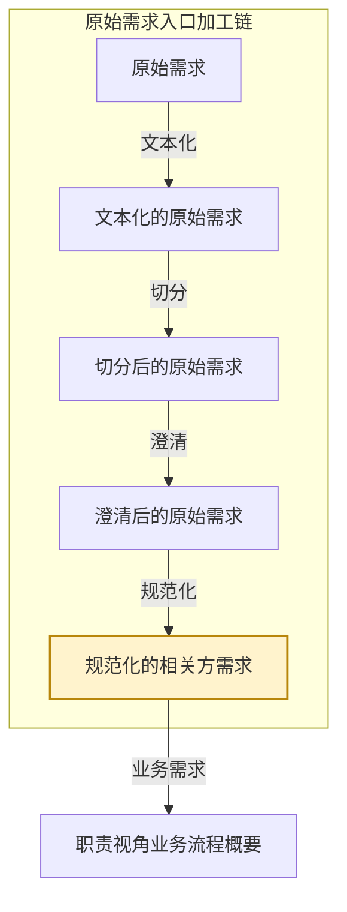

# eos-or03-x2norm · 澄清后的原始需求 → 规范化的相关方需求
**SKILL 指南ID**：or03-x2norm

> **本文件是什么**：本文件是 EOS 规范化的相关方需求预处理链第四步「规范化」的 SKILL 指南。它说明本任务这一次转换：输入文档 X 是澄清后的原始需求，输出文档 Y 是规范化的相关方需求；转换规则是把一批需求文档按三条支路长成 01 树上的节点，并把条文落成条目。
>
> **命名约定**：文档写本名，不写任务代号或文档编号，如「澄清后的原始需求」「规范化的相关方需求」「需求文档」「业务需求文档」「非功能需求文档」「引擎需求文档」；相邻任务按链上位置称呼，如「文本化任务」「切分任务」「澄清任务」，下游按链上位置称呼，如「职责视角业务流程任务」「引擎能力设计任务」「非功能需求设计任务」；带「级」的节点名首次出现给全称与简称，其后用简称；状态值与字段名保留原值，如 `已澄清`、`规范化方案待确认`、`待处理`。
>
> **自足声明**：本任务的过程判据就地成文；其余一律引权威单源——
>
> - **[94 号文档《EOS 系统设计产品数据分解结构》](../10-wfsysdev-4-eos/94-eos-sys-dev-dbs.md)**：规范化的相关方需求三条支路的树形与各级语义
> - **[91 号规范《EOS平台-业务-引擎规范》](../10-wfsysdev-4-eos/91-eos-biz-eng-spec.md)**：业务对象与业务场景概念 §1.4、产品数据文档结构 §11、Skill 运行时协议 附录A
> - **[00-doc-conventions《文档编写约定》](../../../00-generalspec/00-doc-conventions.md)**：表达风格 §八、Skill 文档操作流程 Step 布局约定 §十三
>
> **创建**：2026-10-09 | **版本**：第 1 版

---

## 一、目的与目标

### 1.1 主要目的

> 把澄清后的一批需求文档整理成 01 树上一批可独立确认、可追溯、可进入下游分配的规范条目——业务需求长进业务需求树、非功能需求长进非功能需求树、引擎需求长进引擎需求树；原文出处保留，方案交人类确认。

### 1.2 在链上的位置

EOS 设计线在需求-方案结对之前，另有一条**原始需求入口加工链**：同一份材料被逐级加工，加工到多细就是一个形态，五个形态共用一棵以需求文档为下一级的树。

**图1-1：入口加工链与本任务的位置**



- **本任务所在的链**：原始需求入口加工链，EOS 设计线的入口。
- **本任务所在的位置**：加工链的第五个形态，也是最后一个。上一个形态是澄清后的原始需求；交出后，材料成为设计链第一份产品数据。
- **本任务**：把一批需求文档规范成 01 树上的节点，产出 Y，即**规范化的相关方需求**。它的输入 X 是**澄清后的原始需求**。

这条链不是形态轴。框架、概要、定义说的是同一棵树长到多深，本链说的是同一份材料加工到多细；五个加工形态里只有**切分**与**规范化**两处动结构：切分长出需求文档（根 ＋ ①），规范化把 01 树上三条支路的节点长满。X 与 Y 也不是需求-方案对的两端，而是同一批材料在两个加工深度上的两个形态。

**规范化把三支各长成一棵子树**：业务需求文档长进**相关方业务需求树**、非功能需求文档长进**相关方非功能需求树**、引擎需求文档长进**相关方引擎需求树**；三棵树同装在一份 01 文档里（§三）。

本任务处理的是**需求文档**，一次运行只处理一份，这份文档即**单件输入**。人类有两处参与点：

- **Step Start**——从候选清单中选定本次处理的那一份。
- **Step 2**——讨论并确认规范方案（三支的树、条目、五个属性）。

一轮运行对一份文档，终态只有两种：**方案已确认并写入 01**，这份已规范化；**方案未确认**，这份带着一份最新的规范方案等下轮接着谈。**"待确认"就是这一轮的结论**——该拆的、该判的、该标的，本轮都做了。

### 1.3 主要目标

把本次选定的那一份需求文档拆清、判清、落清，并落定它的规范结论。

1. **给出候选清单并校验受理**：列出表 B 上待规范化的需求文档，逐份过受理门槛，交人类选定本次处理的那一份。
2. **分味认支**：读这份文档的味——业务需求文档走业务需求支，非功能需求文档走非功能需求支，引擎需求文档走引擎需求支。
3. **长业务需求树**：业务需求文档 → 文档级任务（①，带五个属性）→ 任务节点（②）→ 用例场景（③），逐级落位。
4. **长非功能需求树**：非功能需求文档 → 一级类目（①）→ 分类维度（②）→ 具体需求（③）。
5. **长引擎需求树**：引擎需求文档 → 引擎级E2E业务（①）→ 配置单元业务（②）→ 配置信息组业务（③）。
6. **并入已有树**：把本轮的节点并入 01 已有树，逐节点定复用、改进还是新增。
7. **检查与落定**：执行规范化五项检查、冲突检测与优先级初判，残留问题标待确认。
8. **写回与收尾**：确认后写入 01 与状态文档；已确认的推进状态、未确认的留下轮；并受理上游变更与下游退回。

### 1.4 与上下游的衔接

**表1-1：与上下游的衔接**

| 方向 | 任务 | 交接内容 |
|------|------|---------|
| 上游，X 的来源 | 澄清任务 | 取本任务交出的需求文档，逐条判类型、拆分并落成条目；表 B 中 `生命周期=已澄清` 且 `人类决策=同意规范化` 的需求文档是它的入口 |
| 下游 | 职责视角业务流程任务 | 取业务需求树 ①②③ 三级（文档级任务 → 任务节点 → 用例场景），按业务域索引逐条领取，产出业务流程概要 |
| 下游 | 引擎能力设计任务 | 取引擎需求树的配置信息组条目，按引擎逐条领取，产出平台能力场景业务方案 |
| 下游 | 非功能需求设计任务 | 取非功能需求树的具体需求条目，按分类维度逐条领取，产出非功能需求框架 |
| 回向，下游退回 | 职责视角业务流程任务等 | 收下游退回的类型或边界不符的条目，按「重进入规则」重判 |
| 回向，待人工处置 | 人类 | 收本任务检出的缺陷需求文档——正文区非连续片段、损坏、读不了——修好或换掉后重跑本步 |

> **交出的 01 由三个下游取用**：三棵树同装在一份 01 里，三个下游各取自己那一支；业务需求树的 ①②③ 三级是一个整体，职责视角业务流程任务按对位取用。三支正文须是收好的树与条目，不带上游方案块；下游检出正文带上游方案块的，按缺陷退回本任务。

---

## 二、输入文档结构及规则

输入文档（X） = **澄清后的原始需求**，为入口加工链的第四个加工形态。

X 由澄清任务产出，落在 `10-raw-files/`。它的结构、载体与加工状态，出处是 94 号文档 §2.0 与状态文档自身。

**X 的树只有根与一级**。下图是这棵树的展开。

**图2-1：澄清后的原始需求树**

```
澄清后的原始需求 ──── 根
└── 需求文档 ────────── ①
```

**表2-1：X 树各级节点的意义**

| 级 | 节点 | 意义 |
|----|------|------|
| 根 | 澄清后的原始需求 | 同一批需求文档澄清后的整体，一份材料一批，与切分、澄清两态同批 |
| ① | 需求文档 | 由切分产出、经澄清写清。**三味**——**业务需求文档**，挂在它的文档级任务上，带两个属性：所属业务域、文档级任务；**非功能需求文档**，挂在它的适用对象上，带三个属性：所属业务域或平台语境、适用对象、主题；**引擎需求文档**，挂在它要的那项能力上，带两个属性：所属业务域或平台语境、能力诉求 |

> **① 的键**：业务需求文档的键是它那张**文档级任务**（PL5 末级）；非功能需求文档的键是**适用对象与主题**；引擎需求文档的键是它要的那项**能力**（PL5 末级，即配置信息组所定义的"可以运行的能力"）。**键定归属**——同键的篇（切分给出，同键可多篇）由本任务并作同一个 ①。

> **非功能需求的分类维度就记在这份文档上**——`topic` 与片名即它的分类维度，本任务不再另判一次（§四 4.3）。

**X 的构成**（每份需求文档）：

| 面 | 内容 |
|----|------|
| 载体 | `10-raw-files/` 下的 `.chunk-{seq}.md` 文件 |
| 命名 | `{原始文件名}.chunk-{seq}.md`，与文本化文档同目录 |
| frontmatter | YAML 元数据：`source`／`original_source`／`seq`／`total`／`kind`／`label`／`range`／`status`；三味另带属性字段——业务需求文档：`domain`（所属业务域）；非功能需求文档：`domain` 或 `platform`（所属业务域或平台语境）、`applicable`（适用对象）、`topic`（主题）；引擎需求文档：`domain` 或 `platform`、`capability`（能力诉求） |
| 管理区 | frontmatter 之后、正文之前。放状态摘要表：阶段、AI建议、待处理、操作指引四项 |
| 正文区 | 管理区之后。澄清后的**纯净本**，一篇一段连续原文 |
| 一篇文档一次 | 一份需求文档即一次规范化的对象，也是登记与选材的单位 |
| 加工状态 | 不在文件上，记在状态文档表 B，一篇一行 |

> **X 的加工状态由状态文档承接**：状态文档位于 `../../80-pl4eos-2-eosdata/00-origin-requirement-materials/01-eos-sysdev-status.md`。本任务读它选出待处理需求文档，写它落账。它只管理入口加工链的状态，设计链各任务的产品数据以各自文档管理区为权威源。

---

## 三、输出文档结构及规则

输出文档（Y） = **规范化的相关方需求**，为入口加工链的第五个加工形态，也是设计链第一份产品数据。它是一份文档 `01-eos-specified-requirements.md`，装**三棵子树**。

### 3.1 Y 的树形结构与各级语义

Y 是**三棵树**，同装一份 01 里，各带自己的子索引，三支之上一个总入口。三支回答的问题分别是：**业务需求支**——谁开发哪张文档、分几步、每一步有哪些用例；**非功能需求支**——质量诉求落在哪个类目、哪个维度；**引擎需求支**——要哪些引擎能力、由哪些可运行能力组成。

**图3-1：规范化的相关方需求三棵树**

```
相关方需求
├── 相关方业务需求 ──── 根
│   └── 文档级任务 ── ①
│       └── 任务节点 ──── ②
│           └── 用例场景 ─ ③
├── 相关方非功能需求 ── 根
│   └── 一级类目 ─────── ①
│       └── 分类维度 ──── ②
│           └── 具体需求 ─ ③
└── 相关方引擎需求 ──── 根
    └── 引擎级E2E业务 ── ①
        └── 配置单元业务 ─ ②
            └── 配置信息组业务 ─ ③
```

**表3-1：三棵树各级节点的意义**

| 树 | 级 | 节点 | 意义 |
|----|----|------|------|
| **业务需求** | ① | 文档级任务（别称 业务输出文档） | 开发或生成一张文档的E2E业务，从接到文档需求开始到生成满足需求的文档结束，一般包括多个步骤。一份文档（或其中一个专业内容）的开发或生成业务由单个员工承担。带**五个属性**：所属业务域 × 所属主责角色 × 所属岗位级E2E业务 × 所属产品级E2E业务 × 所属构件级E2E业务 |
| 业务需求 | ② | 任务节点 | 文档级任务由一个主责角色负责开发或生成、由多个参与角色负责其他工作（验证、审批等），**每个角色的工作被看做一个步骤，一个步骤就是一个任务节点** |
| 业务需求 | ③ | 用例场景 | 某角色在信息系统上开展自己负责的那一步工作时，其表单标签页上提供功能按钮（右键操作项、快捷键）所对应的业务。**条目即叶** |
| **非功能需求** | ① | 一级类目 | 质量特性 / 环境适应性 / 可实现性（面向哪类非功能关注） |
| 非功能需求 | ② | 分类维度 | 该一级类目下的分类维度（如系统性能、信息安全性、系统可靠性） |
| 非功能需求 | ③ | 具体需求 | 某分类维度下的一条具体非功能需求（需求描述 ＋ 指标口径/目标值） |
| **引擎需求** | ① | 引擎级E2E业务 | 平台能力池的一档产品——一个引擎（如流程引擎）提供一类平台能力；引擎由若干**可独立选配**的配置单元构成 |
| 引擎需求 | ② | 配置单元业务 | 引擎提供的配置能力单元——**可独立选配**；一个配置单元对应一个配置页面，由若干配置信息组构成 |
| 引擎需求 | ③ | 配置信息组业务 | **可独立交付／验收的能力单元**——即某组配置字段，这组字段共同提供一个可以运行的能力。**条目即叶** |

> **条目是叶，上两级是归集级**：三支的 ③ 都是条目（`@spr-{seq}`）；①② 是条目的归集级，不单独成条目。三支的 ①②③ 分别镜像设计链的 R／P 树末三级——业务需求支镜像职责树 ⑤⑥⑦、非功能需求支镜像系统非功能需求树、引擎需求支镜像 P0 树末三级（引擎→配置单元→配置信息组），一致性见 [94 §2.1](../10-wfsysdev-4-eos/94-eos-sys-dev-dbs.md#21-相关方需求)。

> **业务需求支末三级与业务输出的对应**：业务需求支的 ③ 用例场景＝一个用例场景条目；② 任务节点与 ① 文档级任务是它的归集级。**文档级任务（PL5）对应引擎侧的配置信息组（PL5）**——两支同为"可独立交付的末级单元"，故业务需求支拆到文档级任务、引擎需求支拆到配置信息组，两层对齐。

### 3.2 Y 树各节点实现规则

本任务交出的是**树与条目**。它对各支各级只做一件事——判这一级的实体由谁产出、本任务写到哪一步为止。

**表3-2：三棵树各级节点实现规则**

| 树 | 级 | 节点 | 实现规则 |
|----|----|------|---------|
| 业务需求 | ① | 文档级任务 | **本任务产出**；**一个键长出一个**（同键的篇并作一个 ①；文档的键＝文档级任务）；**五个属性由 AI 出方案、人类确认** |
| 业务需求 | ② | 任务节点 | **本任务产出**；从文档正文里**提出者／角色的一步**长出；任务类型（计划／流程／工单）按业务语义判 |
| 业务需求 | ③ | 用例场景 | **本任务产出**；一个提出者名下**可独立确认**的一条诉求成一个 ③，取正文条目原文 |
| 非功能需求 | ① | 一级类目 | **本任务落位**；取非功能分类资产的一级类目 |
| 非功能需求 | ② | 分类维度 | **承袭**，取自 X 的文档主题（`topic`）；本任务对齐分类维度取值 |
| 非功能需求 | ③ | 具体需求 | **本任务产出**；一条可独立确认的非业务诉求成一个 ③ |
| 引擎需求 | ① | 引擎级E2E业务 | **本任务落位**；按主能力域判到具体引擎 |
| 引擎需求 | ② | 配置单元业务 | **本任务落位**；按可运行能力的内涵归到配置单元，边界以引擎现行定义为准 |
| 引擎需求 | ③ | 配置信息组业务 | **本任务产出**；一项**可运行的能力**诉求成一个 ③；**正式命名与收敛由引擎能力设计任务落定** |

- **收敛自查**：父节点语义覆盖各子节点语义之并，即覆盖完整；同层兄弟不重叠，即兄弟互斥。新条目归不进现有节点，才上溯建更高层。

### 3.3 Y 的载体与条目要素

**01 的物理结构**——按 [00-doc-conventions §十四](../../../00-generalspec/00-doc-conventions.md#十四树形资产文档布局规范) 的四层布局（画像／索引／正文／追溯）落，**状态入 §0.4 全景层条目行表**，三支各占一段、各带子索引：

```text
# EOS 规范化的相关方需求清单
**文档版本** / **创建日期** / **修订日期** / **用途** / **产出与消费** / **状态**

## AI读取文档说明                 ← 读取规则（按需读取，不默认全载）
## 0. 规范化的相关方需求树画像
### 0.1 架构统计                    ← 三支条目数与待处理／已分配
### 0.2 分片目录
### 0.3 三支树形结构                ← 业务需求／非功能需求／引擎需求三支的各级
### 0.4 全景层——条目行表           ← 每节点一行：ID／名称／类型／父级／层级／状态／块ID
                                     ★ 状态即在此，无独立的状态队列区；条目状态 `待处理` 起
## 1. 节点索引 / 分片索引          ← 三支各一子索引
### 1.1 业务需求支索引（按业务域）
### 1.2 非功能需求支索引（按一级类目 · 分类维度）
### 1.3 引擎需求支索引（按引擎）
## 2. 正文节点块                    ← 三支正文
### 2.1 业务需求支
#### {文档级任务}  ← ①（带五属性 + 内联稳定标签）
##### {任务节点}      ← ②
###### @{spr-id} {用例场景}  ← ③ 条目
### 2.2 非功能需求支
#### {一级类目}  ← ①
##### {分类维度}  ← ②
###### @{spr-id} {具体需求}  ← ③ 条目
### 2.3 引擎需求支
#### {引擎级E2E业务}  ← ①
##### {配置单元业务}  ← ②
###### @{spr-id} {配置信息组业务}  ← ③ 条目
## 3. 追溯层                        ← 跨文档引用（完整追溯见 08）
## 9. 版本与变更记录
```

> **不设 `## AI最近变更` 与 `## AI可以处理节点` 节**——两者已被 §十四 撤销：变更轨迹由 git 承载，可处理队列由 §0.4 全景层的状态派生。本条为 01 布局与 §十四 的唯一口径。

**条目（③）的要素**——三支的叶统一用 `###### @{spr-id}` 块：

**表3-3：条目（`@spr-{seq}`）**

| 要素 | 说明 |
|------|------|
| 节点ID | `@spr-{seq}`，跨三支连续无跳号 |
| 名称 | 业务语言名称 |
| 类型 | `FR-BIZ`（功能）／`NFR`（非功能）／`FR-ENG`（引擎） |
| 说明 | 一句话说清这个条目是什么、做什么 |
| 需求说明 | 本条目下的相关方需求原文，**写在条目上、不挂指针**——叶是需求落得最细的一级 |
| 优先级 | `P0`／`P1`／`P2`／`P3`，AI 初判供人类确认 |
| 角色 | 业务需求支主责角色／非功能需求支关注角色／引擎需求支配置人员，优先用 01 角色清单里的标准名 |
| 原始表述 / 规范化表述 | 原文与该条的规范化写法 |
| 来源定位 | 源文件 / 需求文档 / 原文锚点 |
| 内联稳定标签 | 下游逐级对上的追溯键 |
| 当前状态 | `待处理` 起 |
| 确认状态 | `[同意]`／`[修改]`／`[需裁决]`／（空） |

**① 文档级任务的要素**（业务需求支）——带五个属性加下列：

**表3-4：文档级任务（①）**

| 要素 | 说明 |
|------|------|
| 名称 | 这份文档承载什么，取文档的键（文档级任务） |
| 所属业务域 × 所属主责角色 × 所属岗位级E2E业务 × 所属产品级E2E业务 × 所属构件级E2E业务 | **五个属性**，AI 出方案、人类确认；不占树位，随节点携带，是 R／P 两树的坐标 |
| 内联稳定标签 | 下游逐级对上的追溯键 |

> 非功能需求支 ① 一级类目、② 分类维度，与引擎需求支 ① 引擎级E2E业务、② 配置单元业务，各带「名称 ＋ 说明 ＋ 内联稳定标签」三要素；其取值由 §四 的落位规则定。

**追溯层与承接记录**——01 的 `## 3. 追溯层` 承载**承接记录**：一份备档，记「哪份文档被哪个节点收下」，**六项为一组**（源节点／关系类型／目标节点／目标文档／状态／说明），不含映射语义。链上紧挨两跳、**共用同一体例、各记一处**：

- **前一跳**（切分片 → 本任务的 ① 文档级任务）：本任务写，落在**切分片（需求文档）的管理区**（见 §4.1 承接记录规则）；
- **后一跳**（① 文档级任务 → 下游方案节点）：由下游任务写，落在 **01 的追溯层**。

**移交承诺**

本任务把 01 交给下游时，承诺：

1. 三棵树各就各位，各级节点齐备，**③ 条目为叶**、名称写到业务语言名称级、并带内联稳定标签；
2. 业务需求支每张文档级任务**带齐五个属性**，且各条可被相关方独立确认；
3. 条目带需求说明原文与来源定位，跨三支 `@spr-` 编号连续无跳号；
4. 检查结果已写进节点——规范化五项检查、冲突检测、优先级初判都留下结论，未决问题已标 `待确认`，不是隐藏遗漏。

> **移交承诺就是三个下游任务的受理前提**——三个下游读的是同一份 01，各取自己那一支。

---

## 四、输入到输出的过程及规则

一次转换依次走五步：**长业务需求树**，落在文档级任务、任务节点与用例场景；**长非功能需求树**，落在一级类目、分类维度与具体需求；**长引擎需求树**，落在引擎级E2E业务、配置单元业务与配置信息组业务；**并入已有树**，落在复用／改进／新增；**检查与质量门禁**，落在五项检查、冲突与优先级。

### 4.1 X 与 Y 的对应

X 是一批需求文档，树只有根与一级。Y 是三棵树，业务需求支四级（根→①→②→③）、非功能需求支四级、引擎需求支四级。X 只给文档与它的属性，**不给树**——三支的各级节点由本任务在 Y 上落出。

**表4-1：X 与 Y 的对应**

| X 的面 | Y 的对应 |
|--------|---------|
| 根 ＋ ① 需求文档（三味） | 三棵树的根 ＋ 各级节点 |
| 业务需求文档（键＝文档级任务） | 业务需求树 ① 文档级任务 ＋ ② 任务节点 ＋ ③ 用例场景 |
| 非功能需求文档（键＝适用对象＋主题） | 非功能需求树 ① 一级类目 ＋ ② 分类维度 ＋ ③ 具体需求 |
| 引擎需求文档（键＝可运行的能力） | 引擎需求树 ① 引擎级E2E业务 ＋ ② 配置单元业务 ＋ ③ 配置信息组业务 |
| 加工状态，记在状态文档表 B | 不变，本任务在表 B 上推进；条目状态落 01 自身管理区 |
| — | 每支一段，各带子索引；三支之上一个总入口 |

> **X 的加工状态不迁移**：它在状态文档表 B 上就地推进，不搬进 Y。Y 上的每支只承载节点与条目。

**承接记录规则**——这条对应关系回写到 X：本轮这一份需求文档所承接的目标节点写它的内联稳定标签，状态随检查落，一次运行处理一份文档、故一轮只产出一组记录，写在该文档的管理区。

**规范化记录规则**——表 B 是加工状态的权威源，本任务在表 B 上写 `生命周期`／`AI建议`／`处置标记`／`操作指引`；先写表 B、再据此写 01 管理区。

### 4.2 第一步 · 长业务需求树

#### 转换过程

本步把一份业务需求文档的正文长成业务需求树的一支，落在 ① ② ③ 三级。

1. 给这份文档立一个 **① 文档级任务**，取文档的键（文档级任务）——使用**① 落位规则**。
2. 给这个 ① 定**五个属性**——使用**五属性规则**。
3. 把正文里各角色的工作分成 **② 任务节点**——使用**② 落位规则**。
4. 把每个角色名下可独立确认的诉求切成 **③ 用例场景**——使用**③ 拆分规则**。

三级落完，这份文档的业务需求树一支就位。

#### 转换规则

**① 落位规则**——**一个键一个 ①**：文档的键（文档级任务）即这个 ① 的名称；**同键的篇（切分给出，同键可多篇）并作同一个 ①**，树上已有同键 ① 的并入（§四 4.5），不新建。

**五属性规则**——① 的五个属性由 **AI 出方案、人类确认**：AI 从文档语义与已有产品数据（R／P 树、01 自身）推出候选值并标 `[推断]`，交 Step 2 由人类确认或改；判不出的标 `[需裁决]`。五个属性不占树位，随节点携带。

**表4-2：五个属性的取值**

| 属性 | 取向 |
|------|------|
| 所属业务域 | 取文档的所属业务域 |
| 所属主责角色 | 该文档业务对象生命周期的主推动者；AI 据正文提出者推断 |
| 所属岗位级E2E业务 | 该主责角色的一个业务对象闭环；AI 据业务对象推断 |
| 所属产品级E2E业务 | P 树坐标；AI 据业务域与产品类型推断 |
| 所属构件级E2E业务 | P 树坐标，是其所属产品级E2E业务的子节点；AI 推断 |

**② 落位规则**——**每个角色的工作被看做一个步骤，一个步骤就是一个任务节点**。正文里出现几个提出者／角色，就落几个 ②；同名同义的提出者并为一个 ②。任务类型（计划／流程／工单）读正文：明示则照判，只给出管理模式（审批、派发等）则按模式判，皆无则按业务语义推断。

**③ 拆分规则**——**提出者 × 单一可确认性**：一个提出者名下可独立确认的一条诉求成一个 ③；同一提出者含多个可独立确认诉求的按单一可确认性拆开。③ 取正文条目原文，不另拟名。**拆分纪律**——不把多个诉求并成更漂亮的一条，保留原始出处；无法拆分的标 `待确认`，原文缺事实的退回澄清任务。

### 4.3 第二步 · 长非功能需求树

#### 转换过程

本步把一份非功能需求文档长成非功能需求树的一支，落在 ① ② ③ 三级。

1. 把这份文档的主题落成 **② 分类维度**——使用**② 落位规则**。
2. 把 ② 归到 **① 一级类目**——使用**① 落位规则**。
3. 把文档里可独立确认的非业务诉求切成 **③ 具体需求**——使用**③ 拆分规则**。

三级落完，这份文档的非功能需求树一支就位。

#### 转换规则

**② 落位规则**——非功能需求文档的键是**适用对象与主题**，其中**主题即分类维度**，就记在这份文档上（`topic`）。本任务直接把文档的主题落成 ②，并对齐分类维度的现行取值；取值对不上时标 `[需裁决]` 交人类。

**① 落位规则**——② 登到它所属的**一级类目**（质量特性／环境适应性／可实现性）。类目由 ② 决定，不另行判定。

**③ 拆分规则**——**单一可确认性**：一条可独立确认的非业务诉求成一个 ③，即"单一关注角色 × 单一分类维度 × 单一适用对象线索"的**三元组**原子；文档里多条则拆多条。**本任务只判分类维度与适用对象线索，不量化指标**——目标值应在澄清中由相关方确认，缺则标 `待确认`、退回澄清任务；统计口径、测量方法与验收条件由非功能需求设计任务展开。

### 4.4 第三步 · 长引擎需求树

#### 转换过程

本步把一份引擎需求文档长成引擎需求树的一支，落在 ① ② ③ 三级。

1. 把这份文档的能力诉求切成 **③ 配置信息组业务**——使用**③ 拆分规则**。
2. 把每个 ③ 归到 **② 配置单元业务**——使用**② 落位规则**。
3. 把 ② 归到 **① 引擎级E2E业务**——使用**① 落位规则**。

三级落完，这份文档的引擎需求树一支就位。

#### 转换规则

**③ 拆分规则**——**一条 ③ ＝ 一项"可以运行的能力"诉求**（即配置信息组的判据：某组配置字段，共同提供一个可以运行的能力）。引擎需求文档的键就是它要的那项能力；一项能力成一个 ③，锚到引擎。**本任务只到"一项能力诉求"这一级，不预先命名配置信息组编号、不分配配置单元**——正式命名与收敛由引擎能力设计任务落定（§三 3.2）。

**② 落位规则**——把 ③ 的"可运行能力"归到承载它的**配置单元**；边界以引擎的现行定义为准，判不出标 `[需裁决]`。

**① 落位规则**——按**主能力域**把 ② 归到具体**引擎**（流程、工单、台账、指标、看板……），平台共享能力（权限、审计、发布等）归到其能力域。

> **引擎是能力的分片轴**：引擎需求树的子索引按引擎分片；同一引擎的条目聚在一处，供引擎能力设计任务逐引擎领取。

### 4.5 第四步 · 并入已有树

#### 转换过程

前三步把本轮的节点落成，本步把它们与 01 已有树对上，逐节点定复用、改进还是新增。

1. 逐节点与同支同级的已有节点比对——使用**落位检测规则**。
2. 判为并入的，追加承接，不动节点定义。

#### 转换规则

**落位检测规则**——三支共用一套判法：先按名称比对，同名且业务含义同一的即同一个节点；名称对不上时，看同级已有节点的说明是否覆盖本轮这一节点的用途；都不覆盖的才新建。

**表4-3：落位检测**

| 关系 | 判定 | 处置 |
|------|------|------|
| 确认 | 节点已存在，本轮条目语义已被现有节点覆盖 | 追加承接条目引用，节点定义不动 |
| 改进 | 节点已存在，本轮条目扩展了它的边界 | 更新节点要素，不新建 |
| 补充 | 节点不在树上 | 新建节点，并整理其下的下级节点与条目 |
| 过时 | 树上已有节点本轮无条目覆盖，且并入后不再落入范围 | 标 `[需裁决]` 交人类——移除节点是架构决策，本任务不自行删 |

> 并入的单位是节点：① 并入则其下 ②③ 逐节点对；② 并入则其下 ③ 逐节点对。

### 4.6 第五步 · 检查与质量门禁

#### 转换过程

本步对落成的三支逐节点、逐条目做质量门禁。

1. 逐条目做**规范化五项检查**——使用**五项标准**。
2. 检出**冲突**——使用**冲突检测规则**。
3. 给条目做**优先级初判**——使用**优先级规则**。
4. 残留问题标 `待确认`——使用**待确认分类**。

#### 转换规则

**规范化五项标准**——完整性、主体明确、客体可识别、边界可判定、可测试性。按类型解读：

**表4-4：五项标准按类型解读**

| 标准 | 业务需求支 / 引擎需求支 | 非功能需求支 |
|------|-----------------|---------|
| 完整性 | 能力诉求完整（做什么 ＋ 约束） | 约束表述完整 |
| 主体明确 | 主责角色 / 配置人员明确 | 关注角色明确 |
| 客体可识别 | 文档级任务 / 引擎能力可识别 | 适用对象线索可识别 |
| 边界可判定 | 文档/能力边界可定 | 数值 ＋ 单位 ＋ 条件齐备（应已在澄清中确认；缺则标 `待确认` 退回澄清任务，本步不发明数值） |
| 可测试性 | 可验证 | 目标值可验证（相关方经澄清确认）；统计口径/测量方法/验收条件由非功能需求设计任务展开 |

**冲突检测规则**（AI 只做结构化呈现，不做裁决）：检出范围分三层——同一切分内条目间、同原始文件跨切分条目间、与 01 既有条目的跨文件冲突；冲突类型分三种——直接冲突（无法同时满足）、间接冲突（各自可实现但同实现会不一致）、部分内容冲突（局部相冲，先续拆）。

**优先级规则**——条目优先级初判 P0~P3，只用于分批排序与提示，不作交付承诺，人类确认后生效：

**表4-5：优先级初判**

| 档 | 语义 | 判断问句（顺序判定，命中即停） |
|----|------|--------------------------------|
| P0 | 必须——不做则核心业务无法运转/系统不可交付 | 合规/安全/监管强制？或系统基础能力被广泛依赖？ |
| P1 | 核心必需——主责角色核心闭环的必要能力，可分期 | 属于主责角色的核心端到端业务闭环的必要环节？ |
| P2 | 常规增强——重要但非核心 | 常规业务功能？ |
| P3 | 可延后/待定 | 其余（边缘诉求/待确认/明确可延后）？ |

**待确认分类**——残留的清晰性问题标 `待确认`，分两类：

| 待确认类型 | 判定 | 处理 |
|-----------|------|------|
| 条目不完整 | 拆分/规范化引入的表述不完整（切碎丢语境） | **本任务自己解决**——在规范化表述里从相邻条目/原文重构完整语义，不回退 |
| 原文缺事实 | 需要相关方补充新事实（主体/客体/边界/定量指标在原文层缺失） | **退回澄清任务**——标 `待确认（需退回澄清）`，人类裁定后走 §四 4.7 反向路由 |

> 退回只覆盖**方案期**（`规范化方案待确认`，条目未写入 01）；已 `已规范化` 后走变更路径，不走退回。

### 4.7 重进入与变更影响声明

**重进入规则**——已进链的需求文档再次被本任务处理时，按三种情形分流：

**表4-6：重进入的三种情形**

| 情形 | 触发 | 处置 |
|------|------|------|
| 规范续做 | `生命周期=规范化方案待确认` | 按 Step 1 续做，Step 2 续确认；关口的判定照走 |
| 反向路由（退回澄清） | `生命周期=规范化方案待确认` 且 `人类决策=需退回澄清` | 表 B 生命周期→`澄清中`、AI建议→`需继续澄清`、frontmatter.status→`raw`；清理 01 对应节点；由澄清任务重新标注（仅方案期） |
| 规范中途终止 | `人类决策=已终止` | 表 B→`已废弃`、AI建议→`建议终止`、frontmatter.status→`abandoned` |

**变更影响声明规则**——本次有重新规范化、或本轮改动改变了条目语义的，按 [91 号规范 §A.7.2](../10-wfsysdev-4-eos/91-eos-biz-eng-spec.md) 判变更类型，按 §A.7.3 的格式写入文档末尾，并列出受影响的下游节点与已消费的条目，不笼统说下游不受影响。

---

## 五、执行步骤及检验规则

一次运行起于 Step Start，依次走 Step 1~3 的设计动作，收于 Step End。

**表5-1：Step 布局总览**

| Step | 名称 | 职责 | 人类参与 | 执行模式 | 产出 | 写资产 |
|------|------|------|---------|---------|------|--------|
| Start | 为任务选择并校验需求文档 | 前置校验、给出候选清单、受理门槛、按状态路由 | **有**——从候选清单中选定一篇 | 对话 | 受理结论 + 候选清单 | 状态文档（首次） |
| 1 | 生成规范方案 | 分味认支、长三棵树、并入已有树、检查 | 无（AI 自动） | 统一 | 三支方案 + 五属性候选 | — |
| 2 | 基于对话确认与写回 | 列出未确认清单、讨论修改；要素机械检查后写回 | **有**——讨论与确认 | 对话 | 确认结论 + 未确认清单 | 状态文档、01 |
| 3 | 检查与判定 | 核对 01 三支、并入残留问题，判 `已规范化`／`规范化方案待确认` | 无（AI 自动） | 统一 | 判定结论 + 待确认项 | 状态文档、01 |
| End | 给出本轮任务成果总结 | 汇总本轮写回结果、三区摘要输出 | **有**——查看结果摘要 | 对话 | 本轮成果总结 + 下一步 | — |

### 5.1 Step Start · 为任务选择并校验需求文档

**选定本次处理对象**——本步给出**候选清单**交人类选定：每份待处理的需求文档占一行，列出源文件名与子文件名、它在表 B 上的当前生命周期、未解决数与 AI建议。人类选定其中一份；**本次运行只处理这一份**。

**存量节点**——选中的这一份若上一轮没谈完，状态停在 `规范化方案待确认`，按**重进入规则**续做。

**按状态路由**——选中的这一份，它在表 B 上的生命周期与人类决策两项决定它走哪条路：

- `人类决策=同意规范化` 且生命周期 `已澄清`：进本轮，Step 1 生成规范方案。
- `生命周期=规范化方案待确认`：进本轮，按**重进入规则**续做。
- `人类决策=需退回澄清`（下游退回）：进本轮，按**重进入规则**的反向路由重判。
- `人类决策=已终止`：进本轮，Step 1 给出「置 `已废弃`」的方案，Step 2 确认后按重进入规则处置。
- `人类决策` 为空：不进本轮，列入待选入规范化提醒。
- 更后的状态：不进本轮，列入行动清单。

受理门槛如下，逐条判；不满足条件的，按「判定」「动作」两列处置。

**表5-2：受理门槛（对 X）**

| 校验条件 | 判定 | 动作 |
|---------|------|------|
| 源文件名不以 `.chunk-` 命名 | 不是需求文档 | 输出提示 → 跳过该文件 |
| 表 B 上该行生命周期为 `已规范化` 或更后 | 已在处理流程中 | 不可处理 → 跳过；如需重做，先清空该行生命周期值 |
| 表 B 上该行生命周期为 `已废弃` | 已废弃 | 不可处理 → 跳过；如需重启，先清空该行生命周期值 |
| 正文区带澄清问题清单或上游方案块 | 上游未交干净 | 退回上游 → 交回澄清任务重做 |
| 正文区为空或读不出内容 | 不可处理 | 登记失败，`处置标记=待人工处置`，该篇不进本轮 |
| 本次选定的文档跨了多份 | 软提示 | 逐份分别处理，不合并成一份 |
| 无待处理需求文档 + 无入口检出的存量 | 无待处理对象 | 输出提示 → 退出 |

表中的状态值取自表 B 的生命周期列，它的完整取值与含义以状态文档自身为准。

**状态推进**——本任务写入 `规范化方案待确认` 与 `已规范化` 两个状态，并在终止时写 `已废弃`；`已切分`、`澄清中`、`已澄清` 由切分／澄清任务写回。Step Start 按状态路由，Step 2 写回后落 `规范化方案待确认`，Step 3 的判定通过后落 `已规范化`。

上游变更，即该篇被重新澄清，按状态分流：

- 该行生命周期被清空且源文件仍在 → 进本轮，按**重进入规则**分流；
- 生命周期 `已规范化` 及更后而被重新澄清 → 原结果不动，新料另起一行。

**退回去向**——X 有缺陷、且缺陷的处置权不在本任务——正文区带上游方案块、损坏读不了——退回澄清任务重做或交人类处置，本轮不再受理。

### 5.2 Step 1 · 生成规范方案

有新选定的需求文档汇入，或入口检出存量节点时，走本步，两者都没有时本步不走。存量先于新输入处理。

**读取文档**——读的是两处。**需求文档这一处**：本篇正文区全文，以及 frontmatter 里的 `kind`、`label`、属性（所属业务域／文档级任务／适用对象／`topic` 等）。**状态文档这一处**：本篇在表 B 上的对应行。X 是本任务唯一的外部输入，01 即资产、就在本任务的产出里，不另读资产文档。加载读取协议是只读本次这一篇、按需扩大，不默认加载全文。

对本次选定的这一篇，本步按它的味走对应的一支，再并入、检查：

1. 分味认支——读 `kind`，业务需求／非功能需求／引擎需求各走一支。
2. 长树——按 §四 4.2／4.3／4.4 的对应一步，长成本支三级。
3. 并入已有树——使用**落位检测规则**（表4-3）。
4. 检查——使用**五项标准**（表4-4）、**冲突检测规则**、**优先级规则**（表4-5）。

**写方案块**——方案写入 01 本支对应处，供人类阅读与讨论；五属性以候选值标 `[推断]` 一并列出。

**产出去向**——生成的方案不作状态写入，随方案一并交 Step 2 讨论确认。**本步无人类参与点**。

**失败处置**——正文区读不到、或读不出诉求的，该篇 `处置标记=待人工处置` 交 Step 2 的对话，其余照常；整批受理不过的，按受理门槛处置退出。

### 5.3 Step 2 · 基于对话确认与写回

本步每轮都走。本步讨论确认两件事——Step 1 刚生成的方案，以及状态停在 `规范化方案待确认` 的遗留方案，两者处置一样。

**未确认清单**——把本轮新生成的方案与状态为 `规范化方案待确认` 的遗留方案一并列出交人类讨论。五属性、条目、树三级都在此逐条确认。这份清单就是本步的界面。

**逐条讨论与确认**——修改落在方案上即按讨论结果改；人类确认后，方案转为已确认。确认的单位是节点——一份方案给出一条结论，可以逐份给，也可以一次全部确认。五属性在此定下。

**写回前的要素机械检查**——检查要素齐备：三支各级节点非空；业务需求支 ① 带齐五个属性；条目带需求说明、来源定位与内联稳定标签；`@spr-` 编号跨三支连续无跳号。检查不过的就地补齐；无法补齐的说明它是结构性缺陷，回 Step 1 重排，不带不合的要素写回。

**写回**——确认即写回，按确认结果分四种情形：

**表5-3：确认后写回的四种情形**

| 对象 | 讨论结果 | 写回动作 |
|------|---------|---------|
| 本轮生成的方案 | 已确认 | 写入 01 本支，各级节点带齐要素；表 B 生命周期写 `规范化方案待确认`（待 Step 3 判过关口） |
| 本轮生成的方案 | 未确认 | 方案写入 01，表 B 生命周期写 `规范化方案待确认`，留作下一轮的处理对象 |
| 遗留的待确认方案 | 已确认 | 按讨论结果改或不改，推进到待 Step 3 判定 |
| 遗留的待确认方案 | 仍未确认 | 不动 |

**已被下游消费过的条目本次被修订**，写回时另按上游变更分流定状态：已被下游取用的，维持原状态、版本递增。

**写的是 Y**——规范化的相关方需求：三支按确认结果落定，条目要素与五属性落定，01 元数据、三支子索引、`0.4 全景层条目行表` 一并维护。

**也写的是状态文档表 B**——本篇的对应行按**规范化记录规则**落定，先写表 B、再据此写 01 管理区。

**本步的特化参数**：

- **锚点需求** = 本篇需求文档的正文原文（切分给出的那一段）
- **操作条目** = 三支的节点与条目 ＋ 五属性 ＋ 表 B 对应行
- **推进目标** = `已规范化`
- **清除条件** = 已确认的文档默认跳过。本轮新输入满足下列任一条件时，该篇回到待处理：该篇被重新澄清（表 B 该行生命周期被清空）；下游退回（人类决策写 `需退回澄清`）
- **级联触发条件** = 改动使某节点由一支变两支、或合并节点 → 重验受影响的下级节点与条目，重验由 Step 3 的检查承担

**产出去向**——本步写回的方案交 Step 3 做检查。**人类参与点在本节**——讨论并确认规范方案与五属性。

**失败处置**——同一处反复退改超过一次的，停止处理，`处置标记=待处置` 留待下一轮。

### 5.4 Step 3 · 检查与判定

Step 1 走过就走本步；Step 2 写回后即执行本任务的关口。检查取两面：

- **同指这一面**——业务需求支的 ①②③ 三级与业务输出的对应完整；X 的业务需求文档整段进入业务需求树，一个不少。
- **要素这一面**——三支各级节点要素齐备；业务需求支 ① 带五个属性；条目有需求说明与来源定位；无隐藏遗漏。

**判定**——检查通过 → 表 B 生命周期写 `已规范化`、AI建议写 `已完成`；检出问题 → 保持 `规范化方案待确认`，问题标 `待确认`，交 Step End 汇总提示。

**产出与去向**——判定结论与待确认项交 Step End。本步无人类参与点。

**失败处置**——检查所依据的 01 三支读不到时，该篇 `处置标记=待人工处置` 交 Step End 提示，不静默通过。

### 5.5 Step End · 给出本轮任务成果总结

本步只汇总本轮结果并给出下一步。

**三区输出**——第一区的状态与结果摘要行就地写实：

```text
当前状态：<已规范化 / 规范化方案待确认 / 待处置 / 已废弃 / 无待处理对象>
  本轮规范化：<子文件名 → 生成 spr-XXX~spr-YYY（业务需求 N / 非功能需求 K / 引擎需求 M）>
  本轮五属性：<子文件名 → 已确认 N 条 / 待确认 K 条>
  本轮待确认：<子文件名 + 条数；无则写「无」>
  本轮待人工处置：<子文件名 → 缺陷与原因；无则写「无」>
  判定结论：<通过 / 检出待确认 N 处>

一、未确认的方案
  <子文件名 + 状态；无则写「无」，下一轮运行接着讨论>

二、下一轮入口
  A. 对话 → 运行 Step 2 时直接说 同意 / 修改 / 废弃 / 退回澄清，AI 即时处理
  B. 表 B → 对 `已澄清` 文档设 `人类决策=同意规范化`

三、下一步
  本任务 → 选定新一批待处理需求文档重新运行
  下游   → 职责视角业务流程任务（取业务需求树 ①②③）
           引擎能力设计任务（取引擎需求树的配置信息组条目）
           非功能需求设计任务（取非功能需求树的具体需求条目）
```

**收尾**——更新状态文档的基线记录、提交本轮变更。

**增量标记**——`[新增]`／`[变更]`／`[确认]`／`[需裁决]` 与 `[推断]` 的定义与使用按 [91 号规范 §A.3.1](../10-wfsysdev-4-eos/91-eos-biz-eng-spec.md) 执行。本任务另用到三枚标记：`[待复核]` 标候选清单中归上存疑的行；`[待处置]` 标记查检出的问题；`[需裁决]` 标五属性或落位判不出的项。本任务增量清单对操作条目逐条标注，并附判定结论行。

**自检清单**——一次运行收尾前，按本任务流程分组逐项核对：

- **受理**
  - 前置材料——目录、状态文档与基线——已确认就绪。
  - 候选清单已给出，人类已选定本次处理的那一篇。
  - 入口检出的存量节点已并作本次处理对象。
  - 无待处理对象时本任务已退出。
- **载入与校验**
  - 本次那一篇的正文区、frontmatter 属性、表 B 对应行都已按读取协议加载，不全载全文。
  - 受理门槛已逐条校验，软提示项已交人类定夺。
- **生成**
  - 分味认支正确，业务需求／非功能需求／引擎需求各走对应的一支。
  - 业务需求支 ① 一个键一个（同键的篇并作一个），② 按"提出者／角色的一步"落，③ 按"提出者 × 单一可确认性"拆。
  - 非功能需求支 ② 取自文档主题、① 归一级类目，③ 按单一可确认性拆。
  - 引擎需求支 ③ 按"一项可运行的能力"拆、锚到引擎，② 归配置单元、① 归引擎。
  - 五属性已 AI 出方案、标 `[推断]`。
  - 并入按**落位检测规则**逐节点判定（确认／改进／补充／过时）。
  - 树收敛，判据是覆盖完整加兄弟互斥。
- **Y 侧要素**
  - 三支各级节点齐备，③ 条目为叶、带内联稳定标签，`@spr-` 编号跨三支连续。
  - 业务需求支 ① 带齐五个属性；条目带需求说明与来源定位。
- **确认与写回**
  - 要素机械检查已执行。
  - 方案与五属性已列全、逐条确认。
  - 确认结果已按 表5-3 写回，已被下游消费过的条目已按上游变更分流落定状态与版本。
  - 写回顺序合规：先写表 B，再据此写 01 管理区。
- **检查与判定**
  - 检查已执行，两面都取。
  - 判定只按关口结论——通过落 `已规范化`，检出问题保持 `规范化方案待确认`。
  - 缺的事实不由本任务补——**不脑补内容**，原文缺事实的标 `待确认（需退回澄清）`；检出的缺陷已 `处置标记=待处置`。
- **收尾**
  - 三区摘要已输出，下一步已给出。
  - 基线记录已更新，本轮变更已提交。
