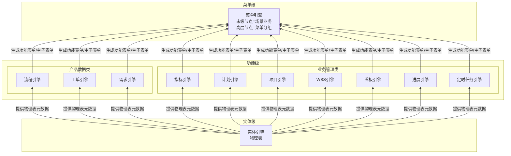

# EOS平台-业务-引擎规范

> **概述**：定义 EOS 平台的 UI 交互模型、引擎分层体系、三类产品（A1/A2/Bn）、资产治理业务，以及三路径（biz/eng/nfr）自闭环 Skill 的编制模式和职责定位。
>
> **版本**：v3.3 | **修订**：2026-07-07

---

## 一、平台界面与业务场景

### 1.1 平台UI

用户单击菜单引擎发布的末级菜单进入场景业务，运行时 UI 遵循以下交互模型：

**初始态**：浏览器窗口为**单窗全宽**，顶部多 TAB 对应场景业务下的多个主子表单；选中一行数据双击可下钻。初始态无底部导航面包屑。

```
┌────────────────────────────────────────────────────────────────────────────┐
│ [TAB: 主子表单A] [TAB: 主子表单B] [TAB: 主子表单C]                           │
│                                                                              │
│ ┌──────────────────────────────────────────────────────────────────────────┐ │
│ │ 主表单（列表/树表）                                                       │ │
│ │ ┌────────────────┬────────────────┬────────────────┬────────────────┐   │ │
│ │ │行1             │                │                │                │   │ │
│ │ │行2*│ ← 双击选中行                                                       │ │
│ │ │行3             │                │                │                │   │ │
│ │ └────────────────┴────────────────┴────────────────┴────────────────┘   │ │
│ └──────────────────────────────────────────────────────────────────────────┘ │
└────────────────────────────────────────────────────────────────────────────┘
```

**分屏态**（下钻触发）：双击主表单行数据 → 窗口分裂为左右双窗。左窗为原主子表单（变窄），右窗显示选中行数据的子表单；右窗 TAB 对应子业务，每个关联实体占一个 TAB。

```
┌─────────────────────────────────┬──────────────────────────────────────────────┐
│ 左窗（原窗变窄）                  │ 右窗（新开）                                  │
│                                 │                                              │
│ [TAB: 主子表单A]                │ [TAB: 子业务X] [TAB: 子业务Y]                 │
│ ┌──────────────────────────┐    │ ┌──────────────────────────────────────┐     │
│ │ ┌────┬────┬────┬────┐    │    │ │ 选中行的子业务数据                      │     │
│ │ │行1 │    │    │    │    │    │ │ ┌───────┬───────┬───────┬───────┐    │     │
│ │ │行2*│ ← 双击             │    │ │ │行a    │       │       │       │    │     │
│ │ │行3 │    │    │    │    │    │ │ │行b*│ ← 可继续双击下钻                  │     │
│ │ └────┴────┴────┴────┘    │    │ │ └───────┴───────┴───────┴───────┘    │     │
│ └──────────────────────────┘    │ └──────────────────────────────────────┘     │
└─────────────────────────────────┴──────────────────────────────────────────────┘
底部导航面包屑：场景业务 > 主子表单A > 子业务X
```

**持续下钻**：在右窗双击行 → 右窗移至左窗，新子业务 TAB 出现在右窗位置。可一直下钻直至系统下钻层级数限制。底部常驻面包屑导航，双击任意节点可跳转。

**交互规则**：

| 规则 | 说明 |
|------|------|
| 初始单窗 | 进入场景业务时为单窗全宽，不下钻不分屏 |
| 主子表单 TAB | 顶部 TAB 对应该场景业务下的多个主子表单 |
| 首次下钻 | 在主表单双击某一行数据触发分屏，右窗显示子表单数据 |
| 递归下钻 | 右窗→左窗，新右窗出现，直到系统层级数限制 |
| 面包屑导航 | 底部常驻，显示当前层级路径；双击任意节点跳转至该层级 |
| 子表单显示规则 | 功能引擎基于主表单行数据内容匹配规则，动态确定展示子表单集合 |

### 1.2 平台菜单

菜单引擎（`@engine-menu`）生成并维护 EOS 平台的多级菜单树，分为两类节点：

- **非末级节点**：定义所属父节点、显示顺序、可见性和可达性权限——仅承载分组和导航。
- **末级节点**：定义所包含的主子表单部件序列（即**场景业务**）、显示顺序和依赖关系，以及该节点的可见性和可达性权限。

菜单视角（ML）自上而下为：M0 平台 → M1 一级菜单 → M2 二级菜单 → M3 三级菜单 → M4 末级菜单（→SL5 场景业务）。菜单引擎对每条场景业务无条件支撑，无需判定。

**权限归属**：菜单节点对角色/人员的可见或不可见规则，由菜单引擎承载。物理表数据行或列对角色/人员的权限，由功能引擎承载。

### 1.3 业务场景

**场景业务**是 STR-F（相关方功能需求架构末级节点）的组织单元。每条场景业务定义一条**端到端业务闭环**——从需求提出到需求被满足并确认的完整链路。

场景业务内部为一组有先后流转依赖的**输出文档序列**：

```
场景业务
  │
  ├── 输出文档1
  ├── 输出文档2
  ├── 输出文档3
  ├── ...
  └── 输出文档N
```

在 EOS 平台上，场景业务（SL5）由菜单引擎的末级节点编排支撑——末级菜单所包含的主子表单序列即为场景业务的运行时形态。

场景业务由 AI 根据 OR 语义判定为两种类型：

| 类型 | 识别词 | 闭环标准 |
|------|--------|---------|
| **执行类（D）** | 创建/提交/审批/交付/验收等动作词 | D 闭合——从需求提出到需求满足 |
| **管理类（PCA）** | 计划/监控/分析/纠正/识别等动作词 | PCA 闭合——计划→监控→分析→纠正 |

两类场景业务的输出文档在功能引擎组装时，其功能表单可互为子表单（主子表单交叉嵌套），执行类与管理类不是两条平行线，而是管理驱动业务、业务承载管理的融合闭环。

---

## 二、基于引擎生成业务

### 2.1 业务及层级

EOS 平台使用四套视角层级描述业务在不同维度上的组织结构：

| 视角 | 编号 | 自上而下 |
|------|------|---------|
| **ML**（菜单视角） | M0→M4 | 平台 → 一级菜单 → 二级菜单 → 三级菜单 → 末级菜单（→SL5） |
| **SL**（角色场景视角） | SL0→SL6 | 平台 → 业务域 → 产品类型 → 角色 → 角色职责 → 场景业务 → 场景部件/主子表单 |
| **PL**（输出产品视角） | PL0→PL5 | 平台 → 业务域 → 产品类型 → 构件 → WBS → 输出文档（→SL6） |
| **EL**（引擎视角） | EL1→EL3 | 菜单引擎 → 功能引擎 → 实体引擎 |

> 其余视角层级的完整定义见 `23-eos-output-architecture.md` 和 `24-eos-business-assets.md`。

**输出文档**按生成方式分为两类：

- **内置 CAX**（平台内引擎生成）：内容由 EOS 功能引擎直接生成，沿三层引擎生成链逐级生成——对应物理表（实体引擎）→转换为功能表单→按主子关系组装为主子表单。
- **外置 CAX**（平台外工具生成）：文档以文件名及附件形式回传至 EOS 平台，平台负责管理其任务、状态、责任人、版本、附件、评审和归档。

### 2.2 引擎及层级

EOS 平台通过三层引擎逐级生成：下层引擎生成制品，上层引擎消费该制品后生成自身制品，自底向上逐级递进，从物理表一直生成到用户可见的菜单：



简化版三层引擎生成链：

```text
实体引擎 ──生成──→ 物理表
                    ↓ 被消费
               功能引擎 ──生成──→ 功能表单 / 主子表单
                                      ↓ 被消费
                                 菜单引擎 ──生成──→ 菜单树 + 场景业务
```

各引擎为生成器：下级引擎生成制品，上级引擎消费该制品后生成自身制品，逐级递进。

**引擎全景**：

| 序号 | 引擎ID | 名称 | 层级 | 一句话定义 |
|------|--------|------|------|-----------|
| 1 | @engine-entity | 实体引擎 | 实体级 | 基于数据库生成物理表，提供增删改查和导入/导出等基本功能 |
| 2 | @engine-requirement | 需求引擎 | 功能级（产品数据类） | 待填充 |
| 3 | @engine-flow | 流程引擎 | 功能级（产品数据类） | 配置流程节点、流转规则、审批行为和状态迁移 |
| 4 | @engine-workorder | 工单引擎 | 功能级（产品数据类） | 配置工单类型、派发规则、处理流程、验收标准和归档策略 |
| 5 | @engine-project | 项目引擎 | 功能级（业务管理类） | 基于物理表配置项目对象、阶段、里程碑、成员和项目状态 |
| 6 | @engine-wbs | WBS 引擎 | 功能级（业务管理类） | 基于物理表配置 WBS 层级、分解规则、节点属性和进度汇总方式 |
| 7 | @engine-task | 计划引擎 | 功能级（业务管理类） | 基于物理表配置计划任务、时间约束、依赖关系和执行状态 |
| 8 | @engine-kanban | 看板引擎 | 功能级（业务管理类） | 基于物理表配置看板视图、卡片布局、状态泳道和筛选规则 |
| 9 | @engine-indicator | 指标引擎 | 功能级（业务管理类） | 配置指标维度、度量口径、聚合规则和展示方式 |
| 10 | @engine-progress | 进展引擎 | 功能级（业务管理类） | 基于物理表配置进展填报、进度口径、状态更新和进展记录 |
| 11 | @engine-scheduler | 定时任务引擎 | 功能级（业务管理类） | 基于物理表配置定时触发规则、任务事件和执行策略 |
| 12 | @engine-menu | 菜单引擎 | 菜单级 | 配置菜单树节点和场景编排 |

> EL 三层中，「功能引擎」是层级（EL2）而非独立引擎资产。上表中 10 个具体功能引擎均归属功能级。菜单引擎（EL1）和实体引擎（EL3）同时是层级名称和该层级唯一的引擎资产。

**引擎职责**：

- **实体引擎**：基于数据库生成物理表，提供增删改查和导入/导出等基本功能。物理表是上层引擎的元数据基础。
- **功能引擎**：将物理表转换为功能表单并按主子关系（1+N）组装为主子表单，配置行/列级数据访问权限。承载四方面能力：① 表单能力（结构/字段/布局/校验/行为/发布）；② 功能能力（各具体引擎为表单增加的功能）；③ 组装能力（主子表单组装、子表单显示规则匹配、双击下钻）；④ 权限能力（数据行/列对角色/人员的可见、可编辑或不可访问约束）。
  - **产品数据类**（需求/流程/工单）：支撑各类产品数据的开发与管理
  - **业务管理类**（项目/WBS/计划/看板/指标/进展/定时任务）：支撑过程管理数据的生成与管理
- **菜单引擎**：生成并维护多级菜单树，末级节点编排场景业务。

**配置单元选配模型**：每个引擎包含若干配置单元（可独立选配的 IPO），部分配置单元即可让业务运行——引擎提供能力池，配置人员按业务需要从中挑选组合。

### 2.3 业务组装

**三层引擎生成链**（自底向上）：物理表（实体引擎生成）→ 被功能引擎消费，生成功能表单/主子表单 → 被菜单引擎消费，生成场景业务+菜单树。各引擎为生成器，逐级递进直至平台可发布的末级菜单。

**输出文档推导**（自顶向下）：STR-F 架构末级节点是场景业务，场景业务由输出文档序列细化定义。输出文档按生成方式分两条路径推导支撑引擎链：

#### 内置 CAX
- 输出文档的条目化内容对应一个物理表，由实体引擎生成
- 物理表由功能引擎转换为功能表单，按文档内容需求确定具体功能引擎；若存在主子业务关系，按 1+N 组装为主子表单

#### 外置 CAX
- 输出文档挂接到计划功能表单，由计划引擎（`@engine-task`）管理任务、状态、责任人、版本、附件、评审和归档
- 附件能力由实体引擎的内置子业务配置单元提供
- 组装时 N=0（无额外功能表单作为子表单）

#### 汇聚

无论内置或外置 CAX，全部主子表单序列由菜单引擎末级节点编排，并生成平台菜单入口。

---

## 三、三类产品 A1/A2/Bn

EOS 平台的业务配置和运行围绕三类产品展开：

| 产品 | 归属域 | 构件 | 末级节点 |
|------|--------|------|---------|
| **A1** | 流程与IT | 引擎 | CU（配置单元） |
| **A2** | 各业务域 | 角色 | 场景业务 |
| **Bn** | 各业务域 | 产品构件 | 构件的产品数据 |

> 三类产品的完整架构定义见 [23 号资产](../../80-pl4eos-2-eosdata/23-eos-output-architecture.md)。

### 3.1 A1产品

A1 是**平台引擎产品**，归属流程与IT域。构件为引擎（`@engine-entity`、`@engine-flow` 等 13 个），末级节点为 CU（配置单元，详见 [25 号资产 §2](../../80-pl4eos-2-eosdata/25-eos-engine-models.md#§2-引擎定义)）。

每个 CU 描述一个可独立配置、校验、发布的引擎元数据对象，以 IPO（Input-Process-Output）定义：Input 为配置要素，Process 为系统处理说明，Output 为运行期业务能力。

对应设计路径为 **eng 路径**：wft01-eng（场景业务）→ wft02-eng（配置单元）→ wft03-eng（操作页面）→ wft05-eng（前后端组件）。

### 3.2 A2产品

A2 是**各业务域的角色场景**，构件为角色（如采购员、库存管理员），末级节点为场景业务。沿角色场景视角（SL）展开：SL3 角色类型 → SL4 角色职责 → SL5 场景业务 → SL6 场景部件。

每个 A2 产品回答：某角色在哪个菜单入口、按什么顺序使用哪些场景部件、完成端到端的职责闭环。场景业务（SL5）与 STR-F 末级节点 1:1 映射。

对应设计路径为 **biz 路径的前半段**：wft01-biz（场景业务）→ wft02-biz（输出文档，组装 A2 产品业务架构）。

### 3.3 Bn产品

Bn 是**各业务域的输出产品**，构件为产品构件（如单据、流程、工单），末级节点为构件的产品数据。沿产出视角（PL）展开：PL1 业务域 → PL2 E2E 项目业务 → PL3 构件类型 → PL4 WBS → PL5 业务输出文档。末级节点为构件的产品数据。

每个 Bn 产品回答：某类输出文档（如采购申请单）属于哪个业务域/构件类型，需要哪些前序文档和业务规则才能生成。

对应设计路径为 **biz 路径的后半段**：wft02-biz 装配 Bn 产品业务架构 → wft03-biz 推断功能表单。A2 与 Bn 通过场景部件交汇——场景部件在 SL 侧为 SL6、在 PL 侧为 PL5，是双视角的连接点。

---

## 四、平台资产治理业务

### 4.1 菜单配置

菜单配置是平台资产治理的基础业务，由业务架构管理员角色执行。核心职责：维护 EOS 平台的菜单树结构——新建/修改/删除菜单节点，配置节点的层级归属、显示顺序、可见角色/人员，以及末级节点到场景业务的映射。

菜单配置的 STR-F 已预置在 `02-*.md`（相关方需求架构文档）中，作为 EOS 平台运转的架构前提。业务链文档包括：菜单节点登记表、菜单结构变更记录、菜单可见性配置表。

### 4.2 资产管理

资产管理覆盖平台架构资产的全生命周期维护，由业务架构管理员角色执行。核心职责：维护 23~27 号资产的定义、关系和追溯引用——包括产品架构节点（23）、业务资产（24）、引擎资产（25）、文档定义（26）和资源资产（27）的登记、变更和废弃。

资产管理的 STR-F 已预置在 `02-*.md` 中。业务链文档包括：资产登记表、资产变更记录、引用关系维护记录、资产一致性检查报告。

### 4.3 数据治理

数据治理覆盖平台数据标准和质量规则的维护，由数据治理员角色执行。核心职责：维护数据字典、编码规则、状态库等基础资源库——确保平台各引擎引用的数据标准一致、编码规则统一、状态定义规范。

数据治理的 STR-F 已预置在 `02-*.md` 中。业务链文档包括：数据标准维护记录、数据质量规则配置表、数据问题单处理记录。

> 治理 STR-F 的完整清单以 `02-*.md` 为准，AI 运行时动态读取。上述三类治理业务当前 OR 承接为空，由人类在 EOS 平台建设过程中逐批增补。

---

## 五、业务应用系统设计

> biz 路径：FR-BIZ OR → wft01-biz → STR-F → wft02-biz → BA → wft03-biz → SR-F（相关方需求架构文档 `02-*.md` 在 wft01-biz 产出 STR-F 后形成）
>
> 末级节点渐进链：场景业务 → 输出文档 → 功能表单
>
> 以下各节定义 biz 路径每个 Skill 的末级节点和任务清单。

### 5.1 原始需求处理

**wft01-biz** 将非结构化的 FR-BIZ OR 转化为结构化的 STR-F 场景业务方案。

末级节点：场景业务
1. 推断生成场景业务节点
2. 推断场景业务输出文档
3. 基于E2E补充业务需求
4. 推断输出文档支撑引擎
5. 推断输出文档所属Bn

> 以上为 wft01-biz 完成的设计任务的**逻辑罗列**，非严格执行顺序。实际操作中，引擎判定（4）和 Bn 对齐（5）在 Step 3 要素提取阶段完成，E2E 补充（3）在 Step 4 完备性检查阶段执行——先有文档链才能检出缺口。Skill 的 Step 布局由各自的设计逻辑决定，各 Skill 的 Step 数量可按需增减。

### 5.2 业务架构开发（wft02-biz）

**wft02-biz** 将 STR-F 的场景业务展开为 BA 方案——A2 角色场景视角 + Bn 输出产品视角。

末级节点：输出文档
1. 装配A2产品业务架构
2. 装配Bn产品业务架构
3. 推断Bn构件输出文档
4. 基于Bn补充业务需求
5. 定义节点活动序列

### 5.3 系统需求开发（wft03-biz）

**wft03-biz** 将 BA 方案展开为 SR-F 功能需求——为每个功能表单定义系统需求。

末级节点：功能表单
1. 推断非流程类节点功能表单
2. 推断流程类节点功能表单
3. 基于功能表单生成功能架构
4. 为功能表单推断支撑引擎及CU
5. 基于功能表单及CU补充引擎需求

---

## 六、平台能力系统设计

> eng 路径：FR-ENG OR → wft01-eng → STR-E → wft02-eng → BA → wft03-eng → SR-F → wft05-eng → PA（引擎相关方需求架构在 wft01-eng 产出 STR-E 后形成）
>
> 末级节点渐进链：场景业务 → 配置单元 → 操作页面 → 前后端组件
>
> 以下各节定义 eng 路径每个 Skill 的末级节点和任务清单。

### 6.1 原始需求处理（wft01-eng）

**wft01-eng** 将 FR-ENG OR 转化为 STR-E 引擎需求方案。

末级节点：场景业务
1. 推断生成场景业务节点
2. 推断场景业务配置单元
3. 基于E2E补充引擎需求

### 6.2 业务架构开发（wft02-eng）

**wft02-eng** 将 STR-E 展开为 A1 引擎配置 BA 方案。

末级节点：配置单元
1. 装配A2产品业务架构
2. 装配A1产品业务架构
3. 推断A1构件配置单元
4. 基于A1补充引擎需求

### 6.3 系统需求开发（wft03-eng）

**wft03-eng** 将 BA 展开为引擎功能 SR-F 需求。

末级节点：操作页面
1. 为CU推断操作页面
2. 基于操作页面生成功能架构
3. 为操作页面推断操作活动

### 6.4 产品架构开发（wft05-eng）

**wft05-eng** 将 SR-F 展开为 PA 前后端组件方案。

末级节点：前后端组件
1. 基于操作页面SR及NFR推断平台架构
2. 基于操作页面及活动推断前端组件
3. 基于操作活动推断后端组件
4. 推断前端组件架构
5. 推断后端组件架构

---

## 七、系统设计各SKILL

### 7.1 三路径自闭环

```
┌─ OR（按类型分流）──────────────────────────────────────────────┐
│                                                                  │
│  FR-BIZ ──→ wft01-biz ──→ wft02-biz ──→ wft03-biz               │
│  FR-ENG ──→ wft01-eng ──→ wft02-eng ──→ wft03-eng ──→ wft05-eng │
│  NFR    ──→ wft01-nfr ──→ wft04-nfr                             │
│                                                                  │
└──────────────────────────────────────────────────────────────────┘
```

每个 Skill 自闭环完成设计→资产对齐→写回，Step 布局参考模板如下（各 Skill 可按需增减 Step 数量）：

```
Step Start · 前置校验与路由
    ↓
Step 1 · 设计材料加载
    ↓
Step 2 · 方案反馈处理（反馈优先于新输入）
    ↓
Step 3 · 新增设计
    ↓
  ...（各 Skill 按需扩展）
    ↓
Step End · 运行结束输出
```

例如 wft01-biz 在 Step 3 后扩展了 Step 4（业务需求增补）+ Step 5（资产写回与落账），共 7 步。

**Skill 文档三章结构**：每个 Skill 文档按三章组织——§一 职责定位（目的与目标/本 Skill 负责/不负责）、§二 {领域概念基础}（定义本 Skill 操作的输入对象：定义、分类、架构、判据，引用权威资产为定义源）、§三 操作流程（输入与路由→文档加载→Step 1~N→Step End）。§二 的标题按各 Skill 的末级节点命名（如 wft01-biz §二「场景业务设计基础」、wft02-biz §二「BA 设计基础」），内容只定义操作对象的"是什么"，不定义"怎么做"。

### 7.2 biz 路径 Skill

| Skill | 末级节点 | 所属章 |
|-------|---------|--------|
| wft01-biz | 场景业务 | §五 业务应用系统设计 |
| wft02-biz | 输出文档 | §五 业务应用系统设计 |
| wft03-biz | 功能表单 | §五 业务应用系统设计 |

### 7.3 eng 路径 Skill

| Skill | 末级节点 | 所属章 |
|-------|---------|--------|
| wft01-eng | 场景业务 | §六 平台能力系统设计 |
| wft02-eng | 配置单元 | §六 平台能力系统设计 |
| wft03-eng | 操作页面 | §六 平台能力系统设计 |
| wft05-eng | 前后端组件 | §六 平台能力系统设计 |

### 7.4 nfr 路径 Skill

| Skill | 末级节点 | 所属章 |
|-------|---------|--------|
| wft01-nfr | 角色非功能需求分类 | — |
| wft04-nfr | 非功能需求分类 | — |

**wft01-nfr**：推断生成角色 NFR 分类 → 推断 NFR 分类需求清单 → 基于需求清单补充 NFR 需求。

**wft04-nfr**：生成非功能需求架构 → 生成操作页面非功能需求。

### 7.5 Skill 反馈交互协议

各 Skill 产出方案后，人类在方案的各条目上直接标注，AI 处理后追加完成标记。

**人类审阅规则**：

- **条目级反馈**（权威）：人类在条目旁标注 `[同意]` / `[修改]`：修改内容 / `[驳回]`：驳回理由。已处理完的条目标注 `[已处理]`，后续轮次默认跳过
- **整体确认**（快捷）：人类说「整体确认」→ AI 对无条目级标注的剩余条目写入 `[同意]` + `[已处理]`，与条目级等效
- **冲突消解**：条目级 > 整体确认。两者并存时，条目级标注保留，整体确认仅补未标注的条目

**AI 处理规则**：

1. 扫描待处理条目——有人类标注但无 `[已处理]` 的条目
2. 收集整体确认——补全无标注的剩余条目
3. 逐条执行——`[同意]`→不变、`[修改]`→按反馈调整、`[驳回]`→移除被驳回对象
4. 处理完成后在标注末尾追加 `[已处理]`

**覆盖规则**：人类改变主意时直接改写标注——新内容覆盖旧内容，`[已处理]` 自然消失，条目回到待处理状态。处理的完整历史通过节点版本号 + 变更记录追溯。

**确认状态字段**：AI 产出方案时为每个条目初始化确认状态字段（初始为空），人类在字段中直接标注，AI 处理后追加 `[已处理]`。具体字段名、写入位置和条目粒度由各 Skill 定义。

### 7.6 STR 节点生命周期

STR 节点（STR-F / STR-E）经历四个推进态，由上游 Skill 和下游 Skill 协同推进：

| 状态 | 含义 | 触发条件 |
|------|------|---------|
| `待确认方案` | 方案已生成或修订，等待人类反馈 | 上游 Skill 新增设计完成 |
| `可以分解分配` | 方案已确认，下游 Skill 可启动 BA 展开 | 人类反馈确认 |
| `在分解分配` | 下游 Skill 已锁定此 STR 节点，正在展开 BA | 下游 Skill 写入活动锁 |
| `已分解分配` | BA 展开完成，STR 消费版本与当前版本一致 | 下游 Skill 处理完成且未检测到上游新版本 |

人类确认后，两条线并行推进、互不阻塞：
- **资产线**（上游 Skill）：将对齐结论写回资产。资产写回完成与否不改变 STR 状态。
- **BA 线**（下游 Skill）：读 `可以分解分配`，展开 BA 节点。不依赖资产写回结果。

**上游变更态**（OR 汇入触发 STR 节点修订）：上游 Skill 因新 OR 修订已有 STR 节点后，版本号递增，状态按原状态分流：

| 原状态 | 修订后状态 | 含义 |
|--------|----------|------|
| `可以分解分配` | `可以分解分配`（版本递增） | 未被下游消费过，版本升级不影响任何 BA |
| `在分解分配` | `在分解分配`（版本递增） | 下游 Skill 锁仍有效，重入时检测版本差，按变更类型增量处理 |
| `已分解分配` | **`待补充分解分配`** | BA 已不完整，需下游 Skill 重新介入补全 |

**下游退回态**：下游 Skill 在 BA 展开中发现 STR 方案存在缺陷，将 STR 退回上游修订。状态为 `需上游修订`，由下游 Skill 写入并附带缺失说明。上游 Skill 重入时读取缺失说明 → 按人类改进方案修订 → 人类确认 → 推进回 `可以分解分配`。

### 7.7 变更传播协议

上游 Skill 产出 STR 节点，下游 Skill 消费后生成 BA 节点。当 STR 节点因新 OR 修订而变更时，已生成的 BA 面临同步问题。本协议定义 STR → BA 的变更分类、通知格式和消费追溯，使下游可增量响应而非全量重做。

**变更类型分类**：

| 变更类型 | 判定标准 | 对下游影响 |
|---------|---------|----------|
| **无变更** | 本轮 OR 全部走来源确认或引用追加；无新增/改进/边界扩展/调整 | 下游无需任何动作 |
| **增量型** | 仅新增文档/指标，已有项的定义/范围/归属均未改动；边界未变 | 已有 BA 节点不受影响，仅需展开新节点 |
| **修订型** | 已有项的定义/范围/归属被修改；或引擎判定因新 OR 合并重识别而改变；边界未变 | 对应 BA 节点需局部调整 |
| **结构型** | 边界检出扩展、业务链文档被移除或合并/拆分、或粒度不一致需拆分 | BA 结构可能重塑，需人类裁决后方可处理 |

判定优先级：结构型 > 修订型 > 增量型 > 无变更。

**版本标记与消费追溯**：

- STR 节点初次生成时版本 = `v1`，变更影响声明写"首版，无变更"
- 每次因新 OR 触发修订，版本号递增（v1 → v2 → v3 ...）
- 版本号写入 STR 节点头部（与节点 ID 同级）
- 下游 Skill 首次消费 STR 节点时，在 BA 节点中记录 `STR 消费版本：v{N}`
- 下游 Skill 重入同一 STR 节点时比对版本：若 STR 当前版本 > 已消费版本 → 触发变更感知，读取变更影响声明，按变更类型处理

> 变更影响声明的具体格式由各上游 Skill 定义。声明面向下游 Skill，告知"STR 变了什么，你需要做什么"，包含本轮变更类型、变更项、对已消费 BA 的影响及建议动作。增量清单（面向人类审阅）与变更影响声明（面向下游 Skill）的区分见各 Skill 文档。


