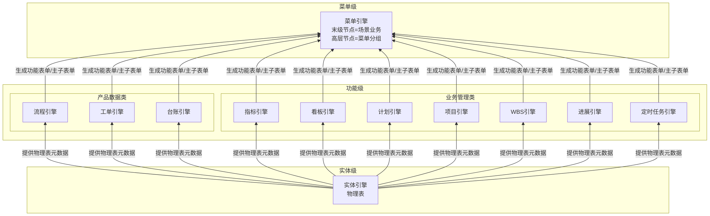

# EOS平台-业务-引擎规范

> **概述**：定义 EOS 平台的 UI 交互模型（含六种页面类型）、输出文档模型（正式/轻量文档、封面-正文 1:1 组装）、引擎分层体系与 CU 配置单元模型、操作页面组件与构件体系、三类产品（A1/A2/Bn）、资产治理业务，以及三路径（biz/eng/nfr）自闭环 Skill 的编制模式和职责定位。
>
> **版本**：v4.2 | **修订**：2026-07-10 | **说明**：恢复 PL6 产品架构层级——PL6-A 活动节点（正式文档任务的活动节点序列，跨 wft01~03 逐级展开）+ PL6-B 正文条目（满足三独立的正文条目）。PL 视角 PL0→PL5 扩展为 PL0→PL6。

---

## 一、平台界面与业务场景

### 1.1 平台UI

用户单击菜单引擎发布的末级菜单进入场景业务，运行时 UI 遵循以下交互模型：

**初始态**：浏览器窗口为**单窗全宽**，顶部多 TAB 对应场景业务下的多个主子表单；选中一行数据双击可下钻。初始态无底部导航面包屑。右侧辅助栏位展开，以两列（字段名 | 字段值）显示选中行的详细数据。

```
┌────────────────────────────────────────────────────────────────┬────────────────┐
│ [TAB: 主子表单A] [TAB: 主子表单B] [TAB: 主子表单C]            │ 辅助栏   [关闭] │
│                                                                │                  │
│ ┌──────────────────────────────────────────────────────────┐  │ 字段名 | 字段值  │
│ │ 主表单（列表/树表）                                       │  │ ────────────── │
│ │ ┌────────────────┬────────────────┬──────────────┐      │  │ 单号  | PO-2026 │
│ │ │行1             │                │              │      │  │ 日期  | 07-07   │
│ │ │行2*│ ← 双击选中行                                      │  │ 金额  | ¥12,000  │
│ │ │行3             │                │              │      │  │ 状态  | 审批中    │
│ │ └────────────────┴────────────────┴──────────────┘      │  │ 申请人| 张三      │
│ └──────────────────────────────────────────────────────────┘  │                  │
└────────────────────────────────────────────────────────────────┴────────────────┘
```

**分屏态**（下钻触发）：双击主表单行数据 → 窗口分裂为左右双窗。左窗为原主子表单（变窄），右窗显示选中行数据的子表单；右窗 TAB 对应子业务，每个关联实体占一个 TAB。右侧辅助栏位展开时以两列（字段名 | 字段值）显示选中行详情。

```
┌──────────────────────────┬─────────────────────────────┬────────────────────┐
│ 左窗（原窗变窄）            │ 右窗（新开）                  │ 辅助栏        [关闭]│
│                          │                             │                    │
│ [TAB: 主子表单A]         │ [TAB: 子业务X]             │ 字段名 | 字段值     │
│ ┌──────────────────┐    │ ┌──────────────────────┐    │ ────────────────  │
│ │ ┌───┬───┬───┐    │    │ │ ┌────┬────┬────┐    │    │ 单号  | PO-2026-01│
│ │ │行1│   │   │    │    │ │ │行a │    │    │    │    │ 日期  | 2026-07-07│
│ │ │行2 │ ← 双击   │    │ │ │行b │ ← 可下钻  │    │    │ 金额  | ¥12,000   │
│ │ │行3│   │   │    │    │ │ └────┴────┴────┘    │    │ 状态  | 审批中      │
│ │ └───┴───┴───┘    │    │ └──────────────────────┘    │ 申请人| 张三        │
│ └──────────────────┘    │                             │                    │
└──────────────────────────┴─────────────────────────────┴────────────────────┘
底部导航面包屑：场景业务 > 主子表单A > 子业务X
```

**持续下钻**：在右窗双击行 → 右窗移至左窗，新子业务 TAB 出现在右窗位置。可一直下钻直至系统下钻层级数限制。底部常驻面包屑导航，双击任意节点可跳转。

**交互规则**：

| 规则 | 说明 |
|------|------|
| 初始单窗 | 进入场景业务时为单窗+右侧辅助栏展开，顶部多TAB；不下钻不分屏 |
| 主子表单 TAB | 顶部 TAB 对应该场景业务下的多个主子表单 |
| 首次下钻 | 在主表单双击某一行数据触发分屏，右窗显示子表单数据 |
| 递归下钻 | 右窗→左窗，新右窗出现，直到系统层级数限制 |
| 面包屑导航 | 底部常驻，显示当前层级路径；双击任意节点跳转至该层级 |
| 子表单显示规则 | 功能引擎基于主表单行数据内容匹配规则，动态确定展示子表单集合 |
| 辅助栏展开态 | 右栏展开，以两列（字段名\|字段值）显示选中行详情；主内容区向左缩 |
| 辅助栏切换 | 展开态下切换选中行，辅助栏自动更新为新的行详情 |
| 辅助栏关闭操作 | 单击"关闭"按钮，辅助栏关闭，按钮显示"编辑"；主内容区恢复全宽 |
| 辅助栏展开操作 | 单击"编辑"按钮，辅助栏展开；分屏态下辅助栏展开时内容区向左缩 |

### 1.2 页面类型

功能表单对用户呈现的页面类型仅为以下六种有限模式，每种模式描述功能表单在窗口中的布局方式和交互范围：

| 序号 | 页面类型 | 描述 | 适用场景 |
|------|---------|------|---------|
| ① | **单窗列表+辅助栏** | 顶部 TAB，主区域为数据列表（表格），右侧为辅助栏位 | 纯列表管理，如实体数据维护 |
| ② | **单窗树表+辅助栏** | 顶部 TAB，主区域为树形结构表，右侧为辅助栏位 | 树形数据管理，如分类/BOM管理 |
| ③ | **单窗单据页** | 顶部 TAB，主区域为单据页（字段+操作按钮），可选配右侧辅助栏 | 独立录入/编辑/审批页 |
| ④ | **左窗主表+右窗子表+辅助栏** | 分屏模式，左窗为列表/树表，右窗为对应子业务数据，辅助栏在右侧 | 1:N 主子数据管理 |
| ⑤ | **全屏单据页** | 无顶部 TAB，整页为一张单据页，可选配右侧辅助栏 | 大篇幅录入/展示，如合同编辑 |
| ⑥ | **弹窗** | 模态弹出页面，非独立 TAB | 临时焦点操作，如选择数据 |

### 1.3 辅助栏

辅助栏是右侧可展开信息面板，可出现在任意页面类型上（①~⑤），行为在所有页面类型上保持一致：

**关闭态**：
- 按钮标签显示"编辑"
- 主内容区（单窗或双窗）全宽显示

**展开态**（单击"编辑"或选中行后）：
- 主内容区向左缩，辅助栏占据右边空间
- 辅助栏以两列单据页方式显示选中数据行的详情——第一列字段名称，第二列字段值
- 当用户在主内容区选择另一行数据时，辅助栏自动切换显示新选中行的详细信息

**关闭**（单击"关闭"按钮）：
- 辅助栏关闭
- 主内容区向右展开至屏幕边，恢复全宽

### 1.4 平台菜单

菜单引擎（`@engine-menu`）生成并维护 EOS 平台的多级菜单树，分为两类节点：

- **非末级节点**：定义所属父节点、显示顺序、可见性和可达性权限——仅承载分组和导航。
- **末级节点**：定义所包含的主子表单部件序列（即**场景业务**）、显示顺序和依赖关系，以及该节点的可见性和可达性权限。

菜单视角（ML）自上而下为：M0 平台 → M1 一级菜单 → M2 二级菜单 → M3 三级菜单 → M4 末级菜单（→SL5 场景业务）。菜单引擎对每条场景业务无条件支撑，无需判定。

**权限归属**：菜单节点对角色/人员的可见或不可见规则，由菜单引擎承载。物理表数据行或列对角色/人员的权限，由功能引擎承载。

### 1.5 业务场景

**场景业务**是 STR-F（相关方功能需求架构末级节点）的组织单元。每条场景业务定义一条**端到端业务闭环**——从需求提出到需求被满足并确认的完整链路。

场景业务内部为一组有先后流转依赖的**输出文档序列**：

```
场景业务
  │
  ├── 输出文档1
  ├── 输出文档2
  ├── 输出文档3
  ├── ...
  └── 输出文档N
```

在 EOS 平台上，场景业务（SL5）由菜单引擎的末级节点编排支撑——末级菜单所包含的功能表单/主子表单序列即为场景业务的运行时形态。

**场景业务的类型**由 AI 根据 OR 语义判定：

| 类型 | 识别词 | 闭环标准 |
|------|--------|---------|
| **执行类（D）** | 创建/提交/审批/交付/验收等动作词 | D 闭合——从需求提出到需求满足 |
| **管理类（PCA）** | 计划/监控/分析/纠正/识别等动作词 | PCA 闭合——计划→监控→分析→纠正 |

D 和 PCA 仅在正文数据类型上有差异（产品数据 vs 管理数据），在 wft01/02/03-biz 的处理逻辑上**完全同构**——都是场景业务→输出文档序列→每个文档有封面+正文+任务+引用。区别在于：D 类输出文档的正文是产品数据（物料/价格/检验值），文档间流转以输入-输出传递链为主；PCA 类输出文档的正文是管理数据（指标定义/看板布局/计划任务/风险描述/问题记录），任务类型=计划的文档发布后通过任务关系触发流程/工单。类型判定仅影响 wft02-biz 的引擎推断偏好和 wft03-biz 的配置建议，不影响处理流程结构。

> 输出文档的完整模型见 §二。

## 二、输出文档模型

**输出文档（PL5）** 是场景业务的组成单元——每条场景业务由一组有先后流转依赖的输出文档序列定义。输出文档是 EOS 平台的核心信息载体，其模型回答三个基础问题：文档是什么、由什么组成、如何流转。

> **核心结论**：文档不是引擎概念，而是**实体组装模式**——封面实体（DocumentCover 表一行，全系统一张表）+ 正文实体（1:1）+ 支持信息（→其他文档的多对多引用）+ 处理配置（wft02-biz 定义任务节点，wft03-biz 生成引擎 CU 配置）。封面和正文都是普通实体，由实体引擎生成物理表；正文被各引擎按需转化为功能表单，封面由功能引擎的表单能力转化为封面表单，两者由功能引擎的组装能力按 1:1 主子关系组装。因此**不设独立的"文档引擎"**——文档是实体组装模式，而非独立引擎概念。台账类业务由台账引擎（`@engine-ledger`）支撑——将物理表转换为台账功能表单并按主子关系装配为主子功能表单（详见 §3.2）。

### 2.1 封面判定：正式文档与轻量文档

文档是否需要封面，取决于它是否有**独立于正文 CRUD 的生命周期**——需要审批流转、版本追溯、派发验收或独立状态变迁的文档，才有封面。

```
正式文档（有封面，有独立生命周期）              轻量文档（无封面，正文即文档）
─────────────────────────────              ─────────────────────────
DocumentCover 表一行                         无封面行
  ├── 单据号/标题                             正文实体 = 文档本身
  ├── 状态/版本                               1 行 = 1 文档内容条目实例
  ├── 创建人/部门/日期                         可选的任务类型（流程/工单/计划）——
  ├── 处理配置（可选的流程/工单/计划）             任务状态由对应引擎在正文实体上直接管理
  └── 1:1 → 正文实体（1 行 = 1 文档内容条目实例）

例子：                                      例子：
  采购申请单/检验记录/不合格品报告               会议纪要（流程审批）/技术规范条目/
  项目立项书/设备维修工单                       参考文档/经验教训/公告通知
  指标文档（独立维护，有审批/版本）
  看板文档（独立维护，有审批/版本）
```

### 2.2 正式文档的组成

```
正式文档（PL5）
  │
  ├── 封面实体（DocumentCover 表一行）
  │     → 记载单据号/标题/状态/版本/创建人/部门/日期等文档级元数据
  │     → 由功能引擎的表单能力转化为封面功能表单（单据头样式）
  │
  ├── 正文实体（1:1 绑定封面行，1 行 = 1 文档内容条目实例）
  │     → 正文即实体——该文档承载的业务数据内容
  │     → 由对应引擎转化为功能表单，形态根据业务而定：
  │       台账（列表/树表）、指标（列表+图示 2×3）、看板（视图/卡片/泳道）、
  │       项目（阶段/里程碑）、WBS（树形分解）、计划（甘特/任务）、
  │       流程（审批流转）、工单（派发/处理/验收）
  │     → 同一正文可被多个引擎转化，互不冲突
  │
  ├── 支持信息（→其他文档的多对多引用）
  │     → 被引用目标是正式文档时指向 DocumentCover 行，轻量文档时指向正文实体行
  │     → 引用关系带角色标签（输入文档/规范文档/指南文档/合规文档/资源文档）
  │
  ├── 处理配置（wft02-biz 定义任务节点，wft03-biz 生成引擎 CU 配置）
  │     → 封面行被流程/工单/计划引擎驱动流转的节点序列
  │     → 每个节点定义：处理角色、可执行动作、状态变迁
  │     → 节点内容展开为 PL6-A 活动节点 ↓
  │
  └── PL6-A 活动节点（↑ 处理配置的内容展开，有任务类型时存在）
        → 任务类型确定后，wft01 在业务语言层捕获/推断主要活动节点（"部门经理审批，通过后到财务"）
        → wft02 将业务节点转化为引擎 CU 候选（引擎语言），补全系统自动节点/异常路径/超时处理
        → wft03 生成活动节点的引擎 CU 配置需求
        → 每个活动节点定义：处理角色、可执行动作、状态变迁
```

### 2.3 PL6-B 正文条目

输出文档的正文条目满足以下**三独立**条件时，展开为 PL6-B：

- **独立名称**：每个条目有独立的名称
- **独立定义要素**：每个条目有独立的定义要素（如指标的口径/维度、看板的布局/指标集、风险的概率/影响/缓解措施、问题的根因/纠正措施）
- **独立生命周期**：每个条目的生命周期独立于容器文档（可独立创建/修订/废弃）

```
PL5 输出文档（正文条目满足三独立）
  │
  ├── 封面实体（同 §2.2）
  ├── 正文实体（容器——该清单作为一个整体的元数据）
  │     → 条目内容展开为 PL6-B 正文条目 ↓
  │
  └── PL6-B 正文条目（↑ 正文实体的条目展开，逐条目）
        ├── 条目1：独立名称 + 独立定义要素 + 独立生命周期
        ├── 条目2：独立名称 + 独立定义要素 + 独立生命周期
        ├── ...
        └── 条目N
```

**满足三独立**：指标清单（指标条目）、看板清单（看板条目）、计划清单（计划条目）、风险清单（风险条目）、问题清单（问题条目）、行动项清单、改进措施清单等——PCA 场景的全部输出文档正文条目均满足三独立。

**不满足三独立**：事务类文档的物料行（运行时交易数据，无独立生命周期）、内容类文档的议题条目（内容实例，无独立定义要素）。轻量文档无封面，正文即是全部内容，不展开 PL6-B。轻量文档同样可配置任务类型（如会议纪要配置流程进行审批流转），任务状态由对应引擎在正文实体上直接管理。


### 2.4 轻量文档的组成

```
轻量文档（PL5）
  │
  ├── 正文实体（无封面行，1 行 = 1 文档内容条目实例）
  │     → 被功能引擎的表单能力直接转化为台账（列表/树表）
  │     → 无封面，正文即文档
  │
  ├── 处理配置（可选的任务类型：流程/工单/计划）
  │     → 任务状态由对应引擎在正文实体上直接管理，无封面行承载
  │
  └── 支持信息（→其他文档的多对多引用）
        → 被引用目标为轻量文档时，直接指向正文实体行
```

### 2.5 设计规则

| 规则 | 说明 |
|------|------|
| **R1** | 正文实体始终存在——所有文档都有正文（1 行 = 1 文档内容条目实例） |
| **R2** | 封面实体按需——仅当文档有独立于正文 CRUD 的生命周期时才存在 |
| **R3** | 封面实体存在时，DocumentCover 行与正文行严格 1:1 + `derived_from` 追溯链（每版本独立，旧版本归档） |
| **R4** | 场景业务中第一个有任务类型的输出文档，其任务类型必然是计划。此文档本体是开发/记录类文档，正文为产品数据或管理数据，非"计划清单" |
| **R6** | 有任务类型时，必须展开 PL6-A 活动节点——wft01 在业务语言层捕获/推断主要节点，wft02 转化为引擎 CU 候选并补全系统节点/异常路径，wft03 生成 CU 配置。正式文档的活动节点附着于封面行，轻量文档的活动节点附着于正文实体 |
| **R7** | 正文条目满足三独立条件（独立名称 + 独立定义要素 + 独立生命周期）的，展开为 PL6-B。事务类文档的物料行和内容类文档的议题条目不满足三独立，不展开 PL6-B |

### 2.6 任务间触发关系

**任务类型三选一**：正式文档和轻量文档均可配置零个或一个任务类型——**计划**（策划→发布）、**流程**（审批流转）、**工单**（派发/处理/验收）。区别在于：正式文档的任务状态由封面行承载（处理配置附着于 DocumentCover 行），轻量文档的任务状态由对应引擎在正文实体上直接管理（无封面行）。

**任务关系规则**：

| 规则 | 说明 |
|------|------|
| **R5** | 任务间可任意触发——任何任务类型（计划/流程/工单）均可触发任何任务类型（包括同类型），触发关系由业务需要决定，无类型限制 |

### 2.7 PCA 场景的 P/C/A

PCA 场景业务与 D 类完全同构——由输出文档序列构成，每个输出文档按需配置处理配置（任务类型）。

PCA 场景**必须包含一个输出文档为计划清单**（正文条目满足三独立，展开 PL6-B）。其正文条目中：

- **第 1 条**为"策划本次计划清单及其余清单"，任务类型为**计划**（策划→发布）。策划主管按周期进入 PCA 菜单，创建该条目后即按计划引擎的生命周期运行
- **后续条目**逐条对应 P 阶段各输出文档的策划任务——"制定指标清单"、"识别风险清单"、"设计看板清单"、"梳理问题清单"等

第 1 条发布完成后，触发后续条目的执行。后续条目逐一触发各自对应的输出文档——这些文档的任务类型**按业务需要选择**（流程/工单/计划），不强制为计划。

C（监控）和 A（改进）是任务链运行时推进的结果：P 阶段触发的计划/流程/工单执行 → 指标引擎持续度量 → 看板呈现 → 发现偏差 → 生成风险条目/问题条目（→风险清单/问题清单，条目按需走流程或工单处理） → A 阶段改进完成。改进完成后可触发下一轮 P 的计划清单第 1 条（新一轮策划），也可由策划主管按周期手动启动。

---

## 三、基于引擎生成业务

### 3.1 业务及层级

EOS 平台使用四套视角层级描述业务在不同维度上的组织结构：

| 视角 | 编号 | 自上而下 |
|------|------|---------|
| **ML**（菜单视角） | M0→M4 | 平台 → 一级菜单 → 二级菜单 → 三级菜单 → 末级菜单（→SL5） |
| **SL**（角色场景视角） | SL0→SL6 | 平台 → 业务域 → 产品类型 → 角色 → 角色职责 → 场景业务 → 场景部件/主子表单 |
| **PL**（输出产品视角） | PL0→PL6 | 平台 → 业务域 → 产品类型 → 构件 → WBS → 输出文档 → 活动节点/正文条目 |
| **EL**（引擎视角） | EL1→EL3 | 菜单引擎 → 功能引擎 → 实体引擎 |

> 其余视角层级的完整定义见 `23-eos-output-architecture.md` 和 `24-eos-business-assets.md`。

**PL5 输出文档**的组成见 §二——封面实体 + 正文实体（1:1）+ 支持信息引用 + 处理配置。

**PL6 活动节点/正文条目**——PL5 之下设 PL6，分为两个子类型：
- **PL6-A 活动节点**：有任务类型时，任务的活动节点序列构成 PL6-A——wft01 在业务语言层捕获/推断主要节点，wft02 转化为引擎 CU 候选并补全系统节点/异常路径，wft03 生成 CU 配置。正式文档的活动节点附着于封面行，轻量文档的活动节点附着于正文实体。跨三个设计阶段逐级展开，是架构节点而非运行时配置
- **PL6-B 正文条目**：正文条目满足三独立条件（独立名称 + 独立定义要素 + 独立生命周期）的，展开为 PL6-B。PCA 场景的全部输出文档（指标清单/看板清单/计划清单/风险清单/问题清单/行动项清单/改进措施清单等）正文条目均满足三独立。事务类文档的物料行（运行时交易数据）和内容类文档的议题条目（内容实例）不满足三独立，不展开 PL6-B


> **"输出文档"的指代**：本文档及 biz 路径各 Skill 中提及的"输出文档"，均指代文档的**内容本身**而非其容器或文件名。例如"相关方需求文档"指需求条目本身，"采购履约看板"指该看板的定义与布局本身。看板上的每个具体看板/指标为该输出文档的正文内容条目，在 PL6-B 层展开为独立设计对象。文档的承载表单（如 @engine-kanban）仅为组织容器，不影响每个条目作为独立 PL6 节点的地位。

**输出文档**按生成方式分为两类：

- **内置 CAX**（平台内引擎生成）：内容由 EOS 功能引擎直接生成，沿引擎间制品流转链逐级生成——对应物理表（实体引擎）→转换为功能表单→按主子关系组装为主子表单。
- **外置 CAX**（平台外工具生成）：文档以文件名及附件形式回传至 EOS 平台，平台负责管理其任务、状态、责任人、版本、附件、评审和归档。

### 3.2 引擎及层级

EOS 平台通过三层引擎逐级生成：下层引擎生成制品，上层引擎消费该制品后生成自身制品，自底向上逐级递进，从物理表一直生成到用户可见的菜单：



简化版引擎间制品流转：

```text
实体引擎 ──生成──→ 物理表
                    ↓ 被消费
               功能引擎 ──生成──→ 功能表单 / 主子表单
                                      ↓ 被消费
                                 菜单引擎 ──生成──→ 菜单树 + 场景业务
```

各引擎为生成器：下级引擎生成制品，上级引擎消费该制品后生成自身制品，逐级递进直至平台可发布的末级菜单。

**引擎全景**：

| 序号 | 引擎ID | 名称 | 层级 | 一句话定义 |
|------|--------|------|------|-----------|
| 1 | @engine-entity | 实体引擎 | 实体级 | 基于数据库生成物理表，提供增删改查、导入/导出和追踪关系 CRUD 等基本功能 |
| 2 | @engine-flow | 流程引擎 | 功能级（产品数据类） | 配置流程节点、流转规则、审批行为和状态迁移 |
| 3 | @engine-workorder | 工单引擎 | 功能级（产品数据类） | 配置工单类型、派发规则、处理流程、验收标准和归档策略 |
| 4 | @engine-ledger | 台账引擎 | 功能级（产品数据类） | 基于物理表生成台账功能表单并按主子关系装配为主子功能表单，用于台账类业务（设备台账等） |
| 5 | @engine-project | 项目引擎 | 功能级（业务管理类） | 基于物理表配置项目对象、阶段、里程碑、成员和项目状态 |
| 6 | @engine-wbs | WBS 引擎 | 功能级（业务管理类） | 基于物理表配置 WBS 层级、分解规则、节点属性和进度汇总方式 |
| 7 | @engine-task | 计划引擎 | 功能级（业务管理类） | 基于物理表配置计划任务、时间约束、依赖关系和执行状态 |
| 8 | @engine-kanban | 看板引擎 | 功能级（业务管理类） | 配置指标维度、度量口径、聚合规则、展示方式和看板视图布局，为物理表生成指标型+看板型功能表单 |
| 9 | @engine-indicator | 指标引擎 | 功能级（业务管理类） | 定义指标的名称/口径/目标/维度/图示，生成指标结果功能表单（列表模式/图示模式 2×3网格） |
| 10 | @engine-progress | 进展引擎 | 功能级（业务管理类） | 基于物理表配置进展填报、进度口径、状态更新和进展记录 |
| 11 | @engine-scheduler | 定时任务引擎 | 功能级（业务管理类） | 基于物理表配置定时触发规则、任务事件和执行策略 |
| 12 | @engine-menu | 菜单引擎 | 菜单级 | 配置菜单树节点和场景编排 |

> EL 三层中，「功能引擎」是层级（EL2）而非独立引擎资产。上表中 10 个具体功能引擎均归属功能级。菜单引擎（EL1）和实体引擎（EL3）同时是层级名称和该层级唯一的引擎资产。

**引擎职责**：

- **实体引擎**：基于数据库生成物理表，提供增删改查、导入/导出和追踪关系 CRUD 等基本功能。物理表是上层引擎的元数据基础。
- **功能引擎**：将物理表转换为功能表单并按主子关系（1+N）组装为主子表单，配置行/列级数据访问权限。承载四方面能力：① 表单能力（结构/字段/布局/校验/行为/发布）；② 功能能力（各具体引擎为表单增加的功能）；③ 组装能力（主子表单组装、子表单显示规则匹配、双击下钻）；④ 权限能力（数据行/列对角色/人员的可见、可编辑或不可访问约束）。
  - **产品数据类**（流程/工单/台账）：支撑产品数据文档的开发与管理——流程引擎管理审批流转，工单引擎管理派发/处理/验收/关闭，台账引擎将物理表转换为台账功能表单并按主子关系装配为主子功能表单（用于设备台账、风险清单、问题清单、行动项清单、改进措施清单等台账类业务）。封面-正文 1:1 绑定由功能引擎的组装能力统一完成，不设独立文档引擎。
  - **业务管理类**（指标/看板/项目/WBS/计划/进展/定时任务）：支撑过程管理数据的生成与管理——指标引擎管理指标定义与双模式展示（列表/图示 2×3网格），看板引擎管理看板布局与视图泳道
- **菜单引擎**：生成并维护多级菜单树，末级节点编排场景业务。

### 3.3 配置单元

**配置单元选配模型**：每个引擎包含若干配置单元（可独立选配的 IPO），部分配置单元即可让业务运行——引擎提供能力池，配置人员按业务需要从中挑选组合。

**配置单元的功能本质**：CU（配置单元）是在实体页面（§1.2 的六种页面类型之一）上增加一组业务操作能力。业务配置人员打开 CU 对应的功能表单，操作页面上的功能按钮、编辑各配置要素，提交后系统校验信息的正确性和完备性，通过后保存配置信息。引擎按 CU 定义生成运行期制品（物理表、功能表单、菜单入口），配置人员或业务使用人员即可使用该制品及其功能。

具体而言：
- **实体引擎 CU** → 定义实体及字段，在页面类型①/②/④/⑥上提供增删改查能力。封面实体（DocumentCover 表）和正文实体均由此类 CU 定义
- **功能引擎 CU**（如 @engine-flow CU）→ 在已有实体页面上增加审批流转按钮和流程节点配置能力
- **功能引擎 CU**（如 @engine-workorder CU）→ 在工单页面上增加派发/处理/验收按钮和生命周期管理能力
- **功能引擎 CU**（如 @engine-ledger CU）→ 在台账页面上将物理表转换为台账功能表单（列表/树表），按主子关系装配为主子功能表单，提供条目化数据的增删改查和导入/导出能力
- **功能引擎 CU**（如 @engine-indicator CU）→ 在指标页面上增加指标定义、口径配置、列表/图示双模式展示切换和 2×3 网格布局配置能力
- **功能引擎 CU**（如 @engine-kanban CU）→ 在看板页面上增加看板布局、视图泳道和展示方式配置能力

### 3.4 业务组装

**从输出文档到引擎支撑**（自顶向下）：STR-F 架构末级节点是场景业务，场景业务由输出文档序列细化定义。从输出文档出发，按生成方式分两条路径确定支撑引擎链：

- **内置 CAX**：内容由平台内引擎生成。正式文档——封面实体和正文实体由实体引擎生成物理表，封面由功能引擎的表单能力转化为封面表单（单据头样式），正文由对应引擎（流程/工单/指标/看板/项目/WBS/计划/进展/台账等）转化为正文功能表单；封面表单与正文表单由功能引擎的组装能力按 1:1 主子关系组装。轻量文档——正文实体由实体引擎生成物理表，正文由对应引擎转化为功能表单，不产生封面表单和主子组装。若正文行与其他文档存在层级引用关系（如双击下钻），按 1+N 扩展组装
- **外置 CAX**：内容在平台外工具生成，以文件名及附件回传。输出文档挂接到计划功能表单，由计划引擎（`@engine-task`）管理任务、状态、责任人、版本、附件、评审和归档；附件能力由实体引擎的内置子业务配置单元提供；组装时 N=0

无论内置或外置 CAX，全部主子表单序列最终由菜单引擎末级节点编排为场景业务，并生成平台菜单入口。

**组装工序**：

**物理表生成**：实体引擎为输出文档的封面实体（如需要）和正文实体生成物理表，提供增删改查、导入/导出和追踪关系 CRUD 等基本数据操作能力。轻量文档仅生成正文实体物理表。

**1:1 主子组装**：正式文档的封面实体物理表由功能引擎的表单能力转化为封面表单（单据头样式），正文实体物理表由对应引擎转化为正文功能表单；功能引擎的组装能力将二者按 1:1 主子关系组装为一个主子表单。轻量文档无封面，正文功能表单即文档本身，此步跳过。

**1+N 下钻扩展**：若正文行与其他文档存在层级引用关系（双击下钻到目标文档），在 1:1 基础上扩展——目标文档的功能表单作为子表单挂接到当前主子表单。

**菜单编排**：全部主子表单序列（含内置 CAX 和外置 CAX 的产出）由菜单引擎末级节点编排为场景业务，按输出文档的流转顺序排列为顶部 TAB，生成平台菜单入口。外置 CAX 文档不产生功能表单（N=0），在菜单中展示为计划引擎管理的任务与附件入口。

---

## 四、操作页面组件与构件

> 本章定义 EOS 平台为用户提供的操作页面组件体系，及其与引擎配置单元（CU）的对应关系。操作页面组件是平台 UI 的结构层次——多级横版为容器框架，列表/单据/弹窗/指标/辅助栏为容器内的功能组件。与 §1.2 的功能表单页面类型（描述单个功能表单的布局模式）正交。

### 4.1 操作页面组件

平台为用户提供以下六种操作页面组件：

| 序号 | 组件 | 描述 |
|------|------|------|
| 1 | **多级横版** | 初始态=菜单栏+单窗+辅助栏；分屏态=菜单栏+左右双窗+辅助栏。窗口顶部 TAB 对应功能表单 |
| 2 | **列表页面** | 显示在多级横版某窗口的标签页中，数据以树表或单级列表呈现；操作功能以功能按钮、右键操作项或快捷键体现 |
| 3 | **单据页** | 在列表页面上选中某行数据进入详情时，平台以新开窗口并以单据方式显示该行详情 |
| 4 | **辅助栏** | 右侧可展开信息面板，行为定义见 §1.3 |
| 5 | **弹窗页** | 编辑某字段时，若字段值来自某实体，则弹窗显示该实体数据列表以供选择确定 |
| 6 | **指标页面** | 显示在多级横版某窗口的标签页中，各指标以图示方式展示；操作功能以功能按钮、右键操作项或快捷键体现 |

### 4.2 构件

**构件**是安装在操作页面组件上的公共功能单元，可跨组件复用——同一构件在不同页面组件上提供相同的显示和操作功能。如功能按钮构件，安装在列表页面即提供工具栏操作按钮，安装在单据页即提供操作区按钮，安装在指标页面即提供图表操作入口。典型公共构件包括：功能按钮、右键菜单项、快捷键绑定、列定义、字段布局、图表类型、钻取等。

### 4.3 CU 与操作页面组件及构件的对应关系

每个 CU 的功能体现在操作页面组件的特定构件上：

- **配置时**：CU 对应一个硬代码实现的配置页面（非功能引擎生成），配置人员在此页面上编辑配置要素，提交后引擎按 CU 定义处理
- **运行时**：引擎按 CU 定义，在对应的操作页面组件上渲染构件及其功能——如 @engine-flow CU → 在单据页上渲染审批按钮构件和流程节点构件

### 4.4 扩展规则

业务需求可能驱动操作页面组件及构件的扩展：

1. **构件级**：现有页面组件可承载，仅需新增或修订构件（如在列表页面上增加批量导入按钮构件）
2. **页面组件级**：现有页面组件无法承载，需新增操作页面组件类型
3. **CU 级**：新构件/组件需要新 CU 或 CU 扩展支撑 → 形成 FR-ENG 线索，经 eng 路径（§八）推进

biz 路径在设计中发现构件或页面组件缺口时，输出 FR-ENG 线索并标注缺口层级（构件 / 页面组件 / CU）。

---

## 五、三类产品 A1/A2/Bn

EOS 平台的业务配置和运行围绕三类产品展开：

| 产品 | 归属域 | 构件 | 末级节点 |
|------|--------|------|---------|
| **A1** | 流程与IT | 引擎 | CU（配置单元） |
| **A2** | 各业务域 | 角色 | 场景业务 |
| **Bn** | 各业务域 | 产品构件 | 构件的产品数据 |

> 三类产品的完整架构定义见 [23 号资产](../../80-pl4eos-2-eosdata/23-eos-output-architecture.md)。

### 5.1 A1产品

A1 是**平台引擎产品**，归属流程与IT域。构件为引擎（`@engine-entity`、`@engine-flow` 等 12 个），末级节点为 CU（配置单元，详见 [25 号资产 §2](../../80-pl4eos-2-eosdata/25-eos-engine-models.md#§2-引擎定义)）。

每个 CU 描述一个可独立配置、校验、发布的引擎元数据对象，以 IPO（Input-Process-Output）定义：Input 为配置要素，Process 为系统处理说明，Output 为运行期业务能力。

对应设计路径为 **eng 路径**：wft01-eng（场景业务）→ wft02-eng（配置单元）→ wft03-eng（操作页面）→ wft05-eng（前后端组件）。

> **STR-E 的双重身份**：wft01-eng 产出的 STR-E 节点（引擎场景业务）在 A2 视角下是 PL5 末级节点——即流程与IT域中**业务配置人员**的场景业务（§5.2）；在 A1 视角下，该场景业务对应的引擎是 A1 的 PL3 构件节点。一个引擎对应一个 STR-E（~12 引擎 → ~12 STR-E），引擎的配置业务（从打开配置页到运行期能力可用）即为该 STR-E 的端到端闭环。CU 是 STR-E 的细分节点——与 STR-F 下辖输出文档的层级关系完全对称。

### 5.2 A2产品

A2 是**各业务域的角色场景**，构件为角色（如采购员、库存管理员），末级节点为场景业务。沿角色场景视角（SL）展开：SL3 角色类型 → SL4 角色职责 → SL5 场景业务 → SL6 场景部件。

每个 A2 产品回答：某角色在哪个菜单入口、按什么顺序使用哪些场景部件、完成端到端的职责闭环。场景业务（SL5）与 STR-F 末级节点 1:1 映射。

对应设计路径为 **biz 路径的前半段**：wft01-biz（场景业务）→ wft02-biz（输出文档，组装 A2 产品业务架构）。

> **流程与IT域的 A2 产品**：流程与IT域同样有 A2 产品——**业务配置人员**是该域的核心角色类型（此外还有业务架构管理员、数据治理员，见 §六）。业务配置人员的场景业务（SL5）即 STR-E ——一个引擎的配置业务为一个场景业务（~12 引擎 → ~12 STR-E）。这些 STR-E 与采购/生产/售后等业务域的 STR-F 在架构层级上完全同构：同样是 SL5 末级节点、同样下辖细分节点（CU vs 输出文档）、同样是角色端到端职责闭环。区别在于场景业务的产出物不是业务文档，而是**可用的平台能力**。

### 5.3 Bn产品

Bn 是**各业务域的输出产品**，构件为产品构件（如单据、流程、工单），末级节点为构件的产品数据。沿产出视角（PL）展开：PL1 业务域 → PL2 E2E 项目业务 → PL3 构件类型 → PL4 WBS → PL5 业务输出文档。末级节点为构件的产品数据。

每个 Bn 产品回答：某类输出文档（如采购申请单）属于哪个业务域/构件类型，需要哪些前序文档和业务规则才能生成。

对应设计路径为 **biz 路径的后半段**：wft02-biz 装配 Bn 产品业务架构 → wft03-biz 生成各层配置需求。A2 与 Bn 通过场景部件交汇——场景部件在 SL 侧为 SL6、在 PL 侧为 PL5，是双视角的连接点。

---

## 六、平台资产治理业务

### 6.1 菜单配置

菜单配置是平台资产治理的基础业务，由业务架构管理员角色执行。核心职责：维护 EOS 平台的菜单树结构——新建/修改/删除菜单节点，配置节点的层级归属、显示顺序、可见角色/人员，以及末级节点到场景业务的映射。

菜单配置的 STR-F 已预置在 `02-*.md`（相关方需求架构文档）中，作为 EOS 平台运转的架构前提。业务链文档包括：菜单节点登记表、菜单结构变更记录、菜单可见性配置表。

### 6.2 资产管理

资产管理覆盖平台架构资产的全生命周期维护，由业务架构管理员角色执行。核心职责：维护 23~28 号资产的定义、关系和追溯引用——包括产品架构节点（23）、业务资产（24）、引擎资产（25）、文档定义（26）、资源资产（27）和看板指标资产（28）的登记、变更和废弃。

资产管理的 STR-F 已预置在 `02-*.md` 中。业务链文档包括：资产登记表、资产变更记录、引用关系维护记录、资产一致性检查报告。

### 6.3 数据治理

数据治理覆盖平台数据标准和质量规则的维护，由数据治理员角色执行。核心职责：维护数据字典、编码规则、状态库等基础资源库——确保平台各引擎引用的数据标准一致、编码规则统一、状态定义规范。

数据治理的 STR-F 已预置在 `02-*.md` 中。业务链文档包括：数据标准维护记录、数据质量规则配置表、数据问题单处理记录。

> 治理 STR-F 的完整清单以 `02-*.md` 为准，AI 运行时动态读取。上述三类治理业务当前 OR 承接为空，由人类在 EOS 平台建设过程中逐批增补。

---

## 七、业务应用系统设计

> biz 路径：FR-BIZ OR → wft01-biz → STR-F → wft02-biz → BA → wft03-biz → 配置需求方案（相关方需求架构文档 `02-*.md` 在 wft01-biz 产出 STR-F 后形成）
>
> 末级节点渐进链：场景业务 → 输出文档 → 活动节点/正文条目（PL6）→ 配置需求方案
>
> 以下各节定义 biz 路径每个 Skill 的末级节点和任务清单。

### 7.1 原始需求处理（wft01-biz）

**wft01-biz** 将非结构化的 FR-BIZ OR 转化为结构化的 STR-F 场景业务方案。职责：基于OR推断定义场景业务节点和输出文档（含任务模式、主要节点和任务关系，用业务语言），基于端到端补充业务需求。**本 Skill 的核心使命是"向业务方证明我听懂了你的业务"**——产出供人类确认理解，而非设计方案。D 和 PCA 场景的处理逻辑完全同构。

末级节点：场景业务
1. 推断场景业务节点——判定类型（执行类D / 管理类PCA）、命名、边界定义
2. 推断输出文档序列——逐文档识别，判定封面模式（正式/轻量：有独立生命周期→正式，否则→轻量）、定义正文实体类型
3. 判定任务类型与捕获/推断主要节点（**业务语言**，供人类确认）：
   - 任务类型三选一：**计划**（策划→发布）、**流程**（审批流转）、**工单**（派发/处理/验收）
   - 第一个有任务类型的输出文档，任务类型必然是计划（R4）——后续文档的任务类型可为流程/工单
   - OR 明确描述节点 → 原样捕获（"部门经理审批，通过后到财务"）
   - OR 只提了模式 → 判定类型，节点标 `[待wft02推断]`
   - OR 缺失 → 推断类型 `[推断]`，节点标 `[待wft02推断]`
4. 推断任务关系（**业务语言**）——文档之间的任务触发关系：
   - 文档间流转顺序（输出文档A→输出文档B的输入输出链）
   - 任务间触发关系：任何任务类型均可触发任何任务类型（包括同类型），由业务需要决定
5. 基于E2E补充业务需求——闭合检查（端到端闭环），检出缺口→生成补充OR材料
6. 推断输出文档的正文转化引擎——按文档类型匹配引擎（流程/工单/指标/看板/项目/WBS/计划/进展等），全量标注`[推断]`
7. 推断输出文档所属Bn

> 以上为 wft01-biz 完成的设计任务的**逻辑罗列**，非严格执行顺序。任务类型与节点（3）是 PL6-A 活动节点的起点——wft01 在业务语言层捕获/推断主要活动节点，供人类确认"你理解的任务流转关系是否正确"。活动节点在 wft02-biz 和 wft03-biz 中逐级展开。

### 7.2 业务架构开发（wft02-biz）

**wft02-biz** 将 STR-F 的场景业务展开为 BA 方案——A2 角色场景视角 + Bn 输出产品视角。职责：生成 A2 产品业务架构，推断生成 Bn 产品业务架构；消费 wft01-biz 的任务类型、节点和任务关系（业务语言）→转化为引擎语言；展开 PL6-A 活动节点（补全系统节点/异常路径）并判定 PL6-B 正文条目（三独立判定）；推断输出文档的封面字段/正文结构/正文转化引擎/支持信息引用关系；基于 Bn 构件的 WBS 补充业务需求。D 和 PCA 处理逻辑完全同构。

末级节点：输出文档，细分节点：PL6-A 活动节点 / PL6-B 正文条目
1. 装配A2产品业务架构
2. 装配Bn产品业务架构
3. 推断Bn构件输出文档
4. 基于Bn补充业务需求
5. 定义输出文档方案——正式文档：封面字段（DocumentCover 表映射）+ 正文实体结构 + 正文转化引擎 + 支持信息引用；轻量文档：正文实体结构 + 正文转化引擎 + 支持信息引用（直接指向正文实体行）
6. 展开 PL6-A 活动节点（有任务类型时）——消费 wft01-biz 的任务类型与主要活动节点（业务语言），转化为引擎 CU 候选（引擎语言）：
   - 类型→引擎映射：计划→@engine-task / 流程→@engine-flow / 工单→@engine-workorder
   - wft01 已捕获的节点 → 映射到引擎 CU（角色→引擎角色配置，动作→引擎动作配置，状态变迁→引擎状态配置）
   - wft01 标注 `[待wft02推断]` 的节点 → 设计完整节点序列（含系统自动节点、异常路径、超时处理）
   - 全部活动节点标注 `[推断]`
7. 检测并展开 PL6-B 正文条目——判定输出文档的正文条目是否满足三独立（独立名称 + 独立定义要素 + 独立生命周期）→ 是则逐条目展开为 PL6-B 节点。事务类文档（采购申请单物料行）和内容类文档（会议纪要议题）不满足三独立，不展开
8. 任务关系引擎化——消费 wft01-biz 的任务关系（业务语言），转化为引擎可执行的触发规则：
   - 文档间流转顺序 → 输出文档序列编排
   - 任务间触发规则（任意触发模型：任何任务类型均可触发任何任务类型）→ 各引擎的任务间触发规则配置
   - 含触发条件（计划完成/流程到达某节点/工单验收通过）和触发后的任务启动参数

> **业务语言 → 引擎语言的转化**：wft01-biz 用业务方听得懂的话描述活动节点和关系，wft02-biz 将其转化为引擎能执行的 CU 规格，并检测正文条目是否满足三独立以展开 PL6-B。

### 7.3 系统需求开发（wft03-biz）

**wft03-biz** 将 BA 方案展开为各层配置需求。职责：生成菜单树方案及其配置需求；生成场景业务方案及配置需求；消费 wft02-biz 的引擎 CU 候选→生成具体 CU 配置需求（封面/正文/任务节点/任务关系/支持信息引用）；基于配置需求补充引擎需求。D 和 PCA 处理逻辑完全同构。

末级节点：各层配置需求方案
1. 生成菜单树方案及配置需求——菜单层级结构、末级节点→场景业务映射（→ @engine-menu CU）
2. 生成场景业务方案及配置需求——主子表单序列编排、显示顺序与依赖关系
3. 生成输出文档内容配置需求——封面字段 CU 配置 + 正文实体字段 CU 配置 + 正文转化引擎 CU 配置
4. 生成输出文档任务节点配置需求——消费 wft02-biz 的任务节点 CU 候选，生成具体的 @engine-flow / @engine-task / @engine-workorder CU 配置
5. 生成任务关系配置需求——消费 wft02-biz 的任务关系，生成任务间触发规则的引擎 CU 配置（触发条件/启动参数/任务衔接）
6. 生成支持信息引用配置——文档间多对多引用的 CU 配置及引用角色标签
7. 基于配置需求补充引擎需求——发现引擎能力缺口→生成 FR-ENG 线索

> wft03-biz 的产出是各层**配置需求**（描述在现有或新增引擎上如何配置实现方案），而非直接生成 SR-F 功能表单定义。SR-F 功能表单定义由各引擎开发完成后，按 wft03-biz 的配置需求进行配置实现。

---

## 八、平台能力系统设计

> eng 路径：FR-ENG OR → wft01-eng → STR-E → wft02-eng → BA → wft03-eng → SR-F → wft05-eng → PA（引擎相关方需求架构在 wft01-eng 产出 STR-E 后形成）
>
> 末级节点渐进链：场景业务 → 配置单元 → 操作页面 → 构件 → 前端组件 + 后端组件
>
> 以下各节定义 eng 路径每个 Skill 的末级节点和任务清单。

### 8.1 原始需求处理（wft01-eng）

**wft01-eng** 将 FR-ENG OR 转化为 STR-E 引擎场景业务方案。

**角色**：业务配置人员（流程与IT域）。该角色是 eng 路径的唯一角色——所有引擎的配置均由业务配置人员执行，因此 STR-E 的架构树上无需角色层做分组维度。

**STR-E = 一个引擎的配置业务**：每个引擎（`@engine-flow`、`@engine-kanban`、`@engine-indicator` 等）对应一个 STR-E，即该角色对该引擎的端到端配置业务——从打开配置页面、编辑配置要素、系统校验保存、发布装载、到运行期构件/功能可用的完整闭环。当前 12 个引擎 → 12 个 STR-E。

**STR-E 的双重身份**（详见 §5.1）：在 A2 视角下是 PL5 末级节点（流程与IT域的场景业务）；在 A1 视角下该引擎是 PL3 构件节点。

**末级节点**：场景业务（SL5 / PL5）。细分节点为 **配置单元（CU）候选**（名称级）——对称于 STR-F 下辖的输出文档。CU 的 BA 详细设计（IPO + 配置页面 + 业务页面）由 wft02-eng 完成。

任务清单：
1. 推断生成引擎场景业务节点（接收 FR-ENG OR → 判定归属引擎 → 匹配已有 STR-E 或新建）
2. 名称级推断场景业务所需配置单元（CU 候选）
3. 基于能力链闭合检查补充引擎需求（检出配置/治理/处理/运行期可用各段缺口 → 生成补充 FR-ENG 材料）
4. 建立 FR-ENG OR → 引擎 → CU 候选的追溯链

### 8.2 业务架构开发（wft02-eng）

**wft02-eng** 将 STR-E 中名称级 CU 候选展开为 A1 配置单元 BA 详细设计。为每个 CU 定义其配置页面和业务页面的设计方案。

**末级节点**：配置单元（CU）。CU 是 A1 产品的架构末级节点（详见 §5.1），以 IPO 定义：Input 为配置要素，Process 为系统处理说明，Output 为运行期业务能力。每个 CU 对应两类页面——配置页面（硬代码实现，配置人员编辑配置要素）+ 业务页面（引擎按 CU 定义在操作页面组件上渲染构件能力，见 §4.3）。

任务清单：
1. 装配 A1 产品业务架构（接收 `可以分解分配` / `待补充分解分配` 的 STR-E）
2. 展开 CU IPO 详细设计（配置要素 / 系统处理 / 运行期产出 / 引擎状态迁移）
3. 为每个 CU 设计操作页面——配置页面 + 业务页面
4. 基于 A1 补充引擎需求（检出 CU 缺口 → 生成 FR-ENG 线索或补充 OR 材料）

### 8.3 系统需求开发（wft03-eng）

**wft03-eng** 将 BA 中的操作页面展开为引擎功能 SR-F 需求——为每个操作页面识别其所需构件。

**末级节点**：操作页面。细分节点为**构件**——安装在操作页面组件上的公共功能单元，可跨页面组件复用（按钮/右键菜单/快捷键/列定义/字段布局/图表类型/钻取等，详见 §4.2）。

任务清单：
1. 为每个操作页面推断所需构件清单
2. 基于操作页面 + 构件生成功能架构（SR-F）
3. 为构件推断交互行为（触发方式 / 操作对象 / 结果反馈）

> **与 biz 路径的对称性**：wft03-eng 的操作页面 ←→ wft03-biz 的配置需求方案。两端都是在 SR-F 层将 BA 方案展开为系统功能需求或配置方案。

### 8.4 产品架构开发（wft05-eng）

**wft05-eng** 将 SR-F 中的构件展开为 PA 前后端组件方案——每个构件需要哪些前端组件和后端组件来实现。

**末级节点**：前后端组件。前端组件为 UI 层的代码实现单元，后端组件为服务层的代码实现单元。构件是功能设计概念，前后端组件是实现设计概念——构件从此进入构件开发阶段。

任务清单：
1. 接收 SR-F 构件清单 → 逐构件判定前端组件需求
2. 逐构件判定后端组件需求
3. 基于 NFR 约束推断平台架构（部署/通信/数据/安全）
4. 推断前端组件架构（组件树 / 路由 / 状态管理）
5. 推断后端组件架构（API 设计 / 服务划分 / 数据访问）

---

## 九、系统设计各SKILL

### 9.1 三路径自闭环

```
┌─ OR（按类型分流）──────────────────────────────────────────────┐
│                                                                  │
│  FR-BIZ ──→ wft01-biz ──→ wft02-biz ──→ wft03-biz               │
│  FR-ENG ──→ wft01-eng ──→ wft02-eng ──→ wft03-eng ──→ wft05-eng │
│  NFR    ──→ wft01-nfr ──→ wft04-nfr                             │
│                                                                  │
└──────────────────────────────────────────────────────────────────┘
```

每个 Skill 自闭环完成设计→资产对齐→写回，Step 布局参考模板如下（各 Skill 可按需增减 Step 数量）：

```
Step Start · 前置校验与路由
    ↓
Step 1 · 设计材料加载
    ↓
Step 2 · 方案反馈处理（反馈优先于新输入）
    ↓
Step 3 · 新增设计
    ↓
  ...（各 Skill 按需扩展）
    ↓
Step End · 运行结束输出
```

例如 wft01-biz 在 Step 3 后扩展了 Step 4（业务需求增补）+ Step 5（资产写回与落账），共 7 步。

### 9.1.0 Step Start 入口条件

每个 Skill 的 Step Start 遵循统一的入口条件规范，由四条规则组成。各 Skill 在此基础上按自身输入类型特化状态值和校验条件。

**规则一：三种合法入口触发条件**

Skill 在以下任一条件满足时进入处理流程：

| # | 入口条件 | 含义 | 示例（wft02-biz） |
|---|---------|------|-------------------|
| ① | **有新输入** | 人类选中了本 Skill 的输入对象，状态符合消费条件 | STR-F 节点状态为 `可以分解分配` / `待补充分解分配` |
| ② | **有待处理反馈** | 本 Skill 产出的方案中存在人类标注但尚未 `[已处理]` 的条目 | BA 节点状态为 `待确认方案`，条目含 `[修改]` 未追加 `[已处理]` |
| ③ | **有下游退回节点** | 本 Skill 产出的节点被下游退回，等待修订 | BA 节点状态为 `需wft02修订` |

三种均不满足 → 输出"无待处理对象"→ **退出**。

**规则二：退回节点的门禁**

当入口条件③满足时（存在 `需wftXX修订` 的节点），需先检查人类是否已提供改进方案：

- 已提供 → 通过门禁，进入"退回优先"步骤
- 未提供 → 输出下游的缺失说明 + 提示提供改进方案 → **退出**

该门禁确保退回修订基于人类指引而非 AI 自行猜测。

**规则三：优先执行顺序**

同一次运行中多个入口条件同时满足时，按以下顺序执行：

```
退回优先 ──→ 反馈处理 ──→ 新输入路由
```

退回先于反馈、反馈先于新输入。原因：退回修订和反馈处理都可能改变已有节点的内容（边界/业务链/要素/产品路径），新输入的匹配和设计必须基于修订后的最新内容。

**规则四：各 Skill 的特化**

各 Skill 在满足四条通用规则的前提下，按自身输入类型特化以下内容：

| Skill | 输入对象 | 输入合法状态 | 退回节点状态 | 特有校验 |
|-------|---------|------------|------------|---------|
| wft01-biz | OR 条目 | `待处理` | `需wft01修订` | OR 状态/类型/角色/数量 |
| wft02-biz | STR-F 节点 | `可以分解分配` / `待补充分解分配` | `需wft02修订` | STR 类型/业务域 |
| wft03-biz | BA 节点 | `可以SR设计` / `待补充SR设计` | `需wft03修订` | BA 含 A1 产品 |
| wft01-eng | OR 条目（FR-ENG） | `待处理` | `需wft01修订` | OR 类型 |
| wft02-eng | STR-E 节点 | `可以分解分配` / `待补充分解分配` | `需wft02修订` | STR 类型 |
| wft03-eng | BA 节点（A1） | `可以SR设计` / `待补充SR设计` | `需wft03修订` | BA 类型 |
| wft01-nfr | OR 条目（NFR） | `待处理` | `需wft01修订` | OR 类型/角色语境/NFR 分类 |
| wft04-nfr | STR-NFR 节点 | `可以NFR设计` / `待补充NFR设计` | `需wft04修订` | STR-NFR 分类边界/适用对象 |

特有校验项（数量限制、跨域提示等）统一采用软提示——AI 输出超限/跨域提示后由人类选择继续或退出，不强制退出。逻辑上不可能的条件（状态不符、类型不匹配）仍为硬退出。

### 9.1.1 Skill 文档章节布局

每个 Skill 文档按五章组织，以下是各章节的内容规范（wft01-biz、wft02-biz 均已按此布局编写，后续 Skill 参照执行）。

---

**§一 · 职责定位**

| 子节 | 内容 | 说明 |
|------|------|------|
| **1.1 目的与目标** | 主要目的（引用块）+ 目标（5 条编号列表）+ 本 Skill 负责（编号列表）+ 本 Skill 不负责（编号列表） | 目标对齐 91 规范对应节的任务清单；负责/不负责按操作顺序排列，含路由指向 |
| **1.2 与上下游的衔接** | 上游 Skill（产出什么、本 Skill 消费什么）+ 下游 Skill（消费什么、退回机制） | 各一段，含 91 规范 § 引用 |

---

**§二 · {领域概念基础}**

- 标题按本 Skill 的**末级节点**命名（wft01-biz →「场景业务设计基础」，wft02-biz →「BA 设计基础」）
- 章首引文：列出本章定义的领域对象 + 权威定义源引用 + 操作流程见 §三
- 子节组织模式：**定义 → 分类 → 架构层级表 → 本 Skill 在该侧的职责**
- 领域规则（设计规则 / 归纳分组 / 覆盖自查清单）放在章末
- 生命周期与变更传播协议放在规则之后
- **内容约束**：只定义操作对象的「是什么」，不定义「怎么做」

---

**§三 · 操作流程**

| 子节 | 内容 | 说明 |
|------|------|------|
| **Step 布局总览** | 表（Step \| 名称 \| 产出 \| 写资产） | 章首，给读者全局地图 |
| **Step Start** | 输入校验→退回优先→反馈处理→新输入路由 + 顺序约束 | 校验条件建议用表格（校验条件 \| 判定 \| 动作） |
| **Step 1 · 设计材料加载** | 加载清单（资产文件 + 用途）+ 按需扩大规则 | 引用文档编写约定的读取/写回约定 |
| **Step 2 · 方案反馈处理** | 引用 91 规范 §9.5 + 本 Skill 的特化规则 + 确认状态格式示例 | 通用协议不重复，仅写本 Skill 的特化部分 |
| **Step 3~N** | 各 Skill 特化设计步骤 | 按需增减 Step 数量 |
| **Step End · 运行结束输出** | 三区结构：①结果（当前状态/资产落账/补充材料）+ ②方案反馈（A/B/C）+ ③下一步（本Skill / 后续） | 人类下一步操作提示，不写入资产 |

---

**§四 · AI 标记约定**

四类增量标记（`[新增]`/`[变更]`/`[确认]`/`[需裁决]`）的定义及使用规则见 §9.8。各 Skill 的 §四 引用 §9.8，并补充本 Skill 的增量清单格式示例（含本层级的完整增量清单），供人类参照。

---

**§五 · 变更记录**

三列表：日期 \| 版本 \| 说明。当前版本写完整说明，历史版本可折叠（"详见 Git 历史"）。

### 9.2 biz 路径 Skill

| Skill | 末级节点 | 职责定位 | 所属章 |
|-------|---------|---------|--------|
| wft01-biz | 场景业务 | 基于 OR 推断定义场景业务节点和输出文档（含任务模式与主要节点，业务语言），基于端到端补充业务需求——"向业务方证明我听懂了" | §七 |
| wft02-biz | 输出文档 | 生成 A2+Bn 产品业务架构；将 wft01 的业务节点转化为引擎 CU 候选（引擎语言）——"设计方案" | §七 |
| wft03-biz | 配置需求方案 | 消费 wft02 的 CU 候选→生成菜单树/场景业务/内容/任务节点/引用各层具体 CU 配置需求——"出配置" | §七 |

### 9.3 eng 路径 Skill

| Skill | 末级节点 | 细分节点 | 所属章 |
|-------|---------|---------|--------|
| wft01-eng | 场景业务（STR-E） | CU 候选（名称级） | §八 |
| wft02-eng | 配置单元（CU） | 操作页面（配置页+业务页） | §八 |
| wft03-eng | 操作页面 | 构件（按钮/右键菜单/图表/钻取等） | §八 |
| wft05-eng | 构件 | 前端组件 + 后端组件 | §八 |

### 9.4 nfr 路径 Skill

| Skill | 末级节点 | 所属章 |
|-------|---------|--------|
| wft01-nfr | 角色非功能需求分类 | — |
| wft04-nfr | 非功能需求分类 | — |

**wft01-nfr**：推断生成角色 NFR 分类 → 推断 NFR 分类需求清单 → 基于需求清单补充 NFR 需求。

**wft04-nfr**：生成非功能需求架构 → 生成操作页面非功能需求。

### 9.5 Skill 反馈交互协议

各 Skill 产出方案后，人类在方案的各条目上直接标注，AI 处理后追加完成标记。以下为所有 Skill 统一的反馈处理流程，各 Skill 的 §3.3（Step 2）引用本节并声明本 Skill 的特化参数。

**人类审阅规则**：

- **条目级反馈**（权威）：人类在条目旁标注 `[同意]` / `[修改]`：修改内容 / `[驳回]`：驳回理由。已处理完的条目标注 `[已处理]`，后续轮次默认跳过
- **整体确认**（快捷）：人类说「整体确认」→ AI 对无条目级标注的剩余条目写入 `[同意]` + `[已处理]`，与条目级等效
- **冲突消解**：条目级 > 整体确认。两者并存时，条目级标注保留，整体确认仅补未标注的条目

**AI 处理流程**（7 步）：

> **原则**：反馈处理不是对人类标注的机械执行。AI 在反馈处理中与方案生成中同为设计者——先理解人类反馈在需求语境中的含义，再执行修订，最后检查修订后的方案是否仍满足其所承接的上层需求。各 Skill 的特化仅在于锚定哪层需求（OR / STR-F / BA），但此原则是通用的。

1. **扫描**：遍历各条目的确认状态字段，筛选有人类标注（`[同意]`/`[修改]`/`[驳回]`）但无 `[已处理]` 的条目。已有 `[同意]`+`[已处理]` 的默认跳过——除非本轮新输入修订触及其定义/归属，此时先清除 `[已处理]`（保留 `[同意]`），使其回到待处理状态
2. **收集整体确认**：人类说「整体确认」→ 对无条目级标注的剩余条目写入 `[同意]` + `[已处理]`
3. **逐条执行**：
   - `[同意]` → 不变，追加 `[已处理]`
   - `[修改]` → ①理解修改在上层需求语境中的含义——这个修改要解决什么问题、是否改变了方案对上层需求的承接方式 → ②执行修改 → ③检查修改后的方案是否仍满足上层需求——修改是否与上层需求的约束冲突、是否引入需求缺口 → ④追加 `[已处理]`
   - `[驳回]` → ①检查驳回造成的需求缺口——移除该对象后，上层需求的哪部分不再被承接 → ②记录缺口说明，判断是否需要生成补充需求材料或退回上层重新处理 → ③移除被驳回对象及关联对齐结论 → ④追加 `[已处理]`
4. **级联处理**：`[修改]` / `[驳回]` 触发级联时，分两级执行：
   - **需求级联检查**（优先于资产对齐级联）：方案的结构性变更（边界/拆分合并/引擎变更等）→ 重验受影响条目是否仍满足上层需求。若修改范围超出反馈处理可处理边界（如修改导致方案类型需重新判定），标记受影响条目为 `[需重设计]`，交由设计步骤处理，不在反馈处理中自行重新设计
   - **资产对齐级联**（需求级联检查通过后执行）：方案变更 → 更新受影响资产的引用和对齐结论。具体资产映射见下表「资产对齐级联」
5. **判定状态**：全部条目含 `[同意]`+`[已处理]` → 推进至可消费状态；任一条目含 `[修改]`/`[驳回]` 且无 `[需重设计]` → 保持 `待确认方案`；存在 `[需重设计]` 条目 → 保持 `待确认方案`，Step End 时提示该条目需进入设计步骤重做
6. **写回时机**：仅有反馈处理（无新输入）→ 直接写回资产；同时有新输入 → 待设计步骤完成后统一写回
7. **落记录**：写入 `### 反馈处理记录`（含本轮各条目人类意见+来源+处理动作+需求级联影响+时间戳）

**覆盖规则**：人类改变主意时直接改写标注——新内容覆盖旧内容，`[已处理]` 自然消失，条目回到待处理状态。处理的完整历史通过节点版本号 + 变更记录追溯。

**确认状态字段**：AI 产出方案时为每个条目初始化确认状态字段（初始为空），人类在字段中直接标注，AI 处理后追加 `[已处理]`。具体字段名、写入位置和条目粒度由各 Skill 在 §3.3.2 中定义并提供格式示例。

**各 Skill 实例化参数**：

| 参数 | wft01-biz | wft02-biz | wft03-biz |
|------|-----------|-----------|-----------|
| 锚点需求 | OR 原始需求条目 | STR-F 场景业务方案 | BA 业务架构方案 |
| 操作条目 | 场景职责边界 + PL5 输出文档（含类型判定 D/PCA + 任务模式与主要节点） | A2/Bn 方案 + 输出文档设计（封面/正文/转化引擎/引用）+ 任务节点 CU 候选 + 权限 + 对齐结论 | 菜单树/场景业务/输出文档内容/任务节点/支持信息引用各层 CU 配置需求 + 引擎需求补充 |
| 推进目标 | `可以分解分配` | `可以SR设计` | `待构件需求定义` |
| 需求级联触发 | 场景职责边界变更 / 文档拆分合并 / 任务模式或主要节点变更 | 场景职责边界变更 / 输出文档拆分合并 / 文档职责归属变更 / 任务节点 CU 映射变更 | A2 场景流变更 / Bn 产品数据或实体关系变更 / 配置需求方案变更 |
| 资产对齐级联 | → 更新 23B 的 Q 判定及引用 | → 更新 23A/23B/24/26/27/28 引用 | → 更新 04/05/06（配置需求方案状态推进） |

**NFR 路径实例化参数**：

| 参数 | wft01-nfr | wft04-nfr |
|------|-----------|-----------|
| 锚点需求 | NFR OR | STR-NFR 角色非功能需求分类方案 |
| 操作条目 | 角色语境 + NFR 分类路径 + NFR 分类需求项 + 22 分类对齐 + 补充 NFR 缺口 | SysReq-NFR 宿主 + 量化指标 + 分层约束表行 + 操作页面 NFR + 22 具体需求写回项 + 06 详细定义条目 |
| 推进目标 | `可以NFR设计` | STR-NFR=`已NFR设计`，SysReq-NFR=`已验证冻结` |
| 需求级联触发 | 角色语境变化 / 分类维度变化 / 需求项拆分合并 / 适用范围线索变化 | 指标口径变化 / 约束对象变化 / 适用链路变化 / 操作页面约束变化 / 宿主拆分合并 |
| 资产对齐级联 | → 更新 02 STR-NFR、22 分类引用或候选分类建议 | → 更新 05 SysReq-NFR、22 具体需求、06 详细定义、02 STR-NFR 消费状态 |

### 9.6 节点生命周期模型

各路径 Skill 产出的节点遵循统一的生命周期模型：四态主线流转 + 上游变更三条分流 + 下游退回。各 Skill 的 §2.X（生命周期）引用本节并声明本 Skill 的状态名映射。biz 路径已在下表列出；eng / nfr 路径在各 Skill 文档中给出本地映射，必要时也可在本节补充。

**通用四态主线**：

```
待确认方案 ──人类确认──→ 可推进态 ──下游锁定──→ 锁定态 ──下游完成──→ 已完成态
     ↑                      ↑                       │
     │                      │              下游退回  │
     │                      │                       ↓
     └── 本Skill修订 ──── 待修订态 ←─────────────────┘
```

| 通用态 | 含义 | 写入方 |
|--------|------|--------|
| `待确认方案` | 方案已生成或修订，等待人类反馈 | 本 Skill |
| 可推进态 | 方案已确认，下游 Skill 可启动消费 | 本 Skill |
| 锁定态 | 下游 Skill 已锁定此节点，正在消费展开 | 下游 Skill |
| 已完成态 | 下游消费完成，消费版本与当前版本一致 | 下游 Skill |
| 待修订态 | 下游发现缺陷，退回本 Skill 修订 | 下游 Skill |

**并行推进**：人类确认后，资产写回（本 Skill）与节点消费（下游 Skill）两条线并行推进、互不阻塞。资产写回完成与否不改变节点状态。

**上游变更态**（上游新输入触发节点修订）：本 Skill 因新输入修订已有节点后，版本号递增，状态按下游消费进度分流：

| 原状态 | 修订后状态 | 含义 |
|--------|----------|------|
| 可推进态 | 可推进态（版本递增） | 未被下游消费过，版本升级不影响下游 |
| 锁定态 | 锁定态（版本递增） | 下游锁仍有效，重入时检测版本差，按变更类型增量处理 |
| 已完成态 | **待补充态** | 下游产出已不完整，需下游 Skill 重新介入补全 |

**下游退回态**：下游 Skill 在消费展开中发现方案存在缺陷，将节点退回本 Skill 修订。状态为待修订态，由下游 Skill 写入并附带缺失说明。本 Skill 重入时：读取下游缺失说明 → 按人类改进方案修订 → 人类确认 → 推进回可推进态。

**各 Skill 状态名映射**：

| 通用态 | wft01-biz（STR-F） | wft02-biz（BA） | wft03-biz（配置需求方案） |
|--------|-------------------|-----------------|-------------------|
| 可推进态 | `可以分解分配` | `可以SR设计` | `待构件需求定义` |
| 锁定态 | `在分解分配` | `在SR设计` | `在构件需求定义` |
| 已完成态 | `已分解分配` | `已SR设计` | `已构件需求定义` |
| 待补充态 | `待补充分解分配` | `待补充SR设计` | —（SR-F 无下游补充态） |
| 待修订态 | `需wft01修订` | `需wft02修订` | `需wft03修订` |

**NFR 路径状态名映射**：

| 通用态 | wft01-nfr（STR-NFR） | wft04-nfr（SysReq-NFR） |
|--------|----------------------|--------------------------|
| 可推进态 | `可以NFR设计` | — |
| 锁定态 | `在NFR设计` | `在NFR设计` |
| 已完成态 | `已NFR设计` | `已验证冻结` |
| 待补充态 | `待补充NFR设计` | `待补充NFR验证` |
| 待修订态 | `需wft01修订` | `需wft04修订` |

> **版本标记与消费追溯**：节点初次生成时版本 = `v1`；每次因上游新输入触发修订，版本号递增。下游 Skill 首次消费时记录 `消费版本：v{N}`，重入时比对版本——若当前版本 > 已消费版本 → 触发变更感知，读取变更影响声明（§9.7），按变更类型处理。

### 9.7 变更传播协议

上游 Skill 产出节点，下游 Skill 消费后生成下游节点。当上游节点因新输入修订而变更时，已生成的下游节点面临同步问题。本协议定义变更分类、声明格式和消费追溯，使下游可增量响应而非全量重做。各 Skill 的 §2.X（变更传播）引用本节并补充本 Skill 特有的影响范围判定表。

**变更类型分类**：

| 变更类型 | 判定标准 | 对下游影响 |
|---------|---------|----------|
| **无变更** | 本轮新输入全部走来源确认或引用追加；无新增/改进/边界扩展/结构调整 | 下游无需任何动作 |
| **增量型** | 仅新增子节点/条目，已有项的定义/范围/归属均未改动；边界未变 | 已有下游节点不受影响，仅需展开新节点 |
| **修订型** | 已有项的定义/范围/归属被修改；或因新输入合并重识别导致属性变更；边界未变 | 对应下游节点需局部调整 |
| **结构型** | 边界检出扩展、子节点被移除或合并/拆分、或粒度不一致需拆分重组 | 下游结构可能重塑，需人类裁决后方可处理 |

判定优先级：结构型 > 修订型 > 增量型 > 无变更。

**变更影响声明格式**（通用模板，各 Skill 实例化时填充 `{}` 占位符）：

```text
### 变更影响声明

{节点类型} 版本：v{N}（本次修订前为 v{N-1}）
本轮变更类型：无变更 / 增量型 / 修订型 / 结构型

变更项：
- [新增] / [变更] / [确认] / [需裁决] ...
  说明字段中记录细分原因

下游已消费此节点的 {下游节点类型}：
  <节点ID列表>（如无则写"尚未被下游消费"）

对已消费 {下游节点类型} 的影响：
  受影响节点：<节点ID + 受影响原因>
  不受影响节点：<节点ID>
  待新增 {下游节点类型}：<说明>

建议 {下游 Skill} 动作：
  - 无变更：无需任何动作
  - 增量型：增量展开新增内容即可，已有节点不动
  - 修订型：修订受影响的节点 → 标记 [来自上游变更]
  - 结构型：输出影响范围，等人类裁决后再处理
```

**增量清单与变更影响声明的分工**：

| 维度 | 增量清单 | 变更影响声明 |
|------|---------|------------|
| 面向读者 | 人类 | 下游 Skill |
| 目的 | 告知"本轮我做了什么，请逐项审阅" | 告知"上游节点变了什么，你需要做什么" |
| 写入位置 | 节点末尾（供人类参照 `确认状态` 字段逐条审阅） | 节点末尾（独立小节） |
| 生成时机 | 每次设计步骤产出方案时 | 仅修订已有节点时；新建节点写"首版，无变更" |

> 各 Skill 特有的影响范围判定表（BA 变化→SR-F 受影响范围等）保留在各 Skill 文档中。

### 9.8 Skill 通用约定

以下约定为所有 Skill 的统一格式规范，各 Skill 的 §四（AI 标记约定）和 §3.X（Step End）引用本节，并补充本 Skill 的格式示例。

**AI 增量标记**：

每次设计步骤完成后，AI 向人类输出增量清单，使用四类标记聚焦决策：

| 标记 | 含义 |
|------|------|
| `[新增]` | 新创建的节点/条目，需确认是否需要 |
| `[变更]` | 已有条目的修改，需确认是否同意 |
| `[确认]` | 本轮仅补强证据或追加引用，无实质变化 |
| `[需裁决]` | 需人类做架构判断（边界存疑、矛盾、缺口是否转需求材料等） |

补充规则：
- 资产对齐的 Q 级别（如 `23=Q1`）是资产对齐结果，不是增量标记，写成 `资产对齐：23=Q1`
- `[推断]` 不单独作主标记，只有需人类决策时才标 `[需裁决]`
- 增量清单在 Step End 输出，不写入资产文档

**Step End 输出模板**（三区结构）：

```text
当前状态：<状态值>
  {本 Skill 特有的结果摘要行}

一、方案反馈
  A. 整体确认 → 回复「整体确认」，快捷同意全部未标注条目
  B. 局部修改 → 在确认状态中标注 [修改]：...
  C. 驳回重做 → 在确认状态中标注 [驳回]：...

二、下一步
  本Skill → {本 Skill 的合法重入条件}
  后续    → {下游 Skill 及进入条件}
```

各 Skill 的 Step End 实例化时填充第一区的状态变量和结果摘要行，A/B/C 和"下一步"结构保持不变。

**各 Skill 实例化总表**：

| 维度 | wft01-biz（OR→STR-F） | wft02-biz（STR-F→BA） | wft03-biz（BA→配置需求方案） |
|------|----------------------|----------------------|----------------------------|
| 末级节点 | 场景业务（STR-F） | 输出文档（PL5） | 各层配置需求方案 |
| 输入对象 | FR-BIZ OR 条目（≤10） | STR-F 节点（≤5） | BA 节点（≤5） |
| 输入合法状态 | `待处理` | `可以分解分配` / `待补充分解分配` | `可以SR设计` / `待补充SR设计` |
| 产出状态 | `可以分解分配` | `可以SR设计` | `待构件需求定义` |
| 下游 Skill | wft02-biz | wft03-biz | 构件开发流水线 |
| 退回状态 | `需wft01修订` | `需wft02修订` | `需wft03修订` |
| 资产写回 | 23（Bn 对齐引用） | 23/24/26/27/28 | 04/05/06（配置需求方案状态推进） |
| 补充材料 | 补充 OR 材料（闭合缺口） | FR-BIZ OR 材料（文档缺口） | FR-ENG 线索（引擎缺口） |

**NFR 路径实例化总表**：

| 维度 | wft01-nfr（OR→STR-NFR） | wft04-nfr（STR-NFR→SysReq-NFR） |
|------|--------------------------|----------------------------------|
| 末级节点 | 角色非功能需求分类 | 非功能需求分类 / 具体非功能需求 |
| 输入对象 | NFR OR 条目（≤10） | STR-NFR 节点（≤5） |
| 输入合法状态 | `待处理` | `可以NFR设计` / `待补充NFR设计` |
| 产出状态 | `可以NFR设计` | STR-NFR=`已NFR设计`，SysReq-NFR=`已验证冻结` |
| 下游 Skill | wft04-nfr | wft03-biz / wft05-eng / 追溯验证 |
| 退回状态 | `需wft01修订` | `需wft04修订` |
| 资产写回 | 02/22（STR-NFR + NFR 分类引用/建议） | 05/06/22/02（SysReq-NFR + 详细定义 + 具体需求 + 消费状态） |
| 补充材料 | 补充 NFR OR 材料（分类/适用对象/验证语义缺口） | 上游退回说明 / 指标待确认项 |

