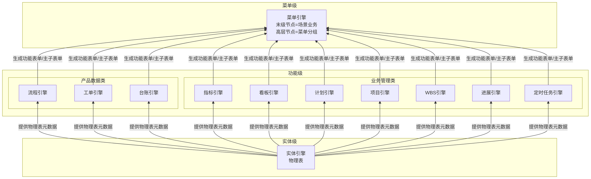
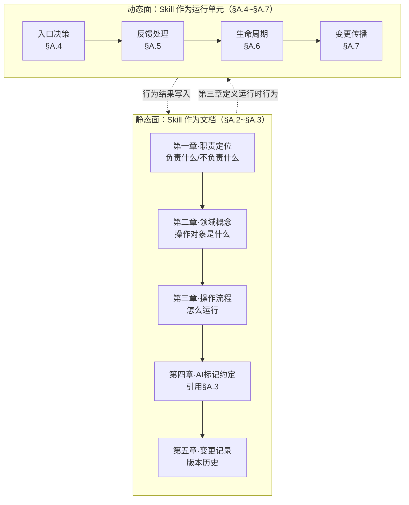
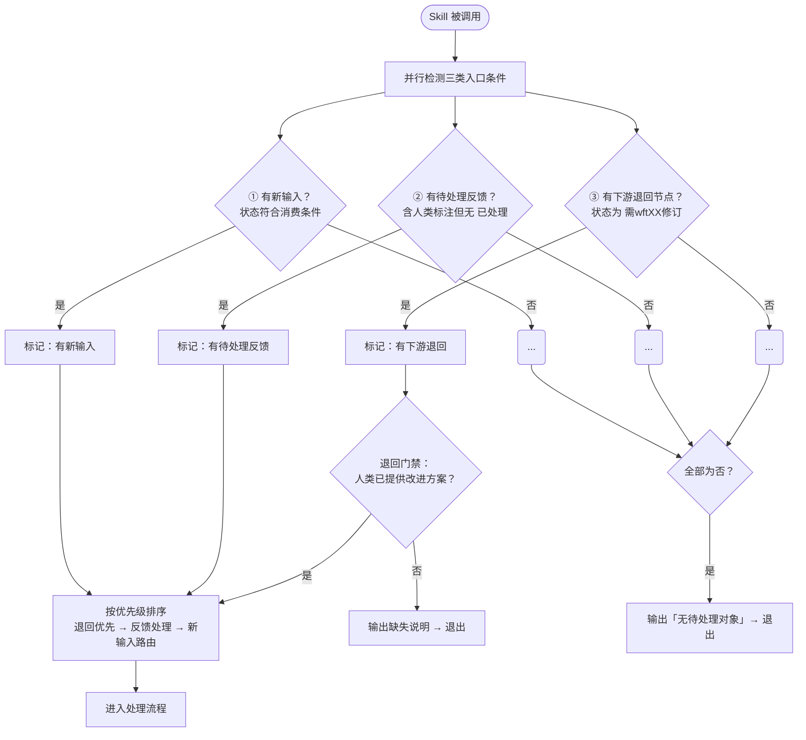
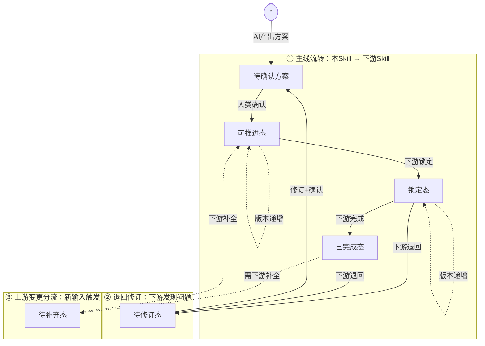
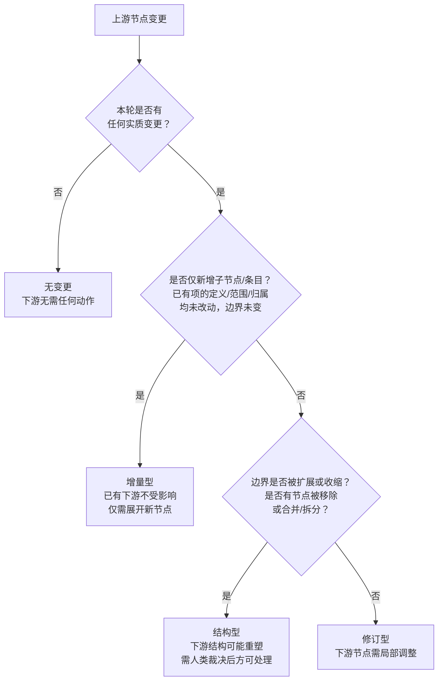

# EOS平台-业务-引擎规范

> **概述**：定义 EOS 平台的 UI 交互模型（含七种页面类型与三层编排链）、输出文档模型（正式/轻量文档、封面-正文 1:1 组装）、引擎分层体系与 CU 配置单元模型、页面组件与构件体系、三类产品（A1/A2/Bn）、资产治理业务，以及三路径（biz/eng/nfr）的职责定位和协作关系。
>
> **版本**：v5.23 | **修订**：2026-08-20 | **说明**：eng 链设计归属重构（wft01-eng v9.2 + wft02-eng v9.6 对偶实施）——**CU 设计权规则改两段**：wft01-eng 设计 CU 承接（分解概要末级为详细需求条目 + 分配条目到 CU 承接，含收敛判定）、wft02-eng 详细定义 CU（承接已分配 CU，展开配置信息组/配置能力/依赖/状态迁移）；§8.1 wft01-eng 任务清单加"分解概要末级为详细需求条目 + 分配条目到 CU 承接"；§8.2 wft02-eng 收缩为详细定义（移除"推断 A1 构件配置单元"任务，A2 装配改承接）；§八 接力链表/§10.4/§10.6 同步（STR-E 状态改名 `可以详细定义`/`待补充详细定义`/`已详细定义`，DP1）。上一版 v5.22：§3.3 配置信息组口径对齐 wft02-eng v9.3（张力点②）——组的分界由"相对独立的业务能力"改为"可以运行的能力"（含业务人员可操作能力与系统侧运行行为两类）；配置入口补"一个 CU 对应一个页面（复合页内的子页面即完整页面）"；§8.2 CU 页面关系同款（一 CU 一页面）。

> **阅读路径**：
> - 关心 **UI 交互模型与页面类型** → §一
> - 关心 **输出文档模型（正式/轻量、封面-正文）** → §二
> - 关心 **引擎分层与 CU 配置单元** → §三
> - 关心 **布局组件与构件体系** → §四
> - 关心 **A1/A2/Bn 三类产品** → §五
> - 关心 **设计路径（biz/eng/nfr）操作流程** → §七~§十
> - 关心 **产品文档读写规则与反馈方式** → §十一
> - 关心 **Skill 文档编写规范与运行时协议** → 附录A

---

## 一、平台界面与业务场景

> 本章按"零件→组装→导航→业务承载"顺序组织：§1.1 定义页面组件（有哪些零件），§1.2 定义交互模式（零件如何组装），§1.3 定义菜单导航（用户如何到达），§1.4 定义业务场景（页面承载什么业务）。

### 1.1 平台页面组件

EOS 平台的 UI 页面由功能引擎配置生成，场景引擎和菜单引擎逐级编排，自底向上形成三层生成链：

```
功能引擎配置：物理表 → 窗口标签页（列表/单据/指标/看板）+ 辅助栏标签页（列表/单据）+ 弹窗页面 + 全屏单据页
                             ↓
                    场景引擎编排 → 场景标签页（初始态单窗 / 分屏态双窗）
                                          ↓
                                 菜单引擎编排 → 菜单标签页
```

> **场景引擎的身份**：本规范中的"场景引擎"是菜单引擎（`@engine-menu`）内部的**场景编排能力**，不是独立的引擎资产，也不增加 EL 层级。
>
> 场景引擎负责将窗口标签页编排为**场景标签页**；菜单引擎的菜单树能力再将场景标签页编排进**菜单标签页**。
>
> 因此页面层级自顶向下为"菜单标签页→场景标签页→页面组件"，生成过程自底向上为"功能引擎配置页面组件→场景编排能力生成场景标签页→菜单树能力生成菜单标签页"。

以下按三层生成链自底向上的顺序，依次定义七种页面类型。

#### 1.1.1 页面类型定义

**窗口标签页**：单个实体数据在场景标签页中的展示载体。提供三种可切换的显示模式——**列表模式**、**单据模式**，以及按数据源类型决定的第三种模式。窗口标签页是功能引擎配置的最主要产出，用户日常操作的主界面。

- **列表模式**：每行数据显示一条记录，以**表格或树表**呈现。用户在此模式下可浏览、筛选、排序和选择数据。
- **单据模式**：单行数据以**详情页**方式显示，页面提供"下一个"和"上一个"按钮，供用户在数据行间上下翻页浏览。
- **第三种模式**按数据源类型决定具体形态：
  - 数据源为**常规数据**（非指标清单、非看板清单）时，第三种模式为**指标模式**——显示该实体功能表单上定义的指标的图示，指标的计算范围取当前用户在标签页上筛选的数据集；
  - 数据源为**指标清单**时，第三种模式为**图示模式**，呈现为**指标模式**——各指标项以图示呈现于 2×3 网格，超出部分纵向排列滚动；
  - 数据源为**看板清单**时，第三种模式为**图示模式**，呈现为**看板模式**——各看板图示全屏展示，多个纵向排列滚动。

**指标页面**：指标模式下的具体图示形态。当窗口标签页的数据源为常规数据（功能表单上定义了指标）或指标清单时，切换至指标模式后进入指标页面——被划分为**2行×3列**的展示区域，每个指标图示的高度等于行高，宽度可设置为窗口宽度的三分之一、三分之二或整宽。指标栏目的显示顺序、每个图示的图样和大小在功能表单的指标定义或指标清单中预先设定。当指标条数超过 6 个时，超出部分纵向排列，页面右侧的滚动条供用户上下浏览切换。

**看板页面**：看板模式下的具体图示形态。当窗口标签页的数据源为看板清单时，切换至看板模式后进入看板页面——以全屏展示看板清单中的各看板图示。每个看板图示的大小等于窗口标签页的显示区域；多个看板纵向排列，页面右侧的滚动条供用户上下浏览切换。看板的显示顺序在看板清单中设定。

**全屏单据页**：用户在列表选中一行查看详情时的显示页面——显示内容等同于窗口标签页的单据模式，但页面顶部无 TAB。全屏单据页适用于需要全宽展示详细信息的场景。

**辅助栏标签页**：窗口标签页的辅助显示区，用于不下钻即可显示和操作选中数据行的详情和子业务数据。在单据模式下以两列（字段名称 | 字段值）显示。辅助栏可独立展开/关闭，其三态切换规则如下：

- **关闭态**：按钮标签显示"编辑"；主内容区（单窗或双窗）全宽显示
- **展开态**（单击"编辑"或选中行后）：主内容区向左缩，辅助栏占据右边空间；辅助栏以两列单据页方式显示选中数据行的详情——第一列字段名称，第二列字段值；当用户在主内容区选择另一行数据时，辅助栏自动切换显示新选中行的详细信息
- **关闭**（单击"关闭"按钮）：辅助栏关闭；主内容区向右展开至屏幕边，恢复全宽；按钮标签恢复为"编辑"

**弹窗页面**：模态弹出页面。当用户编辑字段值时，若该字段值引用自其他实体，系统以弹窗显示该实体及子业务实体供用户选择。

**场景标签页**：场景引擎将窗口标签页编排而成的页面集合。分两种显示模式：
- **初始态单窗**：用户首次切换到该场景时，窗口全宽显示一个窗口标签页（列表页面），右侧可选配辅助栏
- **分屏态双窗**：用户在列表中双击数据行下钻时触发——原窗变窄移至左侧，右窗显示选中行的子业务窗口标签页

**菜单标签页**（= 业务标签页）：浏览器标签页级别。用户单击末级菜单（M4），系统新开一个浏览器标签页展示该菜单下的场景业务。菜单标签页是用户开展端到端业务的工作台，由若干场景标签页组成。

**配置页面**：硬代码开发的窗口标签页等价物，承载引擎配置单元（CU）的配置、校验、发布、监控、回滚和异常处理。配置人员在此编辑 CU 配置要素，提交后引擎校验并保存。配置页面不属于页面组件。

以上七种页面类型中，前四种（窗口标签页、全屏单据页、辅助栏标签页、弹窗页面）由功能引擎配置生成，中间两种（场景标签页、菜单标签页）为编排容器，最后一种（配置页面）为硬代码页面。

#### 1.1.2 页面组件与功能表单

窗口标签页（列表模式 / 单据模式 / 图示模式：含指标模式、看板模式）、全屏单据页、辅助栏标签页（列表模式 / 单据模式）、弹窗页面统称为**页面组件**。页面组件是功能表单的显示载体——功能引擎将物理表配置为页面组件的具体形态。配置页面为硬代码开发，不属于页面组件。

**功能表单**是物理表经功能引擎配置后的运行时形态的抽象概念——描述某实体数据以何种页面组件承载、有哪些字段/行为/权限。主子表单的 1:1 组装（封面-正文）由功能引擎完成，1+N 下钻扩展通过场景标签页的分屏机制实现。

### 1.2 平台交互模式

§1.1 定义了各类页面组件，本节描述它们如何组合成用户可操作的交互模式。

用户单击菜单引擎发布的末级菜单进入场景业务，运行时 UI 遵循以下三种交互模式：

**初始态**：浏览器窗口为**单窗全宽**，顶部多 TAB 对应场景业务下的多个主子表单；选中一行数据双击可下钻。初始态无底部导航面包屑。右侧辅助栏位展开，以两列（字段名 | 字段值）显示选中行的详细数据。

```
┌────────────────────────────────────────────────────────────────┬────────────────┐
│ [TAB: 主子表单A] [TAB: 主子表单B] [TAB: 主子表单C]               │ 辅助栏   [关闭] │
│                                                                │                │
│ ┌──────────────────────────────────────────────────────────┐   │ 字段名 | 字段值 │
│ │ 主表单（列表/树表）                                        │   │ ────────────── │
│ │ ┌────────────────┬────────────────┬──────────────┐       │   │ 单号  | PO-2026 │
│ │ │行1             │                │              │       │   │ 日期  | 07-07   │
│ │ │行2* ← 双击选中  │                │              │       │   │ 金额  | ¥12,000 │
│ │ │行3             │                │              │       │   │ 状态  | 审批中   │
│ │ └────────────────┴────────────────┴──────────────┘       │   │ 申请人| 张三    │
│ └──────────────────────────────────────────────────────────┘   │                │
└────────────────────────────────────────────────────────────────┴────────────────┘
```

**分屏态**（下钻触发）：双击主表单行数据 → 窗口分裂为左右双窗。左窗为原主子表单（变窄），右窗显示选中行数据的子表单；右窗 TAB 对应子业务，每个关联实体占一个 TAB。右侧辅助栏位展开时以两列（字段名 | 字段值）显示选中行详情。

```
┌────────────────────────────┬─────────────────────────────┬────────────────────┐
│ 左窗（原窗变窄）             │ 右窗（新开）                │ 辅助栏        [关闭]│
│                            │                             │                    │
│ [TAB: 主子表单A]            │ [TAB: 子业务X]              │ 字段名 | 字段值      │
│ ┌──────────────────┐       │ ┌──────────────────────┐    │ ────────────────   │
│ │ ┌───┬───┬───┐    │       │ │ ┌────┬────┬────┐     │    │  单号  | PO-2026-01 │
│ │ │行1│   │   │    │       │ │ │行a │    │    │     │    │ 日期   | 2026-07-07 │
│ │ │行2│ ← 双击 │    │      │ │ │行b  │ ← 可下钻│     │    │  金额   | ¥12,000   │
│ │ │行3│   │   │    │       │ │ └────┴────┴────┘     │    │  状态   | 审批中     │
│ │ └───┴───┴───┘    │       │ └──────────────────────┘    │ 申请人 | 张三       │
│ └──────────────────┘       │                             │                    │
└────────────────────────────┴─────────────────────────────┴────────────────────┘
底部导航面包屑：场景业务 > 主子表单A > 子业务X
```

**持续下钻**：在右窗双击行，右窗移至左窗位置，新子业务 TAB 出现在右窗。此过程可重复，直至达到系统下钻层级数限制。底部常驻**面包屑导航**，显示当前层级路径；单击任意节点即可跳转至该层级。

#### 1.2.1 交互规则汇总

以下规则约束页面组件在上述三种交互模式中的行为：

| 规则 | 说明 |
|------|------|
| 初始单窗 | 进入场景业务时为单窗+右侧辅助栏展开，顶部多TAB；不下钻不分屏 |
| 主子表单 TAB | 顶部 TAB 对应该场景业务下的多个主子表单 |
| 首次下钻 | 在主表单双击某一行数据触发分屏，右窗显示子表单数据 |
| 递归下钻 | 右窗→左窗，新右窗出现，直到系统层级数限制 |
| 面包屑导航 | 底部常驻，显示当前层级路径；单击任意节点跳转至该层级 |
| 子表单显示规则 | 功能引擎基于主表单行数据内容匹配规则，动态确定展示子表单集合 |
| 辅助栏展开态 | 右栏展开，以两列（字段名\|字段值）显示选中行详情；主内容区向左缩 |
| 辅助栏切换 | 展开态下切换选中行，辅助栏自动更新为新的行详情 |
| 辅助栏关闭操作 | 单击"关闭"按钮，辅助栏关闭，按钮显示"编辑"；主内容区恢复全宽 |
| 辅助栏展开操作 | 单击"编辑"按钮，辅助栏展开；分屏态下辅助栏展开时内容区向左缩 |

### 1.3 平台菜单与导航

页面组件（§1.1）经场景编排形成交互模式（§1.2）后，通过菜单导航供用户访问。

菜单引擎（`@engine-menu`）生成并维护 EOS 平台的多级菜单树，分为两类节点：

- **非末级节点**：定义所属父节点、显示顺序、可见性和可达性权限——仅承载分组和导航。
- **末级节点**：定义所包含的主子表单部件序列（即**场景业务**）、显示顺序和依赖关系，以及该节点的可见性和可达性权限。

菜单视角（ML）自上而下为：M0 平台 → M1 一级菜单 → M2 二级菜单 → M3 三级菜单 → M4 末级菜单。每个 M4 末级菜单对应一条场景业务（SL5）——用户单击 M4，系统新开菜单标签页（§1.1.1），进入 §1.2 所述的交互模式。菜单引擎对每条场景业务无条件支撑，无需判定。

**权限归属**：菜单节点对角色/人员的可见或不可见规则，由菜单引擎承载。物理表数据行或列对角色/人员的权限，由功能引擎承载。

### 1.4 业务场景

§1.1~§1.3 回答了"UI 长什么样、如何交互、如何导航"，本节回答"页面承载什么业务"。

**场景业务**是 STR-F（相关方功能需求架构末级节点）的组织单元。每条场景业务定义一条**端到端业务闭环**——从需求提出到需求被满足并确认的完整链路。

**业务对象**是场景业务全部操作与输出文档所围绕的核心实体——场景业务的创建、提交、审批、流转、确认等操作及其输出文档序列，都围绕该实体组织，记录其从需求提出到被满足确认的完整生命周期。**每个场景业务围绕一个业务对象闭环，业务对象与主责角色一一对应**（主责角色 = 业务对象生命周期的主推动者：提出需求 / 负责完成 / 确认结果）；其他参与角色为配合角色，是主责角色闭环内的流程环节，不产生独立场景业务。

场景业务内部为一组有先后流转依赖的**输出文档序列**：

```
场景业务
  │
  ├── 输出文档1
  ├── 输出文档2
  ├── 输出文档3
  ├── ...
  └── 输出文档N
```

在 EOS 平台上，场景业务（SL5）由菜单引擎的末级节点编排支撑——末级菜单所包含的功能表单/主子表单序列即为场景业务的运行时形态。

**场景业务的类型**由 AI 根据 OR 语义判定：

| 类型 | 识别词 | 闭环标准 |
|------|--------|---------|
| **执行类（D）** | 创建/提交/审批/交付/验收等动作词 | D 闭合——从需求提出到需求满足 |
| **管理类（PCA）** | 计划/监控/分析/纠正/识别等动作词 | PCA 闭合——计划→监控→分析→纠正 |

D 和 PCA 仅在正文数据类型上有差异（产品数据 vs 管理数据），在 wft01/02/03-biz 的处理逻辑上**完全同构**——都是场景业务→输出文档序列→每个文档有封面+正文+任务+引用。区别在于：

- **D 类**输出文档的正文是**产品数据**（物料/价格/检验值），文档间流转以输入-输出传递链为主。
- **PCA 类**输出文档的正文是**管理数据**（指标定义/看板布局/计划任务/风险描述/问题记录），任务类型=计划的文档发布后通过任务关系触发流程/工单。

类型判定仅影响 wft02-biz 的引擎推断偏好和 wft03-biz 的配置建议，**不影响处理流程结构**。

> 输出文档的完整模型见 §二。本节仅定义场景业务与输出文档的组织关系——场景业务包含输出文档序列，输出文档的内部结构（封面/正文/正式与轻量区分）见 §二。

## 二、输出文档模型

**输出文档（PL5）** 是场景业务的组成单元——每条场景业务由一组有先后流转依赖的输出文档序列定义。输出文档是 EOS 平台的核心信息载体，其模型回答三个基础问题：文档是什么、由什么组成、如何流转。

> **核心结论**：文档不是引擎概念，而是**实体组装模式**——封面实体（DocumentCover 表一行，全系统一张表）+ 正文实体（1:1）+ 支持信息（→其他文档的多对多引用）+ 处理配置。
> 
> 封面和正文都是普通实体，由实体引擎生成物理表；正文被各引擎按需转化为功能表单，封面由功能引擎的表单能力转化为封面表单，两者由功能引擎的组装能力按 1:1 主子关系组装。因此**不设独立的"文档引擎"**——文档是实体组装模式，而非独立引擎概念。
> 
> wft02-biz 定义业务活动节点及引擎能力候选；wft03-biz 生成功能表单、窗口标签页和引擎能力使用需求，不设计 CU。台账类业务由台账引擎（`@engine-ledger`）支撑——将物理表转换为台账功能表单并按主子关系装配为主子功能表单（详见 §3.2）。

### 2.1 封面判定：正式文档与轻量文档

文档是否需要封面，取决于它是否有**独立于正文 CRUD 的生命周期**——需要审批流转、版本追溯、派发验收或独立状态变迁的文档，才有封面。

> **与 PL6-B 的正交关系**：正式/轻量描述的是 PL5 输出文档**是否有封面及文档级生命周期**；PL6-B 描述的是正文内部是否存在可独立定义和维护的条目类型。两者正交独立。
> 
> 轻量文档并不天然产生或排斥 PL6-B：
> - 若正文只是**单一原子记录**，其正文行就是 PL5 文档实例，不再重复下沉为 PL6-B。
> - 只有正文作为**集合容器**，且其中的条目类型满足"独立名称、独立定义要素、独立生命周期"时，才展开 PL6-B。
> 
> PL6-B 条目仍属于父 PL5 正文，不因独立维护而自动升级为正式文档。

```
正式文档（有封面，有独立生命周期）              轻量文档（无封面，正文即文档）
─────────────────────────────              ─────────────────────────
DocumentCover 表一行                         无封面行
  ├── 单据号/标题                             正文实体 = 文档本身
  ├── 状态/版本                               1 行 = 1 文档内容条目实例
  ├── 创建人/部门/日期                         可选的任务类型（流程/工单/计划）——
  ├── 处理配置（可选的流程/工单/计划）             任务状态由对应引擎在正文实体上直接管理
  └── 1:1 → 正文实体（1 行 = 1 文档内容条目实例）

例子：                                      例子：
  采购申请单/检验记录/不合格品报告               会议纪要（流程审批）/技术规范条目/
  项目立项书/设备维修工单                       参考文档/经验教训/公告通知
  指标文档（独立维护，有审批/版本）
  看板文档（独立维护，有审批/版本）
```

### 2.2 正式文档的组成

```
正式文档（PL5）
  │
  ├── 封面实体（DocumentCover 表一行）
  │     → 记载单据号/标题/状态/版本/创建人/部门/日期等文档级元数据
  │     → 由功能引擎的表单能力转化为封面功能表单（单据头样式）
  │
  ├── 正文实体（1:1 绑定封面行，1 行 = 1 文档内容条目实例）
  │     → 正文即实体——该文档承载的业务数据内容
  │     → 由对应引擎转化为功能表单，形态根据业务而定：
  │       台账（列表/树表）、指标（列表+图示 2×3）、看板（视图/卡片/泳道）、
  │       项目（阶段/里程碑）、WBS（树形分解）、计划（甘特/任务）、
  │       流程（审批流转）、工单（派发/处理/验收）
  │     → 同一正文可被多个引擎转化，互不冲突
  │
  ├── 支持信息（→其他文档的多对多引用）
  │     → 被引用目标是正式文档时指向 DocumentCover 行，轻量文档时指向正文实体行
  │     → 引用关系带角色标签（输入文档/规范文档/指南文档/合规文档/资源文档）
  │
  ├── 处理配置（wft02-biz 定义任务节点，wft03-biz 形成引擎能力使用需求）
  │     → 封面行被流程/工单/计划引擎驱动流转的节点序列
  │     → 每个节点定义：处理角色、可执行动作、状态变迁
  │     → 节点内容展开为 PL6-A 活动节点 ↓
  │
  └── PL6-A 活动节点（↑ 处理配置的内容展开，有任务类型时存在）
        → 任务类型确定后，wft01 在业务语言层捕获/推断主要活动节点（"部门经理审批，通过后到财务"）
        → wft02 将业务节点转化为引擎 CU 候选（引擎语言），补全系统自动节点/异常路径/超时处理
        → wft03-biz 生成窗口标签页及引擎能力使用需求
        → 每个活动节点定义：处理角色、可执行动作、状态变迁
```

### 2.3 PL6-B 正文条目

输出文档的正文条目满足以下**三独立**条件时，展开为 PL6-B：

- **独立名称**：每个条目有独立的名称
- **独立定义要素**：每个条目有独立的定义要素（如指标的口径/维度、看板的布局/指标集、风险的概率/影响/缓解措施、问题的根因/纠正措施）
- **独立生命周期**：每个条目的生命周期独立于容器文档（可独立创建/修订/废弃）

```
PL5 输出文档（正文条目满足三独立）
  │
  ├── 封面实体（同 §2.2）
  ├── 正文实体（容器——该清单作为一个整体的元数据）
  │     → 条目内容展开为 PL6-B 正文条目 ↓
  │
  └── PL6-B 正文条目（↑ 正文实体的条目展开，逐条目）
        ├── 条目1：独立名称 + 独立定义要素 + 独立生命周期
        ├── 条目2：独立名称 + 独立定义要素 + 独立生命周期
        ├── ...
        └── 条目N
```

**满足三独立**：指标清单（指标条目）、看板清单（看板条目）、计划清单（计划条目）、风险清单（风险条目）、问题清单（问题条目）、行动项清单、改进措施清单等——PCA 场景的全部输出文档正文条目均满足三独立。

**不满足三独立**：事务类文档的物料行（运行时交易数据，无独立生命周期）、内容类文档的普通议题记录（内容实例，无独立定义要素），以及轻量文档自身的一行式原子正文实例。轻量文档正文若另为集合容器，集合内满足三独立的条目类型仍可展开 PL6-B。轻量文档同样可配置任务类型，任务状态由对应引擎在正文实体上直接管理。

### 2.4 轻量文档的组成

```
轻量文档（PL5）
  │
  ├── 正文实体（无封面行，1 行 = 1 文档内容条目实例）
  │     → 被功能引擎的表单能力直接转化为台账（列表/树表）
  │     → 无封面，正文即文档
  │
  ├── 处理配置（可选的任务类型：流程/工单/计划）
  │     → 任务状态由对应引擎在正文实体上直接管理，无封面行承载
  │
  └── 支持信息（→其他文档的多对多引用）
        → 被引用目标为轻量文档时，直接指向正文实体行
```

### 2.5 设计规则

| 规则 | 说明 |
|------|------|
| **R1** | 正文实体始终存在——所有文档都有正文（1 行 = 1 文档内容条目实例） |
| **R2** | 封面实体按需——仅当文档有独立于正文 CRUD 的生命周期时才存在 |
| **R3** | 封面实体存在时，DocumentCover 行与正文行严格 1:1 + `derived_from` 追溯链（每版本独立，旧版本归档） |
| **R4** | 场景业务中第一个有任务类型的输出文档，其任务类型必然是计划。此文档本体是开发/记录类文档，正文为产品数据或管理数据，非"计划清单" |
| **R5** | 任务间可任意触发——任何任务类型（计划/流程/工单）均可触发任何任务类型（包括同类型），触发关系由业务需要决定，无类型限制 |
| **R6** | 有任务类型时，必须展开 PL6-A 活动节点：<br>• wft01-biz 在业务语言层识别主要节点<br>• wft02-biz 定义处理角色、业务动作、状态迁移、异常路径和引擎能力候选<br>• wft03-biz 将活动节点转化为窗口标签页，并形成对既有引擎/CU的能力使用需求<br>biz 路径不得设计 CU 本体。正式文档的活动节点附着于封面行，轻量文档的活动节点附着于正文实体 |
| **R7** | 正文条目满足三独立条件（独立名称 + 独立定义要素 + 独立生命周期）的，展开为 PL6-B。事务类文档的物料行和内容类文档的议题条目不满足三独立，不展开 PL6-B |

### 2.6 任务间触发关系

**任务类型三选一**：正式文档和轻量文档均可配置零个或一个任务类型——**计划**（策划→发布）、**流程**（审批流转）、**工单**（派发/处理/验收）。区别在于：正式文档的任务状态由封面行承载（处理配置附着于 DocumentCover 行），轻量文档的任务状态由对应引擎在正文实体上直接管理（无封面行）。

**任务关系规则**：任何任务类型均可触发任何任务类型（含同类型），触发关系由业务需要决定，无类型限制（详见 §2.5 R5）。

### 2.7 PCA 场景的 P/C/A

PCA 场景业务与 D 类完全同构——由输出文档序列构成，每个输出文档按需配置处理配置（任务类型）。除遵循 §2.5 R4（首个有任务类型的文档为计划，本体为开发/记录类文档）外，PCA 场景还必须包含一个计划清单输出文档（见下文），两者是不同的文档实例。

PCA 场景**必须包含一个输出文档为计划清单**（正文条目满足三独立，展开 PL6-B）。其正文条目中：

- **第 1 条**为"策划本次计划清单及其余清单"，任务类型为**计划**（策划→发布）。策划主管按周期进入 PCA 菜单，创建该条目后即按计划引擎的生命周期运行
- **后续条目**逐条对应 P 阶段各输出文档的策划任务——"制定指标清单"、"识别风险清单"、"设计看板清单"、"梳理问题清单"等

第 1 条发布完成后，触发后续条目的执行。后续条目逐一触发各自对应的输出文档——这些文档的任务类型**按业务需要选择**（流程/工单/计划），不强制为计划。

C（监控）和 A（改进）是任务链运行时推进的结果：P 阶段触发的计划/流程/工单执行 → 指标引擎持续度量 → 看板呈现 → 发现偏差 → 生成风险条目/问题条目（→风险清单/问题清单，条目按需走流程或工单处理） → A 阶段改进完成。改进完成后可触发下一轮 P 的计划清单第 1 条（新一轮策划），也可由策划主管按周期手动启动。

---

## 三、基于引擎生成业务

### 3.1 业务及层级

EOS 平台使用四套视角层级描述业务在不同维度上的组织结构：

| 视角 | 编号 | 自上而下 |
|------|------|---------|
| **ML**（菜单视角） | M0→M4 | 平台 → 一级菜单 → 二级菜单 → 三级菜单 → 末级菜单（→SL5） |
| **SL**（角色场景视角） | SL0→SL6 | 平台 → 业务域 → 产品类型 → 角色 → 角色职责 → 场景业务 → 功能表单/主子表单 |
| **PL**（输出产品视角） | PL0→PL6 | 平台 → 业务域 → 产品类型 → 构件 → WBS → 输出文档 → 活动节点/正文条目 |
| **EL**（引擎视角） | EL1→EL3 | 菜单引擎 → 功能引擎 → 实体引擎 |

> 其余视角层级的完整定义见 `23-eos-output-architecture.md` 和 `24-eos-business-assets.md`。

**PL5 输出文档**的组成见 §二——封面实体 + 正文实体（1:1）+ 支持信息引用 + 处理配置。

**PL6 活动节点/正文条目**——PL5 之下设 PL6，分为两个子类型：

**PL6-A 活动节点**：有任务类型时，任务的活动节点序列构成 PL6-A。跨三个设计阶段逐级展开，是架构节点而非运行时配置：
- wft01-biz 在业务语言层识别主要节点
- wft02-biz 定义角色、动作、状态迁移、系统节点和异常路径
- wft03-biz 生成窗口标签页及引擎能力使用需求
- 正式文档的活动节点附着于封面行，轻量文档的活动节点附着于正文实体

**PL6-B 正文条目**：正文是集合容器，且其条目类型满足三独立条件（独立名称 + 独立定义要素 + 独立生命周期）时，展开为 PL6-B。PCA 场景中的指标、看板、计划、风险、问题、行动项、改进措施等**定义型/管理型条目类型**通常满足三独立，但仍须逐类判定。不得把轻量文档自身的正文行再次当作 PL6-B。事务性物料行、普通议题记录等运行实例不展开 PL6-B。


**输出文档**按生成方式分为两类：

- **内置 CAX**（平台内引擎生成）：内容由 EOS 功能引擎直接生成，沿引擎间制品流转链逐级生成——对应物理表（实体引擎）→转换为功能表单→按主子关系组装为主子表单。
- **外置 CAX**（平台外工具生成）：文档以文件名及附件形式回传至 EOS 平台，平台负责管理其任务、状态、责任人、版本、附件、评审和归档。

### 3.2 引擎及层级

EOS 平台通过三层引擎逐级生成：下层引擎生成制品，上层引擎消费该制品后生成自身制品，自底向上逐级递进，从物理表一直生成到用户可见的菜单：



简化版引擎间制品流转：

```text
实体引擎 ──生成──→ 物理表
                    ↓ 被消费
               功能引擎 ──生成──→ 功能表单 / 主子表单
                                      ↓ 被消费
                                 菜单引擎 ──生成──→ 菜单树 + 场景业务
```

各引擎为生成器：下级引擎生成制品，上级引擎消费该制品后生成自身制品，逐级递进直至平台可发布的末级菜单。

**引擎全景**：

| 序号 | 引擎ID | 名称 | 层级 | 一句话定义 |
|------|--------|------|------|-----------|
| 1 | @engine-entity | 实体引擎 | 实体级 | 基于数据库生成物理表，提供增删改查、导入/导出和追踪关系 CRUD 等基本功能 |
| 2 | @engine-flow | 流程引擎 | 功能级（产品数据类） | 配置流程节点、流转规则、审批行为和状态迁移 |
| 3 | @engine-workorder | 工单引擎 | 功能级（产品数据类） | 配置工单类型、派发规则、处理流程、验收标准和归档策略 |
| 4 | @engine-ledger | 台账引擎 | 功能级（产品数据类） | 基于物理表生成台账功能表单并按主子关系装配为主子功能表单，用于台账类业务（设备台账等） |
| 5 | @engine-project | 项目引擎 | 功能级（业务管理类） | 基于物理表配置项目对象、阶段、里程碑、成员和项目状态 |
| 6 | @engine-wbs | WBS 引擎 | 功能级（业务管理类） | 基于物理表配置 WBS 层级、分解规则、节点属性和进度汇总方式 |
| 7 | @engine-task | 计划引擎 | 功能级（业务管理类） | 基于物理表配置计划任务、时间约束、依赖关系和执行状态 |
| 8 | @engine-kanban | 看板引擎 | 功能级（业务管理类） | 配置指标维度、度量口径、聚合规则、展示方式和看板视图布局，为物理表生成指标型+看板型功能表单 |
| 9 | @engine-indicator | 指标引擎 | 功能级（业务管理类） | 定义指标的名称/口径/目标/维度/图示，生成指标结果功能表单（列表模式/指标图示模式 2×3网格） |
| 10 | @engine-progress | 进展引擎 | 功能级（业务管理类） | 基于物理表配置进展填报、进度口径、状态更新和进展记录 |
| 11 | @engine-scheduler | 定时任务引擎 | 功能级（业务管理类） | 基于物理表配置定时触发规则、任务事件和执行策略 |
| 12 | @engine-menu | 菜单引擎 | 菜单级 | 配置菜单树节点，并以内置场景编排能力将窗口标签页组织为场景标签页、再编排进菜单标签页 |

> EL 三层中，「功能引擎」是层级（EL2）而非独立引擎资产。上表中 10 个具体功能引擎均归属功能级。菜单引擎（EL1）和实体引擎（EL3）同时是层级名称和该层级唯一的引擎资产。

**引擎职责**：

- **实体引擎**：基于数据库生成物理表，提供增删改查、导入/导出和追踪关系 CRUD 等基本功能。物理表是上层引擎的元数据基础。
- **功能引擎**：将物理表转换为功能表单并按主子关系（1+N）组装为主子表单，配置行/列级数据访问权限。承载四方面能力：① 表单能力（结构/字段/布局/校验/行为/发布）；② 功能能力（各具体引擎为表单增加的功能）；③ 组装能力（主子表单组装、子表单显示规则匹配、双击下钻）；④ 权限能力（数据行/列对角色/人员的可见、可编辑或不可访问约束）。
  - **产品数据类**（流程/工单/台账）：支撑产品数据文档的开发与管理——流程引擎管理审批流转，工单引擎管理派发/处理/验收/关闭，台账引擎将物理表转换为台账功能表单并按主子关系装配为主子功能表单（用于设备台账、风险清单、问题清单、行动项清单、改进措施清单等台账类业务）。封面-正文 1:1 绑定由功能引擎的组装能力统一完成，不设独立文档引擎。
  - **业务管理类**（指标/看板/项目/WBS/计划/进展/定时任务）：支撑过程管理数据的生成与管理——指标引擎管理指标定义与双模式展示（列表/图示 2×3网格），看板引擎管理看板布局与视图泳道
- **菜单引擎**：生成并维护多级菜单树，末级节点编排场景业务。

### 3.3 配置单元

**CU 设计权规则**：CU 是引擎提供的配置能力单元，其能力边界、配置入口、配置要素、系统处理、运行期输出和 FR-ENG 性能指标仅由 eng 路径设计。**wft01-eng 设计 CU 承接（分解概要末级为详细需求条目 + 分配条目到 CU 承接，含收敛判定）**；**wft02-eng 详细定义 CU（承接已分配 CU，展开配置信息组/配置能力/依赖/状态迁移）**；wft03-eng 将 CU 展开为配置页面和操作活动；wft05-eng 将其展开为软件组件。biz 路径不得新建、修改或详细设计 CU。

**引擎能力使用需求**：biz 路径只描述业务侧的页面组件为了实现业务 IPO，需要使用哪些既有引擎/CU能力，以及对应输入、期望输出、业务规则和 FR-BIZ 性能指标。引擎能力使用需求不改变 CU 定义。wft03-biz 对每项使用需求执行能力覆盖判定：已覆盖则引用既有 CU；指标不足或能力缺失则生成 FR-ENG 候选线索，经人类确认和 ort00→ort03 后进入 eng 路径。

**配置单元选配模型**：每个引擎包含若干配置单元（可独立选配），部分配置单元即可让业务运行——引擎提供能力池，配置人员按业务需要从中挑选组合。

**配置单元的功能本质**：CU 是在实体页面（§1.2 的页面组件之一）上增加一组业务操作能力。业务配置人员打开 CU 对应的配置页面，通过页面上的功能按钮编辑各配置要素，提交后系统校验信息的正确性和完备性，通过后保存配置信息。引擎按 CU 定义生成运行期制品（物理表、功能表单、菜单入口），配置人员或业务使用人员即可使用该制品及其功能。

**配置单元定义口径**：每个 CU 用以下要素定义。**CU 先细分为配置信息组**（每组 = **某组配置字段，这组字段共同提供一个可以运行的能力**），**配置操作、系统处理、运行期能力均以配置信息组为单位说明**；配置入口等留在 CU 级。叙事链为"配置人员操作 → 系统处理 → 业务人员操作"。

**CU 级要素**：

| 要素 | 定义口径 | 描述方式 |
|------|---------|---------|
| **配置入口** | 配置人员在哪个配置页面维护该 CU（一个 CU 对应一个页面；复合页内的子页面即完整页面） | 页面职责、配置对象、配置类别；不设计具体 UI 布局 |

**配置信息组级要素**（每个配置信息组按以下三方面说明）：

| 要素 | 定义口径 | 描述方式 |
|------|---------|---------|
| **配置操作** | 该组配置信息由配置人员如何编辑 | **以配置人员操作过程方式说明**（刻画模式 + 关键约束，不逐字段罗列） |
| **系统处理** | 系统内部如何处理该组配置信息 | ① **保存时处理**——该组配置信息保存时系统如何校验、落库存储；② **生效后响应**——该组配置信息保存后系统应①…②…③…：生成某些**载件**，以确保基于引擎生成的业务实例运行时提供业务能力 |
| **运行期能力** | 系统基于该组配置信息为业务人员提供的能力 | **以业务人员操作过程方式说明**（操作页面 + 操作处理）；**提供业务人员可操作能力的组必填**，以系统处理为主的组显式标注 |

**主语判据**：配置操作主语=配置人员、系统处理主语=系统、运行期能力主语=系统对业务人员交付。系统处理与运行期能力的分水岭在**对内/对外**——系统处理是系统内部行为（校验、事件触发、超时调度、状态维护），运行期能力是系统对外交付、业务人员可感知可操作的能力。

**配置信息组说明模板**：

> ### 配置信息组：{组名}（{该组包含的配置项}）
> **配置操作**（配置人员操作过程）：……
> **系统处理**：
> - 保存时处理：该组保存时系统如何校验、落库
> - 生效后响应：该组配置信息保存后，系统应：① ……；② ……；③ ……
> **运行期能力**（提供业务人员可操作能力的组写，以业务人员操作过程说明；以系统处理为主的组不填此项）：
> - 操作页面：……
> - 操作处理：……

**三条规则**：① 组的分界按**可以运行的能力**——配置信息组=某组配置字段，这组字段共同提供一个可以运行的能力（运行期产出/驱动一项能力，含业务人员可操作能力与系统侧运行行为两类）；单字段即可提供一项能力时单字段成组，能力不可独立时对应合并；② 运行期能力非必填——某组只提供系统处理、不提供业务互动能力时，显式标注"以系统处理为主"，不硬凑运行期能力；③ 生效后响应一律编号式——"该组配置信息保存后，系统应①…②…③…"，逐条列系统动作。

**载件分类**（系统处理·生效后响应的生成物，承载配置所定义的能力）：数据载件（物理表/字段）、配置载件（配置记录，如 FlowNodeConfig 行）、界面载件（功能表单/窗口标签页/菜单入口）、构件载件（操作按钮/状态标签/指标图示/看板视图）、实例载件（流程实例/流程任务/工单/计划任务/指标结果记录）、支撑载件（定时任务/通知/催办消息/审计日志）。实体引擎 CU 以数据载件为主（生成表、字段），功能引擎 CU 生成其余各类载件。载件是"运行期制品"（物理表/功能表单/菜单入口）的一般化表述。

具体而言：
- **实体引擎 CU** → 定义实体及字段，在场景标签页（列表/树表/分屏态）和弹窗页面上提供增删改查能力。封面实体（DocumentCover 表）和正文实体均由此类 CU 定义
- **功能引擎 CU**（如 @engine-flow CU）→ 在已有实体页面上增加审批流转按钮和流程节点配置能力
- **功能引擎 CU**（如 @engine-workorder CU）→ 在工单页面上增加派发/处理/验收按钮和生命周期管理能力
- **功能引擎 CU**（如 @engine-ledger CU）→ 在台账页面上将物理表转换为台账功能表单（列表/树表），按主子关系装配为主子功能表单，提供条目化数据的增删改查和导入/导出能力
- **功能引擎 CU**（如 @engine-indicator CU）→ 在指标页面上增加指标定义、口径配置、列表/指标图示双模式展示切换和 2×3 网格布局配置能力
- **功能引擎 CU**（如 @engine-kanban CU）→ 在看板页面上增加看板布局、视图泳道和展示方式配置能力

### 3.4 业务组装

**从输出文档到引擎支撑**（自顶向下）：STR-F 架构末级节点是场景业务，场景业务由输出文档序列细化定义。从输出文档出发，按生成方式分两条路径确定支撑引擎链：

- **内置 CAX**：内容由平台内引擎生成。正式文档——封面实体和正文实体由实体引擎生成物理表，封面由功能引擎的表单能力转化为封面表单（单据头样式），正文由对应引擎（流程/工单/指标/看板/项目/WBS/计划/进展/台账等）转化为正文功能表单；封面表单与正文表单由功能引擎的组装能力按 1:1 主子关系组装。轻量文档——正文实体由实体引擎生成物理表，正文由对应引擎转化为功能表单，不产生封面表单和主子组装。若正文行与其他文档存在层级引用关系（如双击下钻），按 1+N 扩展组装
- **外置 CAX**：内容在平台外工具生成，以文件名及附件回传。输出文档挂接到计划功能表单，由计划引擎（`@engine-task`）管理任务、状态、责任人、版本、附件、评审和归档；附件能力由实体引擎的内置子业务配置单元提供；组装时 N=0

无论内置或外置 CAX，功能表单先由功能引擎配置为窗口标签页等页面组件；菜单引擎内置的场景编排能力再将窗口标签页组织为场景标签页；最后由菜单树能力将场景标签页编排进菜单标签页，并建立末级菜单入口。

**组装工序**：以下四步按顺序执行，从物理表一直组装到用户可见的菜单页面。

**(1) 物理表生成** — 实体引擎为输出文档的封面实体（如需要）和正文实体生成物理表，提供增删改查、导入/导出和追踪关系 CRUD 等基本数据操作能力。轻量文档仅生成正文实体物理表。

**(2) 1:1 主子组装** — 正式文档的封面实体物理表由功能引擎的表单能力转化为封面表单（单据头样式），正文实体物理表由对应引擎转化为正文功能表单；功能引擎的组装能力将二者按 1:1 主子关系组装为一个主子表单。轻量文档无封面，正文功能表单即文档本身，此步跳过。

**(3) 1+N 下钻扩展** — 若正文行与其他文档存在层级引用关系（双击下钻到目标文档），在 1:1 基础上扩展——目标文档的功能表单作为子表单挂接到当前主子表单。

**(4) 三层页面编排** — 功能引擎先将全部主子表单序列（含内置 CAX 和外置 CAX 的产出）配置为窗口标签页等页面组件，并按输出文档流转顺序形成窗口标签页序列；菜单引擎内置的场景编排能力将窗口标签页组织为场景标签页，定义初始态单窗、分屏态双窗、辅助栏和下钻关系；菜单树能力再将场景标签页编排进菜单标签页，并建立末级菜单 M4→场景业务映射。外置 CAX 文档不产生独立正文功能表单（N=0），在相应场景标签页中展示为计划引擎管理的任务与附件入口。

---

## 四、布局组件、构件与路径边界

> 本章定义页面组件内部的布局组件体系、构件分类，及其与引擎配置单元（CU）的对应关系。布局组件是平台 UI 的结构层次，构件是安装在布局组件上的可复用功能单元。页面组件（§1.2）由布局组件按特定模式组装而成。

| 对象 | biz 路径权限 | eng 路径权限 |
|------|-------------|-------------|
| 页面组件 | 为功能表单选择页面组件类型并定义需求 | 不设计（配置页面为硬代码，不走功能引擎） |
| 布局组件 | 描述页面组件的布局和交互需求 | 设计配置页面的布局和构件 |
| 构件 | 描述业务页面所需行为，不形成软件实现结论 | 识别构件并在 wft05-eng 分配到软件组件 |
| CU | 只引用既有能力并形成引擎能力使用需求 | wft02-eng 定义 CU，wft03-eng 校验页面承接 |
| 软件组件 | 不设计 | wft05-eng 设计 |

### 4.1 布局组件

布局组件按**容器-内容**层级组织：

```
多级横版（根容器）
  ├── 菜单栏（左侧导航）
  ├── 窗口区
  │   ├── 左窗 ─── TAB 栏 ─── [列表页面] [单据页] [指标页面] [看板页面]
  │   └── 右窗（分屏时出现）─ TAB 栏 ─── [列表页面] [单据页] [指标页面] [看板页面]
  ├── 辅助栏（右侧可展开）
  └── 面包屑导航（底部）
```

弹窗页为模态浮层，不参与窗口层级。

| 序号 | 布局组件 | 层级角色 | 描述 |
|------|------|---------|------|
| 1 | **多级横版** | 根容器 | 全窗口布局框架。初始态=菜单栏+单窗+辅助栏；分屏态（双击下钻触发）=菜单栏+左右双窗+辅助栏。窗口顶部 TAB 对应当前场景标签页的功能表单序列 |
| 2 | **列表页面** | 内容组件 | 在窗口 TAB 内展示，数据以单级列表或树形表格呈现。承载数据浏览、筛选、排序、行选择和批量操作功能 |
| 3 | **单据页** | 内容组件 | 以单据布局（字段名\|字段值）展示单行数据的完整详情。选中列表行→新窗口或同窗口切换为单据页 |
| 4 | **辅助栏** | 辅助面板 | 窗口标签页的辅助显示区，以两列单据布局显示选中数据行详情和子业务数据。目的是不下钻即可查看和操作，行为见 §1.1.1 |
| 5 | **弹窗页** | 模态浮层 | 临时性数据选择或编辑窗口，模态覆盖在当前窗口之上。典型场景：字段值引用其他实体时弹窗选择 |
| 6 | **指标页面** | 内容组件 | 在窗口 TAB 内展示，以图示（柱/折线/饼/仪表盘等）呈现指标数据，支持 2×3 网格布局，超出的指标图示纵向排列，通过窗口右侧滚动条上下切换显示区域 |
| 7 | **看板页面** | 内容组件 | 在窗口 TAB 内全屏展示看板图示。单个看板图示充满窗口显示区域；多个看板纵向排列，通过窗口右侧滚动条上下切换显示区域 |

**与 §1.2 七种页面类型的对应关系**：七种页面类型中，前四种（窗口标签页、全屏单据页、辅助栏标签页、弹窗页面）是由功能引擎配置的**页面组件**；菜单标签页和场景标签页是**编排容器**；配置页面是**硬代码页面**。布局组件可被页面组件和配置页面复用，但不改变页面类型：

| 页面类型 | 对象性质 | 布局组件或编排关系 |
|---------|---------|------------------|
| 菜单标签页 | 菜单编排容器 | 浏览器标签页容器（不属于七类布局组件）+ 若干场景标签页 |
| 场景标签页（初始态单窗） | 场景编排容器 | 多级横版（有菜单栏、有 TAB 栏、单窗）+ 窗口标签页 + 辅助栏标签页（可选） |
| 场景标签页（分屏态双窗） | 场景编排容器 | 多级横版（有菜单栏、有 TAB 栏、双窗）+ 左右窗口标签页 + 辅助栏标签页（可选） |
| 窗口标签页（列表模式） | 页面组件 | 列表页面 + 辅助栏（可选） |
| 窗口标签页（单据模式） | 页面组件 | 单据页 + 辅助栏（可选） |
| 窗口标签页（指标模式） | 页面组件 | 指标页面 + 辅助栏（可选） |
| 窗口标签页（看板模式） | 页面组件 | 看板页面 + 辅助栏（可选） |
| 全屏单据页 | 页面组件 | 单据页 + 辅助栏（可选）；无 TAB 栏 |
| 辅助栏标签页（列表模式） | 页面组件 | 辅助栏 + 列表页面 |
| 辅助栏标签页（单据模式） | 页面组件 | 辅助栏 + 单据页 |
| 弹窗页面 | 页面组件 | 弹窗页（模态）+（列表页面或单据页） |
| 配置页面 | 硬代码页面 | 按需复用多级横版、列表页面、单据页、辅助栏、弹窗页、指标页面、看板页面；不属于页面组件 |

同一布局组件可出现在不同页面类型中；页面类型、页面组件身份和布局组件组合是相互独立但有关联的三个维度，不得混用。

### 4.2 构件

**构件**是安装在布局组件上的可复用功能单元。同一构件在不同布局组件上提供语义相同、形态适配的功能。构件由引擎按 CU 定义生成并渲染到目标布局组件上。

构件按功能分为四类：

**一、展示类**（决定数据以何种视觉形态呈现）

| 构件 | 适用布局组件 | 说明 |
|------|------------|------|
| 列定义 | 列表页面 | 列的字段绑定、宽度、对齐、格式化、是否可排序/可筛选 |
| 字段布局 | 单据页、辅助栏 | 字段分组、排列（单列/双列/多列）、标签位置、是否只读 |
| 图表类型 | 指标页面 | 柱状图/折线图/饼图/仪表盘/雷达图/数字卡片，含坐标轴和图例配置 |
| 卡片 | 列表页面、指标页面、看板页面 | 看板卡片布局——标题/摘要/状态标签/负责人头像，用于看板视图 |
| 泳道 | 列表页面、指标页面、看板页面 | 按维度（状态/负责人/阶段）水平或垂直分组的卡片/条目容器 |
| 甘特条 | 列表页面 | 时间轴上的条形图——起止日期/进度/依赖线，用于计划视图 |
| 树节点 | 列表页面 | 树形结构的展开/折叠节点——层级缩进/节点图标/父子连线，用于 WBS、BOM、组织树 |
| 阶段/里程碑 | 列表页面、单据页 | 项目阶段和里程碑的菱形/旗标标记——计划日期/实际日期/完成状态 |

**二、交互类**（决定用户如何操作数据）

| 构件 | 适用布局组件 | 说明 |
|------|------------|------|
| 功能按钮 | 全部 | 工具栏按钮/操作区按钮/行内按钮——触发引擎动作（提交/审批/驳回/派发/验收/导出等） |
| 右键菜单项 | 列表页面、指标页面、看板页面 | 选中行后的上下文操作菜单——与功能按钮等效，提供快捷操作入口 |
| 快捷键绑定 | 全部 | 键盘组合键→引擎动作映射——如 Ctrl+S 保存、Ctrl+Enter 提交 |
| 下钻 | 列表页面、指标页面、看板页面 | 双击数据行→触发分屏或新窗口，打开关联文档的功能表单 |
| 行选中 | 列表页面 | 单选/多选模式——选中后触发辅助栏更新、右键菜单可用项切换、批量操作按钮启用 |
| TAB 切换 | 多级横版 | 窗口顶部 TAB 点击→切换当前显示的功能表单；面包屑导航单击→跳转至历史层级 |

**三、数据类**（决定数据如何被筛选、排序和导入导出）

| 构件 | 适用布局组件 | 说明 |
|------|------------|------|
| 筛选器 | 列表页面 | 列头筛选/高级筛选面板——字段条件组合筛选，支持保存为个人视图 |
| 排序器 | 列表页面 | 单列点击排序/多列组合排序——升序/降序，支持自定义排序规则 |
| 分页器 | 列表页面 | 数据分页加载——每页条数/页码跳转/总条数显示 |
| 导入 | 列表页面 | 文件上传→解析→校验→批量写入，含导入模板下载和错误行报告 |
| 导出 | 列表页面、指标页面、看板页面 | 当前视图数据导出为 Excel/PDF——含筛选条件和列选择 |

**四、反馈类**（决定系统如何向用户反馈状态和结果）

| 构件 | 适用布局组件 | 说明 |
|------|------------|------|
| 通知提示 | 全部 | 操作结果 Toast（成功/失败/警告）——短暂浮出后自动消失 |
| 进度条 | 单据页、弹窗页 | 长耗时操作的进度展示——百分比/剩余时间/取消按钮 |
| 状态标签 | 全部 | 数据状态的可视化标签——审批中(黄)/已通过(绿)/已驳回(红)/草稿(灰) |
| 校验提示 | 单据页、弹窗页 | 字段级/表单级校验错误提示——红色边框+错误文本，阻止提交 |

### 4.3 CU 与布局组件及构件的对应关系

CU 是构件到布局组件的**生成指令**。引擎读取 CU 定义，在目标布局组件上渲染指定构件。同一 CU 可跨布局组件生成不同形态的构件——如审批按钮在列表页面渲染为工具栏按钮，在单据页渲染为底部操作区按钮。

**配置时**：CU 对应一个硬代码实现的配置页面（非功能引擎生成）。配置人员在配置页面上编辑 CU 的配置要素，提交后引擎校验并保存。

**运行时**：引擎按 CU 定义生成运行期制品——在指定的页面组件或配置页面上渲染构件及其交互行为。

**端到端示例——@engine-flow CU**：

```
配置时：
  配置人员打开流程配置页面（单据页）
  → 编辑流程节点、流转规则、审批角色、状态迁移
  → 提交 → 引擎校验并保存 CU 定义

运行时：
  引擎读取 CU 定义
  → 在正文单据页上渲染 [提交审批] 按钮（交互类·功能按钮构件）
  → 在正文单据页上渲染 流程节点列表（展示类·列定义构件）
  → 在正文单据页上渲染 当前节点状态（反馈类·状态标签构件）
  → 审批人打开单据页 → 渲染 [通过]/[驳回] 按钮 → 点击后引擎执行状态迁移
```

### 4.4 扩展规则

业务需求驱动布局组件及构件的扩展，分三级判定：

**1. 构件级**：现有布局组件可承载，仅需新增或修订构件。

| 触发场景 | 示例 |
|---------|------|
| 新增操作方式 | 列表页面增加批量导入按钮构件（交互类） |
| 新增展示形态 | 指标页面增加雷达图图表类型构件（展示类） |
| 新增数据操作 | 列表页面增加自定义排序规则构件（数据类） |
| 新增反馈方式 | 单据页增加保存前差异对比提示构件（反馈类） |

→ 现有 CU 扩展属性即覆盖，或新增独立 CU。

**2. 布局组件级**：现有布局组件无法承载新交互模式，需新增布局组件类型。

判定标准：新需求是否引入了现有六种布局组件无法表达的**容器-内容关系**或**交互模式**。

示例：若业务需要"多级横版内嵌一个可拖拽调整大小的分隔面板"，超越了多级横版固定比例分屏的交互模式 → 需评估是否新增布局组件类型。

→ 新增布局组件类型须配套新增 CU（见下）。

**3. CU 级**：新构件或新布局组件需要 CU 支撑其配置→生成→渲染链路。

→ 形成 FR-ENG 候选线索。候选线索不是正式 OR，不得直接进入 wft01-eng；须经人类确认后作为原始需求材料登记，并完整通过 ort00→ort01→ort02→ort03，形成正式 FR-ENG OR 后，才按 eng 路径（§八）推进——wft01-eng 判定归属引擎 → wft02-eng 设计 CU → wft03-eng 设计配置页面与构件 → wft05-eng 展开三类组件。

biz 路径在设计中发现构件或布局组件缺口时，只输出 FR-ENG 候选线索并标注来源业务配置需求、缺口层级（构件 / 布局组件 / CU）、已有能力、缺失能力、触发场景和不补充时的业务影响。页面组件类型及组合属于 biz 页面需求本身；只有当现有布局组件或构件能力无法承载该页面组件需求时，才形成 FR-ENG 候选线索。该线索不得直接写入正式 OR 节点或“待 wft01-eng 处理”分节。

---

## 五、三类产品 A1/A2/Bn

EOS 平台的业务配置和运行围绕三类产品展开：

| 产品 | 归属域 | 构件 | 末级节点 |
|------|--------|------|---------|
| **A1** | 流程与IT | 引擎 | CU（配置单元） |
| **A2** | 各业务域 | 角色 | 场景业务 |
| **Bn** | 各业务域 | 产品分解类型（自研件/外购件/复用件/项目等） | 构件的产品数据 |

> 三类产品的完整架构定义见 [23 号资产](../../80-pl4eos-2-eosdata/23-eos-output-architecture.md)。

### 5.1 A1产品

A1 是**平台引擎产品**，归属流程与IT域。构件为引擎（`@engine-entity`、`@engine-flow` 等 12 个），末级节点为 CU（配置单元，详见 [25 号资产 §2](../../80-pl4eos-2-eosdata/25-eos-engine-models.md#§2-引擎定义)）。

每个 CU 定义一个可独立配置、校验、发布的引擎元数据对象——配置人员在 CU 配置页面上编辑配置要素，提交后引擎校验并保存，运行时按 CU 定义生成运行期制品（物理表/功能表单/菜单入口+构件）。CU 的完整定义见 §3.3 和 §4.3。

对应设计路径为 **eng 路径**：wft01-eng（场景业务）→ wft02-eng（配置单元）→ wft03-eng（配置页面）→ wft05-eng（三类组件）。

> **STR-E 的双重身份**：wft01-eng 产出的 STR-E 具有双重身份——
> - **A2 视角**：它是流程与IT域中**业务配置人员**的 PL5 场景业务。
> - **A1 视角**：它对应某个主责能力域中的可独立配置、治理和验收的能力场景。
> 
> 主责能力域可以是引擎，也可以是平台共享能力域。一个能力域可包含多个 STR-E；多个引擎可消费同一共享 STR-E，但不得重复定义共享 CU。CU 是 STR-E 的细分节点。

### 5.2 A2产品

A2 是**各业务域的角色场景**，构件为角色（如采购员、库存管理员），末级节点为场景业务。沿角色场景视角（SL）展开：SL3 角色类型 → SL4 角色职责 → SL5 场景业务 → SL6 功能表单/主子表单。

每个 A2 产品回答：某角色在哪个菜单入口、按什么顺序使用哪些功能表单/主子表单、完成端到端的职责闭环。场景业务（SL5）与 STR-F 末级节点 1:1 映射。

对应设计路径为 **biz 路径的前半段**：wft01-biz（场景业务）→ wft02-biz（输出文档，组装 A2 产品业务流程）。

> **流程与IT域的 A2 产品**：流程与IT域同样有 A2 产品——**业务配置人员**是该域的核心角色类型。业务配置人员的场景业务（SL5）即 STR-E，其归组锚点为`主责能力域 + 配置/治理目标 + 可独立验收结果`，不是引擎数量。STR-E 与业务域 STR-F 在架构层级上同构，区别在于场景产出物是**可用的平台能力**。

### 5.3 Bn产品

Bn 是**各业务域的输出产品**，沿产出视角（PL）展开：PL1 业务域 → PL2 E2E 项目业务 → PL3 构件类型 → PL4 WBS → PL5 业务输出文档。每个 Bn 产品回答：某类输出文档属于哪个业务域/构件类型，需要哪些前序文档和业务规则才能生成。

**构件类型**是产品的分解分类节点，取决于产品域的性质。不同构件类型产生不同的输出文档集合——自研件需要需求/设计/实现/测试全套文档，外购件需要采购规格/验收标准/合格证，复用件仅需适配说明和集成测试报告。

| 产品域 | 构件类型示例 |
|--------|------------|
| 设备产品（如发电设备） | 系统、系统电缆（自研）、机箱及电连接（自研）、电子模块（自研）、电路板（自研）、软件模块（自研）、结构模块（自研）、光学组件（自研）、复用构件、外购构件、项目 |
| 业务变革产品（如企业运营体系建设） | 业务体系、E2E 业务（自研）、E2E 业务（咨询）、基础数据、部门、项目 |

后缀（自研/咨询/外购/复用）标注构件的开发方式。项目构件是特殊的构件类型，承载项目管理类文档（计划清单/风险清单/问题清单/行动项清单），不产出实物产品数据。

**两类产品数据**：每类构件下辖的输出文档承载两种产品数据——

| 类型 | 说明 | 示例 |
|------|------|------|
| **交付类** | 交付给客户/用户的实物产品、技术方案及过程记录，沿端到端业务链逐级生成和流转 | 需求与方案阶段——相关方需求文档/运行概念/系统需求规格/产品架构定义；设计与实现阶段——需求规格/技术方案/实现方案/测试报告；制造与交付阶段——设计图纸/物料清单/工艺文件/出厂检验报告/安装验收报告 |
| **管理类** | 支撑业务运转的策划、监控和改进数据 | 指标/看板/计划清单/风险清单/问题清单/行动项清单/改进措施清单 |

交付类数据是企业运营的主价值链——前一文档的正文数据成为后一文档的输入，从客户需求一直贯通到交付验收。管理类数据是 PCA 闭环的产物，监控主价值链的运行状态并驱动改进。EOS 平台将两类产品数据均承载为输出文档，由对应引擎转化为功能表单，使业务人员在平台上直接创建、编辑、流转和追溯。

**与 A2 的关系**：A2 和 Bn 是对同一业务的两种互补视角——A2 描述**角色怎么工作**（谁→在哪个菜单→按什么顺序→使用哪些功能表单→完成职责闭环），Bn 描述**角色产出了什么**（什么产品数据→属于哪个域→经过哪些前序文档→流转到哪里）。两者通过功能表单/主子表单交汇：同一张功能表单，在 A2 侧是角色的操作界面，在 Bn 侧是产品数据的载体。

对应设计路径为 **biz 路径的后半段**：wft02-biz 装配 Bn 产品业务流程 → wft03-biz 生成各层配置需求。

---

## 六、平台资产治理业务

> 平台资产治理是 EOS 平台的**内置场景业务**（A2 产品）：平台自身的管理对象（菜单、架构资产、数据标准、权限）就是平台的业务数据，平台提供对应的引擎和功能表单直接管理这些对象，治理人员使用平台能力治理平台。STR-F 已预置在 `02-*.md` 中。
>
> 治理操作遵循统一的生命周期模式：**定义/登记 → 审核/发布 → 监控/审计 → 变更/修订 → 废弃/归档**。

| 治理领域 | 执行角色 | 管理对象 | 平台支撑 |
|---------|---------|---------|---------|
| 菜单配置 | 业务架构管理员 | 菜单树节点（M0→M4） | 菜单引擎提供菜单树维护功能表单 |
| 资产管理 | 业务架构管理员 | 23~28 号架构资产 | 实体引擎+台账引擎提供资产登记/变更/查询功能表单 |
| 数据治理 | 数据治理员 | 数据字典/编码规则/状态库/质量规则 | 实体引擎+台账引擎提供标准维护功能表单 |
| 权限治理 | 业务架构管理员 | 角色/菜单权限/数据权限 | 菜单引擎+功能引擎提供权限配置功能表单 |

### 6.1 菜单配置

菜单配置是平台导航结构的管理业务——EOS 平台的菜单树本身就是平台的管理对象，菜单引擎提供菜单树维护功能表单，业务架构管理员直接在上面创建、修改、删除菜单节点。

**管理对象**：菜单树节点，分为两类——
- **非末级节点**（M1→M3）：承载分组和导航，定义层级归属、显示顺序、可见角色/人员
- **末级节点**（M4）：定义所包含的功能表单/主子表单序列（即场景业务）、显示顺序和依赖关系，以及可见角色/人员

**核心操作**：

| 操作 | 说明 |
|------|------|
| 新建节点 | 确定层级归属（M1~M4）、显示顺序，配置可见角色/人员；末级节点需指定场景业务映射 |
| 修改节点 | 调整名称/层级/顺序/可见性/场景业务映射；记录变更原因和影响范围 |
| 删除节点 | 检查是否存在子节点或已分配的场景业务→标记为废弃→确认无引用后物理删除 |
| 可见性配置 | 按角色或人员配置节点的可见/不可见——可见性由菜单引擎在运行时执行 |
| 发布 | 菜单变更经审核后发布，菜单引擎重新生成菜单树并生效 |

菜单变更操作自动生成变更记录（变更内容/操作人/时间/影响范围），形成菜单配置的审计追溯链。

### 6.2 资产管理

资产管理是平台架构资产的维护业务——23~28 号资产是平台的管理对象，实体引擎生成资产物理表，台账引擎将其转化为台账功能表单，业务架构管理员直接在平台上登记、变更、查询和废弃资产。

**管理对象**：23~28 号架构资产——

| 资产编号 | 资产名称 | 内容 |
|---------|---------|------|
| 23 | 产品架构资产 | 产品架构节点定义、PL/SL/ML/EL 层级归属、节点间关系 |
| 24 | 业务资产 | 业务域/业务类型/端到端业务/角色/WBS 定义 |
| 25 | 引擎资产 | 引擎定义、CU 定义、配置要素规格 |
| 26 | 文档定义资产 | 输出文档封面/正文结构、字段定义、转化引擎映射 |
| 27 | 资源资产 | 数据字典/编码规则/状态库/组织结构的平台资源配置 |
| 28 | 看板指标资产 | 指标定义（口径/维度/目标）、看板布局定义 |

**核心操作**：

| 操作 | 说明 |
|------|------|
| 登记 | 新资产创建后登记入库，分配唯一资产 ID，建立初始引用关系 |
| 变更 | 资产属性或关系变更→记录变更内容/原因/影响范围→更新引用关系→触发受影响资产的级联检查 |
| 废弃 | 资产不再使用→标记为废弃→解除引用关系→归档，保留变更历史 |
| 引用关系维护 | 维护资产间的引用和追溯关系——如 23 节点→24 业务资产→25 引擎资产 的引用链 |
| 一致性检查 | 定期或变更触发时检查资产间引用完整性——是否存在悬空引用/版本不一致/双向引用缺失 |

**资产变更的级联影响**：当某一资产发生变更时，系统检查所有引用该资产的下游资产——若下游资产依赖的字段/关系/定义发生变化，标记为"待更新"并通知资产管理员。

资产变更操作自动生成变更记录，一致性检查可手动或定时触发，生成检查报告。

### 6.3 数据治理

数据治理是平台数据标准的维护业务——数据字典、编码规则、状态库、质量规则本身是平台的管理对象，平台提供标准维护功能表单，数据治理员直接在上面定义和修订标准。各引擎在运行时读取这些标准以保持数据一致性。

**管理对象**：

| 对象 | 说明 | 示例 |
|------|------|------|
| 数据字典 | 平台级字段定义标准——字段名称/数据类型/长度/格式/默认值/值域 | "采购申请单号"字段统一为 PO-yyyyMMdd-XXX |
| 编码规则 | 实体/文档/资产的编码生成规则——前缀/日期/序列/校验位 | 物料编码：MAT-品类码-流水号 |
| 状态库 | 平台级状态定义——状态名称/状态值/适用引擎/状态迁移规则 | "审批中/已通过/已驳回/已撤回"统一状态集 |
| 组织/人员主数据 | 部门/岗位/人员的基础数据，供权限分配和流程审批引用 | 组织树/岗位定义/人员归属 |
| 质量规则 | 数据校验规则——唯一性/必填性/格式/引用完整性/业务规则 | "采购申请单金额>0""物料编码不可重复" |

**核心操作**：

| 操作 | 说明 |
|------|------|
| 标准定义 | 新增数据字典条目/编码规则/状态定义→审核→发布 |
| 标准变更 | 已发布标准的修订→评估对已有引擎配置和业务数据的影响→变更→通知受影响方 |
| 质量监控 | 配置数据质量规则→引擎按规则校验运行期数据→发现违规生成数据问题单 |
| 问题处理 | 数据问题单→分析根因→修正数据或修订标准→关闭 |

标准变更操作自动生成变更记录，质量规则校验结果生成数据问题单（由工单引擎驱动处理）。

### 6.4 权限治理

权限治理是平台访问控制的管理业务——角色、菜单权限、数据权限本身是平台的管理对象，菜单引擎和功能引擎提供权限配置功能表单，业务架构管理员直接在上面分配和维护权限。

**管理对象**：

| 权限类型 | 承载引擎 | 内容 |
|---------|---------|------|
| 菜单权限 | 菜单引擎 | 菜单节点对角色/人员的可见或不可见——控制能进入哪些场景业务 |
| 数据权限 | 功能引擎 | 物理表数据行/列对角色/人员的可见/可编辑/不可访问——控制能看到和操作哪些数据 |

**核心概念**：

- **角色**：权限分配的基本单位。角色按业务职责定义（如采购员、库存管理员、部门经理），人员分配到角色，角色分配到权限
- **角色层级**：上级角色继承下级角色的权限——如部门经理继承部门内所有角色的菜单权限
- **权限分离**：互斥角色不能同时分配给同一人员——如采购申请人和采购审批人

**核心操作**：

| 操作 | 说明 |
|------|------|
| 角色定义 | 创建/修改/废弃角色——定义角色名称/职责范围/角色层级 |
| 菜单权限分配 | 配置角色可见的菜单节点→菜单引擎运行时按角色过滤菜单树 |
| 数据权限分配 | 配置角色对物理表数据的行/列访问规则→功能引擎运行时执行过滤 |
| 人员分配 | 人员分配到角色→人员调动时重新分配→离职时回收全部角色 |
| 权限审计 | 定期审计权限分配是否合理——是否存在权限过大/权限分离冲突/僵尸权限 |

权限变更操作自动生成分配记录，权限审计可手动或定时触发，生成审计报告。

---

> 治理 STR-F 的完整清单以 `02-*.md` 为准，AI 运行时动态读取。上述四类治理业务当前 OR 承接为空，由人类在 EOS 平台建设过程中逐批增补。

---

## 七、业务系统之系统设计

biz 路径将业务原始需求（FR-BIZ OR）逐级转化为可交付构件开发的业务配置需求方案。三个 Skill 形成设计接力链——每个 Skill 的输出是下一个的输入，语言从业务方听得懂的**业务语言**逐步过渡到构件开发可消费的**平台语言**：

```
FR-BIZ OR  ──→  wft01-biz  ──→  wft02-biz  ──→  wft03-biz
                场景业务方案        业务流程方案        业务配置需求方案
                业务语言            架构语言            平台语言
                "我听懂了"          "方案是对的"         "可以开始开发了"
```

| Skill | 输入 | 产出 | 末级节点 | 核心命题 |
|-------|------|------|---------|---------|
| **wft01-biz** | FR-BIZ OR 条目 | 场景业务方案——场景业务 + PL5 输出文档序列 + PL6 子节点/条目初步判定 | 场景业务 | 向业务方证明"我听懂了你的业务" |
| **wft02-biz** | STR-F 节点 | 业务流程方案——A2（角色→场景业务→功能表单/主子表单）+ Bn（构件类型→WBS→输出文档 + PL6-A 节点需求定义 + PL6-B 条目需求定义） | 输出文档（PL5），细分 PL6-A / PL6-B | 设计正确的方案——业务语言→架构语言 |
| **wft03-biz** | BP 节点 | 页面组件方案——功能表单 + 窗口标签页 + 引擎能力使用需求 + FR-BIZ 指标约束包 + 引擎能力缺口线索 | 功能表单 / 窗口标签页 | 产出可交付构件开发的配置业务系统 PA，并向 eng 分配指标 |

**三个 Skill 的分工逻辑**：

| | wft01-biz | wft02-biz | wft03-biz |
|---|----------|----------|----------|
| **回答什么问题** | 要做什么业务 | 业务应怎么做 | 业务需要哪些页面与引擎能力 |
| **语言层** | 业务语言——业务方听得懂 | 架构语言——桥接业务至平台 | 业务应用语言——页面需求与既有能力使用需求 |
| **产出物** | 场景业务方案（STR-F）——场景业务 + 输出文档序列 + PL6-A 活动节点与 PL6-B 正文条目初步判定 | 业务流程方案（BP）——A2 角色场景（功能表单/主子表单）+ Bn 输出产品（输出文档定义 + PL6-A 节点需求定义 + PL6-B 条目需求定义） | 业务配置需求暨配置业务系统 PA——功能表单 + 窗口标签页 + 引擎能力使用需求 + FR-BIZ 指标约束包 + 引擎能力缺口线索 |
| **供谁消费** | 业务方确认 → wft02-biz | wft03-biz | 构件开发流水线 + eng 路径（引擎缺口线索） |

> 相关方需求架构文档 `02-*.md` 在 wft01-biz 产出 STR-F 后形成。D 和 PCA 场景的处理逻辑完全同构。
>
> **与 eng 路径的对称性**（详见 §八）：biz 路径的输出文档对应 eng 路径的 CU——都是各自产品的 PL5 末级节点。wft03-biz 的配置需求方案 ←→ wft03-eng 的配置页面，同属 SR-F 层。

---

### 7.1 原始需求处理（wft01-biz）

> 从零散但规范化的 OR 到结构化的场景业务方案。核心使命：**向业务方证明"我听懂了你的业务"**——产出供人类确认理解，而非最终设计方案。

```
输入                         产出
FR-BIZ OR（待处理）  ──→  STR-F 场景业务方案（可以分解分配）
                          末级节点：场景业务（SL5 / PL5）
```

**任务清单**：

| # | 任务 | 说明 |
|---|------|------|
| 1 | 推断场景业务节点 | 判定类型（执行类 D / 管理类 PCA）、命名、边界定义 |
| 2 | 推断输出文档序列 | 逐文档识别：判定封面模式（正式/轻量）、定义正文实体类型 |
| 3 | 判定任务类型与子节点 | 业务语言，供人类确认。判定任务类型（计划/流程/工单）→ 展开 PL6-A 活动节点，捕获 OR 明示节点。管理类（PCA）场景业务需判定 PL6-B 正文条目。R4：首个有任务类型的文档必然为计划 |
| 4 | 推断任务间关系 | 业务语言。文档间流转顺序 + OR 明示的任务触发关系 |
| 5 | 基于 E2E 补充业务需求 | 闭合检查（D：从需求提出到需求满足；PCA：计划→监控→分析→纠正），检出缺口 → 生成补充 OR 材料 |
| 6 | 推断文档内容支撑引擎 | 按文档类型匹配引擎（台账/工单/指标/看板/项目/WBS/计划/进展等），全量标注 `[推断]` |
| 7 | 推断输出文档所属 Bn | 推断输出文档所属 Bn 产品及其构件类型 |

**Task 3 中 OR 描述的三种处理情形**：

| OR 描述情况 | 处理方式 |
|------------|---------|
| OR 明确描述活动节点 | 原样捕获为 PL6-A 子节点 |
| OR 只提任务模式（如"需要审批"） | 判定类型，子节点标 `[待wft02推断]` |
| OR 缺失活动节点 | 推断类型，子节点标 `[待wft02推断]` |

> 任务 3 判定 PL5 输出文档的 PL6 子节点类型——有任务类型则展开 PL6-A 活动节点，正文条目满足三独立则展开 PL6-B 正文条目。部分文档仅有 PL6-A，部分兼有 PL6-A + PL6-B。wft01 在业务语言层捕获/推断 PL6-A 活动节点，供人类确认"你理解的任务流转关系是否正确"。

---

### 7.2 业务流程开发（wft02-biz）

> 将 STR-F 场景业务展开为完整的 BP 方案——A2（角色怎么工作）+ Bn（角色产出什么）。核心使命：**设计正确的方案**，完成业务语言 → 架构语言的转化。

```
输入                               产出
STR-F 节点                            BP 业务流程方案（可以SR设计）
（可以分解分配 / 待补充分解分配）  ──→  末级节点：输出文档（PL5）
                                      细分：PL6-A 活动节点 / PL6-B 正文条目
```

**关键转化——业务语言 → 架构语言**：wft01-biz 用业务方听得懂的话描述活动节点和关系，wft02-biz 将其转化为架构语言描述的 BP 设计方案——将任务类型映射到对应引擎，逐 PL6-A 活动节点定义处理角色/可执行动作/状态变迁（全量标注 `[推断]`），供 wft03-biz 展开为功能表单/主子表单序列和流程类窗口标签页序列的需求定义：

| wft01 输出（业务语言） | wft02 转化（架构语言） |
|----------------------|----------------------|
| 任务类型：计划 / 流程 / 工单 | 引擎映射：@engine-task / @engine-flow / @engine-workorder |
| "部门经理审批，通过后到财务" | 角色 → 引擎角色配置，动作 → 引擎动作配置，状态变迁 → 引擎状态配置 |
| `[待wft02推断]` 节点 | 设计完整节点序列（含系统自动节点/异常路径/超时处理） |

**任务清单**：

| # | 任务 | 视角 | 说明 |
|---|------|------|------|
| 1 | 装配 A2 产品业务流程 | A2 | 角色 → 场景业务 → 功能表单/主子表单 |
| 2 | 装配 Bn 产品业务流程 | Bn | 构件类型 → WBS → 输出文档 |
| 3 | 推断 Bn 构件输出文档 | Bn | 逐构件类型推断其所辖的输出文档集合 |
| 4 | 基于 Bn 补充业务需求 | Bn | 构件 WBS 分解中发现的文档缺口 → 生成补充 OR 材料 |
| 5 | 定义输出文档方案 | Bn | 正式文档：封面字段 + 正文实体结构 + 支撑引擎 + 支持信息引用；轻量文档：正文实体结构 + 支撑引擎 + 支持信息引用 |
| 6 | 定义 PL6-A 活动节点需求 | Bn | 有任务类型时，消费 wft01 的业务节点（业务语言）→ 逐节点定义处理角色、可执行动作、状态变迁、系统自动节点/异常路径/超时处理，全量标注 `[推断]`。窗口标签页序列编排由 wft03 负责 |
| 7 | 判定并定义 PL6-B 正文条目需求 | Bn | 先判定正文是否为集合容器，再对其中的条目类型执行三独立判定。轻量文档的原子正文行不得重复作为 PL6-B；满足条件的条目逐类定义名称、定义要素和生命周期，并继承支撑引擎 |
| 8 | 任务关系引擎化 | — | 文档间流转顺序 → 输出文档序列编排；任务间触发规则 → 引擎任务间触发规则配置（含触发条件和启动参数） |

---

### 7.3 业务配置需求与配置产品架构开发（wft03-biz）

> 将 BP 方案展开为功能表单和窗口标签页，并形成引擎能力使用需求与 FR-BIZ 指标分配。功能表单和窗口标签页既是 EOS 的业务配置需求，也是配置生成的业务系统 PA 末级节点；biz 路径在 wft03-biz 结束，不再设置 wft05-biz，也不在 07 重复定义。

```
输入                               产出
BP 节点                               功能表单 + 窗口标签页
（可以SR设计 / 待补充SR设计）    ──→  （待构件需求定义）
                                      末级节点：功能表单 / 窗口标签页
```

wft03-biz 的产出具有双重身份：从 EOS 平台视角看，是配置生成业务页面的系统需求；从配置业务系统视角看，是产品架构末级节点。节点写入 05，状态为 `可构件开发`。CU 的正式定义属于 eng 路径；本 Skill 只生成对既有引擎/CU的能力使用需求，并将 FR-BIZ 性能指标分配到相应能力。

**任务清单**：

| # | 任务 | 涉及引擎 | 说明 |
|---|------|---------|------|
| 1 | 菜单树方案 | @engine-menu | 菜单层级结构、末级节点 → 场景业务映射 |
| 2 | 场景业务方案 | @engine-menu | 功能表单/主子表单序列编排、显示顺序与依赖关系 |
| 3 | 输出文档实体需求 | @engine-entity | 封面实体字段（DocumentCover 表）+ 正文实体字段（字段名/类型/约束/CRUD），定义文档的数据模型 |
| 4 | 正文功能表单 | 各功能引擎 | 将正文实体转化为功能表单形态（台账/指标/看板/项目/WBS/计划/流程/工单等），定义字段布局、交互行为、展示方式和 FR-BIZ 指标 |
| 5 | 窗口标签页序列 | @engine-flow / @engine-task / @engine-workorder | 消费 wft02 的 PL6-A 活动节点需求定义，编排为窗口标签页序列（审批页 → 派发页 → 验收页等），定义页面间流转规则、页面交互和 FR-BIZ 指标 |
| 6 | 任务关系需求 | 各引擎任务间触发规则 | 消费 wft02 的任务关系，定义任务间触发规则（触发条件/启动参数） |
| 7 | 支持信息引用需求 | @engine-entity | 文档间多对多引用的引用规则及引用角色标签 |
| 8 | 引擎能力使用与指标分配 | — | 逐业务页面形成引擎能力使用需求，将 FR-BIZ 指标分配到既有引擎/CU并判定覆盖关系；能力或指标不足时生成 FR-ENG 候选线索（附来源、已有能力、缺口和指标），经 OR 预处理链转入 eng 路径 |

---

## 八、平台能力之系统设计

> eng 路径将引擎能力原始需求（FR-ENG OR）逐级转化为可交付开发的 PA 组件需求定义（前端组件 + 后端组件 + 平台服务组件）。与 biz 路径并行但设计对象不同——biz 设计业务场景，eng 设计支撑业务场景的引擎能力。

```
FR-ENG OR ──→ wft01-eng ──→ STR-E ──→ wft02-eng ──→ BP ──→ wft03-eng ──→ SR-F ──→ wft05-eng ──→ PA
              引擎场景业务            配置单元                 配置页面                  PA 组件
              （概要末级+承接）      （详设：配置信息组）    （页面架构+活动）    （前端/后端/平台服务）
```

四个 Skill 形成设计接力链——每个 Skill 的输出是下一个的输入，从”听懂引擎能力需求”逐步推进到”组件可交付开发”：

| Skill | 核心命题 | 输入 → 产出 | 末级节点（细分） | 供谁消费 |
|-------|---------|------------|-----------------|---------|
| **wft01-eng** | 向平台方证明”我听懂了你要的平台能力” | FR-ENG OR 条目 → STR-E 平台能力场景业务方案 | 场景业务（主责能力域 + 概要末级节点 + 详细需求条目 + CU 承接 + 共享依赖） | 业务配置人员确认 → wft02-eng |
| **wft02-eng** | 详细定义已分配的 CU——配置信息组/配置能力/依赖/状态迁移 | STR-E 节点 → A1 BP 配置单元方案 | 配置单元 CU（配置信息组、配置入口、配置要素、系统处理、运行期能力） | wft03-eng |
| **wft03-eng** | 把 CU 配置能力翻译成配置页面系统需求 | BP 节点（A1）→ SR-F 引擎功能需求 | 配置页面（页面功能架构 + 操作活动） | wft05-eng |
| **wft05-eng** | 产出可交付开发的三类组件方案 | 配置页面 SR-F + FR-BIZ 指标约束包 + NFR 约束包 → PA 组件需求定义 | PA 组件（前端/后端/平台服务） | 追溯验证 / 构件开发流水线 |

> **角色**：eng 路径的设计角色为流程与IT域的**业务配置人员**——所有引擎的配置设计均由该角色执行，STR-E 架构树上无需角色层做分组维度。流程与IT域的其他角色（业务架构管理员、数据治理员，见 §六）属于平台资产治理角色，不参与 eng 设计路径。
>
> **STR-E 的双重身份**（详见 §5.1）：在 A2 视角下，STR-E 是业务配置人员的场景业务（SL5/PL5 末级节点）；在 A1 视角下，它对应唯一主责能力域下的独立能力场景。主责类型分为`引擎专属`和`平台共享`，CU 是 STR-E 的细分节点。
>
> **与 biz 路径的对应关系**（详见 §七）：eng 路径的 CU 对应 biz 路径的输出文档（同为 PL5 细分对象）；wft03-eng 的配置页面是平台软件 SR-F，wft03-biz 的功能表单和窗口标签页兼具业务配置需求与配置业务系统 PA 身份。二者同写入 05，但节点类型、使用角色、终态和下游不同。

---

### 8.1 原始需求处理（wft01-eng）

**将零散的 FR-ENG OR 组织为结构化的平台能力场景业务方案（含 CU 承接设计），供业务配置人员确认理解。**

```
输入                              产出
FR-ENG OR 条目（待处理）  ──→  STR-E 平台能力场景业务方案（可以详细定义）
                               末级节点：场景业务（SL5 / PL5）
                               细分：概要末级节点 + 详细需求条目 + CU 承接
```

**任务清单**：

| # | 任务 | 说明 |
|---|------|------|
| 1 | 推断生成平台能力场景业务节点 | 判定主责类型和主责能力域，按配置/治理目标及独立验收结果匹配已有 STR-E 或新建 |
| 2 | 分解概要末级为详细需求条目 + 分配条目到 CU 承接 | 对称于 STR-F 下辖的输出文档——场景业务由哪些 CU 组成；把概要末级节点按"可以运行的能力"分解为详细需求条目（配置信息组结构），逐条分配 CU 承接（含收敛判定复用/新增/拆分/合并 + 对照 25 盘存的骨架判定） |
| 3 | 基于能力可交付性补充平台需求 | 逐 STR-E 检查配置/治理目标能否形成可独立验收的端到端闭环；检出实质缺口则形成补充 FR-ENG 材料 |
| 4 | 建立追溯链 | FR-ENG OR → STR-E主责能力域 → 概要末级 → 详细需求条目 → CU承接/依赖STR-E；共享能力记录提供能力、消费方和复用范围 |

### 8.2 业务流程开发（wft02-eng）

**详细定义 wft01-eng 已分配的 CU——承接 STR-E 的 A2 上下文与 A1 装配，展开配置信息组/配置能力/依赖/状态迁移。**

```
输入                                           产出
STR-E 节点                                    A1 配置单元 BP 详细设计（可以SR设计）
（可以详细定义 / 待补充详细定义）  ──→         末级节点：配置单元（CU），定义见 §3.3 和 §4.3
                                              细分：配置信息组 / 配置入口 / 配置要素 / 系统处理 / 运行期能力
```

**任务清单**：

| # | 任务 | 视角 | 说明 |
|---|------|------|------|
| 1 | 承接 STR-E 的 A2 上下文 | A2 | 读取 wft01-eng 装配的 A2 信息（业务运行对象、配置/支撑角色、触发事件、业务状态影响）并校验字段完整；只服务 eng 链 CU 推导，不替代 wft02-biz 的 A2/Bn 输出文档 |
| 2 | 承接已分配 CU 并展开 A1 装配 | A1 | 读取 STR-E 的 CU 承接关系（wft01-eng 已判定收敛/骨架/引擎归属）→ 按主责能力域→能力场景→CU 层级展开详设；共享能力独立建模，消费方只记录依赖 |
| 3 | 定义 CU 配置信息组与配置能力 | A1 | 承接 wft01 分组结构，逐组定义配置操作/系统处理/运行期能力，定义配置入口与引擎状态迁移；详设层变更（配置能力扩展）以 `[调整]` 标注；承接缺陷退回 `需wft01修订` |
| 4 | 基于 A1 补充引擎需求 | — | 检出详设缺口（配置能力/依赖/状态迁移） → 生成 FR-ENG 线索或补充 OR 材料 |

> **A2/A1 双视角**：Task 1 对应 §5.2 所述流程与IT域的 A2 产品，但在 eng 路径中只做”上下文承接”——A2 信息由 wft01-eng 装配，本 Skill 读取校验后说明 CU 服务于哪个业务运行对象、配置/支撑角色和触发场景；Task 2~3 对应 §5.1 所述 A1 产品——描述引擎”怎么被配置”（引擎→CU 层级→配置信息组/配置能力）。配置页面本身由 wft03-eng 设计。
>
> **CU 的页面关系**：CU 在配置时通常对应硬代码配置页面（复合页内的子页面即完整页面，一个 CU 对应一个页面），配置人员编辑配置要素，提交后引擎校验并保存；运行时，引擎按 CU 定义生成或渲染制品、构件及其功能。wft02-eng 只定义配置能力，wft03-eng 才把配置能力推断为配置页面。

### 8.3 系统需求开发（wft03-eng）

**将 CU 配置能力定义展开为配置页面 SR-F：先推断配置页面，再组织页面功能架构，最后定义页面操作活动。**

```
输入                                           产出
BP 节点（A1）                                平台功能 SR-F 需求（待产品架构）
（可以SR设计 / 待补充SR设计）  ──→            末级节点：配置页面
                                              细分：页面类型 / 布局组件 / 操作活动
```

**任务清单**：

| # | 任务 | 说明 |
|---|------|------|
| 1 | 为 CU 推断配置页面 | 页面类型固定为配置页面；基于 CU 的配置入口、配置要素、系统处理和运行期能力，判定配置维护、配置管理、发布生效、运行支撑或治理追溯页面类别，并按需选用弹窗页等布局组件 |
| 2 | 基于配置页面生成功能架构 | 将页面按页面类别、布局组件、TAB、主子关系、跳转、上下文传递、权限和状态组织成页面功能架构 |
| 3 | 为配置页面推断操作活动 | 定义页面上的操作活动、入口构件线索、前置条件、系统处理摘要、结果状态、校验规则、异常分支和 PA 层收敛项 |

### 8.4 产品架构开发（wft05-eng）

**将配置页面 SR-F、操作活动、布局组件/构件线索、FR-BIZ 指标约束和 NFR 约束展开为 PA 三类组件方案，构件开发流水线可据此进入开发。**（eng 路径跳过 wft04——wft04 为 nfr 路径的系统需求开发 Skill，见 §九。）

```
输入                                              产出
配置页面 SR-F + FR-BIZ指标约束包 + NFR约束包     PA 组件需求定义（待追溯验证）
（待产品架构 / 待补充PA设计）  ──→                  末级节点：PA 组件
                                                    细分：前端组件 / 后端组件 / 平台服务组件
```

**任务清单**：

| # | 任务 | 说明 |
|---|------|------|
| 1 | 基于配置页面 SR 及约束推断平台架构 | 判断组件属于引擎专属、布局组件扩展、公共构件、公共平台服务或运行支撑模块；同时消费 FR-BIZ 指标约束包和 wft04-nfr 的 NFR 约束包，形成必要的平台架构决策 |
| 2 | 基于配置页面及活动推断前端组件 | 从页面类型、布局组件、构件线索、按钮/右键/辅助栏/弹窗等推断前端容器、布局组件扩展和公共构件 |
| 3 | 基于操作活动推断后端组件 | 从校验、保存、发布、装载、回滚、审计、运行支撑等活动推断后端服务、事件、状态和运行支撑组件 |
| 4 | 推断前端组件架构 | 定义前端组件职责、组合关系、状态管理、交互边界和复用边界 |
| 5 | 推断后端组件架构 | 定义后端组件职责、服务边界、依赖关系、运行约束和 SR 详细定义 |
| 6 | 闭合验证与状态推进 | 检查页面覆盖、活动覆盖、构件线索覆盖、PA 收敛项、NFR 承接、依赖闭合和 SRD 完整性；正式 PA 推进到 `待追溯验证` |

> **组件类型**：前端组件——UI 层的代码实现单元（组件树/路由/状态管理）；后端组件——服务层的代码实现单元（API 设计/服务划分/数据访问）；平台服务组件——基础设施层的可部署单元（部署拓扑/通信中间件/数据基础设施/安全基础设施），承接 NFR 约束包中的全局/共享/业务域级约束，被所有引擎的前后端组件消费。
>
> **PA 状态语义**：wft05-eng 内部先形成 PA 方案确认态（`待确认方案` → 含 `需裁决` 子态 → `已确认方案` / `待补充方案`）。`需裁决` 是 `待确认方案` 下标记为需人类裁决的可区分子态：组件归属/公共化/拆分合并/阻断 NFR 承接等架构判断由 AI 标记 `[需裁决]`，人类裁决后 PA 进入 `已确认方案`。人类确认且闭环检查通过后，PA 组件进入验证态入口 `待追溯验证`，之后由追溯验证或构件开发推动到 `验证中`、`已验证冻结` 或 `需wft05修订`。

---

## 九、非功能需求之系统设计

> nfr 路径将非功能原始需求（NFR OR）逐级转化为可验证的量化指标和可消费的约束包。与 biz/eng 路径并行但设计对象不同——biz 设计业务场景，eng 设计平台引擎能力，nfr 记录横切业务与平台语境的非功能质量约束。这里的“横切”描述影响语境，不代表存在两个设计消费方；正式 NFR 约束包统一由 wft05-eng 消费。两个 Skill 形成设计接力链：

```
NFR OR ──→ wft01-nfr ──→ STR-NFR ──→ wft04-nfr ──→ SysReq-NFR
            角色NFR分类              量化指标+页面 NFR
            定性→结构化              "指标可验证了"
```

| Skill | 核心命题 | 输入→产出 | 末级节点 | 交付确认→下游 |
|-------|---------|------------|-----------------|---------|
| **wft01-nfr** | 向 NFR 相关方证明"我听懂了你的质量诉求" | NFR OR 条目 → STR-NFR 角色非功能需求分类方案 | 角色非功能需求分类 | NFR 相关方确认 → wft04-nfr |
| **wft04-nfr** | 产出可验证的指标和可消费的约束包 | STR-NFR 节点 → SysReq-NFR 架构 + 量化约束 + 页面 NFR | 非功能需求分类 | wft05-eng / 追溯验证 |

> **22 号资产**：即 NFR 分类资产，定义非功能需求的一级类目与分类维度、具体需求模板，是 wft01-nfr 判定分类路径和 wft04-nfr 量化设计、架构组织、资产落账的权威参照。nfr 路径两个 Skill 对 22 的写回见 §10.6 参数表。
>
> 相关方需求架构文档 `02-*.md` 在 wft01-nfr 产出 STR-NFR 后形成。SysReq-NFR 写入 `05-*.md`，06 详细定义在 wft04-nfr 落账时写入 `06-*.md`。NFR 约束全部流向 eng 路径（能力链）——性能/安全/可用性等非功能质量约束由平台的引擎层保障，不进入 biz 路径（业务配置链）。`适用链路=biz` 仅表示约束来源于或影响某个业务语境；设计消费方仍是 wft05-eng，最终由前端、后端或平台服务组件承接。

### 9.1 原始非功能需求处理（wft01-nfr）

**定位**：nfr 路径的第一个 Skill，从零散但规范化的 NFR OR 到结构化的角色非功能需求分类方案。核心使命是**向 NFR 相关方证明"我听懂了你的质量诉求"**——识别角色语境、判定 22 分类路径、形成分类需求清单，供 wft04-nfr 展开量化设计。

```
输入                                   产出
NFR OR 条目（待处理）  ──→  STR-NFR 角色非功能需求分类方案（可以NFR设计）
                                末级节点：角色非功能需求分类
```

STR-NFR 的归组锚点为四元组——**用户角色**（提出或承受该非功能诉求的角色/外部系统/保障者）+ **业务/平台语境**（业务域/产品类型/STR-F或STR-E线索）+ **NFR 分类维度**（22 资产中的一级类目+分类维度）+ **适用对象线索**（可能约束的 STR-F/STR-E/业务域/平台能力/全局对象）。

**任务清单**：

| # | 任务 | 说明 |
|---|------|------|
| 1 | 推断角色 NFR 分类节点 | 识别 OR 背后的用户角色、业务域/平台能力语境、NFR 一级类目与分类维度，形成 STR-NFR 末级节点 |
| 2 | 推断 NFR 分类需求清单 | 将 OR 中的质量诉求归纳为分类需求项——定性期望、适用范围线索、来源类型（`OR明示` / `OR隐含` / `同类语境推断` / `资产线索推断`）、待量化线索。wft01 只记录 OR 中相关方已确认的目标值（数值/比较词/验证条件），**不将其转为系统量化指标**；系统侧指标设计（统计口径/测量方法/验收条件）由 wft04 负责 |
| 3 | 对齐 22 分类资产 | 逐分类需求项判定 22 分类维度的 Q1/Q2/Q3/Q3+ 关系：Q1→引用已有维度；Q2→引用 + 扩展说明；Q3→新增分类维度建议（标记 `[需裁决]`）；Q3+→新增一级类目 + 分类维度建议。22 判定全量标注 `[推断]`，定位为供 wft04 校验的候选建议 |
| 4 | 基于需求清单补充 NFR 需求 | 闭合检查——检出分类缺口、适用范围缺口、验证语义缺口→生成补充 NFR OR 材料，登记到 OR 原料状态表 |
| 5 | 保持路径边界 | 将业务功能诉求和平台能力诉求路由到 biz/eng 路径（退回 `wft01-biz` / `wft01-eng`），避免 NFR 路径替代功能设计 |

### 9.2 系统非功能需求设计（wft04-nfr）

**定位**：nfr 路径的第二个 Skill，承接 STR-NFR 中相关方经 ort02 澄清确认的目标值（[通用设计规范 §1.2](../../../00-generalspec/01-generalspec-sysdev.md#12-需求详解) 需求=需求描述+性能指标），展开为系统侧 SysReq-NFR 架构——量化指标 + 分层约束表 + 页面 NFR。核心使命是**产出可验证的指标和可消费的约束包**，供 eng 路径和追溯验证消费。

```
输入                                              产出
STR-NFR 节点                                        SysReq-NFR 架构 + 量化约束 + 页面 NFR
（可以NFR设计 / 待补充NFR设计）  ──→                （STR-NFR → 已NFR设计，SysReq-NFR → 已验证冻结）
                                                    末级节点：非功能需求分类
                                                    细分：具体非功能需求
```

量化指标的六要素：指标名称 / 目标值与单位（目标值由相关方经 ort02 澄清确认，[通用设计规范 §1.2](../../../00-generalspec/01-generalspec-sysdev.md#12-需求详解)）/ 统计口径（时间窗口/样本范围/百分位） / 测量方法（压测/审计检查/日志统计等） / 验收条件 / 来源 STR-NFR 与消费版本。目标值缺失或不可验证时：可依据 22 具体需求模板和同类场景推断则标记 `[需裁决]` 并给出依据；无法推断时保留 `待确认`，不推进写回。

**任务清单**：

| # | 任务 | 说明 |
|---|------|------|
| 1 | 消费 STR-NFR 分类需求清单 | 逐 STR-NFR 检查消费版本——首次消费→全量设计，版本递增→按变更声明执行增量/修订/结构型分流。分类边界或角色语境不足→退回 `需wft01修订` |
| 2 | 生成量化指标 | 逐需求项提取待量化线索（相关方已确认的目标值）→匹配 22 具体需求模板和同类场景→展开统计口径/测量方法/验收条件；目标值缺失或不可验证时标注 `待确认`，不伪造确定值 |
| 3 | 生成非功能需求架构 | 按 22 分类维度 + 约束对象 + 指标口径匹配或新建 SysReq-NFR 节点，保证每条需求项有唯一系统侧宿主 |
| 4 | 生成分层约束表 | 逐量化指标判定约束范围（全局 / 业务域 / SR-F / CU / PA组件 / 页面级）→适用链路（biz / eng / 共享）→约束对象→消费目标→影响级别（阻断型 / 非阻断型 / 待判定）→影响点 |
| 5 | 生成页面 NFR | 影响用户可感知页面行为的指标→绑定七种页面类型之一 + 约束内容 + 量化目标 + 测量方法 + 消费目标。覆盖页面性能/安全/易用性/可访问性/可恢复性/可观测性六个维度 |
| 6 | 装配 wft05-eng NFR 约束包 | 按约束范围组织为 wft05-eng NFR 约束包：全局约束 / 业务域约束 / SR-F 约束 / 页面级约束 / CU 约束 / PA 组件约束 / 共享约束。约束包只引用分层约束表行 ID 和页面 NFR 条目，不复制正文。NFR 约束仅流向 eng 路径——非功能质量由引擎层保障，biz 路径不消费 |
| 7 | 闭环检查与资产落账 | 七项闭环检查（量化完整/宿主唯一/分层正确/页面可消费/eng一致/22可落账/06可验证）→22 具体需求写回→06 系统需求详细定义→05/02 状态推进→STR-NFR 消费版本记录 |

---

## 十、EOS系统设计各Skill

> 本章定义 EOS 平台系统设计的 Skill 体系——三路径（biz/eng/nfr）自闭环模型及各 Skill 的职责定位和链路关系。biz 路径详见 §七，eng 路径详见 §八，nfr 路径详见 §九。每个 Skill 的内部操作流程和约定见附录A。

### 10.1 三路径全景

> OR 按类型分流至三条执行路径，每条路径内的 Skill 形成串行接力链——上游 Skill 产出节点，下游 Skill 消费节点后展开为下一层节点。三路径不是三条都独立通向 PA 的产品链：biz 终止于业务配置需求，eng 形成平台 PA，nfr 形成 SysReq-NFR 与约束包并汇入 wft05-eng。全链路最终产出两套可交付构件开发的成果。各路径 Skill 清单见 §10.3~§10.5，完整参数见 §10.6。

```
原始材料 → ort00文本化 → ort01切分 → ort02澄清
                                    │
                                    ▼
                              ort03规范化
                                    │
                            01-eos-original-requirements.md
                                    │
                ┌───────────────────┼───────────────────┐
                │                   │                   │
                │ FR-BIZ            │ FR-ENG            │ NFR
                │                   │                   │
                ▼                   ▼                   ▼
          wft01-biz-or2str   wft01-eng-or2str   wft01-nfr-or2str
          (STR-F 场景业务)    (STR-E 引擎场景)   (STR-NFR 分类)
                │                   │                   │
                ▼                   ▼                   ▼
          wft02-biz-str2bp   wft02-eng-str2bp   wft04-nfr-str2sr
          (BP 双视角)          (CU 详细定义)      (SysReq-NFR 量化)
                │                   │                   │
                ▼                   ▼                   │
          wft03-biz-bp2sr    wft03-eng-bp2sr            │
          (页面组件)            (配置页面 SR-F)           │
                │                   │  (等待两类约束包)   │
                ▼                   ▼                   │
           业务配置需求 ①        wft05-eng-sr2pa ◄───────┘
           (状态=可构件开发)      (PA 三类组件设计)
                │                       │
                └───────────┬───────────┘
                            ▼
                       wft06-trace
                      (双向追溯验证)
                            │
                            ▼
                      构件开发流水线
                     (平台 PA 方案 ②)

① 业务配置架构及构件需求定义
② 平台产品架构及构件需求定义（含 NFR 约束消费）
③ 每个 Skill 都可以连续多次运行
```

**全链路执行顺序**

> wft 编号对应瀑布式流程步骤号，非分支编号。每个分支仅在有对应设计活动的步骤出现——如 biz 不涉及 NFR 量化（wft04），eng 直接从 BP→SR（wft03）跃至 PA（wft05）。

> **CU 设计权规则**：CU 是引擎提供的配置能力单元，其能力边界、配置入口、配置要素、系统处理、运行期输出和 FR-ENG 性能指标仅由 eng 路径设计。**wft01-eng 设计 CU 承接（分解概要末级为详细需求条目 + 分配条目到 CU 承接，含收敛判定）**；**wft02-eng 详细定义 CU（承接已分配 CU，展开配置信息组/配置能力/依赖/状态迁移）**；wft03-eng 将 CU 展开为配置页面和操作活动；wft05-eng 将其展开为软件组件。biz 路径不得新建、修改或详细设计 CU。

```
准备阶段
  OR 归一化（ort/pre Skill）→ OR 条目状态 = 待处理
  NFR OR 同理

第一轮：三路径并行启动
  biz 线：FR-BIZ OR → wft01-biz → wft02-biz → wft03-biz → 业务配置需求方案
  eng 线：FR-ENG OR → wft01-eng → wft02-eng → wft03-eng →（等待 FR-BIZ 指标约束包与 NFR 约束包）
  nfr 线：NFR OR    → wft01-nfr → wft04-nfr 草案（全局/共享约束可先设计，目标级约束待绑定）

第二轮：eng/nfr 汇合与收尾
  eng 线：wft03-eng 的 SR-F 基线就绪
  nfr 线：wft04-nfr 完成目标绑定并确认首版 NFR 约束包
  汇合条件满足 → wft05-eng 同时消费配置页面 SR-F、FR-BIZ 指标约束包和 NFR 约束包 → 平台 PA 组件需求定义
```

**两条最终产出线**

| 产出线 | 路径 | 终点 Skill | 最终产出 | 消费方 |
|--------|------|-----------|---------|--------|
| **业务配置架构及构件需求定义** | biz | wft03-biz | 功能表单 + 窗口标签页 + 引擎能力使用需求 + FR-BIZ 指标约束包 + 引擎能力缺口线索 | 构件开发流水线 + wft05-eng（指标约束） |
| **平台产品架构及构件需求定义** | eng | wft05-eng | PA 组件需求定义（前端+后端+平台服务组件，含 NFR 约束消费） | 构件开发流水线 |

> 各 Skill 的统一运行方式见 §10.2，内部操作流程和约定见附录A。

### 10.2 Skill 运行方式

> 各 Skill 的运行方式统一——相同的启动方式、相同的反馈交互协议、相同的状态推进规则。本节说明人类如何操作单个 Skill、AI 内部如何处理、以及多次重入的场景和目的。详细协议见附录A。

**统一运行模型**

每个 Skill 对人类而言只有三个动作：

| 动作 | 时机 | 操作 |
|------|------|------|
| ① 启动 | 上游产出就绪，输入节点状态符合消费条件（见 §10.6 各 Skill 输入合法状态） | 在 IDE 中选中输入节点，调用 Skill |
| ② 审阅 | AI 产出方案后（节点含 `[新增]`/`[变更]` 标记，确认状态为空） | 逐条标注 `[同意]`/`[修改]`/`[驳回]`，或回复「整体确认」 |
| ③ 重入 | 标注后再次调用 Skill，AI 按 §A.5 反馈交互协议处理标注 | Skill 自动检测反馈 → 处理 → 追加 `[已处理]` → 推进状态 |

Skill 被调用后，AI 内部按以下流程自动执行，人类无需干预：

```
Step Start · 前置校验与路由（判定入口类型：新输入 / 反馈处理 / 下游退回）
    ↓
Step 1 · 设计材料加载（资产文件 + 上游产出）
    ↓
Step 2 · 方案反馈处理（反馈优先于新输入）
    ↓
Step 3 · 新增设计（核心设计步骤，各 Skill 按需扩展）
    ↓
Step End · 运行结束输出（增量清单 + 下一步操作提示）
```

实际运行中，人类通常经历两轮：第一轮启动 Skill 获得方案 → 审阅标注 → 第二轮重入 Skill 处理反馈并推进状态。一轮确认完毕即可；若有反复修改，多轮重入即可，协议相同。

**Skill 的连续重入**

各 Skill 不是一次性工具——同一 Skill 可在流水线运行期间被多次调用。每次重入时 AI 按 §A.4 入口协议自动判定触发原因并执行对应处理。人类无需区分重入原因，只需在以下场景发生时再次调用 Skill：

| 重入场景 | 触发条件 | 目的 |
|---------|---------|------|
| **反馈迭代** | 人类在方案条目上标注了 `[修改]`/`[驳回]`，尚未全部 `[已处理]` | 修订方案至人类满意，推进至可推进态 |
| **新输入增量** | 上游产出新一批输入节点（如新 OR 条目、新 STR-F 节点），状态符合消费条件 | 增量展开新节点，已有方案不受影响 |
| **下游退回** | 下游 Skill 发现方案缺陷，将节点退回（状态 = `需wftXX修订`），附带缺失说明 | 按人类改进方案修订后重新推进至可推进态 |
| **上游变更级联** | 上游节点因新输入修订（版本递增），下游 Skill 重入时检测到消费版本落后 | 按变更类型（增量/修订/结构型，见 §A.7）处理受影响的下游节点，保持全链路一致 |

同一 Skill 可能在同一批 OR 处理期间被调用 2~5 轮（反馈迭代），也可能在几小时到几周的时间跨度内被调用数十次（新输入分批到达、上游变更级联），每次处理一小批节点，逐步累积形成完整的架构方案。

**跨路径依赖与并行策略**

| 依赖关系 | 说明 | 策略 |
|---------|------|------|
| eng 线 wft05-eng ← nfr 线 wft04-nfr | wft05-eng 消费 NFR 约束包 | eng 前三步与 nfr 可并行；首版约束包须在相关 STR-E/CU/配置页面 SR-F 可定位后完成目标绑定并确认，wft05-eng 在两侧输入同时就绪后启动 |
| eng 线 wft05-eng ← biz 线 wft03-biz | wft05-eng 消费 FR-BIZ 指标约束包 | 指标类型仍为 FR-BIZ；wft03-biz 完成指标到引擎/CU的分配，wft05-eng 将其落实到软件组件和运行机制 |
| eng 线 ← biz 线 wft03-biz | wft03-biz 产出 FR-ENG 候选线索 | 非阻塞；候选线索经人类确认并完整通过 ort00→ort03 形成正式 FR-ENG OR 后，才能进入 wft01-eng |

> **实际建议**：三路径可同时启动第一轮。biz 线最短（3 Skill），eng 线前段（3 Skill）与 nfr 线（2 Skill）可并行；wft04 可先形成全局/共享约束和目标候选，但 CU/页面级约束在相应对象出现后才能正式绑定。eng SR-F 与首版 NFR 约束包均确认后，启动 wft05-eng 收尾。

### 10.3 biz 路径 Skill

| Skill | 末级节点 | 细分节点 | 职责定位 | 所属章 |
|-------|---------|---------|---------|--------|
| wft01-biz | 场景业务 | PL5 输出文档 | 基于 OR 推断定义场景业务节点和输出文档（含任务模式与主要节点，业务语言），基于端到端补充业务需求——"向业务方证明我听懂了" | §七 |
| wft02-biz | 输出文档 | PL6-A 活动节点 / PL6-B 正文条目 | 生成 A2+Bn 产品业务流程；将 wft01 的业务节点转化为 PL6-A 节点需求定义（架构语言）——"设计方案" | §七 |
| wft03-biz | 功能表单 / 窗口标签页 | 引擎能力使用需求 | 消费 wft02 的 BP 方案→生成页面组件；分配 FR-BIZ 指标到引擎/CU；输出指标约束包和引擎能力缺口线索——"出配置需求暨配置业务系统PA" | §七 |

### 10.4 eng 路径 Skill

| Skill | 末级节点 | 细分节点 | 职责定位 | 所属章 |
|-------|---------|---------|---------|--------|
| wft01-eng | 场景业务（STR-E） | 主责能力域 / 概要末级节点 / 详细需求条目 / CU 承接 / 依赖 STR-E | 基于 FR-ENG OR 推断可独立配置、治理和验收的平台能力场景 + 分解概要末级为详细需求条目 + 分配条目到 CU 承接——“向平台方证明我听懂了” | §八 |
| wft02-eng | 配置单元（CU） | 配置信息组 / 配置入口 / 配置要素 / 系统处理 / 运行期能力 | 承接已分配 CU，展开配置信息组/配置能力/依赖/状态迁移详细定义——“详细定义配置单元” | §八 |
| wft03-eng | 配置页面 | 页面类型 / 布局组件 / 操作活动 | 消费 CU 配置能力定义，推断配置页面、页面功能架构和操作活动——"出配置页面 SR-F" | §八 |
| wft05-eng | PA 组件 | 前端组件 / 后端组件 / 平台服务组件 | 消费配置页面 SR-F、FR-BIZ 指标约束包和 NFR 约束包，推断三类组件及组件架构——"出组件需求" | §八 |

### 10.5 nfr 路径 Skill

| Skill | 末级节点 | 细分节点 | 职责定位 | 所属章 |
|-------|---------|---------|---------|--------|
| wft01-nfr | 角色非功能需求分类 | — | 基于 NFR OR 推断角色 NFR 分类节点和需求清单，对齐 22 分类资产，基于需求清单补充 NFR 需求——"向 NFR 相关方证明我听懂了你的质量诉求" | §九 |
| wft04-nfr | 非功能需求分类 | 具体非功能需求 | 消费 STR-NFR → 生成量化指标 + NFR 架构 + 分层约束表 + 页面 NFR + 下游约束包 → 闭环检查与资产落账——"产出可验证的指标和可消费的约束包" | §九 |

### 10.6 全量 Skill 参数速查

> 以下为各 Skill 关键参数的汇总速查。各 Skill 的完整参数定义在其 Skill 文档的第一章和第三章 Step Start 中。

**biz 路径**：

| 维度 | wft01-biz（OR→STR-F） | wft02-biz（STR-F→BP） | wft03-biz（BP→配置需求方案） |
|------|----------------------|----------------------|----------------------------|
| 末级节点 | 场景业务（STR-F） | 输出文档（PL5） | 功能表单 / 窗口标签页（业务配置需求 + 配置业务系统 PA 双重身份） |
| 输入对象 | FR-BIZ OR 条目（≤10） | STR-F 节点（≤5） | BP 节点（≤5） |
| 输入合法状态 | `待处理` | `可以分解分配` / `待补充分解分配` | `可以SR设计` / `待补充SR设计` |
| 产出状态 | `可以分解分配` | `可以SR设计` | `可构件开发` |
| 下游 Skill | wft02-biz | wft03-biz | 构件开发流水线；FR-BIZ 指标约束包由 wft05-eng 消费 |
| 退回状态 | `需wft01修订` | `需wft02修订` | `需wft03修订` |
| 资产写回 | 23（Bn 对齐引用） | 23/24/26/27/28 | 04/05/06 |
| 补充材料 | 补充 OR 材料（闭合缺口） | FR-BIZ OR 材料（文档缺口） | FR-ENG 线索（引擎缺口） |

**eng 路径**：

| 维度 | wft01-eng（OR→STR-E） | wft02-eng（STR-E→BP） | wft03-eng（BP→SR-F） | wft05-eng（SR-F→PA） |
|------|----------------------|----------------------|---------------------|---------------------|
| 末级节点 | 场景业务（STR-E） | 配置单元（CU） | 配置页面 | PA 组件（前端/后端/平台服务） |
| 输入对象 | FR-ENG OR 条目（≤10） | STR-E 节点（≤5） | BP 节点（A1，≤5） | 配置页面 SR-F + FR-BIZ 指标约束包 + wft05-eng NFR 约束包 |
| 输入合法状态 | `待处理` | `可以详细定义` / `待补充详细定义` | `可以SR设计` / `待补充SR设计` | `待产品架构` / `待补充PA设计` |
| 产出状态 | `可以详细定义` | `可以SR设计` | `待产品架构` | `待追溯验证` |
| 下游 Skill | wft02-eng | wft03-eng | wft05-eng | 构件开发流水线 |
| 退回状态 | `需wft01修订` | `需wft02修订` | `需wft03修订` | `需wft05修订` |
| 资产写回 | 01/02/23/25 | 02/04/23/25 | 04/05/25 | 05/06/07/23/25 |
| 补充材料 | 补充 FR-ENG 材料（能力链缺口） | 补充 FR-ENG 材料（详设层缺口）/ 承接缺陷退回 wft01 | — | — |

**nfr 路径**：

| 维度 | wft01-nfr（OR→STR-NFR） | wft04-nfr（STR-NFR→SysReq-NFR） |
|------|--------------------------|----------------------------------|
| 末级节点 | 角色非功能需求分类 | 非功能需求分类 / 具体非功能需求 |
| 输入对象 | NFR OR 条目（≤10） | STR-NFR 节点（≤5） |
| 输入合法状态 | `待处理` | `可以NFR设计` / `待补充NFR设计` |
| 产出状态 | `可以NFR设计` | STR-NFR → `已NFR设计`，SysReq-NFR → `已验证冻结` |
| 下游 Skill | wft04-nfr | wft05-eng / 追溯验证 |
| 退回状态 | `需wft01修订` | `需wft04修订` |
| 资产写回 | 02/22 | 05/06/22/02 |
| 补充材料 | 补充 NFR OR 材料 | 上游退回说明 / 指标待确认项 |

---
## 十一、产品文档结构、读写及反馈

> **适用范围**：01~07、21~28 号产品数据文档与资产文档。08（追溯矩阵）和 09（验证报告）保留原格式，不适用本章规范。适用于编写和维护这些文档的人类和 AI。
>
> **本章定位**：91 规范 §七~§十 定义"怎么设计"，本章定义"产出物怎么组织、怎么读写、怎么反馈"——每个产品数据文档的物理结构、索引机制、节点格式、AI 读写协议以及人类反馈方式。

### 11.1 文档全景

每个产品数据文档由以下区域从上到下按固定顺序组成：

```
┌─ 元数据 ────────────────────
│ # EOS {文档名称}
│ **文档版本**：v{版本}
│ **修订日期**：{日期}
│ **HEAD @上次 AI 运行**：{commit-hash}
│
├─ 自描述索引 ─────────────────
│ 索引行数：{N}
│
├─ 业务域索引 ─────────────────
│ | 域 | 节点数 | 入口 |
│
├─ AI最近变更 ──────────────────
│ AI 写回记录表，含超链接
│
├─ AI可以处理节点 ──────────────────
│ 按 Skill 分节列出待处理节点
│
├─ 域正文块1 ──────────────────
│ ## {域名称} {#anchor}
│ ### 域产品索引
│ ### 产品正文块 / {E2E 项目名}
│   #### {构件名称}
│   ##### @{id} 节点
│   ......
│ ### 产品正文块 / {下一个 E2E 项目名}
│   #### {构件名称}
│   ......
│
├─ 域正文块2（下一个域）
└─ ...
```

适用本章规范的文件清单：

| 编号 | 文件名 | 说明 |
|------|--------|------|
| 01 | `01-eos-original-requirements.md` | 原始需求 |
| 02 | `02-eos-stakeholder-requirements-architecture.md` | 相关方需求架构 |
| 03 | `03-eos-stakeholder-requirements-detailed.md` | 相关方需求详细 |
| 04 | `04-eos-business-architecture.md` | 业务流程 |
| 05 | `05-eos-system-requirements-architecture.md` | 系统需求架构 |
| 06 | `06-eos-system-requirements-detailed.md` | 系统需求详细 |
| 07 | `07-eos-product-architecture.md` | 产品架构 |
| 21 | `21-eos-stakeholder-roles.md` | 角色定义 |
| 22 | `22-eos-nfr-taxonomy.md` | NFR 分类资产 |
| 23 | `23-eos-output-architecture.md` | 输出产品架构 |
| 24 | `24-eos-business-assets.md` | 可复用业务资产 |
| 25 | `25-eos-engine-models.md` | 引擎资产 |
| 26 | `26-eos-document-definitions.md` | 文档资产 |
| 27 | `27-eos-resource-assets.md` | 资源资产 |
| 28 | `28-eos-dashboard-indicator-assets.md` | 看板指标资产 |

> 08（追溯矩阵）和 09（验证报告）不适用本章结构，保留原有格式。34 和 35 为中间过程文档，不适用本章规范。

---

### 11.2 自描述索引与业务域索引

文件头部的索引系统是 AI 导航文档的唯一入口。

> **为什么不用行号索引？** 产品数据文档由人和 AI 共同编辑。人类在文档中插入或删除行后，原行号全部失效。索引表无法预测"哪一行对应哪个节点"——因此索引表不存行号，AI 通过 `grep -n '@{节点ID}'` 实时定位节点的当前行号。人类插删内容后，grep 仍然能找到节点，不受行号漂移影响。

**自描述索引**（`索引行数：{N}`）告诉 AI 业务域索引表有几行：

```
## 自描述索引
索引行数：4

## 业务域索引
| 域       | 节点数  | 入口              |
|----------|--------|-------------------|
| 采购管理  | 420    | [→](#procurement) |
| 生产管理  | 530    | [→](#production)  |
| ...      | ...    | ...               |
```

| 部分 | 说明 |
|------|------|
| 自描述索引 | `索引行数：N`，N 为 `## 业务域索引` 表格的总行数（含表头） |
| 业务域索引 | 列出所有业务域/角色组（约 15 行），每行标注节点数和锚点入口。常驻 AI context |

**文档元数据**位于文件第一段，记载版本和 AI 运行追踪信息：

| 字段                     | 说明                        | 维护方                  |
|-------------------------|-----------------------------|-------------------------|
| `**文档版本**`           | 语义版本号                   | AI 每次运行结束时递增    |
| `**修订日期**`           | 最近一次修改日期             | AI 每次运行结束时更新     |
| `**HEAD @上次 AI 运行**` | AI 上次提交时的 commit hash  | AI 每次运行结束时自动写入 |

> `**HEAD @上次 AI 运行**` 由 AI 自动维护。人类无需手动修改；若因人为编辑导致不准确，AI 在 Step Start 中自动修正。

---

### 11.3 域级组织

每个业务域/角色组在文档中占据一个独立节，结构如下：

> ## {域名称} {#anchor}
>
> ### 域产品索引
> | 产品         | 节点数   | 待裁决     |
> |-------------|----------|-----------|
> | {E2E 项目名} | {节点数} | {待裁决数} |
>
> （可选）业务域节点：表单式文档中，L1 业务域节点不归属任何 E2E 项目，可单独以一张横表置于域产品索引之后、首个产品正文块之前。
>
> ### 产品正文块 / {E2E 项目名}
> #### {构件名称}
> ##### @{id} 节点名称
> ...

| 规则   | 说明                                                    |
|--------|--------------------------------------------------------|
| **R1** | 每个 `## {域名称}` 必须有锚点 ID，与业务域索引的入口列对应 |
| **R2** | 域产品索引只索引到 E2E 项目（产品）级，不索引到构件 |
| **R2a** | 表单式文档中，L1 业务域节点不归属任何 E2E 项目，可单独以一张横表（可选小节）置于域产品索引之后、首个产品正文块之前。块式文档中 L1 节点按需放在第一个产品正文块前 |
| **R3** | `### 产品正文块` 标题带 E2E 项目名（`### 产品正文块 / {E2E 项目名}`），与域产品索引的产品列对应。正文块内部按构件→WBS→输出文档→节点逐层用 `####`/`#####` 展开 |

> 表单式文档（§11.4）的正文块内部不用 `####`/`#####` 展开，改为一张统一横表——业务域/项目类型/构件等各层级节点各为一行，靠"节点层级/层级名称"列区分层级、"父节点ID"列表达组成关系。域级组织（`## {域名称}` 锚点、域产品索引、产品正文块）在两种表示下一致。

---

### 11.4 节点块

所有末级节点统一使用 `##### @{id}` 块：

> ##### @{id} 节点名称
> **类型**：{层级}.{子类}
> **父节点**：@{parent-id}
> **输入**：@{input-doc-id} / {描述}
> **输出**：@{output-doc-id} / {描述}
> **子条目状态**：X 待处理 / Y 已确认 / Z 需裁决（有子条目时写此项，无子条目时省略）
> **确认状态**：[同意] / [修改] / [需裁决] / (空)

**公共字段**（所有文件共用）：

| 字段 | 格式 | 说明 |
|------|------|------|
| `**类型**` | `{层级}.{子类}` | 如 `BP.L5`、`SR-F.L3` |
| `**父节点**` | `@{id}` | 父节点 ID |
| `**输入**` | `@{id}` 或自由文本 | 多个用 `/` 分隔 |
| `**输出**` | `@{id}` 或自由文本 | 同上 |
| `**子条目状态**` | `X 待处理 / Y 已确认 / Z 需裁决` | 有子条目时必填，汇总子条目的确认状态分布；无子条目时省略 |
| `**确认状态**` | `[同意]` / `[修改]` / `[需裁决]` / (空) | 子条目的确认状态不记入本字段，由 `**子条目状态**` 汇总 |

> 各文档特有字段（如 BP 的 `**支撑引擎**`、SR-F 的 `**验收条件**`/`**量化指标**`）定义在 91 规范各对应章节中。

**表单式节点（横表表示）**：节点也可以用统一横表表单表示——每个节点一行，字段为列。资产文档（如 23 号资产）采用此表示。统一字段集（全层级通用，13 字段）：

| 列 | 说明 |
|------|------|
| 节点ID | `@{id}`，首列，grep 定位锚 |
| 节点名称 | 中文名 |
| 节点层级 | 层级码（L1~L6） |
| 层级名称 | 层级中文名（业务域/项目类型/…/构件） |
| 父节点ID | `@{parent-id}`，根为 "—" |
| 复用方式 | 原创 / 复用 / 改进 |
| 复用节点ID | `@{id}`，仅复用/改进时填写，原创为 "—" |
| 输入 | 无则 "—" |
| 输出 | 无则 "—" |
| 节点说明 | 简述 |
| 生命周期状态 | 疑似/待处理/已确认/需裁决/已废弃 |
| AI建议 | 候选时填，否则 "—" |
| 人类反馈 | 覆盖式当前反馈（`[同意]`/`[修改]`/`[驳回]`/`[需裁决]`），历史轨迹由 git 承载 |

**六级层级模型**：业务域(L1) → 项目类型(L2) → 端到端业务(L3) → WBS(L4) → 输出文档(L5) → 构件(L6)。层级码预留空位，随设计演化渐进填充（L5=输出文档，旧版 IPO 层级已弃用）。`复用方式` 对应资产优先原则 Reuse > Improve > Add；`生命周期状态`/`AI建议`/`人类反馈` 为三字段正交状态模型。

> 块式（`##### @{id}` + `**字段**` 行）与表单式（横表行）是节点的两种等价表示；同一文档内应统一采用一种。23 号资产已采用表单式，其余文档可沿用块式或后续迁移。

---

### 11.5 ID 命名与跨文件引用

**ID 命名规则**：

| 前缀 | 所属 | 示例 |
|------|------|------|
| `@bp-` | BP 节点 | `@bp-proc-apply-001` |
| `@srf-` | SR-F 节点 | `@srf-proc-apply-001` |
| `@srn-` | SR-NFR 节点 | `@srn-security-001` |
| `@doc-` | 文档/信息载体 | `@doc-purchase-request` |
| `@engine-` | 引擎 | `@engine-flow` |
| `@node-` | 构件类型 | `@node-proc-apply` |
| `@prod-` | E2E 项目 | `@prod-procurement` |
| `@domain-` | 业务域 | `@domain-procurement` |

**跨文件引用规则**：

| 规则 | 说明 |
|------|------|
| **R4** | 跨文件引用通过 `@id`，不包含文件路径 |
| **R5** | `@id` 全局唯一，前缀确保不冲突 |
| **R6** | AI 遇到未知 `@id` 时，按前缀判断归属文件，从该文件业务域索引中查找 |

---

### 11.6 AI最近变更

每个产品数据文档在AI可以处理节点之前包含一个 `## AI最近变更` 节，记录 AI 最近对该文档的写回操作。人类打开文档后可快速了解 AI 最近做了什么、影响到哪些节点。

**条目格式**：

> ## AI最近变更
>
> | 时间 | 操作 Skill | 操作类型 | 节点 ID | 变更摘要 |
> |------|-----------|---------|---------|---------|
> | 2026-07-11 | wft02-biz | [变更→](#@bp-proc-apply-001) | @bp-proc-apply-001 | 采购申请：审批节点从2级改为3级 |
> | 2026-07-11 | wft02-biz | [新增→](#@bp-proc-order-005) | @bp-proc-order-005 | 采购订单：新增创建采购订单流程 |

| 列 | 说明 |
|------|------|
| 时间 | AI 写回日期 |
| 操作 Skill | 执行写回的 Skill 名称。若变更由文档级的结构调整或规范对齐重构（非 Skill 运行触发），填 `文档重构`（携带来源 Skill 时填如 `wft02-biz（重构）`），不可留空或填 "—" |
| 操作类型 | `新增` / `变更` / `删除` / `确认处理`，用 `[→](#节点ID)` 超链接，点击跳转到对应节点。当变更波及全文档无法精确到单一节点时，`节点 ID` 填 "—"，超链接指向文档顶部 `[](#)` |
| 节点 ID | 被操作的节点 ID |
| 变更摘要 | 一句话说明变更内容 |

**维护规则**：

- 由 AI 在每次写回时（§11.11）在文件头的 `## AI最近变更` 表格中追加一行。
- 保留最近 30 条变更。超出时从最旧的行开始滚动删除。
- 人类不直接修改此表。AI 在写回时自动维护。

| 规则 | 说明 |
|------|------|
| **R7** | 每次写回完成后必须追加一条AI最近变更记录。变更记录的 `节点 ID` 列必须包含到对应节点的文档内超链接；当变更波及全文档无法精确到单一节点时，节点 ID 填 "—"，超链接指向文档顶部 `[](#)` |
| **R8** | AI最近变更记录保留最近 30 条。溢出时删除最旧记录 |

---

### 11.7 AI可以处理节点

AI可以处理节点按 Skill 名称分节列出所有当前可被处理的节点，由各 Skill 写回时自动维护。

**标准分节**：

| 分节 | 节点条件 | 适用 Skill |
|------|---------|-----------|
| 待 ort03 处理 | 原始需求状态 = 待处理 | ort03 |
| 待 wft01-biz 处理 | FR-BIZ，状态 = 待处理 | wft01-biz |
| 待 wft01-eng 处理 | FR-ENG，状态 = 待处理 | wft01-eng |
| 待 wft01-nfr 处理 | NFR，状态 = 待处理 | wft01-nfr |
| 待反馈处理 | 确认状态 = `[修改]` / `[驳回]` 且无 `[已处理]`；有子条目时 `**子条目状态**` 含"待处理" | 所有 Skill |
| 待下游退回处理 | 状态 = `需wftXX修订` | 所有 Skill |

**条目格式**：

> ### 待 wft01-biz 处理
> | 节点 ID | 标题 | 优先级 | 当前状态 | 所属域/角色 |
> |---------|------|--------|----------|------------|
> | @or-proc-apply-001 | 创建采购申请 | P0 | 待处理 | 采购管理 |

| 规则 | 说明 |
|------|------|
| **R7** | AI可以处理节点只列出节点级条目。子条目状态通过父节点 `**子条目状态**` 汇总，不单独列出 |
| **R8** | 同一节点同时满足多个分节条件时，按优先级取最高一节（ort03 > biz > eng > nfr > 反馈 > 退回） |

> AI可以处理节点的分节由 §10.6 定义的输入合法状态驱动。

---

### 11.8 人类反馈方式

人类对 AI 产出的方案进行反馈，有以下几种方式和对应的字段：

**一、结构化反馈（推荐）**

在节点块的 `**确认状态**` 字段中直接标注：

| 标注 | 含义 | AI 处理 |
|------|------|---------|
| `[同意]` | 接受该节点/条目的设计 | 锁定该节点，推进至可推进态 |
| `[修改]`：{修改内容} | 接受方案但需调整 | 按修改内容修订后标记 `[已处理]` |
| `[驳回]`：{驳回理由} | 方案不可接受，需重新设计 | 检查需求缺口，退回重做后标记 `[已处理]` |
| `[需裁决]`：{待决事项} | 涉及架构边界裁定，AI 无法自主决定 | 等待人类仲裁意见 |

对有子条目的节点，人类可以在父节点上整体标注，也可以在各个子条目上单独标注：

> -- 父节点级标注（影响整个节点） --
> ##### @bp-proc-apply-001 创建采购申请
> ...
> **确认状态**：[同意]   ← 整个采购申请节点被确认
>
> -- 子条目级标注（仅影响该子条目） --
> ##### @bp-proc-apply-001-sub-01 物料需求汇总
> ...
> **确认状态**：[修改]：物料编码格式改为10位   ← 仅该条目需修改

> 子条目级标注的汇总由 `**子条目状态**` 字段自动反映到父节点。

**二、非结构化反馈（AI 兜底处理）**

人类可以在节点块的任何位置写自然语言意见：

> #### OR-008 权限分级管控
> **优先级**：P0
> **原始表述**：三级权限分级管控
> 这里的分级不对，应该是四级   ← 自由文本，非结构化

AI 通过 `git diff`（§11.10）检测到此类变更后，尝试理解意图并标记 `[需确认]`，提交人类审核。

节点块**以外**的反馈（如文档头签名、尾注、文件中任意位置的批注）同样通过 `git diff` 检测，AI 自动识别其所在节点归属后处理。

**三、批量确认**

当人类对一批节点方案整体满意时，可以一次性确认：

| 方式 | 操作 | 效果 |
|------|------|------|
| 整体确认 | 回复「整体确认」 | AI 对当前方案中所有 `**确认状态**` 为空的节点写入 `[同意]` |
| 批量标注 | 在连续的多个节点块上标注相同标记 | AI 按连续行的范围统一处理 |

**四、反馈后的处理流程**

```
人类标注 → AI 加载确认状态 → 处理反馈 → 同步更新：
                 ├── 节点 **确认状态**
                 ├── 父节点 **子条目状态**（子条目标注时）
                 ├── AI可以处理节点（移出已处理节点）
                 └── git commit（记录本轮反馈处理结果）
```

| 规则 | 说明 |
|------|------|
| **R9** | 人类优先在 `**确认状态**` 字段中用结构化标注反馈。非结构化反馈经 AI 判定后标记 `[需确认]` |
| **R10** | 子条目标注优先级高于父节点标注。父节点标注多条子条目时，子条目标注各自独立处理 |
| **R11** | 所有标注的处理结果（`[已处理]`）由 AI 在反馈处理后写入，人类无需手动标记 |

---

### 11.9 AI 读取规则

AI 读取文档时有两种入口，互不替代：

**入口 A：AI可以处理节点（用于 Step Start 入口判定）**

AI 判定"有什么可以处理"时，读AI可以处理节点：

```
1. Bash("grep -n '待{Skill名称}' 目标文件")  → 定位就绪分节
2. Read 该分节 → 获取待处理节点 ID 列表
3. 有节点 → 逐节点：Bash("grep -n '@{节点ID}' 目标文件") 定位行号
         → Read 节点块
```

**入口 B：索引导航（用于按域/角色浏览）**

AI 要查看某域/角色下有哪些节点时，按索引导航：

```
1. Bash("grep -n '索引行数：' 目标文件") → 定位索引行号 L
2. 从 L 提取 N → Read 业务域索引/角色索引
3. 按锚点 Read 域内索引 → 获节点 ID 列表
4. 按需：Bash("grep -n '@{节点ID}' 目标文件") → 定位行号 → Read 节点
```

**两者分工**：

| | AI可以处理节点 | 索引导航 |
|--|---------|---------|
| 用途 | Step Start 发现"有什么可以处理" | 浏览"某域/角色有什么节点" |
| 驱动 | Skill 重入时自动执行 | 人类询问或跨域引用时执行 |
| 场景 | 新输入/反馈/退回入口判定 | 按域浏览、定位引用、检查跨域 |

| 规则 | 说明 |
|------|------|
| **R12** | AI 不得遍历索引表以外的区域搜索节点。索引表是发现节点存在的唯一入口 |
| **R13** | 索引表不存储行范围。节点行号通过 `grep -n '@{节点ID}'` 实时定位 |

**定义点与引用点判定**（表单式节点，§11.4）：`grep -n '@{节点ID}'` 可能命中多行。ID 出现在某行"节点ID"首列者 = **定义点**（该 ID 在此被定义）；出现在其他节点"复用节点ID/父节点ID"列者 = **引用点**（复用/隶属），非定义。

| 规则 | 说明 |
|------|------|
| **R13a** | 按 ID 查找节点时，以"节点ID"首列命中行为定义点；引用点仅表明被谁复用/隶属，不代表定义 |
| **R13b** | 查源头资产时，从定义点读"复用方式"：为原创则该节点即源头；为复用/改进则沿"复用节点ID"逐级追溯，直至"复用方式=原创"的节点（可跨文件） |

---

### 11.10 AI 反馈检测规则

> **为什么用 git diff？** 人类的反馈方式不限于结构化标注（`[同意]`/`[修改]`/`[驳回]`），也经常在文档中直接写自由文本（如"这里逻辑不对，应该先审批再创建"）。AI 无法提前预测"哪里被碰过"——但 git diff 可以精确回答"上次 AI 运行后，文档中哪些行变了"。AI 只检查变更行附近的节点，不遍历全文，也不依赖人类按规范格式标注。

AI 在 Step Start 中通过 git diff 检测自上次运行以来人类修改过文档：

```
1. 读文件头 **HEAD @上次 AI 运行** 字段，获上次提交 hash H
2. Bash("git diff H..HEAD -- 目标文件")  → H 到当前 HEAD 的全部变更
3. 无变更 → 正常流程
   有变更 → 解析变更行号，读变更行附近节点块（上下 5 行）
         → 判定变更类型：
            - [同意]/[修改]/[驳回] → 按 §A.5 处理
            - 自由文本 → 尝试理解意图，标记 `[需确认]`
            - 格式/排版 → 忽略
         → 将存在反馈的节点加入AI可以处理节点"待反馈处理"分节
```

| 规则 | 说明 |
|------|------|
| **R14** | `**HEAD @上次 AI 运行**` 由 AI 自动更新为当前提交 hash。人类无需手动修改 |
| **R15** | 若 HEAD 字段不是最近的 AI 提交，AI 在 Step Start 中自动修正 |
| **R16** | 非标反馈经 AI 判定后标记 `[需确认]` |

---

### 11.11 AI 写回规则

**写入时的节点定位**——通过锚点 ID 定位，不依赖行号：

```
1. Bash("grep -n '@{节点ID}' 目标文件")     → 定位节点当前行号
2. Read 节点块 → 确认目标（验证 ID 和名称）
3. Edit 按行号修改节点块内容
4. 若为新节点：Bash("grep -n '## {域名称}' 目标文件") → 定位域分组
   在域分组末尾插入新节点
```

**同步更新清单**——每次写回必须同步维护以下内容：

| 操作 | 同时维护 |
|------|---------|
| 新增节点 | 索引表加入节点 ID；AI可以处理节点对应分节加入节点 |
| 修改节点状态 | AI可以处理节点对应分节加入或移出节点 |
| 删除节点 | 索引表和AI可以处理节点移除节点 ID |
| 新增/修改/删除子条目 | 更新父节点 `**子条目状态**` 汇总值 |
| 人类标注确认状态 | 子条目更新同步父节点 `**子条目状态**`；父节点标注更新 `**确认状态**`；AI可以处理节点"待反馈处理"同步 |

**提交规范**——每次写回后必须：

```
1. 更新文件头 **文档版本**（递增次版本号）
2. 更新文件头 **修订日期**
3. 更新文件头 **HEAD @上次 AI 运行** = 当前提交 hash
4. git add + git commit -m 带上 Co-Authored-By: Claude
```

| 规则 | 说明 |
|------|------|
| **R17** | 写回必须在本 Skill 同一运行步骤内完成全部更新（索引表 + AI可以处理节点 + 子条目状态 + 文件头字段） |
| **R18** | 节点 ID 是定位节点的唯一标识。不使用行号，不依赖文件的行序号 |
| **R19** | 每次写回后必须提交。未提交的写回无法被下次 git diff 检测到 |

---

### 11.12 按需读取规则

仅以下情况允许扩大读取范围：

| 情况 | 操作 |
|------|------|
| 节点 ID 在索引表中无法定位 | 全文件搜索目标 ID，确认归属 |
| 需要跨域检查引用一致性 | 加载目标域的节点块 |
| 人类明确要求通读 | 按要求完整加载指定区域 |

> 扩大读取完成后，非常驻内容必须从 context 中移除。

**禁止行为**：

- 不得在常规 Step 运行中默认加载完整文件正文
- 不得将 `疑似` 或 `待确认` 节点的 ID 作为下游强依赖

### 11.13 §11 合规收束

对话式编辑产品数据/资产文档后，人类回复「合规收束」或直接调用 [§11 合规收束 Skill](comformed-2-91spec/SKILL.md)，由 AI 自动执行两遍处理：

**第一遍 · 机械扫描与自动修复**：重算索引行数、逐域逐产品重算节点数与待裁决数、校验表单式横表列数（=13）、校验 @id 前缀与锚点一致性、更新 HEAD hash 与修订日期——这些完全是统计/正则可得的数值修复，AI 直接写入，不询问人类。

**第二遍 · 语义判定与维护**：基于 `git diff` 识别本轮变更节点，判定操作类型（新增/变更/删除），同步维护 `## AI可以处理节点` 各分节，为本轮变更追加 `## AI最近变更` 记录（含摘要），检查跨文件引用是否存在悬空。语义层 AI 判断后写入，在 Step End 输出变更摘要 + 异常报告供人类确认。

两遍处理完成后：版本号次版本递增 → git commit。文档进入 §11 合规状态，可继续下一轮对话编辑。

> 本 Skill 的完整操作流程、判定规则和输出格式见 [comformed-2-91spec/SKILL.md](comformed-2-91spec/SKILL.md)。

---
## 附录A：Skill 布局、规范及约定（规范性附录）

> **本附录是什么**：定义所有 Skill 的统一框架。每个 Skill 有两面——**静态面**（作为一份文档，有固定的五章结构和格式约定）和**动态面**（作为运行单元，遵循入口→反馈→生命周期→传播的行为协议）。各 Skill 文档引用本附录对应节次，并补充本 Skill 的特化规则。

### 第一部分：导览

#### A.1 阅读地图

**按你的目标选择阅读路径**：

| 你的目标 | 阅读路径 | 预估时间 |
|---------|---------|---------|
| **写一个新的 Skill 文档** | 第二部分（§A.2 五章结构 → §A.3 格式约定）→ 用 §A.8.1 检查清单自检 | ~15 分钟 |
| **理解 Skill 如何运行** | 第三部分（§A.4 入口 → §A.5 反馈 → §A.6 生命周期 → §A.7 变更传播），按顺序阅读 | ~20 分钟 |
| **运行时遇到具体问题，速查答案** | §A.8.2 速查表，按问题跳入对应节次 | ~2 分钟 |

**全景图**——静态面定义"是什么"，动态面定义"怎么运行"：



> **核心原则**：静态面定义"是什么"，动态面定义"怎么运行"，格式约定统一表达方式。写文档时读第二部分，理解运行时读第三部分，需要速查跳 §A.8。

---

### 第二部分：编写 Skill 文档

> **适合谁**：正在编写或维护 Skill 文档的人。其他读者可跳至第三部分。

#### A.2 Skill 文档的五章结构

每个 Skill 文档按五章组织，各章有固定的子节布局和内容约束。

##### A.2.1 五章总览

| 章 | 标题规则 | 一句话定位 | 内容约束 |
|----|---------|-----------|---------|
| 一 | 职责定位 | 定义"负责什么/不负责什么" | 目的与目标 + 上下游衔接 |
| 二 | {领域概念基础} | 定义"操作对象是什么" | 只定义概念，不定义操作流程 |
| 三 | 操作流程 | 定义"怎么做" | Step Start→Step 1→...→Step End |
| 四 | AI 标记约定 | 引用 §A.3 + 本 Skill 示例 | 格式规范，不含操作逻辑 |
| 五 | 变更记录 | 记录版本历史 | 日期/版本/说明 三列表 |

##### A.2.2 第一章 · 职责定位

| 子节 | 内容 | 写作要求 |
|------|------|---------|
| **1.1 目的与目标** | 主要目的（引用块）+ 目标（5 条编号列表）+ 本 Skill 负责 + 本 Skill 不负责 | 目标对齐 91 规范对应节的任务清单；负责/不负责按操作顺序排列，含路由指向 |
| **1.2 与上下游的衔接** | 上游 Skill（产出什么、本 Skill 消费什么）+ 下游 Skill（消费什么、退回机制） | 各一段，含 91 规范 § 引用 |

##### A.2.3 第二章 · 领域概念基础

| 要素 | 规则 |
|------|------|
| **标题命名** | 按本 Skill 的末级节点命名（wft01-biz →「场景业务设计基础」，wft02-biz →「BP 设计基础」） |
| **章首引文** | 列出本章定义的领域对象 + 权威定义源引用 + 操作流程见第三章 |
| **子节组织** | 定义 → 分类 → 架构层级表 → 本 Skill 在该侧的职责 |
| **领域规则** | 设计规则 / 归纳分组 / 覆盖自查清单 放在章末 |
| **生命周期** | 放在规则之后；变更传播协议放在生命周期之后 |
| **内容约束** | 只定义操作对象的「是什么」，不定义「怎么做」 |

##### A.2.4 第三章 · 操作流程

| 子节 | 内容 | 写作要求 |
|------|------|---------|
| **Step 布局总览** | 表（Step \| 名称 \| 产出 \| 写资产） | 章首，给读者全局地图 |
| **Step Start** | 输入校验→退回优先→反馈处理→新输入路由（见 §A.4） | 校验条件用表格（校验条件 \| 判定 \| 动作） |
| **Step 1 · 设计材料加载** | 加载清单（资产文件 + 用途）+ 按需扩大规则 | 读取/写回协议见 §A.3.3 |
| **Step 2 · 方案反馈处理** | 引用 §A.5 + 本 Skill 特化规则 + 确认状态格式示例 | 通用协议不重复，仅写本 Skill 特化部分 |
| **Step 3~N** | 各 Skill 特化设计步骤 | 按需增减 Step 数量 |
| **Step End · 运行结束输出** | 三区结构（模板见 §A.3.2） | 人类下一步操作提示，不写入资产 |

##### A.2.5 第四章 · AI 标记约定

四类增量标记（`[新增]`/`[变更]`/`[确认]`/`[需裁决]`）的定义及使用规则见 §A.3.1。各 Skill 的第四章引用 §A.3.1，并补充**本 Skill 的增量清单格式示例**（含本层级的完整增量清单），供人类参照。

##### A.2.6 第五章 · 变更记录

三列表：日期 \| 版本 \| 说明。当前版本写完整说明，历史版本可折叠（"详见 Git 历史"）。

---

#### A.3 格式约定

> 以下约定为所有 Skill 的统一格式规范。各 Skill 的第四章（AI 标记约定）和第三章 Step End 引用本节。

##### A.3.1 AI 增量标记

每次设计步骤完成后，AI 向人类输出增量清单，使用四类标记聚焦决策：

| 标记 | 含义 | 示例 |
|------|------|------|
| `[新增]` | 新创建的节点/条目，需确认是否需要 | `[新增] 采购订单审批流程` |
| `[变更]` | 已有条目的修改，需确认是否同意 | `[变更] 审批节点从2级改为3级` |
| `[确认]` | 本轮仅补强证据或追加引用，无实质变化 | `[确认] 引用23号资产Q1对齐结论` |
| `[需裁决]` | 需人类做架构判断（边界存疑、矛盾、缺口是否转需求材料等） | `[需裁决] 边界存疑——是否纳入质量管理域` |

**补充规则**：

| 规则 | 说明 |
|------|------|
| 资产对齐结果 ≠ 增量标记 | Q 级别（如 `23=Q1`）写成 `资产对齐：23=Q1`，不混入增量清单 |
| `[推断]` 的使用 | 不单独作主标记，只有需人类决策时才标 `[需裁决]` |
| 输出位置 | 增量清单在 Step End 输出，不写入资产文档 |

##### A.3.2 Step End 输出模板（三区结构）

所有 Skill 的 Step End 输出使用统一的三区结构：

```text
当前状态：<状态值>
  {本 Skill 特有的结果摘要行}

一、方案反馈
  A. 整体确认 → 回复「整体确认」，快捷同意全部未标注条目
  B. 局部修改 → 在确认状态中标注 [修改]：...
  C. 驳回重做 → 在确认状态中标注 [驳回]：...

二、下一步
  本Skill → {本 Skill 的合法重入条件}
  后续    → {下游 Skill 及进入条件}
```

> 各 Skill 的 Step End 实例化时填充第一区的状态变量和结果摘要行，A/B/C 和"下一步"结构保持不变。

##### A.3.3 产品数据文档与资产文档读取与写回约定

> 本约定适用 §十一 所列的全部产品数据文档（01~07）与资产文档（21~28）。08（追溯矩阵）和 09（验证报告）保留原格式，不适用本约定。

**一、读取协议**

Skill 的 Step 1（设计材料加载）通过脚本按需加载产品数据或资产文档，避免加载完整文件正文：

**步骤零：版本感知**

读取目标文件之前，AI 用脚本检测是否有未预期的文件修改：

```
bash scripts/detect-changes.sh <目标文件>
  → HEAD @上次 AI 运行 字段取上次 hash
  → git diff <hash>..HEAD -- <文件>
  → HAS_CHANGES=0：无变更
  → HAS_CHANGES=1：有变更 → AI 检查变更行，标记 [需确认]
```

| 规则 | 说明 |
|------|------|
| **R0** | AI 每次运行结束后通过 `update-meta.sh update-head` 更新 `**HEAD @上次 AI 运行**` |
| **R0a** | detect-changes.sh 作为安全检查——检出人类非预期修改时标记 `[需确认]`，不自动推进 |

**步骤一：读 AI可以处理节点（优先）**

```
bash scripts/read-section.sh <文件> "AI可以处理节点"
  → 输出整个分节（含所有子分节：待 <Skill> 处理 / 待反馈处理 / 待下游退回处理）
  → AI 从对应子分节获取待处理节点 ID 列表
```

**步骤二：逐节点加载**

```
bash scripts/read-node.sh <文件> <节点ID>
  → 按节点ID自动识别格式（OR-NNN / STR-F-XXX / @node-xxx / @engine-xxx / ROLE-XXX）
  → 输出该节点块的完整内容（从块起始标记到下一个同级节点或分节边界）
```

**步骤三：按需加载分节**（用于索引、画像等非节点内容）

```
bash scripts/read-section.sh <文件> <分节名>
  → 匹配 ## 或 ### 级别的标题
  → 输出该分节完整内容（到下一个同级或更高级标题为止）
```

| 规则 | 说明 |
|------|------|
| **R1** | AI可以处理节点优先于索引导航。只要当前 Skill 有待处理节点分节，必须先读 AI可以处理节点 |
| **R2** | 角色索引/业务域索引/树画像由 `read-section.sh` 按需获取，当前 Skill 运行期间保留在 context |
| **R3** | 节点块处理完毕后可从 context 移除，索引保留 |

**按需扩大规则**：

仅在以下情况允许扩大读取范围：

- 目标节点 ID 在索引导航中无法定位
- 需要跨域检查引用一致性
- 人类明确要求通读产品数据文件

**禁止行为**：

- 不得在常规 Step 运行中默认通过 Read 工具加载完整文件正文
- 不得将 `疑似` 或 `待确认` 节点的 ID 作为下游强依赖

**二、写回维护规则**

AI 写入或修改产品数据文档或资产文档中的节点后，必须同步更新以下内容：

| 操作 | 更新方式 |
|------|---------|
| 新增/修改/删除节点 | `bash scripts/update-meta.sh move-node` 维护 AI可以处理节点 分节 |
| 版本号递增 | `bash scripts/update-meta.sh bump-version` |
| HEAD hash 更新 | `bash scripts/update-meta.sh update-head` |
| 变更记录追加 | `bash scripts/update-meta.sh add-recent-change`（保留最近30条） |

| 规则 | 说明 |
|------|------|
| **R4** | 写回操作必须在本 Skill 的同一运行步骤内完成所有更新。不允许"本次写节点、下次更新索引" |
| **R5** | 索引表不存储行范围。AI 不依赖行号定位节点，全部通过 `read-node.sh` 脚本按节点 ID 实时定位 |
| **R6** | 新增/删除节点后，必须同步更新索引表中的 `节点数` 计数值 |
| **R7** | AI可以处理节点的添加和移除必须精确匹配节点当前状态。人类不直接操作这些分节——由 AI 通过脚本维护 |

> 编写 Skill 文档时，各 Skill 的 Step 布局总览表中 "写资产" 列应标注写回涉及的文件名。Step End 的增量清单中需注明本次写回是否更新了行索引。

---

### 第三部分：Skill 运行时协议

> **适合谁**：需要理解 Skill 如何运行、AI 与人类如何交互的人。建议按 §A.4→§A.5→§A.6→§A.7 顺序阅读——四个协议依次构建：先进入 → 再处理反馈 → 状态随之流转 → 变更向下游传播。

#### A.4 入口条件与优先级（Step Start）

> 每个 Skill 的 Step Start 遵循统一的入口条件规范。本节定义四条通用规则，各 Skill 在此基础上按自身输入类型特化状态值和校验条件。

##### A.4.1 入口决策流程



> **实现细节**：三类入口条件的节点清单不在此处逐一扫描判定，而是通过读取产品数据文档中的`## AI可以处理节点`对应分节（§11.9）直接获取。AI可以处理节点由各 Skill 在写回时自动维护，减少 AI 在 Step Start 阶段的扫描量。

##### A.4.2 规则一：三种合法入口

| # | 入口条件 | 含义 | 示例（以 wft02-biz 为例） |
|---|---------|------|--------------------------|
| ① | **有新输入** | 人类选中了本 Skill 的输入对象，状态符合消费条件 | STR-F 节点状态为 `可以分解分配` / `待补充分解分配` |
| ② | **有待处理反馈** | 本 Skill 产出的方案中存在人类标注但尚未 `[已处理]` 的条目 | BP 节点状态为 `待确认方案`，条目含 `[修改]` 未追加 `[已处理]` |
| ③ | **有下游退回节点** | 本 Skill 产出的节点被下游退回，等待修订 | BP 节点状态为 `需wft02修订` |

三种均不满足 → 输出"无待处理对象"→ **退出**。

##### A.4.3 规则二：退回节点的门禁

当入口条件③满足时（存在 `需wftXX修订` 的节点），需先检查人类是否已提供改进方案：

| 情况 | 动作 |
|------|------|
| 已提供改进方案 | 通过门禁，进入"退回优先"步骤 |
| 未提供改进方案 | 输出下游的缺失说明 + 提示提供改进方案 → **退出** |

> **改进方案的载体与判断标准**："改进方案"的载体为下游 Skill 退回时附带的**缺失说明**——下游 Skill 在将节点状态写为待修订态时，须在节点末尾的变更影响声明中附加"缺失说明"小节，描述具体缺陷和建议修订方向。本 Skill 检测门禁时：
> - 读取退回节点的缺失说明，检查其中是否包含人类标注（`[修改]` / `[同意]`）或下游 Skill 产出的具体改进指引（非仅"需修订"的概括性描述）
> - 存在上述内容 → 门禁通过
> - 仅含概括性退回原因（如"方案不完整，需修订"）且无人类标注 → 门禁不通过，提示人类先提供具体的改进方向
>
> 该门禁确保退回修订基于人类指引而非 AI 自行猜测。

##### A.4.4 规则三：优先执行顺序

同一次运行中多个入口条件同时满足时，按以下顺序执行：

```
退回优先 ──→ 反馈处理 ──→ 新输入路由
```

| 优先级 | 入口类型 | 原因 |
|--------|---------|------|
| 1（最高） | 退回修订 | 退回修订和反馈处理都可能改变已有节点内容（边界/业务链/要素/产品路径） |
| 2 | 反馈处理 | 新输入的匹配和设计必须基于修订后的最新内容 |
| 3（最低） | 新输入路由 | 在上游变更和反馈处理完成后再处理新输入 |

##### A.4.5 规则四：各 Skill 的特化

各 Skill 在满足四条通用规则的前提下，按自身输入类型特化以下内容：

| 特化项 | 说明 |
|--------|------|
| 输入对象类型 | 如 STR-F 节点、BP 节点、OR 条目 |
| 输入合法状态值 | 如 `可以分解分配`、`待补充分解分配` |
| 退回节点状态值 | 如 `需wft02修订` |
| 特有校验项 | 数量限制、跨域提示等（软提示，不由 AI 强制退出） |

> **软提示 vs 硬退出**：特有校验项（数量限制、跨域提示等）统一采用软提示——AI 输出超限/跨域提示后由人类选择继续或退出，不强制退出。逻辑上不可能的条件（状态不符、类型不匹配）仍为硬退出。

---

#### A.5 反馈交互协议

> 各 Skill 产出方案后，AI 不结束对话，等待人类通过自然语言讨论提出修改意见。AI 理解反馈后执行修改，人类确认后 AI 将反馈总结写入 `## AI最近变更` 表。以下为所有 Skill 统一的反馈处理流程。
> 
> **反馈通道双轨**——人类可任选两种方式反馈，各 Skill 均支持：①**自然语言对话讨论**（主通道）——AI 产出方案后不结束对话，等待人类反馈；②**线下文档修订**——人类直接打开方案文档，在 `确认状态` 字段标注 `[同意]`/`[修改]`/`[驳回]`，或自由文本编辑方案内容——经 Step Start 变更感知（git diff，§11.10）检出后按本协议处理。两轨等价：对话反馈由 AI 即时落账（追 `[已处理]`），线下修订经 git diff 检出后同样落账；AI 每轮提交基线，保证下一轮 diff 只含人类变更。`确认状态` 字段由 AI 在产出方案时初始化（空），对话反馈由 AI 追加 `[已处理]`，线下标注由人类写入、AI 检出后同样追加 `[已处理]`。
>
> **预处理链特化**：OR 预处理链（`eos-ort00-textualize` / `eos-ort01-chunk` / `eos-ort02-clarify` / `eos-ort03-norm`）不走本节对话反馈模式，而按反馈载体分两类特化——**人类反馈 = 直接编辑文档/状态表**，AI 检测并处理，**删对话口令表**；每次运行结束 `scripts/ai-commit.sh` 提交基线（author=EOS-AI + `[AI]` 前缀 + 更新 `HEAD @上次AI运行`），维持「基线 = 最后 AI 提交，diff 只含人类变更」的链级不变式。
>
> **模式分化（按反馈类型）**：
>
> | 模式 | 适用 | 反馈载体 | 检测与处理 |
> |------|------|---------|-----------|
> | **文档编辑 + git** | `eos-ort01-chunk` | 文本化文档（方案块/反馈区）——含"编辑需理解"型（方案块行号/标签被改，须 diff 才知道改了什么） | Step 1 `git diff <基线>` 检出 → 判读 → 记录到表 A `内容摘要`（`‖ 反馈：<类型>（<要点>）` + `[已处理]`）→ Step 2 基于记录执行；Step 5 对话交互只记录不处理，Step 6「汇总」统一记录 + 提交 |
> | **状态扫描** | `eos-ort00-textualize` / `eos-ort02-clarify` / `eos-ort03-norm` | 状态表 / 文档标记（ort00 表 A `人类决策`/`生命周期`；ort02 切分文件正文区 `[✓已澄清]` + 表 B；ort03 OR 基线反馈区 `[同意执行]`/`[修改建议]`/`[废弃]` + 表 B/C） | 扫状态条件直接发现并处理（状态自终止——处理后条件不再成立，无需 `[已处理]` 记录分离）；无对话，End 输出行动清单 |
>
> **共同纪律**：先反馈后新增；各步以「提交基线」替代通用「Step End」的对话等待（ort01：Step 4/5/6；ort00/ort02：Step 3 提交基线；ort03：Step 7 提交基线）。详见各 Skill 的反馈检测与提交基线节。

##### A.5.1 交互流程总览

```
AI 产出方案 → Step End 输出摘要
                  ↓
         AI 不结束对话，等待人类反馈
                  ↓
         人类自然语言回复修改意见
                  ↓
         AI 理解反馈 → 修改方案 → Edit 写回
                  ↓
         AI 输出修改摘要 → 继续等待
                  ↓
         人类「整体确认」→ AI 总结反馈要点
                  ↓
         写入 ## AI最近变更 表 → 推进状态
```

##### A.5.2 人类反馈方式

| 方式 | 操作 | 效力 |
|------|------|------|
| **显式修改指令** | "X 应改为 Y"、"X 不对，应该是 Y" | AI 执行修改 |
| **质疑/讨论** | "为什么选 X？" | AI 解释理由，不自动修改 |
| **整体确认** | 回复「整体确认」/「可以」→ AI 对全部条目追加 `[已处理]`，总结反馈要点写入 `## AI最近变更` | 方案推进 |
| **模糊意见** | "粒度太粗" | AI 追问具体化，引导可执行指令 |

##### A.5.3 AI 处理流程

> **核心原则**：反馈处理不是对修改指令的机械执行。AI 在反馈处理中与方案生成中同为设计者——先理解人类反馈在需求语境中的含义，再执行修订，最后检查修订后的方案是否仍满足其所承接的上层需求。

| 步骤 | 操作 | 详细说明 |
|------|------|---------|
| **1. 理解** | 从对话上下文理解人类反馈意图 | 区分显式修改指令、质疑讨论、整体确认、模糊意见四种类型 |
| **2. 定位** | 将反馈映射到方案的具体条目 | 将自然语言描述（"第三个文档"）匹配到方案中的对应条目 |
| **3. 执行** | 按反馈类型处理 | 显式修改→执行修改+检查需求满足度；质疑→解释不修改；整体确认→推进状态；模糊→追问引导 |
| **4. 级联处理** | 处理变更的连锁影响 | 修改导致结构性变更（边界/拆分合并/引擎变更等）→ 重验受影响条目是否仍满足上层需求。若修改范围超出反馈处理可处理边界（如修改导致方案类型需重新判定），标记受影响条目为 `[需重设计]`，交由设计步骤处理 |
| **5. 资产对齐级联** | 更新受影响的资产引用 | 方案变更影响资产引用时更新对齐结论 |
| **6. 落记录** | 追加 `[已处理]` | 修改完成后在对应条目追加 `[已处理]`，作为 git 可追溯的处理标记 |
| **7. 反馈总结** | 整体确认时写入变更记录 | AI 将本轮反馈要点总结为一句话，写入 `## AI最近变更` 表，供后续查阅节点变更历史 |

##### A.5.4 其他规则

| 规则 | 说明 |
|------|------|
| **覆盖规则** | 人类对同一条目提出新修改意见时，AI 重新执行修改并再次追加 `[已处理]`。处理的完整历史通过节点版本号 + `## AI最近变更` 表追溯 |
| **确认状态字段** | AI 产出方案时为每个条目初始化空的确认状态字段。对话反馈由 AI 追加 `[已处理]` 作为处理标记；线下修订由人类写入标注（`[同意]`/`[修改]`/`[驳回]`）、AI 经 Step Start 变更感知 git diff 检出后同样追加 `[已处理]`。具体字段名、写入位置和条目粒度由各 Skill 在第三章 Step 2（方案反馈处理）的特化规则中定义并提供格式示例 |
| **反馈总结格式** | AI 在整体确认后总结反馈要点（如"引擎修正：@engine-flow→@engine-workorder；PL6-B'订单及时率'新增口径定义"），通过各 Skill 的元信息维护脚本写入 `## AI最近变更` 表 |

> 反馈处理的特化参数（锚点需求、操作条目、推进目标、级联触发条件、资产对齐级联）由各 Skill 在第三章 Step 2 中定义。

---

#### A.6 节点生命周期模型

> 各路径 Skill 产出的节点遵循统一的生命周期模型，包括三条路径：
> - **四态主线流转**：AI 产出方案 → 人类确认 → 下游锁定 → 下游完成
> - **上游变更三条分流**：新输入导致节点版本递增时，按下游消费进度分流
> - **下游退回**：下游发现问题后退回本 Skill 修订
> 
> 各 Skill 的第二章（生命周期）引用本节并声明本 Skill 的状态名映射。

##### A.6.1 状态机总览



##### A.6.2 通用六态定义

| 通用态 | 含义 | 写入方 | 触发条件 |
|--------|------|--------|---------|
| `待确认方案` | 方案已生成或修订，等待人类反馈 | 本 Skill | AI 产出方案 / 修订完成 |
| 可推进态 | 方案已确认，下游 Skill 可启动消费 | 本 Skill | 人类确认全部条目 |
| 锁定态 | 下游 Skill 已锁定此节点，正在消费展开 | 下游 Skill | 下游 Skill 启动消费 |
| 已完成态 | 下游消费完成，消费版本与当前版本一致 | 下游 Skill | 下游产出完成 |
| 待修订态 | 下游发现缺陷，退回本 Skill 修订 | 下游 Skill | 下游检出缺陷 |
| 待补充态 | 上游新输入导致下游产出不完整，需下游重新介入补全 | 上游 Skill | 已完成态节点因上游新输入修订 |

##### A.6.3 主线流转

```
待确认方案 ──人类确认──→ 可推进态 ──下游锁定──→ 锁定态 ──下游完成──→ 已完成态
     ↑                      ↑                       │
     │                      │              下游退回  │
     │                      │                       ↓
     └── 本Skill修订 ──── 待修订态 ←─────────────────┘
```

> **并行推进**：人类确认后，资产写回（本 Skill）与节点消费（下游 Skill）两条线并行推进、互不阻塞。资产写回完成与否不改变节点状态。

##### A.6.4 上游变更分流

本 Skill 因新输入修订已有节点后，版本号递增，状态按下游消费进度分流：

| 原状态 | 修订后状态 | 含义 |
|--------|----------|------|
| 可推进态 | 可推进态（版本递增） | 未被下游消费过，版本升级不影响下游 |
| 锁定态 | 锁定态（版本递增） | 下游锁仍有效，重入时检测版本差，按变更类型增量处理 |
| 已完成态 | **待补充态** | 下游产出已不完整，需下游 Skill 重新介入补全 |

##### A.6.5 下游退回

下游 Skill 在消费展开中发现方案存在缺陷，将节点退回本 Skill 修订：

1. 下游 Skill 将节点状态写为待修订态，附带缺失说明
2. 本 Skill 重入时：读取下游缺失说明 → 按人类改进方案修订 → 转为待确认方案 → 人类确认后推进回可推进态

> **版本标记与消费追溯**：节点初次生成时版本 = `v1`；每次因上游新输入触发修订，版本号递增。下游 Skill 首次消费时记录 `消费版本：v{N}`，重入时比对版本——若当前版本 > 已消费版本 → 触发变更感知，读取变更影响声明（§A.7），按变更类型处理。

---

#### A.7 变更传播协议

> 上游 Skill 产出节点，下游 Skill 消费后生成下游节点。当上游节点因新输入修订而变更时，已生成的下游节点面临同步问题。本协议定义变更分类、声明格式和消费追溯，使下游可增量响应而非全量重做。

##### A.7.1 变更判定流程



##### A.7.2 变更类型

| 变更类型 | 判定标准 | 对下游影响 | 下游动作 |
|---------|---------|----------|---------|
| **无变更** | 本轮新输入全部走来源确认或引用追加；无新增/改进/边界扩展/结构调整 | 下游无需任何动作 | 无 |
| **增量型** | 仅新增子节点/条目，已有项的定义/范围/归属均未改动；边界未变 | 已有下游节点不受影响 | 仅需展开新节点 |
| **修订型** | 已有项的定义/范围/归属被修改；或因新输入合并重识别导致属性变更；边界未变 | 对应下游节点需局部调整 | 修订受影响节点 |
| **结构型** | 边界检出扩展、子节点被移除或合并/拆分、或粒度不一致需拆分重组 | 下游结构可能重塑 | 需人类裁决后方可处理 |

> 判定优先级：结构型 > 修订型 > 增量型 > 无变更。

##### A.7.3 变更影响声明格式

通用模板（各 Skill 实例化时填充 `{}` 占位符）：

```text
### 变更影响声明

{节点类型} 版本：v{N}（本次修订前为 v{N-1}）
本轮变更类型：无变更 / 增量型 / 修订型 / 结构型

变更项：
- [新增] / [变更] / [确认] / [需裁决] ...
  说明字段中记录细分原因

下游已消费此节点的 {下游节点类型}：
  <节点ID列表>（如无则写"尚未被下游消费"）

对已消费 {下游节点类型} 的影响：
  受影响节点：<节点ID + 受影响原因>
  不受影响节点：<节点ID>
  待新增 {下游节点类型}：<说明>

建议 {下游 Skill} 动作：
  - 无变更：无需任何动作
  - 增量型：增量展开新增内容即可，已有节点不动
  - 修订型：修订受影响的节点 → 标记 [来自上游变更]
  - 结构型：输出影响范围，等人类裁决后再处理
```

##### A.7.4 增量清单与变更影响声明的分工

| 维度 | 增量清单 | 变更影响声明 |
|------|---------|------------|
| 面向读者 | 人类 | 下游 Skill |
| 目的 | 告知"本轮我做了什么，请逐项审阅" | 告知"上游节点变了什么，你需要做什么" |
| 写入位置 | 节点末尾（供人类参照 `确认状态` 字段逐条审阅） | 节点末尾（独立小节） |
| 生成时机 | 每次设计步骤产出方案时 | 仅修订已有节点时；新建节点写"首版，无变更" |

> 各 Skill 特有的影响范围判定表（BP 变化→SR-F 受影响范围等）保留在各 Skill 文档中。

---

### 第四部分：快速参考

> **适合谁**：已理解协议内容，需要速查清单的人。

#### A.8 快速参考

##### A.8.1 Skill 文档检查清单

写一个新的 Skill 文档时，按以下清单逐项检查：

| # | 检查项 | 参考 |
|---|--------|------|
| 1 | 五章结构完整（职责定位 → 领域概念 → 操作流程 → AI标记 → 变更记录） | §A.2.1 |
| 2 | 第一章：目的与目标对齐 91 规范任务清单，含"负责/不负责" | §A.2.2 |
| 3 | 第二章：标题含末级节点名，只定义"是什么"不放操作流程 | §A.2.3 |
| 4 | 第三章：Step 布局总览表在章首，Step Start 校验条件用表格 | §A.2.4 |
| 5 | 第三章 Step 2：引用 §A.5 并声明本 Skill 特化参数 | §A.5 |
| 6 | 第三章 Step End：使用三区模板 | §A.3.2 |
| 7 | 第四章：引用 §A.3.1 + 本 Skill 增量清单示例 | §A.3.1 |
| 8 | 生命周期：引用 §A.6 并声明状态名映射 | §A.6 |
| 9 | 变更传播：引用 §A.7 并补充特有影响范围判定表 | §A.7 |
| 10 | Step Start 变更感知：引用 §A.3.3 步骤零（git diff H..HEAD）检测人类反馈 | §A.3.3 |
| 11 | 读取协议：引用 §A.3.3——AI可以处理节点优先，索引导航备用，全部通过 grep 实时定位 | §A.3.3 |

##### A.8.2 运行时协议速查

| 阶段 | 关键问题 | 答案位置 |
|------|---------|---------|
| 入口 | Skill 什么时候被触发？ | §A.4.2 规则一（三种入口） |
| 入口 | 多个条件同时满足怎么办？ | §A.4.4 规则三（退回 > 反馈 > 新输入） |
| 入口 | 退回节点怎么处理？ | §A.4.3 规则二（先检查改进方案） |
| 处理 | 人类 `[修改]` 后 AI 做什么？ | §A.5.3 步骤 3（理解→执行→检查→标记） |
| 处理 | `[驳回]` 后怎么处理需求缺口？ | §A.5.3 步骤 3（检查缺口→记录→移除→标记） |
| 处理 | 修改触发了级联影响怎么办？ | §A.5.3 步骤 4（需求级联优先→资产对齐级联） |
| 状态 | 节点有哪些状态？ | §A.6.2（六态） |
| 状态 | 上游变更后节点状态怎么变？ | §A.6.4（按原状态三分流） |
| 传播 | 怎么判断变更类型？ | §A.7.1（决策流程图）+ §A.7.2（四类型判定标准） |
| 传播 | 变更影响怎么写？ | §A.7.3（声明模板） |
| 入口 | 怎么知道哪些节点可以处理？ | §11.7 AI可以处理节点 + §A.3.3 步骤零·变更感知 |
| 入口 | 人类直接在文档中写了反馈怎么办？ | §A.3.3 步骤零（git diff HEAD 变更检测） |
| 入口 | 人类修改后提交了多次怎么办？ | §A.3.3 步骤零（git diff H..HEAD） |
| 格式 | AI 怎么标记本轮产出？ | §A.3.1（四类增量标记） |
| 格式 | Step End 输出什么？ | §A.3.2（三区模板） |
| 维护 | `行范围` 不对了怎么办？ | 索引表不存行范围，AI 通过 grep 实时定位节点（§11.2） |
| 维护 | 怎么知道上次 AI 运行到哪里？ | 文件头 `**HEAD @上次 AI 运行**` 字段（§11.2） |

---

> 各 Skill 的完整参数（末级节点/输入对象/状态/下游/资产写回/补充材料）定义在其 Skill 文档的第一章和第三章 Step Start 中。全量速查见 §10.6。
