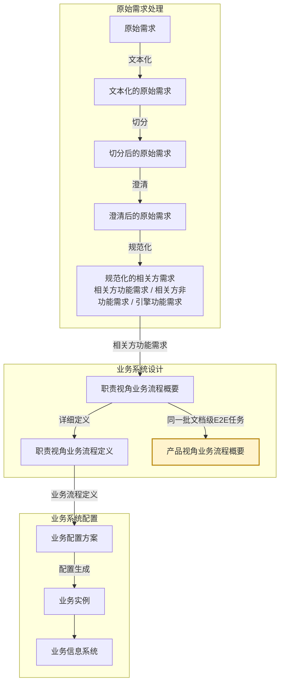

# eos-biz01abp · 职责视角业务流程概要 → 产品视角业务流程概要
**SKILL 指南ID**：biz01abp-rbpl2pbpl

> **本文件是什么**：EOS 设计线业务路径首个任务位里**产品视角这一半**的 SKILL 指南。它说明本任务这一步的 X→Y：输入文档 X 是职责视角业务流程概要，输出文档 Y 是产品视角业务流程概要，转换规则是组装规则在本需求-方案对上的实例化。
>
> **命名约定**：本文件内不设任务代号与文档编号简称——文档一律称其本名，如「职责视角业务流程概要」「产品视角业务流程概要」；相邻任务按链上位置称呼，如「原始需求处理」「职责视角业务流程任务」「职责视角业务流程定义任务」。
>
> **自足声明**：本任务的过程判据就地成文；其余一律引权威单源——
>
> - **[91 号规范《EOS平台-业务-引擎规范》](91-eos-biz-eng-spec.md)**：领域设计模式、产品数据文档结构 §11、资产对齐判据 §5.3.1、Skill 运行时协议 附录A
> - **[94 号文档《EOS 系统设计产品数据分解结构》](94-eos-sys-dev-dbs.md)**：各产品数据的树形与各级语义
> - **[00-doc-conventions《文档编写约定》](../../../00-generalspec/00-doc-conventions.md)**：表达风格 §八、Skill 文档操作流程 Step 布局约定 §十三
>
> **创建**：2026-09-16 | **版本**：第 14 版

---

## 一、目的与目标

### 1.1 主要目的

> 把职责视角已归拢的这批文档级E2E任务，按各自的产品归属与数据依赖重新归位，使每张文档作为产品数据各有其位、各得其序。

### 1.2 在设计链上的位置

EOS 业务设计链由需求到方案逐对生成，相邻两份产品数据构成一个**需求-方案对**；链分**原始需求处理**、**业务系统设计**、**业务系统配置**三段，逐段把上一段的产出转成下一段的产品数据：

**图1-1：业务设计链与本任务的位置**



本任务落在**业务系统设计**这一段的第一个需求-方案对「相关方需求 → 业务流程」上：X 是**职责视角业务流程概要**，Y 是**产品视角业务流程概要**。这个需求-方案对分两个阶段——阶段一产出业务流程概要，阶段二把概要补成业务流程定义。阶段一由两个并列任务分担、合占一个任务位。**任务位**是链上一步的位置，由一个需求-方案对与一个阶段定出。**职责视角业务流程概要**由职责视角业务流程任务产出，**产品视角业务流程概要**由本任务产出。

本任务与第一半在同一批文档级E2E任务上各长一棵树：第一半长 R 树的干枝，本任务长 P 树的干枝，末三级同批。**叶由上游直接给出，框架与概要两级合做**——一手做完，交出的**概要**是根到叶、各级只到说明，框架只是概要内部的一层截面。产品视角**没有定义形态**——页面层级的写实挂在 R 树上，本任务不产出它；框架与概要都不占需求-方案对的一端。

人类在轮内介入三处：先在 Step Start 从候选清单中选定本次处理的对象，再在 Step 2 的对话里讨论并确认方案，最后在 Step 4 的对话里裁决覆盖检查检出的缺口候选。没讨论完的方案留在 `待确认方案`，由下一轮接着讨论。

### 1.3 主要目标

在已有的产品视角业务流程概要上，把 X 已就位的文档级E2E任务按它们自带的产品归属归位，再把它们的开发秩序排出来：

1. **组装 P 树 · 由属性生成干枝**：业务域、产品级E2E业务、构件级E2E业务，逐文档判定它在这一级的位置，走三档——引用／扩展／新建。
2. **组装 P 树 · 由数据依赖归入 WBS业务**：WBS业务边界取数据依赖闭合处；再做 P 树一致性三类检查，产出 **P 树一致性结论**。
3. **标定文档级E2E任务的 P 坐标**：X 的每项文档级E2E任务逐一标定 P 坐标，即所属 产品级E2E业务 × 构件级E2E业务 × WBS业务；**本体唯一**——一张文档可被多个场景引用，只占一个产品数据位。
4. **归位与 Y 侧视图**：X 已给的文档级E2E任务、任务节点、用例场景按对位进入本文件，带同名视图。
5. **属性齐备保证**：每项文档级E2E任务的三个 P 侧属性齐备且唯一，且所属构件级E2E业务挂在其产品级E2E业务之下——归位对不对全由它们决定。
6. **覆盖检查与补充原始需求**：末三级整段进入 Y、一个不少同名同级；该构件级E2E业务应有的产品数据与本WBS业务已收的文档做名称级比对，WBS业务内数据依赖从源头贯通到交付；检出的缺口补成产品数据类补充原始需求材料，交回原始需求处理。
7. **落账与推进**：要素齐备、覆盖结论落账于节点；人类确认后推进状态，并受理上游退回与变更。

### 1.4 与上下游的衔接

**表1-1：与上下游的衔接**

| 方向 | 任务 | 交接内容 |
|------|------|---------|
| 上游，X 的来源 | 职责视角业务流程任务 | 产出 X：R 树——业务域 → 相关方角色 → 职责级E2E业务 → 岗位级E2E业务 → 文档级E2E任务 → 任务节点 → 用例场景；末三级的实体在它那份文档里；节点状态置 `可以srb设计` |
| 同级，同一任务位 | 职责视角业务流程任务 | 与本任务并列、合占一个任务位——它长 R 树的干枝，本任务在同一批文档级E2E任务上长 P 树的干枝，末三级同批 |
| 回向，补缺出口 | 原始需求处理 | 收本任务交出的产品数据类补充原始需求材料，加工成业务功能需求条目后归业务路径 |
| 下游 | 无 | 本侧止于概要、没有定义形态，链上无下游任务 |
| 产品数据 | 职责视角业务流程概要（X）／产品视角业务流程概要（Y） | 本任务读 X、写 Y |

> **P 坐标的去向**：本任务交出的 P 坐标随末三级的同名视图进入下一对。

---

## 二、输入文档结构及规则

输入文档（X） = 职责视角业务流程概要，为需求-方案对的需求侧文档。

X 由**职责视角业务流程任务**产出，根到叶，最深一级为用例场景。下图是该树的展开，树形与各级语义以 94 号文档 §2.2.1 为准；结构、字段与读写约定以 91 号规范 §11 与职责视角业务流程概要数据文件自身为准。

**图2-1：职责视角业务流程概要树**

```
职责业务 ──── 根
└── 业务域 ──── ①
    └── 相关方角色 ──── ②
        └── 职责级E2E业务 ──── ③
            └── 岗位级E2E业务 ──── ④
                └── 文档级E2E任务 ──── ⑤
                    └── 任务节点 ──── ⑥
                        └── 用例场景 ──── ⑦
```

**表2-1：X 树各级节点的意义**

| 级 | 节点 | 意义 |
|----|------|------|
| ① | 业务域 | 企业运营体系顶层按业务职能领域对其业务所作的结构分解，落在业务流程 1 级。一个业务域是围绕同一职能领域的一组业务流程与业务能力的逻辑聚类，域内聚合若干端到端项目业务 |
| ② | 相关方角色 | 在 EOS 上履职的业务运行角色，是业务对象生命周期的主推动者：提出需求、负责完成、确认结果。业务对象与主责角色一一对应，其余参与角色为配合角色，不另立节点 |
| ③ | 职责级E2E业务 | 一个相关方角色承担的职责清单，由该角色下的多个 岗位级E2E业务聚类而成。它是 R 树上唯一不出自文档级E2E任务属性的一级，随职责视角业务流程概要演进 |
| ④ | 岗位级E2E业务 | 一个主责角色的一个业务对象闭环，即职责级E2E业务中的一项端到端业务。归入哪些文档级E2E任务由端到端定：执行类从接收需求到需求被确认得到满足；管理类按计划→监控→分析→纠正完成一轮 |
| ⑤ | 文档级E2E任务 | 开发或生成文档的E2E业务，从接到文档需求开始到开发或生成满足需求的文档结束，文档级E2E任务一般包括多个步骤。一份文档（或其中一个专业内容）的开发或生成业务由单个员工承担，因此也被看做是个人级E2E业务 |
| ⑥ | 任务节点 | 文档级E2E任务一般由一个主责角色负责开发或生成，并由多个参与角色负责其他工作，比如验证、审批等，每个角色的工作被看做一个步骤，一个步骤就是一个任务节点。在信息系统中对应一个表单标签页。在 R 树上是**枝梢节点** |
| ⑦ | 用例场景 | 文档任务中的主责角色或参与角色在信息系统上开展自己负责的工作时，其操作表单标签页上提供功能按钮（右键操作项，或快捷键操作）所对应的业务。在 R 树上是**叶节点** |

**表2-2：X 树上 Y 没有对应级的节点处置**

| 级 | 节点 | 本任务如何处置 |
|----|------|--------------|
| ② | 相关方角色 | 只读——本任务不重定角色；主责角色是 R 树那一面用的坐标 |
| ③ | 职责级E2E业务 | 只读——该级随职责视角业务流程概要演进，P 树侧无此级 |
| ④ | 岗位级E2E业务 | 只读——本任务不重长 R 侧干枝；岗位级E2E业务是 R 树那一面用的坐标 |

> **文档的五个属性，不占级位**：所属业务域／所属主责角色／所属岗位级E2E业务／所属产品级E2E业务／所属构件级E2E业务随文档级E2E任务携带——这五个是 R／P 两树的坐标，在本份数据里作**索引／分片轴**，不是归集级。本任务消费其中三个：所属业务域、所属产品级E2E业务、所属构件级E2E业务；另两个是 R 树那一面用的坐标。

---

## 三、输出文档结构及规则

输出文档（Y） = 产品视角业务流程概要，为需求-方案对的方案侧文档。

### 3.1 Y 的树形结构与各级语义

本任务的 Y 是业务流程的 **P 树**，一份文档，根到叶，各级节点只到说明。**P 树（各业务域 · 产品视角）**回答「这批文档作为产品数据，属于哪个产品／构件／WBS业务、怎么生成与流转」。同一批文档级E2E任务在 **R 树**里另有一面，由职责视角业务流程任务产出。两树经**认亲**互指，末三级同名同批。

**图3-1：P 树（各业务域 · 产品视角）**

```
输出产品业务 ──── 根
└── 业务域 ──── ①
    └── 产品级E2E业务 ──── ②
        └── 构件级E2E业务 ──── ③
            └── WBS业务 ──── ④
                └── 文档级E2E任务 ──── ⑤
                    └── 任务节点 ──── ⑥
                        └── 用例场景 ──── ⑦
```

**表3-1：P 树各级节点的意义**

| 级 | 节点 | 意义 |
|----|------|------|
| ① | 业务域 | 企业运营体系顶层按业务职能领域对其业务所作的结构分解，落在业务流程 1 级。一个业务域是围绕同一职能领域的一组业务流程与业务能力的逻辑聚类，域内聚合若干端到端项目业务 |
| ② | 产品级E2E业务 | 产生或输出某一产品类型的端到端业务，从接收产品需求开始到提供满足需求的产品结束。这里的产品是广义上的产品或服务，是组织某个业务域运行其业务所产生的，向外部客户或用户，向组织外部的监管方组织或上级，或向组织内部的其他业务域提供产品或服务，如实物产品、体系资质、年度经营、人财务资源等。产品级E2E业务一般由该业务域主管部门管理，某个业务执行部门承接，因此，也成为部门级E2E业务。 |
| ③ | 构件级E2E业务 | 产生或输出某一构件类型的端到端业务，从接收构件需求开始到提供满足需求的构件结束。一个产品或服务一般包括一个系统构件与多个类型构件，同一类型构件所需的产品数据清单相同。构件级E2E业务一般是部门内一个科室独立承接或完成的。 |
| ④ | WBS业务 | 构件级E2E业务中的一段业务，是构件之产品数据序列中相互关联且耦合度较高的多个产品数据开发或生成业务，该序列中产品数据需要与其中最后一个产品数据同时被完成，最后一个产品数据在开发或生成时，可能需要对其前序产品数据进行迭代更新 |
| ⑤ | 文档级E2E任务 | 开发或生成文档的E2E业务，从接到文档需求开始到开发或生成满足需求的文档结束，文档级E2E任务一般包括多个步骤。一份文档（或其中一个专业内容）的开发或生成业务由单个员工承担，因此也被看做是个人级E2E业务 |
| ⑥ | 任务节点 | 文档级E2E任务一般由一个主责角色负责开发或生成，并由多个参与角色负责其他工作，比如验证、审批等，每个角色的工作被看做一个步骤，一个步骤就是一个任务节点。在信息系统中对应一个表单标签页。在 P 树上是**枝梢节点**，即框架的最深一级 |
| ⑦ | 用例场景 | 文档任务中的主责角色或参与角色在信息系统上开展自己负责的工作时，其操作表单标签页上提供功能按钮（右键操作项，或快捷键操作）所对应的业务。在 P 树上是**叶节点**，即概要的末级 |

> **末三级与 X 同指**：文档级E2E任务、任务节点、用例场景三级同指一张文档——在 R 树里是文档开发任务，在本树里是产品数据位。三级的**实体由职责视角业务流程概要持有**，本文件带同名视图。**认亲**即 X 里的每项文档级E2E任务逐一识别其 P 归属——产品级E2E业务 × 构件级E2E业务 × WBS业务——归位 P 树；两树靠这层互指联通，末三级同名同批。

> **平台侧的 P 树单分支**：平台自身走 **P0 树**——业务域（IT与信息化）→ 产品级E2E业务（EOS平台）→ 引擎级E2E业务（引擎）→ 配置单元业务（CU）→ 配置信息组业务，没有 WBS业务一级。平台侧的业务由引擎能力设计任务承担，本任务对其只作渐进增补。

### 3.2 Y 树各节点实现规则

本任务交出概要，各级节点判的是**结构判定**——在树上存在与否、落在哪一级。内容写到名称与说明，文档级E2E任务另写到 P 坐标与数据依赖。

**表3-2：P 树各级节点实现规则**

| 级 | 节点 | 实现规则 |
|----|------|---------|
| ① | 业务域 | **本任务产出**；R／P 两棵树各有一份节点，同值、不共享；本任务以此作认亲检索与完备对账的域边界 |
| ② | 产品级E2E业务 | **本任务产出**；P 坐标的第二位 |
| ③ | 构件级E2E业务 | **本任务产出**；P 坐标的第三位 |
| ④ | WBS业务 | **本任务产出**；本任务的新建／修订单位。**用于新建的构建规则**：WBS 归组，两条硬判据——**数据依赖链**与**完成耦合**：前序文档的正文数据成为后序文档的输入，WBS业务边界取依赖闭合处，同一条链上的文档互为输入输出，缺一张则链断 |
| ⑤ | 文档级E2E任务 | **承袭**，取自 X 的同名节点。**写到结构判定为止**——本任务标它的 P 坐标与数据依赖，不重写正文实体；正文实体在职责视角业务流程概要里，本合同带同名视图 |
| ⑥ | 任务节点 | **承袭**，取自 X 的同名节点；带同名视图取用，不另造 |
| ⑦ | 用例场景 | **承袭**，取自 X 的同名节点；带同名视图取用，不另造 |

- **收敛自查**：父节点语义覆盖子节点语义之并，即覆盖完整；同层兄弟不重叠，即兄弟互斥。新文档归不进现有WBS业务，才上溯建更高层。

### 3.3 Y 树各级节点的要素

写入 Y 的各级节点，除块头三字段——块ID、节点类型、当前状态——外，还须带齐下列各表所列要素。表中「说明」一句话简述该节点是什么、做什么，说的是这一个节点自身，与该级的级语义不同——级语义见表3-1。

**表3-3：业务域**

| 要素 | 说明 |
|------|------|
| 名称 | 该业务域的域名 |
| 说明 | 一句话说清本域的业务边界 |

**表3-4：产品级E2E业务**

| 要素 | 说明 |
|------|------|
| 名称 | 该产品级E2E业务的名称 |
| 说明 | 一句话说清本产品级E2E业务承载哪一档端到端业务输出 |

**表3-5：构件级E2E业务**

| 要素 | 说明 |
|------|------|
| 名称 | 该构件级E2E业务的名称 |
| 说明 | 一句话说清本构件级E2E业务产出哪些产品数据 |

**表3-6：WBS业务**

| 要素 | 说明 |
|------|------|
| 名称 | 该WBS业务的名称 |
| 说明 | 一句话说清本WBS业务收哪些文档级E2E任务、按什么序 |
| 数据依赖 | WBS业务内文档的序与依赖：前序文档的哪部分正文成为后序文档的输入 |
| 认亲 | 本WBS业务内每项文档级E2E任务的 P 坐标——所属 产品级E2E业务 × 构件级E2E业务 × 本WBS业务，加层级判定档位 |
| P 树一致性结论 | 归属冲突／误新建／误引用三类检查的结论 |
| 推理依据与补全说明 | 本节点哪些是推出来的、依据是什么 |
| 完备性检查结果 | 覆盖检查的结论 |
| 补充材料引用 | 缺口产出的补充原始需求材料 |
| 变更影响声明、版本号 | 本次改动波及哪些下游节点，以及本节点的版本 |

**表3-7：文档级E2E任务**

| 要素 | 说明 |
|------|------|
| 说明 | 一句话说清这份文档作为产品数据承载什么 |
| P 坐标 | 所属 产品级E2E业务 × 构件级E2E业务 × WBS业务 |
| 在WBS业务内的序位 | 本WBS业务里这份文档排第几 |
| 数据依赖 | 本张文档的输入来自WBS业务内哪张文档的哪部分正文 |
| 内联稳定标签 | 下游逐级对上的追溯键 |

**表3-8：任务节点**

| 要素 | 说明 |
|------|------|
| 说明 | 一句话说清这一步做什么 |
| 名称 | 业务语言名称 |
| 内联稳定标签 | 下游逐级对上的追溯键 |

**表3-9：用例场景**

| 要素 | 说明 |
|------|------|
| 说明 | 一句话说清这个场景操作用户在做什么 |
| 名称 | 业务语言名称 |
| 内联稳定标签 | 下游逐级对上的追溯键 |

**移交承诺**

本任务把方案节点**交出**时，承诺节点达到：

1. 状态 = `可以srb设计`，在人类「整体确认」之后；
2. 各表所列要素齐备；
3. **每项文档级E2E任务已标定 P 坐标**，认亲本体唯一；末三级的实体在职责视角业务流程概要里，本文件带同名视图、不重写实体；
4. 覆盖检查结果已落账于节点——**末三级整段进入本文件、一个不少同名同级**；**该构件级E2E业务应有的产品数据 ⊆ 本WBS业务已收的文档**，且WBS业务内数据依赖从源头贯通到交付。缺口已走补充材料回路，不是隐藏遗漏。

> **移交承诺与职责视角业务流程任务的移交承诺互为对侧**：两个并列任务合占一个任务位，本任务读它移交的 X——末三级整段搬入，干枝各长各的。本任务的受理前提分作两处：可承接对象在第二章的输入文档结构，门槛与检验在第五章的入口检验。本侧止于概要，不进入下一个需求-方案对；**P 坐标是这份承诺的交接内容**，它随末三级的同名视图进入下一个需求-方案对，由那一对取用。

---

## 四、输入到输出的过程及规则

### 4.1 X 与 Y 的对应

X 是一棵以职责业务为根的树，七级；Y 是 P 树，七级。两侧同级的只有末端三级，其余各级两面各长各的。

**表4-1：X 七级与 Y 七级的对应**

| X 的树 | Y 的树 |
|--------|--------|
| ① 业务域 | ① 业务域 |
| ② 相关方角色 | — |
| ③ 职责级E2E业务 | — |
| ④ 岗位级E2E业务 | — |
| — | ② 产品级E2E业务 |
| — | ③ 构件级E2E业务 |
| — | ④ WBS业务 |
| ⑤ 文档级E2E任务（本次的输入，带五个属性） | ⑤ 文档级E2E任务 |
| ⑥ 任务节点 | ⑥ 任务节点 |
| ⑦ 用例场景 | ⑦ 用例场景 |

> **Y 的产品级E2E业务、构件级E2E业务、WBS业务在 X 里没有对应**——它们由本任务在 Y 上长出来。
>
> **X 的相关方角色、职责级E2E业务、岗位级E2E业务在 Y 里没有对应**——它们是 R 树的干枝，本任务不重长。
>
> **X 给属性值与末三级节点**：本任务从文档级E2E任务带的五个属性里取三个值——所属业务域、所属产品级E2E业务、所属构件级E2E业务；另两个即所属主责角色、所属岗位级E2E业务，是 R 树那一面用的坐标。末三级的实体在职责视角业务流程概要里，本文件带同名视图。

### 4.2 转换过程

一次转换依次走四步。干枝与WBS业务逐级拿**同一父节点下**的已有节点作比对，判定走三档——**已有、直接引用**／**需扩展**／**无、给新建建议**（三档、WBS 归组与一致性三类的判据出处：[91 号规范 §5.3.1](91-eos-biz-eng-spec.md)）。

#### 4.2.1 第一步 · 由属性生成干枝

根上的三个属性值在 Y 上逐级落位。

**表4-2：干枝由属性落地**

| 级 | 取根上哪个属性 | 判定 | 比对范围 | 处置 |
|----|--------------|------|--------|------|
| ① 业务域 | 「所属业务域」 | P 树上有没有这个域 | — | 不在时新建，在则直接引用 |
| ② 产品级E2E业务 | 「所属产品级E2E业务」 | 这个产品级E2E业务在不在该域下 | 同域已有的产品级E2E业务 | 已有则直接引用，需扩展则改其边界，都没有则新建 |
| ③ 构件级E2E业务 | 「所属构件级E2E业务」 | 这个构件在不在该产品级E2E业务下 | 同一产品级E2E业务下的已有构件级E2E业务 | 已有则直接引用，需扩展则改其边界，都没有则新建 |

构件级E2E业务两级都要给，且必须挂在同一个产品级E2E业务之下：属性给的构件不挂在该产品级E2E业务之下的，不就地改——那是 X 的缺陷，按受理门槛的退回处置。

**需扩展时改其边界**：节点不新起，只把该级自身的说明随本批扩写——产品级E2E业务承载的端到端业务输出多了一档，或构件级E2E业务产出的产品数据多了一类。

> **三处确认都挂在 WBS业务上**——本次处理的文档经候选清单由人类选定，WBS业务边界与树收敛随方案进对话确认。

#### 4.2.2 第二步 · 由数据依赖归入 WBS业务

WBS业务不由属性给，由归组判据定。把这项文档级E2E任务归进一个WBS业务，判据是该文档与WBS业务内已有文档之间的**数据依赖**——前序文档的正文数据成为后序文档的输入。

**表4-3：WBS业务由数据依赖归组**

| 结果 | 判定 | 处置 |
|------|------|------|
| 并入已有WBS业务 | 该文档与某个已有WBS业务内的文档数据依赖闭合 | 归入该WBS业务，按依赖链排入WBS业务内序位 |
| 扩展WBS业务边界 | 该文档超出所有已有WBS业务的当前边界，但与某个WBS业务同属一条依赖链 | 扩展该WBS业务边界，重排WBS业务内序位 |
| 新建WBS业务 | 与任何已有WBS业务都不同链 | 新建WBS业务，以这张文档为首张 |

#### 4.2.3 第三步 · 生成末三级节点

X 的文档级E2E任务、任务节点、用例场景整段搬入 Y，判的是它挂到哪儿——挂到哪个构件级E2E业务下由「所属构件级E2E业务」定，归进哪个WBS业务由数据依赖定；这一步定的是复用已有的一张，还是新增一张。

**表4-4：末三级的落位**

| 级 | 判定 | 判据 | 处置 |
|----|------|------|------|
| ⑤ 文档级E2E任务 | 该WBS业务内有没有这同一张文档 | 内联稳定标签对得上——两树上同指一张文档 | 复用／新增 |
| ⑥ 任务节点 | 该文档级E2E任务下有没有这同一个任务节点 | 内联稳定标签对得上——两树上同指一个任务节点 | 复用／新增 |
| ⑦ 用例场景 | 该任务节点下有没有这同一个用例场景 | 内联稳定标签对得上——两树上同指一个用例场景 | 复用／新增 |

**文档级E2E任务不合并**——R 树上定下的这张文档是权威，它在 P 树上只对同一张：已在的复用，不在的新增；两张不同的文档级E2E任务不并成一张。该WBS业务内已有这同一张文档，就复用它，把它的节点与本次带来的逐一对上：判该文档级E2E任务下的**全部**任务节点，以及各任务节点之下的**全部**用例场景，各定复用还是新增。该WBS业务内没有这一张文档，就新增一张，X 的三级整段搬入。

**末三级的名称不另拟**：任务节点与用例场景取 X 的条目原文，不重命名、不重排、不增减；三级的实体在职责视角业务流程概要里，本文件带同名视图。**推断只及WBS业务与干枝的落位，不及节点**——X 未给的任务节点不推断，它是缺口，不在本步补。

#### 4.2.4 第四步 · 标定文档级E2E任务的 P 坐标

这项文档级E2E任务的 P 坐标由前三步定出——所属 产品级E2E业务 × 构件级E2E业务 × WBS业务，加层级判定档位。本步把它标定到 Y 上，并做 P 树一致性三类检查。

**表4-5：P 树一致性三类**

| 类 | 判定 | 处置 |
|----|------|------|
| 归属冲突 | 两项文档级E2E任务争用同一个产品数据位 | 输出冲突清单 → 待人类裁决，两条都暂不落定 |
| 误新建 | 已有可引用的产品级E2E业务／构件级E2E业务／WBS业务，本次却新建了同义的节点 | 撤新建、改直接引用，并把已有的与本次新建的合并 |
| 误引用 | 本次归位指向的节点与该文档的语义不符 | 改指正确的节点；判不出正确节点的标 `[需裁决]` 交人类 |

**「同义」与「语义不符」都按该级节点的意义判**——归位指向的产品级E2E业务／构件级E2E业务／WBS业务与该文档承载的产品数据不是同一类，即误引用。

本步产出 **P 树一致性结论**，写入WBS业务节点的同名要素。

### 4.3 并入已有 Y

这项文档级E2E任务所属的构件级E2E业务在 Y 上已有节点时，四步都按并入处理，依次做三项。

**边界匹配检查**——判本次这项文档级E2E任务是否仍落在这个 WBS业务的边界内，即是否仍与WBS业务内文档数据依赖闭合：

**表4-6：边界匹配检查**

| 结果 | 判定 | 处置 |
|------|------|------|
| 边界内 | 与WBS业务内文档数据依赖闭合 | 进入WBS业务内文档关系检测 |
| 边界扩展 | 超出当前WBS业务边界，但与WBS业务内文档同属一条依赖链 | 更新WBS业务边界 + 重排WBS业务内序位；粒度不一致时标 `[推断]` 供人类裁决 |
| 边界外 | 与WBS业务内文档不同链 | 不入本WBS业务——退回归组判定另择WBS业务；无法判定的标 `[需裁决]` 交人类 |

**WBS业务内文档关系检测**——本项文档级E2E任务判为复用后，逐文档与该WBS业务内的文档比对，以文档身份与数据依赖为准：

**表4-7：WBS业务内文档关系检测**

| 关系 | 判定 | 处置 |
|------|------|------|
| 复用 | 文档已在WBS业务内，本次带来的任务节点与用例场景已被现有节点覆盖 | 逐一对上，节点定义不动 |
| 依赖变更 | 文档已在，本次输入改变它在依赖链上的位次 | 更新WBS业务内序位与数据依赖，不新增文档 |
| 新增 | 文档不在WBS业务内 | 新增文档节点，并整理其下的任务节点与用例场景 |
| 过时 | WBS业务内已有文档本次无覆盖，且本次归位后不再落在本WBS业务范围内 | 标 `[需裁决]` 交人类——移除节点是架构决策，本任务不自行删 |

**变更影响声明与影响面复查**——本次有修订时，按 [91 号规范 §A.7.2](91-eos-biz-eng-spec.md) 判变更类型、按 §A.7.3 的格式写入节点末尾；判为修订型或结构型的，须复查被改动干枝之下的文档级E2E任务是否失配——失配的批量重归位或回退。

---

## 五、执行步骤及检验规则

一次运行起于 Step Start，依次走 Step 1~4 的设计动作，收于 Step End。

**表5-1：Step 布局总览**

| Step | 名称 | 职责 | 人类参与 | 执行模式 | 产出 | 写资产 |
|------|------|------|---------|---------|------|--------|
| Start | 为任务选择并校验输入 | 受理门槛校验、给出候选清单、检出存量节点、按状态路由 | **有**——从候选清单中选定 | 对话 | 受理结论 + 候选清单 | 职责视角业务流程概要 |
| 1 | 基于文档级E2E任务生成 P 树方案 | 读取输入；由属性生成干枝、由数据依赖归入 WBS业务、生成末三级节点、标定文档级E2E任务的 P 坐标 | 无（AI 自动） | 统一 | P 树方案 + P 树一致性结论 | — |
| 2 | 基于对话确认 P 树方案 | 列出未确认清单、讨论修改；要素机械检查后写回 | **有**——讨论与确认 | 对话 | 确认结论 + 未确认清单 | 产品视角业务流程概要 |
| 3 | 检查覆盖并补充需求 | 覆盖检查取两面；缺口生成产品数据类补充原始需求材料候选 | 无（AI 自动） | 统一 | 覆盖结论 + 缺口候选 | — |
| 4 | 基于对话确认补充需求 | 列出缺口候选、裁决去留；复跑覆盖检查后写回 | **有**——缺口裁决 | 对话 | 缺口裁决结论 + 补充材料清单 | 产品视角业务流程概要 |
| End | 给出本轮任务成果总结 | 汇总本轮写回结果、三区摘要输出 | **有**——查看结果摘要 | 对话 | 本轮成果总结 + 下一步 | — |

### 5.1 Step Start · 为任务选择并校验输入

**选定本次处理对象**——X 的物理文件以 岗位级E2E业务节点分片，每项文档级E2E任务是该节点文档序列里的一个条目。本步给出**候选清单**交人类选定：每张已在 R 树上就位、尚未在 P 树上标定 P 坐标的文档级E2E任务一行，列出它所属的 岗位级E2E业务节点与它的三个 P 侧属性。人类选定其中之一，该文档及其下的全部任务节点与用例场景一次读完、一并组装，**不跨文档成批**。

**存量节点**——待本任务处理的存量节点由入口检出，与本次选定的文档级E2E任务一并作为处理对象。其中状态为 `待确认方案` 的即上一轮没讨论完留下的方案，可以分布在 Y 的任意位置，与本轮新生成的方案按同一方式处置。

受理门槛如下，逐条判；不满足的按「判定」「动作」两列处置。

**表5-2：受理门槛（对 X）**

| 校验条件 | 判定 | 动作 |
|---------|------|------|
| 该 岗位级E2E业务节点状态 = `需biz01修订` | 不可处理 | 输出退回记录 → 退出 |
| 该节点状态 ≠ `可以srb设计` 且 ≠ `待补充srb设计` | 不可处理 | 输出当前状态 → 退出 |
| 这项文档级E2E任务的三个 P 侧属性缺标或矛盾 | 软提示 | 本次其余照常，该文档挂 `[需确认]` |
| 「所属构件级E2E业务」不是其「所属产品级E2E业务」的子节点 | 退回上游 | 输出两者路径对比 → 标 `需biz01修订` → 退出 |
| 这项文档级E2E任务的末三级与该 岗位级E2E业务节点不同名同批 | 退回上游 | 输出差异清单 → 标 `需biz01修订` → 退出 |
| 该节点缺覆盖检查结论 | 退回上游 | 输出缺项清单 → 标 `需biz01修订` → 退出 |
| 本次待处理的文档级E2E任务跨了多个构件级E2E业务 | 软提示 | 输出分布 → 人类从候选清单中选定一张，其余下一轮重试 |
| 无待处理的文档级E2E任务 + 无入口检出的存量节点 | 无待处理对象 | 输出提示 → 退出 |

R 树的组装权在职责视角业务流程任务：业务域、相关方角色、职责级E2E业务、岗位级E2E业务、文档序列、末三级的落位，都由它制定并执行，**本任务不重长 R 侧干枝**。受理门槛判为软提示的不占退回，下一轮重试。

**状态推进**——本任务写入 Y 的 `待确认方案`／`可以srb设计`／`待补充srb设计` 三个状态，并在 X 侧写 `需biz01修订`；Start 按状态路由，Step 2 在确认后写回。R 树汇入新的文档级E2E任务时，本次未处理的保持原状，已标定 P 坐标的按增量处理、版本递增。

**退回上游**：X 有缺陷、且缺陷的处置权不在本任务——P 侧属性不合、末三级与该节点对不上、该节点缺覆盖结论——标 `需biz01修订`，交回职责视角业务流程任务，本轮不再受理。

### 5.2 Step 1 · 基于文档级E2E任务生成 P 树方案

有新输入汇入，或入口检出待本任务处理的存量节点时，走本步；两者都没有时本步不走。存量节点先于新输入处理，按并入已有 Y 的方式处理。

**读取输入**——本次这一项文档级E2E任务及其下的任务节点与用例场景，文档级E2E任务上的所属业务域、所属产品级E2E业务、所属构件级E2E业务三个属性，以及同一产品级E2E业务／同域的候选存量方案节点。文档承载什么、怎么开发，是上游的事；本任务判的是它作为产品数据落在哪个构件、哪个WBS业务、哪个序位。X 是本任务唯一的外部输入，P 树即资产、就在本任务的产出里，不另读资产文档。加载读取协议是处理节点优先、逐节点加载、按需扩大，不默认加载全文。

对本次这一项文档级E2E任务，依次走四项：**由属性生成干枝、由数据依赖归入 WBS业务、生成末三级节点、标定文档级E2E任务的 P 坐标**。该文档级E2E任务所属的构件级E2E业务在 Y 上已有节点的，四项都按并入处理。

四项走完，有新增或扩展 → 自下而上调树至收敛，判据是覆盖完整 + 兄弟互斥；无法调整收敛的标 `[需裁决]` 随方案一并交 Step 2，不自定架构。X 自身的缺陷不在本步补，按受理门槛的退回处置。

**产出去向**——生成的 P 树方案与 P 树一致性结论都不作状态写入，随方案一并交 Step 2 讨论确认。

**失败处置**——属性与末三级视图不自洽、或节点 ID 定位不到的，标 `[需确认]` 交 Step 2 的对话讨论，其余照常；这项文档级E2E任务整体归位不到位的，按受理门槛的退回处置退出。

### 5.3 Step 2 · 基于对话确认 P 树方案

本步每轮都走。本步讨论确认两样——Step 1 刚生成的方案，以及状态停在 `待确认方案` 的遗留节点，两者处置一样。

**未确认清单**——把本轮新生成的方案（含 P 树一致性结论）与状态为 `待确认方案` 的遗留节点一并列出交人类讨论。这份清单就是本步的界面。

**逐条讨论与确认**——修改落在方案上即按讨论结果改；人类确认后，方案转为已确认。确认的单位是节点——一份方案一条结论，可以逐份给，也可以一次全认。

**写回前的要素机械检查**——逐文档要素非空或合理空置 + 标注齐备，含 `[推断]`／`[待下游推断]`。检查不过的就地补齐；无法补齐的说明它是结构性缺陷，回 Step 1 重排，不带不合的要素写回。

**写回**——确认即写回，按确认结果分四种情形：

**表5-3：确认后写回的四种情形**

| 对象 | 讨论结果 | 写回动作 |
|------|---------|---------|
| 本轮生成或修订的方案 | 已确认 | 写入，状态写 `可以srb设计` |
| 本轮生成或修订的方案 | 未确认 | 写入，状态写 `待确认方案`，留作下一轮的处理对象 |
| 遗留的待确认节点 | 已确认 | 推状态到 `可以srb设计`，方案本体按讨论结果改或不改 |
| 遗留的待确认节点 | 仍未确认 | 不动 |

**写回时维护状态队列与节点索引、递增节点版本号**。本任务只写 Y——产品视角业务流程概要：P 树即资产，写在 Y 里，不另立一册；认亲的结果是标定在文档级E2E任务同名视图上的 P 坐标。

**本步的特化参数**：

- **锚点需求** = 本项文档级E2E任务及其下的任务节点与用例场景，加文档级E2E任务上的三个 P 侧属性
- **操作条目** = 干枝 + WBS业务 + 末三级视图 + 文档级E2E任务的 P 坐标 + P 树一致性结论
- **推进目标** = `可以srb设计`
- **清除条件** = 已标定 P 坐标的文档级E2E任务默认跳过。本轮新输入的这项文档级E2E任务满足下列任一条件时，清除该文档的 P 坐标、使其回到待处理：本次新文档是它在WBS业务内的直接前序或后序；本次新文档与它同属一个WBS业务且数据依赖重叠；本次新文档的加入使它的WBS业务内序位被修订
- **级联触发条件** = 改动使 WBS业务的边界发生拆分、合并 → 重验受影响文档的 P 坐标，重验由 Step 3 的覆盖检查承担。改动超出本步可处理的范围 → 受影响的文档标 `[需重设计]`

**产出去向**——本步写回的方案交 Step 3 做覆盖检查。**人类参与点在本节**——讨论并确认方案与 P 树一致性结论。

**失败处置**——同一处反复退改超过一次的，停止处理，标 `[需重设计]` 留待下一轮。

### 5.4 Step 3 · 检查覆盖并补充需求

Step 1 走过就走本步；Step 2 写回后即执行本需求-方案对的关口——覆盖检查。**检查取两面**：

- **末三级这一面**——X 的文档级E2E任务、任务节点、用例场景整段进入 Y，一个不少、同名同级。
- **WBS业务这一面**——两条判据并列：**应有清单比对**，该构件级E2E业务应有的产品数据清单与本WBS业务已收的文档做名称级比对，清单上有而本WBS业务没有的即缺口；**数据依赖闭合**，WBS业务内每张文档的输入都能在WBS业务内找到来源，前一文档的正文数据成为后一文档的输入。前者管少不少，后者管接不接得上。

同一批文档级E2E任务会跨多次运行陆续汇入，故检查范围累计：每次只核本次新增部分。本次改动了已有干枝的，另按影响面复查其下已归位的部分。

**应有清单比对**按 91 号规范 §5.3.1 的缺口推断执行——逐文档名称级比对，**不依赖任务类型与引擎**；比对的基准是该构件级E2E业务应有的产品数据，在 P 树上取，即该构件级E2E业务之下已有的产品数据之并。**数据依赖闭合**按表3-2 的WBS业务构建规则核。检出缺口即缺了应有的产品数据，记 `[产品数据缺口]`，生成**产品数据类补充原始需求材料**候选，去留在 Step 4 的对话里交人类裁决。材料交原始需求处理补回，**不脑补节点**。

> **另外两类缺口不在本任务**，按锚定归属：**文档序列类**——"闭合检查核对这条业务对象闭环是否走完，缺了应有的文档级E2E任务或任务节点"，锚在业务链，归职责视角业务流程任务；**引擎类**——"用例场景逐一对照平台引擎，接不住的操作"，锚在用例场景，归职责视角业务流程定义任务，那时用例场景已有详细定义，对照才判得准。

**产出去向**——覆盖结论与缺口候选交 Step 4。本步无人类参与点。

**失败处置**——检查所依据的WBS业务内数据依赖不可读时，该节点标 `[需确认]` 交 Step 4 讨论，不静默通过。

### 5.5 Step 4 · 基于对话确认补充需求

本步每轮都走，逐条裁决 Step 3 检出的缺口候选。

**缺口候选清单**——把 Step 3 的覆盖结论与缺口候选一并列出交人类讨论：每条写明它锚在哪项文档级E2E任务或哪个 WBS业务上、缺的是哪一样。这份清单就是本步的界面。

**逐条裁决**——逐条判「需要」即落地、判「不要」即废弃；结构性改动触及缺口面的，材料留待下一轮重判。

**复跑覆盖检查**——本步每执行一处修改即复跑 Step 3 的覆盖检查，范围限被改动的节点；改动触及 WBS业务边界、或使WBS业务内依赖链重排的，按 [91 号规范 §A.5.3](91-eos-biz-eng-spec.md) 的级联处理标 `[需重设计]` 回 Step 1 重走。同一处反复退改超过一次的，停止处理，标 `[需重设计]` 留待下一轮。

**写回**——判「需要」的缺口按**产品数据类补充原始需求材料**成文，材料交原始需求处理补回；覆盖检查的结论写入该WBS业务节点的完备性检查结果，材料写入补充材料引用。

**本步的操作条目** = 补充原始需求材料候选。

**产出去向**——缺口裁决结论与补充材料清单一并交 Step End 汇总。**人类参与点在本节**——裁决缺口候选的去留。

### 5.6 Step End · 给出本轮任务成果总结

本步只汇总本轮结果并给出下一步。

**三区输出**——第一区的状态与结果摘要行就地写实：

```text
当前状态：<待确认方案 / 可以srb设计>
  本轮 P 树：<新建 / 修订 / 版本变化 / 认亲文档数>
  覆盖检查：<通过 / 检出缺口 N 处>
  补充原始需求材料：<无 / YYYYMMDD-biz01abp-批次ID-产品数据类补充原始需求材料.md>

一、未确认的方案
  <本轮未确认 N 份：节点名 + 状态；无则写「无」，下一轮运行接着讨论>

二、下一步
  本任务 → 选择新一批已在 R 树上就位、尚未标定 P 坐标的文档级E2E任务重新运行
  下游    → 本侧无下游任务；P 坐标随末三级的同名视图进入下一对
```

**收尾**——更新产品数据文档的 `HEAD @上次 AI 运行`、提交基线。

**增量标记**——`[新增]`/`[变更]`/`[确认]`/`[需裁决]` 与 `[推断]`/`[待下游推断]`/`供人类确认` 的定义与使用按 [91 号规范 §A.3.1](91-eos-biz-eng-spec.md) 执行。本任务另用到三枚：`[需确认]` 与 `[需重设计]` 按 [91 号规范 §A.3.3 与 §A.5.3](91-eos-biz-eng-spec.md) 处理；`[产品数据缺口]` 标覆盖检查检出的缺口。本任务增量清单对操作条目逐条标注，并附 P 树一致性结论段与覆盖检查结果行。

**自检清单**——一次运行收尾前，按本任务流程分组逐项核对：

- **受理**：受理门槛已校验通过；候选清单已给出、人类已选定其中一项文档级E2E任务；入口检出的存量节点已并作本次处理对象；无待处理对象已退出。
- **载入与校验**：待处理的文档级E2E任务及其下的任务节点与用例场景 + 未确认的存量方案节点 + 同一产品级E2E业务／域存量方案节点已按读取协议加载、不全载全文；三个 P 侧属性与末三级视图自洽。
- **生成**：P 树组装完成，逐级定位与直接引用／扩展／新建判定正确；WBS业务的归入判定正确、WBS业务边界取在依赖闭合处；修订转换的边界匹配／关系检测／变更影响声明已执行；文档级E2E任务、任务节点、用例场景已按属性归位；认亲逐文档标定且本体唯一；树收敛，判据是覆盖完整 + 兄弟互斥。
- **Y 侧要素**：每项文档级E2E任务齐 P 坐标、WBS业务内序位、数据依赖与内联稳定标签；任务节点与用例场景到名称级并带内联稳定标签；WBS业务节点齐数据依赖、认亲、P 树一致性结论；要素非空或合理空置。
- **确认与写回**：要素机械检查已执行；P 树方案与 P 树一致性结论已列全、逐条确认；确认结果已按表5-3 写回；状态队列与节点索引已维护、版本号已递增。
- **检查**：覆盖检查已执行、两面都取；缺口以应有清单比对与数据依赖闭合两条判据产出产品数据类补充原始需求材料候选，去留有人类裁决，**不脑补节点**。
- **补充需求确认与写回**：缺口候选已逐条裁决；本步每处改动的复跑已执行；覆盖结论已写入完备性检查结果、材料已写入补充材料引用。
- **收尾**：三区摘要已输出、下一步已给出；`HEAD @上次 AI 运行` 已更新、基线已提交。
