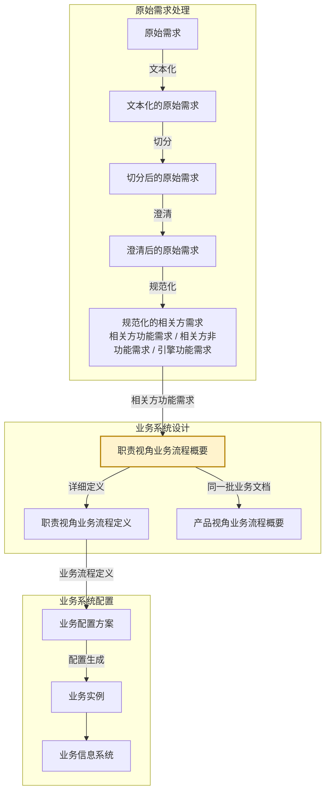
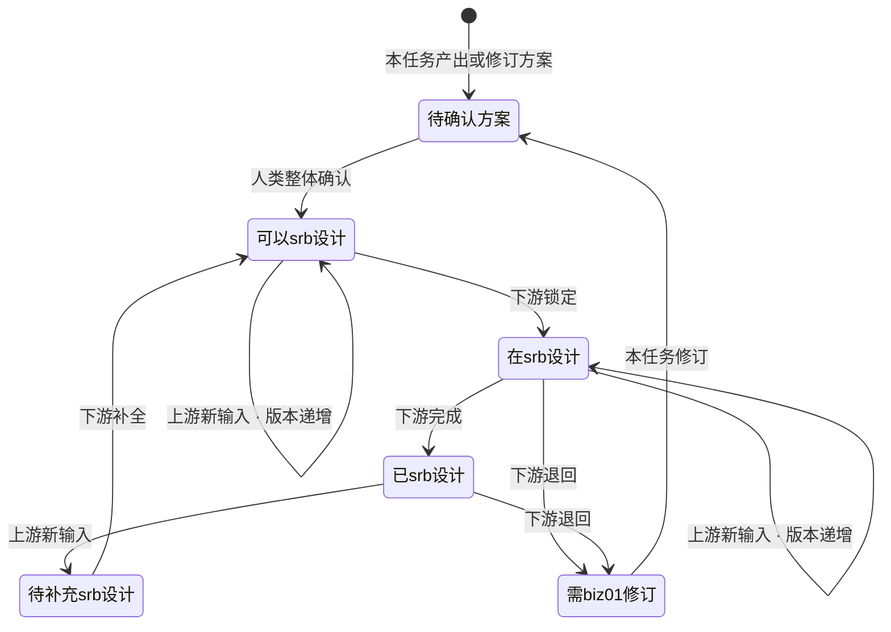

# eos-biz01abr · 相关方需求 → 职责视角业务流程概要
**SKILL 指南ID**：biz01abr-stfr2rbpl

> **本文件是什么**：EOS 设计线业务路径首个任务位里**职责视角这一半**的 SKILL 指南。它说明本任务这一步的 X→Y：输入文档 X 是相关方需求，输出文档 Y 是职责视角业务流程概要，转换规则是组装规则在本需求-方案对上的实例化。
>
> **命名约定**：本文件内不设任务代号与文档编号简称——文档一律称其本名，如「相关方需求」「职责视角业务流程概要」；相邻任务按链上位置称呼，如「原始需求处理」「职责视角业务流程定义任务」「产品开发视角业务流程任务」「引擎能力设计任务」。
>
> **自足声明**：本任务的过程判据就地成文；其余一律引权威单源——
>
> - **[91 号规范《EOS平台-业务-引擎规范》](91-eos-biz-eng-spec.md)**：领域设计模式、产品数据文档结构 §11、Skill 运行时协议 附录A
> - **[94 号文档《EOS 系统设计产品数据分解结构》](94-eos-sys-dev-dbs.md)**：各产品数据的树形与各级语义
> - **[00-doc-conventions《文档编写约定》](../../../00-generalspec/00-doc-conventions.md)**：表达风格 §八、Skill 文档操作流程 Step 布局约定 §十三
>
> **创建**：2026-09-04 | **版本**：第 75 版

---

## 一、目的与目标

### 1.1 主要目的

> 将碎片化的相关方需求组装成端到端职责业务，便于相关方理解与确认其业务过程。

### 1.2 在设计链上的位置

EOS 业务设计链由需求到方案逐对生成，相邻两份产品数据构成一个**需求-方案对**；链分**原始需求处理**、**业务系统设计**、**业务系统配置**三段，逐段把上一段的产出转成下一段的产品数据：

**图1-1：业务设计链与本任务的位置**



本任务落在**业务系统设计**这一段的首个需求-方案对「相关方需求 → 业务流程」上：X 是**相关方需求**，不分形态，末级即用例场景；Y 是**职责视角业务流程概要**。这一对分两个阶段——阶段一产出业务流程概要，阶段二把概要补成业务流程定义；阶段一由两个并列任务分担、合占一个任务位，**职责视角业务流程概要**由本任务产出，**产品视角业务流程概要**由产品开发视角业务流程任务产出。

本任务把**框架与概要合做**，两级一手做完，叶的详细定义留给下一个任务位；交出的**概要**是根到叶、各级只到说明，框架只是概要内部的一层截面。人类在两处介入：产出后「整体确认」，节点状态由 `待确认方案` 推进；覆盖检查检出缺口后，候选去留由人类裁决。

### 1.3 主要目标

在已有的职责视角业务流程概要上，把新进的相关方功能需求自上而下组装到位：业务域、相关方角色、E2E职责、业务文档先各归其位，任务节点与用例场景再整理到位。文档排出处理的序，每张文档初步定下业务实现方式。再逐 E2E职责核对业务对象闭环，没走完的补成原始需求材料，交回原始需求处理。

1. **组装 R 树高阶框架**：在已有的职责视角业务流程概要上，为输入的相关方功能需求里的业务文档确定节点位置——业务域、相关方角色、角色职责、E2E职责，以及业务文档本身。
2. **整理新业务文档之任务节点**：业务文档经合并或变更后，把该业务文档下的全部任务节点与本次带来的逐一对上，各定复用、改进还是新增。
3. **整理新任务节点之用例场景**：任务节点经合并或变更后，把该任务节点下的全部用例场景与本次带来的逐一对上，各定复用、改进还是新增。
4. **整理 E2E职责的文档序列**：排出该 E2E职责处理这批业务文档的序，并加需求明示的任务触发关系；均以业务语言表达。
5. **初步确定业务文档实现方式**：为每张业务文档给出封面模式、正文实体类型，以及支撑引擎候选——后者的权威值由下一个任务位校验落定。
6. **覆盖检查与补充原始需求**：逐 E2E职责核对它的业务对象闭环是否走完——执行类从接收需求到需求被确认得到满足，管理类按计划→监控→分析→纠正；走不完即缺了应有的业务文档或任务节点，记 `[文档序列缺口]`，生成文档序列类补充原始需求材料。

### 1.4 与上下游的衔接

**表1-1：与上下游的衔接**

| 方向 | 任务 | 交接内容 |
|------|------|---------|
| 上游，X 的来源 | 原始需求处理的规范化 | 产出 X：相关方功能需求树——业务文档 → 任务节点 → 用例场景，业务文档上落五个属性；业务功能需求条目置状态 `待处理`。X 的结构与切分、建树规则由原始需求处理与相关方需求数据文件单源 |
| 回向，补缺出口 | 原始需求处理 | 收本任务交出的补充原始需求材料，加工成业务功能需求条目后归业务路径 |
| 下游，同一任务位 | 产品开发视角业务流程任务 | 在同一批业务文档上组装 P 树；消费本任务传出的节点，状态为 `可以srb设计`；检出缺陷退回 `需biz01修订` + 缺失说明 |
| 下游，下一任务位 | 职责视角业务流程定义任务 | 取本任务传出的概要，在说明级之上补各节点的详细定义；检出缺陷退回 `需biz01修订` + 缺失说明 |

> **本任务传出的概要有两个下游**：同一任务位的**产品开发视角业务流程任务**按对位取同一批业务文档，下一个任务位在说明级之上补详细定义。两棵树的业务文档、任务节点、用例场景三级同批，实体由职责视角业务流程概要持有。
>
> **退回是反向迭代**——下游检出缺陷 → 节点标 `需biz01修订`，也就是方案迭代需求；上游需求汇入 → 节点按状态分流。

---

## 二、输入文档结构及规则

输入文档（X） = 相关方需求，为需求-方案对的需求侧文档。

X 是相关方需求中的功能需求部分，由**原始需求处理**产出。下图是该树的展开，树形与各级语义以 [94 号文档 §2.1.1](94-eos-sys-dev-dbs.md) 为准；结构、字段与读写约定以 [91 号规范 §11](91-eos-biz-eng-spec.md) 与相关方需求数据文件自身为准。

**图2-1：相关方功能需求树**

```
相关方功能需求
└── 业务文档 ──── ① 根
    └── 任务节点 ──── ②
        └── 用例场景 ──── ③
```

**表2-1：X 树各级节点的意义**

| 级 | 节点 | 意义 |
|----|------|------|
| ① | 业务文档 | 业务运行结束后应输出的产品数据文档，本质上是文档开发后生成业务，在信息系统中对应一个窗口标签页。带五个属性：所属业务域 × 所属主责角色 × 所属E2E职责 × 所属产品类型 × 所属产品构件 |
| ② | 任务节点 | 一般情况下，文档开发或生成业务包括多个步骤，一个步骤对应一个任务节点，在信息系统中对应一个表单标签页 |
| ③ | 用例场景 | 一个任务节点有多个用例场景构成，用例场景对应信息系统中的一个功能按钮、一个右键操作项，或一个功能快捷键 |

> **文档的五个属性，不占级位**：所属业务域／所属主责角色／所属E2E职责／所属产品类型／所属产品构件随业务文档携带——这五个是 R／P 两树的坐标，在本份数据里作**索引／分片轴**，不是归集级。

> **同一个文档可对应多个相关方需求**：需求捕获时，不同的相关方，其业务对象可能是同一个文档；亦或，同一个相关方对同一个文档的业务，后续可能有改进的需求。

---

## 三、输出文档结构及规则

输出文档（Y） = 职责视角业务流程概要，为需求-方案对的方案侧文档。

### 3.1 Y 的树形结构与各级语义

本任务的 Y 是业务流程的 **R 树**，一份文档，根到叶，各级节点只到说明。**R 树（各业务域 · 业务运行职责视角）**回答「某角色在哪个场景、按什么序、处理哪些业务文档，完成端到端的职责闭环」。同一批业务文档在 **P 树**里另有一面，由产品开发视角业务流程任务产出。两树经**认亲**互指，末三级同名同批。

**图3-1：R 树（各业务域 · 业务运行职责视角）**

```
职责业务 ──── 根
└── 业务域 ──── ①
    └── 相关方角色 ──── ②
        └── 角色职责 ──── ③
            └── E2E职责 ──── ④
                └── 业务文档 ──── ⑤
                    └── 任务节点 ──── ⑥
                        └── 用例场景 ──── ⑦
```

**表3-1：R 树各级节点的意义**

| 级 | 节点 | 意义 |
|----|------|------|
| ① | 业务域 | 企业运营体系顶层按业务职能领域对其业务所作的结构分解，落在业务流程 1 级。一个业务域是围绕同一职能领域的一组业务流程与业务能力的逻辑聚类，域内聚合若干端到端项目业务 |
| ② | 相关方角色 | 在 EOS 上履职的业务运行角色，是业务对象生命周期的主推动者：提出需求、负责完成、确认结果。业务对象与主责角色一一对应，其余参与角色为配合角色，不另立节点 |
| ③ | 角色职责 | 一个相关方角色承担的职责清单，由该角色下的多个 E2E职责聚类而成。它是 R 树上唯一不出自业务文档属性的一级，随职责视角业务流程概要演进 |
| ④ | E2E职责 | 一个主责角色的一个业务对象闭环，即角色职责中的一项端到端业务。归入哪些业务文档由端到端定：执行类从接收需求到需求被确认得到满足；管理类按计划→监控→分析→纠正走完一轮，即 PCA |
| ⑤ | 业务文档 | 同 X 树的同名节点。它的类型分正式与轻量，判据是有没有独立于正文 CRUD 的生命周期——需要审批流转、版本追溯、派发验收或独立状态变迁的，是**正式文档**，有封面实体；都不需要的，是**轻量文档**，无封面、正文即文档。E2E职责里第一个带任务类型的文档，其任务类型必然是计划——该 E2E职责的业务由这份计划启动（策划 → 发布）；文档本体不受此限，它仍是开发/记录类文档，正文是产品数据或管理数据，不是计划清单 |
| ⑥ | 任务节点 | 同 X 树的同名节点。在 R 树上是**枝梢节点**，即框架的最深一级 |
| ⑦ | 用例场景 | 同 X 树的同名节点。在 R 树上是**叶节点**，即概要的末级 |

> **末三级与 X 同指，实体归 Y**：业务文档、任务节点、用例场景三级与 X 指向同一张文档——**X 给出这批节点，归并成树由本任务做**；在 R／P 两棵树里它们是文档开发任务，在产品数据文件里是末三级实体的落位。三级的**实体由职责视角业务流程概要持有**，产品开发视角那份带同名视图；**认亲**，即逐文档标定 P 坐标，由产品开发视角业务流程任务做。

### 3.2 Y 树各节点实现规则

本任务交出概要，各级只写到**结构判定**为止——判它在树上存在与否、落在哪一级，不写实现内容。

**表3-2：R 树各级节点实现规则**

| 级 | 节点 | 实现规则 |
|----|------|---------|
| ① | 业务域 | **本任务产出**；R／P 两棵树各有一份节点，同值、不共享；本任务以此作定位与对账域 |
| ② | 相关方角色 | **本任务产出**；本任务以此作分片与复用宿主范围 |
| ③ | 角色职责 | **本任务产出**，随职责视角业务流程概要演进；由 AI 给出 E2E职责聚类方案，人类反馈修订建议或确认 |
| ④ | E2E职责 | **本任务产出**；本任务的新建／修订单位。**用于新建的构建规则**：识别触发 → 追踪自然终点，不得在终点之后扩展 → 闭合验证 → 边界四标准，即完整性、一致性、紧凑性、粒度匹配，产出场景职责边界陈述 |
| ⑤ | 业务文档 | **承袭**，取自 X 的「业务文档」；AI 给出方案，人类反馈意见或确认。**写到结构判定为止**——是否存在，以及它的**业务文档实现方式**：封面模式、正文实体类型、支撑引擎**候选**；封面映射、正文实体结构、支撑引擎权威值、数据权限由下一个任务位补。**文档序列构建规则**：执行类按输入-输出传递链排列，管理类按计划→监控→分析循环排列，须含计划清单文档 + 承载监控与分析环节的业务文档；需求明示的任务触发关系照录 |
| ⑥ | 任务节点 | **承袭**，取自 X 的「任务节点」；AI 给出方案，人类反馈意见或确认。**写到任务类型与节点名称**；处理角色与状态变迁由下一个任务位补 |
| ⑦ | 用例场景 | **承袭**，取自 X 的「用例场景」；AI 给出方案，人类反馈意见或确认。**写到名称**；四级页面的写实由下一个任务位补 |

- **收敛自查**：父节点语义覆盖子节点语义之并，即覆盖完整；同层兄弟不重叠，即兄弟互斥。新文档归不进现有干枝，才上溯建更高层。

### 3.3 Y 树各级节点属性

写入 Y 的各级节点，除通同项——块ID、节点类型 bpd-biz、当前状态——外，还须带齐下列各表所列要素；字段对齐 Y 的数据文件 §4.1 的模板。表中「说明」一句话简述该节点是什么、做什么，说的是这一个节点自身，与该级的级语义不同——级语义见表3-1。封面模式、正文实体类型、支撑引擎候选三项合称**业务文档实现方式**，每张业务文档一段。

**表3-3：业务域**

| 要素 | 说明 |
|------|------|
| 名称 | 该业务域的域名 |
| 说明 | 一句话说清本域的业务边界 |

**表3-4：相关方角色**

| 要素 | 说明 |
|------|------|
| 名称 | 该角色在本域内的角色名 |
| 说明 | 一句话说清本角色是谁、主责哪个业务对象 |

**表3-5：角色职责**

| 要素 | 说明 |
|------|------|
| 名称 | 该角色职责的名称 |
| 说明 | 一句话说清这份职责清单管哪些事 |
| 职责清单 | 本角色承担的职责条目 |

**表3-6：E2E职责**

| 要素 | 说明 |
|------|------|
| 说明 | 一句话说清这条端到端业务从哪起、到哪止 |
| 类型 | 执行类或管理类 |
| 主责角色 | 本 E2E职责的主推动者，与业务对象一一对应 |
| 场景职责边界陈述 | 本 E2E职责的边界——触发是什么、自然终点在哪 |
| 承接的条目引用 | 取 X 的用例场景条目引用，N:1 汇聚、**跨批追加不覆盖**，作覆盖与追溯锚点 |
| 文档序列 | 该 E2E职责下这批业务文档的处理序；需求明示的任务触发关系照录 |
| 推理依据与补全说明 | 本节点哪些是推出来的、依据是什么 |
| 完备性检查结果 | 覆盖检查的结论 |
| 补充材料引用 | 缺口产出的补充原始需求材料 |
| 变更影响声明、版本号 | 本次改动波及哪些下游节点，以及本节点的版本 |

**表3-7：业务文档**

| 要素 | 说明 |
|------|------|
| 说明 | 一句话说清这份文档承载什么 |
| 封面模式 | 正式或轻量 |
| 正文实体类型 | 该文档正文的实体类型 |
| 支撑引擎候选 | 全量标 `[推断]`，权威值由下一个任务位落定 |
| 在文档序列中的位置 | 本 E2E职责里这份文档排第几 |

**表3-8：任务节点**

| 要素 | 说明 |
|------|------|
| 说明 | 一句话说清这一步做什么 |
| 任务类型 | 计划、流程或工单 |
| 名称 | 业务语言名称 |
| 内联稳定标签 | 下游逐级对上的追溯键 |

**表3-9：用例场景**

| 要素 | 说明 |
|------|------|
| 说明 | 一句话说清这个场景操作用户在做什么 |
| 名称 | 业务语言名称 |
| 内联稳定标签 | 下游逐级对上的追溯键 |

**传出承诺**

本任务把方案节点交给下游时，承诺节点达到：

1. 状态 = `可以srb设计`，在人类「整体确认」之后；
2. 各表所列属性齐备；
3. **每张业务文档带任务节点与用例场景**，到业务语言名称级并带内联稳定标签；末三级的实体在职责视角业务流程概要里，两个下游都按对位取用；
4. 覆盖检查结果已落账于节点——**节点累计承接的**全部需求语义 ⊆ 其文档序列所能实现的范围；缺口已走补充材料回路，不是隐藏遗漏。

> **本任务的传出承诺与两个下游任务的受理前提互为对侧**；核对方法即把两侧逐条映射（[93 号规范 §4.2](93-eos-skill-guide-spec.md)）。

---

## 四、输入到输出的过程及规则

### 4.1 X 与 Y 的对应

X 是一棵以业务文档为根的树，三级；Y 是 R 树，七级。X 只给属性值与一批节点，**不给干枝**——干枝由本任务在 Y 上落出。

**表4-1：X 三级与 Y 七级的对应**

| X 的树 | Y 的树 |
|--------|--------|
| — | ① 业务域 |
| — | ② 相关方角色 |
| — | ③ 角色职责 |
| — | ④ E2E职责 |
| ① 业务文档（根，带五个属性） | ⑤ 业务文档 |
| ② 任务节点 | ⑥ 任务节点 |
| ③ 用例场景 | ⑦ 用例场景 |

> **Y 的业务域、相关方角色、角色职责、E2E职责在 X 里没有对应**——X 只给出业务文档身上的属性值，这四级的节点是由属性值在 Y 这一侧落出来的。本任务只用其中三个属性——所属业务域、所属主责角色、所属E2E职责；另两个即所属产品类型、所属产品构件，归 P 树，由产品开发视角业务流程任务消费。

### 4.2 转换过程

一次转换依次走四步。

#### 4.2.1 第一步 · 由属性生成干枝

根上的三个属性值在 Y 上逐级落位，每级拿**同一父节点下**的已有节点作比对：

**表4-2：干枝由属性落地**

| 级 | 取根上哪个属性 | 判定 | 比对范围 | 处置 |
|----|--------------|------|--------|------|
| ① 业务域 | 「所属业务域」 | 这个域在不在 | — | 不在时新建，在则不动 |
| ② 相关方角色 | 「所属主责角色」 | 这个角色在不在该域下 | 同域**同类角色** | 不存在时与同类角色合并，或新建 |
| ④ E2E职责 | 「所属E2E职责」 | 这个业务对象闭环在不在该角色下 | 同域·同角色下的已有 E2E职责 | 合并或新建，**以端到端为判据** |

次序是有依赖的：相关方角色要在"同域"内比同类角色，业务域不先落定就无从比；E2E职责要在"同域·同角色"内比已有闭环，相关方角色不先落定也无从比。所以只能自上而下逐级走。

E2E职责分两支。**合并**——新进这条闭环与同一相关方角色下已有的某个 E2E职责是同一个，并入该节点；**新建**——都不是，则新建，并按该级的构建规则把边界成文，产出**场景职责边界陈述**。

E2E职责的**类型**由需求动作词判：偏向执行的判执行类，偏向计划、监控、分析、纠正的判管理类；存疑标 `[推断]`。

> **三项人类确认都挂在 E2E职责上**——归拢条目、职责边界、收敛自查。

#### 4.2.2 第二步 · 聚类生成角色职责

Y 的角色职责在 X 里没有对应——它由相关方角色之下的 E2E职责集合聚成。本次若有 E2E职责新增或合并，给出 **E2E职责聚类方案**，即把它们归成哪几个角色职责，交人类**反馈修订建议**或确认，确认后角色职责落定；没有新增与合并，角色职责不动。

它在树上位于相关方角色与 E2E职责之间，却要等 E2E职责落定才聚得出——所以它排在长干枝之后。

#### 4.2.3 第三步 · 生成末三级节点

X 的业务文档、任务节点、用例场景整段搬入 Y，判的是它挂到哪儿。挂到哪个 E2E职责下由「所属E2E职责」定，长干枝时已落定，这一步不再判；要判的是并入已有的一张，还是新建一张。

**表4-3：末三级的落位**

| 级 | 判定 | 判据 | 处置 |
|----|------|------|------|
| ⑤ 业务文档 | 并入该 E2E职责下已有的一张，还是新建一张 | 是不是同一份业务输出的产品数据 | 并入的进下一行；新建的把 X 的三级整段搬入 |
| ⑥ 任务节点 | 与该业务文档下已有任务节点的关系 | 任务节点的名称与业务含义是否同一 | 复用 → 改进 → 新增 |
| ⑦ 用例场景 | 与该任务节点下已有用例场景的关系 | 用例场景的名称与业务含义是否同一 | 复用 → 改进 → 新增 |

该 E2E职责下已有承接这份业务的文档，就并入那一张，把它的节点与本次带来的逐一对上——判该业务文档下的**全部**任务节点，以及其中经合并或变更的任务节点之下的**全部**用例场景，各定复用、改进还是新增；该 E2E职责下没有承接它的文档，就新建一张，X 的三级整段搬入。

新建一张时不必逐个判：那张文档之下还没有已有节点可对，逐节点判定只会得出新增，与整段搬入同结果。

**任务类型**与**用例场景的名称**在这一步写出：任务类型读 X 的任务节点——明示则照判，只给出管理模式（审批、派发等）则按模式判类型，两者皆无则按业务语义推断，**推断只及类型，不及节点**：X 未给的任务节点不推断——它是缺口，不在本步补；用例场景取 X 的条目原文，不另拟名。

> **判到哪里为止**：判的是结构判定——节点在树上存在与否、落在哪一级。内容写到名称级：任务节点写到任务类型与节点名称，用例场景写到名称；三级都带内联稳定标签，作下游逐级对上的追溯键。封面映射、正文实体结构、支撑引擎权威值、数据权限、处理角色与状态变迁，以及窗口标签页、表单标签页、功能按钮的界面细节，都由下一个任务位补。

#### 4.2.4 第四步 · 确定文档序列与实现方式

这条 E2E职责有了业务文档之后，把它整成一条完整的枝。

**文档序列**——把这张业务文档排进该 E2E职责的文档序列。

**业务文档实现方式**——给这张业务文档三项：**封面模式**，需要审批流转、版本追溯、派发验收或独立状态变迁的判正式，都不需要的判轻量；**正文实体类型**，读该文档正文承载的业务对象定，如申请行、指标项行、看板条目行；**支撑引擎候选**，按文档类型匹配平台引擎（台账、工单、指标、看板、项目、WBS、计划、进展等），**全量 `[推断]`**，权威值由下一个任务位落定。

**文档清单**以 X 的业务文档为准——本任务不另立清单。

### 4.3 并入已有 Y

E2E职责在 Y 上已有节点时，第一到第四步走并入的路子，依次做三件事。

**边界匹配检查**——判本次输入的条目是否仍落在这条 E2E职责的边界内，即是否仍属同一个业务对象闭环：

**表4-4：边界匹配检查**

| 结果 | 判定 | 处置 |
|------|------|------|
| 边界内 | 全部落在现有触发到自然终点的范围内 | 进入文档序列关系检测 |
| 边界扩展 | 超出当前自然终点，但仍属同一个业务对象闭环 | 更新场景职责边界陈述 + 重追踪终点；粒度不一致时标 `[推断]` 供人类裁决 |
| 边界外 | 不属于同一个业务对象闭环 | 不入本 E2E职责——退回干枝判定另择节点；判不动的标 `[需裁决]` 交人类 |

**文档序列关系检测**——逐文档与该 E2E职责的文档序列比对，以文档名称与职责为准：

**表4-5：文档序列关系检测**

| 关系 | 判定 | 处置 |
|------|------|------|
| 确认／无新增 | 文档已在文档序列上，本次条目的语义已被现有节点覆盖 | 追加承接条目引用，节点定义不动 |
| 引擎判定变更 | 文档已在，本次条目改变它的正文特征，支撑引擎候选随之改变 | 更新支撑引擎候选，不新增文档 |
| 补充 | 文档不在文档序列上 | 新增文档节点，并整理其下的任务节点与用例场景 |
| 过时 | 文档序列上的已有文档本次无条目覆盖，且边界扩展后不再落入闭环范围 | 标 `[需裁决]` 交人类——移除节点是架构决策，本任务不自行删 |

**变更影响声明与影响面复查**——本次有修订时，按 [91 号规范 §A.7.2](91-eos-biz-eng-spec.md) 判变更类型、按 §A.7.3 的格式写入节点末尾；判为修订型或结构型的，须复查被改动干枝之下的业务文档是否失配——失配的批量重归位或回退。

---


## 五、执行步骤及检验规则

一次运行从 Step Start 的路由开始，走 Step 1~5 的设计动作，收于 Step End 的摘要输出与对话反馈；人类确认后本轮落定。**五步并非每轮都走**——有反馈才走 Step 2，有新输入或下游退回才走 Step 3，其余三步每轮都走。**本任务的检验共四处**——入口的受理门槛（Step Start）、覆盖检查（Step 4）、要素机械检查（Step 5）、收尾的自检清单（Step End）。

**表5-1：Step 布局总览**

| Step | 名称 | 职责 | 人类参与 | 执行模式 | 产出 | 写资产 |
|------|------|------|---------|---------|------|--------|
| Start | 前置校验与路由 | 变更感知 + 入口检测、受理判定、退回优先路由 | 无（AI 自动） | 统一 | 就绪 / 结束 | — |
| 1 | 设计材料加载 | 读待处理条目与同域存量方案节点 | 无（AI 自动） | 统一 | 设计材料全景 | — |
| 2 | 反馈处理 | 处理人类修改意见与整体确认 | **有**——对话修改 / 整体确认 | 对话 | 人类反馈落账 | — |
| 3 | 组装 R 树 | 长 E2E职责及其以上的干枝，定场景职责边界与文档序列，归位业务文档、任务节点、用例场景 | 无（AI 自动） | 统一 | R 树干枝 + 场景职责边界陈述 + 文档序列 + 业务文档实现方式 + 用例场景名称 | — |
| 4 | 覆盖检查与补充原始需求 | 执行覆盖检查；检出缺口生成文档序列类补充原始需求材料 | **有**——裁决候选去留 | 对话 | 闭合检查结论 + 文档序列类补充原始需求材料 | — |
| 5 | 写回与落账 | 写回产品数据、推进状态、提交基线 | 无（AI 自动） | 统一 | 状态推进 + 基线 | 职责视角业务流程概要 |
| End | 运行结束输出 | 三区摘要输出 + 人类下一步操作提示 | **有**——查看摘要、对话反馈 | 对话 | 行动清单 | — |

### 5.1 Step Start

Step Start 的固定机制——变更感知、三类入口的检测与优先序、退回门禁——按 [91 号规范 附录A](91-eos-biz-eng-spec.md) 执行；本任务在此写它这一侧的特化：受理门槛与状态推进。

受理门槛如下，逐条判；不满足的按「判定」「动作」两列处置。

**表5-2：受理门槛（对 X）**

| 校验条件 | 判定 | 动作 |
|---------|------|------|
| 条目状态 = `需退回重切` | 不可处理 | 输出退回记录 → 退出 |
| 条目状态 ≠ `待处理` | 不可处理 | 输出当前状态 → 退出 |
| 这张业务文档的五个属性缺标或矛盾 | 软提示 | 本次其余条目照常，该文档的条目挂 `[需确认]` |
| 这张业务文档下的条目不同指一个业务对象 | 退回上游 | 输出退回记录 → 标 `需退回重切` → 退出 |
| 条目类型含引擎能力功能需求 / 非功能需求 | 路由错误 | 输出类型分布 + 路由指引 → 退出 |
| 本次的 `待处理` 条目跨了多张业务文档 | 软提示 | 输出文档分布 → 本次只处理其中一张，其余下一轮重试 |
| 这张业务文档下的条目 > 10 条 | 软提示 | 输出超限提示 → 人类确认 |
| 无待处理条目 + 无待反馈 + 无退回 | 无待处理对象 | 输出提示 → 退出 |

**本任务一次受理一张业务文档**：该文档下的全部 `待处理` 条目一次读完、一并组装，不跨文档成批。

X 的切分与建树权在原始需求处理：业务对象闭环的切分、业务文档的五个属性、任务节点与条目的落位，都由它制定并执行，**本任务不重切 X、不重定属性**。受理门槛判为软提示的条目不占退回，下一轮重试。

**状态推进与退回**——本任务写入 `待确认方案`／`可以srb设计`／`待补充srb设计`／`需biz01修订` 四个状态，`在srb设计` 与 `已srb设计` 由下游写入；Start 按状态路由，Step 5 把本轮结果写回：

**图5-1：节点状态机**



上游变更，即新需求汇入，按状态分流：`可以srb设计`→版本递增，未消费；`在srb设计`→版本递增，增量处理；`已srb设计`→`待补充srb设计`→下游补全。节点生命周期与上游变更分流按 [91 号规范 §A.6](91-eos-biz-eng-spec.md) 执行。

**两种退回，方向相反**：X 有缺陷、且缺陷的处置权不在本任务（切分与建树归原始需求处理）→ 标 `需退回重切`，交回原始需求处理，本轮不再受理；Y 被下游挑出缺陷 → 标 `需biz01修订`，Start 过退回门禁后交 Step 3 走修订转换。

### 5.2 Step 1 · 设计材料加载

受理通过后即走本步：读本次这一张业务文档下全部处于 `待处理` 的业务功能需求条目，以及同一业务文档／同域的候选存量方案节点。

**判的是归属，不是内容**——不同相关方、不同时期提的需求各说各事，都落在同一张业务文档上即成立。按树定位、按属性归拢：所属业务域、所属主责角色、所属E2E职责三个属性给出这批条目在 R 树上该去的位置，另两个属性归 P 树、不在本步。

加载按 [91 号规范 §A.3.3](91-eos-biz-eng-spec.md) 读取协议——处理节点优先、逐节点加载、按需扩大，不默认加载全文。

X 的物理文件以角色分片直接挂条目；本步按条目正文语义把它们归拢到所属业务文档，标 `[待复核]`——业务文档与任务节点两级的规范化与写入归原始需求处理。

**读的是 X**——相关方需求的功能需求部分：业务文档 → 任务节点 → 用例场景，及业务文档上的五个属性。它是本任务唯一的外部输入；R 树即资产、就在本任务的产出里，不另读资产文档。

### 5.3 Step 2 · 反馈处理

存量方案节点上有人类标注而未被 `[已处理]` 的，走本步。本步先于 Step 3——新输入的匹配与设计必须基于修订后的最新内容。

人类的反馈两轨等价。**对话轨**——本步不结束对话，人类以自然语言提出意见，分四类处置：显式修改指令 → 执行修改并复查需求满足度；质疑 → 解释理由、不改；整体确认 → 全部条目追加 `[已处理]`、反馈要点写入 `## AI最近变更`、方案推进；模糊意见 → 追问到可执行。**线下轨**——人类直接在方案文档上标注或编辑，经 Step Start 的变更感知检出后，按同一套处置。

本步的特化参数，按 [91 号规范 §A.5](91-eos-biz-eng-spec.md)：

- **锚点需求** = 节点累计承接的全部业务功能需求条目，跨批追加
- **操作条目** = 场景职责边界 + 干枝 + 业务文档实现方式段 + 用例场景名称 + 补充原始需求材料候选
- **推进目标** = `可以srb设计`
- **清除条件** = 已有 `[已处理]` 的条目默认跳过；仅当本轮新输入满足任一条件时清除 `[已处理]` 使其回到待处理——新输入是该条目的直接上游，新输入与该条目同属一个架构层级且边界重叠，新输入导致条目定义被修订
- **级联触发条件** = 改动使 E2E职责的边界或干枝发生拆分、合并 → 重验受影响节点是否仍满足其承接的需求；改动超出反馈处理可处理的范围 → 受影响条目标 `[需重设计]`

### 5.4 Step 3 · 组装 R 树

有新输入汇入，或有下游退回的节点待修订时，走本步。退回的节点先于新输入处理，走并入已有 Y 的路子。对本次这一张业务文档，依次走四件：

1. **长干枝**——用这张业务文档根上的三个属性，在 R 树上自上而下落出业务域、相关方角色、E2E职责。
2. **聚角色职责**——E2E职责有新增或合并的，给出 E2E职责聚类方案，交人类反馈修订建议或确认；确认后角色职责落定。没有新增与合并，角色职责不动。
3. **末三级落位**——把业务文档连同它的任务节点与用例场景整段搬到该 E2E职责之下；该 E2E职责下已有承接这份业务的文档，就并入那一张、把它的节点与本次带来的逐一对上。落到业务语言名称级并带内联稳定标签，作下游逐级对上的追溯键。
4. **排文档序列、补业务文档实现方式**——把这张业务文档排进该 E2E职责的文档序列；给业务文档三项实现方式：封面模式、正文实体类型、支撑引擎候选（全量 `[推断]`，权威值由下一个任务位落定）。

该 E2E职责在 Y 上已有节点的，这四件另走并入的路子——先做边界匹配，再做关系检测。

四件走完，有新增或改进 → 自下而上调树至收敛，判据是覆盖完整 + 兄弟互斥；调不动的标 `[需裁决]` 交人类，不自定架构。X 自身的缺陷不在本步补，按受理门槛的退回处置。

### 5.5 Step 4 · 覆盖检查与补充原始需求

组装收尾后即走本步，执行本需求-方案对的关口——覆盖检查。**检查取两面**：

- **叶这一面**——X 的用例场景整段进入 Y，一个不少、同名同级。叶由上游直接给出，这一面是把同一批节点搬全。
- **文档序列这一面**——**节点累计承接的**全部需求语义 ⊆ 其文档序列所能实现的范围，即这批条目由该 E2E职责的业务文档兑现。

同一张业务文档的需求会在多次运行里反复到来，故检查范围累计——每次只核本次新增部分；本次改动了已有干枝，另按影响面复查其下已归位部分。

EOS 实例化即**端到端闭合检查**——执行类从接收需求到需求被确认得到满足；管理类按计划→监控→分析→纠正核对，须含计划清单文档 + 承载监控与分析环节的业务文档，这两环节的运行时推进结果不作需求缺口。

检出缺口即缺了应有的业务文档或任务节点，记 `[文档序列缺口]`，生成**文档序列类补充原始需求材料**，候选去留交**人类裁决**：判「需要」即落地，判「不要」即废弃。材料交原始需求处理补回，**不脑补节点**。

> **另外两类缺口不在本任务**，按锚定归属：**产品数据类**——"本批涉及的 WBS 包对照闭合模型，应有而缺失的产品数据"，锚在 P 树，归产品开发视角业务流程任务；**引擎类**——"用例场景逐一对照平台引擎，接不住的操作"，锚在用例场景，归职责视角业务流程定义任务，那时用例场景已有详细定义，对照才判得准。

### 5.6 Step 5 · 写回与落账

关口收尾后即走本步：把 R 树写回职责视角业务流程概要，按节点当前状态落定；写回动作与基线提交按 [91 号规范 §A.3.3 与 §A.6](91-eos-biz-eng-spec.md) 执行。

写回前做**要素机械检查**：逐文档要素非空或合理空置 + 标注齐备，含 `[推断]`／`[待下游推断]`。检查不过的就地补齐；补不上的说明它是结构性缺陷，回 Step 3 重排，不带不合的要素落账。

落账时一并维护 AI 最近变更与可处理节点两个分节，并提交基线。

**写的是 Y**——职责视角业务流程概要：R 树即资产，写在 Y 里，不另立一册。

### 5.7 Step End · 运行结束输出

Step End 的固定机制——三区摘要输出与对话反馈——按 [91 号规范 附录A](91-eos-biz-eng-spec.md) 执行；本任务在此写它这一侧的特化：三区模板的实例、增量标记与自检清单。

**三区输出**——按 [91 号规范 §A.3.2](91-eos-biz-eng-spec.md) 的三区模板填，第一区的状态与结果摘要行就地写实：

```text
当前状态：<待确认方案 / 可以srb设计>
  本轮 R 树：<新建 / 修订 / 版本变化 / 承接条目数>
  覆盖检查：<通过 / 检出缺口 N 处>
  补充原始需求材料：<无 / YYYYMMDD-biz01abr-批次ID-文档序列类补充原始需求材料.md>

一、方案反馈
  A. 整体确认 → 回复「整体确认」，快捷同意全部未标注条目
  B. 局部修改 → 在确认状态中标注 [修改]：...
  C. 驳回重做 → 在确认状态中标注 [驳回]：...

二、下一步
  本任务 → 选择新一批 `待处理` 的业务功能需求条目，或 `需biz01修订` 的节点重新运行
  下游    → 产品开发视角业务流程任务（同一批业务文档，按对位取）
           职责视角业务流程定义任务（在说明级之上补各节点的详细定义）
```

**增量标记**——`[新增]`/`[变更]`/`[确认]`/`[需裁决]` + `[推断]`/`[待下游推断]`/`供人类确认`：标记的定义与使用按 [91 号规范 §A.3.1](91-eos-biz-eng-spec.md) 执行；本任务增量清单对操作条目逐条标注，并附覆盖检查结果行。

**自检清单**——一次运行收尾前，按本任务流程分组逐项核对：

- **受理**：受理门槛已校验通过；退回优先，`需biz01修订` 的节点过门禁后走 Step 3 的修订转换；无待处理已退出。
- **载入与校验**：待处理业务功能需求 + 同一业务文档／域存量方案节点已按 [91 号规范 §A.3.3](91-eos-biz-eng-spec.md) 加载、不全载全文；条目正文与业务文档的五个属性自洽。
- **组装**：R 树组装完成，逐级定位与合并／新建判定正确——E2E职责以端到端为判据，任务节点与用例场景以名称与业务含义为判据；修订转换的边界匹配／关系检测／变更影响声明已执行；业务文档、任务节点、用例场景已按属性归位；角色职责的重聚类已交人类确认；树收敛，判据是覆盖完整 + 兄弟互斥。
- **Y 侧要素**：每张业务文档齐封面模式与正文实体类型；用例场景到名称级并带内联稳定标签；加支撑引擎候选 `[推断]`、任务关系；要素非空或合理空置。
- **关口**：覆盖检查已执行，检的是节点累计承接的全部需求语义；缺口以闭合检查产出文档序列类补充原始需求材料交原始需求处理，候选去留有人类裁决，**不脑补节点**。
- **写回**：R 树写进职责视角业务流程概要，节点状态按产出／确认／退回的实际情形落定；AI 最近变更/可处理节点分节已维护、基线已提交。
